# **58 Secure digital input/output MultiMediaCard interface (SDMMC)**

# **58.1 SDMMC main features**

The SD/SDIO, embedded MultiMediaCard (*e*•MMC) host interface (SDMMC) provides an interface between the AHB bus and SD memory cards, SDIO cards and *e*•MMC devices.

The MultiMediaCard system specifications are available through the MultiMediaCard Association website at www.jedec.org, published by the MMCA technical committee.

SD memory card and SD I/O card system specifications are available through the SD card Association website at www.sdcard.org.

The SDMMC features include the following:

- Compliance with *Embedded MultiMediaCard System Specification Version 4.51*. Card support for three different databus modes: 1-bit (default), 4-bit and 8-bit.(HS200 SDMMC\_CK speed limited to maximum allowed I/O speed)
- Full compatibility with previous versions of MultiMediaCards (backward compatibility).
- Full compliance with *SD memory card specifications version 4.1.* (SDR104 SDMMC\_CK speed limited to maximum allowed I/O speed, SPI mode and UHS-II mode not supported).
- Full compliance with *SDIO card specification version 4.0.* Card support for two different databus modes: 1-bit (default) and 4-bit. (SDR104 SDMMC\_CK speed limited to maximum allowed I/O speed, SPI mode and UHS-II mode not supported).
- Data transfer up to 208 Mbyte/s for the 8-bit mode. (depending maximum allowed I/O speed).
- Data and command output enable signals to control external bidirectional drivers.

The MultiMediaCard/SD bus connects cards to the host.

The current version of the SDMMC supports only one SD/SDIO/*e*•MMC card at any one time and a stack of *e*•MMC.

# **58.2 SDMMC implementation**

**Table 472. SDMMC features** 

| SDMMC modes/features(1)        | SDMMC1 | SDMMC2 |
|--------------------------------|--------|--------|
| Variable delay (SDR104, HS200) | X      | X      |
| SDMMC_CKIN                     | X      | -      |
| SDMMC_CDIR, SDMMC_D0DIR        | X      | -      |
| SDMMC_D123DIR                  | X      | -      |
| MDMA data transfer end         | X      | -      |
| MDMA command end               | X      | -      |
| MDMA buffer end                | X      | -      |


1. X = supported.

# 58.3 SDMMC bus topology

Communication over the bus is based on command/response and data transfers.

The basic transaction on the SD/SDIO/e•MMC bus is the command/response transaction. These types of bus transaction transfer their information directly within the command or response structure. In addition, some operations have a data token.

Data transfers are done in the following ways:

- Block mode: data block(s) with block size 2<sup>N</sup> bytes with N in the range 0-14.
- SDIO multibyte mode: single data block with block size range 1-512 bytes
- e•MMC Stream mode: continuous data stream

Data transfers to/from e•MMC cards are done in data blocks or streams.

Figure 742. SDMMC "no response" and "no data" operations

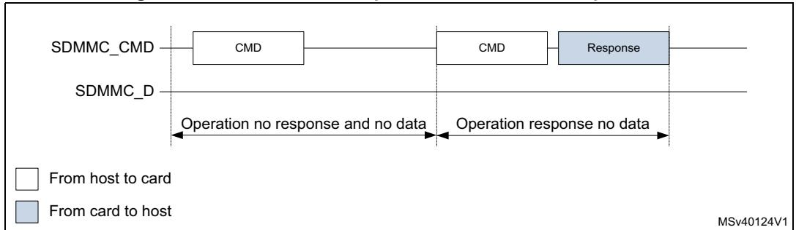

Figure 743. SDMMC (multiple) block read operation

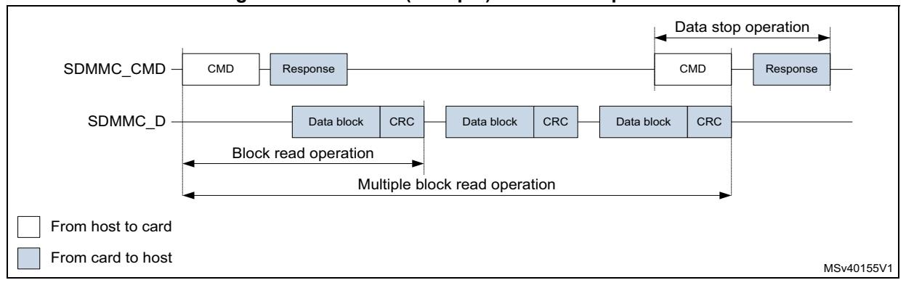

Note: The Stop Transmission command is not required at the end of a e•MMC multiple block read with predefined block count.

Data stop operation SDMMC\_CMD -Response CMD Response CRC CRC SDMMC D Busy Busy Data block Data block Block write operation Multiple block write operation From host to card From card to host MSv40156V1

Figure 744. SDMMC (multiple) block write operation

Note: 7

The Stop Transmission command is not required at the end of an e-MMC multiple block

write with predefined block count.

Note: The SDMMC does not send any data as long as the Busy signal is asserted (SDMMC\_D0

pulled low).

SDMMC\_CMD CMD Response CMD Response CMD Response Stream read operation

Stream read operation

From host to card

From card to host

Figure 745. SDMMC (sequential) stream read operation


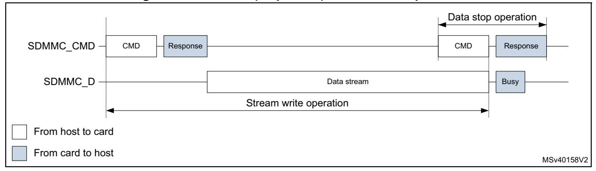

Stream data transfer operates only in a 1-bit wide bit bus configuration on SDMMC\_D0 in single data rate modes (DS, HS, and SDR).

MSv40157V2

# **58.4 SDMMC operation modes**

**Table 473. SDMMC operation modes SD and SDIO**

| SDIO Bus Speed modes(1)(2) | Max Bus Speed (3)<br>[Mbyte/s] | Max Clock frequency<br>[MHz](4) | Signal Voltage<br>[V] |
|----------------------------|--------------------------------|---------------------------------|-----------------------|
| DS (Default Speed)         | 12.5                           | 25                              | 3.3                   |
| HS (High Speed)            | 25                             | 50                              | 3.3                   |
| SDR12                      | 12.5                           | 25                              | 1.8                   |
| SDR25                      | 25                             | 50                              | 1.8                   |
| DDR50                      | 50                             | 50                              | 1.8                   |
| SDR50                      | 50                             | 100                             | 1.8                   |
| SDR104                     | 104                            | 208                             | 1.8                   |

- 1. SDR single data rate signaling.
- 2. DDR double data rate signaling. (data is sampled on both SDMMC\_CK clock edges).
- 3. SDIO bus speed with 4bit bus width.
- 4. Maximum frequency depending on maximum allowed IO speed.

SDR104 mode requires variable delay support using sampling point tuning. The use of variable delay is optional for SDR50 mode.

**Table 474. SDMMC operation modes** *e***•MMC**

| e•MMC bus speed modes (1)(2) | Max bus speed (3)<br>[Mbyte/s] | Max clock frequency<br>[MHz](4) | Signal voltage<br>[V](5) |
|------------------------------|--------------------------------|---------------------------------|--------------------------|
| Legacy compatible            | 26                             | 26                              | 3/1.8/1.2V               |
| High speed SDR               | 52                             | 52                              | 3/1.8/1.2V               |
| High speed DDR               | 104                            | 52                              | 3/1.8/1.2V               |
| High speed HS200             | 200                            | 200                             | 1.8/1.2V                 |

- 1. SDR single data rate signaling.
- 2. DDR double data rate signaling. (data is sampled on both SDMMC\_CK clock edges).
- 3. *e*•MMC bus speed with 8bit bus width.
- 4. Maximum frequency depending on maximum allowed I/O speed.
- 5. Supported signal voltage level depends on I/O port characteristics, refer to device datasheet.

HS200 mode requires variable delay support using sampling point tuning.

# **58.5 SDMMC functional description**

The SDMMC consists of four parts:

- The AHB slave interface accesses the SDMMC adapter registers, and generates interrupt signals and IDMA control signals.
- The SDMMC adapter block provides all functions specific to the *e*•MMC/SD/SD I/O card such as the clock generation unit, command and data transfer.
- The internal DMA (IDMA) block with its AHB master interface.
- A delay block (DLYB) taking care of the receive data sample clock alignment. The delay block is NOT part of the SDMMC. A delay block is mandatory when supporting SDR104 or HS200.

# **58.5.1 SDMMC block diagram**

*[Figure 747](#page-4-0)* shows the SDMMC block diagram.

<span id="page-4-0"></span>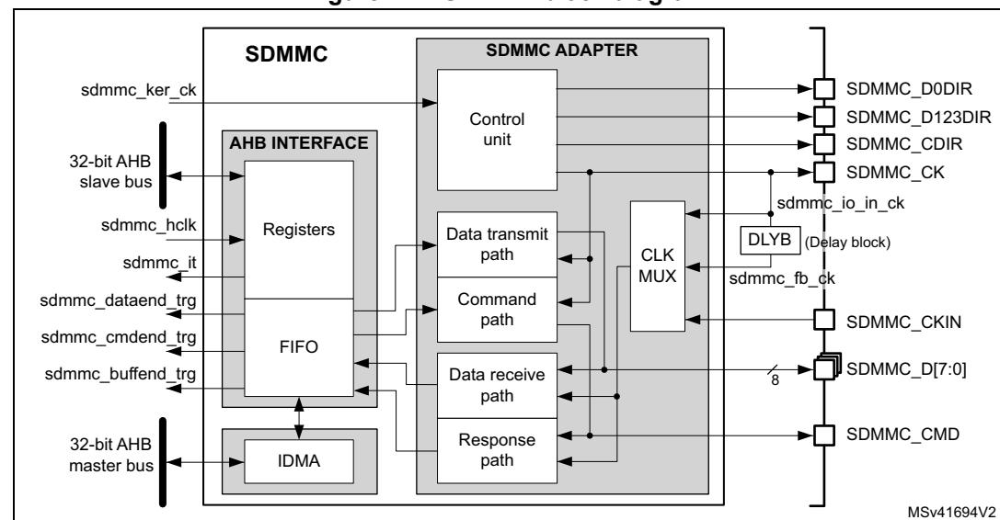

**Figure 747. SDMMC block diagram**

# **58.5.2 SDMMC pins and internal signals**

*[Table 475](#page-4-1)* lists the SDMMC internal input/output signals, *[Table 476](#page-5-0)* the SDMMC pins (alternate functions).

<span id="page-4-1"></span>

| Signal name                         | Signal type    | Description                        |
|-------------------------------------|----------------|------------------------------------|
| sdmmc_ker_ck                        | Digital input  | SDMMC kernel clock                 |
| sdmmc_hclk                          | Digital input  | AHB clock                          |
| sdmmc_it                            | Digital output | SDMMC global interrupt             |
| sdmmc_dataend_trg<br>Digital output |                | SDMMC data end trigger for MDMA    |
| sdmmc_cmdend_trg                    | Digital output | SDMMC command end trigger for MDMA |

**Table 475. SDMMC internal input/output signals** 

| Signal name       | Signal type    | Description                                                                                                             |
|-------------------|----------------|-------------------------------------------------------------------------------------------------------------------------|
| sdmmc_buffend_trg | Digital output | SDMMC internal DMA buffer end trigger for MDMA                                                                          |
| sdmmc_io_in_ck    | Digital input  | SD/SDIO/e•MMC card feedback clock. This signal is<br>internally connected to the SDMMC_CK pin (for DS<br>and HS modes). |
| sdmmc_fb_ck       | Digital input  | SD/SDIO/e•MMC card tuned feedback clock after<br>DLYB delay block (for SDR50, DDR50, SDR104,<br>HS200)                  |

**Table 475. SDMMC internal input/output signals (continued)**

**Table 476. SDMMC pins** 

<span id="page-5-0"></span>

| Signal name   | Signal type             | Description                                                                                        |
|---------------|-------------------------|----------------------------------------------------------------------------------------------------|
| SDMMC_CK      | Digital output          | Clock to SD/SDIO/e•MMC card                                                                        |
| SDMMC_CKIN    | Digital input           | Clock feedback from an external driver for SD/SDIO/e•MMC<br>card. (for SDR12, SDR25, SDR50, DDR50) |
| SDMMC_CMD     | Digital<br>input/output | SD/SDIO/e•MMC card bidirectional command/response signal.                                          |
| SDMMC_CDIR    | Digital output          | SD/SDIO/e•MMC card I/O direction indication for the<br>SDMMC_CMD signal.                           |
| SDMMC_D[7:0]  | Digital<br>input/output | SD/SDIO/e•MMC card bidirectional data lines.                                                       |
| SDMMC_D0DIR   | Digital output          | SD/SDIO/e•MMC card I/O direction indication for the<br>SDMMC_D0 data line.                         |
| SDMMC_D123DIR | Digital output          | SD/SDIO/e•MMC card I/O direction indication for the data lines<br>SDMMC_D[3:1].                    |

# **58.5.3 General description**

The **SDMMC\_D[7:0]** lines have different operating modes:

- By default, SDMMC\_D0 line is used for data transfer. After initialization, the host can change the databus width.
- For an *e*•MMC, 1-bit (SDMMC\_D0), 4-bit (SDMMC\_D[3:0]) or 8-bit (SDMMC\_D[7:0]) data bus widths can be used.
- For an SD or an SDIO card, 1-bit (SDMMC\_D0) or 4-bit (SDMMC\_D[3:0]) can be used. All data lines operate in push-pull mode.

To allow the connection of an external driver (a voltage switch transceiver), the direction of data flow on the data lines is indicated with I/O direction signals. The **SDMMC\_D0DIR** signal indicates the I/O direction for the SDMMC\_D0 data line, the **SDMMC\_D123DIR** for the SDMMC\_D[3:1] data lines.

**SDMMC\_CMD** only operates in push-pull mode:

To allow the connection of an external driver (a voltage switch transceiver), the direction of data flow on the SDMMC\_CMD line is indicated with the I/O direction signal **SDMMC\_CDIR**.


SDMMC CK clock to the card originates from sdmmc ker ck:

- When the sdmmc\_ker\_ck clock has 50 % duty cycle, it can be used even in bypass mode (CLKDIV = 0).
- When the sdmmc\_ker\_ck duty cycle is not 50 %, the CLKDIV must be used to divide it by 2 or more (CLKDIV > 0).
- The phase relation between the SDMMC\_CMD / SDMMC\_D[7:0] outputs and the SDMMC\_CK can be selected through the NEGEDGE bit. The phase relation depends on the CLKDIV, NEGEDGE, and DDR settings. See Figure 748.

<span id="page-6-0"></span>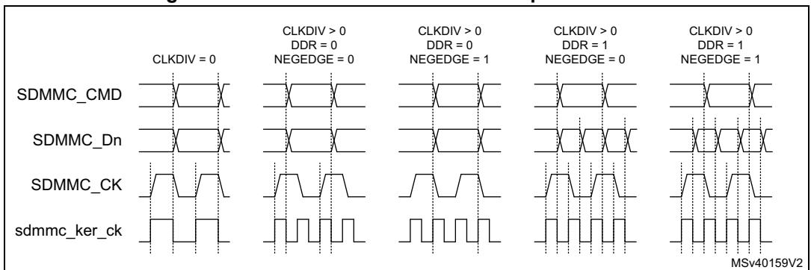

Figure 748. SDMMC Command and data phase relation

Table 477. SDMMC Command and data phase selection

| CLKDIV | DDR | NEGEDGE | SDMMC_CK                                    | Command out                                                                              | Data out                                 |  |
|--------|-----|---------|---------------------------------------------|------------------------------------------------------------------------------------------|------------------------------------------|--|
| 0      | х   | х       | =<br>sdmmc_ker_ck                           | generated on sdmmc_ker_ck falling edge                                                   |                                          |  |
|        | 0   | 0       | generated on<br>sdmmc_ker_ck<br>rising edge | generated on sdmmc_ker_ck falling edge succeeding the SDMMC_CK rising edge.              |                                          |  |
| >0     |     | 1       |                                             | generated on the same sdmmc_ker_ck rising edge that generates the SDMMC_CK falling edge. |                                          |  |
|        | 1   | 0       |                                             | generated on sdmmc_ker_ck falling edge succeeding the SDMMC_CK rising edge.              | generated on sdmmc_ker_ck                |  |
|        |     | 1       |                                             | generated on the same sdmmc_ker_ck rising edge that generates the SDMMC_CK falling edge. | falling edge succeeding a SDMMC_CK edge. |  |

By default, the **sdmmc\_io\_in\_ck** feedback clock input is selected for sampling incoming data in the SDMMC receive path. It is derived from the SDMMC\_CK pin.

For tuning the phase of the sampling clock to accommodate the receive data timing, the DLYB delay block available on the device can be connected between <code>sdmmc\_io\_in\_ck</code> signal (DLYB input dlyb\_in\_ck) and <code>sdmmc\_fb\_ck</code> clock input of SDMMC (DLYB output dlyb\_out\_ck). Selecting the <code>sdmmc\_fb\_ck</code> clock input in the receive path then enables using the phase-tuned sampling clock for the incoming data. This is required for SDMMC to support the SDR104 and HS200 operating mode and optional for SDR50 and DDR50 modes.


RM0399 Rev 4 2537/3556

When using an external driver (a voltage switch transceiver), the SDMMC\_CKIN feedback clock input can be selected to sample the receive data.

For an SD/SDIO/*e*•MMC card, the clock frequency can vary between 0 and 208 MHz (limited by maximum I/O speed).

Depending on the selected bus mode (SDR or DDR), one bit or two bits are transferred on SDMMC\_D[7:0] lines with each clock cycle. The SDMMC\_CMD line transfers only one bit per clock cycle.

# **58.5.4 SDMMC adapter**

The SDMMC adapter (see *[Figure 747: SDMMC block diagram](#page-4-0)*) is a multimedia/secure digital memory card bus master that provides an interface to a MultiMediaCard stack or to a secure digital memory card. It consists of the following subunits:

- Control unit
- Data transmit path
- Command path
- Data receive path
- Response path
- Receive data path clock multiplexer
- Delay block (DLYB), external to the SDMMC
- Adapter register block
- Data FIFO
- Internal DMA (IDMA)

*Note: The adapter registers and FIFO use the AHB clock domain (sdmmc\_hclk). The control unit, command path and data transmit path use the SDMMC adapter clock domain (sdmmc\_ker\_ck). The response path and data receive path use the SDMMC adapter feedback clock domain from the sdmmc\_io\_in\_ck, or SDMMC\_CKIN, or from the sdmmc\_fb\_ck generated by DLYB.*

> The DLYB delay block on the device can be used in conjunction with the SDMMC adapter, to tune the phase of the sampling clock for incoming data in SDMMC receive mode. It is required for the SDMMC to support the SDR104 and HS200 operating mode and optional for SDR50 and DDR50 modes.

### **Adapter register block**

The adapter register block contains all system control registers, the SDMMC command and response registers and the data FIFO.

This block also generates the signals from the corresponding bit location in the SDMMC Clear register that clear the static flags in the SDMMC adapter.

# **Control unit**

The control unit illustrated in *[Figure 749](#page-8-0)*, contains the power management functions, the SDMMC\_CK clock management with divider, and the I/O direction management.


<span id="page-8-0"></span>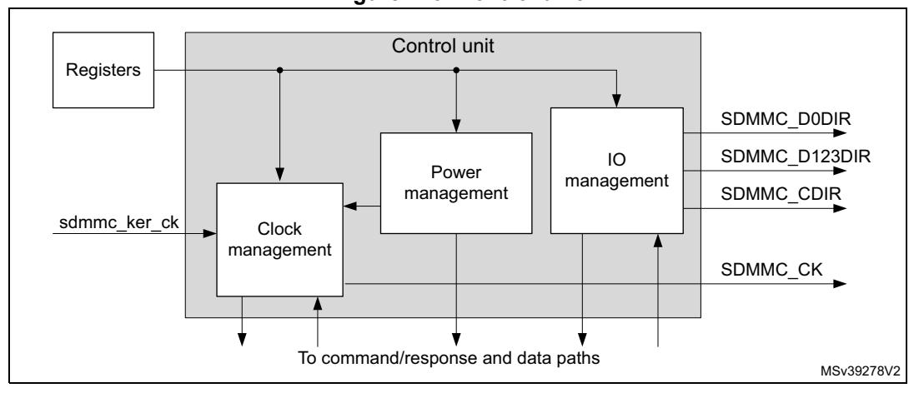

**Figure 749. Control unit**

The power management subunit disables the card bus output signals during the power-off and power-up phases.

There are three power phases:

- power-off
- power-up
- power-on

The clock management subunit uses the sdmmc\_ker\_ck to generate the SDMMC\_CK and provides the division control. It also takes care of stopping the SDMMC\_CK for i.e. flow control.

The clock outputs are inactive:

- after reset
- during the power-off or power-up phases
- if the power saving mode (register bit PWRSAV) is enabled and the card bus is in the Idle state for eight clock periods. The clock is stopped eight cycles after both the command/response CPSM and data path DPSM subunits have enter the Idle phase. The clock is restarted when the command/response CPSM or data path DPSM is activated (enabled).

The I/O management subunit takes care of the SDMMC\_Dn and SDMMC\_CMD I/O direction signals, which controls the external voltage transceiver.

### **Command/response path**

The command/response path subunit transfers commands and responses on the SDMMC\_CMD line. The command path is clocked on the SDMMC\_CK and sends commands to the card,. The response path is clocked on the sdmmc\_rx\_ck and receives responses from the card.


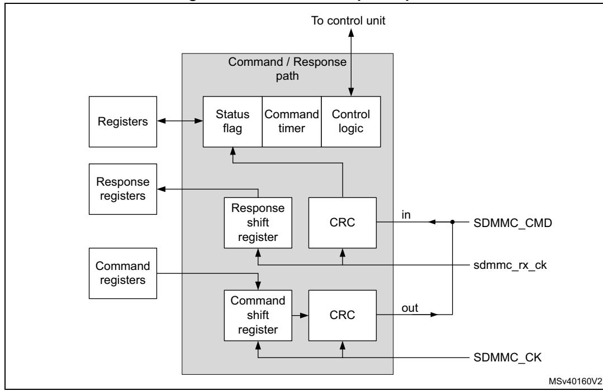

**Figure 750. Command/response path**

Command/response path state machine (CPSM)

- When the command register is written to and the enable bit is set, command transfer starts. When the command has been sent the CRC is appended and the command path state machine (CPSM) sets the status flags and:
  - if a response is not required enters the Idle state.
  - If a response is required, it waits for the response.
- When the response is received,
  - for a response with CRC, the received CRC code and the internally generated code are compared, and the appropriate status flag is set according the result.
  - for a response without CRC, no CRC is checked, and the appropriate status flag is not set.

When ever the CPSM is active, i.e. not in the Idle state, the CPSMACT bit is set.

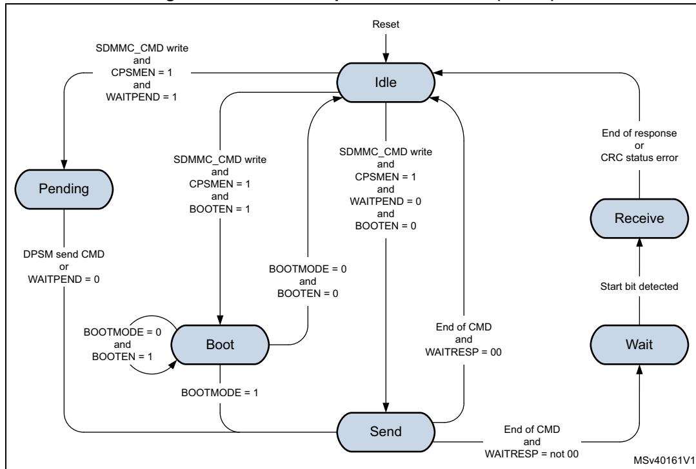

**Figure 751. Command path state machine (CPSM)**

- **Idle**: The command path is inactive. When the command control register is written and the enable bit (CPSMEN) is set, the CPSM activates the SDMMC\_CK clock (when stopped due to power save PWRSAV bit) and moves
  - to the Send state when WAITPEND = 0 and BOOTEN = 0.
  - to the Pending state when WAITPEND = 1.
  - to the Boot state when BOOTEN = 1.
- **Send**: The command is sent and the CRC is appended.
  - When CMDTRANS bit is set or when BOOTEN bit is set and BOOTMODE is alternative boot, and the DTDIR = receive, the CPSM DataEnable signal is issued to the DPSM at the end of the command.
  - When the CMDTRANS bit is set and the CMDSUSPEND bit is 0 the interrupt period is terminated at the end of the command.
  - When CMDSTOP bit is set the CPSM Abort signal is issued to the DPSM at the end of the command.
  - If no response is expected (WAITRESP = 00) the CPSM moves to the Idle state and the CMDSENT flag is set. When BOOTMODE = 1 and BOOTEN = 0 the CMDSENT flag is delayed 56 cycles after the command end bit, otherwise the


- CMDSENT flag is generated immediately after the command end bit. The RESPCMDR and RESPxR registers are not modified.
- If a command response is expected (WAITRESP = not 00) the CPSM moves to the Wait state and start the response timeout.
- **Wait**: The command path waits for a response.
  - When WAITINT bit is 0 the command timer starts running and the CPSM waits for a start bit.
  - a) If a start bit is detected before the timeout the CPSM moves to the Receive state.
  - b) If the timeout is reached before the CPSM detect a response start bit, the timeout flag (CTIMEOUT) is set and the CPSM moves to the Idle state. The RESPCMDR and RESPxR registers are not modified.
  - When WAITINT bit is 1, the timer is disabled and the CPSM waits for an interrupt request (response start bit) from one of the cards.
  - a) When a start bit is detected the CPSM moves to the Receive state.
  - b) When writing WAITINT to 0 (interrupt mode abort), the host sends a response by its self and on detecting the start bit the CPSM move to the Receive state.
- **Receive**: The command response is received. Depending the response mode bits WAITRESP in the command control register, the response can be either short or long, with CRC or without CRC. The received CRC code when present is verified against the internally generated CRC code.
  - When the CMDSUSPEND bit is set and the SDIO Response bit BS = 0 (response bit [39]), the interrupt period is started after the response. When the CMDSUSPEND bit is cleared, or the CMDSUSPEND bit is 1 and the SDIO Response bit BS = 1 (response bit [39]), there is no interrupt period started.
  - When the CMDTRANS bit is set and the CMDSUSPEND bit is set and the SDIO Response bit DF= 1 (response bit [32]) the interrupt period is terminated after the response.
  - When the CRC status passes or no CRC is present the CMDREND flag is set, the CPSM moves to the Idle state.
    - The RESPCMDR and RESPxR registers are updated with received response.
    - When BOOTMODE = 1 and BOOTEN = 0 the CMDREND flag is delayed 56 cycles after the response end bit, otherwise the CMDREND flag is generated immediately after the response end bit.
    - When CMDTRANS bit is set and the DTDIR = transmit, the CPSM DataEnable signal is issued to the DPSM at the end of the command response.
  - When the CRC status fails the CCRCFAIL flag is set and the CPSM moves to the Idle state.
    - The RESPCMDR and RESPxR registers are updated with received response.
- **Pending**: According the pending WAITPEND bit in the command register, the CPSM enters the pending state.
  - When DATALENGTH =< 5 bytes the CPSM moves to the Sent state and generates the DataEnable signal to start the data transfer aligned with the CMD12 Stop Transmission command.
  - When DATALENGTH > 5 bytes, the CPSM DataEnable signal is issued to the DPSM to start the data transfer. The CPSM waits for a send CMD signal from the


DPSM before moving to the Send state. This enables i.e. the CMD12 Stop Transmission command to be sent aligned with the data.

- When writing WAITPEND to 0, the CPSM moves to the Send state.
- **Boot**: If the BOOTEN bit is set in the command register, the CPSM enters the Boot state, and when:
  - BOOTMODE = 0 the SDMMC\_CMD line is driven low and when CMDTRANS bit is set and the DTDIR = receive, the CPSM DataEnable signal is issued to the DPSM. This enables normal boot operation. This state is left at the end of the boot procedure by clearing the register bit BOOTEN, which cause the SDMMC\_CMD line to be driven high and the CPSM Abort signal is issued to the DPSM, before moving to the Idle state. The CMDSENT flag is generated 56 cycles after SDMMC\_CMD line is high.
  - BOOTMODE = 1, move to the Send state. This enables sending of the CMD0 (boot). Clearing BOOTEN has no effect.

Note: The CPSM remains in the Idle state for at least eight SDMMC\_CK periods to meet the  $N_{CC}$  and  $N_{RC}$  timing constraints.  $N_{CC}$  is the minimum delay between two host commands, and  $N_{RC}$  is the minimum delay between the host command and the card response.

Note: The response timeout has a fixed value of 64 SDMMC CK clock periods.

A command is a token that starts an operation. Commands are sent from the host to either a single card (addressed command) or all connected cards (broadcast command are available for e•MMC V3.31 or previous). Commands are transferred serially on the SDMMC\_CMD line. All commands have a fixed length of 48 bits. The general format for a command token for SD-Memory cards, SDIO cards, and e•MMC cards is shown in *Table* 478

The command token data is taken from 2 registers, one containing a 32-bits argument and the other containing the 6-bits command index (six bits sent to a card).

<span id="page-12-0"></span>

| Bit position | Width | Value | Description      |
|--------------|-------|-------|------------------|
| 47           | 1     | 0     | Start bit        |
| 46           | 1     | 1     | Transmission bit |
| [45:40]      | 6     | Х     | Command index    |
| [39:8]       | 32    | х     | Argument         |
| [7:1]        | 7     | Х     | CRC7             |
| 0            | 1     | 1     | End bit          |

Table 478. Command token format

Next to the command data there are command type (WAITRESP) bits controlling the command path state machine (CPSM). These bits also determine whether the command requires a response, and whether the response is short (48 bit) or long (136 bits) long, and if a CRC is present or not.

A response is a token that is sent from an addressed card or synchronously from all connected cards to the host as an answer to a previous received command. All responses are sent via the command line SDMMC\_CMD. The response transmission always starts with the left bit of the bit string corresponding to the response code word. The code length depends on the response type. Response tokens R1, R2, R3, R4, R5, and R6 have various


RM0399 Rev 4 2543/3556

coding schemes, depending on their content. The general formats for the response tokens for SD-Memory cards, SDIO cards, and *e*•MMC cards are shown in *[Table 479](#page-13-0)*, *[Table 480](#page-13-1)* and *[Table 481](#page-13-2)*.

A response always starts with a start bit (always 0), followed by the bit indicating the direction of transmission (card = 0). A value denoted by x in the tables below indicates a variable entry. Most responses, except some, are protected by a CRC. Every command code word is terminated by the end bit (always 1).

The response token data is stored in 5 registers, four containing the 32-bits card status, OCR register, argument or 127-bits CID or CSD register including internal CRC, and one register containing the 6-bits command index.

<span id="page-13-0"></span>**Bit position Width Value Description** 47 1 0 Start bit 46 1 0 Transmission bit [45:40] 6 x Command index (or reserved 111111) [39:8] 32 x Argument [7:1] 7 x CRC7 0 1 1 End bit

**Table 479. Short response with CRC token format** 

<span id="page-13-1"></span>

| Bit position | Width | Value   | Description                        |  |
|--------------|-------|---------|------------------------------------|--|
| 47           | 1     | 0       | Start bit                          |  |
| 46           | 1     | 0       | Transmission bit                   |  |
| [45:40]      | 6     | x       | Command index (or reserved 111111) |  |
| [39:8]       | 32    | x       | Argument                           |  |
| [7:1]        | 7     | 1111111 | (reserved 1111111)                 |  |
| 0            | 1     | 1       | End bit                            |  |

**Table 481. Long response with CRC token format** 

<span id="page-13-2"></span>

| Bit position | Width | Value  | Description                   |  |
|--------------|-------|--------|-------------------------------|--|
| 135          | 1     | 0      | Start bit                     |  |
| 134          | 1     | 0      | Transmission bit              |  |
| [133:128]    | 6     | 111111 | Reserved                      |  |
| [127:1]      | 127:8 | x      | CID or CSD slices             |  |
|              | 7:1   | x      | CRC7 (included in CID or CSD) |  |
| 0            | 1     | 1      | End bit                       |  |

The command/response path operates in a half-duplex mode, so that either commands can be sent or responses can be received. If the CPSM is not in the Send state, the


SDMMC\_CMD output is in the Hi-Z state. Data sent on SDMMC\_CMD are synchronous with the SDMMC\_CK according the NEGEDGE register bit see *[Figure 748](#page-6-0)*.

The command and short response with CRC, the CRC generator calculates the CRC checksum for all 40 bits before the CRC code. This includes the start bit, transmission bit, command index, and command argument (or card status).

For the long response the CRC checksum is calculated only over the 120 bits of R2 CID or CSD. Note that the start bit, transmission bit and the six reserved bits are not used in the CRC calculation.

The CRC checksum is a 7-bit value:

```
CRC[6:0] = remainder [(M(x) * x7) / G(x)]
G(x) = x7 + x3 + 1
M(x) = (first bit) * xn + (second bit) * xn-1+... + (last bit before CRC) * x0
Where n = 39 or 119.
```

The CPSM can send a number of specific commands to handle various operating modes when CPSMEN is set, see *[Table 482](#page-14-0)*.

<span id="page-14-0"></span>**VSWITCH BOOTEN BOOTMOD CMDTRAN WAITPEND CMDSTOP WAITINT Description** 1 x x x x x x Start Voltage Switch Sequence 0 1 x x x x x Start normal boot 0 1 1 x x x x Start alternative boot 0 0 1 x x x x Stop alternative boot. 0 0 0 1 x x x Send command with associated data transfer. 000011x *<sup>e</sup>*•MMC stream data transfer, command (STOP\_TRANSMISSION) pending until end of data transfer. 000010x *<sup>e</sup>*•MMC stream data transfer, command different from (STOP\_TRANSMISSION) pending until end of data transfer. 000001x Send command (STOP\_TRANSMISSION), stopping any ongoing data transmission. 0 0 0 0 0 0 1 Enter *e*•MMC wait interrupt (Wait-IRQ) mode. 0 0 0 0 0 0 0 Any other none specific command

**Table 482. Specific Commands overview** 

The command/response path implements the status flags and associated clear bits shown in *Table 483*:

Table 483. Command path status flags

<span id="page-15-1"></span>

| Flag     | Description                                                                                                                       |
|----------|-----------------------------------------------------------------------------------------------------------------------------------|
| CMDSENT  | Set at the end of the command without response. (CPSM moves from Send to Idle)                                                    |
| CMDREND  | Set at the end of the command response when the CRC is OK. (CPSM moves from Receive to Idle)                                      |
| CCRCFAIL | Set at the end of the command response when the CRC is FAIL. (CPSM moves from Receive to Idle)                                    |
| CTIMEOUT | Set after the command when no response start bit received before the timeout. (CPSM moves from Wait to Idle)                      |
| CKSTOP   | Set after the voltage switch (VSWITCHEN = 1) command response when the CRC is OK and the SDMMC_CK is stopped. (no impact on CPSM) |
| VSWEND   | Set after the voltage switch (VSWITCH = 1) timeout of 5 ms + 1 ms. (no impact on CPSM)                                            |
| CPSMACT  | Command transfer in progress. (CPSM not in Idle state)                                                                            |

The command path error handling is shown in *Table 484*:

Table 484. Command path error handling

<span id="page-15-2"></span>

| Error      | CPSM state | Cause                | Card action      | Host action                              | CPSM action   |  |
|------------|------------|----------------------|------------------|------------------------------------------|---------------|--|
| Timeout    | Wait       | No start bit in time | Unknown          | Reset or cycle power card <sup>(1)</sup> | Move to Idle  |  |
| CRC status | Receive    | Negative status      | Command ignored  | Resend command <sup>(1)</sup>            | Move to Idle  |  |
|            |            | Transmission error   | Command accepted | Resend command <sup>(1)</sup>            | Niove to luie |  |

<span id="page-15-0"></span><sup>1.</sup> When CMDTRANS is set, also a stop transmission command must be send to move the DPSM to Idle.

### Data path

The data path subunit transfers data on the SDMMC\_D[7:0] lines to and from cards. The data transmit path is clocked on the SDMMC\_CK and sends data to the card. The data receive path is clocked on the sdmmc\_rx\_ck and receives data from the card. *Figure 752* shows the data path block diagram.


<span id="page-16-0"></span>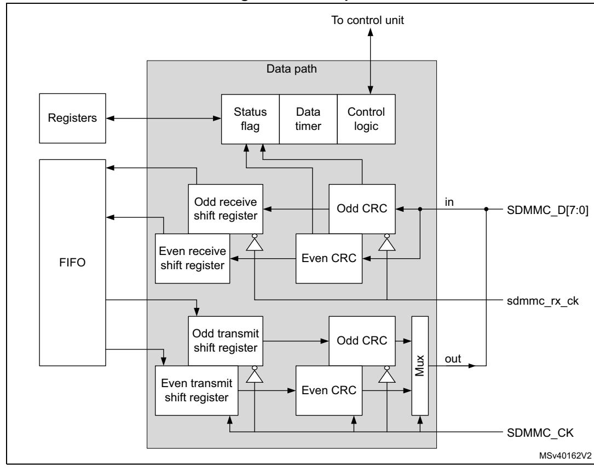

**Figure 752. Data path**

The card data bus width can be programmed in the clock control register bits WIDBUS. The supported data bus width modes are:

- If the wide bus mode is not enabled, only one bit is transferred over SDMMC\_D0.
- If the 4-bit wide bus mode is enabled, data is transferred at four bits over SDMMC\_D[3:0].
- If the 8-bit wide bus mode is enabled, data is transferred at eight bits over SDMMC\_D[7:0].

Next to the data bus width the data sampling mode can be programmed in the clock control register bit DDR. The supported data sampling modes are:

- Single data rate signaling (SDR), data is clocked on the rising edge of the clock.
- Double data rate signaling (DDR), data is clocked on the both edges of the clock. DDR mode is only supported in wide bus mode (4-bit wide and 8-bit wide).

*Note: The data sampling mode only applies to the SDMMC\_D[7:0] lines. (not applicable to the SDMMC\_CMD line.)*


In DDR mode, data is sampled on both edges of the SDMMC\_CK according the following rules, see also *Figure 753* and *Figure 754*:

- On the rising edge of the clock odd bytes are sampled.
- On the falling edge of the clock even bytes are sampled.
- Data payload size is always a multiple of 2 Bytes.
- Two CRC16 are computed per data line
  - Odd bits CRC16 clocked on the falling edge of the clock.
  - Even bits CRC16 clocked on the rising edge of the clock.
- Start, end bits and idle conditions are full cycle.
- CRC status / boot acknowledgment and busy signaling are full cycle and are only sampled on the rising edge of the clock.

In DDR mode the SDMMC CK clock division must be >= 2.

<span id="page-17-0"></span>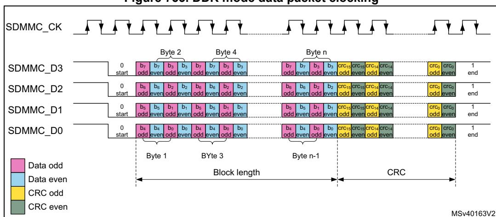

Figure 753, DDR mode data packet clocking

Figure 754. DDR mode CRC status / boot acknowledgment clocking

<span id="page-17-1"></span>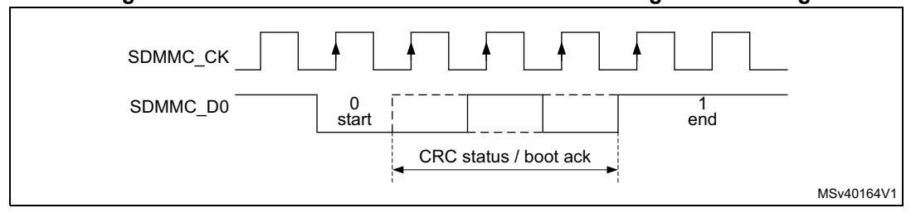

Data path state machine (DPSM)

Depending on the transfer direction (send or receive), the data path state machine (DPSM) moves to the Wait S or Wait R state when it is enabled:

- Send: the DPSM moves to the Wait\_S state. If there is data in the transmit FIFO, the DPSM moves to the Send state, and the data path subunit starts sending data to a card.
- Receive: the DPSM moves to the Wait\_R state and waits for a start bit. When it
  receives a start bit, the DPSM moves to the Receive state, and the data path subunit
  starts receiving data from a card.


For boot operation with acknowledgment the DPSM moves to the Wait\_Ack state and waits for the boot acknowledgment before moving to the Wait\_R state.

The DPSM operates at SDMMC\_CK. The DPSM has the following states, as shown in *Figure 755*. When ever the DPSM is active, i.e. not in the Idle state, the DPSMACT bit is set.

<span id="page-18-0"></span>

Figure 755. Data path state machine (DPSM)

• **Idle** state: the data path is inactive, and the SDMMC\_D[7:0] outputs are according the PWRCTRL setting. The DPSM is activated either by sending a command with CMDTRANS bit set or by setting the DTEN bit, or by detecting Busy on SDMMC\_D0 (that is, after a command with R1b response).

When not busy, the DPSM activates the SDMMC\_CK clock (when stopped due to power save PWRSAV bit), loads the data counter with a new (DATALENGTH) value and:

- When the data direction bit (DTDIR) indicates send, moves to the Wait S.
- When the data direction bit (DTDIR) indicates receive, moves to the
  - Wait\_R when BOOTACKEN register bit is clear.
    - Wait\_Ack when BOOTACKEN register bit is set and start the acknowledgment timeout.

When busy the DPSM keeps the SDMMC\_CK clock active and move to the Busy state.


2549/3556

*Note: DTEN must not be used to start data transfer with SD, SDIO and e•MMC cards.*

- **Wait\_Ack** state: the data path waits for the boot acknowledgment token.
  - The DPSM moves to the Wait\_R state if it receives an error free acknowledgment before a timeout.
  - When a pattern different from the acknowledgment is received an acknowledgment status error is generated, and the ack fail status flag (ACKFAIL) is set. The DPSM stays in Wait\_Ack.
  - If it reaches a timeout (ACKTIME) before it detects a start bit, it sets the timeout status flag (ACKTIMEOUT). The DPSM stays in Wait\_Ack.
  - When the CPSM Abort signal is set it moves to the Idle state and sets the DABORT flag.
- **Wait\_R** state: the data path, if the data counter is not zero and data is not hold, waits for a start bit on SDMMC\_D[n:0]. If the data counter is zero or data is hold, wait for the FIFO to be empty.
  - In block mode, if a start bit is received before a timeout the DPSM moves to the Receive state and loads the data block counter with DBLOCKSIZE.
  - In SDIO multibyte mode, if a start bit is received before a timeout the DPSM moves to the Receive state and loads the data block counter with DATALENGTH.
  - In stream mode, if a start bit is received before a timeout the DPSM moves to the Receive state and loads the data counter with DATALENGTH.
  - if the data counter (DATACOUNT) equals zero (end of data) the DPSM moves to the Idle state when the receive FIFO is empty and the DATAEND flag is set.
  - If it reaches a timeout (DATATIME) before it detects a start bit, it sets the timeout status flag (DTIMEOUT) and the DPSM stays in the Wait\_R state.
  - If the CPSM Abort signal is set: If DATACOUNT > 0, the DPSM moves to the Idle state when the FIFO is empty and when IDMAEN = 0 reset with FIFORST, and sets the DABORT flag. If DATACOUNT is zero normal operation is continued, there is no DABORT flag since the transfer has completed normally.
  - if the DTHOLD bit is set:
    - When DATACOUNT > 0, the DPSM moves to the Idle state when the receive FIFO is empty and when IDMAEN = 0 reset with FIFORST, and issues the DHOLD flag. When holding the timeout is disabled. When an CPSM Abort signal is received during holding, the transfer is aborted.


- When DATACOUNT = 0, the transfer is completed normally and there is no DHOLD flag.
- When DPSM has been started with DTEN, after an error (DTIMEOUT) the DPSM moves to the Idle state when the FIFO is empty and when IDMAEN = 0 reset with FIFORST.
- **R\_W** state: the data path Read Wait the bus.
  - The DPSM moves to the Wait\_R state when the Read Wait stop bit (RWSTOP) is set, and start the receive timeout.
  - If the CPSM Abort signal is set, wait for the FIFO to be empty and when IDMAEN = 0 reset with FIFORST, then moves to the Idle state and sets the DABORT flag.
- **Receive** state: the data path receives serial data from a card. Pack the data in bytes and written it to the data FIFO. Depending on the transfer mode selected in the data control register (DTMODE), the data transfer mode can be either block or stream:
  - In block mode, when the data block size (DBLOCKSIZE) number of data bytes are received, the DPSM waits until it receives the CRC code.
  - In SDIO multibyte mode, when the data block size (DATALENGTH) number of data bytes are received, the DPSM waits until it receives the CRC code.
  - a) If the received CRC code matches the internally generated CRC code, the DPSM moves to the
    - R\_W state when RWSTART = 1 and DATACOUNT > zero, the DBCKEND flag is set.
    - Wait\_R state otherwise.
  - b) If the received CRC code fails the internally generated CRC code any further data reception is prevented.
    - When not all data has been received (DATACOUNT > 0), the CRC fail status flag (DCRCFAIL) is set and the DPSM stays in the Receive state.
    - When all data has been received (DATACOUNT = 0), wait for the FIFO to be empty after which the CRC fail status flag (DCRCFAIL) is set and the DPSM moves to the Idle state.
  - In stream mode, the DPSM receives data while the data counter DATACOUNT > 0. When the counter is zero, the remaining data in the shift register is written to the data FIFO, and the DPSM moves to the Wait\_R state.
  - When a FIFO overrun error occurs, the DPSM sets the FIFO overrun error flag (RXOVERR) and any further data reception is prevented. The DPSM stays in the Receive state.
  - When an CPSM Abort signal is received:
    - If the CPSM Abort signal is received before the 2 last bits of the data with DATACOUNT = 0, the transfer is aborted. The remaining data in the shift register is written to the data FIFO, wait for the FIFO to be empty and when IDMAEN = 0 reset with FIFORST, then the DPSM moves to the Idle state and the DABORT flag is set.
    - If the CPSM Abort signal is received during or after the 2 last bits of the transfer with DATACOUNT=0, the transfer is completed normally. The DPSM stays in the Receive state no DABORT flag is generated.
  - When DPSM has been started with DTEN, after an error (DCRCFAIL when DATACOUNT > 0, or RXOVERR) the DPSM moves to the Idle state when the FIFO is empty and when IDMAEN = 0 reset with FIFORST.


- Wait\_S state: the data path waits for data to be available from the FIFO.
  - If the data counter DATACOUNT > 0, waits until the data FIFO empty flag (TXFIFOE) is de-asserted and DTHOLD is not set, and moves to the Send state.
  - If the data counter (DATACOUNT) = 0 the DPSM moves to the Idle state.
    - When DTHOLD is disabled, the DATAEND flag is set.
    - When DTHOLD is enabled, the DHOLD flag is set.
  - When DTHOLD is set and the DATACOUNT > 0
    - When IDMA is enabled, the DBCKEND flag is set and subsequently the FIFO is flushed, furthermore the DPSM moves to the Idle state and the DHOLD flag is set.
    - When IDMA is disabled the DBCKEND flag is set. Wait for the FIFO to be reset by software with FIFORST, then DPSM moves to the Idle state and issues the DHOLD flag.
  - When DTHOLD is set and DATACOUNT = 0 the transfer is completed normally.
  - When receiving the CPSM Abort signal
    - If the CPSM Abort signal is received before the 2 last bits of the data with DATACOUNT = 0, the transfer is aborted, wait for the FIFO to be empty and when IDMAEN = 0 reset with FIFORST, then the DPSM moves to the Idle state and sets the DABORT flag.
    - If the CPSM Abort signal is received during or after the 2 last bits of the transfer with DATACOUNT=0, normal operation is continued, there is no DABORT flag since the transfer has completed normally.

Note: The DPSM remains in the Wait\_S state for at least two clock periods to meet the  $N_{WR}$  timing requirements, where  $N_{WR}$  is the number of clock cycles between the reception of the card response and the start of the data transfer from the host.

- Send state: the DPSM starts sending data to a card. Depending on the transfer mode bit in the data control register, the data transfer mode can be either block, SDIO multibyte or stream:
  - In block mode, when the data block size (DBLOCKSIZE) number of data bytes are send, the DPSM sends an internally generated CRC code and end bit, and moves to the Busy state and start the transmit timeout.
  - In SDIO multibyte mode, when the data block size (DATALENGTH) number of data bytes are send, the DPSM sends an internally generated CRC code and end bit, and moves to the Busy state and start the transmit timeout.
  - In stream mode, the DPSM sends data to a card while the data counter DATACOUNT > 0. When the data counter reaches zero moves to the Busy state and start the transmit timeout.
    - Before sending the last stream Byte according to DATACOUNT, the DPSM issues a trigger on the send CMD signal. This signal is used by the CPSM to sent any pending command. (i.e. CMD12 Stop Transmission command)
  - If a FIFO underrun error occurs, the DPSM sets the FIFO underrun error flag (TXUNDERR). The DPSM stays in the Send state.
  - When receiving the CPSM Abort signal
    - If the CPSM Abort signal is received before the 2 last bits of the transfer with DATACOUNT=0, the transfer is aborted. The DPSM sends a last data bit followed by an end bit. The FIFO is disabled/flushed, and the DPSM moves to the Busy state to wait for not busy before setting the DABORT flag.
    - If the CPSM Abort signal is received during or after the 2 last bits of the transfer


with DATACOUNT=0, the transfer is completed normally, there is no DABORT flag.

- **Busy** state: the DPSM waits for the CRC status token when expected, and wait for a not busy signal:
  - If a CRC status token is expected and indicate "non-erroneous transmission" or when there is no CRC expected:
    - it moves to the Wait\_S state when SDMMC\_D0 is not low (the card is not busy).
    - When the card is busy SDMMC\_D0 is low it remains in the Busy state.
  - If a CRC status token is expected and indicates "erroneous transmission".
    - When not all data has been send (DATACOUNT > 0). The DPSM waits for not busy after which the CRC fail status flag (DCRCFAIL) is set. The FIFO is disabled/flushed and the DPSM stays in the Busy state.
    - When all data has been send (DATACOUNT = 0). The DPSM waits for not busy after which the CRC fail status flag (DCRCFAIL) is set and the DPSM moves to the Idle state.
  - If a CRC status (Ncrc) timeout occurs while the DPSM is in the Busy state, it sets the data timeout flag (DTIMEOUT) and stays in the Busy state.
  - If a busy timeout occurs while the DPSM is in the Busy state, it sets the data timeout flag (DTIMEOUT) and stays in the Busy state.
  - When receiving the CPSM Abort signal in the Busy state:
    - If the CPSM Abort signal is received before the 2 last bits of the CRC response with DATACOUNT > 0, the data transfer is aborted. The DPSM waits for not busy and the FIFO to be disabled/flushed before moving to the Idle state and the DABORT flag is set.
    - If the CPSM Abort signal is received during or after the 2 last bits of the CRC response when DATACOUNT=0 or when no CRC is expected and DATACOUNT = 0 and there has been no DTIMEOUT error, the DPSM stays in the Busy state no DABORT flag is generated, since the transfer may completed normally.
    - If the CPSM Abort signal is received when a DTIMEOUT error has occurred the DPSM waits for not busy and the FIFO to be disabled/flushed before moving to the Idle state and the DABORT flag is set.
  - When entering the Busy state due to an abort in the Send state, the DPSM waits for not busy before moving to the Idle state and the DABORT flag is set.
  - When DPSM has been started with DTEN, after an error (DCRCFAIL when DATACOUNT > 0, or DTIMEOUT) the DPSM moves to the Idle state when the FIFO is reset.
  - When the DPSM has been started due to Busy on SDMMC\_D0, waits for not busy after which the Busy end status flag (BUSYD0END) is set and the DPSM moves to the Idle state.


RM0399 Rev 4 2553/3556

The data timer (DATATIME) is enabled when the DPSM is in the Wait\_R or Busy state 2 cycles after the data block end bit, or data read command end bit, or R1b response, and generates the data timeout error (DTIMEOUT):

- When transmitting data, the timeout occurs
  - when a CRC status is expected and no start bit is received withing 8 SDMMC\_CK cycles, the DTIMEOUT flag is set.
  - when the Busy state takes longer than the programmed timeout period., the DTIMEOUT flag is set.
- When receiving data, the timeout occurs
  - when there is still data to be received DATACOUNT > 0 and no start bit is received before the programmed timeout period, the DTIMEOUT flag is set.
- After a R1b response, the timeout occurs
  - when the Busy state takes longer than the programmed timeout period., the DTIMEOUT flag is set.

### When DATATIME = 0,

- In receive the start bit must be present 2 cycles after the data block end bit or data read command end bit.
- In transmit busy is timed out 2 cycles after the CRC token end bit or stream data end bit.
- After a R1b response busy is timed out 2 cycles after the response end bit.

Data can be transferred from the card to the host (transmit, send) or vice versa (receive). Data are transferred via the SDMMC\_Dn data lines, they are stored in a FIFO.

**Table 485. Data token format** 

| Description    | Start bit | Data(1)                  | CRC16 | End bit | DTMODE |
|----------------|-----------|--------------------------|-------|---------|--------|
| Block data     | 0         | (DBLOCKSIZE, DATALENGTH) | yes   | 1       | 00     |
| SDIO multibyte | 0         | (DATALENGTH)             | yes   | 1       | 01     |
| e•MMC stream   | 0         | (DATALENGTH)             | no    | 1       | 10     |

<sup>1.</sup> The total amount of data to transfer is given by DATALENGTH. Where for Block data the amount of data in each block is given by DBLOCKSIZE.

The data token format is selected with register bits DTMODE according.

The data path implements the status flags and associated clear bits shown in *[Table 486](#page-23-0)*:

**Table 486. Data path status flags and clear bits** 

<span id="page-23-0"></span>

| Flag    |      | Description                                                                                                                                                      |  |  |
|---------|------|------------------------------------------------------------------------------------------------------------------------------------------------------------------|--|--|
|         | TX   | Set at the end of the complete data transfer when the CRC is OK and busy has finished<br>and both DTHOLD = 0 and DATACOUNT = 0. (DPSM moves from Wait_S to Idle) |  |  |
| DATAEND | RX   | Set at the end of the complete data transfer when the CRC is OK and all data has been                                                                            |  |  |
|         | Boot | read, (DATACOUNT = 0 and FIFO is empty). (DPSM moves from Wait_R to Idle)                                                                                        |  |  |


**Table 486. Data path status flags and clear bits (continued)**

| Flag       |            | Description                                                                                                                                                                                                                                                                                     |  |  |
|------------|------------|-------------------------------------------------------------------------------------------------------------------------------------------------------------------------------------------------------------------------------------------------------------------------------------------------|--|--|
| DCRCFAIL   | TX         | Set at the end of the CRC when FAIL and busy has finished. (DPSM stay in Busy when<br>there is still data to send and wait for CPSM Abort) (DPSM moves from Busy to Idle when<br>all data has been sent) or DPSM has been started with DTEN                                                     |  |  |
|            | RX         | Set at the end of the CRC when FAIL and FIFO is empty. (DPSM stays in Receive when                                                                                                                                                                                                              |  |  |
|            | Boot       | there is still data to be received and wait for CPSM Abort) (DPSM moves from Receive to<br>Idle when all data has been received or DPSM has been started with DTEN)                                                                                                                             |  |  |
| ACKFAIL    | Boot       | Set at the end of the boot acknowledgment when fail. (DPSM stays in Wait_Ack and wait<br>for CPSM Abort)                                                                                                                                                                                        |  |  |
|            | CMD<br>R1b | Set after the command response no end of busy received before the timeout. (DPSM<br>stays in Busy and wait for CPSM Abort)                                                                                                                                                                      |  |  |
| DTIMEOUT   | TX         | Set when no CRC token start bit received within Ncrc, or no end of busy received before<br>the timeout. (DPSM stays in Busy and wait for CPSM Abort) (When DPSM has been<br>started with DTEN move to Idle)<br>Note: The DCRCFAIL flag may also be set when CRC failed before the busy timeout. |  |  |
|            | RX         | Set when no start bit received before the timeout. (DPSM stays in Wait_R and wait for                                                                                                                                                                                                           |  |  |
|            | Boot       | CPSM Abort) (When DPSM has been started with DTEN move to Idle)                                                                                                                                                                                                                                 |  |  |
| ACKTIMEOUT | Boot       | Set when no start bit received before the timeout. (DPSM stays in Wait_Ack and wait for<br>CPSM Abort)                                                                                                                                                                                          |  |  |
| DBCKEND    | TX         | When DTHOLD = 1 and IDMAEN = 0: Set at the end of data block transfer when the CRC<br>is OK and busy has finished, when data transfer is not complete (DATACOUNT >0).<br>(DPSM moves from Busy to Wait_S)                                                                                       |  |  |
|            | RX         | When RWSTART = 1: Set at the end of data block transfer when the CRC is OK, when                                                                                                                                                                                                                |  |  |
|            | Boot       | data transfer is not complete (DATACOUNT > 0). (DPSM moves from Receive to R_W)                                                                                                                                                                                                                 |  |  |
|            | TX         | When DTHOLD = 1: Set at the end of data block transfer when the CRC is OK and busy<br>has finished. (DPSM moves from Wait_S to Idle)                                                                                                                                                            |  |  |
| DHOLD      | RX         | When DTHOLD = 1: Set at the end of data block transfer when the CRC is OK and all<br>data has been read (FIFO is empty), when data transfer is not complete (DATACOUNT<br>>0). (DPSM moves from Wait_R to Idle)                                                                                 |  |  |
|            | CMD<br>R1b | When CPSM Abort event has been sent by the CPSM and busy has finished. (DPSM<br>moves from Busy to Idle)                                                                                                                                                                                        |  |  |
| DABORT     | TX         |                                                                                                                                                                                                                                                                                                 |  |  |
|            | RX         | When CPSM Abort event has been sent by the CPSM before the 2 last bits of the<br>transfer. (DPSM moves from any state to Idle)                                                                                                                                                                  |  |  |
|            | Boot       |                                                                                                                                                                                                                                                                                                 |  |  |
| BUSYD0END  | CMD<br>R1b | Set after the command response when end of busy before the timeout. (DPSM moves<br>from Busy to Idle)                                                                                                                                                                                           |  |  |
| DPSMACT    |            | Data transfer in progress. (DPSM not in Idle state)                                                                                                                                                                                                                                             |  |  |


The data path error handling is shown in *Table 487*:

Table 487. Data path error handling

<span id="page-25-0"></span>

| Error      | DPSM state | Cause                                         | Card action           | Host action                                                 | DPSM action                                                                     |
|------------|------------|-----------------------------------------------|-----------------------|-------------------------------------------------------------|---------------------------------------------------------------------------------|
|            | Wait_Ack   | No Ack in time                                | unknown               | Card cycle power                                            | Stay in Wait_Ack<br>(reset the SDMMC with<br>the RCC.SDMMCxRST<br>register bit) |
|            | Wait_R     | No start bit in time                          | unknown               | Stop data reception<br>Send stop transmission<br>command    | On CPSM Abort move to Idle                                                      |
| Timeout    |            |                                               | unknown               | Stop boot procedure                                         |                                                                                 |
|            | Busy       | Busy too<br>long (due to<br>data<br>transfer) | unknown               | Stop data reception<br>Send stop transmission<br>command    |                                                                                 |
|            |            | Busy too<br>long (due to<br>R1b)              | unknown               | Send reset command                                          |                                                                                 |
| CRC        | Receive    | transmission<br>error                         | Send further data     | Stop data reception<br>Send stop transmission<br>command    | On CPSM Abort move to Idle                                                      |
| CRC status | Busy       | Negative status                               | Ignore further data   | Stop data transmission                                      | On CPSM Abort move                                                              |
|            |            | transmission error                            | wait for further data | Send stop transmission command                              | to Idle                                                                         |
| Ack status | Wait_Ack   | transmission error                            | Send boot data        | Stop boot procedure                                         | On CPSM Abort move to Idle                                                      |
| Overrun    | Receive    | FIFO full                                     | Send further data     | Stop data reception<br>Send stop transmission<br>command    | On CPSM Abort move to Idle                                                      |
| Underrun   | Send       | FIFO empty                                    | Receive further data  | Stop data transmission<br>Send stop transmission<br>command | On CPSM Abort move to Idle                                                      |

### **Data FIFO**

The data FIFO (first-in-first-out) subunit contains the transmit and receive data buffer. A single FIFO is used for either transmit or receive as selected by the DTDIR bit. The FIFO contain a 32-bit wide, 16-word deep data buffer and control logic. Because the data FIFO operates in the AHB clock domain (sdmmc\_hclk), all signals from the subunits in the SDMMC clock domain (SDMMC\_CK/sdmmc\_rx\_ck) are resynchronized.


The FIFO can be in one of the following states:

- The transmit FIFO refers to the transmit logic and data buffer when sending data out to the card. (DTDIR = 0)
- The receive FIFO refers to the receive logic and data buffer when receiving data in from the card. (DTDIR = 1)

The end of a correctly completed SDMMC data transfer from the FIFO is indicated by the DATAEND flags driven by the data path subunit. Any incorrect (aborted) SDMMC data transfer from the FIFO is indicated by one of the error flags (DCRCFAIL, DTIMEOUT, DABORT) driven by the data path subunit, or one of the FIFO error flags (TXUNDERR, RXOVERR) driven by the FIFO control.

The data FIFO can be accessed in the following ways, see *[Table 488](#page-26-0)*.

**Table 488. Data FIFO access**

<span id="page-26-0"></span>

| Data FIFO access                      | IDMAEN |
|---------------------------------------|--------|
| From firmware via AHB slave interface | 0      |
| From IDMA via AHB master interface    | 1      |

### Transmit FIFO:

Data can be written to the transmit FIFO when the DPSM has been activated (DPSMACT = 1).

When IDMAEN = 1 the FIFO is fully handled by the IDMA.

When IDMAEN = 0 the FIFO is controlled by firmware via the AHB slave interface. The transmit FIFO is accessible via sequential addresses. The transmit FIFO contains a data output register that holds the data word pointed to by the read pointer. When the data path subunit has loaded its shift register, it increments the read pointer and drives new data out. The transmit FIFO is handled in the following way:

- 1. Write the data length into DATALENGTH and the block length in DBLOCKSIZE.
  - For block data transfer (DTMODE = 0), DATALENGTH must be an integer multiple of DBLOCKSIZE.
- 2. Set the SDMMC in transmit mode (DTDIR = 0).
  - Configures the FIFO in transmit mode.
- 3. Enable the data transfer
  - either by sending a command from the CPSM with the CMDTRANS bit set
  - or by setting DTEN bit
- 4. When (DPSMACT = 1) write data to the FIFO.
  - The DPSM stays in the Wait\_S state until FIFO is full (TXFIFOF = 1), or the number indicated by DATALENGTH.


- The SDMMC keeps sending data as long as FIFO is not empty, hardware flow control during data transfer is used to prevent FIFO underrun.
- 5. Write data to the FIFO.
  - When the FIFO is handled by software, wait until the FIFO is half empty (TXFIFOHE flag), write data to the FIFO until FIFO is full (TXFIFOF = 1), or last data has been written.
  - When the FIFO is handled by the IDMA, the IDMA transfers the FIFO date.
- 6. When last data has been written wait for end of data (DATAEND flag)
  - SDMMC has completely sent all data and the DPSM is disabled (DPSMACT = 0).

In case of a data transfer error or transfer hold when IDMAEN = 0, firmware must stop writing to the FIFO and flush and reset the FIFO with the FIFORST register bit.

The transmit FIFO status flags are listed in *[Table 489](#page-27-0)*.

**Table 489. Transmit FIFO status flags** 

<span id="page-27-0"></span>

| Flag     | Description                                                                                                |
|----------|------------------------------------------------------------------------------------------------------------|
| TXFIFOF  | Set to high when all transmit FIFO words contain valid data.                                               |
| TXFIFOE  | Set to high when the transmit FIFO does not contain valid data.                                            |
| TXFIFOHE | Set to high when half or more transmit FIFO words are empty.                                               |
| TXUNDERR | Set to high when an underrun error occurs. This flag is cleared by writing to the<br>SDMMC Clear register. |

### Receive FIFO:

Data can be read from the receive FIFO when the DPSM is activated (DPSMACT = 1).

When IDMAEN = 1 the FIFO is fully handled by the IDMA.

When IDMAEN = 0 the FIFO is controlled by firmware via the AHB slave interface.When the data path subunit receives a word of data, it drives the data on the write databus. The write pointer is incremented after the write operation completes. On the read side, the contents of the FIFO word pointed to by the current value of the read pointer is driven onto the read databus. The receive FIFO is accessible via sequential addresses.

The receive FIFO is handled in the following way:


- 1. Write the data length into DATALENGTH and the block length in DBLOCKSIZE.
  - For block data transfer (DTMODE = 0), DATALENGTH must be an integer multiple of DBLOCKSIZE.
- 2. Set the SDMMC in receive mode (DTDIR = 1).
  - Configures the FIFO in receive mode.
- 3. Enable the DPSM transfer
  - either by sending a command from the CPSM with the CMDTRANS bit set
  - or by setting DTEN bit.
- 4. When (DPSMACT = 1) the FIFO is ready to receive data.
  - The DPSM writes the received data to the FIFO.
    - The SDMMC keeps receiving data as long as FIFO is not full, hardware flow control during the data transfer is used to prevent FIFO overrun.
- 5. Read data from the FIFO.
  - When the FIFO is handled by software, wait until the FIFO is half full (RXFIFOHF flag), read data from the FIFO until FIFO is empty (RXFIFOE = 1).
    - When last data has been received, read data from the FIFO until FIFO is empty (DATAEND = 1).
  - When the FIFO is handled by the IDMA, the IDMA transfers the FIFO date.
- 6. SDMMC has completely received all data and the DPSM is disabled (DPSMACT = 0).

In case of a data transfer hold when IDMAEN = 0, the firmware must read the remaining data until the FIFO is empty and reset the FIFO with the FIFORST register bit. This causes the DPSM to go to the Idle state (DPSMACT = 0).

In case of a data transfer error when IDMAEN = 0, the firmware must stop reading the FIFO and flush and reset the FIFO with the FIFORST register bit. This causes the DPSM to go to the Idle state (DPSMACT = 0).

The receive FIFO status flags are listed in *[Table 490](#page-28-0)*.

<span id="page-28-0"></span>**Flag Description** RXFIFOF Set to high when all receive FIFO words contain valid data RXFIFOE Set to high when the receive FIFO does not contain valid data. RXFIFOHF Set to high when half or more receive FIFO words contain valid data. RXOVERR Set to high when an overrun error occurs. This flag is cleared by writing to the SDMMC Clear register.

**Table 490. Receive FIFO status flags** 

## **CLKMUX unit**

The CLKMUX selects the source for clock sdmmc\_rx\_ck to be used with the received data and command response. The receive data clock source can be selected by the clock control register bit SELCLKRX, between:

- sdmmc\_io\_in\_ck bus master main feedback clock.
- SDMMC\_CKIN external bus feedback clock.
- sdmmc\_fb\_ck bus tuned feedback clock.

The sdmmc\_io\_in\_ck is selected when there is no external driver, with DS and HS.


RM0399 Rev 4 2559/3556

The SDMMC\_CKIN is selected when there is an external driver with SDR12, SDR25, SDR50 and DDR50.

The sdmmc\_fb\_ck clock input must be selected when the DLYB block on the device is used with SDR104, HS200 and optionally with SDR50 and DDR50 modes.

**Figure 756. CLKMUX unit**

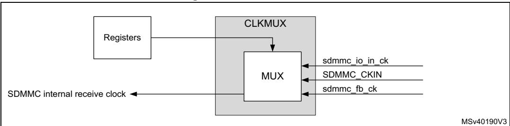

The sdmmc\_rx\_ck source must be changed when the CPSM and DPSM are in the Idle state.

# **58.5.5 SDMMC AHB slave interface**

The AHB slave interface generates the interrupt requests, and accesses the SDMMC adapter registers and the data FIFO. It consists of a data path, register decoder, and interrupt logic.

### **SDMMC FIFO**

The FIFO access is restricted to word access only:

- In transmit FIFO mode
  - Data are written to the FIFO in words (32-bits) until all data according DATALENGTH has been transfered. When the DATALENGTH is not an integer multiple of 4, the last remaining data (1, 2 or 3 bytes) are written with a word transfer.
- In receive FIFO mode
  - Data are read from the FIFO in words (32-bits) until all data according DATALENGTH has been transfered. When the DATALENGTH is not an integer multiple of 4, the last remaining data (1, 2 or 3 bytes) are read with a word transfer padded with 0 value bytes.

When accessing the FIFO with half word or byte accesses an AHB bus fault is generated.

### **SDMMC interrupts**

The interrupt logic generates an interrupt request signal that is asserted when at least one of the unmasked status flags is active. A mask register is provided to allow selection of the conditions that generate an interrupt. A status flag generates the interrupt request if a corresponding mask flag is set. Some status flags require an implicit clear in the clear register.

# **58.5.6 SDMMC AHB master interface**

The AHB master interface is used to transfer the data between a memory and the FIFO using the SDMMC IDMA.


### **SDMMC IDMA**

Direct memory access (DMA) is used to provide high-speed transfer between the SDMMC FIFO and the memory. The AHB master optimizes the bandwidth of the system bus. The SDMMC internal DMA (IDMA) provides one channel to be used either for transmit or receive.

The IDMA is enabled by the IDMAEN bit and supports burst transfers of 8 beats.

- In transmit burst transfer mode:
  - Data are fetched in burst from memory whenever the FIFO is empty for the number of burst transfers, until all data according DATALENGTH has been transfered. When the DATALENGTH is not an integer multiple of the burst size the remaining, smaller then burst size data is transfered using single transfer mode. When the DATALENGTH is not an integer multiple of 4, the last remaining data (1, 2 or 3 bytes) are fetched with a word transfer.
- In receive burst transfer mode:
  - Data are stored in burst in to memory whenever the FIFO contains the number of burst transfers, until all data according DATALENGTH has been transfered. When the DATALENGTH is not an integer multiple of the burst transfer the remaining, smaller then burst size data, is transfered using single transfer mode. When the DATALENGTH is not an integer multiple of 4, the last remaining data (1, 2 or 3 bytes) are stored with halfword and or byte transfers.

In addition the IDMA provides the following channel configurations selected by bit IDMABMODE:

- single buffered channel
- double buffered channel

## **Single buffered channel**

In single buffer configuration the data at the memory side is accessed in a linear matter starting from the base address IDMABASE0. When the IDMA has finished transferring all data the and the DPSM has completed the transfer the DATAEND flag is set.

# **Double buffered channel**

In double buffer configuration the data at the memory side is subsequently accessed from 2 buffers, one located from base address IDMABASE0 and a second located from base address IDMABASE1. This allows firmware to process one memory buffer while the IDMA is accessing the other memory buffer. The size of the memory buffers is defined by IDMABSIZE. The buffer size must be an integer multiple of the burst size. It is possible to update the base address of the buffers on-the-fly when the channel is enabled, the following rule apply:

- When IDMABACT bit is '0' the IDMA hardware uses the IDMABASE0 to access memory. When attempting to write to this register by Firmware the write is discarded, IDMABASE0 data isl not changed. Firmware is authorized to write IDMABASE1.
- When IDMABACT bit is '1' the IDMA hardware uses the IDMABASE1 to access memory. When attempting to write to this register by Firmware the write is discarded, IDMABASE1 data is not changed. Firmware is authorized to write IDMABASE0.

When the IDMA has finished transferring the data of one buffer the buffer transfer complete flag (IDMABTC) is set and the IDMABACT bit toggles where after the IDMA continues


RM0399 Rev 4 2561/3556

transferring data from the other buffer. When the IDMA has finished transferring all data and the DPSM has completed the transfer the DATAEND flag is set.

The IDMABASEn address must be word aligned.

### **IDMA transfer error management**

An IDMA transfer error can occur:

• When reading or writing a reserved address space.

On a IDMA transfer error subsequent IDMA transfers are disabled and an IDMATE flag is set. Depending when the IDMA transfer error occurs, it normally causes the generation of a TXUNDERR or RXOVERR error.

The behavior of the IDMATE flag depend on when the IDMA transfer error occurs during the SDMMC transfer:

- An IDMA transfer error is detected before any SDMMC transfer error (TXUNDERR, RXOVERR, DCRCFAIL, or DTIMEOUT):
  - The IDMATE flag is set at the same time as the SDMMC transfer error flag.
  - The TXUNDERR, RXOVERR, DCRCFAIL, or DTIMEOUT interrupt is generated.
- An IDMA transfer error is detected during a STOP\_TRANSNMISSION command:
  - The IDMATE flag is set at the same time as the DABORT flag.
    - The DABORT interrupt is generated.
- An IDMA transfer error is detected at the end of the SDMMC transfer (DHOLD, or DATAEND).
  - The IDMATE flag is set at the end of the SDMMC transfer.
  - A SDMMC transfer end interrupt is generated and a DHOLD or DATAEND flag is set.

The IDMATE is generated on an other SDMMC transfer interrupt (TXUNDERR. RXOVERR, DCRCFAIL, DTIMEOUT, DABORT, DHOLD, or DATAEND).

# **58.5.7 MDMA request generation**

The internal trigger lines from the SDMMC allow passing direct request to MDMA controller to enable successive transfers from/to different internal RAM addresses without CPU use.

When a data transfer from/to the card completes successfully, the DATAEND flag of the status register is set. The event is signaled to an MDMA request input through the sdmmc\_dataend\_trg output. It can trigger the clearance of the DATAEND and CMDREND flags and, eventually, a new transfer start, through MDMA direct access to the SDMMC control and configuration registers, thus without CPU intervention.

When a command response is received successfully, the CMDREND flag of the status register is set. When a busy state following an R1b response ends, the BUSYD0 flag of the status register falls down and the BUSYD0END flag rises. The sdmmc\_cmdend\_trg output connected to the MDMA is set when the sequence command response associated with an eventual busy signal ends. In this way, the MDMA can manage STOP\_TRANSMISSION command (needed to support open mode transfers) by clearing CMDREND and BUSYD0END status flags.

When using LINUX operating system, data to be transferred through SDMMC bus are contained in separate 1- to 4-Kbyte blocks of the device internal memory at non-consecutive addresses. The double buffer mode allows changing the address targeted by the IDMA in


the internal memory. Each time a buffer transfer is completed, the IDMABTC flag of the status register is set. By signaling this event to MDMA through the sdmmc\_buffend\_trg output connected to an MDMA request input, the new buffer address base can alternatively fill the IDMABASE0 / IDMABASE1 fields without CPU intervention.

The actions to program in the MDMA according to the SDMMC requests are provided in the following table:

| Trigger signal        | Event signaled                  | Event occurrence condition                         | MDMA transfer configuration | MDMA action                                    |
|-----------------------|---------------------------------|----------------------------------------------------|-----------------------------|------------------------------------------------|
| sdmmc_<br>dataend_trg | End of successful data transfer | DATAEND = 1                                        | single                      | Set DATAENDC                                   |
| sdmmc_<br>cmdend_trg  | End of command sequence         | CMDSENT = 1, or<br>(CMDREND = 1 and<br>BUSYD0 = 0) | single                      | Set CMDSENTC<br>Set CMDRENDC<br>Set BUSYD0ENDC |
| sdmmc_<br>buffend_trg | End of buffer reached           | IDMABTC = 1                                        | link list                   | Set IDMABTCC<br>Update IDMABASE0/1             |

Table 491. SDMMC connections to MDMA

# 58.5.8 AHB and SDMMC\_CK clock relation

The AHB must at least have 3x more bandwidth than the SDMMC bus bandwidth i.e. for SDR50 4-bit mode (50 Mbyte/s) the minimum sdmmc\_hclk frequency is 37.5 MHz (150 Mbyte/s).

| SDMMC bus mode | SDMMC bus<br>width | Maximum SDMMC_CK<br>[MHz] | Minimum AHB clock<br>[MHz] |  |
|----------------|--------------------|---------------------------|----------------------------|--|
| e•MMC DS       | 8                  | 26                        | 19.5                       |  |
| e•MMC HS       | 8                  | 52                        | 39                         |  |
| e•MMC DDR52    | 8                  | 52                        | 78                         |  |
| e•MMC HS200    | 8                  | 200                       | 150                        |  |
| SD DS / SDR12  | 4                  | 25                        | 9.4                        |  |
| SD HS / SDR25  | 4                  | 50                        | 18.8                       |  |
| SD DDR50       | 4                  | 50                        | 37.5                       |  |
| SD SDR50       | 4                  | 100                       | 37.5                       |  |
| SD SDR104      | 4                  | 208                       | 78                         |  |

Table 492. AHB and SDMMC CK clock frequency relation


2563/3556

# **58.6 Card functional description**

# **58.6.1 SD I/O mode**

The following features are SDMMC specific operations:

- SDIO interrupts
- SDIO suspend/resume operation (write and read suspend)
- SDIO Read Wait operation by stopping the clock
- SDIO Read Wait operation by SDMMC\_D2 signaling

**Table 493. SDIO special operation control** 

<span id="page-33-0"></span>

| Operation mode                        | SDIOEN | RWMOD | RWSTOP | RWSTART | DTDIR |
|---------------------------------------|--------|-------|--------|---------|-------|
| Interrupt detection                   | 1      | X     | X      | X       | X     |
| Suspend/Resume operation              | X      | X     | X      | X       | X     |
| Read Wait SDMMC_CK clock stop (START) | X      | 1     | 0      | 1       | 1     |
| Read Wait SDMMC_CK clock stop (STOP)  | X      | 1     | 1      | 1       | 1     |
| Read Wait SDMMC_D2 signaling (START)  | X      | 0     | 0      | 1       | 1     |
| Read Wait SDMMC_D2 signaling (STOP)   | X      | 0     | 1      | 1       | 1     |

# **SD I/O interrupts**

To allow the SD I/O card to interrupt the host, an interrupt function is available on pin 8 (shared with SDMMC\_D1 in 4-bit mode) on the SD interface. The use of the interrupt is optional for each card or function within a card. The SD I/O interrupt is level-sensitive, which means that the interrupt line must be held active (low) until it is either recognized and acted upon by the host or deasserted due to the end of the interrupt period. After the host has serviced the interrupt, the interrupt status bit is cleared via an I/O write to the appropriate bit in the SD I/O card internal registers. The interrupt output of all SD I/O cards is active low and the application must provide external pull-up resistors on all data lines (SDMMC\_D[3:0]).

In SD 1-bit mode pin 8 is dedicated to the interrupt function (IRQ), and there are no timing constraints on interrupts.

In SD 4-bit mode the host samples the level of pin 8 (SDMMC\_D1/IRQ) into the interrupt detector only during the interrupt period. At all other times, the host interrupt ignores this value. The interrupt period begins when interrupts are enabled at the card and SDIOEN bit is set see register settings in *[Table 493](#page-33-0)*.

In 4-bit mode the card can generate a synchronous or asynchronous interrupt as indicated by the card CCCR register SAI and EAI bits.

- Synchronous interrupt, require the SDMMC\_CK to be active.
- Asynchronous interrupt, can be generated when the SDMMC\_CK is stopped, 4 cycles after the start of the card interrupt period following the last data block.


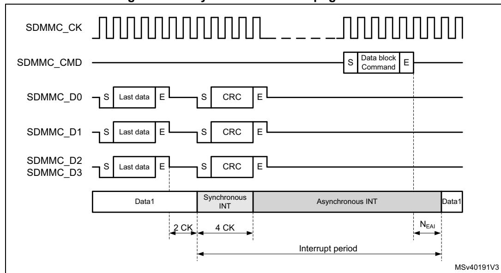

**Figure 757. Asynchronous interrupt generation**

The timing of the interrupt period is depended on the bus speed mode:

In DS, HS, SDR12, and SDR25 mode, selected by register bit BUSSPEED, the interrupt period is synchronous to the SD clock.

- The interrupt period ends at the next clock from the end bit of a command that transfers data block(s) (Command sent with the CMDTRANS bit is set), or when the DTEN bit is set.
- The interrupt period resumes 2 SDMMC\_CK after the completion of the data block.
- At the data block gap the interrupt period is limited to 2 SDMMC\_CK cycles.

*Note: DTEN must not be used to start data transfer with SD and e•MMC cards.*

**Figure 758. Synchronous interrupt period data read** MSv40195V2 SDMMC\_CK SDMMC\_D0 SDMMC\_D1 SDMMC\_D2 SDMMC\_D3 S E Data <sup>S</sup> Command data <sup>R</sup> <sup>E</sup> Data1 2 CK SDMMC\_CMD Interrupt period IRQ IRQ S E Data S E Data S E Data S E Data S E Data Data1 2 CK

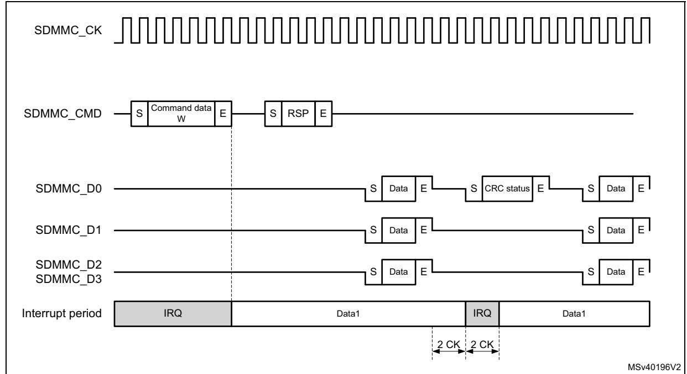

Figure 759. Synchronous interrupt period data write

In SDR50, SDR104, and DDR50, selected by register bit BUSSPEED, due to propagation delay from the card to host, the interrupt period is asynchronous.

- The card interrupt period ends after 0 to 2 SDMMC\_CK cycles after the end bit of a command that transfers data block(s) (Command sent with the CMDTRANS bit is set), or when the DTEN bit is set. At the host the interrupt period ends after the end bit of a command that transfers data block(s). A card interrupt issued in the 1 to 2 cycles after the command end bit are not detected by the host during this interrupt period.
- The card interrupt period resumes 2 to 4 SDMMC\_CK after the completion of the last data block. The host resumes the interrupt period always 2 cycles after the last data block.
- There is NO interrupt period at the data block gap.

Note: DTEN must not be used to start data transfer with SD and e•MMC cards.

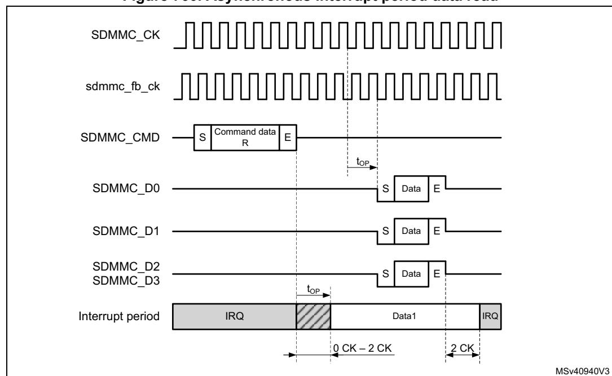

Figure 760. Asynchronous interrupt period data read

Figure 761. Asynchronous interrupt period data write

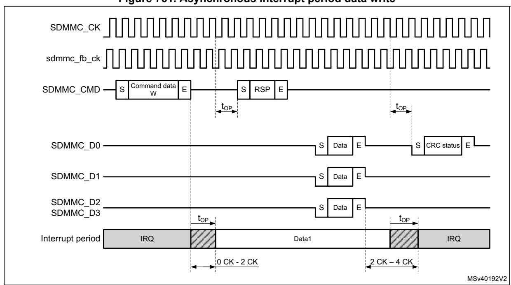

When transferring Open-ended multiple block data and using DTMODE "block data transfer ending with STOP\_TRANSMISSION command", the SDMMC masks the interrupt period after the last data block until the end of the CMD12 STOP\_TRANSMISSION command.

The interrupt period is applicable for both memory and I/O operations.


In 4-bit mode interrupts can be differentiated from other signaling according *[Table 494](#page-37-0)*.

**Table 494. 4-bit mode Start, interrupt, and CRC-status Signaling detection** 

<span id="page-37-0"></span>

| SDMMC data line | Start | Interrupt       | CRC-status |
|-----------------|-------|-----------------|------------|
| SDMMC_D0        | 0     | 1 or CRC-status | 0          |
| SDMMC_D1        | 0     | 0               | X          |
| SDMMC_D2        | 0     | 1 or Read Wait  | X          |
| SDMMC_D3        | 0     | 1               | X          |

# **SD I/O suspend and resume**

This function is NOT supported in SDIO version 4.00 or later.

Within a multifunction SD I/O or a card with both I/O and memory functions, there are multiple devices (I/O and memory) that share access to the *e*•MMC/SD bus. To share access to the host among multiple devices, SD I/O and combo cards optionally implement the concept of suspend/resume. When a card supports suspend/resume, the host can temporarily halt (suspend) a data transfer operation to one function or memory to free the bus for a higher-priority transfer to a different function or memory. After this higher-priority transfer is complete, the original transfer is restarted (resume) where it left off.

To perform the suspend/resume operation on the bus, the host performs the following steps:

- 1. Determines the function currently using the SDMMC\_D[3:0] line(s)
- 2. Requests the lower-priority or slower transaction to suspend
- 3. Waits for the transaction suspension to complete
- 4. Begins the higher-priority transaction
- 5. Waits for the completion of the higher priority transaction
- 6. Restores the suspended transaction

The card receiving a suspend command responds with its current bus status. Only when the bus has been suspended by the card the bus status indicates suspension completed.

There are different suspend cases conditions:

- Suspend request accepted prior to the start of data transfer.
- Suspend request not accepted, (due to data being transfered at the same time), the host keeps checking the request until it is accepted. (data transfer has suspended)
- Suspend request during write busy.
- Suspend request with write multiple.
- Suspend request during Read Wait.

For the host to know if the bus has been released it must check the status of the suspend request, suspension completed.

When the bus status of the suspend request response indicates suspension completed, the card has released the bus. At this time the state of the suspended operation must be saved where after an other operation can start.

The suspend command must be sent with the CMDSUSPEND bit set. This makes possible to start the interrupt period after the suspend command response when the bus is suspended (response bit BS = 0).


The hardware does not save the number of remaining data to be transfered when resuming the suspended operation. It is up to firmware to determine the data that has been transferred and resume with the correct remaining number of data bytes.

While receiving data from the card, the SDMMC can suspend the read operation after the read data block end (DPSM in Wait\_R). After receiving the suspend acknowledgment response from the card the following steps must be taken by firmware:

- 1. The normal receive process must be stopped by setting DTHOLD bit.
  - a) The remaining number of data bytes in the FIFO must be read until the receive FIFO is empty (RXFIFOE flag is set), and when IDMAEN = 0 the FIFO must be reset with FIFORST.
- 2. The confirmation that all data has been read from the FIFO, and that the suspend is completed is indicated by the DHOLD flag.
  - a) The remaining number of data bytes (multiple of data blocks) still to be read when resuming the operation must be determined from the remaining number of bytes indicated by the DATACOUNT.

*Note: When a DTIMEOUT flag occurs during the suspend procedure, this must be ignored.*

To resume receiving data from the card, the following steps must be taken by firmware:

- 1. The remaining number of data bytes (multiple of data blocks) must be programmed in DATALENGTH.
- 2. The DPSM must be configured to receive data in the DTDIR bit.
- 3. The resume command must be sent from the CPSM, with the CMDTRANS bit set and the CMDSUSPEND bit set, which ends the interrupt period when data transfer is resumed (response bit DF = 1) and enabled the DPSM, after which the card resumes sending data.

While sending data to the card, the SDMMC can suspend the write operation after the write data block CRC status end (DPSM in Busy). Before sending the suspend command to the card the following steps must be taken by firmware:

- 1. Enable DHOLD flag (and DBCKEND flag when IDMAEN = 0)
- 2. The DPSM must be prevented from start sending a new data block by setting DTHOLD.
- 3. When IDMAEN = 0: When receiving the DBCKEND flag the data transfer is stopped. Firmware can stop filling the FIFO, after which the FIFO must be reset with FIFORST. Any bytes still in the FIFO need to be rewritten when resuming the operation.
- 4. When receiving the DHOLD flag the data transfer is stopped. The remaining number of data bytes still to be written when resuming must be determined from the remaining number of bytes indicated by the DATACOUNT.
- 5. To suspend the card the suspend command must be sent by the CPSM with the CMDSUSPEND bit set. This makes possible to start the interrupt period after the suspend command response when the bus is suspended (response bit BS = 0).

To resume sending data to the card, the following steps must be taken by firmware:

- 1. The remaining number of data bytes must be programmed in DATALENGTH.
- 2. The DPSM must be configured for transmission with DTDIR set and enabled by having the CPSM send the resume command with the CMDTRANS bit set and the CMDSUSPEND bit set. This ends the interrupt period and start the data transfer. The


RM0399 Rev 4 2569/3556

DPSM either goes to the Wait\_S state when SDMMC\_D0 does not signal busy, or goes to the Busy state when busy is signaled.

- 3. When IDMAEN = 1: The IDMA needs to be reprogrammed for the remaining bytes to be transfered.
- 4. When IDMAEN = 0: Firmware must start filling the FIFO with the remaining data.

#### SD I/O Read Wait

There are 2 methods to pause the data transfer during the Block gap:

- 1. Stopping the SDMMC\_CK.
- Using Read Wait signaling on SDMMC\_D2.

The SDMMC can perform a Read Wait with register settings according Table 493.

Depending the SDMMC operation mode (DS, HS, SDR12, SDR25) or (SDR50, SDR104, DDR) each method has a different characteristic.

The timing for pause read operation by stopping the SDMMC\_CK for DS, HS, SDR12, and SDR25, the SDMMC\_CK may be stopped 2 SDMMC\_CK cycles after the end bit. When ready the host resumes by restarting clock, see *Figure 762*.

Figure 762. Clock stop with SDMMC\_CK for DS, HS, SDR12, SDR25

<span id="page-39-0"></span>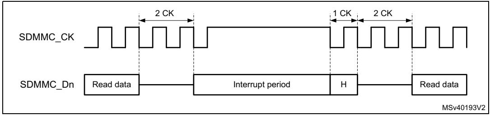

The timing for pause read operation by stopping the SDMMC\_CK for SDR50, SDR104, and DDR50, the SDMMC\_CK may be stopped minimum 2 SDMMC\_CK cycles and maximum 5 SDMMC\_CK cycles, after the end bit. When ready the host resumes by restarting clock, see *Figure* 763. (In DDR50 mode the SDMMC\_CK must only be stopped after the falling edge, when the clock line is low.)

Figure 763. Clock stop with SDMMC\_CK for DDR50, SDR50, SDR104

<span id="page-39-1"></span>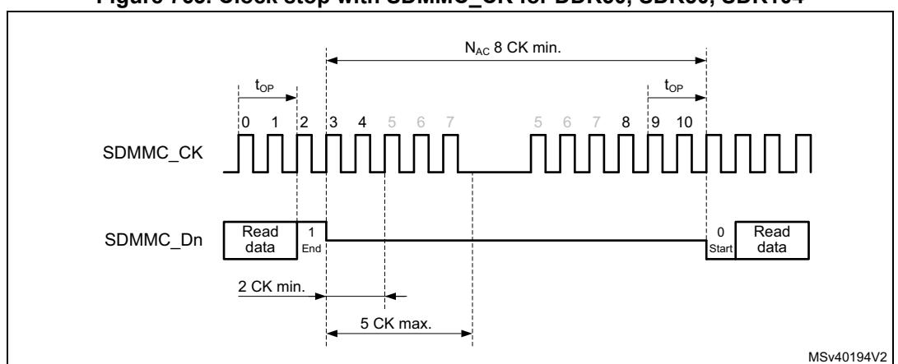

In Read Wait SDMMC\_CK clock stopping, when RWSTART is set, the DSPM stops the clock after the end bit of the current received data block CRC. The clock start again after writing 1 to the RWSTOP bit, where after the DPSM waits for a start bit from the card.

As SDMMC\_CK is stopped, no command can be issued to the card. During a Read Wait interval, the SDMMC can still detect SDIO interrupts on SDMMC\_D1.

The optional Read Wait signaling on SDMMC\_D2 (RW) operation is defined only for the SD 1-bit and 4-bit modes. The Read Wait operation enables the host to signal a card that is reading multiple registers (IO\_RW\_EXTENDED, CMD53) to temporarily stall the data transfer while allowing the host to send commands to any function within the SD I/O device. To determine when a card supports the Read Wait protocol, the host must test capability bits in the internal card registers.

The timing for Read Wait with a SDMMC\_CK less then 50MHz (DS, HS, SDR12, SDR25) is based on the interrupt period generated by the card on SDMMC\_D1. The host by asserting SDMMC\_D2 low during the interrupt period requests the card to enter Read Wait. To exit Read Wait the host must raise SDMMC\_D2 high during one SDMMC\_CK cycles before making it Hi-Z, see *[Figure 764](#page-40-0)*.

<span id="page-40-0"></span>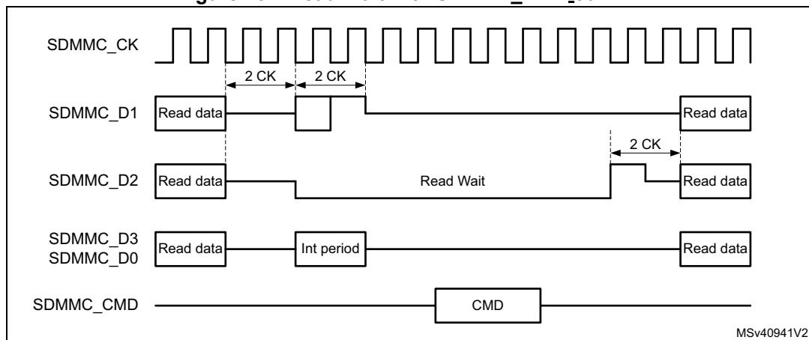

**Figure 764. Read Wait with SDMMC\_CK < 50 MHz**

For SDR50, SDR104 with a SDMMC\_CK more than 50MHz, and DDR50, the card treats the Read Wait request on SDMMC\_D2 as an asynchronous event. The host by asserting SDMMC\_D2 low after minimum 2 SDMMC\_CK cycles and maximum 5 SDMMC\_CK cycles, request the card to enter Read Wait. To exit Read Wait the host must raise SDMMC\_D2 high during one SDMMC\_CK cycles before making it Hi-Z. The host must raise SDMMC\_D2 on the SDMMC\_CK clock (see *[Figure 765](#page-41-0)*).


RM0399 Rev 4 2571/3556

<span id="page-41-0"></span>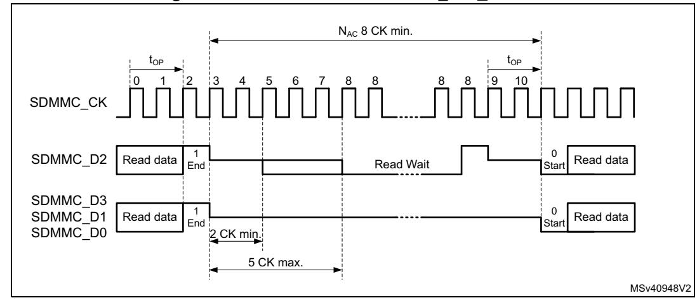

Figure 765. Read Wait with SDMMC\_CK ≥ 50 MHz

In Read Wait SDMMC\_D2 signaling, when RWSTART is set, the DPSM drives SDMMC\_D2 after the end bit of the current received data block CRC. The Read Wait signaling on SDMMC\_D2 is removed when writing 1 to the RWSTOP bit. The DPSM remains in R\_W state for two more SDMMC\_CK clock cycles to drive SDMMC\_D2 to 1 for one clock cycle (in accordance with SDIO specification), where after the DPSM waits for a start bit from the card.

During the Read Wait signaling on SDMMC\_D2 commands can be issued to the card. During the Read Wait interval, the SDMMC can detect SDIO interrupts on SDMMC\_D1.

# 58.6.2 CMD12 send timing

CMD12 is used to stop/abort the data transfer, the card data transmission is terminated two clock cycles after the end bit of the Stop Transmission command.

| Data operation                                | Stop Transmission command CMD12 Description                                                                                                                                                                                                                                                                                    |  |  |
|-----------------------------------------------|--------------------------------------------------------------------------------------------------------------------------------------------------------------------------------------------------------------------------------------------------------------------------------------------------------------------------------|--|--|
| SDMMC stream write                            | The data transfer is stopped/aborted by sending the Stop Transmission command.                                                                                                                                                                                                                                                 |  |  |
| SDMMC open ended multiple block write         | The data transfer is stopped/aborted by sending the Stop Transmission command.  If the card detects an error, the host must abort the operation by sending the Stop Transmission command.                                                                                                                                      |  |  |
| SDMMC block write with predefined block count | The Stop Transmission command is not required at the end of this type of multiple block write. (sending the Stop Transmission command after the card has received the last block is regarded as an illegal command.) If the card detects an error, the host must abort the operation by sending the Stop Transmission command. |  |  |
| SDMMC stream read                             | The data transfer is stopped/aborted by sending the Stop Transmission command.                                                                                                                                                                                                                                                 |  |  |

Table 495. CMD12 use cases

| Data operation                                  | Stop Transmission command CMD12 Description                                                                                                                                                                                                                                                                                                                                                                          |
|-------------------------------------------------|----------------------------------------------------------------------------------------------------------------------------------------------------------------------------------------------------------------------------------------------------------------------------------------------------------------------------------------------------------------------------------------------------------------------|
| SDMMC open ended<br>multiple block read         | The data transfer is stopped/aborted by sending the Stop Transmission<br>command.<br>If the card detects an error, the host must abort the operation by sending<br>the Stop Transmission command.                                                                                                                                                                                                                    |
| SDMMC block read with<br>predefined block count | The Stop Transmission command is not required at the end of this type of<br>multiple block read. (sending the Stop Transmission command after the<br>card has transmitted the last block is regarded as an illegal command.)<br>Transaction can be aborted by sending the Stop Transmission command.<br>If the card detects an error, the host must abort the operation by sending<br>the Stop Transmission command. |

**Table 495. CMD12 use cases (continued)**

All data write and read commands can be aborted any time by a Stop Transmission command CMD12. The following data abort procedure applies during an ongoing data transfer:

- 1. Load CMD12 Stop Transmission command in registers and set the CMDSTOP bit.
  - a) This causes the CPSM Abort signal to be generated when the command is sent to the DPSM.
- 2. Configure the CPSM to send a command immediately (clear WAITPEND bit).
  - a) The card, when sending data, stops data transfer 2 cycles after the Stop Transmission command end bit.
    - The card when no data is being sent, does not start sending any new data.
  - b) The host, when sending data, sends one last data bit followed by an end bit after the Stop Transmission command end bit.
    - The host when not sending data, does not start sending any new data.
- 3. When IDMAEN = 0, the FIFO need to be reset with FIFORST.
  - a) When writing data to the card. On the CMDREND flag, firmware must stop writing data to the FIFO. Subsequently the FIFO must be reset with FIFORST, this flushes the FIFO.
  - b) When reading data from the card. On the CMDREND flag, firmware must read the remaining data from the FIFO. Subsequently the FIFO must be reset with FIFORST.
- 4. When IDMAEN = 1, hardware takes care of the FIFO.
  - a) When writing data to the card. On the CPSM Abort signal, hardware stops the IDMA and subsequently the FIFO is flushed.
  - b) When reading data from the card. On the CPSM Abort signal, hardware instructs the IDMA to transfer the remaining data from the FIFO to RAM.
- 5. When the FIFO is empty/reset the DABORT flag is generated.

### **Stream operation and CMD12**

To stop the stream transfer after the last byte to be transfered, the CMD12 end bit timing must be sent aligned with the data stream end of last byte. The following write stream data procedure applies:


- 1. Initialize the stream data in the DPSM, DTMODE = MCC stream data transfer.
- 2. Send the WRITE\_DATA\_STREAM command from the CPSM with CMDTRANS = 1.
- 3. Preload CMD12 in command registers, with the CMDSTOP bit set.
- 4. Configure the CPSM to send a command only after a wait pending (WAITPEND = 1) end of last data (according DATALENGTH).
- 5. Enabling the CPSM to send the STOP\_TRANSMISSION command, the stream data end bit and command end bit are aligned.
  - a) When DATALENGTH > 5 bytes, Command CMD12 is waited in the CPSM to be aligned with the data transfer end bit.
  - b) When DATALENGHT < 5 bytes, Command CMD12 is started before and the DPSM remains in the Wait\_S state to align the data transfer end with the CMD12 end bit.
- 6. The write stream data can be aborted any time by clearing the WAITPEND bit. This causes the Preloaded CMD12 to be sent immediately and stop the write data stream.

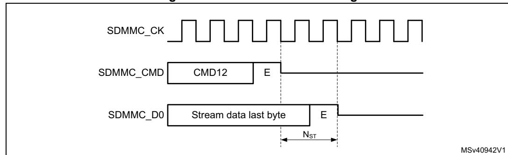

**Figure 766. CMD12 stream timing**

To stop the read stream transfer after the last byte, the CMD12 end bit timing must occur after the last data stream byte. The following read stream data procedure applies:

- 1. Wait for all data to be received by the DPSM and read from the FIFO (DATAEND flag).
  - a) The DPSM does not receive more data than indicated by DATALENGTH, even if the card is sending more data.
- 2. Send CMD12 by the CPSM.
  - a) CMD12 stops the card sending data.

*Note: The SDMMC does not receive any more data from the card when DATACOUNT = 0, even when the card continues sending data.*

### **Block operation and CMD12**

To stop block transfer at the end of the data, the CMD12 end bit must be sent after the last block end bit.

When writing data to the card the CMD12 end bit must be sent after the write data block CRC token end bit. This requires the CMD12 sending to be tied to the data block transmission timing. To stop an Open-ended Multiple block write, the following procedure applies:


- 1. Before starting the data transfer, set DTMODE to "block data transfer ending with STOP\_TRANSMISSION command".
- 2. Wait for all data to be sent by the DPSM and the CRC token to be received, (DATAEND flag).
  - a) The DPSM does not send more data than indicated by DATALENGTH.
- 3. Send CMD12 by the CPSM.
  - a) CMD12 sets the card to Idle mode.

When reading data from the card the CMD12 end bit must be sent earliest at the same time as the card read data block last data bit. This requires the CMD12 sending to be tied to the data block reception timing. The following stop Open-ended Multiple block read data block procedure applies:

- 1. Before starting the data transfer, set DTMODE to "block data transfer ending with STOP\_TRANSMISSION command".
- 2. Wait for all data to be received by the DPSM and read from the FIFO (DATAEND flag).
  - a) The DPSM does not receive more data than indicated by DATALENGTH, even if the card is sending more data.
- 3. Send CMD12 with CMDSTOP bit set by the CPSM.
  - a) CMD12 stops the Card sending more data and set the card to Idle mode. Any ongoing block transfer is aborted by the Card.

*Note: The SDMMC does not receive any more data from the card when DATACOUNT = 0, even when the card continues sending data.*

# **58.6.3 Sleep (CMD5)**

The *e*•MMC card may be switched between a Sleep state and a Standby state by CMD5. In the Sleep state the power consumption of the card is minimized and the Vcc power supply may be switched off.

The CMD5 (SLEEP) is used to initiate the state transition from Standby state to Sleep state. The card indicates Busy, pulling down SDMMC\_D0, during the transition phase. The Sleep state is reached when the card stops pulling down the SDMMC\_DO line.

To set the card into Sleep state the following procedure applies:

- 1. Enable interrupt on BUSYD0END.
- 2. Send CMD5 (SLEEP).
- 3. On BUSYD0END interrupt, card is in Sleep state
- 4. Vcc power supply can be switched off

The CMD5 (AWAKE) is used to initiate the state transition from Sleep state to Standby state. The card indicates Busy, pulling down SDMMC\_D0, during the transition phase. The Standby state is reached when the card stops pulling down the SDMMC\_DO line.

To set the card into Sleep state the following procedure applies:

- 1. Switch on Vcc power supply and wait unit minimum operating level is reached.
- 2. Enable interrupt on BUSYD0END.
- 3. Send CMD5 (AWAKE).
- 4. On BUSYD0END interrupt card is in Standby state.

The Vcc power supply can be switched off only after the Sleep state has been reached. The Vcc supply must be reinstalled before CMD5 (AWAKE) is sent.


RM0399 Rev 4 2575/3556

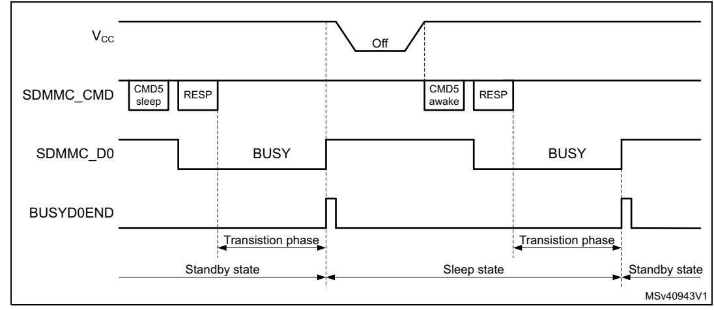

Figure 767. CMD5 Sleep Awake procedure

#### Interrupt mode (Wait-IRQ) 58.6.4

The host and card enter and exit interrupt mode (Wait-IRQ) simultaneously. In interrupt mode there is no data transfer. The only message allowed is an interrupt service request response from the card or the host. For the interrupt mode to work correctly the SDMMC CK frequency must be set in accordance with the achievable SDMMC CMD data rate in Open Drain mode, which depend on the capacitive load and pull-up resistor. The CLKDIV must be set >1, and the SETCLKRX must select either the sdmmc io in ck or SDMMC CLKin source.

The host must ensure that the card is in Standby state before issuing the CMD40 (GO IRQ STATE). While waiting for an interrupt response the SDMMC CK clock signal must be kept active.

A card in interrupt mode (IRQ state):

- is waiting for an internal card interrupt event. Once the event occurs, the card starts to send the interrupt service request response. The response is sent in open-drain mode.
- while waiting for the internal card interrupt event, the card also monitors the SDMMC CMD line for a start bit. Upon detection of a start bit the card aborts the interrupt mode and switch to Standby state.

The host in interrupt mode (CPSM Wait state waiting for interrupt):

- is waiting for a card interrupt service request response (start bit).
- while waiting for a card interrupt service request response the host may abort the interrupt mode (by clearing the WAITINT register bit), which causes the host to send a interrupt service request response R5 with RCA = 0x0000 in open-drain mode.

When sending the interrupt service request response, the sender bit-wise monitors the SDMMC CMD bit stream. The sender whose interrupt service request response bit does not correspond to the bit on the SDMMC CMD line stops sending. In the case of multiple senders only one successfully sends its full interrupt service request response. If the host sends simultaneously, it loses sending after the transmission bit.

To handle the interrupt mode, the following procedure applies:


- 1. Set the SDMMC\_CK frequency in accordance with the achievable SDMMC\_CMD data rate in Open-drain mode, CLKDIV must be set >1, and SETCLKRX must select the sdmmc\_io\_in\_ck.
- 2. Load CMD40 (GO\_IRQ\_STATE) in the command registers.
- 3. Enable wait for interrupt by setting WAITINT register bit.
- 4. Configure the CPSM to send a command immediately.
  - a) This causes the CMD40 to be sent and the CPSM to be halted in the Wait state, waiting for a interrupt service request response.
- 5. To exit the wait for interrupt state (CPSM Wait state):
  - a) Upon the detection of an interrupt service request response start bit the CPSM moves to the Receive state where the response is received. The complete reception of the response is indicated by the CMDREND or the command CRC error flags.
  - b) To abort the interrupt mode the host clears the WAITINT register bit, which causes the host to send an interrupt service request response by itself. This moves the CPSM to the Receive state. The complete reception of the response is indicated by the CMDREND or the command CRC error flags.

*Note: On a simultaneous send interrupt service request response start bit collision the host loses the bus access after the transmission bit.*

# **58.6.5 Boot operation**

In boot operation mode the host can read boot data from the card by either one of the 2 boot operation functions:

- 1. Normal boot. (keeping CMD line low)
- 2. Alternative boot (sending CMD0 with argument 0xFFFFFFFA)

The boot data can be read according the following configuration options, depending on card register settings:

- The partition from which boot data is read (EXT\_CSD Byte[179])
- The boot data size (EXT\_CSD Byte[226])
- The bus configuration during boot (EXT\_CSD Byte[177])
- Receiving boot acknowledgment from the card. (EXT\_CSD Byte[179])

If boot acknowledgment is enabled the card send pattern 010 on SDMMC\_D0 within 50ms after boot mode has been requested by either CMD line going low or after CMD0 with argument 0xFFFFFFFA. A boot acknowledgment timeout (ACKTIMEOUT) and acknowledgment status (ACKFAIL) is provided.

# **Normal boot operation**

If the SDMMC\_CMD line is held low for at least 74 clock cycles after card power-up or reset, before the first command is issued, the card recognizes that boot mode is being initiated. Within 1 second after the CMD line goes low, the card starts to sent the first boot code data on the SDMMC\_Dn line(s). The host must keep the SDMMC\_CMD line low until after all boot data has been read. The host can terminate boot mode by pulling the SDMMC\_CMD line high.


RM0399 Rev 4 2577/3556

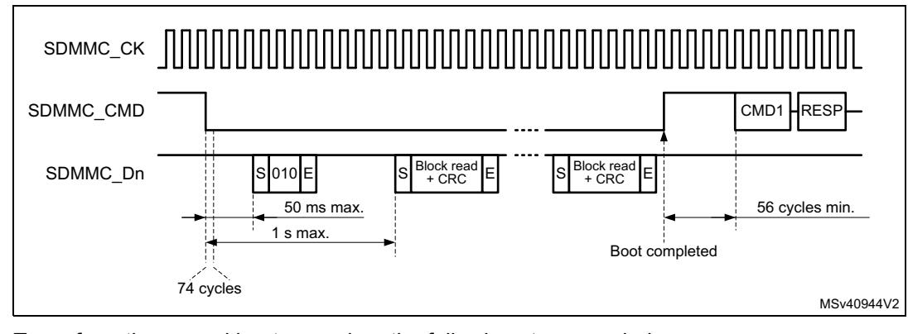

Figure 768. Normal boot mode operation

To perform the normal boot procedure the following steps needed:

- Reset the card.
- 2. if a boot acknowledgment is requested enable the BOOTACKEN and set the ACKTIME and enable the ACKFAIL and ACKTIMEOUT interrupt.
- 3. enable the data reception by setting the DPSM in receive mode (DTDIR) and the number of data bytes to be received in DATALENGTH.
- 4. Enable the DTIMEOUT, DATAEND, and CMDSENT interrupts for end of boot command confirmation.
- 5. Select the normal boot operation mode in BOOTMODE, and enable boot in BOOTEN. The boot procedure is started by enabling the CPSM with CPSMEN. This causes:
  - the SDMMC CMD to be driven low. (BOOTMODE = normal boot).
    - the ACK timeout to start.
    - DPSM to be enabled.
- The incorrect reception of the boot acknowledgment can be detected with ACKFAIL flag or ACKTIMEOUT flag when enabled.
  - when an incorrect boot acknowledgment is received the ACKFAIL flag occurs.
  - when the boot acknowledgment is not received in time the ACKTIMEOUT flag occurs.
- 7. when all boot data has been received the DATAEND flag occurs.
  - when data CRC fails the DCRCFAIL flag is also generated.
  - when the data timeout occurs the DTIMEOUT flag is also generated.
- 8. When last data has been received, read data from the FIFO until FIFO is empty after which end of data DATAEND flag is generated.
  - SDMMC has completely received all data and the DPSM is disabled.
- 9. The boot procedure is terminated by firmware clearing BOOTEN, which causes the SDMMC\_CMD line to go high. The CMDSENT flag is generated 56 cycles later to indicate that a new command can be sent.
  - a) If the boot procedure is aborted by firmware before all data has been received the CPSM Abort signal stops data reception and disables the DPSM which triggers an DABORT flag when enabled.
- The CMDSENT flag signals the end of the boot procedure and the card is ready to receive a new command


## Alternative boot operation

After card power-up or reset, if the host send CMD0 with the argument 0xFFFFFFA after 74 clock cycles before CMD0 is issued, the card recognizes that boot mode is being initiated. Within 1 second after the CMD0 with argument 0xFFFFFFA has been sent, the card starts to send the first boot code data on the SDMMC\_Dn line(s). The master terminates boot operation by sending CMD0 (Reset).

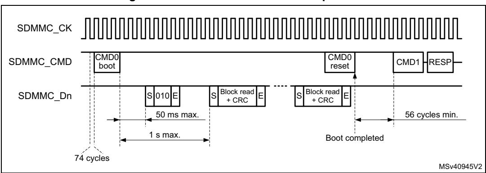

Figure 769. Alternative boot mode operation

To perform the alternative boot procedure the following steps needed:

- Move the SDMMC to power-off state, and reset the card
- 2. Move the SDMMC to power-on state. This guarantees the 74 SCDMMC\_CK cycles to be clocked before any command.
- 3. if a boot acknowledgment is requested enable the BOOTACKEN and set the ACKTIME and enable the ACKTIMEOUT flag.
- enable the data reception by setting the DPSM in receive mode (DTDIR) and the number of data to be received in DATALENGTH. Enable the DTIMEOUT and DATAEND flags.
- 5. Select the alternative boot operation mode in BOOTMODE, load the CMD0 with the 0xFFFFFFA argument in the command registers. Enable CMDSENT flag for end of


boot command confirmation, and enable boot in BOOTEN. The boot procedure is started by enabling the CPSM with CPSMEN. This causes:

- the loaded command and argument to be sent out. (BOOTMODE = alternative boot).
- the ACK timeout to start.
- DPSM to be enabled.
- 6. When the command has been sent the CMDSENT flag is generated, at which time the BOOTEN bit must be cleared.
- 7. the reception of the boot acknowledgment can be detected with ACKFAIL flag when enabled.
  - when the boot acknowledgment is not received in time the ACKTIMEOUT flag occurs.
- 8. when all boot data has been received the DATAEND flag occurs.
  - when data CRC fails the DCRCFAIL flag is also generated.
  - when the data timeout occurs the DTIMEOUT flag is also generated.
- 9. When last data has been received, read data from the FIFO until FIFO is empty after which end of data DATAEND flag is generated.
  - SDMMC has completely received all data and the DPSM is disabled.
- 10. The BOOTEN bit must be cleared, before terminating the boot procedure by sending CMD0 (Reset) with BOOTMODE = alternative boot. This causes the CMDSENT flag to occur 56 cycles after the Command.
  - if the boot procedure is aborted by firmware before all data has been received the CPSM Abort signal stops the data transfer and disable the DPSM which triggers an DABORT flag when enabled.
- 11. The CMDSENT flag signals the end of the boot procedure and the card is ready to receive a new command. When the RESET command has been sent successfully, the BOOTMODE control bit has to be cleared to terminate the boot operation.

# **58.6.6 Response R1b handling**

When sending commands which have a R1b response the busy signaling is reflected in the BUSYD0 register bit and the release of busy with the BUSYD0END flag. The SDMMC\_D0 line is sampled at the end of the R1b response and signaled in the BUSYD0 register bit. The BUSYD0 register bit is reset to not busy when the SDMMC\_D0 line release busy, at the same time the BUSYD0END flag is generated.

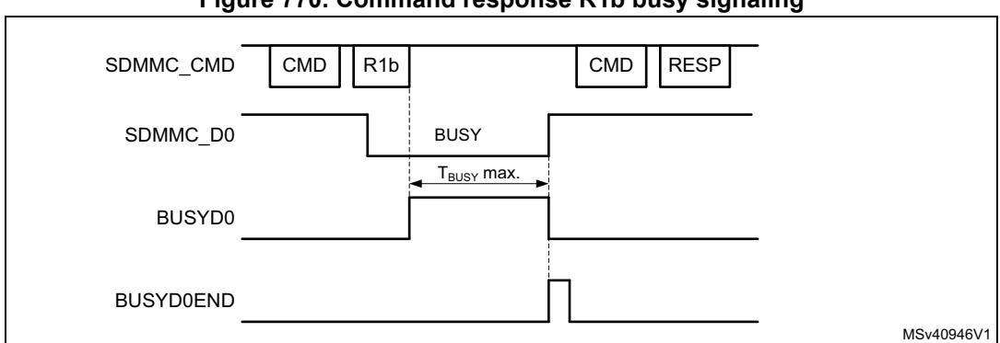

**Figure 770. Command response R1b busy signaling**

The expected maximum busy time must be set in the DATATIME register before sending the command. When enabled, the DTIMEOUT flag is set when after the R1b response busy stays active longer then the programmed time.

To detect the SDMMC\_D0 busy signaling when sending a Command with R1b response the following procedure applies:

- Enable CMDREND flag
- Send Command through CPSM.
- On the CMDREND flag check the BUSYD0 register bit.
  - If BUSYD0 signals not busy, signal busy release to the Firmware
  - If BUSYD0 signals busy, wait for BUSYD0END flag
- On BUSYD0END flag signal busy released to the firmware.
- On DTIMEOUT flag busy is active longer then programmed time.

# **58.6.7 Reset and card cycle power**

### **Reset**

Following reset the SDMMC is in the reset state. In this state the SDMMC is disabled and no command nor data can be transfered. The SDMMC\_D[7:0], and SDMMC\_CMD are in HiZ and the SDMMC\_CK is driven low.

Before moving to the power-on state the SDMMC must be configured.

In the power-on state the SDMMC\_CK clock is running. First 74 SDMMC\_CK cycles are clocked after which the SDMMC is enabled and command and data can be transfered.

The SDMMC states are controlled by Firmware with the PWRCTL register bits according *[Figure 771.](#page-50-0)*.

<span id="page-50-0"></span>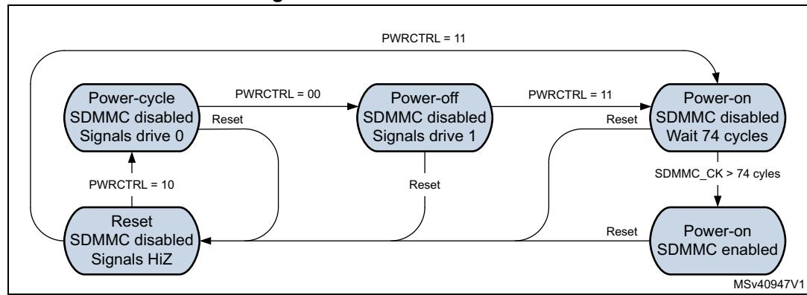

**Figure 771. SDMMC state control**

## **Card cycle power**

To perform a card cycle power the following procedure applies:


- 1. Reset the SDMMC with the RCC.SDMMCxRST register bit. This resets the SDMMC to the reset state and the CPSM and DPSM to the Idle state.
- 2. Disable the Vcc power to the card.
- 3. Set the SDMMC in power-cycle state. This makes that the SDMMC\_D[7:0], SDMMC\_CMD and SDMMC\_CK are driven low, to prevent the card from being supplied through the signal lines.
- 4. After minimum 1 ms enable the Vcc power to the card.
- 5. After the power ramp period set the SDMMC to the power-off state for minimum 1 ms. The SDMMC\_D[7:0], SDMMC\_CMD and SDMMC\_CK are set to drive "1".
- 6. After the 1 ms delay set the SDMMC to power-on state in which the SDMMC\_CK clock is enabled.
- 7. After 74 SDMMC\_CK cycles the first command can be sent to the card.

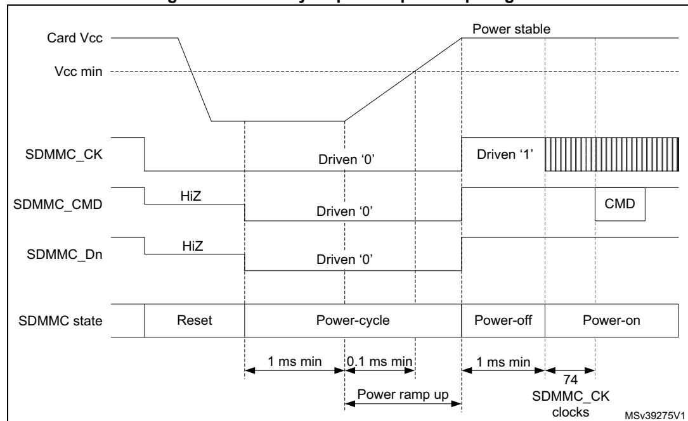

**Figure 772. Card cycle power / power up diagram**

# **58.7 Hardware flow control**

The hardware flow control during data transfer functionality is used to avoid FIFO underrun (TX mode) and overrun (RX mode) errors.

The behavior is to stop SDMMC\_CK during data transfer and freeze the SDMMC state machines. The data transfer is stalled when the FIFO is unable to transmit or receive data. The data transfer remains stalled until the transmit FIFO is half full or all data according DATALENGHT has been stored, or until the receive FIFO is half empty. Only state machines clocked by SDMMC\_CK are frozen, the AHB interfaces are still alive. The FIFO can thus be filled or emptied even if flow control is activated.

To enable hardware flow control during data transfer, the HWFC\_EN register bit must be set to 1. After reset hardware flow control is disabled.

Hardware flow control must only be used when the SDMMC\_Dn data is cycle-aligned with the SDMMC\_CK. Whenever the sdmmc\_fb\_ck from the DLYB delay block is used, i.e in the case of SDR104 mode with a  $t_{OP}$  and  $Dt_{OP}$  delay > 1 cycle, hardware flow control can not be used.

# 58.8 Ultra-high-speed phase I (UHS-I) voltage switch

UHS-I mode (SDR12, SDR25, SDR50, SDR104, and DDR50) requires the support for 1.8V signaling. After power up the card starts in 3.3V mode. CMD11 invokes the voltage switch sequence to the 1.8V mode. When the voltage sequence is completed successfully the card enters UHS-I mode with default SDR12 and card input and output timings are changed.

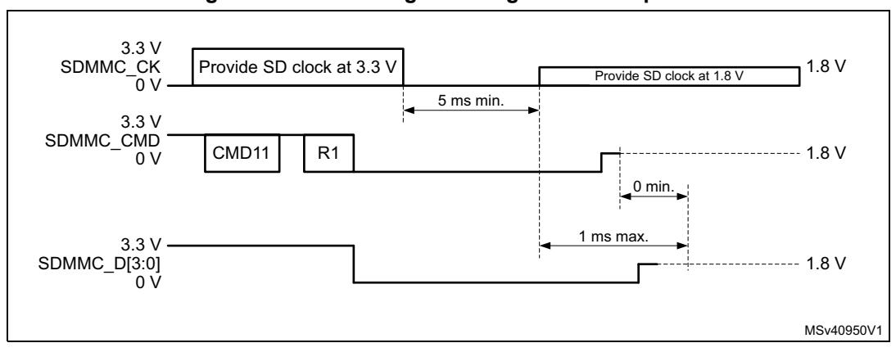

Figure 773. CMD11 signal voltage switch sequence

To perform the signal voltage switch sequence the following steps are needed:

- 1. Before starting the Voltage Switch procedure, the SDMMC\_CK frequency must be set in the range 100 kHz 400 kHz.
- 2. The host starts the Voltage Switch procedure by setting the VSWITCHEN bit before sending the CMD11.
- 3. The card returns an R1 response.
  - if the response CRC is pass, the Voltage Switch procedure continues the host does no longer drive the CMD and SDMMC\_D[3:0] signals until completion of the voltage switch sequence. Some cycles after the response the SDMMC\_CK is stopped and the CKSTOP flag is set.
  - if the response CRC is fail (CCRCFAIL flag) or no response is received before the timeout (CTIMEOUT flag), the Voltage Switch procedure is stopped.
- 4. The card drives CMD and SDMMC\_D[3:0] to low at the next clock after the R1 response.
- 5. The host, after having received the R1 response, may monitor the SDMMC\_D0 line using the BUSYD0 register bit. The SDMMC\_D0 line is sampled two SDMMC\_CK clock cycles after the Response. The Firmware may read the BUSYD0 register bit following the CKSTOP flag.
  - When the BUSYD0 is detected low the host firmware switches the Voltage regulator to 1.8V, after which it instructs the SDMMC to start the timing critical


- section of the Voltage Switch sequence by setting register bit VSWITCH. The hardware continues to stop the SDMMC\_CK by holding it low for at least 5 ms.
- When the BUSYD0 is detected high the host aborts the Voltage Switch sequence and cycle power the card.
- 6. The card after detecting SDMMC\_CK low begins switching signaling voltage to 1.8 V.
- 7. The host SDMMC hardware after at least 5 ms restarts the SDMMC\_CK.
- 8. The card within 1 ms from detecting SDMMC\_CK transition drives CMD and DAT[3:0] high for at least 1 SDMMC\_CK cycle and then stop driving CMD and DAT[3:0].
- 9. The host SDMMC hardware, 1 ms after the SDMMC\_CK has been restarted, the SDMMC\_D0 is sampled into BUSYD0 and the VSWEND flag is set.
- 10. The host, on the VSWEND flag, checks SDMMC\_D0 line using the BUSYD0 register bit, to confirm completion of voltage switch sequence:
  - When BUSYD0 is detected high, Voltage Switch has been completed successfully.
  - When BUSYD0 is detected low, Voltage Switch has failed, the host cycles the card power.

The minimum 5 ms time to stop the SDMMC\_CK is derived from the internal un-gated SDMMC\_CK clock, which has a maximum frequency of 25 MHz (SD mode), as set by the clock divider CLKDIV. The >5 ms time is counted by 212 cycles (10.24 ms @ 400 kHz). If a lower SDMMC\_CK frequency is selected by the clock divider CLKDIV the time for the SDMMC\_CK clock to be stopped is longer.

The maximum 1 ms time for the card to drive the SDMMC\_Dn and SDMMC\_CMD lines high is derived from the internal ungated SDMMC\_CK which has a maximum frequency of 25 MHz (SD mode), as set by the clock divider CLKDIV. The SDMMC checks the lines after >1 ms time which is counted by 29 cycles (1.28 ms @ 25 MHz). If a lower SDMMC\_CK frequency is selected by the clock divider CLKDIV the time to check the lines is longer.

The signal voltage level is supported through an external voltage translation transceiver like STMicroelectronics ST6G3244ME.


**Figure 774. Voltage switch transceiver typical application**

To interface with an external driver (a voltage switch transceiver), next to the standard signals the SDMMC uses the following signals:

**SDMMC\_CKIN** feedback input clock

**SDMMC\_CDIR** I/O direction control for the CMD signal.

**SDMMC\_D0DIR** I/O direction control for the SDMMC\_D0 signal.

**SDMMC\_D123DIR** I/O direction control for the SDMMC\_D1, SDMMC\_D2 and SDMMC\_D3 signals.

The voltage transceiver signals **EN** and **SEL** are to be handled through general-purpose I/O.

The polarity of the SDMMC\_CDIR, SDMMC\_D0DIR and SDMMC\_D123DIR signals can be selected through SDMMC\_POWER.DIRPOL control bit.

# 58.9 SDMMC interrupts

**Table 496. SDMMC interrupts** 

|                      | Ī                                 |            |                        |                           |                            |
|----------------------|-----------------------------------|------------|------------------------|---------------------------|----------------------------|
| Interrupt<br>acronym | Interrupt<br>event                | Event flag | Enable control bit     | Interrupt clear<br>method | Exit from<br>Sleep<br>mode |
| SDMMC                | Command<br>response CRC<br>fail   | CCRCFAIL   | CCRCFAILIE             | CCRCFAILC                 | Yes                        |
| SDMMC                | Data block<br>CRC fail            | DCRCFAIL   | DCRCFAILIE             | Yes                       |                            |
| SDMMC                | Command response timeout          | CTIMEOUT   | CTIMEOUTIE             | CTIMEOUTC                 | Yes                        |
| SDMMC                | Data timeout                      | DTIMEOUT   | DTIMEOUTIE             | DTIMEOUTC                 | Yes                        |
| SDMMC                | Transmit FIFO underrun            | TXUNDERR   | TXUNDERRIE             | TXUNDERRC                 | Yes                        |
| SDMMC                | Receive FIFO overrun              | RXOVERR    | RXOVERRIE              | RXOVERRC                  | Yes                        |
| SDMMC                | Command reponse received          | CMDREND    | CMDRENDIE              | CMDRENDC                  | Yes                        |
| SDMMC                | Comand sent                       | CMDSENT    | ENT CMDSENTIE CMDSENTC |                           | Yes                        |
| SDMMC                | Data transfer ended               | DATAEND    | DATAENDIE              | DATAENDC                  | Yes                        |
| SDMMC                | Data transfer<br>hold             | DHOLD      | DHOLDIE                | DHOLDC                    | Yes                        |
| SDMMC                | Data block<br>sent or<br>received | DBCKEND    | DBCKENDIE              | DBCKENDC                  | Yes                        |
| SDMMC                | Data transfer aborted             | DABORT     | DABORTIE               | DABORTC                   | Yes                        |
| SDMMC                | Transmit FIFO half empty          | TXFIFOHE   | TXFIFOHEIE             | n.a.                      | Yes                        |
| SDMMC                | Receive FIFO half full            | RXFIFOHF   | RXFIFOHFIE             | n.a.                      | Yes                        |
| SDMMC                | Transmit FIFO full                | TXFIFOF    | n.a.                   | n.a.                      | Yes                        |
| SDMMC                | Receive FIFO full                 | RXFIFOF    | RXFIFOFIE              | n.a.                      | Yes                        |
| SDMMC                | Transmit FIFO empty               | TXFIFOE    | TXFIFOEIE              | n.a.                      | Yes                        |
| SDMMC                | Receive FIFO empty                | RXFIFOE    | n.a.                   | n.a.                      | Yes                        |

Table 496. SDMMC interrupts (continued)

| Interrupt<br>acronym | Interrupt<br>event                             | Event flag | Enable control bit | Interrupt clear<br>method | Exit from<br>Sleep<br>mode |
|----------------------|------------------------------------------------|------------|--------------------|---------------------------|----------------------------|
| SDMMC                | Command response end of busy                   | BUSYD0END  | BUSYD0ENDIE        | BUSYD0ENDC                | Yes                        |
| SDMMC                | SDIO interrupt                                 | SDIOIT     | SDIOITIE           | SDIOITC                   | Yes                        |
| SDMMC                | Boot<br>acknowledgm<br>ent fail                | ACKFAIL    | ACKFAILIE          | ACKFAILC                  | Yes                        |
| SDMMC                | Boot<br>acknowledgm<br>ent timeout             | ACKTIMEOUT | ACKTIMEOUTIE       | ACKTIMEOUTC               | Yes                        |
| SDMMC                | Voltage switch timing                          | VSWEND     | VSWENDIE           | VSWENDC                   | Yes                        |
| SDMMC                | SDMM_CK<br>stopped in CKSTOF<br>voltage switch |            | CKSTOPIE           | CKSTOPC                   | Yes                        |
| SDMMC                | IDMA transfer error                            | IDMATE     | IDMATEIE           | IDMATEC                   | Yes                        |
| SDMMC                | IDMA buffer<br>transfer<br>complete            | IDMABTC    | IDMABTCIE          | IDMABTCC                  | Yes                        |


2587/3556

# **58.10 SDMMC registers**

The device communicates to the system via 32-bit control registers accessible via AHB slave interface.

The peripheral registers have to be accessed by words (32-bit). Byte (8-bit) and halfword (16-bit) accesses trigger an AHB bus error.

# **58.10.1 SDMMC power control register (SDMMC\_POWER)**

Address offset: 0x000 Reset value: 0x0000 0000

| 31   | 30   | 29   | 28   | 27   | 26   | 25   | 24   | 23   | 22   | 21   | 20         | 19            | 18          | 17   | 16           |
|------|------|------|------|------|------|------|------|------|------|------|------------|---------------|-------------|------|--------------|
| Res. | Res. | Res. | Res. | Res. | Res. | Res. | Res. | Res. | Res. | Res. | Res.       | Res.          | Res.        | Res. | Res.         |
|      |      |      |      |      |      |      |      |      |      |      |            |               |             |      |              |
| 15   | 14   | 13   | 12   | 11   | 10   | 9    | 8    | 7    | 6    | 5    | 4          | 3             | 2           | 1    | 0            |
| Res. | Res. | Res. | Res. | Res. | Res. | Res. | Res. | Res. | Res. | Res. | DIR<br>POL | VSWI<br>TCHEN | VSWI<br>TCH |      | PWRCTRL[1:0] |
|      |      |      |      |      |      |      |      |      |      |      | rw         | rw            | rw          | rw   | rw           |

Bits 31:5 Reserved, must be kept at reset value.

#### Bit 4 **DIRPOL**: Data and command direction signals polarity selection

This bit can only be written when the SDMMC is in the power-off state (PWRCTRL = 00).

- 0: Voltage transceiver IOs driven as output when direction signal is low.
- 1: Voltage transceiver IOs driven as output when direction signal is high.

#### Bit 3 **VSWITCHEN**: Voltage switch procedure enable

This bit can only be written by firmware when CPSM is disabled (CPSMEN = 0).

This bit is used to stop the SDMMC\_CK after the voltage switch command response:

- 0: SDMMC\_CK clock kept unchanged after successfully received command response.
- 1: SDMMC\_CK clock stopped after successfully received command response.

#### Bit 2 **VSWITCH**: Voltage switch sequence start

This bit is used to start the timing critical section of the voltage switch sequence:

- 0: Voltage switch sequence not started and not active.
- 1: Voltage switch sequence started or active.

### Bits 1:0 **PWRCTRL[1:0]**: SDMMC state control bits

These bits can only be written when the SDMMC is not in the power-on state (PWRCTRL ≠ 11).

These bits are used to define the functional state of the SDMMC signals:

- 00: After reset, Reset: the SDMMC is disabled and the clock to the Card is stopped, SDMMC\_D[7:0], and SDMMC\_CMD are HiZ and SDMMC\_CK is driven low. When written 00, power-off: the SDMMC is disabled and the clock to the card is stopped, SDMMC\_D[7:0], SDMMC\_CMD and SDMMC\_CK are driven high.
- 01: Reserved. (When written 01, PWRCTRL value does not change)
- 10: Power-cycle, the SDMMC is disabled and the clock to the card is stopped, SDMMC\_D[7:0], SDMMC\_CMD and SDMMC\_CK are driven low.
- 11: Power-on: the card is clocked, The first 74 SDMMC\_CK cycles the SDMMC is still disabled. After the 74 cycles the SDMMC is enabled and the SDMMC\_D[7:0], SDMMC\_CMD and SDMMC\_CK are controlled according the SDMMC operation.

Any further write is ignored, PWRCTRL value keeps 11.


# 58.10.2 SDMMC clock control register (SDMMC CLKCR)

Address offset: 0x004

Reset value: 0x0000 0000

The SDMMC\_CLKCR register controls the SDMMC\_CK output clock, the sdmmc\_rx\_ck

receive clock, and the bus width.

| 31   | 30           | 29   | 28         | 27   | 26   | 25   | 24   | 23   | 22   | 21    | 20       | 19           | 18  | 17          | 16          |
|------|--------------|------|------------|------|------|------|------|------|------|-------|----------|--------------|-----|-------------|-------------|
| Res. | Res.         | Res. | Res.       | Res. | Res. | Res. | Res. | Res. | Res. | SELCL | KRX[1:0] | BUS<br>SPEED | DDR | HWFC<br>_EN | NEG<br>EDGE |
|      |              |      |            |      |      |      |      |      |      | rw    | rw       | rw           | rw  | rw          | rw          |
| 15   | 14           | 13   | 12         | 11   | 10   | 9    | 8    | 7    | 6    | 5     | 1        | 2            | 2   | -1          | 0           |
|      | • •          | 10   | 12         | 11   | 10   | 9    | U    | ,    | O    | 5     | 4        | 3            | 2   |             | U           |
|      | /ID<br>[1:0] | Res. | PWR<br>SAV | Res. | Res. | 9    |      | ,    | 0    |       | IV[9:0]  | 3            |     | '           | U           |

Bits 31:22 Reserved, must be kept at reset value.

#### Bits 21:20 SELCLKRX[1:0]: Receive clock selection

These bits can only be written when the CPSM and DPSM are not active (CPSMACT = 0 and DPSMACT = 0)

00: sdmmc\_io\_in\_ck selected as receive clock

01: SDMMC CKIN feedback clock selected as receive clock

10: sdmmc fb ck tuned feedback clock selected as receive clock.

11: Reserved (select sdmmc io in ck)

#### Bit 19 BUSSPEED: Bus speed for selection of SDMMC operating modes

This bit can only be written when the CPSM and DPSM are not active (CPSMACT = 0 and DPSMACT = 0)

0: DS, HS, SDR12, SDR25, Legacy compatible, High speed SDR, High speed DDR bus speed mode selected

1: SDR50, DDR50, SDR104, HS200 bus speed mode selected.

### Bit 18 DDR: Data rate signaling selection

This bit can only be written when the CPSM and DPSM are not active (CPSMACT = 0 and DPSMACT = 0)

DDR rate must only be selected with 4-bit or 8-bit wide bus mode. (WIDBUS > 00). DDR = 1 has no effect when WIDBUS = 00 (1-bit wide bus).

DDR rate must only be selected with clock division >1. (CLKDIV > 0)

0: SDR Single data rate signaling

1: DDR double data rate signaling

#### Bit 17 HWFC\_EN: Hardware flow control enable

This bit can only be written when the CPSM and DPSM are not active (CPSMACT = 0 and DPSMACT = 0)

0: Hardware flow control is disabled

1: Hardware flow control is enabled

When Hardware flow control is enabled, the meaning of the TXFIFOE and RXFIFOF flags change, see SDMMC status register definition in *Section 58.10.11*.


#### Bit 16 **NEGEDGE**: SDMMC\_CK dephasing selection bit for data and command

This bit can only be written when the CPSM and DPSM are not active (CPSMACT = 0 and DPSMACT = 0).

When clock division = 1 (CLKDIV = 0), this bit has no effect. Data and Command change on SDMMC\_CK falling edge.

0:When clock division >1 (CLKDIV > 0) and DDR = 0:

- Command and data changed on the sdmmc\_ker\_ck falling edge succeeding the rising edge of SDMMC\_CK.
- SDMMC\_CK edge occurs on sdmmc\_ker\_ck rising edge.

When clock division >1 (CLKDIV > 0) and DDR = 1:

- Command changed on the sdmmc\_ker\_ck falling edge succeeding the rising edge of SDMMC\_CK.
- Data changed on the sdmmc\_ker\_ck falling edge succeeding a SDMMC\_CK edge.
- SDMMC\_CK edge occurs on sdmmc\_ker\_ck rising edge.
- 1: When clock division >1 (CLKDIV > 0) and DDR = 0:
  - Command and data changed on the same sdmmc\_ker\_ck rising edge generating the SDMMC\_CK falling edge.

When clock division >1 (CLKDIV > 0) and DDR = 1:

- Command changed on the same sdmmc\_ker\_ck rising edge generating the SDMMC\_CK falling edge.
- Data changed on the SDMMC\_CK falling edge succeeding a SDMMC\_CK edge.
- SDMMC\_CK edge occurs on sdmmc\_ker\_ck rising edge.

### Bits 15:14 **WIDBUS[1:0]**: Wide bus mode enable bit

This bit can only be written when the CPSM and DPSM are not active (CPSMACT = 0 and DPSMACT = 0)

00: Default 1-bit wide bus mode: SDMMC\_D0 used (Does not support DDR)

01: 4-bit wide bus mode: SDMMC\_D[3:0] used

10: 8-bit wide bus mode: SDMMC\_D[7:0] used

- Bit 13 Reserved, must be kept at reset value.
- Bit 12 **PWRSAV**: Power saving configuration bit

This bit can only be written when the CPSM and DPSM are not active (CPSMACT = 0 and DPSMACT = 0)

For power saving, the SDMMC\_CK clock output can be disabled when the bus is idle by setting PWRSAV:

- 0: SDMMC\_CK clock is always enabled
- 1: SDMMC\_CK is only enabled when the bus is active
- Bits 11:10 Reserved, must be kept at reset value.

### Bits 9:0 **CLKDIV[9:0]**: Clock divide factor

This bit can only be written when the CPSM and DPSM are not active (CPSMACT = 0 and DPSMACT = 0).

This field defines the divide factor between the input clock (sdmmc\_ker\_ck) and the output clock (SDMMC\_CK): SDMMC\_CK frequency = sdmmc\_ker\_ck / [2 \* CLKDIV].

0x000: SDMMC\_CK frequency = sdmmc\_ker\_ck / 1 (Does not support DDR)

0x001: SDMMC\_CK frequency = sdmmc\_ker\_ck / 2

0x002: SDMMC\_CK frequency = sdmmc\_ker\_ck / 4

0x0XX: etc..

0x080: SDMMC\_CK frequency = sdmmc\_ker\_ck / 256

0xXXX: etc..

0x3FF: SDMMC\_CK frequency = sdmmc\_ker\_ck / 2046


Note: 1 While the SD/SDIO card or e•MMC is in identification mode, the SDMMC\_CK frequency must be less than 400 kHz.

- 2 The clock frequency can be changed to the maximum card bus frequency when relative card addresses are assigned to all cards.
- 3 At least seven sdmmc\_hclk clock periods are needed between two write accesses to this register. SDMMC\_CK can also be stopped during the Read Wait interval for SD I/O cards: in this case the SDMMC\_CLKCR register does not control SDMMC\_CK.

# 58.10.3 SDMMC argument register (SDMMC ARGR)

Address offset: 0x008

Reset value: 0x0000 0000

The SDMMC\_ARGR register contains a 32-bit command argument, which is sent to a card as part of a command message.

| 31            | 30           | 29 | 28 | 27 | 26 | 25 | 24 | 23 | 22 | 21 | 20 | 19 | 18 | 17 | 16 |
|---------------|--------------|----|----|----|----|----|----|----|----|----|----|----|----|----|----|
| CMDARG[31:16] |              |    |    |    |    |    |    |    |    |    |    |    |    |    |    |
| rw            | rw           | rw | rw | rw | rw | rw | rw | rw | rw | rw | rw | rw | rw | rw | rw |
| 15            | 14           | 13 | 12 | 11 | 10 | 9  | 8  | 7  | 6  | 5  | 4  | 3  | 2  | 1  | 0  |
|               | CMDARG[15:0] |    |    |    |    |    |    |    |    |    |    |    |    |    |    |
| rw            | rw           | rw | rw | rw | rw | rw | rw | rw | rw | rw | rw | rw | rw | rw | rw |

Bits 31:0 CMDARG[31:0]: Command argument

These bits can only be written by firmware when CPSM is disabled (CPSMEN = 0). Command argument sent to a card as part of a command message. If a command contains an argument, it must be loaded into this register before writing a command to the command register.

# 58.10.4 SDMMC command register (SDMMC CMDR)

Address offset: 0x00C

Reset value: 0x0000 0000

The SDMMC\_CMDR register contains the command index and command type bits. The command index is sent to a card as part of a command message. The command type bits control the command path state machine (CPSM).

| 31         | 30           | 29         | 28         | 27           | 26          | 25     | 24       | 23          | 22           | 21            | 20   | 19     | 18       | 17   | 16                 |
|------------|--------------|------------|------------|--------------|-------------|--------|----------|-------------|--------------|---------------|------|--------|----------|------|--------------------|
| Res.       | Res.         | Res.       | Res.       | Res.         | Res.        | Res.   | Res.     | Res.        | Res.         | Res.          | Res. | Res.   | Res.     | Res. | CMD<br>SUS<br>PEND |
|            |              |            |            |              |             |        |          |             |              |               |      |        |          |      | rw                 |
| 15         | 14           | 13         | 12         | 11           | 10          | 9      | 8        | 7           | 6            | 5             | 4    | 3      | 2        | 1    | 0                  |
| DOOT       | 1            |            |            |              |             |        |          |             |              | CMDINDEX[5:0] |      |        |          |      |                    |
| BOOT<br>EN | BOOT<br>MODE | DT<br>HOLD | CPSM<br>EN | WAITP<br>END | WAIT<br>INT | WAITRE | ESP[1:0] | CMD<br>STOP | CMD<br>TRANS |               |      | CMDINE | DEX[5:0] |      |                    |

RM0399 Rev 4 2591/3556

- Bits 31:17 Reserved, must be kept at reset value.
  - Bit 16 **CMDSUSPEND**: The CPSM treats the command as a Suspend or Resume command and signals interrupt period start/end

This bit can only be written by firmware when CPSM is disabled (CPSMEN = 0).

CMDSUSPEND = 1 and CMDTRANS = 0 Suspend command, start interrupt period when response bit BS=0.

CMDSUSPEND = 1 and CMDTRANS = 1 Resume command with data, end interrupt period when response bit DF=1.

- Bit 15 **BOOTEN**: Enable boot mode procedure
  - 0: Boot mode procedure disabled
  - 1: Boot mode procedure enabled
- Bit 14 **BOOTMODE**: Select the boot mode procedure to be used

This bit can only be written by firmware when CPSM is disabled (CPSMEN = 0)

- 0: Normal boot mode procedure selected
- 1: Alternative boot mode procedure selected.
- Bit 13 **DTHOLD**: Hold new data block transmission and reception in the DPSM

If this bit is set, the DPSM does not move from the Wait\_S state to the Send state or from the Wait\_R state to the Receive state.

Bit 12 **CPSMEN**: Command path state machine (CPSM) enable bit

This bit is written 1 by firmware, and cleared by hardware when the CPSM enters the Idle state.

If this bit is set, the CPSM is enabled.

When DTEN = 1, no command is transfered nor boot procedure is started. CPSMEN is cleared to 0.

During Read Wait with SDMMC\_CK stopped no command is sent and CPSMEN is kept 0.

Bit 11 **WAITPEND**: CPSM waits for end of data transfer (CmdPend internal signal) from DPSM

This bit when set, the CPSM waits for the end of data transfer trigger before it starts sending a command.

WAITPEND is only taken into account when DTMODE = *e*•MMC stream data transfer, WIDBUS = 1-bit wide bus mode, DPSMACT = 1 and DTDIR = from host to card.

Bit 10 **WAITINT**: CPSM waits for interrupt request

If this bit is set, the CPSM disables command timeout and waits for an card interrupt request (Response).

If this bit is cleared in the CPSM Wait state, it causes the abort of the interrupt mode.

Bits 9:8 **WAITRESP[1:0]**: Wait for response bits

This bit can only be written by firmware when CPSM is disabled (CPSMEN = 0).

They are used to configure whether the CPSM is to wait for a response, and if yes, which kind of response.

- 00: No response, expect CMDSENT flag
- 01: Short response, expect CMDREND or CCRCFAIL flag
- 10: Short response, expect CMDREND flag (No CRC)
- 11: Long response, expect CMDREND or CCRCFAIL flag


Bit 7 **CMDSTOP**: The CPSM treats the command as a Stop Transmission command and signals abort to the DPSM

This bit can only be written by firmware when CPSM is disabled (CPSMEN = 0). If this bit is set, the CPSM issues the abort signal to the DPSM when the command is sent.

Bit 6 **CMDTRANS**: The CPSM treats the command as a data transfer command, stops the interrupt period, and signals DataEnable to the DPSM

This bit can only be written by firmware when CPSM is disabled (CPSMEN = 0). If this bit is set, the CPSM issues an end of interrupt period and issues DataEnable signal to the DPSM when the command is sent.

### Bits 5:0 **CMDINDEX[5:0]**: Command index

This bit can only be written by firmware when CPSM is disabled (CPSMEN = 0). The command index is sent to the card as part of a command message.

- *Note: 1 At least seven sdmmc\_hclk clock periods are needed between two write accesses to this register.*
  - *2 MultiMediaCard can send two kinds of response: short responses, 48 bits, or long responses,136 bits. SD card and SD I/O card can send only short responses, the argument can vary according to the type of response: the software distinguishes the type of response according to the send command.*

# **58.10.5 SDMMC command response register (SDMMC\_RESPCMDR)**

Address offset: 0x010

Reset value: 0x0000 0000

The SDMMC\_RESPCMDR register contains the command index field of the last command response received. If the command response transmission does not contain the command index field (long or OCR response), the RESPCMD field is unknown, although it must contain 111111b (the value of the reserved field from the response).

| 31   | 30   | 29   | 28   | 27   | 26   | 25   | 24   | 23   | 22   | 21   | 20   | 19   | 18           | 17   | 16   |
|------|------|------|------|------|------|------|------|------|------|------|------|------|--------------|------|------|
| Res. | Res. | Res. | Res. | Res. | Res. | Res. | Res. | Res. | Res. | Res. | Res. | Res. | Res.         | Res. | Res. |
|      |      |      |      |      |      |      |      |      |      |      |      |      |              |      |      |
|      |      |      |      |      |      |      |      |      |      |      |      |      |              |      |      |
| 15   | 14   | 13   | 12   | 11   | 10   | 9    | 8    | 7    | 6    | 5    | 4    | 3    | 2            | 1    | 0    |
| Res. | Res. | Res. | Res. | Res. | Res. | Res. | Res. | Res. | Res. |      |      |      | RESPCMD[5:0] |      |      |

Bits 31:6 Reserved, must be kept at reset value.

#### Bits 5:0 **RESPCMD[5:0]**: Response command index

Read-only bit field. Contains the command index of the last command response received.

RM0399 Rev 4 2593/3556

# **58.10.6 SDMMC response x register (SDMMC\_RESPxR)**

Address offset: 0x010 + 0x004 \* x, (x = 1 to 4)

Reset value: 0x0000 0000

The SDMMC\_RESP1/2/3/4R registers contain the status of a card, which is part of the

received response.

| 31 | 30                | 29 | 28 | 27 | 26 | 25 | 24 | 23 | 22 | 21 | 20 | 19 | 18 | 17 | 16 |
|----|-------------------|----|----|----|----|----|----|----|----|----|----|----|----|----|----|
|    | CARDSTATUS[31:16] |    |    |    |    |    |    |    |    |    |    |    |    |    |    |
| r  | r                 | r  | r  | r  | r  | r  | r  | r  | r  | r  | r  | r  | r  | r  | r  |
| 15 | 14                | 13 | 12 | 11 | 10 | 9  | 8  | 7  | 6  | 5  | 4  | 3  | 2  | 1  | 0  |
|    | CARDSTATUS[15:0]  |    |    |    |    |    |    |    |    |    |    |    |    |    |    |
| r  | r                 | r  | r  | r  | r  | r  | r  | r  | r  | r  | r  | r  | r  | r  | r  |

Bits 31:0 **CARDSTATUS[31:0]**: Card status according table below

See *[Table 497](#page-63-0)*.

The card status size is 32 or 128 bits, depending on the response type.

**Table 497. Response type and SDMMC\_RESPxR registers**

<span id="page-63-0"></span>

| Register(1)  | Short response    | Long response         |
|--------------|-------------------|-----------------------|
| SDMMC_RESP1R | Card status[31:0] | Card status [127:96]  |
| SDMMC_RESP2R | all 0             | Card status [95:64]   |
| SDMMC_RESP3R | all 0             | Card status [63:32]   |
| SDMMC_RESP4R | all 0             | Card status [31:0](2) |

<sup>1.</sup> The most significant bit of the card status is received first.

# **58.10.7 SDMMC data timer register (SDMMC\_DTIMER)**

Address offset: 0x024 Reset value: 0x0000 0000

The SDMMC\_DTIMER register contains the data timeout period, in card bus clock periods.

A counter loads the value from the SDMMC\_DTIMER register, and starts decrementing when the data path state machine (DPSM) enters the Wait\_R or Busy state. If the timer reaches 0 while the DPSM is in either of these states, the timeout status flag is set.

| 31              | 30             | 29 | 28 | 27 | 26 | 25 | 24 | 23 | 22 | 21 | 20 | 19 | 18 | 17 | 16 |
|-----------------|----------------|----|----|----|----|----|----|----|----|----|----|----|----|----|----|
| DATATIME[31:16] |                |    |    |    |    |    |    |    |    |    |    |    |    |    |    |
| rw              | rw             | rw | rw | rw | rw | rw | rw | rw | rw | rw | rw | rw | rw | rw | rw |
| 15              | 14             | 13 | 12 | 11 | 10 | 9  | 8  | 7  | 6  | 5  | 4  | 3  | 2  | 1  | 0  |
|                 | DATATIME[15:0] |    |    |    |    |    |    |    |    |    |    |    |    |    |    |
| rw              | rw             | rw | rw | rw | rw | rw | rw | rw | rw | rw | rw | rw | rw | rw | rw |

<sup>2.</sup> The SDMMC\_RESP4R register LSB is always 0.

Bits 31:0 **DATATIME[31:0]**: Data and R1b busy timeout period

This bit can only be written when the CPSM and DPSM are not active (CPSMACT = 0 and DPSMACT = 0).

Data and R1b busy timeout period expressed in card bus clock periods.

*Note: A data transfer must be written to the data timer register and the data length register before being written to the data control register.*

# **58.10.8 SDMMC data length register (SDMMC\_DLENR)**

Address offset: 0x028

Reset value: 0x0000 0000

The SDMMC\_DLENR register contains the number of data bytes to be transferred. The value is loaded into the data counter when data transfer starts.

| 31   | 30   | 29   | 28   | 27   | 26   | 25   | 24                | 23 | 22 | 21 | 20 | 19 | 18 | 17 | 16 |  |  |
|------|------|------|------|------|------|------|-------------------|----|----|----|----|----|----|----|----|--|--|
| Res. | Res. | Res. | Res. | Res. | Res. | Res. | DATALENGTH[24:16] |    |    |    |    |    |    |    |    |  |  |
|      |      |      |      |      |      |      | rw                | rw | rw | rw | rw | rw | rw | rw | rw |  |  |
| 15   | 14   | 13   | 12   | 11   | 10   | 9    | 8                 | 7  | 6  | 5  | 4  | 3  | 2  | 1  | 0  |  |  |
|      |      |      |      |      |      |      | DATALENGTH[15:0]  |    |    |    |    |    |    |    |    |  |  |
| rw   | rw   | rw   | rw   | rw   | rw   | rw   | rw                | rw | rw | rw | rw | rw | rw | rw | rw |  |  |

Bits 31:25 Reserved, must be kept at reset value.

### Bits 24:0 **DATALENGTH[24:0]**: Data length value

This register can only be written by firmware when DPSM is inactive (DPSMACT = 0). Number of data bytes to be transferred.

When DDR = 1 DATALENGTH is truncated to a multiple of 2. (The last odd byte is not transfered)

When DATALENGTH = 0 no data are transfered, when requested by a CPSMEN and CMDTRANS = 1 also no command is transfered. DTEN and CPSMEN are cleared to 0.

*Note: For a block data transfer, the value in the data length register must be a multiple of the block size (see SDMMC\_DCTRL). A data transfer must be written to the data timer register and the data length register before being written to the data control register.*

> *For an SDMMC multibyte transfer the value in the data length register must be between 1 and 512.*


# **58.10.9 SDMMC data control register (SDMMC\_DCTRL)**

Address offset: 0x02C

Reset value: 0x0000 0000

The SDMMC\_DCTRL register control the data path state machine (DPSM).

| 31   | 30   | 29          | 28                | 27         | 26        | 25         | 24          | 23   | 22   | 21              | 20   | 19   | 18          | 17    | 16   |
|------|------|-------------|-------------------|------------|-----------|------------|-------------|------|------|-----------------|------|------|-------------|-------|------|
| Res. | Res. | Res.        | Res.              | Res.       | Res.      | Res.       | Res.        | Res. | Res. | Res.            | Res. | Res. | Res.        | Res.  | Res. |
|      |      |             |                   |            |           |            |             |      |      |                 |      |      |             |       |      |
| 15   | 14   | 13          | 12                | 11         | 10        | 9          | 8           | 7    | 6    | 5               | 4    | 3    | 2           | 1     | 0    |
| Res. | Res. | FIFO<br>RST | BOOT<br>ACK<br>EN | SDIO<br>EN | RW<br>MOD | RW<br>STOP | RW<br>START |      |      | DBLOCKSIZE[3:0] |      |      | DTMODE[1:0] | DTDIR | DTEN |
|      |      | rw          | rw                | rw         | rw        | rw         | rw          | rw   | rw   | rw              | rw   | rw   | rw          | rw    | rw   |

Bits 31:14 Reserved, must be kept at reset value.

### Bit 13 **FIFORST**: FIFO reset, flushes any remaining data

This bit can only be written by firmware when IDMAEN= 0 and DPSM is active (DPSMACT = 1). This bit only takes effect when a transfer error or transfer hold occurs.

- 0: FIFO not affected.
- 1: Flush any remaining data and reset the FIFO pointers. This bit is automatically cleared to 0 by hardware when DPSM gets inactive (DPSMACT = 0).

#### Bit 12 **BOOTACKEN**: Enable the reception of the boot acknowledgment

This bit can only be written by firmware when DPSM is inactive (DPSMACT = 0).

- 0: Boot acknowledgment disabled, not expected to be received
- 1: Boot acknowledgment enabled, expected to be received

### Bit 11 **SDIOEN**: SD I/O interrupt enable functions

This bit can only be written by firmware when DPSM is inactive (DPSMACT = 0). If this bit is set, the DPSM enables the SD I/O card specific interrupt operation.

#### Bit 10 **RWMOD**: Read Wait mode

This bit can only be written by firmware when DPSM is inactive (DPSMACT = 0).

- 0: Read Wait control using SDMMC\_D2
- 1: Read Wait control stopping SDMMC\_CK

### Bit 9 **RWSTOP**: Read Wait stop

This bit is written by firmware and auto cleared by hardware when the DPSM moves from the R\_W state to the Wait\_R or Idle state.

- 0: No Read Wait stop.
- 1: Enable for Read Wait stop when DPSM is in the R\_W state.

### Bit 8 **RWSTART**: Read Wait start

If this bit is set, Read Wait operation starts.

#### Bits 7:4 **DBLOCKSIZE[3:0]**: Data block size

This bit can only be written by firmware when DPSM is inactive (DPSMACT = 0).

Define the data block length when the block data transfer mode is selected:

0000: Block length = 20 = 1 byte

0001: Block length = 21 = 2 bytes

0010: Block length = 22 = 4 bytes

0011: Block length = 23 = 8 bytes

0100: Block length = 24 = 16 bytes

0101: Block length = 25 = 32 bytes

0110: Block length = 26 = 64 bytes

0111: Block length = 27 = 128 bytes

1000: Block length = 28 = 256 bytes 1001: Block length = 29 = 512 bytes

1010: Block length = 210 = 1024 bytes

1011: Block length = 211 = 2048 bytes

1100: Block length = 212 = 4096 bytes

1101: Block length = 213 = 8192 bytes

1110: Block length = 214 = 16384 bytes

1111: Reserved

When DATALENGTH is not a multiple of DBLOCKSIZE, the transfered data is truncated at a multiple of DBLOCKSIZE. (None of the remaining data are transfered.)

When DDR = 1, DBLOCKSIZE = 0000 must not be used. (No data are transfered)

#### Bits 3:2 **DTMODE[1:0]**: Data transfer mode selection

This bit can only be written by firmware when DPSM is inactive (DPSMACT = 0).

00: Block data transfer ending on block count.

01: SDIO multibyte data transfer.

10: *e*•MMC Stream data transfer. (WIDBUS must select 1-bit wide bus mode)

11: Block data transfer ending with STOP\_TRANSMISSION command (not to be used with DTEN initiated data transfers).

## Bit 1 **DTDIR**: Data transfer direction selection

This bit can only be written by firmware when DPSM is inactive (DPSMACT = 0).

0: From host to card.

1: From card to host.

#### Bit 0 **DTEN**: Data transfer enable bit

This bit can only be written by firmware when DPSM is inactive (DPSMACT = 0). This bit is cleared by Hardware when data transfer completes.

This bit must only be used to transfer data when no associated data transfer command is used, i.e. must not be used with SD or *e*•MMC cards.

0: Do not start data transfer without CPSM data transfer command.

1: Start data transfer without CPSM data transfer command.

# **58.10.10 SDMMC data counter register (SDMMC\_DCNTR)**

Address offset: 0x030

Reset value: 0x0000 0000

The SDMMC\_DCNTR register loads the value from the data length register (see SDMMC\_DLENR) when the DPSM moves from the Idle state to the Wait\_R or Wait\_S state. As data is transferred, the counter decrements the value until it reaches 0. The DPSM then


RM0399 Rev 4 2597/3556

moves to the Idle state and when there has been no error, and no transmit data transfer hold, the data status end flag (DATAEND) is set.

| 31   | 30              | 29   | 28   | 27   | 26   | 25   | 24               | 23 | 22 | 21 | 20 | 19 | 18 | 17 | 16 |  |  |
|------|-----------------|------|------|------|------|------|------------------|----|----|----|----|----|----|----|----|--|--|
| Res. | Res.            | Res. | Res. | Res. | Res. | Res. | DATACOUNT[24:16] |    |    |    |    |    |    |    |    |  |  |
|      |                 |      |      |      |      |      | r                | r  | r  | r  | r  | r  | r  | r  | r  |  |  |
| 15   | 14              | 13   | 12   | 11   | 10   | 9    | 8                | 7  | 6  | 5  | 4  | 3  | 2  | 1  | 0  |  |  |
|      | DATACOUNT[15:0] |      |      |      |      |      |                  |    |    |    |    |    |    |    |    |  |  |
| r    | r               | r    | r    | r    | r    | r    | r                | r  | r  | r  | r  | r  | r  | r  | r  |  |  |

Bits 31:25 Reserved, must be kept at reset value.

### Bits 24:0 DATACOUNT[24:0]: Data count value

When read, the number of remaining data bytes to be transferred is returned. Write has no effect.

Note:

This register must be read only after the data transfer is complete, or hold. When reading after an error event the read data count value may be different from the real number of data bytes transfered.

# <span id="page-67-0"></span>58.10.11 SDMMC status register (SDMMC\_STAR)

Address offset: 0x034 Reset value: 0x0000 0000

The SDMMC\_STAR register is a read-only register. It contains two types of flag:

- Static flags (bits [28, 21, 11:0]): these bits remain asserted until they are cleared by writing to the SDMMC interrupt Clear register (see SDMMC\_ICR)
- Dynamic flags (bits [20:12]): these bits change state depending on the state of the underlying logic (for example, FIFO full and empty flags are asserted and deasserted as data while written to the FIFO)

| 31               | 30               | 29          | 28          | 27         | 26          | 25         | 24                 | 23          | 22          | 21            | 20               | 19               | 18               | 17           | 16           |
|------------------|------------------|-------------|-------------|------------|-------------|------------|--------------------|-------------|-------------|---------------|------------------|------------------|------------------|--------------|--------------|
| Res.             | Res.             | Res.        | IDMA<br>BTC | IDMA<br>TE | CK<br>STOP  | VSW<br>END | ACK<br>TIME<br>OUT | ACK<br>FAIL | SDIOIT      | BUSY<br>D0END | BUSY<br>D0       | RX<br>FIFOE      | TX<br>FIFOE      | RX<br>FIFOF  | TX<br>FIFOF  |
|                  |                  |             | r           | r          | r           | r          | r                  | r           | r           | r             | r                | r                | r                | r            | r            |
| 15               | 14               | 13          | 12          | 11         | 10          | 9          | 8                  | 7           | 6           | 5             | 4                | 3                | 2                | 1            | 0            |
| RX<br>FIFO<br>HF | TX<br>FIFO<br>HE | CPSM<br>ACT | DPSM<br>ACT | DA<br>BORT | DBCK<br>END | DHOLD      | DATA<br>END        | CMD<br>SENT | CMDR<br>END | RX<br>OVERR   | TX<br>UNDER<br>R | D<br>TIME<br>OUT | C<br>TIME<br>OUT | DCRC<br>FAIL | CCRC<br>FAIL |
| r                | r                | r           | r           | r          | r           | r          | r                  | r           | r           | r             | r                | r                | r                | r            | r            |

Bits 31:29 Reserved, must be kept at reset value.

Bit 28 IDMABTC: IDMA buffer transfer complete

The interrupt flag is cleared by writing corresponding interrupt clear bit in SDMMC\_ICR.

Bit 27 IDMATE: IDMA transfer error

The interrupt flag is cleared by writing corresponding interrupt clear bit in SDMMC\_ICR.

Bit 26 CKSTOP: SDMMC CK stopped in Voltage switch procedure

The interrupt flag is cleared by writing corresponding interrupt clear bit in SDMMC\_ICR.


Bit 25 **VSWEND**: Voltage switch critical timing section completion

The interrupt flag is cleared by writing corresponding interrupt clear bit in SDMMC\_ICR.

Bit 24 **ACKTIMEOUT**: Boot acknowledgment timeout

The interrupt flag is cleared by writing corresponding interrupt clear bit in SDMMC\_ICR.

Bit 23 **ACKFAIL**: Boot acknowledgment received (boot acknowledgment check fail)

The interrupt flag is cleared by writing corresponding interrupt clear bit in SDMMC\_ICR.

Bit 22 **SDIOIT**: SDIO interrupt received

The interrupt flag is cleared by writing corresponding interrupt clear bit in SDMMC\_ICR.

Bit 21 **BUSYD0END**: end of SDMMC\_D0 Busy following a CMD response detected

This indicates only end of busy following a CMD response. This bit does not signal busy due to data transfer. Interrupt flag is cleared by writing corresponding interrupt clear bit in SDMMC\_ICR.

0: card SDMMC\_D0 signal does NOT signal change from busy to not busy.

1: card SDMMC\_D0 signal changed from busy to NOT busy.

Bit 20 **BUSYD0**: Inverted value of SDMMC\_D0 line (Busy), sampled at the end of a CMD response and a second time 2 SDMMC\_CK cycles after the CMD response

This bit is reset to not busy when the SDMMCD0 line changes from busy to not busy. This bit does not signal busy due to data transfer. This is a hardware status flag only, it does not generate an interrupt.

0: card signals not busy on SDMMC\_D0.

1: card signals busy on SDMMC\_D0.

Bit 19 **RXFIFOE**: Receive FIFO empty

This is a hardware status flag only, does not generate an interrupt. This bit is cleared when one FIFO location becomes full.

Bit 18 **TXFIFOE**: Transmit FIFO empty

This bit is cleared when one FIFO location becomes full.

Bit 17 **RXFIFOF**: Receive FIFO full

This bit is cleared when one FIFO location becomes empty.

Bit 16 **TXFIFOF**: Transmit FIFO full

This is a hardware status flag only, does not generate an interrupt. This bit is cleared when one FIFO location becomes empty.

Bit 15 **RXFIFOHF**: Receive FIFO half full

There are at least half the number of words in the FIFO. This bit is cleared when the FIFO becomes half+1 empty.

Bit 14 **TXFIFOHE**: Transmit FIFO half empty

At least half the number of words can be written into the FIFO. This bit is cleared when the FIFO becomes half+1 full.

Bit 13 **CPSMACT**: Command path state machine active, i.e. not in Idle state

This is a hardware status flag only, does not generate an interrupt.

Bit 12 **DPSMACT**: Data path state machine active, i.e. not in Idle state

This is a hardware status flag only, does not generate an interrupt.

Bit 11 **DABORT**: Data transfer aborted by CMD12

Interrupt flag is cleared by writing corresponding interrupt clear bit in SDMMC\_ICR.


RM0399 Rev 4 2599/3556

#### Bit 10 **DBCKEND**: Data block sent/received

DBCKEND is set when:

- CRC check passed and DPSM moves to the R\_W state or

- IDMAEN = 0 and transmit data transfer hold and DATACOUNT >0 and DPSM moves to Wait\_S.

Interrupt flag is cleared by writing corresponding interrupt clear bit in SDMMC\_ICR.

### Bit 9 **DHOLD**: Data transfer Hold

Interrupt flag is cleared by writing corresponding interrupt clear bit in SDMMC\_ICR.

Bit 8 **DATAEND**: Data transfer ended correctly

DATAEND is set if data counter DATACOUNT is zero and no errors occur, and no transmit data transfer hold.

Interrupt flag is cleared by writing corresponding interrupt clear bit in SDMMC\_ICR.

Bit 7 **CMDSENT**: Command sent (no response required)

Interrupt flag is cleared by writing corresponding interrupt clear bit in SDMMC\_ICR.

Bit 6 **CMDREND**: Command response received (CRC check passed, or no CRC) Interrupt flag is cleared by writing corresponding interrupt clear bit in SDMMC\_ICR.

Bit 5 **RXOVERR**: Received FIFO overrun error

Interrupt flag is cleared by writing corresponding interrupt clear bit in SDMMC\_ICR.

Bit 4 **TXUNDERR**: Transmit FIFO underrun error

Interrupt flag is cleared by writing corresponding interrupt clear bit in SDMMC\_ICR.

Bit 3 **DTIMEOUT**: Data timeout

Interrupt flag is cleared by writing corresponding interrupt clear bit in SDMMC\_ICR.

Bit 2 **CTIMEOUT**: Command response timeout

Interrupt flag is cleared by writing corresponding interrupt clear bit in SDMMC\_ICR. The Command Timeout period has a fixed value of 64 SDMMC\_CK clock periods.

Bit 1 **DCRCFAIL**: Data block sent/received (CRC check failed)

Interrupt flag is cleared by writing corresponding interrupt clear bit in SDMMC\_ICR.

Bit 0 **CCRCFAIL**: Command response received (CRC check failed)

Interrupt flag is cleared by writing corresponding interrupt clear bit in SDMMC\_ICR.

*Note: FIFO interrupt flags must be masked in SDMMC\_MASKR when using IDMA mode.*


# **58.10.12 SDMMC interrupt clear register (SDMMC\_ICR)**

Address offset: 0x038

Reset value: 0x0000 0000

The SDMMC\_ICR register is a write-only register. Writing a bit with 1 clears the

corresponding bit in the SDMMC\_STAR status register.

| 31   | 30   | 29   | 28           | 27              | 26           | 25          | 24                  | 23           | 22           | 21                 | 20                | 19                | 18                | 17            | 16            |
|------|------|------|--------------|-----------------|--------------|-------------|---------------------|--------------|--------------|--------------------|-------------------|-------------------|-------------------|---------------|---------------|
| Res. | Res. | Res. | IDMA<br>BTCC | IDMA<br>TEC     | CK<br>STOPC  | VSW<br>ENDC | ACK<br>TIME<br>OUTC | ACK<br>FAILC | SDIO<br>ITC  | BUSY<br>D0<br>ENDC | Res.              | Res.              | Res.              | Res.          | Res.          |
|      |      |      | rw           | rw              | rw           | rw          | rw                  | rw           | rw           | rw                 |                   |                   |                   |               |               |
| 15   | 14   | 13   | 12           | 11              | 10           | 9           | 8                   | 7            | 6            | 5                  | 4                 | 3                 | 2                 | 1             | 0             |
| Res. | Res. | Res. | Res.         | D<br>ABORT<br>C | DBCK<br>ENDC | DHOLD<br>C  | DATA<br>ENDC        | CMD<br>SENTC | CMDR<br>ENDC | RX<br>OVERR<br>C   | TX<br>UNDER<br>RC | D<br>TIME<br>OUTC | C<br>TIME<br>OUTC | DCRC<br>FAILC | CCRC<br>FAILC |
|      |      |      |              |                 |              |             |                     |              |              |                    |                   |                   |                   |               |               |

Bits 31:29 Reserved, must be kept at reset value.

Bit 28 **IDMABTCC**: IDMA buffer transfer complete clear bit

Set by software to clear the IDMABTC flag.

0: IDMABTC not cleared 1: IDMABTC cleared

Bit 27 **IDMATEC**: IDMA transfer error clear bit

Set by software to clear the IDMATE flag.

0: IDMATE not cleared 1: IDMATE cleared

Bit 26 **CKSTOPC**: CKSTOP flag clear bit

Set by software to clear the CKSTOP flag.

0: CKSTOP not cleared 1: CKSTOP cleared

Bit 25 **VSWENDC**: VSWEND flag clear bit

Set by software to clear the VSWEND flag.

0: VSWEND not cleared 1: VSWEND cleared

Bit 24 **ACKTIMEOUTC**: ACKTIMEOUT flag clear bit

Set by software to clear the ACKTIMEOUT flag.

0: ACKTIMEOUT not cleared 1: ACKTIMEOUT cleared

Bit 23 **ACKFAILC**: ACKFAIL flag clear bit

Set by software to clear the ACKFAIL flag.

0: ACKFAIL not cleared 1: ACKFAIL cleared

Bit 22 **SDIOITC**: SDIOIT flag clear bit

Set by software to clear the SDIOIT flag.

0: SDIOIT not cleared 1: SDIOIT cleared


RM0399 Rev 4 2601/3556

#### Bit 21 **BUSYD0ENDC**: BUSYD0END flag clear bit

Set by software to clear the BUSYD0END flag.

0: BUSYD0END not cleared

1: BUSYD0END cleared

#### Bits 20:12 Reserved, must be kept at reset value.

#### Bit 11 **DABORTC**: DABORT flag clear bit

Set by software to clear the DABORT flag.

0: DABORT not cleared

1: DABORT cleared

### Bit 10 **DBCKENDC**: DBCKEND flag clear bit

Set by software to clear the DBCKEND flag.

0: DBCKEND not cleared

1: DBCKEND cleared

### Bit 9 **DHOLDC**: DHOLD flag clear bit

Set by software to clear the DHOLD flag.

0: DHOLD not cleared

1: DHOLD cleared

#### Bit 8 **DATAENDC**: DATAEND flag clear bit

Set by software to clear the DATAEND flag.

0: DATAEND not cleared

1: DATAEND cleared

#### Bit 7 **CMDSENTC**: CMDSENT flag clear bit

Set by software to clear the CMDSENT flag.

0: CMDSENT not cleared

1: CMDSENT cleared

### Bit 6 **CMDRENDC**: CMDREND flag clear bit

Set by software to clear the CMDREND flag.

0: CMDREND not cleared

1: CMDREND cleared

#### Bit 5 **RXOVERRC**: RXOVERR flag clear bit

Set by software to clear the RXOVERR flag.

0: RXOVERR not cleared

1: RXOVERR cleared

### Bit 4 **TXUNDERRC**: TXUNDERR flag clear bit

Set by software to clear TXUNDERR flag.

0: TXUNDERR not cleared

1: TXUNDERR cleared

#### Bit 3 **DTIMEOUTC**: DTIMEOUT flag clear bit

Set by software to clear the DTIMEOUT flag.

0: DTIMEOUT not cleared

1: DTIMEOUT cleared


Bit 2 **CTIMEOUTC**: CTIMEOUT flag clear bit

Set by software to clear the CTIMEOUT flag.

0: CTIMEOUT not cleared 1: CTIMEOUT cleared

Bit 1 **DCRCFAILC**: DCRCFAIL flag clear bit

Set by software to clear the DCRCFAIL flag.

0: DCRCFAIL not cleared 1: DCRCFAIL cleared

Bit 0 **CCRCFAILC**: CCRCFAIL flag clear bit

Set by software to clear the CCRCFAIL flag.

0: CCRCFAIL not cleared 1: CCRCFAIL cleared

# **58.10.13 SDMMC mask register (SDMMC\_MASKR)**

Address offset: 0x03C Reset value: 0x0000 0000

The interrupt mask register determines which status flags generate an interrupt request by

setting the corresponding bit to 1.

| 31                 | 30                 | 29   | 28            | 27               | 26               | 25           | 24                   | 23                | 22            | 21                  | 20                 | 19                 | 18                 | 17                | 16             |
|--------------------|--------------------|------|---------------|------------------|------------------|--------------|----------------------|-------------------|---------------|---------------------|--------------------|--------------------|--------------------|-------------------|----------------|
| Res.               | Res.               | Res. | IDMA<br>BTCIE | Res.             | CK<br>STOP<br>IE | VSW<br>ENDIE | ACK<br>TIME<br>OUTIE | ACK<br>FAILIE     | SDIO<br>ITIE  | BUSY<br>D0<br>ENDIE | Res.               | Res.               | TX<br>FIFO<br>EIE  | RX<br>FIFO<br>FIE | Res.           |
|                    |                    |      | rw            |                  | rw               | rw           | rw                   | rw                | rw            | rw                  |                    |                    | rw                 | rw                |                |
| 15                 | 14                 | 13   | 12            | 11               | 10               | 9            | 8                    | 7                 | 6             | 5                   | 4                  | 3                  | 2                  | 1                 | 0              |
| RX<br>FIFO<br>HFIE | TX<br>FIFO<br>HEIE | Res. | Res.          | DA<br>BORT<br>IE | DBCK<br>ENDIE    | DHOLD<br>IE  | DATA<br>ENDIE        | CMD<br>SENT<br>IE | CMDR<br>ENDIE | RX<br>OVER<br>RIE   | TX<br>UNDER<br>RIE | D<br>TIME<br>OUTIE | C<br>TIME<br>OUTIE | DCRC<br>FAILIE    | CCRC<br>FAILIE |
| rw                 | rw                 |      |               | rw               | rw               | rw           | rw                   | rw                | rw            | rw                  | rw                 | rw                 | rw                 | rw                | rw             |

Bits 31:29 Reserved, must be kept at reset value.

Bit 28 **IDMABTCIE**: IDMA buffer transfer complete interrupt enable

Set and cleared by software to enable/disable the interrupt generated when the IDMA has transferred all data belonging to a memory buffer.

- 0: IDMA buffer transfer complete interrupt disabled
- 1: IDMA buffer transfer complete interrupt enabled
- Bit 27 Reserved, must be kept at reset value.
- Bit 26 **CKSTOPIE**: Voltage Switch clock stopped interrupt enable

Set and cleared by software to enable/disable interrupt caused by Voltage Switch clock stopped.

- 0: Voltage Switch clock stopped interrupt disabled
- 1: Voltage Switch clock stopped interrupt enabled
- Bit 25 **VSWENDIE**: Voltage switch critical timing section completion interrupt enable

Set and cleared by software to enable/disable the interrupt generated when voltage switch critical timing section completion.

- 0: Voltage switch critical timing section completion interrupt disabled
- 1: Voltage switch critical timing section completion interrupt enabled


RM0399 Rev 4 2603/3556

#### Bit 24 **ACKTIMEOUTIE**: Acknowledgment timeout interrupt enable

Set and cleared by software to enable/disable interrupt caused by acknowledgment timeout.

- 0: Acknowledgment timeout interrupt disabled
- 1: Acknowledgment timeout interrupt enabled

#### Bit 23 **ACKFAILIE**: Acknowledgment Fail interrupt enable

Set and cleared by software to enable/disable interrupt caused by acknowledgment Fail.

- 0: Acknowledgment Fail interrupt disabled
- 1: Acknowledgment Fail interrupt enabled

### Bit 22 **SDIOITIE**: SDIO mode interrupt received interrupt enable

Set and cleared by software to enable/disable the interrupt generated when receiving the SDIO mode interrupt.

- 0: SDIO Mode interrupt received interrupt disabled
- 1: SDIO Mode interrupt received interrupt enabled

### Bit 21 **BUSYD0ENDIE**: BUSYD0END interrupt enable

Set and cleared by software to enable/disable the interrupt generated when SDMMC\_D0 signal changes from busy to NOT busy following a CMD response.

- 0: BUSYD0END interrupt disabled
- 1: BUSYD0END interrupt enabled

#### Bits 20:19 Reserved, must be kept at reset value.

# Bit 18 **TXFIFOEIE**: Tx FIFO empty interrupt enable

Set and cleared by software to enable/disable interrupt caused by Tx FIFO empty.

- 0: Tx FIFO empty interrupt disabled
- 1: Tx FIFO empty interrupt enabled

#### Bit 17 **RXFIFOFIE**: Rx FIFO full interrupt enable

Set and cleared by software to enable/disable interrupt caused by Rx FIFO full.

- 0: Rx FIFO full interrupt disabled
- 1: Rx FIFO full interrupt enabled
- Bit 16 Reserved, must be kept at reset value.

### Bit 15 **RXFIFOHFIE**: Rx FIFO half full interrupt enable

Set and cleared by software to enable/disable interrupt caused by Rx FIFO half full.

- 0: Rx FIFO half full interrupt disabled
- 1: Rx FIFO half full interrupt enabled

#### Bit 14 **TXFIFOHEIE**: Tx FIFO half empty interrupt enable

Set and cleared by software to enable/disable interrupt caused by Tx FIFO half empty.

- 0: Tx FIFO half empty interrupt disabled
- 1: Tx FIFO half empty interrupt enabled

### Bits 13:12 Reserved, must be kept at reset value.

### Bit 11 **DABORTIE**: Data transfer aborted interrupt enable

Set and cleared by software to enable/disable interrupt caused by a data transfer being aborted.

- 0: Data transfer abort interrupt disabled
- 1: Data transfer abort interrupt enabled

## Bit 10 **DBCKENDIE**: Data block end interrupt enable

Set and cleared by software to enable/disable interrupt caused by data block end.

- 0: Data block end interrupt disabled
- 1: Data block end interrupt enabled


#### Bit 9 **DHOLDIE**: Data hold interrupt enable

Set and cleared by software to enable/disable the interrupt generated when sending new data is hold in the DPSM Wait\_S state.

- 0: Data hold interrupt disabled
- 1: Data hold interrupt enabled

#### Bit 8 **DATAENDIE**: Data end interrupt enable

Set and cleared by software to enable/disable interrupt caused by data end.

- 0: Data end interrupt disabled
- 1: Data end interrupt enabled

#### Bit 7 **CMDSENTIE**: Command sent interrupt enable

Set and cleared by software to enable/disable interrupt caused by sending command.

- 0: Command sent interrupt disabled
- 1: Command sent interrupt enabled

#### Bit 6 **CMDRENDIE**: Command response received interrupt enable

Set and cleared by software to enable/disable interrupt caused by receiving command response.

- 0: Command response received interrupt disabled
- 1: command Response received interrupt enabled

#### Bit 5 **RXOVERRIE**: Rx FIFO overrun error interrupt enable

Set and cleared by software to enable/disable interrupt caused by Rx FIFO overrun error.

- 0: Rx FIFO overrun error interrupt disabled
- 1: Rx FIFO overrun error interrupt enabled

#### Bit 4 **TXUNDERRIE**: Tx FIFO underrun error interrupt enable

Set and cleared by software to enable/disable interrupt caused by Tx FIFO underrun error.

- 0: Tx FIFO underrun error interrupt disabled
- 1: Tx FIFO underrun error interrupt enabled

#### Bit 3 **DTIMEOUTIE**: Data timeout interrupt enable

Set and cleared by software to enable/disable interrupt caused by data timeout.

- 0: Data timeout interrupt disabled
- 1: Data timeout interrupt enabled

### Bit 2 **CTIMEOUTIE**: Command timeout interrupt enable

Set and cleared by software to enable/disable interrupt caused by command timeout.

- 0: Command timeout interrupt disabled
- 1: Command timeout interrupt enabled

#### Bit 1 **DCRCFAILIE**: Data CRC fail interrupt enable

Set and cleared by software to enable/disable interrupt caused by data CRC failure.

- 0: Data CRC fail interrupt disabled
- 1: Data CRC fail interrupt enabled

### Bit 0 **CCRCFAILIE**: Command CRC fail interrupt enable

Set and cleared by software to enable/disable interrupt caused by command CRC failure.

- 0: Command CRC fail interrupt disabled
- 1: Command CRC fail interrupt enabled


# **58.10.14 SDMMC acknowledgment timer register (SDMMC\_ACKTIMER)**

Address offset: 0x040 Reset value: 0x0000 0000

The SDMMC\_ACKTIMER register contains the acknowledgment timeout period, in

SDMMC\_CK bus clock periods.

A counter loads the value from the SDMMC\_ACKTIMER register, and starts decrementing when the data path state machine (DPSM) enters the Wait\_Ack state. If the timer reaches 0 while the DPSM is in this states, the acknowledgment timeout status flag is set.

| 31   | 30            | 29   | 28   | 27   | 26   | 25   | 24             | 23 | 22 | 21 | 20 | 19 | 18 | 17 | 16 |  |  |
|------|---------------|------|------|------|------|------|----------------|----|----|----|----|----|----|----|----|--|--|
| Res. | Res.          | Res. | Res. | Res. | Res. | Res. | ACKTIME[24:16] |    |    |    |    |    |    |    |    |  |  |
|      |               |      |      |      |      |      | rw             | rw | rw | rw | rw | rw | rw | rw | rw |  |  |
| 15   | 14            | 13   | 12   | 11   | 10   | 9    | 8              | 7  | 6  | 5  | 4  | 3  | 2  | 1  | 0  |  |  |
|      | ACKTIME[15:0] |      |      |      |      |      |                |    |    |    |    |    |    |    |    |  |  |
| rw   | rw            | rw   | rw   | rw   | rw   | rw   | rw             | rw | rw | rw | rw | rw | rw | rw | rw |  |  |

Bits 31:25 Reserved, must be kept at reset value.

Bits 24:0 **ACKTIME[24:0]**: Boot acknowledgment timeout period

This bit can only be written by firmware when CPSM is disabled (CPSMEN = 0). Boot acknowledgment timeout period expressed in card bus clock periods.

*Note: The data transfer must be written to the acknowledgment timer register before being written to the data control register.*

# **58.10.15 SDMMC data FIFO registers x (SDMMC\_FIFORx)**

Address offset: 0x080 + 0x004 \* x, (x =0 to 15)

Reset value: 0x0000 0000

The receive and transmit FIFOs can be only read or written as word (32-bit) wide registers. The FIFOs contain 16 entries on sequential addresses. This enables the CPU to use its load and store multiple operands to read from/write to the FIFO. The FIFO register interface takes care of correct data alignment inside the FIFO, the FIFO register address used by the CPU does matter.

When accessing SDMMC\_FIFOR with half word or byte access an AHB bus fault is generated.

| 31 | 30              | 29 | 28 | 27 | 26 | 25 | 24 | 23             | 22 | 21 | 20 | 19 | 18 | 17 | 16 |
|----|-----------------|----|----|----|----|----|----|----------------|----|----|----|----|----|----|----|
|    | FIFODATA[31:16] |    |    |    |    |    |    |                |    |    |    |    |    |    |    |
| rw | rw              | rw | rw | rw | rw | rw | rw | rw             | rw | rw | rw | rw | rw | rw | rw |
| 15 | 14              | 13 | 12 | 11 | 10 | 9  | 8  | 7              | 6  | 5  | 4  | 3  | 2  | 1  | 0  |
|    |                 |    |    |    |    |    |    | FIFODATA[15:0] |    |    |    |    |    |    |    |
| rw | rw              | rw | rw | rw | rw | rw | rw | rw             | rw | rw | rw | rw | rw | rw | rw |

### Bits 31:0 **FIFODATA[31:0]**: Receive and transmit FIFO data

This register can only be read or written by firmware when the DPSM is active (DPSMACT = 1).

The FIFO data occupies 16 entries of 32-bit words.

# **58.10.16 SDMMC DMA control register (SDMMC\_IDMACTRLR)**

Address offset: 0x050 Reset value: 0x0000 0000

The receive and transmit FIFOs can be read or written as 32-bit wide registers. The FIFOs contain 32 entries on 32 sequential addresses. This enables the CPU to use its load and store multiple operands to read from/write to the FIFO.

| 31   | 30   | 29   | 28   | 27   | 26   | 25   | 24   | 23   | 22   | 21   | 20   | 19   | 18           | 17            | 16         |
|------|------|------|------|------|------|------|------|------|------|------|------|------|--------------|---------------|------------|
| Res. | Res. | Res. | Res. | Res. | Res. | Res. | Res. | Res. | Res. | Res. | Res. | Res. | Res.         | Res.          | Res.       |
|      |      |      |      |      |      |      |      |      |      |      |      |      |              |               |            |
| 15   | 14   | 13   | 12   | 11   | 10   | 9    | 8    | 7    | 6    | 5    | 4    | 3    | 2            | 1             | 0          |
| Res. | Res. | Res. | Res. | Res. | Res. | Res. | Res. | Res. | Res. | Res. | Res. | Res. | IDMAB<br>ACT | IDMAB<br>MODE | IDMA<br>EN |
|      |      |      |      |      |      |      |      |      |      |      |      |      | rw           | rw            | rw         |

Bits 31:3 Reserved, must be kept at reset value.

#### Bit 2 **IDMABACT**: Double buffer mode active buffer indication

This bit can only be written by firmware when DPSM is inactive (DPSMACT = 0). When IDMA is enabled this bit is toggled by hardware.

- 0: When IDMA is enabled, uses buffer0 and firmware write access to IDMABASE0 is prohibited.
- 1: When IDMA is enabled, uses buffer1 and firmware write access to IDMABASE1 is prohibited.

#### Bit 1 **IDMABMODE**: Buffer mode selection

This bit can only be written by firmware when DPSM is inactive (DPSMACT = 0).

- 0: Single buffer mode.
- 1: Double buffer mode.

### Bit 0 **IDMAEN**: IDMA enable

This bit can only be written by firmware when DPSM is inactive (DPSMACT = 0).

- 0: IDMA disabled
- 1: IDMA enabled


# **58.10.17 SDMMC IDMA buffer size register (SDMMC\_IDMABSIZER)**

Address offset: 0x054

Reset value: 0x0000 0000

The SDMMC\_IDMABSIZER register contains the buffers size when in double buffer

configuration.

| 31   | 30   | 29   | 28   | 27   | 26   | 25   | 24            | 23   | 22   | 21   | 20   | 19   | 18   | 17   | 16   |
|------|------|------|------|------|------|------|---------------|------|------|------|------|------|------|------|------|
| Res. | Res. | Res. | Res. | Res. | Res. | Res. | Res.          | Res. | Res. | Res. | Res. | Res. | Res. | Res. | Res. |
|      |      |      |      |      |      |      |               |      |      |      |      |      |      |      |      |
|      |      |      |      |      |      |      |               |      |      |      |      |      |      |      |      |
| 15   | 14   | 13   | 12   | 11   | 10   | 9    | 8             | 7    | 6    | 5    | 4    | 3    | 2    | 1    | 0    |
| Res. | Res. | Res. |      |      |      |      | IDMABNDT[7:0] |      |      |      | Res. | Res. | Res. | Res. | Res. |

Bits 31:13 Reserved, must be kept at reset value.

### Bits 12:5 **IDMABNDT[7:0]**: Number of bytes per buffer

This 8-bit value must be multiplied by 8 to get the size of the buffer in 32-bit words and by 32 to get the size of the buffer in bytes.

Example: IDMABNDT = 0x01: buffer size = 8 words = 32 bytes. Example: IDMABNDT = 0x80: buffer size = 1024 words = 4 Kbytes

These bits can only be written by firmware when DPSM is inactive (DPSMACT = 0).

Bits 4:0 Reserved, must be kept at reset value.

# **58.10.18 SDMMC IDMA buffer 0 base address register (SDMMC\_IDMABASE0R)**

Address offset: 0x058 Reset value: 0x0000 0000

The SDMMC\_IDMABASE0R register contains the memory buffer base address in single buffer configuration and the buffer 0 base address in double buffer configuration.

| 31 | 30               | 29 | 28 | 27 | 26 | 25 | 24 | 23              | 22 | 21 | 20 | 19 | 18 | 17 | 16 |
|----|------------------|----|----|----|----|----|----|-----------------|----|----|----|----|----|----|----|
|    | IDMABASE0[31:16] |    |    |    |    |    |    |                 |    |    |    |    |    |    |    |
| rw | rw               | rw | rw | rw | rw | rw | rw | rw              | rw | rw | rw | rw | rw | rw | rw |
| 15 | 14               | 13 | 12 | 11 | 10 | 9  | 8  | 7               | 6  | 5  | 4  | 3  | 2  | 1  | 0  |
|    |                  |    |    |    |    |    |    | IDMABASE0[15:0] |    |    |    |    |    |    |    |
| rw | rw               | rw | rw | rw | rw | rw | rw | rw              | rw | rw | rw | rw | rw | r  | r  |

Bits 31:0 **IDMABASE0[31:0]**: Buffer 0 memory base address bits [31:2], must be word aligned (bit [1:0] are always 0 and read only)

This register can be written by firmware when DPSM is inactive (DPSMACT = 0), and can dynamically be written by firmware when DPSM active (DPSMACT = 1) and memory buffer 0 is inactive (IDMABACT = '1').

# **58.10.19 SDMMC IDMA buffer 1 base address register (SDMMC\_IDMABASE1R)**

Address offset: 0x05C Reset value: 0x0000 0000

The SDMMC\_IDMABASE1R register contains the double buffer configuration second buffer

memory base address.

| 31 | 30               | 29 | 28 | 27 | 26 | 25 | 24 | 23              | 22 | 21 | 20 | 19 | 18 | 17 | 16 |
|----|------------------|----|----|----|----|----|----|-----------------|----|----|----|----|----|----|----|
|    | IDMABASE1[31:16] |    |    |    |    |    |    |                 |    |    |    |    |    |    |    |
| rw | rw               | rw | rw | rw | rw | rw | rw | rw              | rw | rw | rw | rw | rw | rw | rw |
| 15 | 14               | 13 | 12 | 11 | 10 | 9  | 8  | 7               | 6  | 5  | 4  | 3  | 2  | 1  | 0  |
|    |                  |    |    |    |    |    |    | IDMABASE1[15:0] |    |    |    |    |    |    |    |
| rw | rw               | rw | rw | rw | rw | rw | rw | rw              | rw | rw | rw | rw | rw | r  | r  |

Bits 31:0 **IDMABASE1[31:0]**: Buffer 1 memory base address, must be word aligned (bit [1:0] are always 0 and read only)

This register can be written by firmware when DPSM is inactive (DPSMACT = 0), and can dynamically be written by firmware when DPSM active (DPSMACT = 1) and memory buffer 1 is inactive (IDMABACT = '0').

# **58.10.20 SDMMC register map**

**Table 498. SDMMC register map** 

| Offset | Register<br>name   | 31                                                                                                        | 30   | 29   | 28                                                                  | 27   | 26   | 25   | 24   | 23   | 22          | 21   | 20   | 19   | 18   | 17   | 16         | 15     | 14           | 13     | 12     | 11       | 10      | 9                                    | 8    | 7    | 6    | 5    | 4             | 3         | 2       | 1            | 0 |
|--------|--------------------|-----------------------------------------------------------------------------------------------------------|------|------|---------------------------------------------------------------------|------|------|------|------|------|-------------|------|------|------|------|------|------------|--------|--------------|--------|--------|----------|---------|--------------------------------------|------|------|------|------|---------------|-----------|---------|--------------|---|
| 0x000  | SDMMC_<br>POWER    | Res.                                                                                                      | Res. | Res. | Res.                                                                | Res. | Res. | Res. | Res. | Res. | Res.        | Res. | Res. | Res. | Res. | Res. | Res.       | Res.   | Res.         | Res.   | Res.   | Res.     | Res.    | Res.                                 | Res. | Res. | Res. | Res. | DIRPOL        | VSWITCHEN | VSWITCH | PWRCTRL[1:0] |   |
|        | Reset value        |                                                                                                           |      |      |                                                                     |      |      |      |      |      |             |      |      |      |      | 0    | 0          | 0      | 0            | 0      |        |          |         |                                      |      |      |      |      |               |           |         |              |   |
| 0x004  | SDMMC_<br>CLKCR    | SELCLKRX[1:0]<br>BUSSPEED<br>Res.<br>Res.<br>Res.<br>Res.<br>Res.<br>Res.<br>Res.<br>Res.<br>Res.<br>Res. |      | DDR  | WIDBUS[1:0]<br>NEGEDGE<br>HWFC_EN<br>PWRSAV<br>Res.<br>Res.<br>Res. |      |      |      |      |      | CLKDIV[9:0] |      |      |      |      |      |            |        |              |        |        |          |         |                                      |      |      |      |      |               |           |         |              |   |
|        | Reset value        |                                                                                                           |      |      |                                                                     |      |      |      |      |      |             | 0    | 0    | 0    | 0    | 0    | 0          | 0      | 0            |        | 0      |          |         | 0                                    | 0    | 0    | 0    | 0    | 0             | 0         | 0       | 0            | 0 |
| 0x008  | SDMMC_<br>ARGR     |                                                                                                           |      |      |                                                                     |      |      |      |      |      |             |      |      |      |      |      |            |        | CMDARG[31:0] |        |        |          |         |                                      |      |      |      |      |               |           |         |              |   |
|        | Reset value        | 0                                                                                                         | 0    | 0    | 0                                                                   | 0    | 0    | 0    | 0    | 0    | 0           | 0    | 0    | 0    | 0    | 0    | 0          | 0      | 0            | 0      | 0      | 0        | 0       | 0                                    | 0    | 0    | 0    | 0    | 0             | 0         | 0       | 0            | 0 |
| 0x00C  | SDMMC_<br>CMDR     | Res.                                                                                                      | Res. | Res. | Res.                                                                | Res. | Res. | Res. | Res. | Res. | Res.        | Res. | Res. | Res. | Res. | Res. | CMDSUSPEND | BOOTEN | BOOTMODE     | DTHOLD | CPSMEN | WAITPEND | WAITINT | WAITRESP[1:0]<br>CMDTRANS<br>CMDSTOP |      |      |      |      | CMDINDEX[5:0] |           |         |              |   |
|        | Reset value        |                                                                                                           |      |      |                                                                     |      |      |      |      |      |             |      |      |      |      |      |            |        |              |        |        |          |         |                                      |      |      |      |      |               |           |         |              |   |
| 0x010  | SDMMC_<br>RESPCMDR | Res.                                                                                                      | Res. | Res. | Res.                                                                | Res. | Res. | Res. | Res. | Res. | Res.        | Res. | Res. | Res. | Res. | Res. | Res.       | Res.   | Res.         | Res.   | Res.   | Res.     | Res.    | Res.                                 | Res. | Res. | Res. |      |               |           |         | RESPCMD[5:0] |   |
|        | Reset value        |                                                                                                           |      |      |                                                                     |      |      |      |      |      |             |      |      |      |      |      |            |        |              |        |        |          |         |                                      |      |      |      | 0    | 0             | 0         | 0       | 0            | 0 |


### **Table 498. SDMMC register map (continued)**

| Offset           | Register<br>name   | 31   | 30                                                               | 29   | 28        | 27      | 26       | 25       | 24           | 23        | 22       | 21          | 20     | 19      | 18        | 17        | 16      | 15         | 14               | 13            | 12        | 11       | 10        | 9       | 8         | 7         | 6                   | 5         | 4          | 3          | 2           | 1          | 0          |
|------------------|--------------------|------|------------------------------------------------------------------|------|-----------|---------|----------|----------|--------------|-----------|----------|-------------|--------|---------|-----------|-----------|---------|------------|------------------|---------------|-----------|----------|-----------|---------|-----------|-----------|---------------------|-----------|------------|------------|-------------|------------|------------|
| 0x014            | SDMMC_<br>RESP1R   |      |                                                                  |      |           |         |          |          |              |           |          |             |        |         |           |           |         |            | CARDSTATUS[31:0] |               |           |          |           |         |           |           |                     |           |            |            |             |            |            |
|                  | Reset value        | 0    | 0                                                                | 0    | 0         | 0       | 0        | 0        | 0            | 0         | 0        | 0           | 0      | 0       | 0         | 0         | 0       | 0          | 0                | 0             | 0         | 0        | 0         | 0       | 0         | 0         | 0                   | 0         | 0          | 0          | 0           | 0          | 0          |
| 0x018            | SDMMC_<br>RESP2R   |      | CARDSTATUS[31:0]                                                 |      |           |         |          |          |              |           |          |             |        |         |           |           |         |            |                  |               |           |          |           |         |           |           |                     |           |            |            |             |            |            |
|                  | Reset value        | 0    | 0                                                                | 0    | 0         | 0       | 0        | 0        | 0            | 0         | 0        | 0           | 0      | 0       | 0         | 0         | 0       | 0          | 0                | 0             | 0         | 0        | 0         | 0       | 0         | 0         | 0                   | 0         | 0          | 0          | 0           | 0          | 0          |
| 0x01C            | SDMMC_<br>RESP3R   |      |                                                                  |      |           |         |          |          |              |           |          |             |        |         |           |           |         |            | CARDSTATUS[31:0] |               |           |          |           |         |           |           |                     |           |            |            |             |            |            |
|                  | Reset value        | 0    | 0                                                                | 0    | 0         | 0       | 0        | 0        | 0            | 0         | 0        | 0           | 0      | 0       | 0         | 0         | 0       | 0          | 0                | 0             | 0         | 0        | 0         | 0       | 0         | 0         | 0                   | 0         | 0          | 0          | 0           | 0          | 0          |
| 0x020            | SDMMC_<br>RESP4R   |      |                                                                  |      |           |         |          |          |              |           |          |             |        |         |           |           |         |            | CARDSTATUS[31:0] |               |           |          |           |         |           |           |                     |           |            |            |             |            |            |
|                  | Reset value        | 0    | 0                                                                | 0    | 0         | 0       | 0        | 0        | 0            | 0         | 0        | 0           | 0      | 0       | 0         | 0         | 0       | 0          | 0                | 0             | 0         | 0        | 0         | 0       | 0         | 0         | 0                   | 0         | 0          | 0          | 0           | 0          | 0          |
| 0x024            | SDMMC_<br>DTIMER   |      |                                                                  |      |           |         |          |          |              |           |          |             |        |         |           |           |         |            | DATATIME[31:0]   |               |           |          |           |         |           |           |                     |           |            |            |             |            |            |
|                  | Reset value        | 0    | 0                                                                | 0    | 0         | 0       | 0        | 0        | 0            | 0         | 0        | 0           | 0      | 0       | 0         | 0         | 0       | 0          | 0                | 0             | 0         | 0        | 0         | 0       | 0         | 0         | 0                   | 0         | 0          | 0          | 0           | 0          | 0          |
| 0x028            | SDMMC_<br>DLENR    | Res. | Res.<br>Res.<br>Res.<br>Res.<br>Res.<br>Res.<br>DATALENGTH[24:0] |      |           |         |          |          |              |           |          |             |        |         |           |           |         |            |                  |               |           |          |           |         |           |           |                     |           |            |            |             |            |            |
|                  | Reset value        |      |                                                                  |      |           |         |          |          | 0            | 0         | 0        | 0           | 0      | 0       | 0         | 0         | 0       | 0          | 0                | 0             | 0         | 0        | 0         | 0       | 0         | 0         | 0                   | 0         | 0          | 0          | 0           | 0          | 0          |
| 0x02C            | SDMMC_<br>DCTRLR   | Res. | Res.                                                             | Res. | Res.      | Res.    | Res.     | Res.     | Res.         | Res.      | Res.     | Res.        | Res.   | Res.    | Res.      | Res.      | Res.    | Res.       | Res.             | FIFORST       | BOOTACKEN | SDIOEN   | RWMOD     | RWSTOP  | RWSTART   |           | DBLOCK<br>SIZE[3:0] |           |            |            | DTMODE[1:0] | DTDIR      | DTEN       |
|                  | Reset value        |      |                                                                  |      |           |         |          |          |              |           |          |             |        |         |           |           |         |            |                  | 0             | 0         | 0        | 0         | 0       | 0         | 0         | 0                   | 0         | 0          | 0          | 0           | 0          | 0          |
| 0x030            | SDMMC_<br>DCNTR    | Res. | Res.                                                             | Res. | Res.      | Res.    | Res.     | Res.     |              |           |          |             |        |         |           |           |         |            | DATACOUNT[24:0]  |               |           |          |           |         |           |           |                     |           |            |            |             |            |            |
|                  | Reset value        |      |                                                                  |      |           |         |          |          | 0            | 0         | 0        | 0           | 0      | 0       | 0         | 0         | 0       | 0          | 0                | 0             | 0         | 0        | 0         | 0       | 0         | 0         | 0                   | 0         | 0          | 0          | 0           | 0          | 0          |
| 0x034            | SDMMC_<br>STAR     | Res. | Res.                                                             | Res. | IDMABTC   | IDMATE  | CKSTOP   | VSWEND   | ACKTIMEOUT   | ACKFAIL   | SDIOIT   | BUSYD0END   | BUSYD0 | RXFIFOE | TXFIFOE   | RXFIFOF   | TXFIFOF | RXFIFOHF   | TXFIFOHE         | CPSMACT       | DPSMACT   | DABORT   | DBCKEND   | DHOLD   | DATAEND   | CMDSENT   | CMDREND             | RXOVERR   | TXUNDERR   | DTIMEOUT   | CTIMEOUT    | DCRCFAIL   | CCRCFAIL   |
|                  | Reset value        |      |                                                                  |      | 0         | 0       | 0        | 0        | 0            | 0         | 0        | 0           | 0      | 0       | 0         | 0         | 0       | 0          | 0                | 0             | 0         | 0        | 0         | 0       | 0         | 0         | 0                   | 0         | 0          | 0          | 0           | 0          | 0          |
| 0x038            | SDMMC_<br>ICR      | Res. | Res.                                                             | Res. | IDMABTCC  | IDMATEC | CKSTOPC  | VSWENDC  | ACKTIMEOUTC  | ACKFAILC  | SDIOITC  | BUSYD0ENDC  | Res.   | Res.    | Res.      | Res.      | Res.    | Res.       | Res.             | Res.          | Res.      | DABORTC  | DBCKENDC  | DHOLDC  | DATAENDC  | CMDSENTC  | CMDRENDC            | RXOVERRC  | TXUNDERRC  | DTIMEOUTC  | CTIMEOUTC   | DCRCFAILC  | CCRCFAILC  |
|                  | Reset value        |      |                                                                  |      | 0         | 0       | 0        | 0        | 0            | 0         | 0        | 0           |        |         |           |           |         |            |                  |               |           | 0        | 0         | 0       | 0         | 0         | 0                   | 0         | 0          | 0          | 0           | 0          | 0          |
| 0x03C            | SDMMC_<br>MASKR    | Res. | Res.                                                             | Res. | IDMABTCIE | Res.    | CKSTOPIE | VSWENDIE | ACKTIMEOUTIE | ACKFAILIE | SDIOITIE | BUSYD0ENDIE | Res.   | Res.    | TXFIFOEIE | RXFIFOFIE | Res.    | RXFIFOHFIE | TXFIFOHEIE       | Res.          | Res.      | DABORTIE | DBCKENDIE | DHOLDIE | DATAENDIE | CMDSENTIE | CMDRENDIE           | RXOVERRIE | TXUNDERRIE | DTIMEOUTIE | CTIMEOUTIE  | DCRCFAILIE | CCRCFAILIE |
|                  | Reset value        |      |                                                                  |      | 0         |         | 0        | 0        | 0            | 0         | 0        | 0           |        |         | 0         | 0         |         | 0          | 0                |               |           | 0        | 0         | 0       | 0         | 0         | 0                   | 0         | 0          | 0          | 0           | 0          | 0          |
| 0x040            | SDMMC_<br>ACKTIMER | Res. | Res.                                                             | Res. | Res.      | Res.    | Res.     | Res.     |              |           |          |             |        |         |           |           |         |            |                  | ACKTIME[24:0] |           |          |           |         |           |           |                     |           |            |            |             |            |            |
|                  | Reset value        |      |                                                                  |      |           |         |          |          | 0            | 0         | 0        | 0           | 0      | 0       | 0         | 0         | 0       | 0          | 0                | 0             | 0         | 0        | 0         | 0       | 0         | 0         | 0                   | 0         | 0          | 0          | 0           | 0          | 0          |
| 0x044<br>- 0x04C | Reserved           | Res. | Res.                                                             | Res. | Res.      | Res.    | Res.     | Res.     | Res.         | Res.      | Res.     | Res.        | Res.   | Res.    | Res.      | Res.      | Res.    | Res.       | Res.             | Res.          | Res.      | Res.     | Res.      | Res.    | Res.      | Res.      | Res.                | Res.      | Res.       | Res.       | Res.        | Res.       | Res.       |


### **Table 498. SDMMC register map (continued)**

| Offset               | Register<br>name     | 31              | 30              | 29   | 28   | 27   | 26   | 25   | 24   | 23   | 22   | 21   | 20   | 19   | 18   | 17   | 16   | 15   | 14             | 13   | 12   | 11   | 10   | 9    | 8             | 7    | 6    | 5    | 4    | 3    | 2        | 1         | 0      |
|----------------------|----------------------|-----------------|-----------------|------|------|------|------|------|------|------|------|------|------|------|------|------|------|------|----------------|------|------|------|------|------|---------------|------|------|------|------|------|----------|-----------|--------|
| 0x050                | SDMMC_<br>IDMACTRLR  | Res.            | Res.            | Res. | Res. | Res. | Res. | Res. | Res. | Res. | Res. | Res. | Res. | Res. | Res. | Res. | Res. | Res. | Res.           | Res. | Res. | Res. | Res. | Res. | Res.          | Res. | Res. | Res. | Res. | Res. | IDMABACT | IDMABMODE | IDMAEN |
|                      | Reset value          |                 |                 |      |      |      |      |      |      |      |      |      |      |      |      |      |      |      |                |      |      |      |      |      |               |      |      |      |      |      | 0        | 0         | 0      |
| 0x054                | SDMMC_<br>IDMABSIZER | Res.            | Res.            | Res. | Res. | Res. | Res. | Res. | Res. | Res. | Res. | Res. | Res. | Res. | Res. | Res. | Res. | Res. | Res.           | Res. |      |      |      |      | IDMABNDT[7:0] |      |      |      | Res. | Res. | Res.     | Res.      | Res.   |
|                      | Reset value          |                 |                 |      |      |      |      |      |      |      |      |      |      |      |      |      |      |      |                |      | 0    | 0    | 0    | 0    | 0             | 0    | 0    | 0    |      |      |          |           |        |
| 0x058                | SDMMC_<br>IDMABASE0R |                 | IDMABASE0[31:0] |      |      |      |      |      |      |      |      |      |      |      |      |      |      |      |                |      |      |      |      |      |               |      |      |      |      |      |          |           |        |
|                      | Reset value          | 0               | 0               | 0    | 0    | 0    | 0    | 0    | 0    | 0    | 0    | 0    | 0    | 0    | 0    | 0    | 0    | 0    | 0              | 0    | 0    | 0    | 0    | 0    | 0             | 0    | 0    | 0    | 0    | 0    | 0        | 0         | 0      |
| 0x05C                | SDMMC_<br>IDMABASE1R | IDMABASE1[31:0] |                 |      |      |      |      |      |      |      |      |      |      |      |      |      |      |      |                |      |      |      |      |      |               |      |      |      |      |      |          |           |        |
|                      | Reset value          | 0               | 0               | 0    | 0    | 0    | 0    | 0    | 0    | 0    | 0    | 0    | 0    | 0    | 0    | 0    | 0    | 0    | 0              | 0    | 0    | 0    | 0    | 0    | 0             | 0    | 0    | 0    | 0    | 0    | 0        | 0         | 0      |
| 0x060<br>- 0x07C     | Reserved             | Res.            | Res.            | Res. | Res. | Res. | Res. | Res. | Res. | Res. | Res. | Res. | Res. | Res. | Res. | Res. | Res. | Res. | Res.           | Res. | Res. | Res. | Res. | Res. | Res.          | Res. | Res. | Res. | Res. | Res. | Res.     | Res.      | Res.   |
| 0x080 +<br>0x04 * x, | SDMMC_<br>FIFOR      |                 |                 |      |      |      |      |      |      |      |      |      |      |      |      |      |      |      | FIFODATA[31:0] |      |      |      |      |      |               |      |      |      |      |      |          |           |        |
| (x=015)              | Reset value          | 0               | 0               | 0    | 0    | 0    | 0    | 0    | 0    | 0    | 0    | 0    | 0    | 0    | 0    | 0    | 0    | 0    | 0              | 0    | 0    | 0    | 0    | 0    | 0             | 0    | 0    | 0    | 0    | 0    | 0        | 0         | 0      |

Refer to *Section 2.3 on page 134* for the register boundary addresses.

