# **59 Controller area network with flexible data rate (FDCAN)**

# **59.1 Introduction**

The controller area network (CAN) subsystem (see *[Figure 775](#page-2-0)*) consists of two CAN modules, a shared message RAM, and a clock calibration unit. Refer to the product memory organization for the base address of each of them.

FDCAN modules are compliant with ISO 11898-1: 2015 (CAN protocol specification version 2.0 part A, B) and CAN FD protocol specification version 1.0.

In addition, the first CAN module FDCAN1 supports time triggered CAN (TTCAN), specified in ISO 11898-4, including event synchronized time-triggered communication, global system time, and clock drift compensation. The FDCAN1 contains additional registers, specific to the time triggered feature. The CAN FD option can be used together with event-triggered and time triggered CAN communication.

A 10-Kbyte message RAM implements filters, receive FIFOs, receive buffers, transmit event FIFOs, transmit buffers (and triggers for TTCAN). This memory is shared between the FDCAN modules.

The common clock calibration unit is optional. It can be used to generate a calibrated clock for each FDCAN from the HSI internal RC oscillator and the PLL, by evaluating CAN messages received by the FDCAN1.

The CAN subsystem I/O signals and pins are detailed, respectively, in *[Table 499](#page-0-0)* and *[Table 500](#page-1-0)*.

| Name            | Type           | Description                             |
|-----------------|----------------|-----------------------------------------|
| fdcan_ker_ck    |                | CAN subsystem kernel clock input        |
| fdcan_pclk      | Digital input  | CAN subsystem APB interface clock input |
| fdcan_cal_it    | Digital output | FDCAN calibration interrupt             |
| fdcan1_intr0_it |                | FDCAN1 interrupt0                       |
| fdcan1_intr1_it | Digital output | FDCAN1 interrupt1                       |
| fdcan2_intr0_it |                | FDCAN2 interrupt0                       |
| fdcan2_intr1_it | Digital output | FDCAN2 interrupt1                       |
| fdcan1_swt[0:3] |                | Stop watch trigger input                |
| fdcan1_evt[0:3] | Digital input  | Event trigger input                     |
| fdcan1_ts[0:15] |                | External timestamp vector               |
| fdcan1_soc      |                | Start of cycle pulse                    |
| fdcan1_rtp      | Digital output | Register time mark pulse                |
| fdcan1_tmp      |                | Trigger time mark pulse                 |

**Table 499. CAN subsystem I/O signals**

### **Table 500. CAN subsystem I/O pins**

| Name      | Type           | Description         |
|-----------|----------------|---------------------|
| FDCAN1_RX | Digital input  | FDCAN1 receive pin  |
| FDCAN1_TX | Digital output | FDCAN1 transmit pin |
| FDCAN2_RX | Digital input  | FDCAN2 receive pin  |
| FDCAN2_TX | Digital output | FDCAN2 transmit pin |

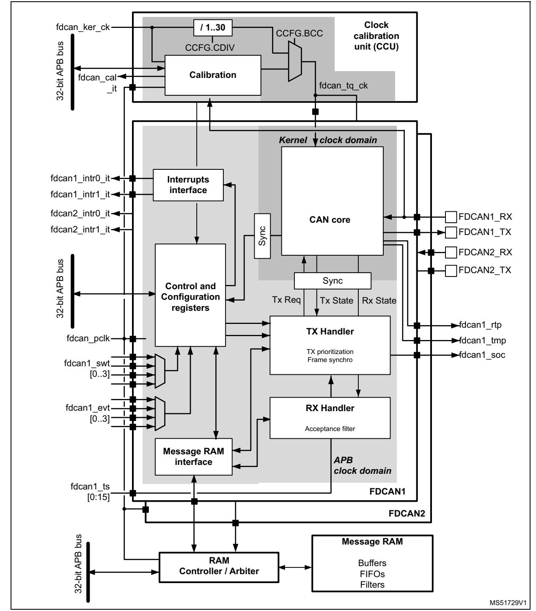

**Figure 775. CAN subsystem**

# **59.2 FDCAN main features**

- Conform with CAN protocol version 2.0 part A, B, and ISO 11898-1: 2015, -4
- CAN FD with max. 64 data bytes supported
- TTCAN protocol level 1 and level 2 completely in hardware (FDCAN1 only)
- Event synchronized time-triggered communication supported (FDCAN1 only)
- CAN error logging
- AUTOSAR and J1939 support
- Improved acceptance filtering
- Two configurable receive FIFOs
- Separate signaling on reception of high priority messages
- Up to 64 dedicated receive buffers
- Up to 32 dedicated transmit buffers
- Configurable transmit FIFO / queue
- Configurable transmit event FIFO
- FDCAN modules share the same message RAM
- Programmable loop-back test mode
- Maskable module interrupts
- Two clock domains: APB bus interface and CAN core kernel clock
- Power-down support

# **59.3 FDCAN implementation**

**Table 501. Main features**

| Module | FDCAN1 | FDCAN2 |
|--------|--------|--------|
| TTCAN  | X      | -      |

# **59.4 FDCAN functional description**

MS51730V1 32-bit APB bus **Interrupts Interface Message RAM interface CAN core FDCAN TX Handler** TX prioritization Frame Synchro Tx Req Tx State Rx State Sync Sync *APB clock domain Kernel clock domain* fdcan\_tmp fdcan\_soc **Control and Configuration registers** fdcan\_rtp fdcan\_tq\_ck **RX Handler** Acceptance filter fdcan1\_swt[0..3] fdcan1\_evt[0..3] fdcan1\_ts[0:15] fdcan\_pclk fdcan\_intr0\_it fdcan\_intr1\_it FDCAN\_RX FDCAN\_TX

**Figure 776. FDCAN block diagram**

### **Dual interrupt lines**

The FDCAN peripheral provides two interrupt lines, fdcan\_intr0\_it and fdcan\_intr1\_it. By programming EINT0 and EINT1 bits in FDCAN\_ILE register, the interrupt lines can be enabled or disabled separately.

### **CAN core**

The CAN core contains the protocol controller and the receive/transmit shift registers. It handles all ISO 11898-1: 2015 protocol functions, and supports both 11-bit and 29-bit identifiers.

### **Sync**

This block synchronizes signals from the APB clock domain to the CAN kernel clock domain, and vice versa.

### **Tx handler**

Controls the message transfer from the message RAM to the CAN core. A maximum of 32 Tx buffers can be configured for transmission. Tx buffers can be used as dedicated Tx buffers, as Tx FIFO, part of a Tx queue, or as a combination of them. A Tx event FIFO stores Tx timestamps together with the corresponding message ID. Transmit cancellation is also supported.

On FDCAN1, the Tx handler also implements the frame synchronization entity (FSE) which controls time-triggered communication according to ISO11898-4. It synchronizes itself with the reference messages on the CAN bus, controls cycle time and global time, and handles transmissions according to the predefined message schedule, the system matrix. It also handles the time marks of the system matrix that are linked to the messages in the message RAM. Stop watch trigger, event trigger, and time mark interrupt are synchronization interfaces.

### **Rx handler**

Controls the transfer of received messages from the CAN core to the external message RAM. The Rx handler supports two receive FIFOs, each of configurable size, and up to 64 dedicated Rx buffers for storage of all messages that have passed acceptance filtering. A dedicated Rx buffer, in contrast to a receive FIFO, is used to store only messages with a specific identifier. An Rx timestamp is stored together with each message. Up to 128 filters can be defined for 11-bit IDs and up to 64 filters for 29-bit IDs.

### **APB interface**

Connects the FDCAN to the APB bus.

### **Message RAM interface**

Connects the FDCAN access to an external 10 Kbytes message RAM through a RAM controller/arbiter.

## **59.4.1 Operating modes**

## **Software initialization**

Software initialization is started by setting INIT bit in FDCAN\_CCCR register, either by software or by a hardware reset, or by going Bus\_Off. While INIT bit in FDCAN\_CCCR register is set, message transfer from and to the CAN bus is stopped, the status of the CAN bus output FDCAN\_TX is recessive (high). The counters of the error management logic (EML) are unchanged. Setting INIT bit in FDCAN\_CCCR does not change any configuration register. Clearing INIT bit in FDCAN\_CCCR finishes the software initialization. Afterwards, the bit stream processor (BSP) synchronizes itself to the data transfer on the CAN bus by waiting for the occurrence of a sequence of 11 consecutive recessive bits (Bus\_Idle) before it can take part in bus activities and start the message transfer.

Access to the FDCAN configuration registers is only enabled when both INIT bit in FDCAN\_CCCR register and CCE bit in FDCAN\_CCCR register are set.

CCE bit in FDCAN\_CCCR register can be set/cleared only while INIT bit in FDCAN\_CCCR is set. CCE bit in FDCAN\_CCCR register is automatically cleared when INIT bit in FDCAN\_CCCR is cleared.

RM0399 Rev 4 2617/3556

The following registers are reset when CCE bit in FDCAN\_CCCR register is set:

- FDCAN\_HPMS high priority message status
- FDCAN\_ RXF0S Rx FIFO 0 status
- FDCAN\_RXF1S Rx FIFO 1 status
- FDCAN\_TXFQS Tx FIFO/queue status
- FDCAN\_TXBRP Tx buffer request pending
- FDCAN\_TXBTO Tx buffer transmission occurred
- FDCAN\_TXBCF Tx buffer cancellation finished
- FDCAN\_TXEFS Tx event FIFO status
- FDCAN\_TTOST TT (time trigger) operation status (FDCAN1 only)
- FDCAN\_TTLGT TT local and global time, only global time FDCAN\_TTLGT.GT is reset (FDCAN1 only)
- FDCAN\_TTCTC TT cycle time and count (FDCAN1 only)
- FDCAN\_TTCSM TT cycle sync mark (FDCAN1 only)

The timeout counter value TOC bit in FDCAN\_TOCV register is preset to the value configured by TOP bit in FDCAN\_TOCC register when CCE bit in FDCAN\_CCCR is set.

In addition, the state machines of the Tx handler and Rx handler are held in idle state while CCE bit in FDCAN\_CCCR is set.

The following registers can be written only when CCE bit in FDCAN\_CCCR register is cleared:

- FDCAN\_TXBAR Tx buffer add request
- FDCAN\_TXBCR Tx buffer cancellation request

TEST bit in FDCAN\_CCCR and MON bit in FDCAN\_CCCR can be set only by software while both INIT bit and CCE bit in FDCAN\_CCCR register are set. Both bits may be reset at any time. DAR bit in FDCAN\_CCCR can be set/cleared only while both INIT bit in FDCAN\_CCCR and CCE bit in FDCAN\_CCCR are set.

### **Normal operation**

The FDCAN1 default operating mode after hardware reset is event-driven CAN communication without time triggers (FDCAN\_TTOCF.OM = 00). It is required that both INIT bit and CCE bit in FDCAN\_CCCR register are set before the TT operation mode can be changed.

Once the FDCAN is initialized and INIT bit in FDCAN\_CCCR register is cleared, the FDCAN synchronizes itself to the CAN bus and is ready for communication.

After passing the acceptance filtering, received messages including message ID and DLC are stored into a dedicated Rx buffer or into the Rx FIFO 0 or Rx FIFO 1.

For messages to be transmitted dedicated Tx buffers and/or a Tx FIFO or a Tx queue can be initialized or updated. Automated transmission on reception of remote frames is not supported.

### **CAN FD operation**

There are two variants in the CAN FD protocol. The first is the long frame mode (LFM), where the data field of a CAN frame can be longer that eight bytes. The second variant is the fast frame mode (FFM), where the control, data, and CRC fields of a CAN frame are

transmitted with a higher bitrate than the beginning and the end of the frame. Fast frame mode can be used in combination with long frame mode.

The previously reserved bit in CAN frames with 11-bit identifiers and the first previously reserved bit in CAN frames with 29-bit identifiers are now decoded as FDF bit. FDF recessive signifies a CAN FD frame, while FDF dominant signifies a classic CAN frame. In a CAN FD frame, the two bits following FDF, res and BRS, decide whether the bitrate inside this CAN FD frame is switched. A CAN FD bitrate switch is signified by res dominant and BRS recessive. The coding of res recessive is reserved for protocol expansions. If the FDCAN receives a frame with FDF recessive and res recessive, it signals a protocol exception event by setting bit FDCAN\_PSR.PXE. When protocol exception handling is enabled (FDCAN\_CCCR.PXHD = 0), this causes the operation state to change from receiver (FDCAN\_PSR.ACT = 10) to integrating (FDCAN\_PSR.ACT = 00) at the next sample point. In case protocol exception handling is disabled (FDCAN\_CCCR.PXHD = 1), the FDCAN treats a recessive res bit as a form error and responds with an error frame.

CAN FD operation is enabled by programming FDCAN\_CCCR.FDOE. If FDCAN\_CCCR.FDOE = 1, transmission and reception of CAN FD frames is enabled. Transmission and reception of classic CAN frames is always possible. Whether a CAN FD or a classic CAN frame is transmitted, it can be configured via bit FDF in the respective Tx buffer element. With FDCAN\_CCCR.FDOE = 0, received frames are interpreted as classic CAN frames, which leads to the transmission of an error frame when receiving a CAN FD frame. When CAN FD operation is disabled, no CAN FD frames are transmitted, even if bit FDF of a Tx buffer element is set. FDCAN\_CCCR.FDOE and FDCAN\_CCCR.BRSE can only be changed while FDCAN\_CCCR.INIT and FDCAN\_CCCR.CCE are both set.

With FDCAN\_CCCR.FDOE = 0, the setting of bits FDF and BRS is ignored and frames are transmitted in classic CAN format. With FDCAN\_CCCR.FDOE = 1 and FDCAN\_CCCR.BRSE = 0, only bit FDF of a Tx buffer element is evaluated. With FDCAN\_CCCR.FDOE = 1 and FDCAN\_CCCR.BRSE = 1, transmission of CAN FD frames with bitrate switching is enabled. All Tx buffer elements with bits FDF and BRS set are transmitted in CAN FD format with bitrate switching.

A mode change during CAN operation is only recommended under the following conditions:

- The failure rate in the CAN FD data phase is significant higher than in the CAN FD arbitration phase. In this case disable the CAN FD bitrate switching option for transmissions.
- During system startup all nodes are transmitting classic CAN messages until it is verified that they are able to communicate in CAN FD format. If this is true, all nodes switch to CAN FD operation.
- Wake-up messages in CAN partial networking have to be transmitted in classic CAN format.
- End-of-line programming in case not all nodes are CAN FD capable. Non CAN FD nodes are held in Silent mode until programming has completed. Then all nodes switch back to classic CAN communication.

In the CAN FD format, the coding of the DLC differs from the standard CAN format. DLC codes 0 to 8 have the same coding as in standard CAN, codes 9 to 15 (that in standard CAN all code a data field of 8 bytes) are coded according to *[Table 502](#page-8-0)*.

RM0399 Rev 4 2619/3556

### **Table 502. DLC coding in FDCAN**

| DLC                  | 9  | 10 | 11 | 12 | 13 | 14 | 15 |
|----------------------|----|----|----|----|----|----|----|
| Number of data bytes | 12 | 16 | 20 | 24 | 32 | 48 | 64 |

In CAN FD fast frames, the bit timing is switched inside the frame, after the BRS (bitrate switch) bit, if this bit is recessive. Before the BRS bit, in the CAN FD arbitration phase, the nominal CAN bit timing is used as defined by the bit timing and prescaler register FDCAN\_NBTP. In the following CAN FD data phase, the fast CAN bit timing is used as defined by the fast bit timing and prescaler register FDCAN\_DBTP. The bit timing is switched back from the fast timing at the CRC delimiter or when an error is detected, whichever occurs first.

The maximum configurable bitrate in the CAN FD data phase depends on the FDCAN kernel clock frequency. For example, with an FDCAN kernel clock frequency of 20 MHz and the shortest configurable bit time of four time quanta (tq), the bitrate in the data phase is 5 Mbit/s.

In both data frame formats, CAN FD long frames and CAN FD fast frames, the value of the bit ESI (error status indicator) is determined by the transmitter error state at the start of the transmission. If the transmitter is error passive, ESI is transmitted recessive, else it is transmitted dominant. In CAN FD remote frames the ESI bit is always transmitted dominant, independent of the transmitter error state. The data length code of CAN FD remote frames is transmitted as 0.

In case an FDCAN Tx buffer is configured for CAN FD transmission with DLC > 8, the first eight bytes are transmitted as configured in the Tx buffer while the remaining part of the data field is padded with 0xCC. When the FDCAN receives an FDCAN frame with DLC > 8, the first eight bytes of that frame are stored into the matching Rx buffer or Rx FIFO. The remaining bytes are discarded.

### **Transceiver delay compensation**

During the data phase of a CAN FD transmission only one node is transmitting, all others are receivers. The length of the bus line has no impact. When transmitting via pin FDCAN\_TX the protocol controller receives the transmitted data from its local CAN transceiver via pin FDCAN\_RX. The received data is delayed by the CAN transceiver loop delay. If this delay is greater than TSEG1 (time segment before sample point), a bit error is detected. Without transceiver delay compensation, the bitrate in the data phase of a CAN FD frame is limited by the transceivers loop delay.

The FDCAN implements a delay compensation mechanism to compensate the CAN transceiver loop delay, thereby enabling transmission with higher bitrates during the CAN FD data phase, independent from the delay of a specific CAN transceiver.

To check for bit errors during the data phase of transmitting nodes, the delayed transmit data is compared against the received data at the Secondary Sample Point SSP. If a bit error is detected, the transmitter reacts on this bit error at the next following regular sample point. During the arbitration phase the delay compensation is always disabled.

The transmitter delay compensation enables configurations where the data bit time is shorter than the transmitter delay, it is described in detail in the new ISO11898-1. It is enabled by setting bit FDCAN\_DBTP.TDC.

The received bit is compared against the transmitted bit at the SSP. The SSP position is defined as the sum of the measured delay from the FDCAN transmit output pin FDCAN\_TX through the transceiver to the receive input pin FDCAN\_RX plus the transmitter delay compensation offset as configured by FDCAN\_TDCR.TDCO. The transmitter delay compensation offset is used to adjust the position of the SSP inside the received bit (for example half of the bit time in the data phase). The position of the secondary sample point is rounded down to the next integer number of minimum time quanta (mtq, that is, one period of fdcan\_tq\_ck clock).

FDCAN\_PSR.TDCV shows the actual transmitter delay compensation value, cleared when FDCAN\_CCCR.INIT is set, and updated at each transmission of an FD frame while FDCAN\_DBTP.TDC is set.

The following boundary conditions have to be considered for the transmitter delay compensation implemented in the FDCAN:

- The sum of the measured delay from FDCANx\_TX to FDCANx\_RX and the configured transmitter delay compensation offset FDCAN\_TDCR.TDCO must be less than six bit times in the data phase.
- The sum of the measured delay from FDCANx\_TX to FDCANx\_RX and the configured transmitter delay compensation offset FDCAN\_TDCR.TDCO must be less than or equal to 127 mtq. If this sum exceeds 127 mtq, the maximum value (127 mtq) is used for transmitter delay compensation.
- The data phase ends at the sample point of the CRC delimiter, which stops checking received bits at the SSPs

If transmitter delay compensation is enabled by programming FDCAN\_DBTP.TDC = 1, the measurement is started within each transmitted CAN FD frame at the falling edge of bit FDF to bit res. The measurement is stopped when this edge is seen at the receive input pin FDCAN\_TX of the transmitter. The resolution of this measurement is 1 mtq.

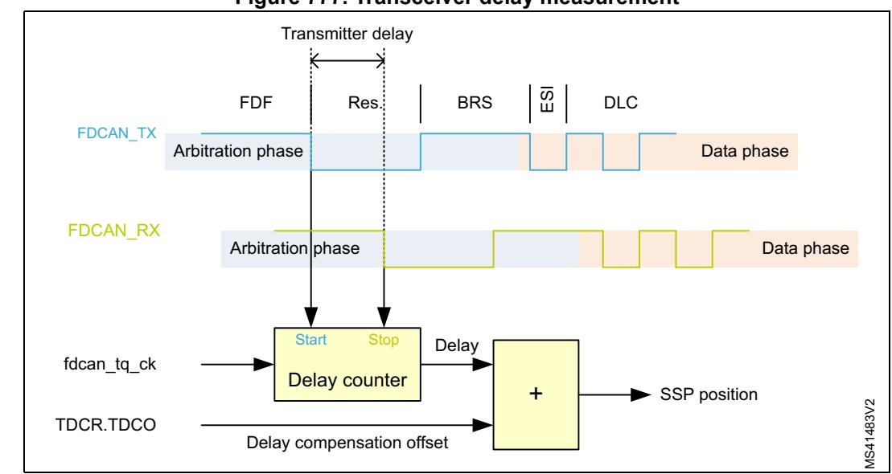

**Figure 777. Transceiver delay measurement**

To avoid that a dominant glitch inside the received FDF bit ends the delay compensation measurement before the falling edge of the received res bit (resulting in a too early SSP position), the use of a transmitter delay compensation filter window can be enabled by programming FDCAN\_TDCR.TDCF. This defines a minimum value for the SSP position.

RM0399 Rev 4 2621/3556

Dominant edges on FDCANx\_RX that would result in an earlier SSP position are ignored for transmitter delay measurement. The measurement is stopped when the SSP position is at least FDCAN\_TDCR.TDCF and FDCAN\_RX is low.

### **Restricted operation mode**

In restricted operation mode the node is able to receive data and remote frames and to give acknowledge to valid frames, but it does not send data frames, remote frames, active error frames, or overload frames. In case of an error condition or overload condition, it does not send dominant bits, but waits for the occurrence of bus idle condition to resynchronize itself to the CAN communication. The error counters (FDCAN\_ECR.REC, FDCAN\_ECR.TEC) are frozen while error logging (FDCAN\_ECR.CEL) is active. The software can set the FDCAN into restricted operation mode by setting bit FDCAN\_CCCR.ASM. The bit can be set only by software when both FDCAN\_CCCR.CCE and FDCAN\_CCCR.INIT are set to 1. The bit can be cleared by software at any time.

Restricted operation mode is automatically entered when the Tx handler was not able to read data from the message RAM in time. To leave restricted operation mode, the software has to reset FDCAN\_CCCR.ASM.

The restricted operation mode can be used in applications that adapt themselves to different CAN bitrates. In this case the application tests different bitrates and leaves the restricted operation mode after it has received a valid frame.

FDCAN\_CCCR.ASM is also controlled by the clock calibration unit. When the calibration process is enabled, the restricted operation mode is entered and the FDCAN\_CCR.ASM bit is set. Once the calibration is completed, FDCAN\_CCR.ASM bit is cleared.

*Note: The restricted operation mode must not be combined with the loop back mode (internal or external).*

### **Bus monitoring mode**

The FDCAN is set in bus monitoring mode by setting FDCAN\_CCCR.MON bit or when error level S3 (FDCAN\_TTOST.EL = 11) is entered. In bus monitoring mode (for more details refer to ISO11898-1, 10.12 bus monitoring), the FDCAN is able to receive valid data frames and valid remote frames, but cannot start a transmission. In this mode, it sends only recessive bits on the CAN bus, if the FDCAN is required to send a dominant bit (ACK bit, overload flag, active error flag), the bit is rerouted internally so that the FDCAN monitors this dominant bit, although the CAN bus may remain in recessive state. In bus monitoring mode register FDCAN\_TXBRP is held in reset state.

The bus monitoring mode can be used to analyze the traffic on a CAN bus without affecting it by the transmission of dominant bits. *[Figure 778](#page-11-0)* shows the connection of FDCAN\_TX and FDCAN\_RX signals to the FDCAN in bus monitoring mode.

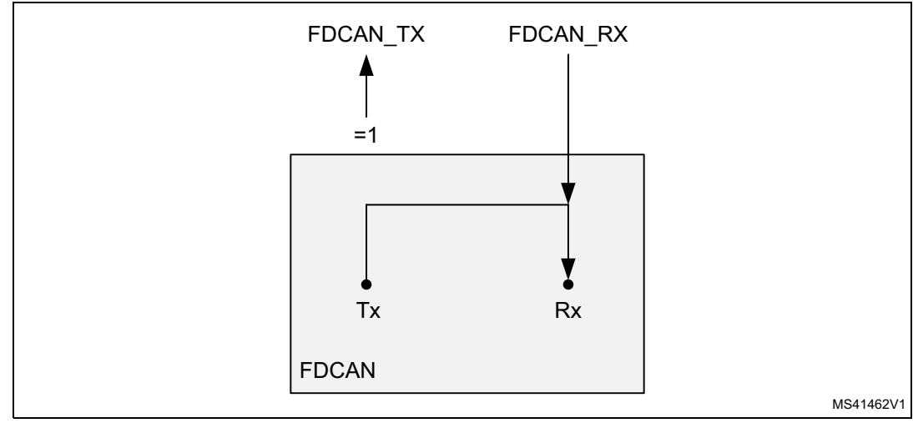

**Figure 778. Pin control in bus monitoring mode**

### **Disabled automatic retransmission (DAR) mode**

According to the CAN Specification (see ISO11898-1, 6.3.3 recovery management), the FDCAN provides means for automatic retransmission of frames that have lost arbitration or have been disturbed by errors during transmission. By default, automatic retransmission is enabled.

To support time-triggered communication as described in ISO 11898-1: 2015, chapter 9.2, the automatic retransmission may be disabled via FDCAN\_CCCR.DAR.

### **Frame transmission in disabled automatic retransmission (DAR) mode**

In DAR mode all transmissions are automatically canceled after they started on the CAN bus. A Tx buffer Tx request pending bit FDCAN\_TXBRP.TRPx is reset after successful transmission, when a transmission has not yet been started at the point of cancellation, has been aborted due to lost arbitration, or when an error occurred during frame transmission.

- Successful transmission:
  - Corresponding Tx buffer transmission occurred bit FDCAN\_TXBTO.TOx set
  - Corresponding Tx buffer cancellation finished bit FDCAN\_TXBCF.CFx not set
- Successful transmission in spite of cancellation:
  - Corresponding Tx buffer transmission occurred bit FDCAN\_TXBTO.TOx set
  - Corresponding Tx buffer cancellation finished bit FDCAN\_TXBCF.CFx set
- Arbitration loss or frame transmission disturbed:
  - Corresponding Tx buffer transmission occurred bit FDCAN\_TXBTO.TOx not set
  - Corresponding Tx buffer cancellation finished bit FDCAN\_TXBCF.CFx set

In case of a successful frame transmission, and if storage of Tx events is enabled, a Tx event FIFO element is written with event type ET = 10 (transmission in spite of cancellation).

## **Power down (Sleep mode)**

The FDCAN can be set into power down mode controlled by clock stop request input via register FDCAN\_CCCR.CSR. As long as the clock stop request is active, bit FDCAN\_CCCR.CSR is read as 1.

RM0399 Rev 4 2623/3556

When all pending transmission requests have completed, the FDCAN waits until bus idle state is detected. Then the FDCAN sets FDCAN\_CCCR.INIT to 1 to prevent any further CAN transfers. Now, the FDCAN acknowledges that it is ready for power down by setting FDCAN\_CCCR.CSA to 1. In this state, before the clocks are switched off, further register accesses can be made. A write access to FDCAN\_CCCR.INIT has no effect. Now the module clock inputs may be switched off.

To leave power down mode, the application has to turn on the module clocks before resetting CC control register flag FDCAN\_CCCR.CSR. The FDCAN acknowledges this by resetting FDCAN\_CCCR.CSA. Afterwards, the application can restart CAN communication by resetting bit FDCAN\_CCCR.INIT.

## **Test modes**

To enable write access to FDCAN test register (see *[Section 59.5.4](#page-66-0)*), bit FDCAN\_CCCR.TEST must be set to 1, thus enabling the configuration of test modes and functions.

Four output functions are available for the CAN transmit pin FDCAN\_TX by programming FDCAN\_TEST.TX. Additionally to its default function (the serial data output) it can drive the CAN Sample Point signal to monitor the FDCAN bit timing and it can drive constant dominant or recessive values. The actual value at pin FDCAN\_RX can be read from FDCAN\_TEST.RX. Both functions can be used to check the CAN bus physical layer.

Due to the synchronization mechanism between CAN kernel clock and APB clock domain, there may be a delay of several APB clock periods between writing to FDCAN\_TEST.TX until the new configuration is visible at FDCAN\_TX output pin. This applies also when reading FDCAN\_RX input pin via FDCAN\_TEST.RX.

*Note: Test modes should be used for production tests or self test only. The software control for FDCAN\_TX pin interferes with all CAN protocol functions. It is not recommended to use test modes for application.*

### **External loop back mode**

The FDCAN can be set in external loop back mode by programming FDCAN\_TEST.LBCK to 1. In loop back mode, the FDCAN treats its own transmitted messages as received messages and stores them (if they pass acceptance filtering) into Rx FIFOs. *[Figure 779](#page-13-0)* (left side) shows the connection of transmit and receive signals FDCAN\_TX and FDCAN\_RX to the FDCAN in external loop back mode.

This mode is provided for hardware self-test. To be independent from external stimulation, the FDCAN ignores acknowledge errors (recessive bit sampled in the acknowledge slot of a data/remote frame) in loop back mode. In this mode the FDCAN performs an internal feedback from its transmit output to its receive input. The actual value of the FDCAN\_RX input pin is disregarded by the FDCAN. The transmitted messages can be monitored at the FDCAN\_TX transmit pin.

### **Internal loop back mode**

Internal loop back mode is entered by programming bits FDCAN\_TEST.LBCK and FDCAN\_CCCR.MON to 1. This mode can be used for a "Hot Selftest", meaning the FDCAN can be tested without affecting a running CAN system connected to the FDCAN\_TX and FDCAN\_RX pins. In this mode, FDCAN\_RX pin is disconnected from the FDCAN and FDCAN\_TX pin is held recessive. *[Figure 779](#page-13-0)* (right side) shows the connection of FDCAN\_TX and FDCAN\_RX pins to the FDCAN in case of internal loop back mode.

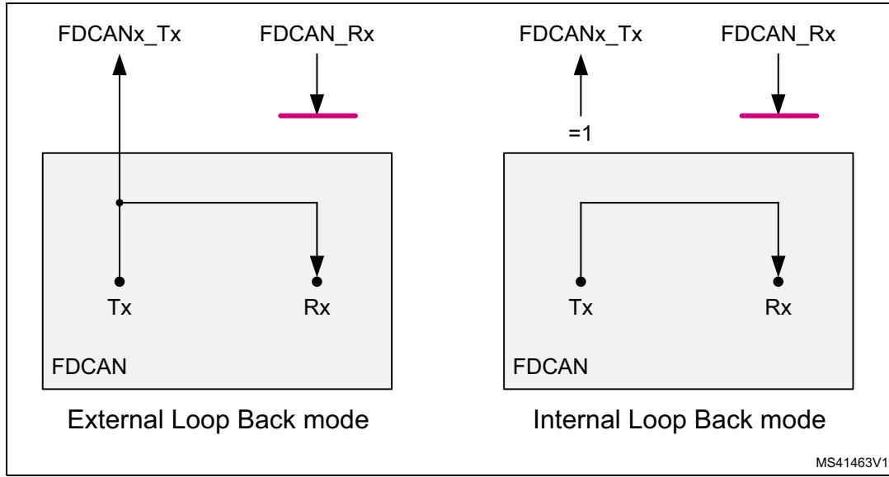

**Figure 779. Pin control in loop back mode**

### **Application watchdog (FDCAN1 only)**

The application watchdog is served by reading register FDCAN\_TTOST. When the application watchdog is not served in time, bit FDCAN\_TTOST.AWE is set, all TTCAN communication is stopped, and the FDCAN1 is set into bus monitoring mode.

The TT application watchdog can be disabled by programming the application watchdog limit FDCAN\_TTOCF.AWL to 0x00. The TT application watchdog must not be disabled in a TTCAN application program.

### **Timestamp generation**

For timestamp generation the FDCAN supplies a 16-bit wraparound counter. A prescaler FDCAN\_TSCC.TCP can be configured to clock the counter in multiples of CAN bit times (1 … 16). The counter is readable via FDCAN\_TSCV.TCV. A write access to register FDCAN\_TSCV resets the counter to 0. When the timestamp counter wraps around interrupt flag FDCAN\_IR.TSW is set.

On start of frame reception/transmission the counter value is captured and stored into the timestamp section of an Rx buffer/Rx FIFO (RXTS[15:0]) or Tx event FIFO (TXTS[15:0]) element.

By programming bit FDCAN\_TSCC.TSS, a 16-bit timestamp can be used.

### **Timeout counter**

To signal timeout conditions for Rx FIFO 0, Rx FIFO 1, and the Tx event FIFO the FDCAN supplies a 16-bit timeout counter. It operates as down-counter and uses the same prescaler controlled by FDCAN\_TSCC.TCP as the timestamp counter. The timeout counter is configured via register FDCAN\_TOCC. The actual counter value can be read from FDCAN\_TOCV.TOC. The timeout counter can only be started while FDCAN\_CCCR.INIT = 0. It is stopped when FDCAN\_CCCR.INIT = 1, for example when the FDCAN enters Bus\_Off state.

The operation mode is selected by FDCAN\_TOCC.TOS. When operating in Continuous mode, the counter starts when FDCAN\_CCCR.INIT is reset. A write to FDCAN\_TOCV

RM0399 Rev 4 2625/3556

presets the counter to the value configured by FDCAN\_TOCC.TOP and continues down-counting.

When the timeout counter is controlled by one of the FIFOs, an empty FIFO presets the counter to the value configured by FDCAN\_TOCC.TOP. Down-counting is started when the first FIFO element is stored. Writing to FDCAN\_TOCV has no effect.

When the counter reaches 0, interrupt flag FDCAN\_IR.TOO is set. In Continuous mode, the counter is immediately restarted at FDCAN\_TOCC.TOP.

*Note: The clock signal for the timeout counter is derived from the CAN core sample point signal. Therefore, the point in time where the timeout counter is decremented can vary due to the synchronization/re-synchronization mechanism of the CAN core. If the baudrate switch feature in FDCAN is used, the timeout counter is clocked differently in arbitration and data fields.*

## **59.4.2 Message RAM**

The message RAM has a width of 32 bits. The FDCAN module can be configured to allocate up to 2560 words in the message RAM. It is not necessary to configure each of the sections listed in *[Figure 780](#page-14-0)*, nor is there any restriction with respect to the sequence of the sections.

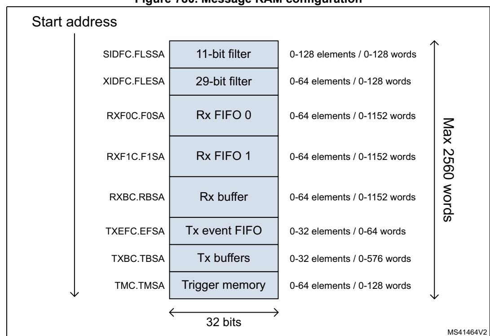

**Figure 780. Message RAM configuration**

When the FDCAN addresses the message RAM it addresses 32-bit words, not single bytes. The configured start addresses are 32-bit word addresses, that is. only bits 15 to 2 are evaluated, the two least significant bits are ignored.

*Note: The FDCAN does not check for erroneous configuration of the message RAM. In particular, the configuration of the start addresses of the different sections and the number of elements of each section must be done carefully to avoid falsification or loss of data.*

### **Rx handling**

The Rx handler controls the acceptance filtering, the transfer of received messages to Rx buffers or to 1 of the two Rx FIFOs, as well as the Rx FIFO put and get Indices.

### **Acceptance filter**

The FDCAN offers the possibility to configure two sets of acceptance filters, one for standard identifiers and one for extended identifiers. These filters can be assigned to Rx buffer, Rx FIFO 0 or Rx FIFO 1. For acceptance filtering each list of filters is executed from element #0 until the first matching element. Acceptance filtering stops at the first matching element. The following filter elements are not evaluated for this message.

The main features are:

- Each filter element can be configured as
  - range filter (from 0 to 128 elements for the 11-bit filter and from 0 to 64 for the 29-bit filter)
  - filter for one or two dedicated IDs
  - classic bit mask filter
- Each filter element is configurable for acceptance or rejection filtering
- Each filter element can be enabled/disabled individually
- Filters are checked sequentially, execution stops with the first matching filter element

Related configuration registers are:

- Global filter configuration (FDCAN\_GFC)
- Standard ID filter configuration (FDCAN\_SIDFC)
- Extended ID filter configuration (FDCAN\_XIDFC)
- Extended ID AND Mask (FDCAN\_XIDAM)

Depending on the configuration of the filter element (SFEC / EFEC) a match triggers one of the following actions:

- Store received frame in FIFO 0 or FIFO 1
- Store received frame in Rx buffer
- Store received frame in Rx buffer and generate pulse at filter event pin
- Reject received frame
- Set high priority message interrupt flag FDCAN\_IR.HPM
- Set high priority message interrupt flag FDCAN\_IR.HPM and store received frame in FIFO 0 or FIFO 1
- Set high priority message interrupt flag FDCAN\_IR.HPM and store received frame in FIFO 0 or FIFO 1

Acceptance filtering is started after the complete identifier has been received. After acceptance filtering has completed, and if a matching Rx buffer or Rx FIFO has been found, the message handler starts writing the received message data in 32-bit portions to the

RM0399 Rev 4 2627/3556

matching Rx buffer or Rx FIFO. If the CAN protocol controller has detected an error condition (for example CRC error), this message is discarded with the following impact:

### • **Rx buffer**

New data flag of matching Rx buffer is not set, but Rx buffer (partly) overwritten with received data. For error type see FDCAN\_PSR.LEC and FDCAN\_PSR.DLEC.

### • **Rx FIFO**

Put index of matching Rx FIFO is not updated, but related Rx FIFO element (partly) overwritten with received data. For error type see FDCAN\_PSR.LEC and FDCAN\_PSR.DLEC. In case the matching Rx FIFO is operated in overwrite mode, the boundary conditions described in *[Rx FIFO overwrite mode](#page-19-0)* have to be considered.

*Note: When an accepted message is written to one of the two Rx FIFOs, or into an Rx buffer, the unmodified received identifier is stored independently of the filter(s) used. The result of the acceptance filter process depends strongly upon the sequence of configured filter elements.*

### **Range filter**

The filter matches for all received frames with message IDs in the range defined by SF1ID / SF2ID and EF1ID / EF2ID.

There are two possibilities when range filtering is used together with extended frames:

- EFT = 00: The message ID of received frames is AND-ed with the extended ID AND Mask (FDCAN\_XIDAM) before the range filter is applied
- EFT = 11: The extended ID AND Mask (FDCAN\_XIDAM) is not used for range filtering

### **Filter for dedicated IDs**

A filter element can be configured to filter for one or two specific message IDs. To filter for one specific message ID, the filter element must be configured with SF1ID = SF2ID and EF1ID = EF2ID.

### **Classic bit mask filter**

Classic bit mask filtering is intended to filter groups of message IDs by masking single bits of a received message ID. With classic bit mask filtering SF1ID / EF1ID is used as message ID filter, while SF2ID / EF2ID is used as filter mask.

A 0 bit at the filter mask masks out the corresponding bit position of the configured ID filter, for example, the value of the received message ID at that bit position is not relevant for acceptance filtering. Only those bits of the received message ID where the corresponding mask bits are one are relevant for acceptance filtering.

In case all mask bits are one, a match occurs only when the received message ID and the message ID filter are identical. If all mask bits are 0, all message IDs match.

## **Standard message ID filtering**

*[Figure 781](#page-17-0)* shows the flow for standard message ID (11-bit Identifier) filtering. The standard message ID filter element is described in *[Section 59.4.21](#page-59-0)*.

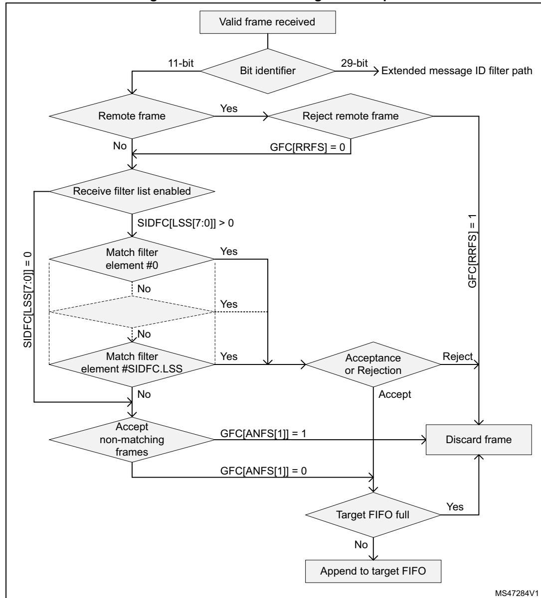

**Figure 781. Standard message ID filter path**

Controlled by the global filter configuration (FDCAN\_GFC) and the standard ID filter configuration (FDCAN\_SIDFC) message ID, remote transmission request bit (RTR), and the Identifier Extension bit (IDE) of received frames are compared against the list of configured filter elements.

### **Extended message ID filtering**

*[Figure 782](#page-18-0)* shows the flow for extended message ID (29-bit Identifier) filtering. The extended message ID filter element is described in *[Section 59.4.22](#page-61-0)*.

RM0399 Rev 4 2629/3556

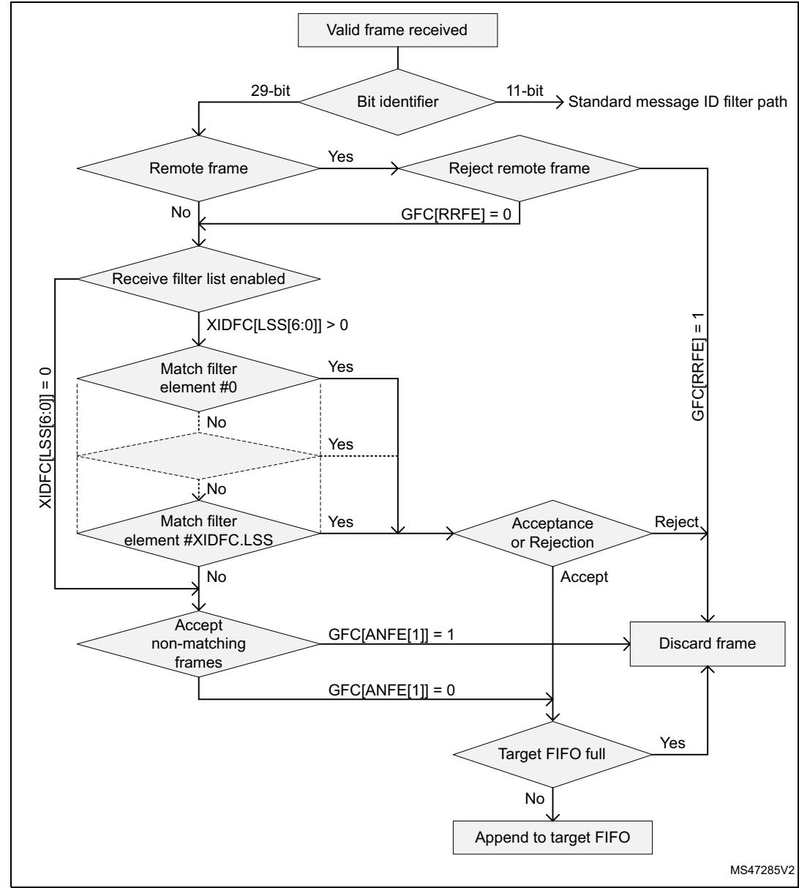

**Figure 782. Extended message ID filter path**

Controlled by the global filter configuration FDCAN\_GFC and the extended ID filter configuration FDCAN\_XIDFC message ID, remote transmission request bit (RTR), and the Identifier Extension bit (IDE) of received frames are compared against the list of configured filter elements.

The extended ID AND Mask (FDCAN\_XIDAM) is AND-ed with the received identifier before the filter list is executed.

### **Rx FIFOs**

Rx FIFO 0 and Rx FIFO 1 can be configured to hold up to 64 elements each. Configuration of the two Rx FIFOs is done via registers FDCAN\_RXF0C and FDCAN\_RXF1C.

Received messages that passed acceptance filtering are transferred to the Rx FIFO as configured by the matching filter element. For a description of the filter mechanisms available for Rx FIFO 0 and Rx FIFO 1, see *[Acceptance filter](#page-15-0)*. The Rx buffer and FIFO element are described in *[Section 59.4.18](#page-54-0)*.

When an Rx FIFO full condition is signaled by FDCAN\_IR.RFnF, no further messages are written to the corresponding Rx FIFO until at least one message has been read out, and the Rx FIFO get index has been incremented. In case a message is received while the corresponding Rx FIFO is full, this message is discarded and interrupt flag FDCAN\_IR.RFnL is set.

To avoid an Rx FIFO overflow, the Rx FIFO watermark can be used. When the Rx FIFO fill level reaches the Rx FIFO watermark configured by FDCAN\_RXFnC.FnWM, interrupt flag FDCAN\_IR.RFnW is set.

When reading from an Rx FIFO, Rx FIFO get index RXFnS[FnGI] + FIFO element size must be added to the corresponding Rx FIFO start address RXFnC[FnSA].

### **Rx FIFO blocking mode**

The Rx FIFO blocking mode is configured by RXFnC.FnOM = 0. This is the default operation mode for the Rx FIFOs.

When an Rx FIFO full condition is reached (RXFnS.FnPI = RXFnS.FnGI), no further messages are written to the corresponding Rx FIFO until at least one message has been read out, and the Rx FIFO get index has been incremented. An Rx FIFO full condition is signaled by RXFnS.FnF = 1. In addition, interrupt flag FDCAN\_IR.RFnF is set.

In case a message is received while the corresponding Rx FIFO is full, this message is discarded and the message lost condition is signaled by RXFnS.RFnL = 1. In addition, interrupt flag FDCAN\_IR.RFnL is set.

### **Rx FIFO overwrite mode**

The Rx FIFO overwrite mode is configured by RXFnC.FnOM = 1.

When an Rx FIFO full condition (RXFnS.FnPI = RXFnS.FnGI) is signaled by RXFnS.FnF = 1, the next message accepted for the FIFO overwrites the oldest FIFO message. Put and get index are both incremented by one.

When an Rx FIFO is operated in overwrite mode and an Rx FIFO full condition is signaled, reading of the Rx FIFO elements should start at least at get index + 1. The reason for that is that it can happen that a received message is written to the message RAM (put index) while the CPU is reading from the message RAM (get index). In this case inconsistent data may be read from the respective Rx FIFO element. Adding an offset to the get index when reading from the Rx FIFO avoids this problem. The offset depends on how fast the CPU accesses the Rx FIFO. *[Figure 784](#page-24-0)* shows an offset of two with respect to the get index when reading the Rx FIFO. In this case the two messages stored in elements 1 and 2 are lost.

After reading from the Rx FIFO, the number of the last element read must be written to the Rx FIFO acknowledge index RXFnA.FnA. This increments the get index to that element number. In case the put index has not been incremented to this Rx FIFO element, the Rx FIFO full condition is reset (RXFnS.FnF = 0).

### **Dedicated Rx buffers**

The FDCAN supports up to 64 dedicated Rx buffers. The start address of the dedicated Rx buffer section is configured via FDCAN\_RXBC.RBSA.

RM0399 Rev 4 2631/3556

For each Rx buffer a standard or extended message ID filter element with SFEC / EFEC=111 and SFID2 / EFID2[10:9] = 00 must be configured (see *[Section 59.4.21](#page-59-0)* and *[Section 59.4.22](#page-61-0)*).

After a received message has been accepted by a filter element, the message is stored into the Rx buffer in the message RAM referenced by the filter element. The format is the same as for an Rx FIFO element. In addition, the flag FDCAN\_IR.DRX (message stored in dedicated Rx buffer) in the interrupt register is set.

| Filter element | SFID1[10:0] EFID1[28:0] | SFID2[10:9] EFID2[10:9] | SFID2[5:0] EFID2[5:0] |  |  |
|----------------|----------------------------|----------------------------|--------------------------|--|--|
| 0              | ID message 1               | 00                         | 00 0000                  |  |  |
| 1              | ID message 2               | 00                         | 00 0001                  |  |  |
| 2              | ID message 3               | 00                         | 00 0010                  |  |  |

**Table 503. Example of filter configuration for Rx buffers** 

After the last word of a matching received message has been written to the message RAM, the respective New data flag in register NDAT1,2 is set. As long as the New data flag is set, the respective Rx buffer is locked against updates from received matching frames. The New data flags have to be reset by the user by writing a 1 to the respective bit position.

While an Rx buffer New data flag is set, a message ID filter element referencing this specific Rx buffer is not matched, causing the acceptance filtering to continue. The following message ID filter elements may cause the received message to be stored into another Rx buffer, or into an Rx FIFO, or the message may be rejected, depending on filter configuration.

### **Rx buffer handling**

- Reset interrupt flag FDCAN\_IR.DRX
- Read New data registers
- Read messages from message RAM
- Reset New data flags of processed messages

### **Filtering for Debug messages**

Filtering for debug messages is done by configuring one standard/extended message ID filter element for each of the three debug messages. To enable a filter element to filter for debug messages SFEC/EFEC must be programmed to 111. In this case fields SFID1 / SFID2 and EFID1 / EFID2 have a different meaning. While SFID2 / EFID2[10:9] controls the debug message handling state machine, SFID2 / EFID2[5:0] controls the location for storage of a received debug message.

When a debug message is stored, neither the respective New data flag nor FDCAN\_IR.DRX are set. The reception of debug messages can be monitored via FDCAN\_RXF1S.DMS.

| Filter element | SFID1[10:0] EFID1[28:0] | SFID2[10:9] EFID2[10:9] | SFID2[5:0] EFID2[5:0] |
|----------------|----------------------------|----------------------------|--------------------------|
| 0              | ID debug message A         | 01                         | 11 1101                  |
| 1              | ID debug message B         | 10                         | 11 1110                  |
| 2              | ID debug message C         | 11                         | 11 1111                  |

**Table 504. Example of filter configuration for Debug messages** 

## **Tx handling**

The Tx handler handles transmission requests for the dedicated Tx buffers, the Tx FIFO, and the Tx queue. It controls the transfer of transmit messages to the CAN core, the put and get Indices, and the Tx event FIFO.Up to 32 Tx buffers can be set up for message transmission (see *[Dedicated Tx buffers](#page-22-0)*). Depending on the configuration of the element size (FDCAN\_RXESC), between two and sixteen 32-bit words (Rn = 3 ... 17) are used for storage of a CAN message data field.

|         | FDCAN_CCCR |         | Tx buffer element |                              |  |  |  |  |
|---------|------------|---------|-------------------|------------------------------|--|--|--|--|
| BRSE    | FDOE       | FDF     | BRS               | Frame transmission           |  |  |  |  |
| Ignored | 0          | Ignored | Ignored           | Classic CAN                  |  |  |  |  |
| 0       | 1          | 0       | Ignored           | Classic CAN                  |  |  |  |  |
| 0       | 1          | 1       | Ignored           | FD without bitrate switching |  |  |  |  |
| 1       | 1          | 0       | Ignored           | Classic CAN                  |  |  |  |  |
| 1       | 1          | 1       | 0                 | FD without bitrate switching |  |  |  |  |
| 1       | 1          | 1       | 1                 | FD with bitrate switching    |  |  |  |  |

**Table 505. Possible configurations for frame transmission** 

*Note: AUTOSAR requires at least three Tx queue buffers and support of transmit cancellation.*

The Tx handler starts a Tx scan to check for the highest priority pending Tx request (Tx buffer with lowest message ID) when the Tx buffer request pending register FDCAN\_TXBRP is updated, or when a transmission has been started.

### **Transmit pause**

This feature is intended for use in CAN systems where the CAN message identifiers are (permanently) specified to specific values and cannot easily be changed. These message identifiers may have a higher CAN arbitration priority than other defined messages, while in a specific application their relative arbitration priority should be inverse. This may lead to a case where one ECU sends a burst of CAN messages that cause another ECU CAN messages to be delayed because that other messages have a lower CAN arbitration priority.

If, as an example, CAN ECU-1 has the feature enabled and is requested by its application software to transmit four messages, after the first successful message transmission, it waits for two CAN bit times of bus idle before it is allowed to start the next requested message. If there are other ECUs with pending messages, those messages are started in the idle time, they would not need to arbitrate with the next message of ECU-1. After having received a

RM0399 Rev 4 2633/3556

message, ECU-1 is allowed to start its next transmission as soon as the received message releases the CAN bus.

The feature is controlled by TXP bit in FDCAN\_CCCR register. If the bit is set, the FDCAN, each time it has successfully transmitted a message, pauses for two CAN bit times before starting the next transmission. This enables other CAN nodes in the network to transmit messages even if their messages have lower prior identifiers. Default is disabled (FDCAN\_CCCR.TXP = 0).

This feature looses up burst transmissions coming from a single node and it protects against "babbling idiot" scenarios where the application program erroneously requests too many transmissions.

### **Dedicated Tx buffers**

Dedicated Tx buffers are intended for message transmission under complete control of the CPU. Each dedicated Tx buffer is configured with a specific message ID. In case that multiple Tx buffers are configured with the same message ID, the Tx buffer with the lowest buffer number is transmitted first.

If the data section has been updated, a transmission is requested by an add request via FDCAN\_TXBAR.ARn. The requested messages arbitrate internally with messages from an optional Tx FIFO or Tx queue and externally with messages on the CAN bus, and are sent out according to their message ID.

A dedicated Tx buffer allocates four 32-bit words in the message RAM. Therefore the start address of a dedicated Tx buffer in the message RAM is calculated by adding four times the transmit buffer index (0 … 31) to the Tx buffer start address FDCAN\_TXBC.TBSA.

| FDCAN_TXESC.TBDS[2;0] | Data field (bytes) | Element size (RAM words) |
|-----------------------|--------------------|--------------------------|
| 000                   | 8                  | 4                        |
| 001                   | 12                 | 5                        |
| 010                   | 16                 | 6                        |
| 011                   | 20                 | 7                        |
| 100                   | 24                 | 8                        |
| 101                   | 32                 | 10                       |
| 110                   | 48                 | 14                       |
| 111                   | 64                 | 18                       |

**Table 506. Tx buffer/FIFO - queue element size** 

### **Tx FIFO**

Tx FIFO operation is configured by programming FDCAN\_TXBC.TFQM to 0. Messages stored in the Tx FIFO are transmitted starting with the message referenced by the get index FDCAN\_TXFQS.TFGI. After each transmission the get index is incremented cyclically until the Tx FIFO is empty. The Tx FIFO enables transmission of messages with the same message ID from different Tx buffers in the order these messages have been written to the Tx FIFO. The FDCAN calculates the Tx FIFO free level FDCAN\_TXFQS.TFFL as difference between get and put index. It indicates the number of available (free) Tx FIFO elements.

New transmit messages have to be written to the Tx FIFO starting with the Tx buffer referenced by the put index FDCAN\_TXFQS.TFQPI. An add request increments the put index to the next free Tx FIFO element. When the put index reaches the get index, Tx FIFO full (FDCAN\_TXFQS.TFQF = 1) is signaled. In this case no further messages should be written to the Tx FIFO until the next message has been transmitted and the get index has been incremented.

When a single message is added to the Tx FIFO, the transmission is requested by writing a 1 to the FDCAN\_TXBAR bit related to the Tx buffer referenced by the Tx FIFO put index.

When multiple (n) messages are added to the Tx FIFO, they are written to n consecutive Tx buffers starting with the put index. The transmissions are then requested via FDCAN\_TXBAR. The put index is then cyclically incremented by n. The number of requested Tx buffers should not exceed the number of free Tx buffers as indicated by the Tx FIFO free level.

When a transmission request for the Tx buffer referenced by the get index is canceled, the get index is incremented to the next Tx buffer with pending transmission request and the Tx FIFO free level is recalculated. When transmission cancellation is applied to any other Tx buffer, the get index and the FIFO free level remain unchanged.

A Tx FIFO element allocates four 32-bit words in the message RAM. Therefore the start address of the next available (free) Tx FIFO buffer is calculated by adding four times the put index FDCAN\_TXFQS.TFQPI (0 … 31) to the Tx buffer start address FDCAN\_TXBC.TBSA.

### **Tx queue**

Tx queue operation is configured by programming FDCAN\_TXBC.TFQM to 1. Messages stored in the Tx queue are transmitted starting with the message with the lowest message ID (highest priority). In case that multiple queue buffers are configured with the same message ID, the queue buffer with the lowest buffer number is transmitted first.

New messages have to be written to the Tx buffer referenced by the put index FDCAN\_TXFQS.TFQPI. An add request cyclically increments the put index to the next free Tx buffer. In case that the Tx queue is full (FDCAN\_TXFQS.TFQF = 1), the put index is not valid and no further message should be written to the Tx queue until at least one of the requested messages has been sent out or a pending transmission request has been canceled.

The application may use register FDCAN\_TXBRP instead of the put index and may place messages to any Tx buffer without pending transmission request.

A Tx queue buffer allocates four 32-bit words in the message RAM. Therefore the start address of the next available (free) Tx queue buffer is calculated by adding four times the Tx queue put index FDCAN\_TXFQS.TFQPI (0 … 31) to the Tx buffer start address FDCAN\_TXBC.TBSA.

## **Mixed dedicated Tx buffers / Tx FIFO**

In this case the Tx buffers section in the message RAM is subdivided into a set of dedicated Tx buffers and a Tx FIFO. The number of dedicated Tx buffers is configured by FDCAN\_TXBC.NDTB. The number of Tx buffers assigned to the Tx FIFO is configured by FDCAN\_TXBC.TFQS. In case, FDCAN\_TXBC.TFQS is programmed to 0, only dedicated Tx buffers are used.

RM0399 Rev 4 2635/3556

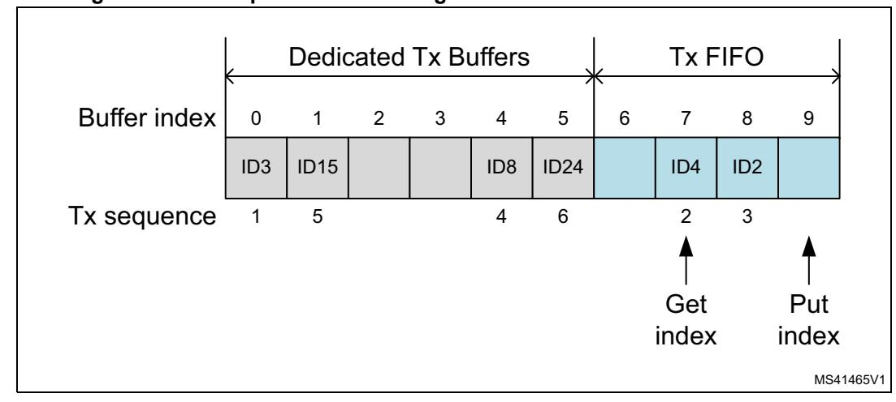

**Figure 783. Example of mixed configuration dedicated Tx buffers / Tx FIFO**

### Tx prioritization:

- Scan dedicated Tx buffers and oldest pending Tx FIFO buffer (referenced by FDCAN\_TXFS.TFGI)
- Buffer with lowest message ID gets highest priority and is transmitted next

### **Mixed dedicated Tx buffers / Tx queue**

In this case the Tx buffers section in the message RAM is subdivided into a set of dedicated Tx buffers and a Tx queue. The number of dedicated Tx buffers is configured by FDCAN\_TXBC.NDTB. The number of Tx queue buffers is configured by FDCAN\_TXBC.TFQS. If FDCAN\_TXBC.TFQS is programmed to 0, only dedicated Tx buffers are used.

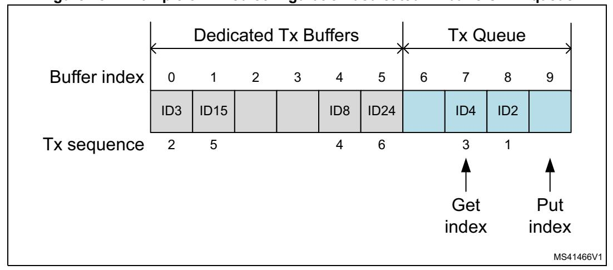

**Figure 784. Example of mixed configuration dedicated Tx buffers / Tx queue**

Tx priority setting:

- Scan all Tx buffers with activated transmission request
- Tx buffer with lowest message ID gets highest priority and is transmitted next

## **Transmit cancellation**

The FDCAN supports transmit cancellation. To cancel a requested transmission from a dedicated Tx buffer or a Tx queue buffer the user has to write a 1 to the corresponding bit position (= number of Tx buffer) of register FDCAN\_TXBCR. Transmit cancellation is not intended for Tx FIFO operation.

Successful cancellation is signaled by setting the corresponding bit of register FDCAN\_TXBCF to 1.

In case a transmit cancellation is requested while a transmission from a Tx buffer is already ongoing, the corresponding FDCAN\_TXBRP bit remains set as long as the transmission is in progress. If the transmission was successful, the corresponding FDCAN\_TXBTO and FDCAN\_TXBCF bits are set. If the transmission was not successful, it is not repeated and only the corresponding FDCAN\_TXBCF bit is set.

*Note: If a pending transmission is canceled immediately before this transmission starts, a short time window follows where no transmission is started even if another message is pending in this node. This may enable another node to transmit a message that may have a priority lower than that of the second message in this node.*

### **Tx event handling**

To support Tx event handling the FDCAN has implemented a Tx event FIFO. After the FDCAN has transmitted a message on the CAN bus, message ID and timestamp are stored in a Tx event FIFO element. To link a Tx event to a Tx event FIFO element, the message marker from the transmitted Tx buffer is copied into the Tx event FIFO element.

The Tx event FIFO can be configured to a maximum of 32 elements. The Tx event FIFO element is described in *[Tx FIFO](#page-22-1)*. Depending on the configuration of the element size (FDCAN\_TXESC), between two and sixteen 32-bit words (Tn = 3 ..17) are used for storage of a CAN message data field.

The purpose of the Tx event FIFO is to decouple handling transmit status information from transmit message handling i.e. a Tx buffer holds only the message to be transmitted, while the transmit status is stored separately in the Tx event FIFO. This has the advantage, especially when operating a dynamically managed transmit queue, that a Tx buffer can be used for a new message immediately after successful transmission. There is no need to save transmit status information from a Tx buffer before overwriting that Tx buffer.

When a Tx event FIFO full condition is signaled by FDCAN\_IR.TEFF, no further elements are written to the Tx event FIFO until at least one element has been read out and the Tx event FIFO get index has been incremented. In case a Tx event occurs while the Tx event FIFO is full, this event is discarded and interrupt flag FDCAN\_IR.TEFL is set.

To avoid a Tx event FIFO overflow, the Tx event FIFO watermark can be used. When the Tx event FIFO fill level reaches the Tx event FIFO watermark configured by FDCAN\_TXEFC.EFWM, interrupt flag FDCAN\_IR.TEFW is set.

When reading from the Tx event FIFO, two times the Tx event FIFO get index FDCAN\_TXEFS.EFGI must be added to the Tx event FIFO start address FDCAN\_TXEFC.EFSA.

## **59.4.3 FIFO acknowledge handling**

The get indices of Rx FIFO 0, Rx FIFO 1, and the Tx event FIFO are controlled by writing to the corresponding FIFO acknowledge index, see *[FDCAN Rx FIFO 0 acknowledge register](#page-89-0)* 

RM0399 Rev 4 2637/3556

*[\(FDCAN\\_RXF0A\)](#page-89-0)*, *[FDCAN Rx FIFO 1 acknowledge register \(FDCAN\\_RXF1A\)](#page-92-0)*, and *[FDCAN](#page-99-0)  [Tx event FIFO configuration register \(FDCAN\\_TXEFC\)](#page-99-0)*. Writing to the FIFO acknowledge index sets the FIFO get index to the FIFO acknowledge index plus one and thereby updates the FIFO fill level. There are two use cases:

- When only a single element has been read from the FIFO (the one being pointed to by the get index), this get index value is written to the FIFO acknowledge index.
- When a sequence of elements has been read from the FIFO, it is sufficient to write the FIFO acknowledge index only once at the end of that read sequence (value: index of the last element read), to update the FIFO get index.

Due to the fact that the CPU has free access to the FDCAN message RAM, special care must be taken when reading FIFO elements in an arbitrary order (get index not considered). This might be useful when reading a high priority message from one of the two Rx FIFOs. In this case the FIFO acknowledge index should not be written because this would set the get index to a wrong position and also alters the FIFO fill level. In this case some of the older FIFO elements would be lost.

*Note: The application has to ensure that a valid value is written to the FIFO acknowledge index. The FDCAN does not check for erroneous values.*

## **59.4.4 Bit timing**

The bit timing logic monitors the serial bus-line and performs sampling and adjustment of the sample point by synchronizing on the start-bit edge and resynchronizing on the following edges.

As shown in *[Figure 785](#page-26-0)*, its operation may be explained simply by splitting the bit time in three segments, as follows:

- Synchronization segment (SYNC\_SEG): a bit change is expected to occur within this time segment, that has a fixed length of one time quantum (1 x tq).
- Bit segment 1 (BS1): defines the location of the sample point. It includes the PROP\_SEG and PHASE\_SEG1 of the CAN standard, its duration is programmable between 1 and 16 time quanta, but may be automatically lengthened to compensate for positive phase drifts due to differences in the frequency of the various nodes of the network.
- Bit segment 2 (BS2): defines the location of the transmit point. It represents the PHASE\_SEG2 of the CAN standard, its duration is programmable between one and eight time quanta, but may also be automatically shortened to compensate for negative phase drifts.

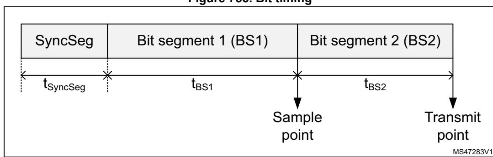

**Figure 785. Bit timing**

The baudrate is the inverse of bit time (baudrate = 1 / bit time), which, in turn, is the sum of three components. *[Figure 785](#page-26-0)* indicates that bit time = tSyncSeg + tBS1 + tBS2, where:

- for the nominal bit time
  - tq = (FDCAN\_NBTP.NBRP[8:0] + 1) \* tfdcan\_tq\_ck
  - tSyncSeg = 1 tq
  - tBS1 = tq \* (FDCAN\_NBTP.NTSEG1[7:0] + 1)
  - tBS2 = tq \* (FDCAN\_NBTP.NTSEG2[6:0] + 1)
- for the data bit time
  - tq = (FDCAN\_DBTP.DBRP[4:0] + 1) \* tfdcan\_tq\_ck
  - tSyncSeg = 1 tq
  - tBS1 = tq \* (FDCAN\_DBTP.DTSEG1[4:0] + 1)
  - tBS2 = tq \* (FDCAN\_DBTP.DTSEG2[3:0] + 1)

The (re)synchronization jump width (SJW) defines an upper bound for the amount of lengthening or shortening of the bit segments. It is programmable between one and four time quanta.

A valid edge is defined as the first transition in a bit time from dominant to recessive bus level, provided the controller itself does not send a recessive bit.

If a valid edge is detected in BS1 instead of SYNC\_SEG, BS1 is extended by up to SJW so that the sample point is delayed.

Conversely, if a valid edge is detected in BS2 instead of SYNC\_SEG, BS2 is shortened by up to SJW so that the transmit point is moved earlier.

As a safeguard against programming errors, the configuration of the bit timing register is only possible while the device is in Standby mode. Registers FDCAN\_DBTP and FDCAN\_NBTP (dedicated, respectively, to data and nominal bit timing) are only accessible when FDCAN\_CCCR.CCE and FDCAN\_CCCR.INIT are set.

*the ISO 11898-1 standard.*

*Note: For a detailed description of the CAN bit timing and resynchronization mechanism, refer to* 

## **59.4.5 Clock calibration on CAN**

After device reset the clock calibration unit (CCU) does not provide a valid clock signal to the FDCAN(s). The CCU must be initialized via FDCAN\_CCFG register. The FDCAN\_CCFG register can be written only when FDCAN1 has both FDCAN\_CCCR.CCE and FDCAN\_CCCR.INIT bits set. In consequence the CCU and the FDCAN1 initialization needs to be completed before any FDCAN module can operate.

Clock calibration is bypassed when FDCAN\_CCFG.BCC = 1 (see *[Figure 786](#page-28-0)*).

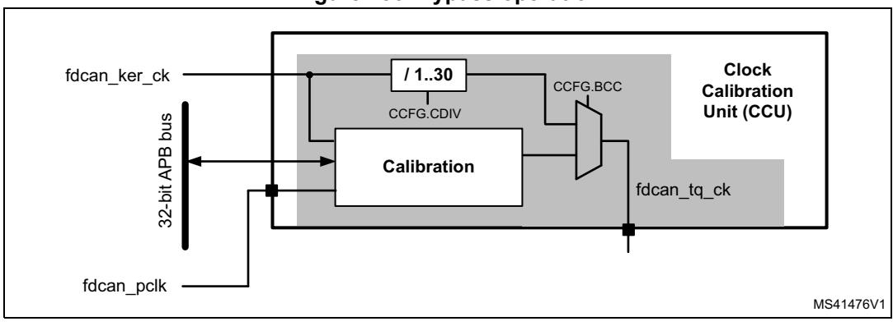

**Figure 786. Bypass operation**

### **Operating conditions**

The clock calibration on CAN unit is designed to operate under the following conditions:

- a CAN kernel clock frequency fdcan\_ker\_ck up of at least 80 MHz
- FDCAN bitrates:
  - Nominal bitrate: up to 1 Mbit/s
  - Data bitrate: between nominal bitrate and 8 Mbit/s

The clock calibration on FDCAN unit generates a calibrated time quanta clock fdcan\_tq\_ck in the range from 0.5 to 25 MHz.

*Note: The FDCAN requires that the CAN time quanta clock is always below or equal to the APB clock (fdcan\_tq\_ck < fdcan\_pclk). This must be considered when the clock calibration on CAN unit is bypassed (FDCAN\_CCFG.BCC = 1).*

### **Calibration accuracy**

The calibration accuracy in state Precision\_Calibrated depends upon the factors listed below.

- Dynamic clock tolerance at the CAN kernel clock input fdcan\_ker\_ck
- Measurement error. For each bit sequence used for calibration measurement, there is a maximum error of one fdcan\_pclk period. The number of bits used for measurement of the bit time is 32 or 64-bit, depending on configuration of FDCAN\_CCFG.CFL.
- Tolerable error in calibration mechanism

The distance between two calibration messages must be chosen to fit the clock tolerance requirements of the FDCAN1 module.

*Note: Dynamic clock tolerance is the clock frequency variation between two calibration messages for example caused by change of temperature or operating voltage.*

### **Functional description**

Calibration of the time quanta clock fdcan\_tq\_ck via CAN messages is performed by adapting a clock divider that generates the CAN protocol time quantum tq from the clock fdcan\_ker\_ck.

1. First step: basic calibration The minimum distance between two consecutive falling edges from recessive to dominant is measured, this time to be assumed two CAN bit times, counted in PLL clock periods. The clock divider (FDCAN\_CCFG.CDIV) is updated each time a new

measurement finds a smaller distance between edges. Basic calibration is achieved when the CAN protocol controller detects a valid CAN message.

2. Second step: Precision calibration

The calibration state machine measures the length of a longer bit sequence inside a CAN frame by counting the number of fdcan\_ker\_ck periods. The length of this bit sequence can be configured to 32 or 64 bits via FDCAN\_CCFG.CLF. For a calibration field length of 32/64 bit a calibration message with at least 2/6-byte data field is required. Precision calibration is based on the new clock divider value calculated from the measurement of the longer bit sequence.

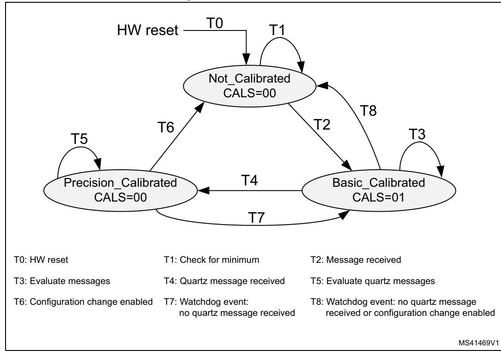

**Figure 787. FSM calibration**

A change in the calibration state sets interrupt flag FDCAN\_CCU\_IR.CSC, if enabled by the interrupt enable FDCAN\_CCU\_IE.CSCE. it remains set until cleared by writing 1 in FDCAN\_CCU\_IR.CSC.

Until precision calibration is achieved, FDCANs operate in a restricted mode (no frame transmission, no error or overload flag transmission, no error counting). In case calibration of the fdcan\_ker\_clk is done by software by evaluating the calibration status from register FDCAN\_CCU\_CSTAT, FDCANs have to be set to restricted operation mode (FDCAN\_CCCR.ASM = 1) until the calibration on CAN unit is in state Precision\_Calibrated (see *[Application](#page-31-0)*).

Precision calibration may be performed only on valid CAN frames transmitted by a node with a stable, quartz-controlled clock. calibration frames are detected by the FDCAN1 acceptance filtering A filter element and a Rx buffer have to be configured in the FDCAN1 to identify and store calibration messages. After reception of a calibration message the Rx buffer new data flag must be reset to enable signaling of the next calibration message.

RM0399 Rev 4 2641/3556

In case there is only one CAN transmitter with a quartz clock in the network, this node has to transmit its first message after startup with at least one 1010 binary sequence in the data field or in the identifier. This assures that the non-quartz nodes can enter state Basic\_Calibrated and then acknowledge the quartz node messages.

Precision calibration must be repeated in predefined maximum intervals supervised by the calibration watchdog.

*Note: When the clock calibration on CAN unit transits from state Precision\_Calibrated back to Basic\_Calibrated, the calibration OK signal is deasserted, the FDCAN1 complete ongoing transmissions, and then enter restricted operation (no frame transmission, no error or overload flag transmission, no error counting).*

## **Configuration**

The clock calibration on CAN unit is configured via register FDCAN\_CCFG, i.e. when FDCAN1 has FDCAN\_CCCR.CCE and FDCAN\_CCCR.INIT bits set.

For basic calibration the minimum number of oscillator periods between two consecutive falling edges at pin FDCAN1\_RX is measured. The number of clock periods depends on the clock frequency applied at input fdcan\_ker\_ck. In case the measured number of clock periods is below the minimum configured by FDCAN\_CCFG.OCPM (as an example, because of a glitch on FDCAN1\_RX) the value is discarded and measurement continues.

It is recommended to configure FDCAN\_CCFG.OCPM slightly below two CAN bit times:

FDCAN\_CCFG.OCPM < ((2 x CAN bit time) / fdcan\_ker\_ck period) / 32

The length of the bit field used for precision calibration can be configured to 32 or 64 bits via FDCAN\_CCFG.CFL. The number of bits used for precision calibration has an impact on calibration accuracy and the maximum distance between two calibration messages.

The number of time quanta per bit time configured by FDCAN\_CCFG.TQBT is used together with the measured number of oscillator clock periods FDCAN\_CCU\_CSTAT.OCPC to define the number of oscillator clocks per bit time.

When the clock calibration is bypassed by configuring FDCAN\_CCFG.BCC = 1, the internal clock divider must be configured via FDCAN\_CCFG.CDIV to fulfill the condition fdcan\_tq\_ck < fdcan\_pclk.

*Note: When clock calibration on CAN is active (FDCAN\_CCFG.BCC = 0), the baudrate prescalers of FDCAN modules have to be configured to inactive.*

### **Status signaling**

The status of the clock calibration on CAN unit can be monitored by reading register FDCAN\_CCU\_CSTAT. When in state Precision\_Calibrated the oscillator clock period counter FDCAN\_CCU\_CSTAT.OCPC signals the number of oscillator clock periods in the calibration field while FDCAN\_CCU\_CSTAT.TQC signals the number of time quanta in the calibration field.

The calibration state is monitored by FDCAN\_CCU\_CSTAT.CALS. A change in the calibration state sets interrupt flag FDCAN\_CCU\_IR.CSC. If enabled by the interrupt enable FDCAN\_CCU\_IE.CSCE it remains set until cleared by writing 1 in FDCAN\_CCU\_IR.CSC.

A calibration watchdog event also sets interrupt flag FDCAN\_CCU\_IR.CWE. If enabled by FDCAN\_CCU\_IE.CWEE (set to high), it remains active until reset by FDCAN\_CCU\_IE.CWE.

# **59.4.6 Application**

### **Clock calibration bypassed**

The CCU internal clock divider is configured for division by one (FDCAN\_CCFG.CDIV = 0x0000). In this operation mode the input clock fdcan\_ker\_ck is directly routed to the clock output fdcan\_tq\_ck. In this case fdcan\_tq\_ck is independent from the configuration and status of FDCAN1and FDCAN2 connected to the CCU. CAN FD operation is possible with an FDCAN\_ker\_ck above 80 MHz.

### **Software calibration**

The clock calibration on CAN unit also supports software calibration of fdcan\_ker\_ck by trimming of an on-chip oscillator. For calculation of the trimming values the user has to read the CCU state from FDCAN\_CCU\_CSTAT. The clock from fdcan\_ker\_ck is routed to output fdcan\_tq\_ck (FDCAN\_CCFG.BCC = 1).

The input clock fdcan\_ker\_ck must be at least 80 MHz. The clock divider of CCU must be configured via FDCAN\_CCFG.CDIV to bring fdcan\_tq\_ck to a valid range. All other configuration parameters have to be set via FDCAN\_CCFG. For correct operation of tFDCAN1and FDCAN2, the APB clock fdcan\_pclk needs to be equal to or higher than the time quanta clock (fdcan\_tq\_ck). CAN FD operation is not possible.

For startup FDCAN modules have to be both configured for restricted operation (FDCAN\_CCCR.ASM = 1) before FDCAN\_CCCR.INIT is reset. The input clock fdcan\_ker\_ck must be adjusted until the clock calibration on CAN unit has reached state Precision\_Calibrated. Now the software can reset FDCAN\_CCCR.ASM and the CANFD1 and CANFD2 can start normal operation.

During operation the software has to check regularly whether the clock calibration on CAN unit is still in state Precision\_Calibrated. In case the clock calibration on CAN unit has left state Precision\_Calibrated due to drift of fdcan\_ker\_ck, FDCAN modules have to be set into restricted operation mode by programming FDCAN\_CCCR.INIT, FDCAN\_CCCR.CCE, and FDCAN\_CCCR.ASM to 1. After fdcan\_ker\_ck has been adjusted successfully (clock calibration on CAN unit is in state Precision\_Calibrated), FDCAN modules can resume normal operation.

*Note: Trimming accuracy must be to sufficient to meet the CAN clock tolerance requirements for the configured bitrate.*

### **Clock calibration active**

This operation mode is entered by resetting FDCAN\_CCFG.BCC to 0. In this operation mode the fdcan\_ker\_ck is controlled by the CCU.

The generation of CCU output signal fdcan\_tq\_ck depends upon the state of the FDCAN1. Input clock fdcan\_ker\_ck must be above 80 MHz. Configuration of the CCU and FDCAN1 is required. CAN FD operation is not possible.

If FDCAN1 turns to Bus\_Off or when its INIT bit is set by the user command (FDCAN\_CCCR.INIT = 1), the CCU enters state Not\_Calibrated. CANFD1 and CANFD2 enter restricted operation mode.

*Note: This is the default operation mode after reset in case the reset value of FDCAN\_CCFG.BCC is configured to 0.*

RM0399 Rev 4 2643/3556

## **59.4.7 TTCAN operations (FDCAN1 only)**

### **Reference message**

A reference message is a data frame characterized by a specific CAN identifier. It is received and accepted by all nodes except the time master (sender of the reference message).

For level 1 the data length must be at least one; for level 0, 2 the data length must be at least four; otherwise, the message is not accepted as reference message. The reference message may be extended by other data up to the sum of eight CAN data bytes. All bits of the identifier except the three LSBs characterize the message as a reference message. The last three bits specify the priorities of up to eight potential time masters. Reserved bits are transmitted as logical 0 and are ignored by the receivers. The reference message is configured via register FDCAN\_TTRMC.

The time master transmits the reference message. If the reference message is disturbed by an error, it is retransmitted immediately. In case of a retransmission, the transmitted Master\_Ref\_Mark is updated. The reference message is sent periodically, but is allowed to stop the periodic transmission (Next\_is\_Gap bit) and to initiate transmission eventsynchronized at the start of the next basic cycle by the current time master or by one of the other potential time masters.

The node transmitting the reference message is the current time master. The time master is allowed to transmit other messages. If the current time master fails, its function is replicated by the potential time master with the highest priority. Nodes that are neither time master nor potential time master are time-receiving nodes.

### **Level 1**

Level 1 operation is configured via FDCAN\_TTOCF.OM = 01 and FDCAN\_TTOCF.GEN. external clock synchronization is not available in level 1. The information related to the reference message is stored in the first data byte as shown in *[Table 507](#page-32-0)*. Cycle\_Count is optional.

**Table 507. First byte of level 1 reference message**

| Bits       | 0           | 1        | 2 | 3 | 4                | 5 | 6 | 7 |
|------------|-------------|----------|---|---|------------------|---|---|---|
| First byte | Next_is_Gap | Reserved |   |   | Cycle_Count[5;0] |   |   |   |

### **Level 2**

Level 2 operation is configured via FDCAN\_TTOCF.OM = 10 and FDCAN\_TTOCF.GEN. The information related to the reference message is stored in the first four data bytes as shown in *[Table 508](#page-33-0)*. Cycle\_Count and the lower four bits of FDCAN\_NTU\_Res are optional. The TTCAN does not evaluate NTU\_Res[3:0] from received reference messages, it always transmits these bits as 0.

**Bits 0 1 2 3 4 5 6 7** First byte Next\_is\_Gap Reserved Cycle\_Count[5;0] Second byte NTU\_Res[6:4] NTU\_Res[3:0] Disc\_Bit Third byte Master\_Ref\_Mark[7:0] Fourth byte Master\_Ref\_Mark[15:8]

**Table 508. First four bytes of level 2 reference message**

### **Level 0**

Level 0 operation is configured via FDCAN\_TTOCF.OM = 11. External event-synchronized time-triggered operation is not available in level 0. The information related to the reference message is stored in the first four data bytes as shown in the table below. In level 0 Next\_is\_Gap is always 0. Cycle\_Count and the lower four bits of NTU\_Res are optional. The TTCAN does not evaluate NTU\_Res[3:0] from received reference messages, it always transmits these bits as 0.

**Bits 0 1 2 3 4 5 6 7** First byte Next\_is\_Gap Reserved Cycle\_Count[5;0] Second byte NTU\_Res[6:4] NTU\_Res[3:0] Disc\_Bit Third byte Master\_Ref\_Mark[7:0] Fourth byte Master\_Ref\_Mark[15:8]

**Table 509. First four bytes of level 0 reference message**

## **59.4.8 TTCAN configuration**

## **TTCAN timing**

The network time unit (NTU) is the unit in which all times are measured. The NTU is a constant of the whole network and is defined as a priority by the network system designer. In TTCAN level 1 the NTU is the nominal CAN bit time. In TTCAN level 0 and level 2 the NTU is a fraction of the physical second.

The NTU is the time base for the local time. The integer part of the local time (16-bit value) is incremented once each NTU. Cycle time and global time are both derived from local time. The fractional part (3-bit value) of local time, cycle time, and global time is not readable.

In TTCAN level 0 and level 2 the length of the NTU is defined by the time unit Ratio TUR. The TUR is in general a non-integer number, given by

TUR = FDCAN\_TURNA.NAV / FDCAN\_TURCF.DC. The NTU length is given by NTU = CAN clock period x TUR.

RM0399 Rev 4 2645/3556

The TUR numerator configuration NC is an 18-bit number, FDCAN\_TURCF[NCL[15:0]] can be programmed in the range 0x0000 to 0xFFFF. FDCAN\_TURCF[NCH[17:16]] is hard wired to 0b01. When 0xnnnn is written to FDCAN\_TURCF[NCL[15:0]], FDCAN\_TURNA.NAV starts with the value 0x10000 + 0x0nnnn = 0x1nnnn. The TUR denominator configuration FDCAN\_TURCF.DC is a 14-bit number. FDCAN\_TURCF.DC may be programmed in the range 0x0001 to 0x3FFF (0x0000 is an illegal value).

In level 1, NC must be equal to or higher than 4 x FDCAN\_TURCF.DC. In level 0 and level 2 NC must be equal to or higher than 8 x FDCAN\_TURCF.DC to get the 3-bit resolution for the internal fractional part of the NTU.

A hardware reset presets FDCAN\_TURCF.DC to 0x1000 and FDCAN\_TURCF.NCL to 0x10000, resulting in an NTU consisting of sixteen CAN clock periods. Local time and application watchdog are not started before either the FDCAN\_CCCR.INIT is reset, or FDCAN\_TURCF.ELT is set. FDCAN\_TURCF.ELT may not be set before the NTU is configured. Setting FDCAN\_TURCF.ELT to 1 also locks the write access to register FDCAN\_TURCF.

At startup FDCAN\_TURNA.NAV is updated from NC (= FDCAN\_TURCF.NCL + 0x10000) when FDCAN\_TURCF.ELT is set. In TTCAN level 1 there is no drift compensation. FDCAN\_TURNA.NAV does not change during operation, it is always equal to NC.

In TTCAN level 0 and level 2 there are two possibilities for FDCAN\_TURNA.NAV to change. When operating as time slave or backup time master, and when FDCAN\_TTOCF.ECC is set, FDCAN\_TURNA.NAV is updated automatically to the value calculated from the monitored global time speed, as long as the TTCAN is in synchronization state In\_Schedule or In\_Gap. When it loses synchronization, it returns to NC. When operating as the actual time master, and when FDCAN\_TTOCF.EECS is set, the user may update FDCAN\_TURCF.NCL. When the user sets FDCAN\_TTOCN.ECS, FDCAN\_TURNA.NAV is updated from the new value of NC at the next reference message. The status flag FDCAN\_TTOST.WECS as is set when FDCAN\_TTOCN.ECS is set and is cleared when FDCAN\_TURNA.NAV is updated. FDCAN\_TURCF.NCL is write locked while FDCAN\_TTOST.WECS is set.

In TTCAN level 0 and level 2 the clock calibration process adapts FDCAN\_TURNA.NAV in the range of the synchronization deviation limit SDL of NC ± 2(FDCAN\_TTOCF.LDSDL + 5). FDCAN\_TURCF.NCL should be programmed to the largest applicable numerical value in order to achieve the best accuracy in the calculation of FDCAN\_TURNA.NAV.

The synchronization deviation SD is the difference between NC and FDCAN\_TURNA.NAV (SD = | NC - FDCAN\_TURNA.NAV |). It is limited by the synchronization deviation limit SDL, which is configured by its dual logarithm FDCAN\_TTOCF.LDSDL (SDL = 2 (FDCAN\_TTOCF.LDSDL + 5)) and should not exceed the clock tolerance given by the CAN bit timing configuration. SD is calculated at each new basic cycle. When the calculated TURNA[NAV deviates by more than SDL from NC, or if the Disc\_Bit in the reference message is set, the drift compensation is suspended and FDCAN\_TTIR.GTE is set and FDCAN\_TTOSC.QCS is reset, or in case of the Disc\_Bit = 1, FDCAN\_TTIR.GTD is set.

**Table 510. TUR configuration example**

| TUR                | 8       | 10      | 24      | 50      | 510     | 125000  | 32.5    | 100/12  | 529/17  |
|--------------------|---------|---------|---------|---------|---------|---------|---------|---------|---------|
| NC                 | 0x1FFF8 | 0x1FFFE | 0x1FFF8 | 0x1FFEA | 0x1FFFE | 0x1E848 | 0x1FFE0 | 0x19000 | 0x10880 |
| FDCAN _TURCF.DC | 0x3FFF  | 0x3333  | 0x1555  | 0x0A3D  | 0x0101  | 0x0001  | 0x0FC0  | 0x3000  | 0x0880  |

FDCAN\_TTOCN.ECS schedules NC for activation by the next reference message. FDCAN\_TTOCN.SGT schedules FDCAN\_TTGTP.TP for activation by the next reference message. Setting FDCAN\_TTOCN.ECS and FDCAN\_TTOCN.SGT requires FDCAN\_TTOCF.EECS to be set (external clock synchronization enabled) while the FDCAN is actual time master.

The TTCAN module provides an application watchdog to verity the function of the application program. The user has to serve this watchdog regularly, else all CAN bus activity is stopped. The application watchdog limit FDCAN\_TTOCF.AWL specifies the number of NTUs between two times the watchdog must be served. The maximum number of NTUs is 256. The application watchdog is served by reading register FDCAN\_TTOST. FDCAN\_TTOST.AWE indicates whether the watchdog has been served in time. In case the application failed to serve the application watchdog, interrupt flag FDCAN\_TTIR.AW is set. For software development, the application watchdog may be disabled by programming FDCAN\_TTOCF.AWL to 0x00, see *[Section 59.6.3](#page-106-0)*.

### **Timing of interface signals**

The timing events that cause a pulse at output FDCAN trigger time mark interrupt pulse fdcan1\_tmp for more than one instance and fdcan\_tmp if only one instance; FDCAN register time mark interrupt pulse fdcan1\_rtp for more than one instance and fdcan\_rtp if only one instance are generated in the CAN clock domain.

There is a clock domain crossing delay to be considered before the same event is visible in the APB clock domain (when FDCAN\_TTIR.TTMI is set or FDCAN\_TTIR.RTMI is set). As an example, the signals can be connected to the timing input(s) of another FDCAN node (fdcan\_swt/fdcan\_evt), in order to automatically synchronize two TTCAN networks.

Output FDCAN start of cycle\_fdcan1\_soc for more than one instance and cycle\_fdcan1\_soc if only one instance gets active whenever a reference message is completed (either transmitted or received). The output is controlled in the APB clock domain.

## **59.4.9 Message scheduling**

FDCAN\_TTOCF.TM controls whether the TTCAN operates as potential time master or as a time slave. If it is a potential time master, the three LSBs of the reference message identifier FDCAN\_TTRMC.RID define the master priority, 0 giving the highest and 7 giving the lowest. There cannot be two nodes in the network using the same master priority. FDCAN\_TTRMC.RID is used for recognition of reference messages. FDCAN\_TTRMC.RMPS is not relevant for time slaves.

The initial reference trigger offset FDCAN\_TTOCF.IRTO is a 7-bit-value that defines (in NTUs) how long a backup time master waits before it starts the transmission of a reference message when a reference message is expected but the bus remains idle. The recommended value for FDCAN\_TTOCF.IRTO is the master priority multiplied with a factor depending on the expected clock drift between the potential time masters in the network. The sequential order of the backup time masters, when one of them starts the reference message in case the current time master fails, should correspond to their master priority, even with maximum clock drift.

FDCAN\_TTOCF.OM decides whether the node operates in TTCAN level 0, level 1, or level 2. In one network, all potential time masters have to operate on the same level. Time slaves may operate on level 1 in a level 2 network, but not vice versa. The configuration of the TTCAN operation mode via FDCAN\_TTOCF.OM is the last step in the setup. With FDCAN\_TTOCF.OM = 00 (event-driven CAN communication), the FDCAN operates

RM0399 Rev 4 2647/3556

according to ISO 11898-1: 2015, without time triggers.With FDCAN\_TTOCF.OM = 01 (level 1), the FDCAN operates according to ISO 11898-4, but without the possibility to synchronize the basic cycles to external events, the Next\_is\_Gap bit in the reference message is ignored. With FDCAN\_TTOCF.OM = 10 (level 2), the TTCAN operates according to ISO 11898-4, including the event-synchronized start of a basic cycle. With FDCAN\_TTOCF.OM = 11 (level 0), the FDCAN operates as event-driven CAN but maintains a calibrated global time base as in level 2.

FDCAN\_TTOCF.EECS enables the external clock synchronization, allowing the application program of the current time master to update the TUR configuration during time-triggered operation, to adapt the clock speed and (in levels 0 and level 2 only) the global clock phase to an external reference.

FDCAN\_TTMLM.ENTT in the TT matrix limits register specifies the number of expected Tx\_Triggers in the system matrix. This is the sum of Tx\_Triggers for exclusive, single arbitrating and merged arbitrating windows, excluding the Tx\_Ref\_Triggers. Note that this is usually not the number of Tx\_Trigger memory elements; the number of basic cycles in the system matrix and the trigger repeat factors have to be taken into account.

An inaccurate configuration of FDCAN\_TTMLM.ENTT results either in a TxCount Underflow (FDCAN\_TTIR.TXU = 1 and FDCAN\_TTOST.EL = 01, severity 1), or in a Tx count Overflow (FDCAN\_TTIR.TXO = 1 and FDCAN\_TTOST.EL = 10, severity 2).

*Note: In case the first reference message seen by a node does not have Cycle\_Count 0, this node may finish its first matrix cycle with its Tx count resulting in a Tx count underflow condition. As long as a node is in state Synchronizing, its Tx\_Triggers do not lead to transmissions.*

> FDCAN\_TTMLM.CCM specifies the number of the last basic cycle in the system matrix. The counting of basic cycles starts at 0. In a system matrix consisting of eight basic cycles FDCAN\_TTMLM.CCM would be 7. FDCAN\_TTMLM.CCM is ignored by time slaves, a receiver of a reference message considers the received cycle count as the valid cycle count for the actual basic cycle.

> FDCAN\_TTMLM.TXEW specifies the length of the Tx enable window in NTUs. The Tx enable window is that period of time at the beginning of a time window where a transmission may be started. If a transmission of a message cannot be started inside the Tx enable window because of for example, a slight overlap from the previous time window message, the transmission cannot be started in that time window at all. FDCAN\_TTMLM.TXEW must be chosen with respect to the network synchronization quality and with respect to the relation between the length of the time windows and the length of the messages.

### **Trigger memory**

The trigger memory is part of the external message RAM to which the TTCAN is connected to (see *[Section 59.5.26](#page-87-0)*). It stores up to 64 trigger elements. A trigger memory element consists of time mark TM, cycle code CC, trigger type TYPE, filter type FTYPE, message number MNR, message status count MSC, time mark event internal TMIN, time mark event external TMEX (see *[Section 59.4.23](#page-62-0)*).

The time mark defines at which cycle time a trigger becomes active. The triggers in the trigger memory have to be sorted by their time marks. The trigger element with the lowest time mark is written to the first trigger memory word. Message number and cycle code are ignored for triggers of type Tx\_Ref\_Trigger, Tx\_Ref\_Trigger\_Gap, Watch\_Trigger, Watch\_Trigger\_Gap, and End\_of\_List.

When the cycle time reaches the time mark of the actual trigger, the FSE switches to the next trigger and starts to read the following trigger from the trigger memory. In case of a

transmit trigger, the Tx handler starts to read the message from the message RAM as soon as the FSE switches to its trigger. The RAM access speed defines the minimum time step between a transmit trigger and its preceding trigger, the Tx handler must be able to prepare the transmission before the transmit trigger time mark is reached. The RAM access speed also limits the number of non-matching (with regard to their cycle code) triggers between two matching triggers, the next matching trigger must be read before its time mar k is reached. If the reference message is n NTU long, a trigger with a time mark lower than n never becomes active and is treated as a configuration error.

Starting point of the cycle time is the sample point of the reference message start of frame bit. The next reference message is requested when cycle time reaches the Tx\_Ref\_Trigger time mark. The FDCAN reacts on the transmission request at the next sample point. A new Sync\_Mark is captured at the start of frame bit, but the cycle time is incremented until the reference message is successfully transmitted (or received) and the Sync\_Mark is taken as the new Ref\_Mark. At that point in time, cycle time is restarted. As a consequence, cycle time can never (with the exception of initialization) be seen at a value lower than n, with n being the length of the reference message measured in NTU.

Length of a basic cycle: Tx\_Ref\_Trigger time mark + 1 NTU + 1 CAN bit time.

The trigger list is different for all nodes in the CAN FD network. Each node knows only the Tx\_Triggers for its own transmit messages, the Rx\_Triggers for those receive messages that are processed by this node, and the triggers concerning the reference messages.

### **Trigger types**

Tx\_Ref\_Trigger (TYPE = 0000) and Tx\_Ref\_Trigger\_Gap (TYPE = 0001) cause the transmission of a reference message by a time master. A configuration error (FDCAN\_TTOST.EL = 11, severity 3) is detected when a time slave encounters a Tx\_Ref\_Trigger(\_Gap) in its trigger memory. Tx\_Ref\_Trigger\_Gap is only used in external event-synchronized

time-triggered operation mode. In that mode, Tx\_Ref\_Trigger is ignored when the FDCAN synchronization state is In\_Gap (FDCAN\_TTOST.SYS = 10).

Tx\_Trigger\_Single (TYPE = 0010), Tx\_Trigger\_Continuous (TYPE = 0011), Tx\_Trigger\_Arbitration (TYPE = 0100), and Tx\_Trigger\_Merged (TYPE = 0101) cause the start of a transmission. They define the start of a time window.

Tx\_Trigger\_Single starts a single transmission in an exclusive time window when the message buffer transmission request pending bit is set. After successful transmission the transmission request pending bit is reset.

Tx\_Trigger\_Continuous starts a transmission in an exclusive time window when the message buffer transmission request pending bit is set. After successful transmission the transmission request pending bit remains set, and the message buffer is transmitted again in the next matching time window.

Tx\_Trigger\_Arbitration starts an arbitrating time window, Tx\_Trigger\_Merged a merged arbitrating time window. The last Tx\_Trigger of a merged arbitrating time window must be of type Tx\_Trigger\_Arbitration. A configuration error (FDCAN\_TTOST.EL = 11, severity 3) is detected when a trigger of type Tx\_Trigger\_Merged is followed by any other Tx\_Trigger than one of type Tx\_Trigger\_Merged or Tx\_Trigger\_Arbitration. Several Tx\_Triggers may be defined for the same Tx message buffer. Depending on their cycle code, they may be ignored in some basic cycles. The cycle code must be considered when the expected number of Tx\_Triggers (FDCAN\_TTMLM.ENTT) is calculated.

RM0399 Rev 4 2649/3556

Watch\_Trigger (TYPE = 0110) and Watch\_Trigger\_Gap (TYPE = 0111) check for missing reference messages. They are used by both time masters and time slaves. Watch\_Trigger\_Gap is only used in external event-synchronized time-triggered operation mode. In that mode, a Watch\_Trigger is ignored when the FDCAN synchronization state is In\_Gap (FDCAN\_TTOST.SYS = 10).

Rx\_Trigger (TYPE = 1000) is used to check for the reception of periodic messages in exclusive time windows. Rx\_Triggers are not active until state In\_Schedule or In\_Gap is reached. The time mark of an Rx\_Trigger must be placed after the end of that message transmission, independent of time window boundaries. Depending on their cycle code, Rx\_Triggers may be ignored in some basic cycles. At the time mark of the Rx\_Trigger, it is checked whether the last received message before this time mark and after start of cycle or previous Rx\_Trigger had matched the acceptance filter element referenced by MNR. Accepted messages are stored in one of the two receive FIFOs, according to the acceptance filtering, independent of the Rx\_Trigger. Acceptance filter elements referenced by Rx\_Triggers should be placed at the beginning of the filter list to ensure that the filtering is finished before the Rx\_Trigger time mark is reached.

Time\_Base\_Trigger (TYPE = 1001) are used to generate internal/external events depending on the configuration of TMIN and TMEX.

End\_of\_List (TYPE = 1010 … 1111) is an illegal trigger type, a configuration error (FDCAN\_TTOST.EL = 11, severity 3) is detected when an End\_of\_List trigger is encountered in the trigger memory before the Watch\_Trigger and Watch\_Trigger\_Gap.

### **Restrictions for the node trigger list**

There may not be two triggers that are active at the same cycle time and cycle count, but triggers that are active in different basic cycles (different cycle code) may share the same time mark.

Rx\_Triggers and Time\_Base\_Triggers may not be placed inside the Tx enable windows of Tx\_Trigger\_Single/Continuous/Arbitration, but they may be placed after Tx\_Trigger\_Merged.

Triggers that are placed after the Watch\_Trigger (or the Watch\_Trigger\_Gap when FDCAN\_TTOST.SYS = 10) never become active. The watch triggers themselves do not become active when the reference messages are transmitted on time.

All unused trigger memory words (after the Watch\_Trigger or after the Watch\_Trigger\_Gap when FDCAN\_TTOST.SYS = 10) must be set to trigger type End\_of\_List.

A typical trigger list for a potential time master begins with a number of Tx\_Triggers and Rx\_Triggers followed by the Tx\_Ref\_Trigger and the Watch\_Trigger. For networks with external event- synchronized time-triggered communication, this is followed by the Tx\_Ref\_Trigger\_Gap and the Watch\_Trigger\_Gap. The trigger list for a time slave is the same but without the Tx\_Ref\_Trigger and the Tx\_Ref\_Trigger\_Gap.

At the beginning of each basic cycle, that is at each reception or transmission of a reference message, the trigger list is processed starting with the first trigger memory element. The FSE looks for the first trigger with a cycle code that matches the current cycle count. The FSE waits until cycle time reaches the trigger time mark and activates the trigger. Afterwards the FSE looks for the next trigger in the list with a cycle code that matches the current cycle count.

Special consideration is needed for the time around Tx\_Ref\_Trigger and Tx\_Ref\_Trigger\_Gap. In a time master competing for master ship, the effective time mark of

a Tx\_Ref\_Trigger may be decremented in order to be the first node to start a reference message. In backup time masters the effective time mark of a Tx\_Ref\_Trigger or Tx\_Ref\_Trigger\_Gap is the sum of its configured time mark and the reference trigger offset FDCAN\_TTOCF.IRTO. In case error level 2 is reached (FDCAN\_TTOST.EL = 10), the effective time mark is the sum of its time mark and 0x127. No other trigger elements should be placed in this range otherwise it may happen that the time marks appear out of order and are flagged as a configuration error. Trigger elements which are coming after Tx\_Ref\_Trigger may never become active as long as the reference messages come in time.

There are interdependencies between the following parameters:

- APB clock frequency
- Speed and waiting time for trigger RAM accesses
- Length of the acceptance filter list
- Number of trigger elements
- Complexity of cycle code filtering in the trigger elements
- Offset between time marks of the trigger elements

### **Example for trigger handling**

The example shows how the trigger list is derived from a node system matrix. Assumption is that node A is first time master and has knowledge of the section of the system matrix shown in *[Table 511](#page-39-0)*.

| Cycle count | Time mark |   |          |     |   |       |       |  |  |
|----------------|-----------|---|----------|-----|---|-------|-------|--|--|
|                | 1         | 2 | 3        | 4   | 5 | 6     | 7     |  |  |
| 0              | Tx7       | - | -        | -   | - | TxRef | Error |  |  |
| 1              | Rx3       | - | Tx2, Tx4 |     | - | TxRef | Error |  |  |
| 2              | -         | - | -        | -   | - | TxRef | Error |  |  |
| 3              | Tx7       | - | Rx5      | -   | - | TxRef | Error |  |  |
| 4              | Tx7       | - | -        | Rx6 | - | TxRef | Error |  |  |

**Table 511. System matrix, Node A**

The cycle count starts with 0 and runs until 0, 1, 3, 7, 15, 31, 63 (the corresponding number of basic cycles in the system matrix is, respectively, 1, 2, 4, 8, 16, 32, 64). The maximum cycle count is configured by FDCAN\_TTMLM.CCM. The cycle code CC is composed of repeat factor (= value of most significant 1) and the number of the first basic cycle in the system matrix (= bit field after most significant 1).

As an example, with a cycle code of 0b0010011 (repeat factor = 16, first basic cycle = 3) and a maximum cycle count of FDCAN\_TTMLM.CCM = 0x3F matches occur at cycle counts 3, 19, 35 and 51.

A trigger element consists of time mark TM, cycle code CC, trigger type TYPE, and message number MNR. For transmission MNR references the Tx buffer number (0 ... 31). For reception MNR references the number of the filter element (0 ... 127) that matched during acceptance filtering. Depending on the configuration of the filter type FTYPE, the 11 bit or 29-bit message ID filter list is referenced.

RM0399 Rev 4 2651/3556

In addition, a trigger element can be configured for generation of time mark event internal TMIN, and time mark event external TMEX. The message status count MSC holds the counter value (0 ... 7) for scheduling errors for periodic messages in exclusive time windows at the point in time when the time mark of the trigger element became active.

**Trigger Time mark TM[15:0] Cycle code CC [6:0] Trigger type TYPE [3:0] Mess No. MNR [6:0]** 0 Mark1 0b0000100 Tx\_Trigger\_Single 7 1 Mark 1 0b1000000 Rx\_Trigger 3 2 Mark 1 0b1000011 Tx\_Trigger\_Single 7 3 Mark 3 0b1000001 Tx\_Trigger\_Merged 2 4 Mark 3 0b1000011 Rx\_Trigger 5 5 Mark 4 0b1000001 Tx\_Trigger\_Arbitration 4 6 Mark 4 0b1000100 Rx\_Trigger 6 7 Mark 6 N/A Tx\_Ref\_Trigger 0 (Ref) 8 Mark 7 N/A Watch\_Trigger N/A 9 N/A N/A End\_of\_List N/A

**Table 512. Trigger list, Node A**

Tx\_Trigger\_Single, Tx\_Trigger\_Continuous, Tx\_Trigger\_Merged, Tx\_Trigger\_Arbitration, Rx\_Trigger, and Time\_Base\_Trigger are only valid for the specified cycle code. For all other trigger types the cycle code is ignored.

The FSE starts the basic cycle with scanning the trigger list starting from 0 until a trigger with time mark higher than cycle time and with its cycle code CC matching the actual cycle count is reached, or a trigger of type Tx\_Ref\_Trigger, Tx\_Ref\_Trigger\_Gap, Watch\_Trigger, or Watch\_Trigger\_Gap is encountered.

When the cycle time reached the time mark TM, the action defined by trigger type TYPE and message number MNR is started. There is an error in the configuration when End\_of\_List is reached.

At mark 6 the reference message (always TxRef) is transmitted. After transmission of the reference message the FSE returns to the beginning of the trigger list. When the watch trigger at mark 7 is reached, the node was not able to transmit the reference message; error treatment is started.

## **Detection of configuration errors**

A configuration error is signaled via FDCAN\_TTOST.EL = 11 (severity 3) when:

- The FSE comes to a trigger in the list with a cycle code that matches the current cycle count but with a time mark that is less than the cycle time.
- The previous active trigger was a Tx\_Trigger\_Merged and the FSE comes to a trigger in the list with a cycle code that matches the current cycle count but that is neither a

- Tx\_Trigger\_Merged nor a Tx\_Trigger\_Arbitration nor a Time\_Base\_Trigger nor an Rx\_Trigger.
- The FSE of a node with FDCAN\_TTOCF.TM=0 (time slave) encounters a Tx\_Ref\_Trigger or a Tx\_Ref\_Trigger\_Gap.
- Any time mark placed inside the Tx enable window (defined by FDCAN\_TTMLM.TXEW) of a Tx\_Trigger with a matching cycle code.
- A time mark is placed near the time mark of a Tx\_Ref\_Trigger and the reference trigger offset FDCAN\_TTOST.RTO causes a reversal of their sequential order measured in cycle time.

### **TTCAN schedule initialization**

The synchronization to the TTCAN message schedule starts when FDCAN\_CCCR.INIT is reset. The TTCAN can operate strictly time-triggered (FDCAN\_TTOCF.GEN = 0) or external event-synchronized time-triggered (FDCAN\_TTOCF.GEN = 1). All nodes start with cycle time 0 at the beginning of their trigger list with FDCAN\_TTOST.SYS = 00 (out of synchronization), no transmission is enabled with the exception of the reference message. Nodes in external event-synchronized time-triggered operation mode ignore Tx\_Ref\_Trigger and Watch\_Trigger and use instead Tx\_Ref\_Trigger\_Gap and Watch\_Trigger\_Gap until the first reference message decides whether a Gap is active.

### **Time slaves**

After configuration, a time slave ignores its Watch\_Trigger and Watch\_Trigger\_Gap if it does not receive any message before reaching the Watch\_Triggers. When it reaches Init\_Watch\_Trigger, interrupt flag FDCAN\_TTIR.IWT is set, the FSE is frozen, and the cycle time becomes invalid, but the node is still able to take part in CAN bus communication (to acknowledge or to send error flags). The first received reference message restarts the FSE and the cycle time.

*Note: Init\_Watch\_Trigger is not part of the trigger list. It is implemented as an internal counter that counts up to 0xFFFF = maximum cycle time.*

> When a time slave has received any message but the reference message before reaching the Watch\_Triggers, it assumes a fatal error (FDCAN\_TTOST.EL = 11, severity 3), set interrupt flag FDCAN\_TTIR.WT, switch off its CAN bus output, and enter the bus monitoring mode (FDCAN\_CCCR.MON set to 1). In the bus monitoring mode it is still able to receive messages, but cannot send any dominant bits and therefore cannot give acknowledge.

*Note: To leave the fatal error state, the user has to set FDCAN\_CCCR.INIT = 1. After reset of FDCAN\_CCCR.INIT, the node restarts TTCAN communication.*

> When no error is encountered during synchronization, the first reference message sets FDCAN\_TTOST.SYS = 01 (Synchronizing), the second sets the FDCAN synchronization state (depending on its Next\_is\_Gap bit) to FDCAN\_TTOST.SYS = 11 (In\_Schedule) or FDCAN\_TTOST.SYS = 10 (In\_Gap), enabling all Tx\_Triggers and Rx\_Triggers.

# **Potential time masters**

After configuration, a potential time master starts the transmission of a reference message when it reaches its Tx\_Ref\_Trigger (or its Tx\_Ref\_Trigger\_Gap when in external eventsynchronized time-triggered operation). It ignores its Watch\_Trigger and Watch\_Trigger\_Gap when it does not receive any message or transmit the reference message successfully before reaching the Watch\_Triggers (assumed reason: all other nodes still in reset or configuration, giving no acknowledge). When it reaches

RM0399 Rev 4 2653/3556

Init\_Watch\_Trigger, the attempted transmission is aborted, interrupt flag FDCAN\_TTIR.IWT is set, the FSE is frozen, and the cycle time becomes invalid, but the node is still able to take part in CAN bus communication (to give acknowledge or to send error flags). Resetting FDCAN\_TTIR.IWT re-enables the transmission of reference messages until next time the Init\_Watch\_Trigger condition is met, or another CAN message is received. The FSE is not be restarted by the reception of a reference message.

When a potential time master reaches the Watch\_Triggers after it has received any message but the reference message, it assumes a fatal error (FDCAN\_TTOST.EL = 11, severity 3), sets interrupt flag FDCAN\_TTIR.WT, switches off its CAN bus output, and enters the bus monitoring mode (FDCAN\_CCCR.MON set to 1). In bus monitoring mode, it is still able to receive messages, but cannot send any dominant bits and therefore cannot give acknowledge.

When no error is detected during initialization, the first reference message sets FDCAN\_TTOST.SYS = 01 (synchronizing), the second sets the FDCAN synchronization state (depending on its Next\_is\_Gap bit) to FDCAN\_TTOST.SYS = 11 (In\_Schedule) or FDCAN\_TTOST.SYS = 10 (In\_Gap), enabling all Tx\_Triggers and Rx\_Triggers.

A potential time master is current time master (FDCAN\_TTOST.MS = 11) when it was the transmitter of the last reference message, else it is backup time master (FDCAN\_TTOST.MS = 10).

When all potential time masters have finished configuration, the node with the highest time master priority in the network becomes the current time master.

## **59.4.10 TTCAN gap control**

All functions related to gap control apply only when the FDCAN is operated in external event synchronized time-triggered mode (FDCAN\_TTOCF.GEN = 1). In this operation mode the FDCAN message schedule may be interrupted by inserting gaps between the basic cycles of the system matrix. All nodes connected to the CAN network have to be configured for external event- synchronized time-triggered operation.

During a gap, all transmissions are stopped and the CAN bus remains idle. A gap is finished when the next reference message starts a new basic cycle. A gap starts at the end of a basic cycle that itself was started by a reference message with bit Next\_is\_Gap = 1 for example gaps are initiated by the current time master.

The current time master has two options to initiate a gap. A gap can be initiated under software control when the application program writes FDCAN\_TTOCN.NIG = 1. The Next\_is\_Gap bit is transmitted as 1 with the next reference message. A gap can also be initiated under hardware control when the application program enables the event trigger input pin fdcan\_evt by writing FDCAN\_TTOCN.GCS = 1. When a reference message is started and FDCAN\_TTOCN.GCS is set, a HIGH level at event trigger pin fdcan\_evt sets Next\_is\_Gap = 1.

As soon as that reference message is completed, the FDCAN\_TTOST.WFE bit announces the gap to the time master as well as to the time slaves. The current basic cycle continues until its last time window. The time after the last time window is the gap time.

For the actual time master and the potential time masters, FDCAN\_TTOST.GSI is set when the last basic cycle has finished and the gap time starts. In nodes that are time slaves, bit FDCAN\_TTOST.GSI remains at 0.

When a potential time master is in synchronization state In\_Gap (FDCAN\_TTOST.SYS = 10), it has four options to intentionally finish a gap:

- 1. Under software control by writing FDCAN\_TTOCN.FGP = 1.
- 2. Under hardware control (FDCAN\_TTOCN.GCS = 1) an edge from HIGH to LOW at the event-trigger input pin fdcan\_evt sets FDCAN\_TTOCN.FGP and restarts the schedule.
- 3. The third option is a time-triggered restart. When FDCAN\_TTOCN.TMG = 1, the next register time mark interrupt (FDCAN\_TTIR.RTMI = 1) sets FDCAN\_TTOCN.FGP and starts the reference message.
- 4. Finally any potential time master finishes a gap when it reaches its Tx\_Ref\_Trigger\_Gap, assuming that the event to synchronize on did not occur in time.

None of these options can cause a basic cycle to be interrupted with a reference message.

Setting of FDCAN\_TTOCN.FGP after the gap time begins starts the transmission of a reference message immediately and thereby synchronizes the message schedule. When FDCAN\_TTOCN.FGP is set before the gap time has started (while the basic cycle is still in progress), the next reference message is started at the end of the basic cycle, at the Tx\_Ref\_Trigger – there is no gap time in the message schedule.

In strictly time-triggered operation, bit Next\_is\_Gap = 1 in the reference message is ignored, as well as the event-trigger input pin fdcan\_evt and the bits FDCAN\_TTOCN.NIG, FDCAN\_TTOCN.FGP, and FDCAN\_TTOCN.TMG.

## **59.4.11 Stop watch**

The stop watch function enables capturing of FDCAN internal time values (local time, cycle time, or global time) triggered by an external event.

To enable the stop watch function, the application program first has to define local time, cycle time, or global time as stop watch source via FDCAN\_TTOCN.SWS. When FDCAN\_TTOCN.SWS is different from 00 and TT interrupt register flag FDCAN\_TTIR.SWE is 0, the actual value of the time selected by FDCAN\_TTTOCN.SWS is copied into FDCAN\_TTCPT.SWV on the next rising / falling edge (as configured via FDCAN\_TTOCN.SWP) on stop watch trigger pin fdcan\_swt. This sets interrupt flag FDCAN\_TTIR.SWE. After the application program has read FDCAN\_TTCPT.SWV, it may enable the next stop watch event by resetting FDCAN\_TTIR.SWE to 0.

# **59.4.12 Local time, cycle time, global time, and external clock synchronization**

There are two possible levels in time-triggered CAN:

- 1. Level 1 only provides time-triggered operation using cycle time.
- 2. Level 2 additionally provides increased synchronization quality, global time and external clock synchronization. In both levels, all timing features are based on a local time base - the local time.

The local time is a 16-bit cyclic counter, it is incremented once each NTU. Internally the NTU is represented by a 3-bit counter which can be regarded as a fractional part (three binary digits) of the local time. Generally, the 3-bit NTU counter is incremented eight times each NTU. If the length of the NTU is shorter than eight CAN clock periods (as may be configured in level 1, or as a result of clock calibration in level 2), the length of the NTU fraction is adapted, and the NTU counter is incremented only four times each NTU.

*[Figure 788](#page-44-0)* describes the synchronization of the cycle time and global time, performed in the same manner by all FDCAN nodes, including the time master. Any message received or transmitted invokes a capture of the local time taken at the message is frame

RM0399 Rev 4 2655/3556

synchronization event. This frame synchronization event occurs at the sample point of each start of frame (SoF) bit and causes the local time to be stored as Sync\_Mark. Sync\_Marks and Ref\_Marks are captured including the 3-bit fractional part.

Whenever a valid reference message is transmitted or received, the internal Ref\_Mark is updated from the Sync\_Mark. The difference between Ref\_Mark and Sync\_Mark is the cycle sync mark (cycle sync mark = Sync\_Mark - Ref\_Mark) stored in register FDCAN\_TTCSM. The most significant 16 bits of the difference between Ref\_Mark and the actual value of the local time is the cycle time (cycle time = local time - Ref\_Mark).

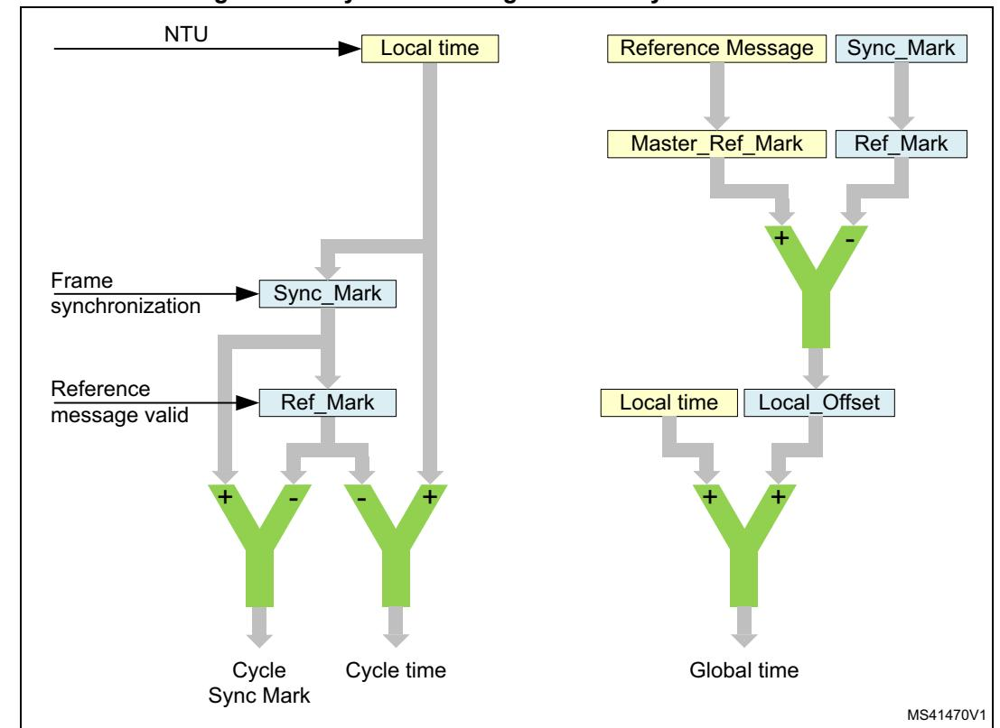

**Figure 788. Cycle time and global time synchronization**

The cycle time that can be read from FDCAN\_TTCTC.CT is the difference of the node local time and Ref\_Mark, both synchronized into the APB clock domain and truncated to 16 bit.

The global time exists for TTCAN level 0 and level 2 only, in level 1 it is invalid. The node view of the global time is the local image of the global time in (local) NTUs. After configuration, a potential time master uses its own local time as global time. The time master establishes its own local time as global time by transmitting its own Ref\_Marks as Master\_Ref\_Marks in the reference message (bytes 3 and 4). The global time that can be read from FDCAN\_TTLGT.GT is the sum of the node local time and its local offset, both synchronized into the APB clock domain and truncated to 16 bit. The fractional part is used for clock synchronization only.

A node that receives a reference message calculates its local offset to the global time by comparing its local Ref\_Mark with the received Master\_Ref\_Mark (see *[Figure 789](#page-45-0)*). The node view of the global time is local time plus local offset. In a potential time master that has never received another time master reference message, Local\_Offset is 0. When a node becomes the current time master after first having received other reference messages,

Local\_Offset is frozen at its last value. In the time receiving nodes, Local\_Offset may be subject to small adjustments, due to clock drift, when another node becomes time master, or when there is a global time discontinuity, signaled by Disc\_Bit in the reference message. With the exception of global time discontinuity, the global time provided to the application program by register FDCAN\_TTLGT is smoothed by a low-pass filtering to have a continuous monotonic value.

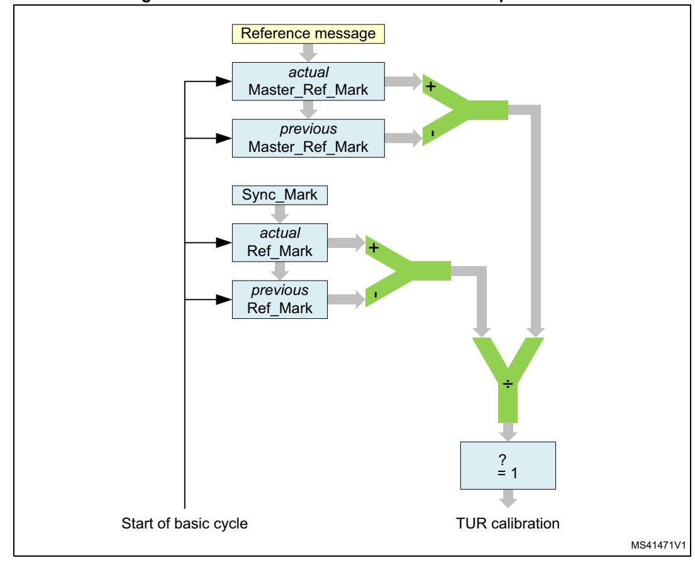

**Figure 789. TTCAN level 0 and level 2 drift compensation**

*[Figure 789](#page-45-0)* describes how in TTCAN levels 0 and 2 each time receiving node compensates the drift between its own local clock and the time master clock by comparing the length of a basic cycle in local time and in global time. If there is a difference between the two values and the Disc\_Bit in the reference message is not set, a new value for FDCAN\_TURNA.NAV is calculated. If the synchronization deviation SD = | NC - FDCAN\_TURNA.NAV | ≤ SDL (synchronization deviation limit), the new value for FDCAN\_TURNA.NAV takes effect. Else the automatic drift compensation is suspended.

In TTCAN level 0 and level 2, FDCAN\_TTOST.QCS indicates whether the automatic drift compensation is active or suspended. In TTCAN level 1, FDCAN\_TOST.QCS is always 1.

The current time master may synchronize its local clock speed and the global time phase to an external clock source. This is enabled by bit FDCAN\_TTOCF.EECS.

The stop watch function (see *[Section 59.4.11](#page-43-0)*) may be used to measure the difference in clock speed between the local clock and the external clock. The local clock speed is adjusted by first writing the newly calculated numerator configuration low to

RM0399 Rev 4 2657/3556

FDCAN\_TURCF.NCL (FDCAN\_TURCF.DC cannot be updated during operation). The new value takes effect by writing FDCAN\_TTOCN.ECS to 1.

The global time phase is adjusted by first writing the phase offset into the TT global time Preset register FDCAN\_TTGTP. The new value takes effect by writing FDCAN\_TTOCN.SGT to 1. The first reference message transmitted after the global time phase adjustment has the Disc\_Bit set to 1.

FDCAN\_TTOST.QGTP shows whether the node global time is in phase with the time master global time. FDCAN\_TTOST.QGTP is permanently 0 in TTCAN level 1 and when the synchronization deviation limit is exceeded in TTCAN level 0, 2 (FDCAN\_TTOST.QCS = 0). It is temporarily 0 while the global time is low-pass filtered to supply the application with a continuous monotonic value. There is no low-pass filtering when the last reference message contained a Disc\_Bit = 1 or when FDCAN\_TTOST.QCS = 0.

## **59.4.13 TTCAN error level**

The ISO 11898-4 specifies four levels of error severity:

- 1. S0 No error
- 2. S1 Warning Only notification of application, reaction application-specific.
- 3. S2 error Notification of application. All transmissions in exclusive or arbitrating time windows are disabled (i.e. no data or remote frames may be started). Potential time masters still transmit reference messages with the reference trigger offset FDCAN\_TTOST.RTO set to the maximum value of 127.
- 4. S3 Severe error Notification of application. All CAN bus operations are stopped, i.e. transmission of dominant bits is not allowed, and FDCAN\_CCCR.MON is set. The S3 error condition remains active until the application updates the configuration (set FDCAN\_CCCR.CCE).

If several errors are detected at the same time, the highest severity prevails. When an error is detected, the application is notified by FDCAN\_TTIR.ELC. The error level is monitored by FDCAN\_TTOST.EL.

The TTCAN signals the following error conditions as required by ISO 11898-4:

- Config\_error (S3)
  - Sets error level FDCAN\_TTOST.EL to 11 when a merged arbitrating time window is not properly closed or when there is a Tx\_Trigger with a time mark beyond the Tx\_Ref\_Trigger.
- Watch\_Trigger\_Reached (S3)
  - Sets error level FDCAN\_TTOST.EL to 11 when a watch trigger was reached because the reference message is missing.
- Application\_Watchdog (S3)
  - Sets error level FDCAN\_TTOST.EL to 11 when the application failed to serve the application watchdog.The application watchdog is configured via FDCAN\_TTOCF.AWL. It is served by reading register FDCAN\_TTOST. When the watchdog is not served in time, bit FDCAN\_TTOST.AWE and interrupt flag

FDCAN\_TTIR.AW are set, all FDCAN communication is stopped, and the FDCAN is set into bus monitoring mode (FDCAN\_CCCR.MON set to 1).

- CAN\_Bus\_Off (S3)
  - Entering CAN\_Bus\_Off state sets error level FDCAN\_TTOST.EL to 11. CAN\_Bus\_Off state is signaled by FDCAN\_PSR.BO = 1 and FDCAN\_CCCR.INIT = 1.
- Scheduling\_Error\_2 (S2)
  - Sets error level FDCAN\_TTOST.EL to 10 if the MSC of one Tx\_Trigger has reached 7. In addition, interrupt flag FDCAN\_TTIR.SE2 is set. The error level FDCAN\_TTOST.EL is reset to 00 at the beginning of a matrix cycle when no Tx\_Trigger has an MSC of 7 in the preceding matrix cycle.
- Tx\_Overflow (S2)
  - Sets error level FDCAN\_TTOST.EL to 10 when the Tx count is equal to or higher than the expected number of Tx\_T riggers FDCAN\_TTMLM.ENTT and a Tx\_Trigger event occurs. In addition, interrupt flag FDCAN\_TTIR.TXO is set. The error level FDCAN\_TTOST.EL is reset to 00 when the Tx count is no more than FDCAN\_TTMLM.ENTT at the start of a new matrix cycle.
- Scheduling\_Error\_1 (S1)
  - Sets error level FDCAN\_TTOST.EL to 01 if within one matrix cycle the difference between the maximum MSC and the minimum MSC for all trigger memory elements (of exclusive time windows) is larger than two, or if one of the MSCs of an exclusive Rx\_Trigger has reached seven. In addition, interrupt flag FDCAN\_TTIR.SE1 is set. If within one matrix cycle none of these conditions is valid, the error level FDCAN\_TTOST.EL is reset to 00.
- Tx\_Underflow (S1)
  - Sets error level FDCAN\_TTOST.EL to 01 when the Tx count is less than the expected number of Tx\_Triggers FDCAN\_TTMLM.ENTT at the start of a new matrix cycle. In addition, interrupt flag FDCAN\_TTIR.TXU is set. The error level FDCAN\_TTOST.EL is reset to 00 when the Tx count is at least FDCAN\_TTMLM.ENTT at the start of a new matrix cycle.

## **59.4.14 TTCAN message handling**

### **Reference message**

For potential time masters the identifier of the reference message is configured via FDCAN\_TTRMC.RID. No dedicated Tx buffer is required for transmission of the reference message. When a reference message is transmitted, the first data byte for TTCAN level 1 (that is, the first four data bytes for TTCAN level 0 and the first four data bytes for TTCAN level 2) is provided by the FSE.

In case the reference message Payload select FDCAN\_TTRMC.RMPS is set, the rest of the reference message payload (level 1: bytes 2-8, level 0, 2: bytes 5-6) is taken from Tx buffer 0. In this case the data length DLC code from message buffer 0 is used.

**Table 513. Number of data bytes transmitted with a reference message** 

| FDCAN_TTRMC.RMPS | FDCAN_TXBRP.TRP0 | Level 0 | Level 1 | Level 2 |
|------------------|------------------|---------|---------|---------|
| 0                | 0                | 4       | 1       | 4       |
| 0                | 1                | 4       | 1       | 4       |

**Table 513. Number of data bytes transmitted with a reference message (continued)**

| FDCAN_TTRMC.RMPS | FDCAN_TXBRP.TRP0 | Level 0 | Level 1 | Level 2 |
|------------------|------------------|---------|---------|---------|
| 1                | 0                | 4       | 1       | 4       |
| 1                | 1                | 4 + MBO | 1 + MBO | 4 + MBO |

To send additional payload with the reference message in level 1 a DLC > 1 must be configured, for level 0 and level 2 a DLC > 4 is required. In addition, the transmission request pending bit FDCAN\_TXBRP.TRP0 of message buffer 0 must be set (see *[Table 513](#page-47-0)*). In case bit FDCAN\_TXBRP.TRP0 is not set when a reference message is started, the reference message is transmitted with the data bytes supplied by the FSE only.

For acceptance filtering of reference messages the reference identifier FDCAN\_TTRMC.RID is used.

## **Message reception**

Message reception is done via the two Rx FIFOs in the same way as for event-driven CAN communication (see *[Rx handler](#page-5-0)*).

The message status count MSC is part of the corresponding trigger memory element and must be initialized to 0 during configuration. It is updated while the TTCAN is in synchronization states In\_Gap or In\_Schedule. The update happens at the message Rx\_Trigger. At this point in time it is checked at which acceptance filter element the latest message received in this basic cycle had matched. The matching filter number is stored as the acceptance filter result. If this is the same the filter number as defined in this trigger memory element, the MSC is decremented by one. If the acceptance filter result is not the same filter number as defined for this filter element, or if the acceptance filter result is cleared, the MSC is incremented by one. At each Rx\_Trigger and at each start of cycle, the last acceptance filter result is cleared.

The time mark of an Rx\_Trigger should be set to a value where it is ensured that reception and acceptance filtering for the targeted message has completed. This has to take into consideration the RAM access time and the order of the filter list. It is recommended, that filters which are used for Rx\_Triggers are placed at the beginning of the filter list. It is not recommended to use an Rx\_Trigger for the reference message.

### **Message transmission**

For time-triggered message transmission the TTCAN supplies 32 dedicated Tx buffers (see *[Transmit pause](#page-21-0)*). A Tx FIFO or Tx queue is not available when the FDCAN is configured for time-triggered operation (FDCAN\_TTOCF.OM = 01 or 10).

Each Tx\_Trigger in the trigger memory points to a particular Tx buffer containing a specific message. There may be more than one Tx\_Trigger for a given Tx buffer if that Tx buffer contains a message that is to be transmitted more than once in a basic cycle or matrix cycle.

The application program has to update the data regularly and on time, synchronized to the cycle time. The user is responsible that no partially updated messages are transmitted. To assure this the user has to proceed in the following way:

Tx\_Trigger\_Single / Tx\_Trigger\_Merged / Tx\_Trigger\_Arbitration

- Check whether the previous transmission has completed by reading FDCAN\_TXBTO
- Update the Tx buffer configuration and/or payload
- Issue an add request to set the Tx buffer request pending bit

### Tx\_Trigger\_Continous

- Issue a cancellation request to reset the Tx buffer request pending bit
- Check whether the cancellation has finished by reading FDCAN\_TXBCF
- Update Tx buffer configuration and/or payload
- Issue an add request to set the Tx buffer request pending bit

The message MSC stored with the corresponding Tx\_Trigger provides information on the success of the transmission.

The MSC is incremented by one when the transmission cannot be started because the CAN bus was not idle within the corresponding transmit enable window or when the message was started and cannot be completed successfully. The MSC is decremented by one when the message was transmitted successfully or when the message may have been started within its transmit enable window but was not started because transmission was disabled (TTCAN in error level S2 or user has disabled this particular message).

The Tx buffers may be managed dynamically, i.e. several messages with different identifiers may share the same Tx buffer element. In this case the user must ensure that no transmission request is pending for the Tx buffer element to be reconfigured by checking FDCAN\_TXBRP.

If a Tx buffer with pending transmission request should be updated, the user must first issue a cancellation request and check whether the cancellation has completed by reading FDCAN\_TXBCF before it starts updating.

The Tx handler transfers a message from the message RAM to its intermediate output buffer at the trigger element, which becomes active immediately before the Tx\_Trigger element (which defines the beginning of the transmit window). During and after the transfer time the transmit message may not be updated and its FDCAN\_TXBRP bit may not be changed. To control this transfer time, an additional trigger element may be placed before the Tx\_Trigger. This may be example of a Time\_Base\_Trigger which need not cause any other action. The difference in time marks between the Tx\_Trigger and the preceding trigger must be large enough to guarantee that the Tx handler can read four words from the message RAM even at high RAM access load from other modules.

### **Transmission in exclusive time windows**

A transmission is started time-triggered when the cycle time reaches the time mark of a Tx\_Trigger\_Single or Tx\_Trigger\_Continuous. There is no arbitration on the bus with messages from other nodes. The MSC is updated according the result of the transmission attempt. After successful transmission started by a Tx\_Trigger\_Single the respective Tx buffer request pending bit is reset. After successful transmission started by a Tx\_Trigger\_Continuous the respective Tx buffer request pending remains set. When the transmission was not successful due to disturbances, it is repeated next time (one of) its Tx\_Trigger(s) become(s) active.

RM0399 Rev 4 2661/3556

### **Transmission in arbitrating time windows**

A transmission is started time-triggered when the cycle time reaches the time mark of a Tx\_Trigger\_Arbitration. Several nodes may start to transmit at the same time. In this case the message has to arbitrate with the messages from other nodes. The MSC is not updated. When the transmission was not successful (lost arbitration or disturbance), it is repeated next time (one of) its Tx\_Trigger(s) become(s) active.

### **Transmission in merged arbitrating time windows**

The purpose of a merged arbitrating time window is, to enable multiple nodes to send a limited number of frames which are transmitted in immediate sequence, the order given by CAN arbitration. It is not intended for burst transmission by a node. Since the node does not have exclusive access within this time window, it may happen that not all requested transmissions are successful.

Messages which have lost arbitration or were disturbed by an error, may be re-transmitted inside the same merged arbitrating time window. The re-transmission is not started if the corresponding transmission request pending flag is reset by a successful Tx cancellation.

In single transmit windows, the Tx handler transmits the message indicated by the message number of the trigger element. In merged arbitrating time windows, it can handle up to three message numbers from the trigger list. Their transmission is attempted in the sequence defined by the trigger list. If the time mark of a fourth message is reached before the first is transmitted (or canceled by the user), the fourth request is ignored.

The transmission inside a merged arbitrating time window is not time-triggered. The transmission of a message may start before its time mark, or after the time mark if the bus was not idle.

The messages transmitted by a specific node inside a merged arbitrating time window are started in the order of their Tx\_Triggers, so a message with low CAN priority may prevent the successful transmission of a following message with higher priority, if their is compelling bus traffic. This must be considered for the configuration of the trigger list. Time\_Base\_Triggers may be placed between consecutive Tx\_Triggers to define the time until the data of the corresponding Tx buffer needs to be updated.

## **59.4.15 TTCAN interrupt and error handling**

The TT interrupt register FDCAN\_TTIR consists of four segments. Each interrupt can be enabled separately by the corresponding bit in the TT interrupt enable register FDCAN\_TTIE. The flags remain set until the user clears them. A flag is cleared by writing a 1 to the corresponding bit position.

The first segment consists of flags CER, AW, WT, and IWT. Each flag indicates a fatal error condition where the CAN communication is stopped. With the exception of IWT, these error conditions require a re-configuration of the FDCAN module before the communication can be restarted.

The second segment consists of flags ELC, SE1, SE2, TXO, TXU, and GTE. Each flag indicates an error condition where the CAN communication is disturbed. If they are caused by a transient failure, for example by disturbances on the CAN bus, they are handled by the FDCAN protocol failure handling and do not require intervention by the application program.

The third segment consists of flags GTD, GTW, SWE, TTMI, and RTMI. The first two flags are controlled by global time events (level 0, 2 only) that require a reaction by the application program. With a stop watch event triggered by a rising edge on pin fdcan\_swt internal time

values are captured. The trigger time mark interrupt notifies the application that a specific Time\_Base\_Trigger is reached. The register time mark interrupt signals that the time referenced by FDCAN\_TTOCN.TMC (cycle, local, or global) is equal to the time mark FDCAN\_TTTMK.TM. It can also be used to finish a gap.

The fourth segment consists of flags SOG, CSM, SMC, and SBC. These flags provide a means to synchronize the application program to the communication schedule.

## **59.4.16 Level 0**

TTCAN level 0 is not part of ISO11898-4. This operation mode makes the hardware, that in TTCAN level 2 maintains the calibrated global time base, also available for event-driven CAN according to ISO11898-1.

Level 0 operation is configured via FDCAN\_TTOCF.OM = 11. In this mode the FDCAN operates in event driven CAN communication, there is no fixed schedule, the configuration of FDCAN\_TTOCF.GEN is ignored. External event-synchronized operation is not available in level 0. A synchronized time base is maintained by transmission of reference messages.

In level 0 the trigger memory is not active and therefore needs not to be configured. The time mark interrupt flag (FDCAN\_TTIR.TTMI) is set when the cycle time has reached FDCAN\_TTOCF.IRTO ´ 0x200, it reminds the user to set a transmission request for message buffer 0. The Watch\_Trigger interrupt flag (FDCAN\_TTIR.WT) is set when the cycle time has reached 0xFF00. These values were chosen to have enough margin for a stable clock calibration. There are no further TT-error-checks.

Register time mark interrupts (FDCAN\_TTIR.RTMI) are also possible.

The reference message is configured as for level 2 operation. Received reference messages are recognized by the identifier configured in register FDCAN\_TTRMC. For the transmission of reference messages only message buffer 0 may be used. The node transmits reference messages any time the user sets a transmission request for message buffer 0, there is no reference trigger offset.

Level 0 operation is configured via:

- FDCAN\_TTRMC
- FDCAN\_TTOCF except EVTP, AWL, GEN
- FDCAN\_TTMLM except ENTT, TXEW
- FDCAN\_TURCF

Level 0 operation is controlled via:

- FDCAN\_TTOCN except NIG, TMG, FGP, GCS, TTMIE
- FDCAN\_TTGTP
- FDCAN\_TTTMK
- FDCAN\_TTIR excluding bits CER, AW, IWT SE2, SE1, TXO, TXU, SOG (no function)
- FDCAN\_TTIR the following bits have changed function
  - TTMI not defined by trigger memory activated at cycle time FDCAN\_TTOCF.IRTO 0x200
  - WT not defined by trigger memory activated at cycle time 0xFF00

Level 0 operation is signaled via:

• TTOST excluding bits AWE, WFE, GSI, GFI, RTO (no function)

### **Synchronizing**

*[Figure 790](#page-52-0)* describes the states and the state transitions in TTCAN level 0 operation. level 0 has no In\_Gap state.

MS41472V1 Sync\_Off Synchronizing In\_Schedule T0 T1 T2 HW reset, or Init state, or Error state S3 T0: Transition condition always taking prevalence T1: Init state left, cycle time is 0 T2: At least two consecutive reference messages observed (last reference message didn't contain a set Disc\_Bit or Next\_is\_Gap bit

**Figure 790. Level 0 schedule synchronization state machine**

### **Handling of error levels**

During level 0 operation only the following error conditions may occur:

- Watch\_Trigger\_Reached (S3), reached cycle time 0xFF00
- CAN\_Bus\_Off (S3)

Since no S1 and S2 errors are possible, the error level can only switch between S0 (No error) and S3 (Severe error). In TTCAN level 0 an S3 error is handled differently. When error level S3 is reached, both FDCAN\_TTOST.SYS and FDCAN\_TTOST.MS are reset, and interrupt flags FDCAN\_TTIR.GTE and FDCAN\_TTIR.GTD are set.

When error level S3 (FDCAN\_TTOST.EL = 11) is entered, bus monitoring mode is (contrary to TTCAN level 1 and level 2) not entered. S3 error level is left automatically after transmission (time master) or reception (time slave) of the next reference message.

### **Master slave relation**

*[Figure 791](#page-53-0)* describes the master slave relation in TTCAN level 0. In case of an S3 error the FDCAN returns to state Master\_Off.

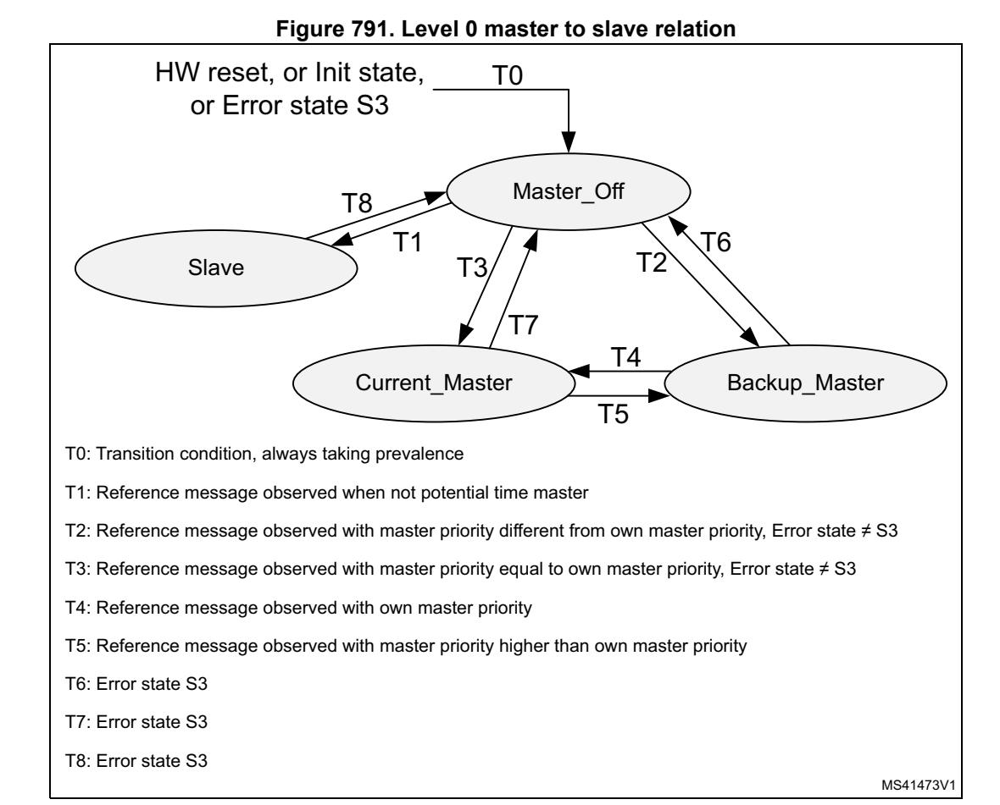

## **59.4.17 Synchronization to external time schedule**

This feature can be used to synchronize the phase of the FDCAN schedule to an external schedule (for example that of a second TTCAN network or FlexRay network). It is applicable only when the FDCAN is current time master (FDCAN\_TTOST.MS = 11).

External synchronization is controlled by event trigger input pin fdcan\_evt. If bit FDCAN\_TTOCN.ESCN is set, a rising edge at event trigger pin fdcan\_evt the FDCAN compares its actual cycle time with the target phase value configured by FDCAN\_TTGTP.CTP.

Before setting FDCAN\_TTOCN.ESCN the user has to adapt the phases of the two time schedules for example by using the FDCAN gap control (see *[Section 59.4.10](#page-42-0)*). When the user sets FDCAN\_TTOCN.ESCN, FDCAN\_TTOSTSPL is set.

If the difference between the cycle time and the target phase value FDCAN\_TTGTP.CTP at the rising edge at event trigger pin fdcan\_evt is greater than 9 NTU, the phase lock bit FDCAN\_TTOST.SPL is reset, and interrupt flag FDCAN\_TTIR.CSM is set.

FDCAN\_TTOST.SPL is also reset (and FDCAN\_TTIR.CSM is set), when another node becomes time master.

If both FDCAN\_TTOST.SPL and FDCAN\_TTOCN.ESCN are set, and if the difference between the cycle time and the target phase value FDCAN\_TTGTP.CTP at the rising edge at event trigger pin fdcan\_evt is lower or equal to nine NTU, the phase lock bit FDCAN\_TTOST.SPL remains set, and the measured difference is used as reference trigger offset value to adjust the phase at the next transmitted reference message.

*Note: The rising edge detection at event trigger pin fdcan\_evt is enabled with the start of each basic cycle. The first rising edge triggers the compare of the actual cycle time with*  FDCAN\_*TTGTP.CTP. All further edges until the beginning of the next basic cycle are ignored.*

## **59.4.18 FDCAN Rx buffer and FIFO element**

Up to 64 Rx buffers and two Rx FIFOs can be configured in the message RAM. Each Rx FIFO section can be configured to store up to 64 received messages. The structure of a Rx buffer / FIFO element is shown in *[Table 514](#page-54-1)*, the description is provided in *[Table 515](#page-54-2)*.

**Bit 31 24 23 16 15 8 7 0** R0 ESI XTD RTR ID[28:0] R1 ANMF FIDX[6:0] Res. FDF BRS DLC[3:0] RXTS[15:0] R2 DB3[7:0] DB2[7:0] DB1[7:0] DB0[7:0] R3 DB7[7:0] DB6[7:0] DB5[7:0] DB4[7:0] ... ... ... ... Rn DBm[7:0] DBm-1[7:0] DBm-2[7:0] DBm-3[7:0]

**Table 514. Rx buffer and FIFO element** 

The element size can be configured for storage of CAN FD messages with up to 64 bytes data field via register FDCAN\_RXESC.

**Field Description** R0 bit 31 ESI Error state indicator 0: Transmitting node is error active 1: Transmitting node is error passive R0 bit 30 XTD Extended identifier Signals to the user whether the received frame has a standard or extended identifier. 0: 11-bit standard identifier 1: 29-bit extended identifier R0 bit 29 RTR Remote transmission request Signals to the user whether the received frame is a data frame or a remote frame. 0: Received frame is a data frame 1: Received frame is a remote frame

**Table 515. Rx buffer and FIFO element description** 

**Table 515. Rx buffer and FIFO element description (continued)**

| Field                      | Description                                                                                                                                                                                                                        |
|----------------------------|------------------------------------------------------------------------------------------------------------------------------------------------------------------------------------------------------------------------------------|
| R0 bits 28:0 ID[28:0]   | Identifier Standard or extended identifier depending on bit XTD. A standard identifier is stored into ID[28:18].                                                                                                             |
| R1 bit 31 ANMF          | Accepted non-matching frame Acceptance of non-matching frames may be enabled via FDCAN_GFC.ANFS and FDCAN_GFC.ANFE. 0: Received frame matching filter index FIDX 1: Received frame did not match any Rx filter element |
| R1 bits 30:24 FIDX[6:0] | Filter index 0-127 = index of matching Rx acceptance filter element (invalid if ANMF = 1). Range is 0 to FDCAN_SIDFC.LSS 1 or FDCAN_XIDFC.LSE 1.                                                                             |
| R1 bit 21 FDF           | FD Format 0: Standard frame format 1: FDCAN frame format (new DLC-coding and CRC)                                                                                                                                            |
| R1 bit 20 BRS           | Bitrate Switch 0: Frame received without bitrate switching 1: Frame received with bitrate switching                                                                                                                          |
| R1 bits 19:16 DLC[3:0]  | Data length code 0-8: Classic CAN + CAN FD: received frame has 0-8 data bytes 9-15: Classic CAN: received frame has 8 data bytes 9-15: CAN FD: received frame has 12/16/20/24/32/48/64 data bytes                         |
| R1 bits 15:0 RXTS[15:0] | Rx timestamp Timestamp counter value captured on start of frame reception. Resolution depending on configuration of the timestamp counter prescaler FDCAN_TSCC.TCP.                                                          |
| R2 bits 31:24 DB3[7:0]  | Data Byte 3                                                                                                                                                                                                                        |
| R2 bits 23:16 DB2[7:0]  | Data Byte 2                                                                                                                                                                                                                        |
| R2 bits 15:8 DB1[7:0]   | Data Byte 1                                                                                                                                                                                                                        |
| R2 bits 7:0 DB0[7:0]    | Data Byte 0                                                                                                                                                                                                                        |
| R3 bits 31:24 DB7[7:0]  | Data Byte 7                                                                                                                                                                                                                        |
| R3 bits 23:16 DB6[7:0]  | Data Byte 6                                                                                                                                                                                                                        |
| R3 bits 15:8 DB5[7:0]   | Data Byte 5                                                                                                                                                                                                                        |
| R3 bits 7:0 DB4[7:0]    | Data Byte 4                                                                                                                                                                                                                        |
|                            |                                                                                                                                                                                                                                    |

**Table 515. Rx buffer and FIFO element description (continued)**

| Field                       | Description   |
|-----------------------------|---------------|
| Rn bits 31:24 DBm[7:0]   | Data Byte m   |
| Rn bits 23:16 DBm-1[7:0] | Data Byte m-1 |
| Rn bits 15:8 DBm-2[7:0]  | Data Byte m-2 |
| Rn bits 7:0 DBm-3[7:0]   | Data Byte m-3 |

# **59.4.19 FDCAN Tx buffer element**

The Tx buffers section can be configured to hold dedicated Tx buffers as well as a Tx FIFO / Tx queue. In case that the Tx buffers section is shared by dedicated Tx buffers and a Tx FIFO / Tx queue, the dedicated Tx buffers start at the beginning of the Tx buffers section followed by the buffers assigned to the Tx FIFO or Tx queue. The Tx handler distinguishes between dedicated Tx buffers and Tx FIFO / Tx queue by evaluating the Tx buffer configuration FDCAN\_TXBC.TFQS and FDCAN\_TXBC.NDTB. The element size can be configured for storage of CAN FD messages with up to 64 bytes data field via register FDCAN\_TXESC.

**Table 516. Tx buffer and FIFO element** 

| Bit | 31 24 |     |     | 23 16   |          |     | 15         | 8 7 0 |          |  |
|-----|----------|-----|-----|------------|----------|-----|------------|-------------|----------|--|
| T0  | ESI      | XTD | RTR |            | ID[28:0] |     |            |             |          |  |
| T1  | MM[7:0]  |     | EFC | Res.       | FDF      | BPS | DLC[3:0]   |             | Reserved |  |
| T2  | DB3[7:0] |     |     | DB2[7:0]   |          |     | DB1[7:0]   | DB0[7:0]    |          |  |
| T3  | DB7[7:0] |     |     | DB6[7:0]   |          |     | DB5[7:0]   | DB4[7:0]    |          |  |
|     |          |     |     |            |          |     |            |             |          |  |
| Tn  | DBm[7:0] |     |     | DBm-1[7:0] |          |     | DBm-2[7:0] | DBm-3[7:0]  |          |  |

**Table 517. Tx buffer element description** 

| Field               | Description                                                                                                                                  |  |  |  |  |
|---------------------|----------------------------------------------------------------------------------------------------------------------------------------------|--|--|--|--|
| T0 bit 31 ESI(1) | Error state indicator 0: ESI bit in CAN FD format depends only on error passive flag 1: ESI bit in CAN FD format transmitted recessive |  |  |  |  |
| T0 bit 30 XTD    | Extended identifier 0: 11-bit standard identifier 1: 29-bit extended identifier                                                        |  |  |  |  |
| T0 bit 29 RTR(2) | Remote transmission request 0: Transmit data frame 1: Transmit remote frame                                                            |  |  |  |  |

**Table 517. Tx buffer element description (continued)**

| Field                       | Description                                                                                                                                                                                                    |
|-----------------------------|----------------------------------------------------------------------------------------------------------------------------------------------------------------------------------------------------------------|
| T0 bits 28:0 ID[28:0]    | Identifier Standard or extended identifier depending on bit XTD. A standard identifier must be written to ID[28:18].                                                                                     |
| T1 bits 31:24 MM[7:0]    | Message marker Written by CPU during Tx buffer configuration. Copied into Tx event FIFO element for identification of Tx message status.                                                                 |
| T1 bit 23 EFC            | Event FIFO control 0: Don't store Tx events 1: Store Tx events                                                                                                                                           |
| T1 bit 21 FDF            | FD Format 0: Frame transmitted in classic CAN format 1: Frame transmitted in CAN FD format                                                                                                               |
| T1 bit 20 BRS(3)         | Bitrate switching 0: CAN FD frames transmitted without bitrate switching 1: CAN FD frames transmitted with bitrate switching                                                                             |
| T1 bits 19:16 DLC[3:0]   | Data length code 0 - 8: Classic CAN + CAN FD: received frame has 0-8 data bytes 9-15: Classic CAN: received frame has 8 data bytes 9 - 15: CAN FD: received frame has 12/16/20/24/32/48/64 data bytes |
| T2 bits 31:24 DB3[7:0]   | Data Byte 3                                                                                                                                                                                                    |
| T2 bits 23:16 DB2[7:0]   | Data Byte 2                                                                                                                                                                                                    |
| T2 bits 15:8 DB1[7:0]    | Data Byte 1                                                                                                                                                                                                    |
| T2 bits 7:0 DB0[7:0]     | Data Byte 0                                                                                                                                                                                                    |
| T3 bits 31:24 DB7[7:0]   | Data Byte 7                                                                                                                                                                                                    |
| T3 bits 23:16 DB6[7:0]   | Data Byte 6                                                                                                                                                                                                    |
| T3 bits 15:8 DB5[7:0]    | Data Byte 5                                                                                                                                                                                                    |
| T3 bits 7:0 DB4[7:0]     | Data Byte 4                                                                                                                                                                                                    |
|                             |                                                                                                                                                                                                                |
| Tn bits 31:24 DBm[7:0]   | Data Byte m                                                                                                                                                                                                    |
| Tn bits 23:16 DBm-1[7:0] | Data Byte m-1                                                                                                                                                                                                  |

**Table 517. Tx buffer element description (continued)**

| Field                      | Description   |  |  |  |  |
|----------------------------|---------------|--|--|--|--|
| Tn bits 15:8 DBm-2[7:0] | Data Byte m-2 |  |  |  |  |
| Tn bits 7:0 DBm-3[7:0]  | Data Byte m-3 |  |  |  |  |

- 1. The ESI bit of the transmit buffer is OR-ed with the error passive flag to decide the value of the ESI bit in the transmitted FD frame. As required by the CAN FD protocol specification, an error active node may optionally transmit the ESI bit recessive, but an error passive node always transmit the ESI bit recessive.
- 2. When RTR = 1, the FDCAN transmits a remote frame according to ISO11898-1, even if FDCAN\_CCCR.FDOE enables the transmission in CAN FD format.
- 3. Bits ESI, FDF, and BRS are only evaluated when CAN FD operation is enabled FDCAN\_CCCR.FDOE = 1. Bit BRS is only evaluated when in addition FDCAN\_CCCR.BRSE = 1.

## **59.4.20 FDCAN Tx event FIFO element**

Each element stores information about transmitted messages. By reading the Tx event FIFO the user gets this information in the order the messages were transmitted. Status information about the Tx event FIFO can be obtained from register FDCAN\_TXEFS.

**Table 518. Tx Event FIFO element** 

| Bit | 31      |     |     |  | 24 23   |     |     | 16       | 15 | 8 | 7          | 0 |
|-----|---------|-----|-----|--|---------|-----|-----|----------|----|---|------------|---|
| E0  | ESI     | XTD | RTR |  |         |     |     | ID[28:0] |    |   |            |   |
| E1  | MM[7:0] |     |     |  | ET[1:0] | EDL | BRS | DLC[3:0] |    |   | TXTS[15:0] |   |

**Table 519. Tx Event FIFO element description** 

| Field                    | Description                                                                                                                |
|--------------------------|----------------------------------------------------------------------------------------------------------------------------|
| E0 bit 31 ESI         | Error state indicator – 0: Transmitting node is error active – 1: Transmitting node is error passive                 |
| E0 bit 30 XTD         | Extended Identifier – 0: 11-bit standard identifier – 1: 29-bit extended identifier                                  |
| E0 bit 29 RTR         | Remote transmission request – 0: Transmit data frame – 1: Transmit remote frame                                      |
| E0 bits 28:0 ID[28:0] | Identifier Standard or extended identifier depending on bit XTD. A standard identifier must be written to ID[28:18]. |
| E1 bits 31:24 MM[7:0] | Message marker Copied from Tx buffer into Tx event FIFO element for identification of Tx message status.             |

**Table 519. Tx Event FIFO element description (continued)**

| Field                                                                                                                                                                                                      | Description                                                                                                                                                   |  |  |  |
|------------------------------------------------------------------------------------------------------------------------------------------------------------------------------------------------------------|---------------------------------------------------------------------------------------------------------------------------------------------------------------|--|--|--|
| E1 bits 23:22 EFC                                                                                                                                                                                       | Event type – 00: Reserved – 01: Tx event – 10: Transmission in spite of cancellation (always set for transmissions in DAR mode) – 11: Reserved |  |  |  |
| E1 bit 21 EDL                                                                                                                                                                                           | Extended data length – 0: Standard frame format – 1: FDCAN frame format (new DLC-coding and CRC)                                                        |  |  |  |
| E1 bit 20 BRS                                                                                                                                                                                           | Bitrate switching – 0: Frame transmitted without bitrate switching – 1: Frame transmitted with bitrate switching                                        |  |  |  |
| Data length code T1 bits 19:16 – 0 - 8: Frame with 0-8 data bytes transmitted DLC[3:0] – 9 - 15: Frame with eight data bytes transmitted                                                       |                                                                                                                                                               |  |  |  |
| Tx timestamp E1 bits 15:0 Timestamp counter value captured on start of frame transmission. Resolution TXTS[15:0] depending on configuration of the timestamp counter prescaler FDCAN_TSCC.TCP. |                                                                                                                                                               |  |  |  |

## **59.4.21 FDCAN standard message ID filter element**

Up to 128 filter elements can be configured for 11-bit standard IDs. When accessing a standard message ID filter element, its address is the filter list standard start address FDCAN\_SIDFC.FLSSA plus the index of the filter element (0 … 127).

**Table 520. Standard message ID filter element** 

| Bit | 31       |           | 24 | 23          | 16 15 |      | 8 | 7           | 0 |
|-----|----------|-----------|----|-------------|-------|------|---|-------------|---|
| S0  | SFT[1:0] | SFEC[2:0] |    | SFID1[10:0] |       | Res. |   | SFID2[10:0] |   |

**Table 521. Standard message ID filter element field description** 

|                           | Field        | Description                                                                                                                                                                                                                                                                                                                                                                                                                                                                                                                                                                                                                                                                                                                                                                                                                                                                                                   |  |  |  |  |  |
|---------------------------|--------------|---------------------------------------------------------------------------------------------------------------------------------------------------------------------------------------------------------------------------------------------------------------------------------------------------------------------------------------------------------------------------------------------------------------------------------------------------------------------------------------------------------------------------------------------------------------------------------------------------------------------------------------------------------------------------------------------------------------------------------------------------------------------------------------------------------------------------------------------------------------------------------------------------------------|--|--|--|--|--|
| Bit 31:30 SFT[1:0](1)  |              | Standard filter type – 00: Range filter from SFID1 to SFID2 – 01: Dual ID filter for SFID1 or SFID2 – 10: Classic filter: SFID1 = filter, SFID2 = mask – 11: Filter element disabled                                                                                                                                                                                                                                                                                                                                                                                                                                                                                                                                                                                                                                                                                                              |  |  |  |  |  |
| Bit 29:27 SFEC[2:0]    |              | Standard filter element configuration All enabled filter elements are used for acceptance filtering of standard frames. Acceptance filtering stops at the first matching enabled filter element or when the end of the filter list is reached. If SFEC = "100", "101", or "110" a match sets interrupt flag FDCAN_IR.HPM and, if enabled, an interrupt is generated. In this case register FDCAN_HPMS is updated with the status of the priority match. – 000: Disable filter element – 001: Store in Rx FIFO 0 if filter matches – 010: Store in Rx FIFO 1 if filter matches – 011: Reject ID if filter matches – 100: Set priority if filter matches – 101: Set priority and store in FIFO 0 if filter matches – 110: Set priority and store in FIFO 1 if filter matches – 111: Store into Rx buffer or as debug message, configuration of FDCAN_SFT[1:0] ignored |  |  |  |  |  |
| Bits 26:16 SFID1[10:0] |              | Standard filter ID 1 First ID of standard ID filter element. When filtering for Rx buffers or for debug messages this field defines the ID of a standard message to be stored. The received identifiers must match exactly, no masking mechanism is used.                                                                                                                                                                                                                                                                                                                                                                                                                                                                                                                                                                                                                                         |  |  |  |  |  |
|                           | SFID2[15:10] | Standard filter ID 2 This bit field has a different meaning depending on the configuration of SFEC: – SFEC = 001 110 Second ID of standard ID filter element – SFEC = 111 Filter for Rx buffers or for debug messages                                                                                                                                                                                                                                                                                                                                                                                                                                                                                                                                                                                                                                                                                |  |  |  |  |  |
| Bits 15:0                 | SFID2[10:9]  | Decides whether the received message is stored into an Rx buffer or treated as message A, B, or C of the debug message sequence. – 00: Store message into an Rx buffer – 01: Debug message A – 10: Debug message B – 11: Debug message C                                                                                                                                                                                                                                                                                                                                                                                                                                                                                                                                                                                                                                                       |  |  |  |  |  |
|                           | SFID2[8:6]   | Is used to control the filter event pins at the Extension Interface. A 1 at the respective bit position enables generation of a pulse at the related filter event pin with the duration of one fdcan_pclk period in case the filter matches. SFID2[8] is used by the calibration unit.                                                                                                                                                                                                                                                                                                                                                                                                                                                                                                                                                                                                               |  |  |  |  |  |
|                           | SFID2[5:0]   | Defines the offset to the Rx buffer start address FDCAN_RXBC.RBSA for storage of a matching message.                                                                                                                                                                                                                                                                                                                                                                                                                                                                                                                                                                                                                                                                                                                                                                                                       |  |  |  |  |  |

1. With SFT = "11" the filter element is disabled and the acceptance filtering continues (same behavior as with SFEC = "000").

*Note: In case a reserved value is configured, the filter element is considered disabled.*

## **59.4.22 FDCAN extended message ID filter element**

Up to 64 filter elements can be configured for 29-bit extended IDs. When accessing an Extended message ID filter element, its address is the filter list extended start address FDCAN\_XIDFC.FLESA plus two times the index of the filter element (0 … 63).

**Table 522. Extended message ID filter element** 

| Bit | 31        | 30 | 29       | 28 0     |
|-----|-----------|----|----------|-------------|
| F0  | EFEC[2:0] |    |          | EFID1[28:0] |
| F1  | EFTI[1:0] |    | Reserved | EFID2[28:0] |

**Table 523. Extended message ID filter element field description** 

| Field                       | Description                                                                                                                                                                                                                                                                                                                                                                                                                                                                                                                                                                                                                                                                                                                                                                                                                                                                |  |  |  |  |  |
|-----------------------------|----------------------------------------------------------------------------------------------------------------------------------------------------------------------------------------------------------------------------------------------------------------------------------------------------------------------------------------------------------------------------------------------------------------------------------------------------------------------------------------------------------------------------------------------------------------------------------------------------------------------------------------------------------------------------------------------------------------------------------------------------------------------------------------------------------------------------------------------------------------------------|--|--|--|--|--|
| F0 bits 31:29 EFEC[2:0]  | Extended filter element configuration All enabled filter elements are used for acceptance filtering of extended frames. Acceptance filtering stops at the first matching enabled filter element or when the end of the filter list is reached. If EFEC = 100, 101, or 110 a match sets interrupt flag FDCAN_IR.HPM and, if enabled, an interrupt is generated. In this case register FDCAN_HPMS is updated with the status of the priority match. – 000: Disable filter element – 001: Store in Rx FIFO 0 if filter matches – 010: Store in Rx FIFO 1 if filter matches – 011: Reject ID if filter matches – 100: Set priority if filter matches – 101: Set priority and store in FIFO 0 if filter matches – 110: Set priority and store in FIFO 1 if filter matches – 111: Store into Rx buffer, configuration of EFT[1:0] ignored |  |  |  |  |  |
| F0 bits 28:0 EFID1[28:0] | Extended filter ID 1 First ID of extended ID filter element. When filtering for Rx buffers or for debug messages this field defines the ID of an extended message to be stored. The received identifiers must match exactly, only FDCAN_XIDAM masking mechanism.                                                                                                                                                                                                                                                                                                                                                                                                                                                                                                                                                                                               |  |  |  |  |  |
| F1 bits 31:30 EFT[1:0]   | Extended filter type – 00: Range filter from EF1ID to EF2ID (EF2ID ≥ EF1ID) – 01: Dual ID filter for EF1ID or EF2ID – 10: Classic filter: EF1ID = filter, EF2ID = mask – 11: Range filter from EF1ID to EF2ID (EF2ID ≥ EF1ID), FDCAN_XIDAM mask not applied                                                                                                                                                                                                                                                                                                                                                                                                                                                                                                                                                                                                 |  |  |  |  |  |

**Table 523. Extended message ID filter element field description (continued)**

| Field        |             | Description                                                                                                                                                                                                                                                                                               |  |  |  |  |  |
|--------------|-------------|-----------------------------------------------------------------------------------------------------------------------------------------------------------------------------------------------------------------------------------------------------------------------------------------------------------|--|--|--|--|--|
|              | EFID2[10:0] | Extended filter ID 2 This bit field has a different meaning depending on the configuration of EFEC: – SFEC = 001 110 Second ID of extended ID filter element – SFEC = 111 Filter for Rx buffers or for debug messages                                                                            |  |  |  |  |  |
| F1 bits 28:0 | EFID2[10:9] | Decides whether the received message is stored into an Rx buffer or treated as message A, B, or C of the debug message sequence. – 00: Store message into an Rx buffer – 01: Debug message A – 10: Debug message B – 11: Debug message C                                                   |  |  |  |  |  |
|              | EFID2[8:6]  | Is used to control the filter event pins at the Extension Interface. A 1 at the respective bit position enables generation of a pulse at the related filter event pin with the duration of one fdcan_pclk period in case the filter matches. EFID2[8] interface is used by the calibration unit. |  |  |  |  |  |
|              | EFID2[5:0]  | Defines the offset to the Rx buffer start address FDCAN_RXBC.RBSA for storage of a matching message.                                                                                                                                                                                                   |  |  |  |  |  |

# **59.4.23 FDCAN trigger memory element**

Up to 64 trigger memory elements can be configured. When accessing a trigger memory element, its address is the trigger memory start address FDCAN\_TTTMC.TMSA plus the index of the trigger memory element (0 … 63).

**Table 524. Trigger memory element** 

| Bit | 31 24 | 23    |          | 16 15 | 8       | 7    |      |          |  | 0         |
|-----|----------|-------|----------|-------|---------|------|------|----------|--|-----------|
| T0  | TM[15:0] |       |          | Res.  | CC[6:0] | Res. | TMIN | TMEX     |  | TYPE[3:0] |
| T1  | Res.     | FTYPE | MNR[6:0] | Res.  |         |      |      | MSC[2:0] |  |           |

**Table 525. Trigger memory element description** 

| Field                     | Description                                                                                                                                                                                                                                                                                                                                                                                                                                                                                                                                                                                                      |  |  |  |  |  |
|---------------------------|------------------------------------------------------------------------------------------------------------------------------------------------------------------------------------------------------------------------------------------------------------------------------------------------------------------------------------------------------------------------------------------------------------------------------------------------------------------------------------------------------------------------------------------------------------------------------------------------------------------|--|--|--|--|--|
| T0 bits 31:16 TM[15:0] | Time mark Cycle time for which the trigger becomes active.                                                                                                                                                                                                                                                                                                                                                                                                                                                                                                                                                    |  |  |  |  |  |
| T0 bit 14:8 CC[6:0]    | Cycle code Cycle count for which the trigger is valid. Ignored for trigger types Tx_Ref_Trigger, Tx_Ref_Trigger_Gap, Watch_Trigger, Watch_Trigger_Gap, End_of_List. – 0b000000x valid for all cycles – 0b000001c valid every 2nd cycle at cycle count mod2 = c – 0b00001cc valid every 4th cycle at cycle count mod4 = cc – 0b0001ccc valid every 8th cycle at cycle count mod8 = ccc – 0b001cccc valid every 16th cycle at cycle count mod16 = cccc – 0b01ccccc valid every 32nd cycle at cycle count mod32 = ccccc – 0b1cccccc valid every 64th cycle at cycle count mod64 = cccccc |  |  |  |  |  |

**Table 525. Trigger memory element description (continued)**

| Field                       | Description                                                                                                                                                                                                                                                                                                                                                                                                                                                                                                                                                                                                                                                                                                                            |  |  |  |  |  |
|-----------------------------|----------------------------------------------------------------------------------------------------------------------------------------------------------------------------------------------------------------------------------------------------------------------------------------------------------------------------------------------------------------------------------------------------------------------------------------------------------------------------------------------------------------------------------------------------------------------------------------------------------------------------------------------------------------------------------------------------------------------------------------|--|--|--|--|--|
| T0 bit 5 TMIN            | Time mark event internal – 0: No action – 1: FDCAN_TTIR.TTMI is set when trigger memory element becomes active                                                                                                                                                                                                                                                                                                                                                                                                                                                                                                                                                                                                                   |  |  |  |  |  |
| T0 bit 4 TMEX            | Time mark event external – 0: No action – 1: Pulse at output fdcan1_tmp for more than one instance and fdcan_tmp if only one instance with the length of one period is generated when the time arc of the trigger memory element becomes active and FDCAN_TTOCN.TTMIE = 1                                                                                                                                                                                                                                                                                                                                                                                                                                                  |  |  |  |  |  |
| T0 bit 3:0 TYPE[3:0]     | Trigger type – 0000 Tx_Ref_Trigger - valid when not in gap – 0001 Tx_Ref_Trigger_Gap - valid when in gap – 0010 Tx_Trigger_Single - starts a single transmission in an exclusive time window – 0011 Tx_Trigger_Continuous - starts continuous transmission in an exclusive time window – 0100 Tx_Trigger_Arbitration - starts a transmission in an arbitrating time window – 0101 Tx_Trigger_Merged - starts a merged arbitration window – 0110 Watch_Trigger - valid when not in gap – 0111 Watch_Trigger_Gap - valid when in gap – 1000 Rx_Trigger - check for reception – 1001 Time_Base_Trigger - only control TMIN, TMEX – 1010 … 1111=End_of_List - illegal type, causes configuration error |  |  |  |  |  |
| T1 bit 23FTYPE           | Filter type – 0: 11-bit standard message ID – 1: 29-bit extended message ID                                                                                                                                                                                                                                                                                                                                                                                                                                                                                                                                                                                                                                                      |  |  |  |  |  |
| T1 bit 22:16 MNR[6:0](1) | Message number – Transmission: trigger is valid for configured Tx buffer number. Valid values are 0 to 31. – Reception: trigger is valid for standard/extended message ID filter element number. Valid values are, respectively 0 to 63 and 0 to 127.                                                                                                                                                                                                                                                                                                                                                                                                                                                                      |  |  |  |  |  |
| T1 bits 2:0 MSC[2:0]     | Message status count Counts scheduling errors for periodic messages in exclusive time windows. It has no function for arbitrating messages and in event-driven CAN communication (ISO11898-1). – 0-7= Actual status                                                                                                                                                                                                                                                                                                                                                                                                                                                                                                        |  |  |  |  |  |

1. The trigger memory elements have to be written when the FDCAN is in INIT state. Write access to the trigger memory elements outside INIT state is not allowed. There is an exception for TMIN and TMEX when they are defined as part of a trigger memory element of TYPE Tx\_Ref\_Trigger. In this case they become active at the time mark modified by the actual reference trigger offset (TTOST[RTO]).

RM0399 Rev 4 2675/3556

# **59.5 FDCAN registers**

## **59.5.1 FDCAN core release register (FDCAN\_CREL)**

Address offset: 0x0000 Reset value: 0x3214 1218

| 31 | 30 | 29                    | 28 | 27       | 26 | 25 | 24 | 23       | 22 | 21           | 20 | 19        | 18 | 17 | 16 |  |
|----|----|-----------------------|----|----------|----|----|----|----------|----|--------------|----|-----------|----|----|----|--|
|    |    | REL[3:0] STEP[3:0] |    |          |    |    |    |          |    | SUBSTEP[3:0] |    | YEAR[3:0] |    |    |    |  |
| r  | r  | r                     | r  | r        | r  | r  | r  | r        | r  | r            | r  | r         | r  | r  | r  |  |
| 15 | 14 | 13                    | 12 | 11       | 10 | 9  | 8  | 7        | 6  | 5            | 4  | 3         | 2  | 1  | 0  |  |
|    |    |                       |    | MON[7:0] |    |    |    | DAY[7:0] |    |              |    |           |    |    |    |  |
| r  | r  | r                     | r  | r        | r  | r  | r  | r        | r  | r            | r  | r         | r  | r  | r  |  |

Bits 31:28 **REL[3:0]**: Core release = 3

Bits 27:24 **STEP[3:0]**: Step of core release = 2

Bits 23:20 **SUBSTEP[3:0]**: Sub-step of core release = 1

Bits 19:16 **YEAR[3:0]**: Timestamp year = 4 Bits 15:8 **MON[7:0]**: Timestamp month = 12

Bits 7:0 **DAY[7:0]**: Timestamp day =18

## **59.5.2 FDCAN Endian register (FDCAN\_ENDN)**

Address offset: 0x0004 Reset value: 0x8765 4321

| 31 | 30 | 29 | 28 | 27 | 26 | 25 | 24 | 23         | 22 | 21 | 20 | 19 | 18 | 17 | 16 |
|----|----|----|----|----|----|----|----|------------|----|----|----|----|----|----|----|
|    |    |    |    |    |    |    |    | ETV[31:16] |    |    |    |    |    |    |    |
| r  | r  | r  | r  | r  | r  | r  | r  | r          | r  | r  | r  | r  | r  | r  | r  |
| 15 | 14 | 13 | 12 | 11 | 10 | 9  | 8  | 7          | 6  | 5  | 4  | 3  | 2  | 1  | 0  |
|    |    |    |    |    |    |    |    | ETV[15:0]  |    |    |    |    |    |    |    |
| r  | r  | r  | r  | r  | r  | r  | r  | r          | r  | r  | r  | r  | r  | r  | r  |

Bits 31:0 **ETV[31:0]**: Endianness test value

The endianness test value is 0x8765 4321.

## **59.5.3 FDCAN data bit timing and prescaler register (FDCAN\_DBTP)**

Address offset: 0x000C Reset value: 0x0000 0A33

This register is dedicated to data bit timing phase and only writable if bits FDCAN\_CCCR.CCE and FDCAN\_CCCR.INIT are set. The CAN time quantum may be programmed in the range from 1 to 32 FDCAN clock periods. tq = (DBRP + 1) FDCAN clock periods.

DTSEG1 is the sum of Prop\_Seg and Phase\_Seg1. DTSEG2 is Phase\_Seg2. Therefore the length of the bit time is (DTSEG1 + DTSEG2 + 3) tq for programmed values, or (Sync\_Seg + Prop\_Seg + Phase\_Seg1 + Phase\_Seg2) tq for functional values.

The information processing time (IPT) is zero, meaning the data for the next bit is available at the first clock edge after the sample point.

| 31   | 30   | 29   | 28   | 27   | 26          | 25   | 24   | 23  | 22                       | 21   | 20        | 19 | 18 | 17 | 16 |
|------|------|------|------|------|-------------|------|------|-----|--------------------------|------|-----------|----|----|----|----|
| Res. | Res. | Res. | Res. | Res. | Res.        | Res. | Res. | TDC | Res.                     | Res. | DBRP[4:0] |    |    |    |    |
|      |      |      |      |      |             |      |      | rw  |                          |      | rw        | rw | rw | rw | rw |
| 15   | 14   | 13   | 12   | 11   | 10          | 9    | 8    | 7   | 6                        | 5    | 4         | 3  | 2  | 1  | 0  |
| Res. | Res. | Res. |      |      | DTSEG1[4:0] |      |      |     | DTSEG2[3:0] DSJW[3:0] |      |           |    |    |    |    |
|      |      |      | rw   | rw   | rw          | rw   | rw   | rw  | rw                       | rw   | rw        | rw | rw | rw | rw |

Bits 31:24 Reserved, must be kept at reset value.

Bit 23 **TDC**: Transceiver delay compensation

0: Transceiver delay compensation disabled

1: Transceiver delay compensation enabled

Bits 22:21 Reserved, must be kept at reset value.

### Bits 20:16 **DBRP[4:0]**: Data bitrate prescaler

The value by which the oscillator frequency is divided to generate the bit time quanta. The bit time is built up from a multiple of these quanta. Valid values for the baudrate prescaler are 0 to 31. The hardware interpreters this value as the programmed value plus 1.

Bits 15:13 Reserved, must be kept at reset value.

### Bits 12:8 **DTSEG1[4:0]**: Data time segment before sample point

Valid values are 0 to 31. The value used by the hardware is the one programmed, incremented by 1, i.e. tBS1 = (DTSEG1 + 1) x tq.

### Bits 7:4 **DTSEG2[3:0]**: Data time segment after sample point

Valid values are 0 to 15. The value used by the hardware is the one programmed, incremented by 1, i.e. tBS2 = (DTSEG2 + 1) x tq.

#### Bits 3:0 **DSJW[3:0]**: Synchronization jump width

Valid values are 0 to 15. The value used by the hardware is the one programmed, incremented by 1, i.e. tSJW = (DSJW + 1) x tq.

*Note: With an FDCAN clock of 8 MHz, the reset value 0x00000A33 configures the FDCAN for a fast bitrate of 500 kbit/s.*

*Note: The data phase bit rate must be higher than or equal to the nominal bit rate.*

RM0399 Rev 4 2677/3556

## **59.5.4 FDCAN test register (FDCAN\_TEST)**

Write access to this register must be enabled by setting bit FDCAN\_CCCR.TEST to 1. All register functions are set to their reset values when bit FDCAN\_CCCR.TEST is reset.

Loop back mode and software control of Tx pin FDCANx\_TX are hardware test modes. Programming TX differently from 00 may disturb the message transfer on the CAN bus.

Address offset: 0x0010 Reset value: 0x0000 0000

| 31   | 30   | 29   | 28   | 27   | 26   | 25   | 24   | 23   | 22   | 21      | 20   | 19   | 18   | 17   | 16   |
|------|------|------|------|------|------|------|------|------|------|---------|------|------|------|------|------|
| Res. | Res. | Res. | Res. | Res. | Res. | Res. | Res. | Res. | Res. | Res.    | Res. | Res. | Res. | Res. | Res. |
|      |      |      |      |      |      |      |      |      |      |         |      |      |      |      |      |
|      |      |      |      |      |      |      |      |      |      |         |      |      |      |      |      |
| 15   | 14   | 13   | 12   | 11   | 10   | 9    | 8    | 7    | 6    | 5       | 4    | 3    | 2    | 1    | 0    |
| Res. | Res. | Res. | Res. | Res. | Res. | Res. | Res. | RX   |      | TX[1:0] | LBCK | Res. | Res. | Res. | Res. |

Bits 31:8 Reserved, must be kept at reset value.

### Bit 7 **RX**: Receive pin

Monitors the actual value of transmit pin FDCANx\_RX

0: The CAN bus is dominant (FDCANx\_RX = 0)

1: The CAN bus is recessive (FDCANx\_RX = 1)

#### Bits 6:5 **TX[1:0]**: Control of transmit pin

00: Reset value , FDCANx\_TX TX is controlled by the CAN core, updated at the end of the CAN bit time

01: Sample point can be monitored at pin FDCANx\_TX

10: Dominant (0) level at pin FDCANx\_TX

11: Recessive (1) at pin FDCANx\_TX

#### Bit 4 **LBCK**: Loop back mode

0: Reset value, loop back mode is disabled

1: Loop back mode is enabled (see *[Test modes](#page-12-0)*)

Bits 3:0 Reserved, must be kept at reset value.

# **59.5.5 FDCAN RAM watchdog register (FDCAN\_RWD)**

The RAM watchdog monitors the READY output of the message RAM. A message RAM access starts the message RAM watchdog counter with the value configured by the FDCAN\_RWD.WDC bits.

The counter is reloaded with FDCAN\_RWD.WDC bits when the message RAM signals successful completion by activating its READY output. In case there is no response from the message RAM until the counter has counted down to 0, the counter stops and interrupt flag FDCAN\_IR.WDI bit is set. The RAM watchdog counter is clocked by the fdcan\_pclk clock.

Address offset: 0x0014 Reset value: 0x0000 0000

| 31   | 30   | 29   | 28   | 27       | 26   | 25   | 24   | 23       | 22   | 21   | 20   | 19   | 18   | 17   | 16   |
|------|------|------|------|----------|------|------|------|----------|------|------|------|------|------|------|------|
| Res. | Res. | Res. | Res. | Res.     | Res. | Res. | Res. | Res.     | Res. | Res. | Res. | Res. | Res. | Res. | Res. |
|      |      |      |      |          |      |      |      |          |      |      |      |      |      |      |      |
| 15   | 14   | 13   | 12   | 11       | 10   | 9    | 8    | 7        | 6    | 5    | 4    | 3    | 2    | 1    | 0    |
|      |      |      |      | WDV[7:0] |      |      |      | WDC[7:0] |      |      |      |      |      |      |      |
| r    | r    | r    | r    | r        | r    | r    | r    | rw       | rw   | rw   | rw   | rw   | rw   | rw   | rw   |

Bits 31:16 Reserved, must be kept at reset value.

#### Bits 15:8 **WDV[7:0]**: Watchdog value

Actual message RAM watchdog counter value.

### Bits 7:0 **WDC[7:0]**: Watchdog configuration

Start value of the message RAM watchdog counter. With the reset value of 00 the counter is disabled.

These are write-protected bits, write access is possible only when bit CCE and bit INIT of FDCAN\_CCCR register are set to 1.

## **59.5.6 FDCAN CC control register (FDCAN\_CCCR)**

Address offset: 0x0018 Reset value: 0x0000 0001

For details about setting and resetting of single bits, see *[Software initialization](#page-5-1)*.

| 31   | 30   | 29   | 28   | 27   | 26   | 25   | 24   | 23   | 22   | 21   | 20   | 19   | 18   | 17   | 16   |
|------|------|------|------|------|------|------|------|------|------|------|------|------|------|------|------|
| Res. | Res. | Res. | Res. | Res. | Res. | Res. | Res. | Res. | Res. | Res. | Res. | Res. | Res. | Res. | Res. |
|      |      |      |      |      |      |      |      |      |      |      |      |      |      |      |      |
|      |      |      |      |      |      |      |      |      |      |      |      |      |      |      |      |
| 15   | 14   | 13   | 12   | 11   | 10   | 9    | 8    | 7    | 6    | 5    | 4    | 3    | 2    | 1    | 0    |
| NISO | TXP  | EFBI | PXHD | Res. | Res. | BRSE | FDOE | TEST | DAR  | MON  | CSR  | CSA  | ASM  | CCE  | INIT |

Bits 31:16 Reserved, must be kept at reset value.

### Bit 15 **NISO**: Non ISO operation

If this bit is set, the FDCAN uses the CAN FD frame format as specified by the Bosch CAN FD Specification V1.0.

- 0: CAN FD frame format according to ISO11898-1
- 1: CAN FD frame format according to Bosch CAN FD Specification V1.0

#### Bit 14 **TXP**:

If this bit is set, the FDCAN pauses for two CAN bit times before starting the next transmission after successfully transmitting a frame.

- 0: Disabled
- 1: Enabled

#### Bit 13 **EFBI**: Edge filtering during bus integration

- 0: Edge filtering disabled
- 1: Two consecutive dominant tq required to detect an edge for hard synchronization

RM0399 Rev 4 2679/3556

- Bit 12 **PXHD**: Protocol exception handling disable
  - 0: Protocol exception handling enabled
  - 1: Protocol exception handling disabled
- Bits 11:10 Reserved, must be kept at reset value.
  - Bit 9 **BRSE**: FDCAN bitrate switching
    - 0: Bitrate switching for transmissions disabled
    - 1: Bitrate switching for transmissions enabled
  - Bit 8 **FDOE**: FD operation enable
    - 0: FD operation disabled
    - 1: FD operation enabled
  - Bit 7 **TEST**: Test mode enable
    - 0: Normal operation, register TEST holds reset values
    - 1: Test mode, write access to register TEST enabled
  - Bit 6 **DAR**: Disable automatic retransmission
    - 0: Automatic retransmission of messages not transmitted successfully enabled
    - 1: Automatic retransmission disabled
  - Bit 5 **MON**: Bus monitoring mode
    - Bit MON can be set only by software when both CCE and INIT are set to 1. The bit can be reset by the user at any time.
    - 0: Bus monitoring mode is disabled
    - 1: Bus monitoring mode is enabled
  - Bit 4 **CSR**: Clock stop request
    - 0: No clock stop is requested
    - 1: Clock stop requested. When clock stop is requested, first INIT and then CSA is set after all pending transfer requests have been completed and the CAN bus reached idle.
  - Bit 3 **CSA**: Clock stop acknowledge
    - 0: No clock stop acknowledged
    - 1: FDCAN may be set in power down by stopping APB clock and kernel clock
  - Bit 2 **ASM**: ASM restricted operation mode

The restricted operation mode is intended for applications that adapt themselves to different CAN bitrates. The application tests different bitrates and leaves the restricted operation mode after it has received a valid frame. In the optional restricted operation mode the node is able to transmit and receive data and remote frames and it gives acknowledge to valid frames, but it does not send active error frames or overload frames. In case of an error condition or overload condition, it does not send dominant bits, instead it waits for the occurrence of bus idle condition to resynchronize itself to the CAN communication. The error counters are not incremented. Bit ASM can be set only by software when both CCE and INIT are set to 1. The bit can be reset by the software at any time. This bit is set automatically set to 1 when the Tx handler was not able to read data from the message RAM in time. If the FDCAN is connected to a clock calibration on CAN unit, ASM bit is set by hardware as long as the calibration is not completed.

- 0: Normal CAN operation
- 1: Restricted operation mode active
- Bit 1 **CCE**: Configuration change enable
  - 0: The CPU has no write access to the protected configuration registers
  - 1: The CPU has write access to the protected configuration registers (while FDCAN\_CCCR.INIT = 1 CCE bit is automatically cleared when INIT bit is cleared)

#### Bit 0 **INIT**: Initialization

0: Normal operation

1: Initialization is started (while FDCAN\_CCCR.INIT = 1 CCE bit is automatically cleared when INIT bit is cleared)

*Note: Due to the synchronization mechanism between the two clock domains, there may be a delay until the value written to INIT can be read back. Therefore the programmer must ensure that the previous value written to INIT has been accepted by reading INIT before setting INIT to a new value.*

## **59.5.7 FDCAN nominal bit timing and prescaler register (FDCAN\_NBTP)**

Address offset: 0x001C Reset value: 0x0600 0A03

This register is dedicated to the nominal bit timing used during the arbitration phase, and is only writable if bits FDCAN\_CCCR.CCE and FDCAN\_CCCR.INIT are set. The CAN bit time may be programed in the range of 4 to 81 tq. The CAN time quantum may be programmed in the range of [1 … 1024] FDCAN kernel clock periods.

tq = (BRP + 1) FDCAN clock period fdcan\_tq\_ck

NTSEG1 is the sum of Prop\_Seg and Phase\_Seg1. NTSEG2 is Phase\_Seg2. Therefore the length of the bit time is (programmed values) [NTSEG1 + NTSEG2 + 3] tq or (functional values) [Sync\_Seg + Prop\_Seg + Phase\_Seg1 + Phase\_Seg2] tq.

The information processing time (IPT) is zero, meaning the data for the next bit is available at the first clock edge after the sample point.

| 31 | 30          | 29 | 28 | 27 | 26 | 25 | 24 | 23        | 22 | 21 | 20 | 19          | 18 | 17 | 16 |  |  |
|----|-------------|----|----|----|----|----|----|-----------|----|----|----|-------------|----|----|----|--|--|
|    | NSJW[6:0]   |    |    |    |    |    |    | NBRP[8:0] |    |    |    |             |    |    |    |  |  |
| rw | rw          | rw | rw | rw | rw | rw | rw | rw        | rw | rw | rw | rw          | rw | rw | rw |  |  |
| 15 | 14          | 13 | 12 | 11 | 10 | 9  | 8  | 7         | 6  | 5  | 4  | 3           | 2  | 1  | 0  |  |  |
|    | NTSEG1[7:0] |    |    |    |    |    |    | Res.      |    |    |    | NTSEG2[6:0] |    |    |    |  |  |
| rw | rw          | rw | rw | rw | rw | rw | rw |           | rw | rw | rw | rw          | rw | rw | rw |  |  |

### Bits 31:25 **NSJW[6:0]**: Nominal (re)synchronization jump width

Should be smaller than NTSEG2, valid values are 0 to 127. The value used by the hardware is the one programmed, incremented by 1, i.e. tSJW = (NSJW + 1) x tq.

These are write-protected bits, write access is possible only when bit CCE and bit INIT of FDCAN\_CCCR register are set to 1.

#### Bits 24:16 **NBRP[8:0]**: Bitrate prescaler

Value by which the oscillator frequency is divided for generating the bit time quanta. The bit time is built up from a multiple of this quanta. Valid values are 0 to 511. The value used by the hardware is the one programmed, incremented by 1.

These are write-protected bits, write access is possible only when bit CCE and bit INIT of FDCAN\_CCCR register are set to 1.

RM0399 Rev 4 2681/3556

#### Bits 15:8 **NTSEG1[7:0]**: Nominal time segment before sample point

Valid values are 0 to 255. The value used by the hardware is the one programmed, incremented by 1 (tBS1 = (NTSEG1 + 1) x tq).

These are write-protected bits, write access is possible only when bit CCE and bit INIT of FDCAN\_CCCR register are set to 1.

Bit 7 Reserved, must be kept at reset value.

#### Bits 6:0 **NTSEG2[6:0]**: Nominal time segment after sample point

Valid values are 0 to 127. The value used by the hardware is the one programmed, incremented by 1 (tBS2 = (NTSEG2 + 1) x tq).

*Note: With a CAN kernel clock of 8 MHz, the reset value of 0x00000A33 configures the FDCAN for a bitrate of 125 kbit/s.*

## **59.5.8 FDCAN timestamp counter configuration register (FDCAN\_TSCC)**

Address offset: 0x0020 Reset value: 0x0000 0000

| 31   | 30   | 29   | 28   | 27   | 26   | 25   | 24   | 23   | 22   | 21   | 20   | 19   | 18               | 17 | 16 |  |
|------|------|------|------|------|------|------|------|------|------|------|------|------|------------------|----|----|--|
| Res. | Res. | Res. | Res. | Res. | Res. | Res. | Res. | Res. | Res. | Res. | Res. |      | TCP[3:0]         |    |    |  |
|      |      |      |      |      |      |      |      |      |      |      |      | rw   | rw               | rw | rw |  |
| 15   | 14   | 13   | 12   | 11   | 10   | 9    | 8    | 7    | 6    | 5    | 4    | 3    | 2                | 1  | 0  |  |
| Res. | Res. | Res. | Res. | Res. | Res. | Res. | Res. | Res. | Res. | Res. | Res. | Res. | Res. TSS[1:0] |    |    |  |
|      |      |      |      |      |      |      |      |      |      |      |      |      |                  | rw | rw |  |

Bits 31:20 Reserved, must be kept at reset value.

### Bits 19:16 **TCP[3:0]**: Timestamp counter prescaler

Configures the timestamp and timeout counters time unit in multiples of CAN bit times [1 … 16]. The actual interpretation by the hardware of this value is such that one more than the value programmed here is used.

In CAN FD mode the internal timestamp counter TCP does not provide a constant time base due to the different CAN bit times between arbitration phase and data phase. Thus CAN FD requires an external counter for timestamp generation (TSS = 10).

These are write-protected bits, write access is possible only when bit CCE and bit INIT of FDCAN\_CCCR register are set to 1.

#### Bits 15:2 Reserved, must be kept at reset value.

#### Bits 1:0 **TSS[1:0]**: Timestamp select

00: Timestamp counter value always 0x0000

01: Timestamp counter value incremented according to TCP

10: External timestamp counter from TIM3 value used (tim3\_cnt[0:15])

11: Same as 00.

These are write-protected bits, write access is possible only when bit CCE and bit INIT of FDCAN\_CCCR register are set to 1.

## **59.5.9 FDCAN timestamp counter value register (FDCAN\_TSCV)**

Address offset: 0x0024 Reset value: 0x0000 0000

| 31   | 30   | 29   | 28   | 27   | 26   | 25   | 24   | 23        | 22   | 21   | 20   | 19   | 18   | 17   | 16   |
|------|------|------|------|------|------|------|------|-----------|------|------|------|------|------|------|------|
| Res. | Res. | Res. | Res. | Res. | Res. | Res. | Res. | Res.      | Res. | Res. | Res. | Res. | Res. | Res. | Res. |
|      |      |      |      |      |      |      |      |           |      |      |      |      |      |      |      |
|      |      |      |      |      |      |      |      |           |      |      |      |      |      |      |      |
| 15   | 14   | 13   | 12   | 11   | 10   | 9    | 8    | 7         | 6    | 5    | 4    | 3    | 2    | 1    | 0    |
|      |      |      |      |      |      |      |      | TSC[15:0] |      |      |      |      |      |      |      |

Bits 31:16 Reserved, must be kept at reset value.

#### Bits 15:0 **TSC[15:0]**: Timestamp counter

The internal/external timestamp counter value is captured on start of frame (both Rx and Tx). When FDCAN\_TSCC.TSS = 01, the timestamp counter is incremented in multiples of CAN bit times [1 … 16] depending on the configuration of FDCAN\_TSCC.TCP. A wrap around sets interrupt flag FDCAN\_IR.TSW. Write access resets the counter to 0. When FDCAN\_TSCC.TSS = 10, TSC reflects the external timestamp counter value. A write access has no impact.

*Note: A "wrap around" is a change of the timestamp counter value from non-0 to 0 not caused by write access to FDCAN\_TSCV.*

## **59.5.10 FDCAN timeout counter configuration register (FDCAN\_TOCC)**

Address offset: 0x0028 Reset value: 0xFFFF 0000

| 31   | 30        | 29   | 28   | 27   | 26   | 25   | 24   | 23   | 22   | 21   | 20   | 19   | 18       | 17 | 16   |
|------|-----------|------|------|------|------|------|------|------|------|------|------|------|----------|----|------|
|      | TOP[15:0] |      |      |      |      |      |      |      |      |      |      |      |          |    |      |
| rw   | rw        | rw   | rw   | rw   | rw   | rw   | rw   | rw   | rw   | rw   | rw   | rw   | rw       | rw | rw   |
| 15   | 14        | 13   | 12   | 11   | 10   | 9    | 8    | 7    | 6    | 5    | 4    | 3    | 2        | 1  | 0    |
| Res. | Res.      | Res. | Res. | Res. | Res. | Res. | Res. | Res. | Res. | Res. | Res. | Res. | TOS[1:0] |    | ETOC |
|      |           |      |      |      |      |      |      |      |      |      |      |      | rw       | rw | rw   |

### Bits 31:16 **TOP[15:0]**: Timeout period

Start value of the timeout counter (down-counter). Configures the timeout period. These are write-protected bits, write access is possible only when bit CCE and bit INIT of FDCAN\_CCCR register are set to 1.

Bits 15:3 Reserved, must be kept at reset value.

#### Bits 2:1 **TOS[1:0]**: Timeout select

When operating in Continuous mode, a write to FDCAN\_TOCV presets the counter to the value configured by FDCAN\_TOCC.TOP and continues down-counting. When the timeout counter is controlled by one of the FIFOs, an empty FIFO presets the counter to the value configured by FDCAN\_TOCC.TOP. Down-counting is started when the first FIFO element is stored.

00: Continuous operation

01: Timeout controlled by Tx event FIFO

10: Timeout controlled by Rx FIFO 0

11: Timeout controlled by Rx FIFO 1

These are write-protected bits, write access is possible only when bit CCE and bit INIT of FDCAN\_CCCR register are set to 1.

### Bit 0 **ETOC**: Enable timeout counter

0: Timeout counter disabled

1: Timeout counter enabled

This is a write-protected bit, write access is possible only when the bit 1 (CCE) and bit 0 (INIT) of FDCAN\_CCCR register are set to 1.

For more details see *[Timeout counter](#page-13-1)*.

## **59.5.11 FDCAN timeout counter value register (FDCAN\_TOCV)**

Address offset: 0x002C Reset value: 0x0000 FFFF

| 31   | 30        | 29   | 28   | 27   | 26   | 25   | 24   | 23   | 22   | 21   | 20   | 19   | 18   | 17   | 16   |
|------|-----------|------|------|------|------|------|------|------|------|------|------|------|------|------|------|
| Res. | Res.      | Res. | Res. | Res. | Res. | Res. | Res. | Res. | Res. | Res. | Res. | Res. | Res. | Res. | Res. |
| 15   | 14        | 13   | 12   | 11   | 10   | 9    | 8    | 7    | 6    | 5    | 4    | 3    | 2    | 1    | 0    |
|      | TOC[15:0] |      |      |      |      |      |      |      |      |      |      |      |      |      |      |
| rc_w | rc_w      | rc_w | rc_w | rc_w | rc_w | rc_w | rc_w | rc_w | rc_w | rc_w | rc_w | rc_w | rc_w | rc_w | rc_w |

Bits 31:16 Reserved, must be kept at reset value.

#### Bits 15:0 **TOC[15:0]**: Timeout counter

The timeout counter is decremented in multiples of CAN bit times [1 … 16] depending on the configuration of FDCAN\_TSCC.TCP. When decremented to 0, interrupt flag FDCAN\_IR.TOO is set and the timeout counter is stopped. Start and reset/restart conditions are configured via FDCAN\_TOCC.TOS.

## **59.5.12 FDCAN error counter register (FDCAN\_ECR)**

Address offset: 0x0040 Reset value: 0x0000 0000

| 31   | 30   | 29       | 28   | 27   | 26   | 25   | 24   | 23       | 22   | 21   | 20   | 19       | 18   | 17   | 16   |
|------|------|----------|------|------|------|------|------|----------|------|------|------|----------|------|------|------|
| Res. | Res. | Res.     | Res. | Res. | Res. | Res. | Res. | CEL[7:0] |      |      |      |          |      |      |      |
|      |      |          |      |      |      |      |      | rc_r     | rc_r | rc_r | rc_r | rc_r     | rc_r | rc_r | rc_r |
| 15   | 14   | 13       | 12   | 11   | 10   | 9    | 8    | 7        | 6    | 5    | 4    | 3        | 2    | 1    | 0    |
| RP   |      | REC[6:0] |      |      |      |      |      |          |      |      |      | TEC[7:0] |      |      |      |
| r    | r    | r        | r    | r    | r    | r    | r    | r        | r    | r    | r    | r        | r    | r    | r    |

Bits 31:24 Reserved, must be kept at reset value.

#### Bits 23:16 **CEL[7:0]**: CAN error logging

The counter is incremented each time when a CAN protocol error causes the transmit error counter or the receive error counter to be incremented. It is reset by read access to CEL. The counter stops at 0xFF; the next increment of TEC or REC sets interrupt flag FDCAN\_IR.ELO.

#### Bit 15 **RP**: Receive error passive

0: The receive error counter is below the error passive level of 128

1: The receive error counter has reached the error passive level of 128

### Bits 14:8 **REC[6:0]:** Receive error counter

Actual state of the receive error counter, values between 0 and 127.

#### Bits 7:0 **TEC[7:0]**: Transmit error counter

Actual state of the transmit error counter, values between 0 and 255.

When FDCAN\_CCCR.ASM is set, the CAN protocol controller does not increment TEC and REC when a CAN protocol error is detected, but CEL is still incremented.

## **59.5.13 FDCAN protocol status register (FDCAN\_PSR)**

Address offset: 0x0044 Reset value: 0x0000 0707

| 31   | 30   | 29   | 28   | 27   | 26   | 25        | 24   | 23   | 22 | 21 | 20 | 19        | 18 | 17       | 16 |
|------|------|------|------|------|------|-----------|------|------|----|----|----|-----------|----|----------|----|
| Res. | Res. | Res. | Res. | Res. | Res. | Res.      | Res. | Res. |    |    |    | TDCV[6:0] |    |          |    |
|      |      |      |      |      |      |           |      |      | r  | r  | r  | r         | r  | r        | r  |
| 15   | 14   | 13   | 12   | 11   | 10   | 9         | 8    | 7    | 6  | 5  | 4  | 3         | 2  | 1        | 0  |
| Res. | PXE  | REDL | RBRS | RESI |      | DLEC[2:0] |      | BO   | EW | EP |    | ACT[1:0]  |    | LEC[2:0] |    |
|      |      |      |      |      |      |           |      |      |    |    |    |           |    |          |    |

Bits 31:23 Reserved, must be kept at reset value.

### Bits 22:16 **TDCV[6:0]**: Transmitter delay compensation value

Position of the secondary sample point, defined by the sum of the measured delay from FDCAN\_TX to FDCAN\_RX and FDCAN\_TDCR.TDCO. The SSP position is, in the data phase, the number of minimum time quanta (mtq) between the start of the transmitted bit and the secondary sample point. Valid values are 0 to 127 mtq.

- Bit 15 Reserved, must be kept at reset value.
- Bit 14 **PXE**: Protocol exception event
  - 0: No protocol exception event occurred since last read access
  - 1: Protocol exception event occurred

### Bit 13 **REDL**: Received FDCAN message

This bit is set independent of acceptance filtering.

- 0: Since this bit was reset by the CPU, no FDCAN message has been received
- 1: Message in FDCAN format with EDL flag set has been received

Access type is RX: reset on read.

#### Bit 12 **RBRS:** BRS flag of last received FDCAN message

This bit is set together with REDL, independent of acceptance filtering.

- 0: Last received FDCAN message did not have its BRS flag set
- 1: Last received FDCAN message had its BRS flag set

Access type is RX: reset on read.

#### Bit 11 **RESI**: ESI flag of last received FDCAN message

This bit is set together with REDL, independent of acceptance filtering.

- 0: Last received FDCAN message did not ha ve its ESI flag set
- 1: Last received FDCAN message had its ESI flag set

Access type is RX: reset on read.

#### Bits 10:8 **DLEC[2:0]**: Data last error code

Type of last error that occurred in the data phase of an FDCAN format frame with its BRS flag set. Coding is the same as for LEC. This field is cleared to 0 when an FDCAN format frame with its BRS flag set has been transferred (reception or transmission) without error.

Access type is RS: set on read.

### Bit 7 **BO**: Bus\_Off status

- 0: The FDCAN is not Bus\_Off
- 1: The FDCAN is in Bus\_Off state
- Bit 6 **EW**: Warning status
  - 0: Both error counters are below the Error\_Warning limit of 96
  - 1: At least one of error counter has reached the Error\_Warning limit of 96
- Bit 5 **EP**: Error passive
  - 0: The FDCAN is in the Error\_Active state. It normally takes part in bus communication and sends an active error flag when an error has been detected
  - 1: The FDCAN is in the Error\_Passive state

#### Bits 4:3 **ACT[1:0]**: Activity

Monitors the module CAN communication state.

- 00: Synchronizing: node is synchronizing on CAN communication
- 01: Idle: node is neither receiver nor transmitter
- 10: Receiver: node is operating as receiver
- 11: Transmitter: node is operating as transmitter

#### Bits 2:0 **LEC[2:0]:** Last error code

The LEC indicates the type of the last error to occur on the CAN bus. This field is cleared to 0 when a message has been transferred (reception or transmission) without error.

000: No error: No error occurred since LEC has been reset by successful reception or transmission. 001: Stuff error: More than 5 equal bits in a sequence have occurred in a part of a received message where this is not allowed.

010: Form error: A fixed format part of a received frame has the wrong format.

011: AckError: The message transmitted by the FDCAN was not acknowledged by another node. 100: Bit1Error: During the transmission of a message (with the exception of the arbitration field), the device wanted to send a recessive level (bit of logical value 1), but the monitored bus value was dominant.

101: Bit0Error: During the transmission of a message (or acknowledge bit, or active error flag, or overload flag), the device wanted to send a dominant level (data or identifier bit logical value 0), but the monitored bus value was recessive. During Bus\_Off recovery this status is set each time a sequence of 11 recessive bits has been monitored. This enables the CPU to monitor the proceeding of the Bus\_Off recovery sequence (indicating the bus is not stuck at dominant or continuously disturbed).

110: CRCError: The CRC check sum of a received message was incorrect. The CRC of an incoming message does not match with the CRC calculated from the received data.

111: NoChange: Any read access to the protocol status register re-initializes the LEC to '7. When the LEC shows the value 7, no CAN bus event was detected since the last CPU read access to the protocol status register.

Access type is RS: set on read.

*Note: When a frame in FDCAN format has reached the data phase with BRS flag set, the next CAN event (error or valid frame) is shown in FLEC instead of LEC. An error in a fixed stuff bit of an FDCAN CRC sequence is shown as a Form error, not Stuff error*

*Note: The Bus\_Off recovery sequence (see CAN Specification Rev. 2.0 or ISO11898-1) cannot be shortened by setting or resetting FDCAN\_CCCR.INIT. If the device goes Bus\_Off, it sets FDCAN\_CCCR.INIT of its own, stopping all bus activities. Once FDCAN\_CCCR.INIT has been cleared by the CPU, the device waits for 129 occurrences of bus Idle (129 × 11 consecutive recessive bits) before resuming normal operation. At the end of the Bus\_Off recovery sequence, the error management counters are reset. During the waiting time after the reset of FDCAN\_CCCR.INIT, each time a sequence of 11 recessive bits has been monitored, a Bit0 error code is written to FDCAN\_PSR.LEC, enabling the CPU to readily check up whether the CAN bus is stuck at dominant or continuously disturbed and to monitor the Bus\_Off recovery sequence. FDCAN\_ECR.REC is used to count these sequences.*

## **59.5.14 FDCAN transmitter delay compensation register (FDCAN\_TDCR)**

Address offset: 0x0048 Reset value: 0x0000 0000

| 31   | 30   | 29   | 28   | 27        | 26   | 25   | 24   | 23   | 22   | 21   | 20   | 19        | 18   | 17   | 16   |
|------|------|------|------|-----------|------|------|------|------|------|------|------|-----------|------|------|------|
| Res. | Res. | Res. | Res. | Res.      | Res. | Res. | Res. | Res. | Res. | Res. | Res. | Res.      | Res. | Res. | Res. |
|      |      |      |      |           |      |      |      |      |      |      |      |           |      |      |      |
| 15   | 14   | 13   | 12   | 11        | 10   | 9    | 8    | 7    | 6    | 5    | 4    | 3         | 2    | 1    | 0    |
| Res. |      |      |      | TDCO[6:0] |      |      |      | Res. |      |      |      | TDCF[6:0] |      |      |      |
|      | rw   | rw   | rw   | rw        | rw   | rw   | rw   |      | rw   | rw   | rw   | rw        | rw   | rw   | rw   |

RM0399 Rev 4 2687/3556

- Bits 31:15 Reserved, must be kept at reset value.
- Bits 14:8 **TDCO[6:0]**: Transmitter delay compensation offset

Offset value defining the distance between the measured delay from FDCAN\_TX to FDCAN\_RX and the secondary sample point. Valid values are 0 to 127 mtq.

These are write-protected bits, which means that write access by the bits is possible only when the bit CCE and bit INIT of FDCAN\_CCCR register are set to 1.

- Bit 7 Reserved, must be kept at reset value.
- Bits 6:0 **TDCF[6:0]**: Transmitter delay compensation filter window length

Defines the minimum value for the SSP position, dominant edges on FDCAN\_RX that would result in an earlier SSP position are ignored for transmitter delay measurements.

These are write-protected bits, which means that write access by the bits is possible only when the bit CCE and bit INIT of FDCAN\_CCCR register are set to 1.

## **59.5.15 FDCAN interrupt register (FDCAN\_IR)**

The flags are set when one of the listed conditions is detected (edge-sensitive). The flags remain set until the user clears them. A flag is cleared by writing a 1 to the corresponding bit position.

Writing a 0 has no effect. A hard reset clears the register. The configuration of IE controls whether an interrupt is generated. The configuration of ILS controls on which interrupt line an interrupt is signaled.

Address offset: 0x0050 Reset value: 0x0000 0000

| 31   | 30   | 29   | 28   | 27  | 26  | 25 | 24  | 23   | 22   | 21   | 20   | 19   | 18   | 17   | 16   |
|------|------|------|------|-----|-----|----|-----|------|------|------|------|------|------|------|------|
| Res. | Res. | ARA  | PED  | PEA | WDI | BO | EW  | EP   | ELO  | Res. | Res. | DRX  | TOO  | MRAF | TSW  |
|      |      | rw   | rw   | rw  | rw  | rw | rw  | rw   | rw   |      |      | rw   | rw   | rw   | rw   |
| 15   | 14   | 13   | 12   | 11  | 10  | 9  | 8   | 7    | 6    | 5    | 4    | 3    | 2    | 1    | 0    |
| TEFL | TEFF | TEFW | TEFN | TFE | TCF | TC | HPM | RF1L | RF1F | RF1W | RF1N | RF0L | RF0F | RF0W | RF0N |
| rw   | rw   | rw   | rw   | rw  | rw  | rw | rw  | rw   | rw   | rw   | rw   | rw   | rw   | rw   | rw   |

- Bits 31:30 Reserved, must be kept at reset value.
  - Bit 29 **ARA**: Access to reserved address
    - 0: No access to reserved address occurred
    - 1: Access to reserved address occurred
  - Bit 28 **PED**: Protocol error in data phase (data bit time is used)
    - 0: No protocol error in data phase
    - 1: Protocol error in data phase detected (PSR.DLEC different from 0,7)
  - Bit 27 **PEA**: Protocol error in arbitration phase (nominal bit time is used)
    - 0: No protocol error in arbitration phase
    - 1: Protocol error in arbitration phase detected (PSR.LEC different from 0,7)
  - Bit 26 **WDI**: Watchdog interrupt
    - 0: No message RAM watchdog event occurred
    - 1: Message RAM watchdog event due to missing READY

- Bit 25 **BO**: Bus\_Off status
  - 0: Bus\_Off status unchanged
  - 1: Bus\_Off status changed
- Bit 24 **EW**: Warning status
  - 0: Error\_Warning status unchanged
  - 1: Error\_Warning status changed
- Bit 23 **EP**: Error passive
  - 0: Error\_Passive status unchanged
  - 1: Error\_Passive status changed
- Bit 22 **ELO**: Error logging overflow
  - 0: CAN error logging counter did not overflow
  - 1: Overflow of CAN error logging counter occurred
- Bits 21:20 Reserved, must be kept at reset value.
  - Bit 19 **DRX**: Message stored to dedicated Rx buffer

The flag is set whenever a received message has been stored into a dedicated Rx buffer.

- 0: No Rx buffer updated
- 1: At least one received message stored into a Rx buffer
- Bit 18 **TOO**: Timeout occurred
  - 0: No timeout
  - 1: Timeout reached
- Bit 17 **MRAF**: Message RAM access failure

The flag is set when the Rx handler

- l Has not completed acceptance filtering or storage of an accepted message until the arbitration field of the following message has been received. In this case acceptance filtering or message storage is aborted and the Rx handler starts processing of the following message.
- l Was unable to write a message to the message RAM. In this case message storage is aborted. In both cases the FIFO put index is not updated or the New data flag for a dedicated Rx buffer is not set. The partly stored message is overwritten when the next message is stored to this location. The flag is also set when the Tx handler was not able to read a message from the message RAM in time. In this case message transmission is aborted. In case of a Tx handler access failure the FDCAN is switched into restricted operation mode (see *[Restricted operation mode](#page-10-0)*). To leave restricted operation mode, the user has to reset FDCAN\_CCCR.ASM.
  - 0: No message RAM access failure occurred
  - 1: Message RAM access failure occurred
- Bit 16 **TSW**: Timestamp wraparound
  - 0: No timestamp counter wraparound
  - 1: Timestamp counter wraparound
- Bit 15 **TEFL**: Tx event FIFO element lost
  - 0: No Tx event FIFO element lost
  - 1: Tx event FIFO element lost, also set after write attempt to Tx event FIFO of size 0
- Bit 14 **TEFF**: Tx event FIFO full
  - 0: Tx event FIFO not full
  - 1: Tx event FIFO full
- Bit 13 **TEFW**: Tx event FIFO watermark reached
  - 0: Tx event FIFO fill level below watermark
  - 1: Tx event FIFO fill level reached watermark

RM0399 Rev 4 2689/3556

- Bit 12 **TEFN**: Tx event FIFO new entry
  - 0: Tx event FIFO unchanged
  - 1: Tx handler wrote Tx event FIFO element
- Bit 11 **TFE**: Tx FIFO empty
  - 0: Tx FIFO non-empty
  - 1: Tx FIFO empty
- Bit 10 **TCF**: Transmission cancellation finished
  - 0: No transmission cancellation finished
  - 1: Transmission cancellation finished
- Bit 9 **TC**: Transmission completed
  - 0: No transmission completed
  - 1: Transmission completed
- Bit 8 **HPM**: High priority message
  - 0: No high priority message received
  - 1: High priority message received
- Bit 7 **RF1L**: Rx FIFO 1 message lost
  - 0: No Rx FIFO 1 message lost
  - 1: Rx FIFO 1 message lost, also set after write attempt to Rx FIFO 1 of size 0
- Bit 6 **RF1F**: Rx FIFO 1 full
  - 0: Rx FIFO 1 not full
  - 1: Rx FIFO 1 full
- Bit 5 **RF1W**: Rx FIFO 1 watermark reached
  - 0: Rx FIFO 1 fill level below watermark
  - 1: Rx FIFO 1 fill level reached watermark
- Bit 4 **RF1N**: Rx FIFO 1 new message
  - 0: No new message written to Rx FIFO 1
  - 1: New message written to Rx FIFO 1
- Bit 3 **RF0L**: Rx FIFO 0 message lost
  - 0: No Rx FIFO 0 message lost
  - 1: Rx FIFO 0 message lost, also set after write attempt to Rx FIFO 0 of size 0
- Bit 2 **RF0F**: Rx FIFO 0 full
  - 0: Rx FIFO 0 not full
  - 1: Rx FIFO 0 full
- Bit 1 **RF0W**: Rx FIFO 0 watermark reached
  - 0: Rx FIFO 0 fill level below watermark
  - 1: Rx FIFO 0 fill level reached watermark
- Bit 0 **RF0N**: Rx FIFO 0 New message
  - 0: No new message written to Rx FIFO 0
  - 1: New message written to Rx FIFO 0

## **59.5.16 FDCAN interrupt enable register (FDCAN\_IE)**

The settings in the interrupt enable register determine which status changes in the interrupt register is signaled on an interrupt line.

Address offset: 0x0054 Reset value: 0x0000 0000

| 31    | 30   | 29                | 28   | 27   | 26   | 25  | 24   | 23    | 22   | 21                | 20   | 19    | 18   | 17                | 16   |
|-------|------|-------------------|------|------|------|-----|------|-------|------|-------------------|------|-------|------|-------------------|------|
| Res.  | Res. | ARAE              | PEDE | PEAE | WDIE | BOE | EWE  | EPE   | ELOE | Res.              | Res. | DRXE  | TOOE | MRAFE             | TSWE |
|       |      | rw                | rw   | rw   | rw   | rw  | rw   | rw    | rw   |                   |      | rw    | rw   | rw                | rw   |
|       |      |                   |      |      |      |     |      |       |      |                   |      |       |      |                   |      |
| 15    | 14   | 13                | 12   | 11   | 10   | 9   | 8    | 7     | 6    | 5                 | 4    | 3     | 2    | 1                 | 0    |
| TEFLE |      | TEFFE TEFWE TEFNE |      | TFEE | TCFE | TCE | HPME | RF1LE |      | RF1FE RF1WE RF1NE |      | RF0LE |      | RF0FE RF0WE RF0NE |      |

Bits 31:30 Reserved, must be kept at reset value.

Bit 29 **ARAE**: Access to Reserved address enable

Bit 28 **PEDE**: Protocol error in data phase enable

Bit 27 **PEAE**: Protocol error in Arbitration phase enable

Bit 26 **WDIE**: Watchdog interrupt enable

0: Interrupt disabled 1: Interrupt enabled

Bit 25 **BOE**: Bus\_Off status

0: Interrupt disabled 1: Interrupt enabled

Bit 24 **EWE**: Warning status interrupt enable

0: Interrupt disabled 1: Interrupt enabled

Bit 23 **EPE**: Error passive interrupt enable

0: Interrupt disabled 1: Interrupt enabled

Bit 22 **ELOE**: Error logging overflow interrupt enable

0: Interrupt disabled 1: Interrupt enabled

Bits 21:20 Reserved, must be kept at reset value.

Bit 19 **DRXE**: Message stored to dedicated Rx buffer interrupt enable

0: Interrupt disabled 1: Interrupt enabled

Bit 18 **TOOE**: Timeout occurred interrupt enable

0: Interrupt disabled 1: Interrupt enabled

Bit 17 **MRAFE:** Message RAM access failure interrupt enable

0: Interrupt disabled 1: Interrupt enabled

- Bit 16 **TSWE**: Timestamp wraparound interrupt enable
  - 0: Interrupt disabled
  - 1: Interrupt enabled
- Bit 15 **TEFLE**: Tx event FIFO element lost interrupt enable
  - 0: Interrupt disabled
  - 1: Interrupt enabled
- Bit 14 **TEFFE**: Tx event FIFO full interrupt enable
  - 0: Interrupt disabled
  - 1: Interrupt enabled
- Bit 13 **TEFWE**: Tx event FIFO watermark reached interrupt enable
  - 0: Interrupt disabled
  - 1: Interrupt enabled
- Bit 12 **TEFNE**: Tx event FIFO new entry interrupt enable
  - 0: Interrupt disabled
  - 1: Interrupt enabled
- Bit 11 **TFEE**: Tx FIFO empty interrupt enable
  - 0: Interrupt disabled
  - 1: Interrupt enabled
- Bit 10 **TCFE**: Transmission cancellation finished interrupt enable
  - 0: Interrupt disabled
  - 1: Interrupt enabled
- Bit 9 **TCE**: Transmission completed interrupt enable
  - 0: Interrupt disabled
  - 1: Interrupt enabled
- Bit 8 **HPME**: High priority message interrupt enable
  - 0: Interrupt disabled
  - 1: Interrupt enabled
- Bit 7 **RF1LE**: Rx FIFO 1 message lost interrupt enable
  - 0: Interrupt disabled
  - 1: Interrupt enabled
- Bit 6 **RF1FE**: Rx FIFO 1 full interrupt enable
  - 0: Interrupt disabled
  - 1: Interrupt enabled
- Bit 5 **RF1WE**: Rx FIFO 1 watermark reached interrupt enable
  - 0: Interrupt disabled
  - 1: Interrupt enabled
- Bit 4 **RF1NE**: Rx FIFO 1 new message interrupt enable
  - 0: Interrupt disabled
  - 1: Interrupt enabled
- Bit 3 **RF0LE**: Rx FIFO 0 message lost interrupt enable
  - 0: Interrupt disabled
  - 1: Interrupt enabled

Bit 2 **RF0FE**: Rx FIFO 0 full interrupt enable

0: Interrupt disabled 1: Interrupt enabled

Bit 1 **RF0WE**: Rx FIFO 0 watermark reached interrupt enable

0: Interrupt disabled 1: Interrupt enabled

Bit 0 **RF0NE**: Rx FIFO 0 new message interrupt enable

0: Interrupt disabled 1: Interrupt enabled

## **59.5.17 FDCAN interrupt line select register (FDCAN\_ILS)**

This register assigns an interrupt generated by a specific interrupt flag from the interrupt register to one of the two module interrupt lines. For interrupt generation the respective interrupt line must be enabled via FDCAN\_ILE.EINT0 and FDCAN\_ILE.EINT1.

Address offset: 0x0058 Reset value: 0x0000 0000

| 31    | 30    | 29          | 28   | 27   | 26   | 25  | 24   | 23    | 22    | 21          | 20   | 19    | 18    | 17          | 16   |
|-------|-------|-------------|------|------|------|-----|------|-------|-------|-------------|------|-------|-------|-------------|------|
| Res.  | Res.  | ARAL        | PEDL | PEAL | WDIL | BOL | EWL  | EPL   | ELOL  | Res.        | Res. | DRXL  | TOOL  | MRAFL       | TSWL |
|       |       | rw          | rw   | rw   | rw   | rw  | rw   | rw    | rw    |             |      | rw    | rw    | rw          | rw   |
|       |       |             |      |      |      |     |      |       |       |             |      |       |       |             |      |
| 15    | 14    | 13          | 12   | 11   | 10   | 9   | 8    | 7     | 6     | 5           | 4    | 3     | 2     | 1           | 0    |
| TEFLL | TEFFL | TEFWL TEFNL |      | TFEL | TCFL | TCL | HPML | RF1LL | RF1FL | RF1WL RF1NL |      | RF0LL | RF0FL | RF0WL RF0NL |      |

Bits 31:30 Reserved, must be kept at reset value.

Bit 29 **ARAL**: Access to reserved address line

Bit 28 **PEDL**: Protocol error in data phase line

Bit 27 **PEAL**: Protocol error in arbitration phase line

Bit 26 **WDIL**: Watchdog interrupt line

Bit 25 **BOL**: Bus\_Off status

Bit 24 **EWL**: Warning status interrupt line

Bit 23 **EPL**: Error passive interrupt line

Bit 22 **ELOL**: Error logging overflow interrupt line

Bits 21:20 Reserved, must be kept at reset value.

Bit 19 **DRXL**: Message stored to dedicated Rx buffer interrupt line

Bit 18 **TOOL**: Timeout occurred interrupt line

Bit 17 **MRAFL**: Message RAM access failure interrupt line

Bit 16 **TSWL**: Timestamp wraparound interrupt line

Bit 15 **TEFLL**: Tx event FIFO element Lost interrupt line

Bit 14 **TEFFL**: Tx event FIFO full interrupt line

- Bit 13 **TEFWL**: Tx event FIFO watermark reached interrupt line
- Bit 12 **TEFNL**: Tx event FIFO new entry interrupt line
- Bit 11 **TFEL**: Tx FIFO empty interrupt line
- Bit 10 **TCFL**: Transmission cancellation finished interrupt line
  - Bit 9 **TCL**: Transmission completed interrupt line
  - Bit 8 **HPML**: High priority message interrupt line
  - Bit 7 **RF1LL**: Rx FIFO 1 message lost interrupt line
  - Bit 6 **RF1FL**: Rx FIFO 1 full interrupt line
  - Bit 5 **RF1WL**: Rx FIFO 1 watermark reached interrupt line
  - Bit 4 **RF1NL**: Rx FIFO 1 new message interrupt line
  - Bit 3 **RF0LL**: Rx FIFO 0 message lost interrupt line
  - Bit 2 **RF0FL**: Rx FIFO 0 full interrupt line
  - Bit 1 **RF0WL**: Rx FIFO 0 watermark reached interrupt line
  - Bit 0 **RF0NL**: Rx FIFO 0 new message interrupt line

# **59.5.18 FDCAN interrupt line enable register (FDCAN\_ILE)**

Each of the two interrupt lines to the CPU can be enabled/disabled separately by programming bits EINT0 and EINT1.

Address offset: 0x005C Reset value: 0x0000 0000

| 31   | 30   | 29   | 28   | 27   | 26   | 25   | 24   | 23   | 22   | 21   | 20   | 19   | 18   | 17    | 16    |
|------|------|------|------|------|------|------|------|------|------|------|------|------|------|-------|-------|
| Res. | Res. | Res. | Res. | Res. | Res. | Res. | Res. | Res. | Res. | Res. | Res. | Res. | Res. | Res.  | Res.  |
|      |      |      |      |      |      |      |      |      |      |      |      |      |      |       |       |
|      |      |      |      |      |      |      |      |      |      |      |      |      |      |       |       |
| 15   | 14   | 13   | 12   | 11   | 10   | 9    | 8    | 7    | 6    | 5    | 4    | 3    | 2    | 1     | 0     |
| Res. | Res. | Res. | Res. | Res. | Res. | Res. | Res. | Res. | Res. | Res. | Res. | Res. | Res. | EINT1 | EINT0 |

Bits 31:2 Reserved, must be kept at reset value.

- Bit 1 **EINT1**: Enable interrupt line 1
  - 0: Interrupt line fdcan\_intr1\_it disabled 1: Interrupt line fdcan\_intr1\_it enabled
- Bit 0 **EINT0**: Enable interrupt line 0
  - 0: Interrupt line fdcan\_intr0\_it disabled 1: Interrupt line fdcan\_intr0\_it enabled

## **59.5.19 FDCAN global filter configuration register (FDCAN\_GFC)**

Global settings for message ID filtering. The global filter configuration register controls the filter path for standard and extended messages as described in *[Figure 781](#page-17-0)* and *[Figure 782](#page-18-0)*.

Address offset: 0x0080 Reset value: 0x0000 0000

| 31   | 30   | 29   | 28   | 27   | 26   | 25   | 24   | 23   | 22   | 21   | 20        | 19   | 18        | 17   | 16   |
|------|------|------|------|------|------|------|------|------|------|------|-----------|------|-----------|------|------|
| Res. | Res. | Res. | Res. | Res. | Res. | Res. | Res. | Res. | Res. | Res. | Res.      | Res. | Res.      | Res. | Res. |
|      |      |      |      |      |      |      |      |      |      |      |           |      |           |      |      |
| 15   | 14   | 13   | 12   | 11   | 10   | 9    | 8    | 7    | 6    | 5    | 4         | 3    | 2         | 1    | 0    |
| Res. |      |      |      |      |      |      |      |      |      |      |           |      |           |      |      |
|      | Res. | Res. | Res. | Res. | Res. | Res. | Res. | Res. | Res. |      | ANFS[1:0] |      | ANFE[1:0] | RRFS | RRFE |

#### Bits 31:6 Reserved, must be kept at reset value.

### Bits 5:4 **ANFS[1:0]**: Accept non-matching frames standard

Defines how received messages with 11-bit ID that do not match any element of the filter list are treated.

00: Accept in Rx FIFO 0

01: Accept in Rx FIFO 1

10: Reject

11: Reject

These are write-protected bits, write access is possible only when bit CCE and bit INIT of FDCAN\_CCCR register are set to 1.

#### Bits 3:2 **ANFE[1:0]**: Accept non-matching frames extended

Defines how received messages with 29-bit ID that do not match any element of the filter list are treated.

00: Accept in Rx FIFO 0

01: Accept in Rx FIFO 1

10: Reject

11: Reject

These are write-protected bits, write access is possible only when bit CCE and bit INIT of FDCAN\_CCCR register are set to 1.

#### Bit 1 **RRFS**: Reject remote frames standard

0: Filter remote frames with 11-bit standard ID

1: Reject all remote frames with 11-bit standard ID

These are write-protected bits, write access is possible only when bit CCE and bit INIT of FDCAN\_CCCR register are set to 1.

#### Bit 0 **RRFE**: Reject remote frames extended

0: Filter remote frames with 29-bit standard ID

1: Reject all remote frames with 29-bit standard ID

These are write-protected bits, write access is possible only when bit CCE and bit INIT of FDCAN\_CCCR register are set to 1.

## **59.5.20 FDCAN standard ID filter configuration register (FDCAN\_SIDFC)**

Settings for 11-bit standard message ID filtering.The standard ID filter configuration register controls the filter path for standard messages as described in *[Figure 781](#page-17-0)*.

Address offset: 0x0084 Reset value: 0x0000 0000

| 31   | 30   | 29   | 28   | 27   | 26   | 25   | 24          | 23 | 22 | 21 | 20 | 19       | 18 | 17   | 16   |
|------|------|------|------|------|------|------|-------------|----|----|----|----|----------|----|------|------|
| Res. | Res. | Res. | Res. | Res. | Res. | Res. | Res.        |    |    |    |    | LSS[7:0] |    |      |      |
|      |      |      |      |      |      |      |             | rw | rw | rw | rw | rw       | rw | rw   | rw   |
| 15   | 14   | 13   | 12   | 11   | 10   | 9    | 8           | 7  | 6  | 5  | 4  | 3        | 2  | 1    | 0    |
|      |      |      |      |      |      |      | FLSSA[13:0] |    |    |    |    |          |    | Res. | Res. |
| rw   | rw   | rw   | rw   | rw   | rw   | rw   | rw          | rw | rw | rw | rw | rw       | rw |      |      |

Bits 31:24 Reserved, must be kept at reset value.

### Bits 23:16 **LSS[7:0]**: List size standard

0: No standard message ID filter

1-128: Number of standard message ID filter elements

>128: Values greater than 128 are interpreted as 128.

These are write-protected bits, write access is possible only when bit CCE and bit INIT of FDCAN\_CCCR register are set to 1.

### Bits 15:2 **FLSSA[13:0]**: Filter list standard start address

Start address of standard message ID filter list (32-bit word address, see *[Table 520](#page-59-1)*).These are writeprotected bits, write access is possible only when bit CCE and bit INIT of FDCAN\_CCCR register are set to 1.

Bits 1:0 Reserved, must be kept at reset value.

## **59.5.21 FDCAN extended ID filter configuration register (FDCAN\_XIDFC)**

Settings for 29-bit extended message ID filtering. The FDCAN extended ID filter configuration register controls the filter path for standard messages as described in *[Figure 782](#page-18-0)*.

Address offset: 0x0088 Reset value: 0x0000 0000

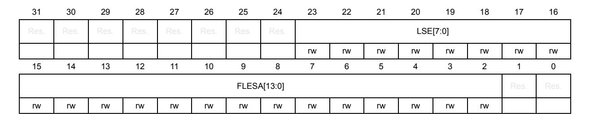

Bits 31:24 Reserved, must be kept at reset value.

#### Bits 23:16 **LSE[7:0]**: List size extended

0: No extended message ID filter

1-128: Number of extended ID filter elements

>128: Values greater than 128 are interpreted as 128.

These are write-protected bits, write access is possible only when bit CCE and bit INIT of FDCAN\_CCCR register are set to 1.

#### Bits 15:2 **FLESA[13:0]**: Filter list extended start address

Start address of extended message ID filter list (32-bit word address, see *[Table 522: Extended](#page-61-1)  [message ID filter element](#page-61-1)*).

These are write-protected bits, write access is possible only when bit CCE and bit INIT of FDCAN\_CCCR register are set to 1.

Bits 1:0 Reserved, must be kept at reset value.

## **59.5.22 FDCAN extended ID and mask register (FDCAN\_XIDAM)**

Address offset: 0x0090 Reset value: 0x1FFF FFFF

| 31   | 30   | 29   | 28 | 27 | 26 | 25 | 24 | 23         | 22          | 21 | 20 | 19 | 18 | 17 | 16 |
|------|------|------|----|----|----|----|----|------------|-------------|----|----|----|----|----|----|
| Res. | Res. | Res. |    |    |    |    |    |            | EIDM[28:16] |    |    |    |    |    |    |
|      |      |      | rw | rw | rw | rw | rw | rw         | rw          | rw | rw | rw | rw | rw | rw |
| 15   | 14   | 13   | 12 | 11 | 10 | 9  | 8  | 7          | 6           | 5  | 4  | 3  | 2  | 1  | 0  |
|      |      |      |    |    |    |    |    | EIDM[15:0] |             |    |    |    |    |    |    |
| rw   | rw   | rw   | rw | rw | rw | rw | rw | rw         | rw          | rw | rw | rw | rw | rw | rw |

Bits 31:29 Reserved, must be kept at reset value.

#### Bits 28:0 **EIDM[28:0]**: Extended ID Mask

For acceptance filtering of extended frames the extended ID AND Mask is AND-ed with the message ID of a received frame. Intended for masking of 29-bit IDs in SAE J1939. With the reset value of all bits set to 1 the mask is not active.

These are write-protected bits, write access is possible only when bit CCE and bit INIT of FDCAN\_CCCR register are set to 1.

RM0399 Rev 4 2697/3556

## **59.5.23 FDCAN high priority message status register (FDCAN\_HPMS)**

This register is updated every time a message ID filter element configured to generate a priority event match. This can be used to monitor the status of incoming high priority messages and to enable fast access to these messages.

Address offset: 0x0094 Reset value: 0x0000 0000

| 31   | 30   | 29   | 28   | 27        | 26   | 25   | 24   | 23   | 22       | 21   | 20   | 19   | 18        | 17   | 16   |
|------|------|------|------|-----------|------|------|------|------|----------|------|------|------|-----------|------|------|
| Res. | Res. | Res. | Res. | Res.      | Res. | Res. | Res. | Res. | Res.     | Res. | Res. | Res. | Res.      | Res. | Res. |
| 15   | 14   | 13   | 12   | 11        | 10   | 9    | 8    | 7    | 6        | 5    | 4    | 3    | 2         | 1    | 0    |
| FLST |      |      |      | FIDX[6:0] |      |      |      |      | MSI[1:0] |      |      |      | BIDX[5:0] |      |      |
| r    | r    | r    | r    | r         | r    | r    | r    | r    | r        | r    | r    | r    | r         | r    | r    |

Bits 31:16 Reserved, must be kept at reset value.

Bit 15 **FLST**: Filter list

Indicates the filter list of the matching filter element.

0: Standard filter list 1: Extended filter list

Bits 14:8 **FIDX[6:0]**: Filter index

Index of matching filter element. Range is 0 to FDCAN\_SIDFC[LSS] - 1 or FDCAN\_XIDFC[LSE] - 1.

Bits 7:6 **MSI[1:0]**: Message storage indicator

00: No FIFO selected 01: FIFO overrun

10: Message stored in FIFO 0 11: Message stored in FIFO 1

Bits 5:0 **BIDX[5:0]**: Buffer index

Index of Rx FIFO element to which the message was stored. Only valid when MSI[1] = 1.

## **59.5.24 FDCAN new data 1 register (FDCAN\_NDAT1)**

Address offset: 0x0098 Reset value: 0x0000 0000

| 31   | 30   | 29   | 28   | 27   | 26   | 25   | 24   | 23   | 22   | 21   | 20   | 19   | 18   | 17   | 16   |
|------|------|------|------|------|------|------|------|------|------|------|------|------|------|------|------|
| ND31 | ND30 | ND29 | ND28 | ND27 | ND26 | ND25 | ND24 | ND23 | ND22 | ND21 | ND20 | ND19 | ND18 | ND17 | ND16 |
| rw   | rw   | rw   | rw   | rw   | rw   | rw   | rw   | rw   | rw   | rw   | rw   | rw   | rw   | rw   | rw   |
| 15   | 14   | 13   | 12   | 11   | 10   | 9    | 8    | 7    | 6    | 5    | 4    | 3    | 2    | 1    | 0    |
| ND15 | ND14 | ND13 | ND12 | ND11 | ND10 | ND9  | ND8  | ND7  | ND6  | ND5  | ND4  | ND3  | ND2  | ND1  | ND0  |
| rw   | rw   | rw   | rw   | rw   | rw   | rw   | rw   | rw   | rw   | rw   | rw   | rw   | rw   | rw   | rw   |

### Bits 31:0 **ND[31:0]**: New data[31:0]

The register holds the new data flags of Rx buffers 0 to 31. The flags are set when the respective Rx buffer has been updated from a received frame. The flags remain set until the user clears them. A flag is cleared by writing a 1 to the corresponding bit position. Writing a 0 has no effect. A hard reset clears the register.

0: Rx buffer not updated

1: Rx buffer updated from new message

## **59.5.25 FDCAN new data 2 register (FDCAN\_NDAT2)**

Address offset: 0x009C Reset value: 0x0000 0000

| 31   | 30   | 29   | 28   | 27   | 26   | 25   | 24   | 23   | 22   | 21   | 20   | 19   | 18   | 17   | 16   |
|------|------|------|------|------|------|------|------|------|------|------|------|------|------|------|------|
| ND63 | ND62 | ND61 | ND60 | ND59 | ND58 | ND57 | ND56 | ND55 | ND54 | ND53 | ND52 | ND51 | ND50 | ND49 | ND48 |
| rw   | rw   | rw   | rw   | rw   | rw   | rw   | rw   | rw   | rw   | rw   | rw   | rw   | rw   | rw   | rw   |
|      |      |      |      |      |      |      |      |      |      |      |      |      |      |      |      |
| 15   | 14   | 13   | 12   | 11   | 10   | 9    | 8    | 7    | 6    | 5    | 4    | 3    | 2    | 1    | 0    |
| ND47 | ND46 | ND45 | ND44 | ND43 | ND42 | ND41 | ND40 | ND39 | ND38 | ND37 | ND36 | ND35 | ND34 | ND33 | ND32 |

Bits 31:0 **ND[63:32]**: New data[63:32]

The register holds the new data flags of Rx buffers 32 to 63. The flags are set when the respective Rx buffer has been updated from a received frame. The flags remain set until the user clears them. A flag is cleared by writing a 1 to the corresponding bit position. Writing a 0 has no effect. A hard reset clears clear the register.

0: Rx buffer not updated

1: Rx buffer updated from new message

## **59.5.26 FDCAN Rx FIFO 0 configuration register (FDCAN\_RXF0C)**

Address offset: 0x00A0 Reset value: 0x0000 0000

| 31   | 30         | 29 | 28 | 27 | 26 | 25 | 24 | 23 | 22 | 21 | 20 | 19       | 18 | 17   | 16   |
|------|------------|----|----|----|----|----|----|----|----|----|----|----------|----|------|------|
| F0OM | F0WM[6:0]  |    |    |    |    |    |    |    |    |    |    | F0S[6:0] |    |      |      |
| rw   | rw         | rw | rw | rw | rw | rw | rw |    | rw | rw | rw | rw       | rw | rw   | rw   |
| 15   | 14         | 13 | 12 | 11 | 10 | 9  | 8  | 7  | 6  | 5  | 4  | 3        | 2  | 1    | 0    |
|      | F0SA[13:0] |    |    |    |    |    |    |    |    |    |    |          |    | Res. | Res. |
| rw   | rw         | rw | rw | rw | rw | rw | rw | rw | rw | rw | rw | rw       | rw |      |      |

#### Bit 31 **F0OM**: FIFO 0 operation mode

FIFO 0 can be operated in blocking or in overwrite mode.

0: FIFO 0 blocking mode 1: FIFO 0 overwrite mode

RM0399 Rev 4 2699/3556

#### Bits 30:24 **F0WM[6:0]**: FIFO 0 watermark

0: Watermark interrupt disabled

1-64: Level for Rx FIFO 0 watermark interrupt (FDCAN\_IR.RF0W)

>64: Watermark interrupt disabled

These are write-protected bits, write access is possible only when bit CCE and bit INIT of

FDCAN\_CCCR register are set to 1.

#### Bit 23 Reserved, must be kept at reset value.

#### Bits 22:16 **F0S[6:0]**: Rx FIFO 0 size

0: No Rx FIFO 0

1-64: Number of Rx FIFO 0 elements

>64: Values greater than 64 are interpreted as 64 The Rx FIFO 0 elements are indexed from 0 to F0S-1.

#### Bits 15:2 **F0SA[13:0]**: Rx FIFO 0 start address

Start address of Rx FIFO 0 in message RAM (32-bit word address, see *[Figure 780](#page-14-0)*).

Bits 1:0 Reserved, must be kept at reset value.

## **59.5.27 FDCAN Rx FIFO 0 status register (FDCAN\_RXF0S)**

Address offset: 0x00A4 Reset value: 0x0000 0000

| 31   | 30   | 29   | 28   | 27   | 26        | 25   | 24  | 23   | 22   | 21                         | 20 | 19 | 18 | 17 | 16 |  |
|------|------|------|------|------|-----------|------|-----|------|------|----------------------------|----|----|----|----|----|--|
| Res. | Res. | Res. | Res. | Res. | Res.      | RF0L | F0F | Res. | Res. | F0PI[5:0]                  |    |    |    |    |    |  |
|      |      |      |      |      |           | rw   | rw  |      |      | rw rw rw rw rw |    |    |    |    |    |  |
| 15   | 14   | 13   | 12   | 11   | 10        | 9    | 8   | 7    | 6    | 5                          | 4  | 3  | 2  | 1  | 0  |  |
| Res. | Res. |      |      |      | F0GI[5:0] |      |     | Res. |      | F0FL[6:0]                  |    |    |    |    |    |  |
|      |      | rw   | rw   | rw   | rw        | rw   | rw  |      | rw   | rw                         | rw | rw | rw | rw | rw |  |

### Bits 31:26 Reserved, must be kept at reset value.

#### Bit 25 **RF0L**: Rx FIFO 0 message lost

This bit is a copy of interrupt flag FDCAN\_IR.RF0L. When FDCAN\_IR.RF0L is reset, this bit is also reset.

0: No Rx FIFO 0 message lost

1: Rx FIFO 0 message lost, also set after write attempt to Rx FIFO 0 of size 0

Bit 24 **F0F**: Rx FIFO 0 full

0: Rx FIFO 0 not full

1: Rx FIFO 0 full

Bits 23:22 Reserved, must be kept at reset value.

Bits 21:16 **F0PI[5:0]**: Rx FIFO 0 put index

Rx FIFO 0 write index pointer, range 0 to 63.

Bits 15:14 Reserved, must be kept at reset value.

Bits 13:8 **F0GI[5:0]**: Rx FIFO 0 get index

Rx FIFO 0 read index pointer, range 0 to 63.

Bit 7 Reserved, must be kept at reset value.

### Bits 6:0 **F0FL**[6:0]: Rx FIFO 0 fill level

Number of elements stored in Rx FIFO 0, range 0 to 64.

## **59.5.28 FDCAN Rx FIFO 0 acknowledge register (FDCAN\_RXF0A)**

Address offset: 0x00A8 Reset value: 0x0000 0000

| 31   | 30   | 29   | 28   | 27   | 26   | 25   | 24   | 23   | 22   | 21   | 20   | 19   | 18        | 17   | 16   |
|------|------|------|------|------|------|------|------|------|------|------|------|------|-----------|------|------|
| Res. | Res. | Res. | Res. | Res. | Res. | Res. | Res. | Res. | Res. | Res. | Res. | Res. | Res.      | Res. | Res. |
|      |      |      |      |      |      |      |      |      |      |      |      |      |           |      |      |
|      |      |      |      |      |      |      |      |      |      |      |      |      |           |      |      |
| 15   | 14   | 13   | 12   | 11   | 10   | 9    | 8    | 7    | 6    | 5    | 4    | 3    | 2         | 1    | 0    |
| Res. | Res. | Res. | Res. | Res. | Res. | Res. | Res. | Res. | Res. |      |      |      | F0AI[5:0] |      |      |

Bits 31:6 Reserved, must be kept at reset value.

#### Bits 5:0 **F0AI[5:0]**: Rx FIFO 0 acknowledge index

After the user has read a message or a sequence of messages from Rx FIFO 0 it has to write the buffer index of the last element read from Rx FIFO 0 to F0AI. This sets the Rx FIFO 0 get index FDCAN\_RXF0S.F0GI to F0AI + 1 and update the FIFO 0 fill level FDCAN\_RXF0S.F0FL.

## **59.5.29 FDCAN Rx buffer configuration register (FDCAN\_RXBC)**

Address offset: 0x00AC Reset value: 0x0000 0000

| 31   | 30         | 29   | 28   | 27   | 26   | 25   | 24   | 23   | 22   | 21   | 20   | 19   | 18   | 17   | 16   |
|------|------------|------|------|------|------|------|------|------|------|------|------|------|------|------|------|
| Res. | Res.       | Res. | Res. | Res. | Res. | Res. | Res. | Res. | Res. | Res. | Res. | Res. | Res. | Res. | Res. |
|      |            |      |      |      |      |      |      |      |      |      |      |      |      |      |      |
| 15   | 14         | 13   | 12   | 11   | 10   | 9    | 8    | 7    | 6    | 5    | 4    | 3    | 2    | 1    | 0    |
|      | RBSA[13:0] |      |      |      |      |      |      |      |      |      |      |      |      | Res. | Res. |
| rw   | rw         | rw   | rw   | rw   | rw   | rw   | rw   | rw   | rw   | rw   | rw   | rw   | rw   |      |      |

Bits 31:16 Reserved, must be kept at reset value.

#### Bits 15:2 **RBSA[13:0]**: Rx buffer start address

Configures the start address of the Rx buffers section in the message RAM (32-bit word address). Also used to reference debug messages A, B, C.

These are write-protected bits, write access is possible only when bit CCE and bit INIT of FDCAN\_CCCR register are set to 1.

Bits 1:0 Reserved, must be kept at reset value.

## **59.5.30 FDCAN Rx FIFO 1 configuration register (FDCAN\_RXF1C)**

Address offset: 0x00B0 Reset value: 0x0000 0000

| 31   | 30         | 29 | 28 | 27 | 26 | 25 | 24 | 23 | 22 | 21 | 20 | 19       | 18 | 17   | 16   |
|------|------------|----|----|----|----|----|----|----|----|----|----|----------|----|------|------|
| F1OM | F1WM[6:0]  |    |    |    |    |    |    |    |    |    |    | F1S[6:0] |    |      |      |
| rw   | rw         | rw | rw | rw | rw | rw | rw |    | rw | rw | rw | rw       | rw | rw   | rw   |
| 15   | 14         | 13 | 12 | 11 | 10 | 9  | 8  | 7  | 6  | 5  | 4  | 3        | 2  | 1    | 0    |
|      | F1SA[13:0] |    |    |    |    |    |    |    |    |    |    |          |    | Res. | Res. |
| rw   | rw         | rw | rw | rw | rw | rw | rw | rw | rw | rw | rw | rw       | rw |      |      |

#### Bit 31 **F1OM**: FIFO 1 operation mode

FIFO 1 can be operated in blocking or in overwrite mode.

0: FIFO 1 blocking mode 1: FIFO 1 overwrite mode

#### Bits 30:24 **F1WM[6:0]**: Rx FIFO 1 watermark

0: Watermark interrupt disabled

1-64: Level for Rx FIFO 1 watermark interrupt (FDCAN\_IR.RF1W)

>64: Watermark interrupt disabled.

These are write-protected bits, write access is possible only when bit CCE and bit INIT of FDCAN\_CCCR register are set to 1.

Bit 23 Reserved, must be kept at reset value.

#### Bits 22:16 **F1S[6:0]**: Rx FIFO 1 size

0: No Rx FIFO 1

1-64: Number of Rx FIFO 1 elements

>64: Values greater than 64 are interpreted as 64

The Rx FIFO 1 elements are indexed from 0 to F1S - 1.

These are write-protected bits, write access is possible only when bit CCE and bit INIT of FDCAN\_CCCR register are set to 1.

### Bits 15:2 **F1SA[13:0]**: Rx FIFO 1 start address

start address of Rx FIFO 1 in message RAM (32-bit word address, see *[Figure 780](#page-14-0)*). These are write-protected bits, write access is possible only when bit CCE and bit INIT of FDCAN\_CCCR register are set to 1.

Bits 1:0 Reserved, must be kept at reset value.

## **59.5.31 FDCAN Rx FIFO 1 status register (FDCAN\_RXF1S)**

Address offset: 0x00B4 Reset value: 0x0000 0000

| 31   | 30       | 29   | 28   | 27   | 26        | 25   | 24  | 23   | 22   | 21                    | 20 | 19 | 18 | 17 | 16 |  |
|------|----------|------|------|------|-----------|------|-----|------|------|-----------------------|----|----|----|----|----|--|
|      | DMS[1:0] | Res. | Res. | Res. | Res.      | RF1L | F1F | Res. | Res. | F1PI[5:0]             |    |    |    |    |    |  |
| r    | r        |      |      |      |           | r    | r   |      |      | r r r r r |    |    |    |    |    |  |
| 15   | 14       | 13   | 12   | 11   | 10        | 9    | 8   | 7    | 6    | 5                     | 4  | 3  | 2  | 1  | 0  |  |
| Res. | Res.     |      |      |      | F1GI[5:0] |      |     | Res. |      | F1FL[6:0]             |    |    |    |    |    |  |
|      |          | r    | r    | r    | r         | r    | r   |      | r    | r                     | r  | r  | r  | r  | r  |  |

Bits 31:30 **DMS[1:0]**: Debug message status

00: Idle state, wait for reception of debug messages

01: Debug message A received

10: Debug messages A, B received

11: Debug messages A, B, C received

Bits 29:26 Reserved, must be kept at reset value.

Bit 25 **RF1L**: Rx FIFO 1 message lost

This bit is a copy of interrupt flag FDCAN\_IR.RF1L. When FDCAN\_IR.RF1L is reset, this bit is also reset.

0: No Rx FIFO 1 message lost

1: Rx FIFO 1 message lost, also set after write attempt to Rx FIFO 1 of size 0.

Bit 24 **F1F**: Rx FIFO 1 full

0: Rx FIFO 1 not full

1: Rx FIFO 1 full

Bits 23:22 Reserved, must be kept at reset value.

Bits 21:16 **F1PI[5:0]**: Rx FIFO 1 put index

Rx FIFO 1 write index pointer, range 0 to 63.

Bits 15:14 Reserved, must be kept at reset value.

Bits 13:8 **F1GI[5:0]**: Rx FIFO 1 get index

Rx FIFO 1 read index pointer, range 0 to 63.

Bit 7 Reserved, must be kept at reset value.

Bits 6:0 **F1FL[6:0]**: Rx FIFO 1 fill level

Number of elements stored in Rx FIFO 1, range 0 to 64

## **59.5.32 FDCAN Rx FIFO 1 acknowledge register (FDCAN\_RXF1A)**

Address offset: 0x00B8 Reset value: 0x0000 0000

| 31   | 30   | 29   | 28   | 27   | 26   | 25   | 24   | 23   | 22   | 21        | 20   | 19   | 18   | 17   | 16   |  |
|------|------|------|------|------|------|------|------|------|------|-----------|------|------|------|------|------|--|
| Res. | Res. | Res. | Res. | Res. | Res. | Res. | Res. | Res. | Res. | Res.      | Res. | Res. | Res. | Res. | Res. |  |
|      |      |      |      |      |      |      |      |      |      |           |      |      |      |      |      |  |
| 15   | 14   | 13   | 12   | 11   | 10   | 9    | 8    | 7    | 6    | 5         | 4    | 3    | 2    | 1    | 0    |  |
| Res. | Res. | Res. | Res. | Res. | Res. | Res. | Res. | Res. | Res. | F1AI[5:0] |      |      |      |      |      |  |
|      |      |      |      |      |      |      |      |      |      |           |      |      |      |      |      |  |

Bits 31:6 Reserved, must be kept at reset value.

#### Bits 5:0 **F1AI[5:0]**: Rx FIFO 1 acknowledge index

After the user has read a message or a sequence of messages from Rx FIFO 1 it has to write the buffer index of the last element read from Rx FIFO 1 to F1AI. This sets the Rx FIFO 1 get index FDCAN\_RXF1S.F1GI. to F1AI + 1 and update the FIFO 1 fill level FDCAN\_RXF1S.F1FL.

# **59.5.33 FDCAN Rx buffer element size configuration register (FDCAN\_RXESC)**

Configures the number of data bytes belonging to an Rx buffer / Rx FIFO element. Data field sizes higher than 8 bytes are intended for CAN FD operation only.

Address offset: 0x00BC Reset value: 0x0000 0000

| 31   | 30   | 29   | 28   | 27   | 26   | 25        | 24   | 23   | 22   | 21        | 20   | 19   | 18   | 17        | 16   |
|------|------|------|------|------|------|-----------|------|------|------|-----------|------|------|------|-----------|------|
| Res. | Res. | Res. | Res. | Res. | Res. | Res.      | Res. | Res. | Res. | Res.      | Res. | Res. | Res. | Res.      | Res. |
|      |      |      |      |      |      |           |      |      |      |           |      |      |      |           |      |
| 15   | 14   | 13   | 12   | 11   | 10   | 9         | 8    |      |      | 5         |      |      |      |           |      |
|      |      |      |      |      |      |           |      | 7    | 6    |           | 4    | 3    | 2    | 1         | 0    |
| Res. | Res. | Res. | Res. | Res. |      | RBDS[2:0] |      | Res. |      | F1DS[2:0] |      | Res. |      | F0DS[2:0] |      |

Bits 31:11 Reserved, must be kept at reset value.

Bits 10:8 **RBDS[2:0]**: Rx buffer data field size

000: 8-byte data field 001: 12-byte data field 010: 16-byte data field 011: 20-byte data field 100: 24-byte data field 101: 32-byte data field

110: 48-byte data field 111: 64-byte data field

Bit 7 Reserved, must be kept at reset value.

#### Bits 6:4 **F1DS[2:0]**: Rx FIFO 0 data field size

000: 8-byte data field

001: 12-byte data field

010: 16-byte data field

011: 20-byte data field

100: 24-byte data field

101: 32-byte data field

110: 48-byte data field

111: 64-byte data field

Bit 3 Reserved, must be kept at reset value.

### Bits 2:0 **F0DS[2:0]**: Rx FIFO 1 data field size

000: 8-byte data field

001: 12-byte data field

010: 16-byte data field

011: 20-byte data field

100: 24-byte data field

101: 32-byte data field

110: 48-byte data field

111: 64-byte data field

## **59.5.34 FDCAN Tx buffer configuration register (FDCAN\_TXBC)**

Address offset: 0x00C0

Reset value: 0x0000 0000

| 31   | 30                | 29 | 28 | 27 | 26 | 25 | 24         | 23   | 22   | 21 | 20 | 19 | 18        | 17   | 16   |
|------|-------------------|----|----|----|----|----|------------|------|------|----|----|----|-----------|------|------|
| Res. | TFQM TFQS[5:0] |    |    |    |    |    |            | Res. | Res. |    |    |    | NDTB[5:0] |      |      |
|      | rw                | rw | rw | rw | rw | rw | rw         |      |      | rw | rw | rw | rw        | rw   | rw   |
| 15   | 14                | 13 | 12 | 11 | 10 | 9  | 8          | 7    | 6    | 5  | 4  | 3  | 2         | 1    | 0    |
|      |                   |    |    |    |    |    | TBSA[13:0] |      |      |    |    |    |           | Res. | Res. |
| rw   | rw                | rw | rw | rw | rw | rw | rw         | rw   | rw   | rw | rw | rw | rw        |      |      |

Bit 31 Reserved, must be kept at reset value.

### Bit 30 **TFQM**: Tx FIFO/queue mode

0: Tx FIFO operation

1: Tx queue operation.

These are write-protected bits, write access is possible only when bit CCE and bit INIT of FDCAN\_CCCR register are set to 1.

### Bits 29:24 **TFQS[5:0]**: Transmit FIFO/queue size

0: No Tx FIFO/queue

1-32: Number of Tx buffers used for Tx FIFO/queue

>32: Values greater than 32 are interpreted as 32.

These are write-protected bits, write access is possible only when bit CCE and bit INIT of FDCAN\_CCCR register are set to 1.

Bits 23:22 Reserved, must be kept at reset value.

#### Bits 21:16 **NDTB[5:0]**: Number of dedicated transmit buffers

0: No dedicated Tx buffers

1-32: Number of dedicated Tx buffers

>32: Values greater than 32 are interpreted as 32.

These are write-protected bits, write access is possible only when bit CCE and bit INIT of FDCAN\_CCCR register are set to 1.

#### Bits 15:2 **TBSA[13:0]**: Tx buffers start address

Start address of Tx buffers section in message RAM (32-bit word address, see *[Figure 780](#page-14-0)*). These are write-protected bits, write access is possible only when bit CCE and bit INIT of FDCAN\_CCCR register are set to 1.

Bits 1:0 Reserved, must be kept at reset value.

*Note: The sum of TFQS and NDTB cannot be larger than 32. There is no check for erroneous configurations. The Tx buffers section in the message RAM starts with the dedicated Tx buffers.*

## **59.5.35 FDCAN Tx FIFO/queue status register (FDCAN\_TXFQS)**

The Tx FIFO/queue status is related to the pending Tx requests listed in register FDCAN\_TXBRP. Therefore the effect of add/cancellation requests may be delayed due to a running Tx scan (FDCAN\_TXBRP not yet updated).

Address offset: 0x00C4 Reset value: 0x0000 0000

| 31   | 30   | 29   | 28   | 27   | 26        | 25   | 24   | 23   | 22   | 21   | 20 | 19         | 18        | 17 | 16 |  |
|------|------|------|------|------|-----------|------|------|------|------|------|----|------------|-----------|----|----|--|
| Res. | Res. | Res. | Res. | Res. | Res.      | Res. | Res. | Res. | Res. | TFQF |    | TFQPI[4:0] |           |    |    |  |
|      |      |      |      |      |           |      |      |      |      | r    | r  | r          | r         | r  | r  |  |
| 15   | 14   | 13   | 12   | 11   | 10        | 9    | 8    | 7    | 6    | 5    | 4  | 3          | 2         | 1  | 0  |  |
| Res. | Res. | Res. |      |      | TFGI[4:0] |      |      | Res. | Res. |      |    |            | TFFL[5:0] |    |    |  |
|      |      |      | r    | r    | r         | r    | r    |      |      | r    | r  | r          | r         | r  | r  |  |

Bits 31:22 Reserved, must be kept at reset value.

Bit 21 **TFQF**: Tx FIFO/queue full 0 Tx FIFO/queue not full 1 Tx FIFO/queue full

Bits 20:16 **TFQPI[4:0]**: Tx FIFO/queue put index

Tx FIFO/queue write index pointer, range 0 to 31

Bits 15:13 Reserved, must be kept at reset value.

### Bits 12:8 **TFGI[4:0]**:

Tx FIFO get index.

Tx FIFO read index pointer, range 0 to 31. Read as 0 when Tx queue operation is configured (FDCAN\_TXBC.TFQM = 1)

Bits 7:6 Reserved, must be kept at reset value.

#### Bits 5:0 **TFFL[5:0]**: Tx FIFO free level

Number of consecutive free Tx FIFO elements starting from TFGI, range 0 to 32. Read as 0 when Tx queue operation is configured (FDCAN\_TXBC.TFQM = 1).

*Note: In case of mixed configurations where dedicated Tx buffers are combined with a Tx FIFO or a Tx queue, the put and get index indicate the number of the Tx buffer starting with the first dedicated Tx buffers. For example: For a configuration of 12 dedicated Tx buffers and a Tx FIFO of 20 buffers a put index of 15 points to the fourth buffer of the Tx FIFO.*

# **59.5.36 FDCAN Tx buffer element size configuration register (FDCAN\_TXESC)**

Configures the number of data bytes belonging to a Tx buffer element. Data field sizes >8 bytes are intended for CAN FD operation only.

Address offset: 0x00C8 Reset value: 0x0000 0000

| 31   | 30   | 29   | 28   | 27   | 26   | 25   | 24   | 23   | 22   | 21   | 20   | 19   | 18   | 17        | 16   |
|------|------|------|------|------|------|------|------|------|------|------|------|------|------|-----------|------|
| Res. | Res. | Res. | Res. | Res. | Res. | Res. | Res. | Res. | Res. | Res. | Res. | Res. | Res. | Res.      | Res. |
|      |      |      |      |      |      |      |      |      |      |      |      |      |      |           |      |
|      |      |      |      |      |      |      |      |      |      |      |      |      |      |           |      |
| 15   | 14   | 13   | 12   | 11   | 10   | 9    | 8    | 7    | 6    | 5    | 4    | 3    | 2    | 1         | 0    |
| Res. | Res. | Res. | Res. | Res. | Res. | Res. | Res. | Res. | Res. | Res. | Res. | Res. |      | TBDS[2:0] |      |

Bits 31:3 Reserved, must be kept at reset value.

Bits 2:0 **TBDS[2:0]**: Tx buffer data Field size:

000: 8-byte data field 001: 12-byte data field 010: 16-byte data field 011: 20-byte data field 100: 24-byte data field 101: 32-byte data field 110: 48-byte data field 111: 64-byte data field

## **59.5.37 FDCAN Tx buffer request pending register (FDCAN\_TXBRP)**

Address offset: 0x00CC Reset value: 0x0000 0000

| 31 | 30         | 29 | 28 | 27 | 26 | 25 | 24 | 23 | 22 | 21 | 20 | 19 | 18 | 17 | 16 |
|----|------------|----|----|----|----|----|----|----|----|----|----|----|----|----|----|
|    | TRP[31:16] |    |    |    |    |    |    |    |    |    |    |    |    |    |    |
| r  | r          | r  | r  | r  | r  | r  | r  | r  | r  | r  | r  | r  | r  | r  | r  |
| 15 | 14         | 13 | 12 | 11 | 10 | 9  | 8  | 7  | 6  | 5  | 4  | 3  | 2  | 1  | 0  |
|    | TRP[15:0]  |    |    |    |    |    |    |    |    |    |    |    |    |    |    |
| r  | r          | r  | r  | r  | r  | r  | r  | r  | r  | r  | r  | r  | r  | r  | r  |

#### Bits 31:0 **TRP[31:0]**:Transmission request pending

Each Tx buffer has its own transmission request pending bit. The bits are set via register FDCAN\_TXBAR. The bits are reset after a requested transmission has completed or has been canceled via register FDCAN\_TXBCR.

FDCAN\_TXBRP bits are set only for those Tx buffers configured via FDCAN\_TXBC. After an FDCAN\_TXBRP bit has been set, a Tx scan (see *[Filtering for Debug messages](#page-20-0)*) is started to check for the pending Tx request with the highest priority (Tx buffer with lowest message ID).

A cancellation request resets the corresponding transmission request pending bit of register FDCAN\_TXBRP. In case a transmission has already been started when a cancellation is requested, this is done at the end of the transmission, regardless whether the transmission was successful or not. The cancellation request bits are reset directly after the corresponding FDCAN\_TXBRP bit has been reset.

After a cancellation has been requested, a finished cancellation is signaled via FDCAN\_TXBCF after successful transmission together with the corresponding FDCAN\_TXBTO bit

when the transmission has not yet been started at the point of cancellation

when the transmission has been aborted due to lost arbitration

when an error occurred during frame transmission

In DAR mode all transmissions are automatically canceled if they are not successful. The corresponding FDCAN\_TXBCF bit is set for all unsuccessful transmissions.

0: No transmission request pending

1: Transmission request pending

*Note: FDCAN\_TXBRP bits set while a Tx scan is in progress are not considered during this particular Tx scan. In case a cancellation is requested for such a Tx buffer, this add request is canceled immediately, the corresponding FDCAN\_TXBRP bit is reset.*

## **59.5.38 FDCAN Tx buffer add request register (FDCAN\_TXBAR)**

Address offset: 0x00D0 Reset value: 0x0000 0000

| 31 | 30        | 29 | 28 | 27 | 26 | 25 | 24 | 23 | 22 | 21 | 20 | 19 | 18 | 17 | 16 |
|----|-----------|----|----|----|----|----|----|----|----|----|----|----|----|----|----|
|    | AR[31:16] |    |    |    |    |    |    |    |    |    |    |    |    |    |    |
| rw | rw        | rw | rw | rw | rw | rw | rw | rw | rw | rw | rw | rw | rw | rw | rw |
| 15 | 14        | 13 | 12 | 11 | 10 | 9  | 8  | 7  | 6  | 5  | 4  | 3  | 2  | 1  | 0  |
|    | AR[15:0]  |    |    |    |    |    |    |    |    |    |    |    |    |    |    |
| rw | rw        | rw | rw | rw | rw | rw | rw | rw | rw | rw | rw | rw | rw | rw | rw |

#### Bits 31:0 **AR[31:0]**:Add request

Each Tx buffer has its own add request bit. Writing a 1 sets the corresponding add request bit; writing a 0 has no impact. This enables the user to set transmission requests for multiple Tx buffers with one write to FDCAN\_TXBAR. FDCAN\_TXBAR bits are set only for those Tx buffers configured via FDCAN\_TXBC. When no Tx scan is running, the bits are reset immediately, else the bits remain set until the Tx scan process has completed.

0: No transmission request added

1: Transmission requested added.

*Note: If an add request is applied for a Tx buffer with pending transmission request (corresponding FDCAN\_TXBRP bit already set), the request is ignored.*

## **59.5.39 FDCAN Tx buffer cancellation request register (FDCAN\_TXBCR)**

Address offset: 0x00D4 Reset value: 0x0000 0000

| 31 | 30        | 29 | 28 | 27 | 26 | 25 | 24 | 23 | 22 | 21 | 20 | 19 | 18 | 17 | 16 |
|----|-----------|----|----|----|----|----|----|----|----|----|----|----|----|----|----|
|    | CR[31:16] |    |    |    |    |    |    |    |    |    |    |    |    |    |    |
| rw | rw        | rw | rw | rw | rw | rw | rw | rw | rw | rw | rw | rw | rw | rw | rw |
| 15 | 14        | 13 | 12 | 11 | 10 | 9  | 8  | 7  | 6  | 5  | 4  | 3  | 2  | 1  | 0  |
|    | CR[15:0]  |    |    |    |    |    |    |    |    |    |    |    |    |    |    |
| rw | rw        | rw | rw | rw | rw | rw | rw | rw | rw | rw | rw | rw | rw | rw | rw |

Bits 31:0 **CR[31:0]**: Cancellation request

Each Tx buffer has its own cancellation request bit. Writing a 1 sets the corresponding cancellation request bit; writing a 0 has no impact.

This enables the user to set cancellation requests for multiple Tx buffers with one write to FDCAN\_TXBCR. FDCAN\_TXBCR bits are set only for those Tx buffers configured via FDCAN\_TXBC. The bits remain set until the corresponding FDCAN\_TXBRP bit is reset.

0: No cancellation pending 1: Cancellation pending

## **59.5.40 FDCAN Tx buffer transmission occurred register (FDCAN\_TXBTO)**

Address offset: 0x00D8 Reset value: 0x0000 0000

| 31 | 30        | 29 | 28 | 27 | 26 | 25 | 24 | 23 | 22 | 21 | 20 | 19 | 18 | 17 | 16 |
|----|-----------|----|----|----|----|----|----|----|----|----|----|----|----|----|----|
|    | TO[31:16] |    |    |    |    |    |    |    |    |    |    |    |    |    |    |
| r  | r         | r  | r  | r  | r  | r  | r  | r  | r  | r  | r  | r  | r  | r  | r  |
| 15 | 14        | 13 | 12 | 11 | 10 | 9  | 8  | 7  | 6  | 5  | 4  | 3  | 2  | 1  | 0  |
|    | TO[15:0]  |    |    |    |    |    |    |    |    |    |    |    |    |    |    |
| r  | r         | r  | r  | r  | r  | r  | r  | r  | r  | r  | r  | r  | r  | r  | r  |

Bits 31:0 **TO[31:0]**: Transmission occurred

Each Tx buffer has its own transmission occurred bit. The bits are set when the corresponding FDCAN\_TXBRP bit is cleared after a successful transmission. The bits are reset when a new transmission is requested by writing a 1 to the corresponding bit of register FDCAN\_TXBAR.

0: No transmission occurred

1: Transmission occurred

## **59.5.41 FDCAN Tx buffer cancellation finished register (FDCAN\_TXBCF)**

Address offset: 0x00DC Reset value: 0x0000 0000

| 31 | 30        | 29 | 28 | 27 | 26 | 25 | 24 | 23 | 22 | 21 | 20 | 19 | 18 | 17 | 16 |
|----|-----------|----|----|----|----|----|----|----|----|----|----|----|----|----|----|
|    | CF[31:16] |    |    |    |    |    |    |    |    |    |    |    |    |    |    |
| r  | r         | r  | r  | r  | r  | r  | r  | r  | r  | r  | r  | r  | r  | r  | r  |
| 15 | 14        | 13 | 12 | 11 | 10 | 9  | 8  | 7  | 6  | 5  | 4  | 3  | 2  | 1  | 0  |
|    | CF[15:0]  |    |    |    |    |    |    |    |    |    |    |    |    |    |    |
| r  | r         | r  | r  | r  | r  | r  | r  | r  | r  | r  | r  | r  | r  | r  | r  |

Bits 31:0 **CF[31:0]**: Cancellation finished

Each Tx buffer has its own cancellation finished bit. The bits are set when the corresponding FDCAN\_TXBRP bit is cleared after a cancellation was requested via FDCAN\_TXBCR. In case the corresponding FDCAN\_TXBRP bit was not set at the point of cancellation, CF is set immediately. The bits are reset when a new transmission is requested by writing a 1 to the corresponding bit of register FDCAN\_TXBAR.

0: No transmit buffer cancellation

1: Transmit buffer cancellation finished

# **59.5.42 FDCAN Tx buffer transmission interrupt enable register (FDCAN\_TXBTIE)**

Address offset: 0x00E0 Reset value: 0x0000 0000

| 31 | 30         | 29 | 28 | 27 | 26 | 25 | 24 | 23 | 22 | 21 | 20 | 19 | 18 | 17 | 16 |
|----|------------|----|----|----|----|----|----|----|----|----|----|----|----|----|----|
|    | TIE[31:16] |    |    |    |    |    |    |    |    |    |    |    |    |    |    |
| rw | rw         | rw | rw | rw | rw | rw | rw | rw | rw | rw | rw | rw | rw | rw | rw |
| 15 | 14         | 13 | 12 | 11 | 10 | 9  | 8  | 7  | 6  | 5  | 4  | 3  | 2  | 1  | 0  |
|    | TIE[15:0]  |    |    |    |    |    |    |    |    |    |    |    |    |    |    |
| rw | rw         | rw | rw | rw | rw | rw | rw | rw | rw | rw | rw | rw | rw | rw | rw |

Bits 31:0 **TIE[31:0]**: Transmission interrupt enable

Each Tx buffer has its own transmission interrupt enable bit.

0: Transmission interrupt disabled

1: Transmission interrupt enable

# **59.5.43 FDCAN Tx buffer cancellation finished interrupt enable register (FDCAN\_TXBCIE)**

Address offset: 0x00E4 Reset value: 0x0000 0000

| 31 | 30          | 29 | 28 | 27 | 26 | 25 | 24 | 23 | 22 | 21 | 20 | 19 | 18 | 17 | 16 |
|----|-------------|----|----|----|----|----|----|----|----|----|----|----|----|----|----|
|    | CFIE[31:16] |    |    |    |    |    |    |    |    |    |    |    |    |    |    |
| rw | rw          | rw | rw | rw | rw | rw | rw | rw | rw | rw | rw | rw | rw | rw | rw |
| 15 | 14          | 13 | 12 | 11 | 10 | 9  | 8  | 7  | 6  | 5  | 4  | 3  | 2  | 1  | 0  |
|    | CFIE[15:0]  |    |    |    |    |    |    |    |    |    |    |    |    |    |    |
| rw | rw          | rw | rw | rw | rw | rw | rw | rw | rw | rw | rw | rw | rw | rw | rw |

Bits 31:0 **CFIE[31:0]**: Cancellation finished interrupt enable

Each Tx buffer has its own cancellation finished interrupt enable bit.

0: Cancellation finished interrupt disabled

1: Cancellation finished interrupt enabled

## **59.5.44 FDCAN Tx event FIFO configuration register (FDCAN\_TXEFC)**

Address offset: 0x00F0 Reset value: 0x0000 0000

| 31   | 30   | 29 | 28 | 27 | 26        | 25 | 24         | 23   | 22   | 21 | 20 | 19 | 18       | 17   | 16   |
|------|------|----|----|----|-----------|----|------------|------|------|----|----|----|----------|------|------|
| Res. | Res. |    |    |    | EFWM[5:0] |    |            | Res. | Res. |    |    |    | EFS[5:0] |      |      |
|      |      | rw | rw | rw | rw        | rw | rw         |      |      | rw | rw | rw | rw       | rw   | rw   |
| 15   | 14   | 13 | 12 | 11 | 10        | 9  | 8          | 7    | 6    | 5  | 4  | 3  | 2        | 1    | 0    |
|      |      |    |    |    |           |    | EFSA[13:0] |      |      |    |    |    |          | Res. | Res. |
| rw   | rw   | rw | rw | rw | rw        | rw | rw         | rw   | rw   | rw | rw | rw | rw       |      |      |

Bits 31:30 Reserved, must be kept at reset value.

Bits 29:24 **EFWM[5:0]**: Event FIFO watermark

0: Watermark interrupt disabled

1-32: Level for Tx event FIFO watermark interrupt (FDCAN\_IR.TEFW)

>32: Watermark interrupt disabled

These are write-protected bits, write access is possible only when bit CCE and bit INIT of FDCAN\_CCCR register are set to 1.

Bits 23:22 Reserved, must be kept at reset value.

Bits 21:16 **EFS[5:0]**: Event FIFO size.

0: Tx event FIFO disabled

1-32: Number of Tx event FIFO elements

>32: Values greater than 32 are interpreted as 32

The Tx event FIFO elements are indexed from 0 to EFS-1.

These are write-protected bits, write access is possible only when bit CCE and bit INIT of FDCAN\_CCCR register are set to 1.

RM0399 Rev 4 2711/3556

### Bits 15:2 **EFSA[13:0]**: Event FIFO start address

Start address of Tx event FIFO in message RAM (32-bit word address, see *[Figure 780](#page-14-0)*). These are write-protected bits, write access is possible only when bit CCE and bit INIT of FDCAN\_CCCR register are set to 1.

Bits 1:0 Reserved, must be kept at reset value.

## **59.5.45 FDCAN Tx event FIFO status register (FDCAN\_TXEFS)**

Address offset: 0x00F4 Reset value: 0x0000 0000

| 31   | 30   | 29   | 28   | 27   | 26        | 25   | 24  | 23   | 22   | 21   | 20 | 19 | 18        | 17 | 16 |
|------|------|------|------|------|-----------|------|-----|------|------|------|----|----|-----------|----|----|
| Res. | Res. | Res. | Res. | Res. | Res.      | TEFL | EFF | Res. | Res. | Res. |    |    | EFPI[4:0] |    |    |
|      |      |      |      |      |           | r    | r   |      |      |      | r  | r  | r         | r  | r  |
| 15   | 14   | 13   | 12   | 11   | 10        | 9    | 8   | 7    | 6    | 5    | 4  | 3  | 2         | 1  | 0  |
| Res. | Res. | Res. |      |      | EFGI[4:0] |      |     | Res. | Res. |      |    |    | EFFL[5:0] |    |    |
|      |      |      | r    | r    | r         | r    | r   |      |      | r    | r  | r  | r         | r  | r  |

#### Bits 31:26 Reserved, must be kept at reset value.

#### Bit 25 **TEFL**: Tx event FIFO element lost

This bit is a copy of interrupt flag FDCAN\_IR.TEFL. When FDCAN\_IR.TEFL is reset, this bit is also reset.

0 No Tx event FIFO element lost

1 Tx event FIFO element lost, also set after write attempt to Tx event FIFO of size 0.

Bit 24 **EFF**: Event FIFO full

0: Tx event FIFO not full

1: Tx event FIFO full

Bits 23:21 Reserved, must be kept at reset value.

Bits 20:16 **EFPI[4:0]**: Event FIFO put index

Tx event FIFO write index pointer, range 0 to 31.

Bits 15:13 Reserved, must be kept at reset value.

Bits 12:8 **EFGI[4:0]**: Event FIFO get index

Tx event FIFO read index pointer, range 0 to 31.

Bits 7:6 Reserved, must be kept at reset value.

Bits 5:0 **EFFL[5:0]**: Event FIFO fill level

Number of elements stored in Tx event FIFO, range 0 to 31.

## **59.5.46 FDCAN Tx event FIFO acknowledge register (FDCAN\_TXEFA)**

Address offset: 0x00F8 Reset value: 0x0000 0000

| 31   | 30   | 29   | 28   | 27   | 26   | 25   | 24   | 23   | 22   | 21   | 20        | 19   | 18   | 17   | 16   |  |  |
|------|------|------|------|------|------|------|------|------|------|------|-----------|------|------|------|------|--|--|
| Res. | Res. | Res. | Res. | Res. | Res. | Res. | Res. | Res. | Res. | Res. | Res.      | Res. | Res. | Res. | Res. |  |  |
|      |      |      |      |      |      |      |      |      |      |      |           |      |      |      |      |  |  |
| 15   | 14   | 13   | 12   | 11   | 10   | 9    | 8    | 7    | 6    | 5    | 4         | 3    | 2    | 1    | 0    |  |  |
|      |      |      |      |      |      |      |      |      |      |      | EFAI[4:0] |      |      |      |      |  |  |
| Res. | Res. | Res. | Res. | Res. | Res. | Res. | Res. | Res. | Res. | Res. |           |      |      |      |      |  |  |

Bits 31:5 Reserved, must be kept at reset value.

#### Bits 4:0 **EFAI[4:0]**: Event FIFO acknowledge index

After the user has read an element or a sequence of elements from the Tx event FIFO, it must write the index of the last element read from Tx event FIFO to EFAI. This sets the Tx event FIFO get index FDCAN\_TXEFS.EFGI to EFAI + 1 and update the FIFO 0 fill level FDCAN\_TXEFS.EFFL.

## **59.5.47 FDCAN register map**

**Table 526. FDCAN register map and reset values** 

| Offset | Register name | 31   | 30        | 29       | 28   | 27   | 26        | 25   | 24   | 23        | 22   | 21               | 20   | 19   | 18        | 17        | 16        | 15          | 14   | 13   | 12   | 11       | 10   | 9           | 8           | 7    | 6      | 5           | 4        | 3    | 2    | 1         | 0            |
|--------|------------------|------|-----------|----------|------|------|-----------|------|------|-----------|------|------------------|------|------|-----------|-----------|-----------|-------------|------|------|------|----------|------|-------------|-------------|------|--------|-------------|----------|------|------|-----------|--------------|
| 0x0000 | FDCAN_CREL       |      |           | REL[3:0] |      |      | STEP[3:0] |      |      |           |      | SUBSTEP [3:0] |      |      |           | YEAR[3:0] |           |             |      |      |      | MON[7:0] |      |             |             |      |        |             | DAY[7:0] |      |      |           |              |
|        | Reset value      | 0    | 0         | 1        | 1    | 0    | 0         | 1    | 0    | 0         | 0    | 0                | 1    | 0    | 1         | 0         | 0         | 0           | 0    | 0    | 1    | 0        | 0    | 1           | 0           | 0    | 0      | 0           | 1        | 1    | 0    | 0         | 0            |
| 0x0004 | FDCAN_ENDN       |      |           |          |      |      |           |      |      |           |      |                  |      |      |           |           | ETV[31:0] |             |      |      |      |          |      |             |             |      |        |             |          |      |      |           |              |
|        | Reset value      | 1    | 0         | 0        | 0    | 0    | 1         | 1    | 1    | 0         | 1    | 1                | 0    | 0    | 1         | 1         | 1         | 0           | 1    | 0    | 0    | 0        | 0    | 1           | 1           | 0    | 0      | 1           | 0        | 0    | 0    | 0         | 1            |
| 0x0008 | Reserved         |      |           |          |      |      |           |      |      |           |      |                  |      |      |           |           | Reserved  |             |      |      |      |          |      |             |             |      |        |             |          |      |      |           |              |
| 0x000C | FDCAN_DBTP       | Res. | Res.      | Res.     | Res. | Res. | Res.      | Res. | Res. | TDC       | Res. | Res.             |      |      | DBRP[4:0] |           |           | Res.        | Res. | Res. |      |          |      | DTSEG1[4:0] |             |      | DTSEG2 | [3:0]       |          |      |      | DSJW[3:0] |              |
|        | Reset value      |      |           |          |      |      |           |      |      | 0         |      |                  | 0    | 0    | 0         | 0         | 0         |             |      |      | 0    | 1        | 0    | 1           | 0           | 0    | 0      | 1           | 1        | 0    | 0    | 1         | 1            |
| 0x0010 | FDCAN_TEST       | Res. | Res.      | Res.     | Res. | Res. | Res.      | Res. | Res. | Res.      | Res. | Res.             | Res. | Res. | Res.      | Res.      | Res.      | Res.        | Res. | Res. | Res. | Res.     | Res. | Res.        | Res.        | RX   |        | TX [1:0] | LBCK     | Res. | Res. | Res.      | Res.         |
|        | Reset value      |      |           |          |      |      |           |      |      |           |      |                  |      |      |           |           |           |             |      |      |      |          |      |             |             | 0    | 0      | 0           | 0        |      |      |           |              |
| 0x0014 | FDCAN_RWD        | Res. | Res.      | Res.     | Res. | Res. | Res.      | Res. | Res. | Res.      | Res. | Res.             | Res. | Res. | Res.      | Res.      | Res.      |             |      |      |      | WDV[7:0] |      |             |             |      |        |             | WDC[7:0] |      |      |           |              |
|        | Reset value      |      |           |          |      |      |           |      |      |           |      |                  |      |      |           |           |           | 0           | 0    | 0    | 0    | 0        | 0    | 0           | 0           | 0    | 0      | 0           | 0        | 0    | 0    | 0         | 0            |
| 0x0018 | FDCAN_CCCR       | Res. | Res.      | Res.     | Res. | Res. | Res.      | Res. | Res. | Res.      | Res. | Res.             | Res. | Res. | Res.      | Res.      | Res.      | NISO        | TXP  | EFBI | PXHD | Res.     | Res. | BRSE        | FDOE        | TEST | DAR    | MON         | CSR      | CSA  | ASM  | CCE       | INIT         |
|        | Reset value      |      |           |          |      |      |           |      |      |           |      |                  |      |      |           |           |           | 0           | 0    | 0    | 0    |          |      | 0           | 0           | 0    | 0      | 0           | 0        | 0    | 0    | 0         | 1            |
| 0x001C | FDCAN_NBTP       |      | NSJW[6:0] |          |      |      |           |      |      | NBRP[8:0] |      |                  |      |      |           |           |           | NTSEG1[7:0] |      |      |      | Res.     |      |             | NTSEG2[6:0] |      |        |             |          |      |      |           |              |
|        | Reset value      | 0    | 0         | 0        | 0    | 0    | 1         | 1    | 0    | 0         | 0    | 0                | 0    | 0    | 0         | 0         | 0         | 0           | 0    | 0    | 0    | 1        | 0    | 1           | 0           |      | 0      | 0           | 0        | 0    | 0    | 1         | 1            |
| 0x0020 | FDCAN_TSCC       | Res. | Res.      | Res.     | Res. | Res. | Res.      | Res. | Res. | Res.      | Res. | Res.             | Res. |      |           | TCP[3:0]  |           | Res.        | Res. | Res. | Res. | Res.     | Res. | Res.        | Res.        | Res. | Res.   | Res.        | Res.     | Res. | Res. |           | TSS [1:0] |
|        | Reset value      |      |           |          |      |      |           |      |      |           |      |                  |      | 0    | 0         | 0         | 0         |             |      |      |      |          |      |             |             |      |        |             |          |      |      | 0         | 0            |

RM0399 Rev 4 2713/3556

**Table 526. FDCAN register map and reset values (continued)**

| Offset            | Register name | 31   | 30   | 29   | 28   | 27   | 26   | 25   | 24        | 23   | 22   | 21   | 20   | 19       | 18   | 17    | 16       | 15    | 14    | 13    | 12    | 11        | 10   | 9             | 8           | 7     | 6     | 5     | 4     | 3            | 2     | 1            | 0     |
|-------------------|------------------|------|------|------|------|------|------|------|-----------|------|------|------|------|----------|------|-------|----------|-------|-------|-------|-------|-----------|------|---------------|-------------|-------|-------|-------|-------|--------------|-------|--------------|-------|
| 0x0024            | FDCAN_TSCV       | Res. | Res. | Res. | Res. | Res. | Res. | Res. | Res.      | Res. | Res. | Res. | Res. | Res.     | Res. | Res.  | Res.     |       |       |       |       |           |      |               | TSC[15:0]   |       |       |       |       |              |       |              |       |
|                   | Reset value      |      |      |      |      |      |      |      |           |      |      |      |      |          |      |       |          | 0     | 0     | 0     | 0     | 0         | 0    | 0             | 0           | 0     | 0     | 0     | 0     | 0            | 0     | 0            | 0     |
| 0x0028            | FDCAN_TOCC       |      |      |      |      |      |      |      | TOP[15:0] |      |      |      |      |          |      |       |          | Res.  | Res.  | Res.  | Res.  | Res.      | Res. | Res.          | Res.        | Res.  | Res.  | Res.  | Res.  | Res.         |       | TOS [1:0] | ETOC  |
|                   | Reset value      | 1    | 1    | 1    | 1    | 1    | 1    | 1    | 1         | 1    | 1    | 1    | 1    | 1        | 1    | 1     | 1        |       |       |       |       |           |      |               |             |       |       |       |       |              | 0     | 0            | 0     |
| 0x002C            | FDCAN_TOCV       | Res. | Res. | Res. | Res. | Res. | Res. | Res. | Res.      | Res. | Res. | Res. | Res. | Res.     | Res. | Res.  | Res.     |       |       |       |       |           |      |               | TOC[15:0]   |       |       |       |       |              |       |              |       |
|                   | Reset value      |      |      |      |      |      |      |      |           |      |      |      |      |          |      |       |          | 1     | 1     | 1     | 1     | 1         | 1    | 1             | 1           | 1     | 1     | 1     | 1     | 1            | 1     | 1            | 1     |
| 0x0030- 0x003F | Reserved         |      |      |      |      |      |      |      |           |      |      |      |      |          |      |       | Reserved |       |       |       |       |           |      |               |             |       |       |       |       |              |       |              |       |
| 0x0040            | FDCAN_ECR        | Res. | Res. | Res. | Res. | Res. | Res. | Res. | Res.      |      |      |      |      | CEL[7:0] |      |       |          | RP    |       |       |       | REC[6:0]  |      |               |             |       |       |       |       | TEC[7:0]     |       |              |       |
|                   | Reset value      |      |      |      |      |      |      |      |           | 0    | 0    | 0    | 0    | 0        | 0    | 0     | 0        | 0     | 0     | 0     | 0     | 0         | 0    | 0             | 0           | 0     | 0     | 0     | 0     | 0            | 0     | 0            | 0     |
| 0x0044            | FDCAN_PSR        | Res. | Res. | Res. | Res. | Res. | Res. | Res. | Res.      | Res. | Res. | Res. | Res. | Res.     | Res. | Res.  | Res.     | Res.  | PXE   | REDL  | RBRS  | RESI      |      | DLEC [2:0] |             | BO    | EW    | EP    |       | ACT [1:0] |       | LEC[2:0]     |       |
|                   | Reset value      |      |      |      |      |      |      |      |           |      |      |      |      |          |      |       |          |       | 0     | 0     | 0     | 0         | 1    | 1             | 1           | 0     | 0     | 0     | 0     | 0            | 1     | 1            | 1     |
| 0x0048            | FDCAN_TDCR       | Res. | Res. | Res. | Res. | Res. | Res. | Res. | Res.      | Res. | Res. | Res. | Res. | Res.     | Res. | Res.  | Res.     | Res.  |       |       |       | TDCO[6:0] |      |               |             | Res.  |       |       |       | TDCF[6:0]    |       |              |       |
|                   | Reset value      |      |      |      |      |      |      |      |           |      |      |      |      |          |      |       |          |       | 0     | 0     | 0     | 0         | 0    | 0             | 0           | 0     | 0     | 0     | 0     | 0            | 0     | 0            | 0     |
| 0x0050            | FDCAN_IR         | Res. | Res. | ARA  | PED  | PEA  | WDI  | BO   | EW        | EP   | ELO  | Res. | Res. | DRX      | TOO  | MRAF  | TSW      | TEFL  | TEFF  | TEFW  | TEFN  | TFE       | TCF  | TC            | HPM         | RF1L  | RF1F  | RF1W  | RF1N  | RF0L         | RF0F  | RF0W         | RF0N  |
|                   | Reset value      |      |      | 0    | 0    | 0    | 0    | 0    | 0         | 0    | 0    |      |      | 0        | 0    | 0     | 0        | 0     | 0     | 0     | 0     | 0         | 0    | 0             | 0           | 0     | 0     | 0     | 0     | 0            | 0     | 0            | 0     |
| 0x0054            | FDCAN_IE         | Res. | Res. | ARAE | PEDE | PEAE | WDIE | BOE  | EWE       | EPE  | ELOE | Res. | Res. | DRXE     | TOOE | MRAFE | TSWE     | TEFLE | TEFFE | TEFWE | TEFNE | TFEE      | TCFE | TCE           | HPME        | RF1LE | RF1FE | RF1WE | RF1NE | RF0LE        | RF0FE | RF0WE        | RF0NE |
|                   | Reset value      |      |      | 0    | 0    | 0    | 0    | 0    | 0         | 0    | 0    |      |      | 0        | 0    | 0     | 0        | 0     | 0     | 0     | 0     | 0         | 0    | 0             | 0           | 0     | 0     | 0     | 0     | 0            | 0     | 0            | 0     |
| 0x0058            | FDCAN_ILS        | Res. | Res. | ARAL | PEDL | PEAL | WDIL | BOL  | EWL       | EPL  | ELOL | Res. | Res. | DRXL     | TOOL | MRAFL | TSWL     | TEFLL | TEFFL | TEFWL | TEFNL | TFEL      | TCFL | TCL           | HPML        | RF1LL | RF1FL | RF1WL | RF1NL | RF0LL        | RF0FL | RF0WL        | RF0NL |
|                   | Reset value      |      |      | 0    | 0    | 0    | 0    | 0    | 0         | 0    | 0    | 0    | 0    | 0        | 0    | 0     | 0        | 0     | 0     | 0     | 0     | 0         | 0    | 0             | 0           | 0     | 0     | 0     | 0     | 0            | 0     | 0            | 0     |
| 0x005C            | FDCAN_ILE        | Res. | Res. | Res. | Res. | Res. | Res. | Res. | Res.      | Res. | Res. | Res. | Res. | Res.     | Res. | Res.  | Res.     | Res.  | Res.  | Res.  | Res.  | Res.      | Res. | Res.          | Res.        | Res.  | Res.  | Res.  | Res.  | Res.         | Res.  | EINT1        | EINT0 |
|                   | Reset value      |      |      |      |      |      |      |      |           |      |      |      |      |          |      |       |          |       |       |       |       |           |      |               |             |       |       |       |       |              |       | 0            | 0     |
| 0x006- 0x007F  | Reserved         |      |      |      |      |      |      |      |           |      |      |      |      |          |      |       | Reserved |       |       |       |       |           |      |               |             |       |       |       |       |              |       |              |       |
| 0x0080            | FDCAN_GFC        | Res. | Res. | Res. | Res. | Res. | Res. | Res. | Res.      | Res. | Res. | Res. | Res. | Res.     | Res. | Res.  | Res.     | Res.  | Res.  | Res.  | Res.  | Res.      | Res. | Res.          | Res.        | Res.  | Res.  | ANFS  | [1:0] | ANFE         | [1:0] | EINT1        | EINT0 |
|                   | Reset value      |      |      |      |      |      |      |      |           |      |      |      |      |          |      |       |          |       |       |       |       |           |      |               |             |       |       | 0     | 0     | 0            | 0     | 0            | 0     |
| 0x0084            | FDCAN_SIDFC      | Res. | Res. | Res. | Res. | Res. | Res. | Res. | Res.      |      |      |      |      | LSS[7:0] |      |       |          |       |       |       |       |           |      |               | FLSSA[13:0] |       |       |       |       |              |       | Res.         | Res.  |
|                   | Reset value      |      |      |      |      |      |      |      |           | 0    | 0    | 0    | 0    | 0        | 0    | 0     | 0        | 0     | 0     | 0     | 0     | 0         | 0    | 0             | 0           | 0     | 0     | 0     | 0     | 0            | 0     |              |       |
| 0x0088            | FDCAN_XIDFC      | Res. | Res. | Res. | Res. | Res. | Res. | Res. | Res.      |      |      |      |      | LSE[7:0] |      |       |          |       |       |       |       |           |      |               | FLESA[13:0] |       |       |       |       |              |       | Res.         | Res.  |
|                   | Reset value      |      |      |      |      |      |      |      |           | 0    | 0    | 0    | 0    | 0        | 0    | 0     | 0        | 0     | 0     | 0     | 0     | 0         | 0    | 0             | 0           | 0     | 0     | 0     | 0     | 0            | 0     |              |       |

**Table 526. FDCAN register map and reset values (continued)**

| Offset | Register name | 31   | 30           | 29   | 28   | 27        | 26   | 25   | 24   | 23   | 22   | 21   | 20   | 19       | 18         | 17   | 16   | 15         | 14         | 13   | 12   | 11            | 10        | 9          | 8    | 7    | 6             | 5    | 4           | 3         | 2    | 1             | 0    |
|--------|------------------|------|--------------|------|------|-----------|------|------|------|------|------|------|------|----------|------------|------|------|------------|------------|------|------|---------------|-----------|------------|------|------|---------------|------|-------------|-----------|------|---------------|------|
|        | FDCAN _XIDAM  | Res. | Res.         | Res. |      |           |      |      |      |      |      |      |      |          |            |      |      |            | EIDM[28:0] |      |      |               |           |            |      |      |               |      |             |           |      |               |      |
| 0x0090 | Reset value      |      |              |      | 1    | 1         | 1    | 1    | 1    | 1    | 1    | 1    | 1    | 1        | 1          | 1    | 1    | 1          | 1          | 1    | 1    | 1             | 1         | 1          | 1    | 1    | 1             | 1    | 1           | 1         | 1    | 1             | 1    |
| 0x0094 | FDCAN_HPMS       | Res. | Res.         | Res. | Res. | Res.      | Res. | Res. | Res. | Res. | Res. | Res. | Res. | Res.     | Res.       | Res. | Res. | FLST       |            |      |      | FIDX[6:0]     |           |            |      |      | MISI [1:0] |      |             | MIDX[5:0] |      |               |      |
|        | Reset value      |      |              |      |      |           |      |      |      |      |      |      |      |          |            |      |      | 0          | 0          | 0    | 0    | 0             | 0         | 0          | 0    | 0    | 0             | 0    | 0           | 0         | 0    | 0             | 0    |
| 0x0098 | FDCAN _NDAT1  | ND31 | ND30         | ND29 | ND28 | ND27      | ND26 | ND25 | ND24 | ND23 | ND22 | ND21 | ND20 | ND19     | ND18       | ND17 | ND16 | ND15       | ND14       | ND13 | ND12 | ND11          | ND10      | ND9        | ND8  | ND7  | ND6           | ND5  | ND4         | ND3       | ND2  | ND1           | ND0  |
|        | Reset value      | 0    | 0            | 0    | 0    | 0         | 0    | 0    | 0    | 0    | 0    | 0    | 0    | 0        | 0          | 0    | 0    | 0          | 0          | 0    | 0    | 0             | 0         | 0          | 0    | 0    | 0             | 0    | 0           | 0         | 0    | 0             | 0    |
| 0x009C | FDCAN _NDAT2  | ND63 | ND62         | ND61 | ND60 | ND59      | ND58 | ND57 | ND56 | ND55 | ND54 | ND53 | ND52 | ND51     | ND50       | ND49 | ND48 | ND47       | ND46       | ND45 | ND44 | ND43          | ND42      | ND41       | ND40 | ND39 | ND38          | ND37 | ND36        | ND35      | ND34 | ND33          | ND32 |
|        | Reset value      | 0    | 0            | 0    | 0    | 0         | 0    | 0    | 0    | 0    | 0    | 0    | 0    | 0        | 0          | 0    | 0    | 0          | 0          | 0    | 0    | 0             | 0         | 0          | 0    | 0    | 0             | 0    | 0           | 0         | 0    | 0             | 0    |
| 0x00A0 | FDCAN _RXF0C  | F0OM |              |      |      | F0WM[6:0] |      |      |      | Res. |      |      |      | F0S[6:0] |            |      |      |            | F0SA[13:0] |      |      |               |           |            |      |      |               |      |             |           |      | Res.          | Res. |
|        | Reset value      | 0    | 0            | 0    | 0    | 0         | 0    | 0    | 0    |      | 0    | 0    | 0    | 0        | 0          | 0    | 0    | 0          | 0          | 0    | 0    | 0             | 0         | 0          | 0    | 0    | 0             | 0    | 0           | 0         | 0    |               |      |
| 0x00A4 | FDCAN _RXF0S  | Res. | Res.         | Res. | Res. | Res.      | Res. | RF0  | F0F  | Res. | Res. |      |      |          | F0PI[5:0]  |      |      | Res.       | Res.       |      |      |               | F0GI[5:0] |            |      | Res. |               |      | RF0FL[6:0]e |           |      |               |      |
|        | Reset value      |      |              |      |      |           |      | 0    | 0    |      |      | 0    | 0    | 0        | 0          | 0    | 0    |            |            | 0    | 0    | 0             | 0         | 0          | 0    |      | 0             | 0    | 0           | 0         | 0    | 0             | 0    |
| 0x00A8 | FDCAN _RXF0A  | Res. | Res.         | Res. | Res. | Res.      | Res. | Res. | Res. | Res. | Res. | Res. | Res. | Res.     | Res.       | Res. | Res. | Res.       | Res.       | Res. | Res. | Res.          | Res.      | Res.       | Res. | Res. | Res.          |      |             | F0AI[5:0] |      |               |      |
|        | Reset value      |      |              |      |      |           |      |      |      |      |      |      |      |          |            |      |      |            |            |      |      |               |           |            |      |      |               | 0    | 0           | 0         | 0    | 0             | 0    |
| 0x00AC | FDCAN_RXBC       | Res. | Res.         | Res. | Res. | Res.      | Res. | Res. | Res. | Res. | Res. | Res. | Res. | Res.     | Res.       | Res. | Res. |            |            |      |      |               |           | RBSA[13:0] |      |      |               |      |             |           |      | Res.          | Res. |
|        | Reset value      |      |              |      |      |           |      |      |      |      |      |      |      |          |            |      |      | 0          | 0          | 0    | 0    | 0             | 0         | 0          | 0    | 0    | 0             | 0    | 0           | 0         | 0    |               |      |
| 0x00B0 | FDCAN _RXF1C  | F1OM |              |      |      | F1WM[6:0] |      |      |      | Res. |      |      |      | F1S[6:0] |            |      |      |            |            |      |      |               |           | F1SA[13:0] |      |      |               |      |             |           |      | Res.          | Res. |
|        | Reset value      | 0    | 0            | 0    | 0    | 0         | 0    | 0    | 0    |      | 0    | 0    | 0    | 0        | 0          | 0    | 0    | 0          | 0          | 0    | 0    | 0             | 0         | 0          | 0    | 0    | 0             | 0    | 0           | 0         | 0    |               |      |
| 0x00B4 | FDCAN _RXF1S  |      | DMS [1:0] | Res. | Res. | Res.      | Res. | RF1  | F1F  | Res. | Res. |      |      |          | F1PI[5:0]  |      |      | Res.       | Res.       |      |      |               | F1GI[5:0] |            |      | Res. |               |      | RF1FL[6:0]e |           |      |               |      |
|        | Reset value      | 0    | 0            |      |      |           |      | 0    | 0    |      |      | 0    | 0    | 0        | 0          | 0    | 0    |            |            | 0    | 0    | 0             | 0         | 0          | 0    |      | 0             | 0    | 0           | 0         | 0    | 0             | 0    |
| 0x00B8 | FDCAN _RXF1A  | Res. | Res.         | Res. | Res. | Res.      | Res. | Res. | Res. | Res. | Res. | Res. | Res. | Res.     | Res.       | Res. | Res. | Res.       | Res.       | Res. | Res. | Res.          | Res.      | Res.       | Res. | Res. | Res.          |      |             | F1AI[5:0] |      |               |      |
|        | Reset value      |      |              |      |      |           |      |      |      |      |      |      |      |          |            |      |      |            |            |      |      |               |           |            |      |      |               | 0    | 0           | 0         | 0    | 0             | 0    |
| 0x00BC | FDCAN _RXESC  | Res. | Res.         | Res. | Res. | Res.      | Res. | Res. | Res. | Res. | Res. | Res. | Res. | Res.     | Res.       | Res. | Res. | Res.       | Res.       | Res. |      | RBDS [2:0] |           |            | Res. |      | F1DS [2:0] |      |             | Res.      |      | F0DS [2:0] |      |
|        | Reset value      |      |              |      |      |           |      |      |      |      |      |      |      |          |            |      |      |            |            |      | 0    | 0             | 0         |            |      | 0    | 0             | 0    |             |           | 0    | 0             | 0    |
| 0x00C0 | FDCAN_TXBC       | Res. | TFQM         |      |      | TFQS[5:0] |      |      |      | Res. | Res. |      |      |          | NDTB[5:0]  |      |      | TBSA[13:0] |            |      |      |               |           |            |      |      |               |      |             |           | Res. | Res.          |      |
|        | Reset value      |      | 0            | 0    | 0    | 0         | 0    | 0    | 0    |      |      | 0    | 0    | 0        | 0          | 0    | 0    | 0          | 0          | 0    | 0    | 0             | 0         | 0          | 0    | 0    | 0             | 0    | 0           | 0         | 0    |               |      |
| 0x00C4 | FDCAN _TXFQS  | Res. | Res.         | Res. | Res. | Res.      | Res. | Res. | Res. | Res. | Res. | TFQF |      |          | TFQPI[4:0] |      |      | Res.       | Res.       | Res. |      |               | TFGI[4:0] |            |      | Res. | Res.          |      |             | TFFL[5:0] |      |               |      |
|        | Reset value      |      |              |      |      |           |      |      |      |      |      | 0    | 0    | 0        | 0          | 0    | 0    |            |            |      | 0    | 0             | 0         | 0          | 0    |      |               | 0    | 0           | 0         | 0    | 0             | 0    |
| 0x00C8 | FDCAN _TXESC  | Res. | Res.         | Res. | Res. | Res.      | Res. | Res. | Res. | Res. | Res. | Res. | Res. | Res.     | Res.       | Res. | Res. | Res.       | Res.       | Res. | Res. | Res.          | Res.      | Res.       | Res. | Res. | Res.          | Res. | Res.        | Res.      |      | TBDS [2:0] |      |
|        | Reset value      |      |              |      |      |           |      |      |      |      |      |      |      |          |            |      |      |            |            |      |      |               |           |            |      |      |               |      |             |           | 0    | 0             | 0    |

RM0399 Rev 4 2715/3556

**Table 526. FDCAN register map and reset values (continued)**

| Offset | Register name | 31     | 30     | 29     | 28     | 27        | 26     | 25     | 24     | 23     | 22     | 21     | 20     | 19       | 18        | 17     | 16     | 15     | 14     | 13     | 12     | 11     | 10        | 9     | 8          | 7     | 6     | 5     | 4     | 3         | 2         | 1     | 0     |
|--------|------------------|--------|--------|--------|--------|-----------|--------|--------|--------|--------|--------|--------|--------|----------|-----------|--------|--------|--------|--------|--------|--------|--------|-----------|-------|------------|-------|-------|-------|-------|-----------|-----------|-------|-------|
| 0x00CC | FDCAN _TXBRP  | TRP31  | TRP30  | TRP29  | TRP28  | TRP27     | TRP26  | TRP25  | TRP24  | TRP23  | TRP22  | TRP21  | TRP20  | TRP19    | TRP18     | TRP17  | TRP16  | TRP15  | TRP14  | TRP13  | TRP12  | TRP11  | TRP10     | TRP9  | TRP8       | TRP7  | TRP6  | TRP5  | TRP4  | TRP3      | TRP2      | TRP1  | TRP0  |
|        | Reset value      | 0      | 0      | 0      | 0      | 0         | 0      | 0      | 0      | 0      | 0      | 0      | 0      | 0        | 0         | 0      | 0      | 0      | 0      | 0      | 0      | 0      | 0         | 0     | 0          | 0     | 0     | 0     | 0     | 0         | 0         | 0     | 0     |
| 0x00D0 | FDCAN _TXBAR  | AR31   | AR30   | AR29   | AR28   | AR27      | AR26   | AR25   | AR24   | AR23   | AR22   | AR21   | AR20   | AR19     | AR18      | AR17   | AR16   | AR15   | AR14   | AR13   | AR12   | AR11   | AR10      | AR9   | AR8        | AR7   | AR6   | AR5   | AR4   | AR3       | AR2       | AR1   | AR0   |
|        | Reset value      | 0      | 0      | 0      | 0      | 0         | 0      | 0      | 0      | 0      | 0      | 0      | 0      | 0        | 0         | 0      | 0      | 0      | 0      | 0      | 0      | 0      | 0         | 0     | 0          | 0     | 0     | 0     | 0     | 0         | 0         | 0     | 0     |
| 0x00D4 | FDCAN _TXBCR  | CR31   | CR30   | CR29   | CR28   | CR27      | CR26   | CR25   | CR24   | CR23   | CR22   | CR21   | CR20   | CR19     | CR18      | CR17   | CR16   | CR15   | CR14   | CR13   | CR12   | CR11   | CR10      | CR9   | CR8        | CR7   | CR6   | CR5   | CR4   | CR3       | CR2       | CR1   | CR0   |
|        | Reset value      | 0      | 0      | 0      | 0      | 0         | 0      | 0      | 0      | 0      | 0      | 0      | 0      | 0        | 0         | 0      | 0      | 0      | 0      | 0      | 0      | 0      | 0         | 0     | 0          | 0     | 0     | 0     | 0     | 0         | 0         | 0     | 0     |
| 0x00D8 | FDCAN _TXBTO  | TO31   | TO30   | TO29   | TO28   | TO27      | TO26   | TO25   | TO24   | TO23   | TO22   | TO21   | TO20   | TO19     | TO18      | TO17   | TO16   | TO15   | TO14   | TO13   | TO12   | TO11   | TO10      | TO9   | TO8        | TO7   | TO6   | TO5   | TO4   | TO3       | TO2       | TO1   | TO0   |
|        | Reset value      | 0      | 0      | 0      | 0      | 0         | 0      | 0      | 0      | 0      | 0      | 0      | 0      | 0        | 0         | 0      | 0      | 0      | 0      | 0      | 0      | 0      | 0         | 0     | 0          | 0     | 0     | 0     | 0     | 0         | 0         | 0     | 0     |
| 0x00DC | FDCAN _TXBCF  | CF31   | CF30   | CF29   | CF28   | CF27      | CF26   | CF25   | CF24   | CF23   | CF22   | CF21   | CF20   | CF19     | CF18      | CF17   | CF16   | CF15   | CF14   | CF13   | CF12   | CF11   | CF10      | CF9   | CF8        | CF7   | CF6   | CF5   | CF4   | CF3       | CF2       | CF1   | CF0   |
|        | Reset value      | 0      | 0      | 0      | 0      | 0         | 0      | 0      | 0      | 0      | 0      | 0      | 0      | 0        | 0         | 0      | 0      | 0      | 0      | 0      | 0      | 0      | 0         | 0     | 0          | 0     | 0     | 0     | 0     | 0         | 0         | 0     | 0     |
| 0x00E0 | FDCAN _TXBTIE | TIE31  | TIE30  | TIE29  | TIE28  | TIE27     | TIE26  | TIE25  | TIE24  | TIE23  | TIE22  | TIE21  | TIE20  | TIE19    | TIE18     | TIE17  | TIE16  | TIE15  | TIE14  | TIE13  | TIE12  | TIE11  | TIE10     | TIE9  | TIE8       | TIE7  | TIE6  | TIE5  | TIE4  | TIE3      | TIE2      | TIE1  | TIE0  |
|        | Reset value      | 0      | 0      | 0      | 0      | 0         | 0      | 0      | 0      | 0      | 0      | 0      | 0      | 0        | 0         | 0      | 0      | 0      | 0      | 0      | 0      | 0      | 0         | 0     | 0          | 0     | 0     | 0     | 0     | 0         | 0         | 0     | 0     |
| 0x00E4 | FDCAN _TXBCIE | CFIE31 | CFIE30 | CFIE29 | CFIE28 | CFIE27    | CFIE26 | CFIE25 | CFIE24 | CFIE23 | CFIE22 | CFIE21 | CFIE20 | CFIE19   | CFIE18    | CFIE17 | CFIE16 | CFIE15 | CFIE14 | CFIE13 | CFIE12 | CFIE11 | CFIE10    | CFIE9 | CFIE8      | CFIE7 | CFIE6 | CFIE5 | CFIE4 | CFIE3     | CFIE2     | CFIE1 | CFIE0 |
|        | Reset value      | 0      | 0      | 0      | 0      | 0         | 0      | 0      | 0      | 0      | 0      | 0      | 0      | 0        | 0         | 0      | 0      | 0      | 0      | 0      | 0      | 0      | 0         | 0     | 0          | 0     | 0     | 0     | 0     | 0         | 0         | 0     | 0     |
| 0x00F0 | FDCAN _TXEFC  | Res.   | Res.   |        |        | EFWM[5:0] |        |        |        | Res.   | Res.   |        |        | EFS[5:0] |           |        |        |        |        |        |        |        |           |       | EFSA[15:2] |       |       |       |       |           |           | Res.  | Res.  |
|        | Reset value      |        |        | 0      | 0      | 0         | 0      | 0      | 0      |        |        | 0      | 0      | 0        | 0         | 0      | 0      | 0      | 0      | 0      | 0      | 0      | 0         | 0     | 0          | 0     | 0     | 0     | 0     | 0         | 0         |       |       |
| 0x00F4 | FDCAN _TXEFS  | Res.   | Res.   | Res.   | Res.   | Res.      | Res.   | TEF    | EFF    | Res.   | Res.   | Res.   |        |          | EFPI[4:0] |        |        | Res.   | Res.   | Res.   |        |        | EFGI[4:0] |       |            | Res.  | Res.  |       |       | EFFL[5:0] |           |       |       |
|        | Reset value      |        |        |        |        |           |        | 0      | 0      |        |        |        | 0      | 0        | 0         | 0      | 0      |        |        |        | 0      | 0      | 0         | 0     | 0          |       |       | 0     | 0     | 0         | 0         | 0     | 0     |
| 0x00F8 | FDCAN _TXEFA  | Res.   | Res.   | Res.   | Res.   | Res.      | Res.   | Res.   | Res.   | Res.   | Res.   | Res.   | Res.   | Res.     | Res.      | Res.   | Res.   | Res.   | Res.   | Res.   | Res.   | Res.   | Res.      | Res.  | Res.       | Res.  | Res.  | Res.  |       |           | EFAI[4:0] |       |       |
|        | Reset value      |        |        |        |        |           |        |        |        |        |        |        |        |          |           |        |        |        |        |        |        |        |           |       |            |       |       |       | 0     | 0         | 0         | 0     | 0     |

Refer to *Section 2.3* for the register boundary addresses.

# **59.6 TTCAN registers**

These registers are available only for FDCAN1.

## **59.6.1 FDCAN TT trigger memory configuration register (FDCAN\_TTTMC)**

Address offset: 0x100

Reset value: 0x0000 0000

| 31   | 30         | 29   | 28   | 27   | 26   | 25   | 24   | 23   | 22 | 21 | 20 | 19 | 18 | 17   | 16   |
|------|------------|------|------|------|------|------|------|------|----|----|----|----|----|------|------|
| Res. | Res.       | Res. | Res. | Res. | Res. | Res. | Res. | Res. |    |    |    |    |    |      |      |
|      |            |      |      |      |      |      |      |      | rw | rw | rw | rw | rw | rw   | rw   |
| 15   | 14         | 13   | 12   | 11   | 10   | 9    | 8    | 7    | 6  | 5  | 4  | 3  | 2  | 1    | 0    |
|      | TMSA[13:0] |      |      |      |      |      |      |      |    |    |    |    |    | Res. | Res. |
| rw   | rw         | rw   | rw   | rw   | rw   | rw   | rw   | rw   | rw | rw | rw | rw | rw |      |      |

Bits 31:23 Reserved, must be kept at reset value.

Bits 22:16 **TME[6:0]**: Trigger memory elements

0: No trigger memory

1-64: Number of trigger memory elements

>64: Values greater than 64 are interpreted as 64

These are write-protected bits, write access is possible only when bit CCE and bit INIT of FDCAN\_CCCR register are set to 1.

Bits 15:2 **TMSA[13:0]**: Trigger memory start address.

Start address of trigger memory in message RAM (32-bit word address, see *[Figure 780](#page-14-0)*). These are write-protected bits, write access is possible only when bit CCE and bit INIT of FDCAN\_CCCR register are set to 1.

Bits 1:0 Reserved, must be kept at reset value.

# **59.6.2 FDCAN TT reference message configuration register (FDCAN\_TTRMC)**

Address offset: 0x0104 Reset value: 0x0000 0000

| 31   | 30        | 29   | 28 | 27         | 26 | 25 | 24 | 23 | 22 | 21 | 20 | 19 | 18 | 17 | 16 |
|------|-----------|------|----|------------|----|----|----|----|----|----|----|----|----|----|----|
| RMPS | XTD       | Res. |    | RID[28:16] |    |    |    |    |    |    |    |    |    |    |    |
| rw   | rw        |      | rw | rw         | rw | rw | rw | rw | rw | rw | rw | rw | rw | rw | rw |
| 15   | 14        | 13   | 12 | 11         | 10 | 9  | 8  | 7  | 6  | 5  | 4  | 3  | 2  | 1  | 0  |
|      | RID[15:0] |      |    |            |    |    |    |    |    |    |    |    |    |    |    |
| rw   | rw        | rw   | rw | rw         | rw | rw | rw | rw | rw | rw | rw | rw | rw | rw | rw |

RM0399 Rev 4 2717/3556

#### Bit 31 **RMPS**: Reference message payload select

Ignored in case of time slaves.

0: Reference message has no additional payload

1: The following elements are taken from Tx buffer 0:

Message marker MM,

Event FIFO control EFC,

Data length code DLC,

Data Bytes DB (level 1: bytes 2-8, level 0, 2: bytes 5-8)

These are write-protected bits, write access is possible only when bit CCE and bit INIT of FDCAN\_CCCR register are set to 1.

#### Bit 30 **XTD**: Extended identifier

0: 11-bit standard identifier

1: 29-bit extended identifier

These are write-protected bits, write access is possible only when bit CCE and bit INIT of FDCAN\_CCCR register are set to 1.

Bit 29 Reserved, must be kept at reset value.

### Bits 28:0 **RID[28:0]**: Reference identifier.

Identifier transmitted with reference message and used for reference message filtering. Standard or extended reference identifier depending on bit XTD. A standard identifier must be written to ID[28:18].

These are write-protected bits, write access is possible only when bit CCE and bit INIT of FDCAN\_CCCR register are set to 1.

# **59.6.3 FDCAN TT operation configuration register (FDCAN\_TTOCF)**

Address offset: 0x0108 Reset value: 0x0001 0000

| 31   | 30        | 29   | 28   | 27   | 26   | 25  | 24   | 23 | 22                              | 21 | 20       | 19 | 18 | 17 | 16      |  |
|------|-----------|------|------|------|------|-----|------|----|---------------------------------|----|----------|----|----|----|---------|--|
| Res. | Res.      | Res. | Res. | Res. | EVTP | ECC | EGTF |    |                                 |    | AWL[7:0] |    |    |    |         |  |
|      |           |      |      |      | rw   | rw  | rw   | rw | rw                              | rw | rw       | rw | rw | rw | rw      |  |
| 15   | 14        | 13   | 12   | 11   | 10   | 9   | 8    | 7  | 6                               | 5  | 4        | 3  | 2  | 1  | 0       |  |
| EECS | IRTO[6:0] |      |      |      |      |     |      |    | LDSDL[2:0] TM GEN Res. |    |          |    |    |    | OM[1:0] |  |
| rw   | rw        | rw   | rw   | rw   | rw   | rw  | rw   | rw | rw                              | rw | rw       | rw |    | rw | rw      |  |

Bits 31:27 Reserved, must be kept at reset value.

### Bit 26 **EVTP**: Event trigger polarity.

- 0: Rising edge trigger
- 1: Falling edge trigger

These are write-protected bits, write access is possible only when bit CCE and bit INIT of FDCAN\_CCCR register are set to 1.

#### Bit 25 **ECC**: Enable clock calibration.

- 0: Automatic clock calibration in FDCAN level 0, 2 is disabled
- 1: Automatic clock calibration in FDCAN level 0, 2 is enabled

These are write-protected bits, write access is possible only when bit CCE and bit INIT of FDCAN\_CCCR register are set to 1.

#### Bit 24 **EGTF**: Enable global time filtering.

- 0: Global time filtering in FDCAN level 0, 2 is disabled
- 1: Global time filtering in FDCAN level 0, 2 is enabled

These are write-protected bits, write access is possible only when bit CCE and bit INIT of FDCAN\_CCCR register are set to 1.

#### Bits 23:16 **AWL[7:0]**: Application watchdog limit.

The application watchdog can be disabled by programming AWL to 0x00.

0x00 to FF: Maximum time after which the application has to serve the application watchdog. The application watchdog is incremented once each 256 NTUs.

These are write-protected bits, write access is possible only when bit CCE and bit INIT of FDCAN\_CCCR register are set to 1.

#### Bit 15 **EECS**: Enable external clock synchronization

If enabled, TUR configuration (FDCAN\_TURCF.NCL only) may be updated during FDCAN operation.

- 0: External clock synchronization in FDCAN level 0, 2 disabled
- 1: External clock synchronization in FDCAN level 0, 2 enabled

These are write-protected bits, write access is possible only when bit CCE and bit INIT of FDCAN\_CCCR register are set to 1.

#### Bits 14:8 **IRTO[6:0]**: Initial reference trigger offset.

0x00 to 7F Positive offset, range from 0 to 127

These are write-protected bits, write access is possible only when bit CCE and bit INIT of FDCAN\_CCCR register are set to 1.

#### Bits 7:5 **LDSDL[2:0]**: LD of synchronization deviation limit.

The synchronization deviation limit SDL is configured by its dual logarithm LDSDL with SDL = 2 \* (LDSDL + 5). SDL is comprised between 32 and 4096. It should not exceed the clock tolerance given by the CAN bit timing configuration.

These are write-protected bits, write access is possible only when bit CCE and bit INIT of FDCAN\_CCCR register are set to 1.

### Bit 4 **TM**: Time master.

- 0: Time master function disabled
- 1: Potential time master

These are write-protected bits, write access is possible only when bit CCE and bit INIT of FDCAN\_CCCR register are set to 1.

#### Bit 3 **GEN**: Gap enable.

- 0: Strictly time-triggered operation
- 1: External event-synchronized time-triggered operation

These are write-protected bits, write access is possible only when bit CCE and bit INIT of FDCAN\_CCCR register are set to 1.

#### Bit 2 Reserved, must be kept at reset value.

#### Bits 1:0 **OM[1:0]**: Operation mode.

00: Event-driven CAN communication, default

01: TTCAN level 1

10: TTCAN level 2

11: TTCAN level 0

These are write-protected bits, write access is possible only when bit CCE and bit INIT of FDCAN\_CCCR register are set to 1.

## **59.6.4 FDCAN TT matrix limits register (FDCAN\_TTMLM)**

Address offset: 0x010C Reset value: 0x0000 0000

| 31   | 30   | 29   | 28   | 27 | 26                                                       | 25        | 24 | 23 | 22       | 21       | 20 | 19 | 18 | 17 | 16 |  |
|------|------|------|------|----|----------------------------------------------------------|-----------|----|----|----------|----------|----|----|----|----|----|--|
| Res. | Res. | Res. | Res. |    | ENTT[11:0]                                               |           |    |    |          |          |    |    |    |    |    |  |
|      |      |      |      | rw | rw rw rw rw rw rw rw rw rw rw |           |    |    |          |          |    |    |    |    |    |  |
| 15   | 14   | 13   | 12   | 11 | 10                                                       | 9         | 8  | 7  | 6        | 5        | 4  | 3  | 2  | 1  | 0  |  |
| Res. | Res. | Res. | Res. |    |                                                          | TXEW[3:0] |    |    | CSS[1:0] | CCM[5:0] |    |    |    |    |    |  |
|      |      |      |      | rw | rw                                                       | rw        | rw | rw | rw       | rw       | rw | rw | rw | rw | rw |  |

Bits 31:28 Reserved, must be kept at reset value.

### Bits 27:16 **ENTT[11:0]**: Expected number of Tx triggers

0x000 to FFF Expected number of Tx triggers in one matrix cycle.

These are write-protected bits, write access is possible only when bit CCE and bit INIT of FDCAN\_CCCR register are set to 1.

Bits 15:12 Reserved, must be kept at reset value.

### Bits 11:8 **TXEW[3:0]**: Tx enable window

0x0 to F Length of Tx enable window, 1-16 NTU cycles

These are write-protected bits, write access is possible only when bit CCE and bit INIT of FDCAN\_CCCR register are set to 1.

#### Bits 7:6 **CSS[1:0]**: Cycle start synchronization

Enables sync pulse output.

00: No sync pulse

01: Sync pulse at start of basic cycle

10: Sync pulse at start of matrix cycle

11: Reserved

These are write-protected bits, write access is possible only when bit CCE and bit INIT of FDCAN\_CCCR register are set to 1.

### Bits 5:0 **CCM[5:0]:** Cycle count Max

0x00: 1 basic cycle per matrix cycle

0x01: 2 basic cycles per matrix cycle

0x03: 4 basic cycles per matrix cycle

0x07: 8 basic cycles per matrix cycle

0x0F: 16 basic cycles per matrix cycle

0x1F: 32 basic cycles per matrix cycle 0x3F: 64 basic cycles per matrix cycle

Others: Reserved

These are write-protected bits, write access is possible only when bit CCE and bit INIT of

FDCAN\_CCCR register are set to 1.

*Note: ISO 11898-4, Section 5.2.1 requires that only the listed cycle count values are configured.* 

*Other values are possible, but may lead to inconsistent matrix cycles.*

## **59.6.5 FDCAN TUR configuration register (FDCAN\_TURCF)**

The length of the NTU is given by: NTU = CAN clock period x NC/DC.

NC is an 18-bit value. Its high part, NCH[17:16] is hard wired to 0b01. Therefore the range of NC extends from 0x10000 to 0x1FFFF. The value configured by NCL is the initial value for FDCAN\_TURNA.NAV[15:0]. DC is set to 0x1000 by hardware reset and it may not be written to 0x0000.

- Level 1: NC 4 × DC and NTU = CAN bit time
- Levels 0 and 2: NC 8 × DC

The actual value of FDCAN\_TUR may be changed by the clock drift compensation function of TTCAN level 0 and level 2 in order to adjust the node local view of the NTU to the time master view of the NTU. DC is not changed by the automatic drift compensation, FDCAN\_TURNA.NAV may be adjusted around NC in the range of the synchronization deviation limit given by FDCAN\_TTOCF.LDSDL. NC and DC should be programmed to the largest suitable values in achieve the best computational accuracy for the drift compensation process.

Address offset: 0x0110 Reset value: 0x0000 0000

| 31  | 30        | 29 | 28       | 27 | 26 | 25 | 24 | 23 | 22 | 21 | 20 | 19 | 18 | 17 | 16 |
|-----|-----------|----|----------|----|----|----|----|----|----|----|----|----|----|----|----|
| ELT | Res.      |    | DC[13:0] |    |    |    |    |    |    |    |    |    |    |    |    |
| rw  |           | rw | rw       | rw | rw | rw | rw | rw | rw | rw | rw | rw | rw | rw | rw |
| 15  | 14        | 13 | 12       | 11 | 10 | 9  | 8  | 7  | 6  | 5  | 4  | 3  | 2  | 1  | 0  |
|     | NCL[15:0] |    |          |    |    |    |    |    |    |    |    |    |    |    |    |
| rw  | rw        | rw | rw       | rw | rw | rw | rw | rw | rw | rw | rw | rw | rw | rw | rw |

Bit 31 **ELT**: Enable local time.

0: Local time is stopped, default

1: Local time is enabled

These are write-protected bits, write access is possible only when bit CCE and bit INIT of FDCAN\_CCCR register are set to 1.

*Note: The local time is started by setting ELT, it remains active until ELT is reset or until the next hardware reset. FDCAN\_TURCF.DC is locked when FDCAN\_TURCF.ELT = 1. If ELT is written to 0, the readable value stays at 1 until the new value has been synchronized into the CAN clock domain. During this time write access to the other bits of the register is locked.*

Bit 30 Reserved, must be kept at reset value.

Bits 29:16 **DC[13:0]**: Denominator configuration.

0x0000: Illegal value

0x0001 to 0x3FFF: Denominator configuration

These are write-protected bits, write access is possible only when bit CCE and bit INIT of FDCAN\_CCCR register are set to 1.

RM0399 Rev 4 2721/3556

#### Bits 15:0 **NCL[15:0]**: Numerator configuration low.

Write access to the TUR numerator configuration low is only possible during configuration with FDCAN\_TURCF.ELT = 0 or if FDCAN\_TTOCF.EECS (external clock synchronization enabled) is set. When a new value for NCL is written outside TT configuration mode, the new value takes effect when FDCAN\_TTOST.WECS is cleared to 0. NCL is locked FDCAN\_TTOST.WECS is 1.

0x0000 to FFFF Numerator configuration low

These are write-protected bits, write access is possible only when bit CCE and bit INIT of FDCAN\_CCCR register are set to 1.

*Note: If NC < 7 × DC in TTCAN level 1, subsequent time marks in the trigger memory must differ by at least two NTUs.*

## **59.6.6 FDCAN TT operation control register (FDCAN\_TTOCN)**

Address offset: 0x0114 Reset value: 0x0000 0000

| 31   | 30   | 29   | 28   | 27   | 26   | 25   | 24   | 23   | 22       | 21   | 20   | 19       | 18   | 17   | 16   |
|------|------|------|------|------|------|------|------|------|----------|------|------|----------|------|------|------|
| Res. | Res. | Res. | Res. | Res. | Res. | Res. | Res. | Res. | Res.     | Res. | Res. | Res.     | Res. | Res. | Res. |
|      |      |      |      |      |      |      |      |      |          |      |      |          |      |      |      |
|      |      |      |      |      |      |      |      |      |          |      |      |          |      |      |      |
| 15   | 14   | 13   | 12   | 11   | 10   | 9    | 8    | 7    | 6        | 5    | 4    | 3        | 2    | 1    | 0    |
| LCKC | Res. | ESCN | NIG  | TMG  | FGP  | GCS  | TTIE |      | TMC[1:0] | RTIE |      | SWS[1:0] | SWP  | ECS  | SGT  |

Bits 31:16 Reserved, must be kept at reset value.

Bit 15 **LCKC**: TT operation control register locked.

Set by a write access to register FDCAN\_TTOCN. Reset when the updated configuration has been synchronized into the CAN clock domain.

- 0: Write access to FDCAN\_TTOCN enabled
- 1: Write access to FDCAN\_TTOCN locked
- Bit 14 Reserved, must be kept at reset value.

### Bit 13 **ESCN**: External synchronization control

If enabled the FDCAN synchronizes its cycle time phase to an external event signaled by a rising edge at event trigger pin (see *[Section 59.4.17: Synchronization to external time schedule](#page-53-1)*).

- 0: External synchronization disabled
- 1: External synchronization enabled

#### Bit 12 **NIG**: Next is gap.

This bit can be set only when the FDCAN is the actual time master and when it is configured for external event-synchronized time-triggered operation (FDCAN\_TTOCF.GEN = 1)

- 0: No action, reset by reception of any reference message
- 1: Transmit next reference message with Next\_is\_Gap = 1

#### Bit 11 **TMG**: Time mark gap.

- 0: Reset by each reference message
- 1: Next reference message started when register time mark interrupt FDCAN\_TTIR.RTMI is activated

#### Bit 10 **FGP**: Finish gap.

Set by the CPU, reset by each reference message

- 0: No reference message requested
- 1: Application requested start of reference message

#### Bit 9 **GCS**: Gap control select

- 0: Gap control independent from event trigger
- 1: Gap control by input event trigger pin

### Bit 8 **TTIE**: Trigger time mark interrupt pulse enable

External time mark events are configured by trigger memory element TMEX. A trigger time mark interrupt pulse is generated when the trigger memory element becomes active, and the FDCAN is in synchronization state In\_Schedule or In\_Gap.

- 0: Trigger time mark interrupt output fdcan1\_tmp for more than one instance and fdcan\_tmp if only one instance disabled
- 1: Trigger time mark interrupt output fdcan1\_tmp for more than one instance and fdcan\_tmp if only one instance enabled

### Bits 7:6 **TMC[1:0]**: Register time mark compare.

- 00: No register time mark interrupt generated
- 01: Register time mark interrupt if time mark = cycle time
- 10: Register time mark interrupt if time mark = local time
- 11: Register time mark interrupt if time mark = global time

*Note: When changing the time mark reference (cycle, local, global time), it is recommended to first write TMC = 00, then reconfigure FDCAN\_TTTMK, and finally set FDCAN\_TMC to the intended time reference.*

#### Bit 5 **RTIE**: Register time mark interrupt pulse enable.

Register time mark interrupts are configured by register FDCAN\_TTTMK. A register time mark interrupt pulse with the length of one fdcan\_tq\_ck period is generated when time referenced by FDCAN\_TTOCN.TMC (cycle, local, or global) is equal to FDCAN\_TTTMK.TM, independently from the synchronization state.

- 0: Register time mark interrupt output disabled
- 1: Register time mark interrupt output enabled

#### Bits 4:3 **SWS[1:0]**: Stop watch source.

- 00: Stop watch disabled
- 01: Actual value of cycle time is copied to FDCAN\_TTCPT.SWV
- 10: Actual value of local time is copied to FDCAN\_TTCPT.SWV
- 11: Actual value of global time is copied to FDCAN\_TTCPT.SWV

#### Bit 2 **SWP**: Stop watch polarity.

- 0: Rising edge trigger
- 1: Falling edge trigger

#### Bit 1 **ECS**: External clock synchronization.

Writing a 1 to ECS sets FDCAN\_TTOST.WECS if the node is the actual time master. ECS is reset after one APB clock period. The external clock synchronization takes effect at the start of the next basic cycle.

### Bit 0 **SGT**: Set global time.

Writing a 1 to SGT sets FDCAN\_TTOST.WGDT if the node is the actual time master. SGT is reset after one APB clock period. The global time preset takes effect when the node transmits the next reference message with the Master\_Ref\_Mark modified by the preset value written to FDCAN\_TTGTP.

## **59.6.7 FDCAN TT global time preset register (FDCAN\_TTGTP)**

If TTOST.WGDT is set, the next reference message is transmitted with the Master\_Ref\_Mark modified by the preset value and with Disc\_Bit = 1, presetting the global time in all nodes simultaneously.

TP is reset to 0x0000 each time a reference message with Disc\_Bit = 1 becomes valid or if the node is not the current time master. TP is locked while FDCAN\_TTOST.WGTD = 1 after setting FDCAN\_TTOCN.SGT until the reference message with Disc\_Bit = 1 becomes valid or until the node is no longer the current time master.

Address offset: 0x0118 Reset value: 0x0000 0000

| 31 | 30        | 29 | 28 | 27 | 26 | 25 | 24 | 23 | 22 | 21 | 20 | 19 | 18 | 17 | 16 |
|----|-----------|----|----|----|----|----|----|----|----|----|----|----|----|----|----|
|    | CTP[15:0] |    |    |    |    |    |    |    |    |    |    |    |    |    |    |
| rw | rw        | rw | rw | rw | rw | rw | rw | rw | rw | rw | rw | rw | rw | rw | rw |
| 15 | 14        | 13 | 12 | 11 | 10 | 9  | 8  | 7  | 6  | 5  | 4  | 3  | 2  | 1  | 0  |
|    | TP[15:0]  |    |    |    |    |    |    |    |    |    |    |    |    |    |    |
| rw | rw        | rw | rw | rw | rw | rw | rw | rw | rw | rw | rw | rw | rw | rw | rw |

Bits 31:16 **CTP[15:0]**: Cycle time target phase

CTP is write-protected while FDCAN\_TTOCN.ESCN or FDCAN\_TTOST.SPL are set (see *[Section 59.4.17: Synchronization to external time schedule](#page-53-1)*).

0x0000 to FFFF defines the target value of cycle time when a rising edge of event trigger is expected

### Bits 15:0 **TP[15:0]**: Time preset

TP is write-protected while FDCAN\_TTOST.WGTD is set.

0x0000 to 7FFF next master reference mark = master reference mark + TP

0x8000 reserved

0x8001–FFFF Next master reference mark = master reference mark - (0x10000 - TP).

## **59.6.8 FDCAN TT time mark register (FDCAN\_TTTMK)**

A time mark interrupt (FDCAN\_TTIR.TMI = 1) is generated when the time base indicated by FDCAN\_TTOCN.TMC (cycle time, local time, or global time) has the same value as TM.

Address offset: 0x011C Reset value: 0x0000 0000

| 31   | 30       | 29   | 28   | 27   | 26   | 25   | 24   | 23   | 22        | 21 | 20 | 19 | 18 | 17 | 16 |  |
|------|----------|------|------|------|------|------|------|------|-----------|----|----|----|----|----|----|--|
| LCKM | Res.     | Res. | Res. | Res. | Res. | Res. | Res. | Res. | TICC[6:0] |    |    |    |    |    |    |  |
| r    |          |      |      |      |      |      |      |      | rw        | rw | rw | rw | rw | rw | rw |  |
| 15   | 14       | 13   | 12   | 11   | 10   | 9    | 8    | 7    | 6         | 5  | 4  | 3  | 2  | 1  | 0  |  |
|      | TM[15:0] |      |      |      |      |      |      |      |           |    |    |    |    |    |    |  |
| rw   | rw       | rw   | rw   | rw   | rw   | rw   | rw   | rw   | rw        | rw | rw | rw | rw | rw | rw |  |

### Bit 31 **LCKM**: TT time mark register locked

Always set by a write access to registers FDCAN\_TTOCN. Set by write access to register FDCAN\_TTTMK when FDCAN\_TTOCN.TMC 00. Reset when the registers have been synchronized into the CAN clock domain.

0: Write access to FDCAN\_TTTMK enabled

1: Write access to FDCAN\_TTTMK locked

Bits 30:23 Reserved, must be kept at reset value.

#### Bits 22:16 **TICC[6:0]**: Time mark cycle code

Cycle count for which the time mark is valid.

0b000000x valid for all cycles

0b000001c valid every second cycle at cycle count mod2 = c

0b00001cc valid every fourth cycle at cycle count mod4 = cc

0b0001ccc valid every eighth cycle at cycle count mod8 = ccc

0b001cccc valid every sixteenth cycle at cycle count mod16 = cccc

0b01ccccc valid every thirty-second cycle at cycle count mod32 = ccccc

0b1cccccc valid every sixty-fourth cycle at cycle count mod64 = cccccc

#### Bits 15:0 **TM[15:0]**: Time mark

0x0000 to FFFF time mark

*Note: When using byte access to register FDCAN\_TTTMK it is recommended to first disable the time mark compare function (FDCAN\_TTOCN.TMC = 00) to avoid comparisons on inconsistent register values.*

## **59.6.9 FDCAN TT interrupt register (FDCAN\_TTIR)**

The flags are set when one of the listed conditions is detected (edge-sensitive). The flags remain set until the user clears them. A flag is cleared by writing a 1 to the corresponding bit position. Writing a 0 has no effect. A hard reset clears the register.

Address offset: 0x0120 Reset value: 0x0000 0000

| 31   | 30   | 29   | 28   | 27   | 26   | 25   | 24   | 23   | 22   | 21   | 20   | 19   | 18  | 17  | 16  |
|------|------|------|------|------|------|------|------|------|------|------|------|------|-----|-----|-----|
| Res. | Res. | Res. | Res. | Res. | Res. | Res. | Res. | Res. | Res. | Res. | Res. | Res. | CER | AW  | WT  |
|      |      |      |      |      |      |      |      |      |      |      |      |      | rw  | rw  | rw  |
|      |      |      |      |      |      |      |      |      |      |      |      |      |     |     |     |
| 15   | 14   | 13   | 12   | 11   | 10   | 9    | 8    | 7    | 6    | 5    | 4    | 3    | 2   | 1   | 0   |
| IWTG | ELC  | SE2  | SE1  | TXO  | TXU  | GTE  | GTD  | GTW  | SWE  | TTMI | RTMI | SOG  | CSM | SMC | SBC |

Bits 31:19 Reserved, must be kept at reset value.

Bit 18 **CER**: Configuration error

Trigger out of order.

0: No error found in trigger list

1: Error found in trigger list

Bit 17 **AW**: Application watchdog

0: Application watchdog served in time

1: Application watchdog not served in time

RM0399 Rev 4 2725/3556

- Bit 16 **WT**: Watch trigger
  - 0: No missing reference message
  - 1: Missing reference message (level 0: cycle time 0xFF00)
- Bit 15 **IWTG**: Initialization watch trigger

The initialization is restarted by resetting IWT.

- 0 No missing reference message during system startup
- 1 No system startup due to missing reference message
- Bit 14 **ELC**: Error level changed

Not set when error level changed during initialization.

- 0: No change in error level
- 1: Error level changed
- Bit 13 **SE2**: Scheduling error 2
  - 0: No scheduling error 2
  - 1: Scheduling error 2 occurred
- Bit 12 **SE1**: Scheduling error 1
  - 0: No scheduling error 1
  - 1: Scheduling error 1 occurred
- Bit 11 **TXO**: Tx count overflow
  - 0: Number of Tx trigger as expected
  - 1: More Tx trigger than expected in one cycle
- Bit 10 **TXU**: Tx count underflow
  - 0: Number of Tx trigger as expected
  - 1: Less Tx trigger than expected in one cycle
- Bit 9 **GTE**: Global time error

Synchronization deviation SD exceeds limit specified by FDCAN\_TTOCF.LDSDL, TTCAN level 0, 2 only.

- 0: Synchronization deviation within limit
- 1: Synchronization deviation exceeded limit
- Bit 8 **GTD**: Global time discontinuity
  - 0: No discontinuity of global time
  - 1: Discontinuity of global time
- Bit 7 **GTW**: Global time wrap
  - 0: No global time wrap occurred
  - 1: Global time wrap from 0xFFFF to 0x0000 occurred
- Bit 6 **SWE**: Stop watch event
  - 0: No rising/falling edge at stop watch trigger pin detected
  - 1 :Rising/falling edge at stop watch trigger pin detected
- Bit 5 **TTMI:** Trigger time mark event internal

Internal time mark events are configured by trigger memory element TMIN (see *[Section 59.4.23](#page-62-0)*). Set when the trigger memory element becomes active, and the FDCAN is in synchronization state In\_Gap or In\_Schedule.

- 0: Time mark not reached
- 1: Time mark reached (level 0: cycle time FDCAN\_TTOCF.RTO x 0x200)

#### Bit 4 **RTMI**: Register time mark interrupt

Set when time referenced by TTOCN.TMC (cycle, local, or global) is equal to FDCAN\_TTTMK.TM, independently from the synchronization state.

- 0: Time mark not reached
- 1: Time mark reached
- Bit 3 **SOG**: Start of gap
  - 0 No reference message seen with Next\_is\_Gap bit set
  - 1 Reference message with Next\_is\_Gap bit set becomes valid
- Bit 2 **CSM**: Change of synchronization mode
  - 0: No change in master to slave relation or schedule synchronization
  - 1: Master to slave relation or schedule synchronization changed,

also set when FDCAN\_TTOST.SPL is reset

- Bit 1 **SMC**: Start of matrix cycle
  - 0: No matrix cycle started since bit has been reset
  - 1: Matrix cycle started
- Bit 0 **SBC**: Start of basic cycle
  - 0: No basic cycle started since bit has been reset
  - 1: Basic cycle started

## **59.6.10 FDCAN TT interrupt enable register (FDCAN\_TTIE)**

The settings in the TT interrupt enable register determine which status changes in the TT interrupt register result in an interrupt.

Address offset: 0x0124 Reset value: 0x0000 0000

| 31   | 30   | 29   | 28   | 27   | 26   | 25   | 24   | 23   | 22   | 21    | 20    | 19   | 18   | 17   | 16   |
|------|------|------|------|------|------|------|------|------|------|-------|-------|------|------|------|------|
| Res. | Res. | Res. | Res. | Res. | Res. | Res. | Res. | Res. | Res. | Res.  | Res.  | Res. | CERE | AWE  | WTE  |
|      |      |      |      |      |      |      |      |      |      |       |       |      | rw   | rw   | rw   |
| 15   | 14   | 13   | 12   | 11   | 10   | 9    | 8    | 7    | 6    | 5     | 4     | 3    | 2    | 1    | 0    |
| IWTE | ELCE | SE2E | SE1E | TXOE | TXUE | GTEE | GTDE | GTWE | SWEE | TTMIE | RTMIE | SOGE | CSME | SMCE | SBCE |
| rw   | rw   | rw   | rw   | rw   | rw   | rw   | rw   | rw   | rw   | rw    | rw    | rw   | rw   | rw   | rw   |

- Bits 31:19 Reserved, must be kept at reset value.
  - Bit 18 **CERE**: Configuration error interrupt enable
    - 0: TT interrupt disabled
    - 1: TT interrupt enabled
  - Bit 17 **AWE**: Application watchdog interrupt enable
    - 0: TT interrupt disabled
    - 1: TT interrupt enabled
  - Bit 16 **WTE**: Watch trigger interrupt enable
    - 0: TT interrupt disabled
    - 1: TT interrupt enabled

- Bit 15 **IWTE**: Initialization watch trigger interrupt enable
  - 0: TT interrupt disabled
  - 1: TT interrupt enabled
- Bit 14 **ELCE**: Change error level interrupt enable
  - 0: TT interrupt disabled
  - 1: TT interrupt enabled
- Bit 13 **SE2E**: Scheduling error 2 interrupt enable
  - 0: TT interrupt disabled
  - 1: TT interrupt enabled
- Bit 12 **SE1E**: Scheduling error 1 interrupt enable
  - 0: TT interrupt disabled
  - 1: TT interrupt enabled
- Bit 11 **TXOE**: Tx count overflow interrupt enable
  - 0: TT interrupt disabled
  - 1: TT interrupt enabled
- Bit 10 **TXUE**: Tx count underflow interrupt enable
  - 0: TT interrupt disabled
  - 1: TT interrupt enabled
- Bit 9 **GTEE**: Global time error interrupt enable
  - 0: TT interrupt disabled
  - 1: TT interrupt enabled
- Bit 8 **GTDE**: Global time discontinuity interrupt enable
  - 0: TT interrupt disabled
  - 1: TT interrupt enabled
- Bit 7 **GTWE**: Global time wrap interrupt enable
  - 0: TT interrupt disabled
  - 1: TT interrupt enabled
- Bit 6 **SWEE**: Stop watch event interrupt enable
  - 0: TT interrupt disabled
  - 1: TT interrupt enabled
- Bit 5 **TTMIE:** Trigger time mark event internal interrupt enable
  - 0: TT interrupt disabled
  - 1: TT interrupt enabled
- Bit 4 **RTMIE**: Register time mark interrupt enable
  - 0: TT interrupt disabled
  - 1: TT interrupt enabled
- Bit 3 **SOGE**: Start of gap interrupt enable
  - 0: TT interrupt disabled
  - 1: TT interrupt enabled
- Bit 2 **CSME**: Change of synchronization mode interrupt enable
  - 0: TT interrupt disabled
  - 1: TT interrupt enabled
- Bit 1 **SMCE**: Start of matrix cycle interrupt enable
  - 0: TT interrupt disabled
  - 1: TT interrupt enabled

Bit 0 **SBCE**: Start of basic cycle interrupt enable

0: TT interrupt disabled 1: TT interrupt enabled

## **59.6.11 FDCAN TT interrupt line select register (FDCAN\_TTILS)**

The TT interrupt line select register assigns an interrupt generated by a specific interrupt flag from the TT interrupt register to one of the two module interrupt lines. For interrupt generation the respective interrupt line must be enabled via FDCAN\_ILE.EINT0 and FDCAN\_ILE.EINT1.

Address offset: 0x0128 Reset value: 0x0000 0000

| 31   | 30   | 29   | 28   | 27   | 26   | 25   | 24   | 23   | 22   | 21    | 20    | 19   | 18   | 17   | 16   |
|------|------|------|------|------|------|------|------|------|------|-------|-------|------|------|------|------|
| Res. | Res. | Res. | Res. | Res. | Res. | Res. | Res. | Res. | Res. | Res.  | Res.  | Res. | CERL | AWL  | WTL  |
|      |      |      |      |      |      |      |      |      |      |       |       |      | rw   | rw   | rw   |
| 15   | 14   | 13   | 12   | 11   | 10   | 9    | 8    | 7    | 6    | 5     | 4     | 3    | 2    | 1    | 0    |
| IWTL | ELCL | SE2L | SE1L | TXOL | TXUL | GTEL | GTDL | GTWL | SWEL | TTMIL | RTMIL | SOGL | CSML | SMCL | SBCL |
|      |      |      |      |      |      |      |      |      |      |       |       |      |      |      |      |

Bits 31:19 Reserved, must be kept at reset value.

Bit 18 **CERL**: Configuration error interrupt line

0: TT interrupt assigned to interrupt line 0

1: TT interrupt assigned to interrupt line 1

Bit 17 **AWL**: Application watchdog interrupt line

0: TT interrupt assigned to interrupt line 0

1: TT interrupt assigned to interrupt line 1

Bit 16 **WTL:** Watch trigger interrupt line

0: TT interrupt assigned to interrupt line 0

1: TT interrupt assigned to interrupt line 1

Bit 15 **IWTL:** Initialization watch trigger interrupt line

0: TT interrupt assigned to interrupt line 0

1: TT interrupt assigned to interrupt line 1

Bit 14 **ELCL:** Change error level interrupt line

0: TT interrupt assigned to interrupt line 0

1: TT interrupt assigned to interrupt line 1

Bit 13 **SE2L:** Scheduling error 2 interrupt line

0: TT interrupt assigned to interrupt line 0

1: TT interrupt assigned to interrupt line 1

Bit 12 **SE1L:** Scheduling error 1 interrupt line

0: TT interrupt assigned to interrupt line 0

1: TT interrupt assigned to interrupt line 1

Bit 11 **TXOL:** Tx count overflow interrupt line

0: TT interrupt assigned to interrupt line 0

1: TT interrupt assigned to interrupt line 1

Bit 10 **TXUL:** Tx count underflow interrupt line

0: TT interrupt assigned to interrupt line 0

1: TT interrupt assigned to interrupt line 1

Bit 9 **GTEL:** Global time error interrupt line

0: TT interrupt assigned to interrupt line 0

1: TT interrupt assigned to interrupt line 1

Bit 8 **GTDL:** Global time discontinuity interrupt line

0: TT interrupt assigned to interrupt line 0

1: TT interrupt assigned to interrupt line 1

Bit 7 **GTWL:** Global time wrap interrupt line

0: TT interrupt assigned to interrupt line 0

1: TT interrupt assigned to interrupt line 1

Bit 6 **SWEL:** Stop watch event interrupt line

0: TT interrupt assigned to interrupt line 0

1: TT interrupt assigned to interrupt line 1

Bit 5 TTMIL: Trigger time mark event internal interrupt line

0: TT interrupt assigned to interrupt line 0

1: TT interrupt assigned to interrupt line 1

Bit 4 **RTMIL:** Register time mark interrupt line

0: TT interrupt assigned to interrupt line 0

1: TT interrupt assigned to interrupt line 1

Bit 3 **SOGL:** Start of gap interrupt line

0: TT interrupt assigned to interrupt line 0

1: TT interrupt assigned to interrupt line 1

Bit 2 **CSML:** Change of synchronization mode interrupt line

0: TT interrupt assigned to interrupt line 0

1: TT interrupt assigned to interrupt line 1

Bit 1 **SMCL:** Start of matrix cycle interrupt line

0: TT interrupt assigned to interrupt line 0

1: TT interrupt assigned to interrupt line 1

Bit 0 **SBCL:** Start of basic cycle interrupt line

0: TT interrupt assigned to interrupt line 0

1: TT interrupt assigned to interrupt line 1

## **59.6.12 FDCAN TT operation status register (FDCAN\_TTOST)**

Address offset: 0x012C

Reset value: 0x0000 0080

| 31  | 30   | 29  | 28       | 27  | 26 | 25       | 24 | 23  | 22   | 21   | 20       | 19   | 18      | 17   | 16      |
|-----|------|-----|----------|-----|----|----------|----|-----|------|------|----------|------|---------|------|---------|
| SPL | WECS | AWE | WFE      | GSI |    | TMP[2:0] |    | GFI | WGTD | Res. | Res.     | Res. | Res.    | Res. | Res.    |
| r   | r    | r   | r        | r   | r  | r        | r  | r   | r    |      |          |      |         |      |         |
| 15  | 14   | 13  | 12       | 11  | 10 | 9        | 8  | 7   | 6    | 5    | 4        | 3    | 2       | 1    | 0       |
|     |      |     | RTO[7:0] |     |    |          |    | QCS | QGTP |      | SYS[1:0] |      | MS[1:0] |      | EL[1:0] |
| r   | r    | r   | r        | r   | r  | r        | r  | r   | r    | r    | r        | r    | r       | r    | r       |

#### Bit 31 **SPL**: Schedule phase lock

The bit is valid only when external synchronization is enabled

(FDCAN\_TTOCN.ESCN = 1). In this case it signals that the difference between cycle time configured by FDCAN\_TTGTP.CTP and the cycle time at the rising edge at event trigger pin is less than or equal to 9 NTU (see *[Section 59.4.17: Synchronization to external time schedule](#page-53-1)*).

- 0: Phase outside range
- 1: Phase inside range
- Bit 30 **WECS**: Wait for external clock synchronization.
  - 0: No external clock synchronization pending
  - 1: Node waits for external clock synchronization to take effect. The bit is reset at the start of the next basic cycle.

#### Bit 29 **AWE**: Application watchdog event

The application watchdog is served by reading FDCAN\_TTOST. When the watchdog is not served in time, bit AWE is set, all FDCAN communication is stopped, and the FDCAN is set into bus monitoring mode.

- 0: Application watchdog served in time
- 1: Failed to serve application watchdog in time
- Bit 28 **WFE**: Wait for event
  - 0: No gap announced, reset by a reference message with Next\_is\_Gap = 0
  - 1: Reference message with Next\_is\_Gap = 1 received
- Bit 27 **GSI**: Gap started indicator
  - 0: No gap in schedule, reset by each reference message and for all time slaves
  - 1: Gap time after basic cycle has started

#### Bits 26:24 **TMP[2:0]**: Time master priority

0x0-7 Priority of actual time master

#### Bit 23 **GFI**: Gap finished indicator

Set when the CPU writes FDCAN\_TTOCN.FGP, or by a time mark interrupt if TMG = 1, or via input pin (event trigger) if FDCAN\_TTOCN.GCS = 1. Not set by Ref\_Trigger\_Gap or when Gap is finished by another node sending a reference message.

- 0: Reset at the end of each reference message
- 1: Gap finished by FDCAN
- Bit 22 **WGTD**: Wait for global time discontinuity
  - 0: No global time preset pending
  - 1: Node waits for the global time preset to take effect. The bit is reset when the node has transmitted a reference message with Disc\_Bit = 1 or after it received a reference message.
- Bits 21:16 Reserved, must be kept at reset value.

#### Bits 15:8 **RTO[7:0]**: Reference trigger offset

The reference trigger offset value is a signed integer with a range from -127 (0x81) to 127 (0x7F). There is no notification when the lower limit of-127 is reached. In case the FDCAN becomes time master (MS[1:0] = 11), the reset of RTO is delayed due to synchronization between user and CAN clock domain. For time slaves the value configured by FDCAN\_TTOCF.IRTO is read.

0x00-FF Actual reference trigger offset value

#### Bit 7 **QCS**: Quality of clock speed

Only relevant in TTCAN level 0 and level 2, otherwise fixed to 1.

- 0: Local clock speed not synchronized to time master clock speed
- 1: Synchronization deviation ≤ SDL

RM0399 Rev 4 2731/3556

#### Bit 6 **QGTP**: Quality of global time phase

Only relevant in TTCAN level 0 and level 2, otherwise fixed to 0.

0: Global time not valid

1: Global time in phase with time master

### Bits 5:4 **SYS[1:0]**: Synchronization state

00: Out of Synchronization

01: Synchronizing to FDCAN communication

10: Schedule suspended by gap (In\_Gap)

11: Synchronized to schedule (In\_Schedule)

#### Bits 3:2 **MS[1:0]**: Master state

00: Master\_Off, no master properties relevant

01: Operating as time Slave

10: Operating as backup time master

11: Operating as current time master

### Bits 1:0 **EL[1:0]**: Error level

00: Severity 0 - No error

01: Severity 1 - Warning

10: Severity 2 - error

11: Severity 3 - Severe error

# **59.6.13 FDCAN TUR numerator actual register (FDCAN\_TURNA)**

There is no drift compensation in TTCAN level 1 (NAV = NC). In TTCAN level 0 and level 2, the drift between the node local clock and the time master local clock is calculated. The drift is compensated when the synchronization deviation (difference between NC and the calculated NAV) is lower than 2 \* (FDCAN\_TTOCF.LDSDL + 5). With FDCAN\_TTOCF.LDSDL < 7, this results in a maximum range for NAV of (NC - 0x1000) ≤ NAV ≤ (NC + 0x1000).

Address offset: 0x0130 Reset value: 0x0000 0000

| 31   | 30   | 29   | 28   | 27   | 26   | 25   | 24   | 23        | 22   | 21   | 20   | 19   | 18   | 17 | 16         |
|------|------|------|------|------|------|------|------|-----------|------|------|------|------|------|----|------------|
| Res. | Res. | Res. | Res. | Res. | Res. | Res. | Res. | Res.      | Res. | Res. | Res. | Res. | Res. |    | NAV[17:16] |
|      |      |      |      |      |      |      |      |           |      |      |      |      |      | r  | r          |
| 15   | 14   | 13   | 12   | 11   | 10   | 9    | 8    | 7         | 6    | 5    | 4    | 3    | 2    | 1  | 0          |
|      |      |      |      |      |      |      |      | NAV[15:0] |      |      |      |      |      |    |            |
| r    | r    | r    | r    | r    | r    | r    | r    | r         | r    | r    | r    | r    | r    | r  | r          |

Bits 31:18 Reserved, must be kept at reset value.

Bits 17:0 **NAV[17:0]**: Numerator actual value

0x0EFFF: illegal value

0x0F000 to 20FFF: actual numerator value

0x21000: illegal value

## **59.6.14 FDCAN TT local and global time register (FDCAN\_TTLGT)**

Address offset: 0x0134 Reset value: 0x0000 0000

| 31 | 30 | 29 | 28 | 27 | 26 | 25 | 24 | 23       | 22 | 21 | 20 | 19 | 18 | 17 | 16 |
|----|----|----|----|----|----|----|----|----------|----|----|----|----|----|----|----|
|    |    |    |    |    |    |    |    | GT[15:0] |    |    |    |    |    |    |    |
| r  | r  | r  | r  | r  | r  | r  | r  | r        | r  | r  | r  | r  | r  | r  | r  |
| 15 | 14 | 13 | 12 | 11 | 10 | 9  | 8  | 7        | 6  | 5  | 4  | 3  | 2  | 1  | 0  |
|    |    |    |    |    |    |    |    | LT[15:0] |    |    |    |    |    |    |    |
| r  | r  | r  | r  | r  | r  | r  | r  | r        | r  | r  | r  | r  | r  | r  | r  |

#### Bits 31:16 **GT[15:0]**: Global time

Non-fractional part of the sum of the node local time and its local offset (see *[Section 59.4.12](#page-43-1)*). 0x0000 to FFFF Global time value of FDCAN network

Bits 15:0 **LT[15:0]**: Local time

Non-fractional part of local time, incremented once each local NTU (see *[Section 59.4.12](#page-43-1)*). 0x0000 to FFFF Local time value of FDCAN node

## **59.6.15 FDCAN TT cycle time and count register (FDCAN\_TTCTC)**

Address offset: 0x0138 Reset value: 0x003F 0000

| 31   | 30   | 29   | 28   | 27   | 26   | 25   | 24   | 23       | 22   | 21 | 20 | 19 | 18      | 17 | 16 |
|------|------|------|------|------|------|------|------|----------|------|----|----|----|---------|----|----|
| Res. | Res. | Res. | Res. | Res. | Res. | Res. | Res. | Res.     | Res. |    |    |    | CC[5:0] |    |    |
|      |      |      |      |      |      |      |      |          |      | r  | r  | r  | r       | r  | r  |
| 15   | 14   | 13   | 12   | 11   | 10   | 9    | 8    | 7        | 6    | 5  | 4  | 3  | 2       | 1  | 0  |
|      |      |      |      |      |      |      |      | CT[15:0] |      |    |    |    |         |    |    |
| r    | r    | r    | r    | r    | r    | r    | r    | r        | r    | r  | r  | r  | r       | r  | r  |

Bits 31:22 Reserved, must be kept at reset value.

Bits 21:16 **CC[5:0]**: Cycle count

0x00 to 3F Number of actual basic cycle in the system matrix

Bits 15:0 **CT[15:0]**: Cycle time

Non-fractional part of the difference of the node local time and Ref\_Mark (see *[Section 59.4.12](#page-43-1)*). 0x0000 to FFFF: cycle time value of FDCAN basic cycle

RM0399 Rev 4 2733/3556

## **59.6.16 FDCAN TT capture time register (FDCAN\_TTCPT)**

Address offset: 0x013C Reset value: 0x0000 0000

| 31   | 30   | 29   | 28   | 27   | 26   | 25   | 24   | 23        | 22   | 21 | 20 | 19 | 18       | 17 | 16 |
|------|------|------|------|------|------|------|------|-----------|------|----|----|----|----------|----|----|
|      |      |      |      |      |      |      |      | SWV[15:0] |      |    |    |    |          |    |    |
| r    | r    | r    | r    | r    | r    | r    | r    | r         | r    | r  | r  | r  | r        | r  | r  |
| 15   | 14   | 13   | 12   | 11   | 10   | 9    | 8    | 7         | 6    | 5  | 4  | 3  | 2        | 1  | 0  |
| Res. | Res. | Res. | Res. | Res. | Res. | Res. | Res. | Res.      | Res. |    |    |    | CCV[5:0] |    |    |
|      |      |      |      |      |      |      |      |           |      | r  | r  | r  | r        | r  | r  |

Bits 31:16 **SWV[15:0]**: Stop watch value

On a rising / falling edge (as configured via FDCAN\_TTOCN.SWP) at the stop watch trigger pin, when FDCAN\_TTOCN.SWS] is different from 00 and FDCAN\_TTIR.SWE is 0, the actual time value as selected by FDCAN\_TTOCN.SWS (cycle, local, global) is copied to SWV and

TFDCAN\_TIR.SWE is set to 1.Capturing of the next stop watch value is enabled by resetting FDCAN\_TTIR.SWE.

0x0000 to FFFF Captured stop watch value

Bits 15:6 Reserved, must be kept at reset value.

Bits 5:0 **CCV[5:0]**: Cycle count value

Cycle count value captured together with SWV. 0x00 to 3F: captured cycle count value

# **59.6.17 FDCAN TT cycle sync mark register (FDCAN\_TTCSM)**

Address offset: 0x0140 Reset value: 0x0000 0000

| 31   | 30   | 29   | 28   | 27   | 26   | 25   | 24   | 23        | 22   | 21   | 20   | 19   | 18   | 17   | 16   |
|------|------|------|------|------|------|------|------|-----------|------|------|------|------|------|------|------|
| Res. | Res. | Res. | Res. | Res. | Res. | Res. | Res. | Res.      | Res. | Res. | Res. | Res. | Res. | Res. | Res. |
|      |      |      |      |      |      |      |      |           |      |      |      |      |      |      |      |
|      |      |      |      |      |      |      |      |           |      |      |      |      |      |      |      |
| 15   | 14   | 13   | 12   | 11   | 10   | 9    | 8    | 7         | 6    | 5    | 4    | 3    | 2    | 1    | 0    |
|      |      |      |      |      |      |      |      | CSM[15:0] |      |      |      |      |      |      |      |

Bits 31:16 Reserved, must be kept at reset value.

### Bits 15:0 **CSM[15:0]**: Cycle sync mark

The cycle sync mark is measured in cycle time. It is updated when the reference message becomes valid and retains its value until the next reference message becomes valid.

0x0000 to FFFF Captured cycle time

## **59.6.18 FDCAN TT trigger select register (FDCAN\_TTTS)**

The settings in the FDCAN\_TTTS register select the input to be used as event trigger and stop watch trigger.

Address offset: 0x0300 Reset value: 0x0000 0000

| 31   | 30   | 29   | 28   | 27   | 26   | 25   | 24   | 23   | 22   | 21          | 20   | 19   | 18   | 17   | 16          |
|------|------|------|------|------|------|------|------|------|------|-------------|------|------|------|------|-------------|
| Res. | Res. | Res. | Res. | Res. | Res. | Res. | Res. | Res. | Res. | Res.        | Res. | Res. | Res. | Res. | Res.        |
|      |      |      |      |      |      |      |      |      |      |             |      |      |      |      |             |
| 15   | 14   | 13   | 12   | 11   | 10   | 9    | 8    | 7    | 6    | 5           | 4    | 3    | 2    | 1    | 0           |
| Res. | Res. | Res. | Res. | Res. | Res. | Res. | Res. | Res. | Res. | EVTSEL[1:0] |      | Res. | Res. |      | SWTDEL[1:0] |
|      |      |      |      |      |      |      |      |      |      | rw          | rw   |      |      | rw   | rw          |

Bits 31:6 Reserved, must be kept at reset value.

### Bits 5:4 **EVTSEL[1:0]**: Event trigger input selection

These bits are used to select the input to be used as event trigger

00: fdcan1\_evt0 01: fdcan1\_evt1 10: fdcan1\_evt2 11: fdcan1\_evt3

Bits 3:2 Reserved, must be kept at reset value.

#### Bits 1:0 **SWTDEL[1:0]**: Stop watch trigger input selection

These bits are used to select the input to be used as stop watch trigger

00: fdcan1\_swt0 01: fdcan1\_swt1 10: fdcan1\_swt2 11: fdcan1\_swt3

## **59.6.19 FDCAN TT register map**

**Table 527. FDCAN TT register map and reset values** 

| Offset           | Register name | 31   | 30   | 29   | 28   | 27   | 26   | 25   | 24   | 23   | 22         | 21 | 20       | 19       | 18 | 17 | 16 | 15   | 14        | 13   | 12   | 11        | 10        | 9 | 8          | 7   | 6              | 5 | 4  | 3   | 2                     | 1               | 0     |
|------------------|------------------|------|------|------|------|------|------|------|------|------|------------|----|----------|----------|----|----|----|------|-----------|------|------|-----------|-----------|---|------------|-----|----------------|---|----|-----|-----------------------|-----------------|-------|
| 0x0100           | FDCAN _TTTMC  | Res. | Res. | Res. | Res. | Res. | Res. | Res. | Res. | Res. |            |    |          | TME[6:0] |    |    |    |      |           |      |      |           |           |   | TMSA[13:0] |     |                |   |    |     |                       | Res. 0 OM | Res.  |
|                  | Reset value      |      |      |      |      |      |      |      |      |      | 0          | 0  | 0        | 0        | 0  | 0  | 0  | 0    | 0         | 0    | 0    | 0         | 0         | 0 | 0          | 0   | 0              | 0 | 0  | 0   | 0                     |                 |       |
| 0x0104           | FDCAN _TTRMC  | RMPS | XTD  | Res. |      |      |      |      |      |      |            |    |          |          |    |    |    |      | RID[28:0] |      |      |           |           |   |            |     |                |   |    |     |                       |                 |       |
| 0x0108 0x010C | Reset value      | 0    | 0    |      | 0    | 0    | 0    | 0    | 0    | 0    | 0          | 0  | 0        | 0        | 0  | 0  | 0  | 0    | 0         | 0    | 0    | 0         | 0         | 0 | 0          | 0   | 0              | 0 | 0  | 0   | 0                     |                 | 0     |
|                  | FDCAN _TTOCF  | Res. | Res. | Res. | Res. | Res. | EVTP | ECC  | EGTF |      |            |    | AWL[7:0] |          |    |    |    | EECS |           |      |      | IRTO[6:0] |           |   |            |     | LDSDL [2:0] |   | TM | GEN | Res. CCM[5:0] 0 |                 | [1:0] |
|                  | Reset value      |      |      |      |      |      | 0    | 0    | 0    | 0    | 0          | 0  | 0        | 0        | 0  | 0  | 1  | 0    | 0         | 0    | 0    | 0         | 0         | 0 | 0          | 0   | 0              | 0 | 0  | 0   |                       | 0               | 0     |
|                  | FDCAN _TTMLM  | Res. | Res. | Res. | Res. |      |      |      |      |      | ENTT[11:0] |    |          |          |    |    |    | Res. | Res.      | Res. | Res. |           | TXEW[3:0] |   |            | CSS | [1:0]          |   |    |     |                       |                 |       |
|                  | Reset value      |      |      |      |      | 0    | 0    | 0    | 0    | 0    | 0          | 0  | 0        | 0        | 0  | 0  | 0  | 0    | 0         | 0    | 0    | 0         | 0         | 0 | 0          | 0   | 0              | 0 | 0  | 0   |                       | 0               | 0     |

**Table 527. FDCAN TT register map and reset values (continued)**

| Offset       | Register name | 31   | 30   | 29   | 28   | 27   | 26   | 25           | 24   | 23        | 22   | 21   | 20   | 19        | 18      | 17   | 16   | 15                                                                                       | 14   | 13   | 12   | 11       | 10   | 9    | 8         | 7    | 6        | 5     | 4     | 3        | 2     | 1    | 0     |
|--------------|------------------|------|------|------|------|------|------|--------------|------|-----------|------|------|------|-----------|---------|------|------|------------------------------------------------------------------------------------------|------|------|------|----------|------|------|-----------|------|----------|-------|-------|----------|-------|------|-------|
| 0x0110       | FDCAN _TURCF  | ELT  | Res. |      |      |      |      |              |      | DC[13:0]  |      |      |      |           |         |      |      |                                                                                          |      |      |      |          |      |      | NCL[15:0] |      |          |       |       |          |       |      |       |
|              | Reset value      | 0    |      | 0    | 0    | 0    | 0    | 0            | 0    | 0         | 0    | 0    | 0    | 0         | 0       | 0    | 0    | 0                                                                                        | 0    | 0    | 0    | 0        | 0    | 0    | 0         | 0    | 0        | 0     | 0     | 0        | 0     | 0    | 0     |
| 0x0114       | FDCAN _TTOCN  | Res. | Res. | Res. | Res. | Res. | Res. | Res.         | Res. | Res.      | Res. | Res. | Res. | Res.      | Res.    | Res. | Res. | LCKC                                                                                     | Res. | ESCN | NIG  | TMG      | FGP  | GCS  | TTIE      |      | TMC[1:0] | RTIE  |       | SWS[1:0] | SWP   | ECS  | SGT   |
|              | Reset value      |      |      |      |      |      |      |              |      |           |      |      |      |           |         |      |      | 0                                                                                        | 0    | 0    | 0    | 0        | 0    | 0    | 0         | 0    | 0        | 0     | 0     | 0        | 0     | 0    | 0     |
| 0x0118       | FDCAN _TTGTP  |      |      |      |      |      |      |              |      | CTP[15:0] |      |      |      |           |         |      |      |                                                                                          |      |      |      |          |      |      | TP[15:0]  |      |          |       |       |          |       |      |       |
|              | Reset value      | 0    | 0    | 0    | 0    | 0    | 0    | 0            | 0    | 0         | 0    | 0    | 0    | 0         | 0       | 0    | 0    | 0                                                                                        | 0    | 0    | 0    | 0        | 0    | 0    | 0         | 0    | 0        | 0     | 0     | 0        | 0     | 0    | 0     |
| 0x011C       | FDCAN _TTTMK  | LCKM | Res. | Res. | Res. | Res. | Res. | Res.         | Res. | Res.      |      |      |      | TICC[6:0] |         |      |      |                                                                                          |      |      |      |          |      |      | TM[15:0]  |      |          |       |       |          |       |      |       |
|              | Reset value      | 0    |      |      |      |      |      |              |      |           | 0    | 0    | 0    | 0         | 0       | 0    | 0    | 0                                                                                        | 0    | 0    | 0    | 0        | 0    | 0    | 0         | 0    | 0        | 0     | 0     | 0        | 0     | 0    | 0     |
| 0x0120       | FDCAN_TTIR       | Res. | Res. | Res. | Res. | Res. | Res. | Res.         | Res. | Res.      | Res. | Res. | Res. | Res.      | CER     | AW   | WT   | IWTG                                                                                     | ELC  | SE2  | SE1  | TXO      | TXU  | GTE  | GTD       | GTW  | SWE      | TTMI  | RTMI  | SOG      | CSM   | SMC  | SBC   |
|              | Reset value      |      |      |      |      |      |      |              |      |           |      |      |      |           | 0       | 0    | 0    | 0                                                                                        | 0    | 0    | 0    | 0        | 0    | 0    | 0         | 0    | 0        | 0     | 0     | 0        | 0     | 0    | 0     |
| 0x0124       | FDCAN_TTIE       | Res. | Res. | Res. | Res. | Res. | Res. | Res.         | Res. | Res.      | Res. | Res. | Res. | Res.      | CERE    | AWE  | WTE  | IWTE                                                                                     | ELCE | SE2E | SE1E | TXOE     | TXUE | GTEE | GTDE      | GTWE | SWEE     | TTMIE | RTMIE | SOGE     | CSME  | SMCE | SBCE  |
|              | Reset value      |      |      |      |      |      |      |              |      |           |      |      |      |           | 0       | 0    | 0    | 0                                                                                        | 0    | 0    | 0    | 0        | 0    | 0    | 0         | 0    | 0        | 0     | 0     | 0        | 0     | 0    | 0     |
| 0x0128       | FDCAN_TTIL S  | Res. | Res. | Res. | Res. | Res. | Res. | Res.         | Res. | Res.      | Res. | Res. | Res. | Res.      | CERL    | AWL  | WTL  | IWTL                                                                                     | ELCL | SE2L | SE1L | TXOL     | TXUL | GTEL | GTDL      | GTWL | SWEL     | TTMIL | RTMIL | SOGL     | CSML  | SMCL | SBCL  |
|              | Reset value      |      |      |      |      |      |      |              |      |           |      |      |      |           | 0       | 0    | 0    | 0                                                                                        | 0    | 0    | 0    | 0        | 0    | 0    | 0         | 0    | 0        | 0     | 0     | 0        | 0     | 0    | 0     |
| 0x012C       | FDCAN _TTOST  | SPL  | WECS | AWE  | WFE  | GSI  |      | TMP [2:0] |      | GFI       | WGTD | Res. | Res. | Res.      | Res.    | Res. | Res. |                                                                                          |      |      |      | RTO[7:0] |      |      |           | QCS  | QGTP     | SYS   | [1:0] | MS       | [1:0] | EL   | [1:0] |
|              | Reset value      | 0    | 0    | 0    | 0    | 0    | 0    | 0            | 0    | 0         | 0    |      |      |           |         |      |      | 0                                                                                        | 0    | 0    | 0    | 0        | 0    | 0    | 0         | 1    | 0        | 0     | 0     | 0        | 0     | 0    | 0     |
| 0x0130       | FDCAN _TURNA  | Res. | Res. | Res. | Res. | Res. | Res. | Res.         | Res. | Res.      | Res. | Res. | Res. | Res.      | Res.    |      |      |                                                                                          |      |      |      |          |      |      | NAV[17:0] |      |          |       |       |          |       |      |       |
|              | Reset value      |      |      |      |      |      |      |              |      |           |      |      |      |           |         | 0    | 0    | 0                                                                                        | 0    | 0    | 0    | 0        | 0    | 0    | 0         | 0    | 0        | 0     | 0     | 0        | 0     | 0    | 0     |
| 0x0134       | FDCAN _TTLGT  |      |      |      |      |      |      |              |      | GT[15:0]  |      |      |      |           |         |      |      |                                                                                          |      |      |      |          |      |      | LT[15:0]  |      |          |       |       |          |       |      |       |
|              | Reset value      | 0    | 0    | 0    | 0    | 0    | 0    | 0            | 0    | 0         | 0    | 0    | 0    | 0         | 0       | 0    | 0    | 0                                                                                        | 0    | 0    | 0    | 0        | 0    | 0    | 0         | 0    | 0        | 0     | 0     | 0        | 0     | 0    | 0     |
| 0x0138       | FDCAN _TTCTC  | Res. | Res. | Res. | Res. | Res. | Res. | Res.         | Res. | Res.      | Res. |      |      |           | CC[5:0] |      |      |                                                                                          |      |      |      |          |      |      | CT[15:0]  |      |          |       |       |          |       |      |       |
|              | Reset value      |      |      |      |      |      |      |              |      |           |      | 0    | 0    | 0         | 0       | 0    | 0    | 0                                                                                        | 0    | 0    | 0    | 0        | 0    | 0    | 0         | 0    | 0        | 0     | 0     | 0        | 0     | 0    | 0     |
| 0x013C       | FDCAN _TTCPT  |      |      |      |      |      |      |              |      | SWV[15:0] |      |      |      |           |         |      |      | Res. Res. Res. Res. Res. Res. Res. Res. Res. Res. CCV[5:0] |      |      |      |          |      |      |           |      |          |       |       |          |       |      |       |
|              | Reset value      | 0    | 0    | 0    | 0    | 0    | 0    | 0            | 0    | 0         | 0    | 0    | 0    | 0         | 0       | 0    | 0    |                                                                                          |      |      |      |          |      |      |           |      |          | 0     | 0     | 0        | 0     | 0    | 0     |
| 0x0140       | FDCAN _TTCSM  | Res. | Res. | Res. | Res. | Res. | Res. | Res.         | Res. | Res.      | Res. | Res. | Res. | Res.      | Res.    | Res. | Res. |                                                                                          |      |      |      |          |      |      | CSM[15:0] |      |          |       |       |          |       |      |       |
|              | Reset value      |      |      |      |      |      |      |              |      |           |      |      |      |           |         |      |      | 0                                                                                        | 0    | 0    | 0    | 0        | 0    | 0    | 0         | 0    | 0        | 0     | 0     | 0        | 0     | 0    | 0     |
| 0x0144 to | Reserved         |      |      |      |      |      |      |              |      |           |      |      |      |           |         |      |      |                                                                                          |      |      |      |          |      |      |           |      |          |       |       |          |       |      |       |
| 0x01FC       | Reset value      |      |      |      |      |      |      |              |      |           |      |      |      |           |         |      |      |                                                                                          |      |      |      |          |      |      |           |      |          |       |       |          |       |      |       |

**Table 527. FDCAN TT register map and reset values (continued)**

| Offset | Register name | 31   | 30   | 29   | 28   | 27   | 26   | 25   | 24   | 23   | 22   | 21   | 20   | 19   | 18   | 17   | 16   | 15   | 14   | 13   | 12   | 11   | 10   | 9    | 8    | 7    | 6    | 5      | 4     | 3    | 2    | 1      | 0     |
|--------|------------------|------|------|------|------|------|------|------|------|------|------|------|------|------|------|------|------|------|------|------|------|------|------|------|------|------|------|--------|-------|------|------|--------|-------|
| 0x0300 | FDCAN _TTTS   | Res. | Res. | Res. | Res. | Res. | Res. | Res. | Res. | Res. | Res. | Res. | Res. | Res. | Res. | Res. | Res. | Res. | Res. | Res. | Res. | Res. | Res. | Res. | Res. | Res. | Res. | EVTSEL | [1:0] | Res. | Res. | SWTSEL | [1:0] |
|        | Reset value      |      |      |      |      |      |      |      |      |      |      |      |      |      |      |      |      |      |      |      |      |      |      |      |      |      |      | 0      | 0     |      |      | 0      | 0     |

Refer to *Section 2.3 on page 134* for the register boundary addresses.

# **59.7 CCU registers**

## **59.7.1 Clock calibration unit core release register (FDCAN\_CCU\_CREL)**

Address offset: 0x0000 Reset value: 0x1114 1218

| 31 | 30                    | 29 | 28 | 27       | 26 | 25 | 24 | 23 | 22 | 21           | 20       | 19 | 18 | 17        | 16 |
|----|-----------------------|----|----|----------|----|----|----|----|----|--------------|----------|----|----|-----------|----|
|    | REL[3:0] STEP[3:0] |    |    |          |    |    |    |    |    | SUBSTEP[3:0] |          |    |    | YEAR[3:0] |    |
| r  | r                     | r  | r  | r        | r  | r  | r  | r  | r  | r            | r        | r  | r  | r         | r  |
| 15 | 14                    | 13 | 12 | 11       | 10 | 9  | 8  | 7  | 6  | 5            | 4        | 3  | 2  | 1         | 0  |
|    |                       |    |    | MON[7:0] |    |    |    |    |    |              | DAY[7:0] |    |    |           |    |
| r  | r                     | r  | r  | r        | r  | r  | r  | r  | r  | r            | r        | r  | r  | r         | r  |

Bits 31:28 **REL[3:0]**: Core release = 1

Bits 27:24 **STEP[3:0]**: Step of core release = 1

Bits 23:20 **SUBSTEP[3:0]**: Sub-step of core release = 1

Bits 19:16 **YEAR[3:0]**: Timestamp year =

Bits 15:8 **MON[7:0]**: Timestamp month = 12

Bits 7:0 **DAY[7:0]**: Timestamp day = 18

# **59.7.2 Calibration configuration register (FDCAN\_CCU\_CCFG)**

Address offset: 0x0004 Reset value: 0x0000 0004

| 31  | 30   | 29   | 28   | 27        | 26   | 25   | 24   | 23   | 22   | 21   | 20   | 19 | 18        | 17        | 16 |
|-----|------|------|------|-----------|------|------|------|------|------|------|------|----|-----------|-----------|----|
| SWR | Res. | Res. | Res. | Res.      | Res. | Res. | Res. | Res. | Res. | Res. | Res. |    |           | CDIV[3:0] |    |
| rw  |      |      |      |           |      |      |      |      |      |      |      | rw | rw        | rw        | rw |
| 15  | 14   | 13   | 12   | 11        | 10   | 9    | 8    | 7    | 6    | 5    | 4    | 3  | 2         | 1         | 0  |
|     |      |      |      | OCPM[7:0] |      |      |      | CFL  | BCC  | Res. |      |    | TQBT[4:0] |           |    |
| rw  | rw   | rw   | rw   | rw        | rw   | rw   | rw   | rw   | rw   |      | rw   | rw | rw        | rw        | rw |

#### Bit 31 **SWR**: Software reset

Writing a 1 to this bit resets the calibration FSM to state Not\_Calibrated (FDCAN\_CCU\_CSTAT.CALS = 00). The calibration watchdog value CWD.WDV is also reset. Registers FDCAN\_CCFG, FDCAN\_CCU\_CSTAT and the calibration watchdog configuration CWD.WDC are unchanged. The bit remains set until reset is completed.

Write access by the user to registers/bits marked with "P = Protected Write" is possible only when FDCAN control bits FDCAN\_CCCR.CCE = 1 AND FDCAN\_CCCR.INIT = 1.

#### Bits 30:20 Reserved, must be kept at reset value.

#### Bits 19:16 **CDIV[3:0]**: Clock divider

The clock divider must be configured when the clock calibration is bypassed (BCC = 1) to ensure that the FDCAN requirement is fulfilled.

0000: Divide by 1 0001: Divide by 2 0010: Divide by 4 0011: Divide by 6 0100: Divide by 8 0101: Divide by 10 0110: Divide by 12 0111: Divide by 14 1000: Divide by 16 1001: Divide by 18 1010: Divide by 20 1011: Divide by 22 1100: Divide by 24 1101: Divide by 26 1110: Divide by 28 1111: Divide by 30

Write access by the user to registers/bits marked with "P = Protected Write" is possible only when FDCAN control bits FDCAN\_CCCR.CCE = 1 AND FDCAN\_CCCR.INIT = 1.

### Bits 15:8 **OCPM[7:0]**: Oscillator clock periods minimum

Configures the minimum number of periods in two CAN bit times. OCPM is used in basic calibration to avoid false measurements in case of glitches on the bus line. The configured number of periods is OCPM × 32. The configuration depends on the frequency and the bitrate configured in FDCAN modules (from 125 kbit/s up to 1 Mbit/s). It is recommended to configure a value slightly below two CAN bit times. The reset value is 1.6 bit times at 80 MHz fdcan\_ker\_ck and 1 Mbit/s CAN bitrate. Write access by the user to registers/bits marked with "P = Protected Write" is possible only when FDCAN control bits FDCAN\_CCCR.CCE = 1 AND FDCAN\_CCCR.INIT = 1.

#### Bit 7 **CFL**: Calibration field length

- 0: Calibration field length is 32 bits
- 1: Calibration field length is 64 bits

Write access by the user to registers/bits marked with "P = Protected Write" is possible only when FDCAN control bits FDCAN\_CCCR.CCE = 1 AND FDCAN\_CCCR.INIT = 1.

#### Bit 6 **BCC**: Bypass clock calibration

If this bit is set, the clock input fdcan\_ker\_ck is routed to the time quanta clock through a clock divider configurable via CDIV. In this case the baudrate prescaler of the connected FDCANs must be configured to generate the FDCAN internal time quanta clock.

- 0: Clock calibration unit generates time quanta clock
- 1: Clock calibration unit bypassed (default configuration)
- Bit 5 Reserved, must be kept at reset value.

#### Bits 4:0 **TQBT[4:0]**: Time quanta per bit time

Configures the number of time quanta per bit time. Same value as configured in FDCAN modules. The range of the resulting time quanta clock fdcan\_tq\_ck is from 0.5 MHz (bitrate of 125 kbit/s with 4 tq per bit time) to 25 MHz (bitrate of 1 Mbit/s with 25 tq per bit time). Valid values are 4 to 25. Configured values below 4 are interpreted as 4, values above 25 are interpreted as 25. Write access by the user to registers/bits marked with "P = Protected Write" is possible only when

FDCAN control bits FDCAN\_CCCR.CCE = 1 AND FDCAN\_CCCR.INIT = 1.

## **59.7.3 Calibration status register (FDCAN\_CCU\_CSTAT)**

Address offset: 0x0008 Reset value: 0x0203 FFFF

| 31 | 30        | 29   | 28 | 27 | 26          | 25 | 24 | 23         | 22 | 21 | 20 | 19 | 18 | 17 | 16 |
|----|-----------|------|----|----|-------------|----|----|------------|----|----|----|----|----|----|----|
|    | CALS[1:0] | Res. |    |    | OCPC[17:16] |    |    |            |    |    |    |    |    |    |    |
| r  | r         |      | r  | r  | r           | r  | r  | r          | r  | r  | r  | r  | r  | r  | r  |
| 15 | 14        | 13   | 12 | 11 | 10          | 9  | 8  | 7          | 6  | 5  | 4  | 3  | 2  | 1  | 0  |
|    |           |      |    |    |             |    |    | OCPC[15:0] |    |    |    |    |    |    |    |
| r  | r         | r    | r  | r  | r r      |    | r  | r          | r  | r  | r  | r  | r  | r  | r  |

#### Bits 31:30 **CALS[1:0]**: Calibration state

00: Not\_Calibrated 01: Basic\_Calibrated 10: Precision\_Calibrated

11: Reserved

Bit 29 Reserved, must be kept at reset value.

#### Bits 28:18 **TQC[10:0]**: Time quanta counter

Captured number of time quanta in calibration field (32 or 64 bits). Only valid when the clock calibration unit is in state Precision\_Calibrated.

### Bits 17:0 **OCPC[17:0]**: Oscillator clock period counter

Captured number of oscillator clock periods in calibration field (32 or 64 bits). Only valid when the clock calibration unit is in state Precision\_Calibrated.

## **59.7.4 Calibration watchdog register (FDCAN\_CCU\_CWD)**

Address offset: 0x000C Reset value: 0x0000 0000

The calibration watchdog is started after the first falling edge when the calibration FSM is in state Not\_Calibrated (FDCAN\_CCU\_CSTAT.CALS = 00). In this state the calibration watchdog monitors the message received. In case no message was received until the calibration watchdog has counted down to 0, the calibration FSM stays in state Not\_Calibrated (FDCAN\_CCU\_CSTAT.CALS = 00), the counter is reloaded with FDCAN\_RWD.WDC and basic calibration is restarted after the next falling edge.

When in state Basic\_Calibrated (FDCAN\_CCU\_CSTAT.CALS = 01), the calibration watchdog is restarted with each received message . In case no message was received until the calibration watchdog has counted down to 0, the calibration FSM returns to state

Not\_Calibrated (FDCAN\_CCU\_CSTAT.CALS = 00), the counter is reloaded with FDCAN\_RWD.WDC and basic calibration is restarted after the next falling edge.

When a quartz message is received, state Precision\_Calibrated (FDCAN\_CCU\_CSTAT.CALS = 10) is entered and the calibration watchdog is restarted. In this state the calibration watchdog monitors the quartz message received input. In case no message from a quartz controlled node is received by the attached TTCAN until the calibration watchdog has counted down to 0, the calibration FSM transits back to state Basic\_Calibrated (FDCAN\_CCU\_CSTAT.CALS = 01). The signal is active when the CAN protocol engine on the attached TTCAN is started i.e. when the INIT bit is reset.

A calibration watchdog event also sets interrupt flag FDCAN\_CCU\_IR.CWE. If enabled by FDCAN\_CCU\_IE.CWEE, interrupt line is activated (set to high). Interrupt line remains active until interrupt flag FDCAN\_CCU\_IR.CWE is reset.

| 31 | 30        | 29 | 28 | 27 | 26 | 25 | 24 | 23        | 22 | 21 | 20 | 19 | 18 | 17 | 16 |
|----|-----------|----|----|----|----|----|----|-----------|----|----|----|----|----|----|----|
|    | WDV[15:0] |    |    |    |    |    |    |           |    |    |    |    |    |    |    |
| r  | r         | r  | r  | r  | r  | r  | r  | r         | r  | r  | r  | r  | r  | r  | r  |
| 15 | 14        | 13 | 12 | 11 | 10 | 9  | 8  | 7         | 6  | 5  | 4  | 3  | 2  | 1  | 0  |
|    |           |    |    |    |    |    |    | WDC[15:0] |    |    |    |    |    |    |    |
| rw | rw        | rw | rw | rw | rw | rw | rw | rw        | rw | rw | rw | rw | rw | rw | rw |

Bits 31:16 **WDV[15:0]**: Watchdog value

Actual calibration watchdog counter value.

#### Bits 15:0 **WDC[15:0]**: WDC

Watchdog configuration

Start value of the calibration watchdog counter. With the reset value of 00 the counter is disabled. Write access by the user to registers/bits marked with "P = Protected Write" is possible only when FDCAN control bits FDCAN\_CCCR.CCE = 1 AND FDCAN\_CCCR.INIT = 1.

## **59.7.5 Clock calibration unit interrupt register (FDCAN\_CCU\_IR)**

The flags are set when one of the listed conditions is detected (edge-sensitive). The flags remain set until the user clears them. A flag is cleared by writing a 1 to the corresponding bit position. Writing a 0 has no effect. A hard reset clears the register. The configuration of FDCAN\_CCU\_IE controls whether an interrupt is generated or not.

Address offset: 0x0010 Reset value: 0x0000 0000

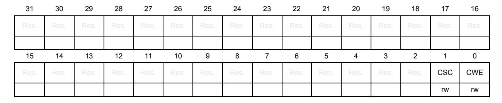

Bits 31:2 Reserved, must be kept at reset value.

Bit 1 CSC: Calibration state changed

0: Calibration state unchanged

1: Calibration state has changed

Bit 0 CWE: Calibration watchdog event

0: No calibration watchdog event

1: Calibration watchdog event occurred

## 59.7.6 Clock calibration unit interrupt enable register (FDCAN\_CCU\_IE)

Address offset: 0x0014 Reset value: 0x0000 0000

The settings in the CU interrupt enable register determine whether a status change in the

CU interrupt register is signaled on an interrupt line.

| 31   | 30   | 29   | 28   | 27   | 26   | 25            | 24   | 23   | 22   | 21            | 20   | 19   | 18   | 17       | 16   |
|------|------|------|------|------|------|---------------|------|------|------|---------------|------|------|------|----------|------|
| Res. | Res. | Res. | Res. | Res. | Res. | Res.          | Res. | Res. | Res. | Res.          | Res. | Res. | Res. | Res.     | Res. |
| 15   | 14   | 13   | 12   | 11   | 10   | 9             | 8    | 7    | 6    | 5             | 4    | 3    | 2    | 1        | 0    |
|      |      |      |      |      |      | $\overline{}$ |      | 1    | т —  | $\overline{}$ | ·    |      |      | <u> </u> |      |
| Res. | Res. | Res. | Res. | Res. | Res. | Res.          | Res. | Res. | Res. | Res.          | Res. | Res. | Res. | CSCE     | CWEE |

Bits 31:2 Reserved, must be kept at reset value.

Bit 1 CSCE: Calibration state changed enable

0: Interrupt disabled1: Interrupt enabled

Bit 0 CWEE: Calibration watchdog event enable

0: Interrupt disabled 1: Interrupt enabled

## 59.7.7 CCU register map

Table 528. CCU register map and reset values

| Offset | Register name    | 31   | 30    | 29    | 28   | 27        | 26   | 25   | 24   | 23   | 22         | 21       | 20   | 19  | 18      | 11    | 16       | 15        | 14 | 13 | 12 | 11 | 10 | 6   | œ     | 7   | 9    | 2 | 4  | 3    | 7    | 1 | 0 |
|--------|---------------------|------|-------|-------|------|-----------|------|------|------|------|------------|----------|------|-----|---------|-------|----------|-----------|----|----|----|----|----|-----|-------|-----|------|---|----|------|------|---|---|
| 0x0000 | FDCAN_ CCU_CREL  | ı    | REL   | .[3:0 | ]    | STEP[3:0  |      |      | 0]   | S    | UB9 [3: | STEP YE. |      | EAF | AR[3:0] |       | MON[7:0] |           |    |    |    | )] |    |     |       |     | [    |   |    |      |      |   |   |
|        | Reset value         | 0    | 0     | 0     | 1    | 0         | 0    | 0    | 1    | 0    | 0          | 0        | 1    | 0   | 1       | 0     | 0        | 0         | 0  | 0  | 1  | 0  | 0  | 1   | 0     | 0   | 0    | 0 | 1  | 1    | 0    | 0 | 0 |
| 0x0004 | FDCAN_ CCU_CCFG  | SWR  | Res.  | Res.  | Res. | Res.      | Res. | Res. | Res. | Res. | Res.       | Res.     | Res. | C   | DIV     | /[3:0 | )]       | OCPM[7:0] |    |    |    |    |    |     | CFL   | BCC | Res. |   | TQ | BT[4 | 4:0] |   |   |
|        | Reset value         | 0    |       |       |      |           |      |      |      |      |            |          |      | 0   | 0       | 0     | 0        | 0         | 0  | 0  | 0  | 0  | 0  | 0   | 0     | 0   | 0    | 0 | 0  | 0    | 0    | 0 | 0 |
| 0x0008 | FDCAN_ CCU_CSTAT | CALS | [1:0] | Res.  |      |           |      |      | TQ   | C[10 | 0:0]       |          |      |     |         |       |          |           |    |    |    |    | 00 | CPC | [17   | :0] |      |   |    |      |      |   |   |
|        | Reset value         | 0    | 0     |       | 0    | 0         | 0    | 0    | 0    | 0    | 0          | 0        | 0    | 0   | 0       | 0     | 0        | 0         | 0  | 0  | 0  | 0  | 0  | 0   | 0     | 0   | 0    | 0 | 0  | 0    | 0    | 0 | 0 |
| 0x000C | FDCAN_ CCU_CWD   |      |       |       |      | WDV[15:0] |      |      |      |      |            |          |      |     |         |       |          |           |    |    |    |    | W  | DC  | [15:0 | 0]  |      |   |    |      |      |   |   |
|        | Reset value         | 0    | 0     | 0     | 0    | 0         | 0    | 0    | 0    | 0    | 0          | 0        | 0    | 0   | 0       | 0     | 0        | 0         | 0  | 0  | 0  | 0  | 0  | 0   | 0     | 0   | 0    | 0 | 0  | 0    | 0    | 0 | 0 |

5

RM0399 Rev 4 2741/3556

**Table 528. CCU register map and reset values (continued)**

| Offset | Register name | 31   | 30   | 29   | 28   | 27   | 26   | 25   | 24   | 23   | 22   | 21   | 20   | 19   | 18   | 17   | 16   | 15   | 14   | 13   | 12   | 11   | 10   | 9    | 8    | 7    | 6    | 5    | 4    | 3    | 2    | 1    | 0    |
|--------|------------------|------|------|------|------|------|------|------|------|------|------|------|------|------|------|------|------|------|------|------|------|------|------|------|------|------|------|------|------|------|------|------|------|
| 0x0010 | FDCAN_ CCU_IR | Res. | Res. | Res. | Res. | Res. | Res. | Res. | Res. | Res. | Res. | Res. | Res. | Res. | Res. | Res. | Res. | Res. | Res. | Res. | Res. | Res. | Res. | Res. | Res. | Res. | Res. | Res. | Res. | Res. | Res. | CSC  | CWE  |
|        | Reset value      |      |      |      |      |      |      |      |      |      |      |      |      |      |      |      |      |      |      |      |      |      |      |      |      |      |      |      |      |      |      | 0    | 0    |
| 0x0014 | FDCAN_ CCU_IE | Res. | Res. | Res. | Res. | Res. | Res. | Res. | Res. | Res. | Res. | Res. | Res. | Res. | Res. | Res. | Res. | Res. | Res. | Res. | Res. | Res. | Res. | Res. | Res. | Res. | Res. | Res. | Res. | Res. | Res. | CSCE | CWEE |
|        | Reset value      |      |      |      |      |      |      |      |      |      |      |      |      |      |      |      |      |      |      |      |      |      |      |      |      |      |      |      |      |      |      | 0    | 0    |

Refer to *Section 2.3 on page 134* for the register boundary addresses.

