# **60 USB on-the-go high-speed (OTG\_HS)**

# **60.1 Introduction**

Portions Copyright (c) Synopsys, Inc. All rights reserved. Used with permission.

This section presents the architecture and the programming model of the OTG\_HS controller.

The following acronyms are used throughout the section:

FS Full-speed LS Low-speed HS High-speed

MAC Media access controller

OTG On-the-go

PFC Packet FIFO controller

PHY Physical layer

USB Universal serial bus

UTMI USB 2.0 Transceiver Macrocell interface (UTMI)

ULPI UTMI+ Low Pin Interface LPM Link power management BCD Battery charging detector HNP Host negotiation protocol SRP Session request protocol

References are made to the following documents:

- USB On-The-Go Supplement, Revision 2.0
- Universal Serial Bus Revision 2.0 Specification
- USB 2.0 Link Power Management Addendum Engineering Change Notice to the USB 2.0 specification, July 16, 2007
- Errata for USB 2.0 ECN: Link Power Management (LPM) 7/2007
- Battery Charging Specification, Revision 1.2

The USB OTG is a dual-role device (DRD) controller that supports both device and host functions and is fully compliant with the *On-The-Go Supplement to the USB 2.0 Specification*. It can also be configured as a host-only or device-only controller, fully compliant with the *USB 2.0 Specification.* OTG\_HS supports the speeds defined in the *[Table 529: OTG\\_HS speeds supported](#page-1-0)* below.The USB OTG supports both HNP and SRP. The only external device required is a charge pump for VBUS in OTG mode.

**Table 529. OTG\_HS speeds supported** 

<span id="page-1-0"></span>

| -           | HS (480 Mb/s) | FS (12 Mb/s) | LS (1.5 Mb/s) |
|-------------|---------------|--------------|---------------|
| Host mode   | X             | X            | X             |
| Device mode | X             | X            | -             |

# **60.2 OTG\_HS main features**

The main features can be divided into three categories: general, host-mode and devicemode features.

# **60.2.1 General features**

The OTG\_HS interface general features are the following:

- It is USB-IF certified to the Universal Serial Bus Specification Rev 2.0
- OTG\_HS supports the following PHY interfaces:
  - An on-chip full-speed PHY
  - A ULPI interface for external high-speed PHY
- It includes full support (PHY) for the optional On-The-Go (OTG) protocol detailed in the On-The-Go Supplement Rev 2.0 specification
  - Integrated support for A-B device identification (ID line)
  - Integrated support for host Negotiation protocol (HNP) and session request protocol (SRP)
  - It allows host to turn VBUS off to conserve battery power in OTG applications
  - It supports OTG monitoring of VBUS levels with internal comparators
  - It supports dynamic host-peripheral switch of role
- It is software-configurable to operate as:
  - SRP capable USB HS Peripheral (B-device)
  - SRP capable USB HS/LS host (A-device)
  - USB On-The-Go Full-Speed Dual Role device
- It supports HS SOF and LS Keep-alives with
  - SOF pulse PAD connectivity
  - SOF pulse internal connection to timer (TIMx)
  - Configurable framing period
  - Configurable end of frame interrupt
- OTG\_HS embeds an internal DMA with thresholding support and software selectable AHB burst type in DMA mode.
- It supports Descriptor-Based Scatter/Gather DMA controller for device and host mode. (Descriptor-Based Congruent-Sequential DMA is not supported). Scatter/Gather DMA operation is supported in both device and host mode. This feature will improve performance for device mode isochronous endpoints. Note that hubs (split transfers)


- are not supported in host scatter/gather DMA mode of operation. Split transfers are supported only in host buffer DMA (internal DMA) mode of operation.
- It includes power saving features such as system stop during USB suspend, switch-off of clock domains internal to the digital core, PHY and DFIFO power management.
- It features a dedicated RAM of 4 Kbytes with advanced FIFO control:
  - Configurable partitioning of RAM space into different FIFOs for flexible and efficient use of RAM
  - Each FIFO can hold multiple packets
  - Dynamic memory allocation
  - Configurable FIFO sizes that are not powers of 2 to allow the use of contiguous memory locations
- It guarantees max USB bandwidth for up to one frame (1 ms) without system intervention.
- It supports charging port detection as described in Battery Charging Specification Revision 1.2 on the FS PHY transceiver only.

# **60.2.2 Host-mode features**

The OTG\_HS interface main features and requirements in host-mode are the following:

- External charge pump for VBUS voltage generation.
- Up to 16 host channels (pipes): each channel is dynamically reconfigurable to allocate any type of USB transfer.
- Built-in hardware scheduler holding:
  - Up to 16 interrupt plus isochronous transfer requests in the periodic hardware queue
  - Up to 16 control plus bulk transfer requests in the non-periodic hardware queue
- Management of a shared Rx FIFO, a periodic Tx FIFO and a nonperiodic Tx FIFO for efficient usage of the USB data RAM.

# **60.2.3 Peripheral-mode features**

The OTG\_HS interface main features in peripheral-mode are the following:

- 1 bidirectional control endpoint0
- 8 IN endpoints (EPs) configurable to support bulk, interrupt or isochronous transfers
- 8 OUT endpoints configurable to support bulk, interrupt or isochronous transfers
- Management of a shared Rx FIFO and a Tx-OUT FIFO for efficient usage of the USB data RAM
- Management of up to 9 dedicated Tx-IN FIFOs (one for each active IN EP) to put less load on the application
- Support for the soft disconnect feature.

# **60.3 OTG\_HS implementation**

**Table 530. OTG\_HS implementation(1)**

| USB features                                     | OTG_HS1(2) | OTG_HS2(3) |
|--------------------------------------------------|------------|------------|
| Device bidirectional endpoints (including EP0)   | 9          |            |
| Host mode channels                               | 16         |            |
| Size of dedicated SRAM                           | 4 KB       |            |
| USB 2.0 link power management (LPM) support<br>X |            |            |
| OTG revision supported                           | 2.0        |            |
| Attach detection protocol (ADP) support<br>-     |            |            |
| Battery charging detection (BCD) support         | X          |            |
| ULPI available to primary IOs via, muxing        | X          | -          |
| Integrated PHY                                   | FS         | FS         |
| Scatter/gather DMA                               | X          | -          |

<sup>1. &</sup>quot;X" = supported, "-" = not supported.

# **60.4 OTG\_HS functional description**

# **60.4.1 OTG\_HS block diagram**

In STM32H7, two instances of OTG\_HS are present (OTG\_HS1 and OTG\_HS2).

Only OTG\_HS1 has an accessible ULPI interface which will allow high speed operation using an external HS transceiver.


<sup>2.</sup> Compatible with high speed operation.

<sup>3.</sup> Incompatible with high speed operation.

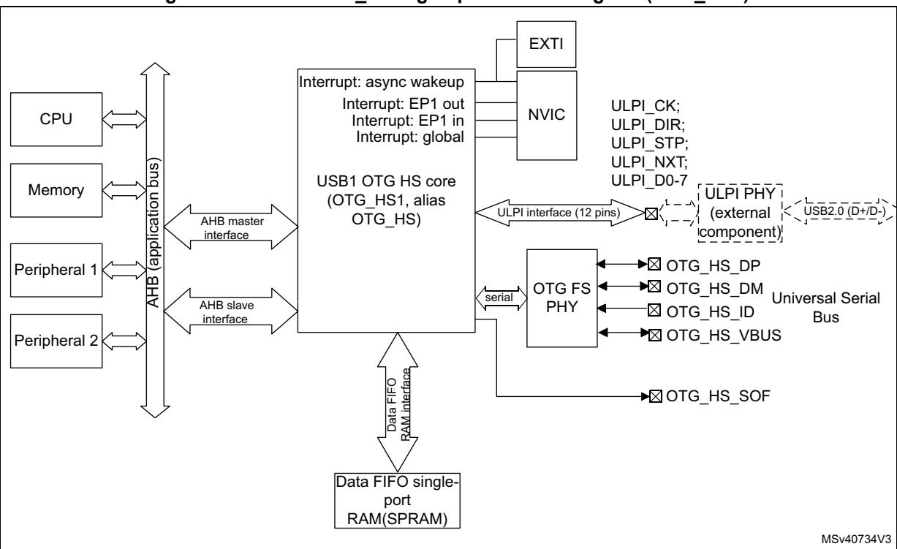

Figure 792. USB1 OTG\_HS high-speed block diagram (OTG\_HS1)


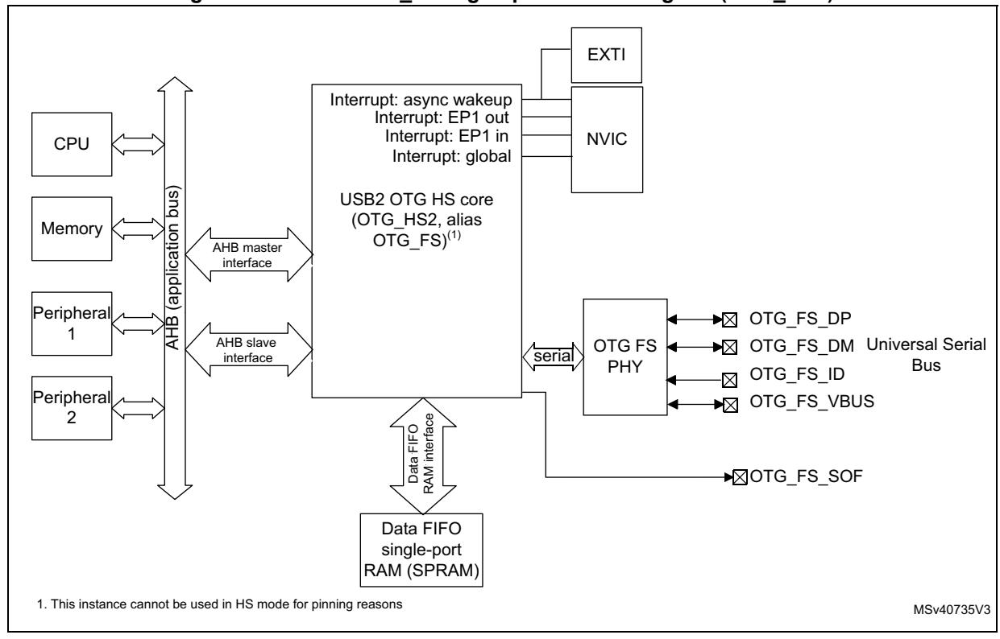

4

RM0399 Rev 4 2747/3556

# **60.4.2 OTG\_HS pin and internal signals**

**Table 531. OTG\_FS input/output pins** 

| Signal name | Signal type          | Description                         |
|-------------|----------------------|-------------------------------------|
| OTG_FS_DP   | Digital input/output | USB OTG D+ line                     |
| OTG_FS_DM   | Digital input/output | USB OTG D- line                     |
| OTG_FS_ID   | Digital input        | USB OTG ID                          |
| OTG_FS_VBUS | Analog input         | USB OTG VBUS                        |
| OTG_FS_SOF  | Digital output       | USB OTG Start Of Frame (visibility) |

### **Table 532. OTG\_HS input/output pins**

| Signal name       | Signal type          | Description                                |
|-------------------|----------------------|--------------------------------------------|
| OTG_HS_DP         | Digital input/output | USB OTG D+ line                            |
| OTG_HS_DM         | Digital input/output | USB OTG D- line                            |
| OTG_HS_ID         | Digital input        | USB OTG ID                                 |
| OTG_HS_VBUS       | Analog input         | USB OTG VBUS                               |
| OTG_HS_SOF        | Digital output       | USB OTG Start Of Frame (visibility)        |
| OTG_HS_ULPI_CK    | Digital input        | USB OTG ULPI clock                         |
| OTG_HS_ULPI_DIR   | Digital input        | USB OTG ULPI data bus direction control    |
| OTG_HS_ULPI_STP   | Digital output       | USB OTG ULPI data stream stop              |
| OTG_HS_ULPI_NXT   | Digital input        | USB OTG ULPI next data stream request      |
| OTG_HS_ULPI_D[07] | Digital input/output | USB OTG ULPI 8-bit bi-directional data bus |

### **Table 533. OTG\_HS input/output signals**

| Signal name    | Signal type<br>Description |                                                      |
|----------------|----------------------------|------------------------------------------------------|
| usb_sof        | Digital output             | USB OTG start-of-frame event for on chip peripherals |
| usb_wkup       | Digital output             | USB OTG wake-up event output                         |
| usb_gbl_it     | Digital output             | USB OTG global interrupt                             |
| usb_ep1_in_it  | Digital output             | USB OTG endpoint 1 in interrupt                      |
| usb_ep1_out_it | Digital output             | USB OTG endpoint 1 out interrupt                     |

# **60.4.3 OTG\_HS core**

The USB OTG\_HS receives the 48 MHz clock from the reset and clock controller (RCC). This clock is used for driving the 48 MHz domain at full-speed (12 Mbit/s) and must be enabled prior to configuring the OTG core.

The CPU reads and writes from/to the OTG core registers through the AHB peripheral bus. It is informed of USB events through the single USB OTG interrupt line described in *[Section 60.12: OTG\\_HS interrupts](#page-24-0)*.


The CPU submits data over the USB by writing 32-bit words to dedicated OTG locations (push registers). The data are then automatically stored into Tx-data FIFOs configured within the USB data RAM. There is one Tx FIFO push register for each in-endpoint (peripheral mode) or out-channel (host mode).

The CPU receives the data from the USB by reading 32-bit words from dedicated OTG addresses (pop registers). The data are then automatically retrieved from a shared Rx FIFO configured within the 4-Kbyte USB data RAM. There is one Rx FIFO pop register for each out-endpoint or in-channel.

The USB protocol layer is driven by the serial interface engine (SIE) and serialized over the USB by the transceiver module within the on-chip physical layer (PHY) or external HS PHY.

**Caution:** To guarantee a correct operation for the USB OTG\_HS peripheral, the AHB frequency should be higher than 30 MHz.

# **60.4.4 Embedded full-speed OTG PHY connected to OTG\_HS**

The embedded full-speed OTG PHY is controlled by the OTG\_HS core and conveys USB control & data signals through the full-speed subset of the UTMI+ Bus (UTMIFS). It provides the physical support to USB connectivity.

The full-speed OTG PHY includes the following components:

- FS/LS transceiver module used by both host and device. It directly drives transmission and reception on the single-ended USB lines.
- DP/DM integrated pull-up and pull-down resistors controlled by the OTG\_HS core depending on the current role of the device. As a peripheral, it enables the DP pull-up resistor to signal full-speed peripheral connections as soon as VBUS is sensed to be at a valid level (B-session valid). In host mode, pull-down resistors are enabled on both DP/DM. Pull-up and pull-down resistors are dynamically switched when the peripheral role is changed via the host negotiation protocol (HNP).
- Pull-up/pull-down resistor ECN circuit. The DP pull-up consists of 2 resistors controlled separately from the OTG\_HS as per the resistor Engineering Change Notice applied to USB Rev2.0. The dynamic trimming of the DP pull-up strength allows to achieve a better noise rejection and Tx/Rx signal quality.

# **60.4.5 OTG detections**

Additionally the OTG\_HS uses the following functions:

- integrated ID pull-up resistor used to sample the ID line for A/B device identification.
- VBUS sensing comparators with hysteresis used to detect VBUS valid, A-B session valid and session-end voltage thresholds. They are used to drive the session request protocol (SRP), detect valid startup and end-of-session conditions, and constantly monitor the VBUS supply during USB operations.

# **60.4.6 High-speed OTG PHY connected to OTG\_HS**

Note: Refer to implementation table to determine if an HS PHY is embedded.

The USB OTG\_HS core includes an ULPI interface to connect an external HS PHY.

Note: In case of multiple OTG\_HS instances, ULPI may not be available on each one. Refer to implementation table.


RM0399 Rev 4 2749/3556

# **60.5 OTG\_HS dual role device (DRD)**

MSv36917V2 STM32 OSC\_IN OSC\_OUT GPIO GPIO + IRQ VDD EN Overcurrent 5 V to VDD Voltage regulator(1) VDD 5 V Pwr VBUS DM DP ID VSS STMPS2141STR Current-limited power distribution switch(2) USBmicro-AB connector VBUS DM DP ID

**Figure 794. OTG\_HS A-B device connection**

- 1. External voltage regulator only needed when building a VBUS powered device.
- 2. STMPS2141STR needed only if the application has to support a VBUS powered device. A basic power switch can be used if 5 V are available on the application board.

# **60.5.1 ID line detection**

The host or peripheral (the default) role is assumed depending on the ID input pin. The ID line status is determined on plugging in the USB cable, depending on whether a MicroA or MicroB plug is connected to the micro-AB receptacle.

- If the B-side of the USB cable is connected with a floating ID wire, the integrated pullup resistor detects a high ID level and the default peripheral role is confirmed. In this configuration the OTG\_HS complies with the standard FSM described in section 4.2.4: ID pin of the On-the-Go specification Rev2.0, supplement to the USB2.0.
- If the A-side of the USB cable is connected with a grounded ID, the OTG\_HS issues an ID line status change interrupt (CIDSCHG bit in OTG\_GINTSTS) for host software initialization, and automatically switches to the host role. In this configuration the OTG\_HS complies with the standard FSM described by section 4.2.4: ID pin of the Onthe-Go specification Rev2.0, supplement to the USB2.0.

# **60.5.2 HNP dual role device**

The HNP capable bit in the Global USB configuration register (HNPCAP bit in OTG\_ GUSBCFG) enables the OTG\_HS core to dynamically change its role from A-host to Aperipheral and vice-versa, or from B-Peripheral to B-host and vice-versa according to the host negotiation protocol (HNP). The current device status can be read by the combined values of the connector ID status bit in the Global OTG control and status register (CIDSTS bit in OTG\_GOTGCTL) and the current mode of operation bit in the global interrupt and status register (CMOD bit in OTG\_GINTSTS).

The HNP program model is described in detail in *[Section 60.15: OTG\\_HS programming](#page-125-0)  [model](#page-125-0)*.


### 60.5.3 SRP dual role device

The SRP capable bit in the global USB configuration register (SRPCAP bit in OTG\_GUSBCFG) enables the OTG\_HS core to switch off the generation of  $V_{BUS}$  for the Adevice to save power. Note that the A-device is always in charge of driving  $V_{BUS}$  regardless of the host or peripheral role of the OTG\_HS.

The SRP A/B-device program model is described in detail in Section 60.15: OTG\_HS programming model.

# 60.6 OTG\_HS as a USB peripheral

This section gives the functional description of the OTG\_HS in the USB peripheral mode. The OTG\_HS works as an USB peripheral in the following circumstances:

- OTG B-Peripheral
  - OTG B-device default state if B-side of USB cable is plugged in
- OTG A-Peripheral
  - OTG A-device state after the HNP switches the OTG HS to its peripheral role
- B-device
  - If the ID line is present, functional and connected to the B-side of the USB cable, and the HNP-capable bit in the Global USB Configuration register (HNPCAP bit in OTG GUSBCFG) is cleared.
- Peripheral only
  - The force device mode bit (FDMOD) in the Section 60.14.4: OTG USB configuration register (OTG\_GUSBCFG) is set to 1, forcing the OTG\_HS core to work as an USB peripheral-only. In this case, the ID line is ignored even if it is present on the USB connector.

Note:

To build a bus-powered device implementation in case of the B-device or peripheral-only configuration, an external regulator has to be added, that generates the necessary power-supply from  $V_{BUS}$ .


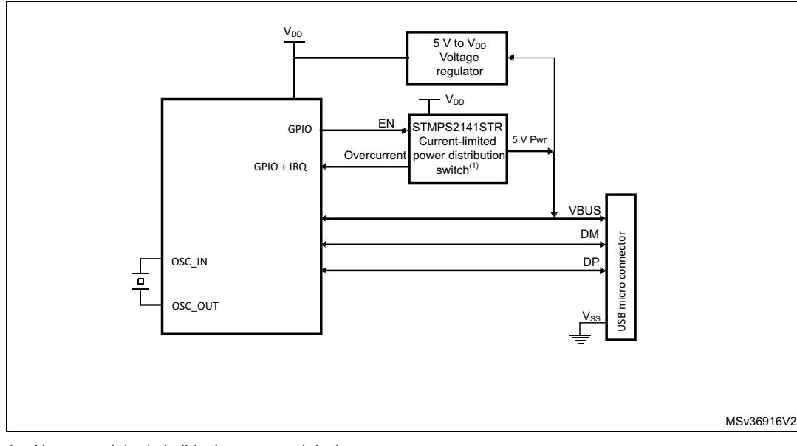

Figure 795. OTG\_HS peripheral-only connection

1. Use a regulator to build a bus-powered device.

# 60.6.1 SRP-capable peripheral

The SRP capable bit in the Global USB configuration register (SRPCAP bit in OTG\_GUSBCFG) enables the OTG\_HS to support the session request protocol (SRP). In this way, it allows the remote A-device to save power by switching off V<sub>BUS</sub> while the USB session is suspended.

The SRP peripheral mode program model is described in detail in the *B-device session request protocol* section.

# 60.6.2 Peripheral states

#### Powered state

The  $V_{BUS}$  input detects the B-session valid voltage by which the USB peripheral is allowed to enter the powered state (see USB2.0 section 9.1). The OTG\_HS then automatically connects the DP pull-up resistor to signal full-speed device connection to the host and generates the session request interrupt (SRQINT bit in OTG\_GINTSTS) to notify the powered state.

The  $V_{BUS}$  input also ensures that valid  $V_{BUS}$  levels are supplied by the host during USB operations. If a drop in  $V_{BUS}$  below B-session valid happens to be detected (for instance because of a power disturbance or if the host port has been switched off), the OTG\_HS automatically disconnects and the session end detected (SEDET bit in OTG\_GOTGINT) interrupt is generated to notify that the OTG\_HS has exited the powered state.

In the powered state, the OTG\_HS expects to receive some reset signaling from the host. No other USB operation is possible. When a reset signaling is received the reset detected interrupt (USBRST in OTG\_GINTSTS) is generated. When the reset signaling is complete, the enumeration done interrupt (ENUMDNE bit in OTG\_GINTSTS) is generated and the OTG\_HS enters the Default state.

# **Soft disconnect**

The powered state can be exited by software with the soft disconnect feature. The DP pullup resistor is removed by setting the soft disconnect bit in the device control register (SDIS bit in OTG\_DCTL), causing a device disconnect detection interrupt on the host side even though the USB cable was not really removed from the host port.

# **Default state**

In the Default state the OTG\_HS expects to receive a SET\_ADDRESS command from the host. No other USB operation is possible. When a valid SET\_ADDRESS command is decoded on the USB, the application writes the corresponding number into the device address field in the device configuration register (DAD bit in OTG\_DCFG). The OTG\_HS then enters the address state and is ready to answer host transactions at the configured USB address.

# **Suspended state**

The OTG\_HS peripheral constantly monitors the USB activity. After counting 3 ms of USB idleness, the early suspend interrupt (ESUSP bit in OTG\_GINTSTS) is issued, and confirmed 3 ms later, if appropriate, by the suspend interrupt (USBSUSP bit in OTG\_GINTSTS). The device suspend bit is then automatically set in the device status register (SUSPSTS bit in OTG\_DSTS) and the OTG\_HS enters the suspended state.

The suspended state may optionally be exited by the device itself. In this case the application sets the remote wake-up signaling bit in the device control register (RWUSIG bit in OTG\_DCTL) and clears it after 1 to 15 ms.

When a resume signaling is detected from the host, the resume interrupt (WKUPINT bit in OTG\_GINTSTS) is generated and the device suspend bit is automatically cleared.

# **60.6.3 Peripheral endpoints**

The OTG\_HS core instantiates the following USB endpoints:

- Control endpoint 0:
  - Bidirectional and handles control messages only
    - Separate set of registers to handle in and out transactions
    - Proper control (OTG\_DIEPCTL0/OTG\_DOEPCTL0), transfer configuration (OTG\_DIEPTSIZ0/OTG\_DOEPTSIZ0), and status-interrupt (OTG\_DIEPINT0/)OTG\_DOEPINT0) registers. The available set of bits inside the control and transfer size registers slightly differs from that of other endpoints
- 8 IN endpoints
  - Each of them can be configured to support the isochronous, bulk or interrupt transfer type
  - Each of them has proper control (OTG\_DIEPCTL*x*), transfer configuration (OTG\_DIEPTSIZ*x*), and status-interrupt (OTG\_DIEPINT*x*) registers
  - The device IN endpoints common interrupt mask register (OTG\_DIEPMSK) is available to enable/disable a single kind of endpoint interrupt source on all of the IN endpoints (EP0 included)
  - Support for incomplete isochronous IN transfer interrupt (IISOIXFR bit in OTG\_GINTSTS), asserted when there is at least one isochronous IN endpoint on

which the transfer is not completed in the current frame. This interrupt is asserted along with the end of periodic frame interrupt (OTG\_GINTSTS/EOPF).

- 8 OUT endpoints
  - Each of them can be configured to support the isochronous, bulk or interrupt transfer type
  - Each of them has a proper control (OTG\_DOEPCTL*x*), transfer configuration (OTG\_DOEPTSIZ*x*) and status-interrupt (OTG\_DOEPINT*x*) register
  - Device OUT endpoints common interrupt mask register (OTG\_DOEPMSK) is available to enable/disable a single kind of endpoint interrupt source on all of the OUT endpoints (EP0 included)
  - Support for incomplete isochronous OUT transfer interrupt (INCOMPISOOUT bit in OTG\_GINTSTS), asserted when there is at least one isochronous OUT endpoint on which the transfer is not completed in the current frame. This interrupt is asserted along with the end of periodic frame interrupt (OTG\_GINTSTS/EOPF).

# **Endpoint control**

- The following endpoint controls are available to the application through the device endpoint-*x* IN/OUT control register (OTG\_DIEPCTL*x*/OTG\_DOEPCTL*x*):
  - Endpoint enable/disable
  - Endpoint activate in current configuration
  - Program USB transfer type (isochronous, bulk, interrupt)
  - Program supported packet size
  - Program Tx FIFO number associated with the IN endpoint
  - Program the expected or transmitted data0/data1 PID (bulk/interrupt only)
  - Program the even/odd frame during which the transaction is received or transmitted (isochronous only)
  - Optionally program the NAK bit to always negative-acknowledge the host regardless of the FIFO status
  - Optionally program the STALL bit to always stall host tokens to that endpoint
  - Optionally program the SNOOP mode for OUT endpoint not to check the CRC field of received data

# **Endpoint transfer**

The device endpoint-*x* transfer size registers (OTG\_DIEPTSIZ*x*/OTG\_DOEPTSIZ*x*) allow the application to program the transfer size parameters and read the transfer status. Programming must be done before setting the endpoint enable bit in the endpoint control register. Once the endpoint is enabled, these fields are read-only as the OTG\_HS core updates them with the current transfer status.

The following transfer parameters can be programmed:

- Transfer size in bytes
- Number of packets that constitute the overall transfer size

# **Endpoint status/interrupt**

The device endpoint-*x* interrupt registers (OTG\_DIEPINT*x*/OTG\_DOPEPINT*x)* indicate the status of an endpoint with respect to USB- and AHB-related events. The application must read these registers when the OUT endpoint interrupt bit or the IN endpoint interrupt bit in


the core interrupt register (OEPINT bit in OTG\_GINTSTS or IEPINT bit in OTG\_GINTSTS, respectively) is set. Before the application can read these registers, it must first read the device all endpoints interrupt (OTG\_DAINT) register to get the exact endpoint number for the device endpoint-*x* interrupt register. The application must clear the appropriate bit in this register to clear the corresponding bits in the OTG\_DAINT and OTG\_GINTSTS registers

The peripheral core provides the following status checks and interrupt generation:

- Transfer completed interrupt, indicating that data transfer was completed on both the application (AHB) and USB sides
- Setup stage has been done (control-out only)
- Associated transmit FIFO is half or completely empty (in endpoints)
- NAK acknowledge has been transmitted to the host (isochronous-in only)
- IN token received when Tx FIFO was empty (bulk-in/interrupt-in only)
- Out token received when endpoint was not yet enabled
- Babble error condition has been detected
- Endpoint disable by application is effective
- Endpoint NAK by application is effective (isochronous-in only)
- More than 3 back-to-back setup packets were received (control-out only)
- Timeout condition detected (control-in only)
- Isochronous out packet has been dropped, without generating an interrupt

# **60.7 OTG\_HS as a USB host**

This section gives the functional description of the OTG\_HS in the USB host mode. The OTG\_HS works as a USB host in the following circumstances:

- OTG A-host
  - OTG A-device default state when the A-side of the USB cable is plugged in
- OTG B-host
  - OTG B-device after HNP switching to the host role
- A-device
  - If the ID line is present, functional and connected to the A-side of the USB cable, and the HNP-capable bit is cleared in the Global USB Configuration register (HNPCAP bit in OTG\_GUSBCFG). Integrated pull-down resistors are automatically set on the DP/DM lines.
- Host only
  - The force host mode bit (FHMOD) in the *[OTG USB configuration register](#page-37-0)  [\(OTG\\_GUSBCFG\)](#page-37-0)* forces the OTG\_HS core to work as a USB host-only. In this case, the ID line is ignored even if present on the USB connector. Integrated pulldown resistors are automatically set on the DP/DM lines.

*Note: On-chip 5 V VBUS generation is not supported. For this reason, a charge pump or, if 5 V are available on the application board, a basic power switch must be added externally to drive the 5 V VBUS line. The external charge pump can be driven by any GPIO output. This is required for the OTG A-host, A-device and host-only configurations.*


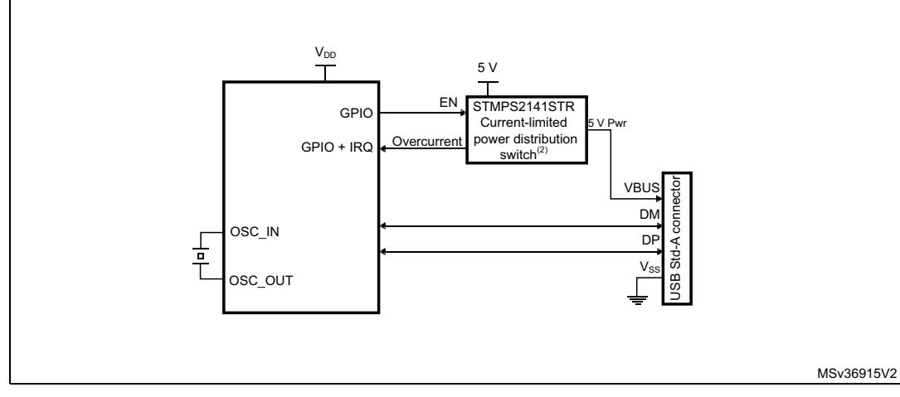

Figure 796. OTG\_HS host-only connection

1.  $V_{DD}$  range is between 2 V and 3.6 V.

# 60.7.1 SRP-capable host

SRP support is available through the SRP capable bit in the global USB configuration register (SRPCAP bit in OTG\_GUSBCFG). With the SRP feature enabled, the host can save power by switching off the  $V_{BUS}$  power while the USB session is suspended.

The SRP host mode program model is described in detail in the *A-device session request protocol*) section.

### 60.7.2 USB host states

#### Host port power

On-chip 5 V  $V_{BUS}$  generation is not supported. For this reason, a charge pump or, if 5 V are available on the application board, a basic power switch, must be added externally to drive the 5 V  $V_{BUS}$  line. The external charge pump can be driven by any GPIO output or via an  $I^2C$  interface connected to an external PMIC (power management IC). When the application decides to power on  $V_{BUS}$ , it must also set the port power bit in the host port control and status register (PPWR bit in OTG HPRT).

# V<sub>BUS</sub> valid

When HNP or SRP is enabled the VBUS sensing pin must be connected to  $V_{BUS}$ . The  $V_{BUS}$  input ensures that valid  $V_{BUS}$  levels are supplied by the charge pump during USB operations. Any unforeseen  $V_{BUS}$  voltage drop below the  $V_{BUS}$  valid threshold (4.4 V) leads to an OTG interrupt triggered by the session end detected bit (SEDET bit in OTG\_GOTGINT). The application is then required to remove the  $V_{BUS}$  power and clear the port power bit.

When HNP and SRP are both disabled, the VBUS sensing pin does not need to be connected to  $V_{\text{BUS}}$ .

The charge pump overcurrent flag can also be used to prevent electrical damage. Connect the overcurrent flag output from the charge pump to any GPIO input and configure it to generate a port interrupt on the active level. The overcurrent ISR must promptly disable the  $V_{\rm BLIS}$  generation and clear the port power bit.


### Host detection of a peripheral connection

If SRP or HNP are enabled, even if USB peripherals or B-devices can be attached at any time, the OTG\_HS does not detect any bus connection until  $V_{BUS}$  is no longer sensed at a valid level (5 V). When  $V_{BUS}$  is at a valid level and a remote B-device is attached, the OTG\_HS core issues a host port interrupt triggered by the device connected bit in the host port control and status register (PCDET bit in OTG\_HPRT).

When HNP and SRP are both disabled, USB peripherals or B-device are detected as soon as they are connected. The OTG\_HS core issues a host port interrupt triggered by the device connected bit in the host port control and status (PCDET bit in OTG\_HPRT).

# Host detection of peripheral a disconnection

The peripheral disconnection event triggers the disconnect detected interrupt (DISCINT bit in OTG\_GINTSTS).

#### Host enumeration

After detecting a peripheral connection the host must start the enumeration process by sending USB reset and configuration commands to the new peripheral.

Before starting to drive a USB reset, the application waits for the OTG interrupt triggered by the debounce done bit (DBCDNE bit in OTG\_GOTGINT), which indicates that the bus is stable again after the electrical debounce caused by the attachment of a pull-up resistor on DP (FS) or DM (LS).

The application drives a USB reset signaling (single-ended zero) over the USB by keeping the port reset bit set in the host port control and status register (PRST bit in OTG\_HPRT) for a minimum of 10 ms and a maximum of 20 ms. The application takes care of the timing count and then of clearing the port reset bit.

Once the USB reset sequence has completed, the host port interrupt is triggered by the port enable/disable change bit (PENCHNG bit in OTG\_HPRT). This informs the application that the speed of the enumerated peripheral can be read from the port speed field in the host port control and status register (PSPD bit in OTG\_HPRT) and that the host is starting to drive SOFs (FS) or Keep alives (LS). The host is now ready to complete the peripheral enumeration by sending peripheral configuration commands.

# Host suspend

The application decides to suspend the USB activity by setting the port suspend bit in the host port control and status register (PSUSP bit in OTG\_HPRT). The OTG\_HS core stops sending SOFs and enters the suspended state.

The suspended state can be optionally exited on the remote device's initiative (remote wake-up). In this case the remote wake-up interrupt (WKUPINT bit in OTG\_GINTSTS) is generated upon detection of a remote wake-up signaling, the port resume bit in the host port control and status register (PRES bit in OTG\_HPRT) self-sets, and resume signaling is automatically driven over the USB. The application must time the resume window and then clear the port resume bit to exit the suspended state and restart the SOF.

If the suspended state is exited on the host initiative, the application must set the port resume bit to start resume signaling on the host port, time the resume window and finally clear the port resume bit.


RM0399 Rev 4 2757/3556

# **60.7.3 Host channels**

The OTG\_HS core instantiates 16 host channels. Each host channel supports an USB host transfer (USB pipe). The host is not able to support more than 16 transfer requests at the same time. If more than 16 transfer requests are pending from the application, the host controller driver (HCD) must re-allocate channels when they become available from previous duty, that is, after receiving the transfer completed and channel halted interrupts.

Each host channel can be configured to support in/out and any type of periodic/nonperiodic transaction. Each host channel makes us of proper control (OTG\_HCCHAR*x*), transfer configuration (OTG\_HCTSIZ*x*) and status/interrupt (OTG\_HCINT*x*) registers with associated mask (OTG\_HCINTMSK*x*) registers.

# **Host channel control**

- The following host channel controls are available to the application through the host channel-*x* characteristics register (OTG\_HCCHAR*x*):
  - Channel enable/disable
  - Program the HS/FS/LS speed of target USB peripheral
  - Program the address of target USB peripheral
  - Program the endpoint number of target USB peripheral
  - Program the transfer IN/OUT direction
  - Program the USB transfer type (control, bulk, interrupt, isochronous)
  - Program the maximum packet size (MPS)
  - Program the periodic transfer to be executed during odd/even frames

# **Host channel transfer**

The host channel transfer size registers (OTG\_HCTSIZ*x*) allow the application to program the transfer size parameters, and read the transfer status. Programming must be done before setting the channel enable bit in the host channel characteristics register. Once the endpoint is enabled the packet count field is read-only as the OTG\_HS core updates it according to the current transfer status.

- The following transfer parameters can be programmed:
  - transfer size in bytes
  - number of packets making up the overall transfer size
  - initial data PID

# **Host channel status/interrupt**

The host channel-*x* interrupt register (OTG\_HCINT*x*) indicates the status of an endpoint with respect to USB- and AHB-related events. The application must read these register when the host channels interrupt bit in the core interrupt register (HCINT bit in OTG\_GINTSTS) is set. Before the application can read these registers, it must first read the host all channels interrupt (OTG\_HAINT) register to get the exact channel number for the host channel-x interrupt register. The application must clear the appropriate bit in this register to clear the corresponding bits in the OTG\_HAINT and OTG\_GINTSTS registers.


The mask bits for each interrupt source of each channel are also available in the OTG\_HCINTMSKx register.

- The host core provides the following status checks and interrupt generation:
  - Transfer completed interrupt, indicating that the data transfer is complete on both the application (AHB) and USB sides
  - Channel has stopped due to transfer completed, USB transaction error or disable command from the application
  - Associated transmit FIFO is half or completely empty (IN endpoints)
  - ACK response received
  - NAK response received
  - STALL response received
  - USB transaction error due to CRC failure, timeout, bit stuff error, false EOP
  - Babble error
  - frame overrun
  - data toggle error

# **60.7.4 Host scheduler**

The host core features a built-in hardware scheduler which is able to autonomously re-order and manage the USB transaction requests posted by the application. At the beginning of each frame the host executes the periodic (isochronous and interrupt) transactions first, followed by the nonperiodic (control and bulk) transactions to achieve the higher level of priority granted to the isochronous and interrupt transfer types by the USB specification.

The host processes the USB transactions through request queues (one for periodic and one for nonperiodic). Each request queue can hold up to 8 entries. Each entry represents a pending transaction request from the application, and holds the IN or OUT channel number along with other information to perform a transaction on the USB. The order in which the requests are written to the queue determines the sequence of the transactions on the USB interface.

At the beginning of each frame, the host processes the periodic request queue first, followed by the nonperiodic request queue. The host issues an incomplete periodic transfer interrupt (IPXFR bit in OTG\_GINTSTS) if an isochronous or interrupt transaction scheduled for the current frame is still pending at the end of the current frame. The OTG\_HS core is fully responsible for the management of the periodic and nonperiodic request queues.The periodic transmit FIFO and queue status register (OTG\_HPTXSTS) and nonperiodic transmit FIFO and queue status register (OTG\_HNPTXSTS) are read-only registers which can be used by the application to read the status of each request queue. They contain:

- The number of free entries currently available in the periodic (nonperiodic) request queue (8 max)
- Free space currently available in the periodic (nonperiodic) Tx FIFO (out-transactions)
- IN/OUT token, host channel number and other status information.

As request queues can hold a maximum of 8 entries each, the application can push to schedule host transactions in advance with respect to the moment they physically reach the SB for a maximum of 8 pending periodic transactions plus 8 pending non-periodic transactions.

To post a transaction request to the host scheduler (queue) the application must check that there is at least 1 entry available in the periodic (nonperiodic) request queue by reading the


PTXQSAV bits in the OTG\_HNPTXSTS register or NPTQXSAV bits in the OTG\_HNPTXSTS register.

# **60.8 OTG\_HS SOF trigger**

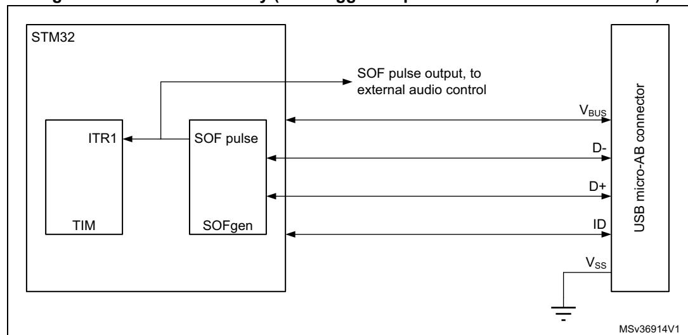

**Figure 797. SOF connectivity (SOF trigger output to TIM and ITR1 connection)**

The OTG\_HS core provides means to monitor, track and configure SOF framing in the host and peripheral, as well as an SOF pulse output connectivity feature.

Such utilities are especially useful for adaptive audio clock generation techniques, where the audio peripheral needs to synchronize to the isochronous stream provided by the PC, or the host needs to trim its framing rate according to the requirements of the audio peripheral.

# **60.8.1 Host SOFs**

In host mode the number of PHY clocks occurring between the generation of two consecutive SOF (HS/FS) or Keep-alive (LS) tokens is programmable in the host frame interval register (HFIR), thus providing application control over the SOF framing period. An interrupt is generated at any start of frame (SOF bit in OTG\_GINTSTS). The current frame number and the time remaining until the next SOF are tracked in the host frame number register (HFNUM).

A SOF pulse signal, is generated at any SOF starting token and with a width of 20 HCLK cycles. The SOF pulse is also internally connected to the input trigger of the timer, so that the input capture feature, the output compare feature and the timer can be triggered by the SOF pulse.

# **60.8.2 Peripheral SOFs**

In device mode, the start of frame interrupt is generated each time an SOF token is received on the USB (SOF bit in OTG\_GINTSTS). The corresponding frame number can be read from the device status register (FNSOF bit in OTG\_DSTS). A SOF pulse signal with a width of 20 HCLK cycles is also generated.The SOF pulse signal is also internally connected to the TIM input trigger, so that the input capture feature, the output compare feature and the timer can be triggered by the SOF pulse.


The end of periodic frame interrupt (OTG\_GINTSTS/EOPF) is used to notify the application when 80%, 85%, 90% or 95% of the time frame interval elapsed depending on the periodic frame interval field in the device configuration register (PFIVL bit in OTG\_DCFG). This feature can be used to determine if all of the isochronous traffic for that frame is complete.

# **60.9 OTG\_HS low-power modes**

*[Table 534](#page-18-0)* below defines the STM32 low power modes and their compatibility with the OTG.

<span id="page-18-0"></span>**Mode Description USB compatibility** Run MCU fully active Required when USB not in suspend state. Sleep USB suspend exit causes the device to exit Sleep mode. Peripheral registers content is kept. Available while USB is in suspend state. Stop USB suspend exit causes the device to exit Stop mode. Peripheral registers content is kept(1). Available while USB is in suspend state. Standby Powered-down. The peripheral must be reinitialized after exiting Standby mode. Not compatible with USB applications.

**Table 534. Compatibility of STM32 low power modes with the OTG** 

The following bits and procedures reduce power consumption.

The power consumption of the OTG PHY is controlled by two or three bits in the general core configuration register, depending on OTG revision supported.

- PHY power down (OTG\_GCCFG/PWRDWN) It switches on/off the full-speed transceiver module of the PHY. It must be preliminarily set to allow any USB operation
- VBUS detection enable (OTG\_GCCFG/VBDEN) It switches on/off the VBUS sensing comparators associated with OTG operations

Power reduction techniques are available while in the USB suspended state, when the USB session is not yet valid or the device is disconnected.

- Stop PHY clock (STPPCLK bit in OTG\_PCGCCTL)
  - When setting the stop PHY clock bit in the clock gating control register, most of the 48 MHz clock domain internal to the OTG core is switched off by clock gating. The dynamic power consumption due to the USB clock switching activity is cut even if the 48 MHz clock input is kept running by the application
  - Most of the transceiver is also disabled, and only the part in charge of detecting the asynchronous resume or remote wake-up event is kept alive.
- Gate HCLK (GATEHCLK bit in OTG\_PCGCCTL)
  - When setting the Gate HCLK bit in the clock gating control register, most of the system clock domain internal to the OTG\_HS core is switched off by clock gating. Only the register read and write interface is kept alive. The dynamic power consumption due to


<sup>1.</sup> Within Stop mode there are different possible settings. Some restrictions may also exist, refer to *Section 7: Power control (PWR)* to understand which (if any) restrictions apply when using OTG.

the USB clock switching activity is cut even if the system clock is kept running by the application for other purposes.

USB system stop

When the OTG HS is in the USB suspended state, the application may decide to drastically reduce the overall power consumption by a complete shut down of all the clock sources in the system. USB System Stop is activated by first setting the Stop PHY clock bit and then configuring the system deep sleep mode in the power control system module (PWR).

The OTG HS core automatically reactivates both system and USB clocks by asynchronous detection of remote wake-up (as an host) or resume (as a device) signaling on the USB.

To save dynamic power, the USB data FIFO is clocked only when accessed by the OTG HS core.

#### 60.10 OTG\_HS Dynamic update of the OTG HFIR register

The USB core embeds a dynamic trimming capability of micro-SOF framing period in host mode allowing to synchronize an external device with the micro-SOF frames.

When the OTG\_HFIR register is changed within a current micro-SOF frame, the SOF period correction is applied in the next frame as described in Figure 798.

For a dynamic update, it is required to set RLDCTRL=1.

<span id="page-19-0"></span>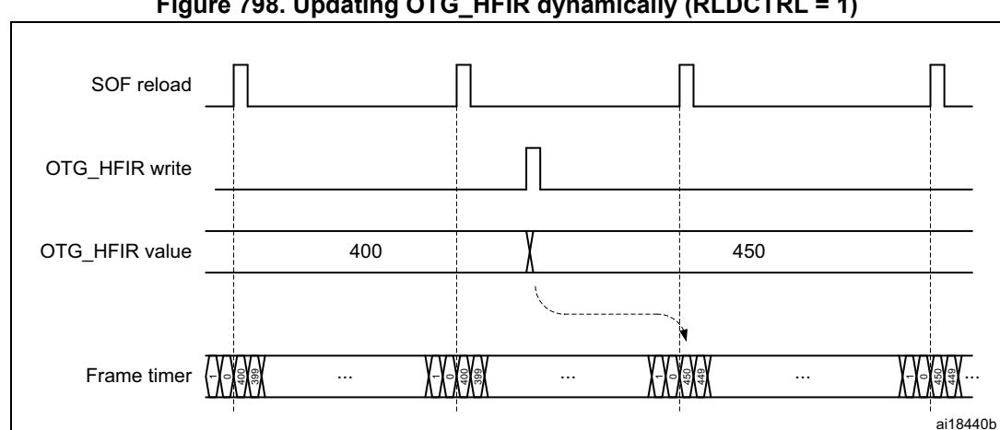

Figure 798. Updating OTG\_HFIR dynamically (RLDCTRL = 1)

#### 60.11 OTG\_HS data FIFOs

The USB system features 4 Kbytes of dedicated RAM with a sophisticated FIFO control mechanism. The packet FIFO controller module in the OTG HS core organizes RAM space into Tx FIFOs into which the application pushes the data to be temporarily stored before the USB transmission, and into a single Rx FIFO where the data received from the USB are temporarily stored before retrieval (popped) by the application. The number of instructed FIFOs and how these are organized inside the RAM depends on the device's role. In peripheral mode an additional Tx FIFO is instructed for each active IN endpoint. Any FIFO size is software configured to better meet the application requirements.

# 60.11.1 Peripheral FIFO architecture

Single data FIFO IN endpoint Tx FIFO #x Dedicated Tx OTG DIEPTXFx[31:16] Tx FIFO #x FIFO #x control DFIFO push access packet from AHB (optional) OTG DIEPTXFx[15:0] -MAC pop Dedicated Tx OTG DIEPTXF1[31:16] IN endpoint Tx FIFO #1 Tx FIFO #1 FIFO #1 control DFIFO push access packet OTG DIEPTXF1[15:0] from AHB (optional) -MAC pop IN endpoint Tx FIFO #0 Dedicated Tx OTG DIEPTXF0[31:16] Tx FIFO #0 DFIFO push access FIFO #0 control packet from AHB (optional) OTG DIEPTXF0[15:0] -MAC pop-Any OUT endpoint Dedicated Tx FIFO #1 control OTG GRXFSIZ[15:0] DFIFO pop access Rx packets from AHB (optional) -MAC push A1=0 (Rx start address fixed to 0) MSv36929V1

Figure 799. Device-mode FIFO address mapping and AHB FIFO access mapping

# Peripheral Rx FIFO

The OTG peripheral uses a single receive FIFO that receives the data directed to all OUT endpoints. Received packets are stacked back-to-back until free space is available in the Rx FIFO. The status of the received packet (which contains the OUT endpoint destination number, the byte count, the data PID and the validity of the received data) is also stored by the core on top of the data payload. When no more space is available, host transactions are NACKed and an interrupt is received on the addressed endpoint. The size of the receive FIFO is configured in the receive FIFO size register (OTG\_GRXFSIZ).

The single receive FIFO architecture makes it more efficient for the USB peripheral to fill in the receive RAM buffer:

- All OUT endpoints share the same RAM buffer (shared FIFO)
- The OTG\_HS core can fill in the receive FIFO up to the limit for any host sequence of OUT tokens

The application keeps receiving the Rx FIFO non-empty interrupt (RXFLVL bit in OTG\_GINTSTS) as long as there is at least one packet available for download. It reads the packet information from the receive status read and pop register (OTG\_GRXSTSP) and finally pops data off the receive FIFO by reading from the endpoint-related pop address.

# **Peripheral Tx FIFOs**

The core has a dedicated FIFO for each IN endpoint. The application configures FIFO sizes by writing the endpoint 0 transmit FIFO size register (OTG\_DIEPTXF0) for IN endpoint0 and the device IN endpoint transmit FIFOx registers (OTG\_DIEPTXFx) for IN endpoint-x.

# **60.11.2 Host FIFO architecture**

**Figure 800. Host-mode FIFO address mapping and AHB FIFO access mapping** MSv36930V1 OTG\_HNPTXFSIZ[31:16] Rx FIFO control Any channel DFIFO pop access from AHB Rx packets OTG\_GRXFSIZ[15:0] MAC push Rx start address fixed to 0 A1=0 Single data FIFO OTG\_HNPTXFSIZ[15:0] Non-periodic Tx FIFO control Any non-periodic channel DFIFO push access from AHB Non-periodic Tx packets MAC pop OTG\_HPTXFSIZ[31:16] OTG\_HPTXFSIZ[15:0] Periodic Tx FIFO control (optional) Any periodic channel DFIFO push access from AHB Periodic Tx packets MAC pop

# **Host Rx FIFO**

The host uses one receiver FIFO for all periodic and nonperiodic transactions. The FIFO is used as a receive buffer to hold the received data (payload of the received packet) from the USB until it is transferred to the system memory. Packets received from any remote IN endpoint are stacked back-to-back until free space is available. The status of each received packet with the host channel destination, byte count, data PID and validity of the received data are also stored into the FIFO. The size of the receive FIFO is configured in the receive FIFO size register (OTG\_GRXFSIZ).

The single receive FIFO architecture makes it highly efficient for the USB host to fill in the receive data buffer:

- All IN configured host channels share the same RAM buffer (shared FIFO)
- The OTG\_HS core can fill in the receive FIFO up to the limit for any sequence of IN tokens driven by the host software

The application receives the Rx FIFO not-empty interrupt as long as there is at least one packet available for download. It reads the packet information from the receive status read and pop register and finally pops the data off the receive FIFO.

# **Host Tx FIFOs**

The host uses one transmit FIFO for all non-periodic (control and bulk) OUT transactions and one transmit FIFO for all periodic (isochronous and interrupt) OUT transactions. FIFOs are used as transmit buffers to hold the data (payload of the transmit packet) to be transmitted over the USB. The size of the periodic (nonperiodic) Tx FIFO is configured in the host periodic (nonperiodic) transmit FIFO size OTG\_HPTXFSIZ / OTG\_HNPTXFSIZ) register.

The two Tx FIFO implementation derives from the higher priority granted to the periodic type of traffic over the USB frame. At the beginning of each frame, the built-in host scheduler processes the periodic request queue first, followed by the nonperiodic request queue.

The two transmit FIFO architecture provides the USB host with separate optimization for periodic and nonperiodic transmit data buffer management:

- All host channels configured to support periodic (nonperiodic) transactions in the OUT direction share the same RAM buffer (shared FIFOs)
- The OTG\_HS core can fill in the periodic (nonperiodic) transmit FIFO up to the limit for any sequence of OUT tokens driven by the host software

The OTG\_HS core issues the periodic Tx FIFO empty interrupt (PTXFE bit in OTG\_GINTSTS) as long as the periodic Tx FIFO is half or completely empty, depending on the value of the periodic Tx FIFO empty level bit in the AHB configuration register (PTXFELVL bit in OTG\_GAHBCFG). The application can push the transmission data in advance as long as free space is available in both the periodic Tx FIFO and the periodic request queue. The host periodic transmit FIFO and queue status register (OTG\_HPTXSTS) can be read to know how much space is available in both.

OTG\_HS core issues the non periodic Tx FIFO empty interrupt (NPTXFE bit in OTG\_GINTSTS) as long as the nonperiodic Tx FIFO is half or completely empty depending on the non periodic Tx FIFO empty level bit in the AHB configuration register (TXFELVL bit in OTG\_GAHBCFG). The application can push the transmission data as long as free space is available in both the nonperiodic Tx FIFO and nonperiodic request queue. The host nonperiodic transmit FIFO and queue status register (OTG\_HNPTXSTS) can be read to know how much space is available in both.

# **60.11.3 FIFO RAM allocation**

# **Device mode**

**Receive FIFO RAM allocation:** the application must allocate RAM for SETUP packets:

- 10 locations must be reserved in the receive FIFO to receive SETUP packets on control endpoint. The core does not use these locations, which are reserved for SETUP packets, to write any other data.
- One location is to be allocated for Global OUT NAK.
- Status information is written to the FIFO along with each received packet. Therefore, a minimum space of (largest packet size / 4) + 1 must be allocated to receive packets. If multiple isochronous endpoints are enabled, then at least two (largest packet size / 4) + 1 spaces must be allocated to receive back-to-back packets. Typically, two (largest packet size / 4) + 1 spaces are recommended so that when the previous packet is being transferred to the CPU, the USB can receive the subsequent packet.
- Along with the last packet for each endpoint, transfer complete status information is also pushed to the FIFO. One location for each OUT endpoint is recommended.


Device RxFIFO =

(5 \* number of control endpoints + 8) + ((largest USB packet used / 4) + 1 for status information) + (2 \* number of OUT endpoints) + 1 for Global NAK

Example: The MPS is 1,024 bytes for a periodic USB packet and 512 bytes for a nonperiodic USB packet. There are three OUT endpoints, three IN endpoints, one control endpoint, and three host channels.

Device RxFIFO = (5 \* 1 + 8) + ((1,024 / 4) +1) + (2 \* 4) + 1 = 279

**Transmit FIFO RAM allocation:** the minimum RAM space required for each IN endpoint Transmit FIFO is the maximum packet size for that particular IN endpoint.

*Note: More space allocated in the transmit IN endpoint FIFO results in better performance on the USB.* 

# **Host mode**

Receive FIFO RAM allocation:

Status information is written to the FIFO along with each received packet. Therefore, a minimum space of (largest packet size / 4) + 1 must be allocated to receive packets. If multiple isochronous channels are enabled, then at least two (largest packet size / 4) + 1 spaces must be allocated to receive back-to-back packets. Typically, two (largest packet size / 4) + 1 spaces are recommended so that when the previous packet is being transferred to the CPU, the USB can receive the subsequent packet.

Along with the last packet in the host channel, transfer complete status information is also pushed to the FIFO. So one location must be allocated for this.

Host RxFIFO = (largest USB packet used / 4) + 1 for status information + 1 transfer complete

Example: Host RxFIFO = ((1,024 / 4) + 1) + 1 = 258

Transmit FIFO RAM allocation:

The minimum amount of RAM required for the host Non-periodic Transmit FIFO is the largest maximum packet size among all supported non-periodic OUT channels.

Typically, two largest packet sizes worth of space is recommended, so that when the current packet is under transfer to the USB, the CPU can get the next packet.

Non-Periodic TxFIFO = largest non-periodic USB packet used / 4

Example: Non-Periodic TxFIFO = (512 / 4) = 128

The minimum amount of RAM required for host periodic Transmit FIFO is the largest maximum packet size out of all the supported periodic OUT channels. If there is at least one isochronous OUT endpoint, then the space must be at least two times the maximum packet size of that channel.

Host Periodic TxFIFO = largest periodic USB packet used / 4

Example: Host Periodic TxFIFO = (1,024 / 4) = 256

*Note: More space allocated in the Transmit Non-periodic FIFO results in better performance on the USB.*

# <span id="page-24-0"></span>**60.12 OTG\_HS interrupts**

When the OTG\_HS controller is operating in one mode, either device or host, the application must not access registers from the other mode. If an illegal access occurs, a mode mismatch interrupt is generated and reflected in the core interrupt register (MMIS bit in the OTG\_GINTSTS register). When the core switches from one mode to the other, the registers in the new mode of operation must be reprogrammed as they would be after a power-on reset.

*[Figure 801](#page-25-0)* shows the interrupt hierarchy.


<span id="page-25-0"></span>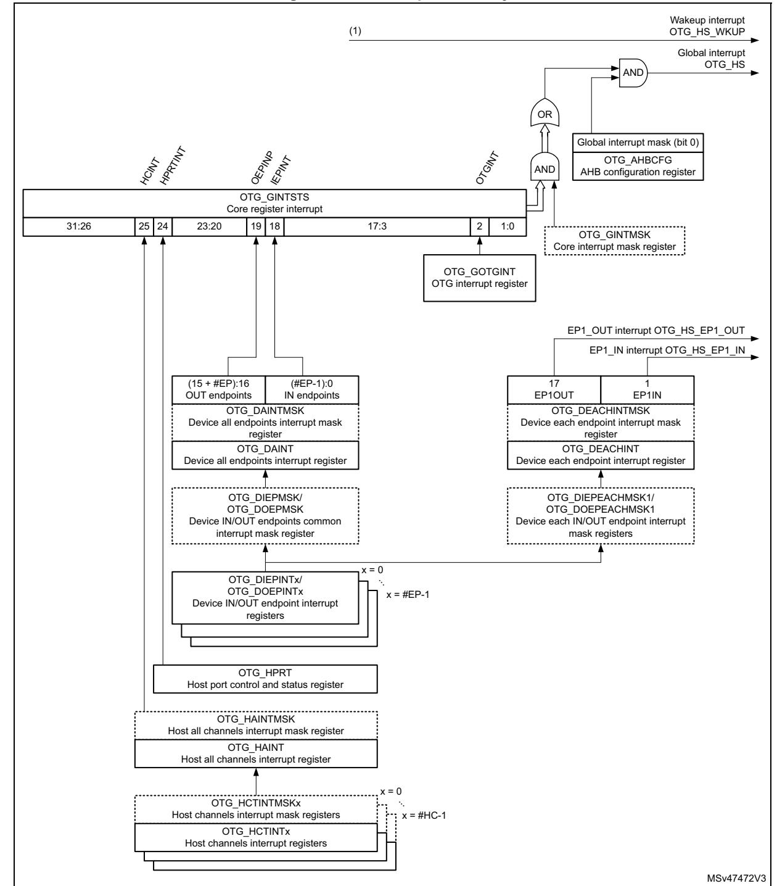

**Figure 801. Interrupt hierarchy**

1. OTG\_HS\_WKUP becomes active (high state) when resume condition occurs during L1 SLEEP or L2 SUSPEND states.


# **60.13 OTG\_HS control and status registers**

By reading from and writing to the control and status registers (CSRs) through the AHB slave interface, the application controls the OTG\_HS controller. These registers are 32 bits wide, and the addresses are 32-bit block aligned. The OTG\_HS registers must be accessed by words (32 bits).

CSRs are classified as follows:

- Core global registers
- Host-mode registers
- Host global registers
- Host port CSRs
- Host channel-specific registers
- Device-mode registers
- Device global registers
- Device endpoint-specific registers
- Power and clock-gating registers
- Data FIFO (DFIFO) access registers

Only the core global, power and clock-gating, data FIFO access, and host port control and status registers can be accessed in both host and device modes. When the OTG\_HS controller is operating in one mode, either device or host, the application must not access registers from the other mode. If an illegal access occurs, a mode mismatch interrupt is generated and reflected in the core interrupt register (MMIS bit in the OTG\_GINTSTS register). When the core switches from one mode to the other, the registers in the new mode of operation must be reprogrammed as they would be after a power-on reset.

# **60.13.1 CSR memory map**

The host and device mode registers occupy different addresses. All registers are implemented in the AHB clock domain.

# **Global CSR map**

These registers are available in both host and device modes.

**Table 535. Core global control and status registers (CSRs)** 

| Acronym     | Address<br>offset | Register name                                                  |
|-------------|-------------------|----------------------------------------------------------------|
| OTG_GOTGCTL | 0x000             | Section 60.14.1: OTG control and status register (OTG_GOTGCTL) |
| OTG_GOTGINT | 0x004             | Section 60.14.2: OTG interrupt register (OTG_GOTGINT)          |
| OTG_GAHBCFG | 0x008             | Section 60.14.3: OTG AHB configuration register (OTG_GAHBCFG)  |
| OTG_GUSBCFG | 0x00C             | Section 60.14.4: OTG USB configuration register (OTG_GUSBCFG)  |
| OTG_GRSTCTL | 0x010             | Section 60.14.5: OTG reset register (OTG_GRSTCTL)              |
| OTG_GINTSTS | 0x014             | Section 60.14.6: OTG core interrupt register (OTG_GINTSTS)     |
| OTG_GINTMSK | 0x018             | Section 60.14.7: OTG interrupt mask register (OTG_GINTMSK)     |


Table 535. Core global control and status registers (CSRs) (continued)

| Acronym                                       | Address                     | Register name                                                                                                                    |
|-----------------------------------------------|-----------------------------|----------------------------------------------------------------------------------------------------------------------------------|
| OTG_GRXSTSR                                   |                             | Section 60.14.8: OTG receive status debug read register (OTG_GRXSTSR)                                                            |
|                                               | 0x01C                       | Section 60.14.9: OTG receive status debug read [alternate] (OTG_GRXSTSR)                                                         |
| OTG_GRXSTSP                                   |                             | Section 60.14.10: OTG status read and pop registers (OTG_GRXSTSP)                                                                |
|                                               | 0x020                       | Section 60.14.11: OTG status read and pop registers [alternate] (OTG_GRXSTSP)                                                    |
| OTG_GRXFSIZ                                   | 0x024                       | Section 60.14.12: OTG receive FIFO size register (OTG_GRXFSIZ)                                                                   |
| OTG_HNPTXFSIZ/<br>OTG_DIEPTXF0 <sup>(1)</sup> | 0x028                       | Section 60.14.13: OTG host non-periodic transmit FIFO size register (OTG_HNPTXFSIZ)/Endpoint 0 Transmit FIFO size (OTG_DIEPTXF0) |
| OTG_HNPTXSTS                                  | 0x02C                       | Section 60.14.14: OTG non-periodic transmit FIFO/queue status register (OTG_HNPTXSTS)                                            |
| OTG_GCCFG                                     | 0x038                       | Section 60.14.15: OTG general core configuration register (OTG_GCCFG)                                                            |
| OTG_CID                                       | 0x03C                       | Section 60.14.16: OTG core ID register (OTG_CID)                                                                                 |
| OTG_GLPMCFG                                   | 0x54                        | Section 60.14.17: OTG core LPM configuration register (OTG_GLPMCFG)                                                              |
| OTG_HPTXFSIZ                                  | 0x100                       | Section 60.14.18: OTG host periodic transmit FIFO size register (OTG_HPTXFSIZ)                                                   |
| OTG_DIEPTXFx                                  | 0x104<br>0x108<br><br>0x120 | Section 60.14.19: OTG device IN endpoint transmit FIFO x size register (OTG_DIEPTXFx)                                            |

<sup>1.</sup> The general rule is to use OTG\_HNPTXFSIZ for host mode and OTG\_DIEPTXF0 for device mode.

# **Host-mode CSR map**

These registers must be programmed every time the core changes to host mode.

Table 536. Host-mode control and status registers (CSRs)

| Acronym      | Offset address | Register name                                                                         |
|--------------|----------------|---------------------------------------------------------------------------------------|
| OTG_HCFG     | 0x400          | Section 60.14.21: OTG host configuration register (OTG_HCFG)                          |
| OTG_HFIR     | 0x404          | Section 60.14.22: OTG host frame interval register (OTG_HFIR)                         |
| OTG_HFNUM    | 0x408          | Section 60.14.23: OTG host frame number/frame time remaining register (OTG_HFNUM)     |
| OTG_HPTXSTS  | 0x410          | Section 60.14.24: OTG_Host periodic transmit FIFO/queue status register (OTG_HPTXSTS) |
| OTG_HAINT    | 0x414          | Section 60.14.25: OTG host all channels interrupt register (OTG_HAINT)                |
| OTG_HAINTMSK | 0x418          | Section 60.14.26: OTG host all channels interrupt mask register (OTG_HAINTMSK)        |


**Table 536. Host-mode control and status registers (CSRs) (continued)**

| Acronym       | Offset<br>address           | Register name                                                                                                 |
|---------------|-----------------------------|---------------------------------------------------------------------------------------------------------------|
| OTG_HFLBADDR  | 0x41C                       | Section 60.14.27: OTG host frame list base address register<br>(OTG_HFLBADDR)                                 |
| OTG_HPRT      | 0x440                       | Section 60.14.28: OTG host port control and status register (OTG_HPRT)                                        |
| OTG_HCCHARx   | 0x500<br>0x520<br><br>0x6E0 | Section 60.14.29: OTG host channel x characteristics register<br>(OTG_HCCHARx)                                |
| OTG_HCSPLTx   | 0x504<br>0x524<br><br>0x6E4 | Section 60.14.30: OTG host channel x split control register<br>(OTG_HCSPLTx)                                  |
| OTG_HCINTx    | 0x508<br>0x528<br><br>0x6E8 | Section 60.14.31: OTG host channel x interrupt register (OTG_HCINTx)                                          |
| OTG_HCINTMSKx | 0x50C<br>0x52C<br><br>0x6EC | Section 60.14.32: OTG host channel x interrupt mask register<br>(OTG_HCINTMSKx)                               |
| OTG_HCTSIZx   | 0x510<br>0x530<br><br>0x6F0 | Section 60.14.33: OTG host channel x transfer size register<br>(OTG_HCTSIZx)                                  |
| OTG_HCTSIZSGx | 0x510<br>0x530<br><br>0x6F0 | Section 60.14.34: OTG host channel x transfer size register<br>(OTG_HCTSIZSGx)                                |
| OTG_HCDMAx    | 0x514<br>0x534<br><br>0x6F4 | Section 60.14.35: OTG host channel x DMA address register in buffer<br>DMA [alternate] (OTG_HCDMAx)           |
| OTG_HCDMASGx  | 0x514<br>0x534<br><br>0x6F4 | Section 60.14.36: OTG host channel x DMA address register in<br>scatter/gather DMA [alternate] (OTG_HCDMASGx) |
| OTG_HCDMABx   | 0x51C<br>0x53C<br><br>0x6FC | Section 60.14.37: OTG host channel-n DMA address buffer register<br>(OTG_HCDMABx)                             |


# **Device-mode CSR map**

These registers must be programmed every time the core changes to device mode.

Table 537. Device-mode control and status registers

| Acronym                 | Offset address              | Register name                                                                                  |
|-------------------------|-----------------------------|------------------------------------------------------------------------------------------------|
| OTG_DCFG                | 0x800                       | Section 60.14.39: OTG device configuration register (OTG_DCFG)                                 |
| OTG_DCTL                | 0x804                       | Section 60.14.40: OTG device control register (OTG_DCTL)                                       |
| OTG_DSTS                | 0x808                       | Section 60.14.41: OTG device status register (OTG_DSTS)                                        |
| OTG_DIEPMSK             | 0x810                       | Section 60.14.42: OTG device IN endpoint common interrupt mask register (OTG_DIEPMSK)          |
| OTG_DOEPMSK             | 0x814                       | Section 60.14.43: OTG device OUT endpoint common interrupt mask register (OTG_DOEPMSK)         |
| OTG_DAINT               | 0x818                       | Section 60.14.44: OTG device all endpoints interrupt register (OTG_DAINT)                      |
| OTG_DAINTMSK            | 0x81C                       | Section 60.14.45: OTG all endpoints interrupt mask register (OTG_DAINTMSK)                     |
| OTG_DVBUSDIS            | 0x828                       | Section 60.14.46: OTG device V <sub>BUS</sub> discharge time register (OTG_DVBUSDIS)           |
| OTG_DVBUSPULSE          | 0x82C                       | Section 60.14.47: OTG device V <sub>BUS</sub> pulsing time register (OTG_DVBUSPULSE)           |
| OTG_DTHRCTL             | 0x830                       | Section 60.14.48: OTG device threshold control register (OTG_DTHRCTL)                          |
| OTG_DIEPEMPMSK          | 0x834                       | Section 60.14.49: OTG device IN endpoint FIFO empty interrupt mask register (OTG_DIEPEMPMSK)   |
| OTG_DEACHINT            | 0x838                       | Section 60.14.50: OTG device each endpoint interrupt register (OTG_DEACHINT)                   |
| OTG_DEACHINTMSK         | 0x83C                       | Section 60.14.51: OTG device each endpoint interrupt mask register (OTG_DEACHINTMSK)           |
| OTG_HS_DIEPEACHM<br>SK1 | 0x844                       | Section 60.14.52: OTG device each IN endpoint-1 interrupt mask register (OTG_HS_DIEPEACHMSK1)  |
| OTG_HS_DOEPEACHM<br>SK1 | 0x884                       | Section 60.14.53: OTG device each OUT endpoint-1 interrupt mask register (OTG_HS_DOEPEACHMSK1) |
| OTG_DIEPCTLx            | 0x900<br>0x920<br><br>0xA00 | Section 60.14.54: OTG device IN endpoint x control register (OTG_DIEPCTLx)                     |
| OTG_DIEPINTx            | 0x908<br>0x928<br><br>0x9E8 | Section 60.14.55: OTG device IN endpoint x interrupt register (OTG_DIEPINTx)                   |


**Table 537. Device-mode control and status registers (continued)**

| Acronym       | Offset<br>address           | Register name                                                                            |
|---------------|-----------------------------|------------------------------------------------------------------------------------------|
| OTG_DIEPTSIZ0 | 0x910                       | Section 60.14.56: OTG device IN endpoint 0 transfer size register<br>(OTG_DIEPTSIZ0)     |
| OTG_DIEPDMAx  | 0x914<br>0x934<br><br>0x9F4 | Section 60.14.57: OTG device IN endpoint x DMA address register<br>(OTG_DIEPDMAx)        |
| OTG_DTXFSTSx  | 0x918<br>0x938<br><br>0x9F8 | Section 60.14.58: OTG device IN endpoint transmit FIFO status register<br>(OTG_DTXFSTSx) |
| OTG_DIEPTSIZx | 0x930<br>0x950<br><br>0x9F0 | Section 60.14.59: OTG device IN endpoint x transfer size register<br>(OTG_DIEPTSIZx)     |
| OTG_DOEPCTL0  | 0xB00                       | Section 60.14.60: OTG device control OUT endpoint 0 control register<br>(OTG_DOEPCTL0)   |
| OTG_DOEPINTx  | 0xB08<br>0XB28<br><br>0xC08 | Section 60.14.61: OTG device OUT endpoint x interrupt register<br>(OTG_DOEPINTx)         |
| OTG_DOEPTSIZ0 | 0xB10                       | Section 60.14.62: OTG device OUT endpoint 0 transfer size register<br>(OTG_DOEPTSIZ0)    |
| OTG_DOEPDMAx  | 0xB14<br>0xB34<br><br>0xC14 | Section 60.14.63: OTG device OUT endpoint x DMA address register<br>(OTG_DOEPDMAx)       |
| OTG_DOEPCTLx  | 0xB20<br>0xB40<br><br>0xC00 | Section 60.14.64: OTG device OUT endpoint x control register<br>(OTG_DOEPCTLx)           |
| OTG_DOEPTSIZx | 0xB30<br>0xB50<br><br>0xBF0 | Section 60.14.65: OTG device OUT endpoint x transfer size register<br>(OTG_DOEPTSIZx)    |

# **Data FIFO (DFIFO) access register map**

These registers, available in both host and device modes, are used to read or write the FIFO space for a specific endpoint or a channel, in a given direction. If a host channel is of type IN, the FIFO can only be read on the channel. Similarly, if a host channel is of type OUT, the FIFO can only be written on the channel.


RM0399 Rev 4 2773/3556

FIFO access register section Offset address Access Device IN endpoint 0/Host OUT Channel 0: DFIFO write access \٨/ 0x1000-0x1FFC Device OUT endpoint 0/Host IN Channel 0: DFIFO read access Device IN endpoint 1/Host OUT Channel 1: DFIFO write access w 0x2000-0x2FFC Device OUT endpoint 1/Host IN Channel 1: DFIFO read access ... Device IN endpoint x<sup>(1)</sup>/Host OUT Channel x<sup>(1)</sup>: DFIFO write access W 0xX000-0xXFFC Device OUT endpoint x<sup>(1)</sup>/Host IN Channel x<sup>(1)</sup>: DFIFO read access

Table 538. Data FIFO (DFIFO) access register map

# Power and clock gating CSR map

There is a single register for power and clock gating. It is available in both host and device modes.

Table 539. Power and clock gating control and status registers

| Acronym     | Offset address | Register name                                                               |
|-------------|----------------|-----------------------------------------------------------------------------|
| OTG_PCGCCTL | 0xE00-0xE04    | Section 60.14.66: OTG power and clock gating control register (OTG_PCGCCTL) |

# 60.14 OTG\_HS registers

These registers are available in both host and device modes, and do not need to be reprogrammed when switching between these modes.

Bit values in the register descriptions are expressed in binary unless otherwise specified.

# <span id="page-31-0"></span>60.14.1 OTG control and status register (OTG\_GOTGCTL)

Address offset: 0x000

Reset value: 0x0001 0000

The OTG\_GOTGCTL register controls the behavior and reflects the status of the OTG function of the core.

| 31   | 30   | 29   | 28   | 27         | 26          | 25        | 24         | 23           | 22          | 21           | 20          | 19            | 18           | 17   | 16         |
|------|------|------|------|------------|-------------|-----------|------------|--------------|-------------|--------------|-------------|---------------|--------------|------|------------|
| Res. | Res. | Res. | Res. | Res.       | Res.        | Res.      | Res.       | Res.         | Res.        | CUR<br>MOD   | OTG<br>VER  | BSVLD         | ASVLD        | DBCT | CID<br>STS |
|      |      |      |      |            |             |           |            |              |             | r            | rw          | r             | r            | r    | r          |
| 15   | 14   | 13   | 12   | 11         | 10          | 9         | 8          | 7            | 6           | 5            | 4           | 3             | 2            | 1    | 0          |
| Res. | Res. | Res. | EHEN | DHNP<br>EN | HSHNP<br>EN | HNP<br>RQ | HNG<br>SCS | BVALO<br>VAL | BVALO<br>EN | AVALO<br>VAL | AVALO<br>EN | VBVAL<br>OVAL | VBVAL<br>OEN | SRQ  | SRQ<br>SCS |
|      |      |      |      | LIN        | LIN         | NQ        | 303        | VAL          | LIN         | V/ \L        | L.14        | OVAL          | OLIV         |      | 000        |


<span id="page-31-1"></span><sup>1.</sup> Where x is 8in device mode and 15 in host mode.

#### Bits 31:22 Reserved, must be kept at reset value.

#### Bit 21 **CURMOD:** Current mode of operation

Indicates the current mode (host or device).

0: Device mode

1: Host mode

#### Bit 20 **OTGVER:** OTG version

Selects the OTG revision.

0:OTG Version 1.3. OTG1.3 is obsolete for new product development.

1:OTG Version 2.0. In this version the core supports only data line pulsing for SRP.

#### Bit 19 **BSVLD:** B-session valid

Indicates the device mode transceiver status.

0: B-session is not valid.

1: B-session is valid.

In OTG mode, the user can use this bit to determine if the device is connected or disconnected.

*Note: Only accessible in device mode.*

#### Bit 18 **ASVLD:** A-session valid

Indicates the host mode transceiver status.

0: A-session is not valid

1: A-session is valid

*Note: Only accessible in host mode.*

# Bit 17 **DBCT:** Long/short debounce time

Indicates the debounce time of a detected connection.

0: Long debounce time, used for physical connections (100 ms + 2.5 µs)

1: Short debounce time, used for soft connections (2.5 µs)

*Note: Only accessible in host mode.*

# Bit 16 **CIDSTS:** Connector ID status

Indicates the connector ID status on a connect event.

0: The OTG\_HS controller is in A-device mode

1: The OTG\_HS controller is in B-device mode

*Note: Accessible in both device and host modes.*

#### Bits 15:13 Reserved, must be kept at reset value.

#### Bit 12 **EHEN:** Embedded host enable

It is used to select between OTG A device state machine and embedded host state machine.

0: OTG A device state machine is selected

1: Embedded host state machine is selected

# Bit 11 **DHNPEN:** Device HNP enabled

The application sets this bit when it successfully receives a SetFeature.SetHNPEnable command from the connected USB host.

0: HNP is not enabled in the application

1: HNP is enabled in the application

*Note: Only accessible in device mode.*


#### Bit 10 **HSHNPEN:** host set HNP enable

The application sets this bit when it has successfully enabled HNP (using the SetFeature.SetHNPEnable command) on the connected device.

0: Host Set HNP is not enabled

1: Host Set HNP is enabled

*Note: Only accessible in host mode.*

#### Bit 9 **HNPRQ:** HNP request

The application sets this bit to initiate an HNP request to the connected USB host. The application can clear this bit by writing a 0 when the host negotiation success status change bit in the OTG\_GOTGINT register (HNSSCHG bit in OTG\_GOTGINT) is set. The core clears this bit when the HNSSCHG bit is cleared.

0: No HNP request

1: HNP request

*Note: Only accessible in device mode.*

#### Bit 8 **HNGSCS:** Host negotiation success

The core sets this bit when host negotiation is successful. The core clears this bit when the HNP request (HNPRQ) bit in this register is set.

0: Host negotiation failure

1: Host negotiation success

*Note: Only accessible in device mode.*

#### Bit 7 **BVALOVAL:** B-peripheral session valid override value.

This bit is used to set override value for Bvalid signal when BVALOEN bit is set.

0: Bvalid value is '0' when BVALOEN = 1

1: Bvalid value is '1' when BVALOEN = 1

*Note: Only accessible in device mode.*

#### Bit 6 **BVALOEN:** B-peripheral session valid override enable.

This bit is used to enable/disable the software to override the Bvalid signal using the BVALOVAL bit.

0:Override is disabled and Bvalid signal from the respective PHY selected is used internally by the core

1:Internally Bvalid received from the PHY is overridden with BVALOVAL bit value

*Note: Only accessible in device mode.*

#### Bit 5 **AVALOVAL:** A-peripheral session valid override value.

This bit is used to set override value for Avalid signal when AVALOEN bit is set.

0: Avalid value is '0' when AVALOEN = 1

1: Avalid value is '1' when AVALOEN = 1

*Note: Only accessible in host mode.*

### Bit 4 **AVALOEN:** A-peripheral session valid override enable.

This bit is used to enable/disable the software to override the Avalid signal using the AVALOVAL bit.

0:Override is disabled and Avalid signal from the respective PHY selected is used internally by the core

1:Internally Avalid received from the PHY is overridden with AVALOVAL bit value

*Note: Only accessible in host mode.*

# Bit 3 **VBVALOVAL:** VBUS valid override value.

This bit is used to set override value for vbusvalid signal when VBVALOEN bit is set.

0: vbusvalid value is '0' when VBVALOEN = 1

1: vbusvalid value is '1' when VBVALOEN = 1

*Note: Only accessible in host mode.*

# Bit 2 **VBVALOEN:** VBUS valid override enable.

This bit is used to enable/disable the software to override the vbusvalid signal using the VBVALOVAL bit.

0: Override is disabled and vbusvalid signal from the respective PHY selected is used internally by the core

1: Internally vbusvalid received from the PHY is overridden with VBVALOVAL bit value

*Note: Only accessible in host mode.*

### Bit 1 **SRQ:** Session request

The application sets this bit to initiate a session request on the USB. The application can clear this bit by writing a 0 when the host negotiation success status change bit in the OTG\_GOTGINT register (HNSSCHG bit in OTG\_GOTGINT) is set. The core clears this bit when the HNSSCHG bit is cleared.

If the user uses the USB 1.1 full-speed serial transceiver interface to initiate the session request, the application must wait until VBUS discharges to 0.2 V, after the B-session valid bit in this register (BSVLD bit in OTG\_GOTGCTL) is cleared.

0: No session request

1: Session request

*Note: Only accessible in device mode.*

### Bit 0 **SRQSCS:** Session request success

The core sets this bit when a session request initiation is successful.

0: Session request failure

1: Session request success

*Note: Only accessible in device mode.*

# <span id="page-34-0"></span>**60.14.2 OTG interrupt register (OTG\_GOTGINT)**

Address offset: 0x04

Reset value: 0x0000 0000

The application reads this register whenever there is an OTG interrupt and clears the bits in this register to clear the OTG interrupt.

| 31   | 30   | 29   | 28   | 27   | 26   | 25          | 24          | 23   | 22   | 21   | 20   | 19         | 18          | 17         | 16   |
|------|------|------|------|------|------|-------------|-------------|------|------|------|------|------------|-------------|------------|------|
| Res. | Res. | Res. | Res. | Res. | Res. | Res.        | Res.        | Res. | Res. | Res. | Res. | DBC<br>DNE | ADTO<br>CHG | HNG<br>DET | Res. |
|      |      |      |      |      |      |             |             |      |      |      |      | rc_w1      | rc_w1       | rc_w1      |      |
|      |      |      |      |      |      |             |             |      |      |      |      |            |             |            |      |
| 15   | 14   | 13   | 12   | 11   | 10   | 9           | 8           | 7    | 6    | 5    | 4    | 3          | 2           | 1          | 0    |
| Res. | Res. | Res. | Res. | Res. | Res. | HNSS<br>CHG | SRSS<br>CHG | Res. | Res. | Res. | Res. | Res.       | SEDET       | Res.       | Res. |


RM0399 Rev 4 2777/3556

Bits 31:20 Reserved, must be kept at reset value.

#### Bit 19 **DBCDNE:** Debounce done

The core sets this bit when the debounce is completed after the device connect. The application can start driving USB reset after seeing this interrupt. This bit is only valid when the HNP Capable or SRP Capable bit is set in the OTG\_GUSBCFG register (HNPCAP bit or SRPCAP bit in OTG\_GUSBCFG, respectively).

*Note: Only accessible in host mode.*

#### Bit 18 **ADTOCHG:** A-device timeout change

The core sets this bit to indicate that the A-device has timed out while waiting for the B-device to connect.

*Note: Accessible in both device and host modes.*

#### Bit 17 **HNGDET:** Host negotiation detected

The core sets this bit when it detects a host negotiation request on the USB.

*Note: Accessible in both device and host modes.*

Bits 16:10 Reserved, must be kept at reset value.

#### Bit 9 **HNSSCHG:** Host negotiation success status change

The core sets this bit on the success or failure of a USB host negotiation request. The application must read the host negotiation success bit of the OTG\_GOTGCTL register (HNGSCS bit in OTG\_GOTGCTL) to check for success or failure.

*Note: Accessible in both device and host modes.*

Bits 7:3 Reserved, must be kept at reset value.

### Bit 8 **SRSSCHG:** Session request success status change

The core sets this bit on the success or failure of a session request. The application must read the session request success bit in the OTG\_GOTGCTL register (SRQSCS bit in OTG\_GOTGCTL) to check for success or failure.

*Note: Accessible in both device and host modes.*

#### Bit 2 **SEDET:** Session end detected

The core sets this bit to indicate that the level of the voltage on VBUS is no longer valid for a B-Peripheral session when VBUS < 0.8 V.

*Note: Accessible in both device and host modes.*

Bits 1:0 Reserved, must be kept at reset value.


# <span id="page-36-0"></span>60.14.3 OTG AHB configuration register (OTG GAHBCFG)

Address offset: 0x008 Reset value: 0x0000 0000

This register can be used to configure the core after power-on or a change in mode. This register mainly contains AHB system-related configuration parameters. Do not change this register after the initial programming. The application must program this register before starting any transactions on either the AHB or the USB.

| 31   | 30   | 29   | 28   | 27   | 26   | 25        | 24                | 23               | 22   | 21         | 20   | 19   | 18           | 17   | 16               |
|------|------|------|------|------|------|-----------|-------------------|------------------|------|------------|------|------|--------------|------|------------------|
| Res. | Res. | Res. | Res. | Res. | Res. | Res.      | Res.              | Res.             | Res. | Res.       | Res. | Res. | Res.         | Res. | Res.             |
|      |      |      |      |      |      |           |                   |                  |      |            |      |      |              |      |                  |
| 15   |      |      |      | •    | •    | •         | •                 |                  |      |            | •    | •    | •            | •    |                  |
| 15   | 14   | 13   | 12   | 11   | 10   | 9         | 8                 | 7                | 6    | 5          | 4    | 3    | 2            | 1    | 0                |
| Res. | Res. | Res. | Res. | Res. | Res. | 9<br>Res. | 8<br>PTXFE<br>LVL | 7<br>TXFE<br>LVL | Res. | 5<br>DMAEN | 4    |      | 2<br>EN[3:0] | 1    | 0<br>GINT<br>MSK |

Bits 31:9 Reserved, must be kept at reset value.

#### Bit 8 PTXFELVL: Periodic Tx FIFO empty level

Indicates when the periodic Tx FIFO empty interrupt bit in the OTG\_GINTSTS register (PTXFE bit in OTG\_GINTSTS) is triggered.

0: PTXFE (in OTG\_GINTSTS) interrupt indicates that the Periodic Tx FIFO is half empty 1: PTXFE (in OTG\_GINTSTS) interrupt indicates that the Periodic Tx FIFO is completely empty

Note: Only accessible in host mode.

### Bit 7 TXFELVL: Tx FIFO empty level

In device mode, this bit indicates when IN endpoint Transmit FIFO empty interrupt (TXFE in OTG\_DIEPINTx) is triggered:

0:The TXFE (in OTG\_DIEPINTx) interrupt indicates that the IN endpoint Tx FIFO is half empty

1:The TXFE (in OTG\_DIEPINTx) interrupt indicates that the IN endpoint Tx FIFO is completely empty

In host mode, this bit indicates when the nonperiodic Tx FIFO empty interrupt (NPTXFE bit in OTG\_GINTSTS) is triggered:

0:The NPTXFE (in OTG\_GINTSTS) interrupt indicates that the nonperiodic Tx FIFO is half empty

1:The NPTXFE (in OTG\_GINTSTS) interrupt indicates that the nonperiodic Tx FIFO is completely empty

Bit 6 Reserved, must be kept at reset value.

RM0399 Rev 4 2779/3556

Bit 5 DMAEN: DMA enabled

0: The core operates in slave mode1: The core operates in DMA mode

#### Bits 4:1 HBSTLEN[3:0]: Burst length/type

0000 Single: Bus transactions use single 32 bit accesses (not recommended)

0001 INCR: Bus transactions use unspecified length accesses (not recommended, uses the

INCR AHB bus command)

0011 INCR4: Bus transactions target 4x 32 bit accesses 0101 INCR8: Bus transactions target 8x 32 bit accesses

0111 INCR16: Bus transactions based on 16x 32 bit accesses

Others: Reserved

#### Bit 0 GINTMSK: Global interrupt mask

The application uses this bit to mask or unmask the interrupt line assertion to itself. Irrespective of this bit's setting, the interrupt status registers are updated by the core.

0: Mask the interrupt assertion to the application.

1: Unmask the interrupt assertion to the application.

Note: Accessible in both device and host modes.

# <span id="page-37-0"></span>60.14.4 OTG USB configuration register (OTG GUSBCFG)

Address offset: 0x00C Reset value: 0x0000 1400

This register can be used to configure the core after power-on or a changing to host mode or device mode. It contains USB and USB-PHY related configuration parameters. The application must program this register before starting any transactions on either the AHB or the USB. Do not make changes to this register after the initial programming.

| 31         | 30        | 29        | 28   | 27   | 26   | 25          | 24         | 23   | 22         | 21             | 20             | 19          | 18         | 17          | 16   |
|------------|-----------|-----------|------|------|------|-------------|------------|------|------------|----------------|----------------|-------------|------------|-------------|------|
| Res.       | FD<br>MOD | FH<br>MOD | Res. | Res. | Res. | ULPI<br>IPD | PTCI       | PCCI | TSDPS      | ULPIE<br>VBUSI | ULPIE<br>VBUSD | ULPI<br>CSM | ULPI<br>AR | ULPI<br>FSL | Res. |
|            | rw        | rw        |      |      |      | rw          | rw         | rw   | rw         | rw             | rw             | rw          | rw         | rw          |      |
| 15         | 14        | 13        | 12   | 11   | 10   | 9           | 8          | 7    | 6          | 5              | 4              | 3           | 2          | 1           | 0    |
| PHYL<br>PC | Res.      | TRDT[3:0] |      |      |      | HNP<br>CAP  | SRP<br>CAP | Res. | PHY<br>SEL | Res.           | Res.           | Res.        | Т          | OCAL[2:0    | )]   |
| rw         |           | rw        | rw   | rw   | rw   | rw          | rw         |      | rw         |                |                |             | rw         | rw          | rw   |


Bit 31 Reserved, must be kept at reset value.

#### Bit 30 **FDMOD:** Force device mode

Writing a 1 to this bit, forces the core to device mode irrespective of the OTG\_ID input pin.

- 0: Normal mode
- 1: Force device mode

After setting the force bit, the application must wait at least 25 ms before the change takes effect.

*Note: Accessible in both device and host modes.*

#### Bit 29 **FHMOD:** Force host mode

Writing a 1 to this bit, forces the core to host mode irrespective of the OTG\_ID input pin.

- 0: Normal mode
- 1: Force host mode

After setting the force bit, the application must wait at least 25 ms before the change takes effect.

*Note: Accessible in both device and host modes.*

### Bits 28:26 Reserved, must be kept at reset value.

### Bit 25 **ULPIIPD:** ULPI interface protect disable

This bit controls the circuitry built in the PHY to protect the ULPI interface when the link tristates stp and data. Any pull-up or pull-down resistors employed by this feature can be disabled. Refer to the ULPI specification for more details.

- 0: Enables the interface protection circuit
- 1: Disables the interface protection circuit

#### Bit 24 **PTCI:** Indicator pass through

This bit controls whether the complement output is qualified with the internal VBUS valid comparator before being used in the VBUS state in the RX CMD. Refer to the ULPI specification for more details.

- 0: Complement Output signal is qualified with the Internal VBUS valid comparator
- 1: Complement Output signal is not qualified with the Internal VBUS valid comparator

#### Bit 23 **PCCI:** Indicator complement

This bit controls the PHY to invert the ExternalVbusIndicator input signal, and generate the complement output. Refer to the ULPI specification for more details.

- 0: PHY does not invert the ExternalVbusIndicator signal
- 1: PHY inverts ExternalVbusIndicator signal

# Bit 22 **TSDPS**: TermSel DLine pulsing selection

This bit selects utmi\_termselect to drive the data line pulse during SRP (session request protocol).

- 0: Data line pulsing using utmi\_txvalid (default)
- 1: Data line pulsing using utmi\_termsel

# Bit 21 **ULPIEVBUSI:** ULPI external VBUS indicator

This bit indicates to the ULPI PHY to use an external VBUS overcurrent indicator.

- 0: PHY uses an internal VBUS valid comparator
- 1: PHY uses an external VBUS valid comparator

# Bit 20 **ULPIEVBUSD:** ULPI External VBUS Drive

This bit selects between internal or external supply to drive 5 V on VBUS, in the ULPI PHY.

- 0: PHY drives VBUS using internal charge pump (default)
- 1: PHY drives VBUS using external supply.


#### Bit 19 **ULPICSM:** ULPI clock SuspendM

This bit sets the ClockSuspendM bit in the interface control register on the ULPI PHY. This bit applies only in the serial and carkit modes.

0: PHY powers down the internal clock during suspend

1: PHY does not power down the internal clock

#### Bit 18 **ULPIAR:** ULPI Auto-resume

This bit sets the AutoResume bit in the interface control register on the ULPI PHY.

0: PHY does not use AutoResume feature

1: PHY uses AutoResume feature

#### Bit 17 **ULPIFSLS:** ULPI FS/LS select

The application uses this bit to select the FS/LS serial interface for the ULPI PHY. This bit is valid only when the FS serial transceiver is selected on the ULPI PHY.

0: ULPI interface

1: ULPI FS/LS serial interface

Bit 16 Reserved, must be kept at reset value.

# Bit 15 **PHYLPC:** PHY Low-power clock select

This bit selects either 480 MHz or 48 MHz (low-power) PHY mode. In FS and LS modes, the PHY can usually operate on a 48 MHz clock to save power.

0: 480 MHz internal PLL clock

1: 48 MHz external clock

In 480 MHz mode, the UTMI interface operates at either 60 or 30 MHz, depending on whether the 8- or 16-bit data width is selected. In 48 MHz mode, the UTMI interface operates at 48 MHz in FS and LS modes.

Bit 14 Reserved, must be kept at reset value.

#### Bits 13:10 **TRDT[3:0]:** USB turnaround time

These bits are used to set the turnaround time in PHY clocks. They must be configured according to *[Table 540: TRDT values](#page-40-1)*, depending on the application AHB frequency. Higher TRDT values allow stretching the USB response time to IN tokens in order to compensate for longer AHB read access latency to the data FIFO.

*Note: Only accessible in device mode.*

#### Bit 9 **HNPCAP:** HNP-capable

The application uses this bit to control the OTG\_HS controller's HNP capabilities.

0: HNP capability is not enabled.

1: HNP capability is enabled.

*Note: Accessible in both device and host modes.*

### Bit 8 **SRPCAP:** SRP-capable

The application uses this bit to control the OTG\_HS controller's SRP capabilities. If the core operates as a non-SRP-capable

B-device, it cannot request the connected A-device (host) to activate VBUS and start a session.

0: SRP capability is not enabled.

1: SRP capability is enabled.

*Note: Accessible in both device and host modes.*

Bit 7 Reserved, must be kept at reset value.

Bit 6 **PHYSEL:** Full speed serial transceiver mode select

0: USB 2.0 external ULPI high-speed PHY.

1: USB 1.1 full-speed serial mode.

- Bit 5 Reserved, must be kept at reset value.
- Bit 4 Reserved, must be kept at reset value.
- Bit 3 Reserved, must be kept at reset value.

#### Bits 2:0 **TOCAL[2:0]:** FS timeout calibration

The number of PHY clocks that the application programs in this field is added to the fullspeed interpacket timeout duration in the core to account for any additional delays introduced by the PHY. This can be required, because the delay introduced by the PHY in generating the line state condition can vary from one PHY to another.

The USB standard timeout value for full-speed operation is 16 to 18 (inclusive) bit times. The application must program this field based on the speed of enumeration. The number of bit times added per PHY clock is 0.25 bit times.

**Table 540. TRDT values** 

<span id="page-40-1"></span>

| AHB frequency range (MHz) | TRDT minimum value |     |  |  |  |  |
|---------------------------|--------------------|-----|--|--|--|--|
| Min                       | Max                |     |  |  |  |  |
| 30                        | -                  | 0x9 |  |  |  |  |

# <span id="page-40-0"></span>**60.14.5 OTG reset register (OTG\_GRSTCTL)**

Address offset: 0x10

Reset value: 0x8000 0000

The application uses this register to reset various hardware features inside the core.

| 31         | 30         | 29   | 28   | 27   | 26   | 25   | 24          | 23   | 22   | 21          | 20          | 19   | 18   | 17                | 16   |
|------------|------------|------|------|------|------|------|-------------|------|------|-------------|-------------|------|------|-------------------|------|
| AHB<br>IDL | DMAR<br>EQ | Res. | Res. | Res. | Res. | Res. | Res.        | Res. | Res. | Res.        | Res.        | Res. | Res. | Res.              | Res. |
| r          | r          |      |      |      |      |      |             |      |      |             |             |      |      |                   |      |
| 15         | 14         | 13   | 12   | 11   | 10   | 9    | 8           | 7    | 6    | 5           | 4           | 3    | 2    | 1                 | 0    |
| Res.       | Res.       | Res. | Res. | Res. |      |      | TXFNUM[4:0] |      |      | TXF<br>FLSH | RXF<br>FLSH | Res. |      | FCRST PSRST CSRST |      |
|            |            |      |      |      | rw   | rw   | rw          | rw   | rw   | rs          | rs          |      | rs   | rs                | rs   |

# Bit 31 **AHBIDL:** AHB master idle

Indicates that the AHB master state machine is in the Idle condition.

*Note: Accessible in both device and host modes.*

#### Bit 30 **DMAREQ:** DMA request signal enabled

This bit indicates that the DMA request is in progress. Used for debug.

Bits 29:11 Reserved, must be kept at reset value.

RM0399 Rev 4 2783/3556

#### Bits 10:6 **TXFNUM[4:0]:** Tx FIFO number

This is the FIFO number that must be flushed using the Tx FIFO Flush bit. This field must not be changed until the core clears the Tx FIFO Flush bit.

#### 00000:

- Non-periodic Tx FIFO flush in host mode
- Tx FIFO 0 flush in device mode

#### 00001:

- Periodic Tx FIFO flush in host mode
- Tx FIFO 1 flush in device mode

00010: Tx FIFO 2 flush in device mode

...

01111: Tx FIFO 15 flush in device mode

10000: Flush all the transmit FIFOs in device or host mode.

*Note: Accessible in both device and host modes.*

#### Bit 5 **TXFFLSH:** Tx FIFO flush

This bit selectively flushes a single or all transmit FIFOs, but cannot do so if the core is in the midst of a transaction.

The application must write this bit only after checking that the core is neither writing to the Tx FIFO nor reading from the Tx FIFO. Verify using these registers:

Read—NAK Effective interrupt ensures the core is not reading from the FIFO

Write—AHBIDL bit in OTG\_GRSTCTL ensures the core is not writing anything to the FIFO.

Flushing is normally recommended when FIFOs are reconfigured. FIFO flushing is also recommended during device endpoint disable. The application must wait until the core clears this bit before performing any operations. This bit takes eight clocks to clear, using the slower clock of phy\_clk or hclk.

*Note: Accessible in both device and host modes.*

### Bit 4 **RXFFLSH:** Rx FIFO flush

The application can flush the entire Rx FIFO using this bit, but must first ensure that the core is not in the middle of a transaction.

The application must only write to this bit after checking that the core is neither reading from the Rx FIFO nor writing to the Rx FIFO.

The application must wait until the bit is cleared before performing any other operations. This bit requires 8 clocks (slowest of PHY or AHB clock) to clear.

*Note: Accessible in both device and host modes.*

Bit 3 Reserved, must be kept at reset value.


#### Bit 2 **FCRST:** Host frame counter reset

The application writes this bit to reset the (micro-)frame number counter inside the core. When the (micro-)frame counter is reset, the subsequent SOF sent out by the core has a frame number of 0.

When application writes '1' to the bit, it might not be able to read back the value as it gets cleared by the core in a few clock cycles.

*Note: Only accessible in host mode.*

#### Bit 1 **PSRST:** Partial soft reset

Resets the internal state machines but keeps the enumeration info. Can be used to recover some specific PHY errors.

*Note: Accessible in both device and host modes.*

#### Bit 0 **CSRST:** Core soft reset

Resets the HCLK and PHY clock domains as follows:

the transmit FIFOs and the receive FIFO are flushed.

Clears the interrupts and all the CSR register bits except for the following bits:

- GATEHCLK bit in OTG\_PCGCCTL
- STPPCLK bit in OTG\_PCGCCTL
- FSLSPCS bits in OTG\_HCFG
- DSPD bit in OTG\_DCFG
- SDIS bit in OTG\_DCTL

– OTG\_GCCFG register All module state machines (except for the AHB slave unit) are reset to the Idle state, and all

Any transactions on the AHB Master are terminated as soon as possible, after completing the last data phase of an AHB transfer. Any transactions on the USB are terminated immediately. The application can write to this bit any time it wants to reset the core. This is a self-clearing bit and the core clears this bit after all the necessary logic is reset in the core, which can take several clocks, depending on the current state of the core. Once this bit has been cleared, the software must wait at least 3 PHY clocks before accessing the PHY domain (synchronization delay). The software must also check that bit 31 in this register is set to 1 (AHB Master is Idle) before starting any operation.

Typically, the software reset is used during software development and also when the user dynamically changes the PHY selection bits in the above listed USB configuration registers. When the user changes the PHY, the corresponding clock for the PHY is selected and used in the PHY domain. Once a new clock is selected, the PHY domain has to be reset for proper operation.

*Note: Accessible in both device and host modes.*


# <span id="page-43-0"></span>60.14.6 OTG core interrupt register (OTG GINTSTS)

Address offset: 0x014

Reset value: 0x0400 0020

This register interrupts the application for system-level events in the current mode (device mode or host mode).

Some of the bits in this register are valid only in host mode, while others are valid in device mode only. This register also indicates the current mode. To clear the interrupt status bits of the rc w1 type, the application must write 1 into the bit.

The FIFO status interrupts are read-only; once software reads from or writes to the FIFO while servicing these interrupts, FIFO interrupt conditions are cleared automatically.

The application must clear the OTG\_GINTSTS register at initialization before unmasking the interrupt bit to avoid any interrupts generated prior to initialization.

| 31          | 30          | 29          | 28          | 27          | 26    | 25    | 24          | 23               | 22               | 21                                 | 20           | 19         | 18         | 17    | 16   |
|-------------|-------------|-------------|-------------|-------------|-------|-------|-------------|------------------|------------------|------------------------------------|--------------|------------|------------|-------|------|
| WKUP<br>INT | SRQ<br>INT  | DISC<br>INT | CIDS<br>CHG | LPM<br>INT  | PTXFE | HCINT | HPRT<br>INT | RST<br>DET       | DATAF<br>SUSP    | IPXFR/<br>IN<br>COMP<br>ISO<br>OUT | IISOI<br>XFR | OEP<br>INT | IEPINT     | Res.  | Res. |
| rc_w1       | rc_w1       | rc_w1       | rc_w1       | rc_w1       | r     | r     | r           | rc_w1            | rc_w1            | rc_w1                              | rc_w1        | r          | r          |       |      |
| 15          | 14          | 13          | 12          | 11          | 10    | 9     | 8           | 7                | 6                | 5                                  | 4            | 3          | 2          | 1     | 0    |
| EOPF        | ISOO<br>DRP | ENUM<br>DNE | USB<br>RST  | USB<br>SUSP | ESUSP | Res.  | Res.        | GO<br>NAK<br>EFF | GI<br>NAK<br>EFF | NPTXF<br>E                         | RXF<br>LVL   | SOF        | OTG<br>INT | MMIS  | CMOD |
| rc_w1       | rc_w1       | rc_w1       | rc_w1       | rc_w1       | rc_w1 |       |             | r                | r                | r                                  | r            | rc_w1      | r          | rc_w1 | r    |

#### Bit 31 WKUPINT: Resume/remote wake-up detected interrupt

Wake-up interrupt during suspend(L2) or LPM(L1) state.

- During suspend(L2):

In device mode, this interrupt is asserted when a resume is detected on the USB. In host mode, this interrupt is asserted when a remote wake-up is detected on the USB.

- During LPM(L1):

This interrupt is asserted for either host initiated resume or device initiated remote wakeup on USB.

Note: Accessible in both device and host modes.

### Bit 30 SRQINT: Session request/new session detected interrupt

In host mode, this interrupt is asserted when a session request is detected from the device. In device mode, this interrupt is asserted when  $V_{BUS}$  is in the valid range for a B-peripheral device. Accessible in both device and host modes.

# Bit 29 **DISCINT:** Disconnect detected interrupt

Asserted when a device disconnect is detected.

Note: Only accessible in host mode.

### Bit 28 CIDSCHG: Connector ID status change

The core sets this bit when there is a change in connector ID status.

Note: Accessible in both device and host modes.

#### Bit 27 **LPMINT:** LPM interrupt

In device mode, this interrupt is asserted when the device receives an LPM transaction and responds with a non-ERRORed response.

In host mode, this interrupt is asserted when the device responds to an LPM transaction with a non-ERRORed response or when the host core has completed LPM transactions for the programmed number of times (RETRYCNT bit in OTG\_GLPMCFG).

This field is valid only if the LPMEN bit in OTG\_GLPMCFG is set to 1.

#### Bit 26 **PTXFE:** Periodic Tx FIFO empty

Asserted when the periodic transmit FIFO is either half or completely empty and there is space for at least one entry to be written in the periodic request queue. The half or completely empty status is determined by the periodic Tx FIFO empty level bit in the OTG\_GAHBCFG register (PTXFELVL bit in OTG\_GAHBCFG).

*Note: Only accessible in host mode.*

#### Bit 25 **HCINT:** Host channels interrupt

The core sets this bit to indicate that an interrupt is pending on one of the channels of the core (in host mode). The application must read the OTG\_HAINT register to determine the exact number of the channel on which the interrupt occurred, and then read the corresponding OTG\_HCINTx register to determine the exact cause of the interrupt. The application must clear the appropriate status bit in the OTG\_HCINTx register to clear this bit.

*Note: Only accessible in host mode.*

#### Bit 24 **HPRTINT:** Host port interrupt

The core sets this bit to indicate a change in port status of one of the OTG\_HS controller ports in host mode. The application must read the OTG\_HPRT register to determine the exact event that caused this interrupt. The application must clear the appropriate status bit in the OTG\_HPRT register to clear this bit.

*Note: Only accessible in host mode.*

#### Bit 23 **RSTDET:** Reset detected interrupt

In device mode, this interrupt is asserted when a reset is detected on the USB in partial power-down mode when the device is in suspend.

*Note: Only accessible in device mode.*

### Bit 22 **DATAFSUSP:** Data fetch suspended

This interrupt is valid only in DMA mode. This interrupt indicates that the core has stopped fetching data for IN endpoints due to the unavailability of TxFIFO space or request queue space. This interrupt is used by the application for an endpoint mismatch algorithm. For example, after detecting an endpoint mismatch, the application:

- Sets a global nonperiodic IN NAK handshake
- Disables IN endpoints
- Flushes the FIFO
- Determines the token sequence from the IN token sequence learning queue
- Re-enables the endpoints

Clears the global nonperiodic IN NAK handshake If the global nonperiodic IN NAK is cleared, the core has not yet fetched data for the IN endpoint, and the IN token is received: the core generates an "IN token received when FIFO empty" interrupt. The OTG then sends a NAK response to the host. To avoid this scenario, the application can check the FetSusp interrupt in OTG\_GINTSTS, which ensures that the FIFO is full before clearing a global NAK handshake. Alternatively, the application can mask the "IN token received when FIFO empty" interrupt when clearing a global IN NAK handshake.


RM0399 Rev 4 2787/3556

### Bit 21 **IPXFR:** Incomplete periodic transfer

In host mode, the core sets this interrupt bit when there are incomplete periodic transactions still pending, which are scheduled for the current frame.

#### **INCOMPISOOUT:** Incomplete isochronous OUT transfer

In device mode, the core sets this interrupt to indicate that there is at least one isochronous OUT endpoint on which the transfer is not completed in the current frame. This interrupt is asserted along with the End of periodic frame interrupt (EOPF) bit in this register.

#### Bit 20 **IISOIXFR:** Incomplete isochronous IN transfer

The core sets this interrupt to indicate that there is at least one isochronous IN endpoint on which the transfer is not completed in the current frame. This interrupt is asserted along with the End of periodic frame interrupt (EOPF) bit in this register.

*Note: Only accessible in device mode.*

#### Bit 19 **OEPINT:** OUT endpoint interrupt

The core sets this bit to indicate that an interrupt is pending on one of the OUT endpoints of the core (in device mode). The application must read the OTG\_DAINT register to determine the exact number of the OUT endpoint on which the interrupt occurred, and then read the corresponding OTG\_DOEPINTx register to determine the exact cause of the interrupt. The application must clear the appropriate status bit in the corresponding OTG\_DOEPINTx register to clear this bit.

*Note: Only accessible in device mode.*

#### Bit 18 **IEPINT:** IN endpoint interrupt

The core sets this bit to indicate that an interrupt is pending on one of the IN endpoints of the core (in device mode). The application must read the OTG\_DAINT register to determine the exact number of the IN endpoint on which the interrupt occurred, and then read the corresponding OTG\_DIEPINTx register to determine the exact cause of the interrupt. The application must clear the appropriate status bit in the corresponding OTG\_DIEPINTx register to clear this bit.

*Note: Only accessible in device mode.*

#### Bits 17:16 Reserved, must be kept at reset value.

### Bit 15 **EOPF:** End of periodic frame interrupt

Indicates that the period specified in the periodic frame interval field of the OTG\_DCFG register (PFIVL bit in OTG\_DCFG) has been reached in the current frame.

*Note: Only accessible in device mode.*

#### Bit 14 **ISOODRP:** Isochronous OUT packet dropped interrupt

The core sets this bit when it fails to write an isochronous OUT packet into the Rx FIFO because the Rx FIFO does not have enough space to accommodate a maximum size packet for the isochronous OUT endpoint.

*Note: Only accessible in device mode.*

### Bit 13 **ENUMDNE:** Enumeration done

The core sets this bit to indicate that speed enumeration is complete. The application must read the OTG\_DSTS register to obtain the enumerated speed.

*Note: Only accessible in device mode.*

#### Bit 12 **USBRST:** USB reset

The core sets this bit to indicate that a reset is detected on the USB.

*Note: Only accessible in device mode.*


#### Bit 11 **USBSUSP:** USB suspend

The core sets this bit to indicate that a suspend was detected on the USB. The core enters the suspended state when there is no activity on the data lines for an extended period of time.

*Note: Only accessible in device mode.*

#### Bit 10 **ESUSP:** Early suspend

The core sets this bit to indicate that an Idle state has been detected on the USB for 3 ms.

*Note: Only accessible in device mode.*

#### Bits 9:8 Reserved, must be kept at reset value.

#### Bit 7 **GONAKEFF:** Global OUT NAK effective

Indicates that the Set global OUT NAK bit in the OTG\_DCTL register (SGONAK bit in OTG\_DCTL), set by the application, has taken effect in the core. This bit can be cleared by writing the Clear global OUT NAK bit in the OTG\_DCTL register (CGONAK bit in OTG\_DCTL).

*Note: Only accessible in device mode.*

### Bit 6 **GINAKEFF:** Global IN non-periodic NAK effective

Indicates that the Set global non-periodic IN NAK bit in the OTG\_DCTL register (SGINAK bit in OTG\_DCTL), set by the application, has taken effect in the core. That is, the core has sampled the Global IN NAK bit set by the application. This bit can be cleared by clearing the Clear global non-periodic IN NAK bit in the OTG\_DCTL register (CGINAK bit in OTG\_DCTL).

This interrupt does not necessarily mean that a NAK handshake is sent out on the USB. The STALL bit takes precedence over the NAK bit.

*Note: Only accessible in device mode.*

#### Bit 5 **NPTXFE:** Non-periodic Tx FIFO empty

This interrupt is asserted when the non-periodic Tx FIFO is either half or completely empty, and there is space for at least one entry to be written to the non-periodic transmit request queue. The half or completely empty status is determined by the non-periodic Tx FIFO empty level bit in the OTG\_GAHBCFG register (TXFELVL bit in OTG\_GAHBCFG).

*Note: Accessible in host mode only.*

# Bit 4 **RXFLVL:** Rx FIFO non-empty

Indicates that there is at least one packet pending to be read from the Rx FIFO.

*Note: Accessible in both host and device modes.*

# Bit 3 **SOF:** Start of frame

In host mode, the core sets this bit to indicate that an SOF (FS), or Keep-Alive (LS) is transmitted on the USB. The application must write a 1 to this bit to clear the interrupt. In device mode, in the core sets this bit to indicate that an SOF token has been received on the USB. The application can read the OTG\_DSTS register to get the current frame number. This interrupt is seen only when the core is operating in FS.

*Note: This register may return '1' if read immediately after power on reset. If the register bit reads '1' immediately after power on reset it does not indicate that an SOF has been sent (in case of host mode) or SOF has been received (in case of device mode). The read value of this interrupt is valid only after a valid connection between host and device is established. If the bit is set after power on reset the application can clear the bit.*

*Note: Accessible in both host and device modes.*


RM0399 Rev 4 2789/3556

#### Bit 2 OTGINT: OTG interrupt

The core sets this bit to indicate an OTG protocol event. The application must read the OTG interrupt status (OTG\_GOTGINT) register to determine the exact event that caused this interrupt. The application must clear the appropriate status bit in the OTG\_GOTGINT register to clear this bit.

Note: Accessible in both host and device modes.

#### Bit 1 MMIS: Mode mismatch interrupt

The core sets this bit when the application is trying to access:

- A host mode register, when the core is operating in device mode
- A device mode register, when the core is operating in host mode

The register access is completed on the AHB with an OKAY response, but is ignored by the core internally and does not affect the operation of the core.

Note: Accessible in both host and device modes.

#### Bit 0 CMOD: Current mode of operation

Indicates the current mode.

0: Device mode
1: Host mode

Note: Accessible in both host and device modes.

# <span id="page-47-0"></span>60.14.7 OTG interrupt mask register (OTG GINTMSK)

Address offset: 0x018

Reset value: 0x0000 0000

This register works with the core interrupt register to interrupt the application. When an interrupt bit is masked, the interrupt associated with that bit is not generated. However, the core interrupt (OTG\_GINTSTS) register bit corresponding to that interrupt is still set.

| 31        | 30           | 29           | 28           | 27           | 26         | 25   | 24    | 23            | 22            | 21                           | 20            | 19         | 18         | 17    | 16   |
|-----------|--------------|--------------|--------------|--------------|------------|------|-------|---------------|---------------|------------------------------|---------------|------------|------------|-------|------|
| WUIM      | SRQIM        | DISCIN<br>T  | CIDSC<br>HGM | LPMIN<br>TM  | PTXFE<br>M | HCIM | PRTIM | RSTDE<br>TM   | FSUS<br>PM    | IPXFR<br>M/IISO<br>OXFR<br>M | IISOIX<br>FRM | OEPIN<br>T | IEPINT     | Res.  | Res. |
| rw        | rw           | rw           | rw           | rw           | rw         | rw   | r     | rw            | rw            | rw                           | rw            | rw         | rw         |       |      |
| 15        | 14           | 13           | 12           | 11           | 10         | 9    | 8     | 7             | 6             | 5                            | 4             | 3          | 2          | 1     | 0    |
| EOPF<br>M | ISOOD<br>RPM | ENUM<br>DNEM | USBRS<br>T   | USBSU<br>SPM | ESUSP<br>M | Res. | Res.  | GONA<br>KEFFM | GINAK<br>EFFM | NPTXF<br>EM                  | RXFLV<br>LM   | SOFM       | OTGIN<br>T | MMISM | Res. |
| rw        | rw           | rw           | rw           | rw           | rw         |      |       | rw            | rw            | rw                           | rw            | rw         | rw         | rw    |      |


Bit 31 **WUIM:** Resume/remote wake-up detected interrupt mask

0: Masked interrupt

1: Unmasked interrupt

*Note: Accessible in both host and device modes.*

Bit 30 **SRQIM:** Session request/new session detected interrupt mask

0: Masked interrupt 1: Unmasked interrupt

*Note: Accessible in both host and device modes.*

Bit 29 **DISCINT:** Disconnect detected interrupt mask

0: Masked interrupt

1: Unmasked interrupt *Note: Only accessible in host mode.*

Bit 28 **CIDSCHGM:** Connector ID status change mask

0: Masked interrupt

1: Unmasked interrupt

*Note: Accessible in both host and device modes.*

Bit 27 **LPMINTM:** LPM interrupt mask

0: Masked interrupt

1: Unmasked interrupt

*Note: Accessible in both host and device modes.*

Bit 26 **PTXFEM:** Periodic Tx FIFO empty mask

0: Masked interrupt

1: Unmasked interrupt

*Note: Only accessible in host mode.*

Bit 25 **HCIM:** Host channels interrupt mask

0: Masked interrupt

1: Unmasked interrupt

*Note: Only accessible in host mode.*

Bit 24 **PRTIM:** Host port interrupt mask

0: Masked interrupt

1: Unmasked interrupt

*Note: Only accessible in host mode.*

Bit 23 **RSTDETM:** Reset detected interrupt mask

0: Masked interrupt

1: Unmasked interrupt

*Note: Only accessible in device mode.*

Bit 22 **FSUSPM:** Data fetch suspended mask

0: Masked interrupt

1: Unmasked interrupt

Only accessible in peripheral mode.


Bit 21 **IPXFRM:** Incomplete periodic transfer mask

0: Masked interrupt

1: Unmasked interrupt

*Note: Only accessible in host mode.*

**IISOOXFRM:** Incomplete isochronous OUT transfer mask

0: Masked interrupt

1: Unmasked interrupt

*Note: Only accessible in device mode.*

Bit 20 **IISOIXFRM:** Incomplete isochronous IN transfer mask

0: Masked interrupt

1: Unmasked interrupt

*Note: Only accessible in device mode.*

Bit 19 **OEPINT:** OUT endpoints interrupt mask

0: Masked interrupt

1: Unmasked interrupt

*Note: Only accessible in device mode.*

Bit 18 **IEPINT:** IN endpoints interrupt mask

0: Masked interrupt

1: Unmasked interrupt

*Note: Only accessible in device mode.*

Bits 17:16 Reserved, must be kept at reset value.

Bit 15 **EOPFM:** End of periodic frame interrupt mask

0: Masked interrupt

1: Unmasked interrupt

*Note: Only accessible in device mode.*

Bit 14 **ISOODRPM:** Isochronous OUT packet dropped interrupt mask

0: Masked interrupt

1: Unmasked interrupt

*Note: Only accessible in device mode.*

Bit 13 **ENUMDNEM:** Enumeration done mask

0: Masked interrupt

1: Unmasked interrupt

*Note: Only accessible in device mode.*

Bit 12 **USBRST:** USB reset mask

0: Masked interrupt

1: Unmasked interrupt

*Note: Only accessible in device mode.*

Bit 11 **USBSUSPM:** USB suspend mask

0: Masked interrupt

1: Unmasked interrupt

*Note: Only accessible in device mode.*

Bit 10 **ESUSPM:** Early suspend mask

0: Masked interrupt

1: Unmasked interrupt

*Note: Only accessible in device mode.*


Bits 9:8 Reserved, must be kept at reset value.

Bit 7 **GONAKEFFM:** Global OUT NAK effective mask

0: Masked interrupt 1: Unmasked interrupt

*Note: Only accessible in device mode.*

Bit 6 **GINAKEFFM:** Global non-periodic IN NAK effective mask

0: Masked interrupt 1: Unmasked interrupt

*Note: Only accessible in device mode.*

Bit 5 **NPTXFEM:** Non-periodic Tx FIFO empty mask

0: Masked interrupt

1: Unmasked interrupt

*Note: Only accessible in host mode.*

Bit 4 **RXFLVLM:** Receive FIFO non-empty mask

0: Masked interrupt

1: Unmasked interrupt

*Note: Accessible in both device and host modes.*

Bit 3 **SOFM:** Start of frame mask

0: Masked interrupt

1: Unmasked interrupt

*Note: Accessible in both device and host modes.*

Bit 2 **OTGINT:** OTG interrupt mask

0: Masked interrupt

1: Unmasked interrupt

*Note: Accessible in both device and host modes.*

Bit 1 **MMISM:** Mode mismatch interrupt mask

0: Masked interrupt

1: Unmasked interrupt

*Note: Accessible in both device and host modes.*

Bit 0 Reserved, must be kept at reset value.

# <span id="page-51-0"></span>**60.14.8 OTG receive status debug read register (OTG\_GRXSTSR)**

Address offset for read: 0x01C

Reset value: 0x0000 0000

This description is for register OTG\_GRXSTSR in Device mode.

A read to the receive status debug read register returns the contents of the top of the receive FIFO.

The core ignores the receive status read when the receive FIFO is empty and returns a value of 0x0000 0000.

| 31      | 30         | 29   | 28   | 27          | 26   | 25   | 24 | 23 | 22          | 21 | 20 | 19         | 18          | 17 | 16      |
|---------|------------|------|------|-------------|------|------|----|----|-------------|----|----|------------|-------------|----|---------|
| Res.    | Res.       | Res. | Res. | STSPH<br>ST | Res. | Res. |    |    | FRMNUM[3:0] |    |    |            | PKTSTS[3:0] |    | DPID[1] |
|         |            |      |      | r           |      |      | r  | r  | r           | r  | r  | r          | r           | r  | r       |
| 15      | 14         | 13   | 12   | 11          | 10   | 9    | 8  | 7  | 6           | 5  | 4  | 3          | 2           | 1  | 0       |
| DPID[0] | BCNT[10:0] |      |      |             |      |      |    |    |             |    |    | EPNUM[3:0] |             |    |         |
| r       | r          | r    | r    | r           | r    | r    | r  | r  | r           | r  | r  | r          | r           | r  | r       |

Bits 31:28 Reserved, must be kept at reset value.

#### Bit 27 **STSPHST:** Status phase start

Indicates the start of the status phase for a control write transfer. This bit is set along with the OUT transfer completed PKTSTS pattern.

Bits 26:25 Reserved, must be kept at reset value.

#### Bits 24:21 **FRMNUM[3:0]:** Frame number

This is the least significant 4 bits of the frame number in which the packet is received on the USB. This field is supported only when isochronous OUT endpoints are supported.

### Bits 20:17 **PKTSTS[3:0]:** Packet status

Indicates the status of the received packet

0001: Global OUT NAK (triggers an interrupt)

0010: OUT data packet received

0011: OUT transfer completed (triggers an interrupt)

0100: SETUP transaction completed (triggers an interrupt)

0110: SETUP data packet received

Others: Reserved

### Bits 16:15 **DPID[1:0]:** Data PID

Indicates the data PID of the received OUT data packet

00: DATA0 10: DATA1 01: DATA2 11: MDATA

### Bits 14:4 **BCNT[10:0]:** Byte count

Indicates the byte count of the received data packet.

### Bits 3:0 **EPNUM[3:0]:** Endpoint number

Indicates the endpoint number to which the current received packet belongs.


# <span id="page-52-0"></span>**60.14.9 OTG receive status debug read [alternate] (OTG\_GRXSTSR)**

Address offset for read: 0x01C

Reset value: 0x0000 0000

This description is for register OTG\_GRXSTSR in Host mode.

A read to the receive status debug read register returns the contents of the top of the receive FIFO.

The core ignores the receive status read when the receive FIFO is empty and returns a value of 0x0000 0000.

| 31   | 30         | 29   | 28   | 27   | 26   | 25   | 24   | 23   | 22   | 21   | 20 | 19 | 18          | 17         | 16   |
|------|------------|------|------|------|------|------|------|------|------|------|----|----|-------------|------------|------|
| Res. | Res.       | Res. | Res. | Res. | Res. | Res. | Res. | Res. | Res. | Res. |    |    | PKTSTS[3:0] |            | DPID |
|      |            |      |      |      |      |      |      |      |      |      | r  | r  | r           | r          | r    |
| 15   | 14         | 13   | 12   | 11   | 10   | 9    | 8    | 7    | 6    | 5    | 4  | 3  | 2           | 1          | 0    |
| DPID | BCNT[10:0] |      |      |      |      |      |      |      |      |      |    |    |             | CHNUM[3:0] |      |
| r    | r          | r    | r    | r    | r    | r    | r    | r    | r    | r    | r  | r  | r           | r          | r    |

Bits 31:21 Reserved, must be kept at reset value.

#### Bits 20:17 **PKTSTS[3:0]:** Packet status

Indicates the status of the received packet

0010: IN data packet received

0011: IN transfer completed (triggers an interrupt) 0101: Data toggle error (triggers an interrupt) 0111: Channel halted (triggers an interrupt)

Others: Reserved

### Bits 16:15 **DPID[1:0]:** Data PID

Indicates the data PID of the received packet

00: DATA0 10: DATA1 01: DATA2 11: MDATA

#### Bits 14:4 **BCNT[10:0]:** Byte count

Indicates the byte count of the received IN data packet.

#### Bits 3:0 **CHNUM[3:0]:** Channel number

Indicates the channel number to which the current received packet belongs.

RM0399 Rev 4 2795/3556

# <span id="page-53-0"></span>**60.14.10 OTG status read and pop registers (OTG\_GRXSTSP)**

Address offset for pop: 0x020 Reset value: 0x0000 0000

This description is for register OTG\_GRXSTSP in Device mode.

Similarly to OTG\_GRXSTSR (receive status debug read register) where a read returns the contents of the top of the receive FIFO, a read to OTG\_GRXSTSP (receive status read and pop register) additionally pops the top data entry out of the Rx FIFO.

The core ignores the receive status pop/read when the receive FIFO is empty and returns a value of 0x0000 0000. The application must only pop the receive status FIFO when the receive FIFO non-empty bit of the core interrupt register (RXFLVL bit in OTG\_GINTSTS) is asserted.

| 31      | 30         | 29   | 28   | 27          | 26   | 25   | 24                         | 23 | 22 | 21 | 20 | 19         | 18 | 17 | 16      |
|---------|------------|------|------|-------------|------|------|----------------------------|----|----|----|----|------------|----|----|---------|
| Res.    | Res.       | Res. | Res. | STSPH<br>ST | Res. | Res. | FRMNUM[3:0]<br>PKTSTS[3:0] |    |    |    |    |            |    |    | DPID[1] |
|         |            |      |      | r           |      |      | r                          | r  | r  | r  | r  | r          | r  | r  | r       |
| 15      | 14         | 13   | 12   | 11          | 10   | 9    | 8                          | 7  | 6  | 5  | 4  | 3          | 2  | 1  | 0       |
| DPID[0] | BCNT[10:0] |      |      |             |      |      |                            |    |    |    |    | EPNUM[3:0] |    |    |         |
| r       | r          | r    | r    | r           | r    | r    | r                          | r  | r  | r  | r  | r          | r  | r  | r       |

Bits 31:28 Reserved, must be kept at reset value.

#### Bit 27 **STSPHST:** Status phase start

Indicates the start of the status phase for a control write transfer. This bit is set along with the OUT transfer completed PKTSTS pattern.

Bits 26:25 Reserved, must be kept at reset value.

#### Bits 24:21 **FRMNUM[3:0]:** Frame number

This is the least significant 4 bits of the frame number in which the packet is received on the USB. This field is supported only when isochronous OUT endpoints are supported.

### Bits 20:17 **PKTSTS[3:0]:** Packet status

Indicates the status of the received packet 0001: Global OUT NAK (triggers an interrupt)

0010: OUT data packet received

0011: OUT transfer completed (triggers an interrupt)

0100: SETUP transaction completed (triggers an interrupt) 0110: SETUP data packet received

Others: Reserved

Bits 16:15 **DPID[1:0]:** Data PID

Indicates the data PID of the received OUT data packet

00: DATA0 10: DATA1 01: DATA2 11: MDATA

Bits 14:4 **BCNT[10:0]:** Byte count

Indicates the byte count of the received data packet.

Bits 3:0 **EPNUM[3:0]:** Endpoint number

Indicates the endpoint number to which the current received packet belongs.

# <span id="page-54-0"></span>**60.14.11 OTG status read and pop registers [alternate] (OTG\_GRXSTSP)**

Address offset for pop: 0x020 Reset value: 0x0000 0000

This description is for register OTG\_GRXSTSP in Host mode.

Similarly to OTG\_GRXSTSR (receive status debug read register) where a read returns the contents of the top of the receive FIFO, a read to OTG\_GRXSTSP (receive status read and pop register) additionally pops the top data entry out of the Rx FIFO.

The core ignores the receive status pop/read when the receive FIFO is empty and returns a value of 0x0000 0000. The application must only pop the receive status FIFO when the receive FIFO non-empty bit of the core interrupt register (RXFLVL bit in OTG\_GINTSTS) is asserted.

| 31   | 30         | 29   | 28   | 27   | 26   | 25   | 24   | 23   | 22   | 21   | 20 | 19          | 18 | 17         | 16 |  |
|------|------------|------|------|------|------|------|------|------|------|------|----|-------------|----|------------|----|--|
| Res. | Res.       | Res. | Res. | Res. | Res. | Res. | Res. | Res. | Res. | Res. |    | PKTSTS[3:0] |    |            |    |  |
|      |            |      |      |      |      |      |      |      |      |      | r  | r           | r  | r          | r  |  |
| 15   | 14         | 13   | 12   | 11   | 10   | 9    | 8    | 7    | 6    | 5    | 4  | 3           | 2  | 1          | 0  |  |
| DPID | BCNT[10:0] |      |      |      |      |      |      |      |      |      |    |             |    | CHNUM[3:0] |    |  |
| r    | r          | r    | r    | r    | r    | r    | r    | r    | r    | r    | r  | r           | r  | r          | r  |  |

Bits 31:21 Reserved, must be kept at reset value.

Bits 20:17 **PKTSTS[3:0]:** Packet status

Indicates the status of the received packet

0010: IN data packet received

0011: IN transfer completed (triggers an interrupt) 0101: Data toggle error (triggers an interrupt) 0111: Channel halted (triggers an interrupt)

Others: Reserved

RM0399 Rev 4 2797/3556

Bits 16:15 **DPID[1:0]:** Data PID

Indicates the data PID of the received packet

00: DATA0 10: DATA1 01: DATA2 11: MDATA

Bits 14:4 **BCNT[10:0]:** Byte count

Indicates the byte count of the received IN data packet.

Bits 3:0 **CHNUM[3:0]:** Channel number

Indicates the channel number to which the current received packet belongs.

# <span id="page-55-0"></span>**60.14.12 OTG receive FIFO size register (OTG\_GRXFSIZ)**

Address offset: 0x024 Reset value: 0x0000 0400

The application can program the RAM size that must be allocated to the Rx FIFO.

| 31   | 30   | 29   | 28   | 27   | 26   | 25   | 24   | 23         | 22   | 21   | 20   | 19   | 18   | 17   | 16   |
|------|------|------|------|------|------|------|------|------------|------|------|------|------|------|------|------|
| Res. | Res. | Res. | Res. | Res. | Res. | Res. | Res. | Res.       | Res. | Res. | Res. | Res. | Res. | Res. | Res. |
|      |      |      |      |      |      |      |      |            |      |      |      |      |      |      |      |
|      |      |      |      |      |      |      |      |            |      |      |      |      |      |      |      |
| 15   | 14   | 13   | 12   | 11   | 10   | 9    | 8    | 7          | 6    | 5    | 4    | 3    | 2    | 1    | 0    |
|      |      |      |      |      |      |      |      | RXFD[15:0] |      |      |      |      |      |      |      |

Bits 31:16 Reserved, must be kept at reset value.

Bits 15:0 **RXFD[15:0]:** Rx FIFO depth

This value is in terms of 32-bit words.

Maximum value is 1024

Programmed values must respect the available FIFO memory allocation and must not exceed the power-on value.

# <span id="page-55-1"></span>**60.14.13 OTG host non-periodic transmit FIFO size register (OTG\_HNPTXFSIZ)/Endpoint 0 Transmit FIFO size (OTG\_DIEPTXF0)**

Address offset: 0x028 Reset value: 0x0200 0200

| 31 | 30                 | 29 | 28 | 27 | 26 | 25 | 24                   | 23 | 22 | 21 | 20 | 19 | 18 | 17 | 16 |
|----|--------------------|----|----|----|----|----|----------------------|----|----|----|----|----|----|----|----|
|    | NPTXFD/TX0FD[15:0] |    |    |    |    |    |                      |    |    |    |    |    |    |    |    |
| rw | rw                 | rw | rw | rw | rw | rw | rw                   | rw | rw | rw | rw | rw | rw | rw | rw |
| 15 | 14                 | 13 | 12 | 11 | 10 | 9  | 8                    | 7  | 6  | 5  | 4  | 3  | 2  | 1  | 0  |
|    |                    |    |    |    |    |    | NPTXFSA/TX0FSA[15:0] |    |    |    |    |    |    |    |    |
| rw | rw                 | rw | rw | rw | rw | rw | rw                   | rw | rw | rw | rw | rw | rw | rw | rw |

# **Host mode**

Bits 31:16 **NPTXFD[15:0]:** Non-periodic Tx FIFO depth

This value is in terms of 32-bit words.

Minimum value is 16

Programmed values must respect the available FIFO memory allocation and must not exceed the power-on value.

Bits 15:0 **NPTXFSA[15:0]:** Non-periodic transmit RAM start address

This field configures the memory start address for non-periodic transmit FIFO RAM.

# **Device mode**

Bits 31:16 **TX0FD:** Endpoint 0 Tx FIFO depth

This value is in terms of 32-bit words.

Minimum value is 16

Programmed values must respect the available FIFO memory allocation and must not exceed the power-on value.

Bits 15:0 **TX0FSA:** Endpoint 0 transmit RAM start address

This field configures the memory start address for the endpoint 0 transmit FIFO RAM.

# <span id="page-56-0"></span>**60.14.14 OTG non-periodic transmit FIFO/queue status register (OTG\_HNPTXSTS)**

Address offset: 0x02C

Reset value: 0x0008 0400

*Note: In device mode, this register is not valid.*

This read-only register contains the free space information for the non-periodic Tx FIFO and

the non-periodic transmit request queue.

| 31   | 30             | 29 | 28 | 27 | 26 | 25 | 24 | 23 | 22            | 21 | 20 | 19 | 18 | 17 | 16 |  |  |
|------|----------------|----|----|----|----|----|----|----|---------------|----|----|----|----|----|----|--|--|
| Res. | NPTXQTOP[6:0]  |    |    |    |    |    |    |    | NPTQXSAV[7:0] |    |    |    |    |    |    |  |  |
|      | r              | r  | r  | r  | r  | r  | r  | r  | r             | r  | r  | r  | r  | r  | r  |  |  |
| 15   | 14             | 13 | 12 | 11 | 10 | 9  | 8  | 7  | 6             | 5  | 4  | 3  | 2  | 1  | 0  |  |  |
|      | NPTXFSAV[15:0] |    |    |    |    |    |    |    |               |    |    |    |    |    |    |  |  |
| r    | r              | r  | r  | r  | r  | r  | r  | r  | r             | r  | r  | r  | r  | r  | r  |  |  |

RM0399 Rev 4 2799/3556

Bit 31 Reserved, must be kept at reset value.

#### Bits 30:24 NPTXQTOP[6:0]: Top of the non-periodic transmit request queue

Entry in the non-periodic Tx request queue that is currently being processed by the MAC.

Bits 30:27: Channel/endpoint number

Bits 26:25:

00: IN/OUT token

01: Zero-length transmit packet (device IN/host OUT)

11: Channel halt command

Bit 24: Terminate (last entry for selected channel/endpoint)

### Bits 23:16 NPTQXSAV[7:0]: Non-periodic transmit request queue space available

Indicates the amount of free space available in the non-periodic transmit request queue.

This queue holds both IN and OUT requests.

0: Non-periodic transmit request queue is full

1: 1 location available

2: locations available

n: n locations available  $(0 \le n \le 8)$ 

Others: Reserved

### Bits 15:0 NPTXFSAV[15:0]: Non-periodic Tx FIFO space available

Indicates the amount of free space available in the non-periodic Tx FIFO.

Values are in terms of 32-bit words.

0: Non-periodic Tx FIFO is full

1: 1 word available

2: 2 words available

n: n words available (where  $0 \le n \le 512$ )

Others: Reserved

# <span id="page-57-0"></span>60.14.15 OTG general core configuration register (OTG\_GCCFG)

Address offset: 0x038

Reset value: 0x0000 XXXX

| 31   | 30   | 29   | 28   | 27   | 26   | 25   | 24   | 23   | 22   | 21    | 20   | 19         | 18        | 17    | 16         |
|------|------|------|------|------|------|------|------|------|------|-------|------|------------|-----------|-------|------------|
| Res. | Res. | Res. | Res. | Res. | Res. | Res. | Res. | Res. | Res. | VBDEN | SDEN | PDEN       | DCD<br>EN | BCDEN | PWR<br>DWN |
|      |      |      |      |      |      |      |      |      |      | rw    | rw   | rw         | rw        | rw    | rw         |
| 15   | 14   | 13   | 12   | 11   | 10   | 9    | 8    | 7    | 6    | 5     | 4    | 3          | 2         | 1     | 0          |
| Res. | Res. | Res. | Res. | Res. | Res. | Res. | Res. | Res. | Res. | Res.  | Res. | PS2<br>DET | SDET      | PDET  | DCDET      |
|      |      |      |      |      |      |      |      |      |      |       |      | r          | r         | r     | r          |

#### Bits 31:22 Reserved, must be kept at reset value.

# Bit 21 **VBDEN:** USB VBUS detection enable

Enables VBUS sensing comparators to detect VBUS valid levels on the VBUS PAD for USB host and device operation. If HNP and/or SRP support is enabled, VBUS comparators are automatically enabled independently of VBDEN value.

0 = VBUS detection disabled

1 = VBUS detection enabled

#### Bit 20 **SDEN:** Secondary detection (SD) mode enable

This bit is set by the software to put the BCD into SD mode. Only one detection mode (DCD, PD, SD or OFF) must be selected to work correctly

#### Bit 19 **PDEN:** Primary detection (PD) mode enable

This bit is set by the software to put the BCD into PD mode. Only one detection mode (DCD, PD, SD or OFF) must be selected to work correctly.

#### Bit 18 **DCDEN:** Data contact detection (DCD) mode enable

This bit is set by the software to put the BCD into DCD mode. Only one detection mode (DCD, PD, SD or OFF) must be selected to work correctly.

#### Bit 17 **BCDEN:** Battery charging detector (BCD) enable

This bit is set by the software to enable the BCD support within the USB device. When enabled, the USB PHY is fully controlled by BCD and cannot be used for normal communication. Once the BCD discovery is finished, the BCD must be placed in OFF mode by clearing this bit to '0' in order to allow the normal USB operation.

#### Bit 16 **PWRDWN:** Power down control of FS PHY

Used to activate the FS PHY in transmission/reception. When reset, the PHY is kept in power-down. When set, the BCD function must be off (BCDEN=0).

0 = USB FS PHY disabled

1 = USB FS PHY enabled

#### Bits 15:4 Reserved, must be kept at reset value.

#### Bit 3 **PS2DET:** DM pull-up detection status

This bit is active only during PD and gives the result of comparison between DM voltage level and VLGC threshold. In normal situation, the DM level must be below this threshold. If it is above, it means that the DM is externally pulled high. This can be caused by connection to a PS2 port (which pulls-up both DP and DM lines) or to some proprietary charger not following the BCD specification.

0: Normal port detected (connected to SDP, CDP or DCP)

1: PS2 port or proprietary charger detected

#### Bit 2 **SDET:** Secondary detection (SD) status

This bit gives the result of SD.

0: CDP detected

1: DCP detected

### Bit 1 **PDET:** Primary detection (PD) status

This bit gives the result of PD.

0: no BCD support detected (connected to SDP or proprietary device).

1: BCD support detected (connected to CDP or DCP).

#### Bit 0 **DCDET:** Data contact detection (DCD) status

This bit gives the result of DCD.

0: data lines contact not detected

1: data lines contact detected


# <span id="page-59-0"></span>60.14.16 OTG core ID register (OTG\_CID)

Address offset: 0x03C

Reset value: 0x0000 2300

This is a register containing the Product ID as reset value.

| 31 | 30                | 29 | 28 | 27 | 26 | 25 | 24     | 23        | 22 | 21 | 20 | 19 | 18 | 17 | 16 |
|----|-------------------|----|----|----|----|----|--------|-----------|----|----|----|----|----|----|----|
|    | PRODUCT_ID[31:16] |    |    |    |    |    |        |           |    |    |    |    |    |    |    |
| rw | rw                | rw | rw | rw | rw | rw | rw     | rw        | rw | rw | rw | rw | rw | rw | rw |
| 15 | 14                | 13 | 12 | 11 | 10 | 9  | 8      | 7         | 6  | 5  | 4  | 3  | 2  | 1  | 0  |
|    |                   |    |    |    |    | ı  | PRODUC | T_ID[15:0 | )] |    |    | _  |    |    |    |
| rw | rw                | rw | rw | rw | rw | rw | rw     | rw        | rw | rw | rw | rw | rw | rw | rw |

Bits 31:0 PRODUCT\_ID[31:0]: Product ID field Application-programmable ID field.

# <span id="page-59-1"></span>60.14.17 OTG core LPM configuration register (OTG GLPMCFG)

Address offset: 0x54

Reset value: 0x0000 0000

| 31         | 30   | 29      | 28         | 27                                             | 26     | 25       | 24 | 23          | 22          | 21 | 20  | 19          | 18 | 17         | 16        |
|------------|------|---------|------------|------------------------------------------------|--------|----------|----|-------------|-------------|----|-----|-------------|----|------------|-----------|
| Res.       | Res. | Res.    | EN<br>BESL | LPMRCNTSTS[2:0] SND LPMRCNT[2:0] LPMCHIDX[3:0] |        |          |    |             |             |    |     | L1RSM<br>OK |    |            |           |
|            |      |         | rw         | r                                              | r      | r        | rs | rw          | rw          | rw | rw  | rw          | rw | rw         | r         |
| 15         | 14   | 13      | 12         | 11                                             | 10     | 9        | 8  | 7           | 6           | 5  | 4   | 3           | 2  | 1          | 0         |
| SLP<br>STS | LPMR | SP[1:0] | L1DS<br>EN |                                                | BESLTH | HRS[3:0] |    | L1SS<br>EN  | REM<br>WAKE |    | BES | L[3:0]      |    | LPM<br>ACK | LPM<br>EN |
| r          | r    | r       | rw         | rw                                             | rw     | rw       | rw | rw rw rw rw |             |    |     | rw          | rw |            |           |

Bits 31:29 Reserved, must be kept at reset value.

Bit 28 ENBESL: Enable best effort service latency

This bit enables the BESL feature as defined in the LPM errata:

0:The core works as described in the following document:

USB 2.0 Link Power Management Addendum Engineering Change Notice to the USB 2.0 specification, July 16, 2007

1:The core works as described in the LPM Errata:

Errata for USB 2.0 ECN: Link Power Management (LPM) - 7/2007

Note: Only the updated behavior (described in LPM Errata) is considered in this document and so the ENBESL bit must be set to '1' by application SW.

# Bits 27:25 LPMRCNTSTS[2:0]: LPM retry count status

Number of LPM host retries still remaining to be transmitted for the current LPM sequence.

Note: Accessible only in host mode.


#### Bit 24 **SNDLPM:** Send LPM transaction

When the application software sets this bit, an LPM transaction containing two tokens, EXT and LPM is sent. The hardware clears this bit once a valid response (STALL, NYET, or ACK) is received from the device or the core has finished transmitting the programmed number of LPM retries.

*Note: This bit must be set only when the host is connected to a local port.*

*Note: Accessible only in host mode.*

#### Bits 23:21 **LPMRCNT[2:0]:** LPM retry count

When the device gives an ERROR response, this is the number of additional LPM retries that the host performs until a valid device response (STALL, NYET, or ACK) is received.

*Note: Accessible only in host mode.*

#### Bits 20:17 **LPMCHIDX[3:0]:** LPM Channel Index

The channel number on which the LPM transaction has to be applied while sending an LPM transaction to the local device. Based on the LPM channel index, the core automatically inserts the device address and endpoint number programmed in the corresponding channel into the LPM transaction.

*Note: Accessible only in host mode.*

### Bit 16 **L1RSMOK:** Sleep state resume OK

Indicates that the device or host can start resume from Sleep state. This bit is valid in LPM sleep (L1) state. It is set in sleep mode after a delay of 50 μs (TL1Residency).

This bit is reset when SLPSTS is 0.

- 1: The application or host can start resume from Sleep state
- 0: The application or host cannot start resume from Sleep state

#### Bit 15 **SLPSTS:** Port sleep status

#### **Device mode**:

This bit is set as long as a Sleep condition is present on the USB bus. The core enters the Sleep state when an ACK response is sent to an LPM transaction and the TL1TokenRetry timer has expired. To stop the PHY clock, the application must set the STPPCLK bit in OTG\_PCGCCTL, which asserts the PHY suspend input signal.

The application must rely on SLPSTS and not ACK in LPMRSP to confirm transition into sleep.

The core comes out of sleep:

- When there is any activity on the USB line state
- When the application writes to the RWUSIG bit in OTG\_DCTL or when the application resets or soft-disconnects the device.

### **Host mode**:

The host transitions to Sleep (L1) state as a side-effect of a successful LPM transaction by the core to the local port with ACK response from the device. The read value of this bit reflects the current Sleep status of the port.

The core clears this bit after:

- The core detects a remote L1 wake-up signal,
- The application sets the PRST bit or the PRES bit in the OTG\_HPRT register, or
- The application sets the L1Resume/ remote wake-up detected interrupt bit or disconnect detected interrupt bit in the core interrupt register (WKUPINT or DISCINT bit in OTG\_GINTSTS, respectively).
- 0: Core not in L1
- 1: Core in L1


RM0399 Rev 4 2803/3556

#### Bits 14:13 **LPMRSP[1:0]:** LPM response

#### **Device mode**:

The response of the core to LPM transaction received is reflected in these two bits.

#### **Host mode**:

Handshake response received from local device for LPM transaction

11: ACK 10: NYET 01: STALL

00: ERROR (No handshake response)

#### Bit 12 **L1DSEN:** L1 deep sleep enable

Enables suspending the PHY in L1 Sleep mode. For maximum power saving during L1 Sleep mode, this bit must be set to '1' by application SW in all the cases.

#### Bits 11:8 **BESLTHRS[3:0]:** BESL threshold

#### **Device mode**:

The core puts the PHY into deep low power mode in L1 when BESL value is greater than or equal to the value defined in this field BESL\_Thres[3:0].

#### **Host mode**:

The core puts the PHY into deep low power mode in L1. BESLTHRS[3:0] specifies the time for which resume signaling is to be reflected by host (TL1HubDrvResume2) on the USB bus when it detects device initiated resume.

BESLTHRS must not be programmed with a value greater than 1100b in host mode,

because this exceeds maximum TL1HubDrvResume2.

Thres[3:0] host mode resume signaling time (μs):

0000: 75 0001: 100 0010: 150 0011: 250 0100: 350 0101: 450 0110: 950

All other values: reserved

#### Bit 7 **L1SSEN:** L1 Shallow Sleep enable

Enables suspending the PHY in L1 Sleep mode. For maximum power saving during L1 Sleep mode, this bit must be set to '1' by application SW in all the cases.

### Bit 6 **REMWAKE:** bRemoteWake value

### **Host mode**:

The value of remote wake up to be sent in the wIndex field of LPM transaction.

#### **Device mode (read-only)**:

This field is updated with the received LPM token bRemoteWake bmAttribute when an ACK, NYET, or STALL response is sent to an LPM transaction.

#### Bits 5:2 **BESL[3:0]:** Best effort service latency

#### **Host mode**:

The value of BESL to be sent in an LPM transaction. This value is also used to initiate resume for a duration TL1HubDrvResume1 for host initiated resume.

#### **Device mode (read-only)**:

This field is updated with the received LPM token BESL bmAttribute when an ACK, NYET, or STALL response is sent to an LPM transaction.

```
BESL[3:0]TBESL (μs)
```

0000: 125

0001: 150

0010: 200

0011: 300

0100: 400

0101: 500

0110: 1000

0111: 2000

1000: 3000

1001: 4000

1010: 5000

1011: 6000

1100: 7000

1101: 8000

1110: 9000

1111: 10000

#### Bit 1 **LPMACK:** LPM token acknowledge enable

Handshake response to LPM token preprogrammed by device application software.

1: ACK

Even though ACK is preprogrammed, the core device responds with ACK only on successful LPM transaction. The LPM transaction is successful if:

- No PID/CRC5 errors in either EXT token or LPM token (else ERROR)
- Valid bLinkState = 0001B (L1) received in LPM transaction (else STALL)
- No data pending in transmit queue (else NYET).

0: NYET

The preprogrammed software bit is over-ridden for response to LPM token when:

- The received bLinkState is not L1 (STALL response), or
- An error is detected in either of the LPM token packets because of corruption (ERROR response).

*Note: Accessible only in device mode.*

#### Bit 0 **LPMEN:** LPM support enable

The application uses this bit to control the OTG\_HS core LPM capabilities.

If the core operates as a non-LPM-capable host, it cannot request the connected device or hub to activate LPM mode.

If the core operates as a non-LPM-capable device, it cannot respond to any LPM transactions.

0: LPM capability is not enabled

1: LPM capability is enabled


# <span id="page-63-0"></span>**60.14.18 OTG host periodic transmit FIFO size register (OTG\_HPTXFSIZ)**

Address offset: 0x100 Reset value: 0x0400 0800

| 31 | 30            | 29 | 28 | 27 | 26 | 25 | 24 | 23 | 22 | 21 | 20 | 19 | 18 | 17 | 16 |
|----|---------------|----|----|----|----|----|----|----|----|----|----|----|----|----|----|
|    | PTXFSIZ[15:0] |    |    |    |    |    |    |    |    |    |    |    |    |    |    |
| rw | rw            | rw | rw | rw | rw | rw | rw | rw | rw | rw | rw | rw | rw | rw | rw |
| 15 | 14            | 13 | 12 | 11 | 10 | 9  | 8  | 7  | 6  | 5  | 4  | 3  | 2  | 1  | 0  |
|    | PTXSA[15:0]   |    |    |    |    |    |    |    |    |    |    |    |    |    |    |
| rw | rw            | rw | rw | rw | rw | rw | rw | rw | rw | rw | rw | rw | rw | rw | rw |

Bits 31:16 **PTXFSIZ[15:0]:** Host periodic Tx FIFO depth

This value is in terms of 32-bit words.

Minimum value is 16

Bits 15:0 **PTXSA[15:0]:** Host periodic Tx FIFO start address

This field configures the memory start address for periodic transmit FIFO RAM.

# <span id="page-63-1"></span>**60.14.19 OTG device IN endpoint transmit FIFO x size register (OTG\_DIEPTXFx)**

Address offset: 0x104 + 0x04 \* (x - 1), (x = 1 to 8)

Reset value: Block 1: 0x0200 0400 Reset value: Block 2: 0x0200 0600 Reset value: Block 3: 0x0200 0800 Reset value: Block 4: 0x0200 0A00 Reset value: Block 5: 0x0200 0C00 Reset value: Block 6: 0x0200 0E00

Reset value: Block 7: 0x0200 1000 Reset value: Block 8: 0x0200 1200

| 31 | 30             | 29 | 28 | 27 | 26 | 25 | 24 | 23 | 22 | 21 | 20 | 19 | 18 | 17 | 16 |
|----|----------------|----|----|----|----|----|----|----|----|----|----|----|----|----|----|
|    | INEPTXFD[15:0] |    |    |    |    |    |    |    |    |    |    |    |    |    |    |
| rw | rw             | rw | rw | rw | rw | rw | rw | rw | rw | rw | rw | rw | rw | rw | rw |
| 15 | 14             | 13 | 12 | 11 | 10 | 9  | 8  | 7  | 6  | 5  | 4  | 3  | 2  | 1  | 0  |
|    | INEPTXSA[15:0] |    |    |    |    |    |    |    |    |    |    |    |    |    |    |
| rw | rw             | rw | rw | rw | rw | rw | rw | rw | rw | rw | rw | rw | rw | rw | rw |

#### Bits 31:16 **INEPTXFD[15:0]:** IN endpoint Tx FIFO depth

This value is in terms of 32-bit words.

Minimum value is 16

#### Bits 15:0 **INEPTXSA[15:0]:** IN endpoint FIFOx transmit RAM start address

This field contains the memory start address for IN endpoint transmit FIFOx. The address must be aligned with a 32-bit memory location.

# **60.14.20 Host-mode registers**

Bit values in the register descriptions are expressed in binary unless otherwise specified.

Host-mode registers affect the operation of the core in the host mode. Host mode registers must not be accessed in device mode, as the results are undefined. Host mode registers can be categorized as follows:

# <span id="page-64-0"></span>**60.14.21 OTG host configuration register (OTG\_HCFG)**

Address offset: 0x400

Reset value: 0x0000 0000

This register configures the core after power-on. Do not make changes to this register after

initializing the host.

| 31   | 30   | 29   | 28   | 27   | 26                   | 25   | 24           | 23          | 22   | 21   | 20   | 19   | 18    | 17   | 16           |
|------|------|------|------|------|----------------------|------|--------------|-------------|------|------|------|------|-------|------|--------------|
| Res. | Res. | Res. | Res. | Res. | PERSS<br>CHEDE<br>NA |      | FRLSTEN[1:0] | DESCD<br>MA | Res. | Res. | Res. | Res. | Res.  | Res. | Res.         |
|      |      |      |      |      | rw                   | rw   | rw           | rw          |      |      |      |      |       |      |              |
| 15   | 14   | 13   | 12   | 11   | 10                   | 9    | 8            | 7           | 6    | 5    | 4    | 3    | 2     | 1    | 0            |
| Res. | Res. | Res. | Res. | Res. | Res.                 | Res. | Res.         | Res.        | Res. | Res. | Res. | Res. | FSLSS |      | FSLSPCS[1:0] |
|      |      |      |      |      |                      |      |              |             |      |      |      |      | r     | rw   | rw           |

Bits 31:27 Reserved, must be kept at reset value.

#### Bit 26 **PERSSCHEDENA**: Enable periodic scheduling

Applicable in host scatter/gather DMA mode only. Enables periodic scheduling within the core. Initially, the bit is res and the core does not process any periodic channels. As soon as this bit is set, the core gets ready to start scheduling periodic channels and sets OTG\_HCFG.PERSCHEDSTAT. The setting of PERSCHEDSTAT indicates the core has enabled periodic scheduling. Once PERSSCHEDENA is set, the application is not supposed to reset the bit unless PERSCHEDSTAT is set. As soon as this bit is reset, the core gets ready to stop scheduling periodic channels and resets HCFG. PerSchedStat. In non-Scatter/Gather DMA mode, this bit is reserved.

## Bits 25:24 **FRLSTEN[1:0]**: Frame list entries

The value in the register specifies the number of entries in the Frame list. This field is valid only in Scatter/Gather DMA mode.

2'b00: Reserved 2'b01: 8 Entries 2'b10: 16 Entries

2'b11: 32 Entries In non-Scatter/Gather


RM0399 Rev 4 2807/3556

#### Bit 23 **DESCDMA**: Enable scatter/gather DMA in host mode

The application can set this bit during initialization to enable the Scatter/Gather DMA operation. This bit must be modified only once after a reset. The following combinations are available for programming:

OTG\_GAHBCFG.DMAEN=0,OTG\_HCFG.DESCDMA=0 => Slave mode

OTG\_GAHBCFG.DMAEN=0,OTG\_HCFG.DESCDMA=1 => Invalid

OTG\_GAHBCFG.DMAEN=1,OTG\_HCFG.DESCDMA=0 => Buffered DMA mode

OTG\_GAHBCFG.DMAEN=1,OTG\_HCFG.DESCDMA=1 => Scatter/Gather DMA mode

#### Bits 22:3 Reserved, must be kept at reset value.

### Bit 2 **FSLSS:** FS- and LS-only support

The application uses this bit to control the core's enumeration speed. Using this bit, the application can make the core enumerate as an FS host, even if the connected device supports HS traffic. Do not make changes to this field after initial programming.

#### Bits 1:0 **FSLSPCS[1:0]:** FS/LS PHY clock select

When the core is in FS host mode

01: PHY clock is running at 48 MHz

Others: Reserved

When the core is in LS host mode

00: Reserved

01: Select 48 MHz PHY clock frequency 10: Select 6 MHz PHY clock frequency

11: Reserved

*Note: The FSLSPCS must be set on a connection event according to the speed of the connected device (after changing this bit, a software reset must be performed).*

# <span id="page-65-0"></span>**60.14.22 OTG host frame interval register (OTG\_HFIR)**

Address offset: 0x404

Reset value: 0x0000 EA60

This register stores the frame interval information for the current speed to which the OTG\_HS controller has enumerated.

| 31   | 30   | 29   | 28   | 27   | 26   | 25   | 24   | 23          | 22   | 21   | 20   | 19   | 18   | 17   | 16          |
|------|------|------|------|------|------|------|------|-------------|------|------|------|------|------|------|-------------|
| Res. | Res. | Res. | Res. | Res. | Res. | Res. | Res. | Res.        | Res. | Res. | Res. | Res. | Res. | Res. | RLD<br>CTRL |
|      |      |      |      |      |      |      |      |             |      |      |      |      |      |      | rw          |
| 15   | 14   | 13   | 12   | 11   | 10   | 9    | 8    | 7           | 6    | 5    | 4    | 3    | 2    | 1    | 0           |
|      |      |      |      |      |      |      |      | FRIVL[15:0] |      |      |      |      |      |      |             |

rw rw rw rw rw rw rw rw rw rw rw rw rw rw rw rw


#### Bits 31:17 Reserved, must be kept at reset value.

#### Bit 16 **RLDCTRL:** Reload control

This bit allows dynamic reloading of the HFIR register during run time.

0: The HFIR cannot be reloaded dynamically

1: The HFIR can be dynamically reloaded during run time.

This bit needs to be programmed during initial configuration and its value must not be changed during run time.

**Caution:** RLDCTRL = 0 is not recommended.

#### Bits 15:0 **FRIVL[15:0]:** Frame interval

The value that the application programs to this field, specifies the interval between two consecutive micro-SOFs (HS) or Keep-Alive tokens (LS). This field contains the number of PHY clocks that constitute the required frame interval. The application can write a value to this register only after the port enable bit of the host port control and status register (PENA bit in OTG\_HPRT) has been set. If no value is programmed, the core calculates the value based on the PHY clock specified in the FS/LS PHY clock select field of the host configuration register (FSLSPCS in OTG\_HCFG). Do not change the value of this field after the initial configuration, unless the RLDCTRL bit is set. In such case, the FRIVL is reloaded with each SOF event.

– Frame interval = 125 μs × (FRIVL - 1) in high speed operation – Frame interval = 1 ms × (FRIVL - 1) in low/full speed operation

# <span id="page-66-0"></span>**60.14.23 OTG host frame number/frame time remaining register (OTG\_HFNUM)**

Address offset: 0x408 Reset value: 0x0000 3FFF

This register indicates the current frame number. It also indicates the time remaining (in terms of the number of PHY clocks) in the current frame.

| 31          | 30 | 29 | 28 | 27 | 26 | 25 | 24 | 23 | 22 | 21 | 20 | 19 | 18 | 17 | 16 |
|-------------|----|----|----|----|----|----|----|----|----|----|----|----|----|----|----|
| FTREM[15:0] |    |    |    |    |    |    |    |    |    |    |    |    |    |    |    |
| r           | r  | r  | r  | r  | r  | r  | r  | r  | r  | r  | r  | r  | r  | r  | r  |
| 15          | 14 | 13 | 12 | 11 | 10 | 9  | 8  | 7  | 6  | 5  | 4  | 3  | 2  | 1  | 0  |
| FRNUM[15:0] |    |    |    |    |    |    |    |    |    |    |    |    |    |    |    |
| r           | r  | r  | r  | r  | r  | r  | r  | r  | r  | r  | r  | r  | r  | r  | r  |

#### Bits 31:16 **FTREM[15:0]:** Frame time remaining

Indicates the amount of time remaining in the current frame, in terms of PHY clocks. This field decrements on each PHY clock. When it reaches zero, this field is reloaded with the value in the Frame interval register and a new SOF is transmitted on the USB.

#### Bits 15:0 **FRNUM[15:0]:** Frame number

This field increments when a new SOF is transmitted on the USB, and is cleared to 0 when it reaches 0x3FFF.

RM0399 Rev 4 2809/3556

# <span id="page-67-0"></span>**60.14.24 OTG\_Host periodic transmit FIFO/queue status register (OTG\_HPTXSTS)**

Address offset: 0x410 Reset value: 0x0008 0100

This read-only register contains the free space information for the periodic Tx FIFO and the periodic transmit request queue.

| 31 | 30             | 29 | 28 | 27 | 26 | 25 | 24 | 23 | 22           | 21 | 20 | 19 | 18 | 17 | 16 |  |  |
|----|----------------|----|----|----|----|----|----|----|--------------|----|----|----|----|----|----|--|--|
|    | PTXQTOP[7:0]   |    |    |    |    |    |    |    | PTXQSAV[7:0] |    |    |    |    |    |    |  |  |
| r  | r              | r  | r  | r  | r  | r  | r  | r  | r            | r  | r  | r  | r  | r  | r  |  |  |
| 15 | 14             | 13 | 12 | 11 | 10 | 9  | 8  | 7  | 6            | 5  | 4  | 3  | 2  | 1  | 0  |  |  |
|    | PTXFSAVL[15:0] |    |    |    |    |    |    |    |              |    |    |    |    |    |    |  |  |
| r  | r              | r  | r  | r  | r  | r  | r  | r  | r            | r  | r  | r  | r  | r  | r  |  |  |

### Bits 31:24 **PTXQTOP[7:0]:** Top of the periodic transmit request queue

This indicates the entry in the periodic Tx request queue that is currently being processed by the MAC.

This register is used for debugging.

Bit 31: Odd/Even frame 0: send in even frame

1: send in odd frame Bits 30:27: Channel/endpoint number

Bits 26:25: Type 00: IN/OUT

01: Zero-length packet

11: Disable channel command

Bit 24: Terminate (last entry for the selected channel/endpoint)

#### Bits 23:16 **PTXQSAV[7:0]:** Periodic transmit request queue space available

Indicates the number of free locations available to be written in the periodic transmit request queue. This queue holds both IN and OUT requests.

00: Periodic transmit request queue is full

01: 1 location available 10: 2 locations available

bxn: n locations available (0 ≤ n ≤ 8)

Others: Reserved

# Bits 15:0 **PTXFSAVL[15:0]:** Periodic transmit data FIFO space available

Indicates the number of free locations available to be written to in the periodic Tx FIFO.

Values are in terms of 32-bit words

0000: Periodic Tx FIFO is full 0001: 1 word available 0010: 2 words available

bxn: n words available (where 0 ≤ n ≤ PTXFD)

Others: Reserved


# <span id="page-68-0"></span>**60.14.25 OTG host all channels interrupt register (OTG\_HAINT)**

Address offset: 0x414 Reset value: 0x0000 0000

When a significant event occurs on a channel, the host all channels interrupt register interrupts the application using the host channels interrupt bit of the core interrupt register (HCINT bit in OTG\_GINTSTS). This is shown in *[Figure 801](#page-25-0)*. There is one interrupt bit per channel, up to a maximum of 16 bits. Bits in this register are set and cleared when the application sets and clears bits in the corresponding host channel-x interrupt register.

| 31   | 30          | 29   | 28   | 27   | 26   | 25   | 24   | 23   | 22   | 21   | 20   | 19   | 18   | 17   | 16   |
|------|-------------|------|------|------|------|------|------|------|------|------|------|------|------|------|------|
| Res. | Res.        | Res. | Res. | Res. | Res. | Res. | Res. | Res. | Res. | Res. | Res. | Res. | Res. | Res. | Res. |
|      |             |      |      |      |      |      |      |      |      |      |      |      |      |      |      |
| 15   | 14          | 13   | 12   | 11   | 10   | 9    | 8    | 7    | 6    | 5    | 4    | 3    | 2    | 1    | 0    |
|      | HAINT[15:0] |      |      |      |      |      |      |      |      |      |      |      |      |      |      |
| r    | r           | r    | r    | r    | r    | r    | r    | r    | r    | r    | r    | r    | r    | r    | r    |

Bits 31:16 Reserved, must be kept at reset value.

Bits 15:0 **HAINT[15:0]:** Channel interrupts

One bit per channel: Bit 0 for Channel 0, bit 15 for Channel 15

# <span id="page-68-1"></span>**60.14.26 OTG host all channels interrupt mask register (OTG\_HAINTMSK)**

Address offset: 0x418

Reset value: 0x0000 0000

The host all channel interrupt mask register works with the host all channel interrupt register to interrupt the application when an event occurs on a channel. There is one interrupt mask bit per channel, up to a maximum of 16 bits.

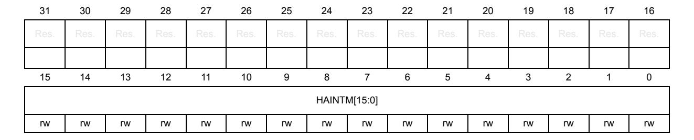

Bits 31:16 Reserved, must be kept at reset value.

Bits 15:0 **HAINTM[15:0]:** Channel interrupt mask

0: Masked interrupt

1: Unmasked interrupt

One bit per channel: Bit 0 for channel 0, bit 15 for channel 15

RM0399 Rev 4 2811/3556

# <span id="page-69-0"></span>60.14.27 OTG host frame list base address register (OTG\_HFLBADDR)

Address offset: 0x41C Reset value: 0x0000 0000

This register holds the starting address of the frame list information (scatter/gather mode).

| 31 | 30              | 29 | 28 | 27 | 26 | 25 | 24     | 23       | 22 | 21 | 20 | 19 | 18 | 17 | 16 |
|----|-----------------|----|----|----|----|----|--------|----------|----|----|----|----|----|----|----|
|    | HFLBADDR[31:16] |    |    |    |    |    |        |          |    |    |    |    |    |    |    |
| rw | rw              | rw | rw | rw | rw | rw | rw     | rw       | rw | rw | rw | rw | rw | rw | rw |
| 15 | 14              | 13 | 12 | 11 | 10 | 9  | 8      | 7        | 6  | 5  | 4  | 3  | 2  | 1  | 0  |
|    |                 |    |    |    |    |    | HFLBAD | DR[15:0] |    |    |    |    |    |    |    |
| rw | rw              | rw | rw | rw | rw | rw | rw     | rw       | rw | rw | rw | rw | rw | rw | rw |

Bits 31:0 **HFLBADDR[31:0]**: The starting address of the frame list (scatter/gather mode). This register is used only for isochronous and interrupt channels.

# <span id="page-69-1"></span>60.14.28 OTG host port control and status register (OTG\_HPRT)

Address offset: 0x440 Reset value: 0x0000 0000

This register is available only in host mode. Currently, the OTG host supports only one port.

A single register holds USB port-related information such as USB reset, enable, suspend, resume, connect status, and test mode for each port. It is shown in *Figure 801*. The rc\_w1 bits in this register can trigger an interrupt to the application through the host port interrupt bit of the core interrupt register (HPRTINT bit in OTG\_GINTSTS). On a port interrupt, the application must read this register and clear the bit that caused the interrupt. For the rc\_w1 bits, the application must write a 1 to the bit to clear the interrupt.

| 31   | 30        | 29   | 28              | 27   | 26   | 25   | 24    | 23   | 22          | 21    | 20          | 19    | 18        | 17    | 16           |
|------|-----------|------|-----------------|------|------|------|-------|------|-------------|-------|-------------|-------|-----------|-------|--------------|
| Res. | Res.      | Res. | Res.            | Res. | Res. | Res. | Res.  | Res. | Res.        | Res.  | Res.        | Res.  | PSPD[1:0] |       | PTCTL<br>[3] |
|      |           |      |                 |      |      |      |       |      |             |       |             |       | r         | r     | rw           |
| 15   | 14        | 13   | 12              | 11   | 10   | 9    | 8     | 7    | 6           | 5     | 4           | 3     | 2         | 1     | 0            |
| F    | PTCTL[2:0 | )]   | PPWR PLSTS[1:0] |      | Res. | PRST | PSUSP | PRES | POC<br>CHNG | POCA  | PEN<br>CHNG | PENA  | PCDET     | PCSTS |              |
| rw   | rw        | rw   | rw              | r    | r    |      | rw    | rs   | rw          | rc_w1 | r           | rc_w1 | rc_w1     | rc_w1 | r            |

Bits 31:19 Reserved, must be kept at reset value.

#### Bits 18:17 **PSPD[1:0]:** Port speed

Indicates the speed of the device attached to this port.

01: Full speed 10: Low speed 11: Reserved 00: High speed

#### Bits 16:13 **PTCTL[3:0]:** Port test control

The application writes a nonzero value to this field to put the port into a Test mode, and the corresponding pattern is signaled on the port.

0000: Test mode disabled 0001: Test\_J mode 0010: Test\_K mode 0011: Test\_SE0\_NAK mode 0100: Test\_Packet mode 0101: Test\_Force\_Enable Others: Reserved

# Bit 12 **PPWR:** Port power

The application uses this field to control power to this port, and the core clears this bit on an overcurrent condition.

0: Power off 1: Power on

#### Bits 11:10 **PLSTS[1:0]:** Port line status

Indicates the current logic level USB data lines

Bit 10: Logic level of OTG\_DP Bit 11: Logic level of OTG\_DM

Bit 9 Reserved, must be kept at reset value.

# Bit 8 **PRST:** Port reset

When the application sets this bit, a reset sequence is started on this port. The application must time the reset period and clear this bit after the reset sequence is complete.

0: Port not in reset

1: Port in reset

The application must leave this bit set for a minimum duration of at least 10 ms to start a reset on the port. The application can leave it set for another 10 ms in addition to the required minimum duration, before clearing the bit, even though there is no maximum limit set by the USB standard.

High speed: 50 ms

Full speed/Low speed: 10 ms

### Bit 7 **PSUSP:** Port suspend

The application sets this bit to put this port in suspend mode. The core only stops sending SOFs when this is set. To stop the PHY clock, the application must set the port clock stop bit, which asserts the suspend input pin of the PHY.

The read value of this bit reflects the current suspend status of the port. This bit is cleared by the core after a remote wake-up signal is detected or the application sets the port reset bit or port resume bit in this register or the resume/remote wake-up detected interrupt bit or disconnect detected interrupt bit in the core interrupt register (WKUPINT or DISCINT in OTG\_GINTSTS, respectively).

0: Port not in suspend mode

1: Port in suspend mode


RM0399 Rev 4 2813/3556

#### Bit 6 **PRES:** Port resume

The application sets this bit to drive resume signaling on the port. The core continues to drive the resume signal until the application clears this bit.

If the core detects a USB remote wake-up sequence, as indicated by the port resume/remote wake-up detected interrupt bit of the core interrupt register (WKUPINT bit in

OTG\_GINTSTS), the core starts driving resume signaling without application intervention and clears this bit when it detects a disconnect condition. The read value of this bit indicates whether the core is currently driving resume signaling.

- 0: No resume driven
- 1: Resume driven

When LPM is enabled and the core is in L1 state, the behavior of this bit is as follow:

- 1. The application sets this bit to drive resume signaling on the port.
- 2. The core continues to drive the resume signal until a predetermined time specified in BESLTHRS[3:0] field of OTG\_GLPMCFG register.
- 3. If the core detects a USB remote wake-up sequence, as indicated by the port L1Resume/Remote L1Wakeup detected interrupt bit of the core interrupt register (WKUPINT in OTG\_GINTSTS), the core starts driving resume signaling without application intervention and clears this bit at the end of resume.This bit can be set or cleared by both the core and the application. This bit is cleared by the core even if there is no device connected to the host.

#### Bit 5 **POCCHNG:** Port overcurrent change

The core sets this bit when the status of the port overcurrent active bit (bit 4) in this register changes.

# Bit 4 **POCA:** Port overcurrent active

Indicates the overcurrent condition of the port.

- 0: No overcurrent condition
- 1: Overcurrent condition

#### Bit 3 **PENCHNG:** Port enable/disable change

The core sets this bit when the status of the port enable bit 2 in this register changes.

### Bit 2 **PENA:** Port enable

A port is enabled only by the core after a reset sequence, and is disabled by an overcurrent condition, a disconnect condition, or by the application clearing this bit. The application cannot set this bit by a register write. It can only clear it to disable the port. This bit does not trigger any interrupt to the application.

- 0: Port disabled
- 1: Port enabled

# Bit 1 **PCDET:** Port connect detected

The core sets this bit when a device connection is detected to trigger an interrupt to the application using the host port interrupt bit in the core interrupt register (HPRTINT bit in OTG\_GINTSTS). The application must write a 1 to this bit to clear the interrupt.

# Bit 0 **PCSTS:** Port connect status

- 0: No device is attached to the port
- 1: A device is attached to the port

# <span id="page-72-0"></span>**60.14.29 OTG host channel x characteristics register (OTG\_HCCHARx)**

Address offset: 0x500 + 0x20 \* x, (x = 0 to 15)

Reset value: 0x0000 0000

| 31          | 30         | 29         | 28 | 27 | 26 | 25       | 24 | 23 | 22 | 21          | 20 | 19         | 18    | 17   | 16 |
|-------------|------------|------------|----|----|----|----------|----|----|----|-------------|----|------------|-------|------|----|
| CHENA CHDIS |            | ODD<br>FRM |    |    |    | DAD[6:0] |    |    |    | MCNT[1:0]   |    | EPTYP[1:0] | LSDEV | Res. |    |
| rs          | rs         | rw         | rw | rw | rw | rw       | rw | rw | rw | rw          | rw | rw         | rw    | rw   |    |
| 15          | 14         | 13         | 12 | 11 | 10 | 9        | 8  | 7  | 6  | 5           | 4  | 3          | 2     | 1    | 0  |
| EPDIR       | EPNUM[3:0] |            |    |    |    |          |    |    |    | MPSIZ[10:0] |    |            |       |      |    |
| rw          | rw         | rw         | rw | rw | rw | rw       | rw | rw | rw | rw          | rw | rw         | rw    | rw   | rw |

#### Bit 31 **CHENA:** Channel enable

When Scatter/Gather mode is enabled:

1'b0: Indicates that the descriptor structure is not yet ready

 1'b1: Indicates that the descriptor structure and data buffer with data is setup and this channel can access the descriptor

When Scatter/Gather mode is disabled: This field is set by the application and cleared by the OTG host.

0: Channel disabled

1: Channel enabled

### Bit 30 **CHDIS:** Channel disable

The application sets this bit to stop transmitting/receiving data on a channel, even before the transfer for that channel is complete. The application must wait for the Channel disabled interrupt before treating the channel as disabled.

#### Bit 29 **ODDFRM:** Odd frame

This field is set (reset) by the application to indicate that the OTG host must perform a transfer in an odd frame. This field is applicable for only periodic (isochronous and interrupt) transactions.

0: Even frame

1: Odd frame

#### Bits 28:22 **DAD[6:0]:** Device address

This field selects the specific device serving as the data source or sink.

#### Bits 21:20 **MCNT[1:0]:** Multicount

This field indicates to the host the number of transactions that must be executed per frame for this periodic endpoint. For non-periodic transfers, this field is not used

00: Reserved. This field yields undefined results

01: 1 transaction

10: 2 transactions per frame to be issued for this endpoint

11: 3 transactions per frame to be issued for this endpoint

*Note: This field must be set to at least 01.*

### Bits 19:18 **EPTYP[1:0]:** Endpoint type

Indicates the transfer type selected.

00: Control 01: Isochronous

10: Bulk 11: Interrupt


RM0399 Rev 4 2815/3556

#### Bit 17 LSDEV: Low-speed device

This field is set by the application to indicate that this channel is communicating to a low-speed device.

Bit 16 Reserved, must be kept at reset value.

Bit 15 EPDIR: Endpoint direction

Indicates whether the transaction is IN or OUT.

0: OUT 1: IN

Bits 14:11 **EPNUM[3:0]:** Endpoint number

Indicates the endpoint number on the device serving as the data source or sink.

Bits 10:0 MPSIZ[10:0]: Maximum packet size

Indicates the maximum packet size of the associated endpoint.

# <span id="page-73-0"></span>60.14.30 OTG host channel x split control register (OTG\_HCSPLTx)

Address offset: 0x504 + 0x20 \* x, (x = 0 to 15)

Reset value: 0x0000 0000

| 31          | 30      | 29   | 28   | 27   | 26      | 25   | 24   | 23   | 22   | 21   | 20       | 19   | 18   | 17   | 16            |
|-------------|---------|------|------|------|---------|------|------|------|------|------|----------|------|------|------|---------------|
| SPLIT<br>EN | Res.    | Res. | Res. | Res. | Res.    | Res. | Res. | Res. | Res. | Res. | Res.     | Res. | Res. | Res. | COMP<br>LSPLT |
| rw          |         |      |      |      |         |      |      |      |      |      |          |      |      |      | rw            |
| 15          | 14      | 13   | 12   | 11   | 10      | 9    | 8    | 7    | 6    | 5    | 4        | 3    | 2    | 1    | 0             |
| XACTP       | OS[1:0] |      |      | HU   | BADDR[6 | 6:0] |      |      |      | PF   | RTADDR[6 | 6:0] | _    |      |               |
| rw          | rw      | rw   | rw   | rw   | rw      | rw   | rw   | rw   | rw   | rw   | rw       | rw   | rw   | rw   | rw            |

# Bit 31 SPLITEN: Split enable

The application sets this bit to indicate that this channel is enabled to perform split transactions.

Bits 30:17 Reserved, must be kept at reset value.

#### Bit 16 COMPLSPLT: Do complete split

The application sets this bit to request the OTG host to perform a complete split transaction.

#### Bits 15:14 XACTPOS[1:0]: Transaction position

This field is used to determine whether to send all, first, middle, or last payloads with each OUT transaction.

11: All. This is the entire data payload of this transaction (which is less than or equal to 188 bytes)

10: Begin. This is the first data payload of this transaction (which is larger than 188 bytes)

00: Mid. This is the middle payload of this transaction (which is larger than 188 bytes)

01: End. This is the last payload of this transaction (which is larger than 188 bytes)

### Bits 13:7 HUBADDR[6:0]: Hub address

This field holds the device address of the transaction translator's hub.

#### Bits 6:0 PRTADDR[6:0]: Port address

This field is the port number of the recipient transaction translator.

# <span id="page-74-0"></span>60.14.31 OTG host channel x interrupt register (OTG HCINTx)

Address offset: 0x508 + 0x20 \* x, (x = 0 to 15)

Reset value: 0x0000 0000

This register indicates the status of a channel with respect to USB- and AHB-related events. It is shown in *Figure 801*. The application must read this register when the host channels interrupt bit in the core interrupt register (HCINT bit in OTG\_GINTSTS) is set. Before the application can read this register, it must first read the host all channels interrupt (OTG\_HAINT) register to get the exact channel number for the host channel-x interrupt register. The application must clear the appropriate bit in this register to clear the corresponding bits in the OTG\_HAINT and OTG\_GINTSTS registers.

| 31   | 30   | 29                  | 28                 | 27    | 26    | 25        | 24    | 23    | 22    | 21    | 20    | 19    | 18         | 17    | 16    |
|------|------|---------------------|--------------------|-------|-------|-----------|-------|-------|-------|-------|-------|-------|------------|-------|-------|
| Res. | Res. | Res.                | Res.               | Res.  | Res.  | Res.      | Res.  | Res.  | Res.  | Res.  | Res.  | Res.  | Res.       | Res.  | Res.  |
|      |      |                     |                    |       |       |           |       |       |       |       |       |       |            |       |       |
| 15   | 14   | 13                  | 12                 | 11    | 10    | 9         | 8     | 7     | 6     | 5     | 4     | 3     | 2          | 1     | 0     |
| Res. | Res. | DE<br>SCLST<br>ROLL | XC<br>SXACT<br>ERR | BNA   | DTERR | FRM<br>OR | BBERR | TXERR | NYET  | ACK   | NAK   | STALL | AHB<br>ERR | СНН   | XFRC  |
|      |      | rc_w1               | rc_w1              | rc_w1 | rc_w1 | rc_w1     | rc_w1 | rc_w1 | rc_w1 | rc_w1 | rc_w1 | rc_w1 | rc_w1      | rc_w1 | rc_w1 |

Bits 31:14 Reserved, must be kept at reset value.

#### Bit 13 **DESCLSTROLL:** Descriptor rollover interrupt.

This bit is valid only when Scatter/Gather DMA mode is enabled. The core sets this bit when the corresponding channel descriptor list rolls over. For non Scatter/Gather DMA mode, this bit is reserved.

# Bit 12 XCSXACTERR: Excessive transaction error.

This bit is valid only when Scatter/Gather DMA mode is enabled. The core sets this bit when 3 consecutive transaction errors occurred on the USB bus. XCS\_XACT\_ERR is not generated for isochronous channels. For non Scatter/Gather DMA mode, this bit is reserved.

### Bit 11 BNA: Buffer not available interrupt.

This bit is valid only when Scatter/Gather DMA mode is enabled. The core generates this interrupt when the descriptor accessed is not ready for the core to process. BNA interrupt is not generated for isochronous channels. For non Scatter/Gather DMA mode, this bit is reserved.

- Bit 10 **DTERR:** Data toggle error. In Scatter/Gather DMA mode, the interrupt due to this bit is masked
- Bit 9 FRMOR: Frame overrun. In Scatter/Gather DMA mode, the interrupt due to this bit is masked.
- Bit 8 BBERR: Babble error. In Scatter/Gather DMA mode, the interrupt due to this bit is masked.
- Bit 7 **TXERR:** Transaction error. In Scatter/Gather DMA mode, the interrupt due to this bit is masked.

Indicates one of the following errors occurred on the USB.

CRC check failure

Timeout

Bit stuff error

False EOP

- Bit 6 NYET: Not yet ready response received interrupt. In Scatter/Gather DMA mode, the interrupt due to this bit is masked.
- Bit 5 **ACK:** ACK response received/transmitted interrupt. In Scatter/Gather DMA mode, the interrupt due to this bit is masked.
- Bit 4 NAK: NAK response received interrupt. In Scatter/Gather DMA mode, the interrupt due to this bit is masked.
- Bit 3 **STALL:** STALL response received interrupt. In Scatter/Gather DMA mode, the interrupt due to this bit is masked.

#### Bit 2 AHBERR: AHB error

This error is generated only in Internal DMA mode when an AHB error occurs during an AHB read/write operation. The application can read the corresponding DMA channel address register to get the error address.

#### Bit 1 CHH: Channel halted.

In non scatter/gather DMA mode indicates the transfer completed abnormally either because of any USB transaction error or in response to disable request by the application. In scatter/gather DMA mode, this indicates that transfer completed due to any of the following:

- EOL being set in descriptor
- AHB error
- Excessive transaction errors
- In response to disable request by the application
- Babble
- Stall

#### Bit 0 XFRC: Transfer completed.

Transfer completed normally without any errors.

# <span id="page-75-0"></span>60.14.32 OTG host channel x interrupt mask register (OTG HCINTMSKx)

Address offset: 0x50C + 0x20 \* x, (x = 0 to 15)

Reset value: 0x0000 0000

This register reflects the mask for each channel status described in the previous section.

| 31   | 30   | 29                         | 28   | 27         | 26         | 25         | 24         | 23         | 22   | 21   | 20   | 19         | 18          | 1/   | 16        |
|------|------|----------------------------|------|------------|------------|------------|------------|------------|------|------|------|------------|-------------|------|-----------|
| Res. | Res. | Res.                       | Res. | Res.       | Res.       | Res.       | Res.       | Res.       | Res. | Res. | Res. | Res.       | Res.        | Res. | Res.      |
|      |      |                            |      |            |            |            |            |            |      |      |      |            |             |      |           |
| 15   | 14   | 13                         | 12   | 11         | 10         | 9          | 8          | 7          | 6    | 5    | 4    | 3          | 2           | 1    | 0         |
| Res. | Res. | DE<br>SCLST<br>ROLLM<br>SK | Res. | BN<br>AMSK | DTERR<br>M | FRM<br>ORM | BBERR<br>M | TXERR<br>M | NYET | ACKM | NAKM | STALL<br>M | AHB<br>ERRM | СННМ | XFRC<br>M |
|      |      | rw                         |      | rw         | rw         | rw         | rw         | rw         | rw   | rw   | rw   | rw         | rw          | rw   | rw        |


- Bits 31:14 Reserved, must be kept at reset value.
  - Bit 13 **DESCLSTROLLMSK:** Descriptor rollover interrupt mask register.

This bit is valid only when Scatter/Gather DMA mode is enabled.

In non Scatter/Gather DMA mode, this bit is reserved.

- Bit 12 Reserved, must be kept at reset value.
- Bit 11 **BNAMSK:** Buffer not available interrupt mask register.

This bit is valid only when Scatter/Gather DMA mode is enabled.

In non Scatter/Gather DMA mode, this bit is reserved

- Bit 10 **DTERRM:** Data toggle error mask. In Scatter/Gather DMA mode, the interrupt due to this bit is masked.
  - 0: Masked interrupt
  - 1: Unmasked interrupt
- Bit 9 **FRMORM:** Frame overrun mask. In Scatter/Gather DMA mode, the interrupt due to this bit is masked.
  - 0: Masked interrupt
  - 1: Unmasked interrupt
- Bit 8 **BBERRM:** Babble error mask. In Scatter/Gather DMA mode, the interrupt due to this bit is masked.
  - 0: Masked interrupt
  - 1: Unmasked interrupt
- Bit 7 **TXERRM:** Transaction error mask. In Scatter/Gather DMA mode, the interrupt due to this bit is masked.
  - 0: Masked interrupt
  - 1: Unmasked interrupt
- Bit 6 **NYET:** response received interrupt mask. In Scatter/Gather DMA mode, the interrupt due to this bit is masked.
  - 0: Masked interrupt
  - 1: Unmasked interrupt
- Bit 5 **ACKM:** ACK response received/transmitted interrupt mask. In Scatter/Gather DMA mode, the interrupt due to this bit is masked.
  - 0: Masked interrupt
  - 1: Unmasked interrupt
- Bit 4 **NAKM:** NAK response received interrupt mask. In Scatter/Gather DMA mode, the interrupt due to this bit is masked.
  - 0: Masked interrupt
  - 1: Unmasked interrupt
- Bit 3 **STALLM:** STALL response received interrupt mask. In Scatter/Gather DMA mode, the interrupt due to this bit is masked.
  - 0: Masked interrupt
  - 1: Unmasked interrupt


Bit 2 **AHBERRM:** AHB error. In scatter/gather DMA mode for host, interrupts will not be generated due to the corresponding bits set in OTG\_HCINTx.

0: Masked interrupt

1: Unmasked interrupt

Bit 1 **CHHM:** Channel halted mask

0: Masked interrupt 1: Unmasked interrupt

Bit 0 **XFRCM:** Transfer completed mask

0: Masked interrupt 1: Unmasked interrupt

# <span id="page-77-0"></span>**60.14.33 OTG host channel x transfer size register (OTG\_HCTSIZx)**

Address offset: 0x510 + 0x20 \* x, (x = 0 to 15)

Reset value: 0x0000 0000

| 31        | 30           | 29        | 28 | 27 | 26 | 25 | 24 | 23          | 22 | 21 | 20 | 19 | 18 | 17            | 16 |
|-----------|--------------|-----------|----|----|----|----|----|-------------|----|----|----|----|----|---------------|----|
| DO<br>PNG |              | DPID[1:0] |    |    |    |    |    | PKTCNT[9:0] |    |    |    |    |    | XFRSIZ[18:16] |    |
| rw        | rw           | rw        | rw | rw | rw | rw | rw | rw          | rw | rw | rw | rw | rw | rw            | rw |
| 15        | 14           | 13        | 12 | 11 | 10 | 9  | 8  | 7           | 6  | 5  | 4  | 3  | 2  | 1             | 0  |
|           | XFRSIZ[15:0] |           |    |    |    |    |    |             |    |    |    |    |    |               |    |
| rw        | rw           | rw        | rw | rw | rw | rw | rw | rw          | rw | rw | rw | rw | rw | rw            | rw |

### Bit 31 **DOPNG:** Do Ping

This bit is used only for OUT transfers. Setting this field to 1 directs the host to do PING protocol.

*Note: Do not set this bit for IN transfers. If this bit is set for IN transfers, it disables the channel.*

#### Bits 30:29 **DPID[1:0]:** Data PID

The application programs this field with the type of PID to use for the initial transaction. The host maintains this field for the rest of the transfer.

00: DATA0 01: DATA2 10: DATA1

11: SETUP (control) / MDATA (non-control)

#### Bits 28:19 **PKTCNT[9:0]:** Packet count

This field is programmed by the application with the expected number of packets to be transmitted (OUT) or received (IN).

The host decrements this count on every successful transmission or reception of an OUT/IN packet. Once this count reaches zero, the application is interrupted to indicate normal completion.

#### Bits 18:0 **XFRSIZ[18:0]:** Transfer size

For an OUT, this field is the number of data bytes the host sends during the transfer. For an IN, this field is the buffer size that the application has reserved for the transfer. The application is expected to program this field as an integer multiple of the maximum packet size for IN transactions (periodic and non-periodic).


# <span id="page-78-0"></span>**60.14.34 OTG host channel x transfer size register (OTG\_HCTSIZSGx)**

Address offset: 0x510 + 0x20 \* x, (x = 0 to 15)

Reset value: 0x0000 0000

| 31        | 30       | 29       | 28   | 27   | 26   | 25   | 24   | 23   | 22   | 21              | 20   | 19   | 18   | 17   | 16   |  |  |
|-----------|----------|----------|------|------|------|------|------|------|------|-----------------|------|------|------|------|------|--|--|
| DO<br>PNG |          | PID[1:0] | Res. | Res. | Res. | Res. | Res. | Res. | Res. | Res.            | Res. | Res. | Res. | Res. | Res. |  |  |
| rw        | rw       | rw       |      |      |      |      |      |      |      |                 |      |      |      |      |      |  |  |
| 15        | 14       | 13       | 12   | 11   | 10   | 9    | 8    | 7    | 6    | 5               | 4    | 3    | 2    | 1    | 0    |  |  |
|           | NTD[7:0] |          |      |      |      |      |      |      |      | SCHED_INFO[7:0] |      |      |      |      |      |  |  |
| rw        | rw       | rw       | rw   | rw   | rw   | rw   | rw   | rw   | rw   | rw              | rw   | rw   | rw   | rw   | rw   |  |  |

#### Bit 31 **DOPNG:** Do Ping

This bit is used only for OUT transfers. Setting this field to 1 directs the host to do PING protocol.

*Note: Do not set this bit for IN transfers. If this bit is set for IN transfers, it disables the channel.*

#### Bits 30:29 **PID[1:0]:** Pid

The application programs this field with the type of PID to use for the initial transaction. The host maintains this field for the rest of the transfer.

00: DATA0 01: DATA2 10: DATA1

11: MDATA (non-control) / SETUP (control)

Bits 28:16 Reserved, must be kept at reset value.

#### Bits 15:8 **NTD[7:0]:** Number of transfer descriptors

Non isochronous: this value is in terms of number of descriptors. The maximum number of descriptor that can be present in the list is 64. The values can be from 0 to 63.

0: 1 descriptor 1: 2 descriptors

...

63: 64 descriptors Others: Reserved

This field indicates the total number of descriptors present in that list. The core will wrap around after servicing NTD number of descriptors for that list.

Isochronous: this field indicates the number of descriptors present in that list.

The possible values for FS are:

1: 2 descriptors 3: 4 descriptors 7: 8 descriptors 15: 16 descriptors 31: 32 descriptors 63: 64: descriptors Others: Reserved

The possible values for HS are:

7: 8 descriptors 15: 16 descriptors 31: 32 descriptors 63: 64 descriptors 127: 128 descriptors 255: 256 descriptors Others: Reserved

### Bits 7:0 **SCHED\_INFO[7:0]**: Schedule information

Every bit in this 8 bit register indicates scheduling for that microframe. Bit 0 indicates scheduling for 1st microframe and bit 7 indicates scheduling for 8th microframe in that frame. A value of 0b11111111 indicates that the corresponding interrupt channel is scheduled to issue a token every microframe in that frame. A value of 0b10101010 indicates that the corresponding interrupt channel is scheduled to issue a token every alternate microframe starting with second microframe. Note that this field is applicable only for periodic (isochronous and interrupt) channels.


# <span id="page-80-0"></span>**60.14.35 OTG host channel x DMA address register in buffer DMA [alternate] (OTG\_HCDMAx)**

Address offset: 0x514 + 0x20 \* x, (x = 0 to 15)

Reset value: 0x0000 0000

| 31 | 30             | 29 | 28 | 27 | 26 | 25 | 24 | 23 | 22 | 21 | 20 | 19 | 18 | 17 | 16 |
|----|----------------|----|----|----|----|----|----|----|----|----|----|----|----|----|----|
|    | DMAADDR[31:16] |    |    |    |    |    |    |    |    |    |    |    |    |    |    |
| rw | rw             | rw | rw | rw | rw | rw | rw | rw | rw | rw | rw | rw | rw | rw | rw |
| 15 | 14             | 13 | 12 | 11 | 10 | 9  | 8  | 7  | 6  | 5  | 4  | 3  | 2  | 1  | 0  |
|    | DMAADDR[15:0]  |    |    |    |    |    |    |    |    |    |    |    |    |    |    |
| rw | rw             | rw | rw | rw | rw | rw | rw | rw | rw | rw | rw | rw | rw | rw | rw |

Bits 31:0 **DMAADDR[31:0]:** DMA address

This field holds the start address in the external memory from which the data for the endpoint must be fetched or to which it must be stored. This register is incremented on every AHB transaction.

# <span id="page-80-1"></span>**60.14.36 OTG host channel x DMA address register in scatter/gather DMA [alternate] (OTG\_HCDMASGx)**

Address offset: 0x514 + 0x20 \* x, (x = 0 to 15)

Reset value: 0x0000 0000

| 31 | 30           | 29 | 28 | 27 | 26 | 25 | 24 | 23 | 22 | 21 | 20 | 19 | 18 | 17   | 16   |
|----|--------------|----|----|----|----|----|----|----|----|----|----|----|----|------|------|
|    | DMASG[31:16] |    |    |    |    |    |    |    |    |    |    |    |    |      |      |
| rw | rw           | rw | rw | rw | rw | rw | rw | rw | rw | rw | rw | rw | rw | rw   | rw   |
| 15 | 14           | 13 | 12 | 11 | 10 | 9  | 8  | 7  | 6  | 5  | 4  | 3  | 2  | 1    | 0    |
|    | DMASG[15:3]  |    |    |    |    |    |    |    |    |    |    |    |    | Res. | Res. |
| rw | rw           | rw | rw | rw | rw | rw | rw | rw | rw | rw | rw | rw |    |      |      |

RM0399 Rev 4 2823/3556

#### Bits 31:3 **DMASG[31:3]:** DMA scatter/gather information

The DMASG information is composed of two parts DMASG\_ADDR = DMASG[31:N] and DMASG\_CTD = DAMSG[N-1:3].

#### Non-isochronous case (N = 9):

The DAMSG\_ADDR field holds the start address of the 512 bytes page. The first descriptor in the list should be located in this address. The first descriptor may be or may not be ready. The core starts processing the list from the CTD value.

The DMASG\_CTD field holds a value in terms of number of descriptors. The values can be from 0 (1 descriptor) to 63 (64 descriptors). This field indicates the current descriptor processed in the list. This field is updated both by application and the core. For example, if the application enables the channel after programming CTD = 5, then the core will start processing the 6th descriptor. The address is obtained by adding a value of 8 \* 5 = 40 bytes (decimal) to DMAAddr.

#### Isochronous case (N=4 to 11):

The DAMSG\_ADDR field holds the address of the 2\*(NTD+1) bytes of locations in which the isochronous descriptors are present where N is based on NTD as per the following table:

```
HS ISOC; NTD = 7: N = 6
HS ISOC; NTD = 15: N = 7
HS ISOC; NTD = 31: N = 8
HS ISOC; NTD = 63: N = 9
HS ISOC; NTD = 127: N = 10
HS ISOC; NTD = 255: N = 11
FS ISOC; NTD = 1: N = 4
FS ISOC; NTD = 3: N = 5
FS ISOC; NTD = 7: N = 6
FS ISOC; NTD = 15: N = 7
FS ISOC; NTD = 31: N = 8
FS ISOC; NTD = 63: N = 9
```

The DMASG\_CTD field is based on the current frame/(micro)frame value. Need to be set to zero by application.

Bits 2:0 Reserved, must be kept at reset value.

# <span id="page-81-0"></span>**60.14.37 OTG host channel-n DMA address buffer register (OTG\_HCDMABx)**

Address offset: 0x51C + 0x20 \* x, (x = 0 to 15) Reset value: 0x0000 0000 (0x0000 0000)

| 31 | 30            | 29 | 28 | 27 | 26 | 25 | 24 | 23 | 22 | 21 | 20 | 19 | 18 | 17 | 16 |
|----|---------------|----|----|----|----|----|----|----|----|----|----|----|----|----|----|
|    | HCDMAB[31:16] |    |    |    |    |    |    |    |    |    |    |    |    |    |    |
| r  | r             | r  | r  | r  | r  | r  | r  | r  | r  | r  | r  | r  | r  | r  | r  |
| 15 | 14            | 13 | 12 | 11 | 10 | 9  | 8  | 7  | 6  | 5  | 4  | 3  | 2  | 1  | 0  |
|    | HCDMAB[15:0]  |    |    |    |    |    |    |    |    |    |    |    |    |    |    |
| r  | r             | r  | r  | r  | r  | r  | r  | r  | r  | r  | r  | r  | r  | r  | r  |

Bits 31:0 **HCDMAB[31:0]:** DMA address

This register holds the current buffer address (scatter/gather mode).

# 60.14.38 Device-mode registers

These registers must be programmed every time the core changes to device mode

# <span id="page-82-0"></span>60.14.39 OTG device configuration register (OTG\_DCFG)

Address offset: 0x800 Reset value: 0x0220 0000

This register configures the core in device mode after power-on or after certain control commands or enumeration. Do not make changes to this register after initial programming.

| 31          | 30          | 29   | 28   | 27   | 26   | 25             | 24 | 23            | 22   | 21   | 20   | 19   | 18           | 17   | 16     |
|-------------|-------------|------|------|------|------|----------------|----|---------------|------|------|------|------|--------------|------|--------|
| Res.        | Res.        | Res. | Res. | Res. | Res. | PERSCHIVL[1:0] |    | DESCD<br>MA   | Res. | Res. | Res. | Res. | Res.         | Res. | Res.   |
|             |             |      |      |      |      | rw             | rw | rw            |      |      |      |      |              |      |        |
| 15          | 14          | 13   | 12   | 11   | 10   | 9              | 8  | 7             | 6    | 5    | 4    | •    | 2            |      | _      |
|             |             |      |      |      | 10   | 9              | 0  | /             | О    | 5    | 4    | 3    | 2            | 1    | U      |
| ERRAT<br>IM | XCVR<br>DLY | Res. | PFIV |      | 10   | 9              |    | /<br>DAD[6:0] |      | 5    | 4    | Res. | NZLSO<br>HSK | DSPI | D[1:0] |

Bits 31:26 Reserved, must be kept at reset value.

# Bits 25:24 PERSCHIVL[1:0]: Periodic schedule interval

This field specifies the amount of time the Internal DMA engine must allocate for fetching periodic IN endpoint data. Based on the number of periodic endpoints, this value must be specified as 25, 50 or 75% of the (micro) frame.

- When any periodic endpoints are active, the internal DMA engine allocates the specified amount of time in fetching periodic IN endpoint data
- When no periodic endpoint is active, then the internal DMA engine services nonperiodic endpoints, ignoring this field
- After the specified time within a (micro) frame, the DMA switches to fetching nonperiodic endpoints

00: 25% of (micro)frame 01: 50% of (micro)frame 10: 75% of (micro)frame

11: Reserved

Note: Periodic Scheduling Interval (PERSCHIVL) must be programmed for Scatter/Gather DMA mode.

# Bit 23 DESCDMA: Enable scatter/gather DMA in device mode

The application can set this bit during initialization to enable the Scatter/Gather DMA operation. This bit must be modified only once after a reset. The following combinations are available for programming:

OTG\_GAHBCFG.DMAEN=0,OTG\_DCFG.DESCDMA=0 => Slave mode
OTG\_GAHBCFG.DMAEN=0,OTG\_DCFG.DESCDMA=1 => Invalid
OTG\_GAHBCFG.DMAEN=1,OTG\_DCFG.DESCDMA=0 => Buffer DMA mode
OTG\_GAHBCFG.DMAEN=1,OTG\_DCFG.DESCDMA=1 => Scatter/Gather DMA mode

Bits 22:16 Reserved, must be kept at reset value.


#### Bit 15 **ERRATIM:** Erratic error interrupt mask

- 1: Mask early suspend interrupt on erratic error
- 0: Early suspend interrupt is generated on erratic error

#### Bit 14 **XCVRDLY:** Transceiver delay

Enables or disables delay in ULPI timing during device chirp.

- 0: Disable delay (use default timing)
- 1: Enable delay to default timing, necessary for some ULPI PHYs
- Bit 13 Reserved, must be kept at reset value.

#### Bits 12:11 **PFIVL[1:0]:** Periodic frame interval

Indicates the time within a frame at which the application must be notified using the end of periodic frame interrupt. This can be used to determine if all the isochronous traffic for that frame is complete.

00: 80% of the frame interval

01: 85% of the frame interval

10: 90% of the frame interval

11: 95% of the frame interval

#### Bits 10:4 **DAD[6:0]:** Device address

The application must program this field after every SetAddress control command.

Bit 3 Reserved, must be kept at reset value.

#### Bit 2 **NZLSOHSK:** Non-zero-length status OUT handshake

The application can use this field to select the handshake the core sends on receiving a nonzero-length data packet during the OUT transaction of a control transfer's status stage. 1:Send a STALL handshake on a nonzero-length status OUT transaction and do not send the received OUT packet to the application.

0:Send the received OUT packet to the application (zero-length or nonzero-length) and send a handshake based on the NAK and STALL bits for the endpoint in the device endpoint control register.

# Bits 1:0 **DSPD[1:0]:** Device speed

Indicates the speed at which the application requires the core to enumerate, or the maximum speed the application can support. However, the actual bus speed is determined only after the chirp sequence is completed, and is based on the speed of the USB host to which the core is connected.

00: High speed

01: Full speed using HS

10: Reserved

11: Full speed using internal FS PHY


# <span id="page-84-0"></span>60.14.40 OTG device control register (OTG DCTL)

Address offset: 0x804 Reset value: 0x0000 0002

| 31         | 30         | 29         | 28         | 27               | 26               | 25              | 24              | 23              | 22   | 21            | 20       | 19         | 18                 | 17                  | 16              |
|------------|------------|------------|------------|------------------|------------------|-----------------|-----------------|-----------------|------|---------------|----------|------------|--------------------|---------------------|-----------------|
| Res.       | Res.       | Res.       | Res.       | Res.             | Res.             | Res.            | Res.            | Res.            | Res. | Res.          | Res.     | Res.       | DS<br>BESL<br>RJCT | ENCO<br>NTONB<br>NA | Res.            |
|            |            |            |            |                  |                  |                 |                 |                 |      |               |          |            | rw                 | rw                  |                 |
|            |            |            |            |                  |                  |                 |                 |                 |      |               |          |            |                    |                     |                 |
| 15         | 14         | 13         | 12         | 11               | 10               | 9               | 8               | 7               | 6    | 5             | 4        | 3          | 2                  | 1                   | 0               |
| 15<br>Res. | 14<br>Res. | 13<br>Res. | 12<br>Res. | PO<br>PRG<br>DNE | 10<br>CGO<br>NAK | 9<br>SGO<br>NAK | 8<br>CGI<br>NAK | 7<br>SGI<br>NAK |      | 5<br>TCTL[2:0 | <u> </u> | GON<br>STS | GIN<br>STS         | 1<br>SDIS           | 0<br>RWU<br>SIG |

Bits 31:19 Reserved, must be kept at reset value.

#### Bit 18 DSBESLRJCT: Deep sleep BESL reject

Core rejects LPM request with BESL value greater than BESL threshold programmed. NYET response is sent for LPM tokens with BESL value greater than BESL threshold. By default, the deep sleep BESL reject feature is disabled.

### Bit 17 ENCONTONBNA: Enable continue on BNA

This bit enables the core to continue on BNA for Bulk OUT and INTR OUT endpoints. With this feature enabled, when a Bulk OUT or INTR OUT endpoint receives a BNA interrupt the core starts processing the descriptor that caused the BNA interrupt after the endpoint reenables the endpoint.

- 0: After receiving BNA interrupt, the core disables the endpoint. When the endpoint is reenabled by the application, the core starts processing from the DOEPDMA descriptor.
- 1: After receiving BNA interrupt, the core disables the endpoint. When the endpoint is reenabled by the application, the core starts processing from the descriptor that received the BNA interrupt. It is a one-time programmable after reset bit like any other OTG\_DCTL register bit.

# Bits 16:12 Reserved, must be kept at reset value.

#### Bit 11 POPRGDNE: Power-on programming done

The application uses this bit to indicate that register programming is completed after a wakeup from power down mode.

#### Bit 10 CGONAK: Clear global OUT NAK

Writing 1 to this field clears the Global OUT NAK.

# Bit 9 SGONAK: Set global OUT NAK

Writing 1 to this field sets the Global OUT NAK.

The application uses this bit to send a NAK handshake on all OUT endpoints.

The application must set the this bit only after making sure that the Global OUT NAK effective bit in the core interrupt register (GONAKEFF bit in OTG GINTSTS) is cleared.

### Bit 8 CGINAK: Clear global IN NAK

Writing 1 to this field clears the Global IN NAK.

### Bit 7 SGINAK: Set global IN NAK

Writing 1 to this field sets the Global non-periodic IN NAK. The application uses this bit to send a NAK handshake on all non-periodic IN endpoints.

The application must set this bit only after making sure that the Global IN NAK effective bit in the core interrupt register (GINAKEFF bit in OTG GINTSTS) is cleared.


RM0399 Rev 4 2827/3556

### Bits 6:4 **TCTL[2:0]:** Test control

000: Test mode disabled

001: Test\_J mode

010: Test\_K mode

011: Test\_SE0\_NAK mode 100: Test\_Packet mode

101: Test\_Force\_Enable

Others: Reserved

#### Bit 3 **GONSTS:** Global OUT NAK status

0:A handshake is sent based on the FIFO status and the NAK and STALL bit settings. 1:No data is written to the Rx FIFO, irrespective of space availability. Sends a NAK

handshake on all packets, except on SETUP transactions. All isochronous OUT packets are dropped.

#### Bit 2 **GINSTS:** Global IN NAK status

0:A handshake is sent out based on the data availability in the transmit FIFO.

1:A NAK handshake is sent out on all non-periodic IN endpoints, irrespective of the data availability in the transmit FIFO.

#### Bit 1 **SDIS:** Soft disconnect

The application uses this bit to signal the USB OTG core to perform a soft disconnect. As long as this bit is set, the host does not see that the device is connected, and the device does not receive signals on the USB. The core stays in the disconnected state until the application clears this bit.

0:Normal operation. When this bit is cleared after a soft disconnect, the core generates a device connect event to the USB host. When the device is reconnected, the USB host restarts device enumeration.

1:The core generates a device disconnect event to the USB host.

### Bit 0 **RWUSIG:** Remote wake-up signaling

When the application sets this bit, the core initiates remote signaling to wake up the USB host. The application must set this bit to instruct the core to exit the suspend state. As specified in the USB 2.0 specification, the application must clear this bit 1 ms to 15 ms after setting it.

If LPM is enabled and the core is in the L1 (sleep) state, when the application sets this bit, the core initiates L1 remote signaling to wake up the USB host. The application must set this bit to instruct the core to exit the sleep state. As specified in the LPM specification, the hardware automatically clears this bit 50 µs (TL1DevDrvResume) after being set by the application. The application must not set this bit when bRemoteWake from the previous LPM transaction is zero (refer to REMWAKE bit in GLPMCFG register).

*[Table 541](#page-85-0)* contains the minimum duration (according to device state) for which the Soft disconnect (SDIS) bit must be set for the USB host to detect a device disconnect. To accommodate clock jitter, it is recommended that the application add some extra delay to the specified minimum duration.

**Table 541. Minimum duration for soft disconnect** 

<span id="page-85-0"></span>

| Operating speed | Device state                                    | Minimum duration |
|-----------------|-------------------------------------------------|------------------|
| Full speed      | Suspended                                       | 1 ms + 2.5 µs    |
| Full speed      | Idle                                            | 2.5 µs           |
| Full speed      | Not Idle or suspended (Performing transactions) | 2.5 µs           |
| High speed      | Not Idle or suspended (Performing transactions) | 125 µs           |


# <span id="page-86-0"></span>**60.14.41 OTG device status register (OTG\_DSTS)**

Address offset: 0x808 Reset value: 0x0000 0010

This register indicates the status of the core with respect to USB-related events. It must be read on interrupts from the device all interrupts (OTG\_DAINT) register.

| 31   | 30         | 29   | 28   | 27   | 26   | 25   | 24   | 23   | 22            | 21   | 20   | 19 | 18           | 17          | 16 |
|------|------------|------|------|------|------|------|------|------|---------------|------|------|----|--------------|-------------|----|
| Res. | Res.       | Res. | Res. | Res. | Res. | Res. | Res. |      | DEVLNSTS[1:0] |      |      |    | FNSOF[13:8]  |             |    |
|      |            |      |      |      |      |      |      | r    | r             | r    | r    | r  | r            | r           | r  |
| 15   | 14         | 13   | 12   | 11   | 10   | 9    | 8    | 7    | 6             | 5    | 4    | 3  | 2            | 1           | 0  |
|      | FNSOF[7:0] |      |      |      |      |      | Res. | Res. | Res.          | Res. | EERR |    | ENUMSPD[1:0] | SUSP<br>STS |    |
| r    | r          | r    | r    | r    | r    | r    | r    |      |               |      |      | r  | r            | r           | r  |

Bits 31:24 Reserved, must be kept at reset value.

### Bits 23:22 **DEVLNSTS[1:0]:** Device line status

Indicates the current logic level USB data lines.

Bit [23]: Logic level of D+ Bit [22]: Logic level of D-

Bits 21:8 **FNSOF[13:0]:** Frame number of the received SOF

Bits 7:4 Reserved, must be kept at reset value.

#### Bit 3 **EERR:** Erratic error

The core sets this bit to report any erratic errors.

Due to erratic errors, the OTG\_HS controller goes into suspended state and an interrupt is generated to the application with Early suspend bit of the OTG\_GINTSTS register (ESUSP bit in OTG\_GINTSTS). If the early suspend is asserted due to an erratic error, the application can only perform a soft disconnect recover.

#### Bits 2:1 **ENUMSPD[1:0]:** Enumerated speed

Indicates the speed at which the OTG\_HS controller has come up after speed detection through a chirp sequence.

00: High Speed using HS PHY 01: Full Speed using HS PHY

11: Full speed using embedded FS PHY

Others: reserved

#### Bit 0 **SUSPSTS:** Suspend status

In device mode, this bit is set as long as a suspend condition is detected on the USB. The core enters the suspended state when there is no activity on the USB data lines for a period of 3 ms. The core comes out of the suspend:

- When there is an activity on the USB data lines
- When the application writes to the remote wake-up signaling bit in the OTG\_DCTL register (RWUSIG bit in OTG\_DCTL).


# <span id="page-87-0"></span>60.14.42 OTG device IN endpoint common interrupt mask register (OTG\_DIEPMSK)

Address offset: 0x810 Reset value: 0x0000 0000

This register works with each of the OTG\_DIEPINTx registers for all endpoints to generate an interrupt per IN endpoint. The IN endpoint interrupt for a specific status in the OTG\_DIEPINTx register can be masked by writing to the corresponding bit in this register. Status bits are masked by default.

| 31         | 30         | 29         | 28         | 27         | 26         | 25        | 24              | 23        | 22               | 21   | 20                 | 19       | 18               | 17        | 16             |
|------------|------------|------------|------------|------------|------------|-----------|-----------------|-----------|------------------|------|--------------------|----------|------------------|-----------|----------------|
| Res.       | Res.       | Res.       | Res.       | Res.       | Res.       | Res.      | Res.            | Res.      | Res.             | Res. | Res.               | Res.     | Res.             | Res.      | Res.           |
|            |            |            |            |            |            |           |                 |           |                  |      |                    |          |                  |           |                |
|            |            |            |            |            |            |           |                 |           |                  |      |                    |          |                  |           |                |
| 15         | 14         | 13         | 12         | 11         | 10         | 9         | 8               | 7         | 6                | 5    | 4                  | 3        | 2                | 1         | 0              |
| 15<br>Res. | 14<br>Res. | 13<br>NAKM | 12<br>Res. | 11<br>Res. | 10<br>Res. | 9<br>BNAM | 8<br>TXFU<br>RM | 7<br>Res. | 6<br>INEPN<br>EM |      | 4<br>ITTXFE<br>MSK | 3<br>TOM | 2<br>AHB<br>ERRM | 1<br>EPDM | 0<br>XFRC<br>M |

Bits 31:14 Reserved, must be kept at reset value.

Bit 13 NAKM: NAK interrupt mask

0: Masked interrupt1: Unmasked interrupt

Bits 12:10 Reserved, must be kept at reset value.

Bit 9 BNAM: BNA interrupt mask

0: Masked interrupt1: Unmasked interrupt

Bit 8 TXFURM: FIFO underrun mask

0: Masked interrupt1: Unmasked interrupt

Bit 7 Reserved, must be kept at reset value.

Bit 6 INEPNEM: IN endpoint NAK effective mask

0: Masked interrupt1: Unmasked interrupt

Bit 5 INEPNMM: IN token received with EP mismatch mask

0: Masked interrupt1: Unmasked interrupt

Bit 4 ITTXFEMSK: IN token received when Tx FIFO empty mask

0: Masked interrupt1: Unmasked interrupt

Bit 3 TOM: Timeout condition mask (Non-isochronous endpoints)

0: Masked interrupt1: Unmasked interrupt


Bit 2 AHBERRM: AHB error mask

0: Masked interrupt1: Unmasked interrupt

Bit 1 EPDM: Endpoint disabled interrupt mask

0: Masked interrupt1: Unmasked interrupt

Bit 0 XFRCM: Transfer completed interrupt mask

0: Masked interrupt1: Unmasked interrupt

# <span id="page-88-0"></span>60.14.43 OTG device OUT endpoint common interrupt mask register (OTG\_DOEPMSK)

Address offset: 0x814 Reset value: 0x0000 0000

This register works with each of the OTG\_DOEPINTx registers for all endpoints to generate an interrupt per OUT endpoint. The OUT endpoint interrupt for a specific status in the OTG\_DOEPINTx register can be masked by writing into the corresponding bit in this register. Status bits are masked by default.

| 31   | 30          | 29         | 28        | 27   | 26   | 25   | 24                 | 23   | 22           | 21                | 20         | 19    | 18          | 17   | 16        |
|------|-------------|------------|-----------|------|------|------|--------------------|------|--------------|-------------------|------------|-------|-------------|------|-----------|
| Res. | Res.        | Res.       | Res.      | Res. | Res. | Res. | Res.               | Res. | Res.         | Res.              | Res.       | Res.  | Res.        | Res. | Res.      |
|      |             |            |           |      |      |      |                    |      |              |                   |            |       |             |      |           |
| 15   | 14          | 13         | 12        | 11   | 10   | 9    | 8                  | 7    | 6            | 5                 | 4          | 3     | 2           | 1    | 0         |
| Res. | NYET<br>MSK | NAK<br>MSK | BERR<br>M | Res. | Res. | BNAM | OUT<br>PKT<br>ERRM | Res. | B2B<br>STUPM | STS<br>PHSR<br>XM | OTEPD<br>M | STUPM | AHB<br>ERRM | EPDM | XFRC<br>M |
|      | rw          | rw         | rw        |      |      | rw   | rw                 |      | rw           | rw                | rw         | rw    | rw          | rw   | rw        |

Bits 31:15 Reserved, must be kept at reset value.

Bit 14 NYETMSK: NYET interrupt mask

0: Masked interrupt1: Unmasked interrupt

Bit 13 NAKMSK: NAK interrupt mask

0: Masked interrupt1: Unmasked interrupt

Bit 12 BERRM: Babble error interrupt mask

0: Masked interrupt1: Unmasked interrupt

Bits 11:10 Reserved, must be kept at reset value.

Bit 9 **BNAM**: BNA interrupt mask 0: Masked interrupt

1: Unmasked interrupt

Bit 8 **OUTPKTERRM**: Out packet error mask

0: Masked interrupt1: Unmasked interrupt

477

RM0399 Rev 4 2831/3556

Bit 7 Reserved, must be kept at reset value.

Bit 6 **B2BSTUPM:** Back-to-back SETUP packets received mask

Applies to control OUT endpoints only.

0: Masked interrupt 1: Unmasked interrupt

Bit 5 **STSPHSRXM**: Status phase received for control write mask

0: Masked interrupt 1: Unmasked interrupt

Bit 4 **OTEPDM:** OUT token received when endpoint disabled mask. Applies to control OUT endpoints only.

0: Masked interrupt 1: Unmasked interrupt

Bit 3 **STUPM:** STUPM: SETUP phase done mask. Applies to control endpoints only.

0: Masked interrupt 1: Unmasked interrupt

Bit 2 **AHBERRM:** AHB error mask

0: Masked interrupt 1: Unmasked interrupt

Bit 1 **EPDM:** Endpoint disabled interrupt mask

0: Masked interrupt 1: Unmasked interrupt

Bit 0 **XFRCM:** Transfer completed interrupt mask

0: Masked interrupt 1: Unmasked interrupt

# <span id="page-89-0"></span>**60.14.44 OTG device all endpoints interrupt register (OTG\_DAINT)**

Address offset: 0x818 Reset value: 0x0000 0000

When a significant event occurs on an endpoint, a OTG\_DAINT register interrupts the application using the device OUT endpoints interrupt bit or device IN endpoints interrupt bit of the OTG\_GINTSTS register (OEPINT or IEPINT in OTG\_GINTSTS, respectively). There is one interrupt bit per endpoint, up to a maximum of 16 bits for OUT endpoints and 16 bits for IN endpoints. For a bidirectional endpoint, the corresponding IN and OUT interrupt bits are used. Bits in this register are set and cleared when the application sets and clears bits in the corresponding device endpoint-x interrupt register (OTG\_DIEPINTx/OTG\_DOEPINTx).

| 31 | 30           | 29 | 28 | 27 | 26 | 25 | 24 | 23           | 22 | 21 | 20 | 19 | 18 | 17 | 16 |
|----|--------------|----|----|----|----|----|----|--------------|----|----|----|----|----|----|----|
|    |              |    |    |    |    |    |    | OEPINT[15:0] |    |    |    |    |    |    |    |
| r  | r            | r  | r  | r  | r  | r  | r  | r            | r  | r  | r  | r  | r  | r  | r  |
| 15 | 14           | 13 | 12 | 11 | 10 | 9  | 8  | 7            | 6  | 5  | 4  | 3  | 2  | 1  | 0  |
|    | IEPINT[15:0] |    |    |    |    |    |    |              |    |    |    |    |    |    |    |
| r  | r            | r  | r  | r  | r  | r  | r  | r            | r  | r  | r  | r  | r  | r  | r  |

Bits 31:16 **OEPINT[15:0]:** OUT endpoint interrupt bits

One bit per OUT endpoint:

Bit 16 for OUT endpoint 0, bit 19 for OUT endpoint 3.

Bits 15:0 **IEPINT[15:0]:** IN endpoint interrupt bits

One bit per IN endpoint:

Bit 0 for IN endpoint 0, bit 3 for endpoint 3.

# <span id="page-90-0"></span>**60.14.45 OTG all endpoints interrupt mask register (OTG\_DAINTMSK)**

Address offset: 0x81C

Reset value: 0x0000 0000

The OTG\_DAINTMSK register works with the device endpoint interrupt register to interrupt the application when an event occurs on a device endpoint. However, the OTG\_DAINT register bit corresponding to that interrupt is still set.

| 31 | 30         | 29 | 28 | 27 | 26 | 25 | 24 | 23 | 22 | 21 | 20 | 19 | 18 | 17 | 16 |
|----|------------|----|----|----|----|----|----|----|----|----|----|----|----|----|----|
|    | OEPM[15:0] |    |    |    |    |    |    |    |    |    |    |    |    |    |    |
| rw | rw         | rw | rw | rw | rw | rw | rw | rw | rw | rw | rw | rw | rw | rw | rw |
| 15 | 14         | 13 | 12 | 11 | 10 | 9  | 8  | 7  | 6  | 5  | 4  | 3  | 2  | 1  | 0  |
|    | IEPM[15:0] |    |    |    |    |    |    |    |    |    |    |    |    |    |    |
| rw | rw         | rw | rw | rw | rw | rw | rw | rw | rw | rw | rw | rw | rw | rw | rw |

Bits 31:16 **OEPM[15:0]:** OUT EP interrupt mask bits

One per OUT endpoint:

Bit 16 for OUT EP 0, bit 19 for OUT EP 3

0: Masked interrupt 1: Unmasked interrupt

Bits 15:0 **IEPM[15:0]:** IN EP interrupt mask bits

One bit per IN endpoint:

Bit 0 for IN EP 0, bit 3 for IN EP 3

0: Masked interrupt 1: Unmasked interrupt

# <span id="page-91-0"></span>**60.14.46 OTG device VBUS discharge time register (OTG\_DVBUSDIS)**

Address offset: 0x0828 Reset value: 0x0000 17D7

This register specifies the VBUS discharge time after VBUS pulsing during SRP.

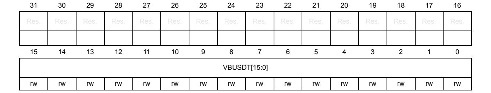

Bits 31:16 Reserved, must be kept at reset value.

Bits 15:0 **VBUSDT[15:0]:** Device VBUS discharge time

Specifies the VBUS discharge time after VBUS pulsing during SRP. This value equals:

VBUS discharge time in PHY clocks / 1 024

Depending on VBUS load, this value may need adjusting.

# <span id="page-91-1"></span>**60.14.47 OTG device VBUS pulsing time register (OTG\_DVBUSPULSE)**

Address offset: 0x082C Reset value: 0x0000 05B8

This register specifies the VBUS pulsing time during SRP.

| 31   | 30   | 29   | 28   | 27   | 26   | 25   | 24   | 23           | 22   | 21   | 20   | 19   | 18   | 17   | 16   |
|------|------|------|------|------|------|------|------|--------------|------|------|------|------|------|------|------|
| Res. | Res. | Res. | Res. | Res. | Res. | Res. | Res. | Res.         | Res. | Res. | Res. | Res. | Res. | Res. | Res. |
|      |      |      |      |      |      |      |      |              |      |      |      |      |      |      |      |
| 15   | 14   | 13   | 12   | 11   | 10   | 9    | 8    | 7            | 6    | 5    | 4    | 3    | 2    | 1    | 0    |
|      |      |      |      |      |      |      |      | DVBUSP[15:0] |      |      |      |      |      |      |      |
| rw   | rw   | rw   | rw   | rw   | rw   | rw   | rw   | rw           | rw   | rw   | rw   | rw   | rw   | rw   | rw   |

Bits 31:16 Reserved, must be kept at reset value.

Bits 15:0 **DVBUSP[15:0]:** Device VBUS pulsing time. This feature is only relevant to OTG1.3.

Specifies the VBUS pulsing time during SRP. This value equals:

VBUS pulsing time in PHY clocks / 1 024

# <span id="page-92-0"></span>**60.14.48 OTG device threshold control register (OTG\_DTHRCTL)**

Address offset: 0x0830 Reset value: 0x0000 0000

| 31   | 30   | 29   | 28   | 27    | 26   | 25 | 24 | 23 | 22            | 21            | 20 | 19 | 18 | 17           | 16                  |
|------|------|------|------|-------|------|----|----|----|---------------|---------------|----|----|----|--------------|---------------------|
| Res. | Res. | Res. | Res. | ARPEN | Res. |    |    |    |               | RXTHRLEN[8:0] |    |    |    |              | RXTH<br>REN         |
|      |      |      |      | rw    |      | rw | rw | rw | rw            | rw            | rw | rw | rw | rw           | rw                  |
| 15   | 14   | 13   | 12   | 11    | 10   | 9  | 8  | 7  | 6             | 5             | 4  | 3  | 2  | 1            | 0                   |
| Res. | Res. | Res. | Res. | Res.  |      |    |    |    | TXTHRLEN[8:0] |               |    |    |    | ISOT<br>HREN | NONIS<br>OTH<br>REN |
|      |      |      |      |       | rw   | rw | rw | rw | rw            | rw            | rw | rw | rw | rw           | rw                  |

Bits 31:28 Reserved, must be kept at reset value.

#### Bit 27 **ARPEN:** Arbiter parking enable

This bit controls internal DMA arbiter parking for IN endpoints. When thresholding is enabled and this bit is set to one, then the arbiter parks on the IN endpoint for which there is a token received on the USB. This is done to avoid getting into underrun conditions. By default parking is enabled.

Bit 26 Reserved, must be kept at reset value.

### Bits 25:17 **RXTHRLEN[8:0]:** Receive threshold length

This field specifies the receive thresholding size in 32-bit words. This field also specifies the amount of data received on the USB before the core can start transmitting on the AHB. The threshold length has to be at least eight 32-bit words. The recommended value for RXTHRLEN is to be the same as the programmed AHB burst length (HBSTLEN bit in OTG\_GAHBCFG).

#### Bit 16 **RXTHREN:** Receive threshold enable

When this bit is set, the core enables thresholding in the receive direction.

Bits 15:11 Reserved, must be kept at reset value.

# Bits 10:2 **TXTHRLEN[8:0]:** Transmit threshold length

This field specifies the transmit thresholding size in 32-bit words. This field specifies the amount of data in bytes to be in the corresponding endpoint transmit FIFO, before the core can start transmitting on the USB. The threshold length has to be at least eight 32-bit words. This field controls both isochronous and nonisochronous IN endpoint thresholds. The recommended value for TXTHRLEN is to be the same as the programmed AHB burst length (HBSTLEN bit in OTG\_GAHBCFG).

### Bit 1 **ISOTHREN:** ISO IN endpoint threshold enable

When this bit is set, the core enables thresholding for isochronous IN endpoints.

# Bit 0 **NONISOTHREN:** Nonisochronous IN endpoints threshold enable

When this bit is set, the core enables thresholding for nonisochronous IN endpoints.

RM0399 Rev 4 2835/3556

# <span id="page-93-0"></span>**60.14.49 OTG device IN endpoint FIFO empty interrupt mask register (OTG\_DIEPEMPMSK)**

Address offset: 0x834

Reset value: 0x0000 0000

This register is used to control the IN endpoint FIFO empty interrupt generation

(TXFE\_OTG\_DIEPINTx).

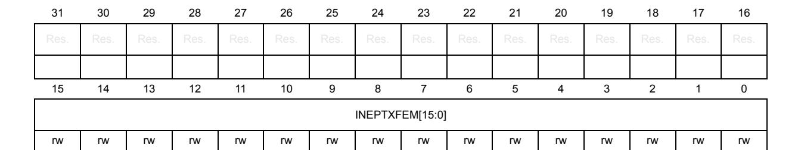

Bits 31:16 Reserved, must be kept at reset value.

Bits 15:0 **INEPTXFEM[15:0]:** IN EP Tx FIFO empty interrupt mask bits

These bits act as mask bits for OTG\_DIEPINTx.

TXFE interrupt one bit per IN endpoint:

Bit 0 for IN endpoint 0, bit 3 for IN endpoint 3

0: Masked interrupt 1: Unmasked interrupt

# <span id="page-93-1"></span>**60.14.50 OTG device each endpoint interrupt register (OTG\_DEACHINT)**

Address offset: 0x0838

Reset value: 0x0000 0000

| 31   | 30   | 29   | 28   | 27   | 26   | 25   | 24   | 23   | 22   | 21   | 20   | 19   | 18   | 17          | 16   |
|------|------|------|------|------|------|------|------|------|------|------|------|------|------|-------------|------|
| Res. | Res. | Res. | Res. | Res. | Res. | Res. | Res. | Res. | Res. | Res. | Res. | Res. | Res. | OEP1<br>INT | Res. |
|      |      |      |      |      |      |      |      |      |      |      |      |      |      | r           |      |
| 15   | 14   | 13   | 12   | 11   | 10   |      |      |      |      |      |      |      |      |             |      |
|      |      |      |      |      |      | 9    | 8    | 7    | 6    | 5    | 4    | 3    | 2    | 1           | 0    |
| Res. | Res. | Res. | Res. | Res. | Res. | Res. | Res. | Res. | Res. | Res. | Res. | Res. | Res. | IEP1<br>INT | Res. |

Bits 31:18 Reserved, must be kept at reset value.

Bit 17 **OEP1INT:** OUT endpoint 1 interrupt bit

Bits 16:2 Reserved, must be kept at reset value.

Bit 1 **IEP1INT:** IN endpoint 1interrupt bit

Bit 0 Reserved, must be kept at reset value.

# <span id="page-94-0"></span>60.14.51 OTG device each endpoint interrupt mask register (OTG\_DEACHINTMSK)

Address offset: 0x083C Reset value: 0x0000 0000

There is one interrupt bit for endpoint 1 IN and one interrupt bit for endpoint 1 OUT.

| 31         | 30         | 29         | 28         | 27   | 26         | 25        | 24        | 23   | 22     | 21        | 20     | 19   | 18   | 17                | 16        |
|------------|------------|------------|------------|------|------------|-----------|-----------|------|--------|-----------|--------|------|------|-------------------|-----------|
| Res.       | Res.       | Res.       | Res.       | Res. | Res.       | Res.      | Res.      | Res. | Res.   | Res.      | Res.   | Res. | Res. | OEP1<br>INTM      | Res.      |
|            |            |            |            |      |            |           |           |      |        |           |        |      |      | rw                |           |
|            |            |            |            |      |            |           |           |      |        |           |        |      |      |                   |           |
| 15         | 14         | 13         | 12         | 11   | 10         | 9         | 8         | 7    | 6      | 5         | 4      | 3    | 2    | 1                 | 0         |
| 15<br>Res. | 14<br>Res. | 13<br>Res. | 12<br>Res. | Res. | 10<br>Res. | 9<br>Res. | 8<br>Res. | Res. | 6 Res. | 5<br>Res. | 4 Res. | Res. | Res. | 1<br>IEP1I<br>NTM | 0<br>Res. |

Bits 31:18 Reserved, must be kept at reset value.

Bit 17 **OEP1INTM:** OUT endpoint 1 interrupt mask bit

Bits 16:2 Reserved, must be kept at reset value.

Bit 1 **IEP1INTM**: IN endpoint 1 interrupt mask bit Bit 0 Reserved, must be kept at reset value.

# <span id="page-94-1"></span>60.14.52 OTG device each IN endpoint-1 interrupt mask register (OTG HS DIEPEACHMSK1)

Address offset: 0x844
Reset value: 0x0000 0000

This register works with the OTG\_DIEPINT1 register to generate a dedicated interrupt OTG\_HS\_EP1\_IN for endpoint #1. The IN endpoint interrupt for a specific status in the OTG\_DOEPINT1 register can be masked by writing into the corresponding bit in this register. Status bits are masked by default.

31 30 29 28 27 26 24 22 21 20 19 18 17 16 15 14 13 12 11 10 9 8 7 6 5 3 2 1 0 TXFU INEPN ITTXFE AHB XFRC NAKM BNAM TOM **EPDM** RMΕM MSK **ERRM** Μ

Bits 31:14 Reserved, must be kept at reset value.

Bit 13 NAKM: NAK interrupt mask

0: Masked interrupt1: Unmasked interrupt

Bits 12:10 Reserved, must be kept at reset value.

57

RM0399 Rev 4 2837/3556

Bit 9 BNAM: BNA interrupt mask

0: Masked interrupt1: Unmasked interrupt

Bit 8 TXFURM: FIFO underrun mask

0: Masked interrupt1: Unmasked interrupt

Bit 7 Reserved, must be kept at reset value.

Bit 6 INEPNEM: IN endpoint NAK effective mask

0: Masked interrupt1: Unmasked interrupt

Bit 5 Reserved, must be kept at reset value.

Bit 4 ITTXFEMSK: IN token received when Tx FIFO empty mask

0: Masked interrupt
1: Unmasked interrupt

Bit 3 TOM: Timeout condition mask (Non-isochronous endpoints)

0: Masked interrupt1: Unmasked interrupt

Bit 2 AHBERRM: AHB error mask

0: Masked interrupt
1: Unmasked interrupt

Bit 1 EPDM: Endpoint disabled interrupt mask

0: Masked interrupt1: Unmasked interrupt

Bit 0 XFRCM: Transfer completed interrupt mask

0: Masked interrupt1: Unmasked interrupt

# <span id="page-95-0"></span>60.14.53 OTG device each OUT endpoint-1 interrupt mask register (OTG\_HS\_DOEPEACHMSK1)

Address offset: 0x884 Reset value: 0x0000 0000

This register works with the OTG\_DOEPINT1 register to generate a dedicated interrupt OTG\_HS\_EP1\_OUT for endpoint #1. The OUT endpoint interrupt for a specific status in the OTG\_DOEPINT1 register can be masked by writing into the corresponding bit in this register. Status bits are masked by default.

| 31   | 30          | 29         | 28        | 27   | 26   | 25   | 24                 | 23   | 22           | 21   | 20         | 19    | 18          | 17   | 16        |
|------|-------------|------------|-----------|------|------|------|--------------------|------|--------------|------|------------|-------|-------------|------|-----------|
| Res. | Res.        | Res.       | Res.      | Res. | Res. | Res. | Res.               | Res. | Res.         | Res. | Res.       | Res.  | Res.        | Res. | Res.      |
|      |             |            |           |      |      |      |                    |      |              |      |            |       |             |      |           |
| 15   | 14          | 13         | 12        | 11   | 10   | 9    | 8                  | 7    | 6            | 5    | 4          | 3     | 2           | 1    | 0         |
| Res. | NYET<br>MSK | NAK<br>MSK | BERR<br>M | Res. | Res. | BNAM | OUT<br>PKT<br>ERRM | Res. | B2B<br>STUPM | Res. | OTEPD<br>M | STUPM | AHB<br>ERRM | EPDM | XFRC<br>M |
|      | rw          | rw         | rw        |      |      | rw   | rw                 |      | rw           |      | rw         | rw    | rw          | rw   | rw        |


- Bits 31:15 Reserved, must be kept at reset value.
  - Bit 14 **NYETMSK:** NYET interrupt mask
    - 0: Masked interrupt
    - 1: Unmasked interrupt
  - Bit 13 **NAKMSK:** NAK interrupt mask
    - 0: Masked interrupt
    - 1: Unmasked interrupt
  - Bit 12 **BERRM**: Babble error interrupt mask
    - 0: Masked interrupt
    - 1: Unmasked interrupt
- Bits 11:10 Reserved, must be kept at reset value.
  - Bit 9 **BNAM:** BNA interrupt mask
    - 0: Masked interrupt
    - 1: Unmasked interrupt
  - Bit 8 **OUTPKTERRM:** Out packet error mask
    - 0: Masked interrupt
    - 1: Unmasked interrupt
  - Bit 7 Reserved, must be kept at reset value.
  - Bit 6 **B2BSTUPM:** Back-to-back SETUP packets received mask

Applies to control OUT endpoints only.

- 0: Masked interrupt
- 1: Unmasked interrupt
- Bit 5 Reserved, must be kept at reset value.
- Bit 4 **OTEPDM:** OUT token received when endpoint disabled mask

Applies to control OUT endpoints only.

- 0: Masked interrupt
- 1: Unmasked interrupt
- Bit 3 **STUPM:** STUPM: SETUP phase done mask

Applies to control endpoints only.

- 0: Masked interrupt
- 1: Unmasked interrupt
- Bit 2 **AHBERRM:** AHB error mask
  - 0: Masked interrupt
  - 1: Unmasked interrupt
- Bit 1 **EPDM:** Endpoint disabled interrupt mask
  - 0: Masked interrupt
  - 1: Unmasked interrupt
- Bit 0 **XFRCM:** Transfer completed interrupt mask
  - 0: Masked interrupt
  - 1: Unmasked interrupt


# <span id="page-97-0"></span>**60.14.54 OTG device IN endpoint x control register (OTG\_DIEPCTLx)**

Address offset: 0x900 + 0x20 \* x, (x = 0 to 8)

Reset value: 0x0000 0000

The application uses this register to control the behavior of each logical endpoint other than

endpoint 0.

| 31         | 30    | 29          | 28                         | 27   | 26          | 25          | 24 | 23 | 22 | 21 | 20   | 19 | 18         | 17         | 16                 |
|------------|-------|-------------|----------------------------|------|-------------|-------------|----|----|----|----|------|----|------------|------------|--------------------|
| EPENA      | EPDIS | SODD<br>FRM | SD0<br>PID/<br>SEVN<br>FRM | SNAK | CNAK        | TXFNUM[3:0] |    |    |    |    | Res. |    | EPTYP[1:0] | NAK<br>STS | EO<br>NUM/<br>DPID |
| rs         | rs    | w           | w                          | w    | w           | rw          | rw | rw | rw | rw |      | rw | rw         | r          | r                  |
| 15         | 14    | 13          | 12                         | 11   | 10          | 9           | 8  | 7  | 6  | 5  | 4    | 3  | 2          | 1          | 0                  |
| USBA<br>EP | Res.  | Res.        | Res.                       | Res. | MPSIZ[10:0] |             |    |    |    |    |      |    |            |            |                    |
| rw         |       |             |                            |      | rw          | rw          | rw | rw | rw | rw | rw   | rw | rw         | rw         | rw                 |

### Bit 31 **EPENA:** Endpoint enable

The application sets this bit to start transmitting data on an endpoint.

The core clears this bit before setting any of the following interrupts on this endpoint:

- SETUP phase done
- Endpoint disabled
- Transfer completed

#### Bit 30 **EPDIS:** Endpoint disable

The application sets this bit to stop transmitting/receiving data on an endpoint, even before the transfer for that endpoint is complete. The application must wait for the endpoint disabled interrupt before treating the endpoint as disabled. The core clears this bit before setting the endpoint disabled interrupt. The application must set this bit only if endpoint enable is already set for this endpoint.

# Bit 29 **SODDFRM:** Set odd frame

Applies to isochronous IN and OUT endpoints only.

Writing to this field sets the Even/Odd frame (EONUM) field to odd frame.

### Bit 28 **SD0PID:** Set DATA0 PID

Applies to interrupt/bulk IN endpoints only.

Writing to this field sets the endpoint data PID (DPID) field in this register to DATA0.

# **SEVNFRM:** Set even frame

Applies to isochronous IN endpoints only.

Writing to this field sets the Even/Odd frame (EONUM) field to even frame.

#### Bit 27 **SNAK:** Set NAK

A write to this bit sets the NAK bit for the endpoint.

Using this bit, the application can control the transmission of NAK handshakes on an endpoint. The core can also set this bit for OUT endpoints on a transfer completed interrupt, or after a SETUP is received on the endpoint.

#### Bit 26 **CNAK:** Clear NAK

A write to this bit clears the NAK bit for the endpoint.


#### Bits 25:22 **TXFNUM[3:0]:** Tx FIFO number

These bits specify the FIFO number associated with this endpoint. Each active IN endpoint must be programmed to a separate FIFO number.

This field is valid only for IN endpoints.

#### Bit 21 **STALL:** STALL handshake

Applies to non-control, non-isochronous IN endpoints only (access type is rw).

The application sets this bit to stall all tokens from the USB host to this endpoint. If a NAK bit, Global IN NAK, or Global OUT NAK is set along with this bit, the STALL bit takes priority. Only the application can clear this bit, never the core.

Bit 20 Reserved, must be kept at reset value.

#### Bits 19:18 **EPTYP[1:0]:** Endpoint type

This is the transfer type supported by this logical endpoint.

00: Control 01: Isochronous

10: Bulk 11: Interrupt

#### Bit 17 **NAKSTS:** NAK status

It indicates the following:

0: The core is transmitting non-NAK handshakes based on the FIFO status.

1: The core is transmitting NAK handshakes on this endpoint.

When either the application or the core sets this bit:

For non-isochronous IN endpoints: The core stops transmitting any data on an IN endpoint, even if there are data available in the Tx FIFO.

For isochronous IN endpoints: The core sends out a zero-length data packet, even if there are data available in the Tx FIFO.

Irrespective of this bit's setting, the core always responds to SETUP data packets with an ACK handshake.

### Bit 16 **EONUM:** Even/odd frame

Applies to isochronous IN endpoints only.

Indicates the frame number in which the core transmits/receives isochronous data for this endpoint. The application must program the even/odd frame number in which it intends to transmit/receive isochronous data for this endpoint using the SEVNFRM and SODDFRM fields in this register.

0: Even frame

1: Odd frame

#### **DPID:** Endpoint data PID

Applies to interrupt/bulk IN endpoints only.

Contains the PID of the packet to be received or transmitted on this endpoint. The application must program the PID of the first packet to be received or transmitted on this endpoint, after the endpoint is activated. The application uses the SD0PID register field to program either DATA0 or DATA1 PID.

0: DATA0 1: DATA1

#### Bit 15 USBAEP: USB active endpoint

Indicates whether this endpoint is active in the current configuration and interface. The core clears this bit for all endpoints (other than EP 0) after detecting a USB reset. After receiving the SetConfiguration and SetInterface commands, the application must program endpoint registers accordingly and set this bit.

Bits 14:11 Reserved, must be kept at reset value.

#### Bits 10:0 MPSIZ[10:0]: Maximum packet size

The application must program this field with the maximum packet size for the current logical endpoint. This value is in bytes.

# <span id="page-99-0"></span>60.14.55 OTG device IN endpoint x interrupt register (OTG DIEPINTx)

Address offset: 0x908 + 0x20 \* x, (x = 0 to 8)

Reset value: 0x0000 0080

This register indicates the status of an endpoint with respect to USB- and AHB-related events. It is shown in *Figure 801*. The application must read this register when the IN endpoints interrupt bit of the core interrupt register (IEPINT in OTG\_GINTSTS) is set. Before the application can read this register, it must first read the device all endpoints interrupt (OTG\_DAINT) register to get the exact endpoint number for the device endpoint-x interrupt register. The application must clear the appropriate bit in this register to clear the corresponding bits in the OTG\_DAINT and OTG\_GINTSTS registers.

| 31   | 30   | 29    | 28   | 27            | 26   | 25    | 24                 | 23   | 22         | 21         | 20     | 19    | 18         | 17         | 16    |
|------|------|-------|------|---------------|------|-------|--------------------|------|------------|------------|--------|-------|------------|------------|-------|
| Res. | Res. | Res.  | Res. | Res.          | Res. | Res.  | Res.               | Res. | Res.       | Res.       | Res.   | Res.  | Res.       | Res.       | Res.  |
|      |      |       |      |               |      |       |                    |      |            |            |        |       |            |            |       |
| 15   | 14   | 13    | 12   | 11            | 10   | 9     | 8                  | 7    | 6          | 5          | 4      | 3     | 2          | 1          | 0     |
| Res. | Res. | NAK   | Res. | PKTD<br>RPSTS | Res. | BNA   | TXFIF<br>OUD<br>RN | TXFE | IN<br>EPNE | IN<br>EPNM | ITTXFE | тос   | AHB<br>ERR | EP<br>DISD | XFRC  |
|      |      | rc_w1 |      | rc_w1         |      | rc_w1 | rc_w1              |      | rc_w1      | rc_w1      | rc_w1  | rc_w1 | rc_w1      | rc_w1      | rc_w1 |

Bits 31:14 Reserved, must be kept at reset value.

#### Bit 13 NAK: NAK input

The core generates this interrupt when a NAK is transmitted or received by the device. In case of isochronous IN endpoints the interrupt gets generated when a zero length packet is transmitted due to unavailability of data in the Tx FIFO.

Bit 12 Reserved, must be kept at reset value.

### Bit 11 PKTDRPSTS: Packet dropped status

This bit indicates to the application that an ISOC OUT packet has been dropped. This bit does not have an associated mask bit and does not generate an interrupt.

Bit 10 Reserved, must be kept at reset value.

# Bit 9 BNA: Buffer not available interrupt

The core generates this interrupt when the descriptor accessed is not ready for the core to process, such as host busy or DMA done.

This bit is only valid when Scatter/Gather DMA mode is enabled.


#### Bit 8 **TXFIFOUDRN:** Transmit Fifo Underrun (TxfifoUndrn)

The core generates this interrupt when it detects a transmit FIFO underrun condition for this endpoint. Dependency: This interrupt is valid only when Thresholding is enabled

#### Bit 7 **TXFE:** Transmit FIFO empty

This interrupt is asserted when the Tx FIFO for this endpoint is either half or completely empty. The half or completely empty status is determined by the Tx FIFO Empty Level bit in the OTG\_GAHBCFG register (TXFELVL bit in OTG\_GAHBCFG).

#### Bit 6 **INEPNE:** IN endpoint NAK effective

This bit can be cleared when the application clears the IN endpoint NAK by writing to the CNAK bit in OTG\_DIEPCTLx.

This interrupt indicates that the core has sampled the NAK bit set (either by the application or by the core). The interrupt indicates that the IN endpoint NAK bit set by the application has taken effect in the core.

This interrupt does not guarantee that a NAK handshake is sent on the USB. A STALL bit takes priority over a NAK bit.

#### Bit 5 **INEPNM**: IN token received with EP mismatch

Indicates that the data in the top of the non-periodic TxFIFO belongs to an endpoint other than the one for which the IN token was received. This interrupt is asserted on the endpoint for which the IN token was received.

#### Bit 4 **ITTXFE:** IN token received when Tx FIFO is empty

Indicates that an IN token was received when the associated Tx FIFO (periodic/nonperiodic) was empty. This interrupt is asserted on the endpoint for which the IN token was received.

#### Bit 3 **TOC:** Timeout condition

Indicates that the core has detected a timeout condition on the USB for the last IN token on this endpoint.

#### Bit 2 **AHBERR**: AHB error

This is generated only in internal DMA mode when there is an AHB error during an AHB read/write. The application can read the corresponding endpoint DMA address register to get the error address.

#### Bit 1 **EPDISD:** Endpoint disabled interrupt

This bit indicates that the endpoint is disabled per the application's request.

#### Bit 0 **XFRC:** Transfer completed interrupt

This field indicates that the programmed transfer is complete on the AHB as well as on the USB, for this endpoint.


RM0399 Rev 4 2843/3556

# <span id="page-101-0"></span>**60.14.56 OTG device IN endpoint 0 transfer size register (OTG\_DIEPTSIZ0)**

Address offset: 0x910 Reset value: 0x0000 0000

The application must modify this register before enabling endpoint 0. Once endpoint 0 is enabled using the endpoint enable bit in the device control endpoint 0 control registers (EPENA in OTG\_DIEPCTL0), the core modifies this register. The application can only read this register once the core has cleared the endpoint enable bit.

Nonzero endpoints use the registers for endpoints 1–3.

| 31   | 30   | 29   | 28   | 27   | 26   | 25   | 24   | 23   | 22          | 21   | 20          | 19 | 18   | 17   | 16   |  |
|------|------|------|------|------|------|------|------|------|-------------|------|-------------|----|------|------|------|--|
| Res. | Res. | Res. | Res. | Res. | Res. | Res. | Res. | Res. | Res.        | Res. | PKTCNT[1:0] |    | Res. | Res. | Res. |  |
|      |      |      |      |      |      |      |      |      |             |      | rw          | rw |      |      |      |  |
| 15   | 14   | 13   | 12   | 11   | 10   | 9    | 8    | 7    | 6           | 5    | 4           | 3  | 2    | 1    | 0    |  |
| Res. | Res. | Res. | Res. | Res. | Res. | Res. | Res. | Res. | XFRSIZ[6:0] |      |             |    |      |      |      |  |
|      |      |      |      |      |      |      |      |      |             |      |             |    |      |      |      |  |

Bits 31:21 Reserved, must be kept at reset value.

#### Bits 20:19 **PKTCNT[1:0]:** Packet count

Indicates the total number of USB packets that constitute the transfer size amount of data for endpoint 0.

This field is decremented every time a packet (maximum size or short packet) is read from the Tx FIFO.

Bits 18:7 Reserved, must be kept at reset value.

# Bits 6:0 **XFRSIZ[6:0]:** Transfer size

Indicates the transfer size in bytes for endpoint 0. The core interrupts the application only after it has exhausted the transfer size amount of data. The transfer size can be set to the maximum packet size of the endpoint, to be interrupted at the end of each packet.

The core decrements this field every time a packet from the external memory is written to the Tx FIFO.

# <span id="page-101-1"></span>**60.14.57 OTG device IN endpoint x DMA address register (OTG\_DIEPDMAx)**

Address offset: 0x914 + 0x20 \* x, (x = 0 to 8)

Reset value: 0x0000 0000

| 31 | 30             | 29 | 28 | 27 | 26 | 25 | 24 | 23            | 22 | 21 | 20 | 19 | 18 | 17 | 16 |
|----|----------------|----|----|----|----|----|----|---------------|----|----|----|----|----|----|----|
|    | DMAADDR[31:16] |    |    |    |    |    |    |               |    |    |    |    |    |    |    |
| rw | rw             | rw | rw | rw | rw | rw | rw | rw            | rw | rw | rw | rw | rw | rw | rw |
| 15 | 14             | 13 | 12 | 11 | 10 | 9  | 8  | 7             | 6  | 5  | 4  | 3  | 2  | 1  | 0  |
|    |                |    |    |    |    |    |    | DMAADDR[15:0] |    |    |    |    |    |    |    |
| rw | rw             | rw | rw | rw | rw | rw | rw | rw            | rw | rw | rw | rw | rw | rw | rw |

#### Bits 31:0 **DMAADDR[31:0]:** DMA Address

This field holds the start address in the external memory from which the data for the endpoint must be fetched. This register is incremented on every AHB transaction.

# <span id="page-102-0"></span>**60.14.58 OTG device IN endpoint transmit FIFO status register (OTG\_DTXFSTSx)**

Address offset: 0x918 + 0x20 \* x, (x = 0 to 8)

Reset value: 0x0000 0200

This read-only register contains the free space information for the device IN endpoint Tx

FIFO.

| 31   | 30              | 29   | 28   | 27   | 26   | 25   | 24   | 23   | 22   | 21   | 20   | 19   | 18   | 17   | 16   |
|------|-----------------|------|------|------|------|------|------|------|------|------|------|------|------|------|------|
| Res. | Res.            | Res. | Res. | Res. | Res. | Res. | Res. | Res. | Res. | Res. | Res. | Res. | Res. | Res. | Res. |
|      |                 |      |      |      |      |      |      |      |      |      |      |      |      |      |      |
| 15   | 14              | 13   | 12   | 11   | 10   | 9    | 8    | 7    | 6    | 5    | 4    | 3    | 2    | 1    | 0    |
|      | INEPTFSAV[15:0] |      |      |      |      |      |      |      |      |      |      |      |      |      |      |
| r    | r               | r    | r    | r    | r    | r    | r    | r    | r    | r    | r    | r    | r    | r    | r    |

Bits 31:16 Reserved, must be kept at reset value.

#### Bits 15:0 **INEPTFSAV[15:0]:** IN endpoint Tx FIFO space available

Indicates the amount of free space available in the endpoint Tx FIFO.

Values are in terms of 32-bit words:

0x0: Endpoint Tx FIFO is full

0x1: 1 word available 0x2: 2 words available 0xn: n words available Others: Reserved

# <span id="page-102-1"></span>**60.14.59 OTG device IN endpoint x transfer size register (OTG\_DIEPTSIZx)**

Address offset: 0x910 + 0x20 \* x, (x = 1 to 8)

Reset value: 0x0000 0000

The application must modify this register before enabling the endpoint. Once the endpoint is enabled using the endpoint enable bit in the OTG\_DIEPCTLx registers (EPENA bit in OTG\_DIEPCTLx), the core modifies this register. The application can only read this register once the core has cleared the endpoint enable bit.

| 31   | 30                                                                   | 29        | 28 | 27                                                 | 26 | 25 | 24 | 23 | 22 | 21 | 20 | 19 | 18 | 17            | 16 |  |  |
|------|----------------------------------------------------------------------|-----------|----|----------------------------------------------------|----|----|----|----|----|----|----|----|----|---------------|----|--|--|
| Res. |                                                                      | MCNT[1:0] |    | PKTCNT[9:0]                                        |    |    |    |    |    |    |    |    |    | XFRSIZ[18:16] |    |  |  |
|      | rw                                                                   | rw        | rw | rw<br>rw<br>rw<br>rw<br>rw<br>rw<br>rw<br>rw<br>rw |    |    |    |    |    |    |    |    | rw | rw            | rw |  |  |
| 15   | 14                                                                   | 13        | 12 | 11                                                 | 10 | 9  | 8  | 7  | 6  | 5  | 4  | 3  | 2  | 1             | 0  |  |  |
|      | XFRSIZ[15:0]                                                         |           |    |                                                    |    |    |    |    |    |    |    |    |    |               |    |  |  |
| rw   | rw<br>rw<br>rw<br>rw<br>rw<br>rw<br>rw<br>rw<br>rw<br>rw<br>rw<br>rw |           |    |                                                    |    |    |    |    |    |    |    |    |    | rw            | rw |  |  |


Bit 31 Reserved, must be kept at reset value.

#### Bits 30:29 **MCNT[1:0]:** Multi count

For periodic IN endpoints, this field indicates the number of packets that must be transmitted per frame on the USB. The core uses this field to calculate the data PID for isochronous IN endpoints.

01: 1 packet 10: 2 packets 11: 3 packets

### Bits 28:19 **PKTCNT[9:0]:** Packet count

Indicates the total number of USB packets that constitute the transfer size amount of data for this endpoint.

This field is decremented every time a packet (maximum size or short packet) is read from the Tx FIFO.

### Bits 18:0 **XFRSIZ[18:0]:** Transfer size

This field contains the transfer size in bytes for the current endpoint. The core only interrupts the application after it has exhausted the transfer size amount of data. The transfer size can be set to the maximum packet size of the endpoint, to be interrupted at the end of each packet.

The core decrements this field every time a packet from the external memory is written to the Tx FIFO.

# <span id="page-103-0"></span>**60.14.60 OTG device control OUT endpoint 0 control register (OTG\_DOEPCTL0)**

Address offset: 0xB00 Reset value: 0x0000 8000

This section describes the OTG\_DOEPCTL0 register. Nonzero control endpoints use registers for endpoints 1–3.

| 31         | 30    | 29   | 28   | 27   | 26   | 25   | 24   | 23   | 22   | 21    | 20   | 19   | 18         | 17         | 16   |
|------------|-------|------|------|------|------|------|------|------|------|-------|------|------|------------|------------|------|
| EPENA      | EPDIS | Res. | Res. | SNAK | CNAK | Res. | Res. | Res. | Res. | STALL | SNPM |      | EPTYP[1:0] | NAK<br>STS | Res. |
| w          | r     |      |      | w    | w    |      |      |      |      | rs    | rw   | r    | r          | r          |      |
|            |       |      |      |      |      |      |      |      |      |       |      |      |            |            |      |
| 15         | 14    | 13   | 12   | 11   | 10   | 9    | 8    | 7    | 6    | 5     | 4    | 3    | 2          | 1          | 0    |
| USBA<br>EP | Res.  | Res. | Res. | Res. | Res. | Res. | Res. | Res. | Res. | Res.  | Res. | Res. | Res.       | MPSIZ[1:0] |      |

#### Bit 31 **EPENA:** Endpoint enable

The application sets this bit to start transmitting data on endpoint 0.

The core clears this bit before setting any of the following interrupts on this endpoint:

- SETUP phase done
- Endpoint disabled
- Transfer completed

#### Bit 30 **EPDIS:** Endpoint disable

The application cannot disable control OUT endpoint 0.

Bits 29:28 Reserved, must be kept at reset value.

#### Bit 27 **SNAK:** Set NAK

A write to this bit sets the NAK bit for the endpoint.

Using this bit, the application can control the transmission of NAK handshakes on an endpoint. The core can also set this bit on a transfer completed interrupt, or after a SETUP is received on the endpoint.

#### Bit 26 **CNAK:** Clear NAK

A write to this bit clears the NAK bit for the endpoint.

#### Bits 25:22 Reserved, must be kept at reset value.

### Bit 21 **STALL:** STALL handshake

The application can only set this bit, and the core clears it, when a SETUP token is received for this endpoint. If a NAK bit or Global OUT NAK is set along with this bit, the STALL bit takes priority. Irrespective of this bit's setting, the core always responds to SETUP data packets with an ACK handshake.

#### Bit 20 **SNPM:** Snoop mode

This bit configures the endpoint to Snoop mode. In Snoop mode, the core does not check the correctness of OUT packets before transferring them to application memory.

#### Bits 19:18 **EPTYP[1:0]:** Endpoint type

Hardcoded to 2'b00 for control.

#### Bit 17 **NAKSTS:** NAK status

Indicates the following:

0: The core is transmitting non-NAK handshakes based on the FIFO status.

1: The core is transmitting NAK handshakes on this endpoint.

When either the application or the core sets this bit, the core stops receiving data, even if there is space in the Rx FIFO to accommodate the incoming packet. Irrespective of this bit's setting, the core always responds to SETUP data packets with an ACK handshake.

#### Bit 16 Reserved, must be kept at reset value.

#### Bit 15 **USBAEP:** USB active endpoint

This bit is always set to 1, indicating that a control endpoint 0 is always active in all configurations and interfaces.

#### Bits 14:2 Reserved, must be kept at reset value.

#### Bits 1:0 **MPSIZ[1:0]:** Maximum packet size

The maximum packet size for control OUT endpoint 0 is the same as what is programmed in control IN endpoint 0.

00: 64 bytes 01: 32 bytes 10: 16 bytes 11: 8 bytes


RM0399 Rev 4 2847/3556

# <span id="page-105-0"></span>60.14.61 OTG device OUT endpoint x interrupt register (OTG\_DOEPINTx)

Address offset: 0xB08 + 0x20 \* x, (x = 0 to 8)

Reset value: 0x0000 0080

This register indicates the status of an endpoint with respect to USB- and AHB-related events. It is shown in *Figure 801*. The application must read this register when the OUT endpoints interrupt bit of the OTG\_GINTSTS register (OEPINT bit in OTG\_GINTSTS) is set. Before the application can read this register, it must first read the OTG\_DAINT register to get the exact endpoint number for the OTG\_DOEPINTx register. The application must clear the appropriate bit in this register to clear the corresponding bits in the OTG\_DAINT and OTG\_GINTSTS registers.

| 31          | 30    | 29    | 28    | 27   | 26   | 25    | 24                | 23   | 22          | 21           | 20          | 19    | 18         | 17         | 16    |
|-------------|-------|-------|-------|------|------|-------|-------------------|------|-------------|--------------|-------------|-------|------------|------------|-------|
| Res.        | Res.  | Res.  | Res.  | Res. | Res. | Res.  | Res.              | Res. | Res.        | Res.         | Res.        | Res.  | Res.       | Res.       | Res.  |
|             |       |       |       |      |      |       |                   |      |             |              |             |       |            |            |       |
| 15          | 14    | 13    | 12    | 11   | 10   | 9     | 8                 | 7    | 6           | 5            | 4           | 3     | 2          | 1          | 0     |
| STPK<br>TRX | NYET  | NAK   | BERR  | Res. | Res. | BNA   | OUT<br>PKT<br>ERR | Res. | B2B<br>STUP | STSPH<br>SRX | OTEP<br>DIS | STUP  | AHB<br>ERR | EP<br>DISD | XFRC  |
| rc_w1       | rc_w1 | rc_w1 | rc_w1 |      |      | rc_w1 | rc_w1             |      | rc_w1       | rc_w1        | rc_w1       | rc_w1 | rc_w1      | rc_w1      | rc_w1 |

Bits 31:16 Reserved, must be kept at reset value.

#### Bit 15 STPKTRX: Setup packet received

Applicable for control OUT endpoints in only in the Buffer DMA Mode. Set by the OTG\_HS, this bit indicates that this buffer holds 8 bytes of setup data. There is only one setup packet per buffer. On receiving a setup packet, the OTG\_HS closes the buffer and disables the corresponding endpoint after SETUP\_COMPLETE status is seen in the Rx FIFO. OTG\_HS puts a SETUP\_COMPLETE status into the Rx FIFO when it sees the first IN or OUT token after the SETUP packet for that particular endpoint. The application must then re-enable the endpoint to receive any OUT data for the control transfer and reprogram the buffer start address. Because of the above behavior, OTG\_HS can receive any number of back to back setup packets and one buffer for every setup packet is used.

### Bit 14 NYET: NYET interrupt

This interrupt is generated when a NYET response is transmitted for a non isochronous OUT endpoint.

#### Bit 13 NAK: NAK input

The core generates this interrupt when a NAK is transmitted or received by the device. In case of isochronous IN endpoints the interrupt gets generated when a zero length packet is transmitted due to unavailability of data in the Tx FIFO.

# Bit 12 BERR: Babble error interrupt

The core generates this interrupt when babble is received for the endpoint.

### Bits 11:10 Reserved, must be kept at reset value.

#### Bit 9 BNA: Buffer not available interrupt

The core generates this interrupt when the descriptor accessed is not ready for the core to process, such as host busy or DMA done.

This bit is only valid when Scatter/Gather DMA mode is enabled.


#### Bit 8 **OUTPKTERR**: OUT packet error

This interrupt is asserted when the core detects an overflow or a CRC error for an OUT packet. This interrupt is valid only when thresholding is enabled.

Bit 7 Reserved, must be kept at reset value.

#### Bit 6 **B2BSTUP:** Back-to-back SETUP packets received

Applies to control OUT endpoint only.

This bit indicates that the core has received more than three back-to-back SETUP packets for this particular endpoint.

# Bit 5 **STSPHSRX**: Status phase received for control write

This interrupt is valid only for control OUT endpoints. This interrupt is generated only after OTG\_HS has transferred all the data that the host has sent during the data phase of a control write transfer, to the system memory buffer. The interrupt indicates to the application that the host has switched from data phase to the status phase of a control write transfer. The application can use this interrupt to ACK or STALL the status phase, after it has decoded the data phase.

#### Bit 4 **OTEPDIS:** OUT token received when endpoint disabled

Applies only to control OUT endpoints.

Indicates that an OUT token was received when the endpoint was not yet enabled. This interrupt is asserted on the endpoint for which the OUT token was received.

#### Bit 3 **STUP:** SETUP phase done

Applies to control OUT endpoint only.Indicates that the SETUP phase for the control endpoint is complete and no more back-to-back SETUP packets were received for the current control transfer. On this interrupt, the application can decode the received SETUP data packet.

#### Bit 2 **AHBERR**: AHB error

This is generated only in internal DMA mode when there is an AHB error during an AHB read/write. The application can read the corresponding endpoint DMA address register to get the error address.

# Bit 1 **EPDISD:** Endpoint disabled interrupt

This bit indicates that the endpoint is disabled per the application's request.

# Bit 0 **XFRC:** Transfer completed interrupt

This field indicates that the programmed transfer is complete on the AHB as well as on the USB, for this endpoint.


RM0399 Rev 4 2849/3556

# <span id="page-107-0"></span>**60.14.62 OTG device OUT endpoint 0 transfer size register (OTG\_DOEPTSIZ0)**

Address offset: 0xB10 Reset value: 0x0000 0000

The application must modify this register before enabling endpoint 0. Once endpoint 0 is enabled using the endpoint enable bit in the OTG\_DOEPCTL0 registers (EPENA bit in OTG\_DOEPCTL0), the core modifies this register. The application can only read this register once the core has cleared the endpoint enable bit.

Nonzero endpoints use the registers for endpoints 1–8.

| 31   | 30           | 29   | 28   | 27   | 26   | 25   | 24   | 23   | 22                               | 21   | 20   | 19     | 18   | 17   | 16   |  |  |
|------|--------------|------|------|------|------|------|------|------|----------------------------------|------|------|--------|------|------|------|--|--|
| Res. | STUPCNT[1:0] |      | Res. | Res. | Res. | Res. | Res. | Res. | Res.                             | Res. | Res. | PKTCNT | Res. | Res. | Res. |  |  |
|      | rw           | rw   |      |      |      |      |      |      |                                  |      |      | rw     |      |      |      |  |  |
| 15   | 14           | 13   | 12   | 11   | 10   | 9    | 8    | 7    | 6                                | 5    | 4    | 3      | 2    | 1    | 0    |  |  |
| Res. | Res.         | Res. | Res. | Res. | Res. | Res. | Res. | Res. | XFRSIZ[6:0]                      |      |      |        |      |      |      |  |  |
|      |              |      |      |      |      |      |      |      | rw<br>rw<br>rw<br>rw<br>rw<br>rw |      |      |        |      |      |      |  |  |

Bit 31 Reserved, must be kept at reset value.

#### Bits 30:29 **STUPCNT[1:0]:** SETUP packet count

This field specifies the number of back-to-back SETUP data packets the endpoint can receive.

01: 1 packet 10: 2 packets 11: 3 packets

Bits 28:20 Reserved, must be kept at reset value.

### Bit 19 **PKTCNT:** Packet count

This field is decremented to zero after a packet is written into the Rx FIFO.

Bits 18:7 Reserved, must be kept at reset value.

#### Bits 6:0 **XFRSIZ[6:0]:** Transfer size

Indicates the transfer size in bytes for endpoint 0. The core interrupts the application only after it has exhausted the transfer size amount of data. The transfer size can be set to the maximum packet size of the endpoint, to be interrupted at the end of each packet.

The core decrements this field every time a packet is read from the Rx FIFO and written to the external memory.

# <span id="page-108-0"></span>**60.14.63 OTG device OUT endpoint x DMA address register (OTG\_DOEPDMAx)**

Address offset: 0xB14 + 0x20 \* x, (x = 0 to 8)

Reset value: 0x0000 0000

| 31 | 30                                                                                     | 29 | 28 | 27 | 26 | 25 | 24 | 23 | 22 | 21 | 20 | 19 | 18 | 17 | 16 |
|----|----------------------------------------------------------------------------------------|----|----|----|----|----|----|----|----|----|----|----|----|----|----|
|    | DMAADDR[31:16]                                                                         |    |    |    |    |    |    |    |    |    |    |    |    |    |    |
| rw | rw<br>rw<br>rw<br>rw<br>rw<br>rw<br>rw<br>rw<br>rw<br>rw<br>rw<br>rw<br>rw<br>rw<br>rw |    |    |    |    |    |    |    |    |    |    |    |    |    |    |
| 15 | 14                                                                                     | 13 | 12 | 11 | 10 | 9  | 8  | 7  | 6  | 5  | 4  | 3  | 2  | 1  | 0  |
|    | DMAADDR[15:0]                                                                          |    |    |    |    |    |    |    |    |    |    |    |    |    |    |
| rw | rw                                                                                     | rw | rw | rw | rw | rw | rw | rw | rw | rw | rw | rw | rw | rw | rw |

Bits 31:0 **DMAADDR[31:0]:** DMA Address

This field holds the start address in the external memory from which the data for the endpoint must be fetched. This register is incremented on every AHB transaction.

# <span id="page-108-1"></span>**60.14.64 OTG device OUT endpoint x control register (OTG\_DOEPCTLx)**

Address offset: 0xB00 + 0x20 \* x, (x = 1 to 8)

Reset value: 0x0000 0000

The application uses this register to control the behavior of each logical endpoint other than endpoint 0.

| 31         | 30    | 29                         | 28                         | 27   | 26          | 25   | 24   | 23   | 22   | 21    | 20   | 19 | 18         | 17         | 16                 |
|------------|-------|----------------------------|----------------------------|------|-------------|------|------|------|------|-------|------|----|------------|------------|--------------------|
| EPENA      | EPDIS | SD1<br>PID/<br>SODD<br>FRM | SD0<br>PID/<br>SEVN<br>FRM | SNAK | CNAK        | Res. | Res. | Res. | Res. | STALL | SNPM |    | EPTYP[1:0] | NAK<br>STS | EO<br>NUM/<br>DPID |
| rs         | rs    | w                          | w                          | w    | w           |      |      |      |      | rw    | rw   | rw | rw         | r          | r                  |
| 15         | 14    | 13                         | 12                         | 11   | 10          | 9    | 8    | 7    | 6    | 5     | 4    | 3  | 2          | 1          | 0                  |
| USBA<br>EP | Res.  | Res.                       | Res.                       | Res. | MPSIZ[10:0] |      |      |      |      |       |      |    |            |            |                    |
| rw         |       |                            |                            |      | rw          | rw   | rw   | rw   | rw   | rw    | rw   | rw | rw         | rw         | rw                 |

RM0399 Rev 4 2851/3556

### Bit 31 **EPENA:** Endpoint enable

Applies to IN and OUT endpoints.

The application sets this bit to start transmitting data on an endpoint.

The core clears this bit before setting any of the following interrupts on this endpoint:

- SETUP phase done
- Endpoint disabled
- Transfer completed

#### Bit 30 **EPDIS:** Endpoint disable

The application sets this bit to stop transmitting/receiving data on an endpoint, even before the transfer for that endpoint is complete. The application must wait for the endpoint disabled interrupt before treating the endpoint as disabled. The core clears this bit before setting the endpoint disabled interrupt. The application must set this bit only if endpoint enable is already set for this endpoint.

#### Bit 29 **SD1PID:** Set DATA1 PID

Applies to interrupt/bulk IN and OUT endpoints only. Writing to this field sets the endpoint data PID (DPID) field in this register to DATA1.

### **SODDFRM:** Set odd frame

Applies to isochronous IN and OUT endpoints only. Writing to this field sets the Even/Odd frame (EONUM) field to odd frame.

### Bit 28 **SD0PID:** Set DATA0 PID

Applies to interrupt/bulk OUT endpoints only.

Writing to this field sets the endpoint data PID (DPID) field in this register to DATA0.

### **SEVNFRM:** Set even frame

Applies to isochronous OUT endpoints only.

Writing to this field sets the Even/Odd frame (EONUM) field to even frame.

### Bit 27 **SNAK:** Set NAK

A write to this bit sets the NAK bit for the endpoint.

Using this bit, the application can control the transmission of NAK handshakes on an endpoint. The core can also set this bit for OUT endpoints on a transfer completed interrupt, or after a SETUP is received on the endpoint.

#### Bit 26 **CNAK:** Clear NAK

A write to this bit clears the NAK bit for the endpoint.

#### Bits 25:22 Reserved, must be kept at reset value.

#### Bit 21 **STALL:** STALL handshake

Applies to non-control, non-isochronous OUT endpoints only (access type is rw).

The application sets this bit to stall all tokens from the USB host to this endpoint. If a NAK bit, Global IN NAK, or Global OUT NAK is set along with this bit, the STALL bit takes priority. Only the application can clear this bit, never the core.

Applies to control endpoints only (access type is rs).

The application can only set this bit, and the core clears it, when a SETUP token is received for this endpoint. If a NAK bit, Global IN NAK, or Global OUT NAK is set along with this bit, the STALL bit takes priority. Irrespective of this bit's setting, the core always responds to SETUP data packets with an ACK handshake.

#### Bit 20 **SNPM:** Snoop mode

This bit configures the endpoint to Snoop mode. In Snoop mode, the core does not check the correctness of OUT packets before transferring them to application memory.


#### Bits 19:18 **EPTYP[1:0]:** Endpoint type

This is the transfer type supported by this logical endpoint.

00: Control

01: Isochronous

10: Bulk

11: Interrupt

#### Bit 17 **NAKSTS:** NAK status

Indicates the following:

0: The core is transmitting non-NAK handshakes based on the FIFO status.

1: The core is transmitting NAK handshakes on this endpoint.

When either the application or the core sets this bit:

The core stops receiving any data on an OUT endpoint, even if there is space in the Rx FIFO to accommodate the incoming packet.

Irrespective of this bit's setting, the core always responds to SETUP data packets with an ACK handshake.

#### Bit 16 **EONUM:** Even/odd frame

Applies to isochronous IN and OUT endpoints only.

Indicates the frame number in which the core transmits/receives isochronous data for this endpoint. The application must program the even/odd frame number in which it intends to transmit/receive isochronous data for this endpoint using the SEVNFRM and SODDFRM fields in this register.

0: Even frame

1: Odd frame

**DPID:** Endpoint data PID

Applies to interrupt/bulk OUT endpoints only.

Contains the PID of the packet to be received or transmitted on this endpoint. The application must program the PID of the first packet to be received or transmitted on this endpoint, after the endpoint is activated. The application uses the SD0PID register field to program either DATA0 or DATA1 PID.

0: DATA0

1: DATA1

# Bit 15 **USBAEP:** USB active endpoint

Indicates whether this endpoint is active in the current configuration and interface. The core clears this bit for all endpoints (other than EP 0) after detecting a USB reset. After receiving the SetConfiguration and SetInterface commands, the application must program endpoint registers accordingly and set this bit.

Bits 14:11 Reserved, must be kept at reset value.

#### Bits 10:0 **MPSIZ[10:0]:** Maximum packet size

The application must program this field with the maximum packet size for the current logical endpoint. This value is in bytes.


# <span id="page-111-0"></span>**60.14.65 OTG device OUT endpoint x transfer size register (OTG\_DOEPTSIZx)**

Address offset: 0xB10 + 0x20 \* x, (x = 1 to 8)

Reset value: 0x0000 0000

The application must modify this register before enabling the endpoint. Once the endpoint is enabled using endpoint enable bit of the OTG\_DOEPCTLx registers (EPENA bit in OTG\_DOEPCTLx), the core modifies this register. The application can only read this register once the core has cleared the endpoint enable bit.

| 31   | 30 | 29                      | 28 | 27 | 26 | 25 | 24 | 23           | 22 | 21 | 20 | 19 | 18 | 17            | 16 |
|------|----|-------------------------|----|----|----|----|----|--------------|----|----|----|----|----|---------------|----|
| Res. |    | RXDPID/<br>STUPCNT[1:0] |    |    |    |    |    | PKTCNT[9:0]  |    |    |    |    |    | XFRSIZ[18:16] |    |
|      | rw | rw                      | rw | rw | rw | rw | rw | rw           | rw | rw | rw | rw | rw | rw            | rw |
| 15   | 14 | 13                      | 12 | 11 | 10 | 9  | 8  | 7            | 6  | 5  | 4  | 3  | 2  | 1             | 0  |
|      |    |                         |    |    |    |    |    | XFRSIZ[15:0] |    |    |    |    |    |               |    |
| rw   | rw | rw                      | rw | rw | rw | rw | rw | rw           | rw | rw | rw | rw | rw | rw            | rw |

Bit 31 Reserved, must be kept at reset value.

# Bits 30:29 **RXDPID[1:0]:** Received data PID

Applies to isochronous OUT endpoints only.

This is the data PID received in the last packet for this endpoint.

00: DATA0 01: DATA2 10: DATA1 11: MDATA

# **STUPCNT[1:0]:** SETUP packet count

Applies to control OUT endpoints only.

This field specifies the number of back-to-back SETUP data packets the endpoint can receive.

01: 1 packet 10: 2 packets 11: 3 packets

# Bits 28:19 **PKTCNT[9:0]:** Packet count

Indicates the total number of USB packets that constitute the transfer size amount of data for this endpoint.

This field is decremented every time a packet (maximum size or short packet) is written to the Rx FIFO.

#### Bits 18:0 **XFRSIZ[18:0]:** Transfer size

This field contains the transfer size in bytes for the current endpoint. The core only interrupts the application after it has exhausted the transfer size amount of data. The transfer size can be set to the maximum packet size of the endpoint, to be interrupted at the end of each packet.

The core decrements this field every time a packet is read from the Rx FIFO and written to the external memory.

# <span id="page-112-0"></span>60.14.66 OTG power and clock gating control register (OTG\_PCGCCTL)

Address offset: 0xE00

Reset value: 0x200B 8000

This register is available in host and device modes.

| 31         | 30         | 29         | 28         | 27         | 26         | 25        | 24   | 23        | 22                | 21               | 20          | 19   | 18   | 17                | 16               |
|------------|------------|------------|------------|------------|------------|-----------|------|-----------|-------------------|------------------|-------------|------|------|-------------------|------------------|
| Res.       | Res.       | Res.       | Res.       | Res.       | Res.       | Res.      | Res. | Res.      | Res.              | Res.             | Res.        | Res. | Res. | Res.              | Res.             |
|            |            |            |            |            |            |           |      |           |                   |                  |             |      |      |                   |                  |
|            |            |            |            |            |            |           |      |           |                   |                  |             |      |      |                   |                  |
| 15         | 14         | 13         | 12         | 11         | 10         | 9         | 8    | 7         | 6                 | 5                | 4           | 3    | 2    | 1                 | 0                |
| 15<br>Res. | 14<br>Res. | 13<br>Res. | 12<br>Res. | 11<br>Res. | 10<br>Res. | 9<br>Res. | Res. | 7<br>SUSP | 6<br>PHY<br>SLEEP | 5<br>ENL1<br>GTG | PHY<br>SUSP | Res. | Res. | 1<br>GATE<br>HCLK | 0<br>STPP<br>CLK |

Bits 31:8 Reserved, must be kept at reset value.

#### Bit 7 SUSP: Deep Sleep

This bit indicates that the PHY is in Deep Sleep when in L1 state.

#### Bit 6 PHYSLEEP: PHY in Sleep

This bit indicates that the PHY is in the Sleep state.

### Bit 5 ENL1GTG: Enable sleep clock gating

When this bit is set, core internal clock gating is enabled in Sleep state if the core cannot assert utmi\_I1\_suspend\_n. When this bit is not set, the PHY clock is not gated in Sleep state

# Bit 4 PHYSUSP: PHY suspended

Indicates that the PHY has been suspended. This bit is updated once the PHY is suspended after the application has set the STPPCLK bit.

#### Bits 3:2 Reserved, must be kept at reset value.

#### Bit 1 GATEHCLK: Gate HCLK

The application sets this bit to gate HCLK to modules other than the AHB Slave and Master and wake-up logic when the USB is suspended or the session is not valid. The application clears this bit when the USB is resumed or a new session starts.

### Bit 0 STPPCLK: Stop PHY clock

The application sets this bit to stop the PHY clock when the USB is suspended, the session is not valid, or the device is disconnected. The application clears this bit when the USB is resumed or a new session starts.


# **60.14.67 OTG\_HS register map**

The table below gives the USB OTG register map and reset values.

**Table 542. OTG\_HS register map and reset values** 

| Offset | Register<br>name | 31      | 30     | 29      | 28       | 27      | 26     | 25      | 24      | 23      | 22        | 21                 | 20         | 19      | 18      | 17      | 16     | 15     | 14       | 13       | 12     | 11       | 10      | 9       | 8        | 7         | 6         | 5        | 4       | 3        | 2        | 1     | 0       |
|--------|------------------|---------|--------|---------|----------|---------|--------|---------|---------|---------|-----------|--------------------|------------|---------|---------|---------|--------|--------|----------|----------|--------|----------|---------|---------|----------|-----------|-----------|----------|---------|----------|----------|-------|---------|
| 0x000  | OTG_<br>GOTGCTL  | Res.    | Res.   | Res.    | Res.     | Res.    | Res.   | Res.    | Res.    | Res.    | Res.      | CURMOD             | OTGVER     | BSVLD   | ASVLD   | DBCT    | CIDSTS | Res.   | Res.     | Res.     | EHEN   | DHNPEN   | HSHNPEN | HNPRQ   | HNGSCS   | BVALOVAL  | BVALOEN   | AVALOVAL | AVALOEN | VBVALOVA | VBVALOEN | SRQ   | SRQSCS  |
|        | Reset value      |         |        |         |          |         |        |         |         |         |           | 0                  | 0          | 0       | 0       | 0       | 1      |        |          |          | 0      | 0        | 0       | 0       | 0        | 0         | 0         | 0        | 0       | 0        | 0        | 0     | 0       |
| 0x004  | OTG_<br>GOTGINT  | Res.    | Res.   | Res.    | Res.     | Res.    | Res.   | Res.    | Res.    | Res.    | Res.      | Res.               | Res.       | DBCDNE  | ADTOCHG | HNGDET  | Res.   | Res.   | Res.     | Res.     | Res.   | Res.     | Res.    | HNSSCHG | SRSSCHG  | Res.      | Res.      | Res.     | Res.    | Res.     | SEDET    | Res.  | Res.    |
|        | Reset value      |         |        |         |          |         |        |         |         |         |           |                    |            | 0       | 0       | 0       |        |        |          |          |        |          | -       | 0       | 0        |           |           |          |         |          | 0        |       |         |
| 0x008  | OTG_<br>GAHBCFG  | Res.    | Res.   | Res.    | Res.     | Res.    | Res.   | Res.    | Res.    | Res.    | Res.      | Res.               | Res.       | Res.    | Res.    | Res.    | Res.   | Res.   | Res.     | Res.     | Res.   | Res.     | Res.    | Res.    | PTXFELVL | TXFELVL   | Res.      | DMAEN    |         |          | HBSTLEN  |       | GINTMSK |
|        | Reset value      |         |        |         |          |         |        |         |         |         |           |                    |            |         |         |         |        |        |          |          |        |          |         |         | 0        | 0         |           | 0        | 0       | 0        | 0        | 0     | 0       |
| 0x00C  | OTG_<br>GUSBCFG  | Res.    | FDMOD  | FHMOD   | Res.     | Res.    | Res.   | ULPIIPD | PTCI    | PCCI    | TSDPS     | ULPIEVBUSI         | ULPIEVBUSD | ULPICSM | ULPIAR  | ULPIFSL | Res.   | PHYLPC | Res.     |          |        | TRDT     |         | HNPCAP  | SRPCAP   | Res.      | PHYSEL    | Res.     | Res.    | Res.     |          | TOCAL |         |
|        | Reset value      |         | 0      | 0       |          |         |        | 0       | 0       | 0       | 0         | 0                  | 0          | 0       | 0       | 0       |        | 0      |          | 0        | 1      | 0        | 1       | 0       | 0        |           | 1         |          |         |          | 0        | 0     | 0       |
| 0x010  | OTG_<br>GRSTCTL  | AHBIDL  | DMAREQ | Res.    | Res.     | Res.    | Res.   | Res.    | Res.    | Res.    | Res.      | Res.               | Res.       | Res.    | Res.    | Res.    | Res.   | Res.   | Res.     | Res.     | Res.   | Res.     |         |         | TXFNUM   |           |           | TXFFLSH  | RXFFLSH | Res.     | FCRST    | PSRST | CSRST   |
|        | Reset value      | 1       | 0      |         |          |         |        |         |         |         |           |                    |            |         |         |         |        |        |          |          |        |          | 0       | 0       | 0        | 0         | 0         | 0        | 0       |          | 0        | 0     | 0       |
| 0x014  | OTG_<br>GINTSTS  | WKUPINT | SRQINT | DISCINT | CIDSCHG  | LPMINT  | PTXFE  | HCINT   | HPRTINT | RSTDET  | DATAFSUSP | IPXFR/INCOMPISOOUT | IISOIXFR   | OEPINT  | IEPINT  | Res.    | Res.   | EOPF   | ISOODRP  | ENUMDNE  | USBRST | USBSUSP  | ESUSP   | Res.    | Res.     | GONAKEFF  | GINAKEFF  | NPTXFE   | RXFLVL  | SOF      | OTGINT   | MMIS  | CMOD    |
|        | Reset value      | 0       | 0      | 0       | 0        | 0       | 1      | 0       | 0       | 0       | 0         | 0                  | 0          | 0       | 0       |         |        | 0      | 0        | 0        | 0      | 0        | 0       |         |          | 0         | 0         | 1        | 0       | 0        | 0        | 0     | 0       |
| 0x018  | OTG_<br>GINTMSK  | WUIM    | SRQIM  | DISCINT | CIDSCHGM | LPMINTM | PTXFEM | HCIM    | PRTIM   | RSTDETM | FSUSPM    | IPXFRM/IISOOXFRM   | IISOIXFRM  | OEPINT  | IEPINT  | Res.    | Res.   | EOPFM  | ISOODRPM | ENUMDNEM | USBRST | USBSUSPM | ESUSPM  | Res.    | Res.     | GONAKEFFM | GINAKEFFM | NPTXFEM  | RXFLVLM | SOFM     | OTGINT   | MMISM | Res.    |
|        | Reset value      | 0       | 0      | 0       | 0        | 0       | 0      | 0       | 0       | 0       | 0         | 0                  | 0          | 0       | 0       |         |        | 0      | 0        | 0        | 0      | 0        | 0       |         |          | 0         | 0         | 0        | 0       | 0        | 0        | 0     |         |


### **Table 542. OTG\_HS register map and reset values (continued)**

| Offset | Register<br>name                       | 31                             | 30   | 29   | 28     | 27       | 26             | 25   | 24     | 23       | 22          | 21    | 20   | 19       | 18       | 17    | 16      | 15         | 14   | 13         | 12     | 11   | 10   | 9        | 8        | 7      | 6       | 5    | 4    | 3      | 2     | 1      | 0     |
|--------|----------------------------------------|--------------------------------|------|------|--------|----------|----------------|------|--------|----------|-------------|-------|------|----------|----------|-------|---------|------------|------|------------|--------|------|------|----------|----------|--------|---------|------|------|--------|-------|--------|-------|
|        | OTG_<br>GRXSTSR<br>(Device mode)       | Res.                           | Res. | Res. | Res.   | STSPHST  | Res.           | Res. |        | FRMNUM   |             |       |      |          | PKTSTS   |       |         | DPID       |      |            |        |      |      | BCNT     |          |        |         |      |      |        | EPNUM |        |       |
| 0x01C  | Reset value                            |                                |      |      |        | 0        |                |      | 0      | 0        | 0           | 0     | 0    | 0        | 0        | 0     | 0       | 0          | 0    | 0          | 0      | 0    | 0    | 0        | 0        | 0      | 0       | 0    | 0    | 0      | 0     | 0      | 0     |
|        | OTG_<br>GRXSTSR<br>(Host mode)         | Res.                           | Res. | Res. | Res.   | Res.     | Res.           | Res. | Res.   | Res.     | Res.        | Res.  |      |          | PKTSTS   |       |         | DPID       |      |            |        |      |      | BCNT     |          |        |         |      |      |        | CHNUM |        |       |
|        | Reset value                            |                                |      |      |        |          |                |      |        |          |             |       | 0    | 0        | 0        | 0     | 0       | 0          | 0    | 0          | 0      | 0    | 0    | 0        | 0        | 0      | 0       | 0    | 0    | 0      | 0     | 0      | 0     |
|        | OTG_<br>GRXSTSP<br>(Device mode)       | Res.                           | Res. | Res. | Res.   | STSPHST  | Res.           | Res. |        | FRMNUM   |             |       |      |          | PKTSTS   |       |         | DPID       |      |            |        |      |      | BCNT     |          |        |         |      |      |        | EPNUM |        |       |
| 0x020  | Reset value                            |                                |      |      |        | 0        |                |      | 0      | 0        | 0           | 0     | 0    | 0        | 0        | 0     | 0       | 0          | 0    | 0          | 0      | 0    | 0    | 0        | 0        | 0      | 0       | 0    | 0    | 0      | 0     | 0      | 0     |
|        | OTG_<br>GRXSTSP<br>(Host mode)         | Res.                           | Res. | Res. | Res.   | Res.     | Res.           | Res. | Res.   | Res.     | Res.        | Res.  |      |          | PKTSTS   |       |         | DPID       |      |            |        |      |      | BCNT     |          |        |         |      |      |        | CHNUM |        |       |
|        | Reset value                            |                                |      |      |        |          |                |      |        |          |             |       | 0    | 0        | 0        | 0     | 0       | 0          | 0    | 0          | 0      | 0    | 0    | 0        | 0        | 0      | 0       | 0    | 0    | 0      | 0     | 0      | 0     |
| 0x024  | OTG_<br>GRXFSIZ                        | Res.                           | Res. | Res. | Res.   | Res.     | Res.           | Res. | Res.   | Res.     | Res.        | Res.  | Res. | Res.     | Res.     | Res.  | Res.    |            |      |            |        |      |      |          |          | RXFD   |         |      |      |        |       |        |       |
|        | Reset value                            |                                |      |      |        |          |                |      |        |          |             |       |      |          |          |       |         | 0          | 0    | 0          | 0      | 0    | 0    | 1        | 0        | 0      | 0       | 0    | 0    | 0      | 0     | 0      | 0     |
| 0x028  | OTG_<br>HNPTXFSIZ/<br>OTG_<br>DIEPTXF0 | NPTXFD/TX0FD<br>NPTXFSA/TX0FSA |      |      |        |          |                |      |        |          |             |       |      |          |          |       |         |            |      |            |        |      |      |          |          |        |         |      |      |        |       |        |       |
|        | Reset value                            | 0                              | 0    | 0    | 0      | 0        | 0              | 1    | 0      | 0        | 0           | 0     | 0    | 0        | 0        | 0     | 0       | 0          | 0    | 0          | 0      | 0    | 0    | 1        | 0        | 0      | 0       | 0    | 0    | 0      | 0     | 0      | 0     |
|        | OTG_<br>HNPTXSTS                       | Res.                           |      |      |        | NPTXQTOP |                |      |        |          |             |       |      | NPTQXSAV |          |       |         |            |      |            |        |      |      |          | NPTXFSAV |        |         |      |      |        |       |        |       |
| 0x02C  | Reset value                            |                                | 0    | 0    | 0      | 0        | 0              | 0    | 0      | 0        | 0           | 0     | 0    | 1        | 0        | 0     | 0       | 0          | 0    | 0          | 0      | 0    | 0    | 1        | 0        | 0      | 0       | 0    | 0    | 0      | 0     | 0      | 0     |
| 0x038  | OTG_<br>GCCFG                          | Res.                           | Res. | Res. | Res.   | Res.     | Res.           | Res. | Res.   | Res.     | Res.        | VBDEN | SDEN | PDEN     | DCDEN    | BCDEN | PWRDWN  | Res.       | Res. | Res.       | Res.   | Res. | Res. | Res.     | Res.     | Res.   | Res.    | Res. | Res. | PS2DET | SDET  | PDET   | DCDET |
|        | Reset value                            |                                |      |      |        |          |                |      |        |          |             | 0     | 0    | 0        | 0        | 0     | 0       |            |      |            |        |      |      |          |          |        |         |      |      | X      | X     | X      | X     |
| 0x03C  | OTG_CID                                |                                |      |      |        |          |                |      |        |          |             |       |      |          |          |       |         | PRODUCT_ID |      |            |        |      |      |          |          |        |         |      |      |        |       |        |       |
|        | Reset value                            | 0                              | 0    | 0    | 0      | 0        | 0              | 0    | 0      | 0        | 0           | 0     | 0    | 0        | 0        | 0     | 0       | 0          | 0    | 1          | 0      | 0    | 0    | 1        | 1        | 0      | 0       | 0    | 0    | 0      | 0     | 0      | 0     |
| 0x054  | OTG_<br>GLPMCFG                        | Res.                           | Res. | Res. | ENBESL |          | LPMR<br>CNTSTS |      | SNDLPM |          | LPM<br>RCNT |       |      |          | LPMCHIDX |       | L1RSMOK | SLPSTS     |      | LPM<br>RSP | L1DSEN |      |      | BESLTHRS |          | L1SSEN | REMWAKE |      |      | BESL   |       | LPMACK | LPMEN |
|        | Reset value                            |                                |      |      | 0      | 0        | 0              | 0    | 0      | 0        | 0           | 0     | 0    | 0        | 0        | 0     | 0       | 0          | 0    | 0          | 0      | 0    | 0    | 0        | 0        | 0      | 0       | 0    | 0    | 0      | 0     | 0      | 0     |
| 0x100  | OTG_<br>HPTXFSIZ                       |                                |      |      |        |          |                |      |        | PTXFSIZ  |             |       |      |          |          |       |         |            |      |            |        |      |      |          |          | PTXSA  |         |      |      |        |       |        |       |
|        | Reset value                            | 0                              | 0    | 0    | 0      | 0        | 1              | 0    | 0      | 0        | 0           | 0     | 0    | 0        | 0        | 0     | 0       | 0          | 0    | 0          | 0      | 1    | 0    | 0        | 0        | 0      | 0       | 0    | 0    | 0      | 0     | 0      | 0     |
| 0x104  | OTG_<br>DIEPTXF1                       |                                |      |      |        |          |                |      |        | INEPTXFD |             |       |      |          |          |       |         |            |      |            |        |      |      |          | INEPTXSA |        |         |      |      |        |       |        |       |
|        | Reset value                            | 0                              | 0    | 0    | 0      | 0        | 0              | 1    | 0      | 0        | 0           | 0     | 0    | 0        | 0        | 0     | 0       | 0          | 0    | 0          | 0      | 0    | 1    | 0        | 0        | 0      | 0       | 0    | 0    | 0      | 0     | 0      | 0     |
| 0x108  | OTG_<br>DIEPTXF2                       |                                |      |      |        |          |                |      |        | INEPTXFD |             |       |      |          |          |       |         |            |      |            |        |      |      |          | INEPTXSA |        |         |      |      |        |       |        |       |
|        | Reset value                            | 0                              | 0    | 0    | 0      | 0        | 0              | 1    | 0      | 0        | 0           | 0     | 0    | 0        | 0        | 0     | 0       | 0          | 0    | 0          | 0      | 0    | 1    | 1        | 0        | 0      | 0       | 0    | 0    | 0      | 0     | 0      | 0     |

RM0399 Rev 4 2857/3556

### **Table 542. OTG\_HS register map and reset values (continued)**

| Offset | Register<br>name | 31      | 30    | 29     | 28   | 27      | 26   | 25   | 24   | 23       | 22   | 21   | 20   | 19      | 18   | 17       | 16        | 15              | 14   | 13   | 12    | 11    | 10      | 9    | 8        | 7     | 6    | 5       | 4    | 3       | 2     | 1     | 0               |
|--------|------------------|---------|-------|--------|------|---------|------|------|------|----------|------|------|------|---------|------|----------|-----------|-----------------|------|------|-------|-------|---------|------|----------|-------|------|---------|------|---------|-------|-------|-----------------|
|        |                  |         |       |        |      |         |      |      |      |          |      |      |      |         |      |          |           |                 |      |      |       |       |         |      |          |       |      |         |      |         |       |       |                 |
|        |                  |         |       |        |      |         |      |      |      |          |      |      |      |         |      |          |           |                 |      |      |       |       |         |      |          |       |      |         |      |         |       |       |                 |
|        |                  |         |       |        |      |         |      |      |      |          |      |      |      |         |      |          |           |                 |      |      |       |       |         |      |          |       |      |         |      |         |       |       |                 |
|        |                  |         |       |        |      |         |      |      |      |          |      |      |      |         |      |          |           |                 |      |      |       |       |         |      |          |       |      |         |      |         |       |       |                 |
|        |                  |         |       |        |      |         |      |      |      |          |      |      |      |         |      |          |           |                 |      |      |       |       |         |      |          |       |      |         |      |         |       |       |                 |
| 0x120  | OTG_<br>DIEPTXF7 |         |       |        |      |         |      |      |      | INEPTXFD |      |      |      |         |      |          |           |                 |      |      |       |       |         |      | INEPTXSA |       |      |         |      |         |       |       |                 |
|        | Reset value      | 0       | 0     | 0      | 0    | 0       | 0    | 1    | 0    | 0        | 0    | 0    | 0    | 0       | 0    | 0        | 0         | 0               | 0    | 0    | 0     | 1     | 1       | 0    | 0        | 0     | 0    | 0       | 0    | 0       | 0     | 0     | 0               |
| 0x400  | OTG_<br>HCFG     | Res.    | Res.  | Res.   | Res. | Res.    | Res. | Res. | Res. | Res.     | Res. | Res. | Res. | Res.    | Res. | Res.     | Res.      | Res.            | Res. | Res. | Res.  | Res.  | Res.    | Res. | Res.     | Res.  | Res. | Res.    | Res. | Res.    | FSLSS |       | FSL<br>S<br>PCS |
|        | Reset value      |         |       |        |      |         |      |      |      |          |      |      |      |         |      |          |           |                 |      |      |       |       |         |      |          |       |      |         |      |         | 0     | 0     | 0               |
| 0x404  | OTG_<br>HFIR     | Res.    | Res.  | Res.   | Res. | Res.    | Res. | Res. | Res. | Res.     | Res. | Res. | Res. | Res.    | Res. | Res.     | RLDCTRL   |                 |      |      |       |       |         |      |          | FRIVL |      |         |      |         |       |       |                 |
|        | Reset value      |         |       |        |      |         |      |      |      |          |      |      |      |         |      |          | 0         | 1               | 1    | 1    | 0     | 1     | 0       | 1    | 0        | 0     | 1    | 1       | 0    | 0       | 0     | 0     | 0               |
| 0x408  | OTG_<br>HFNUM    |         |       |        |      |         |      |      |      | FTREM    |      |      |      |         |      |          |           |                 |      |      |       |       |         |      |          | FRNUM |      |         |      |         |       |       |                 |
|        | Reset value      | 0       | 0     | 0      | 0    | 0       | 0    | 0    | 0    | 0        | 0    | 0    | 0    | 0       | 0    | 0        | 0         | 0               | 0    | 1    | 1     | 1     | 1       | 1    | 1        | 1     | 1    | 1       | 1    | 1       | 1     | 1     | 1               |
| 0x410  | OTG_<br>HPTXSTS  |         |       |        |      | PTXQTOP |      |      |      |          |      |      |      | PTXQSAV |      |          |           |                 |      |      |       |       |         |      | PTXFSAVL |       |      |         |      |         |       |       |                 |
|        | Reset value      | 0       | 0     | 0      | 0    | 0       | 0    | 0    | 0    | 0        | 0    | 0    | 0    | 1       | 0    | 0        | 0         | 0               | 0    | 0    | 0     | 0     | 1       | 0    | 0        | 0     | 0    | 0       | 0    | 0       | 0     | 0     | 0               |
| 0x414  | OTG_<br>HAINT    | Res.    | Res.  | Res.   | Res. | Res.    | Res. | Res. | Res. | Res.     | Res. | Res. | Res. | Res.    | Res. | Res.     | Res.      |                 |      |      |       |       |         |      |          | HAINT |      |         |      |         |       |       |                 |
|        | Reset value      |         |       |        |      |         |      |      |      |          |      |      |      |         |      |          |           | 0               | 0    | 0    | 0     | 0     | 0       | 0    | 0        | 0     | 0    | 0       | 0    | 0       | 0     | 0     | 0               |
| 0x418  | OTG_<br>HAINTMSK | Res.    | Res.  | Res.   | Res. | Res.    | Res. | Res. | Res. | Res.     | Res. | Res. | Res. | Res.    | Res. | Res.     | Res.      |                 |      |      |       |       |         |      | HAINTM   |       |      |         |      |         |       |       |                 |
|        | Reset value      |         |       |        |      |         |      |      |      |          |      |      |      |         |      |          |           | 0               | 0    | 0    | 0     | 0     | 0       | 0    | 0        | 0     | 0    | 0       | 0    | 0       | 0     | 0     | 0               |
| 0x41C  | OTG_<br>HFLBADDR |         |       |        |      |         |      |      |      |          |      |      |      |         |      |          |           | HFLBADDR        |      |      |       |       |         |      |          |       |      |         |      |         |       |       |                 |
|        | Reset value      | 0       | 0     | 0      | 0    | 0       | 0    | 0    | 0    | 0        | 0    | 0    | 0    | 0       | 0    | 0        | 0         | 0               | 0    | 0    | 0     | 0     | 0       | 0    | 0        | 0     | 0    | 0       | 0    | 0       | 0     | 0     | 0               |
| 0x440  | OTG_<br>HPRT     | Res.    | Res.  | Res.   | Res. | Res.    | Res. | Res. | Res. | Res.     | Res. | Res. | Res. | Res.    |      | PSP<br>D |           | PTCTL           |      |      | PPWR  | PLSTS |         | Res. | PRST     | PSUSP | PRES | POCCHNG | POCA | PENCHNG | PENA  | PCDET | PCSTS           |
|        | Reset value      |         |       |        |      |         |      |      |      |          |      |      |      |         | 0    | 0        | 0         | 0               | 0    | 0    | 0     | 0     | 0       |      | 0        | 0     | 0    | 0       | 0    | 0       | 0     | 0     | 0               |
| 0x500  | OTG_<br>HCCHAR0  | CHENA   | CHDIS | ODDFRM |      |         |      | DAD  |      |          |      | MCNT |      | EPTYP   |      | LSDEV    | Res.      | EPDIR           |      |      | EPNUM |       |         |      |          |       |      | MPSIZ   |      |         |       |       |                 |
|        | Reset value      | 0       | 0     | 0      | 0    | 0       | 0    | 0    | 0    | 0        | 0    | 0    | 0    | 0       | 0    | 0        |           | 0               | 0    | 0    | 0     | 0     | 0       | 0    | 0        | 0     | 0    | 0       | 0    | 0       | 0     | 0     | 0               |
| 0x504  | OTG_<br>HCSPLT0  | SPLITEN | Res.  | Res.   | Res. | Res.    | Res. | Res. | Res. | Res.     | Res. | Res. | Res. | Res.    | Res. | Res.     | COMPLSPLT | XAC<br>TPO<br>S |      |      |       |       | HUBADDR |      |          |       |      |         |      | PRTADDR |       |       |                 |
|        | Reset value      | 0       |       |        |      |         |      |      |      |          |      |      |      |         |      |          | 0         | 0               | 0    | 0    | 0     | 0     | 0       | 0    | 0        | 0     | 0    | 0       | 0    | 0       | 0     | 0     | 0               |

**Table 542. OTG\_HS register map and reset values (continued)**

| Offset | Register<br>name  | 31      | 30    | 29     | 28   | 27   | 26   | 25   | 24   | 23     | 22   | 21   | 20   | 19    | 18   | 17    | 16          | 15    | 14              | 13    | 12   | 11   | 10     | 9       | 8      | 7      | 6    | 5     | 4          | 3       | 2      | 1    | 0     |
|--------|-------------------|---------|-------|--------|------|------|------|------|------|--------|------|------|------|-------|------|-------|-------------|-------|-----------------|-------|------|------|--------|---------|--------|--------|------|-------|------------|---------|--------|------|-------|
| 0x508  | OTG_<br>HCINT0    | Res.    | Res.  | Res.   | Res. | Res. | Res. | Res. | Res. | Res.   | Res. | Res. | Res. | Res.  | Res. | Res.  | Res.        | Res.  | Res.            | Res.  | Res. | Res. | DTERR  | FRMOR   | BBERR  | TXERR  | Res. | ACK   | NAK        | STALL   | Res.   | CHH  | XFRC  |
|        | Reset value       |         |       |        |      |      |      |      |      |        |      |      |      |       |      |       |             |       |                 |       |      |      | 0      | 0       | 0      | 0      |      | 0     | 0          | 0       |        | 0    | 0     |
| 0x508  | OTG_<br>HCINT0    | Res.    | Res.  | Res.   | Res. | Res. | Res. | Res. | Res. | Res.   | Res. | Res. | Res. | Res.  | Res. | Res.  | Res.        | Res.  | Res.            | Res.  | Res. | Res. | DTERR  | FRMOR   | BBERR  | TXERR  | NYET | ACK   | NAK        | STALL   | AHBERR | CHH  | XFRC  |
|        | Reset value       |         |       |        |      |      |      |      |      |        |      |      |      |       |      |       |             |       |                 |       |      |      | 0      | 0       | 0      | 0      | 0    | 0     | 0          | 0       | 0      | 0    | 0     |
| 0x50C  | OTG_<br>HCINTMSK0 | Res.    | Res.  | Res.   | Res. | Res. | Res. | Res. | Res. | Res.   | Res. | Res. | Res. | Res.  | Res. | Res.  | Res.        | Res.  | Res.            | Res.  | Res. | Res. | DTERRM | FRMORM  | BBERRM | TXERRM | NYET | ACKM  | NAKM       | STALLM  | Res.   | CHHM | XFRCM |
|        | Reset value       |         |       |        |      |      |      |      |      |        |      |      |      |       |      |       |             |       |                 |       |      |      | 0      | 0       | 0      | 0      | 0    | 0     | 0          | 0       |        | 0    | 0     |
| 0x510  | OTG_<br>HCTSIZ0   | DOPNG   |       | DPID   |      |      |      |      |      | PKTCNT |      |      |      |       |      |       |             |       |                 |       |      |      |        | XFRSIZ  |        |        |      |       |            |         |        |      |       |
|        | Reset value       | 0       | 0     | 0      | 0    | 0    | 0    | 0    | 0    | 0      | 0    | 0    | 0    | 0     | 0    | 0     | 0           | 0     | 0               | 0     | 0    | 0    | 0      | 0       | 0      | 0      | 0    | 0     | 0          | 0       | 0      | 0    | 0     |
| 0x510  | OTG_<br>HCTSIZSG0 | DOPNG   |       | PID    | Res. | Res. | Res. | Res. | Res. | Res.   | Res. | Res. | Res. | Res.  | Res. | Res.  | Res.        |       |                 |       | NTD  |      |        |         |        |        |      |       | SCHED_INFO |         |        |      |       |
|        | Reset value       | 0       | 0     | 0      |      |      |      |      |      |        |      |      |      |       |      |       |             | 0     | 0               | 0     | 0    | 0    | 0      | 0       | 0      | 0      | 0    | 0     | 0          | 0       | 0      | 0    | 0     |
| 0x514  | OTG_<br>HCDMA0    |         |       |        |      |      |      |      |      |        |      |      |      |       |      |       | DMAADDR     |       |                 |       |      |      |        |         |        |        |      |       |            |         |        |      |       |
|        | Reset value       | 0       | 0     | 0      | 0    | 0    | 0    | 0    | 0    | 0      | 0    | 0    | 0    | 0     | 0    | 0     | 0           | 0     | 0               | 0     | 0    | 0    | 0      | 0       | 0      | 0      | 0    | 0     | 0          | 0       | 0      | 0    | 0     |
| 0x514  | OTG_<br>HCDMASG0  |         |       |        |      |      |      |      |      |        |      |      |      |       |      |       | DMASG[31:3] |       |                 |       |      |      |        |         |        |        |      |       |            |         | Res.   | Res. | Res.  |
|        | Reset value       | 0       | 0     | 0      | 0    | 0    | 0    | 0    | 0    | 0      | 0    | 0    | 0    | 0     | 0    | 0     | 0           | 0     | 0               | 0     | 0    | 0    | 0      | 0       | 0      | 0      | 0    | 0     | 0          | 0       |        |      |       |
| 0x51C  | OTG_<br>HCDMAB0   |         |       |        |      |      |      |      |      |        |      |      |      |       |      |       | HCDMAB      |       |                 |       |      |      |        |         |        |        |      |       |            |         |        |      |       |
|        | Reset value       | 0       | 0     | 0      | 0    | 0    | 0    | 0    | 0    | 0      | 0    | 0    | 0    | 0     | 0    | 0     | 0           | 0     | 0               | 0     | 0    | 0    | 0      | 0       | 0      | 0      | 0    | 0     | 0          | 0       | 0      | 0    | 0     |
| 0x520  | OTG_<br>HCCHAR1   | CHENA   | CHDIS | ODDFRM |      |      |      | DAD  |      |        |      | MCNT |      | EPTYP |      | LSDEV | Res.        | EPDIR |                 | EPNUM |      |      |        |         |        |        |      | MPSIZ |            |         |        |      |       |
|        | Reset value       | 0       | 0     | 0      | 0    | 0    | 0    | 0    | 0    | 0      | 0    | 0    | 0    | 0     | 0    | 0     |             | 0     | 0               | 0     | 0    | 0    | 0      | 0       | 0      | 0      | 0    | 0     | 0          | 0       | 0      | 0    | 0     |
| 0x524  | OTG_<br>HCSPLT1   | SPLITEN | Res.  | Res.   | Res. | Res. | Res. | Res. | Res. | Res.   | Res. | Res. | Res. | Res.  | Res. | Res.  | COMPLSPLT   |       | XAC<br>TPO<br>S |       |      |      |        | HUBADDR |        |        |      |       |            | PRTADDR |        |      |       |
|        | Reset value       | 0       |       |        |      |      |      |      |      |        |      |      |      |       |      |       | 0           | 0     | 0               | 0     | 0    | 0    | 0      | 0       | 0      | 0      | 0    | 0     | 0          | 0       | 0      | 0    | 0     |
| 0x528  | OTG_<br>HCINT1    | Res.    | Res.  | Res.   | Res. | Res. | Res. | Res. | Res. | Res.   | Res. | Res. | Res. | Res.  | Res. | Res.  | Res.        | Res.  | Res.            | Res.  | Res. | Res. | DTERR  | FRMOR   | BBERR  | TXERR  | Res. | ACK   | NAK        | STALL   | Res.   | CHH  | XFRC  |
|        | Reset value       |         |       |        |      |      |      |      |      |        |      |      |      |       |      |       |             |       |                 |       |      |      | 0      | 0       | 0      | 0      |      | 0     | 0          | 0       |        | 0    | 0     |
| 0x528  | OTG_<br>HCINT1    | Res.    | Res.  | Res.   | Res. | Res. | Res. | Res. | Res. | Res.   | Res. | Res. | Res. | Res.  | Res. | Res.  | Res.        | Res.  | Res.            | Res.  | Res. | Res. | DTERR  | FRMOR   | BBERR  | TXERR  | NYET | ACK   | NAK        | STALL   | AHBERR | CHH  | XFRC  |
|        | Reset value       |         |       |        |      |      |      |      |      |        |      |      |      |       |      |       |             |       |                 |       |      |      | 0      | 0       | 0      | 0      | 0    | 0     | 0          | 0       | 0      | 0    | 0     |


RM0399 Rev 4 2859/3556

# **Table 542. OTG\_HS register map and reset values (continued)**

| Offset | Register<br>name   | 31      | 30    | 29     | 28   | 27   | 26   | 25   | 24   | 23     | 22   | 21   | 20   | 19    | 18          | 17    | 16        | 15              | 14   | 13   | 12    | 11   | 10      | 9      | 8      | 7      | 6    | 5     | 4    | 3      | 2          | 1    | 0     |
|--------|--------------------|---------|-------|--------|------|------|------|------|------|--------|------|------|------|-------|-------------|-------|-----------|-----------------|------|------|-------|------|---------|--------|--------|--------|------|-------|------|--------|------------|------|-------|
| 0x52C  | OTG_<br>HCINTMSK1  | Res.    | Res.  | Res.   | Res. | Res. | Res. | Res. | Res. | Res.   | Res. | Res. | Res. | Res.  | Res.        | Res.  | Res.      | Res.            | Res. | Res. | Res.  | Res. | DTERRM  | FRMORM | BBERRM | TXERRM | NYET | ACKM  | NAKM | STALLM | Res.       | CHHM | XFRCM |
|        | Reset value        |         |       |        |      |      |      |      |      |        |      |      |      |       |             |       |           |                 |      |      |       |      | 0       | 0      | 0      | 0      | 0    | 0     | 0    | 0      |            | 0    | 0     |
| 0x530  | OTG_<br>HCTSIZ1    | DOPNG   |       | DPID   |      |      |      |      |      | PKTCNT |      |      |      |       |             |       |           |                 |      |      |       |      | XFRSIZ  |        |        |        |      |       |      |        |            |      |       |
|        | Reset value        | 0       | 0     | 0      | 0    | 0    | 0    | 0    | 0    | 0      | 0    | 0    | 0    | 0     | 0           | 0     | 0         | 0               | 0    | 0    | 0     | 0    | 0       | 0      | 0      | 0      | 0    | 0     | 0    | 0      | 0          | 0    | 0     |
| 0x530  | OTG_<br>HCTSIZSG1  | DOPNG   |       | PID    | Res. | Res. | Res. | Res. | Res. | Res.   | Res. | Res. | Res. | Res.  | Res.        | Res.  | Res.      |                 |      |      | NTD   |      |         |        |        |        |      |       |      |        | SCHED_INFO |      |       |
|        | Reset value        | 0       | 0     | 0      |      |      |      |      |      |        |      |      |      |       |             |       |           | 0               | 0    | 0    | 0     | 0    | 0       | 0      | 0      | 0      | 0    | 0     | 0    | 0      | 0          | 0    | 0     |
| 0x534  | OTG_<br>HCDMA1     |         |       |        |      |      |      |      |      |        |      |      |      |       |             |       |           | DMAADDR         |      |      |       |      |         |        |        |        |      |       |      |        |            |      |       |
|        | Reset value        | 0       | 0     | 0      | 0    | 0    | 0    | 0    | 0    | 0      | 0    | 0    | 0    | 0     | 0           | 0     | 0         | 0               | 0    | 0    | 0     | 0    | 0       | 0      | 0      | 0      | 0    | 0     | 0    | 0      | 0          | 0    | 0     |
| 0x534  | OTG_<br>HCDMASG1   |         |       |        |      |      |      |      |      |        |      |      |      |       | DMASG[31:3] |       |           |                 |      |      |       |      |         |        |        |        |      |       |      |        | Res.       | Res. | Res.  |
|        | Reset value        | 0       | 0     | 0      | 0    | 0    | 0    | 0    | 0    | 0      | 0    | 0    | 0    | 0     | 0           | 0     | 0         | 0               | 0    | 0    | 0     | 0    | 0       | 0      | 0      | 0      | 0    | 0     | 0    | 0      | -          | -    | -     |
| 0x53C  | OTG_<br>HCDMAB1    |         |       |        |      |      |      |      |      |        |      |      |      |       |             |       |           | HCDMAB          |      |      |       |      |         |        |        |        |      |       |      |        |            |      |       |
|        | Reset value        | 0       | 0     | 0      | 0    | 0    | 0    | 0    | 0    | 0      | 0    | 0    | 0    | 0     | 0           | 0     | -         | 0               | 0    | 0    | 0     | 0    | 0       | 0      | 0      | 0      | 0    | 0     | 0    | 0      | 0          | 0    | 0     |
|        |                    |         |       |        |      |      |      |      |      |        |      |      |      |       |             |       |           |                 |      |      |       |      |         |        |        |        |      |       |      |        |            |      |       |
|        |                    |         |       |        |      |      |      |      |      |        |      |      |      |       |             |       |           |                 |      |      |       |      |         |        |        |        |      |       |      |        |            |      |       |
| 0x660  | OTG_<br>HCCHAR11   | CHENA   | CHDIS | ODDFRM |      |      |      | DAD  |      |        |      |      | MCNT | EPTYP |             | LSDEV | Res.      | EPDIR           |      |      | EPNUM |      |         |        |        |        |      | MPSIZ |      |        |            |      |       |
|        | Reset value        | 0       | 0     | 0      | 0    | 0    | 0    | 0    | 0    | 0      | 0    | 0    | 0    | 0     | 0           | 0     |           | 0               | 0    | 0    | 0     | 0    | 0       | 0      | 0      | 0      | 0    | 0     | 0    | 0      | 0          | 0    | 0     |
| 0x664  | OTG_<br>HCSPLT11   | SPLITEN | Res.  | Res.   | Res. | Res. | Res. | Res. | Res. | Res.   | Res. | Res. | Res. | Res.  | Res.        | Res.  | COMPLSPLT | XAC<br>TPO<br>S |      |      |       |      | HUBADDR |        |        |        |      |       |      |        | PRTADDR    |      |       |
|        | Reset value        | 0       |       |        |      |      |      |      |      |        |      |      |      |       |             |       | 0         | 0               | 0    | 0    | 0     | 0    | 0       | 0      | 0      | 0      | 0    | 0     | 0    | 0      | 0          | 0    | 0     |
| 0x668  | OTG_<br>HCINT11    | Res.    | Res.  | Res.   | Res. | Res. | Res. | Res. | Res. | Res.   | Res. | Res. | Res. | Res.  | Res.        | Res.  | Res.      | Res.            | Res. | Res. | Res.  | Res. | DTERR   | FRMOR  | BBERR  | TXERR  | Res. | ACK   | NAK  | STALL  | Res.       | CHH  | XFRC  |
|        | Reset value        |         |       |        |      |      |      |      |      |        |      |      |      |       |             |       |           |                 |      |      |       |      | 0       | 0      | 0      | 0      |      | 0     | 0    | 0      |            | 0    | 0     |
| 0x66C  | OTG_<br>HCINTMSK11 | Res.    | Res.  | Res.   | Res. | Res. | Res. | Res. | Res. | Res.   | Res. | Res. | Res. | Res.  | Res.        | Res.  | Res.      | Res.            | Res. | Res. | Res.  | Res. | DTERRM  | FRMORM | BBERRM | TXERRM | NYET | ACKM  | NAKM | STALLM | Res.       | CHHM | XFRCM |
|        | Reset value        |         |       |        |      |      |      |      |      |        |      |      |      |       |             |       |           |                 |      |      |       |      | 0       | 0      | 0      | 0      | 0    | 0     | 0    | 0      |            | 0    | 0     |
| 0x670  | OTG_<br>HCTSIZ11   | DOPNG   |       | DPID   |      |      |      |      |      | PKTCNT |      |      |      |       |             |       |           |                 |      |      |       |      | XFRSIZ  |        |        |        |      |       |      |        |            |      |       |

**Table 542. OTG\_HS register map and reset values (continued)**

| Offset | Register<br>name   | 31      | 30    | 29     | 28   | 27   | 26   | 25   | 24   | 23     | 22   | 21   | 20   | 19   | 18    | 17          | 16        | 15    | 14              | 13    | 12   | 11   | 10     | 9       | 8      | 7      | 6    | 5     | 4          | 3      | 2       | 1    | 0     |
|--------|--------------------|---------|-------|--------|------|------|------|------|------|--------|------|------|------|------|-------|-------------|-----------|-------|-----------------|-------|------|------|--------|---------|--------|--------|------|-------|------------|--------|---------|------|-------|
| 0x670  | OTG_<br>HCTSIZSG11 | DOPNG   |       | PID    | Res. | Res. | Res. | Res. | Res. | Res.   | Res. | Res. | Res. | Res. | Res.  | Res.        | Res.      |       |                 |       |      | NTD  |        |         |        |        |      |       | SCHED_INFO |        |         |      |       |
|        | Reset value        | 0       | 0     | 0      |      |      |      |      |      |        |      |      |      |      |       |             |           | 0     | 0               | 0     | 0    | 0    | 0      | 0       | 0      | 0      | 0    | 0     | 0          | 0      | 0       | 0    | 0     |
| 0x674  | OTG_<br>HCDMA11    |         |       |        |      |      |      |      |      |        |      |      |      |      |       |             | DMAADDR   |       |                 |       |      |      |        |         |        |        |      |       |            |        |         |      |       |
|        | Reset value        | 0       | 0     | 0      | 0    | 0    | 0    | 0    | 0    | 0      | 0    | 0    | 0    | 0    | 0     | 0           | 0         | 0     | 0               | 0     | 0    | 0    | 0      | 0       | 0      | 0      | 0    | 0     | 0          | 0      | 0       | 0    | 0     |
| 0x674  | OTG_<br>HCDMASG11  |         |       |        |      |      |      |      |      |        |      |      |      |      |       | DMASG[31:3] |           |       |                 |       |      |      |        |         |        |        |      |       |            |        | Res.    | Res. | Res.  |
|        | Reset value        | 0       | 0     | 0      | 0    | 0    | 0    | 0    | 0    | 0      | 0    | 0    | 0    | 0    | 0     | 0           | 0         | 0     | 0               | 0     | 0    | 0    | 0      | 0       | 0      | 0      | 0    | 0     | 0          | 0      | -       | -    | -     |
| 0x67C  | OTG_<br>HCDMAB11   |         |       |        |      |      |      |      |      |        |      |      |      |      |       |             | HCDMAB    |       |                 |       |      |      |        |         |        |        |      |       |            |        |         |      |       |
|        | Reset value        | 0       | 0     | 0      | 0    | 0    | 0    | 0    | 0    | 0      | 0    | 0    | 0    | 0    | 0     | 0           | -         | 0     | 0               | 0     | 0    | 0    | 0      | 0       | 0      | 0      | 0    | 0     | 0          | 0      | 0       | 0    | 0     |
|        |                    |         |       |        |      |      |      |      |      |        |      |      |      |      |       |             |           |       |                 |       |      |      |        |         |        |        |      |       |            |        |         |      |       |
| 0x6E0  | OTG_<br>HCCHAR15   | CHENA   | CHDIS | ODDFRM |      |      |      | DAD  |      |        |      | MCNT |      |      | EPTYP | LSDEV       | Res.      | EPDIR |                 | EPNUM |      |      |        |         |        |        |      | MPSIZ |            |        |         |      |       |
|        | Reset value        | 0       | 0     | 0      | 0    | 0    | 0    | 0    | 0    | 0      | 0    | 0    | 0    | 0    | 0     | 0           | -         | 0     | 0               | 0     | 0    | 0    | 0      | 0       | 0      | 0      | 0    | 0     | 0          | 0      | 0       | 0    | 0     |
| 0x6E4  | OTG_<br>HCSPLT15   | SPLITEN | Res.  | Res.   | Res. | Res. | Res. | Res. | Res. | Res.   | Res. | Res. | Res. | Res. | Res.  | Res.        | COMPLSPLT |       | XAC<br>TPO<br>S |       |      |      |        | HUBADDR |        |        |      |       |            |        | PRTADDR |      |       |
|        | Reset value        | 0       |       |        |      |      |      |      |      |        |      |      |      |      |       |             | 0         | 0     | 0               | 0     | 0    | 0    | 0      | 0       | 0      | 0      | 0    | 0     | 0          | 0      | 0       | 0    | 0     |
| 0x6E8  | OTG_<br>HCINT15    | Res.    | Res.  | Res.   | Res. | Res. | Res. | Res. | Res. | Res.   | Res. | Res. | Res. | Res. | Res.  | Res.        | Res.      | Res.  | Res.            | Res.  | Res. | Res. | DTERR  | FRMOR   | BBERR  | TXERR  | Res. | ACK   | NAK        | STALL  | Res.    | CHH  | XFRC  |
|        | Reset value        |         |       |        |      |      |      |      |      |        |      |      |      |      |       |             |           |       |                 |       |      |      | 0      | 0       | 0      | 0      |      | 0     | 0          | 0      |         | 0    | 0     |
| 0x6EC  | OTG_<br>HCINTMSK15 | Res.    | Res.  | Res.   | Res. | Res. | Res. | Res. | Res. | Res.   | Res. | Res. | Res. | Res. | Res.  | Res.        | Res.      | Res.  | Res.            | Res.  | Res. | Res. | DTERRM | FRMORM  | BBERRM | TXERRM | NYET | ACKM  | NAKM       | STALLM | Res.    | CHHM | XFRCM |
|        | Reset value        |         |       |        |      |      |      |      |      |        |      |      |      |      |       |             |           |       |                 |       |      |      | 0      | 0       | 0      | 0      | 0    | 0     | 0          | 0      |         | 0    | 0     |
| 0x6F0  | OTG_<br>HCTSIZ15   | DOPNG   |       | DPID   |      |      |      |      |      | PKTCNT |      |      |      |      |       |             |           |       |                 |       |      |      |        | XFRSIZ  |        |        |      |       |            |        |         |      |       |
|        | Reset value        | 0       | 0     | 0      | 0    | 0    | 0    | 0    | 0    | 0      | 0    | 0    | 0    | 0    | 0     | 0           | 0         | 0     | 0               | 0     | 0    | 0    | 0      | 0       | 0      | 0      | 0    | 0     | 0          | 0      | 0       | 0    | 0     |
| 0x6F0  | OTG_<br>HCTSIZSG15 | DOPNG   |       | PID    | Res. | Res. | Res. | Res. | Res. | Res.   | Res. | Res. | Res. | Res. | Res.  | Res.        | Res.      |       |                 |       |      | NTD  |        |         |        |        |      |       | SCHED_INFO |        |         |      |       |
|        | Reset value        | 0       | 0     | 0      |      |      |      |      |      |        |      |      |      |      |       |             |           | 0     | 0               | 0     | 0    | 0    | 0      | 0       | 0      | 0      | 0    | 0     | 0          | 0      | 0       | 0    | 0     |
| 0x6F4  | OTG_<br>HCDMA15    |         |       |        |      |      |      |      |      |        |      |      |      |      |       |             | DMAADDR   |       |                 |       |      |      |        |         |        |        |      |       |            |        |         |      |       |
|        | Reset value        | 0       | 0     | 0      | 0    | 0    | 0    | 0    | 0    | 0      | 0    | 0    | 0    | 0    | 0     | 0           | 0         | 0     | 0               | 0     | 0    | 0    | 0      | 0       | 0      | 0      | 0    | 0     | 0          | 0      | 0       | 0    | 0     |


RM0399 Rev 4 2861/3556

### **Table 542. OTG\_HS register map and reset values (continued)**

| Register<br>Offset<br>30<br>29<br>28<br>27<br>26<br>25<br>24<br>23<br>22<br>20<br>19<br>18<br>17<br>16<br>15<br>14<br>13<br>12<br>10<br>31<br>21<br>11<br>9<br>8<br>7<br>6<br>5<br>4<br>3<br>2<br>0<br>1<br>name<br>OTG_<br>Res.<br>Res.<br>Res.<br>DMASG[31:3]<br>HCDMASG15<br>0x6F4<br>-<br>-<br>-<br>Reset value<br>0<br>0<br>0<br>0<br>0<br>0<br>0<br>0<br>0<br>0<br>0<br>0<br>0<br>0<br>0<br>0<br>0<br>0<br>0<br>0<br>0<br>0<br>0<br>0<br>0<br>0<br>0<br>0<br>0<br>OTG_<br>HCDMAB<br>HCDMAB15<br>0x6FC<br>-<br>Reset value<br>0<br>0<br>0<br>0<br>0<br>0<br>0<br>0<br>0<br>0<br>0<br>0<br>0<br>0<br>0<br>0<br>0<br>0<br>0<br>0<br>0<br>0<br>0<br>0<br>0<br>0<br>0<br>0<br>0<br>0<br>0<br>NZLSOHSK<br>DESCDMA<br>XCVRDLY<br>ERRATIM<br>PERS<br>PFIVL<br>DSPD<br>OTG_<br>DAD<br>Res.<br>Res.<br>Res.<br>Res.<br>Res.<br>Res.<br>Res.<br>Res.<br>Res.<br>Res.<br>Res.<br>Res.<br>Res.<br>Res.<br>Res.<br>CHI<br>DCFG<br>VL<br>0x800<br>Reset value<br>0<br>0<br>0<br>0<br>0<br>0<br>0<br>0<br>0<br>0<br>0<br>0<br>0<br>0<br>0<br>0<br>0<br>ENCONTONBN<br>DSBESLRJCT<br>POPRGDNE<br>CGONAK<br>SGONAK<br>GONSTS<br>RWUSIG<br>CGINAK<br>SGINAK<br>GINSTS<br>OTG_<br>TCTL<br>SDIS<br>Res.<br>Res.<br>Res.<br>Res.<br>Res.<br>Res.<br>Res.<br>Res.<br>Res.<br>Res.<br>Res.<br>Res.<br>Res.<br>Res.<br>Res.<br>Res.<br>Res.<br>Res.<br>DCTL<br>0x804<br>Reset value<br>0<br>0<br>0<br>0<br>0<br>0<br>0<br>0<br>0<br>0<br>0<br>0<br>1<br>0<br>ENUMSPD<br>SUSPSTS<br>DEV<br>EERR<br>OTG_<br>Res.<br>Res.<br>Res.<br>Res.<br>Res.<br>Res.<br>Res.<br>Res.<br>Res.<br>Res.<br>Res.<br>Res.<br>LN<br>FNSOF<br>DSTS<br>STS<br>0x808<br>Reset value<br>0<br>0<br>0<br>0<br>0<br>0<br>0<br>0<br>0<br>0<br>0<br>0<br>0<br>0<br>0<br>0<br>0<br>0<br>0<br>0<br>ITTXFEMSK<br>AHBERRM<br>INEPNMM<br>INEPNEM<br>TXFURM<br>XFRCM<br>NAKM<br>BNAM<br>EPDM<br>OTG_<br>TOM<br>Res.<br>Res.<br>Res.<br>Res.<br>Res.<br>Res.<br>Res.<br>Res.<br>Res.<br>Res.<br>Res.<br>Res.<br>Res.<br>Res.<br>Res.<br>Res.<br>Res.<br>Res.<br>Res.<br>Res.<br>Res.<br>Res.<br>DIEPMSK<br>0x810<br>Reset value<br>0<br>0<br>0<br>0<br>0<br>0<br>0<br>0<br>0<br>0<br>OUTPKTERRM<br>B2BSTUPM<br>AHBERRM<br>NYETMSK<br>OTEPDM<br>NAKMSK<br>BERRM<br>XFRCM<br>STUPM<br>BNAM<br>EPDM<br>OTG_<br>Res.<br>Res.<br>Res.<br>Res.<br>Res.<br>Res.<br>Res.<br>Res.<br>Res.<br>Res.<br>Res.<br>Res.<br>Res.<br>Res.<br>Res.<br>Res.<br>Res.<br>Res.<br>Res.<br>Res.<br>Res.<br>DOEPMSK<br>0x814<br>Reset value<br>0<br>0<br>0<br>0<br>0<br>0<br>0<br>0<br>0<br>0<br>0<br>OTG_<br>OEPINT<br>IEPINT<br>DAINT<br>0x818<br>Reset value<br>0<br>0<br>0<br>0<br>0<br>0<br>0<br>0<br>0<br>0<br>0<br>0<br>0<br>0<br>0<br>0<br>0<br>0<br>0<br>0<br>0<br>0<br>0<br>0<br>0<br>0<br>0<br>0<br>0<br>0<br>0<br>0<br>OTG_<br>OEPM<br>IEPM<br>DAINTMSK<br>0x81C<br>Reset value<br>0<br>0<br>0<br>0<br>0<br>0<br>0<br>0<br>0<br>0<br>0<br>0<br>0<br>0<br>0<br>0<br>0<br>0<br>0<br>0<br>0<br>0<br>0<br>0<br>0<br>0<br>0<br>0<br>0<br>0<br>0<br>0<br>OTG_<br>Res.<br>Res.<br>Res.<br>Res.<br>Res.<br>Res.<br>Res.<br>Res.<br>Res.<br>Res.<br>Res.<br>Res.<br>Res.<br>Res.<br>Res.<br>Res.<br>VBUSDT<br>DVBUSDIS<br>0x828<br>Reset value<br>0<br>0<br>0<br>1<br>0<br>1<br>1<br>1<br>1<br>1<br>0<br>1<br>0<br>1<br>1<br>1<br>OTG_DVB<br>Res.<br>Res.<br>Res.<br>Res.<br>Res.<br>Res.<br>Res.<br>Res.<br>Res.<br>Res.<br>Res.<br>Res.<br>Res.<br>Res.<br>Res.<br>Res.<br>DVBUSP<br>USPULSE<br>0x82C<br>Reset value<br>0<br>0<br>0<br>0<br>0<br>1<br>0<br>1<br>1<br>0<br>1<br>1<br>1<br>0<br>0<br>0 |  |  |  |  |  |  |  |  |  |  |  |  |  |  |  |  |  |
|---------------------------------------------------------------------------------------------------------------------------------------------------------------------------------------------------------------------------------------------------------------------------------------------------------------------------------------------------------------------------------------------------------------------------------------------------------------------------------------------------------------------------------------------------------------------------------------------------------------------------------------------------------------------------------------------------------------------------------------------------------------------------------------------------------------------------------------------------------------------------------------------------------------------------------------------------------------------------------------------------------------------------------------------------------------------------------------------------------------------------------------------------------------------------------------------------------------------------------------------------------------------------------------------------------------------------------------------------------------------------------------------------------------------------------------------------------------------------------------------------------------------------------------------------------------------------------------------------------------------------------------------------------------------------------------------------------------------------------------------------------------------------------------------------------------------------------------------------------------------------------------------------------------------------------------------------------------------------------------------------------------------------------------------------------------------------------------------------------------------------------------------------------------------------------------------------------------------------------------------------------------------------------------------------------------------------------------------------------------------------------------------------------------------------------------------------------------------------------------------------------------------------------------------------------------------------------------------------------------------------------------------------------------------------------------------------------------------------------------------------------------------------------------------------------------------------------------------------------------------------------------------------------------------------------------------------------------------------------------------------------------------------------------------------------------------------------------------------------------------------------------------------------------------------------------------------------------------------------------------------------------------------------------------------------------------------------------------------------------------------------------------------------------------------------------------------------------------------------------------------------------------------|--|--|--|--|--|--|--|--|--|--|--|--|--|--|--|--|--|
|                                                                                                                                                                                                                                                                                                                                                                                                                                                                                                                                                                                                                                                                                                                                                                                                                                                                                                                                                                                                                                                                                                                                                                                                                                                                                                                                                                                                                                                                                                                                                                                                                                                                                                                                                                                                                                                                                                                                                                                                                                                                                                                                                                                                                                                                                                                                                                                                                                                                                                                                                                                                                                                                                                                                                                                                                                                                                                                                                                                                                                                                                                                                                                                                                                                                                                                                                                                                                                                                                                                           |  |  |  |  |  |  |  |  |  |  |  |  |  |  |  |  |  |
|                                                                                                                                                                                                                                                                                                                                                                                                                                                                                                                                                                                                                                                                                                                                                                                                                                                                                                                                                                                                                                                                                                                                                                                                                                                                                                                                                                                                                                                                                                                                                                                                                                                                                                                                                                                                                                                                                                                                                                                                                                                                                                                                                                                                                                                                                                                                                                                                                                                                                                                                                                                                                                                                                                                                                                                                                                                                                                                                                                                                                                                                                                                                                                                                                                                                                                                                                                                                                                                                                                                           |  |  |  |  |  |  |  |  |  |  |  |  |  |  |  |  |  |
|                                                                                                                                                                                                                                                                                                                                                                                                                                                                                                                                                                                                                                                                                                                                                                                                                                                                                                                                                                                                                                                                                                                                                                                                                                                                                                                                                                                                                                                                                                                                                                                                                                                                                                                                                                                                                                                                                                                                                                                                                                                                                                                                                                                                                                                                                                                                                                                                                                                                                                                                                                                                                                                                                                                                                                                                                                                                                                                                                                                                                                                                                                                                                                                                                                                                                                                                                                                                                                                                                                                           |  |  |  |  |  |  |  |  |  |  |  |  |  |  |  |  |  |
|                                                                                                                                                                                                                                                                                                                                                                                                                                                                                                                                                                                                                                                                                                                                                                                                                                                                                                                                                                                                                                                                                                                                                                                                                                                                                                                                                                                                                                                                                                                                                                                                                                                                                                                                                                                                                                                                                                                                                                                                                                                                                                                                                                                                                                                                                                                                                                                                                                                                                                                                                                                                                                                                                                                                                                                                                                                                                                                                                                                                                                                                                                                                                                                                                                                                                                                                                                                                                                                                                                                           |  |  |  |  |  |  |  |  |  |  |  |  |  |  |  |  |  |
|                                                                                                                                                                                                                                                                                                                                                                                                                                                                                                                                                                                                                                                                                                                                                                                                                                                                                                                                                                                                                                                                                                                                                                                                                                                                                                                                                                                                                                                                                                                                                                                                                                                                                                                                                                                                                                                                                                                                                                                                                                                                                                                                                                                                                                                                                                                                                                                                                                                                                                                                                                                                                                                                                                                                                                                                                                                                                                                                                                                                                                                                                                                                                                                                                                                                                                                                                                                                                                                                                                                           |  |  |  |  |  |  |  |  |  |  |  |  |  |  |  |  |  |
|                                                                                                                                                                                                                                                                                                                                                                                                                                                                                                                                                                                                                                                                                                                                                                                                                                                                                                                                                                                                                                                                                                                                                                                                                                                                                                                                                                                                                                                                                                                                                                                                                                                                                                                                                                                                                                                                                                                                                                                                                                                                                                                                                                                                                                                                                                                                                                                                                                                                                                                                                                                                                                                                                                                                                                                                                                                                                                                                                                                                                                                                                                                                                                                                                                                                                                                                                                                                                                                                                                                           |  |  |  |  |  |  |  |  |  |  |  |  |  |  |  |  |  |
|                                                                                                                                                                                                                                                                                                                                                                                                                                                                                                                                                                                                                                                                                                                                                                                                                                                                                                                                                                                                                                                                                                                                                                                                                                                                                                                                                                                                                                                                                                                                                                                                                                                                                                                                                                                                                                                                                                                                                                                                                                                                                                                                                                                                                                                                                                                                                                                                                                                                                                                                                                                                                                                                                                                                                                                                                                                                                                                                                                                                                                                                                                                                                                                                                                                                                                                                                                                                                                                                                                                           |  |  |  |  |  |  |  |  |  |  |  |  |  |  |  |  |  |
|                                                                                                                                                                                                                                                                                                                                                                                                                                                                                                                                                                                                                                                                                                                                                                                                                                                                                                                                                                                                                                                                                                                                                                                                                                                                                                                                                                                                                                                                                                                                                                                                                                                                                                                                                                                                                                                                                                                                                                                                                                                                                                                                                                                                                                                                                                                                                                                                                                                                                                                                                                                                                                                                                                                                                                                                                                                                                                                                                                                                                                                                                                                                                                                                                                                                                                                                                                                                                                                                                                                           |  |  |  |  |  |  |  |  |  |  |  |  |  |  |  |  |  |
|                                                                                                                                                                                                                                                                                                                                                                                                                                                                                                                                                                                                                                                                                                                                                                                                                                                                                                                                                                                                                                                                                                                                                                                                                                                                                                                                                                                                                                                                                                                                                                                                                                                                                                                                                                                                                                                                                                                                                                                                                                                                                                                                                                                                                                                                                                                                                                                                                                                                                                                                                                                                                                                                                                                                                                                                                                                                                                                                                                                                                                                                                                                                                                                                                                                                                                                                                                                                                                                                                                                           |  |  |  |  |  |  |  |  |  |  |  |  |  |  |  |  |  |
|                                                                                                                                                                                                                                                                                                                                                                                                                                                                                                                                                                                                                                                                                                                                                                                                                                                                                                                                                                                                                                                                                                                                                                                                                                                                                                                                                                                                                                                                                                                                                                                                                                                                                                                                                                                                                                                                                                                                                                                                                                                                                                                                                                                                                                                                                                                                                                                                                                                                                                                                                                                                                                                                                                                                                                                                                                                                                                                                                                                                                                                                                                                                                                                                                                                                                                                                                                                                                                                                                                                           |  |  |  |  |  |  |  |  |  |  |  |  |  |  |  |  |  |
|                                                                                                                                                                                                                                                                                                                                                                                                                                                                                                                                                                                                                                                                                                                                                                                                                                                                                                                                                                                                                                                                                                                                                                                                                                                                                                                                                                                                                                                                                                                                                                                                                                                                                                                                                                                                                                                                                                                                                                                                                                                                                                                                                                                                                                                                                                                                                                                                                                                                                                                                                                                                                                                                                                                                                                                                                                                                                                                                                                                                                                                                                                                                                                                                                                                                                                                                                                                                                                                                                                                           |  |  |  |  |  |  |  |  |  |  |  |  |  |  |  |  |  |
|                                                                                                                                                                                                                                                                                                                                                                                                                                                                                                                                                                                                                                                                                                                                                                                                                                                                                                                                                                                                                                                                                                                                                                                                                                                                                                                                                                                                                                                                                                                                                                                                                                                                                                                                                                                                                                                                                                                                                                                                                                                                                                                                                                                                                                                                                                                                                                                                                                                                                                                                                                                                                                                                                                                                                                                                                                                                                                                                                                                                                                                                                                                                                                                                                                                                                                                                                                                                                                                                                                                           |  |  |  |  |  |  |  |  |  |  |  |  |  |  |  |  |  |
|                                                                                                                                                                                                                                                                                                                                                                                                                                                                                                                                                                                                                                                                                                                                                                                                                                                                                                                                                                                                                                                                                                                                                                                                                                                                                                                                                                                                                                                                                                                                                                                                                                                                                                                                                                                                                                                                                                                                                                                                                                                                                                                                                                                                                                                                                                                                                                                                                                                                                                                                                                                                                                                                                                                                                                                                                                                                                                                                                                                                                                                                                                                                                                                                                                                                                                                                                                                                                                                                                                                           |  |  |  |  |  |  |  |  |  |  |  |  |  |  |  |  |  |
|                                                                                                                                                                                                                                                                                                                                                                                                                                                                                                                                                                                                                                                                                                                                                                                                                                                                                                                                                                                                                                                                                                                                                                                                                                                                                                                                                                                                                                                                                                                                                                                                                                                                                                                                                                                                                                                                                                                                                                                                                                                                                                                                                                                                                                                                                                                                                                                                                                                                                                                                                                                                                                                                                                                                                                                                                                                                                                                                                                                                                                                                                                                                                                                                                                                                                                                                                                                                                                                                                                                           |  |  |  |  |  |  |  |  |  |  |  |  |  |  |  |  |  |
|                                                                                                                                                                                                                                                                                                                                                                                                                                                                                                                                                                                                                                                                                                                                                                                                                                                                                                                                                                                                                                                                                                                                                                                                                                                                                                                                                                                                                                                                                                                                                                                                                                                                                                                                                                                                                                                                                                                                                                                                                                                                                                                                                                                                                                                                                                                                                                                                                                                                                                                                                                                                                                                                                                                                                                                                                                                                                                                                                                                                                                                                                                                                                                                                                                                                                                                                                                                                                                                                                                                           |  |  |  |  |  |  |  |  |  |  |  |  |  |  |  |  |  |
|                                                                                                                                                                                                                                                                                                                                                                                                                                                                                                                                                                                                                                                                                                                                                                                                                                                                                                                                                                                                                                                                                                                                                                                                                                                                                                                                                                                                                                                                                                                                                                                                                                                                                                                                                                                                                                                                                                                                                                                                                                                                                                                                                                                                                                                                                                                                                                                                                                                                                                                                                                                                                                                                                                                                                                                                                                                                                                                                                                                                                                                                                                                                                                                                                                                                                                                                                                                                                                                                                                                           |  |  |  |  |  |  |  |  |  |  |  |  |  |  |  |  |  |
|                                                                                                                                                                                                                                                                                                                                                                                                                                                                                                                                                                                                                                                                                                                                                                                                                                                                                                                                                                                                                                                                                                                                                                                                                                                                                                                                                                                                                                                                                                                                                                                                                                                                                                                                                                                                                                                                                                                                                                                                                                                                                                                                                                                                                                                                                                                                                                                                                                                                                                                                                                                                                                                                                                                                                                                                                                                                                                                                                                                                                                                                                                                                                                                                                                                                                                                                                                                                                                                                                                                           |  |  |  |  |  |  |  |  |  |  |  |  |  |  |  |  |  |
|                                                                                                                                                                                                                                                                                                                                                                                                                                                                                                                                                                                                                                                                                                                                                                                                                                                                                                                                                                                                                                                                                                                                                                                                                                                                                                                                                                                                                                                                                                                                                                                                                                                                                                                                                                                                                                                                                                                                                                                                                                                                                                                                                                                                                                                                                                                                                                                                                                                                                                                                                                                                                                                                                                                                                                                                                                                                                                                                                                                                                                                                                                                                                                                                                                                                                                                                                                                                                                                                                                                           |  |  |  |  |  |  |  |  |  |  |  |  |  |  |  |  |  |
|                                                                                                                                                                                                                                                                                                                                                                                                                                                                                                                                                                                                                                                                                                                                                                                                                                                                                                                                                                                                                                                                                                                                                                                                                                                                                                                                                                                                                                                                                                                                                                                                                                                                                                                                                                                                                                                                                                                                                                                                                                                                                                                                                                                                                                                                                                                                                                                                                                                                                                                                                                                                                                                                                                                                                                                                                                                                                                                                                                                                                                                                                                                                                                                                                                                                                                                                                                                                                                                                                                                           |  |  |  |  |  |  |  |  |  |  |  |  |  |  |  |  |  |
|                                                                                                                                                                                                                                                                                                                                                                                                                                                                                                                                                                                                                                                                                                                                                                                                                                                                                                                                                                                                                                                                                                                                                                                                                                                                                                                                                                                                                                                                                                                                                                                                                                                                                                                                                                                                                                                                                                                                                                                                                                                                                                                                                                                                                                                                                                                                                                                                                                                                                                                                                                                                                                                                                                                                                                                                                                                                                                                                                                                                                                                                                                                                                                                                                                                                                                                                                                                                                                                                                                                           |  |  |  |  |  |  |  |  |  |  |  |  |  |  |  |  |  |
|                                                                                                                                                                                                                                                                                                                                                                                                                                                                                                                                                                                                                                                                                                                                                                                                                                                                                                                                                                                                                                                                                                                                                                                                                                                                                                                                                                                                                                                                                                                                                                                                                                                                                                                                                                                                                                                                                                                                                                                                                                                                                                                                                                                                                                                                                                                                                                                                                                                                                                                                                                                                                                                                                                                                                                                                                                                                                                                                                                                                                                                                                                                                                                                                                                                                                                                                                                                                                                                                                                                           |  |  |  |  |  |  |  |  |  |  |  |  |  |  |  |  |  |
|                                                                                                                                                                                                                                                                                                                                                                                                                                                                                                                                                                                                                                                                                                                                                                                                                                                                                                                                                                                                                                                                                                                                                                                                                                                                                                                                                                                                                                                                                                                                                                                                                                                                                                                                                                                                                                                                                                                                                                                                                                                                                                                                                                                                                                                                                                                                                                                                                                                                                                                                                                                                                                                                                                                                                                                                                                                                                                                                                                                                                                                                                                                                                                                                                                                                                                                                                                                                                                                                                                                           |  |  |  |  |  |  |  |  |  |  |  |  |  |  |  |  |  |
|                                                                                                                                                                                                                                                                                                                                                                                                                                                                                                                                                                                                                                                                                                                                                                                                                                                                                                                                                                                                                                                                                                                                                                                                                                                                                                                                                                                                                                                                                                                                                                                                                                                                                                                                                                                                                                                                                                                                                                                                                                                                                                                                                                                                                                                                                                                                                                                                                                                                                                                                                                                                                                                                                                                                                                                                                                                                                                                                                                                                                                                                                                                                                                                                                                                                                                                                                                                                                                                                                                                           |  |  |  |  |  |  |  |  |  |  |  |  |  |  |  |  |  |


**Table 542. OTG\_HS register map and reset values (continued)**

| Register<br>Offset<br>25<br>24<br>15<br>14<br>30<br>29<br>28<br>27<br>26<br>23<br>22<br>20<br>19<br>18<br>17<br>16<br>13<br>12<br>10<br>31<br>21<br>11<br>9<br>8<br>7<br>6<br>5<br>4<br>3<br>2<br>1<br>name<br>ISOTHREN<br>RXTHREN<br>ARPEN<br>OTG_<br>Res.<br>Res.<br>Res.<br>Res.<br>Res.<br>Res.<br>Res.<br>Res.<br>Res.<br>RXTHRLEN<br>TXTHRLEN<br>DTHRCTL<br>0x830<br>Reset value<br>0<br>0<br>0<br>0<br>0<br>0<br>0<br>0<br>0<br>0<br>0<br>0<br>0<br>OTG_DIE<br>Res.<br>Res.<br>Res.<br>Res.<br>Res.<br>Res.<br>Res.<br>Res.<br>Res.<br>Res.<br>Res.<br>Res.<br>Res.<br>Res.<br>Res.<br>Res.<br>INEPTXFEM<br>PEMPMSK<br>0x834<br>Reset value<br>0<br>0<br>0<br>0<br>0<br>0<br>0<br>0<br>0<br>0<br>0<br>0<br>0<br>0<br>0<br>OEP1INT<br>IEP1INT<br>OTG_<br>Res.<br>Res.<br>Res.<br>Res.<br>Res.<br>Res.<br>Res.<br>Res.<br>Res.<br>Res.<br>Res.<br>Res.<br>Res.<br>Res.<br>Res.<br>Res.<br>Res.<br>Res.<br>Res.<br>Res.<br>Res.<br>Res.<br>Res.<br>Res.<br>Res.<br>Res.<br>Res.<br>Res.<br>Res.<br>DEACHINT<br>0x838<br>Reset value<br>0<br>0<br>OEP1INTM<br>IEP1INTM<br>OTG_DEACHI<br>Res.<br>Res.<br>Res.<br>Res.<br>Res.<br>Res.<br>Res.<br>Res.<br>Res.<br>Res.<br>Res.<br>Res.<br>Res.<br>Res.<br>Res.<br>Res.<br>Res.<br>Res.<br>Res.<br>Res.<br>Res.<br>Res.<br>Res.<br>Res.<br>Res.<br>Res.<br>Res.<br>Res.<br>Res.<br>NTMSK<br>0x83C<br>Reset value<br>0<br>0<br>ITTXFEMSK<br>AHBERRM<br>INEPNEM<br>TXFURM<br>OTG_HS_<br>NAKM<br>BNAM<br>EPDM<br>TOM<br>Res.<br>Res.<br>Res.<br>Res.<br>Res.<br>Res.<br>Res.<br>Res.<br>Res.<br>Res.<br>Res.<br>Res.<br>Res.<br>Res.<br>Res.<br>Res.<br>Res.<br>Res.<br>Res.<br>Res.<br>Res.<br>Res.<br>Res.<br>DIEPEACH<br>MSK1<br>0x844<br>Reset value<br>0<br>0<br>0<br>-<br>0<br>0<br>0<br>0<br>0 | 0<br>NONISOTHREN<br>0<br>0<br>Res. |
|----------------------------------------------------------------------------------------------------------------------------------------------------------------------------------------------------------------------------------------------------------------------------------------------------------------------------------------------------------------------------------------------------------------------------------------------------------------------------------------------------------------------------------------------------------------------------------------------------------------------------------------------------------------------------------------------------------------------------------------------------------------------------------------------------------------------------------------------------------------------------------------------------------------------------------------------------------------------------------------------------------------------------------------------------------------------------------------------------------------------------------------------------------------------------------------------------------------------------------------------------------------------------------------------------------------------------------------------------------------------------------------------------------------------------------------------------------------------------------------------------------------------------------------------------------------------------------------------------------------------------------------------------------------------------------------------------------------------------------------------------|------------------------------------|
|                                                                                                                                                                                                                                                                                                                                                                                                                                                                                                                                                                                                                                                                                                                                                                                                                                                                                                                                                                                                                                                                                                                                                                                                                                                                                                                                                                                                                                                                                                                                                                                                                                                                                                                                                    |                                    |
|                                                                                                                                                                                                                                                                                                                                                                                                                                                                                                                                                                                                                                                                                                                                                                                                                                                                                                                                                                                                                                                                                                                                                                                                                                                                                                                                                                                                                                                                                                                                                                                                                                                                                                                                                    |                                    |
|                                                                                                                                                                                                                                                                                                                                                                                                                                                                                                                                                                                                                                                                                                                                                                                                                                                                                                                                                                                                                                                                                                                                                                                                                                                                                                                                                                                                                                                                                                                                                                                                                                                                                                                                                    |                                    |
|                                                                                                                                                                                                                                                                                                                                                                                                                                                                                                                                                                                                                                                                                                                                                                                                                                                                                                                                                                                                                                                                                                                                                                                                                                                                                                                                                                                                                                                                                                                                                                                                                                                                                                                                                    |                                    |
|                                                                                                                                                                                                                                                                                                                                                                                                                                                                                                                                                                                                                                                                                                                                                                                                                                                                                                                                                                                                                                                                                                                                                                                                                                                                                                                                                                                                                                                                                                                                                                                                                                                                                                                                                    |                                    |
|                                                                                                                                                                                                                                                                                                                                                                                                                                                                                                                                                                                                                                                                                                                                                                                                                                                                                                                                                                                                                                                                                                                                                                                                                                                                                                                                                                                                                                                                                                                                                                                                                                                                                                                                                    |                                    |
|                                                                                                                                                                                                                                                                                                                                                                                                                                                                                                                                                                                                                                                                                                                                                                                                                                                                                                                                                                                                                                                                                                                                                                                                                                                                                                                                                                                                                                                                                                                                                                                                                                                                                                                                                    |                                    |
|                                                                                                                                                                                                                                                                                                                                                                                                                                                                                                                                                                                                                                                                                                                                                                                                                                                                                                                                                                                                                                                                                                                                                                                                                                                                                                                                                                                                                                                                                                                                                                                                                                                                                                                                                    | Res.                               |
|                                                                                                                                                                                                                                                                                                                                                                                                                                                                                                                                                                                                                                                                                                                                                                                                                                                                                                                                                                                                                                                                                                                                                                                                                                                                                                                                                                                                                                                                                                                                                                                                                                                                                                                                                    |                                    |
|                                                                                                                                                                                                                                                                                                                                                                                                                                                                                                                                                                                                                                                                                                                                                                                                                                                                                                                                                                                                                                                                                                                                                                                                                                                                                                                                                                                                                                                                                                                                                                                                                                                                                                                                                    | XFRCM                              |
|                                                                                                                                                                                                                                                                                                                                                                                                                                                                                                                                                                                                                                                                                                                                                                                                                                                                                                                                                                                                                                                                                                                                                                                                                                                                                                                                                                                                                                                                                                                                                                                                                                                                                                                                                    | 0                                  |
| OUTPKTERRM<br>B2BSTUPM<br>NYETMSK<br>AHBERRM<br>OTEPDM<br>NAKMSK<br>OTG_HS_<br>BERRM<br>STUPM<br>BNAM<br>EPDM<br>Res.<br>Res.<br>Res.<br>Res.<br>Res.<br>Res.<br>Res.<br>Res.<br>Res.<br>Res.<br>Res.<br>Res.<br>Res.<br>Res.<br>Res.<br>Res.<br>Res.<br>Res.<br>Res.<br>Res.<br>Res.<br>DOEPEACH<br>MSK1<br>0x884                                                                                                                                                                                                                                                                                                                                                                                                                                                                                                                                                                                                                                                                                                                                                                                                                                                                                                                                                                                                                                                                                                                                                                                                                                                                                                                                                                                                                                 | XFRCM                              |
| Reset value<br>0<br>0<br>0<br>0<br>0<br>0<br>0<br>0<br>0<br>0                                                                                                                                                                                                                                                                                                                                                                                                                                                                                                                                                                                                                                                                                                                                                                                                                                                                                                                                                                                                                                                                                                                                                                                                                                                                                                                                                                                                                                                                                                                                                                                                                                                                                      | 0                                  |
| SODDFRM/SD1PID<br>SD0PID/SEVNFRM<br>EONUM/DPID<br>USBAEP<br>NAKSTS<br>EPENA<br>EPTYP<br>EPDIS<br>STALL<br>CNAK<br>SNAK<br>OTG_<br>Res.<br>Res.<br>Res.<br>Res.<br>Res.<br>TXFNUM<br>MPSIZ<br>DIEPCTL0<br>0x900                                                                                                                                                                                                                                                                                                                                                                                                                                                                                                                                                                                                                                                                                                                                                                                                                                                                                                                                                                                                                                                                                                                                                                                                                                                                                                                                                                                                                                                                                                                                     |                                    |
| Reset value<br>0<br>0<br>0<br>0<br>0<br>0<br>0<br>0<br>0<br>0<br>0<br>0<br>0<br>0<br>0<br>0<br>0<br>0<br>0<br>0<br>0<br>0<br>0<br>0<br>0<br>0                                                                                                                                                                                                                                                                                                                                                                                                                                                                                                                                                                                                                                                                                                                                                                                                                                                                                                                                                                                                                                                                                                                                                                                                                                                                                                                                                                                                                                                                                                                                                                                                      | 0                                  |
| TXFIFOUDRN<br>PKTDRPSTS<br>AHBERR<br>INEPNM<br>INEPNE<br>EPDISD<br>ITTXFE<br>OTG_<br>TXFE<br>NAK<br>BNA<br>TOC<br>Res.<br>Res.<br>Res.<br>Res.<br>Res.<br>Res.<br>Res.<br>Res.<br>Res.<br>Res.<br>Res.<br>Res.<br>Res.<br>Res.<br>Res.<br>Res.<br>Res.<br>Res.<br>Res.<br>Res.<br>DIEPINT0<br>0x908                                                                                                                                                                                                                                                                                                                                                                                                                                                                                                                                                                                                                                                                                                                                                                                                                                                                                                                                                                                                                                                                                                                                                                                                                                                                                                                                                                                                                                                | XFRC                               |
| Reset value<br>0<br>0<br>0<br>0<br>1<br>0<br>0<br>0<br>0<br>0<br>0                                                                                                                                                                                                                                                                                                                                                                                                                                                                                                                                                                                                                                                                                                                                                                                                                                                                                                                                                                                                                                                                                                                                                                                                                                                                                                                                                                                                                                                                                                                                                                                                                                                                                 | 0                                  |
| OTG_<br>PKT<br>Res.<br>Res.<br>Res.<br>Res.<br>Res.<br>Res.<br>Res.<br>Res.<br>Res.<br>Res.<br>Res.<br>Res.<br>Res.<br>Res.<br>Res.<br>Res.<br>Res.<br>Res.<br>Res.<br>Res.<br>Res.<br>Res.<br>Res.<br>XFRSIZ<br>DIEPTSIZ0<br>CNT<br>0x910                                                                                                                                                                                                                                                                                                                                                                                                                                                                                                                                                                                                                                                                                                                                                                                                                                                                                                                                                                                                                                                                                                                                                                                                                                                                                                                                                                                                                                                                                                         |                                    |
| Reset value<br>0<br>0<br>0<br>0<br>0<br>0<br>0<br>0                                                                                                                                                                                                                                                                                                                                                                                                                                                                                                                                                                                                                                                                                                                                                                                                                                                                                                                                                                                                                                                                                                                                                                                                                                                                                                                                                                                                                                                                                                                                                                                                                                                                                                | 0                                  |
| OTG_<br>DMAADDR<br>DIEPDMA<br>0x914                                                                                                                                                                                                                                                                                                                                                                                                                                                                                                                                                                                                                                                                                                                                                                                                                                                                                                                                                                                                                                                                                                                                                                                                                                                                                                                                                                                                                                                                                                                                                                                                                                                                                                                |                                    |
| Reset value<br>0<br>0<br>0<br>0<br>0<br>0<br>0<br>0<br>0<br>0<br>0<br>0<br>0<br>0<br>0<br>0<br>0<br>0<br>0<br>0<br>0<br>0<br>0<br>0<br>0<br>0<br>0<br>0<br>0<br>0<br>0                                                                                                                                                                                                                                                                                                                                                                                                                                                                                                                                                                                                                                                                                                                                                                                                                                                                                                                                                                                                                                                                                                                                                                                                                                                                                                                                                                                                                                                                                                                                                                             |                                    |

RM0399 Rev 4 2863/3556

# **Table 542. OTG\_HS register map and reset values (continued)**

| Offset | Register<br>name  | 31    | 30    | 29             | 28             | 27   | 26   | 25   | 24   | 23     | 22   | 21    | 20   | 19   | 18    | 17     | 16         | 15     | 14   | 13   | 12   | 11        | 10   | 9      | 8          | 7    | 6      | 5      | 4      | 3   | 2      | 1      | 0    |
|--------|-------------------|-------|-------|----------------|----------------|------|------|------|------|--------|------|-------|------|------|-------|--------|------------|--------|------|------|------|-----------|------|--------|------------|------|--------|--------|--------|-----|--------|--------|------|
| 0x918  | OTG_<br>DTXFSTS0  | Res.  | Res.  | Res.           | Res.           | Res. | Res. | Res. | Res. | Res.   | Res. | Res.  | Res. | Res. | Res.  | Res.   | Res.       |        |      |      |      |           |      |        | INEPTFSAV  |      |        |        |        |     |        |        |      |
|        | Reset value       |       |       |                |                |      |      |      |      |        |      |       |      |      |       |        |            | 0      | 0    | 0    | 0    | 0         | 0    | 1      | 0          | 0    | 0      | 0      | 0      | 0   | 0      | 0      | 0    |
| 0x920  | OTG_<br>DIEPCTL1  | EPENA | EPDIS | SODDFRM/SD1PID | SD0PID/SEVNFRM | SNAK | CNAK |      |      | TXFNUM |      | STALL | Res. |      | EPTYP | NAKSTS | EONUM/DPID | USBAEP | Res. | Res. | Res. | Res.      |      |        |            |      |        | MPSIZ  |        |     |        |        |      |
|        | Reset value       | 0     | 0     | 0              | 0              | 0    | 0    | 0    | 0    | 0      | 0    | 0     |      | 0    | 0     | 0      | 0          | 0      |      |      |      |           | 0    | 0      | 0          | 0    | 0      | 0      | 0      | 0   | 0      | 0      | 0    |
| 0x928  | OTG_<br>DIEPINT1  | Res.  | Res.  | Res.           | Res.           | Res. | Res. | Res. | Res. | Res.   | Res. | Res.  | Res. | Res. | Res.  | Res.   | Res.       | Res.   | Res. | NAK  | Res. | PKTDRPSTS | Res. | BNA    | TXFIFOUDRN | TXFE | INEPNE | INEPNM | ITTXFE | TOC | AHBERR | EPDISD | XFRC |
|        | Reset value       |       |       |                |                |      |      |      |      |        |      |       |      |      |       |        |            |        |      | 0    |      | 0         |      | 0      | 0          | 1    | 0      | 0      | 0      | 0   | 0      | 0      | 0    |
| 0x930  | OTG_<br>DIEPTSIZ1 | Res.  |       | MCN<br>T       |                |      |      |      |      | PKTCNT |      |       |      |      |       |        |            |        |      |      |      |           |      | XFRSIZ |            |      |        |        |        |     |        |        |      |
|        | Reset value       |       | 0     | 0              | 0              | 0    | 0    | 0    | 0    | 0      | 0    | 0     | 0    | 0    | 0     | 0      | 0          | 0      | 0    | 0    | 0    | 0         | 0    | 0      | 0          | 0    | 0      | 0      | 0      | 0   | 0      | 0      | 0    |
| 0x938  | OTG_<br>DTXFSTS1  | Res.  | Res.  | Res.           | Res.           | Res. | Res. | Res. | Res. | Res.   | Res. | Res.  | Res. | Res. | Res.  | Res.   | Res.       |        |      |      |      |           |      |        | INEPTFSAV  |      |        |        |        |     |        |        |      |
|        | Reset value       |       |       |                |                |      |      |      |      |        |      |       |      |      |       |        |            | 0      | 0    | 0    | 0    | 0         | 0    | 1      | 0          | 0    | 0      | 0      | 0      | 0   | 0      | 0      | 0    |
| 0x940  | OTG_<br>DIEPCTL2  | EPENA | EPDIS | SODDFRM        | SD0PID/SEVNFRM | SNAK | CNAK |      |      | TXFNUM |      | STALL | Res. |      | EPTYP | NAKSTS | EONUM/DPID | USBAEP | Res. | Res. | Res. | Res.      |      |        |            |      |        | MPSIZ  |        |     |        |        |      |
|        | Reset value       | 0     | 0     | 0              | 0              | 0    | 0    | 0    | 0    | 0      | 0    | 0     |      | 0    | 0     | 0      | 0          | 0      |      |      |      |           | 0    | 0      | 0          | 0    | 0      | 0      | 0      | 0   | 0      | 0      | 0    |
|        |                   |       |       |                |                |      |      |      |      |        |      |       |      |      |       |        |            |        |      |      |      |           |      |        |            |      |        |        |        |     |        |        |      |
|        |                   |       |       |                |                |      |      |      |      |        |      |       |      |      |       |        |            |        |      |      |      |           |      |        |            |      |        |        |        |     |        |        |      |
|        |                   |       |       |                |                |      |      |      |      |        |      |       |      |      |       |        |            |        |      |      |      |           |      |        |            |      |        |        |        |     |        |        |      |
|        |                   |       |       |                |                |      |      |      |      |        |      |       |      |      |       |        |            |        |      |      |      |           |      |        |            |      |        |        |        |     |        |        |      |
|        |                   |       |       |                |                |      |      |      |      |        |      |       |      |      |       |        |            |        |      |      |      |           |      |        |            |      |        |        |        |     |        |        |      |
|        |                   |       |       |                |                |      |      |      |      |        |      |       |      |      |       |        |            |        |      |      |      |           |      |        |            |      |        |        |        |     |        |        |      |
|        |                   |       |       |                |                |      |      |      |      |        |      |       |      |      |       |        |            |        |      |      |      |           |      |        |            |      |        |        |        |     |        |        |      |
|        |                   |       |       |                |                |      |      |      |      |        |      |       |      |      |       |        |            |        |      |      |      |           |      |        |            |      |        |        |        |     |        |        |      |
|        |                   |       |       |                |                |      |      |      |      |        |      |       |      |      |       |        |            |        |      |      |      |           |      |        |            |      |        |        |        |     |        |        |      |
|        |                   |       |       |                |                |      |      |      |      |        |      |       |      |      |       |        |            |        |      |      |      |           |      |        |            |      |        |        |        |     |        |        |      |
|        |                   |       |       |                |                |      |      |      |      |        |      |       |      |      |       |        |            |        |      |      |      |           |      |        |            |      |        |        |        |     |        |        |      |

**Table 542. OTG\_HS register map and reset values (continued)**

| Offset | Register<br>name  | 31    | 30    | 29              | 28             | 27   | 26   | 25   | 24   | 23     | 22   | 21    | 20   | 19     | 18        | 17     | 16         | 15      | 14   | 13   | 12   | 11        | 10   | 9      | 8          | 7    | 6       | 5        | 4       | 3      | 2      | 1      | 0    |
|--------|-------------------|-------|-------|-----------------|----------------|------|------|------|------|--------|------|-------|------|--------|-----------|--------|------------|---------|------|------|------|-----------|------|--------|------------|------|---------|----------|---------|--------|--------|--------|------|
| 0x9E0  | OTG_<br>DIEPCTL7  | EPENA | EPDIS | SODDFRM         | SD0PID/SEVNFRM | SNAK | CNAK |      |      | TXFNUM |      | STALL | Res. |        | EPT<br>YP | NAKSTS | EONUM/DPID | USBAEP  | Res. | Res. | Res. | Res.      |      |        |            |      |         | MPSIZ    |         |        |        |        |      |
|        | Reset value       | 0     | 0     | 0               | 0              | 0    | 0    | 0    | 0    | 0      | 0    | 0     |      | 0      | 0         | 0      | 0          | 0       |      |      |      |           | 0    | 0      | 0          | 0    | 0       | 0        | 0       | 0      | 0      | 0      | 0    |
|        |                   |       |       |                 |                |      |      |      |      |        |      |       |      |        |           |        |            |         |      |      |      |           |      |        |            |      |         |          |         |        |        |        |      |
| 0x9E8  | OTG_<br>DIEPINT7  | Res.  | Res.  | Res.            | Res.           | Res. | Res. | Res. | Res. | Res.   | Res. | Res.  | Res. | Res.   | Res.      | Res.   | Res.       | Res.    | Res. | NAK  | Res. | PKTDRPSTS | Res. | BNA    | TXFIFOUDRN | TXFE | INEPNE  | INEPNM   | ITTXFE  | TOC    | AHBERR | EPDISD | XFRC |
|        | Reset value       |       |       |                 |                |      |      |      |      |        |      |       |      |        |           |        |            |         |      | 0    |      | 0         |      | 0      | 0          | 1    | 0       | 0        | 0       | 0      | 0      | 0      | 0    |
|        |                   |       |       |                 |                |      |      |      |      |        |      |       |      |        |           |        |            |         |      |      |      |           |      |        |            |      |         |          |         |        |        |        |      |
| 0x9F0  | OTG_<br>DIEPTSIZ7 | Res.  |       | MCN<br>T        |                |      |      |      |      | PKTCNT |      |       |      |        |           |        |            |         |      |      |      |           |      | XFRSIZ |            |      |         |          |         |        |        |        |      |
|        | Reset value       |       | 0     | 0               | 0              | 0    | 0    | 0    | 0    | 0      | 0    | 0     | 0    | 0      | 0         | 0      | 0          | 0       | 0    | 0    | 0    | 0         | 0    | 0      | 0          | 0    | 0       | 0        | 0       | 0      | 0      | 0      | 0    |
|        |                   |       |       |                 |                |      |      |      |      |        |      |       |      |        |           |        |            |         |      |      |      |           |      |        |            |      |         |          |         |        |        |        |      |
|        | OTG_<br>DTXFSTS7  | Res.  | Res.  | Res.            | Res.           | Res. | Res. | Res. | Res. | Res.   | Res. | Res.  | Res. | Res.   | Res.      | Res.   | Res.       |         |      |      |      |           |      |        | INEPTFSAV  |      |         |          |         |        |        |        |      |
| 0x9F8  | Reset value       |       |       |                 |                |      |      |      |      |        |      |       |      |        |           |        |            | 0       | 0    | 0    | 0    | 0         | 0    | 1      | 0          | 0    | 0       | 0        | 0       | 0      | 0      | 0      | 0    |
| 0xB00  | OTG_<br>DOEPCTL0  | EPENA | EPDIS | Res.            | Res.           | SNAK | CNAK | Res. | Res. | Res.   | Res. | STALL | SNPM | EPTYP  |           | NAKSTS | Res.       | USBAEP  | Res. | Res. | Res. | Res.      | Res. | Res.   | Res.       | Res. | Res.    | Res.     | Res.    | Res.   | Res.   | MPSIZ  |      |
|        | Reset value       | 0     | 0     |                 |                | 0    | 0    |      |      |        |      | 0     | 0    | 0      | 0         | 0      |            | 1       |      |      |      |           |      |        |            |      |         |          |         |        |        | 0      | 0    |
| 0xB08  | OTG_<br>DOEPINT0  | Res.  | Res.  | Res.            | Res.           | Res. | Res. | Res. | Res. | Res.   | Res. | Res.  | Res. | Res.   | Res.      | Res.   | Res.       | STPKTRX | NYET | NAK  | BERR | Res.      | Res. | BNA    | OUTPKTERR  | Res. | B2BSTUP | STSPHSRX | OTEPDIS | STUP   | AHBERR | EPDISD | XFRC |
|        | Reset value       |       |       |                 |                |      |      |      |      |        |      |       |      |        |           |        |            | 0       | 0    | 0    | 0    |           |      | 0      | 0          |      | 0       | 0        | 0       | 0      | 0      | 0      | 0    |
| 0xB10  | OTG_<br>DOEPTSIZ0 | Res.  |       | STU<br>P<br>CNT | Res.           | Res. | Res. | Res. | Res. | Res.   | Res. | Res.  | Res. | PKTCNT | Res.      | Res.   | Res.       | Res.    | Res. | Res. | Res. | Res.      | Res. | Res.   | Res.       | Res. |         |          |         | XFRSIZ |        |        |      |
|        | Reset value       |       | 0     | 0               |                |      |      |      |      |        |      |       |      | 0      |           |        |            |         |      |      |      |           |      |        |            |      | 0       | 0        | 0       | 0      | 0      | 0      | 0    |
| 0xB14  | OTG_<br>DOEPDMA0  |       |       |                 |                |      |      |      |      |        |      |       |      |        |           |        |            | DMAADDR |      |      |      |           |      |        |            |      |         |          |         |        |        |        |      |
|        | Reset value       | 0     | 0     | 0               | 0              | 0    | 0    | 0    | 0    | 0      | 0    | 0     | 0    | 0      | 0         | 0      | 0          | 0       | 0    | 0    | 0    | 0         | 0    | 0      | 0          | 0    | 0       | 0        | 0       | 0      | 0      | 0      | 0    |


RM0399 Rev 4 2865/3556

**Table 542. OTG\_HS register map and reset values (continued)**

| Offset | Register<br>name  | 31    | 30                                                                                                                                                                                      | 29   | 28   | 27   | 26   | 25   | 24   | 23   | 22   | 21   | 20   | 19   | 18      | 17     | 16         | 15      | 14   | 13   | 12   | 11   | 10    | 9    | 8         | 7    | 6        | 5        | 4       | 3    | 2      | 1        | 0       |
|--------|-------------------|-------|-----------------------------------------------------------------------------------------------------------------------------------------------------------------------------------------|------|------|------|------|------|------|------|------|------|------|------|---------|--------|------------|---------|------|------|------|------|-------|------|-----------|------|----------|----------|---------|------|--------|----------|---------|
| 0xB20  | OTG_<br>DOEPCTL1  | EPENA | SD0PID/SEVNFRM<br>SODDFRM<br>EPDIS<br>STALL<br>SNAK<br>CNAK<br>SNPM<br>EP<br>Res.<br>Res.<br>Res.<br>Res.<br>TYP                                                                        |      |      |      |      |      |      |      |      |      |      |      |         | NAKSTS | EONUM/DPID | USBAEP  | Res. | Res. | Res. | Res. | MPSIZ |      |           |      |          |          |         |      |        |          |         |
|        | Reset value       | 0     | 0                                                                                                                                                                                       | 0    | 0    | 0    | 0    |      |      |      |      | 0    | 0    | 0    | 0       | 0      | 0          | 0       |      |      |      |      | 0     | 0    | 0         | 0    | 0        | 0        | 0       | 0    | 0      | 0        | 0       |
| 0xB28  | OTG_<br>DOEPINT1  | Res.  | Res.                                                                                                                                                                                    | Res. | Res. | Res. | Res. | Res. | Res. | Res. | Res. | Res. | Res. | Res. | Res.    | Res.   | Res.       | STPKTRX | NYET | NAK  | BERR | Res. | Res.  | BNA  | OUTPKTERR | Res. | B2BSTUP  | STSPHSRX | OTEPDIS | STUP | AHBERR | EPDISD   | XFRC    |
|        | Reset value       |       |                                                                                                                                                                                         |      |      |      |      |      |      |      |      |      |      |      |         |        |            | 0       | 0    | 0    | 0    |      |       | 0    | 0         |      | 0        | 0        | 0       | 0    | 0      | 0        | 0       |
| 0xB30  | OTG_<br>DOEPTSIZ1 | Res.  | STUPCNT<br>RXDPID/<br>PKTCNT                                                                                                                                                            |      |      |      |      |      |      |      |      |      |      |      |         | XFRSIZ |            |         |      |      |      |      |       |      |           |      |          |          |         |      |        |          |         |
|        | Reset value       |       | 0                                                                                                                                                                                       | 0    | 0    | 0    | 0    | 0    | 0    | 0    | 0    | 0    | 0    | 0    | 0       | 0      | 0          | 0       | 0    | 0    | 0    | 0    | 0     | 0    | 0         | 0    | 0        | 0        | 0       | 0    | 0      | 0        | 0       |
| 0xB34  | OTG_<br>DOEPDMA1  |       | DMAADDR                                                                                                                                                                                 |      |      |      |      |      |      |      |      |      |      |      |         |        |            |         |      |      |      |      |       |      |           |      |          |          |         |      |        |          |         |
|        | Reset value       | 0     | 0                                                                                                                                                                                       | 0    | 0    | 0    | 0    | 0    | 0    | 0    | 0    | 0    | 0    | 0    | 0       | 0      | 0          | 0       | 0    | 0    | 0    | 0    | 0     | 0    | 0         | 0    | 0        | 0        | 0       | 0    | 0      | 0        | 0       |
|        |                   |       |                                                                                                                                                                                         |      |      |      |      |      |      |      |      |      |      |      |         |        |            |         |      |      |      |      |       |      |           |      |          |          |         |      |        |          |         |
| 0xC00  | OTG_<br>DOEPCTL8  | EPENA | SD0PID/SEVNFRM<br>EONUM/DPID<br>SODDFRM<br>USBAEP<br>NAKSTS<br>EPTYP<br>EPDIS<br>STALL<br>CNAK<br>SNAK<br>SNPM<br>Res.<br>Res.<br>Res.<br>Res.<br>Res.<br>Res.<br>Res.<br>Res.<br>MPSIZ |      |      |      |      |      |      |      |      |      |      |      |         |        |            |         |      |      |      |      |       |      |           |      |          |          |         |      |        |          |         |
|        | Reset value       | 0     | 0                                                                                                                                                                                       | 0    | 0    | 0    | 0    |      |      |      |      | 0    | 0    | 0    | 0       | 0      | 0          | 0       |      |      |      |      | 0     | 0    | 0         | 0    | 0        | 0        | 0       | 0    | 0      | 0        | 0       |
| 0xC08  | OTG_<br>DOEPINT8  | Res.  | Res.                                                                                                                                                                                    | Res. | Res. | Res. | Res. | Res. | Res. | Res. | Res. | Res. | Res. | Res. | Res.    | Res.   | Res.       | STPKTRX | NYET | NAK  | BERR | Res. | Res.  | BNA  | OUTPKTERR | Res. | B2BSTUP  | STSPHSRX | OTEPDIS | STUP | AHBERR | EPDISD   | XFRC    |
|        | Reset value       |       |                                                                                                                                                                                         |      |      |      |      |      |      |      |      |      |      |      |         |        |            | 0       | 0    | 0    | 0    |      | -     | 0    | 0         |      | 0        | 0        | 0       | 0    | 0      | 0        | 0       |
| 0xC10  | OTG_<br>DOEPTSIZ8 | Res.  | STUPCNT<br>RXDPID/<br>PKTCNT                                                                                                                                                            |      |      |      |      |      |      |      |      |      |      |      |         | XFRSIZ |            |         |      |      |      |      |       |      |           |      |          |          |         |      |        |          |         |
|        | Reset value       |       | 0                                                                                                                                                                                       | 0    | 0    | 0    | 0    | 0    | 0    | 0    | 0    | 0    | 0    | 0    | 0       | 0      | 0          | 0       | 0    | 0    | 0    | 0    | 0     | 0    | 0         | 0    | 0        | 0        | 0       | 0    | 0      | 0        | 0       |
| 0xC14  | OTG_<br>DOEPDMA8  |       |                                                                                                                                                                                         |      |      |      |      |      |      |      |      |      |      |      | DMAADDR |        |            |         |      |      |      |      |       |      |           |      |          |          |         |      |        |          |         |
|        | Reset value       | 0     | 0                                                                                                                                                                                       | 0    | 0    | 0    | 0    | 0    | 0    | 0    | 0    | 0    | 0    | 0    | 0       | 0      | 0          | 0       | 0    | 0    | 0    | 0    | 0     | 0    | 0         | 0    | 0        | 0        | 0       | 0    | 0      | 0        | 0       |
| 0xE00  | OTG_<br>PCGCCTL   | Res.  | Res.                                                                                                                                                                                    | Res. | Res. | Res. | Res. | Res. | Res. | Res. | Res. | Res. | Res. | Res. | Res.    | Res.   | Res.       | Res.    | Res. | Res. | Res. | Res. | Res.  | Res. | Res.      | SUSP | PHYSLEEP | ENL1GTG  | PHYSUSP | Res. | Res.   | GATEHCLK | STPPCLK |
|        | Reset value       |       |                                                                                                                                                                                         |      |      |      |      |      |      |      |      |      |      |      |         |        |            |         |      |      |      |      |       |      |           | 0    | 0        | 0        | 0       |      |        | 0        | 0       |

Refer to *Section 2.3 on page 134* for the register boundary addresses.

# <span id="page-125-0"></span>**60.15 OTG\_HS programming model**

# **60.15.1 Core initialization**

The application must perform the core initialization sequence. If the cable is connected during power-up, the current mode of operation bit in the OTG\_GINTSTS (CMOD bit in OTG\_GINTSTS) reflects the mode. The OTG\_HS controller enters host mode when an "A" plug is connected or device mode when a "B" plug is connected.

This section explains the initialization of the OTG\_HS controller after power-on. The application must follow the initialization sequence irrespective of host or device mode operation. All core global registers are initialized according to the core's configuration:

- 1. Program the following fields in the OTG\_GAHBCFG register:
  - Global interrupt mask bit GINTMSK = 1
  - Rx FIFO non-empty (RXFLVL bit in OTG\_GINTSTS)
  - Periodic Tx FIFO empty level
- 2. Program the following fields in the OTG\_GUSBCFG register:
  - HNP capable bit
  - SRP capable bit
  - OTG\_HS timeout calibration field
  - USB turnaround time field
- 3. The software must unmask the following bits in the OTG\_GINTMSK register: OTG interrupt mask
  - Mode mismatch interrupt mask
- 4. The software can read the CMOD bit in OTG\_GINTSTS to determine whether the OTG\_HS controller is operating in host or device mode.

# **60.15.2 Host initialization**

To initialize the core as host, the application must perform the following steps:

- 1. Program the HPRTINT in the OTG\_GINTMSK register to unmask
- 2. Program the OTG\_HCFG register to select full-speed host
- 3. Program the PPWR bit in OTG\_HPRT to 1. This drives VBUS on the USB.
- 4. Wait for the PCDET interrupt in OTG\_HPRT0. This indicates that a device is connecting to the port.
- 5. Program the PRST bit in OTG\_HPRT to 1. This starts the reset process.
- 6. Wait at least 10 ms for the reset process to complete.
- 7. Program the PRST bit in OTG\_HPRT to 0.
- 8. Wait for the PENCHNG interrupt in OTG\_HPRT.
- 9. Read the PSPD bit in OTG\_HPRT to get the enumerated speed.
- 10. Program the HFIR register with a value corresponding to the selected PHY clock 1
- 11. Program the FSLSPCS field in the OTG\_HCFG register following the speed of the device detected in step 9. If FSLSPCS has been changed a port reset must be performed.
- 12. Program the OTG\_GRXFSIZ register to select the size of the receive FIFO.
- 13. Program the OTG\_HNPTXFSIZ register to select the size and the start address of the Non-periodic transmit FIFO for non-periodic transactions.
- 14. Program the OTG\_HPTXFSIZ register to select the size and start address of the periodic transmit FIFO for periodic transactions.

To communicate with devices, the system software must initialize and enable at least one channel.

# **60.15.3 Device initialization**

The application must perform the following steps to initialize the core as a device on powerup or after a mode change from host to device.

- 1. Program the following fields in the OTG\_DCFG register:
  - DESCDMA
  - Device speed
  - Non-zero-length status OUT handshake
  - Periodic Frame Interval
- 2. Program the Device threshold control register. This is required only if you are using DMA mode and you are planning to enable thresholding.
- 3. Clear the DCTL.SDIS bit. The core issues a connect after this bit is cleared.
- 4. Program the OTG\_GINTMSK register to unmask the following interrupts:
  - USB reset
  - Enumeration done
  - Early suspend
  - USB suspend
  - SOF
- 5. Wait for the USBRST interrupt in OTG\_GINTSTS. It indicates that a reset has been detected on the USB that lasts for about 10 ms on receiving this interrupt.
- 6. Wait for the ENUMDNE interrupt in OTG\_GINTSTS. This interrupt indicates the end of reset on the USB. On receiving this interrupt, the application must read the OTG\_DSTS register to determine the enumeration speed and perform the steps listed in *[Endpoint](#page-160-0)  [initialization on enumeration completion on page](#page-160-0) 2903*.

At this point, the device is ready to accept SOF packets and perform control transfers on control endpoint 0.

# **60.15.4 DMA mode**

The OTG host uses the AHB master interface to fetch the transmit packet data (AHB to USB) and receive the data update (USB to AHB). The AHB master uses the programmed DMA address (OTG\_HCDMAx register in host mode and OTG\_DIEPDMAx/OTG\_DOEPDMAx register in peripheral mode) to access the data buffers.

# **Scatter/Gather DMA mode**

In Scatter/Gather DMA mode, the core implements a true scatter/gather memory distribution in which data buffers are scattered over the system memory. However, the descriptors themselves are continuous. Each channel memory structure is implemented as a contiguous list of descriptors; each descriptor points to a data buffer of predefined size. In addition to the buffer pointer (a 32-bit word), the descriptor also has a status quadlet (32-bit word). When the list is implemented as a ring buffer, the list processor switches to the first element of the list when it encounters last bit. All channels (control, bulk, interrupt, and isochronous) implement these structures in memory. When Scatter/Gather DMA is enabled in device mode, OTG\_DIEPDMAx and OTG\_DOEPDMAx registers are used to access the base descriptor.


# **60.15.5 Host programming model**

# <span id="page-128-0"></span>**Channel initialization**

The application must initialize one or more channels before it can communicate with connected devices. To initialize and enable a channel, the application must perform the following steps:

- 1. Program the OTG\_GINTMSK register to unmask the following:
- 2. Channel interrupt
  - Non-periodic transmit FIFO empty for OUT transactions (applicable when operating in pipelined transaction-level with the packet count field programmed with more than one).
  - Non-periodic transmit FIFO half-empty for OUT transactions (applicable when operating in pipelined transaction-level with the packet count field programmed with more than one).
- 3. Program the OTG\_HAINTMSK register to unmask the selected channels' interrupts.
- 4. Program the OTG\_HCINTMSK register to unmask the transaction-related interrupts of interest given in the host channel interrupt register.
- 5. Program the selected channel's OTG\_HCTSIZx register with the total transfer size, in bytes, and the expected number of packets, including short packets. The application must program the PID field with the initial data PID (to be used on the first OUT transaction or to be expected from the first IN transaction).
- 6. Program the OTG\_HCCHARx register of the selected channel with the device's endpoint characteristics, such as type, speed, direction, and so forth. (The channel can be enabled by setting the channel enable bit to 1 only when the application is ready to transmit or receive any packet).
- 7. Program the selected channels in the OTG\_HCSPLTx register(s) with the hub and port addresses (split transactions only).
- 8. Program the selected channels in the OTG\_HCDMAx register(s) with the buffer start address (DMA transactions only).

# **Halting a channel**

The application can disable any channel by programming the OTG\_HCCHARx register with the CHDIS and CHENA bits set to 1. This enables the OTG\_HS host to flush the posted requests (if any) and generates a channel halted interrupt. The application must wait for the CHH interrupt in OTG\_HCINTx before reallocating the channel for other transactions. The OTG\_HS host does not interrupt the transaction that has already been started on the USB.

To disable a channel in DMA mode operation, the application does not need to check for space in the request queue. The OTG\_HS host checks for space to write the disable

request on the disabled channel's turn during arbitration. Meanwhile, all posted requests are dropped from the request queue when the CHDIS bit in OTG\_HCCHARx is set to 1.

Before disabling a channel, the application must ensure that there is at least one free space available in the non-periodic request queue (when disabling a non-periodic channel) or the periodic request queue (when disabling a periodic channel). The application can simply flush the posted requests when the request queue is full (before disabling the channel), by programming the OTG\_HCCHARx register with the CHDIS bit set to 1 which automatically clears the CHENA bit to 0.

The application is expected to disable a channel on any of the following conditions:


RM0399 Rev 4 2871/3556

- 1. When an STALL, TXERR, BBERR or DTERR interrupt in OTG\_HCINTx is received for an IN or OUT channel. The application must be able to receive other interrupts (DTERR, Nak, data, TXERR) for the same channel before receiving the halt.
- 2. When an XFRC interrupt in OTG\_HCINTx is received during a non periodic IN transfer or high-bandwidth interrupt IN transfer
- 3. When a DISCINT (disconnect device) interrupt in OTG\_GINTSTS is received. (The application is expected to disable all enabled channels).
- 4. When the application aborts a transfer before normal completion.

# **Ping protocol**

When the OTG\_HS host operates in high speed, the application must initiate the ping protocol when communicating with high-speed bulk or control (data and status stage) OUT endpoints. The application must initiate the ping protocol when it receives a NAK/NYET/TXERR interrupt. When the OTG\_HS host receives one of the above responses, it does not continue any transaction for a specific endpoint, drops all posted or fetched OUT requests (from the request queue), and flushes the corresponding data (from the transmit FIFO).This is valid in slave mode only. In Slave mode, the application can send a ping token either by setting the DOPING bit in OTG\_HCTSIZx before enabling the channel or by just writing the OTG\_HCTSIZx register with the DOPING bit set when the channel is already enabled. This enables the OTG\_HS host to write a ping request entry to the request queue. The application must wait for the response to the ping token (a NAK, ACK, or TXERR interrupt) before continuing the transaction or sending another ping token. The application can continue the data transaction only after receiving an ACK from the OUT endpoint for the requested ping. In DMA mode operation, the application does not need to set the DOPING bit in OTG\_HCTSIZx for a NAK/NYET response in case of bulk/control OUT. The OTG\_HS host automatically sets the DOPING bit in OTG\_HCTSIZx, and issues the ping tokens for bulk/control OUT. The OTG\_HS host continues sending ping tokens until it receives an ACK, and then switches automatically to the data transaction.

# **Operational model**

The application must initialize a channel before communicating to the connected device. This section explains the sequence of operation to be performed for different types of USB transactions.

### • **Writing the transmit FIFO**

The OTG\_HS host automatically writes an entry (OUT request) to the periodic/nonperiodic request queue, along with the last 32-bit word write of a packet. The application must ensure that at least one free space is available in the periodic/nonperiodic request queue before starting to write to the transmit FIFO. The application must always write to the transmit FIFO in 32-bit words. If the packet size is non-32-bit word aligned, the application must use padding. The OTG\_HS host determines the actual packet size based on the programmed maximum packet size and transfer size.


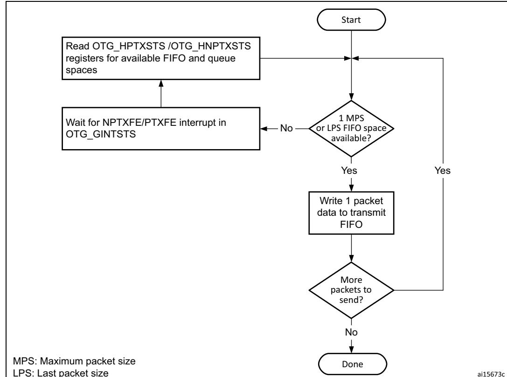

Figure 802. Transmit FIFO write task

# Reading the receive FIFO

The application must ignore all packet statuses other than IN data packet (bx0010).


**Figure 803. Receive FIFO read task**

# • **Bulk and control OUT/SETUP transactions**

A typical bulk or control OUT/SETUP pipelined transaction-level operation is shown in *[Figure 804](#page-132-0)*. See channel 1 (ch\_1). Two bulk OUT packets are transmitted. A control SETUP transaction operates in the same way but has only one packet. The assumptions are:

- The application is attempting to send two maximum-packet-size packets (transfer size = 1, 024 bytes).
- The non-periodic transmit FIFO can hold two packets (1 Kbyte for HS).
- The non-periodic request queue depth = 4.

### • **Normal bulk and control OUT/SETUP operations**

The sequence of operations in (channel 1) is as follows:

- 1. Initialize channel 1
- 2. Write the first packet for channel 1
- 3. Along with the last word write, the core writes an entry to the non-periodic request queue
- 4. As soon as the non-periodic queue becomes non-empty, the core attempts to send an OUT token in the current frame
- 5. Write the second (last) packet for channel 1
- 6. The core generates the XFRC interrupt as soon as the last transaction is completed successfully
- 7. In response to the XFRC interrupt, de-allocate the channel for other transfers
- 8. Handling non-ACK responses


<span id="page-132-0"></span>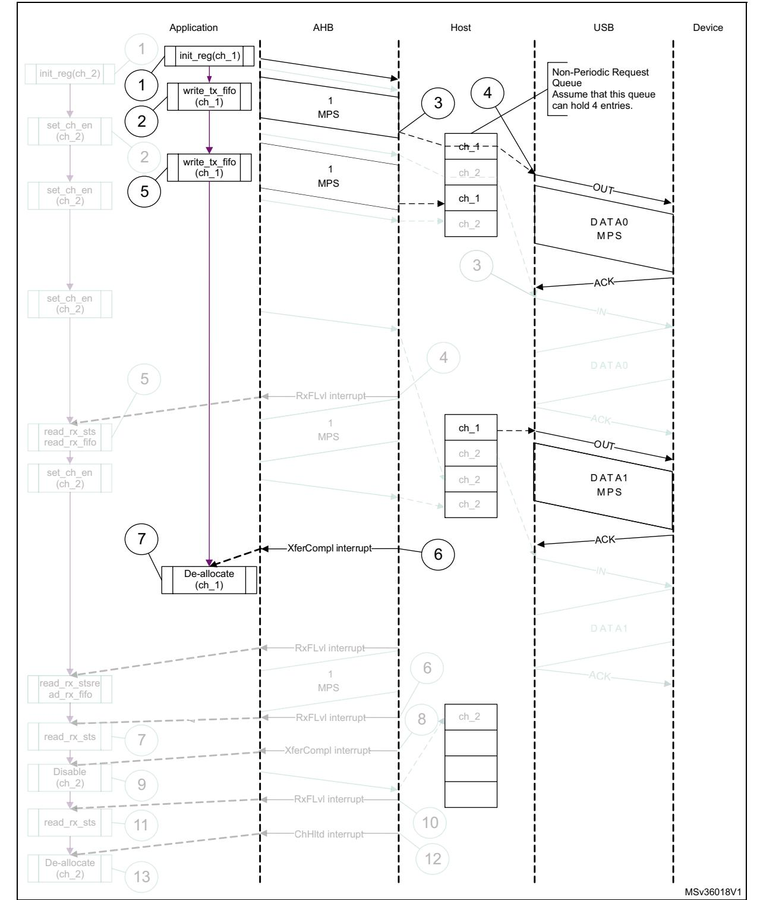

Figure 804. Normal bulk/control OUT/SETUP

1. The grayed elements are not relevant in the context of this figure.

The channel-specific interrupt service routine for bulk and control OUT/SETUP transactions is shown in the following code samples.

• **Interrupt service routine for bulk/control OUT/SETUP and bulk/control IN transactions**

```
a) Bulk/control OUT/SETUP
```

```
Unmask (NAK/TXERR/STALL/XFRC)
if (XFRC)
  {
  Reset Error Count
  Mask ACK
  De-allocate Channel
  }
else if (STALL)
  {
  Transfer Done = 1
  Unmask CHH
  Disable Channel
  }
else if (NAK or TXERR )
  {
  Rewind Buffer Pointers
  Unmask CHH
  Disable Channel
  if (TXERR)
     {
     Increment Error Count
     Unmask ACK
     }
  else
     {
     Reset Error Count
     }
     }
else if (CHH)
  {
  Mask CHH
  if (Transfer Done or (Error_count == 3))
     {
     De-allocate Channel
     }
  else
     {
     Re-initialize Channel
     }
  }
```

```
else if (ACK)
  {
  Reset Error Count
  Mask ACK
  }
```

The application is expected to write the data packets into the transmit FIFO when the space is available in the transmit FIFO and the request queue. The application can make use of the NPTXFE interrupt in OTG\_GINTSTS to find the transmit FIFO space.

b) Bulk/control IN

```
Unmask (TXERR/XFRC/BBERR/STALL/DTERR)
if (XFRC)
  {
  Reset Error Count
  Unmask CHH
  Disable Channel
  Reset Error Count
  Mask ACK
  }
else if (TXERR or BBERR or STALL)
  {
  Unmask CHH
  Disable Channel
  if (TXERR)
     {
     Increment Error Count
     Unmask ACK
     }
  }
else if (CHH)
  {
  Mask CHH
  if (Transfer Done or (Error_count == 3))
     {
     De-allocate Channel
     }
  else
     {
     Re-initialize Channel
     }
  }
else if (ACK)
  {
  Reset Error Count
  Mask ACK
  }
```

RM0399 Rev 4 2877/3556

```
else if (DTERR)
  {
  Reset Error Count
  }
```

The application is expected to write the requests as and when the request queue space is available and until the XFRC interrupt is received.

# • **Bulk and control IN transactions**

A typical bulk or control IN pipelined transaction-level operation is shown in *[Figure 805](#page-136-0)*. See channel 2 (ch\_2). The assumptions are:

- The application is attempting to receive two maximum-packet-size packets (transfer size = 1 024 bytes).
- The receive FIFO can contain at least one maximum-packet-size packet and two status words per packet (520 bytes for HS).
- The non-periodic request queue depth = 4.

<span id="page-136-0"></span>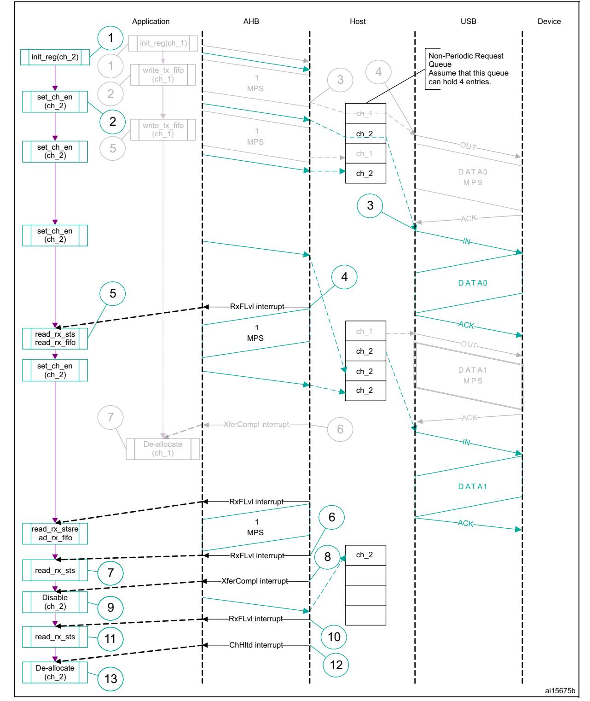

Figure 805. Bulk/control IN transactions

1. The grayed elements are not relevant in the context of this figure.

4

2879/3556

The sequence of operations is as follows:

- 1. Initialize channel 2.
- 2. Set the CHENA bit in OTG\_HCCHAR2 to write an IN request to the non-periodic request queue.
- 3. The core attempts to send an IN token after completing the current OUT transaction.
- 4. The core generates an RXFLVL interrupt as soon as the received packet is written to the receive FIFO.
- 5. In response to the RXFLVL interrupt, mask the RXFLVL interrupt and read the received packet status to determine the number of bytes received, then read the receive FIFO accordingly. Following this, unmask the RXFLVL interrupt.
- 6. The core generates the RXFLVL interrupt for the transfer completion status entry in the receive FIFO.
- 7. The application must read and ignore the receive packet status when the receive packet status is not an IN data packet (PKTSTS in OTG\_GRXSTSR ≠ 0b0010).
- 8. The core generates the XFRC interrupt as soon as the receive packet status is read.
- 9. In response to the XFRC interrupt, disable the channel and stop writing the OTG\_HCCHAR2 register for further requests. The core writes a channel disable request to the non-periodic request queue as soon as the OTG\_HCCHAR2 register is written.
- 10. The core generates the RXFLVL interrupt as soon as the halt status is written to the receive FIFO.
- 11. Read and ignore the receive packet status.
- 12. The core generates a CHH interrupt as soon as the halt status is popped from the receive FIFO.
- 13. In response to the CHH interrupt, de-allocate the channel for other transfers.
- 14. Handling non-ACK responses

# • **Control transactions**

Setup, data, and status stages of a control transfer must be performed as three separate transfers. setup-, data- or status-stage OUT transactions are performed similarly to the bulk OUT transactions explained previously. Data- or status-stage IN transactions are performed similarly to the bulk IN transactions explained previously. For all three stages, the application is expected to set the EPTYP field in


OTG\_HCCHAR1 to control. During the setup stage, the application is expected to set the PID field in OTG\_HCTSIZ1 to SETUP.

### • **Interrupt OUT transactions**

A typical interrupt OUT operation is shown in *[Figure 806](#page-139-0)*. The assumptions are:

- The application is attempting to send one packet in every frame (up to 1 maximum packet size), starting with the odd frame (transfer size = 1 024 bytes)
- The periodic transmit FIFO can hold one packet (1 Kbyte)
- Periodic request queue depth = 4

The sequence of operations is as follows:

- 1. Initialize and enable channel 1. The application must set the ODDFRM bit in OTG\_HCCHAR1.
- 2. Write the first packet for channel 1.
- 3. Along with the last word write of each packet, the OTG\_HS host writes an entry to the periodic request queue.
- 4. The OTG\_HS host attempts to send an OUT token in the next (odd) frame.
- 5. The OTG\_HS host generates an XFRC interrupt as soon as the last packet is transmitted successfully.
- 6. In response to the XFRC interrupt, reinitialize the channel for the next transfer.

<span id="page-139-0"></span>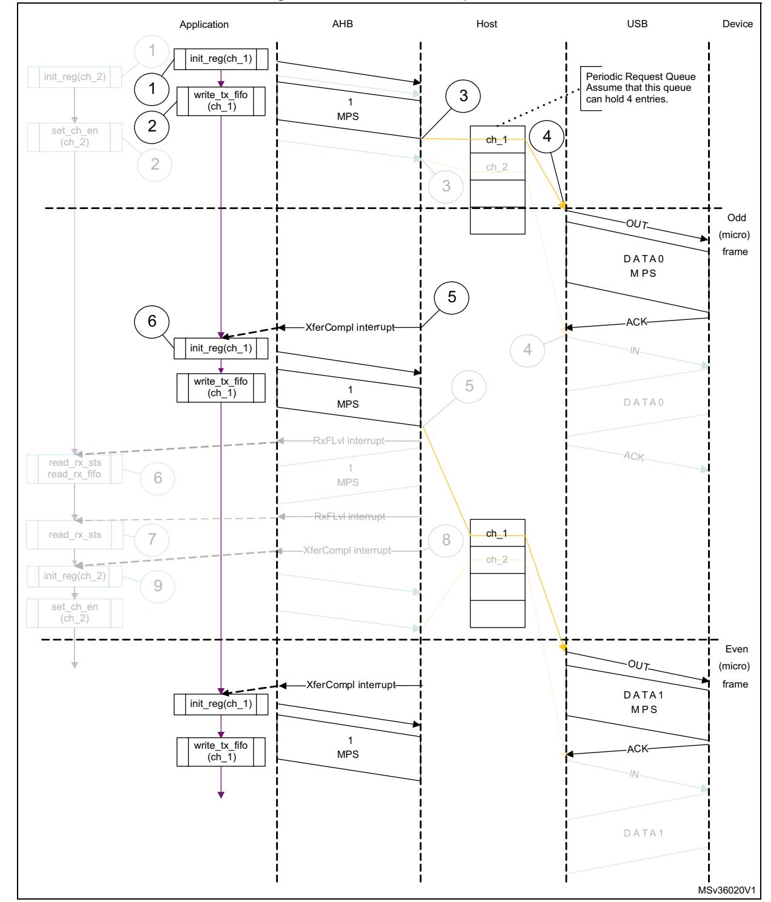

Figure 806. Normal interrupt OUT

- 1. The grayed elements are not relevant in the context of this figure.
  - Interrupt service routine for interrupt OUT/IN transactions
    - a) Interrupt OUT

Unmask (NAK/TXERR/STALL/XFRC/FRMOR)

47/

```
if (XFRC)
  {
  Reset Error Count
  Mask ACK
  De-allocate Channel
  }
else
  if (STALL or FRMOR)
     {
     Mask ACK
     Unmask CHH
     Disable Channel
     if (STALL)
        {
        Transfer Done = 1
        }
     }
  else
     if (NAK or TXERR)
        {
        Rewind Buffer Pointers
        Reset Error Count
        Mask ACK
        Unmask CHH
        Disable Channel
        }
     else
        if (CHH)
        {
        Mask CHH
        if (Transfer Done or (Error_count == 3))
           {
           De-allocate Channel
           }
        else
           {
           Re-initialize Channel (in next b_interval - 1 Frame)
           }
        }
     else
        if (ACK)
        {
        Reset Error Count
        Mask ACK
        }
```

RM0399 Rev 4 2883/3556

```
The application uses the NPTXFE interrupt in OTG_GINTSTS to find the 
transmit FIFO space.
Interrupt IN
Unmask (NAK/TXERR/XFRC/BBERR/STALL/FRMOR/DTERR)
if (XFRC)
  {
  Reset Error Count
  Mask ACK
  if (OTG_HCTSIZx.PKTCNT == 0)
     {
     De-allocate Channel
     }
  else
     {
     Transfer Done = 1
     Unmask CHH
     Disable Channel
     }
  }
else
  if (STALL or FRMOR or NAK or DTERR or BBERR)
     {
     Mask ACK
     Unmask CHH
     Disable Channel
 if (STALL or BBERR)
        {
        Reset Error Count
        Transfer Done = 1
        }
     else
        if (!FRMOR)
        {
        Reset Error Count
        }
     }
else
  if (TXERR)
     {
     Increment Error Count
     Unmask ACK
     Unmask CHH
     Disable Channel
     }
```

2884/3556 RM0399 Rev 4

**else**

```
if (CHH)
     {
     Mask CHH
 if (Transfer Done or (Error_count == 3))
       {
       De-allocate Channel
       }
 else
 Re-initialize Channel (in next b_interval - 1 /Frame)
     }
  }
else
  if (ACK)
     {
     Reset Error Count
     Mask ACK
     }
```

### • **Interrupt IN transactions**

The assumptions are:

- The application is attempting to receive one packet (up to 1 maximum packet size) in every frame, starting with odd (transfer size = 1 024 bytes).
- The receive FIFO can hold at least one maximum-packet-size packet and two status words per packet (1 031 bytes).
- Periodic request queue depth = 4.

### • **Normal interrupt IN operation**

The sequence of operations is as follows:

- 1. Initialize channel 2. The application must set the ODDFRM bit in OTG\_HCCHAR2.
- 2. Set the CHENA bit in OTG\_HCCHAR2 to write an IN request to the periodic request queue.
- 3. The OTG\_HS host writes an IN request to the periodic request queue for each OTG\_HCCHAR2 register write with the CHENA bit set.
- 4. The OTG\_HS host attempts to send an IN token in the next (odd) frame.
- 5. As soon as the IN packet is received and written to the receive FIFO, the OTG\_HS host generates an RXFLVL interrupt.
- 6. In response to the RXFLVL interrupt, read the received packet status to determine the number of bytes received, then read the receive FIFO accordingly. The application must mask the RXFLVL interrupt before reading the receive FIFO, and unmask after reading the entire packet.
- 7. The core generates the RXFLVL interrupt for the transfer completion status entry in the receive FIFO. The application must read and ignore the receive packet status when the receive packet status is not an IN data packet (PKTSTS in GRXSTSR ≠ 0b0010).
- 8. The core generates an XFRC interrupt as soon as the receive packet status is read.
- 9. In response to the XFRC interrupt, read the PKTCNT field in OTG\_HCTSIZ2. If the PKTCNT bit in OTG\_HCTSIZ2 is not equal to 0, disable the channel before re-

RM0399 Rev 4 2885/3556

initializing the channel for the next transfer, if any). If PKTCNT bit in OTG\_HCTSIZ2 = 0, reinitialize the channel for the next transfer. This time, the application must reset the ODDFRM bit in OTG\_HCCHAR2.


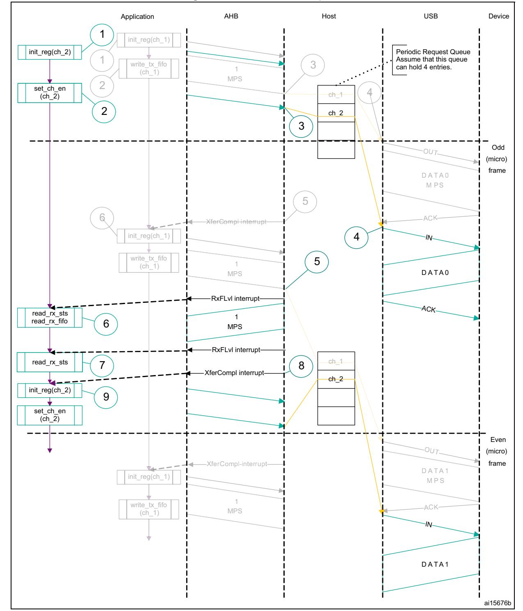

Figure 807. Normal interrupt IN

- 1. The grayed elements are not relevant in the context of this figure.
  - Isochronous OUT transactions

A typical isochronous OUT operation is shown in *Figure 808*. The assumptions are:

The application is attempting to send one packet every frame (up to 1 maximum)

4

RM0399 Rev 4 2887/3556

packet size), starting with an odd frame. (transfer size = 1 024 bytes).

- The periodic transmit FIFO can hold one packet (1 Kbyte).
- Periodic request queue depth = 4.

The sequence of operations is as follows:

- 1. Initialize and enable channel 1. The application must set the ODDFRM bit in OTG\_HCCHAR1.
- 2. Write the first packet for channel 1.
- 3. Along with the last word write of each packet, the OTG\_HS host writes an entry to the periodic request queue.
- 4. The OTG\_HS host attempts to send the OUT token in the next frame (odd).
- 5. The OTG\_HS host generates the XFRC interrupt as soon as the last packet is transmitted successfully.
- 6. In response to the XFRC interrupt, reinitialize the channel for the next transfer.
- 7. Handling non-ACK responses

<span id="page-146-0"></span>

Figure 808. Isochronous OUT transactions

- 1. The grayed elements are not relevant in the context of this figure.
  - Interrupt service routine for isochronous OUT/IN transactions
     Code sample: isochronous OUT

Unmask (FRMOR/XFRC)

if (XFRC)


RM0399 Rev 4 2889/3556

```
{
  De-allocate Channel
  }
else
  if (FRMOR)
     {
     Unmask CHH
     Disable Channel
     }
  else
  if (CHH)
     {
     Mask CHH
     De-allocate Channel
     }
Code sample: Isochronous IN
Unmask (TXERR/XFRC/FRMOR/BBERR)
if (XFRC or FRMOR)
  {
  if (XFRC and (OTG_HCTSIZx.PKTCNT == 0))
     {
     Reset Error Count
     De-allocate Channel
     }
  else
     {
     Unmask CHH
     Disable Channel
     }
  }
  else
     if (TXERR or BBERR)
        {
        Increment Error Count
        Unmask CHH
        Disable Channel
        }
     else
        if (CHH)
           {
           Mask CHH
           if (Transfer Done or (Error_count == 3))
              {
              De-allocate Channel
              }
```

```
else
   {
   Re-initialize Channel
   }
}
```

### • **Isochronous IN transactions**

The assumptions are:

- The application is attempting to receive one packet (up to 1 maximum packet size) in every frame starting with the next odd frame (transfer size = 1 024 bytes).
- The receive FIFO can hold at least one maximum-packet-size packet and two status word per packet (1 031 bytes).
- Periodic request queue depth = 4.

The sequence of operations is as follows:

- 1. Initialize channel 2. The application must set the ODDFRM bit in OTG\_HCCHAR2.
- 2. Set the CHENA bit in OTG\_HCCHAR2 to write an IN request to the periodic request queue.
- 3. The OTG\_HS host writes an IN request to the periodic request queue for each OTG\_HCCHAR2 register write with the CHENA bit set.
- 4. The OTG\_HS host attempts to send an IN token in the next odd frame.
- 5. As soon as the IN packet is received and written to the receive FIFO, the OTG\_HS host generates an RXFLVL interrupt.
- 6. In response to the RXFLVL interrupt, read the received packet status to determine the number of bytes received, then read the receive FIFO accordingly. The application must mask the RXFLVL interrupt before reading the receive FIFO, and unmask it after reading the entire packet.
- 7. The core generates an RXFLVL interrupt for the transfer completion status entry in the receive FIFO. This time, the application must read and ignore the receive packet status when the receive packet status is not an IN data packet (PKTSTS bit in OTG\_GRXSTSR ≠ 0b0010).
- 8. The core generates an XFRC interrupt as soon as the receive packet status is read.
- 9. In response to the XFRC interrupt, read the PKTCNT field in OTG\_HCTSIZ2. If PKTCNT ≠ 0 in OTG\_HCTSIZ2, disable the channel before re-initializing the channel for the next transfer, if any. If PKTCNT = 0 in OTG\_HCTSIZ2, reinitialize the channel for the next transfer. This time, the application must reset the ODDFRM bit in OTG\_HCCHAR2.

RM0399 Rev 4 2891/3556

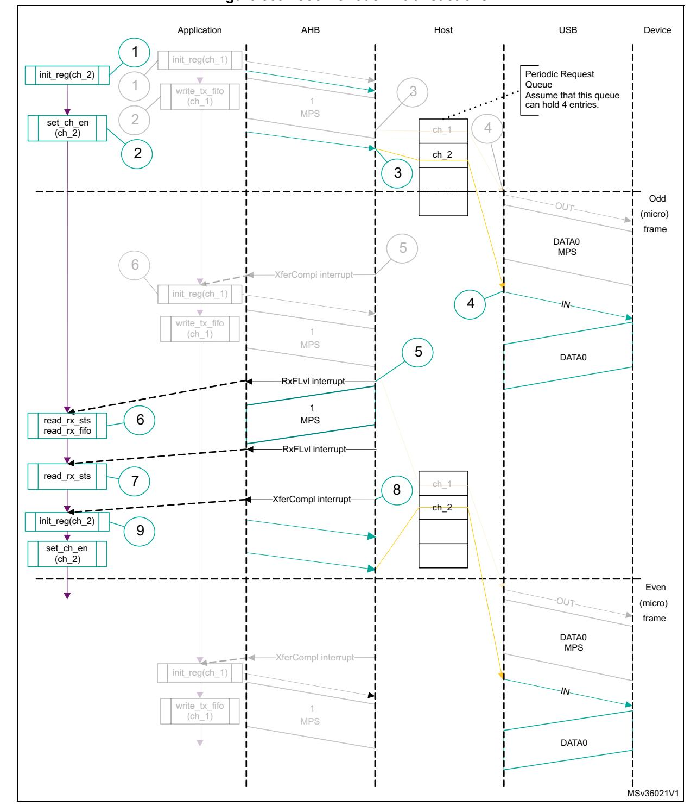

**Figure 809. Isochronous IN transactions**

1. The grayed elements are not relevant in the context of this figure.

### • **Selecting the queue depth**

Choose the periodic and non-periodic request queue depths carefully to match the number of periodic/non-periodic endpoints accessed.

The non-periodic request queue depth affects the performance of non-periodic

transfers. The deeper the queue (along with sufficient FIFO size), the more often the core is able to pipeline non-periodic transfers. If the queue size is small, the core is able to put in new requests only when the queue space is freed up.

The core's periodic request queue depth is critical to perform periodic transfers as scheduled. Select the periodic queue depth, based on the number of periodic transfers scheduled in a microframe. If the periodic request queue depth is smaller than the periodic transfers scheduled in a microframe, a frame overrun condition occurs.

# • **Handling babble conditions**

OTG\_HS controller handles two cases of babble: packet babble and port babble. Packet babble occurs if the device sends more data than the maximum packet size for the channel. Port babble occurs if the core continues to receive data from the device at EOF2 (the end of frame 2, which is very close to SOF).

When OTG\_HS controller detects a packet babble, it stops writing data into the Rx buffer and waits for the end of packet (EOP). When it detects an EOP, it flushes already written data in the Rx buffer and generates a Babble interrupt to the application.

When OTG\_HS controller detects a port babble, it flushes the Rx FIFO and disables the port. The core then generates a port disabled interrupt (HPRTINT in OTG\_GINTSTS, PENCHNG in OTG\_HPRT). On receiving this interrupt, the application must determine that this is not due to an overcurrent condition (another cause of the port disabled interrupt) by checking POCA in OTG\_HPRT, then perform a soft reset. The core does not send any more tokens after it has detected a port babble condition.

### • **Bulk and control OUT/SETUP transactions in DMA mode**

The sequence of operations is as follows:

- 1. Initialize and enable channel 1 as explained in *Section [: Channel initialization](#page-128-0)*.
- 2. The OTG\_HS host starts fetching the first packet as soon as the channel is enabled. For internal DMA mode, the OTG\_HS host uses the programmed DMA address to fetch the packet.
- 3. After fetching the last 32-bit word of the second (last) packet, the OTG\_HS host masks channel 1 internally for further arbitration.
- 4. The OTG\_HS host generates a CHH interrupt as soon as the last packet is sent.
- 5. In response to the CHH interrupt, de-allocate the channel for other transfers.


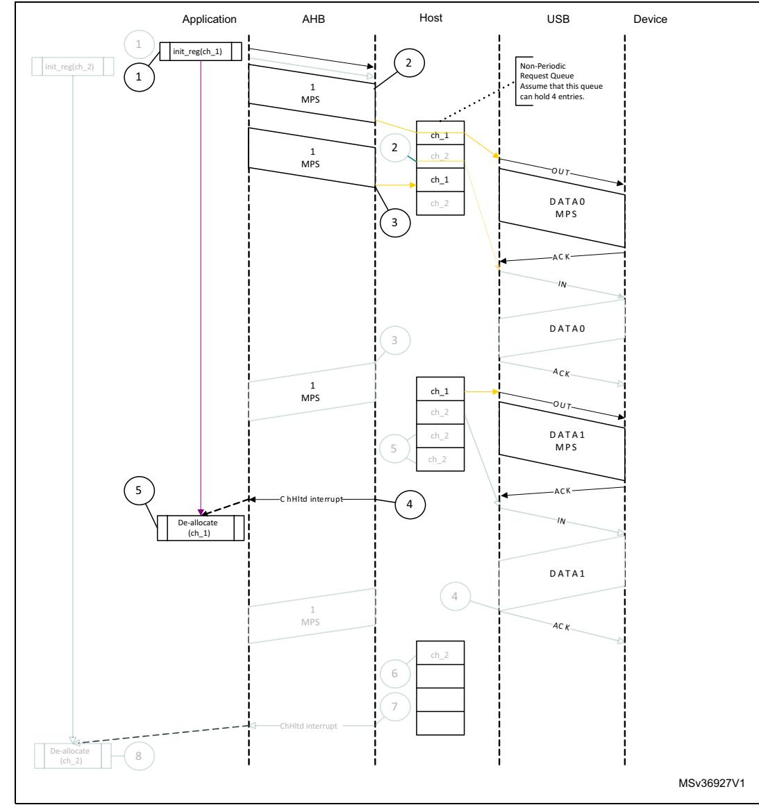

**Figure 810. Normal bulk/control OUT/SETUP transactions - DMA**

- **NAK and NYET handling with internal DMA:**
- 1. The OTG\_HS host sends a bulk OUT transaction.
- 2. The device responds with NAK or NYET.
- 3. If the application has unmasked NAK or NYET, the core generates the corresponding interrupt(s) to the application. The application is not required to service these interrupts, since the core takes care of rewinding the buffer pointers and re-initializing the Channel without application intervention.
- 4. The core automatically issues a ping token.
- 5. When the device returns an ACK, the core continues with the transfer. Optionally, the application can utilize these interrupts, in which case the NAK or NYET interrupt is masked by the application.

The core does not generate a separate interrupt when NAK or NYET is received by the host functionality.

### • **Bulk and control IN transactions in DMA mode**

The sequence of operations is as follows:

- 1. Initialize and enable the used channel (channel x) as explained in *Section [: Channel](#page-128-0)  [initialization](#page-128-0)*.
- 2. The OTG\_HS host writes an IN request to the request queue as soon as the channel receives the grant from the arbiter (arbitration is performed in a round-robin fashion).
- 3. The OTG\_HS host starts writing the received data to the system memory as soon as the last byte is received with no errors.
- 4. When the last packet is received, the OTG\_HS host sets an internal flag to remove any extra IN requests from the request queue.
- 5. The OTG\_HS host flushes the extra requests.
- 6. The final request to disable channel x is written to the request queue. At this point, channel 2 is internally masked for further arbitration.
- 7. The OTG\_HS host generates the CHH interrupt as soon as the disable request comes to the top of the queue.
- 8. In response to the CHH interrupt, de-allocate the channel for other transfers.


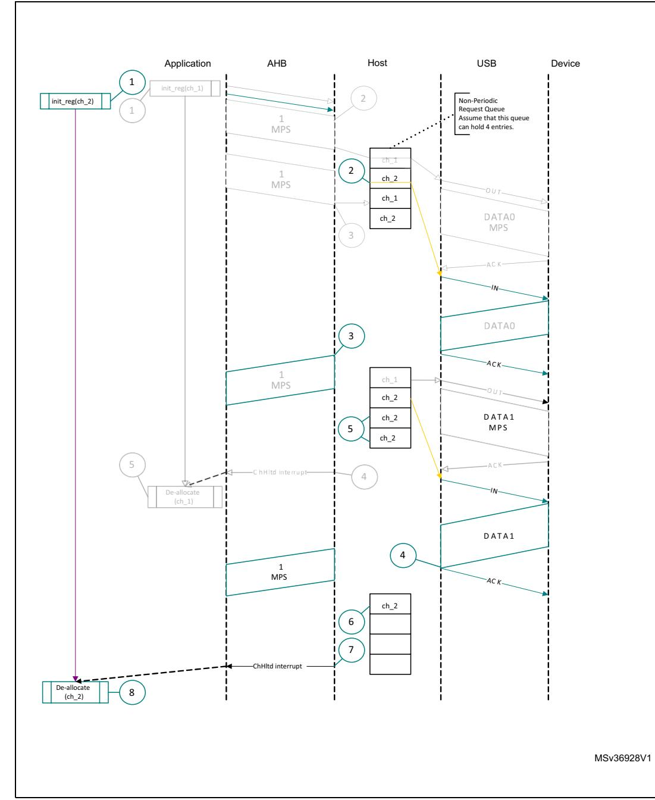

**Figure 811. Normal bulk/control IN transaction - DMA**

- **Interrupt OUT transactions in DMA mode**
- 1. Initialize and enable channel x as explained in *Section [: Channel initialization](#page-128-0)*.
- 2. The OTG\_HS host starts fetching the first packet as soon the channel is enabled and writes the OUT request along with the last 32-bit word fetch. In high-bandwidth transfers, the OTG\_HS host continues fetching the next packet (up to the value specified in the MC field) before switching to the next channel.
- 3. The OTG\_HS host attempts to send the OUT token at the beginning of the next odd frame/micro-frame.

- 4. After successfully transmitting the packet, the OTG\_HS host generates a CHH interrupt.
- 5. In response to the CHH interrupt, reinitialize the channel for the next transfer.

MSv36924V1 A T A 1 DA T A 0 MP S 1 MPS MPS init\_reg(ch\_1) ch\_2 ch\_1 O UT C hHltd interrupt Periodic Request Queue Assume that this queue can hold 4 entries. 1 2 3 5 ch\_1 init\_reg(ch\_1) init\_reg(ch\_1) C hHltd interrupt 1 MPS DA <sup>T</sup> <sup>A</sup> <sup>1</sup> ch\_2 4 A C K AC K Odd (micro) frame Even (micro) frame Application AHB USB Host Device

**Figure 812. Normal interrupt OUT transactions - DMA mode**

### • **Interrupt IN transactions in DMA mode**

The sequence of operations (channelx) is as follows:

- 1. Initialize and enable channel x as explained in *Section [: Channel initialization](#page-128-0)*.
- 2. The OTG\_HS host writes an IN request to the request queue as soon as the channel x gets the grant from the arbiter (round-robin with fairness). In high-bandwidth transfers, the OTG\_HS host writes consecutive writes up to MC times.

RM0399 Rev 4 2897/3556

- The OTG\_HS host attempts to send an IN token at the beginning of the next (odd) frame/micro-frame.
- 4. As soon the packet is received and written to the receive FIFO, the OTG\_HS host generates a CHH interrupt.
- 5. In response to the CHH interrupt, reinitialize the channel for the next transfer.

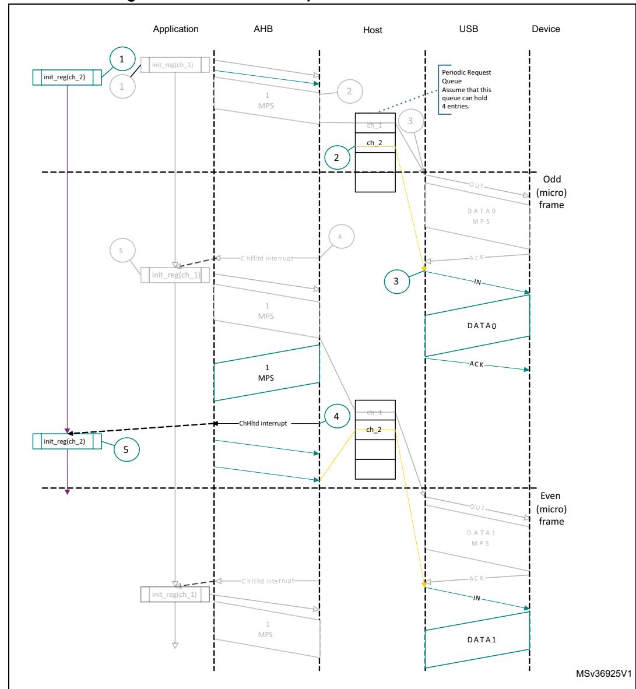

Figure 813. Normal interrupt IN transactions - DMA mode

- Isochronous OUT transactions in DMA mode
- 1. Initialize and enable channel x as explained in Section : Channel initialization.
- 2. The OTG\_HS host starts fetching the first packet as soon as the channel is enabled, and writes the OUT request along with the last 32-bit word fetch. In high-bandwidth

- transfers, the OTG\_HS host continues fetching the next packet (up to the value specified in the MC field) before switching to the next channel.
- 3. The OTG\_HS host attempts to send an OUT token at the beginning of the next (odd) frame/micro-frame.
- 4. After successfully transmitting the packet, the OTG\_HS host generates a CHH interrupt.
- 5. In response to the CHH interrupt, reinitialize the channel for the next transfer.

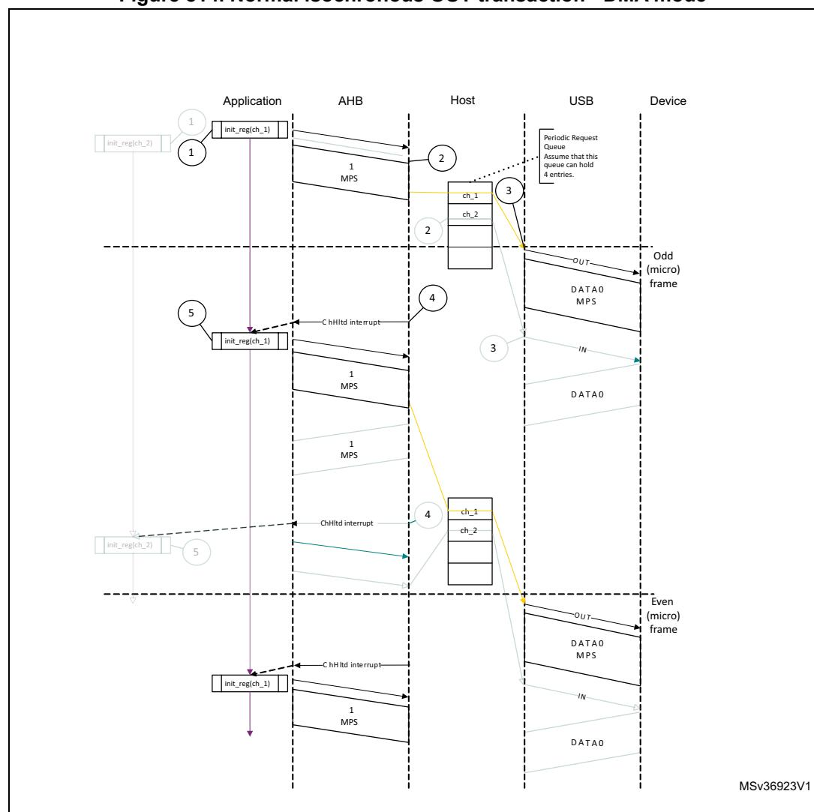

**Figure 814. Normal isochronous OUT transaction - DMA mode**

- **Isochronous IN transactions in DMA mode**
  - The sequence of operations ((channel x) is as follows:
- 1. Initialize and enable channel x as explained in *Section [: Channel initialization](#page-128-0)*.
- 2. The OTG\_HS host writes an IN request to the request queue as soon as the channel x gets the grant from the arbiter (round-robin with fairness). In high-bandwidth transfers, the OTG\_HS host performs consecutive write operations up to MC times.

RM0399 Rev 4 2899/3556

- The OTG HS host attempts to send an IN token at the beginning of the next (odd) frame/micro-frame.
- As soon the packet is received and written to the receive FIFO, the OTG HS host 4. generates a CHH interrupt.
- In response to the CHH interrupt, reinitialize the channel for the next transfer.

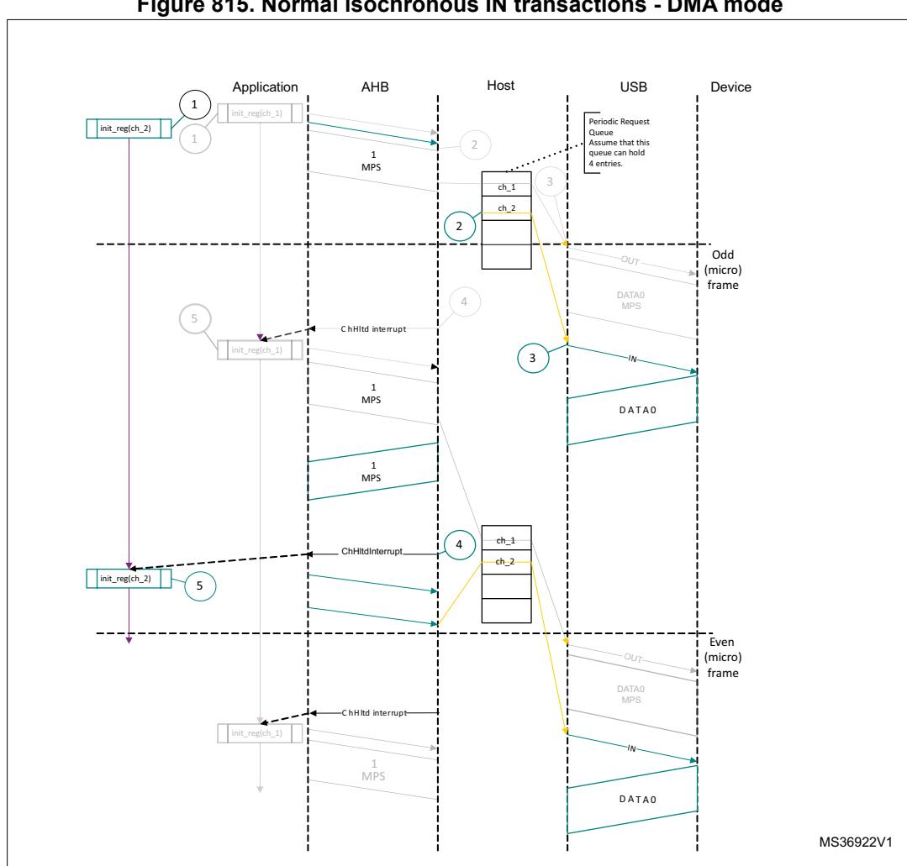

Figure 815. Normal isochronous IN transactions - DMA mode

- Bulk and control OUT/SETUP split transactions in DMA mode
  - The sequence of operations in (channel x) is as follows:
- Initialize and enable channel x for start split as explained in Section: Channel 1. initialization.
- 2. The OTG HS host starts fetching the first packet as soon the channel is enabled and writes the OUT request along with the last 32-bit word fetch.
- 3. After successfully transmitting start split, the OTG HS host generates the CHH interrupt.
- In response to the CHH interrupt, set the COMPLSPLT bit in OTG\_HCSPLT1 to send the complete split.

RM0399 Rev 4 2900/3556

- 5. After successfully transmitting complete split, the OTG\_HS host generates the CHH interrupt.
- 6. In response to the CHH interrupt, de-allocate the channel.
- **Bulk/control IN split transactions in DMA mode**

The sequence of operations (channel x) is as follows:

- 1. Initialize and enable channel x as explained in *Section [: Channel initialization](#page-128-0)*.
- 2. The OTG\_HS host writes the start split request to the nonperiodic request after getting the grant from the arbiter. The OTG\_HS host masks the channel x internally for the arbitration after writing the request.
- 3. As soon as the IN token is transmitted, the OTG\_HS host generates the CHH interrupt.
- 4. In response to the CHH interrupt, set the COMPLSPLT bit in OTG\_HCSPLT2 and reenable the channel to send the complete split token. This unmasks channel x for arbitration.
- 5. The OTG\_HS host writes the complete split request to the nonperiodic request after receiving the grant from the arbiter.
- 6. The OTG\_HS host starts writing the packet to the system memory after receiving the packet successfully.
- 7. As soon as the received packet is written to the system memory, the OTG\_HS host generates a CHH interrupt.
- 8. In response to the CHH interrupt, de-allocate the channel.
- **Interrupt OUT split transactions in DMA mode**

The sequence of operations in (channel x) is as follows:

- 1. Initialize and enable channel 1 for start split as explained in *Section [: Channel](#page-128-0)  [initialization](#page-128-0)*. The application must set the ODDFRM bit in OTG\_HCCHAR1.
- 2. The OTG\_HS host starts reading the packet.
- 3. The OTG\_HS host attempts to send the start split transaction.
- 4. After successfully transmitting the start split, the OTG\_HS host generates the CHH interrupt.
- 5. In response to the CHH interrupt, set the COMPLSPLT bit in OTG\_HCSPLT1 to send the complete split.
- 6. After successfully completing the complete split transaction, the OTG\_HS host generates the CHH interrupt.
- 7. In response to CHH interrupt, de-allocate the channel.
- **Interrupt IN split transactions in DMA mode**

The sequence of operations in (channel x) is as follows:

- 1. Initialize and enable channel x for start split as explained in *Section [: Channel](#page-128-0)  [initialization](#page-128-0)*.
- 2. The OTG\_HS host writes an IN request to the request queue as soon as channel x receives the grant from the arbiter.
- 3. The OTG\_HS host attempts to send the start split IN token at the beginning of the next odd micro-frame.
- 4. The OTG\_HS host generates the CHH interrupt after successfully transmitting the start split IN token.
- 5. In response to the CHH interrupt, set the COMPLSPLT bit in OTG\_HCSPLT2 to send the complete split.


RM0399 Rev 4 2901/3556

- 6. As soon as the packet is received successfully, the OTG\_HS host starts writing the data to the system memory.
- 7. The OTG\_HS host generates the CHH interrupt after transferring the received data to the system memory.
- 8. In response to the CHH interrupt, de-allocate or reinitialize the channel for the next start split.
- **Isochronous OUT split transactions in DMA mode**

The sequence of operations (channel x) is as follows:

- 1. Initialize and enable channel x for start split (begin) as explained in *Section [: Channel](#page-128-0)  [initialization](#page-128-0)*. The application must set the ODDFRM bit in OTG\_HCCHAR1. Program the MPS field.
- 2. The OTG\_HS host starts reading the packet.
- 3. After successfully transmitting the start split (begin), the OTG\_HS host generates the CHH interrupt.
- 4. In response to the CHH interrupt, reinitialize the registers to send the start split (end).
- 5. After successfully transmitting the start split (end), the OTG\_HS host generates a CHH interrupt.
- 6. In response to the CHH interrupt, de-allocate the channel.
- **Isochronous IN split transactions in DMA mode**

The sequence of operations (channel x) is as follows:

- 1. Initialize and enable channel x for start split as explained in *Section [: Channel](#page-128-0)  [initialization](#page-128-0)*.
- 2. The OTG\_HS host writes an IN request to the request queue as soon as channel x receives the grant from the arbiter.
- 3. The OTG\_HS host attempts to send the start split IN token at the beginning of the next odd micro-frame.
- 4. The OTG\_HS host generates the CHH interrupt after successfully transmitting the start split IN token.
- 5. In response to the CHH interrupt, set the COMPLSPLT bit in OTG\_HCSPLT2 to send the complete split.
- 6. As soon as the packet is received successfully, the OTG\_HS host starts writing the data to the system memory.
  - The OTG\_HS host generates the CHH interrupt after transferring the received data to the system memory. In response to the CHH interrupt, de-allocate the channel or reinitialize the channel for the next start split.

# **60.15.6 Device programming model**

# **Endpoint initialization on USB reset**

- 1. Set the NAK bit for all OUT endpoints
  - SNAK = 1 in OTG\_DOEPCTLx (for all OUT endpoints)
- 2. Unmask the following interrupt bits
  - INEP0 = 1 in OTG\_DAINTMSK (control 0 IN endpoint)
  - OUTEP0 = 1 in OTG\_DAINTMSK (control 0 OUT endpoint)
  - STUPM = 1 in OTG\_DOEPMSK
  - XFRCM = 1 in OTG\_DOEPMSK
  - XFRCM = 1 in OTG\_DIEPMSK
  - TOM = 1 in OTG\_DIEPMSK
- 3. Set up the data FIFO RAM for each of the FIFOs
  - Program the OTG\_GRXFSIZ register, to be able to receive control OUT data and setup data. If thresholding is not enabled, at a minimum, this must be equal to 1 max packet size of control endpoint 0 + 2 words (for the status of the control OUT data packet) + 10 words (for setup packets).
  - Program the OTG\_DIEPTXF0 register (depending on the FIFO number chosen) to be able to transmit control IN data. At a minimum, this must be equal to 1 max packet size of control endpoint 0.
- 4. Program the following fields in the endpoint-specific registers for control OUT endpoint 0 to receive a SETUP packet
  - STUPCNT = 3 in OTG\_DOEPTSIZ0 (to receive up to 3 back-to-back SETUP packets)
- 5. For USB OTG\_HS in DMA mode, the OTG\_DOEPDMA0 register should have a valid memory address to store any SETUP packets received.

At this point, all initialization required to receive SETUP packets is done.

# <span id="page-160-0"></span>**Endpoint initialization on enumeration completion**

- 1. On the Enumeration Done interrupt (ENUMDNE in OTG\_GINTSTS), read the OTG\_DSTS register to determine the enumeration speed.
- 2. Program the MPSIZ field in OTG\_DIEPCTL0 to set the maximum packet size. This step configures control endpoint 0. The maximum packet size for a control endpoint depends on the enumeration speed.
- 3. For USB OTG\_HS in DMA mode, program the OTG\_DOEPCTL0 register to enable control OUT endpoint 0, to receive a SETUP packet.

At this point, the device is ready to receive SOF packets and is configured to perform control transfers on control endpoint 0.

# **Endpoint initialization on SetAddress command**

This section describes what the application must do when it receives a SetAddress command in a SETUP packet.

- 1. Program the OTG\_DCFG register with the device address received in the SetAddress command
- 2. Program the core to send out a status IN packet


RM0399 Rev 4 2903/3556

# **Endpoint initialization on SetConfiguration/SetInterface command**

This section describes what the application must do when it receives a SetConfiguration or SetInterface command in a SETUP packet.

- 1. When a SetConfiguration command is received, the application must program the endpoint registers to configure them with the characteristics of the valid endpoints in the new configuration.
- 2. When a SetInterface command is received, the application must program the endpoint registers of the endpoints affected by this command.
- 3. Some endpoints that were active in the prior configuration or alternate setting are not valid in the new configuration or alternate setting. These invalid endpoints must be deactivated.
- 4. Unmask the interrupt for each active endpoint and mask the interrupts for all inactive endpoints in the OTG\_DAINTMSK register.
- 5. Set up the data FIFO RAM for each FIFO.
- 6. After all required endpoints are configured; the application must program the core to send a status IN packet.

At this point, the device core is configured to receive and transmit any type of data packet.

# **Endpoint activation**

This section describes the steps required to activate a device endpoint or to configure an existing device endpoint to a new type.

- 1. Program the characteristics of the required endpoint into the following fields of the OTG\_DIEPCTLx register (for IN or bidirectional endpoints) or the OTG\_DOEPCTLx register (for OUT or bidirectional endpoints).
  - Maximum packet size
  - USB active endpoint = 1
  - Endpoint start data toggle (for interrupt and bulk endpoints)
  - Endpoint type
  - Tx FIFO number
- 2. Once the endpoint is activated, the core starts decoding the tokens addressed to that endpoint and sends out a valid handshake for each valid token received for the endpoint.

# **Endpoint deactivation**

This section describes the steps required to deactivate an existing endpoint.

- 1. In the endpoint to be deactivated, clear the USB active endpoint bit in the OTG\_DIEPCTLx register (for IN or bidirectional endpoints) or the OTG\_DOEPCTLx register (for OUT or bidirectional endpoints).
- 2. Once the endpoint is deactivated, the core ignores tokens addressed to that endpoint, which results in a timeout on the USB.

*Note: The application must meet the following conditions to set up the device core to handle traffic:*

*NPTXFEM and RXFLVLM in the OTG\_GINTMSK register must be cleared.*


# **Operational model**

SETUP and OUT data transfers:

This section describes the internal data flow and application-level operations during data OUT transfers and SETUP transactions.

# • **Packet read**

This section describes how to read packets (OUT data and SETUP packets) from the receive FIFO.

- 1. On catching an RXFLVL interrupt (OTG\_GINTSTS register), the application must read the receive status pop register (OTG\_GRXSTSP).
- 2. The application can mask the RXFLVL interrupt (in OTG\_GINTSTS) by writing to RXFLVLM = 0 (in OTG\_GINTMSK), until it has read the packet from the receive FIFO.
- 3. If the received packet's byte count is not 0, the byte count amount of data is popped from the receive data FIFO and stored in memory. If the received packet byte count is 0, no data is popped from the receive data FIFO.
- 4. The receive status readout of the packet of FIFO indicates one of the following:
  - a) Global OUT NAK pattern: PKTSTS = Global OUT NAK, BCNT = 0x000, EPNUM = (0x0), DPID = (0b00). These data indicate that the global OUT NAK bit has taken effect.
  - b) SETUP packet pattern: PKTSTS = SETUP, BCNT = 0x008, EPNUM = Control EP Num, DPID = DATA0. These data indicate that a SETUP packet for the specified endpoint is now available for reading from the receive FIFO.
  - c) Setup stage done pattern: PKTSTS = Setup Stage Done, BCNT = 0x0, EPNUM = Control EP Num, DPID = (0b00). These data indicate that the setup stage for the specified endpoint has completed and the data stage has started. After this entry is popped from the receive FIFO, the core asserts a setup interrupt on the specified control OUT endpoint.
  - d) Data OUT packet pattern: PKTSTS = DataOUT, BCNT = size of the received data OUT packet (0 ≤ BCNT ≤ 1 024), EPNUM = EPNUM on which the packet was received, DPID = Actual Data PID.
  - e) Data transfer completed pattern: PKTSTS = Data OUT transfer done, BCNT = 0x0, EPNUM = OUT EP Num on which the data transfer is complete, DPID = (0b00). These data indicate that an OUT data transfer for the specified OUT endpoint has completed. After this entry is popped from the receive FIFO, the core asserts a transfer completed interrupt on the specified OUT endpoint.
- 5. After the data payload is popped from the receive FIFO, the RXFLVL interrupt (OTG\_GINTSTS) must be unmasked.
- 6. Steps 1–5 are repeated every time the application detects assertion of the interrupt line due to RXFLVL in OTG\_GINTSTS. Reading an empty receive FIFO can result in undefined core behavior.

*[Figure 816](#page-163-0)* provides a flowchart of the above procedure.


RM0399 Rev 4 2905/3556

<span id="page-163-0"></span>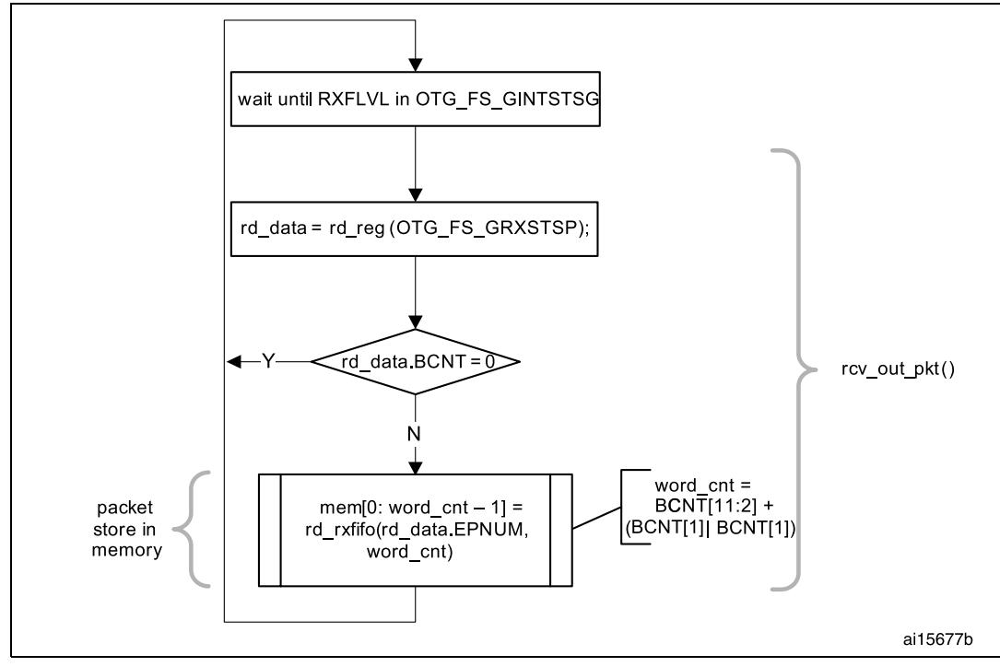

**Figure 816. Receive FIFO packet read**

### **SETUP transactions**

This section describes how the core handles SETUP packets and the application's sequence for handling SETUP transactions.

# • **Application requirements**

- 1. To receive a SETUP packet, the STUPCNT field (OTG\_DOEPTSIZx) in a control OUT endpoint must be programmed to a non-zero value. When the application programs the STUPCNT field to a non-zero value, the core receives SETUP packets and writes them to the receive FIFO, irrespective of the NAK status and EPENA bit setting in OTG\_DOEPCTLx. The STUPCNT field is decremented every time the control endpoint receives a SETUP packet. If the STUPCNT field is not programmed to a proper value before receiving a SETUP packet, the core still receives the SETUP packet and decrements the STUPCNT field, but the application may not be able to determine the correct number of SETUP packets received in the setup stage of a control transfer.
  - STUPCNT = 3 in OTG\_DOEPTSIZx
- 2. The application must always allocate some extra space in the receive data FIFO, to be able to receive up to three SETUP packets on a control endpoint.
  - The space to be reserved is 10 words. Three words are required for the first SETUP packet, 1 word is required for the setup stage done word and 6 words are required to store two extra SETUP packets among all control endpoints.
  - 3 words per SETUP packet are required to store 8 bytes of SETUP data and 4 bytes of SETUP status (setup packet pattern). The core reserves this space in the


receive data FIFO to write SETUP data only, and never uses this space for data packets.

- 3. The application must read the 2 words of the SETUP packet from the receive FIFO.
- 4. The application must read and discard the setup stage done word from the receive FIFO.

### • **Internal data flow**

- 1. When a SETUP packet is received, the core writes the received data to the receive FIFO, without checking for available space in the receive FIFO and irrespective of the endpoint's NAK and STALL bit settings.
  - The core internally sets the IN NAK and OUT NAK bits for the control IN/OUT endpoints on which the SETUP packet was received.
- 2. For every SETUP packet received on the USB, 3 words of data are written to the receive FIFO, and the STUPCNT field is decremented by 1.
  - The first word contains control information used internally by the core
  - The second word contains the first 4 bytes of the SETUP command
  - The third word contains the last 4 bytes of the SETUP command
- 3. When the setup stage changes to a data IN/OUT stage, the core writes an entry (setup stage done word) to the receive FIFO, indicating the completion of the setup stage.
- 4. On the AHB side, SETUP packets are emptied by the application.
- 5. When the application pops the setup stage done word from the receive FIFO, the core interrupts the application with an STUP interrupt (OTG\_DOEPINTx), indicating it can process the received SETUP packet.
- 6. The core clears the endpoint enable bit for control OUT endpoints.

# • **Application programming sequence**

- 1. Program the OTG\_DOEPTSIZx register.
  - STUPCNT = 3
- 2. Wait for the RXFLVL interrupt (OTG\_GINTSTS) and empty the data packets from the receive FIFO.
- 3. Assertion of the STUP interrupt (OTG\_DOEPINTx) marks a successful completion of the SETUP data transfer.
  - On this interrupt, the application must read the OTG\_DOEPTSIZx register to determine the number of SETUP packets received and process the last received SETUP packet.

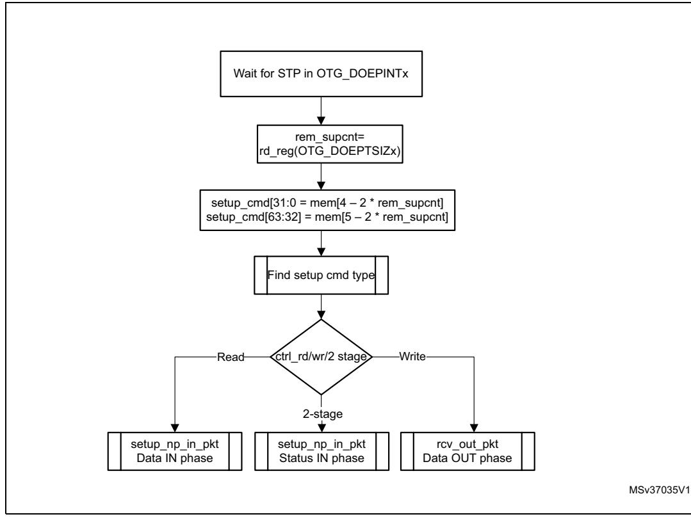

**Figure 817. Processing a SETUP packet**

# • **Handling more than three back-to-back SETUP packets**

Per the USB 2.0 specification, normally, during a SETUP packet error, a host does not send more than three back-to-back SETUP packets to the same endpoint. However, the USB 2.0 specification does not limit the number of back-to-back SETUP packets a host can send to the same endpoint. When this condition occurs, the OTG\_HS controller generates an interrupt (B2BSTUP in OTG\_DOEPINTx).

# <span id="page-165-0"></span>• **Setting the global OUT NAK**

Internal data flow:

- 1. When the application sets the Global OUT NAK (SGONAK bit in OTG\_DCTL), the core stops writing data, except SETUP packets, to the receive FIFO. Irrespective of the space availability in the receive FIFO, non-isochronous OUT tokens receive a NAK handshake response, and the core ignores isochronous OUT data packets
- 2. The core writes the Global OUT NAK pattern to the receive FIFO. The application must reserve enough receive FIFO space to write this data pattern.
- 3. When the application pops the Global OUT NAK pattern word from the receive FIFO, the core sets the GONAKEFF interrupt (OTG\_GINTSTS).
- 4. Once the application detects this interrupt, it can assume that the core is in Global OUT NAK mode. The application can clear this interrupt by clearing the SGONAK bit in OTG\_DCTL.

Application programming sequence:


- 1. To stop receiving any kind of data in the receive FIFO, the application must set the Global OUT NAK bit by programming the following field:
  - SGONAK = 1 in OTG\_DCTL
- 2. Wait for the assertion of the GONAKEFF interrupt in OTG\_GINTSTS. When asserted, this interrupt indicates that the core has stopped receiving any type of data except SETUP packets.
- 3. The application can receive valid OUT packets after it has set SGONAK in OTG\_DCTL and before the core asserts the GONAKEFF interrupt (OTG\_GINTSTS).
- 4. The application can temporarily mask this interrupt by writing to the GONAKEFFM bit in the OTG\_GINTMSK register.
  - GONAKEFFM = 0 in the OTG\_GINTMSK register
- 5. Whenever the application is ready to exit the Global OUT NAK mode, it must clear the SGONAK bit in OTG\_DCTL. This also clears the GONAKEFF interrupt (OTG\_GINTSTS).
  - CGONAK = 1 in OTG\_DCTL
- 6. If the application has masked this interrupt earlier, it must be unmasked as follows:
  - GONAKEFFM = 1 in OTG\_GINTMSK

# • **Disabling an OUT endpoint**

The application must use this sequence to disable an OUT endpoint that it has enabled.

Application programming sequence:

- 1. Before disabling any OUT endpoint, the application must enable Global OUT NAK mode in the core.
  - SGONAK = 1 in OTG\_DCTL
- 2. Wait for the GONAKEFF interrupt (OTG\_GINTSTS)
- 3. Disable the required OUT endpoint by programming the following fields:
  - EPDIS = 1 in OTG\_DOEPCTLx
  - SNAK = 1 in OTG\_DOEPCTLx
- 4. Wait for the EPDISD interrupt (OTG\_DOEPINTx), which indicates that the OUT endpoint is completely disabled. When the EPDISD interrupt is asserted, the core also clears the following bits:
  - EPDIS = 0 in OTG\_DOEPCTLx
  - EPENA = 0 in OTG\_DOEPCTLx
- 5. The application must clear the Global OUT NAK bit to start receiving data from other non-disabled OUT endpoints.
  - SGONAK = 0 in OTG\_DCTL

# • **Transfer Stop Programming for OUT endpoints**

The application must use the following programing sequence to stop any transfers (because of an interrupt from the host, typically a reset).

#### **Sequence of operations:**


- 1. Enable all OUT endpoints by setting
  - EPENA = 1 in all OTG\_DOEPCTLx registers.
- 2. Flush the RxFIFO as follows
  - Poll OTG\_GRSTCTL.AHBIDL until it is 1. This indicates that AHB master is idle.
  - Perform read modify write operation on OTG\_GRSTCTL.RXFFLSH =1
  - Poll OTG\_GRSTCTL.RXFFLSH until it is 0, but also using a timeout of less than 10 milli-seconds (corresponds to minimum reset signaling duration). If 0 is seen before the timeout, then the RxFIFO flush is successful. If at the moment the timeout occurs, there is still a 1, (this may be due to a packet on EP0 coming from the host) then go back (once only) to the previous step ("Perform read modify write operation").
- 3. Before disabling any OUT endpoint, the application must enable Global OUT NAK mode in the core, according to the instructions in "*[Setting the global OUT NAK on](#page-165-0)  [page](#page-165-0) 2908*". This ensures that data in the RxFIFO is sent to the application successfully. Set SGONAK = 1 in OTG\_DCTL
- 4. Wait for the GONAKEFF interrupt (OTG\_GINTSTS)
- 5. Disable all active OUT endpoints by programming the following register bits:
  - EPDIS = 1 in registers OTG\_DOEPCTLx
  - SNAK = 1 in registers OTG\_DOEPCTLx
- 6. Wait for the EPDIS interrupt in OTG\_DOEPINTx for each OUT endpoint programmed in the previous step. The EPDIS interrupt in OTG\_DOEPINTx indicates that the corresponding OUT endpoint is completely disabled. When the EPDIS interrupt is asserted, the following bits are cleared:
  - EPENA = 0 in registers OTG\_DOEPCTLx
  - EPDIS = 0 in registers OTG\_DOEPCTLx
  - SNAK = 0 in registers OTG\_DOEPCTLx

### • **Generic non-isochronous OUT data transfers**

This section describes a regular non-isochronous OUT data transfer (control, bulk, or interrupt).

Application requirements:

- 1. Before setting up an OUT transfer, the application must allocate a buffer in the memory to accommodate all data to be received as part of the OUT transfer.
- 2. For OUT transfers, the transfer size field in the endpoint's transfer size register must be a multiple of the maximum packet size of the endpoint, adjusted to the word boundary.
  - transfer size[EPNUM] = *n* × (MPSIZ[EPNUM] + 4 (MPSIZ[EPNUM] mod 4))
  - packet count[EPNUM] = *n*
  - *n* > 0
- 3. On any OUT endpoint interrupt, the application must read the endpoint's transfer size register to calculate the size of the payload in the memory. The received payload size can be less than the programmed transfer size.
  - Payload size in memory = application programmed initial transfer size core updated final transfer size
  - Number of USB packets in which this payload was received = application programmed initial packet count – core updated final packet count


### Internal data flow:

- 1. The application must set the transfer size and packet count fields in the endpointspecific registers, clear the NAK bit, and enable the endpoint to receive the data.
- 2. Once the NAK bit is cleared, the core starts receiving data and writes it to the receive FIFO, as long as there is space in the receive FIFO. For every data packet received on the USB, the data packet and its status are written to the receive FIFO. Every packet (maximum packet size or short packet) written to the receive FIFO decrements the packet count field for that endpoint by 1.
  - OUT data packets received with bad data CRC are flushed from the receive FIFO automatically.
  - After sending an ACK for the packet on the USB, the core discards nonisochronous OUT data packets that the host, which cannot detect the ACK, resends. The application does not detect multiple back-to-back data OUT packets on the same endpoint with the same data PID. In this case the packet count is not decremented.
  - If there is no space in the receive FIFO, isochronous or non-isochronous data packets are ignored and not written to the receive FIFO. Additionally, nonisochronous OUT tokens receive a NAK handshake reply.
  - In all the above three cases, the packet count is not decremented because no data are written to the receive FIFO.
- 3. When the packet count becomes 0 or when a short packet is received on the endpoint, the NAK bit for that endpoint is set. Once the NAK bit is set, the isochronous or nonisochronous data packets are ignored and not written to the receive FIFO, and nonisochronous OUT tokens receive a NAK handshake reply.
- 4. After the data are written to the receive FIFO, the application reads the data from the receive FIFO and writes it to external memory, one packet at a time per endpoint.
- 5. At the end of every packet write on the AHB to external memory, the transfer size for the endpoint is decremented by the size of the written packet.
- 6. The OUT data transfer completed pattern for an OUT endpoint is written to the receive FIFO on one of the following conditions:
  - The transfer size is 0 and the packet count is 0
  - The last OUT data packet written to the receive FIFO is a short packet (0 ≤ packet size < maximum packet size)
- 7. When either the application pops this entry (OUT data transfer completed), a transfer completed interrupt is generated for the endpoint and the endpoint enable is cleared.

Application programming sequence:


RM0399 Rev 4 2911/3556

- 1. Program the OTG\_DOEPTSIZx register for the transfer size and the corresponding packet count.
- 2. Program the OTG\_DOEPCTLx register with the endpoint characteristics, and set the EPENA and CNAK bits.
  - EPENA = 1 in OTG\_DOEPCTLx
  - CNAK = 1 in OTG\_DOEPCTLx
- 3. Wait for the RXFLVL interrupt (in OTG\_GINTSTS) and empty the data packets from the receive FIFO.
  - This step can be repeated many times, depending on the transfer size.
- 4. Asserting the XFRC interrupt (OTG\_DOEPINTx) marks a successful completion of the non-isochronous OUT data transfer.
- 5. Read the OTG\_DOEPTSIZx register to determine the size of the received data payload.

### • **Generic isochronous OUT data transfer**

This section describes a regular isochronous OUT data transfer.

Application requirements:

- 1. All the application requirements for non-isochronous OUT data transfers also apply to isochronous OUT data transfers.
- 2. For isochronous OUT data transfers, the transfer size and packet count fields must always be set to the number of maximum-packet-size packets that can be received in a single frame and no more. Isochronous OUT data transfers cannot span more than 1 frame.
- 3. The application must read all isochronous OUT data packets from the receive FIFO (data and status) before the end of the periodic frame (EOPF interrupt in OTG\_GINTSTS).
- 4. To receive data in the following frame, an isochronous OUT endpoint must be enabled after the EOPF (OTG\_GINTSTS) and before the SOF (OTG\_GINTSTS).

# Internal data flow:

- 1. The internal data flow for isochronous OUT endpoints is the same as that for nonisochronous OUT endpoints, but for a few differences.
- 2. When an isochronous OUT endpoint is enabled by setting the endpoint enable and clearing the NAK bits, the Even/Odd frame bit must also be set appropriately. The core receives data on an isochronous OUT endpoint in a particular frame only if the following condition is met:
  - EONUM (in OTG\_DOEPCTLx) = FNSOF[0] (in OTG\_DSTS)
- 3. When the application completely reads an isochronous OUT data packet (data and status) from the receive FIFO, the core updates the RXDPID field in OTG\_DOEPTSIZx with the data PID of the last isochronous OUT data packet read from the receive FIFO.

Application programming sequence:

- 1. Program the OTG\_DOEPTSIZx register for the transfer size and the corresponding packet count
- 2. Program the OTG\_DOEPCTLx register with the endpoint characteristics and set the endpoint enable, ClearNAK, and Even/Odd frame bits.
  - EPENA = 1
  - CNAK = 1
  - EONUM = (0: Even/1: Odd)
- 3. Wait for the RXFLVL interrupt (in OTG\_GINTSTS) and empty the data packets from the receive FIFO
  - This step can be repeated many times, depending on the transfer size.
- 4. The assertion of the XFRC interrupt (in OTG\_DOEPINTx) marks the completion of the isochronous OUT data transfer. This interrupt does not necessarily mean that the data in memory are good.
- 5. This interrupt cannot always be detected for isochronous OUT transfers. Instead, the application can detect the INCOMPISOOUT interrupt in OTG\_GINTSTS.
- 6. Read the OTG\_DOEPTSIZx register to determine the size of the received transfer and to determine the validity of the data received in the frame. The application must treat the data received in memory as valid only if one of the following conditions is met:
  - RXDPID = DATA0 (in OTG\_DOEPTSIZx) and the number of USB packets in which this payload was received = 1
  - RXDPID = DATA1 (in OTG\_DOEPTSIZx) and the number of USB packets in which this payload was received = 2
    - RXDPID = D2 (in OTG\_DOEPTSIZx) and the number of USB packets in which this payload was received = 3The number of USB packets in which this payload was received =

Application programmed initial packet count – core updated final packet count The application can discard invalid data packets.

### • **Incomplete isochronous OUT data transfers**

This section describes the application programming sequence when isochronous OUT data packets are dropped inside the core.

# Internal data flow:

- 1. For isochronous OUT endpoints, the XFRC interrupt (in OTG\_DOEPINTx) may not always be asserted. If the core drops isochronous OUT data packets, the application may fail to detect the XFRC interrupt (OTG\_DOEPINTx) under the following circumstances:
  - When the receive FIFO cannot accommodate the complete ISO OUT data packet, the core drops the received ISO OUT data
  - When the isochronous OUT data packet is received with CRC errors
  - When the isochronous OUT token received by the core is corrupted
  - When the application is very slow in reading the data from the receive FIFO
- 2. When the core detects an end of periodic frame before transfer completion to all isochronous OUT endpoints, it asserts the incomplete isochronous OUT data interrupt (INCOMPISOOUT in OTG\_GINTSTS), indicating that an XFRC interrupt (in OTG\_DOEPINTx) is not asserted on at least one of the isochronous OUT endpoints. At


RM0399 Rev 4 2913/3556

this point, the endpoint with the incomplete transfer remains enabled, but no active transfers remain in progress on this endpoint on the USB.

Application programming sequence:

- 1. Asserting the INCOMPISOOUT interrupt (OTG\_GINTSTS) indicates that in the current frame, at least one isochronous OUT endpoint has an incomplete transfer.
- 2. If this occurs because isochronous OUT data is not completely emptied from the endpoint, the application must ensure that the application empties all isochronous OUT data (data and status) from the receive FIFO before proceeding.
  - When all data are emptied from the receive FIFO, the application can detect the XFRC interrupt (OTG\_DOEPINTx). In this case, the application must re-enable the endpoint to receive isochronous OUT data in the next frame.
- 3. When it receives an INCOMPISOOUT interrupt (in OTG\_GINTSTS), the application must read the control registers of all isochronous OUT endpoints (OTG\_DOEPCTLx) to determine which endpoints had an incomplete transfer in the current microframe. An endpoint transfer is incomplete if both the following conditions are met:
  - EONUM bit (in OTG\_DOEPCTLx) = FNSOF[0] (in OTG\_DSTS)
  - EPENA = 1 (in OTG\_DOEPCTLx)
- 4. The previous step must be performed before the SOF interrupt (in OTG\_GINTSTS) is detected, to ensure that the current frame number is not changed.
- 5. For isochronous OUT endpoints with incomplete transfers, the application must discard the data in the memory and disable the endpoint by setting the EPDIS bit in OTG\_DOEPCTLx.
- 6. Wait for the EPDISD interrupt (in OTG\_DOEPINTx) and enable the endpoint to receive new data in the next frame.
  - Because the core can take some time to disable the endpoint, the application may not be able to receive the data in the next frame after receiving bad isochronous data.

### • **Stalling a non-isochronous OUT endpoint**

This section describes how the application can stall a non-isochronous endpoint.

- 1. Put the core in the Global OUT NAK mode.
- 2. Disable the required endpoint
  - When disabling the endpoint, instead of setting the SNAK bit in OTG\_DOEPCTL, set STALL = 1 (in OTG\_DOEPCTL).

The STALL bit always takes precedence over the NAK bit.

- 3. When the application is ready to end the STALL handshake for the endpoint, the STALL bit (in OTG\_DOEPCTLx) must be cleared.
- 4. If the application is setting or clearing a STALL for an endpoint due to a SetFeature.Endpoint Halt or ClearFeature.Endpoint Halt command, the STALL bit must be set or cleared before the application sets up the status stage transfer on the control endpoint.

# **Examples**

This section describes and depicts some fundamental transfer types and scenarios.

• Bulk OUT transaction


<span id="page-172-0"></span>USB Device Host Application init\_out\_ep XFRSIZ = 64 bytes PKTCNT = 1 1 2 Wr\_reg(OTG\_DOEPTSIZx) FPFNA = 1 CNAK = 1 Wr\_reg(OTG\_DOEPCTLx) 3 64 bytes 4 6 RXFI VI iint OTG\_DOEPCTL idle until intr NAK=1 5 PKTCNT0 XFRSIZ = 0rcv\_out\_pkt( On new xfer TERC not empty idle until intr 8 MS36931V1

*Figure 818* depicts the reception of a single Bulk OUT data packet from the USB to the AHB and describes the events involved in the process.

Figure 818. Bulk OUT transaction

After a SetConfiguration/SetInterface command, the application initializes all OUT endpoints by setting CNAK = 1 and EPENA = 1 (in OTG\_DOEPCTLx), and setting a suitable XFRSIZ and PKTCNT in the OTG\_DOEPTSIZx register.

- 1. host attempts to send data (OUT token) to an endpoint.
- 2. When the core receives the OUT token on the USB, it stores the packet in the Rx FIFO because space is available there.
- 3. After writing the complete packet in the Rx FIFO, the core then asserts the RXFLVL interrupt (in OTG\_GINTSTS).
- 4. On receiving the PKTCNT number of USB packets, the core internally sets the NAK bit for this endpoint to prevent it from receiving any more packets.
- 5. The application processes the interrupt and reads the data from the Rx FIFO.
- 6. When the application has read all the data (equivalent to XFRSIZ), the core generates an XFRC interrupt (in OTG\_DOEPINTx).
- 7. The application processes the interrupt and uses the setting of the XFRC interrupt bit (in OTG\_DOEPINTx) to determine that the intended transfer is complete.

#### IN data transfers

# Packet write

This section describes how the application writes data packets to the endpoint FIFO when dedicated transmit FIFOs are enabled.


RM0399 Rev 4 2915/3556

- 1. The application can either choose the polling or the interrupt mode.
  - In polling mode, the application monitors the status of the endpoint transmit data FIFO by reading the OTG\_DTXFSTSx register, to determine if there is enough space in the data FIFO.
  - In interrupt mode, the application waits for the TXFE interrupt (in OTG\_DIEPINTx) and then reads the OTG\_DTXFSTSx register, to determine if there is enough space in the data FIFO.
  - To write a single non-zero length data packet, there must be space to write the entire packet in the data FIFO.
  - To write zero length packet, the application must not look at the FIFO space.
- 2. Using one of the above mentioned methods, when the application determines that there is enough space to write a transmit packet, the application must first write into the endpoint control register, before writing the data into the data FIFO. Typically, the application, must do a read modify write on the OTG\_DIEPCTLx register to avoid modifying the contents of the register, except for setting the endpoint enable bit.

The application can write multiple packets for the same endpoint into the transmit FIFO, if space is available. For periodic IN endpoints, the application must write packets only for one microframe. It can write packets for the next periodic transaction only after getting transfer complete for the previous transaction.

# • **Setting IN endpoint NAK**

Internal data flow:

- 1. When the application sets the IN NAK for a particular endpoint, the core stops transmitting data on the endpoint, irrespective of data availability in the endpoint's transmit FIFO.
- 2. Non-isochronous IN tokens receive a NAK handshake reply
  - Isochronous IN tokens receive a zero-data-length packet reply
- 3. The core asserts the INEPNE (IN endpoint NAK effective) interrupt in OTG\_DIEPINTx in response to the SNAK bit in OTG\_DIEPCTLx.
- 4. Once this interrupt is seen by the application, the application can assume that the endpoint is in IN NAK mode. This interrupt can be cleared by the application by setting the CNAK bit in OTG\_DIEPCTLx.

Application programming sequence:

- 1. To stop transmitting any data on a particular IN endpoint, the application must set the IN NAK bit. To set this bit, the following field must be programmed.
  - SNAK = 1 in OTG\_DIEPCTLx
- 2. Wait for assertion of the INEPNE interrupt in OTG\_DIEPINTx. This interrupt indicates that the core has stopped transmitting data on the endpoint.
- 3. The core can transmit valid IN data on the endpoint after the application has set the NAK bit, but before the assertion of the NAK Effective interrupt.
- 4. The application can mask this interrupt temporarily by writing to the INEPNEM bit in OTG\_DIEPMSK.
  - INEPNEM = 0 in OTG\_DIEPMSK
- 5. To exit endpoint NAK mode, the application must clear the NAK status bit (NAKSTS) in OTG\_DIEPCTLx. This also clears the INEPNE interrupt (in OTG\_DIEPINTx).


- CNAK = 1 in OTG\_DIEPCTLx
- 6. If the application masked this interrupt earlier, it must be unmasked as follows:
  - INEPNEM = 1 in OTG\_DIEPMSK

# • **IN endpoint disable**

Use the following sequence to disable a specific IN endpoint that has been previously enabled.

Application programming sequence:

- 1. The application must stop writing data on the AHB for the IN endpoint to be disabled.
- 2. The application must set the endpoint in NAK mode.
  - SNAK = 1 in OTG\_DIEPCTLx
- 3. Wait for the INEPNE interrupt in OTG\_DIEPINTx.
- 4. Set the following bits in the OTG\_DIEPCTLx register for the endpoint that must be disabled.
  - EPDIS = 1 in OTG\_DIEPCTLx
  - SNAK = 1 in OTG\_DIEPCTLx
- 5. Assertion of the EPDISD interrupt in OTG\_DIEPINTx indicates that the core has completely disabled the specified endpoint. Along with the assertion of the interrupt, the core also clears the following bits:
  - EPENA = 0 in OTG\_DIEPCTLx
  - EPDIS = 0 in OTG\_DIEPCTLx
- 6. The application must read the OTG\_DIEPTSIZx register for the periodic IN EP, to calculate how much data on the endpoint were transmitted on the USB.
- 7. The application must flush the data in the endpoint transmit FIFO, by setting the following fields in the OTG\_GRSTCTL register:
  - TXFNUM (in OTG\_GRSTCTL) = Endpoint transmit FIFO number
  - TXFFLSH in (OTG\_GRSTCTL) = 1

The application must poll the OTG\_GRSTCTL register, until the TXFFLSH bit is cleared by the core, which indicates the end of flush operation. To transmit new data on this endpoint, the application can re-enable the endpoint at a later point.

### • **Transfer Stop Programming for IN endpoints**

The application must use the following programing sequence to stop any transfers (because of an interrupt from the host, typically a reset).

# **Sequence of operations:**

- 1. Disable the IN endpoint by setting:
  - EPDIS = 1 in all OTG\_DIEPCTLx registers
- 2. Wait for the EPDIS interrupt in OTG\_DIEPINTx, which indicates that the IN endpoint is completely disabled. When the EPDIS interrupt is asserted the following bits are cleared:
  - EPDIS = 0 in OTG\_DIEPCTLx
  - EPENA = 0 in OTG\_DIEPCTLx
- 3. Flush the TxFIFO by programming the following bits:
  - TXFFLSH = 1 in OTG\_GRSTCTL
  - TXFNUM = "FIFO number specific to endpoint" in OTG\_GRSTCTL
- 4. The application can start polling till TXFFLSH in OTG\_GRSTCTL is cleared. When this bit is cleared, it ensures that there is no data left in the Tx FIFO.

# <span id="page-175-0"></span>• **Generic non-periodic IN data transfers**

Application requirements:

- 1. Before setting up an IN transfer, the application must ensure that all data to be transmitted as part of the IN transfer are part of a single buffer.
- 2. For IN transfers, the transfer size field in the endpoint transfer size register denotes a payload that constitutes multiple maximum-packet-size packets and a single short packet. This short packet is transmitted at the end of the transfer.
  - To transmit a few maximum-packet-size packets and a short packet at the end of the transfer:

```
Transfer size[EPNUM] = x × MPSIZ[EPNUM] + sp
If (sp > 0), then packet count[EPNUM] = x + 1. 
Otherwise, packet count[EPNUM] = x
```

– To transmit a single zero-length data packet:

```
Transfer size[EPNUM] = 0
Packet count[EPNUM] = 1
```

– To transmit a few maximum-packet-size packets and a zero-length data packet at the end of the transfer, the application must split the transfer into two parts. The first sends maximum-packet-size data packets and the second sends the zerolength data packet alone.

```
First transfer: transfer size[EPNUM] = x × MPSIZ[epnum]; packet count = n;
Second transfer: transfer size[EPNUM] = 0; packet count = 1;
```

- 3. Once an endpoint is enabled for data transfers, the core updates the transfer size register. At the end of the IN transfer, the application must read the transfer size register to determine how much data posted in the transmit FIFO have already been sent on the USB.
- 4. Data fetched into transmit FIFO = Application-programmed initial transfer size coreupdated final transfer size
  - Data transmitted on USB = (application-programmed initial packet count core updated final packet count) × MPSIZ[EPNUM]
  - Data yet to be transmitted on USB = (Application-programmed initial transfer size – data transmitted on USB)


# Internal data flow:

- 1. The application must set the transfer size and packet count fields in the endpointspecific registers and enable the endpoint to transmit the data.
- 2. The application must also write the required data to the transmit FIFO for the endpoint.
- 3. Every time a packet is written into the transmit FIFO by the application, the transfer size for that endpoint is decremented by the packet size. The data is fetched from the memory by the application, until the transfer size for the endpoint becomes 0. After writing the data into the FIFO, the "number of packets in FIFO" count is incremented (this is a 3-bit count, internally maintained by the core for each IN endpoint transmit FIFO. The maximum number of packets maintained by the core at any time in an IN endpoint FIFO is eight). For zero-length packets, a separate flag is set for each FIFO, without any data in the FIFO.
- 4. Once the data are written to the transmit FIFO, the core reads them out upon receiving an IN token. For every non-isochronous IN data packet transmitted with an ACK handshake, the packet count for the endpoint is decremented by one, until the packet count is zero. The packet count is not decremented on a timeout.
- 5. For zero length packets (indicated by an internal zero length flag), the core sends out a zero-length packet for the IN token and decrements the packet count field.
- 6. If there are no data in the FIFO for a received IN token and the packet count field for that endpoint is zero, the core generates an "IN token received when Tx FIFO is empty" (ITTXFE) interrupt for the endpoint, provided that the endpoint NAK bit is not set. The core responds with a NAK handshake for non-isochronous endpoints on the USB.
- 7. The core internally rewinds the FIFO pointers and no timeout interrupt is generated.
- 8. When the transfer size is 0 and the packet count is 0, the transfer complete (XFRC) interrupt for the endpoint is generated and the endpoint enable is cleared.

# Application programming sequence:

- 1. Program the OTG\_DIEPTSIZx register with the transfer size and corresponding packet count.
- 2. Program the OTG\_DIEPCTLx register with the endpoint characteristics and set the CNAK and EPENA (endpoint enable) bits.
- 3. When transmitting non-zero length data packet, the application must poll the OTG\_DTXFSTSx register (where x is the FIFO number associated with that endpoint) to determine whether there is enough space in the data FIFO. The application can optionally use TXFE (in OTG\_DIEPINTx) before writing the data.

# • **Generic periodic IN data transfers**

This section describes a typical periodic IN data transfer.

# Application requirements:

- 1. Application requirements 1, 2, 3, and 4 of *[Generic non-periodic IN data transfers on](#page-175-0)  [page](#page-175-0) 2918* also apply to periodic IN data transfers, except for a slight modification of requirement 2.
  - The application can only transmit multiples of maximum-packet-size data packets or multiples of maximum-packet-size packets, plus a short packet at the end. To


transmit a few maximum-packet-size packets and a short packet at the end of the transfer, the following conditions must be met:

```
transfer size[EPNUM] = x × MPSIZ[EPNUM] + sp
(where x is an integer ≥ 0, and 0 ≤ sp < MPSIZ[EPNUM])
If (sp > 0), packet count[EPNUM] = x + 1
Otherwise, packet count[EPNUM] = x;
MCNT[EPNUM] = packet count[EPNUM]
```

- The application cannot transmit a zero-length data packet at the end of a transfer. It can transmit a single zero-length data packet by itself. To transmit a single zerolength data packet:
- transfer size[EPNUM] = 0 packet count[EPNUM] = 1 MCNT[EPNUM] = packet count[EPNUM]
- 2. The application can only schedule data transfers one frame at a time.
  - (MCNT 1) × MPSIZ ≤ XFERSIZ ≤ MCNT × MPSIZ
  - PKTCNT = MCNT (in OTG\_DIEPTSIZx)
  - If XFERSIZ < MCNT × MPSIZ, the last data packet of the transfer is a short packet.
  - Note that: MCNT is in OTG\_DIEPTSIZx, MPSIZ is in OTG\_DIEPCTLx, PKTCNT is in OTG\_DIEPTSIZx and XFERSIZ is in OTG\_DIEPTSIZx
- 3. The complete data to be transmitted in the frame must be written into the transmit FIFO by the application, before the IN token is received. Even when 1 word of the data to be transmitted per frame is missing in the transmit FIFO when the IN token is received, the core behaves as when the FIFO is empty. When the transmit FIFO is empty:
  - A zero data length packet would be transmitted on the USB for isochronous IN endpoints
  - A NAK handshake would be transmitted on the USB for interrupt IN endpoints

# Internal data flow:

- 1. The application must set the transfer size and packet count fields in the endpointspecific registers and enable the endpoint to transmit the data.
- 2. The application must also write the required data to the associated transmit FIFO for the endpoint.
- 3. Every time the application writes a packet to the transmit FIFO, the transfer size for that endpoint is decremented by the packet size. The data are fetched from application memory until the transfer size for the endpoint becomes 0.
- 4. When an IN token is received for a periodic endpoint, the core transmits the data in the FIFO, if available. If the complete data payload (complete packet, in dedicated FIFO

mode) for the frame is not present in the FIFO, then the core generates an IN token received when Tx FIFO empty interrupt for the endpoint.

- A zero-length data packet is transmitted on the USB for isochronous IN endpoints
- A NAK handshake is transmitted on the USB for interrupt IN endpoints
- 5. The packet count for the endpoint is decremented by 1 under the following conditions:
  - For isochronous endpoints, when a zero- or non-zero-length data packet is transmitted
  - For interrupt endpoints, when an ACK handshake is transmitted
  - When the transfer size and packet count are both 0, the transfer completed interrupt for the endpoint is generated and the endpoint enable is cleared.
- 6. At the "Periodic frame Interval" (controlled by PFIVL in OTG\_DCFG), when the core finds non-empty any of the isochronous IN endpoint FIFOs scheduled for the current frame non-empty, the core generates an IISOIXFR interrupt in OTG\_GINTSTS.

Application programming sequence:

- 1. Program the OTG\_DIEPCTLx register with the endpoint characteristics and set the CNAK and EPENA bits.
- 2. Write the data to be transmitted in the next frame to the transmit FIFO.
- 3. Asserting the ITTXFE interrupt (in OTG\_DIEPINTx) indicates that the application has not yet written all data to be transmitted to the transmit FIFO.
- 4. If the interrupt endpoint is already enabled when this interrupt is detected, ignore the interrupt. If it is not enabled, enable the endpoint so that the data can be transmitted on the next IN token attempt.
- 5. Asserting the XFRC interrupt (in OTG\_DIEPINTx) with no ITTXFE interrupt in OTG\_DIEPINTx indicates the successful completion of an isochronous IN transfer. A read to the OTG\_DIEPTSIZx register must give transfer size = 0 and packet count = 0, indicating all data were transmitted on the USB.
- 6. Asserting the XFRC interrupt (in OTG\_DIEPINTx), with or without the ITTXFE interrupt (in OTG\_DIEPINTx), indicates the successful completion of an interrupt IN transfer. A read to the OTG\_DIEPTSIZx register must give transfer size = 0 and packet count = 0, indicating all data were transmitted on the USB.
- 7. Asserting the incomplete isochronous IN transfer (IISOIXFR) interrupt in OTG\_GINTSTS with none of the aforementioned interrupts indicates the core did not receive at least 1 periodic IN token in the current frame.

# • **Incomplete isochronous IN data transfers**

This section describes what the application must do on an incomplete isochronous IN data transfer.

Internal data flow:

- 1. An isochronous IN transfer is treated as incomplete in one of the following conditions:
  - a) The core receives a corrupted isochronous IN token on at least one isochronous IN endpoint. In this case, the application detects an incomplete isochronous IN transfer interrupt (IISOIXFR in OTG\_GINTSTS).
  - b) The application is slow to write the complete data payload to the transmit FIFO and an IN token is received before the complete data payload is written to the FIFO. In this case, the application detects an IN token received when Tx FIFO empty interrupt in OTG\_DIEPINTx. The application can ignore this interrupt, as it


RM0399 Rev 4 2921/3556

eventually results in an incomplete isochronous IN transfer interrupt (IISOIXFR in OTG\_GINTSTS) at the end of periodic frame.

The core transmits a zero-length data packet on the USB in response to the received IN token.

- 2. The application must stop writing the data payload to the transmit FIFO as soon as possible.
- 3. The application must set the NAK bit and the disable bit for the endpoint.
- 4. The core disables the endpoint, clears the disable bit, and asserts the endpoint disable interrupt for the endpoint.

Application programming sequence:

- 1. The application can ignore the IN token received when Tx FIFO empty interrupt in OTG\_DIEPINTx on any isochronous IN endpoint, as it eventually results in an incomplete isochronous IN transfer interrupt (in OTG\_GINTSTS).
- 2. Assertion of the incomplete isochronous IN transfer interrupt (in OTG\_GINTSTS) indicates an incomplete isochronous IN transfer on at least one of the isochronous IN endpoints.
- 3. The application must read the endpoint control register for all isochronous IN endpoints to detect endpoints with incomplete IN data transfers.
- 4. The application must stop writing data to the Periodic Transmit FIFOs associated with these endpoints on the AHB.
- 5. Program the following fields in the OTG\_DIEPCTLx register to disable the endpoint:
  - SNAK = 1 in OTG\_DIEPCTLx
  - EPDIS = 1 in OTG\_DIEPCTLx
- 6. The assertion of the endpoint disabled interrupt in OTG\_DIEPINTx indicates that the core has disabled the endpoint.
  - At this point, the application must flush the data in the associated transmit FIFO or overwrite the existing data in the FIFO by enabling the endpoint for a new transfer in the next microframe. To flush the data, the application must use the OTG\_GRSTCTL register.

### • **Stalling non-isochronous IN endpoints**

This section describes how the application can stall a non-isochronous endpoint.

Application programming sequence:

- 1. Disable the IN endpoint to be stalled. Set the STALL bit as well.
- 2. EPDIS = 1 in OTG\_DIEPCTLx, when the endpoint is already enabled
  - STALL = 1 in OTG\_DIEPCTLx
  - The STALL bit always takes precedence over the NAK bit
- 3. Assertion of the endpoint disabled interrupt (in OTG\_DIEPINTx) indicates to the application that the core has disabled the specified endpoint.
- 4. The application must flush the non-periodic or periodic transmit FIFO, depending on the endpoint type. In case of a non-periodic endpoint, the application must re-enable the other non-periodic endpoints that do not need to be stalled, to transmit data.
- 5. Whenever the application is ready to end the STALL handshake for the endpoint, the STALL bit must be cleared in OTG\_DIEPCTLx.
- 6. If the application sets or clears a STALL bit for an endpoint due to a SetFeature.Endpoint Halt command or ClearFeature.Endpoint Halt command, the STALL bit must be set or cleared before the application sets up the status stage transfer on the control endpoint.

Special case: stalling the control OUT endpoint

The core must stall IN/OUT tokens if, during the data stage of a control transfer, the host sends more IN/OUT tokens than are specified in the SETUP packet. In this case, the application must enable the ITTXFE interrupt in OTG\_DIEPINTx and the OTEPDIS interrupt in OTG\_DOEPINTx during the data stage of the control transfer, after the core has transferred the amount of data specified in the SETUP packet. Then, when the application receives this interrupt, it must set the STALL bit in the corresponding endpoint control register, and clear this interrupt.

# **60.15.7 Worst case response time**

When the OTG\_HS controller acts as a device, there is a worst case response time for any tokens that follow an isochronous OUT. This worst case response time depends on the AHB clock frequency.

The core registers are in the AHB domain, and the core does not accept another token before updating these register values. The worst case is for any token following an isochronous OUT, because for an isochronous transaction, there is no handshake and the next token may come sooner. This worst case value is 7 PHY clocks when the AHB clock is the same as the PHY clock. When the AHB clock is faster, this value is smaller.

If this worst case condition occurs, the core responds to bulk/interrupt tokens with a NAK and drops isochronous and SETUP tokens. The host interprets this as a timeout condition for SETUP and retries the SETUP packet. For isochronous transfers, the Incomplete isochronous IN transfer interrupt (IISOIXFR) and Incomplete isochronous OUT transfer interrupt (IISOOXFR) inform the application that isochronous IN/OUT packets were dropped.

# **Choosing the value of TRDT in OTG\_GUSBCFG**

The value in TRDT (OTG\_GUSBCFG) is the time it takes for the MAC, in terms of PHY clocks after it has received an IN token, to get the FIFO status, and thus the first data from the PFC block. This time involves the synchronization delay between the PHY and AHB clocks. The worst case delay for this is when the AHB clock is the same as the PHY clock. In this case, the delay is 5 clocks.


RM0399 Rev 4 2923/3556

Once the MAC receives an IN token, this information (token received) is synchronized to the AHB clock by the PFC (the PFC runs on the AHB clock). The PFC then reads the data from the SPRAM and writes them into the dual clock source buffer. The MAC then reads the data out of the source buffer (4 deep).

If the AHB is running at a higher frequency than the PHY, the application can use a smaller value for TRDT (in OTG\_GUSBCFG).

### *[Figure 819](#page-181-0)* has the following signals:

- tkn\_rcvd: Token received information from MAC to PFC
- dynced\_tkn\_rcvd: Doubled sync tkn\_rcvd, from PCLK to HCLK domain
- spr\_read: Read to SPRAM
- spr\_addr: Address to SPRAM
- spr\_rdata: Read data from SPRAM
- srcbuf\_push: Push to the source buffer
- srcbuf\_rdata: Read data from the source buffer. Data seen by MAC

To calculate the value of TRDT, refer to *[Table 540: TRDT values](#page-40-1)*.

<span id="page-181-0"></span>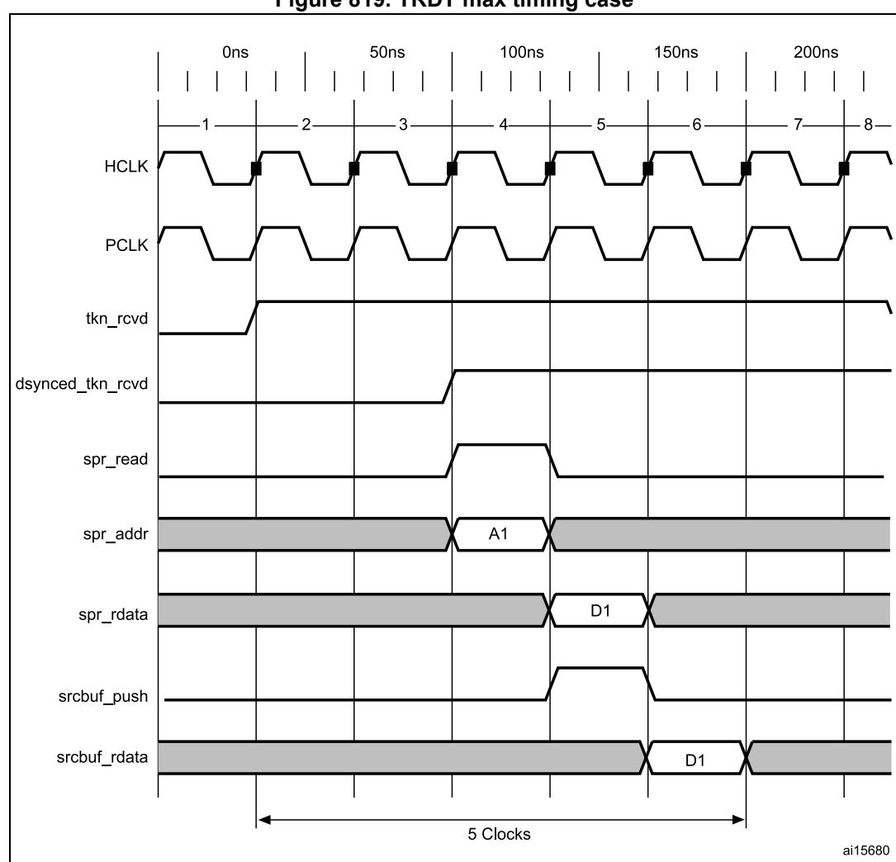

**Figure 819. TRDT max timing case** 

# 60.15.8 OTG programming model

The OTG\_HS controller is an OTG device supporting HNP and SRP. When the core is connected to an "A" plug, it is referred to as an A-device. When the core is connected to a "B" plug it is referred to as a B-device. In host mode, the OTG\_HS controller turns off  $V_{BUS}$  to conserve power. SRP is a method by which the B-device signals the A-device to turn on  $V_{BUS}$  power. A device must perform both data-line pulsing and  $V_{BUS}$  pulsing, but a host can detect either data-line pulsing or  $V_{BUS}$  pulsing for SRP. HNP is a method by which the B-device negotiates and switches to host role. In Negotiated mode after HNP, the B-device suspends the bus and reverts to the device role.

# <span id="page-182-0"></span>A-device session request protocol

The application must set the SRP-capable bit in the core USB configuration register. This enables the OTG HS controller to detect SRP as an A-device.

<span id="page-182-1"></span>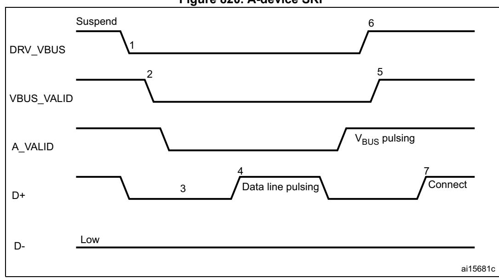

Figure 820. A-device SRP

 DRV\_VBUS = V<sub>BUS</sub> drive signal to the PHY VBUS\_VALID = V<sub>BUS</sub> valid signal from PHY A\_VALID = A-peripheral V<sub>BUS</sub> level signal to PHY D+ = Data plus line D- = Data minus line

The following points refer and describe the signal numeration shown in the Figure 820:

- To save power, the application suspends and turns off port power when the bus is idle by writing the port suspend and port power bits in the host port control and status register.
- 2. PHY indicates port power off by deasserting the VBUS\_VALID signal.
- The device must detect SE0 for at least 2 ms to start SRP when V<sub>BUS</sub> power is off.
- 4. To initiate SRP, the device turns on its data line pull-up resistor for 5 to 10 ms. The OTG\_HS controller detects data-line pulsing.
- The device drives V<sub>BUS</sub> above the A-device session valid (2.0 V minimum) for V<sub>BUS</sub> pulsing.
   The OTG HS controller interrupts the application on detecting SRP. The session

RM0399 Rev 4 2925/3556

- request detected bit is set in Global interrupt status register (SRQINT set in OTG\_GINTSTS).
- 6. The application must service the session request detected interrupt and turn on the port power bit by writing the port power bit in the host port control and status register. The PHY indicates port power-on by asserting the VBUS\_VALID signal.
- 7. When the USB is powered, the device connects, completing the SRP process.

# <span id="page-183-0"></span>**B-device session request protocol**

The application must set the SRP-capable bit in the core USB configuration register. This enables the OTG\_HS controller to initiate SRP as a B-device. SRP is a means by which the OTG\_HS controller can request a new session from the host.

<span id="page-183-1"></span>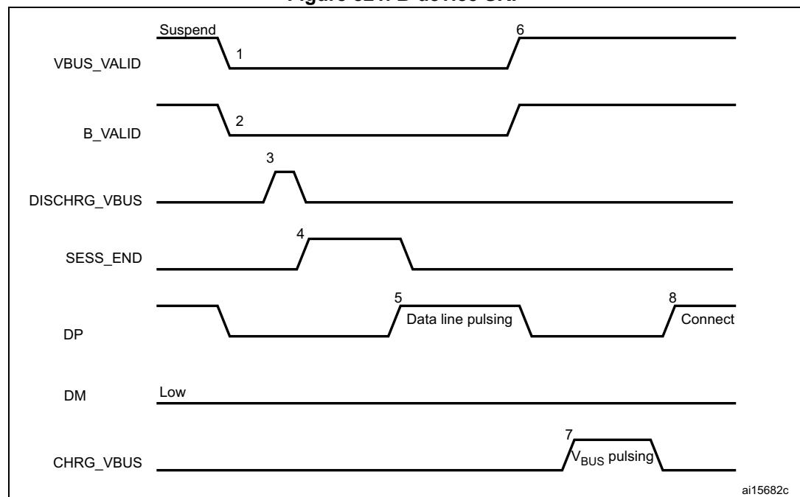

**Figure 821. B-device SRP**

1. VBUS\_VALID = VBUS valid signal from PHY B\_VALID = B-peripheral valid session to PHY DISCHRG\_VBUS = discharge signal to PHY SESS\_END = session end signal to PHY CHRG\_VBUS = charge VBUS signal to PHY DP = Data plus line DM = Data minus line

The following points refer and describe the signal numeration shown in the *[Figure 821](#page-183-1)*:

- 1. To save power, the host suspends and turns off port power when the bus is idle. The OTG\_HS controller sets the early suspend bit in the core interrupt register after 3 ms of bus idleness. Following this, the OTG\_HS controller sets the USB suspend bit in the core interrupt register.
  - The OTG\_HS controller informs the PHY to discharge VBUS.
- 2. The PHY indicates the session's end to the device. This is the initial condition for SRP. The OTG\_HS controller requires 2 ms of SE0 before initiating SRP. For a USB 1.1 full-speed serial transceiver, the application must wait until VBUS discharges to 0.2 V after BSVLD (in OTG\_GOTGCTL) is deasserted. This discharge

- time can be obtained from the transceiver vendor and varies from one transceiver to another.
- 3. The OTG\_HS core informs the PHY to speed up V<sub>BUS</sub> discharge.
- The application initiates SRP by writing the session request bit in the OTG control and status register. The OTG\_HS controller perform data-line pulsing followed by V<sub>BUS</sub> pulsing.
- 5. The host detects SRP from either the data-line or  $V_{BUS}$  pulsing, and turns on  $V_{BUS}$ . The PHY indicates  $V_{BUS}$  power-on to the device.
- 6. The OTG\_HS controller performs V<sub>BUS</sub> pulsing. The host starts a new session by turning on V<sub>BUS</sub>, indicating SRP success. The OTG\_HS controller interrupts the application by setting the session request success status change bit in the OTG interrupt status register. The application reads the session request success bit in the OTG control and status register.
- When the USB is powered, the OTG\_HS controller connects, completing the SRP process.

## A-device host negotiation protocol

HNP switches the USB host role from the A-device to the B-device. The application must set the HNP-capable bit in the core USB configuration register to enable the OTG\_HS controller to perform HNP as an A-device.

<span id="page-184-0"></span>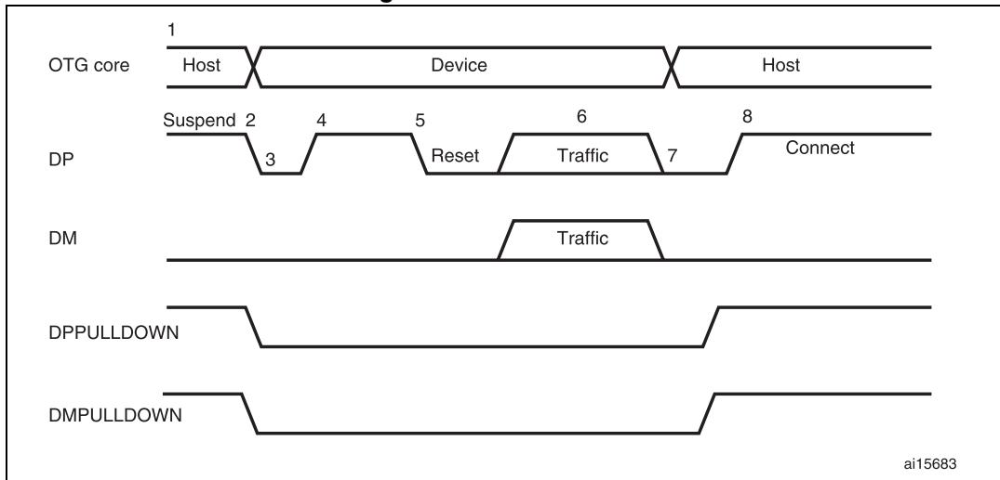

Figure 822. A-device HNP

 DPPULLDOWN = signal from core to PHY to enable/disable the pull-down on the DP line inside the PHY. DMPULLDOWN = signal from core to PHY to enable/disable the pull-down on the DM line inside the PHY.

The following points refer and describe the signal numeration shown in the Figure 822:

 The OTG\_HS controller sends the B-device a SetFeature b\_hnp\_enable descriptor to enable HNP support. The B-device's ACK response indicates that the B-device supports HNP. The application must set host Set HNP enable bit in the OTG control


- and status register to indicate to the OTG\_HS controller that the B-device supports HNP.
- 2. When it has finished using the bus, the application suspends by writing the port suspend bit in the host port control and status register.
- 3. When the B-device observes a USB suspend, it disconnects, indicating the initial condition for HNP. The B-device initiates HNP only when it must switch to the host role; otherwise, the bus continues to be suspended.
  - The OTG\_HS controller sets the host negotiation detected interrupt in the OTG interrupt status register, indicating the start of HNP.
  - The OTG\_HS controller deasserts the DM pull down and DM pull down in the PHY to indicate a device role. The PHY enables the OTG\_DP pull-up resistor to indicate a connect for B-device.
  - The application must read the current mode bit in the OTG control and status register to determine device mode operation.
- 4. The B-device detects the connection, issues a USB reset, and enumerates the OTG\_HS controller for data traffic.
- 5. The B-device continues the host role, initiating traffic, and suspends the bus when done.
  - The OTG\_HS controller sets the early suspend bit in the core interrupt register after 3 ms of bus idleness. Following this, the OTG\_HS controller sets the USB suspend bit in the core interrupt register.
- 6. In Negotiated mode, the OTG\_HS controller detects the suspend, disconnects, and switches back to the host role. The OTG\_HS controller asserts the DM pull down and DM pull down in the PHY to indicate its assumption of the host role.
- 7. The OTG\_HS controller sets the connector ID status change interrupt in the OTG interrupt status register. The application must read the connector ID status in the OTG control and status register to determine the OTG\_HS controller operation as an Adevice. This indicates the completion of HNP to the application. The application must read the Current mode bit in the OTG control and status register to determine host mode operation.
- 8. The B-device connects, completing the HNP process.

# **B-device host negotiation protocol**

HNP switches the USB host role from B-device to A-device. The application must set the HNP-capable bit in the core USB configuration register to enable the OTG\_HS controller to perform HNP as a B-device.


<span id="page-186-0"></span>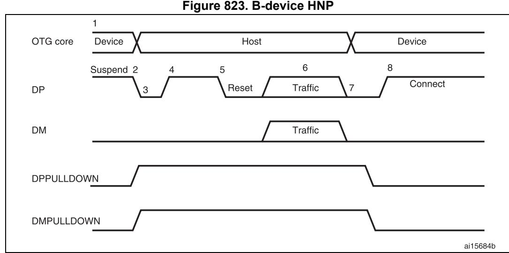

1. DPPULLDOWN = signal from core to PHY to enable/disable the pull-down on the DP line inside the PHY.

DMPULLDOWN = signal from core to PHY to enable/disable the pull-down on the DM line inside the PHY.

The following points refer and describe the signal numeration shown in the *[Figure 823](#page-186-0)*:

- 1. The A-device sends the SetFeature b\_hnp\_enable descriptor to enable HNP support. The OTG\_HS controller's ACK response indicates that it supports HNP. The application must set the device HNP enable bit in the OTG control and status register to indicate HNP support.
  - The application sets the HNP request bit in the OTG control and status register to indicate to the OTG\_HS controller to initiate HNP.
- 2. When it has finished using the bus, the A-device suspends by writing the port suspend bit in the host port control and status register.
  - The OTG\_HS controller sets the Early suspend bit in the core interrupt register after 3 ms of bus idleness. Following this, the OTG\_HS controller sets the USB suspend bit in the core interrupt register.
  - The OTG\_HS controller disconnects and the A-device detects SE0 on the bus, indicating HNP. The OTG\_HS controller asserts the DP pull down and DM pull down in the PHY to indicate its assumption of the host role.
  - The A-device responds by activating its OTG\_DP pull-up resistor within 3 ms of detecting SE0. The OTG\_HS controller detects this as a connect.

The OTG\_HS controller sets the host negotiation success status change interrupt in the OTG interrupt status register, indicating the HNP status. The application must read the host negotiation success bit in the OTG control and status register to determine


- host negotiation success. The application must read the current Mode bit in the core interrupt register (OTG\_GINTSTS) to determine host mode operation.
- 3. The application sets the reset bit (PRST in OTG\_HPRT) and the OTG\_HS controller issues a USB reset and enumerates the A-device for data traffic.
- 4. The OTG\_HS controller continues the host role of initiating traffic, and when done, suspends the bus by writing the port suspend bit in the host port control and status register.
- 5. In Negotiated mode, when the A-device detects a suspend, it disconnects and switches back to the host role. The OTG\_HS controller deasserts the DP pull down and DM pull down in the PHY to indicate the assumption of the device role.
- 6. The application must read the current mode bit in the core interrupt (OTG\_GINTSTS) register to determine the host mode operation.
- 7. The OTG\_HS controller connects, completing the HNP process.

