# **61 Ethernet (ETH): media access control (MAC) with DMA controller**

# **61.1 Ethernet introduction**

Portions Copyright (c) Synopsys, Inc. All rights reserved. Used with permission.

The Ethernet peripheral enables to transmit and receive data over Ethernet in compliance with the IEEE 802.3-2008 standard.

The peripheral is configurable to meet the needs of a large variety of consumer and industrial applications.

# **61.2 Ethernet main features**

The Ethernet peripheral embeds a dedicated DMA for direct memory interface, a media access controller (MAC) and a PHY interface block supporting several formats.

# **61.2.1 Standard compliance**

The Ethernet peripheral is compliant with the following standards:

- IEEE 802.3-2008 for Ethernet MAC and media independent interface (MII)
- IEEE 1588-2008 for precision networked clock synchronization (PTP)
- IEEE 802.3az-2010 for Energy Efficient Ethernet (EEE)
- AMBA 2.0 for AHB master and AHB slave ports
- RMII specification version 1.2 from RMII consortium

# **61.2.2 MAC features**

# **MAC Tx and Rx common features**

- Separate transmission, reception, and control interfaces to the application
- 10, 100 Mbps data transfer rates with the following PHY interfaces:
  - IEEE 802.3-compliant MII interface to communicate with an external Fast Ethernet PHY
  - RMII interface to communicate with an external Fast Ethernet PHY
- Half-duplex operation:
  - CSMA/CD protocol support
  - Flow control using backpressure (based on implementation-specific white papers and UNH Ethernet Clause 4 MAC Test Suite - Annex D)
- Standard IEEE 802.3az-2010 for Energy Efficient Ethernet in MII PHYs

- 32-bit data transfer interface on the application side
- Full-duplex flow control operations (IEEE 802.3x Pause packets and Priority flow control)
- Network statistics with RMON or MIB counters (partial support of RFC2819/RFC2665)
- Ethernet packet timestamping as described in IEEE 1588-2002 and IEEE 1588-2008 (64-bit timestamps given in the Tx or Rx status of PTP packet). Both one-step and twostep timestamping are supported in Tx direction.
- Flexibility to control pulse-per-second (PPS) output signal (eth\_ptp\_pps\_out and ETH\_PPS\_OUT)
- MDIO (Clause 22 and Clause 45) master interface for PHY device configuration and management

### **MAC Tx features**

- Preamble and start-of-frame data (SFD) insertion
- Separate 32-bit status for each packet transmitted from the application
- Automatic CRC and pad generation controllable on a per-frame basis
- Programmable packet length to support Standard or Jumbo Ethernet packets of up to 16 Kbytes
- Programmable Inter Packet Gap (40–96 bit times in steps of 8)
- IEEE 802.3x Flow Control automatic transmission of zero-quanta Pause packet when flow control input transitions from assertion to de-assertion (in Full-duplex mode)
- Source address field insertion or replacement, and VLAN insertion, replacement, and deletion in transmitted packets with per-packet or static-global control
- Insertion, replacement, or deletion of up to two VLAN tags
- Option to transmit packets with reduced preamble size in Full-duplex mode
- Insert, replace, or delete queue/channel-based VLAN tags

### **MAC Rx features**

- Automatic Pad and CRC stripping options
- Option to disable automatic CRC checking
- Preamble and SFD deletion
- Separate 112-bit or 128-bit status
- Programmable watchdog timeout limit
- Flexible address filtering modes:
  - Four 48-bit perfect (DA) address filters with masks for each byte
  - Four 48-bit SA address comparison check with masks for each byte
  - 64 bit Hash filter for multicast and unicast (DA) addresses
- Option to pass all multicast addressed packets
- Promiscuous mode to pass all packets without any filtering for network monitoring
- Pass all incoming packets (as per filter) with a status report


- Additional packet filtering:
  - VLAN tag-based: Perfect match and Hash-based filtering based either on the outer or inner VLAN tag
  - Layer 3 and Layer 4-based: TCP or UDP over IPv4 or IPv6
- IEEE 802.1Q VLAN tag detection and option to delete the VLAN tags in received packets
- Detection of remote wake-up packets and AMD magic packets
- Optional forwarding of received Pause packets to the application (in Full-duplex mode)
- Layer 3/Layer 4 checksum offload for received packets
- Stripping of up to two VLAN tags and providing the tags in the status

# **61.2.3 Transaction layer (MTL) features**

### **MTL Tx and Rx Common Features**

- 32-bit Transaction Layer block (bridges the application and the MAC)
- Optimization for packet-oriented transfers with packets delimiters
- Programmable burst length, up to half the size of the MTL Rx queue or Tx queue size, to support burst data transfer in the EQOS-MTL configuration
- Programmable threshold capability for each queue (default of 64 bytes)

### **MTL Tx features**

- 2048-byte Transmit FIFO with programmable threshold capability
- Store-and-forward mechanism or threshold mode (cut-through) for transmission to the MAC
- Automatic retransmission of collision packets in Half-duplex mode
- Discard packets on late collision, excessive collisions, excessive deferral, and underrun conditions with appropriate status
- Module to calculate and insert IPv4 header checksum and TCP, UDP, or ICMP checksum on frames transmitted in Store-and-forward mode
- Statistics by generating pulses for packets dropped (because of underflow) in the Tx FIFO
- Packet-level control for
  - VLAN tag insertion or replacement
  - Ethernet source address insertion
  - Layer 3/Layer 4 checksum insertion control
  - One-step timestamp
  - Timestamp control
  - CRC and pad control


# **MTL Rx features**

- 2048-byte Receive FIFO with configurable threshold
- Programmable Rx queue threshold (default fixed at 64 bytes) in Threshold (or cutthrough) mode
- Option to filter all error packets on reception and not forward them to the application in the store-and-forward mode
- Option to forward the undersized good packets
- Statistics by generating pulses for packets dropped (because of overflow) in the Rx FIFO
- Automatic generation of Pause packet control or backpressure signal to the MAC based on the Rx Queue fill level

# **61.2.4 DMA block features**

The DMA block exchanges data between the peripheral and the system memory. DMA transfers are driven by software descriptors structure. The application can use a set of registers (see *[Section 61.11.2: Ethernet DMA registers](#page-143-0)*) to control the DMA operations. The DMA block supports the following features:

- 32-bit data transfers
- Separate DMA in Transmit path and receive paths
- Optimization for packet-oriented DMA transfers with packet delimiters
- Byte-aligned addressing for data buffer support
- Dual-buffer (ring) descriptor support
- Descriptor architecture allowing large blocks of data transfer with minimum CPU intervention (each descriptor can transfer up to 32 Kbytes of data)
- Comprehensive status reporting normal operation and transfer errors
- Individual programmable burst length for Tx DMA and Rx DMA engines for optimal host bus utilization
- Programmable interrupt options for different operational conditions
- Per-packet Transmit or Receive Complete Interrupt control
- Round-robin or fixed-priority arbitration between the Receive and Transmit engines
- Start and Stop modes
- Separate ports for host control (AHB) access and host data interface
- Tx DMA channel with TCP segmentation offload (TSO) feature enabled
- Programmable control for Transmit Descriptor posted writes to improve the throughput

# **61.2.5 Bus interface features**

### **AHB master interface**

The AHB master interface features are the following:

- Interfaces with the application through AHB
- 32-bit data on the AHB master port
- Split, Retry, and Error AHB responses
- AHB 1-Kbyte boundary burst splitting
- Software-selected type of AHB burst (fixed burst, indefinite burst, or mix of both)


The AHB master interface does not generate the following:

- Wrap burst
- Locked or protected transfers

### **AHB slave interface**

The AHB slave interface supports the following features:

- Interfaces with the application through AHB
- AHB slave interface (32-bit) for CSR access
- All AHB burst types

The AHB slave interface does not generate the following responses:

- Split
- Retry
- Error

# **61.3 Ethernet pins and internal signals**

*[Table 543](#page-4-0)* lists the Ethernet inputs and output signals connected to package pins or balls. Active pins depend on the PHY type selected (MII or RMII) and on the device configuration.

*[Table 544](#page-5-0)* shows the internal Ethernet signals.

**Table 543. Ethernet peripheral pins** 

<span id="page-4-0"></span>

| Port name    | Digital port type | Description                                                                                                                                              |
|--------------|-------------------|----------------------------------------------------------------------------------------------------------------------------------------------------------|
| ETH_COL      | Input             | Collision detection signal, MII only.                                                                                                                    |
| ETH_CRS      | input             | Carrier sense signal, MII only                                                                                                                           |
| ETH_REF_CLK  | Input             | RMII reference clock                                                                                                                                     |
| ETH_RX_CLK   | Input             | MII timing reference for Rx data transfers                                                                                                               |
| ETH_RXD[3:0] | Input             | Receive data.<br>4 pins for MII, 2 for RMII.                                                                                                             |
| ETH_RX_DV    | Input             | Receive data valid                                                                                                                                       |
| ETH_CRS_DV   | Input             | RMII: Carrier Sense (CRS) and RX_Data Valid (RX_DV)<br>multiplexed on alternate clock cycles. In 10 Mbit/s mode, it<br>alternates every 10 clock cycles. |
| ETH_RX_ER    | Input             | Receive error                                                                                                                                            |
| ETH_TX_CLK   | Input             | MII timing reference for Tx data transfers                                                                                                               |
| ETH_TXD[3:0] | Output            | Transmit data.<br>4 pins for MII, 2 for RMII.                                                                                                            |
| ETH_TX_EN    | Output            | Transmit data enable                                                                                                                                     |
| ETH_TX_ER    | Output            | Transmit error                                                                                                                                           |
| ETH_MDC      | Output            | Management data clock                                                                                                                                    |
| ETH_MDIO     | Input/output      | Management data                                                                                                                                          |


**Table 543. Ethernet peripheral pins (continued)**

| Port name    | Digital port type | Description                 |
|--------------|-------------------|-----------------------------|
| ETH_PHY_INTN | Input             | PHY interrupt               |
| ETH_PPS_OUT  | Output            | PTP pulse-per-second output |

**Table 544. Ethernet internal input/output signals** 

<span id="page-5-0"></span>

| Signal name       | Signal type    | Description                                                                                  |  |
|-------------------|----------------|----------------------------------------------------------------------------------------------|--|
| eth_hclk          | Digital input  | AHB clock                                                                                    |  |
| eth_sbd_intr_it   | Digital output | Main Ethernet interrupt                                                                      |  |
| lpi_intr_o        | Digital output | Sideband signal generated when the transmitter or receiver enters or<br>exits the LPI state. |  |
| pmt_intr_o        | Digital output | Sideband signal generated when a valid remote wakeup packet is<br>received                   |  |
| eth_mii_tx_clk    | Digital input  | MII Tx kernel clock                                                                          |  |
| eth_mii_rx_clk    | Digital input  | MII Rx kernel clock                                                                          |  |
| eth_rmii_ref_clk  | Digital input  | RMII reference kernel clock                                                                  |  |
| eth_ptp_pps_out   | Digital output | PTP pulse-per-second signal                                                                  |  |
| mac_speed_o[1:0]  | Digital output | MAC speed information used by the RCC                                                        |  |
| clk_ptp_ref_i     | Digital input  | PTP reference clock input. This input is connected to eth_hclk clock.                        |  |
| eth_ptp_trig[4:1] | Digital input  | Trigger input for auxiliary snapshots of the PTP system time                                 |  |

# **61.4 Ethernet architecture**

The Ethernet peripheral is composed of 4 main functional modules:

- **The control and status register module (CSR)** that controls the registers access through AHB 32-bit slave interface
- The direct memory access interface (DMA) This is the logical DMA module with one physical channel for reception and one for
  - transmission. It controls the data transfers between MAC and system memory through the AMBA AHB 32-bit master interface.
- **The media access control module (MAC)** in charge of implementing the Ethernet protocol
- **The MAC transaction layer (MTL)** in charge of controlling the data flow between application and MAC.

A protocol adaption module is added to support the RMII PHY Media Independent Interfaces.


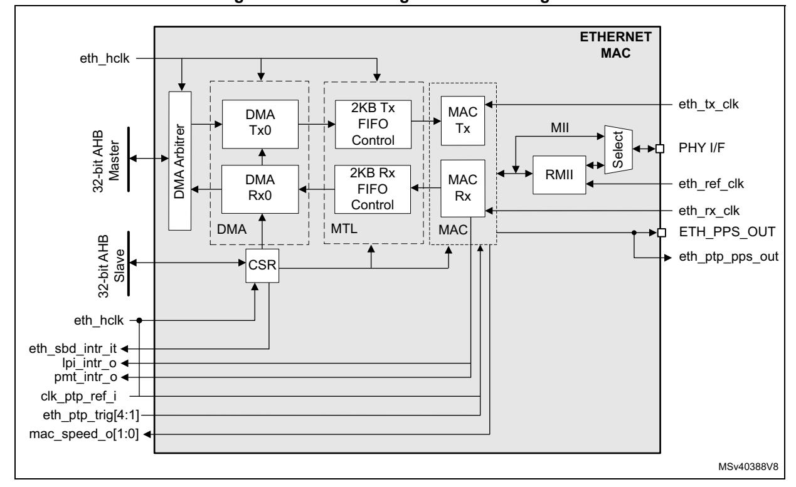

**Figure 824. Ethernet high-level block diagram** 

- 1. For a definition of the internal signals, refer to *[Table 544](#page-5-0)*.
- 2. Refer to RCC chapter "Clock distribution for Ethernet" for a detailed description of the Ethernet clock architecture.

# **61.4.1 DMA controller**

The DMA has independent Transmit (Tx) and Receive (Rx) engines. The Tx engine transfers data from the system memory to the MAC Transaction Layer (MTL), whereas the Rx engine transfers data from the device port (PHY) to the system memory.

The controller uses descriptors to efficiently move data from source to destination with minimal application CPU intervention. The DMA is designed for packet-oriented data transfers such as packets in Ethernet. The controller can be programmed to interrupt the application CPU for situations such as Packet Transmit and Receive Transfer completion, and other normal or error conditions.

# **DMA data structures**

The DMA and the application communicate through the following two data structures:

- Control and Status registers (CSR)
- Descriptor lists and data buffers

The DMA transfers the data packets received by the MAC to the Rx buffer in system memory and Tx data packets from the Tx buffer in the system memory. The descriptors that reside in the system memory contain the pointers to these buffers.

The base address of each list is written to the respective Tx and Rx registers: *[Channel Tx](#page-152-0)  [descriptor list address register \(ETH\\_DMACTXDLAR\)](#page-152-0)*) and *[Channel Rx descriptor list](#page-153-0)  [address register \(ETH\\_DMACRXDLAR\)](#page-153-0)*.


RM0399 Rev 4 2937/3556

The descriptor list is forward linked and the next descriptor is always considered at a fixed offset to the current one. The number of descriptors in the list is programmed in the respective Tx/Rx, *[Channel Tx descriptor ring length register \(ETH\\_DMACTXRLR\)](#page-155-0)* and *[Channel Rx descriptor ring length register \(ETH\\_DMACRXRLR\)](#page-156-0)*.

Once the DMA processes the last descriptor in the list, it automatically jumps back to the descriptor in the List address register to create a descriptor ring. The descriptor lists reside in the physical memory address space of the application. Each descriptor can point to a maximum of two buffers. This enables two buffers to be used and physically addressed, rather than contiguous buffers in memory.

A data buffer resides in the application physical memory space and consists of an entire packet or part of a packet, but cannot exceed a single packet. Buffers contain only data. The buffer status is saved in the descriptor. Data chaining refers to packets that span multiple data buffers. However, a single descriptor cannot span multiple packets. The DMA skips to the data buffer of next packet when EOP is detected.

Descriptors are specified in *[Section 61.10: Descriptors](#page-115-0)*.

## **DMA arbitration**

The DMA module incorporates an arbiter that performs the arbitration between the Tx and Rx channels accesses from the AHB master interface. The following two types of arbitrations are supported and can be selected through *[DMA mode register](#page-143-1)  [\(ETH\\_DMAMR\)](#page-143-1)*:

- Round-robin arbitration**:** the arbiter allocates the data bus between Rx and Tx in ratio set by Bits [14:12] of ETH\_DMAMR.
- Fixed-priority arbitration**:** by default Rx DMA always gets priority over Tx DMA for data access. Setting bit 11 of ETH\_DMAMR register gives priority to the Tx DMA.

# <span id="page-8-0"></span>**DMA transmission in default mode**

The Tx DMA engine in default mode proceeds as follows:

- 1. The application sets up the Transmit descriptor (TDES0–TDES3) and sets the Own bit (TDES0[31]) after setting up the corresponding data buffer(s) with Ethernet Packet data.
- 2. The application shifts the Descriptor tail pointer offset value of the Transmit channel.
- 3. The DMA fetches the descriptor from the application memory.
- 4. If the DMA detects one of the following conditions, the transmission from that channel is suspended, bit 2 and 16 of the corresponding DMA channel Status register are set, and the Tx engine proceeds to step 11:
  - The descriptor is flagged as owned by the application (TDES3 [31] = 0).
  - The descriptor tail pointer is equal to the current descriptor pointer in Ring Descriptor list mode.
  - An error condition occurs.
- 5. If the acquired descriptor is flagged as owned by the DMA (TDES3[31] = 1), the DMA decodes the Transmit Data Buffer address from the acquired descriptor.
- 6. The DMA fetches the Transmit data from the system memory and transfers the data to the MTL for transmission.
- 7. If an Ethernet packet is stored over data buffers in multiple descriptors, the DMA closes the intermediate descriptor and fetches the next descriptor. Steps 3 through 7 are repeated until the end-of-Ethernet-packet data is transferred to the MTL.
- 8. When packet transmission is complete, if IEEE 1588 timestamp feature was enabled for the packet (as indicated in the Tx status), the timestamp value obtained from MTL is written to the Tx descriptor (TDES0 and TDES1) that contains the EOP buffer. The status information is written to this Tx descriptor (TDES3). The application now owns this descriptor because the Own bit is cleared during this step. If the timestamp feature is disabled for this packet, the DMA does not alter TDES0 and TDES1 contents.
- 9. Bit 0 of *[Channel status register \(ETH\\_DMACSR\)](#page-162-0)*) is set after completing transmission of a packet that has Interrupt on Completion (TDES2[31]) set in its Last Descriptor. The DMA engine returns to step 3.
- 10. In the Suspend state, the DMA tries to acquire the descriptor again (and thereby return to step 3). A poll demand command is triggered by writing any value to the *[Channel Tx](#page-154-0)  [descriptor tail pointer register \(ETH\\_DMACTXDTPR\)](#page-154-0)* when it receives a Transmit Poll demand and the Underflow Interrupt Status bit is cleared. If the application stopped the DMA by clearing Bit 0 of Transmit control register of corresponding DMA channel, the DMA enters the Stop state.


RM0399 Rev 4 2939/3556

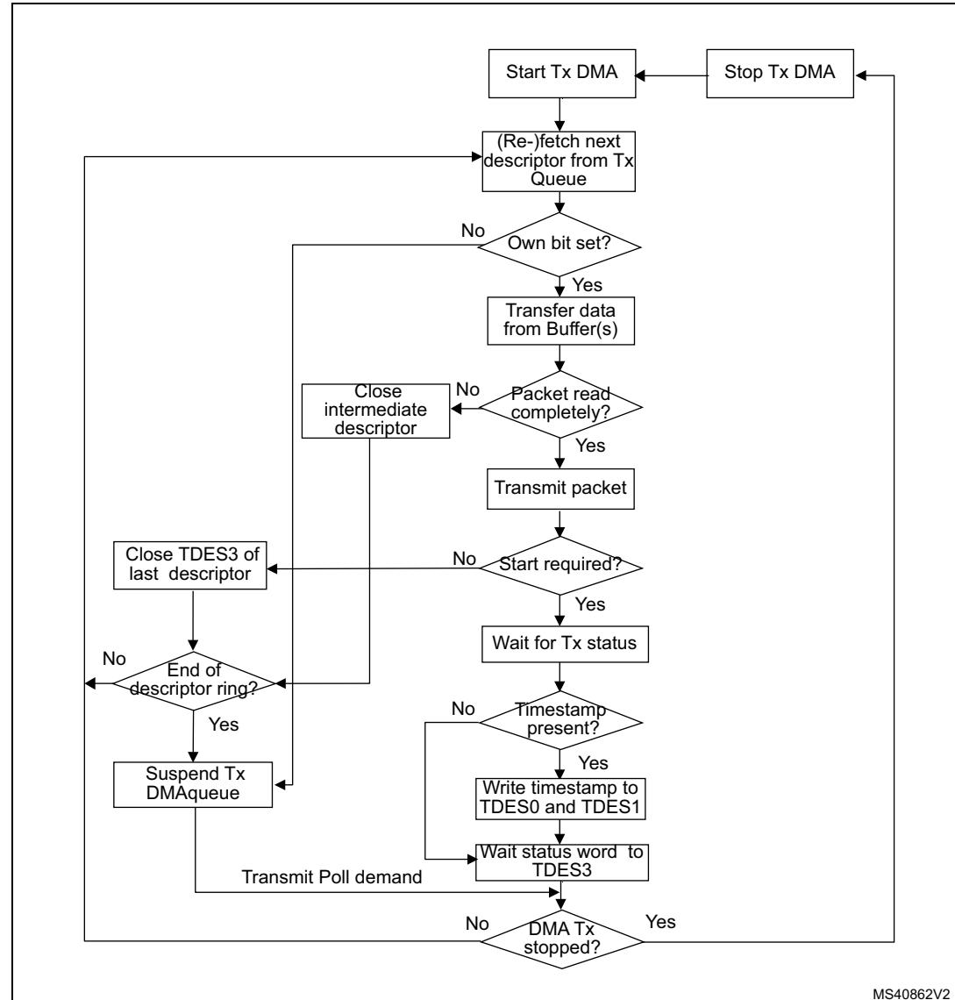

Figure 825. DMA transmission flow (standard mode)

# DMA transmission in OSP (Operate on Second Packet) mode

In Run state, if bit 4 is set in the *Channel transmit control register (ETH\_DMACTXCR)*), the Transmit process can simultaneously acquire two packets without closing the Status descriptor of the first packet. While the Transmit process completes the first packet transfer, it immediately polls the Transmit descriptor list for the second packet. If the second packet is valid, the Transmit process transfers this packet before writing the status information of the first packet.

In OSP mode, DMA transmission in the Run state operates as described in the following sequence:

- 1. The DMA executes steps 1 to 7 of the DMA transmission sequence in default mode (see *Section [: DMA transmission in default mode](#page-8-0)*).
- 2. The DMA fetches the next descriptor without closing previous packet last descriptor.
- 3. If the DMA owns the acquired descriptor, the DMA decodes the transmit buffer address in this descriptor. If the DMA does not own the descriptor, the DMA goes into Suspend mode and jumps to step 7.
- 4. The DMA fetches the Transmit packet from the system memory and transfers the packet to the MTL until the EOP data is transferred, closing the intermediate descriptors if this packet is split across multiple descriptors.
- 5. The DMA waits for the packet transmission status and timestamp of previous packet. When the status is available, the DMA writes the timestamp to TDES0 and TDES1 if such timestamp was captured (as indicated by a status bit). The DMA writes the status, with a cleared Own bit, to the corresponding TDES3, thus closing the descriptor. If Timestamp feature is not enabled for the previous packet, the DMA does not alter the contents of TDES2 and TDES3.
- 6. The Transmit interrupt is set (if enabled). The DMA fetches the next descriptor and proceeds to step 3 (when Status is normal). If the previous transmission status shows an underflow error, the DMA goes into Suspend mode (step 7).
- 7. In Suspend mode, if a pending status and timestamp are received from the MTL, the DMA performs the following operations:
  - a) The DMA writes the timestamp (if enabled for the current packet) to TDES2 and TDES3.
  - a) The DMA writes the status to the corresponding TDES3.
  - a) The DMA sets the relevant interrupts and returns to Suspend mode.
  - If no status is pending and the application stopped the DMA by clearing bit 0 of Transmit Control Register of corresponding DMA channel, the DMA enters the Stop state.
- 8. The DMA can exit Suspend mode and enter the Run state (it goes either to step 1 or to step 2 depending on pending status) only after receiving a Transmit Poll demand in Transmit Descriptor Tail Pointer register of corresponding channel.

A description of the basic DMA transmission flow in OSP mode in given in *[Figure 827:](#page-13-0)  [Receive DMA flow](#page-13-0)*.


RM0399 Rev 4 2941/3556

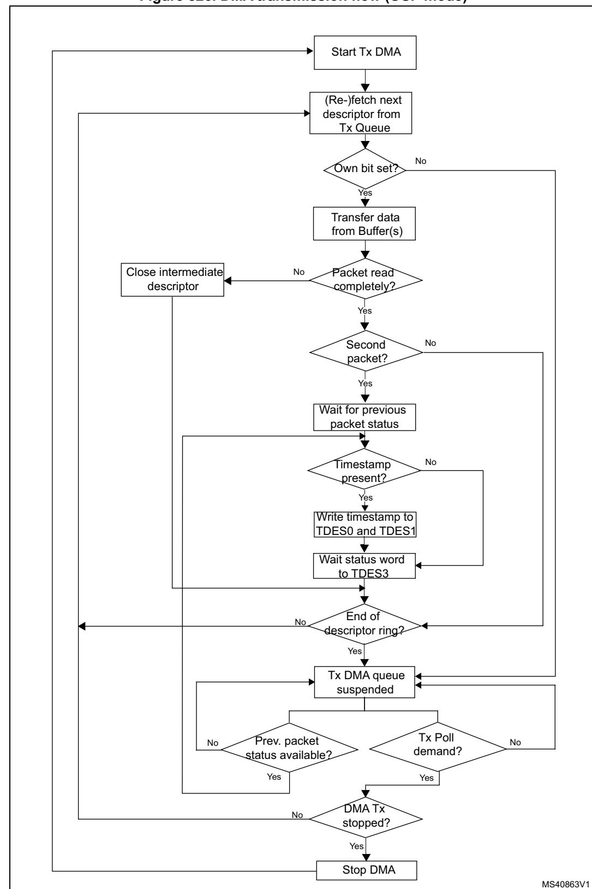

Figure 826. DMA transmission flow (OSP mode)


# **DMA reception**

In the Receive path, the DMA reads a packet from the MTL receive queue and writes it to the packet data buffers of the corresponding DMA channel.

The reception sequence for Rx DMA engine is as follows (see also *[Figure 827: Receive](#page-13-0)  [DMA flow](#page-13-0)*):

- 1. The application sets up the Rx descriptors (RDES0-RDES3) and the Own bit (RDES3[31]). The application must set the correct value in the Receive descriptor tail pointer register of corresponding DMA channel.
- 2. When bit 0 of *[Channel receive control register \(ETH\\_DMACRXCR\)](#page-150-0)*) is set, the DMA enters the Run state. The DMA looks for free descriptors based on the Rx Current Descriptor and Descriptor tail pointer register values. If there are no free descriptors, the DMA channel enters the Suspend state and goes to step 11.
- 3. The DMA fetches the next available descriptor in the ring and decodes the receive data buffer address from acquired descriptors.
- 4. If IEEE 1588 timestamping is enabled and the timestamp is available for the previous packet, the DMA writes the timestamp (if available) to the RDES0 and RDES1 of current descriptor and sets the CTXT field (RDES3[30]).
- 5. The DMA processes the incoming packets and stores them in the data buffers of acquired descriptor.
- 6. If the current packet transfer is not complete, the DMA closes the current descriptor as intermediate and goes to step 10.
- 7. The DMA retrieves the status of the Receive frame from the MTL and writes the status word to current descriptor with the Own bit cleared and the Last descriptor bit set.
- 8. The DMA writes the Frame Length to RDES3 and the VLAN tag to RDES0. The DMA also writes the MAC control frame opcode, OAM control frame code, and extended status information (if available) to RDES1 of the last descriptor.
- 9. The DMA stores the timestamp (if available). The DMA writes the context descriptor after the last descriptor for the current packet (in the next available descriptor).
- 10. If more descriptors are available in the Rx DMA descriptor ring, go to step 3, otherwise go to the Suspend state (step 11).
- 11. The Receive DMA exits the Suspend state when a Receive Poll demand is given and the application increments the channel Receive tail pointer register. The engine proceeds to step 2 and fetches again the next descriptor.


RM0399 Rev 4 2943/3556

<span id="page-13-0"></span>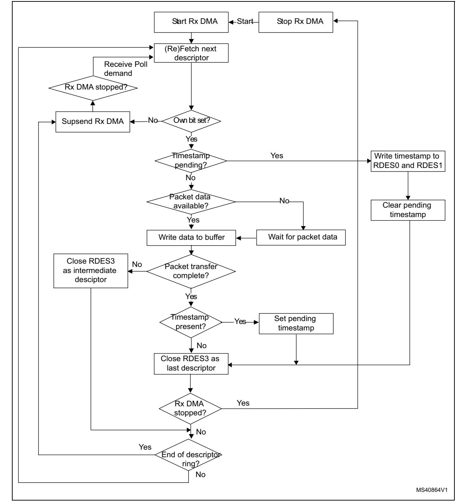

**Figure 827. Receive DMA flow**


### **Priority scheme for Tx DMA and Rx DMA**

The DMA arbiter performs the arbitration between the Tx and Rx paths of DMA channel 0 to access descriptors and data buffers. The DMA arbiter supports two types of arbitration: fixed priority and weighted round-robin. The DA bit of the *[DMA mode register \(ETH\\_DMAMR\)](#page-143-1)* specifies the arbitration scheme (fixed or weighted round-robin) between the Tx and Rx DMA of a given channel.

If the Tx DMA and Rx DMA of a given channel are enabled, the DMA which gets the bus when the channel gets control of the bus must be specified. The priority between the corresponding Tx DMA and Rx DMA can be configured through the TXPR field of the *[DMA](#page-143-1)  [mode register \(ETH\\_DMAMR\)](#page-143-1)*. For round-robin arbitration, the weighted priority between the Tx DMA and Rx DMA is configured through the PR field of the *[DMA mode register](#page-143-1)  [\(ETH\\_DMAMR\)](#page-143-1)*. *[Table 545](#page-14-0)* provides information about the priority scheme between Tx DMA and Rx DMA.

**Table 545. Priority scheme for Tx DMA and Rx DMA**

<span id="page-14-0"></span>

| DMA mode register<br>(ETH_DMAMR) |         |   | Priority scheme |    |                                                                                      |
|----------------------------------|---------|---|-----------------|----|--------------------------------------------------------------------------------------|
|                                  | PR[2:0] |   | TXPR            | DA |                                                                                      |
| x                                | x       | x | 0               | 1  | Rx always has priority over Tx                                                       |
| 0                                | 0       | 0 | 0               | 0  | Tx and Rx have equal priority. Rx gets the access first on simultaneous<br>requests. |
| 0                                | 0       | 1 | 0               | 0  | Rx has priority over Tx in ratio 2:1.                                                |
| 0                                | 1       | 0 | 0               | 0  | Rx has priority over Tx in ratio 3:1.                                                |
| 0                                | 1       | 1 | 0               | 0  | Rx has priority over Tx in ratio 4:1.                                                |
| 1                                | 0       | 0 | 0               | 0  | Rx has priority over Tx in ratio 5:1.                                                |
| 1                                | 0       | 1 | 0               | 0  | Rx has priority over Tx in ratio 6:1.                                                |
| 1                                | 1       | 0 | 0               | 0  | Rx has priority over Tx in ratio 7:1.                                                |
| 1                                | 1       | 1 | 0               | 0  | Rx has priority over Tx in ratio 8:1.                                                |
| x                                | x       | x | 1               | 1  | Tx always has priority over Rx.                                                      |
| 0                                | 0       | 0 | 1               | 0  | Tx and Rx have equal priority. Tx gets the access first on simultaneous<br>requests. |
| 0                                | 0       | 1 | 1               | 0  | Tx has priority over Rx in ratio 2:1.                                                |
| 0                                | 1       | 0 | 1               | 0  | Tx has priority over Rx in ratio 3:1.                                                |
| 0                                | 1       | 1 | 1               | 0  | Tx has priority over Rx in ratio 4:1.                                                |
| 1                                | 0       | 0 | 1               | 0  | Tx has priority over Rx in ratio 5:1.                                                |
| 1                                | 0       | 1 | 1               | 0  | Tx has priority over Rx in ratio 6:1.                                                |
| 1                                | 1       | 0 | 1               | 0  | Tx has priority over Rx in ratio 7:1.                                                |
| 1                                | 1       | 1 | 1               | 0  | Tx has priority over Rx in ratio 8:1.                                                |


# **61.4.2 MTL**

The MAC Transaction Layer (MTL) provides the FIFO memory interface to buffer and regulate the packets between the application system memory and the MAC. It also enables the data to be transferred between the application clock and MAC clock domains. The MTL layer features two 32-bit wide data paths: the Transmit path and the Receive Path.

• Transmit path

The application or internal DMA pushes the Ethernet packets read from the application or system memory into the Tx FIFO. The packet is then popped out and transferred to the MAC when the queue threshold is reached (threshold mode) or complete packet is in the queue (store-and-forward mode). When EOP is transferred, the status of the transmission is taken from the MAC and transferred back to the application or internal DMA. The Tx queue size is 2048 bytes.

• Receive path

The MTL Rx module receives the packets from the MAC and pushes them into the Rx queue. The status (fill level) of the queue is indicated to the application or to DMA when it crosses the configured Receive threshold (RTC bits[1:0] defined in *[Rx queue](#page-175-0)  [operating mode register \(ETH\\_MTLRXQOMR\)](#page-175-0)*), or when the complete packet was received. The MTL also indicates the queue fill level so that the DMA can initiate preconfigured burst transfers towards the master interface. The Rx queue size is 2048 bytes.

# **61.4.3 MAC**

The MAC is responsible of the Ethernet protocol processing.In Transmission mode, it receives data from MTL before transferring it to the PHY interface. In Reception mode, the MAC receives data from the PHY interface before transferring them to the Rx FIFO of the MTL module.

This section briefly describes transmission and reception sequences.

## **MAC transmission**

The transmission sequence is as follows:

- 1. Transmission is initiated when the MTL application pushes in data with the SOP (Start of packet) signal asserted.
- 2. When the SOP signal is detected, the MAC accepts the data and begins the transmission to the MII.
- 3. When the EOP (End of packet) is transferred to the MAC, the MAC does one of the following:
  - The MAC completes the normal transmission and provides the transmission status to the MTL.
  - If a normal collision (in Half-duplex mode) occurs during transmission, the MAC provides the Transmit status to the MTL, with the Retry bit set. The MAC provides the Retry request till one of the following is true:

the packet was successfully transmitted;

the maximum number of Retry requests expires. In this case, the MAC aborts the packet transmission with Excessive Collision Transmit status. The MAC accepts and drops all further data until the next SOP is received. The MTL block should retransmit the same packet from SOP when a Retry request (in the Status) is observed from the MAC.


– If any one of the following event happens, the MAC aborts the packet transmission:

no carrier (Half-duplex mode) loss of carrier (Half-duplex mode) excessive deferral (Half-duplex mode) late collisions (Half-duplex mode) jabber

the MAC accepts and drops all further data until the next SOP is received.

- 4. The MAC issues an underflow status if the MTL is not able to provide the data continuously during the transmission. The MAC accepts and drops all further data until the next SOP is received.
- 5. During the normal transfer of a packet from MTL, if the MAC receives a SOP without getting an EOP for the previous packet, it ignores the SOP and considers the new packet as continuation of the previous packet.

*[Figure 828: Overview of MAC transmission flow](#page-17-0)* illustrates the MAC transmission process flow.


<span id="page-17-0"></span>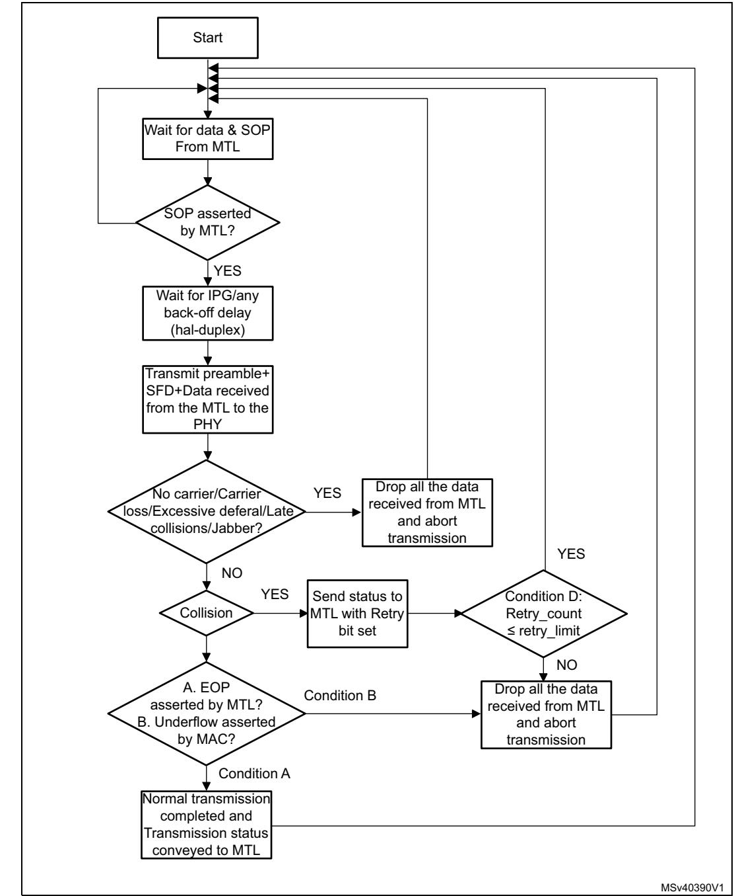

**Figure 828. Overview of MAC transmission flow**


# **MAC reception**

A receive operation is initiated when the MAC detects an SFD on MII. The MAC strips the preamble and SFD before proceeding to process the packet. The header fields are checked for filtering and the FCS field used to verify the CRC for the packet. The received packet is stored in a shallow buffer until the address filtering is performed. The packet is dropped in the MAC if it fails the address filter.

The reception sequence is as follows:

- 1. When the receive data valid signal (RxDV) of MII becomes active, the Receive State Machine (RSM) starts looking for the SFD field (0xD nibble). The state machine drops received packets until it detects SFD.
- 2. When SFD is detected, the state machine starts sending the data of Ethernet packet to the RPC module, beginning with the first byte following the SFD (destination address).
- 3. If IEEE 1588 timestamp feature is enabled, the MAC takes a snapshot of the system time at which SFD of any packet is detected on MII. If this packet is not dropped during MAC filtering, the timestamp is passed to the application. The MAC converts the received nibble data into bytes and forwards the valid packet data to the RFC module.
- 4. The Receive State Machine decodes the Length/Type field of the Ethernet packet being received.
  - If the Length/Type field is less than 1,536 and if the MAC is programmed for the Auto CRC/Pad Stripping (bit 20 of the *[Operating mode configuration register](#page-181-0)  [\(ETH\\_MACCR\)](#page-181-0)*), the state machine sends the packet data up to the count specified in the Length/Type field and starts dropping bytes (including the FCS field). The state machine decodes the Length/Type field and checks for the Length interpretation.
- 5. If the Length/Type field is greater than or equal to 1,536, the RPE module sends all received Ethernet packet data to the RFC module if you have not enabled the CRC stripping for Type packet in Bit 21 of the *[Operating mode configuration register](#page-181-0)  [\(ETH\\_MACCR\)](#page-181-0)*. However, if the CRC stripping has been enabled for Type packets and not enabled the Receive Checksum Offload Engine, the MAC strips and drops the last 4 bytes of all packets of ether type before forwarding the packets to the application.
- 6. By default, the MAC is programmed for watchdog timer to be enabled, that is, packets above 2,048 (10,240 if Jumbo Packet is enabled) bytes (DA + SA + LT + DATA + PAD + FCS) are cut off at the RPE module. In addition, you can use a programmable watchdog timer (bit 16 of *[Watchdog timeout register \(ETH\\_MACWTR\)](#page-189-0)*) to override the fixed timeout of 2,048 or 10,240 bytes. You can disable the watchdog timer by programming bit 19 of *[Operating mode configuration register \(ETH\\_MACCR\)](#page-181-0)*. However, even if the watchdog timer is disabled, a packet greater than 32 Kbytes is cut off and a watchdog timeout status is given.


RM0399 Rev 4 2949/3556


**Figure 829. MAC reception flow** 


# **61.5** )**Ethernet functional description: MAC**

# **61.5.1 Double VLAN processing**

The Ethernet peripheral supports the double VLAN (Virtual LAN) tagging feature in which the MAC can process up to two VLAN tags (inner and outer).

The MAC supports the following:

- Insertion, replacement, or deletion of up to two VLAN tags in the Transmit path
- Packet filtering and stripping based on any one of the two VLAN Tags in the Receive path. Stripping and providing up to two VLAN Tags in the Receive path as a part of the Receive status

### **Transmit path**

*[Table 546: Double VLAN processing features in Tx path](#page-20-0)* describes the features supported by the MAC on the Transmit side.

**Table 546. Double VLAN processing features in Tx path** 

<span id="page-20-0"></span>

| Feature                              | Description                                                                                                                                                                                                                                                                                                                                                                                                                                                                                                                                                                                                                     |  |  |
|--------------------------------------|---------------------------------------------------------------------------------------------------------------------------------------------------------------------------------------------------------------------------------------------------------------------------------------------------------------------------------------------------------------------------------------------------------------------------------------------------------------------------------------------------------------------------------------------------------------------------------------------------------------------------------|--|--|
| Support for C-VLAN                   | The inner or outer VLAN tag can be of C-VLAN and S-VLAN type. The VLAN type is<br>specified through the CSVL bit of VLAN inclusion register (ETH_MACVIR) and Inner VLAN<br>inclusion register (ETH_MACIVIR), respectively.<br>The Ethernet peripheral supports processing of any sequence of outer and inner VLAN tags.<br>However, it does not support the C-VLAN S-VLAN sequence.<br>The MAC does not check whether the packet provided by the application has a valid<br>sequence of the VLAN Tag types or the insertion or replacement operation results in invalid                                                         |  |  |
| and S-VLAN Tag<br>types              | sequence of VLAN Tag type. Therefore, the application must provide correct sequence of<br>VLAN Tag types and program the MAC in such a way that it results in correct sequence of<br>VLAN Tag types in the transmitted packet. The application must ensure the following:<br>– The inner tag should not be S-VLAN when outer C-VLAN Tag insertion is enabled.<br>– The outer tag should not be C-VLAN when inner S-VLAN Tag insertion is enabled.<br>– The inner tag should not be S-VLAN when outer tag should be replaced with C-VLAN.<br>– The outer tag should not be C-VLAN when inner tag should be replaced with S-VLAN. |  |  |
| VLAN Tag deletion                    | VLAN tag deletion can be enabled for outer or inner tag through VLC field in the VLAN<br>inclusion register (ETH_MACVIR) or Inner VLAN inclusion register (ETH_MACIVIR),<br>respectively. When VLAN deletion is enabled, the MAC deletes the tag present at the<br>corresponding position. When a packet has only one tag, it is considered as the outer tag. If<br>inner tag deletion is enabled and the packet has only one tag, the MAC does not delete the<br>tag.                                                                                                                                                          |  |  |
| VLAN Tag Insertion<br>or Replacement | VLAN tag insertion or replacement can be enabled for outer or inner tag through VLC field in<br>the VLAN inclusion register (ETH_MACVIR) or Inner VLAN inclusion register<br>(ETH_MACIVIR), respectively. When VLAN tag insertion or replacement is enabled, the<br>VLTI bit in the previous register is used to determine whether the VLAN tag should be taken<br>from the register or the control word.                                                                                                                                                                                                                       |  |  |


# **Receive path**

*[Table 547: Double VLAN processing in Rx path](#page-21-0)* describes the features supported by the MAC on the Receive side and the corresponding bits in the *[VLAN tag register](#page-192-0)  [\(ETH\\_MACVTR\)](#page-192-0)*.

<span id="page-21-0"></span>

| Feature                                                  | Description                                                                                                                                 |  |  |  |
|----------------------------------------------------------|---------------------------------------------------------------------------------------------------------------------------------------------|--|--|--|
| Outer or inner VLAN tag-based filtering                  | The MAC can filter packets based on the outer or inner<br>VLAN tag through the ERIVLT bit.                                                  |  |  |  |
| C-VLAN or S-VLAN tag-based filtering                     | The MAC can filter packets based on the C-VLAN or S<br>VLAN type based on the ERSVLM bit.                                                   |  |  |  |
| Outer and Inner VLAN Tag stripping                       | The MAC can strip the outer and inner VLAN Tags<br>from received frame based on the EVLS and EIVLS<br>bits.                                 |  |  |  |
| 16-bit outer and inner VLAN Tag and Type<br>in Rx status | The MAC can provide the 16-bit outer and inner VLAN<br>Tag and Type in the Rx status based on the EVLRXS<br>and EIVLRXS bits, respectively. |  |  |  |
| Disabling or skipping checking of outer<br>VLAN Tag type | The MAC can disable or skip checking of outer VLAN<br>Tag type to match C-VLAN or S-VLAN based on the<br>DOVLTC bit.                        |  |  |  |

**Table 547. Double VLAN processing in Rx path** 

# **61.5.2 Source address and VLAN insertion, replacement, or deletion**

### **Source address insertion or replacement**

The software can use the SA (source address) insertion or replacement feature to instruct the MAC to do the following for Tx packets:

- Insert the content of the MAC Address registers in the SA field
- Replace the content of the SA field with the content of the MAC Address registers

When SA insertion is enabled, the application must ensure that the packets sent to the MAC do not have the SA field. The MAC does not check whether the SA field is present in the Transmit packet and it inserts the content of MAC Address Registers in the SA field. Similarly, when SA replacement is enabled, the application must ensure that the SA field is present in the packets sent to the MAC. The MAC replaces the six bytes following the Destination Address field in the Transmit packet with the content of the MAC Address Registers.

SA insertion or replacement feature can be enabled for all Transmit packets or selective packets:

- Enabling SA insertion or replacement for all packets To enable this feature for all packets, program the SARC field of the *[Operating mode](#page-181-0)  [configuration register \(ETH\\_MACCR\)](#page-181-0)*.
- Enabling SA insertion or replacement for selective packets To enable this feature for selective packets, use the following program the SA Insertion Control field (bits[25:23] of Transmit Descriptor Word 3/TDES3, refer to *[Section 61.10.3: Transmit descriptor](#page-118-0)*) in the first Transmit descriptor of the packet. When Bit 25 of TDES3 is set, the SA Insertion Control field indicates insertion or


replacement by MAC Address1 registers. When bit 25 of TDES3 is reset, it indicates insertion or replacement by MAC Address 0 registers.

If MAC Address1 registers are not enabled, the MAC Address0 registers are used for insertion or replacement whatever of the value of the most-significant bit of the SA Insertion Control field.

## **VLAN insertion, replacement, or deletion**

The software can use the VLAN insertion, replacement, or deletion feature to instruct the MAC to do the following for Tx packets:

- Delete the VLAN Type and VLAN Tag fields
- Insert or replace the VLAN Type and VLAN Tag fields Insertion or replacement is performed based on the setting of VLTI bit in the *[VLAN](#page-195-0)  [inclusion register \(ETH\\_MACVIR\)](#page-195-0)* as described in *[Table 548: VLAN insertion or](#page-22-0)  [replacement based on VLTI bit](#page-22-0)*.

**Table 548. VLAN insertion or replacement based on VLTI bit** 

<span id="page-22-0"></span>

| Condition            | Description                                                                                                                                                                                                                           |  |  |  |  |  |
|----------------------|---------------------------------------------------------------------------------------------------------------------------------------------------------------------------------------------------------------------------------------|--|--|--|--|--|
| VLTI bit is<br>set   | The MAC inserts or replaces the following:<br>VLAN Type field (C-VLAN or S-VLAN as indicated by the CSVL bit of VLAN inclusion register<br>(ETH_MACVIR))<br>VLAN Tag field with VT field of Transmit context descriptor of the packet |  |  |  |  |  |
| VLTI bit is<br>reset | The MAC inserts or replaces the following:<br>VLAN Type field (C-VLAN or S-VLAN as indicated by the CSVL bit of VLAN inclusion register<br>(ETH_MACVIR))<br>VLAN Tag field with the VLT field of VLAN inclusion register (ETH_MACVIR) |  |  |  |  |  |

When VLAN replacement or deletion is enabled, the MAC checks if the VLAN Type field (0x8100 or 0x88A8) is present after the DA and SA fields in the Transmit packet. The replace or delete operation does not occur if the VLAN Type field is not detected in two bytes following the DA and SA fields. However, when VLAN insertion is enabled, the MAC does not check the presence of VLAN Type field in the Transmit packet and just inserts the VLAN Type and VLAN Tag fields.

You can enable the VLAN insertion, replacement, or deletion feature for all Tx packets or selective packets:

- To enable this feature for all packets, program the VLC and VLP fields of *[VLAN](#page-195-0)  [inclusion register \(ETH\\_MACVIR\)](#page-195-0)*.
- To enable this feature for selective packets, program the VTIR field of TDES2 Normal Descriptor (see *[Table 581: TDES2 normal descriptor \(read format\)](#page-119-0)*). In addition, the VLP (VLAN Priority control) bit must be reset in *[VLAN inclusion register](#page-195-0)  [\(ETH\\_MACVIR\)](#page-195-0)* (for outer VLAN) and *[Inner VLAN inclusion register \(ETH\\_MACIVIR\)](#page-196-0)* (in inner VLAN) for the MAC to take the control inputs from the host, depending on the configuration.


# **61.5.3 Packet filtering**

The MAC supports the following types of filtering for Rx packets:

- *[MAC source or destination address filtering](#page-24-0)*: the Address Filtering Module (AFM) checks the source address and destination address fields of each incoming packet.
- *[VLAN filtering](#page-26-0)*: the MAC supports the VLAN tag-based and VLAN Hash filtering.
- *[Layer 3 and Layer 4 filtering](#page-28-0)*: Layer 3 filtering refers to IP source address and destination address filtering. Layer 4 filtering refers to source port and destination port filtering.

The three filter types can be cascaded. *[Figure 830](#page-23-0)* shows the filtering sequence for Rx packets.

<span id="page-23-0"></span>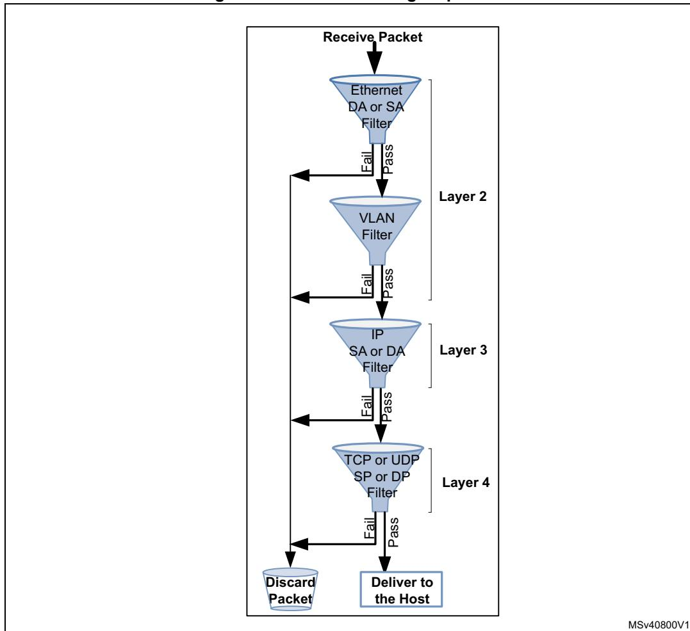

**Figure 830. Packet filtering sequence**

The sequence shown in *[Figure 830](#page-23-0)* is valid when all the filters (L2, VLAN, L3, L4) are active. If any of the Layer filters are not enabled, that filter is bypassed and the subsequent filter is applied. A packet that fails any of the filters is discarded. However, the discarded packet can be forwarded to the host based on the register control.

For example, when RA bit of *[Packet filtering control register \(ETH\\_MACPFR\)](#page-187-0)* is set to 1, all the discarded packets are forwarded to the host but with their packet status indicating the


specific filter failure. If RA bit is cleared to 0, VTFE and IPFE bits of *[Packet filtering control](#page-187-0)  [register \(ETH\\_MACPFR\)](#page-187-0)* control if the packets that fail the VLAN filter and Layer 3-4 filter should be discarded or forwarded to the host.

# <span id="page-24-0"></span>**MAC source or destination address filtering**

The MAC address filtering module checks the source address (SA) and destination address (DA) fields of each incoming packet.

### **Unicast destination address filtering**

The MAC supports 4 MAC addresses for unicast perfect filtering. If perfect filtering is selected (HUC bit of *[Packet filtering control register \(ETH\\_MACPFR\)](#page-187-0)* is reset), the MAC compares all 48 bits of received unicast address with the programmed MAC address for any match. The default MacAddr0 is always enabled.

The MacAddr1 to MacAddr3 addresses are selected with an individual enable bit. You can mask each byte during comparison with corresponding received DA byte by setting the corresponding Mask Byte Control bit in *[MAC Address x high register \(ETH\\_MACAxHR\)](#page-224-0)*. This enables group address filtering for the DA.

In Hash filtering mode (when HUC bit is set), the MAC performs imperfect filtering for unicast addresses using a 64-bit Hash table. For Hash filtering, the MAC uses the upper 6 bits CRC of the received destination address to index the content of the Hash table. A value of 00000 selects bit 0 of selected register, and a value of 11111 selects bit 63 of Hash Table register. If the corresponding bit (indicated by the 6-bit CRC) is set to 1, the unicast packet is considered to have passed the Hash filter; otherwise, the packet is considered to have failed the Hash filter.

## **Multicast destination address filtering**

To program the MAC to pass all multicast packets, set the PM bit in *[Packet filtering control](#page-187-0)  [register \(ETH\\_MACPFR\)](#page-187-0)*. If the PM bit is reset, the MAC performs the filtering for multicast addresses based on the HMC bit of the *[Packet filtering control register \(ETH\\_MACPFR\)](#page-187-0)*.

In Perfect filtering mode, the multicast address is compared with the programmed MAC destination address registers. Group address filtering is also supported.

In Hash filtering mode, the MAC performs imperfect filtering using a 64-bit Hash table. The MAC uses the upper 6-bits CRC of received multicast address to index the content of the Hash table. A value of 000000 selects bit 0 of selected register and a value of 111111 selects bit 63 of the Hash Table register. If the corresponding bit is set to 1, the multicast packet is considered to have passed the Hash filter. Otherwise, the packet is considered to have failed the Hash filter.

### **Hash or Perfect address filtering**

To configure the DA filter to pass a packet when its DA matches either the Hash filter or the Perfect filter, set the HPF bit and the corresponding HUC or HMC bits in *[Packet filtering con](#page-187-0)[trol register \(ETH\\_MACPFR\)](#page-187-0)*. This is applicable to both unicast and multicast packets. If the HPF bit is reset, only one of the filters (Hash or Perfect) is applied to receive packet.

### **Broadcast address filtering**

The MAC does not filter any broadcast packets by default. To program the MAC to reject all broadcast packets, set the DBF bit in *[Packet filtering control register \(ETH\\_MACPFR\)](#page-187-0)*.

# **Unicast source address filtering**


RM0399 Rev 4 2955/3556

The MAC can perform perfect filtering based on the source address field of received packets. By default, the MAC compares the SA field with the values programmed in the SA registers. You can configure the MAC Address registers to use SA instead of DA for comparison by setting bit 30 of *[MAC Address x high register \(ETH\\_MACAxHR\)](#page-224-0)*.

The MAC also supports group filtering with SA. You can filter a group of addresses by masking one or more bytes of the address. The MAC drops the packets that fail the SA filter if the SAF bit is set in *[Packet filtering control register \(ETH\\_MACPFR\)](#page-187-0)*. Otherwise, the result of the SA filter is given as a status bit in the Receive Status word (see *[Table 550](#page-26-1)*). When the SAF bit is set, the SA filter and DA filter result is ANDed to decide whether the packet needs to be forwarded. This means that the packet is dropped if either filter fails. The packet is forwarded to the application only if the packet passes both filters in-order.

### **Inverse filtering**

For DA and SA filtering, you can invert the filter-match result at the final output by setting the DAIF and SAIF bits of *[Packet filtering control register \(ETH\\_MACPFR\)](#page-187-0)*. The DAIF bit is applicable for both Unicast and Multicast DA packets. The result of the unicast or multicast destination address filter is inverted in this mode. Similarly, when the SAIF bit is set, the result of unicast SA filter is reversed.

*[Table 549](#page-25-0)* and *[Table 550](#page-26-1)* summarize the DA and SA filtering based on the type of packets received.

*Note: When the RA bit of [Packet filtering control register \(ETH\\_MACPFR\)](#page-187-0) is set, all packets are forwarded to the system along with the correct result of the address filtering in the Rx status.* 

<span id="page-25-0"></span>**Packet type PR HPF HUC DAIF HMC PM DBF DA filter operation** Broadcast 1 X X X X X X Pass 0 X X X X X 0 Pass 0 X X X X X 1 Fail Unicast 1 X X X X X X Pass all packets 0 X 0 0 X X X Pass on Perfect/Group filter match 0 X 0 1 X X X Fail on Perfect/Group filter match 0 0 1 0 X X X Pass on Hash filter match 0 0 1 1 X X X Fail on Hash filter match 0 1 1 0 X X X Pass on Hash or Perfect/Group filter match 0 1 1 1 X X X Fail on Hash or Perfect/Group filter match Multicast 1 X X X X X X Pass all packets X X X X X 1 X Pass all packets 0XX000X Pass on Perfect/Group filter match and drop Pause packets if PCF = 0x 00X010X Pass on Hash filter match and drop Pause packets if PCF = 0x 01X010X Pass on Hash or Perfect/Group filter match and

**Table 549. Destination address filtering** 


drop Pause packets if PCF = 0x

| Packet type | PR | HPF | HUC | DAIF | HMC | PM | DBF | DA filter operation                                                              |
|-------------|----|-----|-----|------|-----|----|-----|----------------------------------------------------------------------------------|
|             | 0  | X   | X   | 1    | 0   | 0  | X   | Fail on Perfect/Group filter match and drop<br>Pause packets if PCF = 0x         |
| Multicast   | 0  | 0   | X   | 1    | 1   | 0  | X   | Fail on Hash filter match and drop Pause packets<br>if PCF = 0x                  |
|             | 0  | 1   | X   | 1    | 1   | 0  | X   | Fail on Hash or Perfect/Group filter match and<br>drop Pause packets if PCF = 0x |

## **Table 549. Destination address filtering (continued)**

# **Table 550. Source address filtering**

<span id="page-26-1"></span>

| Packet type | PR | SAIF                                                                           | SAF | SA filter operation                                                 |
|-------------|----|--------------------------------------------------------------------------------|-----|---------------------------------------------------------------------|
|             | 1  | X                                                                              | X   | Pass all packets.                                                   |
| 0<br>0<br>0 |    | Pass status on Perfect or Group filter match but do not drop packets that fail |     |                                                                     |
| Unicast     | 0  | 1<br>0                                                                         |     | Fail status on Perfect or Group filter match but do not drop packet |
|             | 0  | 0                                                                              | 1   | Pass on Perfect or Group filter match and drop packets that fail    |
|             | 0  | 1                                                                              | 1   | Fail on Perfect or Group filter match and drop packets that fail    |

# <span id="page-26-0"></span>**VLAN filtering**

The MAC supports Perfect and Hash VLAN filtering. Refer to *[Section 61.9.14: Programming](#page-115-1)  [guidelines to perform VLAN filtering on the receive](#page-115-1)* for detailed programming steps.

### **VLAN tag Perfect filtering**

In VLAN tag Perfect filtering, the MAC compares the VLAN tag of received packet and provides the VLAN packet status to the application. Based on the programmed mode, the MAC compares the lower 12 bits or all 16 bits of received VLAN tag to determine the perfect match.

If VLAN tag Perfect filtering is enabled, the MAC forwards the VLAN-tagged packets along with VLAN tag match status and drops the VLAN packets that do not match. You can also enable the inverse matching for VLAN packets by setting the VTIM bit of *[VLAN tag register](#page-192-0)  [\(ETH\\_MACVTR\)](#page-192-0)*. In addition, you can enable matching of S-VLAN tagged packets along with the default C-VLAN tagged packets by setting the ESVL bit of *[VLAN tag register](#page-192-0)  [\(ETH\\_MACVTR\)](#page-192-0)*. The VLAN packet status bit(bit 10 of RDES0) indicates the VLAN tag match status for the matched packets.

*Note: The source or destination address (if enabled) has precedence over the VLAN tag filters. This means that a packet that fails the source or destination address filter is dropped irrespective of the VLAN tag filter results.*

### **VLAN tag Hash filtering**

The 16-bit VLAN Hash Table is used for group address filtering based on the VLAN tag. The VLAN tag Hash filtering feature can be enabled using the VTHM (VLAN tag Hash Table match enable) bit of the *[VLAN tag register \(ETH\\_MACVTR\)](#page-192-0)*. If the VTHM bit is set, the most significant four bits of CRC-32 of VLAN tag are used to index the content of the VLAN Hash Table register. A value of 1 in the VLAN Hash Table register, corresponding to the index, indicates that the VLAN tag of the packet matched and the packet should be forwarded. A value of 0 indicates that VLAN-tagged packet should be dropped.


RM0399 Rev 4 2957/3556

Note:

The 16 or 12 bits of VLAN Tag are considered for CRC-32 computation based on ETV bit in ETH MACVTR register.

When ETV bit is reset, most significant four bits of CRC-32 of VLAN Tag are inverted and used to index the content of VLAN Hash table register (ETH\_MACVHTR).

When ETV bit is set, most significant four bits of CRC-32 of VLAN Tag are directly used to index the content of VLAN tag register (ETH MACVTR).

The MAC also supports the inverse matching for VLAN packets. In the inverse matching mode, when the VLAN tag of a packet matches the Perfect or Hash filter, the packet should be dropped. If the VLAN perfect and VLAN Hash match are enabled, a packet is considered as matched if either the VLAN Hash or the VLAN perfect filter matches. When inverse match is set, a packet is forwarded only when both perfect and Hash filters indicate mismatch.

Table 551 shows the different possibilities for VLAN matching and the final VLAN match status. When the RA bit of *Packet filtering control register (ETH\_MACPFR)* is set, all packets are received and the VLAN match status is indicated in the VF bit of *RDES2 normal descriptor (write-back format)*. When the RA bit is not set and the VTFE bit is set in *Packet filtering control register (ETH\_MACPFR)*, the packet is dropped if the final VLAN match status is Fail. In *Table 551*, value *X* means that this column can have any value.

When VLAN VID is programmed to 0 in the VL field of *VLAN tag register (ETH\_MACVTR)*, all VLAN-tagged packets are considered as perfect matched but the status of the VLAN Hash match depends on the VTHM and VTIM bits in *VLAN tag register (ETH\_MACVTR)*.

<span id="page-27-0"></span>

| VID     | VLAN perfect filter<br>match result | VTHM Bit | VLAN Hash filter<br>match result | VTIM bit | Final VLAN match status |
|---------|-------------------------------------|----------|----------------------------------|----------|-------------------------|
| VID = 0 | Pass                                | 0        | Х                                | Х        | Pass                    |
|         | Pass                                | 1        | Х                                | 0        | Pass                    |
|         | Pass                                | 1        | Fail                             | 1        | Pass                    |
|         | Pass                                | 1        | Pass                             | 1        | Fail                    |
| VID!= 0 | Pass                                | Х        | Х                                | 0        | Pass                    |
|         | Fail                                | 0        | Х                                | 0        | Fail                    |
|         | Fail                                | 1        | Fail                             | 0        | Fail                    |
|         | Fail                                | 1        | Pass                             | 0        | Pass                    |
|         | Fail                                | 0        | Х                                | 1        | Pass                    |
|         | Pass                                | Х        | Х                                | 1        | Fail                    |
|         | Fail                                | 1        | Pass                             | 1        | Fail                    |
|         | Fail                                | 1        | Fail                             | 1        | Pass                    |

Table 551. VLAN match status<sup>(1)</sup>

<sup>1.</sup> In this table, 'X' represents any value.

# <span id="page-28-0"></span>**Layer 3 and Layer 4 filtering**

The MAC supports Layer 3 and Layer 4 based packet filtering. The Layer 3 filtering refers to the IP Source or Destination Address filtering in the IPv4 or IPv6 packets whereas Layer 4 filtering refers to the Source or Destination Port number filtering in TCP or UDP.

The Layer 3 and Layer 4 packet filtering feature automatically enables the IPC Full Checksum Offload Engine on the Receive side. For Layer 3 or Layer 4 filtering operation, you must set the IPC bit of the *[Operating mode configuration register \(ETH\\_MACCR\)](#page-181-0)* to enable the Rx Checksum Offload engine.

When Layer 3 and Layer 4 filtering is enabled, the packets are filtered in the following way:

• Matched packets

The MAC forwards the packets that match all enabled fields to the application along with the status. The MAC gives the matched field status only if the IPC bit of *[Operating](#page-181-0)  [mode configuration register \(ETH\\_MACCR\)](#page-181-0)* is set and one of the following conditions is true:

- All enabled Layer 3 and Layer 4 fields match.
- At least one of the enabled field matches and other fields are bypassed or disabled

When multiple Layer 3 and Layer 4 filters are enabled, any filter match is considered as a match. If more than one filter matches, the MAC provides the status of the lowest filter where Filter 0 is the lowest filter and Filter 3 is the highest filter. For example, if Filter 0 and Filter 1 match, the MAC gives the status corresponding to filter 0.

*Note: The source or destination address and VLAN tag filters (if enabled) have precedence over Layer 3 and Layer 4 filter. This means that a packet which fails the source or destination address or VLAN tag filter is dropped irrespective of the Layer 3 and Layer 4 filter results.*

• Unmatched packets

The MAC drops the packets that do not match any of the enabled fields. You can use the inverse match feature to block or drop a packet with specific TCP or UDP over IP fields and forward all other packets.The aborted or partial packets are dropped in the MTL Rx FIFO. If the Rx FIFO operates in the Threshold (cut-through) mode and the threshold is programmed to a small value. Such packet transfer to the application starts before the failed Layer 3 and Layer 4 filter results are available, the application may receive a partial packet with appropriate abort status.

• Non-TCP or UDP IP Packets

By default, all non-TCP or UDP IP packets are bypassed from the Layer 3 and Layer 4 filters. You can optionally program the MAC to drop all non-TCP or UDP over IP packets.

### **Layer 3 filtering**

The MAC supports perfect matching or inverse matching for IP Source Address and Destination Address. In addition, you can match the complete IP address or mask the lower bits matching, that is, compare all bits of the address except the specified lower mask bits.

For IPv6 packets filtering, you can enable the last four data registers of a register set to contain the 128-bit IP Source Address or IP Destination Address. The IP Source Address or Destination Address should be programmed in the order defined in the IPv6 specification, that is, the first byte of the IP Source Address or Destination Address in the received packet is in the higher byte of the register and the subsequent registers follow the same order.


RM0399 Rev 4 2959/3556

For IPv4 packet filtering, you can enable the second and third data registers of a register set to contain the 32-bit IP Source Address and IP Destination Address. The remaining two data registers are reserved. The IP Source Address or Destination Address should be programmed in the order defined in the IPv4 specification, that is, the first byte of IP Source Address and Destination Address in the received packet in the higher byte of the respective register.

### **Layer 4 filtering**

The MAC supports perfect matching or inverse matching for TCP or UDP Source and Destination Port numbers. However, you can program only one type (TCP or UDP) at a time. The first data register contains the 16-bit Source and Destination Port numbers of TCP or UDP, that is, the lower 16 bits for Source Port number and higher 16 bits for Destination Port number.

The TCP or UDP Source and Destination Port numbers should be programmed in the order defined in the TCP or UDP specification, that is, the first byte of TCP or UDP Source and Destination Port number in the received packet is in the higher byte of the register.

### **Layer 3 and Layer 4 filters register set**

The MAC implements two sets of registers for Layer 3 and Layer 4 based packet filtering. In a register set, there is a control register, such as *[L3 and L4 control 0 register \(ETH\\_MA-](#page-235-0)[CL3L4C0R\)](#page-235-0)*, to control the packet filtering. In addition, there are five address registers to program the Layer 3 and Layer 4 fields to be matched, such as:

- *[Layer4 Address filter 0 register \(ETH\\_MACL4A0R\)](#page-237-0)*
- *[Layer3 Address 0 filter 0 register \(ETH\\_MACL3A00R\)](#page-238-0)*
- *[Layer3 Address 1 filter 0 register \(ETH\\_MACL3A10R\)](#page-238-1)*
- *[Layer3 Address 2 filter 0 register \(ETH\\_MACL3A20R\)](#page-239-0)*
- *[Layer3 Address 3 filter 0 register \(ETH\\_MACL3A30R\)](#page-239-1)*

The second, and independent set of registers are: *[L3 and L4 control 1 register](#page-240-0)  [\(ETH\\_MACL3L4C1R\)](#page-240-0)*, *[Layer 4 address filter 1 register \(ETH\\_MACL4A1R\)](#page-242-0)*, *[Layer3 address](#page-243-0)  [0 filter 1 Register \(ETH\\_MACL3A01R\)](#page-243-0)*, *[Layer3 address 1 filter 1 register](#page-243-1)  [\(ETH\\_MACL3A11R\)](#page-243-1)*, *[Layer3 address 2 filter 1 Register \(ETH\\_MACL3A21R\)](#page-244-0)* and *[Layer3](#page-244-1)  [address 3 filter 1 register \(ETH\\_MACL3A31R\)](#page-244-1)*.

# **61.5.4 IEEE 1588 timestamp support**

The IEEE 1588 standard defines a precision time protocol (PTP) which allows precise synchronization of clocks in measurement and control systems implemented with technologies such as network communication, local computing, and distributed objects. The PTP applies to systems communicating by local area networks supporting multicast messaging, including (but not limited to) Ethernet. This protocol enables heterogeneous systems that include clocks of varying inherent precision, resolution, and stability to synchronize. The protocol supports system-wide synchronization accuracy in the submicrosecond range with minimal network and local clock computing resources.

This chapter contains the following sections:

- *[IEEE 1588 timestamp support](#page-30-0)*
- *[IEEE 1588 system time source](#page-41-0)*
- *[IEEE 1588 auxiliary snapshots](#page-44-0)*
- *[Flexible pulse-per-second output](#page-45-0)*


- *[PTP timestamp offload function](#page-47-0)*
- *[One-step timestamp](#page-52-0)*"

### <span id="page-30-0"></span>**IEEE 1588 timestamp support**

The Ethernet peripheral supports the IEEE 1588-2002 (version 1) and IEEE 1588-2008 (version 2). The IEEE 1588-2002 supports PTP transported over UDP/IP. The IEEE 1588 2008 supports PTP transported over Ethernet. The peripheral provides programmable support for both standards. It supports the following features:

- Support of both timestamp formats
- Optional snapshot of all packets or only PTP type packets
- Optional snapshot of only event messages
- Optional snapshot based on the clock type: ordinary, boundary, end-to-end transparent, and peer-to-peer transparent
- Optional selection of the node to act as master or slave for ordinary and boundary clock
- Identification of the PTP message type, version, and PTP payload in packets sent directly over Ethernet and sends the status
- Optional measurement subsecond time in digital or binary format

### **Clock types**

The MAC supports the following clock types defined in the IEEE 1588-2008 specifications:

• Ordinary clock

The ordinary clock of a domain supports a single copy of the protocol. It has a single PTP state and a single physical port. In typical industrial automation applications, an ordinary clock is associated with an application device such as a sensor or an actuator. In telecom applications, the ordinary clock can be associated with a timing demarcation device.

The ordinary clock can be a grandmaster or a slave clock. It supports the following features:

- Transmission and reception of PTP messages. The timestamp snapshot can be controlled as described in *[Timestamp control Register \(ETH\\_MACTSCR\)](#page-245-0)*.
- Maintenance of the data sets such as timestamp values.

The table below shows the messages for which you can take the timestamp snapshot on the receive side for master and slave nodes.

**Table 552. Ordinary clock: PTP messages for snapshot**

| Master    | Slave |
|-----------|-------|
| Delay_Req | SYNC  |

For an ordinary clock, you can take the snapshot of either of the following PTP message types: version 1 or version 2. You cannot take the snapshots for both PTP message types. You can take the snapshot by setting the TSVER2ENA bit and selecting the snapshot mode in *[Timestamp control Register \(ETH\\_MACTSCR\)](#page-245-0)*.

• Boundary clock


The boundary clock typically has several physical ports which communicate with the network. The messages related to synchronization, master-slave hierarchy, and signaling end in the protocol engine of the boundary clock. Such messages are not forwarded. The PTP message type status given by the MAC helps to identify the type of message and take appropriate action.

The boundary clock is similar to the ordinary clock except for the following features:

- The clock data sets are common to all ports of the boundary clock.
- The local clock is common to all ports of the boundary clock.
- End-to-end transparent clock

The end-to-end transparent clock supports the end-to-end delay measurement mechanism between the slave clocks and the master clock. The end-to-end transparent clock forwards all messages like normal bridge, router, or repeater. The residence time of a PTP packet is the time taken by the PTP packet from the Ingress port to the Egress port.

The residence time of a SYNC packet inside the end-to-end transparent clock is updated in the correction field of the associated Follow\_Up PTP packet before it is transmitted. Similarly, the residence time of a Delay\_Req packet, inside the end-to-end transparent clock, is updated in the correction field of the associated Delay\_Resp PTP packet before it is transmitted. Therefore, the snapshot needs to be taken at both Ingress and Egress ports only for the messages mentioned in *[Table 553](#page-31-0)*. You can take the snapshot by setting the SNAPTYPSEL bits to 10 in the *[Timestamp control Register](#page-245-0)  [\(ETH\\_MACTSCR\)](#page-245-0)*.

**Table 553. End-to-end transparent clock: PTP messages for snapshot**

<span id="page-31-0"></span>

| PTP messages |
|--------------|
| SYNC         |
| Delay_Req    |

### • Peer-to-peer transparent clock

In the peer-to-peer transparent clock, the computation of the link delay is based on an exchange of Pdelay\_Req, Pdelay\_Resp, and Pdelay\_Resp\_Follow\_Up messages with the link peer.

The peer-to-peer transparent clock differs from the end-to-end transparent clock in the way it corrects and handles the PTP timing messages. In all other aspects, it is identical to the end-to-end transparent clock.

The residence time of the Pdelay\_Req and the associated Pdelay\_Resp packets is added and inserted into the correction field of the associated Pdely\_Resp\_Followup packet. Therefore, support for taking snapshot for the event messages related to Pdelay is added as shown in *[Table 561](#page-41-1)*.


**Table 554. Peer-to-peer transparent clock: PTP messages for snapshot**

| PTP messages |  |  |  |
|--------------|--|--|--|
| SYNC         |  |  |  |
| Pdelay_Req   |  |  |  |
| Pdelay_Resp  |  |  |  |

You can take the snapshot by setting the SNAPTYPESEL bit to 11 in *[Timestamp](#page-245-0)  [control Register \(ETH\\_MACTSCR\)](#page-245-0)*.

## **Delay request-response mechanism**

The system or network is classified into the master and slave nodes for distributing the timing and clock information. *[Figure 831](#page-32-0)* shows the process that PTP uses for synchronizing a slave node with a master node by exchanging PTP messages.

<span id="page-32-0"></span>ai15669b Master clock time Slave clock time Sync message Follow\_up message containing value of t1 Delay\_Req message Delay\_Resp message containing value of t4 time t1 t2m t3m t4 t1, t2, t3, t4 t2 t1, t2 t3 t2 t1, t2, t3 Data at slave clock

**Figure 831. Networked time synchronization**

As shown in *[Figure 831](#page-32-0)*, the PTP uses the following process:

- 1. The master broadcasts the PTP Sync messages to all its nodes. The Sync message contains the reference time information of the master. This message leaves the system of the master at t1. This time must be captured for Ethernet ports at MII.
- 2. The slave receives the SYNC message and also captures the exact time, t2, using its timing reference.
- 3. The master sends a Follow\_up message to the slave, which contains t1 information for later use.
- 4. The slave sends a Delay\_Req message to the master and notes the exact time, t3, at which this packet leaves the MII interface.


RM0399 Rev 4 2963/3556

- 5. The master receives the message, capturing the exact time t<sub>4</sub>, at which the message enters its system.
- 6. The master sends the t<sub>4</sub> information to the slave in the Delay\_Resp message.
- 7. The slave uses the four values of t<sub>1</sub>, t<sub>2</sub>, t<sub>3</sub>, and t<sub>4</sub> to synchronize its local timing reference with the timing reference of the master.

Most of the PTP implementation is done in the software above the UDP layer. However, the hardware support is required to capture the exact time when specific PTP packets enter or leave the Ethernet port at the MII interface. This timing information must be captured and returned to the software for proper implementation of PTP with high accuracy.

# Peer-to-peer PTP transparent clock (P2P TC) message support

The IEEE 1588-2008 standard supports peer-to-peer PTP (Pdelay) message in addition to the Sync, Delay Request, Follow-up, and Delay Response messages. *Figure 832* shows the method to calculate the propagation delay in clocks supporting peer-to-peer path correction.

<span id="page-33-0"></span>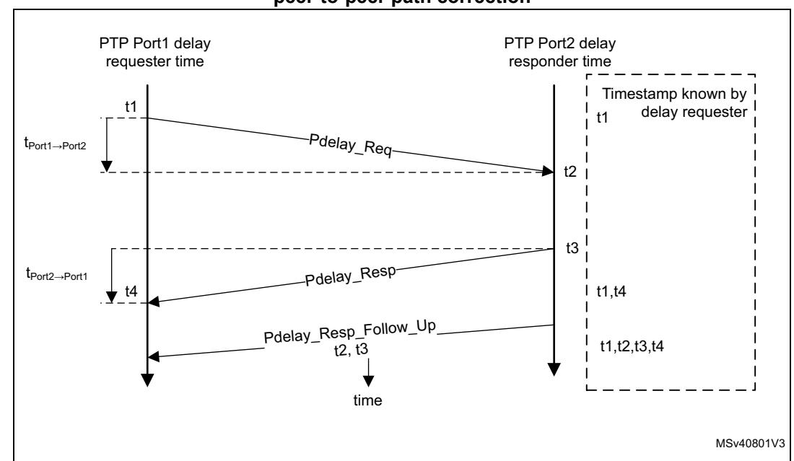

Figure 832. Propagation delay calculation in clocks supporting peer-to-peer path correction

As shown in *Figure 832*, the propagation delay is calculated as follows:

- 1. Port 1 issues a Pdelay\_Req message and generates a timestamp (t<sub>1</sub>) for the Pdelay\_Req message.
- 2. Port 2 receives the Pdelay\_Req message and generates a timestamp (t<sub>2</sub>) for this message.

3. Port 2 returns a Pdelay\_Resp message and generates a timestamp (t3) for this message.

To minimize errors caused by frequency offset between the two ports, Port 2 returns the Pdelay\_Resp message as quickly as possible after the receipt of the Pdelay\_Req message. Port 2 returns any one of the following:

- Difference between the timestamps t2 and t3 in the Pdelay\_Resp message
- Difference between the timestamps t2 and t3 in the Pdelay\_Resp\_Follow\_Up message
- Timestamps t2 and t3 in the Pdelay\_Resp and Pdelay\_Resp\_Follow\_Up messages, respectively
- 4. Port 1 generates a timestamp (t4) on receiving the Pdelay\_Resp message.
- 5. Port 1 uses all four timestamps to compute the mean link delay.

## **Timestamp correction**

According to the IEEE 1588 specifications, a timestamp must be captured when the message timestamp point (leading edge of the first bit of the octet immediately following the Start Frame Delimiter octet) crosses the boundary between the node and the network.

As the MAC takes the timestamp at an internal point far from the actual boundary of the node and network, this captured timestamp is corrected/updated for the ingress/egress path latency (including the delay in the PHY layers). Further correction is done for the inaccuracies/errors introduced due to the clock (MII Tx, Rx clock) being different at the capture point as compared to the PTP clock (clk\_ptp\_ref\_i) that is used to generate the time. The resultant CDC (clock domain crossing) circuits add an error the depends on the clock period of the MII and PTP clocks.

### **Ingress correction**

In the Receive side, the timestamp captured at the internal snapshot point is delayed (later in time) as compared to the time at which that packet SFD bit is received at the port boundary. Therefore, the captured timestamp must be reduced by the ingress latency and the errors in CDC sampling. This correction value must be determined/calculated by the software and written into the *[Timestamp Ingress correction nanosecond register](#page-257-0)  [\(ETH\\_MACTSICNR\)](#page-257-0)*.

The correction value consists of the following three components:

- 1. External latency in the PHY layer between boundary point and the input of the core If the PHY is compliant with the IEEE 802.3 Clause 45 MMD registers, it has registers indicating the maximum and minimum ingress latency. The software can read these registers and determine the average ingress latency in the PHY. Alternatively (if the PHY does not support these registers), the ingress latency must be determined from the PHY datasheet or timing characteristics.
- 2. Internal latency from the input of the core to the internal capture point The latency differs based on the active PHY interface (such as MII or RMII) and the operating speed, as shown in *[Table 555](#page-35-0)*.
- 3. CDC synchronization

The CDC synchronization error is almost equal to twice the clock-period of the PTP clock (clk\_ptp\_ref\_i).


RM0399 Rev 4 2965/3556

The values determined from these three components should be added by the software and must be written into the TSIC field of the *[Timestamp Ingress correction nanosecond register](#page-257-0)  [\(ETH\\_MACTSICNR\)](#page-257-0)*.

*Note: The value written to the register must be negative (two's complement), because it has to be subtracted from the captured timestamp. The MAC receiver adds the value in this register to the captured timestamp and then gives the resultant value as the timestamp of the received packet.*

> When TSCTRLSSR bit in *[Timestamp control Register \(ETH\\_MACTSCR\)](#page-245-0)* is set, the nanoseconds field of the captured timestamp is in decimal format with a granularity of 1 ns. So bit 31 of TSIC must be set to 1 (for negative value) and bits 30 to 0 must be programmed with "109 – total ingress\_correction\_value[nanosecond part]" represented in binary. For example, if the required correction value is –5 ns, then the value is 0xBB9A C9FB.

> When TSCTRLSSR bit in *[Timestamp control Register \(ETH\\_MACTSCR\)](#page-245-0)* is reset, the nanoseconds field of the captured timestamp is in binary format with a granularity of ~0.466 ns. Therefore, bits[30:0] must be written with "231 – total ingress\_correction\_value" represented in binary with bit[31] = 1.

### **Egress correction**

In the Transmit side, the timestamp captured at the internal snapshot point is earlier (advanced in time) as compared to the time at which that packet SFD bit is output at the port boundary. Therefore, the captured timestamp must be compensated by the egress latency and the errors in CDC sampling. This correction value must be determined/calculated by the software and written into the *[Timestamp Egress correction nanosecond register](#page-257-1)  [\(ETH\\_MACTSECNR\)](#page-257-1)*.

The correction value consists of the following three components:

- 1. External latency in the PHY layer between the output of the core and the boundary of the port and the network
  - If the PHY is compliant with the IEEE 802.3 Clause 45 MMD registers, it has registers indicating the maximum and minimum egress latency. The software can read these registers and determine the average egress latency in the PHY. Alternatively (if the PHY does not support these registers), the egress latency must be determined from the PHY datasheet or timing characteristics.
- 2. Internal latency from the internal capture point and the output of the core The latency differs based on the active PHY interface (RMII, MII, etc.) and the operating speed as shown in *[Table 555](#page-35-0)*.
- 3. CDC synchronization error

The timestamp correction because of synchronization is compensated by adding EGRESS\_SYNC\_CORR 1 PTP\_CLK\_PER 4 TX\_CLK\_PER = ( ) × + ×

*[Table 555](#page-35-0)* lists the Egress and Ingress latency values for various PHY interfaces:

**Table 555. Egress and ingress latency for PHY interfaces** 

<span id="page-35-0"></span>

| PHY interface |          | Egress latency | Ingress latency |  |
|---------------|----------|----------------|-----------------|--|
| RGMII         | 1 Gbps   | 12             | 12              |  |
| RGMII         | 100 Mbps | 40             | 40              |  |
| RGMII         | 10 Mbps  | 400            | 400             |  |


RMII 100 Mbps 40 120 RMII 10 Mbps 400 800 **PHY interface Egress latency Ingress latency**

**Table 555. Egress and ingress latency for PHY interfaces (continued)**

### **Frequency range of reference timing clock**

The timestamp information are transferred across asynchronous clock domains, from the MAC clock domain to the application clock domain. Therefore, a minimum delay is required between two consecutive timestamp captures. This delay is four clock cycles of MII and three clock cycles of PTP clocks. If the delay between two timestamp captures is less than this delay, the MAC does not take a timestamp snapshot for the second packet.

The PTP clock frequency limitations are the following:

• Maximum PTP clock frequency

The maximum PTP clock frequency is limited by the maximum resolution of the reference time (10 ns at 100 MHz). In addition, the resolution or granularity of the reference time source determines the accuracy of the synchronization. Therefore, a higher PTP clock frequency gives better system performance.

• Minimum PTP clock frequency

The minimum PTP clock frequency depends on the time required between two consecutive SFD bytes and the time taken for synchronizing the time with the MII clock domain. This relationship is given by the following equation:

3 \* PTP clock period + 4 \* MII clock period ≤ Minimum gap between two SFDs The MII clock frequency is fixed by IEEE specifications. Therefore, the minimum PTP clock frequency required for proper operation depends on the operating mode and operating speed of the MAC as shown in *[Table 556](#page-36-0)*.

**Table 556. Minimum PTP clock frequency example** 

<span id="page-36-0"></span>

| Mode                 | Minimum gap between two SFDs                                                                                     | Minimum PTP<br>frequency with<br>internal<br>timestamp |
|----------------------|------------------------------------------------------------------------------------------------------------------|--------------------------------------------------------|
| 10 Mbps Full-duplex  | 168 MII clocks<br>(128 clocks for a 64-byte packet + 24 clocks of min<br>IFG + 16 clocks of preamble)            | 5 MHz                                                  |
| 10 Mbps Half-duplex  | 48 MII clocks<br>(8 clocks for a JAM pattern sent just after SFD<br>because of collision + 24 IFG + 16 preamble) | 5 MHz                                                  |
| 100 Mbps full duplex | 168 MII clocks<br>(128 clocks for a 64-byte packet + 24 clocks of min<br>IFG + 16 clocks of preamble)            | 5 MHz                                                  |
| 100 Mbps Half-duplex | 48 MII clocks<br>(8 clocks for a JAM pattern sent just after SFD<br>because of collision + 24 IFG + 16 preamble) | 5 MHz                                                  |

**PTP processing and control**


RM0399 Rev 4 2967/3556

*[Table 557](#page-37-0)* shows the common message header for the PTP messages. This format is taken from the IEEE 1588-2008 specifications.

**Table 557. Message format defined in IEEE 1588-2008** 

<span id="page-37-0"></span>

| Bits                             |                    |   |   |   |   |    |    |       |        |
|----------------------------------|--------------------|---|---|---|---|----|----|-------|--------|
| 7                                | 6                  | 5 | 4 | 3 | 2 | 1  | 0  | Octet | Offset |
| transportSpecific<br>messageType |                    |   |   |   |   | 1  | 0  |       |        |
| Reserved<br>versionPTP           |                    |   |   | 1 | 1 |    |    |       |        |
|                                  | messageLength      |   |   |   |   | 2  | 2  |       |        |
|                                  | domainNumber       |   |   |   |   | 1  | 4  |       |        |
| Reserved                         |                    |   |   |   |   | 1  | 5  |       |        |
| flagField                        |                    |   |   |   |   | 2  | 6  |       |        |
| correctionField                  |                    |   |   |   |   | 8  | 8  |       |        |
| Reserved                         |                    |   |   |   | 4 | 16 |    |       |        |
|                                  | sourcePortIdentity |   |   |   |   | 10 | 20 |       |        |
| sequenceId                       |                    |   |   |   |   |    |    | 2     | 30     |
| controlField(1)                  |                    |   |   |   |   |    |    | 1     | 32     |
| logMessageInterval               |                    |   |   |   |   |    |    | 1     | 33     |

<sup>1.</sup> The controlField is used in version 1. In version 2, the messageType field is used for detecting different message types.

Some fields of the Ethernet payload can be used to detect the PTP packet type and control the snapshot to be taken. These fields are different for the following PTP packets:

- PTP packets over IPv4
- PTP frames over IPv6
- PTP packets over Ethernet

### **PTP packets over IPv4**

*[Table 558](#page-37-1)* provides information about the fields that are matched to control the snapshot for the PTP packets sent over UDP over IPv4 for IEEE 1588 version 1 and 2. The octet positions for the tagged packets are offset by 4. This is based on the IEEE 1588-2008, Annex D and the message format defined in *[Table 557](#page-37-0)*.

**Table 558. Message format defined in IEEE 1588-2008** 

<span id="page-37-1"></span>

| Matched field                   | Octet position | Matched value | Description        |  |  |
|---------------------------------|----------------|---------------|--------------------|--|--|
| MAC packet type                 | 12, 13         | 0x0800        | IPv4 datagram      |  |  |
| IP version and header<br>length | 14             | 0x45          | IP version is IPv4 |  |  |
| Layer 4 protocol                | 23             | 0x11          | UDP                |  |  |

Table 558. Message format defined in IEEE 1588-2008 (continued)

| Matched field Octet position                    |                | Matched value                                                | Description                                                                                                                                                      |  |
|-------------------------------------------------|----------------|--------------------------------------------------------------|------------------------------------------------------------------------------------------------------------------------------------------------------------------|--|
| IP multicast address<br>(IEEE 1588 version 1)   | 30, 31, 32, 33 | 0xE0, 0x00, 0x01, 0x81<br>(or 0x82 or 0x83 or 0x84)          | Multicast IPv4 addresses allowed: 224.0.1.129 224.0.1.130 224.0.1.131 224.0.1.132                                                                                |  |
| IP multicast address<br>(IEEE 1588 version 2)   | 30, 31, 32, 33 | 0xE0, 0x00, 0x01, 0x81 (Hex)<br>0xE0, 0x00, 0x00, 0x6B (Hex) | PTP Primary multicast address: 224.0.1.129 PTP Pdelay multicast address: 224.0.0.107                                                                             |  |
| UDP destination port                            | 36, 37         | 0x013F, 0x0140                                               | 0x013F: PTP event messages <sup>(1)</sup> 0x0140: PTP general messages                                                                                           |  |
| PTP control field<br>(IEEE 1588 version 1)      | 74             | 0x00, 0x01, 0x02, 0x03, 0x04                                 | 0x00: SYNC 0x01: Delay_Req 0x02: Follow_Up 0x03: Delay_Resp 0x04: Management                                                                                     |  |
| PTP message type field<br>(IEEE 1588 version 2) | 42 (nibble)    | 0x0, 0x1, 0x2, 0x3, 0x8, 0x9,<br>0xB, 0xC, 0xD               | 0x0: SYNC 0x1: Delay_Req 0x2: Pdelay_Req 0x3: Pdelay_Resp 0x8: Follow_Up 0x9: Delay_Resp 0xA: Pdelay_Resp_Follow_Up 0xB: Announce 0xC: Signaling 0xD: Management |  |
| PTP version                                     | 43 (nibble)    | 0x1 or 0x2                                                   | 0x1: Supports PTP version 1<br>0x2: Supports PTP version 2                                                                                                       |  |

<sup>1.</sup> PTP event messages are SYNC, Delay\_Req (IEEE 1588 version 1 and 2) or Pdelay\_Req, Pdelay\_Resp (IEEE 1588 version 2 only)

#### PTP frames over IPv6

*Table 559* provides information about the fields that are matched to control the snapshots for the PTP packets sent over UDP over IPv6 for IEEE 1588 version 1 and 2. The octet positions for the tagged packets are offset by 4. This is based on the IEEE 1588-2008, Annex D and the message format defined in *Table 557*.

Table 559. IPv6-UDP PTP packet fields required for control and status

<span id="page-38-0"></span>

| Matched field    | Octet position             | Matched value | Description        |
|------------------|----------------------------|---------------|--------------------|
| MAC packet type  | 12, 13                     | 0x86DD        | IP datagram        |
| IP version       | 14 (bits [7:4])            | 0x6           | IP version is IPv6 |
| Layer 4 protocol | 20 <sup>(1)</sup> 0x11 UDP |               | UDP                |


Table 559. IPv6-UDP PTP packet fields required for control and status (continued)

| Matched field                                   | Octet position                                    | Matched value                                     | Description                                                                                                                                                      |  |
|-------------------------------------------------|---------------------------------------------------|---------------------------------------------------|------------------------------------------------------------------------------------------------------------------------------------------------------------------|--|
| PTP multicast address                           | ast address 38 – 53 FF0x:0:0:0:0:<br>FF02:0:0:0:0 |                                                   | PTP primary multicast address:<br>FF0x:0:0:0:0:0:0:0:0:181 (Hex)<br>PTP Pdelay multicast address:<br>FF02:0:0:0:0:0:0:0:0:6B (Hex)                               |  |
| UDP destination port                            | 56, 57a                                           | 0x013F, 0x140                                     | 0x013F: PTP event message<br>0x0140: PTP general messages                                                                                                        |  |
| PTP control field (IEEE<br>1588 version 1)      | 94a                                               | 0x00, 0x01, 0x02, 0x03, or<br>0x04                | 0x00: SYNC 0x01: Delay_Req 0x02: Follow_Up 0x03: Delay_Resp 0x04: Management (version1)                                                                          |  |
| PTP message type field<br>(IEEE 1588 version 2) | 62a (nibble)                                      | 0x0, 0x1, 0x2, 0x3, 0x8, 0x9,<br>0xB, 0xC, or 0xD | 0x0: SYNC 0x1: Delay_Req 0x2: Pdelay_Req 0x3: Pdelay_Resp 0x8: Follow_Up 0x9: Delay_Resp 0xA: Pdelay_Resp_Follow_Up 0xB: Announce 0xC: Signaling 0xD: Management |  |
| PTP Version                                     | 63 (nibble)                                       | 0x1 or 0x2                                        | 0x1: Supports PTP version 1 0x2: Supports PTP version 2                                                                                                          |  |

<sup>1.</sup> The Extension header is not defined for PTP packets.

## PTP packets over Ethernet

*Table 560* provides information about the fields that are matched to control the snapshots for the PTP packets sent over Ethernet for IEEE 1588 version 1 and 2. The octet positions for the tagged packets are offset by 4. This is based on the IEEE 1588-2008, Annex D and the message format.

Table 560. Ethernet PTP packet fields required for control and status

<span id="page-39-0"></span>

| Matched field                                    | Octet position | Matched value              | Description                                                                                                                           |
|--------------------------------------------------|----------------|----------------------------|---------------------------------------------------------------------------------------------------------------------------------------|
| MAC destination multicast address <sup>(1)</sup> |                |                            | All PTP messages can use any of the following multicast addresses <sup>(2)</sup> : 01-1B-19-00-00-00 01-80-C2-00-00-0E <sup>(3)</sup> |
| MAC packet type                                  | 12, 13         | 0x88F7 PTP Ethernet packet |                                                                                                                                       |


| Matched field                                      | Octet position | Matched value                                     | Description                                                                                                                                                      |  |
|----------------------------------------------------|----------------|---------------------------------------------------|------------------------------------------------------------------------------------------------------------------------------------------------------------------|--|
| PTP control field<br>(IEEE 1588 version 1)         | 46             | 0x00, 0x01, 0x02, 0x03, or 0x04                   | 0x00: SYNC 0x01: Delay_Req 0x02: Follow_Up 0x03: Delay_Resp 0x04: Management                                                                                     |  |
| PTP message type<br>field (IEEE 1588<br>version 2) | 14 (nibble)    | 0x0, 0x1, 0x2, 0x3, 0x8,<br>0x9, 0xB, 0xC, or 0xD | 0x0: SYNC 0x1: Delay_Req 0x2: Pdelay_Req 0x3: Pdelay_Resp 0x8: Follow_Up 0x9: Delay_Resp 0xA: Pdelay_Resp_Follow_Up 0xB: Announce 0xC: Signaling 0xD: Management |  |
| PTP version                                        | 15 (nibble)    | 0x1 or 0x2                                        |                                                                                                                                                                  |  |

Table 560. Ethernet PTP packet fields required for control and status (continued)

### **Transmit path functions**

The MAC captures a timestamp when the start packet delimiter (SFD) of a packet is sent on the MII interface. The packets, for which a timestamp has to be captured, can be controlled on per-packet basis. Each Transmit packet can be marked to indicate whether a timestamp should be captured for it.

The MAC does not process the transmitted packets to identify the PTP packets. The packets for which a timestamp has to be captured must be specified. The packets can be defined by using the control bits in the Transmit Descriptor (see Section 61.10.3: Transmit descriptor). The MAC returns the timestamp to the software inside the corresponding Transmit descriptor, thus automatically connecting the timestamp to the specific PTP packet.

The 64-bit timestamp information is written to the TDES0 and TDES1 fields. The TDES0 field holds the 32 least significant bits of the timestamp.

# Receive path functions

The MAC can be programmed to capture the timestamp of all packets received on the MII interface or to process packets to identify the valid PTP messages. The snapshot of the time to be sent to the application can be controlled by using the following options of the *Timestamp control Register (ETH\_MACTSCR)*:

- Enable snapshot for all packets
- Enable snapshot for IEEE 1588 version 1 or version 2 timestamp


RM0399 Rev 4 2971/3556

The unicast address match of destination addresses (DA), programmed in MAC address 0 to 31, is used if the TSENMACADDR bit of *Timestamp control Register (ETH\_MACTSCR)* is set.

<sup>2.</sup> IEEE 1588-2008. Annex F

<sup>3.</sup> The MAC does not consider the PTP version 1 messages with Peer delay multicast address (01-80-C2-00-00-0E) as valid PTP messages.

- Enable snapshot for PTP packets transmitted directly over Ethernet or UDP-IP-Ethernet
- Enable timestamp snapshot for the received packet for IPv4 or IPv6
- Enable timestamp snapshot only for EVENT messages (SYNC, DELAY\_REQ, PDELAY\_REQ, or PDELAY\_RESP)
- Enable the node to be a master or slave and select the snapshot type This feature controls the type of messages for which snapshots are taken.

*Note: The peripheral also supports the PTP messages over VLAN packets.*

*[Table 561](#page-41-1)* indicates the PTP messages for which a snapshot is taken depending on the SNAPTYPSEL field in *[Timestamp control Register \(ETH\\_MACTSCR\)](#page-245-0)*.

<span id="page-41-1"></span>

| SNAPTYPSEL | TSMSTRENA | TSEVNTENA | PTP messages                                                                                 |  |
|------------|-----------|-----------|----------------------------------------------------------------------------------------------|--|
| 00         | X         | 0         | SYNC, Follow_Up, Delay_Req, Delay_Resp                                                       |  |
| 00         | 0         | 1         | SYNC                                                                                         |  |
| 00         | 1         | 1         | Delay_Req                                                                                    |  |
| 01         | X         | 0         | SYNC, Follow_Up, Delay_Req, Delay_Resp,<br>Pdelay_Req, Pdelay_Resp,<br>Pdelay_Resp_Follow_Up |  |
| 01         | 0         | 1         | SYNC, Pdelay_Req, Pdelay_Resp                                                                |  |
| 01         | 1         | 1         | Delay_Req, Pdelay_Req, Pdelay_Resp                                                           |  |
| 10         | X         | X         | SYNC, Delay_Req                                                                              |  |
| 11         | X         | X         | Pdelay_Req, Pdelay_Resp                                                                      |  |

**Table 561. Timestamp snapshot dependency on ETH\_MACTSCR bits** 

The DMA returns the timestamp to the software application inside the corresponding Receive descriptor. The extended status, containing the timestamp message status and the IPC status, is written in the RDES1 normal descriptor and the snapshot of the timestamp is written in RDES0 and RDES1 fields of the context descriptor. The RDES0 field holds the 32 least significant bits of the timestamp.

### **Programming guidelines for IEEE 1588 timestamping (system time correction)**

See *[Section : System time correction](#page-106-0)* in *[Section 61.9.9: Programming guidelines for IEEE](#page-105-0)  [1588 timestamping on page 3036](#page-105-0)*.

### <span id="page-41-0"></span>**IEEE 1588 system time source**

To get a snapshot of the time, the MAC requires a reference time in 64-bit format as defined in the IEEE 1588-2002 (80-bit format as defined in the IEEE 1588-2008).

### **Description of IEEE 1588 system time source**

The peripheral uses the reference clock input and uses it to internally generate the Reference time (also called the system time) and capture timestamps.

The timestamp has the following fields:

• UInteger48 seconds field


The seconds field is the integer portion of the timestamp in units of seconds. It is 48-bit wide. For example, 2.000000001 seconds are represented as seconds Field = 0x0000 0000 0002.

• UInteger32 nanosecondsField

The nanoseconds field is the fractional portion of the timestamp in units of nanoseconds. For example, 2.000000001 seconds are represented as nanoSeconds = 0x0000 0001.

The nanoseconds field supports the following two modes:

- **Digital rollover mode**: In this mode, the maximum value in the nanoseconds field is 0x3B9A C9FF, that is, (10e9-1) nanoseconds.
- **Binary rollover mode**: In this mode, the nanoseconds field rolls over and increments the seconds field after value 0x7FFF FFFF. Accuracy is ~0.466 ns per bit.

These modes can be set through TSCTRLSSR bit in *[Timestamp control Register](#page-245-0)  [\(ETH\\_MACTSCR\)](#page-245-0)*.

### <span id="page-42-0"></span>**System time register module**

The 64-bit PTP time is updated using the PTP input reference clock, clk\_ptp\_ref\_i. This PTP time is used as a source to take snapshots (timestamps) of the Ethernet frames being transmitted or received at the MII.

The system time counter can be initialized or corrected using either the coarse or the fine correction method.

In the coarse correction method, the initial value or the offset value is written to the timestamp update register. For initialization, the system time counter is programmed with the value in the timestamp update registers, whereas for system time correction the offset value (timestamp update register) is added to or subtracted from the system time.

In the fine correction method, the slave clock (reference clock) frequency drift with respect to the master clock (as defined in IEEE 1588-2002 specifications) is corrected over a period of time, unlike in the coarse correction method where it is corrected in a single clock cycle. The longer correction time helps maintain linear time and does not introduce drastic changes (or a large jitter) in the reference time between PTP Sync message intervals. In this method, an accumulator sums up the contents of the Addend register as shown in *[Figure 833](#page-43-0)*. The arithmetic carry that the accumulator generates is used as a pulse to increment the system time counter. The accumulator and the addend are 32-bit registers. The accumulator acts as a high-precision frequency multiplier or divider.

This system time update algorithm is shown in *[Figure 833](#page-43-0)*.


RM0399 Rev 4 2973/3556

<span id="page-43-0"></span>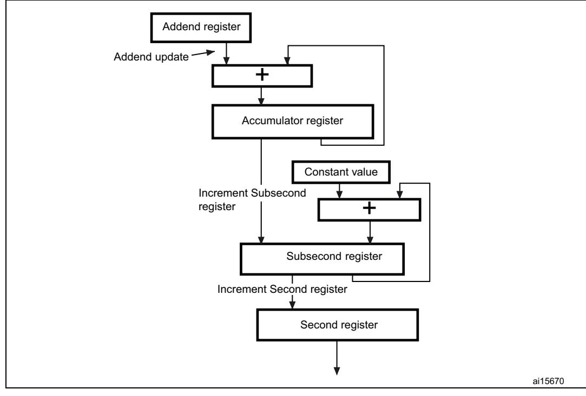

**Figure 833. System time update using fine correction method**

The system time update logic requires a 50 MHz clock frequency to achieve 20 ns accuracy. The frequency division is the ratio of the reference clock frequency to the required clock frequency. For example, if the reference clock (clk\_ptp\_ref\_i) is 66 MHz, this ratio is calculated as 66 MHz/50 MHz = 1.32. Therefore, the default addend value to be set in the register is 232 / 1.32, 0xC1F07C1F.

If the reference clock drifts lower, for example, to 65 MHz, the ratio is 65 / 50, that is 1.3 and the value to set in the addend register is 232 / 1.30, or 0xC4EC 4EC4.

If the clock drifts higher, for example to 67 MHz, the addend register must be set to 0xBF0B 7672. When there is not clock drift, the default addend value of 0xC1F0 7C1F (232 / 1.32) must be programmed.

In *[Figure 833](#page-43-0)*, the constant value used to accumulate the subsecond register is decimal 43, which achieves a system time accuracy of 20 ns (in other words, it is incremented in 20 ns steps).

The software must calculate the drift in frequency based on the SYNC messages and accordingly update the Addend register.

Initially, the slave clock is set with FreqCompensationValue0 in the Addend register. This value is as follows:

FreqCompensationValue
$$_0 = 2^{32}$$
/ FreqDivisionRatio

If MasterToSlaveDelay is initially assumed to be the same for consecutive Sync messages, the algorithm given in this section must be applied. After a few Sync cycles, frequency lock occurs. The slave clock can then determine a precise MasterToSlaveDelay value and resynchronize with the master using the new value.

The algorithm is as follows:

 At time MasterSyncTime<sub>n</sub> the master sends the slave clock a SYNC message. The slave receives this message when its local clock is SlaveClockTime<sub>n</sub> and computes MasterClockTime<sub>n</sub> as follows:

$$MasterClockTime_n = MasterSyncTime_n + MasterToSlaveDelay_n$$

2. The master clock counts for current Sync cycle, MasterClockCount<sub>n</sub> is

$$MasterClockCount_n = MasterClockTime_n - MasterClockTime_{n-1}$$

(assuming that MasterToSlaveDelay is the same for Sync cycles n and n – 1)

3. The slave clock count for current Sync cycle, SlaveClockCount<sub>n</sub> is

$$SlaveClockCount_n = SlaveClockTime_n - SlaveClockTime_{n-1}$$

 The difference between master and slave clock counts for current Sync cycle, ClockDiffCount<sub>n</sub> is

$$ClockDiffCount_n = MasterClockTime_n - SlaveClockTime_n$$

5. The frequency-scaling factor for slave clock, FreqScaleFactor<sub>n</sub> is

$$\mathsf{FreqScaleFactor}_n = (\mathsf{MasterClockCount}_n + \mathsf{ClockDiffCount}_n) / \ \mathsf{SlaveClockCount}_n$$

6. The frequency compensation value for Addend register, FreqCompensationValue<sub>n</sub> is

$$FreqCompensationValue_n = FreqScaleFactor_n \times FreqCompensationValue_{n-1}$$

In theory, this algorithm achieves the lock in one Sync cycle. However, it may take several cycles, because of changing network propagation delays and operating conditions. This algorithm is self-correcting. If the slave clock is initially set to an incorrect value by the master, the algorithm corrects it at the cost of additional Sync cycles.

Refer to Section 61.9.9: Programming guidelines for IEEE 1588 timestamping for detailed programming steps.

# <span id="page-44-0"></span>IEEE 1588 auxiliary snapshots

The auxiliary snapshot feature enables to store a snapshot of the system time based on an external event. The event is considered to be the rising edge of the eth\_ptp\_trgx (where x = 1 to 4) sideband signal.

Up to four auxiliary snapshot inputs can be configured and up to four snapshots can be stored. A FIFO is accessible through registers: *Auxiliary timestamp seconds register* (ETH\_MACATSSR) and *Auxiliary timestamp nanoseconds register* (ETH\_MACATSNR).

The snapshots taken for any input are stored in a common FIFO; only 64 bits are kept. The application can read the *Timestamp status register (ETH\_MACTSSR)* to know the timestamp of which input is available for reading at the top of this FIFO.


RM0399 Rev 4 2975/3556

When a snapshot is stored, the MAC indicates this to the application with an interrupt. The value of the snapshot is read through a FIFO register access. If the FIFO becomes full and an external trigger to take the snapshot is asserted, a snapshot trigger-missed status (ATSSTM) is set in the *[Timestamp status register \(ETH\\_MACTSSR\)](#page-252-0)*. This indicates that the latest auxiliary snapshot of the timestamp is not stored in the FIFO. The latest snapshot is not written to the FIFO when it is full.

When an application reads the 64-bit timestamp from the FIFO, the space becomes available to store the next snapshot. You can clear a FIFO by setting the ATSFC bit in *[Auxiliary control register \(ETH\\_MACACR\)](#page-254-0)*. When multiple snapshots are present in the FIFO, the count is indicated in bits[27:25] of *[Timestamp status register \(ETH\\_MACTSSR\)](#page-252-0)*.

## <span id="page-45-0"></span>**Flexible pulse-per-second output**

The MAC supports either a fixed pulse-per-second output mode (also called fixed mode) or a flexible pulse-per-second output mode for the ETH\_PPS\_OUT and eth\_ptp\_pps\_out outputs:

- Fixed pulse-per-second output In this mode, only the frequency of the PPS output can be changed by setting the PPSCTRL0 field in the *[PPS control register \(ETH\\_MACPPSCR\)](#page-257-2)*.
- Flexible pulse-per-second output In this mode, the software has the flexibility to program the start or stop time, width, and

The start and stop times are programmed through *[PPS target time seconds register](#page-260-0)  [\(ETH\\_MACPPSTTSR\)](#page-260-0)* and *[PPS target time nanoseconds register](#page-261-0)  [\(ETH\\_MACPPSTTNR\)](#page-261-0)*.

The PPS width and interval are programmed in terms of granularity of system time (number of the units of subsecond increment value) through *[PPS width register](#page-262-0)  [\(ETH\\_MACPPSWR\)](#page-262-0)* and *[PPS interval register \(ETH\\_MACPPSIR\)](#page-261-1)*, respectively.

*Note: By default, the peripheral is in Fixed mode and indicates one second interval. When Fixed mode is selected by clearing PPSEN0 to 0 in the [PPS control register \(ETH\\_MACPPSCR\)](#page-257-2):*

interval of the pulse generated on the eth\_ptp\_pps\_out output:

- • *the output on all PPS outputs is controlled by the value programmed in the PPSCTRL\_PPSCMD field. Independent control of individual PPS output is not supported in Fixed mode.*
- • *[PPS target time seconds register \(ETH\\_MACPPSTTSR\)](#page-260-0)* and *[PPS target time](#page-261-0)  [nanoseconds register \(ETH\\_MACPPSTTNR\)](#page-261-0) are used only for generating target time reached interrupt; they are not used for PPS output generation.*
- •*TRGTMODSEL0/1/2/3 must be programmed to 0.*
- • *the frequency of the PPS output can be changed by setting the PPSCTRL0 field in the [PPS control register \(ETH\\_MACPPSCR\).](#page-257-2)*


## **Description of flexible pulse-per-second (PPS) output**

The peripheral supports the following features with the flexible PPS outputs:

- Programming the start or stop time in terms of system time.
- Programming the start point of the single pulse and start and stop points of the pulse train in terms of 64-bit system time. The Target Time registers are used to program the start and stop time.
- Programming the stop time in advance, that is, the stop time can be programmed before the actual start time has elapsed.
- Programming the width between the rising edge and corresponding falling edge of PPS signal output in terms of number of units of subsecond increment value programmed in the *[Subsecond increment register \(ETH\\_MACSSIR\)](#page-247-0)*. The pulse width can be programmed from 1 to 232–1 units of subsecond increment value.
- Programming the interval, between the rising edges of PPS signal, in terms of number of units of subsecond increment value. You can program the interval between pulses from 1 to 232–1 units of subsecond increment value.
- Option to cancel the programmed PPS start or stop request.
- Error if the start or stop time being programmed has already elapsed.

*Note: The PTP reference clock mentioned in the following sections is the clock at which the system time is updated. When the TSCFUPDT bit of [Timestamp control Register](#page-245-0)  [\(ETH\\_MACTSCR\)](#page-245-0) is set to 0, this clock is similar to the clk\_ptp\_ref\_i clock. In Fine correction mode, this is the clock tick at which the system time is updated (using [Subsecond](#page-247-0)  [increment register \(ETH\\_MACSSIR\)](#page-247-0) (as shown in [Figure](#page-43-0) 833).*

> Refer to *[Section 61.9.12: Programming guidelines for flexible pulse-per-second \(PPS\)](#page-112-0)  [output](#page-112-0)* for further details on how configuring flexible pulse output.

### **PPS start and stop times**

The initial start time can be programmed in the Target Time registers.

If required, the start or stop time can be programmed again. However, this can be done only after the earlier programmed value is synchronized with the PTP clock domain. Bit 31 of *[PPS target time nanoseconds register \(ETH\\_MACPPSTTNR\)](#page-261-0)* indicates that the synchronization is complete. This enables to program the start or stop time in advance even before the earlier stop or start time has elapsed.

To ensure proper PPS signal output, it is recommended to program advanced system time for the start or stop time. If the application programs a start or stop time that has already elapsed, the MAC sets an error status bit indicating the programming error. If enabled, the MAC also sets the Target Time Reached interrupt event. The application can cancel the start or stop request only if the corresponding start or stop time has not elapsed. If the time has elapsed, the cancel command has no effect.

# **PPS width and interval**

The PPS width and interval are programmed in terms of granularity of system time, that is, number of the units of subsecond increment value. For example, to obtain a PPS pulse width of 40 ns and an interval of 100 ns with a PTP reference clock of 50 MHz, program the width and interval to values 2 and 5, respectively. Smaller granularity can be achieved by using a faster PTP reference clock.

Before giving the command to trigger a pulse or pulse train on the PPS output, program or update the interval and width of the PPS signal output.


RM0399 Rev 4 2977/3556

# <span id="page-47-0"></span>PTP timestamp offload function

This feature enables the automatic generation of specific PTP packets to be performed, when the MAC operates as a specific node in the PTP network.

These packets can be generated periodically or triggered by the host software. In other modes, this feature can parse the incoming PTP packets on the receiver, and automatically generate and respond to the required PTP packets. It helps to offload certain PTP node functions with better accuracy and lower response latency.

The PTP offload feature is selected through *PTP Offload control register* (*ETH\_MACPOCR*). 80-bit PTP node identity is configured through the following three registers: *PTP Source Port Identity 0 Register* (*ETH\_MACSPI0R*), *PTP Source port identity 1 register* (*ETH\_MACSPI1R*) and *PTP Source port identity 2 register* (*ETH\_MACSPI2R*).

### **Description of PTP offload function**

Depending on the programmed mode, the MAC generates PTP Ethernet messages periodically or from the application, or based on reception of a particular PTP message. *Table 562* indicates the PTP message generation criteria.

Table 562. PTP message generation criteria

<span id="page-47-1"></span>

| Programming |           |           | Mode                           | Criteria for generation of              | PTP message type |
|-------------|-----------|-----------|--------------------------------|-----------------------------------------|------------------|
| SNAPTYPSEL  | TSMSTRENA | TSEVNTENA | Wode                           | PTP messages                            | generated        |
| 00          | 0         | 1         | Ordinary or<br>Boundary Slave  | SYNC message reception                  | Delay_Req        |
| 00          | 1         | 1         | Ordinary or<br>Boundary Master | Periodic or on trigger from application | SYNC             |
|             |           |           |                                | Delay_Req<br>message<br>reception       | Delay_Resp       |
| 01          | 0         | 1         | Transparent<br>Slave           | Periodic or on trigger from application | Pdelay_Req       |
|             |           |           |                                | Pdelay_Req<br>message<br>reception      | Pdelay_Resp      |
|             |           |           |                                | SYNC message reception                  | Delay_Req        |

| Programming                                                             |           |           | Mode                              | Criteria for                                  | PTP message type |  |  |
|-------------------------------------------------------------------------|-----------|-----------|-----------------------------------|-----------------------------------------------|------------------|--|--|
| SNAPTYPSEL                                                              | TSMSTRENA | TSEVNTENA | iviode                            | generation of<br>PTP messages                 | generated        |  |  |
| 01                                                                      |           | 1         |                                   | Periodic or on<br>trigger from<br>application | Pdelay_Req       |  |  |
|                                                                         | 1         |           | Transparent                       | Pdelay_Req<br>message<br>reception            | Pdelay_Resp      |  |  |
|                                                                         | '         | '         | Master                            | Periodic or on<br>trigger from<br>application |                  |  |  |
|                                                                         |           | messa     | Delay_Req<br>message<br>reception | Delay_Resp                                    |                  |  |  |
| 11                                                                      | ×         | ×         | Peer-to-Peer                      | Periodic or on<br>trigger from<br>application | Pdelay_Req       |  |  |
|                                                                         | ^         | ^         | Transparent                       | Pdelay_Req<br>message<br>reception            | Pdelay_Resp      |  |  |
| All other programming combinations are invalid for PTP Offload feature. |           |           |                                   |                                               |                  |  |  |

Table 562. PTP message generation criteria (continued)

Note:

Clocks supporting peer delay mechanism must not generate delay request/delay response messages, according to IEEE 1588-2008 specifications. However, the peripheral controller supports this for flexibility, with a programmable control bit (DRRDIS) in the PTP Offload control register (ETH MACPOCR).

The DRRDIS bit can be used to control the response generation for delay request/delay response message. For example, in transparent slave mode, delay request is generated in response to received SYNC only when the bit is reset.

When the MAC is set as an Ordinary or Boundary Slave clock in the PTP network, it can respond to the reception of SYNC messages with an automatic generation and transmission of the corresponding Delay\_Req message. Similarly, various other modes of operation are explained in *Table 562*.

The MAC supports the multicast communication model for the generation of SYNC and Pdelay\_Req PTP messages. For instance, the Destination Address field of the generated PTP over Ethernet packet is the defined special multicast addresses (0x011B 1900 0000 for all except peer delay mechanism messages and 0x0180 C200 000E for peer delay mechanism messages).

When the MAC responds to received SYNC, Delay\_Req and Pdelay\_Req PTP messages with special multicast destination address, it also uses the corresponding special multicast address in the DA field of the automatically generated Delay\_Req, Delay\_Resp, and Pdelay\_Resp PTP messages, respectively.

When the MAC responds to received SYNC, Delay\_Req and Pdelay\_Req PTP messages with unicast destination address, it takes the SA field of the received packets and makes


2979/3556

them as the DA field of the automatically generated Delay\_Req, Delay\_Resp, and Pdelay\_Resp PTP messages, respectively.

At the same time, all the received PTP messages are forwarded to the application along with Rx status, indicating whether the response was generated by the MAC, if it satisfies the packet filtering logic of the MAC receiver

When the MAC automatically generates a PdelayReq or responds with a Delay\_Req, the egress timestamp of these two PTP messages are provided in the Tx TS status (Tx Timestamp Status register and interrupt generated).

In addition to messageType and versionPTP fields match for basic PTP over Ethernet message detection, the following additional fields are matched to qualify the received PTP message type:

- 1. The domainNumber field is checked for a match against the value programmed in the CSR.
- 2. The twoStepFlag in flagField field is checked for one-step indication (0b0).
- 3. The transportSpecific field is checked for Default PTP over Ethernet (0b0000) or 802.1AS mode (0b1111) when enabled.

### **PTP packet generation**

This section explains the format and content of the automatically generated PTP packets by the MAC when this mode is enabled. It provides the template of the common PTP message header, as well as the detailed description of the fields of the specific PTP packets generated.

**Bits Octets Offset 7 6 5 4 3 2 10** transportSpecific messageType 1 0 Reserved versionPTP 1 1 messageLength 2 2 domainNumber 1 4 Reserved 1 5 flagField 2 6 correctionField 8 8 Reserved 4 16 sourcePortIdentity 10 20 sequenceId 2 30 sequenceId 2 30 controlField 1 32

**Table 563. Common PTP message header fields** 

2980/3556 RM0399 Rev 4

logMessageInterval 1 33


### **PTP message header fields**

### • **messageType**

The following encoded values are used for PTP message types:

– SYNC: 0000 – Delay\_Req: 0001 – Pdelay\_Req: 0010 – Pdelay\_Resp: 0011 – Delay\_Resp: 1001

### • **transportSpecific**

The following transport protocol encoding is used:

– Default PTP over Ethernet: 0000

– 802.1AS mode: 0001

# • **versionPTP**

It is always set to 2 because PTP version 2 is supported.

### • **domainNumber**

This field contains the value from the *[PTP Offload control register \(ETH\\_MACPOCR\)](#page-263-0)*.

### • **flagField**

The following values are used:

- alternateMasterFlag (Octet 0 bit 0): 0 for SYNC and Delay\_Resp
- twoStepFlag (Octet 0 bit 1): 0 for SYNC and Pdelay\_Resp
- unicastFlag (Octet 0 bit 2): 0 for Multicast Address, 1 for Unicast Address

## • **correctionField**

For more information, see *[Table 564](#page-52-1)*.

### • **sourcePortIdentity**

This field takes the value programmed in the *[PTP Source Port Identity 0 Register](#page-263-1)  [\(ETH\\_MACSPI0R\)](#page-263-1)*, *[PTP Source port identity 1 register \(ETH\\_MACSPI1R\)](#page-264-0)* and *[PTP](#page-264-1)  [Source port identity 2 register \(ETH\\_MACSPI2R\)](#page-264-1)*.

# • **sequenceId**

Pdelay\_Resp and Delay\_Resp use the same sequenceId field from received Pdelay\_Req and Delay\_Req PTP messages. For SYNC/Delay\_Req, Pdelay\_Req, a separate sequenceId counter is maintained. These sequenceId counters get incremented by 1 every time the corresponding message is generated and transmitted.

# • **controlField**

The following encoded values are used for controlField:

– SYNC: 0000 0000 – Delay\_Req: 0000 0001 – Pdelay\_Req: 0000 0010 – Pdelay\_Resp: 0000 0101 – Delay\_Resp: 0000 0011

# • **logMessageInterval**

– SYNC:

This field contains logSyncInterval from the corresponding MAC\_Log\_Message\_Interval register.


RM0399 Rev 4 2981/3556

– Delay\_Resp:

This field contains the sum of DRSYNCR and logSyncInterval value taken from the *[Log message interval register \(ETH\\_MACLMIR\)](#page-265-0)* for a multicast PTP message and 0111 1111 for unicast PTP message.

– Delay\_Req, Pdelay\_Req and Pdelay\_Resp: 0111 1111 where logSyncInterval = log2 (Mean Value of Interval in seconds)

The MAC supports values of –15 to 15 for logSyncInterval fields, which translates to a range from 32.768 micro second (2–15) to 215 second. For a given value of log sync interval (N), the time interval between two SYNC packets is given by the following:

- 2(30+N) ns, when N is negative (–1 to –15)
- 2N seconds, when N is positive (0 to 15)

### For example:

- When logSyncInterval is programmed to 1, the interval is 21; therefore, the SYNC message is sent once every 2 seconds.
- When logSyncInterval is programmed to -1, the interval is 2-1 = 0.536 seconds; therefore, the SYNC message is sent once every 536 milliseconds. The value is 0.536 seconds, because 2-30 = 1 ns.
- When logSyncInterval is programmed to –-5, the interval is 2-5 = 33.55 ms; therefore, the SYNC message is sent once every 33.55 ms.

*Note: The MAC uses the PTP system time to generate the intervals for periodic packet transmission. For negative values of log message interval programmed, the generated period may deviate from the value given by the equation 2(30+N), because of the non-binary nature of the nanoseconds field of the system time.*

### **PTP message-specific fields**

The message-specific fields are the following:

### • **messageLength**

There is no suffix supported, so this field contains the length of the PTP message that includes 34-byte PTP common header and the body specific to the message type. For SYNC and Delay\_Req packets, this field contains 44, whereas for Delay\_Resp, Pdelay\_Req and Pdelay\_Resp, it contains 54.

### • **originTimestamp**

This field is the captured egress timestamp for SYNC, Delay\_Req, and Pdelay\_Req PTP messages.

# • **receiveTimestamp**

For Delay\_Resp PTP message, this is the ingress timestamp of the corresponding received Delay\_Req PTP message.

### • **requestingPortIdentity**

For Delay\_Resp and Pdelay\_Resp PTP messages, this is the sourcePortIdentity field taken from the corresponding received Delay\_Req and Pdelay\_Req PTP messages.

### • **requestReceiptTimestamp**

For the Pdelay\_Resp PTP message, this field is set to 0.


# <span id="page-52-0"></span>One-step timestamp

The MAC supports the one-step timestamp feature that enables to identify the offset in the packet and inserts the timestamp received from the application at that offset.

### **MAC Transmit PTP mode for one-step timestamp**

Depending upon the type of message and its mode, the MAC updates the following fields of Transmit PTP packets:

- · correctionField in the PTP header of messages
- originTimestamp in SYNC, Delay Req, and Pdelay Req messages

*Table 564* shows how the PTP mode is selected based on the settings of SNAPTYPSEL, TSMSTRENA, and TSEVNTENA bits of the *Timestamp control Register (ETH\_MACTSCR)* and the fields that are updated for the incoming PTP packets based on the message type in that mode, during the one-step timestamping operation.

Table 564. MAC Transmit PTP mode and one-step timestamping operation

<span id="page-52-1"></span>

| Programming    |                               |               | Per packet control <sup>(1)</sup>                                                |      |          | Mossagos processed an |                                                                                                 |  |
|----------------|-------------------------------|---------------|----------------------------------------------------------------------------------|------|----------|-----------------------|-------------------------------------------------------------------------------------------------|--|
| SNAPTYP<br>SEL | TSMSTR<br>ENA                 | TSEVNT<br>ENA | Mode                                                                             | TTSE | OSTC (3) | TTS <sup>(4)</sup>    | Messages processed on<br>transmission                                                           |  |
| Х              | Х                             | Х             | N/A                                                                              | 1    | Х        | Х                     | Timestamp is captured and returned to application                                               |  |
| Х              | Х                             | Х             | N/A                                                                              | Х    | 0        | Х                     | OST operation is not performed (PTP packet is not modified)                                     |  |
| 00             | X                             | 0             | End-to-end                                                                       | 0    | 1        | Ingress               | Sync (correction field for residence time and Ingress asymmetric correction)                    |  |
| 00             | 00 X 0 transparent 0 1 mgress | TS            | Delay_Req (correction field for residence time and Egress asymmetric correction) |      |          |                       |                                                                                                 |  |
| 00             | 0                             | 1             | Ordinary or<br>Boundary<br>Slave                                                 | 1    | 1        | х                     | Delay_Req (originTimestamp field) Delay_Req (correction field for Egress asymmetric correction) |  |
| 00             | 1                             | 1             | Ordinary or<br>Boundary<br>Master                                                | 0    | 1        | х                     | Sync (originTimestamp field) Sync (correction field for subnanosecond correction)               |  |
|                | х                             |               | End-to-end                                                                       | 0    |          | Ingress<br>TS         | Sync (correction field for residence time and Ingress asymmetric correction)                    |  |
| 01             |                               | 0             | Transparent with support for peer delay                                          |      | 1        | Ingress<br>TS         | Pdelay_Req (correction field for residence time and Egress asymmetric correction)               |  |
|                |                               |               | mechanism                                                                        |      |          | Ingress<br>TS         | Pdelay_Resp (correction field for residence time and Ingress asymmetric correction)             |  |


2983/3556

Table 564. MAC Transmit PTP mode and one-step timestamping operation (continued)

| Programming    |               |                                                                                                                                                                                                                                                                                                                                                                                                                                                                                                                                                                                                                                                                                                                                                                                                                                                                                                                                                                                                                                                                                                                                                                                                                                                                                                                                                                                                                                                                                                                                                                                                                                                                                                                                                                                                                                                                                                                                                                                                                                                                                                                                | Per packet control <sup>(1)</sup>                                                                                 |      | ntrol <sup>(1)</sup> | Managed processed or                |                                                                                                                                             |  |
|----------------|---------------|--------------------------------------------------------------------------------------------------------------------------------------------------------------------------------------------------------------------------------------------------------------------------------------------------------------------------------------------------------------------------------------------------------------------------------------------------------------------------------------------------------------------------------------------------------------------------------------------------------------------------------------------------------------------------------------------------------------------------------------------------------------------------------------------------------------------------------------------------------------------------------------------------------------------------------------------------------------------------------------------------------------------------------------------------------------------------------------------------------------------------------------------------------------------------------------------------------------------------------------------------------------------------------------------------------------------------------------------------------------------------------------------------------------------------------------------------------------------------------------------------------------------------------------------------------------------------------------------------------------------------------------------------------------------------------------------------------------------------------------------------------------------------------------------------------------------------------------------------------------------------------------------------------------------------------------------------------------------------------------------------------------------------------------------------------------------------------------------------------------------------------|-------------------------------------------------------------------------------------------------------------------|------|----------------------|-------------------------------------|---------------------------------------------------------------------------------------------------------------------------------------------|--|
| SNAPTYP<br>SEL | TSMSTR<br>ENA | TSEVNT<br>ENA                                                                                                                                                                                                                                                                                                                                                                                                                                                                                                                                                                                                                                                                                                                                                                                                                                                                                                                                                                                                                                                                                                                                                                                                                                                                                                                                                                                                                                                                                                                                                                                                                                                                                                                                                                                                                                                                                                                                                                                                                                                                                                                  | Mode                                                                                                              | TTSE | OSTC (3)             | TTS <sup>(4)</sup>                  | Messages processed on<br>transmission                                                                                                       |  |
| 01             |               | 1                                                                                                                                                                                                                                                                                                                                                                                                                                                                                                                                                                                                                                                                                                                                                                                                                                                                                                                                                                                                                                                                                                                                                                                                                                                                                                                                                                                                                                                                                                                                                                                                                                                                                                                                                                                                                                                                                                                                                                                                                                                                                                                              | Ordinary or<br>Boundary<br>Slave with<br>support for<br>peer delay<br>mechanism or<br>Peer-to-peer<br>transparent | 0    | 1                    | Ingress<br>TS                       | Sync (correction field for residence time and Ingress asymmetric correction) (applicable only for Peer to Peer transparent clock operation) |  |
|                | 0             |                                                                                                                                                                                                                                                                                                                                                                                                                                                                                                                                                                                                                                                                                                                                                                                                                                                                                                                                                                                                                                                                                                                                                                                                                                                                                                                                                                                                                                                                                                                                                                                                                                                                                                                                                                                                                                                                                                                                                                                                                                                                                                                                |                                                                                                                   | 1    | 1                    | Х                                   | Delay_Req (originTimestamp field) Delay_Req (correction field for Egress asymmetric correction)                                             |  |
|                | U             |                                                                                                                                                                                                                                                                                                                                                                                                                                                                                                                                                                                                                                                                                                                                                                                                                                                                                                                                                                                                                                                                                                                                                                                                                                                                                                                                                                                                                                                                                                                                                                                                                                                                                                                                                                                                                                                                                                                                                                                                                                                                                                                                |                                                                                                                   | 1    | 1                    | Х                                   | Pdelay_Req (originTimestamp field) Pdelay_Req (correction field for Egress asymmetric correction)                                           |  |
|                |               |                                                                                                                                                                                                                                                                                                                                                                                                                                                                                                                                                                                                                                                                                                                                                                                                                                                                                                                                                                                                                                                                                                                                                                                                                                                                                                                                                                                                                                                                                                                                                                                                                                                                                                                                                                                                                                                                                                                                                                                                                                                                                                                                |                                                                                                                   | 0    | 1                    | Ingress<br>TS for<br>Pdelay<br>_Req | Pdelay_Resp (correction field for turnaround time and Ingress asymmetric correction)                                                        |  |
| 01             |               |                                                                                                                                                                                                                                                                                                                                                                                                                                                                                                                                                                                                                                                                                                                                                                                                                                                                                                                                                                                                                                                                                                                                                                                                                                                                                                                                                                                                                                                                                                                                                                                                                                                                                                                                                                                                                                                                                                                                                                                                                                                                                                                                |                                                                                                                   | 0    | 1                    | Х                                   | Sync (originTimestamp field) Sync (correction field for subnanosecond correction)                                                           |  |
|                | 1             | 1 1 Master with support for peer delay mechanism 0 1 Master with support for peer delay mechanism 0 1 Master with support for peer delay mechanism 0 1 Master with support for peer delay mechanism Pdelay Pdelay Pdelay turnaround time and per delay turnaround time and per delay turnaround time and per delay turnaround time and per delay turnaround time and per delay turnaround time and per delay turnaround time and per delay turnaround time and per delay turnaround time and per delay turnaround time and per delay turnaround time and per delay turnaround time and per delay turnaround time and per delay turnaround time and per delay turnaround time and per delay turnaround time and per delay turnaround time and per delay turnaround time and per delay turnaround time and per delay turnaround time and per delay turnaround time and per delay turnaround time and per delay turnaround time and per delay turnaround time and per delay turnaround time and per delay turnaround time and per delay turnaround time and per delay turnaround time and per delay turnaround time and per delay turnaround time and per delay turnaround time and per delay turnaround time and per delay turnaround time and per delay turnaround time and per delay turnaround time and per delay turnaround time and per delay turnaround time and per delay turnaround time and per delay turnaround time and per delay turnaround time and per delay turnaround time and per delay turnaround time and per delay turnaround time and per delay turnaround time and per delay turnaround time and per delay turnaround time and per delay turnaround time and per delay turnaround time and per delay turnaround time and per delay turnaround time and per delay turnaround time and per delay turnaround time and per delay turnaround time and per delay turnaround time and per delay turnaround time and per delay turnaround time and per delay turnaround time and per delay turnaround time and per delay turnaround time and per delay turnaround time and per delay turnaround time and per delay | Pdelay_Req (originTimestamp field) Pdelay_Req (correction field for Egress asymmetric correction)                 |      |                      |                                     |                                                                                                                                             |  |
|                |               |                                                                                                                                                                                                                                                                                                                                                                                                                                                                                                                                                                                                                                                                                                                                                                                                                                                                                                                                                                                                                                                                                                                                                                                                                                                                                                                                                                                                                                                                                                                                                                                                                                                                                                                                                                                                                                                                                                                                                                                                                                                                                                                                | mechanism                                                                                                         | 0    | 1                    | TS for Pdelay                       | Pdelay_Resp (correction field for turnaround time and Ingress asymmetric correction)                                                        |  |
| 10             | Х             | х                                                                                                                                                                                                                                                                                                                                                                                                                                                                                                                                                                                                                                                                                                                                                                                                                                                                                                                                                                                                                                                                                                                                                                                                                                                                                                                                                                                                                                                                                                                                                                                                                                                                                                                                                                                                                                                                                                                                                                                                                                                                                                                              | End-to-end<br>transparent                                                                                         | 0    | 1                    | Ingress<br>TS                       | Sync (correction field for residence time and Ingress asymmetric correction)                                                                |  |
|                |               |                                                                                                                                                                                                                                                                                                                                                                                                                                                                                                                                                                                                                                                                                                                                                                                                                                                                                                                                                                                                                                                                                                                                                                                                                                                                                                                                                                                                                                                                                                                                                                                                                                                                                                                                                                                                                                                                                                                                                                                                                                                                                                                                |                                                                                                                   |      |                      | Ingress<br>TS                       | Delay_Req (correction field for residence time and Egress asymmetric correction)                                                            |  |


| Programming    |               |                             | Per pa |      | ntrol <sup>(1)</sup> | Messages processed on                                                                             |                                                                                      |  |
|----------------|---------------|-----------------------------|--------|------|----------------------|---------------------------------------------------------------------------------------------------|--------------------------------------------------------------------------------------|--|
| SNAPTYP<br>SEL | TSMSTR<br>ENA | TSEVNT<br>ENA               | Mode   | TTSE | OSTC (3)             | TTS <sup>(4)</sup>                                                                                | transmission                                                                         |  |
| 11 X           | Y Y '         |                             | 0      | 1    | Ingress<br>TS        | Sync (correction field for residence time and Ingress asymmetric correction)                      |                                                                                      |  |
|                |               | Peer-to-peer<br>transparent | 1      | 1    | Х                    | Pdelay_Req (originTimestamp field) Pdelay_Req (correction field for Egress asymmetric correction) |                                                                                      |  |
|                |               |                             |        | 0    | 1                    | Ingress<br>TS for<br>Pdelay<br>_Req                                                               | Pdelay_Resp (correction field for turnaround time and Ingress asymmetric correction) |  |

Table 564. MAC Transmit PTP mode and one-step timestamping operation (continued)

- The per-packet control values provided here are the recommended settings used by devices in typical PTP operation and for the programmed mode.
- 2. TTSE represents TTSE bit of TDES2 transmit normal descriptor. The TTSE function is independent from the OST function and the programmed operation mode for OST. The MAC captures and returns the timestamp when the TTSE bit is set.
- 3. OSTC represents OSTC bit of TDES3 transmit context descriptor
- 4. TTS represents the timestamp value provided in the TTSH, TTSL fields of TDES0 and TDES1 transmit normal descriptor (write-back format).

Note:

Residence time/ turnaround time is calculated as the difference between the captured timestamp (egress timestamp) and the ingress timestamp. Clocks supporting peer delay mechanism do not use delay request or response, but it is included in OST for flexibility.

### **Enabling one-step timestamp**

The one-step timestamp feature can be enabled for a given packet by setting bit 20 (OSTC) in TDES3 context descriptor. To update the correction field in certain PTP packets, the ingress timestamp must be given in the TSSL and TSSH fields.

The one-step timestamp feature is supported only for the PTP over Ethernet packets. It is not supported for PTP over IPv4/IPv6 packets.

## 61.5.5 Checksum offload engine

Communication protocols such as TCP and UDP implement checksum fields, which help determine the integrity of data transmitted over a network. The most widespread use of Ethernet is to encapsulate TCP and UDP over IP datagrams. The MAC has a Checksum Offload Engine (COE) to support checksum calculation and insertion in the Transmit path, as well as error detection in the Receive path.

# <span id="page-54-0"></span>Transmit checksum offload engine

In the transmit path, the MAC calculates the checksum and inserts it in the Tx packet. This feature helps reducing the load on the software and can improve the overall system throughput.

The COE module supports two types of checksum calculation and insertion. The checksum engine can be controlled for each packet by setting the CIC bits (TDES3 bits[17:16]).


RM0399 Rev 4 2985/3556

*Note: The checksum for TCP, UDP, or ICMP is calculated over a complete packet, and then inserted into its corresponding header field. Because of this requirement, the Tx FIFO automatically operates in the Store-and-forward mode even if the MAC is configured in Threshold (cut-through) mode.*

> *Make sure that the Tx FIFO is deep enough to store a complete packet before that packet is transferred to the MAC transmitter, the reason being that when space is not available to accept the programmed burst length of data, then the MTL Tx FIFO starts reading to avoid deadlock. In such a case, the COE fails as the start of the packet header is read out before the payload checksum can be calculated and inserted. Therefore, the checksum insertion must be enabled only in the packets that are less than the number of bytes, given by the following equation:*

Packet size 
$$< TxQSize - (PBL + 7) \times 4$$

where

TxQSize corresponds to the TQS bitfield of *[Tx queue operating mode Register](#page-170-0)  [\(ETH\\_MTLTXQOMR\)](#page-170-0)*

PBL corresponds to the TxPBL bitfield of *[Channel transmit control register](#page-148-0)  [\(ETH\\_DMACTXCR\)](#page-148-0)*

*Refer to IETF specifications RFC 791, RFC 793, RFC 768, RFC 792, RFC 2460, and RFC 4443 for IPv4, TCP, UDP, ICMP, IPv6, and ICMPv6 packet header specifications, respectively.*

### **IP header checksum engine**

In IPv4 datagrams, the integrity of the header fields is indicated by the 16-bit Header Checksum field (the eleventh and twelfth bytes of the IPv4 datagram). The COE detects an IPv4 datagram when the Type field of Ethernet packet has the value 0x0800 and the Version field of IP datagram has the value 0x4. The checksum field of the input packet is ignored during calculation and replaced with the calculated value.

*Note: IPv6 headers do not have a checksum field. Therefore, the COE does not modify the IPv6 header fields.*

> The result of this IP header checksum calculation is indicated by the IP Header Error status it in the Transmit status (bit 0 in *[Table 586: TDES3 normal descriptor \(write-back format\)](#page-124-0)*).

> This status bit is set whenever the values of the Ethernet Type field and the Version field of IP header are not consistent, or when the Ethernet packet does not have enough data, as

indicated by the IP header Length field. In other words, this bit is set when an IP header error is asserted under the following circumstances:

- For IPv4 datagrams:
  - The received Ethernet type is 0x0800, but the Version field of IP header is not equal to 0x4.
  - The IPv4 Header Length field indicates a value less than 0x5 (20 bytes).
  - The total packet length is less than the value given in the IPv4 Header Length field.
- For IPv6 datagrams:
  - The Ethernet type is 0x86DD but the IP header Version field is not equal to 0x6.
  - The packet ends before the IPv6 header (40 bytes) or extension header (as given in the corresponding Header Length field in an extension header) is completely received.

### **TCP/UDP/ICMP checksum engine**

The TCP/UDP/ICMP Checksum Engine processes the IPv4 or IPv6 header (including extension headers) and determines whether the encapsulated payload is TCP, UDP, or ICMP. The checksum is calculated for the TCP, UDP, or ICMP payload and inserted into its corresponding field in the header. The Tx COE can work in the following two modes:

- The TCP, UDP, or ICMPv6 pseudo-header is not included in the checksum calculation and is assumed to be present in the Checksum field of the input packet. This engine includes the Checksum field in the checksum calculation, and then replaces the Checksum field with the final calculated checksum.
- The engine ignores the Checksum field, includes the TCP, UDP, or ICMPv6 pseudoheader data into the checksum calculation, and overwrites the checksum field with the final calculated value.

*Note: For ICMP-over-IPv4 packets, the Checksum field in the ICMP packet must always be 0x0000 in both modes, because pseudo-headers are not defined for such packets. If it does not equal 0x0000, an incorrect checksum may be inserted into the packet.*

> The result of this operation is indicated by the Payload Checksum Error status bit in the Transmit Status vector (bit 12 in *[Table 586: TDES3 normal descriptor \(write-back format\)](#page-124-0)*). This engine sets the Payload Checksum Error status bit when it detects that the packet has been forwarded to the MAC Transmitter engine in the store-and-forward mode without the end of packet (EOP) being written to the FIFO, or when the packet ends before the number of bytes indicated by the Payload Length field in the IP Header is received. When the packet is longer than the indicated payload length, the COE ignores them as stuff bytes, and no error is reported. When this engine detects the first type of error, it does not modify the TCP, UDP, or ICMP header. For the second error type, it still inserts the calculated checksum into the corresponding header field.

> *[Table 565](#page-57-0)* describes the functions supported by Transmit Checksum Offload engine based on the packet type. When the MAC does not insert the checksum, it is indicated as "No" in the table.

*Note: Do not enable checksum insertion for IPv4 or IPv6 packets that are greater than the frame size constraint specified in Section [: Transmit checksum offload engine](#page-54-0) because it might result in incorrect checksum insertion or unexpected behavior.* 


RM0399 Rev 4 2987/3556

**Table 565. Transmit checksum offload engine functions for different packet types** 

<span id="page-57-0"></span>

| Packet type                                                                                                                                                                                                                                      | Hardware IP header<br>checksum insertion                                     | Hardware TCP/UDP<br>checksum insertion |
|--------------------------------------------------------------------------------------------------------------------------------------------------------------------------------------------------------------------------------------------------|------------------------------------------------------------------------------|----------------------------------------|
| Non-IPv4 or IPv6 packet                                                                                                                                                                                                                          | No                                                                           | No                                     |
| IPv4 packet is greater than 1,522 bytes (2,000 bytes when<br>IEEE 802.3ad support for 2K packets is enabled in the MAC)<br>but less than or equal to the frame size constraint specified in<br>Section : Transmit checksum offload engine.       | Yes                                                                          | Yes                                    |
| IPv6 packet is greater than 1,522 bytes (2,000 bytes when<br>IEEE 802.3ad support for 2K packets is enabled in MAC) but<br>less than or equal to the frame size constraint specified in<br>Section : Transmit checksum offload engine.           | Not applicable                                                               | Yes                                    |
| IPv4 with TCP, UDP, or ICMP                                                                                                                                                                                                                      | Yes                                                                          | Yes                                    |
| IPv4 packet has IP options (IP header is longer than 20<br>bytes)                                                                                                                                                                                | Yes                                                                          | Yes                                    |
| Packet is an IPv4 fragment                                                                                                                                                                                                                       | Yes                                                                          | No                                     |
| IPv6 packet with the following next header fields in main or<br>extension headers:<br>– Hop-by-hop options (in IPv6 main header)<br>– Hop-by-hop options (in IPv6 extension header)<br>– Destinations options<br>– Routing (with segment left 0) | – Not applicable<br>– Not applicable<br>– Not applicable<br>– Not applicable | – Yes<br>– No<br>– Yes<br>– No         |
| – Routing (with segment left > 0)<br>– TCP, UDP, or ICMP<br>– Authentication<br>– Any other next header field in main or extension headers                                                                                                       | – Not applicable<br>– Not applicable<br>– Not applicable<br>– Not applicable | – No<br>– Yes<br>– No<br>– No          |
| IPv4 packet has TCP header with Options fields                                                                                                                                                                                                   | Yes                                                                          | Yes                                    |
| IPv4 Tunnels:<br>– IPv4 packet in an IPv4 tunnel<br>– IPv6 packet in an IPv4 tunnel                                                                                                                                                              | – Yes (IPv4 tunnel header)<br>– Yes (IPv4 tunnel header)                     | – No<br>– No                           |
| IPv6 Tunnels:<br>– IPv4 packet in an IPv6 tunnel<br>– IPv6 packet in an IPv6 tunnel                                                                                                                                                              | – Not applicable<br>– Not applicable                                         | – No<br>– No                           |
| IPv4 packet has 802.3ac tag (with C-VLAN tag or S-VLAN<br>Tag when enabled).                                                                                                                                                                     | Yes                                                                          | Yes                                    |
| IPv6 packet has 802.3ac tag (with C-VLAN tag or S-VLAN<br>Tag when enabled).                                                                                                                                                                     | Not applicable                                                               | Yes                                    |
| IPv4 frames with security features (such as encapsulated<br>security payload)                                                                                                                                                                    | Yes                                                                          | No                                     |
| IPv6 frames with security features (such as encapsulated<br>security payload)                                                                                                                                                                    | Not applicable                                                               | No                                     |

### **Receive checksum offload engine**

The Receive Checksum Offload engine is used to detect errors in IP packets by calculating the header checksum and further matching it with the received header checksum. This engine also identifies a TCP, UDP, or ICMP payload in received IP packets and calculates the checksum of such payloads appropriately.

The Receive Checksum Offload Engine (Rx COE) can be enabled by setting the IPC bit of *[Operating mode configuration register \(ETH\\_MACCR\)](#page-181-0)*. When this bit is set, both IPv4 and IPv6 packet in the received Ethernet packets are detected and processed for data integrity. The MAC receiver identifies IPv4 or IPv6 packets by checking for value 0x0800 or 0x86DD, respectively, in the Type field of the received Ethernet packet. This identification is applicable to single VLAN-tagged packets. It is also applicable to double VLAN-tagged packets when the EDVLP bit of the *[VLAN tag register \(ETH\\_MACVTR\)](#page-192-0)* is set.

The Rx COE calculates the IPv4 header checksums and checks that they match the received IPv4 header checksums. The result of this operation (pass or fail) is given to the RFC module for insertion into the receive status word. The IP Header Error bit is set for any mismatch between the indicated payload type (Ethernet Type field) and the IP header version, or when the received packet does not have enough bytes, as indicated by the Length field of the IPv4 header (or when fewer than 20 bytes are available in an IPv4 or IPv6 header).

Packets with TCP/IP errors (header or payload) are dropped in MTL when DIS\_TCP\_EF bit of the *[Rx queue operating mode register \(ETH\\_MTLRXQOMR\)](#page-175-0)* is reset and FEP bit is set.

This engine also identifies a TCP, UDP, or ICMP payload in the received IP datagrams (IPv4 or IPv6) and calculates the checksum of such payloads properly, as defined in the TCP, UDP, or ICMP specifications. This engine includes the TCP, UDP, or ICMPv6 pseudoheader bytes for checksum calculation and checks whether the received checksum field matches the calculated value. The result of this operation is given as a Payload Checksum Error bit in the receive status word. This status bit is also set if the length of the TCP, UDP, or ICMP payload does not match the expected payload length given in the IP header.

*[Table 566: Receive checksum offload engine functions for different packet types](#page-59-0)* describes the functions supported by the Rx COE based on the packet type. When the payload of an IP packet is not processed (indicated as "No" in the table), the information (whether the checksum engine is bypassed or not) is given in the receive status.

*Note: The MAC does not append any payload checksum bytes to the received Ethernet packets.*


RM0399 Rev 4 2989/3556

**Table 566. Receive checksum offload engine functions for different packet types** 

<span id="page-59-0"></span>

| Packet type                                                                                                             | Hardware IP header<br>checksum checking | Hardware<br>TCP/UDP/ICMP<br>checksum checking |
|-------------------------------------------------------------------------------------------------------------------------|-----------------------------------------|-----------------------------------------------|
| Non-IPv4 or IPv6                                                                                                        | No                                      | No                                            |
| IPv4 packet is greater than 1,522 bytes (2,000 bytes when<br>IEEE 802.3ad support for 2K packets is enabled in the MAC) | Yes                                     | Yes                                           |
| IPv6 packet is greater than 1,522 bytes (2,000 bytes when<br>IEEE 802.3ad Support for 2K packets is enabled in the MAC) | Not applicable                          | Yes                                           |
| IPv4 with TCP, UDP, or ICMP                                                                                             | Yes                                     | Yes                                           |
| IPv4 header's protocol field contains a protocol other than<br>TCP, UDP, or ICMP                                        | Yes                                     | No                                            |
| IPv4 packet has IP options (IP header is longer than 20 bytes)                                                          | Yes                                     | Yes                                           |
| Packet is an IPv4 fragment                                                                                              | Yes                                     | No                                            |
| IPv6 packet with the following next header fields in main or<br>extension headers:                                      |                                         |                                               |
| – Hop-by-hop options (in IPv6 main header)                                                                              | – Not applicable                        | – Yes                                         |
| – Hop-by-hop options (in IPv6 extension header)                                                                         | – Not applicable                        | – No                                          |
| – Destinations options                                                                                                  | – Not applicable                        | – Yes                                         |
| – Routing (with segment left 0)                                                                                         | – Not applicable                        | – Yes                                         |
| – Routing (with segment left > 0)                                                                                       | – Not applicable                        | – No                                          |
| – TCP, UDP, or ICMP                                                                                                     | – Not applicable                        | – Yes                                         |
| – Any other next header field in main or extension headers                                                              | – Not applicable                        | – No                                          |
| IPv4 packet has TCP header with Options fields                                                                          | Yes                                     | Yes                                           |
| IPv4 Tunnels:                                                                                                           |                                         |                                               |
| – IPv4 packet in an IPv4 tunnel                                                                                         | – Yes (IPv4 tunnel header)              | – No                                          |
| – IPv6 packet in an IPv4 tunnel                                                                                         | – Yes (IPv4 tunnel header)              | – No                                          |
| IPv6 Tunnels:                                                                                                           |                                         |                                               |
| – IPv4 packet in an IPv6 tunnel                                                                                         | – Not applicable                        | – No                                          |
| – IPv6 packet in an IPv6 tunnel                                                                                         | – Not applicable                        | – No                                          |
| IPv4 packet has 802.3ac tag (with C-VLAN Tag or S-VLAN Tag<br>when enabled).                                            | Yes                                     | Yes                                           |
| IPv6 packet has 802.3ac tag (with C-VLAN Tag or S-VLAN Tag<br>when enabled).                                            | Not applicable                          | Yes                                           |
| IPv4 frames with security features (such as encapsulated<br>security payload)                                           | Yes                                     | No                                            |
| IPv6 frames with security features (such as encapsulated<br>security payload)                                           | Not applicable                          | No                                            |


# 61.5.6 TCP segmentation offload

The MAC supports the TCP segmentation offload (TSO) feature in which the DMA splits a large TCP packet into multiple small packets and passes these packets to the MTL as shown in *Figure 834*.

This feature is enabled by programming the TSE bit of corresponding ETH\_DMACCR register (see *Channel transmit control register (ETH\_DMACTXCR)*). It is only supported when the MAC operates in Full-duplex mode.

For detailed programming steps, refer to Section 61.9.13: Programming guidelines for TSO.

<span id="page-60-0"></span>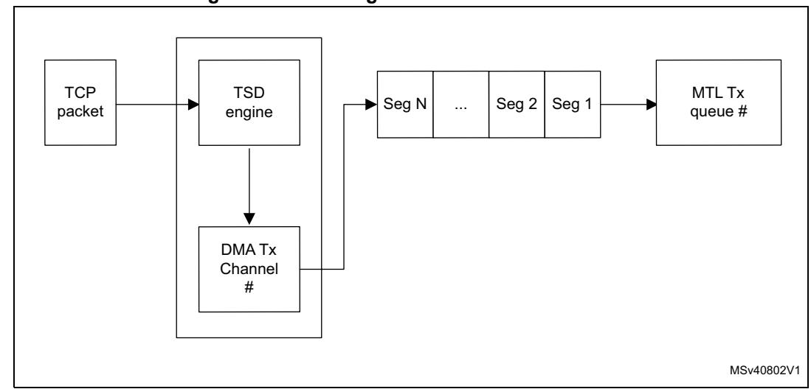

Figure 834. TCP segmentation offload overview

## **DMA** operation with TSO feature

Figure 835 shows the TSO flow.

<span id="page-61-0"></span>(Receive TSO packet) Read header Update header fields (if required) Forward the header to the MTL Header complete? Read payload Forward the payload to the MTL Payload length = MSS? Yes Segmentation Complete Payload remaining2 No Read the next packet

Figure 835. TCP segmentation offload flow

For the TSO feature, the Tx DMA operation is as follows:

- The application sets up the Transmit descriptor (TDES0-TDES3) and sets the Own bit (TDES3[31]) after setting up the corresponding data buffer(s) with Ethernet packet data.
- 2. The application increases the offset value of the Descriptor tail pointer of the DMA Tx channel.
- 3. While in the Run state, the DMA fetches the next available descriptor and performs one of the following actions:
  - If the descriptor is a context descriptor and the context is not between the first and last descriptors of a packet, the DMA stores the context values.

- If the descriptor is a context descriptor and the context is between the first and last descriptors of a packet, the DMA closes the context descriptor indicating a Context Descriptor Error (TDES3[23]) and fetches the next descriptor.
- If the descriptor is a normal descriptor, the DMA checks the TSE bit. If the TSE bit is not set, the DMA continues with the default mode of operation or OSF operation (if enabled).
- 4. The DMA calculates the number of segments from the TCP payload length (TDES3[17:0]) and the MSS value.
- 5. The DMA goes through channel arbitration to fetch the data buffers. The DMA fetches the header and payload separately.
- 6. For the first segment, the DMA fetches the header from the system memory and stores it in the TSO memory (if present and when the length of header is not greater than the TSO memory size). If the current segmented packet is not the first segment, it fetches again the header buffer in system memory, as done for the first segment. In such cases, the DMA does not close the first descriptor containing the header buffer until the header for last segment is fetched.
- 7. The required fields in the header bytes are modified/updated as per the segmentation requirements and written into the corresponding MTL Tx queue.
- 8. The DMA then takes the payload buffer pointer, fetches the MSS number of payload bytes from the system memory, and directly pushes it into the MTL Tx queue. If the buffer(s) in the descriptor do(es) not have enough data for the MSS payload (except for the last segment), the DMA closes this descriptor.
- 9. The DMA jumps to Step 3 and repeats the process until the last segment is written into the Tx queue.
- 10. The DMA closes the last descriptor and the first descriptor (containing the header buffer when it is not stored in TSO memory), and then moves on to the next packet transfer.

The DMA repeats all these steps if more descriptors are available. When no more descriptor are available, the DMA enters the suspend state.

*Note: The TSO engine determines whether to perform TSO or USO operation based on the THL field (TCP Header Length) in TDES3 of first Normal Tx descriptor for the packet. The value of 2 indicates USO and any value greater than or equal to 5 indicates TSO.*


# **TCP/IP header fields**

While segmenting a TCP packet, the DMA automatically updates the TCP/IP header fields. *[Table 567](#page-63-0)* describes how the TCP and IP headers are updated.

**Table 567. TSO: TCP and IP header fields** 

<span id="page-63-0"></span>

| Packet sequence    | TCP header                                                                                                                                                                                                                                                         | IP header                                                                                                                                                                                                                                                                                                                              |
|--------------------|--------------------------------------------------------------------------------------------------------------------------------------------------------------------------------------------------------------------------------------------------------------------|----------------------------------------------------------------------------------------------------------------------------------------------------------------------------------------------------------------------------------------------------------------------------------------------------------------------------------------|
| First packet       | 1.<br>The sequence number is not<br>updated. The value provided<br>in the header is used.<br>2.<br>If set, the FIN and PSH flags<br>are cleared.<br>3.<br>The TCP checksum is<br>calculated again.                                                                 | IPv4 Header<br>– Total Length = MSS + TCP<br>Header Length + IP Header<br>Length<br>– Identification field is not modified.<br>It is sent as per the header<br>provided by the software.<br>– IPv4 Header Checksum is<br>recalculated.<br>IPv6 Header<br>– Payload Length = MSS + TCP<br>Header Length + IP Extension<br>Header Length |
| Subsequent packets | 1.<br>The sequence number is<br>updated. The MSS value is<br>added to the sequence<br>number value of previous<br>segment.<br>2.<br>If set, the FIN and PSH flags<br>are cleared.<br>3.<br>The TCP checksum is<br>calculated again.                                | IPv4 Header<br>– Total Length = MSS + TCP<br>Header Length + IP Header<br>Length<br>– Identification field = Previous<br>Identification Field + 1<br>– IPv4 Header Checksum is<br>recalculated<br>IPv6 Header<br>– Payload Length = MSS + TCP<br>Header Length + IP Extension<br>Header Length                                         |
| Last packet        | 1.<br>The sequence number is<br>updated. The MSS value is<br>added to the sequence<br>number value of previous<br>segment.<br>2.<br>If FIN and PSH flags were set<br>in original header, these flags<br>are set.<br>3.<br>The TCP checksum is<br>calculated again. | IPv4 Header<br>– Total Length = Remaining<br>Payload + TCP Header Length +<br>IP Header Length<br>– Identification Field = Previous<br>Identification Field + 1<br>– IPv4 header Checksum is<br>recalculated<br>IPv6 Header<br>– Payload Length = Remaining<br>Payload Length + TCP Header<br>Length + IP Extension Header<br>Length   |


# **Header and payload fields of segmented packets**

After segmentation, the split packets use the same header as the parent TCP packet for header fields other than the ones described in *[Table 567: TSO: TCP and IP header fields](#page-63-0)*. *[Figure 836: Header and payload fields of segmented packets](#page-64-0)* shows how same header is used for the header fields of segmented packets.

The application must create the header in Buffer 1 of the first descriptor of the packet to be segmented and provide the header length in TDES2 of the first descriptor (FD = 1). When the FD bit is set, the DMA reads the header from the header buffer to which the TDES0 is pointing. Buffer 2 of the first descriptor can be used for payload and TDES0 and TDES1 of subsequent descriptors. For subsequent descriptors (FD = 0), the address to which the TDES0 and TDES1 are pointing is treated as payload buffer address of the same packet.

<span id="page-64-0"></span>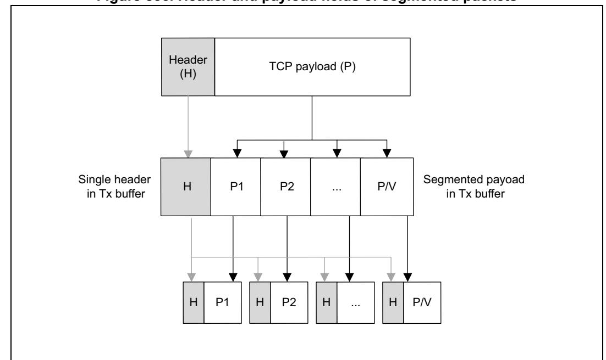

**Figure 836. Header and payload fields of segmented packets**

# **Context descriptor sequence**

The context descriptor can provide the maximum segment size (MSS) value for segmentation. The application must provide the context descriptor before the normal descriptor to be used for the corresponding TCP packet. If the application needs to provide a new MSS, it must create the context descriptor in the descriptor list before the first normal descriptor of the packet to be segmented with the new MSS value. The MSS value in the context descriptor is valid only if the TCMSSV bit of TDES3 in context descriptor is set and the OSTC bit is reset (refer to *[Section 61.10.3: Transmit descriptor](#page-118-0)*).

When the application provides a context descriptor with a valid MSS value, the DMA internally stores the MSS value and uses this value for all subsequent packets for which the TSO is enabled through the TSE bit of TDES3 normal descriptor.


MSv40803V1

If the application places a context descriptor in the middle of a packet (between the first and last descriptors of a packet), the DMA does the following:

- 1. The DMA ignores the context and closes the descriptor.
- 2. The DMA indicates the error in descriptor status.
- 3. The DMA generates an interrupt if the CDEE bit is set in the Interrupt enable register corresponding to a DMA channel (see *[Channel interrupt enable register](#page-156-1)  [\(ETH\\_DMACIER\)](#page-156-1)*).

The application can read the interrupt status through CDE bit of Status register corresponding to a DMA channel (see *[Channel status register \(ETH\\_DMACSR\)](#page-162-0)*).

# **Building the Descriptor and the packet for the TSO feature**

To enable segmentation for a packet, the application must set the TSE bit of TDES3 of first normal descriptor (see *[Section 61.10.3: Transmit descriptor](#page-118-0)*). If the TSE bit is set in TDES3 for a non TCP/IP packet, the DMA behavior is unpredictable.

The application must program the length of the TCP packet payload in TDES3[17:0] and the TCP header in TDES3[22:19]. The maximum length of TCP packet payload that can be segmented is 256 Kbytes.

The header of the packet including Ethernet header, L3 header and L4 header should be provided in Buffer1 of the first normal descriptor of the TSO packet. Only buffer 1 of the first normal descriptor of a packet enabled for TSO is taken as the buffer containing the header.

The TCP payload can begin from buffer 2 of the first normal descriptor and continue to buffer1 and buffer 2 of second normal descriptor and subsequent descriptors.

The TCP payload may span across multiple buffers and multiple descriptors. The size of buffers containing the TCP payload should add up to be equal to the TCP payload length provided in TDES3[17:0] of the first normal descriptor.

The MAC always calculates and appends CRC and inserts Padding (if required) for all packets segmented by the DMA. If the TSE bit of TDES3 is enabled, the CRC PAD Control (CPC) field of TDES3 is reserved. To determine the size of a TCP packet after segmentation, the DMA uses the Maximum Segment Size (MSS) provided by the application through context descriptor. The DMA segments only those packets which have payload size greater than MSS. The application must provide the MSS by either programming the MSS value in ETH\_DMACCR (see *[Channel control register \(ETH\\_DMACCR\)](#page-147-0)*) or by providing a context descriptor. The DMA uses the last programmed value of MSS or the last MSS value provided through context (whichever is provided later).

The header length plus the MSS size (which is equal to the size of each TCP segment) should not exceed 16383 bytes otherwise the MAC transmitter truncates the packet after 16383 bytes causing a CRC error.

The header length plus MSS size plus programmed PBL value in ETH\_DMACTXCR register (see *[Channel transmit control register \(ETH\\_DMACTXCR\)](#page-148-0)*) should be lesser than the Tx queue size programmed in TQS field of ETH\_MTLTXQOMR register (see *[Tx queue operat](#page-170-0)[ing mode Register \(ETH\\_MTLTXQOMR\)](#page-170-0)*). A MSS plus header equal to half the programmed Tx queue size is recommended.

The DMA also supports segmentation of VLAN-tagged TCP/IP frames. If the TCP packet has a VLAN tag, then the same tag is used for all the segments irrespective of the VLAN tag type provided (C-VLAN or S-VLAN). The VLAN tag insert/replace control bits are used for all segments.


If the Double VLAN feature is selected, then the DMA passes both tags for all segments irrespective of the VLAN tag types provided (C-VLAN or S-VLAN). The VLAN tag Insert/Replace control bits for both tags is applicable to all segments. If the Double VLAN feature is not selected, then the application must not set the TSE bit in TDES3 for a TCP/IP packet with two tags. The DMA behavior in this scenario is unpredictable.

If the TSE bit is set in TDES3 for the packet and TCP header length provided is less than 5 (meaning this is an invalid TCP header because it is less than 20 bytes), the DMA does not perform segmentation, instead it transmits the entire packet as a single packet. In this scenario, the CRC pad control bits are forced by DMA to 00 (MAC does CRC and padding) and checksum insertion control bits are forced to 11 (hardware does the checksum calculation for both header and payload).

# **61.5.7 IPv4 ARP offload**

The MAC supports the Address Recognition Protocol (ARP) Offload for IPv4 packets. This feature allows to process the IPv4 ARP request packet in the receive path and to generate the corresponding ARP response packet in the transmit path.

The MAC generates the ARP reply packets for appropriate ARP request packets**.** ARP packets for IPv4 are L2 layer packets with Length/Type of 0x0806.

The ARP offloading sequence is as follows:

- 1. The MAC receiver gets an ARP request if the request Target Protocol Address matches the IPv4 address programmed in the MAC L3 register.
- 2. The MAC generates an ARP reply packet.
- 3. The MAC copies the Sender Hardware Address field in the ARP request to the following fields:
  - DA field of the Ethernet packet header
  - Target Hardware Address field of the ARP reply packet
- 4. The MAC copies the Sender Protocol Address field in the ARP request to the Target Protocol Address field in the ARP reply packet.
- 5. The MAC places its MAC address in the following fields:
  - SA field of the Ethernet packet header
  - Sender Hardware Address field of the ARP reply packet
- 6. The MAC copies the Target Protocol Address field in the ARP request to the Sender Protocol Address field in the ARP reply packet.
- 7. The MAC sets the opcode field in ARP reply packet to 2 indicating ARP reply.
- 8. The MAC recalculates the CRC and performs padding for the generated ARP reply packet.
- 9. The MAC transmitter sends the ARP reply

The MAC processes only one ARP request at a time. It does not store the fields of multiple ARP requests. If the MAC receives an ARP request when it is already processing an earlier ARP request, the MAC does not generate the ARP reply for new ARP request. The MAC forwards the new ARP request packet to the application with ARP Reply Not Generated status bit set (bit 34). However, in power-down mode, if the MAC receives an ARP request when it is already processing an earlier ARP request, the MAC drops the new ARP request. If the Disable CRC check (DCRCC) bit of the *[Extended operating mode configuration](#page-186-0)  [register \(ETH\\_MACECR\)](#page-186-0)* is set, then the MAC does not check for valid CRC of a ARP


RM0399 Rev 4 2997/3556

request packet. It can generate an ARP response packet if the other conditions are valid. The ARP request packet must always have a valid CRC.

*Note: When the received ARP request is less than the 64-byte packet length, the MAC does not send an ARP response. It is treated as a normal packet and forwarded to the application based on the MAC filter settings.*

# **61.5.8 Loopback**

The MAC supports loopback of transmitted packets to its receiver.

# **Guidelines for using Loopback mode**

Below some guidelines for using the Loopback mode:

- Enable loopback only with the Full-duplex mode. In Half-duplex mode, the carrier sense signal or collision signal inputs get sampled which may result into issues such as packet dropping.
- If the Loopback mode is enabled without connecting a PHY chip, externally generate the Tx and Rx clocks and provide these clocks to the MAC.
- Do not loop back big packets since they may get corrupted in the loopback FIFO.

The Transmit and Receive clocks can have an asynchronous timing relationship. Therefore, an asynchronous FIFO is used to make the loopback path of the transmitted data to the Receive path. The FIFO is free-running to write on the write clock (eth\_mii\_tx\_clk) and read on every read clock (eth\_mii\_rx\_clk). At the start of each packet read from the FIFO, the write and read pointers are reinitialized to have an offset of four (in 10/100 Mbps mode). This avoids overflow or underflow during a packet transfer, and ensures that the overflow or underflow occurs only during the IPG period between the packets. The FIFO depth of five or nine is sufficient to prevent data corruption for packet sizes up to 9,022 bytes with a difference of 200 ppm between MII Transmit and Receive clock frequencies.

Therefore, bigger packets should not be looped back because they may get corrupted in this loopback FIFO.

At the end of every received packet, the Receive Protocol Engine module generates received packet status and sends it to the Receive Packet Controller module. The control, missed packet, and filter fail status are added to the Receive status in the Receive Packet Controller module. The MAC does not process ARP or PMT packets that are looped back.

### **Enabling Loopback mode**

To enable this feature, program the LM bit of the *[Operating mode configuration register](#page-181-0)  [\(ETH\\_MACCR\)](#page-181-0)*. Loopback can be enabled for all PHY interfaces. The data is always looped back through internal asynchronous FIFO on to the internal Receive MII interface, irrespective of which PHY interface is selected.

The loopback data is also passed through the corresponding transmit PHY interface block, onto the Ethernet line.

*Note: During loopback, the data/packet is reflected on mii\_txd signal.*

*Preemption is not supported in Loopback mode.*


# **61.5.9 Flow control**

The transmit flow control involves transmitting Pause packets in Full-duplex mode and backpressure in Half-duplex mode to control the flow of packets from the remote end. This section describes the flow control for transmit and receive paths.

### **Flow control in Full-duplex mode**

In Full-duplex mode, the MAC uses IEEE 802.3x Pause packets for flow control. *[Table 568](#page-68-0)* describes the fields of a Pause packet.

<span id="page-68-0"></span>

| Field              | Description                                                                                            |  |  |
|--------------------|--------------------------------------------------------------------------------------------------------|--|--|
| DA                 | Contains the special multicast address                                                                 |  |  |
| SA                 | Contains the MAC address 0                                                                             |  |  |
| Type               | Contains 8808                                                                                          |  |  |
| MAC Control opcode | Contains 0001 for IEEE 802.3x Pause Control packets                                                    |  |  |
| PT                 | Contains Pause time specified in the PT field of the Tx Queue flow control<br>register (ETH_MACQTXFCR) |  |  |

**Table 568. Pause packet fields**

When the FCB bit is set, the MAC generates and transmits a single Pause packet. If the FCB bit is set again after the Pause packet transmission is complete, the MAC sends another Pause packet irrespective of whether the pause time is complete or not. To extend the pause or terminate the pause prior to the time specified in the previously-transmitted Pause packet, the application should program the Pause Time register with appropriate value and then again set the FCB bit.

## **Flow control in Half-duplex mode**

In Half-duplex mode, the MAC uses the deferral mechanism for the flow control (backpressure). When the application requests to stop receiving packets, the MAC sends a JAM pattern of 32 bytes when it senses a packet reception, provided the transmit flow control is enabled. This results in a collision and the remote station backs off. If the application requests a packet to be transmitted, it is scheduled and transmitted even when the backpressure is activated. If the backpressure is kept activated for a long time (and more than 16 consecutive collision events occur), the remote stations abort the transmission because of excessive collisions.

*[Table 569](#page-69-0)* describes the flow control in the Tx path based on the setting of the following bits:

- TFE bit of *[Tx Queue flow control register \(ETH\\_MACQTXFCR\)](#page-197-0)*
- DM bit of *[Operating mode configuration register \(ETH\\_MACCR\)](#page-181-0)*

Flow control is similar for all queues.


| Table 569. Tx MAC flow control |  |  |  |  |
|--------------------------------|--|--|--|--|
|--------------------------------|--|--|--|--|

<span id="page-69-0"></span>

| TFE | DM | Description                                                                                                        |  |
|-----|----|--------------------------------------------------------------------------------------------------------------------|--|
| 0   | X  | The MAC transmitter does not perform the flow control or<br>backpressure operation.                                |  |
| 1   | 0  | The MAC transmitter performs backpressure when Bit 0 of Tx<br>Queue flow control register (ETH_MACQTXFCR) is set.  |  |
| 1   | 1  | The MAC transmitter sends the Pause packet when Bit 0 of Tx<br>Queue flow control register (ETH_MACQTXFCR) is set. |  |

### **Transmit flow control**

The transmit flow control is enabled when TFE bit is set in *[Tx Queue flow control register](#page-197-0)  [\(ETH\\_MACQTXFCR\)](#page-197-0)*.

### **Flow control trigger**

The application can request the MAC to send a Pause packet or initiate back-pressure by setting the FCB bit in the corresponding *[Tx Queue flow control register \(ETH\\_MACQTX-](#page-197-0)[FCR\)](#page-197-0)*.

# **Receive flow control**

In the Receive path, the flow control is functional only in Full-duplex mode. If any Pause packet is received in Half-duplex mode, the packet is considered as a normal control packet.

### **Description of receive flow control**

*[Table 570](#page-69-1)* describes the flow control in the Rx path based on the setting of the following bits:

- RFE bit of *[Rx flow control register \(ETH\\_MACRXFCR\)](#page-199-0)*
- DM bit of *[Operating mode configuration register \(ETH\\_MACCR\)](#page-181-0)*

**Table 570. Rx MAC flow control**

<span id="page-69-1"></span>

| RFE | DM | Description                                                                                                              |  |  |
|-----|----|--------------------------------------------------------------------------------------------------------------------------|--|--|
| 0   | x  | The MAC receiver does not detect the received Pause packets.                                                             |  |  |
| 1   | 0  | The MAC receiver does not detect the received Pause packets but recognizes<br>such packets as Control packets.           |  |  |
| 1   | 1  | The MAC receiver detects or processes the Pause packets and responds to such<br>packets by stopping the MAC transmitter. |  |  |

The following sequence describes the Rx flow control:

- 1. The MAC checks the destination address (DA) of the received Pause packet for either of the following:
  - Multicast destination address: the DA matches the unique multicast address specified for the control packet (0x0180 C200 0001).
  - Unicast destination address: the DA matches the content of the MAC Address 0 registers (*[MAC Address 0 high register \(ETH\\_MACA0HR\)](#page-222-0)* and *[MAC Address x](#page-223-0)*


*[low register \(ETH\\_MACAxLR\)](#page-223-0)*) and the UP bit of *[Rx flow control register](#page-199-0)  [\(ETH\\_MACRXFCR\)](#page-199-0)* is set.

If the UP bit is set, the MAC processes Pause packets with unicast destination address in addition to the unique multicast address.

- 2. The MAC decodes the following fields of the received packet:
  - Type field: this field is checked for 0x8808.
  - Opcode field: this field is checked for 0x0001 (Pause packet).
  - Pause time: the Pause time (for Pause packet) is captured to determine the time for which the transmitter needs to be blocked.
- 3. If the byte count of the status indicates 64 bytes and there is no CRC error, the MAC transmitter pauses the transmission of any data packet for the duration of the decoded Pause Time value multiplied by the slot time (64 byte times).

If subsequent Pause packets are received before the earlier Pause Time expires, the MAC updates the Pause Timer with new value.

## **Enabling receive flow control**

Set the RFE bit in the *[Rx flow control register \(ETH\\_MACRXFCR\)](#page-199-0)* to enable the Pause flow control.


RM0399 Rev 4 3001/3556

# **61.5.10 MAC management counters**

The peripheral supports storing the statistics about the received and transmitted packets in registers that are accessible through the application.

The counters in the MAC management counters (MMC) module can be viewed as an extension of the register address space of the CSR module. The MMC module maintains a set of registers for gathering statistics on the received and transmitted packets. The register set includes a control register for controlling the behavior of the registers, two 32-bit registers containing interrupts generated (receive and transmit), and two 32-bit registers containing masks for the Interrupt register (receive and transmit). These registers are accessible from the Application through the AHB slave interface in the same way the CSR registers are accessed. The organization of these registers is shown in *[Section 61.11.4:](#page-181-1)  [Ethernet MAC and MMC registers](#page-181-1)*.

The MMC counters are free running. There is no separate enable for the counters to start. A particular MMC counter starts counting when corresponding packet is received or transmitted.

The Receive MMC counters are updated for packets that are passed by the Address Filter (AFM) block. The statistics of packets dropped by the AFM module, are not updated unless they are runt packets of less than 6 bytes (DA bytes are not received fully). To get statistics of all packets, set bit 0 in the *[Packet filtering control register \(ETH\\_MACPFR\)](#page-187-0)*. The MMC module gathers statistics on encapsulated IPv4, IPv6, TCP, UDP, or ICMP payloads in received Ethernet packets.

In addition to control registers, two sets of registers are implemented:

- Six registers used for collision, error, and good packet counters:
  - *[Tx single collision good packets register](#page-231-0)  [\(ETH\\_TX\\_SINGLE\\_COLLISION\\_GOOD\\_PACKETS\)](#page-231-0)*
  - *[Tx multiple collision good packets register](#page-231-1)  [\(ETH\\_TX\\_MULTIPLE\\_COLLISION\\_GOOD\\_PACKETS\)](#page-231-1)*
  - *[Tx packet count good register \(ETH\\_TX\\_PACKET\\_COUNT\\_GOOD\)](#page-232-0)*
  - *[Rx CRC error packets register \(ETH\\_RX\\_CRC\\_ERROR\\_PACKETS\)](#page-232-1)*
  - *[Rx alignment error packets register \(ETH\\_RX\\_ALIGNMENT\\_ERROR\\_PACKETS\)](#page-232-2)*
  - *[Rx unicast packets good register \(ETH\\_RX\\_UNICAST\\_PACKETS\\_GOOD\)](#page-233-0)*
- Four registers to record LPI mode transition:
  - *[Tx LPI microsecond timer register \(ETH\\_TX\\_LPI\\_USEC\\_CNTR\)](#page-233-1)*
  - *[Tx LPI transition counter register \(ETH\\_TX\\_LPI\\_TRAN\\_CNTR\)](#page-234-0)*
  - *[Rx LPI microsecond counter register \(ETH\\_RX\\_LPI\\_USEC\\_CNTR\)](#page-234-1)*
  - *[Rx LPI transition counter register \(ETH\\_RX\\_LPI\\_TRAN\\_CNTR\)](#page-234-2)*


# **Definitions**

The following terminology is used in MMC register descriptions:

- Transmitted packets are considered "good" if transmitted successfully. In other words, a transmitted packet is good if the packets transmission is not aborted because of any of the following errors:
  - Jabber timeout
  - No carrier or loss of carrier
  - Late collision
  - Packet underflow
  - Excessive deferral
  - Excessive collision
- Received packets are considered "good" if none of the following errors exists:
  - CRC error
  - Runt packet (shorter than 64 bytes)
  - Alignment error (in 10/100 Mbps only)
  - Length error (non-Type packet only)
  - Out of range (non-Type packet only, longer than 1518 bytes)
- The maximum transmit frame size depends on the frame type, as follows:
  - Untagged frame maxsize = 1,518
  - VLAN frame maxsize = 1,522
  - Jumbo frame maxsize = 9,018
  - JumboVLAN frame maxsize = 9,022
- The maximum receive packet size depends on the packet type and control bits (JE, S2KP, GPSLCE and EDVLP), as shown in the *[Table 571](#page-72-0)*.

**Table 571. Size of the maximum receive packet** 

<span id="page-72-0"></span>

| JE | S2KP | GPSLCE | EDVLP | Untagged<br>frame<br>maximum<br>size in bytes | Single VLAN<br>frame<br>maximum<br>size in bytes | Double VLAN<br>Frame maximum<br>size in bytes |
|----|------|--------|-------|-----------------------------------------------|--------------------------------------------------|-----------------------------------------------|
| 1  | X    | X      | 1     | 9018                                          | 9022                                             | 9026                                          |
| 0  | 1    | X      | X     | 2000                                          | 2000                                             | 2000                                          |
| 0  | 0    | 1      | 1     | GPSL                                          | GPSL+4                                           | GPSL+8                                        |
| 0  | 0    | 0      | 1     | 1518                                          | 1522                                             | 1526                                          |
| 1  | X    | X      | 0     | 9018                                          | 9022                                             | 9022                                          |
| 0  | 0    | 1      | 0     | GPSL                                          | GPSL+4                                           | GPSL+4                                        |
| 0  | 0    | 0      | 0     | 1518                                          | 1522                                             | 1522                                          |


# **61.5.11 Interrupts generated by the MAC**

Interrupts can be generated from the MAC as a result of various events. These interrupt events are combined with the events in the DMA on the eth\_sbd\_intr\_it signal. The MAC interrupts are of level type, that is, the interrupt remains asserted (high) until it is cleared by the application or software.

The *[Interrupt status register \(ETH\\_MACISR\)](#page-200-0)* describes the events that can cause an interrupt from the MAC. The MAC interrupts are enabled by default. Each event can be prevented from asserting the interrupt on the eth\_sbd\_intr\_it signals by setting the corresponding mask bits in the *[Interrupt enable register \(ETH\\_MACIER\)](#page-202-0)*.

The interrupt register bits only indicate the block from which the event is reported. You must read the corresponding status registers and other registers to clear the interrupt.

# **61.5.12 MAC and MMC register descriptions**

Refer to *[Section 61.11.4: Ethernet MAC and MMC registers](#page-181-1)*.


# **61.6 Ethernet functional description: PHY interfaces**

The Ethernet peripheral support several PHY interfaces. The root interface is the MII one. All other interfaces are derived from it as shown in *[Figure 837](#page-74-0)*.

<span id="page-74-0"></span>MSv40804V2 MAC Tx MAC PHY I/F MAC Rx RMII Select MII

**Figure 837. Supported PHY interfaces** 

This section describes the SMA module used for PHY control and different PHY interfaces. It contains the following sections:

- *[Station management agent \(SMA\)](#page-74-1)*
- *[Media independent interface \(MII\)](#page-81-0)*
- *[Reduced media independent interface \(RMII\)](#page-82-0)*

# <span id="page-74-1"></span>**61.6.1 Station management agent (SMA)**

The application can access the PHY registers through the station management agent (SMA) module. The SMA includes a two-wire station management interface (MIM).

The SMA module supports accessing up to 32 PHYs. The application can address one of the 32 registers from any 32 PHYs. Only one register in one PHY can be addressed at a time. The application sends the control data to the PHY and receives status information from the PHY through the SMA module, as shown in *[Figure 838](#page-74-2)*.

<span id="page-74-2"></span>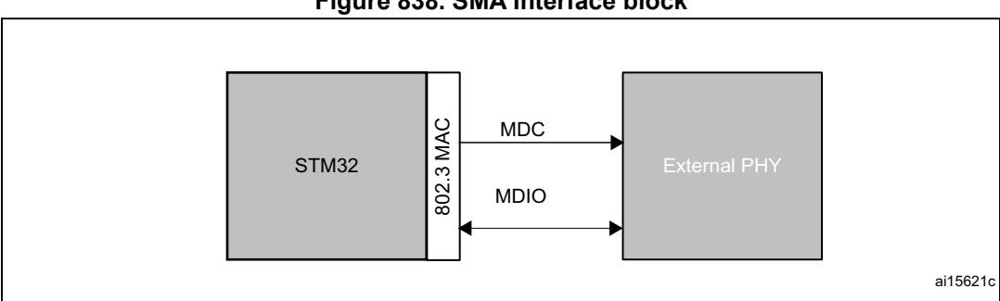

**Figure 838. SMA Interface block**

# **SMA functional overview**

The MAC initiates the management write or read operation with respect to the MDC clock. The MDC clock is derived from the CSR clock (eth\_hclk). The maximum operating frequency of the ETH\_MDC pin is 2.5 MHz, as specified in IEEE 802.3 specifications. However, a different divider can be selected if the system supports higher clock frequencies. The division factor depends on the clock range setting through CR[3:0] in the *[MDIO address](#page-219-0)  [register \(ETH\\_MACMDIOAR\)](#page-219-0)* register. The MDC clock is selected as follows:

**Table 572. MCD clock selection** 

| Selection  | MDC clock    |
|------------|--------------|
| 0000       | eth_hclk/42  |
| 0001       | eth_hclk/62  |
| 0010       | eth_hclk/16  |
| 0011       | eth_hclk/26  |
| 0100       | eth_hclk/102 |
| 0101       | eth_hclk/124 |
| 0110, 0111 | -            |

The data exchange between the MAC and the PHY is performed through a three-state buffer and brought out as ETH\_MDIO line connected to the PHY.

*[Figure 839](#page-75-0)* shows the structure of a Clause 45 MDIO packet, while *[Table 573](#page-76-0)* provides a detailed description of the packet fields.

**Figure 839. MDIO packet structure (Clause 45)**

<span id="page-75-0"></span>

| IDLE | PREAMBLE | START |  | OPCODE PHY ADDR | DEV TYPE | TA | ADDR/<br>DATA |
|------|----------|-------|--|-----------------|----------|----|---------------|
|------|----------|-------|--|-----------------|----------|----|---------------|

**Table 573. MDIO Clause 45 frame structure** 

<span id="page-76-0"></span>

| Field    | Description                                                                                                                                                                                                                                                                                                                                                                                                                                                                                                                                                                                                                   |
|----------|-------------------------------------------------------------------------------------------------------------------------------------------------------------------------------------------------------------------------------------------------------------------------------------------------------------------------------------------------------------------------------------------------------------------------------------------------------------------------------------------------------------------------------------------------------------------------------------------------------------------------------|
| IDLE     | The ETH_MDIO line is three-state; there is no clock on ETH_MDC.                                                                                                                                                                                                                                                                                                                                                                                                                                                                                                                                                               |
| PREAMBLE | 32 continuous bits of value 1                                                                                                                                                                                                                                                                                                                                                                                                                                                                                                                                                                                                 |
| START    | Start of packet is 0b00                                                                                                                                                                                                                                                                                                                                                                                                                                                                                                                                                                                                       |
| OPCODE   | – 0b00: Address<br>– 0b01: Write<br>– 0b10: Read+ Address<br>– 0b11: Read                                                                                                                                                                                                                                                                                                                                                                                                                                                                                                                                                     |
| PHY ADDR | 5-bit address select for one of 32 PHYs                                                                                                                                                                                                                                                                                                                                                                                                                                                                                                                                                                                       |
| DEV TYPE | 5-bit device type                                                                                                                                                                                                                                                                                                                                                                                                                                                                                                                                                                                                             |
| TA       | Turnaround<br>– 0bZ0: Read and post-read increment address<br>– 0b10: Write and address MDIO accesses<br>where Z is the tri-state level                                                                                                                                                                                                                                                                                                                                                                                                                                                                                       |
| DATA     | 16-bit value: for an address cycle (OPCODE = 0b00), this frame contains<br>the address of the register to be accessed on the next cycle. For the data<br>cycle of a write frame, this field contains the data to be written to the<br>register. For read or post-read increment address frames, this field<br>contains the contents of the register read from the PHY.<br>– In address and data write cycles, the peripheral drives the ETH_MDIO<br>line during the transfer of these 16 bits.<br>– In read and post-read increment address cycles, the PHY drives the<br>ETH_MDIO line during the transfer of these 16 bits. |

The frame structure for Clause 22 frames is also supported. The C45E bit in *[MDIO address](#page-219-0)  [register \(ETH\\_MACMDIOAR\)](#page-219-0)* can be programmed to enable Clause 22 or Clause 45 mode of operation. *[Figure 840](#page-76-1)* shows the structure of a Clause 22 MDIO packet, while *[Table 574](#page-77-0)* provides a detailed description of the packet fields.

**Figure 840. MDIO packet structure (Clause 22)**

<span id="page-76-1"></span>

| IDLE<br>PREAMBLE | START | OPCODE PHY ADDR | REG ADDR | TA | DATA |
|------------------|-------|-----------------|----------|----|------|


**Table 574. MDIO Clause 22 frame structure** 

<span id="page-77-0"></span>

| Field    | Description                                                                                                                             |
|----------|-----------------------------------------------------------------------------------------------------------------------------------------|
| IDLE     | The ETH_MDIO line is three-state; there is no clock on ETH_MDC.                                                                         |
| PREAMBLE | 32 continuous bits of value 1                                                                                                           |
| START    | Start of packet is 0b01                                                                                                                 |
| OPCODE   | 0b10 for Read and 0b01 for Write                                                                                                        |
| PHY ADDR | 5-bit address select for one of 32 PHYs                                                                                                 |
| REG ADDR | Register address in the selected PHY                                                                                                    |
| TA       | Turnaround<br>– 0bZ0: Read and post-read increment address<br>– 0b10: Write and address MDIO accesses<br>where Z is the tri-state level |
| DATA     | Any 16-bit value. In a Write operation, the MAC drives ETH_MDIO. In a<br>Read operation, the PHY drives it.                             |

In addition to normal read and write operations, the SMA also supports post-read increment address while operating in Clause 45 mode.

# **MII management write operations**

After the station management agent receives the PHY address and the write data from the MAC CSR module, the SMA starts a write operation to the PHY registers.

*[Figure 841](#page-78-0)* illustrates the flow for a write operation from the SMA module to the PHY registers.


<span id="page-78-0"></span>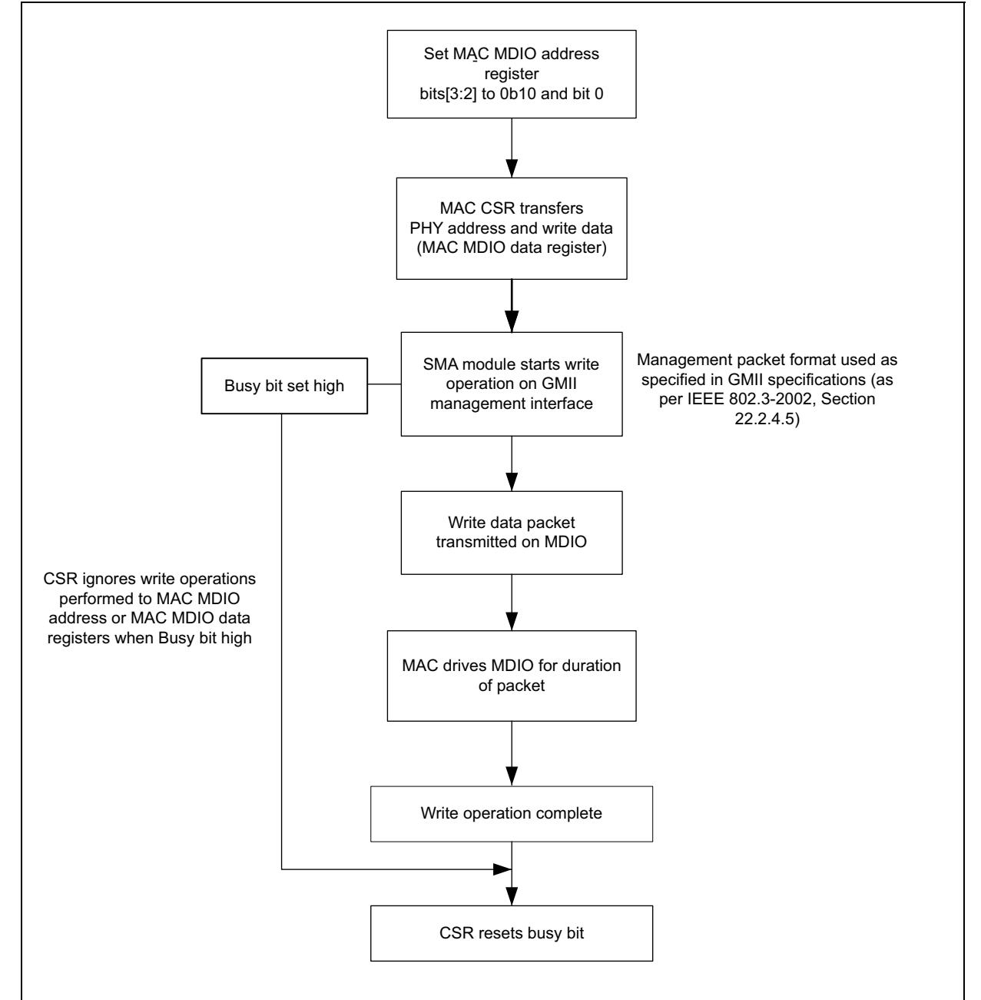

**Figure 841. SMA write operation flow**

When bits[3:2] are set to 01 and bit 0 to 1 in the *[MDIO address register](#page-219-0)  [\(ETH\\_MACMDIOAR\)](#page-219-0)*, the MAC CSR module transfers the PHY address, the register address in PHY, and the write data (*[MDIO data register \(ETH\\_MACMDIODR\)](#page-221-0)*) to the SMA to initiate a Write operation into the PHY registers. At this point, the SMA module starts a Write operation on the MII management Interface using the management packet format specified in the MII specifications (as per IEEE 802.3-2002 specifications, *Section 22.2.4.5*).

When the SMA module starts a Write operation, the write data packet is transmitted on the MDIO line. The MAC drives the MDIO line for complete duration of the packet. The Busy bit is set high until the write operation is complete. The CSR ignores the Write operations performed to the *[MDIO address register \(ETH\\_MACMDIOAR\)](#page-219-0)* or the *[MDIO data register](#page-221-0)* 


RM0399 Rev 4 3009/3556

MSv40807V1

*[\(ETH\\_MACMDIODR\)](#page-221-0)* during this period (the Busy bit is high). When the Write operation is complete, the SMA module indicates this to the CSR, and the CSR resets the Busy bit. The packet format for the Write operation is as follows:

**Figure 842. Write data packet**

| IDLE | PREAMBLE |    |    | START OPCODE PHY ADDR REG ADDR |       | TA | DATA   | IDLE |
|------|----------|----|----|--------------------------------|-------|----|--------|------|
| Z    | 111111   | 01 | 01 | AAAAA                          | RRRRR | 10 | DDDDDD | Z    |

# **MII management read operation**

When bits[3:2] are set to 11 and bit 0 to 1 in the *[MDIO address register](#page-219-0)  [\(ETH\\_MACMDIOAR\)](#page-219-0)*, the MAC CSR module transfers the PHY address and the register address in PHY to the SMA to initiate a Read operation in the PHY registers. At this point, the SMA module starts a Read operation on the MII management interface using the management packet format specified in the MII specifications (as per IEEE 802.3-2002 specifications, *Section 22.2.4.5*).

When the SMA module starts a Read operation on the MDIO, the CSR ignores the Write operations to the *[MDIO address register \(ETH\\_MACMDIOAR\)](#page-219-0)* or *[MDIO data register](#page-221-0)  [\(ETH\\_MACMDIODR\)](#page-221-0)* register during this period (the Busy bit is high) and the transaction is completed without any error on the MCI interface. When the Read operation is complete, the SMA indicates this to the CSR. The CSR resets the Busy bit and updates the *[MDIO data](#page-221-0)  [register \(ETH\\_MACMDIODR\)](#page-221-0)* with the data read from the PHY. The MAC drives the MDIO line for the complete duration of the frame except during the Data fields when the PHY is driving the MDIO line. For more information about the communication from the application to the PHYs, see the Reconciliation Sublayer and Media Independent Interface Specifications sections of the IEEE 802.3z, 1000BASE Ethernet.

The packet format for the Read operation is as follows:

**Figure 843. Read data packet**

| IDLE | PREAMBLE |    |    | START OPCODE PHY ADDR REG ADDR |       | TA | DATA   | IDLE |
|------|----------|----|----|--------------------------------|-------|----|--------|------|
| Z    | 111111   | 01 | 10 | AAAAA                          | RRRRR | Z0 | DDDDDD | Z    |

MSv40808V1

# **Preamble suppression**

The IEEE standard specifies 32-bit preamble (all-ones) for the MDIO frames. The peripheral provides controls to support preamble suppression. It transmits MDIO frames with only 1 preamble bit. The preamble suppression can be enabled by setting the PSE bit in *[MDIO](#page-219-0)  [address register \(ETH\\_MACMDIOAR\)](#page-219-0)*.

### **Trailing clocks and back-to-back transactions**

The peripheral drives the ETH\_MDC clock for the duration of the MDIO frame. There is no clock driven during the idle period. The trailing clock feature can be used if the PHY needs the ETH\_MDC clock to be active for some cycles after the MDIO frame. The NTC[2:0] bitfield in *[MDIO address register \(ETH\\_MACMDIOAR\)](#page-219-0)* allows the programming of trailing clocks from 0 to 7.

The peripheral supports back-to-back transactions which allow starting the next MDIO frame even before the trailing clocks are complete for previous MDIO frame. This feature can be enabled by setting BTB bit in *[MDIO address register \(ETH\\_MACMDIOAR\)](#page-219-0)* when the trailing clock feature is also enabled. When back-to-back transactions are enabled, the GMII busy bit (GB) is cleared immediately after MDIO frame completion. This allows the software to issue the next command, which is executed by the peripheral while trailing clocks are still on for the previous MDIO frame. When (GB) transactions are not enabled, the GMII busy bit is cleared after the trailing clocks are complete for the MDIO frame.

# **Interrupt for MDIO transaction completion**

The peripheral can generate an interrupt on completion of MDIO read or write transactions. Therefore, the application need not poll the GMII busy bit of the *[MDIO address register](#page-219-0)  [\(ETH\\_MACMDIOAR\)](#page-219-0)* to know the completion of MDIO commands.


RM0399 Rev 4 3011/3556

# <span id="page-81-0"></span>**61.6.2 Media independent interface (MII)**

The media-independent interface (MII) defines the interconnection between the MAC sublayer and the PHY for data transfer at 10 Mbit/s and 100 Mbit/s.

MII signals are given in *[Figure 844: Media independent interface \(MII\) signals](#page-81-1)*.

<span id="page-81-1"></span>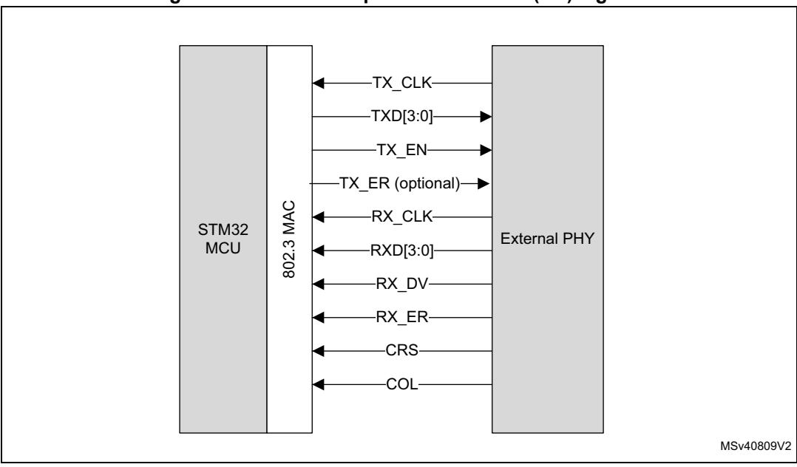

**Figure 844. Media independent interface (MII) signals**

- TX\_CLK: continuous clock that provides the timing reference for Tx data transfers. The nominal frequency is 2.5 MHz at 10 Mbit/s and 25 MHz at 100 Mbit/s.
- TXD[3:0]: transmit data.
  - TXD is a bundle of 4 data signals driven synchronously by the MAC sublayer and qualified (valid data) on the assertion of the TX\_EN signal. TXD[0] is the least significant bit, TXD[3] is the most significant bit. While TX\_EN is deasserted, the transmit data must have no effect upon the PHY.
- TX\_EN: transmission enable signal indicating that the MAC is presenting nibbles on the MII for transmission. It must be asserted synchronously (TX\_CLK) with the first nibble of the preamble and must remain asserted while all nibbles to be transmitted are presented to the MII.
- TX\_ER (optional): required only for Energy Efficient Ethernet (EEE). The transmit error is indicated by inverting the CRC. The remote station can detect the Transmit error through incorrect CRC.
- RX\_CLK: continuous clock that provides the timing reference for Rx data transfers. The nominal frequency is 2.5 MHz at 10 Mbit/s, 25 MHz at 100 Mbit/s.
- RXD[3:0]: receive data
  - RXD is a bundle of 4 data signals driven synchronously by the PHY and qualified (valid data) on the assertion of the RX\_DV signal. RXD[0] is the least significant bit, RXD[3] is


the most significant bit. While RX\_EN is deasserted and RX\_ER is asserted, a specific RXD[3:0] value is used to transfer specific information from the PHY.

• RX\_DV: receive data valid

This signal indicates that the PHY is presenting recovered and decoded nibbles on the MII for reception. It must be asserted synchronously (RX\_CLK) with the first recovered nibble of the frame and must remain asserted through the final recovered nibble. It must be deasserted prior to the first clock cycle that follows the final nibble. In order to receive the frame correctly, the RX\_DV signal must encompass the frame, starting no later than the SFD field.

• RX\_ER: receive error

This signal must be asserted for one or more clock periods (RX\_CLK) to indicate to the MAC sublayer that an error was detected somewhere in the frame. This error condition must be qualified by RX\_DV assertion.

• CRS: carrier sense.

This signal is asserted by the PHY when either the transmit or receive medium is non idle. It is deasserted by the PHY when both transmit and receive media are idle. The PHY must ensure that the CS signal remains asserted throughout the duration of a collision condition. This signal is not required to transition synchronously with respect to the Tx and Rx clocks. In Full-duplex mode the state of this signal is don't care for the MAC sublayer.

• COL: collision detection signal

This signal must be asserted by the PHY upon detection of a collision on the medium and must remain asserted while the collision condition persists. This signal is not required to transition synchronously with respect to the Tx and Rx clocks. In Full-duplex mode, the state of this signal is don't care for the MAC sublayer.

# <span id="page-82-0"></span>**61.6.3 Reduced media independent interface (RMII)**

The reduced media independent interface (RMII) specification reduces the pin count between Ethernet PHYs and STM32 MCU. According to the IEEE 802.3u, an MII contains 16 pins for data and control. RMII specification reduces the pin count to 7.

Part of the Ethernet peripheral, the RMII module is instantiated at the MAC output. This helps in translating the MII of the MAC into the RMII. The RMII block has the following characteristics:

- Supports 10 Mbps and 100 Mbps operating rates. It does not support the 1000 Mbps operation.
- Provides independent 2-bits wide Transmit and Receive paths by sourcing two clock references externally.


### **RMII block diagram**

*[Figure 845: RMII block diagram](#page-83-0)* shows the position of the RMII block relative to the MAC and RMII PHY. The RMII block is placed in front of the MAC to translate the MII signals to RMII signals.

<span id="page-83-0"></span>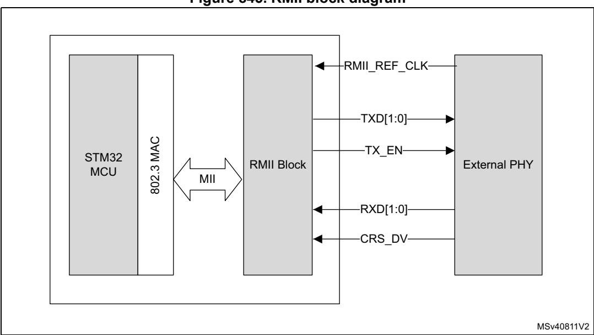

**Figure 845. RMII block diagram**

- RMII\_REF\_CLK: continuous 50 MHz reference clock input
- TXD[1:0]: transmit data
- TX\_EN: transmit data enable. When high, this bit indicates that valid data are being transmitted on TXD[1:0].
- RXD[1:0]: receive data
- CRS\_DV: carrier Sense (CRS) and RX\_Data Valid (RX\_DV) multiplexed on alternate clock cycles. In 10 Mbit/s mode, it alternates every 10 clock cycles.

# **Transmit bit order**

Each nibble from the MII interface must be transmitted on the RMII interface di-bit at a time with the order of di-bit transmission shown in *[Figure 846: Transmission bit order](#page-84-0)*. The lower order bits (D1 and D0) are transmitted first followed by higher order bits (D2 and D3).

<span id="page-84-0"></span>MSv40812V2 mii\_txd[3:0] D0 D1 D2 D3 LSB MSB Nibble stream D0 D1 LSB MSB Di-bit stream RMII\_TXD[1:0]

**Figure 846. Transmission bit order**

# **Receive bit order**

Each nibble is transmitted to the MII interface from the di-bit received from the RMII interface in the nibble transmission order shown in *[Figure 847: Receive bit order](#page-85-0)*. The lower order bits (D0 and D1) are received first, followed by the higher order bits (D2 and D3).

<span id="page-85-0"></span>MSv40813V2 LSB D0 MSB Nibble stream LSB MSB Di-bit stream D1 D2 D3 D0 D1 RMII\_RXD[1:0] mii\_rxd[3:0]

**Figure 847. Receive bit order**

# **61.7 Ethernet low-power modes**

# **61.7.1 Low-power management**

The Ethernet peripheral supports the following techniques to save power:

- Magic packet
- Remote wakeup

The magic packet and remove wakeup techniques are used to save power in the host system when it is in low-power mode, and has to be woken up only at the reception of specific packets from the Ethernet network. In low-power mode, the clocks on most of the host logic, along with the majority of the peripherals (except the MAC receiver logic), can be disabled. On receiving the specific packets from the network, the MAC generates the trigger to wake up the host system and come back to normal state. Refer to the power control (PWR) section of the reference manual for the list of the system operating modes that support Ethernet low-power modes.

The Energy Efficient Ethernet (EEE) mode is compliant with the IEEE 802.3az-2010 standard. It is primarily targeted to save power in the Ethernet port when there is no traffic on the line. In this mode, the host indicates to the far-end that it does not have any packets to transmit in the near future and puts the transmitter port (MAC controller, PCS and PHY layers) in low-power mode. Similarly, the receiver port can also be put in low-power mode when the far-end host indicates that it does not have any traffic to transfer. This allows significant saving of power in the Ethernet port (mainly in the PHY) with intermittent and bursty traffic profile. The triggering of entry and exit out of the EEE mode is controlled by the MAC and is supported within the peripheral.

Simultaneous operation of the EEE mode along with any or both the other power saving modes is also supported.

## **Description of magic packet mode**

This section describes how to save power through magic packet detection.

*Note: The magic packet feature is based on the magic packet technology white paper from Advanced Micro Device (AMD).*

> *The watchdog timeout limit for a magic packet is 2,048 bytes irrespective of the value programmed in WD bit in [Operating mode configuration register \(ETH\\_MACCR\)](#page-181-0) and PWE bit in [Watchdog timeout register \(ETH\\_MACWTR\)](#page-189-0).*

> In the magic-packet-based power saving mode, the reception of a valid magic packet by the MAC receiver triggers an exit from low-power mode. The MAC enters power saving mode when PWRDWN bit of *[PMT control status register \(ETH\\_MACPCSR\)](#page-204-0)* is programmed to 1. Exit from the magic-packet-based power saving mode is enabled by setting the MGKPKTEN bit of *[PMT control status register \(ETH\\_MACPCSR\)](#page-204-0)* to 1.

The magic packet contains a unique pattern at any offset after the Destination address, Source address, and Length/Type fields. In addition to the unique pattern matching, the MAC receiver also checks for the following, to detect the received packet as a valid magic packet:

• The packet must be addressed to it (Destination Address of the received packet should perfect match the *[MAC Address 0 high register \(ETH\\_MACA0HR\)](#page-222-0)* and *MAC Address 0 low register (ETH\_MACA0LR)*) or with multicast/broadcast address.


RM0399 Rev 4 3017/3556

- The packet must not have any length error, FCS error, dribble bit error, GMII error, and collision.
- The packet must not be runt (length including Ethernet header and FCS is at least 64 bytes).

### **Magic packet data format**

The content of the unique pattern in magic packets is described as follows:

- Six bytes of all-ones (0xFF FF FF FF FF FF) called synchronization stream. There can be more than six bytes of 0xFF, but only the last six are considered.
- The synchronization stream is immediately followed by 16 repetitions of the Destination address field of the packet (*[MAC Address 0 high register \(ETH\\_MACA0HR\)](#page-222-0)* and the *MAC Address 0 low register (ETH\_MACA0LR)*) or multicast/broadcast address.
- No break or interruption between synchronization stream and first repetition of Destination address field or within its 16 repetitions.

If the MAC address of a node is 0x00 11 22 33 44 55, the MAC scans for the following data sequence:

```
Destination Address Source Address Length/Type……………… FF FF FF FF FF FF
00 11 22 33 44 55 00 11 22 33 44 55 00 11 22 33 44 55 00 11 22 33 44 55
00 11 22 33 44 55 00 11 22 33 44 55 00 11 22 33 44 55 00 11 22 33 44 55
00 11 22 33 44 55 00 11 22 33 44 55 00 11 22 33 44 55 00 11 22 33 44 55
00 11 22 33 44 55 00 11 22 33 44 55 00 11 22 33 44 55 00 11 22 33 44 55
…CRC
```

### **Description of remote wakeup packet mode**

This section describes the power saving mode based on remote wakeup packet.

*Note: The remote wakeup packet feature implementation is based on the Device Class Power Management Reference Specification and various implementation-specific white papers.*

> *The watchdog timeout limit for a magic packet is 2,048 bytes irrespective of the value programmed in WD bit in [Operating mode configuration register \(ETH\\_MACCR\)](#page-181-0) and PWE bit in [Watchdog timeout register \(ETH\\_MACWTR\)](#page-189-0).*

> In the remote-wakeup-magic-packet-based power saving mode, the reception of expected remote wakeup packet by the MAC receiver triggers the exit from low-power mode. The MAC enters power saving mode when PWRDWN bit in *[PMT control status register](#page-204-0)  [\(ETH\\_MACPCSR\)](#page-204-0)* is programmed to 1. Exit from the remote-wakeup-magic-packet-based power saving mode is enabled by programming RWKPKTEN bit of *[PMT control status](#page-204-0)  [register \(ETH\\_MACPCSR\)](#page-204-0)* to 1.

The MAC implements a filter lookup table (programmed through *[Remote wakeup packet](#page-206-0)  [filter register \(ETH\\_MACRWKPFR\)](#page-206-0)* in which CRC, offset, and byte mask of the pattern embedded in remote wakeup packet and the filter operation commands are programmed.

The pattern embedded in the remote wakeup packet is located at any offset after the Destination address and Source address fields. In addition to the CRC match for the pattern, the MAC receiver also checks the following, to detect the received packet as a valid remote wakeup packet:

• The packet must be addressed to it (Destination Address of the received packet should perfect match the *[MAC Address 0 high register \(ETH\\_MACA0HR\)](#page-222-0)* and *MAC Address 0 low register (ETH\_MACA0LR)*) or with multicast/broadcast address.


- The packet must not have any length error, FCS error, dribble bit error, GMII error, and collision.
- The packet must not be runt (length including Ethernet header and FCS is at least 64 bytes).

When a valid remote wakeup packet is received, the MAC receiver sets the RWKPRCVD bit in *PMT control status register (ETH\_MACPCSR)* and triggers the interrupt on pmt\_intr\_o output port. The PMTIS bit in *Interrupt status register (ETH\_MACISR)* is set when powergating is not enabled in low-power mode. An interrupt is triggered to the application on the sbd\_intr\_o output port when interrupt is enabled (PMTIE bit in *Interrupt enable register (ETH\_MACIER)* is set) and CSR clock is not gated off in low-power mode.

### Remote wakeup packet filters

When the remote-wakeup-based power saving mode is enabled, four remote wakeup filters can be selected. The structure of the remote wakeup filters is shown in *Table 575: Remote wakeup packet filter register*.

<span id="page-88-0"></span>ETH MACRWKPFR Field value n Filter 0 byte mask 1 Filter 1 byte mask 2 Filter 2 byte mask 3 Filter 3 byte mask Filter 3 Filter 2 Filter 1 Filter 0 4 Reserved Reserved Reserved Reserved command command command command 5 Filter 3 offset Filter 2 offset Filter 1 offset Filter 0 offset 6 Filter 1 CRC - 16 Filter 0 CRC - 16 7 Filter 3 CRC - 16 Filter 2 CRC - 16

Table 575. Remote wakeup packet filter register

The remote wakeup filter fields are described in *Table 576: Description of the remote wakeup filter fields*.


**Table 576. Description of the remote wakeup filter fields** 

<span id="page-89-0"></span>

| Register           | Description                                                                                                                                                                                                                                                                                                                                                                                                                                                                                                                                                                                                                                                                                                                                                                                                                                                                                                                                                                                                                                                             |  |  |  |  |
|--------------------|-------------------------------------------------------------------------------------------------------------------------------------------------------------------------------------------------------------------------------------------------------------------------------------------------------------------------------------------------------------------------------------------------------------------------------------------------------------------------------------------------------------------------------------------------------------------------------------------------------------------------------------------------------------------------------------------------------------------------------------------------------------------------------------------------------------------------------------------------------------------------------------------------------------------------------------------------------------------------------------------------------------------------------------------------------------------------|--|--|--|--|
| Filter i Byte mask | The filter i byte mask register defines the bytes of the packet that are examined by filter i<br>(0, 1, 2 or 3) to determine whether or not a packet is a wakeup packet.<br>– The MSB (31st bit) must be zero.<br>– Bit j[30:0] is the byte mask.<br>– If Bit j (byte number) of the byte mask is set, the CRC block processes the Filter i Offset<br>+ j of the incoming packet; otherwise Filter i Offset + j is ignored.                                                                                                                                                                                                                                                                                                                                                                                                                                                                                                                                                                                                                                             |  |  |  |  |
| Filter i Command   | The 4-bit filter i command controls the filter i operation.<br>– Bit 3 specifies the address type, defining the destination address type of the pattern.<br>When the bit is set, the pattern applies to only multicast packets; when the bit is reset,<br>the pattern applies only to unicast packet.<br>– Bit 2 (Inverse mode), when set, reverses the logic of the CRC16 Hash function signal, to<br>reject a packet with matching CRC_16 value.<br>Bit 2, along with Bit 1, allows a MAC to reject a subset of remote wakeup packets by<br>creating filter logic such as "Pattern 1 AND NOT Pattern 2".<br>– Bit 1 (And_Previous) implements the Boolean logic(1).<br>When set, the result of the current entry is logically ANDed with the result of the<br>previous filter. This AND logic allows a filter pattern longer than 32 bytes by splitting the<br>mask among two, three, or four filters. This depends on the number of filters that have<br>the And_Previous bit set.<br>– Bit 0 is the enable for filter i. If Bit 0 is not set, filter i is disabled. |  |  |  |  |
| Filter i Offset    | This filter i offset register defines the offset (within the packet) from which the filter i<br>examines the packets.<br>– This 8-bit pattern-offset is the offset for the filter i first byte to be examined.<br>– The minimum allowed offset is 12, which refers to the 13th byte of the packet.<br>– The offset value 0 refers to the first byte of the packet.                                                                                                                                                                                                                                                                                                                                                                                                                                                                                                                                                                                                                                                                                                      |  |  |  |  |
| Filter i CRC-16    | This filter i CRC-16 register contains the CRC_16 value calculated from the pattern and<br>also the byte mask programmed to the wakeup filter register block.<br>– The 16-bit CRC calculation uses the following polynomial:<br>G(x) = x^16 + x^15 + x^2 + 1<br>Each mask, used in the Hash function calculation, is compared with a 16-bit value<br>associated with that mask. Each filter has the following:<br>– 32-bit Mask: Each bit in this mask corresponds to one byte in the detected packet. If the<br>bit is 1', the corresponding byte is taken into the CRC16 calculation.<br>– 8-bit Offset Pointer: Specifies the byte to start the CRC16 computation.<br>The pointer and the mask are used together to locate the bytes to be used in the CRC16<br>calculations.                                                                                                                                                                                                                                                                                        |  |  |  |  |

1. The And\_Previous bit setting is applicable within a set of four filters. Setting And\_Previous bit of a filter that is not enabled has no effect, that is setting And\_Previous bit of lowest number filter in the set of four filters has no effect. For example, setting And\_Previous bit of Filter 0 has no effect. If And\_Previous bit is set for a given filter to form an AND chained filter, the AND chain breaks when it finds a disabled filter. For example: If Filter 2 And\_Previous bit is set (bit 1 in Filter 2 command is set) but Filter 1 is not enabled (bit 0 in Filter 1 command is reset), then only Filter 2 result is considered. If Filter 2 And\_Previous bit is set (bit 1 in Filter 2 command is set), Filter 3 And\_Previous bit is set (bit 1 in Filter 3 command is set), but Filter 1 is not enabled (bit 0 in Filter 1 command is reset), then only Filter 2 result ANDed with Filter 3 result is considered. If Filter 2 And\_Previous bit is set (bit 1 in Filter 2 command is set), Filter 3 And\_Previous bit is set (bit 1 in Filter 3 command is set), but Filter 2 is not enabled (bit 0 in Filter 2 command is reset), then since setting Filter 2 And\_Previous bit has no effect, only Filter 1 result ORed with Filter 3 result is considered.

If filters chained by And\_Previous bit setting have complementary programming, then a frame may never pass the AND chained filter. For example, if Filter 2 And\_Previous bit is set (bit 1 in Filter 2 command is set), Filter 1 Address\_Type bit is set (bit 3 in Filter 1 command is set) indicating multicast detection and Filter 2 Address\_Type bit is reset (bit 3 in Filter 2 command is reset) indicating unicast detection or vice versa, then a remote wakeup frame does not pass the AND chained filter as a remote wakeup frame cannot be of both unicast and multicast address types.


The remote wakeup filter registers are implemented as eight indirect access registers (wkuppktfilter\_reg#i) for four remote wakeup filters, and accessed by the application through *[Remote wakeup packet filter register \(ETH\\_MACRWKPFR\)](#page-206-0)*. The entire set of wkuppktfilter\_reg registers must be written to program the remote wakeup filters. The wkuppktfilter\_reg register is programmed by sequentially writing the eight register values in *[Remote wakeup packet filter register \(ETH\\_MACRWKPFR\)](#page-206-0)* for wkuppktfilter\_reg0 to wkuppktfilter\_reg3, respectively. The wkuppktfilter\_reg register is read in a similar way. The MAC updates the wkuppktfilter\_reg register current pointer value in RWKPTR field of *[PMT](#page-204-0)  [control status register \(ETH\\_MACPCSR\)](#page-204-0)*.

*Note: If the [Remote wakeup packet filter register \(ETH\\_MACRWKPFR\)](#page-206-0) is accessed in byte or half-word mode, the internal counter to access the appropriate wkuppktfilter\_reg is incremented when the CPU accesses Lane 3.*

> *When [Remote wakeup packet filter register \(ETH\\_MACRWKPFR\)](#page-206-0) is written, the content is transferred from CSR clock domain to PHY receive clock domain after the write operation. There should not be any further write to the [Remote wakeup packet filter register](#page-206-0)  [\(ETH\\_MACRWKPFR\)](#page-206-0) until the first write is updated in PHY receive clock domain. Otherwise, the second write operation does not get updated to the PHY receive clock domain. Therefore, the delay between two write operations to the [Remote wakeup packet](#page-206-0)  [filter register \(ETH\\_MACRWKPFR\)](#page-206-0) should be at least 4 cycles of the PHY receive clock.*

# <span id="page-90-1"></span>**PMT interrupt**

The PMT interrupt signal is asserted when a valid remote wakeup packet is received.

*[Table 577](#page-90-0)* lists the remote wakeup scenarios in which PMT interrupt is generated.

**Table 577. Remote wakeup packet and PMT interrupt generation(1)**

<span id="page-90-0"></span>

| Filter i Command |           |   | Frame Type and CRC Status |            | Interrupt Generation                                               |  |
|------------------|-----------|---|---------------------------|------------|--------------------------------------------------------------------|--|
| CAST             | INV<br>EN |   | Received Frame Cast Type  | CRC Status | RWK INTR                                                           |  |
| 0                | 0         | 1 | Unicast                   | MATCH      | Remote Wakeup packet is detected and<br>PMT interrupt is generated |  |
| 0                | 1         | 1 | Unicast                   | MISMATCH   | Remote Wakeup packet is detected and<br>PMT interrupt is generated |  |
| 1                | 0         | 1 | Multicast                 | MATCH      | Remote Wakeup packet is detected and<br>PMT interrupt is generated |  |
| 1                | 1         | 1 | Multicast                 | MISMATCH   | Remote Wakeup packet is detected and<br>PMT interrupt is generated |  |

<sup>1.</sup> In all other combinations, the Remote Wakeup packet is not detected and PMT interrupt is not generated.

In addition to sbd\_intr\_o signal, the pmt\_intr\_o (synchronous to Rx clock) signal is asserted. The pmt\_intr\_o signal, synchronous to the Rx clock domain, is provided so that the application clock can be stopped by software when the MAC is in the power-down mode. It is ORed with lpi\_intr\_o signal (see *[Section : LPI interrupt](#page-96-0)*) and tied to the EXTI peripheral (line 86).

As the pmt\_intr\_o signal is generated in the PHY Rx clock domain, it is not cleared immediately when the *[PMT control status register \(ETH\\_MACPCSR\)](#page-204-0)* is read. This is


RM0399 Rev 4 3021/3556

because the resultant clear signal has to cross to the PHY Rx clock domain, and then clear the interrupt source. This delay is at least 4 clock cycles of Rx clock and can be significant when the peripheral is operating in the 10 Mbps mode. When the application clears the PWRDWN bit in *[Remote wakeup packet filter register \(ETH\\_MACRWKPFR\)](#page-206-0)*, the MAC comes out of the power-down mode, but this event does not generate the PMT interrupt.

### **Power-down sequence**

The software must perform the following tasks to initiate the power-down sequence:

- Disable the Transmit DMA (if applicable) by clearing the ST bit of the *[Channel transmit](#page-148-0)  [control register \(ETH\\_DMACTXCR\)](#page-148-0)*.
- Wait for any previous frame transmissions to complete. You can check this by reading TFCSTS[1:0] and TPESTS bits in *[Debug register \(ETH\\_MACDR\)](#page-210-0)* and TXQSTS bit in *[Tx queue debug register \(ETH\\_MTLTXQDR\)](#page-172-0)* of all MTL Tx Queues.
- Disable the MAC transmitter and MAC receiver by clearing TE and RE bits in *[Operating](#page-181-0)  [mode configuration register \(ETH\\_MACCR\)](#page-181-0)*.
- Wait till the Receive DMA empties all frames from the Rx FIFO. You can check this by reading PRXQ[13:0] in *[Rx queue debug register \(ETH\\_MTLRXQDR\)](#page-178-0)* of all Rx Queues. If these bits are zero, it indicates that the Rx FIFO is empty.
- Configure the magic packet (MGKPKTEN) and/or remote wake-up (RWKPKTEN) detection in the *[PMT control status register \(ETH\\_MACPCSR\)](#page-204-0)*.
- Set bit 31 (ARPEN) in the *[Operating mode configuration register \(ETH\\_MACCR\)](#page-181-0)*.
- Enable the MAC Receiver by setting RE bit and then set PWRDWN bit in the *[PMT](#page-204-0)  [control status register \(ETH\\_MACPCSR\)](#page-204-0)* to initiate the power-down sequence in MAC.

*Note: If the feature is enabled and the MAC Transmitter is in the LPI mode when it is put into the power-down mode, then the MII interface gets clamped to assert the LPI pattern. If the MAC Transmitter is not in the LPI mode when it is put into the power-down mode, the GMII or MII interface gets clamped to all-zero.*

### **Power-up sequence**

The MAC wakes up on receiving the magic packet or remote wake-up frame. The power-up sequence is as follows:

- The MAC asserts pmt\_intr\_o. When only clock-gating is employed in low-power mode, the pmt\_intr\_o signal can be used to start the clocks that were gated-off after entering low-power mode.
- The software performs the following tasks:
  - De-assert the pmt\_intr\_o by reading the *[PMT control status register](#page-204-0)  [\(ETH\\_MACPCSR\)](#page-204-0)*.
  - Perform a write operation (with reset values) to the *[PMT control status register](#page-204-0)  [\(ETH\\_MACPCSR\)](#page-204-0)* and the *[Remote wakeup packet filter register](#page-206-0)  [\(ETH\\_MACRWKPFR\)](#page-206-0)* so that the corresponding values in the always-on block gets synchronized. Otherwise, the values of these registers are different.
  - Perform write operations to the *[Operating mode configuration register](#page-181-0)  [\(ETH\\_MACCR\)](#page-181-0)*, *[MAC Address 0 high register \(ETH\\_MACA0HR\)](#page-222-0)* and *MAC Address 0 low register (ETH\_MACA0LR)* to synchronize the values in the CSR module and the respective bits in the always-on block. Otherwise, the MAC receiver is on even though the Receive Enable bit is set to 0.


After completing these steps, the software must initialize all registers, enable the transmitter, and program the DMA (in DMA configurations) to resume the normal operation.

# **61.7.2 Energy Efficient Ethernet (EEE)**

EEE is an operational mode that enables the IEEE 802.3 Media Access Control (MAC) sub layer along with a family of physical layers to operate in the Low-Power Idle (LPI) mode. The EEE operational mode supports the IEEE 802.3 MAC operation at 100 Mbps. The peripheral supports the IEEE 802.3az-2010 for EEE.

The LPI mode allows saving power by switching off the parts of the communication device functionality when there is no data to be transmitted and received. The systems on both sides of the link can disable some functionalities to save power during the periods of low-link utilization. The MAC controls whether the system should enter or exit the LPI mode and communicates this to the PHY.

The EEE specifies the capabilities negotiation methods that the link partners can use to determine whether EEE is supported, and then select the set of parameters that are common to both devices.

# **Transmit path functions**

The transmit path functions include tasks that the MAC must perform to make the PHY enter the LPI state.

In the transmit path, the software must set the LPIEN bit of the *[LPI control and status](#page-206-1)  [register \(ETH\\_MACLCSR\)](#page-206-1)* to indicate to the MAC to stop transmission and initiate the LPI protocol. The MAC completes the transmission in progress, generates its transmission status, and starts transmitting the LPI pattern instead of the IDLE pattern if the link status has been up continuously for a period specified in the LPI LS TIMER LST[9:0] bitfield of *[LPI](#page-208-0)  [timers control register \(ETH\\_MACLTCR\)](#page-208-0)*. The PHY Link Status PLS bit of the *[LPI control](#page-206-1)  [and status register \(ETH\\_MACLCSR\)](#page-206-1)* indicates the link status of the PHY.

*Note: The EEE feature is not supported when the MAC is configured to use the RMII.*

*According to the standard (IEEE 802.3az-2010), the PHY must not stop the TxCLK clock during the LPI state in the MII (10 or 100) mode.* 

To make the PHY enter the LPI state, the MAC performs the following tasks:

- 1. De-asserts TX\_EN.
- 2. Asserts TX\_ER.
- 3. Sets TXD[3:0] to 0x1 (for 100 Mbps)
- 4. Updates the status (TLPIEN bit of *[LPI control and status register \(ETH\\_MACLCSR\)](#page-206-1)*) and generates an interrupt.

*Note: The MAC maintains the same state of the TX\_EN, TX\_ER, and TXD signals for the entire duration during which the PHY remains in the LPI state.*


RM0399 Rev 4 3023/3556

To bring the PHY out of the LPI state, that is when the software resets the LPIEN bit, the MAC performs the following tasks:

- 1. Stops transmitting the LPI pattern and starts transmitting the IDLE pattern.
- 2. Starts the LPI TW TIMER:

The MAC cannot start the transmission until the wakeup time specified for the PHY expires. The auto-negotiated wake-up interval is programmed in the TWT field of the *[LPI timers control register \(ETH\\_MACLTCR\)](#page-208-0)*.

3. Updates the LPI exit status (TLPIEX bit of the *[LPI control and status register](#page-206-1)  [\(ETH\\_MACLCSR\)](#page-206-1)*) and generates an interrupt.

*[Figure 848](#page-93-0)* shows the behavior of TX\_EN, TX\_ER, and TXD[3:0] signals during the LPI mode transitions.

*Note: The MAC does not stop the TX\_CLK clock. The application can stop this clock (as shown in [Figure](#page-93-0) 848) if the PHY supports it and when the MAC sets the sbd\_tx\_clk\_gating\_ctrl\_o signal to 1. The sbd\_tx\_clk\_gating\_ctrl\_o signal is asserted after nine Tx Clock Cycles, one Pulse Synchronizer delay, and one CSR clock cycle. The assertion of the sbd\_tx\_clk\_gating\_ctrl\_o signal depends on the LPITCSE bit of the [LPI control and status](#page-206-1)  [register \(ETH\\_MACLCSR\)](#page-206-1) and can be done automatically as shown on [Figure](#page-94-0) 849*.

> *If RGMII Interface is selected, the Tx clock is required for transmitting the LPI pattern and so the Tx Clock cannot be gated.*

*If the MAC is in the Tx LPI mode and the Tx clock is stopped, the application should not write to CSR registers that are synchronized to Tx clock domain.*

*If the MAC is in the LPI mode and the application issues a soft reset or hard reset, the MAC transmitter comes out of the LPI mode.*

<span id="page-93-0"></span>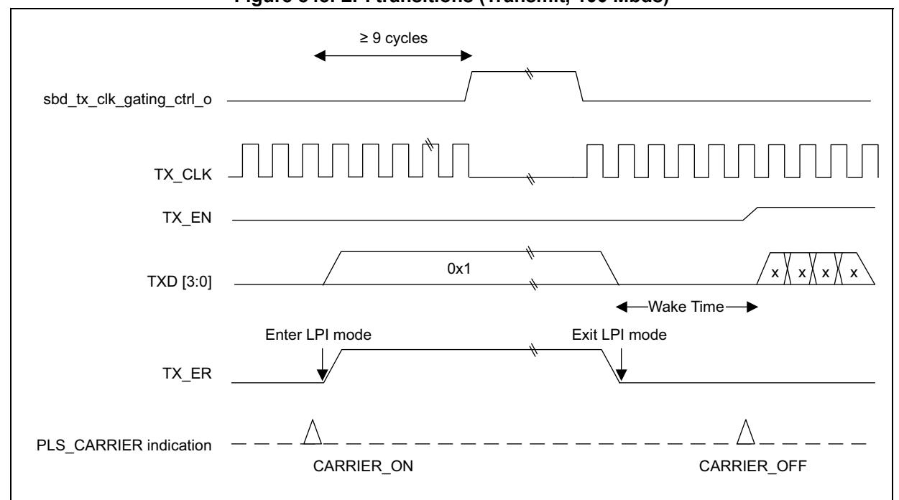

**Figure 848. LPI transitions (Transmit, 100 Mbds)**

<span id="page-94-0"></span>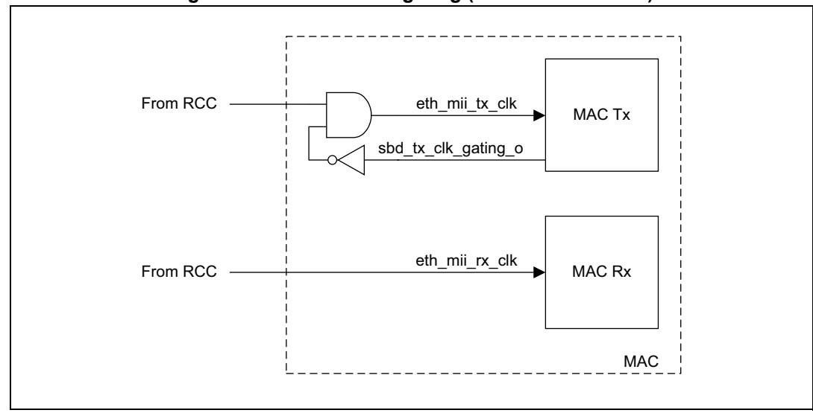

**Figure 849. LPI Tx clock gating (when LPITCSE = 1)**

### **Automated entry/exit from LPI mode in transmit path**

The MAC transmitter can be programmed to enter and exit LPI Idle mode automatically based on whether it is Idle for a specific period of time or has a packet to transfer. These modes are enabled and controlled by the *[LPI control and status register \(ETH\\_MACLCSR\)](#page-206-1)*.

When LPITXA and LPIEN of *[LPI control and status register \(ETH\\_MACLCSR\)](#page-206-1)* are set, the MAC transmitter enters LPI Idle state when the MAC transmit path (including the MTL layers and DMA layers) are idle. The MAC transmitter exits the LPI Idle state and clears the LPITXEN bit as soon as any of functions in the TX path (DMA, MTL or MAC) becomes nonidle due to initiation of a packet transfer.

In addition, when LPITE is also set, the MAC transmitter enters LPI Idle state only if the Transmit path remains in idle state (no activity) for the time period indicated by the value in *[LPI entry timer register \(ETH\\_MACLETR\)](#page-209-0)*. In this mode also, the MAC transmitter exits the LPI Idle state as soon as any of the functions becomes non-idle. However, the LPIEN bit is not cleared but remains active so that reentry to LPI Idle state is possible without any software intervention when the MAC becomes idle again.

When both LPITE and LPITXA bits are cleared, the application can directly control the entry and exit of LPI Idle state by programming the LPIEN bit.

### **Receive path Functions**

The receive path functions include the tasks that the PHY and MAC must perform when the PHY receives signals from the link partner to exit the LPI state.

In the receive path, when the PHY receives the signals from the link partner to enter into the LPI state, the PHY and MAC perform the following tasks:

- 1. The PHY asserts RX\_ER.
- 2. The PHY sets RXD[3:0] to 0x1 (for 100 Mbps).
- 3. The PHY de-asserts RX\_DV.
- 4. The MAC updates the RLPIEN bit of the *[LPI control and status register](#page-206-1)  [\(ETH\\_MACLCSR\)](#page-206-1)* and immediately generates an interrupt.


RM0399 Rev 4 3025/3556

*Note: The PHY maintains the same state of the RX\_ER, RXD, and RX\_DV signals for the entire duration during which it remains in the LPI state.*

> *If the LPI pattern is detected for a very short duration (that is, less than two cycles of Rx clock), the MAC does not enter the Rx LPI mode.*

*If the duration between the end of the current Rx LPI pattern and the start of the next Rx LPI pattern is very short (that is, less than two Rx clock cycles), then the MAC exits and enters again the Rx LPI mode. The MAC does not trigger the Rx LPI Exit and Entry interrupts.*

When the PHY receives signals from the link partner to exit the LPI state, the PHY and MAC perform the following tasks:

- 1. The PHY de-asserts RX\_ER and returns to a normal inter-packet state.
- 2. The MAC updates the RLPIEX bit of the *[LPI control and status register](#page-206-1)  [\(ETH\\_MACLCSR\)](#page-206-1)* and generates an interrupt immediately. The sideband signal lpi\_intr\_o (synchronous to Rx clock) is also asserted.

*[Figure 850](#page-95-0)* shows the behavior of RX\_ER, RX\_DV, and RXD[3:0] signals during the LPI mode transitions.

<span id="page-95-0"></span>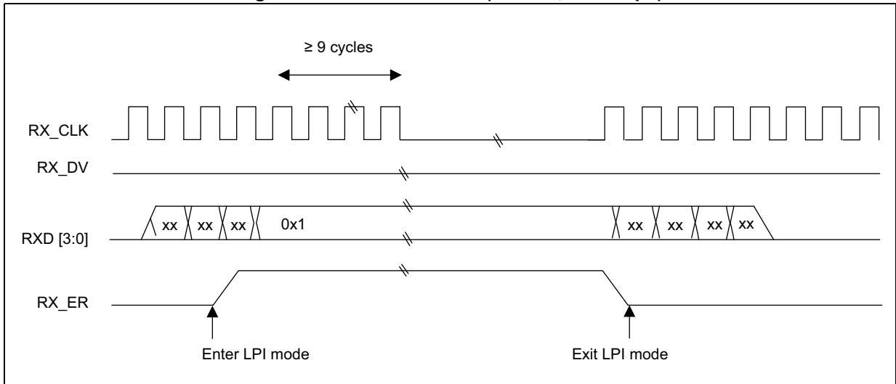

**Figure 850. LPI transitions (receive, 100 Mbps)**

*Note: If the RX\_CLK\_stoppable bit (in the PHY register written through MDIO) is asserted when the PHY is indicating LPI to the MAC, the PHY may halt the RX\_CLK at any time more than nine clock cycles after the start of the LPI state as shown in [Figure](#page-95-0) 850.*

> *If the MAC is in LPI mode and the application issues a soft reset or hard reset, the MAC receiver exits from LPI mode during reset. If the LPI pattern is still received after the reset is de-asserted, the MAC receiver enters again the LPI state.*

*If the RX clock is stopped in the RX LPI mode, the application should not write to the CSR registers that are being synchronized to the RX clock domain.*

*When the PHY sends the LPI pattern, if EEE feature is enabled, the MAC automatically enters the LPI state. There is no software control to prevent the MAC from entering the LPI state.*

# **LPI timers**

The transmitter maintains the LPI LS TIMER, LPI TW TIMER, and LPI AUTO ENTRY TIMER timers.

The following LPI timers are loaded with the respective values from the *[LPI timers control](#page-208-0)  [register \(ETH\\_MACLTCR\)](#page-208-0)* and *[LPI entry timer register \(ETH\\_MACLETR\)](#page-209-0)*:

# • LPI LS TIMER

The LPI LS TIMER counts, in milliseconds, the time expired since the link status is up. This timer is cleared every time the link goes down. It starts to increment when the link is up again and continues to increment until the value of the timer becomes equal to the terminal count. Once the terminal count is reached, the timer remains at the same value as long as the link is up. The terminal count is the value programmed in the LST[9:0] bitfield in the *[LPI timers control register \(ETH\\_MACLTCR\)](#page-208-0)*. The LPI LS TIMER is 10-bit wide. The software can program up to 1023 milliseconds.

### • LPI TW TIMER

The LPI TW TIMER counts, in microseconds, the time expired since the de-assertion of LPI. The terminal count should be programmed in Bit[15:0] of *[LPI timers control](#page-208-0)  [register \(ETH\\_MACLTCR\)](#page-208-0)*. The terminal count of the timer is the value of resolved Transmit TW that is the auto-negotiated time after which the MAC can resume the normal transmit operation. After exiting the LPI mode, the MAC resumes its normal operation after the TW timer reaches the terminal count.

The MAC supports the LPI TW TIMER in units of microsecond. The LPI TW TIMER is 16-bit wide. Therefore, the software can program up to 65535 micro seconds.

# • LPI AUTO ENTRY TIMER

This timer counts in steps of eight microseconds, the time for which the MAC transmit path has to remain in idle state (no activity), before the MAC Transmitter enters the LPI IDLE state and starts transmitting the LPI pattern. This timer is enabled when LPITE bit in *[LPI control and status register \(ETH\\_MACLCSR\)](#page-206-1)* is set.

## <span id="page-96-0"></span>**LPI interrupt**

The MAC generates the LPI interrupt when the Tx or Rx side enters or exits the LPI state. The interrupt sbd\_intr\_o is asserted when the LPI interrupt status is set. The LPI interrupt can be cleared by reading the *[LPI control and status register \(ETH\\_MACLCSR\)](#page-206-1)*.

When the MAC exits the Rx LPI state, then in addition to the sbd\_intr\_o, the sideband signal lpi\_intr\_o (synchronous to Rx clock) is asserted. The lpi\_intr\_o signal can be used to trigger the external clock-gating circuitry to restore the application clock to the MAC. The lpi\_intr\_o signal, synchronous to the Rx clock domain, is provided so that the application clock can be stopped by software when the MAC is in the LPI state. It is ORed with pmt\_intr\_o signal (see *[Section : PMT interrupt](#page-90-1)*) and tied to the EXTI peripheral (line 86).

The lpi\_intr\_o signal is generated in the Rx clock domain. It may not be cleared immediately after the *[LPI control and status register \(ETH\\_MACLCSR\)](#page-206-1)* is read. This is because the clear signal, generated in CSR clock domain, has to cross the Rx clock domain, and then clear the interrupt source. This delay is at least four clock cycles of Rx clock and can be significant when the peripheral is operating in the 10 Mbps mode.

### **Programming guidelines for Energy Efficient Ethernet**

For detailed guidelines on the programming guidelines, see *[Section 61.9.11: Programming](#page-110-0)  [guidelines for Energy Efficient Ethernet \(EEE\) on page 3041](#page-110-0)*.


RM0399 Rev 4 3027/3556

# **61.8 Ethernet interrupts**

The Ethernet peripheral generates a single interrupt signal (eth\_sbd\_intr\_it). This signal can be raised as a result of various events. These events are captured in status registers and interrupt enables are provided for each source of interrupt such that the interrupt signal is asserted for an event only when the corresponding interrupt enable is set.

The interrupt status and corresponding enable registers are organized in a hierarchical manner so that it is easier for software to traverse and identify the source of interrupt event quickly. When interrupt is asserted, the *[Interrupt status register \(ETH\\_DMAISR\)](#page-146-0)* register is first level that indicates the major blocks for the interrupt event source. This register is readonly, and it contains bits corresponding to each DMA channel (TX & RX pair), the MTL, and the MAC. The software application must then read one (or more) of the following registers corresponding to the bits that are set:

- ETH\_DMACSR: Channel Status (see *[Channel status register \(ETH\\_DMACSR\)](#page-162-0)*))
- ETH\_MTLISR: Interrupt Status (see *[Interrupt status Register \(ETH\\_MTLISR\)](#page-170-1)*)
- ETH\_MACISR: Interrupt Status (see *[Interrupt status register \(ETH\\_MACISR\)](#page-200-0)*)

# **61.8.1 DMA interrupts**

### **Interrupt registers description**

The ETH\_DMACSR: Channel Status register (see *[Channel status register](#page-162-0)  [\(ETH\\_DMACSR\)](#page-162-0)*) captures all the interrupt events of that TxDMA and RxDMA channel. The ETH\_DMACIER: Channel Interrupt Enable register (see *[Channel interrupt enable register](#page-156-1)  [\(ETH\\_DMACIER\)](#page-156-1)*) contains the corresponding enable bits for each of the interrupt event.

There are two groups of interrupts in the DMA channel namely Normal and Abnormal interrupts.They are indicated by Bits[15:14] of ETH\_DMACSR register respectively. The normal group is for events that happen during the normal transfer of packets (TI: transmit interrupt, RI: receive interrupt, TBU: Transmit buffer unavailable) while the abnormal interrupt events are for error events.

Interrupts are not queued. If the same interrupt event occurs again before the driver responds to the previous one, no additional interrupts are generated. An interrupt is generated only once for multiple events. The driver must scan the *[Interrupt status register](#page-146-0)  [\(ETH\\_DMAISR\)](#page-146-0)* for the cause of the interrupt and clear the source in the respective Status register. The interrupt is cleared only when all the bits of *[Interrupt status register](#page-146-0)  [\(ETH\\_DMAISR\)](#page-146-0)* are cleared.

### **Periodic scheduling of Transmit and Receive Interrupt**

It is not preferable to generate interrupts for every packet transferred by DMA (RI and TI) for system throughput performance reasons. The Ethernet peripheral gives the flexibility to schedule the interrupt at regular intervals using two methods:

- 1. Set Interrupt on Completion bit in Transmit descriptor (TDES2[31] in *Table [581: TDES2](#page-119-0)  [normal descriptor \(read format\)](#page-119-0)*) once for every "required" number of packets to be transmitted.
- 2. Similarly, set the IOC (RDES3[30] in*Table [594: RDES3 normal descriptor \(read](#page-133-0)  [format\)](#page-133-0)*) bit only at some specific intervals of Receive descriptors. This way, whenever a received packet transfer to system memory is complete and any of the descriptors used for that packet transfer has the IOC bit set, only then the RI event is generated.


In addition to above, an interrupt timer (ETH\_DMACRXIWTR: Channel Rx Interrupt Watchdog Timer) is given for flexible control and periodic scheduling of Receive Interrupt. When this interrupt timer is programmed with a nonzero value, it gets activated as soon as the Rx DMA completes a transfer of a received packet to system memory without asserting the Receive Interrupt because the corresponding interrupt of completion IOC bit (RDES3[30] in*[Table 594: RDES3 normal descriptor \(read format\)](#page-133-0)*) is not set. When this timer runs out as per the programmed value, RI bit is set and the interrupt is asserted if the corresponding RIE is enabled in ETH\_DMACIER register (see *[Channel interrupt enable](#page-156-1)  [register \(ETH\\_DMACIER\)](#page-156-1)*). The timer is stopped and cleared before it expires, if the RI is set for a packet transfer whose descriptor's IOC was set. The timer is reactivated automatically after the next packet transfer is complete without the RI event being generated.

## **Channel transfer complete interrupt**

The Transmit Transfer complete interrupt (TI) and Receive Transfer complete interrupt (RI) is reflected in the Channel Status register (*[Channel status register \(ETH\\_DMACSR\)](#page-162-0)*). The TI bit is set whenever the Tx DMA channel closes the descriptor in which the IOC bit is set (Interrupt On Completion - TDES2[31]). Similarly, the RI bit is set whenever the Rx DMA channel closes the descriptor with the LD bit set and, in any of the descriptors used for transferring that packet, IOC bit is set (Interrupt Enable on completion - RDES3[30])).

The interrupt signal is asserted for the Transfer complete interrupts only when the corresponding interrupts are enabled in the channel interrupt enable register (*[Channel](#page-156-1)  [interrupt enable register \(ETH\\_DMACIER\)](#page-156-1)*).

The behavior of the RI/TI interrupts changes depending on the settings of INTM field (bits[17:16]) in the ETH\_DMAMR register (*[DMA mode register \(ETH\\_DMAMR\)](#page-143-1)*). *[Table 578](#page-98-0)* explains the behavior of the Transfer Complete interrupt.

<span id="page-98-0"></span>

| Interrupt Mode | Behavior of TI/RI and interrupt signal                                                                                                                                                                                                                                                                                                                                           |
|----------------|----------------------------------------------------------------------------------------------------------------------------------------------------------------------------------------------------------------------------------------------------------------------------------------------------------------------------------------------------------------------------------|
| INTM=0         | The TI/RI status signals are set whenever the Transfer complete event is<br>detected.<br>These bits are cleared whenever the software driver writes 1 to these bits.<br>The interrupt signal is asserted whenever the corresponding interrupts are also<br>enabled in ETH_DMACIER register.                                                                                      |
| INTM=1         | The TI/RI is set as explained above. However, the interrupt is not asserted for<br>any RI/TI event.                                                                                                                                                                                                                                                                              |
| INTM=2         | The RI/TI status bits are set whenever the Transfer Complete event is detected<br>and are reset whenever software driver clears them by writing 1. However, if<br>another Transfer complete event is detected before it is cleared (serviced) by the<br>software, then these status bits are automatically set again. However, the<br>interrupt is not generated based on TI/RI. |

**Table 578. Transfer complete interrupt behavior**

# **61.8.2 MTL interrupts**

MTL interrupt events are combined with the events in the DMA to generate the interrupt signal.

The register *[Interrupt status Register \(ETH\\_MTLISR\)](#page-170-1)* report the queue number responsible for the event. ETH\_MTLQICSR: Queue Interrupt Control Status shall be read for event description.

The MTL interrupts are enabled by default. Each event can be prevented from asserting the interrupt by setting the corresponding mask bits in the *[Interrupt status Register](#page-170-1)  [\(ETH\\_MTLISR\)](#page-170-1)* register.

MTL interrupt signal is driven by one of these events:

- Receive Queue Overflow Interrupt
- Transmit Queue Underflow

# **61.8.3 MAC Interrupts**

MAC interrupt events are combined with the events in the DMA to generate the interrupt signal.

The MAC interrupts are of level type, that is, the interrupt remains asserted (high) until it is cleared by the application or software.

The *[Interrupt status register \(ETH\\_MACISR\)](#page-200-0)* describes the events that can cause an interrupt from the MAC. The MAC interrupts are enabled by default. Each event can be prevented from asserting the interrupt by setting the corresponding mask bits in the *[Interrupt](#page-200-0)  [status register \(ETH\\_MACISR\)](#page-200-0)*.

The interrupt register bits only indicate the block from which the event is reported. You must read the corresponding status registers and other registers to clear the interrupt.

MAC interrupt signal is driven by one of these events:

- Receive Status Interrupt
- Transmit Status Interrupt
- Timestamp Interrupt Status
- MMC Interrupt Status
  - MMC Receive Checksum Offload Interrupt Status
  - MMC Transmit Interrupt Status
  - MMC Receive Interrupt Status
- LPI Interrupt Status
- PMT Interrupt Status
- PHY Interrupt

*Note: Two sidebands signals are generated together with LPI and PMT interrupts: lpi\_intr\_o and pmt\_intr\_o. They are used for wakeup event detection at EXTI level.*


# **61.9 Ethernet programming model**

This chapter provides the instructions for initializing the DMA or MAC registers in the proper sequence. It contains the following sections:

- DMA initialization (see *[Section 61.9.1](#page-100-0)*)
- MTL initialization (see *[Section 61.9.2](#page-101-0)*)
- MAC initialization (see *[Section 61.9.3](#page-101-1)*)
- Performing Normal Receive and Transmit Operation (see *[Section 61.9.4](#page-102-0)*)
- Stopping and Starting Transmission (see *[Section 61.9.5](#page-103-0)*)
- Programming Guidelines for MII Link State Transitions (see *[Section 61.9.8](#page-104-0)*)
- Programming Guidelines for IEEE 1588 Timestamping (see *[Section 61.9.9](#page-105-0)*)
- Programming Guidelines for Energy Efficient Ethernet (see *[Section 61.9.11](#page-110-0)*)
- Programming Guidelines for flexible pulse-per-second (PPS) output (see *[Section 61.9.12](#page-112-0)*)
- Programming Guidelines for TSO (see *[Section 61.9.13](#page-114-0)*)
- Programming Guidelines for VLAN filtering on Receive (see *[Section 61.9.14](#page-115-1)*)

# <span id="page-100-0"></span>**61.9.1 DMA initialization**

Complete the following steps to initialize the DMA:

- 1. Provide a software reset to reset all MAC internal registers and logic (bit 0 of *[DMA](#page-143-1)  [mode register \(ETH\\_DMAMR\)](#page-143-1)*).
- 2. Wait for the completion of the reset process (poll bit 0 of the *[DMA mode register](#page-143-1)  [\(ETH\\_DMAMR\)](#page-143-1)*, which is cleared when the reset operation is completed).
- 3. Program the following fields to initialize the *[System bus mode register](#page-145-0)  [\(ETH\\_DMASBMR\)](#page-145-0)*:
  - a) AAL
  - b) Fixed burst or undefined burst
  - c) Burst mode values in case of AHB bus interface.
- 4. Create a transmit and a receive descriptor list. In addition, ensure that the receive descriptors are owned by the DMA (set bit 31 of TDES3/RDES3 descriptor). For more information on descriptors, refer to *Section [61.10: Descriptors](#page-115-0)*.

*Note: Descriptor address from start to end of the ring should not cross the 4GB boundary.*

- 5. Program ETH\_DMACTXRLR and ETH\_DMACRXRLR registers (see *[Channel Tx](#page-155-0)  [descriptor ring length register \(ETH\\_DMACTXRLR\)](#page-155-0)* and *[Channel Rx descriptor ring](#page-156-0)  [length register \(ETH\\_DMACRXRLR\)](#page-156-0)*). The programmed ring length must be at least 4.
- 6. Initialize receive and transmit descriptor list address with the base address of transmit and receive descriptor (*[Channel Tx descriptor list address register](#page-152-0)  [\(ETH\\_DMACTXDLAR\)](#page-152-0)*, *[Channel Rx descriptor list address register](#page-153-0)  [\(ETH\\_DMACRXDLAR\)](#page-153-0)*). In addition, program the transmit and receive tail pointer registers that inform the DMA about the available descriptors (see *[Channel Tx](#page-154-0)  [descriptor tail pointer register \(ETH\\_DMACTXDTPR\)](#page-154-0)* and *[Channel Rx descriptor tail](#page-155-1)  [pointer register \(ETH\\_DMACRXDTPR\)](#page-155-1)*).
- 7. Program ETH\_DMACCR, ETH\_DMACTXCR and ETH\_DMACRXCR registers (see *[Channel control register \(ETH\\_DMACCR\)](#page-147-0)*, *[Channel transmit control register](#page-148-0)  [\(ETH\\_DMACTXCR\)](#page-148-0)* and *[Channel receive control register \(ETH\\_DMACRXCR\)](#page-150-0)*) to


- configure the parameters such as the maximum burst-length (PBL) initiated by the DMA, descriptor skip lengths, OSP for TxDMA, RBSZ[13:0] for RxDMA, and so on.
- 8. Enable the interrupts by programming the ETH\_DMACIER register (see *[Channel](#page-156-1)  [interrupt enable register \(ETH\\_DMACIER\)](#page-156-1)*).
- 9. Start the Receive and Transmit DMAs by setting SR (bit 0) of *[Channel receive control](#page-150-0)  [register \(ETH\\_DMACRXCR\)](#page-150-0)* and ST (bit 0) of the ETH\_DMACTXCR (see *[Channel](#page-148-0)  [transmit control register \(ETH\\_DMACTXCR\)](#page-148-0)*).

# <span id="page-101-0"></span>**61.9.2 MTL initialization**

Complete the following steps to initialize the MTL registers:

- 1. Program the following fields to initialize the operating mode in *[Tx queue operating](#page-170-0)  [mode Register \(ETH\\_MTLTXQOMR\)](#page-170-0)*.
  - a) Transmit Store And Forward (TSF) or Transmit Threshold Control (TTC) if the Threshold mode is used.
  - b) Transmit Queue Enable (TXQEN) to value 2'b10 to enable Transmit Queue 0.
  - c) Transmit Queue Size (TQS).
- 2. Program the following fields to initialize the operating mode in the ETH\_MTLRXQOMR register (see *[Rx queue operating mode register \(ETH\\_MTLRXQOMR\)](#page-175-0)*):
  - a) Receive Store and Forward (RSF) or RTC if Threshold mode is used.
  - b) Flow Control Activation and De-activation thresholds for MTL Receive FIFO (RFA and RFD).
  - c) Error Packet and undersized good Packet forwarding enable (FEP and FUP).
  - d) Receive Queue Size (RQS).

# <span id="page-101-1"></span>**61.9.3 MAC initialization**

The MAC configuration registers establish the operating mode of the MAC. If possible, these registers must be initialized before initializing the DMA. The following MAC Initialization operations can also be performed after DMA initialization. If the MAC initialization is complete before the DMA is configured, enable the MAC receiver (last step in the following sequence) only after the DMA is active. Otherwise, received frames fill the Rx FIFO and overflow.

- 1. Provide the MAC address registers: *[MAC Address x low register \(ETH\\_MACAxLR\)](#page-223-0)*, *[MAC Address 0 high register \(ETH\\_MACA0HR\)](#page-222-0)* and *[MAC Address x high register](#page-224-0)  [\(ETH\\_MACAxHR\)](#page-224-0)*.
- 2. Program the following fields to set the appropriate filters for the incoming frames in the *[Packet filtering control register \(ETH\\_MACPFR\)](#page-187-0)*:
  - a) Receive All.
  - b) Promiscuous mode.
  - c) Hash or Perfect Filter.
  - d) Unicast, multicast, broadcast, and control frames filter settings.
- 3. Program the following fields for proper flow control in the *[Tx Queue flow control register](#page-197-0)  [\(ETH\\_MACQTXFCR\)](#page-197-0)*:
  - a) Pause time and other Pause frame control bits.
  - b) Transmit Flow control bits.
  - c) Flow Control Busy.


- 4. Program the *[Interrupt enable register \(ETH\\_MACIER\)](#page-202-0)* as required, if it is applicable for your configuration.
- 5. Program the appropriate fields in the *[Operating mode configuration register](#page-181-0)  [\(ETH\\_MACCR\)](#page-181-0)* register. For example, Inter-packet gap while transmission and jabber disable.
- 6. Set bit 0 and 1 in *[Operating mode configuration register \(ETH\\_MACCR\)](#page-181-0)* register to start the MAC transmitter and receiver.

To support Jumbo Transmit/Receive packets, follow these steps:

- In the *[Operating mode configuration register \(ETH\\_MACCR\)](#page-181-0)*
  - a) Set JE bit to 1.
  - b) Set JD and WD bits to 0 to avoid giant packet error reporting.
  - c) Set GPSLCE bit to 1
  - d) Set GPSL bitfield of the *[Extended operating mode configuration register](#page-186-0)  [\(ETH\\_MACECR\)](#page-186-0)* to a value > 9026

To support Transmit/Receive packets, up to 16K, follow these steps:

- In the *[Operating mode configuration register \(ETH\\_MACCR\)](#page-181-0)*
  - a) Set JD and WD bits to 1 to avoid giant packet error reporting.
  - b) Set GPSLCE bit to 1.
  - c) Set GPSL bitfield of the *[Extended operating mode configuration register](#page-186-0)  [\(ETH\\_MACECR\)](#page-186-0)* to 16383.

# <span id="page-102-0"></span>**61.9.4 Performing normal receive and transmit operation**

For normal operation, complete the following steps:

- 1. For normal transmit and receive interrupts, read the interrupt status. Then, poll the descriptor by reading the status of the descriptor owned by the Host (either transmit or receive).
- 2. Set the descriptors to appropriate values. Make sure that transmit and receive descriptors are owned by the DMA to resume the transmission and reception of data.
- 3. If the descriptors are not owned by the DMA (or no descriptor is available), the DMA goes into Suspend state. The transmission or reception can be resumed by freeing the descriptors and writing the ETH\_DMACTXDTPR (see *[Channel Tx descriptor tail](#page-154-0)  [pointer register \(ETH\\_DMACTXDTPR\)](#page-154-0)* and ETH\_DMACRXDTPR (see *[Channel Rx](#page-155-1)  [descriptor tail pointer register \(ETH\\_DMACRXDTPR\)](#page-155-1)*).
- 4. In debug mode, the values of the current host transmitter or receiver descriptor address pointer can be read in ETH\_DMACCATXDR and ETH\_DMACCARXDR registers (see *[Channel current application transmit descriptor register \(ETH\\_DMACCATXDR\)](#page-161-0)* and *[Channel current application receive descriptor register \(ETH\\_DMACCARXDR\)](#page-161-1)*).
- 5. In debug mode, the values of the current host transmit buffer address pointer and receive buffer address pointer can be read in ETH\_DMACCATXDR and ETH\_DMACCARXDR registers (see *[Channel current application transmit descriptor](#page-161-0)  [register \(ETH\\_DMACCATXDR\)](#page-161-0)* and *[Channel current application receive descriptor](#page-161-1)  [register \(ETH\\_DMACCARXDR\)](#page-161-1)*).


# <span id="page-103-0"></span>**61.9.5 Stopping and starting transmission**

Complete the following steps to pause the transmission for some time:

- 1. Disable the Transmit DMA (if applicable) by clearing Bit 0 (ST) of ETH\_DMACTXCR register (see *[Channel transmit control register \(ETH\\_DMACTXCR\)](#page-148-0)*).
- 2. Wait for any previous frame transmissions to complete. You can check this by reading the appropriate bits of *[Tx queue debug register \(ETH\\_MTLTXQDR\)](#page-172-0)* (TRCSTS[1:0] is not 01 and TXQSTS = 0).
- 3. Disable the MAC transmitter and MAC receiver by clearing RE and TE bits of the *[Operating mode configuration register \(ETH\\_MACCR\)](#page-181-0)* Register.
- 4. Disable the Receive DMA (if applicable), after making sure that the data in the Rx FIFO is transferred to the system memory (by reading the appropriate bits of *[Tx queue debug](#page-172-0)  [register \(ETH\\_MTLTXQDR\)](#page-172-0)*, PRXQ=0 and RXQSTS[1:0] = 00).
- 5. Make sure that both Tx queue and Rx queue are empty (TXQSTS is 0 in *[Tx queue](#page-172-0)  [debug register \(ETH\\_MTLTXQDR\)](#page-172-0)* and RXQSTS[1:0] is set to 00.
- 6. To restart the operation, first start the DMAs, and then enable the MAC Transmitter and Receiver.

*Note: Do not change the configuration (such as duplex mode, speed, port, or loopback) when the MAC is actively transmitting or receiving. These parameters are changed by software only when the MAC transmitter and receiver are not active.*

> *Similarly, do not change the DMA-related configuration when Transmit and Receive DMA are active.*

# **61.9.6 Programming guidelines for switching to new descriptor list in RxDMA**

Switching to a new descriptor list is different in the Rx DMA compared to the Tx DMA. Switching to a new descriptor list is permitted when the RxDMA is in Suspend state, as explained below:

- Generally, RxDMA prepares the descriptors in advance.
- If the RxDMA goes to Suspend state due to descriptors not being available, a major failure occurs (software is not able to free the filled-up descriptors/buffers). If this issue is not rectified immediately, frames are lost because of an RxFIFO overflow. Therefore, the software is allowed to create a new descriptor list and program the RxDMA to start using it immediately, without going into Stop state.

# **61.9.7 Programming guidelines for switching the AHB clock frequency**

To dynamically change the AHB clock frequency (without applying soft reset or hard reset), follow these steps:

1. Disable the Transmit DMA (if applicable) and wait for any previous frame transmissions to complete. When the frame transmissions is complete, the Tx FIFO becomes empty and the Tx DMA enters Stop state. The Tx FIFO status is given in the *[Tx queue debug](#page-172-0)*


- *[register \(ETH\\_MTLTXQDR\)](#page-172-0)* and the status of DMA is given in *[Debug status register](#page-146-1)  [\(ETH\\_DMADSR\)](#page-146-1)*.
- 2. Disable the MAC transmitter and the MAC receiver by clearing the appropriate bits in *[Operating mode configuration register \(ETH\\_MACCR\)](#page-181-0)*.
- 3. Disable the Receive DMA (if applicable) after making sure that the data in the Rx FIFO is transferred to the system memory. The Rx FIFO empty status is given in *[Rx queue](#page-178-0)  [debug register \(ETH\\_MTLRXQDR\)](#page-178-0)*.
- 4. Ensure that the application does not perform any register read or write operation.
- 5. Change the frequency of the AHB clock.
- 6. Enable the MAC Transmitter or the MAC Receiver and the Transmit or Receive DMA. These steps ensure that no valid data is present in the Tx FIFO or Rx FIFO at the time of clock frequency switching and prevent any data corruption.

# <span id="page-104-0"></span>**61.9.8 Programming guidelines for MII link state transitions**

# **Transmit and Receive clocks are running when the link is down**

Complete the following steps when the link is down while the Transmit and Receive clocks are running:

- 1. Disable the Transmit DMA (if applicable) by clearing bit 0 (ST) of *[Channel control](#page-147-0)  [register \(ETH\\_DMACCR\)](#page-147-0)*.
- 2. Disable the MAC receiver by clearing RE bit of *[Operating mode configuration register](#page-181-0)  [\(ETH\\_MACCR\)](#page-181-0)*.
- 3. Wait for any previous frame transmissions to complete. You can check this by reading the appropriate bits of *[Tx queue debug register \(ETH\\_MTLTXQDR\)](#page-172-0)* (TRCSTS[1:0] is not 01).

or

Flush the Tx FIFO for faster empty operation.

- 4. Disable the MAC transmitter by clearing TE bit of the *[Operating mode configuration](#page-181-0)  [register \(ETH\\_MACCR\)](#page-181-0)* Register.
- 5. Make sure that both Tx and Rx queues are empty (TXQSTS is set to 0 in *[Tx queue](#page-172-0)  [debug register \(ETH\\_MTLTXQDR\)](#page-172-0)* and RXQSTS[1:0] to 00 in *[Rx queue debug register](#page-178-0)  [\(ETH\\_MTLRXQDR\)](#page-178-0)*).
- 6. After the link is up, read the PHY registers to identify the latest configuration and program the MAC registers accordingly.
- 7. Restart the operation by starting the Tx DMA. Then enable the MAC Transmitter and Receiver.

The Rx DMA does not need to be enabled: since the Receiver is disabled, there are no data in the Rx FIFO.


### **Transmit and Receive clocks are stopped when the link is down**

Complete the following steps when the link is down and the Transmit and Receive clocks are stopped:

- 1. Disable the MAC Transmitter and Receiver by clearing RE and TE bits in the *[Operating](#page-181-0)  [mode configuration register \(ETH\\_MACCR\)](#page-181-0)*. This will not take immediate effect as the clocks are absent.
- 2. Wait till the link is up and the clocks are restored.
- 3. Wait until the transfer of any partial frame is complete if any was ongoing when the Transmit/Receive clock is stopped. This can be checked by reading the *[Debug register](#page-210-0)  [\(ETH\\_MACDR\)](#page-210-0)* (all bits should be set to 0). Some old packets may still remain in the TXFIFO as the MAC Transmitter is stopped.
- 4. Read the PHY registers to identify the latest operating mode and program the MAC registers accordingly.
- 5. Restart the MAC Transmitter and Receiver by setting RE and TE bits.

# <span id="page-105-0"></span>**61.9.9 Programming guidelines for IEEE 1588 timestamping**

### **Initializing the System time generation**

The timestamp feature can be enabled by setting bit 0 of the *[Timestamp control Register](#page-245-0)  [\(ETH\\_MACTSCR\)](#page-245-0)*. However, it is essential that the timestamp counter is initialized after this bit is set. Complete the following steps to perform the peripheral initialization:

- 1. Mask the Timestamp Trigger interrupt by clearing bit 12 of *[Interrupt enable register](#page-202-0)  [\(ETH\\_MACIER\)](#page-202-0)*.
- 2. Set bit 0 of *[Timestamp control Register \(ETH\\_MACTSCR\)](#page-245-0)* to enable timestamping.
- 3. Program *[Subsecond increment register \(ETH\\_MACSSIR\)](#page-247-0)* based on the PTP clock frequency.
- 4. If you use the Fine Correction method, program *[Timestamp addend register](#page-251-0)  [\(ETH\\_MACTSAR\)](#page-251-0)* and set bit 5 of *[Timestamp control Register \(ETH\\_MACTSCR\)](#page-245-0)*.
- 5. Poll the *[Timestamp control Register \(ETH\\_MACTSCR\)](#page-245-0)* until bit 5 is cleared.
- 6. Program bit 1 of *[Timestamp control Register \(ETH\\_MACTSCR\)](#page-245-0)* to select the Fine Update method (if required).
- 7. Program *[System time seconds update register \(ETH\\_MACSTSUR\)](#page-250-0)* and *[System time](#page-250-1)  [nanoseconds update register \(ETH\\_MACSTNUR\)](#page-250-1)* with the appropriate time value.
- 8. Set bit 2 in *[Timestamp control Register \(ETH\\_MACTSCR\)](#page-245-0)*.
  - The timestamp counter starts as soon as it is initialized with the value written in the timestamp update registers. If one-step timestamping is required:
  - a) Enable one-step timestamping by programming bit 27 of the TDES3 Context Descriptor.
  - b) Program *[Timestamp Ingress asymmetric correction register \(ETH\\_MACTSIACR\)](#page-256-0)* to update the correction field in PDelay\_Req PTP messages.
- 9. Enable the MAC receiver and transmitter for proper timestamping.

*Note: If timestamp operation is disabled by clearing bit 0 of [Timestamp control Register](#page-245-0)  [\(ETH\\_MACTSCR\),](#page-245-0) repeat all these steps to restart the timestamp operation.*


# <span id="page-106-0"></span>**System time correction**

To synchronize or update the system time in one shot (coarse correction method), complete the following steps:

- 1. Set the offset (positive or negative) in the timestamp update registers (*[System time](#page-250-0)  [seconds update register \(ETH\\_MACSTSUR\)](#page-250-0)* and *[System time nanoseconds update](#page-250-1)  [register \(ETH\\_MACSTNUR\)](#page-250-1)*).
- 2. Set bit 3 (TSUPDT) of the *[Timestamp control Register \(ETH\\_MACTSCR\)](#page-245-0)*. The value in the timestamp update registers is added to or subtracted from the system time when the TSUPDT bit is cleared.

To synchronize or update the system time to reduce system-time jitter (fine correction method), complete the following steps:

- 1. With the help of the algorithm described in *Section [: System time register module](#page-42-0)*, calculate at which rate you intend to increment or decrement the system time.
- 2. Update the *[Timestamp addend register \(ETH\\_MACTSAR\)](#page-251-0)* with the new value and set bit 5 of the *[Timestamp control Register \(ETH\\_MACTSCR\)](#page-245-0)* Register.
- 3. Wait for the time during which you want the new value of the Addend register to be active. This can be done by enabling the Timestamp Trigger interrupt after the system time reaches the target value.
- 4. Program the required target time in *[PPS target time seconds register](#page-260-0)  [\(ETH\\_MACPPSTTSR\)](#page-260-0)* and *[PPS target time nanoseconds register](#page-261-0)  [\(ETH\\_MACPPSTTNR\)](#page-261-0)*.
- 5. Enable the Timestamp interrupt in bit 12 of *[Interrupt enable register \(ETH\\_MACIER\)](#page-202-0)*.
- 6. Set bit 4 in Register *[Timestamp control Register \(ETH\\_MACTSCR\)](#page-245-0)*.
- 7. When this trigger generates an interrupt, read *[Interrupt status register \(ETH\\_MACISR\)](#page-200-0)*.
- 8. Reprogram *[Timestamp addend register \(ETH\\_MACTSAR\)](#page-251-0)* with the old value and set bit 5 again.

# **61.9.10 Programming guidelines for PTP offload feature**

# **Programming guidelines to enable automatic periodic generation of PTP sync messages**

Follow these steps to enable automatic periodic generation of PTP sync messages:

- 1. Program SNAPTYPSEL, TSMSTRENA, and TSEVNTENA fields of *[Timestamp control](#page-245-0)  [Register \(ETH\\_MACTSCR\)](#page-245-0)* to 0, 1, and 1 respectively, to configure the node as Ordinary or Boundary Master (1, 1, and 1 for Transparent Master).
- 2. Program the PTOEN bit and DN field of *[PTP Offload control register](#page-263-0)  [\(ETH\\_MACPOCR\)](#page-263-0)* to enable PTP Offload feature and domain number to send in egress PTP Sync message.
- 3. Program the ASYNCEN bit of *[PTP Offload control register \(ETH\\_MACPOCR\)](#page-263-0)* to enable periodic generation of PTP Sync messages.
- 4. Program the 80-bit Source Port Identity in *[PTP Source Port Identity 0 Register](#page-263-1)  [\(ETH\\_MACSPI0R\)](#page-263-1)*, *[PTP Source port identity 1 register \(ETH\\_MACSPI1R\)](#page-264-0)* and *[PTP](#page-264-1)*


- *[Source port identity 2 register \(ETH\\_MACSPI2R\)](#page-264-1)* to send in egress PTP Sync message.
- 5. Program the LSI field of *[Log message interval register \(ETH\\_MACLMIR\)](#page-265-0)* to program the periodicity of the PTP Sync messages.
  - For example, a value of 1 corresponds to 21 which translates to PTP Sync message every 2 seconds, and a value of 0xFF (twos complement of -1) corresponds to 2-1 which translates to PTP Sync message every 0.536 seconds.
- 6. Program the TSIE bit of *[Interrupt enable register \(ETH\\_MACIER\)](#page-202-0)* to enable generation of Timestamp interrupt.
- 7. Wait for sbd\_intr\_o interrupt generated by setting TXTSSIS bit in *[Timestamp status](#page-252-0)  [register \(ETH\\_MACTSSR\)](#page-252-0)*. It indicates that the timestamp for PTP Sync message is captured in *[Tx timestamp status seconds register \(ETH\\_MACTXTSSSR\)](#page-254-1)* and *[Tx](#page-253-0)  [timestamp status nanoseconds register \(ETH\\_MACTXTSSNR\)](#page-253-0)*.

# **Programming guidelines to enable periodic generation of PTP Pdelay\_Req messages**

Follow these steps to enable automatic periodic generation of PTP Pdelay\_Req messages

- 1. Program SNAPTYPSEL, TSMSTRENA and TSEVNTENA fields of *[Timestamp control](#page-245-0)  [Register \(ETH\\_MACTSCR\)](#page-245-0)* to 1, 0, and 1 respectively to configure the node as Transparent Slave (1, 1, and 1 for Transparent Master OR 3, X, and X for Peer-to-Peer Transparent).
- 2. Program the PTOEN bit and DN field of *[PTP Offload control register](#page-263-0)  [\(ETH\\_MACPOCR\)](#page-263-0)* to enable PTP Offload feature and domain number to send in egress PTP Pdelay\_Req message.
- 3. Program the APDREQEN bit of *[PTP Offload control register \(ETH\\_MACPOCR\)](#page-263-0)* to enable periodic generation of PTP Pdelay\_Req messages.
- 4. Program the 80-bit Source Port Identity in *[PTP Source Port Identity 0 Register](#page-263-1)  [\(ETH\\_MACSPI0R\)](#page-263-1)*, *[PTP Source port identity 1 register \(ETH\\_MACSPI1R\)](#page-264-0)* and *[PTP](#page-264-1)  [Source port identity 2 register \(ETH\\_MACSPI2R\)](#page-264-1)* to send in egress PTP Pdelay\_Req message.
- 5. Program the LMPDRI field of *[Log message interval register \(ETH\\_MACLMIR\)](#page-265-0)* to program the periodicity of the PTP Pdelay\_Req messages. For example, a value of 1 corresponds to 21 which translates to PTP Pdelay\_Req message every 2 seconds, and a value of 0xFF (twos complement of -1) corresponds to 2-1 which translates to PTP Pdelay\_Req message every 0.536 seconds.
- 6. Program the TSIE bit of *[Interrupt enable register \(ETH\\_MACIER\)](#page-202-0)* to enable generation of Timestamp interrupt.
- 7. Wait for sbd\_intr\_o interrupt generated by setting TXTSSIS bit in *[Timestamp status](#page-252-0)  [register \(ETH\\_MACTSSR\)](#page-252-0)*. It indicates that the timestamp for PTP Sync message is captured in *[Tx timestamp status seconds register \(ETH\\_MACTXTSSSR\)](#page-254-1)* and *[Tx](#page-253-0)  [timestamp status nanoseconds register \(ETH\\_MACTXTSSNR\)](#page-253-0)***.**

# **Programming guidelines to enable the generation of PTP response messages for Ordinary or Boundary Master mode**

Follow these steps to enable the generation of PTP response messages for Ordinary or Boundary Master mode (Periodic PTP Sync messages generated and PTP Delay\_Resp message generated in response to PTP Delay\_Req message):


- 1. Program SNAPTYPSEL, TSMSTRENA and TSEVNTENA fields of *[Timestamp control](#page-245-0)  [Register \(ETH\\_MACTSCR\)](#page-245-0)* to 0, 1, and 1 respectively.
- 2. Program the PTOEN bit and DN field of *[PTP Offload control register](#page-263-0)  [\(ETH\\_MACPOCR\)](#page-263-0)* to enable PTP Offload feature and domain number to match with ingress PTP Delay\_Req message and send in egress PTP Delay\_Resp message.
- 3. Program the 80-bit Source Port Identity in *[PTP Source Port Identity 0 Register](#page-263-1)  [\(ETH\\_MACSPI0R\)](#page-263-1)*, *[PTP Source port identity 1 register \(ETH\\_MACSPI1R\)](#page-264-0)* and *[PTP](#page-264-1)  [Source port identity 2 register \(ETH\\_MACSPI2R\)](#page-264-1)* to match with ingress PTP Delay\_Req message and send in egress PTP Delay\_Resp message.
- 4. Program the DRSYNCR and LSI fields in *[Log message interval register](#page-265-0)  [\(ETH\\_MACLMIR\)](#page-265-0)*. The sum of both fields is updated in logMinDelayReqInterval field of PTP Delay\_Resp message.

# **Programming guidelines to enable the generation of PTP response messages for Ordinary or Boundary Slave mode**

Follow these steps to enable generation of PTP response messages for Ordinary or Boundary Slave mode (PTP Delay\_Req message generated in response to PTP Sync message):

- 1. Program SNAPTYPSEL, TSMSTRENA and TSEVNTENA fields of *[Timestamp control](#page-245-0)  [Register \(ETH\\_MACTSCR\)](#page-245-0)* to 0, 0, and 1 respectively.
- 2. Program the PTOEN bit and DN field of *[PTP Offload control register](#page-263-0)  [\(ETH\\_MACPOCR\)](#page-263-0)* to enable PTP Offload feature and domain Number to match with ingress PTP Sync message and send in egress PTP Delay\_Req message.
- 3. Program the 80-bit Source Port Identity in *[PTP Source Port Identity 0 Register](#page-263-1)  [\(ETH\\_MACSPI0R\)](#page-263-1)*, *[PTP Source port identity 1 register \(ETH\\_MACSPI1R\)](#page-264-0)* and *[PTP](#page-264-1)  [Source port identity 2 register \(ETH\\_MACSPI2R\)](#page-264-1)* to match with ingress PTP Sync message and send in egress PTP Delay\_Req message.
- 4. Program the DRSYNCR field in *[Log message interval register \(ETH\\_MACLMIR\)](#page-265-0)* to indicate one PTP Delay\_Req message is generated in response to how many received PTP Sync messages.

# **Programming guidelines to enable the generation of PTP response messages for Transparent Slave mode**

Follow these steps to enable generation of PTP response messages for Transparent Slave mode (PTP Delay\_Req message generated in response to PTP Sync message, PTP Pdelay\_Resp message generated in response to PTP Pdelay\_Req message and Periodic PTP Pdelay\_Req messages generated)

- 1. Program SNAPTYPSEL, TSMSTRENA and TSEVNTENA fields of *[Timestamp control](#page-245-0)  [Register \(ETH\\_MACTSCR\)](#page-245-0)* to 1, 0, and 1 respectively.
- 2. Program the PTOEN bit and DN field of *[PTP Offload control register](#page-263-0)  [\(ETH\\_MACPOCR\)](#page-263-0)* to enable PTP Offload feature and domain Number to match with ingress PTP Sync or Pdelay\_Req message and send in egress PTP Delay\_Req or Pdelay\_Resp or Pdelay\_Req message.
- 3. Program the 80-bit Source Port Identity in *[PTP Source Port Identity 0 Register](#page-263-1)  [\(ETH\\_MACSPI0R\)](#page-263-1)*, *[PTP Source port identity 1 register \(ETH\\_MACSPI1R\)](#page-264-0)* and *[PTP](#page-264-1)  [Source port identity 2 register \(ETH\\_MACSPI2R\)](#page-264-1)* to match with ingress PTP Sync or


RM0399 Rev 4 3039/3556

- Pdelay\_Req message and send in egress PTP Delay\_Req or Pdelay\_Resp or Pdelay\_Req message.
- 4. Program the DRSYNCR and LMPDRI fields in *[Log message interval register](#page-265-0)  [\(ETH\\_MACLMIR\)](#page-265-0)* to indicate one PTP Delay\_Req message is generated in response to how many received PTP Sync messages and periodicity of the PTP Pdelay\_Req messages.
- 5. Program the TSIE bit of *[Interrupt enable register \(ETH\\_MACIER\)](#page-202-0)* to enable generation of Timestamp interrupt.
- 6. Wait for sbd\_intr\_o interrupt generated by setting TXTSSIS bit in *[Timestamp status](#page-252-0)  [register \(ETH\\_MACTSSR\)](#page-252-0)*. It indicates that the timestamp for PTP Sync message is captured in *[Tx timestamp status seconds register \(ETH\\_MACTXTSSSR\)](#page-254-1)* and *[Tx](#page-253-0)  [timestamp status nanoseconds register \(ETH\\_MACTXTSSNR\)](#page-253-0)* for egress PTP Pdelay\_Req and Pdelay\_Resp messages.

# **Programming guidelines to enable the generation of PTP response messages for Transparent Master mode**

Follow these steps to enable generation of PTP response messages for Transparent Master mode (PTP Delay\_Resp message generated in response to PTP Delay\_Req message, PTP Pdelay\_Resp message generated in response to PTP Pdelay\_Req message and Periodic PTP Pdelay\_Req or Sync messages generated):

- 1. Program SNAPTYPSEL, TSMSTRENA and TSEVNTENA fields of *[Timestamp control](#page-245-0)  [Register \(ETH\\_MACTSCR\)](#page-245-0)* to 1, 1, and 1 respectively.
- 2. Program the PTOEN bit and DN field of *[PTP Offload control register](#page-263-0)  [\(ETH\\_MACPOCR\)](#page-263-0)* to enable PTP Offload feature and domain number to match with ingress PTP Delay\_Req or Pdelay\_Req message and send in egress PTP Delay\_Resp or Pdelay\_Resp or Pdelay\_Req or Sync message.
- 3. Program the 80-bit Source Port Identity in *[PTP Source Port Identity 0 Register](#page-263-1)  [\(ETH\\_MACSPI0R\)](#page-263-1)*, *[PTP Source port identity 1 register \(ETH\\_MACSPI1R\)](#page-264-0)* and *[PTP](#page-264-1)  [Source port identity 2 register \(ETH\\_MACSPI2R\)](#page-264-1)* to match with ingress PTP Delay\_Req or Pdelay\_Req message and send in egress PTP Delay\_Resp or Pdelay\_Resp or Pdelay\_Req or Sync message.
- 4. Program the DRSYNCR, LSI and LMPDRI fields in *[Log message interval register](#page-265-0)  [\(ETH\\_MACLMIR\)](#page-265-0)*, the sum of DRSYNCR and LSI is updated in logMinDelayReqInterval field of PTP Delay\_Resp message and periodicity of the PTP Sync or Pdelay\_Req messages.
- 5. Program the TSIE bit of *[Interrupt enable register \(ETH\\_MACIER\)](#page-202-0)* to enable generation of Timestamp interrupt.
- 6. Wait for sbd\_intr\_o interrupt generated by setting TXTSSIS bit in *[Timestamp status](#page-252-0)  [register \(ETH\\_MACTSSR\)](#page-252-0)*. It indicates that the timestamp for PTP Sync message is captured in *[Tx timestamp status seconds register \(ETH\\_MACTXTSSSR\)](#page-254-1)* and *[Tx](#page-253-0)  [timestamp status nanoseconds register \(ETH\\_MACTXTSSNR\)](#page-253-0)* for egress PTP Sync, Pdelay\_Req and Pdelay\_Resp messages.

# **Programming guidelines to enable the generation of PTP response messages for Peer-to-Peer Transparent mode**

Follow these steps to enable generation of PTP response messages for Peer-to-Peer Transparent mode (PTP Pdelay\_Resp message generated in response to PTP Pdelay\_Req message and Periodic PTP Pdelay\_Req messages generated):


- 1. Program the SNAPTYPSEL, TSMSTRENA and TSEVNTENA fields of *[Timestamp](#page-245-0)  [control Register \(ETH\\_MACTSCR\)](#page-245-0)* to 3, X, and X respectively.
- 2. Program the PTOEN bit and DN field of *[PTP Offload control register](#page-263-0)  [\(ETH\\_MACPOCR\)](#page-263-0)* to enable PTP Offload feature and domain Number to match with ingress PTP Pdelay\_Req message and send in egress PTP Pdelay\_Resp message.
- 3. Program the 80-bit Source Port Identity in *[PTP Source Port Identity 0 Register](#page-263-1)  [\(ETH\\_MACSPI0R\)](#page-263-1)*, *[PTP Source port identity 1 register \(ETH\\_MACSPI1R\)](#page-264-0)* and *[PTP](#page-264-1)  [Source port identity 2 register \(ETH\\_MACSPI2R\)](#page-264-1)* to match with ingress PTP Pdelay\_Req message and send in egress PTP Pdelay\_Resp message.
- 4. Program the LMPDRI field in *[Log message interval register \(ETH\\_MACLMIR\)](#page-265-0)* to indicate periodicity of the PTP Pdelay\_Req messages
- 5. Program the TSIE bit of *[Interrupt enable register \(ETH\\_MACIER\)](#page-202-0)* to enable generation of Timestamp interrupt
- 6. Wait for sbd\_intr\_o interrupt generated by setting TXTSSIS bit in *[Timestamp status](#page-252-0)  [register \(ETH\\_MACTSSR\)](#page-252-0)*. It indicates that the timestamp for PTP Sync message is captured in *[Tx timestamp status seconds register \(ETH\\_MACTXTSSSR\)](#page-254-1)* and *[Tx](#page-253-0)  [timestamp status nanoseconds register \(ETH\\_MACTXTSSNR\)](#page-253-0)* for egress PTP Pdelay\_Req and Pdelay\_Resp messages.

# <span id="page-110-0"></span>**61.9.11 Programming guidelines for Energy Efficient Ethernet (EEE)**

### **Entering and exiting Tx LPI mode**

EEE enables the IEEE 802.3 Media Access Control (MAC) sublayer along with a family of physical layers to operate in the Low-power idle (LPI) mode. In the Transmit path, the software must set the LPIEN bit of the *[LPI control and status register \(ETH\\_MACLCSR\)](#page-206-1)* to indicate to the MAC to stop transmission and initiate the LPI protocol.

Complete the following steps during MAC initialization:

- 1. Read the PHY register through the MDIO interface and check if the remote end has the EEE capability. Then negotiate the timer values.
- 2. Program the PHY registers through the MDIO interface (including the RX\_CLK\_stoppable bit that indicates to the PHY whether to stop Rx clock in LPI mode or not).
- 3. Program bits 25 to 16 and bits 15 to 0 in *[LPI timers control register \(ETH\\_MACLTCR\)](#page-208-0)*.
- 4. Read the PHY link status by using the MDIO interface and update bit 17 of *[LPI control](#page-206-1)  [and status register \(ETH\\_MACLCSR\)](#page-206-1)*. Update *[LPI control and status register \(ETH\\_MACLCSR\)](#page-206-1)* accordingly. This update
- 5. Program *[One-microsecond-tick counter register \(ETH\\_MAC1USTCR\)](#page-209-1)* as per the frequency of the clock used for accessing the CSR slave port.

should be done whenever the link status in the PHY chip changes.

6. Program the LPIET bit in the *[LPI entry timer register \(ETH\\_MACLETR\)](#page-209-0)* with the IDLE time for which the MAC should wait before entering the LPI state on its own.


RM0399 Rev 4 3041/3556

- 7. Set LPITE and LPITXA (bits 20 to 19) of *[LPI control and status register](#page-206-1)  [\(ETH\\_MACLCSR\)](#page-206-1)* to enable LPI auto-entry and MAC auto-exit from LPI state.
- 8. Set bit 16 of *[LPI control and status register \(ETH\\_MACLCSR\)](#page-206-1)* to put the MAC transmitter in LPI state.
  - The MAC enters the LPI state when all scheduled packets are completed. It remains IDLE for the time indicated by LPIET bits. It sets the TLPIEN (bit 0) after entering LPI state.
- 9. When a packet transmission is scheduled (when the TxDMA exits IDLE state or when a packet is presented at ATI or MTI interface), the MAC Transmitter automatically exits LPI state. It waits for TWT time before setting the TLPIEX interrupt status bit and then resume the packet transmission.
- 10. The MAC Transmitter enters again LPI state if it remains IDLE for LPIET time. It then sets the TLPIEN bit and the entry-exit cycle continues.
- 11. Reset LPIEN bit if the application needs to override the auto-entry/exit modes and directly exit the MAC Transmitter from LPI state.

*Note: To make sure the MAC enters the LPI state only after the transmission of all the queued frames in the Tx FIFO is complete, set LPITXA bit in [LPI control and status register](#page-206-1)  [\(ETH\\_MACLCSR\)](#page-206-1).*

> *To switch off the CSR clock or power to the rest of the system during the LPI state, wait for the TLPIEN interrupt of [LPI control and status register \(ETH\\_MACLCSR\)](#page-206-1) to be generated. Restore the clocks before performing step 6 when you want to come out of the LPI state.*

### **Gating Off the CSR Clock in the LPI mode**

You can gate off the CSR clock to save the power when the MAC is in the Low-Power Idle (LPI) mode.

### **Gating off the CSR clock in the Rx LPI mode**

The following operations are performed when the MAC receives the LPI pattern from the PHY:

- 1. The MAC RX enters the LPI mode and the Rx LPI entry interrupt status (RLPIEN interrupt of *[LPI control and status register \(ETH\\_MACLCSR\)](#page-206-1)*) is set.
- 2. The interrupt pin (sbd\_intr\_o) is asserted. The sbd\_intr\_o interrupt is cleared when the host reads the *[LPI control and status register \(ETH\\_MACLCSR\)](#page-206-1)*.

After the sbd\_intr\_o interrupt is asserted and the MAC Tx is also in the LPI mode, the CSR clock can be gated off. If the MAC TX is not in LPI mode when the CSR clock is gated off, the events on the MAC transmitter do not get reported or updated in the CSR. To restore the CSR clock, wait for the LPI exit indication from the PHY after which the MAC asserts the LPI exit interrupt on lpi\_intr\_o (synchronous to clk\_rx\_i). The lpi\_intr\_o interrupt is cleared when *[LPI control and status register \(ETH\\_MACLCSR\)](#page-206-1)* is read.

### **Gating off the CSR clock in the Tx LPI mode**

The following operations are performed when bit 16 (LPIEN) of *[LPI control and status](#page-206-1)  [register \(ETH\\_MACLCSR\)](#page-206-1)* is set:

- 1. The Transmit LPI Entry interrupt (TLPIEN bit of *[LPI control and status register](#page-206-1)  [\(ETH\\_MACLCSR\)](#page-206-1)*) is set.
- 2. The interrupt pin (sbd\_intr\_o) is asserted. The sbd\_intr\_o interrupt is cleared when the host reads the *[LPI control and status register \(ETH\\_MACLCSR\)](#page-206-1)*.


After the sbd\_intr\_o interrupt is asserted and the MAC RX is also in the LPI mode, the CSR clock can be gated off. If the MAC RX is not in LPI mode when the CSR clock is gated off, the events on the MAC receiver do not get reported or updated in the CSR. To restore the CSR clock, switch on the CSR clock when the MAC has exited TX LPI mode. After the CSR clock is resumed, reset bit 16 (LPIEN) of *[LPI control and status register \(ETH\\_MACLCSR\)](#page-206-1)* to exit the MAC from LPI mode.

# <span id="page-112-0"></span>**61.9.12 Programming guidelines for flexible pulse-per-second (PPS) output**

### **Generating a single pulse on PPS**

To generate a single pulse on PPS:

- 1. Program TRGTMODSEL[1:0] bit to 11 or 10 (for interrupt) in *[PPS control register](#page-257-2)  [\(ETH\\_MACPPSCR\)](#page-257-2)*. This instructs the MAC to use the Target Time registers (*[PPS](#page-260-0)  [target time seconds register \(ETH\\_MACPPSTTSR\)](#page-260-0)* and *[PPS target time nanoseconds](#page-261-0)  [register \(ETH\\_MACPPSTTNR\)](#page-261-0)*) as start time of PPS signal output.
- 2. Program the start time value in the Target Time registers (register *[PPS target time](#page-260-0)  [seconds register \(ETH\\_MACPPSTTSR\)](#page-260-0)* and *[PPS target time nanoseconds register](#page-261-0)  [\(ETH\\_MACPPSTTNR\)](#page-261-0)*).
- 3. Program the width of the PPS signal output in *[PPS width register \(ETH\\_MACPPSWR\)](#page-262-0)* Register.
- 4. Program PPSCMD[3:0] of *[PPS control register \(ETH\\_MACPPSCR\)](#page-257-2)* to 0001. This instructs the MAC to generate a single pulse on the PPS signal output at the time programmed in the Target Time registers.

# **Generating next pulse on PPS**

When the PPSCMD is executed (PPSCMD bits = 0), you can cancel the pulse generation by giving the Cancel Start Command (PPSCMD=0011) before the programmed start time has elapsed. You can also program the behavior of the next pulse in advance. To program the next pulse:

- 1. Program the start time for the next pulse in the Target Time registers. This time should be higher than the time at which the falling edge occurs for the previous pulse.
- 2. Program the width of the next PPS signal output in *[PPS width register](#page-262-0)  [\(ETH\\_MACPPSWR\)](#page-262-0)*.
- 3. Program PPSCMD[3:0] bits of *[PPS control register \(ETH\\_MACPPSCR\)](#page-257-2)* to generate a single pulse after the previous pulse is deasserted. This instructs the MAC to generate a single pulse on the PPS signal output at the time programmed in Target Time registers.

If this command is given before the previous pulse becomes low, then the new command overwrites the previous command and the peripheral may generate only 1 extended pulse.

# **Generating a pulse train on PPS**

To generate a pulse train on PPS:

1. Program TRGTMODSEL[1:0] bits to 11 or 10 (for interrupt) in *[PPS control register](#page-257-2)  [\(ETH\\_MACPPSCR\)](#page-257-2)*. This instructs the MAC to use the Target Time registers (*[PPS](#page-260-0)*


RM0399 Rev 4 3043/3556

- *[target time seconds register \(ETH\\_MACPPSTTSR\)](#page-260-0)* and *[PPS target time nanoseconds](#page-261-0)  [register \(ETH\\_MACPPSTTNR\)](#page-261-0)*) for start time of the PPS signal output.
- 2. Program the start time value in the Target Time registers (register *[PPS target time](#page-260-0)  [seconds register \(ETH\\_MACPPSTTSR\)](#page-260-0)* and *[PPS target time nanoseconds register](#page-261-0)  [\(ETH\\_MACPPSTTNR\)](#page-261-0)*).
- 3. Program the interval value between the train of pulses on the PPS signal output in *[PPS](#page-261-1)  [interval register \(ETH\\_MACPPSIR\)](#page-261-1)*.
- 4. Program the width of the PPS signal output in *[PPS width register \(ETH\\_MACPPSWR\)](#page-262-0)*.
- 5. Program PPSCMD[3:0] bits in *[PPS control register \(ETH\\_MACPPSCR\)](#page-257-2)* to 0010. This instructs the MAC to generate a train of pulses on the PPS signal output at the start time programmed in Target Time registers.
  - By default, the PPS pulse train is free-running unless it is stopped by issuing a 'STOP Pulse train at time' or 'STOP Pulse Train immediately' commands.
- 6. Program the stop value in the Target Time registers. Ensure that TSTRBUSY bit in *[PPS](#page-261-0)  [target time nanoseconds register \(ETH\\_MACPPSTTNR\)](#page-261-0)* is reset before programming the Target Time registers again.
- 7. Program the PPSCMD[3:0] bits in *[PPS control register \(ETH\\_MACPPSCR\)](#page-257-2)* to 0100 to stop the train of pulses on PPS signal output after the programmed stop time specified at step 6 has elapsed.

The pulse train can be stopped at any time by programming 0101 in the PPSCMD[3:0] field.

Similarly, the Stop Pulse train command (given in Step 7) can be canceled by programming PPSCMD[3:0] bits to 0110 before the time (programmed at step 6) has elapsed.

The pulse train generation can be stopped by programming PPSCMD[3:0] to 0011 before the start time programmed at step 2) has elapsed.

### **Generating an interrupt without affecting the PPS**

TRGTMODSEL[1:0] bits in *[PPS control register \(ETH\\_MACPPSCR\)](#page-257-2)* enable you to program the Target Time registers (*[PPS target time seconds register \(ETH\\_MACPPSTTSR\)](#page-260-0)* and *[PPS target time nanoseconds register \(ETH\\_MACPPSTTNR\)](#page-261-0)*) to do any one of the following:

- Generate only interrupts.
- Generate interrupts and the PPS start and stop time.
- Generate only PPS start and stop time.

To program the Target Time registers to generate only interrupt event:

- 1. Program TRGTMODSEL[1:0] bits of *[PPS control register \(ETH\\_MACPPSCR\)](#page-257-2)* to 00 (for interrupt). This instructs the MAC to use the Target Time registers for target time interrupt.
- 2. Program a target time value in the Target Time registers. This instructs the MAC to generate an interrupt when the target time elapses.
  - If TRGTMODSEL[1:0] bits are changed (for example, to control the PPS), then the interrupt generation is overwritten with the new mode and new programmed Target Time register value.

*Note: The TSTRGTERR0 bit in [Timestamp status register \(ETH\\_MACTSSR\)](#page-252-0) is set when the programmed target time is smaller (that is corresponds to a time in the past) compared to* 


*the system time in the [System time seconds register \(ETH\\_MACSTSR\)](#page-249-0) and [System time](#page-249-1)  [nanoseconds register \(ETH\\_MACSTNR\).](#page-249-1)*

*An interrupt is generated (sbd\_intr\_o) if the TSIE bit in the [Interrupt enable register](#page-202-0)  [\(ETH\\_MACIER\)](#page-202-0) is set.* 

*Therefore, to avoid unwanted interrupt, the correct writing order is as follow:*

- *1. [PPS target time nanoseconds register \(ETH\\_MACPPSTTNR\)](#page-261-0)*.
- *2. [PPS target time seconds register \(ETH\\_MACPPSTTSR\)](#page-260-0)*.
- *3. [PPS interval register \(ETH\\_MACPPSIR\)](#page-261-1)*.
- *4. [PPS width register \(ETH\\_MACPPSWR\)](#page-262-0)*.
- *5. PPSCTRL[3:0] and PPSCTRL[3:0] and PPSEN0 bitfields of [PPS control register](#page-257-2)  [\(ETH\\_MACPPSCR\)](#page-257-2)*.

# <span id="page-114-0"></span>**61.9.13 Programming guidelines for TSO**

The TCP Segmentation Offload (TSO) engine is used to offload the TCP segmentation functions to the hardware. To program the TSO, set the TSE bit to enable TCP packet segmentation, and program descriptor fields to enable TSO for the current packet.

Follow the steps below to program TSO:

- 1. Program TSE bit of the corresponding *[Channel transmit control register](#page-148-0)  [\(ETH\\_DMACTXCR\)](#page-148-0)* to enable TCP packet segmentation in that DMA.
- 2. In addition to the normal transfer descriptor setting, the following descriptor fields must be programmed to enable TSO for the current packet:
  - a) Enable TSE of TDES3 (bit 18).
  - b) Program the length of the unsegmented TCP/IP packet payload in bits 17 to 0 of TDES3, and the TCP header in bits 22 to 19 of TDES3.
  - c) Program the maximum size of the segment in:
  - MSS[13:0] of *[Channel control register \(ETH\\_DMACCR\)](#page-147-0)*
  - or MSS in the context descriptor If MSS[13:0] field is programmed in both *[Channel control register](#page-147-0)  [\(ETH\\_DMACCR\)](#page-147-0)* and in the context descriptor, the latest software programmed sequence is considered.
- 3. The unsegmented TCP/IP packet header should be stored in Buffer 1 of the first descriptor. This buffer must not hold any payload bytes. The payload is allocated to Buffer 2 and the buffers of the subsequent descriptors.

**Caution:** If TSE is enabled in TDES3 for a non-TCP-IP packet, the result is unpredictable.


# <span id="page-115-1"></span>**61.9.14 Programming guidelines to perform VLAN filtering on the receive**

Follow the sequence below to perform VLAN filtering on the receiver:

- 1. Program *[VLAN tag register \(ETH\\_MACVTR\)](#page-192-0)* for the following bit to select the filtering method:
  - ETV: Enable 12-bit VLAN Tag Comparison or 16-bit VLAN Tag comparison.
  - VTHM: VLAN Tag Hash Table Match Enable.
  - ERIVLT: Enable inner VLAN Tag or outer VLAN Tag (to enable the inner or outer VLAN Tag filtering, Double VLAN Processing should enabled by setting EDVLP)
  - ERSVLM: Enable Receive S-VLAN Match or C-VLAN match (for S-VLAN processing to be enabled, set ESVL)
  - DOVLTC: Ignores VLAN Type for Tag Match
  - VTIM: to enable VLAN Tag Inverse Match instead of the normal VLAN Tag matching
- 2. Program VL bit in *[VLAN tag register \(ETH\\_MACVTR\)](#page-192-0)* for the 12-bit or 16-bit VLAN tag.
- 3. If VLAN tag Hash filtering is enabled, program *[VLAN Hash table register](#page-194-0)  [\(ETH\\_MACVHTR\)](#page-194-0)*.
  - When the ETV bit is reset, the upper 4 bits of the calculated CRC-32 of VLAN tag are inverted and used to index the content of the *[VLAN Hash table register](#page-194-0)  [\(ETH\\_MACVHTR\)](#page-194-0)*.
  - When ETV bit is set, the upper 4 bits of the calculated CRC-32 of VLAN tag are used to index the content of *[VLAN Hash table register \(ETH\\_MACVHTR\)](#page-194-0)*.

For example, when ETV bit is set, a hash value of 0b1000 selects bit 8 of the VLAN Hash table. When ETV bit is reset, a hash value of 0b1000 selects bit 7 of the VLAN Hash table.

# <span id="page-115-0"></span>**61.10 Descriptors**

# **61.10.1 Descriptor overview**

In the Ethernet peripheral, the DMA transfers data based on a linked list of descriptors. The application creates the descriptors in the system memory (SRAM). The following two types of descriptors are supported:

### • **Normal descriptors**

The normal descriptors are used for packet data and to provide control information applicable to the packets to be transmitted.

# • **Context descriptors**

The context descriptors are used to provide control information applicable to the packet to be transmitted.

Each normal descriptor contains two buffers and two address pointers. These buffers enable the adapter port to be compatible with various types of memory management schemes.

There is no limit to the number of descriptors that can be used for a single packet.


# **61.10.2 Descriptor structure**

The Ethernet peripheral supports the ring structure for DMA descriptors.

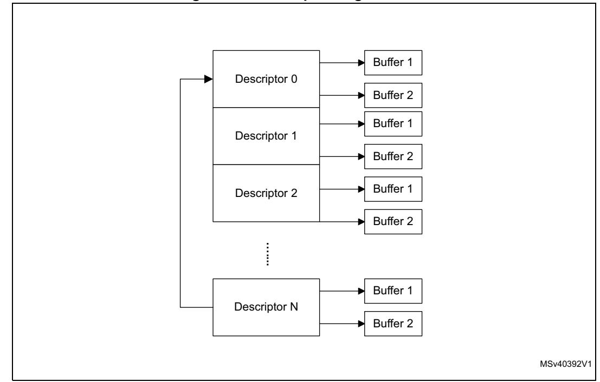

**Figure 851. Descriptor ring structure**

In a ring structure, descriptors are separated by the 32-bit word number programmed in the DSL field of the *[Channel control register \(ETH\\_DMACCR\)](#page-147-0)*). The application needs to program the total ring length, that is the total number of descriptors in ring span, in the following registers of a DMA channel:

- *[Channel Tx descriptor ring length register \(ETH\\_DMACTXRLR\)](#page-155-0)*)
- *[Channel Rx descriptor ring length register \(ETH\\_DMACRXRLR\)](#page-156-0)*)

The *[Channel Tx descriptor tail pointer register \(ETH\\_DMACTXDTPR\)](#page-154-0)* or *[Channel Rx](#page-155-1)  [descriptor tail pointer register \(ETH\\_DMACRXDTPR\)](#page-155-1)* contains the pointer to the descriptor address (*N*). The base address and the current descriptor pointer decide the address of the current descriptor that the DMA can process. The descriptors up to one location less than the one indicated by the descriptor tail pointer (*N* – 1) are owned by the DMA. The DMA continues to process the descriptors until the following condition occurs:

**Current Descriptor Pointer == Descriptor Tail Pointer;**

The DMA enters the Suspend state when this condition occurs. The application must perform a write operation to the Descriptor tail pointer register and update the tail pointer so that the following condition is met:

**Current Descriptor Pointer < Descriptor Tail Pointer;**

The DMA automatically wraps around the base address when the end of ring is reached, as shown in *[Figure 852: DMA descriptor ring](#page-117-0)*.

<span id="page-117-0"></span>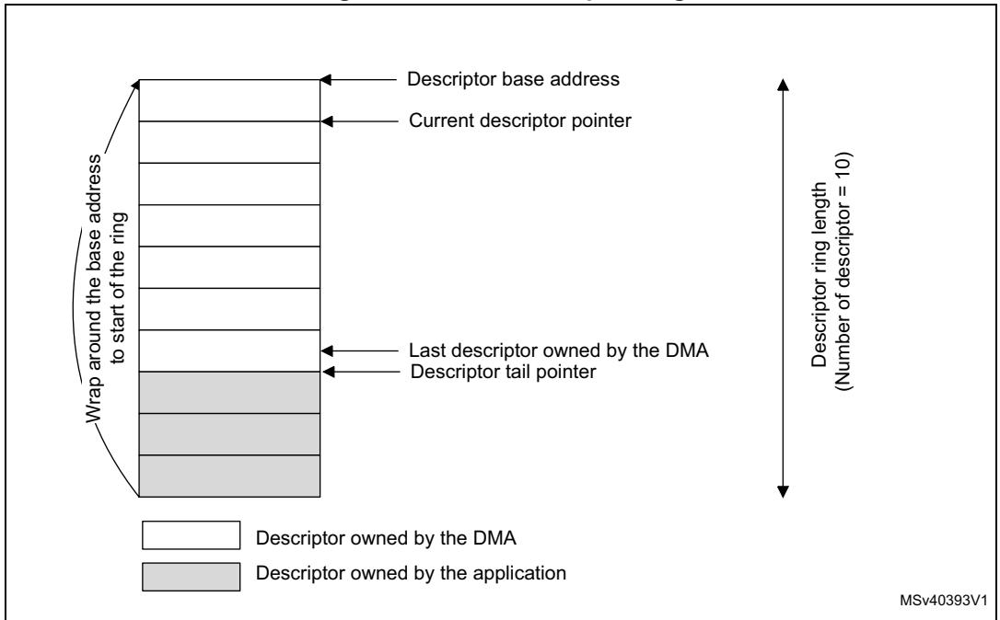

**Figure 852. DMA descriptor ring**

For descriptors owned by the application, the OWN bit of DES3 is reset to 0.

For descriptors owned by the DMA, the OWN bit is set to 1.

At the beginning, if the application has only one descriptor, it sets the last descriptor address (tail pointer) to Descriptor Base Address + 1. The DMA then processes the first descriptor and waits for the application to increment the tail pointer.

# <span id="page-118-0"></span>**61.10.3 Transmit descriptor**

The Ethernet peripheral DMA requires at least one descriptor for a transmit packet. In addition to two buffers, two byte-count buffers, and two address pointers, the transmit descriptor features control fields which can be used to manage the MAC operation on per-transmit packet basis. The Transmit normal descriptor has the following two formats: Read format and Write-back format

# **Transmit normal descriptor (read format)**

*[Figure 853](#page-118-1)* shows the Read format for Transmit normal descriptor. *[Table 579](#page-118-2)* to *[Table 582](#page-120-0)* provide a detailed description of all Transmit normal descriptors (read format).

<span id="page-118-1"></span>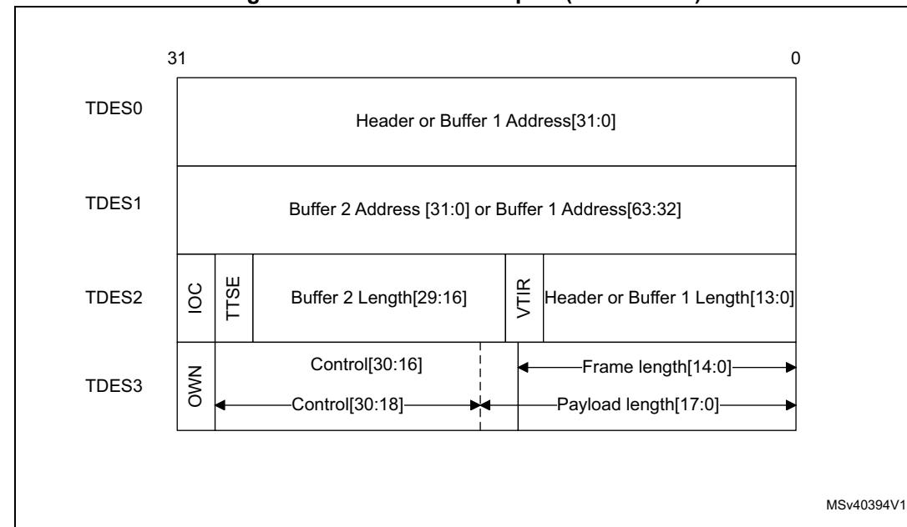

**Figure 853. Transmit descriptor (read format)**

• TDES0 normal descriptor (read format)

**Table 579. TDES0 normal descriptor (read format)**

<span id="page-118-2"></span>

| Bit  | Name   | Description                                                                                                                                                                                                                            |  |  |
|------|--------|----------------------------------------------------------------------------------------------------------------------------------------------------------------------------------------------------------------------------------------|--|--|
| 31:0 | BUF1AP | Buffer 1 Address Pointer or TSO Header Address Pointer<br>These bits indicate either the physical address of Buffer 1 or the TSO Header<br>Address pointer when the following bits are set:<br>– TSE bit of TDES3<br>– FD bit of TDES3 |  |  |

• TDES1 normal descriptor (read format)

**Table 580. TDES1 normal descriptor (read format)**

| Bit  | Name   | Description                                                                                                                                                                                        |  |  |
|------|--------|----------------------------------------------------------------------------------------------------------------------------------------------------------------------------------------------------|--|--|
| 31:0 | BUF2AP | Buffer 2 or Buffer 1 Address Pointer:<br>These bits indicate the physical address of Buffer 2 when a descriptor ring<br>structure is used. There is no limitation to the buffer address alignment. |  |  |

• TDES2 normal descriptor (read format)

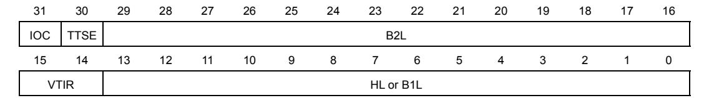

**Table 581. TDES2 normal descriptor (read format)** 

<span id="page-119-0"></span>

| Bits  | Name | Description                                                                                                                                                                                                                                                                                                                                                                                                                                                                                                                                                                                                                                                                                                                                                                                                                         |  |  |
|-------|------|-------------------------------------------------------------------------------------------------------------------------------------------------------------------------------------------------------------------------------------------------------------------------------------------------------------------------------------------------------------------------------------------------------------------------------------------------------------------------------------------------------------------------------------------------------------------------------------------------------------------------------------------------------------------------------------------------------------------------------------------------------------------------------------------------------------------------------------|--|--|
| 31    | IOC  | Interrupt on completion:<br>This bit sets the TI bit in the Channel status register<br>(ETH_DMACSR)) when the present packet transmission is<br>complete.                                                                                                                                                                                                                                                                                                                                                                                                                                                                                                                                                                                                                                                                           |  |  |
| 30    | TTSE | Transmit Timestamp Enable<br>This bit enables the IEEE1588 timestamping for Transmit packet<br>referenced by the descriptor.                                                                                                                                                                                                                                                                                                                                                                                                                                                                                                                                                                                                                                                                                                        |  |  |
| 29:16 | B2L  | Buffer 2 Length<br>The driver sets this field. When set, this field indicates Buffer 2<br>length.                                                                                                                                                                                                                                                                                                                                                                                                                                                                                                                                                                                                                                                                                                                                   |  |  |
| 15:14 | VTIR | VLAN Tag Insertion or Replacement:<br>These bits request the MAC to perform VLAN tagging or untagging<br>before transmitting the packets. The application must set the CRC<br>Pad Control bits appropriately when VLAN tag insertion,<br>replacement, or deletion is enabled for the packet. The values of<br>these bits are as follows:<br>00: Do not add a VLAN tag.<br>01: Remove the VLAN tag from the packets before transmission.<br>This option should be used only with the VLAN packets.<br>10: Insert a VLAN tag with the tag value programmed in the VLAN<br>inclusion register (ETH_MACVIR) or context descriptor.<br>11: Replace the VLAN tag in packets with the tag value programmed<br>in the VLAN inclusion register (ETH_MACVIR) or context descriptor.<br>This option should be used only with the VLAN packets. |  |  |


**Table 581. TDES2 normal descriptor (read format) (continued)**

| Bits | Name      | Description                                                                                                                                                                                                                                                                                                                                                                                                                                                                                                                                                                                                                            |  |  |  |  |
|------|-----------|----------------------------------------------------------------------------------------------------------------------------------------------------------------------------------------------------------------------------------------------------------------------------------------------------------------------------------------------------------------------------------------------------------------------------------------------------------------------------------------------------------------------------------------------------------------------------------------------------------------------------------------|--|--|--|--|
| 13:0 | HL or B1L | Header length or buffer 1 length<br>For Header length, only bits [9:0] are taken into account. Bits 13 to 0<br>are applicable only to buffer 1 length.<br>If the TCP Segmentation Offload feature is enabled through the TSE<br>bit of TDES3, this field is equal to the header length. When the TSE<br>bit is set in TDES3, the header length includes the length<br>(expressed in bytes)<br>from Ethernet Source address till the end of the TCP header. The<br>maximum header length supported for TSO feature is 1023 bytes.<br>If the TCP Segmentation Offload feature is not enabled, this field is<br>equal to Buffer 1 length. |  |  |  |  |

### • TDES3 normal descriptor (read format)

| 31  | 30   | 29 | 28 | 27 | 26  | 25 | 24   | 23   | 22 | 21 | 20  | 19 | 18  | 17 | 16  |
|-----|------|----|----|----|-----|----|------|------|----|----|-----|----|-----|----|-----|
| OWN | CTXT | FD | LD |    | CPC |    | SAIC |      |    |    | THL |    | TSE |    | TPL |
| 15  | 14   | 13 | 12 | 11 | 10  | 9  | 8    | 7    | 6  | 5  | 4   | 3  | 2   | 1  | 0   |
|     |      |    |    |    |     |    |      | FT/L |    |    |     |    |     |    |     |

**Table 582. TDES3 normal descriptor (read format)** 

<span id="page-120-0"></span>

| Bits | Name | Description                                                                                                                                                                                    |  |  |  |  |
|------|------|------------------------------------------------------------------------------------------------------------------------------------------------------------------------------------------------|--|--|--|--|
| 31   | OWN  | Own bit<br>1: the DMA owns the descriptor.<br>0: the application owns the descriptor.<br>The DMA clears this bit after it completes the transfer of data given in the<br>associated buffer(s). |  |  |  |  |
| 30   | CTXT | Context Type<br>This bit should be set to 0 for normal descriptor.                                                                                                                             |  |  |  |  |
| 29   | FD   | First Descriptor<br>When this bit is set, it indicates that the buffer contains the first segment of<br>a packet.                                                                              |  |  |  |  |
| 28   | LD   | Last Descriptor<br>When this bit is set, it indicates that the buffer contains the last segment of<br>the packet. B1L or B2L field should have a non-zero value.                               |  |  |  |  |

RM0399 Rev 4 3051/3556

**Table 582. TDES3 normal descriptor (read format) (continued)**

| Bits  | Name | Description                                                                                                                                                                                                                                                                                                                                                                                                                                                                                                                                                                                                                                                                                                                                                                                                                                                                                                                                                                                                                                                                                                                                                                                                                                                                                                                                                                                                                                                                                                                       |  |  |  |  |  |
|-------|------|-----------------------------------------------------------------------------------------------------------------------------------------------------------------------------------------------------------------------------------------------------------------------------------------------------------------------------------------------------------------------------------------------------------------------------------------------------------------------------------------------------------------------------------------------------------------------------------------------------------------------------------------------------------------------------------------------------------------------------------------------------------------------------------------------------------------------------------------------------------------------------------------------------------------------------------------------------------------------------------------------------------------------------------------------------------------------------------------------------------------------------------------------------------------------------------------------------------------------------------------------------------------------------------------------------------------------------------------------------------------------------------------------------------------------------------------------------------------------------------------------------------------------------------|--|--|--|--|--|
| 27:26 | CPC  | CRC Pad Control<br>This field controls the CRC and Pad Insertion for Tx packet. It is valid only<br>when the first descriptor bit (TDES3[29]) is set. The values of bits[27:26]<br>are the following:<br>00: CRC and Pad Insertion<br>The MAC appends the cyclic redundancy check (CRC) at the end of the<br>transmitted packets whose length greater than or equal to 60 bytes. The<br>MAC automatically appends padding and CRC to a packet with length less<br>than 60 bytes.<br>01: CRC Insertion (Disable Pad Insertion)<br>The MAC appends the CRC at the end of the transmitted packet but it does<br>not append padding. The application should ensure that the padding bytes<br>are present in the packet being transferred from the Transmit buffer, that is,<br>the packet being transferred from the Transmit Buffer is of length greater<br>than or equal to 60 bytes.<br>10: Disable CRC Insertion<br>The MAC does not append the CRC at the end of the transmitted packet.<br>The application should ensure that the padding and CRC bytes are present<br>in the packet being transferred from the Transmit Buffer.<br>11: CRC Replacement<br>The MAC replaces the last four bytes of the transmitted packet with<br>recalculated CRC bytes. The application should ensure that the padding<br>and CRC bytes are present in the packet being transferred from the<br>Transmit Buffer.<br>When the TSE bit is set, the MAC ignores this field because the CRC and<br>pad insertion is always done for segmentation. |  |  |  |  |  |
| 25:23 | SAIC | SA Insertion Control<br>These bits request the MAC to add or replace the Source Address field in<br>the Ethernet packet with the value given in the MAC Address 0 register.<br>The application must appropriately set the CRC Pad Control bits when SA<br>Insertion Control is enabled for the packet.<br>Bit 25 specifies the MAC Address Register (1 or 0) value that is used for<br>Source Address insertion or replacement.<br>The following list describes the values of Bits[24:23]:<br>00: Do not include the source address<br>01: Include or insert the source address. For reliable transmission, the<br>application must provide frames without source addresses.<br>10: Replace the source address. For reliable transmission, the application<br>must provide frames with source addresses.<br>11: Reserved<br>These bits are valid when the First Segment control bit (TDES3 [29]) is set.                                                                                                                                                                                                                                                                                                                                                                                                                                                                                                                                                                                                                          |  |  |  |  |  |
| 22:19 | THL  | THL: TCP Header Length<br>If the TSE bit is set, this field contains the length of the TCP/UDP header.<br>The minimum value of this field must be 5 for TCP header. THL value must<br>be equal to 2 for UDP header. This field is valid only for the first descriptor.                                                                                                                                                                                                                                                                                                                                                                                                                                                                                                                                                                                                                                                                                                                                                                                                                                                                                                                                                                                                                                                                                                                                                                                                                                                            |  |  |  |  |  |
| 18    | TSE  | TCP Segmentation Enable<br>When this bit is set, the DMA performs the TCP/UDP segmentation for a<br>packet. This bit is valid only if the FD bit is set.                                                                                                                                                                                                                                                                                                                                                                                                                                                                                                                                                                                                                                                                                                                                                                                                                                                                                                                                                                                                                                                                                                                                                                                                                                                                                                                                                                          |  |  |  |  |  |


**Table 582. TDES3 normal descriptor (read format) (continued)**

| Bits  | Name    | Description                                                                                                                                                                                                                                                                                                                                                                                                                                                                                                                                                                                                                                                                                                                                                                                                                             |  |  |  |  |  |
|-------|---------|-----------------------------------------------------------------------------------------------------------------------------------------------------------------------------------------------------------------------------------------------------------------------------------------------------------------------------------------------------------------------------------------------------------------------------------------------------------------------------------------------------------------------------------------------------------------------------------------------------------------------------------------------------------------------------------------------------------------------------------------------------------------------------------------------------------------------------------------|--|--|--|--|--|
| 17:16 | CIC/TPL | Checksum Insertion Control or TCP Payload Length<br>These bits control the checksum calculation and insertion. They can take<br>the following values:<br>00: Checksum insertion disabled.<br>01: Only IP header checksum calculation and insertion are enabled.<br>10: IP header checksum and payload checksum calculation and insertion<br>are enabled, but pseudo-header checksum is not calculated in hardware.<br>11: IP header checksum and payload checksum calculation and insertion<br>are enabled, and pseudo-header checksum is calculated in hardware.<br>This field is valid when the TSE bit is reset.When the TSE bit is set, it<br>contains the upper bits [17:16] of the TCP Payload length. This allows the<br>TCP packet length field to be spanned across TDES3[17:0] to provide<br>256 Kbyte packet length support. |  |  |  |  |  |
| 15    | TPL     | Reserved or TCP Payload Length<br>When the TSE bit is reset, this bit is reserved. When the TSE bit is set, this<br>is bit 15 of the TCP payload length [17:0].                                                                                                                                                                                                                                                                                                                                                                                                                                                                                                                                                                                                                                                                         |  |  |  |  |  |
| 14:0  | FL/TPL  | Reserved or TCP Payload Length<br>When the TSE bit is set, this field is equal to the lower 15 bits of the TCP<br>payload length. This length does not include Ethernet header or<br>TCP/UDP/IP header length.<br>When the TSE bit is reset, this bit is reserved.                                                                                                                                                                                                                                                                                                                                                                                                                                                                                                                                                                      |  |  |  |  |  |

### **Transmit normal descriptor (write-back format)**

The write-back format is applicable only for the last descriptor of the corresponding packet. The LD bit (TDES3[28]) is set in the descriptor where the DMA writes back the status and timestamp information for the corresponding Transmit packet.

*[Figure 854](#page-123-0)* shows the write-back format for Transmit normal descriptors. *[Table 583](#page-123-1)* to *[Table 586](#page-124-0)* provide a detailed description of all Transmit Normal descriptors (Write-Back Format).


<span id="page-123-0"></span>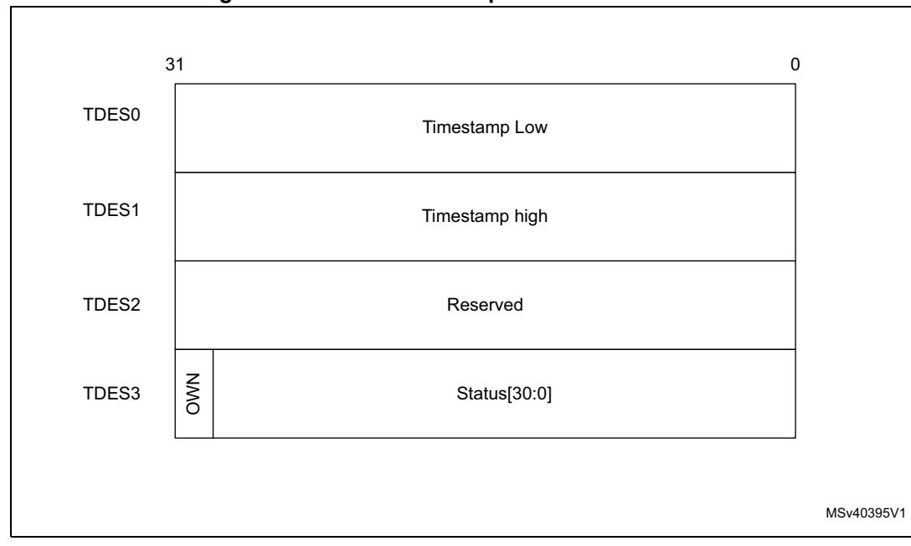

**Figure 854. Transmit descriptor write-back format**

• TDES0 normal descriptor (write-back format)

**Table 583. TDES0 normal descriptor (write-back format)(1)**

<span id="page-123-1"></span>

| Bit  | Name | Description                                                                                                                                                                                                                                                                                                                                                                                                        |  |  |  |  |  |  |
|------|------|--------------------------------------------------------------------------------------------------------------------------------------------------------------------------------------------------------------------------------------------------------------------------------------------------------------------------------------------------------------------------------------------------------------------|--|--|--|--|--|--|
| 31:0 | TTSL | Transmit Packet Timestamp Low<br>The DMA updates this field with least significant 32 bits of the timestamp captured<br>for the corresponding Transmit packet. The DMA writes the timestamp only if TTSE<br>bit of TDES2 is set in the first descriptor of the packet. This field holds the<br>timestamp only if the Last Segment bit (LS) in the descriptor is set and the<br>Timestamp status (TTSS) bit is set. |  |  |  |  |  |  |

- 1. This format is only applicable to the last descriptor of a packet.
- TDES1 normal descriptor (write-back format)

**Table 584. TDES1 normal descriptor (write-back format)(1)**

| Bit  | Name | Description                                                                                                                                                                                                                                                                                                                                                                                                     |  |  |  |  |  |
|------|------|-----------------------------------------------------------------------------------------------------------------------------------------------------------------------------------------------------------------------------------------------------------------------------------------------------------------------------------------------------------------------------------------------------------------|--|--|--|--|--|
| 31:0 | TTSH | Transmit Packet Timestamp High<br>The DMA updates this field with the most significant 32 bits of the timestamp<br>captured for corresponding Receive packet. The DMA writes the timestamp only if<br>the TTSE bit of TDES2 is set in the first descriptor of the packet. This field has the<br>timestamp only if the Last Segment bit (LS) in the descriptor is set and Timestamp<br>status (TTSS) bit is set. |  |  |  |  |  |

- 1. This format is only applicable to the last descriptor of a packet.
- TDES2 normal descriptor (write-back format)


# **Table 585. TDES2 normal descriptor (write-back format)(1)**

| Bit  | Description |
|------|-------------|
| 31:0 | Reserved    |

- 1. This format is only applicable to the last descriptor of a packet.
- TDES3 normal descriptor (write-back format)

| 31  | 30   | 29 | 28  | 27  | 26 | 25 | 24 | 23 | 22       | 21 | 20 | 19 | 18 | 17   | 16   |
|-----|------|----|-----|-----|----|----|----|----|----------|----|----|----|----|------|------|
| OWN | CTXT | FD | LD  |     |    |    |    |    | Reserved |    |    |    |    | TTSS | Res. |
| 15  | 14   | 13 | 12  | 11  | 10 | 9  | 8  | 7  | 6        | 5  | 4  | 3  | 2  | 1    | 0    |
| ES  | JT   | FF | PCE | LoC | NC | LC | EC |    |          | CC |    | ED | UF | DB   | IHE  |

# **Table 586. TDES3 normal descriptor (write-back format)(1)**

<span id="page-124-0"></span>

| Bit   | Name | Description                                                                                                                                                                                                                                                                                                                                    |  |  |  |
|-------|------|------------------------------------------------------------------------------------------------------------------------------------------------------------------------------------------------------------------------------------------------------------------------------------------------------------------------------------------------|--|--|--|
| 31    | OWN  | Own bit<br>When this bit is set, it indicates that the DMA owns the descriptor. The<br>DMA clears this bit when it completes the packet transmission. After<br>the write-back is complete, this bit is set to 0.                                                                                                                               |  |  |  |
| 30    | CTXT | Context Type<br>This bit should be set to 0 for normal descriptors.                                                                                                                                                                                                                                                                            |  |  |  |
| 29    | FD   | First Descriptor<br>This bit indicates that the buffer contains the first segment of a packet.                                                                                                                                                                                                                                                 |  |  |  |
| 28    | LD   | Last Descriptor<br>This bit is set 1 for last descriptor of a packet. The DMA writes the<br>status fields only in the last descriptor of the packet.                                                                                                                                                                                           |  |  |  |
| 27:18 |      | Reserved                                                                                                                                                                                                                                                                                                                                       |  |  |  |
| 17    | TTSS | Tx Timestamp Status<br>This status bit indicates that a timestamp has been captured for the<br>corresponding transmit packet. When this bit is set, TDES0 and<br>TDES1 have timestamp values that were captured for the Transmit<br>packet. This field is valid only when the Last Segment control bit<br>(TDES3 [28]) in a descriptor is set. |  |  |  |
| 16    |      | Reserved                                                                                                                                                                                                                                                                                                                                       |  |  |  |

**Table 586. TDES3 normal descriptor (write-back format)(1) (continued)**

| Bit | Name | Description                                                                                                                                                                                                                                                                                                                                                                                                                                                                                                                                                                                                                                                                                                                                                                                                           |  |  |  |  |
|-----|------|-----------------------------------------------------------------------------------------------------------------------------------------------------------------------------------------------------------------------------------------------------------------------------------------------------------------------------------------------------------------------------------------------------------------------------------------------------------------------------------------------------------------------------------------------------------------------------------------------------------------------------------------------------------------------------------------------------------------------------------------------------------------------------------------------------------------------|--|--|--|--|
| 15  | ES   | Error Summary<br>This bit indicates the logical OR of the following bits:<br>TDES3[0]: IP Header Error<br>TDES3[14]: Jabber Timeout<br>TDES3[13]: Packet Flush<br>TDES3[12]: Payload Checksum Error<br>TDES3[11]: Loss of Carrier<br>TDES3[10]: No Carrier<br>TDES3[9]: Late Collision<br>TDES3[8]: Excessive Collision<br>TDES3[3]: Excessive Deferral<br>TDES3[2]: Underflow Error                                                                                                                                                                                                                                                                                                                                                                                                                                  |  |  |  |  |
| 14  | JT   | Jabber Timeout<br>This bit indicates that the MAC transmitter has experienced a jabber<br>timeout. This bit is set only when the JD bit of the Operating mode<br>configuration register (ETH_MACCR) is not set.                                                                                                                                                                                                                                                                                                                                                                                                                                                                                                                                                                                                       |  |  |  |  |
| 13  | FF   | Packet Flushed<br>This bit indicates that the DMA or MTL flushed the packet because of a<br>software flush command given by the CPU.                                                                                                                                                                                                                                                                                                                                                                                                                                                                                                                                                                                                                                                                                  |  |  |  |  |
| 12  | PCE  | Payload Checksum Error<br>This bit indicates that the Checksum Offload engine had a failure and<br>did not insert any checksum into the encapsulated TCP, UDP, or ICMP<br>payload. This failure can be either caused by insufficient bytes, as<br>indicated by the Payload Length field of the IP Header, or by the MTL<br>starting to forward the packet to the MAC transmitter in Store-and<br>Forward mode without the checksum having been calculated yet. This<br>second error condition only occurs when the Transmit FIFO depth is<br>less than the length of the Ethernet packet being transmitted to avoid<br>deadlock, the MTL starts forwarding the packet when the FIFO is full,<br>even in the store-and-forward mode. This error can also occur when a<br>Bus error is detected during packet transfer. |  |  |  |  |
| 11  | LoC  | Loss of Carrier<br>This bit indicates that Loss of Carrier occurred during packet<br>transmission (that is, the ETH_CRS signal was inactive for one or<br>more transmit clock periods during packet transmission). This is valid<br>only for the packets transmitted without collision and when the MAC<br>operates in the Half-duplex mode.                                                                                                                                                                                                                                                                                                                                                                                                                                                                          |  |  |  |  |
| 10  | NC   | No Carrier<br>This bit indicates that the carrier sense signal form the PHY was not<br>asserted during transmission.                                                                                                                                                                                                                                                                                                                                                                                                                                                                                                                                                                                                                                                                                                  |  |  |  |  |
| 9   | LC   | Late Collision<br>This bit indicates that packet transmission was aborted because a<br>collision occurred after the collision window (64 byte times including<br>Preamble in MII mode ). This bit is not valid if Underflow Error is set.                                                                                                                                                                                                                                                                                                                                                                                                                                                                                                                                                                             |  |  |  |  |


**Table 586. TDES3 normal descriptor (write-back format)(1) (continued)**

| Bit | Name | Description                                                                                                                                                                                                                                                                                                                                                                                                                                                                                                            |
|-----|------|------------------------------------------------------------------------------------------------------------------------------------------------------------------------------------------------------------------------------------------------------------------------------------------------------------------------------------------------------------------------------------------------------------------------------------------------------------------------------------------------------------------------|
| 8   | EC   | Excessive Collision<br>This bit indicates that the transmission was aborted after 16<br>successive collisions while attempting to transmit the current packet. If<br>the DR bit is set in the Operating mode configuration register<br>(ETH_MACCR), this bit is set after first collision and the transmission<br>of the packet is aborted.                                                                                                                                                                            |
| 7:4 | CC   | Collision Count<br>This 4-bit counter value indicates the number of collisions occurred<br>before the packet was transmitted. The count is not valid when the EC<br>bit is set.                                                                                                                                                                                                                                                                                                                                        |
| 3   | ED   | Excessive Deferral<br>This bit indicates that the transmission ended because of excessive<br>deferral of over 24,288 bit times if DC bit is set in the Operating mode<br>configuration register (ETH_MACCR).                                                                                                                                                                                                                                                                                                           |
| 2   | UF   | Underflow Error<br>This bit indicates that the MAC aborted the packet because the data<br>arrived late from the system memory. The underflow error can occur<br>because of either of the following conditions:<br>The DMA encountered an empty Transmit Buffer while transmitting the<br>packet<br>The application filled the MTL Tx FIFO slower than the MAC transmit<br>rate<br>The transmission process enters the Suspend state and sets the<br>underflow bit corresponding to a queue in the ETH_MTLISR register. |
| 1   | DB   | Deferred Bit<br>This bit indicates that the MAC deferred before transmitting because of<br>presence of carrier. This bit is valid only in the Half-duplex mode.                                                                                                                                                                                                                                                                                                                                                        |
| 0   | IHE  | IP Header Error<br>When IP Header Error is set, this bit indicates that the Checksum<br>Offload engine detected an IP header error. If COE detects an IP<br>header error, it still inserts an IPv4 header checksum if the Ethernet<br>Type field indicates an IPv4 payload.                                                                                                                                                                                                                                            |

<sup>1.</sup> This format is only applicable to the last descriptor of a packet.

## **Transmit context descriptor**

The Transmit context descriptor can be provided any time before a packet descriptor. The context is valid for the current packet and subsequent packets. The context descriptor is used to provide the timestamps for one-step timestamp correction, and VLAN Tag ID for VLAN insertion feature. Write-back is only done on a context descriptor to reset the OWN bit.

*Note: The VLAN tag IDs and MSS values, which are provided by the application in a context descriptor with their corresponding Valid bits set, are stored internally by the DMA.*

> *When the outer or inner VLAN tag is provided with the Valid bit set, the DMA always passes the last valid VLAN tag to the MTL. The application cannot invalidate the valid VLAN tag*


RM0399 Rev 4 3057/3556

*stored by the DMA. The VLAN tag is inserted or replaced based on the control inputs provided for the packet.*

*The Inner VLAN Tag Control input is used only for the packet that immediately follows the context descriptor. The application must provide a context descriptor before the normal descriptor of each packet for which the DMA should use the inner VLAN Tag control input.*

*[Figure 855](#page-127-0)* shows the format for Transmit context descriptors. *[Table 587](#page-127-1)* to *[Table 590](#page-128-0)* provide a detailed description of all Transmit context descriptors.

<span id="page-127-0"></span>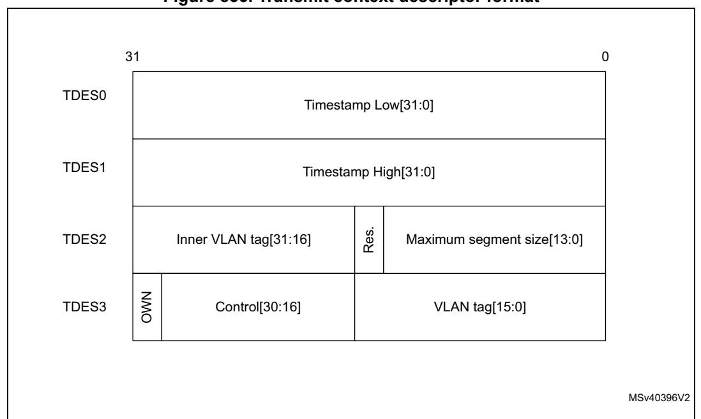

**Figure 855. Transmit context descriptor format**

• TDES0 context descriptor (read format)

**Table 587. TDES0 context descriptor** 

<span id="page-127-1"></span>

| Bit  | Name | Description                                                                                                                                                                                                                                                                             |  |
|------|------|-----------------------------------------------------------------------------------------------------------------------------------------------------------------------------------------------------------------------------------------------------------------------------------------|--|
| 31:0 | TTSL | Transmit Packet Timestamp Low<br>For one-step correction, the driver can provide the lower 32 bits of timestamp in<br>this descriptor word. The DMA uses this value as the low word for doing one-step<br>timestamp correction. This field is valid only if the OSTC and TCMSSV bits of |  |
|      |      | TDES3 context descriptor are set.                                                                                                                                                                                                                                                       |  |

• TDES1 context descriptor (read format)


### **Table 588. TDES1 context descriptor**

| Bit  | Name | Description                                                                                                                                                                                                                                                                             |
|------|------|-----------------------------------------------------------------------------------------------------------------------------------------------------------------------------------------------------------------------------------------------------------------------------------------|
|      |      | Transmit Packet Timestamp High                                                                                                                                                                                                                                                          |
| 31:0 | TTSH | For one-step correction, the driver can provide the upper 32 bits of timestamp in<br>this descriptor. The DMA uses this value as the high word for doing one-step<br>timestamp correction. This field is valid only if the OSTC and TCMSSV bits of<br>TDES3 context descriptor are set. |

• TDES2 context descriptor (read format)

**Table 589. TDES2 context descriptor** 

| Bit   | Name | Description                                                                                                                                                                                                                                   |  |  |
|-------|------|-----------------------------------------------------------------------------------------------------------------------------------------------------------------------------------------------------------------------------------------------|--|--|
| 31:16 | IVT  | Inner VLAN Tag<br>When the IVLTV bit of TDES3 context descriptor is set and the TCMSSV and OSTC<br>bits of TDES3 context descriptor are reset, TDES2[31:16] contains the inner VLAN<br>Tag to be inserted in the subsequent Transmit packets. |  |  |
| 15:14 |      | Reserved                                                                                                                                                                                                                                      |  |  |
| 13:0  | MSS  | Maximum Segment Size<br>This segment size is used while segmenting the TCP/IP payload. This field is valid<br>only if the TCMSSV bit of TDES3 context descriptor is set and the OSTC bit of the<br>TDES3 context descriptor is reset.         |  |  |

• TDES3 context descriptor (read format)

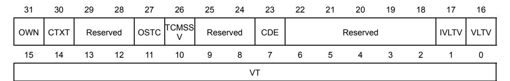

### **Table 590. TDES3 context descriptor**

<span id="page-128-0"></span>

| Bit   | Name     | Description                                                                                                                                                                           |
|-------|----------|---------------------------------------------------------------------------------------------------------------------------------------------------------------------------------------|
| 31    | OWN      | Own bit<br>1: the DMA owns the descriptor.<br>0: the application owns the descriptor.<br>The DMA clears this bit immediately after a read operation.                                  |
| 30    | CTXT     | Context Type<br>This bit should be set to 1 for context descriptor.                                                                                                                   |
| 29:28 | Reserved |                                                                                                                                                                                       |
| 27    | OSTC     | One-Step Timestamp Correction Enable<br>When this bit is set, the DMA performs a one-step timestamp correction<br>with reference to the timestamp values provided in TDES0 and TDES1. |


**Table 590. TDES3 context descriptor (continued)**

| Bit   | Name   | Description                                                                                                                                                                                                                                                                                                                                                                                                                                                                                                                                                                                                                                                                                                                                                                                                                                                                                                                                                                                                                                                                                                                                      |  |
|-------|--------|--------------------------------------------------------------------------------------------------------------------------------------------------------------------------------------------------------------------------------------------------------------------------------------------------------------------------------------------------------------------------------------------------------------------------------------------------------------------------------------------------------------------------------------------------------------------------------------------------------------------------------------------------------------------------------------------------------------------------------------------------------------------------------------------------------------------------------------------------------------------------------------------------------------------------------------------------------------------------------------------------------------------------------------------------------------------------------------------------------------------------------------------------|--|
| 26    | TCMSSV | One-Step Timestamp Correction Input or MSS Valid<br>When this bit and the OSTC bit are set, it indicates that the Timestamp<br>Correction input provided in TDES0 and TDES1 is valid.<br>When the OSTC bit is reset and this bit and the TSE bit of TDES3 are<br>set in subsequent normal descriptor, it indicates that the MSS input in<br>TDES2 is valid.                                                                                                                                                                                                                                                                                                                                                                                                                                                                                                                                                                                                                                                                                                                                                                                      |  |
| 25:24 |        | Reserved                                                                                                                                                                                                                                                                                                                                                                                                                                                                                                                                                                                                                                                                                                                                                                                                                                                                                                                                                                                                                                                                                                                                         |  |
| 23    | CDE    | Context Descriptor Error<br>When this bit is set, it indicates that the context descriptor is incorrect.<br>The DMA sets this bit during write-back while closing the context<br>descriptor.<br>The Context Descriptor errors can be:<br>– Incorrect sequence from the context descriptor. For example, a<br>location before the first descriptor for a packet.<br>– All 1s.<br>– CD, LD, and FD bits set to 1.<br>Note:<br>When a Context Descriptor error occurs due to All 1s or CTXT,<br>LD, and FD bits set to 1, the Transmit DMA closes the transmit<br>descriptor with DE and LD bits set to 1. When IOC bit in TDES2<br>of corresponding first descriptor is set to 1, Transmit DMA sets<br>the TI bit in the Channel status register (ETH_DMACSR).<br>Based on CTXT, LD, and FD bits of the transmit descriptor, the<br>subsequent descriptor might be considered as the First<br>Descriptor (even if FD bit is not set) and partial packet is sent.<br>This error is categorized as an abnormal event; recovery is only<br>by issuing a software reset (DMA stopping-reconfiguring<br>restarting recovery mechanism is not supported) |  |
| 22:20 |        | Reserved                                                                                                                                                                                                                                                                                                                                                                                                                                                                                                                                                                                                                                                                                                                                                                                                                                                                                                                                                                                                                                                                                                                                         |  |
| 19:18 | IVTIR  | Inner VLAN Tag Insert or Replace<br>When these bits are set, they request the MAC to perform Inner VLAN<br>tagging or untagging before transmitting the packets. If the packet is<br>modified for VLAN tags, the MAC automatically recalculates and<br>replaces the CRC bytes.<br>This bitfield has the following values:<br>00: Do not add the inner VLAN tag.<br>01: Remove the inner VLAN tag from the packets before transmission.<br>This option should be used only with the VLAN frames.<br>10: Insert an inner VLAN tag with the tag value programmed in the Inner<br>VLAN inclusion register (ETH_MACIVIR) or context descriptor.<br>11: Replace the inner VLAN tag in packets with the tag value<br>programmed in the Inner VLAN inclusion register (ETH_MACIVIR) or<br>context descriptor. This option should be used only with the VLAN<br>frames.                                                                                                                                                                                                                                                                                   |  |
| 17    | IVLTV  | Inner VLAN Tag Valid<br>When this bit is set, it indicates that the IVT field of TDES2 is valid.                                                                                                                                                                                                                                                                                                                                                                                                                                                                                                                                                                                                                                                                                                                                                                                                                                                                                                                                                                                                                                                 |  |


**Table 590. TDES3 context descriptor (continued)**

| Bit  | Name | Description                                                                                                                                                                                              |  |  |  |
|------|------|----------------------------------------------------------------------------------------------------------------------------------------------------------------------------------------------------------|--|--|--|
| 16   | VLTV | VLAN Tag Valid<br>When this bit is set, it indicates that the VT field of TDES3 is valid.                                                                                                                |  |  |  |
| 15:0 | VT   | VLAN Tag<br>This field contains the VLAN Tag to be inserted or replaced in the<br>packet. This field is used as VLAN Tag only when the VLTI bit of the<br>VLAN inclusion register (ETH_MACVIR) is reset. |  |  |  |

# 61.10.4 Receive descriptor

The DMA in the Ethernet peripheral attempts to read a descriptor only if the Tail pointer is different from the Base pointer or current pointer. It is recommended to have a descriptor ring with a length that can accommodate at least two complete packets received by the MAC; otherwise, the performance of the DMA is greatly impacted because of the unavailability of the descriptors. In such a situation, the MTL RxFIFO becomes full and starts dropping packets.

The following Receive descriptors are present:

- · Normal descriptors with read and write-back formats
- Context descriptors

All received descriptors are prepared by the software and given to the DMA as "normal" descriptors (see *Figure 856: Receive normal descriptor (read format)* for a description of their content). The DMA reads this descriptor and, after transferring a received packet (or part of it) to the buffers indicated by the descriptor, the Rx DMA closes the descriptor with the corresponding packet status. The status format is given in *Figure 857: Receive normal descriptor (write-back format)*.

For some packets, the normal descriptor bits are not sufficient to write the complete status. For such packets, the Rx DMA will write the extended status to the next descriptor (without processing or using the Buffers pointers embedded in that descriptor). The format and content of this write-back descriptor is described in *Figure 858: Receive context descriptor*.

### Receive normal descriptor (read format)

Figure 856 shows the read format for Receive normal descriptors. *Table 591* to *Table 594* provide a detailed description of all Receive normal descriptors (read format).

<span id="page-131-0"></span>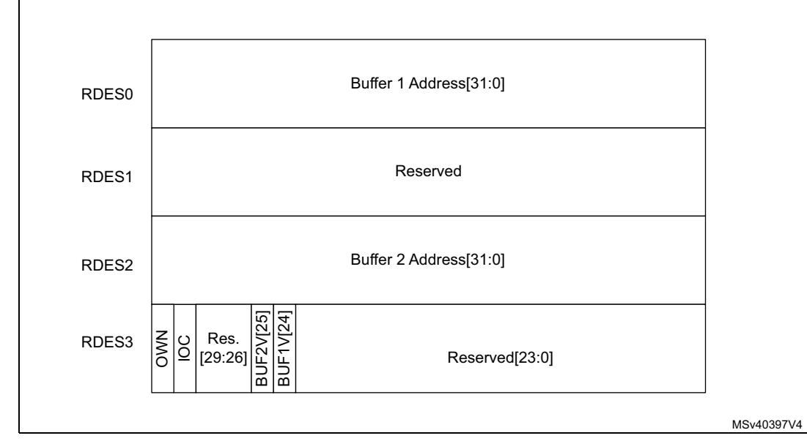

Figure 856. Receive normal descriptor (read format)

Note:

In the Receive descriptor (read format), if the Buffer Address field contains only 0s, the MAC does not transfer data to this buffer and skips to the next buffer or next descriptor.


• RDES0 normal descriptor (read format)

**Table 591. RDES0 normal descriptor (read format)** 

<span id="page-132-0"></span>

| Bit  | Name   | Description                                                                                                                                                                                                                                                                                                                                                                                                                                                                            |  |  |  |  |  |
|------|--------|----------------------------------------------------------------------------------------------------------------------------------------------------------------------------------------------------------------------------------------------------------------------------------------------------------------------------------------------------------------------------------------------------------------------------------------------------------------------------------------|--|--|--|--|--|
| 31:0 | BUF1AP | Buffer 1 Address Pointer<br>These bits indicate the physical address of Buffer 1.<br>The application can program a byte-aligned address for this buffer, which<br>means that the LS bits of this field can be non-zero. However, while<br>transferring the start of packet, the DMA performs a write operation with<br>RDES2[1:0]=0 in case of 64-/128-bit configuration) as zero. However, the<br>packet data is shifted by the actual offset as given in the buffer address pointer. |  |  |  |  |  |
|      |        | If the address pointer points to a buffer where the middle or last part of the<br>packet is stored, the DMA ignores the offset address and writes to the full<br>location as indicated by the data-width.                                                                                                                                                                                                                                                                              |  |  |  |  |  |

• RDES1 normal descriptor (read format)

**Table 592. RDES1 normal descriptor (read format)**

| Bit  | Name     | Description     |  |  |  |  |  |  |  |
|------|----------|-----------------|--|--|--|--|--|--|--|
| 31:0 | Reserved | Field reserved. |  |  |  |  |  |  |  |

• RDES2 normal descriptor (read format)

**Table 593. RDES2 normal descriptor (read format)**

| Bit  | Name   | Description                                                                                                                                                                                                                                                                                                                                                             |  |  |  |  |  |
|------|--------|-------------------------------------------------------------------------------------------------------------------------------------------------------------------------------------------------------------------------------------------------------------------------------------------------------------------------------------------------------------------------|--|--|--|--|--|
| 31:0 | BUF2AP | Buffer 2 Address Pointer<br>These bits indicate Buffer 2 physical address.<br>The RxDMA uses the LS bits of the pointer address only while transferring the<br>start bytes of a packet. If the BUF2AP is giving the address of a buffer in which<br>the middle or last part of a packet is stored, the DMA ignores RDES2[1:0]=0<br>and writes to the complete location. |  |  |  |  |  |

• RDES3 normal descriptor (read format)

| 31  | 30  | 29 | 28 | 27       | 26 | 25    | 24       | 23 | 22 | 21 | 20 | 19       | 18 | 17 | 16 |
|-----|-----|----|----|----------|----|-------|----------|----|----|----|----|----------|----|----|----|
| OWN | IOC |    |    | Reserved |    | BUF2V | BUF1V    |    |    |    |    | Reserved |    |    |    |
| 15  | 14  | 13 | 12 | 11       | 10 | 9     | 8        | 7  | 6  | 5  | 4  | 3        | 2  | 1  | 0  |
|     |     |    |    |          |    |       | Reserved |    |    |    |    |          |    |    |    |


**Table 594. RDES3 normal descriptor (read format)**

<span id="page-133-0"></span>

| Bit   | Name     | Description                                                                                                                                                                                                                                                                                                                                        |  |  |  |  |  |
|-------|----------|----------------------------------------------------------------------------------------------------------------------------------------------------------------------------------------------------------------------------------------------------------------------------------------------------------------------------------------------------|--|--|--|--|--|
| 31    | OWN      | Own bit<br>When this bit is set, it indicates that the DMA owns the descriptor. When this bit<br>is reset, it indicates that the application owns the descriptor. The DMA clears<br>this bit when either of the following conditions is true:<br>– The DMA completes the packet reception<br>– The buffers associated with the descriptor are full |  |  |  |  |  |
| 30    | IOC      | Interrupt Enabled on Completion<br>When this bit is set, an interrupt is issued to the application when the DMA<br>closes this descriptor.                                                                                                                                                                                                         |  |  |  |  |  |
| 29:26 | Reserved |                                                                                                                                                                                                                                                                                                                                                    |  |  |  |  |  |
| 25    | BUF2V    | Buffer 2 Address Valid<br>When this bit is set, it indicates to the DMA that the buffer 2 address specified in<br>RDES2 is valid. The application must set this bit so that the DMA can use the<br>address to which the Buffer 2 address in RDES0 is pointing, to write received<br>packet data.                                                   |  |  |  |  |  |
| 24    | BUF1V    | Buffer 1 Address Valid<br>When set, this indicates to the DMA that the buffer 1 address specified in<br>RDES0 is valid.<br>The application must set this value if the address to which Buffer 1 address<br>points in RDES0, can be used by the DMA to write received packet data.                                                                  |  |  |  |  |  |
| 23:0  | Reserved |                                                                                                                                                                                                                                                                                                                                                    |  |  |  |  |  |


# Receive normal descriptor (write-back format)

*Figure 857* shows the write-back format for Receive normal descriptors. *Table 595* to *Table 598* provide a detailed description of all Receive normal descriptors (write-back format).

Figure 857. Receive normal descriptor (write-back format)

<span id="page-134-0"></span>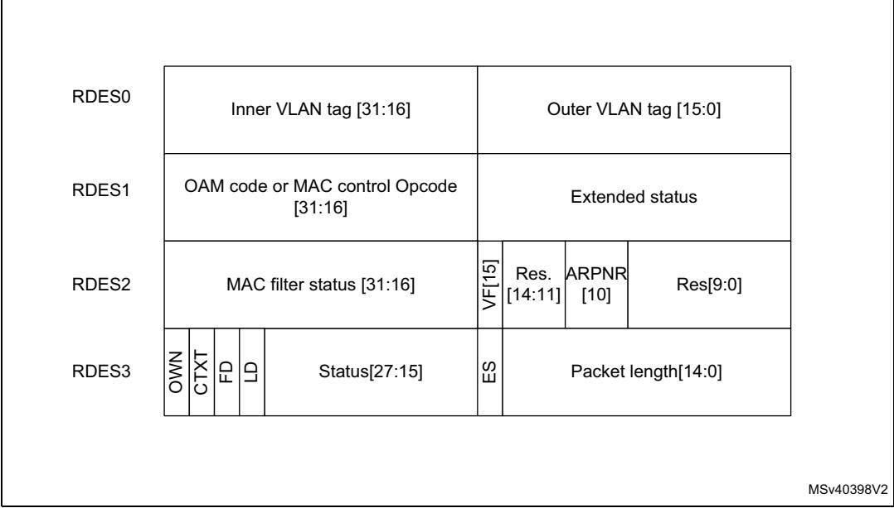

RDES0 normal descriptor (write-back format)

Table 595. RDES0 normal descriptor (write-back format)

<span id="page-134-1"></span>

| Bit   | Name | Description                                                                                                                                                                                           |
|-------|------|-------------------------------------------------------------------------------------------------------------------------------------------------------------------------------------------------------|
| 31:16 | IVT  | Inner VLAN Tag  This field contains the Inner VLAN tag of the received packet if the RS0V bit of RDES3 is set. This is valid only when Double VLAN tag processing and VLAN tag stripping are enabled. |
| 15:0  | OVT  | Outer VLAN Tag This field contains the Outer VLAN tag of the received packet if the RS0V bit of RDES3 is set.                                                                                         |

RDES1 normal descriptor (write-back format)

| 31 | 30  | 29 | 28  | 27  | 26 | 25 | 24  | 23   | 22   | 21   | 20   | 19   | 18 | 17 | 16 |
|----|-----|----|-----|-----|----|----|-----|------|------|------|------|------|----|----|----|
|    |     |    |     |     |    |    | OPC | ;    |      |      |      |      |    |    |    |
| 15 | 14  | 13 | 12  | 11  | 10 | 9  | 8   | 7    | 6    | 5    | 4    | 3    | 2  | 1  | 0  |
| TD | TSA | PV | PFT | PMT |    |    |     | IPCE | IPCB | IPV6 | IPV4 | IPHE |    | PT |    |


**Table 596. RDES1 normal descriptor (write-back format)(1)**

| Bit   | Name | Description                                                                                                                                                                                                                                                                                                                                                                                                                                                                                                                                                                              |
|-------|------|------------------------------------------------------------------------------------------------------------------------------------------------------------------------------------------------------------------------------------------------------------------------------------------------------------------------------------------------------------------------------------------------------------------------------------------------------------------------------------------------------------------------------------------------------------------------------------------|
| 31:16 | OPC  | OAM Subtype Code, or MAC Control Packet opcode<br>OAM Subtype Code<br>If bits[18:16] of RDES3 are set to 111, this field contains the OAM subtype and code<br>fields.<br>MAC Control Packet opcode<br>If bits[18:16] of RDES3 are set to 110, this field contains the MAC Control packet opcode<br>field.                                                                                                                                                                                                                                                                                |
| 15    | TD   | Timestamp Dropped<br>This bit indicates that the timestamp was captured for this packet but got dropped in the<br>MTL Rx FIFO because of overflow.                                                                                                                                                                                                                                                                                                                                                                                                                                       |
| 14    | TSA  | Timestamp Available<br>When Timestamp is present, this bit indicates that the timestamp value is available in a<br>context descriptor word 2 (RDES2) and word 1(RDES1). This is valid only when the Last<br>Descriptor bit (RDES3 [28]) is set.<br>The context descriptor is written in the next descriptor just after the last normal descriptor<br>for a packet.                                                                                                                                                                                                                       |
| 13    | PV   | PTP Version<br>1: Received PTP message in IEEE 1588 version 2 format<br>0: Received PTP message in IEEE 1588 version 1 format                                                                                                                                                                                                                                                                                                                                                                                                                                                            |
| 12    | PFT  | PTP Packet Type<br>This bit indicates that the PTP message is sent directly over Ethernet.                                                                                                                                                                                                                                                                                                                                                                                                                                                                                               |
| 11:8  | PMT  | PTP Message Type<br>These bits are encoded to give the type of the message received:<br>0000: No PTP message received<br>0001: SYNC (all clock types)<br>0010: Follow_Up (all clock types)<br>0011: Delay_Req (all clock types)<br>0100: Delay_Resp (all clock types)<br>0101: Pdelay_Req (in peer-to-peer transparent clock)<br>0110: Pdelay_Resp (in peer-to-peer transparent clock)<br>0111: Pdelay_Resp_Follow_Up (in peer-to-peer transparent clock)<br>1000: Announce<br>1001: Management<br>1010: Signaling<br>1011–1110: Reserved<br>1111: PTP packet with Reserved message type |
| 7     | IPCE | IP Payload Error<br>When this bit is set, it indicates either of the following:<br>– The 16-bit IP payload checksum (that is, the TCP, UDP, or ICMP checksum) calculated<br>by the MAC does not match the corresponding checksum field in the received segment.<br>– The TCP, UDP, or ICMP segment length does not match the payload length value in the<br>IP Header field.<br>– The TCP, UDP, or ICMP segment length is less than minimum allowed segment length<br>for TCP, UDP, or ICMP.<br>Bit 15 (ES) of RDES3 is not set when this bit is set.                                    |


**Table 596. RDES1 normal descriptor (write-back format)(1) (continued)**

| Bit | Name | Description                                                                                                                                                                                                                                                                                                                                                                                                                                                         |
|-----|------|---------------------------------------------------------------------------------------------------------------------------------------------------------------------------------------------------------------------------------------------------------------------------------------------------------------------------------------------------------------------------------------------------------------------------------------------------------------------|
| 6   | IPCB | IP Checksum Bypassed<br>This bit indicates that the checksum offload engine is bypassed.                                                                                                                                                                                                                                                                                                                                                                            |
| 5   | IPV6 | IPv6 header Present<br>This bit indicates that an IPV6 header is detected.                                                                                                                                                                                                                                                                                                                                                                                          |
| 4   | IPV4 | IPV4 Header Present<br>This bit indicates that an IPV4 header is detected.                                                                                                                                                                                                                                                                                                                                                                                          |
| 3   | IPHE | IP Header Error<br>– When this bit is set, it indicates either of the following:<br>– The 16-bit IPv4 header checksum calculated by the MAC does not match the received<br>checksum bytes.<br>– The IP datagram version is not consistent with the Ethernet Type value.<br>– Ethernet packet does not have the expected number of IP header bytes.<br>This bit is valid when either bit 5 or bit 4 is set.                                                          |
| 2:0 | PT   | Payload Type<br>These bits indicate the type of payload encapsulated in the IP datagram processed by the<br>Receive Checksum Offload Engine (COE):<br>000: Unknown type or IP/AV payload not processed<br>001: UDP<br>010: TCP<br>011: ICMP<br>100: IGMP if IPV4 Header Present bit is set<br>Others: reserved.<br>If the COE does not process the payload of an IP datagram because there is an IP header<br>error or fragmented IP, it sets these bits to 3'b000. |

<sup>1.</sup> The Status fields in write-back format are valid only for the last descriptor (RDES3[28] is set).

# <span id="page-136-0"></span>• RDES2 normal descriptor (write-back format)

| 31 | 30       | 29 | 28   | 27    | 26 | 25 | 24 | 23    | 22       | 21 | 20 | 19 | 18 | 17  | 16  |
|----|----------|----|------|-------|----|----|----|-------|----------|----|----|----|----|-----|-----|
|    | L3L4FM   |    | L4FM | L3FM  |    |    |    | MADRM |          |    |    |    | HF | DAF | SAF |
| 15 | 14       | 13 | 12   | 11    | 10 | 9  | 8  | 7     | 6        | 5  | 4  | 3  | 2  | 1   | 0   |
| VF | Reserved |    |      | ARPRN |    |    |    |       | Reserved |    |    |    |    |     |     |


**Table 597. RDES2 normal descriptor (write-back format)** 

| Bit   | Name   | Description                                                                                                                                                                                                                                                                                                                                                                                                                                                                                                                               |
|-------|--------|-------------------------------------------------------------------------------------------------------------------------------------------------------------------------------------------------------------------------------------------------------------------------------------------------------------------------------------------------------------------------------------------------------------------------------------------------------------------------------------------------------------------------------------------|
| 31:29 | L3L4FM | Layer 3 and Layer 4 Filter Number Matched<br>These bits indicate the number of the Layer 3 and Layer 4 Filter that matched the<br>received packet:<br>– 000: Filter 0<br>– 001: Filter 1<br>– 010: Filter 2<br>– 011: Filter 3<br>– 100: Filter 4<br>– 101: Filter 5<br>– 110: Filter 6<br>– 111: Filter 7<br>This field is valid only when bit 28 or bit 27 is set high. When more than one filter                                                                                                                                       |
| 28    | L4FM   | matches, these bits give the number of lowest filter.<br>Layer 4 Filter Match<br>When this bit is set, it indicates that the received packet matches one of the enabled<br>Layer 4 Port Number fields. This status is given only when one of the following<br>conditions is true:<br>– Layer 3 fields are not enabled and all enabled Layer 4 fields match<br>– All enabled Layer 3 and Layer 4 filter fields match<br>When more than one filter matches, this bit gives the layer 4 filter status of filter<br>indicated by bits[31:29]. |
| 27    | L3FM   | Layer 3 Filter Match<br>When this bit is set, it indicates that the received packet matches one of the enabled<br>Layer 3 IP Address fields. This status is given only when one of the following conditions<br>is true:<br>– All enabled Layer 3 fields match and all enabled Layer 4 fields are bypassed<br>– All enabled filter fields match<br>When more than one filter matches, this bit gives the layer 3 filter status of filter<br>indicated by bits[31:29].                                                                      |
| 26:19 | MADRM  | MAC Address Match or Hash Value<br>When the HF bit is reset, this field contains the MAC address register number that<br>matched the Destination address of the received packet. This field is valid only if the<br>DAF bit is reset.<br>When the HF bit is set, this field contains the Hash value computed by the MAC. A<br>packet passes the Hash filter when the bit corresponding to the Hash value is set in the<br>Hash filter register.                                                                                           |
| 18    | HF     | Hash Filter Status<br>When this bit is set, it indicates that the packet passed the MAC address Hash filter.<br>its[26:19] indicate the Hash value.                                                                                                                                                                                                                                                                                                                                                                                       |
| 17    | DAF    | Destination Address Filter Fail<br>When this bit is set, it indicates that the packet failed the DA Filter in the MAC.                                                                                                                                                                                                                                                                                                                                                                                                                    |
| 16    | SAF    | SA Address Filter Fail<br>When this bit is set, it indicates that the packet failed the SA Filter in the MAC.                                                                                                                                                                                                                                                                                                                                                                                                                             |


**Table 597. RDES2 normal descriptor (write-back format) (continued)**

| Bit   | Name     | Description                                                                                                                                                                                                                                                                        |  |  |  |  |  |
|-------|----------|------------------------------------------------------------------------------------------------------------------------------------------------------------------------------------------------------------------------------------------------------------------------------------|--|--|--|--|--|
| 15    | VF       | VLAN Filter Status<br>When this bit is set, it indicates that the VLAN Tag of received packet passed the VLAN<br>filter.                                                                                                                                                           |  |  |  |  |  |
| 14:11 | Reserved |                                                                                                                                                                                                                                                                                    |  |  |  |  |  |
| 10    | ARPNR    | ARP Reply Not Generated<br>When this bit is set, it indicates that the MAC did not generate the ARP Reply for<br>received ARP Request packet. This bit is set when the MAC is busy transmitting ARP<br>reply to earlier ARP request (only one ARP request is processed at a time). |  |  |  |  |  |
| 9:0   | Reserved |                                                                                                                                                                                                                                                                                    |  |  |  |  |  |

### • RDES3 normal descriptor (write-back format)

| 31  | 30   | 29 | 28 | 27   | 26   | 25   | 24 | 23 | 22  | 21 | 20 | 19 | 18 | 17 | 16 |
|-----|------|----|----|------|------|------|----|----|-----|----|----|----|----|----|----|
| OWN | CTXT | FD | LD | RS2V | RS1V | RS0V | CE | GP | RWT | OE | RE | DE |    | LT |    |
| 15  | 14   | 13 | 12 | 11   | 10   | 9    | 8  | 7  | 6   | 5  | 4  | 3  | 2  | 1  | 0  |
| ES  |      |    |    |      |      |      |    | PL |     |    |    |    |    |    |    |

**Table 598. RDES3 normal descriptor (write-back format)** 

<span id="page-138-0"></span>

| Bit | Name | Description                                                                                                                                                                                                                                                                                                                                                                                                                                                                                                                                                                                                                                                                                                                                                                                                                                                                                                                      |  |  |  |  |
|-----|------|----------------------------------------------------------------------------------------------------------------------------------------------------------------------------------------------------------------------------------------------------------------------------------------------------------------------------------------------------------------------------------------------------------------------------------------------------------------------------------------------------------------------------------------------------------------------------------------------------------------------------------------------------------------------------------------------------------------------------------------------------------------------------------------------------------------------------------------------------------------------------------------------------------------------------------|--|--|--|--|
| 31  | OWN  | Own bit<br>1: The DMA owns the descriptor.<br>0: The application owns the descriptor.<br>The DMA clears this bit when either of the following conditions is true:<br>The DMA completes the packet reception<br>The buffers associated with the descriptor are full                                                                                                                                                                                                                                                                                                                                                                                                                                                                                                                                                                                                                                                               |  |  |  |  |
| 30  | CTXT | Receive Context Descriptor<br>When this bit is set, it indicates that the current descriptor is a context<br>type descriptor. The DMA writes 0 to this bit for normal receive<br>descriptor.<br>When CTXT and FD bits are used together, {CTXT, FD} possible values<br>are:<br>00: Intermediate Descriptor<br>01: First Descriptor<br>10: Reserved<br>11: Descriptor error (due to all 1s)<br>Note:<br>When a Descriptor error occurs, the Receive DMA closes the<br>receive descriptor indicating a Descriptor error. This receive<br>descriptor is skipped and the buffer addresses are not used to<br>write the packet data. The receive DMA sets the CDE field of the<br>Channel status register (ETH_DMACSR) but does not set the RI<br>field, even when IOC field is set, as this is not marked as last<br>receive descriptor for the packet. The subsequent valid receive<br>descriptor is used to write the packet data. |  |  |  |  |

**Table 598. RDES3 normal descriptor (write-back format) (continued)**

| Bit | Name | Description                                                                                                                                                                                                                                                                                                                                                                                                       |  |  |  |  |  |
|-----|------|-------------------------------------------------------------------------------------------------------------------------------------------------------------------------------------------------------------------------------------------------------------------------------------------------------------------------------------------------------------------------------------------------------------------|--|--|--|--|--|
|     |      | First Descriptor                                                                                                                                                                                                                                                                                                                                                                                                  |  |  |  |  |  |
| 29  | FD   | When this bit is set, it indicates that this descriptor contains the first<br>buffer of the packet. If the size of the first buffer is 0, the second buffer<br>contains the beginning of the packet. If the size of the second buffer is<br>also 0, the next descriptor contains the beginning of the packet.<br>Refer to the CTXT bit description for details on how to use the CTXT bit<br>and FD bit together. |  |  |  |  |  |
| 28  | LD   | Last Descriptor<br>When this bit is set, it indicates that the buffers to which this descriptor is<br>pointing are the last buffers of the packet.                                                                                                                                                                                                                                                                |  |  |  |  |  |
| 27  | RS2V | Receive Status RDES2 Valid<br>When this bit is set, it indicates that the status in RDES2 is valid and it is<br>written by the DMA. This bit is valid only when the LD bit of RDES3 is<br>set.                                                                                                                                                                                                                    |  |  |  |  |  |
| 26  | RS1V | Receive Status RDES1 Valid<br>When this bit is set, it indicates that the status in RDES1 is valid and it is<br>written by the DMA. This bit is valid only when the LD bit of RDES3 is<br>set.                                                                                                                                                                                                                    |  |  |  |  |  |
| 25  | RS0V | Receive Status RDES0 Valid<br>When this bit is set, it indicates that the status in RDES0 is valid and it is<br>written by the DMA. This bit is valid only when the LD bit of RDES3 is<br>set.                                                                                                                                                                                                                    |  |  |  |  |  |
| 24  | CE   | CRC Error<br>When this bit is set, it indicates that a Cyclic Redundancy Check (CRC)<br>Error occurred on the received packet. This field is valid only when the<br>LD bit of RDES3 is set.                                                                                                                                                                                                                       |  |  |  |  |  |
| 23  | GP   | Giant Packet<br>When this bit is set, it indicates that the packet length exceeds the<br>specified maximum Ethernet size of 1518, 1522, or 2000 bytes (9018 or<br>9022 bytes if jumbo packet enable is set).<br>Giant packet indicates only the packet length. It does not cause any<br>packet truncation.                                                                                                        |  |  |  |  |  |
| 22  | RWT  | Receive Watchdog Timeout<br>When this bit is set, it indicates that the Receive Watchdog Timer has<br>expired while receiving the current packet. The current packet is<br>truncated after watchdog timeout.                                                                                                                                                                                                      |  |  |  |  |  |
| 21  | OE   | Overflow Error<br>When this bit is set, it indicates that the received packet is damaged<br>because of buffer overflow in Rx FIFO.<br>This bit is set only when the DMA transfers a partial packet to the<br>application. This happens only when the Rx FIFO is operating in the<br>threshold mode. In the store-and-forward mode, all partial packets are<br>dropped completely in Rx FIFO.                      |  |  |  |  |  |
| 20  | RE   | Receive Error<br>When this bit is set, it indicates that the ETH_RX_ER signal is asserted<br>while the ETH_RX_DV signal is asserted during packet reception.                                                                                                                                                                                                                                                      |  |  |  |  |  |


**Table 598. RDES3 normal descriptor (write-back format) (continued)**

| Bit   | Name | Description                                                                                                                                                                                                                                                                                                                                                                                                                                                                                                                                                                         |  |  |  |  |  |
|-------|------|-------------------------------------------------------------------------------------------------------------------------------------------------------------------------------------------------------------------------------------------------------------------------------------------------------------------------------------------------------------------------------------------------------------------------------------------------------------------------------------------------------------------------------------------------------------------------------------|--|--|--|--|--|
| 19    | DE   | Dribble Bit Error<br>When this bit is set, it indicates that the received packet has a non<br>integer multiple of bytes (odd nibbles). This bit is valid only in the MII<br>Mode.                                                                                                                                                                                                                                                                                                                                                                                                   |  |  |  |  |  |
| 18:16 | LT   | Length/Type Field<br>This field indicates if the packet received is a length packet or a type<br>packet. The encoding of the 3 bits is as follows:<br>000: The packet is a length packet<br>001: The packet is a type packet.<br>011: The packet is a ARP Request packet type<br>100: The packet is a type packet with VLAN Tag<br>101: The packet is a type packet with Double VLAN tag<br>110: The packet is a MAC Control packet type<br>111: The packet is a OAM packet type<br>010: Reserved                                                                                   |  |  |  |  |  |
| 15    | ES   | Error Summary<br>When this bit is set, it indicates the logical OR of the following bits:<br>RDES3[19]: Dribble Error<br>RDES3[20]: Receive Error<br>RDES3[21]: Overflow Error<br>RDES3[22]: Watchdog Timeout<br>RDES3[23]: Giant Packet<br>RDES3[24]: CRC Error<br>This field is valid only when the LD bit of RDES3 is set.                                                                                                                                                                                                                                                       |  |  |  |  |  |
| 14:0  | PL   | Packet Length<br>These bits indicate the byte length of the received packet that was<br>transferred to system memory (including CRC).<br>This field is valid when both the LD bit of RDES3 is set and the Overflow<br>Error bit is reset. The packet length also includes the two bytes<br>appended to the Ethernet packet when IP checksum calculation is<br>enabled and the received packet is not a MAC control packet.<br>When LD bit of RDES3 is reset, this field contains the accumulated<br>number of bytes (partial) that have been transferred for the current<br>packet. |  |  |  |  |  |


# **Receive context descriptor**

This descriptor is read-only for the application. This descriptor can be written only by the DMA.

The context descriptor provides information about the extended status related to the last received packet. Bit 30 of RDES3 indicates the context type descriptor.

*[Figure 858](#page-141-0)* shows the format for Receive context descriptors. *[Table 599](#page-141-1)* to *[Table 602](#page-142-0)* provide a detailed description of all Receive context descriptors.

<span id="page-141-0"></span>MSv40399V1 Timestamp High[31:0] Timestamp Low[31:0] Reserved OWN Reserved[29:0] RDES0 RDES1 RDES2 RDES3 CTXT

**Figure 858. Receive context descriptor**

• RDES0 context descriptor

**Table 599. RDES0 context descriptor** 

<span id="page-141-1"></span>

| Bit  | Name | Description                                                                                                                                                                                                                                                               |  |  |  |  |
|------|------|---------------------------------------------------------------------------------------------------------------------------------------------------------------------------------------------------------------------------------------------------------------------------|--|--|--|--|
| 31:0 | RTSL | Receive Packet Timestamp Low<br>The DMA updates this field with least significant 32 bits of the timestamp captured<br>for corresponding Receive packet. When this field and the RTSH field of RDES1<br>show all-ones value, the timestamp must be considered as corrupt. |  |  |  |  |

# • RDES1 context descriptor

**Table 600. RDES1 context descriptor** 

| Bit  | Field | Description                                                                                                                                                                                                                                                               |
|------|-------|---------------------------------------------------------------------------------------------------------------------------------------------------------------------------------------------------------------------------------------------------------------------------|
| 31:0 | RTSH  | Receive Packet Timestamp High<br>The DMA updates this field with most significant 32 bits of the timestamp captured<br>for corresponding receive packet. When this field and the RTSL field of RDES0<br>show all-ones value, the timestamp must be considered as corrupt. |

### • RDES2 context descriptor

**Table 601. RDES2 context descriptor** 

| Bit  | Description |
|------|-------------|
| 31:0 | Reserved    |

### • RDES3 context descriptor

**Table 602. RDES3 context descriptor** 

<span id="page-142-0"></span>

| Bit  | Name | Description                                                                                                                                                                                                                                                       |
|------|------|-------------------------------------------------------------------------------------------------------------------------------------------------------------------------------------------------------------------------------------------------------------------|
| 31   | OWN  | Own Bit<br>1: The DMA owns the descriptor<br>0: The application owns the descriptor.<br>The DMA clears this bit when either of the following conditions is true:<br>The DMA completes the packet reception<br>The buffers associated with the descriptor are full |
| 30   | CTXT | Receive Context Descriptor<br>When this bit is set, it indicates that the current descriptor is a context<br>descriptor. The DMA writes 1'b1 to this bit for context descriptor.                                                                                  |
| 29:0 |      | Reserved                                                                                                                                                                                                                                                          |


# **61.11 Ethernet registers**

# **61.11.1 Ethernet register maps**

This section provides the following register maps:

- DMA registers (see *[Section 61.11.2: Ethernet DMA registers](#page-143-0)*)
- MTL registers (see *[Section 61.11.3: Ethernet MTL registers](#page-169-0)*)
- MAC registers including MMC register (see *[Section 61.11.4: Ethernet MAC and MMC](#page-181-1)  [registers](#page-181-1)*)

# <span id="page-143-0"></span>**61.11.2 Ethernet DMA registers**

# <span id="page-143-1"></span>**DMA mode register (ETH\_DMAMR)**

Address offset: 0x1000 Reset value: 0x0000 0000

The DMA mode register establishes the bus operating modes for the DMA.

| 31   | 30   | 29      | 28   | 27   | 26   | 25   | 24   | 23   | 22   | 21   | 20   | 19   | 18   | 17 | 16        |
|------|------|---------|------|------|------|------|------|------|------|------|------|------|------|----|-----------|
| Res. | Res. | Res.    | Res. | Res. | Res. | Res. | Res. | Res. | Res. | Res. | Res. | Res. | Res. |    | INTM[1:0] |
|      |      |         |      |      |      |      |      |      |      |      |      |      |      | rw | rw        |
|      |      |         |      |      |      |      |      |      |      |      |      |      |      |    |           |
| 15   | 14   | 13      | 12   | 11   | 10   | 9    | 8    | 7    | 6    | 5    | 4    | 3    | 2    | 1  | 0         |
| Res. |      | PR[2:0] |      | TXPR | Res. | Res. | Res. | Res. | Res. | Res. | Res. | Res. | Res. | DA | SWR       |

Bits 31:18 Reserved, must be kept at reset value.

# Bits 17:16 **INTM[1:0]**: Interrupt Mode

This field defines the interrupt mode of the Ethernet peripheral.

The behavior of the interrupt signal and of the RI/TI bits in the ETH\_DMACSR register changes depending on the INTM value (refer to *[Table 578: Transfer complete interrupt](#page-98-0)  [behavior](#page-98-0)*).

Bit 15 Reserved, must be kept at reset value.

### Bits 14:12 **PR[2:0]**: Priority ratio

These bits control the priority ratio in weighted round-robin arbitration between the Rx DMA and Tx DMA. These bits are valid only when the DA bit is reset. The priority ratio is Rx:Tx or Tx:Rx depending on whether the TXPR bit is reset or set.

000: The priority ratio is 1:1

001: The priority ratio is 2:1

010: The priority ratio is 3:1

011: The priority ratio is 4:1

100: The priority ratio is 5:1

101: The priority ratio is 6:1

110: The priority ratio is 7:1

111: The priority ratio is 8:1

### Bit 11 **TXPR**: Transmit priority

When set, this bit indicates that the Tx DMA has higher priority than the Rx DMA during arbitration for the system-side bus.


#### Bits 10:2 Reserved, must be kept at reset value.

#### Bit 1 **DA**: DMA Tx or Rx Arbitration Scheme

This bit specifies the arbitration scheme between the Transmit and Receive paths of all channels:

0: Weighted Round-Robin with Rx:Tx or Tx:Rx

The priority between the paths is according to the priority specified in Bits[14:12] and the priority weight is specified in the TXPR bit.

1: Fixed priority

The Tx path has priority over the Rx path when the TXPR bit is set. Otherwise, the Rx path has priority over the Tx path.

#### Bit 0 **SWR**: Software Reset

When this bit is set, the MAC and the DMA controller reset the logic and all internal registers of the DMA, MTL, and MAC. This bit is automatically cleared after the reset operation is complete in all clock domains. Before reprogramming any register, a value of zero should be read in this bit.

*Note: The reset operation is complete only when all resets in all active clock domains are deasserted. Therefore, it is essential that all PHY inputs clocks (applicable for the selected PHY interface) are present for software reset completion. The time to complete the software reset operation depends on the frequency of the slowest active clock.* 


RM0399 Rev 4 3075/3556

### <span id="page-145-0"></span>**System bus mode register (ETH\_DMASBMR)**

Address offset: 0x1004 Reset value: 0x0000 0000

The System bus mode register controls the behavior of the AHB master. It mainly controls burst splitting and number of outstanding requests.

| 31   | 30   | 29   | 28   | 27   | 26   | 25   | 24   | 23   | 22   | 21   | 20   | 19   | 18   | 17   | 16   |
|------|------|------|------|------|------|------|------|------|------|------|------|------|------|------|------|
| Res. | Res. | Res. | Res. | Res. | Res. | Res. | Res. | Res. | Res. | Res. | Res. | Res. | Res. | Res. | Res. |
|      |      |      |      |      |      |      |      |      |      |      |      |      |      |      |      |
|      |      |      |      |      |      |      |      |      |      |      |      |      |      |      |      |
| 15   | 14   | 13   | 12   | 11   | 10   | 9    | 8    | 7    | 6    | 5    | 4    | 3    | 2    | 1    | 0    |
| RB   | MB   | Res. | AAL  | Res. | Res. | Res. | Res. | Res. | Res. | Res. | Res. | Res. | Res. | Res. | FB   |

Bits 31:16 Reserved, must be kept at reset value.

#### Bit 15 **RB**: Rebuild INCRx Burst

When this bit is set high and the AHB master gets SPLIT, RETRY, or Early Burst Termination (EBT) response, the AHB master interface rebuilds the pending beats of any initiated burst transfer with INCRx and SINGLE transfers. By default, the AHB master interface rebuilds pending beats of an EBT with an unspecified (INCR) burst.

### Bit 14 **MB**: Mixed Burst

When this bit is set high and the FB bit is low, the AHB master performs undefined bursts transfers (INCR) for burst length of 16 or more. For burst length of 16 or less, the AHB master performs fixed burst transfers (INCRx and SINGLE).

Bit 13 Reserved, must be kept at reset value.

### Bit 12 **AAL**: Address-Aligned Beats

When this bit is set to 1, the master performs address-aligned burst transfers on Read and Write channels.

Bits 11:1 Reserved, must be kept at reset value.

#### Bit 0 **FB**: Fixed Burst Length

When this bit is set to 1, the AHB master will initiate burst transfers of specified length (INCRx or SINGLE).

When this bit is set to 0, the AHB master will initiate transfers of unspecified length (INCR) or SINGLE transfers.


### <span id="page-146-0"></span>**Interrupt status register (ETH\_DMAISR)**

Address offset: 0x1008 Reset value: 0x0000 0000

The application reads this Interrupt Status register during interrupt service routine or polling to determine the interrupt status of DMA channels, MTL queues, and the MAC.

| 31   | 30   | 29   | 28   | 27   | 26   | 25   | 24   | 23   | 22   | 21   | 20   | 19   | 18   | 17    | 16    |
|------|------|------|------|------|------|------|------|------|------|------|------|------|------|-------|-------|
| Res. | Res. | Res. | Res. | Res. | Res. | Res. | Res. | Res. | Res. | Res. | Res. | Res. | Res. | MACIS | MTLIS |
|      |      |      |      |      |      |      |      |      |      |      |      |      |      | r     | r     |
|      |      |      |      |      |      |      |      |      |      |      |      |      |      |       |       |
| 15   | 14   | 13   | 12   | 11   | 10   | 9    | 8    | 7    | 6    | 5    | 4    | 3    | 2    | 1     | 0     |
| Res. | Res. | Res. | Res. | Res. | Res. | Res. | Res. | Res. | Res. | Res. | Res. | Res. | Res. | Res.  | DC0IS |

Bits 31:18 Reserved, must be kept at reset value.

#### Bit 17 **MACIS**: MAC Interrupt Status

This bit indicates an interrupt event in the MAC. To reset this bit to 1'b0, the software must read the corresponding register in the MAC to get the exact cause of the interrupt and clear its source.

#### Bit 16 **MTLIS**: MTL Interrupt Status

This bit indicates an interrupt event in the MTL. To reset this bit to 1'b0, the software must read the corresponding register in the MTL to get the exact cause of the interrupt and clear its source.

#### Bits 15:1 Reserved, must be kept at reset value.

#### Bit 0 **DC0IS**: DMA Channel Interrupt Status

This bit indicates an interrupt event in DMA Channel. To reset this bit to 0, the software must read the corresponding register in DMA Channel to get the exact cause of the interrupt and clear its source.

### <span id="page-146-1"></span>**Debug status register (ETH\_DMADSR)**

Address offset: 0x100C Reset value: 0x0000 0000

The Debug status register gives the Receive and Transmit process status for DMA Channel for debugging purpose.

| 31   | 30                     | 29   | 28   | 27   | 26   | 25   | 24   | 23   | 22   | 21   | 20   | 19   | 18   | 17          | 16   |
|------|------------------------|------|------|------|------|------|------|------|------|------|------|------|------|-------------|------|
| Res. | Res.                   | Res. | Res. | Res. | Res. | Res. | Res. | Res. | Res. | Res. | Res. | Res. | Res. | Res.        | Res. |
|      |                        |      |      |      |      |      |      |      |      |      |      |      |      |             |      |
| 15   | 14                     | 13   | 12   | 11   | 10   | 9    | 8    | 7    | 6    | 5    | 4    | 3    | 2    | 1           | 0    |
|      | TPS0[3:0]<br>RPS0[3:0] |      |      |      |      |      | Res. | Res. | Res. | Res. | Res. | Res. | Res. | AXWH<br>STS |      |
| r    | r                      | r    | r    | r    | r    | r    | r    |      |      |      |      |      |      |             | r    |


Bits 31:16 Reserved, must be kept at reset value.

#### Bits 15:12 **TPS0[3:0]**: DMA Channel Transmit Process State

This field indicates the Tx DMA FSM state for Channel:

000: Stopped (Reset or Stop Transmit Command issued)

001: Running (Fetching Tx Transfer Descriptor)

010: Running (Waiting for status)

011: Running (Reading Data from system memory buffer and queuing it to the Tx buffer (Tx FIFO))

100: Timestamp write state

101: Reserved for future use

110: Suspended (Tx Descriptor Unavailable or Tx Buffer Underflow)

111: Running (Closing Tx Descriptor)

The MSB of this field always returns 0. This field does not generate an interrupt.

### Bits 11:8 **RPS0[3:0]**: DMA Channel Receive Process State

This field indicates the Rx DMA FSM state for Channel:

000: Stopped (Reset or Stop Receive Command issued)

001: Running (Fetching Rx Transfer Descriptor)

010: Reserved for future use

011: Running (Waiting for Rx packet)

100: Suspended (Rx Descriptor Unavailable)

101: Running (Closing the Rx Descriptor)

110: Timestamp write state

111: Running (Transferring the received packet data from the Rx buffer to the system memory)

The MSB of this field always returns 0. This field does not generate an interrupt.

### Bits 7:1 Reserved, must be kept at reset value.

### Bit 0 **AXWHSTS**: AHB Master Write Channel

When high, this bit indicates that the write channel of the AHB master FMSs are in non-idle state.

### <span id="page-147-0"></span>**Channel control register (ETH\_DMACCR)**

Address offset: 0x1100 Reset value: 0x0000 0000

The DMA Channel control register specifies the MSS value for segmentation, length to skip between two descriptors, and also the features such as header splitting and 8xPBL mode.

| 31   | 30   | 29   | 28        | 27   | 26   | 25   | 24   | 23   | 22   | 21   | 20       | 19 | 18 | 17   | 16    |
|------|------|------|-----------|------|------|------|------|------|------|------|----------|----|----|------|-------|
| Res. | Res. | Res. | Res.      | Res. | Res. | Res. | Res. | Res. | Res. | Res. | DSL[2:0] |    |    | Res. | PBLX8 |
|      |      |      |           |      |      |      |      |      |      |      | rw       | rw | rw |      | rw    |
| 15   | 14   | 13   | 12        | 11   | 10   | 9    | 8    | 7    | 6    | 5    | 4        | 3  | 2  | 1    | 0     |
| Res. | Res. |      | MSS[13:0] |      |      |      |      |      |      |      |          |    |    |      |       |
|      |      | rw   | rw        | rw   | rw   | rw   | rw   | rw   | rw   | rw   | rw       | rw | rw | rw   | rw    |


Bits 31:21 Reserved, must be kept at reset value.

#### Bits 20:18 **DSL[2:0]**: Descriptor Skip Length

This bit specifies the 32-bit word number to skip between two unchained descriptors. The address skipping starts from the end of the current descriptor to the start of the next descriptor.

When the DSL value is equal to zero, the DMA takes the descriptor table as contiguous.

Bit 17 Reserved, must be kept at reset value.

#### Bit 16 **PBLX8**: 8xPBL mode

When this bit is set, the PBL value programmed in Bits[21:16] in *[Channel transmit control](#page-148-0)  [register \(ETH\\_DMACTXCR\)](#page-148-0)* and in Bits[21:16] in *[Channel receive control register](#page-150-0)  [\(ETH\\_DMACRXCR\)](#page-150-0)* is multiplied eight times. Therefore, the DMA transfers the data in 8, 16, 32, 64, 128, and 256 beats depending on the PBL value.

Bits 15:14 Reserved, must be kept at reset value.

#### Bits 13:0 **MSS[13:0]**: Maximum Segment Size

This field specifies the maximum segment size that should be used while segmenting the packet. This field is valid only if the TSE bit of *[Channel transmit control register](#page-148-0)  [\(ETH\\_DMACTXCR\)](#page-148-0)* is set.

The value programmed in this field must be more than the configured Data width in bytes. It is recommended to use a MSS value of 64 bytes or more.

# <span id="page-148-0"></span>**Channel transmit control register (ETH\_DMACTXCR)**

Address offset: 0x1104

Reset value: 0x0000 0000

The DMA Channel Transmit Control register controls the Tx features such as PBL, TCP segmentation, and Tx Channel weights.

| 31   | 30   | 29   | 28   | 27   | 26   | 25   | 24   | 23   | 22   | 21   | 20         | 19   | 18   | 17   | 16 |  |  |
|------|------|------|------|------|------|------|------|------|------|------|------------|------|------|------|----|--|--|
| Res. | Res. | Res. | Res. | Res. | Res. | Res. | Res. | Res. | Res. |      | TXPBL[5:0] |      |      |      |    |  |  |
|      |      |      |      |      |      |      |      |      |      | rw   | rw         | rw   | rw   | rw   | rw |  |  |
| 15   | 14   | 13   | 12   | 11   | 10   | 9    | 8    | 7    | 6    | 5    | 4          | 3    | 2    | 1    | 0  |  |  |
| Res. | Res. | Res. | TSE  | Res. | Res. | Res. | Res. | Res. | Res. | Res. | OSF        | Res. | Res. | Res. | ST |  |  |
|      |      |      | rw   |      |      |      |      |      |      |      | rw         |      |      |      | rw |  |  |


Bits 31:22 Reserved, must be kept at reset value.

#### Bits 21:16 **TXPBL[5:0]**: Transmit Programmable Burst Length

These bits indicate the maximum number of beats to be transferred in one DMA data transfer. This is the maximum value that is used in a single block Read or Write. The DMA always attempts to burst as specified in PBL each time it starts a burst transfer on the application bus. You can program PBL with any of the following values: 1, 2, 4, 8, 16, or 32. Any other value results in undefined behavior.

To transfer more than 32 beats, perform the following steps:

- a) Set the PBLx8 mode in ETH\_DMACCR.
- b) Set the TXPBL[5:0].

Note: The maximum value of TXPBL must be less than or equal to half the Tx Queue size (TQS field of *[Tx queue operating mode Register \(ETH\\_MTLTXQOMR\)](#page-170-0)*) in terms of beats. This is required so that the Tx Queue has space to store at least another Tx PBL worth of data while the MTL Tx Queue Controller is transferring data to MAC. The total locations in Tx Queue of size 2048 bytes is 512, TXPBL and 8xPBL needs to be programmed to less than or equal to 512/2.

Bits 15:13 Reserved, must be kept at reset value.

### Bit 12 **TSE**: TCP Segmentation Enabled

When this bit is set, the DMA performs the TCP segmentation for packets in Channel x. The TCP segmentation is done only for those packets for which the TSE bit (TDES0[19]) is set in the Tx Normal descriptor. When this bit is set, the TxPBL value must be greater than or equal to 4.

Bits 11:5 Reserved, must be kept at reset value.

### Bit 4 **OSF**: Operate on Second Packet

When this bit is set, it instructs the DMA to process the second packet of the Transmit data even before the status for the first packet is obtained.

Bits 3:1 Reserved, must be kept at reset value.

### Bit 0 **ST**: Start or Stop Transmission Command

When this bit is set, transmission is placed in the Running state. The DMA checks the Transmit list at the current position for a packet to be transmitted.

The DMA tries to acquire descriptor from either of the following positions:

- The current position in the list: this is the base address of the Transmit list set by the ETH\_DMACTXDLAR register.
- The position at which the transmission was previously stopped

If the DMA does not own the current descriptor, the transmission enters the Suspended state and the TBU bit of the ETH\_DMACSR is set. The Start Transmission command is effective only when the transmission is stopped. If the command is issued before setting the ETH\_DMACTXDLAR register, the DMA behavior is unpredictable.

When this bit is reset, the transmission process is placed in the Stopped state after completing the transmission of the current packet. The Next Descriptor position in the Transmit list is saved, and it becomes the current position when the transmission is restarted. To change the list address, you need to program ETH\_DMACTXDLAR register with a new value when this bit is reset. The new value is considered when this bit is set again. The stop transmission command is effective only when the transmission of the current packet is complete or the transmission is in the Suspended state.


### <span id="page-150-0"></span>**Channel receive control register (ETH\_DMACRXCR)**

Address offset: 0x1108 Reset value: 0x0000 0000

The DMA Channel Receive Control register controls the Rx features such as PBL, buffer

size, and extended status.

| 31   | 30         | 29   | 28   | 27   | 26   | 25   | 24   | 23   | 22   | 21 | 20 | 19 | 18 | 17 | 16 |
|------|------------|------|------|------|------|------|------|------|------|----|----|----|----|----|----|
| RPF  | Res.       | Res. | Res. | Res. | Res. | Res. | Res. | Res. | Res. |    |    |    |    |    |    |
| rw   |            |      |      |      |      |      |      |      |      | rw | rw | rw | rw | rw | rw |
| 15   | 14         | 13   | 12   | 11   | 10   | 9    | 8    | 7    | 6    | 5  | 4  | 3  | 2  | 1  | 0  |
| Res. | RBSZ[13:0] |      |      |      |      |      |      |      |      |    |    |    |    | SR |    |
|      | rw         | rw   | rw   | rw   | rw   | rw   | rw   | rw   | rw   | rw | rw | rw | rw | rw | rw |

#### Bit 31 **RPF**: DMA Rx Channel Packet Flush

When this bit is set to 1, the Ethernet peripheral will automatically flush the packet from the Rx queues destined to DMA Rx Channel when the DMA Rx Channel is stopped after a system bus error has occurred. When this bit remains set and the DMA is re-started by the software driver, the packets residing in the Rx Queues that were received when this RxDMA was stopped, are flushed out. The packets that are received by the MAC after the RxDMA is re-started are routed to the RxDMA. The flushing happens on the Read side of the Rx queue. When this bit is set to 0 the Ethernet peripheral does not flush the packet in the Rx queue destined to DMA Rx Channel after the DMA is stopped due to a system bus error. This might cause head-of-line blocking in the corresponding RxQueue.

*Note: The stopping of packet flow from a Rx DMA Channel to the application by setting RPF works only when there is one-to-one mapping of Rx Queue to Rx DMA channels. In Dynamic mapping mode, setting RPF bit in ETH\_DMACRXCR register might flush packets from unintended Rx Queues which are destined to the stopped Rx DMA Channel.*

Bits 30:22 Reserved, must be kept at reset value.

#### Bits 21:16 **RXPBL[5:0]**: Receive Programmable Burst Length

These bits indicate the maximum number of beats to be transferred in one DMA data transfer. This is the maximum value that is used in a single block Read or Write. The DMA always attempts to burst as specified in PBL each time it starts a burst transfer on the application bus. You can program PBL with any of the following values: 1, 2, 4, 8, 16, or 32. Any other value results in undefined behavior.

To transfer more than 32 beats, perform the following steps:

- a) Set the PBLx8 mode in the ETH\_DMACCR.
  - b) Set the RXPBL[5:0].

*Note: The maximum value of RXPBL must be less than or equal to half the Rx Queue size (RQS field of [Rx queue operating mode register \(ETH\\_MTLRXQOMR\)\)](#page-175-0) in terms of beats. This is required so that the Rx Queue has space to store at least another Rx PBL worth of data while the MTL Rx Queue Controller is transferring data to MAC.The total locations in Rx Queue of size 2048 bytes is 512, RXPBL and 8xPBL needs to be programmed to less than or equal to 512/2.*


RM0399 Rev 4 3081/3556

Bit 15 Reserved, must be kept at reset value.

#### Bits 14:1 **RBSZ[13:0]**: Receive Buffer size

This field indicates the size of the Rx buffers specified in bytes. The maximum buffer size is limited to 16 Kbytes.

*Note: The buffer size must be a multiple of 4. This is required even if the value of buffer address pointer is not aligned to bus width. If the buffer size is not a multiple of 4, it may result into an undefined behavior.*

*The LSB bits (1:0) are ignored and the DMA internally takes the LSB bits as all-zero. Therefore, these LSB bits are read-only (RO).*

#### Bit 0 **SR**: Start or Stop Receive

When this bit is set, the DMA tries to acquire the descriptor from the Receive list and processes the incoming packets.

The DMA tries to acquire descriptor from either of the following positions:

- The current position in the list: this is the address set by the *[Channel Rx descriptor](#page-153-0)  [list address register \(ETH\\_DMACRXDLAR\)](#page-153-0)*.
- The position at which the Rx process was previously stopped

If the DMA does not own the current descriptor, the reception is suspended and the RBU bit of the ETH\_DMACSR is set. The Start Receive command is effective only when the reception is stopped. If the command is issued before setting the *[Channel Rx descriptor list address](#page-153-0)  [register \(ETH\\_DMACRXDLAR\)](#page-153-0)*, the DMA behavior is unpredictable.

When this bit is reset, the Rx DMA operation is stopped after the transfer of the current packet. The next descriptor position in the Receive list is saved, and it becomes the current position after the Rx process is restarted. The Stop Receive command is effective only when the Rx process is in the Running (waiting for Rx packet) or Suspended state.

### <span id="page-152-0"></span>**Channel Tx descriptor list address register (ETH\_DMACTXDLAR)**

Address offset: 0x1114 Reset value: 0x0000 0000

Channel Tx Descriptor List Address register points the DMA to the start of Transmit descriptor list. The descriptor lists reside in the physical memory space of the application and must be word-aligned. The DMA internally converts it to bus width aligned address by making the corresponding LSB to low.

You can write to this register only when the Tx DMA has stopped, that is, the ST bit is set to zero in ETH\_DMACTXCR register. When stopped, this register can be written with a new descriptor list address. When you set ST bit to 1, the DMA takes the newly-programmed descriptor base address. If this register is not changed when ST bit is set to 0, the DMA takes the descriptor address where it was stopped earlier.

| 31 | 30            | 29 | 28 | 27 | 26 | 25 | 24 | 23 | 22 | 21 | 20 | 19 | 18 | 17 | 16 |
|----|---------------|----|----|----|----|----|----|----|----|----|----|----|----|----|----|
|    | TDESLA[31:16] |    |    |    |    |    |    |    |    |    |    |    |    |    |    |
| rw | rw            | rw | rw | rw | rw | rw | rw | rw | rw | rw | rw | rw | rw | rw | rw |
| 15 | 14            | 13 | 12 | 11 | 10 | 9  | 8  | 7  | 6  | 5  | 4  | 3  | 2  | 1  | 0  |
|    | TDESLA[15:0]  |    |    |    |    |    |    |    |    |    |    |    |    |    |    |
| rw | rw            | rw | rw | rw | rw | rw | rw | rw | rw | rw | rw | rw | rw | r  | r  |

Bits 31:0 **TDESLA[31:0]**: Start of Transmit List

This field contains the base address of the first descriptor in the Transmit descriptor list. The DMA ignores the LSB bits (1:0) for 32-bit bus width and internally takes these bits as all-zero. Therefore, these LSB bits are read-only (RO).


# <span id="page-153-0"></span>**Channel Rx descriptor list address register (ETH\_DMACRXDLAR)**

Address offset: 0x111C Reset value: 0x0000 0000

The Channel Rx Descriptor List Address register points the DMA to the start of Receive descriptor list.

This register points to the start of the Receive Descriptor List. The descriptor lists reside in the physical memory space of the application and must be word-aligned. The DMA internally converts it to bus width aligned address by making the corresponding LS bits low. Writing to this register is permitted only when reception is stopped. When stopped, this register must be written to before the receive Start command is given. You can write to this register only when Rx DMA has stopped, that is, SR bit is set to zero in ETH\_DMACRXCR register. When stopped, this register can be written with a new descriptor list address.

When you set the SR bit to 1, the DMA takes the newly programmed descriptor base address.

| 31 | 30            | 29 | 28 | 27 | 26 | 25 | 24 | 23 | 22 | 21 | 20 | 19 | 18 | 17 | 16 |
|----|---------------|----|----|----|----|----|----|----|----|----|----|----|----|----|----|
|    | RDESLA[31:16] |    |    |    |    |    |    |    |    |    |    |    |    |    |    |
| rw | rw            | rw | rw | rw | rw | rw | rw | rw | rw | rw | rw | rw | rw | rw | rw |
| 15 | 14            | 13 | 12 | 11 | 10 | 9  | 8  | 7  | 6  | 5  | 4  | 3  | 2  | 1  | 0  |
|    | RDESLA[15:0]  |    |    |    |    |    |    |    |    |    |    |    |    |    |    |
| rw | rw            | rw | rw | rw | rw | rw | rw | rw | rw | rw | rw | rw | rw | r  | r  |

Bits 31:0 **RDESLA[31:0]**: Start of Receive List

This field contains the base address of the first descriptor in the Rx Descriptor list. The DMA ignores the LSB bits (1:0) for 32-bit bus width and internally takes these bits as all-zero. Therefore, these LSB bits are read-only (RO).

### <span id="page-154-0"></span>**Channel Tx descriptor tail pointer register (ETH\_DMACTXDTPR)**

Address offset: 0x1120 Reset value: 0x0000 0000

The Channel Tx Descriptor Tail Pointer register points to an offset from the base and indicates the location of the last valid descriptor.

| 31 | 30         | 29 | 28 | 27 | 26 | 25 | 24 | 23 | 22 | 21 | 20 | 19 | 18 | 17 | 16 |
|----|------------|----|----|----|----|----|----|----|----|----|----|----|----|----|----|
|    | TDT[31:16] |    |    |    |    |    |    |    |    |    |    |    |    |    |    |
| rw | rw         | rw | rw | rw | rw | rw | rw | rw | rw | rw | rw | rw | rw | rw | rw |
| 15 | 14         | 13 | 12 | 11 | 10 | 9  | 8  | 7  | 6  | 5  | 4  | 3  | 2  | 1  | 0  |
|    | TDT[15:0]  |    |    |    |    |    |    |    |    |    |    |    |    |    |    |
| rw | rw         | rw | rw | rw | rw | rw | rw | rw | rw | rw | rw | rw | rw | r  | r  |

Bits 31:0 **TDT[31:0]**: Transmit Descriptor Tail Pointer

This field contains the tail pointer for the Tx descriptor ring. The software writes the tail pointer to add more descriptors to the Tx channel. The hardware tries to transmit all packets referenced by the descriptors between the head and the tail pointer registers.


# <span id="page-155-1"></span>**Channel Rx descriptor tail pointer register (ETH\_DMACRXDTPR)**

Address offset: 0x1128 Reset value: 0x0000 0000

The Channel Rx Descriptor Tail Pointer Points to an offset from the base and indicates the location of the last valid descriptor.

| 31 | 30         | 29 | 28 | 27 | 26 | 25 | 24 | 23 | 22 | 21 | 20 | 19 | 18 | 17 | 16 |
|----|------------|----|----|----|----|----|----|----|----|----|----|----|----|----|----|
|    | RDT[31:16] |    |    |    |    |    |    |    |    |    |    |    |    |    |    |
| rw | rw         | rw | rw | rw | rw | rw | rw | rw | rw | rw | rw | rw | rw | rw | rw |
| 15 | 14         | 13 | 12 | 11 | 10 | 9  | 8  | 7  | 6  | 5  | 4  | 3  | 2  | 1  | 0  |
|    | RDT[15:0]  |    |    |    |    |    |    |    |    |    |    |    |    |    |    |
| rw | rw         | rw | rw | rw | rw | rw | rw | rw | rw | rw | rw | rw | rw | r  | r  |

Bits 31:0 **RDT[31:0]**: Receive Descriptor Tail Pointer

This field contains the tail pointer for the Rx descriptor ring. The software writes the tail pointer to add more descriptors to the Rx channel. The hardware tries to write all received packets to the descriptors referenced between the head and the tail pointer registers.

## <span id="page-155-0"></span>**Channel Tx descriptor ring length register (ETH\_DMACTXRLR)**

Address offset: 0x112C Reset value: 0x0000 0000

The Tx Descriptor Ring Length register contains the length of the Transmit descriptor ring.

| 31   | 30   | 29   | 28   | 27   | 26   | 25   | 24   | 23   | 22   | 21   | 20        | 19   | 18   | 17   | 16   |
|------|------|------|------|------|------|------|------|------|------|------|-----------|------|------|------|------|
| Res. | Res. | Res. | Res. | Res. | Res. | Res. | Res. | Res. | Res. | Res. | Res.      | Res. | Res. | Res. | Res. |
|      |      |      |      |      |      |      |      |      |      |      |           |      |      |      |      |
| 15   | 14   | 13   | 12   | 11   | 10   | 9    | 8    | 7    | 6    | 5    | 4         | 3    | 2    | 1    | 0    |
| Res. | Res. | Res. | Res. | Res. | Res. |      |      |      |      |      | TDRL[9:0] |      |      |      |      |
|      |      |      |      |      |      | rw   | rw   | rw   | rw   | rw   | rw        | rw   | rw   | rw   | rw   |

Bits 31:10 Reserved, must be kept at reset value.

### Bits 9:0 **TDRL[9:0]**: Transmit Descriptor Ring Length

This field sets the maximum number of Tx descriptors in the circular descriptor ring. The maximum number of descriptors is limited to 1K descriptors. It is recommended to put a minimum ring descriptor length of 4.

For example, you can program any value up to 0x3FF in this field. This field is 10 bits wide, if you program 0x3FF, you can have 1024 descriptors. If you want to have 10 descriptors, program it to a value of 0x9.


# <span id="page-156-0"></span>**Channel Rx descriptor ring length register (ETH\_DMACRXRLR)**

Address offset: 0x1130 Reset value: 0x0000 0000

The Channel Rx Descriptor Ring Length register contains the length of the Receive

descriptor circular ring.

| 31   | 30   | 29   | 28   | 27   | 26   | 25   | 24   | 23 | 22 | 21 | 20        | 19        | 18 | 17 | 16 |
|------|------|------|------|------|------|------|------|----|----|----|-----------|-----------|----|----|----|
| Res. | Res. | Res. | Res. | Res. | Res. | Res. | Res. |    |    |    |           | ARBS[7:0] |    |    |    |
|      |      |      |      |      |      |      |      | rw | rw | rw | rw        | rw        | rw | rw | rw |
| 15   | 14   | 13   | 12   | 11   | 10   | 9    | 8    | 7  | 6  | 5  | 4         | 3         | 2  | 1  | 0  |
|      |      |      |      |      |      |      |      |    |    |    |           |           |    |    |    |
| Res. | Res. | Res. | Res. | Res. | Res. |      |      |    |    |    | RDRL[9:0] |           |    |    |    |

Bits 31:24 Reserved, must be kept at reset value.

#### Bits 23:16 **ARBS[7:0]**: Alternate Receive Buffer Size

Indicates size in bytes for Buffer 1 when ARBS[7:0] is programmed to a non-zero value. When ARBS[7:0] = 0, Rx Buffer1 and Rx Buffer2 sizes are based on RBSZ[13:0] field of *[Channel receive control register \(ETH\\_DMACRXCR\)](#page-150-0)*.

Bits 15:10 Reserved, must be kept at reset value.

#### Bits 9:0 **RDRL[9:0]**: Receive Descriptor Ring Length

This register sets the maximum number of Rx descriptors in the circular descriptor ring. The maximum number of descriptors is limited to 1K descriptors.

For example, you can program any value up to 0x3FF in this field. This field is 10-bit wide. If you program 0x3FF, you can have 1024 descriptors. If you want to have 10 descriptors, program it to a value of 0x9.

# <span id="page-156-1"></span>**Channel interrupt enable register (ETH\_DMACIER)**

Address offset: 0x1134 Reset value: 0x0000 0000

The Channel Interrupt Enable register enables the interrupts reported by the Status register.

| 31   | 30   | 29   | 28   | 27   | 26   | 25   | 24   | 23   | 22   | 21   | 20   | 19   | 18   | 17   | 16   |
|------|------|------|------|------|------|------|------|------|------|------|------|------|------|------|------|
| Res. | Res. | Res. | Res. | Res. | Res. | Res. | Res. | Res. | Res. | Res. | Res. | Res. | Res. | Res. | Res. |
|      |      |      |      |      |      |      |      |      |      |      |      |      |      |      |      |
| 15   | 14   | 13   | 12   | 11   | 10   | 9    | 8    | 7    | 6    | 5    | 4    | 3    | 2    | 1    | 0    |
| NIE  | AIE  | CDEE | FBEE | ERIE | ETIE | RWTE | RSE  | RBUE | RIE  | Res. | Res. | Res. | TBUE | TXSE | TIE  |
| rw   | rw   | rw   | rw   | rw   | rw   | rw   | rw   | rw   | rw   |      |      |      | rw   | rw   | rw   |


#### Bits 31:16 Reserved, must be kept at reset value.

#### Bit 15 **NIE**: Normal Interrupt Summary Enable

When this bit is set, the normal interrupt summary is enabled. This bit enables the following interrupts in the *[Channel status register \(ETH\\_DMACSR\)](#page-162-0)*:

Bit 0: Transmit Interrupt

Bit 2: Transmit Buffer Unavailable

Bit 6: Receive Interrupt

Bit 11: Early Receive Interrupt

When this bit is reset, the normal interrupt summary is disabled.

#### Bit 14 **AIE**: Abnormal Interrupt Summary Enable

When this bit is set, the abnormal interrupt summary is enabled. This bit enables the following interrupts in the *[Channel status register \(ETH\\_DMACSR\)](#page-162-0)*:

Bit 1: Transmit Process Stopped

Bit 7: Rx Buffer Unavailable

Bit 8: Receive Process Stopped

Bit 9: Receive Watchdog Timeout

Bit 10: Early Transmit Interrupt

Bit 12: Fatal Bus Error

When this bit is reset, the abnormal interrupt summary is disabled.

#### Bit 13 **CDEE**: Context Descriptor Error Enable

When this bit is set along with the AIE bit, the Context Descriptor error interrupt is enabled. When this bit is reset, the Context Descriptor error interrupt is disabled.

#### Bit 12 **FBEE**: Fatal Bus Error Enable

When this bit is set along with the AIE bit, the Fatal Bus error interrupt is enabled. When this bit is reset, the Fatal Bus Error error interrupt is disabled.

### Bit 11 **ERIE**: Early Receive Interrupt Enable

When this bit is set along with the NIE bit, the Early Receive interrupt is enabled. When this bit is reset, the Early Receive interrupt is disabled.

#### Bit 10 **ETIE**: Early Transmit Interrupt Enable

When this bit is set along with the AIE bit, the Early Transmit interrupt is enabled. When this bit is reset, the Early Transmit interrupt is disabled.

### Bit 9 **RWTE**: Receive Watchdog Timeout Enable

When this bit is set along with the AIE bit, the Receive Watchdog Timeout interrupt is enabled. When this bit is reset, the Receive Watchdog Timeout interrupt is disabled.

#### Bit 8 **RSE**: Receive Stopped Enable

When this bit is set along with the AIE bit, the Receive Stopped Interrupt is enabled. When this bit is reset, the Receive Stopped interrupt is disabled.

### Bit 7 **RBUE**: Receive Buffer Unavailable Enable

When this bit is set along with the AIE bit, the Receive Buffer Unavailable interrupt is enabled. When this bit is reset, the Receive Buffer Unavailable interrupt is disabled.

#### Bit 6 **RIE**: Receive Interrupt Enable

When this bit is set along with the NIE bit, the Receive Interrupt is enabled. When this bit is reset, the Receive Interrupt is disabled.

## Bits 5:3 Reserved, must be kept at reset value.


#### Bit 2 **TBUE**: Transmit Buffer Unavailable Enable

When this bit is set along with the NIE bit, the Transmit Buffer Unavailable interrupt is enabled. When this bit is reset, the Transmit Buffer Unavailable interrupt is disabled.

#### Bit 1 **TXSE**: Transmit Stopped Enable

When this bit is set along with the AIE bit, the Transmission Stopped interrupt is enabled. When this bit is reset, the Transmission Stopped interrupt is disabled.

#### Bit 0 **TIE**: Transmit Interrupt Enable

When this bit is set along with the NIE bit, the Transmit Interrupt is enabled. When this bit is reset, the Transmit Interrupt is disabled.


**Figure 859. Generation of ETH\_DMAISR flags**


### **Channel Rx interrupt watchdog timer register (ETH\_DMACRXIWTR)**

Address offset: 0x1138 Reset value: 0x0000 0000

The Receive Interrupt Watchdog Timer register indicates the watchdog timeout for Receive Interrupt (RI) from the DMA. When this register is written with a non-zero value, it enables the watchdog timer for the RI bit of the *[Channel status register \(ETH\\_DMACSR\)](#page-162-0)*.

| 31   | 30   | 29   | 28   | 27   | 26   | 25   | 24   | 23       | 22   | 21   | 20   | 19   | 18   | 17 | 16        |  |
|------|------|------|------|------|------|------|------|----------|------|------|------|------|------|----|-----------|--|
| Res. | Res. | Res. | Res. | Res. | Res. | Res. | Res. | Res.     | Res. | Res. | Res. | Res. | Res. |    | RWTU[1:0] |  |
|      |      |      |      |      |      |      |      |          |      |      |      |      |      | rw | rw        |  |
| 15   | 14   | 13   | 12   | 11   | 10   | 9    | 8    | 7        | 6    | 5    | 4    | 3    | 2    | 1  | 0         |  |
| Res. | Res. | Res. | Res. | Res. | Res. | Res. | Res. | RWT[7:0] |      |      |      |      |      |    |           |  |
|      |      |      |      |      |      |      |      | rw       | rw   | rw   | rw   | rw   | rw   | rw | rw        |  |

Bits 31:18 Reserved, must be kept at reset value.

Bits 17:16 **RWTU[1:0]**: Receive Interrupt Watchdog Timer Count Units

This field indicates the number of system clock cycles corresponding to one unit in RWT[7:0] field.

00: 256 01: 512 10: 1024 11: 2048

For example, when RWT[7:0] = 2 and RWTU[1:0] = 1, the watchdog timer is set for 2 \* 512 = 1024 system clock cycles.

Bits 15:8 Reserved, must be kept at reset value.

### Bits 7:0 **RWT[7:0]**: Receive Interrupt Watchdog Timer Count

This field indicates the number of system clock cycles, multiplied by factor indicated in RWTU field, for which the watchdog timer is set.

The watchdog timer is triggered with the programmed value after the Rx DMA completes the transfer of a packet for which the RI bit is not set in the ETH\_DMACSR, because of the setting of Interrupt Enable bit in the corresponding descriptor RDES3[30].

When the watchdog timer runs out, the RI bit is set and the timer is stopped. The watchdog timer is reset when the RI bit is set high because of automatic setting of RI as per the Interrupt Enable bit RDES3[30] of any received packet.


# <span id="page-161-0"></span>**Channel current application transmit descriptor register (ETH\_DMACCATXDR)**

Address offset: 0x1144 Reset value: 0x0000 0000

The Channel Current Application Transmit Descriptor register points to the current Transmit

descriptor read by the DMA.

| 31 | 30                 | 29 | 28 | 27 | 26 | 25 | 24                | 23 | 22 | 21 | 20 | 19 | 18 | 17 | 16 |
|----|--------------------|----|----|----|----|----|-------------------|----|----|----|----|----|----|----|----|
|    | CURTDESAPTR[31:16] |    |    |    |    |    |                   |    |    |    |    |    |    |    |    |
| r  | r                  | r  | r  | r  | r  | r  | r                 | r  | r  | r  | r  | r  | r  | r  | r  |
| 15 | 14                 | 13 | 12 | 11 | 10 | 9  | 8                 | 7  | 6  | 5  | 4  | 3  | 2  | 1  | 0  |
|    |                    |    |    |    |    |    | CURTDESAPTR[15:0] |    |    |    |    |    |    |    |    |
| r  | r                  | r  | r  | r  | r  | r  | r                 | r  | r  | r  | r  | r  | r  | r  | r  |

Bits 31:0 **CURTDESAPTR[31:0]**: Application Transmit Descriptor Address Pointer The DMA updates this pointer during Tx operation. This pointer is cleared on reset.

# <span id="page-161-1"></span>**Channel current application receive descriptor register (ETH\_DMACCARXDR)**

Address offset: 0x114C Reset value: 0x0000 0000

The Channel Current Application Receive Descriptor register points to the current Receive descriptor read by the DMA.

| 31 | 30                 | 29 | 28 | 27 | 26 | 25 | 24 | 23 | 22 | 21 | 20 | 19 | 18 | 17 | 16 |
|----|--------------------|----|----|----|----|----|----|----|----|----|----|----|----|----|----|
|    | CURRDESAPTR[31:16] |    |    |    |    |    |    |    |    |    |    |    |    |    |    |
| r  | r                  | r  | r  | r  | r  | r  | r  | r  | r  | r  | r  | r  | r  | r  | r  |
| 15 | 14                 | 13 | 12 | 11 | 10 | 9  | 8  | 7  | 6  | 5  | 4  | 3  | 2  | 1  | 0  |
|    | CURRDESAPTR[15:0]  |    |    |    |    |    |    |    |    |    |    |    |    |    |    |
| r  | r                  | r  | r  | r  | r  | r  | r  | r  | r  | r  | r  | r  | r  | r  | r  |

Bits 31:0 **CURRDESAPTR[31:0]**: Application Receive Descriptor Address Pointer The DMA updates this pointer during Rx operation. This pointer is cleared on reset.

# **Channel current application transmit buffer register (ETH\_DMACCATXBR)**

Address offset: 0x1154 Reset value: 0x0000 0000

The Channel Current Application Transmit Buffer Address register points to the current Tx

buffer address read by the DMA.

| 31 | 30                 | 29 | 28 | 27 | 26 | 25 | 24 | 23 | 22 | 21 | 20 | 19 | 18 | 17 | 16 |
|----|--------------------|----|----|----|----|----|----|----|----|----|----|----|----|----|----|
|    | CURTBUFAPTR[31:16] |    |    |    |    |    |    |    |    |    |    |    |    |    |    |
| r  | r                  | r  | r  | r  | r  | r  | r  | r  | r  | r  | r  | r  | r  | r  | r  |
| 15 | 14                 | 13 | 12 | 11 | 10 | 9  | 8  | 7  | 6  | 5  | 4  | 3  | 2  | 1  | 0  |
|    | CURTBUFAPTR[15:0]  |    |    |    |    |    |    |    |    |    |    |    |    |    |    |
| r  | r                  | r  | r  | r  | r  | r  | r  | r  | r  | r  | r  | r  | r  | r  | r  |

Bits 31:0 **CURTBUFAPTR[31:0]**: Application Transmit Buffer Address Pointer The DMA updates this pointer during Tx operation. This pointer is cleared on reset.

# **Channel current application receive buffer register (ETH\_DMACCARXBR)**

Address offset: 0x115C Reset value: 0x0000 0000

The Channel Current Application Receive Buffer Address register points to the current Rx

buffer address read by the DMA.

| 31 | 30                 | 29 | 28 | 27 | 26 | 25 | 24 | 23 | 22 | 21 | 20 | 19 | 18 | 17 | 16 |
|----|--------------------|----|----|----|----|----|----|----|----|----|----|----|----|----|----|
|    | CURRBUFAPTR[31:16] |    |    |    |    |    |    |    |    |    |    |    |    |    |    |
| r  | r                  | r  | r  | r  | r  | r  | r  | r  | r  | r  | r  | r  | r  | r  | r  |
| 15 | 14                 | 13 | 12 | 11 | 10 | 9  | 8  | 7  | 6  | 5  | 4  | 3  | 2  | 1  | 0  |
|    | CURRBUFAPTR[15:0]  |    |    |    |    |    |    |    |    |    |    |    |    |    |    |
| r  | r                  | r  | r  | r  | r  | r  | r  | r  | r  | r  | r  | r  | r  | r  | r  |

Bits 31:0 **CURRBUFAPTR[31:0]**: Application Receive Buffer Address Pointer

The DMA updates this pointer during Rx operation. This pointer is cleared on reset.

# <span id="page-162-0"></span>**Channel status register (ETH\_DMACSR)**

Address offset: 0x1160 Reset value: 0x0000 0000

The software driver (application) reads the Status register during interrupt service routine or polling to determine the status of the DMA.

| 31   | 30   | 29   | 28   | 27   | 26   | 25   | 24   | 23   | 22   | 21   | 20       | 19   | 18  | 17       | 16 |
|------|------|------|------|------|------|------|------|------|------|------|----------|------|-----|----------|----|
| Res. | Res. | Res. | Res. | Res. | Res. | Res. | Res. | Res. | Res. |      | REB[2:0] |      |     | TEB[2:0] |    |
|      |      |      |      |      |      |      |      |      |      | r    | r        | r    | r   | r        | r  |
|      |      |      |      |      |      |      |      |      |      |      |          |      |     |          |    |
| 15   | 14   | 13   | 12   | 11   | 10   | 9    | 8    | 7    | 6    | 5    | 4        | 3    | 2   | 1        | 0  |
| NIS  | AIS  | CDE  | FBE  | ERI  | ETI  | RWT  | RPS  | RBU  | RI   | Res. | Res.     | Res. | TBU | TPS      | TI |


RM0399 Rev 4 3093/3556

Bits 31:22 Reserved, must be kept at reset value.

#### Bits 21:19 **REB[2:0]**: Rx DMA Error Bits

This field indicates the type of error that caused a Bus Error. For example, error response on the AHB interface.

Bit [2]: Error during data transfer by Rx DMA when 1, no Error during data transfer by Rx DMA when 0.

Bit[1]: Error during descriptor access when 1, Error during data buffer access when 0

Bit[0]: Error during read transfer when 1, Error during write transfer when 0

This field is valid only when the FBE bit is set. This field does not generate an interrupt.

#### Bits 18:16 **TEB[2:0]**: Tx DMA Error Bits

This field indicates the type of error that caused a Bus Error. For example, error response on the AHB interface.

Bit[2]: Error during data transfer by Tx DMA when 1, no Error during data transfer by Tx DMA when 0

Bit[1]: Error during descriptor access when 1, Error during data buffer access when 0

Bit[0]: Error during read transfer when 1, Error during write transfer when 0

This field is valid only when the FBE bit is set. This field does not generate an interrupt.

### Bit 15 **NIS**: Normal Interrupt Summary

Normal Interrupt Summary bit value is the logical OR of the following bits when the corresponding interrupt bits are enabled in the ETH\_DMACIER register:

Bit 0: Transmit Interrupt

Bit 2: Transmit Buffer Unavailable

Bit 6: Receive Interrupt

Bit 11: Early Receive Interrupt

Only unmasked bits (interrupts for which interrupt enable is set in ETH\_DMACIER register) affect the Normal Interrupt Summary bit.

This is a sticky bit. You must clear this bit (by writing 1 to this bit) each time a corresponding bit which causes NIS to be set is cleared.

### Bit 14 **AIS**: Abnormal Interrupt Summary

Abnormal Interrupt Summary bit value is the logical OR of the following when the corresponding interrupt bits are enabled in the ETH\_DMACIER register:

Bit 1: Transmit Process Stopped

Bit 7: Receive Buffer Unavailable

Bit 8: Receive Process Stopped

Bit 10: Early Transmit Interrupt

Bit 12: Fatal Bus Error

Bit 13: Context Descriptor Error

Only unmasked bits affect the Abnormal Interrupt Summary bit.

This is a sticky bit. You must clear this bit (by writing 1 to this bit) each time a corresponding bit, which causes AIS to be set, is cleared.

### Bit 13 **CDE**: Context Descriptor Error

This bit indicates that the DMA Tx/Rx engine received a descriptor error, which indicates invalid context in the middle of packet flow (intermediate descriptor) or all one's descriptor in Tx case and on Rx side it indicates DMA has read a descriptor with either of the buffer address as ones which is considered to be invalid.

## Bit 12 **FBE**: Fatal Bus Error

This bit indicates that a bus error occurred (as described in the EB field). When this bit is set, the corresponding DMA channel engine disables all bus accesses.


### Bit 11 **ERI**: Early Receive Interrupt

This bit indicates that the DMA filled the first data buffer of the packet.The RI bit of this register automatically clears this bit.

#### Bit 10 **ETI**: Early Transmit Interrupt

This bit indicates that the packet to be transmitted is fully transferred to the MTL Tx FIFO.

#### Bit 9 **RWT**: Receive Watchdog Timeout

This bit is asserted when a packet with length greater than 2,048 bytes (10,240 bytes when Jumbo Packet mode is enabled) is received.

#### Bit 8 **RPS**: Receive Process Stopped

This bit is asserted when the Rx process enters the Stopped state.

#### Bit 7 **RBU**: Receive Buffer Unavailable

This bit indicates that the application owns the next descriptor in the Receive list, and the DMA cannot acquire it. The Rx process is suspended. To resume processing Rx descriptors, the application should change the ownership of the descriptor and issue a Receive Poll Demand command. If this command is not issued, the Rx process resumes when the next recognized incoming packet is received. In ring mode, the application should advance the Receive Descriptor Tail Pointer register of a channel. This bit is set only when the DMA owns the previous Rx descriptor.

#### Bit 6 **RI**: Receive Interrupt

This bit indicates that the packet reception is complete. When packet reception is complete, Bit 31 of RDES1 is reset in the last descriptor, and the specific packet status information is updated in the descriptor.

The reception remains in the Running state.

#### Bits 5:3 Reserved, must be kept at reset value.

#### Bit 2 **TBU**: Transmit Buffer Unavailable

This bit indicates that the application owns the next descriptor in the Transmit list, and the DMA cannot acquire it. Transmission is suspended. The TPSi field of the *[Debug status](#page-146-1)  [register \(ETH\\_DMADSR\)](#page-146-1)* register explains the Transmit Process state transitions.

To resume processing the Transmit descriptors, the application should do the following:

- 1. Change the ownership of the descriptor by setting Bit 31 of TDES3.
- 2. Issue a Transmit Poll Demand command.

For ring mode, the application should advance the Transmit Descriptor Tail Pointer register of a channel.

## Bit 1 **TPS**: Transmit Process Stopped

This bit is set when the transmission is stopped.

#### Bit 0 **TI**: Transmit Interrupt

This bit indicates that the packet transmission is complete. When transmission is complete, Bit 31 of TDES3 is reset in the last descriptor, and the specific packet status information is updated in the descriptor.


# **Channel missed frame count register (ETH\_DMACMFCR)**

Address offset: 0x116C Reset value: 0x0000 0000

This register has the number of packet counter that got dropped by the DMA either due to Bus Error or due to programing RPF field in *[Channel receive control register](#page-150-0)* 

*[\(ETH\\_DMACRXCR\)](#page-150-0)* register.

| 31   | 30   | 29   | 28   | 27   | 26   | 25        | 24   | 23   | 22   | 21   | 20   | 19   | 18   | 17   | 16   |  |
|------|------|------|------|------|------|-----------|------|------|------|------|------|------|------|------|------|--|
| Res. | Res. | Res. | Res. | Res. | Res. | Res.      | Res. | Res. | Res. | Res. | Res. | Res. | Res. | Res. | Res. |  |
|      |      |      |      |      |      |           |      |      |      |      |      |      |      |      |      |  |
| 15   | 14   | 13   | 12   | 11   | 10   | 9         | 8    | 7    | 6    | 5    | 4    | 3    | 2    | 1    | 0    |  |
| MFCO | Res. | Res. | Res. | Res. |      | MFC[10:0] |      |      |      |      |      |      |      |      |      |  |
| rc_r |      |      |      |      | rc_r | rc_r      | rc_r | rc_r | rc_r | rc_r | rc_r | rc_r | rc_r | rc_r | rc_r |  |

Bits 31:16 Reserved, must be kept at reset value.

Bit 15 **MFCO**: Overflow status of the MFC Counter

When this bit is set then the MFC counter does not get incremented further. The bit gets cleared when this register is read.

Bits 14:11 Reserved, must be kept at reset value.

Bits 10:0 **MFC[10:0]**: Dropped Packet Counters

This counter indicates the number of packet counters that are dropped by the DMA either because of bus error or because of programing RPF field in *[Channel receive control](#page-150-0)  [register \(ETH\\_DMACRXCR\)](#page-150-0)*. The counter gets cleared when this register is read.


# **Ethernet DMA register map and reset values**

**Table 603. ETH\_DMA common register map and reset values** 

| Offset | Register name<br>reset value | 31   | 30   | 29   | 28   | 27   | 26   | 25   | 24   | 23   | 22   | 21   | 20   | 19   | 18   | 17        | 16    | 15   | 14        | 13      | 12   | 11   | 10        | 9    | 8    | 7    | 6    | 5    | 4    | 3    | 2    | 1    | 0       |
|--------|------------------------------|------|------|------|------|------|------|------|------|------|------|------|------|------|------|-----------|-------|------|-----------|---------|------|------|-----------|------|------|------|------|------|------|------|------|------|---------|
| 0x1000 | ETH_DMAMR                    | Res. | Res. | Res. | Res. | Res. | Res. | Res. | Res. | Res. | Res. | Res. | Res. | Res. | Res. | INTM[1:0] |       | Res. |           | PR[2:0] |      | TXPR | Res.      | Res. | Res. | Res. | Res. | Res. |      | Res. |      | DA   | SWR     |
|        | Reset value                  |      |      |      |      |      |      |      |      |      |      |      |      |      |      | 0         | 0     |      | 0         | 0       | 0    | 0    |           |      |      |      |      |      |      |      |      | 0    | 0       |
| 0x1004 | ETH_DMASBMR                  | Res. | Res. | Res. | Res. | Res. | Res. | Res. | Res. | Res. | Res. | Res. | Res. | Res. | Res. | Res.      | Res.  | RB   | MB        | Res.    | AAL  | Res. | Res.      | Res. | Res. | Res. | Res. | Res. | Res. | Res. | Res. | Res. | FB      |
|        | Reset value                  |      |      |      |      |      |      |      |      |      |      |      |      |      |      |           |       | 0    | 0         |         | 0    |      |           |      |      |      |      |      |      |      |      |      | 0       |
| 0x1008 | ETH_DMAISR                   | Res. | Res. | Res. | Res. | Res. | Res. | Res. | Res. | Res. | Res. | Res. | Res. | Res. | Res. | MACIS     | MTLIS | Res. | Res.      | Res.    | Res. | Res. | Res.      | Res. | Res. | Res. | Res. | Res. | Res. | Res. | Res. | Res. | DC0IS   |
|        | Reset value                  |      |      |      |      |      |      |      |      |      |      |      |      |      |      | 0         | 0     |      |           |         |      |      |           |      |      |      |      |      |      |      |      |      | 0       |
| 0x100C | ETH_DMADSR                   | Res. | Res. | Res. | Res. | Res. | Res. | Res. | Res. | Res. | Res. | Res. | Res. | Res. | Res. | Res.      | Res.  |      | TPS0[3:0] |         |      |      | RPS0[3:0] |      |      | Res. | Res. | Res. | Res. | Res. | Res. | Res. | AXWHSTS |
|        | Reset value                  |      |      |      |      |      |      |      |      |      |      |      |      |      |      |           |       | 0    | 0         | 0       | 0    | 0    | 0         | 0    | 0    |      |      |      |      |      |      |      | 0       |

### **Table 604. ETH\_DMA\_CH register map and reset values**

| Offset            | Register name<br>reset value | 31   | 30   | 29   | 28   | 27   | 26   | 25   | 24   | 23   | 22   | 21   | 20 | 19         | 18 | 17   | 16    | 15           | 14   | 13   | 12  | 11   | 10         | 9    | 8    | 7    | 6         | 5    | 4   | 3    | 2    | 1    | 0  |
|-------------------|------------------------------|------|------|------|------|------|------|------|------|------|------|------|----|------------|----|------|-------|--------------|------|------|-----|------|------------|------|------|------|-----------|------|-----|------|------|------|----|
| 0x1100            | ETH_DMACCR                   | Res. | Res. | Res. | Res. | Res. | Res. | Res. | Res. | Res. | Res. | Res. |    | DSL[2:0]   |    | Res. | PBLX8 | Res.         | Res. |      |     |      |            |      |      |      | MSS[13:0] |      |     |      |      |      |    |
|                   | Reset value                  |      |      |      |      |      |      |      |      |      |      |      | 0  | 0          | 0  |      | 0     |              |      | 0    | 0   | 0    | 0          | 0    | 0    | 0    | 0         | 0    | 0   | 0    | 0    | 0    | 0  |
| 0x1104            | ETH_<br>DMACTXCR             | Res. | Res. | Res. | Res. | Res. | Res. | Res. | Res. | Res. | Res. |      |    | TXPBL[5:0] |    |      |       | Res.         | Res. | Res. | TSE | Res. | Res.       | Res. | Res. | Res. | Res.      | Res. | OSF |      | Res. |      | ST |
|                   | Reset value                  |      |      |      |      |      |      |      |      |      |      | 0    | 0  | 0          | 0  | 0    | 0     |              |      |      | 0   |      |            |      |      |      |           |      | 0   |      |      |      | 0  |
| 0x1108            | ETH_<br>DMACRXCR             | RPF  | Res. | Res. | Res. | Res. | Res. | Res. | Res. | Res. | Res. |      |    | RXPBL[5:0] |    |      |       | Res.         |      |      |     |      | RBSZ[13:0] |      |      |      |           |      |     | Res. | Res. | Res. | SR |
|                   | Reset value                  | 0    |      |      |      |      |      |      |      |      |      | 0    | 0  | 0          | 0  | 0    | 0     |              | 0    | 0    | 0   | 0    | 0          | 0    | 0    | 0    | 0         | 0    | 0   |      |      |      | 0  |
| 0x110C -<br>01110 |                              |      |      |      |      |      |      |      |      |      |      |      |    | Reserved   |    |      |       |              |      |      |     |      |            |      |      |      |           |      |     |      |      |      |    |
| 0x1114            | ETH_<br>DMACTXDLAR           |      |      |      |      |      |      |      |      |      |      |      |    |            |    |      |       | TDESLA[31:0] |      |      |     |      |            |      |      |      |           |      |     |      |      |      |    |
|                   | Reset value                  | 0    | 0    | 0    | 0    | 0    | 0    | 0    | 0    | 0    | 0    | 0    | 0  | 0          | 0  | 0    | 0     | 0            | 0    | 0    | 0   | 0    | 0          | 0    | 0    | 0    | 0         | 0    | 0   | 0    | 0    | 0    | 0  |
| 0x1118            |                              |      |      |      |      |      |      |      |      |      |      |      |    | Reserved   |    |      |       |              |      |      |     |      |            |      |      |      |           |      |     |      |      |      |    |
| 0x111C            | ETH_<br>DMACRXDLAR           |      |      |      |      |      |      |      |      |      |      |      |    |            |    |      |       | RDESLA[31:0] |      |      |     |      |            |      |      |      |           |      |     |      |      |      |    |
|                   | Reset value                  | 0    | 0    | 0    | 0    | 0    | 0    | 0    | 0    | 0    | 0    | 0    | 0  | 0          | 0  | 0    | 0     | 0            | 0    | 0    | 0   | 0    | 0          | 0    | 0    | 0    | 0         | 0    | 0   | 0    | 0    | 0    | 0  |
| 0x1120            | ETH_<br>DMACTXDTPR           |      |      |      |      |      |      |      |      |      |      |      |    |            |    |      |       | TDT[31:0]    |      |      |     |      |            |      |      |      |           |      |     |      |      |      |    |
|                   | Reset value                  | 0    | 0    | 0    | 0    | 0    | 0    | 0    | 0    | 0    | 0    | 0    | 0  | 0          | 0  | 0    | 0     | 0            | 0    | 0    | 0   | 0    | 0          | 0    | 0    | 0    | 0         | 0    | 0   | 0    | 0    | 0    | 0  |


# **Table 604. ETH\_DMA\_CH register map and reset values (continued)**

| Register name<br>reset value | 31   | 30   | 29   | 28   | 27   | 26   | 25   | 24   | 23   | 22   | 21   | 20   | 19       | 18   | 17        | 16                                                                               | 15        | 14   | 13             | 12        | 11                                                                                            | 10        | 9         | 8         | 7   | 6                       | 5    | 4    | 3    | 2                      | 1                     | 0         |
|------------------------------|------|------|------|------|------|------|------|------|------|------|------|------|----------|------|-----------|----------------------------------------------------------------------------------|-----------|------|----------------|-----------|-----------------------------------------------------------------------------------------------|-----------|-----------|-----------|-----|-------------------------|------|------|------|------------------------|-----------------------|-----------|
|                              |      |      |      |      |      |      |      |      |      |      |      |      |          |      |           |                                                                                  |           |      |                |           |                                                                                               |           |           |           |     |                         |      |      |      |                        |                       |           |
| ETH_<br>DMACRXDTPR           |      |      |      |      |      |      |      |      |      |      |      |      |          |      |           |                                                                                  |           |      |                |           |                                                                                               |           |           |           |     |                         |      |      |      |                        |                       |           |
| Reset value                  | 0    | 0    | 0    | 0    | 0    | 0    | 0    | 0    | 0    | 0    | 0    | 0    | 0        | 0    | 0         | 0                                                                                | 0         | 0    | 0              | 0         | 0                                                                                             | 0         | 0         | 0         | 0   | 0                       | 0    | 0    | 0    | 0                      | 0                     | 0         |
| ETH_<br>DMACTXRLR            | Res. | Res. | Res. | Res. | Res. | Res. | Res. | Res. | Res. | Res. | Res. | Res. | Res.     | Res. | Res.      | Res.                                                                             | Res.      | Res. | Res.           | Res.      | Res.                                                                                          | Res.      |           |           |     |                         |      |      |      |                        |                       |           |
| Reset value                  |      |      |      |      |      |      |      |      |      |      |      |      |          |      |           |                                                                                  |           |      |                |           |                                                                                               |           | 0         | 0         | 0   | 0                       | 0    | 0    | 0    | 0                      | 0                     | 0         |
| ETH_<br>DMACRXRLR            | Res. | Res. | Res. | Res. | Res. | Res. | Res. | Res. |      |      |      |      |          |      |           |                                                                                  | Res.      | Res. | Res.           | Res.      | Res.                                                                                          | Res.      |           |           |     |                         |      |      |      |                        |                       |           |
| Reset value                  |      |      |      |      |      |      |      |      | 0    | 0    | 0    | 0    | 0        | 0    | 0         | 0                                                                                |           |      |                |           |                                                                                               |           | 0         | 0         | 0   | 0                       | 0    | 0    | 0    | 0                      | 0                     | 0         |
| ETH_DMACIER                  | Res. | Res. | Res. | Res. | Res. | Res. | Res. | Res. | Res. | Res. | Res. | Res. | Res.     | Res. | Res.      | Res.                                                                             | NIE       | AIE  |                |           |                                                                                               |           |           |           |     | RIE                     | Res. | Res. | Res. |                        |                       | TIE       |
| Reset value                  |      |      |      |      |      |      |      |      |      |      |      |      |          |      |           |                                                                                  |           |      |                |           |                                                                                               |           |           |           |     |                         |      |      |      |                        |                       | 0         |
| ETH_<br>DMACRXIWTR           | Res. | Res. | Res. | Res. | Res. | Res. | Res. | Res. | Res. | Res. | Res. | Res. | Res.     | Res. |           |                                                                                  | Res.      | Res. | Res.           | Res.      | Res.                                                                                          | Res.      | Res.      | Res.      |     |                         |      |      |      |                        |                       |           |
| Reset value                  |      |      |      |      |      |      |      |      |      |      |      |      |          |      | 0         | 0                                                                                |           |      |                |           |                                                                                               |           |           |           | 0   | 0                       | 0    | 0    | 0    | 0                      | 0                     | 0         |
|                              |      |      |      |      |      |      |      |      |      |      |      |      |          |      |           |                                                                                  |           |      |                |           |                                                                                               |           |           |           |     |                         |      |      |      |                        |                       |           |
| ETH_<br>DMACCATXDR           |      |      |      |      |      |      |      |      |      |      |      |      |          |      |           |                                                                                  |           |      |                |           |                                                                                               |           |           |           |     |                         |      |      |      |                        |                       |           |
| Reset value                  | 0    | 0    | 0    | 0    | 0    | 0    | 0    | 0    | 0    | 0    | 0    | 0    | 0        | 0    | 0         | 0                                                                                | 0         | 0    | 0              | 0         | 0                                                                                             | 0         | 0         | 0         | 0   | 0                       | 0    | 0    | 0    | 0                      | 0                     | 0         |
|                              |      |      |      |      |      |      |      |      |      |      |      |      |          |      |           |                                                                                  |           |      |                |           |                                                                                               |           |           |           |     |                         |      |      |      |                        |                       |           |
| ETH_<br>DMACCARXDR           |      |      |      |      |      |      |      |      |      |      |      |      |          |      |           |                                                                                  |           |      |                |           |                                                                                               |           |           |           |     |                         |      |      |      |                        |                       |           |
| Reset value                  | 0    | 0    | 0    | 0    | 0    | 0    | 0    | 0    | 0    | 0    | 0    | 0    | 0        | 0    | 0         | 0                                                                                | 0         | 0    | 0              | 0         | 0                                                                                             | 0         | 0         | 0         | 0   | 0                       | 0    | 0    | 0    | 0                      | 0                     | 0         |
|                              |      |      |      |      |      |      |      |      |      |      |      |      |          |      |           |                                                                                  |           |      |                |           |                                                                                               |           |           |           |     |                         |      |      |      |                        |                       |           |
| ETH_<br>DMACCATXBR           |      |      |      |      |      |      |      |      |      |      |      |      |          |      |           |                                                                                  |           |      |                |           |                                                                                               |           |           |           |     |                         |      |      |      |                        |                       |           |
| Reset value                  | 0    | 0    | 0    | 0    | 0    | 0    | 0    | 0    | 0    | 0    | 0    | 0    | 0        | 0    | 0         | 0                                                                                | 0         | 0    | 0              | 0         | 0                                                                                             | 0         | 0         | 0         | 0   | 0                       | 0    | 0    | 0    | 0                      | 0                     | 0         |
|                              |      |      |      |      |      |      |      |      |      |      |      |      |          |      |           |                                                                                  |           |      |                |           |                                                                                               |           |           |           |     |                         |      |      |      |                        |                       |           |
| ETH_<br>DMACCARXBR           |      |      |      |      |      |      |      |      |      |      |      |      |          |      |           |                                                                                  |           |      |                |           |                                                                                               |           |           |           |     |                         |      |      |      |                        |                       |           |
| Reset value                  | 0    | 0    | 0    | 0    | 0    | 0    | 0    | 0    | 0    | 0    | 0    | 0    | 0        | 0    | 0         | 0                                                                                | 0         | 0    | 0              | 0         | 0                                                                                             | 0         | 0         | 0         | 0   | 0                       | 0    | 0    | 0    | 0                      | 0                     | 0         |
| ETH_DMACSR                   | Res. | Res. | Res. | Res. | Res. | Res. | Res. | Res. | Res. | Res. |      |      |          |      |           |                                                                                  | NIS       | AIS  | CDE            | FBE       | ERI                                                                                           | ETI       | RWT       |           | RBU | RI                      | Res. | Res. | Res. | TBU                    | TPS                   | TI        |
| Reset value                  |      |      |      |      |      |      |      |      |      |      | 0    | 0    | 0        | 0    | 0         | 0                                                                                | 0         | 0    | 0              | 0         | 0                                                                                             | 0         | 0         | 0         | 0   | 0                       |      |      |      | 0                      | 0                     | 0         |
|                              |      |      |      |      |      |      |      |      |      |      |      |      |          |      |           |                                                                                  |           |      |                |           |                                                                                               |           |           |           |     |                         |      |      |      |                        |                       |           |
|                              |      |      |      |      |      |      |      |      |      |      |      |      | REB[2:0] |      | ARBS[7:0] | Reserved<br>Reserved<br>Reserved<br>Reserved<br>Reserved<br>TEB[2:0]<br>Reserved | RWTU[1:0] | 0    | RDT[31:0]<br>0 | CDEE<br>0 | FBEE<br>0<br>CURTDESAPTR[31:0]<br>CURRDESAPTR[31:0]<br>CURTBUFAPTR[31:0]<br>CURRBUFAPTR[31:0] | ERIE<br>0 | ETIE<br>0 | RWTE<br>0 | 0   | RBUE<br>RSE<br>0<br>RPS | 0    |      |      | TDRL[9:0]<br>RDRL[9:0] | TBUE<br>0<br>RWT[7:0] | TXSE<br>0 |


### **Table 604. ETH\_DMA\_CH register map and reset values (continued)**

| Offset | Register name<br>reset value | 31   | 30   | 29   | 28   | 27   | 26   | 25   | 24   | 23   | 22   | 21   | 20   | 19   | 18   | 17   | 16   | 15   | 14   | 13   | 12   | 11   | 10 | 9 | 8 | 7 | 6 | 5 | 4         | 3 | 2 | 0<br>1 |
|--------|------------------------------|------|------|------|------|------|------|------|------|------|------|------|------|------|------|------|------|------|------|------|------|------|----|---|---|---|---|---|-----------|---|---|--------|
| 0x116C | ETH_<br>DMACMFCR             | Res. | Res. | Res. | Res. | Res. | Res. | Res. | Res. | Res. | Res. | Res. | Res. | Res. | Res. | Res. | Res. | MFCO | Res. | Res. | Res. | Res. |    |   |   |   |   |   | MFC[10:0] |   |   |        |
|        | Reset value                  |      |      |      |      |      |      |      |      |      |      |      |      |      |      |      |      | 0    |      |      |      |      | 0  | 0 | 0 | 0 | 0 | 0 | 0         | 0 | 0 | 0<br>0 |

Refer to *Section 2.3 on page 134* for the register boundary addresses.


# <span id="page-169-0"></span>61.11.3 Ethernet MTL registers

# <span id="page-169-1"></span>Operating mode Register (ETH\_MTLOMR)

Address offset: 0x0C00 Reset value: 0x0000 0000

The Operating Mode register establishes the Transmit and Receive operating modes and

commands.

| 31   | 30   | 29   | 28   | 27   | 26   | 25         | 24          | 23   | 22   | 21   | 20   | 19   | 18   | 17         | 16   |
|------|------|------|------|------|------|------------|-------------|------|------|------|------|------|------|------------|------|
| Res. | Res. | Res. | Res. | Res. | Res. | Res.       | Res.        | Res. | Res. | Res. | Res. | Res. | Res. | Res.       | Res. |
|      |      |      |      |      |      |            |             |      |      |      |      |      |      |            |      |
| 15   | 14   | 13   | 12   | 11   | 10   | 9          | 8           | 7    | 6    | 5    | 4    | 3    | 2    | 1          | 0    |
| Res. | Res. | Res. | Res. | Res. | Res. | CNT<br>CLR | CNT<br>PRST | Res. | Res. | Res. | Res. | Res. | Res. | DTX<br>STS | Res. |
|      |      |      |      |      |      | rw         | rw          |      |      |      |      |      |      | rw         |      |

Bits 31:10 Reserved, must be kept at reset value.

#### Bit 9 CNTCLR: Counters Reset

When this bit is set, all counters are reset. This bit is cleared automatically after 1 clock cycle. If this bit is set along with CNTPRST bit, CNTPRST has precedence.

#### Bit 8 CNTPRST: Counters Preset

When this bit is set:

- Tx queue underflow register (ETH\_MTLTXQUR) is initialized/preset to 0x7F0.
- Missed Packet and Overflow Packet counters in Rx queue missed packet and overflow counter register (ETH\_MTLRXQMPOCR) is initialized/preset to 0x7F0

This bit is cleared automatically.

- Bit 7 Reserved, must be kept at reset value.
- Bits 6:2 Reserved, must be kept at reset value.

### Bit 1 DTXSTS: Drop Transmit Status

When this bit is set, the Tx packet status received from the MAC is dropped in the MTL. When this bit is reset, the Tx packet status received from the MAC is forwarded to the application.

Bit 0 Reserved, must be kept at reset value.

### <span id="page-170-1"></span>**Interrupt status Register (ETH\_MTLISR)**

Address offset: 0x0C20 Reset value: 0x0000 0000

The software driver (application) reads this register during interrupt service routine or polling to determine the interrupt status of MTL queues and the MAC.

| 31   | 30   | 29   | 28   | 27   | 26   | 25   | 24   | 23   | 22   | 21   | 20   | 19   | 18   | 17   | 16   |
|------|------|------|------|------|------|------|------|------|------|------|------|------|------|------|------|
| Res. | Res. | Res. | Res. | Res. | Res. | Res. | Res. | Res. | Res. | Res. | Res. | Res. | Res. | Res. | Res. |
|      |      |      |      |      |      |      |      |      |      |      |      |      |      |      |      |
|      |      |      |      |      |      |      |      |      |      |      |      |      |      |      |      |
| 15   | 14   | 13   | 12   | 11   | 10   | 9    | 8    | 7    | 6    | 5    | 4    | 3    | 2    | 1    | 0    |
| Res. | Res. | Res. | Res. | Res. | Res. | Res. | Res. | Res. | Res. | Res. | Res. | Res. | Res. | Res. | Q0IS |

Bits 31:1 Reserved, must be kept at reset value.

Bit 0 **Q0IS**: Queue interrupt status

This bit indicates that an interrupt has been generated by Queue. To reset this bit, read ETH\_MTLQICSR register to identify the interrupt cause and clear the source.

# <span id="page-170-0"></span>**Tx queue operating mode Register (ETH\_MTLTXQOMR)**

Address offset: 0x0D00 Reset value: 0x0007 0008

The Queue Transmit Operating Mode register establishes the Transmit queue operating modes and commands.

| 31   | 30   | 29   | 28   | 27   | 26   | 25   | 24   | 23   | 22   | 21       | 20   | 19   | 18         | 17       | 16  |
|------|------|------|------|------|------|------|------|------|------|----------|------|------|------------|----------|-----|
| Res. | Res. | Res. | Res. | Res. | Res. | Res. | Res. | Res. | Res. | Res.     | Res. | Res. |            | TQS[2:0] |     |
|      |      |      |      |      |      |      |      |      |      |          |      |      | rw         | rw       | rw  |
|      |      |      |      |      |      |      |      |      |      |          |      |      |            |          |     |
| 15   | 14   | 13   | 12   | 11   | 10   | 9    | 8    | 7    | 6    | 5        | 4    | 3    | 2          | 1        | 0   |
| Res. | Res. | Res. | Res. | Res. | Res. | Res. | Res. | Res. |      | TTC[2:0] |      |      | TXQEN[1:0] | TSF      | FTQ |

Bits 31:19 Reserved, must be kept at reset value.

Bits 18:16 **TQS[2:0]**: Transmit queue size

This field indicates the size of the allocated transmit queues in blocks of 256 bytes. Queue size range from 256 bytes (TQS=0b000) to 2048 bytes (TQS=0b111).

Bits 15:7 Reserved, must be kept at reset value.


#### Bits 6:4 **TTC[2:0]**: Transmit Threshold Control

These bits control the threshold level of the MTL Tx queue. The transmission starts when the packet size within the MTL Tx queue is larger than the threshold. In addition, full packets with length less than the threshold are also transmitted. These bits are used only when the TSF bit is reset.

000: 32 001: 64 010: 96 011: 128 100: 192 101: 256 110: 384 111: 512

# Bits 3:2 **TXQEN[1:0]**: Transmit Queue Enable

This field is used to enable/disable the transmit queue .

00: Not enabled 10: Enabled

Others: Reserved, must not be used.

*Note: In multiple Tx queues configuration, all the queues are disabled by default. Enable the Tx queue by programming this field.*

### Bit 1 **TSF**: Transmit Store and Forward

When this bit is set, the transmission starts when a full packet resides in the MTL Tx queue. When this bit is set, the TTC values specified in Bits[6:4] of this register are ignored. This bit should be changed only when the transmission is stopped.

### Bit 0 **FTQ**: Flush Transmit Queue

When this bit is set, the Tx queue controller logic is reset to its default values. Therefore, all the data in the Tx queue is lost or flushed. This bit is internally reset when the flushing operation is complete. Until this bit is reset, you should not write to the ETH\_MTLTXQOMR register. The data which is already accepted by the MAC transmitter is not flushed. It is scheduled for transmission and results in underflow and runt packet transmission.

*Note: The flush operation is complete only when the Tx queue is empty and the application has accepted the pending Tx Status of all transmitted packets. To complete this flush operation, the PHY Tx clock (eth\_mii\_tx\_clk) should be active.*

## <span id="page-171-0"></span>**Tx queue underflow register (ETH\_MTLTXQUR)**

Address offset: 0x0D04 Reset value: 0x0000 0000

The Queue Underflow Counter register contains the counter for packets aborted because of Transmit queue underflow and packets missed because of Receive queue packet flush

| 31   | 30   | 29   | 28   | 27           | 26   | 25             | 24   | 23   | 22   | 21   | 20   | 19   | 18   | 17   | 16   |
|------|------|------|------|--------------|------|----------------|------|------|------|------|------|------|------|------|------|
| Res. | Res. | Res. | Res. | Res.         | Res. | Res.           | Res. | Res. | Res. | Res. | Res. | Res. | Res. | Res. | Res. |
|      |      |      |      |              |      |                |      |      |      |      |      |      |      |      |      |
| 15   | 14   | 13   | 12   | 11           | 10   | 9              | 8    | 7    | 6    | 5    | 4    | 3    | 2    | 1    | 0    |
| Res. | Res. | Res. | Res. | UFCNT<br>OVF |      | UFFRMCNT[10:0] |      |      |      |      |      |      |      |      |      |
|      |      |      |      | rc_r         | rc_r | rc_r           | rc_r | rc_r | rc_r | rc_r | rc_r | rc_r | rc_r | rc_r | rc_r |


#### Bits 31:12 Reserved, must be kept at reset value.

#### Bit 11 UFCNTOVF: Overflow Bit for Underflow Packet Counter

This bit is set every time the Tx queue Underflow Packet Counter field overflows, that is, it has crossed the maximum count. In such a scenario, the overflow packet counter is reset to all-zeros and this bit indicates that the rollover happened.

### Bits 10:0 UFFRMCNT[10:0]: Underflow Packet Counter

This field indicates the number of packets aborted by the controller because of Tx queue Underflow. This counter is incremented each time the MAC aborts outgoing packet because of underflow. The counter is cleared when this register is read.

## <span id="page-172-0"></span>Tx queue debug register (ETH\_MTLTXQDR)

Address offset: 0x0D08 Reset value: 0x0000 0000

The Queue Transmit Debug register gives the debug status of various blocks related to the Transmit queue.

| 31   | 30   | 29   | 28   | 27   | 26   | 25   | 24   | 23   | 22   | 21            | 20         | 19         | 18   | 17          | 16 |
|------|------|------|------|------|------|------|------|------|------|---------------|------------|------------|------|-------------|----|
| Res. | Res. | Res. | Res. | Res. | Res. | Res. | Res. | Res. | Sī   | TXSTSF[2      | 2:0]       | Res.       | I    | )]          |    |
|      |      |      |      |      |      |      |      |      | r    | r             | r          |            | r    | r           | r  |
| 15   | 14   | 13   | 12   | 11   | 10   | 9    | 8    | 7    | 6    | 5             | 4          | 3          | 2    | 1           | 0  |
| Res. | Res. | Res. | Res. | Res. | Res. | Res. | Res. | Res. | Res. | TXSTS<br>FSTS | TXQ<br>STS | TWC<br>STS | TRCS | TRCSTS[1:0] |    |
|      |      |      |      |      |      |      |      |      |      | r             | r          | r          | r    | r           | r  |

### Bits 31:23 Reserved, must be kept at reset value.

### Bits 22:20 STXSTSF[2:0]: Number of Status Words in Tx Status FIFO of Queue

This field indicates the current number of status in the Tx Status FIFO of this queue. When the DTXSTS bit of ETH\_MTLOMR register is set to 1, this field does not reflect the number of status words in Tx Status FIFO.

Bit 19 Reserved, must be kept at reset value.

#### Bits 18:16 PTXQ[2:0]: Number of Packets in the Transmit Queue

This field indicates the current number of packets in the Tx queue.

When the DTXSTS bit of *Operating mode Register (ETH\_MTLOMR)* register is set to 1, this field does not reflect the number of packets in the Transmit queue.

Bits 15:6 Reserved, must be kept at reset value.

#### Bit 5 TXSTSFSTS: MTL Tx Status FIFO Full Status

When high, this bit indicates that the MTL Tx Status FIFO is full. Therefore, the MTL cannot accept any more packets for transmission.

### Bit 4 TXQSTS: MTL Tx Queue Not Empty Status

When this bit is high, it indicates that the MTL Tx queue is not empty and some data is left for transmission.


#### Bit 3 **TWCSTS**: MTL Tx Queue Write Controller Status

When high, this bit indicates that the MTL Tx queue Write Controller is active, and it is transferring the data to the Tx queue.

#### Bits 2:1 **TRCSTS[1:0]**: MTL Tx Queue Read Controller Status

This field indicates the state of the Tx Queue Read Controller:

00: Idle state

- 01: Read state (transferring data to the MAC transmitter)
- 10: Waiting for pending Tx Status from the MAC transmitter
- 11: Flushing the Tx queue because of the Packet Abort request from the MAC

### Bit 0 **TXQPAUSED**: Transmit Queue in Pause

When this bit is high and the Rx flow control is enabled, it indicates that the Tx queue is in the Pause condition (in the Full-duplex only mode) because of the following:

- Reception of the PFC packet for the priorities assigned to the Tx queue when PFC is enabled
- Reception of 802.3x Pause packet when PFC is disabled

# **Queue interrupt control status Register (ETH\_MTLQICSR)**

Address offset: 0x0D2C Reset value: 0x0000 0000

This register contains the interrupt enable and status bits for the queue interrupts.

| 31   | 30   | 29   | 28   | 27   | 26   | 25   | 24    | 23   | 22   | 21   | 20   | 19   | 18   | 17   | 16      |
|------|------|------|------|------|------|------|-------|------|------|------|------|------|------|------|---------|
| Res. | Res. | Res. | Res. | Res. | Res. | Res. | RXOIE | Res. | Res. | Res. | Res. | Res. | Res. | Res. | RXOVFIS |
|      |      |      |      |      |      |      | rw    |      |      |      |      |      |      |      | rc_w1   |
| 15   | 14   | 13   | 12   | 11   | 10   | 9    | 8     | 7    | 6    | 5    | 4    | 3    | 2    | 1    | 0       |
|      |      |      |      |      |      |      |       |      |      |      |      |      |      |      |         |
| Res. | Res. | Res. | Res. | Res. | Res. | Res. | TXUIE | Res. | Res. | Res. | Res. | Res. | Res. | Res. | TXUNFIS |

Bits 31:25 Reserved, must be kept at reset value.

### Bit 24 **RXOIE**: Receive Queue Overflow Interrupt Enable

When this bit is set, the Receive Queue Overflow interrupt is enabled. When this bit is reset, the Receive Queue Overflow interrupt is disabled.

Bits 23:17 Reserved, must be kept at reset value.

#### Bit 16 **RXOVFIS**: Receive Queue Overflow Interrupt Status

This bit indicates that the Receive Queue had an overflow while receiving the packet. If a partial packet is transferred to the application, the overflow status is set in RDES3[21]. This bit is cleared when the application writes 1 to this bit.

Bits 15:9 Reserved, must be kept at reset value.


Bit 8 **TXUIE**: Transmit Queue Underflow Interrupt Enable

When this bit is set, the Transmit Queue Underflow interrupt is enabled. When this bit is reset, the Transmit Queue Underflow interrupt is disabled.

- Bits 7:1 Reserved, must be kept at reset value.
  - Bit 0 **TXUNFIS**: Transmit Queue Underflow Interrupt Status

This bit indicates that the Transmit Queue had an underflow while transmitting the packet. Transmission is suspended and an Underflow Error TDES3[2] is set. This bit is cleared when the application writes 1 to this bit.


# <span id="page-175-0"></span>**Rx queue operating mode register (ETH\_MTLRXQOMR)**

Address offset: 0x0D30 Reset value: 0x0070 0000

The Queue Receive operating Mode register establishes the Receive queue operating

modes and command.

| 31   | 30   | 29   | 28   | 27   | 26   | 25   | 24   | 23   | 22             | 21         | 20 | 19   | 18   | 17   | 16       |
|------|------|------|------|------|------|------|------|------|----------------|------------|----|------|------|------|----------|
| Res. | Res. | Res. | Res. | Res. | Res. | Res. | Res. | Res. |                | RQS[2:0]   |    | Res. | Res. | Res. | Res.     |
|      |      |      |      |      |      |      |      |      | r              | r          | r  |      |      |      |          |
| 15   | 14   | 13   | 12   | 11   | 10   | 9    | 8    | 7    | 6              | 5          | 4  | 3    | 2    | 1    | 0        |
| Res. | Res. | Res. | Res. | Res. | Res. | Res. | Res. | Res. | DIS_<br>TCP_EF | RSF<br>FEP |    | FUP  | Res. |      | RTC[1:0] |
|      |      |      |      |      |      |      |      |      | rw             | rw         | rw | rw   |      | rw   | rw       |

Bits 31:23 Reserved, must be kept at reset value.

### Bits 22:20 **RQS[2:0]**: Receive Queue Size

This field is read-only and the configured Rx FIFO size in blocks of 256 bytes is reflected in the reset value. The size of the Queue is (RQS + 1) \* 256 bytes.

Bits 19:7 Reserved, must be kept at reset value.

#### Bit 6 **DIS\_TCP\_EF**: Disable Dropping of TCP/IP Checksum Error Packets

When this bit is set, the MAC does not drop the packets which only have the errors detected by the Receive Checksum Offload engine. Such packets have errors only in the encapsulated payload. There are no errors (including FCS error) in the Ethernet packet received by the MAC.

When this bit is reset, all error packets are dropped if the FEP bit is reset.

### Bit 5 **RSF**: Receive Queue Store and Forward

When this bit is set, the Ethernet peripheral reads a packet from the Rx queue only after the complete packet has been written to it, ignoring the RTC field of this register. When this bit is reset, the Rx queue operates in the Threshold (cut-through) mode, subject to the threshold specified by the RTC field of this register.

### Bit 4 **FEP**: Forward Error Packets

the application or DMA.

When this bit is reset, the Rx queue drops packets with error status (CRC error, receive error, watchdog timeout, or overflow). However, if the start byte (write) pointer of a packet is already transferred to the read controller side (in Threshold mode), the packet is not dropped. When this bit is set, all packets except the runt error packets are forwarded to the application or DMA. If the RSF bit is set and the Rx queue overflows when a partial packet is written, the packet is dropped irrespective of the setting of this bit. However, if the RSF bit is reset and

the Rx queue overflows when a partial packet is written, a partial packet may be forwarded to


#### Bit 3 **FUP**: Forward Undersized Good Packets

When this bit is set, the Rx queue forwards the undersized good packets (packets with no error and length less than 64 bytes), including pad-bytes and CRC. When this bit is reset, the Rx queue drops all packets of less than 64 bytes, unless a packet is already transferred because of the lower value of Rx Threshold, for example, RTC = 01.

Bit 2 Reserved, must be kept at reset value.

#### Bits 1:0 **RTC[1:0]**: Receive Queue Threshold Control

These bits control the threshold level of the MTL Rx queue (in bytes):

00: 64

01: 32

10: 96

11: 128

The received packet is transferred to the application or DMA when the packet size within the MTL Rx queue is larger than the threshold. In addition, full packets with length less than the threshold are automatically transferred.

This field is valid only when the RSF bit is zero. This field is ignored when the RSF bit is set to 1.


# <span id="page-177-0"></span>**Rx queue missed packet and overflow counter register (ETH\_MTLRXQMPOCR)**

Address offset: 0x0D34 Reset value: 0x0000 0000

The Queue missed packet and overflow counter registers contain the counter for packets missed because of Receive queue packet flush and packets discarded because of Receive queue overflow.

| 31   | 30   | 29   | 28   | 27            | 26   | 25              | 24   | 23   | 22   | 21   | 20   | 19   | 18   | 17   | 16   |
|------|------|------|------|---------------|------|-----------------|------|------|------|------|------|------|------|------|------|
| Res. | Res. | Res. | Res. | MISCN<br>TOVF |      | MISPKTCNT[10:0] |      |      |      |      |      |      |      |      |      |
|      |      |      |      | rc_r          | rc_r | rc_r            | rc_r | rc_r | rc_r | rc_r | rc_r | rc_r | rc_r | rc_r | rc_r |
| 15   | 14   | 13   | 12   | 11            | 10   | 9               | 8    | 7    | 6    | 5    | 4    | 3    | 2    | 1    | 0    |
| Res. | Res. | Res. | Res. | OVFCN<br>TOVF |      | OVFPKTCNT[10:0] |      |      |      |      |      |      |      |      |      |
|      |      |      |      | rc_r          | rc_r | rc_r            | rc_r | rc_r | rc_r | rc_r | rc_r | rc_r | rc_r | rc_r | rc_r |

Bits 31:28 Reserved, must be kept at reset value.

### Bit 27 **MISCNTOVF**: Missed Packet Counter Overflow Bit

When set, this bit indicates that the Rx Queue Missed Packet Counter crossed the maximum limit.

### Bits 26:16 **MISPKTCNT[10:0]**: Missed Packet Counter

This field indicates the number of packets missed by the Ethernet peripheral because the application requested to flush the packets for this queue. This counter is reset when this register is read.

This counter is incremented by 1 when the DMA discards the packet because of buffer unavailability.

Bits 15:12 Reserved, must be kept at reset value.

### Bit 11 **OVFCNTOVF**: Overflow Counter Overflow Bit

When set, this bit indicates that the Rx Queue Overflow Packet Counter field crossed the maximum limit.

#### Bits 10:0 **OVFPKTCNT[10:0]**: Overflow Packet Counter

This field indicates the number of packets discarded by the Ethernet peripheral because of Receive queue overflow. This counter is incremented each time the Ethernet peripheral discards an incoming packet because of overflow. This counter is reset when this register is read.


### <span id="page-178-0"></span>**Rx queue debug register (ETH\_MTLRXQDR)**

Address offset: 0x0D38 Reset value: 0x0000 0000

The Queue Receive Debug register gives the debug status of various blocks related to the

Receive queue.

| 31   | 30   | 29   | 28   | 27   | 26   | 25   | 24   | 23   | 22         | 21 | 20          | 19   | 18 | 17          | 16     |
|------|------|------|------|------|------|------|------|------|------------|----|-------------|------|----|-------------|--------|
| Res. | Res. |      |      |      |      |      |      |      | PRXQ[13:0] |    |             |      |    |             |        |
|      |      | r    | r    | r    | r    | r    | r    | r    | r          | r  | r           | r    | r  | r           | r      |
| 15   | 14   | 13   | 12   | 11   | 10   | 9    | 8    | 7    | 6          | 5  | 4           | 3    | 2  | 1           | 0      |
| Res. | Res. | Res. | Res. | Res. | Res. | Res. | Res. | Res. | Res.       |    | RXQSTS[1:0] | Res. |    | RRCSTS[1:0] | RWCSTS |
|      |      |      |      |      |      |      |      |      |            | r  | r           |      | r  | r           | r      |

Bits 31:30 Reserved, must be kept at reset value.

#### Bits 29:16 **PRXQ[13:0]**: Number of Packets in Receive Queue

This field indicates the current number of packets in the Rx queue. The theoretical maximum value for this field is 256Kbyte/16bytes = 16K Packets, that is, Max\_Queue\_Size/Min\_Packet\_Size.

Bits 15:6 Reserved, must be kept at reset value.

# Bits 5:4 **RXQSTS[1:0]**: MTL Rx Queue Fill-Level Status

This field gives the status of the fill-level of the Rx queue:

00: Rx queue empty

01: Rx queue fill-level below flow-control deactivate threshold

10: Rx queue fill-level above flow-control activate threshold

11: Rx queue full

Bit 3 Reserved, must be kept at reset value.

### Bits 2:1 **RRCSTS[1:0]**: MTL Rx Queue Read Controller State

This field gives the state of the Rx queue Read controller:

00: Idle state

01: Reading packet data

10: Reading packet status (or timestamp)

11: Flushing the packet data and status

### Bit 0 **RWCSTS**: MTL Rx Queue Write Controller Active Status

When high, this bit indicates that the MTL Rx queue Write controller is active, and it is transferring a received packet to the Rx queue.


# **Ethernet MTL register map and reset values**

## **Table 605. ETH\_MTL register map and reset values**

| CNTPRST<br>CNTCLR<br>DTXSTS<br>Res.<br>Res.<br>Res.<br>Res.<br>Res.<br>Res.<br>Res.<br>Res.<br>Res.<br>Res.<br>Res.<br>Res.<br>Res.<br>Res.<br>Res.<br>Res.<br>Res.<br>Res.<br>Res.<br>Res.<br>Res.<br>Res.<br>Res.<br>Res.<br>Res.<br>Res.<br>Res.<br>Res.<br>ETH_MTLOMR<br>0x0C00<br>Reset value<br>0<br>0<br>0<br>0x0C04 -<br>Reserved<br>0x0C1C<br>Q0IS<br>Res.<br>Res.<br>Res.<br>Res.<br>Res.<br>Res.<br>Res.<br>Res.<br>Res.<br>Res.<br>Res.<br>Res.<br>Res.<br>Res.<br>Res.<br>Res.<br>Res.<br>Res.<br>Res.<br>Res.<br>Res.<br>Res.<br>Res.<br>Res.<br>Res.<br>Res.<br>Res.<br>Res.<br>Res.<br>Res.<br>Res<br>ETH_MTLISR<br>0x0C20<br>Reset value<br>0<br>0x0C24 -<br>Reserved<br>0x0CFC<br>0x0C40<br>Reserved<br>TXQEN[1:0]<br>TQS[2:0]<br>TTC[2:0]<br>ETH_<br>FTQ<br>Res.<br>Res.<br>Res.<br>Res.<br>Res.<br>Res.<br>Res.<br>Res.<br>Res.<br>Res.<br>Res.<br>Res.<br>Res.<br>Res.<br>Res.<br>Res.<br>Res.<br>Res.<br>Res.<br>Res.<br>Res.<br>Res.<br>TSF<br>MTLTXQOMR<br>0x0D00<br>Reset value<br>1<br>1<br>1<br>0<br>0<br>0<br>1<br>0<br>0<br>0<br>UFCNTOVF.<br>ETH_<br>Res.<br>Res.<br>Res.<br>Res.<br>Res.<br>Res.<br>Res.<br>Res.<br>Res.<br>Res.<br>Res.<br>Res.<br>Res.<br>Res.<br>Res.<br>Res.<br>Res.<br>Res.<br>Res.<br>Res.<br>UFFRMCNT[10:0]<br>MTLTXQUR<br>0x0D04<br>Reset value<br>0<br>0<br>0<br>0<br>0<br>0<br>0<br>0<br>0<br>0<br>0<br>0<br>STXSTSF[2:0]<br>TXQPAUSED<br>TRCSTS[1:0]<br>TXSTSFSTS<br>PTXQ[2:0]<br>TWCSTS<br>TXQSTS<br>ETH_<br>Res.<br>Res.<br>Res.<br>Res.<br>Res.<br>Res.<br>Res.<br>Res.<br>Res.<br>Res.<br>Res.<br>Res.<br>Res.<br>Res.<br>Res.<br>Res.<br>Res.<br>Res.<br>Res.<br>Res.<br>MTLTXQDR<br>0x0D08<br>Reset value<br>0<br>0<br>0<br>0<br>0<br>0<br>0<br>0<br>0<br>0<br>0<br>0<br>0x0D0C -<br>Reserved<br>0x0D28<br>RXOVFIS<br>TXUNFIS<br>RXOIE<br>TXUIE<br>Res.<br>Res.<br>Res.<br>Res.<br>Res.<br>Res.<br>Res.<br>Res.<br>Res.<br>Res.<br>Res.<br>Res.<br>Res.<br>Res.<br>Res.<br>Res.<br>Res.<br>Res.<br>Res.<br>Res.<br>Res.<br>Res.<br>Res.<br>Res.<br>Res.<br>Res.<br>Res.<br>Res.<br>ETH_MTLQICSR<br>0x0D2C<br>Reset value<br>0<br>0<br>0<br>0<br>DIS_TCP_EF<br>RQS[2:0]<br>RTC[1:0]<br>ETH_<br>Res.<br>Res.<br>Res.<br>Res.<br>Res.<br>Res.<br>Res.<br>Res.<br>Res.<br>Res.<br>Res.<br>Res.<br>Res.<br>Res.<br>Res.<br>Res.<br>Res.<br>Res.<br>Res.<br>Res.<br>Res.<br>Res.<br>RSF<br>FEP<br>FUP<br>Res.<br>MTLRXQOMR<br>0x0D30<br>Reset value<br>1<br>1<br>1<br>0<br>0<br>0<br>0<br>0<br>0 | Offset | Register name<br>reset value | 31 | 30 | 29 | 28 | 27 | 26 | 25 | 24 | 23 | 22 | 21 | 20 | 19 | 18 | 17 | 16 | 15 | 14 | 13 | 12 | 11 | 10 | 9 | 8 | 7 | 6 | 5 | 4 | 3 | 2 | 1 | 0 |
|------------------------------------------------------------------------------------------------------------------------------------------------------------------------------------------------------------------------------------------------------------------------------------------------------------------------------------------------------------------------------------------------------------------------------------------------------------------------------------------------------------------------------------------------------------------------------------------------------------------------------------------------------------------------------------------------------------------------------------------------------------------------------------------------------------------------------------------------------------------------------------------------------------------------------------------------------------------------------------------------------------------------------------------------------------------------------------------------------------------------------------------------------------------------------------------------------------------------------------------------------------------------------------------------------------------------------------------------------------------------------------------------------------------------------------------------------------------------------------------------------------------------------------------------------------------------------------------------------------------------------------------------------------------------------------------------------------------------------------------------------------------------------------------------------------------------------------------------------------------------------------------------------------------------------------------------------------------------------------------------------------------------------------------------------------------------------------------------------------------------------------------------------------------------------------------------------------------------------------------------------------------------------------------------------------------------------------------------------------------------------------------------------------------------------------------------------------|--------|------------------------------|----|----|----|----|----|----|----|----|----|----|----|----|----|----|----|----|----|----|----|----|----|----|---|---|---|---|---|---|---|---|---|---|
|                                                                                                                                                                                                                                                                                                                                                                                                                                                                                                                                                                                                                                                                                                                                                                                                                                                                                                                                                                                                                                                                                                                                                                                                                                                                                                                                                                                                                                                                                                                                                                                                                                                                                                                                                                                                                                                                                                                                                                                                                                                                                                                                                                                                                                                                                                                                                                                                                                                            |        |                              |    |    |    |    |    |    |    |    |    |    |    |    |    |    |    |    |    |    |    |    |    |    |   |   |   |   |   |   |   |   |   |   |
|                                                                                                                                                                                                                                                                                                                                                                                                                                                                                                                                                                                                                                                                                                                                                                                                                                                                                                                                                                                                                                                                                                                                                                                                                                                                                                                                                                                                                                                                                                                                                                                                                                                                                                                                                                                                                                                                                                                                                                                                                                                                                                                                                                                                                                                                                                                                                                                                                                                            |        |                              |    |    |    |    |    |    |    |    |    |    |    |    |    |    |    |    |    |    |    |    |    |    |   |   |   |   |   |   |   |   |   |   |
|                                                                                                                                                                                                                                                                                                                                                                                                                                                                                                                                                                                                                                                                                                                                                                                                                                                                                                                                                                                                                                                                                                                                                                                                                                                                                                                                                                                                                                                                                                                                                                                                                                                                                                                                                                                                                                                                                                                                                                                                                                                                                                                                                                                                                                                                                                                                                                                                                                                            |        |                              |    |    |    |    |    |    |    |    |    |    |    |    |    |    |    |    |    |    |    |    |    |    |   |   |   |   |   |   |   |   |   |   |
|                                                                                                                                                                                                                                                                                                                                                                                                                                                                                                                                                                                                                                                                                                                                                                                                                                                                                                                                                                                                                                                                                                                                                                                                                                                                                                                                                                                                                                                                                                                                                                                                                                                                                                                                                                                                                                                                                                                                                                                                                                                                                                                                                                                                                                                                                                                                                                                                                                                            |        |                              |    |    |    |    |    |    |    |    |    |    |    |    |    |    |    |    |    |    |    |    |    |    |   |   |   |   |   |   |   |   |   |   |
|                                                                                                                                                                                                                                                                                                                                                                                                                                                                                                                                                                                                                                                                                                                                                                                                                                                                                                                                                                                                                                                                                                                                                                                                                                                                                                                                                                                                                                                                                                                                                                                                                                                                                                                                                                                                                                                                                                                                                                                                                                                                                                                                                                                                                                                                                                                                                                                                                                                            |        |                              |    |    |    |    |    |    |    |    |    |    |    |    |    |    |    |    |    |    |    |    |    |    |   |   |   |   |   |   |   |   |   |   |
|                                                                                                                                                                                                                                                                                                                                                                                                                                                                                                                                                                                                                                                                                                                                                                                                                                                                                                                                                                                                                                                                                                                                                                                                                                                                                                                                                                                                                                                                                                                                                                                                                                                                                                                                                                                                                                                                                                                                                                                                                                                                                                                                                                                                                                                                                                                                                                                                                                                            |        |                              |    |    |    |    |    |    |    |    |    |    |    |    |    |    |    |    |    |    |    |    |    |    |   |   |   |   |   |   |   |   |   |   |
|                                                                                                                                                                                                                                                                                                                                                                                                                                                                                                                                                                                                                                                                                                                                                                                                                                                                                                                                                                                                                                                                                                                                                                                                                                                                                                                                                                                                                                                                                                                                                                                                                                                                                                                                                                                                                                                                                                                                                                                                                                                                                                                                                                                                                                                                                                                                                                                                                                                            |        |                              |    |    |    |    |    |    |    |    |    |    |    |    |    |    |    |    |    |    |    |    |    |    |   |   |   |   |   |   |   |   |   |   |
|                                                                                                                                                                                                                                                                                                                                                                                                                                                                                                                                                                                                                                                                                                                                                                                                                                                                                                                                                                                                                                                                                                                                                                                                                                                                                                                                                                                                                                                                                                                                                                                                                                                                                                                                                                                                                                                                                                                                                                                                                                                                                                                                                                                                                                                                                                                                                                                                                                                            |        |                              |    |    |    |    |    |    |    |    |    |    |    |    |    |    |    |    |    |    |    |    |    |    |   |   |   |   |   |   |   |   |   |   |
|                                                                                                                                                                                                                                                                                                                                                                                                                                                                                                                                                                                                                                                                                                                                                                                                                                                                                                                                                                                                                                                                                                                                                                                                                                                                                                                                                                                                                                                                                                                                                                                                                                                                                                                                                                                                                                                                                                                                                                                                                                                                                                                                                                                                                                                                                                                                                                                                                                                            |        |                              |    |    |    |    |    |    |    |    |    |    |    |    |    |    |    |    |    |    |    |    |    |    |   |   |   |   |   |   |   |   |   |   |
|                                                                                                                                                                                                                                                                                                                                                                                                                                                                                                                                                                                                                                                                                                                                                                                                                                                                                                                                                                                                                                                                                                                                                                                                                                                                                                                                                                                                                                                                                                                                                                                                                                                                                                                                                                                                                                                                                                                                                                                                                                                                                                                                                                                                                                                                                                                                                                                                                                                            |        |                              |    |    |    |    |    |    |    |    |    |    |    |    |    |    |    |    |    |    |    |    |    |    |   |   |   |   |   |   |   |   |   |   |
|                                                                                                                                                                                                                                                                                                                                                                                                                                                                                                                                                                                                                                                                                                                                                                                                                                                                                                                                                                                                                                                                                                                                                                                                                                                                                                                                                                                                                                                                                                                                                                                                                                                                                                                                                                                                                                                                                                                                                                                                                                                                                                                                                                                                                                                                                                                                                                                                                                                            |        |                              |    |    |    |    |    |    |    |    |    |    |    |    |    |    |    |    |    |    |    |    |    |    |   |   |   |   |   |   |   |   |   |   |
|                                                                                                                                                                                                                                                                                                                                                                                                                                                                                                                                                                                                                                                                                                                                                                                                                                                                                                                                                                                                                                                                                                                                                                                                                                                                                                                                                                                                                                                                                                                                                                                                                                                                                                                                                                                                                                                                                                                                                                                                                                                                                                                                                                                                                                                                                                                                                                                                                                                            |        |                              |    |    |    |    |    |    |    |    |    |    |    |    |    |    |    |    |    |    |    |    |    |    |   |   |   |   |   |   |   |   |   |   |
|                                                                                                                                                                                                                                                                                                                                                                                                                                                                                                                                                                                                                                                                                                                                                                                                                                                                                                                                                                                                                                                                                                                                                                                                                                                                                                                                                                                                                                                                                                                                                                                                                                                                                                                                                                                                                                                                                                                                                                                                                                                                                                                                                                                                                                                                                                                                                                                                                                                            |        |                              |    |    |    |    |    |    |    |    |    |    |    |    |    |    |    |    |    |    |    |    |    |    |   |   |   |   |   |   |   |   |   |   |
|                                                                                                                                                                                                                                                                                                                                                                                                                                                                                                                                                                                                                                                                                                                                                                                                                                                                                                                                                                                                                                                                                                                                                                                                                                                                                                                                                                                                                                                                                                                                                                                                                                                                                                                                                                                                                                                                                                                                                                                                                                                                                                                                                                                                                                                                                                                                                                                                                                                            |        |                              |    |    |    |    |    |    |    |    |    |    |    |    |    |    |    |    |    |    |    |    |    |    |   |   |   |   |   |   |   |   |   |   |
|                                                                                                                                                                                                                                                                                                                                                                                                                                                                                                                                                                                                                                                                                                                                                                                                                                                                                                                                                                                                                                                                                                                                                                                                                                                                                                                                                                                                                                                                                                                                                                                                                                                                                                                                                                                                                                                                                                                                                                                                                                                                                                                                                                                                                                                                                                                                                                                                                                                            |        |                              |    |    |    |    |    |    |    |    |    |    |    |    |    |    |    |    |    |    |    |    |    |    |   |   |   |   |   |   |   |   |   |   |
|                                                                                                                                                                                                                                                                                                                                                                                                                                                                                                                                                                                                                                                                                                                                                                                                                                                                                                                                                                                                                                                                                                                                                                                                                                                                                                                                                                                                                                                                                                                                                                                                                                                                                                                                                                                                                                                                                                                                                                                                                                                                                                                                                                                                                                                                                                                                                                                                                                                            |        |                              |    |    |    |    |    |    |    |    |    |    |    |    |    |    |    |    |    |    |    |    |    |    |   |   |   |   |   |   |   |   |   |   |
|                                                                                                                                                                                                                                                                                                                                                                                                                                                                                                                                                                                                                                                                                                                                                                                                                                                                                                                                                                                                                                                                                                                                                                                                                                                                                                                                                                                                                                                                                                                                                                                                                                                                                                                                                                                                                                                                                                                                                                                                                                                                                                                                                                                                                                                                                                                                                                                                                                                            |        |                              |    |    |    |    |    |    |    |    |    |    |    |    |    |    |    |    |    |    |    |    |    |    |   |   |   |   |   |   |   |   |   |   |
|                                                                                                                                                                                                                                                                                                                                                                                                                                                                                                                                                                                                                                                                                                                                                                                                                                                                                                                                                                                                                                                                                                                                                                                                                                                                                                                                                                                                                                                                                                                                                                                                                                                                                                                                                                                                                                                                                                                                                                                                                                                                                                                                                                                                                                                                                                                                                                                                                                                            |        |                              |    |    |    |    |    |    |    |    |    |    |    |    |    |    |    |    |    |    |    |    |    |    |   |   |   |   |   |   |   |   |   |   |


**Table 605. ETH\_MTL register map and reset values (continued)**

| Offset         | Register name<br>reset value | 31   | 30   | 29   | 28   | 27        | 26 | 25 | 24 | 23              | 22 | 21 | 20 | 19 | 18       | 17 | 16 | 15   | 14   | 13   | 12   | 11        | 10   | 9    | 8    | 7    | 6    | 5               | 4 | 3    | 2           | 1 | 0      |
|----------------|------------------------------|------|------|------|------|-----------|----|----|----|-----------------|----|----|----|----|----------|----|----|------|------|------|------|-----------|------|------|------|------|------|-----------------|---|------|-------------|---|--------|
| 0x0D34         | ETH_<br>MTLRXQMPO<br>CR      | Res. | Res. | Res. | Res. | MISCNTOVF |    |    |    | MISPKTCNT[10:0] |    |    |    |    |          |    |    | Res. | Res. | Res. | Res. | OVFCNTOVF |      |      |      |      |      | OVFPKTCNT[10:0] |   |      |             |   |        |
|                | Reset value                  |      |      |      |      | 0         | 0  | 0  | 0  | 0               | 0  | 0  | 0  | 0  | 0        | 0  | 0  |      |      |      |      | 0         | 0    | 0    | 0    | 0    | 0    | 0               | 0 | 0    | 0           | 0 | 0      |
| 0x0D38         | ETH_<br>MTLRXQDR             | Res. | Res. |      |      |           |    |    |    | PRXQ[13:0]      |    |    |    |    |          |    |    | Res. | Res. | Res. | Res. | Res.      | Res. | Res. | Res. | Res. | Res. | RXQSTS[1:0]     |   | Res. | RRCSTS[1:0] |   | RWCSTS |
|                | Reset value                  |      |      | 0    | 0    | 0         | 0  | 0  | 0  | 0               | 0  | 0  | 0  | 0  | 0        | 0  | 0  |      |      |      |      |           |      |      |      |      |      | 0               | 0 |      | 0           | 0 | 0      |
| 0xD3C<br>0xD58 |                              |      |      |      |      |           |    |    |    |                 |    |    |    |    | Reserved |    |    |      |      |      |      |           |      |      |      |      |      |                 |   |      |             |   |        |

Refer to *Section 2.3 on page 134* for the register boundary addresses.


# <span id="page-181-1"></span>**61.11.4 Ethernet MAC and MMC registers**

# <span id="page-181-0"></span>**Operating mode configuration register (ETH\_MACCR)**

Address offset: 0x0000 Reset value: 0x0000 0000

The MAC Configuration Register establishes the operating mode of the MAC.

| 31    | 30  | 29        | 28 | 27     | 26 | 25       | 24 | 23     | 22   | 21      | 20  | 19 | 18          | 17 | 16 |
|-------|-----|-----------|----|--------|----|----------|----|--------|------|---------|-----|----|-------------|----|----|
| ARPEN |     | SARC[2:0] |    | IPC    |    | IPG[2:0] |    | GPSLCE | S2KP | CST     | ACS | WD | Res.        | JD | JE |
| rw    | rw  | rw        | rw | rw     | rw | rw       | rw | rw     | rw   | rw      | rw  | rw |             | rw | rw |
| 15    | 14  | 13        | 12 | 11     | 10 | 9        | 8  | 7      | 6    | 5       | 4   | 3  | 2           | 1  | 0  |
| Res.  | FES | DM        | LM | ECRSFD | DO | DCRS     | DR | Res.   |      | BL[1:0] | DC  |    | PRELEN[1:0] | TE | RE |
|       | rw  | rw        | rw | rw     | rw | rw       | rw |        | rw   | rw      | rw  | rw | rw          | rw | rw |

### Bit 31 **ARPEN**: ARP Offload Enable

When this bit is set, the MAC can recognize an incoming ARP request packet and schedules the ARP packet for transmission. It forwards the ARP packet to the application and also indicate the events in the RxStatus.

When this bit is reset, the MAC receiver does not recognize any ARP packet and indicates them as Type frame in the RxStatus.

### Bits 30:28 **SARC[2:0]**: Source Address Insertion or Replacement Control

This field controls the source address insertion or replacement for all transmitted packets. Bit 30 specifies which MAC Address register (0 or 1) is used for source address insertion or replacement based on the values of Bits[29:28]:

010:the MAC inserts the content of the MAC Address 0 registers (*[MAC Address 0 high](#page-222-0)  [register \(ETH\\_MACA0HR\)](#page-222-0)* and *[MAC Address x low register \(ETH\\_MACAxLR\)](#page-223-0)*) in the SA field of all transmitted packets.

011: the MAC replaces the content of the MAC Address 0 registers (*[MAC Address 0 high](#page-222-0)  [register \(ETH\\_MACA0HR\)](#page-222-0)* and *[MAC Address x low register \(ETH\\_MACAxLR\)](#page-223-0)*) in the SA field of all transmitted packets.

110: the MAC inserts the content of the MAC Address 1 registers (*[MAC Address x high](#page-224-0)  [register \(ETH\\_MACAxHR\)](#page-224-0)* and *[MAC Address x low register \(ETH\\_MACAxLR\)](#page-223-0)*) in the SA field of all transmitted packets

111: the MAC replaces the content of the MAC Address 1 registers (*[MAC Address x high](#page-224-0)  [register \(ETH\\_MACAxHR\)](#page-224-0)* and *[MAC Address x low register \(ETH\\_MACAxLR\)](#page-223-0)*) in the SA field of all transmitted packets.

Others: Reserved, must not be used.

*Note: Changes to this field take effect only on the start of a packet. If you write to this register field when a packet is being transmitted, only the subsequent packet can use the updated value, that is, the current packet does not use the updated value.*


#### Bit 27 **IPC**: Checksum Offload

When set, this bit enables the IPv4 header checksum checking and IPv4 or IPv6 TCP, UDP, or ICMP payload checksum checking. When this bit is reset, the COE function in the receiver is disabled.

The Layer 3 and Layer 4 Packet Filter feature automatically selects the IPC Full Checksum Offload Engine on the Receive side. When this feature is enabled, you must set the IPC bit.

### Bits 26:24 **IPG[2:0]**: Inter-Packet Gap

These bits control the minimum IPG between packets during transmission.

000: 96 bit times 001: 88 bit times 010: 80 bit times

...

111: 40 bit times

This range of minimum IPG is valid in Full-duplex mode.

In the Half-duplex mode, the minimum IPG can be configured only for 64-bit times (IPG = 100). Lower values are not considered.

When a JAM pattern is being transmitted because of backpressure activation, the MAC does not consider the minimum IPG.

 The above function (IPG less than 96 bit times) is valid only when EIPGEN bit in ETH\_MACECR register is reset. When EIPGEN is set, then the minimum IPG (greater than 96 bit times) is controlled as per the description given in EIPG field in ETH\_MACECR register.

### Bit 23 **GPSLCE**: Giant Packet Size Limit Control Enable

When this bit is set, the MAC considers the value in GPSL field in ETH\_MACECR register to declare a received packet as Giant packet. This field must be programmed to more than 1,518 bytes. Otherwise, the MAC considers 1,518 bytes as giant packet limit.

When this bit is reset, the MAC considers a received packet as Giant packet when its size is greater than 1,518 bytes (1522 bytes for tagged packet).

The watchdog timeout limit, Jumbo Packet Enable and 2K Packet Enable have higher precedence over this bit, that is the MAC considers a received packet as Giant packet when its size is greater than 9,018 bytes (9,022 bytes for tagged packet) with Jumbo Packet Enabled and greater than 2,000 bytes with 2K Packet Enabled. The watchdog timeout, if enabled, terminates the received packet when watchdog limit is reached. Therefore, the programmed giant packet limit should be less than the watchdog limit to get the giant packet status.

### Bit 22 **S2KP**: IEEE 802.3as Support for 2K Packets

When this bit is set, the MAC considers all packets with up to 2,000 bytes length as normal packets. When the JE bit is not set, the MAC considers all received packets of size more than 2K bytes as Giant packets.

When this bit is reset and the JE bit is not set, the MAC considers all received packets of size more than 1,518 bytes (1,522 bytes for tagged) as giant packets. For more information about how the setting of this bit and the JE bit impact the Giant packet status, see *[Table 606: Giant](#page-185-0)  [Packet Status based on S2KP and JE Bits](#page-185-0)*.

*Note: When the JE bit is set, setting this bit has no effect on the giant packet status.*

#### Bit 21 **CST**: CRC stripping for Type packets

When this bit is set, the last four bytes (FCS) of all packets of Ether type (type field greater than 1,536) are stripped and dropped before forwarding the packet to the application. This function is not valid when the IP Checksum Engine (Type 1) is enabled in the MAC receiver. This function is valid when Type 2 Checksum Offload Engine is enabled.

*Note: For information about how the settings of the ACS bit and this bit impact the packet length, see [Table 607: Packet Length based on the CST and ACS bits.](#page-185-1)*


RM0399 Rev 4 3113/3556

#### Bit 20 **ACS**: Automatic Pad or CRC Stripping

When this bit is set, the MAC strips the Pad or FCS field on the incoming packets only if the value of the length field is less than 1,536 bytes. All received packets with length field greater than or equal to 1,536 bytes are passed to the application without stripping the Pad or FCS field.

When this bit is reset, the MAC passes all incoming packets to the application, without any modification.

*Note: For information about how the settings of CST bit and this bit impact the packet length, see [Table 607: Packet Length based on the CST and ACS bits](#page-185-1).*

#### Bit 19 **WD**: Watchdog Disable

When this bit is set, the MAC disables the watchdog timer on the receiver. The MAC can receive packets of up to 16,383 bytes.

When this bit is reset, the MAC does not allow more than 2,048 bytes (10,240 if JE is set high) of the packet being received. The MAC cuts off any bytes received after 2,048 bytes.

Bit 18 Reserved, must be kept at reset value.

#### Bit 17 **JD**: Jabber Disable

When this bit is set, the MAC disables the jabber timer on the transmitter. The MAC can transfer packets of up to 16,383 bytes.

When this bit is reset, if the application sends more than 2,048 bytes of data (10,240 if JE is set high) during transmission, the MAC does not send rest of the bytes in that packet.

#### Bit 16 **JE**: Jumbo Packet Enable

When this bit is set, the MAC allows jumbo packets of 9,018 bytes (9,022 bytes for VLAN tagged packets) without reporting a giant packet error in the Rx packet status.

For more information about how the setting of this bit and the JE bit impact the Giant packet status, see *[Table 606: Giant Packet Status based on S2KP and JE Bits](#page-185-0)*.

Bit 15 Reserved, must be kept at reset value.

#### Bit 14 **FES**: MAC Speed

This bit selects the speed in the 10/100 Mbps mode:

0: 10 Mbps 1: 100 Mbps

### Bit 13 **DM**: Duplex Mode

When this bit is set, the MAC operates in the Full-duplex mode in which it can transmit and receive simultaneously.

#### Bit 12 **LM**: Loopback Mode

When this bit is set, the MAC operates in the loopback mode at MII. The MII Rx clock input (eth\_mii\_rx\_clk) is required for the loopback to work properly. This is because the Tx clock is not internally looped back.

#### Bit 11 **ECRSFD**: Enable Carrier Sense Before Transmission in Full-duplex mode

When this bit is set, the MAC transmitter checks the CRS signal before packet transmission in the Full-duplex mode. The MAC starts the transmission only when the CRS signal is low. When this bit is reset, the MAC transmitter ignores the status of the CRS signal.

### Bit 10 **DO**: Disable Receive Own

When this bit is set, the MAC disables the reception of packets when the ETH\_TX\_EN is asserted in the Half-duplex mode. When this bit is reset, the MAC receives all packets given by the PHY.

This bit is not applicable in the Full-duplex mode. This bit is reserved and read-only (RO) with default value in the Full-duplex-only configurations.


### Bit 9 **DCRS**: Disable Carrier Sense During Transmission

When this bit is set, the MAC transmitter ignores the MII CRS signal during packet transmission in the Half-duplex mode. As a result, no errors are generated because of Loss of Carrier or No Carrier during transmission.

When this bit is reset, the MAC transmitter generates errors because of Carrier Sense. The MAC can even abort the transmission.

### Bit 8 **DR**: Disable Retry

When this bit is set, the MAC attempts only one transmission. When a collision occurs on the MII interface, the MAC ignores the current packet transmission and reports a Packet Abort with excessive collision error in the Tx packet status.

When this bit is reset, the MAC retries based on the settings of the BL field. This bit is applicable only in the Half-duplex mode.

Bit 7 Reserved, must be kept at reset value.

#### Bits 6:5 **BL[1:0]**: Back-Off Limit

The back-off limit determines the random integer number (r) of slot time delays (512 bit times for 10/100 Mbps) for which the MAC waits before rescheduling a transmission attempt during retries after a collision:

00: k= min (n, 10)

01: k = min (n, 8)

10: k = min (n, 4)

11: k = min (n, 1)

where n = retransmission attempt

The random integer r takes the value in the range 0 <= r < 2^k.

This bit is applicable only in the Half-duplex mode.

### Bit 4 **DC**: Deferral Check

When this bit is set, the deferral check function is enabled in the MAC. The MAC issues a Packet Abort status, along with the excessive deferral error bit set in the Tx packet status, when the Tx state machine is deferred for more than 24,288 bit times in 10 or 100 Mbps mode.

Deferral begins when the transmitter is ready to transmit, but it is prevented because of an active carrier sense signal (CRS) on MII.

The defer time is not cumulative. For example, if the transmitter defers for 10,000 bit times because the CRS signal is active and the CRS signal becomes inactive, the transmitter transmits and collision happens. Because of collision, the transmitter needs to back off and then defer again after back off completion. In such a scenario, the deferral timer is reset to 0, and it is restarted.

When this bit is reset, the deferral check function is disabled and the MAC defers until the CRS signal goes inactive.

This bit is applicable only in the Half-duplex mode.

#### Bits 3:2 **PRELEN[1:0]**: Preamble Length for Transmit packets

These bits control the number of preamble bytes that are added to the beginning of every Tx packet. The preamble reduction occurs only when the MAC is operating in the Full-duplex mode.

00: 7 bytes of preamble

01: 5 bytes of preamble

10: 3 bytes of preamble

11: Reserved, must not be used


RM0399 Rev 4 3115/3556

#### Bit 1 TE: Transmitter Enable

When this bit is set, the Tx state machine of the MAC is enabled for transmission on the MII interface. When this bit is reset, the MAC Tx state machine is disabled after it completes the transmission of the current packet. The Tx state machine does not transmit any more packets.

#### Bit 0 RE: Receiver Enable

When this bit is set, the Rx state machine of the MAC is enabled for receiving packets from the MII interface. When this bit is reset, the MAC Rx state machine is disabled after it completes the reception of the current packet. The Rx state machine does not receive any more packets from the MII interface.

*Table 606* shows how the settings of S2KP and JE bits of the ETH\_MACCR register impact the giant packet status.

Table 606. Giant Packet Status based on S2KP and JE Bits<sup>(1)</sup>

<span id="page-185-0"></span>

| Length/Type<br>Field | Received Packet<br>Length | S2KP | JE | Giant Packet<br>Status |
|----------------------|---------------------------|------|----|------------------------|
|                      | > 1,518                   | 0    | 0  | 1                      |
| Untagged packet      | > 2,000                   | 1    | 0  | 1                      |
|                      | > 9,018                   | Х    | 1  | 1                      |
|                      | > 1,522                   | 0    | 0  | 1                      |
| VLAN tagged packet   | > 2,000                   | 1    | 0  | 1                      |
|                      | > 9,022                   | Х    | 1  | 1                      |

<sup>1.</sup> For all other combinations, the Giant Packet status is 0.

*Table 607* shows how the settings of the CST and ACS bits of the ETH\_MACCR register impact whether CRC length is included in the packet length.

Table 607. Packet Length based on the CST and ACS bits

<span id="page-185-1"></span>

| Received Packet<br>Length | CST | ACS | FCS Stripping Done         |
|---------------------------|-----|-----|----------------------------|
|                           | х   | 0   | No                         |
| < 1,536                   | Х   | 1   | Yes (for Ethernet packets) |
| ≥ 1,536                   | 0   | x   | No                         |
| 2 1,330                   | 1   | х   | Yes (for Type packets)     |


### <span id="page-186-0"></span>**Extended operating mode configuration register (ETH\_MACECR)**

Address offset: 0x0004 Reset value: 0x0000 0000

The MAC Extended Configuration Register establishes the operating mode of the MAC.

| 31   | 30   | 29         | 28 | 27        | 26 | 25 | 24     | 23   | 22   | 21   | 20   | 19   | 18  | 17   | 16    |
|------|------|------------|----|-----------|----|----|--------|------|------|------|------|------|-----|------|-------|
| Res. | Res. |            |    | EIPG[4:0] |    |    | EIPGEN | Res. | Res. | Res. | Res. | Res. | USP | SPEN | DCRCC |
|      |      | rw         | rw | rw        | rw | rw | rw     |      |      |      |      |      | rw  | rw   | rw    |
| 15   | 14   | 13         | 12 | 11        | 10 | 9  | 8      | 7    | 6    | 5    | 4    | 3    | 2   | 1    | 0     |
| Res. | Res. | GPSL[13:0] |    |           |    |    |        |      |      |      |      |      |     |      |       |
|      |      | rw         | rw | rw        | rw | rw | rw     | rw   | rw   | rw   | rw   | rw   | rw  | rw   | rw    |

Bits 31:30 Reserved, must be kept at reset value.

### Bits 29:25 **EIPG[4:0]**: Extended Inter-Packet Gap

The value in this field is applicable when the EIPGEN bit is set. This field (as Most Significant bits) along with IPG field in *[Operating mode configuration register \(ETH\\_MACCR\)](#page-181-0)*, gives the minimum IPG greater than 96 bit times in steps of 8 bit times. For example:

- EIPG = 0 and IPG = 0 give 104 bit times
- EIPG = 0 and IPG = 1 give 112 bit times
- EIPG = 0 and IPG = 2 give 120 bit times

– ..

– EIPG = 7 and IPG = 31 give 2144 bit times

### Bit 24 **EIPGEN**: Extended Inter-Packet Gap Enable

 When this bit is set, the MAC interprets EIPG field and IPG field in *[Operating mode](#page-181-0)  [configuration register \(ETH\\_MACCR\)](#page-181-0)* together as minimum IPG greater than 96 bit times in steps of 8 bit times.

 When this bit is reset, the MAC ignores EIPG field and interprets IPG field in *[Operating mode](#page-181-0)  [configuration register \(ETH\\_MACCR\)](#page-181-0)* as minimum IPG less than or equal to 96 bit times in steps of 8 bit times.

*Note: The extended Inter-Packet Gap feature must be enabled when operating in Full-duplex mode only. There may be undesirable effects on back-pressure function and frame transmission if it is enabled in Half-duplex mode.*

### Bits 23:19 Reserved, must be kept at reset value.

### Bit 18 **USP**: Unicast Slow Protocol Packet Detect

When this bit is set, the MAC detects the Slow Protocol packets with unicast address of the station specified in the *[MAC Address 0 high register \(ETH\\_MACA0HR\)](#page-222-0)* and MAC Address 0 low register *[MAC Address x low register \(ETH\\_MACAxLR\)](#page-223-0)*. The MAC also detects the Slow Protocol packets with the Slow Protocols multicast address (01-80-C2-00-00-02).

When this bit is reset, the MAC detects only Slow Protocol packets with the Slow Protocol multicast address specified in the IEEE 802.3-2008, Section 5.

RM0399 Rev 4 3117/3556

#### Bit 17 **SPEN**: Slow Protocol Detection Enable

When this bit is set, MAC processes the Slow Protocol packets (Ether Type 0x8809) and provides the Rx status. The MAC discards the Slow Protocol packets with invalid subtypes. When this bit is reset, the MAC forwards all error-free Slow Protocol packets to the application. The MAC considers such packets as normal Type packets.

### Bit 16 **DCRCC**: Disable CRC Checking for Received Packets

When this bit is set, the MAC receiver does not check the CRC field in the received packets. When this bit is reset, the MAC receiver always checks the CRC field in the received packets.

### Bits 15:14 Reserved, must be kept at reset value.

### Bits 13:0 **GPSL[13:0]**: Giant Packet Size Limit

If the received packet size is greater than the value programmed in this field in units of bytes, the MAC declares the received packet as Giant packet. The value programmed in this field must be greater than or equal to 1,518 bytes. Any other programmed value is considered as 1,518 bytes.

For VLAN tagged packets, the MAC adds 4 bytes to the programmed value. For double VLAN tagged packets, the MAC adds 8 bytes to the programmed value. The value in this field is applicable when the GPSLCE bit is set in ETH\_MACCR register.

# <span id="page-187-0"></span>**Packet filtering control register (ETH\_MACPFR)**

Address offset: 0x0008 Reset value: 0x0000 0000

The MAC Packet Filter register contains the filter controls for receiving packets. Some of the controls from this register go to the address check block of the MAC which performs the first level of address filtering. The second level of filtering is performed on the incoming packet based on other controls such as Pass Bad Packets and Pass Control Packets.

| 31   | 30   | 29   | 28   | 27   | 26   | 25   | 24   | 23   | 22       | 21   | 20   | 19   | 18   | 17   | 16   |
|------|------|------|------|------|------|------|------|------|----------|------|------|------|------|------|------|
| RA   | Res. | Res. | Res. | Res. | Res. | Res. | Res. | Res. | Res.     | DNTU | IPFE | Res. | Res. | Res. | VTFE |
| rw   |      |      |      |      |      |      |      |      |          | rw   | rw   |      |      |      | rw   |
| 15   | 14   | 13   | 12   | 11   | 10   | 9    | 8    | 7    | 6        | 5    | 4    | 3    | 2    | 1    | 0    |
| Res. | Res. | Res. | Res. | Res. | HPF  | SAF  | SAIF |      | PCF[1:0] | DBF  | PM   | DAIF | HMC  | HUC  | PR   |
|      |      |      |      |      | rw   | rw   | rw   | rw   | rw       | rw   | rw   | rw   | rw   | rw   | rw   |

# Bit 31 **RA**: Receive All

When this bit is set, the MAC Receiver module passes all received packets to the application, irrespective of whether they pass the address filter or not. The result of the SA or DA filtering is updated (pass or fail) in the corresponding bit in the Rx Status Word.

When this bit is reset, the Receiver module passes only those packets to the application that pass the SA or DA address filter.

## Bits 30:22 Reserved, must be kept at reset value.

#### Bit 21 **DNTU**: Drop Non-TCP/UDP over IP Packets

When this bit is set, the MAC drops the non-TCP or UDP over IP packets. The MAC forward only those packets that are processed by the Layer 4 filter. When this bit is reset, the MAC forwards all non-TCP or UDP over IP packets.


#### Bit 20 **IPFE**: Layer 3 and Layer 4 Filter Enable

When this bit is set, the MAC drops packets that do not match the enabled Layer 3 and Layer 4 filters. If Layer 3 or Layer 4 filters are not enabled for matching, this bit does not have any effect.

When this bit is reset, the MAC forwards all packets irrespective of the match status of the Layer 3 and Layer 4 fields.

### Bits 19:17 Reserved, must be kept at reset value.

#### Bit 16 **VTFE**: VLAN Tag Filter Enable

When this bit is set, the MAC drops the VLAN tagged packets that do not match the VLAN Tag. When this bit is reset, the MAC forwards all packets irrespective of the match status of the VLAN Tag.

#### Bits 15:11 Reserved, must be kept at reset value.

# Bit 10 **HPF**: Hash or Perfect Filter

When this bit is set, the address filter passes a packet if it matches either the perfect filtering or Hash filtering as set by the HMC or HUC bit.

When this bit is reset and the HUC or HMC bit is set, the packet is passed only if it matches the Hash filter.

### Bit 9 **SAF**: Source Address Filter Enable

When this bit is set, the MAC compares the SA field of the received packets with the values programmed in the enabled SA registers. If the comparison fails, the MAC drops the packet. When this bit is reset, the MAC forwards the received packet to the application with updated SAF bit of the Rx Status depending on the SA address comparison.

*Note: According to the IEEE specification, Bit 47 of the SA is reserved. However, the MAC compares all 48 bits. The software driver should take this into consideration while programming the MAC address registers for SA.*

### Bit 8 **SAIF**: SA Inverse Filtering

When this bit is set, the Address Check block operates in the inverse filtering mode for SA address comparison. If the SA of a packet matches the values programmed in the SA registers, it is marked as failing the SA Address filter.

When this bit is reset, if the SA of a packet does not match the values programmed in the SA registers, it is marked as failing the SA Address filter.

#### Bits 7:6 **PCF[1:0]**: Pass Control Packets

These bits control the forwarding of all control packets (including unicast and multicast Pause packets).

00: The MAC filters all control packets from reaching the application.

01: The MAC forwards all control packets except Pause packets to the application even if they fail the Address filter.

10: The MAC forwards all control packets to the application even if they fail the Address filter.

11: The MAC forwards the control packets that pass the Address filter.

### Bit 5 **DBF**: Disable Broadcast Packets

When this bit is set, the AFM module blocks all incoming broadcast packets. In addition, it overrides all other filter settings.

When this bit is reset, the AFM module passes all received broadcast packets.

### Bit 4 **PM**: Pass All Multicast

When this bit is set, it indicates that all received packets with a multicast destination address (first bit in the destination address field is '1') are passed. When this bit is reset, filtering of multicast packet depends on HMC bit.


RM0399 Rev 4 3119/3556

### Bit 3 **DAIF**: DA Inverse Filtering

When this bit is set, the Address Check block operates in inverse filtering mode for the DA address comparison for both unicast and multicast packets. When this bit is reset, normal filtering of packets is performed.

### Bit 2 **HMC**: Hash Multicast

When this bit is set, the MAC performs the destination address filtering of received multicast packets according to the Hash table.

When this bit is reset, the MAC performs the perfect destination address filtering for multicast packets, that is, it compares the DA field with the values programmed in DA registers.

### Bit 1 **HUC**: Hash Unicast

When this bit is set, the MAC performs the destination address filtering of unicast packets according to the Hash table.

When this bit is reset, the MAC performs a perfect destination address filtering for unicast packets, that is, it compares the DA field with the values programmed in DA registers.

### Bit 0 **PR**: Promiscuous Mode

When this bit is set, the Address Filtering module passes all incoming packets irrespective of the destination or source address. The SA or DA Filter Fails status bits of the Rx Status Word are always cleared when PR is set.

# <span id="page-189-0"></span>**Watchdog timeout register (ETH\_MACWTR)**

Address offset: 0x000C Reset value: 0x0000 0000

The Watchdog Timeout register controls the watchdog timeout for received packets.

| 31   | 30   | 29   | 28   | 27   | 26   | 25   | 24   | 23   | 22   | 21   | 20   | 19       | 18   | 17   | 16   |  |
|------|------|------|------|------|------|------|------|------|------|------|------|----------|------|------|------|--|
| Res. | Res. | Res. | Res. | Res. | Res. | Res. | Res. | Res. | Res. | Res. | Res. | Res.     | Res. | Res. | Res. |  |
|      |      |      |      |      |      |      |      |      |      |      |      |          |      |      |      |  |
| 15   | 14   | 13   | 12   | 11   | 10   | 9    | 8    | 7    | 6    | 5    | 4    | 3        | 2    | 1    | 0    |  |
| Res. | Res. | Res. | Res. | Res. | Res. | Res. | PWE  | Res. | Res. | Res. | Res. | WTO[3:0] |      |      |      |  |
|      |      |      |      |      |      |      | rw   |      |      |      |      | rw       | rw   | rw   | rw   |  |


Bits 31:9 Reserved, must be kept at reset value.

#### Bit 8 **PWE**: Programmable Watchdog Enable

When this bit is set and the WD bit of the *[Operating mode configuration register](#page-181-0)  [\(ETH\\_MACCR\)](#page-181-0)* register is reset, the WTO field is used as watchdog timeout for a received packet. When this bit is cleared, the watchdog timeout for a received packet is controlled by setting of WD and JE bits in *[Operating mode configuration register \(ETH\\_MACCR\)](#page-181-0)* register.

Bits 7:4 Reserved, must be kept at reset value.

### Bits 3:0 **WTO[3:0]**: Watchdog Timeout

When the PWE bit is set and the WD bit of the *[Operating mode configuration register](#page-181-0)  [\(ETH\\_MACCR\)](#page-181-0)* register is reset, this field is used as watchdog timeout for a received packet. If the length of a received packet exceeds the value of this field, such packet is terminated and declared as an error packet.

Encoding is as follows:

0x0: 2 Kbytes 0x1: 3 Kbytes 0x2: 4 Kbytes 0x3: 5 Kbytes ..

0xC: 14 Kbytes 0xD: 15 Kbytes 0xE: 16383 Bytes

0xF: Reserved, must not be used

*Note: When the PWE bit is set, the value in this field should be more than 1,522 (0x05F2). Otherwise, the IEEE 802.3-specified valid tagged packets are declared as error packets and then dropped.*

### **Hash Table 0 register (ETH\_MACHT0R)**

Address offset: 0x0010 Reset value: 0x0000 0000

The Hash Table Register 0 contains the first lower 32 bits of the Hash table (64 bits).

The Hash table is used for group address filtering.

For Hash filtering, the content of the destination address in the incoming packet is passed through the CRC logic and the upper six bits of the CRC register are used to index the content of the Hash table. The most significant bits determines the register to be used (Hash Table Register 0 or 1) and the least significant five bits determine the bit within the register. For example, a hash value of 0b100000 selects Bit 0 of the Hash Table Register 1.

The Hash value of the destination address is calculated in the following way:

- 1. Calculate the 32-bit CRC for the DA (See IEEE 802.3, Section 3.2.8 for the steps to calculate CRC32).
- 2. Perform bitwise reversal for the value obtained in Step 1.
- 3. Take the upper 7 or 8 bits from the value obtained in Step 2.

If the corresponding bit value of the register is 1, the packet is accepted. Otherwise, it is rejected. If the PM bit is set in ETH\_MACPFR, all multicast packets are accepted regardless of the multicast Hash values.


RM0399 Rev 4 3121/3556

| 31 | 30            | 29 | 28 | 27 | 26 | 25 | 24 | 23 | 22 | 21 | 20 | 19 | 18 | 17 | 16 |
|----|---------------|----|----|----|----|----|----|----|----|----|----|----|----|----|----|
|    | HT31T0[31:16] |    |    |    |    |    |    |    |    |    |    |    |    |    |    |
| rw | rw            | rw | rw | rw | rw | rw | rw | rw | rw | rw | rw | rw | rw | rw | rw |
| 15 | 14            | 13 | 12 | 11 | 10 | 9  | 8  | 7  | 6  | 5  | 4  | 3  | 2  | 1  | 0  |
|    | HT31T0[15:0]  |    |    |    |    |    |    |    |    |    |    |    |    |    |    |
| rw | rw            | rw | rw | rw | rw | rw | rw | rw | rw | rw | rw | rw | rw | rw | rw |

Bits 31:0 **HT31T0[31:0]**: MAC Hash Table First 32 Bits

This field contains the first 32 Bits [31:0] of the Hash table.

# **Hash Table 1 register (ETH\_MACHT1R)**

Address offset: 0x0014 Reset value: 0x0000 0000

The Hash Table 1 register contains the upper 32 bits of the Hash table (64 bits).

The Hash table is used for group address filtering.

For Hash filtering, the content of the destination address in the incoming packet is passed through the CRC logic and the upper six bits of the CRC register are used to index the content of the Hash table. The most significant bits determines the register to be used (Hash Table Register 0 or 1) and the least significant five bits determine the bit within the register. For example, a hash value of 6'b100000 selects Bit 0 of the Hash Table Register 1.

The Hash value of the destination address is calculated in the following way:

- 1. Calculate the 32-bit CRC for the DA (See IEEE 802.3, Section 3.2.8 for the steps to calculate CRC32).
- 2. Perform bitwise reversal for the value obtained in Step 1.
- 3. Take the upper 7 or 8 bits from the value obtained in Step 2.

If the corresponding bit value of the register is 1, the packet is accepted. Otherwise, it is rejected. If the PM bit is set in ETH\_MACPFR, all multicast packets are accepted regardless of the multicast Hash values.

| 31 | 30             | 29 | 28 | 27 | 26 | 25 | 24 | 23 | 22 | 21 | 20 | 19 | 18 | 17 | 16 |
|----|----------------|----|----|----|----|----|----|----|----|----|----|----|----|----|----|
|    | HT63T32[31:16] |    |    |    |    |    |    |    |    |    |    |    |    |    |    |
| rw | rw             | rw | rw | rw | rw | rw | rw | rw | rw | rw | rw | rw | rw | rw | rw |
| 15 | 14             | 13 | 12 | 11 | 10 | 9  | 8  | 7  | 6  | 5  | 4  | 3  | 2  | 1  | 0  |
|    | HT63T32[15:0]  |    |    |    |    |    |    |    |    |    |    |    |    |    |    |
| rw | rw             | rw | rw | rw | rw | rw | rw | rw | rw | rw | rw | rw | rw | rw | rw |

Bits 31:0 **HT63T32[31:0]**: MAC Hash Table Second 32 Bits

This field contains the second 32 Bits [63:32] of the Hash table.

### <span id="page-192-0"></span>**VLAN tag register (ETH\_MACVTR)**

Address offset: 0x0050 Reset value: 0x0000 0000

The VLAN Tag register identifies the IEEE 802.1Q VLAN type packets.

| 31      | 30       | 29 | 28         | 27     | 26    | 25   | 24     | 23   | 22        | 21 | 20     | 19     | 18   | 17   | 16  |
|---------|----------|----|------------|--------|-------|------|--------|------|-----------|----|--------|--------|------|------|-----|
| EIVLRXS | Res.     |    | EIVLS[1:0] | ERIVLT | EDVLP | VTHM | EVLRXS | Res. | EVLS[1:0] |    | DOVLTC | ERSVLM | ESVL | VTIM | ETV |
| rw      |          | rw | rw         | rw     | rw    | rw   | rw     |      | rw        | rw | rw     | rw     | rw   | rw   | rw  |
| 15      | 14       | 13 | 12         | 11     | 10    | 9    | 8      | 7    | 6         | 5  | 4      | 3      | 2    | 1    | 0   |
|         | VL[15:0] |    |            |        |       |      |        |      |           |    |        |        |      |      |     |
| rw      | rw       | rw | rw         | rw     | rw    | rw   | rw     | rw   | rw        | rw | rw     | rw     | rw   | rw   | rw  |

#### Bit 31 **EIVLRXS**: Enable Inner VLAN Tag in Rx Status

When this bit is set, the MAC provides the inner VLAN Tag in the Rx status. When this bit is reset, the MAC does not provide the inner VLAN Tag in Rx status.

Bit 30 Reserved, must be kept at reset value.

### Bits 29:28 **EIVLS[1:0]**: Enable Inner VLAN Tag Stripping on Receive

This field indicates the stripping operation on inner VLAN Tag in received packet:

00: Do not strip

01: Strip if VLAN filter passes

10: Strip if VLAN filter fails

11: Always strip

### Bit 27 **ERIVLT**: Enable Inner VLAN Tag

When this bit and the EDVLP field are set, the MAC receiver enables operation on the inner VLAN Tag (if present). When this bit is reset, the MAC receiver enables operation on the outer VLAN Tag (if present). The ERSVLM bit determines which VLAN type is enabled for filtering or matching.The ERSVLM bit and DOVLTC bit determines which VLAN type is enabled for filtering.

#### Bit 26 **EDVLP**: Enable Double VLAN Processing

When this bit is set, the MAC enables processing of up to two VLAN Tags on Tx and Rx (if present). When this bit is reset, the MAC enables processing of up to one VLAN Tag on Tx and Rx (if present).

#### Bit 25 **VTHM**: VLAN Tag Hash Table Match Enable

When this bit is set, the most significant four bits of CRC of VLAN Tag are used to index the content of the ETH\_MACVLANHTR register. A value of 1 in the VLAN Hash Table register, corresponding to the index, indicates that the packet matched the VLAN Hash table. When the ETV bit is set, the CRC of the 12-bit VLAN Identifier (VID) is used for comparison. When the ETV bit is reset, the CRC of the 16-bit VLAN tag is used for comparison. When this bit is reset, the VLAN Hash Match operation is not performed.

### Bit 24 **EVLRXS**: Enable VLAN Tag in Rx status

When this bit is set, MAC provides the outer VLAN Tag in the Rx status. When this bit is reset, the MAC does not provide the outer VLAN Tag in Rx status.

Bit 23 Reserved, must be kept at reset value.


RM0399 Rev 4 3123/3556

#### Bits 22:21 **EVLS[1:0]**: Enable VLAN Tag Stripping on Receive

This field indicates the stripping operation on the outer VLAN Tag in received packet:

00: Do not strip

01: Strip if VLAN filter passes

10: Strip if VLAN filter fails

11: Always strip

### Bit 20 **DOVLTC**: Disable VLAN Type Check

When this bit is set, the MAC does not check whether the VLAN Tag specified by the ERIVLT bit is of type S-VLAN or C-VLAN.

When this bit is reset, the MAC filters or matches the VLAN Tag specified by the ERIVLT bit only when VLAN Tag type is similar to the one specified by the ERSVLM bit.

### Bit 19 **ERSVLM**: Enable Receive S-VLAN Match

When this bit is set, the MAC receiver enables filtering or matching for S-VLAN (Type = 0x88A8) packets. When this bit is reset, the MAC receiver enables filtering or matching for C-VLAN (Type = 0x8100) packets.

The ERIVLT bit determines the VLAN tag position considered for filtering or matching.

### Bit 18 **ESVL**: Enable S-VLAN

When this bit is set, the MAC transmitter and receiver consider the S-VLAN packets (Type = 0x88A8) as valid VLAN tagged packets.

### Bit 17 **VTIM**: VLAN Tag Inverse Match Enable

When this bit is set, this bit enables the VLAN Tag inverse matching. The packets without matching VLAN Tag are marked as matched. When reset, this bit enables the VLAN Tag perfect matching. The packets with matched VLAN Tag are marked as matched.

#### Bit 16 **ETV**: Enable 12-Bit VLAN Tag Comparison

When this bit is set, a 12-bit VLAN identifier is used for comparing and filtering instead of the complete 16-bit VLAN tag. Bits[11:0] of VLAN tag are compared with the corresponding field in the received VLAN-tagged packet. Similarly, when enabled, only 12 bits of the VLAN tag in the received packet are used for Hash-based VLAN filtering.

When this bit is reset, all 16 bits of the 15th and 16th bytes of the received VLAN packet are used for comparison and VLAN Hash filtering.

#### Bits 15:0 **VL[15:0]**: VLAN Tag Identifier for Receive Packets

This field contains the 802.1Q VLAN tag to identify the VLAN packets. This VLAN tag identifier is compared to the 15th and 16th bytes of the packets being received for VLAN packets. The following list describes the bits of this field:

Bits[15:13]: User Priority

Bit 12: Canonical Format Indicator (CFI) or Drop Eligible Indicator (DEI)

Bits[11:0]: VLAN Identifier (VID) field of VLAN tag

When the ETV bit is set, only the VID is used for comparison.

If this field ([11:0] if ETV is set) is all zeros, the MAC does not check the 15th and 16th bytes for VLAN tag comparison and declares all packets with Type field value of 0x8100 or 0x88a8 as VLAN packets.


### <span id="page-194-0"></span>**VLAN Hash table register (ETH\_MACVHTR)**

Address offset: 0x0058 Reset value: 0x0000 0000

When the VTHM bit of *[VLAN tag register \(ETH\\_MACVTR\)](#page-192-0)* register is set, the 16-bit VLAN Hash Table register is used for group address filtering based on the VLAN tag. For Hash filtering, the content of the 16-bit VLAN tag or 12-bit VLAN ID (based on the ETV bit of *[VLAN](#page-192-0)  [tag register \(ETH\\_MACVTR\)](#page-192-0)* register) in the incoming packet is passed through the CRC logic. The upper four bits of the calculated CRC are used to index the contents of the VLAN Hash table. For example, a Hash value of 1000 selects Bit 8 of the VLAN Hash table.

The Hash value of the destination address is calculated in the following way:

- 1. Calculate the 32-bit CRC for the VLAN tag or ID (For steps to calculate CRC32, see Section 3.2.8 of IEEE 802.3).
- 2. Perform bitwise reversal for the value obtained in step 1.
- 3. Take the upper four bits from the value obtained in step 2.

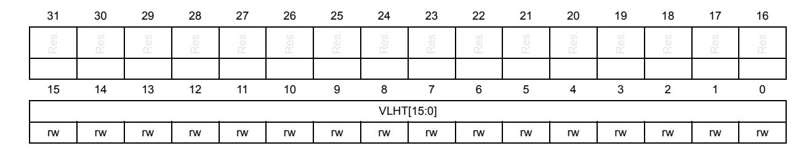

Bits 31:16 Reserved, must be kept at reset value.

Bits 15:0 **VLHT[15:0]**: VLAN Hash Table

This field contains the 16-bit VLAN Hash Table.

### <span id="page-195-0"></span>**VLAN inclusion register (ETH\_MACVIR)**

Address offset: 0x0060 Reset value: 0x0000 0000

The VLAN Tag Inclusion or Replacement register contains the VLAN tag for insertion or replacement in the Transmit packets. It also contains the VLAN tag insertion controls.

| 31   | 30        | 29   | 28   | 27   | 26   | 25   | 24   | 23   | 22   | 21   | 20   | 19       | 18  | 17       | 16 |
|------|-----------|------|------|------|------|------|------|------|------|------|------|----------|-----|----------|----|
| Res. | Res.      | Res. | Res. | Res. | Res. | Res. | Res. | Res. | Res. | Res. | VLTI | CSV<br>L | VLP | VLC[1:0] |    |
|      |           |      |      |      |      |      |      |      |      |      | rw   | rw       | rw  | rw       | rw |
| 15   | 14        | 13   | 12   | 11   | 10   | 9    | 8    | 7    | 6    | 5    | 4    | 3        | 2   | 1        | 0  |
|      | VLT[15:0] |      |      |      |      |      |      |      |      |      |      |          |     |          |    |
| rw   | rw        | rw   | rw   | rw   | rw   | rw   | rw   | rw   | rw   | rw   | rw   | rw       | rw  | rw       | rw |

Bits 31:21 Reserved, must be kept at reset value.

#### Bit 20 **VLTI**: VLAN Tag Input

When this bit is set, it indicates that the VLAN tag to be inserted or replaced in Tx packet should be taken from the Tx descriptor.

### Bit 19 **CSVL**: C-VLAN or S-VLAN

When this bit is set, S-VLAN type (0x88A8) is inserted or replaced in the 13th and 14th bytes of transmitted packets. When this bit is reset, C-VLAN type (0x8100) is inserted or replaced in the 13th and 14th bytes of transmitted packets.

0: C-LAN 1: S-LAN

# Bit 18 **VLP**: VLAN Priority Control

When this bit is set, the control bits[17:16] are used for VLAN deletion, insertion, or replacement. When this bit is reset, bits[17:16] are ignored.

#### Bits 17:16 **VLC[1:0]**: VLAN Tag Control in Transmit Packets

00: No VLAN tag deletion, insertion, or replacement

01: VLAN tag deletion. The MAC removes the VLAN type (bytes 13 and 14) and VLAN tag (bytes 15 and 16) of all transmitted packets with VLAN tags.

10: VLAN tag insertion. The MAC inserts VLT in bytes 15 and 16 of the packet after inserting the Type value (0x8100 or 0x88a8) in bytes 13 and 14. This operation is performed on all transmitted packets, irrespective of whether they already have a VLAN tag.

11: VLAN tag replacement. The MAC replaces VLT in bytes 15 and 16 of all VLAN-type transmitted packets (Bytes 13 and 14 are 0x8100 or 0x88a8).

*Note: Changes to this field take effect only on the start of a packet. If you write this register field when a packet is being transmitted, only the subsequent packet can use the updated value, that is, the current packet does not use the updated value.*

### Bits 15:0 **VLT[15:0]**: VLAN Tag for Transmit Packets

This field contains the value of the VLAN tag to be inserted or replaced. The value must only be changed when the transmit lines are inactive or during the initialization phase.

The following list describes the bits of this field:

Bits[15:13]: User Priority

Bit 12: Canonical Format Indicator (CFI) or Drop Eligible Indicator (DEI)

Bits[11:0]: VLAN Identifier (VID) field of VLAN tag


### <span id="page-196-0"></span>**Inner VLAN inclusion register (ETH\_MACIVIR)**

Address offset: 0x0064 Reset value: 0x0000 0000

The Inner VLAN Tag Inclusion or Replacement register contains the inner VLAN tag to be inserted or replaced in the Transmit packet. It also contains the inner VLAN tag insertion controls.

| 31   | 30        | 29   | 28   | 27   | 26   | 25   | 24   | 23   | 22   | 21   | 20   | 19   | 18  | 17 | 16       |
|------|-----------|------|------|------|------|------|------|------|------|------|------|------|-----|----|----------|
| Res. | Res.      | Res. | Res. | Res. | Res. | Res. | Res. | Res. | Res. | Res. | VLTI | CSVL | VLP |    | VLC[1:0] |
|      |           |      |      |      |      |      |      |      |      |      | rw   | rw   | rw  | rw | rw       |
| 15   | 14        | 13   | 12   | 11   | 10   | 9    | 8    | 7    | 6    | 5    | 4    | 3    | 2   | 1  | 0        |
|      | VLT[15:0] |      |      |      |      |      |      |      |      |      |      |      |     |    |          |
| rw   | rw        | rw   | rw   | rw   | rw   | rw   | rw   | rw   | rw   | rw   | rw   | rw   | rw  | rw | rw       |

Bits 31:21 Reserved, must be kept at reset value.

#### Bit 20 **VLTI**: VLAN Tag Input

When this bit is set, it indicates that the VLAN tag to be inserted or replaced in Tx packet should be taken from the Tx descriptor

#### Bit 19 **CSVL**: C-VLAN or S-VLAN

When this bit is set, S-VLAN type (0x88A8) is inserted or replaced in the 13th and 14th bytes of transmitted packets. When this bit is reset, C-VLAN type (0x8100) is inserted or replaced in the 13th and 14th bytes of transmitted packets.

0: C-LAN 1: S-LAN

### Bit 18 **VLP**: VLAN Priority Control

When this bit is set, the VLC field is used for VLAN deletion, insertion, or replacement. When this bit is reset, the VLC field is ignored.

# Bits 17:16 **VLC[1:0]**: VLAN Tag Control in Transmit Packets

00: No VLAN tag deletion, insertion, or replacement

01: VLAN tag deletion

The MAC removes the VLAN type (bytes 17 and 18) and VLAN tag (bytes 19 and 20) of all transmitted packets with VLAN tags.

10: VLAN tag insertion

The MAC inserts VLT in bytes 19 and 20 of the packet after inserting the Type value (0x8100 or 0x88a8) in bytes 17 and 18. This operation is performed on all transmitted packets, irrespective of whether they already have a VLAN tag.

11: VLAN tag replacement

The MAC replaces VLT in bytes 19 and 20 of all VLAN-type transmitted packets (Bytes 17 and 18 are 0x8100 or 0x88a8).

*Note: Changes to this field take effect only on the start of a packet. If you write to this register field when a packet is being transmitted, only the subsequent packet can use the updated value, that is, the current packet does not use the updated value.*


#### Bits 15:0 **VLT[15:0]**: VLAN Tag for Transmit Packets

This field contains the value of the VLAN tag to be inserted or replaced. The value must only be changed when the transmit lines are inactive or during the initialization phase.

The following list describes the bits of this field:

Bits[15:13]: User Priority

Bit 12: Canonical Format Indicator (CFI) or Drop Eligible Indicator (DEI)

Bits[11:0]: VLAN Identifier (VID) field of VLAN tag

# <span id="page-197-0"></span>**Tx Queue flow control register (ETH\_MACQTXFCR)**

Address offset: 0x0070 Reset value: 0x0000 0000

The Flow Control register controls the generation and reception of the Control (Pause Command) packets by the Flow control module of the MAC. A Write to a register with the Busy bit set to 1 triggers the Flow Control block to generate a Pause packet. The fields of the control packet are selected as specified in the 802.3x specification, and the Pause Time value from this register is used in the Pause Time field of the control packet. The Busy bit remains set until the control packet is transferred onto the cable. The application must make sure that the Busy bit is cleared before writing to the register.

| 31   | 30       | 29   | 28   | 27   | 26   | 25   | 24   | 23   | 22       | 21 | 20 | 19   | 18   | 17  | 16          |
|------|----------|------|------|------|------|------|------|------|----------|----|----|------|------|-----|-------------|
|      | PT[15:0] |      |      |      |      |      |      |      |          |    |    |      |      |     |             |
| rw   | rw       | rw   | rw   | rw   | rw   | rw   | rw   | rw   | rw       | rw | rw | rw   | rw   | rw  | rw          |
| 15   | 14       | 13   | 12   | 11   | 10   | 9    | 8    | 7    | 6        | 5  | 4  | 3    | 2    | 1   | 0           |
| Res. | Res.     | Res. | Res. | Res. | Res. | Res. | Res. | DZPQ | PLT[2:0] |    |    | Res. | Res. | TFE | FCB_<br>BPA |
|      |          |      |      |      |      |      |      | rw   | rw       | rw | rw |      |      | rw  | rw          |

Bits 31:16 **PT[15:0]**: Pause Time

This field holds the value to be used in the Pause Time field in the Tx control packet. I

Bits 15:8 Reserved, must be kept at reset value.

# Bit 7 **DZPQ**: Disable Zero-Quanta Pause

When this bit is set, it disables the automatic generation of the zero-quanta Pause packets. When this bit is reset, normal operation with automatic zero-quanta Pause packet generation is enabled.

#### Bits 6:4 **PLT[2:0]**: Pause Low Threshold

This field configures the threshold of the Pause timer at which the input flow is checked for automatic retransmission of the Pause packet.

The threshold values should be always less than the Pause Time configured in Bits[31:16]. For example, if PT = 100H (256 slot times), and PLT = 001, a second Pause packet is automatically transmitted at 228 (256-28) slot times after the first Pause packet is transmitted.

The following list provides the threshold values for different values:

000: Pause Time minus 4 Slot Times (PT -4 slot times)

001: Pause Time minus 28 Slot Times (PT -28 slot times)

010: Pause Time minus 36 Slot Times (PT -36 slot times)

011: Pause Time minus 144 Slot Times (PT -144 slot times)

100: Pause Time minus 256 Slot Times (PT -256 slot times)

101: Pause Time minus 512 Slot Times (PT -512 slot times)

110 to 111: Reserved, must not be used

The slot time is defined as the time taken to transmit 512 bits (64 bytes) on the MII interface. This (approximate) computation is based on the packet size (64, 1518, 2000, 9018, 16384, or 32768) + 2 Pause Packet Size + IPG in Slot Times.

### Bits 3:2 Reserved, must be kept at reset value.

### Bit 1 **TFE**: Transmit Flow Control Enable

**Full-duplex mode:** when this bit is set, the MAC enables the flow control operation to Tx Pause packets. When this bit is reset, the flow control operation in the MAC is disabled, and the MAC does not transmit any Pause packets.

**Half-duplex mode:** when this bit is set, the MAC enables the backpressure operation. When this bit is reset, the backpressure feature is disabled.

### Bit 0 **FCB\_BPA**: Flow Control Busy or Backpressure Activate

This bit initiates a Pause packet in the Full-duplex mode and activates the backpressure function in the Half-duplex mode if the TFE bit is set.

**Full-Duplex mode:** this bit should be read as 0 before writing to this register. To initiate a Pause packet, the application must set this bit to 1. During Control packet transfer, this bit continues to be set to indicate that a packet transmission is in progress. When Pause packet transmission is complete, the MAC resets this bit to 0. You should not write to this register until this bit is cleared.

**Half-duplex mode:** When this bit is set (and TFE bit is set) in the Half-duplex mode, the MAC asserts the backpressure. During backpressure, when the MAC receives a new packet, the transmitter starts sending a JAM pattern resulting in a collision. When the MAC is configured for the Full-duplex mode, the BPA is automatically disabled.


RM0399 Rev 4 3129/3556

### <span id="page-199-0"></span>**Rx flow control register (ETH\_MACRXFCR)**

Address offset: 0x0090 Reset value: 0x0000 0000

The Receive Flow Control register controls the pausing of MAC Transmit based on the

received Pause packet.

| 31   | 30   | 29   | 28   | 27   | 26   | 25   | 24   | 23   | 22   | 21   | 20   | 19   | 18   | 17   | 16   |
|------|------|------|------|------|------|------|------|------|------|------|------|------|------|------|------|
| Res. | Res. | Res. | Res. | Res. | Res. | Res. | Res. | Res. | Res. | Res. | Res. | Res. | Res. | Res. | Res. |
|      |      |      |      |      |      |      |      |      |      |      |      |      |      |      |      |
| 15   | 14   | 13   | 12   | 11   | 10   | 9    | 8    | 7    | 6    | 5    | 4    | 3    | 2    | 1    | 0    |
| Res. | Res. | Res. | Res. | Res. | Res. | Res. | Res. | Res. | Res. | Res. | Res. | Res. | Res. | UP   | RFE  |
|      |      |      |      |      |      |      |      |      |      |      |      |      |      | rw   | rw   |

Bits 31:2 Reserved, must be kept at reset value.

### Bit 1 **UP**: Unicast Pause Packet Detect

A pause packet is processed when it has the unique multicast address specified in the IEEE 802.3. When this bit is set, the MAC can also detect Pause packets with unicast address of the station. This unicast address should be as specified in *[MAC Address 0 high register](#page-222-0)  [\(ETH\\_MACA0HR\)](#page-222-0)* and MAC Address 0 low register *[MAC Address x low register](#page-223-0)  [\(ETH\\_MACAxLR\)](#page-223-0)*.

When this bit is reset, the MAC only detects Pause packets with unique multicast address.

*Note: The MAC does not process a Pause packet if the multicast address is different from the unique multicast address. This is also applicable to the received PFC packet when the Priority Flow Control (PFC) is enabled. The unique multicast address (0x01\_80\_C2\_00\_00\_01) is as specified in IEEE 802.1 Qbb-2011.*

#### Bit 0 **RFE**: Receive Flow Control Enable

When this bit is set and the MAC is operating in Full-duplex mode, the MAC decodes the received Pause packet and disables its transmitter for a specified (Pause) time. When this bit is reset or the MAC is operating in Half-duplex mode, the decode function of the Pause packet is disabled.

When PFC is enabled, flow control is enabled for PFC packets. The MAC decodes the received PFC packet and disables the Transmit queue, with matching priorities, for a duration of received Pause time.


# <span id="page-200-0"></span>**Interrupt status register (ETH\_MACISR)**

Address offset: 0x00B0 Reset value: 0x0000 0000

The Interrupt Status register contains the status of interrupts.

| 31   | 30      | 29      | 28   | 27   | 26      | 25      | 24    | 23   | 22   | 21    | 20    | 19    | 18   | 17   | 16   |
|------|---------|---------|------|------|---------|---------|-------|------|------|-------|-------|-------|------|------|------|
| Res. | Res.    | Res.    | Res. | Res. | Res.    | Res.    | Res.  | Res. | Res. | Res.  | Res.  | Res.  | Res. | Res. | Res. |
|      |         |         |      |      |         |         |       |      |      |       |       |       |      |      |      |
| 15   | 14      | 13      | 12   | 11   | 10      | 9       | 8     | 7    | 6    | 5     | 4     | 3     | 2    | 1    | 0    |
| Res. | RXSTSIS | TXSTSIS | TSIS | Res. | MMCTXIS | MMCRXIS | MMCIS | Res. | Res. | LPIIS | PMTIS | PHYIS | Res. | Res. | Res. |
|      | rc_r    | rc_r    | rc_r |      | r       | r       | r     |      |      | r     | r     | r     |      |      |      |

Bits 31:15 Reserved, must be kept at reset value.

#### Bit 14 **RXSTSIS**: Receive Status Interrupt

This bit indicates the status of received packets. This bit is set when the RWT bit is set in the *[Rx Tx status register \(ETH\\_MACRXTXSR\)](#page-203-0)*. This bit is cleared when the corresponding interrupt source bit is read (or corresponding interrupt source bit is written to 1 when RCWE bit of *[CSR software control register \(ETH\\_MACCSRSWCR\)](#page-222-1)* is set) in the ETH\_MACISR register.

#### Bit 13 **TXSTSIS**: Transmit Status Interrupt

This bit indicates the status of transmitted packets. This bit is set when any of the following bits is set in the *[Rx Tx status register \(ETH\\_MACRXTXSR\)](#page-203-0)*:

- Excessive Collision (EXCOL)
- Late Collision (LCOL)
- Excessive Deferral (EXDEF)
- Loss of Carrier (LCARR)
- No Carrier (NCARR)
- Jabber Timeout (TJT)

This bit is cleared when the corresponding interrupt source bit is read (or corresponding interrupt source bit is written to 1 when RCWE bit of *[CSR software control register](#page-222-1)  [\(ETH\\_MACCSRSWCR\)](#page-222-1)* is set) in the ETH\_MACISR register.


RM0399 Rev 4 3131/3556

#### Bit 12 **TSIS**: Timestamp Interrupt Status

If the Timestamp feature is enabled, this bit is set when any of the following conditions is true:

- The system time value is equal to or exceeds the value specified in the Target Time High and Low registers.
- There is an overflow in the Seconds register.
- The Target Time Error occurred, that is, programmed target time already elapsed.

If the Auxiliary Snapshot feature is enabled, this bit is set when the auxiliary snapshot trigger is asserted.

When drop transmit status is enabled in MTL, this bit is set when the captured transmit timestamp is updated in the *[Tx timestamp status nanoseconds register](#page-253-0)  [\(ETH\\_MACTXTSSNR\)](#page-253-0)* and *[Tx timestamp status seconds register \(ETH\\_MACTXTSSSR\)](#page-254-1)* registers.

When PTP offload feature is enabled, this bit is set when the captured transmit timestamp is updated in the *[Tx timestamp status nanoseconds register \(ETH\\_MACTXTSSNR\)](#page-253-0)* and *[Tx](#page-254-1)  [timestamp status seconds register \(ETH\\_MACTXTSSSR\)](#page-254-1)* registers, for PTO generated Delay Request and Pdelay request packets.

This bit is cleared when the corresponding interrupt source bit is read (or corresponding interrupt source bit is written to 1 when RCWE bit of *[CSR software control register](#page-222-1)  [\(ETH\\_MACCSRSWCR\)](#page-222-1)* is set) in the *[Timestamp status register \(ETH\\_MACTSSR\)](#page-252-0)*.

- Bit 11 Reserved, must be kept at reset value.
- Bit 10 **MMCTXIS**: MMC Transmit Interrupt Status

This bit is set high when an interrupt is generated in the *[MMC Tx interrupt register](#page-227-0)  [\(ETH\\_MMC\\_TX\\_INTERRUPT\)](#page-227-0)*. This bit is cleared when all bits in this interrupt register are cleared.

Bit 9 **MMCRXIS**: MMC Receive Interrupt Status

This bit is set high when an interrupt is generated in the *[MMC Rx interrupt register](#page-226-0)  [\(ETH\\_MMC\\_RX\\_INTERRUPT\)](#page-226-0)*. This bit is cleared when all bits in this interrupt register are cleared.

Bit 8 **MMCIS**: MMC Interrupt Status

This bit is set high when MMCTXIS or MMCRXIS is set high. This bit is cleared only when all these bits are low.

- Bits 7:6 Reserved, must be kept at reset value.
  - Bit 5 **LPIIS**: LPI Interrupt Status

This bit is set for any LPI state entry or exit in the MAC Transmitter or Receiver. This bit is cleared when the TLPIEN bit of *[LPI control and status register \(ETH\\_MACLCSR\)](#page-206-1)* is read.

Bit 4 **PMTIS**: PMT Interrupt Status

This bit is set when a Magic packet or Wake-on-LAN packet is received in the power-down mode (RWKPRCVD and MGKPRCVD bits in ETH\_MACPCSR register). This bit is cleared when Bits[6:5] are cleared because of a Read operation to the *[PMT control status register](#page-204-0)  [\(ETH\\_MACPCSR\)](#page-204-0)*.

Bit 3 **PHYIS**: PHY Interrupt

This bit is set when rising edge is detected on the ETH\_PHY\_INTN input. This bit is cleared when this register is read.

Bits 2:0 Reserved, must be kept at reset value.


# <span id="page-202-0"></span>**Interrupt enable register (ETH\_MACIER)**

Address offset: 0x00B4 Reset value: 0x0000 0000

The Interrupt Enable register contains the masks for generating the interrupts.

| 31   | 30      | 29      | 28   | 27   | 26   | 25   | 24   | 23   | 22   | 21    | 20    | 19    | 18   | 17   | 16   |
|------|---------|---------|------|------|------|------|------|------|------|-------|-------|-------|------|------|------|
| Res. | Res.    | Res.    | Res. | Res. | Res. | Res. | Res. | Res. | Res. | Res.  | Res.  | Res.  | Res. | Res. | Res. |
|      |         |         |      |      |      |      |      |      |      |       |       |       |      |      |      |
| 15   | 14      | 13      | 12   | 11   | 10   | 9    | 8    | 7    | 6    | 5     | 4     | 3     | 2    | 1    | 0    |
| Res. | RXSTSIE | TXSTSIE | TSIE | Res. | Res. | Res. | Res. | Res. | Res. | LPIIE | PMTIE | PHYIE | Res. | Res. | Res. |
|      | rw      | rw      | rw   |      |      |      |      |      |      | rw    | rw    | rw    |      |      |      |

Bits 31:15 Reserved, must be kept at reset value.

### Bit 14 **RXSTSIE**: Receive Status Interrupt Enable

When this bit is set, it enables the assertion of the interrupt signal because of the setting of RXSTSIS bit in the *[Interrupt status register \(ETH\\_MACISR\)](#page-200-0)*.

### Bit 13 **TXSTSIE**: Transmit Status Interrupt Enable

When this bit is set, it enables the assertion of the interrupt signal because of the setting of TXSTSIS bit in the *[Interrupt status register \(ETH\\_MACISR\)](#page-200-0)*.

### Bit 12 **TSIE**: Timestamp Interrupt Enable

When this bit is set, it enables the assertion of the interrupt signal because of the setting of TSIS bit in *[Interrupt status register \(ETH\\_MACISR\)](#page-200-0)*.

Bits 11:6 Reserved, must be kept at reset value.

### Bit 5 **LPIIE**: LPI Interrupt Enable

When this bit is set, it enables the assertion of the interrupt signal because of the setting of LPIIS bit in *[Interrupt status register \(ETH\\_MACISR\)](#page-200-0)*.

#### Bit 4 **PMTIE**: PMT Interrupt Enable

When this bit is set, it enables the assertion of the interrupt signal because of the setting of PMTIS bit in *[Interrupt status register \(ETH\\_MACISR\)](#page-200-0)*.

### Bit 3 **PHYIE**: PHY Interrupt Enable

When this bit is set, it enables the assertion of the interrupt signal because of the setting of PHYIS bit in *[Interrupt status register \(ETH\\_MACISR\)](#page-200-0)*.

Bits 2:0 Reserved, must be kept at reset value.


### <span id="page-203-0"></span>**Rx Tx status register (ETH\_MACRXTXSR)**

Address offset: 0x00B8 Reset value: 0x0000 0000

The Receive Transmit Status register contains the Receive and Transmit Error status.

| 31   | 30   | 29   | 28   | 27   | 26   | 25   | 24   | 23   | 22   | 21    | 20   | 19    | 18    | 17    | 16   |
|------|------|------|------|------|------|------|------|------|------|-------|------|-------|-------|-------|------|
| Res. | Res. | Res. | Res. | Res. | Res. | Res. | Res. | Res. | Res. | Res.  | Res. | Res.  | Res.  | Res.  | Res. |
|      |      |      |      |      |      |      |      |      |      |       |      |       |       |       |      |
| 15   | 14   | 13   | 12   | 11   | 10   | 9    | 8    | 7    | 6    | 5     | 4    | 3     | 2     | 1     | 0    |
| Res. | Res. | Res. | Res. | Res. | Res. | Res. | RWT  | Res. | Res. | EXCOL | LCOL | EXDEF | LCARR | NCARR | TJT  |
|      |      |      |      |      |      |      | rc_r |      |      | rc_r  | rc_r | rc_r  | rc_r  | rc_r  | rc_r |

Bits 31:9 Reserved, must be kept at reset value.

### Bit 8 **RWT**: Receive Watchdog Timeout

This bit is set when a packet with length greater than 2,048 bytes is received (10, 240 bytes when Jumbo Packet mode is enabled) and the WD bit is reset in the *[Operating mode](#page-181-0)  [configuration register \(ETH\\_MACCR\)](#page-181-0)*. This bit is set when a packet with length greater than 16,383 bytes is received and the WD bit is set in the *[Operating mode configuration register](#page-181-0)  [\(ETH\\_MACCR\)](#page-181-0)*.

Cleared on read (or write of 1 when RCWE bit in *[CSR software control register](#page-222-1)  [\(ETH\\_MACCSRSWCR\)](#page-222-1)* is set).

#### Bits 7:6 Reserved, must be kept at reset value.

#### Bit 5 **EXCOL**: Excessive Collisions

When the DTXSTS bit is set in the *[Operating mode Register \(ETH\\_MTLOMR\)](#page-169-1)*, this bit indicates that the transmission aborted after 16 successive collisions while attempting to transmit the current packet. If the DR bit is set in the *[Operating mode configuration register](#page-181-0)  [\(ETH\\_MACCR\)](#page-181-0)*, this bit is set after the first collision and the packet transmission is aborted. Cleared on read (or write of 1 when RCWE bit in *[CSR software control register](#page-222-1)  [\(ETH\\_MACCSRSWCR\)](#page-222-1)* is set).

### Bit 4 **LCOL**: Late Collision

When the DTXSTS bit is set in the *[Operating mode Register \(ETH\\_MTLOMR\)](#page-169-1)*, this bit indicates that the packet transmission aborted because a collision occurred after the collision window (64 bytes including Preamble in MII mode.

This bit is not valid if the Underflow error occurs.

Cleared on read (or write of 1 when RCWE bit in *[CSR software control register](#page-222-1)  [\(ETH\\_MACCSRSWCR\)](#page-222-1)* is set).

### Bit 3 **EXDEF**: Excessive Deferral

When the DTXSTS bit is set in the *[Operating mode Register \(ETH\\_MTLOMR\)](#page-169-1)* and the DC bit is set in the *[Operating mode configuration register \(ETH\\_MACCR\)](#page-181-0)*, this bit indicates that the transmission ended because of excessive deferral of over 24,288 bit times (155,680 when Jumbo packet is enabled).

Cleared on read (or write of 1 when RCWE bit in *[CSR software control register](#page-222-1)  [\(ETH\\_MACCSRSWCR\)](#page-222-1)* is set).


#### Bit 2 **LCARR**: Loss of Carrier

When the DTXSTS bit is set in the *[Operating mode Register \(ETH\\_MTLOMR\)](#page-169-1)*, this bit indicates that the loss of carrier occurred during packet transmission, that is, the ETH\_CRS signal was inactive for one or more transmission clock periods during packet transmission. This bit is valid only for packets transmitted without collision.

Cleared on read (or write of 1 when RCWE bit in *[CSR software control register](#page-222-1)  [\(ETH\\_MACCSRSWCR\)](#page-222-1)* is set).

#### Bit 1 **NCARR**: No Carrier

When the DTXSTS bit is set in the *[Operating mode Register \(ETH\\_MTLOMR\)](#page-169-1)*, this bit indicates that the carrier signal from the PHY is not present at the end of preamble transmission.

Cleared on read (or write of 1 when RCWE bit in *[CSR software control register](#page-222-1)  [\(ETH\\_MACCSRSWCR\)](#page-222-1)* is set).

#### Bit 0 **TJT**: Transmit Jabber Timeout

This bit indicates that the Transmit Jabber Timer expired which happens when the packet size exceeds 2,048 bytes (10,240 bytes when the Jumbo packet is enabled) and JD bit is reset in the *[Operating mode configuration register \(ETH\\_MACCR\)](#page-181-0)*. This bit is set when the packet size exceeds 16,383 bytes and the JD bit is set in the *[Operating mode configuration](#page-181-0)  [register \(ETH\\_MACCR\)](#page-181-0)*.

Cleared on read (or write of 1 when RCWE bit in *[CSR software control register](#page-222-1)  [\(ETH\\_MACCSRSWCR\)](#page-222-1)* is set).

# <span id="page-204-0"></span>**PMT control status register (ETH\_MACPCSR)**

Address offset: 0x00C0 Reset value: 0x0000 0000

| 31         | 30   | 29   | 28   | 27   | 26          | 25        | 24   | 23   | 22       | 21       | 20   | 19   | 18       | 17       | 16     |
|------------|------|------|------|------|-------------|-----------|------|------|----------|----------|------|------|----------|----------|--------|
| RWKFILTRST | Res. | Res. |      |      | RWKPTR[4:0] |           |      | Res. | Res.     | Res.     | Res. | Res. | Res.     | Res.     | Res.   |
| rw         |      |      | r    | r    | r           | r         | r    |      |          |          |      |      |          |          |        |
| 15         | 14   | 13   | 12   | 11   | 10          | 9         | 8    | 7    | 6        | 5        | 4    | 3    | 2        | 1        | 0      |
| Res.       | Res. | Res. | Res. | Res. | RWKPFE      | GLBLUCAST | Res. | Res. | RWKPRCVD | MGKPRCVD | Res. | Res. | RWKPKTEN | MGKPKTEN | PWRDWN |
|            |      |      |      |      |             |           |      |      |          |          |      |      |          |          |        |

### Bit 31 **RWKFILTRST**: Remote wakeup Packet Filter Register Pointer Reset

When this bit is set, the remote wakeup packet filter register pointer is reset to 0. It is automatically cleared after 1 clock cycle.

Bits 30:29 Reserved, must be kept at reset value.

#### Bits 28:24 **RWKPTR[4:0]**: Remote wakeup FIFO Pointer

This field gives the current value (0 to 7) of the Remote wakeup Packet Filter register pointer. When the value of this pointer is equal to 7, the contents of the Remote wakeup Packet Filter Register are transferred to the eth\_mii\_rx\_clk domain when a Write occurs to that register.

Bits 23:11 Reserved, must be kept at reset value.


RM0399 Rev 4 3135/3556

#### Bit 10 **RWKPFE**: Remote wakeup Packet Forwarding Enable

 When this bit is set along with RWKPKTEN, the MAC receiver drops all received frames until it receives the expected wakeup frame. All frames after that event including the received wakeup frame are forwarded to application. This bit is then self-cleared on receiving the wakeup packet.

The application can also clear this bit before the expected wakeup frame is received. In such cases, the MAC reverts to the default behavior where packets received are forwarded to the application. This bit must only be set when RWKPKTEN is set high and PWRDWN is set low. The setting of this bit has no effect when PWRDWN is set high.

*Note: If Magic Packet Enable and wakeup Frame Enable are both set along with setting of this bit and Magic Packet is received prior to wakeup frame, this bit is self-cleared on receiving Magic Packet, the received Magic packet is dropped, and all frames after received Magic Packet are forwarded to application.*

### Bit 9 **GLBLUCAST**: Global Unicast

When this bit set, any unicast packet filtered by the MAC (DAF) address recognition is detected as a remote wakeup packet.

#### Bits 8:7 Reserved, must be kept at reset value.

# Bit 6 **RWKPRCVD**: Remote wakeup Packet Received

When this bit is set, it indicates that the power management event is generated because of the reception of a remote wakeup packet. This bit is cleared when this register is read.

### Bit 5 **MGKPRCVD**: Magic Packet Received

When this bit is set, it indicates that the power management event is generated because of the reception of a magic packet. This bit is cleared when this register is read (or written to 1 when RCWE bit in *[CSR software control register \(ETH\\_MACCSRSWCR\)](#page-222-1)* is set).

#### Bits 4:3 Reserved, must be kept at reset value.

#### Bit 2 **RWKPKTEN**: Remote wakeup Packet Enable

When this bit is set, a power management event is generated when the MAC receives a remote wakeup packet.

### Bit 1 **MGKPKTEN**: Magic Packet Enable

When this bit is set, a power management event is generated when the MAC receives a magic packet.

# Bit 0 **PWRDWN**: Power Down

When this bit is set, the MAC receiver drops all received packets until it receives the expected magic packet or remote wakeup packet. This bit is then self-cleared and the powerdown mode is disabled. The software can clear this bit before the expected magic packet or remote wakeup packet is received. The packets received by the MAC after this bit is cleared are forwarded to the application. This bit must only be set when the Magic Packet Enable, Global Unicast, or Remote wakeup Packet Enable bit is set high.

*Note: You can gate-off the CSR clock during the power-down mode. However, when the CSR clock is gated-off, you cannot perform any read or write operations on this register. Therefore, the Software cannot clear this bit.*


### <span id="page-206-0"></span>**Remote wakeup packet filter register (ETH\_MACRWKPFR)**

Address offset: 0x00C4 Reset value: 0x0000 0000

| 31 | 30               | 29 | 28 | 27 | 26 | 25 | 24 | 23 | 22 | 21 | 20 | 19 | 18 | 17 | 16 |
|----|------------------|----|----|----|----|----|----|----|----|----|----|----|----|----|----|
|    | MACRWKPFR[31:16] |    |    |    |    |    |    |    |    |    |    |    |    |    |    |
| rw | rw               | rw | rw | rw | rw | rw | rw | rw | rw | rw | rw | rw | rw | rw | rw |
| 15 | 14               | 13 | 12 | 11 | 10 | 9  | 8  | 7  | 6  | 5  | 4  | 3  | 2  | 1  | 0  |
|    | MACRWKPFR[15:0]  |    |    |    |    |    |    |    |    |    |    |    |    |    |    |
| rw | rw               | rw | rw | rw | rw | rw | rw | rw | rw | rw | rw | rw | rw | rw | rw |

Bits 31:0 **MACRWKPFR[31:0]**: Remote wakeup packet filter

Refer to *[Table 575](#page-88-0)*, *[Table 576](#page-89-0)* and *[Table 577](#page-90-0)* for details on register content and programming sequence.

The ETH\_MACRWKPFR register at address 0x00C4 loads the wakeup Packet Filter register.

To load values in a wakeup Packet Filter register, the entire register (ETH\_MACRWKPFR) must be written. The ETH\_MACRWKPFR register is loaded by sequentially loading the eight, sixteen or thirty two register values in address (0x00C4) for ETH\_MACRWKPFR value 0 to 7, respectively. The ETH\_MACRWKPFR register is read in a similar way. The Ethernet peripheral updates the ETH\_MACRWKPFR register current pointer value in Bits[26:24] of ETH\_MACPCSR register.

# <span id="page-206-1"></span>**LPI control and status register (ETH\_MACLCSR)**

Address offset: 0x00D0 Reset value: 0x0000 0000

The LPI Control and Status Register controls the LPI functions and provides the LPI interrupt status. The status bits are cleared when this register is read.

| 31   | 30   | 29   | 28   | 27   | 26   | 25     | 24     | 23   | 22   | 21      | 20    | 19     | 18     | 17     | 16     |
|------|------|------|------|------|------|--------|--------|------|------|---------|-------|--------|--------|--------|--------|
| Res. | Res. | Res. | Res. | Res. | Res. | Res.   | Res.   | Res. | Res. | LPITCSE | LPITE | LPITXA | Res.   | PLS    | LPIEN  |
|      |      |      |      |      |      |        |        |      |      | rw      | rw    | rw     |        | rw     | rw     |
|      |      |      |      |      |      |        |        |      |      |         |       |        |        |        |        |
| 15   | 14   | 13   | 12   | 11   | 10   | 9      | 8      | 7    | 6    | 5       | 4     | 3      | 2      | 1      | 0      |
| Res. | Res. | Res. | Res. | Res. | Res. | RLPIST | TLPIST | Res. | Res. | Res.    | Res.  | RLPIEX | RLPIEN | TLPIEX | TLPIEN |


#### Bits 31:22 Reserved, must be kept at reset value.

#### Bit 21 **LPITCSE**: LPI Tx Clock Stop Enable

When this bit is set, the MAC asserts sbd\_tx\_clk\_gating\_ctrl\_o signal high after it enters Tx LPI mode to indicate that the Tx clock to MAC can be stopped. When this bit is reset, the MAC does not assert sbd\_tx\_clk\_gating\_ctrl\_o signal high after it enters Tx LPI mode. If RGMII Interface is selected, the Tx clock is required for transmitting the LPI pattern. The Tx Clock cannot be gated and so the LPITCSE bit cannot be programmed.

#### Bit 20 **LPITE**: LPI Timer Enable

 This bit controls the automatic entry of the MAC Transmitter into and exit out of the LPI state. When LPITE, LPITXA and LPIEN bits are set, the MAC Transmitter enters LPI state only when the complete MAC TX data path is IDLE for a period indicated by the ETH\_MACLETR register.

After entering LPI state, if the data path becomes non-IDLE (due to a new packet being accepted for transmission), the Transmitter exits LPI state but does not clear LPIEN bit. This enables the re-entry into LPI state when it is IDLE again.

When LPITE is 0, the LPI Auto timer is disabled and MAC Transmitter enters LPI state based on the settings of LPITXA and LPIEN bit descriptions.

#### Bit 19 **LPITXA**: LPI Tx Automate

This bit controls the behavior of the MAC when it is entering or coming out of the LPI mode on the Transmit side.

If the LPITXA and LPIEN bits are set to 1, the MAC enters the LPI mode only after all outstanding packets (in the core) and pending packets (in the application interface) have been transmitted. The MAC comes out of the LPI mode when the application sends any packet for transmission or the application issues a Tx FIFO Flush command. In addition, the MAC automatically clears the LPIEN bit when it exits the LPI state. If Tx FIFO Flush is set in the FTQ bit of ETH\_MTLTxQOMR, when the MAC is in the LPI mode, it exits the LPI mode. When this bit is 0, the LPIEN bit directly controls behavior of the MAC when it is entering or coming out of the LPI mode.

# Bit 18 Reserved, must be kept at reset value.

#### Bit 17 **PLS**: PHY Link Status

This bit indicates the link status of the PHY. The MAC Transmitter asserts the LPI pattern only when the link status is up (OKAY) at least for the time indicated by the LPI LS TIMER. When this bit is set, the link is considered to be okay (UP) and when this bit is reset, the link is considered to be down.

### Bit 16 **LPIEN**: LPI Enable

When this bit is set, it instructs the MAC Transmitter to enter the LPI state. When this bit is reset, it instructs the MAC to exit the LPI state and resume normal transmission.

This bit is cleared when the LPITXA bit is set and the MAC exits the LPI state because of the arrival of a new packet for transmission.

#### Bits 15:10 Reserved, must be kept at reset value.

#### Bit 9 **RLPIST**: Receive LPI State

When this bit is set, it indicates that the MAC is receiving the LPI pattern on the MII interface.

#### Bit 8 **TLPIST**: Transmit LPI State

When this bit is set, it indicates that the MAC is transmitting the LPI pattern on the MII interface.

Bits 7:4 Reserved, must be kept at reset value.


#### Bit 3 **RLPIEX**: Receive LPI Exit

When this bit is set, it indicates that the MAC Receiver has stopped receiving the LPI pattern on the MII interface, exited the LPI state, and resumed the normal reception. This bit is cleared by a read into this register (or by writing it to 1 when RCWE bit in *[CSR software](#page-222-1)  [control register \(ETH\\_MACCSRSWCR\)](#page-222-1)* is set).

*Note: This bit may not be set if the MAC stops receiving the LPI pattern for a very short duration, such as, less than three clock cycles of CSR clock.*

### Bit 2 **RLPIEN**: Receive LPI Entry

When this bit is set, it indicates that the MAC Receiver has received an LPI pattern and entered the LPI state. This bit is cleared by a read into this register (or by writing it to 1 when RCWE bit in *[CSR software control register \(ETH\\_MACCSRSWCR\)](#page-222-1)* is set).

*Note: This bit may not be set if the MAC stops receiving the LPI pattern for a very short duration, such as, less than three clock cycles of CSR clock.*

#### Bit 1 **TLPIEX**: Transmit LPI Exit

When this bit is set, it indicates that the MAC transmitter exited the LPI state after the application cleared the LPIEN bit and the LPI TW Timer has expired. This bit is cleared by a read into this register (or by writing it to 1 when RCWE bit in *[CSR software control register](#page-222-1)  [\(ETH\\_MACCSRSWCR\)](#page-222-1)* is set).

#### Bit 0 **TLPIEN**: Transmit LPI Entry

When this bit is set, it indicates that the MAC Transmitter has entered the LPI state because of the setting of the LPIEN bit. This bit is cleared by a read into this register (or by writing it to 1 when RCWE bit in *[CSR software control register \(ETH\\_MACCSRSWCR\)](#page-222-1)* is set).

### <span id="page-208-0"></span>**LPI timers control register (ETH\_MACLTCR)**

Address offset: 0x00D4

Reset value: 0x03E8 0000

The LPI Timers Control register controls the timeout values in the LPI states. It specifies the time for which the MAC transmits the LPI pattern and also the time for which the MAC waits before resuming the normal transmission.

| 31   | 30        | 29   | 28   | 27   | 26   | 25       | 24 | 23 | 22 | 21 | 20 | 19 | 18 | 17 | 16 |  |
|------|-----------|------|------|------|------|----------|----|----|----|----|----|----|----|----|----|--|
| Res. | Res.      | Res. | Res. | Res. | Res. | LST[9:0] |    |    |    |    |    |    |    |    |    |  |
|      |           |      |      |      |      | rw       | rw | rw | rw | rw | rw | rw | rw | rw | rw |  |
| 15   | 14        | 13   | 12   | 11   | 10   | 9        | 8  | 7  | 6  | 5  | 4  | 3  | 2  | 1  | 0  |  |
|      | TWT[15:0] |      |      |      |      |          |    |    |    |    |    |    |    |    |    |  |
| rw   | rw        | rw   | rw   | rw   | rw   | rw       | rw | rw | rw | rw | rw | rw | rw | rw | rw |  |


Bits 31:26 Reserved, must be kept at reset value.

#### Bits 25:16 **LST[9:0]**: LPI LS Timer

This field specifies the minimum time (in milliseconds) for which the link status from the PHY should be up (OKAY) before the LPI pattern can be transmitted to the PHY. The MAC does not transmit the LPI pattern even when the LPIEN bit is set unless the LPI LS Timer reaches the programmed terminal count. The default value of the LPI LS Timer is 1000 (1 sec) as defined in the IEEE standard.

#### Bits 15:0 **TWT[15:0]**: LPI TW Timer

This field specifies the minimum time (in microseconds) for which the MAC waits after it stops transmitting the LPI pattern to the PHY and before it resumes the normal transmission. The TLPIEX status bit is set after the expiry of this timer.

# <span id="page-209-0"></span>**LPI entry timer register (ETH\_MACLETR)**

Address offset: 0x00D8 Reset value: 0x0000 0000

This register controls the Tx LPI entry timer. This counter is enabled only when LPITE bit of *[LPI control and status register \(ETH\\_MACLCSR\)](#page-206-1)* register is set to 1.

| 31   | 30          | 29   | 28   | 27   | 26   | 25   | 24   | 23   | 22   | 21   | 20   | 19           | 18 | 17 | 16 |  |
|------|-------------|------|------|------|------|------|------|------|------|------|------|--------------|----|----|----|--|
| Res. | Res.        | Res. | Res. | Res. | Res. | Res. | Res. | Res. | Res. | Res. | Res. | LPIET[19:16] |    |    |    |  |
|      |             |      |      |      |      |      |      |      |      |      |      | rw           | rw | rw | rw |  |
| 15   | 14          | 13   | 12   | 11   | 10   | 9    | 8    | 7    | 6    | 5    | 4    | 3            | 2  | 1  | 0  |  |
|      | LPIET[15:0] |      |      |      |      |      |      |      |      |      |      |              |    |    |    |  |
| rw   | rw          | rw   | rw   | rw   | rw   | rw   | rw   | rw   | rw   | rw   | rw   | rw           | r  | r  | r  |  |

Bits 31:20 Reserved, must be kept at reset value.

#### Bits 19:0 **LPIET[19:0]**: LPI Entry Timer

This field specifies the time in microseconds the MAC waits to enter LPI mode, after it has transmitted all the frames. This field is valid and used only when LPITE and LPITXA are set to 1.

Bits [2:0] are read-only so that the granularity of this timer is in steps of 8 micro-seconds.

# <span id="page-209-1"></span>**One-microsecond-tick counter register (ETH\_MAC1USTCR)**

Address offset: 0x00DC Reset value: 0x0000 0000

This register controls the generation of the Reference time (one-microsecond tick) for all the LPI timers. This timer has to be programmed by the software initially.

| 31   | 30   | 29   | 28   | 27   | 26                 | 25   | 24   | 23   | 22   | 21   | 20   | 19   | 18   | 17   | 16   |
|------|------|------|------|------|--------------------|------|------|------|------|------|------|------|------|------|------|
| Res. | Res. | Res. | Res. | Res. | Res.               | Res. | Res. | Res. | Res. | Res. | Res. | Res. | Res. | Res. | Res. |
|      |      |      |      |      |                    |      |      |      |      |      |      |      |      |      |      |
| 15   | 14   | 13   | 12   | 11   | 10                 | 9    | 8    | 7    | 6    | 5    | 4    | 3    | 2    | 1    | 0    |
| Res. | Res. | Res. | Res. |      | TIC_1US_CNTR[11:0] |      |      |      |      |      |      |      |      |      |      |
|      |      |      |      | rw   | rw                 | rw   | rw   | rw   | rw   | rw   | rw   | rw   | rw   | rw   | rw   |


Bits 31:12 Reserved, must be kept at reset value.

Bits 11:0 TIC\_1US\_CNTR[11:0]: 1 µs tick Counter

The application must program this counter so that the number of clock cycles of CSR clock is 1 µs (subtract 1 from the value before programming).

For example if the CSR clock is 100 MHz then this field needs to be programmed to 100 - 1 = 99 (which is 0x63).

This is required to generate the 1 µs events that are used to update some of the EEE related counters.

# **Version register (ETH\_MACVR)**

Address offset: 0x0110 Reset value: 0x0000 3142

The version register identifies the version of the Ethernet peripheral.

| 31   | 30           | 29   | 28   | 27   | 26   | 25   | 24   | 23   | 22           | 21   | 20   | 19   | 18   | 17   | 16   |  |  |
|------|--------------|------|------|------|------|------|------|------|--------------|------|------|------|------|------|------|--|--|
| Res. | Res.         | Res. | Res. | Res. | Res. | Res. | Res. | Res. | Res.         | Res. | Res. | Res. | Res. | Res. | Res. |  |  |
|      |              |      |      |      |      |      |      |      |              |      |      |      |      |      |      |  |  |
| 15   | 14           | 13   | 12   | 11   | 10   | 9    | 8    | 7    | 6            | 5    | 4    | 3    | 2    | 1    | 0    |  |  |
|      | USERVER[7:0] |      |      |      |      |      |      |      | SNPSVER[7:0] |      |      |      |      |      |      |  |  |
| r    | r            | r    | r    | r    | r    | r    | r    | r    | r            | r    | r    | r    | r    | r    | r    |  |  |

Bits 31:16 Reserved, must be kept at reset value.

Bits 15:8 **USERVER[7:0]**: ST-defined version

Bits 7:0 **SNPSVER[7:0]**: IP version

# <span id="page-210-0"></span>**Debug register (ETH\_MACDR)**

Address offset: 0x0114 Reset value: 0x0000 0000

The Debug register provides the debug status of various MAC blocks.

| 31   | 30   | 29   | 28   | 27   | 26   | 25   | 24   | 23   | 22   | 21   | 20   | 19   | 18            | 17 | 16     |
|------|------|------|------|------|------|------|------|------|------|------|------|------|---------------|----|--------|
| Res. | Res. | Res. | Res. | Res. | Res. | Res. | Res. | Res. | Res. | Res. | Res. | Res. | TFCSTS[1:0]   |    | TPESTS |
|      |      |      |      |      |      |      |      |      |      |      |      |      | r             | r  | r      |
| 15   | 14   | 13   | 12   | 11   | 10   | 9    | 8    | 7    | 6    | 5    | 4    | 3    | 2             | 1  | 0      |
| Res. | Res. | Res. | Res. | Res. | Res. | Res. | Res. | Res. | Res. | Res. | Res. | Res. | RFCFCSTS[1:0] |    | RPESTS |
|      |      |      |      |      |      |      |      |      |      |      |      |      | r             | r  | r      |

RM0399 Rev 4 3141/3556

Bits 31:19 Reserved, must be kept at reset value.

#### Bits 18:17 **TFCSTS[1:0]**: MAC Transmit Packet Controller Status

This field indicates the state of the MAC Transmit Packet Controller module:

00: Idle state

01: Waiting for one of the following:

- Status of the previous packet
- IPG or backoff period to be over
- 10: Generating and transmitting a Pause control packet (in Full-duplex mode)
- 11: Transferring input packet for transmission

#### Bit 16 **TPESTS**: MAC MII Transmit Protocol Engine Status

When this bit is set, it indicates that the MAC MII transmit protocol engine is actively transmitting data, and it is not in the Idle state.

### Bits 15:3 Reserved, must be kept at reset value.

#### Bits 2:1 **RFCFCSTS[1:0]**: MAC Receive Packet Controller FIFO Status

When this bit is set, this field indicates the active state of the small FIFO Read and Write controllers of the MAC Receive Packet Controller module.

### Bit 0 **RPESTS**: MAC MII Receive Protocol Engine Status

When this bit is set, it indicates that the MAC MII receive protocol engine is actively receiving data, and it is not in the Idle state.

## **HW feature 0 register (ETH\_MACHWF0R)**

Address offset: 0x011C

Reset value: 0x0A0D 73F5

This register indicates the presence of first set of the optional features or functions of the Ethernet peripheral. The software driver can use this register to dynamically enable or disable the programs related to the optional blocks.

| 31   | 30       | 29             | 28    | 27        | 26   | 25            | 24          | 23          | 22                | 21     | 20     | 19     | 18    | 17      | 16       |
|------|----------|----------------|-------|-----------|------|---------------|-------------|-------------|-------------------|--------|--------|--------|-------|---------|----------|
| Res. |          | ACTPHYSEL[2:0] |       | SAVLANINS |      | TSSTSSEL[1:0] | MACADR64SEL | MACADR32SEL | ADDMACADRSEL[4:0] |        |        |        |       | Res.    | RXCOESEL |
|      | r        | r              | r     | r         | r    | r             | r           | r           | r                 | r      | r      | r      | r     |         | r        |
| 15   | 14       | 13             | 12    | 11        | 10   | 9             | 8           | 7           | 6                 | 5      | 4      | 3      | 2     | 1       | 0        |
| Res. | TXCOESEL | EEESEL         | TSSEL | Res.      | Res. | ARPOFFSEL     | MMCSEL      | MGKSEL      | RWKSEL            | SMASEL | VLHASH | PCSSEL | HDSEL | GMIISEL | MIISEL   |
|      | r        | r              | r     |           |      | r             | r           | r           | r                 | r      | r      | r      | r     | r       | r        |


Bit 31 Reserved, must be kept at reset value.

#### Bits 30:28 **ACTPHYSEL[2:0]**: Active PHY Selected

When you have multiple PHY interfaces in your configuration, this field indicates the sampled value of phy\_intf\_sel\_i during reset de-assertion:

000: GMII or MII

001: RGMII

010: SGMII

011: TBI

100: RMII

101: RTBI

110: SMII

Others: Reserved, must not be used

# Bit 27 **SAVLANINS**: Source Address or VLAN Insertion Enable

This bit is set to 1 when the Enable SA and VLAN Insertion on Tx option is selected

### Bits 26:25 **TSSTSSEL[1:0]**: Timestamp System Time Source

This bit indicates the source of the Timestamp system time:

01: Internal

10: External

11: Both

00: Reserved, must not be used

This bit is set to 1 when the Enable IEEE 1588 Timestamp Support option is selected

#### Bit 24 **MACADR64SEL**: MAC Addresses 64-127 Selected

This bit is set to 1 when the Enable Additional 64 MAC Address Registers (64-127) option is selected

### Bit 23 **MACADR32SEL**: MAC Addresses 32-63 Selected

This bit is set to 1 when the Enable Additional 32 MAC Address Registers (32-63) option is selected

#### Bits 22:18 **ADDMACADRSEL[4:0]**: MAC Addresses 1-31 Selected

This bit is set to 1 when the Enable Additional 1-31 MAC Address Registers option is selected

- Bit 17 Reserved, must be kept at reset value.
- Bit 16 **RXCOESEL**: Receive Checksum Offload Enabled

This bit is set to 1 when the Enable Receive TCP/IP Checksum Check option is selected

- Bit 15 Reserved, must be kept at reset value.
- Bit 14 **TXCOESEL**: Transmit Checksum Offload Enabled

This bit is set to 1 when the Enable Transmit TCP/IP Checksum Insertion option is selected

Bit 13 **EEESEL**: Energy Efficient Ethernet Enabled

This bit is set to 1 when the Enable Energy Efficient Ethernet (EEE) option is selected

Bit 12 **TSSEL**: IEEE 1588-2008 Timestamp Enabled

This bit is set to 1 when the Enable IEEE 1588 Timestamp Support option is selected

- Bits 11:10 Reserved, must be kept at reset value.
  - Bit 9 **ARPOFFSEL**: ARP Offload Enabled

This bit is set to 1 when the Enable IPv4 ARP Offload option is selected

Bit 8 **MMCSEL**: RMON Module Enable

This bit is set to 1 when the Enable MAC management counters (MMC) option is selected


RM0399 Rev 4 3143/3556

Bit 7 **MGKSEL**: PMT Magic Packet Enable

This bit is set to 1 when the Enable Magic Packet Detection option is selected

Bit 6 **RWKSEL**: PMT Remote Wakeup Packet Enable

This bit is set to 1 when the Enable Remote wakeup Packet Detection option is selected

Bit 5 **SMASEL**: SMA (MDIO) Interface

This bit is set to 1 when the Enable Station Management (MDIO Interface) option is selected

Bit 4 **VLHASH**: VLAN Hash Filter Selected

This bit is set to 1 when the Enable VLAN Hash Table Based Filtering option is selected

Bit 3 **PCSSEL**: PCS Registers (TBI, SGMII, or RTBI PHY interface)

This bit is set to 1 when the TBI, SGMII, or RTBI PHY interface option is selected

Bit 2 **HDSEL**: Half-duplex Support

This bit is set to 1 when the Half-duplex mode is selected

Bit 1 **GMIISEL**: 1000 Mbps Support

This bit is set to 1 when 1000 Mbps is selected as operating mode.

Bit 0 **MIISEL**: 10 or 100 Mbps Support

This bit is set to 1 when 10/100 Mbps is selected as operating mode.

### **HW feature 1 register (ETH\_MACHWF1R)**

Address offset: 0x0120 Reset value: 0x1104 1904

This register indicates the presence of second set of the optional features or functions of the Ethernet peripheral. The software driver can use this register to dynamically enable or disable the programs related to the optional blocks.

| 31   | 30            | 29        | 28    | 27    | 26   | 25 | 24              | 23     | 22   | 21     | 20    | 19      | 18              | 17    | 16    |
|------|---------------|-----------|-------|-------|------|----|-----------------|--------|------|--------|-------|---------|-----------------|-------|-------|
| Res. | L3L4FNUM[3:0] |           |       |       | Res. |    | HASHTBLSZ[1:0]  | POUOST | Res. | RAVSEL | AVSEL | DBGMEMA | TSOEN           | SPHEN | DCBEN |
|      | r             | r         | r     | r     |      | r  | r               | r      |      | r      | r     | r       | r               | r     | r     |
| 15   | 14            | 13        | 12    | 11    | 10   | 9  | 8               | 7      | 6    | 5      | 4     | 3       | 2               | 1     | 0     |
|      | ADDR64[1:0]   | ADVTHWORD | PTOEN | OSTEN |      |    | TXFIFOSIZE[4:0] |        |      | Res.   |       |         | RXFIFOSIZE[4:0] |       |       |
| r    | r             | r         | r     | r     | r    | r  | r               | r      | r    |        | r     | r       | r               | r     | r     |


Bit 31 Reserved, must be kept at reset value.

### Bits 30:27 **L3L4FNUM[3:0]**: Total number of L3 or L4 Filters

This field indicates the total number of L3 or L4 filters:

0000: No L3 or L4 Filter 0001: 1 L3 or L4 Filter 0010: 2 L3 or L4 Filters ..

1000: 8 L3 or L4

Bit 26 Reserved, must be kept at reset value.

#### Bits 25:24 **HASHTBLSZ[1:0]**: Hash Table Size

This field indicates the size of the Hash table:

00: No Hash table

01: 64 10: 128 11: 256

### Bit 23 **POUOST**: One Step for PTP over UDP/IP Feature Enable

This bit is set to 1 when the Enable one step timestamp for PTP over UDP/IP feature is selected.

Bit 22 Reserved, must be kept at reset value.

### Bit 21 **RAVSEL**: Rx Side Only AV Feature Enable

This bit is set to 1 when the Enable Audio video bridging option on Rx Side Only is selected.

Bit 20 **AVSEL**: AV Feature Enable

This bit is set to 1 when the Enable Audio video bridging option is selected.

#### Bit 19 **DBGMEMA**: DMA Debug Registers Enable

This bit is set to 1 when the Debug Mode Enable option is selected

### Bit 18 **TSOEN**: TCP Segmentation Offload Enable

This bit is set to 1 when the Enable TCP Segmentation Offloading for TCP/IP Packets option is selected

#### Bit 17 **SPHEN**: Split Header Feature Enable

This bit is set to 1 when the Enable Split Header Structure option is selected

#### Bit 16 **DCBEN**: DCB Feature Enable

This bit is set to 1 when the Enable Data Center Bridging option is selected

#### Bits 15:14 **ADDR64[1:0]**: Address width

This field indicates the configured address width.

00: 32 bits

Others: Reserved, must not be used

### Bit 13 **ADVTHWORD**: IEEE 1588 High Word Register Enable

This bit is set to 1 when the Add IEEE 1588 Higher Word Register option is selected

### Bit 12 **PTOEN**: PTP Offload Enable

This bit is set to 1 when the Enable PTP Timestamp Offload Feature is selected.

### Bit 11 **OSTEN**: One-Step Timestamping Enable

This bit is set to 1 when the Enable One-Step Timestamp Feature is selected.


RM0399 Rev 4 3145/3556

### Bits 10:6 **TXFIFOSIZE[4:0]**: MTL Transmit FIFO Size

This field contains the configured value of MTL Tx FIFO in bytes expressed as Log to base 2 minus 7, that is, Log2(TXFIFO\_SIZE) -7:

00000: 128 bytes 00001: 256 bytes 00010: 512 bytes 00011: 1,024 bytes 00100: 2,048 bytes 00101: 4,096 bytes 00110: 8,192 bytes 00111: 16,384 bytes 01000: 32 Kbytes 01001: 64 Kbytes 01010: 128 Kbytes

01011 to 11111: Reserved, must not be used

Bit 5 Reserved, must be kept at reset value.

### Bits 4:0 **RXFIFOSIZE[4:0]**: MTL Receive FIFO Size

This field contains the configured value of MTL Rx FIFO in bytes expressed as Log to base 2 minus 7, that is, Log2(RXFIFO\_SIZE) -7:

00000: 128 bytes 00001: 256 bytes 00010: 512 bytes 00011: 1,024 bytes 00100: 2,048 bytes 00101: 4,096 bytes 00110: 8,192 bytes 00111: 16,384 bytes 01000: 32 Kbytes 01001: 64 Kbytes 01010: 128 Kbytes

01011: 256 Kbytes

01100 to 11111: Reserved, must not be used

### **HW feature 2 register (ETH\_MACHWF2R)**

Address offset: 0x0124 Reset value: 0x4100 0000

This register indicates the presence of third set of the optional features or functions of the Ethernet peripheral. The software driver can use this register to dynamically enable or disable the programs related to the optional blocks.

| 31   | 30              | 29           | 28 | 27   | 26   | 25             | 24 | 23          | 22         | 21   | 20   | 19           | 18 | 17          | 16         |
|------|-----------------|--------------|----|------|------|----------------|----|-------------|------------|------|------|--------------|----|-------------|------------|
| Res. | AUXSNAPNUM[2:0] |              |    | Res. |      | PPSOUTNUM[2:0] |    |             | TDCSZ[1:0] |      |      | TXCHCNT[3:0] |    |             | RDCSZ[1:0] |
|      | r               | r            | r  |      | r    | r              | r  | r           | r          | r    | r    | r            | r  | r           | r          |
| 15   | 14              | 13           | 12 | 11   | 10   | 9              | 8  | 7           | 6          | 5    | 4    | 3            | 2  | 1           | 0          |
|      |                 | RXCHCNT[3:0] |    | Res. | Res. |                |    | TXQCNT[3:0] |            | Res. | Res. |              |    | RXQCNT[3:0] |            |
| r    | r               | r            | r  |      |      | r              | r  | r           | r          |      |      | r            | r  | r           | r          |

Bit 31 Reserved, must be kept at reset value.

### Bits 30:28 **AUXSNAPNUM[2:0]**: Number of Auxiliary Snapshot Inputs

This field indicates the number of auxiliary snapshot inputs:

000: No auxiliary input 001: 1 auxiliary input 010: 2 auxiliary inputs 011: 3 auxiliary inputs 100: 4 auxiliary inputs

101 to 111: Reserved, must not be used

Bit 27 Reserved, must be kept at reset value.

#### Bits 26:24 **PPSOUTNUM[2:0]**: Number of PPS Outputs

This field indicates the number of PPS outputs:

000: No PPS output 001: 1 PPS output 010: 2 PPS outputs 011: 3 PPS outputs 100: 4 PPS outputs

101 to 111: Reserved, must not be used

#### Bits 23:22 **TDCSZ[1:0]**: Tx DMA Descriptor Cache Size in terms of 16-byte descriptors

00: Cache not configured 01: Four 16-byte descriptors 10: Eight 16-byte descriptors 11: Sixteen 16-byte descriptors

#### Bits 21:18 **TXCHCNT[3:0]**: Number of DMA Transmit Channels

This field indicates the number of DMA Transmit channels:

0000: 1 DMA Tx Channel 0001: 2 DMA Tx Channels

..

0111: 8 DMA Tx


RM0399 Rev 4 3147/3556

#### Bits 17:16 **RDCSZ[1:0]**: Rx DMA Descriptor Cache Size in terms of 16-byte descriptors

00: Cache not configured

01: Four 16-byte descriptors

10: Eight 16-byte descriptors

11: Sixteen 16-byte descriptors

#### Bits 15:12 **RXCHCNT[3:0]**: Number of DMA Receive Channels

This field indicates the number of DMA Receive channels:

0000: 1 DMA Rx Channel 0001: 2 DMA Rx Channels

..

0111: 8 DMA Rx

Bits 11:10 Reserved, must be kept at reset value.

### Bits 9:6 **TXQCNT[3:0]**: Number of MTL Transmit Queues

This field indicates the number of MTL Transmit queues:

0000: 1 MTL Tx queue 0001: 2 MTL Tx queues

..

0111: 8 MTL Tx

Bits 5:4 Reserved, must be kept at reset value.

#### Bits 3:0 **RXQCNT[3:0]**: Number of MTL Receive Queues

This field indicates the number of MTL Receive queues:

0000: 1 MTL Rx queue 0001: 2 MTL Rx queues

..

0111: 8 MTL Rx

### **HW feature 3 register (ETH\_MACHWF3R)**

Address offset: 0x0128 Reset value: 0x0000 0020

This register indicates the presence of fourth set the optional features or functions of the Ethernet peripheral. The software driver can use this register to dynamically enable or disable the programs related to the optional blocks.

| 31   | 30   | 29   | 28   | 27   | 26   | 25   | 24   | 23   | 22   | 21    | 20      | 19   | 18   | 17        | 16   |
|------|------|------|------|------|------|------|------|------|------|-------|---------|------|------|-----------|------|
| Res. | Res. | Res. | Res. | Res. | Res. | Res. | Res. | Res. | Res. | Res.  | Res.    | Res. | Res. | Res.      | Res. |
|      |      |      |      |      |      |      |      |      |      |       |         |      |      |           |      |
| 15   | 14   | 13   | 12   | 11   | 10   | 9    | 8    | 7    | 6    | 5     | 4       | 3    | 2    | 1         | 0    |
| Res. | Res. | Res. | Res. | Res. | Res. | Res. | Res. | Res. | Res. | DVLAN | CBTISEL | Res. |      | NRVF[2:0] |      |
|      |      |      |      |      |      |      |      |      |      | r     | r       |      | r    | r         | r    |

Bits 31:6 Reserved, must be kept at reset value.

Bit 5 **DVLAN**: Double VLAN processing enable

This bit is set to 1 when Double VLAN processing is enabled.

Bit 4 **CBTISEL**: Queue/Channel based VLAN tag insertion on Tx enable

This bit is set to 1 when the Enable Queue/Channel based VLAN tag insertion on Tx feature is selected.

Bit 3 Reserved, must be kept at reset value.

Bits 2:0 **NRVF[2:0]**: Number of Extended VLAN Tag Filters Enabled

This field indicates the Number of Extended VLAN Tag Filters selected:

000: No Extended Rx VLAN Filters

001: 4 Extended Rx VLAN Filters

010: 8 Extended Rx VLAN Filters

011: 16 Extended Rx VLAN Filters

100: 24 Extended Rx VLAN Filters

101: 32 Extended Rx VLAN Filters

110 to 111: Reserved, must not be used


RM0399 Rev 4 3149/3556

### <span id="page-219-0"></span>**MDIO address register (ETH\_MACMDIOAR)**

Address offset: 0x0200 Reset value: 0x0000 0000

The MDIO Address register controls the management cycles to external PHY through a

management interface.

| 31   | 30   | 29       | 28   | 27  | 26  | 25      | 24 | 23      | 22       | 21   | 20   | 19 | 18       | 17   | 16 |
|------|------|----------|------|-----|-----|---------|----|---------|----------|------|------|----|----------|------|----|
| Res. | Res. | Res.     | Res. | PSE | BTB |         |    | PA[4:0] | RDA[4:0] |      |      |    |          |      |    |
|      |      |          |      | rw  | rw  | rw      | rw | rw      | rw       | rw   | rw   | rw | rw       | rw   | rw |
| 15   | 14   | 13       | 12   | 11  | 10  | 9       | 8  | 7       | 6        | 5    | 4    | 3  | 2        | 1    | 0  |
| Res. |      | NTC[2:0] |      |     |     | CR[3:0] |    | Res.    | Res.     | Res. | SKAP |    | GOC[1:0] | C45E | MB |
|      | rw   | rw       | rw   | rw  | rw  | rw      | rw |         |          |      | rw   | rw | rw       | rw   | rw |

Bits 31:28 Reserved, must be kept at reset value.

#### Bit 27 **PSE**: Preamble Suppression Enable

When this bit is set, the SMA suppresses the 32-bit preamble and transmit MDIO frames with only 1 preamble bit.

When this bit is 0, the MDIO frame always has 32 bits of preamble as defined in the IEEE specifications.

### Bit 26 **BTB**: Back to Back transactions

When this bit is set and the NTC has value greater than 0, then the MAC informs the completion of a read or write command at the end of frame transfer (before the trailing clocks are transmitted). The software can thus initiate the next command which is executed immediately irrespective of the number trailing clocks generated for the previous frame. When this bit is reset, then the read/write command completion (MII busy is cleared) only after the trailing clocks are generated. In this mode, it is ensured that the NTC is always generated after each frame.

This bit must not be set when NTC=0.

## Bits 25:21 **PA[4:0]**: Physical Layer Address

This field indicates which Clause 22 PHY devices (out of 32 devices) the MAC is accessing. This field indicates which Clause 45 capable PHYs (out of 32 PHYs) the MAC is accessing.

#### Bits 20:16 **RDA[4:0]**: Register/Device Address

These bits select the PHY register in selected Clause 22 PHY device. These bits select the Device (MMD) in selected Clause 45 capable PHY.

Bit 15 Reserved, must be kept at reset value.

#### Bits 14:12 **NTC[2:0]**: Number of Training Clocks

This field controls the number of trailing clock cycles generated on ETH\_MDC after the end of transmission of MDIO frame. The valid values can be from 0 to 7. Programming the value to 011 indicates that there are additional three clock cycles on the MDC line after the end of MDIO frame transfer.

### Bits 11:8 **CR[3:0]**: CSR Clock Range

The CSR Clock Range selection determines the frequency of the MDC clock according to the CSR clock frequency (eth\_hclk):

0000: MDC clock = eth\_hclk / 42 0001: MDC clock = eth\_hclk / 62 0010: MDC clock = eth\_hclk / 16 0011: MDC clock = eth\_hclk / 26 0100: MDC clock = eth\_hclk / 102

0101: MDC clock = eth\_hclk / 124

0110 to 0111: Reserved, must not be used

 The suggested range of CSR clock frequency applicable for each value (when Bit 11 = 0) ensures that the MDC clock is approximately between 1.0 MHz to 2.5 MHz frequency range. When Bit 11 is set, you can achieve a higher frequency of the MDC clock than the frequency limit of 2.5 MHz (specified in the IEEE 802.3) and program a clock divider of lower value. For example, when CSR clock is of 100 MHz frequency and you program these bits to 1010, the resultant MDC clock is of 12.5 MHz which is above the range specified in IEEE 802.3.

Program the following values only if the interfacing chips support faster MDC clocks:

1000: eth\_hclk / 4 1001: eth\_hclk / 6 1010: eth\_hclk / 8 1011: eth\_hclk / 10 1100: eth\_hclk / 12 1101: eth\_hclk / 14

1110: eth\_hclk / 16

1111: eth\_hclk / 18

#### Bits 7:5 Reserved, must be kept at reset value.

### Bit 4 **SKAP**: Skip Address Packet

When this bit is set, the SMA does not send the address packets before read, write, or postread increment address packets. This bit is valid only when C45E is set.

#### Bits 3:2 **GOC[1:0]**: MII Operation Command

This bit indicates the operation command to the PHY.

00: Reserved, must not be used

01: Write

10: Post Read Increment Address for Clause 45 PHY

11: Read

When Clause 22 PHY is enabled, only Write and Read commands are valid.

#### Bit 1 **C45E**: Clause 45 PHY Enable

When this bit is set, Clause 45 capable PHY is connected to MDIO. When this bit is reset, Clause 22 capable PHY is connected to MDIO.


RM0399 Rev 4 3151/3556

#### Bit 0 **MB**: MII Busy

The application sets this bit to instruct the SMA to initiate a Read or Write access to the MDIOS. The MAC clears this bit after the MDIO frame transfer is completed. Hence the software must not write or change any of the fields in *[MDIO address register \(ETH\\_MACMDIOAR\)](#page-219-0)* and *[MDIO data register](#page-221-0)  [\(ETH\\_MACMDIODR\)](#page-221-0)* as long as this bit is set.

For write transfers, the application must first write 16-bit data in the MD field (and also RA field when C45E is set) in *[MDIO data register \(ETH\\_MACMDIODR\)](#page-221-0)* register before setting this bit. When C45E is set, it should also write into the RA field of *[MDIO data register](#page-221-0)  [\(ETH\\_MACMDIODR\)](#page-221-0)* before initiating a read transfer. When a read transfer is completed (MII busy=0), the data read from the PHY register is valid in the MD field of the *[MDIO data](#page-221-0)  [register \(ETH\\_MACMDIODR\)](#page-221-0)*.

*Note: Even if the addressed PHY is not present, there is no change in the* functionality of this bit.

## <span id="page-221-0"></span>**MDIO data register (ETH\_MACMDIODR)**

Address offset: 0x0204 Reset value: 0x0000 0000

The MDIO Data register stores the Write data to be written to the PHY register located at the address specified in *[MDIO address register \(ETH\\_MACMDIOAR\)](#page-219-0)* This register also stores the Read data from the PHY register located at the address specified by MDIO Address register.

| 31       | 30       | 29 | 28 | 27 | 26 | 25 | 24 | 23 | 22 | 21 | 20 | 19 | 18 | 17 | 16 |
|----------|----------|----|----|----|----|----|----|----|----|----|----|----|----|----|----|
| RA[15:0] |          |    |    |    |    |    |    |    |    |    |    |    |    |    |    |
| rw       | rw       | rw | rw | rw | rw | rw | rw | rw | rw | rw | rw | rw | rw | rw | rw |
| 15       | 14       | 13 | 12 | 11 | 10 | 9  | 8  | 7  | 6  | 5  | 4  | 3  | 2  | 1  | 0  |
|          | MD[15:0] |    |    |    |    |    |    |    |    |    |    |    |    |    |    |
| rw       | rw       | rw | rw | rw | rw | rw | rw | rw | rw | rw | rw | rw | rw | rw | rw |

Bits 31:16 **RA[15:0]**: Register Address

 This field is valid only when C45E is set. It contains the Register Address in the PHY to which the MDIO frame is intended for.

### Bits 15:0 **MD[15:0]**: MII Data

This field contains the 16-bit data value read from the PHY after a Management Read operation or the 16-bit data value to be written to the PHY before a Management Write operation.

### **ARP address register (ETH\_MACARPAR)**

Address offset: 0x0210 Reset value: 0x0000 0000

The ARP Address register contains the IPv4 Destination Address of the MAC.

| 31 | 30           | 29 | 28 | 27 | 26 | 25 | 24 | 23 | 22 | 21 | 20 | 19 | 18 | 17 | 16 |
|----|--------------|----|----|----|----|----|----|----|----|----|----|----|----|----|----|
|    | ARPPA[31:16] |    |    |    |    |    |    |    |    |    |    |    |    |    |    |
| rw | rw           | rw | rw | rw | rw | rw | rw | rw | rw | rw | rw | rw | rw | rw | rw |
| 15 | 14           | 13 | 12 | 11 | 10 | 9  | 8  | 7  | 6  | 5  | 4  | 3  | 2  | 1  | 0  |
|    | ARPPA[15:0]  |    |    |    |    |    |    |    |    |    |    |    |    |    |    |
| rw | rw           | rw | rw | rw | rw | rw | rw | rw | rw | rw | rw | rw | rw | rw | rw |

Bits 31:0 **ARPPA[31:0]**: ARP Protocol Address

This field contains the IPv4 Destination Address of the MAC. This address is used for perfect match with the Protocol Address of Target field in the received ARP packet.

# <span id="page-222-1"></span>**CSR software control register (ETH\_MACCSRSWCR)**

Address offset: 0x0230 Reset value: 0x0000 0000

This register contains software-programmable controls for changing the CSR access response and status bits clearing.

| 31   | 30   | 29   | 28   | 27   | 26   | 25   | 24   | 23   | 22   | 21   | 20   | 19   | 18   | 17   | 16   |
|------|------|------|------|------|------|------|------|------|------|------|------|------|------|------|------|
| Res. | Res. | Res. | Res. | Res. | Res. | Res. | Res. | Res. | Res. | Res. | Res. | Res. | Res. | Res. | Res. |
|      |      |      |      |      |      |      |      |      |      |      |      |      |      |      |      |
| 15   | 14   | 13   | 12   | 11   | 10   | 9    | 8    | 7    | 6    | 5    | 4    | 3    | 2    | 1    | 0    |
| Res. | Res. | Res. | Res. | Res. | Res. | Res. | SEEN | Res. | Res. | Res. | Res. | Res. | Res. | Res. | RCWE |
|      |      |      |      |      |      |      | rw   |      |      |      |      |      |      |      | rw   |

Bits 31:9 Reserved, must be kept at reset value.

### Bit 8 **SEEN**: Slave Error Response Enable

When this bit is set, the MAC responds with a Slave Error for accesses to reserved registers in CSR space.

When this bit is reset, the MAC responds with an Okay response to any register accessed from CSR space.

### Bits 7:1 Reserved, must be kept at reset value.

# Bit 0 **RCWE**: Register Clear on Write 1 Enable

When this bit is set, the access mode to some register fields changes to rc\_w1 (clear on write) meaning that the application needs to set that respective bit to 1 to clear it. When this bit is reset, the access mode to these register fields remains rc\_r (clear on read).

### <span id="page-222-0"></span>**MAC Address 0 high register (ETH\_MACA0HR)**

Address offset: 0x0300 Reset value: 0x8000 FFFF

The MAC Address0 High register holds the upper 16 bits of the first 6-byte MAC address of the station. The first DA byte that is received on the MII interface corresponds to the LS byte (Bits [7:0]) of the MAC Address Low register. For example, if 0x112233445566 is received (0x11 in lane 0 of the first column) on the MII as the destination address, then the MacAddress0 Register [47:0] is compared with 0x665544332211.


RM0399 Rev 4 3153/3556

If the MAC address registers are configured to be double-synchronized to the MII clock domains, then the synchronization is triggered only when Bits[31:24] (in little-endian mode) or Bits[7:0] (in big-endian mode) of the MAC Address0 Low Register are written. For proper synchronization updates, the consecutive writes to this Address Low Register should be performed after at least four clock cycles in the destination clock domain.

| 31 | 30           | 29   | 28   | 27   | 26   | 25   | 24   | 23   | 22   | 21   | 20   | 19   | 18   | 17   | 16   |
|----|--------------|------|------|------|------|------|------|------|------|------|------|------|------|------|------|
| AE | Res.         | Res. | Res. | Res. | Res. | Res. | Res. | Res. | Res. | Res. | Res. | Res. | Res. | Res. | Res. |
| r  |              |      |      |      |      |      |      |      |      |      |      |      |      |      |      |
| 15 | 14           | 13   | 12   | 11   | 10   | 9    | 8    | 7    | 6    | 5    | 4    | 3    | 2    | 1    | 0    |
|    | ADDRHI[15:0] |      |      |      |      |      |      |      |      |      |      |      |      |      |      |
| rw | rw           | rw   | rw   | rw   | rw   | rw   | rw   | rw   | rw   | rw   | rw   | rw   | rw   | rw   | rw   |

Bit 31 **AE**: Address Enable

This bit is always set to 1.

Bits 30:16 Reserved, must be kept at reset value.

### Bits 15:0 **ADDRHI[15:0]**: MAC Address0[47:32]

This field contains the upper 16 bits [47:32] of the first 6-byte MAC address. The MAC uses this field for filtering the received packets and inserting the MAC address in the Transmit Flow Control (Pause) Packets.

## <span id="page-223-0"></span>**MAC Address x low register (ETH\_MACAxLR)**

Address offset: 0x0304 + 0x8 \* x, (x = 0 to 3)

Reset value: 0xFFFF FFFF

The MAC Address x Low register holds the lower 32 bits of the 6-byte first MAC address of the station.

| 31            | 30 | 29 | 28 | 27 | 26 | 25 | 24 | 23 | 22 | 21 | 20 | 19 | 18 | 17 | 16 |
|---------------|----|----|----|----|----|----|----|----|----|----|----|----|----|----|----|
| ADDRLO[31:16] |    |    |    |    |    |    |    |    |    |    |    |    |    |    |    |
| rw            | rw | rw | rw | rw | rw | rw | rw | rw | rw | rw | rw | rw | rw | rw | rw |
| 15            | 14 | 13 | 12 | 11 | 10 | 9  | 8  | 7  | 6  | 5  | 4  | 3  | 2  | 1  | 0  |
| ADDRLO[15:0]  |    |    |    |    |    |    |    |    |    |    |    |    |    |    |    |
| rw            | rw | rw | rw | rw | rw | rw | rw | rw | rw | rw | rw | rw | rw | rw | rw |

Bits 31:0 **ADDRLO[31:0]**: MAC Address x [31:0] (x = 0 to 3)

This field contains the lower 32 bits of the first 6-byte MAC address. The MAC uses this field for filtering the received packets and inserting the MAC address in the Transmit Flow Control (Pause) Packets.

# <span id="page-224-0"></span>**MAC Address x high register (ETH\_MACAxHR)**

Address offset: 0x0308 + 0x8 \* (x-1), (x = 1 to 3)

Reset value: 0x0000 FFFF

The MAC Address x High register holds the upper 16 bits of the second 6-byte MAC

address of the station.

| 31 | 30             | 29 | 28 | 27 | 26 | 25 | 24 | 23 | 22   | 21   | 20   | 19   | 18   | 17   | 16   |
|----|----------------|----|----|----|----|----|----|----|------|------|------|------|------|------|------|
| AE | SA<br>MBC[5:0] |    |    |    |    |    |    |    | Res. | Res. | Res. | Res. | Res. | Res. | Res. |
| rw | rw             | rw | rw | rw | rw | rw | rw |    |      |      |      |      |      |      |      |
| 15 | 14             | 13 | 12 | 11 | 10 | 9  | 8  | 7  | 6    | 5    | 4    | 3    | 2    | 1    | 0    |
|    | ADDRHI[15:0]   |    |    |    |    |    |    |    |      |      |      |      |      |      |      |
| rw | rw             | rw | rw | rw | rw | rw | rw | rw | rw   | rw   | rw   | rw   | rw   | rw   | rw   |

### Bit 31 **AE**: Address Enable

When this bit is set, the address filter module uses the second MAC address for perfect filtering. When this bit is reset, the address filter module ignores the address for filtering.

### Bit 30 **SA**: Source Address

When this bit is set, the MAC Addressx[47:0] is used to compare with the SA fields of the received packet. When this bit is reset, the MAC Address x[47:0] is used to compare with the DA fields of the received packet.

0: DA 1: SA

#### Bits 29:24 **MBC[5:0]**: Mask Byte Control

These bits are mask control bits for comparing each of the MAC Address bytes. When set high, the MAC does not compare the corresponding byte of received DA or SA with the contents of MAC Address1 registers. Each bit controls the masking of the bytes as follows:

Bit 29: ETH\_MACAxHR[15:8] Bit 28: ETH\_MACAxHR[7:0] Bit 27: ETH\_MACAxLR[31:24] Bit 26: ETH\_MACAxLR[23:16]

Bit 25: ETH\_MACAxLR[15:8]

Bit 24: ETH\_MACAxLR[7:0]

You can filter a group of addresses (known as group address filtering) by masking one or more bytes of the address.

### Bits 23:16 Reserved, must be kept at reset value.

### Bits 15:0 **ADDRHI[15:0]**: MAC Address1 [47:32]

This field contains the upper 16 bits[47:32] of the second 6-byte MAC address.


### <span id="page-225-0"></span>**MMC control register (ETH\_MMC\_CONTROL)**

Address offset: 0x0700 Reset value: 0x0000 0000

This register configures the MMC operating mode.

| 31   | 30   | 29   | 28   | 27   | 26   | 25   | 24    | 23   | 22   | 21         | 20      | 19       | 18      | 17        | 16     |
|------|------|------|------|------|------|------|-------|------|------|------------|---------|----------|---------|-----------|--------|
| Res. | Res. | Res. | Res. | Res. | Res. | Res. | Res.  | Res. | Res. | Res.       | Res.    | Res.     | Res.    | Res.      | Res.   |
|      |      |      |      |      |      |      |       |      |      |            |         |          |         |           |        |
| 15   | 14   | 13   | 12   | 11   | 10   | 9    | 8     | 7    | 6    | 5          | 4       | 3        | 2       | 1         | 0      |
| Res. | Res. | Res. | Res. | Res. | Res. | Res. | UCDBC | Res. | Res. | CNTPRSTLVL | CNTPRST | CNTFREEZ | RSTONRD | CNTSTOPRO | CNTRST |
|      |      |      |      |      |      |      | rw    |      |      | rw         | rw      | rw       | rw      | rw        | rw     |

Bits 31:9 Reserved, must be kept at reset value.

#### Bit 8 **UCDBC**: Update MMC Counters for Dropped Broadcast Packets

The CNTRST bit has a higher priority than the CNTPRST bit. Therefore, when the software tries to set both bits in the same write cycle, all counters are cleared and the CNTPRST bit is not set.

When set, the MAC updates all related MMC Counters for Broadcast packets that are dropped because of the setting of the DBF bit of *[Packet filtering control register](#page-187-0)  [\(ETH\\_MACPFR\)](#page-187-0)*.

When reset, the MMC Counters are not updated for dropped Broadcast packets.

### Bits 7:6 Reserved, must be kept at reset value.

### Bit 5 **CNTPRSTLVL**: Full-Half Preset

When this bit is low and the CNTPRST bit is set, all MMC counters get preset to almost-half value. All octet counters get preset to 0x7FFF\_F800 (Half 2Kbytes) and all packet-counters get preset to 0x7FFF\_FFF0 (Half 16).

When this bit is high and the CNTPRST bit is set, all MMC counters get preset to almost-full value. All octet counters get preset to 0xFFFF\_F800 (Full 2Kbytes) and all packet-counters get preset to 0xFFFF\_FFF0 (Full 16).

For 16-bit counters, the almost-half preset values are 0x7800 and 0x7FF0 for the respective octet and packet counters. Similarly, the almost-full preset values for the 16-bit counters are 0xF800 and 0xFFF0.

#### Bit 4 **CNTPRST**: Counters Preset

When this bit is set, all counters are initialized or preset to almost full or almost half according to the CNTPRSTLVL bit. This bit is cleared automatically after 1 clock cycle.

This bit, along with the CNTPRSTLVL bit, is useful for debugging and testing the assertion of interrupts because of MMC counter becoming half-full or full.

### Bit 3 **CNTFREEZ**: MMC Counter Freeze

When this bit is set, it freezes all MMC counters to their current value.

Until this bit is reset to 0, no MMC counter is updated because of any transmitted or received packet. If any MMC counter is read with the Reset on Read bit set, then that counter is also cleared in this mode.


#### Bit 2 **RSTONRD**: Reset on Read

When this bit is set, the MMC counters are reset to zero after Read (self-clearing after reset). The counters are cleared when the least significant byte lane (Bits[7:0]) is read.

#### Bit 1 **CNTSTOPRO**: Counter Stop Rollover

When this bit is set, the counter does not roll over to zero after reaching the maximum value.

#### Bit 0 **CNTRST**: Counters Reset

When this bit is set, all counters are reset. This bit is cleared automatically after 1 clock cycle.

## <span id="page-226-0"></span>**MMC Rx interrupt register (ETH\_MMC\_RX\_INTERRUPT)**

Address offset: 0x0704 Reset value: 0x0000 0000

This register maintains the interrupts generated from all Receive statistics counters.

The MMC Receive Interrupt register maintains the interrupts that are generated when the following occur:

- Receive statistic counters reach half of their maximum values (0x8000\_0000 for 32 bit counter and 0x8000 for 16 bit counter).
- Receive statistic counters cross their maximum values (0xFFFF\_FFFF for 32 bit counter and 0xFFFF for 16 bit counter).

When the CNTSTOPRO is set in *[MMC control register \(ETH\\_MMC\\_CONTROL\)](#page-225-0)*, interrupts are set but the counter remains at all-ones. The MMC Receive Interrupt register is a 32 bit register. An interrupt bit is cleared when the respective MMC counter that caused the interrupt is read. The least significant byte lane (Bits[7:0]) of the respective counter must be read to clear the interrupt bit.

| 31   | 30   | 29   | 28   | 27         | 26         | 25   | 24   | 23   | 22          | 21         | 20   | 19   | 18   | 17       | 16   |
|------|------|------|------|------------|------------|------|------|------|-------------|------------|------|------|------|----------|------|
| Res. | Res. | Res. | Res. | RXLPITRCIS | RXLPIUSCIS | Res. | Res. | Res. | Res.        | Res.       | Res. | Res. | Res. | RXUCGPIS | Res. |
|      |      |      |      | rc_r       | rc_r       |      |      |      |             |            |      |      |      | rc_r     |      |
| 15   | 14   | 13   | 12   | 11         | 10         | 9    | 8    | 7    | 6           | 5          | 4    | 3    | 2    | 1        | 0    |
| Res. | Res. | Res. | Res. | Res.       | Res.       | Res. | Res. | Res. | RXALGNERPIS | RXCRCERPIS | Res. | Res. | Res. | Res.     | Res. |
|      |      |      |      |            |            |      |      |      | rc_r        | rc_r       |      |      |      |          |      |

Bits 31:28 Reserved, must be kept at reset value.

Bit 27 **RXLPITRCIS**: MMC Receive LPI transition counter interrupt status

This bit is set when the *[Rx LPI transition counter register \(ETH\\_RX\\_LPI\\_TRAN\\_CNTR\)](#page-234-2)* counter reaches half of the maximum value or the maximum value.

Bit 26 **RXLPIUSCIS**: MMC Receive LPI microsecond counter interrupt status

This bit is set when the *[Rx LPI microsecond counter register \(ETH\\_RX\\_LPI\\_USEC\\_CNTR\)](#page-234-1)* counter reaches half of the maximum value or the maximum value.

Bits 25:18 Reserved, must be kept at reset value.


RM0399 Rev 4 3157/3556

#### Bit 17 **RXUCGPIS**: MMC Receive Unicast Good Packet Counter Interrupt Status

This bit is set when the *[Rx unicast packets good register](#page-233-0)  [\(ETH\\_RX\\_UNICAST\\_PACKETS\\_GOOD\)](#page-233-0)* counter reaches half of the maximum value or the maximum value.

Bits 16:7 Reserved, must be kept at reset value.

Bit 6 **RXALGNERPIS**: MMC Receive Alignment Error Packet Counter Interrupt Status

This bit is set when the *[Rx alignment error packets register](#page-232-2)  [\(ETH\\_RX\\_ALIGNMENT\\_ERROR\\_PACKETS\)](#page-232-2)* counter reaches half of the maximum value or the maximum value.

Bit 5 **RXCRCERPIS**: MMC Receive CRC Error Packet Counter Interrupt Status This bit is set when the *[Rx CRC error packets register \(ETH\\_RX\\_CRC\\_ERROR\\_PACKETS\)](#page-232-1)* counter reaches half of the maximum value or the maximum value.

Bits 4:0 Reserved, must be kept at reset value.

# <span id="page-227-0"></span>**MMC Tx interrupt register (ETH\_MMC\_TX\_INTERRUPT)**

Address offset: 0x0708 Reset value: 0x0000 0000

This register maintains the interrupts generated from all Transmit statistics counters.

The MMC Transmit Interrupt register maintains the interrupts generated when transmit statistic counters reach half their maximum values (0x8000\_0000 for 32 bit counter and 0x8000 for 16 bit counter), and when they cross their maximum values (0xFFFF\_FFFF for 32-bit counter and 0xFFFF for 16-bit counter).

When CNTSTOPRO is set in *[MMC control register \(ETH\\_MMC\\_CONTROL\)](#page-225-0)*, the interrupts are set but the counter remains at all-ones.

The MMC Transmit Interrupt register is a 32 bit register. An interrupt bit is cleared when the respective MMC counter that caused the interrupt is read.

The least significant byte lane (Bits[7:0]) of the respective counter must be read to clear the interrupt bit.

| 31         | 30         | 29   | 28   | 27         | 26         | 25   | 24   | 23   | 22   | 21       | 20   | 19   | 18   | 17   | 16   |
|------------|------------|------|------|------------|------------|------|------|------|------|----------|------|------|------|------|------|
| Res.       | Res.       | Res. | Res. | TXLPITRCIS | TXLPIUSCIS | Res. | Res. | Res. | Res. | TXGPKTIS | Res. | Res. | Res. | Res. | Res. |
|            |            |      |      | rc_r       | rc_r       |      |      |      |      | rc_r     |      |      |      |      |      |
| 15         | 14         | 13   | 12   | 11         | 10         | 9    | 8    | 7    | 6    | 5        | 4    | 3    | 2    | 1    | 0    |
| TXMCOLGPIS | TXSCOLGPIS | Res. | Res. | Res.       | Res.       | Res. | Res. | Res. | Res. | Res.     | Res. | Res. | Res. | Res. | Res. |
| rc_r       | rc_r       |      |      |            |            |      |      |      |      |          |      |      |      |      |      |


- Bits 31:28 Reserved, must be kept at reset value.
  - Bit 27 **TXLPITRCIS**: MMC Transmit LPI transition counter interrupt status This bit is set when the *[Tx LPI transition counter register \(ETH\\_TX\\_LPI\\_TRAN\\_CNTR\)](#page-234-0)* counter reaches half of the maximum value or the maximum value.
  - Bit 26 **TXLPIUSCIS**: MMC Transmit LPI microsecond counter interrupt status This bit is set when the *[Tx LPI microsecond timer register \(ETH\\_TX\\_LPI\\_USEC\\_CNTR\)](#page-233-1)* counter reaches half of the maximum value or the maximum value.
- Bits 25:22 Reserved, must be kept at reset value.
  - Bit 21 **TXGPKTIS**: MMC Transmit Good Packet Counter Interrupt Status This bit is set when the *[Tx packet count good register \(ETH\\_TX\\_PACKET\\_COUNT\\_GOOD\)](#page-232-0)* counter reaches half of the maximum value or the maximum value.
- Bits 20:16 Reserved, must be kept at reset value.
  - Bit 15 **TXMCOLGPIS**: MMC Transmit Multiple Collision Good Packet Counter Interrupt Status This bit is set when the *[Tx multiple collision good packets register](#page-231-1)  [\(ETH\\_TX\\_MULTIPLE\\_COLLISION\\_GOOD\\_PACKETS\)](#page-231-1)* counter reaches half of the maximum value or the maximum value.
  - Bit 14 **TXSCOLGPIS**: MMC Transmit Single Collision Good Packet Counter Interrupt Status This bit is set when the *[Tx single collision good packets register](#page-231-0)  [\(ETH\\_TX\\_SINGLE\\_COLLISION\\_GOOD\\_PACKETS\)](#page-231-0)* counter reaches half of the maximum value or the maximum value.
- Bits 13:0 Reserved, must be kept at reset value.


RM0399 Rev 4 3159/3556

# **MMC Rx interrupt mask register (ETH\_MMC\_RX\_INTERRUPT\_MASK)**

Address offset: 0x070C Reset value: 0x0000 0000

The MMC Receive Interrupt Mask register maintains the masks for the interrupts generated when receive statistic counters reach half of their maximum value or the maximum values.

| 31   | 30   | 29   | 28   | 27         | 26         | 25   | 24   | 23   | 22          | 21         | 20   | 19   | 18   | 17       | 16   |
|------|------|------|------|------------|------------|------|------|------|-------------|------------|------|------|------|----------|------|
| Res. | Res. | Res. | Res. | RXLPITRCIM | RXLPIUSCIM | Res. | Res. | Res. | Res.        | Res.       | Res. | Res. | Res. | RXUCGPIM | Res. |
|      |      |      |      | rw         | rw         |      |      |      |             |            |      |      |      | rw       |      |
| 15   | 14   | 13   | 12   | 11         | 10         | 9    | 8    | 7    | 6           | 5          | 4    | 3    | 2    | 1        | 0    |
| Res. | Res. | Res. | Res. | Res.       | Res.       | Res. | Res. | Res. | RXALGNERPIM | RXCRCERPIM | Res. | Res. | Res. | Res.     | Res. |
|      |      |      |      |            |            |      |      |      | rw          | rw         |      |      |      |          |      |

Bits 31:28 Reserved, must be kept at reset value.

Bit 27 **RXLPITRCIM**: MMC Receive LPI transition counter interrupt Mask Setting this bit masks the interrupt when the *[Rx LPI transition counter register](#page-234-2)  [\(ETH\\_RX\\_LPI\\_TRAN\\_CNTR\)](#page-234-2)* counter reaches half of the maximum value or the maximum value.

Bit 26 **RXLPIUSCIM**: MMC Receive LPI microsecond counter interrupt Mask Setting this bit masks the interrupt when the *[Rx LPI microsecond counter register](#page-234-1)  [\(ETH\\_RX\\_LPI\\_USEC\\_CNTR\)](#page-234-1)* counter reaches half of the maximum value or the maximum value.

Bits 25:18 Reserved, must be kept at reset value.

Bit 17 **RXUCGPIM**: MMC Receive Unicast Good Packet Counter Interrupt Mask Setting this bit masks the interrupt when the *[Rx unicast packets good register](#page-233-0)  [\(ETH\\_RX\\_UNICAST\\_PACKETS\\_GOOD\)](#page-233-0)* counter reaches half of the maximum value or the maximum value.

Bits 16:7 Reserved, must be kept at reset value.

Bit 6 **RXALGNERPIM**: MMC Receive Alignment Error Packet Counter Interrupt Mask Setting this bit masks the interrupt when the *[Rx alignment error packets register](#page-232-2)  [\(ETH\\_RX\\_ALIGNMENT\\_ERROR\\_PACKETS\)](#page-232-2)* counter reaches half of the maximum value or the maximum value.

Bit 5 **RXCRCERPIM**: MMC Receive CRC Error Packet Counter Interrupt Mask Setting this bit masks the interrupt when the *[Rx CRC error packets register](#page-232-1)  [\(ETH\\_RX\\_CRC\\_ERROR\\_PACKETS\)](#page-232-1)* counter reaches half of the maximum value or the maximum value.

Bits 4:0 Reserved, must be kept at reset value.


### **MMC Tx interrupt mask register (ETH\_MMC\_TX\_INTERRUPT\_MASK)**

Address offset: 0x0710 Reset value: 0x0000 0000

The MMC Transmit Interrupt Mask register maintains the masks for the interrupts generated when the transmit statistic counters reach half of their maximum value or the maximum values. This register is 32 bit wide.

| 31         | 30         | 29   | 28   | 27         | 26         | 25   | 24   | 23   | 22   | 21       | 20   | 19   | 18   | 17   | 16   |
|------------|------------|------|------|------------|------------|------|------|------|------|----------|------|------|------|------|------|
| Res.       | Res.       | Res. | Res. | TXLPITRCIM | TXLPIUSCIM | Res. | Res. | Res. | Res. | TXGPKTIM | Res. | Res. | Res. | Res. | Res. |
|            |            |      |      | rw         | rw         |      |      |      |      | rw       |      |      |      |      |      |
| 15         | 14         | 13   | 12   | 11         | 10         | 9    | 8    | 7    | 6    | 5        | 4    | 3    | 2    | 1    | 0    |
| TXMCOLGPIM | TXSCOLGPIM | Res. | Res. | Res.       | Res.       | Res. | Res. | Res. | Res. | Res.     | Res. | Res. | Res. | Res. | Res. |
| rw         | rw         |      |      |            |            |      |      |      |      |          |      |      |      |      |      |

Bits 31:28 Reserved, must be kept at reset value.

Bit 27 **TXLPITRCIM**: MMC Transmit LPI transition counter interrupt Mask

Setting this bit masks the interrupt when the *[Tx LPI transition counter register](#page-234-0)  [\(ETH\\_TX\\_LPI\\_TRAN\\_CNTR\)](#page-234-0)* counter reaches half of the maximum value or the maximum value.

Bit 26 **TXLPIUSCIM**: MMC Transmit LPI microsecond counter interrupt Mask Setting this bit masks the interrupt when the *[Tx LPI microsecond timer register](#page-233-1)  [\(ETH\\_TX\\_LPI\\_USEC\\_CNTR\)](#page-233-1)* counter reaches half of the maximum value or the maximum value.

Bits 25:22 Reserved, must be kept at reset value.

Bit 21 **TXGPKTIM**: MMC Transmit Good Packet Counter Interrupt Mask Setting this bit masks the interrupt when the *[Tx packet count good register](#page-232-0)  [\(ETH\\_TX\\_PACKET\\_COUNT\\_GOOD\)](#page-232-0)* counter reaches half of the maximum value or the maximum value.

Bits 20:16 Reserved, must be kept at reset value.

Bit 15 **TXMCOLGPIM**: MMC Transmit Multiple Collision Good Packet Counter Interrupt Mask Setting this bit masks the interrupt when the *[Tx multiple collision good packets register](#page-231-1)  [\(ETH\\_TX\\_MULTIPLE\\_COLLISION\\_GOOD\\_PACKETS\)](#page-231-1)* counter reaches half of the maximum value or the maximum value.

Bit 14 **TXSCOLGPIM**: MMC Transmit Single Collision Good Packet Counter Interrupt Mask Setting this bit masks the interrupt when the *[Tx single collision good packets register](#page-231-0)  [\(ETH\\_TX\\_SINGLE\\_COLLISION\\_GOOD\\_PACKETS\)](#page-231-0)* counter reaches half of the maximum value or the maximum value.

Bits 13:0 Reserved, must be kept at reset value.


RM0399 Rev 4 3161/3556

# <span id="page-231-0"></span>**Tx single collision good packets register (ETH\_TX\_SINGLE\_COLLISION\_GOOD\_PACKETS)**

Address offset: 0x074C Reset value: 0x0000 0000

This register provides the number of successfully transmitted packets by Ethernet peripheral after a single collision in the Half-duplex mode.

| 31 | 30                | 29 | 28 | 27 | 26 | 25 | 24 | 23 | 22 | 21 | 20 | 19 | 18 | 17 | 16 |
|----|-------------------|----|----|----|----|----|----|----|----|----|----|----|----|----|----|
|    | TXSNGLCOLG[31:16] |    |    |    |    |    |    |    |    |    |    |    |    |    |    |
| r  | r                 | r  | r  | r  | r  | r  | r  | r  | r  | r  | r  | r  | r  | r  | r  |
| 15 | 14                | 13 | 12 | 11 | 10 | 9  | 8  | 7  | 6  | 5  | 4  | 3  | 2  | 1  | 0  |
|    | TXSNGLCOLG[15:0]  |    |    |    |    |    |    |    |    |    |    |    |    |    |    |
| r  | r                 | r  | r  | r  | r  | r  | r  | r  | r  | r  | r  | r  | r  | r  | r  |

Bits 31:0 **TXSNGLCOLG[31:0]**: Tx Single Collision Good Packets

This field indicates the number of successfully transmitted packets after a single collision in the Half-duplex mode.

# <span id="page-231-1"></span>**Tx multiple collision good packets register (ETH\_TX\_MULTIPLE\_COLLISION\_GOOD\_PACKETS)**

Address offset: 0x0750 Reset value: 0x0000 0000

This register provides the number of successfully transmitted packets by Ethernet peripheral after multiple collisions in the Half-duplex mode.

| 31 | 30                | 29 | 28 | 27 | 26 | 25 | 24 | 23 | 22 | 21 | 20 | 19 | 18 | 17 | 16 |
|----|-------------------|----|----|----|----|----|----|----|----|----|----|----|----|----|----|
|    | TXMULTCOLG[31:16] |    |    |    |    |    |    |    |    |    |    |    |    |    |    |
| r  | r                 | r  | r  | r  | r  | r  | r  | r  | r  | r  | r  | r  | r  | r  | r  |
| 15 | 14                | 13 | 12 | 11 | 10 | 9  | 8  | 7  | 6  | 5  | 4  | 3  | 2  | 1  | 0  |
|    | TXMULTCOLG[15:0]  |    |    |    |    |    |    |    |    |    |    |    |    |    |    |
| r  | r                 | r  | r  | r  | r  | r  | r  | r  | r  | r  | r  | r  | r  | r  | r  |

Bits 31:0 **TXMULTCOLG[31:0]**: Tx Multiple Collision Good Packets

This field indicates the number of successfully transmitted packets after multiple collisions in the Half-duplex mode.

# <span id="page-232-0"></span>**Tx packet count good register (ETH\_TX\_PACKET\_COUNT\_GOOD)**

Address offset: 0x0768 Reset value: 0x0000 0000

This register provides the number of good packets transmitted by Ethernet peripheral.

| 31 | 30            | 29 | 28 | 27 | 26 | 25 | 24 | 23 | 22 | 21 | 20 | 19 | 18 | 17 | 16 |
|----|---------------|----|----|----|----|----|----|----|----|----|----|----|----|----|----|
|    | TXPKTG[31:16] |    |    |    |    |    |    |    |    |    |    |    |    |    |    |
| r  | r             | r  | r  | r  | r  | r  | r  | r  | r  | r  | r  | r  | r  | r  | r  |
| 15 | 14            | 13 | 12 | 11 | 10 | 9  | 8  | 7  | 6  | 5  | 4  | 3  | 2  | 1  | 0  |
|    | TXPKTG[15:0]  |    |    |    |    |    |    |    |    |    |    |    |    |    |    |
| r  | r             | r  | r  | r  | r  | r  | r  | r  | r  | r  | r  | r  | r  | r  | r  |

Bits 31:0 **TXPKTG[31:0]**: Tx Packet Count Good

This field indicates the number of good packets transmitted.

# <span id="page-232-1"></span>**Rx CRC error packets register (ETH\_RX\_CRC\_ERROR\_PACKETS)**

Address offset: 0x0794 Reset value: 0x0000 0000

This register provides the number of packets received by Ethernet peripheral with CRC

error.

| 31 | 30              | 29 | 28 | 27 | 26 | 25 | 24 | 23 | 22 | 21 | 20 | 19 | 18 | 17 | 16 |
|----|-----------------|----|----|----|----|----|----|----|----|----|----|----|----|----|----|
|    | RXCRCERR[31:16] |    |    |    |    |    |    |    |    |    |    |    |    |    |    |
| r  | r               | r  | r  | r  | r  | r  | r  | r  | r  | r  | r  | r  | r  | r  | r  |
| 15 | 14              | 13 | 12 | 11 | 10 | 9  | 8  | 7  | 6  | 5  | 4  | 3  | 2  | 1  | 0  |
|    | RXCRCERR[15:0]  |    |    |    |    |    |    |    |    |    |    |    |    |    |    |
| r  | r               | r  | r  | r  | r  | r  | r  | r  | r  | r  | r  | r  | r  | r  | r  |

Bits 31:0 **RXCRCERR[31:0]**: Rx CRC Error Packets

This field indicates the number of packets received with CRC error.

# <span id="page-232-2"></span>**Rx alignment error packets register (ETH\_RX\_ALIGNMENT\_ERROR\_PACKETS)**

Address offset: 0x0798 Reset value: 0x0000 0000

This register provides the number of packets received by Ethernet peripheral with alignment (dribble) error. It is valid only in 10/100 mode.

| 31 | 30               | 29 | 28 | 27 | 26 | 25 | 24 | 23 | 22 | 21 | 20 | 19 | 18 | 17 | 16 |
|----|------------------|----|----|----|----|----|----|----|----|----|----|----|----|----|----|
|    | RXALGNERR[31:16] |    |    |    |    |    |    |    |    |    |    |    |    |    |    |
| r  | r                | r  | r  | r  | r  | r  | r  | r  | r  | r  | r  | r  | r  | r  | r  |
| 15 | 14               | 13 | 12 | 11 | 10 | 9  | 8  | 7  | 6  | 5  | 4  | 3  | 2  | 1  | 0  |
|    | RXALGNERR[15:0]  |    |    |    |    |    |    |    |    |    |    |    |    |    |    |
| r  | r                | r  | r  | r  | r  | r  | r  | r  | r  | r  | r  | r  | r  | r  | r  |


#### Bits 31:0 **RXALGNERR[31:0]**: Rx Alignment Error Packets

This field indicates the number of packets received with alignment (dribble) error. It is valid only in 10/100 mode.

# <span id="page-233-0"></span>**Rx unicast packets good register (ETH\_RX\_UNICAST\_PACKETS\_GOOD)**

Address offset: 0x07C4 Reset value: 0x0000 0000

This register provides the number of good unicast packets received by Ethernet peripheral.

| 31 | 30              | 29 | 28 | 27 | 26 | 25 | 24 | 23 | 22 | 21 | 20 | 19 | 18 | 17 | 16 |
|----|-----------------|----|----|----|----|----|----|----|----|----|----|----|----|----|----|
|    | RXUCASTG[31:16] |    |    |    |    |    |    |    |    |    |    |    |    |    |    |
| r  | r               | r  | r  | r  | r  | r  | r  | r  | r  | r  | r  | r  | r  | r  | r  |
| 15 | 14              | 13 | 12 | 11 | 10 | 9  | 8  | 7  | 6  | 5  | 4  | 3  | 2  | 1  | 0  |
|    | RXUCASTG[15:0]  |    |    |    |    |    |    |    |    |    |    |    |    |    |    |
| r  | r               | r  | r  | r  | r  | r  | r  | r  | r  | r  | r  | r  | r  | r  | r  |

Bits 31:0 **RXUCASTG[31:0]**: Rx Unicast Packets Good

This field indicates the number of good unicast packets received.

# <span id="page-233-1"></span>**Tx LPI microsecond timer register (ETH\_TX\_LPI\_USEC\_CNTR)**

Address offset: 0x07EC Reset value: 0x0000 0000

This register provides the number of microseconds Tx LPI is asserted by Ethernet peripheral.

| 31 | 30              | 29 | 28 | 27 | 26 | 25 | 24 | 23 | 22 | 21 | 20 | 19 | 18 | 17 | 16 |
|----|-----------------|----|----|----|----|----|----|----|----|----|----|----|----|----|----|
|    | TXLPIUSC[31:16] |    |    |    |    |    |    |    |    |    |    |    |    |    |    |
| r  | r               | r  | r  | r  | r  | r  | r  | r  | r  | r  | r  | r  | r  | r  | r  |
| 15 | 14              | 13 | 12 | 11 | 10 | 9  | 8  | 7  | 6  | 5  | 4  | 3  | 2  | 1  | 0  |
|    | TXLPIUSC[15:0]  |    |    |    |    |    |    |    |    |    |    |    |    |    |    |
| r  | r               | r  | r  | r  | r  | r  | r  | r  | r  | r  | r  | r  | r  | r  | r  |

Bits 31:0 **TXLPIUSC[31:0]**: Tx LPI Microseconds Counter

This field indicates the number of microseconds Tx LPI is asserted. For every Tx LPI Entry and Exit, the Timer value can have an error of +/- 1 microsecond.

# <span id="page-234-0"></span>**Tx LPI transition counter register (ETH\_TX\_LPI\_TRAN\_CNTR)**

Address offset: 0x07F0 Reset value: 0x0000 0000

This register provides the number of times Ethernet peripheral has entered Tx LPI.

| 31 | 30              | 29 | 28 | 27 | 26 | 25 | 24 | 23 | 22 | 21 | 20 | 19 | 18 | 17 | 16 |
|----|-----------------|----|----|----|----|----|----|----|----|----|----|----|----|----|----|
|    | TXLPITRC[31:16] |    |    |    |    |    |    |    |    |    |    |    |    |    |    |
| r  | r               | r  | r  | r  | r  | r  | r  | r  | r  | r  | r  | r  | r  | r  | r  |
| 15 | 14              | 13 | 12 | 11 | 10 | 9  | 8  | 7  | 6  | 5  | 4  | 3  | 2  | 1  | 0  |
|    | TXLPITRC[15:0]  |    |    |    |    |    |    |    |    |    |    |    |    |    |    |
| r  | r               | r  | r  | r  | r  | r  | r  | r  | r  | r  | r  | r  | r  | r  | r  |

Bits 31:0 **TXLPITRC[31:0]**: Tx LPI Transition counter

This field indicates the number of times Tx LPI Entry has occurred. Even if Tx LPI Entry occurs in Automate mode (because of LPITXA bit set in the *[LPI control and status register](#page-206-1)  [\(ETH\\_MACLCSR\)](#page-206-1)*), the counter is incremented.

# <span id="page-234-1"></span>**Rx LPI microsecond counter register (ETH\_RX\_LPI\_USEC\_CNTR)**

Address offset: 0x07F4 Reset value: 0x0000 0000

This register provides the number of microseconds Rx LPI is sampled by Ethernet peripheral.

| 31 | 30              | 29 | 28 | 27 | 26 | 25 | 24 | 23 | 22 | 21 | 20 | 19 | 18 | 17 | 16 |
|----|-----------------|----|----|----|----|----|----|----|----|----|----|----|----|----|----|
|    | RXLPIUSC[31:16] |    |    |    |    |    |    |    |    |    |    |    |    |    |    |
| r  | r               | r  | r  | r  | r  | r  | r  | r  | r  | r  | r  | r  | r  | r  | r  |
| 15 | 14              | 13 | 12 | 11 | 10 | 9  | 8  | 7  | 6  | 5  | 4  | 3  | 2  | 1  | 0  |
|    | RXLPIUSC[15:0]  |    |    |    |    |    |    |    |    |    |    |    |    |    |    |
| r  | r               | r  | r  | r  | r  | r  | r  | r  | r  | r  | r  | r  | r  | r  | r  |

Bits 31:0 **RXLPIUSC[31:0]**: Rx LPI Microseconds Counter

This field indicates the number of microseconds Rx LPI is asserted. For every Rx LPI Entry and Exit, the Timer value can have an error of +/- 1 microsecond.

### <span id="page-234-2"></span>**Rx LPI transition counter register (ETH\_RX\_LPI\_TRAN\_CNTR)**

Address offset: 0x07F8 Reset value: 0x0000 0000

This register provides the number of times Ethernet peripheral has entered Rx LPI.

| 31 | 30              | 29 | 28 | 27 | 26 | 25 | 24 | 23 | 22 | 21 | 20 | 19 | 18 | 17 | 16 |
|----|-----------------|----|----|----|----|----|----|----|----|----|----|----|----|----|----|
|    | RXLPITRC[31:16] |    |    |    |    |    |    |    |    |    |    |    |    |    |    |
| r  | r               | r  | r  | r  | r  | r  | r  | r  | r  | r  | r  | r  | r  | r  | r  |
| 15 | 14              | 13 | 12 | 11 | 10 | 9  | 8  | 7  | 6  | 5  | 4  | 3  | 2  | 1  | 0  |
|    | RXLPITRC[15:0]  |    |    |    |    |    |    |    |    |    |    |    |    |    |    |
| r  | r               | r  | r  | r  | r  | r  | r  | r  | r  | r  | r  | r  | r  | r  | r  |


#### Bits 31:0 **RXLPITRC[31:0]**: Rx LPI Transition counter

This field indicates the number of times Rx LPI Entry has occurred.

### <span id="page-235-0"></span>**L3 and L4 control 0 register (ETH\_MACL3L4C0R)**

Address offset: 0x0900

Reset value: 0x0000 0000

The Layer 3 and Layer 4 Control register controls the operations of filter 0 of Layer 3 and

Layer 4.

| 31   | 30   | 29           | 28   | 27   | 26   | 25   | 24           | 23   | 22   | 21      | 20     | 19      | 18     | 17   | 16     |
|------|------|--------------|------|------|------|------|--------------|------|------|---------|--------|---------|--------|------|--------|
| Res. | Res. | Res.         | Res. | Res. | Res. | Res. | Res.         | Res. | Res. | L4DPIM0 | L4DPM0 | L4SPIM0 | L4SPM0 | Res. | L4PEN0 |
|      |      |              |      |      |      |      |              |      |      | rw      | rw     | rw      | rw     |      | rw     |
| 15   | 14   | 13           | 12   | 11   | 10   | 9    | 8            | 7    | 6    | 5       | 4      | 3       | 2      | 1    | 0      |
|      |      | L3HDBM0[4:0] |      |      |      |      | L3HSBM0[4:0] |      |      | L3DAIM0 | L3DAM0 | L3SAIM0 | L3SAM0 | Res. | L3PEN0 |
| rw   | rw   | rw           | rw   | rw   | rw   | rw   | rw           | rw   | rw   | rw      | rw     | rw      | rw     |      | rw     |

### Bits 31:22 Reserved, must be kept at reset value.

### Bit 21 **L4DPIM0**: Layer 4 Destination Port Inverse Match Enable

When this bit is set, the Layer 4 Destination Port number field is enabled for inverse matching. When this bit is reset, the Layer 4 Destination Port number field is enabled for perfect matching.

This bit is valid and applicable only when the L4DPM0 bit is set high.

#### Bit 20 **L4DPM0**: Layer 4 Destination Port Match Enable

When this bit is set, the Layer 4 Destination Port number field is enabled for matching. When this bit is reset, the MAC ignores the Layer 4 Destination Port number field for matching.

### Bit 19 **L4SPIM0**: Layer 4 Source Port Inverse Match Enable

When this bit is set, the Layer 4 Source Port number field is enabled for inverse matching. When this bit is reset, the Layer 4 Source Port number field is enabled for perfect matching. This bit is valid and applicable only when the L4SPM0 bit is set high.

### Bit 18 **L4SPM0**: Layer 4 Source Port Match Enable

When this bit is set, the Layer 4 Source Port number field is enabled for matching. When this bit is reset, the MAC ignores the Layer 4 Source Port number field for matching.

#### Bit 17 Reserved, must be kept at reset value.

#### Bit 16 **L4PEN0**: Layer 4 Protocol Enable

When this bit is set, the Source and Destination Port number fields of UDP packets are used for matching. When this bit is reset, the Source and Destination Port number fields of TCP packets are used for matching.

The Layer 4 matching is done only when the L4SPM0 or L4DPM0 bit is set.


#### Bits 15:11 **L3HDBM0[4:0]**: Layer 3 IP DA higher bits match

Condition: IPv4 packets

This field contains the number of higher bits of IP Destination Address that are masked in the IPv4 packets:

0: No bits are masked.

1: LSb[0] is masked

2: Two LSbs [1:0] are masked

..

31: All bits except MSb are masked.

Condition: IPv6 packets

Bits[12:11] of this field correspond to Bits[6:5] of L3HSBM0 which indicate the number of lower bits of IP Source or Destination Address that are masked in the IPv6 packets. Number of bits masked is given by concatenated values of the L3HDBM0[1:0] and L3HSBM0 bits:

0: No bits are masked.

1: LSb[0] is masked

2: Two LSbs [1:0] are masked

..

31: All bits except MSb are masked.

This field is valid and applicable only when the L3DAM0 or L3SAM0 bit is set.

#### Bits 10:6 **L3HSBM0[4:0]**: Layer 3 IP SA higher bits match

Condition: IPv4 packets

This field contains the number of lower bits of IP source address that are masked for matching in the IPv4 packets. The following list describes the values of this field:

0: No bits are masked.

1: LSb[0] is masked

2: Two LSbs [1:0] are masked

..

31: All bits except MSb are masked.

Condition: IPv6 packets:

This field contains Bits[4:0] of L3HSBM0. These bits indicate the number of higher bits of IP source or destination address matched in the IPv6 packets. This field is valid and applicable only when the L3DAM0 or L3SAM0 bit is set high.

### Bit 5 **L3DAIM0**: Layer 3 IP DA Inverse Match Enable

When this bit is set, the Layer 3 IP Destination Address field is enabled for inverse matching. When this bit is reset, the Layer 3 IP Destination Address field is enabled for perfect matching.

This bit is valid and applicable only when the L3DAM0 bit is set high.

#### Bit 4 **L3DAM0**: Layer 3 IP DA Match Enable

When this bit is set, the Layer 3 IP Destination Address field is enabled for matching. When this bit is reset, the MAC ignores the Layer 3 IP Destination Address field for matching.

*Note: When the L3PEN0 bit is set, you should set either this bit or the L3SAM0 bit because either IPv6 DA or SA can be checked for filtering.*

### Bit 3 **L3SAIM0**: Layer 3 IP SA Inverse Match Enable

When this bit is set, the Layer 3 IP Source Address field is enabled for inverse matching. When this bit reset, the Layer 3 IP Source Address field is enabled for perfect matching. This bit is valid and applicable only when the L3SAM0 bit is set.


RM0399 Rev 4 3167/3556

#### Bit 2 **L3SAM0**: Layer 3 IP SA Match Enable

When this bit is set, the Layer 3 IP Source Address field is enabled for matching. When this bit is reset, the MAC ignores the Layer 3 IP Source Address field for matching.

*Note: When the L3PEN0 bit is set, you should set either this bit or the L3DAM0 bit because either IPv6 SA or DA can be checked for filtering.*

#### Bit 1 Reserved, must be kept at reset value.

#### Bit 0 **L3PEN0**: Layer 3 Protocol Enable

When this bit is set, the Layer 3 IP Source or Destination Address matching is enabled for IPv6 packets. When this bit is reset, the Layer 3 IP Source or Destination Address matching is enabled for IPv4 packets.

The Layer 3 matching is done only when the L3SAM0 or L3DAM0 bit is set.

# <span id="page-237-0"></span>**Layer4 Address filter 0 register (ETH\_MACL4A0R)**

Address offset: 0x0904 Reset value: 0x0000 0000

| 31 | 30          | 29 | 28 | 27 | 26 | 25 | 24 | 23 | 22 | 21 | 20 | 19 | 18 | 17 | 16 |
|----|-------------|----|----|----|----|----|----|----|----|----|----|----|----|----|----|
|    | L4DP0[15:0] |    |    |    |    |    |    |    |    |    |    |    |    |    |    |
| rw | rw          | rw | rw | rw | rw | rw | rw | rw | rw | rw | rw | rw | rw | rw | rw |
| 15 | 14          | 13 | 12 | 11 | 10 | 9  | 8  | 7  | 6  | 5  | 4  | 3  | 2  | 1  | 0  |
|    | L4SP0[15:0] |    |    |    |    |    |    |    |    |    |    |    |    |    |    |
| rw | rw          | rw | rw | rw | rw | rw | rw | rw | rw | rw | rw | rw | rw | rw | rw |

Bits 31:16 **L4DP0[15:0]**: Layer 4 Destination Port Number Field

When the L4PEN0 bit is reset and the L4DPM0 bit is set in the *[L3 and L4 control 0 register](#page-235-0)  [\(ETH\\_MACL3L4C0R\)](#page-235-0)*, this field contains the value to be matched with the TCP Destination Port Number field in the IPv4 or IPv6 packets.

When the L4PEN0 and L4DPM0 bits are set in *[L3 and L4 control 0 register](#page-235-0)  [\(ETH\\_MACL3L4C0R\)](#page-235-0)*, this field contains the value to be matched with the UDP Destination Port Number field in the IPv4 or IPv6 packets.

### Bits 15:0 **L4SP0[15:0]**: Layer 4 Source Port Number Field

When the L4PEN0 bit is reset and the L4DPM0 bit is set in the *[L3 and L4 control 0 register](#page-235-0)  [\(ETH\\_MACL3L4C0R\)](#page-235-0)*, this field contains the value to be matched with the TCP Source Port Number field in the IPv4 or IPv6 packets.

When the L4PEN0 and L4DPM0 bits are set in *[L3 and L4 control 0 register](#page-235-0)  [\(ETH\\_MACL3L4C0R\)](#page-235-0)*, this field contains the value to be matched with the UDP Source Port Number field in the IPv4 or IPv6 packets.


# <span id="page-238-0"></span>**Layer3 Address 0 filter 0 register (ETH\_MACL3A00R)**

Address offset: 0x0910 Reset value: 0x0000 0000

For IPv4 packets, the Layer 3 Address 0 filter 0 register contains the 32-bit IP Source Address field. For IPv6 packets, it contains Bits[31:0] of the 128-bit IP Source Address or Destination Address field.

| 31 | 30           | 29 | 28 | 27 | 26 | 25 | 24 | 23 | 22 | 21 | 20 | 19 | 18 | 17 | 16 |
|----|--------------|----|----|----|----|----|----|----|----|----|----|----|----|----|----|
|    | L3A00[31:16] |    |    |    |    |    |    |    |    |    |    |    |    |    |    |
| rw | rw           | rw | rw | rw | rw | rw | rw | rw | rw | rw | rw | rw | rw | rw | rw |
| 15 | 14           | 13 | 12 | 11 | 10 | 9  | 8  | 7  | 6  | 5  | 4  | 3  | 2  | 1  | 0  |
|    | L3A00[15:0]  |    |    |    |    |    |    |    |    |    |    |    |    |    |    |
| rw | rw           | rw | rw | rw | rw | rw | rw | rw | rw | rw | rw | rw | rw | rw | rw |

Bits 31:0 **L3A00[31:0]**: Layer 3 Address 0 Field

When the L3PEN0 and L3SAM0 bits are set in the *[L3 and L4 control 0 register](#page-235-0)  [\(ETH\\_MACL3L4C0R\)](#page-235-0)*, this field contains the value to be matched with Bits[31:0] of the IP Source Address field in the IPv6 packets.

When the L3PEN0 and L3DAM0 bits are set in the *[L3 and L4 control 0 register](#page-235-0)  [\(ETH\\_MACL3L4C0R\)](#page-235-0)*, this field contains the value to be matched with Bits[31:0] of the IP Destination Address field in the IPv6 packets.

When the L3PEN0 bit is reset and the L3SAM0 bit is set in the *[L3 and L4 control 0 register](#page-235-0)  [\(ETH\\_MACL3L4C0R\)](#page-235-0)*, this field contains the value to be matched with the IP Source Address field in the IPv4 packets.

# <span id="page-238-1"></span>**Layer3 Address 1 filter 0 register (ETH\_MACL3A10R)**

Address offset: 0x0914 Reset value: 0x0000 0000

For IPv4 packets, the Layer 3 Address 1 filter 0 register contains the 32-bit IP Destination Address field. For IPv6 packets, it contains Bits[63:32] of the 128-bit IP Source Address or Destination Address field.

| 31 | 30           | 29 | 28 | 27 | 26 | 25 | 24 | 23 | 22 | 21 | 20 | 19 | 18 | 17 | 16 |
|----|--------------|----|----|----|----|----|----|----|----|----|----|----|----|----|----|
|    | L3A10[31:16] |    |    |    |    |    |    |    |    |    |    |    |    |    |    |
| rw | rw           | rw | rw | rw | rw | rw | rw | rw | rw | rw | rw | rw | rw | rw | rw |
| 15 | 14           | 13 | 12 | 11 | 10 | 9  | 8  | 7  | 6  | 5  | 4  | 3  | 2  | 1  | 0  |
|    | L3A10[15:0]  |    |    |    |    |    |    |    |    |    |    |    |    |    |    |
| rw | rw           | rw | rw | rw | rw | rw | rw | rw | rw | rw | rw | rw | rw | rw | rw |


#### Bits 31:0 **L3A10[31:0]**: Layer 3 Address 1 Field

When the L3PEN0 and L3SAM0 bits are set in the *[L3 and L4 control 0 register](#page-235-0)  [\(ETH\\_MACL3L4C0R\)](#page-235-0)*, this field contains the value to be matched with Bits[63:32] of the IP Source Address field in the IPv6 packets.

When the L3PEN0 and L3DAM0 bits are set in the *[L3 and L4 control 0 register](#page-235-0)  [\(ETH\\_MACL3L4C0R\)](#page-235-0)*, this field contains the value to be matched with Bits[63:32] of the IP Destination Address field in the IPv6 packets.

When the L3PEN0 bit is reset and the L3SAM0 bit is set in the *[L3 and L4 control 0 register](#page-235-0)  [\(ETH\\_MACL3L4C0R\)](#page-235-0)*, this field contains the value to be matched with the IP Destination Address field in the IPv4 packets.

# <span id="page-239-0"></span>**Layer3 Address 2 filter 0 register (ETH\_MACL3A20R)**

Address offset: 0x0918 Reset value: 0x0000 0000

The Layer 3 Address 2 filter 0 register is reserved for IPv4 packets. For IPv6 packets, it contains Bits[95:64] of 128-bit IP Source Address or Destination Address field.

| 31 | 30           | 29 | 28 | 27 | 26 | 25 | 24 | 23 | 22 | 21 | 20 | 19 | 18 | 17 | 16 |
|----|--------------|----|----|----|----|----|----|----|----|----|----|----|----|----|----|
|    | L3A20[31:16] |    |    |    |    |    |    |    |    |    |    |    |    |    |    |
| rw | rw           | rw | rw | rw | rw | rw | rw | rw | rw | rw | rw | rw | rw | rw | rw |
| 15 | 14           | 13 | 12 | 11 | 10 | 9  | 8  | 7  | 6  | 5  | 4  | 3  | 2  | 1  | 0  |
|    | L3A20[15:0]  |    |    |    |    |    |    |    |    |    |    |    |    |    |    |
| rw | rw           | rw | rw | rw | rw | rw | rw | rw | rw | rw | rw | rw | rw | rw | rw |

Bits 31:0 **L3A20[31:0]**: Layer 3 Address 2 Field

When the L3PEN0 and L3SAM0 bits are set in the *[L3 and L4 control 0 register](#page-235-0)  [\(ETH\\_MACL3L4C0R\)](#page-235-0)*, this field contains the value to be matched with Bits[95:64] of the IP Source Address field in the IPv6 packets.

When the L3PEN0 and L3DAM0 bits are set in the *[L3 and L4 control 0 register](#page-235-0)  [\(ETH\\_MACL3L4C0R\)](#page-235-0)*, this field contains the value to be matched with Bits[95:64] of the IP Destination Address field in the IPv6 packets.

When the L3PEN0 bit is reset in the *[L3 and L4 control 0 register \(ETH\\_MACL3L4C0R\)](#page-235-0)*, this field is not used.

### <span id="page-239-1"></span>**Layer3 Address 3 filter 0 register (ETH\_MACL3A30R)**

Address offset: 0x091C Reset value: 0x0000 0000

The Layer 3 Address 3 filter 0 register is reserved for IPv4 packets. For IPv6 packets, it contains Bits[127:96] of 128-bit IP Source Address or Destination Address field.

| 31 | 30           | 29 | 28 | 27 | 26 | 25 | 24 | 23 | 22 | 21 | 20 | 19 | 18 | 17 | 16 |
|----|--------------|----|----|----|----|----|----|----|----|----|----|----|----|----|----|
|    | L3A30[31:16] |    |    |    |    |    |    |    |    |    |    |    |    |    |    |
| rw | rw           | rw | rw | rw | rw | rw | rw | rw | rw | rw | rw | rw | rw | rw | rw |
| 15 | 14           | 13 | 12 | 11 | 10 | 9  | 8  | 7  | 6  | 5  | 4  | 3  | 2  | 1  | 0  |
|    | L3A30[15:0]  |    |    |    |    |    |    |    |    |    |    |    |    |    |    |
| rw | rw           | rw | rw | rw | rw | rw | rw | rw | rw | rw | rw | rw | rw | rw | rw |


#### Bits 31:0 **L3A30[31:0]**: Layer 3 Address 3 Field

When the L3PEN0 and L3SAM0 bits are set in the *[L3 and L4 control 0 register](#page-235-0)  [\(ETH\\_MACL3L4C0R\)](#page-235-0)*, this field contains the value to be matched with Bits[127:96] of the IP Source Address field in the IPv6 packets.

When the L3PEN0 and L3DAM0 bits are set in the *[L3 and L4 control 0 register](#page-235-0)  [\(ETH\\_MACL3L4C0R\)](#page-235-0)*, this field contains the value to be matched with Bits[127:96] of the IP Destination Address field in the IPv6 packets.

When the L3PEN0 bit is reset in the *[L3 and L4 control 0 register \(ETH\\_MACL3L4C0R\)](#page-235-0)*, this field is not used.

# <span id="page-240-0"></span>**L3 and L4 control 1 register (ETH\_MACL3L4C1R)**

Address offset: 0x0930 Reset value: 0x0000 0000

The Layer 3 and Layer 4 Control register controls the operations of filter 1 of Layer 3 and Layer 4.

| 31   | 30                           | 29   | 28   | 27   | 26   | 25   | 24   | 23   | 22      | 21      | 20      | 19      | 18     | 17     | 16     |
|------|------------------------------|------|------|------|------|------|------|------|---------|---------|---------|---------|--------|--------|--------|
| Res. | Res.                         | Res. | Res. | Res. | Res. | Res. | Res. | Res. | Res.    | L4DPIM1 | L4DPM1  | L4SPIM1 | L4SPM1 | Res.   | L4PEN1 |
|      |                              |      |      |      |      |      |      |      |         | rw      | rw      | rw      | rw     |        | rw     |
| 15   | 14                           | 13   | 12   | 11   | 10   | 9    | 8    | 7    | 6       | 5       | 4       | 3       | 2      | 1      | 0      |
|      | L3HDBM1[4:0]<br>L3HSBM1[4:0] |      |      |      |      |      |      |      | L3DAIM1 | L3DAM1  | L3SAIM1 | L3SAM1  | Res.   | L3PEN1 |        |
| rw   | rw                           | rw   | rw   | rw   | rw   | rw   | rw   | rw   | rw      | rw      | rw      | rw      | rw     |        | rw     |

Bits 31:22 Reserved, must be kept at reset value.

### Bit 21 **L4DPIM1**: Layer 4 Destination Port Inverse Match Enable

When this bit is set, the Layer 4 Destination Port number field is enabled for inverse matching. When this bit is reset, the Layer 4 Destination Port number field is enabled for perfect matching.

This bit is valid and applicable only when the L4DPM1 bit is set high.

#### Bit 20 **L4DPM1**: Layer 4 Destination Port Match Enable

When this bit is set, the Layer 4 Destination Port number field is enabled for matching. When this bit is reset, the MAC ignores the Layer 4 Destination Port number field for matching.

### Bit 19 **L4SPIM1**: Layer 4 Source Port Inverse Match Enable

When this bit is set, the Layer 4 Source Port number field is enabled for inverse matching. When this bit is reset, the Layer 4 Source Port number field is enabled for perfect matching. This bit is valid and applicable only when the L4SPM1 bit is set high.

### Bit 18 **L4SPM1**: Layer 4 Source Port Match Enable

When this bit is set, the Layer 4 Source Port number field is enabled for matching. When this bit is reset, the MAC ignores the Layer 4 Source Port number field for matching.

Bit 17 Reserved, must be kept at reset value.


RM0399 Rev 4 3171/3556

#### Bit 16 **L4PEN1**: Layer 4 Protocol Enable

When this bit is set, the Source and Destination Port number fields of UDP packets are used for matching. When this bit is reset, the Source and Destination Port number fields of TCP packets are used for matching.

The Layer 4 matching is done only when the L4SPM1 or L4DPM1 bit is set.

#### Bits 15:11 **L3HDBM1[4:0]**: Layer 3 IP DA higher bits match

Condition: IPv4 packets

This field contains the number of lower bits of IP Destination Address that are masked for matching in the IPv4 packets. The following list describes the values of this field:

0: No bits are masked.

1: LSb[0] is masked

2: Two LSbs [1:0] are masked

..

31: All bits except MSb are masked.

Condition: IPv6 packets

Bits[12:11] of this field correspond to Bits[6:5] of L3HSBM1, which indicate the number of lower bits of IP Source or Destination Address that are masked in the IPv6 packets. The following list describes the concatenated values of the L3HDBM1[1:0] and L3HSBM1 bits:

0: No bits are masked

1: LSb[0] is masked

2: Two LSbs [1:0] are masked

..

127: All bits except MSb are masked

This field is valid and applicable only when the L3DAM1 or L3SAM1 bit is set.

### Bits 10:6 **L3HSBM1[4:0]**: Layer 3 IP SA Higher Bits Match

Condition: IPv4 packets

This field contains the number of lower bits of IP Source Address that are masked for matching in the IPv4 packets. The following list describes the values of this field:

0: No bits are masked.

1: LSb[0] is masked

2: Two LSbs [1:0] are masked

..

31: All bits except MSb are masked.

Condition: IPv6 packets

This field contains Bits[4:0] of L3HSBM1. These bits indicate the number of higher bits of IP Source or Destination Address matched in the IPv6 packets. This field is valid and applicable only when the L3DAM1 or L3SAM1 bit is set high.

#### Bit 5 **L3DAIM1**: Layer 3 IP DA Inverse Match Enable

When this bit is set, the Layer 3 IP Destination Address field is enabled for inverse matching. When this bit is reset, the Layer 3 IP Destination Address field is enabled for perfect matching.

This bit is valid and applicable only when the L3DAM1 bit is set high.

### Bit 4 **L3DAM1**: Layer 3 IP DA Match Enable

When this bit is set, the Layer 3 IP Destination Address field is enabled for matching. When this bit is reset, the MAC ignores the Layer 3 IP Destination Address field for matching.

*Note: When the L3PEN1 bit is set, you should set either this bit or the L3SAM1 bit because either IPv6 DA or SA can be checked for filtering.*


### Bit 3 **L3SAIM1**: Layer 3 IP SA Inverse Match Enable

When this bit is set, the Layer 3 IP Source Address field is enabled for inverse matching. When this bit reset, the Layer 3 IP Source Address field is enabled for perfect matching. This bit is valid and applicable only when the L3SAM1 bit is set.

#### Bit 2 **L3SAM1**: Layer 3 IP SA Match Enable

When this bit is set, the Layer 3 IP Source Address field is enabled for matching. When this bit is reset, the MAC ignores the Layer 3 IP Source Address field for matching.

*Note: When the L3PEN01 bit is set, you should set either this bit or the L3DAM1 bit because either IPv6 SA or DA can be checked for filtering.*

#### Bit 1 Reserved, must be kept at reset value.

### Bit 0 **L3PEN1**: Layer 3 Protocol Enable

When this bit is set, the Layer 3 IP Source or Destination Address matching is enabled for IPv6 packets. When this bit is reset, the Layer 3 IP Source or Destination Address matching is enabled for IPv4 packets.

The Layer 3 matching is done only when the L3SAM1 or L3DAM1 bit is set.

### <span id="page-242-0"></span>**Layer 4 address filter 1 register (ETH\_MACL4A1R)**

Address offset: 0x0934 Reset value: 0x0000 0000

| 31 | 30          | 29 | 28 | 27 | 26 | 25 | 24 | 23 | 22 | 21 | 20 | 19 | 18 | 17 | 16 |
|----|-------------|----|----|----|----|----|----|----|----|----|----|----|----|----|----|
|    | L4DP1[15:0] |    |    |    |    |    |    |    |    |    |    |    |    |    |    |
| rw | rw          | rw | rw | rw | rw | rw | rw | rw | rw | rw | rw | rw | rw | rw | rw |
| 15 | 14          | 13 | 12 | 11 | 10 | 9  | 8  | 7  | 6  | 5  | 4  | 3  | 2  | 1  | 0  |
|    | L4SP1[15:0] |    |    |    |    |    |    |    |    |    |    |    |    |    |    |
| rw | rw          | rw | rw | rw | rw | rw | rw | rw | rw | rw | rw | rw | rw | rw | rw |

### Bits 31:16 **L4DP1[15:0]**: Layer 4 Destination Port Number Field

When the L4PEN1 bit is reset and the L4DPM1 bit is set in the *[L3 and L4 control 1 register](#page-240-0)  [\(ETH\\_MACL3L4C1R\)](#page-240-0)*, this field contains the value to be matched with the TCP Destination Port Number field in the IPv4 or IPv6 packets.

When the L4PEN1 and L4DPM1 bits are set in *[L3 and L4 control 1 register](#page-240-0)  [\(ETH\\_MACL3L4C1R\)](#page-240-0)*, this field contains the value to be matched with the UDP Destination Port Number field in the IPv4 or IPv6 packets.

### Bits 15:0 **L4SP1[15:0]**: Layer 4 Source Port Number Field

When the L4PEN1 bit is reset and the L4DPM1 bit is set in the *[L3 and L4 control 1 register](#page-240-0)  [\(ETH\\_MACL3L4C1R\)](#page-240-0)*, this field contains the value to be matched with the TCP Source Port Number field in the IPv4 or IPv6 packets.

When the L4PEN1 and L4DPM1 bits are set in *[L3 and L4 control 1 register](#page-240-0)  [\(ETH\\_MACL3L4C1R\)](#page-240-0)*, this field contains the value to be matched with the UDP Source Port Number field in the IPv4 or IPv6 packets.


### <span id="page-243-0"></span>**Layer3 address 0 filter 1 Register (ETH\_MACL3A01R)**

Address offset: 0x0940 Reset value: 0x0000 0000

For IPv4 packets, the Layer 3 Address 0 filter 1 register contains the 32-bit IP Source Address field. For IPv6 packets, it contains Bits[31:0] of the 128-bit IP Source Address or Destination Address field.

| 31 | 30           | 29 | 28 | 27 | 26 | 25 | 24 | 23 | 22 | 21 | 20 | 19 | 18 | 17 | 16 |
|----|--------------|----|----|----|----|----|----|----|----|----|----|----|----|----|----|
|    | L3A01[31:16] |    |    |    |    |    |    |    |    |    |    |    |    |    |    |
| rw | rw           | rw | rw | rw | rw | rw | rw | rw | rw | rw | rw | rw | rw | rw | rw |
| 15 | 14           | 13 | 12 | 11 | 10 | 9  | 8  | 7  | 6  | 5  | 4  | 3  | 2  | 1  | 0  |
|    | L3A01[15:0]  |    |    |    |    |    |    |    |    |    |    |    |    |    |    |
| rw | rw           | rw | rw | rw | rw | rw | rw | rw | rw | rw | rw | rw | rw | rw | rw |

Bits 31:0 **L3A01[31:0]**: Layer 3 Address 0 Field

When the L3PEN1 and L3SAM1bits are set in the *[L3 and L4 control 1 register](#page-240-0)  [\(ETH\\_MACL3L4C1R\)](#page-240-0)*, this field contains the value to be matched with Bits[31:0] of the IP Source Address field in the IPv6 packets.

When the L3PEN1 and L3DAM1 bits are set in the *[L3 and L4 control 1 register](#page-240-0)  [\(ETH\\_MACL3L4C1R\)](#page-240-0)*, this field contains the value to be matched with Bits[31:0] of the IP Destination Address field in the IPv6 packets.

When the L3PEN1 bit is reset and the L3SAM1 bit is set in the *[L3 and L4 control 1 register](#page-240-0)  [\(ETH\\_MACL3L4C1R\)](#page-240-0)*, this field contains the value to be matched with the IP Source Address field in the IPv4 packets.

# <span id="page-243-1"></span>**Layer3 address 1 filter 1 register (ETH\_MACL3A11R)**

Address offset: 0x0944 Reset value: 0x0000 0000

For IPv4 packets, the Layer 3 Address 1 filter 1 register contains the 32-bit IP Destination Address field. For IPv6 packets, it contains Bits[63:32] of the 128-bit IP Source Address or Destination Address field.

| 31 | 30           | 29 | 28 | 27 | 26 | 25 | 24 | 23 | 22 | 21 | 20 | 19 | 18 | 17 | 16 |
|----|--------------|----|----|----|----|----|----|----|----|----|----|----|----|----|----|
|    | L3A11[31:16] |    |    |    |    |    |    |    |    |    |    |    |    |    |    |
| rw | rw           | rw | rw | rw | rw | rw | rw | rw | rw | rw | rw | rw | rw | rw | rw |
| 15 | 14           | 13 | 12 | 11 | 10 | 9  | 8  | 7  | 6  | 5  | 4  | 3  | 2  | 1  | 0  |
|    | L3A11[15:0]  |    |    |    |    |    |    |    |    |    |    |    |    |    |    |
| rw | rw           | rw | rw | rw | rw | rw | rw | rw | rw | rw | rw | rw | rw | rw | rw |


#### Bits 31:0 **L3A11[31:0]**: Layer 3 Address 1 Field

When the L3PEN1 and L3SAM1 bits are set in the *[L3 and L4 control 1 register](#page-240-0)  [\(ETH\\_MACL3L4C1R\)](#page-240-0)*, this field contains the value to be matched with Bits[63:32] of the IP Source Address field in the IPv6 packets.

When the L3PEN1 and L3DAM1 bits are set in the *[L3 and L4 control 1 register](#page-240-0)  [\(ETH\\_MACL3L4C1R\)](#page-240-0)*, this field contains the value to be matched with Bits[63:32] of the IP Destination Address field in the IPv6 packets.

When the L3PEN1 bit is reset and the L3SAM1 bit is set in the *[L3 and L4 control 1 register](#page-240-0)  [\(ETH\\_MACL3L4C1R\)](#page-240-0)*, this field contains the value to be matched with the IP Destination Address field in the IPv4 packets.

# <span id="page-244-0"></span>**Layer3 address 2 filter 1 Register (ETH\_MACL3A21R)**

Address offset: 0x0948 Reset value: 0x0000 0000

The Layer 3 Address 2 filter 1 register is reserved for IPv4 packets. For IPv6 packets, it contains Bits[95:64] of 128-bit IP Source Address or Destination Address field.

| 31 | 30           | 29 | 28 | 27 | 26 | 25 | 24 | 23 | 22 | 21 | 20 | 19 | 18 | 17 | 16 |
|----|--------------|----|----|----|----|----|----|----|----|----|----|----|----|----|----|
|    | L3A21[31:16] |    |    |    |    |    |    |    |    |    |    |    |    |    |    |
| rw | rw           | rw | rw | rw | rw | rw | rw | rw | rw | rw | rw | rw | rw | rw | rw |
| 15 | 14           | 13 | 12 | 11 | 10 | 9  | 8  | 7  | 6  | 5  | 4  | 3  | 2  | 1  | 0  |
|    | L3A21[15:0]  |    |    |    |    |    |    |    |    |    |    |    |    |    |    |
| rw | rw           | rw | rw | rw | rw | rw | rw | rw | rw | rw | rw | rw | rw | rw | rw |

Bits 31:0 **L3A21[31:0]**: Layer 3 Address 2 Field

When the L3PEN1 and L3SAM1 bits are set in the *[L3 and L4 control 1 register](#page-240-0)  [\(ETH\\_MACL3L4C1R\)](#page-240-0)*, this field contains the value to be matched with Bits[95:64] of the IP Source Address field in the IPv6 packets.

When the L3PEN1 and L3DAM1 bits are set in the *[L3 and L4 control 1 register](#page-240-0)  [\(ETH\\_MACL3L4C1R\)](#page-240-0)*, this field contains the value to be matched with Bits[95:64] of the IP Destination Address field in the IPv6 packets.

When the L3PEN1 bit is reset in the *[L3 and L4 control 1 register \(ETH\\_MACL3L4C1R\)](#page-240-0)*, this field is not used.

### <span id="page-244-1"></span>**Layer3 address 3 filter 1 register (ETH\_MACL3A31R)**

Address offset: 0x94C Reset value: 0x0000 0000

The Layer 3 Address 3 filter 1 register is reserved for IPv4 packets. For IPv6 packets, it contains Bits[127:96] of 128-bit IP Source Address or Destination Address field.

| 31 | 30           | 29 | 28 | 27 | 26 | 25 | 24 | 23 | 22 | 21 | 20 | 19 | 18 | 17 | 16 |
|----|--------------|----|----|----|----|----|----|----|----|----|----|----|----|----|----|
|    | L3A31[31:16] |    |    |    |    |    |    |    |    |    |    |    |    |    |    |
| rw | rw           | rw | rw | rw | rw | rw | rw | rw | rw | rw | rw | rw | rw | rw | rw |
| 15 | 14           | 13 | 12 | 11 | 10 | 9  | 8  | 7  | 6  | 5  | 4  | 3  | 2  | 1  | 0  |
|    | L3A31[15:0]  |    |    |    |    |    |    |    |    |    |    |    |    |    |    |
| rw | rw           | rw | rw | rw | rw | rw | rw | rw | rw | rw | rw | rw | rw | rw | rw |


#### Bits 31:0 **L3A31[31:0]**: Layer 3 Address 3 Field

When the L3PEN1 and L3SAM1 bits are set in the *[L3 and L4 control 1 register](#page-240-0)  [\(ETH\\_MACL3L4C1R\)](#page-240-0)*, this field contains the value to be matched with Bits[127:96] of the IP Source Address field in the IPv6 packets.

When the L3PEN1 and L3DAM1 bits are set in the *[L3 and L4 control 1 register](#page-240-0)  [\(ETH\\_MACL3L4C1R\)](#page-240-0)*, this field contains the value to be matched with Bits[127:96] of the IP Destination Address field in the IPv6 packets.

When the L3PEN1 bit is reset in the *[L3 and L4 control 1 register \(ETH\\_MACL3L4C1R\)](#page-240-0)*, this field is not used.

## <span id="page-245-0"></span>**Timestamp control Register (ETH\_MACTSCR)**

Address offset: 0x0B00 Reset value: 0x0000 2000

This register controls the operation of the System Time generator and processing of PTP packets for timestamping in the Receiver.

| 31            | 30        | 29        | 28          | 27      | 26        | 25        | 24       | 23   | 22   | 21       | 20   | 19     | 18          | 17       | 16              |
|---------------|-----------|-----------|-------------|---------|-----------|-----------|----------|------|------|----------|------|--------|-------------|----------|-----------------|
| Res.          | Res.      | Res.      | AV8021ASMEN | Res.    | Res.      | Res.      | TXTSSTSM | Res. | Res. | Res.     | Res. | Res.   | TSENMACADDR |          | SNAPTYPSEL[1:0] |
|               |           |           | rw          |         |           |           | rw       |      |      |          |      |        | rw          | rw       | rw              |
| 15            | 14        | 13        | 12          | 11      | 10        | 9         | 8        | 7    | 6    | 5        | 4    | 3      | 2           | 1        | 0               |
| TSMSTREN<br>A | TSEVNTENA | TSIPV4ENA | TSIPV6ENA   | TSIPENA | TSVER2ENA | TSCTRLSSR | TSENALL  | Res. | Res. | TSADDREG | Res. | TSUPDT | TSINIT      | TSCFUPDT | TSENA           |
| rw            | rw        | rw        | rw          | rw      | rw        | rw        | rw       |      |      | rw       |      | rw     | rw          | rw       | rw              |

Bits 31:29 Reserved, must be kept at reset value.

#### Bit 28 **AV8021ASMEN**: AV 802.1AS Mode Enable

When this bit is set, the MAC processes only untagged PTP over Ethernet packets for providing PTP status and capturing timestamp snapshots, that is, IEEE 802.1AS operating mode.

 When PTP offload feature is enabled, for the purpose of PTP offload, the transport specific field in the PTP header is generated and checked based on the value of this bit.

#### Bits 27:25 Reserved, must be kept at reset value.

#### Bit 24 **TXTSSTSM**: Transmit Timestamp Status Mode

When this bit is set, the MAC overwrites the earlier transmit timestamp status even if it is not read by the software. The MAC indicates this by setting the TXTSSMIS bit of the *[Tx](#page-253-0)  [timestamp status nanoseconds register \(ETH\\_MACTXTSSNR\)](#page-253-0)* register.

When this bit is reset, the MAC ignores the timestamp status of current packet if the timestamp status of previous packet is not read by the software. The MAC indicates this by setting the TXTSSMIS bit of the *[Tx timestamp status nanoseconds register](#page-253-0)  [\(ETH\\_MACTXTSSNR\)](#page-253-0)*.

Bits 23:19 Reserved, must be kept at reset value.


#### Bit 18 **TSENMACADDR**: Enable MAC Address for PTP Packet Filtering

When this bit is set, the DA MAC address (that matches any MAC Address register) is used to filter the PTP packets when PTP is directly sent over Ethernet.

 When this bit is set, received PTP packets with DA containing a special multicast or unicast address that matches the one programmed in MAC address registers are considered for processing as indicated below, when PTP is directly sent over Ethernet.

 For normal timestamping operation, MAC address registers 0 to 31 is considered for unicast destination address matching.

 For PTP offload, only MAC address register 0 is considered for unicast destination address matching.

#### Bits 17:16 **SNAPTYPSEL[1:0]**: Select PTP packets for Taking Snapshots

These bits, along with Bits 15 and 14, define the set of PTP packet types for which snapshot needs to be taken. The encoding is given in *[Table 561: Timestamp Snapshot Dependency on](#page-41-1)  [ETH\\_MACTSCR bits](#page-41-1)*.

### Bit 15 **TSMSTRENA**: Enable Snapshot for Messages Relevant to Master

When this bit is set, the snapshot is taken only for the messages that are relevant to the master node. Otherwise, the snapshot is taken for the messages relevant to the slave node.

### Bit 14 **TSEVNTENA**: Enable Timestamp Snapshot for Event Messages

When this bit is set, the timestamp snapshot is taken only for event messages (SYNC, Delay\_Req, Pdelay\_Req, or Pdelay\_Resp). When this bit is reset, the snapshot is taken for all messages except Announce, Management, and Signaling. For more information about the timestamp snapshots, see *[Table 561: Timestamp Snapshot Dependency on](#page-41-1)  [ETH\\_MACTSCR bits](#page-41-1)*.

### Bit 13 **TSIPV4ENA**: Enable Processing of PTP Packets Sent over IPv4-UDP

When this bit is set, the MAC receiver processes the PTP packets encapsulated in IPv4-UDP packets. When this bit is reset, the MAC ignores the PTP transported over IPv4-UDP packets. This bit is set by default.

### Bit 12 **TSIPV6ENA**: Enable Processing of PTP Packets Sent over IPv6-UDP

When this bit is set, the MAC receiver processes the PTP packets encapsulated in IPv6-UDP packets. When this bit is clear, the MAC ignores the PTP transported over IPv6-UDP packets.

# Bit 11 **TSIPENA**: Enable Processing of PTP over Ethernet Packets

When this bit is set, the MAC receiver processes the PTP packets encapsulated directly in the Ethernet packets. When this bit is reset, the MAC ignores the PTP over Ethernet packets.

#### Bit 10 **TSVER2ENA**: Enable PTP Packet Processing for Version 2 Format

When this bit is set, the IEEE 1588 version 2 format is used to process the PTP packets. When this bit is reset, the IEEE 1588 version 1 format is used to process the PTP packets. The IEEE 1588 formats are described in 'PTP Processing and Control'.

#### Bit 9 **TSCTRLSSR**: Timestamp Digital or Binary Rollover Control

When this bit is set, the Timestamp Low register rolls over after 0x3B9A\_C9FF value (that is, 1 nanosecond accuracy) and increments the timestamp (High) seconds. When this bit is reset, the rollover value of subsecond register is 0x7FFF\_FFFF. The subsecond increment must be programmed correctly depending on the PTP reference clock frequency and the value of this bit.

### Bit 8 **TSENALL**: Enable Timestamp for All Packets

When this bit is set, the timestamp snapshot is enabled for all packets received by the MAC.

Bits 7:6 Reserved, must be kept at reset value.


RM0399 Rev 4 3177/3556

#### Bit 5 **TSADDREG**: Update Addend Register

When this bit is set, the content of the Timestamp Addend register is updated in the PTP block for fine correction. This bit is cleared when the update is complete. This bit should be zero before it is set.

#### Bit 4 Reserved, must be kept at reset value.

### Bit 3 **TSUPDT**: Update Timestamp

When this bit is set, the system time is updated (added or subtracted) with the value specified in *[System time seconds update register \(ETH\\_MACSTSUR\)](#page-250-0)* and *[System time nanoseconds](#page-250-1)  [update register \(ETH\\_MACSTNUR\)](#page-250-1)*.

This bit should be zero before updating it. This bit is reset when the update is complete in hardware.

#### Bit 2 **TSINIT**: Initialize Timestamp

When this bit is set, the system time is initialized (overwritten) with the value specified in the *[System time seconds update register \(ETH\\_MACSTSUR\)](#page-250-0)* and *[System time nanoseconds](#page-250-1)  [update register \(ETH\\_MACSTNUR\)](#page-250-1)*.

This bit should be zero before it is updated. This bit is reset when the initialization is complete.

#### Bit 1 **TSCFUPDT**: Fine or Coarse Timestamp Update

When this bit is set, the Fine method is used to update system timestamp. When this bit is reset, Coarse method is used to update the system timestamp.

#### Bit 0 **TSENA**: Enable Timestamp

When this bit is set, the timestamp is added for Transmit and Receive packets. When disabled, timestamp is not added for transmit and receive packets and the Timestamp Generator is also suspended. You need to initialize the Timestamp (system time) after enabling this mode.

On the Receive side, the MAC processes the 1588 packets only if this bit is set.

# <span id="page-247-0"></span>**Subsecond increment register (ETH\_MACSSIR)**

Address offset: 0x0B04 Reset value: 0x0000 0000

In Coarse Update mode (bit TSCFUPDT in *[Timestamp control Register \(ETH\\_MACTSCR\)](#page-245-0)*), the value in this register is added to the system time every clock cycle of clk\_ptp\_ref\_i. In Fine Update mode, the value in this register is added to the system time whenever the Accumulator gets an overflow.

| 31   | 30   | 29   | 28   | 27   | 26   | 25   | 24   | 23         | 22   | 21   | 20   | 19   | 18   | 17   | 16   |  |
|------|------|------|------|------|------|------|------|------------|------|------|------|------|------|------|------|--|
| Res. | Res. | Res. | Res. | Res. | Res. | Res. | Res. | SSINC[7:0] |      |      |      |      |      |      |      |  |
|      |      |      |      |      |      |      |      | rw         | rw   | rw   | rw   | rw   | rw   | rw   | rw   |  |
| 15   | 14   | 13   | 12   | 11   | 10   | 9    | 8    | 7          | 6    | 5    | 4    | 3    | 2    | 1    | 0    |  |
| Res. | Res. | Res. | Res. | Res. | Res. | Res. | Res. | Res.       | Res. | Res. | Res. | Res. | Res. | Res. | Res. |  |
|      |      |      |      |      |      |      |      |            |      |      |      |      |      |      |      |  |


Bits 31:24 Reserved, must be kept at reset value.

Bits 23:16 **SSINC[7:0]**: Subsecond Increment Value

The value programmed in this field is accumulated every clock cycle (of clk\_ptp\_i) with the contents of the subsecond register. For example, when the PTP clock is 50 MHz (period is 20 ns), you should program 20 (0x14) when the System Time Nanoseconds register has an accuracy of 1 ns [TSCTRLSSR bit is set in *[Timestamp control Register](#page-245-0)  [\(ETH\\_MACTSCR\)](#page-245-0)*]. When TSCTRLSSR is cleared, the Nanoseconds register has a resolution of ~0.465 ns. In this case, you should program a value of 43 (0x2B) which is derived by 20 ns/0.465.

Bits 15:0 Reserved, must be kept at reset value.


# <span id="page-249-0"></span>**System time seconds register (ETH\_MACSTSR)**

Address offset: 0x0B08 Reset value: 0x0000 0000

The System Time Seconds register, along with System Time Nanoseconds register, indicates the current value of the system time maintained by the MAC. Though it is updated on a continuous basis, there is some delay from the actual time because of clock domain transfer latencies (from clk\_ptp\_ref\_i to CSR clock).

| 31 | 30         | 29 | 28 | 27 | 26 | 25 | 24 | 23 | 22 | 21 | 20 | 19 | 18 | 17 | 16 |
|----|------------|----|----|----|----|----|----|----|----|----|----|----|----|----|----|
|    | TSS[31:16] |    |    |    |    |    |    |    |    |    |    |    |    |    |    |
| r  | r          | r  | r  | r  | r  | r  | r  | r  | r  | r  | r  | r  | r  | r  | r  |
| 15 | 14         | 13 | 12 | 11 | 10 | 9  | 8  | 7  | 6  | 5  | 4  | 3  | 2  | 1  | 0  |
|    | TSS[15:0]  |    |    |    |    |    |    |    |    |    |    |    |    |    |    |
| r  | r          | r  | r  | r  | r  | r  | r  | r  | r  | r  | r  | r  | r  | r  | r  |

Bits 31:0 **TSS[31:0]**: Timestamp Second

The value in this field indicates the current value in seconds of the System Time maintained by the MAC.

# <span id="page-249-1"></span>**System time nanoseconds register (ETH\_MACSTNR)**

Address offset: 0x0B0C Reset value: 0x0000 0000

The System Time Nanoseconds register, along with System Time Seconds register, indicates the current value of the system time maintained by the MAC.

| 31   | 30          | 29 | 28 | 27 | 26 | 25 | 24 | 23 | 22 | 21 | 20 | 19 | 18 | 17 | 16 |
|------|-------------|----|----|----|----|----|----|----|----|----|----|----|----|----|----|
| Res. | TSSS[30:16] |    |    |    |    |    |    |    |    |    |    |    |    |    |    |
|      | r           | r  | r  | r  | r  | r  | r  | r  | r  | r  | r  | r  | r  | r  | r  |
| 15   | 14          | 13 | 12 | 11 | 10 | 9  | 8  | 7  | 6  | 5  | 4  | 3  | 2  | 1  | 0  |
|      | TSSS[15:0]  |    |    |    |    |    |    |    |    |    |    |    |    |    |    |
| r    | r           | r  | r  | r  | r  | r  | r  | r  | r  | r  | r  | r  | r  | r  | r  |

Bit 31 Reserved, must be kept at reset value.

#### Bits 30:0 **TSSS[30:0]**: Timestamp subseconds

The value in this field has the subsecond representation of time, with an accuracy of 0.46 ns. When TSCTRLSSR is set in *[Timestamp control Register \(ETH\\_MACTSCR\)](#page-245-0)*, each bit represents 1 ns. The maximum value is 0x3B9A\_C9FF after which it rolls-over to zero.

### <span id="page-250-0"></span>**System time seconds update register (ETH\_MACSTSUR)**

Address offset: 0x0B10 Reset value: 0x0000 0000

The System Time Seconds Update register, along with the System Time Nanoseconds update register, initializes or updates the system time maintained by the MAC. You must write both registers before setting the TSINIT or TSUPDT bits in *[Timestamp control Register](#page-245-0)* 

*[\(ETH\\_MACTSCR\)](#page-245-0)*.

| 31 | 30         | 29 | 28 | 27 | 26 | 25 | 24 | 23 | 22 | 21 | 20 | 19 | 18 | 17 | 16 |
|----|------------|----|----|----|----|----|----|----|----|----|----|----|----|----|----|
|    | TSS[31:16] |    |    |    |    |    |    |    |    |    |    |    |    |    |    |
| rw | rw         | rw | rw | rw | rw | rw | rw | rw | rw | rw | rw | rw | rw | rw | rw |
| 15 | 14         | 13 | 12 | 11 | 10 | 9  | 8  | 7  | 6  | 5  | 4  | 3  | 2  | 1  | 0  |
|    | TSS[15:0]  |    |    |    |    |    |    |    |    |    |    |    |    |    |    |
| rw | rw         | rw | rw | rw | rw | rw | rw | rw | rw | rw | rw | rw | rw | rw | rw |

Bits 31:0 **TSS[31:0]**: Timestamp Seconds

The value in this field is the seconds part of the update.

When ADDSUB is reset, this field must be programmed with the seconds part of the update value.

When ADDSUB is set, this field must be programmed with the complement of the seconds part of the update value.

For example, to subtract 2.000000001 seconds from the system time, the TSS field in the ETH\_MACSTSUR register must be 0xFFFF\_FFFE (that is, 2^32 – 2).

**Caution:** When the ADDSUB bit is set, TSSS[30:0] field cannot be set to 0 in *[System time](#page-250-1)  [nanoseconds update register \(ETH\\_MACSTNUR\)](#page-250-1)*. The TSSS bitfield must be programmed to 0x7FFF FFFF (resulting in –0.46 ns) even if 0 ns must be subtracted.

> For example, to subtract 2.000000000 seconds from the system time, the TSS field in the *[System time seconds update register \(ETH\\_MACSTSUR\)](#page-250-0)* must be 0xFFFF FFFE (that is, 2^32 – 1) and the *[System time nanoseconds update register](#page-250-1)  [\(ETH\\_MACSTNUR\)](#page-250-1)* must be 0xFFFF FFFF (ADDSUB = 1 and TSSS[30:0] field = 0x7FFF\_FFFF)

# <span id="page-250-1"></span>**System time nanoseconds update register (ETH\_MACSTNUR)**

Address offset: 0x0B14 Reset value: 0x0000 0000

| 31         | 30          | 29 | 28 | 27 | 26 | 25 | 24 | 23 | 22 | 21 | 20 | 19 | 18 | 17 | 16 |
|------------|-------------|----|----|----|----|----|----|----|----|----|----|----|----|----|----|
| ADD<br>SUB | TSSS[30:16] |    |    |    |    |    |    |    |    |    |    |    |    |    |    |
| rw         | rw          | rw | rw | rw | rw | rw | rw | rw | rw | rw | rw | rw | rw | rw | rw |
| 15         | 14          | 13 | 12 | 11 | 10 | 9  | 8  | 7  | 6  | 5  | 4  | 3  | 2  | 1  | 0  |
|            | TSSS[15:0]  |    |    |    |    |    |    |    |    |    |    |    |    |    |    |
| rw         | rw          | rw | rw | rw | rw | rw | rw | rw | rw | rw | rw | rw | rw | rw | rw |


#### Bit 31 **ADDSUB**: Add or Subtract Time

When this bit is set, the time value is subtracted with the contents of the update register. When this bit is reset, the time value is added with the contents of the update register.

#### Bits 30:0 **TSSS[30:0]**: Timestamp subseconds

The value in this field is the subseconds part of the update.

- ADDSUB is 1: This field must be programmed with the complement of the subseconds part of the update value as described.
- ADDSUB is 0: This field must be programmed with the subseconds part of the update value, with an accuracy based on the TSCTRLSSR bit of the *[Timestamp control](#page-245-0)  [Register \(ETH\\_MACTSCR\)](#page-245-0)*.
- TSCTRLSSR field in the *[Timestamp control Register \(ETH\\_MACTSCR\)](#page-245-0)*is 1:
  - The programmed value must be 10^9 <subsecond value>.
  - Each bit represents 1 ns and the programmed value should not exceed 0x3B9A\_C9FF.
- TSCTRLSSR field in the *[Timestamp control Register \(ETH\\_MACTSCR\)](#page-245-0)* is 0:
  - The programmed value must be 2^31 <subsecond\_value>.
  - Each bit represents an accuracy of 0.46 ns.

For example, to subtract 2.000000001 seconds from the system time, then the TSSS field in the ETH\_MACSTNUR register must be 0x7FFF\_FFFF (that is, 2^31 – 1), when TSCTRLSSR bit in *[Timestamp control Register \(ETH\\_MACTSCR\)](#page-245-0)* is reset and 0x3B9A\_C9FF (that is, 10^9 –1), when TSCTRLSSR bit in *[Timestamp control Register \(ETH\\_MACTSCR\)](#page-245-0)* is set.

**Caution:** When the ADDSUB bit is set, TSSS[30:0] field cannot be set to 0. The TSSS bitfield must be programmed to 0x7FFF FFFF (resulting in –0.46 ns) even if 0 ns must be subtracted.

> For example, to subtract 2.000000000 seconds from the system time, *[System time](#page-250-1)  [nanoseconds update register \(ETH\\_MACSTNUR\)](#page-250-1)* must be 0xFFFF FFFF (ADDSUB = 1 and TSSS[30:0] = 0) and the TSS field in the *[System time seconds](#page-250-0)  [update register \(ETH\\_MACSTSUR\)](#page-250-0)* must be 0xFFFF FFFE (that is, 2^32 – 1).

### <span id="page-251-0"></span>**Timestamp addend register (ETH\_MACTSAR)**

Address offset: 0x0B18 Reset value: 0x0000 0000

This register value is used only when the system time is configured for Fine Update mode (TSCFUPDT bit in the *[Timestamp control Register \(ETH\\_MACTSCR\)](#page-245-0)*). The content of this register is added to a 32-bit accumulator in every clock cycle of clk\_ptp\_ref\_i and the system time is updated whenever the accumulator overflows.

| 31 | 30          | 29 | 28 | 27 | 26 | 25 | 24 | 23 | 22 | 21 | 20 | 19 | 18 | 17 | 16 |
|----|-------------|----|----|----|----|----|----|----|----|----|----|----|----|----|----|
|    | TSAR[31:16] |    |    |    |    |    |    |    |    |    |    |    |    |    |    |
| rw | rw          | rw | rw | rw | rw | rw | rw | rw | rw | rw | rw | rw | rw | rw | rw |
| 15 | 14          | 13 | 12 | 11 | 10 | 9  | 8  | 7  | 6  | 5  | 4  | 3  | 2  | 1  | 0  |
|    | TSAR[15:0]  |    |    |    |    |    |    |    |    |    |    |    |    |    |    |
| rw | rw          | rw | rw | rw | rw | rw | rw | rw | rw | rw | rw | rw | rw | rw | rw |

Bits 31:0 **TSAR[31:0]**: Timestamp Addend Register

This field indicates the 32-bit time value to be added to the Accumulator register to achieve time synchronization.


# <span id="page-252-0"></span>Timestamp status register (ETH\_MACTSSR)

Address offset: 0x0B20 Reset value: 0x0000 0000

All bits except Bits[27:25] gets cleared when the application reads this register.

| 31          | 30   | 29   | 28   | 27      | 26   | 25   | 24         | 23   | 22   | 21   | 20   | 19             | 18            | 17           | 16         |
|-------------|------|------|------|---------|------|------|------------|------|------|------|------|----------------|---------------|--------------|------------|
| Res.        | Res. |      | A    | TSNS[4: | 0]   |      | ATSS<br>TM | Res. | Res. | Res. | Res. | ATSSTN[3:0]    |               |              |            |
|             |      | r    | r    | r       | r    | r    | rc_r       |      |      |      |      | rc_r           | rc_r          | rc_r         | rc_r       |
| 15          | 14   | 13   | 12   | 11      | 10   | 9    | 8          | 7    | 6    | 5    | 4    | 3              | 2             | 1            | 0          |
| TXT<br>SSIS | Res. | Res. | Res. | Res.    | Res. | Res. | Res.       | Res. | Res. | Res. | Res. | TSTRG<br>TERR0 | AUXTS<br>TRIG | TSTAR<br>GT0 | TSSOV<br>F |
| rc_r        |      |      |      |         |      |      |            |      |      |      |      | rc_r           | rc_r          | rc_r         | rc_r       |

Bits 31:30 Reserved, must be kept at reset value.

## Bits 29:25 ATSNS[4:0]: Number of Auxiliary Timestamp Snapshots

This field indicates the number of Snapshots available in the FIFO. A value equal to the depth of FIFO (4) indicates that the Auxiliary Snapshot FIFO is full. These bits are cleared (to 00000) when the Auxiliary snapshot FIFO clear bit is set.

### Bit 24 ATSSTM: Auxiliary Timestamp Snapshot Trigger Missed

This bit is set when the Auxiliary timestamp snapshot FIFO is full and external trigger was set. This indicates that the latest snapshot is not stored in the FIFO.

Bits 23:20 Reserved, must be kept at reset value.

#### Bits 19:16 ATSSTN[3:0]: Auxiliary Timestamp Snapshot Trigger Identifier

These bits identify the Auxiliary trigger inputs for which the timestamp available in the Auxiliary Snapshot Register is applicable. When more than one bit is set at the same time, it means that corresponding auxiliary triggers were sampled at the same clock. These bits are applicable only if the number of Auxiliary snapshots is more than one. One bit is assigned for each trigger as shown in the following list:

Bit 16: Auxiliary trigger 0 Bit 17: Auxiliary trigger 1

Bit 18: Auxiliary trigger 2 Bit 19: Auxiliary trigger 3

The software can read this register to find the triggers that are set when the timestamp is taken.

#### Bit 15 TXTSSIS: Tx Timestamp Status Interrupt Status

When drop transmit status is enabled in MTL, this bit is set when the captured transmit timestamp is updated in the *Tx timestamp status nanoseconds register* (ETH\_MACTXTSSNR) and *Tx timestamp status seconds register* (ETH\_MACTXTSSNR).

When PTP offload feature is enabled, this bit is set when the captured transmit timestamp is updated in the *Tx timestamp status nanoseconds register (ETH\_MACTXTSSNR)* and *Tx timestamp status seconds register (ETH\_MACTXTSSSR)*, for PTO generated Delay Request and Pdelay request packets.

This bit is cleared when the *Tx timestamp status seconds register (ETH\_MACTXTSSSR)* is read (or written to 1 when RCWE bit in *CSR software control register (ETH\_MACCSRSWCR)* is set).

Bits 14:4 Reserved, must be kept at reset value.


RM0399 Rev 4 3183/3556

#### Bit 3 **TSTRGTERR0**: Timestamp Target Time Error

This bit is set when the latest target time programmed in the ETH\_MACPPSTTSR and ETH\_MACPPSTTSNR elapses (see *[PPS target time seconds register](#page-260-0)  [\(ETH\\_MACPPSTTSR\)](#page-260-0)* and *[PPS target time nanoseconds register \(ETH\\_MACPPSTTNR\)](#page-261-0)*). This bit is cleared when the application reads this bit (or writes it to 1 when RCWE bit in *[CSR](#page-222-1)  [software control register \(ETH\\_MACCSRSWCR\)](#page-222-1)* is set).

#### Bit 2 **AUXTSTRIG**: Auxiliary Timestamp Trigger Snapshot

This bit is set high when the auxiliary snapshot is written to the FIFO.

This bit is cleared when the application reads this bit (or writes it to 1 when RCWE bit in *[CSR](#page-222-1)  [software control register \(ETH\\_MACCSRSWCR\)](#page-222-1)* is set).

#### Bit 1 **TSTARGT0**: Timestamp Target Time Reached

When set, this bit indicates that the value of system time is greater than or equal to the value specified in the ETH\_MACPPSTTSR and ETH\_MACPPSTTSNR registers (see *[PPS target](#page-260-0)  [time seconds register \(ETH\\_MACPPSTTSR\)](#page-260-0)* and *[PPS target time nanoseconds register](#page-261-0)  [\(ETH\\_MACPPSTTNR\)](#page-261-0)*).

This bit is cleared when the application reads this bit (or writes of 1 when RCWE bit in *[CSR](#page-222-1)  [software control register \(ETH\\_MACCSRSWCR\)](#page-222-1)* is set)

#### Bit 0 **TSSOVF**: Timestamp Seconds Overflow

When this bit is set, it indicates that the seconds value of the timestamp (when supporting version 2 format) has overflowed beyond 32'hFFFF\_FFFF.

This bit is cleared when the application reads this bit (or writes it to 1 when RCWE bit in *[CSR](#page-222-1)  [software control register \(ETH\\_MACCSRSWCR\)](#page-222-1)* is set)

# <span id="page-253-0"></span>**Tx timestamp status nanoseconds register (ETH\_MACTXTSSNR)**

Address offset: 0x0B30

Reset value: 0x0000 0000

This register contains the nanosecond part of timestamp captured for Transmit packets when Tx status is disabled.

| 31           | 30             | 29   | 28   | 27   | 26   | 25   | 24   | 23   | 22   | 21   | 20   | 19   | 18   | 17   | 16   |
|--------------|----------------|------|------|------|------|------|------|------|------|------|------|------|------|------|------|
| TXTSS<br>MIS | TXTSSLO[30:16] |      |      |      |      |      |      |      |      |      |      |      |      |      |      |
| r            | rc_r           | rc_r | rc_r | rc_r | rc_r | rc_r | rc_r | rc_r | rc_r | rc_r | rc_r | rc_r | rc_r | rc_r | rc_r |
| 15           | 14             | 13   | 12   | 11   | 10   | 9    | 8    | 7    | 6    | 5    | 4    | 3    | 2    | 1    | 0    |
|              | TXTSSLO[15:0]  |      |      |      |      |      |      |      |      |      |      |      |      |      |      |
| rc_r         | rc_r           | rc_r | rc_r | rc_r | rc_r | rc_r | rc_r | rc_r | rc_r | rc_r | rc_r | rc_r | rc_r | rc_r | rc_r |

#### Bit 31 **TXTSSMIS**: Transmit Timestamp Status Missed

When this bit is set, it indicates one of the following:

- The timestamp of the current packet is ignored if TXTSSTSM bit of the *[Timestamp](#page-245-0)  [control Register \(ETH\\_MACTSCR\)](#page-245-0)* is reset
- The timestamp of the previous packet is overwritten with timestamp of the current packet if TXTSSTSM bit of the *[Timestamp control Register \(ETH\\_MACTSCR\)](#page-245-0)* is set.

### Bits 30:0 **TXTSSLO[30:0]**: Transmit Timestamp Status Low

This field contains the 31 bits of the Nanoseconds field of the Transmit packet's captured timestamp.


### <span id="page-254-1"></span>**Tx timestamp status seconds register (ETH\_MACTXTSSSR)**

Address offset: 0x0B34 Reset value: 0x0000 0000

The register contains the higher 32 bits of the timestamp (in seconds) captured when a PTP

packet is transmitted.

| 31 | 30             | 29 | 28 | 27 | 26 | 25 | 24 | 23 | 22 | 21 | 20 | 19 | 18 | 17 | 16 |
|----|----------------|----|----|----|----|----|----|----|----|----|----|----|----|----|----|
|    | TXTSSHI[31:16] |    |    |    |    |    |    |    |    |    |    |    |    |    |    |
| r  | r              | r  | r  | r  | r  | r  | r  | r  | r  | r  | r  | r  | r  | r  | r  |
| 15 | 14             | 13 | 12 | 11 | 10 | 9  | 8  | 7  | 6  | 5  | 4  | 3  | 2  | 1  | 0  |
|    | TXTSSHI[15:0]  |    |    |    |    |    |    |    |    |    |    |    |    |    |    |
| r  | r              | r  | r  | r  | r  | r  | r  | r  | r  | r  | r  | r  | r  | r  | r  |

Bits 31:0 **TXTSSHI[31:0]**: Transmit Timestamp Status High

This field contains the lower 32 bits of the Seconds field of Transmit packet's captured timestamp.

# <span id="page-254-0"></span>**Auxiliary control register (ETH\_MACACR)**

Address offset: 0x0B40 Reset value: 0x0000 0000

The Auxiliary Timestamp Control register controls the Auxiliary Timestamp snapshot.

| 31   | 30   | 29   | 28   | 27   | 26   | 25   | 24   | 23     | 22     | 21     | 20     | 19   | 18   | 17   | 16    |
|------|------|------|------|------|------|------|------|--------|--------|--------|--------|------|------|------|-------|
| Res. | Res. | Res. | Res. | Res. | Res. | Res. | Res. | Res.   | Res.   | Res.   | Res.   | Res. | Res. | Res. | Res.  |
| 15   | 14   | 13   | 12   | 11   | 10   | 9    | 8    | 7      | 6      | 5      | 4      | 3    | 2    | 1    | 0     |
| Res. | Res. | Res. | Res. | Res. | Res. | Res. | Res. | ATSEN3 | ATSEN2 | ATSEN1 | ATSEN0 | Res. | Res. | Res. | ATSFC |
|      |      |      |      |      |      |      |      | rw     | rw     | rw     | rw     |      |      |      | rw    |

Bits 31:8 Reserved, must be kept at reset value.

### Bit 7 **ATSEN3**: Auxiliary Snapshot 3 Enable

– This bit controls the capturing of Auxiliary Snapshot Trigger 3. When this bit is set, the auxiliary snapshot of the event on eth\_ptp\_trg3 input is enabled. When this bit is reset, the events on this input are ignored.

### Bit 6 **ATSEN2**: Auxiliary Snapshot 2 Enable

– This bit controls the capturing of Auxiliary Snapshot Trigger 2. When this bit is set, the auxiliary snapshot of the event on eth\_ptp\_trg2 input is enabled. When this bit is reset, the events on this input are ignored.

#### Bit 5 **ATSEN1**: Auxiliary Snapshot 1 Enable

– This bit controls the capturing of Auxiliary Snapshot Trigger 1. When this bit is set, the auxiliary snapshot of the event on eth\_ptp\_trg1 input is enabled. When this bit is reset, the events on this input are ignored.


#### Bit 4 **ATSEN0**: Auxiliary Snapshot 0 Enable

This bit controls the capturing of Auxiliary Snapshot Trigger 0. When this bit is set, the auxiliary snapshot of the event on eth\_ptp\_trg0 input is enabled. When this bit is reset, the events on this input are ignored.

#### Bits 3:1 Reserved, must be kept at reset value.

#### Bit 0 **ATSFC**: Auxiliary Snapshot FIFO Clear

When set, this bit resets the pointers of the Auxiliary Snapshot FIFO. This bit is cleared when the pointers are reset and the FIFO is empty. When this bit is high, the auxiliary snapshots are stored in the FIFO.

# <span id="page-255-1"></span>**Auxiliary timestamp nanoseconds register (ETH\_MACATSNR)**

Address offset: 0x0B48 Reset value: 0x0000 0000

The *[Auxiliary timestamp nanoseconds register \(ETH\\_MACATSNR\)](#page-255-1)*, along with *[Auxiliary](#page-255-0)  [timestamp seconds register \(ETH\\_MACATSSR\)](#page-255-0)*, gives the 64-bit timestamp stored as auxiliary snapshot. These two registers form the read port of a 64-bit wide FIFO with a depth of 4 words.

You can store multiple snapshots in this FIFO. Bits[29:25] in *[Timestamp status register](#page-252-0)  [\(ETH\\_MACTSSR\)](#page-252-0)* indicate the fill-level of the FIFO. The top of the FIFO is removed only when *[Auxiliary timestamp seconds register \(ETH\\_MACATSSR\)](#page-255-0)* is read.

| 31   | 30             | 29 | 28 | 27 | 26 | 25 | 24 | 23 | 22 | 21 | 20 | 19 | 18 | 17 | 16 |
|------|----------------|----|----|----|----|----|----|----|----|----|----|----|----|----|----|
| Res. | AUXTSLO[30:16] |    |    |    |    |    |    |    |    |    |    |    |    |    |    |
|      | r              | r  | r  | r  | r  | r  | r  | r  | r  | r  | r  | r  | r  | r  | r  |
| 15   | 14             | 13 | 12 | 11 | 10 | 9  | 8  | 7  | 6  | 5  | 4  | 3  | 2  | 1  | 0  |
|      | AUXTSLO[15:0]  |    |    |    |    |    |    |    |    |    |    |    |    |    |    |
| r    | r              | r  | r  | r  | r  | r  | r  | r  | r  | r  | r  | r  | r  | r  | r  |

Bit 31 Reserved, must be kept at reset value.

### Bits 30:0 **AUXTSLO[30:0]**: Auxiliary Timestamp

Contains the lower 31 bits (nanoseconds field) of the auxiliary timestamp.

### <span id="page-255-0"></span>**Auxiliary timestamp seconds register (ETH\_MACATSSR)**

Address offset: 0x0B4C Reset value: 0x0000 0000

The Auxiliary Timestamp Seconds register contains the lower 32 bits of the Seconds field of the auxiliary timestamp register.

| 31 | 30             | 29 | 28 | 27 | 26 | 25 | 24 | 23 | 22 | 21 | 20 | 19 | 18 | 17 | 16 |
|----|----------------|----|----|----|----|----|----|----|----|----|----|----|----|----|----|
|    | AUXTSHI[31:16] |    |    |    |    |    |    |    |    |    |    |    |    |    |    |
| r  | r              | r  | r  | r  | r  | r  | r  | r  | r  | r  | r  | r  | r  | r  | r  |
| 15 | 14             | 13 | 12 | 11 | 10 | 9  | 8  | 7  | 6  | 5  | 4  | 3  | 2  | 1  | 0  |
|    | AUXTSHI[15:0]  |    |    |    |    |    |    |    |    |    |    |    |    |    |    |
| r  | r              | r  | r  | r  | r  | r  | r  | r  | r  | r  | r  | r  | r  | r  | r  |


#### Bits 31:0 **AUXTSHI[31:0]**: Auxiliary Timestamp

Contains the lower 32 bits of the Seconds field of the auxiliary timestamp.

## <span id="page-256-0"></span>**Timestamp Ingress asymmetric correction register (ETH\_MACTSIACR)**

Address offset: 0x0B50 Reset value: 0x0000 0000

The MAC Timestamp Ingress Asymmetry Correction register contains the Ingress Asymmetry Correction value to be used while updating correction field in PDelay\_Resp PTP messages.

| 31 | 30            | 29 | 28 | 27 | 26 | 25 | 24 | 23 | 22 | 21 | 20 | 19 | 18 | 17 | 16 |
|----|---------------|----|----|----|----|----|----|----|----|----|----|----|----|----|----|
|    | OSTIAC[31:16] |    |    |    |    |    |    |    |    |    |    |    |    |    |    |
| rw | rw            | rw | rw | rw | rw | rw | rw | rw | rw | rw | rw | rw | rw | rw | rw |
| 15 | 14            | 13 | 12 | 11 | 10 | 9  | 8  | 7  | 6  | 5  | 4  | 3  | 2  | 1  | 0  |
|    | OSTIAC[15:0]  |    |    |    |    |    |    |    |    |    |    |    |    |    |    |
| rw | rw            | rw | rw | rw | rw | rw | rw | rw | rw | rw | rw | rw | rw | rw | rw |

### Bits 31:0 **OSTIAC[31:0]**: One-Step Timestamp Ingress Asymmetry Correction

This field contains the ingress path asymmetry value to be added to correctionField of Pdelay\_Resp PTP packet. The programmed value should be in units of nanoseconds and multiplied by 2^16. For example, 2.5 ns is represented as 0x00028000.

 The value can also be negative, which is represented in 2's complement form with bit 31 representing the sign bit.

## **Timestamp Egress asymmetric correction register (ETH\_MACTSEACR)**

Address offset: 0x0B54 Reset value: 0x0000 0000

The MAC Timestamp Egress Asymmetry Correction register contains the Egress Asymmetry Correction value to be used while updating the correction field in PDelay\_Req PTP messages.

| 31 | 30            | 29 | 28 | 27 | 26 | 25 | 24 | 23 | 22 | 21 | 20 | 19 | 18 | 17 | 16 |
|----|---------------|----|----|----|----|----|----|----|----|----|----|----|----|----|----|
|    | OSTEAC[31:16] |    |    |    |    |    |    |    |    |    |    |    |    |    |    |
| rw | rw            | rw | rw | rw | rw | rw | rw | rw | rw | rw | rw | rw | rw | rw | rw |
| 15 | 14            | 13 | 12 | 11 | 10 | 9  | 8  | 7  | 6  | 5  | 4  | 3  | 2  | 1  | 0  |
|    | OSTEAC[15:0]  |    |    |    |    |    |    |    |    |    |    |    |    |    |    |
| rw | rw            | rw | rw | rw | rw | rw | rw | rw | rw | rw | rw | rw | rw | rw | rw |

### Bits 31:0 **OSTEAC[31:0]**: One-Step Timestamp Egress Asymmetry Correction

This field contains the egress path asymmetry value to be subtracted from correctionField of Pdelay\_Resp PTP packet. The programmed value must be the negated value in units of nanoseconds multiplied by 2^16.

For example, if the required correction is +2.5 ns, the programmed value must be 0xFFFD\_8000, which is the 2's complement of 0x0002\_8000(2.5 \* 2^16). Similarly, if the required correction is -3.3 ns, the programmed value is 0x0003\_4CCC (3.3 \*2^16).


# <span id="page-257-0"></span>**Timestamp Ingress correction nanosecond register (ETH\_MACTSICNR)**

Address offset: 0x0B58 Reset value: 0x0000 0000

This register contains the correction value in nanoseconds to be used with the captured

timestamp value in the ingress path.

| 31 | 30          | 29 | 28 | 27 | 26 | 25 | 24 | 23 | 22 | 21 | 20 | 19 | 18 | 17 | 16 |
|----|-------------|----|----|----|----|----|----|----|----|----|----|----|----|----|----|
|    | TSIC[31:16] |    |    |    |    |    |    |    |    |    |    |    |    |    |    |
| rw | rw          | rw | rw | rw | rw | rw | rw | rw | rw | rw | rw | rw | rw | rw | rw |
| 15 | 14          | 13 | 12 | 11 | 10 | 9  | 8  | 7  | 6  | 5  | 4  | 3  | 2  | 1  | 0  |
|    | TSIC[15:0]  |    |    |    |    |    |    |    |    |    |    |    |    |    |    |
| rw | rw          | rw | rw | rw | rw | rw | rw | rw | rw | rw | rw | rw | rw | rw | rw |

Bits 31:0 **TSIC[31:0]**: Timestamp Ingress Correction

This field contains the ingress path correction value as defined by the Ingress Correction expression.

# <span id="page-257-1"></span>**Timestamp Egress correction nanosecond register (ETH\_MACTSECNR)**

Address offset: 0x0B5C Reset value: 0x0000 0000

This register contains the correction value in nanoseconds to be used with the captured timestamp value in the egress path.

| 31 | 30          | 29 | 28 | 27 | 26 | 25 | 24 | 23 | 22 | 21 | 20 | 19 | 18 | 17 | 16 |
|----|-------------|----|----|----|----|----|----|----|----|----|----|----|----|----|----|
|    | TSEC[31:16] |    |    |    |    |    |    |    |    |    |    |    |    |    |    |
| rw | rw          | rw | rw | rw | rw | rw | rw | rw | rw | rw | rw | rw | rw | rw | rw |
| 15 | 14          | 13 | 12 | 11 | 10 | 9  | 8  | 7  | 6  | 5  | 4  | 3  | 2  | 1  | 0  |
|    | TSEC[15:0]  |    |    |    |    |    |    |    |    |    |    |    |    |    |    |
| rw | rw          | rw | rw | rw | rw | rw | rw | rw | rw | rw | rw | rw | rw | rw | rw |

Bits 31:0 **TSEC[31:0]**: Timestamp Egress Correction

This field contains the nanoseconds part of the egress path correction value as defined by the Egress Correction expression.

# <span id="page-257-2"></span>**PPS control register (ETH\_MACPPSCR)**

Address offset: 0x0B70 Reset value: 0x0000 0000

| 31   | 30   | 29   | 28   | 27   | 26   | 25   | 24   | 23   | 22                   | 21   | 20         | 19   | 18   | 17           | 16   |
|------|------|------|------|------|------|------|------|------|----------------------|------|------------|------|------|--------------|------|
| Res. | Res. | Res. | Res. | Res. | Res. | Res. | Res. | Res. | Res.                 | Res. | Res.       | Res. | Res. | Res.         | Res. |
|      |      |      |      |      |      |      |      |      |                      |      |            |      |      |              |      |
| 15   | 14   | 13   | 12   | 11   | 10   | 9    | 8    | 7    | 6                    | 5    | 4          | 3    | 2    | 1            | 0    |
| Res. | Res. | Res. | Res. | Res. | Res. | Res. | Res. | Res. | TRGTMODSEL0<br>[1:0] |      | PPSEN<br>0 |      |      | PPSCTRL[3:0] |      |
|      |      |      |      |      |      |      |      |      | rw                   | rw   | rw         | rw   | rw   | rw           | rw   |

Bits 31:7 Reserved, must be kept at reset value.

#### Bits 6:5 **TRGTMODSEL0[1:0]**: Target Time Register Mode for PPS Output

This field indicates the Target Time registers (*[PPS target time seconds register](#page-260-0)  [\(ETH\\_MACPPSTTSR\)](#page-260-0)* and *[PPS target time nanoseconds register \(ETH\\_MACPPSTTNR\)](#page-261-0)*) mode for PPS output signal:

- 00: Target Time registers are programmed only for generating the interrupt event.
- 01: Reserved, must not be used
- 10: Target Time registers are programmed for generating the interrupt event and starting or stopping the PPS output signal generation.
- 11: Target Time registers are programmed only for starting or stopping the PPS output signal generation. No interrupt is asserted.

### Bit 4 **PPSEN0**: Flexible PPS Output Mode Enable

When this bit is set, PPSCTRL[3:0] function as PPSCMD[3:0]. When this bit is reset, PPSCTRL[3:0] function as PPSCTRL (Fixed PPS mode).

#### Bits 3:0 **PPSCTRL[3:0]**: PPS Output Frequency Control

This field controls the frequency of the PPS output (eth\_ptp\_pps\_out) signal. The default value of PPSCTRL is 0000, and the PPS output is 1 pulse (of width clk\_ptp\_i) every second. For other values of PPSCTRL, the PPS output becomes a generated clock of following frequencies:

0001: The binary rollover is 2 Hz, and the digital rollover is 1 Hz.

0010: The binary rollover is 4 Hz, and the digital rollover is 2 Hz.

0011: The binary rollover is 8 Hz, and the digital rollover is 4 Hz.

0100: The binary rollover is 16 Hz, and the digital rollover is 8 Hz.

.. 1111: The binary rollover is 32.768 KHz and the digital rollover is 16.384 KHz.

*Note: In the binary rollover mode, the PPS output (eth\_ptp\_pps\_out) has a duty cycle of 50 percent with these frequencies. In the digital rollover mode, the PPS output frequency is an average number. The actual clock is of different frequency that gets synchronized every second. For example:*

- *When PPSCTRL = 0001, the PPS (1 Hz) has a low period of 537 ms and a high period of 463 ms.*
- *When PPSCTRL = 0010, the PPS (2 Hz) is a sequence of One clock of 50 percent duty cycle and 537 ms period Second clock of 463 ms period (268 ms low and 195 ms high).*
- *When PPSCTRL = 0011, the PPS (4 Hz) is a sequence of Three clocks of 50 percent duty cycle and 268 ms period Fourth clock of 195 ms period (134 ms low and 61 ms high)*

This behavior is because of the non-linear toggling of bits in the digital rollover mode in the ETH\_MACSTNR register.


RM0399 Rev 4 3189/3556

# **PPS control register [alternate] (ETH\_MACPPSCR)**

Address offset: 0x0B70 Reset value: 0x0000 0000

| 31   | 30   | 29   | 28   | 27   | 26   | 25   | 24   | 23   | 22                   | 21   | 20         | 19   | 18   | 17          | 16   |
|------|------|------|------|------|------|------|------|------|----------------------|------|------------|------|------|-------------|------|
| Res. | Res. | Res. | Res. | Res. | Res. | Res. | Res. | Res. | Res.                 | Res. | Res.       | Res. | Res. | Res.        | Res. |
|      |      |      |      |      |      |      |      |      |                      |      |            |      |      |             |      |
| 15   | 14   | 13   | 12   | 11   | 10   | 9    | 8    | 7    | 6                    | 5    | 4          | 3    | 2    | 1           | 0    |
| Res. | Res. | Res. | Res. | Res. | Res. | Res. | Res. | Res. | TRGTMODSEL0<br>[1:0] |      | PPSEN<br>0 |      |      | PPSCMD[3:0] |      |
|      |      |      |      |      |      |      |      |      | rw                   | rw   | rw         | rw   | rw   | rw          | rw   |

Bits 31:7 Reserved, must be kept at reset value.

### Bits 6:5 **TRGTMODSEL0[1:0]**: Target Time Register Mode for PPS Output

This field indicates the Target Time registers (*[PPS target time seconds register](#page-260-0)  [\(ETH\\_MACPPSTTSR\)](#page-260-0)* and *[PPS target time nanoseconds register \(ETH\\_MACPPSTTNR\)](#page-261-0)*) mode for PPS output signal:

- 00: Target Time registers are programmed only for generating the interrupt event.
- 01: Reserved, must not be used
- 10: Target Time registers are programmed for generating the interrupt event and starting or stopping the PPS output signal generation.
- 11: Target Time registers are programmed only for starting or stopping the PPS output signal generation. No interrupt is asserted.

#### Bit 4 **PPSEN0**: Flexible PPS Output Mode Enable

When this bit is set, Bits[3:0] function as PPSCMD[3:0]. When this bit is reset, Bits[3:0] function as PPSCTRL(Fixed PPS mode).


### Bits 3:0 **PPSCMD[3:0]:** Flexible PPS Output (eth\_ptp\_pps\_out) Control

Programming these bits with a non-zero value instructs the MAC to initiate an event. When the command is transferred or synchronized to the PTP clock domain, these bits get cleared automatically. The software should ensure that these bits are programmed only when they are 'all zero'. The following list describes the values of PPSCMD0:

0000: No Command

0001: START Single Pulse.

This command generates single pulse rising at the start point defined in Target Time Registers (register 455 and 456) and of a duration defined in the PPS Width Register. 0010: START Pulse Train.

This command generates the train of pulses rising at the start point defined in the Target Time Registers and of a duration defined in the PPS Width Register and repeated at interval defined in the PPS Interval Register. By default, the PPS pulse train is free-running unless stopped by the 'Stop Pulse train at time' or 'Stop Pulse Train immediately' commands.

0011: Cancel START.

This command cancels the START Single Pulse and START Pulse Train commands if the system time has not crossed the programmed start time.

0100: STOP Pulse Train at time.

This command stops the train of pulses initiated by the START Pulse Train command (PPSCMD[3:0] = 0010) after the time programmed in the Target Time registers elapses.

0101: STOP Pulse Train immediately.

This command immediately stops the train of pulses initiated by the START Pulse Train command (PPSCMD[3:0] = 0010).

0110: Cancel STOP Pulse train.

This command cancels the STOP pulse train at time command if the programmed stop time has not elapsed. The PPS pulse train becomes free-running on the successful execution of this command.

0111 to 1111: Reserved, must not be used

### <span id="page-260-0"></span>**PPS target time seconds register (ETH\_MACPPSTTSR)**

Address offset: 0x0B80 Reset value: 0x0000 0000

The PPS output Target Time Seconds register, along with *[PPS target time nanoseconds](#page-261-0)  [register \(ETH\\_MACPPSTTNR\)](#page-261-0)*, is used to schedule an interrupt event (Bit TSSOVF of *[Timestamp status register \(ETH\\_MACTSSR\)](#page-252-0)*) when the system time exceeds the value programmed in these registers.

| 31 | 30            | 29 | 28 | 27 | 26 | 25 | 24 | 23 | 22 | 21 | 20 | 19 | 18 | 17 | 16 |
|----|---------------|----|----|----|----|----|----|----|----|----|----|----|----|----|----|
|    | TSTRH0[31:16] |    |    |    |    |    |    |    |    |    |    |    |    |    |    |
| rw | rw            | rw | rw | rw | rw | rw | rw | rw | rw | rw | rw | rw | rw | rw | rw |
| 15 | 14            | 13 | 12 | 11 | 10 | 9  | 8  | 7  | 6  | 5  | 4  | 3  | 2  | 1  | 0  |
|    | TSTRH0[15:0]  |    |    |    |    |    |    |    |    |    |    |    |    |    |    |
| rw | rw            | rw | rw | rw | rw | rw | rw | rw | rw | rw | rw | rw | rw | rw | rw |


RM0399 Rev 4 3191/3556

#### Bits 31:0 **TSTRH0[31:0]**: PPS Target Time Seconds Register

This field stores the time in seconds. When the timestamp value matches or exceeds both Target Timestamp registers, the MAC starts or stops the PPS signal output and generates an interrupt (if enabled) based on Target Time mode selected for the corresponding PPS output in the *[PPS control register \(ETH\\_MACPPSCR\)](#page-257-2)*.

## <span id="page-261-0"></span>**PPS target time nanoseconds register (ETH\_MACPPSTTNR)**

Address offset: 0x0B84 Reset value: 0x0000 0000

The PPS Target Time Nanoseconds register is present only when more than one Flexible PPS output is selected.

| 31            | 30          | 29           | 28 | 27 | 26 | 25 | 24 | 23 | 22 | 21 | 20 | 19 | 18 | 17 | 16 |
|---------------|-------------|--------------|----|----|----|----|----|----|----|----|----|----|----|----|----|
| TRGTB<br>USY0 |             | TTSL0[30:16] |    |    |    |    |    |    |    |    |    |    |    |    |    |
| rw            | rw          | rw           | rw | rw | rw | rw | rw | rw | rw | rw | rw | rw | rw | rw | rw |
| 15            | 14          | 13           | 12 | 11 | 10 | 9  | 8  | 7  | 6  | 5  | 4  | 3  | 2  | 1  | 0  |
|               | TTSL0[15:0] |              |    |    |    |    |    |    |    |    |    |    |    |    |    |
| rw            | rw          | rw           | rw | rw | rw | rw | rw | rw | rw | rw | rw | rw | rw | rw | rw |

#### Bit 31 **TRGTBUSY0**: PPS Target Time Register Busy

The MAC sets this bit when the PPSCMD0 field in the *[PPS control register](#page-257-2)  [\(ETH\\_MACPPSCR\)](#page-257-2)* is programmed to 010 or 011. Programming the PPSCMD0 field to 010 or 011 instructs the MAC to synchronize the Target Time Registers to the PTP clock domain. The MAC clears this bit after synchronizing the Target Time Registers with the PTP clock domain The application must not update the Target Time Registers when this bit is read as 1. Otherwise, the synchronization of the previous programmed time gets corrupted.

#### Bits 30:0 **TTSL0[30:0]**: Target Time Low for PPS Register

This register stores the time in (signed) nanoseconds. When the value of the timestamp matches the value in both Target Timestamp registers, the MAC starts or stops the PPS signal output and generates an interrupt (if enabled) based on the TRGTMODSEL0 field (Bits [6:5]) in *[PPS control register \(ETH\\_MACPPSCR\)](#page-257-2)*.

When the TSCTRLSSR bit is set in the *[Timestamp control Register \(ETH\\_MACTSCR\)](#page-245-0)*, this value should not exceed 0x3B9A\_C9FF. The actual start or stop time of the PPS signal output may have an error margin up to one unit of subsecond increment value.

## <span id="page-261-1"></span>**PPS interval register (ETH\_MACPPSIR)**

Address offset: 0x0B88 Reset value: 0x0000 0000

The PPS Interval register contains the number of units of subsecond increment value between the rising edges of PPS output.

| 31 | 30             | 29 | 28 | 27 | 26 | 25 | 24 | 23 | 22 | 21 | 20 | 19 | 18 | 17 | 16 |
|----|----------------|----|----|----|----|----|----|----|----|----|----|----|----|----|----|
|    | PPSINT0[31:16] |    |    |    |    |    |    |    |    |    |    |    |    |    |    |
| rw | rw             | rw | rw | rw | rw | rw | rw | rw | rw | rw | rw | rw | rw | rw | rw |
| 15 | 14             | 13 | 12 | 11 | 10 | 9  | 8  | 7  | 6  | 5  | 4  | 3  | 2  | 1  | 0  |
|    | PPSINT0[15:0]  |    |    |    |    |    |    |    |    |    |    |    |    |    |    |
| rw | rw             | rw | rw | rw | rw | rw | rw | rw | rw | rw | rw | rw | rw | rw | rw |

Bits 31:0 **PPSINT0[31:0]**: PPS Output Signal Interval

These bits store the interval between the rising edges of PPS signal output. The interval is stored in terms of number of units of subsecond increment value.

You need to program one value less than the required interval. For example, if the PTP reference clock is 50 MHz (period of 20 ns), and desired interval between the rising edges of PPS signal output is 100 ns (that is, 5 units of subsecond increment value), you should program value 4 (5-1) in this register.

### <span id="page-262-0"></span>**PPS width register (ETH\_MACPPSWR)**

Address offset: 0x0B8C Reset value: 0x0000 0000

The PPS Width register contains the number of units of subsecond increment value between the rising and corresponding falling edges of PPS output.

| 31 | 30               | 29 | 28 | 27 | 26 | 25 | 24 | 23 | 22 | 21 | 20 | 19 | 18 | 17 | 16 |
|----|------------------|----|----|----|----|----|----|----|----|----|----|----|----|----|----|
|    | PPSWIDTH0[31:16] |    |    |    |    |    |    |    |    |    |    |    |    |    |    |
| rw | rw               | rw | rw | rw | rw | rw | rw | rw | rw | rw | rw | rw | rw | rw | rw |
| 15 | 14               | 13 | 12 | 11 | 10 | 9  | 8  | 7  | 6  | 5  | 4  | 3  | 2  | 1  | 0  |
|    | PPSWIDTH0[15:0]  |    |    |    |    |    |    |    |    |    |    |    |    |    |    |
| rw | rw               | rw | rw | rw | rw | rw | rw | rw | rw | rw | rw | rw | rw | rw | rw |

Bits 31:0 **PPSWIDTH0[31:0]**: PPS Output Signal Width

These bits store the width between the rising edge and corresponding falling edge of PPS signal output. The width is stored in terms of number of units of subsecond increment value. You need to program one value less than the required interval. For example, if PTP reference clock is 50 MHz (period of 20 ns), and width between the rising and corresponding falling edges of PPS signal output is 80 ns (that is, four units of subsecond increment value), you should program value 3 (4-1) in this register.

*Note: The value programmed in this register must be lesser than the value programmed in [PPS interval register \(ETH\\_MACPPSIR\)](#page-261-1).*

RM0399 Rev 4 3193/3556

# <span id="page-263-0"></span>PTP Offload control register (ETH\_MACPOCR)

Address offset: 0x0BC0 Reset value: 0x0000 0000

This register controls the PTP Offload Engine operation.

| 31   | 30      | 29   | 28   | 27   | 26   | 25   | 24   | 23   | 22         | 21             | 20            | 19   | 18           | 17          | 16    |
|------|---------|------|------|------|------|------|------|------|------------|----------------|---------------|------|--------------|-------------|-------|
| Res. | Res.    | Res. | Res. | Res. | Res. | Res. | Res. | Res. | Res.       | Res.           | Res.          | Res. | Res.         | Res.        | Res.  |
|      |         |      |      |      |      |      |      |      |            |                |               |      |              |             |       |
| 15   | 14      | 13   | 12   | 11   | 10   | 9    | 8    | 7    | 6          | 5              | 4             | 3    | 2            | 1           | 0     |
|      | DN[7:0] |      |      |      |      |      |      |      | DRRDI<br>S | APDRE<br>QTRIG | ASYNC<br>TRIG | Res. | APDRE<br>QEN | ASYNC<br>EN | PTOEN |
| rw   | rw      | rw   | rw   | rw   | rw   | rw   | rw   |      | rw         | rw             | rw            |      | rw           | rw          | rw    |

Bits 31:16 Reserved, must be kept at reset value.

#### Bits 15:8 DNI7:01: Domain Number

This field indicates the domain Number in which the PTP node is operating.

Bit 7 Reserved, must be kept at reset value.

#### Bit 6 **DRRDIS**: Disable PTO Delay Request/Response response generation

When this bit is set, the Delay Request and Delay response are not generated for received SYNC and Delay request packet respectively, as required by the programmed mode.

#### Bit 5 APDREQTRIG: Automatic PTP Pdelay Reg message Trigger

When this bit is set, one PTP Pdelay\_Req message is transmitted. This bit is automatically cleared after the PTP Pdelay\_Req message is transmitted. The application should set the APDREQEN bit for this operation.

# Bit 4 ASYNCTRIG: Automatic PTP SYNC message Trigger

When this bit is set, one PTP SYNC message is transmitted. This bit is automatically cleared after the PTP SYNC message is transmitted. The application should set the ASYNCEN bit for this operation.

Bit 3 Reserved, must be kept at reset value.

#### Bit 2 APDREQEN: Automatic PTP Pdelay Reg message Enable

When this bit is set, PTP Pdelay\_Req message is generated periodically based on interval programmed or trigger from application, when the MAC is programmed to be in Peer-to-Peer Transparent mode.

### Bit 1 ASYNCEN: Automatic PTP SYNC message Enable

When this bit is set, PTP SYNC message is generated periodically based on interval programmed or trigger from application, when the MAC is programmed to be in Clock Master mode.

### Bit 0 PTOEN: PTP Offload Enable

When this bit is set, the PTP Offload feature is enabled.

### <span id="page-263-1"></span>PTP Source Port Identity 0 Register (ETH\_MACSPI0R)

Address offset: 0x0BC4
Reset value: 0x0000 0000

This register contains Bits[31:0] of the 80-bit Source Port Identity of the PTP node.


| 31 | 30          | 29 | 28 | 27 | 26 | 25 | 24 | 23 | 22 | 21 | 20 | 19 | 18 | 17 | 16 |
|----|-------------|----|----|----|----|----|----|----|----|----|----|----|----|----|----|
|    | SPI0[31:16] |    |    |    |    |    |    |    |    |    |    |    |    |    |    |
| rw | rw          | rw | rw | rw | rw | rw | rw | rw | rw | rw | rw | rw | rw | rw | rw |
| 15 | 14          | 13 | 12 | 11 | 10 | 9  | 8  | 7  | 6  | 5  | 4  | 3  | 2  | 1  | 0  |
|    | SPI0[15:0]  |    |    |    |    |    |    |    |    |    |    |    |    |    |    |
| rw | rw          | rw | rw | rw | rw | rw | rw | rw | rw | rw | rw | rw | rw | rw | rw |

Bits 31:0 **SPI0[31:0]**: Source Port Identity 0

This field indicates bits [31:0] of sourcePortIdentity of PTP node.

# <span id="page-264-0"></span>**PTP Source port identity 1 register (ETH\_MACSPI1R)**

Address offset: 0x0BC8 Reset value: 0x0000 0000

This register contains Bits[63:32] of the 80-bit Source Port Identity of the PTP node.

| 31          | 30 | 29 | 28 | 27 | 26 | 25 | 24 | 23         | 22 | 21 | 20 | 19 | 18 | 17 | 16 |
|-------------|----|----|----|----|----|----|----|------------|----|----|----|----|----|----|----|
| SPI1[31:16] |    |    |    |    |    |    |    |            |    |    |    |    |    |    |    |
| rw          | rw | rw | rw | rw | rw | rw | rw | rw         | rw | rw | rw | rw | rw | rw | rw |
| 15          | 14 | 13 | 12 | 11 | 10 | 9  | 8  | 7          | 6  | 5  | 4  | 3  | 2  | 1  | 0  |
|             |    |    |    |    |    |    |    | SPI1[15:0] |    |    |    |    |    |    |    |
| rw          | rw | rw | rw | rw | rw | rw | rw | rw         | rw | rw | rw | rw | rw | rw | rw |

Bits 31:0 **SPI1[31:0]**: Source Port Identity 1

This field indicates bits [63:32] of sourcePortIdentity of PTP node.

# <span id="page-264-1"></span>**PTP Source port identity 2 register (ETH\_MACSPI2R)**

Address offset: 0x0BCC Reset value: 0x0000 0000

This register contains Bits[79:64] of the 80-bit Source Port Identity of the PTP node.

| 31         | 30   | 29   | 28   | 27   | 26   | 25   | 24   | 23   | 22   | 21   | 20   | 19   | 18   | 17   | 16   |
|------------|------|------|------|------|------|------|------|------|------|------|------|------|------|------|------|
| Res.       | Res. | Res. | Res. | Res. | Res. | Res. | Res. | Res. | Res. | Res. | Res. | Res. | Res. | Res. | Res. |
|            |      |      |      |      |      |      |      |      |      |      |      |      |      |      |      |
| 15         | 14   | 13   | 12   | 11   | 10   | 9    | 8    | 7    | 6    | 5    | 4    | 3    | 2    | 1    | 0    |
| SPI2[15:0] |      |      |      |      |      |      |      |      |      |      |      |      |      |      |      |
| rw         | rw   | rw   | rw   | rw   | rw   | rw   | rw   | rw   | rw   | rw   | rw   | rw   | rw   | rw   | rw   |

Bits 31:16 Reserved, must be kept at reset value.

Bits 15:0 **SPI2[15:0]**: Source Port Identity 2

This field indicates bits [79:64] of sourcePortIdentity of PTP node.

### <span id="page-265-0"></span>**Log message interval register (ETH\_MACLMIR)**

Address offset: 0x0BD0 Reset value: 0x0000 0000

This register contains the periodic intervals for automatic PTP packet generation.

| 31   | 30   | 29   | 28   | 27          | 26 | 25           | 24 | 23   | 22   | 21   | 20   | 19       | 18   | 17   | 16   |
|------|------|------|------|-------------|----|--------------|----|------|------|------|------|----------|------|------|------|
|      |      |      |      | LMPDRI[7:0] |    |              |    | Res. | Res. | Res. | Res. | Res.     | Res. | Res. | Res. |
| rw   | rw   | rw   | rw   | rw          | rw | rw           | rw |      |      |      |      |          |      |      |      |
| 15   | 14   | 13   | 12   | 11          | 10 | 9<br>8       |    | 7    | 6    | 5    | 4    | 3        | 2    | 1    | 0    |
| Res. | Res. | Res. | Res. | Res.        |    | DRSYNCR[2:0] |    |      |      |      |      | LSI[7:0] |      |      |      |
|      |      |      |      |             | rw | rw           | rw | rw   | rw   | rw   | rw   | rw       | rw   | rw   | rw   |

Bits 31:24 **LMPDRI[7:0]**: Log Min Pdelay\_Req Interval

 This field indicates logMinPdelayReqInterval of PTP node. This is used to schedule the periodic Pdelay request packet transmission. Allowed values are -15 to 15.Negative value must be represented in 2's-complement form. For example, if the required value is -1, the value programmed must be 0xFF.

Bits 23:11 Reserved, must be kept at reset value.

### Bits 10:8 **DRSYNCR[2:0]**:

Delay\_Req to SYNC Ratio

In Slave mode, it is used for controlling frequency of Delay\_Req messages transmitted.

- 0: DelayReq generated for every received SYNC
- 1: DelayReq generated every alternate reception of SYNC
- 2: for every 4 SYNC messages
- 3: for every 8 SYNC messages
- 4: for every 16 SYNC messages
- 5: for every 32 SYNC messages

Others: Reserved, must not be used

 The master sends this information (logMinDelayReqInterval) in the DelayResp PTP messages to the slave. The reception processes this value from the received DelayResp messages and updates this field accordingly. In the Slave mode, the host must not write/update this register unless it has to override the received value. In Master mode, the sum of this field and logSyncInterval (LSI) field is provided in the logMinDelayReqInterval field of the generated multicast Delay\_Resp PTP message.

### Bits 7:0 **LSI[7:0]**:

Log Sync Interval

 This field indicates the periodicity of the automatically generated SYNC message when the PTP node is Master. Allowed values are -15 to 15. Negative value must be represented in 2's-complement form. For example, if the required value is -1, the value programmed must be 0xFF.

# **Ethernet MAC register map and reset values**

**Table 608. Ethernet MAC register map and reset values** 

| Offset             | Register name<br>reset value | 31      | 30   | 29        | 28         | 27        | 26    | 25       | 24     | 23     | 22        | 21   | 20     | 19       | 18   | 17            | 16    | 15   | 14   | 13   | 12   | 11     | 10   | 9    | 8          | 7    | 6          | 5       | 4    | 3    | 2           | 1   | 0  |
|--------------------|------------------------------|---------|------|-----------|------------|-----------|-------|----------|--------|--------|-----------|------|--------|----------|------|---------------|-------|------|------|------|------|--------|------|------|------------|------|------------|---------|------|------|-------------|-----|----|
| 0x0000             | ETH_MACCR                    | ARPEN   |      | SARC[2:0] |            | IPC       |       | IPG[2:0] |        | GPSLCE | S2KP      | CST  | ACS    | WD       | Res. | JD            | JE    | Res. | FES  | DM   | LM   | ECRSFD | DO   | DCRS | DR         | Res. |            | BL[1:0] | DC   |      | PRELEN[1:0] | TE  | RE |
|                    | Reset value                  | 0       | 0    | 0         | 0          | 0         | 0     | 0        | 0      | 0      | 0         | 0    | 0      | 0        | 0    | 0             | 0     | 0    | 0    | 0    | 0    | 0      | 0    | 0    | 0          |      | 0          | 0       | 0    | 0    | 0           | 0   | 0  |
| 0x0004             | ETH_MACECR                   | Res.    | Res. |           |            | EIPG[4:0] |       |          | EIPGEN | Res.   | Res.      | Res. | Res.   | Res.     | USP  | SPEN          | DCRCC | Res. | Res. |      |      |        |      |      |            |      | GPSL[13:0] |         |      |      |             |     |    |
|                    | Reset value                  |         |      | 0         | 0          | 0         | 0     | 0        | 0      |        |           |      |        |          | 0    | 0             | 0     |      |      | 0    | 0    | 0      | 0    | 0    | 0          | 0    | 0          | 0       | 0    | 0    | 0           | 0   | 0  |
| 0x0008             | ETH_MACPFR                   | RA      | Res. | Res.      | Res.       | Res.      | Res.  | Res.     | Res.   | Res.   | Res.      | DNTU | IPFE   | Res.     | Res. | Res.          | VTFE  | Res. | Res. | Res. | Res. | Res.   | HPF  | SAF  | SAIF       |      | PCF[1:0]   | DBF     | PM   | DAIF | HMC         | HUC | PR |
|                    | Reset value                  | 0       |      |           |            |           |       |          |        |        |           | 0    | 0      |          |      |               | 0     |      |      |      |      |        | 0    | 0    | 0          | 0    | 0          | 0       | 0    | 0    | 0           | 0   | 0  |
| 0x000C             | ETH_MACWTR                   | Res.    | Res. | Res.      | Res.       | Res.      | Res.  | Res.     | Res.   | Res.   | Res.      | Res. | Res.   | Res.     | Res. | Res.          | Res.  | Res. | Res. | Res. | Res. | Res.   | Res. | Res. | PWE        | Res. | Res.       | Res.    | Res. |      | WTO[3:0]    |     |    |
|                    | Reset value                  |         |      |           |            |           |       |          |        |        |           |      |        |          |      |               |       |      |      |      |      |        |      |      | 0          |      |            |         |      | 0    | 0           | 0   | 0  |
|                    | ETH_MACHT0R                  |         |      |           |            |           |       |          |        |        |           |      |        |          |      | HT31T0[31:0]  |       |      |      |      |      |        |      |      |            |      |            |         |      |      |             |     |    |
| 0x0010             | Reset value                  | 0       | 0    | 0         | 0          | 0         | 0     | 0        | 0      | 0      | 0         | 0    | 0      | 0        | 0    | 0             | 0     | 0    | 0    | 0    | 0    | 0      | 0    | 0    | 0          | 0    | 0          | 0       | 0    | 0    | 0           | 0   | 0  |
| 0x0014             | ETH_MACHT1R                  |         |      |           |            |           |       |          |        |        |           |      |        |          |      | HT63T32[31:0] |       |      |      |      |      |        |      |      |            |      |            |         |      |      |             |     |    |
|                    | Reset value                  | 0       | 0    | 0         | 0          | 0         | 0     | 0        | 0      | 0      | 0         | 0    | 0      | 0        | 0    | 0             | 0     | 0    | 0    | 0    | 0    | 0      | 0    | 0    | 0          | 0    | 0          | 0       | 0    | 0    | 0           | 0   | 0  |
| 0x0018 -<br>0x004C |                              |         |      |           |            |           |       |          |        |        |           |      |        | Reserved |      |               |       |      |      |      |      |        |      |      |            |      |            |         |      |      |             |     |    |
| 0x0050             | ETH_MACVTR                   | EIVLRXS | Res. |           | EIVLS[1:0] | ERIVLT    | EDVLP | VTHM     | EVLRXS | Res.   | EVLS[1:0] |      | DOVLTC | ERSVLM   | ESVL | VTIM          | ETV   |      |      |      |      |        |      |      | VL[15:0]   |      |            |         |      |      |             |     |    |
|                    | Reset value                  | 0       |      | 0         | 0          | 0         | 0     | 0        | 0      |        | 0         | 0    | 0      | 0        | 0    | 0             | 0     | 0    | 0    | 0    | 0    | 0      | 0    | 0    | 0          | 0    | 0          | 0       | 0    | 0    | 0           | 0   | 0  |
| 0x0054             |                              |         |      |           |            |           |       |          |        |        |           |      |        | Reserved |      |               |       |      |      |      |      |        |      |      |            |      |            |         |      |      |             |     |    |
| 0x0058             | ETH_MACVHTR                  | Res.    | Res. | Res.      | Res.       | Res.      | Res.  | Res.     | Res.   | Res.   | Res.      | Res. | Res.   | Res.     | Res. | Res.          | Res.  |      |      |      |      |        |      |      | VLHT[15:0] |      |            |         |      |      |             |     |    |
|                    | Reset value                  |         |      |           |            |           |       |          |        |        |           |      |        |          |      |               |       | 0    | 0    | 0    | 0    | 0      | 0    | 0    | 0          | 0    | 0          | 0       | 0    | 0    | 0           | 0   | 0  |
| 0x005C             |                              |         |      |           |            |           |       |          |        |        |           |      |        | Reserved |      |               |       |      |      |      |      |        |      |      |            |      |            |         |      |      |             |     |    |
| 0x0060             | ETH_MACVIR                   | Res.    | Res. | Res.      | Res.       | Res.      | Res.  | Res.     | Res.   | Res.   | Res.      | Res. | VLTI   | CSVL     | VLP  | VLC[1:0]      |       |      |      |      |      |        |      |      | VLT[15:0]  |      |            |         |      |      |             |     |    |
|                    | Reset value                  |         |      |           |            |           |       |          |        |        |           |      | 0      | 0        | 0    | 0             | 0     | 0    | 0    | 0    | 0    | 0      | 0    | 0    | 0          | 0    | 0          | 0       | 0    | 0    | 0           | 0   | 0  |


| Offset             | Register name<br>reset value | 31         | 30   | 29   | 28   | 27   | 26          | 25   | 24   | 23       | 22   | 21   | 20       | 19   | 18   | 17   | 16              | 15   | 14      | 13      | 12   | 11   | 10      | 9         | 8         | 7    | 6        | 5        | 4     | 3     | 2        | 1        | 0       |
|--------------------|------------------------------|------------|------|------|------|------|-------------|------|------|----------|------|------|----------|------|------|------|-----------------|------|---------|---------|------|------|---------|-----------|-----------|------|----------|----------|-------|-------|----------|----------|---------|
| 0x0064             | ETH_MACiVIR                  | Res.       | Res. | Res. | Res. | Res. | Res.        | Res. | Res. | Res.     | Res. | Res. | VLTI     | CSVL | VLP  |      | VLC[1:0]        |      |         |         |      |      |         |           | VLT[15:0] |      |          |          |       |       |          |          |         |
|                    | Reset value                  |            |      |      |      |      |             |      |      |          |      |      | 0        | 0    | 0    | 0    | 0               | 0    | 0       | 0       | 0    | 0    | 0       | 0         | 0         | 0    | 0        | 0        | 0     | 0     | 0        | 0        | 0       |
| 0x0068 -<br>0x006C |                              |            |      |      |      |      |             |      |      |          |      |      | Reserved |      |      |      |                 |      |         |         |      |      |         |           |           |      |          |          |       |       |          |          |         |
| 0x0070             | ETH_<br>MACQTXFCR            |            |      |      |      |      |             |      |      | PT[15:0] |      |      |          |      |      |      |                 | Res. | Res.    | Res.    | Res. | Res. | Res.    | Res.      | Res.      | DZPQ |          | PLT[2:0] |       | Res.  | Res.     | TFE      | FCB_BPA |
|                    | Reset value                  | 0          | 0    | 0    | 0    | 0    | 0           | 0    | 0    | 0        | 0    | 0    | 0        | 0    | 0    | 0    | 0               |      |         |         |      |      |         |           |           | 0    | 0        | 0        | 0     |       |          | 0        | 0       |
| 0x0074 -<br>0x008C | Reserved<br>ETH_MACRXFCR     |            |      |      |      |      |             |      |      |          |      |      |          |      |      |      |                 |      |         |         |      |      |         |           |           |      |          |          |       |       |          |          |         |
| 0x0090             |                              | Res.       | Res. | Res. | Res. | Res. | Res.        | Res. | Res. | Res.     | Res. | Res. | Res.     | Res. | Res. | Res. | Res.            | Res. | Res.    | Res.    | Res. | Res. | Res.    | Res.      | Res.      | Res. | Res.     | Res.     | Res.  | Res.  | Res.     | UP       | RFE     |
|                    | Reset value                  |            |      |      |      |      |             |      |      |          |      |      |          |      |      |      |                 |      |         |         |      |      |         |           |           |      |          |          |       |       |          | 0        | 0       |
| 0x0094-<br>0x00AC  | Reserved                     |            |      |      |      |      |             |      |      |          |      |      |          |      |      |      |                 |      |         |         |      |      |         |           |           |      |          |          |       |       |          |          |         |
| 0x00B0             | ETH_MACISR                   | Res.       | Res. | Res. | Res. | Res. | Res.        | Res. | Res. | Res.     | Res. | Res. | Res.     | Res. | Res. | Res. | Res.            | Res. | RXSTSIS | TXSTSIS | TSIS | Res. | MMCTXIS | MMCRXIS   | MMCIS     | Res. | Res.     | LPIIS    | PMTIS | PHYIS | Res.     | Res.     | Res.    |
|                    | Reset value                  |            |      |      |      |      |             |      |      |          |      |      |          |      |      |      |                 |      | 0       | 0       | 0    |      | 0       | 0         | 0         |      |          | 0        | 0     | 0     |          |          |         |
| 0x00B4             | ETH_MACIER                   | Res.       | Res. | Res. | Res. | Res. | Res.        | Res. | Res. | Res.     | Res. | Res. | Res.     | Res. | Res. | Res. | Res.            | Res. | RXSTSIE | TXSTSIE | TSIE | Res. | Res.    | Res.      | Res.      | Res. | Res.     | LPIIE    | PMTIE | PHYIE | Res.     | Res.     | Res     |
|                    | Reset value                  |            |      |      |      |      |             |      |      |          |      |      |          |      |      |      |                 |      | 0       | 0       | 0    |      |         |           |           |      |          | 0        | 0     | 0     |          |          |         |
| 0x00B8             | ETH_<br>MACRXTXSR            | Res.       | Res. | Res. | Res. | Res. | Res.        | Res. | Res. | Res.     | Res. | Res. | Res.     | Res. | Res. | Res. | Res.            | Res. | Res.    | Res.    | Res. | Res. | Res.    | Res.      | RWT       | Res. | Res.     | EXCOL    | LCOL  | EXDEF | LCARR    | NCARR    | TJT     |
|                    | Reset value                  |            |      |      |      |      |             |      |      |          |      |      |          |      |      |      |                 |      |         |         |      |      |         |           | 0         |      |          | 0        | 0     | 0     | 0        | 0        | 0       |
| 0x00BC             |                              |            |      |      |      |      |             |      |      |          |      |      | Reserved |      |      |      |                 |      |         |         |      |      |         |           |           |      |          |          |       |       |          |          |         |
| 0x00C0             | ETH_MACPCSR                  | RWKFILTRST | Res. | Res. |      |      | RWKPTR[4:0] |      |      | Res.     | Res. | Res. | Res.     | Res. | Res. | Res. | Res.            | Res. | Res.    | Res.    | Res. | Res. | RWKPFE  | GLBLUCAST | Res.      | Res. | RWKPRCVD | MGKPRCVD | Res.  | Res.  | RWKPKTEN | MGKPKTEN | PWRDWN  |
|                    | Reset value                  | 0          |      |      | 0    | 0    | 0           | 0    | 0    |          |      |      |          |      |      |      |                 |      |         |         |      |      | 0       | 0         |           |      | 0        | 0        |       |       | 0        | 0        | 0       |
| 0x00C4             | ETH_<br>MACRWKPFR            |            |      |      |      |      |             |      |      |          |      |      |          |      |      |      | MACRWKPFR[31:0] |      |         |         |      |      |         |           |           |      |          |          |       |       |          |          |         |
|                    | Reset value                  | 0          | 0    | 0    | 0    | 0    | 0           | 0    | 0    | 0        | 0    | 0    | 0        | 0    | 0    | 0    | 0               | 0    | 0       | 0       | 0    | 0    | 0       | 0         | 0         | 0    | 0        | 0        | 0     | 0     | 0        | 0        | 0       |
| 0x00C8 -<br>0x00CC |                              |            |      |      |      |      |             |      |      |          |      |      | Reserved |      |      |      |                 |      |         |         |      |      |         |           |           |      |          |          |       |       |          |          |         |


**Table 608. Ethernet MAC register map and reset values (continued)**

| Offset             | Register name<br>reset value | 31   | 30   | 29             | 28            | 27        | 26   | 25             | 24          | 23          | 22   | 21      | 20                | 19       | 18    | 17          | 16       | 15   | 14          | 13           | 12    | 11    | 10   | 9           | 8               | 7         | 6      | 5      | 4      | 3                  | 2               | 1       | 0      |
|--------------------|------------------------------|------|------|----------------|---------------|-----------|------|----------------|-------------|-------------|------|---------|-------------------|----------|-------|-------------|----------|------|-------------|--------------|-------|-------|------|-------------|-----------------|-----------|--------|--------|--------|--------------------|-----------------|---------|--------|
| 0x00D0             | ETH_MACLCSR                  | Res. | Res. | Res.           | Res.          | Res.      | Res. | Res.           | Res.        | Res.        | Res. | LPITCSE | LPITE             | LPITXA   | Res   | PLS         | LPIEN    | Res. | Res.        | Res.         | Res.  | Res.  | Res. | RLPIST      | TLPIST          | Res.      | Res.   | Res.   | Res.   | RLPIEX             | RLPIEN          | TLPIEX  | TLPIEN |
|                    | Reset value                  |      |      |                |               |           |      |                |             |             |      | 0       | 0                 | 0        |       | 0           | 0        |      |             |              |       |       |      | 0           | 0               |           |        |        |        | 0                  | 0               | 0       | 0      |
| 0x00D4             | ETH_MACLTCR                  | Res. | Res. | Res.           | Res.          | Res.      | Res. |                |             |             |      |         | LST[9:0]          |          |       |             |          |      |             |              |       |       |      |             |                 | TWT[15:0] |        |        |        |                    |                 |         |        |
|                    | Reset value                  |      |      |                |               |           |      | 1              | 1           | 1           | 1    | 1       | 0                 | 1        | 0     | 0           | 0        | 0    | 0           | 0            | 0     | 0     | 0    | 0           | 0               | 0         | 0      | 0      | 0      | 0                  | 0               | 0       | 0      |
| 0x00D8             | ETH_MACLETR                  | Res. | Res. | Res.           | Res.          | Res.      | Res. | Res.           | Res.        | Res.        | Res. | Res.    | Res.              |          |       |             |          |      |             |              |       |       |      | LPIET[19:0] |                 |           |        |        |        |                    |                 |         |        |
|                    | Reset value                  |      |      |                |               |           |      |                |             |             |      |         |                   | 0        | 0     | 0           | 0        | 0    | 0           | 0            | 0     | 0     | 0    | 0           | 0               | 0         | 0      | 0      | 0      | 0                  | 0               | 0       | 0      |
| 0x00DC             | ETH_<br>MAC1USTCR            | Res. | Res. | Res.           | Res.          | Res.      | Res. | Res.           | Res.        | Res.        | Res. | Res.    | Res.              | Res.     | Res.  | Res.        | Res.     | Res. | Res.        | Res.         | Res.  |       |      |             |                 |           |        |        |        | TIC_1US_CNTR[11:0] |                 |         |        |
|                    | Reset value                  |      |      |                |               |           |      |                |             |             |      |         |                   |          |       |             |          |      |             |              |       | 0     | 0    | 0           | 0               | 0         | 0      | 0      | 0      | 0                  | 0               | 0       | 0      |
| 0x00E0 -<br>0x010C |                              |      |      |                |               |           |      |                |             |             |      |         |                   | Reserved |       |             |          |      |             |              |       |       |      |             |                 |           |        |        |        |                    |                 |         |        |
| 0x0110             | ETH_MACVR                    | Res. | Res. | Res.           | Res.          | Res.      | Res. | Res.           | Res.        | Res.        | Res. | Res.    | Res.              | Res.     | Res.  | Res.        | Res.     |      |             | USERVER[7:0] |       |       |      |             |                 |           |        |        |        | SNPSVER[7:0]       |                 |         |        |
|                    | Reset value                  |      |      |                |               |           |      |                |             |             |      |         |                   |          |       |             |          | 0    | 0           | 1            | 1     | 0     | 0    | 0           | 1               | 0         | 1      | 0      | 0      | 0                  | 0               | 1       | 0      |
| 0x0114             | ETH_MACDR                    | Res. | Res. | Res.           | Res.          | Res.      | Res. | Res.           | Res.        | Res.        | Res. | Res.    | Res.              | Res.     |       | TFCSTS[1:0] | TPESTS   | Res. | Res.        | Res.         | Res.  | Res.  | Res. | Res.        | Res.            | Res.      | Res.   | Res.   | Res.   | Res.               | RFCFCSTS[1:0]   |         | RPESTS |
|                    | Reset value                  |      |      |                |               |           |      |                |             |             |      |         |                   |          | 0     | 0           | 0        |      |             |              |       |       |      |             |                 |           |        |        |        |                    | 0               | 0       | 0      |
| 0x0118             |                              |      |      |                |               |           |      |                |             |             |      |         |                   | Reserved |       |             |          |      |             |              |       |       |      |             |                 |           |        |        |        |                    |                 |         |        |
| 0x011C             | ETH_MACHWF0R                 | Res. |      | ACTPHYSEL[2:0] |               | SAVLANINS |      | TSSTSSEL[1:0]  | MACADR64SEL | MACADR32SEL |      |         | ADDMACADRSEL[4:0] |          |       | Res.        | RXCOESEL | Res. | TXCOESEL    | EEESEL       | TSSEL | Res.  | Res. | ARPOFFSEL   | MMCSEL          | MGKSEL    | RWKSEL | SMASEL | VLHASH | PCSSEL             | HDSEL           | GMIISEL | MIISEL |
|                    | Reset value                  |      | 0    | 0              | 0             | 1         | 0    | 1              | 0           | 0           | 0    | 0       | 0                 | 1        | 1     |             | 1        |      | 1           | 1            | 1     |       |      | 1           | 1               | 1         | 1      | 1      | 1      | 0                  | 1               |         | 1      |
| 0x0120             | ETH_MACHWF1R                 | Res. |      |                | L3L4FNUM[3:0] |           | Res. | HASHTBLSZ[1:0] |             | POUOST      | Res. | RAVSEL  | AVSEL             | DBGMEMA  | TSOEN | SPHEN       | DCBEN    |      | ADDR64[1:0] | ADVTHWORD    | PTOEN | OSTEN |      |             | TXFIFOSIZE[4:0] |           |        | Res.   |        |                    | RXFIFOSIZE[4:0] |         |        |
|                    | Reset value                  |      | 0    | 0              | 1             | 0         |      | 0              | 1           | 0           |      | 0       | 0                 | 0        | 1     | 0           | 0        | 0    | 0           | 0            | 1     | 1     | 0    | 0           | 1               | 0         | 0      |        | 0      | 0                  | 1               | 0       | 0      |


|                    | Table 608. Ethernet MAC register map and reset values (continued) |      |      |                 |      |      |      |                |      |          |            |      |      |              |          |      |              |      |      |              |      |      |      |         |          |              |              |       |         |          |             |           |      |
|--------------------|-------------------------------------------------------------------|------|------|-----------------|------|------|------|----------------|------|----------|------------|------|------|--------------|----------|------|--------------|------|------|--------------|------|------|------|---------|----------|--------------|--------------|-------|---------|----------|-------------|-----------|------|
| Offset             | Register name<br>reset value                                      | 31   | 30   | 29              | 28   | 27   | 26   | 25             | 24   | 23       | 22         | 21   | 20   | 19           | 18       | 17   | 16           | 15   | 14   | 13           | 12   | 11   | 10   | 9       | 8        |              | 7<br>6       | 5     | 4       | 3        | 2           | 1         | 0    |
| 0x0124             | ETH_MACHWF2R                                                      | Res. |      | AUXSNAPNUM[2:0] |      | Res. |      | PPSOUTNUM[2:0] |      |          | TDCSZ[1:0] |      |      | TXCHCNT[3:0] |          |      | RDCSZ[1:0]   |      |      | RXCHCNT[3:0] |      | Res. | Res. |         |          | TXQCNT[3:0]  |              | Res.  | Res.    |          | RXQCNT[3:0] |           |      |
|                    | Reset value                                                       |      | 1    | 0               | 0    |      | 0    | 0              | 1    | 0        | 0          | 0    | 0    | 0            | 0        | 0    | 0            | 0    | 0    | 0            | 0    |      |      | 0       | 0        | 0            | 0            |       |         | 0        | 0           | 0         | 0    |
| 0x0128             | ETH_MACHWF3R                                                      | Res. | Res. | Res.            | Res. | Res. | Res. | Res.           | Res. | Res.     | Res.       | Res. | Res. | Res.         | Res.     | Res. | Res.         | Res. | Res. | Res.         | Res. | Res. | Res. | Res.    | Res.     |              | Res.<br>Res. | DVLAN | CBTISEL | Res.     |             | NRVF[2:0] |      |
|                    | Reset value                                                       |      |      |                 |      |      |      |                |      |          |            |      |      |              |          |      |              |      |      |              |      |      |      |         |          |              |              | 1     | 0       |          | 0           | 0         | 0    |
| 0x012C -<br>0x01FC |                                                                   |      |      |                 |      |      |      |                |      |          |            |      |      | Reserved     |          |      |              |      |      |              |      |      |      |         |          |              |              |       |         |          |             |           |      |
| 0x0200             | ETH_<br>MACMDIOAR                                                 | Res. | Res. | Res.            | Res. | PSE  | BTB  |                |      | PA[4:0]  |            |      |      |              | RDA[4:0] |      |              | Res. |      | NTC[2:0]     |      |      |      | CR[3:0] |          |              | Res.<br>Res. | Res.  | SKAP    | GOC[1:0] |             | C45E      | MB   |
|                    | Reset value                                                       |      |      |                 |      | 0    | 0    | 0              | 0    | 0        | 0          | 0    | 0    | 0            | 0        | 0    | 0            |      | 0    | 0            | 0    | 0    | 0    | 0       | 0        |              |              |       | 0       | 0        | 0           | 0         | 0    |
| 0x0204             | ETH_<br>MACMDIODR                                                 |      |      |                 |      |      |      |                |      | RA[15:0] |            |      |      |              |          |      |              |      |      |              |      |      |      |         | MD[15:0] |              |              |       |         |          |             |           |      |
|                    | Reset value                                                       | 0    | 0    | 0               | 0    | 0    | 0    | 0              | 0    | 0        | 0          | 0    | 0    | 0            | 0        | 0    | 0            | 0    | 0    | 0            | 0    | 0    | 0    | 0       | 0        | 0            | 0            | 0     | 0       | 0        | 0           | 0         | 0    |
| 0x0208 -<br>0x020C |                                                                   |      |      |                 |      |      |      |                |      |          |            |      |      | Reserved     |          |      |              |      |      |              |      |      |      |         |          |              |              |       |         |          |             |           |      |
| 0x0210             | ETH_MACARPAR                                                      |      |      |                 |      |      |      |                |      |          |            |      |      |              |          |      | ARPPA[31:0]  |      |      |              |      |      |      |         |          |              |              |       |         |          |             |           |      |
|                    | Reset value                                                       | 0    | 0    | 0               | 0    | 0    | 0    | 0              | 0    | 0        | 0          | 0    | 0    | 0            | 0        | 0    | 0            | 0    | 0    | 0            | 0    | 0    | 0    | 0       | 0        | 0            | 0            | 0     | 0       | 0        | 0           | 0         | 0    |
| 0x0214 -<br>0x022C |                                                                   |      |      |                 |      |      |      |                |      |          |            |      |      | Reserved     |          |      |              |      |      |              |      |      |      |         |          |              |              |       |         |          |             |           |      |
| 0x0230             | ETH_MACCSRSW<br>CR                                                | Res. | Res. | Res.            | Res. | Res. | Res. | Res.           | Res. | Res.     | Res.       | Res. | Res. | Res.         | Res.     | Res. | Res.         | Res. | Res. | Res.         | Res. | Res. | Res. | Res.    | SEEN     |              | Res.<br>Res. | Res.  | Res.    | Res.     | Res.        | Res.      | RCWE |
|                    | Reset value                                                       |      |      |                 |      |      |      |                |      |          |            |      |      |              |          |      |              |      |      |              |      |      |      |         | 0        |              |              |       |         |          |             |           | 0    |
| 0x0234 -<br>0x02FC |                                                                   |      |      |                 |      |      |      |                |      |          |            |      |      | Reserved     |          |      |              |      |      |              |      |      |      |         |          |              |              |       |         |          |             |           |      |
| 0x0300             | ETH_MACA0HR                                                       | AE   | Res. | Res.            | Res. | Res. | Res. | Res.           | Res. | Res.     | Res.       | Res. | Res. | Res.         | Res.     | Res. | Res.         |      |      |              |      |      |      |         |          | ADDRHI[15:0] |              |       |         |          |             |           |      |
|                    | Reset value                                                       | 1    |      |                 |      |      |      |                |      |          |            |      |      |              |          |      |              | 1    | 1    | 1            | 1    | 1    | 1    | 1       | 1        | 1            | 1            | 1     | 1       | 1        | 1           | 1         | 1    |
| 0x0304             | ETH_MACA0LR                                                       |      |      |                 |      |      |      |                |      |          |            |      |      |              |          |      | ADDRLO[31:0] |      |      |              |      |      |      |         |          |              |              |       |         |          |             |           |      |
|                    | Reset value                                                       | 1    | 1    | 1               | 1    | 1    | 1    | 1              | 1    | 1        | 1          | 1    | 1    | 1            | 1        | 1    | 1            | 1    | 1    | 1            | 1    | 1    | 1    | 1       | 1        | 1            | 1            | 1     | 1       | 1        | 1           | 1         | 1    |


| Register name<br>26<br>25<br>24<br>16<br>15<br>14<br>Offset<br>30<br>29<br>28<br>27<br>23<br>22<br>20<br>19<br>18<br>17<br>13<br>12<br>10<br>31<br>21<br>11<br>9<br>8<br>7<br>6<br>5<br>4<br>3<br>2<br>0<br>1<br>reset value<br>ADDRHI[15:0]<br>MBC[5:0]<br>Res.<br>Res.<br>Res.<br>Res.<br>Res.<br>Res.<br>Res.<br>Res.<br>SA<br>AE<br>ETH_MACA1HR<br>0x0308<br>Reset value<br>0<br>0<br>0<br>0<br>0<br>0<br>0<br>0<br>1<br>1<br>1<br>1<br>1<br>1<br>1<br>1<br>1<br>1<br>1<br>1<br>1<br>1<br>1<br>1<br>ETH_MACA1LR<br>ADDRLO[31:0]<br>0x30C<br>Reset value<br>1<br>1<br>1<br>1<br>1<br>1<br>1<br>1<br>1<br>1<br>1<br>1<br>1<br>1<br>1<br>1<br>1<br>1<br>1<br>1<br>1<br>1<br>1<br>1<br>1<br>1<br>1<br>1<br>1<br>1<br>1<br>1<br>ADDRHI[15:0]<br>MBC[5:0]<br>Res.<br>Res.<br>Res.<br>Res.<br>Res.<br>Res.<br>Res.<br>Res.<br>SA<br>AE<br>ETH_MACA2HR<br>0x0310<br>Reset value<br>0<br>0<br>0<br>0<br>0<br>0<br>0<br>0<br>1<br>1<br>1<br>1<br>1<br>1<br>1<br>1<br>1<br>1<br>1<br>1<br>1<br>1<br>1<br>1<br>ETH_MACA2LR<br>ADDRLO[31:0]<br>0x0314<br>Reset value<br>1<br>1<br>1<br>1<br>1<br>1<br>1<br>1<br>1<br>1<br>1<br>1<br>1<br>1<br>1<br>1<br>1<br>1<br>1<br>1<br>1<br>1<br>1<br>1<br>1<br>1<br>1<br>1<br>1<br>1<br>1<br>1<br>ADDRHI[15:0]<br>MBC[5:0]<br>Res.<br>Res.<br>Res.<br>Res.<br>Res.<br>Res.<br>Res.<br>Res.<br>SA<br>AE<br>ETH_MACA3HR<br>0x0318<br>Reset value<br>0<br>0<br>0<br>0<br>0<br>0<br>0<br>0<br>1<br>1<br>1<br>1<br>1<br>1<br>1<br>1<br>1<br>1<br>1<br>1<br>1<br>1<br>1<br>1<br>ETH_MACA3LR<br>ADDRLO[31:0]<br>0x031C<br>Reset value<br>1<br>1<br>1<br>1<br>1<br>1<br>1<br>1<br>1<br>1<br>1<br>1<br>1<br>1<br>1<br>1<br>1<br>1<br>1<br>1<br>1<br>1<br>1<br>1<br>1<br>1<br>1<br>1<br>1<br>1<br>1<br>1<br>0x0320 -<br>Reserved<br>0x06FC<br>CNTPRSTLVL<br>CNTSTOPRO<br>CNTFREEZ<br>RSTONRD<br>CNTPRST<br>CNTRST<br>UCDBC<br>ETH_MMC_<br>Res.<br>Res.<br>Res.<br>Res.<br>Res.<br>Res.<br>Res.<br>Res.<br>Res.<br>Res.<br>Res.<br>Res.<br>Res.<br>Res.<br>Res.<br>Res.<br>Res.<br>Res.<br>Res.<br>Res.<br>Res.<br>Res.<br>Res.<br>Res.<br>Res.<br>CONTROL<br>0x0700<br>Reset value<br>0<br>0<br>0<br>0<br>0<br>0<br>0<br>RXALGNERPIS<br>RXCRCERPIS<br>RXLPIUSCIS<br>RXLPITRCIS<br>RXUCGPIS<br>ETH_MMC_RX_<br>Res.<br>Res.<br>Res.<br>Res.<br>Res.<br>Res.<br>Res.<br>Res.<br>Res.<br>Res.<br>Res.<br>Res.<br>Res.<br>Res.<br>Res.<br>Res.<br>Res.<br>Res.<br>Res.<br>Res.<br>Res.<br>Res.<br>Res.<br>Res.<br>Res.<br>Res.<br>Res.<br>INTERRUPT<br>0x0704<br>Reset value<br>0<br>0<br>0<br>0<br>0<br>TXMCOLGPIS<br>TXSCOLGPIS<br>TXLPITRCIS<br>TXLPIUSCIS<br>TXGPKTIS<br>ETH_MMC_TX_<br>Res.<br>Res.<br>Res.<br>Res.<br>Res.<br>Res.<br>Res.<br>Res.<br>Res.<br>Res.<br>Res.<br>Res.<br>Res.<br>Res.<br>Res.<br>Res.<br>Res.<br>Res.<br>Res.<br>Res.<br>Res.<br>Res.<br>Res.<br>Res.<br>Res.<br>Res.<br>Res.<br>INTERRUPT<br>0x0708<br>Reset value<br>0<br>0<br>0<br>0<br>0 |  |  |  |  |  |  |  |  |  |  |  |  |  |  |  |  |  |
|-----------------------------------------------------------------------------------------------------------------------------------------------------------------------------------------------------------------------------------------------------------------------------------------------------------------------------------------------------------------------------------------------------------------------------------------------------------------------------------------------------------------------------------------------------------------------------------------------------------------------------------------------------------------------------------------------------------------------------------------------------------------------------------------------------------------------------------------------------------------------------------------------------------------------------------------------------------------------------------------------------------------------------------------------------------------------------------------------------------------------------------------------------------------------------------------------------------------------------------------------------------------------------------------------------------------------------------------------------------------------------------------------------------------------------------------------------------------------------------------------------------------------------------------------------------------------------------------------------------------------------------------------------------------------------------------------------------------------------------------------------------------------------------------------------------------------------------------------------------------------------------------------------------------------------------------------------------------------------------------------------------------------------------------------------------------------------------------------------------------------------------------------------------------------------------------------------------------------------------------------------------------------------------------------------------------------------------------------------------------------------------------------------------------------------------------------------------------------------------------------------------------------------------------------------------------------------------------------------------------------------------------------------------------------------------------------------------------------------------------------------------------------------------------------------------------------------------------------------------------------------------------------|--|--|--|--|--|--|--|--|--|--|--|--|--|--|--|--|--|
|                                                                                                                                                                                                                                                                                                                                                                                                                                                                                                                                                                                                                                                                                                                                                                                                                                                                                                                                                                                                                                                                                                                                                                                                                                                                                                                                                                                                                                                                                                                                                                                                                                                                                                                                                                                                                                                                                                                                                                                                                                                                                                                                                                                                                                                                                                                                                                                                                                                                                                                                                                                                                                                                                                                                                                                                                                                                                               |  |  |  |  |  |  |  |  |  |  |  |  |  |  |  |  |  |
|                                                                                                                                                                                                                                                                                                                                                                                                                                                                                                                                                                                                                                                                                                                                                                                                                                                                                                                                                                                                                                                                                                                                                                                                                                                                                                                                                                                                                                                                                                                                                                                                                                                                                                                                                                                                                                                                                                                                                                                                                                                                                                                                                                                                                                                                                                                                                                                                                                                                                                                                                                                                                                                                                                                                                                                                                                                                                               |  |  |  |  |  |  |  |  |  |  |  |  |  |  |  |  |  |
|                                                                                                                                                                                                                                                                                                                                                                                                                                                                                                                                                                                                                                                                                                                                                                                                                                                                                                                                                                                                                                                                                                                                                                                                                                                                                                                                                                                                                                                                                                                                                                                                                                                                                                                                                                                                                                                                                                                                                                                                                                                                                                                                                                                                                                                                                                                                                                                                                                                                                                                                                                                                                                                                                                                                                                                                                                                                                               |  |  |  |  |  |  |  |  |  |  |  |  |  |  |  |  |  |
|                                                                                                                                                                                                                                                                                                                                                                                                                                                                                                                                                                                                                                                                                                                                                                                                                                                                                                                                                                                                                                                                                                                                                                                                                                                                                                                                                                                                                                                                                                                                                                                                                                                                                                                                                                                                                                                                                                                                                                                                                                                                                                                                                                                                                                                                                                                                                                                                                                                                                                                                                                                                                                                                                                                                                                                                                                                                                               |  |  |  |  |  |  |  |  |  |  |  |  |  |  |  |  |  |
|                                                                                                                                                                                                                                                                                                                                                                                                                                                                                                                                                                                                                                                                                                                                                                                                                                                                                                                                                                                                                                                                                                                                                                                                                                                                                                                                                                                                                                                                                                                                                                                                                                                                                                                                                                                                                                                                                                                                                                                                                                                                                                                                                                                                                                                                                                                                                                                                                                                                                                                                                                                                                                                                                                                                                                                                                                                                                               |  |  |  |  |  |  |  |  |  |  |  |  |  |  |  |  |  |
|                                                                                                                                                                                                                                                                                                                                                                                                                                                                                                                                                                                                                                                                                                                                                                                                                                                                                                                                                                                                                                                                                                                                                                                                                                                                                                                                                                                                                                                                                                                                                                                                                                                                                                                                                                                                                                                                                                                                                                                                                                                                                                                                                                                                                                                                                                                                                                                                                                                                                                                                                                                                                                                                                                                                                                                                                                                                                               |  |  |  |  |  |  |  |  |  |  |  |  |  |  |  |  |  |
|                                                                                                                                                                                                                                                                                                                                                                                                                                                                                                                                                                                                                                                                                                                                                                                                                                                                                                                                                                                                                                                                                                                                                                                                                                                                                                                                                                                                                                                                                                                                                                                                                                                                                                                                                                                                                                                                                                                                                                                                                                                                                                                                                                                                                                                                                                                                                                                                                                                                                                                                                                                                                                                                                                                                                                                                                                                                                               |  |  |  |  |  |  |  |  |  |  |  |  |  |  |  |  |  |
|                                                                                                                                                                                                                                                                                                                                                                                                                                                                                                                                                                                                                                                                                                                                                                                                                                                                                                                                                                                                                                                                                                                                                                                                                                                                                                                                                                                                                                                                                                                                                                                                                                                                                                                                                                                                                                                                                                                                                                                                                                                                                                                                                                                                                                                                                                                                                                                                                                                                                                                                                                                                                                                                                                                                                                                                                                                                                               |  |  |  |  |  |  |  |  |  |  |  |  |  |  |  |  |  |
|                                                                                                                                                                                                                                                                                                                                                                                                                                                                                                                                                                                                                                                                                                                                                                                                                                                                                                                                                                                                                                                                                                                                                                                                                                                                                                                                                                                                                                                                                                                                                                                                                                                                                                                                                                                                                                                                                                                                                                                                                                                                                                                                                                                                                                                                                                                                                                                                                                                                                                                                                                                                                                                                                                                                                                                                                                                                                               |  |  |  |  |  |  |  |  |  |  |  |  |  |  |  |  |  |
|                                                                                                                                                                                                                                                                                                                                                                                                                                                                                                                                                                                                                                                                                                                                                                                                                                                                                                                                                                                                                                                                                                                                                                                                                                                                                                                                                                                                                                                                                                                                                                                                                                                                                                                                                                                                                                                                                                                                                                                                                                                                                                                                                                                                                                                                                                                                                                                                                                                                                                                                                                                                                                                                                                                                                                                                                                                                                               |  |  |  |  |  |  |  |  |  |  |  |  |  |  |  |  |  |
|                                                                                                                                                                                                                                                                                                                                                                                                                                                                                                                                                                                                                                                                                                                                                                                                                                                                                                                                                                                                                                                                                                                                                                                                                                                                                                                                                                                                                                                                                                                                                                                                                                                                                                                                                                                                                                                                                                                                                                                                                                                                                                                                                                                                                                                                                                                                                                                                                                                                                                                                                                                                                                                                                                                                                                                                                                                                                               |  |  |  |  |  |  |  |  |  |  |  |  |  |  |  |  |  |
|                                                                                                                                                                                                                                                                                                                                                                                                                                                                                                                                                                                                                                                                                                                                                                                                                                                                                                                                                                                                                                                                                                                                                                                                                                                                                                                                                                                                                                                                                                                                                                                                                                                                                                                                                                                                                                                                                                                                                                                                                                                                                                                                                                                                                                                                                                                                                                                                                                                                                                                                                                                                                                                                                                                                                                                                                                                                                               |  |  |  |  |  |  |  |  |  |  |  |  |  |  |  |  |  |
|                                                                                                                                                                                                                                                                                                                                                                                                                                                                                                                                                                                                                                                                                                                                                                                                                                                                                                                                                                                                                                                                                                                                                                                                                                                                                                                                                                                                                                                                                                                                                                                                                                                                                                                                                                                                                                                                                                                                                                                                                                                                                                                                                                                                                                                                                                                                                                                                                                                                                                                                                                                                                                                                                                                                                                                                                                                                                               |  |  |  |  |  |  |  |  |  |  |  |  |  |  |  |  |  |
|                                                                                                                                                                                                                                                                                                                                                                                                                                                                                                                                                                                                                                                                                                                                                                                                                                                                                                                                                                                                                                                                                                                                                                                                                                                                                                                                                                                                                                                                                                                                                                                                                                                                                                                                                                                                                                                                                                                                                                                                                                                                                                                                                                                                                                                                                                                                                                                                                                                                                                                                                                                                                                                                                                                                                                                                                                                                                               |  |  |  |  |  |  |  |  |  |  |  |  |  |  |  |  |  |
|                                                                                                                                                                                                                                                                                                                                                                                                                                                                                                                                                                                                                                                                                                                                                                                                                                                                                                                                                                                                                                                                                                                                                                                                                                                                                                                                                                                                                                                                                                                                                                                                                                                                                                                                                                                                                                                                                                                                                                                                                                                                                                                                                                                                                                                                                                                                                                                                                                                                                                                                                                                                                                                                                                                                                                                                                                                                                               |  |  |  |  |  |  |  |  |  |  |  |  |  |  |  |  |  |
|                                                                                                                                                                                                                                                                                                                                                                                                                                                                                                                                                                                                                                                                                                                                                                                                                                                                                                                                                                                                                                                                                                                                                                                                                                                                                                                                                                                                                                                                                                                                                                                                                                                                                                                                                                                                                                                                                                                                                                                                                                                                                                                                                                                                                                                                                                                                                                                                                                                                                                                                                                                                                                                                                                                                                                                                                                                                                               |  |  |  |  |  |  |  |  |  |  |  |  |  |  |  |  |  |
|                                                                                                                                                                                                                                                                                                                                                                                                                                                                                                                                                                                                                                                                                                                                                                                                                                                                                                                                                                                                                                                                                                                                                                                                                                                                                                                                                                                                                                                                                                                                                                                                                                                                                                                                                                                                                                                                                                                                                                                                                                                                                                                                                                                                                                                                                                                                                                                                                                                                                                                                                                                                                                                                                                                                                                                                                                                                                               |  |  |  |  |  |  |  |  |  |  |  |  |  |  |  |  |  |
|                                                                                                                                                                                                                                                                                                                                                                                                                                                                                                                                                                                                                                                                                                                                                                                                                                                                                                                                                                                                                                                                                                                                                                                                                                                                                                                                                                                                                                                                                                                                                                                                                                                                                                                                                                                                                                                                                                                                                                                                                                                                                                                                                                                                                                                                                                                                                                                                                                                                                                                                                                                                                                                                                                                                                                                                                                                                                               |  |  |  |  |  |  |  |  |  |  |  |  |  |  |  |  |  |
|                                                                                                                                                                                                                                                                                                                                                                                                                                                                                                                                                                                                                                                                                                                                                                                                                                                                                                                                                                                                                                                                                                                                                                                                                                                                                                                                                                                                                                                                                                                                                                                                                                                                                                                                                                                                                                                                                                                                                                                                                                                                                                                                                                                                                                                                                                                                                                                                                                                                                                                                                                                                                                                                                                                                                                                                                                                                                               |  |  |  |  |  |  |  |  |  |  |  |  |  |  |  |  |  |
|                                                                                                                                                                                                                                                                                                                                                                                                                                                                                                                                                                                                                                                                                                                                                                                                                                                                                                                                                                                                                                                                                                                                                                                                                                                                                                                                                                                                                                                                                                                                                                                                                                                                                                                                                                                                                                                                                                                                                                                                                                                                                                                                                                                                                                                                                                                                                                                                                                                                                                                                                                                                                                                                                                                                                                                                                                                                                               |  |  |  |  |  |  |  |  |  |  |  |  |  |  |  |  |  |


RM0399 Rev 4 3201/3556

|                    | Table 608. Ethernet MAC register map and reset values (continued) |      |      |      |      |            |            |      |      |      |      |          |      |          |      |          |                  |            |            |      |      |      |      |      |      |      |             |            |      |      |      |      |      |
|--------------------|-------------------------------------------------------------------|------|------|------|------|------------|------------|------|------|------|------|----------|------|----------|------|----------|------------------|------------|------------|------|------|------|------|------|------|------|-------------|------------|------|------|------|------|------|
| Offset             | Register name<br>reset value                                      | 31   | 30   | 29   | 28   | 27         | 26         | 25   | 24   | 23   | 22   | 21       | 20   | 19       | 18   | 17       | 16               | 15         | 14         | 13   | 12   | 11   | 10   | 9    | 8    | 7    | 6           | 5          | 4    | 3    | 2    | 1    | 0    |
| 0x070C             | ETH_MMC_RX_<br>INTERRUPT_<br>MASK                                 | Res. | Res. | Res. | Res. | RXLPITRCIM | RXLPIUSCIM | Res. | Res. | Res. | Res. | Res.     | Res. | Res.     | Res. | RXUCGPIM | Res.             | Res.       | Res.       | Res. | Res. | Res. | Res. | Res. | Res. | Res. | RXALGNERPIM | RXCRCERPIM | Res. | Res. | Res. | Res. | Res. |
|                    | Reset value                                                       |      |      |      |      | 0          | 0          |      |      |      |      |          |      |          |      | 0        |                  |            |            |      |      |      |      |      |      |      | 0           | 0          |      |      |      |      |      |
| 0x0710             | ETH_MMC_TX_<br>INTERRUPT_<br>MASK                                 | Res. | Res. | Res. | Res. | TXLPITRCIM | TXLPIUSCIM | Res. | Res. | Res. | Res. | TXGPKTIM | Res. | Res.     | Res. | Res.     | Res.             | TXMCOLGPIM | TXSCOLGPIM | Res. | Res. | Res. | Res. | Res. | Res. | Res. | Res.        | Res.       | Res. | Res. | Res. | Res. | Res. |
|                    | Reset value                                                       |      |      |      |      | 0          | 0          |      |      |      |      | 0        |      |          |      |          |                  | 0          | 0          |      |      |      |      |      |      |      |             |            |      |      |      |      |      |
| 0x0714 -<br>0x0748 |                                                                   |      |      |      |      |            |            |      |      |      |      |          |      | Reserved |      |          |                  |            |            |      |      |      |      |      |      |      |             |            |      |      |      |      |      |
| 0x074C             | ETH_TX_SINGLE_<br>COLLISION_<br>GOOD_PACKETS                      |      |      |      |      |            |            |      |      |      |      |          |      |          |      |          | TXSNGLCOLG[31:0] |            |            |      |      |      |      |      |      |      |             |            |      |      |      |      |      |
|                    | Reset value                                                       | 0    | 0    | 0    | 0    | 0          | 0          | 0    | 0    | 0    | 0    | 0        | 0    | 0        | 0    | 0        | 0                | 0          | 0          | 0    | 0    | 0    | 0    | 0    | 0    | 0    | 0           | 0          | 0    | 0    | 0    | 0    | 0    |
| 0x0750             | ETH_TX_MULTIPL<br>E_COLLISION_<br>GOOD_PACKETS                    |      |      |      |      |            |            |      |      |      |      |          |      |          |      |          | TXMULTCOLG[31:0] |            |            |      |      |      |      |      |      |      |             |            |      |      |      |      |      |
|                    | Reset value                                                       | 0    | 0    | 0    | 0    | 0          | 0          | 0    | 0    | 0    | 0    | 0        | 0    | 0        | 0    | 0        | 0                | 0          | 0          | 0    | 0    | 0    | 0    | 0    | 0    | 0    | 0           | 0          | 0    | 0    | 0    | 0    | 0    |
| 0x0754 -<br>0x0764 |                                                                   |      |      |      |      |            |            |      |      |      |      |          |      | Reserved |      |          |                  |            |            |      |      |      |      |      |      |      |             |            |      |      |      |      |      |
| 0x0768             | ETH_TX_PACKET_<br>COUNT_GOOD                                      |      |      |      |      |            |            |      |      |      |      |          |      |          |      |          | TXPKTG[31:0]     |            |            |      |      |      |      |      |      |      |             |            |      |      |      |      |      |
|                    | Reset value                                                       | 0    | 0    | 0    | 0    | 0          | 0          | 0    | 0    | 0    | 0    | 0        | 0    | 0        | 0    | 0        | 0                | 0          | 0          | 0    | 0    | 0    | 0    | 0    | 0    | 0    | 0           | 0          | 0    | 0    | 0    | 0    | 0    |
| 0x076C -<br>0x0790 |                                                                   |      |      |      |      |            |            |      |      |      |      |          |      | Reserved |      |          |                  |            |            |      |      |      |      |      |      |      |             |            |      |      |      |      |      |
| 0x0794             | ETH_RX_CRC_<br>ERROR_PACKETS                                      |      |      |      |      |            |            |      |      |      |      |          |      |          |      |          | RXCRCERR[31:0]   |            |            |      |      |      |      |      |      |      |             |            |      |      |      |      |      |
|                    | Reset value                                                       | 0    | 0    | 0    | 0    | 0          | 0          | 0    | 0    | 0    | 0    | 0        | 0    | 0        | 0    | 0        | 0                | 0          | 0          | 0    | 0    | 0    | 0    | 0    | 0    | 0    | 0           | 0          | 0    | 0    | 0    | 0    | 0    |
| 0x0798             | ETH_RX_<br>ALIGNMENT_<br>ERROR_PACKETS                            |      |      |      |      |            |            |      |      |      |      |          |      |          |      |          | RXALGNERR[31:0]  |            |            |      |      |      |      |      |      |      |             |            |      |      |      |      |      |
|                    | Reset value                                                       | 0    | 0    | 0    | 0    | 0          | 0          | 0    | 0    | 0    | 0    | 0        | 0    | 0        | 0    | 0        | 0                | 0          | 0          | 0    | 0    | 0    | 0    | 0    | 0    | 0    | 0           | 0          | 0    | 0    | 0    | 0    | 0    |
| 0x079C -<br>0x07C0 |                                                                   |      |      |      |      |            |            |      |      |      |      |          |      | Reserved |      |          |                  |            |            |      |      |      |      |      |      |      |             |            |      |      |      |      |      |
| 0x07C4             | ETH_RX_UNICAST<br>_PACKETS_GOOD                                   |      |      |      |      |            |            |      |      |      |      |          |      |          |      |          | RXUCASTG[31:0]   |            |            |      |      |      |      |      |      |      |             |            |      |      |      |      |      |
|                    | Reset value                                                       | 0    | 0    | 0    | 0    | 0          | 0          | 0    | 0    | 0    | 0    | 0        | 0    | 0        | 0    | 0        | 0                | 0          | 0          | 0    | 0    | 0    | 0    | 0    | 0    | 0    | 0           | 0          | 0    | 0    | 0    | 0    | 0    |
| 0x07C8 -<br>0x07E8 |                                                                   |      |      |      |      |            |            |      |      |      |      |          |      | Reserved |      |          |                  |            |            |      |      |      |      |      |      |      |             |            |      |      |      |      |      |


| Register name<br>24<br>14<br>Offset<br>30<br>29<br>28<br>27<br>26<br>25<br>23<br>22<br>20<br>19<br>18<br>17<br>16<br>15<br>13<br>12<br>10<br>31<br>21<br>11<br>6<br>5<br>4<br>9<br>8<br>7<br>3<br>2<br>1<br>reset value<br>ETH_TX_LPI_<br>TXLPIUSC[31:0]<br>USEC_CNTR<br>0x07EC<br>Reset value<br>0<br>0<br>0<br>0<br>0<br>0<br>0<br>0<br>0<br>0<br>0<br>0<br>0<br>0<br>0<br>0<br>0<br>0<br>0<br>0<br>0<br>0<br>0<br>0<br>0<br>0<br>0<br>0<br>0<br>0<br>0<br>0<br>ETH_TX_LPI_<br>TXLPITRC[31:0]<br>TRAN_CNTR<br>0x07F0<br>Reset value<br>0<br>0<br>0<br>0<br>0<br>0<br>0<br>0<br>0<br>0<br>0<br>0<br>0<br>0<br>0<br>0<br>0<br>0<br>0<br>0<br>0<br>0<br>0<br>0<br>0<br>0<br>0<br>0<br>0<br>0<br>0<br>0<br>ETH_RX_LPI_<br>RXLPIUSC[31:0]<br>USEC_CNTR<br>0x07F4<br>Reset value<br>0<br>0<br>0<br>0<br>0<br>0<br>0<br>0<br>0<br>0<br>0<br>0<br>0<br>0<br>0<br>0<br>0<br>0<br>0<br>0<br>0<br>0<br>0<br>0<br>0<br>0<br>0<br>0<br>0<br>0<br>0<br>0<br>ETH_RX_LPI_<br>RXLPITRC[31:0]<br>TRAN_CNTR<br>0x07F8<br>Reset value<br>0<br>0<br>0<br>0<br>0<br>0<br>0<br>0<br>0<br>0<br>0<br>0<br>0<br>0<br>0<br>0<br>0<br>0<br>0<br>0<br>0<br>0<br>0<br>0<br>0<br>0<br>0<br>0<br>0<br>0<br>0<br>0<br>0x07FC -<br>Reserved<br>0x08FC<br>L3HDBM0[4:0]<br>L3HSBM0[4:0]<br>L4DPIM0<br>L4SPIM0<br>L3DAIM0<br>L3SAIM0<br>L4DPM0<br>L4SPM0<br>L3DAM0<br>L3SAM0<br>L4PEN0<br>ETH_<br>Res.<br>Res.<br>Res.<br>Res.<br>Res.<br>Res.<br>Res.<br>Res.<br>Res.<br>Res.<br>Res.<br>Res.<br>MACL3L4C0R<br>0x0900<br>Reset value<br>0<br>0<br>0<br>0<br>0<br>0<br>0<br>0<br>0<br>0<br>0<br>0<br>0<br>0<br>0<br>0<br>0<br>0<br>0<br>0<br>ETH_MACL4A0R<br>L4DP0[15:0]<br>L4SP0[15:0]<br>0x0904<br>Reset value<br>0<br>0<br>0<br>0<br>0<br>0<br>0<br>0<br>0<br>0<br>0<br>0<br>0<br>0<br>0<br>0<br>0<br>0<br>0<br>0<br>0<br>0<br>0<br>0<br>0<br>0<br>0<br>0<br>0<br>0<br>0<br>0<br>0x0908 -<br>Reserved<br>0x090C<br>ETH_MACL3A00R<br>L3A00[31:0]<br>0x0910<br>Reset value<br>0<br>0<br>0<br>0<br>0<br>0<br>0<br>0<br>0<br>0<br>0<br>0<br>0<br>0<br>0<br>0<br>0<br>0<br>0<br>0<br>0<br>0<br>0<br>0<br>0<br>0<br>0<br>0<br>0<br>0<br>0<br>0<br>ETH_MACL3A10R<br>L3A10[31:0]<br>0x0914<br>Reset value<br>0<br>0<br>0<br>0<br>0<br>0<br>0<br>0<br>0<br>0<br>0<br>0<br>0<br>0<br>0<br>0<br>0<br>0<br>0<br>0<br>0<br>0<br>0<br>0<br>0<br>0<br>0<br>0<br>0<br>0<br>0<br>0<br>ETH_MACL3A20R<br>L3A20[31:0]<br>0x0918<br>Reset value<br>0<br>0<br>0<br>0<br>0<br>0<br>0<br>0<br>0<br>0<br>0<br>0<br>0<br>0<br>0<br>0<br>0<br>0<br>0<br>0<br>0<br>0<br>0<br>0<br>0<br>0<br>0<br>0<br>0<br>0<br>0<br>0<br>ETH_MACL3A30R<br>L3A30[31:0]<br>0x091C<br>Reset value<br>0<br>0<br>0<br>0<br>0<br>0<br>0<br>0<br>0<br>0<br>0<br>0<br>0<br>0<br>0<br>0<br>0<br>0<br>0<br>0<br>0<br>0<br>0<br>0<br>0<br>0<br>0<br>0<br>0<br>0<br>0<br>0<br>0x0920 -<br>Reserved<br>0x092C<br>L3HDBM1[4:0]<br>L3HSBM1[4:0]<br>L4DPIM1<br>L3DAIM1<br>L4SPIM1<br>L3SAIM1<br>L4DPM1<br>L4SPM1<br>L3DAM1<br>L3SAM1<br>L4PEN1<br>ETH_<br>Res.<br>Res.<br>Res.<br>Res.<br>Res.<br>Res.<br>Res.<br>Res.<br>Res.<br>Res.<br>Res.<br>Res.<br>MACL3L4C1R<br>0x0930<br>Reset value<br>0<br>0<br>0<br>0<br>0<br>0<br>0<br>0<br>0<br>0<br>0<br>0<br>0<br>0<br>0<br>0<br>0<br>0<br>0<br>0 |  |  |  |  |  |  |  |  |  |  |  |  |  |  |  |  |        |
|--------------------------------------------------------------------------------------------------------------------------------------------------------------------------------------------------------------------------------------------------------------------------------------------------------------------------------------------------------------------------------------------------------------------------------------------------------------------------------------------------------------------------------------------------------------------------------------------------------------------------------------------------------------------------------------------------------------------------------------------------------------------------------------------------------------------------------------------------------------------------------------------------------------------------------------------------------------------------------------------------------------------------------------------------------------------------------------------------------------------------------------------------------------------------------------------------------------------------------------------------------------------------------------------------------------------------------------------------------------------------------------------------------------------------------------------------------------------------------------------------------------------------------------------------------------------------------------------------------------------------------------------------------------------------------------------------------------------------------------------------------------------------------------------------------------------------------------------------------------------------------------------------------------------------------------------------------------------------------------------------------------------------------------------------------------------------------------------------------------------------------------------------------------------------------------------------------------------------------------------------------------------------------------------------------------------------------------------------------------------------------------------------------------------------------------------------------------------------------------------------------------------------------------------------------------------------------------------------------------------------------------------------------------------------------------------------------------------------------------------------------------------------------------------------------------------------------------------------------------------------------------------------------------------------------------------------------------------------------------------------------------------------------------------------------------------------------------------------------------------------------------------------------------------------------------------------------|--|--|--|--|--|--|--|--|--|--|--|--|--|--|--|--|--------|
|                                                                                                                                                                                                                                                                                                                                                                                                                                                                                                                                                                                                                                                                                                                                                                                                                                                                                                                                                                                                                                                                                                                                                                                                                                                                                                                                                                                                                                                                                                                                                                                                                                                                                                                                                                                                                                                                                                                                                                                                                                                                                                                                                                                                                                                                                                                                                                                                                                                                                                                                                                                                                                                                                                                                                                                                                                                                                                                                                                                                                                                                                                                                                                                                        |  |  |  |  |  |  |  |  |  |  |  |  |  |  |  |  | 0      |
|                                                                                                                                                                                                                                                                                                                                                                                                                                                                                                                                                                                                                                                                                                                                                                                                                                                                                                                                                                                                                                                                                                                                                                                                                                                                                                                                                                                                                                                                                                                                                                                                                                                                                                                                                                                                                                                                                                                                                                                                                                                                                                                                                                                                                                                                                                                                                                                                                                                                                                                                                                                                                                                                                                                                                                                                                                                                                                                                                                                                                                                                                                                                                                                                        |  |  |  |  |  |  |  |  |  |  |  |  |  |  |  |  |        |
|                                                                                                                                                                                                                                                                                                                                                                                                                                                                                                                                                                                                                                                                                                                                                                                                                                                                                                                                                                                                                                                                                                                                                                                                                                                                                                                                                                                                                                                                                                                                                                                                                                                                                                                                                                                                                                                                                                                                                                                                                                                                                                                                                                                                                                                                                                                                                                                                                                                                                                                                                                                                                                                                                                                                                                                                                                                                                                                                                                                                                                                                                                                                                                                                        |  |  |  |  |  |  |  |  |  |  |  |  |  |  |  |  |        |
|                                                                                                                                                                                                                                                                                                                                                                                                                                                                                                                                                                                                                                                                                                                                                                                                                                                                                                                                                                                                                                                                                                                                                                                                                                                                                                                                                                                                                                                                                                                                                                                                                                                                                                                                                                                                                                                                                                                                                                                                                                                                                                                                                                                                                                                                                                                                                                                                                                                                                                                                                                                                                                                                                                                                                                                                                                                                                                                                                                                                                                                                                                                                                                                                        |  |  |  |  |  |  |  |  |  |  |  |  |  |  |  |  |        |
|                                                                                                                                                                                                                                                                                                                                                                                                                                                                                                                                                                                                                                                                                                                                                                                                                                                                                                                                                                                                                                                                                                                                                                                                                                                                                                                                                                                                                                                                                                                                                                                                                                                                                                                                                                                                                                                                                                                                                                                                                                                                                                                                                                                                                                                                                                                                                                                                                                                                                                                                                                                                                                                                                                                                                                                                                                                                                                                                                                                                                                                                                                                                                                                                        |  |  |  |  |  |  |  |  |  |  |  |  |  |  |  |  |        |
|                                                                                                                                                                                                                                                                                                                                                                                                                                                                                                                                                                                                                                                                                                                                                                                                                                                                                                                                                                                                                                                                                                                                                                                                                                                                                                                                                                                                                                                                                                                                                                                                                                                                                                                                                                                                                                                                                                                                                                                                                                                                                                                                                                                                                                                                                                                                                                                                                                                                                                                                                                                                                                                                                                                                                                                                                                                                                                                                                                                                                                                                                                                                                                                                        |  |  |  |  |  |  |  |  |  |  |  |  |  |  |  |  |        |
|                                                                                                                                                                                                                                                                                                                                                                                                                                                                                                                                                                                                                                                                                                                                                                                                                                                                                                                                                                                                                                                                                                                                                                                                                                                                                                                                                                                                                                                                                                                                                                                                                                                                                                                                                                                                                                                                                                                                                                                                                                                                                                                                                                                                                                                                                                                                                                                                                                                                                                                                                                                                                                                                                                                                                                                                                                                                                                                                                                                                                                                                                                                                                                                                        |  |  |  |  |  |  |  |  |  |  |  |  |  |  |  |  |        |
|                                                                                                                                                                                                                                                                                                                                                                                                                                                                                                                                                                                                                                                                                                                                                                                                                                                                                                                                                                                                                                                                                                                                                                                                                                                                                                                                                                                                                                                                                                                                                                                                                                                                                                                                                                                                                                                                                                                                                                                                                                                                                                                                                                                                                                                                                                                                                                                                                                                                                                                                                                                                                                                                                                                                                                                                                                                                                                                                                                                                                                                                                                                                                                                                        |  |  |  |  |  |  |  |  |  |  |  |  |  |  |  |  |        |
|                                                                                                                                                                                                                                                                                                                                                                                                                                                                                                                                                                                                                                                                                                                                                                                                                                                                                                                                                                                                                                                                                                                                                                                                                                                                                                                                                                                                                                                                                                                                                                                                                                                                                                                                                                                                                                                                                                                                                                                                                                                                                                                                                                                                                                                                                                                                                                                                                                                                                                                                                                                                                                                                                                                                                                                                                                                                                                                                                                                                                                                                                                                                                                                                        |  |  |  |  |  |  |  |  |  |  |  |  |  |  |  |  |        |
|                                                                                                                                                                                                                                                                                                                                                                                                                                                                                                                                                                                                                                                                                                                                                                                                                                                                                                                                                                                                                                                                                                                                                                                                                                                                                                                                                                                                                                                                                                                                                                                                                                                                                                                                                                                                                                                                                                                                                                                                                                                                                                                                                                                                                                                                                                                                                                                                                                                                                                                                                                                                                                                                                                                                                                                                                                                                                                                                                                                                                                                                                                                                                                                                        |  |  |  |  |  |  |  |  |  |  |  |  |  |  |  |  |        |
|                                                                                                                                                                                                                                                                                                                                                                                                                                                                                                                                                                                                                                                                                                                                                                                                                                                                                                                                                                                                                                                                                                                                                                                                                                                                                                                                                                                                                                                                                                                                                                                                                                                                                                                                                                                                                                                                                                                                                                                                                                                                                                                                                                                                                                                                                                                                                                                                                                                                                                                                                                                                                                                                                                                                                                                                                                                                                                                                                                                                                                                                                                                                                                                                        |  |  |  |  |  |  |  |  |  |  |  |  |  |  |  |  | L3PEN0 |
|                                                                                                                                                                                                                                                                                                                                                                                                                                                                                                                                                                                                                                                                                                                                                                                                                                                                                                                                                                                                                                                                                                                                                                                                                                                                                                                                                                                                                                                                                                                                                                                                                                                                                                                                                                                                                                                                                                                                                                                                                                                                                                                                                                                                                                                                                                                                                                                                                                                                                                                                                                                                                                                                                                                                                                                                                                                                                                                                                                                                                                                                                                                                                                                                        |  |  |  |  |  |  |  |  |  |  |  |  |  |  |  |  |        |
|                                                                                                                                                                                                                                                                                                                                                                                                                                                                                                                                                                                                                                                                                                                                                                                                                                                                                                                                                                                                                                                                                                                                                                                                                                                                                                                                                                                                                                                                                                                                                                                                                                                                                                                                                                                                                                                                                                                                                                                                                                                                                                                                                                                                                                                                                                                                                                                                                                                                                                                                                                                                                                                                                                                                                                                                                                                                                                                                                                                                                                                                                                                                                                                                        |  |  |  |  |  |  |  |  |  |  |  |  |  |  |  |  |        |
|                                                                                                                                                                                                                                                                                                                                                                                                                                                                                                                                                                                                                                                                                                                                                                                                                                                                                                                                                                                                                                                                                                                                                                                                                                                                                                                                                                                                                                                                                                                                                                                                                                                                                                                                                                                                                                                                                                                                                                                                                                                                                                                                                                                                                                                                                                                                                                                                                                                                                                                                                                                                                                                                                                                                                                                                                                                                                                                                                                                                                                                                                                                                                                                                        |  |  |  |  |  |  |  |  |  |  |  |  |  |  |  |  |        |
|                                                                                                                                                                                                                                                                                                                                                                                                                                                                                                                                                                                                                                                                                                                                                                                                                                                                                                                                                                                                                                                                                                                                                                                                                                                                                                                                                                                                                                                                                                                                                                                                                                                                                                                                                                                                                                                                                                                                                                                                                                                                                                                                                                                                                                                                                                                                                                                                                                                                                                                                                                                                                                                                                                                                                                                                                                                                                                                                                                                                                                                                                                                                                                                                        |  |  |  |  |  |  |  |  |  |  |  |  |  |  |  |  |        |
|                                                                                                                                                                                                                                                                                                                                                                                                                                                                                                                                                                                                                                                                                                                                                                                                                                                                                                                                                                                                                                                                                                                                                                                                                                                                                                                                                                                                                                                                                                                                                                                                                                                                                                                                                                                                                                                                                                                                                                                                                                                                                                                                                                                                                                                                                                                                                                                                                                                                                                                                                                                                                                                                                                                                                                                                                                                                                                                                                                                                                                                                                                                                                                                                        |  |  |  |  |  |  |  |  |  |  |  |  |  |  |  |  |        |
|                                                                                                                                                                                                                                                                                                                                                                                                                                                                                                                                                                                                                                                                                                                                                                                                                                                                                                                                                                                                                                                                                                                                                                                                                                                                                                                                                                                                                                                                                                                                                                                                                                                                                                                                                                                                                                                                                                                                                                                                                                                                                                                                                                                                                                                                                                                                                                                                                                                                                                                                                                                                                                                                                                                                                                                                                                                                                                                                                                                                                                                                                                                                                                                                        |  |  |  |  |  |  |  |  |  |  |  |  |  |  |  |  |        |
|                                                                                                                                                                                                                                                                                                                                                                                                                                                                                                                                                                                                                                                                                                                                                                                                                                                                                                                                                                                                                                                                                                                                                                                                                                                                                                                                                                                                                                                                                                                                                                                                                                                                                                                                                                                                                                                                                                                                                                                                                                                                                                                                                                                                                                                                                                                                                                                                                                                                                                                                                                                                                                                                                                                                                                                                                                                                                                                                                                                                                                                                                                                                                                                                        |  |  |  |  |  |  |  |  |  |  |  |  |  |  |  |  |        |
|                                                                                                                                                                                                                                                                                                                                                                                                                                                                                                                                                                                                                                                                                                                                                                                                                                                                                                                                                                                                                                                                                                                                                                                                                                                                                                                                                                                                                                                                                                                                                                                                                                                                                                                                                                                                                                                                                                                                                                                                                                                                                                                                                                                                                                                                                                                                                                                                                                                                                                                                                                                                                                                                                                                                                                                                                                                                                                                                                                                                                                                                                                                                                                                                        |  |  |  |  |  |  |  |  |  |  |  |  |  |  |  |  |        |
|                                                                                                                                                                                                                                                                                                                                                                                                                                                                                                                                                                                                                                                                                                                                                                                                                                                                                                                                                                                                                                                                                                                                                                                                                                                                                                                                                                                                                                                                                                                                                                                                                                                                                                                                                                                                                                                                                                                                                                                                                                                                                                                                                                                                                                                                                                                                                                                                                                                                                                                                                                                                                                                                                                                                                                                                                                                                                                                                                                                                                                                                                                                                                                                                        |  |  |  |  |  |  |  |  |  |  |  |  |  |  |  |  |        |
|                                                                                                                                                                                                                                                                                                                                                                                                                                                                                                                                                                                                                                                                                                                                                                                                                                                                                                                                                                                                                                                                                                                                                                                                                                                                                                                                                                                                                                                                                                                                                                                                                                                                                                                                                                                                                                                                                                                                                                                                                                                                                                                                                                                                                                                                                                                                                                                                                                                                                                                                                                                                                                                                                                                                                                                                                                                                                                                                                                                                                                                                                                                                                                                                        |  |  |  |  |  |  |  |  |  |  |  |  |  |  |  |  |        |
|                                                                                                                                                                                                                                                                                                                                                                                                                                                                                                                                                                                                                                                                                                                                                                                                                                                                                                                                                                                                                                                                                                                                                                                                                                                                                                                                                                                                                                                                                                                                                                                                                                                                                                                                                                                                                                                                                                                                                                                                                                                                                                                                                                                                                                                                                                                                                                                                                                                                                                                                                                                                                                                                                                                                                                                                                                                                                                                                                                                                                                                                                                                                                                                                        |  |  |  |  |  |  |  |  |  |  |  |  |  |  |  |  |        |
|                                                                                                                                                                                                                                                                                                                                                                                                                                                                                                                                                                                                                                                                                                                                                                                                                                                                                                                                                                                                                                                                                                                                                                                                                                                                                                                                                                                                                                                                                                                                                                                                                                                                                                                                                                                                                                                                                                                                                                                                                                                                                                                                                                                                                                                                                                                                                                                                                                                                                                                                                                                                                                                                                                                                                                                                                                                                                                                                                                                                                                                                                                                                                                                                        |  |  |  |  |  |  |  |  |  |  |  |  |  |  |  |  |        |
|                                                                                                                                                                                                                                                                                                                                                                                                                                                                                                                                                                                                                                                                                                                                                                                                                                                                                                                                                                                                                                                                                                                                                                                                                                                                                                                                                                                                                                                                                                                                                                                                                                                                                                                                                                                                                                                                                                                                                                                                                                                                                                                                                                                                                                                                                                                                                                                                                                                                                                                                                                                                                                                                                                                                                                                                                                                                                                                                                                                                                                                                                                                                                                                                        |  |  |  |  |  |  |  |  |  |  |  |  |  |  |  |  |        |
|                                                                                                                                                                                                                                                                                                                                                                                                                                                                                                                                                                                                                                                                                                                                                                                                                                                                                                                                                                                                                                                                                                                                                                                                                                                                                                                                                                                                                                                                                                                                                                                                                                                                                                                                                                                                                                                                                                                                                                                                                                                                                                                                                                                                                                                                                                                                                                                                                                                                                                                                                                                                                                                                                                                                                                                                                                                                                                                                                                                                                                                                                                                                                                                                        |  |  |  |  |  |  |  |  |  |  |  |  |  |  |  |  | L3PEN1 |
|                                                                                                                                                                                                                                                                                                                                                                                                                                                                                                                                                                                                                                                                                                                                                                                                                                                                                                                                                                                                                                                                                                                                                                                                                                                                                                                                                                                                                                                                                                                                                                                                                                                                                                                                                                                                                                                                                                                                                                                                                                                                                                                                                                                                                                                                                                                                                                                                                                                                                                                                                                                                                                                                                                                                                                                                                                                                                                                                                                                                                                                                                                                                                                                                        |  |  |  |  |  |  |  |  |  |  |  |  |  |  |  |  |        |


| Offset             | Register name<br>reset value | 31     | 30   | 29   | 28          | 27   | 26   | 25   | 24       | 23          | 22   | 21   | 20   | 19         | 18          | 17 | 16              | 15        | 14        | 13        | 12        | 11      | 10        | 9         | 8       | 7    | 6           | 5        | 4    | 3      | 2      | 1        | 0     |
|--------------------|------------------------------|--------|------|------|-------------|------|------|------|----------|-------------|------|------|------|------------|-------------|----|-----------------|-----------|-----------|-----------|-----------|---------|-----------|-----------|---------|------|-------------|----------|------|--------|--------|----------|-------|
|                    | ETH_MACL4A1R                 |        |      |      |             |      |      |      |          | L4DP1[15:0] |      |      |      |            |             |    |                 |           |           |           |           |         |           |           |         |      | L4SP1[15:0] |          |      |        |        |          |       |
| 0x0934             | Reset value                  | 0      | 0    | 0    | 0           | 0    | 0    | 0    | 0        | 0           | 0    | 0    | 0    | 0          | 0           | 0  | 0               | 0         | 0         | 0         | 0         | 0       | 0         | 0         | 0       | 0    | 0           | 0        | 0    | 0      | 0      | 0        | 0     |
| 0x0938 -<br>0x093C |                              |        |      |      |             |      |      |      |          |             |      |      |      | Reserved   |             |    |                 |           |           |           |           |         |           |           |         |      |             |          |      |        |        |          |       |
|                    | ETH_MACL3A01R                |        |      |      |             |      |      |      |          |             |      |      |      |            |             |    | L3A01[31:0]     |           |           |           |           |         |           |           |         |      |             |          |      |        |        |          |       |
| 0x0940             | Reset value                  | 0      | 0    | 0    | 0           | 0    | 0    | 0    | 0        | 0           | 0    | 0    | 0    | 0          | 0           | 0  | 0               | 0         | 0         | 0         | 0         | 0       | 0         | 0         | 0       | 0    | 0           | 0        | 0    | 0      | 0      | 0        | 0     |
|                    | ETH_MACL3A11R                |        |      |      |             |      |      |      |          |             |      |      |      |            |             |    | L3A11[31:0]     |           |           |           |           |         |           |           |         |      |             |          |      |        |        |          |       |
| 0x0944             | Reset value                  | 0      | 0    | 0    | 0           | 0    | 0    | 0    | 0        | 0           | 0    | 0    | 0    | 0          | 0           | 0  | 0               | 0         | 0         | 0         | 0         | 0       | 0         | 0         | 0       | 0    | 0           | 0        | 0    | 0      | 0      | 0        | 0     |
|                    | ETH_MACL3A21R                |        |      |      |             |      |      |      |          |             |      |      |      |            |             |    | L3A21[31:0]     |           |           |           |           |         |           |           |         |      |             |          |      |        |        |          |       |
| 0x0948             | Reset value                  | 0      | 0    | 0    | 0           | 0    | 0    | 0    | 0        | 0           | 0    | 0    | 0    | 0          | 0           | 0  | 0               | 0         | 0         | 0         | 0         | 0       | 0         | 0         | 0       | 0    | 0           | 0        | 0    | 0      | 0      | 0        | 0     |
|                    | ETH_MACL3A31R                |        |      |      |             |      |      |      |          |             |      |      |      |            |             |    | L3A31[31:0]     |           |           |           |           |         |           |           |         |      |             |          |      |        |        |          |       |
| 0x094C             | Reset value                  | 0      | 0    | 0    | 0           | 0    | 0    | 0    | 0        | 0           | 0    | 0    | 0    | 0          | 0           | 0  | 0               | 0         | 0         | 0         | 0         | 0       | 0         | 0         | 0       | 0    | 0           | 0        | 0    | 0      | 0      | 0        | 0     |
| 0x0950 -<br>0x0AFC |                              |        |      |      |             |      |      |      |          |             |      |      |      | Reserved   |             |    |                 |           |           |           |           |         |           |           |         |      |             |          |      |        |        |          |       |
| 0x0B00             | ETH_MACTSCR                  | Res.   | Res. | Res. | AV8021ASMEN | Res. | Res. | Res. | TXTSSTSM | Res.        | Res. | Res. | Res. | Res.       | TSENMACADDR |    | SNAPTYPSEL[1:0] | TSMSTRENA | TSEVNTENA | TSIPV4ENA | TSIPV6ENA | TSIPENA | TSVER2ENA | TSCTRLSSR | TSENALL | Res. | Res.        | TSADDREG | Res. | TSUPDT | TSINIT | TSCFUPDT | TSENA |
|                    | Reset value                  |        |      |      | 0           |      |      |      | 0        |             |      |      |      |            | 0           | 0  | 0               | 0         | 0         | 1         | 0         | 0       | 0         | 0         | 0       |      |             | 0        |      | 0      | 0      | 0        | 0     |
| 0x0B04             | ETH_MACSSIR                  | Res.   | Res. | Res. | Res.        | Res. | Res. | Res. | Res.     |             |      |      |      | SSINC[7:0] |             |    |                 | Res.      | Res.      | Res.      | Res.      | Res.    | Res.      | Res.      | Res.    | Res. | Res.        | Res.     | Res. | Res.   | Res.   | Res.     | Res.  |
|                    | Reset value                  |        |      |      |             |      |      |      |          | 0           | 0    | 0    | 0    | 0          | 0           | 0  | 0               |           |           |           |           |         |           |           |         |      |             |          |      |        |        |          |       |
| 0x0B08             | ETH_MACSTSR                  |        |      |      |             |      |      |      |          |             |      |      |      |            |             |    | TSS[31:0]       |           |           |           |           |         |           |           |         |      |             |          |      |        |        |          |       |
|                    | Reset value                  | 0      | 0    | 0    | 0           | 0    | 0    | 0    | 0        | 0           | 0    | 0    | 0    | 0          | 0           | 0  | 0               | 0         | 0         | 0         | 0         | 0       | 0         | 0         | 0       | 0    | 0           | 0        | 0    | 0      | 0      | 0        | 0     |
| 0x0B0C             | ETH_MACSTNR                  | Res.   |      |      |             |      |      |      |          |             |      |      |      |            |             |    | TSSS[30:0]      |           |           |           |           |         |           |           |         |      |             |          |      |        |        |          |       |
|                    | Reset value                  |        | 0    | 0    | 0           | 0    | 0    | 0    | 0        | 0           | 0    | 0    | 0    | 0          | 0           | 0  | 0               | 0         | 0         | 0         | 0         | 0       | 0         | 0         | 0       | 0    | 0           | 0        | 0    | 0      | 0      | 0        | 0     |
| 0x0B10             | ETH_MACSTSUR                 |        |      |      |             |      |      |      |          |             |      |      |      |            |             |    | TSS[31:0]       |           |           |           |           |         |           |           |         |      |             |          |      |        |        |          |       |
|                    | Reset value                  | 0      | 0    | 0    | 0           | 0    | 0    | 0    | 0        | 0           | 0    | 0    | 0    | 0          | 0           | 0  | 0               | 0         | 0         | 0         | 0         | 0       | 0         | 0         | 0       | 0    | 0           | 0        | 0    | 0      | 0      | 0        | 0     |
| 0x0B14             | ETH_MACSTNUR                 | ADDSUB |      |      |             |      |      |      |          |             |      |      |      |            |             |    | TSSS[30:0]      |           |           |           |           |         |           |           |         |      |             |          |      |        |        |          |       |
|                    | Reset value                  | 0      | 0    | 0    | 0           | 0    | 0    | 0    | 0        | 0           | 0    | 0    | 0    | 0          | 0           | 0  | 0               | 0         | 0         | 0         | 0         | 0       | 0         | 0         | 0       | 0    | 0           | 0        | 0    | 0      | 0      | 0        | 0     |
|                    | ETH_MACTSAR                  |        |      |      |             |      |      |      |          |             |      |      |      |            |             |    | TSAR[31:0]      |           |           |           |           |         |           |           |         |      |             |          |      |        |        |          |       |
| 0x0B18             | Reset value                  | 0      | 0    | 0    | 0           | 0    | 0    | 0    | 0        | 0           | 0    | 0    | 0    | 0          | 0           | 0  | 0               | 0         | 0         | 0         | 0         | 0       | 0         | 0         | 0       | 0    | 0           | 0        | 0    | 0      | 0      | 0        | 0     |
| 0x0B1C             |                              |        |      |      |             |      |      |      |          |             |      |      |      | Reserved   |             |    |                 |           |           |           |           |         |           |           |         |      |             |          |      |        |        |          |       |
|                    |                              |        |      |      |             |      |      |      |          |             |      |      |      |            |             |    |                 |           |           |           |           |         |           |           |         |      |             |          |      |        |        |          |       |


| Offset             | Register name<br>reset value | 31       | 30   | 29   | 28   | 27         | 26   | 25   | 24     | 23   | 22   | 21   | 20   | 19       | 18          | 17   | 16                | 15      | 14   | 13   | 12   | 11   | 10   | 9    | 8    | 7      | 6      | 5      | 4      | 3          | 2         | 1        | 0      |
|--------------------|------------------------------|----------|------|------|------|------------|------|------|--------|------|------|------|------|----------|-------------|------|-------------------|---------|------|------|------|------|------|------|------|--------|--------|--------|--------|------------|-----------|----------|--------|
| 0x0B20             | ETH_MACTSSR                  | Res.     | Res. |      |      | ATSNS[4:0] |      |      | ATSSTM | Res. | Res. | Res. | Res. |          | ATSSTN[3:0] |      |                   | TXTSSIS | Res. | Res. | Res. | Res. | Res. | Res. | Res. | Res.   | Res.   | Res.   | Res.   | TSTRGTERR0 | AUXTSTRIG | TSTARGT0 | TSSOVF |
|                    | Reset value                  |          |      | 0    | 0    | 0          | 0    | 0    | 0      |      |      |      |      | 0        | 0           | 0    | 0                 | 0       |      |      |      |      |      |      |      |        |        |        |        | 0          | 0         | 0        | 0      |
| 0x0B24 -<br>0x0B2C |                              |          |      |      |      |            |      |      |        |      |      |      |      | Reserved |             |      |                   |         |      |      |      |      |      |      |      |        |        |        |        |            |           |          |        |
| 0x0B30             | ETH_<br>MACTXTSSNR           | TXTSSMIS |      |      |      |            |      |      |        |      |      |      |      |          |             |      | TXTSSLO[30:0]     |         |      |      |      |      |      |      |      |        |        |        |        |            |           |          |        |
|                    | Reset value                  | 0        | 0    | 0    | 0    | 0          | 0    | 0    | 0      | 0    | 0    | 0    | 0    | 0        | 0           | 0    | 0                 | 0       | 0    | 0    | 0    | 0    | 0    | 0    | 0    | 0      | 0      | 0      | 0      | 0          | 0         | 0        | 0      |
| 0x0B34             | ETH_<br>MACTXTSSSR           |          |      |      |      |            |      |      |        |      |      |      |      |          |             |      | TXTSSHI[31:0]     |         |      |      |      |      |      |      |      |        |        |        |        |            |           |          |        |
|                    | Reset value                  | 0        | 0    | 0    | 0    | 0          | 0    | 0    | 0      | 0    | 0    | 0    | 0    | 0        | 0           | 0    | 0                 | 0       | 0    | 0    | 0    | 0    | 0    | 0    | 0    | 0      | 0      | 0      | 0      | 0          | 0         | 0        | 0      |
| 0x0B38 -<br>0x0B3C |                              |          |      |      |      |            |      |      |        |      |      |      |      | Reserved |             |      |                   |         |      |      |      |      |      |      |      |        |        |        |        |            |           |          |        |
| 0x0B40             | ETH_MACACR                   | Res.     | Res. | Res. | Res. | Res.       | Res. | Res. | Res.   | Res. | Res. | Res. | Res. | Res.     | Res.        | Res. | Res.              | Res.    | Res. | Res. | Res. | Res. | Res. | Res. | Res. | ATSEN3 | ATSEN2 | ATSEN1 | ATSEN0 | Res.       | Res.      | Res.     | ATSFC  |
|                    | Reset value                  |          |      |      |      |            |      |      |        |      |      |      |      |          |             |      |                   |         |      |      |      |      |      |      |      | 0      | 0      | 0      | 0      |            |           |          | 0      |
| 0x0B44             |                              |          |      |      |      |            |      |      |        |      |      |      |      | Reserved |             |      |                   |         |      |      |      |      |      |      |      |        |        |        |        |            |           |          |        |
| 0x0B48             | ETH_MACATSNR                 | Res.     |      |      |      |            |      |      |        |      |      |      |      |          |             |      | AUXTSLO[30:0]     |         |      |      |      |      |      |      |      |        |        |        |        |            |           |          |        |
|                    | Reset value                  |          | 0    | 0    | 0    | 0          | 0    | 0    | 0      | 0    | 0    | 0    | 0    | 0        | 0           | 0    | 0                 | 0       | 0    | 0    | 0    | 0    | 0    | 0    | 0    | 0      | 0      | 0      | 0      | 0          | 0         | 0        | 0      |
| 0x0B4C             | ETH_MACATSSR                 |          |      |      |      |            |      |      |        |      |      |      |      |          |             |      | AUXTSHI[31:0]     |         |      |      |      |      |      |      |      |        |        |        |        |            |           |          |        |
|                    | Reset value                  | 0        | 0    | 0    | 0    | 0          | 0    | 0    | 0      | 0    | 0    | 0    | 0    | 0        | 0           | 0    | 0                 | 0       | 0    | 0    | 0    | 0    | 0    | 0    | 0    | 0      | 0      | 0      | 0      | 0          | 0         | 0        | 0      |
| 0x0B50             | ETH_MACTSIACR                |          |      |      |      |            |      |      |        |      |      |      |      |          |             |      | OSTIAC[31:0]      |         |      |      |      |      |      |      |      |        |        |        |        |            |           |          |        |
|                    | Reset value                  | 0        | 0    | 0    | 0    | 0          | 0    | 0    | 0      | 0    | 0    | 0    | 0    | 0        | 0           | 0    | 0                 | 0       | 0    | 0    | 0    | 0    | 0    | 0    | 0    | 0      | 0      | 0      | 0      | 0          | 0         | 0        | 0      |
| 0x0B54             | ETH_MACTSEACR<br>Reset value | 0        | 0    | 0    | 0    | 0          | 0    | 0    | 0      | 0    | 0    | 0    | 0    | 0        | 0           | 0    | OSTEAC[31:0]<br>0 | 0       | 0    | 0    | 0    | 0    | 0    | 0    | 0    | 0      | 0      | 0      | 0      | 0          | 0         | 0        | 0      |
| 0x0B58             | ETH_<br>MACTSICNR            |          |      |      |      |            |      |      |        |      |      |      |      |          |             |      | TSIC[31:0]        |         |      |      |      |      |      |      |      |        |        |        |        |            |           |          |        |
|                    | Reset value                  | 0        | 0    | 0    | 0    | 0          | 0    | 0    | 0      | 0    | 0    | 0    | 0    | 0        | 0           | 0    | 0                 | 0       | 0    | 0    | 0    | 0    | 0    | 0    | 0    | 0      | 0      | 0      | 0      | 0          | 0         | 0        | 0      |
| 0x0B5C             | ETH_<br>MACTSECNR            |          |      |      |      |            |      |      |        |      |      |      |      |          |             |      | TSEC[31:0]        |         |      |      |      |      |      |      |      |        |        |        |        |            |           |          |        |
|                    | Reset value                  | 0        | 0    | 0    | 0    | 0          | 0    | 0    | 0      | 0    | 0    | 0    | 0    | 0        | 0           | 0    | 0                 | 0       | 0    | 0    | 0    | 0    | 0    | 0    | 0    | 0      | 0      | 0      | 0      | 0          | 0         | 0        | 0      |
| 0x0B60 -<br>0x0B6C |                              |          |      |      |      |            |      |      |        |      |      |      |      | Reserved |             |      |                   |         |      |      |      |      |      |      |      |        |        |        |        |            |           |          |        |


| Offset             | Register name<br>reset value    | 31           | 30                       | 29   | 28   | 27   | 26   | 25   | 24   | 23   | 22   | 21   | 20   | 19       | 18   | 17   | 16         | 15   | 14            | 13   | 12      | 11   | 10   | 9    | 8    | 7    | 6      | 5                | 4         | 3    | 2            | 0<br>1           |
|--------------------|---------------------------------|--------------|--------------------------|------|------|------|------|------|------|------|------|------|------|----------|------|------|------------|------|---------------|------|---------|------|------|------|------|------|--------|------------------|-----------|------|--------------|------------------|
| 0x0B70             | ETH_MACPPSCR                    | Res.         | Res.                     | Res. | Res. | Res. | Res. | Res. | Res. | Res. | Res. | Res. | Res. | Res.     | Res. | Res. | Res.       | Res. | Res.          | Res. | Res.    | Res. | Res. | Res. | Res. | Res. |        | TRGTMODSEL0[1:0] | PPSEN0    |      | PPSCTRL[3:0] |                  |
|                    | Reset value                     |              |                          |      |      |      |      |      |      |      |      |      |      |          |      |      |            |      |               |      |         |      |      |      |      |      | 0      | 0                | 0         | 0    | 0            | 0<br>0           |
| 0x0B70             | ETH_MACPPSCR<br>(alternate)     | Res.         | Res.                     | Res. | Res  | Res. | Res. | Res. | Res. | Res. | Res. | Res. | Res. | Res.     | Res. | Res. | Res.       | Res. | Res.          | Res. | Res.    | Res. | Res. | Res. | Res. | Res. |        | TRGTMODSEL0[1:0] | PPSEN0    |      | PPSCMD[3:0]  |                  |
|                    | Reset value                     |              |                          |      |      |      |      |      |      |      |      |      |      |          |      |      |            |      |               |      |         |      |      |      |      |      | 0      | 0                | 0         | 0    | 0            | 0<br>0           |
| 0x0B74 -<br>0x0B7C | Reserved                        |              |                          |      |      |      |      |      |      |      |      |      |      |          |      |      |            |      |               |      |         |      |      |      |      |      |        |                  |           |      |              |                  |
| 0x0B80             | ETH_<br>MACPPSTTSR              | TSTRH0[31:0] |                          |      |      |      |      |      |      |      |      |      |      |          |      |      |            |      |               |      |         |      |      |      |      |      |        |                  |           |      |              |                  |
|                    | Reset value                     | 0            | 0                        | 0    | 0    | 0    | 0    | 0    | 0    | 0    | 0    | 0    | 0    | 0        | 0    | 0    | 0          | 0    | 0             | 0    | 0       | 0    | 0    | 0    | 0    | 0    | 0      | 0                | 0         | 0    | 0            | 0<br>0           |
| 0x0B84             | ETH_<br>MACPPSTTNR              |              | TRGTBUSY0<br>TTSL0[30:0] |      |      |      |      |      |      |      |      |      |      |          |      |      |            |      |               |      |         |      |      |      |      |      |        |                  |           |      |              |                  |
|                    | Reset value                     | 0            | 0                        | 0    | 0    | 0    | 0    | 0    | 0    | 0    | 0    | 0    | 0    | 0        | 0    | 0    | 0          | 0    | 0             | 0    | 0       | 0    | 0    | 0    | 0    | 0    | 0      | 0                | 0         | 0    | 0            | 0<br>0           |
|                    | ETH_MACPPSIR                    |              |                          |      |      |      |      |      |      |      |      |      |      |          |      |      |            |      | PPSINT0[31:0] |      |         |      |      |      |      |      |        |                  |           |      |              |                  |
| 0x0B88             | Reset value                     | 0            | 0                        | 0    | 0    | 0    | 0    | 0    | 0    | 0    | 0    | 0    | 0    | 0        | 0    | 0    | 0          | 0    | 0             | 0    | 0       | 0    | 0    | 0    | 0    | 0    | 0      | 0                | 0         | 0    | 0            | 0<br>0           |
|                    | ETH_MACPPSWR<br>PPSWIDTH0[31:0] |              |                          |      |      |      |      |      |      |      |      |      |      |          |      |      |            |      |               |      |         |      |      |      |      |      |        |                  |           |      |              |                  |
| 0x0B8C             | Reset value                     | 0            | 0                        | 0    | 0    | 0    | 0    | 0    | 0    | 0    | 0    | 0    | 0    | 0        | 0    | 0    | 0          | 0    | 0             | 0    | 0       | 0    | 0    | 0    | 0    | 0    | 0      | 0                | 0         | 0    | 0            | 0<br>0           |
| 0x0B90 -<br>0x0BBC |                                 |              |                          |      |      |      |      |      |      |      |      |      |      | Reserved |      |      |            |      |               |      |         |      |      |      |      |      |        |                  |           |      |              |                  |
| 0x0BC0             | ETH_MACPOCR                     | Res.         | Res.                     | Res. | Res. | Res. | Res. | Res. | Res. | Res. | Res. | Res. | Res. | Res.     | Res. | Res. | Res.       |      |               |      | DN[7:0] |      |      |      |      | Res. | DRRDIS | APDREQTRIG       | ASYNCTRIG | Res. | APDREQEN     | ASYNCEN<br>PTOEN |
|                    | Reset value                     |              |                          |      |      |      |      |      |      |      |      |      |      |          |      |      |            | 0    | 0             | 0    | 0       | 0    | 0    | 0    | 0    |      | 0      | 0                | 0         |      | 0            | 0<br>0           |
|                    | ETH_MACSPI0R                    |              |                          |      |      |      |      |      |      |      |      |      |      |          |      |      | SPI0[31:0] |      |               |      |         |      |      |      |      |      |        |                  |           |      |              |                  |
| 0x0BC4             | Reset value                     | 0            | 0                        | 0    | 0    | 0    | 0    | 0    | 0    | 0    | 0    | 0    | 0    | 0        | 0    | 0    | 0          | 0    | 0             | 0    | 0       | 0    | 0    | 0    | 0    | 0    | 0      | 0                | 0         | 0    | 0            | 0<br>0           |
|                    | ETH_MACSPI1R                    |              |                          |      |      |      |      |      |      |      |      |      |      |          |      |      | SPI1[31:0] |      |               |      |         |      |      |      |      |      |        |                  |           |      |              |                  |
| 0x0BC8             | Reset value                     | 0            | 0                        | 0    | 0    | 0    | 0    | 0    | 0    | 0    | 0    | 0    | 0    | 0        | 0    | 0    | 0          | 0    | 0             | 0    | 0       | 0    | 0    | 0    | 0    | 0    | 0      | 0                | 0         | 0    | 0            | 0<br>0           |


**Table 608. Ethernet MAC register map and reset values (continued)**

| Offset | Register name<br>reset value | 31 | 30                                                           | 29 | 28 | 27 | 26 | 25 | 24 | 23 | 22 | 21           | 20   | 19   | 18   | 17   | 16   | 15                                                               | 14 | 13 | 12 | 11 | 10 | 9 | 8 | 7 | 6 | 5 | 4 | 3 | 2 | 1 | 0 |
|--------|------------------------------|----|--------------------------------------------------------------|----|----|----|----|----|----|----|----|--------------|------|------|------|------|------|------------------------------------------------------------------|----|----|----|----|----|---|---|---|---|---|---|---|---|---|---|
| 0x0BCC | ETH_MACSPI2R                 |    | Res.<br>Res.<br>Res.<br>Res.<br>Res.<br>Res.<br>Res.<br>Res. |    |    |    |    |    |    |    |    | Res.<br>Res. | Res. | Res. | Res. | Res. | Res. | SPI2[15:0]                                                       |    |    |    |    |    |   |   |   |   |   |   |   |   |   |   |
|        | Reset value                  |    |                                                              |    |    |    |    |    |    |    |    |              |      |      |      |      |      | 0                                                                | 0  | 0  | 0  | 0  | 0  | 0 | 0 | 0 | 0 | 0 | 0 | 0 | 0 | 0 | 0 |
| 0x0BD0 | ETH_MACLMIR                  |    | LMPDRI[7:0]                                                  |    |    |    |    |    |    |    |    | Res.<br>Res. | Res. | Res. | Res. | Res. | Res. | DRSYNCR[2:0]<br>LSI[7:0]<br>Res.<br>Res.<br>Res.<br>Res.<br>Res. |    |    |    |    |    |   |   |   |   |   |   |   |   |   |   |
|        | Reset value                  | 0  | 0                                                            | 0  | 0  | 0  | 0  | 0  | 0  |    |    |              |      |      |      |      |      |                                                                  |    |    |    |    | 0  | 0 | 0 | 0 | 0 | 0 | 0 | 0 | 0 | 0 | 0 |

Refer to *Section 2.3 on page 134* for the register boundary addresses.


RM0399 Rev 4 3207/3556