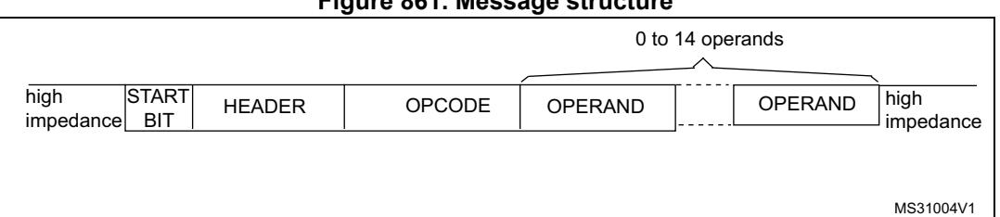
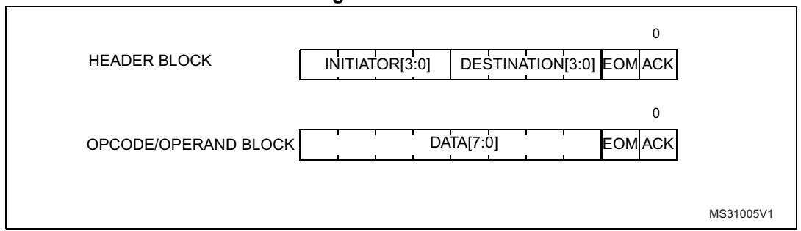
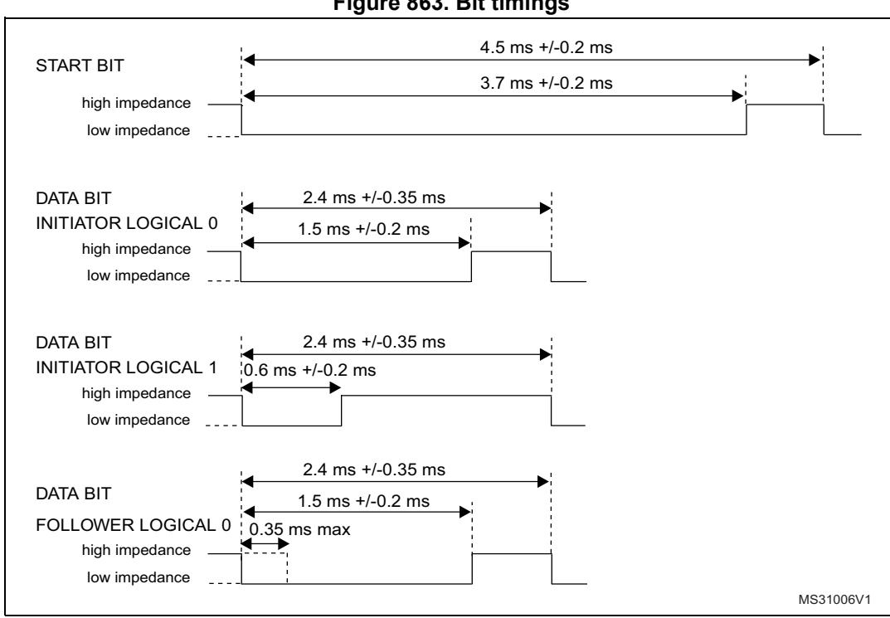
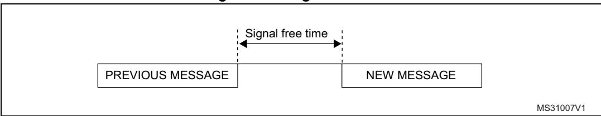
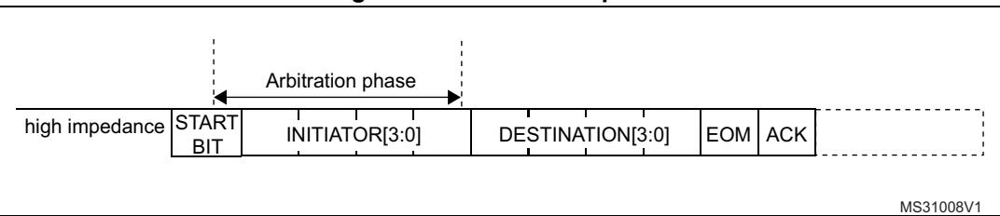
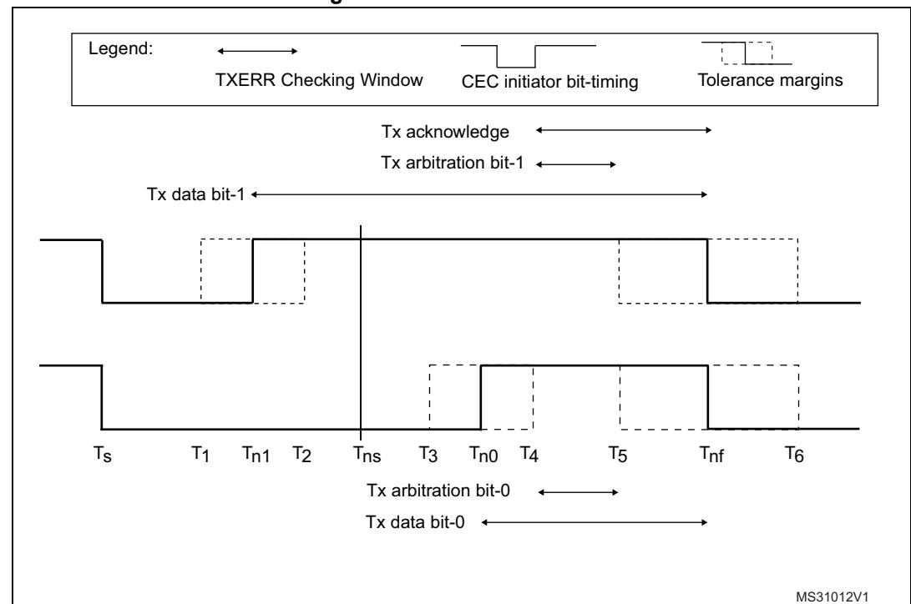

# **62 HDMI-CEC controller (CEC)**

## **62.1 HDMI-CEC introduction**

Consumer electronics control (CEC) is part of HDMI (high-definition multimedia interface) standard. It contains a protocol that provides high-level control functions between various audiovisual products. CEC operates at low speeds, with minimum processing and memory overhead.

The HDMI-CEC controller provides hardware support for this protocol.

## **62.2 HDMI-CEC controller main features**

- Complies with HDMI-CEC v1.4 specification
- Independent 32 kHz CEC kernel (refer to *section RCC kernel clock distribution*)
- Works in Stop mode for ultra-low-power applications
- Configurable signal-free time before start of transmission
  - Automatic by hardware, according to CEC state and transmission history
  - Fixed by software (7 timing options)
- Configurable peripheral address (OAR)
- Supports Listen mode
  - Enables reception of CEC messages sent to destination address different from OAR without interfering with the CEC line
- Configurable Rx-tolerance margin
  - Standard tolerance
  - Extended tolerance
- Receive-error detection
  - Bit rising error (BRE), with optional stop of reception (BRESTP)
  - Short bit period error (SBPE)
  - Long bit period error (LBPE)
- Configurable error-bit generation
  - on BRE detection (BREGEN)
  - on LBPE detection (LBPEGEN)
  - always generated on SBPE detection
- Transmission error detection (TXERR)
- Arbitration lost detection (ARBLST)
  - with automatic transmission retry
- Transmission underrun detection (TXUDR)
- Reception overrun detection (RXOVR)

## **62.3 HDMI-CEC functional description**

### **62.3.1 HDMI-CEC pin and internal signals**

The CEC bus consists of a single bidirectional line that is used to transfer data in and out of the device. It is connected to a +3.3 V supply voltage via a 27 kΩ pull-up resistor. The output stage of the device must have an open-drain or open-collector to allow a wired-AND connection.

The HDMI-CEC controller manages the CEC bidirectional line as an alternate function of a standard GPIO, assuming that it is configured as alternate function open drain. The 27 kΩ pull-up must be added externally to the microcontroller.

To not interfere with the CEC bus when the application power is removed, it is mandatory to isolate the CEC pin from the bus in such conditions. This can be done by using a MOS transistor, as shown on *[Figure 860](#page-2-0)*.

*[Table 610](#page-1-0)* lists the internal signals that are exchanged between the HDMI-CEC and other functional blocks (such as RCC and EXTI).

## **Table 609. HDMI pin**

| Name | Signal type   | Remarks                                                                                                  |
|------|---------------|----------------------------------------------------------------------------------------------------------|
| CEC  | Bidirectional | Two states: – 1 = high impedance – 0 = low impedance A 27 kΩ resistor must be added externally. |

### **Table 610. HDMI-CEC internal input/output signals**

| Signal name | Signal type    | Description               |
|-------------|----------------|---------------------------|
| cec_wkup    | Digital output | HDMI-CEC wake-up signal   |
| cec_it      | Digital output | HDMI-CEC interrupt signal |
| cec_pclk    | Digital input  | APB clock                 |
| cec_ker_ck  | Digital input  | HDMI-CEC kernel clock     |

### **62.3.2 HDMI-CEC block diagram**

MSv41965V2 Remote CEC device cec\_it Nȍ 3.3V CEC PAD TX CLK RX 32 kHz CEC kernel Wake-int G CEC line S D STM32 HDMI\_CEC controller 3.3V CLK RX TX CEC ITF cec\_wkup cec\_pclk cec\_ker\_ck 32-bit APB bus

**Figure 860. HDMI-CEC block diagram** 

## **62.3.3 Message description**

All transactions on the CEC line consist of an initiator and one or more followers. The initiator is responsible for sending the message structure and the data. The follower is the recipient of any data and is responsible for setting any acknowledgment bits.

A message is conveyed in a single frame that consists of a start bit followed by a header block and optionally an opcode and a variable number of operand blocks.

All these blocks are made of a 8-bit payload - most significant bit is transmitted first followed by an end of message (EOM) bit and an acknowledge (ACK) bit.

The EOM bit is set in the last block of a message and kept reset in all others. In case a message contains additional blocks after an EOM is indicated, those additional blocks must be ignored. The EOM bit may be set in the header block to 'ping' other devices, to make sure they are active.

The acknowledge bit is always set to high impedance by the initiator so that it can be driven low either by the follower that has read its own address in the header, or by the follower that needs to reject a broadcast message.

The header consists of the source logical address field, and the destination logical address field. Note that the special address 0xF is used for broadcast messages.

**Figure 861. Message structure**

**Figure 862. Blocks**

### **62.3.4 Bit timing**

The format of the start bit is unique and identifies the start of a message. It must be validated by its low duration and its total duration.

All remaining data bits in the message, after the start bit, have consistent timing. The highto-low transition at the end of the data bit is the start of the next data bit except for the final bit where the CEC line remains high.

**Figure 863. Bit timings**

## **62.4 Arbitration**

All devices transmitting - or retransmitting - a message onto the CEC line must ensure that it has been inactive for a number of bit periods. This signal-free time is defined as the time

starting from the final bit of the previous frame and depends on the initiating device and the current status as shown in the figure below.

**Figure 864. Signal free time**

Since only one initiator is allowed at any one time, an arbitration mechanism is provided to avoid conflict when more than one initiator begins transmitting at the same time.

CEC line arbitration starts with the leading edge of the start bit and continues until the end of the initiator address bits within the header block. During this period, the initiator must monitor the CEC line, if whilst driving the line to high impedance it reads it back to 0. Assuming then it has lost arbitration, it stops transmitting and becomes a follower.

**Figure 865. Arbitration phase**

*[Figure 866](#page-4-0)* shows an example for a SFT of three nominal bit periods.

MS31009V1 last bit of previous frame Start bit

**Figure 866. SFT of three nominal bit periods**

A configurable time window is counted before starting the transmission.

In the SFT = 0 configuration, HDMI-CEC performs automatic SFT calculation ensuring compliance with the HDMI-CEC standard:

- 2.5 data bit periods if the CEC is the last bus initiator with unsuccessful transmission
- 4 data bit periods if the CEC is the new bus initiator
- 6 data bit periods if the CEC is the last bus initiator with successful transmission

This is done to guarantee the maximum priority to a failed transmission and the lowest one to the last initiator that completed successfully its transmission.

Otherwise there is the possibility to configure the SFT bits to count a fixed timing value. Possible values are 0.5, 1.5, 2.5, 3.5, 4.5, 5.5, 6.5 data bit periods.

## **62.4.1 SFT option bit**

In case of SFTOPT = 0 configuration, SFT starts being counted when the start-oftransmission command is set by software (TXSOM = 1).

In case of SFTOPT = 1, SFT starts automatically being counted by the HDMI-CEC device when a bus-idle or line error condition is detected. If the SFT timer is completed at the time TXSOM command is set then transmission starts immediately without latency. If the SFT timer is still running instead, the system waits until the timer elapses before transmission can start.

In case of SFTOPT = 1 a bus-event condition starting the SFT timer is detected in the following cases:

- In case of a regular end of transmission/reception, when TXEND/RXEND bits are set at the minimum nominal data bit duration of the last bit in the message (ACK bit).
- In case of a transmission error detection, SFT timer starts when the TXERR transmission error is detected (TXERR = 1).
- In case of a missing acknowledge from the CEC follower, the SFT timer starts when the TXACKE bit is set, that is at the nominal sampling time of the ACK bit.
- In case of a transmission underrun error, the SFT timer starts when the TXUDR bit is set at the end of the ACK bit.
- In case of a receive error detection implying reception abort, the SFT timer starts at the same time the error is detected. If an error bit is generated, then SFT starts being counted at the end of the error bit.
- In case of a wrong start bit or of any uncodified low impedance bus state from idle, the SFT timer is restarted as soon as the bus comes back to hi-impedance idleness.

# **62.5 Error handling**

### **62.5.1 Bit error**

If a data bit - excluding the start bit - is considered invalid, the follower is expected to notify such error by generating a low bit period on the CEC line of 1.4 to 1.6 times the nominal data bit period (3.6 ms nominally).

MS31010V1 ERROR BIT 3.6 ms +/-0.24 ms high impedance low impedance

**Figure 867. Error bit timing**

RM0399 Rev 4 3213/3556

### **62.5.2 Message error**

A message is considered lost and therefore may be retransmitted under the following conditions:

- a message is not acknowledged in a directly addressed message
- a message is negatively acknowledged in a broadcast message
- a low impedance is detected on the CEC line while it is not expected (line error)

Three kinds of error flag can be detected when the CEC interface is receiving a data bit:

### **62.5.3 Bit rising error (BRE)**

BRE (bit rising error) is set when a bit rising edge is detected outside the windows where it is expected (see *[Figure 868](#page-7-0)*). BRE flag also generates a CEC interrupt if the BREIE = 1.

In the case of a BRE detection, the message reception can be stopped according to the BRESTP bit value and an error bit can be generated if BREGEN bit is set.

When BRE is detected in a broadcast message with BRESTP = 1 an error bit is generated even if BREGEN = 0 to enforce initiator's retry of the failed transmission. Error bit generation can be disabled by configuring BREGEN = 0, BRDNOGEN = 1.

### **62.5.4 Short bit period error (SBPE)**

SBPE is set when a bit falling edge is detected earlier than expected (see *[Figure 868](#page-7-0)*). SBPE flag also generates a CEC interrupt if the SBPEIE = 1.

An error bit is always generated on the line in case of a SBPE error detection. An error bit is not generated upon SBPE detection only when Listen mode is set (LSTN = 1) and the following conditions are met:

- A directly addressed message is received containing SBPE
- A broadcast message is received containing SBPE AND BRDNOGEN = 1

### **62.5.5 Long bit period error (LBPE)**

LBPE is set when a bit falling edge is not detected in a valid window (see *[Figure 868](#page-7-0)*). LBPE flag also generates a CEC interrupt if the LBPEIE = 1.

LBPE always stops the reception, an error bit is generated on the line when LBPEGEN bit is set.

When LBPE is detected in a broadcast message an error bit is generated even if LBPEGEN = 0 to enforce initiator's retry of the failed transmission. Error bit generation can be disabled by configuring LBPEGEN = 0, BRDNOGEN = 1.

*Note: The BREGEN = 1, BRESTP = 0 configuration must be avoided.*

Ts T1 Tn1 T2 Tns T3 Tn0 T4 T5 Tnf T6 BRE BRE Checking Window Tolerance margins Legend: BRE SBPE LBPE CEC initiator bit-timing

**Figure 868. Error handling**

**Table 611. Error handling timing parameters** 

| Time | RXTOL | ms   | Description                                                                             |  |
|------|-------|------|-----------------------------------------------------------------------------------------|--|
| Ts   | x     | 0    | Bit start event.                                                                        |  |
| T1   | 1     | 0.3  | The earliest time for a low - high transition when                                      |  |
|      | 0     | 0.4  | indicating a logical 1.                                                                 |  |
| Tn1  | x     | 0.6  | The nominal time for a low - high transition when indicating a logical 1.            |  |
| T2   | 0     | 0.8  | The latest time for a low - high transition when                                        |  |
|      | 1     | 0.9  | indicating a logical 1.                                                                 |  |
| Tns  | x     | 1.05 | Nominal sampling time.                                                                  |  |
| T3   | 1     | 1.2  | The earliest time a device is permitted return to a high                                |  |
|      | 0     | 1.3  | impedance state (logical 0).                                                            |  |
| Tn0  | x     | 1.5  | The nominal time a device is permitted return to a high impedance state (logical 0). |  |
| T4   | 0     | 1.7  | The latest time a device is permitted return to a high                                  |  |
|      | 1     | 1.8  | impedance state (logical 0).                                                            |  |
| T5   | 1     | 1.85 |                                                                                         |  |
|      | 0     | 2.05 | The earliest time for the start of a following bit.                                     |  |
| Tnf  | x     | 2.4  | The nominal data bit period.                                                            |  |
| T6   | 0     | 2.75 | The latest time for the start of a following bit.                                       |  |
|      | 1     | 2.95 |                                                                                         |  |

MS31011V1

## **62.5.6 Transmission error detection (TXERR)**

The CEC initiator sets the TXERR flag if detecting low impedance on the CEC line when it is transmitting high impedance and is not expecting a follower asserted bit. TXERR flag also generates a CEC interrupt if the TXERRIE = 1.

TXERR assertion stops the message transmission. Application is in charge to retry the failed transmission up to five times.

TXERR checks are performed differently depending on the different states of the CEC line and on the RX tolerance configuration.

**Figure 869. TXERR detection**

**Table 612. TXERR timing parameters** 

| Time | RXTOL | ms   | Description                                                                  |  |
|------|-------|------|------------------------------------------------------------------------------|--|
| Ts   | x     | 0    | Bit start event.                                                             |  |
| T1   | 1     | 0.3  | The earliest time for a low - high transition when                           |  |
|      | 0     | 0.4  | indicating a logical 1.                                                      |  |
| Tn1  | x     | 0.6  | The nominal time for a low - high transition when indicating a logical 1. |  |
| T2   | 0     | 0.8  | The latest time for a low - high transition when                             |  |
|      | 1     | 0.9  | indicating a logical 1.                                                      |  |
| Tns  | x     | 1.05 | Nominal sampling time.                                                       |  |
| T3   | 1     | 1.2  | The earliest time a device is permitted return to a                          |  |
|      | 0     | 1.3  | high impedance state (logical 0).                                            |  |

| Time | RXTOL | ms   | Description                                                                             |  |
|------|-------|------|-----------------------------------------------------------------------------------------|--|
| Tn0  | x     | 1.5  | The nominal time a device is permitted return to a high impedance state (logical 0). |  |
| T4   | 0     | 1.7  | The latest time a device is permitted return to a high                                  |  |
|      | 1     | 1.8  | impedance state (logical 0).                                                            |  |
| T5   | 1     | 1.85 | The earliest time for the start of a following bit.                                     |  |
|      | 0     | 2.05 |                                                                                         |  |
| Tnf  | x     | 2.4  | The nominal data bit period.                                                            |  |
| T6   | 0     | 2.75 |                                                                                         |  |
|      | 1     | 2.95 | The latest time for the start of a following bit.                                       |  |

**Table 612. TXERR timing parameters (continued)**

## **62.6 HDMI-CEC interrupts**

An interrupt can be produced:

- during reception if a receive block transfer is finished or if a receive error occurs.
- during transmission if a transmit block transfer is finished or if a transmit error occurs.

**Table 613. HDMI-CEC interrupts** 

| Interrupt event              | Event flag | Enable control bit |
|------------------------------|------------|--------------------|
| Rx-byte received             | RXBR       | RXBRIE             |
| End of reception             | RXEND      | RXENDIE            |
| Rx-overrun                   | RXOVR      | RXOVRIE            |
| Rxbit rising error           | BRE        | BREIE              |
| Rx-short bit period error    | SBPE       | SBPEIE             |
| Rx-long bit period error     | LBPE       | LBPEIE             |
| Rx-missing acknowledge error | RXACKE     | RXACKEIE           |
| Arbitration lost             | ARBLST     | ARBLSTIE           |
| Tx-byte request              | TXBR       | TXBRIE             |
| End of transmission          | TXEND      | TXENDIE            |
| Tx-buffer underrun           | TXUDR      | TXUDRIE            |
| Tx-error                     | TXERR      | TXERRIE            |
| Tx-missing acknowledge error | TXACKE     | TXACKEIE           |

## **62.7 HDMI-CEC registers**

Refer to *Section 1.2* for a list of abbreviations used in register descriptions. The registers have to be accessed by words (32 bits).

## **62.7.1 CEC control register (CEC\_CR)**

Address offset: 0x00

Reset value: 0x0000 0000

| 31   | 30   | 29   | 28   | 27   | 26   | 25   | 24   | 23   | 22   | 21   | 20   | 19   | 18        | 17        | 16    |
|------|------|------|------|------|------|------|------|------|------|------|------|------|-----------|-----------|-------|
| Res. | Res. | Res. | Res. | Res. | Res. | Res. | Res. | Res. | Res. | Res. | Res. | Res. | Res.      | Res.      | Res.  |
|      |      |      |      |      |      |      |      |      |      |      |      |      |           |           |       |
| 15   | 14   | 13   | 12   | 11   | 10   | 9    | 8    | 7    | 6    | 5    | 4    | 3    | 2         | 1         | 0     |
| Res. | Res. | Res. | Res. | Res. | Res. | Res. | Res. | Res. | Res. | Res. | Res. | Res. | TXEO M | TXSO M | CECEN |
|      |      |      |      |      |      |      |      |      |      |      |      |      | rs        | rs        | rw    |

Bits 31:3 Reserved, must be kept at reset value.

### Bit 2 **TXEOM***:* Tx end of message

The TXEOM bit is set by software to command transmission of the last byte of a CEC message. TXEOM is cleared by hardware at the same time and under the same conditions as for TXSOM.

0: TXDR data byte is transmitted with EOM = 0.

1: TXDR data byte is transmitted with EOM = 1.

*Note: TXEOM must be set when CECEN = 1.*

*TXEOM must be set before writing transmission data to TXDR.*

*If TXEOM is set when TXSOM = 0, transmitted message consists of 1 byte (HEADER) only (PING message).*

### Bit 1 **TXSOM**: Tx start of message

TXSOM is set by software to command transmission of the first byte of a CEC message. If the CEC message consists of only one byte, TXEOM must be set before of TXSOM.

Start-bit is effectively started on the CEC line after SFT is counted. If TXSOM is set while a message reception is ongoing, transmission starts after the end of reception.

TXSOM is cleared by hardware after the last byte of the message is sent with a positive acknowledge (TXEND = 1), in case of transmission underrun (TXUDR = 1), negative acknowledge (TXACKE = 1), and transmission error (TXERR = 1). It is also cleared by CECEN = 0. It is not cleared and transmission is automatically retried in case of arbitration lost (ARBLST = 1).

TXSOM can be also used as a status bit informing application whether any transmission request is pending or under execution. The application can abort a transmission request at any time by clearing the CECEN bit.

0: No CEC transmission is on-going.

1: CEC transmission command

*Note: TXSOM must be set when CECEN = 1.*

*TXSOM must be set when transmission data is available into TXDR.*

*HEADER first four bits containing own peripheral address are taken from TXDR[7:4], not from CEC\_CFGR.OAR that is used only for reception.*

### Bit 0 **CECEN:** CEC enable

The CECEN bit is set and cleared by software. CECEN = 1 starts message reception and enables the TXSOM control. CECEN = 0 disables the CEC peripheral, clears all bits of CEC\_CR register and aborts any on-going reception or transmission.

0: CEC peripheral is off.

1: CEC peripheral is on.

## **62.7.2 CEC configuration register (CEC\_CFGR)**

This register is used to configure the HDMI-CEC controller.

Address offset: 0x04

Reset value: 0x0000 0000

**Caution:** It is mandatory to write CEC\_CFGR only when CECEN = 0.

| 31   | 30        | 29   | 28   | 27   | 26   | 25   | 24    | 23           | 22          | 21         | 20         | 19    | 18 | 17 | 16 |
|------|-----------|------|------|------|------|------|-------|--------------|-------------|------------|------------|-------|----|----|----|
| LSTN | OAR[14:0] |      |      |      |      |      |       |              |             |            |            |       |    |    |    |
| rw   | rw        | rw   | rw   | rw   | rw   | rw   | rw    | rw           | rw          | rw         | rw         | rw    | rw | rw | rw |
| 15   | 14        | 13   | 12   | 11   | 10   | 9    | 8     | 7            | 6           | 5          | 4          | 3     | 2  | 1  | 0  |
| Res. | Res.      | Res. | Res. | Res. | Res. | Res. | SFTOP | BRDN OGEN | LBPEG EN | BREGE N | BREST P | RXTOL |    |    |    |
|      |           |      |      |      |      |      | rw    | rw           | rw          | rw         | rw         | rw    | rw | rw | rw |

### Bit 31 **LSTN:** Listen mode

LSTN bit is set and cleared by software.

- 0: CEC peripheral receives only message addressed to its own address (OAR). Messages addressed to different destination are ignored. Broadcast messages are always received.
- 1: CEC peripheral receives messages addressed to its own address (OAR) with positive acknowledge. Messages addressed to different destination are received, but without interfering with the CEC bus: no acknowledge sent.

#### Bits 30:16 **OAR[14:0]:** Own addresses configuration

The OAR bits are set by software to select which destination logical addresses has to be considered in receive mode. Each bit, when set, enables the CEC logical address identified by the given bit position.

At the end of HEADER reception, the received destination address is compared with the enabled addresses. In case of matching address, the incoming message is acknowledged and received. In case of non-matching address, the incoming message is received only in listen mode (LSTN = 1), but without acknowledge sent. Broadcast messages are always received.

Example:

OAR = 0b000 0000 0010 0001 means that CEC acknowledges addresses 0x0 and 0x5. Consequently, each message directed to one of these addresses is received.

Bits 15:9 Reserved, must be kept at reset value.

### Bit 8 **SFTOP**: SFT option bit

The SFTOPT bit is set and cleared by software.

0: SFT timer starts when TXSOM is set by software.

1: SFT timer starts automatically at the end of message transmission/reception.

### Bit 7 **BRDNOGEN:** Avoid error-bit generation in broadcast

The BRDNOGEN bit is set and cleared by software.

0: BRE detection with BRESTP = 1 and BREGEN = 0 on a broadcast message generates an error-bit on the CEC line. LBPE detection with LBPEGEN = 0 on a broadcast message generates an error-bit on the CEC line.

1: Error-bit is not generated in the same condition as above. An error-bit is not generated even in case of an SBPE detection in a broadcast message if listen mode is set.

### Bit 6 **LBPEGEN:** Generate error-bit on long bit period error

The LBPEGEN bit is set and cleared by software.

0: LBPE detection does not generate an error-bit on the CEC line.

1: LBPE detection generates an error-bit on the CEC line.

*Note: If BRDNOGEN = 0, an error-bit is generated upon LBPE detection in broadcast even if LBPEGEN = 0.*

### Bit 5 **BREGEN:** Generate error-bit on bit rising error

The BREGEN bit is set and cleared by software.

0: BRE detection does not generate an error-bit on the CEC line.

1: BRE detection generates an error-bit on the CEC line (if BRESTP is set).

*Note: If BRDNOGEN = 0, an error-bit is generated upon BRE detection with BRESTP = 1 in broadcast even if BREGEN = 0.*

### Bit 4 **BRESTP**: Rx-stop on bit rising error

The BRESTP bit is set and cleared by software.

0: BRE detection does not stop reception of the CEC message. Data bit is sampled at 1.05 ms.

1: BRE detection stops message reception.

### Bit 3 **RXTOL:** Rx-tolerance

The RXTOL bit is set and cleared by software.

0: Standard tolerance margin:

- Start-bit, +/- 200 µs rise, +/- 200 µs fall
- Data-bit: +/- 200 µs rise. +/- 350 µs fall

### 1: Extended tolerance

- Start-bit: +/- 400 µs rise, +/- 400 µs fall
- Data-bit: +/-300 µs rise, +/- 500 µs fall

### Bits 2:0 **SFT[2:0]**: Signal free time

SFT bits are set by software. In the SFT = 0x0 configuration, the number of nominal data bit periods waited before transmission is ruled by hardware according to the transmission history. In all the other configurations the SFT number is determined by software. 0x0

- 2.5 data-bit periods if CEC is the last bus initiator with unsuccessful transmission (ARBLST = 1, TXERR = 1, TXUDR = 1 or TXACKE = 1)
- 4 data-bit periods if CEC is the new bus initiator
- 6 data-bit periods if CEC is the last bus initiator with successful transmission (TXEOM = 1)

0x1: 0.5 nominal data bit periods

0x2: 1.5 nominal data bit periods

0x3: 2.5 nominal data bit periods

0x4: 3.5 nominal data bit periods

0x5: 4.5 nominal data bit periods

0x6: 5.5 nominal data bit periods

0x7: 6.5 nominal data bit periods

## 62.7.3 CEC Tx data register (CEC\_TXDR)

Address offset: 0x8

Reset value: 0x0000 0000

| 31         | 30         | 29         | 28         | 27         | 26         | 25        | 24        | 23   | 22   | 21   | 20   | 19   | 18   | 17   | 16   |
|------------|------------|------------|------------|------------|------------|-----------|-----------|------|------|------|------|------|------|------|------|
| Res.       | Res.       | Res.       | Res.       | Res.       | Res.       | Res.      | Res.      | Res. | Res. | Res. | Res. | Res. | Res. | Res. | Res. |
|            |            |            |            |            |            |           |           |      |      |      |      |      |      |      |      |
|            |            |            |            |            |            |           |           |      |      |      |      |      |      |      |      |
| 15         | 14         | 13         | 12         | 11         | 10         | 9         | 8         | 7    | 6    | 5    | 4    | 3    | 2    | 1    | 0    |
| 15 Res. | 14 Res. | 13 Res. | 12 Res. | 11 Res. | 10 Res. | 9 Res. | 8 Res. | 7    | 6    | 5    |      | 3    | 2    | 1    | 0    |

Bits 31:8 Reserved, must be kept at reset value.

Bits 7:0 TXD[7:0]: Tx data

TXD is a write-only register containing the data byte to be transmitted.

## 62.7.4 CEC Rx data register (CEC\_RXDR)

Address offset: 0xC

Reset value: 0x0000 0000

| 31         | 30         | 29         | 28         | 27   | 26         | 25        | 24   | 23   | 22   | 21   | 20   | 19         | 18   | 17   | 16   |
|------------|------------|------------|------------|------|------------|-----------|------|------|------|------|------|------------|------|------|------|
| Res.       | Res.       | Res.       | Res.       | Res. | Res.       | Res.      | Res. | Res. | Res. | Res. | Res. | Res.       | Res. | Res. | Res. |
|            |            |            |            |      |            |           |      |      |      |      |      |            |      |      |      |
|            |            |            |            |      |            |           |      |      |      |      |      |            |      |      |      |
| 15         | 14         | 13         | 12         | 11   | 10         | 9         | 8    | 7    | 6    | 5    | 4    | 3          | 2    | 1    | 0    |
| 15 Res. | 14 Res. | 13 Res. | 12 Res. | Res. | 10 Res. | 9 Res. | Res. | 7    | 6    | 5    | -    | 3 [7:0] | 2    | 1    | 0    |

Bits 31:8 Reserved, must be kept at reset value.

Bits 7:0 RXD[7:0]: Rx data

RXD is read-only and contains the last data byte that has been received from the CEC line.

## 62.7.5 CEC interrupt and status register (CEC\_ISR)

Address offset: 0x10

Reset value: 0x0000 0000

| 31   | 30   | 29   | 28         | 27    | 26    | 25    | 24    | 23         | 22         | 21    | 20    | 19    | 18        | 17    | 16    |
|------|------|------|------------|-------|-------|-------|-------|------------|------------|-------|-------|-------|-----------|-------|-------|
| Res. | Res. | Res. | Res.       | Res.  | Res.  | Res.  | Res.  | Res.       | Res.       | Res.  | Res.  | Res.  | Res.      | Res.  | Res.  |
|      |      |      |            |       |       |       |       |            |            |       |       |       |           |       |       |
| 15   | 14   | 13   | 12         | 11    | 10    | 9     | 8     | 7          | 6          | 5     | 4     | 3     | 2         | 1     | 0     |
| Res. | Res. | Res. | TXACK E | TXERR | TXUDR | TXEND | TXBR  | ARBLS T | RXACK E | LBPE  | SBPE  | BRE   | RXOV R | RXEND | RXBR  |
|      |      |      | rc_w1      | rc_w1 | rc_w1 | rc_w1 | rc_w1 | rc_w1      | rc_w1      | rc_w1 | rc_w1 | rc_w1 | rc_w1     | rc_w1 | rc_w1 |

Bits 31:13 Reserved, must be kept at reset value.

RM0399 Rev 4 3221/3556

### Bit 12 **TXACKE:** Tx-missing acknowledge error

In transmission mode, TXACKE is set by hardware to inform application that no acknowledge was received. In case of broadcast transmission, TXACKE informs application that a negative acknowledge was received. TXACKE aborts message transmission and clears TXSOM and TXEOM controls.

TXACKE is cleared by software write at 1.

### Bit 11 **TXERR:** Tx-error

In transmission mode, TXERR is set by hardware if the CEC initiator detects low impedance on the CEC line while it is released. TXERR aborts message transmission and clears TXSOM and TXEOM controls.

TXERR is cleared by software write at 1.

#### Bit 10 **TXUDR:** Tx-buffer underrun

In transmission mode, TXUDR is set by hardware if application was not in time to load TXDR before of next byte transmission. TXUDR aborts message transmission and clears TXSOM and TXEOM control bits.

TXUDR is cleared by software write at 1

### Bit 9 **TXEND:** End of transmission

TXEND is set by hardware to inform application that the last byte of the CEC message has been successfully transmitted. TXEND clears the TXSOM and TXEOM control bits.

TXEND is cleared by software write at 1.

### Bit 8 **TXBR:** Tx-byte request

TXBR is set by hardware to inform application that the next transmission data has to be written to TXDR. TXBR is set when the 4th bit of currently transmitted byte is sent. Application must write the next byte to TXDR within six nominal data-bit periods before transmission underrun error occurs (TXUDR).

TXBR is cleared by software write at 1.

### Bit 7 **ARBLST:** Arbitration lost

ARBLST is set by hardware to inform application that CEC device is switching to reception due to arbitration lost event following the TXSOM command. ARBLST can be due either to a contending CEC device starting earlier or starting at the same time but with higher HEADER priority. After ARBLST assertion TXSOM bit keeps pending for next transmission attempt.

ARBLST is cleared by software write at 1.

### Bit 6 **RXACKE:** Rx-missing acknowledge

In receive mode, RXACKE is set by hardware to inform application that no acknowledge was seen on the CEC line. RXACKE applies only for broadcast messages and in listen mode also for not directly addressed messages (destination address not enabled in OAR). RXACKE aborts message reception.

RXACKE is cleared by software write at 1.

### Bit 5 **LBPE:** Rx-long bit period error

LBPE is set by hardware in case a data-bit waveform is detected with long bit period error. LBPE is set at the end of the maximum bit-extension tolerance allowed by RXTOL, in case falling edge is still longing. LBPE always stops reception of the CEC message. LBPE generates an error-bit on the CEC line if LBPEGEN = 1. In case of broadcast, error-bit is generated even in case of LBPEGEN = 0.

LBPE is cleared by software write at 1.

### Bit 4 **SBPE:** Rx-short bit period error

SBPE is set by hardware in case a data-bit waveform is detected with short bit period error. SBPE is set at the time the anticipated falling edge occurs. SBPE generates an error-bit on the CEC line. SBPE is cleared by software write at 1.

### Bit 3 BRE: Rx-bit rising error

BRE is set by hardware in case a data-bit waveform is detected with bit rising error. BRE is set either at the time the misplaced rising edge occurs, or at the end of the maximum BRE tolerance allowed by RXTOL, in case rising edge is still longing. BRE stops message reception if BRESTP = 1. BRE generates an error-bit on the CEC line if BREGEN = 1.

BRE is cleared by software write at 1.

#### Bit 2 RXOVR: Rx-overrun

RXOVR is set by hardware if RXBR is not yet cleared at the time a new byte is received on the CEC line and stored into RXD. RXOVR assertion stops message reception so that no acknowledge is sent. In case of broadcast, a negative acknowledge is sent.

RXOVR is cleared by software write at 1.

#### Bit 1 **RXEND**: End of reception

RXEND is set by hardware to inform application that the last byte of a CEC message is received from the CEC line and stored into the RXD buffer. RXEND is set at the same time of RXBR. RXEND is cleared by software write at 1.

### Bit 0 RXBR: Rx-byte received

The RXBR bit is set by hardware to inform application that a new byte has been received from the CEC line and stored into the RXD buffer.

RXBR is cleared by software write at 1.

## 62.7.6 CEC interrupt enable register (CEC IER)

Address offset: 0x14

Reset value: 0x0000 0000

**Caution:** It is mandatory to write CEC IER only when CECEN = 0.

| 31   | 30   | 29   | 28          | 27          | 26          | 25          | 24         | 23           | 22          | 21     | 20         | 19    | 18          | 17          | 16         |
|------|------|------|-------------|-------------|-------------|-------------|------------|--------------|-------------|--------|------------|-------|-------------|-------------|------------|
| Res. | Res. | Res. | Res.        | Res.        | Res.        | Res.        | Res.       | Res.         | Res.        | Res.   | Res.       | Res.  | Res.        | Res.        | Res.       |
|      |      |      |             |             |             |             |            |              |             |        |            |       |             |             |            |
| 15   | 14   | 13   | 12          | 11          | 10          | 9           | 8          | 7            | 6           | 5      | 4          | 3     | 2           | 1           | 0          |
| Res. | Res. | Res. | TXACK IE | TXERR IE | TXUDR IE | TXEND IE | TXBRI E | ARBLS TIE | RXACK IE | LBPEIE | SBPEI E | BREIE | RXOV RIE | RXEND IE | RXBRI E |
|      |      |      | rw          | rw          | rw          | rw          | rw         | rw           | rw          | rw     | rw         | rw    | rw          | rw          | rw         |

Bits 31:13 Reserved, must be kept at reset value.

### Bit 12 TXACKIE: Tx-missing acknowledge error interrupt enable

The TXACKEIE bit is set and cleared by software.

0: TXACKE interrupt disabled

1: TXACKE interrupt enabled

### Bit 11 **TXERRIE**: Tx-error interrupt enable

The TXERRIE bit is set and cleared by software.

0: TXERR interrupt disabled

1: TXERR interrupt enabled

### Bit 10 TXUDRIE: Tx-underrun interrupt enable

The TXUDRIE bit is set and cleared by software.

0: TXUDR interrupt disabled

1: TXUDR interrupt enabled

RM0399 Rev 4 3223/3556

### Bit 9 **TXENDIE***:* Tx-end of message interrupt enable

The TXENDIE bit is set and cleared by software.

0: TXEND interrupt disabled

1: TXEND interrupt enabled

### Bit 8 **TXBRIE***:* Tx-byte request interrupt enable

The TXBRIE bit is set and cleared by software.

0: TXBR interrupt disabled

1: TXBR interrupt enabled

### Bit 7 **ARBLSTIE***:* Arbitration lost interrupt enable

The ARBLSTIE bit is set and cleared by software.

0: ARBLST interrupt disabled

1: ARBLST interrupt enabled

### Bit 6 **RXACKIE***:* Rx-missing acknowledge error interrupt enable

The RXACKIE bit is set and cleared by software.

0: RXACKE interrupt disabled

1: RXACKE interrupt enabled

#### Bit 5 **LBPEIE***:* Long bit period error interrupt enable

The LBPEIE bit is set and cleared by software.

0: LBPE interrupt disabled

1: LBPE interrupt enabled

#### Bit 4 **SBPEIE***:* Short bit period error interrupt enable

The SBPEIE bit is set and cleared by software.

0: SBPE interrupt disabled

1: SBPE interrupt enabled

### Bit 3 **BREIE***:* Bit rising error interrupt enable

The BREIE bit is set and cleared by software.

0: BRE interrupt disabled

1: BRE interrupt enabled

### Bit 2 **RXOVRIE***:* Rx-buffer overrun interrupt enable

The RXOVRIE bit is set and cleared by software.

0: RXOVR interrupt disabled

1: RXOVR interrupt enabled

### Bit 1 **RXENDIE***:* End of reception interrupt enable

The RXENDIE bit is set and cleared by software.

0: RXEND interrupt disabled

1: RXEND interrupt enabled

### Bit 0 **RXBRIE***:* Rx-byte received interrupt enable

The RXBRIE bit is set and cleared by software.

0: RXBR interrupt disabled

1: RXBR interrupt enabled

### **62.7.7 HDMI-CEC register map**

**Table 614. HDMI-CEC register map and reset values** 

| Offset | Register name | 31   | 30   | 29                                                                | 28   | 27   | 26   | 25   | 24   | 23   | 22   | 21   | 20   | 19   | 18   | 17   | 16   | 15     | 14       | 13      | 12      | 11      | 10      | 9        | 8      | 7        | 6       | 5      | 4      | 3     | 2       | 1       | 0      |  |
|--------|------------------|------|------|-------------------------------------------------------------------|------|------|------|------|------|------|------|------|------|------|------|------|------|--------|----------|---------|---------|---------|---------|----------|--------|----------|---------|--------|--------|-------|---------|---------|--------|--|
| 0x00   | CEC_CR           | Res. | Res. | Res.                                                              | Res. | Res. | Res. | Res. | Res. | Res. | Res. | Res. | Res. | Res. | Res. | Res. | Res. | Res.   | Res.     | Res.    | Res.    | Res.    | Res.    | Res.     | Res.   | Res.     | Res.    | Res.   | Res.   | Res.  | TXEOM   | TXSOM   | CECEN  |  |
|        | Reset value      |      |      |                                                                   |      |      |      |      |      |      |      |      |      |      |      |      |      |        |          |         |         |         |         |          |        |          |         |        |        |       | 0       | 0       | 0      |  |
| 0x04   | CEC_CFGR         | LSTN |      | Res. Res. Res. Res. Res. Res. Res. OAR[14:0] |      |      |      |      |      |      |      |      |      |      |      |      |      | SFTOPT | BRDNOGEN | LBPEGEN | BREGEN  | BRESTP  | RXTOL   | SFT[2:0] |        |          |         |        |        |       |         |         |        |  |
|        | Reset value      | 0    | 0    | 0                                                                 | 0    | 0    | 0    | 0    | 0    | 0    | 0    | 0    | 0    | 0    | 0    | 0    | 0    |        |          |         |         |         |         |          | 0      | 0        | 0       | 0      | 0      | 0     | 0       | 0       | 0      |  |
| 0x08   | CEC_TXDR         | Res. | Res. | Res.                                                              | Res. | Res. | Res. | Res. | Res. | Res. | Res. | Res. | Res. | Res. | Res. | Res. | Res. | Res.   | Res.     | Res.    | Res.    | Res.    | Res.    | Res.     | Res.   | TXD[7:0] |         |        |        |       |         |         |        |  |
|        | Reset value      |      |      |                                                                   |      |      |      |      |      |      |      |      |      |      |      |      |      |        |          |         |         |         |         |          |        | 0        | 0       | 0      | 0      | 0     | 0       | 0       | 0      |  |
| 0x0C   | CEC_RXDR         | Res. | Res. | Res.                                                              | Res. | Res. | Res. | Res. | Res. | Res. | Res. | Res. | Res. | Res. | Res. | Res. | Res. | Res.   | Res.     | Res.    | Res.    | Res.    | Res.    | Res.     | Res.   | RXD[7:0] |         |        |        |       |         |         |        |  |
|        | Reset value      |      |      |                                                                   |      |      |      |      |      |      |      |      |      |      |      |      |      |        |          |         |         |         |         |          |        | 0        | 0       | 0      | 0      | 0     | 0       | 0       | 0      |  |
| 0x10   | CEC_ISR          | Res. | Res. | Res.                                                              | Res. | Res. | Res. | Res. | Res. | Res. | Res. | Res. | Res. | Res. | Res. | Res. | Res. | Res.   | Res.     | Res.    | TXACKE  | TXERR   | TXUDR   | TXEND    | TXBR   | ARBLST   | RXACKE  | LBPE   | SBPE   | BRE   | RXOVR   | RXEND   | RXBR   |  |
|        | Reset value      |      |      |                                                                   |      |      |      |      |      |      |      |      |      |      |      |      |      |        |          |         | 0       | 0       | 0       | 0        | 0      | 0        | 0       | 0      | 0      | 0     | 0       | 0       | 0      |  |
| 0x14   | CEC_IER          | Res. | Res. | Res.                                                              | Res. | Res. | Res. | Res. | Res. | Res. | Res. | Res. | Res. | Res. | Res. | Res. | Res. | Res.   | Res.     | Res.    | TXACKIE | TXERRIE | TXUDRIE | TXENDIE  | TXBRIE | ARBLSTIE | RXACKIE | LBPEIE | SBPEIE | BREIE | RXOVRIE | RXENDIE | RXBRIE |  |
|        | Reset value      |      |      |                                                                   |      |      |      |      |      |      |      |      |      |      |      |      |      |        |          |         | 0       | 0       | 0       | 0        | 0      | 0        | 0       | 0      | 0      | 0     | 0       | 0       | 0      |  |

Refer to *Section 2.3* for the register boundary addresses.

