# **63 Debug infrastructure**

# **63.1 Introduction**

The debug infrastructure allows software designers to debug and trace their embedded software.

The debug features can be controlled via a JTAG/Serial-wire debug access port, using industry standard debugging tools. A trace port captures data for logging and analysis.

The trace and debug system is designed to support a variety of typical use cases:

#### • **Low cost trace**

Limited trace capability is available over the single-wire debug output. This supports code instrumentation using "printf", tracing of data and address watchpoints, interrupt detection and program counter sampling. Single-wire trace can be maintained even when one or both processors are switched off or clock-stopped.

### • **Breakpoint debugging of each core independently**

Both processor cores can be simultaneously and independently debugged using equipment connected to the JTAG/SWD debug port. This allows breakpoint and watchpoint setting, code stepping, memory access, and so on.

#### • **Synchronous debugging of both cores**

When one core stops due to a breakpoint or a debugger stop command, the other core can be stopped as well. Similarly, the cores can be restarted at the same time. This allows debugging of loosely coupled applications which require the processors to remain synchronized.

#### • **Tracing code execution from one or both cores via the trace port**

Trace information from both cores is combined into a single trace stream and output to a real-time trace port analyzer. An ID embedded in the trace allows the analyzer to identify the source of each information packet.

#### • **Continuous trace capturing in a circular buffer**

Instead of streaming it off-chip, the combined trace information can be stored on-chip in a circular buffer. The trace storage can be started and stopped by different means such as a debugger command, a software command, an external trigger signal or an internal event.

#### • **Draining the buffer to the trace port**

The stored trace can be dumped off-chip to the trace port analyzer. The buffer draining can be initiated by different means such as debugger, software, external trigger or internal event.

### • **Reading the buffer with the debugger**

The debugger can read the contents of the trace buffer via the debug port. This is slower than the trace port, but allows basic trace functionality on the debugger without the cost of a trace port analyzer.

#### • **Analyzing stored trace in software**

The trace buffer can be read by either processor core, or transferred into system memory by DMA. This powerful feature allows built-in test software to monitor real-time

code execution, analyze and identify faults, handle exceptions autonomously, and so on.

#### • **Uploading stored trace**

The stored trace can also be uploaded to a host machine using one of the MCU's many communications interfaces (such as USB, USART, SPI, I2C, Ethernet or CAN). This is especially useful if the trace port is not accessible, for example remote monitoring and failure analysis of a deployed product.

# **63.2 Debug infrastructure features**

A comprehensive set of trace and debug features is provided to support software development and system integration:

- Independent breakpoint debugging of each CPU core in the system
- Code execution tracing
- Software instrumentation
- Cross-triggering
- JTAG debug port
- Serial-wire debug port
- Trigger input and output
- Serial-wire trace port
- Trace port
- Arm® CoreSight™ debug and trace components

The CoreSight components are described at high level in this document. Detailed information is available in the Arm® documents referenced in *[Section 63.8](#page-283-0)*.

# **63.3 Debug infrastructure functional description**

# **63.3.1 Debug infrastructure block diagram**

The block diagram shows the logical partitioning of the debug infrastructure.

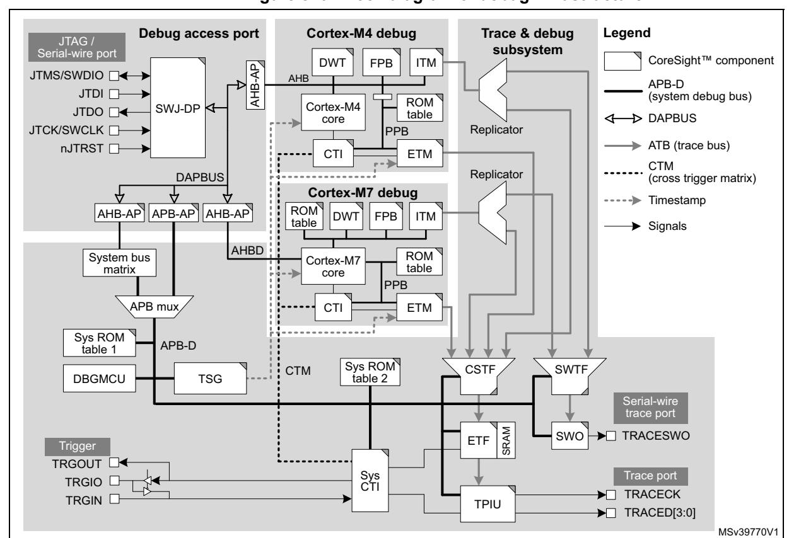

Figure 870. Block diagram of debug infrastructure

# 63.3.2 Debug infrastructure pins and internal signals

Table 615. JTAG/Serial-wire debug port pins

| Pin name   | JTAG debug port |                       | SW debug port |                         | Pin assignment |
|------------|-----------------|-----------------------|---------------|-------------------------|-------------------|
|            | Туре            | Description           | Туре          | Description             |                   |
| JTMS/SWDIO | I               | JTAG test mode select | Ю             | Serial wire data in/out | PA13              |
| JTCK/SWCLK | I               | JTAG test clock       | I             | Serial wire clock       | PA14              |
| JTDI       | I               | JTAG test data input  | -             | -                       | PA15              |
| JTDO       | 0               | JTAG test data output | -             | -                       | PB3               |
| nJTRST     | I               | JTAG test reset       | -             | -                       | PB4               |

#### **Table 616. Trace port pins**

| Pin name | Type | Description                  | Pin assignment     |
|----------|------|------------------------------|-----------------------|
| TRACED0  | O    | Trace synchronous data out 0 |                       |
| TRACED1  | O    | Trace synchronous data out 1 |                       |
| TRACED2  | O    | Trace synchronous data out 2 | Refer to datasheet |
| TRACED3  | O    | Trace synchronous data out 3 |                       |
| TRACECK  | O    | Trace clock                  |                       |

#### **Table 617. Serial-wire trace port pins**

| Pin name | Type | Description                             | Pin assignment |
|----------|------|-----------------------------------------|-------------------|
| TRACESWO | O    | Single wire trace asynchronous data out | PB3(1)            |

1. TRACESWO is multiplexed with JTDO. This means that single wire trace is only available when using the serial wire debug interface, not when using JTAG

# **Table 618. Trigger pins**

| Pin name | Type | Description                        | Pin assignment     |
|----------|------|------------------------------------|-----------------------|
| TRGIN    | I    | External trigger input             |                       |
| TRGOUT   | O    | External trigger output            | Refer to datasheet |
| TRGIO    | IO   | External trigger bi-directional(1) |                       |

1. TRGIO can be configured as an input or an output by the TRGOEN bit in the DBGMCU. If configured as an input, it is connected to TRGIN. If an output, it is connected to TRGOUT. This is because TRGIN and TRGOUT are not available on certain packages.

RM0399 Rev 4 3229/3556

## 63.3.3 Debug infrastructure powering, clocking and reset

#### **Power domains**

D3 domain Legend JTAG / D2 domain DWT ITM CoreSight™ component FPB JTMS/SWDIO □◀ APB-D JTDI □ (system debug bus) ROM SWJ-DP Cortex-M4 JTDO □◀ → DAPBUS table core JTCK/SWCLK -Replicator PPB ATB (trace bus) nJTRST □ CTI FTM CTM Replicator DAPBUS (cross trigger matrix) ----> Timestamp AHB-AP APB-AP AHB-AP ROM DWT FPR ITM Signals ROM System bus Cortex-M7 matrix core EPPB APB mux CTI ETM Sys ROM APB-D table 1 Sys ROM CTM CSTF SWTF TSG DBGMCU table 2 D1 domain SRAM **▶**□ TRACESWO SWO FTF TRGOUT -TRGIO □ ► TRACECK TRGIN 🗅 TPIU **→** TRACED[3:0] MSv39772V1

Figure 871. Power domains of debug infrastructure

The debug components are distributed across the power domains D1, D2 and D3. The D3 power domain is always considered to be on when the debugger is connected. It therefore contains the SWJ-DP, so that the debugger does not lose the connection with the SoC when one or both of the other power domains are switched off. In addition, it contains the timestamp generator, the DBGMCU and the serial wire trace features. This allows the Cortex-M7 core to be switched off while still allowing basic trace on the Cortex-M4.

The D1 power domain contains the Cortex-M7 core and the associated debug and trace components. It also contains the system trace components located on the APB-D that are common to both processors. This power domain therefore needs to be on whenever a debug access to the Cortex-M7 is required, or whenever a trace functionality is active on either processor.

The D2 domain contains only the debug and trace components dedicated to the Cortex-M4. This power domain can be switched off without any impact on Cortex-M7 debug and trace.

#### **Clock domains**

SWTCLK DAPCLK CK\_DBG\_D2 Legend JTAG / Serial-wire port rcc\_c2 ck CoreSight™ component DWT ITM FPB AHB-AP) JTMS/SWDIO -APB-D (system debug bus) JTDI 🗀 ROM Cortex-M4 SWJ-DF JTDO 🗔 table → DAPBUS core JTCK/SWCLK □-Replicator ATB (trace bus) nJTRST□ CTI ETM CTM (cross trigger Replicator DAPBUS c1 ck Timestamp APB-AP ROM AHB-AP AHB-AP DW FPB ITM table Signals AHBD Cortex-M7 matrix table CK\_HCLK\_D3 EPPB APB mux ЕТМ CTI APB-D table 1 CK\_DBG\_D3 Sys ROM SWTF CSTE CTM table 2 DBGMCU TSG CK DBG D1 TRACESWO SWO FTF TRGOUT □◀ TRACECLK Sys TRGIO 🗆 Trace port CTI TRACECK TRGIN \_\_ TPILI ► TRACED[3:0] MSv39774V2

Figure 872. Clock domains of debug infrastructure

The debugger supplies the clock for the debug port, SWTCLK, via the debug interface pin, JTCK/SWCLK. This clock is used to register the serial input data in both serial wire and JTAG mode, as well as to operate the state machines and internal logic of the debug port. It must therefore continue to toggle for several cycles after the end of an access, to ensure that the debug port returns to the idle state.

The SWJ-DP contains an asynchronous interface to the DAPCLK domain, which covers the rest of the SWJ-DP and the access ports. The DBGMCU, timestamp generator and System ROM table 1 are also in the DAPCLK domain.

CK DBG D3 clocks the SWO and serial wire trace funnel.

Both DAPCLK and CK\_DBG\_D3 are gated versions of the D3 domain system clock (rcc\_hclk4).

CK\_DBG\_D1 clocks the trace components in the D1 power domain: System ROM table 2, CoreSight trace funnel, ETF, system CTI and TPIU. It is a gated version of the D1 domain system clock (rcc hclk3).

CK\_DBG\_D2 is the clock for the D2 domain trace bus components. It is a gated version of the D2 domain system clock (rcc\_hclk1).

TRACECLK is the trace port output clock. It is derived from the PLL1 R divider output (pll1\_r\_ck).

RM0399 Rev 4 3231/3556

All the debug clocks (except DAPCLK) can be enabled and disabled by register bits in the DBGMCU. The DAPCLK domain is enabled by the debugger using the CDBGPWRUPREQ bit in the debug port CTRL/STAT register. The clock must be enabled before the debugger can access any of the debug features on the device. It should be disabled at power up and when the debugger is disconnected, to avoid wasting energy.

The debug and trace components included in the processors (such as ETM ITM, DWG and FPB) are clocked with the corresponding core clock (rcc\_c1\_ck and rcc\_c2\_ck).

### **Debug with low-power modes**

The device includes power-saving features allowing individual power domains to be switched off or stopped when not required. If a power domain is switched off or not clocked, all debug components in that domain are inaccessible to the debugger. To avoid this, power saving mode emulation is implemented. If the emulation is enabled for a domain, the domain still enters power saving mode, but its clock and power are maintained. In other words, the domain behaves as if it is in power saving mode, while the debugger does not lose the connection.

The emulation mode is programmed in the MCU Debug (DBGMCU) unit. For more information, refer to *[Section 63.5.8](#page-138-0)*

### **Reset of debug infrastructure**

The debug components, except for the debug port and access ports, are reset by their respective power domain resets. The debug port (SWJ-DP) is reset by a power-on reset of the D3 domain only.

# **63.4 Debug access port functional description**

The debug access port (DAP) is a debug subsystem comprising serial-wire and JTAG debug port (SWJ-DP) and four access ports.

# **63.4.1 Serial-wire and JTAG debug port (SWJ-DP)**

The SWJ-DP is a CoreSight component that implements an external access port for connecting debugging equipment.

The port can be configured as:

- a 5-pin standard JTAG debug port (JTAG-DP)
- a 2-pin (clock + data) "serial-wire" debug port (SW-DP)

The two modes are mutually exclusive, since they share the same IO pins.

By default, the JTAG-DP is selected on system or power-on reset. The five IOs are configured by hardware in debug alternative function mode. The SWJ-DP incorporates pullup resistors on the JTDI, JTMS/SWDIO, and nJTRST lines, as well as a pull-down resistor on the JTCK/SWCLK line.

A debugger can select the SW-DP by transmitting the following serial data sequence on JTMS/SWDIO:

...,(50 or more ones),...,0,1,1,1,1,0,0,1,1,1,1,0,0,1,1,1,...,(50 or more ones),...

JTCK/SWCLK must be cycled for each data bit.

In SW-DP mode, the unused JTAG lines JTDI, JTDO and nJTRST can be used for other functions.

All SWJ port IOs can be reconfigured to other functions by software, in which case debugging is no longer possible.

### **Serial wire debug port**

The Serial wire debug protocol uses two pins:

- SWCLK: clock from host to target
- SWDIO: bi-directional serial data (100kΩ pull-up required)

Serial data is transferred LSB first, synchronously with the clock. A transfer comprises three phases:

- 1. packet request (8 bits) transmitted by the host
- 2. acknowledge response (3 bits) transmitted by the target
- 3. data transfer (33 bits) transmitted by the host (in the case of a write) or target (in the case of a read)

The data transfer only occurs if the acknowledge response is OK.

If the direction of the data is reversed between each phase, a single clock cycle turn-around time is inserted.

**Table 619. Packet request** 

| Field bits | Name   | Description                                                                                                    |  |
|---------------|--------|----------------------------------------------------------------------------------------------------------------|--|
| 0             | Start  | Must be "1"                                                                                                    |  |
| 1             | APnDP  | 0: DP register access - see Table 623 for a list of DP registers 1: AP register access - see Section 63.4.2 |  |
| 2             | RnW    | 0: Write request 1: Read request                                                                            |  |
| 4:3           | A(3:2) | Address field of the DP or AP register (refer to Table 623 and Table 624)                                      |  |
| 5             | Parity | Single bit parity of preceding bits                                                                            |  |
| 6             | Stop   | 0                                                                                                              |  |
| 7             | Park   | Not driven by host. Must be read as "1" by target.                                                             |  |

**Table 620. ACK response** 

| Field bits | Name | Description                           |  |  |
|---------------|------|---------------------------------------|--|--|
| 2:0           | ACK  | 000b: FAULT 010b: WAIT 100b: OK |  |  |

Table 621. Data transfer

| Bit field | Name              | Description                       |
|-----------|-------------------|-----------------------------------|
| 31:0      | WDATA or RDATA | Write or Read data                |
| 32        | Parity            | Single bit parity of 32 data bits |

Figure 873 shows successful write and read transfers.

Figure 873. SWD successful data transfer

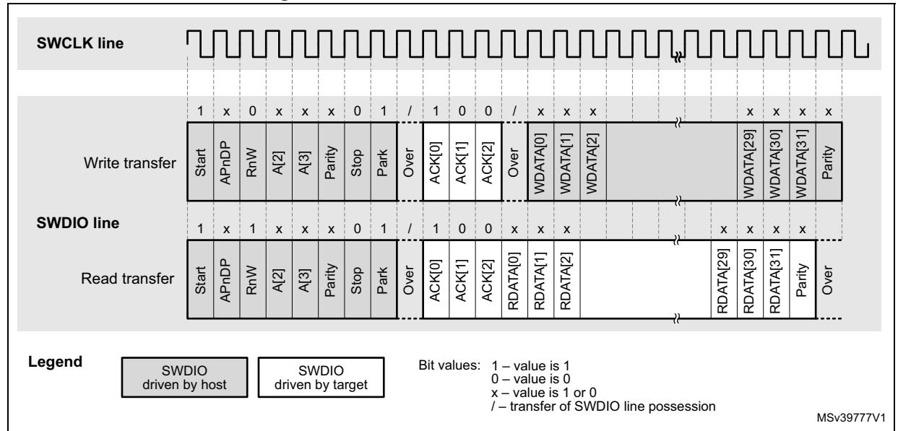

For any FAULT or WAIT ACK response from the target, the data transfer phase is canceled, unless overrun detection is enabled, in which case the data will be ignored by the target (in the case of a write), or not driven (in the case of a read).

A line reset must be generated by the host when it is first connected, or following a protocol error. The line reset consists of 50 or more SWCLK cycles with SWDIO high, followed by two SWCLK cycles with SWDIO low.

For more details on the Serial Wire debug protocol, refer to the Arm® Debug Interface Architecture Specification [1].

Note: The SWJ-DP implements SWD protocol version 2.

### JTAG debug port

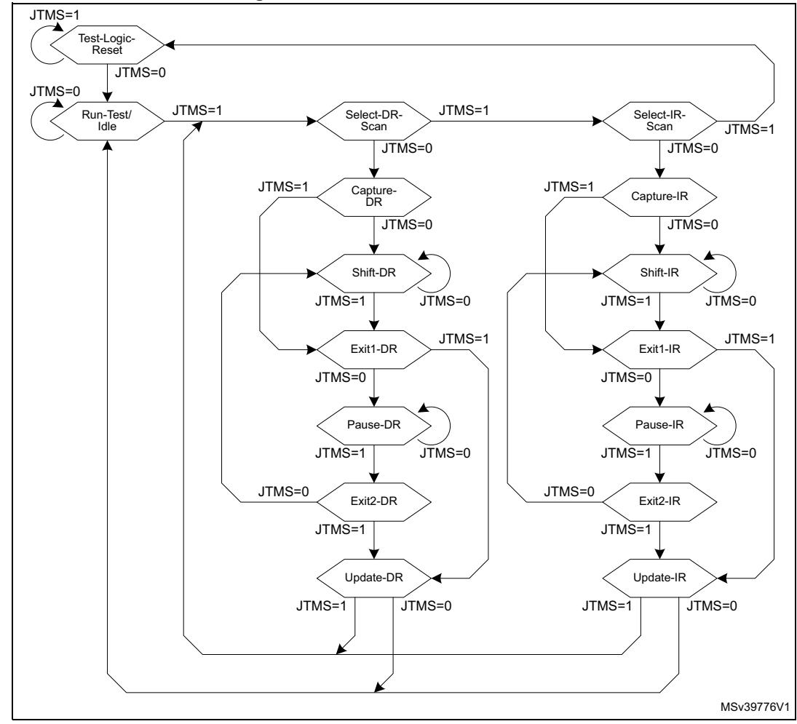

Figure 874. JTAG TAP state machine

The JTAG-DP implements a TAP state machine (TAPSM) based on IEEE 1149.1-1990. The state machine is shown in *Figure 874*. It controls two scan chains, one associated with an instruction register (IR) and one with a number of data registers (DR).

When the TAPSM goes through the Capture-IR state, 0b0001 is transferred to the instruction register (IR) scan chain. The IR scan chain is connected between JTDI and JTDO.

While the TAPSM is in the Shift-IR state, the IR scan chain shifts one bit for each rising edge of JTCK. This means that on the first tick:

- The LSB of the IR scan chain is output on JTDO.
- Bit [n] of the IR scan chain is transferred to bit [n-1].
- The value on JTDI is transferred to the MSB of the IR scan chain.

When the TAPSM goes through the Update-IR state, the value scanned in the IR scan chain is transferred to the instruction register.

When the TAPSM goes through the Capture-DR state, a value is transferred from one of the data registers onto one of the DR scan chains, connected between JTDI and JTDO.

RM0399 Rev 4 3235/3556

The value held in the instruction register determines which data register, and associated DR scan chain, is selected.

This data is then shifted while the TAPSM is in the Shift-DR state, in the same way as the IR shift in the Shift-IR state.

When the TAPSM goes through the Update-DR state, the value scanned in the DR scan chain is transferred to the selected data register.

When the TAPSM is in the Run-Test/Idle state, no special actions occur. The IDCODE instruction is loaded in IR.

When active, the nJTRST signal resets the state machine asynchronously to the Test-Logic-Reset state.

The data registers corresponding to the 4-bit IR instructions are listed in *[Table 622](#page-10-0)*.

**Table 622. JTAG-DP data registers** 

| Instruction register | Data register                                                                               | Scan chain length | Description                                                                                                                                                                                                                                                                                                                                                                                                                                                                                                                                                  |  |  |  |  |
|-------------------------|------------------------------------------------------------------------------------------------|-------------------------|--------------------------------------------------------------------------------------------------------------------------------------------------------------------------------------------------------------------------------------------------------------------------------------------------------------------------------------------------------------------------------------------------------------------------------------------------------------------------------------------------------------------------------------------------------------|--|--|--|--|
| 0000 to 0111         | (BYPASS)                                                                                       | 1                       | Not implemented: BYPASS selected                                                                                                                                                                                                                                                                                                                                                                                                                                                                                                                             |  |  |  |  |
| 1000                    | Abort register – Bits 31:1 = reserved – Bit 0 = APABORT: write 1 to generate an AP abort |                         |                                                                                                                                                                                                                                                                                                                                                                                                                                                                                                                                                              |  |  |  |  |
| 1001                    | (BYPASS) 1 Reserved: BYPASS selected                                                     |                         |                                                                                                                                                                                                                                                                                                                                                                                                                                                                                                                                                              |  |  |  |  |
| 1010                    | DPACC                                                                                          | 35                      | Debug port access register Initiates the debug port and allows access to a debug port register. – When transferring data IN: Bits 34:3 = DATA[31:0] = 32-bit data to transfer for a write request Bits 2:1 = A[3:2] = 2-bit address of a debug port register. Bit 0 = RnW = Read request (1) or write request (0). – When transferring data OUT: Bits 34:3 = DATA[31:0] = 32-bit data which is read following a read request Bits 2:0 = ACK[2:0] = 3-bit Acknowledge: 010b = OK/FAULT 001b = WAIT Others: reserved |  |  |  |  |

**Table 622. JTAG-DP data registers (continued)**

| Instruction register | Data register | Scan chain length | Description                                                                                                                                                                                                                                                                                                                                                                                                                                                                                                                                                             |
|-------------------------|------------------|-------------------------|-------------------------------------------------------------------------------------------------------------------------------------------------------------------------------------------------------------------------------------------------------------------------------------------------------------------------------------------------------------------------------------------------------------------------------------------------------------------------------------------------------------------------------------------------------------------------|
| 1011                    | APACC            | 35                      | Access port access register Initiates an access port and allows access to an access port register. – When transferring data IN: Bits 34:3 = DATA[31:0] = 32-bit data to shift in for a write request Bits 2:1 = A[3:2] = 2-bit sub-address of an access port register. Bit 0 = RnW= Read request (1) or write request (0). – When transferring data OUT: Bits 34:3 = DATA[31:0] = 32-bit data which is read following a read request Bits 2:0 = ACK[2:0] = 3-bit Acknowledge: 010b = OK/FAULT 001b = WAIT OTHER = reserved |
| 1100                    | (BYPASS)         | 1                       | Reserved: BYPASS selected                                                                                                                                                                                                                                                                                                                                                                                                                                                                                                                                               |
| 1101                    | (BYPASS)         | 1                       | Reserved: BYPASS selected                                                                                                                                                                                                                                                                                                                                                                                                                                                                                                                                               |
| 1110                    | IDCODE           | 32                      | ID Code 0x6BA0 0477: Arm® JTAG debug port ID code                                                                                                                                                                                                                                                                                                                                                                                                                                                                                                                    |
| 1111                    | BYPASS           | 1                       | Bypass A single JTCK cycle delay is inserted between JTDI and JTDO                                                                                                                                                                                                                                                                                                                                                                                                                                                                                                   |

The DR registers are described in more detail in the Arm® Debug Interface Architecture Specification *[\[1\]](#page-283-1)*.

### **Debug port registers**

The SW-DP and JTAG-DP both access the debug port (DP) registers. These are listed in *[Table 623](#page-12-0)*.

The debugger can access the DP registers as follows:

- 1. Program the SELECT register DPBANKSEL field in the DP to select the register bank to be accessed (see *[Table](#page-12-0) 623*)
- 2. Program the A(3:2) field in the DPACC register, if using JTAG, with the register address within the bank. Program the R/W bit to select a read or a write. In the case of a write, program the DATA field with the write data. If using SWD, the A(3:2) and R/W fields are part of the Packet Request word sent to the SW-DP with the APnDP bit reset (see *[Table](#page-7-0) 619*). The write data is sent in the data phase.

**Table 623. Debug port registers** 

| Address | A(3:2) field value | R/W | Description                                                                                                                                                                                                                                                                                                                                                                                                                                                                                                         |
|---------|--------------------------|-----|---------------------------------------------------------------------------------------------------------------------------------------------------------------------------------------------------------------------------------------------------------------------------------------------------------------------------------------------------------------------------------------------------------------------------------------------------------------------------------------------------------------------|
|         |                          | R   | DP_DPIDR register(2). It contains the IDCODE for the debug port.                                                                                                                                                                                                                                                                                                                                                                                                                                                    |
| 0x0     | 00                       | W   | DP_ABORT register(1). It aborts the current AP transaction. This register is also used to clear the error flags in the DP_CTRL/STAT register.                                                                                                                                                                                                                                                                                                                                                                    |
|         |                          |     | If DPBANKSEL[3:0] = 0x0 (DP_SELECT register): CTRL/STAT register. It controls the DP and provides status information.                                                                                                                                                                                                                                                                                                                                                                                            |
|         | 01                       |     | If DPBANKSEL[3:0] = 0x1 (DP_SELECT register): DP_DLCR register(2). It controls the operating mode of the SWD Data Link.                                                                                                                                                                                                                                                                                                                                                                                          |
| 0x4     |                          | R/W | If DPBANKSEL[3:0] = 0x2 (DP_SELECT register): DP_TARGETID register. It provides target identification information.                                                                                                                                                                                                                                                                                                                                                                                               |
|         |                          |     | If DPBANKSEL[3:0] = 0x3 (DP_SELECT register): DLPIDR register(2). It provides the SWD protocol version.                                                                                                                                                                                                                                                                                                                                                                                                          |
|         | 10                       | R   | RESEND register(2). It returns the value that was returned by the last AP read or DP_RDBUFF read, used in the event of a corrupted read transfer.                                                                                                                                                                                                                                                                                                                                                                |
| 0x8     |                          | W   | DP_SELECT register. It selects the access port, access port register bank, and DP register at address 0x4.                                                                                                                                                                                                                                                                                                                                                                                                       |
|         |                          | R   | DP_RDBUFF register Via JTAG-DP, it enables the debugger to get the final result after a sequence of operations (without requesting new JTAG-DP operation). Via SW-DP, it contains the result of the preceding AP read access, allowing a new AP access to be avoided.                                                                                                                                                                                                                                   |
| 0xC     | 11                       | W   | DP_TARGETSEL register(2). On a write to DP_TARGETSEL immediately following a line reset sequence, the target is selected if the following conditions are both met: – Bits [31:28] match bits [31:28] in the DP_DLPIDR register. – Bits [27:0] match bits [27:0] in the DP_TARGETID register. Writing any other value deselects the target. Debug tools must write 0xFFFFFFFF to deselect all targets. This is an invalid DP_TARGETID value. All other invalid DP_TARGETID values are reserved. |

- 1. Access to the AP ABORT register from the JTAG-DP is done using the ABORT instruction.
- 2. Only accessible via SW-DP. Register is "reserved" via JTAG-DP.

### **Debug port identification register (DP\_DPIDR)**

Address offset: 0x00

Reset value: 0x6BA0 2477

| 31 | 30           | 29            | 28 | 27 | 26 | 25 | 24 | 23          | 22             | 21 | 20 | 19   | 18   | 17   | 16   |
|----|--------------|---------------|----|----|----|----|----|-------------|----------------|----|----|------|------|------|------|
|    |              | REVISION[3:0] |    |    |    |    |    | PARTNO[7:0] |                |    |    | Res. | Res. | Res. | MIN  |
| r  | r            | r             | r  | r  | r  | r  | r  | r           | r              | r  | r  |      |      |      | r    |
| 15 | 14           | 13            | 12 | 11 | 10 | 9  | 8  | 7           | 6              | 5  | 4  | 3    | 2    | 1    | 0    |
|    | VERSION[3:0] |               |    |    |    |    |    |             | DESIGNER[10:0] |    |    |      |      |      | Res. |
| r  | r            | r             | r  | r  | r  | r  | r  | r           | r              | r  | r  | r    | r    | r    |      |

Bits 31:28 **REVISION[3:0]**: Revision code

0x6

Bits 27:20 **PARTNO[7:0]**: Debug port part number

0xBA

Bits 19:17 Reserved, must be kept at reset value.

Bit 16 **MIN**: Minimal debug port (MINDP) implementation

0: MINDP not implemented (transaction counter and pushed operations are supported)

Bits 15:12 **VERSION[3:0]**: DP architecture version

0x2: DPv2

Bits 11:1 **DESIGNER[10:0]**: JEDEC designer identity code

0x23B: Arm®

Bit 0 Reserved, must be kept at reset value.

### **Debug port abort register (DP\_ABORT)**

Address offset: 0x0

Reset value: 0x0000 0000

| 31   | 30   | 29   | 28   | 27   | 26   | 25   | 24   | 23   | 22   | 21   | 20         | 19       | 18        | 17        | 16       |
|------|------|------|------|------|------|------|------|------|------|------|------------|----------|-----------|-----------|----------|
| Res. | Res. | Res. | Res. | Res. | Res. | Res. | Res. | Res. | Res. | Res. | Res.       | Res.     | Res.      | Res.      | Res.     |
|      |      |      |      |      |      |      |      |      |      |      |            |          |           |           |          |
| 15   | 14   | 13   | 12   | 11   | 10   | 9    | 8    | 7    | 6    | 5    | 4          | 3        | 2         | 1         | 0        |
| Res. | Res. | Res. | Res. | Res. | Res. | Res. | Res. | Res. | Res. | Res. | ORUNERRCLR | WDERRCLR | STKERRCLR | STKCMPCLR | DAPABORT |
|      |      |      |      |      |      |      |      |      |      |      | w          | w        | w         | w         | w        |

Bits 31:5 Reserved, must be kept at reset value.

Bit 4 **ORUNERRCLR**: Overrun error clear bit

0: No effect

1: Clear CTRL/STAT register's STICKYORUN bit

Bit 3 **WDERRCLR**: Write data error clear bit

0: No effect

1: Clear CTRL/STAT register's WDATAERR bit

Bit 2 **STKERRCLR**: Sticky error clear bit

0: No effect

1: Clear CTRL/STAT register's STICKYERR bit

Bit 1 **STKCMPCLR**: Sticky compare clear bit

0: No effect

1: Clear CTRL/STAT register's STICKYCMP bit

Bit 0 **DAPABORT**: Abort current AP transaction

The transaction is aborted if an excessive number of WAIT responses are returned, indicating that the transaction has stalled.

0: No effect

1: Abort transaction

### **Debug port control/status register (DP\_CTRL/STAT)**

Address offset: 0x4

Reset value: 0x0000 0000

| 31                           | 30           | 29           | 28           | 27         | 26         | 25   | 24   | 23                               | 22                         | 21        | 20        | 19 | 18           | 17         | 16         |
|------------------------------|--------------|--------------|--------------|------------|------------|------|------|----------------------------------|----------------------------|-----------|-----------|----|--------------|------------|------------|
| CSYSPWRUPACK                 | CSYSPWRUPREQ | CDBGPWRUPACK | CDBGPWRUPREQ | CDBGRSTACK | CDBGRSTREQ | Res. | Res. | TRNCNT[11:4]                     |                            |           |           |    |              |            |            |
| r                            | rw           | r            | rw           | r          | rw         |      |      | rw                               | rw rw rw rw rw |           |           |    |              |            | rw         |
| 15                           | 14           | 13           | 12           | 11         | 10         | 9    | 8    | 7 6 5 4 3 2       |                            |           |           |    |              | 1          | 0          |
| TRNCNT[3:0] MASKLANE[3:0] |              |              |              |            |            |      |      | WDATAERR                         | READOK                     | STICKYERR | STICKYCMP |    | TRNMODE[1:0] | STICKYORUN | ORUNDETECT |
| rw                           | rw           | rw           | rw           | rw         | rw         | rw   | rw   | r r rw w w w w |                            |           |           |    |              |            | w          |

- Bit 31 **CSYSPWRUPACK**: System domain power-up status bit not used in this device
- Bit 30 **CSYSPWRUPREQ**: System domain power-up control bit not used in this device
- Bit 29 **CDBGPWRUPACK**: Debug domain power-up status bit

This bit is read-only. It returns the status of the debug domain power-up acknowledge signal from the power controller.

0: domain powered down

1: domain powered up

Bit 28 **CDBGPWRUPREQ:** Debug domain power-up/down control bit

This bit controls the debug domain power-up/down request signal to the power controller.

0: power-down requested

1: power-up requested

Bit 27 **CDBGRSTACK**: Debug domain reset status bit - not used in this device

- Bit 26 **CDBGRSTREQ**: Debug domain reset control bit not used in this device
- Bits 25:24 Reserved, must be kept at reset value.
- Bits 23:12 **TRNCNT[11:0]**: Transaction counter

To program a sequence of transactions to incremental addresses via an AP, TRNCNT bits are loaded with the number of transactions to perform. It is decremented on successful completion of each transaction.

#### Bits 11:8 **MASKLANE[3:0]**: Pushed-compare and pushed-verify masking bits

The field indicates the bytes to be masked in pushed-compare and pushed-verify operations (DP\_CTRL/STAT register's field TRNMODE = 1 or 2). In the pushed operations, the word supplied in an AP write transaction is compared with the current value at the target AP address.

0b1XXX: include byte lane 3 in comparisons 0bX1XX: include byte lane 2 in comparisons 0bXX1X: include byte lane 1 in comparisons 0bXXX1: include byte lane 0 in comparisons

#### Bit 7 **WDATAERR**: Write data error in SW-DP

The bit indicates

- a parity or a framing error on the data phase of a write operation, or
- a write operation that had been accepted by the DP has then been discarded without being submitted to the AP

This bit is read-only. It is reset by writing 1 to the WDERRCLR bit of the DP\_ABORT register.

- 0: No error
- 1: Error has occurred

This bit is reserved in JTAG-DP.

Bit 6 **READOK**: AP read response in SW-DP

This bit indicates the response to the last AP read access. It is read-only.

- 0: Read not OK
- 1: Read OK

This bit is Reserved in JTAG-DP.

Bit 5 **STICKYERR**: Transaction error (read-only in SW-DP, R/W in JTAG-DP)

This bit indicates that an error occurred during an AP transaction.

- 0: No error
- 1: Error has occurred

In the SW-DP, this bit is reset by writing 1 to the STKERRCLR bit of the DP\_ABORT register. In the JTAG-DP, this bit is reset by programming it to 1.

RM0399 Rev 4 3241/3556

#### Bit 4 **STICKYCMP**: Compare match (read-only in SW-DP, R/W in JTAG-DP)

This bit indicates that a match occurred in a pushed operation.

0: Match if TRNMODE = 0x1; no match if TRNMODE = 0x2

1: No match if TRNMODE = 0x1; match if TRNMODE = 0x2

In the SW-DP, this bit is reset by writing 1 to the STKCMPCLR bit in the DP\_ABORT register. In the JTAG-DP, this bit is reset by programming it to 1.

#### Bits 3:2 **TRNMODE[1:0]**: Transfer mode for AP write operations

For read operations, this field must be set to 0x0.

0x0: Normal operation - AP transactions are passed directly to the AP.

0x1: Pushed-verify operation. The DP stores the write data and performs a read transaction at the target AP address. The result of the read operation is compared with the stored data. If they do not match, the STICKYCMP bit is set.

0x2: Pushed-compare operation. The DP stores the write data and performs a read transaction at the target AP address. The result of the read is compared with the stored data. If they match, the STICKYCMP bit is set.

0x3: Reserved

In pushed operations, only the data bytes indicated by the MASKLANE field are included in the comparison.

#### Bit 1 **STICKYORUN:** Overrun (read-only in SW-DP, R/W in JTAG-DP)

This bit indicates that an overrun occurred (new transaction received before previous transaction completed). This bit is only set if the ORUNDETECT bit is set.

0: No overrun

1: Overrun occurred

In the SW-DP, this bit is reset by writing 1 to the ABORT register's ORUNERRCLR bit. In the JTAG-DP, this bit is reset by writing a 1 to it.

#### Bit 0 **ORUNDETECT:** Overrun detection mode enable

- 0: Overrun detection disabled
- 1: Overrun detection enabled. In the event of an overrun, the STICKYORUN bit is set and subsequent transactions are blocked until the STICKYORUN bit is cleared.

### **Debug port data link control register (DP\_DLCR)**

Address offset: 0x4

Reset value: 0x0000 0040

| 31   | 30   | 29   | 28   | 27   | 26   | 25   | 24                 | 23   | 22   | 21   | 20   | 19   | 18   | 17   | 16   |
|------|------|------|------|------|------|------|--------------------|------|------|------|------|------|------|------|------|
| Res. | Res. | Res. | Res. | Res. | Res. | Res. | Res.               | Res. | Res. | Res. | Res. | Res. | Res. | Res. | Res. |
| 15   | 14   | 13   | 12   | 11   | 10   | 9    | 8                  | 7    | 6    | 5    | 4    | 3    | 2    | 1    | 0    |
| Res. | Res. | Res. | Res. | Res. | Res. |      | TURNROUND[1: 0] |      | Res. | Res. | Res. | Res. | Res. | Res. | Res. |
|      |      |      |      |      |      | rw   | rw                 |      |      |      |      |      |      |      |      |

Bits 31:10 Reserved, must be kept at reset value.

Bits 9:8 **TURNROUND[1:0]**: Tristate period for SWDIO

0x0: 1 data bit period 0x1: 2 data bit periods 0x2: 3 data bit periods 0x3: 4 data bit periods

Bits 7:0 Reserved, must be kept at reset value.

## **Debug port target identification register (DP\_TARGETID)**

Address offset: 0x4

Reset value: 0x0450 0041

| 31 | 30                              | 29             | 28 | 27 | 26                                             | 25 | 24 | 23 | 22 | 21 | 20 | 19   | 18 | 17 | 16 |
|----|---------------------------------|----------------|----|----|------------------------------------------------|----|----|----|----|----|----|------|----|----|----|
|    |                                 | TREVISION[3:0] |    |    | TPARTNO[15:4]                                  |    |    |    |    |    |    |      |    |    |    |
| r  | r                               | r              | r  | r  | r r r r r r r r r r |    |    |    |    |    |    |      |    | r  |    |
| 15 | 14                              | 13             | 12 | 11 | 10                                             | 9  | 8  | 7  | 6  | 5  | 4  | 3    | 2  | 1  | 0  |
|    | TPARTNO[3:0] TDESIGNER[10:0] |                |    |    |                                                |    |    |    |    |    |    | Res. |    |    |    |
| r  | r                               | r              | r  | r  | r                                              | r  | r  | r  | r  | r  | r  | r    | r  | r  |    |

Bits 31:28 **TREVISION[3:0]**: Target revision

0x0: revision 0

Bits 27:12 **TPARTNO[15:0]**: Target part number

0x4500: STM32H7

Bits 11:1 **TDESIGNER[10:0]**: Target designer JEDEC code

0x020: STMicroelectronics

Bit 0 Reserved, set to 1.

### **Debug port data link protocol identification register (DP\_DLPIDR)**

Address offset: 0x4

| 31   | 30             | 29   | 28   | 27   | 26   | 25   | 24   | 23   | 22   | 21   | 20   | 19           | 18   | 17   | 16   |  |
|------|----------------|------|------|------|------|------|------|------|------|------|------|--------------|------|------|------|--|
|      | TINSTANCE[3:0] |      |      | Res. | Res. | Res. | Res. | Res. | Res. | Res. | Res. | Res.         | Res. | Res. | Res. |  |
| r    | r              | r    | r    |      |      |      |      |      |      |      |      |              |      |      |      |  |
| 15   | 14             | 13   | 12   | 11   | 10   | 9    | 8    | 7    | 6    | 5    | 4    | 3            | 2    | 1    | 0    |  |
| Res. | Res.           | Res. | Res. | Res. | Res. | Res. | Res. | Res. | Res. | Res. | Res. | PROTSVN[3:0] |      |      |      |  |
|      |                |      |      |      |      |      |      |      |      |      |      | r            | r    | r    | r    |  |

Bits 31:28 **TINSTANCE[3:0]**: Target instance number

These bits define the instance number for this device in a multi-drop system.

0x0

Bits 27:4 Reserved, must be kept at reset value.

Bits 3:0 **PROTSVN[3:0]**: Serial Wire Debug protocol version

0x1: Version 2

# **Debug port resend register (DP\_RESEND)**

Address offset: 0x8

Reset value: 0x0000 0000

| 31 | 30            | 29 | 28 | 27 | 26 | 25 | 24 | 23           | 22 | 21 | 20 | 19 | 18 | 17 | 16 |
|----|---------------|----|----|----|----|----|----|--------------|----|----|----|----|----|----|----|
|    | RESEND[31:16] |    |    |    |    |    |    |              |    |    |    |    |    |    |    |
| r  | r             | r  | r  | r  | r  | r  | r  | r            | r  | r  | r  | r  | r  | r  | r  |
| 15 | 14            | 13 | 12 | 11 | 10 | 9  | 8  | 7            | 6  | 5  | 4  | 3  | 2  | 1  | 0  |
|    |               |    |    |    |    |    |    | RESEND[15:0] |    |    |    |    |    |    |    |
| r  | r             | r  | r  | r  | r  | r  | r  | r            | r  | r  | r  | r  | r  | r  | r  |

Bits 31:0 **RESEND[31:0]**: Last AP read or DP RDBUFF read value

These bits contain the value that was returned by the last AP read or DP RDBUFF read. Used in the event of a corrupted read transfer.

### **Debug port access port select register (DP\_SELECT)**

Address offset: 0x8

Reset value: 0xXXXX XXXX

| 31   | 30         | 29   | 28   | 27   | 26   | 25   | 24   | 23   | 22   | 21             | 20   | 19   | 18   | 17             | 16   |
|------|------------|------|------|------|------|------|------|------|------|----------------|------|------|------|----------------|------|
|      | APSEL[3:0] |      |      | Res. | Res. | Res. | Res. | Res. | Res. | Res.           | Res. | Res. | Res. | Res.           | Res. |
| w    | w          | w    | w    |      |      |      |      |      |      |                |      |      |      |                |      |
| 15   | 14         | 13   | 12   | 11   | 10   | 9    | 8    | 7    | 6    | 5              | 4    | 3    | 2    | 1              | 0    |
| Res. | Res.       | Res. | Res. | Res. | Res. | Res. | Res. |      |      | APBANKSEL[3:0] |      |      |      | DPBANKSEL[3:0] |      |
|      |            |      |      |      |      |      |      | w    | w    | w              | w    | w    | w    | w              | w    |

### Bits 31:28 **APSEL[3:0]**: Access port select bits

These bits select the access port for the next transaction.

0x0: AP0 - Cortex-M7 debug access port (AHB-AP)

0x1: AP1 - D3 access port (AHB-AP)

0x2: AP2 - System debug access port (APB-AP) 0x3: AP3 - Cortex-M4 debug access port (AHB-AP)

0x4 to 0xF: Reserved

Bits 27:8 Reserved, must be kept at reset value.

# Bits 7:4 **APBANKSEL[3:0]**: AP register bank select bits

These bits select the 4-word register bank on the active AP for the next transaction.

#### Bits 3:0 **DPBANKSEL[3:0]**: DP register bank select bits

These bits select the register at address 0x4 of the debug port.

0x0: CTRL/STAT register 0x1: DLCR register 0x2: TARGETID register 0x3: DLPIDR register 0x4 to 0xF: Reserved

# **Debug port read buffer register (DP\_RDBUFF)**

Address offset: 0xC

Reset value: 0x0000 0000

| 31 | 30            | 29 | 28 | 27 | 26 | 25 | 24 | 23 | 22 | 21 | 20 | 19 | 18 | 17 | 16 |
|----|---------------|----|----|----|----|----|----|----|----|----|----|----|----|----|----|
|    | RDBUFF[31:16] |    |    |    |    |    |    |    |    |    |    |    |    |    |    |
| r  | r             | r  | r  | r  | r  | r  | r  | r  | r  | r  | r  | r  | r  | r  | r  |
| 15 | 14            | 13 | 12 | 11 | 10 | 9  | 8  | 7  | 6  | 5  | 4  | 3  | 2  | 1  | 0  |
|    | RDBUFF[15:0]  |    |    |    |    |    |    |    |    |    |    |    |    |    |    |
| r  | r             | r  | r  | r  | r  | r  | r  | r  | r  | r  | r  | r  | r  | r  | r  |

Bits 31:0 **RDBUFF[31:0]**: Last AP read value

The field contains the value returned by the last AP read access. There are two ways to retrieve the value returned by an AP read access:

- perform a second read access to the same address, which initiates a new transaction on the corresponding bus, or
- read the value returned by the last AP read access from the DP\_RDBUFF register, in which case no new AP transaction occurs

### **Debug port target identification register (DP\_TARGETSEL)**

Address offset: 0xC Reset value: N/A

| 31                              | 30                              | 29 | 28 | 27 | 26                                             | 25 | 24 | 23 | 22 | 21   | 20 | 19 | 18 | 17 | 16 |
|---------------------------------|---------------------------------|----|----|----|------------------------------------------------|----|----|----|----|------|----|----|----|----|----|
|                                 | TINSTANCE[3:0] TPARTNO[15:4] |    |    |    |                                                |    |    |    |    |      |    |    |    |    |    |
| w                               | w                               | w  | w  | w  | w w w w w w w w w w |    |    |    |    |      |    |    | w  |    |    |
| 15                              | 14                              | 13 | 12 | 11 | 10                                             | 9  | 8  | 7  | 6  | 5    | 4  | 3  | 2  | 1  | 0  |
| TPARTNO[3:0] TDESIGNER[10:0] |                                 |    |    |    |                                                |    |    |    |    | Res. |    |    |    |    |    |
| w                               | w                               | w  | w  | w  | w                                              | w  | w  | w  | w  | w    | w  | w  | w  | w  |    |

### Bits 31:28 **TINSTANCE[3:0]**: Target instance number

The field defines the instance number for the target device in a multi-drop system. It must be programmed with the same value as TINSTANCE field of DP\_DLPIDR register, in order to select this device.

#### Bits 27:12 **TPARTNO[15:0]**: Target part number

The field defines the part number for the target device. It must be programmed with the same value as TPARTNO field of DP\_TARGETID register, in order to select this device.

#### Bits 11:1 **TDESIGNER[10:0]**: Target designer JEDEC code

The field defines the JEDEC code for the target device. It must be programmed with the same value as TDESIGNER field of DP\_TARGETID register, in order to select this device.

Bit 0 Reserved, must be kept at reset value.

## **63.4.2 Access ports**

**Figure 875. Debug and access port connections**

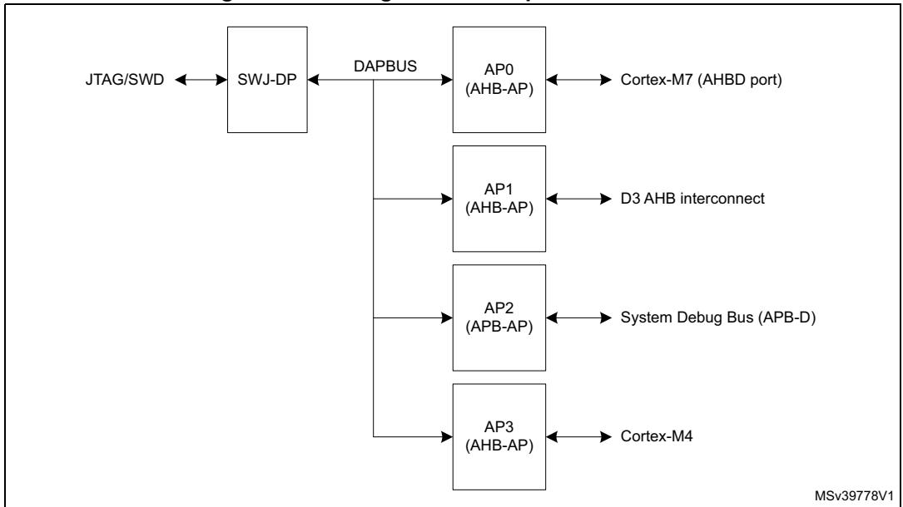

The access ports (AP) attached to the DP as the following:

1. AP0: Cortex-M7 access port (AHB-AP). Allows access to the debug and trace features integrated in the Cortex-M7 processor core via an AHB-Lite bus connected to the AHBD port of the processor.

- 2. AP1: D3 access port (AHB-AP). Allows access to the bus matrix in the D3 domain. This gives visibility of the D3 domain memory and peripherals when the D1 and D2 domains are switched off. No CoreSight components are accessible via this port.
- 3. AP2: System access port (APB-AP). Allows access to the debug and trace features on the system APB debug bus, that is, all components not included in one of the processor cores.
- 4. AP3: Cortex-M4 access port (AHB-AP). Allows access to the debug and trace features integrated in the Cortex-M4 processor core via its internal AHB bus.

All access ports are of MEM-AP type, that is, the debug and trace component registers are mapped in the address space of the associated debug bus. The AP is seen by the debugger as a set of 32-bit registers organized in banks of four registers each. Some of these registers are used to configure or monitor the AP itself, while others are used to perform a transfer on the bus. The AP registers are listed in *[Table 624](#page-22-0)*.

The address of the AP registers is composed of:

- bits [7:4]: content of the DP\_SELECT register's APBANKSEL field
- bits [3:2]: content of the A(3:2) field of the APACC data register in the JTAG-DP (see *[Table 622](#page-10-0)*) or of the SW-DP Packet Request (see *[Table 619](#page-7-0)*), depending on the debug interface used
- bits [1:0]: Always set to 0

The content of the SELECT register APSEL field in the DP define which MEM-AP is being accessed.

The debugger can access the AP registers as follows:

- 1. Program the DP\_SELECT register's APSEL field to choose one of the APs, and the APBANKSEL field to select the register bank to be accessed.
- 2. Program the A(3:2) field in the APACC register, if using JTAG, with the register address within the bank. Program the RnW bit to select a read or a write. In the case of a write, program the DATA field with the write data. If using SWD, the A(3:2) and RnW fields are part of the Packet Request word sent to the SW-DP with the APnDP bit set (see *[Table](#page-7-0) 619*). The write data is sent in the data phase.

The debugger can access the memory mapped debug component registers through the MEM-AP registers (using the AP register access procedure described above) as follows:

- 1. Program the transaction target address in the TAR register.
- 2. Program the CSW register, if necessary, with the transfer parameters (AddrInc for example).
- 3. Write to or read from the DRW register to initiate a bus transaction at the address held in the TAR register. Alternatively, a read or write to banked data register BDn triggers an access to address TAR[31:4] + n (this allows accessing up to four consecutive addresses without changing the address in the TAR register).

For more detailed information on the MEM-AP, refer to the Arm® Debug Interface Architecture Specification *[\[1\]](#page-283-1)*. To use the MEM-AP to connect the debug port to the debug components (in the example, a processor, an ETM and a ROM table), go to *[Section 63.6.2:](#page-162-0)* 

RM0399 Rev 4 3247/3556

*[Cortex-M7 data watchpoint and trace unit \(DWT\)](#page-162-0)* and *[Section 63.7.2: Cortex-M4 data](#page-231-0)  [watchpoint and trace unit \(DWT\)](#page-231-0)*.

### **MEM-AP registers**

**Table 624. MEM-AP registers**

| Address   | APBANKSEL | A(3:2) | Name    | Description                                                                                                                                       |
|-----------|-----------|--------|---------|---------------------------------------------------------------------------------------------------------------------------------------------------|
| 0x00      | 0x0       | 0      | AP_CSW  | Control/status word register                                                                                                                      |
| 0x04      | 0x0       | 1      | AP_TAR  | Transfer address register Target address for the bus transaction.                                                                              |
| 0x08      | -         | -      | -       | Reserved                                                                                                                                          |
| 0x0C      | 0x0       | 3      | AP_DRW  | Data read/write register Access to this register triggers a corresponding transaction on the debug bus to the address in TAR[31:0]          |
| 0x10      | 0x1       | 0      | AP_BD0  | Banked data 0 register Access to this register triggers a corresponding transaction on the debug bus to the address in TAR[31:4] << 4 + 0x0 |
| 0x14      | 0x1       | 1      | AP_BD1  | Banked Data 1 register Access to this register triggers a corresponding transaction on the debug bus to the address in TAR[31:4] << 4 + 0x4 |
| 0x18      | 0x1       | 2      | AP_BD2  | Banked data 2 register Access to this register triggers a corresponding transaction on the debug bus to the address in TAR[31:4] << 4 + 0x8 |
| 0x1C      | 0x1       | 3      | AP_BD3  | Banked data 3 register Access to this register triggers a corresponding transaction on the debug bus to the address in TAR[31:4] << 4 + 0xC |
| 0x20-0xEC | -         | -      | -       | Reserved                                                                                                                                          |
| 0xF0      | -         | -      | -       | Reserved                                                                                                                                          |
| 0xF4      | -         | -      | -       | Reserved                                                                                                                                          |
| 0xF8      | 0xF       | 2      | AP_BASE | Debug base address register (RO) Base address of the ROM table                                                                                 |
| 0xFC      | 0xF       | 3      | AP_IDR  | Identification register (RO)                                                                                                                      |

# **Access port control/status word register (AP\_CSW)**

Address offset: 0x0

Reset value: 0x0000 0002 (APB-AP), 0x4000 0002 (AHB-AP)

| 31   | 30    | 29   | 28   | 27 | 26        | 25        | 24 | 23            | 22           | 21           | 20   | 19   | 18        | 17   | 16   |
|------|-------|------|------|----|-----------|-----------|----|---------------|--------------|--------------|------|------|-----------|------|------|
| Res. | SPROT | Res. |      |    | PROT[4:0] |           |    | SPISTA TUS | Res.         | Res.         | Res. | Res. | Res.      | Res. | Res. |
|      | rw    |      | rw   | rw | rw        | rw        | rw | r             |              |              |      |      |           |      |      |
| 15   | 14    | 13   | 12   | 11 | 10        | 9         | 8  | 7             | 6            | 5            | 4    | 3    | 2         | 1    | 0    |
| Res. | Res.  | Res. | Res. |    |           | MODE[3:0] |    | TRINP ROG  | DEVIC EEN | ADDRINC[1:0] |      | Res. | SIZE[2:0] |      |      |
|      |       |      |      | rw | rw        | rw        | rw | r             | r            | rw           | rw   |      | rw        | rw   | rw   |

Bit 31 Reserved, must be kept at reset value.

#### Bit 30 **SPROT**: Secure transfer request bit

In the APB-AP, this field is reserved. In the AHB-APs, this field sets the protection attribute HPROT[6] of the bus transfer.

0: If SPIDEN is high, secure transfer. If SPIDEN is low, non-secure transfer.

1: Non-secure transfer.

Bit 29 Reserved, must be kept at reset value.

# Bits 28:24 **PROT[4:0]** Bus transfer protection bits

In the APB-AP, this field is reserved. In the AHB-APs, this field sets the protection attributes HPROT[4:0] of the bus transfer.

0bXXXX0: Instruction fetch

0bXXXX1: Data access

0bXXX0X: User mode

0bXXX1X: Privileged mode

0bXX0XX: Non-bufferable

0bXX1XX: Bufferable

0bX0XXX: Non-cacheable

0bX1XXX: Cacheable

0b0XXXX: Non-exclusive

0b1XXXX: Exclusive

#### Bit 23 **SPISTATUS**: Status of SPIDEN option bit

This bit determines whether the debugger can access secure memory. This field is reserved in the APB-AP.

0: Secure AHB transfers are blocked

1: Secure AHB transfers are allowed

#### Bits 22:12 Reserved, must be kept at reset value.

#### Bits 11:8 **MODE[3:0]**: Barrier support enabled bit

These bits define if the memory barrier operation is supported.

0x0: Not supported

#### Bit 7 **TRINPROG**: Transfer in progress

This bit indicates that an AP bus transfer is in progress.

0: No transfer in progress.

1: Bus transfer in progress.

#### Bit 6 **DEVICEEN**: Device Enable bit

This bit defines whether the AP can be accessed or not.

1: AP access enabled.

#### Bits 5:4 **ADDRINC[1:0]**: Auto-increment mode bits

These bits define whether the TAR address is automatically incremented after a transaction.

0x0: no auto-increment

0x1: Address is incremented by the size in bytes of the transaction (SIZE field).

0x2: Packed transfers enabled (Only in AHB-APs - reserved in APB-AP). A 32-bit AP access

generates a 1 x 32-bit, 2 x 16-bit or 4 x 8-bit bus transaction corresponding to the

programmed transaction size. The data is packed or unpacked accordingly.

0x3: Reserved

Bit 3 Reserved, must be kept at reset value.

Bits 2:0 **SIZE[2:0]**: Size of next memory access transaction (only for AHB-APs)

0x0: Byte (8-bit) 0x1: Half-word (16-bit) 0x2: Word (32-bit) 0x3-0x7: Reserved

For APB-AP, this field is read-only and fixed at 0x2 (32-bit).

# **Access port base address register (AP\_BASE)**

Address offset: 0xF8

Reset value: 0xE00F E003 (AP0), 0x0000 0002 (AP1), 0xE00E 0003 (AP2), 0xE00F F003 (AP3)

| 31 | 30             | 29            | 28 | 27   | 26   | 25   | 24   | 23   | 22   | 21   | 20   | 19   | 18   | 17         | 16                   |
|----|----------------|---------------|----|------|------|------|------|------|------|------|------|------|------|------------|----------------------|
|    | BASEADDR[19:4] |               |    |      |      |      |      |      |      |      |      |      |      |            |                      |
| r  | r              | r             | r  | r    | r    | r    | r    | r    | r    | r    | r    | r    | r    | r          | r                    |
| 15 | 14             | 13            | 12 | 11   | 10   | 9    | 8    | 7    | 6    | 5    | 4    | 3    | 2    | 1          | 0                    |
|    |                | BASEADDR[3:0] |    | Res. | Res. | Res. | Res. | Res. | Res. | Res. | Res. | Res. | Res. | FORM AT | ENTRY PRESE NT |
| r  | r              | r             | r  |      |      |      |      |      |      |      |      |      |      | r          | r                    |

### Bits 31:12 **BASEADDR[19:0]**: Base address (bits 31 to 12) for the ROM AP table

The 12 LSBs are zero since the ROM table must be aligned on a 4 Kbyte boundary.

AP0 (Cortex-M7 AHB-AP): 0xE00FE

AP1 (D3 AHB-AP): 0x00000 (No ROM table present)

AP2 (System APB-AP): 0xE00E0 AP3 (Cortex-M4 AHB-AP): 0xE00FF

Bits 11:2 Reserved, must be kept at reset value.

Bit 1 **FORMAT**: Base address register format

1: Arm® debug interface v5.

Bit 0 **ENTRYPRESENT**: Debug component present status bit

This bit indicates that debug components are present on the access port bus.

0: Debug components are not present (AP1)

1: Debug components are present (AP0, AP2, AP3)

## **Access port identification register (AP\_IDR)**

Address offset: 0xFC

Reset value: 0x8477 0001 (AP0 and AP1), 0x5477 0002 (AP2), 0x2477 0011 (AP3)

| 31   | 30                              | 29   | 28   | 27   | 26   | 25   | 24   | 23            | 22 | 21 | 20 | 19 | 18 | 17 | 16 |  |
|------|---------------------------------|------|------|------|------|------|------|---------------|----|----|----|----|----|----|----|--|
|      | REVISION[3:0] JEDECBANK[3:0] |      |      |      |      |      |      | MEMA P     |    |    |    |    |    |    |    |  |
| r    | r                               | r    | r    | r    | r    | r    | r    | r             | r  | r  | r  | r  | r  | r  | r  |  |
| 15   | 14                              | 13   | 12   | 11   | 10   | 9    | 8    | 7             | 6  | 5  | 4  | 3  | 2  | 1  | 0  |  |
| Res. | Res.                            | Res. | Res. | Res. | Res. | Res. | Res. | IDENTITY[7:0] |    |    |    |    |    |    |    |  |
|      |                                 |      |      |      |      |      |      | r             | r  | r  | r  | r  | r  | r  | r  |  |

Bits 31:28 **REVISION[3:0]**: Arm core revision

0x2: r0p3 (AP3) 0x5: r1p0 (AP2)

0x8: r0p9 (AP0 and AP1)

Bits 27:24 **JEDECBANK[3:0]**: JEDEC bank

0x4: Arm®

Bits 23:17 **JEDECCODE[6:0]**: JEDEC code

0x3B: Arm®

Bit 16 **MEMAP**: Memory access port

1: Standard register map

Bits 15:8 Reserved, must be kept at reset value.

Bits 7:0 **IDENTITY[7:0]**: AP type identification

0x01: AHB-AP (AP0 and AP1)

0x02: APB-AP (AP2)

0x11: Cortex-M4 AHB-AP (AP3)

# 63.5 Trace and debug subsystem functional description

The trace and debug subsystem features the following CoreSight components:

- System ROM tables
- Global timestamp generator (TSG)
- System cross-trigger interface (CTI)
- Cross-trigger matrix (CTM)
- Trace port interface unit (TPIU)
- Trace bus funnel (CSTF)
- Embedded trace FIFO (ETF)
- Serial wire output (SWO)
- Serial wire output trace funnel (SWTF)

These components are accessible by the debugger via the system APB-AP and its associated APB-D debug bus. They are also accessible by the Cortex-M7 and Cortex-M4 processors.

The MCU debug unit (DBGMCU) is also accessed via the APB-D. This non-CoreSight component contains registers for configuring the device behavior in Debug mode.

Trace bus replicators branch the trace bus from the CPU's ITM CoreSight component to ETF and SWO, through trace bus funnels.

# 63.5.1 System ROM tables

There are two ROM tables on the APB-D bus. The ROM table is a CoreSight component that contains the base addresses of all the CoreSight components on the APB-D bus. These tables allow a debugger to access the topology of the CoreSight components automatically.

The first table points to the second table, and to the CoreSight components located in D3 power domain: SWO, SWTF, TSG. The DBGMCU is not referenced by the table as it is not a standard CoreSight component. The table occupies a 4-Kbyte, 32-bit wide chunk of APB-D address space, from 0xE00E0000 to 0xE00E0FFC when accessed by the debugger, and from 0x5C000000 to 0x5C000FFC when accessed from the system bus.

| Table ( | 625. | System | ROM | table | 1 |
|---------|------|--------|-----|-------|---|
|---------|------|--------|-----|-------|---|

| Address offset in ROM table | Component name         | Component base address (debugger) | Component base address (system bus) | Component address offset | Size        | Entry      |
|-----------------------------|------------------------|-----------------------------------------|-------------------------------------------|--------------------------|-------------|------------|
| 0x000                       | -                      | -                                       | -                                         | -                        | 4 Kbytes | 0x00001002 |
| 0x004                       | -                      | -                                       | -                                         | -                        | 4 Kbytes | 0x00002002 |
| 0x008                       | swo                    | 0xE00E3000                              | 0x5C003000                                | 0x03000                  | 4 Kbytes | 0x00003003 |
| 0x00C                       | SWO funnel             | 0xE00E4000                              | 0x5C004000                                | 0x04000                  | 4 Kbytes | 0x00004003 |
| 0x010                       | Timestamp generator | 0xE00E5000                              | 0x5C005000                                | 0x05000                  | 4 Kbytes | 0x00005003 |

Table 625. System ROM table 1 (continued)

| Address offset in ROM table | Component name      | Component base address (debugger) | Component base address (system bus) | Component address offset | Size        | Entry                       |
|-----------------------------|---------------------|-----------------------------------------|-------------------------------------------|--------------------------|-------------|-----------------------------|
| 0x014                       | System ROM table 2  | 0xE00F0000                              | 0x5C010000                                | 0x10000                  | 4 Kbytes | 0x00010003                  |
| 0x018                       | Top of table        | -                                       | -                                         | -                        | -           | 0x00000000                  |
| 0x01C to 0xFC8              | Reserved            | -                                       | -                                         | -                        | -           | 0x00000000                  |
| 0xFCC to 0xFFC           | ROM table registers | -                                       | -                                         | -                        | -           | See System ROM registers |

The second table occupies a 4-Kbyte, 32-bit wide chunk of APB-D address space, from 0xE00F0000 to 0xE00F0FFC when accessed by the debugger, and from 0x5C010000 to 0x5C010FFC when accessed from the system bus.

Table 626. System ROM table 2

| Address offset in ROM table | Component name      | Component base address (debugger) | Component base address (system bus) | Component address offset | Size     | Entry                       |
|-----------------------------|---------------------|-----------------------------------------|-------------------------------------------|--------------------------|----------|-----------------------------|
| 0x000                       | System CTI          | 0xE00F1000                              | 0x5C011000                                | 0x1000                   | 4 Kbytes | 0x00001003                  |
| 0x004                       | -                   | -                                       | -                                         | -                        | 4 Kbytes | 0x00002002                  |
| 0x008                       | Trace funnel        | 0xE00F3000                              | 0x5C013000                                | 0x3000                   | 4 Kbytes | 0x00003003                  |
| 0x00C                       | ETF                 | 0xE00F4000                              | 0x5C014000                                | 0x4000                   | 4 Kbytes | 0x00004003                  |
| 0x010                       | TPIU                | 0xE00F5000                              | 0x5C015000                                | 0x5000                   | 4 Kbytes | 0x00005003                  |
| 0x014                       | -                   | -                                       | -                                         | -                        | 4 Kbytes | 0x00006002                  |
| 0x018                       | -                   | -                                       | -                                         | -                        | 4 Kbytes | 0x00007002                  |
| 0x01C                       | -                   | -                                       | -                                         | -                        | 4 Kbytes | 0x00008002                  |
| 0x020                       | Top of table        | -                                       | -                                         | -                        | -        | 0x00000000                  |
| 0x024 to 0xFC8              | Reserved            | -                                       | -                                         | -                        | -        | 0x00000000                  |
| 0xFCC to 0xFFC           | ROM table registers | -                                       | -                                         | -                        | -        | See System ROM registers |

The top of each ROM table contains a number of read-only registers, including the standard CoreSight component and peripheral identity registers, see section *System ROM registers*.

Each debug component occupies one or more 4 Kbyte blocks of address space. This block of address space is referred to as the debug register file for the component.

The component address offset field of a ROM Table entry points to the start of the last 4 Kbyte block of the address space of the component. This block always contains the component and peripheral ID registers for the component, starting at offset 0xFD0 from the start of the block. The 4 Kbyte count field PIDR4 [7:4], specifies the number of 4 Kbyte blocks for the component. Therefore, the process for finding the start of the address space for a component is:

1. Read the ROM-table entry for the component and extract its Address\_Offset[18:0] from bits [31:12] of the ROM-table entry.

- 2. Use the address offset, together with the base address of the ROM table, ROM\_Base\_Address, to calculate the base address of the component:
  - Component\_Base\_Address = ROM\_Base\_Address + Address\_Offset

The Component\_Base\_Address is the start address of the 4 Kbyte block of the address space for the component.

- 3. Read the peripheral ID4 register for the component. The address of this register is: Peripheral\_ID4\_address = Component\_Base\_Address + 0xFD0
- 4. Extract the 4 Kbyte count field [7:4] from the value of the Peripheral ID4 Register.
- 5. Use the 4 Kbyte count field value to calculate the start address of the address space for the component. If the field value is 0b0000, which corresponds to a count value of 1, the address space for the component starts at Component\_Base\_Address obtained at stage 2.

The topology for the CoreSight components on the APB-D is shown in *[Figure 876](#page-28-0)*.

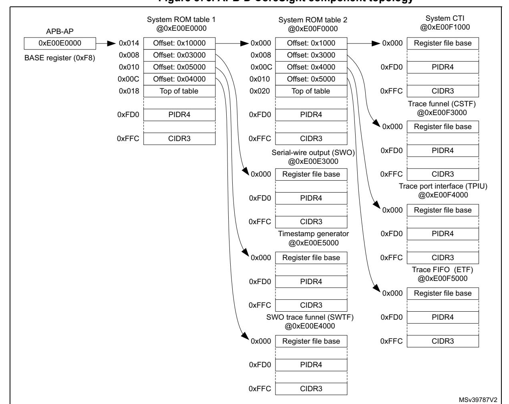

**Figure 876. APB-D CoreSight component topology**

For more information on the use of the ROM table, refer to the Arm® Debug Interface Architecture Specification *[\[1\]](#page-283-1)*.

## **System ROM registers**

### **SYSROM memory type register (SYSROM\_MEMTYPE)**

Address offset: 0xFCC Reset value: 0x0000 0000

| 31   | 30   | 29   | 28   | 27   | 26   | 25   | 24   | 23   | 22   | 21   | 20   | 19   | 18   | 17   | 16         |
|------|------|------|------|------|------|------|------|------|------|------|------|------|------|------|------------|
| Res. | Res. | Res. | Res. | Res. | Res. | Res. | Res. | Res. | Res. | Res. | Res. | Res. | Res. | Res. | Res.       |
|      |      |      |      |      |      |      |      |      |      |      |      |      |      |      |            |
|      |      |      |      |      |      |      |      |      |      |      |      |      |      |      |            |
| 15   | 14   | 13   | 12   | 11   | 10   | 9    | 8    | 7    | 6    | 5    | 4    | 3    | 2    | 1    | 0          |
| Res. | Res. | Res. | Res. | Res. | Res. | Res. | Res. | Res. | Res. | Res. | Res. | Res. | Res. | Res. | SYSME M |

Bits 31:1 Reserved, must be kept at reset value.

Bit 0 **SYSMEM**: System memory

0: No system memory is present on this bus

## **SYSROM CoreSight peripheral identity register 4 (SYSROM\_PIDR4)**

Address offset: 0xFD0 Reset value: 0x0000 0000

| 31   | 30   | 29   | 28   | 27   | 26   | 25   | 24   | 23   | 22   | 21           | 20   | 19   | 18   | 17             | 16   |
|------|------|------|------|------|------|------|------|------|------|--------------|------|------|------|----------------|------|
| Res. | Res. | Res. | Res. | Res. | Res. | Res. | Res. | Res. | Res. | Res.         | Res. | Res. | Res. | Res.           | Res. |
|      |      |      |      |      |      |      |      |      |      |              |      |      |      |                |      |
| 15   | 14   | 13   | 12   | 11   | 10   | 9    | 8    | 7    |      |              |      |      |      |                |      |
|      |      |      |      |      |      |      |      |      | 6    | 5            | 4    | 3    | 2    | 1              | 0    |
| Res. | Res. | Res. | Res. | Res. | Res. | Res. | Res. |      |      | 4KCOUNT[3:0] |      |      |      | JEP106CON[3:0] |      |

Bits 31:8 Reserved, must be kept at reset value.

Bits 7:4 **4KCOUNT[3:0]**: Register file size

0x0: Register file occupies a single 4 Kbyte region

Bits 3:0 **JEP106CON[3:0]**: JEP106 continuation code

0x0: STMicroelectronics JEDEC continuation code

# **SYSROM CoreSight peripheral identity register 0 (SYSROM\_PIDR0)**

Address offset: 0xFE0

Reset value: 0x0000 0050 (System ROM table 1), 0x0000 0001 (System ROM table 2)

| 31   | 30   | 29   | 28   | 27   | 26   | 25   | 24   | 23           | 22   | 21   | 20   | 19   | 18   | 17   | 16   |  |  |
|------|------|------|------|------|------|------|------|--------------|------|------|------|------|------|------|------|--|--|
| Res. | Res. | Res. | Res. | Res. | Res. | Res. | Res. | Res.         | Res. | Res. | Res. | Res. | Res. | Res. | Res. |  |  |
|      |      |      |      |      |      |      |      |              |      |      |      |      |      |      |      |  |  |
| 15   | 14   | 13   | 12   | 11   | 10   | 9    | 8    | 7            | 6    | 5    | 4    | 3    | 2    | 1    | 0    |  |  |
| Res. | Res. | Res. | Res. | Res. | Res. | Res. | Res. | PARTNUM[7:0] |      |      |      |      |      |      |      |  |  |
|      |      |      |      |      |      |      |      | r            | r    | r    | r    | r    | r    | r    | r    |  |  |

Bits 31:8 Reserved, must be kept at reset value.

Bits 7:0 **PARTNUM[7:0]**: Device part number field, bits [7:0]

0x50: STM32H7 device (System ROM table 1) 0x01: STM32H7 device (System ROM table 2)

# **SYSROM CoreSight peripheral identity register 1 (SYSROM\_PIDR1)**

Address offset: 0xFE4

Reset value: 0x0000 0004 (System ROM table 1), 0x0000 00000 (System ROM table 2)

| 31   | 30   | 29   | 28   | 27   | 26   | 25   | 24   | 23            | 22   | 21   | 20   | 19   | 18   | 17            | 16   |
|------|------|------|------|------|------|------|------|---------------|------|------|------|------|------|---------------|------|
| Res. | Res. | Res. | Res. | Res. | Res. | Res. | Res. | Res.          | Res. | Res. | Res. | Res. | Res. | Res.          | Res. |
| 15   | 14   | 13   | 12   | 11   | 10   | 9    | 8    | 7             | 6    | 5    | 4    | 3    | 2    | 1             | 0    |
| Res. | Res. | Res. | Res. | Res. | Res. | Res. | Res. | JEP106ID[3:0] |      |      |      |      |      | PARTNUM[11:8] |      |
|      |      |      |      |      |      |      |      | r             | r    | r    | r    | r    | r    | r             | r    |

Bits 31:8 Reserved, must be kept at reset value.

Bits 7:4 **JEP106ID[3:0]**: JEP106 identity code field, bits [3:0]

0x0: STMicroelectronics JEDEC code

Bits 3:0 **PARTNUM[11:8]**: Device part number field, bits [11:8]

0x4: STM32H7 device System ROM table 1 0x0: STM32H7 device System ROM table 2

## **SYSROM CoreSight peripheral identity register 2 (SYSROM\_PIDR2)**

Address offset: 0xFE8

Reset value: 0x0000 000A

| 31   | 30   | 29   | 28   | 27   | 26   | 25   | 24   | 23   | 22   | 21   | 20   | 19   | 18   | 17   | 16   |
|------|------|------|------|------|------|------|------|------|------|------|------|------|------|------|------|
| Res. | Res. | Res. | Res. | Res. | Res. | Res. | Res. | Res. | Res. | Res. | Res. | Res. | Res. | Res. | Res. |
|      |      |      |      |      |      |      |      |      |      |      |      |      |      |      |      |

| 15   | 14   | 13   | 12   | 11   | 10   | 9    | 8    | 7             | 6 | 5 | 4     | 3 | 2             | 1 | 0 |
|------|------|------|------|------|------|------|------|---------------|---|---|-------|---|---------------|---|---|
| Res. | Res. | Res. | Res. | Res. | Res. | Res. | Res. | REVISION[3:0] |   |   | JEDEC |   | JEP106ID[6:4] |   |   |
|      |      |      |      |      |      |      |      | r             | r | r | r     | r | r             | r | r |

Bits 31:8 Reserved, must be kept at reset value.

Bits 7:4 **REVISION[3:0]**: Device revision number

0x0: Rev 0

Bit 3 **JEDEC**: JEDEC assigned value

1: Designer ID specified by JEDEC

Bits 2:0 **JEP106ID[6:4]**: JEP106 identity code field, bits [6:4]

0x2: STMicroelectronics JEDEC code

### **SYSROM CoreSight peripheral identity register 3 (SYSROM\_PIDR3)**

Address offset: 0xFEC Reset value: 0x0000 0000

| 31   | 30   | 29   | 28   | 27   | 26   | 25   | 24   | 23   | 22   | 21          | 20   | 19   | 18        | 17   | 16   |  |
|------|------|------|------|------|------|------|------|------|------|-------------|------|------|-----------|------|------|--|
| Res. | Res. | Res. | Res. | Res. | Res. | Res. | Res. | Res. | Res. | Res.        | Res. | Res. | Res.      | Res. | Res. |  |
|      |      |      |      |      |      |      |      |      |      |             |      |      |           |      |      |  |
| 15   | 14   | 13   | 12   | 11   | 10   | 9    | 8    | 7    | 6    | 5           | 4    | 3    | 2         | 1    | 0    |  |
| Res. | Res. | Res. | Res. | Res. | Res. | Res. | Res. |      |      | REVAND[3:0] |      |      | CMOD[3:0] |      |      |  |
|      |      |      |      |      |      |      |      | r    | r    | r           | r    | r    | r         | r    | r    |  |

Bits 31:8 Reserved, must be kept at reset value.

Bits 7:4 **REVAND[3:0]**: Metal fix version

0x0: No metal fix

Bits 3:0 **CMOD[3:0]**: Customer modified

0x0: No customer modifications

### **SYSROM CoreSight component identity register 0 (SYSROM\_CIDR0)**

Address offset: 0xFF0

Reset value: 0x0000 000D

| 31   | 30   | 29   | 28   | 27   | 26   | 25   | 24   | 23            | 22   | 21   | 20   | 19   | 18   | 17   | 16   |  |  |
|------|------|------|------|------|------|------|------|---------------|------|------|------|------|------|------|------|--|--|
| Res. | Res. | Res. | Res. | Res. | Res. | Res. | Res. | Res.          | Res. | Res. | Res. | Res. | Res. | Res. | Res. |  |  |
|      |      |      |      |      |      |      |      |               |      |      |      |      |      |      |      |  |  |
| 15   | 14   | 13   | 12   | 11   | 10   | 9    | 8    | 7             | 6    | 5    | 4    | 3    | 2    | 1    | 0    |  |  |
| Res. | Res. | Res. | Res. | Res. | Res. | Res. | Res. | PREAMBLE[7:0] |      |      |      |      |      |      |      |  |  |
|      |      |      |      |      |      |      |      | r             | r    | r    | r    | r    | r    | r    | r    |  |  |

Bits 31:8 Reserved, must be kept at reset value.

Bits 7:0 **PREAMBLE[7:0]**: Component ID field, bits [7:0]

0x0D: Common ID value

# **SYSROM CoreSight component identity register 1 (SYSROM\_CIDR1)**

Address offset: 0xFF4 Reset value: 0x0000 0010

| 31   | 30   | 29   | 28   | 27   | 26   | 25   | 24   | 23     | 22   | 21         | 20   | 19   | 18   | 17             | 16   |
|------|------|------|------|------|------|------|------|--------|------|------------|------|------|------|----------------|------|
| Res. | Res. | Res. | Res. | Res. | Res. | Res. | Res. | Res.   | Res. | Res.       | Res. | Res. | Res. | Res.           | Res. |
|      |      |      |      |      |      |      |      |        |      |            |      |      |      |                |      |
| 15   | 14   | 13   | 12   | 11   | 10   | 9    | 8    | 7      | 6    | 5          | 4    | 3    | 2    | 1              | 0    |
| Res. | Res. | Res. | Res. | Res. | Res. | Res. | Res. |        |      | CLASS[3:0] |      |      |      | PREAMBLE[11:8] |      |
|      |      |      |      |      |      |      |      | r r |      | r          | r    | r    | r    | r              | r    |

Bits 31:8 Reserved, must be kept at reset value.

Bits 7:4 **CLASS[3:0]**: Component ID field, bits [15:12] - component class

0x1: ROM table component

Bits 3:0 **PREAMBLE[11:8]**: Component ID field, bits [11:8]

0x0: Common ID value

# **SYSROM CoreSight component identity register 2 (SYSROM\_CIDR2)**

Address offset: 0xFF8 Reset value: 0x0000 0005

| 31   | 30   | 29   | 28   | 27   | 26   | 25   | 24   | 23              | 22   | 21   | 20   | 19   | 18   | 17   | 16   |  |  |  |  |
|------|------|------|------|------|------|------|------|-----------------|------|------|------|------|------|------|------|--|--|--|--|
| Res. | Res. | Res. | Res. | Res. | Res. | Res. | Res. | Res.            | Res. | Res. | Res. | Res. | Res. | Res. | Res. |  |  |  |  |
|      |      |      |      |      |      |      |      |                 |      |      |      |      |      |      |      |  |  |  |  |
| 15   | 14   | 13   | 12   | 11   | 10   | 9    | 8    | 7               | 6    | 5    | 4    | 3    | 2    | 1    | 0    |  |  |  |  |
| Res. | Res. | Res. | Res. | Res. | Res. | Res. | Res. | PREAMBLE[19:12] |      |      |      |      |      |      |      |  |  |  |  |
|      |      |      |      |      |      |      |      |                 |      |      |      |      |      |      |      |  |  |  |  |

Bits 31:8 Reserved, must be kept at reset value.

Bits 7:0 **PREAMBLE[19:12]**: Component ID field, bits [23:16]

0x05: Common ID value

# **SYSROM CoreSight component identity register 3 (SYSROM\_CIDR3)**

Address offset: 0xFFC Reset value: 0x0000 00B1

| 31   | 30   | 29   | 28   | 27   | 26   | 25   | 24   | 23              | 22   | 21   | 20   | 19   | 18   | 17   | 16   |  |  |  |  |
|------|------|------|------|------|------|------|------|-----------------|------|------|------|------|------|------|------|--|--|--|--|
| Res. | Res. | Res. | Res. | Res. | Res. | Res. | Res. | Res.            | Res. | Res. | Res. | Res. | Res. | Res. | Res. |  |  |  |  |
|      |      |      |      |      |      |      |      |                 |      |      |      |      |      |      |      |  |  |  |  |
| 15   | 14   | 13   | 12   | 11   | 10   | 9    | 8    | 7               | 6    | 5    | 4    | 3    | 2    | 1    | 0    |  |  |  |  |
|      |      |      |      |      |      |      |      | PREAMBLE[27:20] |      |      |      |      |      |      |      |  |  |  |  |
| Res. | Res. | Res. | Res. | Res. | Res. | Res. | Res. |                 |      |      |      |      |      |      |      |  |  |  |  |

Bits 31:8 Reserved, must be kept at reset value.

Bits 7:0 **PREAMBLE[27:20]**: Component ID field, bits [31:24]

0xB1: Common ID value

### **System ROM register map and reset values**

**Table 627. System ROM table 1 register map and reset values** 

|                   | Offset Register name | 31   | 30   | 29   | 28   | 27   | 26   | 25   | 24   | 23   | 22   | 21   | 20   | 19   | 18   | 17   | 16   | 15       | 14   | 13   | 12   | 11   | 10   | 9    | 8    | 7    | 6             | 5    | 4    | 3     | 2                            | 0 1         |
|-------------------|----------------------|------|------|------|------|------|------|------|------|------|------|------|------|------|------|------|------|----------|------|------|------|------|------|------|------|------|---------------|------|------|-------|------------------------------|----------------|
| 0xFCC             | SYSROM_ MEMTYPE   | Res. | Res. | Res. | Res. | Res. | Res. | Res. | Res. | Res. | Res. | Res. | Res. | Res. | Res. | Res. | Res. | Res.     | Res. | Res. | Res. | Res. | Res. | Res. | Res. | Res. | Res.          | Res. | Res. | Res.  | Res.                         | SYSMEM Res. |
|                   | Reset value          |      |      |      |      |      |      |      |      |      |      |      |      |      |      |      |      |          |      |      |      |      |      |      |      |      |               |      |      |       |                              | 0              |
| 0xFD0             | SYSROM_PIDR4         | Res. | Res. | Res. | Res. | Res. | Res. | Res. | Res. | Res. | Res. | Res. | Res. | Res. | Res. | Res. | Res. | Res.     | Res. | Res. | Res. | Res. | Res. | Res. | Res. |      | 4KCOUNT[3:0]  |      |      |       | JEP106CON[3;0                |                |
|                   | Reset value          |      |      |      |      |      |      |      |      |      |      |      |      |      |      |      |      |          |      |      |      |      |      |      |      | 0    | 0             | 0    | 0    | 0     | 0                            | 0 0         |
| 0xFD4 to 0xFDC | Reserved             |      |      |      |      |      |      |      |      |      |      |      |      |      |      |      |      | Reserved |      |      |      |      |      |      |      |      |               |      |      |       |                              |                |
| 0xFE0             | SYSROM_PIDR0         | Res. | Res. | Res. | Res. | Res. | Res. | Res. | Res. | Res. | Res. | Res. | Res. | Res. | Res. | Res. | Res. | Res.     | Res. | Res. | Res. | Res. | Res. | Res. | Res. |      |               |      |      |       | PARTNUM[7:0]                 |                |
|                   | Reset value          |      |      |      |      |      |      |      |      |      |      |      |      |      |      |      |      |          |      |      |      |      |      |      |      |      |               |      |      |       |                              | 0              |
|                   |                      |      |      |      |      |      |      |      |      |      |      |      |      |      |      |      |      |          |      |      |      |      |      |      |      | 0    | 1             | 0    | 1    |       | 0 0 0 PARTNUM[11:8] |                |
| 0xFE4             | SYSROM_PIDR1         | Res. | Res. | Res. | Res. | Res. | Res. | Res. | Res. | Res. | Res. | Res. | Res. | Res. | Res. | Res. | Res. | Res.     | Res. | Res. | Res. | Res. | Res. | Res. | Res. |      | JEP106ID[3:0] |      |      |       |                              |                |
|                   | Reset value          |      |      |      |      |      |      |      |      |      |      |      |      |      |      |      |      |          |      |      |      |      |      |      |      | 0    | 0             | 0    | 0    | 0     | 1                            | 0 0         |
| 0xFE8             | SYSROM_PIDR2         | Res. | Res. | Res. | Res. | Res. | Res. | Res. | Res. | Res. | Res. | Res. | Res. | Res. | Res. | Res. | Res. | Res.     | Res. | Res. | Res. | Res. | Res. | Res. | Res. |      | REVISION[3:0] |      |      | JEDEC |                              | JEP106ID[6:4]  |

**Table 627. System ROM table 1 register map and reset values (continued)**

|       | Offset Register name | 31   | 30   | 29   | 28   | 27   | 26   | 25   | 24   | 23   | 22   | 21   | 20   | 19   | 18   | 17   | 16   | 15   | 14   | 13   | 12   | 11   | 10   | 9    | 8    | 7 | 6 | 5           | 4               | 3 | 2              | 1 | 0 |
|-------|----------------------|------|------|------|------|------|------|------|------|------|------|------|------|------|------|------|------|------|------|------|------|------|------|------|------|---|---|-------------|-----------------|---|----------------|---|---|
| 0xFEC | SYSROM_PIDR3         | Res. | Res. | Res. | Res. | Res. | Res. | Res. | Res. | Res. | Res. | Res. | Res. | Res. | Res. | Res. | Res. | Res. | Res. | Res. | Res. | Res. | Res. | Res. | Res. |   |   | REVAND[3:0] |                 |   | CMOD[3:0]      |   |   |
|       | Reset value          |      |      |      |      |      |      |      |      |      |      |      |      |      |      |      |      |      |      |      |      |      |      |      |      | 0 | 0 | 0           | 0               | 0 | 0              | 0 | 0 |
| 0xFF0 | SYSROM_CIDR0         | Res. | Res. | Res. | Res. | Res. | Res. | Res. | Res. | Res. | Res. | Res. | Res. | Res. | Res. | Res. | Res. | Res. | Res. | Res. | Res. | Res. | Res. | Res. | Res. |   |   |             | PREAMBLE[7:0]   |   |                |   |   |
|       | Reset value          |      |      |      |      |      |      |      |      |      |      |      |      |      |      |      |      |      |      |      |      |      |      |      |      | 0 | 0 | 0           | 0               | 1 | 1              | 0 | 1 |
| 0xFF4 | SYSROM_CIDR1         | Res. | Res. | Res. | Res. | Res. | Res. | Res. | Res. | Res. | Res. | Res. | Res. | Res. | Res. | Res. | Res. | Res. | Res. | Res. | Res. | Res. | Res. | Res. | Res. |   |   | CLASS[3:0]  |                 |   | PREAMBLE[11:8] |   |   |
|       | Reset value          |      |      |      |      |      |      |      |      |      |      |      |      |      |      |      |      |      |      |      |      |      |      |      |      | 0 | 0 | 0           | 1               | 0 | 0              | 0 | 0 |
| 0xFF8 | SYSROM_CIDR2         | Res. | Res. | Res. | Res. | Res. | Res. | Res. | Res. | Res. | Res. | Res. | Res. | Res. | Res. | Res. | Res. | Res. | Res. | Res. | Res. | Res. | Res. | Res. | Res. |   |   |             | PREAMBLE[19:12] |   |                |   |   |
|       | Reset value          |      |      |      |      |      |      |      |      |      |      |      |      |      |      |      |      |      |      |      |      |      |      |      |      | 0 | 0 | 0           | 0               | 0 | 1              | 0 | 1 |
| 0xFFC | SYSROM_CIDR3         | Res. | Res. | Res. | Res. | Res. | Res. | Res. | Res. | Res. | Res. | Res. | Res. | Res. | Res. | Res. | Res. | Res. | Res. | Res. | Res. | Res. | Res. | Res. | Res. |   |   |             | PREAMBLE[27:20] |   |                |   |   |
|       | Reset value          |      |      |      |      |      |      |      |      |      |      |      |      |      |      |      |      |      |      |      |      |      |      |      |      | 1 | 0 | 1           | 1               | 0 | 0              | 0 | 1 |

**Table 628. System ROM table 2 register map and reset values** 

|                   | Offset Register name | 31   | 30   | 29   | 28   | 27   | 26   | 25   | 24   | 23   | 22   | 21   | 20   | 19   | 18   | 17   | 16   | 15       | 14   | 13   | 12   | 11   | 10   | 9    | 8    | 7    | 6             | 5            | 4    | 3    | 2             | 1    | 0      |
|-------------------|----------------------|------|------|------|------|------|------|------|------|------|------|------|------|------|------|------|------|----------|------|------|------|------|------|------|------|------|---------------|--------------|------|------|---------------|------|--------|
| 0xFCC             | SYSROM_ MEMTYPE   | Res. | Res. | Res. | Res. | Res. | Res. | Res. | Res. | Res. | Res. | Res. | Res. | Res. | Res. | Res. | Res. | Res.     | Res. | Res. | Res. | Res. | Res. | Res. | Res. | Res. | Res.          | Res.         | Res. | Res. | Res.          | Res. | SYSMEM |
|                   | Reset value          |      |      |      |      |      |      |      |      |      |      |      |      |      |      |      |      |          |      |      |      |      |      |      |      |      |               |              |      |      |               |      | 0      |
| 0xFD0             | SYSROM_PIDR4         | Res. | Res. | Res. | Res. | Res. | Res. | Res. | Res. | Res. | Res. | Res. | Res. | Res. | Res. | Res. | Res. | Res.     | Res. | Res. | Res. | Res. | Res. | Res. | Res. |      | 4KCOUNT[3:0]  |              |      |      | JEP106CON[3;0 |      |        |
|                   | Reset value          |      |      |      |      |      |      |      |      |      |      |      |      |      |      |      |      |          |      |      |      |      |      |      |      | 0    | 0             | 0            | 0    | 0    | 0             | 0    | 0      |
| 0xFD4 to 0xFDC | Reserved             |      |      |      |      |      |      |      |      |      |      |      |      |      |      |      |      | Reserved |      |      |      |      |      |      |      |      |               |              |      |      |               |      |        |
| 0xFE0             | SYSROM_PIDR0         | Res. | Res. | Res. | Res. | Res. | Res. | Res. | Res. | Res. | Res. | Res. | Res. | Res. | Res. | Res. | Res. | Res.     | Res. | Res. | Res. | Res. | Res. | Res. | Res. |      |               | PARTNUM[7:0] |      |      |               |      |        |
|                   | Reset value          |      |      |      |      |      |      |      |      |      |      |      |      |      |      |      |      |          |      |      |      |      |      |      |      | 0    | 0             | 0            | 0    | 0    | 0             | 0    | 1      |
| 0xFE4             | SYSROM_PIDR1         | Res. | Res. | Res. | Res. | Res. | Res. | Res. | Res. | Res. | Res. | Res. | Res. | Res. | Res. | Res. | Res. | Res.     | Res. | Res. | Res. | Res. | Res. | Res. | Res. |      | JEP106ID[3:0] |              |      |      | PARTNUM[11:8] |      |        |
|                   | Reset value          |      |      |      |      |      |      |      |      |      |      |      |      |      |      |      |      |          |      |      |      |      |      |      |      | 0    | 0             | 0            | 0    | 0    | 0             | 0    | 0      |

0xFE8 SYSROM\_PIDR2 REVISION[3:0] JEDEC JEP106ID[6:4] Reset value 00001010 0xFEC SYSROM\_PIDR3 REVAND[3:0] CMOD[3:0] Reset value 00000000 0xFF0 SYSROM\_CIDR0 PREAMBLE[7:0] Reset value 00001101 0xFF4 SYSROM\_CIDR1 CLASS[3:0] PREAMBLE[11:8] Reset value 00010000 0xFF8 SYSROM\_CIDR2 PREAMBLE[19:12] Reset value 00000101 0xFFC SYSROM\_CIDR3 PREAMBLE[27:20] Reset value 10110001 **Offset Register name 31 30 29 28 27 26 25 24 23 22 21 20 19 18 17 16 15 14 13 12 11 10 987654321**

**Table 628. System ROM table 2 register map and reset values (continued)**

## **63.5.2 Global timestamp generator (TSG)**

The global timestamp generator contains a 64-bit counter that provides a common timing reference for all of the trace sources in the system, namely the ETM and ITM in each processor core. These components insert timestamps in the trace streams that allow the trace analyzer to recover the chronological order of trace packets, which can be lost when multiple trace sources are multiplexed into one stream at the funnels.

The TSG registers are accessible over the APB-D. This allows the debugger or debug software to:

- start and stop the timestamp incrementing
- read the current timestamp value
- change the current timestamp value
  - The timestamp counter must be halted while it is changed. When the timestamp value is changed, the timestamp generator resynchronizes all the trace sources.
- change the reported timestamp increment

For more information on the global timestamp generator CoreSight component, refer to the Arm® CoreSight™ SoC-400 Technical Reference Manual *[\[2\]](#page-283-2)*.

The timestamp generator is located in the D3 power domain, and the timestamp is distributed to the Cortex-M7 and Cortex-M4. To simplify the distribution over power domain

RM0399 Rev 4 3261/3556

boundaries, the 64-bit timestamp is encoded in seven bits, then decoded in the destination power domain, and interpolated to increase its resolution if the processor clock is significantly faster than the generator clock. The timestamp distribution is shown in *[Figure 877](#page-36-0)*.

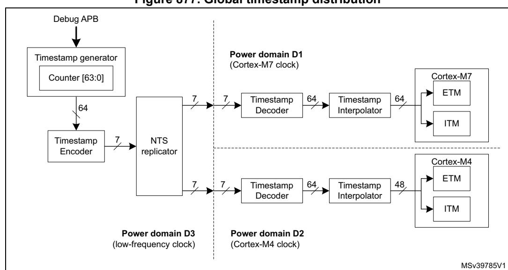

**Figure 877. Global timestamp distribution**

# **TSG registers**

### **TSG counter control register (TSG\_CNTCR)**

Address offset: 0x000 Reset value: 0x0000 0000

| 31   | 30   | 29   | 28   | 27   | 26   | 25   | 24   | 23   | 22   | 21   | 20   | 19   | 18   | 17   | 16   |
|------|------|------|------|------|------|------|------|------|------|------|------|------|------|------|------|
| Res. | Res. | Res. | Res. | Res. | Res. | Res. | Res. | Res. | Res. | Res. | Res. | Res. | Res. | Res. | Res. |
|      |      |      |      |      |      |      |      |      |      |      |      |      |      |      |      |
| 15   | 14   | 13   | 12   | 11   | 10   | 9    | 8    | 7    | 6    | 5    | 4    | 3    | 2    | 1    | 0    |
| Res. | Res. | Res. | Res. | Res. | Res. | Res. | Res. | Res. | Res. | Res. | Res. | Res. | Res. | HDBG | EN   |
|      |      |      |      |      |      |      |      |      |      |      |      |      |      | rw   | rw   |

Bits 31:2 Reserved, must be kept at reset value.

Bit 1 **HDBG**: Halt on debug

0: Normal operation

1: Halt counter when system-wide debug state is detected - not implemented

Bit 0 **EN:** Enable

0: Counter disabled

1: Counter enabled and incrementing

### **TSG counter status register (TSG\_CNTSR)**

Address offset: 0x004

Reset value: 0x0000 0000

| 31   | 30   | 29   | 28   | 27   | 26   | 25   | 24   | 23   | 22   | 21   | 20   | 19   | 18   | 17   | 16   |
|------|------|------|------|------|------|------|------|------|------|------|------|------|------|------|------|
| Res. | Res. | Res. | Res. | Res. | Res. | Res. | Res. | Res. | Res. | Res. | Res. | Res. | Res. | Res. | Res. |
|      |      |      |      |      |      |      |      |      |      |      |      |      |      |      |      |
| 15   | 14   | 13   | 12   | 11   | 10   | 9    | 8    | 7    | 6    | 5    | 4    | 3    | 2    | 1    | 0    |
|      |      |      |      |      |      |      |      |      |      |      |      |      |      |      |      |
| Res. | Res. | Res. | Res. | Res. | Res. | Res. | Res. | Res. | Res. | Res. | Res. | Res. | Res. | DBGH | Res. |

Bits 31:2 Reserved, must be kept at reset value.

Bit 1 **DBGH**: Debug halt

0: Normal operation

1: Counter halted due to system-wide debug state

Bit 0 Reserved, must be kept at reset value.

### **TSG current counter value lower register (TSG\_CNTCVL)**

Address offset: 0x008

Reset value: 0x0000 0000

| 31 | 30            | 29 | 28 | 27 | 26 | 25 | 24 | 23           | 22 | 21 | 20 | 19 | 18 | 17 | 16 |
|----|---------------|----|----|----|----|----|----|--------------|----|----|----|----|----|----|----|
|    | CNTCVL[31:16] |    |    |    |    |    |    |              |    |    |    |    |    |    |    |
| rw | rw            | rw | rw | rw | rw | rw | rw | rw           | rw | rw | rw | rw | rw | rw | rw |
| 15 | 14            | 13 | 12 | 11 | 10 | 9  | 8  | 7            | 6  | 5  | 4  | 3  | 2  | 1  | 0  |
|    |               |    |    |    |    |    |    | CNTCVL[15:0] |    |    |    |    |    |    |    |
| rw | rw            | rw | rw | rw | rw | rw | rw | rw           | rw | rw | rw | rw | rw | rw | rw |

#### Bits 31:0 **CNTCVL[31:0]**: TSG current counter value field, bits[31:0]

To change the current timestamp value, write the lower 32 bits of the new value to this register before writing the upper 32 bits to CNTCVU. The timestamp value is not changed until the CNTVCVU register is written to. Note: The TSG\_CNTCR register's EN bit must be cleared before writing to this register.

## **TSG current counter value upper register (TSG\_CNTCVU)**

Address offset: 0x00C

Reset value: 0x0000 0000

| 31 | 30 | 29 | 28 | 27 | 26 | 25 | 24 | 23            | 22 | 21 | 20 | 19 | 18 | 17 | 16 |
|----|----|----|----|----|----|----|----|---------------|----|----|----|----|----|----|----|
|    |    |    |    |    |    |    |    | CNTCVU[31:16] |    |    |    |    |    |    |    |
| rw | rw | rw | rw | rw | rw | rw | rw | rw            | rw | rw | rw | rw | rw | rw | rw |

RM0399 Rev 4 3263/3556

| 15 | 14           | 13 | 12 | 11 | 10 | 9  | 8  | 7  | 6  | 5  | 4  | 3  | 2  | 1  | 0  |
|----|--------------|----|----|----|----|----|----|----|----|----|----|----|----|----|----|
|    | CNTCVU[15:0] |    |    |    |    |    |    |    |    |    |    |    |    |    |    |
| rw | rw           | rw | rw | rw | rw | rw | rw | rw | rw | rw | rw | rw | rw | rw | rw |

Bits 31:0 **CNTCVU[31:0]**: TSG current counter value field, bits[63:32]

To change the current timestamp value, write the lower 32 bits of the new value to CNTCVL before writing the upper 32 bits to this register. The 64-bit timestamp value is updated with the value from both writes when this register is written to. Note: The TSG\_CNTCR register's EN bit must be cleared before writing to this register.

### **TSG base frequency ID register (TSG\_CNTFID0)**

Address offset: 0x020

Reset value: 0x0000 0000

| 31 | 30          | 29 | 28 | 27 | 26 | 25 | 24 | 23 | 22 | 21 | 20 | 19 | 18 | 17 | 16 |
|----|-------------|----|----|----|----|----|----|----|----|----|----|----|----|----|----|
|    | FREQ[31:16] |    |    |    |    |    |    |    |    |    |    |    |    |    |    |
| rw | rw          | rw | rw | rw | rw | rw | rw | rw | rw | rw | rw | rw | rw | rw | rw |
| 15 | 14          | 13 | 12 | 11 | 10 | 9  | 8  | 7  | 6  | 5  | 4  | 3  | 2  | 1  | 0  |
|    | FREQ[15:0]  |    |    |    |    |    |    |    |    |    |    |    |    |    |    |
| rw | rw          | rw | rw | rw | rw | rw | rw | rw | rw | rw | rw | rw | rw | rw | rw |

Bits 31:0 **FREQ[31:0]**: Increment frequency of TSG counter in Hz

This field must be programmed with the trace generator clock frequency whenever it changes.

### **TSG CoreSight peripheral identity register 4 (TSG\_PIDR4)**

Address offset: 0xFD0

Reset value: 0x0000 0004

| 31   | 30   | 29   | 28   | 27   | 26   | 25   | 24   | 23   | 22   | 21           | 20   | 19   | 18   | 17             | 16   |
|------|------|------|------|------|------|------|------|------|------|--------------|------|------|------|----------------|------|
| Res. | Res. | Res. | Res. | Res. | Res. | Res. | Res. | Res. | Res. | Res.         | Res. | Res. | Res. | Res.           | Res. |
|      |      |      |      |      |      |      |      |      |      |              |      |      |      |                |      |
| 15   | 14   | 13   | 12   | 11   | 10   | 9    | 8    | 7    | 6    | 5            | 4    | 3    | 2    | 1              | 0    |
| Res. | Res. | Res. | Res. | Res. | Res. | Res. | Res. |      |      | 4KCOUNT[3:0] |      |      |      | JEP106CON[3:0] |      |
|      |      |      |      |      |      |      |      | r    | r    | r            | r    | r    | r    | r              | r    |

Bits 31:8 Reserved, must be kept at reset value.

Bits 7:4 **4KCOUNT[3:0]**: Register file size

0x0: Register file occupies a single 4 Kbyte region

Bits 3:0 **JEP106CON[3:0]**: JEP106 continuation code

0x4: Arm® JEDEC code

# **TSG CoreSight Peripheral identity register 0 (TSG\_PIDR0)**

Address offset: 0xFE0 Reset value: 0x0000 0001

| 31   | 30   | 29   | 28   | 27   | 26   | 25   | 24   | 23           | 22   | 21   | 20   | 19   | 18   | 17   | 16   |  |  |
|------|------|------|------|------|------|------|------|--------------|------|------|------|------|------|------|------|--|--|
| Res. | Res. | Res. | Res. | Res. | Res. | Res. | Res. | Res.         | Res. | Res. | Res. | Res. | Res. | Res. | Res. |  |  |
|      |      |      |      |      |      |      |      |              |      |      |      |      |      |      |      |  |  |
| 15   | 14   | 13   | 12   | 11   | 10   | 9    | 8    | 7            | 6    | 5    | 4    | 3    | 2    | 1    | 0    |  |  |
| Res. | Res. | Res. | Res. | Res. | Res. | Res. | Res. | PARTNUM[7:0] |      |      |      |      |      |      |      |  |  |
|      |      |      |      |      |      |      |      |              |      |      |      |      |      |      |      |  |  |

Bits 31:8 Reserved, must be kept at reset value.

Bits 7:0 **PARTNUM[7:0]**: Part number field, bits [7:0]

0x01: TSG part number

### **TSG CoreSight peripheral identity register 1 (TSG\_PIDR1)**

Address offset: 0xFE4 Reset value: 0x0000 00B1

| 31   | 30   | 29   | 28   | 27   | 26   | 25   | 24   | 23   | 22   | 21            | 20   | 19   | 18   | 17            | 16   |
|------|------|------|------|------|------|------|------|------|------|---------------|------|------|------|---------------|------|
| Res. | Res. | Res. | Res. | Res. | Res. | Res. | Res. | Res. | Res. | Res.          | Res. | Res. | Res. | Res.          | Res. |
|      |      |      |      |      |      |      |      |      |      |               |      |      |      |               |      |
|      |      |      |      |      |      |      |      |      |      |               |      |      |      |               |      |
| 15   | 14   | 13   | 12   | 11   | 10   | 9    | 8    | 7    | 6    | 5             | 4    | 3    | 2    | 1             | 0    |
| Res. | Res. | Res. | Res. | Res. | Res. | Res. | Res. |      |      | JEP106ID[3:0] |      |      |      | PARTNUM[11:8] |      |

Bits 31:8 Reserved, must be kept at reset value.

Bits 7:4 **JEP106ID[3:0]**: JEP106 identity code field, bits [3:0]

0xB: Arm® JEDEC code

Bits 3:0 **PARTNUM[11:8]**: Part number field, bits [11:8]

0x1: TSG part number

### **TSG CoreSight peripheral identity register 2 (TSG\_PIDR2)**

Address offset: 0xFE8

Reset value: 0x0000 001B

| 31   | 30   | 29   | 28   | 27   | 26   | 25   | 24   | 23   | 22   | 21   | 20   | 19   | 18   | 17   | 16   |
|------|------|------|------|------|------|------|------|------|------|------|------|------|------|------|------|
| Res. | Res. | Res. | Res. | Res. | Res. | Res. | Res. | Res. | Res. | Res. | Res. | Res. | Res. | Res. | Res. |
|      |      |      |      |      |      |      |      |      |      |      |      |      |      |      |      |

| 15   | 14   | 13   | 12   | 11   | 10   | 9    | 8    | 7             | 6 | 5 | 4     | 3 | 2             | 1 | 0 |
|------|------|------|------|------|------|------|------|---------------|---|---|-------|---|---------------|---|---|
| Res. | Res. | Res. | Res. | Res. | Res. | Res. | Res. | REVISION[3:0] |   |   | JEDEC |   | JEP106ID[6:4] |   |   |
|      |      |      |      |      |      |      |      | r             | r | r | r     | r | r             | r | r |

Bits 31:8 Reserved, must be kept at reset value.

Bits 7:4 **REVISION[3:0]**: Component revision number

0x1: r0p1

Bit 3 **JEDEC**: JEDEC assigned value

1: Designer ID specified by JEDEC

Bits 2:0 **JEP106ID[6:4]**: JEP106 identity code field, bits [6:4]

0x3: Arm® JEDEC code

### **TSG CoreSight peripheral identity register 3 (TSG\_PIDR3)**

Address offset: 0xFEC Reset value: 0x0000 0000

| 31   | 30   | 29   | 28   | 27   | 26   | 25   | 24   | 23          | 22   | 21   | 20   | 19   | 18        | 17   | 16   |  |
|------|------|------|------|------|------|------|------|-------------|------|------|------|------|-----------|------|------|--|
| Res. | Res. | Res. | Res. | Res. | Res. | Res. | Res. | Res.        | Res. | Res. | Res. | Res. | Res.      | Res. | Res. |  |
|      |      |      |      |      |      |      |      |             |      |      |      |      |           |      |      |  |
| 15   | 14   | 13   | 12   | 11   | 10   | 9    | 8    | 7           | 6    | 5    | 4    | 3    | 2         | 1    | 0    |  |
| Res. | Res. | Res. | Res. | Res. | Res. | Res. | Res. | REVAND[3:0] |      |      |      |      | CMOD[3:0] |      |      |  |
|      |      |      |      |      |      |      |      | r           | r    | r    | r    | r    | r         | r    | r    |  |

Bits 31:8 Reserved, must be kept at reset value.

Bits 7:4 **REVAND[3:0]**: Metal fix version

0x0: No metal fix

Bits 3:0 **CMOD[3:0]**: Customer modified

0x0: No customer modifications

## **TSG CoreSight component identity register 0 (TSG\_CIDR0)**

Address offset: 0xFF0

Reset value: 0x0000 000D

| 31   | 30   | 29   | 28   | 27   | 26   | 25   | 24   | 23   | 22   | 21   | 20   | 19            | 18   | 17   | 16   |
|------|------|------|------|------|------|------|------|------|------|------|------|---------------|------|------|------|
| Res. | Res. | Res. | Res. | Res. | Res. | Res. | Res. | Res. | Res. | Res. | Res. | Res.          | Res. | Res. | Res. |
| 15   | 14   | 13   | 12   | 11   | 10   | 9    | 8    | 7    | 6    | 5    | 4    | 3             | 2    | 1    | 0    |
| Res. | Res. | Res. | Res. | Res. | Res. | Res. | Res. |      |      |      |      | PREAMBLE[7:0] |      |      |      |
|      |      |      |      |      |      |      |      | r    | r    | r    | r    | r             | r    | r    | r    |

Bits 31:8 Reserved, must be kept at reset value.

Bits 7:0 **PREAMBLE[7:0]**: Component ID field, bits [7:0]

0x0D: Common ID value

## **TSG CoreSight component identity register 1 (TSG\_CIDR1)**

Address offset: 0xFF4

Reset value: 0x0000 00F0

| 31   | 30   | 29   | 28   | 27   | 26   | 25   | 24   | 23   | 22   | 21         | 20   | 19   | 18   | 17             | 16   |
|------|------|------|------|------|------|------|------|------|------|------------|------|------|------|----------------|------|
| Res. | Res. | Res. | Res. | Res. | Res. | Res. | Res. | Res. | Res. | Res.       | Res. | Res. | Res. | Res.           | Res. |
| 15   | 14   | 13   | 12   | 11   | 10   | 9    | 8    | 7    | 6    | 5          | 4    | 3    | 2    | 1              | 0    |
| Res. | Res. | Res. | Res. | Res. | Res. | Res. | Res. |      |      | CLASS[3:0] |      |      |      | PREAMBLE[11:8] |      |
|      |      |      |      |      |      |      |      | r    | r    | r          | r    | r    | r    | r              | r    |

Bits 31:8 Reserved, must be kept at reset value.

Bits 7:4 **CLASS[3:0]**: Component ID field, bits [15:12] - component class

0xF: CoreSight Soc-400 component

Bits 3:0 **PREAMBLE[11:8]**: Component ID field, bits [11:8]

0x0: Common ID value

# **TSG CoreSight component identity register 2 (TSG\_CIDR2)**

Address offset: 0xFF8

Reset value: 0x0000 0005

| 31   | 30   | 29   | 28   | 27   | 26   | 25   | 24   | 23   | 22   | 21   | 20   | 19              | 18   | 17   | 16   |
|------|------|------|------|------|------|------|------|------|------|------|------|-----------------|------|------|------|
| Res. | Res. | Res. | Res. | Res. | Res. | Res. | Res. | Res. | Res. | Res. | Res. | Res.            | Res. | Res. | Res. |
|      |      |      |      |      |      |      |      |      |      |      |      |                 |      |      |      |
| 15   | 14   | 13   | 12   | 11   | 10   | 9    | 8    | 7    | 6    | 5    | 4    | 3               | 2    | 1    | 0    |
| Res. | Res. | Res. | Res. | Res. | Res. | Res. | Res. |      |      |      |      |                 |      |      |      |
|      |      |      |      |      |      |      |      |      |      |      |      | PREAMBLE[19:12] |      |      |      |

Bits 31:8 Reserved, must be kept at reset value.

Bits 7:0 **PREAMBLE[19:12]**: Component ID field, bits [23:16]

0x05: Common ID value

### **TSG CoreSight component identity register 3 (TSG\_CIDR3)**

Address offset: 0xFFC Reset value: 0x0000 00B1

| 31   | 30   | 29   | 28   | 27   | 26   | 25   | 24   | 23   | 22   | 21   | 20   | 19              | 18   | 17   | 16   |
|------|------|------|------|------|------|------|------|------|------|------|------|-----------------|------|------|------|
| Res. | Res. | Res. | Res. | Res. | Res. | Res. | Res. | Res. | Res. | Res. | Res. | Res.            | Res. | Res. | Res. |
|      |      |      |      |      |      |      |      |      |      |      |      |                 |      |      |      |
| 15   | 14   | 13   | 12   | 11   | 10   | 9    | 8    | 7    | 6    | 5    | 4    | 3               | 2    | 1    | 0    |
| Res. | Res. | Res. | Res. | Res. | Res. | Res. | Res. |      |      |      |      | PREAMBLE[27:20] |      |      |      |
|      |      |      |      |      |      |      |      | r    | r    | r    | r    | r               | r    | r    | r    |

Bits 31:8 Reserved, must be kept at reset value.

Bits 7:0 **PREAMBLE[27:20]**: Component ID field, bits [31:24]

0xB1: Common ID value

### **TSG register map and reset values**

# **Table 629. TSG register map and reset values**

|                   | Offset Register name | 31   | 30                | 29   | 28   | 27   | 26   | 25   | 24   | 23   | 22   | 21   | 20   | 19   | 18   | 17   | 16   | 15       | 14               | 13   | 12   | 11   | 10   | 9    | 8    | 7    | 6    | 5                     | 4            | 3    | 2    | 1                      | 0    |
|-------------------|----------------------|------|-------------------|------|------|------|------|------|------|------|------|------|------|------|------|------|------|----------|------------------|------|------|------|------|------|------|------|------|-----------------------|--------------|------|------|------------------------|------|
| 0x000             | TSG_CNTCR            | Res. | Res.              | Res. | Res. | Res. | Res. | Res. | Res. | Res. | Res. | Res. | Res. | Res. | Res. | Res. | Res. | Res.     | Res.             | Res. | Res. | Res. | Res. | Res. | Res. | Res. | Res. | Res.                  | Res.         | Res. | Res. | HDBG                   | EN   |
|                   | Reset value          |      |                   |      |      |      |      |      |      |      |      |      |      |      |      |      |      |          |                  |      |      |      |      |      |      |      |      |                       |              |      |      | 0                      | 0    |
| 0x004             | TSG_CNTSR            | Res. | Res.              | Res. | Res. | Res. | Res. | Res. | Res. | Res. | Res. | Res. | Res. | Res. | Res. | Res. | Res. | Res.     | Res.             | Res. | Res. | Res. | Res. | Res. | Res. | Res. | Res. | Res.                  | Res.         | Res. | Res. | DBGH                   | Res. |
|                   | Reset value          |      |                   |      |      |      |      |      |      |      |      |      |      |      |      |      |      |          |                  |      |      |      |      |      |      |      |      |                       |              |      |      | 0                      |      |
|                   | TSG_CNTCVL           |      | CNTCVL_L_32[31:0] |      |      |      |      |      |      |      |      |      |      |      |      |      |      |          |                  |      |      |      |      |      |      |      |      |                       |              |      |      |                        |      |
| 0x008             | Reset value          | 0    | 0                 | 0    | 0    | 0    | 0    | 0    | 0    | 0    | 0    | 0    | 0    | 0    | 0    | 0    | 0    | 0        | 0                | 0    | 0    | 0    | 0    | 0    | 0    | 0    | 0    | 0                     | 0            | 0    | 0    | 0                      | 0    |
|                   | TSG_CNTCVU           |      |                   |      |      |      |      |      |      |      |      |      |      |      |      |      |      |          | CNTCVU_U_32[3:0] |      |      |      |      |      |      |      |      |                       |              |      |      |                        |      |
| 0x00C             | Reset value          | 0    | 0                 | 0    | 0    | 0    | 0    | 0    | 0    | 0    | 0    | 0    | 0    | 0    | 0    | 0    | 0    | 0        | 0                | 0    | 0    | 0    | 0    | 0    | 0    | 0    | 0    | 0                     | 0            | 0    | 0    | 0                      | 0    |
|                   | TSG_CNTFID0          |      | FREQ[31:0]        |      |      |      |      |      |      |      |      |      |      |      |      |      |      |          |                  |      |      |      |      |      |      |      |      |                       |              |      |      |                        |      |
| 0x020             | Reset value          | 0    | 0                 | 0    | 0    | 0    | 0    | 0    | 0    | 0    | 0    | 0    | 0    | 0    | 0    | 0    | 0    | 0        | 0                | 0    | 0    | 0    | 0    | 0    | 0    | 0    | 0    | 0                     | 0            | 0    | 0    | 0                      | 0    |
| 0x024 to 0xFCC | Reserved             |      |                   |      |      |      |      |      |      |      |      |      |      |      |      |      |      | Reserved |                  |      |      |      |      |      |      |      |      |                       |              |      |      |                        |      |
| 0xFD0             | TSG_PIDR4            | Res. | Res.              | Res. | Res. | Res. | Res. | Res. | Res. | Res. | Res. | Res. | Res. | Res. | Res. | Res. | Res. | Res.     | Res.             | Res. | Res. | Res. | Res. | Res. |      |      |      | Res.4KCOUNT[3: 0]  |              |      |      | JEP106CON[ 3:0]     |      |
|                   | Reset value          |      |                   |      |      |      |      |      |      |      |      |      |      |      |      |      |      |          |                  |      |      |      |      |      |      | 0    | 0    | 0                     | 0            | 0    | 1    | 0                      | 0    |
| 0xFD4 to 0xFDC | Reserved             |      |                   |      |      |      |      |      |      |      |      |      |      |      |      |      |      | Reserved |                  |      |      |      |      |      |      |      |      |                       |              |      |      |                        |      |
| 0xFE0             | TSG_PIDR0            | Res. | Res.              | Res. | Res. | Res. | Res. | Res. | Res. | Res. | Res. | Res. | Res. | Res. | Res. | Res. | Res. | Res.     | Res.             | Res. | Res. | Res. | Res. | Res. | Res. |      |      |                       | PARTNUM[7:0] |      |      |                        |      |
|                   | Reset value          |      |                   |      |      |      |      |      |      |      |      |      |      |      |      |      |      |          |                  |      |      |      |      |      |      | 0    | 0    | 0                     | 0            | 0    | 0    | 0                      | 1    |
| 0xFE4             | TSG_PIDR1            | Res. | Res.              | Res. | Res. | Res. | Res. | Res. | Res. | Res. | Res. | Res. | Res. | Res. | Res. | Res. | Res. | Res.     | Res.             | Res. | Res. | Res. | Res. | Res. |      |      |      | Res.JEP106ID[3:0 ] |              |      |      | PARTNUM[1 1:8]      |      |
|                   | Reset value          |      |                   |      |      |      |      |      |      |      |      |      |      |      |      |      |      |          |                  |      |      |      |      |      |      | 1    | 0    | 1                     | 1            | 0    | 0    | 0                      | 1    |
| 0xFE8             | TSG_PIDR2            | Res. | Res.              | Res. | Res. | Res. | Res. | Res. | Res. | Res. | Res. | Res. | Res. | Res. | Res. | Res. | Res. | Res.     | Res.             | Res. | Res. | Res. | Res. | Res. |      |      |      | Res.REVISION[3: 0] |              |      |      | JEDECJEP106ID [6:4] |      |
|                   | Reset value          |      |                   |      |      |      |      |      |      |      |      |      |      |      |      |      |      |          |                  |      |      |      |      |      |      | 0    | 0    | 0                     | 1            | 1    | 0    | 1                      | 1    |

0xFEC TSG\_PIDR3 Res. REVAND[3:0] CMOD[3:0] Reset value 00000000 0xFF0 TSG\_CIDR0 PREAMBLE[7:0] Reset value 00001101 0xFF4 TSG\_CIDR1 CLASS[3:0] PREAMBLE[ 11:8] Reset value 10010000 0xFF8 TSG\_CIDR2 PREAMBLE[19:12] Reset value 00000101 0xFFC TSG\_CIDR3 PREAMBLE[27:20] Reset value 10110001 **Offset Register name 31 30 29 28 27 26 25 24 23 22 21 20 19 18 17 16 15 14 13 12 11 10 987654321**

**Table 629. TSG register map and reset values (continued)**

## **63.5.3 Cross trigger interfaces (CTI) and matrix (CTM)**

The cross trigger interfaces (CTI) and cross trigger matrix (CTM) together form the CoreSight embedded cross trigger feature. There are three CTI components, one at system level, one dedicated to the Cortex-M7 and one dedicated to the Cortex-M4. The three CTIs are connected to each other via the CTM. The system-level CTI and the Cortex M4 CTI are accessible to the debugger via the system access port and associated APB-D. The Cortex-M7 CTI is physically integrated in the Cortex-M7 core, and is accessible via the Cortex-M7 access port and associated AHBD.

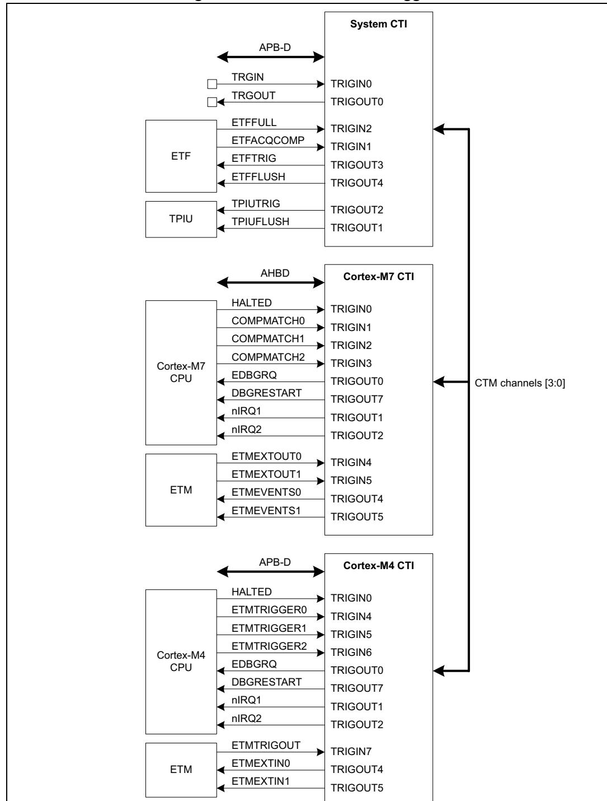

**Figure 878. Embedded cross trigger**

The CTIs allow events from various sources to trigger debug and/or trace activity. For example, a breakpoint reached in one of the processor cores can stop the other processor, or a transition detected on an external trigger input can start code trace.

Each CTI has up to 8 trigger inputs and 8 trigger outputs. Any input can be connected to any output, on the same CTI, or on another CTI via the CTM.

MSv39781V1

The trigger input and output signals for each CTI are listed in *[Table 630](#page-45-0)* to *[Table 635](#page-46-0)*.

**Table 630. System CTI inputs** 

| # | Source signal | Source component | Comments                                                                                       |
|---|---------------|------------------|------------------------------------------------------------------------------------------------|
| 0 | DBTRIGI       | GPIO             | External trigger input - allows an external signal to generate a debug event                |
| 1 | ETFACQCOMP    | ETF              | ETF capture finished - allows a debug event to be generated when the trace FIFO is empty |
| 2 | ETFFULL       | ETF              | ETF full flag - allows a debug event to be generated when the trace FIFO is full            |
| 3 | -             | -                | Not used                                                                                       |
| 4 | -             | -                | Not used                                                                                       |
| 5 | -             | -                | Not used                                                                                       |
| 6 | -             | -                | Not used                                                                                       |
| 7 | -             | -                | Not used                                                                                       |

**Table 631. System CTI outputs** 

| # | Output signal | Destination component | Comments                                                                                |  |
|---|---------------|-----------------------|-----------------------------------------------------------------------------------------|--|
| 0 | DBTRIGO       | GPIO                  | External IO trigger output - allows monitoring of events on the external DBTRIGO pin |  |
| 1 | TPIUFLUSH     | TPIU                  | Trace port flush trigger - causes the TPIU FIFO to be flushed                        |  |
| 2 | TPIUTRIG      | TPIU                  | Trace Port enable trigger - starts trace output on the external trace port           |  |
| 3 | ETFTRIG       | ETF                   | ETF enable trigger - starts filling the Trace FIFO                                   |  |
| 4 | ETFFLUSH      | ETF                   | ETF flush trigger - causes the Trace FIFO to be flushed                              |  |
| 5 | -             | -                     | Not used                                                                                |  |
| 6 | -             | -                     | Not used                                                                                |  |
| 7 | -             | -                     | Not used                                                                                |  |

#### **Table 632. Cortex-M7 CTI inputs**

| # | Source signal | Source component | Comments                                       |  |
|---|---------------|------------------|------------------------------------------------|--|
| 0 | HALTED        | Cortex-M7 CPU    | CPU halted - indicates CPU is in Debug mode |  |
| 1 | COMPMATCH0    | Cortex-M7 DWT    | DWT comparator 0 match                         |  |
| 2 | COMPMATCH1    | Cortex-M7 DWT    | DWT comparator 1 match                         |  |
| 3 | COMPMATCH2    | Cortex-M7 DWT    | DWT comparator 2 match                         |  |
| 4 | ETMEXTOUT0    | Cortex-M7 ETM    | ETM external trigger out                       |  |

### **Table 632. Cortex-M7 CTI inputs (continued)**

| # | Source signal | Source component | Comments                 |
|---|---------------|------------------|--------------------------|
| 5 | ETMEXTOUT1    | Cortex-M7 ETM    | ETM external trigger out |
| 6 | -             | -                | Not used                 |
| 7 | -             | -                | Not used                 |

#### **Table 633. Cortex-M7 CTI outputs**

| # | Output signal | Destination component | Comments                                          |
|---|---------------|-----------------------|---------------------------------------------------|
| 0 | EDBGRQ        | Cortex-M7 CPU         | CPU halt request - puts CPU in Debug mode         |
| 1 | nIRQ1         | Cortex-M7 NVIC        | Interrupt request                                 |
| 2 | nIRQ2         | Cortex-M7 NVIC        | Interrupt request                                 |
| 3 | -             | -                     | Not used                                          |
| 4 | ETMEVENTS0    | Cortex-M7 ETM         | ETM trig request - enables CPU execution trace |
| 5 | ETMEVENTS1    | Cortex-M7 ETM         | ETM trig request - enables CPU execution trace |
| 6 | -             | -                     | Not used                                          |
| 7 | DBGRESTART    | Cortex-M7 CPU         | CPU restart request - CPU exits Debug mode     |

#### **Table 634. Cortex-M4 CTI inputs**

| # | Source signal | Source component | Comments                                       |  |
|---|---------------|------------------|------------------------------------------------|--|
| 0 | HALTED        | M4 CPU           | CPU halted - indicates CPU is in Debug mode |  |
| 1 | -             | -                | Not used                                       |  |
| 2 | -             | -                | Not used                                       |  |
| 3 | -             | -                | Not used                                       |  |
| 4 | ETMTRIGGER0   | M4 DWT           | Trace trigger - enables CPU execution trace    |  |
| 5 | ETMTRIGGER1   | M4 DWT           | Trace trigger - enables CPU execution trace    |  |
| 6 | ETMTRIGGER2   | M4 DWT           | Trace trigger - enables CPU execution trace    |  |
| 7 | ETMTRIGOUT    | M4 ETM           | ETM triggered - indicates trace active         |  |

# **Table 635. Cortex-M4 CTI outputs**

| # | Output signal | Destination component | Comments                                  |
|---|---------------|-----------------------|-------------------------------------------|
| 0 | EDBGRQ        | Cortex-M4 CPU         | CPU halt request - puts CPU in Debug mode |
| 1 | nIRQ1         | Cortex-M4 NVIC        | Interrupt request                         |
| 2 | nIRQ2         | Cortex-M4 NVIC        | Interrupt request                         |
| 3 | -             | -                     | Not used                                  |

| # | Output signal | Destination component | Comments                                          |  |  |  |  |  |
|---|---------------|-----------------------|---------------------------------------------------|--|--|--|--|--|
| 4 | ETMEXTIN0     | Cortex-M4 ETM         | ETM trig request - enables CPU execution trace |  |  |  |  |  |
| 5 | ETMEXTIN1     | Cortex-M4 ETM         | ETM trig request - enables CPU execution trace |  |  |  |  |  |
| 6 | -             | -                     | Not used                                          |  |  |  |  |  |
| 7 | DBGRESTART    | Cortex-M4 CPU         | CPU restart request - CPU exits Debug mode     |  |  |  |  |  |

**Table 635. Cortex-M4 CTI outputs (continued)**

There are four event channels in the cross trigger matrix, which allows up to four parallel bidirectional connections between trigger inputs and outputs on different CTIs. To connect input number *m* on CTI *x* to output number *n* on CTI *y*, the input must be connected to an event channel *p* using the CTIINEN*m* register of CTI *x*. The same channel *p* must be connected to the output using the CTIOUTEN*n* register of CTI *y*. Note: this applies even if the input and output belong to the same CTI.

An input can be connected to more than one channel (up to four), so an input can be routed to several outputs. Similarly, an output can be connected to several inputs. It is also possible to connect several inputs/outputs to the same channel.

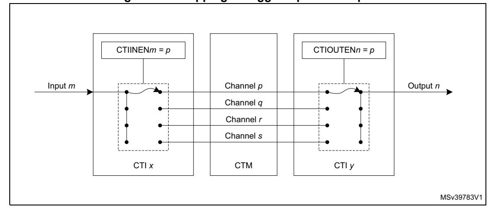

**Figure 879. Mapping of trigger inputs to outputs**

Example configurations:

When either CPU core hits a breakpoint, stop the other core. Restart the two cores synchronously.

To stop both cores when either core stops requires the HALTED output of each core to be connected to the EDBGRQ input of the opposite core.

As shown in *[Table 632](#page-45-1)* and *[Table 634](#page-46-1)*, the HALTED signal from the Cortex-M7 core is connected to input 0 of the Cortex-M7 CTI, and the same signal from the Cortex-M4 core is connected to the same input on the Cortex-M4 CTI. Hence the CTIIEN0 register on each CTI is programmed such as to connect these inputs to a CTM channel (for example channel 0).

As shown in *[Table 633](#page-46-2)* and *[Table 635](#page-46-0)*, the EDBGRQ signals to the CPUs are connected to output 0 of the respective CTIs. Therefore, the CTIOUTEN0 register of the each CTI should be programmed such as to connect this these outputs to the same CTM channel.

To restart both cores simultaneously the debugger must use the APPPULSE register in either of the CTIs. This allows the debugger to generate a pulse on any of the four ETM channels. The channel must be connected to the DBGRESTART signal of both cores.

As shown in*[Table 633](#page-46-2)* and *[Table 635](#page-46-0)*, the DBGRESTART signals to the CPUs is are connected to output 1 of the respective CTIs. Therefore, the CTIOUTEN1 register of the each CTI should be programmed such as to connect this these outputs to an unused CTM channel (for example channel 1).

The above configuration is illustrated in *[Figure 880](#page-48-0)*.

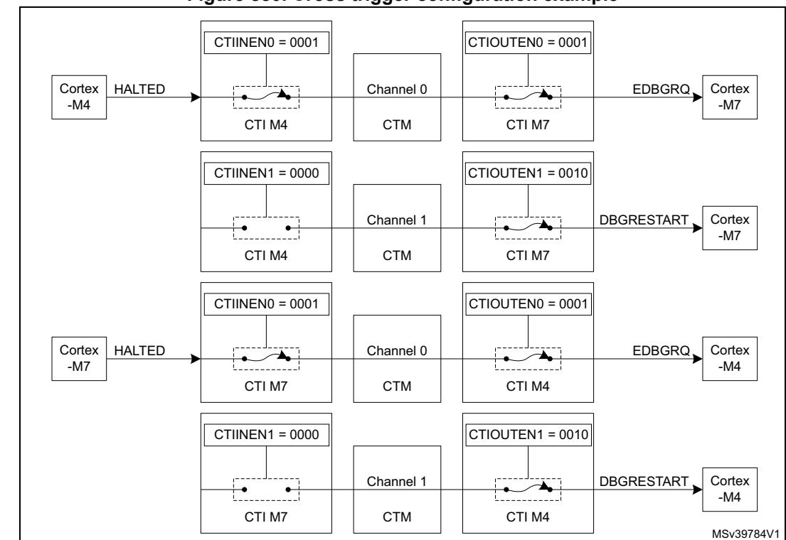

**Figure 880. Cross trigger configuration example**

To force the processors to restart simultaneously, the debugger should use the following procedure:

- 1. Clear the debug request by writing 0x01, then 0x00, to the CTIINTACK register in each CTI.
- 2. Cause a pulse on channel 1 by writing 0x02 to the APPPULSE register in either CTI. This will generate a restart request to both processors.

Note that the debugger can also force both cores to stop simultaneously by writing 0x01 to the APPPULSE register in either CTI, which generates a pulse on channel 0.

For more information on the cross-trigger interface CoreSight component, refer to the Arm® CoreSight™ SoC-400 Technical Reference Manual *[\[2\]](#page-283-2)*.

### **CTI registers**

The register file base address for each CTI is defined by the ROM table for the bus to which it is connected. The registers are the same for each CTI.

### **CTI control register (CTI\_CONTROL)**

Address offset: 0x000 Reset value: 0x0000 0000

| 31   | 30   | 29   | 28   | 27   | 26   | 25   | 24   | 23   | 22   | 21   | 20   | 19   | 18   | 17   | 16    |
|------|------|------|------|------|------|------|------|------|------|------|------|------|------|------|-------|
| Res. | Res. | Res. | Res. | Res. | Res. | Res. | Res. | Res. | Res. | Res. | Res. | Res. | Res. | Res. | Res.  |
|      |      |      |      |      |      |      |      |      |      |      |      |      |      |      |       |
|      |      |      |      |      |      |      |      |      |      |      |      |      |      |      |       |
| 15   | 14   | 13   | 12   | 11   | 10   | 9    | 8    | 7    | 6    | 5    | 4    | 3    | 2    | 1    | 0     |
| Res. | Res. | Res. | Res. | Res. | Res. | Res. | Res. | Res. | Res. | Res. | Res. | Res. | Res. | Res. | GLBEN |

Bits 31:1 Reserved, must be kept at reset value.

Bit 0 **GLBEN**: Global enable.

0: Cross-triggering disabled 1: Cross-triggering enabled

# **CTI trigger acknowledge register (CTI\_INTACK)**

Address offset: 0x010

Reset value: 0x0000 0000

| 31   | 30   | 29   | 28   | 27   | 26   | 25   | 24   | 23          | 22   | 21   | 20   | 19   | 18   | 17   | 16   |  |
|------|------|------|------|------|------|------|------|-------------|------|------|------|------|------|------|------|--|
| Res. | Res. | Res. | Res. | Res. | Res. | Res. | Res. | Res.        | Res. | Res. | Res. | Res. | Res. | Res. | Res. |  |
|      |      |      |      |      |      |      |      |             |      |      |      |      |      |      |      |  |
| 15   | 14   | 13   | 12   | 11   | 10   | 9    | 8    | 7           | 6    | 5    | 4    | 3    | 2    | 1    | 0    |  |
| Res. | Res. | Res. | Res. | Res. | Res. | Res. | Res. | INTACK[7:0] |      |      |      |      |      |      |      |  |
|      |      |      |      |      |      |      |      |             |      |      |      |      |      |      |      |  |

Bits 31:8 Reserved, must be kept at reset value.

### Bits 7:0 **INTACK[7:0]**: Trigger acknowledge

There is one bit of the register for each CTITRIGOUT output. When a 1 is written to a bit in this register, the corresponding CTITRIGOUT output is acknowledged, causing it to be cleared.

# **CTI application trigger set register (CTI\_APPSET)**

Address offset: 0x014

Reset value: 0x0000 0000

| 31   | 30   | 29   | 28   | 27   | 26   | 25   | 24   | 23   | 22   | 21   | 20   | 19          | 18   | 17   | 16   |
|------|------|------|------|------|------|------|------|------|------|------|------|-------------|------|------|------|
| Res. | Res. | Res. | Res. | Res. | Res. | Res. | Res. | Res. | Res. | Res. | Res. | Res.        | Res. | Res. | Res. |
|      |      |      |      |      |      |      |      |      |      |      |      |             |      |      |      |
| 15   | 14   | 13   | 12   | 11   | 10   | 9    | 8    | 7    | 6    | 5    | 4    | 3           | 2    | 1    | 0    |
| Res. | Res. | Res. | Res. | Res. | Res. | Res. | Res. | Res. | Res. | Res. | Res. | APPSET[3:0] |      |      |      |
|      |      |      |      |      |      |      |      |      |      |      |      | rw          | rw   | rw   | rw   |

Bits 31:4 Reserved, must be kept at reset value.

#### Bits 3:0 **APPSET[3:0]**: Set channel event

Read:

0bXXX0: Channel 0 event inactive 0bXXX1: Channel 0 event active 0bXX0X: Channel 1 event inactive 0bXX1X: Channel 1 event active 0bX0XX: Channel 2 event inactive 0bX1XX: Channel 2 event active 0b0XXX: Channel 3 event inactive 0b1XXX: Channel 3 event active

Write:

0bXXX0: No effect

0bXXX1: Set event on Channel 0

0bXX0X: No effect

0bXX1X: Set event on Channel 1

0bX0XX: No effect

0bX1XX: Set event on Channel 2

0b0XXX: No effect

0b1XXX: Set event on Channel 3

# **CTI application trigger clear register (CTI\_APPCLEAR)**

Address offset: 0x018

| 31   | 30   | 29   | 28   | 27   | 26   | 25   | 24   | 23   | 22   | 21   | 20   | 19   | 18   | 17            | 16   |
|------|------|------|------|------|------|------|------|------|------|------|------|------|------|---------------|------|
| Res. | Res. | Res. | Res. | Res. | Res. | Res. | Res. | Res. | Res. | Res. | Res. | Res. | Res. | Res.          | Res. |
|      |      |      |      |      |      |      |      |      |      |      |      |      |      |               |      |
| 15   | 14   | 13   | 12   | 11   | 10   | 9    | 8    | 7    | 6    | 5    | 4    | 3    | 2    | 1             | 0    |
|      |      |      |      |      |      |      |      |      |      |      |      |      |      |               |      |
| Res. | Res. | Res. | Res. | Res. | Res. | Res. | Res. | Res. | Res. | Res. | Res. |      |      | APPCLEAR[3:0] |      |

Bits 31:4 Reserved, must be kept at reset value.

Bits 3:0 **APPCLEAR[3:0]**: Clear channel event

0bXXX0: No effect

0bXXX1: Clear event on Channel 0

0bXX0X: No effect

0bXX1X: Clear event on Channel 1

0bX0XX: No effect

0bX1XX: Clear event on Channel 2

0b0XXX: No effect

0b1XXX: Clear event on Channel 3

### **CTI application pulse register (CTI\_APPPULSE)**

Address offset: 0x01C

Reset value: 0x0000 0000

| 31   | 30   | 29   | 28   | 27   | 26   | 25   | 24   | 23   | 22   | 21   | 20   | 19   | 18            | 17   | 16   |  |
|------|------|------|------|------|------|------|------|------|------|------|------|------|---------------|------|------|--|
| Res. | Res. | Res. | Res. | Res. | Res. | Res. | Res. | Res. | Res. | Res. | Res. | Res. | Res.          | Res. | Res. |  |
|      |      |      |      |      |      |      |      |      |      |      |      |      |               |      |      |  |
| 15   | 14   | 13   | 12   | 11   | 10   | 9    | 8    | 7    | 6    | 5    | 4    | 3    | 2             | 1    | 0    |  |
| Res. | Res. | Res. | Res. | Res. | Res. | Res. | Res. | Res. | Res. | Res. | Res. |      | APPPULSE[3:0] |      |      |  |
|      |      |      |      |      |      |      |      |      |      |      |      | w    | w             | w    | w    |  |

Bits 31:4 Reserved, must be kept at reset value.

Bits 3:0 **APPPULSE[3:0]**: Pulse channel event

This register clears itself immediately.

0bXXX0: No effect

0bXXX1: Generate pulse on Channel 0

0bXX0X: No effect

0bXX1X: Generate pulse on Channel 1

0bX0XX: No effect

0bX1XX: Generate pulse on Channel 2

0b0XXX: No effect

0b1XXX: Generate pulse on Channel 3

# **CTI trigger IN x enable register (CTI\_INENx)**

Address offset: 0x020 + 4 \* x, where x = 0 to 7

Reset value: 0x0000 0000

| 31   | 30   | 29   | 28   | 27   | 26   | 25   | 24   | 23   | 22   | 21   | 20   | 19            | 18   | 17   | 16   |
|------|------|------|------|------|------|------|------|------|------|------|------|---------------|------|------|------|
| Res. | Res. | Res. | Res. | Res. | Res. | Res. | Res. | Res. | Res. | Res. | Res. | Res.          | Res. | Res. | Res. |
| 15   | 14   | 13   | 12   | 11   | 10   | 9    | 8    | 7    | 6    | 5    | 4    | 3             | 2    | 1    | 0    |
| Res. | Res. | Res. | Res. | Res. | Res. | Res. | Res. | Res. | Res. | Res. | Res. | TRIGINEN[3:0] |      |      |      |
|      |      |      |      |      |      |      |      |      |      |      |      | rw            | rw   | rw   | rw   |

RM0399 Rev 4 3277/3556

#### Bits 31:4 Reserved, must be kept at reset value.

#### Bits 3:0 **TRIGINEN[3:0]**: Cross-trigger event enable

Enables or disables a cross-trigger event on each of the four channels when CTITRIGINx is activated (x = 0 to 7).

0bXXX0: Trigger n does not generate events on Channel 0

0bXXX1: Trigger n generates events on Channel 0

0bXX0X: Trigger n does not generate events on Channel 1

0bXX1X: Trigger n generates events on Channel 1

0bX0XX: Trigger n does not generate events on Channel 2

0bX1XX: Trigger n generates events on Channel 2

0b0XXX: Trigger n does not generate events on Channel 3

0b1XXX: Trigger n generates events on Channel 3

# **CTI trigger OUT x enable register (CTI\_OUTENx)**

Address offset: 0x0A0 + 4 \* x, where x = 0 to 7

Reset value: 0x0000 0000

| 31   | 30   | 29   | 28   | 27   | 26   | 25   | 24   | 23   | 22   | 21   | 20   | 19             | 18   | 17   | 16   |
|------|------|------|------|------|------|------|------|------|------|------|------|----------------|------|------|------|
| Res. | Res. | Res. | Res. | Res. | Res. | Res. | Res. | Res. | Res. | Res. | Res. | Res.           | Res. | Res. | Res. |
|      |      |      |      |      |      |      |      |      |      |      |      |                |      |      |      |
| 15   | 14   | 13   | 12   | 11   | 10   | 9    | 8    | 7    | 6    | 5    | 4    | 3              | 2    | 1    | 0    |
| Res. | Res. | Res. | Res. | Res. | Res. | Res. | Res. | Res. | Res. | Res. | Res. | TRIGOUTEN[3:0] |      |      |      |
|      |      |      |      |      |      |      |      |      |      |      |      | rw             | rw   |      | rw   |

Bits 31:4 Reserved, must be kept at reset value.

#### Bits 3:0 **TRIGOUTEN[3:0]**: Enable trigger upon event

For each channel, the field defines whether an event on that channel will generate a trigger on CTITRIGOUTx (x = 0 to 7).

0bXXX0: Channel 0 events do not generate triggers on Trigger output n

0bXXX1: Channel 0 events generate triggers on Trigger output n

0bXX0X: Channel 1 events do not generate triggers on Trigger output n

0bXX1X: Channel 1 events generate triggers on Trigger output n

0bX0XX: Channel 2 events do not generate triggers on Trigger output n

0bX1XX: Channel 2 events generate triggers on Trigger output n

0b0XXX: Channel 3 events do not generate triggers on Trigger output n

0b1XXX: Channel 3 events generate triggers on Trigger output n

# **CTI trigger IN status register (CTI\_TRGISTS)**

Address offset: 0x130

Reset value: 0x0000 0000

| 31   | 30   | 29   | 28   | 27   | 26   | 25   | 24   | 23                | 22   | 21   | 20   | 19   | 18   | 17   | 16   |  |  |
|------|------|------|------|------|------|------|------|-------------------|------|------|------|------|------|------|------|--|--|
| Res. | Res. | Res. | Res. | Res. | Res. | Res. | Res. | Res.              | Res. | Res. | Res. | Res. | Res. | Res. | Res. |  |  |
|      |      |      |      |      |      |      |      |                   |      |      |      |      |      |      |      |  |  |
| 15   | 14   | 13   | 12   | 11   | 10   | 9    | 8    | 7                 | 6    | 5    | 4    | 3    | 2    | 1    | 0    |  |  |
| Res. | Res. | Res. | Res. | Res. | Res. | Res. | Res. | TRIGINSTATUS[7:0] |      |      |      |      |      |      |      |  |  |
|      |      |      |      |      |      |      |      |                   |      |      |      |      |      |      |      |  |  |

Bits 31:8 Reserved, must be kept at reset value.

#### Bits 7:0 **TRIGINSTATUS[7:0]**: Trigger input status

There is one bit of the register for each CTITRIGIN input. When a bit is set to 1 it indicates that the corresponding trigger input is active. When it is set to 0, the corresponding trigger input is inactive.

# **CTI trigger OUT status register (CTI\_TRGOSTS)**

Address offset: 0x134

Reset value: 0x0000 0000

| 31   | 30   | 29   | 28   | 27   | 26   | 25   | 24   | 23                 | 22   | 21   | 20   | 19   | 18   | 17   | 16   |  |  |
|------|------|------|------|------|------|------|------|--------------------|------|------|------|------|------|------|------|--|--|
| Res. | Res. | Res. | Res. | Res. | Res. | Res. | Res. | Res.               | Res. | Res. | Res. | Res. | Res. | Res. | Res. |  |  |
|      |      |      |      |      |      |      |      |                    |      |      |      |      |      |      |      |  |  |
| 15   | 14   | 13   | 12   | 11   | 10   | 9    | 8    | 7                  | 6    | 5    | 4    | 3    | 2    | 1    | 0    |  |  |
| Res. | Res. | Res. | Res. | Res. | Res. | Res. | Res. | TRIGOUTSTATUS[7:0] |      |      |      |      |      |      |      |  |  |
|      |      |      |      |      |      |      |      | r                  | r    | r    | r    | r    | r    | r    | r    |  |  |

Bits 31:8 Reserved, must be kept at reset value.

#### Bits 7:0 **TRIGOUTSTATUS[7:0]**: Trigger output status

There is one bit of the register for each CTITRIGOUT output. When a bit is set to 1 it indicates that the corresponding trigger output is active. When it is set to 0, the corresponding trigger output is inactive.

# **CTI channel IN status register (CTI\_CHINSTS)**

Address offset: 0x138

Reset value: 0x0000 0000

| 31   | 30   | 29   | 28   | 27   | 26   | 25   | 24   | 23   | 22   | 21   | 20   | 19              | 18   | 17   | 16   |
|------|------|------|------|------|------|------|------|------|------|------|------|-----------------|------|------|------|
| Res. | Res. | Res. | Res. | Res. | Res. | Res. | Res. | Res. | Res. | Res. | Res. | Res.            | Res. | Res. | Res. |
|      |      |      |      |      |      |      |      |      |      |      |      |                 |      |      |      |
| 15   | 14   | 13   | 12   | 11   | 10   | 9    | 8    | 7    | 6    | 5    | 4    | 3               | 2    | 1    | 0    |
| Res. | Res. | Res. | Res. | Res. | Res. | Res. | Res. | Res. | Res. | Res. | Res. | CHINSTATUS[3:0] |      |      |      |
|      |      |      |      |      |      |      |      |      |      |      |      | r               | r    | r    | r    |

Bits 31:4 Reserved, must be kept at reset value.

#### Bits 3:0 **CHINSTATUS[3:0]**: Channel input status

There is one bit of the register for each channel input. When a bit is set to 1 it indicates that the corresponding channel input is active. When it is set to 0, the corresponding channel input is inactive.

## **CTI channel OUT status register (CTI\_CHOUTSTS)**

Address offset: 0x13C

Reset value: 0x0000 0000

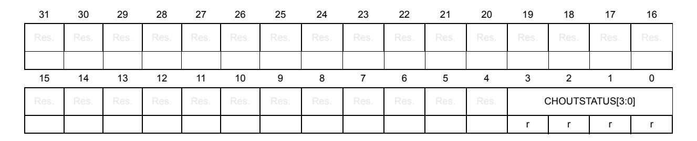

Bits 31:4 Reserved, must be kept at reset value.

#### Bits 3:0 **CHOUTSTATUS[3:0]**: Channel output status

There is one bit of the register for each channel output. When a bit is set to 1 it indicates that the corresponding channel output is active. When it is set to 0, the corresponding channel output is inactive.

### **CTI channel gate register (CTI\_GATE)**

Address offset: 0x140 Reset value: 0x0000 000F

| 31   | 30   | 29   | 28   | 27   | 26   | 25   | 24   | 23   | 22   | 21   | 20   | 19          | 18   | 17   | 16   |
|------|------|------|------|------|------|------|------|------|------|------|------|-------------|------|------|------|
| Res. | Res. | Res. | Res. | Res. | Res. | Res. | Res. | Res. | Res. | Res. | Res. | Res.        | Res. | Res. | Res. |
|      |      |      |      |      |      |      |      |      |      |      |      |             |      |      |      |
| 15   | 14   | 13   | 12   | 11   | 10   | 9    | 8    | 7    | 6    | 5    | 4    | 3           | 2    | 1    | 0    |
| Res. | Res. | Res. | Res. | Res. | Res. | Res. | Res. | Res. | Res. | Res. | Res. | GATEEN[3:0] |      |      |      |
|      |      |      |      |      |      |      |      |      |      |      |      | rw          | rw   | rw   | rw   |

Bits 31:4 Reserved, must be kept at reset value.

#### Bits 3:0 **GATEEN[3:0]**: Channel output enable

For each channel, defines whether an event on that channel can propagate over the CTM to other CTIs.

0bXXX0: Channel 0 events do not propagate 0bXXX1: Channel 0 events propagate

0bXX0X: Channel 1 events do not propagate 0bXX1X: Channel 1 events propagate

0bX0XX: Channel 2 events do not propagate 0bX1XX: Channel 2 events propagate

0b0XXX: Channel 3 events do not propagate 0b1XXX: Channel 3 events propagate

### **CTI claim tag set register (CTI\_CLAIMSET)**

Address offset: 0xFA0 Reset value: 0x0000 000F

| 31   | 30   | 29   | 28   | 27   | 26   | 25   | 24   | 23   | 22   | 21   | 20   | 19            | 18   | 17   | 16   |
|------|------|------|------|------|------|------|------|------|------|------|------|---------------|------|------|------|
| Res. | Res. | Res. | Res. | Res. | Res. | Res. | Res. | Res. | Res. | Res. | Res. | Res.          | Res. | Res. | Res. |
|      |      |      |      |      |      |      |      |      |      |      |      |               |      |      |      |
| 15   | 14   | 13   | 12   | 11   | 10   | 9    | 8    | 7    | 6    | 5    | 4    | 3             | 2    | 1    | 0    |
| Res. | Res. | Res. | Res. | Res. | Res. | Res. | Res. | Res. | Res. | Res. | Res. | CLAIMSET[3:0] |      |      |      |
|      |      |      |      |      |      |      |      |      |      |      |      | rw            | rw   | rw   | rw   |

RM0399 Rev 4 3281/3556

Bits 31:4 Reserved, must be kept at reset value.

#### Bits 3:0 **CLAIMSET[3:0]**: Set claim tag bits

Write:

0000: No effect xxx1: Set bit 0 xx1x: Set bit 1 x1xx: Set bit 2 1xxx: Set bit 3

Read:

0xF: Indicates there are four bits in claim tag

### **CTI claim tag clear register (CTI\_CLAIMCLR)**

Address offset: 0xFA4

Reset value: 0x0000 0000

| 31   | 30   | 29   | 28   | 27   | 26   | 25   | 24   | 23   | 22   | 21   | 20   | 19   | 18            | 17   | 16   |
|------|------|------|------|------|------|------|------|------|------|------|------|------|---------------|------|------|
| Res. | Res. | Res. | Res. | Res. | Res. | Res. | Res. | Res. | Res. | Res. | Res. | Res. | Res.          | Res. | Res. |
|      |      |      |      |      |      |      |      |      |      |      |      |      |               |      |      |
| 15   | 14   | 13   | 12   | 11   | 10   | 9    | 8    | 7    | 6    | 5    | 4    | 3    | 2             | 1    | 0    |
| Res. | Res. | Res. | Res. | Res. | Res. | Res. | Res. | Res. | Res. | Res. | Res. |      | CLAIMCLR[3:0] |      |      |
|      |      |      |      |      |      |      |      |      |      |      |      |      |               |      |      |

Bits 31:4 Reserved, must be kept at reset value.

#### Bits 3:0 **CLAIMCLR[3:0]**: Reset claim tag bits

Write:

0000: No effect xxx1: Clear bit 0 xx1x: Clear bit 1 x1xx: Clear bit 2 1xxx: Clear bit 3

Read: Returns current value of claim tag

### **CTI lock access register (CTI\_LAR)**

Address offset: 0xFB0

Reset value: N/A

| 31 | 30              | 29 | 28 | 27 | 26 | 25 | 24 | 23             | 22 | 21 | 20 | 19 | 18 | 17 | 16 |
|----|-----------------|----|----|----|----|----|----|----------------|----|----|----|----|----|----|----|
|    | ACCESS_W[31:16] |    |    |    |    |    |    |                |    |    |    |    |    |    |    |
| w  | w               | w  | w  | w  | w  | w  | w  | w              | w  | w  | w  | w  | w  | w  | w  |
| 15 | 14              | 13 | 12 | 11 | 10 | 9  | 8  | 7              | 6  | 5  | 4  | 3  | 2  | 1  | 0  |
|    |                 |    |    |    |    |    |    | ACCESS_W[15:0] |    |    |    |    |    |    |    |
| w  | w               | w  | w  | w  | w  | w  | w  | w              | w  | w  | w  | w  | w  | w  | w  |

#### Bits 31:0 **ACCESS\_W[31:0]**: CTI register write access enable

Enables write access to some CTI registers by processor cores (debuggers do not need to unlock the component)

0xC5ACCE55: Enable write access Other values: Disable write access

## **CTI lock status register (CTI\_LSR)**

Address offset: 0xFB4 Reset value: 0x0000 0003

| 31   | 30   | 29   | 28   | 27   | 26   | 25   | 24   | 23   | 22   | 21   | 20   | 19   | 18           | 17            | 16            |
|------|------|------|------|------|------|------|------|------|------|------|------|------|--------------|---------------|---------------|
| Res. | Res. | Res. | Res. | Res. | Res. | Res. | Res. | Res. | Res. | Res. | Res. | Res. | Res.         | Res.          | Res.          |
| 15   | 14   | 13   | 12   | 11   | 10   | 9    | 8    | 7    | 6    | 5    | 4    | 3    | 2            | 1             | 0             |
| Res. | Res. | Res. | Res. | Res. | Res. | Res. | Res. | Res. | Res. | Res. | Res. | Res. | LOCKT YPE | LOCKG RANT | LOCKE XIST |
|      |      |      |      |      |      |      |      |      |      |      |      |      | r            | r             | r             |

Bits 31:3 Reserved, must be kept at reset value.

Bit 2 **LOCKTYPE**: Size of the CTI\_LAR register

0: 32-bit

Bit 1 **LOCKGRANT**: Current status of lock

This bit always returns zero when read by an external debugger.

0: Write access is permitted

1: Write access is blocked. Only read access is permitted.

#### Bit 0 **LOCKEXIST**: Existence of lock control mechanism

The bit indicates whether a lock control mechanism exists. It always returns zero when read by an external debugger.

0: No lock control mechanism exists

1: Lock control mechanism is implemented

### **CTI authentication status register (CTI\_AUTHSTAT)**

Address offset: 0xFB8

Reset value: 0x0000 000A

| 31   | 30   | 29   | 28   | 27   | 26   | 25   | 24   | 23   | 22        | 21   | 20       | 19   | 18         | 17   | 16        |
|------|------|------|------|------|------|------|------|------|-----------|------|----------|------|------------|------|-----------|
| Res. | Res. | Res. | Res. | Res. | Res. | Res. | Res. | Res. | Res.      | Res. | Res.     | Res. | Res.       | Res. | Res.      |
|      |      |      |      |      |      |      |      |      |           |      |          |      |            |      |           |
| 15   | 14   | 13   | 12   | 11   | 10   | 9    | 8    | 7    | 6         | 5    | 4        | 3    | 2          | 1    | 0         |
| Res. | Res. | Res. | Res. | Res. | Res. | Res. | Res. |      | SNID[1:0] |      | SID[1:0] |      | NSNID[1:0] |      | NSID[1:0] |
|      |      |      |      |      |      |      |      | r    | r         | r    | r        | r    | r          | r    | r         |

Bits 31:8 Reserved, must be kept at reset value.

Bits 7:6 **SNID[1:0]**: Security level for secure non-invasive debug

0x0: Not implemented

Bits 5:4 **SID[1:0]**: Security level for secure invasive debug

0x0: Not implemented

Bits 3:2 **NSNID[1:0]**: Security level for non-secure non-invasive debug

0x2: Disabled 0x3: Enabled

Bits 1:0 **NSID[1:0]**: Security level for non-secure invasive debug

0x2: Disabled 0x3: Enabled

# **CTI device configuration register (CTI\_DEVID)**

Address offset: 0xFC8 Reset value: 0x0004 0800

| 31   | 30           | 29   | 28   | 27   | 26   | 25   | 24   | 23   | 22   | 21   | 20             | 19 | 18 | 17 | 16 |
|------|--------------|------|------|------|------|------|------|------|------|------|----------------|----|----|----|----|
| Res. | Res.         | Res. | Res. | Res. | Res. | Res. | Res. | Res. | Res. | Res. | Res.           |    |    |    |    |
|      |              |      |      |      |      |      |      |      |      |      |                | r  | r  | r  | r  |
| 15   | 14           | 13   | 12   | 11   | 10   | 9    | 8    | 7    | 6    | 5    | 4              | 3  | 2  | 1  | 0  |
|      | NUMTRIG[7:0] |      |      |      |      |      |      |      | Res. | Res. | EXTMUXNUM[4:0] |    |    |    |    |
| r    | r            | r    | r    | r    | r    | r    | r    |      |      |      | r              | r  | r  | r  | r  |

Bits 31:20 Reserved, must be kept at reset value.

Bits 19:16 **NUMCH[3:0]**: Number of ECT channels available

0x4: 4 channels

Bits 15:8 **NUMTRIG[7:0]**: Number of ECT triggers available

0x8: 8 trigger inputs and 8 trigger outputs

Bits 7:5 Reserved, must be kept at reset value.

Bits 4:0 **EXTMUXNUM[4:0]**: Number of trigger input/output multiplexers

0x0: None

### **CTI device type identifier register (CTI\_DEVTYPE)**

Address offset: 0xFCC Reset value: 0x0000 0014

| 31   | 30   | 29   | 28   | 27   | 26   | 25   | 24   | 23   | 22   | 21           | 20   | 19   | 18   | 17             | 16   |
|------|------|------|------|------|------|------|------|------|------|--------------|------|------|------|----------------|------|
| Res. | Res. | Res. | Res. | Res. | Res. | Res. | Res. | Res. | Res. | Res.         | Res. | Res. | Res. | Res.           | Res. |
|      |      |      |      |      |      |      |      |      |      |              |      |      |      |                |      |
| 15   | 14   | 13   | 12   | 11   | 10   | 9    | 8    | 7    | 6    | 5            | 4    | 3    | 2    | 1              | 0    |
|      |      |      |      |      |      |      |      |      |      |              |      |      |      |                |      |
| Res. | Res. | Res. | Res. | Res. | Res. | Res. | Res. |      |      | SUBTYPE[3:0] |      |      |      | MAJORTYPE[3:0] |      |

Bits 31:8 Reserved, must be kept at reset value.

Bits 7:4 **SUBTYPE[3:0]**: Sub-classification

0x1: Indicates that this component is a cross-triggering component.

Bits 3:0 **MAJORTYPE[3:0]**: Major classification

0x4: Indicates that this component allows a debugger to control other components in a CoreSight SoC-400 system.

### **CTI CoreSight peripheral identity register 4 (CTI\_PIDR4)**

Address offset: 0xFD0 Reset value: 0x0000 0004

| 31   | 30   | 29   | 28   | 27   | 26   | 25   | 24   | 23   | 22   | 21           | 20   | 19   | 18   | 17             | 16   |
|------|------|------|------|------|------|------|------|------|------|--------------|------|------|------|----------------|------|
| Res. | Res. | Res. | Res. | Res. | Res. | Res. | Res. | Res. | Res. | Res.         | Res. | Res. | Res. | Res.           | Res. |
|      |      |      |      |      |      |      |      |      |      |              |      |      |      |                |      |
|      |      |      |      |      |      |      |      |      |      |              |      |      |      |                |      |
| 15   | 14   | 13   | 12   | 11   | 10   | 9    | 8    | 7    | 6    | 5            | 4    | 3    | 2    | 1              | 0    |
| Res. | Res. | Res. | Res. | Res. | Res. | Res. | Res. |      |      | 4KCOUNT[3:0] |      |      |      | JEP106CON[3:0] |      |

Bits 31:8 Reserved, must be kept at reset value.

Bits 7:4 **4KCOUNT[3:0]**: Register file size

0x0: Register file occupies a single 4 Kbyte region

Bits 3:0 **JEP106CON[3:0]**: JEP106 continuation code

0x4: Arm® JEDEC code

### **CTI CoreSight peripheral identity register 0 (CTI\_PIDR0)**

Address offset: 0xFE0 Reset value: 0x0000 0006

| 31   | 30   | 29   | 28   | 27   | 26   | 25   | 24   | 23   | 22   | 21   | 20   | 19           | 18   | 17   | 16   |
|------|------|------|------|------|------|------|------|------|------|------|------|--------------|------|------|------|
| Res. | Res. | Res. | Res. | Res. | Res. | Res. | Res. | Res. | Res. | Res. | Res. | Res.         | Res. | Res. | Res. |
|      |      |      |      |      |      |      |      |      |      |      |      |              |      |      |      |
| 15   | 14   | 13   | 12   | 11   | 10   | 9    | 8    | 7    | 6    | 5    | 4    | 3            | 2    | 1    | 0    |
| Res. | Res. | Res. | Res. | Res. | Res. | Res. | Res. |      |      |      |      | PARTNUM[7:0] |      |      |      |
|      |      |      |      |      |      |      |      | r    | r    | r    | r    | r            | r    | r    | r    |

Bits 31:8 Reserved, must be kept at reset value.

Bits 7:0 **PARTNUM[7:0]**: Part number field, bits [7:0]

0x06: CTI part number

# **CTI CoreSight peripheral identity register 1 (CTI\_PIDR1)**

Address offset: 0xFE4

Reset value: 0x0000 00B9

| 31   | 30   | 29   | 28   | 27   | 26   | 25   | 24   | 23   | 22   | 21            | 20   | 19   | 18   | 17            | 16   |
|------|------|------|------|------|------|------|------|------|------|---------------|------|------|------|---------------|------|
| Res. | Res. | Res. | Res. | Res. | Res. | Res. | Res. | Res. | Res. | Res.          | Res. | Res. | Res. | Res.          | Res. |
|      |      |      |      |      |      |      |      |      |      |               |      |      |      |               |      |
|      |      |      |      |      |      |      |      |      |      |               |      |      |      |               |      |
| 15   | 14   | 13   | 12   | 11   | 10   | 9    | 8    | 7    | 6    | 5             | 4    | 3    | 2    | 1             | 0    |
| Res. | Res. | Res. | Res. | Res. | Res. | Res. | Res. |      |      | JEP106ID[3:0] |      |      |      | PARTNUM[11:8] |      |

Bits 31:8 Reserved, must be kept at reset value.

Bits 7:4 **JEP106ID[3:0]**: JEP106 identity code field, bits [3:0]

0xB: Arm® JEDEC code

Bits 3:0 **PARTNUM[11:8]**: Part number field, bits [11:8]

0x9: CTI part number

## **CTI CoreSight peripheral identity register 2 (CTI\_PIDR2)**

Address offset: 0xFE8

Reset value: 0x0000 005B

| 31   | 30   | 29   | 28   | 27   | 26   | 25   | 24   | 23   | 22   | 21            | 20   | 19    | 18   | 17            | 16   |
|------|------|------|------|------|------|------|------|------|------|---------------|------|-------|------|---------------|------|
| Res. | Res. | Res. | Res. | Res. | Res. | Res. | Res. | Res. | Res. | Res.          | Res. | Res.  | Res. | Res.          | Res. |
|      |      |      |      |      |      |      |      |      |      |               |      |       |      |               |      |
| 15   |      |      |      |      |      |      |      |      |      |               |      |       |      |               |      |
|      | 14   | 13   | 12   | 11   | 10   | 9    | 8    | 7    | 6    | 5             | 4    | 3     | 2    | 1             | 0    |
| Res. | Res. | Res. | Res. | Res. | Res. | Res. | Res. |      |      | REVISION[3:0] |      | JEDEC |      | JEP106ID[6:4] |      |

Bits 31:8 Reserved, must be kept at reset value.

Bits 7:4 **REVISION[3:0]**: Component revision number

0x5: r1p0

Bit 3 **JEDEC**: JEDEC assigned value

1: Designer ID specified by JEDEC

Bits 2:0 **JEP106ID[6:4]**: JEP106 identity code field, bits [6:4]

0x3: Arm® JEDEC code

# **CTI CoreSight peripheral identity register 3 (CTI\_PIDR3)**

Address offset: 0xFEC Reset value: 0x0000 0000

| 31   | 30   | 29   | 28   | 27   | 26   | 25   | 24   | 23   | 22   | 21          | 20   | 19   | 18   | 17        | 16   |
|------|------|------|------|------|------|------|------|------|------|-------------|------|------|------|-----------|------|
| Res. | Res. | Res. | Res. | Res. | Res. | Res. | Res. | Res. | Res. | Res.        | Res. | Res. | Res. | Res.      | Res. |
|      |      |      |      |      |      |      |      |      |      |             |      |      |      |           |      |
| 15   | 14   | 13   | 12   | 11   | 10   | 9    | 8    | 7    | 6    | 5           | 4    | 3    | 2    | 1         | 0    |
| Res. | Res. | Res. | Res. | Res. | Res. | Res. | Res. |      |      | REVAND[3:0] |      |      |      | CMOD[3:0] |      |
|      |      |      |      |      |      |      |      |      |      |             |      |      |      |           |      |

Bits 31:8 Reserved, must be kept at reset value.

Bits 7:4 **REVAND[3:0]**: Metal fix version

0x0: No metal fix

Bits 3:0 **CMOD[3:0]**: Customer modified 0x0: No customer modifications

## **CTI CoreSight component identity register 0 (CTI\_CIDR0)**

Address offset: 0xFF0

Reset value: 0x0000 000D

| 31   | 30   | 29   | 28   | 27   | 26   | 25   | 24   | 23   | 22   | 21   | 20   | 19            | 18   | 17   | 16   |
|------|------|------|------|------|------|------|------|------|------|------|------|---------------|------|------|------|
| Res. | Res. | Res. | Res. | Res. | Res. | Res. | Res. | Res. | Res. | Res. | Res. | Res.          | Res. | Res. | Res. |
|      |      |      |      |      |      |      |      |      |      |      |      |               |      |      |      |
| 15   | 14   | 13   | 12   | 11   | 10   | 9    | 8    | 7    | 6    | 5    | 4    | 3             | 2    | 1    | 0    |
|      |      |      |      |      |      |      |      |      |      |      |      |               |      |      |      |
| Res. | Res. | Res. | Res. | Res. | Res. | Res. | Res. |      |      |      |      | PREAMBLE[7:0] |      |      |      |

Bits 31:8 Reserved, must be kept at reset value.

Bits 7:0 **PREAMBLE[7:0]**: Component ID field, bits [7:0]

0x0D: Common ID value

### **CTI CoreSight component identity register 1 (CTI\_CIDR1)**

Address offset: 0xFF4

| 31   | 30   | 29   | 28   | 27   | 26   | 25   | 24   | 23   | 22   | 21         | 20   | 19   | 18   | 17             | 16   |
|------|------|------|------|------|------|------|------|------|------|------------|------|------|------|----------------|------|
| Res. | Res. | Res. | Res. | Res. | Res. | Res. | Res. | Res. | Res. | Res.       | Res. | Res. | Res. | Res.           | Res. |
|      |      |      |      |      |      |      |      |      |      |            |      |      |      |                |      |
| 15   | 14   | 13   | 12   | 11   | 10   | 9    | 8    | 7    | 6    | 5          | 4    | 3    | 2    | 1              | 0    |
| Res. | Res. | Res. | Res. | Res. | Res. | Res. | Res. |      |      | CLASS[3:0] |      |      |      | PREAMBLE[11:8] |      |
|      |      |      |      |      |      |      |      | r    | r    | r          | r    | r    | r    | r              | r    |

Bits 31:8 Reserved, must be kept at reset value.

Bits 7:4 **CLASS[3:0]**: Component ID field, bits [15:12] - component class

0x9: CoreSight component

Bits 3:0 **PREAMBLE[11:8]**: Component ID field, bits [11:8]

0x0: Common ID value

## **CTI CoreSight component identity register 2 (CTI\_CIDR2)**

Address offset: 0xFF8

Reset value: 0x0000 0005

| 31   | 30   | 29   | 28   | 27   | 26   | 25   | 24   | 23   | 22   | 21   | 20   | 19              | 18   | 17   | 16   |
|------|------|------|------|------|------|------|------|------|------|------|------|-----------------|------|------|------|
| Res. | Res. | Res. | Res. | Res. | Res. | Res. | Res. | Res. | Res. | Res. | Res. | Res.            | Res. | Res. | Res. |
|      |      |      |      |      |      |      |      |      |      |      |      |                 |      |      |      |
| 15   | 14   | 13   | 12   | 11   | 10   | 9    | 8    | 7    | 6    | 5    | 4    | 3               | 2    | 1    | 0    |
|      |      |      |      |      |      |      |      |      |      |      |      |                 |      |      |      |
| Res. | Res. | Res. | Res. | Res. | Res. | Res. | Res. |      |      |      |      | PREAMBLE[19:12] |      |      |      |

Bits 31:8 Reserved, must be kept at reset value.

Bits 7:0 **PREAMBLE[19:12]**: Component ID field, bits [23:16]

0x05: Common ID value

## **CTI CoreSight component identity register 3 (CTI\_CIDR3)**

Address offset: 0xFFC

Reset value: 0x0000 00B1

| 31   | 30   | 29   | 28   | 27   | 26   | 25   | 24   | 23   | 22   | 21   | 20   | 19              | 18   | 17   | 16   |
|------|------|------|------|------|------|------|------|------|------|------|------|-----------------|------|------|------|
| Res. | Res. | Res. | Res. | Res. | Res. | Res. | Res. | Res. | Res. | Res. | Res. | Res.            | Res. | Res. | Res. |
|      |      |      |      |      |      |      |      |      |      |      |      |                 |      |      |      |
| 15   | 14   | 13   | 12   | 11   | 10   | 9    | 8    | 7    | 6    | 5    | 4    | 3               | 2    | 1    |      |
|      |      |      |      |      |      |      |      |      |      |      |      |                 |      |      | 0    |
| Res. | Res. | Res. | Res. | Res. | Res. | Res. | Res. |      |      |      |      | PREAMBLE[27:20] |      |      |      |

Bits 31:8 Reserved, must be kept at reset value.

Bits 7:0 **PREAMBLE[27:20]**: Component ID field, bits [31:24]

0xB1: Common ID value

# **CTI register map and reset values**

#### **Table 636. CTI register map and reset values**

|                   | Offset Register name        | 31   | 30   | 29   | 28   | 27   | 26   | 25   | 24   | 23   | 22   | 21   | 20   | 19   | 18   | 17   | 16   | 15       | 14   | 13   | 12   | 11   | 10   | 9    | 8    | 7    | 6    | 5    | 4           | 3    | 2                      | 1    | 0     |
|-------------------|-----------------------------|------|------|------|------|------|------|------|------|------|------|------|------|------|------|------|------|----------|------|------|------|------|------|------|------|------|------|------|-------------|------|------------------------|------|-------|
| 0x000             | CTI_CONTROL                 | Res. | Res. | Res. | Res. | Res. | Res. | Res. | Res. | Res. | Res. | Res. | Res. | Res. | Res. | Res. | Res. | Res.     | Res. | Res. | Res. | Res. | Res. | Res. | Res. | Res. | Res. | Res. | Res.        | Res. | Res.                   | Res. | GLBEN |
|                   | Reset value                 |      |      |      |      |      |      |      |      |      |      |      |      |      |      |      |      |          |      |      |      |      |      |      |      |      |      |      |             |      |                        |      | 0     |
| 0x010             | CTI_INTACK                  | Res. | Res. | Res. | Res. | Res. | Res. | Res. | Res. | Res. | Res. | Res. | Res. | Res. | Res. | Res. | Res. | Res.     | Res. | Res. | Res. | Res. | Res. | Res. | Res. |      |      |      | INTACK[7:0] |      |                        |      |       |
|                   | Reset value                 |      |      |      |      |      |      |      |      |      |      |      |      |      |      |      |      |          |      |      |      |      |      |      |      | 0    | 0    | 0    | 0           | 0    | 0                      | 0    | 0     |
| 0x014             | CTI_APPSET                  | Res. | Res. | Res. | Res. | Res. | Res. | Res. | Res. | Res. | Res. | Res. | Res. | Res. | Res. | Res. | Res. | Res.     | Res. | Res. | Res. | Res. | Res. | Res. | Res. | Res. | Res. | Res. |             |      | Res. APPSET[3:0]       |      |       |
|                   | Reset value                 |      |      |      |      |      |      |      |      |      |      |      |      |      |      |      |      |          |      |      |      |      |      |      |      |      |      |      |             | 0    | 0                      | 0    | 0     |
| 0x018             | CTI_APPCLEAR                | Res. | Res. | Res. | Res. | Res. | Res. | Res. | Res. | Res. | Res. | Res. | Res. | Res. | Res. | Res. | Res. | Res.     | Res. | Res. | Res. | Res. | Res. | Res. | Res. | Res. | Res. | Res. | Res.        |      | APPCLEAR[ 3:0]      |      |       |
|                   | Reset value                 |      |      |      |      |      |      |      |      |      |      |      |      |      |      |      |      |          |      |      |      |      |      |      |      |      |      |      |             | 0    | 0                      | 0    | 0     |
| 0x01C             | CTI_APPPULSE                | Res. | Res. | Res. | Res. | Res. | Res. | Res. | Res. | Res. | Res. | Res. | Res. | Res. | Res. | Res. | Res. | Res.     | Res. | Res. | Res. | Res. | Res. | Res. | Res. | Res. | Res. | Res. |             |      | Res.APPPULSE[3 :0]  |      |       |
|                   | Reset value                 |      |      |      |      |      |      |      |      |      |      |      |      |      |      |      |      |          |      |      |      |      |      |      |      |      |      |      |             | 0    | 0                      | 0    | 0     |
| 0x020 to 0x03C | CTI_INEN0 to CTI_INEN7   | Res. | Res. | Res. | Res. | Res. | Res. | Res. | Res. | Res. | Res. | Res. | Res. | Res. | Res. | Res. | Res. | Res.     | Res. | Res. | Res. | Res. | Res. | Res. | Res. | Res. | Res. | Res. |             |      | Res.TRIGINEN[3: 0]  |      |       |
|                   | Reset value                 |      |      |      |      |      |      |      |      |      |      |      |      |      |      |      |      |          |      |      |      |      |      |      |      |      |      |      |             | 0    | 0                      | 0    | 0     |
| 0x040 to 0x09C | Reserved                    |      |      |      |      |      |      |      |      |      |      |      |      |      |      |      |      | Reserved |      |      |      |      |      |      |      |      |      |      |             |      |                        |      |       |
| 0x0A0 to          | CTI_OUTEN0 to CTI_OUTEN7 | Res. | Res. | Res. | Res. | Res. | Res. | Res. | Res. | Res. | Res. | Res. | Res. | Res. | Res. | Res. | Res. | Res.     | Res. | Res. | Res. | Res. | Res. | Res. | Res. | Res. | Res. | Res. |             |      | Res.TRIGOUTEN [3:0] |      |       |
| 0x0BC             | Reset value                 |      |      |      |      |      |      |      |      |      |      |      |      |      |      |      |      |          |      |      |      |      |      |      |      |      |      |      |             | 0    | 0                      | 0    | 0     |
| 0x0C0 to 0x12C | Reserved                    |      |      |      |      |      |      |      |      |      |      |      |      |      |      |      |      | Reserved |      |      |      |      |      |      |      |      |      |      |             |      |                        |      |       |
|                   | CTI_TRIGISTS                | Res. | Res. | Res. | Res. | Res. | Res. | Res. | Res. | Res. | Res. | Res. | Res. | Res. | Res. | Res. | Res. | Res.     | Res. | Res. | Res. | Res. | Res. | Res. | Res. |      |      |      |             |      | TRIGINSTATUS[7:0]      |      |       |
| 0x130             | Reset value                 |      |      |      |      |      |      |      |      |      |      |      |      |      |      |      |      |          |      |      |      |      |      |      |      | 0    | 0    | 0    | 0           | 0    | 0                      | 0    | 0     |
| 0x134             | CTI_TRIGOSTS                | Res. | Res. | Res. | Res. | Res. | Res. | Res. | Res. | Res. | Res. | Res. | Res. | Res. | Res. | Res. | Res. | Res.     | Res. | Res. | Res. | Res. | Res. | Res. | Res. |      |      |      |             |      | TRIGOUTSTATUS[7:0]     |      |       |
|                   | Reset value                 |      |      |      |      |      |      |      |      |      |      |      |      |      |      |      |      |          |      |      |      |      |      |      |      | 0    | 0    | 0    | 0           | 0    | 0                      | 0    | 0     |
| 0x138             | CTI_CHINSTS                 | Res. | Res. | Res. | Res. | Res. | Res. | Res. | Res. | Res. | Res. | Res. | Res. | Res. | Res. | Res. | Res. | Res.     | Res. | Res. | Res. | Res. | Res. | Res. | Res. | Res. | Res. | Res. |             |      | Res.CHISTATUS[ 3:0] |      |       |
|                   | Reset value                 |      |      |      |      |      |      |      |      |      |      |      |      |      |      |      |      |          |      |      |      |      |      |      |      |      |      |      |             | 0    | 0                      | 0    | 0     |
| 0x13C             | CTI_CHOUTSTS                | Res. | Res. | Res. | Res. | Res. | Res. | Res. | Res. | Res. | Res. | Res. | Res. | Res. | Res. | Res. | Res. | Res.     | Res. | Res. | Res. | Res. | Res. | Res. | Res. | Res. | Res. | Res. |             |      | Res.CHOSTATUS [3:0] |      |       |
|                   | Reset value                 |      |      |      |      |      |      |      |      |      |      |      |      |      |      |      |      |          |      |      |      |      |      |      |      |      |      |      |             | 0    | 0                      | 0    | 0     |
| 0x140             | CTI_GATE                    | Res. | Res. | Res. | Res. | Res. | Res. | Res. | Res. | Res. | Res. | Res. | Res. | Res. | Res. | Res. | Res. | Res.     | Res. | Res. | Res. | Res. | Res. | Res. | Res. | Res. | Res. | Res. |             |      | Res. GATEEN[3:0]       |      |       |
|                   | Reset value                 |      |      |      |      |      |      |      |      |      |      |      |      |      |      |      |      |          |      |      |      |      |      |      |      |      |      |      |             | 1    | 1                      | 1    | 1     |
| 0x144 to 0xF9C | Reserved                    |      |      |      |      |      |      |      |      |      |      |      |      |      |      |      |      | Reserved |      |      |      |      |      |      |      |      |      |      |             |      |                        |      |       |
| 0xFA0             | CTI_CLAIMSET                | Res. | Res. | Res. | Res. | Res. | Res. | Res. | Res. | Res. | Res. | Res. | Res. | Res. | Res. | Res. | Res. | Res.     | Res. | Res. | Res. | Res. | Res. | Res. | Res. | Res. | Res. | Res. |             |      | Res.CLAIMSET[3: 0]  |      |       |
|                   | Reset value                 |      |      |      |      |      |      |      |      |      |      |      |      |      |      |      |      |          |      |      |      |      |      |      |      |      |      |      |             | 1    | 1                      | 1    | 1     |
| 0xFA4             | CTI_CLAIMCLR                | Res. | Res. | Res. | Res. | Res. | Res. | Res. | Res. | Res. | Res. | Res. | Res. | Res. | Res. | Res. | Res. | Res.     | Res. | Res. | Res. | Res. | Res. | Res. | Res. | Res. | Res. | Res. |             |      | Res.CLAIMCLR[3 :0]  |      |       |
|                   | Reset value                 |      |      |      |      |      |      |      |      |      |      |      |      |      |      |      |      |          |      |      |      |      |      |      |      |      |      |      |             | 0    | 0                      | 0    | 0     |
| 0xFA8 to 0xFAC | Reserved                    |      |      |      |      |      |      |      |      |      |      |      |      |      |      |      |      | Reserved |      |      |      |      |      |      |      |      |      |      |             |      |                        |      |       |

#### **Table 636. CTI register map and reset values (continued)**

|                   | Offset Register name | 31   | 30   | 29   | 28   | 27   | 26   | 25   | 24   | 23   | 22   | 21   | 20   | 19   | 18         | 17   | 16       | 15   | 14             | 13           | 12   | 11   | 10   | 9    | 8    | 7    | 6                | 5    | 4               | 3          | 2                  | 1         | 0         |
|-------------------|----------------------|------|------|------|------|------|------|------|------|------|------|------|------|------|------------|------|----------|------|----------------|--------------|------|------|------|------|------|------|------------------|------|-----------------|------------|--------------------|-----------|-----------|
| 0xFB0             | CTI_LAR              |      |      |      |      |      |      |      |      |      |      |      |      |      |            |      |          |      | ACCESS_W[31:0] |              |      |      |      |      |      |      |                  |      |                 |            |                    |           |           |
|                   | Reset value          | -    | -    | -    | -    | -    | -    | -    | -    | -    | -    | -    | -    | -    | -          | -    | -        | -    | -              | -            | -    | -    | -    | -    | -    | -    | -                | -    | -               | -          | -                  | -         | -         |
| 0xFB4             | CTI_LSR              | Res. | Res. | Res. | Res. | Res. | Res. | Res. | Res. | Res. | Res. | Res. | Res. | Res. | Res.       | Res. | Res.     | Res. | Res.           | Res.         | Res. | Res. | Res. | Res. | Res. | Res. | Res.             | Res. | Res.            | Res.       | LOCKTYPE           | LOCKGRANT | LOCKEXIST |
|                   | Reset value          |      |      |      |      |      |      |      |      |      |      |      |      |      |            |      |          |      |                |              |      |      |      |      |      |      |                  |      |                 |            | 0                  | 1         | 1         |
| 0xFB8             | CTI_AUTHSTAT         | Res. | Res. | Res. | Res. | Res. | Res. | Res. | Res. | Res. | Res. | Res. | Res. | Res. | Res.       | Res. | Res.     | Res. | Res.           | Res.         | Res. | Res. | Res. | Res. | Res. |      | SNID[1:0]        |      | SID[1:0]        | NSNID[1:0] |                    | NSID[1:0] |           |
|                   | Reset value          |      |      |      |      |      |      |      |      |      |      |      |      |      |            |      |          |      |                |              |      |      |      |      |      | 0    | 0                | 0    | 0               | 1          | 0                  | 1         | 0         |
| 0xFC8             | CTI_DEVID            | Res. | Res. | Res. | Res. | Res. | Res. | Res. | Res. | Res. | Res. | Res. | Res. |      | NUMCH[3:0] |      |          |      |                | NUMTRIG[7:0] |      |      |      |      |      | Res. | Res.             | Res. |                 |            | EXMUXNUM [4:0]  |           |           |
|                   | Reset value          |      |      |      |      |      |      |      |      |      |      |      |      | 0    | 1          | 0    | 0        | 0    | 0              | 0            | 0    | 1    | 0    | 0    | 0    |      |                  |      | 0               | 0          | 0                  | 0         | 0         |
| 0xFCC             | CTI_DEVTYPE          | Res. | Res. | Res. | Res. | Res. | Res. | Res. | Res. | Res. | Res. | Res. | Res. | Res. | Res.       | Res. | Res.     | Res. | Res.           | Res.         | Res. | Res. | Res. | Res. | Res. |      | SUBTYPE[3:       | 0]   |                 |            | MAJORTYPE [3:0] |           |           |
|                   | Reset value          |      |      |      |      |      |      |      |      |      |      |      |      |      |            |      |          |      |                |              |      |      |      |      |      | 0    | 0                | 0    | 1               | 0          | 1                  | 0         | 0         |
| 0xFD0             | CTI_PIDR4            | Res. | Res. | Res. | Res. | Res. | Res. | Res. | Res. | Res. | Res. | Res. | Res. | Res. | Res.       | Res. | Res.     | Res. | Res.           | Res.         | Res. | Res. | Res. | Res. |      |      | Res.4KCOUNT[3:   | 0]   |                 |            | JEP106CON[ 3:0] |           |           |
|                   | Reset value          |      |      |      |      |      |      |      |      |      |      |      |      |      |            |      |          |      |                |              |      |      |      |      |      | 0    | 0                | 0    | 0               | 0          | 1                  | 0         | 0         |
| 0xFD4 to 0xFDC | Reserved             |      |      |      |      |      |      |      |      |      |      |      |      |      |            |      | Reserved |      |                |              |      |      |      |      |      |      |                  |      |                 |            |                    |           |           |
| 0xFE0             | CTI_PIDR0            | Res. | Res. | Res. | Res. | Res. | Res. | Res. | Res. | Res. | Res. | Res. | Res. | Res. | Res.       | Res. | Res.     | Res. | Res.           | Res.         | Res. | Res. | Res. | Res. | Res. |      |                  |      | PARTNUM[7:0]    |            |                    |           |           |
|                   | Reset value          |      |      |      |      |      |      |      |      |      |      |      |      |      |            |      |          |      |                |              |      |      |      |      |      | 0    | 0                | 0    | 0               | 0          | 1                  | 1         | 0         |
| 0xFE4             | CTI_PIDR1            | Res. | Res. | Res. | Res. | Res. | Res. | Res. | Res. | Res. | Res. | Res. | Res. | Res. | Res.       | Res. | Res.     | Res. | Res.           | Res.         | Res. | Res. | Res. | Res. |      |      | Res.JEP106ID[3:0 | ]    |                 |            | PARTNUM[1 1:8]  |           |           |
|                   | Reset value          |      |      |      |      |      |      |      |      |      |      |      |      |      |            |      |          |      |                |              |      |      |      |      |      | 1    | 0                | 1    | 1               | 1          | 0                  | 0         | 1         |
| 0xFE8             | CTI_PIDR2            | Res. | Res. | Res. | Res. | Res. | Res. | Res. | Res. | Res. | Res. | Res. | Res. | Res. | Res.       | Res. | Res.     | Res. | Res.           | Res.         | Res. | Res. | Res. | Res. |      |      | Res.REVISION[3:  | 0]   |                 |            | JEDECJEP106ID      | [6:4]     |           |
|                   | Reset value          |      |      |      |      |      |      |      |      |      |      |      |      |      |            |      |          |      |                |              |      |      |      |      |      | 0    | 1                | 0    | 1               | 1          | 0                  | 1         | 1         |
|                   | CTI_PIDR3            | Res. | Res. | Res. | Res. | Res. | Res. | Res. | Res. | Res. | Res. | Res. | Res. | Res. | Res.       | Res. | Res.     | Res. | Res.           | Res.         | Res. | Res. | Res. | Res. |      |      | Res. REVAND[3:0] |      |                 |            | CMOD[3:0]          |           |           |
| 0xFEC             | Reset value          |      |      |      |      |      |      |      |      |      |      |      |      |      |            |      |          |      |                |              |      |      |      |      |      | 0    | 0                | 0    | 0               | 0          | 0                  | 0         | 0         |
|                   | CTI_CIDR0            | Res. | Res. | Res. | Res. | Res. | Res. | Res. | Res. | Res. | Res. | Res. | Res. | Res. | Res.       | Res. | Res.     | Res. | Res.           | Res.         | Res. | Res. | Res. | Res. | Res. |      |                  |      | PREAMBLE[7:0]   |            |                    |           |           |
| 0xFF0             | Reset value          |      |      |      |      |      |      |      |      |      |      |      |      |      |            |      |          |      |                |              |      |      |      |      |      | 0    | 0                | 0    | 0               | 1          | 1                  | 0         | 1         |
| 0xFF4             | CTI_CIDR1            | Res. | Res. | Res. | Res. | Res. | Res. | Res. | Res. | Res. | Res. | Res. | Res. | Res. | Res.       | Res. | Res.     | Res. | Res.           | Res.         | Res. | Res. | Res. | Res. | Res. |      | CLASS[3:0]       |      |                 |            | PREAMBLE[ 11:8] |           |           |
|                   | Reset value          |      |      |      |      |      |      |      |      |      |      |      |      |      |            |      |          |      |                |              |      |      |      |      |      | 1    | 0                | 0    | 1               | 0          | 0                  | 0         | 0         |
|                   | CTI_CIDR2            | Res. | Res. | Res. | Res. | Res. | Res. | Res. | Res. | Res. | Res. | Res. | Res. | Res. | Res.       | Res. | Res.     | Res. | Res.           | Res.         | Res. | Res. | Res. | Res. | Res. |      |                  |      | PREAMBLE[19:12] |            |                    |           |           |
| 0xFF8             | Reset value          |      |      |      |      |      |      |      |      |      |      |      |      |      |            |      |          |      |                |              |      |      |      |      |      | 0    | 0                | 0    | 0               | 0          | 1                  | 0         | 1         |
|                   | CTI_CIDR3            | Res. | Res. | Res. | Res. | Res. | Res. | Res. | Res. | Res. | Res. | Res. | Res. | Res. | Res.       | Res. | Res.     | Res. | Res.           | Res.         | Res. | Res. | Res. | Res. | Res. |      |                  |      | PREAMBLE[27:20] |            |                    |           |           |
| 0xFFC             | Reset value          |      |      |      |      |      |      |      |      |      |      |      |      |      |            |      |          |      |                |              |      |      |      |      |      | 1    | 0                | 1    | 1               | 0          | 0                  | 0         | 1         |

# **63.5.4 Trace funnel (CSTF)**

The trace funnel is a CoreSight component that combines the ATB buses from four trace sources into one single ATB. The CSTF has four ATB slave ports, and one ATB master port. An arbiter selects the slave ports according to a programmable priority.

The slave ports are connected as follows:

• S0: Cortex-M7 ETM

• S1: Cortex-M7 ITM

• S2: Cortex-M4 ETM

• S3: Cortex-M4 ITM

The CSTF registers allow the slave ports to be individually enabled, and their priority settings to be configured. The priorities can be modified only when trace is disabled. The arbitration works as follows:

- The arbiter selects the slave port with the highest assigned priority that has data valid
- Up to *min\_hold\_time* transfers are passed from the selected slave to the master port, where *min\_hold\_time* is programmable in the CONTROL register.
- A new arbitration is then performed

High priority should be assigned to slave ports connected to sources with a small amount of buffering, or where data loss can not be tolerated. Low priority should be assigned to less critical sources or those with large buffers.

For more information on the ATB Funnel CoreSight component, refer to the Arm® CoreSight™ SoC-400 Technical Reference Manual *[\[2\]](#page-283-2)*.

### **Trace funnel registers**

# **CSTF control register (CSTF\_CTRL)**

Address offset: 0x000 Reset value: 0x0000 0300

| 31   | 30   | 29   | 28   | 27   | 26   | 25                 | 24   | 23   | 22   | 21   | 20   | 19   | 18   | 17   | 16   |
|------|------|------|------|------|------|--------------------|------|------|------|------|------|------|------|------|------|
| Res. | Res. | Res. | Res. | Res. | Res. | Res.               | Res. | Res. | Res. | Res. | Res. | Res. | Res. | Res. | Res. |
| 15   | 14   | 13   | 12   | 11   | 10   | 9                  | 8    | 7    | 6    | 5    | 4    | 3    | 2    | 1    | 0    |
| Res. | Res. | Res. | Res. |      |      | MIN_HOLD_TIME[3:0] |      | Res. | Res. | Res. | Res. | ENS3 | ENS2 | ENS1 | ENS0 |
|      |      |      |      | rw   | rw   | rw                 | rw   |      |      |      |      | rw   | rw   | rw   | rw   |

Bits 31:12 Reserved, must be kept at reset value.

Bits 11:8 **MIN\_HOLD\_TIME[3:0]**: Number of transactions between arbitrations.

0x0: 1 transaction

: 0xE: 15 transactions 0xF: Reserved

Bits 7:4 Reserved, must be kept at reset value.

RM0399 Rev 4 3291/3556

Bit 3 **ENS3**: S3 slave port enable

0: Disable port

1: Enable port

Bit 2 **ENS2**: S2 slave port enable

0: Disable port 1: Enable port

Bit 1 **ENS1**: S1 slave port enable

0: Disable port 1: Enable port

Bit 0 **ENS0**: S0 slave port enable

0: Disable port 1: Enable port

# **CSTF priority register (CSTF\_PRIORITY)**

Address offset: 0x004

Reset value: 0x0000 0688

| 31   | 30   | 29   | 28   | 27   | 26            | 25   | 24   | 23            | 22   | 21   | 20            | 19   | 18   | 17            | 16   |
|------|------|------|------|------|---------------|------|------|---------------|------|------|---------------|------|------|---------------|------|
| Res. | Res. | Res. | Res. | Res. | Res.          | Res. | Res. | Res.          | Res. | Res. | Res.          | Res. | Res. | Res.          | Res. |
|      |      |      |      |      |               |      |      |               |      |      |               |      |      |               |      |
|      |      |      |      |      |               |      |      |               |      |      |               |      |      |               |      |
| 15   | 14   | 13   | 12   | 11   | 10            | 9    | 8    | 7             | 6    | 5    | 4             | 3    | 2    | 1             | 0    |
| Res. | Res. | Res. | Res. |      | PRIPORT3[2:0] |      |      | PRIPORT2[2:0] |      |      | PRIPORT1[2:0] |      |      | PRIPORT0[2:0] |      |

Bits 31:12 Reserved, must be kept at reset value.

Bits 11:9 **PRIPORT3[2:0]**: S3 slave port priority

0: Highest priority

:

7: Lowest priority

Bits 8:6 **PRIPORT2[2:0]**: S2 slave port priority

0: Highest priority

:

7: Lowest priority

Bits 5:3 **PRIPORT1[2:0]**: S1 slave port priority

0: Highest priority

:

7: Lowest priority

Bits 2:0 **PRIPORT0[2:0]**: S0 slave port priority

0: Highest priority

:

7: Lowest priority

### **CSTF claim tag set register (CSTF\_CLAIMSET)**

Address offset: 0xFA0 Reset value: 0x0000 000F

| 31   | 30   | 29   | 28   | 27   | 26   | 25   | 24   | 23   | 22   | 21   | 20   | 19   | 18   | 17            | 16   |
|------|------|------|------|------|------|------|------|------|------|------|------|------|------|---------------|------|
| Res. | Res. | Res. | Res. | Res. | Res. | Res. | Res. | Res. | Res. | Res. | Res. | Res. | Res. | Res.          | Res. |
|      |      |      |      |      |      |      |      |      |      |      |      |      |      |               |      |
| 15   | 14   | 13   | 12   | 11   | 10   | 9    | 8    | 7    | 6    | 5    | 4    | 3    | 2    | 1             | 0    |
|      |      |      |      |      |      |      |      |      |      |      |      |      |      |               |      |
| Res. | Res. | Res. | Res. | Res. | Res. | Res. | Res. | Res. | Res. | Res. | Res. |      |      | CLAIMSET[3:0] |      |

Bits 31:4 Reserved, must be kept at reset value.

Bits 3:0 **CLAIMSET[3:0]**: Set claim tag bits

Write:

0000: No effect xxx1: Set bit 0 xx1x: Set bit 1 x1xx: Set bit 2 1xxx: Set bit 3

Read:

0xF: Indicates there are four bits in claim tag

## **CSTF claim tag clear register (CSTF\_CLAIMCLR)**

Address offset: 0xFA4

Reset value: 0x0000 0000

| 31   | 30   | 29   | 28   | 27   | 26   | 25   | 24   | 23   | 22   | 21   | 20   | 19            | 18   | 17   | 16   |
|------|------|------|------|------|------|------|------|------|------|------|------|---------------|------|------|------|
| Res. | Res. | Res. | Res. | Res. | Res. | Res. | Res. | Res. | Res. | Res. | Res. | Res.          | Res. | Res. | Res. |
|      |      |      |      |      |      |      |      |      |      |      |      |               |      |      |      |
| 15   | 14   | 13   | 12   | 11   | 10   | 9    | 8    | 7    | 6    | 5    | 4    | 3             | 2    | 1    | 0    |
| Res. | Res. | Res. | Res. | Res. | Res. | Res. | Res. | Res. | Res. | Res. | Res. | CLAIMCLR[3:0] |      |      |      |
|      |      |      |      |      |      |      |      |      |      |      |      | rw            | rw   | rw   | rw   |

Bits 31:4 Reserved, must be kept at reset value.

Bits 3:0 **CLAIMCLR[3:0]**: Reset claim tag bits

Write:

0000: No effect xxx1: Clear bit 0 xx1x: Clear bit 1 x1xx: Clear bit 2 1xxx: Clear bit 3

Read: Returns current value of claim tag

### **CSTF lock access register (CSTF\_LAR)**

Address offset: 0xFB0

Reset value: N/A

| 31 | 30                                                                      | 29 | 28 | 27 | 26 | 25 | 24 | 23             | 22 | 21 | 20 | 19 | 18 | 17 | 16 |
|----|-------------------------------------------------------------------------|----|----|----|----|----|----|----------------|----|----|----|----|----|----|----|
|    | ACCESS_W[31:16]                                                         |    |    |    |    |    |    |                |    |    |    |    |    |    |    |
| w  | w w w w w w w w w w w w w w w |    |    |    |    |    |    |                |    |    |    |    |    |    |    |
| 15 | 14                                                                      | 13 | 12 | 11 | 10 | 9  | 8  | 7              | 6  | 5  | 4  | 3  | 2  | 1  | 0  |
|    |                                                                         |    |    |    |    |    |    | ACCESS_W[15:0] |    |    |    |    |    |    |    |
| w  | w                                                                       | w  | w  | w  | w  | w  | w  | w              | w  | w  | w  | w  | w  | w  | w  |

#### Bits 31:0 **ACCESS\_W[31:0]**: CSTF register write access enable

The field enables write access to some CSTF registers by processor cores (debuggers do not need to unlock the component).

0xC5ACCE55: Enable write access Other values: Disable write access

## **CSTF lock status register (CSTF\_LSR)**

Address offset: 0xFB4 Reset value: 0x0000 0003

| 31   | 30   | 29   | 28   | 27   | 26   | 25   | 24   | 23   | 22   | 21   | 20   | 19   | 18           | 17            | 16            |
|------|------|------|------|------|------|------|------|------|------|------|------|------|--------------|---------------|---------------|
| Res. | Res. | Res. | Res. | Res. | Res. | Res. | Res. | Res. | Res. | Res. | Res. | Res. | Res.         | Res.          | Res.          |
|      |      |      |      |      |      |      |      |      |      |      |      |      |              |               |               |
| 15   | 14   | 13   | 12   | 11   | 10   | 9    | 8    | 7    | 6    | 5    | 4    | 3    | 2            | 1             | 0             |
| Res. | Res. | Res. | Res. | Res. | Res. | Res. | Res. | Res. | Res. | Res. | Res. | Res. | LOCKT YPE | LOCKG RANT | LOCKE XIST |
|      |      |      |      |      |      |      |      |      |      |      |      |      | r            | r             | r             |

Bits 31:3 Reserved, must be kept at reset value.

Bit 2 **LOCKTYPE**: Size of the CSTF\_LAR register

0: 32-bit

Bit 1 **LOCKGRANT**: Current status of lock

This bit always returns zero when read by an external debugger.

- 0: Write access is permitted
- 1: Write access is blocked. Only read access is permitted.

#### Bit 0 **LOCKEXIST**: Existence of lock control mechanism

The bit indicates whether a lock control mechanism exists. It always returns zero when read by an external debugger.

- 0: No lock control mechanism exists
- 1: Lock control mechanism is implemented

# **CSTF authentication status register (CSTF\_AUTHSTAT)**

Address offset: 0xFB8

Reset value: 0x0000 000A

| 31   | 30   | 29   | 28   | 27   | 26   | 25   | 24   | 23   | 22        | 21   | 20       | 19   | 18         | 17   | 16        |
|------|------|------|------|------|------|------|------|------|-----------|------|----------|------|------------|------|-----------|
| Res. | Res. | Res. | Res. | Res. | Res. | Res. | Res. | Res. | Res.      | Res. | Res.     | Res. | Res.       | Res. | Res.      |
|      |      |      |      |      |      |      |      |      |           |      |          |      |            |      |           |
|      |      |      |      |      |      |      |      |      |           |      |          |      |            |      |           |
| 15   | 14   | 13   | 12   | 11   | 10   | 9    | 8    | 7    | 6         | 5    | 4        | 3    | 2          | 1    | 0         |
| Res. | Res. | Res. | Res. | Res. | Res. | Res. | Res. |      | SNID[1:0] |      | SID[1:0] |      | NSNID[1:0] |      | NSID[1:0] |

Bits 31:8 Reserved, must be kept at reset value.

Bits 7:6 **SNID[1:0]**: Security level for secure non-invasive debug

0x0: Not implemented

Bits 5:4 **SID[1:0]**: Security level for secure invasive debug

0x0: Not implemented

Bits 3:2 **NSNID[1:0]**: Security level for non-secure non-invasive debug

0x2: Disabled 0x3: Enabled

Bits 1:0 **NSID[1:0]**: Security level for non-secure invasive debug

0x2: Disabled 0x3: Enabled

# **CSTF CoreSight device identity register (CSTF\_DEVID)**

Address offset: 0xFC8 Reset value: 0x0000 0024

| 31   | 30   | 29   | 28   | 27   | 26   | 25   | 24   | 23   | 22   | 21          | 20   | 19   | 18   | 17           | 16   |
|------|------|------|------|------|------|------|------|------|------|-------------|------|------|------|--------------|------|
| Res. | Res. | Res. | Res. | Res. | Res. | Res. | Res. | Res. | Res. | Res.        | Res. | Res. | Res. | Res.         | Res. |
|      |      |      |      |      |      |      |      |      |      |             |      |      |      |              |      |
| 15   | 14   |      |      |      |      |      |      |      |      |             |      |      |      |              |      |
|      |      | 13   | 12   | 11   | 10   | 9    | 8    | 7    | 6    | 5           | 4    | 3    | 2    | 1            | 0    |
| Res. | Res. | Res. | Res. | Res. | Res. | Res. | Res. |      |      | SCHEME[3:0] |      |      |      | PORTCNT[3:0] |      |

Bits 31:8 Reserved, must be kept at reset value.

Bits 7:4 **SCHEME[3:0]**: Priority scheme

0x2: Static priority

Bits 3:0 **PORTCNT[3:0]**: Number of input ports connected

0x4: Four input ports

# **CSTF CoreSight device type identity register (CSTF\_DEVTYPE)**

Address offset: 0xFCC Reset value: 0x0000 0012

| 31   | 30   | 29   | 28   | 27   | 26   | 25   | 24   | 23             | 22   | 21   | 20   | 19   | 18   | 17   | 16   |  |
|------|------|------|------|------|------|------|------|----------------|------|------|------|------|------|------|------|--|
| Res. | Res. | Res. | Res. | Res. | Res. | Res. | Res. | Res.           | Res. | Res. | Res. | Res. | Res. | Res. | Res. |  |
|      |      |      |      |      |      |      |      |                |      |      |      |      |      |      |      |  |
| 15   | 14   | 13   | 12   | 11   | 10   | 9    | 8    | 7              | 6    | 5    | 4    | 3    | 2    | 1    | 0    |  |
| Res. | Res. | Res. | Res. | Res. | Res. | Res. | Res. | DEVTYPEID[7:0] |      |      |      |      |      |      |      |  |
|      |      |      |      |      |      |      |      | r              | r    | r    | r    | r    | r    | r    | r    |  |

Bits 31:8 Reserved, must be kept at reset value.

Bits 7:0 **DEVTYPEID[7:0]**: Device type identifier

0x12: Trace funnel

### **CSTF CoreSight peripheral identity register 4 (CSTF\_PIDR4)**

Address offset: 0xFD0 Reset value: 0x0000 0004

| 31   | 30   | 29   | 28   | 27   | 26   | 25   | 24   | 23   | 22   | 21           | 20   | 19   | 18   | 17             | 16   |
|------|------|------|------|------|------|------|------|------|------|--------------|------|------|------|----------------|------|
| Res. | Res. | Res. | Res. | Res. | Res. | Res. | Res. | Res. | Res. | Res.         | Res. | Res. | Res. | Res.           | Res. |
|      |      |      |      |      |      |      |      |      |      |              |      |      |      |                |      |
| 15   | 14   |      |      |      |      |      |      |      |      |              |      |      |      |                |      |
|      |      | 13   | 12   | 11   | 10   | 9    | 8    | 7    | 6    | 5            | 4    | 3    | 2    | 1              | 0    |
| Res. | Res. | Res. | Res. | Res. | Res. | Res. | Res. |      |      | 4KCOUNT[3:0] |      |      |      | JEP106CON[3:0] |      |

Bits 31:8 Reserved, must be kept at reset value.

Bits 7:4 **4KCOUNT[3:0]**: Register file size

0x0: Register file occupies a single 4 Kbyte region

Bits 3:0 **JEP106CON[3:0]**: JEP106 continuation code

0x4: Arm® JEDEC code

### **CSTF CoreSight peripheral identity register 0 (CSTF\_PIDR0)**

Address offset: 0xFE0

Reset value: 0x0000 0008

| 31   | 30   | 29   | 28   | 27   | 26   | 25   | 24   | 23   | 22   | 21   | 20   | 19   | 18   | 17   | 16   |
|------|------|------|------|------|------|------|------|------|------|------|------|------|------|------|------|
| Res. | Res. | Res. | Res. | Res. | Res. | Res. | Res. | Res. | Res. | Res. | Res. | Res. | Res. | Res. | Res. |
|      |      |      |      |      |      |      |      |      |      |      |      |      |      |      |      |

| 15   | 14   | 13   | 12   | 11   | 10   | 9    | 8    | 7 | 6 | 5 | 4 | 3            | 2 | 1 | 0 |
|------|------|------|------|------|------|------|------|---|---|---|---|--------------|---|---|---|
| Res. | Res. | Res. | Res. | Res. | Res. | Res. | Res. |   |   |   |   | PARTNUM[7:0] |   |   |   |
|      |      |      |      |      |      |      |      | r | r | r | r | r            | r | r | r |

Bits 31:8 Reserved, must be kept at reset value.

Bits 7:0 **PARTNUM[7:0]**: Part number field, bits [7:0]

0x08: CSTF part number

## **CSTF CoreSight peripheral identity register 1 (CSTF\_PIDR1)**

Address offset: 0xFE4

Reset value: 0x0000 00B9

| 31   | 30   | 29   | 28   | 27   | 26   | 25   | 24   | 23   | 22   | 21            | 20   | 19   | 18   | 17            | 16   |
|------|------|------|------|------|------|------|------|------|------|---------------|------|------|------|---------------|------|
| Res. | Res. | Res. | Res. | Res. | Res. | Res. | Res. | Res. | Res. | Res.          | Res. | Res. | Res. | Res.          | Res. |
|      |      |      |      |      |      |      |      |      |      |               |      |      |      |               |      |
|      |      |      |      |      |      |      |      |      |      |               |      |      |      |               |      |
| 15   | 14   | 13   | 12   | 11   | 10   | 9    | 8    | 7    | 6    | 5             | 4    | 3    | 2    | 1             | 0    |
| Res. | Res. | Res. | Res. | Res. | Res. | Res. | Res. |      |      | JEP106ID[3:0] |      |      |      | PARTNUM[11:8] |      |

Bits 31:8 Reserved, must be kept at reset value.

Bits 7:4 **JEP106ID[3:0]**: JEP106 identity code field, bits [3:0]

0xB: Arm® JEDEC code

Bits 3:0 **PARTNUM[11:8]**: Part number field, bits [11:8]

0x9: CSTF part number

### **CSTF CoreSight peripheral identity register 2 (CSTF\_PIDR2)**

Address offset: 0xFE8

Reset value: 0x0000 003B

| 31   | 30   | 29   | 28   | 27   | 26   | 25   | 24   | 23   | 22   | 21            | 20   | 19    | 18   | 17            | 16   |
|------|------|------|------|------|------|------|------|------|------|---------------|------|-------|------|---------------|------|
| Res. | Res. | Res. | Res. | Res. | Res. | Res. | Res. | Res. | Res. | Res.          | Res. | Res.  | Res. | Res.          | Res. |
|      |      |      |      |      |      |      |      |      |      |               |      |       |      |               |      |
| 15   | 14   | 13   | 12   | 11   | 10   | 9    | 8    | 7    | 6    | 5             | 4    | 3     | 2    | 1             | 0    |
| Res. | Res. | Res. | Res. | Res. | Res. | Res. | Res. |      |      | REVISION[3:0] |      | JEDEC |      | JEP106ID[6:4] |      |
|      |      |      |      |      |      |      |      | r    | r    | r             | r    | r     | r    | r             | r    |

Bits 31:8 Reserved, must be kept at reset value.

Bits 7:4 **REVISION[3:0]**: Component revision number

0x3: r1p1

Bit 3 **JEDEC**: JEDEC assigned value

1: Designer ID specified by JEDEC

Bits 2:0 **JEP106ID[6:4]**: JEP106 identity code field, bits [6:4]

0x3: Arm® JEDEC code

### **CSTF CoreSight peripheral identity register 3 (CSTF\_PIDR3)**

Address offset: 0xFEC Reset value: 0x0000 0000

| 31   | 30   | 29   | 28   | 27   | 26   | 25   | 24   | 23   | 22   | 21          | 20   | 19   | 18   | 17        | 16   |
|------|------|------|------|------|------|------|------|------|------|-------------|------|------|------|-----------|------|
| Res. | Res. | Res. | Res. | Res. | Res. | Res. | Res. | Res. | Res. | Res.        | Res. | Res. | Res. | Res.      | Res. |
|      |      |      |      |      |      |      |      |      |      |             |      |      |      |           |      |
|      |      |      |      |      |      |      |      |      |      |             |      |      |      |           |      |
| 15   | 14   | 13   | 12   | 11   | 10   | 9    | 8    | 7    | 6    | 5           | 4    | 3    | 2    | 1         | 0    |
| Res. | Res. | Res. | Res. | Res. | Res. | Res. | Res. |      |      | REVAND[3:0] |      |      |      | CMOD[3:0] |      |

Bits 31:8 Reserved, must be kept at reset value.

Bits 7:4 **REVAND[3:0]**: Metal fix version

0x0: No metal fix

Bits 3:0 **CMOD[3:0]**: Customer modified

0x0: No customer modifications

### **CSTF CoreSight component identity register 0 (CSTF\_CIDR0)**

Address offset: 0xFF0

Reset value: 0x0000 000D

| 31   | 30   | 29   | 28   | 27   | 26   | 25   | 24   | 23   | 22   | 21   | 20   | 19            | 18   | 17   | 16   |
|------|------|------|------|------|------|------|------|------|------|------|------|---------------|------|------|------|
| Res. | Res. | Res. | Res. | Res. | Res. | Res. | Res. | Res. | Res. | Res. | Res. | Res.          | Res. | Res. | Res. |
|      |      |      |      |      |      |      |      |      |      |      |      |               |      |      |      |
| 15   | 14   | 13   | 12   | 11   | 10   | 9    | 8    | 7    | 6    | 5    | 4    | 3             | 2    | 1    | 0    |
| Res. | Res. | Res. | Res. | Res. | Res. | Res. | Res. |      |      |      |      | PREAMBLE[7:0] |      |      |      |
|      |      |      |      |      |      |      |      | r    | r    | r    | r    | r             | r    | r    | r    |

Bits 31:8 Reserved, must be kept at reset value.

Bits 7:0 **PREAMBLE[7:0]**: Component ID field, bits [7:0]

0x0D: Common ID value

# **CSTF CoreSight component identity register 1 (CSTF\_CIDR1)**

Address offset: 0xFF4 Reset value: 0x0000 0090

| 31   | 30   | 29   | 28   | 27   | 26   | 25   | 24   | 23   | 22   | 21         | 20   | 19   | 18   | 17             | 16   |
|------|------|------|------|------|------|------|------|------|------|------------|------|------|------|----------------|------|
| Res. | Res. | Res. | Res. | Res. | Res. | Res. | Res. | Res. | Res. | Res.       | Res. | Res. | Res. | Res.           | Res. |
|      |      |      |      |      |      |      |      |      |      |            |      |      |      |                |      |
| 15   | 14   | 13   | 12   | 11   | 10   | 9    | 8    | 7    | 6    | 5          | 4    | 3    | 2    | 1              | 0    |
| Res. | Res. | Res. | Res. | Res. | Res. | Res. | Res. |      |      | CLASS[3:0] |      |      |      | PREAMBLE[11:8] |      |
|      |      |      |      |      |      |      |      | r    | r    | r          | r    | r    | r    | r              | r    |

Bits 31:8 Reserved, must be kept at reset value.

Bits 7:4 **CLASS[3:0]**: Component ID field, bits [15:12] - component class

0x9: CoreSight component

Bits 3:0 **PREAMBLE[11:8]**: Component ID field, bits [11:8]

0x0: Common ID value

### **CSTF CoreSight component identity register 2 (CSTF\_CIDR2)**

Address offset: 0xFF8 Reset value: 0x0000 0005

| 31   | 30   | 29   | 28   | 27   | 26   | 25   | 24   | 23              | 22   | 21   | 20   | 19   | 18   | 17   | 16   |
|------|------|------|------|------|------|------|------|-----------------|------|------|------|------|------|------|------|
| Res. | Res. | Res. | Res. | Res. | Res. | Res. | Res. | Res.            | Res. | Res. | Res. | Res. | Res. | Res. | Res. |
|      |      |      |      |      |      |      |      |                 |      |      |      |      |      |      |      |
| 15   | 14   | 13   | 12   | 11   | 10   | 9    | 8    | 7               | 6    | 5    | 4    | 3    | 2    | 1    | 0    |
|      |      |      |      |      |      |      |      | PREAMBLE[19:12] |      |      |      |      |      |      |      |
| Res. | Res. | Res. | Res. | Res. | Res. | Res. | Res. |                 |      |      |      |      |      |      |      |

Bits 31:8 Reserved, must be kept at reset value.

Bits 7:0 **PREAMBLE[19:12]**: Component ID field, bits [23:16]

0x05: Common ID value

### **CSTF CoreSight component identity register 3 (CSTF\_CIDR3)**

Address offset: 0xFFC Reset value: 0x0000 00B1

| 31   | 30   | 29   | 28   | 27   | 26   | 25   | 24   | 23              | 22   | 21   | 20   | 19   | 18   | 17   | 16   |  |  |  |
|------|------|------|------|------|------|------|------|-----------------|------|------|------|------|------|------|------|--|--|--|
| Res. | Res. | Res. | Res. | Res. | Res. | Res. | Res. | Res.            | Res. | Res. | Res. | Res. | Res. | Res. | Res. |  |  |  |
|      |      |      |      |      |      |      |      |                 |      |      |      |      |      |      |      |  |  |  |
| 15   | 14   | 13   | 12   | 11   | 10   | 9    | 8    | 7               | 6    | 5    | 4    | 3    | 2    | 1    | 0    |  |  |  |
| Res. | Res. | Res. | Res. | Res. | Res. | Res. | Res. | PREAMBLE[27:20] |      |      |      |      |      |      |      |  |  |  |
|      |      |      |      |      |      |      |      | r               | r    | r    | r    | r    | r    | r    | r    |  |  |  |

Bits 31:8 Reserved, must be kept at reset value.

Bits 7:0 **PREAMBLE[27:20]**: Component ID field, bits [31:24]

0xB1: Common ID value

## **Trace funnel register map and reset values**

**Table 637. CSTF register map and reset values** 

|                   | Offset Register name | 31   | 30   | 29   | 28   | 27   | 26   | 25   | 24   | 23   | 22   | 21   | 20   | 19   | 18   | 17   | 16   | 15             | 14   | 13   | 12   | 11   | 10                 | 9    | 8    | 7                 | 6         | 5        | 4                 | 3    | 2             | 1                 | 0         |
|-------------------|----------------------|------|------|------|------|------|------|------|------|------|------|------|------|------|------|------|------|----------------|------|------|------|------|--------------------|------|------|-------------------|-----------|----------|-------------------|------|---------------|-------------------|-----------|
| 0x000             | CSTF_CTRL            | Res. | Res. | Res. | Res. | Res. | Res. | Res. | Res. | Res. | Res. | Res. | Res. | Res. | Res. | Res. | Res. | Res.           | Res. | Res. | Res. |      | MIN_HOLD_TIME[3:0] |      |      | Res.              | Res.      | Res.     | Res.              | ENS3 | ENS2          | ENS1              | ENS0      |
|                   | Reset value          |      |      |      |      |      |      |      |      |      |      |      |      |      |      |      |      |                |      |      |      | 0    | 0                  | 1    | 1    |                   |           |          |                   | 0    | 0             | 0                 | 0         |
| 0x004             | CSTF_PRIORITY        | Res. | Res. | Res. | Res. | Res. | Res. | Res. | Res. | Res. | Res. | Res. | Res. | Res. | Res. | Res. | Res. | Res.           | Res. | Res. | Res. |      | PRIPORT3 [2:0]  |      |      | PRIPORT2 [2:0] |           |          | PRIPORT1 [2:0] |      |               | PRIPORT0 [2:0] |           |
|                   | Reset value          |      |      |      |      |      |      |      |      |      |      |      |      |      |      |      |      |                |      |      |      | 0    | 1                  | 1    | 0    | 1                 | 0         | 0        | 0                 | 1    | 0             | 0                 | 0         |
| 0x008 to 0xF9C | Reserved             |      |      |      |      |      |      |      |      |      |      |      |      |      |      |      |      | Reserved       |      |      |      |      |                    |      |      |                   |           |          |                   |      |               |                   |           |
| 0xFA0             | CSTF_CLAIMSET        | Res. | Res. | Res. | Res. | Res. | Res. | Res. | Res. | Res. | Res. | Res. | Res. | Res. | Res. | Res. | Res. | Res.           | Res. | Res. | Res. | Res. | Res.               | Res. | Res. | Res.              | Res.      | Res.     | Res.              |      | CLAIMSET[3:0] |                   |           |
|                   | Reset value          |      |      |      |      |      |      |      |      |      |      |      |      |      |      |      |      |                |      |      |      |      |                    |      |      |                   |           |          |                   | 1    | 1             | 1                 | 1         |
| 0xFA4             | CSTF_CLAIMCLR        | Res. | Res. | Res. | Res. | Res. | Res. | Res. | Res. | Res. | Res. | Res. | Res. | Res. | Res. | Res. | Res. | Res.           | Res. | Res. | Res. | Res. | Res.               | Res. | Res. | Res.              | Res.      | Res.     | Res.              |      | CLAIMCLR[3:0] |                   |           |
|                   | Reset value          |      |      |      |      |      |      |      |      |      |      |      |      |      |      |      |      |                |      |      |      |      |                    |      |      |                   |           |          |                   | 0    | 0             | 0                 | 0         |
| 0xFA8to 0xFAC  | Reserved             |      |      |      |      |      |      |      |      |      |      |      |      |      |      |      |      | Reserved       |      |      |      |      |                    |      |      |                   |           |          |                   |      |               |                   |           |
|                   | CSTF_LAR             |      |      |      |      |      |      |      |      |      |      |      |      |      |      |      |      | ACCESS_W[31:0] |      |      |      |      |                    |      |      |                   |           |          |                   |      |               |                   |           |
| 0xFB0             | Reset value          | -    | -    | -    | -    | -    | -    | -    | -    | -    | -    | -    | -    | -    | -    | -    | -    | -              | -    | -    | -    | -    | -                  | -    | -    | -                 | -         | -        | -                 | -    | -             | -                 | -         |
| 0xFB4             | CSTF_LSR             | Res. | Res. | Res. | Res. | Res. | Res. | Res. | Res. | Res. | Res. | Res. | Res. | Res. | Res. | Res. | Res. | Res.           | Res. | Res. | Res. | Res. | Res.               | Res. | Res. | Res.              | Res.      | Res.     | Res.              | Res. | LOCTYPE       | LOCKGRANT         | LOCKEXIST |
|                   | Reset value          |      |      |      |      |      |      |      |      |      |      |      |      |      |      |      |      |                |      |      |      |      |                    |      |      |                   |           |          |                   |      | 0             | 1                 | 1         |
| 0xFB8             | CSTF_AUTHSTAT        | Res. | Res. | Res. | Res. | Res. | Res. | Res. | Res. | Res. | Res. | Res. | Res. | Res. | Res. | Res. | Res. | Res.           | Res. | Res. | Res. | Res. | Res.               | Res. | Res. |                   | SNID[1:0] | SID[1:0] |                   |      | NSNID[1:0]    | NSID[1:0]         |           |
|                   | Reset value          |      |      |      |      |      |      |      |      |      |      |      |      |      |      |      |      |                |      |      |      |      |                    |      |      | 0                 | 0         | 0        | 0                 | 1    | 0             | 1                 | 0         |

0xFC8 CSTF\_DEVID SCHEME[3:0] PORTCNT[3:0] Reset value 00100100 0xFCC CSTF\_DEVTYPE DEVTYPEID[7:0] Reset value 00010010 0xFD0 CSTF\_PIDR4 4KCOUNT[3:0] JEP106CON[3:0] Reset value 00000100 0xFD4 to 0xFDC Reserved Reserved 0xFE0 CSTF\_PIDR0 PARTNUM[7:0] Reset value 00001000 0xFE4 CSTF\_PIDR1 Res.JEP106ID[3:0 PARTNUM[1 1:8] Reset value 10111001 0xFE8 CSTF\_PIDR2 Res.REVISION[3: JEDECJEP106ID [6:4] Reset value 00111011 0xFEC CSTF\_PIDR3 Res. REVAND[3:0] CMOD[3:0] Reset value 00000000 0xFF0 CSTF\_CIDR0 PREAMBLE[7:0] Reset value 00001101 0xFF4 CSTF\_CIDR1 CLASS[3:0] PREAMBLE[ 11:8] Reset value 10010000 0xFF8 CSTF\_CIDR2 PREAMBLE[19:12] Reset value 00000101 0xFFC CSTF\_CIDR3 PREAMBLE[27:20] Reset value 10110001 **Offset Register name 31 30 29 28 27 26 25 24 23 22 21 20 19 18 17 16 15 14 13 12 11 10 987654321**

**Table 637. CSTF register map and reset values (continued)**

## **63.5.5 Embedded trace FIFO (ETF)**

The ETF is a 4 Kbyte memory that captures trace data from four trace sources, namely the ETM and ITM of each CPU core. The ETF is a design configuration of the CoreSight™ trace memory controller component.

The ETF can be used in three modes (selected in the mode register):

1. Hardware FIFO mode

The trace memory is used as a FIFO that is drained through the ATB master interface. Trace data is captured into the trace RAM and when full, the incoming trace stream is

stalled. When the Trace buffer is not empty, trace data is drained out through the ATB master interface to the TPIU.

In this mode, the role of the FIFO is to smooth the flow of trace information arriving at the trace port. Since the trace data can be very irregular by nature, the peak data rate can easily exceed the port capability, resulting in an overflow. The ETF allows a steady data rate at the trace port, which can then be sized according to the average rate rather than the peak. The trace is stored off-chip in real time by the trace port analyzer tool, and so the trace log can be very big.

#### 2. Software FIFO mode

The trace memory is used as a FIFO that can be read through the RRD Register while trace is being captured. Trace data is captured into the trace RAM and when full, the incoming trace stream is stalled.

This mode allows the trace to be transferred by DMA into the system memory, or to a high speed interface (such as SPI or USB), or even monitored by software running on one of the cores. Note that unlike the hardware FIFO mode, this mode is invasive, since it uses system resources which are shared by the processors.

#### 3. Circular buffer mode

The trace memory is used as a circular buffer. Trace data is captured into the Trace memory starting from the location pointed to by the write pointer register. Even when the trace memory is full, incoming trace data continues to be overwritten to the trace memory until a stop condition occurs.

In this mode, the ETF stores the trace data on-chip, so the trace log size is limited to that of the ETF SRAM, 4 Kbytes in this case. Being a circular buffer, when the FIFO becomes full, incoming trace data overwrites the oldest stored data and the oldest stored data is lost. Therefore the content of the trace buffer represents the most recent activity of the processor(s), before the buffer was stopped, rather than all the activity since the trace was started.

There are three possible methods to read out the buffer contents once the trace stops:

- via the Trace port with the TPIU enabled, the content of the buffer is output over the Trace port. This can be done by setting the DRAINBUF bit in the ETF\_FFCR register.
- via the Debug port the debugger can read the buffer via the RRD register that is accessible over the system APB-D.
- by software either processor can read the buffer via the RRD register, since the APB-D is accessible from the system bus.

The ETF can be moved to any one of the following states:

#### • **Disabled**

This state is entered after a reset, or when trace capture is disabled. The ETF must only be programmed in this state.

### • **Running**

Trace capture is performed in this state. It is entered by enabling trace capture while in disabled state.

### • **Stopped**

Trace capture is stopped in this state, but the contents of the buffer can be read out or drained. This state is entered after a stop event (trigger or flush).

#### • **Disabling**

This is a transition state while disabling trace capture.

#### • **Stopping**

This is a transition state while stopping trace capture.

### • **Draining**

This state is entered while draining the buffer in Stopped state.

The state transition diagram is shown in *[Figure 881](#page-77-0)*.

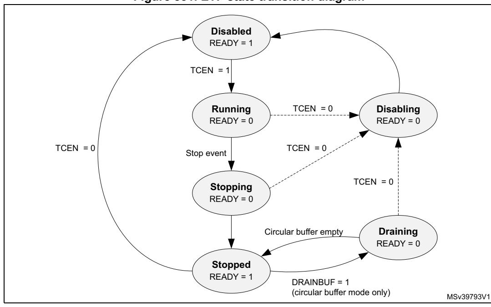

**Figure 881. ETF state transition diagram**

For more information on the CoreSight™ trace memory controller component, refer to the Arm® CoreSight™ trace memory controller technical reference manual *[\[3\]](#page-283-3)*.

### **ETF registers**

### **ETF RAM size register (ETF\_RSZ)**

Address offset: 0x004

Reset value: 0x0000 0400

| 31   | 30         | 29 | 28 | 27 | 26 | 25 | 24 | 23 | 22 | 21 | 20 | 19 | 18 | 17 | 16 |
|------|------------|----|----|----|----|----|----|----|----|----|----|----|----|----|----|
| Res. | RSZ[30:16] |    |    |    |    |    |    |    |    |    |    |    |    |    |    |
|      | r          | r  | r  | r  | r  | r  | r  | r  | r  | r  | r  | r  | r  | r  | r  |
| 15   | 14         | 13 | 12 | 11 | 10 | 9  | 8  | 7  | 6  | 5  | 4  | 3  | 2  | 1  | 0  |
|      | RSZ[15:0]  |    |    |    |    |    |    |    |    |    |    |    |    |    |    |
| r    | r          | r  | r  | r  | r  | r  | r  | r  | r  | r  | r  | r  | r  | r  | r  |

Bit 31 Reserved, must be kept at reset value.

#### Bits 30:0 **RSZ[30:0]**: RAM size

The value of the field indicates the number of 32-bit words

0x400: 1024 words = 4 Kbytes

## **ETF status register (ETF\_STS)**

Address offset: 0x00C Reset value: 0x0000 001C

| 31   | 30   | 29   | 28   | 27   | 26   | 25   | 24   | 23   | 22   | 21   | 20   | 19                | 18    | 17    | 16   |
|------|------|------|------|------|------|------|------|------|------|------|------|-------------------|-------|-------|------|
| Res. | Res. | Res. | Res. | Res. | Res. | Res. | Res. | Res. | Res. | Res. | Res. | Res.              | Res.  | Res.  | Res. |
|      |      |      |      |      |      |      |      |      |      |      |      |                   |       |       |      |
|      |      |      |      |      |      |      |      |      |      |      |      |                   |       |       |      |
| 15   | 14   | 13   | 12   | 11   | 10   | 9    | 8    | 7    | 6    | 5    | 4    | 3                 | 2     | 1     | 0    |
| Res. | Res. | Res. | Res. | Res. | Res. | Res. | Res. | Res. | Res. | Res. |      | EMPTY FTEMP TY | READY | TRIGD | FULL |

Bits 31:5 Reserved, must be kept at reset value.

#### Bit 4 **EMPTY**: Trace FIFO empty

This bit is valid only when the TCEN bit of the ETF\_CTL register is high. This bit reads as zero when TCEN is low.

0: Trace FIFO contains data

1: Trace FIFO is empty.

*Note: Empty trace FIFO does not mean that the ETF pipeline is empty. The latter is indicated by the FTEMPTY bit.*

#### Bit 3 **FTEMPTY**: Formatter empty

This bit is set when trace capture has stopped, and all internal pipelines and buffers have been drained. Unlike READY, it is not affected by buffer drains. The ACQCOMP output reflects the value of this bit.

#### Bit 2 **READY**: ETF ready

This bit is set when trace capture has stopped and all internal pipelines and buffers have been drained (Stopped or Disabled state)

#### Bit 1 **TRIGD**: Triggered

The Triggered bit is set when trace capture is in progress and the TMC has detected a Trigger Event. This bit is cleared when leaving Disabled state.

This bit is operational only in the Circular buffer mode. In all other modes, this bit is always low.

This bit does not indicate that a trigger has been embedded in the formatted output trace data from the TMC. Trigger indication on the output trace stream is determined by the programming of the Formatter and Flush Control Register, ETF\_FFCR.

#### Bit 0 **FULL**: Trace buffer full

In circular buffer mode, this flag is set when the RAM write pointer wraps around the top of the buffer, and remains set until the TCEN bit of the ETF\_CTL register is cleared and set. In software and hardware FIFO modes, this flag indicates that the current space in the trace memory is less than or equal to the value programmed in the ETF\_BUFWM Register, that is, Fill level >= MEM\_SIZE - BUFWM.

This bit is cleared when leaving Disabled state. The FULL output reflects the value of this register bit.

### **ETF RAM read data register (ETF\_RRD)**

Address offset: 0x010 Reset value: Unknown

| 31 | 30         | 29 | 28 | 27 | 26 | 25 | 24 | 23 | 22 | 21 | 20 | 19 | 18 | 17 | 16 |
|----|------------|----|----|----|----|----|----|----|----|----|----|----|----|----|----|
|    | RRD[31:16] |    |    |    |    |    |    |    |    |    |    |    |    |    |    |
| r  | r          | r  | r  | r  | r  | r  | r  | r  | r  | r  | r  | r  | r  | r  | r  |
| 15 | 14         | 13 | 12 | 11 | 10 | 9  | 8  | 7  | 6  | 5  | 4  | 3  | 2  | 1  | 0  |
|    | RRD[15:0]  |    |    |    |    |    |    |    |    |    |    |    |    |    |    |
| r  | r          | r  | r  | r  | r  | r  | r  | r  | r  | r  | r  | r  | r  | r  | r  |

#### Bits 31:0 **RRD[31:0]**: RAM Read Data.

Circular buffer mode:

When in Stopped state and the buffer is not empty, reading this register returns the next word of data from the trace buffer. When the whole trace buffer has been read, the Empty bit in the ETF\_STS Register is set, and subsequent reads return 0xFFFFFFF. Reading this register when not in Stopped state returns 0xFFFFFFFF.

Software FIFO mode:

Reading this register returns data from the FIFO. If this register is read when the FIFO is empty, the data returned is 0xFFFFFFFF.

Hardware FIFO mode:

Reading this register returns 0xFFFFFFFF.

# **ETF RAM read pointer register (ETF\_RRP)**

Address offset: 0x014

Reset value: 0x0000 0000

| 31   | 30   | 29   | 28   | 27        | 26   | 25   | 24   | 23   | 22   | 21   | 20   | 19   | 18   | 17   | 16   |
|------|------|------|------|-----------|------|------|------|------|------|------|------|------|------|------|------|
| Res. | Res. | Res. | Res. | Res.      | Res. | Res. | Res. | Res. | Res. | Res. | Res. | Res. | Res. | Res. | Res. |
|      |      |      |      |           |      |      |      |      |      |      |      |      |      |      |      |
| 15   | 14   | 13   | 12   | 11        | 10   | 9    | 8    | 7    | 6    | 5    | 4    | 3    | 2    | 1    | 0    |
| Res. | Res. | Res. |      | RRP[12:0] |      |      |      |      |      |      |      |      |      |      |      |
|      |      |      | rw   | rw        | rw   | rw   | rw   | rw   | rw   | rw   | rw   | rw   | rw   | rw   | rw   |

Bits 31:13 Reserved, must be kept at reset value.

#### Bits 12:0 **RRP[12:0]**: RAM Read Pointer

The RAM Read Pointer Register contains the value of the read pointer that is used to read entries from the trace memory over the APB interface via the ETF\_RRD register. The pointer can be programmed with a byte address, 64-bit aligned (that is, bits 0 to 3 should be zero). The pointer is incremented by 8 each time a full 64-bit FIFO entry has been written. When the pointer reaches its maximum value, it wraps around.

This register can only be written to while in Disabled state. It can be read in Disabled state, in Stopped state in circular buffer mode and SW FIFO mode, and also in Running and Stopping states in SW FIFO mode.

### **ETF RAM write pointer register (ETF\_RWP)**

Address offset: 0x018

Reset value: 0x0000 0000

| 31   | 30   | 29   | 28   | 27        | 26   | 25   | 24   | 23   | 22   | 21   | 20   | 19   | 18   | 17   | 16   |
|------|------|------|------|-----------|------|------|------|------|------|------|------|------|------|------|------|
| Res. | Res. | Res. | Res. | Res.      | Res. | Res. | Res. | Res. | Res. | Res. | Res. | Res. | Res. | Res. | Res. |
|      |      |      |      |           |      |      |      |      |      |      |      |      |      |      |      |
| 15   | 14   | 13   | 12   | 11        | 10   | 9    | 8    | 7    | 6    | 5    | 4    | 3    | 2    | 1    | 0    |
| Res. | Res. | Res. |      | RWP[12:0] |      |      |      |      |      |      |      |      |      |      |      |
|      |      |      | rw   | rw        | rw   | rw   | rw   | rw   | rw   | rw   | rw   | rw   | rw   | rw   | rw   |

Bits 31:13 Reserved, must be kept at reset value.

#### Bits 12:0 **RWP[12:0]**: RAM write pointer

The RAM write pointer register contains the value of the write pointer that is used to write entries into the trace memory over the APB interface via the ETF\_RWD register. The pointer can be programmed with a byte address, 64-bit aligned (that is, bits 0 to 3 should be zero). The pointer is incremented by 8 each time a full 64-bit FIFO entry has been read. When the pointer reaches its maximum value, it wraps around.

This register can only be written to while in Disabled state. It can be read in Disabled state, in Stopped state in circular buffer mode and SW FIFO mode, and also in Running and Stopping states in SW FIFO mode.

# **ETF trigger counter register (ETF\_TRG)**

Address offset: 0x01C Reset value: 0x0000 0000

| 31   | 30   | 29   | 28   | 27   | 26   | 25   | 24   | 23   | 22   | 21        | 20   | 19   | 18   | 17   | 16   |
|------|------|------|------|------|------|------|------|------|------|-----------|------|------|------|------|------|
| Res. | Res. | Res. | Res. | Res. | Res. | Res. | Res. | Res. | Res. | Res.      | Res. | Res. | Res. | Res. | Res. |
|      |      |      |      |      |      |      |      |      |      |           |      |      |      |      |      |
|      |      |      |      |      |      |      |      |      |      |           |      |      |      |      |      |
| 15   | 14   | 13   | 12   | 11   | 10   | 9    | 8    | 7    | 6    | 5         | 4    | 3    | 2    | 1    | 0    |
| Res. | Res. | Res. | Res. | Res. |      |      |      |      |      | TRG[10:0] |      |      |      |      |      |

Bits 31:11 Reserved, must be kept at reset value.

#### Bits 10:0 **TRG[10:0]**: Trigger counter

In Circular buffer mode, specifies the number of 32-bit words to capture in the trace RAM following the detection of either a rising edge on the TRIGIN input or a trigger packet in the incoming trace stream, ATID =7'h7D. On capturing the specified number of data words, a trigger event occurs. The effect of a trigger event on the ETF behavior is controlled by the FFCR Register.

The number of 32-bit words written into the trace RAM following the trigger is the value stored in this register, plus one. This register is ignored when the ETF is in Software FIFO mode or Hardware FIFO mode. When the trigger counter starts counting, any additional triggers, either on TRIGIN or in the incoming trace stream, are ignored until the counter reaches zero. When the trigger counter has reached zero, it remains at zero until it is re-programmed with a write to this register.

This register is cleared when READY goes high, so that the state of the counter when trace capture has stopped does not affect a subsequent trace capture session. Writing to this register when not in Disabled state results in unpredictable behavior.

A read access to this register is permitted at any time when in Disabled state, or in Circular buffer mode. A read access returns the current value of the trigger counter.

### **ETF control register (ETF\_CTL)**

Address offset: 0x020

Reset value: 0x0000 0000

| 31   | 30   | 29   | 28   | 27   | 26   | 25   | 24   | 23   | 22   | 21   | 20   | 19   | 18   | 17   | 16   |
|------|------|------|------|------|------|------|------|------|------|------|------|------|------|------|------|
| Res. | Res. | Res. | Res. | Res. | Res. | Res. | Res. | Res. | Res. | Res. | Res. | Res. | Res. | Res. | Res. |
|      |      |      |      |      |      |      |      |      |      |      |      |      |      |      |      |
| 15   | 14   | 13   | 12   | 11   | 10   | 9    | 8    | 7    | 6    | 5    | 4    | 3    | 2    | 1    | 0    |
|      |      |      |      |      |      |      |      |      |      |      |      |      |      |      |      |
| Res. | Res. | Res. | Res. | Res. | Res. | Res. | Res. | Res. | Res. | Res. | Res. | Res. | Res. | Res. | TCEN |

RM0399 Rev 4 3307/3556

Bits 31:1 Reserved, must be kept at reset value.

Bit 0 **TCEN**: Trace capture enable

When writing:

0: Disable trace capture (moves from Running, Stopping or Stopped state into Disabling or Disabled state)

1: Enable trace capture (moves from Disabled state to Running state)

When reading, this bit is low when in Disabling or Disabled states, and high otherwise.

### **ETF RAM write data register (ETF\_RWD)**

Address offset: 0x024 Reset value: 0x0000 0000

| 31 | 30         | 29 | 28 | 27 | 26 | 25 | 24 | 23        | 22 | 21 | 20 | 19 | 18 | 17 | 16 |
|----|------------|----|----|----|----|----|----|-----------|----|----|----|----|----|----|----|
|    | RWD[31:16] |    |    |    |    |    |    |           |    |    |    |    |    |    |    |
| w  | w          | w  | w  | w  | w  | w  | w  | w         | w  | w  | w  | w  | w  | w  | w  |
| 15 | 14         | 13 | 12 | 11 | 10 | 9  | 8  | 7         | 6  | 5  | 4  | 3  | 2  | 1  | 0  |
|    |            |    |    |    |    |    |    | RWD[15:0] |    |    |    |    |    |    |    |
| w  | w          | w  | w  | w  | w  | w  | w  | w         | w  | w  | w  | w  | w  | w  | w  |

Bits 31:0 **RWD[31:0]**: RAM write data

When in Disabled state, a write to this register stores data at the location pointed to by the RWP. Writes to this register when not in Disabled state are ignored. When a full memory width (64-bit) of data has been written, the data is written to memory and the RAM Write Pointer is incremented to the next memory word.

This register is used for test purposes.

### **ETF mode register (ETF\_MODE)**

Address offset: 0x028 Reset value: 0x0000 0000

| 31   | 30   | 29   | 28   | 27   | 26   | 25   | 24   | 23   | 22   | 21   | 20   | 19   | 18   | 17   | 16        |
|------|------|------|------|------|------|------|------|------|------|------|------|------|------|------|-----------|
| Res. | Res. | Res. | Res. | Res. | Res. | Res. | Res. | Res. | Res. | Res. | Res. | Res. | Res. | Res. | Res.      |
|      |      |      |      |      |      |      |      |      |      |      |      |      |      |      |           |
| 15   | 14   | 13   | 12   | 11   | 10   | 9    | 8    | 7    | 6    | 5    | 4    | 3    | 2    | 1    | 0         |
| Res. | Res. | Res. | Res. | Res. | Res. | Res. | Res. | Res. | Res. | Res. | Res. | Res. | Res. |      | MODE[1:0] |
|      |      |      |      |      |      |      |      |      |      |      |      |      |      | rw   | rw        |

Bits 31:2 Reserved, must be kept at reset value.

#### Bits 1:0 **MODE[1:0]**: Operation mode

00b: Circular buffer mode

In this mode, the trace memory is used as a circular buffer. Trace data is captured into the Trace memory starting from the location pointed to by the write pointer register. Even when the trace memory is full, incoming trace data continues to be overwritten into the trace memory until a stop condition has occurred.

01b: Software FIFO mode

In this mode, the trace memory is used as a FIFO that can be read through the RRD Register while trace is being captured. Trace data is captured into the trace RAM and when full, the incoming trace stream is stalled.

10b: Hardware FIFO mode

In this mode, the trace memory is used as a FIFO that is drained through the ATB master interface. Trace data is captured into the trace RAM and when full, the incoming trace stream is stalled. When the trace buffer is non-empty, trace data is drained out through the ATB master interface to the TPIU.

11b: Reserved

### **ETF latched buffer fill level register (ETF\_LBUFLVL)**

Address offset: 0x02C Reset value: 0x0000 0000

| 31   | 30   | 29   | 28   | 27   | 26              | 25   | 24   | 23   | 22   | 21   | 20   | 19   | 18   | 17   | 16   |  |
|------|------|------|------|------|-----------------|------|------|------|------|------|------|------|------|------|------|--|
| Res. | Res. | Res. | Res. | Res. | Res.            | Res. | Res. | Res. | Res. | Res. | Res. | Res. | Res. | Res. | Res. |  |
| 15   | 14   | 13   | 12   | 11   | 10              | 9    | 8    | 7    | 6    | 5    | 4    | 3    | 2    | 1    | 0    |  |
| Res. | Res. | Res. | Res. |      | LBUFLEVEL[11:0] |      |      |      |      |      |      |      |      |      |      |  |
|      |      |      |      | r    | r               | r    | r    | r    | r    | r    | r    | r    | r    | r    | r    |  |

Bits 31:12 Reserved, must be kept at reset value.

### Bits 11:0 **LBUFLEVEL[11:0]**: Latched buffer fill level

Reading this register returns the maximum fill level of the trace memory in 32-bit words since this register was last read. Reading this register also results in its contents being updated to the current fill level.

When entering Disabled state, this register retains its last value. While in Disabled state, reads from this register do not affect its value. When exiting Disabled state, the LBUFLEVEL register is cleared.

This register is used for performance analysis of the trace system.

### **ETF current buffer fill level register (ETF\_CBUFLVL)**

Address offset: 0x030 Reset value: 0x0000 0000

| 31   | 30   | 29   | 28   | 27   | 26   | 25   | 24   | 23   | 22   | 21   | 20   | 19   | 18   | 17   | 16   |
|------|------|------|------|------|------|------|------|------|------|------|------|------|------|------|------|
| Res. | Res. | Res. | Res. | Res. | Res. | Res. | Res. | Res. | Res. | Res. | Res. | Res. | Res. | Res. | Res. |
|      |      |      |      |      |      |      |      |      |      |      |      |      |      |      |      |

RM0399 Rev 4 3309/3556

| 15   | 14   | 13   | 12   | 11              | 10 | 9 | 8 | 7 | 6 | 5 | 4 | 3 | 2 | 1 | 0 |
|------|------|------|------|-----------------|----|---|---|---|---|---|---|---|---|---|---|
| Res. | Res. | Res. | Res. | CBUFLEVEL[11:0] |    |   |   |   |   |   |   |   |   |   |   |
|      |      |      |      | r               | r  | r | r | r | r | r | r | r | r | r | r |

Bits 31:12 Reserved, must be kept at reset value.

#### Bits 11:0 **CBUFLEVEL[11:0]**: Current buffer fill level

Reading this register returns the current fill level of the trace memory in 32-bit words. This register is cleared when TCEN is low.

### **ETF buffer level watermark register (ETF\_BUFWM)**

Address offset: 0x034

Reset value: 0x0000 0000

| 31   | 30   | 29   | 28   | 27   | 26   | 25          | 24   | 23   | 22   | 21   | 20   | 19   | 18   | 17   | 16   |  |
|------|------|------|------|------|------|-------------|------|------|------|------|------|------|------|------|------|--|
| Res. | Res. | Res. | Res. | Res. | Res. | Res.        | Res. | Res. | Res. | Res. | Res. | Res. | Res. | Res. | Res. |  |
|      |      |      |      |      |      |             |      |      |      |      |      |      |      |      |      |  |
| 15   | 14   | 13   | 12   | 11   | 10   | 9           | 8    | 7    | 6    | 5    | 4    | 3    | 2    | 1    | 0    |  |
| Res. | Res. | Res. | Res  | Res  |      | BUFWM[10:0] |      |      |      |      |      |      |      |      |      |  |
|      |      |      |      |      | rw   | rw          | rw   | rw   | rw   | rw   | rw   | rw   | rw   | rw   | rw   |  |

Bits 31:11 Reserved, must be kept at reset value.

#### Bits 10:0 **BUFWM[10:0]**: Buffer level watermark

The value programmed into this register indicates the required threshold vacancy level in the trace memory in 32-bit words. When the space in the FIFO is less than or equal to this value, that is, Fill level >= MEM\_SIZE - BUFWM, the FULL output is pulled high and the FULL bit in the STS Register is set.

This register is used only in Software FIFO and Hardware FIFO modes. In Circular buffer mode, this functionality can be obtained by programming the RWP to the required vacancy trigger level, so that when the pointer wraps around, the FULL bit is set indicating that the vacancy level has fallen below the required level.

The maximum value that can be written into this register is MEM\_SIZE - 1. In this case, the FULL bit output is asserted after the first 32-bit word is written to trace memory.

Writing to this register other than when in disabled state results in unpredictable behavior.

### **ETF formatter and flush status register (ETF\_FFSR)**

Address offset: 0x300

| 31   | 30   | 29   | 28   | 27   | 26   | 25   | 24   | 23   | 22   | 21   | 20   | 19   | 18   | 17            | 16           |
|------|------|------|------|------|------|------|------|------|------|------|------|------|------|---------------|--------------|
| Res. | Res. | Res. | Res. | Res. | Res. | Res. | Res. | Res. | Res. | Res. | Res. | Res. | Res. | Res.          | Res.         |
| 15   | 14   | 13   | 12   | 11   | 10   | 9    | 8    | 7    | 6    | 5    | 4    | 3    | 2    | 1             | 0            |
| Res. | Res. | Res. | Res. | Res. | Res. | Res. | Res. | Res. | Res. | Res. | Res. | Res. | Res. | FTSTO PPED | FLINPR OG |
|      |      |      |      |      |      |      |      |      |      |      |      |      |      | r             | r            |

Bits 31:2 Reserved, must be kept at reset value.

#### Bit 1 FTSTOPPED: Formatter stopped

This bit behaves in the same way as the FTEMPTY bit in the ETF STS register.

#### Bit 0 FLINPROG: Flush in progress

Indicates whether a flush on the ATB slave port is in progress. This bit reflects the status of the AFVALIDS output. A flush can be initiated by the flush control bits in the ETF\_FFCR register, or requested by the ATB master port.

0: No flush in progress1: Flush in progress

### ETF formatter and flush control register (ETF\_FFCR)

Address offset: 0x304 Reset value: 0x0000 0000

| 31   | 30            | 29                  | 28           | 27   | 26            | 25             | 24             | 23   | 22           | 21            | 20          | 19   | 18   | 17   | 16   |
|------|---------------|---------------------|--------------|------|---------------|----------------|----------------|------|--------------|---------------|-------------|------|------|------|------|
| Res. | Res.          | Res.                | Res.         | Res. | Res.          | Res.           | Res.           |      | Res.         | Res.          | Res.        | Res. | Res. | Res. | Res. |
|      |               |                     |              |      |               |                |                |      |              |               |             |      |      |      |      |
| 15   | 14            | 13                  | 12           | 11   | 10            | 9              | 8              | 7    | 6            | 5             | 4           | 3    | 2    | 1    | 0    |
| Res. | DRAIN BUF. | STPO NTRG EV. | STOP ONFL | Res. | TRIGO NFL. | TRGON TRGEV | TRGON TRGIN | Res. | FLUSH MAN | FONTR GEV. | FONFLI N | Res. | Res. | ENTI | ENFT |
|      | rw            | rw                  | rw           |      | rw            | rw             | rw             |      | rw           | rw            | rw          |      |      | rw   | rw   |

Bits 31:15 Reserved, must be kept at reset value.

#### Bit 14 **DRAINBUF**: Drain buffer

This bit is used to enable draining of the trace data through the ATB master interface after the formatter has stopped. This is useful in Circular buffer mode to capture trace data into trace memory and then to drain the captured trace through the ATB master interface.

Writing a one to this bit when in Stopped state starts the drain of the trace buffer content through the ATB Master interface. This bit always reads as zero. The READY bit in the ETF\_STS register goes low while the drain is in progress.

This bit is only functional when the ETF is in Circular buffer mode and formatting is enabled, that is, the ENFT bit in the ETF\_FFCR register is set. Setting this bit when the ETF is in any other mode, or when not in Stopped state, results in Unpredictable behavior.

When trace capture is complete in Circular buffer mode, all of the captured trace must be retrieved from the trace memory through the same mechanism, either read all trace data out through RRD reads, or drain all trace data by setting the DRAINBUF bit. Setting the DRAINBUF bit after some of the captured trace has been read out through RRD results in unpredictable behavior.

#### Bit 13 STPONTRGEV: Stop on trigger event

0: No effect

1: Stop trace capture when a trigger event occurs

Enabling the ETF in Software FIFO mode or Hardware FIFO mode with this bit set results in unpredictable behavior.

RM0399 Rev 4 3311/3556

#### Bit 12 **STOPONFL**: Stop on flush

- 0: No effect
- 1: Stop trace capture when flush is completed

If a flush is initiated by the ATB master interface, its completion does not lead to a formatter stop regardless of the value programmed in this bit.

Bit 11 Reserved, must be kept at reset value.

### Bit 10 **TRIGONFL**: Trigger on flush

- 0: No effect
- 1: Indicate a trigger in the trace stream when flush is completed

If ENFT and ENTI are both clear, this bit is ignored and no trigger is inserted into the trace stream.

If a flush is initiated by the ATB master interface, its completion does not lead to a trigger indication regardless of the value programmed in this bit.

#### Bit 9 **TRGONTRGEV**: Trigger on trigger event

- 0: No effect
- 1: Indicate a trigger in the trace stream when trigger event occurs

If ENFT and ENTI are both clear, this bit is ignored and no trigger is inserted into the trace stream.

This bit is not supported in Software FIFO mode or Hardware FIFO mode.

#### Bit 8 **TRGONTRGIN**: Trigger on trigger in

- 0: No effect
- 1: Indicate a trigger in the trace stream when a rising edge is detected on the TRIGIN input.

If ENFT and ENTI are both clear, this bit is ignored and no trigger is inserted into the trace stream.

Bit 7 Reserved, must be kept at reset value.

#### Bit 6 **FLUSHMAN**: Manual flush

- 0: No effect
- 1: Flush the trace FIFO and pipeline

This bit is cleared automatically when the flush completes. If the TCEN bit in the ETF\_CTL register is 0, writes to this bit are ignored.

#### Bit 5 **FONTRGEV**: Flush on trigger event

- 0: No effect
- 1: Flush the trace FIFO and pipeline if a trigger event occurs

This bit is not supported in Software FIFO mode or Hardware FIFO mode. If STPONTRGEV is set, this bit is ignored.

#### Bit 4 **FONFLIN**: Flush on flush in

- 0: No effect
- 1: Flush the trace FIFO and pipeline if when a rising edge is detected on the FLUSHIN input

#### Bits 3:2 Reserved, must be kept at reset value.

#### Bit 1 **ENTI**: Enable trigger insertion

Setting this bit enables the insertion of triggers in the formatted trace stream. A trigger is flagged by inserting one byte of data 8'h00 with ATID 7'h7D in the trace stream. Trigger indication on the trace stream is further controlled by the register bits TRIGONFL, TRGONTRGEV, and TRGONTRGIN in the FFCR Register. This bit can only be changed when READY is high, and TCEN is low. This bit takes effect only when the ENFT register bit in this register is set. If ENTI bit is set to high when ENFT is low, it results in formatting being enabled.

#### Bit 0 **ENFT**: Enable formatting.

- 0: Formatting is disabled. Incoming trace data is assumed to be from a single trace source.
- 1: Formatting is enabled.

If multiple ATIDs are received by the ETF when trace capture is enabled and the formatter is disabled, an interleaving of trace data occurs. Disabling of formatting is supported only in Circular buffer mode. If the ETF is enabled in a mode other than Circular buffer mode with ENFT low, then formatting is enabled. If ENTI bit is set to high when ENFT is low, it results in formatting being enabled.

This bit is ignored when in Disabled state.

### **ETF periodic synchronization counter register (ETF\_PSCR)**

Address offset: 0x308 Reset value: 0x0000 000A

| 31   | 30   | 29   | 28   | 27   | 26   | 25   | 24   | 23   | 22   | 21   | 20   | 19           | 18   | 17   | 16   |  |
|------|------|------|------|------|------|------|------|------|------|------|------|--------------|------|------|------|--|
| Res. | Res. | Res. | Res. | Res. | Res. | Res. | Res. | Res. | Res. | Res. | Res. | Res.         | Res. | Res. | Res. |  |
| 15   | 14   | 13   | 12   | 11   | 10   | 9    | 8    | 7    | 6    | 5    | 4    | 3            | 2    | 1    | 0    |  |
| Res. | Res. | Res. | Res. | Res. | Res. | Res. | Res. | Res. | Res. | Res. |      | PSCOUNT[4:0] |      |      |      |  |
|      |      |      |      |      |      |      |      |      |      |      | rw   | rw           | rw   | rw   | rw   |  |

Bits 31:5 Reserved, must be kept at reset value.

### Bits 4:0 **PSCOUNT[4:0]**: Synchronization counter reload value

Determines the reload value of the Synchronization Counter. The reload value takes effect the next time the counter reaches zero. Reads from this register return the reload value programmed into this register. This register is set to 0xA on reset, corresponding to a synchronization period of 1024 bytes.

0x0: Synchronization disabled

0x1-0x6: Reserved

0x7-0x1B: Synchronization period is 2PSCOUNT bytes

0x1C-0x1F: Reserved

RM0399 Rev 4 3313/3556

### **ETF claim tag set register (ETF\_CLAIMSET)**

Address offset: 0xFA0 Reset value: 0x0000 000F

| 31   | 30   | 29   | 28   | 27   | 26   | 25   | 24   | 23   | 22   | 21   | 20   | 19            | 18   | 17   | 16   |
|------|------|------|------|------|------|------|------|------|------|------|------|---------------|------|------|------|
| Res. | Res. | Res. | Res. | Res. | Res. | Res. | Res. | Res. | Res. | Res. | Res. | Res.          | Res. | Res. | Res. |
|      |      |      |      |      |      |      |      |      |      |      |      |               |      |      |      |
| 15   | 14   | 13   | 12   | 11   | 10   | 9    | 8    | 7    | 6    | 5    | 4    | 3             | 2    | 1    | 0    |
| Res. | Res. | Res. | Res. | Res. | Res. | Res. | Res. | Res. | Res. | Res. | Res. | CLAIMSET[3:0] |      |      |      |
|      |      |      |      |      |      |      |      |      |      |      |      | rw            | rw   | rw   | rw   |

Bits 31:4 Reserved, must be kept at reset value.

#### Bits 3:0 **CLAIMSET[3:0]**: Set claim tag bits

Write:

0000: No effect xxx1: Set bit 0 xx1x: Set bit 1 x1xx: Set bit 2 1xxx: Set bit 3

Read:

0xF: Indicates there are four bits in claim tag

### **ETF claim tag clear register (ETF\_CLAIMCLR)**

Address offset: 0xFA4

Reset value: 0x0000 0000

| 31   | 30   | 29   | 28   | 27   | 26   | 25   | 24   | 23   | 22   | 21   | 20   | 19   | 18            | 17   | 16   |  |
|------|------|------|------|------|------|------|------|------|------|------|------|------|---------------|------|------|--|
| Res. | Res. | Res. | Res. | Res. | Res. | Res. | Res. | Res. | Res. | Res. | Res. | Res. | Res.          | Res. | Res. |  |
|      |      |      |      |      |      |      |      |      |      |      |      |      |               |      |      |  |
| 15   | 14   | 13   | 12   | 11   | 10   | 9    | 8    | 7    | 6    | 5    | 4    | 3    | 2             | 1    | 0    |  |
|      |      |      |      |      |      |      |      |      |      |      |      |      | CLAIMCLR[3:0] |      |      |  |
| Res. | Res. | Res. | Res. | Res. | Res. | Res. | Res. | Res. | Res. | Res. | Res. |      |               |      |      |  |

Bits 31:4 Reserved, must be kept at reset value.

#### Bits 3:0 **CLAIMCLR[3:0]**: Reset claim tag bits

Write:

0000: No effect xxx1: Clear bit 0 xx1x: Clear bit 1 x1xx: Clear bit 2 1xxx: Clear bit 3

Read: Returns current value of claim tag

### **ETF lock access register (ETF\_LAR)**

Address offset: 0xFB0

Reset value: N/A

| 31 | 30              | 29 | 28 | 27 | 26 | 25 | 24 | 23 | 22 | 21 | 20 | 19 | 18 | 17 | 16 |
|----|-----------------|----|----|----|----|----|----|----|----|----|----|----|----|----|----|
|    | ACCESS_W[31:16] |    |    |    |    |    |    |    |    |    |    |    |    |    |    |
| w  | w               | w  | w  | w  | w  | w  | w  | w  | w  | w  | w  | w  | w  | w  | w  |
| 15 | 14              | 13 | 12 | 11 | 10 | 9  | 8  | 7  | 6  | 5  | 4  | 3  | 2  | 1  | 0  |
|    | ACCESS_W[15:0]  |    |    |    |    |    |    |    |    |    |    |    |    |    |    |
| w  | w               | w  | w  | w  | w  | w  | w  | w  | w  | w  | w  | w  | w  | w  | w  |

#### Bits 31:0 **ACCESS\_W[31:0]**: ETF register access enable

Enables write access to some ETF registers by processor cores (debuggers do not need to unlock the component)

0xC5ACCE55: Enable write access Other values: Disable write access

## **ETF lock status register (ETF\_LSR)**

Address offset: 0xFB4

Reset value: 0x0000 0003

| 31   | 30   | 29   | 28   | 27   | 26   | 25   | 24   | 23   | 22   | 21   | 20   | 19   | 18           | 17            | 16            |
|------|------|------|------|------|------|------|------|------|------|------|------|------|--------------|---------------|---------------|
| Res. | Res. | Res. | Res. | Res. | Res. | Res. | Res. | Res. | Res. | Res. | Res. | Res. | Res.         | Res.          | Res.          |
| 15   | 14   | 13   | 12   | 11   | 10   | 9    | 8    | 7    | 6    | 5    | 4    | 3    | 2            | 1             | 0             |
| Res. | Res. | Res. | Res. | Res. | Res. | Res. | Res. | Res. | Res. | Res. | Res. | Res. | LOCK TYPE | LOCK GRANT | LOCK EXIST |
|      |      |      |      |      |      |      |      |      |      |      |      |      | r            | r             | r             |

Bits 31:3 Reserved, must be kept at reset value.

Bit 2 **LOCKTYPE**: Size of the ETF\_LAR register

0: 32-bit

Bit 1 **LOCKGRANT**: Current status of lock

This bit always returns zero when read by an external debugger.

- 0: Write access is permitted
- 1: Write access is blocked. Only read access is permitted.
- Bit 0 **LOCKEXIST**: Existence of lock control mechanism

The bit indicates whether a lock control mechanism exists. It always returns zero when read by an external debugger.

- 0: No lock control mechanism exists
- 1: Lock control mechanism is implemented

# **ETF authentication status register (ETF\_AUTHSTAT)**

Address offset: 0xFB8 Reset value: 0x0000 0000

| 31   | 30   | 29   | 28   | 27   | 26   | 25   | 24   | 23   | 22        | 21   | 20       | 19   | 18         | 17   | 16        |
|------|------|------|------|------|------|------|------|------|-----------|------|----------|------|------------|------|-----------|
| Res. | Res. | Res. | Res. | Res. | Res. | Res. | Res. | Res. | Res.      | Res. | Res.     | Res. | Res.       | Res. | Res.      |
|      |      |      |      |      |      |      |      |      |           |      |          |      |            |      |           |
| 15   | 14   | 13   | 12   | 11   | 10   | 9    | 8    | 7    | 6         | 5    | 4        | 3    | 2          | 1    | 0         |
|      |      |      |      |      |      |      |      |      |           |      |          |      |            |      |           |
| Res. | Res. | Res. | Res. | Res. | Res. | Res. | Res. |      | SNID[1:0] |      | SID[1:0] |      | NSNID[1:0] |      | NSID[1:0] |

Bits 31:8 Reserved, must be kept at reset value.

Bits 7:6 **SNID[1:0]**: Security level for secure non-invasive debug

0x0: Not implemented

Bits 5:4 **SID[1:0]**: Security level for secure invasive debug

0x0: Not implemented

Bits 3:2 **NSNID[1:0]**: Security level for non-secure non-invasive debug

0x0: Not implemented

Bits 1:0 **NSID[1:0]**: Security level for non-secure invasive debug

0x0: Not implemented

# **ETF device configuration register (ETF\_DEVID)**

Address offset: 0xFC8

Reset value: 0x0000 01C0

| 31   | 30   | 29   | 28   | 27   | 26   | 25            | 24   | 23   | 22             | 21           | 20   | 19   | 18                | 17   | 16   |
|------|------|------|------|------|------|---------------|------|------|----------------|--------------|------|------|-------------------|------|------|
| Res. | Res. | Res. | Res. | Res. | Res. | Res.          | Res. | Res. | Res.           | Res.         | Res. | Res. | Res.              | Res. | Res. |
| 15   | 14   | 13   | 12   | 11   | 10   | 9             | 8    | 7    | 6              | 5            | 4    | 3    | 2                 | 1    | 0    |
| Res. | Res. | Res. | Res. | Res. |      | MEMWIDTH[2:0] |      |      | CONFIGTYP[1:0] | CLK SCHEM |      |      | ATBINPORTCNT[4:0] |      |      |
|      |      |      |      |      | r    | r             | r    | r    | r              | r            | r    | r    | r                 | r    | r    |

Bits 31:11 Reserved, must be kept at reset value.

Bits 10:8 **MEMWIDTH[2:0]**: Memory interface data bus width

0x3: 64 bits (corresponds to 32-bit ATB data)

Bits 7:6 **CONFIGTYP[1:0]**: Configuration type of component (ETB, ETR or ETF)

0x2: ETF

Bit 5 **CLKSCHEM**: RAM clocking scheme (synchronous or asynchronous)

0: Synchronous

Bits 4:0 **ATBINPORTCNT**[4:0]: Number/type of ATB input port multiplexing

0x0: None

# **ETF device type identifier register (ETF\_DEVTYPE)**

Address offset: 0xFCC Reset value: 0x0000 0032

| 31   | 30   | 29   | 28   | 27   | 26   | 25   | 24   | 23   | 22   | 21           | 20   | 19   | 18   | 17             | 16   |
|------|------|------|------|------|------|------|------|------|------|--------------|------|------|------|----------------|------|
| Res. | Res. | Res. | Res. | Res. | Res. | Res. | Res. | Res. | Res. | Res.         | Res. | Res. | Res. | Res.           | Res. |
|      |      |      |      |      |      |      |      |      |      |              |      |      |      |                |      |
| 15   | 14   | 13   | 12   | 11   | 10   | 9    | 8    | 7    | 6    | 5            | 4    | 3    | 2    | 1              | 0    |
| Res. | Res. | Res. | Res. | Res. | Res. | Res. | Res. |      |      | SUBTYPE[3:0] |      |      |      | MAJORTYPE[3:0] |      |
|      |      |      |      |      |      |      |      | r    | r    | r            | r    | r    | r    | r              | r    |

Bits 31:8 Reserved, must be kept at reset value.

#### Bits 7:4 **SUBTYPE[3:0]**: Sub-classification

0x3: Captures trace data from the ATB slave interface into RAM that can be drained through the ATB master interface

#### Bits 3:0 **MAJORTYPE[3:0]**: Major classification

0x2: Component is a trace link because it has an ATB master interface through which trace data can be drained out in Hardware FIFO mode.

# **ETF CoreSight peripheral identity register 4 (ETF\_PIDR4)**

Address offset: 0xFD0 Reset value: 0x0000 0004

| 31   | 30   | 29   | 28   | 27   | 26   | 25   | 24   | 23   | 22   | 21           | 20   | 19   | 18   | 17             | 16   |
|------|------|------|------|------|------|------|------|------|------|--------------|------|------|------|----------------|------|
| Res. | Res. | Res. | Res. | Res. | Res. | Res. | Res. | Res. | Res. | Res.         | Res. | Res. | Res. | Res.           | Res. |
|      |      |      |      |      |      |      |      |      |      |              |      |      |      |                |      |
|      |      |      |      |      |      |      |      |      |      |              |      |      |      |                |      |
| 15   | 14   | 13   | 12   | 11   | 10   | 9    | 8    | 7    | 6    | 5            | 4    | 3    | 2    | 1              | 0    |
| Res. | Res. | Res. | Res. | Res. | Res. | Res. | Res. |      |      | 4KCOUNT[3:0] |      |      |      | JEP106CON[3:0] |      |

Bits 31:8 Reserved, must be kept at reset value.

#### Bits 7:4 **4KCOUNT[3:0]**: Register file size

0x0: Register file occupies a single 4 Kbyte region

### Bits 3:0 **JEP106CON[3:0]**: JEP106 continuation code

0x4: Arm® JEDEC code

# **ETF CoreSight peripheral identity register 0 (ETF\_PIDR0)**

Address offset: 0xFE0 Reset value: 0x0000 0061

| 31   | 30   | 29   | 28   | 27   | 26   | 25   | 24   | 23   | 22   | 21   | 20   | 19           | 18   | 17   | 16   |
|------|------|------|------|------|------|------|------|------|------|------|------|--------------|------|------|------|
| Res. | Res. | Res. | Res. | Res. | Res. | Res. | Res. | Res. | Res. | Res. | Res. | Res.         | Res. | Res. | Res. |
|      |      |      |      |      |      |      |      |      |      |      |      |              |      |      |      |
| 15   |      |      |      |      |      |      |      |      |      |      |      |              |      |      |      |
|      | 14   | 13   | 12   | 11   | 10   | 9    | 8    | 7    | 6    | 5    | 4    | 3            | 2    | 1    | 0    |
| Res. | Res. | Res. | Res. | Res. | Res. | Res. | Res. |      |      |      |      | PARTNUM[7:0] |      |      |      |

Bits 31:8 Reserved, must be kept at reset value.

Bits 7:0 **PARTNUM[7:0]**: Part number field, bits [7:0]

0x61: ETF part number

### **ETF CoreSight peripheral identity register 1 (ETF\_PIDR1)**

Address offset: 0xFE4

Reset value: 0x0000 00B9

| 31   | 30   | 29   | 28   | 27   | 26   | 25   | 24   | 23   | 22   | 21            | 20   | 19   | 18   | 17            | 16   |
|------|------|------|------|------|------|------|------|------|------|---------------|------|------|------|---------------|------|
| Res. | Res. | Res. | Res. | Res. | Res. | Res. | Res. | Res. | Res. | Res.          | Res. | Res. | Res. | Res.          | Res. |
|      |      |      |      |      |      |      |      |      |      |               |      |      |      |               |      |
|      |      |      |      |      |      |      |      |      |      |               |      |      |      |               |      |
| 15   | 14   | 13   | 12   | 11   | 10   | 9    | 8    | 7    | 6    | 5             | 4    | 3    | 2    | 1             | 0    |
| Res. | Res. | Res. | Res. | Res. | Res. | Res. | Res. |      |      | JEP106ID[3:0] |      |      |      | PARTNUM[11:8] |      |

Bits 31:8 Reserved, must be kept at reset value.

Bits 7:4 **JEP106ID[3:0]**: JEP106 identity code field, bits [3:0]

0xB: Arm® JEDEC code

Bits 3:0 **PARTNUM[11:8]**: Part number field, bits [11:8]

0x9: ETF part number

### **ETF CoreSight peripheral identity register 2 (ETF\_PIDR2)**

Address offset: 0xFE8

Reset value: 0x0000 001B

| 31   | 30   | 29   | 28   | 27   | 26   | 25   | 24   | 23   | 22   | 21            | 20   | 19    | 18   | 17            | 16   |
|------|------|------|------|------|------|------|------|------|------|---------------|------|-------|------|---------------|------|
| Res. | Res. | Res. | Res. | Res. | Res. | Res. | Res. | Res. | Res. | Res.          | Res. | Res.  | Res. | Res.          | Res. |
|      |      |      |      |      |      |      |      |      |      |               |      |       |      |               |      |
| 15   | 14   | 13   | 12   | 11   | 10   | 9    | 8    | 7    | 6    | 5             | 4    | 3     | 2    | 1             | 0    |
| Res. | Res. | Res. | Res. | Res. | Res. | Res. | Res. |      |      | REVISION[3:0] |      | JEDEC |      | JEP106ID[6:4] |      |
|      |      |      |      |      |      |      |      | r    | r    | r             | r    | r     | r    | r             | r    |

Bits 31:8 Reserved, must be kept at reset value.

Bits 7:4 **REVISION[3:0]**: Component revision number

0x1: r0p1

Bit 3 **JEDEC**: JEDEC assigned value

1: Designer ID specified by JEDEC

Bits 2:0 **JEP106ID[6:4]**: JEP106 identity code field, bits [6:4]

0x3: Arm® JEDEC code

# **ETF CoreSight peripheral identity register 3 (ETF\_PIDR3)**

Address offset: 0xFEC Reset value: 0x0000 0000

| 31   | 30   | 29   | 28   | 27   | 26   | 25   | 24   | 23   | 22   | 21          | 20   | 19   | 18   | 17        | 16   |
|------|------|------|------|------|------|------|------|------|------|-------------|------|------|------|-----------|------|
| Res. | Res. | Res. | Res. | Res. | Res. | Res. | Res. | Res. | Res. | Res.        | Res. | Res. | Res. | Res.      | Res. |
|      |      |      |      |      |      |      |      |      |      |             |      |      |      |           |      |
| 15   | 14   | 13   | 12   | 11   | 10   | 9    | 8    |      |      |             |      |      |      |           |      |
|      |      |      |      |      |      |      |      | 7    | 6    | 5           | 4    | 3    | 2    | 1         | 0    |
| Res. | Res. | Res. | Res. | Res. | Res. | Res. | Res. |      |      | REVAND[3:0] |      |      |      | CMOD[3:0] |      |

Bits 31:8 Reserved, must be kept at reset value.

Bits 7:4 **REVAND[3:0]**: Metal fix version

0x0: No metal fix

Bits 3:0 **CMOD[3:0]**: Customer modified

0x0: No customer modifications

### **ETF CoreSight component identity register 0 (ETF\_CIDR0)**

Address offset: 0xFF0

Reset value: 0x0000 000D

| 31   | 30   | 29   | 28   | 27   | 26   | 25   | 24   | 23   | 22   | 21   | 20   | 19            | 18   | 17   | 16   |
|------|------|------|------|------|------|------|------|------|------|------|------|---------------|------|------|------|
| Res. | Res. | Res. | Res. | Res. | Res. | Res. | Res. | Res. | Res. | Res. | Res. | Res.          | Res. | Res. | Res. |
|      |      |      |      |      |      |      |      |      |      |      |      |               |      |      |      |
|      |      |      |      |      |      |      |      |      |      |      |      |               |      |      |      |
| 15   | 14   | 13   | 12   | 11   | 10   | 9    | 8    | 7    | 6    | 5    | 4    | 3             | 2    | 1    | 0    |
| Res. | Res. | Res. | Res. | Res. | Res. | Res. | Res. |      |      |      |      | PREAMBLE[7:0] |      |      |      |

Bits 31:8 Reserved, must be kept at reset value.

Bits 7:0 **PREAMBLE[7:0]**: Component ID field, bits [7:0]

0x0D: Common ID value

RM0399 Rev 4 3319/3556

# **ETF CoreSight component identity register 1 (ETF\_CIDR1)**

Address offset: 0xFF4

Reset value: 0x0000 0090

| 31   | 30   | 29   | 28   | 27   | 26   | 25   | 24   | 23   | 22   | 21         | 20   | 19   | 18   | 17             | 16   |
|------|------|------|------|------|------|------|------|------|------|------------|------|------|------|----------------|------|
| Res. | Res. | Res. | Res. | Res. | Res. | Res. | Res. | Res. | Res. | Res.       | Res. | Res. | Res. | Res.           | Res. |
|      |      |      |      |      |      |      |      |      |      |            |      |      |      |                |      |
| 15   | 14   | 13   | 12   | 11   | 10   | 9    | 8    | 7    | 6    | 5          | 4    | 3    | 2    | 1              | 0    |
| Res. | Res. | Res. | Res. | Res. | Res. | Res. | Res. |      |      | CLASS[3:0] |      |      |      | PREAMBLE[11:8] |      |
|      |      |      |      |      |      |      |      | r    | r    | r          | r    | r    | r    | r              | r    |

Bits 31:8 Reserved, must be kept at reset value.

Bits 7:4 **CLASS[3:0]**: Component ID field, bits [15:12] - component class

0x9: CoreSight component

Bits 3:0 **PREAMBLE[11:8]**: Component ID field, bits [11:8]

0x0: Common ID value

## **ETF CoreSight component identity register 2 (ETF\_CIDR2)**

Address offset: 0xFF8

Reset value: 0x0000 0005

| 31   | 30   | 29   | 28   | 27   | 26   | 25   | 24   | 23   | 22              | 21   | 20   | 19   | 18   | 17   | 16   |  |  |  |  |
|------|------|------|------|------|------|------|------|------|-----------------|------|------|------|------|------|------|--|--|--|--|
| Res. | Res. | Res. | Res. | Res. | Res. | Res. | Res. | Res. | Res.            | Res. | Res. | Res. | Res. | Res. | Res. |  |  |  |  |
|      |      |      |      |      |      |      |      |      |                 |      |      |      |      |      |      |  |  |  |  |
| 15   | 14   | 13   | 12   | 11   | 10   | 9    | 8    | 7    | 6               | 5    | 4    | 3    | 2    | 1    | 0    |  |  |  |  |
| Res. | Res. | Res. | Res. | Res. | Res. | Res. | Res. |      | PREAMBLE[19:12] |      |      |      |      |      |      |  |  |  |  |
|      |      |      |      |      |      |      |      |      |                 |      |      |      |      |      |      |  |  |  |  |

Bits 31:8 Reserved, must be kept at reset value.

Bits 7:0 **PREAMBLE[19:12]**: Component ID field, bits [23:16]

0x05: Common ID value

### **ETF CoreSight component identity register 3 (ETF\_CIDR3)**

Address offset: 0xFFC

| 31   | 30   | 29   | 28   | 27   | 26   | 25   | 24   | 23   | 22   | 21   | 20   | 19              | 18   | 17   | 16   |
|------|------|------|------|------|------|------|------|------|------|------|------|-----------------|------|------|------|
| Res. | Res. | Res. | Res. | Res. | Res. | Res. | Res. | Res. | Res. | Res. | Res. | Res.            | Res. | Res. | Res. |
|      |      |      |      |      |      |      |      |      |      |      |      |                 |      |      |      |
| 15   | 14   | 13   | 12   | 11   | 10   | 9    | 8    | 7    | 6    | 5    | 4    | 3               | 2    | 1    | 0    |
| Res. | Res. | Res. | Res. | Res. | Res. | Res. | Res. |      |      |      |      | PREAMBLE[27:20] |      |      |      |
|      |      |      |      |      |      |      |      | r    | r    | r    | r    | r               | r    | r    | r    |

Bits 31:8 Reserved, must be kept at reset value.

Bits 7:0 **PREAMBLE[27:20]**: Component ID field, bits [31:24]

0xB1: Common ID value

## **ETF register map and reset values**

### **Table 638. ETF register map and reset values**

|                   | Offset Register name | 31   | 30   | 29   | 28   | 27   | 26   | 25   | 24   | 23   | 22   | 21   | 20   | 19   | 18   | 17   | 16   | 15        | 14   | 13   | 12   | 11   | 10   | 9    | 8    | 7    | 6               | 5         | 4     | 3       | 2     | 1         | 0        |
|-------------------|----------------------|------|------|------|------|------|------|------|------|------|------|------|------|------|------|------|------|-----------|------|------|------|------|------|------|------|------|-----------------|-----------|-------|---------|-------|-----------|----------|
| 0x004             | ETF_RSZ              | Res. |      |      |      |      |      |      |      |      |      |      |      |      |      |      |      | RSZ[30:0] |      |      |      |      |      |      |      |      |                 |           |       |         |       |           |          |
|                   | Reset value          |      | 0    | 0    | 0    | 0    | 0    | 0    | 0    | 0    | 0    | 0    | 0    | 0    | 0    | 0    | 0    | 0         | 0    | 0    | 0    | 1    | 0    | 0    | 0    | 0    | 0               | 0         | 0     | 0       | 0     | 0         | 0        |
| 0x008             | Reserved             |      |      |      |      |      |      |      |      |      |      |      |      |      |      |      |      | Reserved  |      |      |      |      |      |      |      |      |                 |           |       |         |       |           |          |
| 0x00C             | ETF_STS              | Res. | Res. | Res. | Res. | Res. | Res. | Res. | Res. | Res. | Res. | Res. | Res. | Res. | Res. | Res. | Res. | Res.      | Res. | Res. | Res. | Res. | Res. | Res. | Res. | Res. | Res.            | Res.      | EMPTY | FTEMPTY | READY | TRIGD     | FULL     |
|                   | Reset value          |      |      |      |      |      |      |      |      |      |      |      |      |      |      |      |      |           |      |      |      |      |      |      |      |      |                 |           | 1     | 1       | 1     | 0         | 0        |
|                   | ETF_RRD              |      |      |      |      |      |      |      |      |      |      |      |      |      |      |      |      | RRD[31:0] |      |      |      |      |      |      |      |      |                 |           |       |         |       |           |          |
| 0x010             | Reset value          | -    | -    | -    | -    | -    | -    | -    | -    | -    | -    | -    | -    | -    | -    | -    | -    | -         | -    | -    | -    | -    | -    | -    | -    | -    | -               | -         | -     | -       | -     | -         | -        |
| 0x014             | ETF_RRP              | Res. | Res. | Res. | Res. | Res. | Res. | Res. | Res. | Res. | Res. | Res. | Res. | Res. | Res. | Res. | Res. | Res.      | Res. | Res. |      |      |      |      |      |      | RRP[12:0]       |           |       |         |       |           |          |
|                   | Reset value          |      |      |      |      |      |      |      |      |      |      |      |      |      |      |      |      |           |      |      | 0    | 0    | 0    | 0    | 0    | 0    | 0               | 0         | 0     | 0       | 0     | 0         | 0        |
| 0x018             | ETF_RWP              | Res. | Res. | Res. | Res. | Res. | Res. | Res. | Res. | Res. | Res. | Res. | Res. | Res. | Res. | Res. | Res. | Res.      | Res. | Res. |      |      |      |      |      |      | RWP[12:0]       |           |       |         |       |           |          |
|                   | Reset value          |      |      |      |      |      |      |      |      |      |      |      |      |      |      |      |      |           |      |      | 0    | 0    | 0    | 0    | 0    | 0    | 0               | 0         | 0     | 0       | 0     | 0         | 0        |
| 0x01C             | ETF_TRG              | Res. | Res. | Res. | Res. | Res. | Res. | Res. | Res. | Res. | Res. | Res. | Res. | Res. | Res. | Res. | Res. | Res.      | Res. | Res. | Res. | Res. |      |      |      |      |                 | TRG[10:0] |       |         |       |           |          |
|                   | Reset value          |      |      |      |      |      |      |      |      |      |      |      |      |      |      |      |      |           |      |      |      |      | 0    | 0    | 0    | 0    | 0               | 0         | 0     | 0       | 0     | 0         | 0        |
| 0x020             | ETF_CTL              | Res. | Res. | Res. | Res. | Res. | Res. | Res. | Res. | Res. | Res. | Res. | Res. | Res. | Res. | Res. | Res. | Res.      | Res. | Res. | Res. | Res. | Res. | Res. | Res. | Res. | Res.            | Res.      | Res.  | Res.    | Res.  | Res.      | TCEN     |
|                   | Reset value          |      |      |      |      |      |      |      |      |      |      |      |      |      |      |      |      |           |      |      |      |      |      |      |      |      |                 |           |       |         |       |           | 0        |
|                   | ETF_RWD              |      |      |      |      |      |      |      |      |      |      |      |      |      |      |      |      | RWD[31:0] |      |      |      |      |      |      |      |      |                 |           |       |         |       |           |          |
| 0x024             | Reset value          | -    | -    | -    | -    | -    | -    | -    | -    | -    | -    | -    | -    | -    | -    | -    | -    | -         | -    | -    | -    | -    | -    | -    | -    | -    | -               | -         | -     | -       | -     | -         | -        |
| 0x028             | ETF_MODE             | Res. | Res. | Res. | Res. | Res. | Res. | Res. | Res. | Res. | Res. | Res. | Res. | Res. | Res. | Res. | Res. | Res.      | Res. | Res. | Res. | Res. | Res. | Res. | Res. | Res. | Res.            | Res.      | Res.  | Res.    | Res.  | MODE[1:0] |          |
|                   | Reset value          |      |      |      |      |      |      |      |      |      |      |      |      |      |      |      |      |           |      |      |      |      |      |      |      |      |                 |           |       |         |       | 0         | 0        |
| 0x02C             | ETF_LBUFLVL          | Res. | Res. | Res. | Res. | Res. | Res. | Res. | Res. | Res. | Res. | Res. | Res. | Res. | Res. | Res. | Res. | Res.      | Res. | Res. | Res. |      |      |      |      |      | LBUFLEVEL[11:0] |           |       |         |       |           |          |
|                   | Reset value          |      |      |      |      |      |      |      |      |      |      |      |      |      |      |      |      |           |      |      |      | 0    | 0    | 0    | 0    | 0    | 0               | 0         | 0     | 0       | 0     | 0         | 0        |
| 0x030             | ETF_CBUFLVL          | Res. | Res. | Res. | Res. | Res. | Res. | Res. | Res. | Res. | Res. | Res. | Res. | Res. | Res. | Res. | Res. | Res.      | Res. | Res. | Res. |      |      |      |      |      | CBUFLEVEL[11:0] |           |       |         |       |           |          |
|                   | Reset value          |      |      |      |      |      |      |      |      |      |      |      |      |      |      |      |      |           |      |      |      | 0    | 0    | 0    | 0    | 0    | 0               | 0         | 0     | 0       | 0     | 0         | 0        |
| 0x034             | ETF_BUFWM            | Res. | Res. | Res. | Res. | Res. | Res. | Res. | Res. | Res. | Res. | Res. | Res. | Res. | Res. | Res. | Res. | Res.      | Res. | Res. | Res. | Res. |      |      |      |      | BUFWM[10:0]     |           |       |         |       |           |          |
|                   | Reset value          |      |      |      |      |      |      |      |      |      |      |      |      |      |      |      |      |           |      |      |      |      | 0    | 0    | 0    | 0    | 0               | 0         | 0     | 0       | 0     | 0         | 0        |
| 0x038 to 0x2FC | Reserved             |      |      |      |      |      |      |      |      |      |      |      |      |      |      |      |      | Reserved  |      |      |      |      |      |      |      |      |                 |           |       |         |       |           |          |
| 0x300             | ETF_FFSR             | Res. | Res. | Res. | Res. | Res. | Res. | Res. | Res. | Res. | Res. | Res. | Res. | Res. | Res. | Res. | Res. | Res.      | Res. | Res. | Res. | Res. | Res. | Res. | Res. | Res. | Res.            | Res.      | Res.  | Res.    | Res.  | FTSTOPPED | FLINPROG |
|                   | Reset value          |      |      |      |      |      |      |      |      |      |      |      |      |      |      |      |      |           |      |      |      |      |      |      |      |      |                 |           |       |         |       | 1         | 0        |
|                   |                      |      |      |      |      |      |      |      |      |      |      |      |      |      |      |      |      |           |      |      |      |      |      |      |      |      |                 |           |       |         |       |           |          |

RM0399 Rev 4 3321/3556

**Table 638. ETF register map and reset values (continued)**

|                   | Offset Register name | 31   | 30   | 29   | 28   | 27   | 26   | 25   | 24   | 23   | 22   | 21   | 20   | 19   | 18   | 17   | 16   | 15             | 14       | 13         | 12       | 11   | 10      | 9            | 8          | 7    | 6              | 5        | 4       | 3            | 2                 | 1         | 0         |
|-------------------|----------------------|------|------|------|------|------|------|------|------|------|------|------|------|------|------|------|------|----------------|----------|------------|----------|------|---------|--------------|------------|------|----------------|----------|---------|--------------|-------------------|-----------|-----------|
| 0x304             | ETF_FFCR             | Res. | Res. | Res. | Res. | Res. | Res. | Res. | Res. | Res. | Res. | Res. | Res. | Res. | Res. | Res. | Res. | Res.           | DRAINBUF | STPONTRGEV | STOPONFL | Res. | TRGONFL | TRGONTRGEV   | TRGONTRGIN | Res. | FLUSHMAN       | FONTRGEV | FONFLIN | Res.         | Res.              | ENTI      | ENFT      |
|                   | Reset value          |      |      |      |      |      |      |      |      |      |      |      |      |      |      |      |      |                | 0        | 0          | 0        |      | 0       | 0            | 0          |      | 0              | 0        | 0       |              |                   | 0         | 0         |
| 0x308             | ETF_PSCR             | Res. | Res. | Res. | Res. | Res. | Res. | Res. | Res. | Res. | Res. | Res. | Res. | Res. | Res. | Res. | Res. | Res.           | Res.     | Res.       | Res.     | Res. | Res.    | Res.         | Res.       | Res. | Res.           | Res.     |         | PSCOUNT[4:0] |                   |           |           |
|                   | Reset value          |      |      |      |      |      |      |      |      |      |      |      |      |      |      |      |      |                |          |            |          |      |         |              |            |      |                |          | 0       | 1            | 0                 | 1         | 0         |
| 0x30C to 0xF9C | Reserved             |      |      |      |      |      |      |      |      |      |      |      |      |      |      |      |      | Reserved       |          |            |          |      |         |              |            |      |                |          |         |              |                   |           |           |
| 0xFA0             | ETF_CLAIMSET         | Res. | Res. | Res. | Res. | Res. | Res. | Res. | Res. | Res. | Res. | Res. | Res. | Res. | Res. | Res. | Res. | Res.           | Res.     | Res.       | Res.     | Res. | Res.    | Res.         | Res.       | Res. | Res.           | Res.     | Res.    |              | CLAIMSET[3:0]     |           |           |
|                   | Reset value          |      |      |      |      |      |      |      |      |      |      |      |      |      |      |      |      |                |          |            |          |      |         |              |            |      |                |          |         | 1            | 1                 | 1         | 1         |
| 0xFA4             | ETF_CLAIMCLR         | Res. | Res. | Res. | Res. | Res. | Res. | Res. | Res. | Res. | Res. | Res. | Res. | Res. | Res. | Res. | Res. | Res.           | Res.     | Res.       | Res.     | Res. | Res.    | Res.         | Res.       | Res. | Res.           | Res.     | Res.    |              | CLAIMCLR[3:0]     |           |           |
|                   | Reset value          |      |      |      |      |      |      |      |      |      |      |      |      |      |      |      |      |                |          |            |          |      |         |              |            |      |                |          |         | 0            | 0                 | 0         | 0         |
| 0xFA8 to 0xFAC | Reserved             |      |      |      |      |      |      |      |      |      |      |      |      |      |      |      |      | Reserved       |          |            |          |      |         |              |            |      |                |          |         |              |                   |           |           |
| 0xFB0             | ETF_LAR              |      |      |      |      |      |      |      |      |      |      |      |      |      |      |      |      | ACCESS_W[31:0] |          |            |          |      |         |              |            |      |                |          |         |              |                   |           |           |
|                   | Reset value          | -    | -    | -    | -    | -    | -    | -    | -    | -    | -    | -    | -    | -    | -    | -    | -    | -              | -        | -          | -        | -    | -       | -            | -          | -    | -              | -        | -       | -            | -                 | -         | -         |
| 0xFB4             | ETF_LSR              | Res. | Res. | Res. | Res. | Res. | Res. | Res. | Res. | Res. | Res. | Res. | Res. | Res. | Res. | Res. | Res. | Res.           | Res.     | Res.       | Res.     | Res. | Res.    | Res.         | Res.       | Res. | Res.           | Res.     | Res.    | Res.         | LOCKTYPE          | LOCKGRANT | LOCKEXIST |
|                   | Reset value          |      |      |      |      |      |      |      |      |      |      |      |      |      |      |      |      |                |          |            |          |      |         |              |            |      |                |          |         |              | 0                 | 1         | 1         |
| 0xFB8             | ETF_AUTHSTAT         | Res. | Res. | Res. | Res. | Res. | Res. | Res. | Res. | Res. | Res. | Res. | Res. | Res. | Res. | Res. | Res. | Res.           | Res.     | Res.       | Res.     | Res. | Res.    | Res.         | Res.       |      | SNID[1:0]      | SID[1:0] |         | NSNID[1:0]   |                   | NSID[1:0] |           |
|                   | Reset value          |      |      |      |      |      |      |      |      |      |      |      |      |      |      |      |      |                |          |            |          |      |         |              |            | 0    | 0              | 0        | 0       | 0            | 0                 | 0         | 0         |
| 0xFBC to 0xFC4 | Reserved             |      |      |      |      |      |      |      |      |      |      |      |      |      |      |      |      | Reserved       |          |            |          |      |         |              |            |      |                |          |         |              |                   |           |           |
| 0xFC8             | ETF_DEVID            | Res. | Res. | Res. | Res. | Res. | Res. | Res. | Res. | Res. | Res. | Res. | Res. | Res. | Res. | Res. | Res. | Res.           | Res.     | Res.       | Res.     | Res. |         | MEMWDTH[2:0] |            |      | CONFIGTYP[1:0] | CLKSCHEM |         |              | ATBINPORTCNT[4:0] |           |           |
|                   | Reset value          |      |      |      |      |      |      |      |      |      |      |      |      |      |      |      |      |                |          |            |          |      | 0       | 0            | 1          | 1    | 1              | 0        | 0       | 0            | 0                 | 0         | 0         |
| 0xFCC             | ETF_DEVTYPE          | Res. | Res. | Res. | Res. | Res. | Res. | Res. | Res. | Res. | Res. | Res. | Res. | Res. | Res. | Res. | Res. | Res.           | Res.     | Res.       | Res.     | Res. | Res.    | Res.         | Res.       |      | SUBTYPE[3:0]   |          |         |              | MAJORTYPE[3:0]    |           |           |
|                   | Reset value          |      |      |      |      |      |      |      |      |      |      |      |      |      |      |      |      |                |          |            |          |      |         |              |            | 0    | 0              | 1        | 1       | 0            | 0                 | 1         | 0         |
|                   |                      |      |      |      |      |      |      |      |      |      |      |      |      |      |      |      |      |                |          |            |          |      |         |              |            |      |                |          |         |              |                   |           |           |

0xFD0 ETF\_PIDR4 4KCOUNT[3:0] JEP106CON[3:0] Reset value 00000100 0xFD4 to 0xFDC Reserved Reserved 0xFE0 ETF\_PIDR0 PARTNUM[7:0] Reset value 01100001 0xFE4 ETF\_PIDR1 Res.JEP106ID[3:0 PARTNUM[1 1:8] Reset value 10111001 0xFE8 ETF\_PIDR2 Res.REVISION[3: JEDECJEP106ID [6:4] Reset value 00011011 0xFEC ETF\_PIDR3 Res. REVAND[3:0] CMOD[3:0] Reset value 00000000 0xFF0 ETF\_CIDR0 PREAMBLE[7:0] Reset value 00001101 0xFF4 ETF\_CIDR1 CLASS[3:0] PREAMBLE[ 11:8] Reset value 10010000 0xFF8 ETF\_CIDR2 PREAMBLE[19:12] Reset value 00000101 0xFFC ETF\_CIDR3 PREAMBLE[27:20] Reset value 10110001 **Offset Register name 31 30 29 28 27 26 25 24 23 22 21 20 19 18 17 16 15 14 13 12 11 10 987654321**

**Table 638. ETF register map and reset values (continued)**

# **63.5.6 Trace port interface unit (TPIU)**

The TPIU is a CoreSight™ component that formats the trace stream and outputs it on the external trace port signals. The TPIU has a single ATB slave port for incoming trace data. The trace port is a synchronous parallel port, comprising a clock output, TRACECK, and four data outputs, TRACED(7:0). The trace port width is programmable in the range 1 to 8. Using a smaller port width reduces the number of test points/connector pins needed, and frees up IOs for other purposes. However it restricts the bandwidth of the trace port and hence the quantity of trace information that can be output in real time. The TRACECK output must be enabled by setting the TRACECLKEN bit in the DBGMCU\_CR register before trace is sent to the TPIU. Furthermore, the TRACECK frequency can be programmed in the RCC.

For more information on the Trace port interface CoreSight™ component, refer to the Arm® CoreSight™ SoC-400 technical reference manual *[\[2\]](#page-283-2)*.

RM0399 Rev 4 3323/3556

### **TPIU** registers

# TPIU supported port size register (TPIU\_SUPPSIZE)

Address offset: 0x000

Reset value: 0x0000 000F

| 31 | 30              | 29 | 28 | 27 | 26 | 25 | 24    | 23        | 22 | 21 | 20 | 19 | 18 | 17 | 16 |
|----|-----------------|----|----|----|----|----|-------|-----------|----|----|----|----|----|----|----|
|    | PORTSIZE[31:16] |    |    |    |    |    |       |           |    |    |    |    |    |    |    |
| r  | r               | r  | r  | r  | r  | r  | r     | r         | r  | r  | r  | r  | r  | r  | r  |
| 15 | 14              | 13 | 12 | 11 | 10 | 9  | 8     | 7         | 6  | 5  | 4  | 3  | 2  | 1  | 0  |
|    |                 |    |    |    |    |    | PORTS | SIZE[15:0 | ]  |    |    |    |    |    |    |
| r  | r               | r  | r  | r  | r  | r  | r     | r         | r  | r  | r  | r  | r  | r  | r  |

Bits 31:0 **PORTSIZE[31:0]**: Indicates supported trace port sizes, from 1 to 32 pins. Bit n-1 when set indicates that port size n is supported.

0x0000 000F: Port sizes 1 to 4 supported

## **TPIU** current port size register (TPIU CURPSIZE)

Address offset: 0x004

Reset value: 0x0000 0001

| 31 | 30              | 29 | 28 | 27 | 26 | 25 | 24   | 23        | 22 | 21 | 20 | 19 | 18 | 17 | 16 |
|----|-----------------|----|----|----|----|----|------|-----------|----|----|----|----|----|----|----|
|    | PORTSIZE[31:16] |    |    |    |    |    |      |           |    |    |    |    |    |    |    |
| rw | rw              | rw | rw | rw | rw | rw | rw   | rw        | rw | rw | rw | rw | rw | rw | rw |
| 15 | 14              | 13 | 12 | 11 | 10 | 9  | 8    | 7         | 6  | 5  | 4  | 3  | 2  | 1  | 0  |
|    |                 |    |    |    |    |    | PORT | SIZE[15:0 | )] |    |    |    |    |    |    |
| rw | rw              | rw | rw | rw | rw | rw | rw   | rw        | rw | rw | rw | rw | rw | rw | rw |

Bits 31:0 PORTSIZE[31:0]: Current trace port size

Setting bit n-1 indicates that the current port size is n-pin wide. The value of n must be within the range of supported port sizes (1-4). Only one bit can be set, or unpredictable behavior may result. This register should only be modified when the formatter is stopped.

# TPIU supported trigger modes register (TPIU\_SUPTRGM)

Address offset: 0x100

Reset value: 0x0000 011F

| 31   | 30   | 29   | 28   | 27   | 26   | 25   | 24          | 23   | 22   | 21   | 20          | 19          | 18         | 17     | 16    |
|------|------|------|------|------|------|------|-------------|------|------|------|-------------|-------------|------------|--------|-------|
| Res. | Res. | Res. | Res. | Res. | Res. | Res. | Res.        | Res. | Res. | Res. | Res.        | Res.        | Res.       | TRGRUN | TRGD  |
|      |      |      |      |      |      |      |             |      |      |      |             |             |            | r      | r     |
| 15   | 14   | 13   | 12   | 11   | 10   | 9    | 8           | 7    | 6    | 5    | 4           | 3           | 2          | 1      | 0     |
| Res. | Res. | Res. | Res. | Res. | Res. | Res. | TCOUNT 8 | Res. | Res. | Res. | MULT 64K | MULT 256 | MULT 16 | MULT4  | MULT2 |
|      |      |      |      |      |      |      | r           |      |      |      | r           | r           | r          | r      | _     |

Bits 31:18 Reserved, must be kept at reset value.

Bit 17 **TRGRUN**: Trigger running

0: Trigger has not occurred or counter is at 0 1: Trigger has occurred and counter is not at 0

Bit 16 **TRIGD**: Triggered

0: Trigger has not occurred

1: Trigger has occurred and counter has reached 0

Bits 15:9 Reserved, must be kept at reset value.

Bit 8 **TCOUNT8**: 8-bit counter register

1: Implemented

Bits 7:5 Reserved, must be kept at reset value.

Bit 4 **MULT64K**: Multiplying the trigger counter by 65536 support

1: Supported

Bit 3 **MULT256**: Multiplying the trigger counter by 256 support

1: Supported

Bit 2 **MULT16**: Multiplying the trigger counter by 16 support

1: Supported

Bit 1 **MULT4**: Multiplying the trigger counter by 4 support

1: Supported

Bit 0 **MULT2**: Multiplying the trigger counter by 2 support

1: Supported

# **TPIU trigger counter value register (TPIU\_TRGCNT)**

Address offset: 0x104 Reset value: 0x0000 0000

| 31   | 30   | 29   | 28   | 27   | 26   | 25   | 24   | 23   | 22   | 21   | 20   | 19             | 18   | 17   | 16   |
|------|------|------|------|------|------|------|------|------|------|------|------|----------------|------|------|------|
| Res. | Res. | Res. | Res. | Res. | Res. | Res. | Res. | Res. | Res. | Res. | Res. | Res.           | Res. | Res. | Res. |
|      |      |      |      |      |      |      |      |      |      |      |      |                |      |      |      |
| 15   | 14   | 13   | 12   | 11   | 10   | 9    | 8    | 7    | 6    | 5    | 4    | 3              | 2    | 1    | 0    |
| Res. | Res. | Res. | Res. | Res. | Res. | Res. | Res. |      |      |      |      | TRIGCOUNT[7:0] |      |      |      |
|      |      |      |      |      |      |      |      | rw   | rw   | rw   | rw   | rw             | rw   | rw   | rw   |

Bits 31:8 Reserved, must be kept at reset value.

#### Bits 7:0 **TRIGCOUNT[7:0]**: Enable trigger delay indication

Enables delaying trigger flagging to any external connected trace capture or storage devices. This counter is only eight bits wide and is intended to be used only with the counter multipliers in the Trigger multiplier register, 0x108. When a trigger is started, this value, in conjunction with the multiplier, specifies the number of words before the trigger is indicated. When the trigger counter reaches 0, the value written here is reloaded. Writing to this register causes the trigger counter value to reset but does not reset any value on the multiplier. Reading this register returns the preset value, not the current count.

RM0399 Rev 4 3325/3556

# **TPIU trigger multiplier register (TPIU\_TRGMULT)**

Address offset: 0x108 Reset value: 0x0000 0000

| 31   | 30   | 29   | 28   | 27   | 26   | 25   | 24   | 23   | 22   | 21   | 20      | 19   | 18                   | 17   | 16    |
|------|------|------|------|------|------|------|------|------|------|------|---------|------|----------------------|------|-------|
| Res. | Res. | Res. | Res. | Res. | Res. | Res. | Res. | Res. | Res. | Res. | Res.    | Res. | Res.                 | Res. | Res.  |
|      |      |      |      |      |      |      |      |      |      |      |         |      |                      |      |       |
| 15   | 14   | 13   | 12   | 11   | 10   | 9    | 8    | 7    | 6    | 5    | 4       | 3    | 2                    | 1    | 0     |
| Res. | Res. | Res. | Res. | Res. | Res. | Res. | Res. | Res. | Res. | Res. | MULT64K |      | MULT256 MULT16 MULT4 |      | MULT2 |
|      |      |      |      |      |      |      |      |      |      |      | rw      | rw   | rw                   | rw   | rw    |

Bits 31:5 Reserved, must be kept at reset value.

Bit 4 **MULT64K**: Multiply the trigger counter by 65536

0: Disabled 1: Enabled

Bit 3 **MULT256**: Multiply the trigger counter by 256

0: Disabled 1: Enabled

Bit 2 **MULT16**: Multiply the trigger counter by 16

0: Disabled 1: Enabled

Bit 1 **MULT4**: Multiply the trigger counter by 4

0: Disabled 1: Enabled

Bit 0 **MULT2**: Multiply the trigger counter by 2

0: Disabled 1: Enabled

### **TPIU supported test patterns/modes register (TPIU\_SUPTPM)**

Address offset: 0x200 Reset value: 0x0003 000F

| 31   | 30   | 29   | 28   | 27   | 26   | 25   | 24   | 23   | 22   | 21   | 20   | 19    | 18    | 17          | 16          |
|------|------|------|------|------|------|------|------|------|------|------|------|-------|-------|-------------|-------------|
| Res. | Res. | Res. | Res. | Res. | Res. | Res. | Res. | Res. | Res. | Res. | Res. | Res.  | Res.  | PCONT EN | PTIME EN |
|      |      |      |      |      |      |      |      |      |      |      |      |       |       | r           | r           |
| 15   | 14   | 13   | 12   | 11   | 10   | 9    | 8    | 7    | 6    | 5    | 4    | 3     | 2     | 1           | 0           |
|      |      |      |      |      |      |      |      |      |      |      |      |       |       |             |             |
| Res. | Res. | Res. | Res. | Res. | Res. | Res. | Res. | Res. | Res. | Res. | Res. | PATF0 | PATA5 |             | PATW0 PATW1 |

Bits 31:18 Reserved, must be kept at reset value.

Bit 17 **PCONTEN**: Continuous mode support

1: Supported

Bit 16 **PTIMEEN**: Timed mode support

1: Supported

Bits 15:4 Reserved, must be kept at reset value.

Bit 3 **PATF0**: Support of FF/00 pattern

Indicates whether the FF/00 pattern is supported as output over the trace port.

1: Supported

Bit 2 **PATA5**: Support of AA/55 pattern

Indicates whether the AA/55 pattern is supported as output over the trace port.

1: Supported

Bit 1 **PATW0**: Support of walking 0's pattern

Indicates whether the walking 0's pattern is supported as output over the trace port.

1: Supported

Bit 0 **PATW1**: Support of walking 1's pattern

Indicates whether the walking 1's pattern is supported as output over the trace port.

1: Supported

## **TPIU current test pattern/mode register (TPIU\_CURTPM)**

Address offset: 0x204

Reset value: 0x0000 0000

| 31   | 30   | 29   | 28   | 27   | 26   | 25   | 24   | 23   | 22   | 21   | 20   | 19    | 18    | 17          | 16          |
|------|------|------|------|------|------|------|------|------|------|------|------|-------|-------|-------------|-------------|
| Res. | Res. | Res. | Res. | Res. | Res. | Res. | Res. | Res. | Res. | Res. | Res. | Res.  | Res.  | PCONT EN | PTIME EN |
|      |      |      |      |      |      |      |      |      |      |      |      |       |       | rw          | rw          |
| 15   | 14   | 13   | 12   | 11   | 10   | 9    | 8    | 7    | 6    | 5    | 4    | 3     | 2     | 1           | 0           |
| Res. | Res. | Res. | Res. | Res. | Res. | Res. | Res. | Res. | Res. | Res. | Res. | PATF0 | PATA5 |             | PATW0 PATW1 |
|      |      |      |      |      |      |      |      |      |      |      |      | rw    | rw    | rw          | rw          |

Bits 31:18 Reserved, must be kept at reset value.

Bit 17 **PCONTEN**: Continuous mode enable

0: Disabled 1: Enabled

Bit 16 **PTIMEEN**: Timed mode enable

0: Disabled 1: Enabled

Bits 15:4 Reserved, must be kept at reset value.

Bit 3 **PATF0**: FF/00 pattern enable

Indicates whether the FF/00 pattern is enabled as output over the trace port

0: Disabled 1: Enabled

#### Bit 2 **PATA5**: AA/55 pattern is enable

Indicates whether the AA/55 pattern is enabled as output over the trace port

0: Disabled 1: Enabled

#### Bit 1 **PATW0**: Walking 0's pattern enable

Indicates whether the walking 0's pattern is enabled as output over the trace port

0: Disabled 1: Enabled

### Bit 0 **PATW1**: Walking 1's pattern enable

Indicates whether the walking 1's pattern is enabled as output over the trace port

0: Disabled 1: Enabled

## **TPIU test pattern repeat counter register (TPIU\_TPRCR)**

Address offset: 0x208

Reset value: 0x0000 0000

| 31   | 30   | 29   | 28   | 27   | 26   | 25   | 24   | 23   | 22   | 21   | 20   | 19             | 18   | 17   | 16   |
|------|------|------|------|------|------|------|------|------|------|------|------|----------------|------|------|------|
| Res. | Res. | Res. | Res. | Res. | Res. | Res. | Res. | Res. | Res. | Res. | Res. | Res.           | Res. | Res. | Res. |
|      |      |      |      |      |      |      |      |      |      |      |      |                |      |      |      |
| 15   | 14   | 13   | 12   | 11   | 10   | 9    | 8    | 7    | 6    | 5    | 4    | 3              | 2    | 1    | 0    |
| Res. | Res. | Res. | Res. | Res. | Res. | Res. | Res. |      |      |      |      | PATTCOUNT[7:0] |      |      |      |
|      |      |      |      |      |      |      |      | rw   | rw   | rw   | rw   | rw             | rw   | rw   | rw   |

Bits 31:8 Reserved, must be kept at reset value.

#### Bits 7:0 **PATTCOUNT[7:0]**: Number of TRACECLKIN cycles

The field provides a 8-bit counter value to indicate the number of TRACECLKIN cycles for which a pattern runs before it switches to the next pattern.

### **TPIU formatter and flush status register (TPIU\_FFSR)**

Address offset: 0x300

Reset value: 0x0000 0002

| 31   | 30   | 29   | 28   | 27   | 26   | 25   | 24   | 23   | 22   | 21   | 20   | 19   | 18            | 17            | 16           |
|------|------|------|------|------|------|------|------|------|------|------|------|------|---------------|---------------|--------------|
| Res. | Res. | Res. | Res. | Res. | Res. | Res. | Res. | Res. | Res. | Res. | Res. | Res. | Res.          | Res.          | Res.         |
| 15   | 14   | 13   | 12   | 11   | 10   | 9    | 8    | 7    | 6    | 5    | 4    | 3    | 2             | 1             | 0            |
|      |      |      |      |      |      |      |      |      |      |      |      |      |               |               |              |
| Res. | Res. | Res. | Res. | Res. | Res. | Res. | Res. | Res. | Res. | Res. | Res. | Res. | TCPRE SENT | FTSTO PPED | FLINPR OG |

Bits 31:3 Reserved, must be kept at reset value.

#### Bit 2 TCPRESENT: TRACECTL output pin availability

Indicates whether the optional TRACECTL output pin is available for use.

0: TRACECTL pin is not present in this device.

#### Bit 1 FTSTOPPED: Formatter stopped

The formatter has received a stop request signal and all trace data and post-amble is sent. Any additional trace data on the ATB interface is ignored.

- 0: Formatter has not stopped
- 1: Formatter has stopped

### Bit 0 FLINPROG: Flush in progress

Indicates whether a flush on the ATB slave port is in progress. This bit reflects the status of the AFVALIDS output. A flush can be initiated by the flush control bits in the TPIU\_FFCR register.

- 0: No flush in progress
- 1: Flush in progress

# TPIU formatter and flush control register (TPIU\_FFCR)

Address offset: 0x304

Reset value: 0x0000 0000

| 31   | 30   | 29                 | 28   | 27   | 26               | 25               | 24          | 23   | 22              | 21   | 20   | 19   | 18   | 17               | 16          |
|------|------|--------------------|------|------|------------------|------------------|-------------|------|-----------------|------|------|------|------|------------------|-------------|
| Res. | Res. | Res.               | Res. | Res. | Res.             | Res.             | Res.        | Res. | Res.            | Res. | Res. | Res. | Res. | Res.             | Res.        |
| 15   |      |                    |      |      |                  |                  |             |      |                 |      |      |      |      |                  |             |
| 15   | 14   | 13                 | 12   | 11   | 10               | 9                | 8           | 7    | 6               | 5    | 4    | 3    | 2    | 1                | 0           |
| Res. | Res. | 13 STOPT RIG |      | Res. | 10 TRIGF L | 9 TRIGE VT | 8 TRIGIN | Res. | 6 FONMA N |      |      | Res. | Res. | 1 ENFCO NT | 0 EN FTC |

Bits 31:14 Reserved, must be kept at reset value.

Bit 13 STOPTRIG: Stop on trigger event

- 0: No effect
- 1: Stop formatter when a trigger event occurs

Bit 12 STOPFL: Stop on flush

- 0: No effect
- 1: Stop formatter when flush is completed
- Bit 11 Reserved, must be kept at reset value.

Bit 10 TRIGFL: Trigger on flush

- 0: No effect
- 1: Indicate a trigger in the trace stream when flush is completed

Bit 9 TRIGEVT: Trigger on trigger event

- 0: No effect
- 1: Indicate a trigger in the trace stream when trigger event occurs

RM0399 Rev 4 3329/3556

- Bit 8 **TRIGIN**: Trigger on trigger in
  - 0: No effect
  - 1: Indicate a trigger in the trace stream when the TRIGIN input from the system CTI is asserted.
- Bit 7 Reserved, must be kept at reset value.
- Bit 6 **FONMAN**: Generate a manual flush
  - 0: No effect
  - 1: Flush the trace

This bit is cleared automatically when the flush completes.

Bit 5 **FONTRIG**: Flush on trigger event

A trigger event occurs when the trigger counter reaches 0, or, if the trigger counter is 0, when the TRIGIN input from the system CTI is high.

- 0: No effect
- 1: Flush the trace if a trigger event occurs
- Bit 4 **FONFLIN**: Flush on flush in
  - 0: No effect
  - 1: Flush the trace if the FLUSHIN input from the system CTI is asserted
- Bits 3:2 Reserved, must be kept at reset value.
  - Bit 1 **ENFCONT:** Enable continuous formatting
    - 0: Continuous formatting is disabled
    - 1: Continuous formatting is enabled
  - Bit 0 **ENFTC**: Enable the embedding of triggers in formatted trace
    - 0: Formatting is disabled
    - 1: Formatting is enabled

### **TPIU formatter synchronization counter register (TPIU\_FSCR)**

Address offset: 0x400 Reset value: 0x0000 0040

| 31   | 30   | 29   | 28   | 27   | 26   | 25   | 24   | 23   | 22   | 21             | 20   | 19   | 18   | 17   | 16   |
|------|------|------|------|------|------|------|------|------|------|----------------|------|------|------|------|------|
| Res. | Res. | Res. | Res. | Res. | Res. | Res. | Res. | Res. | Res. | Res.           | Res. | Res. | Res. | Res. | Res. |
| 15   | 14   | 13   | 12   | 11   | 10   | 9    | 8    | 7    | 6    | 5              | 4    | 3    | 2    | 1    | 0    |
| Res. | Res. | Res. | Res. |      |      |      |      |      |      | CYCCOUNT[11:0] |      |      |      |      |      |
|      |      |      |      | rw   | rw   | rw   | rw   | rw   | rw   | rw             | rw   | rw   | rw   | rw   | rw   |

Bits 31:12 Reserved, must be kept at reset value.

#### Bits 11:0 **CYCCOUNT[11:0]**: Enables effective use of TPAs

Enables effective use of different-sized TPAs without wasting large amounts of storage capacity of the capture device. This counter contains the number of formatter frames since the last synchronization packet of 128 bits. It is a 12-bit counter with a maximum count value of 4096. This equates to synchronization every 65536 bytes, that is, 4096 packets x 16 bytes per packet. The default is set up for a synchronization packet every 1024 bytes, that is, every 64 formatter frames. If the formatter is configured for continuous mode, full and half-word sync frames are inserted during normal operation. Under these circumstances, the count value is the maximum number of complete frames between full synchronization packets.

## **TPIU claim tag set register (TPIU\_CLAIMSET)**

Address offset: 0xFA0 Reset value: 0x0000 000F

| 31   | 30   | 29   | 28   | 27   | 26   | 25   | 24   | 23   | 22   | 21   | 20   | 19   | 18   | 17            | 16   |
|------|------|------|------|------|------|------|------|------|------|------|------|------|------|---------------|------|
| Res. | Res. | Res. | Res. | Res. | Res. | Res. | Res. | Res. | Res. | Res. | Res. | Res. | Res. | Res.          | Res. |
|      |      |      |      |      |      |      |      |      |      |      |      |      |      |               |      |
|      |      |      |      |      |      |      |      |      |      |      |      |      |      |               |      |
| 15   | 14   | 13   | 12   | 11   | 10   | 9    | 8    | 7    | 6    | 5    | 4    | 3    | 2    | 1             | 0    |
| Res. | Res. | Res. | Res. | Res. | Res. | Res. | Res. | Res. | Res. | Res. | Res. |      |      | CLAIMSET[3:0] |      |

Bits 31:4 Reserved, must be kept at reset value.

Bits 3:0 **CLAIMSET[3:0]**: Set claim tag bits

Write:

0000: No effect xxx1: Set bit 0 xx1x: Set bit 1 x1xx: Set bit 2 1xxx: Set bit 3

Read:

0xF: Indicates there are four bits in claim tag

### **TPIU claim tag clear register (TPIU\_CLAIMCLR)**

Address offset: 0xFA4

Reset value: 0x0000 0000

| 31   | 30   | 29   | 28   | 27   | 26   | 25   | 24   | 23   | 22   | 21   | 20   | 19   | 18   | 17            | 16   |
|------|------|------|------|------|------|------|------|------|------|------|------|------|------|---------------|------|
| Res. | Res. | Res. | Res. | Res. | Res. | Res. | Res. | Res. | Res. | Res. | Res. | Res. | Res. | Res.          | Res. |
|      |      |      |      |      |      |      |      |      |      |      |      |      |      |               |      |
| 15   | 14   | 13   | 12   | 11   | 10   | 9    | 8    | 7    | 6    | 5    | 4    | 3    | 2    | 1             | 0    |
| Res. | Res. | Res. | Res. | Res. | Res. | Res. | Res. | Res. | Res. | Res. | Res. |      |      | CLAIMCLR[3:0] |      |
|      |      |      |      |      |      |      |      |      |      |      |      | rw   | rw   | rw            | rw   |

RM0399 Rev 4 3331/3556

#### Bits 31:4 Reserved, must be kept at reset value.

#### Bits 3:0 **CLAIMCLR[3:0]**: Reset claim tag bits

Write:

0000: No effect xxx1: Clear bit 0 xx1x: Clear bit 1 x1xx: Clear bit 2 1xxx: Clear bit 3

Read: Returns current value of claim tag

## **TPIU lock access register (TPIU\_LAR)**

Address offset: 0xFB0

Reset value: 0xXXXX XXXX

| 31 | 30              | 29 | 28 | 27 | 26 | 25 | 24 | 23             | 22 | 21 | 20 | 19 | 18 | 17 | 16 |
|----|-----------------|----|----|----|----|----|----|----------------|----|----|----|----|----|----|----|
|    | ACCESS_W[31:16] |    |    |    |    |    |    |                |    |    |    |    |    |    |    |
| w  | w               | w  | w  | w  | w  | w  | w  | w              | w  | w  | w  | w  | w  | w  | w  |
| 15 | 14              | 13 | 12 | 11 | 10 | 9  | 8  | 7              | 6  | 5  | 4  | 3  | 2  | 1  | 0  |
|    |                 |    |    |    |    |    |    | ACCESS_W[15:0] |    |    |    |    |    |    |    |
| w  | w               | w  | w  | w  | w  | w  | w  | w              | w  | w  | w  | w  | w  | w  | w  |

#### Bits 31:0 **ACCESS\_W[31:0]**: TPIU register access enable

Enables write access to some TPIU registers by processor cores (debuggers do not need to unlock the component)

0xC5ACCE55: Enable write access Other values: Disable write access

### **TPIU lock status register (TPIU\_LSR)**

Address offset: 0xFB4

Reset value: 0x0000 0003

| 31   | 30   | 29   | 28   | 27   | 26   | 25   | 24   | 23   | 22   | 21   | 20   | 19   | 18           | 17            | 16            |
|------|------|------|------|------|------|------|------|------|------|------|------|------|--------------|---------------|---------------|
| Res. | Res. | Res. | Res. | Res. | Res. | Res. | Res. | Res. | Res. | Res. | Res. | Res. | Res.         | Res.          | Res.          |
|      |      |      |      |      |      |      |      |      |      |      |      |      |              |               |               |
| 15   | 14   | 13   | 12   | 11   | 10   | 9    | 8    | 7    | 6    | 5    | 4    | 3    | 2            | 1             | 0             |
| Res. | Res. | Res. | Res. | Res. | Res. | Res. | Res. | Res. | Res. | Res. | Res. | Res. | LOCKT YPE | LOCKG RANT | LOCKE XIST |
|      |      |      |      |      |      |      |      |      |      |      |      |      | r            | r             | r             |

Bits 31:3 Reserved, must be kept at reset value.

Bit 2 **LOCKTYPE**: Size of the TPIU\_LAR register

0: 32-bit

Bit 1 **LOCKGRANT**: Current status of lock

This bit always returns zero when read by an external debugger.

0: Write access is permitted

1: Write access is blocked. Only read access is permitted.

Bit 0 **LOCKEXIST**: Implementation of a lock control mechanism

The bit indicates whether a lock control mechanism is implemented. It always returns zero when read by an external debugger.

0: No lock control mechanism is available 1: Lock control mechanism is implemented

# **TPIU authentication status register (TPIU\_AUTHSTAT)**

Address offset: 0xFB8 Reset value: 0x0000 0000

| 31   | 30   | 29   | 28   | 27   | 26   | 25   | 24   | 23   | 22        | 21   | 20       | 19   | 18         | 17   | 16        |
|------|------|------|------|------|------|------|------|------|-----------|------|----------|------|------------|------|-----------|
| Res. | Res. | Res. | Res. | Res. | Res. | Res. | Res. | Res. | Res.      | Res. | Res.     | Res. | Res.       | Res. | Res.      |
|      |      |      |      |      |      |      |      |      |           |      |          |      |            |      |           |
| 15   | 14   | 13   | 12   | 11   | 10   | 9    | 8    | 7    | 6         | 5    | 4        | 3    | 2          | 1    | 0         |
|      |      |      |      |      |      |      |      |      |           |      |          |      |            |      |           |
| Res. | Res. | Res. | Res. | Res. | Res. | Res. | Res. |      | SNID[1:0] |      | SID[1:0] |      | NSNID[1:0] |      | NSID[1:0] |

Bits 31:8 Reserved, must be kept at reset value.

Bits 7:6 **SNID[1:0]**: Security level for secure non-invasive debug

0x0: Not implemented

Bits 5:4 **SID[1:0]**: Security level for secure invasive debug

0x0: Not implemented

Bits 3:2 **NSNID[1:0]**: Security level for non-secure non-invasive debug

0x0: Not implemented

Bits 1:0 **NSID[1:0]**: Security level for non-secure invasive debug

0x0: Not implemented

## **TPIU** device configuration register (TPIU\_DEVID)

Address offset: 0xFC8
Reset value: 0x0000 00A0

| 31   | 30   | 29   | 28   | 27                 | 26         | 25           | 24   | 23        | 22   | 21           | 20   | 19   | 18      | 17   | 16   |
|------|------|------|------|--------------------|------------|--------------|------|-----------|------|--------------|------|------|---------|------|------|
| Res. | Res. | Res. | Res. | Res.               | Res.       | Res.         | Res. | Res.      | Res. | Res.         | Res. | Res. | Res.    | Res. | Res. |
|      |      |      |      |                    |            |              |      |           |      |              |      |      |         |      |      |
| 15   | 14   | 13   | 12   | 11                 | 10         | 9            | 8    | 7         | 6    | 5            | 4    | 3    | 2       | 1    | 0    |
| Res. | Res. | Res. | Res. | SWO UART NRZ | SWO MAN | TCLK DATA | FIF  | FO SIZE[2 | 2:0] | CLK RELAT |      | М    | UXNUM[4 | :0]  |      |
|      |      |      |      | r                  | r          | r            | r    | r         | r    | r            | r    | r    | r       | r    | r    |

Bits 31:12 Reserved, must be kept at reset value.

#### Bit 11 **SWOUARTNRZ**: Support of SWO UART or NRZ

Indicates whether serial wire output, UART or NRZ, is supported.

0: Not supported

#### Bit 10 SWOMAN: Support of SWO Manchester format

Indicates whether serial wire output, Manchester encoded format, is supported.

0: Not supported

Bit 9 TCLKDATA: Support of trace clock plus data

0: Not supported

Bits 8:6 FIFOSIZE[2:0]: FIFO size in powers of 2

0x2: FIFO size = 4 (16 bytes)

## Bit 5 **CLKRELAT**: ATB clock and TRACECLKIN relation

Indicates the relationship between the ATB clock and TRACECLKIN (synchronous or asynchronous)

1: Asynchronous

Bits 4:0 MAXNUM[4:0]: Number/type of ATB input port multiplexing

0x0: None

# TPIU device type identifier register (TPIU\_DEVTYPE)

Address offset: 0xFCC Reset value: 0x0000 0011

| 31   | 30   | 29   | 28   | 27   | 26   | 25   | 24   | 23   | 22   | 21      | 20   | 19   | 18     | 17       | 16   |
|------|------|------|------|------|------|------|------|------|------|---------|------|------|--------|----------|------|
|      | Res. | Res. | Res. | Res. | Res. | Res. | Res. | Res. | Res. | Res.    | Res. | Res. | Res.   | Res.     | Res. |
|      |      |      |      |      |      |      |      |      |      |         |      |      |        |          |      |
| 15   | 14   | 13   | 12   | 11   | 10   | 9    | 8    | 7    | 6    | 5       | 4    | 3    | 2      | 1        | 0    |
|      |      |      |      |      |      |      |      | •    |      | •       | •    |      |        |          |      |
| Res. | Res. | Res. | Res. | Res. | Res. | Res. | Res. |      |      | PE[3:0] | •    |      | MAJORT | YPE[3:0] |      |

Bits 31:8 Reserved, must be kept at reset value.

Bits 7:4 **SUBTYPE[3:0]**: Sub-classification

0x1: Trace port component

Bits 3:0 **MAJORTYPE[3:0]**: Major classification

0x1: Trace sink component

## **TPIU CoreSight peripheral identity register 4 (TPIU\_PIDR4)**

Address offset: 0xFD0 Reset value: 0x0000 0004

| 31   | 30   | 29   | 28   | 27   | 26   | 25   | 24   | 23   | 22   | 21           | 20   | 19   | 18   | 17             | 16   |
|------|------|------|------|------|------|------|------|------|------|--------------|------|------|------|----------------|------|
| Res. | Res. | Res. | Res. | Res. | Res. | Res. | Res. | Res. | Res. | Res.         | Res. | Res. | Res. | Res.           | Res. |
|      |      |      |      |      |      |      |      |      |      |              |      |      |      |                |      |
|      |      |      |      |      |      |      |      |      |      |              |      |      |      |                |      |
| 15   | 14   | 13   | 12   | 11   | 10   | 9    | 8    | 7    | 6    | 5            | 4    | 3    | 2    | 1              | 0    |
| Res. | Res. | Res. | Res. | Res. | Res. | Res. | Res. |      |      | 4KCOUNT[3:0] |      |      |      | JEP106CON[3:0] |      |

Bits 31:8 Reserved, must be kept at reset value.

Bits 7:4 **4KCOUNT[3:0]**: Register file size

0x0: Register file occupies a single 4 Kbyte region

Bits 3:0 **JEP106CON[3:0]**: JEP106 continuation code

0x4: Arm® JEDEC code

## **TPIU CoreSight peripheral identity register 0 (TPIU\_PIDR0)**

Address offset: 0xFE0 Reset value: 0x0000 0012

| 31   | 30   | 29   | 28   | 27   | 26   | 25   | 24   | 23           | 22   | 21   | 20   | 19   | 18   | 17   | 16   |
|------|------|------|------|------|------|------|------|--------------|------|------|------|------|------|------|------|
| Res. | Res. | Res. | Res. | Res. | Res. | Res. | Res. | Res.         | Res. | Res. | Res. | Res. | Res. | Res. | Res. |
|      |      |      |      |      |      |      |      |              |      |      |      |      |      |      |      |
| 15   | 14   | 13   | 12   | 11   | 10   | 9    | 8    | 7            | 6    | 5    | 4    | 3    | 2    | 1    | 0    |
| Res. | Res. | Res. | Res. | Res. | Res. | Res. | Res. | PARTNUM[7:0] |      |      |      |      |      |      |      |
|      |      |      |      |      |      |      |      | r            | r    | r    | r    | r    | r    | r    | r    |

Bits 31:8 Reserved, must be kept at reset value.

Bits 7:0 **PARTNUM[7:0]**: Part number field, bits [7:0]

0x12: TPIU part number

# **TPIU CoreSight peripheral identity register 1 (TPIU\_PIDR1)**

Address offset: 0xFE4

Reset value: 0x0000 00B9

| 31   | 30   | 29   | 28   | 27   | 26   | 25   | 24   | 23   | 22   | 21            | 20   | 19   | 18   | 17            | 16   |
|------|------|------|------|------|------|------|------|------|------|---------------|------|------|------|---------------|------|
| Res. | Res. | Res. | Res. | Res. | Res. | Res. | Res. | Res. | Res. | Res.          | Res. | Res. | Res. | Res.          | Res. |
|      |      |      |      |      |      |      |      |      |      |               |      |      |      |               |      |
| 15   | 14   | 13   | 12   | 11   | 10   | 9    | 8    | 7    | 6    | 5             | 4    | 3    | 2    | 1             | 0    |
| Res. | Res. | Res. | Res. | Res. | Res. | Res. | Res. |      |      | JEP106ID[3:0] |      |      |      | PARTNUM[11:8] |      |
|      |      |      |      |      |      |      |      | r    | r    | r             | r    | r    | r    | r             | r    |

Bits 31:8 Reserved, must be kept at reset value.

Bits 7:4 **JEP106ID[3:0]**: JEP106 identity code field, bits [3:0]

0xB: Arm® JEDEC code

Bits 3:0 **PARTNUM[11:8]**: Part number field, bits [11:8]

0x9: TPIU part number

### **TPIU CoreSight peripheral identity register 2 (TPIU\_PIDR2)**

Address offset: 0xFE8

Reset value: 0x0000 005B

| 31   | 30   | 29   | 28   | 27   | 26   | 25   | 24   | 23            | 22   | 21   | 20   | 19    | 18   | 17            | 16   |
|------|------|------|------|------|------|------|------|---------------|------|------|------|-------|------|---------------|------|
| Res. | Res. | Res. | Res. | Res. | Res. | Res. | Res. | Res.          | Res. | Res. | Res. | Res.  | Res. | Res.          | Res. |
| 15   | 14   | 13   | 12   | 11   | 10   | 9    | 8    | 7             | 6    | 5    | 4    | 3     | 2    | 1             | 0    |
| Res. | Res. | Res. | Res. | Res. | Res. | Res. | Res. | REVISION[3:0] |      |      |      | JEDEC |      | JEP106ID[6:4] |      |
|      |      |      |      |      |      |      |      | r             | r    | r    | r    | r     | r    | r             | r    |

Bits 31:8 Reserved, must be kept at reset value.

Bits 7:4 **REVISION[3:0]**: Component revision number

0x5: r1p0

Bit 3 **JEDEC**: JEDEC assigned value

1: Designer ID specified by JEDEC

Bits 2:0 **JEP106ID[6:4]**: JEP106 identity code field, bits [6:4]

0x3: Arm® JEDEC code

### **TPIU CoreSight peripheral identity register 3 (TPIU\_PIDR3)**

Address offset: 0xFEC Reset value: 0x0000 0000

| 31   | 30   | 29   | 28   | 27   | 26   | 25   | 24   | 23   | 22   | 21          | 20   | 19   | 18   | 17        | 16   |
|------|------|------|------|------|------|------|------|------|------|-------------|------|------|------|-----------|------|
| Res. | Res. | Res. | Res. | Res. | Res. | Res. | Res. | Res. | Res. | Res.        | Res. | Res. | Res. | Res.      | Res. |
|      |      |      |      |      |      |      |      |      |      |             |      |      |      |           |      |
|      |      |      |      |      |      |      |      |      |      |             |      |      |      |           |      |
| 15   | 14   | 13   | 12   | 11   | 10   | 9    | 8    | 7    | 6    | 5           | 4    | 3    | 2    | 1         | 0    |
| Res. | Res. | Res. | Res. | Res. | Res. | Res. | Res. |      |      | REVAND[3:0] |      |      |      | CMOD[3:0] |      |

Bits 31:8 Reserved, must be kept at reset value.

Bits 7:4 **REVAND[3:0]**: Metal fix version

0x0: No metal fix

Bits 3:0 **CMOD[3:0]**: Customer modified 0x0: No customer modifications

**TPIU CoreSight component identity register 0 (TPIU\_CIDR0)**

Address offset: 0xFF0 Reset value: 0x0000 000D

| 31   | 30   | 29   | 28   | 27   | 26   | 25   | 24   | 23   | 22   | 21   | 20   | 19            | 18   | 17   | 16   |
|------|------|------|------|------|------|------|------|------|------|------|------|---------------|------|------|------|
| Res. | Res. | Res. | Res. | Res. | Res. | Res. | Res. | Res. | Res. | Res. | Res. | Res.          | Res. | Res. | Res. |
|      |      |      |      |      |      |      |      |      |      |      |      |               |      |      |      |
| 15   | 14   | 13   | 12   | 11   | 10   | 9    | 8    | 7    | 6    | 5    | 4    | 3             | 2    | 1    | 0    |
| Res. | Res. | Res. | Res. | Res. | Res. | Res. | Res. |      |      |      |      | PREAMBLE[7:0] |      |      |      |
|      |      |      |      |      |      |      |      |      |      |      |      |               |      |      |      |

Bits 31:8 Reserved, must be kept at reset value.

Bits 7:0 **PREAMBLE[7:0]**: Component ID field, bits [7:0]

0x0D: Common ID value

# **TPIU CoreSight component identity register 1 (TPIU\_CIDR1)**

Address offset: 0xFF4

Reset value: 0x0000 0090

| 31   | 30   | 29   | 28   | 27   | 26   | 25   | 24   | 23   | 22   | 21         | 20   | 19   | 18   | 17             | 16   |
|------|------|------|------|------|------|------|------|------|------|------------|------|------|------|----------------|------|
| Res. | Res. | Res. | Res. | Res. | Res. | Res. | Res. | Res. | Res. | Res.       | Res. | Res. | Res. | Res.           | Res. |
|      |      |      |      |      |      |      |      |      |      |            |      |      |      |                |      |
|      |      |      |      |      |      |      |      |      |      |            |      |      |      |                |      |
| 15   | 14   | 13   | 12   | 11   | 10   | 9    | 8    | 7    | 6    | 5          | 4    | 3    | 2    | 1              | 0    |
| Res. | Res. | Res. | Res. | Res. | Res. | Res. | Res. |      |      | CLASS[3:0] |      |      |      | PREAMBLE[11:8] |      |

Bits 31:8 Reserved, must be kept at reset value.

Bits 7:4 **CLASS[3:0]**: Component ID field, bits [15:12] - component class

0x9: CoreSight component

Bits 3:0 **PREAMBLE[11:8]**: Component ID field, bits [11:8]

0x0: Common ID value

### **TPIU CoreSight component identity register 2 (TPIU\_CIDR2)**

Address offset: 0xFF8

Reset value: 0x0000 0005

| 31   | 30   | 29   | 28   | 27   | 26   | 25   | 24   | 23   | 22   | 21   | 20   | 19              | 18   | 17   | 16   |
|------|------|------|------|------|------|------|------|------|------|------|------|-----------------|------|------|------|
| Res. | Res. | Res. | Res. | Res. | Res. | Res. | Res. | Res. | Res. | Res. | Res. | Res.            | Res. | Res. | Res. |
|      |      |      |      |      |      |      |      |      |      |      |      |                 |      |      |      |
| 15   | 14   | 13   | 12   | 11   | 10   | 9    | 8    | 7    | 6    | 5    | 4    | 3               | 2    | 1    | 0    |
| Res. | Res. | Res. | Res. | Res. | Res. | Res. | Res. |      |      |      |      | PREAMBLE[19:12] |      |      |      |
|      |      |      |      |      |      |      |      | r    | r    | r    | r    | r               | r    | r    | r    |

Bits 31:8 Reserved, must be kept at reset value.

Bits 7:0 **PREAMBLE[19:12]**: Component ID field, bits [23:16]

0x05: Common ID value

### **TPIU CoreSight component identity register 3 (TPIU\_CIDR3)**

Address offset: 0xFFC Reset value: 0x0000 00B1

| 31   | 30   | 29   | 28   | 27   | 26   | 25   | 24   | 23   | 22   | 21   | 20   | 19              | 18   | 17   | 16   |
|------|------|------|------|------|------|------|------|------|------|------|------|-----------------|------|------|------|
| Res. | Res. | Res. | Res. | Res. | Res. | Res. | Res. | Res. | Res. | Res. | Res. | Res.            | Res. | Res. | Res. |
|      |      |      |      |      |      |      |      |      |      |      |      |                 |      |      |      |
| 15   |      |      |      |      |      |      |      |      |      |      |      |                 |      |      |      |
|      | 14   | 13   | 12   | 11   | 10   | 9    | 8    | 7    | 6    | 5    | 4    | 3               | 2    | 1    | 0    |
| Res. | Res. | Res. | Res. | Res. | Res. | Res. | Res. |      |      |      |      | PREAMBLE[27:20] |      |      |      |

Bits 31:8 Reserved, must be kept at reset value.

Bits 7:0 **PREAMBLE[27:20]**: Component ID field, bits [31:24]

0xB1: Common ID value

### **TPIU register map and reset values**

### **Table 639. TPIU register map and reset values**

|                   | Offset Register name | 31   | 30   | 29   | 28   | 27   | 26   | 25   | 24   | 23   | 22   | 21   | 20   | 19   | 18   | 17             | 16       | 15   | 14   | 13   | 12   | 11   | 10   | 9    | 8       | 7    | 6    | 5    | 4       | 3       | 2              | 1     | 0     |
|-------------------|----------------------|------|------|------|------|------|------|------|------|------|------|------|------|------|------|----------------|----------|------|------|------|------|------|------|------|---------|------|------|------|---------|---------|----------------|-------|-------|
|                   |                      |      |      |      |      |      |      |      |      |      |      |      |      |      |      |                |          |      |      |      |      |      |      |      |         |      |      |      |         |         |                |       |       |
| 0x000             | TPIU_SUPPSIZE        |      |      |      |      |      |      |      |      |      |      |      |      |      |      | PORTSIZE[31:0] |          |      |      |      |      |      |      |      |         |      |      |      |         |         |                |       |       |
|                   | Reset value          | 0    | 0    | 0    | 0    | 0    | 0    | 0    | 0    | 0    | 0    | 0    | 0    | 0    | 0    | 0              | 0        | 0    | 0    | 0    | 0    | 0    | 0    | 0    | 0       | 1    | 1    | 1    | 1       | 1       | 1              | 1     | 1     |
| 0x004             | TPIU_CURPSIZE        |      |      |      |      |      |      |      |      |      |      |      |      |      |      | PORTSIZE[31:0] |          |      |      |      |      |      |      |      |         |      |      |      |         |         |                |       |       |
|                   | Reset value          | 0    | 0    | 0    | 0    | 0    | 0    | 0    | 0    | 0    | 0    | 0    | 0    | 0    | 0    | 0              | 0        | 0    | 0    | 0    | 0    | 0    | 0    | 0    | 0       | 0    | 0    | 0    | 0       | 0       | 0              | 0     | 1     |
| 0x008 to 0x0FC | Reserved             |      |      |      |      |      |      |      |      |      |      |      |      |      |      |                | Reserved |      |      |      |      |      |      |      |         |      |      |      |         |         |                |       |       |
| 0x100             | TPIU_SUPTRGM         | Res. | Res. | Res. | Res. | Res. | Res. | Res. | Res. | Res. | Res. | Res. | Res. | Res. | Res. | TRGRUN         | TRIGD    | Res. | Res. | Res. | Res. | Res. | Res. | Res. | TCOUNT8 | Res. | Res. | Res. | MULT64K | MULT256 | MULT16         | MULT4 | MULT2 |
|                   | Reset value          |      |      |      |      |      |      |      |      |      |      |      |      |      |      | 0              | 0        |      |      |      |      |      |      |      | 1       |      |      |      | 1       | 1       | 1              | 1     | 1     |
| 0x104             | TPIU_TRGCNT          | Res. | Res. | Res. | Res. | Res. | Res. | Res. | Res. | Res. | Res. | Res. | Res. | Res. | Res. | Res.           | Res.     | Res. | Res. | Res. | Res. | Res. | Res. | Res. | Res.    |      |      |      |         |         | TRIGCOUNT[7:0] |       |       |
|                   | Reset value          |      |      |      |      |      |      |      |      |      |      |      |      |      |      |                |          |      |      |      |      |      |      |      |         | 0    | 0    | 0    | 0       | 0       | 0              | 0     | 0     |
| 0x108             | TPIU_TRGMULT         | Res. | Res. | Res. | Res. | Res. | Res. | Res. | Res. | Res. | Res. | Res. | Res. | Res. | Res. | Res.           | Res.     | Res. | Res. | Res. | Res. | Res. | Res. | Res. | Res.    | Res. | Res. | Res. | MULT64K | MULT256 | MULT16         | MULT4 | MULT2 |
|                   | Reset value          |      |      |      |      |      |      |      |      |      |      |      |      |      |      |                |          |      |      |      |      |      |      |      |         |      |      |      | 0       | 0       | 0              | 0     | 0     |
| 0x10C to 0x1FC | Reserved             |      |      |      |      |      |      |      |      |      |      |      |      |      |      |                | Reserved |      |      |      |      |      |      |      |         |      |      |      |         |         |                |       |       |
| 0x200             | TPIU_SUPTPM          | Res. | Res. | Res. | Res. | Res. | Res. | Res. | Res. | Res. | Res. | Res. | Res. | Res. | Res. | PCONTEN        | PTIMEEN  | Res. | Res. | Res. | Res. | Res. | Res. | Res. | Res.    | Res. | Res. | Res. | Res.    | PATF0   | PATA5          | PATW0 | PATW1 |
|                   | Reset value          |      |      |      |      |      |      |      |      |      |      |      |      |      |      | 1              | 1        |      |      |      |      |      |      |      |         |      |      |      |         | 1       | 1              | 1     | 1     |
| 0x204             | TPIU_CURTPM          | Res. | Res. | Res. | Res. | Res. | Res. | Res. | Res. | Res. | Res. | Res. | Res. | Res. | Res. | PCONTEN        | PTIMEEN  | Res. | Res. | Res. | Res. | Res. | Res. | Res. | Res.    | Res. | Res. | Res. | Res.    | PATF0   | PATA5          | PATW0 | PATW1 |
|                   | Reset value          |      |      |      |      |      |      |      |      |      |      |      |      |      |      | 0              | 0        |      |      |      |      |      |      |      |         |      |      |      |         | 0       | 0              | 0     | 0     |

**Table 639. TPIU register map and reset values (continued)**

| Offset Register name 30 29 28 27 26 25 24 23 22 20 19 18 17 16 15 14 13 12 10 31 21 11 9 8 7 6 5 4 3 2 0 1 Res. Res. Res. Res. Res. Res. Res. Res. Res. Res. Res. Res. Res. Res. Res. Res. Res. Res. Res. Res. Res. Res. Res. Res. TPIU_TPRCR PATTCOUNT[7:0] 0x208 Reset value 0 0 0 0 0 0 0 0 0x20C to Reserved Reserved 0x2FC TCPRESENT FTSTOPPED FLINPROG Res. Res. Res. Res. Res. Res. Res. Res. Res. Res. Res. Res. Res. Res. Res. Res. Res. Res. Res. Res. Res. Res. Res. Res. Res. Res. Res. Res. Res. TPIU_FFSR 0x300 Reset value 0 1 0 STOPTRIG ENFCONT FONTRIG FONMAN FONFLIN TRiGEVt STOPFL TRiGFL ENFTC TRIGIN Res. Res. Res. Res. Res. Res. Res. Res. Res. Res. Res. Res. Res. Res. Res. Res. Res. Res. Res. Res. Res. Res. TPIU_FFCR 0x304 Reset value 0 0 0 0 0 0 0 0 0 0 Res. Res. Res. Res. Res. Res. Res. Res. Res. Res. Res. Res. Res. Res. Res. Res. Res. Res. Res. Res. TPIU_FSCR CYCCOUNT[11:0] 0x308 Reset value 0 0 0 0 0 1 0 0 0 0 0 0 0x30C to Reserved Reserved 0xF9C CLAIMSET[3:0] Res. Res. Res. Res. Res. Res. Res. Res. Res. Res. Res. Res. Res. Res. Res. Res. Res. Res. Res. Res. Res. Res. Res. Res. Res. Res. Res. Res. TPIU_CLAIMSET 0xFA0 Reset value 1 1 1 1 CLAIMCLR[3:0] Res. Res. Res. Res. Res. Res. Res. Res. Res. Res. Res. Res. Res. Res. Res. Res. Res. Res. Res. Res. Res. Res. Res. Res. Res. Res. Res. Res. TPIU_CLAIMCLR 0xFA4 Reset value 0 0 0 0 TPIU_LAR ACCESS_W[31:0] 0xFB0 Reset value - - - - - - - - - - - - - - - - - - - - - - - - - - - - - - - - LOCKGRANT LOCKEXIST LOCKTYPE Res. Res. Res. Res. Res. Res. Res. Res. Res. Res. Res. Res. Res. Res. Res. Res. Res. Res. Res. Res. Res. Res. Res. Res. Res. Res. Res. Res. Res. TPIU_LSR 0xFB4 Reset value 0 1 1 NSNID[1:0] SNID[1:0] NSID[1:0] SID[1:0] Res. Res. Res. Res. Res. Res. Res. Res. Res. Res. Res. Res. Res. Res. Res. Res. Res. Res. Res. Res. Res. Res. Res. Res. TPIU_AUTHSTAT 0xFB8 Reset value 0 0 0 0 0 0 0 0 0xFBC Reserved Reserved to 0xFC4 SWOUARTNRZ FIFOSIZE[2:0] TCLKDATA CLKRELAT SWOMAN Res. Res. Res. Res. Res. Res. Res. Res. Res. Res. Res. Res. Res. Res. Res. Res. Res. Res. Res. Res. TPIU_DEVID MUXNUM[4:0] 0xFC8 Reset value 0 0 0 0 1 0 1 0 0 0 0 0 |  |  |  |  |  |  |  |  |  |  |  |  |  |  |  |  |  |
|----------------------------------------------------------------------------------------------------------------------------------------------------------------------------------------------------------------------------------------------------------------------------------------------------------------------------------------------------------------------------------------------------------------------------------------------------------------------------------------------------------------------------------------------------------------------------------------------------------------------------------------------------------------------------------------------------------------------------------------------------------------------------------------------------------------------------------------------------------------------------------------------------------------------------------------------------------------------------------------------------------------------------------------------------------------------------------------------------------------------------------------------------------------------------------------------------------------------------------------------------------------------------------------------------------------------------------------------------------------------------------------------------------------------------------------------------------------------------------------------------------------------------------------------------------------------------------------------------------------------------------------------------------------------------------------------------------------------------------------------------------------------------------------------------------------------------------------------------------------------------------------------------------------------------------------------------------------------------------------------------------------------------------------------------------------------------------------------------------------------------------------------------------------------------------------------------------------------------------------------------------------------------------------------------------------------------------------------------------------------------------------------------------------------------------------------------------------------------------------------------------------------------------------------------------------------------------------------------------------------------------------------------------------------------------------------------------------------------------------------------------------------------------------------------------------------------------------------------------------------------------------------------------------------------------------------------------------------------------------------------------------------------------------------------------------------------------------------------------------------------------------------------------------------------------------------------------------------------------------------------------------------------------------------------------------------------------------------------------------------------------------------------------------------------------------------------------------------------------------------------------------------------------|--|--|--|--|--|--|--|--|--|--|--|--|--|--|--|--|--|
|                                                                                                                                                                                                                                                                                                                                                                                                                                                                                                                                                                                                                                                                                                                                                                                                                                                                                                                                                                                                                                                                                                                                                                                                                                                                                                                                                                                                                                                                                                                                                                                                                                                                                                                                                                                                                                                                                                                                                                                                                                                                                                                                                                                                                                                                                                                                                                                                                                                                                                                                                                                                                                                                                                                                                                                                                                                                                                                                                                                                                                                                                                                                                                                                                                                                                                                                                                                                                                                                                                                                  |  |  |  |  |  |  |  |  |  |  |  |  |  |  |  |  |  |
|                                                                                                                                                                                                                                                                                                                                                                                                                                                                                                                                                                                                                                                                                                                                                                                                                                                                                                                                                                                                                                                                                                                                                                                                                                                                                                                                                                                                                                                                                                                                                                                                                                                                                                                                                                                                                                                                                                                                                                                                                                                                                                                                                                                                                                                                                                                                                                                                                                                                                                                                                                                                                                                                                                                                                                                                                                                                                                                                                                                                                                                                                                                                                                                                                                                                                                                                                                                                                                                                                                                                  |  |  |  |  |  |  |  |  |  |  |  |  |  |  |  |  |  |
|                                                                                                                                                                                                                                                                                                                                                                                                                                                                                                                                                                                                                                                                                                                                                                                                                                                                                                                                                                                                                                                                                                                                                                                                                                                                                                                                                                                                                                                                                                                                                                                                                                                                                                                                                                                                                                                                                                                                                                                                                                                                                                                                                                                                                                                                                                                                                                                                                                                                                                                                                                                                                                                                                                                                                                                                                                                                                                                                                                                                                                                                                                                                                                                                                                                                                                                                                                                                                                                                                                                                  |  |  |  |  |  |  |  |  |  |  |  |  |  |  |  |  |  |
|                                                                                                                                                                                                                                                                                                                                                                                                                                                                                                                                                                                                                                                                                                                                                                                                                                                                                                                                                                                                                                                                                                                                                                                                                                                                                                                                                                                                                                                                                                                                                                                                                                                                                                                                                                                                                                                                                                                                                                                                                                                                                                                                                                                                                                                                                                                                                                                                                                                                                                                                                                                                                                                                                                                                                                                                                                                                                                                                                                                                                                                                                                                                                                                                                                                                                                                                                                                                                                                                                                                                  |  |  |  |  |  |  |  |  |  |  |  |  |  |  |  |  |  |
|                                                                                                                                                                                                                                                                                                                                                                                                                                                                                                                                                                                                                                                                                                                                                                                                                                                                                                                                                                                                                                                                                                                                                                                                                                                                                                                                                                                                                                                                                                                                                                                                                                                                                                                                                                                                                                                                                                                                                                                                                                                                                                                                                                                                                                                                                                                                                                                                                                                                                                                                                                                                                                                                                                                                                                                                                                                                                                                                                                                                                                                                                                                                                                                                                                                                                                                                                                                                                                                                                                                                  |  |  |  |  |  |  |  |  |  |  |  |  |  |  |  |  |  |
|                                                                                                                                                                                                                                                                                                                                                                                                                                                                                                                                                                                                                                                                                                                                                                                                                                                                                                                                                                                                                                                                                                                                                                                                                                                                                                                                                                                                                                                                                                                                                                                                                                                                                                                                                                                                                                                                                                                                                                                                                                                                                                                                                                                                                                                                                                                                                                                                                                                                                                                                                                                                                                                                                                                                                                                                                                                                                                                                                                                                                                                                                                                                                                                                                                                                                                                                                                                                                                                                                                                                  |  |  |  |  |  |  |  |  |  |  |  |  |  |  |  |  |  |
|                                                                                                                                                                                                                                                                                                                                                                                                                                                                                                                                                                                                                                                                                                                                                                                                                                                                                                                                                                                                                                                                                                                                                                                                                                                                                                                                                                                                                                                                                                                                                                                                                                                                                                                                                                                                                                                                                                                                                                                                                                                                                                                                                                                                                                                                                                                                                                                                                                                                                                                                                                                                                                                                                                                                                                                                                                                                                                                                                                                                                                                                                                                                                                                                                                                                                                                                                                                                                                                                                                                                  |  |  |  |  |  |  |  |  |  |  |  |  |  |  |  |  |  |
|                                                                                                                                                                                                                                                                                                                                                                                                                                                                                                                                                                                                                                                                                                                                                                                                                                                                                                                                                                                                                                                                                                                                                                                                                                                                                                                                                                                                                                                                                                                                                                                                                                                                                                                                                                                                                                                                                                                                                                                                                                                                                                                                                                                                                                                                                                                                                                                                                                                                                                                                                                                                                                                                                                                                                                                                                                                                                                                                                                                                                                                                                                                                                                                                                                                                                                                                                                                                                                                                                                                                  |  |  |  |  |  |  |  |  |  |  |  |  |  |  |  |  |  |
|                                                                                                                                                                                                                                                                                                                                                                                                                                                                                                                                                                                                                                                                                                                                                                                                                                                                                                                                                                                                                                                                                                                                                                                                                                                                                                                                                                                                                                                                                                                                                                                                                                                                                                                                                                                                                                                                                                                                                                                                                                                                                                                                                                                                                                                                                                                                                                                                                                                                                                                                                                                                                                                                                                                                                                                                                                                                                                                                                                                                                                                                                                                                                                                                                                                                                                                                                                                                                                                                                                                                  |  |  |  |  |  |  |  |  |  |  |  |  |  |  |  |  |  |
|                                                                                                                                                                                                                                                                                                                                                                                                                                                                                                                                                                                                                                                                                                                                                                                                                                                                                                                                                                                                                                                                                                                                                                                                                                                                                                                                                                                                                                                                                                                                                                                                                                                                                                                                                                                                                                                                                                                                                                                                                                                                                                                                                                                                                                                                                                                                                                                                                                                                                                                                                                                                                                                                                                                                                                                                                                                                                                                                                                                                                                                                                                                                                                                                                                                                                                                                                                                                                                                                                                                                  |  |  |  |  |  |  |  |  |  |  |  |  |  |  |  |  |  |
|                                                                                                                                                                                                                                                                                                                                                                                                                                                                                                                                                                                                                                                                                                                                                                                                                                                                                                                                                                                                                                                                                                                                                                                                                                                                                                                                                                                                                                                                                                                                                                                                                                                                                                                                                                                                                                                                                                                                                                                                                                                                                                                                                                                                                                                                                                                                                                                                                                                                                                                                                                                                                                                                                                                                                                                                                                                                                                                                                                                                                                                                                                                                                                                                                                                                                                                                                                                                                                                                                                                                  |  |  |  |  |  |  |  |  |  |  |  |  |  |  |  |  |  |
|                                                                                                                                                                                                                                                                                                                                                                                                                                                                                                                                                                                                                                                                                                                                                                                                                                                                                                                                                                                                                                                                                                                                                                                                                                                                                                                                                                                                                                                                                                                                                                                                                                                                                                                                                                                                                                                                                                                                                                                                                                                                                                                                                                                                                                                                                                                                                                                                                                                                                                                                                                                                                                                                                                                                                                                                                                                                                                                                                                                                                                                                                                                                                                                                                                                                                                                                                                                                                                                                                                                                  |  |  |  |  |  |  |  |  |  |  |  |  |  |  |  |  |  |
|                                                                                                                                                                                                                                                                                                                                                                                                                                                                                                                                                                                                                                                                                                                                                                                                                                                                                                                                                                                                                                                                                                                                                                                                                                                                                                                                                                                                                                                                                                                                                                                                                                                                                                                                                                                                                                                                                                                                                                                                                                                                                                                                                                                                                                                                                                                                                                                                                                                                                                                                                                                                                                                                                                                                                                                                                                                                                                                                                                                                                                                                                                                                                                                                                                                                                                                                                                                                                                                                                                                                  |  |  |  |  |  |  |  |  |  |  |  |  |  |  |  |  |  |
|                                                                                                                                                                                                                                                                                                                                                                                                                                                                                                                                                                                                                                                                                                                                                                                                                                                                                                                                                                                                                                                                                                                                                                                                                                                                                                                                                                                                                                                                                                                                                                                                                                                                                                                                                                                                                                                                                                                                                                                                                                                                                                                                                                                                                                                                                                                                                                                                                                                                                                                                                                                                                                                                                                                                                                                                                                                                                                                                                                                                                                                                                                                                                                                                                                                                                                                                                                                                                                                                                                                                  |  |  |  |  |  |  |  |  |  |  |  |  |  |  |  |  |  |
|                                                                                                                                                                                                                                                                                                                                                                                                                                                                                                                                                                                                                                                                                                                                                                                                                                                                                                                                                                                                                                                                                                                                                                                                                                                                                                                                                                                                                                                                                                                                                                                                                                                                                                                                                                                                                                                                                                                                                                                                                                                                                                                                                                                                                                                                                                                                                                                                                                                                                                                                                                                                                                                                                                                                                                                                                                                                                                                                                                                                                                                                                                                                                                                                                                                                                                                                                                                                                                                                                                                                  |  |  |  |  |  |  |  |  |  |  |  |  |  |  |  |  |  |
|                                                                                                                                                                                                                                                                                                                                                                                                                                                                                                                                                                                                                                                                                                                                                                                                                                                                                                                                                                                                                                                                                                                                                                                                                                                                                                                                                                                                                                                                                                                                                                                                                                                                                                                                                                                                                                                                                                                                                                                                                                                                                                                                                                                                                                                                                                                                                                                                                                                                                                                                                                                                                                                                                                                                                                                                                                                                                                                                                                                                                                                                                                                                                                                                                                                                                                                                                                                                                                                                                                                                  |  |  |  |  |  |  |  |  |  |  |  |  |  |  |  |  |  |
|                                                                                                                                                                                                                                                                                                                                                                                                                                                                                                                                                                                                                                                                                                                                                                                                                                                                                                                                                                                                                                                                                                                                                                                                                                                                                                                                                                                                                                                                                                                                                                                                                                                                                                                                                                                                                                                                                                                                                                                                                                                                                                                                                                                                                                                                                                                                                                                                                                                                                                                                                                                                                                                                                                                                                                                                                                                                                                                                                                                                                                                                                                                                                                                                                                                                                                                                                                                                                                                                                                                                  |  |  |  |  |  |  |  |  |  |  |  |  |  |  |  |  |  |
|                                                                                                                                                                                                                                                                                                                                                                                                                                                                                                                                                                                                                                                                                                                                                                                                                                                                                                                                                                                                                                                                                                                                                                                                                                                                                                                                                                                                                                                                                                                                                                                                                                                                                                                                                                                                                                                                                                                                                                                                                                                                                                                                                                                                                                                                                                                                                                                                                                                                                                                                                                                                                                                                                                                                                                                                                                                                                                                                                                                                                                                                                                                                                                                                                                                                                                                                                                                                                                                                                                                                  |  |  |  |  |  |  |  |  |  |  |  |  |  |  |  |  |  |
|                                                                                                                                                                                                                                                                                                                                                                                                                                                                                                                                                                                                                                                                                                                                                                                                                                                                                                                                                                                                                                                                                                                                                                                                                                                                                                                                                                                                                                                                                                                                                                                                                                                                                                                                                                                                                                                                                                                                                                                                                                                                                                                                                                                                                                                                                                                                                                                                                                                                                                                                                                                                                                                                                                                                                                                                                                                                                                                                                                                                                                                                                                                                                                                                                                                                                                                                                                                                                                                                                                                                  |  |  |  |  |  |  |  |  |  |  |  |  |  |  |  |  |  |
|                                                                                                                                                                                                                                                                                                                                                                                                                                                                                                                                                                                                                                                                                                                                                                                                                                                                                                                                                                                                                                                                                                                                                                                                                                                                                                                                                                                                                                                                                                                                                                                                                                                                                                                                                                                                                                                                                                                                                                                                                                                                                                                                                                                                                                                                                                                                                                                                                                                                                                                                                                                                                                                                                                                                                                                                                                                                                                                                                                                                                                                                                                                                                                                                                                                                                                                                                                                                                                                                                                                                  |  |  |  |  |  |  |  |  |  |  |  |  |  |  |  |  |  |
|                                                                                                                                                                                                                                                                                                                                                                                                                                                                                                                                                                                                                                                                                                                                                                                                                                                                                                                                                                                                                                                                                                                                                                                                                                                                                                                                                                                                                                                                                                                                                                                                                                                                                                                                                                                                                                                                                                                                                                                                                                                                                                                                                                                                                                                                                                                                                                                                                                                                                                                                                                                                                                                                                                                                                                                                                                                                                                                                                                                                                                                                                                                                                                                                                                                                                                                                                                                                                                                                                                                                  |  |  |  |  |  |  |  |  |  |  |  |  |  |  |  |  |  |
|                                                                                                                                                                                                                                                                                                                                                                                                                                                                                                                                                                                                                                                                                                                                                                                                                                                                                                                                                                                                                                                                                                                                                                                                                                                                                                                                                                                                                                                                                                                                                                                                                                                                                                                                                                                                                                                                                                                                                                                                                                                                                                                                                                                                                                                                                                                                                                                                                                                                                                                                                                                                                                                                                                                                                                                                                                                                                                                                                                                                                                                                                                                                                                                                                                                                                                                                                                                                                                                                                                                                  |  |  |  |  |  |  |  |  |  |  |  |  |  |  |  |  |  |
|                                                                                                                                                                                                                                                                                                                                                                                                                                                                                                                                                                                                                                                                                                                                                                                                                                                                                                                                                                                                                                                                                                                                                                                                                                                                                                                                                                                                                                                                                                                                                                                                                                                                                                                                                                                                                                                                                                                                                                                                                                                                                                                                                                                                                                                                                                                                                                                                                                                                                                                                                                                                                                                                                                                                                                                                                                                                                                                                                                                                                                                                                                                                                                                                                                                                                                                                                                                                                                                                                                                                  |  |  |  |  |  |  |  |  |  |  |  |  |  |  |  |  |  |
|                                                                                                                                                                                                                                                                                                                                                                                                                                                                                                                                                                                                                                                                                                                                                                                                                                                                                                                                                                                                                                                                                                                                                                                                                                                                                                                                                                                                                                                                                                                                                                                                                                                                                                                                                                                                                                                                                                                                                                                                                                                                                                                                                                                                                                                                                                                                                                                                                                                                                                                                                                                                                                                                                                                                                                                                                                                                                                                                                                                                                                                                                                                                                                                                                                                                                                                                                                                                                                                                                                                                  |  |  |  |  |  |  |  |  |  |  |  |  |  |  |  |  |  |

0xFCC TPIU\_DEVTYPE Res.SUBTYPE[3: MAJORTYP[ 3:0] Reset value 00010001 0xFD0 TPIU\_PIDR4 Res.4KCOUNT[3: 0] JEP106CON[ 3:0] Reset value 00000100 0xFD4 to 0xFDC Reserved Reserved 0xFE0 TPIU\_PIDR0 PARTNUM[7:0] Reset value 00010010 0xFE4 TPIU\_PIDR1 Res.JEP106ID[3:0 PARTNUM[1 1:8] Reset value 10111001 0xFE8 TPIU\_PIDR2 Res.REVISION[3: 0] JEDECJEP106ID [6:4] Reset value 01011011 0xFEC TPIU\_PIDR3 Res. REVAND[3:0] CMOD[3:0] Reset value 00000000 0xFF0 TPIU\_CIDR0 PREAMBLE[7:0] Reset value 00001101 0xFF4 TPIU\_CIDR1 CLASS[3:0] PREAMBLE[ 11:8] Reset value 10010000 0xFF8 TPIU\_CIDR2 PREAMBLE[19:12] Reset value 00000101 0xFFC TPIU\_CIDR3 PREAMBLE[27:20] Reset value 10110001 **Offset Register name 31 30 29 28 27 26 25 24 23 22 21 20 19 18 17 16 15 14 13 12 11 10 987654321**

**Table 639. TPIU register map and reset values (continued)**

## **63.5.7 Serial wire output (SWO) and SWO trace funnel (SWTF)**

The SWO is a CoreSight component that formats the trace stream from the processor ITM and outputs it on the single wire TRACESWO output. The trace source identity is not handled by the SWO, so only one processor can use the SWO at a time. The SWO trace funnel (SWTF) must be programmed to select which processor ITM will use it before trace is enabled. Port 0 is connected to the Cortex-M7 and Port 1 to the Cortex-M4. The SWTF registers are listed in *[Table 641](#page-136-0)*.

Compared to the TPIU, the SWO contains:

- no formatter
- no pattern generator
- an 8-bit ATB input
- no synchronous trace output, that is, no TRACEDATA or TRACECLK pins
- no support for flush, because this is not required
- no support for triggering

The SWO output supports Manchester encoded and UART NRZ formats.

For more information about the serial wire output CoreSight™ component, refer to the Arm® CoreSight™ Components Technical Reference Manual *[\[4\]](#page-283-4)*.

### **SWO registers**

### **SWO current output divisor register (SWO\_CODR)**

Address offset: 0x010

Reset value: 0x0000 0000

| 31   | 30   | 29   | 28   | 27   | 26   | 25   | 24   | 23   | 22              | 21   | 20   | 19   | 18   | 17   | 16   |
|------|------|------|------|------|------|------|------|------|-----------------|------|------|------|------|------|------|
| Res. | Res. | Res. | Res. | Res. | Res. | Res. | Res. | Res. | Res.            | Res. | Res. | Res. | Res. | Res. | Res. |
|      |      |      |      |      |      |      |      |      |                 |      |      |      |      |      |      |
| 15   | 14   | 13   | 12   | 11   | 10   | 9    | 8    | 7    | 6               | 5    | 4    | 3    | 2    | 1    | 0    |
| Res. | Res. | Res. |      |      |      |      |      |      | PRESCALER[12:0] |      |      |      |      |      |      |
|      |      |      |      |      |      |      |      |      |                 |      |      |      |      |      |      |

Bits 31:13 Reserved, must be kept at reset value.

#### Bits 12:0 **PRESCALER[12:0]**: SWO baud rate scaling

The baud rate is the trace clock frequency divided by (PRESCALER + 1). The baud rate changes instantly, so it is recommended to stop the trace source and wait until the port is idle before writing to this register.

# **SWO selected pin protocol register (SWO\_SPPR)**

Address offset: 0x0F0

Reset value: 0x0000 0001

| 31   | 30   | 29   | 28   | 27   | 26   | 25   | 24   | 23   | 22   | 21   | 20   | 19   | 18   | 17   | 16         |
|------|------|------|------|------|------|------|------|------|------|------|------|------|------|------|------------|
| Res. | Res. | Res. | Res. | Res. | Res. | Res. | Res. | Res. | Res. | Res. | Res. | Res. | Res. | Res. | Res.       |
|      |      |      |      |      |      |      |      |      |      |      |      |      |      |      |            |
| 15   | 14   | 13   | 12   | 11   | 10   | 9    | 8    | 7    | 6    | 5    | 4    | 3    | 2    | 1    | 0          |
| Res. | Res. | Res. | Res. | Res. | Res. | Res. | Res. |      |      |      |      |      |      |      | PPROT[1:0] |
|      |      |      |      |      |      |      |      |      |      |      |      |      |      | rw   | rw         |

Bits 31:2 Reserved, must be kept at reset value.

Bits 1:0 **PPROT[1:0]**: Pin protocol

0x0: Reserved 0x1: Manchester 0x2: NRZ 0x3: Reserved

# **SWO formatter and flush status register (SWO\_FFSR)**

Address offset: 0x300

Reset value: 0x0000 0008

| 31   | 30   | 29   | 28   | 27   | 26   | 25   | 24   | 23   | 22   | 21   | 20   | 19            | 18            | 17            | 16           |
|------|------|------|------|------|------|------|------|------|------|------|------|---------------|---------------|---------------|--------------|
| Res. | Res. | Res. | Res. | Res. | Res. | Res. | Res. | Res. | Res. | Res. | Res. | Res.          | Res.          | Res.          | Res.         |
|      |      |      |      |      |      |      |      |      |      |      |      |               |               |               |              |
|      |      |      |      |      |      |      |      |      |      |      |      |               |               |               |              |
| 15   | 14   | 13   | 12   | 11   | 10   | 9    | 8    | 7    | 6    | 5    | 4    | 3             | 2             | 1             | 0            |
| Res. | Res. | Res. | Res. | Res. | Res. | Res. | Res. | Res. | Res. | Res. | Res. | FTNON STOP | TCPRE SENT | FTSTO PPED | FLINPR OG |

Bits 31:4 Reserved, must be kept at reset value.

Bit 3 **FTNONSTOP**: Change of settings without stopping formatter

1: Change of settings is allowed with formatter running

Bit 2 **TCPRESENT**: TRACECTL pin present on SWO

0: TRACECTL pin not present

Bit 1 **FTSTOPPED**: Formatter stopped

0: Formatter running

The bit always returns 0 as the SWO formatter cannot be stopped in this device.

Bit 0 **FLINPROG**: Flush in progress

0: Flush is not in progress

The bit always returns 0 as SWO flushing is not supported in this device.

## **SWO claim tag set register (SWO\_CLAIMSET)**

Address offset: 0xFA0

Reset value: 0x0000 000F

| 31   | 30   | 29   | 28   | 27   | 26   | 25   | 24   | 23   | 22   | 21   | 20   | 19            | 18   | 17   | 16   |
|------|------|------|------|------|------|------|------|------|------|------|------|---------------|------|------|------|
| Res. | Res. | Res. | Res. | Res. | Res. | Res. | Res. | Res. | Res. | Res. | Res. | Res.          | Res. | Res. | Res. |
| 15   | 14   | 13   | 12   | 11   | 10   | 9    | 8    | 7    | 6    | 5    | 4    | 3             | 2    | 1    | 0    |
| Res. | Res. | Res. | Res. | Res. | Res. | Res. | Res. | Res. | Res. | Res. | Res. | CLAIMSET[3:0] |      |      |      |
|      |      |      |      |      |      |      |      |      |      |      |      | rw            | rw   | rw   | rw   |

RM0399 Rev 4 3343/3556

Bits 31:4 Reserved, must be kept at reset value.

#### Bits 3:0 **CLAIMSET[3:0]**: Set claim tag bits

Write:

0000: No effect xxx1: Set bit 0 xx1x: Set bit 1 x1xx: Set bit 2 1xxx: Set bit 3

Read:

0xF: Indicates there are four bits in claim tag

### **SWO claim tag clear register (SWO\_CLAIMCLR)**

Address offset: 0xFA4

Reset value: 0x0000 0000

| 31   | 30   | 29   | 28   | 27   | 26   | 25   | 24   | 23   | 22   | 21   | 20   | 19   | 18   | 17            | 16   |
|------|------|------|------|------|------|------|------|------|------|------|------|------|------|---------------|------|
| Res. | Res. | Res. | Res. | Res. | Res. | Res. | Res. | Res. | Res. | Res. | Res. | Res. | Res. | Res.          | Res. |
|      |      |      |      |      |      |      |      |      |      |      |      |      |      |               |      |
| 15   | 14   | 13   | 12   | 11   | 10   | 9    | 8    | 7    | 6    | 5    | 4    | 3    | 2    | 1             | 0    |
|      |      |      |      |      |      |      |      |      |      |      |      |      |      |               |      |
| Res. | Res. | Res. | Res. | Res. | Res. | Res. | Res. | Res. | Res. | Res. | Res. |      |      | CLAIMCLR[3:0] |      |

Bits 31:4 Reserved, must be kept at reset value.

#### Bits 3:0 **CLAIMCLR[3:0]**: Reset claim tag bits

Write:

0000: No effect xxx1: Clear bit 0 xx1x: Clear bit 1 x1xx: Clear bit 2 1xxx: Clear bit 3

Read: Returns current value of claim tag

# **SWO lock access register (SWO\_LAR)**

Address offset: 0xFB0

Reset value: N/A

| 31 | 30              | 29 | 28 | 27 | 26 | 25 | 24 | 23 | 22 | 21 | 20 | 19 | 18 | 17 | 16 |
|----|-----------------|----|----|----|----|----|----|----|----|----|----|----|----|----|----|
|    | ACCESS_W[31:16] |    |    |    |    |    |    |    |    |    |    |    |    |    |    |
| w  | w               | w  | w  | w  | w  | w  | w  | w  | w  | w  | w  | w  | w  | w  | w  |
| 15 | 14              | 13 | 12 | 11 | 10 | 9  | 8  | 7  | 6  | 5  | 4  | 3  | 2  | 1  | 0  |
|    | ACCESS_W[15:0]  |    |    |    |    |    |    |    |    |    |    |    |    |    |    |
| w  | w               | w  | w  | w  | w  | w  | w  | w  | w  | w  | w  | w  | w  | w  | w  |

#### Bits 31:0 **ACCESS\_W[31:0]**: SWO register write access enable

Enables write access to some SWO registers by processor cores (debuggers do not need to unlock the component)

0xC5ACCE55: Enable write access Other values: Disable write access

# **SWO lock status register (SWO\_LSR)**

Address offset: 0xFB4 Reset value: 0x0000 0003

| 31   | 30   | 29   | 28   | 27   | 26   | 25   | 24   | 23   | 22   | 21   | 20   | 19   | 18           | 17            | 16            |
|------|------|------|------|------|------|------|------|------|------|------|------|------|--------------|---------------|---------------|
| Res. | Res. | Res. | Res. | Res. | Res. | Res. | Res. | Res. | Res. | Res. | Res. | Res. | Res.         | Res.          | Res.          |
|      |      |      |      |      |      |      |      |      |      |      |      |      |              |               |               |
| 15   | 14   | 13   | 12   | 11   | 10   | 9    | 8    | 7    | 6    | 5    | 4    | 3    | 2            | 1             | 0             |
| Res. | Res. | Res. | Res. | Res. | Res. | Res. | Res. | Res. | Res. | Res. | Res. | Res. | LOCKT YPE | LOCKG RANT | LOCKE XIST |
|      |      |      |      |      |      |      |      |      |      |      |      |      | r            | r             | r             |

#### Bits 31:3 Reserved, must be kept at reset value.

Bit 2 **LOCKTYPE**: Size of the SWO\_LAR register

0: 32-bit

Bit 1 **LOCKGRANT**: Current status of lock

This bit always returns zero when read by an external debugger.

0: Write access is permitted

1: Write access is blocked - only read access is permitted

#### Bit 0 **LOCKEXIST**: Implementation of a lock control mechanism

The bit indicates whether a lock control mechanism is implemented. It always returns zero when read by an external debugger.

0: No lock control mechanism is available 1: Lock control mechanism is implemented

### **SWO authentication status register (SWO\_AUTHSTAT)**

Address offset: 0xFB8 Reset value: 0x0000 0000

| 31   | 30   | 29   | 28   | 27   | 26   | 25   | 24   | 23   | 22        | 21   | 20       | 19   | 18         | 17   | 16        |
|------|------|------|------|------|------|------|------|------|-----------|------|----------|------|------------|------|-----------|
| Res. | Res. | Res. | Res. | Res. | Res. | Res. | Res. | Res. | Res.      | Res. | Res.     | Res. | Res.       | Res. | Res.      |
|      |      |      |      |      |      |      |      |      |           |      |          |      |            |      |           |
| 15   | 14   | 13   | 12   | 11   | 10   | 9    | 8    | 7    | 6         | 5    | 4        | 3    | 2          | 1    | 0         |
| Res. | Res. | Res. | Res. | Res. | Res. | Res. | Res. |      | SNID[1:0] |      | SID[1:0] |      | NSNID[1:0] |      | NSID[1:0] |
|      |      |      |      |      |      |      |      | r    | r         | r    | r        | r    | r          | r    | r         |

Bits 31:8 Reserved, must be kept at reset value.

Bits 7:6 SNID[1:0]: Security level for secure non-invasive debug

0x0: Not implemented

Bits 5:4 SID[1:0]: Security level for secure invasive debug

0x0: Not implemented

Bits 3:2 NSNID[1:0]: Security level for non-secure non-invasive debug

0x0: Not implemented

Bits 1:0 NSID[1:0]: Security level for non-secure invasive debug

0x0: Not implemented

### SWO device configuration register (SWO\_DEVID)

Address offset: 0xFC8

Reset value: 0x0000 0EA0

| 31   | 30   | 29   | 28   | 27                 | 26         | 25           | 24   | 23        | 22   | 21           | 20            | 19   | 18   | 17   | 16   |
|------|------|------|------|--------------------|------------|--------------|------|-----------|------|--------------|---------------|------|------|------|------|
| Res. | Res. | Res. | Res. | Res.               | Res.       | Res.         | Res. | Res.      | Res. | Res.         | Res.          | Res. | Res. | Res. | Res. |
|      |      |      |      |                    |            |              |      |           |      |              |               |      |      |      |      |
| 15   | 14   | 13   | 12   | 11                 | 10         | 9            | 8    | 7         | 6    | 5            | 4             | 3    | 2    | 1    | 0    |
| Res. | Res. | Res. | Res. | SWO UART NRZ | SWO MAN | TCLK DATA | FIF  | FO SIZE[2 | 2:0] | CLK RELAT | . MUXNUM[4:0] |      |      |      |      |
|      |      |      |      | r                  | r          | r            | r    | r         | r    | r            | r             | r    | r    | r    | r    |

Bits 31:11 Reserved, must be kept at reset value.

#### Bit 11 SWOUARTNRZ: SWO UART or NRZ support

Indicates whether serial wire output, UART or NRZ, is supported.

1: Supported

#### Bit 10 SWOMAN: SWO Manchester format support

Indicates whether serial wire output, Manchester encoded format, is supported.

1: Supported

#### Bit 9 TCLKDATA: Trace clock plus data support

Indicates whether trace clock plus data is supported

1: Supported

#### Bits 8:6 FIFOSIZE[2:0]: FIFO size in powers of 2

0x2: FIFO size = 4 (16 bytes)

#### Bit 5 CLKRELAT: ATB clock to TRACECLKIN relation

Indicates the relationship between the ATB clock and TRACECLKIN (synchronous or asynchronous)

1: Asynchronous

### Bits 4:0 MUXNUM[4:0]: Number/type of ATB input port multiplexing

0x0: None

# **SWO device type identifier register (SWO\_DEVTYPE)**

Address offset: 0xFCC Reset value: 0x0000 0011

| 31   | 30   | 29   | 28   | 27   | 26   | 25   | 24   | 23   | 22   | 21           | 20   | 19   | 18   | 17             | 16   |
|------|------|------|------|------|------|------|------|------|------|--------------|------|------|------|----------------|------|
| Res. | Res. | Res. | Res. | Res. | Res. | Res. | Res. | Res. | Res. | Res.         | Res. | Res. | Res. | Res.           | Res. |
|      |      |      |      |      |      |      |      |      |      |              |      |      |      |                |      |
| 15   | 14   | 13   | 12   | 11   | 10   | 9    | 8    | 7    | 6    | 5            | 4    | 3    | 2    | 1              | 0    |
| Res. | Res. | Res. | Res. | Res. | Res. | Res. | Res. |      |      | SUBTYPE[3:0] |      |      |      | MAJORTYPE[3:0] |      |
|      |      |      |      |      |      |      |      |      |      |              |      |      |      |                |      |

Bits 31:8 Reserved, must be kept at reset value.

Bits 7:4 **SUBTYPE[3:0]**: Sub-classification

0x1: Trace port component

Bits 3:0 **MAJORTYPE[3:0]**: Major classification

0x1: Trace sink component

## **SWO CoreSight peripheral identity register 4 (SWO\_PIDR4)**

Address offset: 0xFD0 Reset value: 0x0000 0004

| 31   | 30   | 29   | 28   | 27   | 26   | 25   | 24   | 23   | 22   | 21           | 20   | 19   | 18   | 17             | 16   |
|------|------|------|------|------|------|------|------|------|------|--------------|------|------|------|----------------|------|
| Res. | Res. | Res. | Res. | Res. | Res. | Res. | Res. | Res. | Res. | Res.         | Res. | Res. | Res. | Res.           | Res. |
| 15   | 14   | 13   | 12   | 11   | 10   | 9    | 8    | 7    | 6    | 5            | 4    | 3    | 2    | 1              | 0    |
|      |      |      |      |      |      |      |      |      |      |              |      |      |      |                |      |
| Res. | Res. | Res. | Res. | Res. | Res. | Res. | Res. |      |      | 4KCOUNT[3:0] |      |      |      | JEP106CON[3:0] |      |
|      |      |      |      |      |      |      |      | r    | r    | r            | r    | r    | r    | r              | r    |

Bits 31:8 Reserved, must be kept at reset value.

Bits 7:4 **4KCOUNT[3:0]**: Register file size

0x0: Register file occupies a single 4 Kbyte region

Bits 3:0 **JEP106CON[3:0]**: JEP106 continuation code

0x4: Arm® JEDEC code

# **SWO CoreSight peripheral identity register 0 (SWO\_PIDR0)**

Address offset: 0xFE0 Reset value: 0x0000 0014

| 31   | 30   | 29   | 28   | 27   | 26   | 25   | 24   | 23   | 22   | 21   | 20   | 19           | 18   | 17   | 16   |
|------|------|------|------|------|------|------|------|------|------|------|------|--------------|------|------|------|
| Res. | Res. | Res. | Res. | Res. | Res. | Res. | Res. | Res. | Res. | Res. | Res. | Res.         | Res. | Res. | Res. |
|      |      |      |      |      |      |      |      |      |      |      |      |              |      |      |      |
| 15   | 14   | 13   | 12   | 11   | 10   | 9    | 8    | 7    | 6    | 5    | 4    | 3            | 2    | 1    | 0    |
|      |      |      |      |      |      |      |      |      |      |      |      |              |      |      |      |
| Res. | Res. | Res. | Res. | Res. | Res. | Res. | Res. |      |      |      |      | PARTNUM[7:0] |      |      |      |

Bits 31:8 Reserved, must be kept at reset value.

Bits 7:0 **PARTNUM[7:0]**: Part number field, bits [7:0] 0x14: SWO part number

### **SWO CoreSight peripheral identity register 1 (SWO\_PIDR1)**

Address offset: 0xFE4

Reset value: 0x0000 00B9

| 31   | 30   | 29   | 28   | 27   | 26   | 25   | 24   | 23   | 22   | 21            | 20   | 19   | 18   | 17            | 16   |
|------|------|------|------|------|------|------|------|------|------|---------------|------|------|------|---------------|------|
| Res. | Res. | Res. | Res. | Res. | Res. | Res. | Res. | Res. | Res. | Res.          | Res. | Res. | Res. | Res.          | Res. |
|      |      |      |      |      |      |      |      |      |      |               |      |      |      |               |      |
|      |      |      |      |      |      |      |      |      |      |               |      |      |      |               |      |
| 15   | 14   | 13   | 12   | 11   | 10   | 9    | 8    | 7    | 6    | 5             | 4    | 3    | 2    | 1             | 0    |
| Res. | Res. | Res. | Res. | Res. | Res. | Res. | Res. |      |      | JEP106ID[3:0] |      |      |      | PARTNUM[11:8] |      |

Bits 31:8 Reserved, must be kept at reset value.

Bits 7:4 **JEP106ID[3:0]**: JEP106 identity code field, bits [3:0]

0xB: Arm® JEDEC code

Bits 3:0 **PARTNUM[11:8]**: Part number field, bits [11:8]

0x9: SWO part number

# **SWO CoreSight peripheral identity register 2 (SWO\_PIDR2)**

Address offset: 0xFE8

Reset value: 0x0000 002B

| 31   | 30   | 29   | 28   | 27   | 26   | 25   | 24   | 23   | 22   | 21            | 20   | 19    | 18   | 17            | 16   |
|------|------|------|------|------|------|------|------|------|------|---------------|------|-------|------|---------------|------|
| Res. | Res. | Res. | Res. | Res. | Res. | Res. | Res. | Res. | Res. | Res.          | Res. | Res.  | Res. | Res.          | Res. |
|      |      |      |      |      |      |      |      |      |      |               |      |       |      |               |      |
| 15   | 14   |      |      |      |      |      |      |      |      |               |      |       |      |               |      |
|      |      | 13   | 12   | 11   | 10   | 9    | 8    | 7    | 6    | 5             | 4    | 3     | 2    | 1             | 0    |
| Res. | Res. | Res. | Res. | Res. | Res. | Res. | Res. |      |      | REVISION[3:0] |      | JEDEC |      | JEP106ID[6:4] |      |

Bits 31:8 Reserved, must be kept at reset value.

Bits 7:4 **REVISION[3:0]**: Component revision number

0x2: r0p2

Bit 3 **JEDEC**: JEDEC assigned value

1: Designer ID specified by JEDEC

Bits 2:0 **JEP106ID[6:4]**: JEP106 identity code field, bits [6:4]

0x3: Arm® JEDEC code

### **SWO CoreSight peripheral identity register 3 (SWO\_PIDR3)**

Address offset: 0xFEC Reset value: 0x0000 0000

| 31   | 30   | 29   | 28   | 27   | 26   | 25   | 24   | 23   | 22   | 21          | 20   | 19   | 18   | 17        | 16   |
|------|------|------|------|------|------|------|------|------|------|-------------|------|------|------|-----------|------|
| Res. | Res. | Res. | Res. | Res. | Res. | Res. | Res. | Res. | Res. | Res.        | Res. | Res. | Res. | Res.      | Res. |
|      |      |      |      |      |      |      |      |      |      |             |      |      |      |           |      |
| 15   | 14   | 13   | 12   | 11   | 10   | 9    | 8    | 7    | 6    | 5           | 4    | 3    | 2    | 1         | 0    |
| Res. | Res. | Res. | Res. | Res. | Res. | Res. | Res. |      |      | REVAND[3:0] |      |      |      | CMOD[3:0] |      |
|      |      |      |      |      |      |      |      | r    | r    | r           | r    | r    | r    | r         | r    |

Bits 31:8 Reserved, must be kept at reset value.

Bits 7:4 **REVAND[3:0]**: Metal fix version

0x0: No metal fix

Bits 3:0 **CMOD[3:0]**: Customer modified

0x0: No customer modifications

# **SWO CoreSight component identity register 0 (SWO\_CIDR0)**

Address offset: 0xFF0

Reset value: 0x0000 000D

| 31   | 30   | 29   | 28   | 27   | 26   | 25   | 24   | 23   | 22   | 21   | 20   | 19            | 18   | 17   | 16   |
|------|------|------|------|------|------|------|------|------|------|------|------|---------------|------|------|------|
| Res. | Res. | Res. | Res. | Res. | Res. | Res. | Res. | Res. | Res. | Res. | Res. | Res.          | Res. | Res. | Res. |
|      |      |      |      |      |      |      |      |      |      |      |      |               |      |      |      |
| 15   | 14   | 13   | 12   | 11   | 10   | 9    | 8    | 7    | 6    | 5    | 4    | 3             | 2    | 1    | 0    |
| Res. | Res. | Res. | Res. | Res. | Res. | Res. | Res. |      |      |      |      | PREAMBLE[7:0] |      |      |      |
|      |      |      |      |      |      |      |      | r    | r    | r    | r    | r             | r    | r    | r    |

Bits 31:8 Reserved, must be kept at reset value.

Bits 7:0 **PREAMBLE[7:0]**: Component ID field, bits [7:0]

0x0D: Common ID value

### **SWO CoreSight component identity register 1 (SWO\_CIDR1)**

Address offset: 0xFF4

Reset value: 0x0000 0090

| 31   | 30   | 29   | 28   | 27   | 26   | 25   | 24   | 23   | 22   | 21         | 20   | 19   | 18   | 17             | 16   |
|------|------|------|------|------|------|------|------|------|------|------------|------|------|------|----------------|------|
| Res. | Res. | Res. | Res. | Res. | Res. | Res. | Res. | Res. | Res. | Res.       | Res. | Res. | Res. | Res.           | Res. |
|      |      |      |      |      |      |      |      |      |      |            |      |      |      |                |      |
| 15   | 14   | 13   | 12   | 11   | 10   | 9    | 8    | 7    | 6    | 5          | 4    | 3    | 2    | 1              | 0    |
|      |      |      |      |      |      |      |      |      |      |            |      |      |      |                |      |
| Res. | Res. | Res. | Res. | Res. | Res. | Res. | Res. |      |      | CLASS[3:0] |      |      |      | PREAMBLE[11:8] |      |

Bits 31:8 Reserved, must be kept at reset value.

Bits 7:4 **CLASS[3:0]**: Component ID field, bits [15:12] - component class

0x9: CoreSight component

Bits 3:0 **PREAMBLE[11:8]**: Component ID field, bits [11:8]

0x0: Common ID value

### **SWO CoreSight component identity register 2 (SWO\_CIDR2)**

Address offset: 0xFF8 Reset value: 0x0000 0005

| 31   | 30   | 29   | 28   | 27   | 26   | 25   | 24   | 23   | 22   | 21   | 20   | 19              | 18   | 17   | 16   |
|------|------|------|------|------|------|------|------|------|------|------|------|-----------------|------|------|------|
| Res. | Res. | Res. | Res. | Res. | Res. | Res. | Res. | Res. | Res. | Res. | Res. | Res.            | Res. | Res. | Res. |
|      |      |      |      |      |      |      |      |      |      |      |      |                 |      |      |      |
|      |      |      |      |      |      |      |      |      |      |      |      |                 |      |      |      |
| 15   | 14   | 13   | 12   | 11   | 10   | 9    | 8    | 7    | 6    | 5    | 4    | 3               | 2    | 1    | 0    |
| Res. | Res. | Res. | Res. | Res. | Res. | Res. | Res. |      |      |      |      | PREAMBLE[19:12] |      |      |      |

Bits 31:8 Reserved, must be kept at reset value.

Bits 7:0 **PREAMBLE[19:12]**: Component ID field, bits [23:16]

0x05: Common ID value

### **SWO CoreSight component identity register 3 (SWO\_CIDR3)**

Address offset: 0xFFC Reset value: 0x0000 00B1

| 31   | 30   | 29   | 28   | 27   | 26   | 25   | 24   | 23   | 22   | 21   | 20   | 19              | 18   | 17   | 16   |
|------|------|------|------|------|------|------|------|------|------|------|------|-----------------|------|------|------|
| Res. | Res. | Res. | Res. | Res. | Res. | Res. | Res. | Res. | Res. | Res. | Res. | Res.            | Res. | Res. | Res. |
|      |      |      |      |      |      |      |      |      |      |      |      |                 |      |      |      |
| 15   | 14   | 13   | 12   | 11   | 10   |      |      |      |      |      |      |                 |      |      |      |
|      |      |      |      |      |      | 9    | 8    | 7    | 6    | 5    | 4    | 3               | 2    | 1    | 0    |
| Res. | Res. | Res. | Res. | Res. | Res. | Res. | Res. |      |      |      |      | PREAMBLE[27:20] |      |      |      |

Bits 31:8 Reserved, must be kept at reset value.

Bits 7:0 **PREAMBLE[27:20]**: Component ID field, bits [31:24]

0xB1: Common ID value

### **SWO register map and reset values**

#### **Table 640. SWO register map and reset values**

|                   | Offset Register name SWO_CODR |      | 30 31 | 29   | 28   | 27   | 26   | 25   | 24   | 23   | 22   | 21   | 20   | 19   | 18   | 17   | 16   | 15   | 14   | 13   | 12   | 11   | 10   | 9    | 8    | 7    | 6    | 5               | 4    | 3    | 2    | 1 | 0          |
|-------------------|----------------------------------|------|----------|------|------|------|------|------|------|------|------|------|------|------|------|------|------|------|------|------|------|------|------|------|------|------|------|-----------------|------|------|------|---|------------|
| 0x010             | Res.                             | Res. | Res.     | Res. | Res. | Res. | Res. | Res. | Res. | Res. | Res. | Res. | Res. | Res. | Res. | Res. | Res. | Res. | Res. |      |      |      |      |      |      |      |      | PRESCALER[12:0] |      |      |      |   |            |
|                   | Reset value                      |      |          |      |      |      |      |      |      |      |      |      |      |      |      |      |      |      |      |      | 0    | 0    | 0    | 0    | 0    | 0    | 0    | 0               | 0    | 0    | 0    | 0 | 0          |
| 0x014 to 0x0EC | Reserved                         |      | Reserved |      |      |      |      |      |      |      |      |      |      |      |      |      |      |      |      |      |      |      |      |      |      |      |      |                 |      |      |      |   |            |
| 0x0F0             | SWO_SPPR                         | Res. | Res.     | Res. | Res. | Res. | Res. | Res. | Res. | Res. | Res. | Res. | Res. | Res. | Res. | Res. | Res. | Res. | Res. | Res. | Res. | Res. | Res. | Res. | Res. | Res. | Res. | Res.            | Res. | Res. | Res. |   | PPROT[1:0] |
|                   | Reset value                      |      |          |      |      |      |      |      |      |      |      |      |      |      |      |      |      |      |      |      |      |      |      |      |      |      |      |                 |      |      |      | 0 | 1          |

#### **Table 640. SWO register map and reset values (continued)**

|                   | Offset Register name | 31   | 30       | 29   | 28   | 27   | 26   | 25   | 24   | 23   | 22   | 21   | 20   | 19   | 18   | 17   | 16   | 15             | 14   | 13   | 12   | 11         | 10     | 9        | 8    | 7             | 6              | 5        | 4        | 3          | 2             | 0 1                 |
|-------------------|----------------------|------|----------|------|------|------|------|------|------|------|------|------|------|------|------|------|------|----------------|------|------|------|------------|--------|----------|------|---------------|----------------|----------|----------|------------|---------------|------------------------|
| 0x0F4 to 0x2FC | Reserved             |      |          |      |      |      |      |      |      |      |      |      |      |      |      |      |      | Reserved       |      |      |      |            |        |          |      |               |                |          |          |            |               |                        |
| 0x300             | SWO_FFSR             | Res. | Res.     | Res. | Res. | Res. | Res. | Res. | Res. | Res. | Res. | Res. | Res. | Res. | Res. | Res. | Res. | Res.           | Res. | Res. | Res. | Res.       | Res.   | Res.     | Res. | Res.          | Res.           | Res.     | Res.     | FTNONSTOP  | TCPRESENT     | FTSTOPPED FLINPROG  |
|                   | Reset value          |      |          |      |      |      |      |      |      |      |      |      |      |      |      |      |      |                |      |      |      |            |        |          |      |               |                |          |          | 1          | 0             | 0 0                 |
| 0x304 to 0xF9C | Reserved             |      |          |      |      |      |      |      |      |      |      |      |      |      |      |      |      | Reserved       |      |      |      |            |        |          |      |               |                |          |          |            |               |                        |
| 0xFA0             | SWO_CLAIMSET         | Res. | Res.     | Res. | Res. | Res. | Res. | Res. | Res. | Res. | Res. | Res. | Res. | Res. | Res. | Res. | Res. | Res.           | Res. | Res. | Res. | Res.       | Res.   | Res.     | Res. | Res.          | Res.           | Res.     | Res.     |            | CLAIMSET[3;0] |                        |
|                   | Reset value          |      |          |      |      |      |      |      |      |      |      |      |      |      |      |      |      |                |      |      |      |            |        |          |      |               |                |          |          | 1          | 1             | 1 1                 |
| 0xFA4             | SWO_CLAIMCLR         | Res. | Res.     | Res. | Res. | Res. | Res. | Res. | Res. | Res. | Res. | Res. | Res. | Res. | Res. | Res. | Res. | Res.           | Res. | Res. | Res. | Res.       | Res.   | Res.     | Res. | Res.          | Res.           | Res.     | Res.     |            | CLAIMCLR[3;0] |                        |
|                   | Reset value          |      |          |      |      |      |      |      |      |      |      |      |      |      |      |      |      |                |      |      |      |            |        |          |      |               |                |          |          | 0          | 0             | 0 0                 |
| 0xFA8 to 0xFAC | Reserved             |      | Reserved |      |      |      |      |      |      |      |      |      |      |      |      |      |      |                |      |      |      |            |        |          |      |               |                |          |          |            |               |                        |
| 0xFB0             | SWO_LAR              |      |          |      |      |      |      |      |      |      |      |      |      |      |      |      |      | ACCESS_W[31;0] |      |      |      |            |        |          |      |               |                |          |          |            |               |                        |
|                   | Reset value          | -    | -        | -    | -    | -    | -    | -    | -    | -    | -    | -    | -    | -    | -    | -    | -    | -              | -    | -    | -    | -          | -      | -        | -    | -             | -              | -        | -        | -          | -             | - -                 |
| 0xFB4             | SWO_LSR              | Res. | Res.     | Res. | Res. | Res. | Res. | Res. | Res. | Res. | Res. | Res. | Res. | Res. | Res. | Res. | Res. | Res.           | Res. | Res. | Res. | Res.       | Res.   | Res.     | Res. | Res.          | Res.           | Res.     | Res.     | Res.       | LOCKTYPE      | LOCKGRANT LOCKEXIST |
|                   | Reset value          |      |          |      |      |      |      |      |      |      |      |      |      |      |      |      |      |                |      |      |      |            |        |          |      |               |                |          |          |            | 0             | 1 1                 |
| 0xFB8             | SWO_AUTHSTAT         | Res. | Res.     | Res. | Res. | Res. | Res. | Res. | Res. | Res. | Res. | Res. | Res. | Res. | Res. | Res. | Res. | Res.           | Res. | Res. | Res. | Res.       | Res.   | Res.     | Res. |               | SNID[1:0]      |          | SID[1;0] | NSNID[1:0] |               | NSID[1;0]              |
|                   | Reset value          |      |          |      |      |      |      |      |      |      |      |      |      |      |      |      |      |                |      |      |      |            |        |          |      | 0             | 0              | 0        | 0        | 0          | 0             | 0 0                 |
| 0xFBC to 0xFC4 | Reserved             |      |          |      |      |      |      |      |      |      |      |      |      |      |      |      |      | Reserved       |      |      |      |            |        |          |      |               |                |          |          |            |               |                        |
| 0xFC8             | SWO_DEVID            | Res. | Res.     | Res. | Res. | Res. | Res. | Res. | Res. | Res. | Res. | Res. | Res. | Res. | Res. | Res. | Res. | Res.           | Res. | Res. | Res. | SWOUARTNRZ | SWOMAN | TCLKDATA |      | FIFOSIZE[2:0] |                | CLKRELAT |          |            |               | MUXNUM[4:0]            |
|                   | Reset value          | 0    | 0        | 0    | 0    | 0    | 0    | 0    | 0    | 0    | 0    | 0    | 0    | 0    | 0    | 0    | 0    | 0              | 0    | 0    | 0    | 1          | 1      | 1        | 0    | 1             | 0              | 1        | 0        | 0          | 0             | 0 0                 |
| 0xFCC             | SWO_DEVTYPE          | Res. | Res.     | Res. | Res. | Res. | Res. | Res. | Res. | Res. | Res. | Res. | Res. | Res. | Res. | Res. | Res. | Res.           | Res. | Res. | Res. | Res.       | Res.   | Res.     | Res. |               | SUBTYPE[3:     | 0]       |          |            | [3:0]         | MAJORTYPE              |
|                   | Reset value          | 0    | 0        | 0    | 0    | 0    | 0    | 0    | 0    | 0    | 0    | 0    | 0    | 0    | 0    | 0    | 0    | 0              | 0    | 0    | 0    | 0          | 0      | 0        | 0    | 0             | 0              | 0        | 1        | 0          | 0             | 0 1                 |
| 0xFD0             | SWO_PIDR4            | Res. | Res.     | Res. | Res. | Res. | Res. | Res. | Res. | Res. | Res. | Res. | Res. | Res. | Res. | Res. | Res. | Res.           | Res. | Res. | Res. | Res.       | Res.   | Res.     |      |               | Res.4KCOUNT[3: | 0]       |          |            | 3:0]          | JEP106CON[             |
|                   | Reset value          | 0    | 0        | 0    | 0    | 0    | 0    | 0    | 0    | 0    | 0    | 0    | 0    | 0    | 0    | 0    | 0    | 0              | 0    | 0    | 0    | 0          | 0      | 0        | 0    | 0             | 0              | 0        | 0        | 0          | 1             | 0 0                 |
| 0xFD4 to 0xFDC | Reserved             |      | Reserved |      |      |      |      |      |      |      |      |      |      |      |      |      |      |                |      |      |      |            |        |          |      |               |                |          |          |            |               |                        |

**Table 640. SWO register map and reset values (continued)**

|       | Offset Register name | 31   | 30   | 29   | 28   | 27   | 26   | 25   | 24   | 23   | 22   | 21   | 20   | 19   | 18   | 17   | 16   | 15   | 14   | 13   | 12   | 11   | 10   | 9    | 8    | 7               | 6                | 5     | 4 | 3 | 2               | 1      | 0 |
|-------|----------------------|------|------|------|------|------|------|------|------|------|------|------|------|------|------|------|------|------|------|------|------|------|------|------|------|-----------------|------------------|-------|---|---|-----------------|--------|---|
| 0xFE0 | SWO_PIDR0            | Res. | Res. | Res. | Res. | Res. | Res. | Res. | Res. | Res. | Res. | Res. | Res. | Res. | Res. | Res. | Res. | Res. | Res. | Res. | Res. | Res. | Res. | Res. | Res. |                 |                  |       |   |   | PARTNUM[7:0]    |        |   |
|       | Reset value          |      |      |      |      |      |      |      |      |      |      |      |      |      |      |      |      |      |      |      |      |      |      |      |      | 0               | 0                | 0     | 1 | 0 | 1               | 0      | 0 |
| 0xFE4 | SWO_PIDR1            | Res. | Res. | Res. | Res. | Res. | Res. | Res. | Res. | Res. | Res. | Res. | Res. | Res. | Res. | Res. | Res. | Res. | Res. | Res. | Res. | Res. | Res. | Res. | Res. |                 | JEP106ID         | [3:0] |   |   | PARTNUM         | [11:8] |   |
|       | Reset value          |      |      |      |      |      |      |      |      |      |      |      |      |      |      |      |      |      |      |      |      |      |      |      |      | 1               | 0                | 1     | 1 | 1 | 0               | 0      | 1 |
| 0xFE8 | SWO_PIDR2            | Res. | Res. | Res. | Res. | Res. | Res. | Res. | Res. | Res. | Res. | Res. | Res. | Res. | Res. | Res. | Res. | Res. | Res. | Res. | Res. | Res. | Res. | Res. | Res. |                 | REVISION         | [3:0] |   |   | JEDECJEP106ID   | [6:4]  |   |
|       | Reset value          |      |      |      |      |      |      |      |      |      |      |      |      |      |      |      |      |      |      |      |      |      |      |      |      | 0               | 0                | 1     | 0 | 1 | 0               | 1      | 1 |
| 0xFEC | SWO_PIDR3            | Res. | Res. | Res. | Res. | Res. | Res. | Res. | Res. | Res. | Res. | Res. | Res. | Res. | Res. | Res. | Res. | Res. | Res. | Res. | Res. | Res. | Res. | Res. |      |                 | Res. REVAND[3:0] |       |   |   | CMOD[3:0]       |        |   |
|       | Reset value          |      |      |      |      |      |      |      |      |      |      |      |      |      |      |      |      |      |      |      |      |      |      |      |      | 0               | 0                | 0     | 0 | 0 | 0               | 0      | 0 |
| 0xFF0 | SWO_CIDR0            | Res. | Res. | Res. | Res. | Res. | Res. | Res. | Res. | Res. | Res. | Res. | Res. | Res. | Res. | Res. | Res. | Res. | Res. | Res. | Res. | Res. | Res. | Res. | Res. |                 |                  |       |   |   | PREAMBLE[7:0]   |        |   |
|       | Reset value          |      |      |      |      |      |      |      |      |      |      |      |      |      |      |      |      |      |      |      |      |      |      |      |      | 0               | 0                | 0     | 0 | 1 | 1               | 0      | 1 |
| 0xFF4 | SWO_CIDR1            | Res. | Res. | Res. | Res. | Res. | Res. | Res. | Res. | Res. | Res. | Res. | Res. | Res. | Res. | Res. | Res. | Res. | Res. | Res. | Res. | Res. | Res. | Res. | Res. |                 | CLASS[3:0]       |       |   |   | PREAMBLE[       | 11:8]  |   |
|       | Reset value          |      |      |      |      |      |      |      |      |      |      |      |      |      |      |      |      |      |      |      |      |      |      |      |      | 1               | 0                | 0     | 1 | 0 | 0               | 0      | 0 |
| 0xFF8 | SWO_CIDR2            | Res. | Res. | Res. | Res. | Res. | Res. | Res. | Res. | Res. | Res. | Res. | Res. | Res. | Res. | Res. | Res. | Res. | Res. | Res. | Res. | Res. | Res. | Res. | Res. | PREAMBLE[19:12] |                  |       |   |   |                 |        |   |
|       | Reset value          |      |      |      |      |      |      |      |      |      |      |      |      |      |      |      |      |      |      |      |      |      |      |      |      | 0               | 0                | 0     | 0 | 0 | 1               | 0      | 1 |
| 0xFFC | SWO_CIDR3            | Res. | Res. | Res. | Res. | Res. | Res. | Res. | Res. | Res. | Res. | Res. | Res. | Res. | Res. | Res. | Res. | Res. | Res. | Res. | Res. | Res. | Res. | Res. | Res. |                 |                  |       |   |   | PREAMBLE[27:20] |        |   |
|       | Reset value          |      |      |      |      |      |      |      |      |      |      |      |      |      |      |      |      |      |      |      |      |      |      |      |      | 1               | 0                | 1     | 1 | 0 | 0               | 0      | 1 |

### **SWTF registers**

### **SWTF control register (SWTF\_CTRL)**

Address offset: 0x000

Reset value: 0x0000 0300

| 31   | 30   | 29   | 28   | 27   | 26   | 25                 | 24   | 23   | 22   | 21   | 20   | 19   | 18   | 17   | 16   |
|------|------|------|------|------|------|--------------------|------|------|------|------|------|------|------|------|------|
| Res. | Res. | Res. | Res. | Res. | Res. | Res.               | Res. | Res. | Res. | Res. | Res. | Res. | Res. | Res. | Res. |
|      |      |      |      |      |      |                    |      |      |      |      |      |      |      |      |      |
| 15   | 14   | 13   | 12   | 11   | 10   | 9                  | 8    | 7    | 6    | 5    | 4    | 3    | 2    | 1    | 0    |
|      |      |      |      |      |      |                    |      |      |      |      |      |      |      |      |      |
| Res. | Res. | Res. | Res. |      |      | MIN_HOLD_TIME[3:0] |      | Res. | Res. | Res. | Res. | Res. | Res. | ENS1 | ENS0 |

Bits 31:12 Reserved, must be kept at reset value.

Bits 11:8 **MIN\_HOLD\_TIME[3:0]**: Number of transactions between arbitrations.

0x0: 1 transaction

:

0xE: 15 transactions 0xF: Reserved

Bits 7:2 Reserved, must be kept at reset value.

Bit 1 **ENS1**: Slave port S1 enable (Cortex-M4)

0: Disable port 1: Enable port

Bit 0 **ENS0**: Slave port S0 enable (Cortex-M7)

0: Disable port 1: Enable port

### **SWTF priority register (SWTF\_PRIORITY)**

Address offset: 0x004

Reset value: 0x0000 0008

| 31   | 30   | 29   | 28   | 27   | 26   | 25   | 24   | 23   | 22   | 21            | 20   | 19   | 18   | 17            | 16   |
|------|------|------|------|------|------|------|------|------|------|---------------|------|------|------|---------------|------|
| Res. | Res. | Res. | Res. | Res. | Res. | Res. | Res. | Res. | Res. | Res.          | Res. | Res. | Res. | Res.          | Res. |
|      |      |      |      |      |      |      |      |      |      |               |      |      |      |               |      |
| 15   | 14   | 13   | 12   | 11   | 10   | 9    | 8    | 7    | 6    | 5             | 4    | 3    | 2    | 1             | 0    |
| Res. | Res. | Res. | Res. | Res. | Res. | Res. | Res. | Res. | Res. | PRIPORT1[2:0] |      |      |      | PRIPORT0[2:0] |      |
|      |      |      |      |      |      |      |      |      |      | rw            | rw   | rw   | rw   | rw            | rw   |

Bits 31:6 Reserved, must be kept at reset value.

Bits 5:3 **PRIPORT1[2:0]**: Slave port S1 priority

0: Highest priority

:

7: Lowest priority

Bits 2:0 **PRIPORT0[2:0]**: Slave port S0 priority

0: Highest priority

:

7: Lowest priority

# **SWTF claim tag set register (SWTF\_CLAIMSET)**

Address offset: 0xFA0

Reset value: 0x0000 000F

| 31   | 30   | 29   | 28   | 27   | 26   | 25   | 24   | 23   | 22   | 21   | 20   | 19            | 18   | 17   | 16   |  |
|------|------|------|------|------|------|------|------|------|------|------|------|---------------|------|------|------|--|
| Res. | Res. | Res. | Res. | Res. | Res. | Res. | Res. | Res. | Res. | Res. | Res. | Res.          | Res. | Res. | Res. |  |
| 15   | 14   | 13   | 12   | 11   | 10   | 9    | 8    | 7    | 6    | 5    | 4    | 3             | 2    | 1    | 0    |  |
| Res. | Res. | Res. | Res. | Res. | Res. | Res. | Res. | Res. | Res. | Res. | Res. | CLAIMSET[3:0] |      |      |      |  |
|      |      |      |      |      |      |      |      |      |      |      |      | rw            | rw   | rw   | rw   |  |

Bits 31:4 Reserved, must be kept at reset value.

#### Bits 3:0 **CLAIMSET[3:0]**: Set claim tag bits

Write:

0000: No effect xxx1: Set bit 0 xx1x: Set bit 1 x1xx: Set bit 2 1xxx: Set bit 3

Read:

0xF: Indicates there are four bits in claim tag

### **SWTF claim tag clear register (SWTF\_CLAIMCLR)**

Address offset: 0xFA4

Reset value: 0x0000 0000

| 31   | 30   | 29   | 28   | 27   | 26   | 25   | 24   | 23   | 22   | 21   | 20   | 19   | 18   | 17            | 16   |
|------|------|------|------|------|------|------|------|------|------|------|------|------|------|---------------|------|
| Res. | Res. | Res. | Res. | Res. | Res. | Res. | Res. | Res. | Res. | Res. | Res. | Res. | Res. | Res.          | Res. |
|      |      |      |      |      |      |      |      |      |      |      |      |      |      |               |      |
|      |      |      |      |      |      |      |      |      |      |      |      |      |      |               |      |
| 15   | 14   | 13   | 12   | 11   | 10   | 9    | 8    | 7    | 6    | 5    | 4    | 3    | 2    | 1             | 0    |
| Res. | Res. | Res. | Res. | Res. | Res. | Res. | Res. | Res. | Res. | Res. | Res. |      |      | CLAIMCLR[3:0] |      |

Bits 31:4 Reserved, must be kept at reset value.

#### Bits 3:0 **CLAIMCLR[3:0]**: Reset claim tag bits

Write:

0000: No effect xxx1: Clear bit 0 xx1x: Clear bit 1 x1xx: Clear bit 2 1xxx: Clear bit 3

Read: Returns current value of claim tag

### **SWTF lock access register (SWTF\_LAR)**

Address offset: 0xFB0

Reset value: N/A

| 31 | 30 | 29 | 28 | 27 | 26 | 25 | 24 | 23              | 22 | 21 | 20 | 19 | 18 | 17 | 16 |
|----|----|----|----|----|----|----|----|-----------------|----|----|----|----|----|----|----|
|    |    |    |    |    |    |    |    | ACCESS_W[31:16] |    |    |    |    |    |    |    |
| w  | w  | w  | w  | w  | w  | w  | w  | w               | w  | w  | w  | w  | w  | w  | w  |
| 15 | 14 | 13 | 12 | 11 | 10 | 9  | 8  | 7               | 6  | 5  | 4  | 3  | 2  | 1  | 0  |
|    |    |    |    |    |    |    |    | ACCESS_W[15:0]  |    |    |    |    |    |    |    |
| w  | w  | w  | w  | w  | w  | w  | w  | w               | w  | w  | w  | w  | w  | w  | w  |

#### Bits 31:0 **ACCESS\_W[31:0]**: SWTF register write access enable

Enables write access to some SWTF registers by processor cores (debuggers do not need to unlock the component)

0xC5ACCE55: Enable write access Other values: Disable write access

## **SWTF lock status register (SWTF\_LSR)**

Address offset: 0xFB4 Reset value: 0x0000 0003

| 31   | 30   | 29   | 28   | 27   | 26   | 25   | 24   | 23   | 22   | 21   | 20   | 19   | 18           | 17            | 16            |
|------|------|------|------|------|------|------|------|------|------|------|------|------|--------------|---------------|---------------|
| Res. | Res. | Res. | Res. | Res. | Res. | Res. | Res. | Res. | Res. | Res. | Res. | Res. | Res.         | Res.          | Res.          |
| 15   | 14   | 13   | 12   | 11   | 10   | 9    | 8    | 7    | 6    | 5    | 4    | 3    | 2            | 1             | 0             |
|      |      |      |      |      |      |      |      |      |      |      |      |      |              |               |               |
| Res. | Res. | Res. | Res. | Res. | Res. | Res. | Res. | Res. | Res. | Res. | Res. | Res. | LOCKT YPE | LOCKG RANT | LOCKE XIST |

Bits 31:3 Reserved, must be kept at reset value.

Bit 2 **LOCKTYPE**: Size of the SWTF\_LAR register

0: 32-bit

Bit 1 **LOCKGRANT**: Current status of lock

This bit always returns zero when read by an external debugger.

- 0: Write access is permitted
- 1: Write access is blocked only read access is permitted

### Bit 0 **LOCKEXIST**: Existence of lock control mechanism

The bit indicates whether a lock control mechanism exists. It always returns zero when read by an external debugger.

- 0: No lock control mechanism exists
- 1: Lock control mechanism is implemented

### **SWTF authentication status register (SWTF\_AUTHSTAT)**

Address offset: 0xFB8 Reset value: 0x0000 000A

| 31   | 30   | 29   | 28   | 27   | 26   | 25   | 24   | 23   | 22        | 21   | 20       | 19   | 18         | 17   | 16        |
|------|------|------|------|------|------|------|------|------|-----------|------|----------|------|------------|------|-----------|
| Res. | Res. | Res. | Res. | Res. | Res. | Res. | Res. | Res. | Res.      | Res. | Res.     | Res. | Res.       | Res. | Res.      |
| 15   | 14   | 13   | 12   | 11   | 10   | 9    | 8    | 7    | 6         | 5    | 4        | 3    | 2          | 1    | 0         |
| Res. | Res. | Res. | Res. | Res. | Res. | Res. | Res. |      | SNID[1:0] |      | SID[1:0] |      | NSNID[1:0] |      | NSID[1:0] |
|      |      |      |      |      |      |      |      | r    | r         | r    | r        | r    | r          | r    | r         |

Bits 31:8 Reserved, must be kept at reset value.

Bits 7:6 **SNID[1:0]**: Security level for secure non-invasive debug

0x0: Not implemented

Bits 5:4 **SID[1:0]**: Security level for secure invasive debug

0x0: Not implemented

Bits 3:2 **NSNID[1:0]**: Security level for non-secure non-invasive debug

0x2: Disabled 0x3: Enabled

Bits 1:0 **NSID[1:0]**: Security level for non-secure invasive debug

0x2: Disabled 0x3: Enabled

### **SWTF CoreSight device identity register (SWTF\_DEVID)**

Address offset: 0xFC8 Reset value: 0x0000 0022

| 31   | 30   | 29   | 28   | 27   | 26   | 25   | 24   | 23   | 22   | 21          | 20   | 19   | 18   | 17           | 16   |
|------|------|------|------|------|------|------|------|------|------|-------------|------|------|------|--------------|------|
| Res. | Res. | Res. | Res. | Res. | Res. | Res. | Res. | Res. | Res. | Res.        | Res. | Res. | Res. | Res.         | Res. |
|      |      |      |      |      |      |      |      |      |      |             |      |      |      |              |      |
|      |      |      |      |      |      |      |      |      |      |             |      |      |      |              |      |
| 15   | 14   | 13   | 12   | 11   | 10   | 9    | 8    | 7    | 6    | 5           | 4    | 3    | 2    | 1            | 0    |
| Res. | Res. | Res. | Res. | Res. | Res. | Res. | Res. |      |      | SCHEME[3:0] |      |      |      | PORTCNT[3:0] |      |

Bits 31:8 Reserved, must be kept at reset value.

Bits 7:4 **SCHEME[3:0]**: Priority scheme

0x2: Static priority

Bits 3:0 **PORTCNT[3:0]**: Number of input ports connected

0x2: Two input ports

### **SWTF CoreSight device type identity register (SWTF\_DEVTYPE)**

Address offset: 0xFCC Reset value: 0x0000 0012

| 31   | 30   | 29   | 28   | 27   | 26   | 25   | 24   | 23             | 22   | 21   | 20   | 19   | 18   | 17   | 16   |
|------|------|------|------|------|------|------|------|----------------|------|------|------|------|------|------|------|
| Res. | Res. | Res. | Res. | Res. | Res. | Res. | Res. | Res.           | Res. | Res. | Res. | Res. | Res. | Res. | Res. |
|      |      |      |      |      |      |      |      |                |      |      |      |      |      |      |      |
| 15   | 14   | 13   | 12   | 11   | 10   | 9    | 8    | 7              | 6    | 5    | 4    | 3    | 2    | 1    | 0    |
| Res. | Res. | Res. | Res. | Res. | Res. | Res. | Res. | DEVTYPEID[7:0] |      |      |      |      |      |      |      |
|      |      |      |      |      |      |      |      | r              | r    | r    | r    | r    | r    | r    | r    |

RM0399 Rev 4 3357/3556

Bits 31:8 Reserved, must be kept at reset value.

Bits 7:0 **DEVTYPEID[7:0]**: Device type identifier

0x12: Trace funnel

# **SWTF CoreSight peripheral identity register 4 (SWTF\_PIDR4)**

Address offset: 0xFD0 Reset value: 0x0000 0004

| 31   | 30   | 29   | 28   | 27   | 26   | 25   | 24   | 23               | 22   | 21           | 20   | 19   | 18   | 17             | 16   |
|------|------|------|------|------|------|------|------|------------------|------|--------------|------|------|------|----------------|------|
| Res. | Res. | Res. | Res. | Res. | Res. | Res. | Res. | Res.             | Res. | Res.         | Res. | Res. | Res. | Res.           | Res. |
|      |      |      |      |      |      |      |      |                  |      |              |      |      |      |                |      |
| 15   |      |      |      |      |      |      |      | 7 6 5 4 |      |              |      |      |      |                |      |
|      | 14   | 13   | 12   | 11   | 10   | 9    | 8    |                  |      |              |      | 3    | 2    | 1              | 0    |
| Res. | Res. | Res. | Res. | Res. | Res. | Res. | Res. |                  |      | 4KCOUNT[3:0] |      |      |      | JEP106CON[3:0] |      |

Bits 31:8 Reserved, must be kept at reset value.

Bits 7:4 **4KCOUNT[3:0]**: Register file size

0x0: Register file occupies a single 4 Kbyte region

Bits 3:0 **JEP106CON[3:0]**: JEP106 continuation code

0x4: Arm® JEDEC code

## **SWTF CoreSight peripheral identity register 0 (SWTF\_PIDR0)**

Address offset: 0xFE0 Reset value: 0x0000 0008

| 31   | 30   | 29   | 28   | 27   | 26   | 25   | 24   | 23           | 22   | 21   | 20   | 19   | 18   | 17   | 16   |  |  |
|------|------|------|------|------|------|------|------|--------------|------|------|------|------|------|------|------|--|--|
| Res. | Res. | Res. | Res. | Res. | Res. | Res. | Res. | Res.         | Res. | Res. | Res. | Res. | Res. | Res. | Res. |  |  |
|      |      |      |      |      |      |      |      |              |      |      |      |      |      |      |      |  |  |
| 15   | 14   | 13   | 12   | 11   | 10   | 9    | 8    | 7            | 6    | 5    | 4    | 3    | 2    | 1    | 0    |  |  |
| Res. | Res. | Res. | Res. | Res. | Res. | Res. | Res. | PARTNUM[7:0] |      |      |      |      |      |      |      |  |  |
|      |      |      |      |      |      |      |      |              |      |      |      |      |      |      |      |  |  |

Bits 31:8 Reserved, must be kept at reset value.

Bits 7:0 **PARTNUM[7:0]**: Part number field, bits [7:0] 0x08: SWTF part number

# **SWTF CoreSight peripheral identity register 1 (SWTF\_PIDR1)**

Address offset: 0xFE4

Reset value: 0x0000 00B9

| 31   | 30   | 29   | 28   | 27   | 26   | 25   | 24   | 23            | 22   | 21   | 20   | 19   | 18            | 17   | 16   |  |
|------|------|------|------|------|------|------|------|---------------|------|------|------|------|---------------|------|------|--|
| Res. | Res. | Res. | Res. | Res. | Res. | Res. | Res. | Res.          | Res. | Res. | Res. | Res. | Res.          | Res. | Res. |  |
|      |      |      |      |      |      |      |      |               |      |      |      |      |               |      |      |  |
| 15   | 14   | 13   | 12   | 11   | 10   | 9    | 8    | 7             | 6    | 5    | 4    | 3    | 2             | 1    | 0    |  |
| Res. | Res. | Res. | Res. | Res. | Res. | Res. | Res. | JEP106ID[3:0] |      |      |      |      | PARTNUM[11:8] |      |      |  |
|      |      |      |      |      |      |      |      | r             | r    | r    | r    | r    | r             | r    | r    |  |

Bits 31:8 Reserved, must be kept at reset value.

Bits 7:4 **JEP106ID[3:0]**: JEP106 identity code field, bits [3:0]

0xB: Arm® JEDEC code

Bits 3:0 **PARTNUM[11:8]**: Part number field, bits [11:8]

0x9: SWTF part number

## **SWTF CoreSight peripheral identity register 2 (SWTF\_PIDR2)**

Address offset: 0xFE8

Reset value: 0x0000 003B

| 31   | 30   | 29   | 28   | 27   | 26   | 25   | 24   | 23            | 22   | 21   | 20   | 19    | 18   | 17            | 16   |  |
|------|------|------|------|------|------|------|------|---------------|------|------|------|-------|------|---------------|------|--|
| Res. | Res. | Res. | Res. | Res. | Res. | Res. | Res. | Res.          | Res. | Res. | Res. | Res.  | Res. | Res.          | Res. |  |
| 15   | 14   | 13   | 12   | 11   | 10   | 9    | 8    | 7             | 6    | 5    | 4    | 3     | 2    | 1             | 0    |  |
| Res. | Res. | Res. | Res. | Res. | Res. | Res. | Res. | REVISION[3:0] |      |      |      | JEDEC |      | JEP106ID[6:4] |      |  |
|      |      |      |      |      |      |      |      | r             | r    | r    | r    | r     | r    | r             | r    |  |

Bits 31:8 Reserved, must be kept at reset value.

Bits 7:4 **REVISION[3:0]**: Component revision number

0x3: r1p1

Bit 3 **JEDEC**: JEDEC assigned value

1: Designer ID specified by JEDEC

Bits 2:0 **JEP106ID[6:4]**: JEP106 identity code field, bits [6:4]

0x3: Arm® JEDEC code

# **SWTF CoreSight peripheral identity register 3 (SWTF\_PIDR3)**

Address offset: 0xFEC Reset value: 0x0000 0000

| 31   | 30   | 29   | 28   | 27   | 26   | 25   | 24   | 23          | 22   | 21   | 20   | 19   | 18   | 17        | 16   |  |  |
|------|------|------|------|------|------|------|------|-------------|------|------|------|------|------|-----------|------|--|--|
| Res. | Res. | Res. | Res. | Res. | Res. | Res. | Res. | Res.        | Res. | Res. | Res. | Res. | Res. | Res.      | Res. |  |  |
|      |      |      |      |      |      |      |      |             |      |      |      |      |      |           |      |  |  |
| 15   | 14   | 13   | 12   | 11   | 10   | 9    | 8    | 7           | 6    | 5    | 4    | 3    | 2    | 1         | 0    |  |  |
| Res. | Res. | Res. | Res. | Res. | Res. | Res. | Res. | REVAND[3:0] |      |      |      |      |      | CMOD[3:0] |      |  |  |
|      |      |      |      |      |      |      |      |             |      |      |      |      |      |           |      |  |  |

Bits 31:8 Reserved, must be kept at reset value.

Bits 7:4 **REVAND[3:0]**: Metal fix version

0x0: No metal fix

Bits 3:0 **CMOD[3:0]**: Customer modified 0x0: No customer modifications

## **SWTF CoreSight component identity register 0 (SWTF\_CIDR0)**

Address offset: 0xFF0

Reset value: 0x0000 000D

| 31   | 30   | 29   | 28   | 27   | 26   | 25   | 24   | 23            | 22   | 21   | 20   | 19   | 18   | 17   | 16   |  |
|------|------|------|------|------|------|------|------|---------------|------|------|------|------|------|------|------|--|
| Res. | Res. | Res. | Res. | Res. | Res. | Res. | Res. | Res.          | Res. | Res. | Res. | Res. | Res. | Res. | Res. |  |
|      |      |      |      |      |      |      |      |               |      |      |      |      |      |      |      |  |
| 15   | 14   | 13   | 12   | 11   | 10   | 9    | 8    | 7             | 6    | 5    | 4    | 3    | 2    | 1    | 0    |  |
| Res. | Res. | Res. | Res. | Res. | Res. | Res. | Res. | PREAMBLE[7:0] |      |      |      |      |      |      |      |  |
|      |      |      |      |      |      |      |      | r             | r    | r    | r    | r    | r    | r    | r    |  |

Bits 31:8 Reserved, must be kept at reset value.

Bits 7:0 **PREAMBLE[7:0]**: Component ID field, bits [7:0]

0x0D: Common ID value

### **SWTF CoreSight component identity register 1 (SWTF\_CIDR1)**

Address offset: 0xFF4

Reset value: 0x0000 0090

| 31   | 30   | 29   | 28   | 27   | 26   | 25   | 24   | 23   | 22   | 21         | 20   | 19   | 18   | 17             | 16   |
|------|------|------|------|------|------|------|------|------|------|------------|------|------|------|----------------|------|
| Res. | Res. | Res. | Res. | Res. | Res. | Res. | Res. | Res. | Res. | Res.       | Res. | Res. | Res. | Res.           | Res. |
|      |      |      |      |      |      |      |      |      |      |            |      |      |      |                |      |
| 15   | 14   | 13   | 12   | 11   | 10   | 9    | 8    | 7    | 6    | 5          | 4    | 3    | 2    | 1              | 0    |
| Res. | Res. | Res. | Res. | Res. | Res. | Res. | Res. |      |      | CLASS[3:0] |      |      |      | PREAMBLE[11:8] |      |
|      |      |      |      |      |      |      |      | r    | r    | r          | r    | r    | r    | r              | r    |

Bits 31:8 Reserved, must be kept at reset value.

Bits 7:4 **CLASS[3:0]**: Component ID field, bits [15:12] - component class

0x9: CoreSight component

Bits 3:0 **PREAMBLE[11:8]**: Component ID field, bits [11:8]

0x0: Common ID value

## **SWTF CoreSight component identity register 2 (SWTF\_CIDR2)**

Address offset: 0xFF8

Reset value: 0x0000 0005

| 31   | 30   | 29   | 28   | 27   | 26   | 25   | 24   | 23              | 22   | 21   | 20   | 19   | 18   | 17   | 16   |  |  |  |  |  |
|------|------|------|------|------|------|------|------|-----------------|------|------|------|------|------|------|------|--|--|--|--|--|
| Res. | Res. | Res. | Res. | Res. | Res. | Res. | Res. | Res.            | Res. | Res. | Res. | Res. | Res. | Res. | Res. |  |  |  |  |  |
|      |      |      |      |      |      |      |      |                 |      |      |      |      |      |      |      |  |  |  |  |  |
| 15   | 14   | 13   | 12   | 11   | 10   | 9    | 8    | 7               | 6    | 5    | 4    | 3    | 2    | 1    | 0    |  |  |  |  |  |
| Res. | Res. | Res. | Res. | Res. | Res. | Res. | Res. | PREAMBLE[19:12] |      |      |      |      |      |      |      |  |  |  |  |  |
|      |      |      |      |      |      |      |      |                 |      |      |      |      |      |      |      |  |  |  |  |  |

Bits 31:8 Reserved, must be kept at reset value.

Bits 7:0 **PREAMBLE[19:12]**: Component ID field, bits [23:16]

0x05: Common ID value

# **SWTF CoreSight component identity register 3 (SWTF\_CIDR3)**

Address offset: 0xFFC Reset value: 0x0000 00B1

| 31   | 30   | 29   | 28   | 27   | 26   | 25   | 24   | 23   | 22   | 21   | 20   | 19              | 18   | 17   | 16   |
|------|------|------|------|------|------|------|------|------|------|------|------|-----------------|------|------|------|
| Res. | Res. | Res. | Res. | Res. | Res. | Res. | Res. | Res. | Res. | Res. | Res. | Res.            | Res. | Res. | Res. |
|      |      |      |      |      |      |      |      |      |      |      |      |                 |      |      |      |
| 15   | 14   | 13   | 12   | 11   | 10   | 9    | 8    | 7    | 6    | 5    | 4    | 3               | 2    | 1    | 0    |
| Res. | Res. | Res. | Res. | Res. | Res. | Res. | Res. |      |      |      |      | PREAMBLE[27:20] |      |      |      |
|      |      |      |      |      |      |      |      | r    | r    | r    | r    | r               | r    | r    | r    |

Bits 31:8 Reserved, must be kept at reset value.

Bits 7:0 **PREAMBLE[27:20]**: Component ID field, bits [31:24]

0xB1: Common ID value

### **SWTF register map and reset values**

**Table 641. SWTF register map and reset values** 

|                   | Offset Register name | 31   | 30   | 29   | 28   | 27   | 26   | 25   | 24   | 23   | 22   | 21   | 20   | 19   | 18   | 17   | 16   | 15             | 14   | 13   | 12   | 11   | 10                     | 9    | 8    | 7    | 6    | 5    | 4                     | 3    | 2             | 1                 | 0         |
|-------------------|----------------------|------|------|------|------|------|------|------|------|------|------|------|------|------|------|------|------|----------------|------|------|------|------|------------------------|------|------|------|------|------|-----------------------|------|---------------|-------------------|-----------|
| 0x000             | SWTF_CTRL            | Res. | Res. | Res. | Res. | Res. | Res. | Res. | Res. | Res. | Res. | Res. | Res. | Res. | Res. | Res. | Res. | Res.           | Res. | Res. | Res. |      | MIN_HOLD_ TIME[3:0] |      |      | Res. | Res. | Res. | Res.                  | Res. | Res.          | ENS1              | ENS0      |
|                   | Reset value          |      |      |      |      |      |      |      |      |      |      |      |      |      |      |      |      |                |      |      |      | 0    | 0                      | 1    | 1    |      |      |      |                       |      |               | 0                 | 0         |
| 0x004             | SWTF_PRIORITY        | Res. | Res. | Res. | Res. | Res. | Res. | Res. | Res. | Res. | Res. | Res. | Res. | Res. | Res. | Res. | Res. | Res.           | Res. | Res. | Res. | Res. | Res.                   | Res. | Res. | Res. |      |      | Res.PRIPORT 1[2:0] |      |               | PRIPORT 0[2:0] |           |
|                   | Reset value          |      |      |      |      |      |      |      |      |      |      |      |      |      |      |      |      |                |      |      |      |      |                        |      |      |      |      | 0    | 0                     | 1    | 0             | 0                 | 0         |
| 0x008 to 0xF8C | Reserved             |      |      |      |      |      |      |      |      |      |      |      |      |      |      |      |      | Reserved       |      |      |      |      |                        |      |      |      |      |      |                       |      |               |                   |           |
| 0xFA0             | SWTF_CLAIMSET        | Res. | Res. | Res. | Res. | Res. | Res. | Res. | Res. | Res. | Res. | Res. | Res. | Res. | Res. | Res. | Res. | Res.           | Res. | Res. | Res. | Res. | Res.                   | Res. | Res. | Res. | Res. | Res. | Res.                  |      | CLAIMSET[3:0] |                   |           |
|                   | Reset value          |      |      |      |      |      |      |      |      |      |      |      |      |      |      |      |      |                |      |      |      |      |                        |      |      |      |      |      |                       | 1    | 1             | 1                 | 1         |
| 0xFA4             | SWTF_CLAIMCLR        | Res. | Res. | Res. | Res. | Res. | Res. | Res. | Res. | Res. | Res. | Res. | Res. | Res. | Res. | Res. | Res. | Res.           | Res. | Res. | Res. | Res. | Res.                   | Res. | Res. | Res. | Res. | Res. | Res.                  |      | CLAIMCLR[3:0] |                   |           |
|                   | Reset value          |      |      |      |      |      |      |      |      |      |      |      |      |      |      |      |      |                |      |      |      |      |                        |      |      |      |      |      |                       | 0    | 0             | 0                 | 0         |
| 0xFA8 to 0xFAC | Reserved             |      |      |      |      |      |      |      |      |      |      |      |      |      |      |      |      | Reserved       |      |      |      |      |                        |      |      |      |      |      |                       |      |               |                   |           |
| 0xFB0             | SWTF_LAR             |      |      |      |      |      |      |      |      |      |      |      |      |      |      |      |      | ACCESS_W[31:0] |      |      |      |      |                        |      |      |      |      |      |                       |      |               |                   |           |
|                   | Reset value          | -    | -    | -    | -    | -    | -    | -    | -    | -    | -    | -    | -    | -    | -    | -    | -    | -              | -    | -    | -    | -    | -                      | -    | -    | -    | -    | -    | -                     | -    | -             | -                 | -         |
| 0xFB4             | SWTF_LSR             | Res. | Res. | Res. | Res. | Res. | Res. | Res. | Res. | Res. | Res. | Res. | Res. | Res. | Res. | Res. | Res. | Res.           | Res. | Res. | Res. | Res. | Res.                   | Res. | Res. | Res. | Res. | Res. | Res.                  | Res. | LOCKTYPE      | LOCKGRANT         | LOCKEXIST |
|                   | Reset value          |      |      |      |      |      |      |      |      |      |      |      |      |      |      |      |      |                |      |      |      |      |                        |      |      |      |      |      |                       |      | 0             | 1                 | 1         |

**Table 641. SWTF register map and reset values (continued)**

| Offset Register name | 31   | 30   | 29   | 28   | 27   | 26   | 25   | 24   | 23   | 22   | 21   | 20   | 19   | 18   | 17   | 16   | 15   | 14   | 13                           | 12   | 11   | 10   | 9    | 8    | 7    | 6 | 5         | 4        | 3                                                                                             | 2 | 1                          | 0                                                                                                                                                                                                                  |
|----------------------|------|------|------|------|------|------|------|------|------|------|------|------|------|------|------|------|------|------|------------------------------|------|------|------|------|------|------|---|-----------|----------|-----------------------------------------------------------------------------------------------|---|----------------------------|--------------------------------------------------------------------------------------------------------------------------------------------------------------------------------------------------------------------|
| SWTF_AUTHSTAT        | Res. | Res. | Res. | Res. | Res. | Res. | Res. | Res. | Res. | Res. | Res. | Res. | Res. | Res. | Res. | Res. | Res. | Res. | Res.                         | Res. | Res. | Res. | Res. | Res. |      |   |           |          |                                                                                               |   | NSID[1:0]                  |                                                                                                                                                                                                                    |
| Reset value          |      |      |      |      |      |      |      |      |      |      |      |      |      |      |      |      |      |      |                              |      |      |      |      |      | 0    | 0 | 0         | 0        | 0                                                                                             | 0 | 0                          | 0                                                                                                                                                                                                                  |
| Reserved             |      |      |      |      |      |      |      |      |      |      |      |      |      |      |      |      |      |      |                              |      |      |      |      |      |      |   |           |          |                                                                                               |   |                            |                                                                                                                                                                                                                    |
| SWTF_DEVID           | Res. | Res. | Res. | Res. | Res. | Res. | Res. | Res. | Res. | Res. | Res. | Res. | Res. | Res. | Res. | Res. | Res. | Res. | Res.                         | Res. | Res. | Res. | Res. |      |      |   |           |          |                                                                                               |   |                            |                                                                                                                                                                                                                    |
| Reset value          |      |      |      |      |      |      |      |      |      |      |      |      |      |      |      |      |      |      |                              |      |      |      |      |      | 0    | 0 | 1         | 0        | 0                                                                                             | 0 | 1                          | 0                                                                                                                                                                                                                  |
| SWTF_DEVTYPE         | Res. | Res. | Res. | Res. | Res. | Res. | Res. | Res. | Res. | Res. | Res. | Res. | Res. | Res. | Res. | Res. | Res. | Res. | Res.                         | Res. | Res. | Res. | Res. | Res. |      |   |           |          |                                                                                               |   |                            |                                                                                                                                                                                                                    |
| Reset value          |      |      |      |      |      |      |      |      |      |      |      |      |      |      |      |      |      |      |                              |      |      |      |      |      | 0    | 0 | 0         | 1        | 0                                                                                             | 0 | 1                          | 0                                                                                                                                                                                                                  |
| SWTF_PIDR4           | Res. | Res. | Res. | Res. | Res. | Res. | Res. | Res. | Res. | Res. | Res. | Res. | Res. | Res. | Res. | Res. | Res. | Res. | Res.                         | Res. | Res. | Res. | Res. |      |      |   |           |          |                                                                                               |   |                            |                                                                                                                                                                                                                    |
| Reset value          |      |      |      |      |      |      |      |      |      |      |      |      |      |      |      |      |      |      |                              |      |      |      |      |      | 0    | 0 | 0         | 0        | 0                                                                                             | 1 | 0                          | 0                                                                                                                                                                                                                  |
| 0xFD4 to Reserved |      |      |      |      |      |      |      |      |      |      |      |      |      |      |      |      |      |      |                              |      |      |      |      |      |      |   |           |          |                                                                                               |   |                            |                                                                                                                                                                                                                    |
| SWTF_PIDR0           |      |      |      |      |      |      |      |      |      |      |      |      |      |      |      |      |      |      |                              |      |      |      |      |      |      |   |           |          |                                                                                               |   |                            |                                                                                                                                                                                                                    |
| Reset value          |      |      |      |      |      |      |      |      |      |      |      |      |      |      |      |      |      |      |                              |      |      |      |      |      | 0    | 0 | 0         | 0        | 1                                                                                             | 0 | 0                          | 0                                                                                                                                                                                                                  |
| SWTF_PIDR1           | Res. | Res. | Res. | Res. | Res. | Res. | Res. | Res. | Res. | Res. | Res. | Res. | Res. | Res. | Res. | Res. | Res. | Res. | Res.                         | Res. | Res. | Res. | Res. |      |      |   | ]         |          |                                                                                               |   |                            |                                                                                                                                                                                                                    |
| Reset value          |      |      |      |      |      |      |      |      |      |      |      |      |      |      |      |      |      |      |                              |      |      |      |      |      | 1    | 0 | 1         | 1        | 1                                                                                             | 0 | 0                          | 1                                                                                                                                                                                                                  |
| SWTF_PIDR2           | Res. | Res. | Res. | Res. | Res. | Res. | Res. | Res. | Res. | Res. | Res. | Res. | Res. | Res. | Res. | Res. | Res. | Res. | Res.                         | Res. | Res. | Res. | Res. |      |      |   |           |          |                                                                                               |   |                            |                                                                                                                                                                                                                    |
| Reset value          |      |      |      |      |      |      |      |      |      |      |      |      |      |      |      |      |      |      |                              |      |      |      |      |      | 0    | 0 | 1         | 1        | 1                                                                                             | 0 | 1                          | 1                                                                                                                                                                                                                  |
| SWTF_PIDR3           | Res. | Res. | Res. | Res. | Res. | Res. | Res. | Res. | Res. | Res. | Res. | Res. | Res. | Res. | Res. | Res. | Res. | Res. | Res.                         | Res. | Res. | Res. | Res. | Res. |      |   |           |          |                                                                                               |   |                            |                                                                                                                                                                                                                    |
| Reset value          |      |      |      |      |      |      |      |      |      |      |      |      |      |      |      |      |      |      |                              |      |      |      |      |      | 0    | 0 | 0         | 0        | 0                                                                                             | 0 | 0                          | 0                                                                                                                                                                                                                  |
| SWTF_CIDR0           | Res. | Res. | Res. | Res. | Res. | Res. | Res. | Res. | Res. | Res. | Res. | Res. | Res. | Res. | Res. | Res. | Res. | Res. | Res.                         | Res. | Res. | Res. | Res. | Res. |      |   |           |          |                                                                                               |   |                            |                                                                                                                                                                                                                    |
| Reset value          |      |      |      |      |      |      |      |      |      |      |      |      |      |      |      |      |      |      |                              |      |      |      |      |      | 0    | 0 | 0         | 0        | 1                                                                                             | 1 | 0                          | 1                                                                                                                                                                                                                  |
| SWTF_CIDR1           | Res. | Res. | Res. | Res. | Res. | Res. | Res. | Res. | Res. | Res. | Res. | Res. | Res. | Res. | Res. | Res. | Res. | Res. | Res.                         | Res. | Res. | Res. | Res. | Res. |      |   |           |          |                                                                                               |   |                            |                                                                                                                                                                                                                    |
| Reset value          |      |      |      |      |      |      |      |      |      |      |      |      |      |      |      |      |      |      |                              |      |      |      |      |      | 1    | 0 | 0         | 1        | 0                                                                                             | 0 | 0                          | 0                                                                                                                                                                                                                  |
| SWTF_CIDR2           | Res. | Res. | Res. | Res. | Res. | Res. | Res. | Res. | Res. | Res. | Res. | Res. | Res. | Res. | Res. | Res. | Res. | Res. | Res.                         | Res. | Res. | Res. | Res. | Res. |      |   |           |          |                                                                                               |   |                            |                                                                                                                                                                                                                    |
| Reset value          |      |      |      |      |      |      |      |      |      |      |      |      |      |      |      |      |      |      |                              |      |      |      |      |      | 0    | 0 | 0         | 0        | 0                                                                                             | 1 | 0                          | 1                                                                                                                                                                                                                  |
| SWTF_CIDR3           | Res. | Res. | Res. | Res. | Res. | Res. | Res. | Res. | Res. | Res. | Res. | Res. | Res. | Res. | Res. | Res. | Res. | Res. | Res.                         | Res. | Res. | Res. | Res. | Res. |      |   |           |          |                                                                                               |   |                            |                                                                                                                                                                                                                    |
| Reset value          |      |      |      |      |      |      |      |      |      |      |      |      |      |      |      |      |      |      |                              |      |      |      |      |      | 1    | 0 | 1         | 1        | 0                                                                                             | 0 | 0                          | 1                                                                                                                                                                                                                  |
|                      |      | Res. | Res. | Res. | Res. | Res. | Res. | Res. | Res. | Res. | Res. | Res. | Res. | Res. | Res. | Res. | Res. | Res. | Reserved Reserved Res. | Res. | Res. | Res. | Res. | Res. | Res. |   | SNID[1:0] | 0] 0] | SID[1:0] Res.4KCOUNT[3: Res.JEP106ID[3:0 Res.REVISION[3: REVAND3:0] CLASS[3:0] |   | NSNID[1:0] PARTNUM[7:0] | Res. SCHEME[3:0] PORTCNT[3: 0] DEVTYPEID[7:0] JEP106CON[ 3:0] PARTNUM[1 1:8] JEDECJEP106ID [6:4] CMOD[3:0] PREAMBLE[7:0] PREAMBLE[ 11:8] PREAMBLE[19:12] PREAMBLE[27:20] |

# **63.5.8 Microcontroller debug unit (DBGMCU)**

The DBGMCU component contains a number of registers that control the power and clock behavior in Debug mode. Specifically it allows the debugger, or debug software, to:

- maintain the clock and power to the processor cores when in low-power modes (sleep, stop or standby)
- maintain the clock and power to the system debug and trace components when in low power modes
- stop the clock to certain peripherals (CAN, SMBUS timeout, Watchdogs, Timers, RTC) when either the processor core is stopped in Debug mode. For timers having complementary outputs, these outputs are disabled (as if the MOE bit was reset) for safety purposes when the counter is stopped (TIM1/8/15/16/17 = 1 in DBGMCU\_APB2FZ1).

The DBGMCU registers are not reset by a system reset, only by a power on reset. They are accessible to the debugger via the APB-D bus at base address 0xE00E1000. They are also accessible by both processor cores at base address 0x5C001000.

Note: the DBGMCU is not a standard CoreSight component. Therefore, it does not appear in the system ROM table.

### **DBGMCU registers**

# **DBGMCU identity code register (DBGMCU\_IDC)**

Address offset: 0x000 Reset value: 0xX00X 6450

| 31   | 30   | 29   | 28   | 27 | 26 | 25 | 24 | 23           | 22 | 21           | 20 | 19 | 18 | 17 | 16 |
|------|------|------|------|----|----|----|----|--------------|----|--------------|----|----|----|----|----|
|      |      |      |      |    |    |    |    | REV_ID[15:0] |    |              |    |    |    |    |    |
| r    | r    | r    | r    | r  | r  | r  | r  | r            | r  | r            | r  | r  | r  | r  | r  |
| 15   | 14   | 13   | 12   | 11 | 10 | 9  | 8  | 7            | 6  | 5            | 4  | 3  | 2  | 1  | 0  |
| Res. | Res. | Res. | Res. |    |    |    |    |              |    | DEV_ID[11:0] |    |    |    |    |    |
|      |      |      |      | r  | r  | r  | r  | r            | r  | r            | r  | r  | r  | r  | r  |

Bits 31:16 **REV\_ID[15:0]**: Revision

0x2001 = Revision X 0x2003 = Revision V

Bits 15:12 Reserved, must be kept at reset value.

Bits 11:0 **DEV\_ID[11:0]**: Device ID

0x450: STM32H745/755 and STM32H747/757

## **DBGMCU** configuration register (DBGMCU\_CR)

Address offset: 0x004

Reset value: 0x0000 0000

| 31   | 30   | 29   | 28         | 27   | 26   | 25   | 24   | 23   | 22            | 21             | 20             | 19             | 18             | 17             | 16             |
|------|------|------|------------|------|------|------|------|------|---------------|----------------|----------------|----------------|----------------|----------------|----------------|
| Res. | Res. | Res. | TRGO EN | Res. | Res. | Res. | Res. | Res. | D3DBG CKEN | D1DBG CKEN  | TRACE CLKEN | Res.           | Res.           | Res.           | Res.           |
|      |      |      | rw         |      |      |      |      |      | rw            | rw             | rw             |                |                |                |                |
| 15   | 14   | 13   | 12         | 11   | 10   | 9    | 8    | 7    | 6             | 5              | 4              | 3              | 2              | 1              | 0              |
| Res. | Res. | Res. | Res.       | Res. | Res. | Res. | Res. | Res. | Res.          | DBGST BY D2 | DBGST OP D2 | DBGSL EEP_D | DBGST BY D1 | DBGST OP D1 | DBGSL EEP_D |
|      |      |      |            |      |      |      |      |      |               | BY_D2          | OP_D2          | 2              | וט_זם          | OP_D1          | 1              |

Bits 31:29 Reserved, must be kept at reset value.

Bit 28 TRGOEN: External trigger output enable

This bit controls the direction of the bi-directional trigger pin, TRGIO.

0: Input - TRGIO is connected to TRGIN

1: Output - TRGIO is connected to TRGOUT

Bits 27:23 Reserved, must be kept at reset value.

#### Bit 22 D3DBGCKEN: D3 debug clock enable

This bit allows the debug components in the D3 domain (excluding the DAPCLK domain) to be switched off if they are not needed.

- 0: Disabled D3 domain debug components are disabled and their clocks gated
- 1: Enabled D3 domain debug components are clocked whenever the corresponding domain clock (CK HCLK D3) is active

#### Bit 21 D1DBGCKEN: D1 debug clock enable

This bit allows the debug components in the D1 domain (excluding those in the processor core) to be switched off if they are not needed.

- 0: Disabled D1 domain debug components are disabled and their clocks gated
- 1: Enabled D1 domain debug components are clocked whenever the corresponding domain clock (CK HCLK D1) is active

#### Bit 20 TRACECLKEN: Trace port clock enable

This bit enables the trace port clock, TRACECLK.

- 0: Disabled TRACECLK is disabled
- 1: Enabled TRACECLK is active
- Bits 19:6 Reserved, must be kept at reset value.

### Bit 5 **DBGSTBY\_D2**: D2 domain debug in Standby mode enable

- 0: Normal operation all clocks is disabled and the domain powered down automatically in Standby mode
- 1: Automatic clock stop/power-down disabled all active clocks and oscillators continue to run during Standby mode, and the domain supply is maintained, allowing full debug capability. On exit from Standby mode, a domain reset is performed.

#### Bit 4 **DBGSTOP\_D2**: D2 domain debug in Stop mode enable

- 0: Normal operation all clocks is disabled automatically in Stop mode
- 1: Automatic clock stop disabled all active clocks and oscillators continue to run during Stop mode, allowing full debug capability. On exit from Stop mode, the clock settings is set to the Stop mode exit state.

#### Bit 3 **DBGSLEEP\_D2**: D2 domain debug in Sleep mode enable

- 0: Normal operation processor clock is stopped automatically in Sleep mode
- 1: Automatic clock stop disabled processor clock continues to run, allowing full debug capability

# Bit 2 **DBGSTBY\_D1**: D1 domain debug in Standby mode enable

- 0: Normal operation all clocks is disabled and the domain powered down automatically in Standby mode.
- 1: Automatic clock stop/power-down disabled all active clocks and oscillators continue to run during Standby mode, and the domain supply is maintained, allowing full debug capability. On exit from Standby mode, a domain reset is performed.

#### Bit 1 **DBGSTOP\_D1**: D1 domain debug in Stop mode enable

- 0: Normal operation all clocks are disabled automatically in Stop mode
- 1: Automatic clock stop disabled all active clocks and oscillators continue to run during Stop mode, allowing full debug capability. On exit from Stop mode, the clock settings is set to the Stop mode exit state.

#### Bit 0 **DBGSLEEP\_D1**: D1 domain debug in Sleep mode enable

- 0: Normal operation processor clock is stopped automatically in Sleep mode
- 1: Automatic clock stop disabled processor clock continues to run, allowing full debug capability

# **DBGMCU APB3 peripheral freeze register CPU1 (DBGMCU\_APB3FZ1)**

Address offset: 0x034 Reset value: 0x0000 0000

| 31   | 30   | 29   | 28   | 27   | 26   | 25   | 24   | 23   | 22        | 21   | 20   | 19   | 18   | 17   | 16   |
|------|------|------|------|------|------|------|------|------|-----------|------|------|------|------|------|------|
| Res. | Res. | Res. | Res. | Res. | Res. | Res. | Res. | Res. | Res.      | Res. | Res. | Res. | Res. | Res. | Res. |
|      |      |      |      |      |      |      |      |      |           |      |      |      |      |      |      |
| 15   | 14   | 13   | 12   | 11   | 10   | 9    | 8    | 7    | 6         | 5    | 4    | 3    | 2    | 1    | 0    |
| Res. | Res. | Res. | Res. | Res. | Res. | Res. | Res. | Res. | WWDG 1 | Res. | Res. | Res. | Res. | Res. | Res. |
|      |      |      |      |      |      |      |      |      | rw        |      |      |      |      |      |      |

Bits 31:7 Reserved, must be kept at reset value.

#### Bit 6 **WWDG1**: WWDG1 stop in debug

- 0: Normal operation WWDG1 continues operating while the Cortex-M7 core is in Debug mode
- 1: Stop in debug WWDG1 is frozen while the Cortex-M7 core is in Debug mode

Bits 5:0 Reserved, must be kept at reset value.

# **DBGMCU APB3 peripheral freeze register CPU2 (DBGMCU\_APB3FZ2)**

Address offset: 0x038 Reset value: 0x0000 0000

| 31   | 30   | 29   | 28   | 27   | 26   | 25   | 24   | 23   | 22        | 21   | 20   | 19   | 18   | 17   | 16   |
|------|------|------|------|------|------|------|------|------|-----------|------|------|------|------|------|------|
| Res. | Res. | Res. | Res. | Res. | Res. | Res. | Res. | Res. | Res.      | Res. | Res. | Res. | Res. | Res. | Res. |
|      |      |      |      |      |      |      |      |      |           |      |      |      |      |      |      |
| 15   | 14   |      |      |      |      |      |      |      |           |      |      |      |      |      |      |
|      |      | 13   | 12   | 11   | 10   | 9    | 8    | 7    | 6         | 5    | 4    | 3    | 2    | 1    | 0    |
| Res. | Res. | Res. | Res. | Res. | Res. | Res. | Res. | Res. | WWDG 1 | Res. | Res. | Res. | Res. | Res. | Res. |

Bits 31:7 Reserved, must be kept at reset value

Bit 6 **WWDG1**: WWDG1 stop in debug

0: Normal operation - WWDG1 continues operating while Cortex-M4 is in Debug mode

1: Stop in debug - WWDG1 is frozen while Cortex-M4 is in Debug mode

Bits 5:0 Reserved, must be kept at reset value

### **DBGMCU APB1L peripheral freeze register CPU1 (DBGMCU\_APB1LFZ1)**

Address offset: 0x03C Reset value: 0x0000 0000

| 31   | 30   | 29   | 28   | 27                | 26   | 25             | 24            | 23            | 22            | 21           | 20           | 19           | 18           | 17           | 16           |
|------|------|------|------|-------------------|------|----------------|---------------|---------------|---------------|--------------|--------------|--------------|--------------|--------------|--------------|
| Res. | Res. | Res. | Res. | Res.              | Res. | Res.           | Res.          | DBG_ I2C3  | DBG_ I2C2  | DBG_ I2C1 | Res.         | Res.         | Res.         | Res.         | Res.         |
|      |      |      |      |                   |      |                |               | rw            | rw            | rw           |              |              |              |              |              |
| 15   | 14   | 13   | 12   | 11                | 10   | 9              | 8             | 7             | 6             | 5            | 4            | 3            | 2            | 1            | 0            |
| Res. | Res. | Res. | Res. | DBG_ WWDG 2 | Res. | DBG_ LPTIM1 | DBG_ TIM14 | DBG_ TIM13 | DBG_ TIM12 | DBG_ TIM7 | DBG_ TIM6 | DBG_ TIM5 | DBG_ TIM4 | DBG_ TIM3 | DBG_ TIM2 |
|      |      |      |      | rw                |      | rw             | rw            | rw            | rw            | rw           | rw           | rw           | rw           | rw           | rw           |

Bits 31:24 Reserved, must be kept at reset value.

Bit 23 **DBG\_I2C3**: I2C3 SMBUS timeout stop in debug

0: Normal operation - I2C3 SMBUS timeout continues operating while the Cortex-M7 core is in Debug mode

1: Stop in debug - I2C3 SMBUS timeout is frozen while Cortex-M7 is in Debug mode

Bit 22 **DBG\_I2C2**: I2C2 SMBUS timeout stop in debug

0: Normal operation - I2C2 SMBUS timeout continues operating while the Cortex-M7 core is in Debug mode

1: Stop in debug - I2C2 SMBUS timeout is frozen while Cortex-M7 is in Debug mode

Bit 21 **DBG\_I2C1**: I2C1 SMBUS timeout stop in debug

0: Normal operation - I2C1 SMBUS timeout continues operating while the Cortex-M7 core is in Debug mode

1: Stop in debug - I2C1 SMBUS timeout is frozen while the Cortex-M7 core is in Debug mode

Bits 20:12 Reserved, must be kept at reset value.

RM0399 Rev 4 3367/3556

#### Bit 11 **DBG\_WWDG2**: WWDG2 stop in debug

- 0: Normal operation WWDG2 continues operating while Cortex-M7 is in Debug mode
- 1: Stop in debug WWDG2 is frozen while Cortex-M7 is in Debug mode
- Bit 10 Reserved, must be kept at reset value.
- Bit 9 **DBG\_LPTIM1**: LPTIM1 stop in debug
  - 0: Normal operation LPTIM1 continues operating while the Cortex-M7 core is in Debug mode
  - 1: Stop in debug LPTIM1 is frozen while Cortex-M7 is in Debug mode
- Bit 8 **DBG\_TIM14**: TIM14 stop in debug
  - 0: Normal operation TIM14 continues operating while the Cortex-M7 core is in Debug mode
  - 1: Stop in debug TIM14 is frozen while Cortex-M7 is in Debug mode
- Bit 7 **DBG\_TIM13**: TIM13 stop in debug
  - 0: Normal operation TIM13 continues operating while the Cortex-M7 core is in Debug mode
  - 1: Stop in debug TIM13 is frozen while Cortex-M7 is in Debug mode
- Bit 6 **DBG\_TIM12**: TIM12 stop in debug
  - 0: Normal operation TIM12 continues operating while the Cortex-M7 core is in Debug mode
  - 1: Stop in debug TIM12 is frozen while Cortex-M7 is in Debug mode
- Bit 5 **DBG\_TIM7**: TIM7 stop in debug
  - 0: Normal operation TIM7 continues operating while the Cortex-M7 core is in Debug mode
  - 1: Stop in debug TIM7 is frozen while Cortex-M7 is in Debug mode
- Bit 4 **DBG\_TIM6**: TIM6 stop in debug
  - 0: Normal operation TIM6 continues operating while the Cortex-M7 core is in Debug mode
  - 1: Stop in debug TIM6 is frozen while Cortex-M7 is in Debug mode
- Bit 3 **DBG\_TIM5**: TIM5 stop in debug
  - 0: Normal operation TIM5 continues operating while the Cortex-M7 core is in Debug mode
  - 1: Stop in debug TIM5 is frozen while Cortex-M7 is in Debug mode
- Bit 2 **DBG\_TIM4**: TIM4 stop in debug
  - 0: Normal operation TIM4 continues operating while the Cortex-M7 core is in Debug mode
  - 1: Stop in debug TIM4 is frozen while Cortex-M7 is in Debug mode
- Bit 1 **DBG\_TIM3**: TIM3 stop in debug
  - 0: Normal operation TIM3 continues operating while the Cortex-M7 core is in Debug mode
  - 1: Stop in debug TIM3 is frozen while Cortex-M7 is in Debug mode
- Bit 0 **DBG\_TIM2**: TIM2 stop in debug
  - 0: Normal operation TIM2 continues operating while the Cortex-M7 core is in Debug mode
  - 1: Stop in debug TIM2 is frozen while Cortex-M7 is in Debug mode

### **DBGMCU APB1L peripheral freeze register CPU2 (DBGMCU\_APB1LFZ2)**

Address offset: 0x040 Reset value: 0x0000 0000

| 31   | 30   | 29   | 28   | 27   | 26   | 25   | 24   | 23           | 22           | 21           | 20   | 19   | 18   | 17   | 16   |
|------|------|------|------|------|------|------|------|--------------|--------------|--------------|------|------|------|------|------|
| Res. | Res. | Res. | Res. | Res. | Res. | Res. | Res. | DBG_ I2C3 | DBG_ I2C2 | DBG_ I2C1 | Res. | Res. | Res. | Res. | Res. |
|      |      |      |      |      |      |      |      | rw           | rw           | rw           |      |      |      |      |      |

| 15   | 14   | 13   | 12   | 11                | 10   | 9              | 8             | 7             | 6             | 5            | 4            | 3            | 2            | 1            | 0            |
|------|------|------|------|-------------------|------|----------------|---------------|---------------|---------------|--------------|--------------|--------------|--------------|--------------|--------------|
| Res. | Res. | Res. | Res. | DBG_ WWDG 2 | Res. | DBG_ LPTIM1 | DBG_ TIM14 | DBG_ TIM13 | DBG_ TIM13 | DBG_ TIM7 | DBG_ TIM6 | DBG_ TIM5 | DBG_ TIM4 | DBG_ TIM3 | DBG_ TIM2 |
|      |      |      |      | rw                |      | rw             | rw            | rw            | rw            | rw           | rw           | rw           | rw           | rw           | rw           |

- Bits 31:24 Reserved, must be kept at reset value
  - Bit 23 **DBG\_I2C3**: I2C3 SMBUS timeout stop in debug
    - 0: Normal operation I2C3 SMBUS timeout continues operating while Cortex-M4 is in Debug mode
    - 1: Stop in debug I2C3 SMBUS timeout is frozen while Cortex-M4 is in Debug mode
  - Bit 22 **DBG\_I2C2**: I2C2 SMBUS timeout stop in debug
    - 0: Normal operation I2C2 SMBUS timeout continues operating while Cortex-M4 is in Debug mode
    - 1: Stop in debug I2C2 SMBUS timeout is frozen while Cortex-M4 is in Debug mode
  - Bit 21 **DBG\_I2C1**: I2C1 SMBUS timeout stop in debug
    - 0: Normal operation I2C1 SMBUS timeout continues operating while Cortex-M4 is in Debug mode
    - 1: Stop in debug I2C1 SMBUS timeout is frozen while Cortex-M4 is in Debug mode
- Bits 20:12 Reserved, must be kept at reset value
  - Bit 11 **DBG\_WWDG2**: WWDG2 stop in debug
    - 0: Normal operation WWDG2 continues operating while Cortex-M4 is in Debug mode
    - 1: Stop in debug WWDG2 is frozen while Cortex-M4 is in Debug mode
  - Bit 10 Reserved, must be kept at reset value
    - Bit 9 **DBG\_LPTIM1**: LPTIM1 stop in debug
      - 0: Normal operation LPTIM1 continues operating while Cortex-M4 is in Debug mode
      - 1: Stop in debug LPTIM1 is frozen while Cortex-M4 is in Debug mode
  - Bit 8 **DBG\_TIM14**: TIM14 stop in debug
    - 0: Normal operation TIM14 continues operating while Cortex-M4 is in Debug mode
    - 1: Stop in debug TIM14 is frozen while Cortex-M4 is in Debug mode
  - Bit 7 **DBG\_TIM13**: TIM13 stop in debug
    - 0: Normal operation TIM13 continues operating while Cortex-M4 is in Debug mode
    - 1: Stop in debug TIM13 is frozen while Cortex-M4 is in Debug mode
  - Bit 6 **DBG\_TIM12**: TIM12 stop in debug
    - 0: Normal operation TIM12 continues operating while Cortex-M4 is in Debug mode
    - 1: Stop in debug TIM12 is frozen while Cortex-M4 is in Debug mode
  - Bit 5 **DBG\_TIM4**: TIM4 stop in debug
    - 0: Normal operation TIM4 continues operating while Cortex-M4 is in Debug mode
    - 1: Stop in debug TIM4 is frozen while Cortex-M4 is in Debug mode
  - Bit 4 **DBG\_TIM6**: TIM6 stop in debug
    - 0: Normal operation TIM6 continues operating while Cortex-M4 is in Debug mode
    - 1: Stop in debug TIM6 is frozen while Cortex-M4 is in Debug mode
  - Bit 3 **DBG\_TIM5**: TIM5 stop in debug
    - 0: Normal operation TIM5 continues operating while Cortex-M4 is in Debug mode
    - 1: Stop in debug TIM5 is frozen while Cortex-M4 is in Debug mode

RM0399 Rev 4 3369/3556

- Bit 2 DBG TIM4: TIM4 stop in debug
  - 0: Normal operation TIM4 continues operating while Cortex-M4 is in Debug mode
  - 1: Stop in debug TIM4 is frozen while Cortex-M4 is in Debug mode
- Bit 1 DBG\_TIM3: TIM3 stop in debug
  - 0: Normal operation TIM3 continues operating while Cortex-M4 is in Debug mode
  - 1: Stop in debug TIM3 is frozen while Cortex-M4 is in Debug mode
- Bit 0 DBG\_TIM2: TIM2 stop in debug
  - 0: Normal operation TIM2 continues operating while Cortex-M4 is in Debug mode
  - 1: Stop in debug TIM2 is frozen while Cortex-M4 is in Debug mode

### DBGMCU APB2 peripheral freeze register CPU1 (DBGMCU\_APB2FZ1)

Address offset: 0x04C Reset value: 0x0000 0000

| 31         | 30         | 29            | 28         | 27         | 26         | 25        | 24   | 23        | 22   | 21   | 20   | 19   | 18            | 17            | 16                |
|------------|------------|---------------|------------|------------|------------|-----------|------|-----------|------|------|------|------|---------------|---------------|-------------------|
| Res.       | Res.       | DBG_ HRTIM | Res.       | Res.       | Res.       | Res.      | Res. | Res.      | Res. | Res. | Res. | Res. | DBG_ TIM17 | DBG_ TIM16 | DBG_ TIM15     |
|            |            | rw            |            |            |            |           |      |           |      |      |      |      | rw            | rw            | rw                |
|            |            |               |            |            |            |           |      |           |      |      |      |      |               |               |                   |
| 15         | 14         | 13            | 12         | 11         | 10         | 9         | 8    | 7         | 6    | 5    | 4    | 3    | 2             | 1             | 0                 |
| 15 Res. | 14 Res. | 13 Res.    | 12 Res. | 11 Res. | 10 Res. | 9 Res. | Res. | 7 Res. | Res. | Res. | Res. | Res. | Res.          | DBG_ TIM8  | 0 DBG_ TIM1 |

- Bits 31:30 Reserved, must be kept at reset value.
  - Bit 29 DBG HRTIM: HRTIM stop in debug
    - 0: Normal operation HRTIM continues operating while the Cortex-M7 core is in Debug mode
    - 1: Stop in debug HRTIM is frozen while Cortex-M7 is in Debug mode
- Bits 28:18 Reserved, must be kept at reset value.
  - Bit 18 DBG TIM17: TIM17 stop in debug
    - 0: Normal operation TIM17 continues operating while the Cortex-M7 core is in Debug mode
    - 1: Stop in debug TIM17 is frozen and TIM17 outputs are disabled while Cortex-M7 is in Debug mode
  - Bit 17 DBG\_TIM16: TIM16 stop in debug
    - 0: Normal operation TIM16 continues operating while the Cortex-M7 core is in Debug mode
    - 1: Stop in debug TIM16 is frozen and TIM16 outputs are disabled while Cortex-M7 is in Debug mode
  - Bit 16 DBG\_TIM15: TIM15 stop in debug
    - 0: Normal operation TIM15 continues operating while the Cortex-M7 core is in Debug mode
    - 1: Stop in debug TIM15 is frozen and TIM15 outputs are disabled while Cortex-M7 is in Debug mode

- Bits 15:2 Reserved, must be kept at reset value.
  - Bit 1 **DBG\_TIM8**: TIM8 stop in debug
    - 0: Normal operation TIM8 continues operating while the Cortex-M7 core is in Debug mode
    - 1: Stop in debug TIM8 is frozen and TIM8 outputs are disabled while Cortex-M7 is in Debug mode
  - Bit 0 **DBG\_TIM1**: TIM1 stop in debug
    - 0: Normal operation TIM1 continues operating while the Cortex-M7 core is in Debug mode
    - 1: Stop in debug TIM1 is frozen and TIM1 outputs are disabled while Cortex-M7 is in Debug mode.

# **DBGMCU APB2 peripheral freeze register CPU2 (DBGMCU\_APB2FZ2)**

Address offset: 0x048 Reset value: 0x0000 0000

| 31   | 30   | 29    | 28   | 27   | 26   | 25   | 24   | 23   | 22   | 21   | 20   | 19   | 18            | 17            | 16            |
|------|------|-------|------|------|------|------|------|------|------|------|------|------|---------------|---------------|---------------|
| Res. | Res. | HRTIM | Res. | Res. | Res. | Res. | Res. | Res. | Res. | Res. | Res. | Res. | DBG_ TIM17 | DBG_ TIM16 | DBG_ TIM15 |
|      |      | rw    |      |      |      |      |      |      |      |      |      |      | rw            | rw            | rw            |
|      |      |       |      |      |      |      |      |      |      |      |      |      |               |               |               |
| 15   | 14   | 13    | 12   | 11   | 10   | 9    | 8    | 7    | 6    | 5    | 4    | 3    | 2             | 1             | 0             |
| Res. | Res. | Res.  | Res. | Res. | Res. | Res. | Res. | Res. | Res. | Res. | Res. | Res. | Res.          | DBG_ TIM8  | DBG_ TIM1  |

- Bits 31:30 Reserved, must be kept at reset value
  - Bit 29 **DBG\_HRTIM**: HRTIM stop in debug
    - 0: Normal operation HRTIM continues operating while Cortex-M4 is in Debug mode
    - 1: Stop in debug HRTIM is frozen while Cortex-M4 is in Debug mode
- Bits 27:18 Reserved, must be kept at reset value
  - Bit 18 **DBG\_TIM17**: TIM17 stop in debug
    - 0: Normal operation TIM17 continues operating while Cortex-M4 is in Debug mode
    - 1: Stop in debug TIM17 is frozen while Cortex-M4 is in Debug mode
  - Bit 17 **DBG\_TIM16**: TIM16 stop in debug
    - 0: Normal operation TIM16 continues operating while Cortex-M4 is in Debug mode
    - 1: Stop in debug TIM16 is frozen while Cortex-M4 is in Debug mode
  - Bit 16 **DBG\_TIM15**: TIM15 stop in debug
    - 0: Normal operation TIM15 continues operating while Cortex-M4 is in Debug mode
    - 1: Stop in debug TIM15 is frozen while Cortex-M4 is in Debug mode
- Bits 15:2 Reserved, must be kept at reset value
  - Bit 1 **DBG\_TIM8**: TIM8 stop in debug
    - 0: Normal operation TIM8 continues operating while Cortex-M4 is in Debug mode
    - 1: Stop in debug TIM8 is frozen while Cortex-M4 is in Debug mode
  - Bit 0 **DBG\_TIM1**: TIM1 stop in debug
    - 0: Normal operation TIM1 continues operating while Cortex-M4 is in Debug mode
    - 1: Stop in debug TIM1 is frozen while Cortex-M4 is in Debug mode

RM0399 Rev 4 3371/3556

### DBGMCU APB4 peripheral freeze register CPU1 (DBGMCU APB4FZ1)

Address offset: 0x054 Reset value: 0x0000 0000

| 31   | 30   | 29   | 28                 | 27                 | 26                 | 25             | 24   | 23           | 22   | 21   | 20   | 19            | 18            | 17   | 16          |
|------|------|------|--------------------|--------------------|--------------------|----------------|------|--------------|------|------|------|---------------|---------------|------|-------------|
| Res. | Res. | Res. | Res.               | Res.               | Res.               | Res.           | Res. | Res.         | Res. | Res. | Res. | DBG_I WDG2 | DBG_I WDG1 | Res. | DBG_ RTC |
|      |      |      |                    |                    |                    |                |      |              |      |      |      | rw            | rw            |      | rw          |
| 15   | 14   | 13   | 12                 | 11                 | 10                 | 9              | 8    | 7            | 6    | 5    | 4    | 3             | 2             | 1    | 0           |
| Res. | Res. | Res. | DBG_ LPTIM 5 | DBG_ LPTIM 4 | DBG_ LPTIM 3 | DBG_ LPTIM2 | Res. | DBG_ I2C4 | Res. | Res. | Res. | Res.          | Res.          | Res. | Res.        |
|      |      |      | rw                 | rw                 | rw                 | rw             |      | rw           |      |      |      |               |               |      |             |

Bits 31:20 Reserved, must be kept at reset value.

- Bit 19 DBG\_IWDG2: Independent watchdog for D2 stop in debug
  - 0: Normal operation watchdog continues to count while Cortex-M7 is in Debug mode
  - 1: Stop in debug watchdog is frozen while Cortex-M7 is in Debug mode
- Bit 18 DBG\_IIWDG1: Independent watchdog for D1 stop in debug
  - 0: Normal operation watchdog continues to count while the Cortex-M7 core is in Debug mode
  - 1: Stop in debug watchdog is frozen while Cortex-M7 is in Debug mode
- Bit 17 Reserved, must be kept at reset value.
- Bit 16 DBG RTC: RTC stop in debug
  - 0: Normal operation RTC continues operating while the Cortex-M7 core is in Debug mode
  - 1: Stop in debug RTC is frozen while Cortex-M7 is in Debug mode
- Bits 15:13 Reserved, must be kept at reset value.
  - Bit 12 DBG LPTIM5: LPTIM5 stop in debug
    - 0: Normal operation LPTIM5 continues operating while the Cortex-M7 core is in Debug mode
    - 1: Stop in debug LPTIM5 is frozen while Cortex-M7 is in Debug mode
  - Bit 11 DBG\_LPTIM4: LPTIM4 stop in debug
    - 0: Normal operation LPTIM4 continues operating while the Cortex-M7 core is in Debug mode
    - 1: Stop in debug LPTIM4 is frozen while Cortex-M7 is in Debug mode
  - Bit 10 DBG\_LPTIM3: LPTIM2 stop in debug
    - 0: Normal operation LPTIM2 continues operating while the Cortex-M7 core is in Debug mode
    - 1: Stop in debug LPTIM2 is frozen while Cortex-M7 is in Debug mode
  - Bit 9 DBG\_LPTIM2: LPTIM2 stop in debug
    - 0: Normal operation LPTIM2 continues operating while the Cortex-M7 core is in Debug mode
    - 1: Stop in debug LPTIM2 is frozen while Cortex-M7 is in Debug mode
  - Bit 8 Reserved, must be kept at reset value.
  - Bit 7 DBG I2C4: I2C4 SMBUS timeout stop in debug
    - 0: Normal operation I2C4 SMBUS timeout continues operating while the Cortex-M7 core is in Debug mode
    - 1: Stop in debug I2C4 SMBUS timeout is frozen while the Cortex-M7 core is in Debug mode
  - Bits 6:0 Reserved, must be kept at reset value.

### DBGMCU APB4 peripheral freeze register CPU2 (DBGMCU APB4FZ2)

Address offset: 0x058 Reset value: 0x0000 0000

| 31         | 30         | 29         | 28   | 27   | 26    | 25                   | 24   | 23                | 22   | 21        | 20        | 19                  | 18                  | 17        | 16          |
|------------|------------|------------|------|------|-------|----------------------|------|-------------------|------|-----------|-----------|---------------------|---------------------|-----------|-------------|
| Res.       | Res.       | Res.       | Res. | Res. | Res.  | Res.                 | Res. | Res.              | Res. | Res.      | Res.      | DBG_ WDGL SD2 | DBG_ WDGL SD1 | Res.      | DBG_R TC |
|            |            |            |      |      |       |                      |      |                   |      |           |           | rw                  | rw                  |           | rw          |
|            |            |            |      |      |       |                      |      |                   |      |           |           |                     |                     |           |             |
| 15         | 14         | 13         | 12   | 11   | 10    | 9                    | 8    | 7                 | 6    | 5         | 4         | 3                   | 2                   | 1         | 0           |
| 15 Res. | 14 Res. | 13 Res. | 1    |      | DBG_L | 9 DBG_L PTIM 2 |      | 7 DBG_I2 C4 |      | 5 Res. | 4 Res. | Res.                | 2 Res.           | 1 Res. | 0 Res.   |

Bits 31:20 Reserved, must be kept at reset value

Bit 19 DBG\_WDGLSD2: LS watchdog for D2 stop in debug

0: Normal operation - Watchdog continues to count while Cortex-M4 is in Debug mode

1: Stop in debug - Watchdog is frozen while Cortex-M4 is in Debug mode

Bit 18 DBG\_WDGLSD1: LS watchdog for D1 stop in debug

0: Normal operation - Watchdog continues to count while Cortex-M4 is in Debug mode

1: Stop in debug - Watchdog is frozen while Cortex-M4 is in Debug mode

Bit 17 Reserved, must be kept at reset value

Bit 16 DBG RTC: RTC stop in debug

0: Normal operation - RTC continues operating while Cortex-M4 is in Debug mode

1: Stop in debug - RTC is frozen while Cortex-M4 is in Debug mode

Bits 15:13 Reserved, must be kept at reset value

Bit 12 DBG LPTIM5: LPTIM5 stop in debug

0: Normal operation - LPTIM5 continues operating while Cortex-M4 is in Debug mode

1: Stop in debug - LPTIM5 is frozen while Cortex-M4 is in Debug mode

Bit 11 DBG LPTIM4: LPTIM4 stop in debug

0: Normal operation - LPTIM4 continues operating while Cortex-M4 is in Debug mode

1: Stop in debug - LPTIM4 is frozen while Cortex-M4 is in Debug mode

Bit 10 DBG\_LPTIM3: LPTIM2 stop in debug

0: Normal operation - LPTIM2 continues operating while Cortex-M4 is in Debug mode

1: Stop in debug - LPTIM2 is frozen while Cortex-M4 is in Debug mode

Bit 9 DBG\_LPTIM2: LPTIM2 stop in debug

0: Normal operation - LPTIM2 continues operating while Cortex-M4 is in Debug mode

1: Stop in debug - LPTIM2 is frozen while Cortex-M4 is in Debug mode

Bit 8 Reserved, must be kept at reset value

Bit 7 DBG\_I2C4: I2C4 SMBUS timeout stop in debug

0: Normal operation - I2C4 SMBUS timeout continues operating while Cortex-M4 is in Debug mode

1: Stop in debug - I2C4 SMBUS timeout is frozen while Cortex-M4 is in Debug mode

Bits 6:0 Reserved, must be kept at reset value

RM0399 Rev 4 3373/3556

### **DBGMCU register map and reset values**

### **Table 642. DBGMCU register map and reset values**

|                   | Offset Register name | 31   | 30   | 29        | 28     | 27   | 26   | 25   | 24   | 23           | 22        | 21        | 20         | 19          | 18          | 17        | 16        | 15       | 14   | 13   | 12         | 11         | 10         | 9          | 8         | 7         | 6         | 5            | 4        | 3        | 2        | 1        | 0        |
|-------------------|----------------------|------|------|-----------|--------|------|------|------|------|--------------|-----------|-----------|------------|-------------|-------------|-----------|-----------|----------|------|------|------------|------------|------------|------------|-----------|-----------|-----------|--------------|----------|----------|----------|----------|----------|
| 0x000             | DBGMCU_IDC           |      |      |           |        |      |      |      |      | REV_ID[15:0] |           |           |            |             |             |           |           | Res.     | Res. | Res. | Res.       |            |            |            |           |           |           | DEV_ID[11:0] |          |          |          |          |          |
|                   | Reset value          | X    | X    | X         | X      | 0    | 0    | 0    | 0    | 0            | 0         | 0         | 0          | X           | X           | X         | X         |          |      |      |            | 0          | 1          | 0          | 0         | 0         | 1         | 0            | 1        | 0        | 0        | 0        | 0        |
| 0x004             | DBGMCU_CR            | Res. | Res. | Res.      | TRGOEN | Res. | Res. | Res. | Res. | Res.         | D3DBGCKEN | D1DBGCKEN | TRACECLKEN | Res.        | Res.        | Res.      | Res.      | Res.     | Res. | Res. | Res.       | Res.       | Res.       | Res.       | Res.      | Res.      | Res.      | DBGSTBD2     | DBGSTPD2 | DBGSLPD2 | DBGSTBD1 | DBGSTPD1 | DBGSLPD1 |
|                   | Reset value          | 0    | 0    | 0         | 0      | 0    | 0    | 0    | 0    | 0            | 0         | 0         | 0          | 0           | 0           | 0         | 0         | 0        | 0    | 0    | 0          | 0          | 0          | 0          | 0         | 0         | 0         | 0            | 0        | 0        | 0        | 0        | 0        |
| 0x008 to 0x030 | Reserved             |      |      |           |        |      |      |      |      |              |           |           |            |             |             |           |           | Reserved |      |      |            |            |            |            |           |           |           |              |          |          |          |          |          |
| 0x034             | DBGMCU_APB3FZ 1   | Res. | Res. | Res.      | Res.   | Res. | Res. | Res. | Res. | Res.         | Res.      | Res.      | Res.       | Res.        | Res.        | Res.      | Res.      | Res.     | Res. | Res. | Res.       | Res.       | Res.       | Res.       | Res.      | Res.      | WWDG1     | Res.         | Res.     | Res.     | Res.     | Res.     | Res.     |
|                   | Reset value          |      |      |           |        |      |      |      |      |              |           |           |            |             |             |           |           |          |      |      |            |            |            |            |           |           | 0         |              |          |          |          |          |          |
| 0x038             | DBGMCU_APB3FZ 2   | Res. | Res. | Res.      | Res.   | Res. | Res. | Res. | Res. | Res.         | Res.      | Res.      | Res.       | Res.        | Res.        | Res.      | Res.      | Res.     | Res. | Res. | Res.       | Res.       | Res.       | Res.       | Res.      | Res.      | WWDG1     | Res.         | Res.     | Res.     | Res.     | Res.     | Res.     |
|                   | Reset value          |      |      |           |        |      |      |      |      |              |           |           |            |             |             |           |           |          |      |      |            |            |            |            |           |           | 0         |              |          |          |          |          |          |
| 0x03C             | DBGMCU_APB1LF Z1  | Res. | Res. | Res.      | Res.   | Res. | Res. | Res. | Res. | DBG_I2C3     | DBG_I2C2  | DBG_I2C1  | Res.       | Res.        | Res.        | Res.      | Res.      | Res.     | Res. | Res. | Res.       | DBG_WWDG2. | Res.       | DBG_LPTIM1 | DBG_TIM14 | DBG_TIM13 | DBG_TIM12 | DBG_TIM7     | DBG_TIM6 | DBG_TIM5 | DBG_TIM4 | DBG_TIM3 | DBG_TIM2 |
|                   | Reset value          |      |      |           |        |      |      |      |      | 0            | 0         | 0         |            |             |             |           |           |          |      |      |            | 0          |            | 0          | 0         | 0         | 0         | 0            | 0        | 0        | 0        | 0        | 0        |
| 0x040             | DBGMCU_APB1LF Z2  | Res. | Res. | Res.      | Res.   | Res. | Res. | Res. | Res. | DBG_I2C3     | DBG_I2C2  | DBG_I2C1  | Res.       | Res.        | Res.        | Res.      | Res.      | Res.     | Res. | Res. | Res.       | DBG_WWDG2  | Res.       | DBG_LPTIM1 | DBG_TIM14 | DBG_TIM13 | DBG_TIM12 | DBG_TIM7     | DBG_TIM6 | DBG_TIM5 | DBG_TIM4 | DBG_TIM3 | DBG_TIM2 |
|                   | Reset value          |      |      |           |        |      |      |      |      | 0            | 0         | 0         |            |             |             |           |           |          |      |      |            | 0          |            | 0          | 0         | 0         | 0         | 0            | 0        | 0        | 0        | 0        | 0        |
| 0x044 to 0x048 | Reserved             |      |      |           |        |      |      |      |      |              |           |           |            |             |             |           |           | Reserved |      |      |            |            |            |            |           |           |           |              |          |          |          |          |          |
| 0x04C             | DBGMCU_APB2FZ 1   | Res. | Res. | DBG_HRTIM | Res.   | Res. | Res. | Res. | Res. | Res.         | Res.      | Res.      | Res.       | Res.        | DBG_TIM17   | DBG_TIM16 | DBG_TIM15 | Res.     | Res. | Res. | Res.       | Res.       | Res.       | Res.       | Res.      | Res.      | Res.      | Res.         | Res.     | Res.     | Res.     | DBG_TIM8 | DBG_TIM1 |
|                   | Reset value          |      |      | 0         |        |      |      |      |      |              |           |           |            |             | 0           | 0         | 0         |          |      |      |            |            |            |            |           |           |           |              |          |          |          | 0        | 0        |
| 0x050             | DBGMCU_APB2FZ 2   | Res. | Res. | DBG_HRTIM | Res.   | Res. | Res. | Res. | Res. | Res.         | Res.      | Res.      | Res.       | Res.        | DBG_TIM17   | DBG_TIM16 | DBG_TIM15 | Res.     | Res. | Res. | Res.       | Res.       | Res.       | Res.       | Res.      | Res.      | Res.      | Res.         | Res.     | Res.     | Res.     | DBG_TIM8 | DBG_TIM1 |
|                   | Reset value          |      |      | 0         |        |      |      |      |      |              |           |           |            |             | 0           | 0         | 0         |          |      |      |            |            |            |            |           |           |           |              |          |          |          | 0        | 0        |
| 0x054             | DBGMCU_APB4FZ 1   | Res. | Res. | Res.      | Res.   | Res. | Res. | Res. | Res. | Res.         | Res.      | Res.      | Res.       | DBG_WDGLSD2 | DBG_WDGLSD1 | Res.      | DBG_RTC   | Res.     | Res. | Res. | DBG_LPTIM5 | DBG_LPTIM4 | DBG_LPTIM3 | DBG_LPTIM2 | Res.      | DBG_I2C4  | Res.      | Res.         | Res.     | Res.     | Res.     | Res.     | Res.     |
|                   | Reset value          |      |      |           |        |      |      |      |      |              |           |           |            | 0           | 0           |           | 0         |          |      |      | 0          | 0          | 0          | 0          |           | 0         |           |              |          |          |          |          |          |

**Table 642. DBGMCU register map and reset values (continued)**

|       | Offset Register name | 31   | 30   | 29   | 28   | 27   | 26   | 25   | 24   | 23   | 22   | 21   | 20   | 19          | 18          | 17   | 16      | 15   | 14   | 13   | 12         | 11         | 10         | 9          | 8    | 7        | 6    | 5    | 4    | 3    | 2    | 1    | 0    |
|-------|----------------------|------|------|------|------|------|------|------|------|------|------|------|------|-------------|-------------|------|---------|------|------|------|------------|------------|------------|------------|------|----------|------|------|------|------|------|------|------|
| 0x058 | DBGMCU_APB4FZ 2   | Res. | Res. | Res. | Res. | Res. | Res. | Res. | Res. | Res. | Res. | Res. | Res. | DBG_WDGLSD2 | DBG_WDGLSD1 | Res. | DBG_RTC | Res. | Res. | Res. | DBG_LPTIM5 | DBG_LPTIM4 | DBG_LPTIM3 | DBG_LPTIM2 | Res. | DBG_I2C4 | Res. | Res. | Res. | Res. | Res. | Res. | Res. |
|       | Reset value          |      |      |      |      |      |      |      |      |      |      |      |      | 0           | 0           |      | 0       |      |      |      | 0          | 0          | 0          | 0          |      | 0        |      |      |      |      |      |      |      |

# **63.6 Cortex-M7 debug functional description**

The Cortex-M7 subsystem features the following CoreSight™ components:

- ROM tables
- System control space (SCS)
- Breakpoint unit (FPB)
- Data watchpoint and trace unit (DWT)
- Instrumentation trace macrocell (ITM)
- Embedded trace macrocell (ETM)
- Cross trigger interface (CTI)

These components are accessible by the debugger via the Cortex-M7 AHB-AP and its associated AHBD bus.

## **63.6.1 Cortex-M7 ROM tables**

The ROM table is a CoreSight™ component that contains the base addresses of all the CoreSight debug components accessible via the AHBD. These tables enable a debugger to access the topology of the CoreSight system automatically.

There are two ROM tables in the Cortex-M7 sub-system:

- Cortex-M7 processor ROM table
  - This table is pointed to by the BASE register in the Cortex-M7 AHB-AP. It contains the base address pointers for the ETM and CTI, as well as for the Cortex-M7 PPB ROM table.
- Cortex-M7 PPB (private peripheral bus) ROM table
  - This table contains pointers to the Cortex-M7 System Control Space registers allowing the debugger to identify the CPU core, as well as to the remaining CoreSight components in the Cortex-M7 subsystem: FPB, DWT and ITM.

The processor ROM table occupies a 4-Kbyte, 32-bit wide chunk of AHBD address space, from 0xE00FE000 to 0xE00FEFFC.

**Table 643. Cortex-M7 processor ROM table**

| Address in ROM table     | Component name          | Component base address | Component address offset | Size    | Entry         |
|-----------------------------|----------------------------|---------------------------|-----------------------------|---------|---------------|
| 0xE00FE000                  | Cortex-M7 PPB ROM table | 0xE00FF000                | 0x00001000                  | 4 Kbyte | 0x00001003    |
| 0xE00FE004                  | Cortex-M7 ETM              | 0xE0041000                | 0xFFF43000                  | 4 Kbyte | 0xFFF43003    |
| 0xE00FE008                  | Cortex-M7 CTI              | 0xE0043000                | 0xFFF45000                  | 4 Kbyte | 0xFFF45003    |
| 0xE00FE00C                  | Reserved                   | -                         | -                           | -       | 0x1FF02002    |
| 0xE00FE010                  | Top of table               | -                         | -                           | -       | 0x00000000    |
| 0xE00FE010 to 0xE00FEFC8 | Reserved                   | -                         | -                           | -       | 0x00000000    |
| 0xE00FEFCC to 0xE00FEFFC | ROM table registers     | -                         | -                           | -       | See Table 645 |

The Cortex-M7 PPB ROM table occupies a 4-Kbyte, 32-bit wide chunk of APB-D address space, from 0xE00FF000 to 0xE00FFFFC.

**Table 644. Cortex-M7 PPB ROM table**

| Address in ROM table     | Component name      | Component base address | Component address offset | Size    | Entry         |
|-----------------------------|------------------------|---------------------------|-----------------------------|---------|---------------|
| 0xE00FF000                  | SCS                    | 0xE000E000                | 0xFFF0F000                  | 4 Kbyte | 0xFFF0F003    |
| 0xE00FF004                  | DWT                    | 0xE0001000                | 0xFFF02000                  | 4 Kbyte | 0xFFF02003    |
| 0xE00FF008                  | FPB                    | 0xE0002000                | 0xFFF03000                  | 4 Kbyte | 0xFFF03003    |
| 0xE00FF00C                  | ITM                    | 0xE0000000                | 0xFFF01000                  | 4 Kbyte | 0xFFF01003    |
| 0xE00FF010                  | TPIU(1)                | 0xE0040000                | 0xFFF41000                  | 4 Kbyte | 0xFFF41002    |
| 0xE00FF014                  | ETM(1)                 | 0xE0041000                | 0xFFF42000                  | 4 Kbyte | 0xFFF42002    |
| 0xE00FF018                  | Top of table           | -                         | -                           | -       | 0x00000000    |
| 0xE00FF01C to 0xE00FFFC8 | Reserved               | -                         | -                           | -       | 0x00000000    |
| 0xE00FFFCC to 0xE00FFFFC | ROM table registers | -                         | -                           | -       | See Table 646 |

1. The TPIU and ETM are included in this table by default, but bit 0 is reset to indicate that they are not present.

The Topology for the CoreSight™ components in the Cortex-M7 subsystem is shown in *[Figure 882](#page-151-0)*.

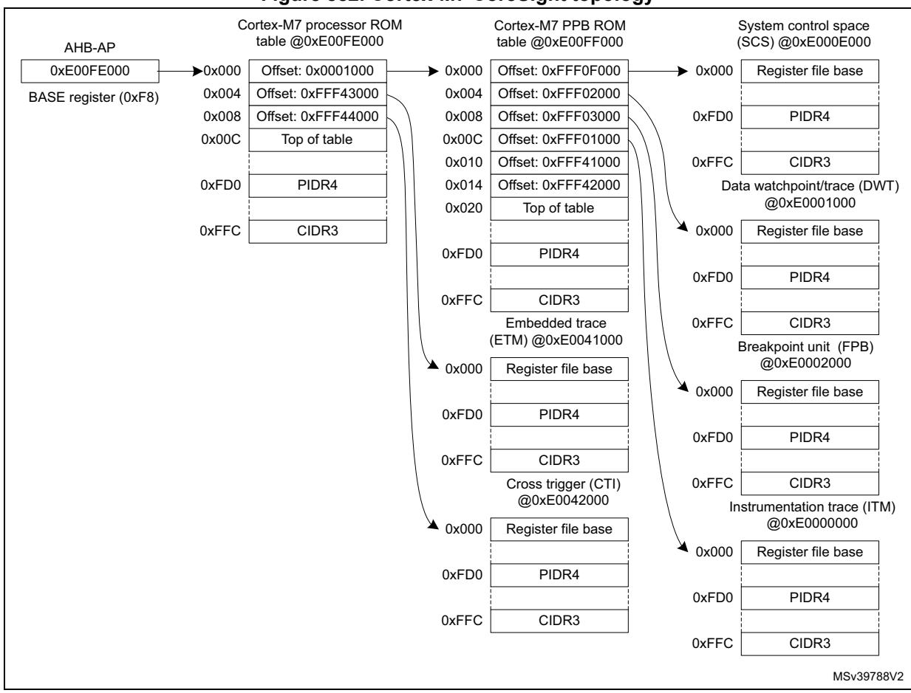

Figure 882. Cortex-M7 CoreSight topology

### **Cortex-M7 processor ROM registers**

### Processor ROM memory type register (M7 CPUROM MEMTYPE)

Address offset: 0xFCC Reset value: 0x0000 0001

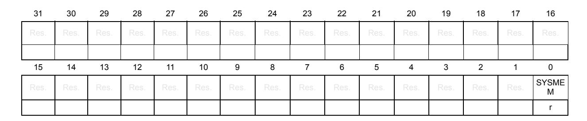

Bits 31:1 Reserved, must be kept at reset value.

Bit 0 SYSMEM: System memory presence

1: System memory is present on this bus

# **Processor ROM CoreSight peripheral identity register 4 (M7\_CPUROM\_PIDR4)**

Address offset: 0xFD0 Reset value: 0x0000 0004

| 31   | 30   | 29   | 28   | 27   | 26   | 25   | 24   | 23           | 22   | 21   | 20   | 19   | 18             | 17   | 16   |
|------|------|------|------|------|------|------|------|--------------|------|------|------|------|----------------|------|------|
| Res. | Res. | Res. | Res. | Res. | Res. | Res. | Res. | Res.         | Res. | Res. | Res. | Res. | Res.           | Res. | Res. |
|      |      |      |      |      |      |      |      |              |      |      |      |      |                |      |      |
| 15   | 14   | 13   | 12   | 11   | 10   | 9    | 8    | 7            | 6    | 5    | 4    | 3    | 2              | 1    | 0    |
| Res. | Res. | Res. | Res. | Res. | Res. | Res. | Res. | 4KCOUNT[3:0] |      |      |      |      | JEP106CON[3:0] |      |      |
|      |      |      |      |      |      |      |      |              |      |      |      |      |                |      |      |

Bits 31:8 Reserved, must be kept at reset value.

Bits 7:4 **4KCOUNT[3:0]**: Register file size

0x0: Register file occupies a single 4 Kbyte region

Bits 3:0 **JEP106CON[3:0]**: JEP106 continuation code

0x4: Arm® JEDEC continuation code

# **Processor ROM CoreSight peripheral identity register 0 (M7\_CPUROM\_PIDR0)**

Address offset: 0xFE0 Reset value: 0x0000 0050

31 30 29 28 27 26 25 24 23 22 21 20 19 18 17 16 Res. Res. Res. Res. Res. Res. Res. Res. Res. Res. Res. Res. Res. Res. Res. Res. 15 14 13 12 11 10 9 8 7 6 5 4 3 2 1 0 Res. Res. Res. Res. Res. Res. Res. Res. PARTNUM[7:0]

rrrrrrrr

Bits 31:8 Reserved, must be kept at reset value.

Bits 7:0 **PARTNUM[7:0]**: Part number field, bits [7:0]

0x50: STM32H7

# **Processor ROM CoreSight peripheral identity register 1 (M7\_CPUROM\_PIDR1)**

Address offset: 0xFE4 Reset value: 0x0000 0004

| 31   | 30   | 29   | 28   | 27   | 26   | 25   | 24   | 23            | 22   | 21   | 20   | 19   | 18   | 17            | 16   |
|------|------|------|------|------|------|------|------|---------------|------|------|------|------|------|---------------|------|
| Res. | Res. | Res. | Res. | Res. | Res. | Res. | Res. | Res.          | Res. | Res. | Res. | Res. | Res. | Res.          | Res. |
|      |      |      |      |      |      |      |      |               |      |      |      |      |      |               |      |
| 15   | 14   | 13   | 12   | 11   | 10   | 9    | 8    | 7             | 6    | 5    | 4    | 3    | 2    | 1             | 0    |
|      |      |      |      |      |      |      |      | JEP106ID[3:0] |      |      |      |      |      |               |      |
| Res. | Res. | Res. | Res. | Res. | Res. | Res. | Res. |               |      |      |      |      |      | PARTNUM[11:8] |      |

Bits 31:8 Reserved, must be kept at reset value.

Bits 7:4 **JEP106ID[3:0]**: JEP106 identity code field, bits [3:0]

0x0: STMicroelectronics JEDEC code

Bits 3:0 **PARTNUM[11:8]**: Part number field, bits [11:8]

0x4: STM32H7

# **Processor ROM CoreSight peripheral identity register 2 (M7\_CPUROM\_PIDR2)**

Address offset: 0xFE8 Reset value: 0x0000 000B

| 31   | 30   | 29   | 28   | 27   | 26   | 25   | 24   | 23   | 22   | 21            | 20   | 19    | 18   | 17            | 16   |
|------|------|------|------|------|------|------|------|------|------|---------------|------|-------|------|---------------|------|
| Res. | Res. | Res. | Res. | Res. | Res. | Res. | Res. | Res. | Res. | Res.          | Res. | Res.  | Res. | Res.          | Res. |
|      |      |      |      |      |      |      |      |      |      |               |      |       |      |               |      |
|      |      |      |      |      |      |      |      |      |      |               |      |       |      |               |      |
| 15   | 14   | 13   | 12   | 11   | 10   | 9    | 8    | 7    | 6    | 5             | 4    | 3     | 2    | 1             | 0    |
| Res. | Res. | Res. | Res. | Res. | Res. | Res. | Res. |      |      | REVISION[3:0] |      | JEDEC |      | JEP106ID[6:4] |      |

Bits 31:8 Reserved, must be kept at reset value.

Bits 7:4 **REVISION[3:0]**: Component revision number

0x0: rev 0

Bit 3 **JEDEC**: JEDEC assigned value

1: Designer ID specified by JEDEC

Bits 2:0 **JEP106ID[6:4]**: JEP106 identity code field, bits [6:4]

0x2: STMicroelectronics JEDEC code

# **Processor ROM CoreSight peripheral identity register 3 (M7\_CPUROM\_PIDR3)**

Address offset: 0xFEC Reset value: 0x0000 0000

| 31   | 30   | 29   | 28   | 27   | 26   | 25   | 24   | 23          | 22   | 21   | 20   | 19   | 18        | 17   | 16   |
|------|------|------|------|------|------|------|------|-------------|------|------|------|------|-----------|------|------|
| Res. | Res. | Res. | Res. | Res. | Res. | Res. | Res. | Res.        | Res. | Res. | Res. | Res. | Res.      | Res. | Res. |
|      |      |      |      |      |      |      |      |             |      |      |      |      |           |      |      |
| 15   | 14   | 13   | 12   | 11   | 10   | 9    | 8    | 7           | 6    | 5    | 4    | 3    | 2         | 1    | 0    |
| Res. | Res. | Res. | Res. | Res. | Res. | Res. | Res. | REVAND[3:0] |      |      |      |      | CMOD[3:0] |      |      |
|      |      |      |      |      |      |      |      | r           | r    | r    | r    | r    | r         | r    | r    |

Bits 31:8 Reserved, must be kept at reset value.

Bits 7:4 **REVAND[3:0]**: Metal fix version

0x0: No metal fix

Bits 3:0 **CMOD[3:0]**: Customer modified 0x0: No customer modifications

# **Processor ROM CoreSight component identity register 0 (M7\_CPUROM\_CIDR0)**

Address offset: 0xFF0 Reset value: 0x0000 000D

| 31   | 30   | 29   | 28   | 27   | 26   | 25   | 24   | 23   | 22   | 21   | 20   | 19            | 18   | 17   | 16   |
|------|------|------|------|------|------|------|------|------|------|------|------|---------------|------|------|------|
| Res. | Res. | Res. | Res. | Res. | Res. | Res. | Res. | Res. | Res. | Res. | Res. | Res.          | Res. | Res. | Res. |
|      |      |      |      |      |      |      |      |      |      |      |      |               |      |      |      |
| 15   | 14   | 13   | 12   | 11   | 10   | 9    | 8    | 7    | 6    | 5    | 4    | 3             | 2    | 1    | 0    |
| Res. | Res. | Res. | Res. | Res. | Res. | Res. | Res. |      |      |      |      | PREAMBLE[7:0] |      |      |      |
|      |      |      |      |      |      |      |      | r    | r    | r    | r    | r             | r    | r    | r    |

Bits 31:8 Reserved, must be kept at reset value.

Bits 7:0 **PREAMBLE[7:0]**: Component ID field, bits [7:0]

0x0D: Common ID value

# **Processor ROM CoreSight component identity register 1 (M7\_CPUROM\_CIDR1)**

Address offset: 0xFF4

Reset value: 0x0000 0010

| 31   | 30   | 29   | 28   | 27   | 26   | 25   | 24   | 23   | 22   | 21         | 20   | 19   | 18   | 17             | 16   |
|------|------|------|------|------|------|------|------|------|------|------------|------|------|------|----------------|------|
| Res. | Res. | Res. | Res. | Res. | Res. | Res. | Res. | Res. | Res. | Res.       | Res. | Res. | Res. | Res.           | Res. |
|      |      |      |      |      |      |      |      |      |      |            |      |      |      |                |      |
|      |      |      |      |      |      |      |      |      |      |            |      |      |      |                |      |
| 15   | 14   | 13   | 12   | 11   | 10   | 9    | 8    | 7    | 6    | 5          | 4    | 3    | 2    | 1              | 0    |
| Res. | Res. | Res. | Res. | Res. | Res. | Res. | Res. |      |      | CLASS[3:0] |      |      |      | PREAMBLE[11:8] |      |

Bits 31:8 Reserved, must be kept at reset value.

Bits 7:4 **CLASS[3:0]**: Component ID field, bits [15:12] - component class

0x1: ROM table component

Bits 3:0 **PREAMBLE[11:8]**: Component ID field, bits [11:8]

0x0: Common ID value

# **Processor ROM CoreSight component identity register 2 (M7\_CPUROM\_CIDR2)**

Address offset: 0xFF8

Reset value: 0x0000 0005

| 31   | 30   | 29   | 28   | 27   | 26   | 25   | 24   | 23   | 22   | 21   | 20   | 19              | 18   | 17   | 16   |
|------|------|------|------|------|------|------|------|------|------|------|------|-----------------|------|------|------|
| Res. | Res. | Res. | Res. | Res. | Res. | Res. | Res. | Res. | Res. | Res. | Res. | Res.            | Res. | Res. | Res. |
|      |      |      |      |      |      |      |      |      |      |      |      |                 |      |      |      |
| 15   | 14   | 13   | 12   | 11   | 10   | 9    | 8    | 7    | 6    | 5    | 4    | 3               | 2    | 1    | 0    |
| Res. | Res. | Res. | Res. | Res. | Res. | Res. | Res. |      |      |      |      | PREAMBLE[19:12] |      |      |      |
|      |      |      |      |      |      |      |      | r    | r    | r    | r    | r               | r    | r    | r    |

Bits 31:8 Reserved, must be kept at reset value.

Bits 7:0 **PREAMBLE[19:12]**: Component ID field, bits [23:16]

0x05: Common ID value

# **Processor ROM CoreSight component identity register 3 (M7\_CPUROM\_CIDR3)**

Address offset: 0xFFC Reset value: 0x0000 00B1

| 31   | 30   | 29   | 28   | 27   | 26   | 25   | 24   | 23   | 22   | 21   | 20   | 19              | 18   | 17   | 16   |
|------|------|------|------|------|------|------|------|------|------|------|------|-----------------|------|------|------|
| Res. | Res. | Res. | Res. | Res. | Res. | Res. | Res. | Res. | Res. | Res. | Res. | Res.            | Res. | Res. | Res. |
|      |      |      |      |      |      |      |      |      |      |      |      |                 |      |      |      |
| 15   | 14   | 13   | 12   | 11   | 10   | 9    | 8    | 7    | 6    | 5    | 4    | 3               | 2    | 1    | 0    |
| Res. | Res. | Res. | Res. | Res. | Res. | Res. | Res. |      |      |      |      | PREAMBLE[27:20] |      |      |      |
|      |      |      |      |      |      |      |      | r    | r    | r    | r    | r               | r    | r    | r    |

Bits 31:8 Reserved, must be kept at reset value.

Bits 7:0 **PREAMBLE[27:20]**: Component ID field, bits [31:24]

0xB1: Common ID value

# **Cortex-M7 processor ROM table register map and reset values**

**Table 645. Cortex-M7 processor ROM table register map and reset values** 

|                   | Offset Register name  | 31   | 30   | 29   | 28   | 27   | 26   | 25   | 24   | 23   | 22   | 21   | 20   | 19   | 18   | 17   | 16   | 15       | 14   | 13   | 12   | 11   | 10   | 9    | 8    | 7    | 6               | 5    | 4                | 3    | 2    | 1                      | 0      |
|-------------------|-----------------------|------|------|------|------|------|------|------|------|------|------|------|------|------|------|------|------|----------|------|------|------|------|------|------|------|------|-----------------|------|------------------|------|------|------------------------|--------|
|                   |                       |      |      |      |      |      |      |      |      |      |      |      |      |      |      |      |      |          |      |      |      |      |      |      |      |      |                 |      |                  |      |      |                        |        |
| 0xFCC             | M7_CPUROM_ MEMTYPE | Res. | Res. | Res. | Res. | Res. | Res. | Res. | Res. | Res. | Res. | Res. | Res. | Res. | Res. | Res. | Res. | Res.     | Res. | Res. | Res. | Res. | Res. | Res. | Res. | Res. | Res.            | Res. | Res.             | Res. | Res. | Res.                   | SYSMEM |
|                   | Reset value           |      |      |      |      |      |      |      |      |      |      |      |      |      |      |      |      |          |      |      |      |      |      |      |      |      |                 |      |                  |      |      |                        | 1      |
| 0xFD0             | M7_CPUROM_ PIDR4   | Res. | Res. | Res. | Res. | Res. | Res. | Res. | Res. | Res. | Res. | Res. | Res. | Res. | Res. | Res. | Res. | Res.     | Res. | Res. | Res. | Res. | Res. | Res. |      |      | Res.4KCOUNT[3:  | 0]   |                  |      |      | JEP106CON[ 3:0]     |        |
|                   | Reset value           |      |      |      |      |      |      |      |      |      |      |      |      |      |      |      |      |          |      |      |      |      |      |      |      | 0    | 0               | 0    | 0                | 0    | 0    | 0                      | 0      |
| 0xFD4 to 0xFDC | Reserved              |      |      |      |      |      |      |      |      |      |      |      |      |      |      |      |      | Reserved |      |      |      |      |      |      |      |      |                 |      |                  |      |      |                        |        |
| 0xFE0             | M7_CPUROM _PIDR0   | Res. | Res. | Res. | Res. | Res. | Res. | Res. | Res. | Res. | Res. | Res. | Res. | Res. | Res. | Res. | Res. | Res.     | Res. | Res. | Res. | Res. | Res. | Res. | Res. |      |                 |      | PARTNUM[7:0]     |      |      |                        |        |
|                   | Reset value           |      |      |      |      |      |      |      |      |      |      |      |      |      |      |      |      |          |      |      |      |      |      |      |      | 0    | 1               | 0    | 1                | 0    | 0    | 0                      | 0      |
| 0xFE4             | M7_CPUROM _PIDR1   | Res. | Res. | Res. | Res. | Res. | Res. | Res. | Res. | Res. | Res. | Res. | Res. | Res. | Res. | Res. | Res. | Res.     | Res. | Res. | Res. | Res. | Res. | Res. |      |      |                 | ]    | Res.JEP106ID[3:0 |      |      | PARTNUM[1 1:8]      |        |
|                   | Reset value           |      |      |      |      |      |      |      |      |      |      |      |      |      |      |      |      |          |      |      |      |      |      |      |      | 0    | 0               | 0    | 0                | 0    | 1    | 0                      | 0      |
| 0xFE8             | M7_CPUROM _PIDR2   | Res. | Res. | Res. | Res. | Res. | Res. | Res. | Res. | Res. | Res. | Res. | Res. | Res. | Res. | Res. | Res. | Res.     | Res. | Res. | Res. | Res. | Res. | Res. |      |      | Res.REVISION[3: | 0]   |                  |      |      | JEDECJEP106ID [6:4] |        |
|                   | Reset value           |      |      |      |      |      |      |      |      |      |      |      |      |      |      |      |      |          |      |      |      |      |      |      |      | 0    | 0               | 0    | 0                | 1    | 0    | 1                      | 0      |
| 0xFEC             | M7_CPUROM _PIDR3   | Res. | Res. | Res. | Res. | Res. | Res. | Res. | Res. | Res. | Res. | Res. | Res. | Res. | Res. | Res. | Res. | Res.     | Res. | Res. | Res. | Res. | Res. | Res. |      |      |                 |      | Res. REVAND[3:0] |      |      | CMOD[3:0]              |        |
|                   | Reset value           |      |      |      |      |      |      |      |      |      |      |      |      |      |      |      |      |          |      |      |      |      |      |      |      | 0    | 0               | 0    | 0                | 0    | 0    | 0                      | 0      |
| 0xFF0             | M7_CPUROM _CIDR0   | Res. | Res. | Res. | Res. | Res. | Res. | Res. | Res. | Res. | Res. | Res. | Res. | Res. | Res. | Res. | Res. | Res.     | Res. | Res. | Res. | Res. | Res. | Res. | Res. |      |                 |      | PREAMBLE[7:0]    |      |      |                        |        |
|                   | Reset value           |      |      |      |      |      |      |      |      |      |      |      |      |      |      |      |      |          |      |      |      |      |      |      |      | 0    | 0               | 0    | 0                | 1    | 1    | 0                      | 1      |
| 0xFF4             | M7_CPUROM _CIDR1   | Res. | Res. | Res. | Res. | Res. | Res. | Res. | Res. | Res. | Res. | Res. | Res. | Res. | Res. | Res. | Res. | Res.     | Res. | Res. | Res. | Res. | Res. | Res. | Res. |      | CLASS[3:0]      |      |                  |      |      | PREAMBLE[ 11:8]     |        |
|                   | Reset value           |      |      |      |      |      |      |      |      |      |      |      |      |      |      |      |      |          |      |      |      |      |      |      |      | 0    | 0               | 0    | 1                | 0    | 0    | 0                      | 0      |

**Table 645. Cortex-M7 processor ROM table register map and reset values (continued)**

|       | Offset Register name | 31   | 30   | 29   | 28   | 27   | 26   | 25   | 24   | 23   | 22   | 21   | 20   | 19   | 18   | 17   | 16   | 15   | 14   | 13   | 12   | 11   | 10   | 9    | 8    | 7 | 6 | 5 | 4 | 3 | 2               | 1 | 0 |
|-------|----------------------|------|------|------|------|------|------|------|------|------|------|------|------|------|------|------|------|------|------|------|------|------|------|------|------|---|---|---|---|---|-----------------|---|---|
| 0xFF8 | M7_CPUROM _CIDR2  | Res. | Res. | Res. | Res. | Res. | Res. | Res. | Res. | Res. | Res. | Res. | Res. | Res. | Res. | Res. | Res. | Res. | Res. | Res. | Res. | Res. | Res. | Res. | Res. |   |   |   |   |   | PREAMBLE[19:12] |   |   |
|       | Reset value          |      |      |      |      |      |      |      |      |      |      |      |      |      |      |      |      |      |      |      |      |      |      |      |      | 0 | 0 | 0 | 0 | 0 | 1               | 0 | 1 |
| 0xFFC | M7_CPUROM _CIDR3  | Res. | Res. | Res. | Res. | Res. | Res. | Res. | Res. | Res. | Res. | Res. | Res. | Res. | Res. | Res. | Res. | Res. | Res. | Res. | Res. | Res. | Res. | Res. | Res. |   |   |   |   |   | PREAMBLE[27:20] |   |   |
|       | Reset value          |      |      |      |      |      |      |      |      |      |      |      |      |      |      |      |      |      |      |      |      |      |      |      |      | 1 | 0 | 1 | 1 | 0 | 0               | 0 | 1 |

### **Cortex-M7 PPB ROM registers**

# **PPB ROM memory type register (M7\_PPBROM\_MEMTYPE)**

Address offset: 0xFCC Reset value: 0x0000 0001

| 31   | 30   | 29   | 28   | 27   | 26   | 25   | 24   | 23   | 22   | 21   | 20   | 19   | 18   | 17   | 16         |
|------|------|------|------|------|------|------|------|------|------|------|------|------|------|------|------------|
| Res. | Res. | Res. | Res. | Res. | Res. | Res. | Res. | Res. | Res. | Res. | Res. | Res. | Res. | Res. | Res.       |
|      |      |      |      |      |      |      |      |      |      |      |      |      |      |      |            |
|      |      |      |      |      |      |      |      |      |      |      |      |      |      |      |            |
| 15   | 14   | 13   | 12   | 11   | 10   | 9    | 8    | 7    | 6    | 5    | 4    | 3    | 2    | 1    | 0          |
| Res. | Res. | Res. | Res. | Res. | Res. | Res. | Res. | Res. | Res. | Res. | Res. | Res. | Res. | Res. | SYSME M |

Bits 31:1 Reserved, must be kept at reset value.

Bit 0 **SYSMEM**: System memory presence

1: System memory is present on this bus

## **PPB ROM CoreSight peripheral identity register 4 (M7\_PPBROM\_PIDR4)**

Address offset: 0xFD0 Reset value: 0x0000 0004

| 31   | 30   | 29   | 28   | 27   | 26   | 25   | 24   | 23   | 22   | 21           | 20   | 19   | 18   | 17             | 16   |
|------|------|------|------|------|------|------|------|------|------|--------------|------|------|------|----------------|------|
| Res. | Res. | Res. | Res. | Res. | Res. | Res. | Res. | Res. | Res. | Res.         | Res. | Res. | Res. | Res.           | Res. |
|      |      |      |      |      |      |      |      |      |      |              |      |      |      |                |      |
| 15   | 14   | 13   | 12   | 11   | 10   | 9    | 8    | 7    | 6    | 5            | 4    | 3    | 2    | 1              | 0    |
| Res. | Res. | Res. | Res. | Res. | Res. | Res. | Res. |      |      | 4KCOUNT[3:0] |      |      |      | JEP106CON[3:0] |      |
|      |      |      |      |      |      |      |      |      |      |              |      |      |      |                |      |

Bits 31:8 Reserved, must be kept at reset value.

Bits 7:4 **4KCOUNT[3:0]**: Register file size

0x0: Register file occupies a single 4 Kbyte region

Bits 3:0 **JEP106CON[3:0]**: JEP106 continuation code

0x4: Arm® JEDEC continuation code

# **PPB ROM CoreSight peripheral identity register 0 (M7\_PPBROM\_PIDR0)**

Address offset: 0xFE0

Reset value: 0x0000 00C7

| 31   | 30   | 29   | 28   | 27   | 26   | 25   | 24   | 23           | 22   | 21   | 20   | 19   | 18   | 17   | 16   |
|------|------|------|------|------|------|------|------|--------------|------|------|------|------|------|------|------|
| Res. | Res. | Res. | Res. | Res. | Res. | Res. | Res. | Res.         | Res. | Res. | Res. | Res. | Res. | Res. | Res. |
|      |      |      |      |      |      |      |      |              |      |      |      |      |      |      |      |
| 15   | 14   | 13   | 12   | 11   | 10   | 9    | 8    | 7            | 6    | 5    | 4    | 3    | 2    | 1    | 0    |
|      |      |      |      |      |      |      |      | PARTNUM[7:0] |      |      |      |      |      |      |      |
| Res. | Res. | Res. | Res. | Res. | Res. | Res. | Res. |              |      |      |      |      |      |      |      |

Bits 31:8 Reserved, must be kept at reset value.

Bits 7:0 **PARTNUM[7:0]**: Part number field, bits [7:0]

0xC7: Cortex-M7 PPB ROM table

# **PPB ROM CoreSight peripheral identity register 1 (M7\_PPBROM\_PIDR1)**

Address offset: 0xFE4

Reset value: 0x0000 00B0

| 31   | 30   | 29   | 28   | 27   | 26   | 25   | 24   | 23   | 22   | 21            | 20   | 19   | 18   | 17            | 16   |
|------|------|------|------|------|------|------|------|------|------|---------------|------|------|------|---------------|------|
| Res. | Res. | Res. | Res. | Res. | Res. | Res. | Res. | Res. | Res. | Res.          | Res. | Res. | Res. | Res.          | Res. |
|      |      |      |      |      |      |      |      |      |      |               |      |      |      |               |      |
| 15   | 14   | 13   | 12   | 11   | 10   | 9    | 8    | 7    | 6    | 5             | 4    | 3    | 2    | 1             | 0    |
|      |      |      |      |      |      |      |      |      |      |               |      |      |      |               |      |
| Res. | Res. | Res. | Res. | Res. | Res. | Res. | Res. |      |      | JEP106ID[3:0] |      |      |      | PARTNUM[11:8] |      |

Bits 31:8 Reserved, must be kept at reset value.

Bits 7:4 **JEP106ID[3:0]**: JEP106 identity code field, bits [3:0]

0xB: Arm® JEDEC code

Bits 3:0 **PARTNUM[11:8]**: Part number field, bits [11:8]

0x4: Cortex-M7 PPB ROM table

# **PPB ROM CoreSight peripheral identity register 2 (M7\_PPBROM\_PIDR2)**

Address offset: 0xFE8 Reset value: 0x0000 000B

| 31   | 30   | 29   | 28   | 27   | 26   | 25   | 24   | 23            | 22   | 21   | 20   | 19    | 18   | 17            | 16   |
|------|------|------|------|------|------|------|------|---------------|------|------|------|-------|------|---------------|------|
| Res. | Res. | Res. | Res. | Res. | Res. | Res. | Res. | Res.          | Res. | Res. | Res. | Res.  | Res. | Res.          | Res. |
|      |      |      |      |      |      |      |      |               |      |      |      |       |      |               |      |
| 15   | 14   | 13   | 12   | 11   | 10   | 9    | 8    | 7             | 6    | 5    | 4    | 3     | 2    | 1             | 0    |
| Res. | Res. | Res. | Res. | Res. | Res. | Res. | Res. | REVISION[3:0] |      |      |      | JEDEC |      | JEP106ID[6:4] |      |
|      |      |      |      |      |      |      |      | r             |      |      | r    | r     | r    | r             | r    |

Bits 31:8 Reserved, must be kept at reset value.

Bits 7:4 **REVISION[3:0]**: Component revision number

0x0: rev r0p0

Bit 3 **JEDEC**: JEDEC assigned value

1: Designer ID specified by JEDEC

Bits 2:0 **JEP106ID[6:4]**: JEP106 identity code field, bits [6:4]

0x3: Arm® JEDEC code

### **PPB ROM CoreSight peripheral identity register 3 (M7\_PPBROM\_PIDR3)**

Address offset: 0xFEC Reset value: 0x0000 0000

| 31   | 30   | 29   | 28   | 27   | 26   | 25   | 24   | 23   | 22   | 21          | 20   | 19   | 18   | 17        | 16   |
|------|------|------|------|------|------|------|------|------|------|-------------|------|------|------|-----------|------|
| Res. | Res. | Res. | Res. | Res. | Res. | Res. | Res. | Res. | Res. | Res.        | Res. | Res. | Res. | Res.      | Res. |
|      |      |      |      |      |      |      |      |      |      |             |      |      |      |           |      |
| 15   | 14   | 13   | 12   | 11   | 10   | 9    | 8    | 7    | 6    | 5           | 4    | 3    | 2    | 1         | 0    |
| Res. | Res. | Res. | Res. | Res. | Res. | Res. | Res. |      |      | REVAND[3:0] |      |      |      | CMOD[3:0] |      |
|      |      |      |      |      |      |      |      | r    | r    | r           | r    | r    | r    | r         | r    |

Bits 31:8 Reserved, must be kept at reset value.

Bits 7:4 **REVAND[3:0]**: Metal fix version

0x0: No metal fix

Bits 3:0 **CMOD[3:0]**: Customer modified

0x0: No customer modifications

# **PPB ROM CoreSight component identity register 0 (M7\_PPBROM\_CIDR0)**

Address offset: 0xFF0 Reset value: 0x0000 000D

| 31   | 30   | 29   | 28   | 27   | 26   | 25   | 24   | 23   | 22   | 21   | 20   | 19            | 18   | 17   | 16   |
|------|------|------|------|------|------|------|------|------|------|------|------|---------------|------|------|------|
| Res. | Res. | Res. | Res. | Res. | Res. | Res. | Res. | Res. | Res. | Res. | Res. | Res.          | Res. | Res. | Res. |
|      |      |      |      |      |      |      |      |      |      |      |      |               |      |      |      |
|      |      |      |      |      |      |      |      |      |      |      |      |               |      |      |      |
| 15   | 14   | 13   | 12   | 11   | 10   | 9    | 8    | 7    | 6    | 5    | 4    | 3             | 2    | 1    | 0    |
| Res. | Res. | Res. | Res. | Res. | Res. | Res. | Res. |      |      |      |      | PREAMBLE[7:0] |      |      |      |

Bits 31:8 Reserved, must be kept at reset value.

Bits 7:0 **PREAMBLE[7:0]**: Component ID field, bits [7:0]

0x0D: Common ID value

### **PPB ROM CoreSight component identity register 1 (M7\_PPBROM\_CIDR1)**

Address offset: 0xFF4 Reset value: 0x0000 0010

| 31   | 30   | 29   | 28   | 27   | 26   | 25   | 24   | 23   | 22   | 21         | 20   | 19   | 18   | 17             | 16   |
|------|------|------|------|------|------|------|------|------|------|------------|------|------|------|----------------|------|
| Res. | Res. | Res. | Res. | Res. | Res. | Res. | Res. | Res. | Res. | Res.       | Res. | Res. | Res. | Res.           | Res. |
|      |      |      |      |      |      |      |      |      |      |            |      |      |      |                |      |
|      |      |      |      |      |      |      |      |      |      |            |      |      |      |                |      |
| 15   | 14   | 13   | 12   | 11   | 10   | 9    | 8    | 7    | 6    | 5          | 4    | 3    | 2    | 1              | 0    |
| Res. | Res. | Res. | Res. | Res. | Res. | Res. | Res. |      |      | CLASS[3:0] |      |      |      | PREAMBLE[11:8] |      |

Bits 31:8 Reserved, must be kept at reset value.

Bits 7:4 **CLASS[3:0]**: Component ID field, bits [15:12] - component class

0x1: ROM table component

Bits 3:0 **PREAMBLE[11:8]**: Component ID field, bits [11:8]

0x0: Common ID value

### **PPB ROM CoreSight component identity register 2 (M7\_PPBROM\_CIDR2)**

Address offset: 0xFF8 Reset value: 0x0000 0005

| 31   | 30   | 29   | 28   | 27   | 26   | 25   | 24   | 23              | 22   | 21   | 20   | 19   | 18   | 17   | 16   |  |  |  |  |
|------|------|------|------|------|------|------|------|-----------------|------|------|------|------|------|------|------|--|--|--|--|
| Res. | Res. | Res. | Res. | Res. | Res. | Res. | Res. | Res.            | Res. | Res. | Res. | Res. | Res. | Res. | Res. |  |  |  |  |
|      |      |      |      |      |      |      |      |                 |      |      |      |      |      |      |      |  |  |  |  |
| 15   | 14   | 13   | 12   | 11   | 10   | 9    | 8    | 7               | 6    | 5    | 4    | 3    | 2    | 1    | 0    |  |  |  |  |
| Res. | Res. | Res. | Res. | Res. | Res. | Res. | Res. | PREAMBLE[19:12] |      |      |      |      |      |      |      |  |  |  |  |
|      |      |      |      |      |      |      |      | r               | r    | r    | r    | r    | r    | r    | r    |  |  |  |  |

Bits 31:8 Reserved, must be kept at reset value.

Bits 7:0 **PREAMBLE[19:12]**: Component ID field, bits [23:16]

0x05: Common ID value

### **PPB ROM CoreSight component identity register 3 (M7\_PPBROM\_CIDR3)**

Address offset: 0xFFC Reset value: 0x0000 00B1

| 31   | 30   | 29   | 28   | 27   | 26   | 25   | 24   | 23   | 22   | 21   | 20   | 19              | 18   | 17   | 16   |
|------|------|------|------|------|------|------|------|------|------|------|------|-----------------|------|------|------|
| Res. | Res. | Res. | Res. | Res. | Res. | Res. | Res. | Res. | Res. | Res. | Res. | Res.            | Res. | Res. | Res. |
|      |      |      |      |      |      |      |      |      |      |      |      |                 |      |      |      |
|      |      |      |      |      |      |      |      |      |      |      |      |                 |      |      |      |
| 15   | 14   | 13   | 12   | 11   | 10   | 9    | 8    | 7    | 6    | 5    | 4    | 3               | 2    | 1    | 0    |
| Res. | Res. | Res. | Res. | Res. | Res. | Res. | Res. |      |      |      |      | PREAMBLE[27:20] |      |      |      |

Bits 31:8 Reserved, must be kept at reset value.

Bits 7:0 **PREAMBLE[27:20]**: Component ID field, bits [31:24]

0xB1: Common ID value

### **Cortex-M7 PPB ROM table register map and reset values**

#### **Table 646. Cortex-M7 PPB ROM table register map and reset values**

|                   | Offset Register name  | 31   | 30   | 29   | 28   | 27   | 26   | 25   | 24   | 23   | 22   | 21   | 20   | 19   | 18   | 17   | 16   | 15       | 14   | 13   | 12   | 11   | 10   | 9    | 8    | 7              | 6    | 5    | 4    | 3    | 2    | 1          | 0      |
|-------------------|-----------------------|------|------|------|------|------|------|------|------|------|------|------|------|------|------|------|------|----------|------|------|------|------|------|------|------|----------------|------|------|------|------|------|------------|--------|
| 0xFCC             | M7_PPBROM _MEMTYPE | Res. | Res. | Res. | Res. | Res. | Res. | Res. | Res. | Res. | Res. | Res. | Res. | Res. | Res. | Res. | Res. | Res.     | Res. | Res. | Res. | Res. | Res. | Res. | Res. | Res.           | Res. | Res. | Res. | Res. | Res. | Res.       | SYSMEM |
|                   | Reset value           |      |      |      |      |      |      |      |      |      |      |      |      |      |      |      |      |          |      |      |      |      |      |      |      |                |      |      |      |      |      |            | 1      |
| 0xFD0             | M7_PPBROM _PIDR4   | Res. | Res. | Res. | Res. | Res. | Res. | Res. | Res. | Res. | Res. | Res. | Res. | Res. | Res. | Res. | Res. | Res.     | Res. | Res. | Res. | Res. | Res. | Res. |      | Res.4KCOUNT[3: |      | 0]   |      |      | 3:0] | JEP106CON[ |        |
|                   | Reset value           |      |      |      |      |      |      |      |      |      |      |      |      |      |      |      |      |          |      |      |      |      |      |      |      | 0              | 0    | 0    | 0    | 0    | 1    | 0          | 0      |
| 0xFD4 to 0xFDC | Reserved              |      |      |      |      |      |      |      |      |      |      |      |      |      |      |      |      | Reserved |      |      |      |      |      |      |      |                |      |      |      |      |      |            |        |

RM0399 Rev 4 3387/3556

0xFE0 M7\_PPBROM \_PIDR0 PARTNUM[7:0] Reset value 11000111 0xFE4 M7\_PPBROM \_PIDR1 Res.JEP106ID[3:0 PARTNUM[1 1:8] Reset value 10110100 0xFE8 M7\_PPBROM \_PIDR2 Res.REVISION[3: 0] JEDECJEP106ID [6:4] Reset value 00001011 0xFEC M7\_PPBROM \_PIDR3 Res. REVAND[3:0] CMOD[3:0] Reset value 00000000 0xFF0 M7\_PPBROM \_CIDR0 PREAMBLE[7:0] Reset value 00001101 0xFF4 M7\_PPBROM \_CIDR1 CLASS[3:0] PREAMBLE[ 11:8] Reset value 00010000 0xFF8 M7\_PPBROM \_CIDR2 PREAMBLE[19:12] Reset value 00000101 0xFFC M7\_PPBROM \_CIDR3 PREAMBLE[27:20] Reset value 10110001 **Offset Register name 31 30 29 28 27 26 25 24 23 22 21 20 19 18 17 16 15 14 13 12 11 10 987654321**

**Table 646. Cortex-M7 PPB ROM table register map and reset values (continued)**

# **63.6.2 Cortex-M7 data watchpoint and trace unit (DWT)**

The DWT provides four comparators that can be used as:

- watchpoint
- ETM trigger
- PC sampling trigger
- data address sampling trigger
- data comparator (comparator 1 only)
- clock cycle counter comparator (comparator 0 only)

It also contains counters for:

- clock cycles
- folded instructions
- load store unit (LSU) operations
- sleep cycles
- number of cycles per instruction
- interrupt overhead

A DWT comparator compares one of the following with the value held in its DWT\_COMP register:

- a data address
- an instruction address
- a data value
- the cycle count value, for comparator 0 only.

For address matching, the comparator can use a mask, so it matches a range of addresses.

On a successful match, the comparator generates one of the following:

- one or more DWT data trace packets, containing one or more of:
  - the address of the instruction that caused a data access
  - an address offset, bits[15:0] of the data access address
  - the matched data value
- a watchpoint debug event, on either the PC value or the accessed data address
- a CMPMATCH[N] event that signals the match outside the DWT unit

A watchpoint debug event either generates a DebugMonitor exception, or causes the processor to halt execution and enter Debug state.

For more details on how to use the DWT, refer to the Arm®v7-M Architecture Reference Manual *[5]*.

## **Cortex-M7 DWT registers**

# DWT control register (M7\_DWT\_CTRL)

Address offset: 0x000
Reset value: 0x4000 0000

| 31   | 30    | 29       | 28                 | 27           | 26            | 25           | 24           | 23     | 22            | 21             | 20            | 19                  | 18            | 17            | 16            |
|------|-------|----------|--------------------|--------------|---------------|--------------|--------------|--------|---------------|----------------|---------------|---------------------|---------------|---------------|---------------|
|      | NUMCC | MP[3:0]. |                    | NOTR CPKT | NOEX TTRIG | NOCYC CNT | NOPRF CNT | Res.   | CYCEV TENA | FOLDE VTENA | LSUEV TENA | SLEEP EVTEN A | EXCEV TENA | CPIEVT ENA | EXCTR CENA |
| r    | r     | r        | r                  | r            | r             | r            | r            |        | rw            | rw             | rw            | rw                  | rw            | rw            | rw            |
| 15   | 14    | 13       | 12                 | 11           | 10            | 9            | 8            | 7      | 6             | 5              | 4             | 3                   | 2             | 1             | 0             |
| Res. | Res.  | Res.     | PCSA MPLE NA | SYNCT        | AP[1:0]       | CYCTA P   |              | POSTII | NIT[3:0]      |                |               | POSTRE              | ESET[3:0]     |               | CYCCN TENA |
|      |       |          | rw                 | rw           | rw            | rw           | rw           | rw     | rw            | rw             | rw            | rw                  | rw            | rw            | rw            |

Bits 31:28 NUMCOMP[3:0]: Number of comparators implemented (read-only)

0x4: Four comparators

Bit 27 NOTRCPKT: Trace sampling and exception tracing support (read-only)

0: Supported

Bit 26 NOEXTTRIG: External match signal, CMPMATCH support (read-only)

0: Supported

Bit 25 NOCYCCNT: Cycle counter support (read-only)

0: Supported

- Bit 24 **NOPRFCNT**: Profiling counter support (read-only)
  - 0: Supported
- Bit 23 Reserved, must be kept at reset value.
- Bit 22 **CYCEVTENA**: POSTCNT underflow event counter packet generation enable
  - 0: Disabled
  - 1: Enabled
- Bit 21 **FOLDEVTENA**: Folded instruction counter overflow event generation enable
  - 0: Disabled
  - 1: Enabled
- Bit 20 **LSUEVTENA**: LSU counter overflow event generation enable
  - 0: Disabled
  - 1: Enabled
- Bit 19 **SLEEPEVTENA**: Sleep counter overflow event generation enable
  - 0: Disabled
  - 1: Enabled
- Bit 18 **EXCEVTENA**: Exception overhead counter overflow event generation enable
  - 0: Disabled
  - 1: Enabled
- Bit 17 **CPIEVTENA**: CPI counter overflow event generation enable
  - 0: Disabled
  - 1: Enabled
- Bit 16 **EXCTRCENA**: Exception trace generation enable
  - 0: Disabled
  - 1: Enabled
- Bits 15:13 Reserved, must be kept at reset value.
  - Bit 12 **PCSAMPLENA**: POSTCNT counter use enable

Enables use of POSTCNT counter as a timer for Periodic PC sample packet generation.

- 0: Disabled
- 1: Enabled
- Bits 11:10 **SYNCTAP[1:0]**: Position of synchronization packet counter tap on CYCCNT counter This selection determines the synchronization packet rate.
  - 0x0: Disabled no synchronization packets
  - 0x1: Tap at CYCCNT[24]
  - 0x2: Tap at CYCCNT[26]
  - 0x3: Tap at CYCCNT[28]
  - Bit 9 **CYCTAP**: Position of the POSTCNT tap on the CYCCNT counter
    - 0: Tap at CYCCNT[6]
    - 1: Tap at CYCCNT[10]

#### Bits 8:5 **POSTINIT[3:0]**: Initial value of the POSTCNT counter

Writes to this field are ignored if POSTCNT counter is enabled (that is, CYCEVTENA or PCSAMPLENA must be reset prior to writing POSTINIT).

#### Bits 4:1 **POSTRESET[3:0]**: Reload value of the POSTCNT counter.

#### Bit 0 **CYCCNTENA**: CYCCNT counter enable

0: Disabled 1: Enabled

# **DWT cycle count register (M7\_DWT\_CYCCNT)**

Address offset: 0x004

Reset value: 0x0000 0000

| 31 | 30            | 29 | 28 | 27 | 26 | 25 | 24 | 23 | 22 | 21 | 20 | 19 | 18 | 17 | 16 |
|----|---------------|----|----|----|----|----|----|----|----|----|----|----|----|----|----|
|    | CYCCNT[31:16] |    |    |    |    |    |    |    |    |    |    |    |    |    |    |
| rw | rw            | rw | rw | rw | rw | rw | rw | rw | rw | rw | rw | rw | rw | rw | rw |
| 15 | 14            | 13 | 12 | 11 | 10 | 9  | 8  | 7  | 6  | 5  | 4  | 3  | 2  | 1  | 0  |
|    | CYCCNT[15:0]  |    |    |    |    |    |    |    |    |    |    |    |    |    |    |
| rw | rw            | rw | rw | rw | rw | rw | rw | rw | rw | rw | rw | rw | rw | rw | rw |

Bits 31:0 **CYCCNT[31:0]**: Processor clock cycle counter

### **DWT CPI count register (M7\_DWT\_CPICNT)**

Address offset: 0x008

Reset value: 0x0000 0000

| 31   | 30   | 29   | 28   | 27   | 26   | 25   | 24   | 23   | 22   | 21   | 20   | 19          | 18   | 17   | 16   |
|------|------|------|------|------|------|------|------|------|------|------|------|-------------|------|------|------|
| Res. | Res. | Res. | Res. | Res. | Res. | Res. | Res. | Res. | Res. | Res. | Res. | Res.        | Res. | Res. | Res. |
|      |      |      |      |      |      |      |      |      |      |      |      |             |      |      |      |
| 15   | 14   | 13   | 12   | 11   |      |      |      |      |      |      |      |             |      |      |      |
|      |      |      |      |      | 10   | 9    | 8    | 7    | 6    | 5    | 4    | 3           | 2    | 1    | 0    |
| Res. | Res. | Res. | Res. | Res. | Res. | Res. | Res. |      |      |      |      | CPICNT[7:0] |      |      |      |

Bits 31:8 Reserved, must be kept at reset value.

### Bits 7:0 **CPICNT[7:0]**: CPI counter

Counts additional cycles required to execute multi-cycle instructions, except those recorded by DWT\_LSUCNT, and counts any instruction fetch stalls.

### **DWT exception count register (M7\_DWT\_EXCCNT)**

Address offset: 0x00C Reset value: 0x0000 0000

| 31   | 30   | 29   | 28   | 27   | 26   | 25   | 24   | 23   | 22   | 21   | 20   | 19          | 18   | 17   | 16   |
|------|------|------|------|------|------|------|------|------|------|------|------|-------------|------|------|------|
| Res. | Res. | Res. | Res. | Res. | Res. | Res. | Res. | Res. | Res. | Res. | Res. | Res.        | Res. | Res. | Res. |
|      |      |      |      |      |      |      |      |      |      |      |      |             |      |      |      |
| 15   | 14   | 13   | 12   | 11   | 10   | 9    | 8    | 7    | 6    | 5    | 4    | 3           | 2    | 1    | 0    |
| Res. | Res. | Res. | Res. | Res. | Res. | Res. | Res. |      |      |      |      | EXCCNT[7:0] |      |      |      |
|      |      |      |      |      |      |      |      | rw   | rw   | rw   | rw   | rw          | rw   | rw   | rw   |

Bits 31:8 Reserved, must be kept at reset value.

Bits 7:0 **EXCCNT[7:0]**: Exception overhead cycle counter Counts the number of cycles spent in exception processing.

# **DWT sleep count register (M7\_DWT\_SLPCNT)**

Address offset: 0x010 Reset value: 0x0000 0000

| 31   | 30   | 29   | 28   | 27   | 26   | 25   | 24   | 23            | 22   | 21   | 20   | 19   | 18   | 17   | 16   |
|------|------|------|------|------|------|------|------|---------------|------|------|------|------|------|------|------|
| Res. | Res. | Res. | Res. | Res. | Res. | Res. | Res. | Res.          | Res. | Res. | Res. | Res. | Res. | Res. | Res. |
|      |      |      |      |      |      |      |      |               |      |      |      |      |      |      |      |
| 15   | 14   | 13   | 12   | 11   | 10   | 9    | 8    | 7             | 6    | 5    | 4    | 3    | 2    | 1    | 0    |
| Res. | Res. | Res. | Res. | Res. | Res. | Res. | Res. | SLEEPCNT[7:0] |      |      |      |      |      |      |      |
|      |      |      |      |      |      |      |      |               |      |      |      |      |      |      |      |

Bits 31:8 Reserved, must be kept at reset value.

Bits 7:0 **SLEEPCNT[7:0]**: Sleep cycle counter

Counts the number of cycles spent in sleep mode (WFI, WFE, sleep-on-exit).

### **DWT LSU count register (M7\_DWT\_LSUCNT)**

Address offset: 0x014

Reset value: 0x0000 0000

| 31   | 30   | 29   | 28   | 27   | 26   | 25   | 24   | 23   | 22   | 21   | 20   | 19          | 18   | 17   | 16   |
|------|------|------|------|------|------|------|------|------|------|------|------|-------------|------|------|------|
| Res. | Res. | Res. | Res. | Res. | Res. | Res. | Res. | Res. | Res. | Res. | Res. | Res.        | Res. | Res. | Res. |
| 15   | 14   | 13   | 12   | 11   | 10   | 9    | 8    | 7    | 6    | 5    | 4    | 3           | 2    | 1    | 0    |
| Res. | Res. | Res. | Res. | Res. | Res. | Res. | Res. |      |      |      |      | LSUCNT[7:0] |      |      |      |
|      |      |      |      |      |      |      |      | rw   | rw   | rw   | rw   | rw          | rw   | rw   | rw   |

Bits 31:8 Reserved, must be kept at reset value.

Bits 7:0 **LSUCNT[7:0]**: Load store counter

Counts additional cycles required to execute load and store instructions.

### **DWT fold count register (M7\_DWT\_FOLDCNT)**

Address offset: 0x018 Reset value: 0x0000 0000

| 31   | 30   | 29   | 28   | 27   | 26   | 25   | 24   | 23   | 22   | 21   | 20   | 19           | 18   | 17   | 16   |
|------|------|------|------|------|------|------|------|------|------|------|------|--------------|------|------|------|
| Res. | Res. | Res. | Res. | Res. | Res. | Res. | Res. | Res. | Res. | Res. | Res. | Res.         | Res. | Res. | Res. |
|      |      |      |      |      |      |      |      |      |      |      |      |              |      |      |      |
| 15   | 14   | 13   | 12   | 11   | 10   | 9    | 8    | 7    | 6    | 5    | 4    | 3            | 2    | 1    | 0    |
| Res. | Res. | Res. | Res. | Res. | Res. | Res. | Res. |      |      |      |      | FOLDCNT[7:0] |      |      |      |
|      |      |      |      |      |      |      |      |      |      |      |      |              |      |      |      |

Bits 31:8 Reserved, must be kept at reset value.

Bits 7:0 **FOLDCNT[7:0]**: Folded instruction counter

Increments on each instruction that takes 0 cycles.

# **DWT program counter sample register (M7\_DWT\_PCSR)**

Address offset: 0x01C Reset value: 0x0000 0000

| 31 | 30               | 29 | 28 | 27 | 26 | 25 | 24 | 23 | 22 | 21 | 20 | 19 | 18 | 17 | 16 |
|----|------------------|----|----|----|----|----|----|----|----|----|----|----|----|----|----|
|    | EIASAMPLE[31:16] |    |    |    |    |    |    |    |    |    |    |    |    |    |    |
| rw | rw               | rw | rw | rw | rw | rw | rw | rw | rw | rw | rw | rw | rw | rw | rw |
| 15 | 14               | 13 | 12 | 11 | 10 | 9  | 8  | 7  | 6  | 5  | 4  | 3  | 2  | 1  | 0  |
|    | EIASAMPLE[15:0]  |    |    |    |    |    |    |    |    |    |    |    |    |    |    |
| rw | rw               | rw | rw | rw | rw | rw | rw | rw | rw | rw | rw | rw | rw | rw | rw |

Bits 31:0 **EIASAMPLE[31:0]**: Executed instruction address sample value Samples the current value of the program counter.

# **DWT comparator register x (M7\_DWT\_COMPx)**

Address offset: 0x020 + x \* 0x10 (for x = 0 to 3)

| 31          | 30 | 29 | 28 | 27 | 26 | 25 | 24 | 23 | 22 | 21 | 20 | 19 | 18 | 17 | 16 |
|-------------|----|----|----|----|----|----|----|----|----|----|----|----|----|----|----|
| COMP[31:16] |    |    |    |    |    |    |    |    |    |    |    |    |    |    |    |
| rw          | rw | rw | rw | rw | rw | rw | rw | rw | rw | rw | rw | rw | rw | rw | rw |

| 15 | 14         | 13 | 12 | 11 | 10 | 9  | 8  | 7  | 6  | 5  | 4  | 3  | 2  | 1  | 0  |
|----|------------|----|----|----|----|----|----|----|----|----|----|----|----|----|----|
|    | COMP[15:0] |    |    |    |    |    |    |    |    |    |    |    |    |    |    |
| rw | rw         | rw | rw | rw | rw | rw | rw | rw | rw | rw | rw | rw | rw | rw | rw |

Bits 31:0 COMP[31:0]: Reference value for comparison.

### DWT mask register x (M7\_DWT\_MASKx)

Address offset: 0x024 + x \* 0x10 (for x = 0 to 3)

Reset value: 0x0000 0000

| 31   | 30   | 29   | 28   | 27   | 26   | 25   | 24   | 23   | 22   | 21   | 20        | 19   | 18   | 17   | 16   |
|------|------|------|------|------|------|------|------|------|------|------|-----------|------|------|------|------|
| Res. | Res. | Res. | Res. | Res. | Res. | Res. | Res. | Res. | Res. | Res. | Res.      | Res. | Res. | Res. | Res. |
|      |      |      |      |      |      |      |      |      |      |      |           |      |      |      |      |
| 15   | 14   | 13   | 12   | 11   | 10   | 9    | 8    | 7    | 6    | 5    | 4         | 3    | 2    | 1    | 0    |
| Res. | Res. | Res. | Res. | Res. | Res. | Res. | Res. | Res. | Res. | Res. | MASK[4:0] |      |      |      |      |
|      |      |      |      |      |      |      |      |      |      |      | rw        | rw   | rw   | rw   | rw   |

Bits 31:5 Reserved, must be kept at reset value.

#### Bits 4:0 MASK[4:0]: Comparator mask size

Provides the size of the ignore mask applied to the access address for address range matching by comparator n. A debugger can write 0b11111 to this field and then read the register back to determine the maximum mask size supported.

### DWT function register x (M7\_DWT\_FUNCTx)

Address offset: 0x028 + x \* 0x10 (for x = 0 to 3)

Reset value: 0x0000 0000

| 31   | 30              | 29   | 28   | 27     | 26        | 25           | 24             | 23           | 22   | 21            | 20   | 19 | 18    | 17       | 16 |
|------|-----------------|------|------|--------|-----------|--------------|----------------|--------------|------|---------------|------|----|-------|----------|----|
| Res. | Res.            | Res. | Res. | Res.   | Res.      | Res.         | MATCH ED    | Res.         | Res. | Res.          | Res. |    |       |          |    |
|      |                 |      |      |        |           |              | r              |              |      |               |      | rw | rw    | rw       | rw |
| 15   | 14              | 13   | 12   | 11     | 10        | 9            | 8              | 7            | 6    | 5             | 4    | 3  | 2     | 1        | 0  |
| 1    | DATAVADDR0[3:0] |      |      | DATAVS | SIZE[1:0] | LINK1 ENA | DATAV MATCH | CYC MATCH | Res. | EMIT RANGE | Res. |    | FUNCT | ION[3:0] |    |
| rw   | rw              | rw   | rw   | rw     | rw        | rw           | rw             | rw           |      | rw            |      | rw | rw    | rw       | rw |

Bits 31:25 Reserved, must be kept at reset value.

#### Bit 24 **MATCHED**: Comparator match (read-only)

Indicates if a comparator match has occurred since the register was last read.

0: No match

1: Match occurred

Bits 23:20 Reserved, must be kept at reset value.

#### Bits 19:16 **DATAVADDR1[3:0]**: Comparator number of a second comparator

When the DATAVMATCH and LNK1ENA bits are both 1, this field can hold the comparator number of a second comparator to use for linked address comparison.

#### Bits 15:12 **DATAVADDR0[3:0]**: Comparator number of a comparator

When the DATAVMATCH and LNK1ENA bits are both 1, this field can hold the comparator number of a comparator to use for linked address comparison.

#### Bits 11:10 **DATAVSIZE[1:0]**: Size of required data comparison

For data value matching, specifies the size of the required data comparison.

0x0: Byte 0x1: Half word 0x2: Word 0x3: Reserved

#### Bit 9 **LNK1ENA**: Support of a second linked comparator (read-only)

Indicates whether the use of a second linked comparator is supported (read-only).

1: Supported

### Bit 8 **DATAVMATCH**: Cycle comparison enable

- 0: Perform address comparison
- 1: Perform data value comparison

#### Bit 7 **CYCMATCH**: Cycle count comparison enable on comparator 0

This field is reserved for other comparators.

- 0: No cycle count comparison
- 1: Compare DWT\_COMP0 with the cycle counter, DWT\_CYCCNT
- Bit 6 Reserved, must be kept at reset value.

### Bit 5 **EMITRANGE**: Data trace address offset packet enable

Enables generation of data trace address offset packets (containing data address bits 0 to 15)

0: Disabled

1: Enabled

Bit 4 Reserved, must be kept at reset value.

#### Bits 3:0 **FUNCTION[3:0]**: Action on comparator match

The meaning of this bit field depends on the setting of the DATAVMATCH and CYCMATCH fields. See *[\[5\]](#page-283-5)*.

### **DWT CoreSight peripheral identity register 4 (M7\_DWT\_PIDR4)**

Address offset: 0xFD0 Reset value: 0x0000 0004

| 31   | 30   | 29   | 28   | 27   | 26   | 25   | 24   | 23   | 22   | 21   | 20   | 19   | 18   | 17   | 16   |
|------|------|------|------|------|------|------|------|------|------|------|------|------|------|------|------|
| Res. | Res. | Res. | Res. | Res. | Res. | Res. | Res. | Res. | Res. | Res. | Res. | Res. | Res. | Res. | Res. |
|      |      |      |      |      |      |      |      |      |      |      |      |      |      |      |      |

RM0399 Rev 4 3395/3556

| 15   | 14   | 13   | 12   | 11   | 10   | 9    | 8    | 7 | 6 | 5            | 4 | 3 | 2 | 1              | 0 |
|------|------|------|------|------|------|------|------|---|---|--------------|---|---|---|----------------|---|
| Res. | Res. | Res. | Res. | Res. | Res. | Res. | Res. |   |   | 4KCOUNT[3:0] |   |   |   | JEP106CON[3:0] |   |
|      |      |      |      |      |      |      |      | r | r | r            | r | r | r | r              | r |

Bits 31:8 Reserved, must be kept at reset value.

Bits 7:4 **4KCOUNT[3:0]**: Register file size

0x0: Register file occupies a single 4 Kbyte region

Bits 3:0 **JEP106CON[3:0]**: JEP106 continuation code

0x4: Arm® JEDEC code

### **DWT CoreSight peripheral identity register 0 (M7\_DWT\_PIDR0)**

Address offset: 0xFE0

Reset value: 0x0000 0002

| 31   | 30   | 29   | 28   | 27   | 26   | 25   | 24   | 23   | 22   | 21   | 20   | 19           | 18   | 17   | 16   |
|------|------|------|------|------|------|------|------|------|------|------|------|--------------|------|------|------|
| Res. | Res. | Res. | Res. | Res. | Res. | Res. | Res. | Res. | Res. | Res. | Res. | Res.         | Res. | Res. | Res. |
|      |      |      |      |      |      |      |      |      |      |      |      |              |      |      |      |
| 15   | 14   | 13   | 12   | 11   | 10   | 9    |      |      |      |      |      |              |      |      |      |
|      |      |      |      |      |      |      | 8    | 7    | 6    | 5    | 4    | 3            | 2    | 1    | 0    |
| Res. | Res. | Res. | Res. | Res. | Res. | Res. | Res. |      |      |      |      | PARTNUM[7:0] |      |      |      |

Bits 31:8 Reserved, must be kept at reset value.

Bits 7:0 **PARTNUM[7:0]**: Part number field, bits [7:0]

0x02: DWT part number

### **DWT CoreSight peripheral identity register 1 (M7\_DWT\_PIDR1)**

Address offset: 0xFE4

Reset value: 0x0000 00B0

| 31   | 30   | 29   | 28   | 27   | 26   | 25   | 24   | 23   | 22   | 21            | 20   | 19   | 18   | 17            | 16   |
|------|------|------|------|------|------|------|------|------|------|---------------|------|------|------|---------------|------|
| Res. | Res. | Res. | Res. | Res. | Res. | Res. | Res. | Res. | Res. | Res.          | Res. | Res. | Res. | Res.          | Res. |
|      |      |      |      |      |      |      |      |      |      |               |      |      |      |               |      |
| 15   | 14   | 13   | 12   | 11   | 10   | 9    | 8    | 7    | 6    | 5             | 4    | 3    | 2    | 1             | 0    |
| Res. | Res. | Res. | Res. | Res. | Res. | Res. | Res. |      |      | JEP106ID[3:0] |      |      |      | PARTNUM[11:8] |      |
|      |      |      |      |      |      |      |      | r    | r    | r             | r    | r    | r    | r             | r    |

Bits 31:8 Reserved, must be kept at reset value.

Bits 7:4 **JEP106ID[3:0]**: JEP106 identity code field, bits [3:0]

0xB: Arm® JEDEC code

Bits 3:0 **PARTNUM[11:8]**: Part number field, bits [11:8]

0x0: DWT part number

# **DWT CoreSight peripheral identity register 2 (M7\_DWT\_PIDR2)**

Address offset: 0xFE8

Reset value: 0x0000 000B

| 31   | 30   | 29   | 28   | 27   | 26   | 25   | 24   | 23   | 22   | 21            | 20   | 19    | 18   | 17            | 16   |
|------|------|------|------|------|------|------|------|------|------|---------------|------|-------|------|---------------|------|
| Res. | Res. | Res. | Res. | Res. | Res. | Res. | Res. | Res. | Res. | Res.          | Res. | Res.  | Res. | Res.          | Res. |
|      |      |      |      |      |      |      |      |      |      |               |      |       |      |               |      |
|      |      |      |      |      |      |      |      |      |      |               |      |       |      |               |      |
| 15   | 14   | 13   | 12   | 11   | 10   | 9    | 8    | 7    | 6    | 5             | 4    | 3     | 2    | 1             | 0    |
| Res. | Res. | Res. | Res. | Res. | Res. | Res. | Res. |      |      | REVISION[3:0] |      | JEDEC |      | JEP106ID[6:4] |      |

Bits 31:8 Reserved, must be kept at reset value.

Bits 7:4 **REVISION[3:0]**: Component revision number

0x0: r0p0

Bit 3 **JEDEC**: JEDEC assigned value

1: Designer ID specified by JEDEC

Bits 2:0 **JEP106ID[6:4]**: JEP106 identity code field, bits [6:4]

0x3: Arm® JEDEC code

### **DWT CoreSight peripheral identity register 3 (M7\_DWT\_PIDR3)**

Address offset: 0xFEC Reset value: 0x0000 0000

| 31   | 30   | 29   | 28   | 27   | 26   | 25   | 24   | 23   | 22   | 21          | 20   | 19   | 18   | 17        | 16   |
|------|------|------|------|------|------|------|------|------|------|-------------|------|------|------|-----------|------|
| Res. | Res. | Res. | Res. | Res. | Res. | Res. | Res. | Res. | Res. | Res.        | Res. | Res. | Res. | Res.      | Res. |
|      |      |      |      |      |      |      |      |      |      |             |      |      |      |           |      |
| 15   | 14   | 13   | 12   | 11   | 10   | 9    | 8    | 7    | 6    | 5           | 4    | 3    | 2    | 1         | 0    |
| Res. | Res. | Res. | Res. | Res. | Res. | Res. | Res. |      |      | REVAND[3:0] |      |      |      | CMOD[3:0] |      |
|      |      |      |      |      |      |      |      | r    | r    | r           | r    | r    | r    | r         | r    |

Bits 31:8 Reserved, must be kept at reset value.

Bits 7:4 **REVAND[3:0]**: Metal fix version

0x0: No metal fix

Bits 3:0 **CMOD[3:0]**: Customer modified

0x0: No customer modifications

### **DWT CoreSight component identity register 0 (M7\_DWT\_CIDR0)**

Address offset: 0xFF0

Reset value: 0x0000 000D

| 31   | 30   | 29   | 28   | 27   | 26   | 25   | 24   | 23            | 22   | 21   | 20   | 19   | 18   | 17   | 16   |  |  |
|------|------|------|------|------|------|------|------|---------------|------|------|------|------|------|------|------|--|--|
| Res. | Res. | Res. | Res. | Res. | Res. | Res. | Res. | Res.          | Res. | Res. | Res. | Res. | Res. | Res. | Res. |  |  |
|      |      |      |      |      |      |      |      |               |      |      |      |      |      |      |      |  |  |
| 15   | 14   | 13   | 12   | 11   | 10   | 9    | 8    | 7             | 6    | 5    | 4    | 3    | 2    | 1    | 0    |  |  |
| Res. | Res. | Res. | Res. | Res. | Res. | Res. | Res. | PREAMBLE[7:0] |      |      |      |      |      |      |      |  |  |
|      |      |      |      |      |      |      |      | r             | r    | r    | r    | r    | r    | r    | r    |  |  |

Bits 31:8 Reserved, must be kept at reset value.

Bits 7:0 **PREAMBLE[7:0]**: Component ID field, bits [7:0]

0x0D: Common ID value

### **DWT CoreSight component identity register 1 (M7\_DWT\_CIDR1)**

Address offset: 0xFF4

Reset value: 0x0000 00E0

| 31   | 30   | 29   | 28   | 27   | 26   | 25   | 24   | 23   | 22   | 21         | 20   | 19   | 18   | 17             | 16   |
|------|------|------|------|------|------|------|------|------|------|------------|------|------|------|----------------|------|
| Res. | Res. | Res. | Res. | Res. | Res. | Res. | Res. | Res. | Res. | Res.       | Res. | Res. | Res. | Res.           | Res. |
|      |      |      |      |      |      |      |      |      |      |            |      |      |      |                |      |
| 15   | 14   | 13   | 12   | 11   | 10   | 9    | 8    | 7    | 6    | 5          | 4    | 3    | 2    | 1              | 0    |
| Res. | Res. | Res. | Res. | Res. | Res. | Res. | Res. |      |      | CLASS[3:0] |      |      |      | PREAMBLE[11:8] |      |
|      |      |      |      |      |      |      |      |      |      |            |      |      |      |                |      |

Bits 31:8 Reserved, must be kept at reset value.

Bits 7:4 **CLASS[3:0]**: Component ID field, bits [15:12] - component class

0xE: Trace generator component

Bits 3:0 **PREAMBLE[11:8]**: Component ID field, bits [11:8]

0x0: Common ID value

### **DWT CoreSight component identity register 2 (M7\_DWT\_CIDR2)**

Address offset: 0xFF8

| 31   | 30   | 29   | 28   | 27   | 26   | 25   | 24   | 23   | 22   | 21   | 20   | 19   | 18   | 17   | 16   |
|------|------|------|------|------|------|------|------|------|------|------|------|------|------|------|------|
| Res. | Res. | Res. | Res. | Res. | Res. | Res. | Res. | Res. | Res. | Res. | Res. | Res. | Res. | Res. | Res. |
|      |      |      |      |      |      |      |      |      |      |      |      |      |      |      |      |

| 15   | 14   | 13   | 12   | 11   | 10   | 9    | 8    | 7 | 6 | 5 | 4 | 3               | 2 | 1 | 0 |
|------|------|------|------|------|------|------|------|---|---|---|---|-----------------|---|---|---|
| Res. | Res. | Res. | Res. | Res. | Res. | Res. | Res. |   |   |   |   | PREAMBLE[19:12] |   |   |   |
|      |      |      |      |      |      |      |      | r | r | r | r | r               | r | r | r |

Bits 31:8 Reserved, must be kept at reset value.

Bits 7:0 **PREAMBLE[19:12]**: Component ID field, bits [23:16]

0x05: Common ID value

### **DWT CoreSight component identity register 3 (M7\_DWT\_CIDR3)**

Address offset: 0xFFC

Reset value: 0x0000 00B1

| 31   | 30   | 29   | 28   | 27   | 26   | 25   | 24   | 23   | 22   | 21   | 20   | 19              | 18   | 17   | 16   |
|------|------|------|------|------|------|------|------|------|------|------|------|-----------------|------|------|------|
| Res. | Res. | Res. | Res. | Res. | Res. | Res. | Res. | Res. | Res. | Res. | Res. | Res.            | Res. | Res. | Res. |
|      |      |      |      |      |      |      |      |      |      |      |      |                 |      |      |      |
| 15   | 14   | 13   | 12   | 11   | 10   | 9    | 8    | 7    | 6    | 5    | 4    | 3               | 2    | 1    | 0    |
| Res. | Res. | Res. | Res. | Res. | Res. | Res. | Res. |      |      |      |      | PREAMBLE[27:20] |      |      |      |
|      |      |      |      |      |      |      |      |      |      |      |      |                 |      |      |      |

Bits 31:8 Reserved, must be kept at reset value.

Bits 7:0 **PREAMBLE[27:20]**: Component ID field, bits [31:24]

0xB1: Common ID value

### **Cortex-M7 DWT register map and reset values**

The Cortex-M7 DWT registers are located at address range 0xE0001000 to 0xE0001FFC, on the AHBD.

**Table 647. Cortex-M7 DWT register map and reset values** 

|       | Offset Register name | 31   | 30           | 29   | 28   | 27       | 26        | 25       | 24       | 23   | 22        | 21         | 20        | 19          | 18        | 17        | 16           | 15   | 14   | 13   | 12         | 11   | 10           | 9      | 8    | 7            | 6 | 5 | 4 | 3              | 2 | 1 | 0         |
|-------|----------------------|------|--------------|------|------|----------|-----------|----------|----------|------|-----------|------------|-----------|-------------|-----------|-----------|--------------|------|------|------|------------|------|--------------|--------|------|--------------|---|---|---|----------------|---|---|-----------|
| 0x000 | M7_DWT_CTRL          |      | NUMCOMP[3:0] |      |      | NOTRCPKT | NOEXTTRIG | NOCYCCNT | NOPRFCNT | Res. | CYCEVTENA | FOLDEVTENA | LSUEVTENA | SLEEPEVTENA | EXCEVTENA | CPIEVTENA | EXCTRCENA    | Res. | Res. | Res. | PCSAMPLENA |      | SYNCTAP[1:0] | CYCTAP |      | POSINIT[3:0] |   |   |   | POSTRESET[3:0] |   |   | CYCCNTENA |
|       | Reset value          | 0    | 1            | 0    | 0    | 0        | 0         | 0        | 0        |      | 0         | 0          | 0         | 0           | 0         | 0         | 0            |      |      |      | 0          | 0    | 0            | 0      | 0    | 0            | 0 | 0 | 0 | 0              | 0 | 0 | 0         |
|       | M7_DWT_CYCCNT        |      |              |      |      |          |           |          |          |      |           |            |           |             |           |           | CYCCNT[31:0] |      |      |      |            |      |              |        |      |              |   |   |   |                |   |   |           |
| 0x004 | Reset value          | 0    | 0            | 0    | 0    | 0        | 0         | 0        | 0        | 0    | 0         | 0          | 0         | 0           | 0         | 0         | 0            | 0    | 0    | 0    | 0          | 0    | 0            | 0      | 0    | 0            | 0 | 0 | 0 | 0              | 0 | 0 | 0         |
| 0x008 | M7_DWT_CPICNT        |      | Res.         | Res. | Res. | Res.     | Res.      | Res.     | Res.     | Res. | Res.      | Res.       | Res.      | Res.        | Res.      | Res.      | Res.         | Res. | Res. | Res. | Res.       | Res. | Res.         | Res.   | Res. |              |   |   |   | CPICNT[7:0]    |   |   |           |
|       | Reset value          |      |              |      |      |          |           |          |          |      |           |            |           |             |           |           |              |      |      |      |            |      |              |        |      | 0            | 0 | 0 | 0 | 0              | 0 | 0 | 0         |
| 0x00C | M7_DWT_EXCCNT        | Res. | Res.         | Res. | Res. | Res.     | Res.      | Res.     | Res.     | Res. | Res.      | Res.       | Res.      | Res.        | Res.      | Res.      | Res.         | Res. | Res. | Res. | Res.       | Res. | Res.         | Res.   | Res. |              |   |   |   | EXCCNT[7:0]    |   |   |           |
|       | Reset value          |      |              |      |      |          |           |          |          |      |           |            |           |             |           |           |              |      |      |      |            |      |              |        |      | 0            | 0 | 0 | 0 | 0              | 0 | 0 | 0         |

**Table 647. Cortex-M7 DWT register map and reset values (continued)**

|       | Offset Register name | 31   | 30   | 29   | 28   | 27   | 26   | 25   | 24      | 23   | 22   | 21   | 20   | 19   | 18              | 17   | 16              | 15   | 14              | 13   | 12   | 11             | 10   | 9       | 8          | 7        | 6    | 5         | 4    | 3             | 2             | 0 1 |
|-------|----------------------|------|------|------|------|------|------|------|---------|------|------|------|------|------|-----------------|------|-----------------|------|-----------------|------|------|----------------|------|---------|------------|----------|------|-----------|------|---------------|---------------|--------|
|       | M7_DWT_SLPCNT        | Res. | Res. | Res. | Res. | Res. | Res. | Res. | Res.    | Res. | Res. | Res. | Res. | Res. | Res.            | Res. | Res.            | Res. | Res.            | Res. | Res. | Res.           | Res. | Res.    | Res.       |          |      |           |      | SLEEPCNT[7:0] |               |        |
| 0x010 | Reset value          |      |      |      |      |      |      |      |         |      |      |      |      |      |                 |      |                 |      |                 |      |      |                |      |         |            | 0        | 0    | 0         | 0    | 0             | 0             | 0 0 |
|       | M7_DWT_LSUCNT        | Res. | Res. | Res. | Res. | Res. | Res. | Res. | Res.    | Res. | Res. | Res. | Res. | Res. | Res.            | Res. | Res.            | Res. | Res.            | Res. | Res. | Res.           | Res. | Res.    | Res.       |          |      |           |      | LSUCNT[7:0]   |               |        |
| 0x014 | Reset value          |      |      |      |      |      |      |      |         |      |      |      |      |      |                 |      |                 |      |                 |      |      |                |      |         |            | 0        | 0    | 0         | 0    | 0             | 0             | 0 0 |
| 0x018 | M7_DWT_FOLDCN T   | Res. | Res. | Res. | Res. | Res. | Res. | Res. | Res.    | Res. | Res. | Res. | Res. | Res. | Res.            | Res. | Res.            | Res. | Res.            | Res. | Res. | Res.           | Res. | Res.    | Res.       |          |      |           |      | FOLDCNT[7:0]  |               |        |
|       | Reset value          |      |      |      |      |      |      |      |         |      |      |      |      |      |                 |      |                 |      |                 |      |      |                |      |         |            | 0        | 0    | 0         | 0    | 0             | 0             | 0 0 |
| 0x01C | M7_DWT_PCSR          |      |      |      |      |      |      |      |         |      |      |      |      |      |                 |      | EIASAMPLE[31:0] |      |                 |      |      |                |      |         |            |          |      |           |      |               |               |        |
|       | Reset value          | 0    | 0    | 0    | 0    | 0    | 0    | 0    | 0       | 0    | 0    | 0    | 0    | 0    | 0               | 0    | 0               | 0    | 0               | 0    | 0    | 0              | 0    | 0       | 0          | 0        | 0    | 0         | 0    | 0             | 0             | 0 0 |
| 0x020 | M7_DWT_COMP0         |      |      |      |      |      |      |      |         |      |      |      |      |      |                 |      | COMP[31:0]      |      |                 |      |      |                |      |         |            |          |      |           |      |               |               |        |
|       | Reset value          | 0    | 0    | 0    | 0    | 0    | 0    | 0    | 0       | 0    | 0    | 0    | 0    | 0    | 0               | 0    | 0               | 0    | 0               | 0    | 0    | 0              | 0    | 0       | 0          | 0        | 0    | 0         | 0    | 0             | 0             | 0 0 |
| 0x024 | M7_DWT_MASK0         | Res. | Res. | Res. | Res. | Res. | Res. | Res. | Res.    | Res. | Res. | Res. | Res. | Res. | Res.            | Res. | Res.            | Res. | Res.            | Res. | Res. | Res.           | Res. | Res.    | Res.       | Res.     | Res. | Res.      |      | MASK[4:0]     |               |        |
|       | Reset value          |      |      |      |      |      |      |      |         |      |      |      |      |      |                 |      |                 |      |                 |      |      |                |      |         |            |          |      |           | 0    | 0             | 0             | 0 0 |
| 0x028 | M7_DWT_FUNCT0        | Res. | Res. | Res. | Res. | Res. | Res. | Res. | MATCHED | Res. | Res. | Res. | Res. |      | DATAVADDR1[3:0] |      |                 |      | DATAVADDR0[3:0] |      |      | DATAVSIZE[1:0] |      | LNK1ENA | DATAVMATCH | CYCMATCH | Res. | EMITRANGE | Res. |               | FUNCTION[3:0] |        |
|       | Reset value          |      |      |      |      |      |      |      | 0       |      |      |      |      | 0    | 0               | 0    | 0               | 0    | 0               | 0    | 0    | 0              | 0    | 0       | 0          | 0        |      | 0         |      | 0             | 0             | 0 0 |
| 0x02C | Reserved             |      |      |      |      |      |      |      |         |      |      |      |      |      |                 |      | Reserved        |      |                 |      |      |                |      |         |            |          |      |           |      |               |               |        |
| 0x030 | M7_DWT_COMP1         |      |      |      |      |      |      |      |         |      |      |      |      |      |                 |      | COMP[31:0]      |      |                 |      |      |                |      |         |            |          |      |           |      |               |               |        |
|       | Reset value          | 0    | 0    | 0    | 0    | 0    | 0    | 0    | 0       | 0    | 0    | 0    | 0    | 0    | 0               | 0    | 0               | 0    | 0               | 0    | 0    | 0              | 0    | 0       | 0          | 0        | 0    | 0         | 0    | 0             | 0             | 0 0 |
| 0x034 | M7_DWT_MASK1         | Res. | Res. | Res. | Res. | Res. | Res. | Res. | Res.    | Res. | Res. | Res. | Res. | Res. | Res.            | Res. | Res.            | Res. | Res.            | Res. | Res. | Res.           | Res. | Res.    | Res.       | Res.     | Res. | Res.      |      | MASK[4:0]     |               |        |
|       | Reset value          |      |      |      |      |      |      |      |         |      |      |      |      |      |                 |      |                 |      |                 |      |      |                |      |         |            |          |      |           | 0    | 0             | 0             | 0 0 |
| 0x038 | M7_DWT_FUNCT1        | Res. | Res. | Res. | Res. | Res. | Res. | Res. | MATCHED | Res. | Res. | Res. | Res. |      | DATAVADDR1[3:0] |      |                 |      | DATAVADDR0[3:0] |      |      | DATAVSIZE[1:0] |      | LNK1ENA | DATAVMATCH | CYCMATCH | Res. | EMITRANGE | Res. |               | FUNCTION[3:0] |        |
|       | Reset value          |      |      |      |      |      |      |      | 0       |      |      |      |      | 0    | 0               | 0    | 0               | 0    | 0               | 0    | 0    | 0              | 0    | 0       | 0          | 0        |      | 0         |      | 0             | 0             | 0 0 |
| 0x03C | Reserved             |      |      |      |      |      |      |      |         |      |      |      |      |      |                 |      | Reserved        |      |                 |      |      |                |      |         |            |          |      |           |      |               |               |        |
| 0x040 | M7_DWT_COMP2         |      |      |      |      |      |      |      |         |      |      |      |      |      |                 |      | COMP[31:0]      |      |                 |      |      |                |      |         |            |          |      |           |      |               |               |        |
|       | Reset value          | 0    | 0    | 0    | 0    | 0    | 0    | 0    | 0       | 0    | 0    | 0    | 0    | 0    | 0               | 0    | 0               | 0    | 0               | 0    | 0    | 0              | 0    | 0       | 0          | 0        | 0    | 0         | 0    | 0             | 0             | 0 0 |
| 0x044 | M7_DWT_MASK2         | Res. | Res. | Res. | Res. | Res. | Res. | Res. | Res.    | Res. | Res. | Res. | Res. | Res. | Res.            | Res. | Res.            | Res. | Res.            | Res. | Res. | Res.           | Res. | Res.    | Res.       | Res.     | Res. | Res.      |      | MASK[4:0]     |               |        |
|       | Reset value          |      |      |      |      |      |      |      |         |      |      |      |      |      |                 |      |                 |      |                 |      |      |                |      |         |            |          |      |           | 0    | 0             | 0             | 0 0 |
| 0x048 | M7_DWT_FUNCT2        | Res. | Res. | Res. | Res. | Res. | Res. | Res. | MATCHED | Res. | Res. | Res. | Res. |      | DATAVADDR1[3:0] |      |                 |      | DATAVADDR0[3:0] |      |      | DATAVSIZE[1:0] |      | LNK1ENA | DATAVMATCH | CYCMATCH | Res. | EMITRANGE | Res. |               | FUNCTION[3:0] |        |
|       | Reset value          |      |      |      |      |      |      |      | 0       |      |      |      |      | 0    | 0               | 0    | 0               | 0    | 0               | 0    | 0    | 0              | 0    | 0       | 0          | 0        |      | 0         |      | 0             | 0             | 0 0 |
| 0x04C | Reserved             |      |      |      |      |      |      |      |         |      |      |      |      |      |                 |      | Reserved        |      |                 |      |      |                |      |         |            |          |      |           |      |               |               |        |
| 0x050 | M7_DWT_COMP3         |      |      |      |      |      |      |      |         |      |      |      |      |      |                 |      | COMP[31:0]      |      |                 |      |      |                |      |         |            |          |      |           |      |               |               |        |
|       | Reset value          | 0    | 0    | 0    | 0    | 0    | 0    | 0    | 0       | 0    | 0    | 0    | 0    | 0    | 0               | 0    | 0               | 0    | 0               | 0    | 0    | 0              | 0    | 0       | 0          | 0        | 0    | 0         | 0    | 0             | 0             | 0 0 |

0x054 M7\_DWT\_MASK3 MASK[4:0] Reset value 00000 0x058 M7\_DWT\_FUNCT3 MATCHED DATAVADDR1[3:0] DATAVADDR0[3:0] DATAVSIZE[1:0] LNK1ENA DATAVMATCH CYCMATCH EMITRANGE FUNCTION[3:0] Reset value 0 0 0 0 0 0 0 0 0 0 0 0 0 0 0 0 0 0 0 0x05C to 0xFCC Reserved Reserved 0xFD0 M7\_DWT\_PIDR4 Res.4KCOUNT[3: 0] JEP106CON[ 3:0] Reset value 00000100 0xFD4 to 0xFCC Reserved Reserved 0xFE0 M7\_DWT\_PIDR0 PARTNUM[7:0] Reset value 00000010 0xFE4 M7\_DWT\_PIDR1 Res.JEP106ID[3:0 PARTNUM[1 1:8] Reset value 10110000 0xFE8 M7\_DWT\_PIDR2 Res.REVISION[3: JEDECJEP106ID [6:4] Reset value 00001011 0xFEC M7\_DWT\_PIDR3 Res. REVAND[3:0] CMOD[3:0] Reset value 00000000 0xFF0 M7\_DWT\_CIDR0 PREAMBLE[7:0] Reset value 00001101 0xFF4 M7\_DWT\_CIDR1 CLASS[3:0] PREAMBLE[ 11:8] Reset value 01110000 0xFF8 M7\_DWT\_CIDR2 PREAMBLE[19:12] Reset value 00000101 0xFFC M7\_DWT\_CIDR3 PREAMBLE[27:20] **Offset Register name 31 30 29 28 27 26 25 24 23 22 21 20 19 18 17 16 15 14 13 12 11 10 987654321**

**Table 647. Cortex-M7 DWT register map and reset values (continued)**

## **63.6.3 Cortex-M7 instrumentation trace macrocell (ITM)**

The ITM generates trace information as packets. There are four sources that can generate packets. If multiple sources generate packets at the same time, the ITM arbitrates the order in which packets are output. The four sources in decreasing order of priority are:

Reset value 10110001

# 1. Software trace

Software can write directly to any of 32 x 32-bit ITM stimulus registers to generate packets. The permission level for each port can be programmed. When software writes to an enabled stimulus port, the ITM combines the identity of the port, the size of the write access, and the data written, into a packet that it writes to a FIFO. The ITM

outputs packets from the FIFO onto the trace bus. Reading a stimulus port register returns the status of the stimulus register (empty or pending) in bit 0.

#### 2. Hardware trace

The DWT generates trace packets in response to a data trace event, a PC sample or a performance profiling counter wraparound. The ITM outputs these packets on the trace bus.

#### 3. Local timestamping

The ITM contains a 21-bit counter clocked by the (pre-divided) processor clock. The counter value is output in a timestamp packet on the trace bus. The counter is reset to zero every time a timestamp packet is generated. The timestamps thus indicate the time elapsed since the previous timestamp packet.

### 4. Global system timestamping

Timestamps can also be generated using the system-wide 64-bit count value coming from the Timestamp Generator component.

### **Cortex-M7 ITM registers**

# **ITM stimulus register x (M7\_ITM\_STIMx)**

Address offset: 0x000 + x \* 0x4 (x = 0 to 31)

Reset value: Undefined

| 31 | 30              | 29 | 28 | 27 | 26 | 25 | 24 | 23 | 22 | 21 | 20 | 19 | 18 | 17 | 16 |
|----|-----------------|----|----|----|----|----|----|----|----|----|----|----|----|----|----|
|    | STIMULUS[31:16] |    |    |    |    |    |    |    |    |    |    |    |    |    |    |
| rw | rw              | rw | rw | rw | rw | rw | rw | rw | rw | rw | rw | rw | rw | rw | rw |
| 15 | 14              | 13 | 12 | 11 | 10 | 9  | 8  | 7  | 6  | 5  | 4  | 3  | 2  | 1  | 0  |
|    | STIMULUS[15:0]  |    |    |    |    |    |    |    |    |    |    |    |    |    |    |
| rw | rw              | rw | rw | rw | rw | rw | rw | rw | rw | rw | rw | rw | rw | rw | rw |

Bits 31:0 **STIMULUS[31:0]**: Software event packet / FIFOREADY

Write data is output on the trace bus as a software event packet. When reading, bit 0 is a FIFOREADY indicator:

- 0: Stimulus port buffer is full (or port is disabled)
- 1: Stimulus port can accept new write data

### **ITM trace enable register (M7\_ITM\_TER)**

Address offset: 0xE00 Reset value: 0x00000000

| 31 | 30             | 29 | 28 | 27 | 26 | 25 | 24 | 23 | 22 | 21 | 20 | 19 | 18 | 17 | 16 |
|----|----------------|----|----|----|----|----|----|----|----|----|----|----|----|----|----|
|    | STIMENA[31:16] |    |    |    |    |    |    |    |    |    |    |    |    |    |    |
| rw | rw             | rw | rw | rw | rw | rw | rw | rw | rw | rw | rw | rw | rw | rw | rw |
| 15 | 14             | 13 | 12 | 11 | 10 | 9  | 8  | 7  | 6  | 5  | 4  | 3  | 2  | 1  | 0  |
|    | STIMENA[15:0]  |    |    |    |    |    |    |    |    |    |    |    |    |    |    |
| rw | rw             | rw | rw | rw | rw | rw | rw | rw | rw | rw | rw | rw | rw | rw | rw |

#### Bits 31:0 STIMENA[31:0]: Stimulus port enable

Each bit n (0:31) enables the stimulus port associated with the M7 ITM STIMn register.

0: Port disabled1: Port enabled

### ITM trace privilege registers (M7\_ITM\_TPR)

Address offset: 0xE40
Reset value: 0x00000000

| 31         | 30         | 29         | 28         | 27         | 26         | 25        | 24        | 23        | 22        | 21        | 20        | 19   | 18   | 17            | 16   |
|------------|------------|------------|------------|------------|------------|-----------|-----------|-----------|-----------|-----------|-----------|------|------|---------------|------|
| Res.       | Res.       | Res.       | Res.       | Res.       | Res.       | Res.      | Res.      | Res.      | Res.      | Res.      | Res.      | Res. | Res. | Res.          | Res. |
|            |            |            |            |            |            |           |           |           |           |           |           |      |      |               |      |
|            |            |            |            |            |            |           |           |           |           |           |           |      |      |               |      |
| 15         | 14         | 13         | 12         | 11         | 10         | 9         | 8         | 7         | 6         | 5         | 4         | 3    | 2    | 1             | 0    |
| 15 Res. | 14 Res. | 13 Res. | 12 Res. | 11 Res. | 10 Res. | 9 Res. | 8 Res. | 7 Res. | 6 Res. | 5 Res. | 4 Res. | 3    |      | 1 ASK[3:0] | 0    |

Bits 31:4 Reserved, must be kept at reset value.

# Bits 3:0 **PRIVMASK[3:0]**: Enable unprivileged access to ITM stimulus ports Each bit controls eight stimulus ports:

0bXXX0: Unprivileged access permitted on ports 0 to 7 0bXXX1: Only privileged access permitted on ports 0 to 7 0bXX0X: Unprivileged access permitted on ports 8 to 15 0bXX1X: Only privileged access permitted on ports 8 to 15 0bX0XX: Unprivileged access permitted on ports 16 to 23 0bX1XX: Only privileged access permitted on ports 16 to 23 0b0XXX: Unprivileged access permitted on ports 24 to 31 0b1XXX: Only privileged access permitted on ports 24 to 31

### ITM trace control register (M7 ITM TCR)

Address offset: 0xE80 Reset value: 0x0000 0000

| 31   | 30   | 29   | 28   | 27    | 26       | 25   | 24               | 23   | 22   | 21              | 20         | 19    | 18          | 17    | 16         |
|------|------|------|------|-------|----------|------|------------------|------|------|-----------------|------------|-------|-------------|-------|------------|
| Res. | Res. | Res. | Res. | Res.  | Res.     | Res. | Res.             | BUSY |      | TRACEBUSID[6:0] |            |       |             |       |            |
|      |      |      |      |       |          |      |                  | rw   | rw   | rw              | rw         | rw    | rw          | rw    | rw         |
| 15   | 14   | 13   | 12   | 11    | 10       | 9    | 8                | 7    | 6    | 5               | 4          | 3     | 2           | 1     | 0          |
| Res. | Res. | Res. | Res. | GTSFR | REQ[1:0] | -    | TSPRESCALE [1:0] |      | Res. | Res.            | SWOE NA | TXENA | SYNC ENA | TSENA | ITM ENA |
|      |      |      |      | rw    | rw       | n    | rw               |      |      |                 | r          | rw    | rw          | rw    | rw         |

RM0399 Rev 4

3403/3556

- Bits 31:24 Reserved, must be kept at reset value.
  - Bit 23 **BUSY**: ITM busy

Indicates whether the ITM is currently processing events (read-only):

0: Not busy 1: Busy

#### Bits 22:16 **TRACEBUSID[6:0]**: Identifier for multi-source trace stream formatting

If multi-source trace is in use, the debugger must write a non-zero value to this field. Note: different IDs must be used for each trace source in the system.

Bits 15:12 Reserved, must be kept at reset value.

#### Bits 11:10 **GTSFREQ[1:0]**: Global timestamp frequency

Defines how often the ITM generates a global timestamp, based on the global timestamp clock frequency, or disables generation of global timestamps. The possible values are:

0x0: Disable generation of global timestamps

0x1: Generate timestamp request whenever the ITM detects a change in global timestamp counter bits [63:7]; this is approximately every 128 cycles

0x2: Generate timestamp request whenever the ITM detects a change in global timestamp counter bits [63:13]; this is approximately every 8192 cycles

0x3: Generate a timestamp after every packet, if the output FIFO is empty

#### Bits 9:8 TSPRESCALE[1:0]: Local timestamp prescale

Prescale used with the trace packet reference clock The possible values are:

0x0: No prescaling 0x1: Divide by 4 0x2: Divide by 16 0x3: Divide by 64

- Bits 7:5 Reserved, must be kept at reset value.
  - Bit 4 **SWOENA**: Asynchronous clocking enable for the timestamp counter (read-only)
    - 0: Timestamp counter uses processor clock
  - Bit 3 **TXENA**: Hardware event packet forwarding enable

Enables forwarding of hardware event packets from the DWT unit to the trace port.

- 0: Disabled 1: Enabled
- Bit 2 **SYNCENA**: Synchronization packet transmission enable

If a debugger sets this bit it must also configure the DWT\_CTRL register SYNCTAP field in the DWT for the correct synchronization speed.

- 0: Disabled 1: Enabled
- Bit 1 **TSENA**: Local timestamp generation enable
  - 0: Disabled 1: Enabled
- Bit 0 **ITMENA**: ITM enable
  - 0: Disabled 1: Enabled

### **ITM CoreSight peripheral identity register 4 (M7\_ITM\_PIDR4)**

Address offset: 0xFD0 Reset value: 0x0000 0004

| 31   | 30   | 29   | 28   | 27   | 26   | 25   | 24   | 23           | 22   | 21   | 20   | 19             | 18   | 17   | 16   |
|------|------|------|------|------|------|------|------|--------------|------|------|------|----------------|------|------|------|
| Res. | Res. | Res. | Res. | Res. | Res. | Res. | Res. | Res.         | Res. | Res. | Res. | Res.           | Res. | Res. | Res. |
|      |      |      |      |      |      |      |      |              |      |      |      |                |      |      |      |
| 15   | 14   | 13   | 12   | 11   | 10   | 9    | 8    | 7            | 6    | 5    | 4    | 3              | 2    | 1    | 0    |
| Res. |      |      |      |      |      |      |      | 4KCOUNT[3:0] |      |      |      | JEP106CON[3:0] |      |      |      |
|      | Res. | Res. | Res. | Res. | Res. | Res. | Res. |              |      |      |      |                |      |      |      |

Bits 31:8 Reserved, must be kept at reset value.

Bits 7:4 **4KCOUNT[3:0]**: Register file size

0x0: Register file occupies a single 4 Kbyte region

Bits 3:0 **JEP106CON[3:0]**: JEP106 continuation code

0x4: Arm® JEDEC code

## **ITM CoreSight peripheral identity register 0 (M7\_ITM\_PIDR0)**

Address offset: 0xFE0 Reset value: 0x0000 0001

| 31   | 30   | 29   | 28   | 27   | 26   | 25   | 24   | 23           | 22   | 21   | 20   | 19   | 18   | 17   | 16   |  |  |
|------|------|------|------|------|------|------|------|--------------|------|------|------|------|------|------|------|--|--|
| Res. | Res. | Res. | Res. | Res. | Res. | Res. | Res. | Res.         | Res. | Res. | Res. | Res. | Res. | Res. | Res. |  |  |
| 15   | 14   | 13   | 12   | 11   | 10   | 9    | 8    | 7            | 6    | 5    | 4    | 3    | 2    | 1    | 0    |  |  |
| Res. | Res. | Res. | Res. | Res. | Res. | Res. | Res. | PARTNUM[7:0] |      |      |      |      |      |      |      |  |  |
|      |      |      |      |      |      |      |      | r            | r    | r    | r    | r    | r    | r    | r    |  |  |

Bits 31:8 Reserved, must be kept at reset value.

Bits 7:0 **PARTNUM[7:0]**: Part number field, bits [7:0]

0x01: ITM part number

### **ITM CoreSight peripheral identity register 1 (M7\_ITM\_PIDR1)**

Address offset: 0xFE4

Reset value: 0x0000 00B0

| 31   | 30   | 29   | 28   | 27   | 26   | 25   | 24   | 23   | 22   | 21            | 20   | 19   | 18   | 17            | 16   |
|------|------|------|------|------|------|------|------|------|------|---------------|------|------|------|---------------|------|
| Res. | Res. | Res. | Res. | Res. | Res. | Res. | Res. | Res. | Res. | Res.          | Res. | Res. | Res. | Res.          | Res. |
|      |      |      |      |      |      |      |      |      |      |               |      |      |      |               |      |
| 15   |      |      |      |      |      |      |      |      |      |               |      |      |      |               |      |
|      | 14   | 13   | 12   | 11   | 10   | 9    | 8    | 7    | 6    | 5             | 4    | 3    | 2    | 1             | 0    |
| Res. | Res. | Res. | Res. | Res. | Res. | Res. | Res. |      |      | JEP106ID[3:0] |      |      |      | PARTNUM[11:8] |      |

Bits 31:8 Reserved, must be kept at reset value.

Bits 7:4 **JEP106ID[3:0]**: JEP106 identity code field, bits [3:0]

0xB: Arm® JEDEC code

Bits 3:0 **PARTNUM[11:8]**: Part number field, bits [11:8]

0x1: ITM part number

## **ITM CoreSight peripheral identity register 2 (M7\_ITM\_PIDR2)**

Address offset: 0xFE8

Reset value: 0x0000 000B

| 31   | 30   | 29   | 28   | 27   | 26   | 25   | 24   | 23   | 22   | 21            | 20   | 19    | 18   | 17            | 16   |
|------|------|------|------|------|------|------|------|------|------|---------------|------|-------|------|---------------|------|
| Res. | Res. | Res. | Res. | Res. | Res. | Res. | Res. | Res. | Res. | Res.          | Res. | Res.  | Res. | Res.          | Res. |
|      |      |      |      |      |      |      |      |      |      |               |      |       |      |               |      |
|      |      |      |      |      |      |      |      |      |      |               |      |       |      |               |      |
| 15   | 14   | 13   | 12   | 11   | 10   | 9    | 8    | 7    | 6    | 5             | 4    | 3     | 2    | 1             | 0    |
| Res. | Res. | Res. | Res. | Res. | Res. | Res. | Res. |      |      | REVISION[3:0] |      | JEDEC |      | JEP106ID[6:4] |      |

Bits 31:8 Reserved, must be kept at reset value.

Bits 7:4 **REVISION[3:0]**: Component revision number

0x0: r0p0

Bit 3 **JEDEC**: JEDEC assigned value

1: Designer ID specified by JEDEC

Bits 2:0 **JEP106ID[6:4]**: JEP106 identity code field, bits [6:4]

0x3: Arm® JEDEC code

# **ITM CoreSight peripheral identity register 3 (M7\_ITM\_PIDR3)**

Address offset: 0xFEC Reset value: 0x0000 0000

| 31   | 30   | 29   | 28   | 27   | 26   | 25   | 24   | 23   | 22   | 21          | 20   | 19   | 18   | 17        | 16   |
|------|------|------|------|------|------|------|------|------|------|-------------|------|------|------|-----------|------|
| Res. | Res. | Res. | Res. | Res. | Res. | Res. | Res. | Res. | Res. | Res.        | Res. | Res. | Res. | Res.      | Res. |
|      |      |      |      |      |      |      |      |      |      |             |      |      |      |           |      |
|      |      |      |      |      |      |      |      |      |      |             |      |      |      |           |      |
| 15   | 14   | 13   | 12   | 11   | 10   | 9    | 8    | 7    | 6    | 5           | 4    | 3    | 2    | 1         | 0    |
| Res. | Res. | Res. | Res. | Res. | Res. | Res. | Res. |      |      | REVAND[3:0] |      |      |      | CMOD[3:0] |      |

Bits 31:8 Reserved, must be kept at reset value.

Bits 7:4 **REVAND[3:0]**: Metal fix version

0x0: No metal fix

Bits 3:0 **CMOD[3:0]**: Customer modified 0x0: No customer modifications

## **ITM CoreSight component identity register 0 (M7\_ITM\_CIDR0)**

Address offset: 0xFF0

Reset value: 0x0000 000D

| 31   | 30   | 29   | 28   | 27   | 26   | 25   | 24   | 23            | 22   | 21   | 20   | 19   | 18   | 17   | 16   |  |  |
|------|------|------|------|------|------|------|------|---------------|------|------|------|------|------|------|------|--|--|
| Res. | Res. | Res. | Res. | Res. | Res. | Res. | Res. | Res.          | Res. | Res. | Res. | Res. | Res. | Res. | Res. |  |  |
|      |      |      |      |      |      |      |      |               |      |      |      |      |      |      |      |  |  |
| 15   | 14   | 13   | 12   | 11   | 10   | 9    | 8    | 7             | 6    | 5    | 4    | 3    | 2    | 1    | 0    |  |  |
| Res. | Res. | Res. | Res. | Res. | Res. | Res. | Res. | PREAMBLE[7:0] |      |      |      |      |      |      |      |  |  |
|      |      |      |      |      |      |      |      |               |      |      |      |      |      |      |      |  |  |

Bits 31:8 Reserved, must be kept at reset value.

Bits 7:0 **PREAMBLE[7:0]**: Component ID field, bits [7:0]

0x0D: Common ID value

# **ITM CoreSight component identity register 1 (M7\_ITM\_CIDR1)**

Address offset: 0xFF4

Reset value: 0x0000 00E0

| 31   | 30   | 29   | 28   | 27   | 26   | 25   | 24   | 23         | 22   | 21   | 20   | 19   | 18   | 17             | 16   |
|------|------|------|------|------|------|------|------|------------|------|------|------|------|------|----------------|------|
| Res. | Res. | Res. | Res. | Res. | Res. | Res. | Res. | Res.       | Res. | Res. | Res. | Res. | Res. | Res.           | Res. |
|      |      |      |      |      |      |      |      |            |      |      |      |      |      |                |      |
| 15   | 14   | 13   | 12   | 11   | 10   | 9    | 8    | 7          | 6    | 5    | 4    | 3    | 2    | 1              | 0    |
| Res. | Res. | Res. | Res. | Res. | Res. | Res. | Res. | CLASS[3:0] |      |      |      |      |      | PREAMBLE[11:8] |      |
|      |      |      |      |      |      |      |      | r          | r    | r    | r    | r    | r    | r              | r    |

Bits 31:8 Reserved, must be kept at reset value.

Bits 7:4 **CLASS[3:0]**: Component ID field, bits [15:12] - component class

0xE: Trace generator component

Bits 3:0 **PREAMBLE[11:8]**: Component ID field, bits [11:8]

0x0: Common ID value

## **ITM CoreSight component identity register 2 (M7\_ITM\_CIDR2)**

Address offset: 0xFF8

Reset value: 0x0000 0005

| 31   | 30   | 29   | 28   | 27   | 26   | 25   | 24   | 23              | 22   | 21   | 20   | 19   | 18   | 17   | 16   |  |
|------|------|------|------|------|------|------|------|-----------------|------|------|------|------|------|------|------|--|
| Res. | Res. | Res. | Res. | Res. | Res. | Res. | Res. | Res.            | Res. | Res. | Res. | Res. | Res. | Res. | Res. |  |
| 15   | 14   | 13   | 12   | 11   | 10   | 9    | 8    | 7               | 6    | 5    | 4    | 3    | 2    | 1    | 0    |  |
| Res. | Res. | Res. | Res. | Res. | Res. | Res. | Res. | PREAMBLE[19:12] |      |      |      |      |      |      |      |  |
|      |      |      |      |      |      |      |      | r               | r    | r    | r    | r    | r    | r    | r    |  |

Bits 31:8 Reserved, must be kept at reset value.

Bits 7:0 **PREAMBLE[19:12]**: Component ID field, bits [23:16]

0x05: Common ID value

### **ITM CoreSight component identity register 3 (M7\_ITM\_CIDR3)**

Address offset: 0xFFC Reset value: 0x0000 00B1

| 31   | 30   | 29   | 28   | 27   | 26   | 25   | 24   | 23              | 22   | 21   | 20   | 19   | 18   | 17   | 16   |  |  |  |
|------|------|------|------|------|------|------|------|-----------------|------|------|------|------|------|------|------|--|--|--|
| Res. | Res. | Res. | Res. | Res. | Res. | Res. | Res. | Res.            | Res. | Res. | Res. | Res. | Res. | Res. | Res. |  |  |  |
|      |      |      |      |      |      |      |      |                 |      |      |      |      |      |      |      |  |  |  |
| 15   | 14   | 13   | 12   | 11   | 10   | 9    | 8    | 7               | 6    | 5    | 4    | 3    | 2    | 1    | 0    |  |  |  |
| Res. | Res. | Res. | Res. | Res. | Res. | Res. | Res. | PREAMBLE[27:20] |      |      |      |      |      |      |      |  |  |  |
|      |      |      |      |      |      |      |      | r               | r    | r    | r    | r    | r    | r    | r    |  |  |  |

Bits 31:8 Reserved, must be kept at reset value.

Bits 7:0 **PREAMBLE[27:20]**: Component ID field, bits [31:24]

0xB1: Common ID value

### **Cortex-M7 ITM register map and reset values**

The ITM registers are located at address range 0xE0000000 to 0xE0000FFC, on the AHBD.

**Table 648. Cortex-M7 ITM register map and reset values** 

|                   | Offset Register name | 31   | 30   | 29   | 28   | 27   | 26   | 25   | 24   | 23   | 22   | 21   | 20              | 19   | 18   | 17   | 16             | 15   | 14   | 13   | 12   | 11           | 10   | 9    | 8               | 7    | 6    | 5    | 4      | 3     | 2             | 1     | 0      |
|-------------------|----------------------|------|------|------|------|------|------|------|------|------|------|------|-----------------|------|------|------|----------------|------|------|------|------|--------------|------|------|-----------------|------|------|------|--------|-------|---------------|-------|--------|
| 0x000 to          | M7_ITM_STIM0-31      |      |      |      |      |      |      |      |      |      |      |      |                 |      |      |      | STIMULUS[31:0] |      |      |      |      |              |      |      |                 |      |      |      |        |       |               |       |        |
| 0x07C             | Reset value          | -    | -    | -    | -    | -    | -    | -    | -    | -    | -    | -    | -               | -    | -    | -    | -              | -    | -    | -    | -    | -            | -    | -    | -               | -    | -    | -    | -      | -     | -             | -     | -      |
| 0x080 to 0xDFC | Reserved             |      |      |      |      |      |      |      |      |      |      |      |                 |      |      |      | Reserved       |      |      |      |      |              |      |      |                 |      |      |      |        |       |               |       |        |
| 0xE00             | M7_ITM_TER           |      |      |      |      |      |      |      |      |      |      |      |                 |      |      |      | STIMENA[31:0]  |      |      |      |      |              |      |      |                 |      |      |      |        |       |               |       |        |
|                   | Reset value          | -    | -    | -    | -    | -    | -    | -    | -    | -    | -    | -    | -               | -    | -    | -    | -              | -    | -    | -    | -    | -            | -    | -    | -               | -    | -    | -    | -      | -     | -             | -     | -      |
| 0xE04 to 0xE3C | Reserved             |      |      |      |      |      |      |      |      |      |      |      |                 |      |      |      | Reserved       |      |      |      |      |              |      |      |                 |      |      |      |        |       |               |       |        |
| 0x0E40            | M7_ITM_TPR           | Res. | Res. | Res. | Res. | Res. | Res. | Res. | Res. | Res. | Res. | Res. | Res.            | Res. | Res. | Res. | Res.           | Res. | Res. | Res. | Res. | Res.         | Res. | Res. | Res.            | Res. | Res. | Res. | Res.   |       | PRIVMASK[3:0] |       |        |
|                   | Reset value          |      |      |      |      |      |      |      |      |      |      |      |                 |      |      |      |                |      |      |      |      |              |      |      |                 |      |      |      |        | 0     | 0             | 0     | 0      |
| 0xE44 to 0xE7C | Reserved             |      |      |      |      |      |      |      |      |      |      |      |                 |      |      |      | Reserved       |      |      |      |      |              |      |      |                 |      |      |      |        |       |               |       |        |
| 0xE80             | M7_ITM_TCR           | Res. | Res. | Res. | Res. | Res. | Res. | Res. | Res. | BUSY |      |      | TRACEBUSID[6:0] |      |      |      |                | Res. | Res. | Res. | Res. | GTSFREQ[1:0] |      |      | TSPRESCALE[1:0] | Res. | Res. | Res. | SWOENA | TXENA | SYNCENA       | TSENA | ITMENA |
|                   | Reset value          |      |      |      |      |      |      |      |      | 0    | 0    | 0    | 0               | 0    | 0    | 0    | 0              |      |      |      |      | 0            | 0    | 0    | 0               |      |      |      | 0      | 0     | 0             | 0     | 0      |
| 0xE84 to 0xFCC | Reserved             |      |      |      |      |      |      |      |      |      |      |      |                 |      |      |      | Reserved       |      |      |      |      |              |      |      |                 |      |      |      |        |       |               |       |        |

RM0399 Rev 4 3409/3556

0xFD0 M7\_ITM\_PIDR4 4KCOUNT [3:0] JEP106CON [3:0] Reset value 00000100 0xFD4 to 0xFDC Reserved Reserved 0xFE0 M7\_ITM\_PIDR0 PARTNUM[7:0] Reset value 00000001 0xFE4 M7\_ITM\_PIDR1 JEP106ID [3:0] PARTNUM [11:8] Reset value 10110000 0xFE8 M7\_ITM\_PIDR2 REVISION [3:0] JEDECJEP106ID [6:4] Reset value 00001011 0xFEC M7\_ITM\_PIDR3 Res. REVAND[3:0] CMOD[3:0] Reset value 00000000 0xFF0 M7\_ITM\_CIDR0 PREAMBLE[7:0] Reset value 00001101 0xFF4 M7\_ITM\_CIDR1 CLASS[3:0] PREAMBLE[ 11:8] Reset value 11100000 0xFF8 M7\_ITM\_CIDR2 PREAMBLE[19:12] Reset value 00000101 0xFFC M7\_ITM\_CIDR3 PREAMBLE[27:20] Reset value 10110001 **Offset Register name 31 30 29 28 27 26 25 24 23 22 21 20 19 18 17 16 15 14 13 12 11 10 987654321**

**Table 648. Cortex-M7 ITM register map and reset values (continued)**

## **63.6.4 Cortex-M7 breakpoint unit (FPB)**

The FPB allows hardware breakpoints to be set. It contains eight comparators which monitor the instruction fetch address and return a breakpoint instruction when a match is detected.The Cortex-M7 FPB does not support flash patch functionality.

### **Cortex-M7 FPB registers**

**FPB control register (M7\_FPB\_CTRL)**

Address offset: 0x000 Reset value: 0x0000 0080

| 31   | 30                            | 29   | 28   | 27   | 26   | 25   | 24   | 23   | 22            | 21   | 20   | 19   | 18   | 17         | 16   |
|------|-------------------------------|------|------|------|------|------|------|------|---------------|------|------|------|------|------------|------|
| Res. | Res.                          | Res. | Res. | Res. | Res. | Res. | Res. | Res. | Res.          | Res. | Res. | Res. | Res. | Res.       | Res. |
|      |                               |      |      |      |      |      |      |      |               |      |      |      |      |            |      |
| 15   | 14                            | 13   | 12   | 11   | 10   | 9    | 8    | 7    | 6             | 5    | 4    | 3    | 2    | 1          | 0    |
| Res. | NUM_CODE[6:4] NUM_LIT[3:0] |      |      |      |      |      |      |      | NUM_CODE[3:0] |      | Res. | Res. | KEY  | ENABL E |      |
|      | r                             | r    | r    | r    | r    | r    | r    | r    | r             | r    | r    |      |      | rw         | rw   |

Bits 31:15 Reserved, must be kept at reset value.

Bits 14:12 **NUM\_CODE[6:4]**: Instruction address comparator number field, three MSBs

This read-only field holds the three MSBs of the number of instruction address comparators supported.

0x0: the MSBs of the number are all 0

Bits 11:8 **NUM\_LIT[3:0]**: Number of literal address comparators supported (read-only).

0x0: No literal comparators supported.

Bits 7:4 **NUM\_CODE[3:0]**: Instruction address comparator number field, four LSBs

This read-only field holds the four LSBs of the number of instruction address comparators supported.

0x8: 8 instruction comparators supported

Bit 1 **KEY**: Write protect key

A write to M7\_FPB\_CTRL register is ignored if this bit is not set to 1.

Bits 0 **ENABLE**: FPB enable

0: Disable 1: Enable

### **FPB remap register (M7\_FPB\_REMAP)**

Address offset: 0x004 Reset value: 0x0000 0000

| 31   | 30   | 29         | 28 | 27           | 26          | 25 | 24 | 23 | 22 | 21 | 20   | 19   | 18   | 17   | 16   |  |
|------|------|------------|----|--------------|-------------|----|----|----|----|----|------|------|------|------|------|--|
| Res. | Res. | RMPS PT |    | REMAP[23:11] |             |    |    |    |    |    |      |      |      |      |      |  |
|      |      | r          | rw | rw           | rw          | rw | rw | rw | rw | rw | rw   | rw   | rw   | rw   | rw   |  |
|      |      |            |    |              |             |    |    |    |    |    |      |      |      |      |      |  |
| 15   | 14   | 13         | 12 | 11           | 10          | 9  | 8  | 7  | 6  | 5  | 4    | 3    | 2    | 1    | 0    |  |
|      |      |            |    |              | REMAP[10:0] |    |    |    |    |    | Res. | Res. | Res. | Res. | Res. |  |

Bits 31:30 Reserved, must be kept at reset value.

Bit 29 **RMPSPT**: Flash patch remap support (read-only)

0: Remapping not supported

Bits 28:5 **REMAP[23:0]**: Reserved - not supported

Bits 4:0 Reserved, must be kept at reset value.

# **FPB comparator registers (M7\_FPB\_COMPx)**

Address offset: 0x008 + x \* 0x4 (for x = 0 to 7)

Reset value: 0x0000 0000

| 31 | 30           | 29   | 28 | 27          | 26 | 25 | 24 | 23 | 22 | 21 | 20 | 19 | 18 | 17 | 16         |  |
|----|--------------|------|----|-------------|----|----|----|----|----|----|----|----|----|----|------------|--|
|    | REPLACE[1:0] | Res. |    | COMP[26:14] |    |    |    |    |    |    |    |    |    |    |            |  |
| rw | rw           |      | rw | rw          | rw | rw | rw | rw | rw | rw | rw | rw | rw | rw | rw         |  |
| 15 | 14           | 13   | 12 | 11          | 10 | 9  | 8  | 7  | 6  | 5  | 4  | 3  | 2  | 1  | 0          |  |
|    | COMP[13:0]   |      |    |             |    |    |    |    |    |    |    |    |    |    | ENABL E |  |
| rw | rw           | rw   | rw | rw          | rw | rw | rw | rw | rw | rw | rw | rw | rw |    | rw         |  |

Bits 31:30 **REPLACE[1:0]**: Behavior upon COMP versus instruction fetch address match

Defines the behavior when a match occurs between the COMP field and the instruction fetch address:

0x0: Reserved

0x1: Breakpoint on lower half-word, upper half-word is unaffected. 0x2: Breakpoint on upper half-word, lower half-word is unaffected.

0x3: Breakpoint on both upper and lower half-words.

Bit 29 Reserved, must be kept at reset value.

Bits 28:2 **COMP[26:0]**: Value to compare with code memory access address

Value to compare with address bits 28:2 of accesses to instruction code memory (0x00000000 to 0x1FFFFFFF). If a match occurs, the action to take is defined by the REPLACE field.

Bit 1 Reserved, must be kept at reset value.

Bit 0 **ENABLE**: Comparator enable

The comparator is only enabled if both this bit and the FPB ENABLE bit in the M7\_FPB\_CTRL register are set.

0: Disabled 1: Enabled

### **FPB CoreSight peripheral identity register 4 (M7\_FPB\_PIDR4)**

Address offset: 0xFD0 Reset value: 0x0000 0004

| 31   | 30   | 29   | 28   | 27   | 26   | 25   | 24   | 23   | 22   | 21           | 20   | 19   | 18             | 17   | 16   |  |
|------|------|------|------|------|------|------|------|------|------|--------------|------|------|----------------|------|------|--|
| Res. | Res. | Res. | Res. | Res. | Res. | Res. | Res. | Res. | Res. | Res.         | Res. | Res. | Res.           | Res. | Res. |  |
|      |      |      |      |      |      |      |      |      |      |              |      |      |                |      |      |  |
| 15   | 14   | 13   | 12   | 11   | 10   | 9    | 8    | 7    | 6    | 5            | 4    | 3    | 2              | 1    | 0    |  |
| Res. | Res. | Res. | Res. | Res. | Res. | Res. | Res. |      |      | 4KCOUNT[3:0] |      |      | JEP106CON[3:0] |      |      |  |
|      |      |      |      |      |      |      |      | r    | r    | r            | r    | r    | r              | r    | r    |  |

Bits 31:8 Reserved, must be kept at reset value.

Bits 7:4 **4KCOUNT[3:0]**: Register file size

0x0: Register file occupies a single 4 Kbyte region

Bits 3:0 **JEP106CON[3:0]**: JEP106 continuation code

0x4: Arm® JEDEC code

# **FPB CoreSight peripheral identity register 0 (M7\_FPB\_PIDR0)**

Address offset: 0xFE0 Reset value: 0x0000 000E

| 31   | 30   | 29   | 28   | 27   | 26   | 25   | 24   | 23   | 22   | 21   | 20   | 19           | 18   | 17   | 16   |
|------|------|------|------|------|------|------|------|------|------|------|------|--------------|------|------|------|
| Res. | Res. | Res. | Res. | Res. | Res. | Res. | Res. | Res. | Res. | Res. | Res. | Res.         | Res. | Res. | Res. |
|      |      |      |      |      |      |      |      |      |      |      |      |              |      |      |      |
|      |      |      |      |      |      |      |      |      |      |      |      |              |      |      |      |
| 15   | 14   | 13   | 12   | 11   | 10   | 9    | 8    | 7    | 6    | 5    | 4    | 3            | 2    | 1    | 0    |
| Res. | Res. | Res. | Res. | Res. | Res. | Res. | Res. |      |      |      |      | PARTNUM[7:0] |      |      |      |

Bits 31:8 Reserved, must be kept at reset value.

Bits 7:0 **PARTNUM[7:0]**: Part number field, bits [7:0]

0x0E: FPB part number

# **FPB CoreSight peripheral identity register 1 (M7\_FPB\_PIDR1)**

Address offset: 0xFE4

Reset value: 0x0000 00B0

| 31   | 30   | 29   | 28   | 27   | 26   | 25   | 24   | 23            | 22   | 21   | 20   | 19   | 18   | 17            | 16   |
|------|------|------|------|------|------|------|------|---------------|------|------|------|------|------|---------------|------|
| Res. | Res. | Res. | Res. | Res. | Res. | Res. | Res. | Res.          | Res. | Res. | Res. | Res. | Res. | Res.          | Res. |
|      |      |      |      |      |      |      |      |               |      |      |      |      |      |               |      |
| 15   | 14   | 13   | 12   | 11   | 10   | 9    | 8    | 7             | 6    | 5    | 4    | 3    | 2    | 1             | 0    |
|      |      |      |      |      |      |      |      | JEP106ID[3:0] |      |      |      |      |      |               |      |
| Res. | Res. | Res. | Res. | Res. | Res. | Res. | Res. |               |      |      |      |      |      | PARTNUM[11:8] |      |

Bits 31:8 Reserved, must be kept at reset value.

Bits 7:4 **JEP106ID[3:0]**: JEP106 identity code field, bits [3:0]

0xB: Arm® JEDEC code

Bits 3:0 **PARTNUM[11:8]**: Part number field, bits [11:8]

0x0: FPB part number

# **FPB CoreSight peripheral identity register 2 (M7\_FPB\_PIDR2)**

Address offset: 0xFE8

Reset value: 0x0000 000B

| 31   | 30   | 29   | 28   | 27   | 26   | 25   | 24   | 23   | 22   | 21            | 20   | 19    | 18   | 17            | 16   |
|------|------|------|------|------|------|------|------|------|------|---------------|------|-------|------|---------------|------|
| Res. | Res. | Res. | Res. | Res. | Res. | Res. | Res. | Res. | Res. | Res.          | Res. | Res.  | Res. | Res.          | Res. |
|      |      |      |      |      |      |      |      |      |      |               |      |       |      |               |      |
| 15   | 14   | 13   | 12   | 11   | 10   |      |      |      |      |               |      |       |      |               |      |
|      |      |      |      |      |      | 9    | 8    | 7    | 6    | 5             | 4    | 3     | 2    | 1             | 0    |
| Res. | Res. | Res. | Res. | Res. | Res. | Res. | Res. |      |      | REVISION[3:0] |      | JEDEC |      | JEP106ID[6:4] |      |

Bits 31:8 Reserved, must be kept at reset value.

Bits 7:4 **REVISION[3:0]**: Component revision number

0x0: r0p0

Bit 3 **JEDEC**: JEDEC assigned value

1: Designer ID specified by JEDEC

Bits 2:0 **JEP106ID[6:4]**: JEP106 identity code field, bits [6:4]

0x3: Arm® JEDEC code

### **FPB CoreSight peripheral identity register 3 (M7\_FPB\_PIDR3)**

Address offset: 0xFEC Reset value: 0x0000 0000

| 31   | 30   | 29   | 28   | 27   | 26   | 25   | 24   | 23   | 22   | 21          | 20   | 19   | 18   | 17        | 16   |
|------|------|------|------|------|------|------|------|------|------|-------------|------|------|------|-----------|------|
| Res. | Res. | Res. | Res. | Res. | Res. | Res. | Res. | Res. | Res. | Res.        | Res. | Res. | Res. | Res.      | Res. |
| 15   | 14   | 13   | 12   | 11   | 10   | 9    | 8    | 7    | 6    | 5           | 4    | 3    | 2    | 1         | 0    |
| Res. | Res. | Res. | Res. | Res. | Res. | Res. | Res. |      |      | REVAND[3:0] |      |      |      | CMOD[3:0] |      |
|      |      |      |      |      |      |      |      | r    | r    | r           | r    | r    | r    | r         | r    |

Bits 31:8 Reserved, must be kept at reset value.

Bits 7:4 **REVAND[3:0]**: Metal fix version

0x0: No metal fix

Bits 3:0 **CMOD[3:0]**: Customer modified

0x0: No customer modifications

### **FPB CoreSight component identity register 0 (M7\_FPB\_CIDR0)**

Address offset: 0xFF0

Reset value: 0x0000 000D

| 31   | 30   | 29   | 28   | 27   | 26   | 25   | 24   | 23   | 22   | 21   | 20   | 19            | 18   | 17   | 16   |
|------|------|------|------|------|------|------|------|------|------|------|------|---------------|------|------|------|
| Res. | Res. | Res. | Res. | Res. | Res. | Res. | Res. | Res. | Res. | Res. | Res. | Res.          | Res. | Res. | Res. |
|      |      |      |      |      |      |      |      |      |      |      |      |               |      |      |      |
| 15   | 14   | 13   | 12   | 11   | 10   | 9    | 8    | 7    | 6    | 5    | 4    | 3             | 2    | 1    | 0    |
| Res. | Res. | Res. | Res. | Res. | Res. | Res. | Res. |      |      |      |      | PREAMBLE[7:0] |      |      |      |
|      |      |      |      |      |      |      |      | r    | r    | r    | r    | r             | r    | r    | r    |

Bits 31:8 Reserved, must be kept at reset value.

Bits 7:0 **PREAMBLE[7:0]**: Component ID field, bits [7:0]

0x0D: Common ID value

### **FPB CoreSight component identity register 1 (M7\_FPB\_CIDR1)**

Address offset: 0xFF4

Reset value: 0x0000 00E0

| 31   | 30   | 29   | 28   | 27   | 26   | 25   | 24   | 23   | 22   | 21         | 20   | 19   | 18   | 17             | 16   |
|------|------|------|------|------|------|------|------|------|------|------------|------|------|------|----------------|------|
| Res. | Res. | Res. | Res. | Res. | Res. | Res. | Res. | Res. | Res. | Res.       | Res. | Res. | Res. | Res.           | Res. |
|      |      |      |      |      |      |      |      |      |      |            |      |      |      |                |      |
| 15   | 14   |      |      |      |      |      |      |      |      |            |      |      |      |                |      |
|      |      | 13   | 12   | 11   | 10   | 9    | 8    | 7    | 6    | 5          | 4    | 3    | 2    | 1              | 0    |
| Res. | Res. | Res. | Res. | Res. | Res. | Res. | Res. |      |      | CLASS[3:0] |      |      |      | PREAMBLE[11:8] |      |

Bits 31:8 Reserved, must be kept at reset value.

Bits 7:4 **CLASS[3:0]**: Component ID field, bits [15:12] - component class

0xE: Trace generator component

Bits 3:0 **PREAMBLE[11:8]**: Component ID field, bits [11:8]

0x0: Common ID value

### **FPB CoreSight component identity register 2 (M7\_FPB\_CIDR2)**

Address offset: 0xFF8 Reset value: 0x0000 0005

| 31   | 30   | 29   | 28   | 27   | 26   | 25   | 24   | 23   | 22   | 21   | 20   | 19              | 18   | 17   | 16   |
|------|------|------|------|------|------|------|------|------|------|------|------|-----------------|------|------|------|
| Res. | Res. | Res. | Res. | Res. | Res. | Res. | Res. | Res. | Res. | Res. | Res. | Res.            | Res. | Res. | Res. |
|      |      |      |      |      |      |      |      |      |      |      |      |                 |      |      |      |
| 15   | 14   | 13   | 12   | 11   | 10   | 9    | 8    | 7    | 6    | 5    | 4    | 3               | 2    | 1    | 0    |
| Res. | Res. | Res. | Res. | Res. | Res. | Res. | Res. |      |      |      |      | PREAMBLE[19:12] |      |      |      |
|      |      |      |      |      |      |      |      | r    | r    | r    | r    | r               | r    | r    | r    |

Bits 31:8 Reserved, must be kept at reset value.

Bits 7:0 **PREAMBLE[19:12]**: Component ID field, bits [23:16]

0x05: Common ID value

# **FPB CoreSight component identity register 3 (M7\_FPB\_CIDR3)**

Address offset: 0xFFC Reset value: 0x0000 00B1

| 31   | 30   | 29   | 28   | 27   | 26   | 25   | 24   | 23   | 22   | 21   | 20   | 19              | 18   | 17   | 16   |
|------|------|------|------|------|------|------|------|------|------|------|------|-----------------|------|------|------|
| Res. | Res. | Res. | Res. | Res. | Res. | Res. | Res. | Res. | Res. | Res. | Res. | Res.            | Res. | Res. | Res. |
|      |      |      |      |      |      |      |      |      |      |      |      |                 |      |      |      |
| 15   | 14   | 13   | 12   | 11   | 10   | 9    | 8    | 7    |      |      |      |                 |      |      |      |
|      |      |      |      |      |      |      |      |      | 6    | 5    | 4    | 3               | 2    | 1    | 0    |
| Res. | Res. | Res. | Res. | Res. | Res. | Res. | Res. |      |      |      |      | PREAMBLE[27:20] |      |      |      |

Bits 31:8 Reserved, must be kept at reset value.

Bits 7:0 **PREAMBLE[27:20]**: Component ID field, bits [31:24]

0xB1: Common ID value

### **Cortex-M7 FPB register map and reset values**

The Cortex-M7 FPB registers are located at address range 0xE0002000 to 0xE0002FFC.

**Table 649. Cortex-M7 FPB register map and reset values** 

|       | Offset Register name | 31   | 30   | 29   | 28   | 27   | 26   | 25   | 24   | 23   | 22   | 21   | 20   | 19   | 18   | 17   | 16   | 15   | 14 | 13            | 12 | 11 | 10           | 9 | 8 | 7 | 6             | 5 | 4 | 3    | 2    | 1   | 0      |
|-------|----------------------|------|------|------|------|------|------|------|------|------|------|------|------|------|------|------|------|------|----|---------------|----|----|--------------|---|---|---|---------------|---|---|------|------|-----|--------|
| 0x000 | M7_FPB_CTRL          | Res. | Res. | Res. | Res. | Res. | Res. | Res. | Res. | Res. | Res. | Res. | Res. | Res. | Res. | Res. | Res. | Res. |    | NUM_CODE[6:4] |    |    | NUM_LIT[3:0] |   |   |   | NUM_CODE[3:0] |   |   | Res. | Res. | KEY | ENABLE |
|       | Reset value          |      |      |      |      |      |      |      |      |      |      |      |      |      |      |      |      |      | 0  | 0             | 0  | 0  | 0            | 0 | 0 | 1 | 0             | 0 | 0 |      |      | 0   | 0      |

**Table 649. Cortex-M7 FPB register map and reset values (continued)**

|                   | Offset Register name            | 31           | 30   | 29    | 28   | 27   | 26   | 25   | 24   | 23   | 22   | 21   | 20   | 19   | 18   | 17   | 16          | 15   | 14   | 13   | 12   | 11   | 10   | 9    | 8    | 7 | 6                     | 5 | 4               | 3    | 2                  | 1     | 0      |
|-------------------|---------------------------------|--------------|------|-------|------|------|------|------|------|------|------|------|------|------|------|------|-------------|------|------|------|------|------|------|------|------|---|-----------------------|---|-----------------|------|--------------------|-------|--------|
| 0x004             | M7_FPB_REMAP                    | Res.         | Res. | RMPSP |      |      |      |      |      |      |      |      |      |      |      |      | REMAP[23:0] |      |      |      |      |      |      |      |      |   |                       |   | Res.            | Res. | Res.               | Res.  | Res.   |
|                   | Reset value                     |              |      | 0     | 0    | 0    | 0    | 0    | 0    | 0    | 0    | 0    | 0    | 0    | 0    | 0    | 0           | 0    | 0    | 0    | 0    | 0    | 0    | 0    | 0    | 0 | 0                     | 0 |                 |      |                    |       |        |
| 0x008 to 0x020 | M7_FPB_COMP0 to M7_FPB_COMP7 | REPLACE[1:0] |      | Res.  |      |      |      |      |      |      |      |      |      |      |      |      | COMP[26:0]  |      |      |      |      |      |      |      |      |   |                       |   |                 |      |                    | Res.  | ENABLE |
|                   | Reset value                     | 0            | 0    |       | 0    | 0    | 0    | 0    | 0    | 0    | 0    | 0    | 0    | 0    | 0    | 0    | 0           | 0    | 0    | 0    | 0    | 0    | 0    | 0    | 0    | 0 | 0                     | 0 | 0               | 0    | 0                  | 0     | 0      |
| 0x024 to 0xFCC | Reserved                        |              |      |       |      |      |      |      |      |      |      |      |      |      |      |      | Reserved    |      |      |      |      |      |      |      |      |   |                       |   |                 |      |                    |       |        |
| 0xFD0             | M7_FPB_PIDR4                    | Res.         | Res. | Res.  | Res. | Res. | Res. | Res. | Res. | Res. | Res. | Res. | Res. | Res. | Res. | Res. | Res.        | Res. | Res. | Res. | Res. | Res. | Res. | Res. |      |   | Res.4KCOUNT[3: 0]  |   |                 |      | JEP106CON[ 3:0] |       |        |
|                   | Reset value                     |              |      |       |      |      |      |      |      |      |      |      |      |      |      |      |             |      |      |      |      |      |      |      |      | 0 | 0                     | 0 | 0               | 0    | 1                  | 0     | 0      |
| 0xFD4 to 0xFDC | Reserved                        |              |      |       |      |      |      |      |      |      |      |      |      |      |      |      | Reserved    |      |      |      |      |      |      |      |      |   |                       |   |                 |      |                    |       |        |
| 0xFE0             | M7_FPB_PIDR0                    | Res.         | Res. | Res.  | Res. | Res. | Res. | Res. | Res. | Res. | Res. | Res. | Res. | Res. | Res. | Res. | Res.        | Res. | Res. | Res. | Res. | Res. | Res. | Res. | Res. |   |                       |   | PARTNUM[7:0]    |      |                    |       |        |
|                   | Reset value                     |              |      |       |      |      |      |      |      |      |      |      |      |      |      |      |             |      |      |      |      |      |      |      |      | 0 | 0                     | 0 | 0               | 1    | 1                  | 1     | 0      |
| 0xFE4             | M7_FPB_PIDR1                    | Res.         | Res. | Res.  | Res. | Res. | Res. | Res. | Res. | Res. | Res. | Res. | Res. | Res. | Res. | Res. | Res.        | Res. | Res. | Res. | Res. | Res. | Res. | Res. |      |   | Res.JEP106ID[3:0 ] |   |                 |      | PARTNUM[1 1:8]  |       |        |
|                   | Reset value                     |              |      |       |      |      |      |      |      |      |      |      |      |      |      |      |             |      |      |      |      |      |      |      |      | 1 | 0                     | 1 | 1               | 0    | 0                  | 0     | 0      |
| 0xFE8             | M7_FPB_PIDR2                    | Res.         | Res. | Res.  | Res. | Res. | Res. | Res. | Res. | Res. | Res. | Res. | Res. | Res. | Res. | Res. | Res.        | Res. | Res. | Res. | Res. | Res. | Res. | Res. | Res. |   | REVISION [3:0]     |   |                 |      | JEDECJEP106ID      | [6:4] |        |
|                   | Reset value                     |              |      |       |      |      |      |      |      |      |      |      |      |      |      |      |             |      |      |      |      |      |      |      |      | 0 | 0                     | 0 | 0               | 1    | 0                  | 1     | 1      |
|                   | M7_FPB_PIDR3                    | Res.         | Res. | Res.  | Res. | Res. | Res. | Res. | Res. | Res. | Res. | Res. | Res. | Res. | Res. | Res. | Res.        | Res. | Res. | Res. | Res. | Res. | Res. | Res. |      |   | Res. REVAND[3:0]      |   |                 |      | CMOD[3:0]          |       |        |
| 0xFEC             | Reset value                     |              |      |       |      |      |      |      |      |      |      |      |      |      |      |      |             |      |      |      |      |      |      |      |      | 0 | 0                     | 0 | 0               | 0    | 0                  | 0     | 0      |
|                   | M7_FPB_CIDR0                    | Res.         | Res. | Res.  | Res. | Res. | Res. | Res. | Res. | Res. | Res. | Res. | Res. | Res. | Res. | Res. | Res.        | Res. | Res. | Res. | Res. | Res. | Res. | Res. | Res. |   |                       |   | PREAMBLE[7:0]   |      |                    |       |        |
| 0xFF0             | Reset value                     |              |      |       |      |      |      |      |      |      |      |      |      |      |      |      |             |      |      |      |      |      |      |      |      | 0 | 0                     | 0 | 0               | 1    | 1                  | 0     | 1      |
| 0xFF4             | M7_FPB_CIDR1                    | Res.         | Res. | Res.  | Res. | Res. | Res. | Res. | Res. | Res. | Res. | Res. | Res. | Res. | Res. | Res. | Res.        | Res. | Res. | Res. | Res. | Res. | Res. | Res. | Res. |   | CLASS[3:0]            |   |                 |      | PREAMBLE[ 11:8] |       |        |
|                   | Reset value                     |              |      |       |      |      |      |      |      |      |      |      |      |      |      |      |             |      |      |      |      |      |      |      |      | 1 | 1                     | 1 | 0               | 0    | 0                  | 0     | 0      |
|                   | M7_FPB_CIDR2                    | Res.         | Res. | Res.  | Res. | Res. | Res. | Res. | Res. | Res. | Res. | Res. | Res. | Res. | Res. | Res. | Res.        | Res. | Res. | Res. | Res. | Res. | Res. | Res. | Res. |   |                       |   | PREAMBLE[19:12] |      |                    |       |        |
| 0xFF8             | Reset value                     |              |      |       |      |      |      |      |      |      |      |      |      |      |      |      |             |      |      |      |      |      |      |      |      | 0 | 0                     | 0 | 0               | 0    | 1                  | 0     | 1      |
| 0xFFC             | M7_FPB_CIDR3                    | Res.         | Res. | Res.  | Res. | Res. | Res. | Res. | Res. | Res. | Res. | Res. | Res. | Res. | Res. | Res. | Res.        | Res. | Res. | Res. | Res. | Res. | Res. | Res. | Res. |   |                       |   | PREAMBLE[27:20] |      |                    |       |        |
|                   | Reset value                     |              |      |       |      |      |      |      |      |      |      |      |      |      |      |      |             |      |      |      |      |      |      |      |      | 1 | 0                     | 1 | 1               | 0    | 0                  | 0     | 1      |

# **63.6.5 Cortex-M7 embedded trace macrocell (ETM)**

The Cortex-M7 ETM is a CoreSight™ component closely coupled to the CPU. The ETM generates trace packets that allow the execution of the Cortex-M7 core to be traced. In the STM32H7, the ETM is configured for instruction trace only, so data accesses are not included in the trace information.

The ETM receives information from the CPU over the processor trace interface, including:

- The number of instructions executed in the same cycle
- Changes in program flow
- The current processor instruction state
- The addresses of memory locations accessed by load and store instructions
- The type, direction and size of a transfer
- Condition code information
- Exception information
- Wait for interrupt state information

For more information, refer to the Arm® CoreSight™ ETM™-M7 technical reference manual *[\[6\]](#page-283-6)*.

### **Cortex-M7 ETM registers**

### **ETM programming control register (M7\_ETM\_PRGCTL)**

Address offset: 0x004 Reset value: 0x0000 0000

| 31   | 30   | 29   | 28   | 27   | 26   | 25   | 24   | 23   | 22   | 21   | 20   | 19   | 18   | 17   | 16   |
|------|------|------|------|------|------|------|------|------|------|------|------|------|------|------|------|
| Res. | Res. | Res. | Res. | Res. | Res. | Res. | Res. | Res. | Res. | Res. | Res. | Res. | Res. | Res. | Res. |
|      |      |      |      |      |      |      |      |      |      |      |      |      |      |      |      |
| 15   | 14   | 13   | 12   | 11   | 10   | 9    | 8    | 7    | 6    | 5    | 4    | 3    | 2    | 1    | 0    |
| Res. | Res. | Res. | Res. | Res. | Res. | Res. | Res. | Res. | Res. | Res. | Res. | Res. | Res. | Res. | EN   |
|      |      |      |      |      |      |      |      |      |      |      |      |      |      |      | rw   |

Bits 31:1 Reserved, must be kept at reset value.

Bit 0 **EN**: Trace program enable

0: Trace unit is disabled

1: Trace unit is enabled

# **ETM processor select control register (M7\_ETM\_PROCSEL)**

Address offset: 0x008

Reset value: 0x0000 0000

| 31   | 30   | 29   | 28   | 27   | 26   | 25   | 24   | 23   | 22   | 21   | 20   | 19   | 18   | 17   | 16          |
|------|------|------|------|------|------|------|------|------|------|------|------|------|------|------|-------------|
| Res. | Res. | Res. | Res. | Res. | Res. | Res. | Res. | Res. | Res. | Res. | Res. | Res. | Res. | Res. | Res.        |
|      |      |      |      |      |      |      |      |      |      |      |      |      |      |      |             |
|      |      |      |      |      |      |      |      |      |      |      |      |      |      |      |             |
| 15   | 14   | 13   | 12   | 11   | 10   | 9    | 8    | 7    | 6    | 5    | 4    | 3    | 2    | 1    | 0           |
| Res. | Res. | Res. | Res. | Res. | Res. | Res. | Res. | Res. | Res. | Res. | Res. | Res. | Res. | Res. | PROC SEL |

Bits 31:1 Reserved, must be kept at reset value.

Bit 0 **PROCSEL**: Processor select

This field has no effect since only the Cortex-M7 uses this ETM.

## **ETM status register (M7\_ETM\_STAT)**

Address offset: 0x00C

Reset value: 0x0000 0000

| 31   | 30   | 29   | 28   | 27   | 26   | 25   | 24   | 23   | 22   | 21   | 20   | 19   | 18   | 17           | 16   |
|------|------|------|------|------|------|------|------|------|------|------|------|------|------|--------------|------|
| Res. | Res. | Res. | Res. | Res. | Res. | Res. | Res. | Res. | Res. | Res. | Res. | Res. | Res. | Res.         | Res. |
|      |      |      |      |      |      |      |      |      |      |      |      |      |      |              |      |
| 15   | 14   | 13   | 12   | 11   | 10   | 9    | 8    | 7    | 6    | 5    | 4    | 3    | 2    | 1            | 0    |
| Res. | Res. | Res. | Res. | Res. | Res. | Res. | Res. | Res. | Res. | Res. | Res. | Res. | Res. | PMSTA BLE | IDLE |
|      |      |      |      |      |      |      |      |      |      |      |      |      |      |              |      |

Bits 31:2 Reserved, must be kept at reset value.

Bit 1 **PMSTABLE**: Programmers model stable

Indicates whether the ETM registers are stable and can be read.

0: Registers are not stable

1: Registers are stable

Bit 0 **IDLE**: Trace unit inactive

0: ETM is not idle

1: ETM is idle

# **ETM trace configuration register (M7\_ETM\_CONFIG)**

Address offset: 0x010 Reset value: 0x0000 0000

| 31   | 30   | 29   | 28   | 27   | 26   | 25        | 24   | 23   | 22   | 21   | 20   | 19   | 18   | 17          | 16   |
|------|------|------|------|------|------|-----------|------|------|------|------|------|------|------|-------------|------|
| Res. | Res. | Res. | Res. | Res. | Res. | Res.      | Res. | Res. | Res. | Res. | Res. | Res. | Res. | DV          | DA   |
|      |      |      |      |      |      |           |      |      |      |      |      |      |      | rw          | rw   |
|      |      |      |      |      |      |           |      |      |      |      |      |      |      |             |      |
| 15   | 14   | 13   | 12   | 11   | 10   | 9         | 8    | 7    | 6    | 5    | 4    | 3    | 2    | 1           | 0    |
| Res. | Res. | Res. | RS   | TS   |      | COND[2:0] |      | Res. | Res. | Res. | CCI  | BB   |      | INSTP0[1:0] | Res. |

Bits 31:18 Reserved, must be kept at reset value.

Bit 17 **DV**: Data value tracing (read-only)

0: Disabled

Bit 16 **DA**: Data address tracing (read-only)

0: Disabled

Bits 15:13 Reserved, must be kept at reset value.

Bit 12 **RS**: Return stack enable

0: Disabled

1: Enabled

Bit 11 **TS**: Global timestamp tracing

0: Disabled

1: Enabled

Bits 10:8 **COND[2:0]**: Conditional instruction tracing

0x0: Conditional instruction tracing disabled

0x1: Conditional load instructions are traced

0x2: Conditional store instructions are traced

0x3: Conditional load and store instructions are traced

0x7: All conditional instructions are traced

Other: Reserved

Bits 7:5 Reserved, must be kept at reset value.

Bit 4 **CCI**: Cycle counting in instruction trace

0: Disabled

1: Enabled

Bit 3 **BB**: Branch broadcast mode

0: Disabled

1: Enabled

Bits 2:1 **INSTP0[1:0]**: Determines which instructions are P0 instructions (read-only)

0x0: Only branches are P0 instructions

Bit 0 Reserved, must be kept at reset value.

# **ETM event control 0 register (M7\_ETM\_EVENTCTL0)**

Only accepts writes when trace unit is disabled

Address offset: 0x020 Reset value: 0x0000 0000

| 31    | 30   | 29   | 28   | 27   | 26   | 25        | 24   | 23    | 22   | 21   | 20   | 19   | 18   | 17        | 16   |
|-------|------|------|------|------|------|-----------|------|-------|------|------|------|------|------|-----------|------|
| Res.  | Res. | Res. | Res. | Res. | Res. | Res.      | Res. | Res.  | Res. | Res. | Res. | Res. | Res. | Res.      | Res. |
|       |      |      |      |      |      |           |      |       |      |      |      |      |      |           |      |
|       |      |      |      |      |      |           |      |       |      |      |      |      |      |           |      |
| 15    | 14   | 13   | 12   | 11   | 10   | 9         | 8    | 7     | 6    | 5    | 4    | 3    | 2    | 1         | 0    |
| TYPE1 | Res. | Res. | Res. |      |      | SEL1[3:0] |      | TYPE0 | Res. | Res. | Res. |      |      | SEL0[3:0] |      |

Bits 31:16 Reserved, must be kept at reset value.

Bit 15 **TYPE1**: Resource type for event 1

0: Single selected resource

1: Boolean combined resource pair

Bits 14:12 Reserved, must be kept at reset value.

Bits 11:8 **SEL1[3:0]**: Resource / Boolean combined resource pair, for event 1

When TYPE1 is 0, selects a single selected resource from 0-15 defined by bits[3:0] When TYPE1 is 1, selects a Boolean combined resource pair from 0-7 defined by bits[2:0]

Bit 7 **TYPE0**: Resource type for event 0

0: Single selected resource

1: Boolean combined resource pair

Bits 6:4 Reserved, must be kept at reset value.

Bits 3:0 **SEL0[3:0]**: Resource / Boolean combined resource pair for event 0

When TYPE0 is 0, selects a single selected resource from 0-15 defined by bits[3:0] When TYPE0 is 1, selects a Boolean combined resource pair from 0-7 defined by bits[2:0]

## **ETM event control 1 register (M7\_ETM\_EVENTCTL1)**

Only accepts writes when trace unit is disabled

Address offset: 0x024

Reset value: 0x0000 0000

| 31   | 30   | 29   | 28             | 27   | 26   | 25   | 24   | 23   | 22   | 21   | 20   | 19   | 18   | 17          | 16   |
|------|------|------|----------------|------|------|------|------|------|------|------|------|------|------|-------------|------|
| Res. | Res. | Res. | Res.           | Res. | Res. | Res. | Res. | Res. | Res. | Res. | Res. | Res. | Res. | Res.        | Res. |
|      |      |      |                |      |      |      |      |      |      |      |      |      |      |             |      |
| 15   | 14   | 13   | 12             | 11   | 10   | 9    | 8    | 7    | 6    | 5    | 4    | 3    | 2    | 1           | 0    |
| Res. | Res. | Res. | LPOVE RRIDE | ATB  | Res. | Res. | Res. | Res. | Res. | Res. | Res. |      |      | INSTEN[3:0] |      |
|      |      |      | rw             | rw   |      |      |      |      |      |      |      | rw   | rw   | rw          | rw   |

RM0399 Rev 4 3421/3556

Bits 31:13 Reserved, must be kept at reset value.

Bit 12 **LPOVERRIDE**: Low power state behavior override

0: Low power state normal behavior

1: Entry to low power state does not affect resources and event trace generation

Bit 11 **ATB**: ATB trigger enable

0: Disabled 1: Enabled

Bits 10:4 Reserved, must be kept at reset value.

Bits 3:0 **INSTEN[3:0]**: Instruction trace event element enable

Each bit corresponds to an event:

0bXXX0: Event 0 does not cause an event element

0bXXX1: Event 0 causes an event element

0bXX0X: Event 1 does not cause an event element

0bXX1X: Event 1 causes an event element

0bX0XX: Event 2 does not cause an event element

0bX1XX: Event 2 causes an event element

0b0XXX: Event 3 does not cause an event element

0b1XXX: Event 3 causes an event element

### **ETM stall control register (M7\_ETM\_STALLCTL)**

Only accepts writes when trace unit is disabled

Address offset: 0x02C Reset value: 0x0000 0000

| 31   | 30   | 29   | 28   | 27   | 26   | 25         | 24     | 23   | 22   | 21   | 20   | 19   | 18         | 17   | 16   |
|------|------|------|------|------|------|------------|--------|------|------|------|------|------|------------|------|------|
| Res. | Res. | Res. | Res. | Res. | Res. | Res.       | Res.   | Res. | Res. | Res. | Res. | Res. | Res.       | Res. | Res. |
|      |      |      |      |      |      |            |        |      |      |      |      |      |            |      |      |
| 15   | 14   | 13   | 12   | 11   | 10   | 9          | 8      | 7    | 6    | 5    | 4    | 3    | 2          | 1    | 0    |
| Res. | Res. | Res. | Res. | Res. | Res. | DSTAL L | ISTALL | Res. | Res. | Res. | Res. |      | LEVEL[1:0] | Res. | Res. |
|      |      |      |      |      |      | rw         | rw     |      |      |      |      | rw   | rw         |      |      |

Bits 31:10 Reserved, must be kept at reset value.

Bit 9 **DSTALL**: Stall processor based on data trace buffer space

0: Do not stall processor

1: Stall processor

Bit 8 **ISTALL**: Stall processor based on instruction trace buffer space

0: Do not stall processor

1: Stall processor

Bits 7:4 Reserved, must be kept at reset value.

#### Bits 3:2 **LEVEL[1:0]**: Stalling threshold level

A low level minimizes the amount of processor stalling, with a higher risk of FIFO overflow. A high level minimizes the risk of FIFO overflow but increases the amount of processor stalling.

Bits 1:0 Reserved, must be kept at reset value.

### **ETM global timestamp control register (M7\_ETM\_TSCTL)**

Only accepts writes when trace unit is disabled

Address offset: 0x030 Reset value: 0x0000 0000

| 31   | 30   | 29   | 28   | 27   | 26   | 25   | 24   | 23   | 22   | 21   | 20   | 19   | 18   | 17       | 16   |
|------|------|------|------|------|------|------|------|------|------|------|------|------|------|----------|------|
| Res. | Res. | Res. | Res. | Res. | Res. | Res. | Res. | Res. | Res. | Res. | Res. | Res. | Res. | Res.     | Res. |
|      |      |      |      |      |      |      |      |      |      |      |      |      |      |          |      |
|      |      |      |      |      |      |      |      |      |      |      |      |      |      |          |      |
| 15   | 14   | 13   | 12   | 11   | 10   | 9    | 8    | 7    | 6    | 5    | 4    | 3    | 2    | 1        | 0    |
| Res. | Res. | Res. | Res. | Res. | Res. | Res. | Res. | TYPE | Res. | Res. | Res. |      |      | SEL[3:0] |      |

Bits 31:8 Reserved, must be kept at reset value.

Bit 7 **TYPE**: Resource type for time stamp insertion

0: Single selected resource

1: Boolean combined resource pair

Bits 6:4 Reserved, must be kept at reset value.

Bits 3:0 **SEL[3:0]**: Resource / Boolean combined resource pair

When TYPE is 0, selects a single selected resource from 0-15 defined by bits[3:0] When TYPE is 1, selects a Boolean combined resource pair from 0-7 defined by bits[2:0]

### **ETM synchronization period register (M7\_ETM\_SYNCP)**

Address offset: 0x034 Reset value: 0x0000 000A

| 31   | 30   | 29   | 28   | 27   | 26   | 25   | 24   | 23   | 22   | 21   | 20          | 19   | 18   | 17   | 16   |  |
|------|------|------|------|------|------|------|------|------|------|------|-------------|------|------|------|------|--|
| Res. | Res. | Res. | Res. | Res. | Res. | Res. | Res. | Res. | Res. | Res. | Res.        | Res. | Res. | Res. | Res. |  |
|      |      |      |      |      |      |      |      |      |      |      |             |      |      |      |      |  |
| 15   | 14   | 13   | 12   | 11   | 10   | 9    | 8    | 7    | 6    | 5    | 4           | 3    | 2    | 1    | 0    |  |
| Res. | Res. | Res. | Res. | Res. | Res. | Res. | Res. | Res. | Res. | Res. | PERIOD[4:0] |      |      |      |      |  |
|      |      |      |      |      |      |      |      |      |      |      | r           | r    | r    | r    | r    |  |

Bits 31:5 Reserved, must be kept at reset value.

Bits 4:0 **PERIOD[4:0]**: Trace bytes between synchronization requests

Defines the number of bytes of trace information between trace synchronization requests. 0xA: 1024 bytes

RM0399 Rev 4 3423/3556

# **ETM cycle count control register (M7\_ETM\_CCCTL)**

Address offset: 0x038

Reset value: 0x0000 0000

| 31   | 30   | 29   | 28   | 27   | 26              | 25   | 24   | 23   | 22   | 21   | 20   | 19   | 18   | 17   | 16   |
|------|------|------|------|------|-----------------|------|------|------|------|------|------|------|------|------|------|
| Res. | Res. | Res. | Res. | Res. | Res.            | Res. | Res. | Res. | Res. | Res. | Res. | Res. | Res. | Res. | Res. |
|      |      |      |      |      |                 |      |      |      |      |      |      |      |      |      |      |
| 15   | 14   | 13   | 12   | 11   | 10              | 9    | 8    | 7    | 6    | 5    | 4    | 3    | 2    | 1    | 0    |
| Res. | Res. | Res. | Res. |      | THRESHOLD[11:0] |      |      |      |      |      |      |      |      |      |      |
|      |      |      |      | rw   | rw              | rw   | rw   | rw   | rw   | rw   | rw   | rw   | rw   | rw   |      |

Bits 31:12 Reserved, must be kept at reset value.

Bits 11:0 **THRESHOLD[11:0]**: Threshold value for instruction trace cycle counting

The threshold represents the minimum interval between cycle count trace packets.

0x0: Reserved Other: Threshold

### **ETM trace ID register (M7\_ETM\_TRACEID)**

Address offset: 0x040

Reset value: 0x0000 0000

| 31   | 30   | 29   | 28   | 27   | 26   | 25   | 24   | 23   | 22           | 21   | 20   | 19   | 18   | 17   | 16   |  |  |
|------|------|------|------|------|------|------|------|------|--------------|------|------|------|------|------|------|--|--|
| Res. | Res. | Res. | Res. | Res. | Res. | Res. | Res. | Res. | Res.         | Res. | Res. | Res. | Res. | Res. | Res. |  |  |
|      |      |      |      |      |      |      |      |      |              |      |      |      |      |      |      |  |  |
| 15   | 14   | 13   | 12   | 11   | 10   | 9    | 8    | 7    | 6            | 5    | 4    | 3    | 2    | 1    | 0    |  |  |
| Res. | Res. | Res. | Res. | Res. | Res. | Res. | Res. | Res. | TRACEID[6:0] |      |      |      |      |      |      |  |  |
|      |      |      |      |      |      |      |      |      |              |      |      |      |      |      |      |  |  |

Bits 31:7 Reserved, must be kept at reset value.

Bits 6:0 **TRACEID[6:0]**: Trace ID

0x00: Reserved 0x01 to 0x6F: Valid ID 0x70 to 0x7F: Reserved

## ETM ViewInst main control register (M7\_ETM\_VICTL)

Address offset: 0x080 Reset value: 0x0000 0000

| 31         | 30         | 29         | 28         | 27               | 26   | 25                | 24        | 23        | 22        | 21        | 20   | 19             | 18       | 17         | 16             |
|------------|------------|------------|------------|------------------|------|-------------------|-----------|-----------|-----------|-----------|------|----------------|----------|------------|----------------|
| Res.       | Res.       | Res.       | Res.       | Res.             | Res. | Res.              | Res.      | Res.      | Res.      | Res.      | Res. | EXLEV EL_S3 | Res.     | Res.       | EXLEV EL_S0 |
|            |            |            |            |                  |      |                   |           |           |           |           |      | rw             |          |            | rw             |
|            |            |            |            |                  |      |                   |           |           |           |           |      |                |          |            |                |
| 15         | 14         | 13         | 12         | 11               | 10   | 9                 | 8         | 7         | 6         | 5         | 4    | 3              | 2        | 1          | 0              |
| 15 Res. | 14 Res. | 13 Res. | 12 Res. | 11 TRCE RR |      | 9 SSSTA TUS | 8 Res. | 7 TYPE | 6 Res. | 5 Res. | Res. | 3              | 2 SEL | 1 [3:0] | 0              |

Bits 31:20 Reserved, must be kept at reset value.

Bit 19 EXLEVEL\_S3: Trace disable, exception level 3

Disables tracing in the specified exception level in Secure state for exception level 3.

- 0: Enable ViewInst in this exception level
- 1: Disable ViewInst in this exception level
- Bits 18:17 Reserved, must be kept at reset value.
  - Bit 16 EXLEVEL\_S0: Trace disable, exception level 0

Disables tracing in the specified exception level in Secure state for exception level 0.

- 0: Enable ViewInst in this exception level
- 1: Disable ViewInst in this exception level
- Bits 15:12 Reserved, must be kept at reset value.
  - Bit 11 TRCERR: Tracing of system error exception

Selects whether a system error exception must always be traced.

- 0: System error exception is traced only if the instruction or exception immediately before the system error exception is traced
- 1: System error exception is always traced regardless of the value of ViewInst
- Bit 10 TRCRESET: Tracing of reset exception

Selects whether a reset exception must always be traced.

- 0: Reset exception is traced only if the instruction or exception immediately before the reset exception is traced
- 1: Reset exception is always traced regardless of the value of ViewInst
- Bit 9 SSSTATUS: Current status of the start/stop logic
  - 0: Stop state
  - 1: Started state
- Bit 8 Reserved, must be kept at reset value.

3425/3556

Bit 7 **TYPE**: Resource type

0: Single selected resource

1: Boolean combined resource pair

Bits 6:4 Reserved, must be kept at reset value.

Bits 3:0 **SEL[3:0]**: Resource / Boolean combined resource pair

When TYPE is 0, selects a single selected resource from 0-15 defined by bits[3:0] When TYPE is 1, selects a Boolean combined resource pair from 0-7 defined by bits[2:0]

### **ETM ViewInst start/stop control register (M7\_ETM\_VISSCTL)**

Address offset: 0x088

Reset value: 0x0000 0000

| 31   | 30   | 29   | 28   | 27   | 26   | 25   | 24   | 23         | 22 | 21 | 20 | 19 | 18 | 17 | 16 |  |  |
|------|------|------|------|------|------|------|------|------------|----|----|----|----|----|----|----|--|--|
| Res. | Res. | Res. | Res. | Res. | Res. | Res. | Res. | STOP[7:0]  |    |    |    |    |    |    |    |  |  |
|      |      |      |      |      |      |      |      | rw         | rw | rw | rw | rw | rw | rw | rw |  |  |
| 15   | 14   | 13   | 12   | 11   | 10   | 9    | 8    | 7          | 6  | 5  | 4  | 3  | 2  | 1  | 0  |  |  |
| Res. | Res. | Res. | Res. | Res. | Res. | Res. | Res. | START[7:0] |    |    |    |    |    |    |    |  |  |
|      |      |      |      |      |      |      |      | rw         | rw | rw | rw | rw | rw | rw | rw |  |  |

Bits 31:24 Reserved, must be kept at reset value.

Bits 23:16 **STOP[7:0]**: Selector of single address comparators to stop trace

Defines the single address comparators to stop trace with the ViewInst Start/Stop control. One bit is provided for each implemented single address comparator.

Bits 15:8 Reserved, must be kept at reset value.

Bits 7:0 **START[7:0]**: Selector of single address comparators to start trace

Defines the single address comparators to start trace with the ViewInst Start/Stop control. One bit is provided for each implemented single address comparator.

# **ETM ViewInst start/stop processor comparator control register (M7\_ETM\_VIPCSSCTL)**

Address offset: 0x08C Reset value: 0x0000 0000

| 31   | 30   | 29   | 28   | 27   | 26   | 25   | 24   | 23   | 22   | 21   | 20   | 19         | 18        | 17 | 16 |  |
|------|------|------|------|------|------|------|------|------|------|------|------|------------|-----------|----|----|--|
| Res. | Res. | Res. | Res. | Res. | Res. | Res. | Res. | Res. | Res. | Res. | Res. |            | STOP[3:0] |    |    |  |
|      |      |      |      |      |      |      |      |      |      |      |      | rw         | rw        | rw | rw |  |
| 15   | 14   | 13   | 12   | 11   | 10   | 9    | 8    | 7    | 6    | 5    | 4    | 3          | 2         | 1  | 0  |  |
| Res. | Res. | Res. | Res. | Res. | Res. | Res. | Res. | Res. | Res. | Res. | Res. | START[3:0] |           |    |    |  |
|      |      |      |      |      |      |      |      |      |      |      |      | rw         | rw        | rw | rw |  |

Bits 31:20 Reserved, must be kept at reset value.

Bits 19:16 **STOP[3:0]**: Selector of processor comparator input to stop trace

Selects which processor comparator inputs are in use with ViewInst start-stop control, for the purpose of stopping trace. One bit is provided for each processor comparator input.

Bits 15:4 Reserved, must be kept at reset value.

Bits 3:0 **START[3:0]**: Selector of processor comparator input to start trace

Selects which processor comparator inputs are in use with ViewInst start-stop control, for the purpose of starting trace. One bit is provided for each processor comparator input.

### **ETM counter reload value register (M7\_ETM\_CNTRLDV)**

Address offset: 0x140

Reset value: 0x0000 0000

| 31   | 30          | 29   | 28   | 27   | 26   | 25   | 24   | 23   | 22   | 21   | 20   | 19   | 18   | 17   | 16   |
|------|-------------|------|------|------|------|------|------|------|------|------|------|------|------|------|------|
| Res. | Res.        | Res. | Res. | Res. | Res. | Res. | Res. | Res. | Res. | Res. | Res. | Res. | Res. | Res. | Res. |
|      |             |      |      |      |      |      |      |      |      |      |      |      |      |      |      |
| 15   | 14          | 13   | 12   | 11   | 10   | 9    | 8    | 7    | 6    | 5    | 4    | 3    | 2    | 1    | 0    |
|      | VALUE[15:0] |      |      |      |      |      |      |      |      |      |      |      |      |      |      |
|      |             |      |      |      |      |      |      |      |      |      |      |      |      |      |      |

Bits 31:16 Reserved, must be kept at reset value.

Bits 15:0 **VALUE[15:0]**: Counter reload value

This value is loaded into the counter each time the reload event occurs.

### **ETM ID register 8 (M7\_ETM\_IDR8)**

Address offset: 0x180

Reset value: 0x0000 0002

| 31 | 30             | 29 | 28 | 27 | 26 | 25 | 24 | 23 | 22 | 21 | 20 | 19 | 18 | 17 | 16 |
|----|----------------|----|----|----|----|----|----|----|----|----|----|----|----|----|----|
|    | MAXSPEC[31:16] |    |    |    |    |    |    |    |    |    |    |    |    |    |    |
| r  | r              | r  | r  | r  | r  | r  | r  | r  | r  | r  | r  | r  | r  | r  | r  |
| 15 | 14             | 13 | 12 | 11 | 10 | 9  | 8  | 7  | 6  | 5  | 4  | 3  | 2  | 1  | 0  |
|    | MAXSPEC[15:0]  |    |    |    |    |    |    |    |    |    |    |    |    |    |    |
| r  | r              | r  | r  | r  | r  | r  | r  | r  | r  | r  | r  | r  | r  | r  | r  |

Bits 31:0 **MAXSPEC[31:0]**: Maximum speculation depth

Indicates the maximum speculation depth of the instruction trace stream. This is the maximum number of P0 elements that have not been committed in the trace stream at any one time.

0x2: Maximum trace speculation depth is 2

RM0399 Rev 4 3427/3556

### **ETM ID register 9 (M7\_ETM\_IDR9)**

Address offset: 0x184

Reset value: 0x0000 0000

| 31 | 30              | 29 | 28 | 27 | 26 | 25 | 24 | 23 | 22 | 21 | 20 | 19 | 18 | 17 | 16 |
|----|-----------------|----|----|----|----|----|----|----|----|----|----|----|----|----|----|
|    | NUMP0KEY[31:16] |    |    |    |    |    |    |    |    |    |    |    |    |    |    |
| r  | r               | r  | r  | r  | r  | r  | r  | r  | r  | r  | r  | r  | r  | r  | r  |
| 15 | 14              | 13 | 12 | 11 | 10 | 9  | 8  | 7  | 6  | 5  | 4  | 3  | 2  | 1  | 0  |
|    | NUMP0KEY[15:0]  |    |    |    |    |    |    |    |    |    |    |    |    |    |    |
| r  | r               | r  | r  | r  | r  | r  | r  | r  | r  | r  | r  | r  | r  | r  | r  |

Bits 31:0 **NUMP0KEY[31:0]**: Number of P0 right-hand keys used

0x0: No P0 keys used in instruction trace only configuration

# **ETM ID register 10 (M7\_ETM\_IDR10)**

Address offset: 0x188

Reset value: 0x0000 0000

| 31 | 30              | 29 | 28 | 27 | 26 | 25 | 24 | 23             | 22 | 21 | 20 | 19 | 18 | 17 | 16 |
|----|-----------------|----|----|----|----|----|----|----------------|----|----|----|----|----|----|----|
|    | NUMP1KEY[31:16] |    |    |    |    |    |    |                |    |    |    |    |    |    |    |
| r  | r               | r  | r  | r  | r  | r  | r  | r              | r  | r  | r  | r  | r  | r  | r  |
| 15 | 14              | 13 | 12 | 11 | 10 | 9  | 8  | 7              | 6  | 5  | 4  | 3  | 2  | 1  | 0  |
|    |                 |    |    |    |    |    |    | NUMP1KEY[15:0] |    |    |    |    |    |    |    |
| r  | r               | r  | r  | r  | r  | r  | r  | r              | r  | r  | r  | r  | r  | r  | r  |

Bits 31:0 **NUMP1KEY[31:0]**: Total number of P1 right-hand keys

Indicates the total number of P1 right-hand keys, including normal and special keys.

0x0: No P1 keys used in instruction trace only configuration

### **ETM ID register 11 (M7\_ETM\_IDR11)**

Address offset: 0x18C

Reset value: 0x0000 0000

| 31 | 30              | 29 | 28 | 27 | 26 | 25 | 24 | 23 | 22 | 21 | 20 | 19 | 18 | 17 | 16 |
|----|-----------------|----|----|----|----|----|----|----|----|----|----|----|----|----|----|
|    | NUMP1SPC[31:16] |    |    |    |    |    |    |    |    |    |    |    |    |    |    |
| r  | r               | r  | r  | r  | r  | r  | r  | r  | r  | r  | r  | r  | r  | r  | r  |
| 15 | 14              | 13 | 12 | 11 | 10 | 9  | 8  | 7  | 6  | 5  | 4  | 3  | 2  | 1  | 0  |
|    | NUMP1SPC[15:0]  |    |    |    |    |    |    |    |    |    |    |    |    |    |    |
| r  | r               | r  | r  | r  | r  | r  | r  | r  | r  | r  | r  | r  | r  | r  | r  |

Bits 31:0 **NUMP1SPC[31:0]**: Total number of special P1 right-hand keys used

0x0: No special P1 keys used

### **ETM ID register 12 (M7\_ETM\_IDR12)**

Address offset: 0x190

Reset value: 0x0000 0001

| 31 | 30                | 29 | 28 | 27 | 26 | 25 | 24 | 23               | 22 | 21 | 20 | 19 | 18 | 17 | 16 |
|----|-------------------|----|----|----|----|----|----|------------------|----|----|----|----|----|----|----|
|    | NUMCONDKEY[31:16] |    |    |    |    |    |    |                  |    |    |    |    |    |    |    |
| r  | r                 | r  | r  | r  | r  | r  | r  | r                | r  | r  | r  | r  | r  | r  | r  |
| 15 | 14                | 13 | 12 | 11 | 10 | 9  | 8  | 7                | 6  | 5  | 4  | 3  | 2  | 1  | 0  |
|    |                   |    |    |    |    |    |    | NUMCONDKEY[15:0] |    |    |    |    |    |    |    |
| r  | r                 | r  | r  | r  | r  | r  | r  | r                | r  | r  | r  | r  | r  | r  | r  |

#### Bits 31:0 **NUMCONDKEY[31:0]**:

Indicates the total number of conditional instruction right-hand keys, including normal and special keys.

0x1: One conditional instruction right hand-key implemented

## **ETM ID register 13 (M7\_ETM\_IDR13)**

Address offset: 0x194 Reset value: 0x0000 0001

| 31 | 30                | 29 | 28 | 27 | 26 | 25 | 24 | 23 | 22 | 21 | 20 | 19 | 18 | 17 | 16 |
|----|-------------------|----|----|----|----|----|----|----|----|----|----|----|----|----|----|
|    | NUMCONDSPC[31:16] |    |    |    |    |    |    |    |    |    |    |    |    |    |    |
| r  | r                 | r  | r  | r  | r  | r  | r  | r  | r  | r  | r  | r  | r  | r  | r  |
| 15 | 14                | 13 | 12 | 11 | 10 | 9  | 8  | 7  | 6  | 5  | 4  | 3  | 2  | 1  | 0  |
|    | NUMCONDSPC[15:0]  |    |    |    |    |    |    |    |    |    |    |    |    |    |    |
| r  | r                 | r  | r  | r  | r  | r  | r  | r  | r  | r  | r  | r  | r  | r  | r  |

Bits 31:0 **NUMCONDSPC[31:0]**: Number of special conditional instruction right-hand keys 0x0: No special conditional instruction right hand-keys implemented

### **ETM implementation specific register 0 (M7\_ETM\_IMSPEC0)**

Address offset: 0x1C0

| 31   | 30   | 29   | 28   | 27   | 26   | 25   | 24   | 23   | 22   | 21   | 20   | 19           | 18   | 17   | 16   |  |
|------|------|------|------|------|------|------|------|------|------|------|------|--------------|------|------|------|--|
| Res. | Res. | Res. | Res. | Res. | Res. | Res. | Res. | Res. | Res. | Res. | Res. | Res.         | Res. | Res. | Res. |  |
|      |      |      |      |      |      |      |      |      |      |      |      |              |      |      |      |  |
| 15   | 14   | 13   | 12   | 11   | 10   | 9    | 8    | 7    | 6    | 5    | 4    | 3            | 2    | 1    | 0    |  |
| Res. | Res. | Res. | Res. | Res. | Res. | Res. | Res. | Res. | Res. | Res. | Res. | SUPPORT[3:0] |      |      |      |  |
|      |      |      |      |      |      |      |      |      |      |      |      | r            | r    | r    | r    |  |

Bits 31:4 Reserved, must be kept at reset value.

Bits 3:0 **SUPPORT[3:0]**: Support for implementation specific extensions 0x0: No implementation specific extensions are supported

### ETM ID register 0 (M7\_ETM\_IDR0)

Address offset: 0x1E0

Reset value: 0x0C00 1EE1

| 31                 | 30         | 29          | 28 | 27 | 26                  | 25  | 24        | 23              | 22               | 21   | 20        | 19   | 18        | 17        | 16           |
|--------------------|------------|-------------|----|----|---------------------|-----|-----------|-----------------|------------------|------|-----------|------|-----------|-----------|--------------|
| Res.               | Res.       | COMM OPT |    | 1  | ΓSSIZE[4            | :0] |           | Res.            | Res.             | Res. | Res.      | Res. | Res.      | Res.      | QSUPP [1] |
|                    |            | r           | r  | r  | r                   | r   | r         |                 |                  |      |           |      |           |           | r            |
|                    |            |             |    |    |                     |     |           |                 |                  |      |           |      |           |           |              |
| 15                 | 14         | 13          | 12 | 11 | 10                  | 9   | 8         | 7               | 6                | 5    | 4         | 3    | 2         | 1         | 0            |
| 15 QSUP P[0] | 14 Res. |             |    |    | 10 'ENT[1:0 ] |     | 8 Res. | 7 TRCCC I | 6 TRCCO ND |      | 4 Res. | Res. | 2 Res. | 1 Res. | 0 Res.    |

Bits 31:30 Reserved, must be kept at reset value.

Bit 29 **COMMOPT**: Meaning of the commit field in some packets

0: Commit mode 0

Bits 28:24 TSSIZE[4:0]: Global timestamp size

0x08: Maximum of 64-bit global timestamp implemented

Bits 23:17 Reserved, must be kept at reset value.

Bits 16:15 QSUPP[1:0]: Q element support

0x0: Q elements not supported

Bit 14 Reserved, must be kept at reset value.

Bits 13:12 CONDTYPE[1:0]: Conditional result tracing type

0x1: APSR condition flag values traced

Bits 11:10 **NUMEVENT[1:0]**: Number of events supported in the trace

0x1: Two events supported for instruction only configuration

Bit 9 RETSTACK: Return stack support

1: Two entry return stack supported

Bit 8 Reserved, must be kept at reset value.

Bit 7 TRCCCI: Support for cycle counting in the instruction trace

1: Cycle counting in the instruction trace is implemented

Bit 6 TRCCOND: Support for conditional instruction tracing

1: Conditional instruction trace is implemented

Bit 5 TRCBB: Support for branch broadcast tracing

1: Branch broadcast trace is implemented

Bits 4:0 Reserved, must be kept at reset value.

### **ETM ID register 1 (M7\_ETM\_IDR1)**

Address offset: 0x1E4 Reset value: 0x4100 F401

| 31   | 30            | 29   | 28   | 27 | 26 | 25              | 24 | 23   | 22   | 21              | 20   | 19   | 18   | 17            | 16   |
|------|---------------|------|------|----|----|-----------------|----|------|------|-----------------|------|------|------|---------------|------|
|      | DESIGNER[7:0] |      |      |    |    |                 |    | Res. | Res. | Res.            | Res. | Res. | Res. | Res.          | Res. |
| r    | r             | r    | r    | r  | r  | r               | r  |      |      |                 |      |      |      |               |      |
| 15   | 14            | 13   | 12   | 11 | 10 | 9               | 8  | 7    | 6    | 5               | 4    | 3    | 2    | 1             | 0    |
| Res. | Res.          | Res. | Res. |    |    | TRCARCHMAJ[3:0] |    |      |      | TRCARCHMIN[3:0] |      |      |      | REVISION[3:0] |      |
|      |               |      |      | r  | r  | r               | r  | r    | r    | r               | r    | r    | r    | r             | r    |

Bits 31:24 **DESIGNER[7:0]**: Trace unit designer entity

0x41: Arm®

Bits 23:12 Reserved, must be kept at reset value.

Bits 11:8 **TRCARCHMAJ[3:0]**: Major trace unit architecture version number

0x4: ETM v4

Bits 7:4 **TRCARCHMIN[3:0]**: Minor trace unit architecture version number

0x0: Minor version 0

Bits 3:0 **REVISION[3:0]**: Implementation revision number

0x1: Rev 1

### **ETM ID register 2 (M7\_ETM\_IDR2)**

Address offset: 0x1E8 Reset value: 0x0000 0004

| 31            | 30            | 29   | 28 | 27 | 26          | 25 | 24           | 23 | 22          | 21 | 20 | 19 | 18          | 17 | 16 |
|---------------|---------------|------|----|----|-------------|----|--------------|----|-------------|----|----|----|-------------|----|----|
| Res.          | Res.          | Res. |    |    | CCSIZE[3:0] |    |              |    | DVSIZE[4:0] |    |    |    |             |    |    |
|               |               |      | r  | r  | r           | r  | r            | r  | r           | r  | r  | r  | r           | r  | r  |
| 15            | 14            | 13   | 12 | 11 | 10          | 9  | 8            | 7  | 6           | 5  | 4  | 3  | 2           | 1  | 0  |
| DASIZ E[0] | VMIDSIZE[4:0] |      |    |    |             |    | CIDSIZE[4:0] |    |             |    |    |    | IASIZE[4:0] |    |    |
| r             | r             | r    | r  | r  | r           | r  | r            | r  | r           | r  | r  | r  | r           | r  | r  |

Bits 31:29 Reserved, must be kept at reset value.

Bits 28:25 **CCSIZE[3:0]**: Cycle counter size

Indicates the size of the cycle counter in bits minus 12.

0x0: Cycle counter is 12 bits

Bits 24:20 **DVSIZE[4:0]**: Data value size in bytes

0x0: Data value size is not supported in instruction only configuration

Bits 19:15 **DASIZE[4:0]**: Data address size in bytes

0x0: Data address size is not supported in instruction only configuration

Bits 14:10 **VMIDSIZE[4:0]**: Virtual machine ID size

0x0: Virtual machine ID tracing not implemented

Bits 9:5 **CIDSIZE[4:0]**: Context ID size

0x0: Context ID tracing not implemented

Bits 4:0 **IASIZE[4:0]**: Instruction address size

0x4: 32-bit maximum address size

### **ETM ID register 3 (M7\_ETM\_IDR3)**

Address offset: 0x1EC Reset value: 0x0509 0004

| 31                 | 30   | 29           | 28   | 27           | 26            | 25         | 24         | 23   | 22   | 21   | 20   | 19 | 18 | 17 | 16 |
|--------------------|------|--------------|------|--------------|---------------|------------|------------|------|------|------|------|----|----|----|----|
| NOOV ERFLO W |      | NUMPROC[2:0] |      | SYSST ALL | STALL CTL  | SYNCP R | TRCER R | Res. | Res. | Res. | Res. |    |    |    |    |
| r                  | r    | r            | r    | r            | r             | r          | r          |      |      |      |      | r  | r  | r  | r  |
| 15                 | 14   | 13           | 12   | 11           | 10            | 9          | 8          | 7    | 6    | 5    | 4    | 3  | 2  | 1  | 0  |
| Res.               | Res. | Res.         | Res. |              | CCITMIN[11:0] |            |            |      |      |      |      |    |    |    |    |
|                    |      |              |      | r            | r             | r          | r          | r    | r    | r    | r    | r  | r  | r  | r  |

#### Bit 31 **NOOVERFLOW**: Support of NOOVERFLOW

Indicates whether the NOOVERFLOW of trace stall control is implemented.

0: Not implemented

Bits 30:28 **NUMPROC[2:0]**: Number of processors available for tracing

0x0: Only one processor can be traced

Bit 27 **SYSSTALL**: System support for stall control of the processor

0: Not supported

Bit 26 **STALLCTL**: Stall control support

1: Trace stall control (TRCSTALLCTLR) is implemented

Bit 25 **SYNCPR**: Trace synchronization period support

0: TRCSYNCPR is read-only for instruction trace only configuration; the trace synchronization period is fixed

Bit 24 **TRCERR**: Support of TRCVICTLR.TRCERR

Indicates whether TRCVICTLR.TRCERR is implemented.

0x4: 32-bit maximum address size

Bits 23:20 Reserved, must be kept at reset value.

Bits 19:16 **EXLEVEL\_S[3:0]**: Support of privilege levels

Privilege levels are implemented; one bit for each level.

0x9: Privilege levels Thread and Handler are implemented

Bits 15:12 Reserved, must be kept at reset value.

Bits 11:0 **CCITMIN[11:0]**: Instruction trace cycle counting minimum threshold

0x4: Minimum threshold is 4 instruction trace cycle

### **ETM ID register 4 (M7\_ETM\_IDR4)**

Address offset: 0x1F0 Reset value: 0x0001 4000

| 31 | 30                 | 29            | 28 | 27 | 26   | 25           | 24          | 23          | 22 | 21           | 20 | 19             | 18 | 17              | 16 |  |
|----|--------------------|---------------|----|----|------|--------------|-------------|-------------|----|--------------|----|----------------|----|-----------------|----|--|
|    |                    | NUMVMIDC[3:0] |    |    |      | NUMCIDC[3:0] |             |             |    | NUMSSCC[3:0] |    | NUMRSPAIR[3:0] |    |                 |    |  |
| r  | r                  | r             | r  | r  | r    | r            | r           | r           | r  | r            | r  | r              | r  | r               | r  |  |
| 15 | 14                 | 13            | 12 | 11 | 10   | 9            | 8           | 7           | 6  | 5            | 4  | 3              | 2  | 1               | 0  |  |
|    | NUMPC[3:0] Res. |               |    |    | Res. | Res.         | SUPPA DC | NUMDVC[3:0] |    |              |    |                |    | NUMACPAIRS[3:0] |    |  |
| r  | r                  | r             | r  |    |      |              | r           | r           | r  | r            | r  | r              | r  | r               | r  |  |

Bits 31:28 **NUMVMIDC[3:0]**: Number of Virtual Machine ID comparators implemented

0x0: None

Bits 27:24 **NUMCIDC[3:0]**: Number of Context ID comparators implemented

0x0: None

Bits 23:20 **NUMSSCC[3:0]**: Number of single-shot comparator controls implemented

0x0: None

Bits 19:16 **NUMRSPAIR[3:0]**: Number of resource selection pairs implemented

0x1: None

Bits 15:12 **NUMPC[3:0]**: Number of processor comparator inputs implemented

0x4: Four

Bits 11:9 Reserved, must be kept at reset value.

Bit 8 **SUPPADC**: Support of data address comparisons

0: Not implemented

Bits 7:4 **NUMDVC[3:0]**: Number of data value comparators implemented

0x0: None

Bits 3:0 **NUMACPAIRS[3:0]**: Number of address comparator pairs implemented.

0x0: None

### **ETM ID register 5 (M7\_ETM\_IDR5)**

Address offset: 0x1F4 Reset value: 0x90C7 0402

| 31                 | 30   | 29           | 28               | 27 | 26               | 25 | 24   | 23             | 22          | 21 | 20 | 19 | 18               | 17 | 16 |  |
|--------------------|------|--------------|------------------|----|------------------|----|------|----------------|-------------|----|----|----|------------------|----|----|--|
| REDF UNCN TR |      | NUMCNTR[2:0] | NUMSEQSTATE[2:0] |    |                  |    | Res. | LPOVE RRIDE | ATBTRI G |    |    |    | TRACEIDSIZE[5:0] |    |    |  |
| r                  | r    | r            | r                | r  | r                | r  |      | r              | r           | r  | r  | r  | r                | r  | r  |  |
| 15                 | 14   | 13           | 12               | 11 | 10               | 9  | 8    | 7              | 6           | 5  | 4  | 3  | 2                | 1  | 0  |  |
| Res.               | Res. | Res.         | Res.             |    | NUMEXTINSEL[2:0] |    |      | NUMEXTIN[8:0]  |             |    |    |    |                  |    |    |  |
|                    |      |              |                  | r  | r                | r  | r    | r              | r           | r  | r  | r  | r                | r  | r  |  |

RM0399 Rev 4 3433/3556

Bit 31 **REDFUNCNTR**: Support of reduced function counter

1: Implemented

Bits 30:28 **NUMCNTR[2:0]**: Number of counters implemented

0x1: One counter implemented

Bits 27:25 **NUMSEQSTATE[2:0]**: Number of sequencer states implemented

0x0: None

Bit 24 Reserved, must be kept at reset value.

Bit 23 **LPOVERRIDE**: Support of low-power state override

1: Implemented

Bit 22 **ATBTRIG**: Support of ATB trigger

1: Implemented

Bits 21:16 **TRACEIDSIZE[5:0]**: Number of trace ID bits

0x07: Seven-bit trace ID implemented.

Bits 15:12 Reserved, must be kept at reset value.

Bits 11:9 **NUMEXTINSEL[2:0]**: Number of implemented external input selectors

0x2: Two external input selectors implemented

Bits 8:0 **NUMEXTIN[8:0]**: Number of implemented external inputs

0x2: Two external inputs implemented

## **ETM resource selection register 2 (M7\_ETM\_RSCTL2)**

Address offset: 0x208 Reset value: 0x0000 0000

| 31   | 30   | 29   | 28   | 27   | 26   | 25   | 24   | 23   | 22   | 21          | 20  | 19          | 18 | 17         | 16 |
|------|------|------|------|------|------|------|------|------|------|-------------|-----|-------------|----|------------|----|
| Res. | Res. | Res. | Res. | Res. | Res. | Res. | Res. | Res. | Res. | PAIRIN V | INV | Res.        |    | GROUP[2:0] |    |
|      |      |      |      |      |      |      |      |      |      | rw          | rw  |             | rw | rw         | rw |
| 15   | 14   | 13   | 12   | 11   | 10   | 9    | 8    | 7    | 6    | 5           | 4   | 3           | 2  | 1          | 0  |
| Res. | Res. | Res. | Res. | Res. | Res. | Res. | Res. |      |      |             |     | SELECT[7:0] |    |            |    |
|      |      |      |      |      |      |      |      | rw   | rw   | rw          | rw  | rw          | rw | rw         | rw |

- Bits 31:22 Reserved, must be kept at reset value.
  - Bit 21 **PAIRINV**: Inversion of result of a combined pair of resources
    - 0: Not inverted
    - 1: Inverted
  - Bit 20 **INV**: Inversion of the selected resources
    - 0: Not inverted
    - 1: Inverted
  - Bit 19 Reserved, must be kept at reset value.

Bits 18:16 **GROUP[2:0]**: Selects a group of resources

Bits 15:8 Reserved, must be kept at reset value.

Bits 7:0 **SELECT[7:0]**: Selector of resources from desired group

Selects one or more resources from the desired group. One bit is provided per resource from the group.

### **ETM resource selection register 3 (M7\_ETM\_RSCTL3)**

Address offset: 0x20C Reset value: 0x0000 0000

| 31   | 30   | 29   | 28   | 27   | 26   | 25   | 24   | 23   | 22                          | 21 | 20 | 19          | 18 | 17         | 16 |
|------|------|------|------|------|------|------|------|------|-----------------------------|----|----|-------------|----|------------|----|
| Res. | Res. | Res. | Res. | Res. | Res. | Res. | Res. | Res. | Res. Res. INV Res. |    |    |             |    | GROUP[2:0] |    |
|      |      |      |      |      |      |      |      |      |                             |    | rw |             | rw | rw         | rw |
| 15   | 14   | 13   | 12   | 11   | 10   | 9    | 8    | 7    | 6                           | 5  | 4  | 3           | 2  | 1          | 0  |
| Res. | Res. | Res. | Res. | Res. | Res. | Res. | Res. |      |                             |    |    | SELECT[7:0] |    |            |    |
|      |      |      |      |      |      |      |      | rw   | rw                          | rw | rw | rw          | rw | rw         | rw |

Bits 31:21 Reserved, must be kept at reset value.

Bit 20 **INV**: Inversion of the selected resources

0: Not inverted 1: Inverted

Bit 19 Reserved, must be kept at reset value.

Bits 18:16 **GROUP[2:0]**: Selects a group of resources

Bits 15:8 Reserved, must be kept at reset value.

Bits 7:0 **SELECT[7:0]**: Selector of resources from desired group

Selects one or more resources from the desired group. One bit is provided per resource from the group.

# **ETM single-shot comparator control register 0 (M7\_ETM\_SSCC0)**

Address offset: 0x280

| 31   | 30   | 29   | 28   | 27   | 26   | 25   | 24   | 23   | 22   | 21   | 20   | 19   | 18   | 17   | 16   |
|------|------|------|------|------|------|------|------|------|------|------|------|------|------|------|------|
| Res. | Res. | Res. | Res. | Res. | Res. | Res. | RST  | Res. | Res. | Res. | Res. | Res. | Res. | Res. | Res. |
|      |      |      |      |      |      |      | rw   |      |      |      |      |      |      |      |      |
| 15   | 14   | 13   | 12   | 11   | 10   | 9    | 8    | 7    | 6    | 5    | 4    | 3    | 2    | 1    | 0    |
| Res. | Res. | Res. | Res. | Res. | Res. | Res. | Res. | Res. | Res. | Res. | Res. | Res. | Res. | Res. | Res. |
|      |      |      |      |      |      |      |      |      |      |      |      |      |      |      |      |

Bits 31:25 Reserved, must be kept at reset value.

Bit 24 **RST**: Single-shot comparator resource reset enable

Enables the single-shot comparator resource to be reset when it occurs, then enables another comparator match to be detected.

0: Disabled

1: Reset enabled; multiple matches can occur

Bits 23:0 Reserved, must be kept at reset value.

### **ETM single-shot comparator status register 0 (M7\_ETM\_SSCS0)**

Address offset: 0x2A0 Reset value: 0x0000 0001

| 31         | 30   | 29   | 28   | 27   | 26   | 25   | 24   | 23   | 22   | 21   | 20   | 19   | 18   | 17   | 16   |
|------------|------|------|------|------|------|------|------|------|------|------|------|------|------|------|------|
| STATU S | Res. | Res. | Res. | Res. | Res. | Res. | Res. | Res. | Res. | Res. | Res. | Res. | Res. | Res. | Res. |
| rw         |      |      |      |      |      |      |      |      |      |      |      |      |      |      |      |
|            |      |      |      |      |      |      |      |      |      |      |      |      |      |      |      |
| 15         | 14   | 13   | 12   | 11   | 10   | 9    | 8    | 7    | 6    | 5    | 4    | 3    | 2    | 1    | 0    |
| Res.       | Res. | Res. | Res. | Res. | Res. | Res. | Res. | Res. | Res. | Res. | Res. | Res. | DV   | DA   | INST |

#### Bit 31 **STATUS**: Single-shot status

This indicates whether any of the selected comparators have matched. If SSCC0.RST is set to 0, the STATUS bit must be written with 0 in order to enable single-shot comparator control.

0: No match occurred

1: Match has occurred at least once.

Bits 30:3 Reserved, must be kept at reset value.

Bit 2 **DV**: Data value comparator support

0: Single-shot data value comparisons not supported

Bit 1 **DA**: Data address comparator support

0: Single-shot data address comparisons not supported

Bit 0 **INST**: Instruction address comparator support

1: Single-shot instruction address comparisons supported

# **ETM single-shot processor comparator input control register (M7\_ETM\_SSPCIC0)**

Address offset: 0x2C0

Reset value: 0x0000 0000

| 31   | 30   | 29   | 28   | 27   | 26   | 25   | 24   | 23   | 22   | 21   | 20   | 19      | 18   | 17   | 16   |
|------|------|------|------|------|------|------|------|------|------|------|------|---------|------|------|------|
| Res. | Res. | Res. | Res. | Res. | Res. | Res. | Res. | Res. | Res. | Res. | Res. | Res.    | Res. | Res. | Res. |
|      |      |      |      |      |      |      |      |      |      |      |      |         |      |      |      |
|      |      |      |      |      |      |      |      |      |      |      |      |         |      |      |      |
| 15   | 14   | 13   | 12   | 11   | 10   | 9    | 8    | 7    | 6    | 5    | 4    | 3       | 2    | 1    | 0    |
| Res. | Res. | Res. | Res. | Res. | Res. | Res. | Res. |      |      |      |      | PC[7:0] |      |      |      |

Bits 31:8 Reserved, must be kept at reset value.

Bits 7:0 **PC[7:0]**: Comparator input selector for single-shot control

Selects one or more processor comparator inputs for single-shot control. One bit is provided for each processor comparator input.

# **ETM power-down control register (M7\_ETM\_PDC)**

Address offset: 0x310

Reset value: 0x0000 0000

| 31   | 30   | 29   | 28   | 27   | 26   | 25   | 24   | 23   | 22   | 21   | 20   | 19   | 18   | 17   | 16   |
|------|------|------|------|------|------|------|------|------|------|------|------|------|------|------|------|
| Res. | Res. | Res. | Res. | Res. | Res. | Res. | Res. | Res. | Res. | Res. | Res. | Res. | Res. | Res. | Res. |
|      |      |      |      |      |      |      |      |      |      |      |      |      |      |      |      |
|      |      |      |      |      |      |      |      |      |      |      |      |      |      |      |      |
| 15   | 14   | 13   | 12   | 11   | 10   | 9    | 8    | 7    | 6    | 5    | 4    | 3    | 2    | 1    | 0    |
| Res. | Res. | Res. | Res. | Res. | Res. | Res. | Res. | Res. | Res. | Res. | Res. | PU   | Res. | Res. | Res. |

Bits 31:4 Reserved, must be kept at reset value.

Bit 3 **PU**: Power up request

Request to maintain power to the ETM and access to the trace registers.

0: Power not requested

1: Power requested

Bits 2:0 Reserved, must be kept at reset value.

# **ETM power-down status register (M7\_ETM\_PDS)**

Address offset: 0x314

Reset value: 0x0000 0003

| 31   | 30   | 29   | 28   | 27   | 26   | 25   | 24   | 23   | 22   | 21   | 20   | 19   | 18   | 17           | 16        |
|------|------|------|------|------|------|------|------|------|------|------|------|------|------|--------------|-----------|
| Res. | Res. | Res. | Res. | Res. | Res. | Res. | Res. | Res. | Res. | Res. | Res. | Res. | Res. | Res.         | Res.      |
|      |      |      |      |      |      |      |      |      |      |      |      |      |      |              |           |
|      |      |      |      |      |      |      |      |      |      |      |      |      |      |              |           |
| 15   | 14   | 13   | 12   | 11   | 10   | 9    | 8    | 7    | 6    | 5    | 4    | 3    | 2    | 1            | 0         |
| Res. | Res. | Res. | Res. | Res. | Res. | Res. | Res. | Res. | Res. | Res. | Res. | Res. | Res. | STICKY PD | POWE R |

Bits 31:2 Reserved, must be kept at reset value.

#### Bit 1 **STICKYPD**: Sticky power-down state

This bit is set to 1 when power to the ETM registers is removed, to indicate that programming state has been lost. It is cleared after a read of the TRCPDSR.

- 0: Trace register power uninterrupted since the last read of PDS register
- 1: Trace register power interrupted since the last read of PDS register
- Bit 0 **POWER**: ETM powered up

1: ETM is powered up; all registers are accessible

### **ETM claim tag set register (M7\_ETM\_CLAIMSET)**

Address offset: 0xFA0 Reset value: 0x0000 000F

| 31   | 30   | 29   | 28   | 27   | 26   | 25   | 24   | 23   | 22   | 21   | 20   | 19   | 18   | 17            | 16   |
|------|------|------|------|------|------|------|------|------|------|------|------|------|------|---------------|------|
| Res. | Res. | Res. | Res. | Res. | Res. | Res. | Res. | Res. | Res. | Res. | Res. | Res. | Res. | Res.          | Res. |
|      |      |      |      |      |      |      |      |      |      |      |      |      |      |               |      |
| 15   | 14   | 13   | 12   | 11   | 10   | 9    | 8    | 7    | 6    | 5    | 4    | 3    | 2    | 1             | 0    |
| Res. | Res. | Res. | Res. | Res. | Res. | Res. | Res. | Res. | Res. | Res. | Res. |      |      | CLAIMSET[3:0] |      |
|      |      |      |      |      |      |      |      |      |      |      |      | rw   | rw   | rw            | rw   |

Bits 31:4 Reserved, must be kept at reset value.

#### Bits 3:0 **CLAIMSET[3:0]**: Set claim tag bits

Write:

0000: No effect xxx1: Set bit 0 xx1x: Set bit 1 x1xx: Set bit 2 1xxx: Set bit 3

Read:

0xF: Indicates there are four bits in claim tag

# **ETM claim tag clear register (M7\_ETM\_CLAIMCLR)**

Address offset: 0xFA4 Reset value: 0x0000 0000

| 31   | 30   | 29   | 28   | 27   | 26   | 25   | 24   | 23   | 22   | 21   | 20   | 19   | 18   | 17            | 16   |
|------|------|------|------|------|------|------|------|------|------|------|------|------|------|---------------|------|
| Res. | Res. | Res. | Res. | Res. | Res. | Res. | Res. | Res. | Res. | Res. | Res. | Res. | Res. | Res.          | Res. |
|      |      |      |      |      |      |      |      |      |      |      |      |      |      |               |      |
|      |      |      |      |      |      |      |      |      |      |      |      |      |      |               |      |
| 15   | 14   | 13   | 12   | 11   | 10   | 9    | 8    | 7    | 6    | 5    | 4    | 3    | 2    | 1             | 0    |
| Res. | Res. | Res. | Res. | Res. | Res. | Res. | Res. | Res. | Res. | Res. | Res. |      |      | CLAIMCLR[3:0] |      |

Bits 31:4 Reserved, must be kept at reset value.

#### Bits 3:0 **CLAIMCLR[3:0]**: Reset claim tag bits

Write:

0000: No effect xxx1: Clear bit 0 xx1x: Clear bit 1 x1xx: Clear bit 2 1xxx: Clear bit 3

Read: Returns current value of claim tag

### **ETM lock access register (M7\_ETM\_LAR)**

Address offset: 0xFB0

Reset value: N/A

| 31 | 30              | 29 | 28 | 27 | 26 | 25 | 24 | 23             | 22 | 21 | 20 | 19 | 18 | 17 | 16 |
|----|-----------------|----|----|----|----|----|----|----------------|----|----|----|----|----|----|----|
|    | ACCESS_W[31:16] |    |    |    |    |    |    |                |    |    |    |    |    |    |    |
| w  | w               | w  | w  | w  | w  | w  | w  | w              | w  | w  | w  | w  | w  | w  | w  |
| 15 | 14              | 13 | 12 | 11 | 10 | 9  | 8  | 7              | 6  | 5  | 4  | 3  | 2  | 1  | 0  |
|    |                 |    |    |    |    |    |    | ACCESS_W[15:0] |    |    |    |    |    |    |    |
| w  | w               | w  | w  | w  | w  | w  | w  | w              | w  | w  | w  | w  | w  | w  | w  |

#### Bits 31:0 **ACCESS\_W[31:0]**: ETM register write access

Enables write access to some ETM registers by processor cores (debuggers do not need to unlock the component)

0xC5ACCE55: Enable write access Other values: Disable write access

### **ETM lock status register (M7\_ETM\_LSR)**

Address offset: 0xFB4

Reset value: 0x0000 0003

| 31   | 30   | 29   | 28   | 27   | 26   | 25   | 24   | 23   | 22   | 21   | 20   | 19   | 18           | 17            | 16            |
|------|------|------|------|------|------|------|------|------|------|------|------|------|--------------|---------------|---------------|
| Res. | Res. | Res. | Res. | Res. | Res. | Res. | Res. | Res. | Res. | Res. | Res. | Res. | Res.         | Res.          | Res.          |
|      |      |      |      |      |      |      |      |      |      |      |      |      |              |               |               |
|      |      |      |      |      |      |      |      |      |      |      |      |      |              |               |               |
| 15   | 14   | 13   | 12   | 11   | 10   | 9    | 8    | 7    | 6    | 5    | 4    | 3    | 2            | 1             | 0             |
| Res. | Res. | Res. | Res. | Res. | Res. | Res. | Res. | Res. | Res. | Res. | Res. | Res. | LOCKT YPE | LOCKG RANT | LOCKE XIST |

Bits 31:3 Reserved, must be kept at reset value.

Bit 2 **LOCKTYPE**: Size of the M7\_ETM\_LAR register

0: 32-bit

Bit 1 **LOCKGRANT**: Current status of lock

This bit always returns zero when read by an external debugger.

0: Write access is permitted

1: Write access is blocked. Only read access is permitted.

Bit 0 **LOCKEXIST**: Existence of lock control mechanism

The bit indicates whether a lock control mechanism exists. It always returns zero when read by an external debugger.

0: No lock control mechanism exists

1: Lock control mechanism is implemented

### **ETM authentication status register (M7\_ETM\_AUTHSTAT)**

Address offset: 0xFB8 Reset value: 0x0000 000A

| 31   | 30   | 29   | 28   | 27   | 26   | 25   | 24   | 23   | 22        | 21   | 20       | 19   | 18         | 17   | 16        |
|------|------|------|------|------|------|------|------|------|-----------|------|----------|------|------------|------|-----------|
| Res. | Res. | Res. | Res. | Res. | Res. | Res. | Res. | Res. | Res.      | Res. | Res.     | Res. | Res.       | Res. | Res.      |
|      |      |      |      |      |      |      |      |      |           |      |          |      |            |      |           |
|      |      |      |      |      |      |      |      |      |           |      |          |      |            |      |           |
| 15   | 14   | 13   | 12   | 11   | 10   | 9    | 8    | 7    | 6         | 5    | 4        | 3    | 2          | 1    | 0         |
| Res. | Res. | Res. | Res. | Res. | Res. | Res. | Res. |      | SNID[1:0] |      | SID[1:0] |      | NSNID[1:0] |      | NSID[1:0] |

Bits 31:8 Reserved, must be kept at reset value.

Bits 7:6 **SNID[1:0]**: Security level for secure non-invasive debug

0x0: Not implemented

Bits 5:4 **SID[1:0]**: Security level for secure invasive debug

0x0: Not implemented

Bits 3:2 **NSNID[1:0]**: Security level for non-secure non-invasive debug

0x2: Disabled 0x3: Enabled

Bits 1:0 **NSID[1:0]**: Security level for non-secure invasive debug

0x2: Disabled 0x3: Enabled

### **ETM CoreSight device architecture register (M7\_ETM\_DEVARCH)**

Address offset: 0xFBC Reset value: 0x4770 4A13

| 31 | 30              | 29 | 28 | 27 | 26 | 25 | 24 | 23 | 22 | 21 | 20          | 19 | 18 | 17            | 16 |
|----|-----------------|----|----|----|----|----|----|----|----|----|-------------|----|----|---------------|----|
|    | ARCHITECT[10:0] |    |    |    |    |    |    |    |    |    | PRESE NT |    |    | REVISION[3:0] |    |
| r  | r               | r  | r  | r  | r  | r  | r  | r  | r  | r  | r           | r  | r  | r             | r  |
| 15 | 14              | 13 | 12 | 11 | 10 | 9  | 8  | 7  | 6  | 5  | 4           | 3  | 2  | 1             | 0  |
|    | ARCHID[15:0]    |    |    |    |    |    |    |    |    |    |             |    |    |               |    |
| r  | r               | r  | r  | r  | r  | r  | r  | r  | r  | r  | r           | r  | r  | r             | r  |

Bits 31:21 **ARCHITECT[10:0]**: Component architect

0x23B: Arm®

Bit 20 **PRESENT**: Indicates the presence of this register

1: Present

Bits 19:16 **REVISION[3:0]**: Architecture revision

0x0: Rev 0

Bits 15:0 **ARCHID[15:0]**: Architecture ID 0x4A13: ETMv4 component

## **ETM CoreSight device type identity register (M7\_ETM\_DEVTYPE)**

Address offset: 0xFCC Reset value: 0x0000 0013

| 31   | 30   | 29   | 28   | 27   | 26   | 25   | 24   | 23   | 22   | 21           | 20   | 19   | 18   | 17             | 16   |
|------|------|------|------|------|------|------|------|------|------|--------------|------|------|------|----------------|------|
| Res. | Res. | Res. | Res. | Res. | Res. | Res. | Res. | Res. | Res. | Res.         | Res. | Res. | Res. | Res.           | Res. |
|      |      |      |      |      |      |      |      |      |      |              |      |      |      |                |      |
| 15   | 14   | 13   | 12   | 11   | 10   |      |      |      |      |              |      |      |      |                |      |
|      |      |      |      |      |      | 9    | 8    | 7    | 6    | 5            | 4    | 3    | 2    | 1              | 0    |
| Res. | Res. | Res. | Res. | Res. | Res. | Res. | Res. |      |      | SUBTYPE[3:0] |      |      |      | MAJORTYPE[3:0] |      |

RM0399 Rev 4 3441/3556

Bits 31:8 Reserved, must be kept at reset value.

Bits 7:4 **SUBTYPE[3:0]**: Device sub-type identifier

0x1: Processor trace

Bits 3:0 **MAJORTYPE[3:0]**: Device main type identifier

0x3: Trace source

## **ETM CoreSight peripheral identity register 4 (M7\_ETM\_PIDR4)**

Address offset: 0xFD0 Reset value: 0x0000 0004

| 31   | 30   | 29   | 28   | 27   | 26   | 25   | 24   | 23           | 22   | 21   | 20   | 19   | 18   | 17             | 16   |
|------|------|------|------|------|------|------|------|--------------|------|------|------|------|------|----------------|------|
| Res. | Res. | Res. | Res. | Res. | Res. | Res. | Res. | Res.         | Res. | Res. | Res. | Res. | Res. | Res.           | Res. |
|      |      |      |      |      |      |      |      |              |      |      |      |      |      |                |      |
| 15   | 14   | 13   | 12   | 11   | 10   | 9    | 8    | 7            | 6    | 5    | 4    | 3    | 2    | 1              | 0    |
| Res. | Res. | Res. | Res. | Res. | Res. | Res. | Res. | 4KCOUNT[3:0] |      |      |      |      |      | JEP106CON[3:0] |      |
|      |      |      |      |      |      |      |      | r            | r    | r    | r    | r    | r    | r              | r    |

Bits 31:8 Reserved, must be kept at reset value.

Bits 7:4 **4KCOUNT[3:0]**: Register file size

0x0: Register file occupies a single 4 Kbyte region

Bits 3:0 **JEP106CON[3:0]**: JEP106 continuation code

0x4: Arm® JEDEC code

# **ETM CoreSight peripheral identity register 0 (M7\_ETM\_PIDR0)**

Address offset: 0xFE0 Reset value: 0x0000 0075

| 31   | 30   | 29   | 28   | 27   | 26   | 25   | 24   | 23   | 22   | 21   | 20   | 19           | 18   | 17   | 16   |
|------|------|------|------|------|------|------|------|------|------|------|------|--------------|------|------|------|
| Res. | Res. | Res. | Res. | Res. | Res. | Res. | Res. | Res. | Res. | Res. | Res. | Res.         | Res. | Res. | Res. |
|      |      |      |      |      |      |      |      |      |      |      |      |              |      |      |      |
| 15   |      |      |      |      |      |      |      |      |      |      |      |              |      |      |      |
|      | 14   | 13   | 12   | 11   | 10   | 9    | 8    | 7    | 6    | 5    | 4    | 3            | 2    | 1    | 0    |
| Res. | Res. | Res. | Res. | Res. | Res. | Res. | Res. |      |      |      |      | PARTNUM[7:0] |      |      |      |

Bits 31:8 Reserved, must be kept at reset value.

Bits 7:0 **PARTNUM[7:0]**: Part number field, field, bits [7:0] 0x75: ETM part number

### **ETM CoreSight peripheral identity register 1 (M7\_ETM\_PIDR1)**

Address offset: 0xFE4

Reset value: 0x0000 00B9

| 31   | 30   | 29   | 28   | 27   | 26   | 25   | 24   | 23   | 22   | 21            | 20   | 19   | 18   | 17            | 16   |
|------|------|------|------|------|------|------|------|------|------|---------------|------|------|------|---------------|------|
| Res. | Res. | Res. | Res. | Res. | Res. | Res. | Res. | Res. | Res. | Res.          | Res. | Res. | Res. | Res.          | Res. |
|      |      |      |      |      |      |      |      |      |      |               |      |      |      |               |      |
|      |      |      |      |      |      |      |      |      |      |               |      |      |      |               |      |
| 15   | 14   | 13   | 12   | 11   | 10   | 9    | 8    | 7    | 6    | 5             | 4    | 3    | 2    | 1             | 0    |
| Res. | Res. | Res. | Res. | Res. | Res. | Res. | Res. |      |      | JEP106ID[3:0] |      |      |      | PARTNUM[11:8] |      |

Bits 31:8 Reserved, must be kept at reset value.

Bits 7:4 **JEP106ID[3:0]**: JEP106 identity code field, bits [3:0]

0xB: Arm® JEDEC code

Bits 3:0 **PARTNUM[11:8]**: Part number field, bits [11:8]

0x9: ETM part number

## **ETM CoreSight peripheral identity register 2 (M7\_ETM\_PIDR2)**

Address offset: 0xFE8

Reset value: 0x0000 001B

| 31   | 30   | 29   | 28   | 27   | 26   | 25   | 24   | 23   | 22   | 21            | 20   | 19    | 18   | 17            | 16   |
|------|------|------|------|------|------|------|------|------|------|---------------|------|-------|------|---------------|------|
| Res. | Res. | Res. | Res. | Res. | Res. | Res. | Res. | Res. | Res. | Res.          | Res. | Res.  | Res. | Res.          | Res. |
|      |      |      |      |      |      |      |      |      |      |               |      |       |      |               |      |
| 15   | 14   | 13   | 12   | 11   | 10   | 9    | 8    | 7    | 6    | 5             | 4    | 3     | 2    | 1             | 0    |
|      |      |      |      |      |      |      |      |      |      |               |      |       |      |               |      |
| Res. | Res. | Res. | Res. | Res. | Res. | Res. | Res. |      |      | REVISION[3:0] |      | JEDEC |      | JEP106ID[6:4] |      |

Bits 31:8 Reserved, must be kept at reset value.

Bits 7:4 **REVISION[3:0]**: Component revision number

0x1: r0p2

Bit 3 **JEDEC**: JEDEC assigned value

1: Designer ID specified by JEDEC

Bits 2:0 **JEP106ID[6:4]**: JEP106 identity code field, bits [6:4]

0x3: Arm® JEDEC code

### **ETM CoreSight peripheral identity register 3 (M7\_ETM\_PIDR3)**

Address offset: 0xFEC Reset value: 0x0000 0000

| 31   | 30   | 29   | 28   | 27   | 26   | 25   | 24   | 23   | 22   | 21          | 20   | 19   | 18   | 17        | 16   |
|------|------|------|------|------|------|------|------|------|------|-------------|------|------|------|-----------|------|
| Res. | Res. | Res. | Res. | Res. | Res. | Res. | Res. | Res. | Res. | Res.        | Res. | Res. | Res. | Res.      | Res. |
|      |      |      |      |      |      |      |      |      |      |             |      |      |      |           |      |
|      |      |      |      |      |      |      |      |      |      |             |      |      |      |           |      |
| 15   | 14   | 13   | 12   | 11   | 10   | 9    | 8    | 7    | 6    | 5           | 4    | 3    | 2    | 1         | 0    |
| Res. | Res. | Res. | Res. | Res. | Res. | Res. | Res. |      |      | REVAND[3:0] |      |      |      | CMOD[3:0] |      |

Bits 31:8 Reserved, must be kept at reset value.

Bits 7:4 **REVAND[3:0]**: Metal fix version

0x0: No metal fix

Bits 3:0 **CMOD[3:0]**: Customer modified 0x0: No customer modifications

## **ETM CoreSight component identity register 0 (M7\_ETM\_CIDR0)**

Address offset: 0xFF0

Reset value: 0x0000 000D

| 31   | 30   | 29   | 28   | 27   | 26   | 25   | 24   | 23   | 22   | 21   | 20   | 19            | 18   | 17   | 16   |
|------|------|------|------|------|------|------|------|------|------|------|------|---------------|------|------|------|
| Res. | Res. | Res. | Res. | Res. | Res. | Res. | Res. | Res. | Res. | Res. | Res. | Res.          | Res. | Res. | Res. |
|      |      |      |      |      |      |      |      |      |      |      |      |               |      |      |      |
|      |      |      |      |      |      |      |      |      |      |      |      |               |      |      |      |
| 15   | 14   | 13   | 12   | 11   | 10   | 9    | 8    | 7    | 6    | 5    | 4    | 3             | 2    | 1    | 0    |
| Res. | Res. | Res. | Res. | Res. | Res. | Res. | Res. |      |      |      |      | PREAMBLE[7:0] |      |      |      |

Bits 31:8 Reserved, must be kept at reset value.

Bits 7:0 **PREAMBLE[7:0]**: Component ID field, bits [7:0]

0x0D: Common ID value

### **ETM CoreSight component identity register 1 (M7\_ETM\_CIDR1)**

Address offset: 0xFF4

Reset value: 0x0000 0090

| 31   | 30   | 29   | 28   | 27   | 26   | 25   | 24   | 23   | 22   | 21   | 20   | 19   | 18   | 17   | 16   |
|------|------|------|------|------|------|------|------|------|------|------|------|------|------|------|------|
| Res. | Res. | Res. | Res. | Res. | Res. | Res. | Res. | Res. | Res. | Res. | Res. | Res. | Res. | Res. | Res. |
|      |      |      |      |      |      |      |      |      |      |      |      |      |      |      |      |

| 15   | 14   | 13   | 12   | 11   | 10   | 9    | 8    | 7 | 6 | 5          | 4 | 3 | 2 | 1              | 0 |
|------|------|------|------|------|------|------|------|---|---|------------|---|---|---|----------------|---|
| Res. | Res. | Res. | Res. | Res. | Res. | Res. | Res. |   |   | CLASS[3:0] |   |   |   | PREAMBLE[11:8] |   |
|      |      |      |      |      |      |      |      | r | r | r          | r | r | r | r              | r |

Bits 31:8 Reserved, must be kept at reset value.

Bits 7:4 **CLASS[3:0]**: Component ID field, bits [15:12] - component class 0x9: Debug component with CoreSight-compatible registers

Bits 3:0 **PREAMBLE[11:8]**: Component ID field, bits [11:8]

0x0: Common ID value

### **ETM CoreSight component identity register 2 (M7\_ETM\_CIDR2)**

Address offset: 0xFF8

Reset value: 0x0000 0005

| 31   | 30   | 29   | 28   | 27   | 26   | 25   | 24   | 23   | 22   | 21   | 20   | 19              | 18   | 17   | 16   |
|------|------|------|------|------|------|------|------|------|------|------|------|-----------------|------|------|------|
| Res. | Res. | Res. | Res. | Res. | Res. | Res. | Res. | Res. | Res. | Res. | Res. | Res.            | Res. | Res. | Res. |
|      |      |      |      |      |      |      |      |      |      |      |      |                 |      |      |      |
| 15   | 14   | 13   |      |      |      |      |      |      |      |      |      |                 |      |      |      |
|      |      |      | 12   | 11   | 10   | 9    | 8    | 7    | 6    | 5    | 4    | 3               | 2    | 1    | 0    |
| Res. | Res. | Res. | Res. | Res. | Res. | Res. | Res. |      |      |      |      | PREAMBLE[19:12] |      |      |      |

Bits 31:8 Reserved, must be kept at reset value.

Bits 7:0 **PREAMBLE[19:12]**: Component ID field, bits [23:16]

0x05: Common ID value

### **ETM CoreSight component identity register 3 (M7\_ETM\_CIDR3)**

Address offset: 0xFFC

Reset value: 0x0000 00B1

| 31   | 30   | 29   | 28   | 27   | 26   | 25   | 24   | 23   | 22   | 21   | 20   | 19              | 18   | 17   | 16   |
|------|------|------|------|------|------|------|------|------|------|------|------|-----------------|------|------|------|
| Res. | Res. | Res. | Res. | Res. | Res. | Res. | Res. | Res. | Res. | Res. | Res. | Res.            | Res. | Res. | Res. |
|      |      |      |      |      |      |      |      |      |      |      |      |                 |      |      |      |
| 15   | 14   | 13   | 12   | 11   | 10   | 9    | 8    | 7    | 6    | 5    | 4    | 3               | 2    | 1    | 0    |
| Res. | Res. | Res. | Res. | Res. | Res. | Res. | Res. |      |      |      |      | PREAMBLE[27:20] |      |      |      |
|      |      |      |      |      |      |      |      | r    | r    | r    | r    | r               | r    | r    | r    |

Bits 31:8 Reserved, must be kept at reset value.

Bits 7:0 **PREAMBLE[27:20]**: Component ID field, bits [31:24]

0xB1: Common ID value

RM0399 Rev 4 3445/3556

# **Cortex-M7 ETM register map and reset values**

The ETM registers are accessed by the debugger via the Cortex-M7 PPB, at address range 0xE0041000 to 0xE0041FFC.

**Table 650. Cortex-M7 ETM register map and reset values** 

|                   | Offset Register name | 31   | 30   | 29   | 28   | 27   | 26   | 25   | 24   | 23   | 22   | 21   | 20   | 19   | 18   | 17   | 16   | 15       | 14   | 13   | 12         | 11   | 10   | 9         | 8      | 7     | 6               | 5    | 4    | 3    | 2            | 1            | 0    |
|-------------------|----------------------|------|------|------|------|------|------|------|------|------|------|------|------|------|------|------|------|----------|------|------|------------|------|------|-----------|--------|-------|-----------------|------|------|------|--------------|--------------|------|
| 0x004             | M7_ETM_PRGCTL        | Res. | Res. | Res. | Res. | Res. | Res. | Res. | Res. | Res. | Res. | Res. | Res. | Res. | Res. | Res. | Res. | Res.     | Res. | Res. | Res.       | Res. | Res. | Res.      | Res.   | Res.  | Res.            | Res. | Res. | Res. | Res.         | Res.         | EN   |
|                   | Reset value          |      |      |      |      |      |      |      |      |      |      |      |      |      |      |      |      |          |      |      |            |      |      |           |        |       |                 |      |      |      |              |              | 0    |
| 0x008             | M7_ETM _PROCSEL   | Res. | Res. | Res. | Res. | Res. | Res. | Res. | Res. | Res. | Res. | Res. | Res. | Res. | Res. | Res. | Res. | Res.     | Res. | Res. | Res.       | Res. | Res. | Res.      | Res.   | Res.  | Res.            | Res. | Res. | Res. |              | PROCSEL[2:0] |      |
|                   | Reset value          |      |      |      |      |      |      |      |      |      |      |      |      |      |      |      |      |          |      |      |            |      |      |           |        |       |                 |      |      |      | 0            | 0            | 0    |
| 0x00C             | M7_ETM_STAT          | Res. | Res. | Res. | Res. | Res. | Res. | Res. | Res. | Res. | Res. | Res. | Res. | Res. | Res. | Res. | Res. | Res.     | Res. | Res. | Res.       | Res. | Res. | Res.      | Res.   | Res.  | Res.            | Res. | Res. | Res. | Res.         | PMSTABLE     | IDLE |
|                   | Reset value          |      |      |      |      |      |      |      |      |      |      |      |      |      |      |      |      |          |      |      |            |      |      |           |        |       |                 |      |      |      |              | 0            | 0    |
| 0x010             | M7_ETM_CONFIG        | Res. | Res. | Res. | Res. | Res. | Res. | Res. | Res. | Res. | Res. | Res. | Res. | Res. | Res. | DV   | DA   | Res.     | Res. | Res. | RS         | TS   |      | COND[2:0] |        | VMID  | CID             | Res. | CCI  | BB   | INSTP0[1:0]  |              | Res. |
|                   | Reset value          |      |      |      |      |      |      |      |      |      |      |      |      |      |      | 0    | 0    |          |      |      | 0          | 0    | 0    | 0         | 0      | 0     | 0               |      | 0    | 0    | 0            | 0            | 1    |
| 0x014 to 0x01C | Reserved             |      |      |      |      |      |      |      |      |      |      |      |      |      |      |      |      | Reserved |      |      |            |      |      |           |        |       |                 |      |      |      |              |              |      |
| 0x020             | M7_ETM _EVENTCTL0 | Res. | Res. | Res. | Res. | Res. | Res. | Res. | Res. | Res. | Res. | Res. | Res. | Res. | Res. | Res. | Res. | TYPE1    | Res. | Res. | Res.       |      |      | SEL1[3:0] |        | TYPE0 | Res.            | Res. | Res. |      | SEL0[3:0]    |              |      |
|                   | Reset value          |      |      |      |      |      |      |      |      |      |      |      |      |      |      |      |      | 0        |      |      |            | 0    | 0    | 0         | 0      | 0     |                 |      |      | 0    | 0            | 0            | 0    |
| 0x024             | M7_ETM _EVENTCTL1 | Res. | Res. | Res. | Res. | Res. | Res. | Res. | Res. | Res. | Res. | Res. | Res. | Res. | Res. | Res. | Res. | Res.     | Res. | Res. | LPOVERRIDE | ATB  | Res. | Res.      | Res.   | Res.  | Res.            | Res. | Res. |      | INSTEN[3:0]  |              |      |
|                   | Reset value          |      |      |      |      |      |      |      |      |      |      |      |      |      |      |      |      |          |      |      | 0          | 0    |      |           |        |       |                 |      |      | 0    | 0            | 0            | 0    |
| 0x02C             | M7_ETM _STALLCTL  | Res. | Res. | Res. | Res. | Res. | Res. | Res. | Res. | Res. | Res. | Res. | Res. | Res. | Res. | Res. | Res. | Res.     | Res. | Res. | Res.       | Res. | Res. | DSTALL    | ISATLL | Res.  | Res.            | Res. | Res. |      | LEVEL[1:0]   | Res.         | Res. |
|                   | Reset value          |      |      |      |      |      |      |      |      |      |      |      |      |      |      |      |      |          |      |      |            |      |      | 0         | 0      |       |                 |      |      | 0    | 0            |              |      |
| 0x030             | M7_ETM_TSCTL         | Res. | Res. | Res. | Res. | Res. | Res. | Res. | Res. | Res. | Res. | Res. | Res. | Res. | Res. | Res. | Res. | Res.     | Res. | Res. | Res.       | Res. | Res. | Res.      | Res.   | TYPE  | Res.            | Res. | Res. |      | SEL[3:0]     |              |      |
|                   | Reset value          |      |      |      |      |      |      |      |      |      |      |      |      |      |      |      |      |          |      |      |            |      |      |           |        | 0     |                 |      |      | 0    | 0            | 0            | 0    |
| 0x034             | M7_ETM_SYNCP         | Res. | Res. | Res. | Res. | Res. | Res. | Res. | Res. | Res. | Res. | Res. | Res. | Res. | Res. | Res. | Res. | Res.     | Res. | Res. | Res.       | Res. | Res. | Res.      | Res.   | Res.  | Res.            | Res. |      |      | PERIOD[4:0]  |              |      |
|                   | Reset value          |      |      |      |      |      |      |      |      |      |      |      |      |      |      |      |      |          |      |      |            |      |      |           |        |       |                 |      | 0    | 1    | 0            | 1            | 0    |
| 0x038             | M7_ETM_CCCTL         | Res. | Res. | Res. | Res. | Res. | Res. | Res. | Res. | Res. | Res. | Res. | Res. | Res. | Res. | Res. | Res. | Res.     | Res. | Res. | Res.       |      |      |           |        |       | THRESHOLD[11:0] |      |      |      |              |              |      |
|                   | Reset value          |      |      |      |      |      |      |      |      |      |      |      |      |      |      |      |      |          |      |      |            | 0    | 0    | 0         | 0      | 0     | 0               | 0    | 0    | 0    | 0            | 0            | 0    |
| 0x03C             | Reserved             |      |      |      |      |      |      |      |      |      |      |      |      |      |      |      |      | Reserved |      |      |            |      |      |           |        |       |                 |      |      |      |              |              |      |
| 0x040             | M7_ETM_TRACEID       | Res. | Res. | Res. | Res. | Res. | Res. | Res. | Res. | Res. | Res. | Res. | Res. | Res. | Res. | Res. | Res. | Res.     | Res. | Res. | Res.       | Res. | Res. | Res.      | Res.   | Res.  |                 |      |      |      | TRACEID[6:0] |              |      |
|                   | Reset value          |      |      |      |      |      |      |      |      |      |      |      |      |      |      |      |      |          |      |      |            |      |      |           |        |       | 0               | 0    | 0    | 0    | 0            | 0            | 0    |

### **Table 650. Cortex-M7 ETM register map and reset values (continued)**

| Offset Register name 30 29 28 27 26 25 24 23 22 20 19 18 17 16 15 14 13 12 10 31 21 11 9 8 7 6 5 4 3 2 0 1 0x044 to Reserved Reserved 0x07C EXLEVEL_S3 EXLEVEL_S0 TRCRESET SSSTATUS TRCERR TYPE Res. Res. Res. Res. Res. Res. Res. Res. Res. Res. Res. Res. Res. Res. Res. Res. Res. Res. Res. Res. Res. Res. M7_ETM_VICTL SEL[3:0] 0x080 Reset value 0 0 0 0 0 0 0 0 0 0 0x084 Reserved Reserved Res. Res. Res. Res. Res. Res. Res. Res. Res. Res. Res. Res. Res. Res. Res. Res. M7_ETM_VISSCTL STOP[7:0] START[7:0] 0x088 Reset value 0 0 0 0 0 0 0 0 0 0 0 0 0 0 0 0 M7_ETM Res. Res. Res. Res. Res. Res. Res. Res. Res. Res. Res. Res. Res. Res. Res. Res. Res. Res. Res. Res. Res. Res. Res. Res. STOP[3:0] START[3:0] _VIPCSSCTL 0x08C Reset value 0 0 0 0 0 0 0 0 0x090 to Reserved Reserved 0x13C M7_ETM Res. Res. Res. Res. Res. Res. Res. Res. Res. Res. Res. Res. Res. Res. Res. Res. VALUE[15:0] _CNTRLDV 0x140 Reset value 0 0 0 0 0 0 0 0 0 0 0 0 0 0 0 0 0x144 to Reserved Reserved 0x17C M7_ETM_IDR8 MAXSPEC[31:0] 0x180 Reset value 0 0 0 0 0 0 0 0 0 0 0 0 0 0 0 0 0 0 0 0 0 0 0 0 0 0 0 0 0 0 1 0 M7_ETM_IDR9 NUMP0KEY[31:0] 0x184 Reset value 0 0 0 0 0 0 0 0 0 0 0 0 0 0 0 0 0 0 0 0 0 0 0 0 0 0 0 0 0 0 0 0 M7_ETM_IDR10 NUMP1KEY[31:0] 0x188 Reset value 0 0 0 0 0 0 0 0 0 0 0 0 0 0 0 0 0 0 0 0 0 0 0 0 0 0 0 0 0 0 0 0 M7_ETM_IDR11 NUMP1SPC[31:0] 0x18C Reset value 0 0 0 0 0 0 0 0 0 0 0 0 0 0 0 0 0 0 0 0 0 0 0 0 0 0 0 0 0 0 0 0 M7_ETM_IDR12 NUMCONDKEY[31:0] 0x190 Reset value 0 0 0 0 0 0 0 0 0 0 0 0 0 0 0 0 0 0 0 0 0 0 0 0 0 0 0 0 0 0 0 1 M7_ETM_IDR13 NUMCONDSPC[31:0] 0x194 Reset value 0 0 0 0 0 0 0 0 0 0 0 0 0 0 0 0 0 0 0 0 0 0 0 0 0 0 0 0 0 0 0 0 0x198 to Reserved Reserved 0x1BC Res.SUPPORT[3: Res. Res. Res. Res. Res. Res. Res. Res. Res. Res. Res. Res. Res. Res. Res. Res. Res. Res. Res. Res. Res. Res. Res. Res. Res. Res. Res. M7_ETM_IMSPEC0 0] 0x1C0 Reset value 0 0 0 0 NUMEVENT[1:0] CONDTYPE[1:0] QSUPP[1:0] COMMOPT RETSTACK TRCCOND TRCCCI TRCBB Res. Res. Res. Res. Res. Res. Res. Res. Res. Res. Res. Res. Res. Res. Res. Res. M7_ETM_IDR0 TSSIZE[4:0] 0x1E0 Reset value 0 0 1 1 0 0 0 0 0 1 1 1 1 1 1 1 1 |  |  |  |  |  |  |  |  |  |  |  |  |  |  |  |  |  |
|---------------------------------------------------------------------------------------------------------------------------------------------------------------------------------------------------------------------------------------------------------------------------------------------------------------------------------------------------------------------------------------------------------------------------------------------------------------------------------------------------------------------------------------------------------------------------------------------------------------------------------------------------------------------------------------------------------------------------------------------------------------------------------------------------------------------------------------------------------------------------------------------------------------------------------------------------------------------------------------------------------------------------------------------------------------------------------------------------------------------------------------------------------------------------------------------------------------------------------------------------------------------------------------------------------------------------------------------------------------------------------------------------------------------------------------------------------------------------------------------------------------------------------------------------------------------------------------------------------------------------------------------------------------------------------------------------------------------------------------------------------------------------------------------------------------------------------------------------------------------------------------------------------------------------------------------------------------------------------------------------------------------------------------------------------------------------------------------------------------------------------------------------------------------------------------------------------------------------------------------------------------------------------------------------------------------------------------------------------------------------------------------------------------------------------------------------------------------------------------------------------------------------------------------------------------------------------------------------------------------------------------------------------------------------------------------------------------------------------------------------------------------------------------------------------------------------------------------------------------------------------------------------------------------------------------------------------------------------------------------------------------------------------------------------------------------------------------------------------------------------------------------------------------------------------------------------------------------------------------------------------------------------------------------------------------------------------------------------------------------------------------------------------------------------------------------------------------------------------------------------------------------------------------------------------------------------------------------------------------------------------------------------------------------------------------------------------------------------------------------|--|--|--|--|--|--|--|--|--|--|--|--|--|--|--|--|--|
|                                                                                                                                                                                                                                                                                                                                                                                                                                                                                                                                                                                                                                                                                                                                                                                                                                                                                                                                                                                                                                                                                                                                                                                                                                                                                                                                                                                                                                                                                                                                                                                                                                                                                                                                                                                                                                                                                                                                                                                                                                                                                                                                                                                                                                                                                                                                                                                                                                                                                                                                                                                                                                                                                                                                                                                                                                                                                                                                                                                                                                                                                                                                                                                                                                                                                                                                                                                                                                                                                                                                                                                                                                                                                                                                             |  |  |  |  |  |  |  |  |  |  |  |  |  |  |  |  |  |
|                                                                                                                                                                                                                                                                                                                                                                                                                                                                                                                                                                                                                                                                                                                                                                                                                                                                                                                                                                                                                                                                                                                                                                                                                                                                                                                                                                                                                                                                                                                                                                                                                                                                                                                                                                                                                                                                                                                                                                                                                                                                                                                                                                                                                                                                                                                                                                                                                                                                                                                                                                                                                                                                                                                                                                                                                                                                                                                                                                                                                                                                                                                                                                                                                                                                                                                                                                                                                                                                                                                                                                                                                                                                                                                                             |  |  |  |  |  |  |  |  |  |  |  |  |  |  |  |  |  |
|                                                                                                                                                                                                                                                                                                                                                                                                                                                                                                                                                                                                                                                                                                                                                                                                                                                                                                                                                                                                                                                                                                                                                                                                                                                                                                                                                                                                                                                                                                                                                                                                                                                                                                                                                                                                                                                                                                                                                                                                                                                                                                                                                                                                                                                                                                                                                                                                                                                                                                                                                                                                                                                                                                                                                                                                                                                                                                                                                                                                                                                                                                                                                                                                                                                                                                                                                                                                                                                                                                                                                                                                                                                                                                                                             |  |  |  |  |  |  |  |  |  |  |  |  |  |  |  |  |  |
|                                                                                                                                                                                                                                                                                                                                                                                                                                                                                                                                                                                                                                                                                                                                                                                                                                                                                                                                                                                                                                                                                                                                                                                                                                                                                                                                                                                                                                                                                                                                                                                                                                                                                                                                                                                                                                                                                                                                                                                                                                                                                                                                                                                                                                                                                                                                                                                                                                                                                                                                                                                                                                                                                                                                                                                                                                                                                                                                                                                                                                                                                                                                                                                                                                                                                                                                                                                                                                                                                                                                                                                                                                                                                                                                             |  |  |  |  |  |  |  |  |  |  |  |  |  |  |  |  |  |
|                                                                                                                                                                                                                                                                                                                                                                                                                                                                                                                                                                                                                                                                                                                                                                                                                                                                                                                                                                                                                                                                                                                                                                                                                                                                                                                                                                                                                                                                                                                                                                                                                                                                                                                                                                                                                                                                                                                                                                                                                                                                                                                                                                                                                                                                                                                                                                                                                                                                                                                                                                                                                                                                                                                                                                                                                                                                                                                                                                                                                                                                                                                                                                                                                                                                                                                                                                                                                                                                                                                                                                                                                                                                                                                                             |  |  |  |  |  |  |  |  |  |  |  |  |  |  |  |  |  |
|                                                                                                                                                                                                                                                                                                                                                                                                                                                                                                                                                                                                                                                                                                                                                                                                                                                                                                                                                                                                                                                                                                                                                                                                                                                                                                                                                                                                                                                                                                                                                                                                                                                                                                                                                                                                                                                                                                                                                                                                                                                                                                                                                                                                                                                                                                                                                                                                                                                                                                                                                                                                                                                                                                                                                                                                                                                                                                                                                                                                                                                                                                                                                                                                                                                                                                                                                                                                                                                                                                                                                                                                                                                                                                                                             |  |  |  |  |  |  |  |  |  |  |  |  |  |  |  |  |  |
|                                                                                                                                                                                                                                                                                                                                                                                                                                                                                                                                                                                                                                                                                                                                                                                                                                                                                                                                                                                                                                                                                                                                                                                                                                                                                                                                                                                                                                                                                                                                                                                                                                                                                                                                                                                                                                                                                                                                                                                                                                                                                                                                                                                                                                                                                                                                                                                                                                                                                                                                                                                                                                                                                                                                                                                                                                                                                                                                                                                                                                                                                                                                                                                                                                                                                                                                                                                                                                                                                                                                                                                                                                                                                                                                             |  |  |  |  |  |  |  |  |  |  |  |  |  |  |  |  |  |
|                                                                                                                                                                                                                                                                                                                                                                                                                                                                                                                                                                                                                                                                                                                                                                                                                                                                                                                                                                                                                                                                                                                                                                                                                                                                                                                                                                                                                                                                                                                                                                                                                                                                                                                                                                                                                                                                                                                                                                                                                                                                                                                                                                                                                                                                                                                                                                                                                                                                                                                                                                                                                                                                                                                                                                                                                                                                                                                                                                                                                                                                                                                                                                                                                                                                                                                                                                                                                                                                                                                                                                                                                                                                                                                                             |  |  |  |  |  |  |  |  |  |  |  |  |  |  |  |  |  |
|                                                                                                                                                                                                                                                                                                                                                                                                                                                                                                                                                                                                                                                                                                                                                                                                                                                                                                                                                                                                                                                                                                                                                                                                                                                                                                                                                                                                                                                                                                                                                                                                                                                                                                                                                                                                                                                                                                                                                                                                                                                                                                                                                                                                                                                                                                                                                                                                                                                                                                                                                                                                                                                                                                                                                                                                                                                                                                                                                                                                                                                                                                                                                                                                                                                                                                                                                                                                                                                                                                                                                                                                                                                                                                                                             |  |  |  |  |  |  |  |  |  |  |  |  |  |  |  |  |  |
|                                                                                                                                                                                                                                                                                                                                                                                                                                                                                                                                                                                                                                                                                                                                                                                                                                                                                                                                                                                                                                                                                                                                                                                                                                                                                                                                                                                                                                                                                                                                                                                                                                                                                                                                                                                                                                                                                                                                                                                                                                                                                                                                                                                                                                                                                                                                                                                                                                                                                                                                                                                                                                                                                                                                                                                                                                                                                                                                                                                                                                                                                                                                                                                                                                                                                                                                                                                                                                                                                                                                                                                                                                                                                                                                             |  |  |  |  |  |  |  |  |  |  |  |  |  |  |  |  |  |
|                                                                                                                                                                                                                                                                                                                                                                                                                                                                                                                                                                                                                                                                                                                                                                                                                                                                                                                                                                                                                                                                                                                                                                                                                                                                                                                                                                                                                                                                                                                                                                                                                                                                                                                                                                                                                                                                                                                                                                                                                                                                                                                                                                                                                                                                                                                                                                                                                                                                                                                                                                                                                                                                                                                                                                                                                                                                                                                                                                                                                                                                                                                                                                                                                                                                                                                                                                                                                                                                                                                                                                                                                                                                                                                                             |  |  |  |  |  |  |  |  |  |  |  |  |  |  |  |  |  |
|                                                                                                                                                                                                                                                                                                                                                                                                                                                                                                                                                                                                                                                                                                                                                                                                                                                                                                                                                                                                                                                                                                                                                                                                                                                                                                                                                                                                                                                                                                                                                                                                                                                                                                                                                                                                                                                                                                                                                                                                                                                                                                                                                                                                                                                                                                                                                                                                                                                                                                                                                                                                                                                                                                                                                                                                                                                                                                                                                                                                                                                                                                                                                                                                                                                                                                                                                                                                                                                                                                                                                                                                                                                                                                                                             |  |  |  |  |  |  |  |  |  |  |  |  |  |  |  |  |  |
|                                                                                                                                                                                                                                                                                                                                                                                                                                                                                                                                                                                                                                                                                                                                                                                                                                                                                                                                                                                                                                                                                                                                                                                                                                                                                                                                                                                                                                                                                                                                                                                                                                                                                                                                                                                                                                                                                                                                                                                                                                                                                                                                                                                                                                                                                                                                                                                                                                                                                                                                                                                                                                                                                                                                                                                                                                                                                                                                                                                                                                                                                                                                                                                                                                                                                                                                                                                                                                                                                                                                                                                                                                                                                                                                             |  |  |  |  |  |  |  |  |  |  |  |  |  |  |  |  |  |
|                                                                                                                                                                                                                                                                                                                                                                                                                                                                                                                                                                                                                                                                                                                                                                                                                                                                                                                                                                                                                                                                                                                                                                                                                                                                                                                                                                                                                                                                                                                                                                                                                                                                                                                                                                                                                                                                                                                                                                                                                                                                                                                                                                                                                                                                                                                                                                                                                                                                                                                                                                                                                                                                                                                                                                                                                                                                                                                                                                                                                                                                                                                                                                                                                                                                                                                                                                                                                                                                                                                                                                                                                                                                                                                                             |  |  |  |  |  |  |  |  |  |  |  |  |  |  |  |  |  |
|                                                                                                                                                                                                                                                                                                                                                                                                                                                                                                                                                                                                                                                                                                                                                                                                                                                                                                                                                                                                                                                                                                                                                                                                                                                                                                                                                                                                                                                                                                                                                                                                                                                                                                                                                                                                                                                                                                                                                                                                                                                                                                                                                                                                                                                                                                                                                                                                                                                                                                                                                                                                                                                                                                                                                                                                                                                                                                                                                                                                                                                                                                                                                                                                                                                                                                                                                                                                                                                                                                                                                                                                                                                                                                                                             |  |  |  |  |  |  |  |  |  |  |  |  |  |  |  |  |  |
|                                                                                                                                                                                                                                                                                                                                                                                                                                                                                                                                                                                                                                                                                                                                                                                                                                                                                                                                                                                                                                                                                                                                                                                                                                                                                                                                                                                                                                                                                                                                                                                                                                                                                                                                                                                                                                                                                                                                                                                                                                                                                                                                                                                                                                                                                                                                                                                                                                                                                                                                                                                                                                                                                                                                                                                                                                                                                                                                                                                                                                                                                                                                                                                                                                                                                                                                                                                                                                                                                                                                                                                                                                                                                                                                             |  |  |  |  |  |  |  |  |  |  |  |  |  |  |  |  |  |
|                                                                                                                                                                                                                                                                                                                                                                                                                                                                                                                                                                                                                                                                                                                                                                                                                                                                                                                                                                                                                                                                                                                                                                                                                                                                                                                                                                                                                                                                                                                                                                                                                                                                                                                                                                                                                                                                                                                                                                                                                                                                                                                                                                                                                                                                                                                                                                                                                                                                                                                                                                                                                                                                                                                                                                                                                                                                                                                                                                                                                                                                                                                                                                                                                                                                                                                                                                                                                                                                                                                                                                                                                                                                                                                                             |  |  |  |  |  |  |  |  |  |  |  |  |  |  |  |  |  |
|                                                                                                                                                                                                                                                                                                                                                                                                                                                                                                                                                                                                                                                                                                                                                                                                                                                                                                                                                                                                                                                                                                                                                                                                                                                                                                                                                                                                                                                                                                                                                                                                                                                                                                                                                                                                                                                                                                                                                                                                                                                                                                                                                                                                                                                                                                                                                                                                                                                                                                                                                                                                                                                                                                                                                                                                                                                                                                                                                                                                                                                                                                                                                                                                                                                                                                                                                                                                                                                                                                                                                                                                                                                                                                                                             |  |  |  |  |  |  |  |  |  |  |  |  |  |  |  |  |  |
|                                                                                                                                                                                                                                                                                                                                                                                                                                                                                                                                                                                                                                                                                                                                                                                                                                                                                                                                                                                                                                                                                                                                                                                                                                                                                                                                                                                                                                                                                                                                                                                                                                                                                                                                                                                                                                                                                                                                                                                                                                                                                                                                                                                                                                                                                                                                                                                                                                                                                                                                                                                                                                                                                                                                                                                                                                                                                                                                                                                                                                                                                                                                                                                                                                                                                                                                                                                                                                                                                                                                                                                                                                                                                                                                             |  |  |  |  |  |  |  |  |  |  |  |  |  |  |  |  |  |
|                                                                                                                                                                                                                                                                                                                                                                                                                                                                                                                                                                                                                                                                                                                                                                                                                                                                                                                                                                                                                                                                                                                                                                                                                                                                                                                                                                                                                                                                                                                                                                                                                                                                                                                                                                                                                                                                                                                                                                                                                                                                                                                                                                                                                                                                                                                                                                                                                                                                                                                                                                                                                                                                                                                                                                                                                                                                                                                                                                                                                                                                                                                                                                                                                                                                                                                                                                                                                                                                                                                                                                                                                                                                                                                                             |  |  |  |  |  |  |  |  |  |  |  |  |  |  |  |  |  |
|                                                                                                                                                                                                                                                                                                                                                                                                                                                                                                                                                                                                                                                                                                                                                                                                                                                                                                                                                                                                                                                                                                                                                                                                                                                                                                                                                                                                                                                                                                                                                                                                                                                                                                                                                                                                                                                                                                                                                                                                                                                                                                                                                                                                                                                                                                                                                                                                                                                                                                                                                                                                                                                                                                                                                                                                                                                                                                                                                                                                                                                                                                                                                                                                                                                                                                                                                                                                                                                                                                                                                                                                                                                                                                                                             |  |  |  |  |  |  |  |  |  |  |  |  |  |  |  |  |  |
|                                                                                                                                                                                                                                                                                                                                                                                                                                                                                                                                                                                                                                                                                                                                                                                                                                                                                                                                                                                                                                                                                                                                                                                                                                                                                                                                                                                                                                                                                                                                                                                                                                                                                                                                                                                                                                                                                                                                                                                                                                                                                                                                                                                                                                                                                                                                                                                                                                                                                                                                                                                                                                                                                                                                                                                                                                                                                                                                                                                                                                                                                                                                                                                                                                                                                                                                                                                                                                                                                                                                                                                                                                                                                                                                             |  |  |  |  |  |  |  |  |  |  |  |  |  |  |  |  |  |
|                                                                                                                                                                                                                                                                                                                                                                                                                                                                                                                                                                                                                                                                                                                                                                                                                                                                                                                                                                                                                                                                                                                                                                                                                                                                                                                                                                                                                                                                                                                                                                                                                                                                                                                                                                                                                                                                                                                                                                                                                                                                                                                                                                                                                                                                                                                                                                                                                                                                                                                                                                                                                                                                                                                                                                                                                                                                                                                                                                                                                                                                                                                                                                                                                                                                                                                                                                                                                                                                                                                                                                                                                                                                                                                                             |  |  |  |  |  |  |  |  |  |  |  |  |  |  |  |  |  |
|                                                                                                                                                                                                                                                                                                                                                                                                                                                                                                                                                                                                                                                                                                                                                                                                                                                                                                                                                                                                                                                                                                                                                                                                                                                                                                                                                                                                                                                                                                                                                                                                                                                                                                                                                                                                                                                                                                                                                                                                                                                                                                                                                                                                                                                                                                                                                                                                                                                                                                                                                                                                                                                                                                                                                                                                                                                                                                                                                                                                                                                                                                                                                                                                                                                                                                                                                                                                                                                                                                                                                                                                                                                                                                                                             |  |  |  |  |  |  |  |  |  |  |  |  |  |  |  |  |  |
|                                                                                                                                                                                                                                                                                                                                                                                                                                                                                                                                                                                                                                                                                                                                                                                                                                                                                                                                                                                                                                                                                                                                                                                                                                                                                                                                                                                                                                                                                                                                                                                                                                                                                                                                                                                                                                                                                                                                                                                                                                                                                                                                                                                                                                                                                                                                                                                                                                                                                                                                                                                                                                                                                                                                                                                                                                                                                                                                                                                                                                                                                                                                                                                                                                                                                                                                                                                                                                                                                                                                                                                                                                                                                                                                             |  |  |  |  |  |  |  |  |  |  |  |  |  |  |  |  |  |
|                                                                                                                                                                                                                                                                                                                                                                                                                                                                                                                                                                                                                                                                                                                                                                                                                                                                                                                                                                                                                                                                                                                                                                                                                                                                                                                                                                                                                                                                                                                                                                                                                                                                                                                                                                                                                                                                                                                                                                                                                                                                                                                                                                                                                                                                                                                                                                                                                                                                                                                                                                                                                                                                                                                                                                                                                                                                                                                                                                                                                                                                                                                                                                                                                                                                                                                                                                                                                                                                                                                                                                                                                                                                                                                                             |  |  |  |  |  |  |  |  |  |  |  |  |  |  |  |  |  |
|                                                                                                                                                                                                                                                                                                                                                                                                                                                                                                                                                                                                                                                                                                                                                                                                                                                                                                                                                                                                                                                                                                                                                                                                                                                                                                                                                                                                                                                                                                                                                                                                                                                                                                                                                                                                                                                                                                                                                                                                                                                                                                                                                                                                                                                                                                                                                                                                                                                                                                                                                                                                                                                                                                                                                                                                                                                                                                                                                                                                                                                                                                                                                                                                                                                                                                                                                                                                                                                                                                                                                                                                                                                                                                                                             |  |  |  |  |  |  |  |  |  |  |  |  |  |  |  |  |  |
|                                                                                                                                                                                                                                                                                                                                                                                                                                                                                                                                                                                                                                                                                                                                                                                                                                                                                                                                                                                                                                                                                                                                                                                                                                                                                                                                                                                                                                                                                                                                                                                                                                                                                                                                                                                                                                                                                                                                                                                                                                                                                                                                                                                                                                                                                                                                                                                                                                                                                                                                                                                                                                                                                                                                                                                                                                                                                                                                                                                                                                                                                                                                                                                                                                                                                                                                                                                                                                                                                                                                                                                                                                                                                                                                             |  |  |  |  |  |  |  |  |  |  |  |  |  |  |  |  |  |
|                                                                                                                                                                                                                                                                                                                                                                                                                                                                                                                                                                                                                                                                                                                                                                                                                                                                                                                                                                                                                                                                                                                                                                                                                                                                                                                                                                                                                                                                                                                                                                                                                                                                                                                                                                                                                                                                                                                                                                                                                                                                                                                                                                                                                                                                                                                                                                                                                                                                                                                                                                                                                                                                                                                                                                                                                                                                                                                                                                                                                                                                                                                                                                                                                                                                                                                                                                                                                                                                                                                                                                                                                                                                                                                                             |  |  |  |  |  |  |  |  |  |  |  |  |  |  |  |  |  |
|                                                                                                                                                                                                                                                                                                                                                                                                                                                                                                                                                                                                                                                                                                                                                                                                                                                                                                                                                                                                                                                                                                                                                                                                                                                                                                                                                                                                                                                                                                                                                                                                                                                                                                                                                                                                                                                                                                                                                                                                                                                                                                                                                                                                                                                                                                                                                                                                                                                                                                                                                                                                                                                                                                                                                                                                                                                                                                                                                                                                                                                                                                                                                                                                                                                                                                                                                                                                                                                                                                                                                                                                                                                                                                                                             |  |  |  |  |  |  |  |  |  |  |  |  |  |  |  |  |  |

**Table 650. Cortex-M7 ETM register map and reset values (continued)**

|                   | Offset Register name | 31         | 30   | 29            | 28   | 27          | 26               | 25     | 24     | 23          | 22           | 21      | 20   | 19   | 18               | 17         | 16   | 15       | 14         | 13   | 12            | 11   | 10               | 9               | 8       | 7    | 6            | 5               | 4             | 3    | 2           | 1               | 0    |
|-------------------|----------------------|------------|------|---------------|------|-------------|------------------|--------|--------|-------------|--------------|---------|------|------|------------------|------------|------|----------|------------|------|---------------|------|------------------|-----------------|---------|------|--------------|-----------------|---------------|------|-------------|-----------------|------|
| 0x1E4             | M7_ETM_IDR1          |            |      | DESIGNER[7:0] |      |             |                  |        |        | Res.        | Res.         | Res.    | Res. | Res. | Res.             | Res.       | Res. | Res.     | Res.       | Res. | Res.          |      |                  | TRCARCHMAJ[3:0] |         |      |              | TRCARCHMIN[3:0] |               |      |             | REVISION[3:0]   |      |
|                   | Reset value          | 0          | 1    | 0             | 0    | 0           | 0                | 0      | 1      |             |              |         |      |      |                  |            |      |          |            |      |               | 0    | 1                | 0               | 0       | 0    | 0            | 0               | 0             | 0    | 0           | 0               | 1    |
| 0x1E8             | M7_ETM_IDR2          | Res.       | Res. | Res.          |      | CCSIZE[3:0] |                  |        |        | DVSIZE[4:0] |              |         |      |      | DASIZE[4:0]      |            |      |          |            |      | VMIDSIZE[4:0] |      |                  |                 |         |      | CIDSIZE[4:0] |                 |               |      | IASIZE[4:0] |                 |      |
|                   | Reset value          |            |      |               | 0    | 0           | 0                | 0      | 0      | 0           | 0            | 0       | 0    | 0    | 0                | 0          | 0    | 0        | 0          | 0    | 0             | 0    | 0                | 0               | 0       | 0    | 0            | 0               | 0             | 0    | 1           | 0               | 0    |
| 0x1EC             | M7_ETM_IDR3          | NOOVERFLOW |      | NUMPROC[2:0]  |      | SYSSTALL    | STALLCTL         | SYNCPR | TRCERR | Res.        | Res.         | Res.    |      |      | Res.EXLEVEL_S[   | 3:0]       |      | Res.     | Res.       | Res. | Res.          |      |                  |                 |         |      |              |                 | CCITMIN[11:0] |      |             |                 |      |
|                   | Reset value          | 0          | 0    | 0             | 0    | 0           | 1                | 0      | 1      |             |              |         |      | 1    | 0                | 0          | 1    |          |            |      |               | 0    | 0                | 0               | 0       | 0    | 0            | 0               | 0             | 0    | 1           | 0               | 0    |
| 0x1F0             | M7_ETM_IDR4          |            |      | NUMVMIDC[3:0] |      |             | NUMCIDC[3:0]     |        |        |             | NUMSSCC[3:0] |         |      |      | NUMRSPAIR[3:0]   |            |      |          | NUMPC[3:0] |      |               | Res. | Res.             | Res.            | SUPPDAC |      |              | NUMDVC[3:0]     |               |      |             | NUMACPAIRS[3:0] |      |
|                   | Reset value          | 0          | 0    | 0             | 0    | 0           | 0                | 0      | 0      | 0           | 0            | 0       | 0    | 0    | 0                | 0          | 1    | 0        | 1          | 0    | 0             |      |                  |                 | 0       | 0    | 0            | 0               | 0             | 0    | 0           | 0               | 0    |
| 0x1F4             | M7_ETM_IDR5          | REDFUNCNTR |      | NUMCNTR[2:0]  |      |             | NUMSEQSTATE[2:0] |        | Res.   | LPOVERRIDE  | ATBTRIG      |         |      |      | TRACEIDSIZE[5:0] |            |      | Res.     | Res.       | Res. | Res.          |      | NUMEXTINSEL[2:0] |                 |         |      |              |                 | NUMEXTIN[8:0] |      |             |                 |      |
|                   | Reset value          | 1          | 0    | 0             | 1    | 0           | 0                | 0      |        | 1           | 1            | 0       | 0    | 0    | 1                | 1          | 1    |          |            |      |               | 0    | 1                | 0               | 0       | 0    | 0            | 0               | 0             | 0    | 0           | 1               | 0    |
| 0x1F8 to 0x204 | Reserved             |            |      |               |      |             |                  |        |        |             |              |         |      |      |                  |            |      | Reserved |            |      |               |      |                  |                 |         |      |              |                 |               |      |             |                 |      |
| 0x208             | M7_ETM_RSCTL2        | Res.       | Res. | Res.          | Res. | Res.        | Res.             | Res.   | Res.   | Res.        | Res.         | PAIRINV | INV  | Res. |                  | GROUP[2:0] |      | Res.     | Res.       | Res. | Res.          | Res. | Res.             | Res.            | Res.    |      |              |                 | SELECT[7:0]   |      |             |                 |      |
|                   | Reset value          |            |      |               |      |             |                  |        |        |             |              | 0       | 0    |      | 0                | 0          | 0    |          |            |      |               |      |                  |                 |         | 0    | 0            | 0               | 0             | 0    | 0           | 0               | 0    |
| 0x20C             | M7_ETM_RSCTL3        | Res.       | Res. | Res.          | Res. | Res.        | Res.             | Res.   | Res.   | Res.        | Res.         | Res.    | INV  | Res. |                  | GROUP[2:0] |      | Res.     | Res.       | Res. | Res.          | Res. | Res.             | Res.            | Res.    |      |              |                 | SELECT[7:0]   |      |             |                 |      |
|                   | Reset value          |            |      |               |      |             |                  |        |        |             |              |         | 0    |      | 0                | 0          | 0    |          |            |      |               |      |                  |                 |         | 0    | 0            | 0               | 0             | 0    | 0           | 0               | 0    |
| 0x210 to 0x27C | Reserved             |            |      |               |      |             |                  |        |        |             |              |         |      |      |                  |            |      | Reserved |            |      |               |      |                  |                 |         |      |              |                 |               |      |             |                 |      |
| 0x280             | M7_ETM_SSCC0         | Res.       | Res. | Res.          | Res. | Res.        | Res.             | Res.   | RST    | Res.        | Res.         | Res.    | Res. | Res. | Res.             | Res.       | Res. | Res.     | Res.       | Res. | Res.          | Res. | Res.             | Res.            | Res.    | Res. | Res.         | Res.            | Res.          | Res. | Res.        | Res.            | Res. |
| 0x284 to          | Reset value          |            |      |               |      |             |                  |        | 0      |             |              |         |      |      |                  |            |      |          |            |      |               |      |                  |                 |         |      |              |                 |               |      |             |                 |      |
| 0x29C             | Reserved             |            |      |               |      |             |                  |        |        |             |              |         |      |      |                  |            |      | Reserved |            |      |               |      |                  |                 |         |      |              |                 |               |      |             |                 |      |
| 0x2A0             | M7_ETM_SSCS0         | STATUS     | Res. | Res.          | Res. | Res.        | Res.             | Res.   | Res.   | Res.        | Res.         | Res.    | Res. | Res. | Res.             | Res.       | Res. | Res.     | Res.       | Res. | Res.          | Res. | Res.             | Res.            | Res.    | Res. | Res.         | Res.            | Res.          | Res. | DV          | DA              | INST |
|                   | Reset value          | 0          |      |               |      |             |                  |        |        |             |              |         |      |      |                  |            |      |          |            |      |               |      |                  |                 |         |      |              |                 |               |      | 0           | 0               | 1    |

**Table 650. Cortex-M7 ETM register map and reset values (continued)**

| Offset Register name 30 29 28 27 26 25 24 23 20 19 18 17 16 15 14 13 10 22 12 31 21 11 6 5 4 9 8 7 0x2A4 to Reserved Reserved 0x2BC Res. Res. Res. Res. Res. Res. Res. Res. Res. Res. Res. Res. Res. Res. Res. Res. Res. Res. Res. Res. Res. Res. Res. Res. M7_ETM_SSPCIC0 PC[7:0] 0x2C0 Reset value 0 0 0 0 0x2C4 to Reserved Reserved 0x30C Res. Res. Res. Res. Res. Res. Res. Res. Res. Res. Res. Res. Res. Res. Res. Res. Res. Res. Res. Res. Res. Res. Res. Res. Res. Res. Res. Res. M7_ETM_PDC 0x310 Reset value Res. Res. Res. Res. Res. Res. Res. Res. Res. Res. Res. Res. Res. Res. Res. Res. Res. Res. Res. Res. Res. Res. Res. Res. Res. Res. Res. Res. M7_ETM_PDS 0x314 Reset value 0x318 to Reserved Reserved 0xF9C M7_ETM Res. Res. Res. Res. Res. Res. Res. Res. Res. Res. Res. Res. Res. Res. Res. Res. Res. Res. Res. Res. Res. Res. Res. Res. Res. Res. Res. _CLAIMSET 0xFA0 Reset value M7_ETM Res. Res. Res. Res. Res. Res. Res. Res. Res. Res. Res. Res. Res. Res. Res. Res. Res. Res. Res. Res. Res. Res. Res. Res. Res. Res. Res. _CLAIMCLR 0xFA4 Reset value 0xFA8to Reserved Reserved 0xFAC M7_ETM_LAR ACCESS_W[31:0] 0xFB0 Reset value - - - - - - - - - - - - - - - - - - - - - - - - - - - - M7_ETM_LSR |       |          |      |      |      |      |      |      |      |      |      |      |      |      |      |      |      |      |      |      |      |      |      |      |      |      |      |      |      |      |                 |                       |           |
|----------------------------------------------------------------------------------------------------------------------------------------------------------------------------------------------------------------------------------------------------------------------------------------------------------------------------------------------------------------------------------------------------------------------------------------------------------------------------------------------------------------------------------------------------------------------------------------------------------------------------------------------------------------------------------------------------------------------------------------------------------------------------------------------------------------------------------------------------------------------------------------------------------------------------------------------------------------------------------------------------------------------------------------------------------------------------------------------------------------------------------------------------------------------------------------------------------------------------------------------------------------------------------------------------------------------------------------------------------------------------------------------------------------------------------------------------------------------------------------------------------------------------------------------------------------------------------------------------------------------------------------------------------------------------------------------------------------------------------------------------------------------------------------------------------------------------------------------------------------------------------------------------------------------------------------------------------------|-------|----------|------|------|------|------|------|------|------|------|------|------|------|------|------|------|------|------|------|------|------|------|------|------|------|------|------|------|------|------|-----------------|-----------------------|-----------|
|                                                                                                                                                                                                                                                                                                                                                                                                                                                                                                                                                                                                                                                                                                                                                                                                                                                                                                                                                                                                                                                                                                                                                                                                                                                                                                                                                                                                                                                                                                                                                                                                                                                                                                                                                                                                                                                                                                                                                                |       |          |      |      |      |      |      |      |      |      |      |      |      |      |      |      |      |      |      |      |      |      |      |      |      |      |      |      |      |      | 3               | 2 1                | 0         |
|                                                                                                                                                                                                                                                                                                                                                                                                                                                                                                                                                                                                                                                                                                                                                                                                                                                                                                                                                                                                                                                                                                                                                                                                                                                                                                                                                                                                                                                                                                                                                                                                                                                                                                                                                                                                                                                                                                                                                                |       |          |      |      |      |      |      |      |      |      |      |      |      |      |      |      |      |      |      |      |      |      |      |      |      |      |      |      |      |      |                 |                       |           |
|                                                                                                                                                                                                                                                                                                                                                                                                                                                                                                                                                                                                                                                                                                                                                                                                                                                                                                                                                                                                                                                                                                                                                                                                                                                                                                                                                                                                                                                                                                                                                                                                                                                                                                                                                                                                                                                                                                                                                                |       |          |      |      |      |      |      |      |      |      |      |      |      |      |      |      |      |      |      |      |      |      |      |      |      |      |      |      |      |      |                 |                       |           |
|                                                                                                                                                                                                                                                                                                                                                                                                                                                                                                                                                                                                                                                                                                                                                                                                                                                                                                                                                                                                                                                                                                                                                                                                                                                                                                                                                                                                                                                                                                                                                                                                                                                                                                                                                                                                                                                                                                                                                                |       |          |      |      |      |      |      |      |      |      |      |      |      |      |      |      |      |      |      |      |      |      |      |      |      |      |      |      |      |      | 0               | 0 0                | 0         |
|                                                                                                                                                                                                                                                                                                                                                                                                                                                                                                                                                                                                                                                                                                                                                                                                                                                                                                                                                                                                                                                                                                                                                                                                                                                                                                                                                                                                                                                                                                                                                                                                                                                                                                                                                                                                                                                                                                                                                                |       |          |      |      |      |      |      |      |      |      |      |      |      |      |      |      |      |      |      |      |      |      |      |      |      |      |      |      |      |      |                 |                       |           |
|                                                                                                                                                                                                                                                                                                                                                                                                                                                                                                                                                                                                                                                                                                                                                                                                                                                                                                                                                                                                                                                                                                                                                                                                                                                                                                                                                                                                                                                                                                                                                                                                                                                                                                                                                                                                                                                                                                                                                                |       |          |      |      |      |      |      |      |      |      |      |      |      |      |      |      |      |      |      |      |      |      |      |      |      |      |      |      |      |      | PU              | Res. Res.          | Res.      |
|                                                                                                                                                                                                                                                                                                                                                                                                                                                                                                                                                                                                                                                                                                                                                                                                                                                                                                                                                                                                                                                                                                                                                                                                                                                                                                                                                                                                                                                                                                                                                                                                                                                                                                                                                                                                                                                                                                                                                                |       |          |      |      |      |      |      |      |      |      |      |      |      |      |      |      |      |      |      |      |      |      |      |      |      |      |      |      |      |      | 0               |                       |           |
|                                                                                                                                                                                                                                                                                                                                                                                                                                                                                                                                                                                                                                                                                                                                                                                                                                                                                                                                                                                                                                                                                                                                                                                                                                                                                                                                                                                                                                                                                                                                                                                                                                                                                                                                                                                                                                                                                                                                                                |       |          |      |      |      |      |      |      |      |      |      |      |      |      |      |      |      |      |      |      |      |      |      |      |      |      |      |      |      |      | Res.            | STICKYPD Res.      | POWER     |
|                                                                                                                                                                                                                                                                                                                                                                                                                                                                                                                                                                                                                                                                                                                                                                                                                                                                                                                                                                                                                                                                                                                                                                                                                                                                                                                                                                                                                                                                                                                                                                                                                                                                                                                                                                                                                                                                                                                                                                |       |          |      |      |      |      |      |      |      |      |      |      |      |      |      |      |      |      |      |      |      |      |      |      |      |      |      |      |      |      |                 | 1                     | 1         |
|                                                                                                                                                                                                                                                                                                                                                                                                                                                                                                                                                                                                                                                                                                                                                                                                                                                                                                                                                                                                                                                                                                                                                                                                                                                                                                                                                                                                                                                                                                                                                                                                                                                                                                                                                                                                                                                                                                                                                                |       |          |      |      |      |      |      |      |      |      |      |      |      |      |      |      |      |      |      |      |      |      |      |      |      |      |      |      |      |      |                 |                       |           |
|                                                                                                                                                                                                                                                                                                                                                                                                                                                                                                                                                                                                                                                                                                                                                                                                                                                                                                                                                                                                                                                                                                                                                                                                                                                                                                                                                                                                                                                                                                                                                                                                                                                                                                                                                                                                                                                                                                                                                                |       |          |      |      |      |      |      |      |      |      |      |      |      |      |      |      |      |      |      |      |      |      |      |      |      |      |      |      |      |      | Res.CLAIMSET[3: | 0]                    |           |
|                                                                                                                                                                                                                                                                                                                                                                                                                                                                                                                                                                                                                                                                                                                                                                                                                                                                                                                                                                                                                                                                                                                                                                                                                                                                                                                                                                                                                                                                                                                                                                                                                                                                                                                                                                                                                                                                                                                                                                |       |          |      |      |      |      |      |      |      |      |      |      |      |      |      |      |      |      |      |      |      |      |      |      |      |      |      |      |      |      | 1               | 1 1                | 1         |
|                                                                                                                                                                                                                                                                                                                                                                                                                                                                                                                                                                                                                                                                                                                                                                                                                                                                                                                                                                                                                                                                                                                                                                                                                                                                                                                                                                                                                                                                                                                                                                                                                                                                                                                                                                                                                                                                                                                                                                |       |          |      |      |      |      |      |      |      |      |      |      |      |      |      |      |      |      |      |      |      |      |      |      |      |      |      |      |      |      | Res.CLAIMCLR[3  | :0]                   |           |
|                                                                                                                                                                                                                                                                                                                                                                                                                                                                                                                                                                                                                                                                                                                                                                                                                                                                                                                                                                                                                                                                                                                                                                                                                                                                                                                                                                                                                                                                                                                                                                                                                                                                                                                                                                                                                                                                                                                                                                |       |          |      |      |      |      |      |      |      |      |      |      |      |      |      |      |      |      |      |      |      |      |      |      |      |      |      |      |      |      | 0               | 0 0                | 0         |
|                                                                                                                                                                                                                                                                                                                                                                                                                                                                                                                                                                                                                                                                                                                                                                                                                                                                                                                                                                                                                                                                                                                                                                                                                                                                                                                                                                                                                                                                                                                                                                                                                                                                                                                                                                                                                                                                                                                                                                |       |          |      |      |      |      |      |      |      |      |      |      |      |      |      |      |      |      |      |      |      |      |      |      |      |      |      |      |      |      |                 |                       |           |
|                                                                                                                                                                                                                                                                                                                                                                                                                                                                                                                                                                                                                                                                                                                                                                                                                                                                                                                                                                                                                                                                                                                                                                                                                                                                                                                                                                                                                                                                                                                                                                                                                                                                                                                                                                                                                                                                                                                                                                |       |          |      |      |      |      |      |      |      |      |      |      |      |      |      |      |      |      |      |      |      |      |      |      |      |      |      |      |      |      |                 |                       |           |
|                                                                                                                                                                                                                                                                                                                                                                                                                                                                                                                                                                                                                                                                                                                                                                                                                                                                                                                                                                                                                                                                                                                                                                                                                                                                                                                                                                                                                                                                                                                                                                                                                                                                                                                                                                                                                                                                                                                                                                |       |          |      |      |      |      |      |      |      |      |      |      |      |      |      |      |      |      |      |      |      |      |      |      |      |      |      |      |      |      | -               | - -                | -         |
|                                                                                                                                                                                                                                                                                                                                                                                                                                                                                                                                                                                                                                                                                                                                                                                                                                                                                                                                                                                                                                                                                                                                                                                                                                                                                                                                                                                                                                                                                                                                                                                                                                                                                                                                                                                                                                                                                                                                                                | 0xFB4 |          | Res. | Res. | Res. | Res. | Res. | Res. | Res. | Res. | Res. | Res. | Res. | Res. | Res. | Res. | Res. | Res. | Res. | Res. | Res. | Res. | Res. | Res. | Res. | Res. | Res. | Res. | Res. | Res. | Res.            | LOCKGRANT LOCKTYPE | LOCKEXIST |
| Reset value                                                                                                                                                                                                                                                                                                                                                                                                                                                                                                                                                                                                                                                                                                                                                                                                                                                                                                                                                                                                                                                                                                                                                                                                                                                                                                                                                                                                                                                                                                                                                                                                                                                                                                                                                                                                                                                                                                                                                    |       |          |      |      |      |      |      |      |      |      |      |      |      |      |      |      |      |      |      |      |      |      |      |      |      |      |      |      |      |      |                 | 0 1                | 1         |
| SNID[1:0] SID[1:0] M7_ETM Res. Res. Res. Res. Res. Res. Res. Res. Res. Res. Res. Res. Res. Res. Res. Res. Res. Res. Res. Res. Res. Res. Res. Res. _AUTHSTAT 0xFB8                                                                                                                                                                                                                                                                                                                                                                                                                                                                                                                                                                                                                                                                                                                                                                                                                                                                                                                                                                                                                                                                                                                                                                                                                                                                                                                                                                                                                                                                                                                                                                                                                                                                                                          |       |          |      |      |      |      |      |      |      |      |      |      |      |      |      |      |      |      |      |      |      |      |      |      |      |      |      |      |      |      | NSNID[1:0]      |                       | NSID[1:0] |
| Reset value 0 0 0 0                                                                                                                                                                                                                                                                                                                                                                                                                                                                                                                                                                                                                                                                                                                                                                                                                                                                                                                                                                                                                                                                                                                                                                                                                                                                                                                                                                                                                                                                                                                                                                                                                                                                                                                                                                                                                                                                                                                                |       |          |      |      |      |      |      |      |      |      |      |      |      |      |      |      |      |      |      |      |      |      |      |      |      |      |      |      |      |      | 1               | 0 1                | 0         |
| REVISION[3:0] PRESENT M7_ETM ARCHITECT[10:0] ARCHID[15:0] _DEVARCH 0xFBC                                                                                                                                                                                                                                                                                                                                                                                                                                                                                                                                                                                                                                                                                                                                                                                                                                                                                                                                                                                                                                                                                                                                                                                                                                                                                                                                                                                                                                                                                                                                                                                                                                                                                                                                                                                                                                                                     |       |          |      |      |      |      |      |      |      |      |      |      |      |      |      |      |      |      |      |      |      |      |      |      |      |      |      |      |      |      |                 |                       |           |
| Reset value 0 1 0 0 0 1 1 1 0 1 1 1 0 0 0 0 0 0 1 0 1 0 1 0 0 0 0 1                                                                                                                                                                                                                                                                                                                                                                                                                                                                                                                                                                                                                                                                                                                                                                                                                                                                                                                                                                                                                                                                                                                                                                                                                                                                                                                                                                                                                                                                                                                                                                                                                                                                                                                                                                                                        |       |          |      |      |      |      |      |      |      |      |      |      |      |      |      |      |      |      |      |      |      |      |      |      |      |      |      |      |      |      | 0               | 0 1                | 1         |
| 0xFC0to                                                                                                                                                                                                                                                                                                                                                                                                                                                                                                                                                                                                                                                                                                                                                                                                                                                                                                                                                                                                                                                                                                                                                                                                                                                                                                                                                                                                                                                                                                                                                                                                                                                                                                                                                                                                                                                                                                                                                        |       | Reserved |      |      |      |      |      |      |      |      |      |      |      |      |      |      |      |      |      |      |      |      |      |      |      |      |      |      |      |      |                 |                       |           |
| Reserved 0xFC8                                                                                                                                                                                                                                                                                                                                                                                                                                                                                                                                                                                                                                                                                                                                                                                                                                                                                                                                                                                                                                                                                                                                                                                                                                                                                                                                                                                                                                                                                                                                                                                                                                                                                                                                                                                                                                                                                                                                              |       |          |      |      |      |      |      |      |      |      |      |      |      |      |      |      |      |      |      |      |      |      |      |      |      |      |      |      |      |      |                 |                       |           |
| SUBTYPE[3:0] M7_ETM Res. Res. Res. Res. Res. Res. Res. Res. Res. Res. Res. Res. Res. Res. Res. Res. Res. Res. Res. Res. Res. Res. Res. Res. _DEVTYPE 0xFCC                                                                                                                                                                                                                                                                                                                                                                                                                                                                                                                                                                                                                                                                                                                                                                                                                                                                                                                                                                                                                                                                                                                                                                                                                                                                                                                                                                                                                                                                                                                                                                                                                                                                                                                    |       |          |      |      |      |      |      |      |      |      |      |      |      |      |      |      |      |      |      |      |      |      |      |      |      |      |      |      |      |      |                 | MAJORTYPE[3:0]        |           |

0xFD0 M7\_ETM\_PIDR4 Res.4KCOUNT[3: JEP106CON[ 3:0] Reset value 00000100 0xFD4 to 0xFDC Reserved Reserved 0xFE0 M7\_ETM\_PIDR0 PARTNUM[7:0] Reset value 01110101 0xFE4 M7\_ETM\_PIDR1 Res.JEP106ID[3:0 PARTNUM[1 1:8] Reset value 10111001 0xFE8 M7\_ETM\_PIDR2 Res.REVISION[3: 0] JEDECJEP106ID [6:4] Reset value 00011011 0xFEC M7\_ETM\_PIDR3 Res. REVAND[3:0] CMOD[3:0] Reset value 00000000 0xFF0 M7\_ETM\_CIDR0 PREAMBLE[7:0] Reset value 00001101 0xFF4 M7\_ETM\_CIDR1 CLASS[3:0] PREAMBLE[ 11:8] Reset value 10010000 0xFF8 M7\_ETM\_CIDR2 PREAMBLE[19:12] Reset value 00000101 0xFFC M7\_ETM\_CIDR3 PREAMBLE[27:20] **Offset Register name 31 30 29 28 27 26 25 24 23 22 21 20 19 18 17 16 15 14 13 12 11 10 987654321**

**Table 650. Cortex-M7 ETM register map and reset values (continued)**

## **63.6.6 Cortex-M7 cross trigger interface (CTI)**

See *[Section 63.5.3](#page-43-0)*.

# **63.7 Cortex-M4 debug functional description**

The Cortex-M4 subsystem features the following CoreSight™ components:

Reset value 10110001

- Cortex-M4 ROM table
- Cortex-M4 system control space (SCS)
- Breakpoint unit (FPB)
- Data watchpoint and trace unit (DWT)
- Instrumentation trace macrocell (ITM)
- Embedded trace macrocell (ETM)
- Cross trigger interface (CTI)

These components are accessible by the debugger via the Cortex-M4 AHB-AP.

# **63.7.1 Cortex-M4 ROM table**

The Cortex-M4 ROM table is a CoreSight™ component that contains the base addresses of all the CoreSight debug components accessible via the AHB-AP. These tables allow a debugger to discover the topology of the CoreSight system automatically.

There is one ROM table in the Cortex-M4 sub-system. This table is pointed to by the BASE register in the Cortex-M4 AHB-AP. It contains the base address pointer for the System Control Space registers, which allow the debugger to identify the CPU core, as well as for the FPB, DWT, ITM, ETM and CTI.

The Cortex-M4 ROM table occupies a 4kbyte, 32-bit wide chunk of address space, from 0xE00FF000 to 0xE00FFFFC.

| Address in ROM table     | Component name      | Component base address | Component address offset | Size    | Entry         |
|-----------------------------|------------------------|---------------------------|-----------------------------|---------|---------------|
| 0xE00FF000                  | SCS                    | 0xE000E000                | 0xFFF0F000                  | 4 Kbyte | 0xFFF0F003    |
| 0xE00FF004                  | DWT                    | 0xE0001000                | 0xFFF02000                  | 4 Kbyte | 0xFFF02003    |
| 0xE00FF008                  | FPB                    | 0xE0002000                | 0xFFF03000                  | 4 Kbyte | 0xFFF03003    |
| 0xE00FF00C                  | ITM                    | 0xE0000000                | 0xFFF01000                  | 4 Kbyte | 0xFFF01003    |
| 0xE00FF010                  | TPIU(1)                | 0xE0040000                | 0xFFF41000                  | 4 Kbyte | 0xFFF41002    |
| 0xE00FF014                  | ETM                    | 0xE0041000                | 0xFFF42000                  | 4 Kbyte | 0xFFF42003    |
| 0xE00FE018                  | CTI                    | 0xE0043000                | 0xFFF44000                  | 4 Kbyte | 0xFFF44003    |
| 0xE00FF01C                  | Top of table           | -                         | -                           | -       | 0x00000000    |
| 0xE00FF020 to 0xE00FFFC8 | Reserved               | -                         | -                           | -       | 0x00000000    |
| 0xE00FFFCC to 0xE00FFFFC | ROM table registers | -                         | -                           | -       | See Table 652 |

**Table 651. Cortex-M4 ROM table**

The Topology for the CoreSight components in the Cortex-M4 subsystem is shown in *[Figure 883](#page-226-0)*.

RM0399 Rev 4 3451/3556

1. The TPIU is included in this table by default, but bit 0 is reset to indicate that it is not present.

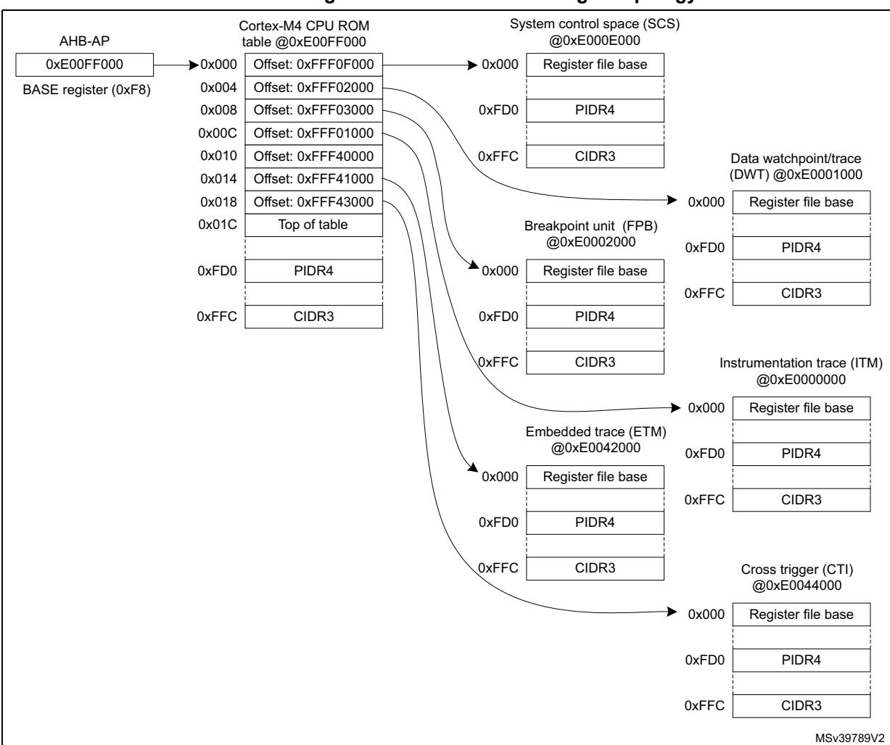

#### **Figure 883. Cortex-M4 CoreSight Topology**

### **Cortex-M4 ROM table registers**

### **ROM memory type register (M4\_ROM\_MEMTYPE)**

Address offset: 0xFCC Reset value: 0x0000 0001

| 31   | 30   | 29   | 28   | 27   | 26   | 25   | 24   | 23   | 22   | 21   | 20   | 19   | 18   | 17   | 16         |
|------|------|------|------|------|------|------|------|------|------|------|------|------|------|------|------------|
| Res. | Res. | Res. | Res. | Res. | Res. | Res. | Res. | Res. | Res. | Res. | Res. | Res. | Res. | Res. | Res.       |
|      |      |      |      |      |      |      |      |      |      |      |      |      |      |      |            |
| 15   | 14   | 13   | 12   | 11   | 10   | 9    | 8    | 7    | 6    | 5    | 4    | 3    | 2    | 1    | 0          |
| Res. | Res. | Res. | Res. | Res. | Res. | Res. | Res. | Res. | Res. | Res. | Res. | Res. | Res. | Res. | SYSME M |
|      |      |      |      |      |      |      |      |      |      |      |      |      |      |      |            |

Bits 31:1 Reserved, must be kept at reset value.

Bit 0 **SYSMEM**: System memory

1: System memory is present on this bus

# **ROM CoreSight peripheral identity register 4 (M4\_ROM\_PIDR4)**

Address offset: 0xFD0 Reset value: 0x0000 0000

| 31   | 30   | 29   | 28   | 27   | 26   | 25   | 24   | 23   | 22   | 21           | 20   | 19   | 18   | 17             | 16   |
|------|------|------|------|------|------|------|------|------|------|--------------|------|------|------|----------------|------|
| Res. | Res. | Res. | Res. | Res. | Res. | Res. | Res. | Res. | Res. | Res.         | Res. | Res. | Res. | Res.           | Res. |
|      |      |      |      |      |      |      |      |      |      |              |      |      |      |                |      |
|      |      |      |      |      |      |      |      |      |      |              |      |      |      |                |      |
| 15   | 14   | 13   | 12   | 11   | 10   | 9    | 8    | 7    | 6    | 5            | 4    | 3    | 2    | 1              | 0    |
| Res. | Res. | Res. | Res. | Res. | Res. | Res. | Res. |      |      | 4KCOUNT[3:0] |      |      |      | JEP106CON[3:0] |      |

Bits 31:8 Reserved, must be kept at reset value.

Bits 7:4 **4KCOUNT[3:0]**: Register file size

0x0: Register file occupies a single 4 Kbyte region

Bits 3:0 **JEP106CON[3:0]**: JEP106 continuation code

0x0: STMicroelectronics JEDEC continuation code

# **ROM CoreSight peripheral identity register 0 (M4\_ROM\_PIDR0)**

Address offset: 0xFE0 Reset value: 0x0000 0050

| 31   | 30   | 29   | 28   | 27   | 26   | 25   | 24   | 23           | 22   | 21   | 20   | 19   | 18   | 17   | 16   |
|------|------|------|------|------|------|------|------|--------------|------|------|------|------|------|------|------|
| Res. | Res. | Res. | Res. | Res. | Res. | Res. | Res. | Res.         | Res. | Res. | Res. | Res. | Res. | Res. | Res. |
|      |      |      |      |      |      |      |      |              |      |      |      |      |      |      |      |
| 15   | 14   | 13   | 12   | 11   | 10   | 9    | 8    | 7            | 6    | 5    | 4    | 3    | 2    | 1    | 0    |
| Res. | Res. | Res. | Res. | Res. | Res. | Res. | Res. | PARTNUM[7:0] |      |      |      |      |      |      |      |
|      |      |      |      |      |      |      |      |              |      |      |      |      |      |      |      |

Bits 31:8 Reserved, must be kept at reset value.

Bits 7:0 **PARTNUM[7:0]**: Part number field, bits [7:0]

0x50: STM32H7

### **ROM CoreSight peripheral identity register 1 (M4\_ROM\_PIDR1)**

Address offset: 0xFE4 Reset value: 0x0000 0004

| 31   | 30   | 29   | 28   | 27   | 26   | 25   | 24   | 23   | 22   | 21            | 20   | 19   | 18   | 17            | 16   |
|------|------|------|------|------|------|------|------|------|------|---------------|------|------|------|---------------|------|
| Res. | Res. | Res. | Res. | Res. | Res. | Res. | Res. | Res. | Res. | Res.          | Res. | Res. | Res. | Res.          | Res. |
|      |      |      |      |      |      |      |      |      |      |               |      |      |      |               |      |
|      |      |      |      |      |      |      |      |      |      |               |      |      |      |               |      |
| 15   | 14   | 13   | 12   | 11   | 10   | 9    | 8    | 7    | 6    | 5             | 4    | 3    | 2    | 1             | 0    |
| Res. | Res. | Res. | Res. | Res. | Res. | Res. | Res. |      |      | JEP106ID[3:0] |      |      |      | PARTNUM[11:8] |      |

Bits 31:8 Reserved, must be kept at reset value.

Bits 7:4 **JEP106ID[3:0]**: JEP106 identity code field, bits [3:0]

0x0: STMicroelectronics JEDEC code

Bits 3:0 **PARTNUM[11:8]**: Part number field, bits [11:8]

0x4: STM32H7

## **ROM CoreSight peripheral identity register 2 (M4\_ROM\_PIDR2)**

Address offset: 0xFE8

Reset value: 0x0000 000A

| 31   | 30   | 29   | 28   | 27   | 26   | 25   | 24   | 23   | 22   | 21            | 20   | 19    | 18   | 17            | 16   |
|------|------|------|------|------|------|------|------|------|------|---------------|------|-------|------|---------------|------|
| Res. | Res. | Res. | Res. | Res. | Res. | Res. | Res. | Res. | Res. | Res.          | Res. | Res.  | Res. | Res.          | Res. |
|      |      |      |      |      |      |      |      |      |      |               |      |       |      |               |      |
|      |      |      |      |      |      |      |      |      |      |               |      |       |      |               |      |
| 15   | 14   | 13   | 12   | 11   | 10   | 9    | 8    | 7    | 6    | 5             | 4    | 3     | 2    | 1             | 0    |
| Res. | Res. | Res. | Res. | Res. | Res. | Res. | Res. |      |      | REVISION[3:0] |      | JEDEC |      | JEP106ID[6:4] |      |

Bits 31:8 Reserved, must be kept at reset value.

Bits 7:4 **REVISION[3:0]**: Component revision number

0x0: rev 0

Bit 3 **JEDEC**: JEDEC assigned value

1: Designer ID specified by JEDEC

Bits 2:0 **JEP106ID[6:4]**: JEP106 identity code field, bits [6:4]

0x2: STMicroelectronics JEDEC code

### **ROM CoreSight peripheral identity register 3 (M4\_ROM\_PIDR3)**

Address offset: 0xFEC Reset value: 0x0000 0000

| 31   | 30   | 29   | 28   | 27   | 26   | 25   | 24   | 23          | 22   | 21   | 20   | 19   | 18   | 17        | 16   |
|------|------|------|------|------|------|------|------|-------------|------|------|------|------|------|-----------|------|
| Res. | Res. | Res. | Res. | Res. | Res. | Res. | Res. | Res.        | Res. | Res. | Res. | Res. | Res. | Res.      | Res. |
|      |      |      |      |      |      |      |      |             |      |      |      |      |      |           |      |
| 15   | 14   | 13   | 12   | 11   | 10   | 9    | 8    | 7           | 6    | 5    | 4    | 3    | 2    | 1         | 0    |
| Res. | Res. | Res. | Res. | Res. | Res. | Res. | Res. | REVAND[3:0] |      |      |      |      |      | CMOD[3:0] |      |
|      |      |      |      |      |      |      |      | r           | r    | r    | r    | r    | r    | r         | r    |

Bits 31:8 Reserved, must be kept at reset value.

Bits 7:4 **REVAND[3:0]**: Metal fix version

0x0: No metal fix

Bits 3:0 **CMOD[3:0]**: Customer modified 0x0: No customer modifications

## **ROM CoreSight component identity register 0 (M4\_ROM\_CIDR0)**

Address offset: 0xFF0

Reset value: 0x0000 000D

| 31   | 30   | 29   | 28   | 27   | 26   | 25   | 24   | 23   | 22   | 21   | 20   | 19            | 18   | 17   | 16   |
|------|------|------|------|------|------|------|------|------|------|------|------|---------------|------|------|------|
| Res. | Res. | Res. | Res. | Res. | Res. | Res. | Res. | Res. | Res. | Res. | Res. | Res.          | Res. | Res. | Res. |
|      |      |      |      |      |      |      |      |      |      |      |      |               |      |      |      |
|      |      |      |      |      |      |      |      |      |      |      |      |               |      |      |      |
| 15   | 14   | 13   | 12   | 11   | 10   | 9    | 8    | 7    | 6    | 5    | 4    | 3             | 2    | 1    | 0    |
| Res. | Res. | Res. | Res. | Res. | Res. | Res. | Res. |      |      |      |      | PREAMBLE[7:0] |      |      |      |

Bits 31:8 Reserved, must be kept at reset value.

Bits 7:0 **PREAMBLE[7:0]**: Component ID field, bits [7:0]

0x0D: Common ID value

### **ROM CoreSight component identity register 1 (M4\_ROM\_CIDR1)**

Address offset: 0xFF4

Reset value: 0x0000 0010

| 31   | 30   | 29   | 28   | 27   | 26   | 25   | 24   | 23   | 22   | 21   | 20   | 19   | 18   | 17   | 16   |
|------|------|------|------|------|------|------|------|------|------|------|------|------|------|------|------|
| Res. | Res. | Res. | Res. | Res. | Res. | Res. | Res. | Res. | Res. | Res. | Res. | Res. | Res. | Res. | Res. |
|      |      |      |      |      |      |      |      |      |      |      |      |      |      |      |      |

RM0399 Rev 4 3455/3556

| 15   | 14   | 13   | 12   | 11   | 10   | 9    | 8    | 7          | 6 | 5 | 4 | 3 | 2 | 1              | 0 |
|------|------|------|------|------|------|------|------|------------|---|---|---|---|---|----------------|---|
| Res. | Res. | Res. | Res. | Res. | Res. | Res. | Res. | CLASS[3:0] |   |   |   |   |   | PREAMBLE[11:8] |   |
|      |      |      |      |      |      |      |      | r          | r | r | r | r | r | r              | r |

Bits 31:8 Reserved, must be kept at reset value.

Bits 7:4 **CLASS[3:0]**: Component ID field, bits [15:12] - component class

0x1: ROM table component

Bits 3:0 **PREAMBLE[11:8]**: Component ID field, bits [11:8]

0x0: Common ID value

### **ROM CoreSight component identity register 2 (M4\_ROM\_CIDR2)**

Address offset: 0xFF8

Reset value: 0x0000 0005

| 31   | 30   | 29   | 28   | 27   | 26   | 25   | 24   | 23   | 22   | 21   | 20   | 19              | 18   | 17   | 16   |
|------|------|------|------|------|------|------|------|------|------|------|------|-----------------|------|------|------|
| Res. | Res. | Res. | Res. | Res. | Res. | Res. | Res. | Res. | Res. | Res. | Res. | Res.            | Res. | Res. | Res. |
|      |      |      |      |      |      |      |      |      |      |      |      |                 |      |      |      |
| 15   | 14   | 13   | 12   | 11   | 10   | 9    | 8    | 7    |      |      | 4    | 3               |      |      |      |
|      |      |      |      |      |      |      |      |      | 6    | 5    |      |                 | 2    | 1    | 0    |
| Res. | Res. | Res. | Res. | Res. | Res. | Res. | Res. |      |      |      |      | PREAMBLE[19:12] |      |      |      |

Bits 31:8 Reserved, must be kept at reset value.

Bits 7:0 **PREAMBLE[19:12]**: Component ID field, bits [23:16]

0x05: Common ID value

### **ROM CoreSight component identity register 3 (M4\_ROM\_CIDR3)**

Address offset: 0xFFC

Reset value: 0x0000 00B1

| 31   | 30   | 29   | 28   | 27   | 26   | 25   | 24   | 23              | 22   | 21   | 20   | 19   | 18   | 17   | 16   |  |  |
|------|------|------|------|------|------|------|------|-----------------|------|------|------|------|------|------|------|--|--|
| Res. | Res. | Res. | Res. | Res. | Res. | Res. | Res. | Res.            | Res. | Res. | Res. | Res. | Res. | Res. | Res. |  |  |
|      |      |      |      |      |      |      |      |                 |      |      |      |      |      |      |      |  |  |
| 15   | 14   | 13   | 12   | 11   | 10   | 9    | 8    | 7               | 6    | 5    | 4    | 3    | 2    | 1    | 0    |  |  |
| Res. | Res. | Res. | Res. | Res. | Res. | Res. | Res. | PREAMBLE[27:20] |      |      |      |      |      |      |      |  |  |
|      |      |      |      |      |      |      |      | r               | r    | r    | r    | r    | r    | r    | r    |  |  |

Bits 31:8 Reserved, must be kept at reset value.

Bits 7:0 **PREAMBLE[27:20]**: Component ID field, bits [31:24]

0xB1: Common ID value

### **Cortex-M4 ROM table register map and reset values**

**Table 652. Cortex-M4 ROM table register map and reset values** 

|                   | Offset Register name | 31   | 30   | 29   | 28   | 27   | 26   | 25   | 24   | 23   | 22   | 21   | 20   | 19   | 18   | 17   | 16       | 15   | 14   | 13   | 12   | 11   | 10   | 9    | 8    | 7    | 6                | 5    | 4               | 3    | 2             | 1     | 0      |
|-------------------|----------------------|------|------|------|------|------|------|------|------|------|------|------|------|------|------|------|----------|------|------|------|------|------|------|------|------|------|------------------|------|-----------------|------|---------------|-------|--------|
| 0xFCC             | M4_ROM _MEMTYPE   | Res. | Res. | Res. | Res. | Res. | Res. | Res. | Res. | Res. | Res. | Res. | Res. | Res. | Res. | Res. | Res.     | Res. | Res. | Res. | Res. | Res. | Res. | Res. | Res. | Res. | Res.             | Res. | Res.            | Res. | Res.          | Res.  | SYSMEM |
|                   | Reset value          |      |      |      |      |      |      |      |      |      |      |      |      |      |      |      |          |      |      |      |      |      |      |      |      |      |                  |      |                 |      |               |       | 1      |
| 0xFD0             | M4_ROM_PIDR4         | Res. | Res. | Res. | Res. | Res. | Res. | Res. | Res. | Res. | Res. | Res. | Res. | Res. | Res. | Res. | Res.     | Res. | Res. | Res. | Res. | Res. | Res. | Res. |      |      | Res.4KCOUNT[3:   | 0]   |                 |      | JEP106CON[    | 3:0]  |        |
|                   | Reset value          |      |      |      |      |      |      |      |      |      |      |      |      |      |      |      |          |      |      |      |      |      |      |      |      | 0    | 0                | 0    | 0               | 0    | 0             | 0     | 0      |
| 0xFD4 to 0xFDC | Reserved             |      |      |      |      |      |      |      |      |      |      |      |      |      |      |      | Reserved |      |      |      |      |      |      |      |      |      |                  |      |                 |      |               |       |        |
| 0xFE0             | M4_ROM_PIDR0         | Res. | Res. | Res. | Res. | Res. | Res. | Res. | Res. | Res. | Res. | Res. | Res. | Res. | Res. | Res. | Res.     | Res. | Res. | Res. | Res. | Res. | Res. | Res. | Res. |      |                  |      | PARTNUM[7:0]    |      |               |       |        |
|                   | Reset value          |      |      |      |      |      |      |      |      |      |      |      |      |      |      |      |          |      |      |      |      |      |      |      |      | 0    | 1                | 0    | 1               | 0    | 0             | 0     | 0      |
| 0xFE4             | M4_ROM_PIDR1         | Res. | Res. | Res. | Res. | Res. | Res. | Res. | Res. | Res. | Res. | Res. | Res. | Res. | Res. | Res. | Res.     | Res. | Res. | Res. | Res. | Res. | Res. | Res. |      |      | Res.JEP106ID[3:0 | ]    |                 |      | PARTNUM[1     | 1:8]  |        |
|                   | Reset value          |      |      |      |      |      |      |      |      |      |      |      |      |      |      |      |          |      |      |      |      |      |      |      |      | 0    | 0                | 0    | 0               | 0    | 1             | 0     | 0      |
| 0xFE8             | M4_ROM_PIDR2         | Res. | Res. | Res. | Res. | Res. | Res. | Res. | Res. | Res. | Res. | Res. | Res. | Res. | Res. | Res. | Res.     | Res. | Res. | Res. | Res. | Res. | Res. | Res. |      |      | Res.REVISION[3:  | 0]   |                 |      | JEDECJEP106ID | [6:4] |        |
|                   | Reset value          |      |      |      |      |      |      |      |      |      |      |      |      |      |      |      |          |      |      |      |      |      |      |      |      | 0    | 0                | 0    | 0               | 1    | 0             | 1     | 0      |
| 0xFEC             | M4_ROM_PIDR3         | Res. | Res. | Res. | Res. | Res. | Res. | Res. | Res. | Res. | Res. | Res. | Res. | Res. | Res. | Res. | Res.     | Res. | Res. | Res. | Res. | Res. | Res. | Res. |      |      | Res. REVAND[3:0] |      |                 |      | CMOD[3:0]     |       |        |
|                   | Reset value          |      |      |      |      |      |      |      |      |      |      |      |      |      |      |      |          |      |      |      |      |      |      |      |      | 0    | 0                | 0    | 0               | 0    | 0             | 0     | 0      |
| 0xFF0             | M4_ROM_CIDR0         | Res. | Res. | Res. | Res. | Res. | Res. | Res. | Res. | Res. | Res. | Res. | Res. | Res. | Res. | Res. | Res.     | Res. | Res. | Res. | Res. | Res. | Res. | Res. | Res. |      |                  |      | PREAMBLE[7:0]   |      |               |       |        |
|                   | Reset value          |      |      |      |      |      |      |      |      |      |      |      |      |      |      |      |          |      |      |      |      |      |      |      |      | 0    | 0                | 0    | 0               | 1    | 1             | 0     | 1      |
| 0xFF4             | M4_ROM_CIDR1         | Res. | Res. | Res. | Res. | Res. | Res. | Res. | Res. | Res. | Res. | Res. | Res. | Res. | Res. | Res. | Res.     | Res. | Res. | Res. | Res. | Res. | Res. | Res. | Res. |      | CLASS[3:0]       |      |                 |      | PREAMBLE[     | 11:8] |        |
|                   | Reset value          |      |      |      |      |      |      |      |      |      |      |      |      |      |      |      |          |      |      |      |      |      |      |      |      | 0    | 0                | 0    | 1               | 0    | 0             | 0     | 0      |
| 0xFF8             | M4_ROM_CIDR2         | Res. | Res. | Res. | Res. | Res. | Res. | Res. | Res. | Res. | Res. | Res. | Res. | Res. | Res. | Res. | Res.     | Res. | Res. | Res. | Res. | Res. | Res. | Res. | Res. |      |                  |      | PREAMBLE[19:12] |      |               |       |        |
|                   | Reset value          |      |      |      |      |      |      |      |      |      |      |      |      |      |      |      |          |      |      |      |      |      |      |      |      | 0    | 0                | 0    | 0               | 0    | 1             | 0     | 1      |
| 0xFFC             | M4_ROM_CIDR3         | Res. | Res. | Res. | Res. | Res. | Res. | Res. | Res. | Res. | Res. | Res. | Res. | Res. | Res. | Res. | Res.     | Res. | Res. | Res. | Res. | Res. | Res. | Res. | Res. |      |                  |      | PREAMBLE[27:20] |      |               |       |        |
|                   | Reset value          |      |      |      |      |      |      |      |      |      |      |      |      |      |      |      |          |      |      |      |      |      |      |      |      | 1    | 0                | 1    | 1               | 0    | 0             | 0     | 1      |

## **63.7.2 Cortex-M4 data watchpoint and trace unit (DWT)**

The DWT provides four comparators that can be used as:

- watchpoint
- ETM trigger
- PC sampling trigger
- data address sampling trigger
- data comparator (comparator 1 only)
- clock cycle counter comparator (comparator 0 only)

It also contains counters for:

- clock cycles
- · folded instructions
- · load store unit (LSU) operations
- sleep cycles
- number of cycles per instruction
- interrupt overhead

A DWT comparator compares one of the following with the value held in its DWT\_COMP register:

- a data address
- an instruction address
- a data value
- the cycle count value, for comparator 0 only.

For address matching, the comparator can use a mask, so it matches a range of addresses.

On a successful match, the comparator generates one of the following:

- one or more DWT Data trace packets, containing one or more of:
  - the address of the instruction that caused a data access
  - an address offset, bits[15:0] of the data access address
  - the matched data value
- a watchpoint debug event, on either the PC value or the accessed data address
- a CMPMATCH[N] event, that signals the match outside the DWT unit

A watchpoint debug event either generates a DebugMonitor exception, or causes the processor to halt execution and enter Debug state.

For more details on how to use the DWT, refer to the Arm®v7-M Architecture Reference Manual *[5]*.

### **Cortex-M4 DWT registers**

### DWT control register (M4\_DWT\_CTRL)

Address offset: 0x000 Reset value: 0x4000 0000

29

31

| 01   | 00    | 20       | 20                 | 21           | 20            | 20           | 27           | 20                           |               | 21             | 20            | 13                  | 10            | 17            | 10            |
|------|-------|----------|--------------------|--------------|---------------|--------------|--------------|------------------------------|---------------|----------------|---------------|---------------------|---------------|---------------|---------------|
|      | NUMCO | MP[3:0]. |                    | NOTR CPKT | NOEX TTRIG | NOCYC CNT | NOPRF CNT | Res.                         | CYCEV TENA | FOLDE VTENA | LSUEV TENA | SLEEP EVTEN A | EXCEV TENA | CPIEVT ENA | EXCTR CENA |
| r    | r     | r        | r                  | r            | r             | r            | r            |                              | rw            | rw             | rw            | rw                  | rw            | rw            | rw            |
| 15   | 14    | 13       | 12                 | 11           | 10            | 9            | 8            | 7                            | 6             | 5              | 4             | 3                   | 2             | 1             | 0             |
| Res. | Res.  | Res.     | PCSA MPLE NA | SYNCT        | AP[1:0]       | CYCTA P   |              | POSTINIT[3:0] POSTRESET[3:0] |               |                |               |                     |               |               | CYCCN TENA |
|      |       |          | rw                 | rw           | rw            | rw           | rw           | rw                           | rw            | rw             | rw            | rw                  | rw            | rw            | rw            |

- Bits 31:28 **NUMCOMP[3:0]**: Number of comparators implemented (read-only)
  - 0x4: Four comparators
  - Bit 27 **NOTRCPKT**: Trace sampling and exception tracing support (read-only)
    - 0: Supported
  - Bit 26 **NOEXTTRIG**: External match signal, CMPMATCH support (read-only)
    - 0: Supported
  - Bit 25 **NOCYCCNT**: Cycle counter support (read-only)
    - 0: Supported
  - Bit 24 **NOPRFCNT**: Profiling counter support (read-only)
    - 0: Supported
  - Bit 23 Reserved, must be kept at reset value.
  - Bit 22 **CYCEVTENA**: Enable for POSTCNT underflow event counter packet generation
    - 0: Disabled
    - 1: Enabled
  - Bit 21 **FOLDEVTENA**: Enable for folded instruction counter overflow event generation
    - 0: Disabled
    - 1: Enabled
  - Bit 20 **LSUEVTENA**: Enable for LSU counter overflow event generation
    - 0: Disabled
    - 1: Enabled
  - Bit 19 **SLEEPEVTENA**: Enable for sleep counter overflow event generation
    - 0: Disabled
    - 1: Enabled
  - Bit 18 **EXCEVTENA**: Enable for exception overhead counter overflow event generation
    - 0: Disabled
    - 1: Enabled
  - Bit 17 **CPIEVTENA**: Enable for CPI counter overflow event generation
    - 0: Disabled
    - 1: Enabled
  - Bit 16 **EXCTRCENA**: Enable for exception trace generation
    - 0: Disabled
    - 1: Enabled
- Bits 15:13 Reserved, must be kept at reset value.
  - Bit 12 **PCSAMPLENA**: Enable for POSTCNT use as sample timer

Enables use of POSTCNT counter as a timer for Periodic PC sample packet generation.

- 0: Disabled
- 1: Enabled

#### Bits 11:10 **SYNCTAP[1:0]**: Position of sync packet counter tap on CYCCNT

Selects the position of the synchronization packet counter tap on the CYCCNT counter. This determines the synchronization packet rate.

0x0: Disabled. No synchronization packets

0x1: Tap at CYCCNT[24] 0x2: Tap at CYCCNT[26] 0x3: Tap at CYCCNT[28]

#### Bit 9 **CYCTAP**: Position of POSTCNT tap on CYCCNT

Selects the position of the POSTCNT tap on the CYCCNT counter.

0: Tap at CYCCNT[6] 1: Tap at CYCCNT[10]

#### Bits 8:5 **POSTINIT[3:0]**: Initial value of POSTCNT

Writes to this field are ignored if POSTCNT counter is enabled (that is, CYCEVTENA or PCSAMPLENA must be reset prior to writing POSTINIT).

#### Bits 4:1 **POSTRESET[3:0]**: Reload value of the POSTCNT counter

### Bit 0 **CYCCNTENA**: CYCCNT counter enable

0: Disabled 1: Enabled

### **DWT cycle count register (M4\_DWT\_CYCCNT)**

Address offset: 0x004

Reset value: 0x0000 0000

| 31 | 30            | 29 | 28 | 27 | 26 | 25 | 24 | 23           | 22 | 21 | 20 | 19 | 18 | 17 | 16 |
|----|---------------|----|----|----|----|----|----|--------------|----|----|----|----|----|----|----|
|    | CYCCNT[31:16] |    |    |    |    |    |    |              |    |    |    |    |    |    |    |
| rw | rw            | rw | rw | rw | rw | rw | rw | rw           | rw | rw | rw | rw | rw | rw | rw |
| 15 | 14            | 13 | 12 | 11 | 10 | 9  | 8  | 7            | 6  | 5  | 4  | 3  | 2  | 1  | 0  |
|    |               |    |    |    |    |    |    | CYCCNT[15:0] |    |    |    |    |    |    |    |
| rw | rw            | rw | rw | rw | rw | rw | rw | rw           | rw | rw | rw | rw | rw | rw | rw |

Bits 31:0 **CYCCNT[31:0]**: Processor clock cycle counter

### **DWT CPI count register (M4\_DWT\_CPICNT)**

Address offset: 0x008

| 31   | 30   | 29   | 28   | 27   | 26   | 25   | 24   | 23          | 22   | 21   | 20   | 19   | 18   | 17   | 16   |
|------|------|------|------|------|------|------|------|-------------|------|------|------|------|------|------|------|
| Res. | Res. | Res. | Res. | Res. | Res. | Res. | Res. | Res.        | Res. | Res. | Res. | Res. | Res. | Res. | Res. |
|      |      |      |      |      |      |      |      |             |      |      |      |      |      |      |      |
| 15   | 14   | 13   | 12   | 11   | 10   | 9    | 8    | 7           | 6    | 5    | 4    | 3    | 2    | 1    | 0    |
| Res. | Res. | Res. | Res. | Res. | Res. | Res. | Res. | CPICNT[7:0] |      |      |      |      |      |      |      |
|      |      |      |      |      |      |      |      |             |      |      |      |      |      |      |      |

Bits 31:8 Reserved, must be kept at reset value.

Bits 7:0 **CPICNT[7:0]**: CPI counter

Counts additional cycles required to execute multi-cycle instructions, except those recorded by M4\_DWT\_LSUCNT, and counts any instruction fetch stalls.

### **DWT exception count register (M4\_DWT\_EXCCNT)**

Address offset: 0x00C Reset value: 0x0000 0000

| 31   | 30   | 29   | 28   | 27   | 26   | 25   | 24   | 23   | 22   | 21   | 20   | 19          | 18   | 17   | 16   |
|------|------|------|------|------|------|------|------|------|------|------|------|-------------|------|------|------|
| Res. | Res. | Res. | Res. | Res. | Res. | Res. | Res. | Res. | Res. | Res. | Res. | Res.        | Res. | Res. | Res. |
|      |      |      |      |      |      |      |      |      |      |      |      |             |      |      |      |
|      |      |      |      |      |      |      |      |      |      |      |      |             |      |      |      |
| 15   | 14   | 13   | 12   | 11   | 10   | 9    | 8    | 7    | 6    | 5    | 4    | 3           | 2    | 1    | 0    |
| Res. | Res. | Res. | Res. | Res. | Res. | Res. | Res. |      |      |      |      | EXCCNT[7:0] |      |      |      |

Bits 31:8 Reserved, must be kept at reset value.

Bits 7:0 **EXCCNT[7:0]**: Exception overhead cycle counter

Counts the number of cycles spent in exception processing.

# **DWT sleep count register (M4\_DWT\_SLPCNT)**

Address offset: 0x010 Reset value: 0x0000 0000

| 31   | 30   | 29   | 28   | 27   | 26   | 25   | 24   | 23            | 22   | 21   | 20   | 19   | 18   | 17   | 16   |
|------|------|------|------|------|------|------|------|---------------|------|------|------|------|------|------|------|
| Res. | Res. | Res. | Res. | Res. | Res. | Res. | Res. | Res.          | Res. | Res. | Res. | Res. | Res. | Res. | Res. |
|      |      |      |      |      |      |      |      |               |      |      |      |      |      |      |      |
| 15   | 14   | 13   | 12   | 11   | 10   | 9    | 8    | 7             | 6    | 5    | 4    | 3    | 2    | 1    | 0    |
| Res. | Res. | Res. | Res. | Res. | Res. | Res. | Res. | SLEEPCNT[7:0] |      |      |      |      |      |      |      |
|      |      |      |      |      |      |      |      |               |      |      |      |      |      |      |      |

Bits 31:8 Reserved, must be kept at reset value.

Bits 7:0 **SLEEPCNT[7:0]**: Sleep cycle counter

Counts the number of cycles spent in sleep mode (WFI, WFE, sleep-on-exit).

### **DWT LSU count register (M4\_DWT\_LSUCNT)**

Address offset: 0x014

| 31   | 30   | 29   | 28   | 27   | 26   | 25   | 24   | 23   | 22   | 21   | 20   | 19   | 18   | 17   | 16   |
|------|------|------|------|------|------|------|------|------|------|------|------|------|------|------|------|
| Res. | Res. | Res. | Res. | Res. | Res. | Res. | Res. | Res. | Res. | Res. | Res. | Res. | Res. | Res. | Res. |
|      |      |      |      |      |      |      |      |      |      |      |      |      |      |      |      |

| 15   | 14   | 13   | 12   | 11   | 10   | 9    | 8    | 7  | 6  | 5  | 4  | 3           | 2  | 1  | 0  |
|------|------|------|------|------|------|------|------|----|----|----|----|-------------|----|----|----|
| Res. | Res. | Res. | Res. | Res. | Res. | Res. | Res. |    |    |    |    | LSUCNT[7:0] |    |    |    |
|      |      |      |      |      |      |      |      | rw | rw | rw | rw | rw          | rw | rw | rw |

Bits 31:8 Reserved, must be kept at reset value.

Bits 7:0 **LSUCNT[7:0]**: Load store counter

Counts additional cycles required to execute load and store instructions.

### **DWT fold count register (M4\_DWT\_FOLDCNT)**

Address offset: 0x018

Reset value: 0x0000 0000

| 31   | 30   | 29   | 28   | 27   | 26   | 25   | 24   | 23           | 22   | 21   | 20   | 19   | 18   | 17   | 16   |
|------|------|------|------|------|------|------|------|--------------|------|------|------|------|------|------|------|
| Res. | Res. | Res. | Res. | Res. | Res. | Res. | Res. | Res.         | Res. | Res. | Res. | Res. | Res. | Res. | Res. |
|      |      |      |      |      |      |      |      |              |      |      |      |      |      |      |      |
| 15   | 14   | 13   | 12   | 11   | 10   | 9    | 8    | 7            | 6    | 5    | 4    | 3    | 2    | 1    | 0    |
| Res. | Res. | Res. | Res. | Res. | Res. | Res. | Res. | FOLDCNT[7:0] |      |      |      |      |      |      |      |
|      |      |      |      |      |      |      |      | rw           | rw   | rw   | rw   | rw   | rw   | rw   | rw   |

Bits 31:8 Reserved, must be kept at reset value.

Bits 7:0 **FOLDCNT[7:0]**: Folded instruction counter

Increments on each instruction that takes 0 cycles.

### **DWT program counter sample register (M4\_DWT\_PCSR)**

Address offset: 0x01C

| 31 | 30               | 29 | 28 | 27 | 26 | 25 | 24 | 23 | 22 | 21 | 20 | 19 | 18 | 17 | 16 |
|----|------------------|----|----|----|----|----|----|----|----|----|----|----|----|----|----|
|    | EIASAMPLE[31:16] |    |    |    |    |    |    |    |    |    |    |    |    |    |    |
| rw | rw               | rw | rw | rw | rw | rw | rw | rw | rw | rw | rw | rw | rw | rw | rw |
| 15 | 14               | 13 | 12 | 11 | 10 | 9  | 8  | 7  | 6  | 5  | 4  | 3  | 2  | 1  | 0  |
|    | EIASAMPLE[15:0]  |    |    |    |    |    |    |    |    |    |    |    |    |    |    |
| rw | rw               | rw | rw | rw | rw | rw | rw | rw | rw | rw | rw | rw | rw | rw | rw |

Bits 31:0 **EIASAMPLE[31:0]**: Executed instruction address sample value Samples the current value of the program counter.

## DWT comparator register x (M4\_DWT\_COMPx)

Address offset: 0x020 + x \* 0x10 (for x = 0 to 3)

Reset value: 0x0000 0000

| 31 | 30          | 29 | 28 | 27 | 26 | 25 | 24  | 23       | 22 | 21 | 20 | 19 | 18 | 17 | 16 |
|----|-------------|----|----|----|----|----|-----|----------|----|----|----|----|----|----|----|
|    | COMP[31:16] |    |    |    |    |    |     |          |    |    |    |    |    |    |    |
| rw | rw          | rw | rw | rw | rw | rw | rw  | rw       | rw | rw | rw | rw | rw | rw | rw |
| 15 | 14          | 13 | 12 | 11 | 10 | 9  | 8   | 7        | 6  | 5  | 4  | 3  | 2  | 1  | 0  |
|    |             |    |    |    |    |    | CON | MP[15:0] |    |    |    |    |    |    |    |
| rw | rw          | rw | rw | rw | rw | rw | rw  | rw       | rw | rw | rw | rw | rw | rw | rw |

Bits 31:0 COMP[31:0]: Reference value for comparison

# DWT mask register x (M4\_DWT\_MASKx)

Address offset: 0x024 + x \* 0x10 (for x = 0 to 3)

Reset value: 0x0000 0000

| 31         | 30         | 29         | 28         | 27   | 26         | 25        | 24   | 23        | 22   | 21   | 20   | 19   | 18            | 17   | 16   |
|------------|------------|------------|------------|------|------------|-----------|------|-----------|------|------|------|------|---------------|------|------|
| Res.       | Res.       | Res.       | Res.       | Res. | Res.       | Res.      | Res. | Res.      | Res. | Res. | Res. | Res. | Res.          | Res. | Res. |
|            |            |            |            |      |            |           |      |           |      |      |      |      |               |      |      |
|            |            |            |            | 1    |            |           | 1    | l .       |      |      |      |      | 1             |      |      |
| 15         | 14         | 13         | 12         | 11   | 10         | 9         | 8    | 7         | 6    | 5    | 4    | 3    | 2             | 1    | 0    |
| 15 Res. | 14 Res. | 13 Res. | 12 Res. | Res. | 10 Res. | 9 Res. | Res. | 7 Res. | Res. | Res. | 4    |      | 2 MASK[4:0 | 1    | 0    |

Bits 31:5 Reserved, must be kept at reset value.

### Bits 4:0 MASK[4:0]: Comparator mask size

Provides the size of the ignore mask applied to the access address for address range matching by comparator n. A debugger can write 0b11111 to this field and then read the register back to determine the maximum mask size supported.

### DWT function register x (M4\_DWT\_FUNCTx)

Address offset: 0x028 + x \* 0x10 (for x = 0 to 3)

Reset value: 0x0000 0000

| 31   | 30                                       | 29   | 28   | 27   | 26   | 25   | 24             | 23           | 22   | 21            | 20   | 19 | 18      | 17        | 16 |
|------|------------------------------------------|------|------|------|------|------|----------------|--------------|------|---------------|------|----|---------|-----------|----|
| Res. | Res.                                     | Res. | Res. | Res. | Res. | Res. | MATCH ED    | Res.         | Res. | Res.          | Res. |    | DATAVAE | DDR1[3:0] |    |
|      |                                          |      |      |      |      |      | r              |              |      |               |      | rw | rw      | rw        | rw |
| 15   | 14                                       | 13   | 12   | 11   | 10   | 9    | 8              | 7            | 6    | 5             | 4    | 3  | 2       | 1         | 0  |
|      | DATAVADDR0[3:0] DATAVSIZE[1:0] LINK1 ENA |      |      |      |      |      | DATAV MATCH | CYC MATCH | Res. | EMIT RANGE | Res. |    | FUNCT   | ION[3:0]  |    |
| rw   | rw                                       | rw   | rw   | rw   | rw   | rw   | rw             | rw           |      | rw            | ,    | rw | rw      | rw        | rw |

RM0399 Rev 4 3463/3556

- Bits 31:25 Reserved, must be kept at reset value.
  - Bit 24 **MATCHED**: Comparator match (read-only)

Indicates if a comparator match has occurred since the register was last read.

- 0: No match
- 1: Match occurred
- Bits 23:20 Reserved, must be kept at reset value.
- Bits 19:16 **DATAVADDR1[3:0]**: Comparator number of a second comparator

When the DATAVMATCH and LNK1ENA bits are both 1, this field can hold the comparator number of a second comparator to use for linked address comparison.

Bits 15:12 **DATAVADDR0[3:0]**: Comparator number of a comparator

When the DATAVMATCH and LNK1ENA bits are both 1, this field can hold the comparator number of a comparator to use for linked address comparison.

Bits 11:10 **DATAVSIZE[1:0]**: Size of required data comparison

For data value matching, specifies the size of the required data comparison.

0x0: Byte 0x1: Half word 0x2: Word 0x3: Reserved

Bit 9 **LNK1ENA**: Support of a second linked comparator (read-only)

Indicates whether use of a second linked comparator is supported (read-only).

- 1: Supported
- Bit 8 **DATAVMATCH**: Cycle comparison enable
  - 0: Perform address comparison
  - 1: Perform data value comparison
- Bit 7 **CYCMATCH**: Enables cycle count comparison on comparator 0. This field is reserved for other comparators.
  - 0: No cycle count comparison
  - 1: Compare M4\_DWT\_COMP0 with the cycle counter, M4\_DWT\_CYCCNT
- Bit 6 Reserved, must be kept at reset value
- Bit 5 **EMITRANGE**: Data trace address offset packet enable

Enables generation of data trace address offset packets (containing data address bits 0 to 15)

- 0: Disabled
- 1: Enabled
- Bit 4 Reserved, must be kept at reset value.
- Bits 3:0 **FUNCTION[3:0]**: Action on comparator match

The meaning of this bit field depends on the setting of the DATAVMATCH and CYCMATCH fields. See *[\[5\]](#page-283-5)*.

### **DWT CoreSight peripheral identity register 4 (M4\_DWT\_PIDR4)**

Address offset: 0xFD0 Reset value: 0x0000 0004

| 31   | 30   | 29   | 28   | 27   | 26   | 25   | 24   | 23   | 22   | 21           | 20   | 19   | 18   | 17             | 16   |
|------|------|------|------|------|------|------|------|------|------|--------------|------|------|------|----------------|------|
| Res. | Res. | Res. | Res. | Res. | Res. | Res. | Res. | Res. | Res. | Res.         | Res. | Res. | Res. | Res.           | Res. |
|      |      |      |      |      |      |      |      |      |      |              |      |      |      |                |      |
| 15   | 14   | 13   | 12   | 11   | 10   | 9    | 8    | 7    |      | 5            | 4    |      |      |                | 0    |
|      |      |      |      |      |      |      |      |      | 6    |              |      | 3    | 2    | 1              |      |
| Res. | Res. | Res. | Res. | Res. | Res. | Res. | Res. |      |      | 4KCOUNT[3:0] |      |      |      | JEP106CON[3:0] |      |

Bits 31:8 Reserved, must be kept at reset value.

Bits 7:4 **4KCOUNT[3:0]**: Register file size

0x0: Register file occupies a single 4 Kbyte region

Bits 3:0 **JEP106CON[3:0]**: JEP106 continuation code

0x4: Arm® JEDEC code

### **DWT CoreSight peripheral identity register 0 (M4\_DWT\_PIDR0)**

Address offset: 0xFE0 Reset value: 0x0000 0002

| 31   | 30   | 29   | 28   | 27   | 26   | 25   | 24   | 23   | 22   | 21   | 20   | 19           | 18   | 17   | 16   |
|------|------|------|------|------|------|------|------|------|------|------|------|--------------|------|------|------|
| Res. | Res. | Res. | Res. | Res. | Res. | Res. | Res. | Res. | Res. | Res. | Res. | Res.         | Res. | Res. | Res. |
|      |      |      |      |      |      |      |      |      |      |      |      |              |      |      |      |
| 15   | 14   | 13   | 12   | 11   | 10   | 9    | 8    | 7    | 6    | 5    | 4    | 3            | 2    | 1    | 0    |
| Res. | Res. | Res. | Res. | Res. | Res. | Res. | Res. |      |      |      |      | PARTNUM[7:0] |      |      |      |
|      |      |      |      |      |      |      |      | r    | r    |      |      |              |      |      |      |

Bits 31:8 Reserved, must be kept at reset value.

Bits 7:0 **PARTNUM[7:0]**: Part number field, bits [7:0]

0x02: DWT part number

### **DWT CoreSight peripheral identity register 1 (M4\_DWT\_PIDR1)**

Address offset: 0xFE4

Reset value: 0x0000 00B0

| 31   | 30   | 29   | 28   | 27   | 26   | 25   | 24   | 23   | 22   | 21   | 20   | 19   | 18   | 17   | 16   |
|------|------|------|------|------|------|------|------|------|------|------|------|------|------|------|------|
| Res. | Res. | Res. | Res. | Res. | Res. | Res. | Res. | Res. | Res. | Res. | Res. | Res. | Res. | Res. | Res. |
|      |      |      |      |      |      |      |      |      |      |      |      |      |      |      |      |

RM0399 Rev 4 3465/3556

| 15   | 14   | 13   | 12   | 11   | 10   | 9    | 8    | 7 | 6 | 5             | 4 | 3 | 2 | 1             | 0 |
|------|------|------|------|------|------|------|------|---|---|---------------|---|---|---|---------------|---|
| Res. | Res. | Res. | Res. | Res. | Res. | Res. | Res. |   |   | JEP106ID[3:0] |   |   |   | PARTNUM[11:8] |   |
|      |      |      |      |      |      |      |      | r | r | r             | r | r | r | r             | r |

Bits 31:8 Reserved, must be kept at reset value.

Bits 7:4 **JEP106ID[3:0]**: JEP106 identity code field, bits [3:0]

0xB: Arm® JEDEC code

Bits 3:0 **PARTNUM[11:8]**: Part number field, bits [11:8]

0x0: DWT part number

# **DWT CoreSight peripheral identity register 2 (M4\_DWT\_PIDR2)**

Address offset: 0xFE8

Reset value: 0x0000 003B

| 31   | 30   | 29   | 28   | 27   | 26   | 25   | 24   | 23   | 22   | 21            | 20   | 19    | 18   | 17            | 16   |
|------|------|------|------|------|------|------|------|------|------|---------------|------|-------|------|---------------|------|
| Res. | Res. | Res. | Res. | Res. | Res. | Res. | Res. | Res. | Res. | Res.          | Res. | Res.  | Res. | Res.          | Res. |
|      |      |      |      |      |      |      |      |      |      |               |      |       |      |               |      |
| 15   |      |      |      |      |      |      |      |      |      |               |      |       |      |               |      |
|      | 14   | 13   | 12   | 11   | 10   | 9    | 8    | 7    | 6    | 5             | 4    | 3     | 2    | 1             | 0    |
| Res. | Res. | Res. | Res. | Res. | Res. | Res. | Res. |      |      | REVISION[3:0] |      | JEDEC |      | JEP106ID[6:4] |      |

Bits 31:8 Reserved, must be kept at reset value.

Bits 7:4 **REVISION[3:0]**: Component revision number

0x3: r0p4

Bit 3 **JEDEC**: JEDEC assigned value

1: Designer ID specified by JEDEC

Bits 2:0 **JEP106ID[6:4]**: JEP106 identity code field, bits [6:4]

0x3: Arm® JEDEC code

# **DWT CoreSight peripheral identity register 3 (M4\_DWT\_PIDR3)**

Address offset: 0xFEC

| 31   | 30   | 29   | 28   | 27   | 26   | 25   | 24   | 23   | 22   | 21          | 20   | 19   | 18   | 17        | 16   |  |  |  |
|------|------|------|------|------|------|------|------|------|------|-------------|------|------|------|-----------|------|--|--|--|
| Res. | Res. | Res. | Res. | Res. | Res. | Res. | Res. | Res. | Res. | Res.        | Res. | Res. | Res. | Res.      | Res. |  |  |  |
| 15   | 14   | 13   | 12   | 11   | 10   | 9    | 8    | 7    | 6    | 5           | 4    | 3    | 2    | 1         | 0    |  |  |  |
| Res. | Res. | Res. | Res. | Res. | Res. | Res. | Res. |      |      | REVAND[3:0] |      |      |      | CMOD[3:0] |      |  |  |  |
|      |      |      |      |      |      |      |      | r    | r    | r           | r    | r    | r    | r         | r    |  |  |  |

Bits 31:8 Reserved, must be kept at reset value.

Bits 7:4 **REVAND[3:0]**: Metal fix version

0x0: No metal fix

Bits 3:0 **CMOD[3:0]**: Customer modified

0x0: No customer modifications

# **DWT CoreSight component identity register 0 (M4\_DWT\_CIDR0)**

Address offset: 0xFF0

Reset value: 0x0000 000D

| 31   | 30   | 29   | 28   | 27   | 26   | 25   | 24   | 23            | 22   | 21   | 20   | 19   | 18   | 17   | 16   |  |  |  |
|------|------|------|------|------|------|------|------|---------------|------|------|------|------|------|------|------|--|--|--|
| Res. | Res. | Res. | Res. | Res. | Res. | Res. | Res. | Res.          | Res. | Res. | Res. | Res. | Res. | Res. | Res. |  |  |  |
|      |      |      |      |      |      |      |      |               |      |      |      |      |      |      |      |  |  |  |
| 15   | 14   | 13   | 12   | 11   | 10   | 9    | 8    | 7             | 6    | 5    | 4    | 3    | 2    | 1    | 0    |  |  |  |
| Res. | Res. | Res. | Res. | Res. | Res. | Res. | Res. | PREAMBLE[7:0] |      |      |      |      |      |      |      |  |  |  |
|      |      |      |      |      |      |      |      |               |      |      |      |      |      |      |      |  |  |  |

Bits 31:8 Reserved, must be kept at reset value.

Bits 7:0 **PREAMBLE[7:0]**: Component ID field, bits [7:0]

0x0D: Common ID value

# **DWT CoreSight component identity register 1 (M4\_DWT\_CIDR1)**

Address offset: 0xFF4

Reset value: 0x0000 00E0

| 31   | 30   | 29   | 28   | 27   | 26   | 25   | 24   | 23     | 22   | 21         | 20 | 19           | 18             | 17   | 16   |  |  |  |
|------|------|------|------|------|------|------|------|--------|------|------------|----|--------------|----------------|------|------|--|--|--|
| Res. | Res. | Res. | Res. | Res. | Res. | Res. | Res. | Res.   | Res. | Res.       |    | Res. Res. |                | Res. | Res. |  |  |  |
|      |      |      |      |      |      |      |      |        |      |            |    |              |                |      |      |  |  |  |
| 15   | 14   | 13   | 12   | 11   | 10   | 9    | 8    | 7 6 |      | 5          | 4  | 3            | 2              | 1    | 0    |  |  |  |
| Res. | Res. | Res. | Res. | Res. | Res. | Res. | Res. |        |      | CLASS[3:0] |    |              | PREAMBLE[11:8] |      |      |  |  |  |
|      |      |      |      |      |      |      |      |        |      |            |    |              |                |      |      |  |  |  |

Bits 31:8 Reserved, must be kept at reset value.

Bits 7:4 **CLASS[3:0]**: Component ID field, bits [15:12] - component class

0xE: Trace generator component

Bits 3:0 **PREAMBLE[11:8]**: Component ID field, bits [11:8]

0x0: Common ID value

### **DWT CoreSight component identity register 2 (M4\_DWT\_CIDR2)**

Address offset: 0xFF8 Reset value: 0x0000 0005

| 31   | 30   | 29   | 28   | 27   | 26   | 25   | 24   | 23              | 22   | 21   | 20   | 19   | 18   | 17   | 16   |  |  |  |
|------|------|------|------|------|------|------|------|-----------------|------|------|------|------|------|------|------|--|--|--|
| Res. | Res. | Res. | Res. | Res. | Res. | Res. | Res. | Res.            | Res. | Res. | Res. | Res. | Res. | Res. | Res. |  |  |  |
|      |      |      |      |      |      |      |      |                 |      |      |      |      |      |      |      |  |  |  |
| 15   | 14   | 13   | 12   | 11   | 10   | 9    | 8    | 7               | 6    | 5    | 4    | 3    | 2    | 1    | 0    |  |  |  |
| Res. | Res. | Res. | Res. | Res. | Res. | Res. | Res. | PREAMBLE[19:12] |      |      |      |      |      |      |      |  |  |  |
|      |      |      |      |      |      |      |      | r               | r    | r    | r    | r    | r    | r    | r    |  |  |  |

Bits 31:8 Reserved, must be kept at reset value.

Bits 7:0 **PREAMBLE[19:12]**: Component ID field, bits [23:16]

0x05: Common ID value

### **DWT CoreSight component identity register 3 (M4\_DWT\_CIDR3)**

Address offset: 0xFFC Reset value: 0x0000 00B1

| 31   | 30   | 29   | 28   | 27   | 26   | 25   | 24   | 23   | 22   | 21   | 20   | 19              | 18   | 17   | 16   |
|------|------|------|------|------|------|------|------|------|------|------|------|-----------------|------|------|------|
| Res. | Res. | Res. | Res. | Res. | Res. | Res. | Res. | Res. | Res. | Res. | Res. | Res.            | Res. | Res. | Res. |
|      |      |      |      |      |      |      |      |      |      |      |      |                 |      |      |      |
|      |      |      |      |      |      |      |      |      |      |      |      |                 |      |      |      |
| 15   | 14   | 13   | 12   | 11   | 10   | 9    | 8    | 7    | 6    | 5    | 4    | 3               | 2    | 1    | 0    |
| Res. | Res. | Res. | Res. | Res. | Res. | Res. | Res. |      |      |      |      | PREAMBLE[27:20] |      |      |      |

Bits 31:8 Reserved, must be kept at reset value.

Bits 7:0 **PREAMBLE[27:20]**: Component ID field, bits [31:24]

0xB1: Common ID value

### **Cortex-M4 DWT register map and reset values**

The Cortex-M4 DWT registers are located at address range 0xE0001000 to 0xE0001FFC.

**Table 653. Cortex-M4 DWT register map and reset values** 

|       | Offset Register name | 31 | 30           | 29 | 28 | 27       | 26        | 25       | 24       | 23   | 22        | 21         | 20        | 19          | 18        | 17        | 16        | 15   | 14   | 13   | 12         | 11           | 10 | 9      | 8 | 7            | 6 | 5 | 4 | 3               | 2 | 1 | 0         |
|-------|----------------------|----|--------------|----|----|----------|-----------|----------|----------|------|-----------|------------|-----------|-------------|-----------|-----------|-----------|------|------|------|------------|--------------|----|--------|---|--------------|---|---|---|-----------------|---|---|-----------|
| 0x000 | M4_DWT_CTRL          |    | NUMCOMP[3:0] |    |    | NOTRCPKT | NOEXTTRIG | NOCYCCNT | NOPRFCNT | Res. | CYCEVTENA | FOLDEVTENA | LSUEVTENA | SLEEPEVTENA | EXCEVTENA | CPIEVTENA | EXCTRCENA | Res. | Res. | Res. | PCSAMPLENA | SYNCTAP[1:0] |    | CYCTAP |   | POSINIT[3:0] |   |   |   | POSTPRESET[3:0] |   |   | CYCCNTENA |
|       | Reset value          |    | 1            | 0  | 0  | 0        | 0         | 0        | 0        |      | 0         | 0          | 0         | 0           | 0         | 0         | 0         |      |      |      | 0          | 0            | 0  | 0      | 0 | 0            | 0 | 0 | 0 | 0               | 0 | 0 | 0         |

**Table 653. Cortex-M4 DWT register map and reset values (continued)**

|       | Offset Register name | 31   | 30   | 29   | 28   | 27   | 26   | 25   | 24      | 23   | 22   | 21   | 20   | 19   | 18              | 17   | 16   | 15              | 14              | 13   | 12   | 11             | 10   | 9       | 8          | 7        | 6    | 5         | 4    | 3 | 2             | 1             | 0 |
|-------|----------------------|------|------|------|------|------|------|------|---------|------|------|------|------|------|-----------------|------|------|-----------------|-----------------|------|------|----------------|------|---------|------------|----------|------|-----------|------|---|---------------|---------------|---|
|       | M4_DWT_CYCCNT        |      |      |      |      |      |      |      |         |      |      |      |      |      |                 |      |      | CYCCNT[31:0]    |                 |      |      |                |      |         |            |          |      |           |      |   |               |               |   |
| 0x004 | Reset value          | 0    | 0    | 0    | 0    | 0    | 0    | 0    | 0       | 0    | 0    | 0    | 0    | 0    | 0               | 0    | 0    | 0               | 0               | 0    | 0    | 0              | 0    | 0       | 0          | 0        | 0    | 0         | 0    | 0 | 0             | 0             | 0 |
|       | M4_DWT_CPICNT        | Res. | Res. | Res. | Res. | Res. | Res. | Res. | Res.    | Res. | Res. | Res. | Res. | Res. | Res.            | Res. | Res. | Res.            | Res.            | Res. | Res. | Res.           | Res. | Res.    | Res.       |          |      |           |      |   | CPICNT[7:0]   |               |   |
| 0x008 | Reset value          |      |      |      |      |      |      |      |         |      |      |      |      |      |                 |      |      |                 |                 |      |      |                |      |         |            | 0        | 0    | 0         | 0    | 0 | 0             | 0             | 0 |
|       | M4_DWT_EXCCNT        | Res. | Res. | Res. | Res. | Res. | Res. | Res. | Res.    | Res. | Res. | Res. | Res. | Res. | Res.            | Res. | Res. | Res.            | Res.            | Res. | Res. | Res.           | Res. | Res.    | Res.       |          |      |           |      |   | EXCCNT[7:0]   |               |   |
| 0x00C | Reset value          |      |      |      |      |      |      |      |         |      |      |      |      |      |                 |      |      |                 |                 |      |      |                |      |         |            | 0        | 0    | 0         | 0    | 0 | 0             | 0             | 0 |
|       | M4_DWT_SLPCNT        | Res. | Res. | Res. | Res. | Res. | Res. | Res. | Res.    | Res. | Res. | Res. | Res. | Res. | Res.            | Res. | Res. | Res.            | Res.            | Res. | Res. | Res.           | Res. | Res.    | Res.       |          |      |           |      |   | SLEEPCNT[7:0] |               |   |
| 0x010 | Reset value          |      |      |      |      |      |      |      |         |      |      |      |      |      |                 |      |      |                 |                 |      |      |                |      |         |            | 0        | 0    | 0         | 0    | 0 | 0             | 0             | 0 |
|       | M4_DWT_LSUCNT        | Res. | Res. | Res. | Res. | Res. | Res. | Res. | Res.    | Res. | Res. | Res. | Res. | Res. | Res.            | Res. | Res. | Res.            | Res.            | Res. | Res. | Res.           | Res. | Res.    | Res.       |          |      |           |      |   | LSUCNT[7:0]   |               |   |
| 0x014 | Reset value          |      |      |      |      |      |      |      |         |      |      |      |      |      |                 |      |      |                 |                 |      |      |                |      |         |            | 0        | 0    | 0         | 0    | 0 | 0             | 0             | 0 |
|       | M4_DWT               |      |      |      |      |      |      |      |         |      |      |      |      |      |                 |      |      |                 |                 |      |      |                |      |         |            |          |      |           |      |   |               |               |   |
| 0x018 | _FOLDCNT             | Res. | Res. | Res. | Res. | Res. | Res. | Res. | Res.    | Res. | Res. | Res. | Res. | Res. | Res.            | Res. | Res. | Res.            | Res.            | Res. | Res. | Res.           | Res. | Res.    | Res.       |          |      |           |      |   | FOLDCNT[7:0]  |               |   |
|       | Reset value          |      |      |      |      |      |      |      |         |      |      |      |      |      |                 |      |      |                 |                 |      |      |                |      |         |            | 0        | 0    | 0         | 0    | 0 | 0             | 0             | 0 |
| 0x01C | M4_DWT_PCSR          |      |      |      |      |      |      |      |         |      |      |      |      |      |                 |      |      | EIASAMPLE[31:0] |                 |      |      |                |      |         |            |          |      |           |      |   |               |               |   |
|       | Reset value          | 0    | 0    | 0    | 0    | 0    | 0    | 0    | 0       | 0    | 0    | 0    | 0    | 0    | 0               | 0    | 0    | 0               | 0               | 0    | 0    | 0              | 0    | 0       | 0          | 0        | 0    | 0         | 0    | 0 | 0             | 0             | 0 |
| 0x020 | M4_DWT_COMP0         |      |      |      |      |      |      |      |         |      |      |      |      |      |                 |      |      | COMP[31:0]      |                 |      |      |                |      |         |            |          |      |           |      |   |               |               |   |
|       | Reset value          | 0    | 0    | 0    | 0    | 0    | 0    | 0    | 0       | 0    | 0    | 0    | 0    | 0    | 0               | 0    | 0    | 0               | 0               | 0    | 0    | 0              | 0    | 0       | 0          | 0        | 0    | 0         | 0    | 0 | 0             | 0             | 0 |
| 0x024 | M4_DWT_MASK0         | Res. | Res. | Res. | Res. | Res. | Res. | Res. | Res.    | Res. | Res. | Res. | Res. | Res. | Res.            | Res. | Res. | Res.            | Res.            | Res. | Res. | Res.           | Res. | Res.    | Res.       | Res.     | Res. | Res.      |      |   |               | MASK[4:0]     |   |
|       | Reset value          |      |      |      |      |      |      |      |         |      |      |      |      |      |                 |      |      |                 |                 |      |      |                |      |         |            |          |      |           | 0    | 0 | 0             | 0             | 0 |
| 0x028 | M4_DWT_FUNCT0        | Res. | Res. | Res. | Res. | Res. | Res. | Res. | MATCHED | Res. | Res. | Res. | Res. |      | DATAVADDR1[3:0] |      |      |                 | DATAVADDR0[3:0] |      |      | DATAVSIZE[1:0] |      | LNK1ENA | DATAVMATCH | CYCMATCH | Res. | EMITRANGE | Res. |   |               | FUNCTION[3:0] |   |
|       | Reset value          |      |      |      |      |      |      |      | 0       |      |      |      |      | 0    | 0               | 0    | 0    | 0               | 0               | 0    | 0    | 0              | 0    | 0       | 0          | 0        |      | 0         |      | 0 | 0             | 0             | 0 |
| 0x030 | M4_DWT_COMP1         |      |      |      |      |      |      |      |         |      |      |      |      |      |                 |      |      | COMP[31:0]      |                 |      |      |                |      |         |            |          |      |           |      |   |               |               |   |
|       | Reset value          | 0    | 0    | 0    | 0    | 0    | 0    | 0    | 0       | 0    | 0    | 0    | 0    | 0    | 0               | 0    | 0    | 0               | 0               | 0    | 0    | 0              | 0    | 0       | 0          | 0        | 0    | 0         | 0    | 0 | 0             | 0             | 0 |
| 0x034 | M4_DWT_MASK1         | Res. | Res. | Res. | Res. | Res. | Res. | Res. | Res.    | Res. | Res. | Res. | Res. | Res. | Res.            | Res. | Res. | Res.            | Res.            | Res. | Res. | Res.           | Res. | Res.    | Res.       | Res.     | Res. | Res.      |      |   |               | MASK[4:0]     |   |
|       | Reset value          |      |      |      |      |      |      |      |         |      |      |      |      |      |                 |      |      |                 |                 |      |      |                |      |         |            |          |      |           | 0    | 0 | 0             | 0             | 0 |
| 0x038 | M4_DWT_FUNCT1        | Res. | Res. | Res. | Res. | Res. | Res. | Res. | MATCHED | Res. | Res. | Res. | Res. |      | DATAVADDR1[3:0] |      |      |                 | DATAVADDR0[3:0] |      |      | DATAVSIZE[1:0] |      | LNK1ENA | DATAVMATCH | CYCMATCH | Res. | EMITRANGE | Res. |   |               | FUNCTION[3:0] |   |
|       | Reset value          |      |      |      |      |      |      |      | 0       |      |      |      |      | 0    | 0               | 0    | 0    | 0               | 0               | 0    | 0    | 0              | 0    | 0       | 0          | 0        |      | 0         |      | 0 | 0             | 0             | 0 |
| 0x040 | M4_DWT_COMP2         |      |      |      |      |      |      |      |         |      |      |      |      |      |                 |      |      | COMP[31:0]      |                 |      |      |                |      |         |            |          |      |           |      |   |               |               |   |
|       | Reset value          | 0    | 0    | 0    | 0    | 0    | 0    | 0    | 0       | 0    | 0    | 0    | 0    | 0    | 0               | 0    | 0    | 0               | 0               | 0    | 0    | 0              | 0    | 0       | 0          | 0        | 0    | 0         | 0    | 0 | 0             | 0             | 0 |
| 0x044 | M4_DWT_MASK2         | Res. | Res. | Res. | Res. | Res. | Res. | Res. | Res.    | Res. | Res. | Res. | Res. | Res. | Res.            | Res. | Res. | Res.            | Res.            | Res. | Res. | Res.           | Res. | Res.    | Res.       | Res.     | Res. | Res.      |      |   |               | MASK[4:0]     |   |
|       | Reset value          |      |      |      |      |      |      |      |         |      |      |      |      |      |                 |      |      |                 |                 |      |      |                |      |         |            |          |      |           | 0    | 0 | 0             | 0             | 0 |
|       |                      |      |      |      |      |      |      |      |         |      |      |      |      |      |                 |      |      |                 |                 |      |      |                |      |         |            |          |      |           |      |   |               |               |   |

**Table 653. Cortex-M4 DWT register map and reset values (continued)**

|                   | Offset Register name | 31   | 30   | 29   | 28   | 27   | 26   | 25   | 24      | 23   | 22   | 21   | 20   | 19   | 18              | 17   | 16   | 15         | 14              | 13   | 12   | 11             | 10   | 9       | 8          | 7        | 6                     | 5         | 4    | 3               | 2             | 0 1                 |
|-------------------|----------------------|------|------|------|------|------|------|------|---------|------|------|------|------|------|-----------------|------|------|------------|-----------------|------|------|----------------|------|---------|------------|----------|-----------------------|-----------|------|-----------------|---------------|------------------------|
| 0x048             | M4_DWT_FUNCT2        | Res. | Res. | Res. | Res. | Res. | Res. | Res. | MATCHED | Res. | Res. | Res. | Res. |      | DATAVADDR1[3:0] |      |      |            | DATAVADDR0[3:0] |      |      | DATAVSIZE[1:0] |      | LNK1ENA | DATAVMATCH | CYCMATCH | Res.                  | EMITRANGE | Res. |                 | FUNCTION[3:0] |                        |
|                   | Reset value          |      |      |      |      |      |      |      | 0       |      |      |      |      | 0    | 0               | 0    | 0    | 0          | 0               | 0    | 0    | 0              | 0    | 0       | 0          | 0        |                       | 0         |      | 0               | 0             | 0 0                 |
|                   | M4_DWT_COMP3         |      |      |      |      |      |      |      |         |      |      |      |      |      |                 |      |      | COMP[31:0] |                 |      |      |                |      |         |            |          |                       |           |      |                 |               |                        |
| 0x050             | Reset value          | 0    | 0    | 0    | 0    | 0    | 0    | 0    | 0       | 0    | 0    | 0    | 0    | 0    | 0               | 0    | 0    | 0          | 0               | 0    | 0    | 0              | 0    | 0       | 0          | 0        | 0                     | 0         | 0    | 0               | 0             | 0 0                 |
|                   | M4_DWT_MASK3         | Res. | Res. | Res. | Res. | Res. | Res. | Res. | Res.    | Res. | Res. | Res. | Res. | Res. | Res.            | Res. | Res. | Res.       | Res.            | Res. | Res. | Res.           | Res. | Res.    | Res.       | Res.     | Res.                  | Res.      |      | MASK[4:0]       |               |                        |
| 0x054             | Reset value          |      |      |      |      |      |      |      |         |      |      |      |      |      |                 |      |      |            |                 |      |      |                |      |         |            |          |                       |           | 0    | 0               | 0             | 0 0                 |
| 0x058             | M4_DWT_FUNCT3        | Res. | Res. | Res. | Res. | Res. | Res. | Res. | MATCHED | Res. | Res. | Res. | Res. |      | DATAVADDR1[3:0] |      |      |            | DATAVADDR0[3:0] |      |      | DATAVSIZE[1:0] |      | LNK1ENA | DATAVMATCH | CYCMATCH | Res.                  | EMITRANGE | Res. |                 | FUNCTION[3:0] |                        |
|                   | Reset value          |      |      |      |      |      |      |      | 0       |      |      |      |      | 0    | 0               | 0    | 0    | 0          | 0               | 0    | 0    | 0              | 0    | 0       | 0          | 0        |                       | 0         |      | 0               | 0             | 0 0                 |
| 0xFD0             | M4_DWT_PIDR4         | Res. | Res. | Res. | Res. | Res. | Res. | Res. | Res.    | Res. | Res. | Res. | Res. | Res. | Res.            | Res. | Res. | Res.       | Res.            | Res. | Res. | Res.           | Res. | Res.    |            |          | Res.4KCOUNT[3: 0]  |           |      |                 | 3:0]          | JEP106CON[             |
|                   | Reset value          |      |      |      |      |      |      |      |         |      |      |      |      |      |                 |      |      |            |                 |      |      |                |      |         |            | 0        | 0                     | 0         | 0    | 0               | 1             | 0 0                 |
| 0xFD4 to 0xFDC | Reserved             |      |      |      |      |      |      |      |         |      |      |      |      |      |                 |      |      | Reserved   |                 |      |      |                |      |         |            |          |                       |           |      |                 |               |                        |
| 0xFE0             | M4_DWT_PIDR0         | Res. | Res. | Res. | Res. | Res. | Res. | Res. | Res.    | Res. | Res. | Res. | Res. | Res. | Res.            | Res. | Res. | Res.       | Res.            | Res. | Res. | Res.           | Res. | Res.    | Res.       |          |                       |           |      | PARTNUM[7:0]    |               |                        |
|                   | Reset value          |      |      |      |      |      |      |      |         |      |      |      |      |      |                 |      |      |            |                 |      |      |                |      |         |            | 0        | 0                     | 0         | 0    | 0               | 0             | 1 0                 |
| 0xFE4             | M4_DWT_PIDR1         | Res. | Res. | Res. | Res. | Res. | Res. | Res. | Res.    | Res. | Res. | Res. | Res. | Res. | Res.            | Res. | Res. | Res.       | Res.            | Res. | Res. | Res.           | Res. | Res.    |            |          | Res.JEP106ID[3:0      | ]         |      |                 | 1:8]          | PARTNUM[1              |
|                   | Reset value          |      |      |      |      |      |      |      |         |      |      |      |      |      |                 |      |      |            |                 |      |      |                |      |         |            | 1        | 0                     | 1         | 1    | 0               | 0             | 0 0                 |
| 0xFE8             | M4_DWT_PIDR2         | Res. | Res. | Res. | Res. | Res. | Res. | Res. | Res.    | Res. | Res. | Res. | Res. | Res. | Res.            | Res. | Res. | Res.       | Res.            | Res. | Res. | Res.           | Res. | Res.    |            |          | Res.REVISION[3: 0] |           |      |                 |               | JEDECJEP106ID [6:4] |
|                   | Reset value          |      |      |      |      |      |      |      |         |      |      |      |      |      |                 |      |      |            |                 |      |      |                |      |         |            | 0        | 0                     | 1         | 1    | 1               | 0             | 1 1                 |
| 0xFEC             | M4_DWT_PIDR3         | Res. | Res. | Res. | Res. | Res. | Res. | Res. | Res.    | Res. | Res. | Res. | Res. | Res. | Res.            | Res. | Res. | Res.       | Res.            | Res. | Res. | Res.           | Res. | Res.    |            |          | Res. REVAND[3:0]      |           |      |                 |               | CMOD[3:0]              |
|                   | Reset value          |      |      |      |      |      |      |      |         |      |      |      |      |      |                 |      |      |            |                 |      |      |                |      |         |            | 0        | 0                     | 0         | 0    | 0               | 0             | 0 0                 |
| 0xFF0             | M4_DWT_CIDR0         | Res. | Res. | Res. | Res. | Res. | Res. | Res. | Res.    | Res. | Res. | Res. | Res. | Res. | Res.            | Res. | Res. | Res.       | Res.            | Res. | Res. | Res.           | Res. | Res.    | Res.       |          |                       |           |      | PREAMBLE[7:0]   |               |                        |
|                   | Reset value          |      |      |      |      |      |      |      |         |      |      |      |      |      |                 |      |      |            |                 |      |      |                |      |         |            | 0        | 0                     | 0         | 0    | 1               | 1             | 0 1                 |
| 0xFF4             | M4_DWT_CIDR1         | Res. | Res. | Res. | Res. | Res. | Res. | Res. | Res.    | Res. | Res. | Res. | Res. | Res. | Res.            | Res. | Res. | Res.       | Res.            | Res. | Res. | Res.           | Res. | Res.    | Res.       |          | CLASS[3:0]            |           |      |                 | 11:8]         | PREAMBLE[              |
|                   | Reset value          |      |      |      |      |      |      |      |         |      |      |      |      |      |                 |      |      |            |                 |      |      |                |      |         |            | 1        | 1                     | 1         | 0    | 0               | 0             | 0 0                 |
| 0xFF8             | M4_DWT_CIDR2         | Res. | Res. | Res. | Res. | Res. | Res. | Res. | Res.    | Res. | Res. | Res. | Res. | Res. | Res.            | Res. | Res. | Res.       | Res.            | Res. | Res. | Res.           | Res. | Res.    | Res.       |          |                       |           |      | PREAMBLE[19:12] |               |                        |
|                   | Reset value          |      |      |      |      |      |      |      |         |      |      |      |      |      |                 |      |      |            |                 |      |      |                |      |         |            | 0        | 0                     | 0         | 0    | 0               | 1             | 0 1                 |
| 0xFFC             | M4_DWT_CIDR3         | Res. | Res. | Res. | Res. | Res. | Res. | Res. | Res.    | Res. | Res. | Res. | Res. | Res. | Res.            | Res. | Res. | Res.       | Res.            | Res. | Res. | Res.           | Res. | Res.    | Res.       |          |                       |           |      | PREAMBLE[27:20] |               |                        |
|                   | Reset value          |      |      |      |      |      |      |      |         |      |      |      |      |      |                 |      |      |            |                 |      |      |                |      |         |            | 1        | 0                     | 1         | 1    | 0               | 0             | 0 1                 |

# **63.7.3 Cortex-M4 instrumentation trace macrocell (ITM)**

The ITM generates trace information as packets. There are four sources that can generate packets. If multiple sources generate packets at the same time, the ITM arbitrates the order in which packets are output. The four sources in decreasing order of priority are:

#### 1. Software trace

Software can write directly to any of 32 x 32-bit ITM stimulus registers to generate packets. The permission level for each port can be programmed. When software writes to an enabled stimulus port, the ITM combines the identity of the port, the size of the write access, and the data written, into a packet that it writes to a FIFO. The ITM outputs packets from the FIFO onto the trace bus. Reading a stimulus port register returns the status of the stimulus register (empty or pending) in bit 0.

#### 2. Hardware trace

The DWT generates trace packets in response to a data trace event, a PC sample or a performance profiling counter wraparound. The ITM outputs these packets on the trace bus.

#### 3. Local timestamping

The ITM contains a 21-bit counter clocked by the (pre-divided) processor clock. The counter value is output in a timestamp packet on the trace bus. The counter is reset to zero every time a timestamp packet is generated. The timestamps thus indicate the time elapsed since the previous timestamp packet.

#### 4. Global system timestamping

Timestamps can also be generated using the system-wide 64-bit count value coming from the Timestamp generator component.

### **Cortex-M4 ITM registers**

### **ITM stimulus register x (M4\_ITM\_STIMx)**

Address offset: 0x000 + x \* 0x4 (x = 0 to 31)

Reset value: Unknown

| 31 | 30 | 29 | 28 | 27 | 26 | 25 | 24 | 23              | 22 | 21 | 20 | 19 | 18 | 17 | 16 |
|----|----|----|----|----|----|----|----|-----------------|----|----|----|----|----|----|----|
|    |    |    |    |    |    |    |    | STIMULUS[31:16] |    |    |    |    |    |    |    |
| rw | rw | rw | rw | rw | rw | rw | rw | rw              | rw | rw | rw | rw | rw | rw | rw |
| 15 | 14 | 13 | 12 | 11 | 10 | 9  | 8  | 7               | 6  | 5  | 4  | 3  | 2  | 1  | 0  |
|    |    |    |    |    |    |    |    | STIMULUS[15:0]  |    |    |    |    |    |    |    |
| rw | rw | rw | rw | rw | rw | rw | rw | rw              | rw | rw | rw | rw | rw | rw | rw |

Bits 31:0 **STIMULUS[31:0]**: Software event packet / FIFOREADY

Write data is output on the trace bus as a software event packet. When reading, bit 0 is a FIFOREADY indicator:

0: Stimulus port buffer is full (or port is disabled)

1: Stimulus port can accept new write data

### **ITM trace enable register (M4\_ITM\_TER)**

Address offset: 0xE00 Reset value: 0x00000000

| 31 | 30 | 29 | 28 | 27 | 26 | 25 | 24 | 23             | 22 | 21 | 20 | 19 | 18 | 17 | 16 |
|----|----|----|----|----|----|----|----|----------------|----|----|----|----|----|----|----|
|    |    |    |    |    |    |    |    | STIMENA[31:16] |    |    |    |    |    |    |    |
| rw | rw | rw | rw | rw | rw | rw | rw | rw             | rw | rw | rw | rw | rw | rw | rw |
| 15 | 14 | 13 | 12 | 11 | 10 | 9  | 8  | 7              | 6  | 5  | 4  | 3  | 2  | 1  | 0  |
|    |    |    |    |    |    |    |    | STIMENA[15:0]  |    |    |    |    |    |    |    |
| rw | rw | rw | rw | rw | rw | rw | rw | rw             | rw | rw | rw | rw | rw | rw | rw |

Bits 31:0 **STIMENA[31:0]**: Stimulus port enable

Each bit n (0:31) enables the stimulus port associated with the M4\_ITM\_STIMn register.

0: Port disabled 1: Port enabled

### **ITM trace privilege registers (M4\_ITM\_TPR)**

Address offset: 0xE40 Reset value: 0x00000000

| 31   | 30   | 29   | 28   | 27   | 26   | 25   | 24   | 23   | 22   | 21   | 20   | 19   | 18   | 17            | 16   |
|------|------|------|------|------|------|------|------|------|------|------|------|------|------|---------------|------|
| Res. | Res. | Res. | Res. | Res. | Res. | Res. | Res. | Res. | Res. | Res. | Res. | Res. | Res. | Res.          | Res. |
|      |      |      |      |      |      |      |      |      |      |      |      |      |      |               |      |
|      |      |      |      |      |      |      |      |      |      |      |      |      |      |               |      |
| 15   | 14   | 13   | 12   | 11   | 10   | 9    | 8    | 7    | 6    | 5    | 4    | 3    | 2    | 1             | 0    |
| Res. | Res. | Res. | Res. | Res. | Res. | Res. | Res. | Res. | Res. | Res. | Res. |      |      | PRIVMASK[3:0] |      |

Bits 31:4 Reserved, must be kept at reset value.

Bits 3:0 **PRIVMASK[3:0]**: Enable unprivileged access to ITM stimulus ports Each bit controls eight stimulus ports:

> 0bXXX0: Unprivileged access permitted on ports 0 to 7 0bXXX1: Only privileged access permitted on ports 0 to 7 0bXX0X: Unprivileged access permitted on ports 8 to 15 0bXX1X: Only privileged access permitted on ports 8 to 15 0bX0XX: Unprivileged access permitted on ports 16 to 23 0bX1XX: Only privileged access permitted on ports 16 to 23 0b0XXX: Unprivileged access permitted on ports 24 to 31 0b1XXX: Only privileged access permitted on ports 24 to 31

### ITM trace control register (M4\_ITM\_TCR)

Address offset: 0xE80
Reset value: 0x0000 0000

| 31   | 30   | 29   | 28   | 27    | 26      | 25   | 24           | 23   | 22   | 21   | 20         | 19      | 18          | 17    | 16         |
|------|------|------|------|-------|---------|------|--------------|------|------|------|------------|---------|-------------|-------|------------|
| Res. | Res. | Res. | Res. | Res.  | Res.    | Res. | Res.         | BUSY |      |      | TRA        | CEBUSID | )[6:0]      |       |            |
|      |      |      |      |       |         |      |              | rw   | rw   | rw   | rw         | rw      | rw          | rw    | rw         |
| 15   | 14   | 13   | 12   | 11    | 10      | 9    | 8            | 7    | 6    | 5    | 4          | 3       | 2           | 1     | 0          |
| Res. | Res. | Res. | Res. | GTSFR | EQ[1:0] |      | SCALE :0] | Res. | Res. | Res. | SWOE NA | TXENA   | SYNC ENA | TSENA | ITM ENA |
|      |      |      |      | rw    | rw      | rw   | rw           |      |      |      | r          | rw      | rw          | rw    | rw         |

Bits 31:24 Reserved, must be kept at reset value.

Bit 23 BUSY: ITM busy

Indicates whether the ITM is currently processing events (read-only):

0: Not busy 1: Busy

Bits 22:16 TRACEBUSID[6:0]: Identifier for multi-source trace stream formatting

If multi-source trace is in use, the debugger must write a non-zero value to this field. Note: different IDs must be used for each trace source in the system.

Bits 15:12 Reserved, must be kept at reset value.

#### Bits 11:10 GTSFREQ[1:0]: Global timestamp frequency

Defines how often the ITM generates a global timestamp, based on the global timestamp clock frequency, or disables generation of global timestamps. The possible values are:

0x0: Disable generation of global timestamps

0x1: Generate timestamp request whenever the ITM detects a change in global timestamp counter bits [47:7]; this is approximately every 128 cycles

0x2: Generate timestamp request whenever the ITM detects a change in global timestamp counter bits [47:13]; this is approximately every 8192 cycles

0x3: Generate a timestamp after every packet, if the output FIFO is empty

#### Bits 9:8 TSPRESCALE[1:0]: Local timestamp prescale

Prescale used with the trace packet reference clock The possible values are:

0x0: No prescaling 0x1: Divide by 4 0x2: Divide by 16 0x3: Divide by 64

Bits 7:5 Reserved, must be kept at reset value.

Bit 4 SWOENA: Asynchronous clocking enable for the timestamp counter (read-only)

0: Timestamp counter uses processor clock

#### Bit 3 **TXENA**: Hardware event packet forwarding enable

Enables forwarding of hardware event packets from the DWT unit to the trace port.

- 0: Disabled
- 1: Enabled

#### Bit 2 **SYNCENA**: Synchronization packet transmission enable

If a debugger sets this bit it must also configure the DWT\_CTRL register SYNCTAP field in the DWT for the correct synchronization speed.

- 0: Disabled
- 1: Enabled

#### Bit 1 **TSENA**: Local timestamp generation enable

- 0: Disabled
- 1: Enabled

#### Bit 0 **ITMENA**: ITM enable

- 0: Disabled
- 1: Enabled

### **ITM CoreSight peripheral identity register 4 (M4\_ITM\_PIDR4)**

Address offset: 0xFD0

Reset value: 0x0000 0004 31 30 29 28 27 26 25 24 23 22 21 20 19 18 17 16

| 15   | 14   | 13   | 12   | 11   | 10   | 9    | 8    | 7 | 6 | 5            | 4 | 3 | 2 | 1              | 0 |
|------|------|------|------|------|------|------|------|---|---|--------------|---|---|---|----------------|---|
| Res. | Res. | Res. | Res. | Res. | Res. | Res. | Res. |   |   | 4KCOUNT[3:0] |   |   |   | JEP106CON[3:0] |   |
|      |      |      |      |      |      |      |      | r | r | r            | r | r | r | r              | r |

Res. Res. Res. Res. Res. Res. Res. Res. Res. Res. Res. Res. Res. Res. Res. Res.

Bits 31:8 Reserved, must be kept at reset value.

#### Bits 7:4 **4KCOUNT[3:0]**: Register file size

0x0: Register file occupies a single 4 Kbyte region

#### Bits 3:0 **JEP106CON[3:0]**: JEP106 continuation code

0x4: Arm® JEDEC code

### **ITM CoreSight peripheral identity register 0 (M4\_ITM\_PIDR0)**

Address offset: 0xFE0

| 31   | 30   | 29   | 28   | 27   | 26   | 25   | 24   | 23   | 22   | 21   | 20   | 19   | 18   | 17   | 16   |
|------|------|------|------|------|------|------|------|------|------|------|------|------|------|------|------|
| Res. | Res. | Res. | Res. | Res. | Res. | Res. | Res. | Res. | Res. | Res. | Res. | Res. | Res. | Res. | Res. |
|      |      |      |      |      |      |      |      |      |      |      |      |      |      |      |      |

| 15   | 14   | 13   | 12   | 11   | 10   | 9    | 8    | 7 | 6 | 5 | 4 | 3            | 2 | 1 | 0 |
|------|------|------|------|------|------|------|------|---|---|---|---|--------------|---|---|---|
| Res. | Res. | Res. | Res. | Res. | Res. | Res. | Res. |   |   |   |   | PARTNUM[7:0] |   |   |   |
|      |      |      |      |      |      |      |      | r | r | r | r | r            | r | r | r |

Bits 31:8 Reserved, must be kept at reset value.

Bits 7:0 **PARTNUM[7:0]**: Part number field, bits [7:0]

0x01: ITM part number

## **ITM CoreSight peripheral identity register 1 (M4\_ITM\_PIDR1)**

Address offset: 0xFE4

Reset value: 0x0000 00B0

| 31   | 30   | 29   | 28   | 27   | 26   | 25   | 24   | 23   | 22   | 21            | 20   | 19   | 18   | 17            | 16   |
|------|------|------|------|------|------|------|------|------|------|---------------|------|------|------|---------------|------|
| Res. | Res. | Res. | Res. | Res. | Res. | Res. | Res. | Res. | Res. | Res.          | Res. | Res. | Res. | Res.          | Res. |
|      |      |      |      |      |      |      |      |      |      |               |      |      |      |               |      |
| 15   | 14   | 13   | 12   | 11   | 10   | 9    | 8    | 7    | 6    | 5             | 4    | 3    | 2    | 1             | 0    |
|      |      |      |      |      |      |      |      |      |      |               |      |      |      |               |      |
| Res. | Res. | Res. | Res. | Res. | Res. | Res. | Res. |      |      | JEP106ID[3:0] |      |      |      | PARTNUM[11:8] |      |

Bits 31:8 Reserved, must be kept at reset value.

Bits 7:4 **JEP106ID[3:0]**: JEP106 identity code field, bits [3:0]

0xB: Arm® JEDEC code

Bits 3:0 **PARTNUM[11:8]**: Part number field, bits [11:8]

0x0: ITM part number

### **ITM CoreSight peripheral identity register 2 (M4\_ITM\_PIDR2)**

Address offset: 0xFE8

Reset value: 0x0000 003B

| 31   | 30   | 29   | 28   | 27   | 26   | 25   | 24   | 23   | 22   | 21            | 20   | 19    | 18   | 17            | 16   |
|------|------|------|------|------|------|------|------|------|------|---------------|------|-------|------|---------------|------|
| Res. | Res. | Res. | Res. | Res. | Res. | Res. | Res. | Res. | Res. | Res.          | Res. | Res.  | Res. | Res.          | Res. |
|      |      |      |      |      |      |      |      |      |      |               |      |       |      |               |      |
| 15   | 14   | 13   |      |      |      |      |      |      |      |               |      |       |      |               |      |
|      |      |      | 12   | 11   | 10   | 9    | 8    | 7    | 6    | 5             | 4    | 3     | 2    | 1             | 0    |
| Res. | Res. | Res. | Res. | Res. | Res. | Res. | Res. |      |      | REVISION[3:0] |      | JEDEC |      | JEP106ID[6:4] |      |

Bits 31:8 Reserved, must be kept at reset value.

Bits 7:4 **REVISION[3:0]**: Component revision number

0x3: r0p4

Bit 3 **JEDEC**: JEDEC assigned value

1: Designer ID specified by JEDEC

Bits 2:0 **JEP106ID[6:4]**: JEP106 identity code field, bits [6:4]

0x3: Arm® JEDEC code

### **ITM CoreSight peripheral identity register 3 (M4\_ITM\_PIDR3)**

Address offset: 0xFEC Reset value: 0x0000 0000

| 31   | 30   | 29   | 28   | 27   | 26   | 25   | 24   | 23   | 22   | 21          | 20   | 19   | 18   | 17        | 16   |
|------|------|------|------|------|------|------|------|------|------|-------------|------|------|------|-----------|------|
| Res. | Res. | Res. | Res. | Res. | Res. | Res. | Res. | Res. | Res. | Res.        | Res. | Res. | Res. | Res.      | Res. |
|      |      |      |      |      |      |      |      |      |      |             |      |      |      |           |      |
| 15   | 14   |      |      |      |      |      |      |      |      |             |      |      |      |           |      |
|      |      | 13   | 12   | 11   | 10   | 9    | 8    | 7    | 6    | 5           | 4    | 3    | 2    | 1         | 0    |
| Res. | Res. | Res. | Res. | Res. | Res. | Res. | Res. |      |      | REVAND[3:0] |      |      |      | CMOD[3:0] |      |

Bits 31:8 Reserved, must be kept at reset value

Bits 7:4 **REVAND[3:0]**: Metal fix version

0x0: No metal fix

Bits 3:0 **CMOD[3:0]**: Customer modified

0x0: No customer modifications

### **ITM CoreSight component identity register 0 (M4\_ITM\_CIDR0)**

Address offset: 0xFF0

Reset value: 0x0000 000D

| 31   | 30   | 29   | 28   | 27   | 26   | 25   | 24   | 23     | 22   | 21   | 20   | 19            | 18   | 17   | 16   |
|------|------|------|------|------|------|------|------|--------|------|------|------|---------------|------|------|------|
| Res. | Res. | Res. | Res. | Res. | Res. | Res. | Res. | Res.   | Res. | Res. | Res. | Res.          | Res. | Res. | Res. |
|      |      |      |      |      |      |      |      |        |      |      |      |               |      |      |      |
| 15   | 14   | 13   | 12   | 11   | 10   | 9    | 8    | 7      | 6    | 5    | 4    | 3             | 2    | 1    | 0    |
| Res. | Res. | Res. | Res. | Res. | Res. | Res. | Res. |        |      |      |      | PREAMBLE[7:0] |      |      |      |
|      |      |      |      |      |      |      |      | r r |      | r    | r    | r             | r    | r    | r    |

Bits 31:8 Reserved, must be kept at reset value

Bits 7:0 **PREAMBLE[7:0]**: Component ID field, bits [7:0]

0x0D: Common ID value

# **ITM CoreSight component identity register 1 (M4\_ITM\_CIDR1)**

Address offset: 0xFF4

Reset value: 0x0000 00E0

| 31   | 30   | 29   | 28   | 27   | 26   | 25   | 24   | 23     | 22   | 21         | 20   | 19   | 18             | 17   |      |  |  |  |
|------|------|------|------|------|------|------|------|--------|------|------------|------|------|----------------|------|------|--|--|--|
| Res. | Res. | Res. | Res. | Res. | Res. | Res. | Res. | Res.   | Res. | Res.       | Res. | Res. | Res.           | Res. | Res. |  |  |  |
|      |      |      |      |      |      |      |      |        |      |            |      |      |                |      |      |  |  |  |
| 15   | 14   | 13   | 12   | 11   | 10   | 9    | 8    | 7 6 |      | 5          | 4    | 3    | 2              | 1    | 0    |  |  |  |
| Res. | Res. | Res. | Res. | Res. | Res. | Res. | Res. |        |      | CLASS[3:0] |      |      | PREAMBLE[11:8] |      |      |  |  |  |
|      |      |      |      |      |      |      |      | r r |      | r          | r    | r    | r              | r    | r    |  |  |  |

Bits 31:8 Reserved, must be kept at reset value

Bits 7:4 **CLASS[3:0]**: Component ID field, bits [15:12] - component class

0xE: Trace generator component

Bits 3:0 **PREAMBLE[11:8]**: Component ID field, bits [11:8]

0x0: Common ID value

### **ITM CoreSight component identity register 2 (M4\_ITM\_CIDR2)**

Address offset: 0xFF8

Reset value: 0x0000 0005

| 31   | 30   | 29   | 28   | 27   | 26   | 25   | 24   | 23   | 22   | 21   | 20   | 19              | 18   | 17   | 16   |
|------|------|------|------|------|------|------|------|------|------|------|------|-----------------|------|------|------|
| Res. | Res. | Res. | Res. | Res. | Res. | Res. | Res. | Res. | Res. | Res. | Res. | Res.            | Res. | Res. | Res. |
|      |      |      |      |      |      |      |      |      |      |      |      |                 |      |      |      |
| 15   |      |      |      |      |      |      |      |      |      |      |      |                 |      |      |      |
|      | 14   | 13   | 12   | 11   | 10   | 9    | 8    | 7    | 6    | 5    | 4    | 3               | 2    | 1    | 0    |
| Res. | Res. | Res. | Res. | Res. | Res. | Res. | Res. |      |      |      |      | PREAMBLE[19:12] |      |      |      |

Bits 31:8 Reserved, must be kept at reset value

Bits 7:0 **PREAMBLE[19:12]**: Component ID field, bits [23:16]

0x05: Common ID value

### **ITM CoreSight component identity register 3 (M4\_ITM\_CIDR3)**

Address offset: 0xFFC

Reset value: 0x0000 00B1

| 31   | 30   | 29   | 28   | 27   | 26   | 25   | 24   | 23   | 22   | 21   | 20   | 19   | 18   | 17   | 16   |
|------|------|------|------|------|------|------|------|------|------|------|------|------|------|------|------|
| Res. | Res. | Res. | Res. | Res. | Res. | Res. | Res. | Res. | Res. | Res. | Res. | Res. | Res. | Res. | Res. |
|      |      |      |      |      |      |      |      |      |      |      |      |      |      |      |      |

RM0399 Rev 4 3477/3556

| 15   | 14   | 13   | 12   | 11   | 10   | 9    | 8    | 7 | 6               | 5 | 4 | 3 | 2 | 1 | 0 |  |  |  |  |
|------|------|------|------|------|------|------|------|---|-----------------|---|---|---|---|---|---|--|--|--|--|
| Res. | Res. | Res. | Res. | Res. | Res. | Res. | Res. |   | PREAMBLE[27:20] |   |   |   |   |   |   |  |  |  |  |
|      |      |      |      |      |      |      |      | r | r               | r | r | r | r | r | r |  |  |  |  |

Bits 31:8 Reserved, must be kept at reset value

Bits 7:0 **PREAMBLE[27:20]**: Component ID field, bits [31:24]

0xB1: Common ID value

## **Cortex-M4 ITM register map and reset values**

The ITM registers are located at address range 0xE0000000 to 0xE0000FFC.

**Table 654. Cortex-M4 ITM register map and reset values** 

|                   | Offset Register name | 31   | 30   | 29   | 28   | 27   | 26   | 25   | 24   | 23   | 22   | 21   | 20   | 19   | 18              | 17       | 16             | 15   | 14   | 13   | 12   | 11   | 10           | 9    | 8               | 7    | 6    | 5                     | 4      | 3     | 2                  | 1     | 0      |
|-------------------|----------------------|------|------|------|------|------|------|------|------|------|------|------|------|------|-----------------|----------|----------------|------|------|------|------|------|--------------|------|-----------------|------|------|-----------------------|--------|-------|--------------------|-------|--------|
| 0x000 to          | M4_ITM_STIM0-31      |      |      |      |      |      |      |      |      |      |      |      |      |      |                 |          | STIMULUS[31:0] |      |      |      |      |      |              |      |                 |      |      |                       |        |       |                    |       |        |
| 0x07C             | Reset value          | -    | -    | -    | -    | -    | -    | -    | -    | -    | -    | -    | -    | -    | -               | -        | -              | -    | -    | -    | -    | -    | -            | -    | -               | -    | -    | -                     | -      | -     | -                  | -     | -      |
| 0x080 to 0xDFC | Reserved             |      |      |      |      |      |      |      |      |      |      |      |      |      |                 | Reserved |                |      |      |      |      |      |              |      |                 |      |      |                       |        |       |                    |       |        |
|                   | M4_ITM_TER           |      |      |      |      |      |      |      |      |      |      |      |      |      |                 |          | STIMENA[31:0]  |      |      |      |      |      |              |      |                 |      |      |                       |        |       |                    |       |        |
| 0xE00             | Reset value          | 0    | 0    | 0    | 0    | 0    | 0    | 0    | 0    | 0    | 0    | 0    | 0    | 0    | 0               | 0        | 0              | 0    | 0    | 0    | 0    | 0    | 0            | 0    | 0               | 0    | 0    | 0                     | 0      | 0     | 0                  | 0     | 0      |
| 0xE04 to 0xE3C | Reserved             |      |      |      |      |      |      |      |      |      |      |      |      |      |                 |          | Reserved       |      |      |      |      |      |              |      |                 |      |      |                       |        |       |                    |       |        |
| 0xE40             | M4_ITM_TPR           | Res. | Res. | Res. | Res. | Res. | Res. | Res. | Res. | Res. | Res. | Res. | Res. | Res. | Res.            | Res.     | Res.           | Res. | Res. | Res. | Res. | Res. | Res.         | Res. | Res.            | Res. | Res. | Res.                  | Res.   |       | PRIVMASK[3:0]      |       |        |
|                   | Reset value          |      |      |      |      |      |      |      |      |      |      |      |      |      |                 |          |                |      |      |      |      |      |              |      |                 |      |      |                       |        | 0     | 0                  | 0     | 0      |
| 0xE44 to 0xE7C | Reserved             |      |      |      |      |      |      |      |      |      |      |      |      |      |                 |          | Reserved       |      |      |      |      |      |              |      |                 |      |      |                       |        |       |                    |       |        |
| 0xE80             | M4_ITM_TCR           | Res. | Res. | Res. | Res. | Res. | Res. | Res. | Res. | BUSY |      |      |      |      | TRACEBUSID[6:0] |          |                | Res. | Res. | Res. | Res. |      | GTSFREQ[1:0] |      | TSPRESCALE[1:0] | Res. | Res. | Res.                  | SWOENA | TXENA | SYNCENA            | TSENA | ITMENA |
|                   | Reset value          |      |      |      |      |      |      |      |      | 0    | 0    | 0    | 0    | 0    | 0               | 0        | 0              |      |      |      |      | 0    | 0            | 0    | 0               |      |      |                       | 0      | 0     | 0                  | 0     | 0      |
| 0xE84 to 0xFCC | Reserved             |      |      |      |      |      |      |      |      |      |      |      |      |      |                 |          | Reserved       |      |      |      |      |      |              |      |                 |      |      |                       |        |       |                    |       |        |
| 0xFD0             | M4_ITM_PIDR4         | Res. | Res. | Res. | Res. | Res. | Res. | Res. | Res. | Res. | Res. | Res. | Res. | Res. | Res.            | Res.     | Res.           | Res. | Res. | Res. | Res. | Res. | Res.         | Res. |                 |      |      | Res.4KCOUNT[3: 0]  |        |       | JEP106CON[ 3:0] |       |        |
|                   | Reset value          |      |      |      |      |      |      |      |      |      |      |      |      |      |                 |          |                |      |      |      |      |      |              |      |                 | 0    | 0    | 0                     | 0      | 0     | 1                  | 0     | 0      |
| 0xFD4 to 0xFDC | Reserved             |      |      |      |      |      |      |      |      |      |      |      |      |      |                 |          | Reserved       |      |      |      |      |      |              |      |                 |      |      |                       |        |       |                    |       |        |
| 0xFE0             | M4_ITM_PIDR0         | Res. | Res. | Res. | Res. | Res. | Res. | Res. | Res. | Res. | Res. | Res. | Res. | Res. | Res.            | Res.     | Res.           | Res. | Res. | Res. | Res. | Res. | Res.         | Res. | Res.            |      |      |                       |        |       | PARTNUM[7:0]       |       |        |
|                   | Reset value          |      |      |      |      |      |      |      |      |      |      |      |      |      |                 |          |                |      |      |      |      |      |              |      |                 | 0    | 0    | 0                     | 0      | 0     | 0                  | 0     | 1      |
| 0xFE4             | M4_ITM_PIDR1         | Res. | Res. | Res. | Res. | Res. | Res. | Res. | Res. | Res. | Res. | Res. | Res. | Res. | Res.            | Res.     | Res.           | Res. | Res. | Res. | Res. | Res. | Res.         | Res. |                 |      |      | Res.JEP106ID[3:0 ] |        |       | PARTNUM[1 1:8]  |       |        |
|                   | Reset value          |      |      |      |      |      |      |      |      |      |      |      |      |      |                 |          |                |      |      |      |      |      |              |      |                 | 1    | 0    | 1                     | 1      | 0     | 0                  | 0     | 0      |
|                   |                      |      |      |      |      |      |      |      |      |      |      |      |      |      |                 |          |                |      |      |      |      |      |              |      |                 |      |      |                       |        |       |                    |       |        |

0xFE8 M4\_ITM\_PIDR2 Res.REVISION[3: 0] JEDECJEP106ID [6:4] Reset value 00111011 0xFEC M4\_ITM\_PIDR3 Res. REVAND[3:0] CMOD[3:0] Reset value 00000000 0xFF0 M4\_ITM\_CIDR0 PREAMBLE[7:0] Reset value 00001101 0xFF4 M4\_ITM\_CIDR1 CLASS[3:0] PREAMBLE[ 11:8] Reset value 11100000 0xFF8 M4\_ITM\_CIDR2 PREAMBLE[19:12] Reset value 00000101 0xFFC M4\_ITM\_CIDR3 PREAMBLE[27:20] Reset value 10110001 **Offset Register name 31 30 29 28 27 26 25 24 23 22 21 20 19 18 17 16 15 14 13 12 11 10 987654321**

**Table 654. Cortex-M4 ITM register map and reset values (continued)**

## **63.7.4 Cortex-M4 breakpoint unit (FPB)**

The FPB allows hardware breakpoints to be set. It contains six comparators which monitor the instruction fetch address and two literal address comparators. If a match occurs, the address is remapped to an address in system memory, defined by the M4\_FPB\_REMAP register plus an offset corresponding to the matching comparator. Alternatively, the instruction comparators can be configured to generate a breakpoint instruction.

### **Cortex-M4 FPB registers**

**FPB control register (M4\_FPB\_CTRL)**

Address offset: 0x000 Reset value: 0x0000 0260

| 31   | 30   | 29            | 28   | 27   | 26   | 25           | 24   | 23   | 22   | 21            | 20   | 19   | 18   | 17   | 16         |
|------|------|---------------|------|------|------|--------------|------|------|------|---------------|------|------|------|------|------------|
| Res. | Res. | Res.          | Res. | Res. | Res. | Res.         | Res. | Res. | Res. | Res.          | Res. | Res. | Res. | Res. | Res.       |
|      |      |               |      |      |      |              |      |      |      |               |      |      |      |      |            |
| 15   | 14   | 13            | 12   | 11   | 10   | 9            | 8    | 7    | 6    | 5             | 4    | 3    | 2    | 1    | 0          |
| Res. |      | NUM_CODE[6:4] |      |      |      | NUM_LIT[3:0] |      |      |      | NUM_CODE[3:0] |      | Res. | Res. | KEY  | ENABL E |
|      | r    | r             | r    | r    | r    | r            | r    | r    | r    | r             | r    |      |      | rw   | rw         |

RM0399 Rev 4 3479/3556

Bits 31:15 Reserved, must be kept at reset value.

Bits 14:12 **NUM\_CODE[6:4]**: Instruction address comparator number field, three MSBs

This read-only field holds the three MSBs of the number of instruction address comparators supported.

0x0: the MSBs of the number are all 0

Bits 11:8 **NUM\_LIT[3:0]**: Number of literal address comparators supported (read-only).

0x0: No literal comparators supported.

Bits 7:4 **NUM\_CODE[3:0]**: Instruction address comparator number field, four LSBs

This read-only field holds the four LSBs of the number of instruction address comparators supported.

0x8: 8 instruction comparators supported

Bit 1 **KEY**: Write protect key

A write to M4\_FPB\_CTRL register will be ignored if this bit is not set to 1.

Bits 0 **ENABLE**: FPB enable

0: Disable 1: Enable

### **FPB remap register (M4\_FPB\_REMAP)**

Address offset: 0x004 Reset value: 0x2000 0000

| 31   | 30   | 29         | 28 | 27 | 26          | 25 | 24 | 23 | 22           | 21 | 20   | 19   | 18   | 17   | 16   |
|------|------|------------|----|----|-------------|----|----|----|--------------|----|------|------|------|------|------|
| Res. | Res. | RMPS PT |    |    |             |    |    |    | REMAP[23:11] |    |      |      |      |      |      |
|      |      | r          | rw | rw | rw          | rw | rw | rw | rw           | rw | rw   | rw   | rw   | rw   | rw   |
|      |      |            |    |    |             |    |    |    |              |    |      |      |      |      |      |
| 15   | 14   | 13         | 12 | 11 | 10          | 9  | 8  | 7  | 6            | 5  | 4    | 3    | 2    | 1    | 0    |
|      |      |            |    |    | REMAP[10:0] |    |    |    |              |    | Res. | Res. | Res. | Res. | Res. |

Bits 31:30 Reserved, must be kept at reset value.

Bit 29 **RMPSPT**: Flash patch remap support (read-only)

0: Remapping not supported

Bits 28:5 **REMAP[23:0]**: Remap target address

Bits [28:5] of the base address in SRAM to which the FPB remaps the address. The remap base address must be aligned to the number of words required to support the implemented comparators, that is to (NUM\_CODE+NUM\_LIT) words, with a minimum alignment of 8 words. Because remap is into the SRAM memory region, 0x20000000-0x3FFFFFFF, bits [31:29] of the remap address are 0b001.

Bits 4:0 Reserved, must be kept at reset value

# **FPB comparator registers (M4\_FPB\_COMPx)**

Address offset: 0x008 + x \* 0x4 (for x = 0 to 7)

Reset value: 0x0000 0000

| 31 | 30           | 29   | 28 | 27 | 26 | 25 | 24         | 23 | 22          | 21 | 20 | 19 | 18 | 17   | 16         |
|----|--------------|------|----|----|----|----|------------|----|-------------|----|----|----|----|------|------------|
|    | REPLACE[1:0] | Res. |    |    |    |    |            |    | COMP[26:14] |    |    |    |    |      |            |
| rw | rw           |      | rw | rw | rw | rw | rw         | rw | rw          | rw | rw | rw | rw | rw   | rw         |
| 15 | 14           | 13   | 12 | 11 | 10 | 9  | 8          | 7  | 6           | 5  | 4  | 3  | 2  | 1    | 0          |
|    |              |      |    |    |    |    | COMP[13:0] |    |             |    |    |    |    | Res. | ENABL E |
| rw | rw           | rw   | rw | rw | rw | rw | rw         | rw | rw          | rw | rw | rw | rw |      | rw         |

Bits 31:30 **REPLACE[1:0]**: Behavior upon COMP versus instruction fetch address match

Defines the behavior when a match occurs between the COMP field and the instruction fetch address:

0x0: Reserved

0x1: Breakpoint on lower half-word, upper half-word is unaffected. 0x2: Breakpoint on upper half-word, lower half-word is unaffected.

0x3: Breakpoint on both upper and lower half-words.

Bit 29 Reserved, must be kept at reset value.

Bits 28:2 **COMP[26:0]**: Value to compare with code memory access address

Value to compare with address bits 28:2 of accesses to instruction code memory (0x00000000 to 0x1FFFFFFF). If a match occurs, the action to take is defined by the REPLACE field.

Bit 1 Reserved, must be kept at reset value.

Bit 0 **ENABLE**: Comparator enable

The comparator is only enabled if both this bit and the FPB ENABLE bit in the M4\_FPB\_CTRL register are set.

0: Disabled 1: Enabled

### **FPB CoreSight peripheral identity register 4 (M4\_FPB\_PIDR4)**

Address offset: 0xFD0 Reset value: 0x0000 0004

| 31   | 30   | 29   | 28   | 27   | 26   | 25   | 24   | 23   | 22   | 21           | 20   | 19   | 18   | 17             | 16   |
|------|------|------|------|------|------|------|------|------|------|--------------|------|------|------|----------------|------|
| Res. | Res. | Res. | Res. | Res. | Res. | Res. | Res. | Res. | Res. | Res.         | Res. | Res. | Res. | Res.           | Res. |
| 15   | 14   | 13   | 12   | 11   | 10   | 9    | 8    | 7    | 6    | 5            | 4    | 3    | 2    | 1              | 0    |
| Res. | Res. | Res. | Res. | Res. | Res. | Res. | Res. |      |      | 4KCOUNT[3:0] |      |      |      | JEP106CON[3:0] |      |
|      |      |      |      |      |      |      |      | r    | r    | r            | r    | r    | r    | r              | r    |

Bits 31:8 Reserved, must be kept at reset value.

Bits 7:4 **4KCOUNT[3:0]**: Register file size

0x0: Register file occupies a single 4 Kbyte region

Bits 3:0 **JEP106CON[3:0]**: JEP106 continuation code

0x4: Arm® JEDEC code

# **FPB CoreSight peripheral identity register 0 (M4\_FPB\_PIDR0)**

Address offset: 0xFE0 Reset value: 0x0000 0003

| 31   | 30   | 29   | 28   | 27   | 26   | 25   | 24   | 23   | 22   | 21   | 20   | 19           | 18   | 17   | 16   |
|------|------|------|------|------|------|------|------|------|------|------|------|--------------|------|------|------|
| Res. | Res. | Res. | Res. | Res. | Res. | Res. | Res. | Res. | Res. | Res. | Res. | Res.         | Res. | Res. | Res. |
|      |      |      |      |      |      |      |      |      |      |      |      |              |      |      |      |
|      |      |      |      |      |      |      |      |      |      |      |      |              |      |      |      |
| 15   | 14   | 13   | 12   | 11   | 10   | 9    | 8    | 7    | 6    | 5    | 4    | 3            | 2    | 1    | 0    |
| Res. | Res. | Res. | Res. | Res. | Res. | Res. | Res. |      |      |      |      | PARTNUM[7:0] |      |      |      |

Bits 31:8 Reserved, must be kept at reset value.

Bits 7:0 **PARTNUM[7:0]**: Part number field, bits [7:0]

0x03: FPB part number

# **FPB CoreSight peripheral identity register 1 (M4\_FPB\_PIDR1)**

Address offset: 0xFE4

Reset value: 0x0000 00B0

| 31   | 30   | 29   | 28   | 27   | 26   | 25   | 24   | 23   | 22   | 21            | 20   | 19   | 18   | 17            | 16   |
|------|------|------|------|------|------|------|------|------|------|---------------|------|------|------|---------------|------|
| Res. | Res. | Res. | Res. | Res. | Res. | Res. | Res. | Res. | Res. | Res.          | Res. | Res. | Res. | Res.          | Res. |
|      |      |      |      |      |      |      |      |      |      |               |      |      |      |               |      |
| 15   | 14   | 13   | 12   | 11   | 10   | 9    | 8    | 7    | 6    | 5             | 4    | 3    | 2    | 1             | 0    |
|      |      |      |      |      |      |      |      |      |      |               |      |      |      |               |      |
| Res. | Res. | Res. | Res. | Res. | Res. | Res. | Res. |      |      | JEP106ID[3:0] |      |      |      | PARTNUM[11:8] |      |

Bits 31:8 Reserved, must be kept at reset value.

Bits 7:4 **JEP106ID[3:0]**: JEP106 identity code field, bits [3:0]

0xB: Arm® JEDEC code

Bits 3:0 **PARTNUM[11:8]**: Part number field, bits [11:8]

0x0: FPB part number

# **FPB CoreSight peripheral identity register 2 (M4\_FPB\_PIDR2)**

Address offset: 0xFE8

Reset value: 0x0000 002B

| 31   | 30   | 29   | 28   | 27   | 26   | 25   | 24   | 23   | 22   | 21            | 20   | 19    | 18   | 17            | 16   |
|------|------|------|------|------|------|------|------|------|------|---------------|------|-------|------|---------------|------|
| Res. | Res. | Res. | Res. | Res. | Res. | Res. | Res. | Res. | Res. | Res.          | Res. | Res.  | Res. | Res.          | Res. |
|      |      |      |      |      |      |      |      |      |      |               |      |       |      |               |      |
| 15   | 14   | 13   | 12   | 11   | 10   | 9    | 8    | 7    | 6    | 5             | 4    | 3     | 2    | 1             |      |
|      |      |      |      |      |      |      |      |      |      |               |      |       |      |               | 0    |
| Res. | Res. | Res. | Res. | Res. | Res. | Res. | Res. |      |      | REVISION[3:0] |      | JEDEC |      | JEP106ID[6:4] |      |

Bits 31:8 Reserved, must be kept at reset value.

Bits 7:4 **REVISION[3:0]**: Component revision number

0x2: r0p3

Bit 3 **JEDEC**: JEDEC assigned value

1: Designer ID specified by JEDEC

Bits 2:0 **JEP106ID[6:4]**: JEP106 identity code field, bits [6:4]

0x3: Arm® JEDEC code

### **FPB CoreSight peripheral identity register 3 (M4\_FPB\_PIDR3)**

Address offset: 0xFEC Reset value: 0x0000 0000

| 31   | 30   | 29   | 28   | 27   | 26   | 25   | 24   | 23          | 22   | 21   | 20   | 19   | 18   | 17        | 16   |
|------|------|------|------|------|------|------|------|-------------|------|------|------|------|------|-----------|------|
| Res. | Res. | Res. | Res. | Res. | Res. | Res. | Res. | Res.        | Res. | Res. | Res. | Res. | Res. | Res.      | Res. |
|      |      |      |      |      |      |      |      |             |      |      |      |      |      |           |      |
| 15   | 14   | 13   | 12   | 11   | 10   | 9    | 8    | 7           | 6    | 5    | 4    | 3    | 2    | 1         | 0    |
| Res. | Res. | Res. | Res. | Res. | Res. | Res. | Res. | REVAND[3:0] |      |      |      |      |      | CMOD[3:0] |      |
|      |      |      |      |      |      |      |      | r           | r    | r    | r    | r    | r    | r         | r    |

Bits 31:8 Reserved, must be kept at reset value.

Bits 7:4 **REVAND[3:0]**: Metal fix version

0x0: No metal fix

Bits 3:0 **CMOD[3:0]**: Customer modified

0x0: No customer modifications

# **FPB CoreSight component identity register 0 (M4\_FPB\_CIDR0)**

Address offset: 0xFF0

Reset value: 0x0000 000D

| 31   | 30   | 29   | 28   | 27   | 26   | 25   | 24   | 23   | 22   | 21   | 20   | 19            | 18   | 17   | 16   |
|------|------|------|------|------|------|------|------|------|------|------|------|---------------|------|------|------|
| Res. | Res. | Res. | Res. | Res. | Res. | Res. | Res. | Res. | Res. | Res. | Res. | Res.          | Res. | Res. | Res. |
|      |      |      |      |      |      |      |      |      |      |      |      |               |      |      |      |
| 15   | 14   | 13   | 12   | 11   | 10   |      |      |      |      |      |      |               |      |      |      |
|      |      |      |      |      |      | 9    | 8    | 7    | 6    | 5    | 4    | 3             | 2    | 1    | 0    |
| Res. | Res. | Res. | Res. | Res. | Res. | Res. | Res. |      |      |      |      | PREAMBLE[7:0] |      |      |      |

Bits 31:8 Reserved, must be kept at reset value.

Bits 7:0 **PREAMBLE[7:0]**: Component ID field, bits [7:0]

0x0D: Common ID value

### **FPB CoreSight component identity register 1 (M4\_FPB\_CIDR1)**

Address offset: 0xFF4

Reset value: 0x0000 00E0

| 31   | 30   | 29   | 28   | 27   | 26   | 25   | 24   | 23   | 22   | 21         | 20   | 19   | 18   | 17             | 16   |
|------|------|------|------|------|------|------|------|------|------|------------|------|------|------|----------------|------|
| Res. | Res. | Res. | Res. | Res. | Res. | Res. | Res. | Res. | Res. | Res.       | Res. | Res. | Res. | Res.           | Res. |
|      |      |      |      |      |      |      |      |      |      |            |      |      |      |                |      |
|      |      |      |      |      |      |      |      |      |      |            |      |      |      |                |      |
| 15   | 14   | 13   | 12   | 11   | 10   | 9    | 8    | 7    | 6    | 5          | 4    | 3    | 2    | 1              | 0    |
| Res. | Res. | Res. | Res. | Res. | Res. | Res. | Res. |      |      | CLASS[3:0] |      |      |      | PREAMBLE[11:8] |      |

Bits 31:8 Reserved, must be kept at reset value.

Bits 7:4 **CLASS[3:0]**: Component ID field, bits [15:12] - component class

0xE: Trace generator component

Bits 3:0 **PREAMBLE[11:8]**: Component ID field, bits [11:8]

0x0: Common ID value

### **FPB CoreSight component identity register 2 (M4\_FPB\_CIDR2)**

Address offset: 0xFF8

| 31   | 30   | 29   | 28   | 27   | 26   | 25   | 24   | 23   | 22   | 21   | 20   | 19   | 18   | 17   | 16   |
|------|------|------|------|------|------|------|------|------|------|------|------|------|------|------|------|
| Res. | Res. | Res. | Res. | Res. | Res. | Res. | Res. | Res. | Res. | Res. | Res. | Res. | Res. | Res. | Res. |
|      |      |      |      |      |      |      |      |      |      |      |      |      |      |      |      |

| 15   | 14   | 13   | 12   | 11   | 10   | 9    | 8    | 7 | 6 | 5 | 4 | 3               | 2 | 1 | 0 |
|------|------|------|------|------|------|------|------|---|---|---|---|-----------------|---|---|---|
| Res. | Res. | Res. | Res. | Res. | Res. | Res. | Res. |   |   |   |   | PREAMBLE[19:12] |   |   |   |
|      |      |      |      |      |      |      |      | r | r | r | r | r               | r | r | r |

Bits 31:8 Reserved, must be kept at reset value.

Bits 7:0 **PREAMBLE[19:12]**: Component ID field, bits [23:16]

0x05: Common ID value

## **FPB CoreSight component identity register 3 (M4\_FPB\_CIDR3)**

Address offset: 0xFFC

Reset value: 0x0000 00B1

| 31   | 30   | 29   | 28   | 27   | 26   | 25   | 24   | 23              | 22   | 21   | 20   | 19   | 18   | 17   | 16   |  |  |
|------|------|------|------|------|------|------|------|-----------------|------|------|------|------|------|------|------|--|--|
| Res. | Res. | Res. | Res. | Res. | Res. | Res. | Res. | Res.            | Res. | Res. | Res. | Res. | Res. | Res. | Res. |  |  |
|      |      |      |      |      |      |      |      |                 |      |      |      |      |      |      |      |  |  |
| 15   | 14   | 13   | 12   | 11   | 10   | 9    | 8    | 7               | 6    | 5    | 4    | 3    | 2    | 1    | 0    |  |  |
| Res. | Res. | Res. | Res. | Res. | Res. | Res. | Res. | PREAMBLE[27:20] |      |      |      |      |      |      |      |  |  |
|      |      |      |      |      |      |      |      |                 |      |      |      |      |      |      |      |  |  |

Bits 31:8 Reserved, must be kept at reset value.

Bits 7:0 **PREAMBLE[27:20]**: Component ID field, bits [31:24]

0xB1: Common ID value

### **Cortex-M4 FPB register map and reset values**

The Cortex-M4 FPB registers are located at address range 0xE0002000 to 0xE0002FFC.

**Table 655. Cortex-M4 FPB register map and reset values** 

|                   | Offset Register name            | 31   | 30           | 29    | 28   | 27   | 26   | 25   | 24   | 23   | 22   | 21   | 20   | 19   | 18   | 17   | 16          | 15   | 14         | 13            | 12 | 11 | 10 | 9            | 8 | 7 | 6 | 5             | 4    |      | 3 2 | 1    | 0      |
|-------------------|---------------------------------|------|--------------|-------|------|------|------|------|------|------|------|------|------|------|------|------|-------------|------|------------|---------------|----|----|----|--------------|---|---|---|---------------|------|------|--------|------|--------|
| 0x000             | M4_FPB_CTRL                     | Res. | Res.         | Res.  | Res. | Res. | Res. | Res. | Res. | Res. | Res. | Res. | Res. | Res. | Res. | Res. | Res.        | Res. |            | NUM_CODE[6:4] |    |    |    | NUM_LIT[3:0] |   |   |   | NUM_CODE[3:0] |      | Res. | Res.   | KEY  | ENABLE |
|                   | Reset value                     |      |              |       |      |      |      |      |      |      |      |      |      |      |      |      |             |      | 0          | 0             | 0  | 0  | 0  | 1            | 0 | 0 | 1 | 1             | 0    |      |        | 0    | 0      |
| 0x004             | M4_FPB_REMAP                    | Res. | Res.         | RMPSP |      |      |      |      |      |      |      |      |      |      |      |      | REMAP[23:0] |      |            |               |    |    |    |              |   |   |   |               | Res. | Res. | Res.   | Res. | Res.   |
|                   | Reset value                     |      |              | 1     | 0    | 0    | 0    | 0    | 0    | 0    | 0    | 0    | 0    | 0    | 0    | 0    | 0           | 0    | 0          | 0             | 0  | 0  | 0  | 0            | 0 | 0 | 0 | 0             |      |      |        |      |        |
| 0x008 to 0x020 | M4_FPB_COMP0 to M4_FPB_COMP7 |      | REPLACE[1:0] | Res.  |      |      |      |      |      |      |      |      |      |      |      |      |             |      | COMP[26:0] |               |    |    |    |              |   |   |   |               |      |      |        | Res. | ENABLE |
|                   | Reset value                     | 0    | 0            |       | 0    | 0    | 0    | 0    | 0    | 0    | 0    | 0    | 0    | 0    | 0    | 0    | 0           | 0    | 0          | 0             | 0  | 0  | 0  | 0            | 0 | 0 | 0 | 0             | 0    | 0    | 0      |      | 0      |

|                   | Offset Register name | 31   | 30   | 29   | 28   | 27   | 26   | 25   | 24   | 23   | 22   | 21   | 20   | 19   | 18   | 17   | 16   | 15       | 14   | 13   | 12   | 11   | 10   | 9    | 8    | 7 | 6               | 5  | 4                | 3 | 2 | 1                      | 0 |
|-------------------|----------------------|------|------|------|------|------|------|------|------|------|------|------|------|------|------|------|------|----------|------|------|------|------|------|------|------|---|-----------------|----|------------------|---|---|------------------------|---|
| 0x024 to 0xFCC | Reserved             |      |      |      |      |      |      |      |      |      |      |      |      |      |      |      |      | Reserved |      |      |      |      |      |      |      |   |                 |    |                  |   |   |                        |   |
| 0xFD0             | M4_FPB_PIDR4         | Res. | Res. | Res. | Res. | Res. | Res. | Res. | Res. | Res. | Res. | Res. | Res. | Res. | Res. | Res. | Res. | Res.     | Res. | Res. | Res. | Res. | Res. | Res. |      |   | Res.4KCOUNT[3:  | 0] |                  |   |   | JEP106CON[ 3:0]     |   |
|                   | Reset value          |      |      |      |      |      |      |      |      |      |      |      |      |      |      |      |      |          |      |      |      |      |      |      |      | 0 | 0               | 0  | 0                | 0 | 1 | 0                      | 0 |
| 0xFD4 to 0xFDC | Reserved             |      |      |      |      |      |      |      |      |      |      |      |      |      |      |      |      | Reserved |      |      |      |      |      |      |      |   |                 |    |                  |   |   |                        |   |
| 0xFE0             | M4_FPB_PIDR0         | Res. | Res. | Res. | Res. | Res. | Res. | Res. | Res. | Res. | Res. | Res. | Res. | Res. | Res. | Res. | Res. | Res.     | Res. | Res. | Res. | Res. | Res. | Res. | Res. |   |                 |    | PARTNUM[7:0]     |   |   |                        |   |
|                   | Reset value          |      |      |      |      |      |      |      |      |      |      |      |      |      |      |      |      |          |      |      |      |      |      |      |      | 0 | 0               | 0  | 0                | 0 | 0 | 1                      | 1 |
| 0xFE4             | M4_FPB_PIDR1         | Res. | Res. | Res. | Res. | Res. | Res. | Res. | Res. | Res. | Res. | Res. | Res. | Res. | Res. | Res. | Res. | Res.     | Res. | Res. | Res. | Res. | Res. | Res. |      |   |                 | ]  | Res.JEP106ID[3:0 |   |   | PARTNUM[1 1:8]      |   |
|                   | Reset value          |      |      |      |      |      |      |      |      |      |      |      |      |      |      |      |      |          |      |      |      |      |      |      |      | 1 | 0               | 1  | 1                | 0 | 0 | 0                      | 0 |
| 0xFE8             | M4_FPB_PIDR2         | Res. | Res. | Res. | Res. | Res. | Res. | Res. | Res. | Res. | Res. | Res. | Res. | Res. | Res. | Res. | Res. | Res.     | Res. | Res. | Res. | Res. | Res. | Res. |      |   | Res.REVISION[3: | 0] |                  |   |   | JEDECJEP106ID [6:4] |   |
|                   | Reset value          |      |      |      |      |      |      |      |      |      |      |      |      |      |      |      |      |          |      |      |      |      |      |      |      | 0 | 0               | 1  | 0                | 1 | 0 | 1                      | 1 |
| 0xFEC             | M4_FPB_PIDR3         | Res. | Res. | Res. | Res. | Res. | Res. | Res. | Res. | Res. | Res. | Res. | Res. | Res. | Res. | Res. | Res. | Res.     | Res. | Res. | Res. | Res. | Res. | Res. |      |   |                 |    | Res. REVAND[3:0] |   |   | CMOD[3:0]              |   |
|                   | Reset value          |      |      |      |      |      |      |      |      |      |      |      |      |      |      |      |      |          |      |      |      |      |      |      |      | 0 | 0               | 0  | 0                | 0 | 0 | 0                      | 0 |
| 0xFF0             | M4_FPB_CIDR0         | Res. | Res. | Res. | Res. | Res. | Res. | Res. | Res. | Res. | Res. | Res. | Res. | Res. | Res. | Res. | Res. | Res.     | Res. | Res. | Res. | Res. | Res. | Res. | Res. |   |                 |    | PREAMBLE[7:0]    |   |   |                        |   |
|                   | Reset value          |      |      |      |      |      |      |      |      |      |      |      |      |      |      |      |      |          |      |      |      |      |      |      |      | 0 | 0               | 0  | 0                | 1 | 1 | 0                      | 1 |
| 0xFF4             | M4_FPB_CIDR1         | Res. | Res. | Res. | Res. | Res. | Res. | Res. | Res. | Res. | Res. | Res. | Res. | Res. | Res. | Res. | Res. | Res.     | Res. | Res. | Res. | Res. | Res. | Res. | Res. |   | CLASS[3:0]      |    |                  |   |   | PREAMBLE[ 11:8]     |   |
|                   | Reset value          |      |      |      |      |      |      |      |      |      |      |      |      |      |      |      |      |          |      |      |      |      |      |      |      | 1 | 1               | 1  | 0                | 0 | 0 | 0                      | 0 |
| 0xFF8             | M4_FPB_CIDR2         | Res. | Res. | Res. | Res. | Res. | Res. | Res. | Res. | Res. | Res. | Res. | Res. | Res. | Res. | Res. | Res. | Res.     | Res. | Res. | Res. | Res. | Res. | Res. | Res. |   |                 |    | PREAMBLE[19:12]  |   |   |                        |   |
|                   | Reset value          |      |      |      |      |      |      |      |      |      |      |      |      |      |      |      |      |          |      |      |      |      |      |      |      | 0 | 0               | 0  | 0                | 0 | 1 | 0                      | 1 |
| 0xFFC             | M4_FPB_CIDR3         | Res. | Res. | Res. | Res. | Res. | Res. | Res. | Res. | Res. | Res. | Res. | Res. | Res. | Res. | Res. | Res. | Res.     | Res. | Res. | Res. | Res. | Res. | Res. | Res. |   |                 |    | PREAMBLE[27:20]  |   |   |                        |   |
|                   |                      |      |      |      |      |      |      |      |      |      |      |      |      |      |      |      |      |          |      |      |      |      |      |      |      |   |                 |    |                  |   |   |                        |   |

**Table 655. Cortex-M4 FPB register map and reset values (continued)**

## **63.7.5 Cortex-M4 embedded trace macrocell (ETM)**

The Cortex-M4 ETM is a CoreSight™ component closely coupled to the CPU. The ETM generates trace packets that allow the execution of the Cortex-M4 core to be traced. In the STM32H7, the ETM is configured for instruction trace only, that is, data accesses are not included in the trace information.

Reset value 10110001

The ETM receives information from the CPU over the processor trace interface, including:

- the number of instructions executed in the same cycle
- changes in program flow
- the current processor instruction state
- the addresses of memory locations accessed by load and store instructions
- the type, direction and size of a transfer
- condition code information
- exception information
- wait for interrupt state information

For more information, refer to the Arm® CoreSight™ ETM™-M4 technical reference manual *[\[7\]](#page-283-7)*.

## **Cortex-M4 ETM registers**

### **ETM control register (M4\_ETM\_CR)**

Address offset: 0x000 Reset value: 0x0000 0411

| 31   | 30   | 29   | 28   | 27   | 26   | 25   | 24   | 23    | 22   | 21   | 20   | 19   | 18   | 17   | 16   |
|------|------|------|------|------|------|------|------|-------|------|------|------|------|------|------|------|
| Res. | Res. | Res. | Res. | TSEN | Res. | Res. | Res. | Res.  | Res. | Res. | Res. | Res. | Res. | Res. | Res. |
|      |      |      |      | rw   |      |      |      |       |      |      |      |      |      |      |      |
| 15   | 14   | 13   | 12   | 11   | 10   | 9    | 8    | 7     | 6    | 5    | 4    | 3    | 2    | 1    | 0    |
| Res. | Res. | Res. | Res. | ETME | PROG | DBRQ | BO   | STALL | Res. | Res. | Res. | Res. | Res. | Res. | PDN  |
|      |      |      |      | N    |      |      |      |       |      |      |      |      |      |      |      |

Bits 31:28 Reserved, must be kept at reset value.

Bit 27 **TSEN**: Timestamp enable

0: Timestamping disabled

1: Timestamping enabled

Bits 26:12 Reserved, must be kept at reset value.

Bit 11 **ETMEN**: ETM enable

0: Trace output disabled

1: Trace output enabled

Bit 10 **PROG**: ETM programming

This bit must be set to 1 before programming the ETM. Tracing is prevented while this bit is set to 1.

0: ETM operational

1: ETM in programming state

#### Bit 9 **BO**: Branch output

When set to 1 all branch addresses are output, even if the branch was because of a direct branch instruction. Setting this bit enables reconstruction of the program flow without having access to the memory image of the code being executed.

When this bit is set to 1, more trace data is generated, and this may affect the performance of the trace system. Information about the execution of a branch is traced regardless of the state of this bit.

#### Bit 8 STALL: Stall processor

The FIFOFULL output can be used to stall the processor to prevent overflow. The FIFOFULL output is only enabled when the stall processor bit is set to 1. When the bit is 0 the FIFOFULL output remains low at all times and the FIFO overflows if there are too many trace packets. Trace resumes without corruption once the FIFO has drained, if overflow does occur.

Bits 6:1 Reserved, must be kept at reset value.

### Bit 0 PDN: ETM power down

This bit can be used by an implementation to control if the ETM is in a low power state. This bit must be cleared by the trace software tools at the beginning of a debug session.

When this bit is set to 1, writes to some registers and fields might be ignored. The following registers and fields are still write-accessible:

- ETMCR bit [0]
- FTMLAR
- ETMCLAIMSET register
- ETMCLAIMCLR register

When the ETMCR is written with this bit set to 1, bits other than bit [0] might be ignored.

### ETM configuration code register (M4\_ETM\_CCR)

Address offset: 0x004

Reset value: 0x8C80 2000

| 31         | 30       | 29   | 28   | 27        | 26         | 25    | 24       | 24 23 22 21 20 |                       |         |   | 19 | 18    | 17      | 16          |
|------------|----------|------|------|-----------|------------|-------|----------|----------------|-----------------------|---------|---|----|-------|---------|-------------|
| IDPRE S | Res.     | Res. | Res. | CPMA C | TSPRE S | CIDCN | /IP[1:0] | FFPRE S     | I NEXTOIZO I NEXTIIZO |         |   |    |       | ].      | SEQPR ES |
| r          |          |      |      | r         | r          | r     | r        | r              | r                     | r       | r | r  | r     | r       | r           |
| 15         | 14       | 13   | 12   | 11        | 10         | 9     | 8        | 7              | 6                     | 5       | 4 | 3  | 2     | 1       | 0           |
|            | NCNT[2:0 | ].   |      | N         | MMDEC[4    | l:0]. |          |                | NDVCI                 | MP[3:0] |   |    | NADCI | MP[3:0] |             |
| r          | r        | r    | r    | r         | r          | r     | r        | r              | r                     | r       | r | r  | r     | r       | r           |

Bit 30 IDPRES: ETM ID register present

1: ETMIDR register is present and defines the ETM architecture version in use

Bits 30:28 Reserved, must be kept at reset value.

Bit 27 CPMAC: Co-processor and memory access

1: Memory-mapped access to registers is supported

Bit 26 TSPRES: Trace start/stop block present

1: Trace start/stop block is present

Bits 25:24 CIDCMP[1:0]: Number of context ID comparators

0x0: Context ID comparators are not implemented.

Bit 23 FFPRES: FIFOFULL logic present

To use FIFOFULL the system must also support the function, as indicated by bit[8] of ETMSCR.

1: FIFOFULL logic is present in the ETM

Bits 22:20 **NEXTO[2:0]**: Number of external outputs

0x0: No external outputs are supported

Bits 19:17 **NEXTI[2:0]**: Number of external inputs

0x2: Two external inputs are supported

Bit 16 **SEQPRES**: Sequencer present

0: The sequencer is not present in the ETM.

Bits 15:13 **NCNT[2:0]**: Number of counters

0x1: One counter is implemented

Bits 12:8 **NMMDEC[4:0]**: Number of memory map decoders

0x0: No memory map decoder inputs are implemented.

Bits 7:4 **NDVCMP[3:0]**: Number of data value comparators

0x0: No data value comparators are implemented.

Bits 3:0 **NADCMP[3:0]**: Number of address comparator pairs

0x0: No address comparator pairs are implemented.

### **ETM trigger register (M4\_ETM\_TRIGGER)**

Address offset: 0x008

Reset value: 0x0000 0000

| 31   | 30        | 29   | 28   | 27   | 26             | 25   | 24   | 23   | 22   | 21   | 20   | 19             | 18   | 17   | 16     |
|------|-----------|------|------|------|----------------|------|------|------|------|------|------|----------------|------|------|--------|
| Res. | Res.      | Res. | Res. | Res. | Res.           | Res. | Res. | Res. | Res. | Res. | Res. | Res.           | Res. | Res. | FCN[2] |
|      |           |      |      |      |                |      |      |      |      |      |      |                |      |      | rw     |
| 15   | 14        | 13   | 12   | 11   | 10             | 9    | 8    | 7    | 6    | 5    | 4    | 3              | 2    | 1    | 0      |
|      | FCN [1:0] |      |      |      | RESOURCEB[6:0] |      |      |      |      |      |      | RESOURCEA[6:0] |      |      |        |
| rw   | rw        | rw   | rw   | rw   | rw             | rw   | rw   | rw   | rw   | rw   | rw   | rw             | rw   | rw   | rw     |

Bits 31:17 Reserved, must be kept at reset value.

#### Bits 16:14 **FCN[2:0]**: Boolean function

If A is defined as the first resource match and B as the second match, an event is defined as a function of A and B.

0x0: A

0x1: NOT A

0x2: A AND B

0x3: NOT A AND B

0x4: NOT A AND NOT B

0x5: A OR B

0x6: NOT A OR B

0x7: NOT A OR NOT B

#### Bits 13:7 **RESOURCEB[6:0]**: Second resource identifier

See RESOURCEA[6:0] field for bit description.

#### Bits 6:0 **RESOURCEA[6:0]**: First resource identifier

Bits [6:4] defines the resource type and bits [3:0] the index. The supported resource identifiers are listed below. Programming any other values may result in unpredictable behavior.

Type (bits [6:4]) Index (bits [3:0])

RM0399 Rev 4 3489/3556

| 0x2 | 0-3       | Embedded-ICE watchpoint comparators 1-4 (from DWT) |
|-----|-----------|-------------------------------------------------------|
| 0x4 | 0         | Counter 1 at zero                                     |
| 0x5 | 15        | Trace start/stop resource                             |
| 0x6 | 0-1 15 | External inputs 1-2 Hard-wired input, always true  |

## **ETM status register (M4\_ETM\_SR)**

Address offset: 0x010 Reset value: 0x0000 0000

| 31   | 30   | 29   | 28   | 27   | 26   | 25   | 24   | 23   | 22   | 21   | 20   | 19     | 18           | 17          | 16    |
|------|------|------|------|------|------|------|------|------|------|------|------|--------|--------------|-------------|-------|
| Res. | Res. | Res. | Res. | Res. | Res. | Res. | Res. | Res. | Res. | Res. | Res. | Res.   | Res.         | Res.        | Res.  |
|      |      |      |      |      |      |      |      |      |      |      |      |        |              |             |       |
| 15   | 14   | 13   | 12   | 11   | 10   | 9    | 8    | 7    | 6    | 5    | 4    | 3      |              |             |       |
|      |      |      |      |      |      |      |      |      |      |      |      |        | 2            | 1           | 0     |
| Res. | Res. | Res. | Res. | Res. | Res. | Res. | Res. | Res. | Res. | Res. | Res. | TRIGFL | TSSR STAT | PROGV AL | UOVFL |

Bits 31:4 Reserved, must be kept at reset value.

#### Bit 3 **TRIGFL**: Trigger flag

Set when the trigger occurs, and prevents the trigger from being output until the ETM is programmed again.

#### Bit 2 **TSSRSTAT**: Trigger start/stop resource status

Holds the current status of the trace start/stop resource. If set to 1, it indicates that a trace on address has been matched, without a corresponding trace off address match.

#### Bit 1 **PROGVAL**: Programming bit value (read-only)

The current effective value of the ETM Programming bit, bit [10] of the M4\_ETM\_CR. Set the programming bit to 1 and wait for this bit to go to 1 before programming the ETM. This bit remains at 0 until the FIFO is empty, or if OS lock is set in the M4\_ETM\_OSLSR register.

#### Bit 0 **UOVFL**: Untraced overflow (read-only)

If set to 1, there is an overflow that has not yet been traced. This bit is cleared to 0 when trace is restarted, or when the ETM power-down bit (bit [0] of the M4\_ETM\_CR register) is set to 1.

### **ETM configuration register (M4\_ETM\_SCR)**

Address offset: 0x014 Reset value: 0x0002 0D09

| 31   | 30   | 29   | 28   | 27   | 26   | 25   | 24   | 23   | 22   | 21   | 20   | 19   | 18   | 17                 | 16   |
|------|------|------|------|------|------|------|------|------|------|------|------|------|------|--------------------|------|
| Res. | Res. | Res. | Res. | Res. | Res. | Res. | Res. | Res. | Res. | Res. | Res. | Res. | Res. | NOFTC HCOM P | Res. |
|      |      |      |      |      |      |      |      |      |      |      |      |      |      | r                  |      |

| 15   | 14 | 13            | 12 | 11                  | 10                  | 9                      | 8     | 7    | 6    | 5    | 4    | 3    | 2 | 1                | 0 |
|------|----|---------------|----|---------------------|---------------------|------------------------|-------|------|------|------|------|------|---|------------------|---|
| Res. |    | NSUPPROC[2:0] |    | PORT MODE SUP | PORT SIZES UP | MAXPO RTSIXE [3] | FFSUP | Res. | Res. | Res. | Res. | Res. |   | MAXPORTSIZE[2:0] |   |
|      | r  | r             | r  | r                   | r                   | r                      | r     |      |      |      |      |      | r | r                | r |

Bits 31:18 Reserved, must be kept at reset value.

Bit 17 **NOFTCHCOMP**: No fetch comparisons

1: Fetch comparisons are not implemented

Bits 16:15 Reserved, must be kept at reset value.

Bits 14:12 **NSUPPROC[2:0]**: Number of supported processors

0x0: One processor supported

Bit 11 **PORTMODESUP**: Port mode support

0: Current selected port mode is not supported

1: Current selected port mode is supported

Bit 10 **PORTSIZESUP**: Port size support

0: Current selected port size is not supported

1: Current selected port size is supported

Bit 9 **MAXPORTSIZE[3]**: Maximum ETM port size field, bit [3]

This bit is used in conjunction with bits [2:0]

Bit 8 **FFSUP**: FIFOFULL support

1: FIFOFULL is supported

Bits 7:3 Reserved, must be kept at reset value.

Bits 2:0 **MAXPORTSIZE[2:0]**: Maximum ETM port size field, bit [2:0]

These bits in conjunction with bit 9 indicate the maximum ETM port size supported.

0x1: Maximum port size = 1

# **ETM trace enable event register (M4\_ETM\_TEEVR)**

Address offset: 0x020 Reset value: 0x0000 0000

| 31   | 30        | 29   | 28             | 27   | 26   | 25   | 24   | 23   | 22             | 21   | 20   | 19   | 18   | 17   | 16     |
|------|-----------|------|----------------|------|------|------|------|------|----------------|------|------|------|------|------|--------|
| Res. | Res.      | Res. | Res.           | Res. | Res. | Res. | Res. | Res. | Res.           | Res. | Res. | Res. | Res. | Res. | FCN[2] |
|      |           |      |                |      |      |      |      |      |                |      |      |      |      |      | rw     |
| 15   | 14        | 13   | 12             | 11   | 10   | 9    | 8    | 7    | 6              | 5    | 4    | 3    | 2    | 1    | 0      |
|      | FCN [1:0] |      | RESOURCEB[6:0] |      |      |      |      |      | RESOURCEA[6:0] |      |      |      |      |      |        |
| rw   | rw        | rw   | rw             | rw   | rw   | rw   | rw   | rw   | rw             | rw   | rw   | rw   | rw   | rw   | rw     |

RM0399 Rev 4 3491/3556

Bits 31:17 Reserved, must be kept at reset value.

#### Bits 16:14 **FCN[2:0]**: Boolean function

If A is defined as the first resource match and B as the second match, an event is defined as a function of A and B.

0x0: A 0x1: NOT A 0x2: A AND B 0x3: NOT A AND B 0x4: NOT A AND NOT B

0x5: A OR B 0x6: NOT A OR B 0x7: NOT A OR NOT B

#### Bits 13:7 **RESOURCEB[6:0]**: Second resource identifier

See RESOURCEA[6:0] field for bit description.

### Bits 6:0 **RESOURCEA[6:0]**: First resource identifier

Bits [6:4] defines the resource type and bits [3:0] the index. The supported resource identifiers are listed below. Programming any other values may result in unpredictable behavior.

| Type (bits [6:4]) | Index (bits [3:0]) |                                                       |
|-------------------|--------------------|-------------------------------------------------------|
| 0x2               | 0-3                | Embedded-ICE watchpoint comparators 1-4 (from DWT) |
| 0x4               | 0                  | Counter 1 at zero                                     |
| 0x5               | 15                 | Trace start/stop resource                             |
| 0x6               | 0-1 15          | External inputs 1-2 Hard-wired input, always true  |

### **ETM trace enable control 1 register (M4\_ETM\_TECR1)**

Address offset: 0x024 Reset value: 0x0000 0000

| 31   | 30   | 29   | 28   | 27   | 26   | 25          | 24   | 23   | 22   | 21   | 20   | 19   | 18   | 17   | 16   |
|------|------|------|------|------|------|-------------|------|------|------|------|------|------|------|------|------|
| Res. | Res. | Res. | Res. | Res. | Res. | ENON OFF | Res. | Res. | Res. | Res. | Res. | Res. | Res. | Res. | Res. |
|      |      |      |      |      |      | rw          |      |      |      |      |      |      |      |      |      |
| 15   | 14   | 13   | 12   | 11   | 10   | 9           | 8    | 7    | 6    | 5    | 4    | 3    | 2    | 1    | 0    |
|      |      |      |      |      |      |             |      |      |      |      |      |      |      |      |      |
| Res. | Res. | Res. | Res. | Res. | Res. | Res.        | Res. | Res. | Res. | Res. | Res. | Res. | Res. | Res. | Res. |

Bits 31:26 Reserved, must be kept at reset value.

Bit 25 **ENONOFF**: Trace start/stop trace enable control

0: Trace start/stop block does not control trace enable

1: Trace enable is controlled by the trace start/stop block

Bits 24:0 Reserved, must be kept at reset value.

# **ETM FIFOFULL level register (M4\_ETM\_FFLR)**

Address offset: 0x028 Reset value: 0x0000 0000

| 31   | 30   | 29   | 28   | 27   | 26   | 25   | 24   | 23   | 22   | 21   | 20   | 19         | 18   | 17   | 16   |
|------|------|------|------|------|------|------|------|------|------|------|------|------------|------|------|------|
| Res. | Res. | Res. | Res. | Res. | Res. | Res. | Res. | Res. | Res. | Res. | Res. | Res.       | Res. | Res. | Res. |
|      |      |      |      |      |      |      |      |      |      |      |      |            |      |      |      |
| 15   | 14   |      |      |      |      |      |      |      |      |      |      |            |      |      |      |
|      |      | 13   | 12   | 11   | 10   | 9    | 8    | 7    | 6    | 5    | 4    | 3          | 2    | 1    | 0    |
| Res. | Res. | Res. | Res. | Res. | Res. | Res. | Res. |      |      |      |      | LEVEL[7:0] |      |      |      |

Bits 31:8 Reserved, must be kept at reset value.

Bits 7:0 **LEVEL[7:0]**: Threshold for FIFOFULL signal

The number of bytes left in the FIFO, below which the FIFOFULL signal is asserted. For example, setting this value to 15 causes processor stalling, if enabled, when there are less than 15 free bytes in the FIFO.

### **ETM counter reload value 1 register (M4\_ETM\_CNTRLDVR1)**

Address offset: 0x140 Reset value: 0x0000 0000

| 31   | 30           | 29   | 28   | 27   | 26   | 25   | 24   | 23   | 22   | 21   | 20   | 19   | 18   | 17   | 16   |
|------|--------------|------|------|------|------|------|------|------|------|------|------|------|------|------|------|
| Res. | Res.         | Res. | Res. | Res. | Res. | Res. | Res. | Res. | Res. | Res. | Res. | Res. | Res. | Res. | Res. |
|      |              |      |      |      |      |      |      |      |      |      |      |      |      |      |      |
| 15   | 14           | 13   | 12   | 11   | 10   | 9    | 8    | 7    | 6    | 5    | 4    | 3    | 2    | 1    | 0    |
|      | INICNT[15:0] |      |      |      |      |      |      |      |      |      |      |      |      |      |      |
| rw   | rw           | rw   | rw   | rw   | rw   | rw   | rw   | rw   | rw   | rw   | rw   | rw   | rw   | rw   | rw   |

Bits 31:16 Reserved, must be kept at reset value.

Bits 15:0 **INICNT[15:0]**: Initial count

Specifies the counter reload value.

### **ETM synchronization frequency register (M4\_ETM\_SYNCFR)**

Address offset: 0x1E0 Reset value: 0x0000 0400

| 31   | 30   | 29   | 28   | 27   | 26   | 25   | 24   | 23   | 22   | 21              | 20   | 19   | 18   | 17   | 16   |
|------|------|------|------|------|------|------|------|------|------|-----------------|------|------|------|------|------|
| Res. | Res. | Res. | Res. | Res. | Res. | Res. | Res. | Res. | Res. | Res.            | Res. | Res. | Res. | Res. | Res. |
|      |      |      |      |      |      |      |      |      |      |                 |      |      |      |      |      |
|      |      |      |      |      |      |      |      |      |      |                 |      |      |      |      |      |
| 15   | 14   | 13   | 12   | 11   | 10   | 9    | 8    | 7    | 6    | 5               | 4    | 3    | 2    | 1    | 0    |
| Res. | Res. | Res. | Res. |      |      |      |      |      |      | FREQUENCY[11:0] |      |      |      |      |      |

Bits 31:12 Reserved, must be kept at reset value.

Bits 11:0 **FREQUENCY[11:0]**: Distance of synchronization points

This value is the time in bytes between synchronization points in the trace, used by ETM (the tools can start decompressing only at synchronization points).

0x400: fixed synchronization packet generation every 1024 bytes of trace

### **ETM ID register (M4\_ETM\_IDR)**

Address offset: 0x1E4

Reset value: 0x4114 F250

| 31 | 30                              | 29 | 28 | 27 | 26 | 25 | 24 | 23 | 22   | 21              | 20   | 19         | 18          | 17            | 16    |
|----|---------------------------------|----|----|----|----|----|----|----|------|-----------------|------|------------|-------------|---------------|-------|
|    | DESIGNER[7:0]                   |    |    |    |    |    |    |    | Res. | Res.            | ABPE | SXSUP P | T32SU PP | Res.          | LDPCF |
| r  | r                               | r  | r  | r  | r  | r  | r  |    |      |                 | r    | r          | r           |               | r     |
| 15 | 14                              | 13 | 12 | 11 | 10 | 9  | 8  | 7  | 6    | 5               | 4    | 3          | 2           | 1             | 0     |
|    | PROCFAM[3:0] ETMARCHMAJ[3:0] |    |    |    |    |    |    |    |      | ETMARCHMIN[3:0] |      |            |             | REVISION[3:0] |       |
| r  | r                               | r  | r  | r  | r  | r  | r  | r  | r    | r               | r    | r          | r           | r             | r     |

Bits 31:24 **DESIGNER[7:0]**: Implementer code

0x41: Arm®

Bits 23:21 Reserved, must be kept at reset value.

Bit 20 **ABPE**: Alternative ranch packet encoding

1: ABPE is implemented.

Bit 19 **SXSUPP**: Security extensions support

0: ETM behaves as if the processor is in secure mode at all times

Bit 18 **T32SUPP**: 32-bit Thumb instruction tracing

1: 32-bit Thumb instructions are traced as single instructions

Bit 17 Reserved, must be kept at reset value.

Bit 16 **LDPCF**: Load PC first

0: Data tracing is not supported

Bits 15:12 **PROCFAM[3:0]**: Processor family

0xF: Processor family is not identified in this register

Bits 11:8 **ETMARCHMAJ[3:0]**: Major ETM architecture version

0x2: Version 3

Bits 7:4 **ETMARCHMIN[3:0]**: Minor ETM architecture version

0x5: Version 5

Bits 3:0 **REVISION[3:0]**: Implementation revision

0x0: Revision 0

## ETM configuration code extension register (M4\_ETM\_CCER)

Address offset: 0x1E8
Reset value: 0x1854 1800

| 31   | 30                                  | 29         | 28    | 27  | 26   | 25              | 24   | 23   | 22           | 21    | 20         | 19 | 18           | 17 | 16 |  |
|------|-------------------------------------|------------|-------|-----|------|-----------------|------|------|--------------|-------|------------|----|--------------|----|----|--|
| Res. | Res.                                | TSSIZ E | TSENC | RFC | Res. | Res.            | Res. | Res. | TSIMP        | EIIMP | TSSUW P |    | NUMWPIN[3:0] |    |    |  |
|      |                                     | r          | r     | r   |      |                 |      |      | r            | r     | r          | r  | r            | r  | r  |  |
| 15   | 14                                  | 13         | 12    | 11  | 10   | 9               | 8    | 7    | 6            | 5     | 4          | 3  | 2            | 1  | 0  |  |
| N    | NUMIR[2:0] SUPP DAC RR XXINBUS[7:0] |            |       |     |      |                 |      |      | XXINSEL[2:0] |       |            |    |              |    |    |  |
| r    | r                                   | r          | r     | r   | r    | r r r r r r r r |      |      |              |       |            |    |              | r  | r  |  |

Bits 31:30 Reserved, must be kept at reset value.

Bit 29 TSSIZE: Timestamp size

0: 48 bits.

Bit 28 TSENC: Timestamp encoding

1: Timestamp is encoded as a natural binary number

Bit 27 RFC: Reduced function counter

1: Counter is a reduced function counter

Bits 26:23 Reserved, must be kept at reset value.

Bit 22 TSIMP: Timestamping implemented

1: Timestamping implemented

Bit 21 EIIMP: EmbeddedICE behavior control implemented

0: Not implemented

Bit 20 TSSUWP: Trace start/stop uses Embedded ICE watchpoint inputs

1: Yes

Bits 19:16 NUMWPIN[3:0]: Embedded ICE watchpoint inputs

Number of inputs coming from the DWT.

0x4: Four inputs

Bits 15:13 NUMIR[2:0]: Instrumentation resources

0x0: None

Bit 12 SUPPDAC: Data address comparison support

1: Not supported

Bit 11 RR: Readable registers

1: All registers are readable

Bits 10:3 XXINBUS[7:0]: Extended external input bus

0x0: Not implemented

Bits 2:0 XXINSEL[2:0]: Extended external input selectors

0x0: Not implemented

# **ETM trace enable start/stop embedded ICE control register (M4\_ETM\_TESSEICR)**

Address offset: 0x1F0

Reset value: 0x0000 0000

| 31   | 30   | 29   | 28   | 27   | 26   | 25   | 24   | 23   | 22   | 21   | 20   | 19 | 18 | 17           | 16 |
|------|------|------|------|------|------|------|------|------|------|------|------|----|----|--------------|----|
| Res. | Res. | Res. | Res. | Res. | Res. | Res. | Res. | Res. | Res. | Res. | Res. |    |    | STOPRS[3:0]  |    |
|      |      |      |      |      |      |      |      |      |      |      |      | rw | rw | rw           | rw |
| 15   | 14   | 13   | 12   | 11   | 10   | 9    | 8    | 7    | 6    | 5    | 4    | 3  | 2  | 1            | 0  |
| Res. | Res. | Res. | Res. | Res. | Res. | Res. | Res. | Res. | Res. | Res. | Res. |    |    | STARTRS[3:0] |    |
|      |      |      |      |      |      |      |      |      |      |      |      | rw | rw | rw           | rw |

Bits 31:20 Reserved, must be kept at reset value.

#### Bits 19:16 **STOPRS[3:0]**: Stop resource selection

Setting any of these bits to 1 selects the corresponding EmbeddedICE watchpoint input as a TraceEnable stop resource. Bit [16] corresponds to input 1, bit [17] corresponds to input 2, bit [18] corresponds to input 3, and bit [19] corresponds to input 4.

Bits 15:4 Reserved, must be kept at reset value.

#### Bits 3:0 **STARTRS[3:0]**: Start resource selection

Setting any of these bits to 1 selects the corresponding EmbeddedICE watchpoint input as a TraceEnable start resource. Bit [0] corresponds to input 1, bit [1] corresponds to input 2, bit [2] corresponds to input 3, and bit [3] corresponds to input 4.

## **ETM timestamp event register (M4\_ETM\_TSEVR)**

Address offset: 0x1F8

| 31   | 30        | 29   | 28   | 27   | 26             | 25   | 24   | 23   | 22             | 21   | 20   | 19   | 18   | 17   | 16     |
|------|-----------|------|------|------|----------------|------|------|------|----------------|------|------|------|------|------|--------|
| Res. | Res.      | Res. | Res. | Res. | Res.           | Res. | Res. | Res. | Res.           | Res. | Res. | Res. | Res. | Res. | FCN[2] |
|      |           |      |      |      |                |      |      |      |                |      |      |      |      |      | rw     |
| 15   | 14        | 13   | 12   | 11   | 10             | 9    | 8    | 7    | 6              | 5    | 4    | 3    | 2    | 1    | 0      |
|      | FCN [1:0] |      |      |      | RESOURCEB[6:0] |      |      |      | RESOURCEA[6:0] |      |      |      |      |      |        |
| rw   | rw        | rw   | rw   | rw   | rw             | rw   | rw   | rw   | rw             | rw   | rw   | rw   | rw   | rw   | rw     |

Bits 31:17 Reserved, must be kept at reset value.

#### Bits 16:14 **FCN[2:0]**: Boolean function

If A is defined as the first resource match and B as the second match, an event is defined as a function of A and B.

0x0: A 0x1: NOT A 0x2: A AND B 0x3: NOT A AND B 0x4: NOT A AND NOT B

0x5: A OR B 0x6: NOT A OR B 0x7: NOT A OR NOT B

#### Bits 13:7 **RESOURCEB[6:0]**: Second resource identifier

See RESOURCEA[6:0] field for bit description.

### Bits 6:0 **RESOURCEA[6:0]**: First resource identifier

Bits [6:4] defines the resource type and bits [3:0] the index. The supported resource identifiers are listed below. Programming any other values may result in unpredictable behavior.

| Type (bits [6:4]) | Index (bits [3:0]) |                                                       |
|-------------------|--------------------|-------------------------------------------------------|
| 0x2               | 0-3                | Embedded-ICE watchpoint comparators 1-4 (from DWT) |
| 0x4               | 0                  | Counter 1 at zero                                     |
| 0x5               | 15                 | Trace start/stop resource                             |
| 0x6               | 0-1 15          | External inputs 1-2 Hard-wired input, always true  |

### **ETM trace ID register (M4\_ETM\_TRACEIDR)**

Address offset: 0x200 Reset value: 0x0000 0000

| 31   | 30   | 29   | 28   | 27   | 26   | 25   | 24   | 23   | 22   | 21   | 20   | 19           | 18   | 17   | 16   |
|------|------|------|------|------|------|------|------|------|------|------|------|--------------|------|------|------|
| Res. | Res. | Res. | Res. | Res. | Res. | Res. | Res. | Res. | Res. | Res. | Res. | Res.         | Res. | Res. | Res. |
| 15   | 14   | 13   | 12   | 11   | 10   | 9    | 8    | 7    | 6    | 5    | 4    | 3            | 2    | 1    | 0    |
| Res. | Res. | Res. | Res. | Res. | Res. | Res. | Res. |      |      |      |      | TRACEID[6:0] |      |      |      |
|      |      |      |      |      |      |      |      |      | rw   | rw   | rw   | rw           | rw   | rw   | rw   |

Bits 31:7 Reserved, must be kept at reset value.

#### Bits 6:0 **TRACEID[6:0]**: Trace ID to output onto the trace bus

This should be programmed with a unique value to differentiate it from other trace sources in the system.

# **ETM ID register 2(M4\_ETM\_IDR2)**

Address offset: 0x208

Reset value: 0x0000 0000

| 31   | 30   | 29   | 28   | 27   | 26   | 25   | 24   | 23   | 22   | 21   | 20   | 19   | 18   | 17   | 16          |
|------|------|------|------|------|------|------|------|------|------|------|------|------|------|------|-------------|
| Res. | Res. | Res. | Res. | Res. | Res. | Res. | Res. | Res. | Res. | Res. | Res. | Res. | Res. | Res. | Res.        |
|      |      |      |      |      |      |      |      |      |      |      |      |      |      |      |             |
| 15   | 14   | 13   | 12   | 11   | 10   | 9    |      |      |      |      |      |      |      |      |             |
|      |      |      |      |      |      |      | 8    | 7    | 6    | 5    | 4    | 3    | 2    | 1    | 0           |
| Res. | Res. | Res. | Res. | Res. | Res. | Res. | Res. | Res. | Res. | Res. | Res. | Res. | Res. |      | SWPTO RFETO |

Bits 31:2 Reserved, must be kept at reset value.

Bit 1 **SWPTO**: SWP or SWPB instruction order Identifies the order for a SWP or SWPB instruction.

0: The Load transfer is traced before the Store transfer

Bit 0 **RFETO**: RFE instruction order

Identifies the order for a RFE instruction.

0: The PC transfer is traced before the CPSR transfer

### **ETM device power-down status register 2(M4\_ETM\_PDSR)**

Address offset: 0x314

Reset value: 0x0000 0001

| 31   | 30   | 29   | 28   | 27   | 26   | 25   | 24   | 23   | 22   | 21   | 20   | 19   | 18   | 17   | 16        |
|------|------|------|------|------|------|------|------|------|------|------|------|------|------|------|-----------|
| Res. | Res. | Res. | Res. | Res. | Res. | Res. | Res. | Res. | Res. | Res. | Res. | Res. | Res. | Res. | Res.      |
|      |      |      |      |      |      |      |      |      |      |      |      |      |      |      |           |
|      |      |      |      |      |      |      |      |      |      |      |      |      |      |      |           |
| 15   | 14   | 13   | 12   | 11   | 10   | 9    | 8    | 7    | 6    | 5    | 4    | 3    | 2    | 1    | 0         |
| Res. | Res. | Res. | Res. | Res. | Res. | Res. | Res. | Res. | Res. | Res. | Res. | Res. | Res. | Res. | POWE R |

Bits 31:1 Reserved, must be kept at reset value.

Bit 0 **POWER**: ETM powered

1: ETM powered; trace registers can be accessed.

### **ETM claim tag set register (M4\_ETM\_CLAIMSET)**

Address offset: 0xFA0 Reset value: 0x0000 000F

| 31   | 30   | 29   | 28   | 27   | 26   | 25   | 24   | 23   | 22   | 21   | 20   | 19   | 18   | 17            | 16   |
|------|------|------|------|------|------|------|------|------|------|------|------|------|------|---------------|------|
| Res. | Res. | Res. | Res. | Res. | Res. | Res. | Res. | Res. | Res. | Res. | Res. | Res. | Res. | Res.          | Res. |
|      |      |      |      |      |      |      |      |      |      |      |      |      |      |               |      |
|      |      |      |      |      |      |      |      |      |      |      |      |      |      |               |      |
| 15   | 14   | 13   | 12   | 11   | 10   | 9    | 8    | 7    | 6    | 5    | 4    | 3    | 2    | 1             | 0    |
| Res. | Res. | Res. | Res. | Res. | Res. | Res. | Res. | Res. | Res. | Res. | Res. |      |      | CLAIMSET[3:0] |      |

Bits 31:4 Reserved, must be kept at reset value

Bits 3:0 **CLAIMSET[3:0]**: Set claim tag bits

Write:

0000: No effect xxx1: Set bit 0 xx1x: Set bit 1 x1xx: Set bit 2 1xxx: Set bit 3

Read:

0xF: Indicates there are four bits in claim tag

## **ETM claim tag clear register (M4\_ETM\_CLAIMCLR)**

Address offset: 0xFA4

Reset value: 0x0000 0000

| 31   | 30   | 29   | 28   | 27   | 26   | 25   | 24   | 23   | 22   | 21   | 20   | 19            | 18   | 17   | 16   |
|------|------|------|------|------|------|------|------|------|------|------|------|---------------|------|------|------|
| Res. | Res. | Res. | Res. | Res. | Res. | Res. | Res. | Res. | Res. | Res. | Res. | Res.          | Res. | Res. | Res. |
|      |      |      |      |      |      |      |      |      |      |      |      |               |      |      |      |
| 15   | 14   | 13   | 12   | 11   | 10   | 9    | 8    | 7    | 6    | 5    | 4    | 3             | 2    | 1    | 0    |
| Res. | Res. | Res. | Res. | Res. | Res. | Res. | Res. | Res. | Res. | Res. | Res. | CLAIMCLR[3:0] |      |      |      |
|      |      |      |      |      |      |      |      |      |      |      |      | rw            | rw   | rw   | rw   |

Bits 31:4 Reserved, must be kept at reset value.

Bits 3:0 **CLAIMCLR[3:0]**: Reset claim tag bits

Write:

0000: No effect xxx1: Clear bit 0 xx1x: Clear bit 1 x1xx: Clear bit 2 1xxx: Clear bit 3

Read: Returns current value of claim tag

### **ETM lock access register (M4\_ETM\_LAR)**

Address offset: 0xFB0

Reset value: N/A

| 31 | 30              | 29 | 28 | 27 | 26 | 25 | 24 | 23             | 22 | 21 | 20 | 19 | 18 | 17 | 16 |
|----|-----------------|----|----|----|----|----|----|----------------|----|----|----|----|----|----|----|
|    | ACCESS_W[31:16] |    |    |    |    |    |    |                |    |    |    |    |    |    |    |
| w  | w               | w  | w  | w  | w  | w  | w  | w              | w  | w  | w  | w  | w  | w  | w  |
| 15 | 14              | 13 | 12 | 11 | 10 | 9  | 8  | 7              | 6  | 5  | 4  | 3  | 2  | 1  | 0  |
|    |                 |    |    |    |    |    |    | ACCESS_W[15:0] |    |    |    |    |    |    |    |
| w  | w               | w  | w  | w  | w  | w  | w  | w              | w  | w  | w  | w  | w  | w  | w  |

#### Bits 31:0 **ACCESS\_W[31:0]**: ETM register write access

Enables write access to some ETM registers by processor cores (debuggers do not need to unlock the component)

0xC5ACCE55: Enable write access Other values: Disable write access

## **ETM lock status register (M4\_ETM\_LSR)**

Address offset: 0xFB4

Reset value: 0x0000 0003

| 31   | 30   | 29   | 28   | 27   | 26   | 25   | 24   | 23   | 22   | 21   | 20   | 19   | 18           | 17            | 16            |
|------|------|------|------|------|------|------|------|------|------|------|------|------|--------------|---------------|---------------|
| Res. | Res. | Res. | Res. | Res. | Res. | Res. | Res. | Res. | Res. | Res. | Res. | Res. | Res.         | Res.          | Res.          |
|      |      |      |      |      |      |      |      |      |      |      |      |      |              |               |               |
| 15   | 14   | 13   | 12   | 11   | 10   | 9    | 8    | 7    | 6    | 5    | 4    | 3    | 2            | 1             | 0             |
| Res. | Res. | Res. | Res. | Res. | Res. | Res. | Res. | Res. | Res. | Res. | Res. | Res. | LOCKT YPE | LOCKG RANT | LOCKE XIST |
|      |      |      |      |      |      |      |      |      |      |      |      |      |              |               |               |

Bits 31:3 Reserved, must be kept at reset value.

Bit 2 **LOCKTYPE**: Size of the ETM\_LAR register

0: 32-bit

Bit 1 **LOCKGRANT**: Current status of lock

This bit always returns zero when read by an external debugger.

- 0: Write access is permitted
- 1: Write access is blocked. Only read access is permitted.

#### Bit 0 **LOCKEXIST**: Existence of lock control mechanism

The bit indicates whether a lock control mechanism exists. It always returns zero when read by an external debugger.

- 0: No lock control mechanism exists
- 1: Lock control mechanism is implemented

### **ETM authentication status register (M4\_ETM\_AUTHSTAT)**

Address offset: 0xFB8 Reset value: 0x0000 000A

| 31   | 30   | 29   | 28   | 27   | 26   | 25   | 24   | 23        | 22   | 21       | 20   | 19         | 18   | 17        | 16   |
|------|------|------|------|------|------|------|------|-----------|------|----------|------|------------|------|-----------|------|
| Res. | Res. | Res. | Res. | Res. | Res. | Res. | Res. | Res.      | Res. | Res.     | Res. | Res.       | Res. | Res.      | Res. |
|      |      |      |      |      |      |      |      |           |      |          |      |            |      |           |      |
| 15   | 14   | 13   | 12   | 11   | 10   | 9    | 8    | 7 6    |      | 5        | 4    | 3          | 2    | 1         | 0    |
|      |      |      |      |      |      |      |      | SNID[1:0] |      | SID[1:0] |      | NSNID[1:0] |      | NSID[1:0] |      |
| Res. | Res. | Res. | Res. | Res. | Res. | Res. | Res. |           |      |          |      |            |      |           |      |

Bits 31:8 Reserved, must be kept at reset value.

Bits 7:6 **SNID[1:0]**: Security level for secure non-invasive debug

0x0: Not implemented

Bits 5:4 **SID[1:0]**: Security level for secure invasive debug

0x0: Not implemented

Bits 3:2 **NSNID[1:0]**: Security level for non-secure non-invasive debug

0x0: Not implemented

Bits 1:0 **NSID[1:0]**: Security level for non-secure invasive debug

0x0: Not implemented

# **ETM CoreSight device identity register (M4\_ETM\_DEVTYPE)**

Address offset: 0xFCC Reset value: 0x0000 0013

| 31   | 30   | 29   | 28   | 27   | 26   | 25   | 24   | 23           | 22   | 21   | 20   | 19   | 18   | 17             | 16   |  |
|------|------|------|------|------|------|------|------|--------------|------|------|------|------|------|----------------|------|--|
| Res. | Res. | Res. | Res. | Res. | Res. | Res. | Res. | Res.         | Res. | Res. | Res. | Res. | Res. | Res.           | Res. |  |
| 15   | 14   | 13   | 12   | 11   | 10   | 9    | 8    | 7            | 6    | 5    | 4    | 3    | 2    | 1              | 0    |  |
| Res. | Res. | Res. | Res. | Res. | Res. | Res. | Res. | SUBTYPE[3:0] |      |      |      |      |      | MAJORTYPE[3:0] |      |  |
|      |      |      |      |      |      |      |      | r            | r    | r    | r    | r    | r    | r              | r    |  |

Bits 31:8 Reserved, must be kept at reset value.

Bits 7:4 **SUBTYPE[3:0]**: Device sub-type identifier

0x1: Processor trace

Bits 3:0 **MAJORTYPE[3:0]**: Device main type identifier

0x3: Trace source

### **ETM CoreSight peripheral identity register 4 (M4\_ETM\_PIDR4)**

Address offset: 0xFD0 Reset value: 0x0000 0004

| 31   | 30   | 29   | 28   | 27   | 26   | 25   | 24   | 23           | 22   | 21   | 20   | 19             | 18   | 17   | 16   |
|------|------|------|------|------|------|------|------|--------------|------|------|------|----------------|------|------|------|
| Res. | Res. | Res. | Res. | Res. | Res. | Res. | Res. | Res.         | Res. | Res. | Res. | Res.           | Res. | Res. | Res. |
|      |      |      |      |      |      |      |      |              |      |      |      |                |      |      |      |
| 15   | 14   | 13   | 12   | 11   | 10   | 9    | 8    | 7            | 6    | 5    | 4    | 3              | 2    | 1    | 0    |
| Res. | Res. | Res. | Res. | Res. | Res. | Res. | Res. | 4KCOUNT[3:0] |      |      |      | JEP106CON[3:0] |      |      |      |
|      |      |      |      |      |      |      |      | r            | r    | r    | r    | r              | r    | r    | r    |

Bits 31:8 Reserved, must be kept at reset value.

Bits 7:4 **4KCOUNT[3:0]**: Register file size

0x0: Register file occupies a single 4 Kbyte region

Bits 3:0 **JEP106CON[3:0]**: JEP106 continuation code

0x4: Arm® JEDEC code

## **ETM CoreSight peripheral identity register 0 (M4\_ETM\_PIDR0)**

Address offset: 0xFE0 Reset value: 0x0000 0025

| 31   | 30   | 29   | 28   | 27   | 26   | 25   | 24   | 23   | 22   | 21   | 20   | 19           | 18   | 17   | 16   |
|------|------|------|------|------|------|------|------|------|------|------|------|--------------|------|------|------|
| Res. | Res. | Res. | Res. | Res. | Res. | Res. | Res. | Res. | Res. | Res. | Res. | Res.         | Res. | Res. | Res. |
|      |      |      |      |      |      |      |      |      |      |      |      |              |      |      |      |
| 15   | 14   | 13   | 12   | 11   | 10   | 9    | 8    | 7    | 6    | 5    | 4    | 3            | 2    | 1    | 0    |
| Res. | Res. | Res. | Res. | Res. | Res. | Res. | Res. |      |      |      |      | PARTNUM[7:0] |      |      |      |
|      |      |      |      |      |      |      |      | r    | r    | r    | r    | r            | r    | r    | r    |

Bits 31:8 Reserved, must be kept at reset value.

Bits 7:0 **PARTNUM[7:0]**: Part number field, bits [7:0]

0x25: ETM part number

### **ETM CoreSight peripheral identity register 1 (M4\_ETM\_PIDR1)**

Address offset: 0xFE4

Reset value: 0x0000 00B9

| 31   | 30   | 29   | 28   | 27   | 26   | 25   | 24   | 23   | 22   | 21   | 20   | 19   | 18   | 17   | 16   |
|------|------|------|------|------|------|------|------|------|------|------|------|------|------|------|------|
| Res. | Res. | Res. | Res. | Res. | Res. | Res. | Res. | Res. | Res. | Res. | Res. | Res. | Res. | Res. | Res. |
|      |      |      |      |      |      |      |      |      |      |      |      |      |      |      |      |

| 15   | 14   | 13   | 12   | 11   | 10   | 9    | 8    | 7                | 6 | 5 | 4 | 3 | 2 | 1             | 0 |
|------|------|------|------|------|------|------|------|------------------|---|---|---|---|---|---------------|---|
| Res. | Res. | Res. | Res. | Res. | Res. | Res. | Res. | JEP106ID[3:0]    |   |   |   |   |   | PARTNUM[11:8] |   |
|      |      |      |      |      |      |      |      | r r r r |   |   |   | r | r | r             | r |

Bits 31:8 Reserved, must be kept at reset value.

Bits 7:4 **JEP106ID[3:0]**: JEP106 identity code field, bits [3:0]

0xB: Arm® JEDEC code

Bits 3:0 **PARTNUM[11:8]**: Part number field, bits [11:8]

0x9: ETM part number

# **ETM CoreSight peripheral identity register 2 (M4\_ETM\_PIDR2)**

Address offset: 0xFE8

Reset value: 0x0000 002B

| 31   | 30   | 29   | 28   | 27   | 26   | 25   | 24   | 23   | 22   | 21            | 20   | 19    | 18   | 17            | 16   |
|------|------|------|------|------|------|------|------|------|------|---------------|------|-------|------|---------------|------|
| Res. | Res. | Res. | Res. | Res. | Res. | Res. | Res. | Res. | Res. | Res.          | Res. | Res.  | Res. | Res.          | Res. |
|      |      |      |      |      |      |      |      |      |      |               |      |       |      |               |      |
| 15   |      |      |      |      |      |      |      |      |      |               |      |       |      |               |      |
|      | 14   | 13   | 12   | 11   | 10   | 9    | 8    | 7    | 6    | 5             | 4    | 3     | 2    | 1             | 0    |
| Res. | Res. | Res. | Res. | Res. | Res. | Res. | Res. |      |      | REVISION[3:0] |      | JEDEC |      | JEP106ID[6:4] |      |

Bits 31:8 Reserved, must be kept at reset value.

Bits 7:4 **REVISION[3:0]**: Component revision number

0x0: r0p1

Bit 3 **JEDEC**: JEDEC assigned value

1: Designer ID specified by JEDEC

Bits 2:0 **JEP106ID[6:4]**: JEP106 identity code field, bits [6:4]

0x3: Arm® JEDEC code

## **ETM CoreSight peripheral identity register 3 (M4\_ETM\_PIDR3)**

Address offset: 0xFEC

| 31   | 30   | 29   | 28   | 27   | 26   | 25   | 24   | 23   | 22   | 21          | 20   | 19   | 18   | 17        | 16   |
|------|------|------|------|------|------|------|------|------|------|-------------|------|------|------|-----------|------|
| Res. | Res. | Res. | Res. | Res. | Res. | Res. | Res. | Res. | Res. | Res.        | Res. | Res. | Res. | Res.      | Res. |
| 15   | 14   | 13   | 12   | 11   | 10   | 9    | 8    | 7    | 6    | 5           | 4    | 3    | 2    | 1         | 0    |
| Res. | Res. | Res. | Res. | Res. | Res. | Res. | Res. |      |      | REVAND[3:0] |      |      |      | CMOD[3:0] |      |
|      |      |      |      |      |      |      |      | r    | r    | r           | r    | r    | r    | r         | r    |

Bits 31:8 Reserved, must be kept at reset value.

Bits 7:4 **REVAND[3:0]**: Metal fix version

0x0: No metal fix

Bits 3:0 **CMOD[3:0]**: Customer modified 0x0: No customer modifications

# **ETM CoreSight component identity register 0 (M4\_ETM\_CIDR0)**

Address offset: 0xFF0

Reset value: 0x0000 000D

| 31   | 30   | 29   | 28   | 27   | 26   | 25   | 24   | 23   | 22   | 21   | 20   | 19            | 18   | 17   | 16   |
|------|------|------|------|------|------|------|------|------|------|------|------|---------------|------|------|------|
| Res. | Res. | Res. | Res. | Res. | Res. | Res. | Res. | Res. | Res. | Res. | Res. | Res.          | Res. | Res. | Res. |
|      |      |      |      |      |      |      |      |      |      |      |      |               |      |      |      |
| 15   | 14   | 13   | 12   | 11   | 10   | 9    | 8    |      |      |      |      | 3             | 2    | 1    |      |
|      |      |      |      |      |      |      |      | 7    | 6    | 5    | 4    |               |      |      | 0    |
| Res. | Res. | Res. | Res. | Res. | Res. | Res. | Res. |      |      |      |      | PREAMBLE[7:0] |      |      |      |

Bits 31:8 Reserved, must be kept at reset value.

Bits 7:0 **PREAMBLE[7:0]**: Component ID field, bits [7:0]

0x0D: Common ID value

# **ETM CoreSight component identity register 1 (M4\_ETM\_CIDR1)**

Address offset: 0xFF4

Reset value: 0x0000 0090

| 31   | 30   | 29   | 28   | 27   | 26   | 25   | 24   | 23               | 22   | 21         | 20   | 19   | 18   | 17             | 16   |
|------|------|------|------|------|------|------|------|------------------|------|------------|------|------|------|----------------|------|
| Res. | Res. | Res. | Res. | Res. | Res. | Res. | Res. | Res.             | Res. | Res.       | Res. | Res. | Res. | Res.           | Res. |
|      |      |      |      |      |      |      |      |                  |      |            |      |      |      |                |      |
| 15   | 14   | 13   | 12   | 11   | 10   | 9    | 8    | 7                | 6    | 5          | 4    | 3    | 2    | 1              | 0    |
| Res. | Res. | Res. | Res. | Res. | Res. | Res. | Res. |                  |      | CLASS[3:0] |      |      |      | PREAMBLE[11:8] |      |
|      |      |      |      |      |      |      |      | r r r r |      |            | r    | r    | r    | r              |      |

Bits 31:8 Reserved, must be kept at reset value.

Bits 7:4 **CLASS[3:0]**: Component ID field, bits [15:12] - component class

0x9: Trace generator component

Bits 3:0 **PREAMBLE[11:8]**: Component ID field, bits [11:8]

0x0: Common ID value

### **ETM CoreSight component identity register 2 (M4\_ETM\_CIDR2)**

Address offset: 0xFF8 Reset value: 0x0000 0005

| 31   | 30   | 29   | 28   | 27   | 26   | 25   | 24   | 23   | 22   | 21   | 20   | 19              | 18   | 17   | 16   |
|------|------|------|------|------|------|------|------|------|------|------|------|-----------------|------|------|------|
| Res. | Res. | Res. | Res. | Res. | Res. | Res. | Res. | Res. | Res. | Res. | Res. | Res.            | Res. | Res. | Res. |
|      |      |      |      |      |      |      |      |      |      |      |      |                 |      |      |      |
| 15   | 14   | 13   | 12   | 11   | 10   | 9    | 8    | 7    | 6    | 5    | 4    | 3               | 2    | 1    | 0    |
| Res. | Res. | Res. | Res. | Res. | Res. | Res. | Res. |      |      |      |      | PREAMBLE[19:12] |      |      |      |
|      |      |      |      |      |      |      |      | r    | r    | r    | r    | r               | r    | r    | r    |

Bits 31:8 Reserved, must be kept at reset value.

Bits 7:0 **PREAMBLE[19:12]**: Component ID field, bits [23:16]

0x05: Common ID value

### **ETM CoreSight component identity register 3 (M4\_ETM\_CIDR3)**

Address offset: 0xFFC Reset value: 0x0000 00B1

| 31   | 30   | 29   | 28   | 27   | 26   | 25   | 24   | 23   | 22   | 21   | 20   | 19              | 18   | 17   | 16   |
|------|------|------|------|------|------|------|------|------|------|------|------|-----------------|------|------|------|
| Res. | Res. | Res. | Res. | Res. | Res. | Res. | Res. | Res. | Res. | Res. | Res. | Res.            | Res. | Res. | Res. |
| 15   | 14   | 13   | 12   | 11   | 10   | 9    | 8    | 7    | 6    | 5    | 4    | 3               | 2    | 1    | 0    |
| Res. | Res. | Res. | Res. | Res. | Res. | Res. | Res. |      |      |      |      | PREAMBLE[27:20] |      |      |      |
|      |      |      |      |      |      |      |      | r    | r    | r    | r    | r               | r    | r    | r    |

Bits 31:8 Reserved, must be kept at reset value.

Bits 7:0 **PREAMBLE[27:20]**: Component ID field, bits [31:24]

0xB1: Common ID value

### **Cortex-M4 ETM register map and reset values**

The ETM registers are accessed by the debugger via the Cortex-M4 AHB-AP, at address range 0xE0041000 to 0xE0041FFC.

**Table 656. Cortex-M4 ETM register map and reset values**

|       | Offset Register name | 31   | 30   | 29   | 28   | 27   | 26   | 25   | 24   | 23   | 22   | 21   | 20   | 19   | 18   | 17   | 16   | 15   | 14   | 13   | 12   | 11    | 10   | 9     | 8  | 7     | 6    | 5    | 4    | 3    | 2    | 1    | 0   |
|-------|----------------------|------|------|------|------|------|------|------|------|------|------|------|------|------|------|------|------|------|------|------|------|-------|------|-------|----|-------|------|------|------|------|------|------|-----|
| 0x000 | M4_ETM_CR            | Res. | Res. | Res. | TSEN | Res. | Res. | Res. | Res. | Res. | Res. | Res. | Res. | Res. | Res. | Res. | Res. | Res. | Res. | Res. | Res. | ETMEN | PROG | DBGRQ | BO | STALL | Res. | Res. | Res. | Res. | Res. | Res. | PDN |
|       | Reset value          |      |      |      | 0    |      |      |      |      |      |      |      |      |      |      |      |      |      |      |      |      | 0     | 1    | 0     | 0  | 0     |      |      |      |      |      |      | 1   |

RM0399 Rev 4 3505/3556

#### **Table 656. Cortex-M4 ETM register map and reset values**

|                   | Offset Register name | 31                                                                                                                                        | 30   | 29   | 28   | 27    | 26     | 25      | 24          | 23     | 22   | 21         | 20   | 19            | 18         | 17         | 16      | 15       | 14        | 13            | 12   | 11          | 10             | 9              | 8            | 7    | 6    | 5           | 4              | 3      | 2        | 1                | 0     |
|-------------------|----------------------|-------------------------------------------------------------------------------------------------------------------------------------------|------|------|------|-------|--------|---------|-------------|--------|------|------------|------|---------------|------------|------------|---------|----------|-----------|---------------|------|-------------|----------------|----------------|--------------|------|------|-------------|----------------|--------|----------|------------------|-------|
| 0x004             | M4_ETM_CCR           | IDPRES                                                                                                                                    | Res. | Res. | Res. | CPMAC | TSPRES |         | CIDCMP[1:0] | FFPRES |      | NEXTO[2:0] |      |               | NEXTI[2:0] |            | SEQPRES |          | NCNT[2:0] |               |      |             | NMMDEC[4:0]    |                |              |      |      | NDVCMP[3:0] |                |        |          | NADCMP[3:0]      |       |
|                   | Reset value          | 1                                                                                                                                         |      |      |      | 1     | 1      | 0       | 0           | 1      | 0    | 0          | 0    | 0             | 1          | 0          | 0       | 0        | 0         | 1             | 0    | 0           | 0              | 0              | 0            | 0    | 0    | 0           | 0              | 0      | 0        | 0                | 0     |
| 0x008             | M4_ETM _TRIGGER   | Res.                                                                                                                                      | Res. | Res. | Res. | Res.  | Res.   | Res.    | Res.        | Res.   | Res. | Res.       | Res. | Res.          | Res.       | Res.       |         | FCN[2:0] |           |               |      |             | RESOURCEB[6:0] |                |              |      |      |             | RESOURCEA[6:0] |        |          |                  |       |
|                   | Reset value          |                                                                                                                                           |      |      |      |       |        |         |             |        |      |            |      |               |            |            | 0       | 0        | 0         | 0             | 0    | 0           | 0              | 0              | 0            | 0    | 0    | 0           | 0              | 0      | 0        | 0                | 0     |
| 0x00C             | Reserved             |                                                                                                                                           |      |      |      |       |        |         |             |        |      |            |      |               |            |            |         | Reserved |           |               |      |             |                |                |              |      |      |             |                |        |          |                  |       |
| 0x010             | M4_ETM_SR            | Res.                                                                                                                                      | Res. | Res. | Res. | Res.  | Res.   | Res.    | Res.        | Res.   | Res. | Res.       | Res. | Res.          | Res.       | Res.       | Res.    | Res.     | Res.      | Res.          | Res. | Res.        | Res.           | Res.           | Res.         | Res. | Res. | Res.        | Res.           | TRIGFL | TSSRSTAT | PROGVAL          | UOVFL |
|                   | Reset value          |                                                                                                                                           |      |      |      |       |        |         |             |        |      |            |      |               |            |            |         |          |           |               |      |             |                |                |              |      |      |             |                | 0      | 0        | 0                | 0     |
| 0x014             | M4_ETM_SCR           | Res.                                                                                                                                      | Res. | Res. | Res. | Res.  | Res.   | Res.    | Res.        | Res.   | Res. | Res.       | Res. | Res.          | Res.       | NOFTCHCOMP | Res.    | Res.     |           | NSUPPROC[2:0] |      | PORTMODESUP | PORTSIZESUP    | MAXPORTSIZE[3] | FFSUP        | Res. | Res. | Res.        | Res.           | Res.   |          | MAXPORTSIZE[2:0] |       |
|                   | Reset value          |                                                                                                                                           |      |      |      |       |        |         |             |        |      |            |      |               |            | 1          |         |          | 0         | 0             | 0    | 1           | 1              | 0              | 1            | 0    | 0    | 0           | 0              | 1      | 0        | 0                | 1     |
| 0x018 to 0x01C | Reserved             |                                                                                                                                           |      |      |      |       |        |         |             |        |      |            |      |               |            |            |         | Reserved |           |               |      |             |                |                |              |      |      |             |                |        |          |                  |       |
| 0x020             | M4_ETM_TEEVR         | Res.                                                                                                                                      | Res. | Res. | Res. | Res.  | Res.   | Res.    | Res.        | Res.   | Res. | Res.       | Res. | Res.          | Res.       | Res.       |         | FCN[2:0] |           |               |      |             | RESOURCEB[6:0] |                |              |      |      |             | RESOURCEA[6:0] |        |          |                  |       |
|                   | Reset value          |                                                                                                                                           |      |      |      |       |        |         |             |        |      |            |      |               |            |            | 0       | 0        | 0         | 0             | 0    | 0           | 0              | 0              | 0            | 0    | 0    | 0           | 0              | 0      | 0        | 0                | 0     |
| 0x024             | M4_ETM_TECR1         | Res.                                                                                                                                      | Res. | Res. | Res. | Res.  | Res.   | ENONOFF | Res.        | Res.   | Res. | Res.       | Res. | Res.          | Res.       | Res.       | Res.    | Res.     | Res.      | Res.          | Res. | Res.        | Res.           | Res.           | Res.         | Res. | Res. | Res.        | Res.           | Res.   | Res.     | Res.             | Res.  |
|                   | Reset value          |                                                                                                                                           |      |      |      |       |        | 0       |             |        |      |            |      |               |            |            |         |          |           |               |      |             |                |                |              |      |      |             |                |        |          |                  |       |
| 0x028             | M4_ETM_FFLR          | Res.                                                                                                                                      | Res. | Res. | Res. | Res.  | Res.   | Res.    | Res.        | Res.   | Res. | Res.       | Res. | Res.          | Res.       | Res.       | Res.    | Res.     | Res.      | Res.          | Res. | Res.        | Res.           | Res.           | Res.         |      |      |             | LEVEL[7:0]     |        |          |                  |       |
|                   | Reset value          |                                                                                                                                           |      |      |      |       |        |         |             |        |      |            |      |               |            |            |         |          |           |               |      |             |                |                |              | 0    | 0    | 0           | 0              | 0      | 0        | 0                | 0     |
| 0x02C to 0x13C | Reserved             |                                                                                                                                           |      |      |      |       |        |         |             |        |      |            |      |               |            |            |         | Reserved |           |               |      |             |                |                |              |      |      |             |                |        |          |                  |       |
| 0x140             | M4_ETM_CNTRLD VR1 | Res.                                                                                                                                      | Res. | Res. | Res. | Res.  | Res.   | Res.    | Res.        | Res.   | Res. | Res.       | Res. | Res.          | Res.       | Res.       | Res.    |          |           |               |      |             |                |                | INICNT[15:0] |      |      |             |                |        |          |                  |       |
|                   | Reset value          |                                                                                                                                           |      |      |      |       |        |         |             |        |      |            |      |               |            |            |         | 0        | 0         | 0             | 0    | 0           | 0              | 0              | 0            | 0    | 0    | 0           | 0              | 0      | 0        | 0                | 0     |
| 0x144 to 0x1DC | Reserved             |                                                                                                                                           |      |      |      |       |        |         |             |        |      |            |      |               |            |            |         | Reserved |           |               |      |             |                |                |              |      |      |             |                |        |          |                  |       |
|                   | M4_ETM_SYNCFR        | Res.                                                                                                                                      | Res. | Res. | Res. | Res.  | Res.   | Res.    | Res.        | Res.   | Res. | Res.       | Res. | Res.          | Res.       | Res.       | Res.    | Res.     | Res.      | Res.          | Res. |             |                |                |              |      |      |             | FREQENCY[11:0] |        |          |                  |       |
| 0x1E0             | Reset value          |                                                                                                                                           |      |      |      |       |        |         |             |        |      |            |      |               |            |            |         |          |           |               |      | 0           | 1              | 0              | 0            | 0    | 0    | 0           | 0              | 0      | 0        | 0                | 0     |
| 0x1E4             | M4_ETM_IDR           | ETMARCHMAJ[3:0] ETMARCHMIN[3:0] PROCFAM[3:0] T32SUPP SXSUPP LDPCF ABPE Res. Res. Res. Res. DESIGNER[7:0] |      |      |      |       |        |         |             |        |      |            |      | REVISION[3:0] |            |            |         |          |           |               |      |             |                |                |              |      |      |             |                |        |          |                  |       |
|                   | Reset value          | 0                                                                                                                                         | 1    | 0    | 0    | 0     | 0      | 0       | 1           |        |      |            | 1    | 0             | 1          |            | 0       | 1        | 1         | 1             | 1    | 0           | 0              | 1              | 0            | 0    | 1    | 0           | 1              | 0      | 0        | 0                | 0     |

#### **Table 656. Cortex-M4 ETM register map and reset values**

| Offset Register name 30 29 28 27 26 25 24 23 22 20 19 18 17 16 15 14 13 12 10 31 21 11 9 8 7 6 SUPPDAC TSSUWP NUMWPIN[3: TSSIZE TSENC TSIMP EIIMP NUMIR[2: RFC Res. Res. Res. Res. Res. Res. RR M4_ETM_CCER XXINBUS[7:0] 0] 0] 0x1E8 Reset value 0 1 1 1 0 1 0 1 0 0 0 0 0 1 1 0 0 0 0 0 0x1EC Reserved Reserved M4_ETM Res. Res. Res. Res. Res. Res. Res. Res. Res. Res. Res. Res. STOPRS[3:0] Res. Res. Res. Res. Res. Res. Res. Res. Res. Res. _TESSEICR 0x1F0 Reset value 0 0 0 0 0x1F4 Reserved Reserved Res. Res. Res. Res. Res. Res. Res. Res. Res. Res. Res. Res. Res. Res. Res. M4_ETM_TSEVR FCN[2:0] RESOURCEB[6:0] 0x1F8 Reset value 0 0 0 0 0 0 0 0 0 0 0 0x1FC Reserved Reserved M4_ETM Res. Res. Res. Res. Res. Res. Res. Res. Res. Res. Res. Res. Res. Res. Res. Res. Res. Res. Res. Res. Res. Res. Res. Res. Res. _TRACEIDR 0x200 Reset value 0 0x204 Reserved Reserved Res. Res. Res. Res. Res. Res. Res. Res. Res. Res. Res. Res. Res. Res. Res. Res. Res. Res. Res. Res. Res. Res. Res. Res. Res. Res. M4_ETM_IDR2 0x208 Reset value 0x20C to Reserved Reserved 0x310 Res. Res. Res. Res. Res. Res. Res. Res. Res. Res. Res. Res. Res. Res. Res. Res. Res. Res. Res. Res. Res. Res. Res. Res. Res. Res. M4_ETM_PDSR 0x314 Reset value 0x318 to Reserved Reserved 0xF9C M4_ETM Res. Res. Res. Res. Res. Res. Res. Res. Res. Res. Res. Res. Res. Res. Res. Res. Res. Res. Res. Res. Res. Res. Res. Res. Res. Res. _CLAIMSET 0xFA0 Reset value | 5 4 3 2 1 XXINSEL[ 2:0] 0 0 0 0 0 STARTRS[3: Res. Res. 0] 0 0 0 RESOURCEA[6:0] 0 0 0 0 0 TRACEID[6:0] 0 0 0 0 0 SWPTO Res. Res. Res. Res. 0 |
|----------------------------------------------------------------------------------------------------------------------------------------------------------------------------------------------------------------------------------------------------------------------------------------------------------------------------------------------------------------------------------------------------------------------------------------------------------------------------------------------------------------------------------------------------------------------------------------------------------------------------------------------------------------------------------------------------------------------------------------------------------------------------------------------------------------------------------------------------------------------------------------------------------------------------------------------------------------------------------------------------------------------------------------------------------------------------------------------------------------------------------------------------------------------------------------------------------------------------------------------------------------------------------------------------------------------------------------------------------------------------------------------------------------------------------------------------------------------------------------------------------------------------------------------------------------------------------------------------------------------------------------------------------------------------------------------------------------------------------------------------------------------------------------------------------------------------------------------------------------------------------------------------------------------------------------------------------------------------------------------------------------------------------------------------------------------------------------------------------------------------------------------------------------------------------------------------------------------------------------------------------------------------------------------|---------------------------------------------------------------------------------------------------------------------------------------------------------------------------------------------------------------------------------------------------------|
|                                                                                                                                                                                                                                                                                                                                                                                                                                                                                                                                                                                                                                                                                                                                                                                                                                                                                                                                                                                                                                                                                                                                                                                                                                                                                                                                                                                                                                                                                                                                                                                                                                                                                                                                                                                                                                                                                                                                                                                                                                                                                                                                                                                                                                                                                              |                                                                                                                                                                                                                                                         |
|                                                                                                                                                                                                                                                                                                                                                                                                                                                                                                                                                                                                                                                                                                                                                                                                                                                                                                                                                                                                                                                                                                                                                                                                                                                                                                                                                                                                                                                                                                                                                                                                                                                                                                                                                                                                                                                                                                                                                                                                                                                                                                                                                                                                                                                                                              |                                                                                                                                                                                                                                                         |
|                                                                                                                                                                                                                                                                                                                                                                                                                                                                                                                                                                                                                                                                                                                                                                                                                                                                                                                                                                                                                                                                                                                                                                                                                                                                                                                                                                                                                                                                                                                                                                                                                                                                                                                                                                                                                                                                                                                                                                                                                                                                                                                                                                                                                                                                                              |                                                                                                                                                                                                                                                         |
|                                                                                                                                                                                                                                                                                                                                                                                                                                                                                                                                                                                                                                                                                                                                                                                                                                                                                                                                                                                                                                                                                                                                                                                                                                                                                                                                                                                                                                                                                                                                                                                                                                                                                                                                                                                                                                                                                                                                                                                                                                                                                                                                                                                                                                                                                              |                                                                                                                                                                                                                                                         |
|                                                                                                                                                                                                                                                                                                                                                                                                                                                                                                                                                                                                                                                                                                                                                                                                                                                                                                                                                                                                                                                                                                                                                                                                                                                                                                                                                                                                                                                                                                                                                                                                                                                                                                                                                                                                                                                                                                                                                                                                                                                                                                                                                                                                                                                                                              |                                                                                                                                                                                                                                                         |
|                                                                                                                                                                                                                                                                                                                                                                                                                                                                                                                                                                                                                                                                                                                                                                                                                                                                                                                                                                                                                                                                                                                                                                                                                                                                                                                                                                                                                                                                                                                                                                                                                                                                                                                                                                                                                                                                                                                                                                                                                                                                                                                                                                                                                                                                                              |                                                                                                                                                                                                                                                         |
|                                                                                                                                                                                                                                                                                                                                                                                                                                                                                                                                                                                                                                                                                                                                                                                                                                                                                                                                                                                                                                                                                                                                                                                                                                                                                                                                                                                                                                                                                                                                                                                                                                                                                                                                                                                                                                                                                                                                                                                                                                                                                                                                                                                                                                                                                              |                                                                                                                                                                                                                                                         |
|                                                                                                                                                                                                                                                                                                                                                                                                                                                                                                                                                                                                                                                                                                                                                                                                                                                                                                                                                                                                                                                                                                                                                                                                                                                                                                                                                                                                                                                                                                                                                                                                                                                                                                                                                                                                                                                                                                                                                                                                                                                                                                                                                                                                                                                                                              |                                                                                                                                                                                                                                                         |
|                                                                                                                                                                                                                                                                                                                                                                                                                                                                                                                                                                                                                                                                                                                                                                                                                                                                                                                                                                                                                                                                                                                                                                                                                                                                                                                                                                                                                                                                                                                                                                                                                                                                                                                                                                                                                                                                                                                                                                                                                                                                                                                                                                                                                                                                                              |                                                                                                                                                                                                                                                         |
|                                                                                                                                                                                                                                                                                                                                                                                                                                                                                                                                                                                                                                                                                                                                                                                                                                                                                                                                                                                                                                                                                                                                                                                                                                                                                                                                                                                                                                                                                                                                                                                                                                                                                                                                                                                                                                                                                                                                                                                                                                                                                                                                                                                                                                                                                              |                                                                                                                                                                                                                                                         |
|                                                                                                                                                                                                                                                                                                                                                                                                                                                                                                                                                                                                                                                                                                                                                                                                                                                                                                                                                                                                                                                                                                                                                                                                                                                                                                                                                                                                                                                                                                                                                                                                                                                                                                                                                                                                                                                                                                                                                                                                                                                                                                                                                                                                                                                                                              |                                                                                                                                                                                                                                                         |
|                                                                                                                                                                                                                                                                                                                                                                                                                                                                                                                                                                                                                                                                                                                                                                                                                                                                                                                                                                                                                                                                                                                                                                                                                                                                                                                                                                                                                                                                                                                                                                                                                                                                                                                                                                                                                                                                                                                                                                                                                                                                                                                                                                                                                                                                                              |                                                                                                                                                                                                                                                         |
|                                                                                                                                                                                                                                                                                                                                                                                                                                                                                                                                                                                                                                                                                                                                                                                                                                                                                                                                                                                                                                                                                                                                                                                                                                                                                                                                                                                                                                                                                                                                                                                                                                                                                                                                                                                                                                                                                                                                                                                                                                                                                                                                                                                                                                                                                              |                                                                                                                                                                                                                                                         |
|                                                                                                                                                                                                                                                                                                                                                                                                                                                                                                                                                                                                                                                                                                                                                                                                                                                                                                                                                                                                                                                                                                                                                                                                                                                                                                                                                                                                                                                                                                                                                                                                                                                                                                                                                                                                                                                                                                                                                                                                                                                                                                                                                                                                                                                                                              |                                                                                                                                                                                                                                                         |
|                                                                                                                                                                                                                                                                                                                                                                                                                                                                                                                                                                                                                                                                                                                                                                                                                                                                                                                                                                                                                                                                                                                                                                                                                                                                                                                                                                                                                                                                                                                                                                                                                                                                                                                                                                                                                                                                                                                                                                                                                                                                                                                                                                                                                                                                                              |                                                                                                                                                                                                                                                         |
|                                                                                                                                                                                                                                                                                                                                                                                                                                                                                                                                                                                                                                                                                                                                                                                                                                                                                                                                                                                                                                                                                                                                                                                                                                                                                                                                                                                                                                                                                                                                                                                                                                                                                                                                                                                                                                                                                                                                                                                                                                                                                                                                                                                                                                                                                              |                                                                                                                                                                                                                                                         |
|                                                                                                                                                                                                                                                                                                                                                                                                                                                                                                                                                                                                                                                                                                                                                                                                                                                                                                                                                                                                                                                                                                                                                                                                                                                                                                                                                                                                                                                                                                                                                                                                                                                                                                                                                                                                                                                                                                                                                                                                                                                                                                                                                                                                                                                                                              | Res. Res. Res. Res. Res.                                                                                                                                                                                                                    |
|                                                                                                                                                                                                                                                                                                                                                                                                                                                                                                                                                                                                                                                                                                                                                                                                                                                                                                                                                                                                                                                                                                                                                                                                                                                                                                                                                                                                                                                                                                                                                                                                                                                                                                                                                                                                                                                                                                                                                                                                                                                                                                                                                                                                                                                                                              |                                                                                                                                                                                                                                                         |
|                                                                                                                                                                                                                                                                                                                                                                                                                                                                                                                                                                                                                                                                                                                                                                                                                                                                                                                                                                                                                                                                                                                                                                                                                                                                                                                                                                                                                                                                                                                                                                                                                                                                                                                                                                                                                                                                                                                                                                                                                                                                                                                                                                                                                                                                                              |                                                                                                                                                                                                                                                         |
|                                                                                                                                                                                                                                                                                                                                                                                                                                                                                                                                                                                                                                                                                                                                                                                                                                                                                                                                                                                                                                                                                                                                                                                                                                                                                                                                                                                                                                                                                                                                                                                                                                                                                                                                                                                                                                                                                                                                                                                                                                                                                                                                                                                                                                                                                              | Res.CLAIMSET[3: Res. 0]                                                                                                                                                                                                                           |
|                                                                                                                                                                                                                                                                                                                                                                                                                                                                                                                                                                                                                                                                                                                                                                                                                                                                                                                                                                                                                                                                                                                                                                                                                                                                                                                                                                                                                                                                                                                                                                                                                                                                                                                                                                                                                                                                                                                                                                                                                                                                                                                                                                                                                                                                                              | 1 1 1                                                                                                                                                                                                                                             |
| M4_ETM Res. Res. Res. Res. Res. Res. Res. Res. Res. Res. Res. Res. Res. Res. Res. Res. Res. Res. Res. Res. Res. Res. Res. Res. Res. Res. _CLAIMCLR 0xFA4                                                                                                                                                                                                                                                                                                                                                                                                                                                                                                                                                                                                                                                                                                                                                                                                                                                                                                                                                                                                                                                                                                                                                                                                                                                                                                                                                                                                                                                                                                                                                                                                                                                                                                                                                                                                                                                                                                                                                                                                                                                 | Res.CLAIMCLR[3 Res. :0]                                                                                                                                                                                                                           |
| Reset value                                                                                                                                                                                                                                                                                                                                                                                                                                                                                                                                                                                                                                                                                                                                                                                                                                                                                                                                                                                                                                                                                                                                                                                                                                                                                                                                                                                                                                                                                                                                                                                                                                                                                                                                                                                                                                                                                                                                                                                                                                                                                                                                                                                                                                                                                  | 0 0 0                                                                                                                                                                                                                                             |
| 0xFA8 to Reserved Reserved 0xFAC                                                                                                                                                                                                                                                                                                                                                                                                                                                                                                                                                                                                                                                                                                                                                                                                                                                                                                                                                                                                                                                                                                                                                                                                                                                                                                                                                                                                                                                                                                                                                                                                                                                                                                                                                                                                                                                                                                                                                                                                                                                                                                                                                                                                                                                    |                                                                                                                                                                                                                                                         |
| M4_ETM_LAR ACCESS_W[31:0] 0xFB0                                                                                                                                                                                                                                                                                                                                                                                                                                                                                                                                                                                                                                                                                                                                                                                                                                                                                                                                                                                                                                                                                                                                                                                                                                                                                                                                                                                                                                                                                                                                                                                                                                                                                                                                                                                                                                                                                                                                                                                                                                                                                                                                                                                                                                                        |                                                                                                                                                                                                                                                         |
| Reset value - - - - - - - - - - - - - - - - - - - - - - - - - -                                                                                                                                                                                                                                                                                                                                                                                                                                                                                                                                                                                                                                                                                                                                                                                                                                                                                                                                                                                                                                                                                                                                                                                                                                                                                                                                                                                                                                                                                                                                                                                                                                                                                                                                                                                                                                                                                                                                                                                                                                                                                                                                                | - - - - -                                                                                                                                                                                                                                   |
| Res. Res. Res. Res. Res. Res. Res. Res. Res. Res. Res. Res. Res. Res. Res. Res. Res. Res. Res. Res. Res. Res. Res. Res. Res. Res. M4_ETM_LSR 0xFB4                                                                                                                                                                                                                                                                                                                                                                                                                                                                                                                                                                                                                                                                                                                                                                                                                                                                                                                                                                                                                                                                                                                                                                                                                                                                                                                                                                                                                                                                                                                                                                                                                                                                                                                                                                                                                                                                                                                                                                                                                                                          | LOCKGRANT LCKTYPE Res. Res. Res.                                                                                                                                                                                                            |
| Reset value                                                                                                                                                                                                                                                                                                                                                                                                                                                                                                                                                                                                                                                                                                                                                                                                                                                                                                                                                                                                                                                                                                                                                                                                                                                                                                                                                                                                                                                                                                                                                                                                                                                                                                                                                                                                                                                                                                                                                                                                                                                                                                                                                                                                                                                                                  | 0 1                                                                                                                                                                                                                                                  |
| SNID[1:0] M4_ETM Res. Res. Res. Res. Res. Res. Res. Res. Res. Res. Res. Res. Res. Res. Res. Res. Res. Res. Res. Res. Res. Res. Res. Res. _AUTHSTAT 0xFB8                                                                                                                                                                                                                                                                                                                                                                                                                                                                                                                                                                                                                                                                                                                                                                                                                                                                                                                                                                                                                                                                                                                                                                                                                                                                                                                                                                                                                                                                                                                                                                                                                                                                                                                                                                                                                                                                                                                                                                                                                                                    | NSNID[1:0] NSID[1:0] SID[1:0]                                                                                                                                                                                                                     |
| Reset value 0 0                                                                                                                                                                                                                                                                                                                                                                                                                                                                                                                                                                                                                                                                                                                                                                                                                                                                                                                                                                                                                                                                                                                                                                                                                                                                                                                                                                                                                                                                                                                                                                                                                                                                                                                                                                                                                                                                                                                                                                                                                                                                                                                                                                                                                                                                        |                                                                                                                                                                                                                                                         |
| 0xFBC Reserved Reserved to 0xFC8                                                                                                                                                                                                                                                                                                                                                                                                                                                                                                                                                                                                                                                                                                                                                                                                                                                                                                                                                                                                                                                                                                                                                                                                                                                                                                                                                                                                                                                                                                                                                                                                                                                                                                                                                                                                                                                                                                                                                                                                                                                                                                                                                                                                                                                    | 0 0 1 0 1                                                                                                                                                                                                                                   |

**Table 656. Cortex-M4 ETM register map and reset values**

|                  | Offset Register name | 31   | 30   | 29   | 28   | 27   | 26   | 25   | 24   | 23   | 22   | 21   | 20   | 19   | 18   | 17   | 16   | 15       | 14   | 13   | 12   | 11   | 10   | 9    | 8    | 7             | 6                    | 5                     | 4 | 3               | 2                  | 1                      | 0 |
|------------------|----------------------|------|------|------|------|------|------|------|------|------|------|------|------|------|------|------|------|----------|------|------|------|------|------|------|------|---------------|----------------------|-----------------------|---|-----------------|--------------------|------------------------|---|
| 0xFCC            | M4_ETM _DEVTYPE   | Res. | Res. | Res. | Res. | Res. | Res. | Res. | Res. | Res. | Res. | Res. | Res. | Res. | Res. | Res. | Res. | Res.     | Res. | Res. | Res. | Res. | Res. | Res. | Res. |               |                      | SUBTYPE[3: 0]      |   |                 | MAJORTYPE [3:0] |                        |   |
|                  | Reset value          |      |      |      |      |      |      |      |      |      |      |      |      |      |      |      |      |          |      |      |      |      |      |      |      | 0             | 0                    | 0                     | 1 | 0               | 0                  | 1                      | 1 |
| 0xFD0            | M4_ETM_PIDR4         | Res. | Res. | Res. | Res. | Res. | Res. | Res. | Res. | Res. | Res. | Res. | Res. | Res. | Res. | Res. | Res. | Res.     | Res. | Res. | Res. | Res. | Res. | Res. |      |               | Res.4KCOUNT[3: 0] | JEP106CON[ 3:0]    |   |                 |                    |                        |   |
|                  | Reset value          |      |      |      |      |      |      |      |      |      |      |      |      |      |      |      |      |          |      |      |      |      |      |      |      | 0             | 0                    | 0                     | 0 | 0               | 1                  | 0                      | 0 |
| 0xFD4to 0xFDC | Reserved             |      |      |      |      |      |      |      |      |      |      |      |      |      |      |      |      | Reserved |      |      |      |      |      |      |      |               |                      |                       |   |                 |                    |                        |   |
| 0xFE0            | M4_ETM_PIDR0         | Res. | Res. | Res. | Res. | Res. | Res. | Res. | Res. | Res. | Res. | Res. | Res. | Res. | Res. | Res. | Res. | Res.     | Res. | Res. | Res. | Res. | Res. | Res. | Res. |               | PARTNUM[7:0]         |                       |   |                 |                    |                        |   |
|                  | Reset value          |      |      |      |      |      |      |      |      |      |      |      |      |      |      |      |      |          |      |      |      |      |      |      |      | 0             | 0                    | 1                     | 0 | 0               | 1                  | 0                      | 1 |
| 0xFE4            | M4_ETM_PIDR1         | Res. | Res. | Res. | Res. | Res. | Res. | Res. | Res. | Res. | Res. | Res. | Res. | Res. | Res. | Res. | Res. | Res.     | Res. | Res. | Res. | Res. | Res. | Res. |      |               |                      | Res.JEP106ID[3:0 ] |   |                 |                    | PARTNUM[1 1:8]      |   |
|                  | Reset value          |      |      |      |      |      |      |      |      |      |      |      |      |      |      |      |      |          |      |      |      |      |      |      |      | 1             | 0                    | 1                     | 1 | 1               | 0                  | 0                      | 1 |
| 0xFE8            | M4_ETM_PIDR2         | Res. | Res. | Res. | Res. | Res. | Res. | Res. | Res. | Res. | Res. | Res. | Res. | Res. | Res. | Res. | Res. | Res.     | Res. | Res. | Res. | Res. | Res. | Res. |      |               |                      | Res.REVISION[3: 0] |   |                 |                    | JEDECJEP106ID [6:4] |   |
|                  | Reset value          |      |      |      |      |      |      |      |      |      |      |      |      |      |      |      |      |          |      |      |      |      |      |      |      | 0             | 0                    | 0                     | 0 | 1               | 0                  | 1                      | 1 |
| 0xFEC            | M4_ETM_PIDR3         | Res. | Res. | Res. | Res. | Res. | Res. | Res. | Res. | Res. | Res. | Res. | Res. | Res. | Res. | Res. | Res. | Res.     | Res. | Res. | Res. | Res. | Res. | Res. |      |               |                      | Res. REVAND[3:0]      |   |                 |                    | CMOD[3:0]              |   |
|                  | Reset value          |      |      |      |      |      |      |      |      |      |      |      |      |      |      |      |      |          |      |      |      |      |      |      |      | 0             | 0                    | 0                     | 0 | 0               | 0                  | 0                      | 0 |
| 0xFF0            | M4_ETM_CIDR0         | Res. | Res. | Res. | Res. | Res. | Res. | Res. | Res. | Res. | Res. | Res. | Res. | Res. | Res. | Res. | Res. | Res.     | Res. | Res. | Res. | Res. | Res. | Res. | Res. | PREAMBLE[7:0] |                      |                       |   |                 |                    |                        |   |
|                  | Reset value          |      |      |      |      |      |      |      |      |      |      |      |      |      |      |      |      |          |      |      |      |      |      |      |      | 0             | 0                    | 0                     | 0 | 1               | 1                  | 0                      | 1 |
| 0xFF4            | M4_ETM_CIDR1         | Res. | Res. | Res. | Res. | Res. | Res. | Res. | Res. | Res. | Res. | Res. | Res. | Res. | Res. | Res. | Res. | Res.     | Res. | Res. | Res. | Res. | Res. | Res. | Res. |               |                      | CLASS[3:0]            |   |                 |                    | PREAMBLE[ 11:8]     |   |
|                  | Reset value          |      |      |      |      |      |      |      |      |      |      |      |      |      |      |      |      |          |      |      |      |      |      |      |      | 1             | 0                    | 0                     | 1 | 0               | 0                  | 0                      | 0 |
| 0xFF8            | M4_ETM_CIDR2         | Res. | Res. | Res. | Res. | Res. | Res. | Res. | Res. | Res. | Res. | Res. | Res. | Res. | Res. | Res. | Res. | Res.     | Res. | Res. | Res. | Res. | Res. | Res. | Res. |               |                      |                       |   | PREAMBLE[19:12] |                    |                        |   |
|                  | Reset value          |      |      |      |      |      |      |      |      |      |      |      |      |      |      |      |      |          |      |      |      |      |      |      |      | 0             | 0                    | 0                     | 0 | 0               | 1                  | 0                      | 1 |
| 0xFFC            | M4_ETM_CIDR3         | Res. | Res. | Res. | Res. | Res. | Res. | Res. | Res. | Res. | Res. | Res. | Res. | Res. | Res. | Res. | Res. | Res.     | Res. | Res. | Res. | Res. | Res. | Res. | Res. |               |                      |                       |   | PREAMBLE[27:20] |                    |                        |   |
|                  | Reset value          |      |      |      |      |      |      |      |      |      |      |      |      |      |      |      |      |          |      |      |      |      |      |      |      | 1             | 0                    | 1                     | 1 | 0               | 0                  | 0                      | 1 |

# **63.7.6 Cortex-M4 cross trigger interface (CTI)**

See *[Section 63.5.3](#page-43-0)*.

# **63.8 References for debug infrastructure**

1. IHI 0031C (ID080813) - Arm® Debug Interface Architecture Specification ADIv5.0 to ADIv5.2, Issue C

- 2. DDI 0480F (ID100313) - Arm® CoreSight™ SoC-400 r3p2 Technical Reference Manual, Issue G
- 3. DDI 0461B (ID010111) - Arm® CoreSight™ Trace Memory Controller r0p1 Technical Reference Manual, Issue B
- 4. DDI 0314H - Arm® CoreSight™ Components Technical Reference Manual, Issue H
- 5. DDI 0403D (ID100710) - Arm®v7-M Architecture Reference Manual, Issue E.b
- 6. DDI 0494-2a (ID062813) - Arm® CoreSight™ ETM™-M7 r0p1 Technical Reference Manual, Issue D
- 7. DDI 0440C (ID070610) - Arm® CoreSight™ ETM™-M4 r0p1 Technical Reference Manual, Issue C

RM0399 Rev 4 3509/3556