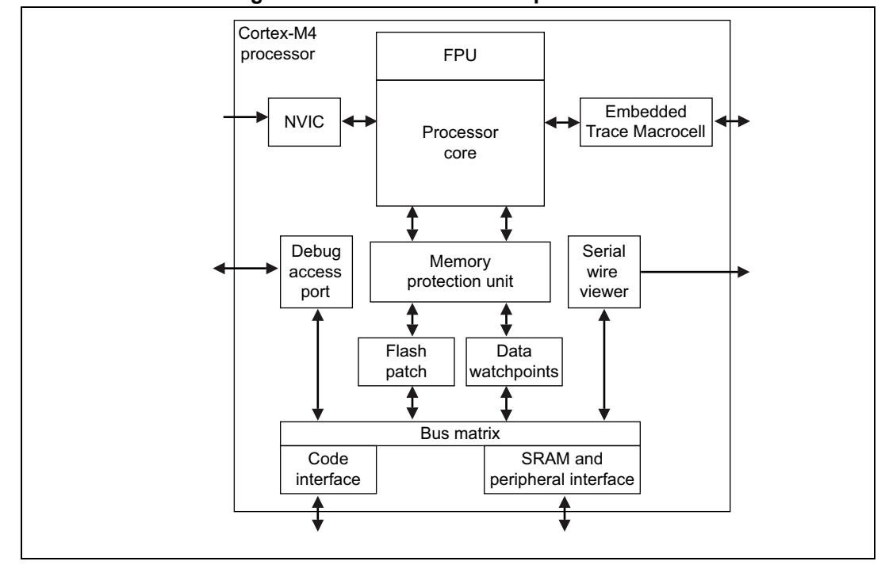

PM0214 About this document

read/clear (rc\_w1) Software can read as well as clear this bit by writing 1.

Writing '0' has no effect on the bit value.

read/clear (rc\_w0) Software can read as well as clear this bit by writing 0.

Writing '1' has no effect on the bit value.

toggle (t) Software can only toggle this bit by writing '1'. Writing '0' has no effect.

Reserved (Res.) Reserved bit, must be kept at reset value.

# 1.3 About the STM32 Cortex-M4 processor and core peripherals

The Cortex-M4 processor is a high performance 32-bit processor designed for the microcontroller market. It offers significant benefits to developers, including:

- outstanding processing performance combined with fast interrupt handling
- enhanced system debug with extensive breakpoint and trace capabilities
- efficient processor core, system and memories
- ultra-low power consumption with integrated sleep modes
- platform security robustness, with integrated memory protection unit (MPU).

The Cortex-M4 processor is built on a high-performance processor core, with a 3-stage pipeline Harvard architecture, making it ideal for demanding embedded applications. The processor delivers exceptional power efficiency through an efficient instruction set and extensively optimized design, providing high-end processing hardware including IEEE754-compliant single-precision floating-point computation, a range of single-cycle and SIMD multiplication and multiply-with-accumulate capabilities, saturating arithmetic and dedicated hardware division.

Figure 1. STM32 Cortex-M4 implementation

5

PM0214 Rev 10 13/262

**About this document PM0214**

To facilitate the design of cost-sensitive devices, the Cortex-M4 processor implements tightly-coupled system components that reduce processor area while significantly improving interrupt handling and system debug capabilities. The Cortex-M4 processor implements a version of the Thumb® instruction set based on Thumb-2 technology, ensuring high code density and reduced program memory requirements. The Cortex-M4 instruction set provides the exceptional performance expected of a modern 32-bit architecture, with the high code density of 8-bit and 16-bit microcontrollers.

The Cortex-M4 processor closely integrates a configurable nested interrupt controller (NVIC), to deliver industry-leading interrupt performance. The NVIC includes a nonmaskable interrupt (NMI), and provides up to 256 interrupt priority levels. The tight integration of the processor core and NVIC provides fast execution of interrupt service routines (ISRs), dramatically reducing the interrupt latency. This is achieved through the hardware stacking of registers, and the ability to suspend load-multiple and store-multiple operations. Interrupt handlers do not require any assembler stubs, removing any code overhead from the ISRs. Tail-chaining optimization also significantly reduces the overhead when switching from one ISR to another.

To optimize low-power designs, the deep sleep function, included in the sleep mode integrated in the NVIC, enables the STM32 to enter Stop or Standby mode.

### **1.3.1 System level interface**

The Cortex-M4 processor provides multiple interfaces using AMBA® technology to provide high speed, low latency memory accesses. It supports unaligned data accesses and implements atomic bit manipulation that enables faster peripheral controls, system spinlocks and thread-safe Boolean data handling.

The Cortex-M4 processor has a memory protection unit (MPU) that provides fine grain memory control, enabling applications to utilize multiple privilege levels, separating and protecting code, data and stack on a task-by-task basis. Such requirements are critical in many embedded applications such as automotive.

# **1.3.2 Integrated configurable debug**

The Cortex-M4 processor implements a complete hardware debug solution. This provides high system visibility of the processor and memory through either a traditional JTAG port or a 2-pin *Serial Wire Debug* (SWD) port that is ideal for small package devices.

For system trace the processor integrates an *Instrumentation Trace Macrocell* (ITM) alongside data watchpoints and a profiling unit. To enable simple and cost-effective profiling of the system events these generate, a *Serial Wire Viewer* (SWV) can export a stream of software-generated messages, data trace, and profiling information through a single pin.

The optional *Embedded Trace Macrocell™* (ETM) delivers unrivalled instruction trace capture in an area far smaller than traditional trace units.

14/262 PM0214 Rev 10

**PM0214 About this document**

# **1.3.3 Cortex-M4 processor features and benefits summary**

- Tight integration of system peripherals reduces area and development costs
- Thumb instruction set combines high code density with 32-bit performance
- IEEE754-compliant single-precision FPU implemented in all STM32 Cortex-M4 microcontrollers
- Power control optimization of system components
- Integrated sleep modes for low power consumption
- Fast code execution permits slower processor clock or increases sleep mode time
- Hardware division and fast multiplier
- Deterministic, high-performance interrupt handling for time-critical applications
- Memory protection unit (MPU) for safety-critical applications
- Extensive debug and trace capabilities: Serial Wire Debug and Serial Wire Trace reduce the number of pins required for debugging and tracing.

PM0214 Rev 10 15/262

**About this document PM0214**

# **1.3.4 Cortex-M4 core peripherals**

The peripherals are:

### **Nested vectored interrupt controller**

The *nested vectored interrupt controller* (NVIC) is an embedded interrupt controller that supports low latency interrupt processing.

#### **System control block**

The *system control block* (SCB) is the programmer's model interface to the processor. It provides system implementation information and system control, including configuration, control, and reporting of system exceptions.

### **System timer**

The system timer (SysTick) is a 24-bit count-down timer. Use this as a Real Time Operating System (RTOS) tick timer or as a simple counter.

#### **Memory protection unit**

The *Memory protection unit* (MPU) improves system reliability by defining the memory attributes for different memory regions. It provides up to eight different regions, and an optional predefined background region.

#### **Floating-point unit**

The *Floating-point unit* (FPU) provides IEEE754-compliant operations on singleprecision, 32-bit, floating-point values.

16/262 PM0214 Rev 10