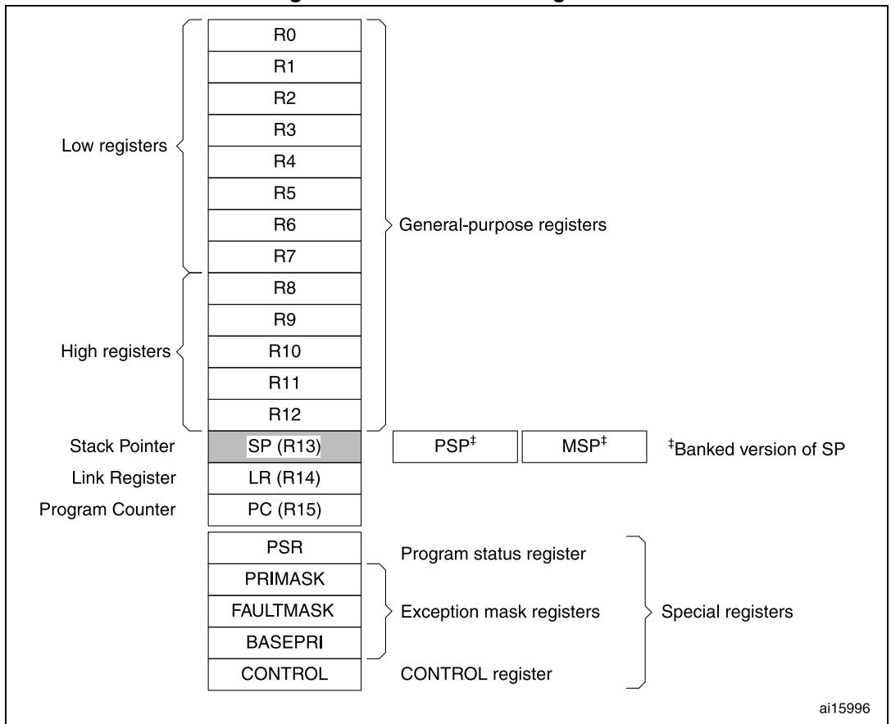
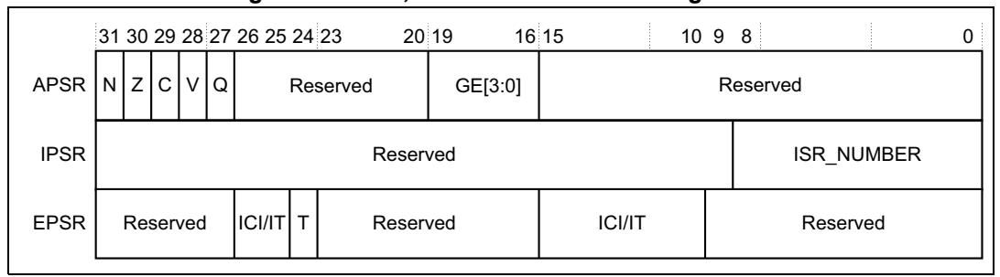
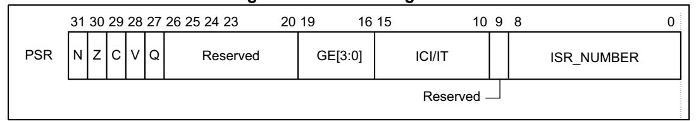
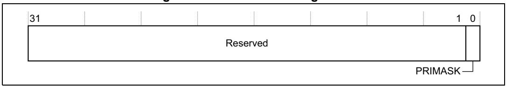
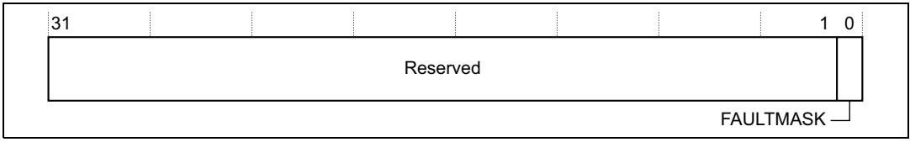
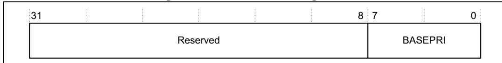

# **2 The Cortex-M4 processor**

# **2.1 Programmers model**

This section describes the Cortex-M4 programmer's model. In addition to the individual core register descriptions, it contains information about the processor modes and privilege levels for software execution and stacks.

## **2.1.1 Processor mode and privilege levels for software execution**

The processor *modes* are:

**Thread mode**: Used to execute application software.

The processor enters Thread mode when it comes out of reset. The CONTROL register controls whether software execution is privileged or unprivileged, see *[CONTROL register on page 25](#page-8-0)*.

**Handler mode**: Used to handle exceptions.

The processor returns to Thread mode when it has finished exception processing.

Software execution is always privileged.

The *privilege levels* for software execution are:

**Unprivileged**: *Unprivileged software* executes at the unprivileged level and:

- Has limited access to the MSR and MRS instructions, and cannot use the CPS instruction.
- Cannot access the system timer, NVIC, or system control block.
- Might have restricted access to memory or peripherals.
- Must use the SVC instruction to make a *supervisor call* to transfer control to privileged software.

**Privileged:** *Privileged software* executes at the privileged level and can use all the instructions and has access to all resources.

> Can write to the CONTROL register to change the privilege level for software execution.

# **2.1.2 Stacks**

The processor uses a full descending stack. This means the stack pointer indicates the last stacked item on the stack memory. When the processor pushes a new item onto the stack, it decrements the stack pointer and then writes the item to the new memory location. The processor implements two stacks, the *main stack* and the *process stack*, with independent copies of the stack pointer, see *[Stack pointer on page 19](#page-2-0)*.

In Thread mode, the CONTROL register controls whether the processor uses the main stack or the process stack, see *[CONTROL register on page 25](#page-8-0)*. In Handler mode, the processor always uses the main stack. The options for processor operations are:

PM0214 Rev 10 17/262

**Table 2. Summary of processor mode, execution privilege level, and stack usage**

| Processor mode | Used to execute | Privilege level for software execution | Stack used                      |
|-------------------|--------------------|-------------------------------------------|---------------------------------|
| Thread            | Applications       | Privileged or unprivileged (1)            | Main stack or process stack (1) |
| Handler           | Exception handlers | Always privileged                         | Main stack                      |

1. See *[CONTROL register on page 25](#page-8-0)*.

# **2.1.3 Core registers**

**Figure 2. Processor core registers**

**Table 3. Core register set summary** 

| Name   | Type (1)   | Required privilege (2) | Reset value  | Description                          |
|--------|------------|---------------------------|-----------------|--------------------------------------|
| R0-R12 | read-write | Either                    | Unknown         | General-purpose registers on page 19 |
| MSP    | read-write | Privileged                | See description | Stack pointer on page 19             |
| PSP    | read-write | Either                    | Unknown         | Stack pointer on page 19             |
| LR     | read-write | Either                    | 0xFFFFFFFF      | Link register on page 19             |
| PC     | read-write | Either                    | See description | Program counter on page 19           |

| Name      | Type (1)   | Required privilege (2) | Reset value | Description                                       |
|-----------|------------|---------------------------|----------------|---------------------------------------------------|
| PSR       | read-write | Privileged                | 0x01000000     | Program status register on page 19                |
| ASPR      | read-write | Either                    | Unknown        | Application program status register on page 21 |
| IPSR      | read-only  | Privileged                | 0x00000000     | Interrupt program status register on page 22   |
| EPSR      | read-only  | Privileged                | 0x01000000     | Execution program status register on page 22   |
| PRIMASK   | read-write | Privileged                | 0x00000000     | Priority mask register on page 24                 |
| FAULTMASK | read-write | Privileged                | 0x00000000     | Fault mask register on page 24                    |
| BASEPRI   | read-write | Privileged                | 0x00000000     | Base priority mask register on page 25            |
| CONTROL   | read-write | Privileged                | 0x00000000     | CONTROL register on page 25                       |

**Table 3. Core register set summary (continued)**

#### **General-purpose registers**

R0-R12 are 32-bit general-purpose registers for data operations.

## **Stack pointer**

The *Stack Pointer* (SP) is register R13. In Thread mode, bit[1] of the CONTROL register indicates the stack pointer to use:

- 0: *Main Stack Pointer* (MSP). This is the reset value.
- 1: *Process Stack Pointer* (PSP).

On reset, the processor loads the MSP with the value from address 0x00000000.

#### **Link register**

The *Link Register* (LR) is register R14. It stores the return information for subroutines, function calls, and exceptions. On reset, the processor loads the LR value 0xFFFFFFFF.

#### **Program counter**

The *Program Counter* (PC) is register R15. It contains the current program address. On reset, the processor loads the PC with the value of the reset vector, which is at address 0x00000004. Bit[0] of the value is loaded into the EPSR T-bit at reset and must be 1.

#### **Program status register**

The *Program Status Register* (PSR) combines:

- *Application Program Status Register* (APSR)
- *Interrupt Program Status Register* (IPSR)
- *Execution Program Status Register* (EPSR)

PM0214 Rev 10 19/262

1. Describes access type during program execution in thread mode and Handler mode. Debug access can differ.

2. An entry of either means privileged and unprivileged software can access the register.

These registers are mutually exclusive bitfields in the 32-bit PSR. The bit assignment is shown in *Figure 3* and *Figure 4*.

Figure 3. APSR, IPSR and EPSR bit assignment

Figure 4. PSR bit assignment

Access these registers individually or as a combination of any two or all three registers, using the register name as an argument to the MSR or MRS instructions. For example:

- Read all of the registers using PSR with the MRS instruction.
- Write to the APSR N, Z, C, V, and Q bits using APSR\_nzcvq with the MSR instruction.

The PSR combinations and attributes are:

Table 4. PSR register combinations

| Register | Туре                      | Combination          |
|----------|---------------------------|----------------------|
| PSR      | read-write(1), (2)        | APSR, EPSR, and IPSR |
| IEPSR    | read-only                 | EPSR and IPSR        |
| IAPSR    | read-write (1) | APSR and IPSR        |
| EAPSR    | read-write (2) | APSR and EPSR        |

- 1. The processor ignores writes to the IPSR bits.
- 2. Reads of the EPSR bits return zero, and the processor ignores writes to the these bits

See the instruction descriptions *MRS on page 186* and *MSR on page 187* for more information about how to access the program status registers.

#### **Application program status register**

The APSR contains the current state of the condition flags from previous instruction executions. See the register summary in *[Table 3 on page 18](#page-1-0)* for its attributes. The bit assignment is:

**Table 5. APSR bit definitions** 

| Bits       | Description                                                                                                                                                                                                                                                                                                                                         |
|------------|-----------------------------------------------------------------------------------------------------------------------------------------------------------------------------------------------------------------------------------------------------------------------------------------------------------------------------------------------------|
| Bit 31     | N: Negative or less than flag: 0: Operation result was positive, zero, greater than, or equal 1: Operation result was negative or less than.                                                                                                                                                                                                  |
| Bit 30     | Z: Zero flag: 0: Operation result was not zero 1: Operation result was zero.                                                                                                                                                                                                                                                                  |
| Bit 29     | C: Carry or borrow flag: 0: Add operation did not result in a carry bit or subtract operation resulted in a borrow bit 1: Add operation resulted in a carry bit or subtract operation did not result in a borrow bit.                                                                                                                   |
| Bit 28     | V: Overflow flag: 0: Operation did not result in an overflow 1: Operation resulted in an overflow.                                                                                                                                                                                                                                            |
| Bit 27     | Q: DSP overflow and saturation flag: Sticky saturation flag. 0: Indicates that saturation has not occurred since reset or since the bit was last cleared to zero 1: Indicates when an SSAT or USAT instruction results in saturation, or indicates a DSP overflow. This bit is cleared to zero by software using an MRS instruction. |
| Bits 26:20 | Reserved.                                                                                                                                                                                                                                                                                                                                           |
| Bits 19:16 | GE[3:0]: Greater than or Equal flags. See SEL on page 105 for more information.                                                                                                                                                                                                                                                                     |
| Bits 15:0  | Reserved.                                                                                                                                                                                                                                                                                                                                           |

PM0214 Rev 10 21/262

#### **Interrupt program status register**

The IPSR contains the exception type number of the current *Interrupt Service Routine* (ISR). See the register summary in *[Table 3 on page 18](#page-1-0)* for its attributes. The bit assignment is:

**Table 6. IPSR bit definitions** 

| Bits      | Description                                          |  |  |  |
|-----------|------------------------------------------------------|--|--|--|
| Bits 31:9 | Reserved                                             |  |  |  |
| Bits 8:0  | ISR_NUMBER:                                          |  |  |  |
|           | This is the number of the current exception:         |  |  |  |
|           | 0: Thread mode                                       |  |  |  |
|           | 1: Reserved                                          |  |  |  |
|           | 2: NMI                                               |  |  |  |
|           | 3: Hard fault                                        |  |  |  |
|           | 4: Memory management fault                           |  |  |  |
|           | 5: Bus fault                                         |  |  |  |
|           | 6: Usage fault                                       |  |  |  |
|           | 7: Reserved                                          |  |  |  |
|           |                                                      |  |  |  |
|           | 10: Reserved                                         |  |  |  |
|           | 11: SVCall                                           |  |  |  |
|           | 12: Reserved for Debug                               |  |  |  |
|           | 13: Reserved                                         |  |  |  |
|           | 14: PendSV                                           |  |  |  |
|           | 15: SysTick                                          |  |  |  |
|           | 16: IRQ0(1)                                          |  |  |  |
|           |                                                      |  |  |  |
|           |                                                      |  |  |  |
|           | 255: IRQ240(1)                                       |  |  |  |
|           | see Exception types on page 37 for more information. |  |  |  |

1. Depends on product. Refer to reference manual/datasheet of relevant STM32 product for related information.

#### **Execution program status register**

The EPSR contains the Thumb state bit, and the execution state bits for either the:

- *If-Then* (IT) instruction
- *Interruptible-Continuable Instruction* (ICI) field for an interrupted load multiple or store multiple instruction.

See the register summary in *[Table 3 on page 18](#page-1-0)* for the EPSR attributes. The bit assignment is:

| Bits              | Description                                                                                                |
|-------------------|------------------------------------------------------------------------------------------------------------|
| Bits 31:27        | Reserved.                                                                                                  |
| Bits 26:25, 15:10 | ICI: Interruptible-continuable instruction bits, see Interruptible-continuable instructions on page 23. |
| Bits 26:25, 15:10 | IT: Indicates the execution state bits of the IT instruction, see IT on page 145.                          |
| Bit 24            | T: Thumb state bit.                                                                                        |

**Table 7. EPSR bit definitions** 

Attempts to read the EPSR directly through application software using the MSR instruction always return zero. Attempts to write the EPSR using the MSR instruction in application software are ignored. Fault handlers can examine EPSR value in the stacked PSR to indicate the operation that is at fault. See *Section 2.3.7: Exception entry and return on page 42*.

#### **Interruptible-continuable instructions**

Bits 23:16 Reserved. Bits 9:0 Reserved.

When an interrupt occurs during the execution of an LDM STM, PUSH, POP, VLDM, VSTM, VPUSH, or VPOP instruction, the processor:

- Stops the load multiple or store multiple instruction operation temporarily
- Stores the next register operand in the multiple operation to EPSR bits[15:12].

After servicing the interrupt, the processor:

- Returns to the register pointed to by bits[15:12]
- Resumes execution of the multiple load or store instruction.

When the EPSR holds ICI execution state, bits[26:25,11:10] are zero.

#### **If-Then block**

The If-Then block contains up to four instructions following a 16-bit IT instruction. Each instruction in the block is conditional. The conditions for the instructions are either all the same, or some can be the inverse of others. See *IT on page 145* for more information.

#### **Thumb state**

The Cortex-M4 processor only supports execution of instructions in Thumb state. The following can clear the T bit to 0:

- Instructions BLX, BX and POP{PC}
- Restoration from the stacked xPSR value on an exception return
- Bit[0] of the vector value on an exception entry or reset

Attempting to execute instructions when the T bit is 0 results in a fault or lockup. See *Lockup on page 47* for more information.

#### **Exception mask registers**

The exception mask registers disable the handling of exceptions by the processor. Disable exceptions where they might impact on timing critical tasks.

PM0214 Rev 10 23/262

To access the exception mask registers use the MSR and MRS instructions, or the CPS instruction to change the value of PRIMASK or FAULTMASK. See *MRS on page 186*, *MSR on page 187*, and *CPS on page 182* for more information.

### **Priority mask register**

The PRIMASK register prevents the activation of all exceptions with configurable priority. See the register summary in *[Table 3 on page 18](#page-1-0)* for its attributes. *[Figure 5](#page-7-2)* shows the bit assignment.

**Figure 5. PRIMASK bit assignment**

**Table 8. PRIMASK register bit definitions** 

| Bits      | Description                                                                                          |
|-----------|------------------------------------------------------------------------------------------------------|
| Bits 31:1 | Reserved                                                                                             |
| Bit 0     | PRIMASK: 0: No effect 1: Prevents the activation of all exceptions with configurable priority. |

## **Fault mask register**

The FAULTMASK register prevents activation of all exceptions except for *Non-Maskable Interrupt* (NMI). See the register summary in *[Table 3 on page 18](#page-1-0)* for its attributes. *[Figure 6](#page-7-3)* shows the bit assignment.

**Figure 6. FAULTMASK bit assignment**

**Table 9. FAULTMASK register bit definitions** 

| Bits      | Function                                                                                   |
|-----------|--------------------------------------------------------------------------------------------|
| Bits 31:1 | Reserved                                                                                   |
| Bit 0     | FAULTMASK: 0: No effect 1: Prevents the activation of all exceptions except for NMI. |

The processor clears the FAULTMASK bit to 0 on exit from any exception handler except the NMI handler.

#### **Base priority mask register**

The BASEPRI register defines the minimum priority for exception processing. When BASEPRI is set to a nonzero value, it prevents the activation of all exceptions with same or lower priority level as the BASEPRI value. See the register summary in *[Table 3 on page 18](#page-1-0)* for its attributes. *[Figure 7](#page-8-2)* shows the bit assignment.

**Figure 7. BASEPRI bit assignment**

**Table 10. BASEPRI register bit assignment** 

| Bits      | Function                                                                                                                                                                                                                         |
|-----------|----------------------------------------------------------------------------------------------------------------------------------------------------------------------------------------------------------------------------------|
| Bits 31:8 | Reserved                                                                                                                                                                                                                         |
| Bits 7:4  | BASEPRI[7:4] Priority mask bits(1) 0x00: no effect Nonzero: defines the base priority for exception processing. The processor does not process any exception with a priority value greater than or equal to BASEPRI. |
| Bits 3:0  | Reserved                                                                                                                                                                                                                         |

1. This field is similar to the priority fields in the interrupt priority registers. See *Interrupt priority register x (NVIC\_IPRx) on page 215* for more information. Remember that higher priority field values correspond to lower exception priorities.

#### **CONTROL register**

The CONTROL register controls the stack used and the privilege level for software execution when the processor is in Thread mode and indicates whether the FPU state is active. See the register summary in *[Table 3 on page 18](#page-1-0)* for its attributes.

**Table 11. CONTROL register bit definitions** 

| Bits      | Function                                                                                                                                                                                                                                                                            |
|-----------|-------------------------------------------------------------------------------------------------------------------------------------------------------------------------------------------------------------------------------------------------------------------------------------|
| Bits 31:3 | Reserved                                                                                                                                                                                                                                                                            |
| Bit 2     | FPCA: Indicates whether floating-point context currently active: 0: No floating-point context active 1: Floating-point context active. The Cortex-M4 uses this bit to determine whether to preserve floating-point state when processing an exception.                  |
| Bit 1     | SPSEL: Active stack pointer selection. Selects the current stack: 0: MSP is the current stack pointer 1: PSP is the current stack pointer. In Handler mode this bit reads as zero and ignores writes. The Cortex-M4 updates this bit automatically on exception return. |
| Bit 0     | nPRIV: Thread mode privilege level. Defines the Thread mode privilege level. 0: Privileged 1: Unprivileged.                                                                                                                                                                   |

PM0214 Rev 10 25/262

Handler mode always uses the MSP, so the processor ignores explicit writes to the active stack pointer bit of the CONTROL register when in Handler mode. The exception entry and return mechanisms update the CONTROL register.

In an OS environment, it is recommended that threads running in Thread mode use the process stack, and the kernel and exception handlers use the main stack.

By default, Thread mode uses the MSP. To switch the stack pointer used in Thread mode to the PSP, either:

- use the MSR instruction to set the Active stack pointer bit to 1, see *MSR on page 187*.
- perform an exception return to Thread mode with the appropriate EXC\_RETURN value, see *Exception return behavior on page 44*.

When changing the stack pointer, software must use an ISB instruction immediately after the MSR instruction. This ensures that instructions after the ISB execute using the new stack pointer. See *ISB on page 185*

# **2.1.4 Exceptions and interrupts**

The Cortex-M4 processor supports interrupts and system exceptions. The processor and the *Nested Vectored Interrupt Controller* (NVIC) prioritize and handle all exceptions. An exception changes the normal flow of software control. The processor uses handler mode to handle all exceptions except for reset. See *Exception entry on page 42* and *Exception return on page 44* for more information.

The NVIC registers control interrupt handling. See *Nested vectored interrupt controller (NVIC) on page 208* for more information.

## **2.1.5 Data types**

The processor:

- Supports the following data types:
  - 32-bit words
  - 16-bit halfwords
  - 8-bit bytes
- manages all memory accesses as little-endian. See *Memory regions, types and attributes on page 29* for more information.

# **2.1.6 The Cortex microcontroller software interface standard (CMSIS)**

For a Cortex-M4 microcontroller system, the *Cortex Microcontroller Software Interface Standard* (CMSIS) defines:

- A common way to:
  - Access peripheral registers
  - Define exception vectors
- The names of:
  - The registers of the core peripherals
  - The core exception vectors
- A device-independent interface for RTOS kernels, including a debug channel

The CMSIS includes address definitions and data structures for the core peripherals in the Cortex-M4 processor.

CMSIS simplifies software development by enabling the reuse of template code and the combination of CMSIS-compliant software components from various middleware vendors. Software vendors can expand the CMSIS to include their peripheral definitions and access functions for those peripherals.

This document includes the register names defined by the CMSIS, and gives short descriptions of the CMSIS functions that address the processor core and the core peripherals.

This document uses the register short names defined by the CMSIS. In a few cases these differ from the architectural short names that might be used in other documents.

The following sections give more information about the CMSIS:

- *Section 2.5.4: Power management programming hints on page 49*
- *CMSIS intrinsic functions on page 58*
- *Interrupt set-enable register x (NVIC\_ISERx) on page 210*
- *NVIC programming hints on page 218*

PM0214 Rev 10 27/262