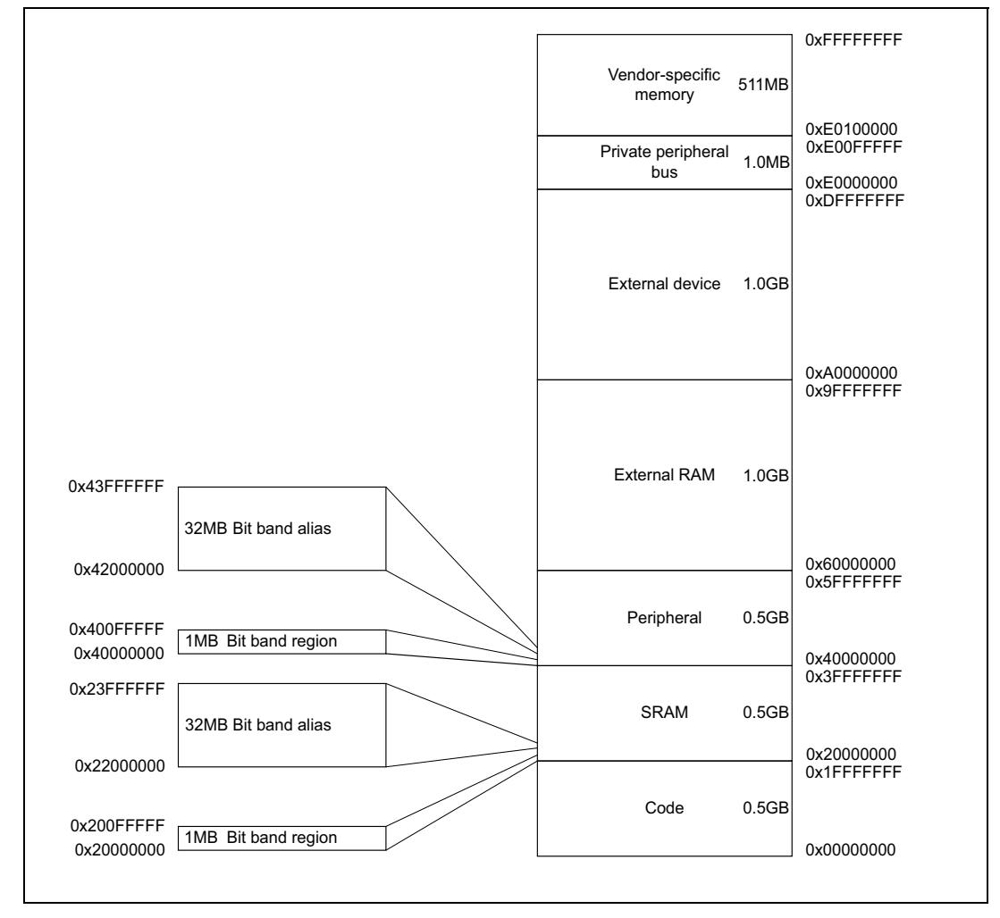
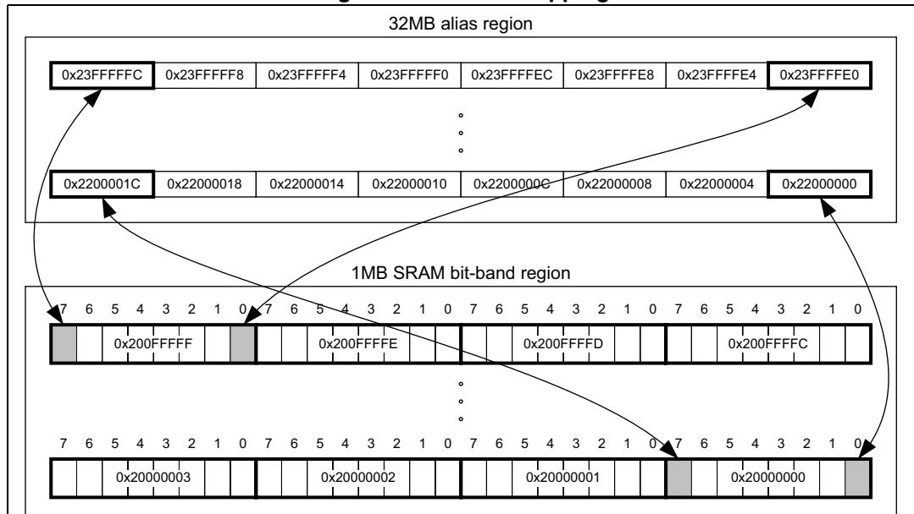

# **2.2 Memory model**

This section describes the processor memory map, the behavior of memory accesses, and the bit-banding features. The processor has a fixed memory map that provides up to 4 GB of addressable memory.



**Figure 8. Memory map**

The regions for SRAM and peripherals include bit-band regions. Bit-banding provides atomic operations to bit data, see *[Section 2.2.5: Bit-banding on page 32](#page-4-0)*.

The processor reserves regions of the *Private peripheral bus* (PPB) address range for core peripheral registers, see *Section 4.1: About the STM32 Cortex-M4 core peripherals on page 193*.

# <span id="page-1-0"></span>**2.2.1 Memory regions, types and attributes**

The memory map and the programming of the MPU splits the memory map into regions. Each region has a defined memory type, and some regions have additional memory attributes. The memory type and attributes determine the behavior of accesses to the region.

The memory types are:

Normal The processor can re-order transactions for efficiency, or

perform speculative reads.

Device The processor preserves transaction order relative to other

transactions to Device or Strongly-ordered memory.

Strongly-ordered The processor preserves transaction order relative to all other

transactions.

The different ordering requirements for Device and Strongly-ordered memory mean that the memory system can buffer a write to Device memory, but must not buffer a write to Stronglyordered memory.

The additional memory attributes include:

*Execute Never* (XN) Means that the processor prevents instruction accesses. Any

attempt to fetch an instruction from an XN region causes a

memory management fault exception.

### <span id="page-1-1"></span>**2.2.2 Memory system ordering of memory accesses**

For most memory accesses caused by explicit memory access instructions, the memory system does not guarantee that the order, in which the accesses complete, matches the program order of the instructions, providing this does not affect the behavior of the instruction sequence. Normally, if correct program execution depends on two memory accesses completing in program order, software must insert a memory barrier instruction between the memory access instructions, see *[Section 2.2.4: Software ordering of memory](#page-3-0)  [accesses on page 31](#page-3-0)*.

However, the memory system does guarantee some ordering of accesses to Device and Strongly-ordered memory. For two memory access instructions A1 and A2, if A1 occurs before A2 in program order, the ordering of the memory accesses caused by two instructions is:

**Table 12. Ordering of memory accesses(1)**

|                              | A2            |               |           |                   |  |
|------------------------------|---------------|---------------|-----------|-------------------|--|
| A1                           | Normal access | Device access |           | Strongly          |  |
|                              |               | Non-shareable | Shareable | ordered<br>access |  |
| Normal access                | -             | -             | -         | -                 |  |
| Device access, non-shareable | -             | <             | -         | <                 |  |
| Device access, shareable     | -             | -             | <         | <                 |  |
| Strongly ordered access      | -             | <             | <         | <                 |  |

<sup>1. -</sup> means that the memory system does not guarantee the ordering of the accesses. < means that accesses are observed in program order, that is, A1 is always observed before A2.


PM0214 Rev 10 29/262

### <span id="page-2-0"></span>2.2.3 Behavior of memory accesses

The behavior of accesses to each region in the memory map is:

Table 13. Memory access behavior

| Address range             | Memory<br>region                | Memory<br>type                      | XN                | Description                                                                                                                                  |
|---------------------------|---------------------------------|-------------------------------------|-------------------|----------------------------------------------------------------------------------------------------------------------------------------------|
| 0x00000000-<br>0x1FFFFFF  | Code                            | Normal <sup>(1)</sup>               | -                 | Executable region for program code. Can also put data here.                                                                                  |
| 0x20000000-<br>0x3FFFFFF  | SRAM                            | Normal <sup>(1)</sup>               | -                 | Executable region for data. Can also put code here. This region includes bit band and bit band alias areas, see <i>Table 14 on page 32</i> . |
| 0x40000000-<br>0x5FFFFFF  | Peripheral                      | Device <sup>(1)</sup>               | XN <sup>(1)</sup> | This region includes bit band and bit band alias areas, see <i>Table 15 on page 32</i> .                                                     |
| 0x60000000-<br>0x9FFFFFF  | External<br>RAM                 | Normal <sup>(1)</sup>               | -                 | Executable region for data.                                                                                                                  |
| 0xA0000000-<br>0xDFFFFFF  | External device                 | Device <sup>(1)</sup>               | XN <sup>(1)</sup> | External Device memory                                                                                                                       |
| 0xED000000-<br>0xED0FFFFF | Private<br>Peripheral<br>Bus    | Strongly-<br>ordered <sup>(1)</sup> | XN <sup>(1)</sup> | This region includes the NVIC, system timer, and system control block.                                                                       |
| 0xED100000-<br>0xFFFFFFF  | Memory<br>mapped<br>peripherals | Device <sup>(1)</sup>               | XN <sup>(1)</sup> | This region includes all the STM32 standard peripherals.                                                                                     |

<sup>1.</sup> See *Memory regions, types and attributes on page 29* for more information.

The Code, SRAM, and external RAM regions can hold programs. However, it is recommended that programs always use the Code region. The reason of this is that the processor has separate buses that enable instruction fetches and data accesses to occur simultaneously.

The MPU can override the default memory access behavior described in this section. For more information, see *Memory protection unit (MPU) on page 193*.

### Instruction prefetch and branch prediction

The Cortex-M4 processor:

- Prefetches instructions ahead of execution
- Speculatively prefetches from branch target addresses.


# <span id="page-3-0"></span>**2.2.4 Software ordering of memory accesses**

The order of instructions in the program flow does not always guarantee the order of the corresponding memory transactions. The reason for this is that:

- The processor can reorder some memory accesses to improve efficiency, providing this does not affect the behavior of the instruction sequence.
- The processor has multiple bus interfaces.
- Memory or devices in the memory map have different wait states.
- Some memory accesses are buffered or speculative.

*[Section 2.2.2: Memory system ordering of memory accesses on page 29](#page-1-1)* describes the cases where the memory system guarantees the order of memory accesses. Otherwise, if the order of memory accesses is critical, software must include memory barrier instructions to force that ordering. The processor provides the following memory barrier instructions:

- DMB The *Data Memory Barrier* (DMB) instruction ensures that outstanding memory transactions complete before subsequent memory transactions. See *DMB on page 183*.
- DSB The *Data Synchronization Barrier* (DSB) instruction ensures that outstanding memory transactions complete before subsequent instructions execute. See *DSB on page 184*.
- ISB The *Instruction Synchronization Barrier* (ISB) ensures that the effect of all completed memory transactions is recognizable by subsequent instructions. See *ISB on page 185*.

Use memory barrier instructions in, for example:

- **Vector table.** If the program changes an entry in the vector table, and then enables the corresponding exception, use a DMB instruction between the operations. This ensures that if the exception is taken immediately after being enabled the processor uses the new exception vector.
- **Self-modifying code.** If a program contains self-modifying code, use an ISB instruction immediately after the code modification in the program. This ensures that the subsequent instruction execution uses the updated program.
- **Memory map switching.** If the system contains a memory map switching mechanism, use a DSB instruction after switching the memory map in the program. This ensures that the subsequent instruction execution uses the updated memory map.
- **Dynamic exception priority change.** When an exception priority has to change when the exception is pending or active, use DSB instructions after the change. This ensures that the change takes effect on completion of the DSB instruction.
- **Using a semaphore in multi-master system.** If the system contains more than one bus master, for example, if another processor is present in the system, each processor must use a DMB instruction after any semaphore instructions, to ensure other bus masters see the memory transactions in the order in which they were executed.

Memory accesses to Strongly-ordered memory, such as the system control block, do not require the use of DMB instructions.

For MPU programming, use a DSB followed by an ISB instruction or exception return to ensure that the new MPU configuration is used by subsequent instructions.


PM0214 Rev 10 31/262

### <span id="page-4-0"></span>2.2.5 Bit-banding

A bit-band region maps each word in a *bit-band alias* region to a single bit in the *bit-band region*. The bit-band regions occupy the lowest 1 Mbyte of the SRAM and peripheral memory regions.

The memory map has two 32 Mbyte alias regions that map to two 1 Mbyte bit-band regions:

- Accesses to the 32 Mbyte SRAM alias region map to the 1 Mbyte SRAM bit-band region, as shown in *Table 14*
- Accesses to the 32 MB peripheral alias region map to the 1 MB peripheral bit-band region, as shown in *Table 15*.

<span id="page-4-1"></span>

| , , , , , , , , , , , , , , , , , , , , |                      |                                                                                                                                                           |  |  |
|-----------------------------------------|----------------------|-----------------------------------------------------------------------------------------------------------------------------------------------------------|--|--|
| Address range                           | Memory region        | Instruction and data accesses                                                                                                                             |  |  |
| 0x20000000-<br>0x200FFFF                | SRAM bit-band region | Direct accesses to this memory range behave as SRAM memory accesses, but this region is also bit addressable through bit-band alias.                      |  |  |
| 0x22000000-<br>0x23FFFFF                | SRAM bit-band alias  | Data accesses to this region are remapped to bit band region. A write operation is performed as read-modify-write. Instruction accesses are not remapped. |  |  |

Table 14. SRAM memory bit-banding regions

Table 15. Peripheral memory bit-banding regions

<span id="page-4-2"></span>

| Address range             | Memory<br>region              | Instruction and data accesses                                                                                                                              |
|---------------------------|-------------------------------|------------------------------------------------------------------------------------------------------------------------------------------------------------|
| 0x40000000-<br>0x400FFFFF | Peripheral<br>bit-band region | Direct accesses to this memory range behave as peripheral memory accesses, but this region is also bit addressable through bit-band alias.                 |
| 0x42000000-<br>0x43FFFFF  | Peripheral<br>bit-band alias  | Data accesses to this region are remapped to bit-band region. A write operation is performed as read-modify-write. Instruction accesses are not permitted. |

Note:

A word access to the SRAM or peripheral bit-band alias regions map to a single bit in the SRAM or peripheral bit-band region.

Bit band accesses can use byte, halfword, or word transfers. The bit band transfer size matches the transfer size of the instruction making the bit band access.

The following formula shows how the alias region maps onto the bit-band region:

```
bit_word_offset = (byte_offset x 32) + (bit_number x 4)
bit_word_addr = bit_band_base + bit_word_offset
```

#### Where:

- Bit word offset is the position of the target bit in the bit-band memory region.
- Bit\_word\_addr is the address of the word in the alias memory region that maps to the targeted bit.
- Bit band base is the starting address of the alias region.
- Byte offset is the number of the byte in the bit-band region that contains the targeted
- Bit number is the bit position, 0-7, of the targeted bit.

Figure 9 on page 33 shows examples of bit-band mapping between the SRAM bit-band alias region and the SRAM bit-band region:

- The alias word at 0x23FFFFED maps to bit[0] of the bit-band byte at 0x200FFFFF: 0x23FFFFED = 0x22000000 + (0xFFFFF\*32) + (0\*4).
- The alias word at 0x23FFFFFC maps to bit[7] of the bit-band byte at 0x200FFFFF: 0x23FFFFFC = 0x22000000 + (0xFFFFF\*32) + (7\*4).
- The alias word at 0x22000000 maps to bit[0] of the bit-band byte at 0x20000000: 0x22000000 = 0x22000000 + (0\*32) + (0\*4).
- The alias word at 0x2200001C maps to bit[7] of the bit-band byte at 0x20000000: 0x2200001C = 0x22000000+ (0\*32) + (7\*4).

<span id="page-5-0"></span>

Figure 9. Bit-band mapping

Directly accessing an alias region

Writing to a word in the alias region updates a single bit in the bit-band region.

Bit[0] of the value written to a word in the alias region determines the value written to the targeted bit in the bit-band region. Writing a value with bit[0] set to 1 writes a 1 to the bitband bit, and writing a value with bit[0] set to 0 writes a 0 to the bit-band bit.

Bits[31:1] of the alias word have no effect on the bit-band bit. Writing 0x01 has the same effect as writing 0xFF. Writing 0x00 has the same effect as writing 0x0E.

PM0214 Rev 10 33/262 Reading a word in the alias region:

- 0x00000000 indicates that the targeted bit in the bit-band region is set to zero
- 0x00000001 indicates that the targeted bit in the bit-band region is set to 1

Directly accessing a bit-band region

*[Behavior of memory accesses on page 30](#page-2-0)* describes the behavior of direct byte, halfword, or word accesses to the bit-band regions.

### **2.2.6 Memory endianness**

The processor views memory as a linear collection of bytes numbered in ascending order from zero. For example, bytes 0-3 hold the first stored word, and bytes 4-7 hold the second stored word.

### **Little-endian format**

In little-endian format, the processor stores the least significant byte of a word at the lowestnumbered byte, and the most significant byte at the highest-numbered byte. See *[Figure 10](#page-6-0)* for an example.

<span id="page-6-0"></span>Memory Register Address A A+1 lsbyte msbyte A+2 A+3 7 0 B3 B2 B1 B0 31 2423 1615 8 7 0 B0 B1 B2 B3

**Figure 10. Little-endian example**

# **2.2.7 Synchronization primitives**

The Cortex-M4 instruction set includes pairs of *synchronization primitives*. These provide a non-blocking mechanism that a thread or process can use to obtain exclusive access to a memory location. Software can use them to perform a guaranteed read-modify-write memory update sequence, or for a semaphore mechanism.

A pair of synchronization primitives comprises:

- Load-Exclusive instruction: used to read the value of a memory location, requesting exclusive access to that location.
- Store-Exclusive instruction: used to attempt to write to the same memory location, returning a status bit to a register. If this bit is:
  - 0: the thread or process gained exclusive access to memory, and the write succeeds.
  - 1: the thread or process did not gain exclusive access to memory, and no write is performed.


The pairs of Load-Exclusive and Store-Exclusive instructions are:

- The word instructions LDREX and STREX
- The halfword instructions LDREXH and STREXH
- The byte instructions LDREXB and STREXB.

Software must use a Load-Exclusive instruction with the corresponding Store-Exclusive instruction.

To perform a guaranteed read-modify-write of a memory location, software must:

- 1. Use a Load-Exclusive instruction to read the value of the location.
- 2. Update the value, as required.
- 3. Use a Store-Exclusive instruction to attempt to write the new value back to the memory location.
- 4. Test the returned status bit. If this bit is:
  - 0: The read-modify-write completed successfully.
  - 1: No write was performed. This indicates that the value returned at step 1 might be out of date. The software must retry the read-modify-write sequence.

Software can use the synchronization primitives to implement a semaphores as follows:

- 1. Use a Load-Exclusive instruction to read from the semaphore address to check whether the semaphore is free.
- 2. If the semaphore is free, use a Store-Exclusive to write the claim value to the semaphore address.
- 3. If the returned status bit from step 2 indicates that the Store-Exclusive succeeded then the software has claimed the semaphore. However, if the Store-Exclusive failed, another process might have claimed the semaphore after software performed step 1.

The Cortex-M4 includes an exclusive access monitor, that tags the fact that the processor has executed a Load-Exclusive instruction. If the processor is part of a multiprocessor system, the system also globally tags the memory locations addressed by exclusive accesses by each processor.

The processor removes its exclusive access tag if:

- It executes a CLREX instruction.
- It executes a Store-Exclusive instruction, regardless of whether the write succeeds.
- An exception occurs. This means the processor can resolve semaphore conflicts between different threads.

In a multiprocessor implementation, executing a:

- CLREX instruction removes only the local exclusive access tag for the processor.
- Store-Exclusive instruction, or an exception, removes the local exclusive access tags, and global exclusive access tags for the processor.

For more information about the synchronization primitive instructions, see *LDREX and STREX on page 79* and *CLREX on page 80*.

PM0214 Rev 10 35/262

# **2.2.8 Programming hints for the synchronization primitives**

ISO/IEC C cannot directly generate the exclusive access instructions. CMSIS provides intrinsic functions for generation of these instructions:

**Table 16. CMSIS functions for exclusive access instructions** 

| Instruction | CMSIS function                                  |
|-------------|-------------------------------------------------|
| LDREX       | uint32_tLDREXW (uint32_t *addr)                 |
| LDREXH      | uint16_tLDREXH (uint16_t *addr)                 |
| LDREXB      | uint8_tLDREXB (uint8_t *addr)                   |
| STREX       | uint32_tSTREXW (uint32_t value, uint32_t *addr) |
| STREXH      | uint32_tSTREXH (uint16_t value, uint16_t *addr) |
| STREXB      | uint32_tSTREXB (uint8_t value, uint8_t *addr)   |
| CLREX       | voidCLREX (void)                                |

### For example:

```
uint16_t value;
uint16_t *address = 0x20001002;
value = __LDREXH (address); // load 16-bit value from memory address
                             //0x20001002
```