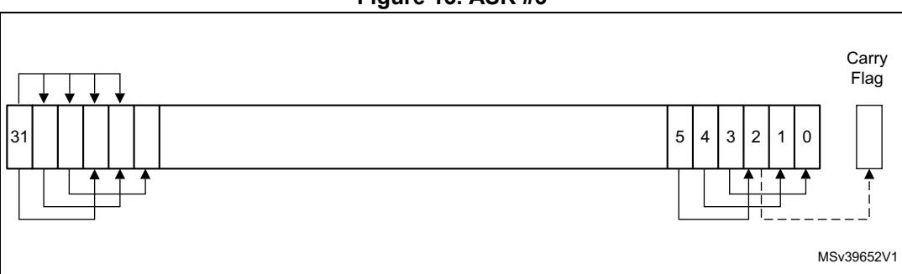
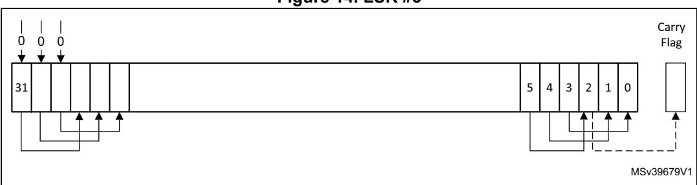
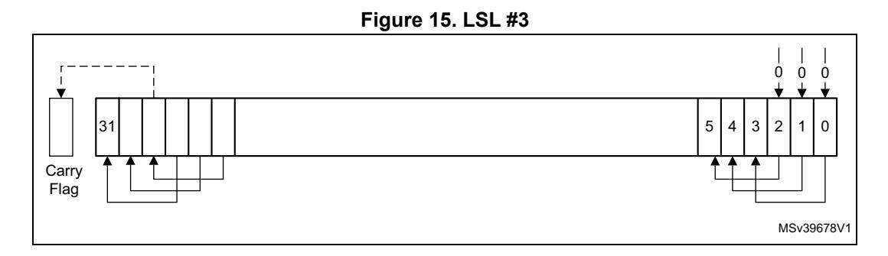
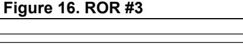
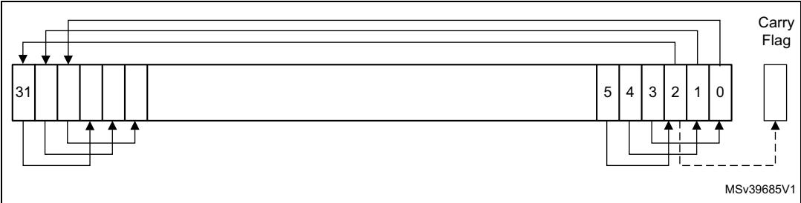
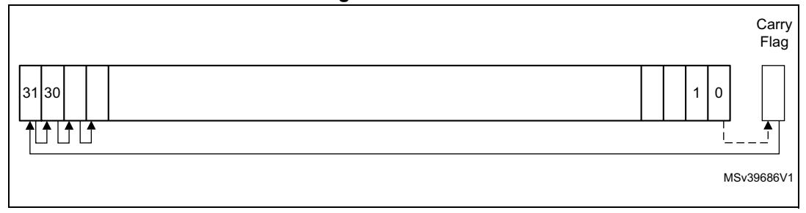

# **3.3 About the instruction descriptions**

The following sections give more information about using the instructions:

- *[Operands on page 60](#page-0-0)*
- *[Restrictions when using PC or SP on page 60](#page-0-1)*
- *[Flexible second operand on page 60](#page-0-2)*
- *[Shift operations on page 62](#page-2-0)*
- *[Address alignment on page 65](#page-5-0)*
- *[PC-relative expressions on page 65](#page-5-1)*
- *[Conditional execution on page 65](#page-5-2)*
- *[Instruction width selection on page 68](#page-8-0)*

## <span id="page-0-0"></span>**3.3.1 Operands**

An instruction operand can be an Arm register, a constant, or another instruction-specific parameter. Instructions act on the operands and often store the result in a destination register. When there is a destination register in the instruction, it is usually specified before the operands.

Operands in some instructions are flexible in that they can either be a register or a constant (see *[Flexible second operand](#page-0-2)*).

### <span id="page-0-1"></span>**3.3.2 Restrictions when using PC or SP**

Many instructions have restrictions on whether you can use the *program counter* (PC) or *stack pointer* (SP) for the operands or destination register. See instruction descriptions for more information.

Bit[0] of any address written to the PC with a BX, BLX, LDM, LDR, or POP instruction must be 1 for correct execution, because this bit indicates the required instruction set, and the Cortex-M4 processor only supports thumb instructions.

## <span id="page-0-2"></span>**3.3.3 Flexible second operand**

Many general data processing instructions have a flexible second operand. This is shown as *operand2* in the description of the syntax of each instruction.

*Operand2* can be a:

- *[Constant](#page-1-0)*
- *[Register with optional shift](#page-1-1)*


### <span id="page-1-0"></span>**Constant**

You specify an operand2 constant in the form *#constant,* where *constant* can be:

- Any constant that can be produced by shifting an 8-bit value left by any number of bits within a 32-bit word.
- Any constant of the form 0x00XY00XY
- Any constant of the form 0xXY00XY00
- Any constant of the form 0xXYXYXYXY

In the constants shown above, X and Y are hexadecimal digits.

In addition, in a small number of instructions, *constant* can include a wider range of values. These are described in the individual instruction descriptions.

When an operand2 constant is used with the instructions MOVS, MVNS, ANDS, ORRS, ORNS, EORS, BICS, TEQ or TST, the carry flag is updated to bit[31] of the constant, if the constant is greater than 255 and can be produced by shifting an 8-bit value. These instructions do not affect the carry flag if operand2 is any other constant.

#### **Instruction substitution**

The assembler might be able to produce an equivalent instruction if a not permitted constant is specified. For example, the instruction CMP Rd, #0xFFFFFFFE might be assembled as the equivalent of instruction CMN Rd, #0x2.

#### <span id="page-1-1"></span>**Register with optional shift**

An operand2 register is specified in the form *Rm* {, *shift*}, where:

- *Rm* is the register holding the data for the second operand
- *Shift* is an optional shift to be applied to *Rm*. It can be one of the following:

ASR #*n:* Arithmetic shift right *n* bits, 1 ≤ *n* ≤ 32

LSL #*n:* Logical shift left *n* bits, 1 ≤ *n* ≤ 31

LSR #*n:* Logical shift right *n* bits, 1 ≤ *n* ≤ 32

ROR #*n:* Rotate right *n* bits, 1 ≤ *n* ≤ 31

RRX: Rotate right one bit, with extend

—: If omitted, no shift occurs, equivalent to LSL #0

If you omit the shift, or specify LSL #0, the instruction uses the value in *Rm*.

If you specify a shift, the shift is applied to the value in *Rm*, and the resulting 32-bit value is used by the instruction. However, the contents in the *Rm* register remain unchanged. Specifying a register with shift also updates the carry flag when used with certain instructions. For information on the shift operations and how they affect the carry flag, see *[Shift operations](#page-2-0)*.


PM0214 Rev 10 61/262

### <span id="page-2-0"></span>**3.3.4 Shift operations**

Register shift operations move the bits in a register left or right by a specified number of bits, the *shift length*. Register shift can be performed:

- Directly by the instructions ASR, LSR, LSL, ROR, and RRX. The result is written to a destination register.
- During the calculation of operand2 by the instructions that specify the second operand as a register with shift (see *[Flexible second operand on page 60](#page-0-2)*). The result is used by the instruction.

The permitted shift lengths depend on the shift type and the instruction (see the individual instruction description or *[Flexible second operand](#page-0-2)*). If the shift length is 0, no shift occurs. Register shift operations update the carry flag except when the specified shift length is 0. The following sub-sections describe the various shift operations and how they affect the carry flag. In these descriptions, *Rm* is the register containing the value to be shifted, and *n* is the shift length.

#### **ASR**

Arithmetic shift right by *n* bits moves the left-hand 32-*n* bits of the *Rm* register to the right by *n* places, into the right-hand 32-*n* bits of the result. And it copies the original bit[31] of the register into the left-hand *n* bits of the result (see *[Figure 13: ASR #3 on page 62](#page-2-1)*).

You can use the ASR *#n* operation to divide the value in the *Rm* register by 2*n*, with the result being rounded towards negative-infinity.

When the instruction is ASRS or when ASR #n is used in operand2 with the instructions MOVS, MVNS, ANDS, ORRS, ORNS, EORS, BICS, TEQ or TST, the carry flag is updated to the last bit shifted out, bit[*n*-1], of the *Rm* register.

*Note: 1 If n is 32 or more, all the bits in the result are set to the value of bit[31] of Rm.*

*2 If n is 32 or more and the carry flag is updated, it is updated to the value of bit[31] of Rm.*

<span id="page-2-1"></span>

**Figure 13. ASR #3**


### **LSR**

Logical shift right by *n* bits moves the left-hand 32-*n* bits of the *Rm* register to the right by *n* places, into the right-hand 32-*n* bits of the result. And it sets the left-hand *n* bits of the result to 0 (see *[Figure 14](#page-3-0)*).

You can use the LSR #n operation to divide the value in the *Rm* register by 2*n*, if the value is regarded as an unsigned integer.

When the instruction is LSRS or when LSR #n is used in *operand2* with the instructions MOVS, MVNS, ANDS, ORRS, ORNS, EORS, BICS, TEQ or TST, the carry flag is updated to the last bit shifted out, bit[*n*-1], of the *Rm* register.

- *Note: 1 If n is 32 or more, then all the bits in the result are cleared to 0.* 
  - *2 If n is 33 or more and the carry flag is updated, it is updated to 0.*

<span id="page-3-0"></span>

**Figure 14. LSR #3**

## **LSL**

Logical shift left by *n* bits moves the right-hand 32-*n* bits of the *Rm* register to the left by *n* places, into the left-hand 32-*n* bits of the result. And it sets the right-hand *n* bits of the result to 0 (see *[Figure 15: LSL #3](#page-3-1)*).

The LSL #n operation can be used to multiply the value in the *Rm* register by 2*n*, if the value is regarded as an unsigned integer or a two's complement signed integer. Overflow can occur without warning.

When the instruction is LSLS or when LSL #*n*, with non-zero *n*, is used in *operand2* with the instructions MOVS, MVNS, ANDS, ORRS, ORNS, EORS, BICS, TEQ or TST, the carry flag is updated to the last bit shifted out, bit[32-*n*], of the *Rm* register. These instructions do not affect the carry flag when used with LSL #0.

*Note: 1 If n is 32 or more, then all the bits in the result are cleared to 0.*

*2 If n is 33 or more and the carry flag is updated, it is updated to 0.*

<span id="page-3-1"></span>

PM0214 Rev 10 63/262

### **ROR**

Rotate right by *n* bits moves the left-hand 32-*n* bits of the *Rm* register to the right by *n* places, into the right-hand 32-*n* bits of the result. It also moves the right-hand *n* bits of the register into the left-hand *n* bits of the result (see *[Figure 16](#page-4-0)*).

When the instruction is RORS or when ROR #*n* is used in *operand2* with the instructions MOVS, MVNS, ANDS, ORRS, ORNS, EORS, BICS, TEQ or TST, the carry flag is updated to the last bit rotation, bit[*n*-1], of the *Rm* register.

- *Note: 1 If n is 32, then the value of the result is same as the value in Rm, and if the carry flag is updated, it is updated to bit[31] of Rm.* 
  - *2 ROR with shift length, n, more than 32 is the same as ROR with shift length n-32.*



<span id="page-4-0"></span>

#### **RRX**

Rotate right with extend moves the bits of the *Rm* register to the right by one bit. And it copies the carry flag into bit[31] of the result (see *[Figure 17](#page-4-1)*).

When the instruction is RRXS or when RRX is used in operand2 with the instructions MOVS, MVNS, ANDS, ORRS, ORNS, EORS, BICS, TEQ or TST, the carry flag is updated to bit[0] of the *Rm* register.

<span id="page-4-1"></span>**Figure 17. RRX #3**




### <span id="page-5-0"></span>**3.3.5 Address alignment**

An aligned access is an operation where a word-aligned address is used for a word, dual word, or multiple word access, or where a halfword-aligned address is used for a halfword access. Byte accesses are always aligned.

The Cortex-M4 processor supports unaligned access only for the following instructions:

- LDR, LDRT
- LDRH, LDRHT
- LDRSH, LDRSHT
- STR, STRT
- STRH, STRHT

All other load and store instructions generate a usage fault exception if they perform an unaligned access, and therefore their accesses must be address aligned. For more information about usage faults see *Fault handling on page 44*.

Unaligned accesses are usually slower than aligned accesses. In addition, some memory regions might not support unaligned accesses. Therefore, Arm recommends that programmers to ensure that accesses are aligned. To avoid accidental generation of unaligned accesses, use the UNALIGN\_TRP bit in the configuration and control register to trap all unaligned accesses, see *Configuration and control register (CCR) on page 231*.

### <span id="page-5-1"></span>**3.3.6 PC-relative expressions**

A PC-relative expression or *label* is a symbol that represents the address of an instruction or literal data. It is represented in the instruction as the PC value plus or minus a numeric offset. The assembler calculates the required offset from the label and the address of the current instruction. If the offset is too big, the assembler produces an error.

- For the B, BL, CBNZ, and CBZ instructions, the value of the PC is the address of the current instruction plus four bytes.
- For all other instructions that use labels, the value of the PC is the address of the current instruction plus four bytes, with bit[1] of the result cleared to 0 to make it wordaligned.
- Your assembler might permit other syntaxes for PC-relative expressions, such as a label plus or minus a number, or an expression of the form [PC, #number].

### <span id="page-5-2"></span>**3.3.7 Conditional execution**

Most data processing instructions can optionally update the condition flags in the *application program status register* (APSR) according to the result of the operation (see *Application program status register on page 21*). Some instructions update all flags, and some only update a subset. If a flag is not updated, the original value is preserved. See the instruction descriptions for the flags they affect.

You can execute an instruction conditionally, based on the condition flags set in another instruction:

- Immediately after the instruction that updated the flags
- After any number of intervening instructions that have not updated the flags


PM0214 Rev 10 65/262

Conditional execution is available by using conditional branches or by adding condition code suffixes to instructions. See *[Table 24: Condition code suffixes on page 67](#page-7-0)* for a list of the suffixes to add to instructions to make them conditional instructions. The condition code suffix enables the processor to test a condition based on the flags. If the condition test of a conditional instruction fails, the instruction:

- Does not execute.
- Does not write any value to its destination register.
- Does not affect any of the flags.
- Does not generate any exception.

Conditional instructions, except for conditional branches, must be inside an If-then instruction block. See *IT on page 145* for more information and restrictions when using the IT instruction. Depending on the vendor, the assembler might automatically insert an IT instruction if you have conditional instructions outside the IT block.

Use the CBZ and CBNZ instructions to compare the value of a register against zero and branch on the result.

This section describes:

- *[The condition flags](#page-6-0)*
- *[Condition code suffixes on page 67](#page-7-1)*

#### <span id="page-6-0"></span>**The condition flags**

The APSR contains the following condition flags:

- N: Set to 1 when the result of the operation is negative, otherwise cleared to 0.
- Z: Set to 1 when the result of the operation is zero, otherwise cleared to 0.
- C: Set to 1 when the operation results in a carry, otherwise cleared to 0.
- V: Set to 1 when the operation causes an overflow, otherwise cleared to 0.

For more information about the APSR see *Program status register on page 19*.

#### A carry occurs:

- If the result of an addition is greater than or equal to 232.
- If the result of a subtraction is positive or zero.
- As the result of an inline barrel shifter operation in a move or logical instruction.

Overflow occurs if the sign of a result does not match the sign of the result had the operation been performed at infinite precision, for example:

- if adding two negative values results in a positive value.
- if adding two positive values results in a negative value.
- if subtracting a positive value from a negative value generates a positive value.
- if subtracting a negative value from a positive value generates a negative value.

The Compare operations are identical to subtracting, for CMP, or adding, for CMN, except that the result is discarded. See the instruction descriptions for more information.

Most instructions update the status flags only if the S suffix is specified. See the instruction descriptions for more information.


### <span id="page-7-1"></span>**Condition code suffixes**

The instructions that can be conditional have an optional condition code, shown in syntax descriptions as {*cond*}. Conditional execution requires a preceding IT instruction. An instruction with a condition code is only executed if the condition code flags in the APSR meet the specified condition. *[Table 24](#page-7-0)* shows the condition codes to use.

You can use conditional execution with the IT instruction to reduce the number of branch instructions in code.

*[Table 24](#page-7-0)* also shows the relationship between condition code suffixes and the N, Z, C, and V flags.

<span id="page-7-0"></span>

| Suffix   | Flags              | Meaning                                                  |
|----------|--------------------|----------------------------------------------------------|
| EQ       | Z = 1              | Equal                                                    |
| NE       | Z = 0              | Not equal                                                |
| CS or HS | C = 1              | Higher or same, unsigned ≥                               |
| CC or LO | C = 0              | Lower, unsigned <                                        |
| MI       | N = 1              | Negative                                                 |
| PL       | N = 0              | Positive or zero                                         |
| VS       | V = 1              | Overflow                                                 |
| VC       | V = 0              | No overflow                                              |
| HI       | C = 1 and Z = 0    | Higher, unsigned >                                       |
| LS       | C = 0 or Z = 1     | Lower or same, unsigned ≤                                |
| GE       | N = V              | Greater than or equal, signed ≥                          |
| LT       | N != V             | Less than, signed <                                      |
| GT       | Z = 0 and N = V    | Greater than, signed >                                   |
| LE       | Z = 1 and N != V   | Less than or equal, signed ≤                             |
| AL       | Can have any value | Always. This is the default when no suffix is specified. |

**Table 24. Condition code suffixes** 

*[Specific example 1: Absolute value](#page-7-2)* shows the use of a conditional instruction to find the absolute value of a number. R0 = ABS(R1).

#### <span id="page-7-2"></span>**Specific example 1: Absolute value**

```
MOVSR0, R1; R0 = R1, setting flags
IT MI ; IT instruction for the negative condition
RSBMIR0, R1, #0; If negative, R0 = -R1
```

*[Specific example 2: Compare and update value](#page-7-3)* shows the use of conditional instructions to update the value of R4 if the signed value R0 and R2 are greater than R1 and R3 respectively.

## <span id="page-7-3"></span>**Specific example 2: Compare and update value**

```
CMP R0, R1 ; compare R0 and R1, setting flags
ITT GT ; IT instruction for the two GT conditions
```


PM0214 Rev 10 67/262

```
CMPGT R2, R3; if 'greater than', compare R2 and R3, setting flags
MOVGT R4, R5 ; if still 'greater than', do R4 = R5
```

### <span id="page-8-0"></span>**3.3.8 Instruction width selection**

There are many instructions that can generate either a 16-bit encoding or a 32-bit encoding depending on the specified operands and destination register. For some of these instructions, you can force a specific instruction size by using an instruction width suffix. The .W suffix forces a 32-bit instruction encoding. The .N suffix forces a 16-bit instruction encoding.

If you specify an instruction width suffix and the assembler cannot generate an instruction encoding of the requested width, it generates an error.

In some cases it might be necessary to specify the .W suffix, for example if the operand is the label of an instruction or literal data, as in the case of branch instructions. The reason for this is that the assembler might not automatically generate the right size encoding.

To use an instruction width suffix, place it immediately after the instruction mnemonic and condition code, if any. *[Specific example 3: Instruction width selection](#page-8-1)* shows instructions with the instruction width suffix.

### <span id="page-8-1"></span>**Specific example 3: Instruction width selection**

```
BCS.W label; creates 32-bit instruction even for a short branch
ADDS.W R0, R0, R1; creates a 32-bit instruction even though the same
                    ; operation can be done by a 16-bit instruction
```