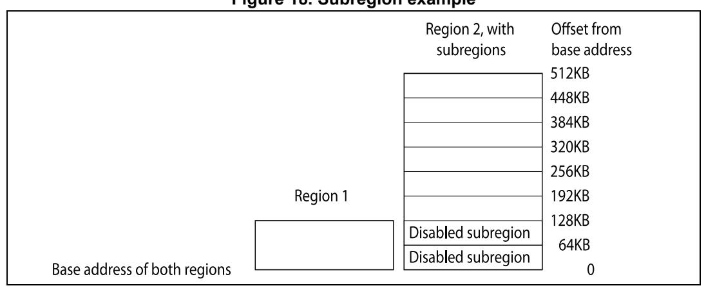
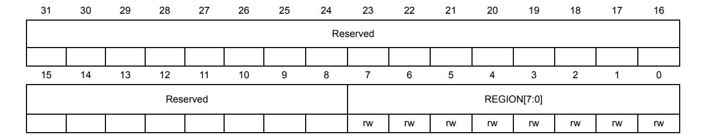

# <span id="page-0-0"></span>**4 Core peripherals**

# **4.1 About the STM32 Cortex-M4 core peripherals**

The address map of the *Private peripheral bus* (PPB) is:

**Table 37. STM32 core peripheral register regions** 

| Address               | Core peripheral                                   | Description          |  |  |  |  |
|-----------------------|---------------------------------------------------|----------------------|--|--|--|--|
| 0xE000E010-0xE000E01F | System timer                                      | Table 55 on page 251 |  |  |  |  |
| 0xE000E100-0xE000E4EF | Nested vectored interrupt<br>controller           | Table 49 on page 219 |  |  |  |  |
| 0xE000ED00-0xE000ED3F | System control block                              | Table 53 on page 244 |  |  |  |  |
| 0xE000ED88-0xE000ED8B | Floating point unit<br>coprocessor access control | Table 56 on page 252 |  |  |  |  |
| 0xE000ED90-0xE000EDB8 | Memory protection unit                            | Table 44 on page 206 |  |  |  |  |
| 0xE000EF00-0xE000EF03 | Nested vectored interrupt<br>controller           | Table 49 on page 219 |  |  |  |  |
| 0xE000EF30-0xE000EF44 | Floating point unit                               | Table 56 on page 252 |  |  |  |  |

In register descriptions,

- Register type is described as follows:
  - RW: Read and write.
  - RO: Read-only.
  - WO: Write-only.
- *Required privilege* gives the privilege level required to access the register, as follows:
  - Privileged: Only privileged software can access the register.
  - Unprivileged**:** Both unprivileged and privileged software can access the register.

# **4.2 Memory protection unit (MPU)**

This section describes the Memory protection unit (MPU) which is implemented in some STM32 microcontrollers. Refer to the corresponding device datasheet to see if the MPU is present in the STM32 type you are using.

The MPU divides the memory map into a number of regions, and defines the location, size, access permissions, and memory attributes of each region. It supports:

- Independent attribute settings for each region
- Overlapping regions
- Export of memory attributes to the system.

The memory attributes affect the behavior of memory accesses to the region. The Cortex-M4 MPU defines:

- Eight separate memory regions, 0-7
- A background region.


PM0214 Rev 10 193/262

When memory regions overlap, a memory access is affected by the attributes of the region with the highest number. For example, the attributes for region 7 take precedence over the attributes of any region that overlaps region 7.

The background region has the same memory access attributes as the default memory map, but is accessible from privileged software only.

The Cortex-M4 MPU memory map is unified. This means instruction accesses and data accesses have same region settings.

If a program accesses a memory location that is prohibited by the MPU, the processor generates a memory management fault. This causes a fault exception, and might cause termination of the process in an OS environment.

In an OS environment, the kernel can update the MPU region setting dynamically based on the process to be executed. Typically, an embedded OS uses the MPU for memory protection.

Configuration of MPU regions is based on memory types, see *Section 2.2.1: Memory regions, types and attributes on page 29*.

*[Table 38](#page-1-0)* shows the possible MPU region attributes.

**Table 38. Memory attributes summary** 

<span id="page-1-0"></span>

| Memory type      | Shareability | Other attributes                                                 | Description                                                                                                                     |  |  |  |  |
|------------------|--------------|------------------------------------------------------------------|---------------------------------------------------------------------------------------------------------------------------------|--|--|--|--|
| Strongly-ordered | -            | -                                                                | All accesses to Strongly-ordered<br>memory occur in program order. All<br>Strongly-ordered regions are assumed<br>to be shared. |  |  |  |  |
| Device           | Shared       | -                                                                | Memory-mapped peripherals that<br>several processors share.                                                                     |  |  |  |  |
|                  | Non-shared   | -                                                                | Memory-mapped peripherals that only a<br>single processor uses.                                                                 |  |  |  |  |
| Normal           | Shared       | Non-cacheable<br>Write-through Cacheable<br>Write-back Cacheable | Normal memory that is shared between<br>several processors.                                                                     |  |  |  |  |
|                  | Non-shared   | Non-cacheable<br>Write-through Cacheable<br>Write-back Cacheable | Normal memory that only a single<br>processor uses.                                                                             |  |  |  |  |

### **4.2.1 MPU access permission attributes**

This section describes the MPU access permission attributes. The access permission bits, TEX, C, B, S, AP, and XN, of the MPU\_RASR register, control access to the corresponding memory region. If an access is made to an area of memory without the required permissions, then the MPU generates a permission fault.

*[Table 39](#page-2-0)* shows the encodings for the TEX, C, B, and S access permission bits.

<span id="page-2-0"></span>**TEX C B S Memory type Shareability Other attributes** b000 0 0 x (1) Strongly-ordered Shareable - 1 x(1) Device Shareable - 1 0 0 Normal Not shareable Outer and inner write-through. No write allocate. 1 Shareable 1 0 Normal Not shareable Outer and inner write-back. No write allocate. 1 Shareable b001 0 0 0 Normal Not shareable Outer and inner noncacheable. - 1 Shareable 1 x(1) Reserved encoding - 1 0 x(1) Implementation defined attributes. - 1 0 Normal Not shareable Outer and inner write-back. Write and read allocate. 1 Shareable b010 0 0 x(1) Device Not shareable Nonshared Device. 1 x(1) Reserved encoding - 1 x(1) x(1) Reserved encoding b1BB A A 0 Normal Not shareable Cached memory(2) , BB = outer policy, AA = inner policy. 1 Shareable

**Table 39. TEX, C, B, and S encoding** 

*[Table 40](#page-2-1)* shows the cache policy for memory attribute encodings with a TEX value is in the range 4-7.

**Table 40. Cache policy for memory attribute encoding** 

<span id="page-2-1"></span>

| Encoding, AA or BB | Corresponding cache policy          |  |  |  |  |
|--------------------|-------------------------------------|--|--|--|--|
| 00                 | Non-cacheable                       |  |  |  |  |
| 01                 | Write back, write and read allocate |  |  |  |  |
| 10                 | Write through, no write allocate    |  |  |  |  |
| 11                 | Write back, no write allocate       |  |  |  |  |


<sup>1.</sup> THe MPU ignores the value fo this bit.

<sup>2.</sup> See *[Table 40](#page-2-1)* for the encoding of the AA and BB bits.

*[Table 41](#page-3-0)* shows the AP encodings that define the access permissions for privileged and unprivileged software.

<span id="page-3-0"></span>

| AP[2:0] | Privileged<br>permissions | Unprivileged<br>permissions | Description                                                    |  |  |  |  |  |
|---------|---------------------------|-----------------------------|----------------------------------------------------------------|--|--|--|--|--|
| 000     | No access                 | No access                   | All accesses generate a permission fault                       |  |  |  |  |  |
| 001     | RW                        | No access                   | Access from privileged software only                           |  |  |  |  |  |
| 010     | RW                        | RO                          | Writes by unprivileged software generate<br>a permission fault |  |  |  |  |  |
| 011     | RW                        | RW                          | Full access                                                    |  |  |  |  |  |
| 100     | Unpredictable             | Unpredictable               | Reserved                                                       |  |  |  |  |  |
| 101     | RO                        | No access                   | Reads by privileged software only                              |  |  |  |  |  |
| 110     | RO                        | RO                          | Read only, by privileged or unprivileged<br>software           |  |  |  |  |  |
| 111     | RO                        | RO                          | Read only, by privileged or unprivileged<br>software           |  |  |  |  |  |

**Table 41. AP encoding** 

## **4.2.2 MPU mismatch**

When an access violates the MPU permissions, the processor generates a memory management fault, see *Section 2.1.4: Exceptions and interrupts on page 26*. The MMFSR indicates the cause of the fault. See *Section 4.4.15: Memory management fault address register (MMFAR) on page 242* for more information.

### **4.2.3 Updating an MPU region**

To update the attributes for an MPU region, update the MPU\_RNR, MPU\_RBAR and MPU\_RASR registers. You can program each register separately, or use a multiple-word write to program all of these registers. You can use the MPU\_RBAR and MPU\_RASR aliases to program up to four regions simultaneously using an STM instruction.

Updating an MPU region using separate words

Simple code to configure one region:

```
; R1 = region number
                      ; R2 = size/enable
                      ; R3 = attributes
                      ; R4 = address
LDR R0,=MPU_RNR ; 0xE000ED98, MPU region number register
STR R1, [R0, #0x0] ; Region Number
STR R4, [R0, #0x4] ; Region Base Address
STRH R2, [R0, #0x8] ; Region Size and Enable
STRH R3, [R0, #0xA] ; Region Attribute
```

Disable a region before writing new region settings to the MPU if you have previously enabled the region being changed. For example:

```
; R1 = region number
; R2 = size/enable
```


```
; R3 = attributes
                    ; R4 = address
LDR R0,=MPU_RNR ; 0xE000ED98, MPU region number register
STR R1, [R0, #0x0] ; Region Number
BIC R2, R2, #1 ; Disable
STRH R2, [R0, #0x8] ; Region Size and Enable
STR R4, [R0, #0x4] ; Region Base Address
STRH R3, [R0, #0xA] ; Region Attribute
ORR R2, #1 ; Enable
STRH R2, [R0, #0x8] ; Region Size and Enable
```

Software must use memory barrier instructions:

- Before MPU setup if there might be outstanding memory transfers, such as buffered writes, that might be affected by the change in MPU settings
- After MPU setup if it includes memory transfers that must use the new MPU settings.

However, memory barrier instructions are not required if the MPU setup process starts by entering an exception handler, or is followed by an exception return, because the exception entry and exception return mechanism cause memory barrier behavior.

Software does not need any memory barrier instructions during MPU setup, because it accesses the MPU through the PPB, which is a Strongly-Ordered memory region.

For example, if you want all of the memory access behavior to take effect immediately after the programming sequence, use a DSB instruction and an ISB instruction:

- A DSB is required after changing MPU settings, such as at the end of context switch.
- An ISB is required if the code that programs the MPU region or regions is entered using a branch or call. If the programming sequence is entered using a return from exception, or by taking an exception, then you do not require an ISB.

### **Updating an MPU region using multi-word writes**

You can program directly using multi-word writes, depending on how the information is divided. Consider the following reprogramming:

```
; R1 = region number
                    ; R2 = address
                    ; R3 = size, attributes in one
LDR R0, =MPU_RNR ; 0xE000ED98, MPU region number register
STR R1, [R0, #0x0] ; Region Number
STR R2, [R0, #0x4] ; Region Base Address
STR R3, [R0, #0x8] ; Region Attribute, Size and Enable
```

Use an STM instruction to optimize this:

```
; R1 = region number
                    ; R2 = address
                    ; R3 = size, attributes in one
LDR R0, =MPU_RNR ; 0xE000ED98, MPU region number register
STM R0, {R1-R3} ; Region Number, address, attribute, size and enable
```

You can do this in two words for pre-packed information. This means that the RBAR contains the required region number and had the VALID bit set to 1, see *[MPU region base](#page-10-0)  [address register \(MPU\\_RBAR\) on page 203](#page-10-0)*. Use this when the data is statically packed, for example in a boot loader:


PM0214 Rev 10 197/262

```
; R1 = address and region number in one
                    ; R2 = size and attributes in one
LDR R0, =MPU_RBAR ; 0xE000ED9C, MPU Region Base register
STR R1, [R0, #0x0] ; Region base address and 
 ; region number combined with VALID (bit 4) set to 1
STR R2, [R0, #0x4] ; Region Attribute, Size and Enable
Use an STM instruction to optimize this:
                    ; R1 = address and region number in one
                    ; R2 = size and attributes in one
LDR R0,=MPU_RBAR ; 0xE000ED9C, MPU Region Base register
STM R0, {R1-R2} ; Region base address, region number and VALID bit,
                    ; and Region Attribute, Size and Enable
```

### <span id="page-5-0"></span>**Subregions**

Regions of 256 bytes or more are divided into eight equal-sized subregions. Set the corresponding bit in the SRD field of the RASR to disable a subregion, see *[Section 4.2.9:](#page-11-0)  [MPU region attribute and size register \(MPU\\_RASR\) on page 204](#page-11-0)*. The least significant bit of SRD controls the first subregion, and the most significant bit controls the last subregion. Disabling a subregion means another region overlapping the disabled range matches instead. If no other enabled region overlaps the disabled subregion the MPU issues a fault.

Regions of 32, 64, and 128 bytes do not support subregions, With regions of these sizes, you must set the SRD field to 0x00, otherwise the MPU behavior is Unpredictable.

### Example of SRD use:

Two regions with the same base address overlap. Region one is 128KB, and region two is 512KB. To ensure the attributes from region one apply to the first128KB region, set the SRD field for region two to b00000011 to disable the first two subregions, as the figure shows.



**Figure 18. Subregion example**

### **4.2.4 MPU design hints and tips**

To avoid unexpected behavior, disable the interrupts before updating the attributes of a region that the interrupt handlers might access.

Ensure software uses aligned accesses of the correct size to access MPU registers:

- Except for the RASR, it must use aligned word accesses
- For the RASR it can use byte or aligned halfword or word accesses.

The processor does not support unaligned accesses to MPU registers.

When setting up the MPU, and if the MPU has previously been programmed, disable unused regions to prevent any previous region settings from affecting the new MPU setup.

### **Recommended MPU configuration**

The STM32 microcontroller system has only a single processor, so you should program the MPU as follows:

| Memory region | TEX  | C | B | S | Memory type and attributes                           |  |  |  |  |  |
|---------------|------|---|---|---|------------------------------------------------------|--|--|--|--|--|
| Flash memory  | b000 | 1 | 0 | 0 | Normal memory, Non-shareable, write-through          |  |  |  |  |  |
| Internal SRAM | b000 | 1 | 0 | 1 | Normal memory, Shareable, write-through              |  |  |  |  |  |
| External SRAM | b000 | 1 | 1 | 1 | Normal memory, Shareable, write-back, write-allocate |  |  |  |  |  |
| Peripherals   | b000 | 0 | 1 | 1 | Device memory, Shareable                             |  |  |  |  |  |

**Table 42. Memory region attributes for STM32** 

In STM32 implementations, the shareability and cache policy attributes do not affect the system behavior. However, using these settings for the MPU regions can make the application code more portable. The values given are for typical situations.

*Note: The MPU attributes don't affect DMA data accesses to the memory/peripherals address spaces. therefore, in order to protect the memory areas against inadvertent DMA accesses, the MPU must control the SW/CPU access to the DMA registers.*

PM0214 Rev 10 199/262

### **4.2.5 MPU type register (MPU\_TYPER)**

Address offset: 0x00

Reset value: 0x0000 0800 Required privilege: Privileged

The MPU\_TYPER register indicates whether the MPU is present, and if so, how many

regions it supports.

| 31           | 30 | 29 | 28 | 27 | 26           | 25       | 24 | 23 | 22 | 21 | 20 | 19           | 18 | 17 | 16 |
|--------------|----|----|----|----|--------------|----------|----|----|----|----|----|--------------|----|----|----|
| Reserved     |    |    |    |    | IREGION[7:0] |          |    |    |    |    |    |              |    |    |    |
|              |    |    |    |    |              |          |    | r  | r  | r  | r  | r            | r  | r  | r  |
| 15           | 14 | 13 | 12 | 11 | 10           | 9        | 8  | 7  | 6  | 5  | 4  | 3            | 2  | 1  | 0  |
| DREGION[7:0] |    |    |    |    |              | Reserved |    |    |    |    |    | SEPA<br>RATE |    |    |    |
| r            | r  | r  | r  | r  | r            | r        |    |    |    |    |    |              |    |    | r  |

#### Bits 31:24 **Reserved.**

Bits 23:16 **IREGION[7:0]**: Number of MPU instruction regions.

These bits indicates the number of supported MPU instruction regions.

Always contains 0x00. The MPU memory map is unified and is described by the DREGION field.

Bits 15:8 **DREGION[7:0]**: Number of MPU data regions.

These bits indicates the number of supported MPU data regions.

0x08: Eight MPU regions 0x00: MPU not present

#### Bits 7:1 **Reserved.**

Bit 0 **SEPARATE**: Separate flag.

This bit indicates support for unified or separate instruction and data memory maps:

0 = Unified 1 = Separate


# **4.2.6 MPU control register (MPU\_CTRL)**

Address offset: 0x04

Reset value: 0x0000 0000 Required privilege: Privileged The MPU\_CTRL register:

- Enables the MPU
- Enables the default memory map background region
- Enables use of the MPU when in the hard fault, Non-maskable Interrupt (NMI), and FAULTMASK escalated handlers.

### When ENABLE and PRIVDEFENA are both set to 1:

- For privileged accesses, the default memory map is as described in *Section 2.2: Memory model on page 28*. Any access by privileged software that does not address an enabled memory region behaves as defined by the default memory map.
- Any access by unprivileged software that does not address an enabled memory region causes a memory management fault.

XN and Strongly-ordered rules always apply to the System Control Space regardless of the value of the ENABLE bit.

When the ENABLE bit is set to 1, at least one region of the memory map must be enabled for the system to function unless the PRIVDEFENA bit is set to 1. If the PRIVDEFENA bit is set to 1 and no regions are enabled, then only privileged software can operate.

When the ENABLE bit is set to 0, the system uses the default memory map. This has the same memory attributes as if the MPU is not implemented, see *Table 13: Memory access behavior on page 30*. The default memory map applies to accesses from both privileged and unprivileged software.

When the MPU is enabled, accesses to the System Control Space and vector table are always permitted. Other areas are accessible based on regions and whether PRIVDEFENA is set to 1.

Unless HFNMIENA is set to 1, the MPU is not enabled when the processor is executing the handler for an exception with priority –1 or –2. These priorities are only possible when handling a hard fault or NMI exception, or when FAULTMASK is enabled. Setting the HFNMIENA bit to 1 enables the MPU when operating with these two priorities.

| 31 | 30 | 29 | 28 | 27 | 26 | 25       | 24 | 23       | 22 | 21 | 20 | 19 | 18         | 17       | 16      |
|----|----|----|----|----|----|----------|----|----------|----|----|----|----|------------|----------|---------|
|    |    |    |    |    |    |          |    | Reserved |    |    |    |    |            |          |         |
|    |    |    |    |    |    |          |    |          |    |    |    |    |            |          |         |
| 15 | 14 | 13 | 12 | 11 | 10 | 9        | 8  | 7        | 6  | 5  | 4  | 3  | 2          | 1        | 0       |
|    |    |    |    |    |    | Reserved |    |          |    |    |    |    | PRIVDEFENA | HFNMIENA | EN ABLE |
|    |    |    |    |    |    |          |    |          |    |    |    |    | rw         | rw       | rw      |


PM0214 Rev 10 201/262

#### Bits 31:3 **Reserved, forced by hardware to 0.**

Bit 2 **PRIVDEFENA**: Enable priviliged software access to default memory map.

0: If the MPU is enabled, disables use of the default memory map. Any memory access to a location not covered by any enabled region causes a fault.

1: If the MPU is enabled, enables use of the default memory map as a background region for privileged software accesses.

*Note: When enabled, the background region acts as if it is region number -1. Any region that is defined and enabled has priority over this default map.* 

*If the MPU is disabled, the processor ignores this bit.*

Bit 1 **HFNMIENA**: Enables the operation of MPU during hard fault, NMI, and FAULTMASK handlers. When the MPU is enabled:

- 0: MPU is disabled during hard fault, NMI, and FAULTMASK handlers, regardless of the value of the ENABLE bit
- 1: The MPU is enabled during hard fault, NMI, and FAULTMASK handlers.

*Note: When the MPU is disabled, if this bit is set to 1 the behavior is unpredictable.*

Bit 0 **ENABLE**: Enables the MPU

0: MPU disabled 1: MPU enabled

### **4.2.7 MPU region number register (MPU\_RNR)**

Address offset: 0x08

Reset value: 0x0000 0000 Required privilege: Privileged

The MPU\_RNR register selects which memory region is referenced by the MPU\_RBAR and

MPU\_RASR registers.



#### Bits 31:8 **Reserved, forced by hardware to 0.**

#### Bits 7:0 **REGION[7:0]**: MPU region

These bits indicate the MPU region referenced by the MPU\_RBAR and MPU\_RASR registers. The MPU supports 8 memory regions, so the permitted values of this field are 0-7. Normally, you write the required region number to this register before accessing the MPU\_RBAR or MPU\_RASR. However you can change the region number by writing to the MPU\_RBAR register with the VALID bit set to 1, see *[MPU region base address register](#page-10-0)  [\(MPU\\_RBAR\)](#page-10-0)*. This write updates the value of the REGION field.


### <span id="page-10-0"></span>**4.2.8 MPU region base address register (MPU\_RBAR)**

Address offset: 0x0C

Reset value: 0x0000 0000 Required privilege: Privileged

The MPU\_RBAR register defines the base address of the MPU region selected by the

MPU\_RNR register, and can update the value of the MPU\_RNR register.

Write to the MPU\_RBAR register with the VALID bit set to 1 to change the current region

number and update the MPU\_RNR register.

| 31 | 30 | 29 | 28 | 27 | 26         | 25 | 24 | 23         | 22 | 21 | 20    | 19 | 18 | 17          | 16 |
|----|----|----|----|----|------------|----|----|------------|----|----|-------|----|----|-------------|----|
|    |    |    |    |    |            |    |    | ADDR[31:N] |    |    |       |    |    |             |    |
|    |    |    |    |    |            |    |    |            |    |    |       |    |    |             |    |
| 15 | 14 | 13 | 12 | 11 | 10         | 9  | 8  | 7          | 6  | 5  | 4     | 3  | 2  | 1           | 0  |
|    |    |    |    |    | ADDR[31:N] |    |    |            |    |    | VALID |    |    | REGION[3:0] |    |
|    |    |    |    |    |            |    |    |            |    |    | rw    | rw | rw | rw          | rw |

### Bits 31:N **ADDR[31:N]**: Region base address field

The value of N depends on the region size.

The region size, as specified by the SIZE field in the MPU\_RASR, defines the value of N:

N = Log2(Region size in bytes),

If the region size is configured to 4 GB, in the MPU\_RASR register, there is no valid ADDR field. In this case, the region occupies the complete memory map, and the base address is 0x00000000.

The base address is aligned to the size of the region. For example, a 64 KB region must be aligned on a multiple of 64 KB, for example, at 0x00010000 or 0x00020000.

### Bits N-1:5 **Reserved, forced by hardware to 0.**

#### Bit 4 **VALID**: MPU region number valid

### **Write**:

- 0: MPU\_RNR register not changed, and the processor:
  - Updates the base address for the region specified in the MPU\_RNR
  - Ignores the value of the REGION field
- 1: the processor:
  - updates the value of the MPU\_RNR to the value of the REGION field
  - updates the base address for the region specified in the REGION field.

### **Read**:

Always read as zero.

#### Bits 3:0 **REGION[3:0]**: MPU region field

For the behavior on writes, see the description of the VALID field.

On reads, returns the current region number, as specified by the MPU\_RNR register.

PM0214 Rev 10 203/262

## <span id="page-11-0"></span>**4.2.9 MPU region attribute and size register (MPU\_RASR)**

Address offset: 0x10

Reset value: 0x0000 0000 Required privilege: Privileged

The MPU\_RASR register defines the region size and memory attributes of the MPU region specified by the MPU\_RNR, and enables that region and any subregions.

MPU\_RASR is accessible using word or halfword accesses:

• The most significant halfword holds the region attributes

• The least significant halfword holds the region size and the region and subregion enable bits.

| 31 | 30       | 29 | 28 | 27       | 26 | 25      | 24 | 23 | 22       | 21 | 20       | 19   | 18 | 17 | 16      |
|----|----------|----|----|----------|----|---------|----|----|----------|----|----------|------|----|----|---------|
|    | Reserved |    | XN | Reserved |    | AP[2:0] |    |    | Reserved |    | TEX[2:0] |      | S  | C  | B       |
|    |          |    | rw |          | rw | rw      | rw |    |          | rw | rw       | rw   | rw | rw | rw      |
| 15 | 14       | 13 | 12 | 11       | 10 | 9       | 8  | 7  | 6        | 5  | 4        | 3    | 2  | 1  | 0       |
|    |          |    |    | SRD[7:0] |    |         |    |    | Reserved |    |          | SIZE |    |    | EN ABLE |
| rw | rw       | rw | rw | rw       | rw | rw      | rw |    |          | rw | rw       | rw   | rw | rw | rw      |

#### Bits 31:29 **Reserved, forced by hardware to 0.**

Bit 28 **XN**: Instruction access disable bit:

0: Instruction fetches enabled 1: Instruction fetches disabled.

Bit 27 **Reserved, forced by hardware to 0.**

Bits 26:24 **AP[2:0]**: Access permission

For information about access permission, see *[Section 4: Core peripherals](#page-0-0)* For a description of AP bits encoding refer to *[Table 41 on page 196](#page-3-0)*.

Bits 23:22 **Reserved, forced by hardware to 0.**

Bits 21:19 **TEX[2:0]: memory attribute**

For a description of TEX bits encoding refer to *[Table 39 on page 195](#page-2-0)*

Bit 18 **S: Shareable memory attribute**

For a description of S bits encoding refer to *[Table 39 on page 195](#page-2-0)*

Bit 17 **C: memory attribute** Bit 16 **B: memory attribute**

Bits 15:8 **SRD**: Subregion disable bits.

For each bit in this field:

0: corresponding sub-region is enabled

1: corresponding sub-region is disabled

See *[Subregions on page 198](#page-5-0)* for more information.

Region sizes of 128 bytes and less do not support subregions. When writing the attributes for such a region, write the SRD field as 0x00.

#### Bits 7:6 **Reserved, forced by hardware to 0.**

Bits 5:1 **SIZE**: Size of the MPU protection region.

The minimum permitted value is 3 (b00010), see *[SIZE field values](#page-12-0)* for more information.

Bit 0 **ENABLE**: Region enable bit.

### <span id="page-12-0"></span>**SIZE field values**

The SIZE field defines the size of the MPU memory region specified by the MPU\_RNR regsiter as follows:

(Region size in bytes) = 2(SIZE+1)

The smallest permitted region size is 32B, corresponding to a SIZE value of 4. *[Table 43](#page-12-1)* gives example SIZE values, with the corresponding region size and value of N in the MPU\_RBAR.

<span id="page-12-1"></span>

| SIZE value  | Region size | Value of N(1) | Note                   |
|-------------|-------------|---------------|------------------------|
| b00100 (4)  | 32B         | 5             | Minimum permitted size |
| b01001 (9)  | 1KB         | 10            | -                      |
| b10011 (19) | 1MB         | 20            | -                      |
| b11101 (29) | 1GB         | 30            | -                      |
| b11111 (31) | 4GB         | b01100        | Maximum possible size  |

**Table 43. Example SIZE field values** 


PM0214 Rev 10 205/262

<sup>1.</sup> In the MPU\_RBAR register see *[Section 4.2.8 on page 203](#page-10-0)*

### **4.2.10 MPU register map**

**Table 44. MPU register map and reset values** 

<span id="page-13-0"></span>

| Offset | Register           | 31 | 30       | 29 | 28 | 27       | 26 | 25      | 24 | 23 | 22       | 21 | 20           | 19         | 18       | 17    | 16 | 15 | 14 | 13 | 12 | 11           | 10 | 9 | 8 | 7 | 6        | 5 | 4           | 3    | 2          | 1           | 0        |
|--------|--------------------|----|----------|----|----|----------|----|---------|----|----|----------|----|--------------|------------|----------|-------|----|----|----|----|----|--------------|----|---|---|---|----------|---|-------------|------|------------|-------------|----------|
| 0x00   | MPU_TYPER          |    |          |    |    | Reserved |    |         |    |    |          |    | IREGION[7:0] |            |          |       |    |    |    |    |    | DREGION[7:0] |    |   |   |   |          |   | Reserved    |      |            |             | SEPARATE |
|        | Reset Value        | 0  | 0        | 0  | 0  | 0        | 0  | 0       | 0  | 0  | 0        | 0  | 0            | 0          | 0        | 0     | 0  | 0  | 0  | 0  | 1  | 0            | 0  | 0 | 0 | 0 | 0        | 0 | 0           | 0    | 0          | 0           | 0        |
| 0x04   | MPU_CTRL           |    |          |    |    |          |    |         |    |    |          |    |              |            | Reserved |       |    |    |    |    |    |              |    |   |   |   |          |   |             |      | PRIVDEFENA | HFNMIENA    | ENABLE   |
|        | Reset Value        | 0  | 0        | 0  | 0  | 0        | 0  | 0       | 0  | 0  | 0        | 0  | 0            | 0          | 0        | 0     | 0  | 0  | 0  | 0  | 0  | 0            | 0  | 0 | 0 | 0 | 0        | 0 | 0           | 0    | 0          | 0           | 0        |
| 0x08   | MPU_RNR            |    |          |    |    |          |    |         |    |    |          |    | Reserved     |            |          |       |    |    |    |    |    |              |    |   |   |   |          |   | REGION[7:0] |      |            |             |          |
|        | Reset Value        | 0  | 0        | 0  | 0  | 0        | 0  | 0       | 0  | 0  | 0        | 0  | 0            | 0          | 0        | 0     | 0  | 0  | 0  | 0  | 0  | 0            | 0  | 0 | 0 | 0 | 0        | 0 | 0           | 0    | 0          | 0           | 0        |
| 0x0C   | MPU_RBAR           |    |          |    |    |          |    |         |    |    |          |    |              | ADDR[31:N] |          |       |    |    |    |    |    |              |    |   |   |   |          |   | VALID       |      |            | REGION[3:0] |          |
|        | Reset Value        | 0  | 0        | 0  | 0  | 0        | 0  | 0       | 0  | 0  | 0        | 0  | 0            | 0          | 0        | 0     | 0  | 0  | 0  | 0  | 0  | 0            | 0  | 0 | 0 | 0 | 0        | 0 | 0           | 0    | 0          | 0           | 0        |
| 0x10   | MPU_RASR           |    | Reserved |    | XN | Reserved |    | AP[2:0] |    |    | Reserved |    | TEX[2:0]     |            |          | S C B |    |    |    |    |    | SRD[7:0]     |    |   |   |   | Reserved |   |             | SIZE |            |             | EN ABLE  |
|        | Reset Value        | 0  | 0        | 0  | 0  | 0        | 0  | 0       | 0  | 0  | 0        | 0  | 0            | 0          | 0        | 0     | 0  | 0  | 0  | 0  | 0  | 0            | 0  | 0 | 0 | 0 | 0        | 0 | 0           | 0    | 0          | 0           | 0        |
| 0x14   | MPU_RBAR_A1<br>(1) |    |          |    |    |          |    |         |    |    |          |    |              | ADDR[31:N] |          |       |    |    |    |    |    |              |    |   |   |   |          |   | VALID       |      |            | REGION[3:0] |          |
|        | Reset Value        | 0  | 0        | 0  | 0  | 0        | 0  | 0       | 0  | 0  | 0        | 0  | 0            | 0          | 0        | 0     | 0  | 0  | 0  | 0  | 0  | 0            | 0  | 0 | 0 | 0 | 0        | 0 | 0           | 0    | 0          | 0           | 0        |
| 0x18   | MPU_RASR_A1<br>(2) |    | Reserved |    | XN | Reserved |    | AP[2:0] |    |    | Reserved |    | TEX[2:0]     |            |          | S C B |    |    |    |    |    | SRD[7:0]     |    |   |   |   | Reserved |   |             | SIZE |            |             | EN ABLE  |
|        | Reset Value        | 0  | 0        | 0  | 0  | 0        | 0  | 0       | 0  | 0  | 0        | 0  | 0            | 0          | 0        | 0     | 0  | 0  | 0  | 0  | 0  | 0            | 0  | 0 | 0 | 0 | 0        | 0 | 0           | 0    | 0          | 0           | 0        |
| 0x1C   | MPU_RBAR_A2<br>(1) |    |          |    |    |          |    |         |    |    |          |    |              | ADDR[31:N] |          |       |    |    |    |    |    |              |    |   |   |   |          |   | VALID       |      |            | REGION[3:0] |          |
|        | Reset Value        | 0  | 0        | 0  | 0  | 0        | 0  | 0       | 0  | 0  | 0        | 0  | 0            | 0          | 0        | 0     | 0  | 0  | 0  | 0  | 0  | 0            | 0  | 0 | 0 | 0 | 0        | 0 | 0           | 0    | 0          | 0           | 0        |
| 0x20   | MPU_RASR_A2<br>(2) |    | Reserved |    | XN | Reserved |    | AP[2:0] |    |    | Reserved |    | TEX[2:0]     |            |          | S C B |    |    |    |    |    | SRD[7:0]     |    |   |   |   | Reserved |   |             | SIZE |            |             | EN ABLE  |
|        | Reset Value        | 0  | 0        | 0  | 0  | 0        | 0  | 0       | 0  | 0  | 0        | 0  | 0            | 0          | 0        | 0     | 0  | 0  | 0  | 0  | 0  | 0            | 0  | 0 | 0 | 0 | 0        | 0 | 0           | 0    | 0          | 0           | 0        |

**Table 44. MPU register map and reset values (continued)**

| Offset | Register           | 31 | 30       | 29 | 28 | 27       | 26 | 25      | 24 | 23       | 22 | 21 | 20       | 19         | 18 | 17    | 16 | 15 | 14 | 13 | 12 | 11       | 10 | 9 | 8 | 7        | 6 | 5 | 4     | 3    | 2           | 0<br>1  |
|--------|--------------------|----|----------|----|----|----------|----|---------|----|----------|----|----|----------|------------|----|-------|----|----|----|----|----|----------|----|---|---|----------|---|---|-------|------|-------------|---------|
| 0x1C   | MPU_RBAR_A3<br>(1) |    |          |    |    |          |    |         |    |          |    |    |          | ADDR[31:N] |    |       |    |    |    |    |    |          |    |   |   |          |   |   | VALID |      | REGION[3:0] |         |
|        | Reset Value        | 0  | 0        | 0  | 0  | 0        | 0  | 0       | 0  | 0        | 0  | 0  | 0        | 0          | 0  | 0     | 0  | 0  | 0  | 0  | 0  | 0        | 0  | 0 | 0 | 0        | 0 | 0 | 0     | 0    | 0           | 0<br>0  |
| 0x20   | MPU_RASR_A3<br>(2) |    | Reserved |    | XN | Reserved |    | AP[2:0] |    | Reserved |    |    | TEX[2:0] |            |    | S C B |    |    |    |    |    | SRD[7:0] |    |   |   | Reserved |   |   |       | SIZE |             | EN ABLE |
|        | Reset Value        | 0  | 0        | 0  | 0  | 0        | 0  | 0       | 0  | 0        | 0  | 0  | 0        | 0          | 0  | 0     | 0  | 0  | 0  | 0  | 0  | 0        | 0  | 0 | 0 | 0        | 0 | 0 | 0     | 0    | 0           | 0<br>0  |

<sup>1.</sup> Alias of MPU\_RBAR register


PM0214 Rev 10 207/262

<sup>2.</sup> Alias of MPU\_RASR register