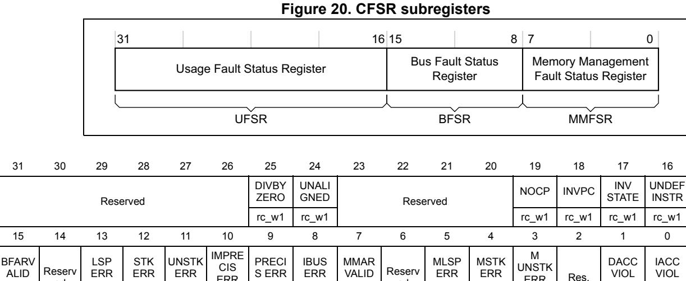

# 4.4 System control block (SCB)

The *System control block* (SCB) provides system implementation information, and system control. This includes configuration, control, and reporting of the system exceptions.

Table 50. Summary of the system control block registers

| Address    | Name                | Туре              | Required privilege | Reset value | Description                                                                          |  |  |  |  |  |
|------------|---------------------|-------------------|--------------------|-------------|--------------------------------------------------------------------------------------|--|--|--|--|--|
| 0xE000E008 | ACTLR               | RW                | Privileged         | 0x00000000  | Table 4.4.1: Auxiliary control register (ACTLR) on page 222                          |  |  |  |  |  |
| 0xE000ED00 | CPUID               | RO                | Privileged         | 0x410FC241  | Table 4.4.2: CPUID base register (CPUID) on page 224                                 |  |  |  |  |  |
| 0xE000ED04 | ICSR                | RW (1) | Privileged         | 0x00000000  | Table 4.4.3: Interrupt control and state register (ICSR) on page 225                 |  |  |  |  |  |
| 0xE000ED08 | VTOR                | RW                | Privileged         | 0x00000000  | Table 4.4.4: Vector table offset register (VTOR) on page 227                         |  |  |  |  |  |
| 0xE000ED0C | AIRCR               | RW (1) | Privileged         | 0xFA050000  | Table 4.4.5: Application interrupt and reset control register (AIRCR) on page 228    |  |  |  |  |  |
| 0xE000ED10 | SCR                 | RW                | Privileged         | 0x00000000  | Table 4.4.6: System control register (SCR) on page 230                               |  |  |  |  |  |
| 0xE000ED14 | CCR                 | RW                | Privileged         | 0x00000200  | Table 4.4.7: Configuration and control register (CCR) on page 231                    |  |  |  |  |  |
| 0xE000ED18 | SHPR1               | RW                | Privileged         | 0x00000000  |                                                                                      |  |  |  |  |  |
| 0xE000ED1C | SHPR2               | RW                | Privileged         | 0x00000000  | Table 4.4.8: System handler priority registers (SHPR on page 233                     |  |  |  |  |  |
| 0xE000ED20 | SHPR3               | RW                | Privileged         | 0x00000000  | 5 page 200                                                                           |  |  |  |  |  |
| 0xE000ED24 | SHCSR               | RW                | Privileged         | 0x00000000  | Table 4.4.9: System handler control and state register (SHCSR) on page 235           |  |  |  |  |  |
| 0xE000ED28 | CFSR                | RW                | Privileged         | 0x00000000  | Table 4.4.10: Configurable fault status register (CFSR; UFSR+BFSR+MMFSR) on page 237 |  |  |  |  |  |
| 0xE000ED28 | MMSR                | RW                | Privileged         | 0x00        | MemManage Fault Status Register <i>Table 4.4.10 on page 237</i>                      |  |  |  |  |  |
| 0xE000ED29 | BFSR (2) | RW                | Privileged         | 0x00        | BusFault Status Register Table 4.4.10 on page 237                                    |  |  |  |  |  |
| 0xE000ED2A | UFSR (2) | RW                | Privileged         | 0x0000      | UsageFault Status Register Table 4.4.10 on page 237                                  |  |  |  |  |  |
| 0xE000ED2C | HFSR                | RW                | Privileged         | 0x00000000  | Table 4.4.14: Hard fault status register (HFSR) on page 241                          |  |  |  |  |  |
| 0xE000ED34 | MMAR                | RW                | Privileged         | Unknown     | Table 4.4.15: Memory management fault address register (MMFAR) on page 242           |  |  |  |  |  |
| 0xE000ED38 | BFAR                | RW                | Privileged         | Unknown     | Table 4.4.16: Bus fault address register (BFAR) on page 242                          |  |  |  |  |  |
| 0xE000ED3C | AFSR                | RW                | Privileged         | 0x00000000  | Table 4.4.17: Auxiliary fault status register (AFSR) on page 243                     |  |  |  |  |  |

1. See the register description for more information.

PM0214 Rev 10 221/262

2. A subregister of the CFSR

## **4.4.1 Auxiliary control register (ACTLR)**

Address offset: 0x00 (base adress = 0xE000 E008)

Reset value: 0x0000 0000 Required privilege: Privileged

By default this register is set to provide optimum performance from the Cortex-M4 processor, and does not normally require modification. The ACTLR register provides disable bits for the following processor functions:

• IT folding

• write buffer use for accesses to the default memory map

• interruption of multi-cycle instructions.

| 31 | 30       | 29 | 28 | 27 | 26 | 25 | 24          | 23 | 22 | 21 | 20 | 19 | 18          | 17             | 16             |
|----|----------|----|----|----|----|----|-------------|----|----|----|----|----|-------------|----------------|----------------|
|    | Reserved |    |    |    |    |    |             |    |    |    |    |    |             |                |                |
| 15 | 14       | 13 | 12 | 11 | 10 | 9  | 8           | 7  | 6  | 5  | 4  | 3  | 2           | 1              | 0              |
|    | Reserved |    |    |    |    |    | DISFP CA |    |    |    |    |    | DISFOL D | DISDE FWBUF | DISMC YCINT |
|    |          |    |    |    |    | rw | rw          |    |    |    |    |    | rw          | rw             | rw             |

Bits 31:10 Reserved

Bit 9 DISOOFP

Disables floating point instructions completing out of order with respect to integer instructions.

Bit 8 DISFPCA

Disables automatic update of CONTROL.FPCA.

The value of this bit should be written as zero or preserved (SBZP).

Bit 7:3 Reserved

#### Bit 2 DISFOLD

Disables folding of IT instructions:

- 0: Enables IT instructions folding.
- 1: Disables IT instructions folding.

In some situations, the processor can start executing the first instruction in an IT block while it is still executing the IT instruction. This behavior is called IT folding, and improves performance, However, IT folding can cause jitter in looping. If a task must avoid jitter, set the DISFOLD bit to 1 before executing the task, to disable IT folding.

### Bit 1 DISDEFWBUF

This bit only affects write buffers implemented in the Cortex-M4 processor.

Disables write buffer use during default memory map accesses: This causes all BusFaults to be precise BusFaults but decreases performance because any store to memory must complete before the processor can execute the next instruction.

- 0: Enable write buffer use
- 1: Disable write buffer use: Stores to memory is completed before next instruction.

#### Bit 0 DISMCYCINT

Disables interrupt of multi-cycle instructions. When set to 1, disables interruption of load multiple and store multiple instructions. This increases the interrupt latency of the processor because any LDM or STM must complete before the processor can stack the current state and enter the interrupt handler.

- 0: Enable interruption latency of the processor (load/store and multiply/divide operations).
- 1: Disable interruptions latency.

PM0214 Rev 10 223/262

## **4.4.2 CPUID base register (CPUID)**

Address offset: 0x00

Reset value: 0x410F C241 Required privilege: Privileged

The CPUID register contains the processor part number, version, and implementation

information.

| 31 | 30          | 29 | 28 | 27 | 26 | 25 | 24 | 23      | 22 | 21 | 20 | 19       | 18 | 17 | 16 |
|----|-------------|----|----|----|----|----|----|---------|----|----|----|----------|----|----|----|
|    | Implementer |    |    |    |    |    |    | Variant |    |    |    | Constant |    |    |    |
| r  | r           | r  | r  | r  | r  | r  | r  | r       | r  | r  | r  | r        | r  | r  | r  |
| 15 | 14          | 13 | 12 | 11 | 10 | 9  | 8  | 7       | 6  | 5  | 4  | 3        | 2  | 1  | 0  |
|    | PartNo      |    |    |    |    |    |    |         |    |    |    | Revision |    |    |    |
| r  | r           | r  | r  | r  | r  | r  | r  | r       | r  | r  | r  | r        | r  | r  | r  |

Bits 31:24 **Implementer**: Implementer code

0x41: Arm

Bits 23:20 **Variant**: Variant number

The r value in the r*n*p*n* product revision identifier

0x0: revision 0

Bits 19:16 **Constant:** Reads as 0xF

Bits 15:4 **PartNo**: Part number of the processor

0xC24: = Cortex-M4

Bits 3:0 **Revision**: Revision number

The p value in the r*n*p*n* product revision identifier, indicates patch release.

0x1: = patch 1

## **4.4.3 Interrupt control and state register (ICSR)**

Address offset: 0x04

Reset value: 0x0000 0000 Required privilege: Privileged

The ICSR:

• Provides:

- A set-pending bit for the *Non-Maskable Interrupt* (NMI) exception
- Set-pending and clear-pending bits for the PendSV and SysTick exceptions
- Indicates:
  - The exception number of the exception being processed
  - Whether there are preempted active exceptions
  - The exception number of the highest priority pending exception
  - Whether any interrupts are pending.

**Caution:** When you write to the ICSR, the effect is unpredictable if you:

- Write 1 to the PENDSVSET bit and write 1 to the PENDSVCLR bit
- Write 1 to the PENDSTSET bit and write 1 to the PENDSTCLR bit.

| 31         | 30       | 29               | 28        | 27        | 26        | 25        | 24              | 23 | 22         | 21 | 20       | 19 | 18               | 17 | 16 |
|------------|----------|------------------|-----------|-----------|-----------|-----------|-----------------|----|------------|----|----------|----|------------------|----|----|
| NMIPENDSET | Reserved |                  | PENDSVSET | PENDSVCLR | PENDSTSET | PENDSTCLR | Reserved        |    | ISRPENDING |    | Reserved |    | VECTPENDING[6:4] |    |    |
| rw         |          |                  | rw        | w         | rw        | w         |                 |    | r          |    |          |    | r                | r  | r  |
| 15         | 14       | 13               | 12        | 11        | 10        | 9         | 8               | 7  | 6          | 5  | 4        | 3  | 2                | 1  | 0  |
|            |          | VECTPENDING[3:0] |           | RETOBASE  |           | Reserved  | VECTACTIVE[8:0] |    |            |    |          |    |                  |    |    |
| r          | r        | r                | r         | r         |           |           | rw              | rw | rw         | rw | rw       | rw | rw               | rw | rw |

#### Bit 31 **NMIPENDSET**: NMI set-pending bit.

Write:

0: No effect

1: Change NMI exception state to pending.

#### Read:

- 0: NMI exception is not pending
- 1: NMI exception is pending

Because NMI is the highest-priority exception, normally the processor enter the NMI exception handler as soon as it registers a write of 1 to this bit, and entering the handler clears this bit to 0. A read of this bit by the NMI exception handler returns 1 only if the NMI signal is reasserted while the processor is executing that handler.

Bits 30:29 Reserved

PM0214 Rev 10 225/262

Bit 28 **PENDSVSET:** PendSV set-pending bit.

Write:

- 0: No effect
- 1: Change PendSV exception state to pending.

Read:

- 0: PendSV exception is not pending
- 1: PendSV exception is pending

Writing 1 to this bit is the only way to set the PendSV exception state to pending.

- Bit 27 **PENDSVCLR:** PendSV clear-pending bit. This bit is write-only. On a read, value is unknown.
  - 0: No effect
  - 1: Removes the pending state from the PendSV exception.
- Bit 26 **PENDSTSET:** SysTick exception set-pending bit.

**Write**:

- 0: No effect
- 1: Change SysTick exception state to pending

#### **Read**:

- 0: SysTick exception is not pending
- 1: SysTick exception is pending
- Bit 25 **PENDSTCLR:** SysTick exception clear-pending bit. Write-only. On a read, value is unknown.
  - 0: No effect
  - 1: Removes the pending state from the SysTick exception.
- Bit 24 Reserved, must be kept cleared.
- Bit 23 This bit is reserved for Debug use and reads-as-zero when the processor is not in Debug.
- Bit 22 **ISRPENDING:** Interrupt pending flag, excluding NMI and Faults.
  - 0: Interrupt not pending
  - 1: Interrupt pending
- Bits 21:19 Reserved, must be kept cleared.
- Bits 18:12 **VECTPENDING**: Pending vector. Indicates the exception number of the highest priority pending enabled exception.
  - 0: No pending exceptions

Other values: The exception number of the highest priority pending enabled exception.

The value indicated by this field includes the effect of the BASEPRI and FAULTMASK registers, but not any effect of the PRIMASK register.

- Bit 11 **RETTOBASE:** Return to base level. Indicates whether there are preempted active exceptions:
  - 0: There are preempted active exceptions to execute
  - 1: There are no active exceptions, or the currently-executing exception is the only active exception.
- Bits 10:9 Reserved
- Bits 8:0 VECTACTIVE Active vector. Contains the active exception number:
  - 0: Thread mode

Other values: The exception number(1) of the currently active exception.

*Note: Subtract 16 from this value to obtain CMSIS IRQ number required to index into the Interrupt Clear-Enable, Set-Enable, Clear-Pending, Set-Pending, or Priority Registers, see Table 6 on page 22.*

1. This is the same value as IPSR bits[8:0], see *Interrupt program status register on page 22*.

## **4.4.4 Vector table offset register (VTOR)**

Address offset: 0x08

Reset value: 0x0000 0000 Required privilege: Privileged

| 31 | 30           | 29 | 28 | 27 | 26 | 25 | 24            | 23 | 22 | 21 | 20 | 19 | 18 | 17 | 16 |
|----|--------------|----|----|----|----|----|---------------|----|----|----|----|----|----|----|----|
|    | Reserved     |    |    |    |    |    | TBLOFF[29:16] |    |    |    |    |    |    |    |    |
|    |              | rw | rw | rw | rw | rw | rw            | rw | rw | rw | rw | rw | rw | rw | rw |
| 15 | 14           | 13 | 12 | 11 | 10 | 9  | 8             | 7  | 6  | 5  | 4  | 3  | 2  | 1  | 0  |
|    | TBLOFF[15:9] |    |    |    |    |    | Reserved      |    |    |    |    |    |    |    |    |
| rw | rw           | rw | rw | rw | rw | rw |               |    |    |    |    |    |    |    |    |

Bits 31:30 Reserved, must be kept cleared

Bits 29:9 **TBLOFF**: Vector table base offset field.

It contains bits [29:9] of the offset of the table base from memory address 0x00000000. When setting TBLOFF, you must align the offset to the number of exception entries in the vector table. The minimum alignment is 128 words. Table alignment requirements mean that bits[8:0] of the table offset are always zero.

Bit 29 determines whether the vector table is in the code or SRAM memory region.

0: Code 1: SRAM

*Note: Bit 29 is sometimes called the TBLBASE bit.*

Bits 8:0 Reserved, must be kept cleared

PM0214 Rev 10 227/262

## **4.4.5 Application interrupt and reset control register (AIRCR)**

Address offset: 0x0C

Reset value: 0xFA05 0000 Required privilege: Privileged

The AIRCR provides priority grouping control for the exception model, endian status for data

accesses, and reset control of the system.

To write to this register, you must write 0x5FA to the VECTKEY field, otherwise the

processor ignores the write.

| 31        | 30                                            | 29 | 28 | 27 | 26 | 25 | 24       | 23     | 22 | 21 | 20 | 19                  | 18                    | 17            | 16 |
|-----------|-----------------------------------------------|----|----|----|----|----|----------|--------|----|----|----|---------------------|-----------------------|---------------|----|
|           | VECTKEYSTAT[15:0](read)/ VECTKEY[15:0](write) |    |    |    |    |    |          |        |    |    |    |                     |                       |               |    |
| rw        | rw                                            | rw | rw | rw | rw | rw | rw       | rw     | rw | rw | rw | rw                  | rw                    | rw            | rw |
| 15        | 14                                            | 13 | 12 | 11 | 10 | 9  | 8        | 7      | 6  | 5  | 4  | 3                   | 2                     | 1             | 0  |
| ENDIANESS | PRIGROUP Reserved                          |    |    |    |    |    | Reserved |        |    |    |    | SYS RESET REQ | VECT CLR ACTIVE | VECT RESET |    |
| r         |                                               |    |    |    | rw | rw | rw       | w w |    |    |    |                     |                       |               | w  |

#### Bits 31:16 **VECTKEYSTAT/ VECTKEY** Register key

Reads as 0xFA05

On writes, write 0x5FA to VECTKEY, otherwise the write is ignored.

Bit 15 ENDIANESS Data endianness bit

Reads as 0.

0: Little-endian

#### Bits 14:11 Reserved, must be kept cleared

## Bits 10:8 **PRIGROUP**: Interrupt priority grouping field

This field determines the split of group priority from subpriority, see *[Binary point on page 228](#page-7-1)*.

#### Bits 7:3 Reserved, must be kept cleared

### Bit 2 **SYSRESETREQ** System reset request

This is intended to force a large system reset of all major components except for debug.

This bit reads as 0.

0: No system reset request

1: Asserts a signal to the outer system that requests a reset.

### Bit 1 VECTCLRACTIVE

Reserved for Debug use. This bit reads as 0. When writing to the register you must write 0 to this bit, otherwise behavior is unpredictable.

#### Bit 0 VECTRESET

Reserved for Debug use. This bit reads as 0. When writing to the register you must write 0 to this bit, otherwise behavior is unpredictable.

### **Binary point**

The PRIGROUP field indicates the position of the binary point that splits the PRI\_*n* fields in the Interrupt Priority Registers into separate *group priority* and *subpriority* fields. *[Table 51](#page-8-0)* shows how the PRIGROUP value controls this split. If you implement fewer than 8 priority

bits you might require more explanation here, and want to remove invalid rows from the table, and modify the entries in the number of columns.

**Table 51. Priority grouping** 

| PRIGROUP [2:0] |                     | Interrupt priority level value, PRI_N[7:4] | Number of           |                     |                   |  |  |
|-------------------|---------------------|--------------------------------------------|---------------------|---------------------|-------------------|--|--|
|                   | Binary point (1) | Group priority bits                     | Subpriority bits | Group priorities | Sub priorities |  |  |
| 0b0xx             | 0bxxxx              | [7:4]                                      |                     | 16                  | None              |  |  |
| 0b100             | 0bxxx.y             | [7:5]                                      | [4]                 | 8                   | 2                 |  |  |
| 0b101             | 0bxx.yy             | [7:6]                                      | [5:4]               | 4                   | 4                 |  |  |
| 0b110             | 0bx.yyy             | [7]                                        | [6:4]               | 2                   | 8                 |  |  |
| 0b111             | 0b.yyyy None     |                                            | [7:4]               | None                | 16                |  |  |

1. PRI\_*n*[7:4] field showing the binary point. x denotes a group priority field bit, and y denotes a subpriority field bit.

Determining preemption of an exception uses only the group priority field, see *Section 2.3.6: Interrupt priority grouping on page 41*.

PM0214 Rev 10 229/262

## **4.4.6 System control register (SCR)**

Address offset: 0x10

Reset value: 0x0000 0000 Required privilege: Privileged

The SCR controls features of entry to and exit from low power state.

| 31 | 30       | 29 | 28 | 27 | 26 | 25 | 24 | 23 | 22 | 21 | 20            | 19   | 18            | 17                  | 16   |
|----|----------|----|----|----|----|----|----|----|----|----|---------------|------|---------------|---------------------|------|
|    | Reserved |    |    |    |    |    |    |    |    |    |               |      |               |                     |      |
| 15 | 14       | 13 | 12 | 11 | 10 | 9  | 8  | 7  | 6  | 5  | 4             | 3    | 2             | 1                   | 0    |
|    | Reserved |    |    |    |    |    |    |    |    |    | SEVON PEND | Res. | SLEEP DEEP | SLEEP ON EXIT | Res. |
|    |          |    |    |    |    |    |    |    |    |    | rw            |      | rw            | rw                  |      |

Bits 31:5 Reserved, must be kept cleared

#### Bit 4 **SEVEONPEND** Send Event on Pending bit

When an event or interrupt enters pending state, the event signal wakes up the processor from WFE. If the processor is not waiting for an event, the event is registered and affects the next WFE.

The processor also wakes up on execution of an SEV instruction or an external event

- 0: Only enabled interrupts or events can wakeup the processor, disabled interrupts are excluded
- 1: Enabled events and all interrupts, including disabled interrupts, can wakeup the processor.
- Bit 3 Reserved, must be kept cleared

#### Bit 2 SLEEPDEEP

Controls whether the processor uses sleep or deep sleep as its low power mode:

- 0: Sleep
- 1: Deep sleep.

#### Bit 1 SLEEPONEXIT

Configures sleep-on-exit when returning from Handler mode to Thread mode. Setting this bit to 1 enables an interrupt-driven application to avoid returning to an empty main application.

- 0: Do not sleep when returning to Thread mode.
- 1: Enter sleep, or deep sleep, on return from an interrupt service routine.
- Bit 0 Reserved, must be kept cleared

## **4.4.7 Configuration and control register (CCR)**

Address offset: 0x14

Reset value: 0x0000 0200 Required privilege: Privileged

The CCR controls entry to Thread mode and enables:

• The handlers for NMI, hard fault and faults escalated by FAULTMASK to ignore bus faults

• Trapping of divide by zero and unaligned accesses

• Access to the STIR by unprivileged software, see *Software trigger interrupt register (NVIC\_STIR) on page 216*.

| 31 | 30       | 29 | 28 | 27 | 26 | 25           | 24            | 23 | 22       | 21 | 20            | 19                  | 18   | 17                   | 16                         |
|----|----------|----|----|----|----|--------------|---------------|----|----------|----|---------------|---------------------|------|----------------------|----------------------------|
|    | Reserved |    |    |    |    |              |               |    |          |    |               |                     |      |                      |                            |
| 15 | 14       | 13 | 12 | 11 | 10 | 9            | 8             | 7  | 6        | 5  | 4             | 3                   | 2    | 1                    | 0                          |
|    | Reserved |    |    |    |    | STK ALIGN | BFHF NMIGN |    | Reserved |    | DIV_0_ TRP | UN ALIGN_ TRP | Res. | USER SET MPEND | NON BASE THRD ENA |
|    |          |    |    |    |    |              | rw            |    |          |    | rw            | rw                  |      | rw                   | rw                         |

Bits 31:10 Reserved, must be kept cleared

#### Bit 9 STKALIGN

Configures stack alignment on exception entry. On exception entry, the processor uses bit 9 of the stacked PSR to indicate the stack alignment. On return from the exception it uses this stacked bit to restore the correct stack alignment.

0: 4-byte aligned

1: 8-byte aligned

### Bit 8 BFHFNMIGN

Enables handlers with priority -1 or -2 to ignore data bus faults caused by load and store instructions. This applies to the hard fault, NMI, and FAULTMASK escalated handlers. Set this bit to 1 only when the handler and its data are in absolutely safe memory. The normal use of this bit is to probe system devices and bridges to detect control path problems and fix them.

0: Data bus faults caused by load and store instructions cause a lock-up

1: Handlers running at priority -1 and -2 ignore data bus faults caused by load and store instructions.

#### Bits 7:5 Reserved, must be kept cleared

#### Bit 4 DIV\_0\_TRP

Enables faulting or halting when the processor executes an SDIV or UDIV instruction with a divisor of 0:

0: Do not trap divide by 0

1: Trap divide by 0.

When this bit is set to 0, a divide by zero returns a quotient of 0.

PM0214 Rev 10 231/262

#### Bit 3 UNALIGN\_ TRP

Enables unaligned access traps:

- 0: Do not trap unaligned halfword and word accesses
- 1: Trap unaligned halfword and word accesses.

If this bit is set to 1, an unaligned access generates a usage fault.

Unaligned LDM, STM, LDRD, and STRD instructions always fault irrespective of whether UNALIGN\_TRP is set to 1.

#### Bit 2 Reserved, must be kept cleared

#### Bit 1 USERSETMPEND

Enables unprivileged software access to the STIR, see *Software trigger interrupt register (NVIC\_STIR) on page 216*:

- 0: Disable
- 1: Enable.

#### Bit 0 NONBASETHRDENA

Configures how the processor enters Thread mode.

- 0: Processor can enter Thread mode only when no exception is active.
- 1: Processor can enter Thread mode from any level under the control of an EXC\_RETURN value, see *Exception return on page 44*.

## **4.4.8 System handler priority registers (SHPRx)**

The SHPR1-SHPR3 registers set the priority level, 0 to 255 of the exception handlers that have configurable priority.

SHPR1-SHPR3 are byte accessible.

The system fault handlers and the priority field and register for each handler are:

**Table 52. System fault handler priority fields** 

| Handler                 | Field  | Register description                                      |  |  |  |  |  |  |
|-------------------------|--------|-----------------------------------------------------------|--|--|--|--|--|--|
| Memory management fault | PRI_4  |                                                           |  |  |  |  |  |  |
| Bus fault               | PRI_5  | System handler priority register 1 (SHPR1)                |  |  |  |  |  |  |
| Usage fault             | PRI_6  |                                                           |  |  |  |  |  |  |
| SVCall                  | PRI_11 | System handler priority register 2 (SHPR2) on page 233 |  |  |  |  |  |  |
| PendSV                  | PRI_14 | System handler priority register 3 (SHPR3) on             |  |  |  |  |  |  |
| SysTick                 | PRI_15 | page 234                                                  |  |  |  |  |  |  |

Each PRI\_N field is 8 bits wide, but the processor implements only bits[7:3] of each field, and bits[3:0] read as zero and ignore writes (where M=4).

## **System handler priority register 1 (SHPR1)**

Address offset: 0x18

Reset value: 0x0000 0000 Required privilege: Privileged

| 31 | 30                       | 29 | 28 | 27 | 26 | 25 | 24 | 23 | 22         | 21         | 20 | 19 | 18         | 17         | 16 |
|----|--------------------------|----|----|----|----|----|----|----|------------|------------|----|----|------------|------------|----|
|    |                          |    |    |    |    |    |    |    |            | PRI_6[7:4] |    |    |            | PRI_6[3:0] |    |
|    | Reserved                 |    |    |    |    |    |    |    | rw         | rw         | rw | r  | r          | r          | r  |
| 15 | 14                       | 13 | 12 | 11 | 10 | 9  | 8  | 7  | 6          | 5          | 4  | 3  | 2          | 1          | 0  |
|    | PRI_5[7:4] PRI_5[3:0] |    |    |    |    |    |    |    | PRI_4[7:4] |            |    |    | PRI_4[7:4] |            |    |
| rw | rw                       | rw | rw | r  | r  | r  | r  | rw | rw         | rw         | rw | r  | r          | r          | r  |

Bits 31:24 Reserved, must be kept cleared

Bits 23:16 PRI\_6: Priority of system handler 6, usage fault

Bits 15:8 PRI\_5: Priority of system handler 5, bus fault

Bits 7:0 PRI\_4: Priority of system handler 4, memory management fault

### **System handler priority register 2 (SHPR2)**

Address offset: 0x1C

Reset value: 0x0000 0000 Required privilege: Privileged

PM0214 Rev 10 233/262

| 31 | 30                         | 29 | 28 | 27 | 26 | 25 | 24 | 23       | 22 | 21 | 20 | 19       | 18 | 17 | 16 |
|----|----------------------------|----|----|----|----|----|----|----------|----|----|----|----------|----|----|----|
|    | PRI_11[7:4] PRI_11[3:0] |    |    |    |    |    |    |          |    |    |    |          |    |    |    |
| rw | rw                         | rw | rw | r  | r  | r  | r  |          |    |    |    | Reserved |    |    |    |
| 15 | 14                         | 13 | 12 | 11 | 10 | 9  | 8  | 7        | 6  | 5  | 4  | 3        | 2  | 1  | 0  |
|    |                            |    |    |    |    |    |    | Reserved |    |    |    |          |    |    |    |

Bits 31:24 **PRI\_11:** Priority of system handler 11, SVCall

Bits 23:0 Reserved, must be kept cleared

### **System handler priority register 3 (SHPR3)**

Address: 0xE000 ED20 Reset value: 0x0000 0000 Required privilege: Privileged

| 31 | 30       | 29          | 28 | 27 | 26 | 25          | 24 | 23 | 22 | 21          | 20 | 19 | 18 | 17 | 16 |
|----|----------|-------------|----|----|----|-------------|----|----|----|-------------|----|----|----|----|----|
|    |          | PRI_15[7:4] |    |    |    | PRI_15[3:0] |    |    |    | PRI_14[7:4] |    |    |    |    |    |
| rw | rw       | rw          | rw | r  | r  | r           | r  | rw | rw | rw          | rw | r  | r  | r  | r  |
| 15 | 14       | 13          | 12 | 11 | 10 | 9           | 8  | 7  | 6  | 5           | 4  | 3  | 2  | 1  | 0  |
|    | Reserved |             |    |    |    |             |    |    |    |             |    |    |    |    |    |

Bits 31:24 **PRI\_15:** Priority of system handler 15, SysTick exception

Bits 23:16 **PRI\_14:** Priority of system handler 14, PendSV

Bits 15:0 Reserved, must be kept cleared

## **4.4.9 System handler control and state register (SHCSR)**

Address offset: 0x24

Reset value: 0x0000 0000 Required privilege: Privileged

The SHCSR enables the system handlers, and indicates:

• The pending status of the bus fault, memory management fault, and SVC exceptions

• The active status of the system handlers.

If you disable a system handler and the corresponding fault occurs, the processor treats the fault as a hard fault.

You can write to this register to change the pending or active status of system exceptions. An OS kernel can write to the active bits to perform a context switch that changes the current exception type.

- Software that changes the value of an active bit in this register without correct adjustment to the stacked content can cause the processor to generate a fault exception. Ensure software that writes to this register retains and subsequently restores the current active status.
- After you have enabled the system handlers, if you have to change the value of a bit in this register you must use a read-modify-write procedure to ensure that you change only the required bit.

| 31                       | 30                         | 29                         | 28                         | 27                 | 26                | 25       | 24                 | 23                | 22 | 21       | 20 | 19                  | 18                  | 17                  | 16                  |
|--------------------------|----------------------------|----------------------------|----------------------------|--------------------|-------------------|----------|--------------------|-------------------|----|----------|----|---------------------|---------------------|---------------------|---------------------|
|                          |                            |                            |                            |                    |                   | Reserved |                    |                   |    |          |    |                     | USG FAULT ENA | BUS FAULT ENA | MEM FAULT ENA |
|                          |                            |                            |                            |                    |                   |          |                    |                   |    |          |    |                     | rw                  | rw                  | rw                  |
| 15                       | 14                         | 13                         | 12                         | 11                 | 10                | 9        | 8                  | 7                 | 6  | 5        | 4  | 3                   | 2                   | 1                   | 0                   |
| SV CALL PEND ED | BUS FAULT PEND ED | MEM FAULT PEND ED | USG FAULT PEND ED | SYS TICK ACT | PEND SV ACT | Res.     | MONIT OR ACT | SV CALL ACT |    | Reserved |    | USG FAULT ACT | Res.                | BUS FAULT ACT | MEM FAULT ACT |
| rw                       | rw                         | rw                         | rw                         | rw                 | rw                |          | rw                 | rw                |    |          |    | rw                  |                     | rw                  | rw                  |

Bits 31:19 Reserved, must be kept cleared

Bit 18 **USGFAULTENA:** Usage fault enable bit, set to 1 to enable (1)

Bit 17 **BUSFAULTENA:** Bus fault enable bit, set to 1 to enable (1)

Bit 16 **MEMFAULTENA:** Memory management fault enable bit, set to 1 to enable (1)

Bit 15 **SVCALLPENDED:** SVC call pending bit, reads as 1 if exception is pending (2)

Bit 14 **BUSFAULTPENDED:** Bus fault exception pending bit, reads as 1 if exception is pending (2)

Bit 13 **MEMFAULTPENDED:** Memory management fault exception pending bit, reads as 1 if exception is pending (2)

Bit 12 **USGFAULTPENDED:** Usage fault exception pending bit, reads as 1 if exception is pending (2)

Bit 11 **SYSTICKACT:** SysTick exception active bit, reads as 1 if exception is active (3)

Bit 10 **PENDSVACT:** PendSV exception active bit, reads as 1 if exception is active

Bit 9 Reserved, must be kept cleared

PM0214 Rev 10 235/262

- Bit 8 **MONITORACT:** Debug monitor active bit, reads as 1 if Debug monitor is active
- Bit 7 **SVCALLACT:** SVC call active bit, reads as 1 if SVC call is active
- Bits 6:4 Reserved, must be kept cleared
  - Bit 3 **USGFAULTACT:** Usage fault exception active bit, reads as 1 if exception is active
  - Bit 2 Reserved, must be kept cleared
  - Bit 1 **BUSFAULTACT:** Bus fault exception active bit, reads as 1 if exception is active
  - Bit 0 **MEMFAULTACT:** Memory management fault exception active bit, reads as 1 if exception is active
- 1. Enable bits, set to 1 to enable the exception, or set to 0 to disable the exception.
- 2. Pending bits, read as 1 if the exception is pending, or as 0 if it is not pending. You can write to these bits to change the pending status of the exceptions.
- 3. Active bits, read as 1 if the exception is active, or as 0 if it is not active. You can write to these bits to change the active status of the exceptions, but see the Caution in this section.

#### 4.4.10 Configurable fault status register (CFSR; UFSR+BFSR+MMFSR)

Address offset: 0x28

Reset value: 0x0000 0000 Required privilege: Privileged

The following subsections describe the subregisters that make up the CFSR:

- Usage fault status register (UFSR) on page 238
- Bus fault status register (BFSR) on page 239
- Memory management fault address register (MMFSR) on page 240

The CFSR is byte accessible. You can access the CFSR or its subregisters as follows:

- Access the complete CFSR with a word access to 0xE000ED28
- Access the MMFSR with a byte access to 0xE000ED28
- Access the MMFSR and BFSR with a halfword access to 0xE000ED28
- Access the BFSR with a byte access to 0xE000ED29
- Access the UFSR with a halfword access to 0xE000ED2A.

The CFSR indicates the cause of a memory management fault, bus fault, or usage fault.

**ERR** 

rw

Bits 31:16 UFSR: see Usage fault status register (UFSR) on page 238

FRR

rw

rw

Bits 15:8 BFSR: see Bus fault status register (BFSR) on page 239

Bits 7:0 MMFSR: see Memory management fault address register (MMFSR) on page 240

rw

PM0214 Rev 10 237/262

## **4.4.11 Usage fault status register (UFSR)**

- Bits 31:26 Reserved, must be kept cleared
  - Bit 25 **DIVBYZERO:** Divide by zero usage fault. When the processor sets this bit to 1, the PC value stacked for the exception return points to the instruction that performed the divide by zero.

Enable trapping of divide by zero by setting the DIV\_0\_TRP bit in the CCR to 1, see *[Configuration and control register \(CCR\) on page 231](#page-10-0)*.

- 0: No divide by zero fault, or divide by zero trapping not enabled
- 1: The processor has executed an SDIV or UDIV instruction with a divisor of 0.
- Bit 24 **UNALIGNED:** Unaligned access usage fault. Enable trapping of unaligned accesses by setting the UNALIGN\_TRP bit in the CCR to 1, see *[Configuration and control register \(CCR\)](#page-10-0)  [on page 231](#page-10-0)*.

Unaligned LDM, STM, LDRD, and STRD instructions always fault irrespective of the setting of UNALIGN\_TRP.

- 0: No unaligned access fault, or unaligned access trapping not enabled
- 1: the processor has made an unaligned memory access.
- Bits 23:20 Reserved, must be kept cleared
  - Bit 19 **NOCP:** No coprocessor usage fault. The processor does not support coprocessor instructions:
    - 0: No usage fault caused by attempting to access a coprocessor
    - 1: the processor has attempted to access a coprocessor.
  - Bit 18 **INVPC:** Invalid PC load usage fault, caused by an invalid PC load by EXC\_RETURN:

When this bit is set to 1, the PC value stacked for the exception return points to the instruction that tried to perform the illegal load of the PC.

- 0: No invalid PC load usage fault
- 1: The processor has attempted an illegal load of EXC\_RETURN to the PC, as a result of an invalid context, or an invalid EXC\_RETURN value.
- Bit 17 **INVSTATE:** Invalid state usage fault. When this bit is set to 1, the PC value stacked for the exception return points to the instruction that attempted the illegal use of the EPSR.

This bit is not set to 1 if an undefined instruction uses the EPSR.

- 0: No invalid state usage fault
- 1: The processor has attempted to execute an instruction that makes illegal use of the EPSR.
- Bit 16 **UNDEFINSTR:** Undefined instruction usage fault. When this bit is set to 1, the PC value stacked for the exception return points to the undefined instruction.

An undefined instruction is an instruction that the processor cannot decode.

- 0: No undefined instruction usage fault
- 1: The processor has attempted to execute an undefined instruction.

### **4.4.12 Bus fault status register (BFSR)**

Bit 15 **BFARVALID:** *Bus Fault Address Register* (BFAR) valid flag. The processor sets this bit to 1 after a bus fault where the address is known. Other faults can set this bit to 0, such as a memory management fault occurring later.

If a bus fault occurs and is escalated to a hard fault because of priority, the hard fault handler must set this bit to 0. This prevents problems if returning to a stacked active bus fault handler whose BFAR value is overwritten.

- 0: Value in BFAR is not a valid fault address
- 1: BFAR holds a valid fault address.
- Bit 14 Reserved, must be kept cleared
- Bit 13 **LSPERR**: Bus fault on floating-point lazy state preservation.
  - 0: No bus fault occurred during floating-point lazy state preservation.
  - 1: A bus fault occurred during floating-point lazy state preservation
- Bit 12 **STKERR:** Bus fault on stacking for exception entry. When the processor sets this bit to 1, the SP is still adjusted but the values in the context area on the stack might be incorrect. The processor does not write a fault address to the BFAR.
  - 0: No stacking fault
  - 1: Stacking for an exception entry has caused one or more bus faults.
- Bit 11 **UNSTKERR:** Bus fault on unstacking for a return from exception. This fault is chained to the handler. This means that when the processor sets this bit to 1, the original return stack is still present. The processor does not adjust the SP from the failing return, does not performed a new save, and does not write a fault address to the BFAR.
  - 0: No unstacking fault
  - 1: Unstack for an exception return has caused one or more bus faults.
- Bit 10 **IMPRECISERR:** Imprecise data bus error. When the processor sets this bit to 1, it does not write a fault address to the BFAR. This is an asynchronous fault. Therefore, if it is detected when the priority of the current process is higher than the bus fault priority, the bus fault becomes pending and becomes active only when the processor returns from all higher priority processes. If a precise fault occurs before the processor enters the handler for the imprecise bus fault, the handler detects both IMPRECISERR set to 1 and one of the precise fault status bits set to 1.
  - 0: No imprecise data bus error
  - 1: A data bus error has occurred, but the return address in the stack frame is not related to the instruction that caused the error.
- Bit 9 **PRECISERR:** Precise data bus error. When the processor sets this bit is 1, it writes the faulting address to the BFAR.
  - 0: No precise data bus error
  - 1: A data bus error has occurred, and the PC value stacked for the exception return points to the instruction that caused the fault.
- Bit 8 **IBUSERR:** Instruction bus error. The processor detects the instruction bus error on prefetching an instruction, but it sets the IBUSERR flag to 1 only if it attempts to issue the faulting instruction.

When the processor sets this bit is 1, it does not write a fault address to the BFAR.

- 0: No instruction bus error
- 1: Instruction bus error.

PM0214 Rev 10 239/262

## **4.4.13 Memory management fault address register (MMFSR)**

- Bit 7 **MMARVALID:** Memory Management Fault Address Register (MMAR) valid flag. If a memory management fault occurs and is escalated to a hard fault because of priority, the hard fault handler must set this bit to 0. This prevents problems on return to a stacked active memory management fault handler whose MMAR value is overwritten.
  - 0: Value in MMAR is not a valid fault address
  - 1: MMAR holds a valid fault address.
- Bit 6 Reserved, must be kept cleared
- Bit 5 MLSPERR:
  - 0: No MemManage fault occurred during floating-point lazy state preservation
  - 1: A MemManage fault occurred during floating-point lazy state preservation
- Bit 4 **MSTKERR:** Memory manager fault on stacking for exception entry. When this bit is 1, the SP is still adjusted but the values in the context area on the stack might be incorrect. The processor has not written a fault address to the MMAR.
  - 0: No stacking fault
  - 1: Stacking for an exception entry has caused one or more access violations.
- Bit 3 **MUNSTKERR:** Memory manager fault on unstacking for a return from exception. This fault is chained to the handler. This means that when this bit is 1, the original return stack is still present. The processor has not adjusted the SP from the failing return, and has not performed a new save. The processor has not written a fault address to the MMAR.
  - 0: No unstacking fault
  - 1: Unstack for an exception return has caused one or more access violations.
- Bit 2 Reserved, must be kept cleared
- Bit 1 **DACCVIOL:** Data access violation flag. When this bit is 1, the PC value stacked for the exception return points to the faulting instruction. The processor has loaded the MMAR with the address of the attempted access.
  - 0: No data access violation fault
  - 1: The processor attempted a load or store at a location that does not permit the operation.
- Bit 1 **IACCVIOL:** Instruction access violation flag. This fault occurs on any access to an XN region, even the MPU is disabled or not present.

When this bit is 1, the PC value stacked for the exception return points to the faulting instruction. The processor has not written a fault address to the MMAR.

- 0: No instruction access violation fault
- 1: The processor attempted an instruction fetch from a location that does not permit execution.

### **4.4.14 Hard fault status register (HFSR)**

Address offset: 0x2C

Reset value: 0x0000 0000 Required privilege: Privileged

The HFSR gives information about events that activate the hard fault handler. This register is read, write to clear. This means that bits in the register read normally, but writing 1 to any bit clears that bit to 0.

| 31           | 30         | 29       | 28 | 27 | 26 | 25 | 24 | 23 | 22       | 21 | 20 | 19 | 18          | 17    | 16 |
|--------------|------------|----------|----|----|----|----|----|----|----------|----|----|----|-------------|-------|----|
| DEBU G_VT | FORC ED |          |    |    |    |    |    |    | Reserved |    |    |    |             |       |    |
| rc_w1        | rc_w1      |          |    |    |    |    |    |    |          |    |    |    |             |       |    |
| 15           | 14         | 13       | 12 | 11 | 10 | 9  | 8  | 7  | 6        | 5  | 4  | 3  | 2           | 1     | 0  |
|              |            | Reserved |    |    |    |    |    |    |          |    |    |    | VECT TBL | Res.  |    |
|              |            |          |    |    |    |    |    |    |          |    |    |    |             | rc_w1 |    |

- Bit 31 DEBUG\_VT: Reserved for Debug use. When writing to the register you must write 0 to this bit, otherwise behavior is unpredictable.
- Bit 30 FORCED: Forced hard fault. Indicates a forced hard fault, generated by escalation of a fault with configurable priority that cannot be handles, either because of priority or because it is disabled.

When this bit is set to 1, the hard fault handler must read the other fault status registers to find the cause of the fault.

- 0: No forced hard fault
- 1: Forced hard fault.
- Bits 29:2 Reserved, must be kept cleared
  - Bit 1 VECTTBL: Vector table hard fault. Indicates a bus fault on a vector table read during exception processing. This error is always handled by the hard fault handler.

When this bit is set to 1, the PC value stacked for the exception return points to the instruction that was preempted by the exception.

- 0: No bus fault on vector table read
- 1: Bus fault on vector table read.
- Bit 0 Reserved, must be kept cleared

PM0214 Rev 10 241/262

## **4.4.15 Memory management fault address register (MMFAR)**

Address offset: 0x34 Reset value: undefined

Required privilege: Privileged

| 31 | 30           | 29 | 28 | 27 | 26 | 25 | 24 | 23 | 22 | 21 | 20 | 19 | 18 | 17 | 16 |
|----|--------------|----|----|----|----|----|----|----|----|----|----|----|----|----|----|
|    | MMFAR[31:16] |    |    |    |    |    |    |    |    |    |    |    |    |    |    |
| rw | rw           | rw | rw | rw | rw | rw | rw | rw | rw | rw | rw | rw | rw | rw | rw |
| 15 | 14           | 13 | 12 | 11 | 10 | 9  | 8  | 7  | 6  | 5  | 4  | 3  | 2  | 1  | 0  |
|    | MMFAR[15:0]  |    |    |    |    |    |    |    |    |    |    |    |    |    |    |
| rw | rw           | rw | rw | rw | rw | rw | rw | rw | rw | rw | rw | rw | rw | rw | rw |

Bits 31:0 **MMFAR**: Memory management fault address

When the MMARVALID bit of the MMFSR is set to 1, this field holds the address of the location that generated the memory management fault.

When an unaligned access faults, the address is the actual address that faulted. Because a single read or write instruction can be split into multiple aligned accesses, the fault address can be any address in the range of the requested access size.

Flags in the MMFSR register indicate the cause of the fault, and whether the value in the MMFAR is valid. See *[Configurable fault status register \(CFSR; UFSR+BFSR+MMFSR\) on](#page-16-0)  [page 237](#page-16-0)*.

### **4.4.16 Bus fault address register (BFAR)**

Address offset: 0x38

Reset value: undefined

Required privilege: Privileged

| 31 | 30          | 29 | 28 | 27 | 26 | 25 | 24 | 23 | 22 | 21 | 20 | 19 | 18 | 17 | 16 |
|----|-------------|----|----|----|----|----|----|----|----|----|----|----|----|----|----|
|    | BFAR[31:16] |    |    |    |    |    |    |    |    |    |    |    |    |    |    |
| rw | rw          | rw | rw | rw | rw | rw | rw | rw | rw | rw | rw | rw | rw | rw | rw |
| 15 | 14          | 13 | 12 | 11 | 10 | 9  | 8  | 7  | 6  | 5  | 4  | 3  | 2  | 1  | 0  |
|    | BFAR[15:0]  |    |    |    |    |    |    |    |    |    |    |    |    |    |    |
| rw | rw          | rw | rw | rw | rw | rw | rw | rw | rw | rw | rw | rw | rw | rw | rw |

Bits 31:0 **BFAR**: Bus fault address

When the BFARVALID bit of the BFSR is set to 1, this field holds the address of the location that generated the bus fault.

When an unaligned access faults the address in the BFAR is the one requested by the instruction, even if it is not the address of the fault.

Flags in the BFSR register indicate the cause of the fault, and whether the value in the BFAR is valid. See *[Configurable fault status register \(CFSR; UFSR+BFSR+MMFSR\) on page 237](#page-16-0)*.

## **4.4.17 Auxiliary fault status register (AFSR)**

Address offset: 0x3C Reset value: undefined

Required privilege: Privileged

| 31 | 30            | 29 | 28 | 27 | 26 | 25 | 24 | 23 | 22 | 21 | 20 | 19 | 18 | 17 | 16 |
|----|---------------|----|----|----|----|----|----|----|----|----|----|----|----|----|----|
|    | IMPDEF[31:16] |    |    |    |    |    |    |    |    |    |    |    |    |    |    |
| rw | rw            | rw | rw | rw | rw | rw | rw | rw | rw | rw | rw | rw | rw | rw | rw |
| 15 | 14            | 13 | 12 | 11 | 10 | 9  | 8  | 7  | 6  | 5  | 4  | 3  | 2  | 1  | 0  |
|    | IMPDEF[15:0]  |    |    |    |    |    |    |    |    |    |    |    |    |    |    |
| rw | rw            | rw | rw | rw | rw | rw | rw | rw | rw | rw | rw | rw | rw | rw | rw |

Bits 31:0 **IMPDEF**: Implementation defined. The AFSR contains additional system fault information. The bits map to the AUXFAULT input signals.

This register is read, write to clear. This means that bits in the register read normally, but writing 1 to any bit clears that bit to 0.

Each AFSR bit maps directly to an AUXFAULT input of the processor, and a single-cycle HIGH signal on the input sets the corresponding AFSR bit to one. It remains set to 1 until you write 1 to the bit to clear it to zero.

When an AFSR bit is latched as one, an exception does not occur. Use an interrupt if an exception is required.

### **4.4.18 System control block design hints and tips**

Ensure software uses aligned accesses of the correct size to access the system control block registers:

- except for the CFSR and SHPR1-SHPR3, it must use aligned word accesses
- for the CFSR and SHPR1-SHPR3 it can use byte or aligned halfword or word accesses.

The processor does not support unaligned accesses to system control block registers.

In a fault handler. to determine the true faulting address:

- 1. Read and save the MMFAR or BFAR value.
- 2. Read the MMARVALID bit in the MMFSR, or the BFARVALID bit in the BFSR. The MMFAR or BFAR address is valid only if this bit is 1.

Software must follow this sequence because another higher priority exception might change the MMFAR or BFAR value. For example, if a higher priority handler preempts the current fault handler, the other fault might change the MMFAR or BFAR value.

PM0214 Rev 10 243/262

### **4.4.19 SCB register map**

The table provides shows the System control block register map and reset values. The base address of the SCB register block is 0xE000 ED00 for register described in *[Table 53](#page-23-0)*.

**Table 53. SCB register map and reset values** 

| Offset | Register    | 30 29 28 27 26 25 24 23 22 20 19 18 17 16 15 14 13 12 10 31 21 11     | 9 8               | 5 7 6     | 4 3                   | 2 0 1                                |  |
|--------|-------------|--------------------------------------------------------------------------------------------------------------------------------------|----------------------|-----------------|--------------------------|--------------------------------------------|--|
| 0x00   | CPUID       | Implementer Variant Constant                                                                                                   |                      | PartNo          |                          | Revision                                   |  |
|        | Reset Value | 0 1 0 0 0 0 0 1 0 0 0 1 1 1 1 1 1 1 0 0 0 0                           | 1 0               | 0 0 1     | 1 0 0              | 0 1                                     |  |
| 0x04   | ICSR        | NMIPENDSET PENDSVCLR PENDSTCLR ISRPENDING PENDSVSET PENDSTSET RETOBASE Reserved Reserved VECTPENDING[9:0] | Reserved             | VECTACTIVE[8:0] |                          |                                            |  |
|        | Reset Value | 0 0 0 0 0 0 0 0 0 0 0 0 0 0 0 0 0                                                    | 0                    | 0 0 0     | 0 0 0              | 0 0                                     |  |
|        | VTOR        | TABLEOFF[29:9]                                                                                                                       |                      |                 |                          |                                            |  |
| 0x08   | Reset Value | Reserved 0 0 0 0 0 0 0 0 0 0 0 0 0 0 0 0 0 0 0 0                         | 0                    |                 | Reserved                 |                                            |  |
| 0x0C   | AIRCR       | ENDIANESS VECTKEY[15:0] Reserved                                                                                               | PRIGROUP[2:0]        | Reserved        |                          | VECTCLRACTIVE SYSRESETREQ VECTRESET  |  |
|        | Reset Value | 1 1 1 1 1 0 1 0 0 0 0 0 0 1 0 1 0 0                                               | 0 0               |                 | 0                        | 0 0                                     |  |
| 0x10   | SCR         | Reserved                                                                                                                             |                      |                 | SEVONPEND Reserved    | SLEEPONEXIT SLEEPDEEP Reserved       |  |
|        | Reset Value |                                                                                                                                      |                      |                 | 0 0                   | 0                                          |  |
| 0x14   | CCR         | Reserved                                                                                                                             | BFHFNIGN STKALIGN | Reserved        | UNALIGN_TRP DIV_0_TRP | NONBASETHRDENA USERSETMPEND Reserved |  |
|        | Reset Value |                                                                                                                                      | 1 0               |                 | 0 0                   | 0 0                                     |  |
| 0x18   | SHPR1       | PRI6 PRI5 Reserved                                                                                                             |                      | PRI4            |                          |                                            |  |
|        | Reset Value | 0 0 0 0 0 0 0 0 0 0 0 0 0 0                                                                   | 0 0               | 0 0 0     | 0 0 0              | 0 0                                     |  |

### **Table 53. SCB register map and reset values (continued)**

| Offset       | Register    | 30 29 28 27 26 25 24 23 22 20 19 18 17 16 15 14 13 12 10 31 21 11 9 8 7 6 5 4 3 2 0 1                                                                                                           |  |  |  |  |
|--------------|-------------|----------------------------------------------------------------------------------------------------------------------------------------------------------------------------------------------------------------------------------------------------------------------------------------------|--|--|--|--|
| 0x1C         | SHPR2       | PRI11 Reserved                                                                                                                                                                                                                                                                            |  |  |  |  |
|              | Reset Value | 0 0 0 0 0 0 0 0                                                                                                                                                                                                                                                         |  |  |  |  |
| 0x20         | SHPR3       | PRI15 PRI14 Reserved                                                                                                                                                                                                                                                                   |  |  |  |  |
|              | Reset Value | 0 0 0 0 0 0 0 0 0 0 0 0 0 0 0 0                                                                                                                                                                                                                 |  |  |  |  |
| 0x24         | SHCSR       | MEM FAULT PENDED USG FAULT PENDED BUS FAULT PENDED SV CALL PENDED MEM FAULT ENA USG FAULT ENA MEM FAULT ACT BUS FAULT ENA USG FAULT ACT BUS FAULT ACT MONITOR ACT SYS TICK ACT PENDSV ACT SV CALL ACT Reserved Reserved Reserved Reserved |  |  |  |  |
|              | Reset Value | 0 0 0 0 0 0 0 0 0 0 0 0 0 0                                                                                                                                                                                                                           |  |  |  |  |
| 0x28         | CFSR        | UFSR BFSR MMFSR                                                                                                                                                                                                                                                                        |  |  |  |  |
|              | Reset Value | 0 0 0 0 0 0 0 0 0 0 0 0 0 0 0 0 0 0 0 0 0 0 0 0 0 0 0 0 0 0 0 0                                                                                                                                 |  |  |  |  |
| 0x2C         | HFSR        | DEBUG_VT VECTTBL FORCED Reserved Reserved                                                                                                                                                                                                                                        |  |  |  |  |
|              | Reset Value | 0 0 0                                                                                                                                                                                                                                                                                  |  |  |  |  |
| 0x34         | MMAR        | MMAR[31:0]                                                                                                                                                                                                                                                                                   |  |  |  |  |
|              | Reset Value | x x x x x x x x x x x x x x x x x x x x x x x x x x x x x x x x                                                                                                                                 |  |  |  |  |
| 0x38 0x3C | BFAR        | BFAR[31:0]                                                                                                                                                                                                                                                                                   |  |  |  |  |
|              | Reset Value | x x x x x x x x x x x x x x x x x x x x x x x x x x x x x x x x                                                                                                                                 |  |  |  |  |
|              | AFSR        | IMPDEF[31:0] x x x x x x x x x x x x x x x x x x x x x x x x x x x x x x x x                                                                                                                 |  |  |  |  |
|              | Reset Value |                                                                                                                                                                                                                                                                                              |  |  |  |  |