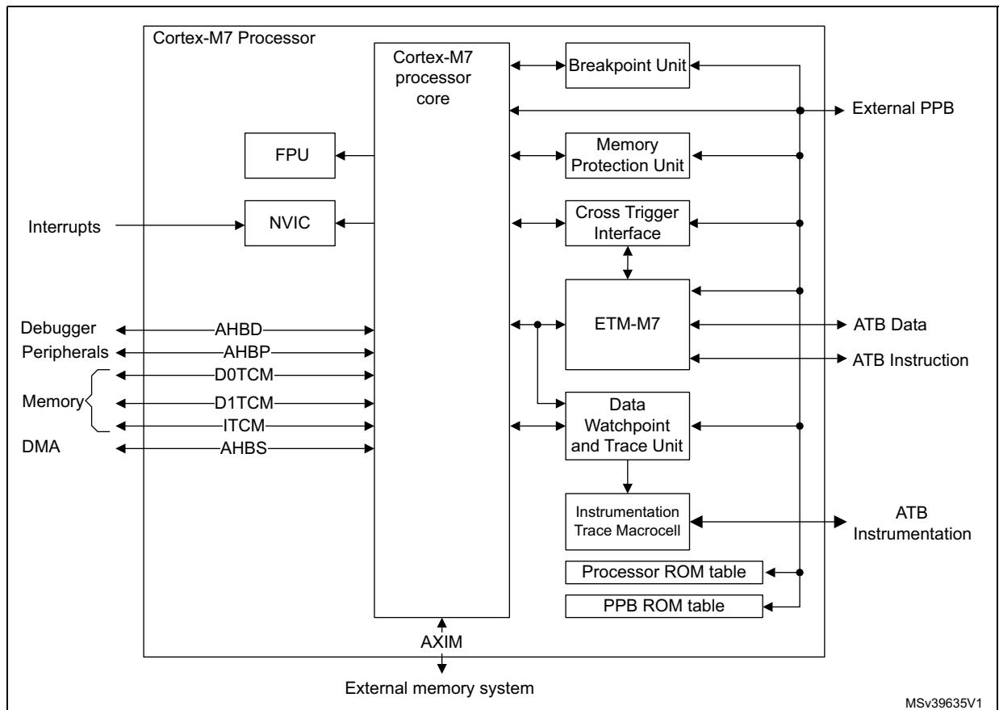

**PM0253 About this document**

read/clear (rc\_w1) Software can read as well as clear this bit by writing 1.

Writing '0' has no effect on the bit value.

read/clear (rc\_w0) Software can read as well as clear this bit by writing 0.

Writing '1' has no effect on the bit value.

toggle (t) Software can only toggle this bit by writing '1'. Writing '0' has no effect.

Reserved (Res.) Reserved bit, must be kept at reset value.

# **1.3 About the Cortex®-M7 processor and core peripherals**

The Cortex®-M7 processor is a high performance 32-bit processor designed for the microcontroller market. It offers significant benefits to developers, including:

- Outstanding processing performance combined with fast interrupt handling.
- Enhanced system debug with extensive breakpoint and trace capabilities.
- Efficient processor core, system and memories.
- Low-power consumption with integrated sleep modes.
- Platform security robustness, with integrated *Memory Protection Unit* (MPU).

**Figure 1. STM32 Cortex®-M7 implementation processor**

The Cortex®-M7 processor is built on a high-performance processor core, with a 6-stage pipeline Harvard architecture, making it ideal for demanding embedded applications. The in-

PM0253 Rev 5 15/254

About this document PM0253

order superscalar processor delivers exceptional power efficiency through an efficient instruction set and extensively optimized design, providing high-end processing hardware including IEEE754-compliant single-precision and double-precision floating-point computation, a range of single-cycle and SIMD multiplication and multiply-with-accumulate capabilities, saturating arithmetic and dedicated hardware division.

To facilitate the design of cost-sensitive devices, the Cortex®-M7 processor implements tightly-coupled system components that reduce processor area while significantly improving interrupt handling and system debug capabilities. The Cortex®-M7 processor implements a version of the Thumb® instruction set based on Thumb-2 technology, ensuring high code density and reduced program memory requirements. The Cortex®-M7 instruction set provides the exceptional performance expected of a modern 32-bit architecture, with the high code density of 8-bit and 16-bit microcontrollers.

The Cortex®-M7 processor closely integrates a configurable NVIC, to deliver industry-leading interrupt performance. The NVIC includes a *Non Maskable Interrupt* (NMI), and provides up to 256 interrupt priority levels. The tight integration of the processor core and NVIC provides fast execution of *interrupt service routines* (ISRs), dramatically reducing the interrupt latency. This is achieved through the hardware stacking of registers, and the ability to suspend load-multiple and store-multiple operations. Interrupt handlers do not require wrapping in assembler code, removing any code overhead from the ISRs. A tail-chain optimization also significantly reduces the overhead when switching from one ISR to another.

To optimize low-power designs, the NVIC integrates with the sleep modes, that include a deep sleep function that enables the entire device to be rapidly powered down while still retaining program state.

The reliability is increased with automatic fault detection and handling built-in. The Cortex®-M7 processor uses ECC and SECDED on accesses to memory and has *Memory Build-in Self Test* (MBIST) capability. The Cortex®-M7 processor is dual-redundant, which means it can operate in lock-step. The MCU vendor determines the reliability features configuration and therefore this can differ across different devices and families.

To increase instruction throughput, the Cortex®-M7 processor can execute certain pairs of instructions simultaneously. This is called dual issue.

## 1.3.1 System level interface

The  $Cortex^{\$}$ -M7 processor provides multiple interfaces using  $AMBA^{\$}$  technology to provide high speed, low latency memory accesses. It supports unaligned data accesses.

The Cortex®-M7 processor has an MPU that provides fine grain memory control, enabling applications to utilize multiple privilege levels, separating and protecting code, data and stack on a task-by-task basis. Such requirements are becoming critical in many embedded applications such as automotive.

### 1.3.2 Integrated configurable debug

The Cortex®-M7 processor implements a complete hardware debug solution. This provides high system visibility of the processor and memory through either a traditional JTAG port or a 2-pin *Serial Wire Debug* (SWD) port that is ideal for microcontrollers and other small package devices. The MCU vendor determines the debug feature configuration and therefore this can differ across different devices and families.

16/254 PM0253 Rev 5

**PM0253 About this document**

For system trace the processor integrates an *Instrumentation Trace Macrocell* (ITM) together with data watchpoints and a profiling unit. To enable simple and cost-effective profiling of the system events these generate, a *Serial Wire Viewer* (SWV) can export a stream of software-generated messages, data trace, and profiling information through a single pin.

The optional CoreSight technology components, *Embedded Trace Macrocell™* (ETM), delivers unrivalled instruction trace and data trace capture in an area far smaller than traditional trace units, enabling many low cost MCUs to implement full instruction trace for the first time.

The Breakpoint Unit provides up to eight hardware breakpoint comparators that debuggers can use.

## **1.3.3 Cortex®-M7 processor features and benefits summary**

- Tight integration of system peripherals reduces area and development costs.
- Thumb instruction set combines high code density with 32-bit performance.
- IEEE754-compliant single-precision and double-precision *Floating-Point Unit* (FPU).
- Power control optimization of system components.
- Integrated sleep modes for low-power consumption.
- Fast code execution permits slower processor clock or increases sleep mode time.
- Hardware division and fast digital-signal-processing orientated multiply accumulate.
- Saturating arithmetic for signal processing.
- Deterministic, high-performance interrupt handling for time-critical applications.
- MPU for safety-critical applications.
- Arm Cortex®-M7 with instruction cache and data cache
- Memory system features such as caches, *Tightly-Coupled Memory* (TCM) with DMA port, and a high performance AXI external memory interface.
- Dedicated AHB slave (AHBS) interface for system access to TCMs
- Extensive debug and trace capabilities:
  - Serial Wire Debug and Serial Wire Trace reduce the number of pins required for debugging, tracing, and code profiling.

## **1.3.4 Cortex®-M7 processor core peripherals**

The Cortex®-M7 processor core peripherals are:

#### **Nested Vectored Interrupt Controller**

The NVIC is an embedded interrupt controller that supports low latency interrupt processing.

#### **System Control Block**

The *System Control Block* (SCB) is the programmers model interface to the processor. It provides system implementation information and system control, including configuration, control, and reporting of system exceptions.

PM0253 Rev 5 17/254

**About this document PM0253**

### **Integrated instruction and data caches**

The instruction and data caches provide fast access to frequently accessed data and instructions, providing support for increased average performance when using system based memory.

#### **System timer**

The system timer, SysTick, is a 24-bit count-down timer. Use this as a *Real Time Operating System* (RTOS) tick timer or as a simple counter.

#### **Memory Protection Unit**

The *Memory Protection Unit* (MPU) improves system reliability by defining the memory attributes for different memory regions. It provides up to 8 different regions, and an optional predefined background region.

#### **Floating-point unit**

The FPU provides IEEE754-compliant operations on 32-bit single-precision and 64-bit double-precision floating-point values.

18/254 PM0253 Rev 5