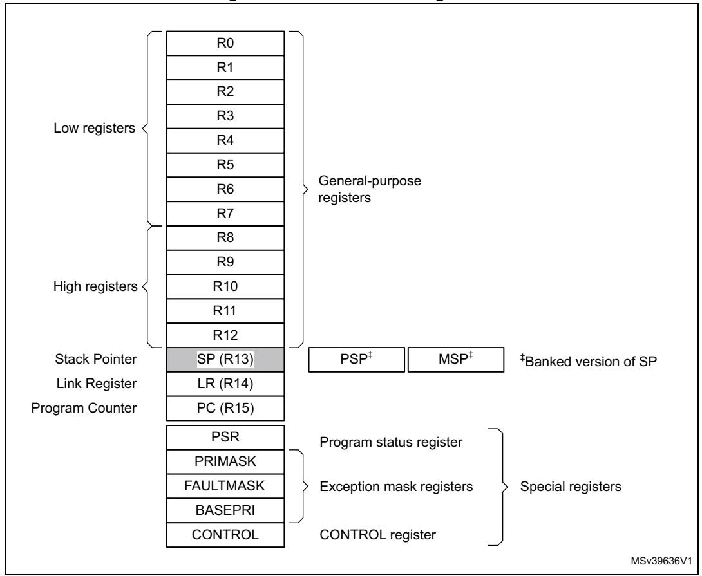
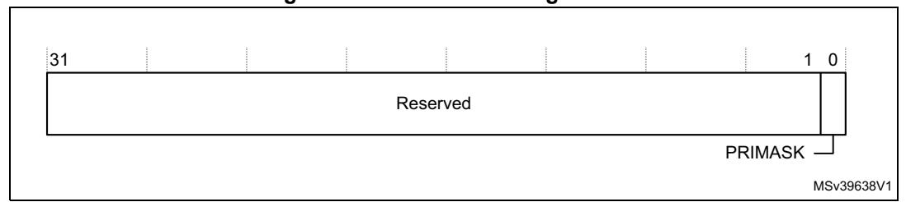
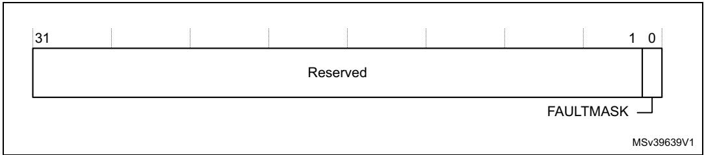
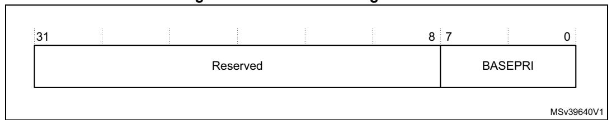
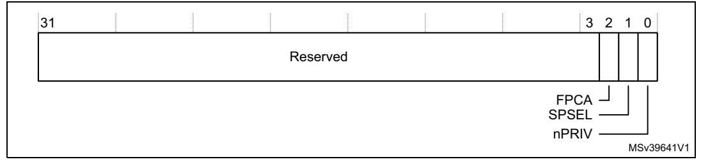

# **2 The Cortex-M7 processor**

# **2.1 Programmers model**

This section describes the Cortex®-M7 programmers model. In addition to the individual core register descriptions, it contains information about the processor modes and privilege levels for software execution and stacks.

## **2.1.1 Processor mode and privilege levels for software execution**

The processor *modes* are:

**Thread mode** Executes application software. The processor enters Thread mode

when it comes out of reset.

**Handler mode** Handles exceptions. The processor returns to Thread mode when it has

finished all exception processing.

The *privilege levels* for software execution are:

**Unprivileged** The software:

- Has limited access to system registers using the MSR and MRS instructions, and cannot use the CPS instruction to mask interrupts.
- Cannot access the system timer, NVIC, or system control block.
- Might have restricted access to memory or peripherals.

*Unprivileged software* executes at the unprivileged level.

**Privileged** The software can use all the instructions and has access to all resources.

*Privileged software* executes at the privileged level.

In Thread mode, the CONTROL register controls whether software execution is privileged or unprivileged, see *[CONTROL register on page](#page-8-0) 27*. In Handler mode, software execution is always privileged.

Only privileged software can write to the CONTROL register to change the privilege level for software execution in Thread mode. Unprivileged software can use the SVC instruction to make a *supervisor call* to transfer control to privileged software.

## **2.1.2 Stacks**

The processor uses a full descending stack. This means the stack pointer holds the address of the last stacked item in memory. When the processor pushes a new item onto the stack, it decrements the stack pointer and then writes the item to the new memory location. The processor implements two stacks, the *main stack* and the *process stack*, with a pointer for each held in independent registers, see *[Stack pointer on page](#page-2-0) 21*.

In Thread mode, the CONTROL register controls whether the processor uses the main stack or the process stack, see *[CONTROL register on page](#page-8-0) 27*. In Handler mode, the processor always uses the main stack. The options for processor operations are:

PM0253 Rev 5 19/254

**Table 1. Summary of processor mode, execution privilege level, and stack use options** 

| Processor mode | Used to execute    | Privilege level for software execution | Stack used                     |
|----------------|--------------------|-------------------------------------------|--------------------------------|
| Thread         | Applications       | Privileged or unprivileged(1)             | Main stack or process stack(1) |
| Handler        | Exception handlers | Always privileged                         | Main stack                     |

1. See *[CONTROL register on page 27](#page-8-0)*.

# **2.1.3 Core registers**

The processor core registers are

**Figure 2. Processor core registers**

| Register                            | Name      | Type (1) | Required privilege (2) | Reset value               | Description                                    |
|-------------------------------------|-----------|---------------------|------------------------|---------------------------|------------------------------------------------|
| General-purpose registers           | R0-R12    | RW                  | Either                 | Unknown                   | General-purpose registers on page 21.          |
| Stack pointer                       | MSP       | RW                  | Either                 | See description        | Stack pointer on page 21.                      |
| Stack pointer                       | PSP       | RW                  | Either                 | Unknown                   | Stack pointer on page 21                       |
| Link register                       | LR        | RW                  | Either                 | 0xFFFFFFF                 | Link register on page 21                       |
| Program counter                     | PC        | RW                  | Either                 | See description        | Program counter on page 22                     |
| Program status register             | PSR       | RW                  | Either                 | 0x01000000 (3) | Program status register on page 22             |
| Application program status register | APSR      | RW                  | Either                 | Unknown                   | Application program status register on page 23 |
| Interrupt program status register   | IPSR      | RO                  | Privileged             | 0x00000000                | Interrupt program status register on page 23   |
| Execution program Status register   | EPSR      | RO                  | Privileged             | 0x01000000 (3) | Execution program status register on page 24   |
| Priority mask register              | PRIMASK   | RW                  | Privileged             | 0x00000000                | Priority mask register on page 25              |
| Fault mask register                 | FAULTMASK | RW                  | Privileged             | 0x00000000                | Fault mask register on page 26                 |
| Base priority mask register         | BASEPRIS  | RW                  | Privileged             | 0x00000000                | Priority mask register on page 25              |
| Control register                    | CONTROL   | RW                  | Privileged             | 0x00000000                | CONTROL register on page 27                    |

Table 2. Core register set summary

## **General-purpose registers**

R0-R12 are 32-bit general-purpose registers for data operations.

#### Stack pointer

The *Stack Pointer* (SP) is register R13. In Thread mode, bit[1] of the CONTROL register indicates the stack pointer to use:

- 0 = Main Stack Pointer (MSP). This is the reset value.
- 1 = Process Stack Pointer (PSP).

On reset, the processor loads the MSP with the value from address 0x00000000.

## Link register

The *Link Register* (LR) is register R14. It stores the return information for subroutines, function calls, and exceptions. On reset, the processor sets the LR value to 0xFFFFFFF.

PM0253 Rev 5 21/254

1. Describes access type during program execution in Thread mode and Handler mode. Debug access can differ.

2. An entry of Either means privileged and unprivileged software can access the register.

3. The EPSR reads as zero when executing an MRS instruction.

## **Program counter**

The *Program Counter* (PC) is register R15. It contains the current program address. On reset, the processor loads the PC with the value of the reset vector, which is at address 0x00000004. Bit[0] of the value is loaded into the EPSR T-bit at reset and must be 1.

## Program status register

The Program Status register (PSR) combines:

- Application Program Status register (APSR).
- Interrupt Program Status register (IPSR).
- Execution Program Status register (EPSR).

These registers are mutually exclusive bit fields in the 32-bit PSR. The bit assignments are

31 30 29 28 27 26 25 24 23 20 19 16 15 10 9 8 0 Ζ С **APSR** Ν ٧ Q GE[3:0] Reserved Reserved **IPSR** Reserved ISR NUMBER **EPSR** Reserved ICI/IT T Reserved ICI/IT Reserved

Figure 3. APSR, IPSR and EPSR bit assignments

Access these registers individually or as a combination of any two or all three registers, using the register name as an argument to the MSR or MRS instructions. For example:

- Read all of the registers using PSR with the MRS instruction.
- Write to the APSR N, Z, C, V, and Q bits using APSR\_nzcvq with the MSR instruction.

The PSR combinations and attributes are:

Table 3. PSR register combinations

Register Type

| Register | Туре                  | Combination           |
|----------|-----------------------|-----------------------|
| PSR      | RW (1),(2) | APSR, EPSR, and IPSR. |
| IEPSR    | RO                    | EPSR and IPSR.        |
| IAPSR    | RW (1)     | APSR and IPSR.        |
| EAPSR    | RW (2)     | APSR and EPSR.        |

1. The processor ignores writes to the IPSR bits.

See the instruction descriptions *MRS on page 178* and *MSR on page 179* for more information about how to access the program status registers.

22/254 PM0253 Rev 5

2. Reads of the EPSR bits return zero, and the processor ignores writes to these bits.

#### **Application program status register**

The APSR contains the current state of the condition flags from previous instruction executions. See the register summary in *Table [4 on page](#page-4-2) 23* for its attributes. The bit assignments are:

**Table 4. APSR bit assignments** 

| Bits    | Name    | Description                                                               |
|---------|---------|---------------------------------------------------------------------------|
| [31]    | N       | Negative flag.                                                            |
| [30]    | Z       | Zero flag.                                                                |
| [29]    | C       | Carry or borrow flag.                                                     |
| [28]    | V       | Overflow flag.                                                            |
| [27]    | Q       | DSP overflow and saturation flag                                          |
| [26:20] | -       | Reserved                                                                  |
| [19:16] | GE[3:0] | Greater than or Equal flags. See SEL on page 108 for more information. |
| [15:0]  | -       | Reserved                                                                  |

## **Interrupt program status register**

The IPSR contains the exception type number of the current *Interrupt Service Routine* (ISR). See the register summary in *Table [5 on page](#page-5-1) 24* for its attributes. The bit assignments are:

PM0253 Rev 5 23/254

**Table 5. IPSR bit assignments** 

| Bits   | Name       | Function                                                                          |
|--------|------------|-----------------------------------------------------------------------------------|
| [31:9] | -          | Reserved                                                                          |
|        |            | This is the number of the current exception: 0 = Thread mode. 1 = Reserved. |
|        |            | 2 = NMI. 3 = HardFault. 4 = MemManage.                                      |
|        |            | 5 = BusFault 6 = UsageFault 7-10 = Reserved                                 |
| [8:0]  | ISR_NUMBER | 11 = SVCall. 12 = Reserved for debug 13 = Reserved                          |
|        |            | 14 = PendSV. 15 = SysTick. 16 = IRQ0.                                       |
|        |            | 256 = IRQ239.                                                                     |
|        |            | see Exception types on page 39 for more information.                              |

#### **Execution program status register**

The EPSR contains the Thumb state bit, and the execution state bits for either the:

- *If-Then* (IT) instruction.
- *Interruptible-Continuable Instruction* (ICI) field for an interrupted load multiple or store multiple instruction.

See the register summary in *Table [6 on page](#page-5-2) 24* for the EPSR attributes. The bit assignments are

**Table 6. EPSR bit assignments** 

| Bits             | Name | Function                                                                                              |
|------------------|------|-------------------------------------------------------------------------------------------------------|
| [31:27]          | -    | Reserved.                                                                                             |
| [26:25], [15:10] | ICI  | Interruptible-continuable instruction bits, see Interruptible-continuable instructions on page 25. |
| [26:25], [15:10] | IT   | Indicates the execution state bits of the IT instruction, see IT on page 148.                      |
| [24]             | T    | Thumb state bit, see Thumb state.                                                                     |
| [23:16]          | -    | Reserved.                                                                                             |
| [9:0]            | -    | Reserved.                                                                                             |

The attempts to read the EPSR directly through application software using the MSR instruction always return zero. The attempts to write the EPSR using the MSR instruction in application software are ignored.

## **Interruptible-continuable instructions**

When an interrupt occurs during the execution of an LDM, STM, PUSH, POP, VLDM, VSTM, VPUSH, or VPOP instruction, the processor:

- Stops the load multiple or store multiple instruction operation temporarily.
- Stores the next register operand in the multiple operation to EPSR bits[15:12].

After servicing the interrupt, the processor:

- Returns to the register pointed to by bits[15:12].
- Resumes execution of the multiple load or store instruction.

When the EPSR holds ICI execution state, bits[26:25,11:10] are zero.

#### **If-Then block**

The If-Then block contains up to four instructions following an IT instruction. Each instruction in the block is conditional. The conditions for the instructions are either all the same, or some can be the inverse of others. See *IT on page 148* for more information.

#### **Thumb state**

The Cortex®-M7 processor only supports execution of instructions in Thumb state. The following can clear the T bit to 0:

- Instructions BLX, BX and POP{PC}.
- Restoration from the stacked xPSR value on an exception return.
- Bit[0] of the vector value on an exception entry or reset.

Attempting to execute instructions when the T bit is 0 results in a fault or lockup. See *Lockup on page 49* for more information.

#### **Exception mask registers**

The exception mask registers disable the handling of exceptions by the processor. Disable exceptions where they might impact on timing critical tasks.

To access the exception mask registers use the MSR and MRS instructions, or the CPS instruction to change the value of PRIMASK or FAULTMASK. See *MRS on page 178*, *MSR on page 179*, and *CPS on page 176* for more information.

## **Priority mask register**

The PRIMASK register prevents the activation of all exceptions with a configurable priority. See the register summary in *[Table](#page-7-1) 7* for its attributes. The bit assignments are

PM0253 Rev 5 25/254

## **Figure 4. PRIMASK bit assignments:**

**Table 7. PRIMASK register bit assignments** 

| Bits   | Name    | Function                                                                                                                     |
|--------|---------|------------------------------------------------------------------------------------------------------------------------------|
| [31:1] | -       | Reserved.                                                                                                                    |
| [0]    | PRIMASK | Prioritizable interrupt mask: 0 = No effect. 1 = Prevents the activation of all exceptions with configurable priority. |

## **Fault mask register**

The FAULTMASK register prevents activation of all exceptions except for *Non Maskable Interrupt* (NMI). See the register summary in *Table [8 on page](#page-7-2) 26* for its attributes. The bit assignments are

**Figure 5. FAULTMASK bit assignments**

**Table 8. FAULTMASK register bit assignments** 

| Bits   | Name      | Function                                                                                                         |
|--------|-----------|------------------------------------------------------------------------------------------------------------------|
| [31:1] | -         | Reserved.                                                                                                        |
| [0]    | FAULTMASK | Prioritizable interrupt mask: 0 = No effect. 1 = Prevents the activation of all exceptions except for NMI. |

The processor clears the FAULTMASK bit to 0 on exit from any exception handler except the NMI handler.

#### **Base priority mask register**

The BASEPRI register defines the minimum priority for exception processing. When BASEPRI is set to a nonzero value, it prevents the activation of all exceptions with the same or lower priority level as the BASEPRI value. See the register summary in *[Table](#page-8-1) 9 on [page](#page-8-1) 27* for its attributes. The bit assignments are:

26/254 PM0253 Rev 5

**Figure 6. BASEPRI bit assignments**

**Table 9. BASEPRI register bit assignments** 

| Bits   | Name        | Function                                                                                                                                                                                                         |
|--------|-------------|------------------------------------------------------------------------------------------------------------------------------------------------------------------------------------------------------------------|
| [31:8] | -           | Reserved.                                                                                                                                                                                                        |
| [7:0]  | BASEPRI (1) | Priority mask bits: 0x00 No effect Nonzero: Defines the base priority for exception processing. The processor does not process any exception with a priority value greater than or equal to BASEPRI. |

1. This field is similar to the priority fields in the interrupt priority registers. The device implements only bits[7:M] of this field, bits[M-1:0] read as zero and ignore writes. See *[Interrupt program status register on](#page-4-1)  [page 23](#page-4-1)* for more information. Remember that higher priority field values correspond to lower exception priorities.

## **CONTROL register**

The CONTROL register controls the stack used and the privilege level for software execution when the processor is in Thread mode and indicates whether the FPU state is active. See the register summary in *Table [10 on page](#page-8-2) 27* for its attributes. The bit assignments are:

**Figure 7. Control bit assignments**

**Table 10. Control register bit assignments** 

| Bits   | Name | Function                                                                                                                                                                                                                                              |
|--------|------|-------------------------------------------------------------------------------------------------------------------------------------------------------------------------------------------------------------------------------------------------------|
| [31:3] | -    | Reserved.                                                                                                                                                                                                                                             |
| [2]    | FPCA | Indicates whether floating-point context is currently active: 0: No floating-point context active. 1: Floating-point context active. This bit is used to determine whether to preserve floating-point state when processing an exception. |

| Bits | Name  | Function                                                                                                                                                                                                                                                                       |
|------|-------|--------------------------------------------------------------------------------------------------------------------------------------------------------------------------------------------------------------------------------------------------------------------------------|
| [1]  | SPSEL | Defines the currently active stack pointer: 0 = MSP is the current stack pointer. 1 = PSP is the current stack pointer. In Handler mode this bit reads as zero and ignores writes. The Cortex®-M7 processor updates this bit automatically on exception return. |
| [0]  | nPRIV | Defines the Thread mode privilege level: 0 = Privileged. 1 = Unprivileged.                                                                                                                                                                                               |

**Table 10. Control register bit assignments (continued)**

Handler mode always uses the MSP, so the processor ignores explicit writes to the active stack pointer bit of the CONTROL register when in Handler mode. The exception entry and return mechanisms automatically update the CONTROL register based on the EXC\_RETURN value, see *Table 20 on page 46*.

In an OS environment, Arm recommends that threads running in Thread mode use the process stack and the kernel and exception handlers use the main stack.

By default, Thread mode uses the MSP. To switch the stack pointer used in Thread mode to the PSP, either:

- Use the MSR instruction to set the CONTROL.SPSELbit, the current active stack pointer bit, to 1, see *MSR on page 179*.
- Perform an exception return to Thread mode with the appropriate EXC\_RETURN value, see *Table 20 on page 46*.

When changing the stack pointer, software must use an ISB instruction immediately after the MSR instruction. This ensures that instructions after the ISB instruction execute using the new stack pointer. See *ISB on page 178*.

## **2.1.4 Exceptions and interrupts**

The Cortex®-M7 processor supports interrupts and system exceptions. The processor and the NVIC prioritize and handle all exceptions. An exception changes the normal flow of software control. The processor uses Handler mode to handle all exceptions except for reset. See *Exception entry on page 44* and *Exception return on page 46* for more information.

The NVIC registers control interrupt handling. See *Nested Vectored Interrupt Controller on page 184* for more information.

## **2.1.5 Data types**

The processor:

- Supports the following data types:
- 32-bit words.
- 16-bit halfwords.
- 8-bit bytes.
- 32-bit single-precision floating point numbers.
- 64-bit double-precision floating point numbers.
- Manages all data memory accesses as little-endian. See *Memory regions, types and attributes on page 33* for more information.

# **2.1.6 The Cortex Microcontroller Software Interface Standard (CMSIS)**

For a Cortex®-M7 microcontroller system, the *Cortex Microcontroller Software Interface Standard* (CMSIS) defines:

- A common way to:
  - Access peripheral registers.
  - Define exception vectors.
- The names of:
  - The registers of the core peripherals.
  - The core exception vectors.
- A device-independent interface for RTOS kernels, including a debug channel.

The CMSIS includes address definitions and data structures for the core peripherals in the Cortex®-M7 processor.

CMSIS simplifies software development by enabling the reuse of template code and the combination of CMSIS-compliant software components from various middleware vendors. Software vendors can expand the CMSIS to include their peripheral definitions and access functions for those peripherals.

This document includes the register names defined by the CMSIS, and gives short descriptions of the CMSIS functions that address the processor core and the core peripherals.

This document uses the register short names defined by the CMSIS. In a few cases these differ from the architectural short names that might be used in other documents.

The following sections give more information about the CMSIS:

- *Power management programming hints on page 51*.
- *CMSIS functions on page 62*.
- *SysTick design hints and tips on page 216*
- *Accessing the Cortex®-M7 NVIC registers using CMSIS on page 185*.
- *NVIC programming hints on page 191*.
- *Cortex®-M7 cache maintenance operations using CMSIS on page 242*

PM0253 Rev 5 29/254