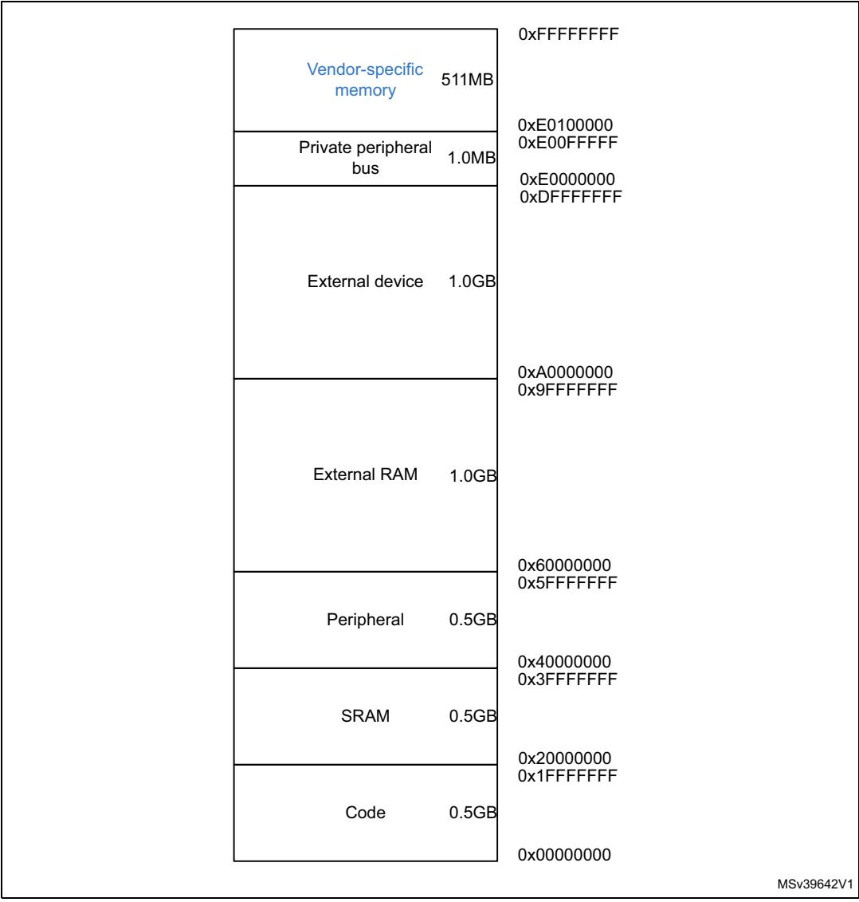
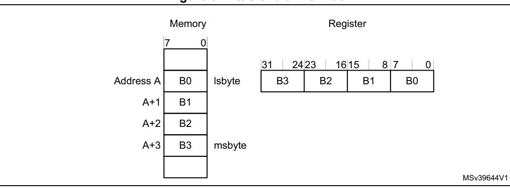

# **2.3 Memory model**

This section describes the processor memory map and the behavior of memory accesses. The processor has a fixed default memory map that provides up to 4 Gbytes of addressable memory. The memory map is:

**Figure 8. Processor memory map**

The processor reserves regions of the *Private peripheral bus* (PPB) address range for core peripheral registers, see *About the Cortex-M7 peripherals on page 183*.

32/254 PM0253 Rev 5

# **2.3.1 Memory regions, types and attributes**

The memory map and the programming of the MPU split the memory map into regions. Each region has a defined memory type, and some regions have additional memory attributes. The memory type and attributes determine the behavior of accesses to the region.

The memory types are:

**Normal** The processor can re-order transactions for efficiency, or

perform speculative reads.

**Device and Stronglyordered**

The processor preserves transaction order relative to other

transactions to Device or Strongly-ordered memory.

The different ordering requirements for Device and Strongly-ordered memory mean that the memory system can buffer a write to Device memory, but must not buffer a write to Stronglyordered memory.

The additional memory attributes include.

**Shareable** For a shareable memory region, the memory system provides

data synchronization between bus masters in a system with multiple bus masters, for example, a processor with a DMA

controller.

Strongly-ordered memory is always shareable.

If multiple bus masters can access a non-shareable memory region, software must ensure data coherency between the

bus masters.

**Execute Never (XN)** Means the processor prevents instruction accesses. A

HardFault exception is generated on executing an instruction

fetched from an XN region of memory.

## **2.3.2 Memory system ordering of memory accesses**

For most of memory accesses caused by explicit memory access instructions, the memory system does not guarantee that the order in which the accesses complete, matches the program order of the instructions. Providing any re-ordering does not affect the behavior of the instruction sequence. Normally, if a correct program execution depends on two memory accesses completing in the program order, the software must insert a memory barrier instruction between the memory access instructions, see *[2.3.4: Software ordering of mem](#page-4-0)[ory accesses on page](#page-4-0) 36*.

However, the memory system does guarantee some ordering of accesses to Device and Strongly-ordered memory. For two memory access instructions A1 and A2, if A1 occurs before A2 in the program order, the ordering of the memory accesses caused by two instructions is:

PM0253 Rev 5 33/254

|                              | A2            |               |           |                |  |  |
|------------------------------|---------------|---------------|-----------|----------------|--|--|
| A1                           | Normal access | Device access |           | Strongly       |  |  |
|                              |               | Non-shareable | Shareable | ordered access |  |  |
| Normal access                | -             | -             | -         | -              |  |  |
| Device access, non-shareable | -             | <             | -         | <              |  |  |
| Device access, shareable     | -             | -             | <         | <              |  |  |
| Strongly ordered access      | -             | <             | <         | <              |  |  |

Table 15. Ordering of memory accesses(1)

# 2.3.3 Behavior of memory accesses

The behavior of accesses to each region in the memory map is:

Table 16. Memory access behavior(1)

|                           |                           | 1                    | •  | T                                                                                                                                                         |
|---------------------------|---------------------------|----------------------|----|-----------------------------------------------------------------------------------------------------------------------------------------------------------|
| Address range             | Memory region             | Memory type       | XN | Description                                                                                                                                               |
| 0x00000000- 0x1FFFFFF  | Code                      | Normal               | -  | Executable region for program code. The user can also put data here. Instruction fetches and data accesses are performed over the ITCM or AXIM interface. |
| 0x20000000- 0x3FFFFFFF | SRAM                      | Normal               | -  | Executable region for data. The user can also put code here. Instruction fetches and data accesses are performed over the DTCM or AXIM interface.         |
| 0x40000000- 0x5FFFFFF  | Peripheral                | Device               | XN | External device memory. Data accesses are performed over the AHBP or AXIM interface.                                                                      |
| 0x60000000- 0x9FFFFFF  | External RAM              | Normal               | -  | Executable region for data. Instruction fetches and data accesses are performed over the AXIM interface.                                                  |
| 0xA0000000- 0xDFFFFFFF | External device           | Device               | XN | External device memory. Instruction fetches and data accesses are performed over the AXIM interface.                                                      |
| 0xE0000000- 0xE00FFFFF | Private Peripheral Bus | Strongly- ordered | XN | This region includes the NVIC, System timer, and System Control Block. Only word accesses can be used in this region.                                     |
| 0xE0100000- 0xFFFFFFF  | Vendor-specific device    | Device               | XN | Accesses to this region are to vendor-specific peripherals.                                                                                               |

1. See Memory regions, types and attributes on page 33 for more information.

The Code, SRAM, and external RAM regions can hold programs.

- means that the memory system does not guarantee the ordering of the accesses.< means that accesses are observed in program order, that is, A1 is always observed before A2.</li>

The MPU can override the default memory access behavior described in this section. For more information, see *Memory protection unit on page 221*.

### Additional memory access constraints for caches and shared memory

When a system includes caches or shared memory, some memory regions have additional access constraints, and some regions are subdivided, as *Table 17* shows:

Table 17. Memory region shareability and cache policies

| Address range            | Memory region             | Memory type (1) | Shareability (1) | Cache policy (2) |
|--------------------------|---------------------------|----------------------------|-----------------------------|-----------------------------|
| 0x00000000- 0x1FFFFFF | Code                      | Normal                     | Non-shareable               | WT                          |
| 0x20000000- 0x3FFFFFF | SRAM                      | Normal                     | Non-shareable               | WBWA                        |
| 0x40000000- 0x5FFFFFF | Peripheral                | Device                     | Non-shareable               | -                           |
| 0x60000000- 0x7FFFFFF | External RAM              | Normal                     | Non-shareable               | -                           |
| 0x80000000- 0x9FFFFFF | External RAIVI            | Normal                     |                             | WT                          |
| 0xA0000000- 0xBFFFFFF | External device           | Device                     | Shareable                   |                             |
| 0xC0000000- 0xDFFFFFF | External device           | Device                     | Non-shareable               | -                           |
| 0xE0000000- 0xE00FFFF | Private Peripheral Bus | Strongly- ordered          | Shareable                   | -                           |
| 0xE0100000- 0xFFFFFFF | Vendor-specific device    | Device                     | Non-shareable               | -                           |

1. See Section 2.3.1: Memory regions, types and attributes on page 33 for more information.

## Instruction prefetch and branch prediction

The Cortex®-M7 processor:

- Prefetches instructions ahead of execution.
- Speculatively prefetches from branch target addresses.

PM0253 Rev 5 35/254

2. WT = Write through, no write allocate. WBWA = Write back, write allocate.

# **2.3.4 Software ordering of memory accesses**

The order of instructions in the program flow does not always guarantee the order of the corresponding memory transactions. This is because:

- The processor can reorder some memory accesses to improve efficiency, providing this does not affect the behavior of the instruction sequence.
- The processor has multiple bus interfaces.
- Memory or devices in the memory map have different wait states.
- Some memory accesses are buffered or speculative.

*[Memory system ordering of memory accesses on page](#page-1-1) 33* describes the cases where the memory system guarantees the order of memory accesses. Otherwise, if the order of memory accesses is critical, software must include memory barrier instructions to force that ordering. The processor provides the following memory barrier instructions:

**DMB** The Data Memory Barrier (DMB) instruction ensures that outstanding

memory transactions complete before subsequent memory transactions.

See *DMB on page 177*.

**DSB** The Data Synchronization Barrier (DSB) instruction ensures that

outstanding memory transactions complete before subsequent

instructions execute. See *DSB on page 177*.

**ISB** The Instruction Synchronization Barrier (ISB) ensures that the effect of all

completed memory transactions is recognizable by subsequent

instructions. See *ISB on page 178*.

### **MPU programming**

Use a DSB, followed by an ISB instruction or exception return to ensure that the new MPU configuration is used by subsequent instructions.

# **2.3.5 Memory endianness**

The processor views memory as a linear collection of bytes numbered in ascending order from zero. For example, bytes 0-3 hold the first stored word, and bytes 4-7 hold the second stored word. *[Little-endian format on page](#page-4-1) 36* describes how words of data are stored in memory.

#### **Little-endian format**

In little-endian format, the processor stores the least significant byte of a word at the lowestnumbered byte, and the most significant byte at the highest-numbered byte. For example:

**Figure 9. Little-endian format**

# **2.3.6 Synchronization primitives**

The instruction set support for the Cortex®-M7 processor includes pairs of *synchronization primitives*. These provide a non-blocking mechanism that a thread or process can use to obtain exclusive access to a memory location. Software can use them to perform a guaranteed read-modify-write memory update sequence, or for a semaphore mechanism.

A pair of synchronization primitives comprises:

#### **A Load-Exclusive instruction**

Used to read the value of a memory location, requesting exclusive access to that location.

#### **A Store-Exclusive instruction**

Used to attempt to write to the same memory location, returning a status bit to a register. If this bit is:

0 it indicates that the thread or process gained exclusive access to the memory, and the write succeeds,

1 it indicates that the thread or process did not gain exclusive access to the memory, and no write was performed.

The pairs of Load-Exclusive and Store-Exclusive instructions are:

- The word instructions LDREX and STREX.
- The halfword instructions LDREXH and STREXH.
- The byte instructions LDREXB and STREXB.

Software must use a Load-Exclusive instruction with the corresponding Store-Exclusive instruction.

To perform an exclusive read-modify-write of a memory location, software must:

- 1. Use a Load-Exclusive instruction to read the value of the location.
- 2. Modify the value, as required.
- 3. Use a Store-Exclusive instruction to attempt to write the new value back to the memory location.
- 4. Test the returned status bit. If this bit is:
  - 0: The read-modify-write completed successfully.
  - 1: No write was performed. This indicates that the value returned at step 1 might be out of date. The software must retry the entire read-modify-write sequence.

PM0253 Rev 5 37/254

Software can use the synchronization primitives to implement a semaphore as follows:

- 1. Use a Load-Exclusive instruction to read from the semaphore address to check whether the semaphore is free.
- 2. If the semaphore is free, use a Store-Exclusive to write the claim value to the semaphore address.
- 3. If the returned status bit from step 2 indicates that the Store-Exclusive succeeded then the software has claimed the semaphore. However, if the Store-Exclusive failed, another process might have claimed the semaphore after the software performed step 1.

The Cortex®-M7 processor includes an exclusive access monitor, that tags the fact that the processor has executed a Load-Exclusive instruction. If the processor is part of a multiprocessor system and the address is in a shared region of memory, the system also globally tags the memory locations addressed by exclusive accesses by each processor.

The processor removes its exclusive access tag if:

- It executes a CLREX instruction.
- It executes a STREX instruction, regardless of whether the write succeeds.
- An exception occurs. This means the processor can resolve semaphore conflicts between different threads.

In a multiprocessor implementation:

- Executing a CLREX instruction removes only the local exclusive access tag for the processor.
- Executing a STREX instruction, or an exception, removes the local exclusive access tags for the processor.
- Executing a STREX instruction to a shared memory region can also remove the global exclusive access tags for the processor in the system.

For more information about the synchronization primitive instructions, see *LDREX and STREX on page 83* and *CLREX on page 84*.

# **2.3.7 Programming hints for the synchronization primitives**

ISO/IEC C cannot directly generate the exclusive access instructions. CMSIS provides intrinsic functions for generation of these instructions:

| Instruction | CMSIS function                                  |  |  |  |
|-------------|-------------------------------------------------|--|--|--|
| LDREX       | uint32_tLDREXW (uint32_t *addr)                 |  |  |  |
| LDREXH      | uint16_tLDREXH (uint16_t *addr)                 |  |  |  |
| LDREXB      | uint8_tLDREXB (uint8_t *addr)                   |  |  |  |
| STREX       | uint32_tSTREXW (uint32_t value, uint32_t *addr) |  |  |  |
| STREXH      | uint32_tSTREXH (uint16_t value, uint16_t *addr) |  |  |  |
| STREXB      | uint32_tSTREXB (uint8_t value, uint8_t *addr)   |  |  |  |
| CLREX       | voidCLREX (void)                                |  |  |  |

