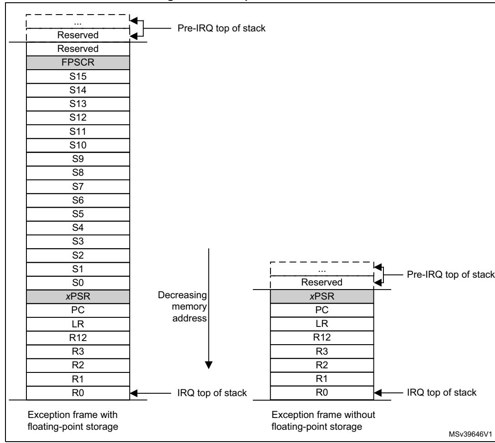

#### For example:

```
uint16_t value;
uint16_t *address = 0x20001002;
value = __LDREXH (address); // load 16-bit value from memory address 
0x20001002
```

# **2.4 Exception model**

This section describes the exception model. It describes:

- *[Exception states](#page-0-0)*.
- *[Exception types](#page-0-1)*.
- *[Exception handlers on page 41](#page-2-0)*.
- *[Vector table on page 42](#page-3-0)*.
- *[Exception priorities on page 43](#page-4-0)*.
- *[Interrupt priority grouping on page 43](#page-4-1)*.
- *[Exception entry and return on page 44](#page-5-0)*.

# <span id="page-0-0"></span>**2.4.1 Exception states**

Each exception is in one of the following states:

**Inactive** The exception is not active and not pending.

**Pending** The exception is waiting to be serviced by the processor.

An interrupt request from a peripheral or from software can change

the state of the corresponding interrupt to pending.

**Active** An exception that is being serviced by the processor but has not com-

pleted.

*Note: An exception handler can interrupt the execution of another exception* 

*handler. In this case both exceptions are in the active state.*

**Active and pending** The exception is being serviced by the processor and there is a pend-

ing exception from the same source.

### <span id="page-0-1"></span>**2.4.2 Exception types**

The exception types are:

**Reset** Reset is invoked on power up or a warm reset. The exception model treats reset as a special form of exception. When reset is asserted, the operation of the processor stops, potentially at any point in an instruction. When reset is deasserted, execution restarts from the address provided by the reset entry in the vector table. Execution

restarts as privileged execution in Thread mode.


PM0253 Rev 5 39/254

NMI

A NonMaskable Interrupt (NMI) can be signalled by a peripheral or triggered by software. This is the highest priority exception other than reset. It is permanently enabled and has a fixed priority of -2. NMIs cannot be:

- Masked or prevented from activation by any other exception.
- Preempted by any exception other than Reset.

**HardFault** 

A HardFault is an exception that occurs because of an error during normal or exception processing. HardFaults have a fixed priority of -1, meaning they have higher priority than any exception with configurable priority.

**SVCall** 

A Supervisor Call (SVC) is an exception that is triggered by the SVC instruction. In an OS environment, applications can use SVC instructions to access OS kernel functions and device drivers.

**PendSV** 

PendSV is an interrupt-driven request for system-level service. In an OS environment, use PendSV for context switching when no other exception is active.

**SysTick** 

A SysTick exception is an exception the system timer generates when it reaches zero. Software can also generate a SysTick exception. In an OS environment, the processor can use this exception as system tick.

Interrupt (IRQ)

An interrupt, or IRQ, is an exception signalled by a peripheral, or generated by a software request. All interrupts are asynchronous to instruction execution. In the system, peripherals use interrupts to communicate with the processor.

Table 19. Properties of the different exception types

<span id="page-1-0"></span>

| Exception number <sup>(1)</sup> | IRQ<br>number <sup>(1)</sup> | Exception type | Priority                    | Vector<br>address <sup>(2)</sup> | Activation                                            |
|---------------------------------|------------------------------|----------------|-----------------------------|----------------------------------|-------------------------------------------------------|
| 1                               | -                            | Reset          | -3, the highest             | 0x00000004                       | Asynchronous                                          |
| 2                               | -14                          | NMI            | -2                          | 0x00000008                       | Asynchronous                                          |
| 3                               | -13                          | HardFault      | -1                          | 0x000000C                        | Synchronous                                           |
| 4                               | -12                          | MemManage      | Configurable (3)            | 0x00000010                       | Synchronous                                           |
| 5                               | -11                          | BusFault       | Configurable (3)            | 0x00000014                       | Synchronous when precise, asynchronous when imprecise |
| 6                               | -10                          | UsageFault     | Configurable <sup>(3)</sup> | 0x00000018                       | Synchronous                                           |
| 7-10                            | -                            | Reserved       | -                           | -                                | -                                                     |
| 11                              | -5                           | SVCall         | Configurable <sup>(3)</sup> | 0x0000002C                       | Synchronous                                           |
| 12-13                           | -                            | Reserved       | -                           | -                                | -                                                     |
| 14                              | -2                           | PendSV         | Configurable <sup>(3)</sup> | 0x00000038                       | Asynchronous                                          |


| Exception number <sup>(1)</sup> | IRQ<br>number <sup>(1)</sup> | Exception<br>type | Priority                    | Vector<br>address <sup>(2)</sup>          | Activation   |
|---------------------------------|------------------------------|-------------------|-----------------------------|-------------------------------------------|--------------|
| 15                              | -1                           | SysTick           | Configurable <sup>(3)</sup> | 0x0000003C                                | Asynchronous |
| 15                              | -                            | Reserved          | -                           | -                                         | -            |
| 16 and above                    | 0 and above                  | Interrupt (IRQ)   | Configurable <sup>(4)</sup> | 0x00000040<br>and<br>above <sup>(5)</sup> | Asynchronous |

Table 19. Properties of the different exception types (continued)

- To simplify the software layer, the CMSIS only uses IRQ numbers. It uses negative values for exceptions
  other than interrupts. The IPSR returns the Exception number, see *Interrupt program status register on*page 23
- 2. See Figure 10: Vector table on page 42 for more information.
- <span id="page-2-1"></span>3. See System handler priority registers on page 202.
- 4. See Interrupt priority registers on page 188
- 5. Increasing in step of 4.

For an asynchronous exception, other than reset, the processor can execute additional instructions between when the exception is triggered and when the processor enters the exception handler.

Privileged software can disable the exceptions that *Table 19 on page 40* shows as having configurable priority, see:

- System handler control and state register on page 204
- Interrupt clear-enable registers on page 186.

For more information about HardFaults, MemManage faults, BusFaults, and UsageFaults, see Section 2.5: Fault handling on page 47

### <span id="page-2-0"></span>2.4.3 Exception handlers

The processor handles exceptions using:

Interrupt Service Routines (ISRs) Interrupts IRQ0 to IRQ239 are the exceptions handled

by ISRs

Fault handler HardFault, MemManage fault, UsageFault, and

BusFault are fault exceptions handled by the fault

handler.s

System handlers NMI, PendSV, SVCall SysTick, and the fault exceptions

are all system exceptions handled by system handlers.


PM0253 Rev 5 41/254

# <span id="page-3-0"></span>**2.4.4 Vector table**

The vector table contains the reset value of the stack pointer, and the start addresses, also called exception vectors, for all exception handlers. *Figure [10 on page](#page-3-1) 42* shows the order of the exception vectors in the vector table. The least-significant bit of each vector must be 1, indicating that the exception handler is Thumb code, see *Thumb state on page 25*.

<span id="page-3-1"></span>MSv39645V1 Initial SP value Reset Hard fault NMI Memory management fault Usage fault Bus fault 0x0000 0x0004 0x0008 0x000C 0x0010 0x0014 0x0018 Reserved SVCall PendSV Reserved for Debug Systick IRQ0 Reserved 0x002C 0x0038 0x003C 0x0040 Exception number Offset 2 3 4 5 6 11 12 14 15 16 18 13 7 10 1 Vector . . . 8 9 IRQ1 IRQ2 0x0044 IRQ239 17 0x0048 0x004C 255 . . . . . . 0x03FC IRQ number -14 -13 -12 -11 -10 -5 -2 -1 0 2 1 239

**Figure 10. Vector table**

On system reset, the vector table is at address 0x00000000. Privileged software can write to the VTOR to relocate the vector table start address to a different memory location, in the range 0x00000000 to 0xFFFFFF80.

The silicon vendor must configure the top range value, which is dependent on the number of interrupts implemented. The minimum alignment is 32 words, enough for up to 16 interrupts. For more interrupts, adjust the alignment by rounding up to the next power of two. For example, if the user requires 21 interrupts, the alignment must be on a 64-word boundary because the required table size is 37 words, and the next power of two is 64, see *Vector table offset register on page 197*.

Arm recommends that the user locates the vector table in either the CODE, SRAM, External RAM, or External Device areas of the system memory map, see *Cortex®-M7 configurations on page 30*. Using the Peripheral, Private peripheral bus, or Vendor-specific memory areas

42/254 PM0253 Rev 5


can lead to unpredictable behavior in some systems. This is because the processor uses a different interfaces for load/store instructions and vector fetch in these memory areas. If the vector table is located in a region of memory that is cacheable, core must treat any load or store to the vector as self-modifying code and use cache maintenance instructions to synchronize the update to the data and instruction caches, see *Cache maintenance design hints and tips on page 244*.

# <span id="page-4-0"></span>**2.4.5 Exception priorities**

As *Table [19 on page](#page-1-0) 40* shows, all the exceptions have an associated priority, with:

- A lower priority value indicating a higher priority.
- Configurable priorities for all the exceptions except Reset, HardFault, and NMI.

If the software does not configure any priorities, then all the exceptions with a configurable priority have a priority of 0. For information about configuring the exception priorities see

- *System handler priority registers on page 202*.
- *Interrupt priority registers on page 188*.

*Note: Configurable priority values are in the range 0-255. This means that the Reset, HardFault, and NMI exceptions, with fixed negative priority values, always have higher priority than any other exception.*

For example, assigning a higher priority value to IRQ[0] and a lower priority value to IRQ[1] means that IRQ[1] has higher priority than IRQ[0]. If both IRQ[1] and IRQ[0] are asserted, IRQ[1] is processed before IRQ[0].

If multiple pending exceptions have the same priority, the pending exception with the lowest exception number takes precedence. For example, if both IRQ[0] and IRQ[1] are pending and have the same priority, then IRQ[0] is processed before IRQ[1].

When the processor is executing an exception handler, the exception handler is preempted if a higher priority exception occurs. If an exception occurs with the same priority as the exception being handled, the handler is not preempted, irrespective of the exception number. However, the status of the new interrupt changes to pending.

### <span id="page-4-1"></span>**2.4.6 Interrupt priority grouping**

To increase priority control in systems with interrupts, the NVIC supports priority grouping. This divides each interrupt priority register entry into two fields:

- An upper field that defines the *group priority*.
- A lower field that defines a *subpriority* within the group.

Only the group priority determines preemption of interrupt exceptions. When the processor is executing an interrupt exception handler, another interrupt with the same group priority as the interrupt being handled does not preempt the handler,

If multiple pending interrupts have the same group priority, the subpriority field determines the order in which they are processed. If multiple pending interrupts have the same group priority and subpriority, the interrupt with the lowest IRQ number is processed first.

For information about splitting the interrupt priority fields into group priority and subpriority, see *Application interrupt and reset control register on page 197*.

PM0253 Rev 5 43/254

### <span id="page-5-0"></span>**2.4.7 Exception entry and return**

Descriptions of exception handling use the following terms:

**Preemption** When the processor is executing an exception handler, an exception can preempt the exception handler if its priority is higher than the priority of the exception being handled. See *[Interrupt priority grouping](#page-4-1)  [on page 43](#page-4-1)* for more information about preemption by an interrupt.

> When one exception preempts another, the exceptions are called nested exceptions. See *[Exception entry on page 44](#page-5-1)* more information.

**Return** This occurs when the exception handler is completed, and:

- There is no pending exception with sufficient priority to be serviced.
- The completed exception handler was not handling a late-arriving exception.

The processor pops the stack and restores the processor state to the state it had before the interrupt occurred. See *[Exception return on](#page-7-0)  [page 46](#page-7-0)* for more information.

**Tail-chaining** This mechanism speeds up exception servicing. On completion of an exception handler, if there is a pending exception that meets the requirements for exception entry, the stack pop is skipped and control transfers to the new exception handler.

**Late-arriving** This mechanism speeds up preemption. If a higher priority exception occurs during state saving for a previous exception, the processor switches to handle the higher priority exception and initiates the vector fetch for that exception. State saving is not affected by late arrival because the state saved is the same for both exceptions. Therefore the state saving continues uninterrupted. The processor can accept a late arriving exception until the first instruction of the exception handler of the original exception enters the execute stage of the processor. On return from the exception handler of the late-arriving exception, the normal tail-chaining rules apply.

#### <span id="page-5-1"></span>**Exception entry**

The exception entry occurs when there is a pending exception with sufficient priority and either:

- The processor is in Thread mode.
- The new exception is of higher priority than the exception being handled, in which case the new exception preempts the original exception.

When one exception preempts another, the exceptions are nested.

Sufficient priority means the exception has more priority than any limits set by the mask registers, see *Exception mask registers on page 25*. An exception with less priority than this is pending but is not handled by the processor.

When the processor takes an exception, unless the exception is a tail-chained or a latearriving exception, the processor pushes information onto the current stack. This operation is referred to as *stacking* and the structure of eight data words is referred as the *stack frame*.

44/254 PM0253 Rev 5

When using floating-point routines, the Cortex®-M7 processor automatically stacks the architected floating-point state on exception entry. *Figure [11 on page](#page-6-0) 45* shows the Cortex®- M7 stack frame layout when floating-point state is preserved on the stack as the result of an interrupt or an exception.

*Note: Where stack space for floating-point state is not allocated, the stack frame is the same as that of Armv7-M implementations without an FPU. Figure [11 on page](#page-6-0) 45 shows this stack frame also.*

<span id="page-6-0"></span>

**Figure 11. Exception stack frame**

Immediately after stacking, the stack pointer indicates the lowest address in the stack frame. The alignment of the stack frame is controlled using the STKALIGN bit of the *Configuration Control register* (CCR).

*Note: In the Cortex®-M7 processor CCR.STKALIGN is read-only and has a value of 1. This means the stack address is always 8-byte aligned.*

The stack frame includes the return address. This is the address of the next instruction in the interrupted program. This value is restored to the PC at exception return so that the interrupted program resumes.

In parallel to the stacking operation, the processor performs a vector fetch that reads the exception handler start address from the vector table. When stacking is complete, the

PM0253 Rev 5 45/254

processor starts executing the exception handler. At the same time, the processor writes an EXC\_RETURN value to the LR. This indicates which stack pointer corresponds to the stack frame and what operation mode the processor was in before the entry occurred.

If no higher priority exception occurs during exception entry, the processor starts executing the exception handler and automatically changes the status of the corresponding pending interrupt to active.

If another higher priority exception occurs during exception entry, the processor starts executing the exception handler for this exception and does not change the pending status of the earlier exception. This is the late arrival case.

#### <span id="page-7-0"></span>**Exception return**

The exception return occurs when the processor is in Handler mode and executes one of the following instructions to load the EXC\_RETURN value into the PC:

- An LDM or POP instruction that loads the PC.
- An LDR instruction with PC as the destination.
- A BX instruction using any register.

EXC\_RETURN is the value loaded into the LR on exception entry. The exception mechanism relies on this value to detect when the processor has completed an exception handler. The lowest five bits of this value provide information on the return stack and processor mode. *[Table](#page-7-1) 20* shows the EXC\_RETURN values with a description of the exception return behavior.

All EXC\_RETURN values have bits[31:5] set to one. When this value is loaded into the PC it indicates to the processor that the exception is complete, and the processor initiates the appropriate exception return sequence

<span id="page-7-1"></span>

| EXC_RETURN[31:0] | Description                                                                                                                 |  |  |  |
|------------------|-----------------------------------------------------------------------------------------------------------------------------|--|--|--|
| 0xFFFFFFF1       | Return to Handler mode, exception return uses non-floating-point state from<br>the MSP and execution uses MSP after return. |  |  |  |
| 0xFFFFFFF9       | Return to Thread mode, exception return uses non-floating-point state from<br>MSP and execution uses MSP after return.      |  |  |  |
| 0xFFFFFFFD       | Return to Thread mode, exception return uses non-floating-point state from<br>the PSP and execution uses PSP after return.  |  |  |  |
| 0xFFFFFFE1       | Return to Handler mode, exception return uses floating-point-state from MSP<br>and execution uses MSP after return.         |  |  |  |
| 0xFFFFFFE9       | Return to Thread mode, exception return uses floating-point state from MSP<br>and execution uses MSP after return.          |  |  |  |
| 0xFFFFFFED       | Return to Thread mode, exception return uses floating-point state from PSP<br>and execution uses PSP after return.          |  |  |  |

**Table 20. Exception return behavior** 

