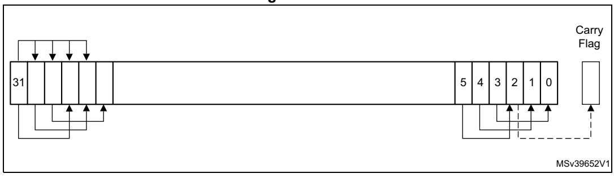
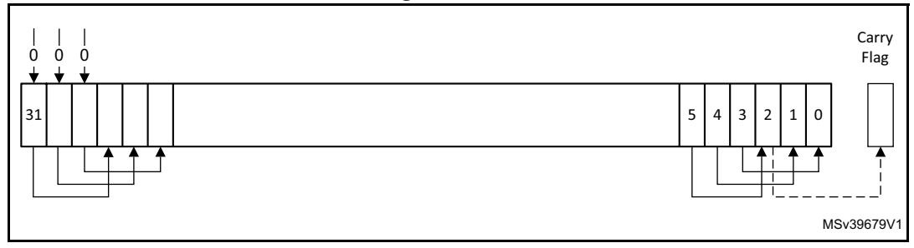
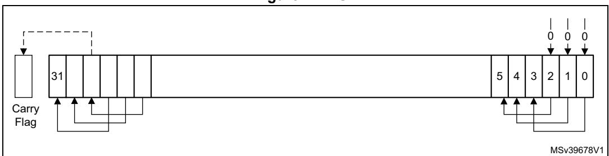
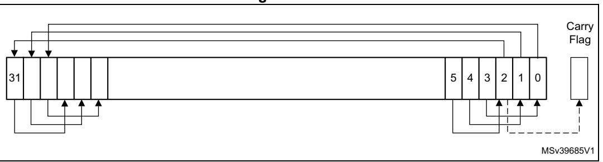
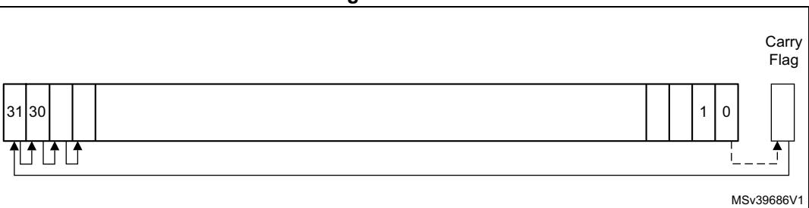

| Special register | Access | CMSIS function                        |
|------------------|--------|---------------------------------------|
| PRIMASK          | Read   | uint32_tget_PRIMASK (void)            |
|                  | Write  | voidset_PRIMASK (uint32_t value)      |
| FAULTMASK        | Read   | uint32_tget_FAULTMASK (void)          |
|                  | Write  | voidset_FAULTMASK (uint32_t value)    |
| BASEPRI          | Read   | uint32_tget_BASEPRI (void)            |
|                  | Write  | voidset_BASEPRI (uint32_t value)      |
| CONTROL          | Read   | uint32_tget_CONTROL (void)            |
|                  | Write  | voidset_CONTROL (uint32_t value)      |
| MSP              | Read   | uint32_tget_MSP (void)                |
|                  | Write  | voidset_MSP (uint32_t TopOfMainStack) |
| PSP              | Read   | uint32_tget_PSP (void)                |
|                  | Write  | voidset_PSP (uint32_t TopOfProcStack) |

**Table 25. CMSIS functions to access the special registers** 

# **3.3 About the instruction descriptions**

The following sections give more information about using the instructions:

- *[Operands on page 63](#page-0-0)*.
- *[Restrictions when using PC or SP on page 63](#page-0-1)*.
- *[Flexible second operand on page 64](#page-1-0)*.
- *[Shift operations on page 65](#page-2-0)*.
- *[Address alignment on page 68](#page-5-0)*.
- *[PC-relative expressions on page 68](#page-5-1)*.
- *[Conditional execution on page 68](#page-5-2)*.
- *[Instruction width selection on page 71](#page-8-0)*.

## <span id="page-0-0"></span>**3.3.1 Operands**

An instruction operand can be an Arm register, a constant, or another instruction-specific parameter. Instructions act on the operands and often store the result in a destination register. When there is a destination register in the instruction, it is usually specified before the operands.

Operands in some instructions are flexible in that they can either be a register or a constant. See *[Flexible second operand on page](#page-1-0) 64*.

# <span id="page-0-1"></span>**3.3.2 Restrictions when using PC or SP**

Many instructions have restrictions on whether the user can use the *Program Counter* (PC) or *Stack Pointer* (SP) for the operands or destination register. See instruction descriptions for more information.


PM0253 Rev 5 63/254

*Note: Bit[0] of any address written to the PC with a BX, BLX, LDM, LDR, or POP instruction must be 1 for correct execution, because this bit indicates the required instruction set, and the Cortex®-M7 processor only supports Thumb instructions.*

## <span id="page-1-0"></span>**3.3.3 Flexible second operand**

Many general data processing instructions have a flexible second operand. This is shown as *Operand2* in the descriptions of the syntax of each instruction.

*Operand2* can be a:

- *[Constant](#page-1-1)*.
- *[Register with optional shift on page 64](#page-1-2)*.

#### <span id="page-1-1"></span>**Constant**

Specify an Operand2 constant in the form:

#*constant*

where *constant* can be:

- Any constant that can be produced by shifting an 8-bit value left by any number of bits within a 32-bit word.
- Any constant of the form 0x00XY00XY.
- Any constant of the form 0xXY00XY00.
- Any constant of the form 0xXYXYXYXY.

*Note: In these constants, X and Y are hexadecimal digits.*

In addition, in a small number of instructions, *constant* can take a wider range of values. These are described in the individual instruction descriptions.

When an Operand2 constant is used with the instructions MOVS, MVNS, ANDS, ORRS, ORNS, EORS, BICS, TEQ or TST, the carry flag is updated to bit[31] of the constant, if the constant is greater than 255 and can be produced by shifting an 8-bit value. These instructions do not affect the carry flag if Operand2 is any other constant.

#### **Instruction substitution**

The assembler might be able to produce an equivalent instruction if an unpermitted constant is specified. For example, the instruction CMP *Rd*, #0xFFFFFFFE might be assembled as the equivalent of instruction CMN *Rd*, #0x2.

#### <span id="page-1-2"></span>**Register with optional shift**

Specify an Operand2 register in the form:

```
Rm {, shift}
```

### Where:

*Rm* Is the register holding the data for the second operand.

*shift* Is an optional shift to be applied to *Rm*. It can be one of:

ASR #*n* Arithmetic shift right *n* bits, 1 ≤*n* ≤ 32. LSL #*n* Logical shift left *n* bits, 1 ≤*n* ≤ 31. LSR #*n* Logical shift right *n* bits, 1 ≤*n* ≤ 32.

64/254 PM0253 Rev 5


ROR #*n* Rotate right *n* bits, 1 ≤*n* ≤ 31. RRX Rotate right one bit, with extend. - If omitted, no shift occurs, equivalent to LSL #0.

If the shift is omitted or LSL #0 specified, the instruction uses the value in *Rm*.

If the shift is specified, it is applied to the value in *Rm*, and the resulting 32-bit value is used by the instruction. However, the contents in the register *Rm* remain unchanged. Specifying a register with shift also updates the carry flag when used with certain instructions. For information on the shift operations and how they affect the carry flag, see *[Shift operations](#page-2-0)*.

# <span id="page-2-0"></span>**3.3.4 Shift operations**

Register shift operations move the bits in a register left or right by a specified number of bits, the *shift length*. Register shift can be performed:

- Directly by the instructions ASR, LSR, LSL, ROR, and RRX, and the result is written to a destination register.
- During the calculation of *Operand2* by the instructions that specify the second operand as a register with shift, see *[Flexible second operand on page 64](#page-1-0)*. The result is used by the instruction.

The permitted shift lengths depend on the shift type and the instruction, see the individual instruction description or *[Flexible second operand on page](#page-1-0) 64*. If the shift length is 0, no shift occurs. Register shift operations update the carry flag except when the specified shift length is 0. The following sub-sections describe the various shift operations and how they affect the carry flag. In these descriptions, *Rm* is the register containing the value to be shifted, and *n* is the shift length.

#### **ASR**

Arithmetic shift right by *n* bits moves the left-hand 32-*n* bits of the register *Rm*, to the right by *n* places, into the right-hand 32-*n* bits of the result. And it copies the original bit[31] of the register into the left-hand *n* bits of the result. See *Figure [12 on page](#page-3-0) 66*.

The ASR #*n* operation can be used to divide the value in the register *Rm* by 2*n*, with the result being rounded towards negative-infinity.

When the instruction is ASRS or when ASR #*n* is used in *Operand2* with the instructions MOVS, MVNS, ANDS, ORRS, ORNS, EORS, BICS, TEQ or TST, the carry flag is updated to the last bit shifted out, bit[*n*-1], of the register *Rm*.

- •If *n* is 32 or more, then all the bits in the result are set to the value of bit[31] of *Rm*.
- If *n* is 32 or more and the carry flag is updated, it is updated to the value of bit[31] of *Rm*.

PM0253 Rev 5 65/254

**Figure 12. ASR**

<span id="page-3-0"></span>

#### **LSR**

Logical shift right by *n* bits moves the left-hand 32-*n* bits of the register *Rm*, to the right by *n* places, into the right-hand 32-*n* bits of the result. And it sets the left-hand *n* bits of the result to 0. See *[Figure](#page-3-1) 13*.

The LSR #*n* operation can be used to divide the value in the register *Rm* by 2*n*, if the value is regarded as an unsigned integer.

When the instruction is LSRS or when LSR #*n* is used in *Operand2* with the instructions MOVS, MVNS, ANDS, ORRS, ORNS, EORS, BICS, TEQ or TST, the carry flag is updated to the last bit shifted out, bit[*n*-1], of the register *Rm*.

- •If *n* is 32 or more, then all the bits in the result are cleared to 0.
- If *n* is 33 or more and the carry flag is updated, it is updated to 0.

**Figure 13. LSR**

<span id="page-3-1"></span>

#### **LSL**

Logical shift left by *n* bits moves the right-hand 32-*n* bits of the register *Rm*, to the left by *n* places, into the left-hand 32-*n* bits of the result. And it sets the right-hand *n* bits of the result to 0. See *Figure [14 on page](#page-4-0) 67*.

The user can use the LSL #*n* operation to multiply the value in the register *Rm* by 2*n*, if the value is regarded as an unsigned integer or a two's complement signed integer. Overflow can occur without warning.

When the instruction is LSLS or when LSL #*n*, with non-zero *n*, is used in *Operand2* with the instructions MOVS, MVNS, ANDS, ORRS, ORNS, EORS, BICS, TEQ or TST, the carry flag is updated to the last bit shifted out, bit[32-*n*], of the register *Rm*. These instructions do not affect the carry flag when used with LSL #0.

- •If *n* is 32 or more, then all the bits in the result are cleared to 0.
- If *n* is 33 or more and the carry flag is updated, it is updated to 0.

**Figure 14. LSL**

<span id="page-4-0"></span>

#### **ROR**

Rotate right by *n* bits moves the left-hand 32-*n* bits of the register *Rm*, to the right by *n* places, into the right-hand 32-*n* bits of the result. And it moves the right-hand *n* bits of the register into the left-hand *n* bits of the result. See *[Figure](#page-4-1) 15*.

When the instruction is RORS or when ROR #*n* is used in *Operand2* with the instructions MOVS, MVNS, ANDS, ORRS, ORNS, EORS, BICS, TEQ or TST, the carry flag is updated to the last bit rotation, bit[*n*-1], of the register *Rm*.

- •If *n* is 32, then the value of the result is same as the value in *Rm*, and if the carry flag is updated, it is updated to bit[31] of *Rm*.
- ROR with shift length, *n*, more than 32 is the same as ROR with shift length *n*-32.

<span id="page-4-1"></span>**Figure 15. ROR**



### **RRX**

Rotate right with extend moves the bits of the register *Rm* to the right by one bit. And it copies the carry flag into bit[31] of the result. See *Figure [16 on page](#page-4-2) 67*.

When the instruction is RRXS or when RRX is used in *Operand2* with the instructions MOVS, MVNS, ANDS, ORRS, ORNS, EORS, BICS, TEQ or TST, the carry flag is updated to bit[0] of the register *Rm*.

<span id="page-4-2"></span>**Figure 16. RRX**




PM0253 Rev 5 67/254

# <span id="page-5-0"></span>**3.3.5 Address alignment**

An aligned access is an operation where a word-aligned address is used for a word, dual word, or multiple word access, or where a halfword-aligned address is used for a halfword access. Byte accesses are always aligned.

The Cortex®-M7 processor supports unaligned access only for the following instructions:

- LDR, LDRT.
- LDRH, LDRHT.
- LDRSH, LDRSHT.
- STR, STRT.
- STRH, STRHT.

All other load and store instructions generate a UsageFault exception if they perform an unaligned access, and therefore their accesses must be address aligned. For more information about UsageFaults see *Fault handling on page 47*.

Unaligned accesses are usually slower than aligned accesses. In addition, some memory regions might not support unaligned accesses. Therefore, Arm recommends that programmers ensure that accesses are aligned. To trap accidental generation of unaligned accesses, use the UNALIGN\_TRP bit in the Configuration and Control register, see *Configuration and control register on page 200*.

# <span id="page-5-1"></span>**3.3.6 PC-relative expressions**

A PC-relative expression or *label* is a symbol that represents the address of an instruction or literal data. It is represented in the instruction as the PC value plus or minus a numeric offset. The assembler calculates the required offset from the label and the address of the current instruction. If the offset is too big, the assembler produces an error.

- •For B, BL, CBNZ, and CBZ instructions, the value of the PC is the address of the current instruction plus 4 bytes.
- For all other instructions that use labels, the value of the PC is the address of the current instruction plus 4 bytes, with bit[1] of the result cleared to 0 to make it wordaligned.
- The assembler might permit other syntaxes for PC-relative expressions, such as a label plus or minus a number, or an expression of the form [PC, #number].

# <span id="page-5-2"></span>**3.3.7 Conditional execution**

Most data processing instructions can optionally update the condition flags in the *Application Program Status register* (APSR) according to the result of the operation, see *Application program status register on page 23*. Some instructions update all flags, and some only update a subset. If a flag is not updated, the original value is preserved. See the instruction descriptions for the flags they affect.

The user can execute an instruction conditionally, based on the condition flags set in another instruction, either:

- Immediately after the instruction that updated the flags.
- After any number of intervening instructions that have not updated the flags.

Conditional execution is available by using conditional branches or by adding condition code suffixes to instructions. See *Table [26 on page](#page-7-0) 70* for a list of the suffixes to add to

68/254 PM0253 Rev 5


instructions to make them conditional instructions. The condition code suffix enables the processor to test a condition based on the flags. If the condition test of a conditional instruction fails, the instruction:

- Does not execute.
- Does not write any value to its destination register.
- Does not affect any of the flags.
- Does not generate any exception.

Conditional instructions, except for conditional branches, must be inside an If-Then instruction block. See *IT on page 148* for more information and restrictions when using the IT instruction. Depending on the vendor, the assembler might automatically insert an IT instruction if there are conditional instructions outside the IT block.

Use the CBZ and CBNZ instructions to compare the value of a register against zero and branch on the result.

This section describes:

- *[The condition flags on page 69](#page-6-0)*.
- *[Condition code suffixes on page 70](#page-7-1)*.

#### <span id="page-6-0"></span>**The condition flags**

The APSR contains the following condition flags:

- **N** Set to 1 when the result of the operation was negative, cleared to 0 otherwise.
- **Z** Set to 1 when the result of the operation was zero, cleared to 0 otherwise.
- **C** Set to 1 when the operation resulted in a carry, cleared to 0 otherwise.
- **V** Set to 1 when the operation caused overflow, cleared to 0 otherwise.

For more information about the APSR see *Program status register on page 22*.

The C condition flag is set in one of four ways:

- For an addition, including the comparison instruction CMN, C is set to 1 if the addition produced a carry (that is, an unsigned overflow), and to 0 otherwise.
- For a subtraction, including the comparison instruction CMP, C is set to 0 if the subtraction produced a borrow (that is, an unsigned underflow), and to 1 otherwise.
- For non-addition or subtractions that incorporate a shift operation, C is set to the last bit shifted out of the value by the shifter.
- For other non-addition or subtractions, C is normally left unchanged. See the individual instruction descriptions for any special cases.

Overflow occurs when the sign of the result, in bit[31], does not match the sign of the result had the operation been performed at infinite precision, for example:

- If adding two negative values results in a positive value.
- If adding two positive values results in a negative value.
- If subtracting a positive value from a negative value generates a positive value.
- If subtracting a negative value from a positive value generates a negative value.

The Compare operations are identical to subtracting, for CMP, or adding, for CMN, except that the result is discarded. See the instruction descriptions for more information.

Most instructions update the status flags only if the S suffix is specified. See the instruction descriptions for more information.


PM0253 Rev 5 69/254

# <span id="page-7-1"></span>**Condition code suffixes**

The instructions that can be conditional have an optional condition code, shown in syntax descriptions as {*cond*}. Conditional execution requires a preceding IT instruction. An instruction with a condition code is only executed if the condition code flags in the APSR meet the specified condition. *[Table](#page-7-0) 26* shows the condition codes to use.

The conditional execution can be used with the IT instruction to reduce the number of branch instructions in the code.

*[Table](#page-7-0) 26* also shows the relationship between condition code suffixes and the N, Z, C, and V flags.

<span id="page-7-0"></span>

| Suffix   | Flags              | Meaning                                                  |
|----------|--------------------|----------------------------------------------------------|
| EQ       | Z = 1              | Equal                                                    |
| NE       | Z = 0              | Not equal                                                |
| CS or HS | C = 1              | Higher or same, unsigned                                 |
| CC or LO | C = 0              | Lower, unsigned                                          |
| MI       | N = 1              | Negative                                                 |
| PL       | N = 0              | Positive or zero                                         |
| VS       | V = 1              | Overflow                                                 |
| VC       | V = 0              | No overflow                                              |
| HI       | C = 1 and Z = 0    | Higher, unsigned                                         |
| LS       | C = 0 or Z = 1     | Lower or same, unsigned                                  |
| GE       | N = V              | Greater than or equal, signed                            |
| LT       | N != V             | Less than, signed                                        |
| GT       | Z = 0 and N = V    | Greater than, signed                                     |
| LE       | Z = 1 and N != V   | Less than or equal, signed                               |
| AL       | Can have any value | Always. This is the default when no suffix is specified. |

**Table 26. Condition code suffixes** 

*[Example 3-1: absolute value](#page-7-2)* shows the use of a conditional instruction to find the absolute value of a number. R0 = abs(R1).

#### <span id="page-7-2"></span>**Example 3-1: absolute value**

```
 MOVS R0, R1 ; R0 = R1, setting flags.
IT MI ; Skipping next instruction if value 0 or 
; positive.
RSBMI R0, R0, #0 ; If negative, R0 = -R0.
```

70/254 PM0253 Rev 5


*[Example 3-2: compare and update value](#page-8-1)* shows the use of conditional instructions to update the value of R4 if the signed values R0 is greater than R1 and R2 is greater than R3.

# <span id="page-8-1"></span>**Example 3-2: compare and update value**

```
 CMP R0, R1 ; Compare R0 and R1, setting flags.
ITT GT ; Skip next two instructions unless GT condition 
; holds.
CMPGT R2, R3 ; If 'greater than', compare R2 and R3, setting 
; flags.
MOVGT R4, R5 ; If still 'greater than', do R4 = R5.
```

## <span id="page-8-0"></span>**3.3.8 Instruction width selection**

There are many instructions that can generate either a 16-bit encoding or a 32-bit encoding depending on the operands and destination register specified. For some of these instructions, a specific instruction size can be forced by using an instruction width suffix. The .W suffix forces a 32-bit instruction encoding. The .N suffix forces a 16-bit instruction encoding.

If an instruction width suffix is specified and the assembler cannot generate an instruction encoding of the requested width, it generates an error.

In some cases it might be necessary to specify the .W suffix, for example if the operand is the label of an instruction or literal data, as in the case of branch instructions. This is because the assembler might not automatically generate the right size encoding.

To use an instruction width suffix, place it immediately after the instruction mnemonic and condition code, if any. *[Example 3-3: instruction width selection](#page-8-2)* shows instructions with the instruction width suffix.

#### <span id="page-8-2"></span>**Example 3-3: instruction width selection**

```
 BCS.W label ; Creates a 32-bit instruction even for a short 
; branch.
ADDS.W R0, R0, R1 ; Creates a 32-bit instruction even though the same
; operation can be done by a 16-bit instruction.
```

PM0253 Rev 5 71/254