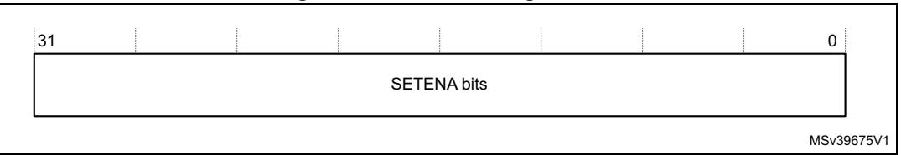
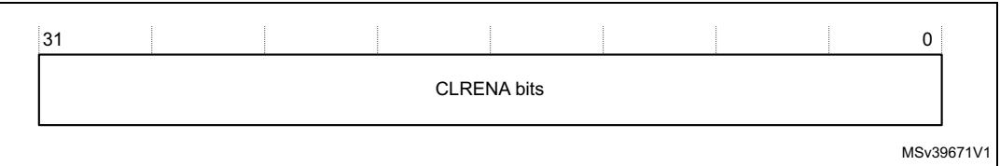
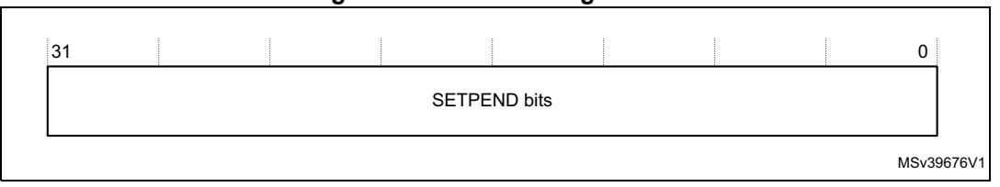
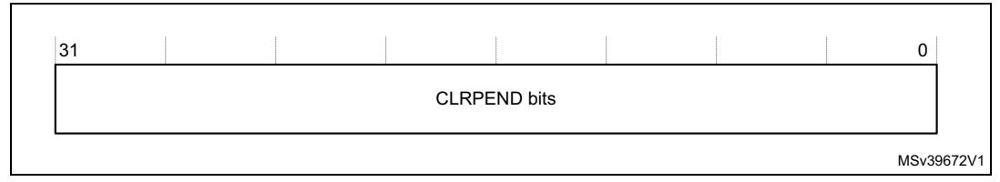
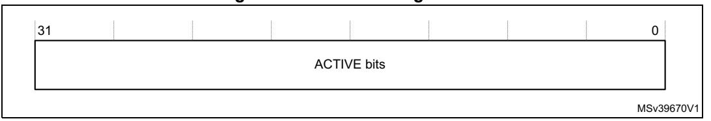
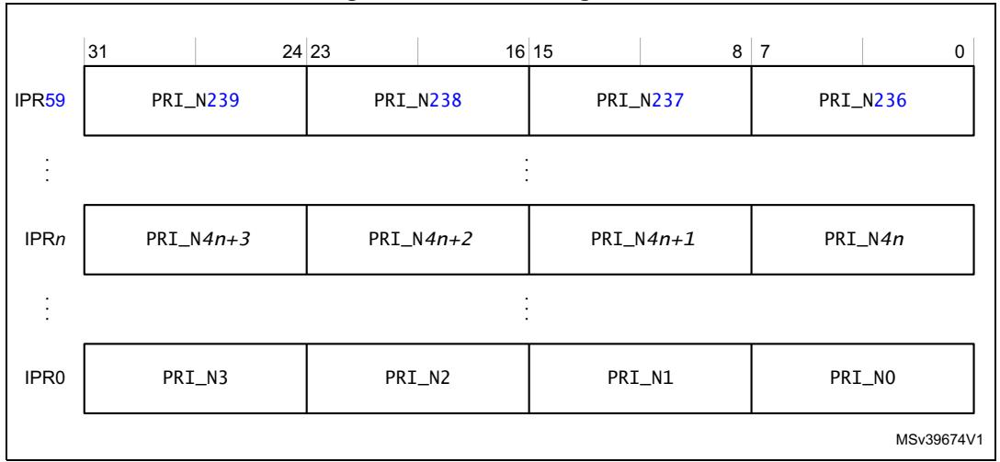
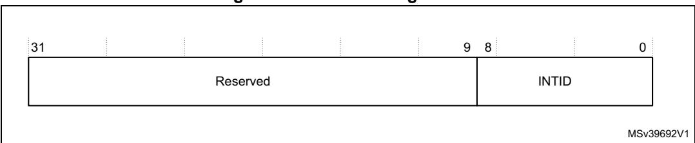

# 4.2 Nested Vectored Interrupt Controller

This section describes the NVIC and the registers it uses. The NVIC supports:

- 1 to 240 interrupts.
- A programmable priority level of 0-255 for each interrupt. A higher level corresponds to a lower priority, so level 0 is the highest interrupt priority.
- Level and pulse detection of interrupt signals.
- Dynamic reprioritization of interrupts.
- Grouping of priority values into group priority and subpriority fields.
- Interrupt tail-chaining.
- An external Non Maskable Interrupt (NMI)

The processor automatically stacks its state on exception entry and unstacks this state on exception exit, with no instruction overhead. This provides low latency exception handling. The hardware implementation of the NVIC registers is:

Table 40. NVIC register summary

<span id="page-0-0"></span>

| Address                   | Name                      | Туре | Required privilege          | Reset<br>value | Description                                     |
|---------------------------|---------------------------|------|-----------------------------|----------------|-------------------------------------------------|
| 0xE000E100-<br>0xE000E11C | NVIC_ISER0-<br>NVIC_ISER7 | RW   | Privileged                  | 0x00000000     | Interrupt set-enable registers on page 185      |
| 0XE000E180-<br>0xE000E19C | NVIC_ICER0-<br>NVIC_ICER7 | RW   | Privileged                  | 0x00000000     | Interrupt clear-enable registers on page 186    |
| 0XE000E200-<br>0xE000E21C | NVIC_ISPR0-<br>NVIC_ISPR7 | RW   | Privileged                  | 0x00000000     | Interrupt set-pending registers on page 186     |
| 0XE000E280-<br>0xE000E29C | NVIC_ICPR0-<br>NVIC_ICPR7 | RW   | Privileged                  | 0x00000000     | Interrupt clear-pending registers on page 187   |
| 0xE000E300-<br>0xE000E31C | NVIC_IABR0-<br>NVIC_IABR7 | RW   | Privileged                  | 0x00000000     | Interrupt active bit registers on page 188      |
| 0xE000E400-<br>0xE000E4EF | NVIC_IPR0-<br>NVIC_IPR59  | RW   | Privileged                  | 0x00000000     | Interrupt priority registers on page 188        |
| 0xE000EF00                | STIR                      | WO   | Configurable <sup>(1)</sup> | 0x00000000     | Software trigger interrupt register on page 189 |

<sup>1.</sup> See the register description for more information.


# <span id="page-1-2"></span>**4.2.1 Accessing the Cortex®-M7 NVIC registers using CMSIS**

CMSIS functions enable the software portability between different Cortex®-M profile processors. To access the NVIC registers when using CMSIS, use the following functions:

| CMSIS function                                                 | Description                                                                                                                              |  |  |
|----------------------------------------------------------------|------------------------------------------------------------------------------------------------------------------------------------------|--|--|
| void NVIC_EnableIRQ(IRQn_Type IRQn)(1)                         | Enables an interrupt or exception.                                                                                                       |  |  |
| void NVIC_DisableIRQ(IRQn_Type IRQn)(1)                        | Disables an interrupt or exception.                                                                                                      |  |  |
| void NVIC_SetPendingIRQ(IRQn_Type<br>IRQn)(1)                  | Sets the pending status of interrupt or<br>exception to 1.                                                                               |  |  |
| void NVIC_ClearPendingIRQ(IRQn_Type<br>IRQn)(1)                | Clears the pending status of interrupt or<br>exception to 0.                                                                             |  |  |
| uint32_t NVIC_GetPendingIRQ(IRQn_Type<br>IRQn)(1)              | Reads the pending status of interrupt or<br>exception. This function returns non-zero value<br>if the pending status is set to 1.        |  |  |
| void NVIC_SetPriority(IRQn_Type IRQn,<br>uint32_t priority)(1) | Sets the priority of an interrupt or exception<br>with configurable priority level to 1.                                                 |  |  |
| uint32_t NVIC_GetPriority(IRQn_Type<br>IRQn)(1)                | Reads the priority of an interrupt or exception<br>with configurable priority level. This function<br>return the current priority level. |  |  |

**Table 41. CMSIS access NVIC functions** 

## <span id="page-1-0"></span>**4.2.2 Interrupt set-enable registers**

The NVIC\_ISER0-NVIC\_ISER7 registers enable interrupts, and show which interrupts are enabled. See the register summary in *Table [40 on page](#page-0-0) 184* for the register attributes.

The bit assignments are:

**Figure 17. ISER bit assignments**



**Table 42. ISER bit assignments** 

| Bits   | Name   | Function                                                                                                                                  |
|--------|--------|-------------------------------------------------------------------------------------------------------------------------------------------|
| [31:0] | SETENA | Interrupt set-enable bits.<br>Write:<br>0: No effect.<br>1: Enable interrupt.<br>Read:<br>0: Interrupt disabled.<br>1: Interrupt enabled. |


PM0253 Rev 5 185/254

<span id="page-1-1"></span><sup>1.</sup> The input parameter IRQn is the IRQ number, see *Table 19 on page 40* for more information.

If a pending interrupt is enabled, the NVIC activates the interrupt based on its priority. If an interrupt is not enabled, asserting its interrupt signal changes the interrupt state to pending, but the NVIC never activates the interrupt, regardless of its priority.

## <span id="page-2-0"></span>**4.2.3 Interrupt clear-enable registers**

The NVIC\_ICER0-NVIC\_ICER7 registers disable interrupts, and show which interrupts are enabled. See the register summary in *Table [40 on page](#page-0-0) 184* for the register attributes.

The bit assignments are:

**Figure 18. ICER bit assignment**



**Table 43. ICER bit assignments** 

| Bits   | Name   | Function                                                                                                                                     |
|--------|--------|----------------------------------------------------------------------------------------------------------------------------------------------|
| [31:0] | CLRENA | Interrupt clear-enable bits.<br>Write:<br>0: No effect.<br>1: Disable interrupt.<br>Read:<br>0: Interrupt disabled.<br>1: Interrupt enabled. |

#### <span id="page-2-1"></span>**4.2.4 Interrupt set-pending registers**

The NVIC\_ISPR0-NVIC\_ISPR7 registers force interrupts into the pending state, and show which interrupts are pending. See the register summary in *Table [40 on page](#page-0-0) 184* for the register attributes.

The bit assignments are:

**Figure 19. ISPR bit assignments**



186/254 PM0253 Rev 5

| Bits   | Name    | Function                                                                                                                                                              |
|--------|---------|-----------------------------------------------------------------------------------------------------------------------------------------------------------------------|
| [31:0] | SETPEND | Interrupt set-pending bits.<br>Write:<br>0: No effect.<br>1: Changes interrupt state to pending.<br>Read:<br>0: Interrupt is not pending.<br>1: Interrupt is pending. |

**Table 44. ISPR bit assignments** 

Writing 1 to the ISPR bit corresponding to:

- An interrupt that is pending has no effect.
- A disabled interrupt sets the state of that interrupt to pending.

### <span id="page-3-0"></span>**4.2.5 Interrupt clear-pending registers**

The NVIC\_ICPR0-NCVIC\_ICPR7 registers remove the pending state from interrupts, and show which interrupts are pending. See the register summary in *Table [40 on page](#page-0-0) 184* for the register attributes.

The bit assignments are:

**Figure 20. ICPR bit assignments**



**Table 45. ICPR bit assignments** 

| Bits   | Name    | Function                                                                                                                                                                |
|--------|---------|-------------------------------------------------------------------------------------------------------------------------------------------------------------------------|
| [31:0] | CLRPEND | Interrupt clear-pending bits.<br>Write:<br>0: No effect.<br>1: Removes pending state an interrupt.<br>Read:<br>0: Interrupt is not pending.<br>1: Interrupt is pending. |

Writing 1 to an ICPR bit does not affect the active state of the corresponding interrupt.

## <span id="page-4-0"></span>**4.2.6 Interrupt active bit registers**

The NVIC\_IABR0-NVIC\_IABR7 registers indicate which interrupts are active. See the register summary in *Table [40 on page](#page-0-0) 184* for the register attributes.

The bit assignments are:

**Figure 21. IABR bit assignments**



**Table 46. IABR bit assignments** 

<span id="page-4-2"></span>

| Bits   | Name   | Function                                                                    |
|--------|--------|-----------------------------------------------------------------------------|
| [31:0] | ACTIVE | Interrupt active flags:<br>0: Interrupt not active.<br>1: Interrupt active. |

A bit is read as one if the status of the corresponding interrupt is active or active and pending.

#### <span id="page-4-1"></span>**4.2.7 Interrupt priority registers**

The NVIC\_IPR0-NVIC\_IPR59 registers provide an 8-bit priority field for each interrupt. These registers are byte-accessible. See the register summary in *Table [40 on page](#page-0-0) 184* for their attributes. Each register holds four priority fields as shown:

**Figure 22. IPR bit assignments**



188/254 PM0253 Rev 5

| Bits    | Name                    | Function                                                                                                                                                                                                                                     |  |  |  |
|---------|-------------------------|----------------------------------------------------------------------------------------------------------------------------------------------------------------------------------------------------------------------------------------------|--|--|--|
| [31:24] | Priority, byte offset 3 | Each priority field holds a priority value, 0-255. The lower the<br>value, the greater the priority of the corresponding interrupt. The<br>processor implements only bits[7:n] of each field, bits[n-1:0] read<br>as zero and ignore writes. |  |  |  |
| [23:16] | Priority, byte offset 2 |                                                                                                                                                                                                                                              |  |  |  |
| [15:8]  | Priority, byte offset 1 |                                                                                                                                                                                                                                              |  |  |  |
| [7:0]   | Priority, byte offset 0 |                                                                                                                                                                                                                                              |  |  |  |

**Table 47. IPR bit assignments** 

See *[Accessing the Cortex®-M7 NVIC registers using CMSIS on page](#page-1-2) 185* for more information about the access to the interrupt priority array, which provides the software view of the interrupt priorities.

Find the IPR number and byte offset for interrupt *m* as follows:

- the corresponding IPR number, see *[Table 46 on page 188](#page-4-2) n* is given by *n* = *m* DIV 4
- the byte offset of the required Priority field in this register is *m* MOD 4, where:
  - Byte offset 0 refers to register bits[7:0].
  - Byte offset 1 refers to register bits[15:8].
  - Byte offset 2 refers to register bits[23:16].
  - Byte offset 3 refers to register bits[31:24].

## <span id="page-5-0"></span>**4.2.8 Software trigger interrupt register**

Write to the STIR to generate an interrupt from software. See the register summary in *Table [40 on page](#page-0-0) 184* for the STIR attributes.

When the USERSETMPEND bit in the SCR is set to 1, unprivileged software can access the STIR, see *System control register on page 199*.

Only privileged software can enable unprivileged access to the STIR.

The bit assignments are:

**Figure 23. STIR bit assignments**



**Table 48. STIR bit assignments** 

| Bits   | Field | Function                                                                                                                |
|--------|-------|-------------------------------------------------------------------------------------------------------------------------|
| [31:9] | -     | Reserved.                                                                                                               |
| [8:0]  | INTID | Interrupt ID of the interrupt to trigger, in the range 0-239. For<br>example, a value of 0x03 specifies interrupt IRQ3. |


PM0253 Rev 5 189/254

### **4.2.9 Level-sensitive and pulse interrupts**

The processor supports both level-sensitive and pulse interrupts. The pulse interrupts are also described as edge-triggered interrupts.

A level-sensitive interrupt is held asserted until the peripheral deasserts the interrupt signal. Typically this happens because the ISR accesses the peripheral, causing it to clear the interrupt request. A pulse interrupt is an interrupt signal sampled synchronously on the rising edge of the processor clock. To ensure the NVIC detects the interrupt, the peripheral must assert the interrupt signal for at least one clock cycle, during which the NVIC detects the pulse and latches the interrupt.

When the processor enters the ISR, it automatically removes the pending state from the interrupt, see *[Hardware and software control of interrupts on page](#page-6-0) 190*. For a level-sensitive interrupt, if the signal is not deasserted before the processor returns from the ISR, the interrupt becomes pending again, and the processor must execute its ISR again. This means that the peripheral can hold the interrupt signal asserted until it no longer requires servicing.

#### <span id="page-6-0"></span>**Hardware and software control of interrupts**

- The Cortex®-M7 latches all interrupts. A peripheral interrupt becomes pending for one of the following reasons:
- The NVIC detects that the interrupt signal is HIGH and the interrupt is not active.
- The NVIC detects a rising edge on the interrupt signal.
- Software writes to the corresponding interrupt set-pending register bit, see *[Interrupt](#page-2-1)  [set-pending registers on page 186](#page-2-1)*, or to the STIR to make an interrupt pending, see *[Software trigger interrupt register on page 189](#page-5-0)*.

A pending interrupt remains pending until one of the following:

- The processor enters the ISR for the interrupt. This changes the state of the interrupt from pending to active. Then:
  - For a level-sensitive interrupt, when the processor returns from the ISR, the NVIC samples the interrupt signal. If the signal is asserted, the state of the interrupt changes to pending, which might cause the processor to immediately re-enter the ISR. Otherwise, the state of the interrupt changes to inactive.
  - For a pulse interrupt, the NVIC continues to monitor the interrupt signal, and if this is pulsed the state of the interrupt changes to pending and active. In this case, when the processor returns from the ISR the state of the interrupt changes to pending, which might cause the processor to immediately re-enter the ISR.
  - If the interrupt signal is not pulsed while the processor is in the ISR, when the processor returns from the ISR the state of the interrupt changes to inactive.
- The software writes to the corresponding interrupt clear-pending register bit.

For a level-sensitive interrupt, if the interrupt signal is still asserted, the state of the interrupt does not change. Otherwise, the state of the interrupt changes to inactive.

For a pulse interrupt, the state of the interrupt changes to:

- Inactive, if the state was pending.
- Active, if the state was active and pending.

190/254 PM0253 Rev 5


### **4.2.10 NVIC design hints and tips**

Ensure that the software uses correctly aligned register accesses. The processor does not support unaligned accesses to NVIC registers. See the individual register descriptions for the supported access sizes.

An interrupt can enter pending state even if it is disabled. Disabling an interrupt only prevents the processor from taking that interrupt.

Before programming VTOR to relocate the vector table, ensure the vector table entries of the new vector table are set up for fault handlers, NMI, and all enabled exception-like interrupts. For more information see *Vector table offset register on page 197*.

## **NVIC programming hints**

The software uses the CPSIE I and CPSID I instructions to enable and disable interrupts. The CMSIS provides the following intrinsic functions for these instructions:

```
void __disable_irq(void) // Disable Interrupts
void __enable_irq(void) // Enable Interrupts
```

In addition, the CMSIS provides a number of functions for NVIC control, including:

| CMSIS interrupt control function                             | Description                                      |  |  |  |
|--------------------------------------------------------------|--------------------------------------------------|--|--|--|
| void NVIC_SetPriorityGrouping(uint32_t<br>priority_grouping) | Set the priority grouping                        |  |  |  |
| void NVIC_EnableIRQ(IRQn_t IRQn)                             | Enable IRQn                                      |  |  |  |
| void NVIC_DisableIRQ(IRQn_t IRQn)                            | Disable IRQn                                     |  |  |  |
| uint32_t NVIC_GetPendingIRQ (IRQn_t IRQn)                    | Return true (IRQ-Number) if IRQn is<br>pending   |  |  |  |
| void NVIC_SetPendingIRQ (IRQn_t IRQn)                        | Set IRQn pending                                 |  |  |  |
| void NVIC_ClearPendingIRQ (IRQn_t IRQn)                      | Clear IRQn pending status                        |  |  |  |
| uint32_t NVIC_GetActive (IRQn_t IRQn)                        | Return the IRQ number of the active<br>interrupt |  |  |  |
| void NVIC_SetPriority (IRQn_t IRQn,<br>uint32_t priority)    | Set priority for IRQn                            |  |  |  |
| uint32_t NVIC_GetPriority (IRQn_t IRQn)                      | Read priority of IRQn                            |  |  |  |

**Table 49. CMSIS functions for NVIC control** 

The input parameter IRQn is the IRQ number, see *Table 19 on page 40*. For more information about these functions see the CMSIS documentation.


PM0253 Rev 5 191/254