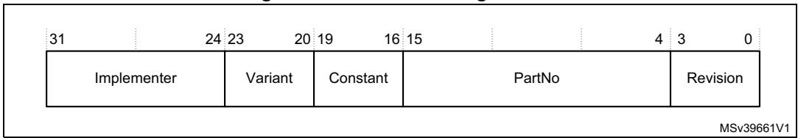
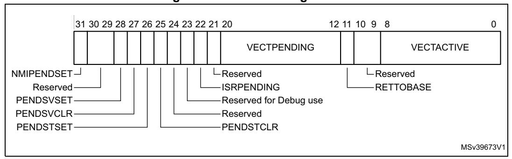
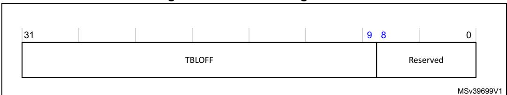
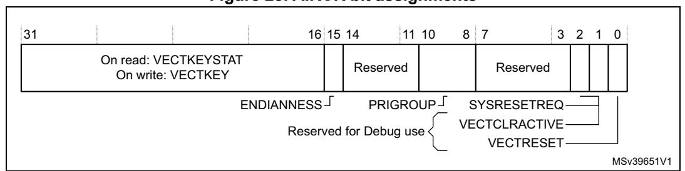
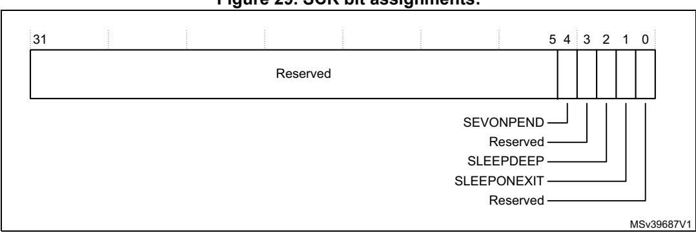
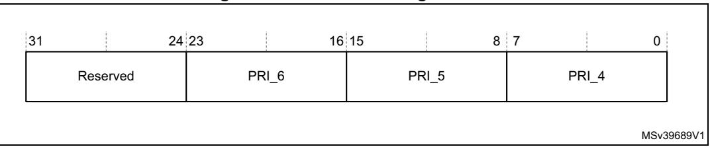
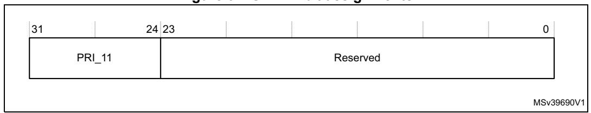
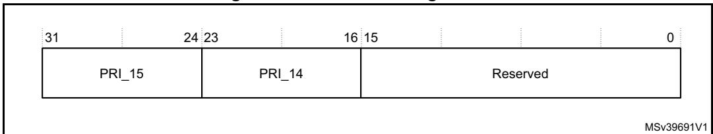
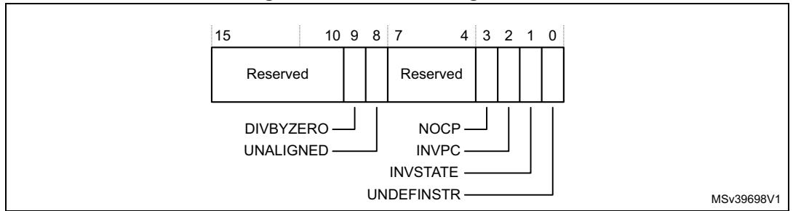

# **4.3 System control block**

The *System Control Block* (SCB) provides system implementation information, and system control. This includes configuration, control, and reporting of the system exceptions. The system control block registers are:

**Table 50. Summary of the system control block registers** 

| Address    | Name    | Type   | Required privilege | Reset value | Description                                                     |
|------------|---------|--------|-----------------------|----------------|-----------------------------------------------------------------|
| 0xE000E008 | ACTLR   | RW     | Privileged            | 0x00000000     | Auxiliary control register on page 193                          |
| 0xE000ED00 | CPUID   | RO     | Privileged            | 0x410FC270     | CPUID base register on page 194                                 |
| 0xE000ED04 | ICSR    | RW(1)  | Privileged            | 0x00000000     | Interrupt control and state register on page 194                |
| 0xE000ED08 | VTOR    | RW     | Privileged            | Unknown        | Vector table offset register on page 197                        |
| 0xE000ED0C | AIRCR   | RW(1)  | Privileged            | 0xFA050000     | Application interrupt and reset control register on page 197 |
| 0xE000ED10 | SCR     | RW     | Privileged            | 0x00000000     | System control register on page 199                             |
| 0xE000ED14 | CCR     | RW     | Privileged            | 0x00000200     | Configuration and control register on page 200                  |
| 0xE000ED18 | SHPR1   | RW     | Privileged            | 0x00000000     | System handler priority register 1 on page 202                  |
| 0xE000ED1C | SHPR2   | RW     | Privileged            | 0x00000000     | System handler priority register 2 on page 203                  |
| 0xE000ED20 | SHPR3   | RW     | Privileged            | 0x00000000     | System handler priority register 3 on page 203                  |
| 0xE000ED24 | SHCRS   | RW     | Privileged            | 0x00000000     | System handler control and state register on page 204        |
| 0xE000ED28 | CFSR    | RW     | Privileged            | 0x00000000     | Configurable fault status register on page 205                  |
| 0xE000ED28 | MMSR(2) | RW     | Privileged            | 0x00           | MemManage fault address register on page 211                    |
| 0xE000ED29 | BFSR(2) | RW     | Privileged            | 0x00           | BusFault status register on page 207                            |
| 0xE000ED2A | UFSR(2) | RW     | Privileged            | 0x0000         | Auxiliary control register on page 193                          |
| 0xE000ED2C | HFSR    | RW     | Privileged            | 0x00000000     | HardFault status register on page 210                           |
| 0xE000ED34 | MMAR    | RW     | Privileged            | Unknown        | MemManage fault address register on page 211                    |
| 0xE000ED38 | BFAR    | RW     | Privileged            | Unknown        | BusFault address register on page 212                           |
| 0xE000ED3C | AFSR    | RAZ/WI | Privileged            | -              | Auxiliary Fault Status register not implemented                 |

1. See the register description for more information.

2. A subregister of the CFSR.

# 4.3.1 Auxiliary control register

The ACTLR provides disable bits for the following processor functions:

- FPU exception outputs.
- Dual-issue functionality.
- Flushing of the trace output from the ITM and DWT.
- Dynamic read allocate mode.

By default this register is set to provide optimum performance from the Cortex®-M7 processor, and does not normally require modification.

See the register summary in *Table 50 on page 192* for the ACTLR attributes. The bit assignments are:

| 31

Figure 24. ACTLR bit assignments

Table 51. ACTLR bit assignments

| Bits    | Name           | Function                                                                                                                                         |  |
|---------|----------------|--------------------------------------------------------------------------------------------------------------------------------------------------|--|
| [31:13] | -              | Reserved                                                                                                                                         |  |
| [12]    | DISITMATBFLUSH | Disables ITM and DWT ATB flush:  0: Normal operation.  1: ITM and DWT ATB flush disabled.                                                        |  |
| [11]    | DISRAMODE      | Disables dynamic read allocate mode for Write-Back Write-Allocate memory regions:  0: Normal operation.  1: Dynamic read allocate mode disabled. |  |
| [10]    | FPEXCODIS      | Disables FPU exception outputs:  0: Normal operation.  1: FPU exception outputs are disabled.                                                    |  |
| [9:3]   | -              | Reserved.                                                                                                                                        |  |
| [2]     | DISFOLD        | Disables dual-issue functionality:  0: Normal operation.  1: Dual-issue functionality is disabled. Setting this bit decreases performance.       |  |
| [1:0]   | -              | Reserved.                                                                                                                                        |  |

57

### **4.3.2 CPUID base register**

The CPUID register contains the processor part number, version, and implementation information. See the register summary in *Table [50 on page](#page-0-2) 192* for its attributes. The bit assignments are:

**Figure 25. CPUID bit assignments**

**Table 52. CPUID bit assignments** 

| Bits    | Name        | Function                                                                               |  |
|---------|-------------|----------------------------------------------------------------------------------------|--|
| [31:24] | Implementer | Implementer code: 0x41 Arm                                                          |  |
| [23:20] | Variant     | Variant number, the r value in the rnpn product revision identifier: 0x0 Revision 0 |  |
| [19:16] | Constant    | Reads as 0xF                                                                           |  |
| [15:4]  | PartNo      | Part number of the processor: 0xC27: Cortex®-M7                                     |  |
| [3:0]   | Revision    | Revision number, the p value in the rnpn product revision identifier: 0x0: Patch 0  |  |

### **4.3.3 Interrupt control and state register**

#### **The ICSR:**

- provides:
  - A set-pending bit for the *Non Maskable Interrupt* (NMI) exception.
  - Set-pending and clear-pending bits for the PendSV and SysTick exceptions.
- indicates:
  - The exception number of the exception being processed.
  - Whether there are preempted active exceptions.
  - The exception number of the highest priority pending exception
  - Whether any interrupts are pending.

See the register summary in *Table [50 on page](#page-0-2) 192*, and the type descriptions in *Table [53 on](#page-3-0)  [page](#page-3-0) 195*, for the ICSR attributes. The bit assignments are:

#### **Figure 26. ICSR bit assignments**

#### **Table 53. ICSR bit assignments**

| Bits    | Name       | Type | Function                                                                                                                                                                                                                                                                                                                                                                                                                                                                                                                                        |  |
|---------|------------|------|-------------------------------------------------------------------------------------------------------------------------------------------------------------------------------------------------------------------------------------------------------------------------------------------------------------------------------------------------------------------------------------------------------------------------------------------------------------------------------------------------------------------------------------------------|--|
| [31]    | NMIPENDSET | RW   | NMI set-pending bit. Write: 0: No effect. 1: Changes NMI exception state to pending. Read: 0: NMI exception is not pending. 1: NMI exception is pending. Because NMI is the highest-priority exception, normally the processor enters the NMI exception handler as soon as it registers a write of 1 to this bit, and entering the handler clears this bit to 0. A read of this bit by the NMI exception handler returns 1 only if the NMI signal is reasserted while the processor is executing that handler. |  |
| [30:29] | -          | -    | Reserved.                                                                                                                                                                                                                                                                                                                                                                                                                                                                                                                                       |  |
| [28]    | PENDSVSET  | RW   | PendSV set-pending bit. Write: 0: No effect. 1: Changes PendSV exception state to pending. Read: 0: PendSV exception is not pending. 1: PendSV exception is pending. Writing 1 to this bit is the only way to set the PendSV exception state to pending.                                                                                                                                                                                                                                                                |  |
| [27]    | PENDSVCLR  | WO   | PendSV clear-pending bit. Write: 0: No effect. 1: Removes the pending state from the PendSV exception.                                                                                                                                                                                                                                                                                                                                                                                                                                 |  |
| [26]    | PENDSTSET  | RW   | SysTick exception set-pending bit. Write: 0: No effect. 1: Changes SysTick exception state to pending. Read: 0: SysTick exception is not pending. 1: SysTick exception is pending.                                                                                                                                                                                                                                                                                                                                            |  |

PM0253 Rev 5 195/254

**Table 53. ICSR bit assignments (continued)**

| Bits    | Name                      | Type | Function                                                                                                                                                                                                                                                                                                                                                 |
|---------|---------------------------|------|----------------------------------------------------------------------------------------------------------------------------------------------------------------------------------------------------------------------------------------------------------------------------------------------------------------------------------------------------------|
| [25]    | PENDSTCLR                 | WO   | SysTick exception clear-pending bit. Write: 0: No effect. 1: Removes the pending state from the SysTick exception. This bit is WO. On a register read its value is Unknown.                                                                                                                                                                  |
| [24]    | -                         | -    | Reserved.                                                                                                                                                                                                                                                                                                                                                |
| [23]    | Reserved for Debug use | RO   | This bit is reserved for Debug use and reads-as-zero when the processor is not in Debug.                                                                                                                                                                                                                                                              |
| [22]    | ISRPENDING                | RO   | Interrupt pending flag, excluding NMI and Faults: 0: Interrupt not pending. 1: Interrupt pending.                                                                                                                                                                                                                                                  |
| [21]    | -                         | -    | Reserved.                                                                                                                                                                                                                                                                                                                                                |
| [20:12] | VECTPENDING               | RO   | Indicates the exception number of the highest priority pending enabled exception: 0: No pending exceptions. Nonzero: The exception number of the highest priority pending enabled exception. The value indicated by this field includes the effect of the BASEPRI and FAULTMASK registers, but not any effect of the PRIMASK register. |
| [11]    | RETTOBASE                 | RO   | Indicates whether there are preempted active exceptions: 0: There are preempted active exceptions to execute. 1: There are no active exceptions, or the currently-executing exception is the only active exception.                                                                                                                             |
| [10:9]  | -                         | -    | Reserved.                                                                                                                                                                                                                                                                                                                                                |
| [8:0]   | VECTACTIVE(1)             | RO   | Contains the active exception number: 0: Thread mode 1: The exception number(1) of the currently active exception. Subtract 16 from this value to obtain the CMSIS IRQ number required to index into the Interrupt Clear-Enable, Set-Enable, Clear-Pending, Set Pending, or Priority Registers, see Table 5 on page 24.                   |

1. This is the same value as IPSR bits[8:0], see *Interrupt program status register on page 23*.

When writing to the ICSR, the effect is unpredictable if the user:

- Writes 1 to the PENDSVSET bit and writes 1 to the PENDSVCLR bit.
- Writes 1 to the PENDSTSET bit and writes 1 to the PENDSTCLR bit.

### **4.3.4 Vector table offset register**

The VTOR indicates the offset of the vector table base address from memory address 0x00000000. See the register summary in *Table [50 on page](#page-0-2) 192* for its attributes. The bit assignments are:

**Figure 27. VTOR bit assignments**

**Table 54. VTOR bit assignments** 

| Bits   | Name   | Function                                                                                                                      |
|--------|--------|-------------------------------------------------------------------------------------------------------------------------------|
| [31:9] | TBLOFF | Vector table base offset field. It contains bits [29:7] of the offset of the table base from the bottom of the memory map. |
| [8:0]  | -      | Reserved.                                                                                                                     |

When setting TBLOFF, the user must align the offset to the number of exception entries in the vector table.

The table alignment requirements mean that bits [8:0] of the table offset are always zero.

# **4.3.5 Application interrupt and reset control register**

The AIRCR provides priority grouping control for the exception model, endian status for data accesses, and reset control of the system. See the register summary in *Table [50 on](#page-0-2)  [page](#page-0-2) 192* and *Table [55 on page](#page-6-0) 198* for its attributes.

To write to this register, the user must write 0x5FA to the VECTKEY field, otherwise the processor ignores the write.

The bit assignments are:

**Figure 28. AIRCR bit assignments**

PM0253 Rev 5 197/254

**Table 55. AIRCR bit assignments** 

| Bits    | Name                                   | Type | Function                                                                                                                                                                                                                                      |  |
|---------|----------------------------------------|------|-----------------------------------------------------------------------------------------------------------------------------------------------------------------------------------------------------------------------------------------------|--|
| [31:16] | Read: VECTKEYSTAT Write: VECTKEY | RW   | Register key: Reads as 0xFA05 On writes, write 0x5FA to VECTKEY, otherwise the write is ignored.                                                                                                                                     |  |
| [15]    | ENDIANNESS                             | RO   | Data endianness bit: 0: Little-endian.                                                                                                                                                                                                     |  |
| [14:11] | -                                      | -    | Reserved                                                                                                                                                                                                                                      |  |
| [10:8]  | PRIGROUP                               | RW   | Interrupt priority grouping field. This field determines the split of group priority from subpriority, see Binary point.                                                                                                                   |  |
| [7:3]   | -                                      | -    | Reserved.                                                                                                                                                                                                                                     |  |
| [2]     | SYSRESETREQ                            | WO   | System reset request: 0: No system reset request. 1: Asserts a signal to the outer system that requests a reset. This is intended to force a large system reset of all major components except for debug. This bit reads as 0. |  |
| [1]     | VECTCLRACTIVE                          | WO   | Reserved for Debug use. This bit reads as 0. When writing to the register the user must write 0 to this bit, otherwise behavior is Unpredictable.                                                                                       |  |
| [0]     | VECTRESET                              | WO   | Reserved for Debug use. This bit reads as 0. When writing to the register the user must write 0 to this bit, otherwise behavior is Unpredictable.                                                                                       |  |

#### **Binary point**

The PRIGROUP field indicates the position of the binary point that splits the PRI\_*n* fields in the Interrupt Priority Registers into separate *group priority* and *subpriority* fields. *[Table](#page-6-2) 56* shows how the PRIGROUP value controls this split.

If the user implements fewer than 8 priority bits he might require more explanation here, and want to remove invalid rows from the table, and modify the entries in the *number of* columns.

**Table 56. Priority grouping** 

|          |                 | Interrupt priority level value, PRI_N[7:0] | Number of           |                     |               |
|----------|-----------------|--------------------------------------------|---------------------|---------------------|---------------|
| PRIGROUP | Binary point(1) | Group priority bits                     | Subpriority bits | Group priorities | Subpriorities |
| 0b000    | bxxxxxxx.y      | [7:1]                                      | [0]                 | 128                 | 2             |
| 0b001    | bxxxxxx.yy      | [7:2]                                      | [1:0]               | 64                  | 4             |
| 0b010    | bxxxxx.yyy      | [7:3]                                      | [2:0]               | 32                  | 8             |
| 0b011    | bxxxx.yyyy      | [7:4]                                      | [3:0]               | 16                  | 16            |
| 0b100    | bxxx.yyyyy      | [7:5]                                      | [4:0]               | 8                   | 32            |

198/254 PM0253 Rev 5

|          |                 | Interrupt priority level value, PRI_N[7:0] | Number of           |                     |               |
|----------|-----------------|--------------------------------------------|---------------------|---------------------|---------------|
| PRIGROUP | Binary point(1) | Group priority bits                     | Subpriority bits | Group priorities | Subpriorities |
| 0b101    | bxx.yyyyyy      | [7:6]                                      | [5:0]               | 4                   | 64            |
| 0b110    | bx.yyyyyyy      | [7]                                        | [6:0]               | 2                   | 128           |
| 0b111    | b.yyyyyyyy      | None                                       | [7:0]               | 1                   | 256           |

**Table 56. Priority grouping (continued)**

*Note: Determining preemption of an exception uses only the group priority field, see Interrupt priority grouping on page 43.*

### **4.3.6 System control register**

The SCR controls features of entry to and exit from Low-power state. See the register summary in *Table [50 on page](#page-0-2) 192* for its attributes. The bit assignments are

**Figure 29. SCR bit assignments:**

**Table 57. SCR bit assignments** 

| Bits   | Name      | Function                                                                                                                                                                                                                               |  |
|--------|-----------|----------------------------------------------------------------------------------------------------------------------------------------------------------------------------------------------------------------------------------------|--|
| [31:5] | -         | Reserved.                                                                                                                                                                                                                              |  |
| [4]    | SEVONPEND | Send Event on Pending bit: 0: Only enabled interrupts or events can wakeup the processor, disabled interrupts are excluded. 1: Enabled events and all interrupts, including disabled interrupts, can wakeup the processor. |  |
|        |           | When an event or interrupt enters pending state, the event signal wakes up the processor from WFE. If the processor is not waiting for an event, the event is registered and affects the next WFE.                               |  |
|        |           | The processor also wakes up on execution of an SEV instruction or an external event.                                                                                                                                                |  |
| [3]    | -         | Reserved.                                                                                                                                                                                                                              |  |

PM0253 Rev 5 199/254

1. PRI\_*n*[7:0] field showing the binary point. x denotes a group priority field bit, and y denotes a subpriority field bit.

| Bits | Name        | Function                                                                                                                                                                                                                                                                                                    |  |  |
|------|-------------|-------------------------------------------------------------------------------------------------------------------------------------------------------------------------------------------------------------------------------------------------------------------------------------------------------------|--|--|
| [2]  | SLEEPDEEP   | Controls whether the processor uses sleep or deep sleep as its Low power mode: 0: Sleep. 1: Deep sleep.                                                                                                                                                                                            |  |  |
| [1]  | SLEEPONEXIT | Indicates sleep-on-exit when returning from Handler mode to Thread mode: 0: Do not sleep when returning to Thread mode. 1: Enter sleep, or deep sleep, on return from an ISR. Setting this bit to 1 enables an interrupt driven application to avoid returning to an empty main application. |  |  |
| [0]  | -           | Reserved.                                                                                                                                                                                                                                                                                                   |  |  |

**Table 57. SCR bit assignments (continued)**

### **4.3.7 Configuration and control register**

The CCR controls entry to Thread mode and enables:

- The handlers for NMI, hard fault and faults escalated by FAULTMASK to ignore BusFaults.
- Trapping of divide by zero and unaligned accesses.
- Access to the STIR by unprivileged software, see *Software trigger interrupt register on page 189*.
- Instruction and data cache enable control.

See the register summary in *Table [50 on page](#page-0-2) 192* for the CCR attributes.

The bit assignments are:

MSv39656V1 Reserved DIV\_0\_TRP Reserved UNALIGN\_TRP NONBASETHRDENA USERSETMPEND BFHFNMIGN STKALIGN Reserved 31 10 9 8 7 5 4 3 2 1 0 Reserved 19 18 17 16 15 BP IC DC

**Figure 30. CCR bit assignments**

**Table 58. CCR bit assignments** 

| Bits    | Name        | Type | Function                                                                                                                                                                                                                                                                                                                                                                                                                                                                                                                                                                                          |  |  |
|---------|-------------|------|---------------------------------------------------------------------------------------------------------------------------------------------------------------------------------------------------------------------------------------------------------------------------------------------------------------------------------------------------------------------------------------------------------------------------------------------------------------------------------------------------------------------------------------------------------------------------------------------------|--|--|
| [31:19] | -           | -    | Reserved.                                                                                                                                                                                                                                                                                                                                                                                                                                                                                                                                                                                         |  |  |
| [18]    | BP          | RO   | Always reads-as-one. It indicates branch prediction is enabled.                                                                                                                                                                                                                                                                                                                                                                                                                                                                                                                                   |  |  |
| [17]    | IC          | RW   | Enables L1 instruction cache: 0: L1 instruction cache disabled. 1: L1 instruction cache enabled.                                                                                                                                                                                                                                                                                                                                                                                                                                                                                            |  |  |
| [16]    | DC          | RW   | Enables L1data cache: 0: L1 data cache disabled. 1: L1 data cache enabled.                                                                                                                                                                                                                                                                                                                                                                                                                                                                                                                  |  |  |
| [15:10] | -           | -    | Reserved.                                                                                                                                                                                                                                                                                                                                                                                                                                                                                                                                                                                         |  |  |
| [9]     | STKALIGN    | RO   | Always reads-as-one. It indicates stack alignment on exception entry is 8-byte aligned. On exception entry, the processor uses bit[9] of the stacked PSR to indicate the stack alignment. On return from the exception it uses this stacked bit to restore the correct stack alignment.                                                                                                                                                                                                                                                                                            |  |  |
| [8]     | BFHFNMIGN   | RW   | Enables handlers with priority -1 or -2 to ignore data BusFaults caused by load and store instructions. This applies to the hard fault, NMI, and FAULTMASK escalated handlers: 0:Data bus faults caused by load and store instructions cause a lock-up. 1: Handlers running at priority -1 and -2 ignore data bus faults caused by load and store instructions. Set this bit to 1 only when the handler and its data are in absolutely safe memory. The normal use of this bit is to probe system devices and bridges to detect control path problems and fix them. |  |  |
| [7:5]   | -           | -    | Reserved.                                                                                                                                                                                                                                                                                                                                                                                                                                                                                                                                                                                         |  |  |
| [4]     | DIV_0_TRP   | RW   | Enables faulting or halting when the processor executes an SDIV or UDIV instruction with a divisor of 0: 0: Do not trap divide by 0. 1: Trap divide by 0. When this bit is set to 0, a divide by zero returns a quotient of 0.                                                                                                                                                                                                                                                                                                                                                     |  |  |
| [3]     | UNALIGN_TRP | RW   | Enables unaligned access traps: 0: Do not trap unaligned halfword and word accesses. 1: Trap unaligned halfword and word accesses. If this bit is set to 1, an unaligned access generates a UsageFault. Unaligned LDM, STM, LDRD, and STRD instructions always fault irrespective of whether UNALIGN_TRP is set to 1.                                                                                                                                                                                                                                                           |  |  |
| [2]     | -           | -    | Reserved.                                                                                                                                                                                                                                                                                                                                                                                                                                                                                                                                                                                         |  |  |

[1] USERSETMPEND RW Enables unprivileged software access to the STIR, see *Software trigger interrupt register on page 189*: 0: Disable. 1: Enable. [0] NONBASETHRDE NA RW Indicates how the processor enters Thread mode: 0: Processor can enter Thread mode only when no exception is active. 1: Processor can enter Thread mode from any level under the control of an EXC\_RETURN value, see *Exception return on page 46*. **Bits Name Type Function**

**Table 58. CCR bit assignments (continued)**

### **4.3.8 System handler priority registers**

The SHPR1-SHPR3 registers set the priority level, 0 to 255 of the exception handlers that have configurable priority.

SHPR1-SHPR3 are byte accessible. See the register summary in *Table [50 on page](#page-0-2) 192* for their attributes.

The system fault handlers and the priority field and register for each handler are:

**Handler Field Register description** MemManage PRI\_4 BusFault PRI\_5 *[System handler priority register 1](#page-10-0)* UsageFault PRI\_6 SVCall PRI\_11 *[System handler priority register 2](#page-11-0)* PendSV PRI\_14 *[System handler priority register 3](#page-11-1)* SysTick PRI\_15

**Table 59. System fault handler priority fields** 

Each PRI\_*n* field is 8 bits wide, but the processor implements only bits[7:M] of each field, and bits[M-1:0] read as zero and ignore writes.

#### **System handler priority register 1**

The bit assignments are:

**Figure 31. SHPR1 bit assignements**

**Table 60. SHPR1 register bit assignments** 

| Bits    | Name  | Function                                 |
|---------|-------|------------------------------------------|
| [31:24] | PRI_7 | Reserved                                 |
| [23:16] | PRI_6 | Priority of system handler 6, UsageFault |
| [15:8]  | PRI_5 | Priority of system handler 5, BusFault   |
| [7:0]   | PRI_4 | Priority of system handler 4, MemManage  |

#### **System handler priority register 2**

The bit assignments are:

**Figure 32. SHPR2 bit assignments**

**Table 61. SHPR2 register bit assignments** 

| Bits    | Name   | Function                              |
|---------|--------|---------------------------------------|
| [31:24] | PRI_11 | Priority of system handler 11, SVCall |
| [23:0]  | -      | Reserved                              |

#### **System handler priority register 3**

The bit assignments are:

**Figure 33. SHPR3 bit assignments**

**Table 62. SHPR3 register bit assignments** 

| Bits    | Name   | Function                                         |
|---------|--------|--------------------------------------------------|
| [31:24] | PRI_15 | Priority of system handler 15, SysTick exception |
| [23:16] | PRI_14 | Priority of system handler 14, PendSV            |
| [15:0]  | -      | Reserved                                         |

MSv39688V1

# **4.3.9 System handler control and state register**

The SHCSR enables the system handlers, and indicates:

- The pending status of the BusFault, MemManage fault, and SVC exceptions.
- The active status of the system handlers.

See the register summary in *Table [50 on page](#page-0-2) 192* for the SHCSR attributes. The bit assignments are:

USGFAULTENA SVCALLPENDED BUSFAULTENA MEMFAULTENA BUSFAULTPENDED SYSTICKACT PENDSVACT MONITORACT SVCALLACT USGFAULTACT BUSFAULTACT MEMFAULTACT MEMFAULTPENDED USGFAULTPENDED Reserved Reserved Reserved Reserved 31 19 18 17 16 15 14 13 12 11 10 9 8 7 6 4 3 2 1 0

**Figure 34. SHCSR bit assignments**

**Table 63. SHCSR bit assignments** 

| Bits    | Name           | Function                                                                   |
|---------|----------------|----------------------------------------------------------------------------|
| [31:19] | -              | Reserved                                                                   |
| [18]    | USGFAULTENA    | UsageFault enable bit, set to 1 to enable(1)                               |
| [17]    | BUSFAULTENA    | BusFault enable bit, set to 1 to enable(1)                                 |
| [16]    | MEMFAULTENA    | MemManage enable bit, set to 1 to enable(1)                                |
| [15]    | SVCALLPENDED   | SVCall pending bit, reads as 1 if exception is pending(2)                  |
| [14]    | BUSFAULTPENDED | BusFault exception pending bit, reads as 1 if exception is pending(2)   |
| [13]    | MEMFAULTPENDED | MemManage exception pending bit, reads as 1 if exception is pending(2)  |
| [12]    | USGFAULTPENDED | UsageFault exception pending bit, reads as 1 if exception is pending(2) |
| [11]    | SYSTICKACT     | SysTick exception active bit, reads as 1 if exception is active(3)         |
| [10]    | PENDSVACT      | PendSV exception active bit, reads as 1 if exception is active             |
| [9]     | -              | Reserved                                                                   |
| [8]     | MONITORACT     | Debug monitor active bit, reads as 1 if Debug monitor is active            |
| [7]     | SVCALLACT      | SVCall active bit, reads as 1 if SVC call is active                        |
| [6:4]   | -              | Reserved                                                                   |
| [3]     | USGFAULTACT    | UsageFault exception active bit, reads as 1 if exception is active         |

| Bits | Name        | Function                                                          |
|------|-------------|-------------------------------------------------------------------|
| [2]  | -           | Reserved                                                          |
| [1]  | BUSFAULTACT | BusFault exception active bit, reads as 1 if exception is active  |
| [0]  | MEMFAULTACT | MemManage exception active bit, reads as 1 if exception is active |

**Table 63. SHCSR bit assignments (continued)**

- 1. Enable bits, set to 1 to enable the exception, or set to 0 to disable the exception.
- 2. Pending bits, read as 1 if the exception is pending, or as 0 if it is not pending. The user can write to these bits to change the pending status of the exceptions.
- 3. Active bits, read as 1 if the exception is active, or as 0 if it is not active. The user can write to these bits to change the active status of the exceptions, but see the Caution in this section.

If the user disables a system handler and the corresponding fault occurs, the processor treats the fault as a hard fault.

The user can write to this register to change the pending or active status of system exceptions. An OS kernel can write to the active bits to perform a context switch that changes the current exception type.

- •A software that changes the value of an active bit in this register without correct adjustment to the stacked content can cause the processor to generate a fault exception. Ensure a software that writes to this register retains and subsequently restores the current active status.
- After having enabled the system handlers, if the user has to change the value of a bit in this register he must use a read-modify-write procedure to ensure that only the required bit is changed.

# **4.3.10 Configurable fault status register**

The CFSR indicates the cause of a MemManage fault, BusFault, or UsageFault. See the register summary in *Table [50 on page](#page-0-2) 192* for its attributes. The bit assignments are:

MSv39658V1 Memory Management Fault Status Register 31 16 15 8 7 0 Usage Fault Status Register Bus Fault Status Register UFSR BFSR MMFSR

**Figure 35. CFSR bit assignments**

The following subsections describe the subregisters that make up the CFSR:

- *[MemManage fault status register on page 206](#page-14-0)*.
- *[BusFault status register on page 207](#page-15-0)*.
- *[UsageFault status register on page 209](#page-17-0)*.

PM0253 Rev 5 205/254

The CFSR is byte accessible. The CFSR or its subregisters can be accessed as follows:

- Access the complete CFSR with a word access to 0xE000ED28.
- Access the MMFSR with a byte access to 0xE000ED28.
- Access the MMFSR and BFSR with a halfword access to 0xE000ED28.
- Access the BFSR with a byte access to 0xE000ED29.
- Access the UFSR with a halfword access to 0xE000ED2A.

#### **MemManage fault status register**

The flags in the MMFSR indicate the cause of memory access faults. The bit assignments are:

**Figure 36. MMFSR bit assignments**

**Table 64. MMFSR bit assignments** 

| Bits | Name      | Function                                                                                                                                                                                                                                                                                                                                                                                                      |
|------|-----------|---------------------------------------------------------------------------------------------------------------------------------------------------------------------------------------------------------------------------------------------------------------------------------------------------------------------------------------------------------------------------------------------------------------|
| [7]  | MMARVALID | MemManage Fault Address register (MMFAR) valid flag: 0: Value in MMAR is not a valid fault address. 1: MMAR holds a valid fault address. If a MemManage fault occurs and is escalated to a HardFault because of priority, the HardFault handler must set this bit to 0. This prevents problems on return to a stacked active MemManage fault handler whose MMAR value has been overwritten. |
| [6]  | -         | Reserved.                                                                                                                                                                                                                                                                                                                                                                                                     |
| [5]  | MLSPERR   | 0: No MemManage fault occurred during floating-point lazy state preservation. 1: A MemManage fault occurred during floating-point lazy state preservation.                                                                                                                                                                                                                                           |
| [4]  | MSTKERR   | MemManage fault on stacking for exception entry: 0: No stacking fault. 1: Stacking for an exception entry has caused one or more access violations. When this bit is 1, the SP is still adjusted but the values in the context area on the stack might be incorrect. The processor has not written a fault address to the MMAR.                                                             |

**Table 64. MMFSR bit assignments (continued)**

| Bits | Name      | Function                                                                                                                                                                                                                                                                                                                                                                                                                                                               |
|------|-----------|------------------------------------------------------------------------------------------------------------------------------------------------------------------------------------------------------------------------------------------------------------------------------------------------------------------------------------------------------------------------------------------------------------------------------------------------------------------------|
| [3]  | MUNSTKERR | MemManage fault on unstacking for a return from exception: 0: No unstacking fault. 1: Unstack for an exception return has caused one or more access violations. This fault is chained to the handler. This means that when this bit is 1, the original return stack is still present. The processor has not adjusted the SP from the failing return, and has not performed a new save. The processor has not written a fault address to the MMAR. |
| [2]  | -         | Reserved                                                                                                                                                                                                                                                                                                                                                                                                                                                               |
| [1]  | DACCVIOL  | Data access violation flag: 0: No data access violation fault. 1: The processor attempted a load or store at a location that does not permit the operation. When this bit is 1, the PC value stacked for the exception return points to the faulting instruction. The processor has loaded the MMAR with the address of the attempted access.                                                                                                        |
| [0]  | IACCVIOL  | Instruction access violation flag: 0: No instruction access violation fault. 1: The processor attempted an instruction fetch from a location that does not permit execution. This fault occurs on any access to an XN region, even when the MPU is disabled or not present. When this bit is 1, the PC value stacked for the exception return points to the faulting instruction. The processor has not written a fault address to the MMAR.   |

The MMFSR bits are sticky. This means as one or more fault occurs, the associated bits are set to 1. A bit that is set to 1 is cleared to 0 only by writing 1 to that bit, or by a reset.

# **BusFault status register**

The flags in the BFSR indicate the cause of a bus access fault. The bit assignments are:

**Figure 37. BFSR bit assignments**

PM0253 Rev 5 207/254

**Table 65. BFSR bit assignments** 

| Bits | Name        | Function                                                                                                                                                                                                                                                                                                                                                                                                                                                                                                                                                                                                                                                                                                                                                                         |
|------|-------------|----------------------------------------------------------------------------------------------------------------------------------------------------------------------------------------------------------------------------------------------------------------------------------------------------------------------------------------------------------------------------------------------------------------------------------------------------------------------------------------------------------------------------------------------------------------------------------------------------------------------------------------------------------------------------------------------------------------------------------------------------------------------------------|
| [7]  | BFARVALID   | BusFault Address register (BFAR) valid flag: 0: Value in BFAR is not a valid fault address. 1: BFAR holds a valid fault address. The processor sets this bit to 1 after a BusFault where the address is known. Other faults can set this bit to 0, such as a MemManage fault occurring later. If a BusFault occurs and is escalated to a hard fault because of priority, the hard fault handler must set this bit to 0. This prevents problems if returning to a stacked active BusFault handler whose BFAR value has been overwritten.                                                                                                                                                                                                                     |
| [6]  | -           | Reserved.                                                                                                                                                                                                                                                                                                                                                                                                                                                                                                                                                                                                                                                                                                                                                                        |
| [5]  | LSPERR      | 0: No bus fault occurred during floating-point lazy state preservation. 1: A bus fault occurred during floating-point lazy state preservation.                                                                                                                                                                                                                                                                                                                                                                                                                                                                                                                                                                                                                                |
| [4]  | STKERR      | BusFault on stacking for exception entry: 0: No stacking fault. 1: Stacking for an exception entry has caused one or more BusFaults. When the processor sets this bit to 1, the SP is still adjusted but the values in the context area on the stack might be incorrect. The processor does not write a fault address to the BFAR.                                                                                                                                                                                                                                                                                                                                                                                                                                |
| [3]  | UNSTKERR    | BusFault on unstacking for a return from exception: 0: No unstacking fault. 1: Unstack for an exception return has caused one or more BusFaults. This fault is chained to the handler. This means that when the processor sets this bit to 1, the original return stack is still present. The processor does not adjust the SP from the failing return, does not performed a new save, and does not write a fault address to the BFAR.                                                                                                                                                                                                                                                                                                                         |
| [2]  | IMPRECISERR | Imprecise data bus error: 0: No imprecise data bus error. 1: A data bus error has occurred, but the return address in the stack frame is not related to the instruction that caused the error. When the processor sets this bit to 1, it does not write a fault address to the BFAR. This is an asynchronous fault. Therefore, if it is detected when the priority of the current process is higher than the BusFault priority, the BusFault becomes pending and becomes active only when the processor returns from all higher priority processes. If a precise fault occurs before the processor enters the handler for the imprecise BusFault, the handler detects both IMPRECISERR set to 1 and one of the precise fault status bits set to 1. |
| [1]  | PRECISERR   | Precise data bus error: 0: No precise data bus error. 1: A data bus error has occurred, and the PC value stacked for the exception return points to the instruction that caused the fault. When the processor sets this bit to 1, it writes the faulting address to the BFAR.                                                                                                                                                                                                                                                                                                                                                                                                                                                                                        |
| [0]  | IBUSERR     | Instruction bus error: 0: No instruction bus error. 1: Instruction bus error. The processor detects the instruction bus error on prefetching an instruction, but it sets the IBUSERR flag to 1 only if it attempts to issue the faulting instruction. When the processor sets this bit to 1, it does not write a fault address to the BFAR.                                                                                                                                                                                                                                                                                                                                                                                                                       |

The BFSR bits are sticky. This means as one or more fault occurs, the associated bits are set to 1. A bit that is set to 1 is cleared to 0 only by writing 1 to that bit, or by a reset.

#### **UsageFault status register**

The UFSR indicates the cause of a UsageFault. The bit assignments are:

**Figure 38. UFSR bit assignments**

**Table 66. UFSR bit assignments** 

| Bits    | Name      | Function                                                                                                                                                                                                                                                                                                                                                                                                                                                                                 |
|---------|-----------|------------------------------------------------------------------------------------------------------------------------------------------------------------------------------------------------------------------------------------------------------------------------------------------------------------------------------------------------------------------------------------------------------------------------------------------------------------------------------------------|
| [15:10] | -         | Reserved.                                                                                                                                                                                                                                                                                                                                                                                                                                                                                |
| [9]     | DIVBYZERO | Divide by zero UsageFault: 0: No divide by zero fault, or divide by zero trapping not enabled. 1: The processor has executed an SDIV or UDIV instruction with a divisor of 0. When the processor sets this bit to 1, the PC value stacked for the exception return points to the instruction that performed the divide by zero. Enable trapping of divide by zero by setting the DIV_0_TRP bit in the CCR to 1, see Configuration and control register on page 200. |
| [8]     | UNALIGNED | Unaligned access UsageFault: 0: No unaligned access fault, or unaligned access trapping not enabled. 1: The processor has made an unaligned memory access. Enable trapping of unaligned accesses by setting the UNALIGN_TRP bit in the CCR to 1, see Configuration and control register on page 200. Unaligned LDM, STM, LDRD, and STRD instructions always fault irrespective of the setting of UNALIGN_TRP.                                                          |
| [7:4]   | -         | Reserved.                                                                                                                                                                                                                                                                                                                                                                                                                                                                                |
| [3]     | NOCP      | No coprocessor UsageFault: 0: No UsageFault caused by attempting to access a coprocessor. 1: The processor has attempted to access a coprocessor. The processor does not support coprocessor instructions:                                                                                                                                                                                                                                                                      |
| [2]     | INVPC     | Invalid PC load UsageFault, caused by an invalid PC load by EXC_RETURN: 0: No invalid PC load UsageFault. 1: The processor has attempted an illegal load of EXC_RETURN to the PC, as a result of an invalid context, or an invalid EXC_RETURN value. When this bit is set to 1, the PC value stacked for the exception return points to the instruction that tried to perform the illegal load of the PC.                                                              |

[1] INVSTATE Invalid state UsageFault: 0: No invalid state UsageFault. 1: The processor has attempted to execute an instruction that makes illegal use of the EPSR. When this bit is set to 1, the PC value stacked for the exception return points to the instruction that attempted the illegal use of the EPSR. This bit is not set to 1 if an undefined instruction uses the EPSR. [0] UNDEFINSTR Undefined instruction UsageFault: 0: No undefined instruction UsageFault. 1: The processor has attempted to execute an undefined instruction. When this bit is set to 1, the PC value stacked for the exception return points to the undefined instruction. An undefined instruction is an instruction that the processor cannot decode. **Bits Name Function**

**Table 66. UFSR bit assignments (continued)**

The UFSR bits are sticky. This means as one or more fault occurs, the associated bits are set to 1. A bit that is set to 1 is cleared to 0 only by writing 1 to that bit, or by a reset.

# **4.3.11 HardFault status register**

The HFSR gives information about events that activate the HardFault handler. See the register summary in *Table [50 on page](#page-0-2) 192* for its attributes.

This register is read, write to clear. This means that bits in the register read normally, but writing 1 to any bit clears that bit to 0. The bit assignments are:

MSv39669V1 31 30 210 Reserved 29 DEBUGEVT FORCED VECTTBL Reserved

**Figure 39. HFSR bit assignments**

210/254 PM0253 Rev 5

**Table 67. HFSR bit assignments** 

| Bits   | Name     | Function                                                                                                                                                                                                                                                                                                                                                              |
|--------|----------|-----------------------------------------------------------------------------------------------------------------------------------------------------------------------------------------------------------------------------------------------------------------------------------------------------------------------------------------------------------------------|
| [31]   | DEBUGEVT | Reserved for Debug use. When writing to the register the user must write 1 to this bit, otherwise behavior is UNPREDICTABLE.                                                                                                                                                                                                                                       |
| [30]   | FORCED   | Indicates a forced hard fault, generated by escalation of a fault with configurable priority that cannot be handled, either because of priority or because it is disabled: 0: No forced HardFault. 1: Forced HardFault. When this bit is set to 1, the HardFault handler must read the other fault status registers to find the cause of the fault. |
| [29:2] | -        | Reserved.                                                                                                                                                                                                                                                                                                                                                             |
| [1]    | VECTTBL  | Indicates a BusFault on a vector table read during exception processing: 0: No BusFault on vector table read. 1: BusFault on vector table read. This error is always handled by the hard fault handler. When this bit is set to 1, the PC value stacked for the exception return points to the instruction that was preempted by the exception.        |
| [0]    | -        | Reserved.                                                                                                                                                                                                                                                                                                                                                             |

The HFSR bits are sticky. This means as one or more fault occurs, the associated bits are set to 1. A bit that is set to 1 is cleared to 0 only by writing 1 to that bit, or by a reset.

# **4.3.12 MemManage fault address register**

The MMFAR contains the address of the location that generated a MemManage fault. See the register summary in *Table [50 on page](#page-0-2) 192* for its attributes. The bit assignments are:

**Table 68. MMFAR bit assignments** 

| Bits   | Name | Function                                                                                                                                    |
|--------|------|---------------------------------------------------------------------------------------------------------------------------------------------|
| [31:0] |      | ADDRESS When the MMARVALID bit of the MMFSR is set to 1, this field holds the address of the location that generated the MemManage fault |

When an unaligned access faults, the address is the actual address that faulted. Because a single read or write instruction can be split into multiple aligned accesses, the fault address can be any address in the range of the requested access size.

Flags in the MMFSR indicate the cause of the fault, and whether the value in the MMFAR is valid. See *[Configuration and control register on page](#page-8-0) 200*.

PM0253 Rev 5 211/254