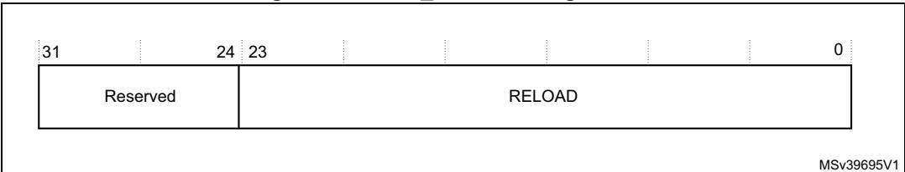
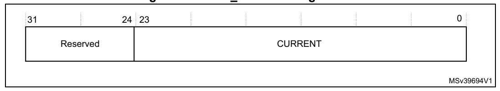
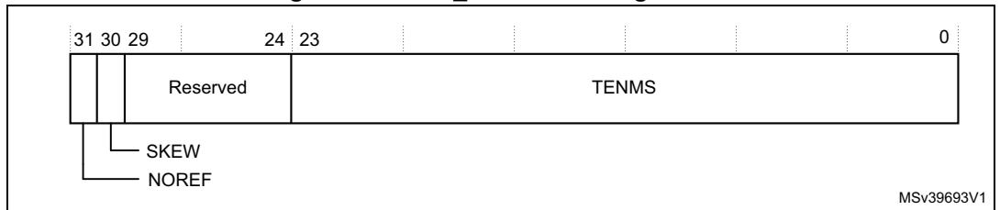

# **4.3.13 BusFault address register**

The BFAR contains the address of the location that generated a BusFault. See the register summary in *Table 50 on page 192* for its attributes. The bit assignments are:

**Table 69. BFAR bit assignments** 

| Bits   | Name    | Function                                                                                                                    |
|--------|---------|-----------------------------------------------------------------------------------------------------------------------------|
| [31:0] | ADDRESS | When the BFARVALID bit of the BFSR is set to 1, this field holds the address of the location that generated the BusFault |

When an unaligned access faults the address in the BFAR is the one requested by the instruction, even if it is not the address of the fault.

Flags in the BFSR indicate the cause of the fault, and whether the value in the BFAR is valid. See *Table 50 on page 192*.

#### **4.3.14 System control block design hints and tips**

Ensure software uses aligned accesses of the correct size to access the system control block registers:

- Except for the CFSR and SHPR1-SHPR3, it must use aligned word accesses.
- For the CFSR and SHPR1-SHPR3 it can use byte or aligned halfword or word accesses.

The processor does not support unaligned accesses to system control block registers.

In a fault handler, to determine the true faulting address:

- 1. Read and save the MMFAR or BFAR value.
- 2. Read the MMARVALID bit in the MMFSR, or the BFARVALID bit in the BFSR. The MMFAR or BFAR address is valid only if this bit is 1.

The software must follow this sequence because another higher priority exception might change the MMFAR or BFAR value. For example, if a higher priority handler preempts the current fault handler, the other fault might change the MMFAR or BFAR value.

In addition, the CMSIS provides a number of functions for system control, including:

**Table 70. CMSIS function for system control** 

| CMSIS system control function | Description      |
|-------------------------------|------------------|
| void NVIC_SystemReset (void)  | Reset the system |

# **4.4 System timer, SysTick**

The processor has a 24-bit system timer, SysTick, that counts down from the reload value to zero, reloads, that is wraps to, the value in the SYST\_RVR register on the next clock edge, then counts down on subsequent clocks.

When the processor is halted for debugging the counter does not decrement.

The system timer registers are:

| Address    | Name       | Type | Required privilege | Reset value | Description                            |
|------------|------------|------|-----------------------|----------------|----------------------------------------|
| 0xE000E010 | SYST_CSR   | RW   | Privileged            | 0x00000004     | SysTick control and status register |
| 0xE000E014 | SYST_RVR   | RW   | Privileged            | UNKNOWN        | SysTick reload value register          |
| 0xE000E018 | SYST_CVR   | RW   | Privileged            | UNKNOWN        | SysTick current value register         |
| 0xE000E01C | SYST_CALIB | RO   | Privileged            | 0xC0000000     | SysTick calibration value register  |

**Table 71. System timer registers summary** 

#### **4.4.1 SysTick control and status register**

The SysTick SYST\_CSR register enables the SysTick features. See the register summary in *[Table](#page-1-0) 71* for its attributes. The bit assignments are:

MSv39696V1 Reserved 0 31 17 16 15 3 2 1 0 Reserved 0 0 COUNTFLAG CLKSOURCE TICKINT ENABLE

**Figure 40. SysTick SYST\_CSR bit assignments**

**Table 72. SysTick SYST\_CSR bit assignments** 

| Bits    | Name      | Function                                                                                                                                                                                                                                                               |
|---------|-----------|------------------------------------------------------------------------------------------------------------------------------------------------------------------------------------------------------------------------------------------------------------------------|
| [31:17] | -         | Reserved.                                                                                                                                                                                                                                                              |
| [16]    | COUNTFLAG | Returns 1 if timer counted to 0 since last time this was read.                                                                                                                                                                                                         |
| [15:3]  | -         | Reserved.                                                                                                                                                                                                                                                              |
| [2]     | CLKSOURCE | Indicates the clock source: – 0: External clock. – 1: Processor clock.                                                                                                                                                                                           |
| [1]     | TICKINT   | Enables SysTick exception request: 0: Counting down to zero does not assert the SysTick exception request. 1: Counting down to zero asserts the SysTick exception request. Software can use COUNTFLAG to determine if SysTick has ever counted to zero. |
| [0]     | ENABLE    | Enables the counter: 0: Counter disabled. 1: Counter enabled.                                                                                                                                                                                                    |

When ENABLE is set to 1, the counter loads the RELOAD value from the SYST\_RVR register and then counts down. On reaching 0, it sets the COUNTFLAG to 1 and optionally asserts the SysTick depending on the value of TICKINT. It then loads the RELOAD value again, and begins counting.

#### **4.4.2 SysTick reload value register**

The SYST\_RVR register specifies the start value to load into the SYST\_CVR register. See the register summary in *Table [71 on page](#page-1-0) 213* for its attributes. The bit assignments are:

**Figure 41. SYST\_RVR bit assignments**

**Table 73. SYST\_RVR bit assignments** 

| Bits    | Name   | Function                                                                                                                         |
|---------|--------|----------------------------------------------------------------------------------------------------------------------------------|
| [31:24] | -      | Reserved.                                                                                                                        |
| [23:0]  | RELOAD | Value to load into the SYST_CVR register when the counter is enabled and when it reaches 0, see Calculating the RELOAD value. |

#### **Calculating the RELOAD value**

The RELOAD value can be any value in the range 0x00000001-0x00FFFFFF. A start value of 0 is possible, but has no effect because the SysTick exception request and COUNTFLAG are activated when counting from 1 to 0.

The RELOAD value is calculated according to its use. For example, to generate a multi-shot timer with a period of N processor clock cycles, use a RELOAD value of N-1. If the SysTick interrupt is required every 100 clock pulses, set RELOAD to 99.

### **4.4.3 SysTick current value register**

The SYST\_CVR register contains the current value of the SysTick counter. See the register summary in *Table [71 on page](#page-1-0) 213* for its attributes. The bit assignments are

**Figure 42. SYST\_CVR bit assignments:**

214/254 PM0253 Rev 5

Table 74. SYST\_CVR bit assignments

| Bits    | Name    | Function                                                                                                                                             |
|---------|---------|------------------------------------------------------------------------------------------------------------------------------------------------------|
| [31:24] | -       | Reserved.                                                                                                                                            |
| [23:0]  | CURRENT | Reads return the current value of the SysTick counter.  A write of any value clears the field to 0, and also clears the SYST_CSR COUNTFLAG bit to 0. |

## 4.4.4 SysTick calibration value register

The SYST\_CALIB register indicates the SysTick calibration properties. See the register summary in *Table 71 on page 213* for its attributes. The bit assignments are:

Figure 43. SYST\_CALIB bit assignments

Table 75. SYST\_CALIB bit assignments

| Bits    | Name  | Function                                                                                                                                                                                                                                                |  |
|---------|-------|---------------------------------------------------------------------------------------------------------------------------------------------------------------------------------------------------------------------------------------------------------|--|
| [31]    | NOREF | Indicates whether the device provides a reference clock to the processor:  0: Reference clock provided.  1: No reference clock provided.  If the device does not provide a reference clock, the SYST_CSR.CLKSOURCE bit reads-as-one and ignores writes. |  |
| [30]    | SKEW  | Indicates whether the TENMS value is exact:  0: TENMS value is exact.  1: TENMS value is inexact, or not given.  An inexact TENMS value can affect the suitability of SysTick as a software real time clock.                                            |  |
| [29:24] | -     | Reserved.                                                                                                                                                                                                                                               |  |
| [23:0]  | TENMS | Reload value for 10ms (100Hz) timing, subject to system clock skew errors. If the value reads as zero, the calibration value is not known.                                                                                                              |  |

If the calibration information is not known, calculate the calibration value required from the frequency of the processor clock or external clock.

577

PM0253 Rev 5 215/254

#### **4.4.5 SysTick design hints and tips**

The SysTick counter runs on the processor clock. If this clock signal is stopped for Lowpower mode, the SysTick counter stops.

Ensure the software uses aligned word accesses to access the SysTick registers.

The SysTick counter reload and current value are undefined at reset, the correct initialization sequence for the SysTick counter is:

- 1. Program reload value.
- 2. Clear current value.
- 3. Program Control and Status register.

In addition, the CMSIS provides a number of functions for SysTick control, including:

**Table 76. CMSIS functions for SysTick control** 

| CMSIS SysTick control function | Description                                            |
|--------------------------------|--------------------------------------------------------|
| uint32_t                       | Creates a periodic SysTick interrupt using the SysTick |
| SysTick_Config(uint32_t ticks) | timer, with a interval defined by the ticks parameter. |

