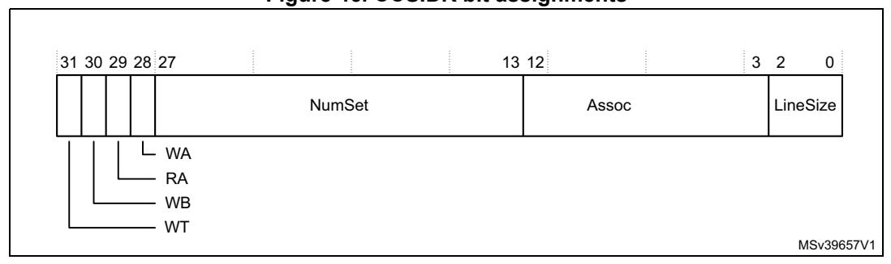

## **4.5 Processor features**

The processor features registers provide a software with cache configuration information. The identification space registers are:

| Address    | Name   | Type | Required privilege | Reset value | Description                                  |
|------------|--------|------|-----------------------|----------------|----------------------------------------------|
| 0xE000ED78 | CLIDR  | RO   | Privileged            | 0x09000003     | Cache level ID register                      |
| 0xE000ED7C | CTR    | RO   | Privileged            | 0x8303C003     | Cache type register on page 218              |
| 0xE000ED80 | CCSIDR | RO   | Privileged            | Unknown        | Cache size ID register on page 219        |
| 0xE000ED84 | CSSELR | RW   | Privileged            | Unknown        | Cache size selection register on page 220 |

**Table 77. Identification space summary** 

All the registers are only accessible by privileged loads and stores. Unprivileged accesses to these registers result in a BusFault.

### **4.5.1 Cache level ID register**

The CLIDR identifies the type of cache, or caches, implemented at each level, and the level of coherency and unification. See the register summary in *Table [77 on page](#page-0-1) 217* for its attributes. The bit assignments are:

MSv39659V1 LoUIS CL 7 CL 6 CL 5 CL 4 CL 3 CL 2 CL 1 Reserved 31 30 29 27 26 24 23 21 20 18 17 15 14 12 11 10 8 6 5 3 2 0 LoU LoC

**Figure 44. CLIDR bit assignments**

**Table 78. CLIDR bit assignments** 

| Bits    | Name  | Function                                                                                                                                         |
|---------|-------|--------------------------------------------------------------------------------------------------------------------------------------------------|
| [31:30] | -     | SBZ.                                                                                                                                             |
| [29:27] | LoU   | Level of Unification. 0b001: Level 2, if either cache is implemented. 0b000:Level 1, if neither instruction nor data cache is implemented. |
| [26:24] | LoC   | Level of Coherency. 0b001: Level 2, if either cache is implemented. 0b000: Level 1, if neither instruction nor data cache is implemented.  |
| [23:21] | LoUIS | RAZ.                                                                                                                                             |
| [20:18] | CL 7  | 0b000: No cache at CL 7.                                                                                                                         |
| [17:15] | CL 6  | 0b000: No cache at CL 6.                                                                                                                         |

PM0253 Rev 5 217/254

|         |      | ······································                                              |
|---------|------|-------------------------------------------------------------------------------------|
| Bits    | Name | Function                                                                            |
| [14:12] | CL 5 | 0b000: No cache at CL 5.                                                            |
| [11:9]  | CL 4 | 0b000: No cache at CL 4.                                                            |
| [8:6]   | CL 3 | 0b000: No cache at CL 3.                                                            |
| [5:3]   | CL 2 | 0b000: No cache at CL 2.                                                            |
| [2]     | CL 1 | RAZ: Indicates no unified cache at CL1.                                             |
| [1]     | CL 1 | 1: Data cache is implemented. 0: No data cache is implemented.                      |
| [0]     | CL 1 | 1: An instruction cache is implemented.     0: No instruction cache is implemented. |

Table 78. CLIDR bit assignments (continued)

# 4.5.2 Cache type register

The CTR provides information about the cache architecture. See the register summary in *Table 77 on page 217* for its attributes. The bit assignments are:

31 29 28 27 24 23 20 19 16 15 14 13 4 3 0

1 0 0 0 CWG ERG DMinLine 1 1 0 0 0 0 0 0 0 0 0 0 IminLine

Format

MSv39663V1

Figure 45. CTR bit assignments

Table 79. CTR bit assignments

| Bits    | Name     | Description                                                                                                                                                                                                                                                                                                             |
|---------|----------|-------------------------------------------------------------------------------------------------------------------------------------------------------------------------------------------------------------------------------------------------------------------------------------------------------------------------|
| [31:29] | Format   | Register format. 0b100: Armv7 register format.                                                                                                                                                                                                                                                                          |
| [28]    | -        | Reserved, RAZ.                                                                                                                                                                                                                                                                                                          |
| [27:24] | CWG      | Cache Writeback Granule. 0b0011: 8 word granularity for the Cortex ® -M7 processor.                                                                                                                                                                                                                          |
| [23:20] | ERG      | Exclusives Reservation Granule.  0b0000: The local monitor within the processor does not hold any physical address. It treats any STREX instruction access as matching the address of the previous LDREX instruction. This means that the implemented exclusive reservation granule is the entire memory address range. |
| [19:16] | DMinLine | Smallest cache line of all the data and unified caches under the core control. 0b0011: 8 words for the Cortex ® -M7 processor.                                                                                                                                                                               |
| [15:14] | -        | All bits RAO.                                                                                                                                                                                                                                                                                                           |

**Table 79. CTR bit assignments (continued)**

| Bits   | Name     | Description                                                                                                                               |
|--------|----------|-------------------------------------------------------------------------------------------------------------------------------------------|
| [13:4] | -        | Reserved, RAZ.                                                                                                                            |
| [3:0]  | IminLine | Smallest cache line of all the instruction caches under the control of the processor. 0b0011: 8 words for the Cortex®-M7 processor. |

#### **4.5.3 Cache size ID register**

The CCSIDR identifies the configuration of the cache currently selected by the CSSELR. If no instruction or data cache is configured, the corresponding CCSIDR is RAZ. See the register summary in *Table [77 on page](#page-0-1) 217* for its attributes. The bit assignments are:

**Figure 46. CCSIDR bit assignments**

**Table 80. CCSIDR bit assignments** 

| Bits    | Name          | Function(1)                                                                                 |
|---------|---------------|---------------------------------------------------------------------------------------------|
| [31]    | WT            | Indicates support available for Write-Through: 1: Write-Through support available.       |
| [30]    | WB            | Indicates support available for Write-Back: 1: Write-Back support available.             |
| [29]    | RA            | Indicates support available for read allocation: 1: Read allocation support available.   |
| [28]    | WA            | Indicates support available for write allocation: 1: Write allocation support available. |
| [27:13] | NumSets       | Indicates the number of sets as: (number of sets) - 1.                                   |
| [12:3]  | Associativity | Indicates the number of ways as: (number of ways) - 1.                                   |
| [2:0]   | LineSize      | Indicates the number of words in each cache line.                                           |

1. See *[Table 81 on page 220](#page-3-1)* for valid bit field encodings.

The LineSize field is encoded as 2 less than log(2) of the number of words in the cache line. For example, a value of 0x0 indicates there are four words in a cache line, that is the minimum size for the cache. A value of 0x1 indicates there are eight words in a cache line.

PM0253 Rev 5 219/254

*[Table](#page-3-1) 81* shows the individual bit field and complete register encodings for the CCSIDR. Use this to determine the cache size for the L1 data or instruction cache selected by the *Cache Size Selection Register* (CSSELR). See *[Cache size selection register](#page-3-0)*.

| CSSELR | Cache                | Size      | Complete register encoding | Register bit field encoding |    |    |    |         |                       |          |
|--------|----------------------|-----------|----------------------------------|-----------------------------|----|----|----|---------|-----------------------|----------|
|        |                      |           |                                  | WT                          | WB | RA | WA | NumSets | Assoc iativit y | LineSize |
| 0x0    | Data cache        | 4 Kbytes  | 0xF003E019                       | 1                           | 1  | 1  | 1  | 0x001F  | 0x3                   | 0x1      |
|        |                      | 8 Kbytes  | 0xF007E019                       |                             |    |    |    | 0x003F  |                       |          |
|        |                      | 16 Kbytes | 0xF00FE019                       |                             |    |    |    | 0x007F  |                       |          |
|        |                      | 32 Kbytes | 0xF01FE019                       |                             |    |    |    | 0x00FF  |                       |          |
|        |                      | 64 Kbytes | 0xF03FE019                       |                             |    |    |    | 0x01FF  |                       |          |
| 0x1    | Instruction cache | 4 Kbytes  | 0xF007E009                       | 1                           | 1  | 1  | 1  | 0x003F  | 0x1                   | 0x1      |
|        |                      | 8 Kbytes  | 0xF00FE009                       |                             |    |    |    | 0x007F  |                       |          |
|        |                      | 16 Kbytes | 0xF01FE009                       |                             |    |    |    | 0x00FF  |                       |          |
|        |                      | 32 Kbytes | 0xF03FE009                       |                             |    |    |    | 0x01FF  |                       |          |
|        |                      | 64 Kbytes | 0xF07FE009                       |                             |    |    |    | 0x03FF  |                       |          |

**Table 81. CCSIDR encodings** 

### **4.5.4 Cache size selection register**

The CSSELR selects the cache whose configuration is currently visible in the CCSIDR. See the register summary in *Table [77 on page](#page-0-1) 217* for its attributes The bit assignments are:

MSv39662V1 Reserved Level 31 3 10 InD 4

**Figure 47. CSSELR bit assignments**

**Table 82. CSSELR bit assignments** 

| Bit    | Name  | Description                                                                                                   |  |  |
|--------|-------|---------------------------------------------------------------------------------------------------------------|--|--|
| [31:4] | -     | RESERVED                                                                                                      |  |  |
| [3:1]  | Level | Identifies the cache level selected. 0b000: Level 1 cache. This field is read only, writes are ignored. |  |  |
| [0]    | InD   | Enables selection of instruction or data cache: 0: Data cache. 1: Instruction cache.                    |  |  |

