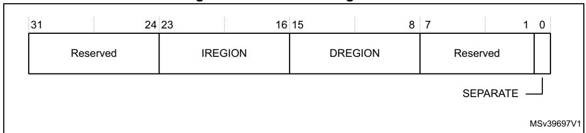
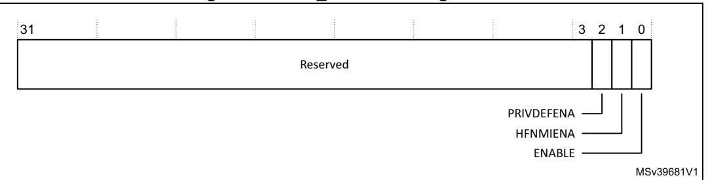
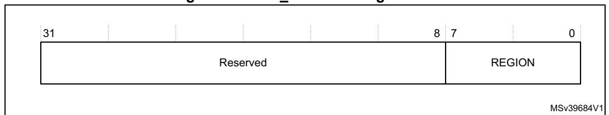
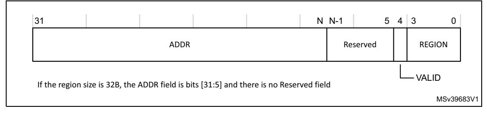
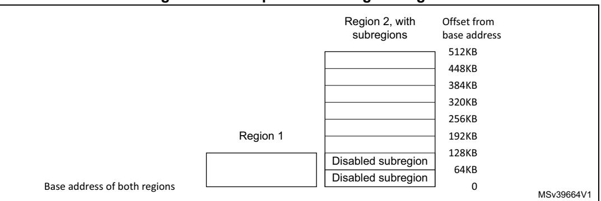

# **4.6 Memory protection unit**

The *Memory Protection Unit* (MPU) divides the memory map into a number of regions, and defines the location, size, access permissions, and memory attributes of each region. It supports:

- Independent attribute settings for each region.
- Overlapping regions.
- Export of memory attributes to the system.

The memory attributes affect the behavior of memory accesses to the region. The Cortex®- M7 MPU defines:

- 8 or 16 separate memory regions, 0-7 or 0-15.
- A background region.

When memory regions overlap, a memory access is affected by the attributes of the region with the highest number. For example, the attributes for region 7 take precedence over the attributes of any region that overlaps region 7.

The background region has the same memory access attributes as the default memory map, but is accessible from privileged software only.

The Cortex®-M7 MPU memory map is unified. This means instruction accesses and data accesses have same region settings.

If a program accesses a memory location that is prohibited by the MPU, the processor generates a MemManage fault. This causes a fault exception, and might cause termination of the process in an OS environment. In an OS environment, the kernel can update the MPU region setting dynamically based on the process to be executed. Typically, an embedded OS uses the MPU for memory protection.

The configuration of MPU regions is based on memory types, see *Memory regions, types and attributes on page 33*.

*[Table](#page-0-0) 83* shows the possible MPU region attributes. These include Shareability and cache behavior attributes that are generally only relevant when the processor is configured with caches.

**Table 83. Memory attributes summary** 

<span id="page-0-0"></span>

| Memory<br>type      | Shareability | Other attributes | Description                                                                                                                  |
|---------------------|--------------|------------------|------------------------------------------------------------------------------------------------------------------------------|
| Strongly<br>ordered | -            | -                | All accesses to Strongly-ordered memory occur<br>in program order. All Strongly-ordered regions<br>are assumed to be shared. |
| Device              | Shared       | -                | Memory-mapped peripherals that several<br>processors share.                                                                  |
| -                   | Non-shared   | -                | Memory-mapped peripherals that only a single<br>processor uses.                                                              |


PM0253 Rev 5 221/254

**Table 83. Memory attributes summary (continued)**

| Memory<br>type | Shareability | Other attributes                                                 | Description                                                 |
|----------------|--------------|------------------------------------------------------------------|-------------------------------------------------------------|
| Normal         | Shared       | Non-cacheable Write<br>through Cacheable<br>Write-back Cacheable | Normal memory that is shared between several<br>processors. |
| -              | Non-shared   | Non-cacheable Write<br>through Cacheable<br>Write-back Cacheable | Normal memory that only a single processor<br>uses.         |

Use the MPU registers to define the MPU regions and their attributes. The MPU registers are:

**Table 84. MPU registers summary** 

<span id="page-1-1"></span>

| Address    | Name        | Type | Required<br>privilege | Reset<br>value | Description                                                              |
|------------|-------------|------|-----------------------|----------------|--------------------------------------------------------------------------|
| 0xE000ED90 | MPU_TYPE    | RO   | Privileged            | 0x00000800     | MPU type register on page 223                                            |
| 0xE000ED94 | MPU_CTRL    | RW   | Privileged            | 0x00000000     | MPU control register on page 223                                         |
| 0xE000ED98 | MPU_RNR     | RW   | Privileged            | Unknown        | MPU region number register on page 225                                   |
| 0xE000ED9C | MPU_RBAR    | RW   | Privileged            | Unknown        | MPU region base address register on<br>page 225                          |
| 0xE000EDA0 | MPU_RASR    | RW   | Privileged            | -(1)           | MPU region attribute and size register on<br>page 226                    |
| 0xE000EDA4 | MPU_RBAR_A1 | RW   | Privileged            | Unknown        | Alias of RBAR, see MPU region base<br>address register on page 225       |
| 0xE000EDA8 | MPU_RASR_A1 | RW   | Privileged            | -(1)           | Alias of RASR, see MPU region attribute<br>and size register on page 226 |
| 0xE000EDAC | MPU_RBAR_A2 | RW   | Privileged            | Unknown        | Alias of RBAR, see MPU region base<br>address register on page 225       |
| 0xE000EDB0 | MPU_RASR_A2 | RW   | Privileged            | -(1)           | Alias of RASR, see MPU region attribute<br>and size register on page 226 |
| 0xE000EDB4 | MPU_RBAR_A3 | RW   | Privileged            | Unknown        | Alias of RBAR, see MPU region base<br>address register on page 225       |
| 0xE000EDB8 | MPU_RASR_A3 | RW   | Privileged            | -(1)           | Alias of RASR, see MPU region attribute<br>and size register on page 226 |

<span id="page-1-0"></span><sup>1.</sup> Unknown apart from the ENABLE field, which is reset to 0.


# <span id="page-2-0"></span>4.6.1 MPU type register

The MPU\_TYPE register indicates whether the MPU is present, and if so, how many regions it supports. If the MPU is not present the MPU\_TYPE register is RAZ. See the register summary in *Table 84* for its attributes. The bit assignments are:

Figure 48. TYPE bit assignments



Table 85. TYPE bit assignments

| Bits    | Name     | Function                                                                                                                                              |
|---------|----------|-------------------------------------------------------------------------------------------------------------------------------------------------------|
| [31:24] | -        | Reserved.                                                                                                                                             |
| [23:16] | IREGION  | Indicates the number of supported MPU instruction regions. Always contains 0x00. The MPU memory map is unified and is described by the DREGION field. |
| [15:8]  | DREGION  | Indicates the number of supported MPU data regions: 0x08: 8 MPU regions. 0x10: 16 MPU regions.                                                        |
| [7:1]   | -        | Reserved.                                                                                                                                             |
| [0]     | SEPARATE | Indicates support for unified or separate instruction and date memory maps: 0: Unified.                                                               |

# <span id="page-2-1"></span>4.6.2 MPU control register

The MPU\_CTRL register:

- Enables the MPU.
- Enables the default memory map background region.
- Enables use of the MPU when in the hard fault, *Non Maskable Interrupt* (NMI), and FAULTMASK escalated handlers.

See the register summary in *Table 84 on page 222* for the MPU\_CTRL attributes. The bit assignments are:

Figure 49. MPU\_CTRL bit assignments



577

223/254

| Bits   | Name       | Function                                                                                                                                                                                                                                                                                                                                                                                                                                                                                                                                                                     |  |
|--------|------------|------------------------------------------------------------------------------------------------------------------------------------------------------------------------------------------------------------------------------------------------------------------------------------------------------------------------------------------------------------------------------------------------------------------------------------------------------------------------------------------------------------------------------------------------------------------------------|--|
| [31:3] | -          | Reserved.                                                                                                                                                                                                                                                                                                                                                                                                                                                                                                                                                                    |  |
| [2]    | PRIVDEFENA | Enables privileged software access to the default memory map:<br>0: If the MPU is enabled, disables use of the default memory map. Any<br>memory access to a location not covered by any enabled region causes a<br>fault.<br>1: If the MPU is enabled, enables use of the default memory map as a<br>background region for privileged software accesses.<br>When enabled, the background region acts as if it is region number -1. Any<br>region that is defined and enabled has priority over this default map.<br>If the MPU is disabled, the processor ignores this bit. |  |
| [1]    | HFNMIENA   | Enables the operation of MPU during hard fault, NMI, and FAULTMASK<br>handlers.<br>When the MPU is enabled:<br>0: MPU is disabled during hard fault, NMI, and FAULTMASK handlers,<br>regardless of the value of the ENABLE bit.<br>1: The MPU is enabled during hard fault, NMI, and FAULTMASK handlers.<br>When the MPU is disabled, if this bit is set to 1 the behavior is<br>Unpredictable.                                                                                                                                                                              |  |
| [0]    | ENABLE     | Enables the MPU:<br>0: MPU disabled.<br>1: MPU enabled.                                                                                                                                                                                                                                                                                                                                                                                                                                                                                                                      |  |

**Table 86. MPU\_CTRL bit assignments** 

#### When ENABLE and PRIVDEFENA are both set to 1:

- For privileged accesses, the *default memory map* is as described in *Cortex®-M7 configurations on page 30*. Any access by privileged software that does not address an enabled memory region behaves as defined by the default memory map.
- Any access by unprivileged software that does not address an enabled memory region causes a MemManage fault.

XN and Strongly-ordered rules always apply to the System Control Space regardless of the value of the ENABLE bit.

When the ENABLE bit is set to 1, at least one region of the memory map must be enabled for the system to function unless the PRIVDEFENA bit is set to 1. If the PRIVDEFENA bit is set to 1 and no regions are enabled, then only privileged software can operate.

When the ENABLE bit is set to 0, the system uses the default memory map. This has the same memory attributes as if the MPU is not implemented, see *Table 77 on page 217*. The default memory map applies to accesses from both privileged and unprivileged software.

When the MPU is enabled, accesses to the System Control Space and vector table are always permitted. Other areas are accessible based on regions and whether PRIVDEFENA is set to 1.

Unless HFNMIENA is set to 1, the MPU is not enabled when the processor is executing the handler for an exception with priority –1 or –2. These priorities are only possible when handling a hard fault or NMI exception, or when FAULTMASK is enabled. Setting the HFNMIENA bit to 1 enables the MPU when operating with these two priorities.

224/254 PM0253 Rev 5


## <span id="page-4-1"></span>**4.6.3 MPU region number register**

The MPU\_RNR selects which memory region is referenced by the MPU\_RBAR and MPU\_RASR registers. See the register summary in *Table 77 on page 217* for its attributes. The bit assignments are:

**Figure 50. MPU\_RNR bit assignments**



**Table 87. MPU\_RNR bit assignments** 

| Bits   | Name   | Function                                                                                           |
|--------|--------|----------------------------------------------------------------------------------------------------|
| [31:8] | -      | Reserved.                                                                                          |
| [7:0]  | REGION | Indicates the MPU region referenced by the MPU_RBAR and MPU_RASR<br>registers.                     |
|        |        | The MPU supports 8 or 16 memory regions, so the permitted values of this field<br>are 0-7 or 0-15. |

Normally, the user writes the required region number to this register before accessing the MPU\_RBAR or MPU\_RASR. However the region number can be changed by writing to the MPU RBAR with the VALID bit set to 1, see *[MPU region base address register](#page-4-0)*. This write updates the value of the REGION field.

#### <span id="page-4-0"></span>**4.6.4 MPU region base address register**

The MPU\_RBAR defines the base address of the MPU region selected by the MPU\_RNR, and can update the value of the MPU\_RNR. See the register summary in *Table [84 on](#page-1-1)  [page](#page-1-1) 222* for its attributes.

Write MPU\_RBAR with the VALID bit set to 1 to change the current region number and update the MPU\_RNR. See the register summary in *Table [84 on page](#page-1-1) 222* for its attributes. The bit assignments are

**Figure 51. MPU\_RBAR bit assignments:**



PM0253 Rev 5 225/254

| Bits      | Name   | Function                                                                                                                                                                                                                                                                                                                                                                                       |  |  |  |
|-----------|--------|------------------------------------------------------------------------------------------------------------------------------------------------------------------------------------------------------------------------------------------------------------------------------------------------------------------------------------------------------------------------------------------------|--|--|--|
| [31:N]    | ADDR   | Region base address field. The value of N depends on the region size. For<br>more information see The ADDR field.                                                                                                                                                                                                                                                                              |  |  |  |
| [(N-1):5] | -      | Reserved.                                                                                                                                                                                                                                                                                                                                                                                      |  |  |  |
| [4]       | VALID  | MPU Region Number valid bit:<br>Write:<br>0: MPU_RNR not changed, and the processor:<br>Updates the base address for the region specified in the MPU_RNR<br>Ignores the value of the REGION field<br>1: The processor:<br>Updates the value of the MPU_RNR to the value of the REGION field<br>Updates the base address for the region specified in the REGION field.<br>Always reads as zero. |  |  |  |
| [3:0]     | REGION | MPU region field:<br>For the behavior on writes, see the description of the VALID field.<br>On reads, returns the current region number, as specified by the RNR.                                                                                                                                                                                                                              |  |  |  |

**Table 88. MPU\_RBAR bit assignments** 

## <span id="page-5-1"></span>**The ADDR field**

The ADDR field is bits[31:N] of the MPU\_RBAR. The region size, as specified by the SIZE field in the MPU\_RASR, defines the value of N:

N = Log2(Region size in bytes),

If the region size is configured to 4 Gbytes, in the MPU\_RASR, there is no valid ADDR field. In this case, the region occupies the complete memory map, and the base address is 0x00000000.

The base address is aligned to the size of the region. For example, a 64KB region must be aligned on a multiple of 64KB, for example, at 0x00010000 or 0x00020000.

# <span id="page-5-0"></span>**4.6.5 MPU region attribute and size register**

The MPU\_RASR defines the region size and memory attributes of the MPU region specified by the MPU\_RNR, and enables that region and any subregions. See the register summary in *Table [84 on page](#page-1-1) 222* for its attributes.

MPU\_RASR is accessible using word accesses:

- The most significant halfword holds the region attributes.
- The least significant halfword holds the region size and the region and subregion enable bits.

The bit assignments are:


MSv39682V1 XN Reserved 31 29 28 27 26 24 23 22 21 19 18 17 16 15 8 7 6 5 1 0 AP TEX S C B SRD SIZE ENABLE Reserved Reserved Reserved

**Figure 52. MPU\_RASR bit assignments**

**Table 89. MPU\_RASR bit assignments** 

| Bits            | Name      | Function                                                                                                                                                                                                                                                                                                                                       |
|-----------------|-----------|------------------------------------------------------------------------------------------------------------------------------------------------------------------------------------------------------------------------------------------------------------------------------------------------------------------------------------------------|
| [31:29]         | -         | Reserved.                                                                                                                                                                                                                                                                                                                                      |
| [28]            | XN        | Instruction access disable bit:<br>0: Instruction fetches enabled.<br>1: Instruction fetches disabled.                                                                                                                                                                                                                                         |
| [27]            | -         | Reserved.                                                                                                                                                                                                                                                                                                                                      |
| [26:24]         | AP        | Access permission field, see Table 93 on page 229.                                                                                                                                                                                                                                                                                             |
| [23:22]         | -         | Reserved.                                                                                                                                                                                                                                                                                                                                      |
| [21:19, 17, 16] | TEX, C, B | Memory access attributes, see Table 91 on page 228.                                                                                                                                                                                                                                                                                            |
| [18]            | S         | Shareable bit, see Table 91 on page 228.                                                                                                                                                                                                                                                                                                       |
| [15:8]          | SRD       | Subregion disable bits. For each bit in this field:<br>0: Corresponding sub-region is enabled.<br>1: Corresponding sub-region is disabled.<br>See Subregions on page 231 for more information.<br>Region sizes of 128 bytes and less do not support subregions. When<br>writing the attributes for such a region, write the SRD field as 0x00. |
| [7:6]           | -         | Reserved.                                                                                                                                                                                                                                                                                                                                      |
| [5:1]           | SIZE      | Specifies the size of the MPU protection region. The minimum<br>permitted value is 4 (0b00100), see SIZE field values for more<br>information.                                                                                                                                                                                                 |
| [0]             | ENABLE    | Region enable bit.                                                                                                                                                                                                                                                                                                                             |

For information about access permission, see *[MPU access permission attributes on page](#page-7-2) 228*.

#### <span id="page-6-0"></span>**SIZE field values**

The SIZE field defines the size of the MPU memory region specified by the RNR. as follows: (Region size in bytes) = 2(SIZE+1)

The smallest permitted region size is 32B, corresponding to a SIZE value of 4. *[Table](#page-7-1) 90* gives example SIZE values, with the corresponding region size and value of N in the MPU\_RBAR.


PM0253 Rev 5 227/254

<span id="page-7-1"></span>

| SIZE value   | SIZE value Region size |    | Note                   |
|--------------|------------------------|----|------------------------|
| 0b00100 (4)  | 32 Bytes               | 5  | Minimum permitted size |
| 0b01001 (9)  | 1 Kbyte                | 10 | -                      |
| 0b10011 (19) | 1 Mbyte                | 20 | -                      |
| 0b11101 (29) | 1 Gbyte                | 30 | -                      |
| 0b11111 (31) | 4 Gbytes               | 32 | Maximum possible size  |

Table 90. Example SIZE field values

## <span id="page-7-2"></span>4.6.6 MPU access permission attributes

This section describes the MPU access permission attributes. The access permission bits, TEX, C, B, S, AP, and XN, of the RASR, control access to the corresponding memory region. If an access is made to an area of memory without the required permissions, then the MPU generates a permission fault. *Table 91* shows encodings for the TEX, C, B, and S access permission bits.

<span id="page-7-0"></span>TEX С S В Memory type Shareability Other attributes Strongly $x^{(1)}$ Shareable 0 ordered 0  $x^{(1)}$ Shareable 1 Device Not 0 Outer and inner write-through. No write shareable 0b000 0 Normal allocate 1 Shareable 1 Not 0 Outer and inner write-back. No write shareable Normal 1 allocate 1 Shareable Not 0 shareable Normal Outer and inner noncacheable. 0 0 1 Shareable  $x^{\overline{(1)}}$ 1 Reserved encoding 0b001 Implementation defined x<sup>(1)</sup> 0 attributes. Not 1 0 Outer and inner write-back. Write and shareable Normal 1 read allocate. 1 Shareable Not x<sup>(1)</sup> Device 0 Nonshared Device. shareable 0 0b010  $x^{(1)}$ Reserved encoding x<sup>(1)</sup>  $x^{(1)}$ Reserved encoding

Table 91. TEX, C, B, and S encoding

228/254 PM0253 Rev 5

<sup>1.</sup> In the MPU\_RBAR, see MPU region base address register on page 225.

|  |  |  | Table 91. TEX, C, B, and S encoding (continued) |  |
|--|--|--|-------------------------------------------------|--|
|  |  |  |                                                 |  |

| TEX   | C | B | S | Memory type | Shareability     | Other attributes                                                        |
|-------|---|---|---|-------------|------------------|-------------------------------------------------------------------------|
| 0b1BB | A | A | 0 | Normal      | Not<br>shareable | Cached memory, BB = outer policy,<br>AA = inner policy. See Table 92 on |
|       |   |   | 1 |             | Shareable        | page 229 for the encoding of the AA and<br>BB bits.                     |

<span id="page-8-1"></span><sup>1.</sup> The MPU ignores the value of this bit.

*[Table](#page-8-2) 92* shows the cache policy for memory attribute encodings with a TEX value is in the range 4-7.

**Table 92. Cache policy for memory attribute encoding** 

<span id="page-8-2"></span>

| Encoding, AA or BB | Corresponding cache policy          |
|--------------------|-------------------------------------|
| 00                 | Non-cacheable                       |
| 01                 | Write back, write and read allocate |
| 10                 | Write through, no write allocate    |
| 11                 | Write back, no write allocate       |

*[Table](#page-8-0) 93* shows the AP encodings that define the access permissions for privileged and unprivileged software.

**Table 93. AP encoding** 

<span id="page-8-0"></span>

| AP[2:0] | Privileged<br>permissions | Unprivileged<br>permissions | Description                                                    |
|---------|---------------------------|-----------------------------|----------------------------------------------------------------|
| 000     | No access                 | No access                   | All accesses generate a permission fault                       |
| 001     | RW                        | No access                   | Access from privileged software only                           |
| 010     | RW                        | RO                          | Writes by unprivileged software generate a permission<br>fault |
| 011     | RW                        | RW                          | Full access                                                    |
| 100     | Unpredictable             | Unpredictable               | Reserved                                                       |
| 101     | RO                        | No access                   | Reads by privileged software only                              |
| 110     | RO                        | RO                          | Read only, by privileged or unprivileged software              |
| 111     | RO                        | RO                          | Read only, by privileged or unprivileged software              |


PM0253 Rev 5 229/254

# **4.6.7 MPU mismatch**

When an access violates the MPU permissions, the processor generates a MemManage fault, see *Exceptions and interrupts on page 28*. The MMFSR indicates the cause of the fault. See *MemManage fault status register on page 206* for more information.

#### **4.6.8 Updating an MPU region**

To update the attributes for an MPU region, update the MPU\_RNR, MPU\_RBAR and MPU\_RASR registers. It is possible to program each register separately, or use a multipleword write to program all of these registers. The MPU\_RBAR and MPU\_RASR aliases can be used to program up to four regions simultaneously using an STM instruction.

#### **Updating an MPU region using separate words**

Simple code to configure one region:

```
; R1 = region number
; R2 = size/enable
; R3 = attributes
; R4 = address
LDR R0,=MPU_RNR ; 0xE000ED98, MPU region number register
STR R1, [R0, #0x0] ; Region Number
STR R4, [R0, #0x4] ; Region Base Address
STRH R2, [R0, #0x8] ; Region Size and Enable
STRH R3, [R0, #0xA] ; Region Attribute
```

Disable a region before writing new region settings to the MPU if the region being changed, has been previously enabled. For example:

```
; R1 = region number
; R2 = size/enable
; R3 = attributes
; R4 = address
LDR R0,=MPU_RNR ; 0xE000ED98, MPU region number register
STR R1, [R0, #0x0] ; Region Number
BIC R2, R2, #1 ; Disable
STRH R2, [R0, #0x8] ; Region Size and Enable
STR R4, [R0, #0x4] ; Region Base Address
STRH R3, [R0, #0xA] ; Region Attribute
ORR R2, #1 ; Enable
STRH R2, [R0, #0x8] ; Region Size and Enable
```

The software must use memory barrier instructions:

- Before MPU setup if there might be outstanding memory transfers, such as buffered writes, that might be affected by the change in MPU settings.
- After MPU setup if it includes memory transfers that must use the new MPU settings.

The software does not require any memory barrier instructions during MPU setup, because it accesses the MPU through the PPB, which is a Strongly-ordered memory region.

For example, if it is required that all of the memory access behavior to take effect immediately after the programming sequence, use a DSB instruction and an ISB instruction. A DSB is required after changing MPU settings, such as at the end of context switch. An ISB is required if the code that programs the MPU region or regions is entered using a branch or call. If the programming sequence is entered by taking an exception and the programming sequence is exited by using a return from exception then an ISB instruction is not required.

230/254 PM0253 Rev 5


# **Updating an MPU region using multi-word writes**

The user can program directly using multi-word writes, depending on how the information is divided. Consider the following reprogramming:

```
; R1 = region number
; R2 = address
; R3 = size, attributes in one
LDR R0, =MPU_RNR ; 0xE000ED98, MPU region number register
STR R1, [R0, #0x0] ; Region Number
STR R2, [R0, #0x4] ; Region Base Address
STR R3, [R0, #0x8] ; Region Attribute, Size and Enable
```

#### Use an STM instruction to optimize this:

```
; R1 = region number
; R2 = address
; R3 = size, attributes in one
LDR R0, =MPU_RNR ; 0xE000ED98, MPU region number register
STM R0, {R1-R3} ; Region Number, address, attribute, size and enable
```

The user can do this in two words for pre-packed information. This means that the MPU\_RBAR contains the required region number and had the VALID bit set to 1, see *[MPU](#page-4-0)  [region base address register on page](#page-4-0) 225*. Use this when the data is statically packed, for example in a boot loader:

```
; R1 = address and region number in one
; R2 = size and attributes in one
LDR R0, =MPU_RBAR ; 0xE000ED9C, MPU Region Base register.
STR R1, [R0, #0x0] ; Region base address and region number combined
                    ; with VALID (bit 4) set to 1.
STR R2, [R0, #0x4] ; Region Attribute, Size and Enable.
```

#### <span id="page-10-0"></span>**Subregions**

Regions of 256 bytes or more are divided into eight equal-sized subregions. Set the corresponding bit in the SRD field of the MPU\_RASR to disable a subregion, see *[MPU](#page-5-0)  [region attribute and size register on page](#page-5-0) 226*. The least significant bit of SRD controls the first subregion, and the most significant bit controls the last subregion. Disabling a subregion means another region overlapping the disabled range matches instead. If no other enabled region overlaps the disabled subregion, and the access is unprivileged or the background region is disabled, the MPU issues a fault.

Regions of 32, 64, and 128 bytes do not support subregions, With regions of these sizes, The user must set the SRD field to 0x00, otherwise the MPU behavior is Unpredictable.

#### **Example of SRD use**

Two regions with the same base address overlap. Region one is 128 KB, and region two is 512 KB. To ensure the attributes from region one apply to the first 128 KB region, set the SRD field for region two to 0b00000011 to disable the first two subregions, as the figure shows.


PM0253 Rev 5 231/254

**Cortex-M7 peripherals PM0253**



**Figure 53. Example of disabling subregion**

# **4.6.9 MPU design hints and tips**

To avoid an unexpected behavior, disable the interrupts before updating the attributes of a region that the interrupt handlers might access.

The processor does not support unaligned accesses to MPU registers.

The MPU registers support aligned word accesses only. The byte and halfword accesses are unpredictable.

When setting up the MPU, and if the MPU has previously been programmed, disable the unused regions to prevent any previous region settings from affecting the new MPU setup.

