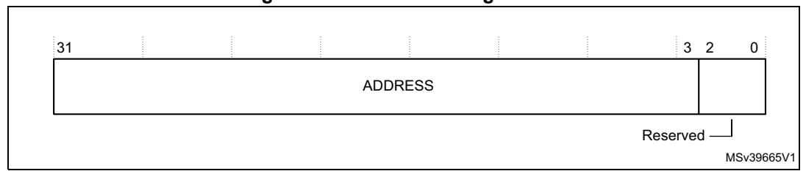
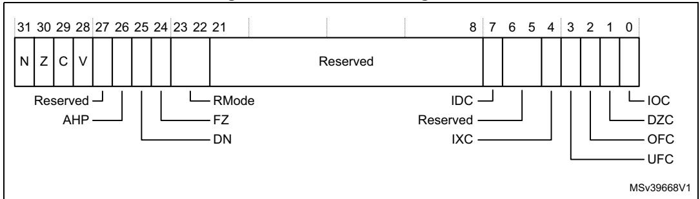

## 4.7 Floating-point unit

The Cortex®-M7 Floating-Point Unit (FPU) implements the FPv5 floating-point extensions.

The FPU fully supports single-precision and double-precision add, subtract, multiply, divide, multiply and accumulate, and square root operations. It also provides conversions between fixed-point and floating-point data formats, and floating-point constant instructions.

The FPU provides floating-point computation functionality that is compliant with the *ANSI/IEEE Std 754-2008, IEEE Standard for Binary Floating-Point Arithmetic*, referred to as the IEEE 754 standard.

The silicon vendor should also include the following text when implementations support single-precision FPU only. The FPU contains 32 single-precision extension registers, which can be also accessed as 16 doubleword registers for load, store, and move operations.

Table 94 shows the floating-point system registers in the Cortex®-M7 processor with FPU.

<span id="page-0-0"></span>Required Address Name Type Reset Description privilege Coprocessor access control register 0xE000ED88 **CPACR** RW Privileged 0x00000000 on page 233 Floating-point context control register 0xE000EF34 **FPCCR** RW Privileged 0xC0000000 on page 234 Floating-point context address register 0xE000EF38 **FPCAR** RW Privileged on page 236 **FPSCR** Floating-point status control register RW Unprivileged on page 236 **FPDSC** Floating-point default status control 0xE000EF3C RW Privileged 0x00000000 register on page 237

Table 94. Cortex<sup>®</sup>-M7 floating-point system registers

The following sections describe the floating-point system registers whose implementation is specific to this processor.

#### <span id="page-0-1"></span>4.7.1 Coprocessor access control register

The CPACR register specifies the access privileges for coprocessors. See the register summary in *Table 94 on page 233* for its attributes. The bit assignments are:

| 31 | 24 | 23 | 22 | 21 | 20 | 19 | 0 | | | | | | | | | | | | | | | | |

Figure 54. CPACR bit assignments

PM0253 Rev 5 233/254

The FPSCR register is not memory-mapped, it can bee accessed using the VMSR and VMRS instructions, see VMRS on page 165 and VMSR on page 166. the software can only access the FPSCR when the FPU is enabled, see Enabling the FPU on page 238.

| Table 50. Of AoN bit assignments                         |      |                                                                                                                                                                                                                                                                                                                           |  |
|----------------------------------------------------------|------|---------------------------------------------------------------------------------------------------------------------------------------------------------------------------------------------------------------------------------------------------------------------------------------------------------------------------|--|
| Bits                                                     | Name | Function                                                                                                                                                                                                                                                                                                                  |  |
| [31:24]                                                  | -    | Reserved. Read as Zero, Write Ignore.                                                                                                                                                                                                                                                                                     |  |
| [2 <i>n</i> +1:2 <i>n</i> ] for <i>n</i> values10 and 11 | CPn  | Access privileges for coprocessor <i>n</i> . The possible values of each field are:  0b00: Access denied. Any attempted access generates a NOCP UsageFault.  0b01: Privileged access only. An unprivileged access generates a NOCP fault.  0b10: Reserved. The result of any access is Unpredictable.  0b11: Full access. |  |
| [19:0]                                                   | -    | Reserved. Read as Zero, Write Ignore.                                                                                                                                                                                                                                                                                     |  |

Table 95. CPACR bit assignments

# <span id="page-1-0"></span>4.7.2 Floating-point context control register

The FPCCR register sets or returns FPU control data. See the register summary in *Table 94* on page 233 for its attributes. The bit assignments are:

31 30 29

Reserved

MONRDY

MRESERVED

MRESERVED

MRESERVED

MRESERVED

MSV39666V1

Figure 55. FPCCR bit assignments

Table 96. FPCCR bit assignments

| Bits   | Name  | Function                                                                                                                                                                                                                                                                                                                                                   |
|--------|-------|------------------------------------------------------------------------------------------------------------------------------------------------------------------------------------------------------------------------------------------------------------------------------------------------------------------------------------------------------------|
| [31]   | ASPEN | Enables CONTROL.FPCA setting on execution of a floating-point instruction. This results in automatic hardware state preservation and restoration, for floating-point context, on exception entry and exit.  0: Disable CONTROL.FPCA setting on execution of a floating-point instruction.  1: Enable CONTROL.FPCA setting on execution of a floating-point |
|        |       | instruction.                                                                                                                                                                                                                                                                                                                                               |
| [30]   | LSPEN | Disable automatic lazy state preservation for floating-point context.     Enable automatic lazy state preservation for floating-point context.                                                                                                                                                                                                             |
| [29:9] | -     | Reserved.                                                                                                                                                                                                                                                                                                                                                  |


**Table 96. FPCCR bit assignments (continued)**

| Bits | Name   | Function                                                                                                                                                                                                                                                                                                                      |
|------|--------|-------------------------------------------------------------------------------------------------------------------------------------------------------------------------------------------------------------------------------------------------------------------------------------------------------------------------------|
| [8]  | MONRDY | 0: DebugMonitor is disabled or priority did not permit setting MON_PEND<br>when the floating-point stack frame was allocated.<br>1: DebugMonitor is enabled and priority permits setting MON_PEND when<br>the floating-point stack frame was allocated.                                                                       |
| [7]  | -      | Reserved.                                                                                                                                                                                                                                                                                                                     |
| [6]  | BFRDY  | 0: BusFault is disabled or priority did not permit setting the BusFault handler<br>to the pending state when the floating-point stack frame was allocated.<br>1: BusFault is enabled and priority permitted setting the BusFault handler to<br>the pending state when the floating-point stack frame was allocated.           |
| [5]  | MMRDY  | 0: MemManage is disabled or priority did not permit setting the MemManage<br>handler to the pending state when the floating-point stack frame was<br>allocated.<br>1: MemManage is enabled and priority permitted setting the MemManage<br>handler to the pending state when the floating-point stack frame was<br>allocated. |
| [4]  | HFRDY  | 0: Priority did not permit setting the HardFault handler to the pending state<br>when the floating-point stack frame was allocated.<br>1: Priority permitted setting the HardFault handler to the pending state when<br>the floating-point stack frame was allocated.                                                         |
| [3]  | THREAD | 0: Mode was not Thread Mode when the floating-point stack frame was<br>allocated.<br>1: Mode was Thread Mode when the floating-point stack frame was<br>allocated.                                                                                                                                                            |
| [2]  | -      | Reserved.                                                                                                                                                                                                                                                                                                                     |
| [1]  | USER   | 0: Privilege level was not user when the floating-point stack frame was<br>allocated.<br>1: Privilege level was user when the floating-point stack frame was allocated.                                                                                                                                                       |
| [0]  | LSPACT | 0: Lazy state preservation is not active.<br>1: Lazy state preservation is active. Floating-point stack frame has been<br>allocated but saving state to it has been deferred.                                                                                                                                                 |


PM0253 Rev 5 235/254

### <span id="page-3-0"></span>**4.7.3 Floating-point context address register**

The FPCAR register holds the location of the unpopulated floating-point register space allocated on an exception stack frame. See the register summary in *Table [94 on page](#page-0-0) 233* for its attributes. The bit assignments are:

**Figure 56. FPCAR bit assignments**



**Table 97. FPCAR bit assignments** 

| Bits   | Name    | Function                                                                                                |
|--------|---------|---------------------------------------------------------------------------------------------------------|
| [31:3] | ADDRESS | The location of the unpopulated floating-point register space<br>allocated on an exception stack frame. |
| [2:0]  | -       | Reserved. Read as Zero, Writes Ignored.                                                                 |

### <span id="page-3-1"></span>**4.7.4 Floating-point status control register**

The FPSCR register provides all necessary User level control of the floating-point system. The bit assignments are:

**Figure 57. FPSCR bit assignments**



**Table 98. FPSCR bit assignments** 

| Bits | Name | Function                                                                                                                             |
|------|------|--------------------------------------------------------------------------------------------------------------------------------------|
| [31] | N    | Condition code flags. Floating-point comparison operations update these flags.                                                       |
| [30] | Z    | N: Negative condition code flag.<br>Z: Zero condition code flag.<br>C: Carry condition code flag.                                    |
| [29] | C    |                                                                                                                                      |
| [28] | V    | V: Overflow condition code flag.                                                                                                     |
| [27] | -    | Reserved.                                                                                                                            |
| [26] | AHP  | Alternative half-precision control bit:<br>0: IEEE half-precision format selected.<br>1: Alternative half-precision format selected. |


| Bits    | Name  | Function                                                                                                                                                                                                                                                                                                                |  |
|---------|-------|-------------------------------------------------------------------------------------------------------------------------------------------------------------------------------------------------------------------------------------------------------------------------------------------------------------------------|--|
| [25]    | DN    | Default NaN mode control bit:<br>0: NaN operands propagate through to the output of a floating-point operation.<br>1: Any operation involving one or more NaNs returns the Default NaN.                                                                                                                                 |  |
| [24]    | FZ    | Flush-to-zero mode control bit:<br>0: Flush-to-zero mode disabled. Behavior of the floating-point system is fully<br>compliant with the IEEE 754 standard.<br>1: Flush-to-zero mode enabled.                                                                                                                            |  |
| [23:22] | RMode | Rounding Mode control field. The encoding of this field is:<br>0b00: Round to Nearest (RN) mode<br>0b01: Round towards Plus Infinity (RP) mode<br>0b10: Round towards Minus Infinity (RM) mode<br>0b11: Round towards Zero (RZ) mode.<br>The specified rounding mode is used by almost all floating-point instructions. |  |
| [21:8]  | -     | Reserved.                                                                                                                                                                                                                                                                                                               |  |
| [7]     | IDC   | Input Denormal cumulative exception bit, see bits [4:0].                                                                                                                                                                                                                                                                |  |
| [6:5]   | -     | Reserved.                                                                                                                                                                                                                                                                                                               |  |
| [4]     | IXC   | Cumulative exception bits for floating-point exceptions, see also bit [7]. Each of                                                                                                                                                                                                                                      |  |
| [3]     | UFC   | these bits is set to 1 to indicate that the corresponding exception has occurred<br>since 0 was last written to it.                                                                                                                                                                                                     |  |
| [2]     | OFC   | IDC, bit[7]: Input Denormal cumulative exception bit.                                                                                                                                                                                                                                                                   |  |
| [1]     | DZC   | IXC: Inexact cumulative exception bit.<br>UFC: Underflow cumulative exception bit.                                                                                                                                                                                                                                      |  |
| [0]     | IOC   | OFC: Overflow cumulative exception bit.<br>DZC: Division by Zero cumulative exception bit.<br>IOC: Invalid Operation cumulative exception bit.                                                                                                                                                                          |  |

**Table 98. FPSCR bit assignments (continued)**

#### <span id="page-4-0"></span>**4.7.5 Floating-point default status control register**

The FPDSCR register holds the default values for the floating-point status control data. See the register summary in *Table [94 on page](#page-0-0) 233* for its attributes. The bit assignments are:

**Figure 58. FPDSCR bit assignments** MSv39667V1 Reserved 0 31 27 26 25 24 23 22 21 0 0 0 0 0 Reserved AHP RMode DN FZ

**Table 99. FPDSCR bit assignments** 

| Bits    | Name | Function                    |
|---------|------|-----------------------------|
| [31:27] | -    | Reserved                    |
| [26]    | AHP  | Default value for FPSCR.AHP |


PM0253 Rev 5 237/254

| Bits    | Name  | Function                      |
|---------|-------|-------------------------------|
| [25]    | DN    | Default value for FPSCR.DN    |
| [24]    | FZ    | Default value for FPSCR.FZ    |
| [23:22] | RMode | Default value for FPSCR.RMode |
| [21:0]  | -     | Reserved                      |

### <span id="page-5-0"></span>**4.7.6 Enabling the FPU**

The FPU is disabled from reset. The user must enable it before using any floating-point instructions. *[Example 4-1: Enabling the FPU](#page-5-1)* shows an example code sequence for enabling the FPU in privileged mode. The processor must be in privileged mode to read from and write to the CPACR.

#### <span id="page-5-1"></span>**Example 4-1: Enabling the FPU**

```
CPACR EQU 0xE000ED88
LDR R0, =CPACR ; Read CPACR
LDR r1, [R0] ; Set bits 20-23 to enable CP10 and CP11 
                      ; coprocessors
ORR R1, R1, #(0xF << 20)
STR R1, [R0] ; Write back the modified value to the CPACR
DSB
ISB ; Reset pipeline now the FPU is enabled.
```

238/254 PM0253 Rev 5

### **4.7.7 Enabling and clearing FPU exception interrupts**

The FPU exception flags are generating an interrupt through the interrupt controller. The FPU interrupt is globally controlled through the interrupt controller.

There is no individual mask and the enable/disable of the FPU interrupts is done at interrupt controller level. As it occurs very frequently, the IXC exception flag is not connected to the interrupt controller, and cannot generate an interrupt. If needed, it must be managed by polling.

Clearing the FPU exception flags depends on the FPU context save/restore configuration:

• No floating-point register saving: when Floating-point context control register (FPCCR) Bit 30 LSPEN=0 and Bit 31 ASPEN=0.

You must clear interrupt source in Floating-point Status and Control Register (FPSCR). Example:

```
register uint32_t fpscr_val = 0;
fpscr_val = __get_FPSCR();
{ check exception flags }
fpscr_val &= (uint32_t)~0x8F; // Clear all exception flags
__set_FPSCR(fpscr_val);
```

• Lazy save/restore: when Floating-point context control register (FPCCR) Bit 30 LSPEN=1 and Bit 31 ASPEN=X.

In the case of lazy floating-point context save/restore, a dummy read access should be made to Floating-point Status and Control Register (FPSCR) to force state preservation and FPSCR clear.

Then handle FPSCR in the stack.

Example:

```
register uint32_t fpscr_val = 0;
register uint32_t reg_val = 0; 
reg_val = __get_FPSCR(); //dummy access
fpscr_val=*(__IO uint32_t*)(FPU->FPCAR +0x40);
{ check exception flags }
fpscr_val &= (uint32_t)~0x8F ; // Clear all exception flags
*(__IO uint32_t*)(FPU->FPCAR +0x40)=fpscr_val;
__DMB() ;
```

• Automatic floating-point registers save/restore: when Floating-point context control register (FPCCR)

Bit 30 LSPEN=0 and Bit 31 ASPEN=1.

In the case of automatic floating-point context save/restore, a read access should be made to Floating-point Status and Control Register (FPSCR) to force clear.

Then handle FPSCR in the stack.

Example:

```
// FPU Exception handler
void FPU_ExceptionHandler(uint32_t lr, uint32_t sp)
{
register uint32_t fpscr_val;
  if(lr == 0xFFFFFFE9)
  {
   sp = sp + 0x60;
  }
  else if(lr == 0xFFFFFFED)
```

PM0253 Rev 5 239/254