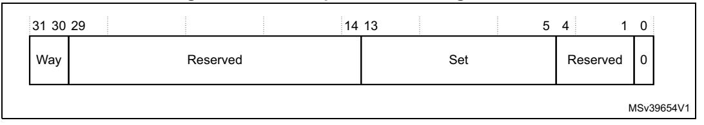

```
{
   sp = __get_PSP() + 0x60 ; 
  }
fpscr_val = *(uint32_t*)sp;
{ check exception flags }
fpscr_val &= (uint32_t)~0x8F ; // Clear all exception flags
*(uint32_t*)sp = fpscr_val;
__DMB() ;
}
// FPU IRQ Handler
void __asm FPU_IRQHandler(void)
{
IMPORT FPU_ExceptionHandler
MOV R0, LR // move LR to R0
MOV R1, SP // Save SP to R1 to avoid any modification to 
                      // the stack pointer from FPU_ExceptionHandler
VMRS R2, FPSCR // dummy read access, to force clear
B FPU_ExceptionHandler
BX LR
}
```

## **4.8 Cache maintenance operations**

The cache maintenance operations are only accessible by privileged loads and stores. Unprivileged accesses to these registers always generate a BusFault.

**Table 100. Cache maintenance space register summary** 

<span id="page-0-1"></span>

| Address    | Name     | Type   | Required<br>privilege | Reset<br>value | Description                                                              |
|------------|----------|--------|-----------------------|----------------|--------------------------------------------------------------------------|
| 0xE000EF50 | ICIALLU  | WO     | Privileged            | Unknown        | Instruction cache invalidate all to the Point of<br>Unification (PoU)(1) |
| 0xE000EF54 | -        | -      | -                     | -              | Reserved                                                                 |
| 0xE000EF58 | ICIMVAU  | WO     | Privileged            | Unknown        | Instruction cache invalidate by address to the PoU(1)                    |
| 0xE000EF5C | DCIMVAC  | WO     | Privileged            | Unknown        | Data cache invalidate by address to the Point of<br>Coherency (PoC)(2)   |
| 0xE000EF60 | DCISW    | WO     | Privileged            | Unknown        | Data cache invalidate by set/way                                         |
| 0xE000EF64 | DCCMVAU  | WO     | Privileged            | Unknown        | Data cache by address to the PoU(1)                                      |
| 0xE000EF68 | DCCMVAC  | WO     | Privileged            | Unknown        | Data cache clean by address to the PoC(2)                                |
| 0xE000EF6C | DCCSW    | WO     | Privileged            | Unknown        | Data cache clean by set/way                                              |
| 0xE000EF70 | DCCIMVAC | WO     | Privileged            | Unknown        | Data cache clean and invalidate by address to the<br>PoC(2)              |
| 0xE000EF74 | DCCISW   | WO     | Privileged            | Unknown        | Data cache clean and invalidate by set/way                               |
| 0xE000EF78 | BPIALL   | RAZ/WI | Privileged            | -              | The BPIALL register is not implemented                                   |

<span id="page-0-0"></span><sup>1.</sup> Cache maintenance operations by PoU can be used to synchronize data between the Cortex®-M7 data and instruction Caches, for example when the software uses self-modifying code.

240/254 PM0253 Rev 5


<span id="page-1-0"></span>2. Cache maintenance operations by PoC can be used to synchronize data between the Cortex®-M7 data cache and an external agent such as a system DMA.

## **4.8.1 Full instruction cache operation**

The ICIALLU is WO and write data is ignored and reads return 0. Writes to this register perform the requested cache maintenance operation. The BPIALL register is not implemented in the Cortex-M7 processor as branch predictor maintenance is not required. The register is RAZ/WI.

## **4.8.2 Instruction and data cache operations by address**

The cache maintenance operations registers are ICIMVAU, DCIMVAC, DCCMVAU, DCCMVAC, and DCCIMVAC. These registers are WO, reads return 0. See the register summary in *[Table](#page-0-1) 100* for their attributes. The bit assignments are:

**Table 101. Cache operation registers bit assignments** 

| Bit    | Name | Type | Function                   |
|--------|------|------|----------------------------|
| [31:0] | MVA  | WO   | MVA of requested operation |

## **4.8.3 Data cache operations by set-way**

The DCISW, DCCSW and DCCISW registers are WO. Reads return 0. See the register summary in *Table [100 on page](#page-0-1) 240* for their attributes. The bit assignments are:

**Figure 59. Cache operation bit assignments**



**Table 102. Cache operations by set-way bit assignments** 

| Bit     | Name | Type | Function                                                                                                                                                                                                                                                                                 |
|---------|------|------|------------------------------------------------------------------------------------------------------------------------------------------------------------------------------------------------------------------------------------------------------------------------------------------|
| [31:30] | Way  | WO   | Way that operation applies to.<br>For the data cache, values 0, 1, 2 and 3 are supported.                                                                                                                                                                                                |
| [29:14] | -    | -    | Reserved                                                                                                                                                                                                                                                                                 |
| [13:5]  | Set  | WO   | Set/index that operation applies to. The number of indices in a cache<br>depends on the configured cache size. When this is less than the<br>maximum, use the LSB of this field. The number of sets in the cache can be<br>determined by reading the Cache size ID register on page 219. |
| [4:1]   | -    | -    | Reserved                                                                                                                                                                                                                                                                                 |
| [0]     | -    | -    | Always reads as zero.                                                                                                                                                                                                                                                                    |


PM0253 Rev 5 241/254

# **4.8.4 Cortex®-M7 cache maintenance operations using CMSIS**

CMSIS functions enable the software portability between different Cortex®-M profile processors. To access cache maintenance operations when using CMSIS, use the following functions:

| CMSIS function                  | Descriptions                                                     |
|---------------------------------|------------------------------------------------------------------|
| void SCB_EnableICache(void)     | Invalidate and then enable instruction cache                     |
| void SCB_DisableICache(void)    | Disable instruction cache and invalidate its<br>contents         |
| void SCB_InvalidateICache(void) | Invalidate instruction cache                                     |
| void SCB_EnableDCache(void)     | Invalidate and then enable data cache                            |
| void SCB_DisableDCache(void)    | Disable data cache and then clean and<br>invalidate its contents |
| void SCB_InvalidateDCache(void) | Invalidate data cache                                            |
| void SCB_CleanDCache(void)      | Clean data cache                                                 |

**Table 103. CMSIS access cache maintenance operations** 

## **4.8.5 Initializing and enabling the L1-cache**

The user can use cache maintenance operations for:

- Cache startup type operations.
- Manipulating the caches so that shared data is visible to other bus masters.

void SCB\_CleanInvlaidateDCache(void) Clean and invalidate data cache

• Enabling data changed by an external DMA agent to be made visible to the Cortex®- M7 processor.

After enabling or disabling the instruction cache, the user must issue an ISB instruction to flush the pipeline. This ensures that all subsequent instruction fetches see the effect of enabling or disabling the instruction cache.

After reset, the user must invalidate each cache before enabling it.

When disabling the data cache, the user must clean the entire cache to ensure that any dirty data is flushed to external memory.

Before enabling the data cache, the user must invalidate the entire data cache if external memory might have changed since the cache was disabled.

Before enabling the instruction cache, the user must invalidate the entire instruction cache if external memory might have changed since the cache was disabled.

L1 data and instruction cache must be invalidated before they are enabled in the software, otherwise unpredictable behavior can occur.

#### **Invalidate the entire data cache**

The software can use the following code example to invalidate the entire data cache, if it has been included in the processor. The operation is carried out by iterating over each line of the cache and using the DCISW register in the *Private Peripheral Bus* (PPB) memory region to

242/254 PM0253 Rev 5


invalidate the line. The number of cache ways and sets is determined by reading the CCSIDR register.

```
CCSIDR EQU 0xE000ED80
CSSELR EQU 0xE000ED84
DCISW EQU 0xE000EF60
 MOV r0, #0x0
 LDR r11, =CSSELR
 STR r0, [r11] ; Select Data Cache size
 DSB
 LDR r11, =CCSIDR
 LDR r2, [r11] ; Cache size identification
 AND r1, r2, #0x7 ; Number of words in a cache line
 ADD r7, r1, #0x4
 MOV r1, #0x3ff
 ANDS r4, r1, r2, LSR #3
 MOV r1, #0x7fff
 ANDS r2, r1, r2, LSR #13
 CLZ r6, r4
 LDR r11, =DCISW
inv_loop1
 MOV r1, r4
inv_loop2
 LSL r3, r1, r6
 LSL r8, r2, r7
 ORRr 3, r3, r8
 STR r3, [r11] ; Invalidate D-cache line
 SUBS r1, r1, #0x1
 BGE inv_loop2
 SUBS r2, r2, #0x1
 BGE inv_loop1
 DSB
 ISB
```

#### **Invalidate instruction cache**

The user can use the following code example to invalidate the entire instruction cache, if it has been included in the processor. The operation is carried out by writing to the ICIALLU register in the PPB memory region.

```
ICIALLU EQU 0xE000EF50
 MOV r0, #0x0
 LDR r11, =ICIALLU
 STR r0, [r11]
 DSB
 ISB
```


PM0253 Rev 5 243/254

#### **Enabling data and instruction caches**

The user can use the following code example to enable the data and instruction cache after they have been initialized. The operation is carried out by modifying the CCR.IC and CCR.DC fields in the PPB memory region.

```
CCR EQU 0xE000ED14
 LDR r11, =CCR
 LDR r0, [r11]
 ORR r0, r0, #0x1:SHL:16 ; Set CCR.DC field
 ORR r0, r0, #0x1:SHL:17 ; Set CCR.IC field
 STR r0, [r11]
 DSB
 ISB
```

## **4.8.6 Faults handling considerations**

Cache maintenance operations can result in a BusFault. Such fault events are asynchronous.

This type of BusFault:

- Does not cause escalation to HardFault where a BusFault handler is enabled.
- Never causes lockup.

Because the fault event is asynchronous, the software code for cache maintenance operations should use memory barrier instructions, such as DSB, on completion so that the fault event can be observed immediately.

## **4.8.7 Cache maintenance design hints and tips**

The user must always place a DSB and ISB instruction sequence after a cache maintenance operation to ensure that the effect is observed by any following instructions in the software.

When using a cache maintenance operation by address or set/way a DSB instruction must be executed after any previous load or store, and before the maintenance operation, to guarantee that the effect of the load or store is observed by the operation. For example, if a store writes to the address accessed by a DCCMVAC the DSB instruction guarantees that the dirty data is correctly cleaned from the data cache.

When one or more maintenance operations have been executed, use of a DSB instruction guarantees that they have completed and that any following load or store operations executes in order after the maintenance operations.

Cache maintenance operations always complete in-order with respect to each other. This means only one DSB instruction is required to guarantee the completion of a set of maintenance operations.

The following code sequence shows how to use cache maintenance operations to synchronize the data and instruction caches for self-modifying code. The sequence is entered with <Rx> containing the new 32-bit instruction. Use STRH in the first line instead of STR for a 16-bit instruction:

```
STR <Rx>, <inst_address1>
DSB ; Ensure the data has been written to the 
                       ; cache.
```

244/254 PM0253 Rev 5

