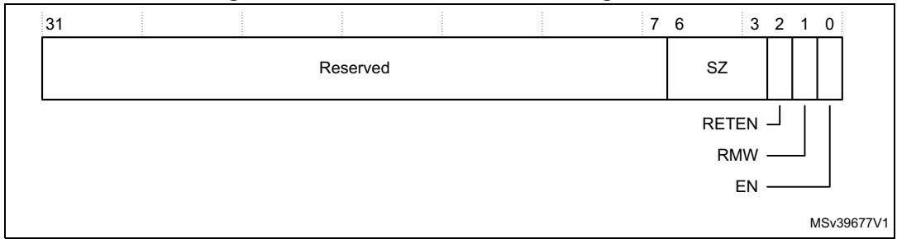
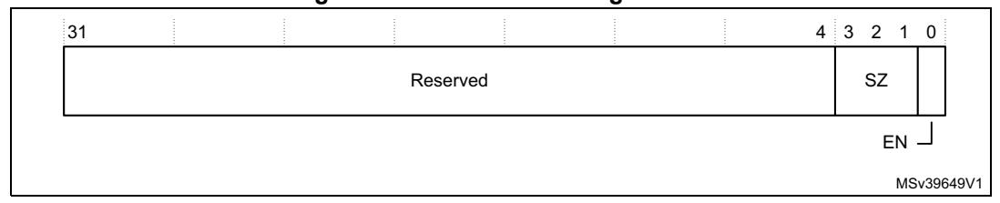
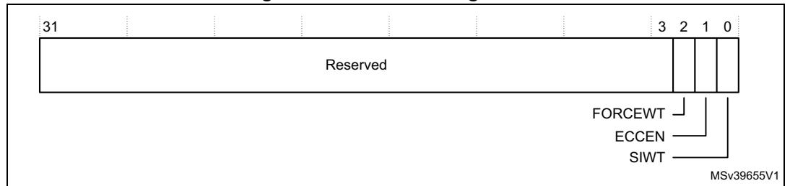
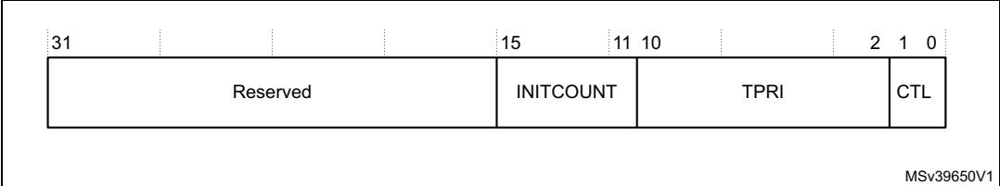

```
STR <inst_address1>, DCCMVAU ; Clean data cache by MVA to point of 
                         ; unification (PoU).
STR <inst_address1>, ICIMVAU ; Invalidate instruction cache by MVA to 
                         ; PoU.
DSB ; Ensure completion of the invalidations.
ISB ; Synchronize fetched instruction stream.
```

# **4.9 Access control**

Control of the L1-cache ECC and attribute override, the priority of AHB slave traffic, and whether an access is mapped to TCM interfaces or AXI master interface, is defined by the access control registers. The access control registers are:

**Table 104. Access control register summary** 

| Address    | Name   | Type | Required<br>privilege | Reset<br>value | Description                                         |
|------------|--------|------|-----------------------|----------------|-----------------------------------------------------|
| 0xE000EF90 | ITCMCR | RW   | Privileged            | 0x00000000     | Instruction and data tightly-coupled memory control |
| 0xE000EF94 | DTCMCR | RW   | Privileged            | 0x00000000     | registers on page 246                               |
| 0xE000EF98 | AHBPCR | RW   | Privileged            | 0x00000000     | AHBP control register on page 248                   |
| 0xE000EF9C | CACR   | RW   | Privileged            | -(1)           | Auxiliary cache control register on page 249        |
| 0xE000EFA0 | AHBSCR | RW   | Privileged            | 0x00000800     | AHB slave control register on page 250              |
| 0xE000EFA8 | ABFSR  | RW   | Privileged            | 0x00000000     | Auxiliary bus fault status register on page 251     |

<sup>1.</sup> The reset value is implementation and configuration dependent and the silicon vendor changes this. If cache ECC is configured the reset value is 0x00000000, if cache ECC is not configured the reset value is 0x00000002.


PM0253 Rev 5 245/254

## <span id="page-1-0"></span>**4.9.1 Instruction and data tightly-coupled memory control registers**

The ITCMCR and DTCMCR control whether access is mapped to the TCM interfaces or the AXI master interface. The bit assignments are:

**Figure 60. ITCMR and DTCMR bit assignments**



**Table 105. ITCMCR and DTCMCR bit assignments** 

| Bits   | Name     | Type | Function                                                                                                                                                                                                                                                                                                                                        |
|--------|----------|------|-------------------------------------------------------------------------------------------------------------------------------------------------------------------------------------------------------------------------------------------------------------------------------------------------------------------------------------------------|
| [31:7] | -        | -    | Reserved, RAZ/WI.                                                                                                                                                                                                                                                                                                                               |
| [6:3]  | SZ       | RO   | TCM size. Indicates the size of the relevant TCM:<br>0b0000: No TCM implemented.<br>0b0011: 4KB.<br>0b0100: 8KB.<br>0b0101: 16KB.<br>0b0110: 32KB.<br>0b0111: 64KB.<br>0b1000: 128KB.<br>0b1001: 256KB.<br>0b1010: 512KB.<br>0b1011: 1MB.<br>0b1100: 2MB.<br>0b1101: 4MB.<br>0b1110: 8MB.<br>0b1111: 16MB.<br>All other encodings are reserved. |
| [2]    | RETEN(1) | RW   | Retry phase enable. When enabled the processor guarantees to honor<br>the retry output on the corresponding TCM interface:<br>0: Retry phase disabled.<br>1: Retry phase enabled.                                                                                                                                                               |
| [1]    | RMW(2)   | RW   | Read-Modify-Write (RMW) enable. Indicates that all sub-chunk writes to<br>a given TCM use a RMW sequence:<br>0: RMW disabled.<br>1: RMW enabled.                                                                                                                                                                                                |
| [0]    | EN       | RW   | TCM enable. When a TCM is disabled all accesses are made to the AXI<br>master.<br>0: TCM disabled.<br>1: TCM enabled.                                                                                                                                                                                                                           |

<sup>1.</sup> The RETEN field in the ITCMCR and DTCMCR is used to support error detection and correction in the TCM.

246/254 PM0253 Rev 5

<sup>2.</sup> The RMW field in the ITCMCR and DTCMCR is used to support error detection and correction in the TCM.

#### **Enabling the TCM**

The TCM interfaces can be enabled at reset in the system by an external signal on the processor. If they are disabled at reset then the following code example can be used to enable both the instruction and data TCM interfaces in software:

```
ITCMCR EQU 0xE000EF90
DTCMCR EQU 0xE000EF94
        LDR r11, =ITCMCR
        LDR r0, [r11]
        ORR r0, r0, #0x1 ; Set ITCMCR.EN field
        STR r0, [r11]
        LDR r11, =DTCMCR
        LDR r0, [r11]
        ORR r0, r0, #0x1 ; Set DTCMCR.EN field
        STR r0, [r11]
        DSB
        ISB
```

## **Enabling the TCM retry and read-modify-write**

If the TCM connected to the processor supports error detection and correction, the TCM interface should be configured to support the retry and read-modify-write features. These can be enabled at reset in the system by external signals on the processor. If they are disabled at reset then the following code example can be used to enable them in software:

```
ITCMCR EQU 0xE000EF90
DTCMCR EQU 0xE000EF94
       LDR r11, =ITCMCR
       LDR r0, [r11]
       ORR r0, r0, #0x1:SHL:1 ; Set ITCMCR.RMW field
       ORR r0, r0, #0x1:SHL:2 ; Set ITCMCR.RETEN field
       STR r0, [r11]
       LDR r11, =DTCMCR
       LDR r0, [r11]
       ORR r0, r0, #0x1:SHL:1 ; Set DTCMCR.RMW field
       ORR r0, r0, #0x1:SHL:2 ; Set DTCMCR.RETEN field
       STR r0, [r11]
       DSB
       ISB
```

PM0253 Rev 5 247/254

## <span id="page-3-0"></span>**4.9.2 AHBP control register**

The AHBPCR controls accesses to the device on the AHBP or AXI master interface. The bit assignments are:

**Figure 61. AHBPCR bit assignments**



**Table 106. AHBPCR bit assignments** 

| Bits   | Name | Type | Function                                                                                                        |  |
|--------|------|------|-----------------------------------------------------------------------------------------------------------------|--|
| [31:4] | -    | -    | Reserved, RAZ/WI.                                                                                               |  |
| [3:1]  | SZ   | RO   | AHBP size:<br>0b001: 64 MBytes.<br>0b010: 128 MBytes.<br>0b011: 256 MBytes.<br>0b100: 512 MBytes.               |  |
| [0]    | EN   | RW   | AHBP enable:<br>0: AHBP disabled. When disabled all accesses are made to the AXI<br>master.<br>1: AHBP enabled. |  |

#### **Enabling the AHBP interface**

The AHBP interface can be enabled at reset in the system by an external signal on the processor. If it is disabled at reset then the following code example can be used to enable the AHPB interface from software:

```
AHBPCR EQU 0xE000EF98
       LDR r11, =AHBPCR
       LDR r0, [r11]
       ORR r0, r0, #0x1 ; Set AHBPCR.EN field
       STR r0, [r11]
       DSB
       ISB
```

248/254 PM0253 Rev 5

## <span id="page-4-0"></span>**4.9.3 Auxiliary cache control register**

The CACR controls the L1-cache ECC and attribute override. The bit assignments are:

**Figure 62. CACR bit assignments**



**Table 107. CACR bit assignments** 

| Bits   | Name    | Type | Function                                                                                                                                                                                                                                                                                                                                                                                                                                                                                                                                                                                                                                                                                                                                                                                                                                                                                                                                                                                     |  |
|--------|---------|------|----------------------------------------------------------------------------------------------------------------------------------------------------------------------------------------------------------------------------------------------------------------------------------------------------------------------------------------------------------------------------------------------------------------------------------------------------------------------------------------------------------------------------------------------------------------------------------------------------------------------------------------------------------------------------------------------------------------------------------------------------------------------------------------------------------------------------------------------------------------------------------------------------------------------------------------------------------------------------------------------|--|
| [31:3] | -       | -    | Reserved, RAZ/WI.                                                                                                                                                                                                                                                                                                                                                                                                                                                                                                                                                                                                                                                                                                                                                                                                                                                                                                                                                                            |  |
| [2]    | FORCEWT | RW   | Enables Force Write-through in the data cache:<br>0: Disables Force Write-Through.<br>1: Enables Force Write-Through. Cacheable Write-Back memory regions are<br>treated as Write-Through.<br>This bit is RAZ if the data cache is excluded.                                                                                                                                                                                                                                                                                                                                                                                                                                                                                                                                                                                                                                                                                                                                                 |  |
| [1]    | ECCEN   | RW   | Enables ECC in the instruction and data cache:<br>0: Enables ECC in the instruction and data cache.<br>1: Disables ECC in the instruction and data cache.<br>This bit is WI if both data cache and instruction cache are excluded or if ECC is not<br>configured. If ECC is included in the processor the reset value of ECCEN is 0. If ECC<br>is excluded the reset value of ECCEN is 1                                                                                                                                                                                                                                                                                                                                                                                                                                                                                                                                                                                                     |  |
| [0]    | SIWT    | RW   | Enables cache coherency usage:<br>0: Normal Cacheable Shared locations are treated as being Non-cacheable.<br>Programmed inner cacheability attributes are ignored. This is the default mode of<br>operation for Shared memory. Caches are transparent to software for these<br>locations and therefore no software maintenance is required to maintain<br>coherency.<br>1: For the data cache, Normal Cacheable shared locations are treated as Write<br>through. For the instruction cache, shared locations are treated as being Non<br>cacheable. Programmed inner cacheability attributes are ignored. All writes are<br>globally visible. Other memory agent updates are not visible to Cortex®-M7<br>software without suitable cache maintenance.<br>Useful for heterogeneous MP-systems where, for example, Cortex®-M7 processor<br>is integrated on the Accelerator Coherency Port (ACP) interface on an MP-capable<br>processor.<br>This bit is RAZ if the data cache is excluded. |  |


PM0253 Rev 5 249/254

### Disabling cache error checking and correction

If the cache error checking and correction is included in the processor it is enabled by default from reset. The following code example can be used to disable the feature. The operation is carried out by modifying the CACR.ECCEN field in the PPB memory region.

```
CACR EQU 0xE000EF9C

LDR r11, =CACR

LDR r0, [r11]

BFC r0, #0x1, #0x1 ; Clear CACR.ECCEN

STR r0, [r11]

DSB

ISB
```

Care must be taken when the software changes CACR.ECCEN. If CACR.ECCEN changes when the caches contain data, ECC information in the caches might not be correct for the new setting, resulting in unexpected errors and data loss. Therefore the software must only change CACR.ECCEN when both caches are turned off and both caches must be invalidated after the change.

## <span id="page-5-0"></span>4.9.4 AHB slave control register

The AHBSCR is used by software to control the priority of AHB slave traffic. The bit assignments are:




Table 108. AHBSCR bit assignments

| Bits    | Name      | Type | Function                                                                                                                                                                                                                                                                                                                                                                                                                |
|---------|-----------|------|-------------------------------------------------------------------------------------------------------------------------------------------------------------------------------------------------------------------------------------------------------------------------------------------------------------------------------------------------------------------------------------------------------------------------|
| [31:16] | -         | -    | Reserved.                                                                                                                                                                                                                                                                                                                                                                                                               |
| [15:11] | INITCOUNT | RW   | Fairness counter initialization value. Use to demote access priority of the requestor selected by the AHBSCR.CTL field. The reset value is 0b01.  For round-robin mode set INITCOUNT to 0b01 and AHBSCR.CTL to 0b00 or 0b01.  INITCOUNT must not be set to 0b00 because the demoted requestor always takes priority when contention occurs, which can lead to livelock.  INITCOUNT is not used when AHBSCR.CTL is 0b11. |

250/254 PM0253 Rev 5

| Bits   | Name | Type | Function                                                                                                                                                                                                                                                                                                                                                                                                                                                                                                                                                                                                                                                                                 |  |  |
|--------|------|------|------------------------------------------------------------------------------------------------------------------------------------------------------------------------------------------------------------------------------------------------------------------------------------------------------------------------------------------------------------------------------------------------------------------------------------------------------------------------------------------------------------------------------------------------------------------------------------------------------------------------------------------------------------------------------------------|--|--|
| [10:2] | TPRI | RW   | Threshold execution priority for AHBS traffic demotion.<br>0b0xxxxxxx: Priority is TPRI[7:0]. This is the same as the NVIC register<br>encodings.<br>0b11111111: Priority of -1. This is the priority of the HardFault exception.<br>0b11111110: Priority of -2. This is the priority of the NMI exception.                                                                                                                                                                                                                                                                                                                                                                              |  |  |
| [1:0]  | CTL  | RW   | AHBS prioritization control:<br>0b00: AHBS access priority demoted. This is the reset value.<br>0b01: Software access priority demoted.<br>0b10: AHBS access priority demoted by initializing the fairness counter to the<br>AHBSCR.INITCOUNT value when the software execution priority is higher<br>than or equal to the threshold level programmed in AHBSCR.TPRI. When the<br>software execution priority is below this value, the fairness counter is initialized<br>with 1 (round-robin).<br>The threshold level encoding matches the NVIC encoding and uses<br>arithmetically larger numbers to represent lower priority.<br>0b11: AHBSPRI signal has control of access priority. |  |  |

**Table 108. AHBSCR bit assignments (continued)**

## <span id="page-6-0"></span>**4.9.5 Auxiliary bus fault status register**

The ABFSR stores information on the source of asynchronous bus faults. The ASBFSR bit assignments are:


**Table 109. ABFSR bit assignments** 

| Bits    | Name     | Function                                                                                                                                   |
|---------|----------|--------------------------------------------------------------------------------------------------------------------------------------------|
| [31:10] | -        | Reserved                                                                                                                                   |
| [9:8]   | AXIMTYPE | Indicates the type of fault on the AXIM interface:<br>b00: OKAY<br>b01: EXOKAY<br>b10: SLVERR<br>b11: DECERR<br>Only valid when AXIM is 1. |
| [7:5]   | -        | Reserved                                                                                                                                   |
| [4]     | EPPB     | Asynchronous fault on EPPB interface.                                                                                                      |


**Table 109. ABFSR bit assignments (continued)**

| Bits | Name | Function                              |
|------|------|---------------------------------------|
| [3]  | AXIM | Asynchronous fault on AXIM interface. |
| [2]  | AHBP | Asynchronous fault on AHBP interface. |
| [1]  | DTCM | Asynchronous fault on DTCM interface. |
| [0]  | ITCM | Asynchronous fault on ITCM interface  |

In the bus-fault handler, the software reads the BFSR, and if an asynchronous fault occurs, the ABFSR is read to determine which interfaces are affected. The ABFSR[4:0] fields remains valid until cleared by writing to the ABFSR with any value.

For more information about the BFSR, see *BusFault status register on page 207*.

