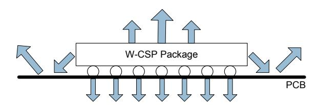

## **THERMAL PERFORMANCE**

Thermal analysis should be performed in the intended application to prevent the WM8994 from exceeding maximum junction temperature. Several contributing factors affect thermal performance most notably the physical properties of the mechanical enclosure, location of the device on the PCB in relation to surrounding components and the number of PCB layers. Connecting the GND balls through thermal vias and into a large ground plane will aid heat extraction.

Three main heat transfer paths exist to surrounding air as illustrated below i[n Figure 1:](#page-0-0)

- Package top to air (radiation).
- Package bottom to PCB (radiation).
- Package balls to PCB (conduction).

**Figure 1 Heat Transfer Paths**

The temperature rise TR is given by TR = PD \* ӨJA

- PD is the power dissipated in the device.
  - ӨJA is the thermal resistance from the junction of the die to the ambient temperature and is therefore a measure of heat transfer from the die to surrounding air. ӨJA is determined with reference to JEDEC standard JESD51-9.

The junction temperature TJ is given by TJ = TA +TR, where TA is the ambient temperature.

| PARAMETER                      | SYMBOL | MIN | TYP | MAX | UNIT |
|--------------------------------|--------|-----|-----|-----|------|
| Operating temperature range    | TA     | -40 |     | 85  | °C   |
| Operating junction temperature | TJ     | -40 |     | 125 | °C   |
| Thermal Resistance             | ӨJA    |     | 48  |     | °C/W |

## **Note:**

Junction temperature is a function of ambient temperature and of the device operating conditions. The ambient temperature limits and junction temperature limits must both be observed.

**Rev 4.6 13**