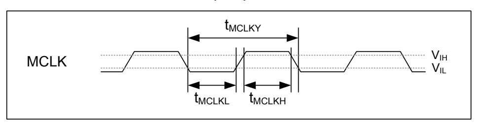
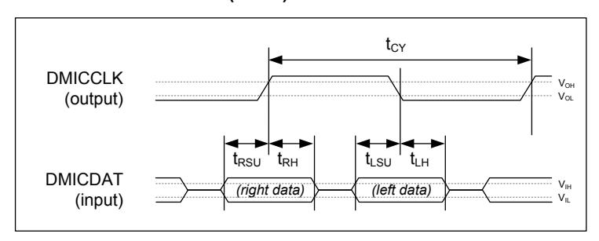
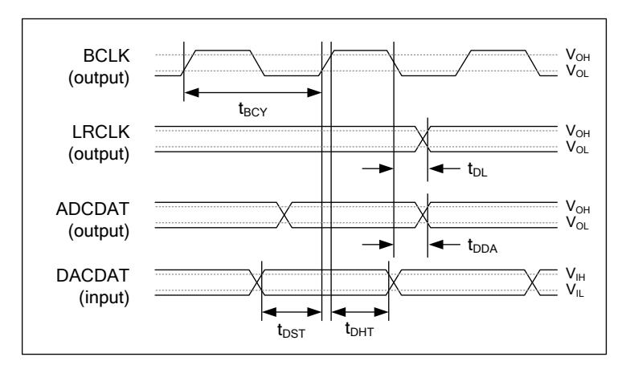
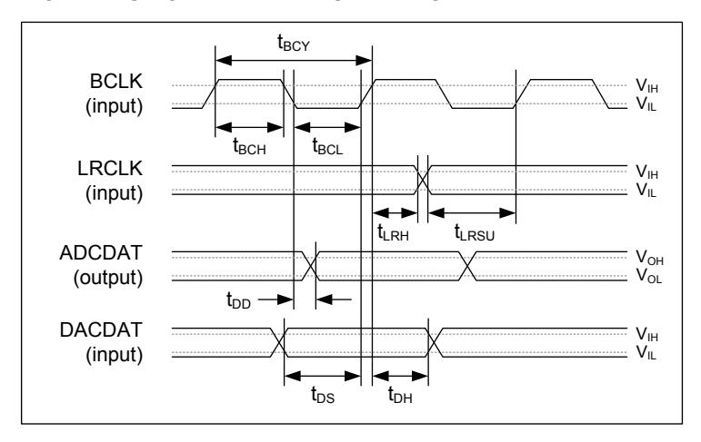
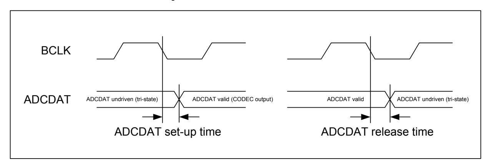
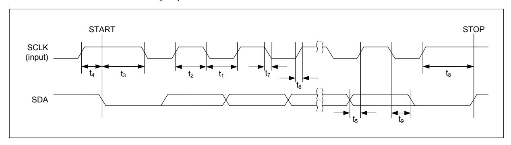
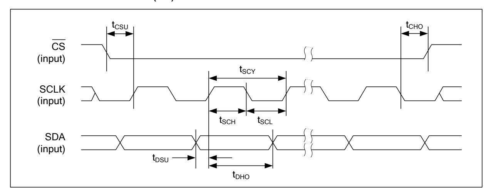
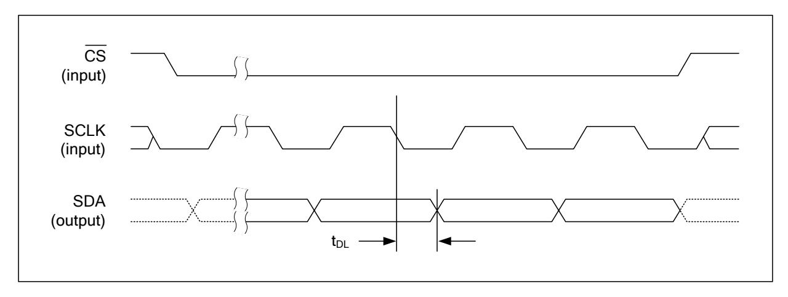
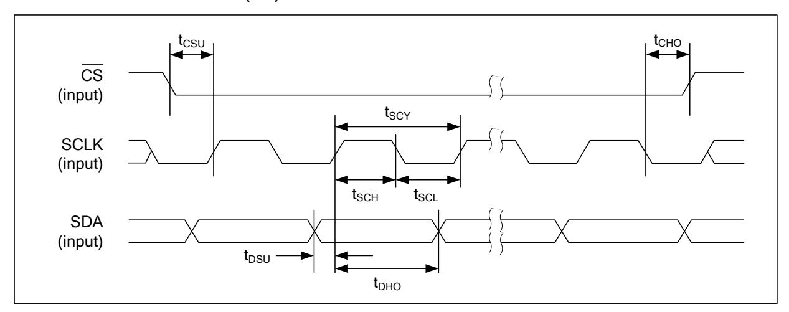
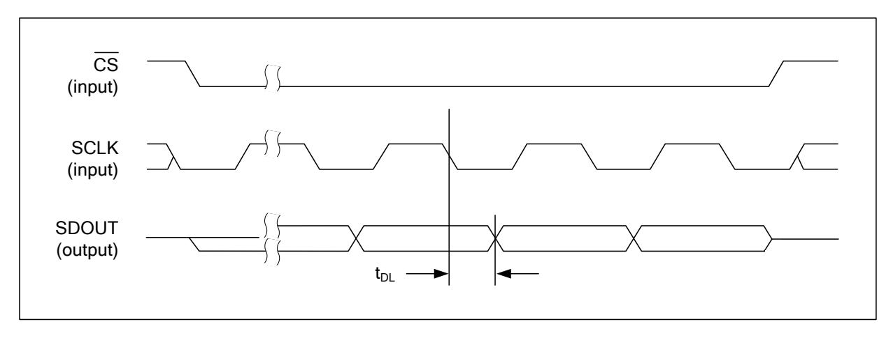

# **SIGNAL TIMING REQUIREMENTS**

## **SYSTEM CLOCKS & FREQUENCY LOCKED LOOP (FLL)**

**Figure 2 Master Clock Timing**

#### **Test Conditions**

The following timing information is valid across the full range of recommended operating conditions.

| PARAMETER                              | SYMBOL | CONDITIONS                                            | MIN   | TYP | MAX   | UNIT |
|----------------------------------------|--------|-------------------------------------------------------|-------|-----|-------|------|
| Master Clock Timing (MCLK1 and MCLK2)  |        |                                                       |       |     |       |      |
|                                        | TMCLKY | MCLK as input to FLL, FLLn_REFCLK_DIV = 01, 10, 11 | 37    |     |       | ns   |
| MCLK cycle time                        |        | MCLK as input to FLL, FLLn_REFCLK_DIV = 00         | 74    |     |       |      |
|                                        |        | FLL not used, AIFnCLK_DIV = 1                         | 40    |     |       |      |
|                                        |        | FLL not used, AIFnCLK_DIV = 0                         | 80    |     |       |      |
| MCLK duty cycle                        |        |                                                       | 60:40 |     | 40:60 |      |
| (= TMCLKH : TMCLKL)                    |        |                                                       |       |     |       |      |
| Frequency Locked Loops (FLL1 and FLL2) |        |                                                       |       |     |       |      |
| FLL Input Frequency                    |        | FLLn_REFCLK_DIV = 00                                  | 0.032 |     | 13.5  | MHz  |
|                                        |        | FLLn_REFCLK_DIV = 01                                  | 0.064 |     | 27    |      |
|                                        |        | FLLn_REFCLK_DIV = 10                                  | 0.128 |     | 27    |      |
|                                        |        | FLLn_REFCLK_DIV = 11                                  | 0.256 |     | 27    |      |
| Internal Clocking                      |        |                                                       |       |     |       |      |
| AIF1CLK frequency                      |        |                                                       |       |     | 12.5  | MHz  |
| AIF2CLK frequency                      |        |                                                       |       |     | 12.5  | MHz  |
| SYSCLK frequency                       |        |                                                       |       |     | 12.5  | MHz  |

## **AUDIO INTERFACE TIMING**

### **DIGITAL MICROPHONE (DMIC) INTERFACE TIMING**

**Figure 3 Digital Microphone Interface Timing**

#### **Test Conditions**

The following timing information is valid across the full range of recommended operating conditions.

| PARAMETER                                          | SYMBOL | MIN   | TYP | MAX   | UNIT |  |  |
|----------------------------------------------------|--------|-------|-----|-------|------|--|--|
| Digital Microphone Interface Timing                |        |       |     |       |      |  |  |
| DMICCLK cycle time                                 | tCY    | 320   |     |       | ns   |  |  |
| DMICCLK duty cycle                                 |        | 45:55 |     | 55:45 |      |  |  |
| DMICDAT (Left) setup time to falling DMICCLK edge  | tLSU   | 15    |     |       | ns   |  |  |
| DMICDAT (Left) hold time from falling DMICCLK edge | tLH    | 0     |     |       | ns   |  |  |
| DMICDAT (Right) setup time to rising DMICCLK edge  | tRSU   | 15    |     |       | ns   |  |  |
| DMICDAT (Right) hold time from rising DMICCLK edge | tRH    | 0     |     |       | ns   |  |  |

## **DIGITAL AUDIO INTERFACE - MASTER MODE**

Figure 4 Audio Interface Timing - Master Mode

Note that BCLK and LRCLK outputs can be inverted if required; Figure 4 shows the default, non-inverted polarity of these signals.

## **Test Conditions**

The following timing information is valid across the full range of recommended operating conditions.

| PARAMETER                                             | SYMBOL           | MIN | TYP | MAX | UNIT |  |  |
|-------------------------------------------------------|------------------|-----|-----|-----|------|--|--|
| Audio Interface Timing - Master Mode                  |                  |     |     |     |      |  |  |
| BCLK cycle time                                       | t BCY | 160 |     |     | ns   |  |  |
| LRCLK propagation delay from BCLK falling edge        | t DL  |     |     | 20  | ns   |  |  |
| ADCDAT propagation delay from BCLK falling edge       | t DDA |     |     | 48  | ns   |  |  |
| DACDAT setup time to BCLK rising edge                 | t DST | 32  |     |     | ns   |  |  |
| DACDAT hold time from BCLK rising edge                | t DHT | 10  |     |     | ns   |  |  |
| Audio Interface Timing - Ultrasonic (4FS) Master Mode |                  |     |     |     |      |  |  |
| BCLK cycle time                                       | t BCY | 80  |     |     | ns   |  |  |
| ADCDAT propagation delay from BCLK falling edge       | t DDA |     |     | 24  | ns   |  |  |

Note that the descriptions above assume non-inverted polarity of BCLK and LRCLK.

#### **DIGITAL AUDIO INTERFACE - SLAVE MODE**

**Figure 5 Audio Interface Timing - Slave Mode**

Note that BCLK and LRCLK inputs can be inverted if required; [Figure 5](#page-3-0) shows the default, noninverted polarity.

#### **Test Conditions**

The following timing information is valid across the full range of recommended operating conditions.

| PARAMETER                                       | SYMBOL | MIN | TYP | MAX | UNIT |  |
|-------------------------------------------------|--------|-----|-----|-----|------|--|
| Audio Interface Timing - Slave Mode             |        |     |     |     |      |  |
| BCLK cycle time                                 | tBCY   | 160 |     |     | ns   |  |
| BCLK pulse width high                           | tBCH   | 64  |     |     | ns   |  |
| BCLK pulse width low                            | tBCL   | 64  |     |     | ns   |  |
| LRCLK set-up time to BCLK rising edge           | tLRSU  | 10  |     |     | ns   |  |
| LRCLK hold time from BCLK rising edge           | tLRH   | 10  |     |     | ns   |  |
| DACDAT hold time from BCLK rising edge          | tDH    | 10  |     |     | ns   |  |
| ADCDAT propagation delay from BCLK falling edge | tDD    |     |     | 48  | ns   |  |
| DACDAT set-up time to BCLK rising edge          | tDS    | 32  |     |     | ns   |  |

Note that the descriptions above assume non-inverted polarity of BCLK and LRCLK.

#### **DIGITAL AUDIO INTERFACE - TDM MODE**

When TDM operation is used on the ADCDATn pins, it is important that two devices do not attempt to drive the ADCDATn pin simultaneously. To support this requirement, the ADCDATn pins can be configured to be tri-stated when not outputting data.

The timing of the WM8994 ADCDATn tri-stating at the start and end of the data transmission is described in [Figure 6](#page-4-0) below.

**Figure 6 Audio Interface Timing - TDM Mode**

#### **Test Conditions**

The following timing information is valid across the full range of recommended operating conditions.

| PARAMETER                                  | MIN | TYP | MAX | UNIT |  |  |  |
|--------------------------------------------|-----|-----|-----|------|--|--|--|
| TDM Timing - Master Mode                   |     |     |     |      |  |  |  |
| ADCDAT setup time from BCLK falling edge   | 0   |     |     | ns   |  |  |  |
| ADCDAT release time from BCLK falling edge |     |     | 15  | ns   |  |  |  |
| TDM Timing - Slave Mode                    |     |     |     |      |  |  |  |
| ADCDAT setup time from BCLK falling edge   | 5   |     |     | ns   |  |  |  |
| ADCDAT release time from BCLK falling edge |     |     | 32  | ns   |  |  |  |

## **CONTROL INTERFACE TIMING**

### **2-WIRE (I2C) CONTROL MODE**

**Figure 7 Control Interface Timing - 2-wire (I2C) Control Mode**

#### **Test Conditions**

The following timing information is valid across the full range of recommended operating conditions.

| PARAMETER                                     | SYMBOL | MIN  | TYP | MAX | UNIT |
|-----------------------------------------------|--------|------|-----|-----|------|
| SCLK Frequency                                |        |      |     | 400 | kHz  |
| SCLK Low Pulse-Width                          | t1     | 1300 |     |     | ns   |
| SCLK High Pulse-Width                         | t2     | 600  |     |     | ns   |
| Hold Time (Start Condition)                   | t3     | 600  |     |     | ns   |
| Setup Time (Start Condition)                  | t4     | 600  |     |     | ns   |
| Data Setup Time                               | t5     | 100  |     |     | ns   |
| SDA, SCLK Rise Time                           | t6     |      |     | 300 | ns   |
| SDA, SCLK Fall Time                           | t7     |      |     | 300 | ns   |
| Setup Time (Stop Condition)                   | t8     | 600  |     |     | ns   |
| Data Hold Time                                | t9     |      |     | 900 | ns   |
| Pulse width of spikes that will be suppressed | tps    | 0    |     | 5   | ns   |

### **3-WIRE (SPI) CONTROL MODE**

**Figure 8 Control Interface Timing - 3-wire (SPI) Control Mode (Write Cycle)**

**Figure 9 Control Interface Timing - 3-wire (SPI) Control Mode (Read Cycle)**

#### **Test Conditions**

The following timing information is valid across the full range of recommended operating conditions.

| PARAMETER                                     | SYMBOL | MIN | TYP | MAX | UNIT |
|-----------------------------------------------|--------|-----|-----|-----|------|
| CS¯¯ falling edge to SCLK rising edge         | tCSU   | 40  |     |     | ns   |
| SCLK falling edge to CS¯¯ rising edge         | tCHO   | 10  |     |     | ns   |
| SCLK pulse cycle time                         | tSCY   | 200 |     |     | ns   |
| SCLK pulse width low                          | tSCL   | 80  |     |     | ns   |
| SCLK pulse width high                         | tSCH   | 80  |     |     | ns   |
| SDA to SCLK set-up time                       | tDSU   | 40  |     |     | ns   |
| SDA to SCLK hold time                         | tDHO   | 10  |     |     | ns   |
| Pulse width of spikes that will be suppressed | tps    | 0   |     | 5   | ns   |
| SCLK falling edge to SDA output transition    | tDL    |     |     | 40  | ns   |

### **4-WIRE (SPI) CONTROL MODE**

**Figure 10 Control Interface Timing - 4-wire (SPI) Control Mode (Write Cycle)**

**Figure 11 Control Interface Timing - 4-wire (SPI) Control Mode (Read Cycle)**

#### **Test Conditions**

The following timing information is valid across the full range of recommended operating conditions.

| PARAMETER                                     | SYMBOL | MIN | TYP | MAX | UNIT |
|-----------------------------------------------|--------|-----|-----|-----|------|
| CS¯¯ falling edge to SCLK rising edge         | tCSU   | 40  |     |     | ns   |
| SCLK falling edge to CS¯¯ rising edge         | tCHO   | 10  |     |     | ns   |
| SCLK pulse cycle time                         | tSCY   | 200 |     |     | ns   |
| SCLK pulse width low                          | tSCL   | 80  |     |     | ns   |
| SCLK pulse width high                         | tSCH   | 80  |     |     | ns   |
| SDA to SCLK set-up time                       | tDSU   | 40  |     |     | ns   |
| SDA to SCLK hold time                         | tDHO   | 10  |     |     | ns   |
| Pulse width of spikes that will be suppressed | tps    | 0   |     | 5   | ns   |
| SCLK falling edge to SDOUT transition         | tDL    |     |     | 40  | ns   |