# **DEVICE DESCRIPTION**

# **INTRODUCTION**

The WM8994 is a low power, high quality audio codec designed to interface with a wide range of processors and analogue components. A high level of mixed-signal integration in a very small footprint makes it ideal for portable applications such as mobile phones. Fully differential internal architecture and on-chip RF noise filters ensure a very high degree of noise immunity.

The analogue circuits of the WM8994 are almost entirely backwards-compatible with the WM8993 with the exception of two additional DAC channels, a dual FLL and two integrated LDO regulators.

Three sets of audio interface pins are available in order to provide independent and fully asynchronous connections to multiple processors, typically an application processor, baseband processor and wireless transceiver. Any two of these interfaces can operate totally independently and asynchronously while the third interface can be synchronised to either of the other two and can also provide ultra low power loopback modes to support, for example, wireless headset voice calls.

Four digital microphone input channels are available to support advanced multi-microphone applications such as noise cancellation. An integrated microphone activity monitor is available to enable the processor to sleep during periods of microphone inactivity, saving power.

Four DAC channels are available to support use cases requiring up to four simultaneous digital audio streams to the output drivers.

Eight highly flexible analogue inputs allow interfacing to up to four microphone inputs (single-ended or differential), plus multiple stereo or mono line inputs. Connections to an external voice CODEC, FM radio, line input, handset MIC and headset MIC are all fully supported. Signal routing to the output mixers and within the CODEC has been designed for maximum flexibility to support a wide variety of usage modes. A 'Direct Voice' path from a voice CODEC directly to the Speaker or Earpiece output drivers is included.

Nine analogue output drivers are integrated, including a stereo pair of high power, high quality Class D/AB switchable speaker drivers; these can support 2W each in stereo mode. It is also possible to configure the speaker drivers as a mono output, giving enhanced performance. A mono earpiece driver is provided, providing output from the output mixers or from the low-power differential 'Direct Voice' path.

One pair of ground-reference headphone outputs is provided; these are powered from an integrated Charge Pump, enabling high quality, power efficient headphone playback without any requirement for DC blocking capacitors. A DC Servo circuit is available for DC offset correction, thereby suppressing pops and reducing power consumption. Four line outputs are provided, with multiple configuration options including 4 x single-ended output or 2 x differential outputs. The line outputs are suitable for output to a voice CODEC, an external speaker driver or line output connector. Ground loop feedback is available on the headphone outputs and the line outputs, providing rejection of noise on the ground connections. All outputs have integrated pop and click suppression features.

Internal differential signal routing and amplifier configurations have been optimised to provide the highest performance and lowest possible power consumption for a wide range of usage scenarios, including voice calls and music playback. The speaker drivers offer low leakage and high PSRR; this enables direct connection to a Lithium battery. The speaker drivers provide eight levels of AC and DC gain to allow output signal levels to be maximised for many commonly-used SPKVDD/AVDD1 combinations.

The ADCs and DACs are of hi-fi quality, using a 24-bit low-order oversampling architecture to deliver optimum performance. A flexible clocking arrangement supports mixed sample rates, whilst integrated ultra-low power dual FLLs provide additional flexibility. A high pass filter is available in all ADC and digital MIC paths for removing DC offsets and suppressing low frequency noise such as mechanical vibration and wind noise. A digital mixing path from the ADC or digital MICs to the DAC provides a sidetone of enhanced quality during voice calls. DAC soft mute and un-mute is available for pop-free music playback.

The integrated Dynamic Range Controllers (DRC) and ReTune Mobile 5-band parametric equaliser (EQ) provide further processing capability of the digital audio paths. The DRC provides compression and signal level control to improve the handling of unpredictable signal levels. 'Anti-clip' and 'quick release' algorithms improve intelligibility in the presence of transients and impulsive noises. The EQ provides the capability to tailor the audio path according to the frequency characteristics of an earpiece or loudspeaker, and/or according to user preferences.

# **WM8994**

The WM8994 has highly flexible digital audio interfaces, supporting a number of protocols, including I 2S, DSP, MSB-first left/right justified, and can operate in master or slave modes. PCM operation is supported in the DSP mode. A-law and -law companding are also supported. Time division multiplexing (TDM) is available to allow multiple devices to stream data simultaneously on the same bus, saving space and power. The four digital MIC and ADC channels and four DAC channels are available via four TDM channels on Digital Audio Interface 1 (AIF1).

A powerful digital mixing core allows data from each TDM channel of each audio interface and from the ADCs and digital MICs to be mixed and re-routed back to a different audio interface and to the 4 DAC output channels. The digital mixing core can operate synchronously with either Audio Interface 1 or Audio Interface 2, with asynchronous stereo full duplex sample rate conversion performed on the other audio interface as required.

The system clock (SYSCLK) provides clocking for the ADCs, DACs, DSP core, digital audio interface and other circuits. SYSCLK can be derived directly from one of the MCLK1 or MCLK2 pins or via one of two integrated FLLs, providing flexibility to support a wide range of clocking schemes. Typical portable system MCLK frequencies, and sample rates from 8kHz to 96kHz are all supported. Automatic configuration of the clocking circuits is available, derived from the sample rate and from the MCLK / SYSCLK ratio.

The WM8994 uses a standard 2, 3 or 4-wire control interface, providing full software control of all features, together with device register readback. An integrated Control Write Sequencer enables automatic scheduling of control sequences; commonly-used signal configurations may be selected using ready-programmed sequences, including time-optimised control of the WM8994 pop suppression features. It is an ideal partner for a wide range of industry standard microprocessors, controllers and DSPs. Unused circuitry can be disabled under software control, in order to save power; low leakage currents enable extended standby/off time in portable battery-powered applications.

Versatile GPIO functionality is provided, with support for button/accessory detect inputs, or for clock, system status, or programmable logic level output for control of additional external circuitry. Interrupt logic, status readback and de-bouncing options are supported within this functionality.

### **ANALOGUE INPUT SIGNAL PATH**

The WM8994 has eight highly flexible analogue input channels, configurable in a large number of combinations:

- 1. Up to four fully differential or single-ended microphone inputs
- 2. Up to eight mono line inputs or 4 stereo line inputs
- 3. A dedicated mono differential input from external voice CODEC

These inputs may be mixed together or independently routed to different combinations of output drivers. An internal record path is provided at the input mixers to allow DAC output to be mixed with the input signal path (e.g. for voice call recording).

The WM8994 input signal paths and control registers are illustrated in Figure 12.

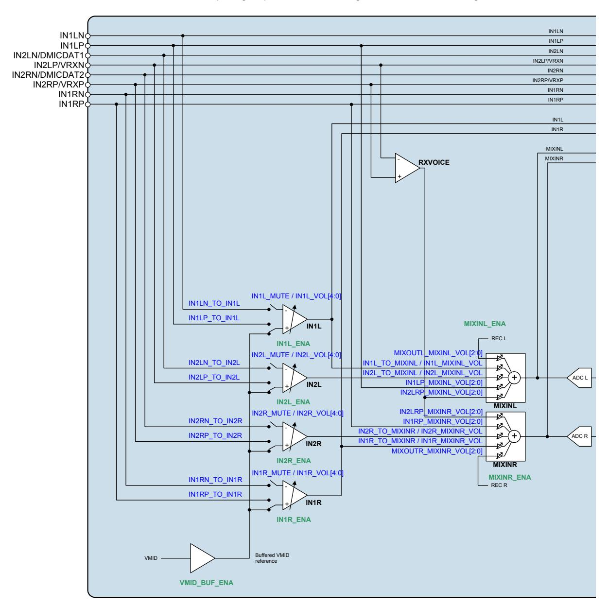

Figure 12 Control Registers for Input Signal Path

#### MICROPHONE INPUTS

Up to four microphones can be connected to the WM8994, either in single-ended or differential mode. A dedicated PGA is provided for each microphone input. Two low noise microphone bias circuits are provided, reducing the need for external components.

For single-ended microphone inputs, the microphone signal is connected to the inverting input of the PGAs (IN1LN, IN2LN, IN1RN or IN2RN). The non-inverting inputs of the PGAs are internally connected to VMID in this configuration. The non-inverting input pins IN1LP, IN2LP, IN1RP and IN2RP are free to be used as line connections to the input or output mixers in this configuration.

For differential microphone inputs, the non-inverted microphone signal is connected to the non-inverting input of the PGAs (IN1LP, IN2LP, IN1RP or IN2RP), whilst the inverted (or 'noisy ground') signal is connected to the inverting input pins (IN1LN, IN2LN, IN1RN and IN2RN).

The gain of the input PGAs is controlled via register settings, as defined in Table 4. Note that the input impedance of both inverting and non-inverting inputs changes with the input PGA gain setting, as described under "Electrical Characteristics". See also the "Applications Information" for details of input resistance at all PGA Gain settings.

The microphone input configurations are illustrated in Figure 13 and Figure 14. Note that any PGA input pin that is used in either microphone configuration is not available for use as a line input path at the same time.

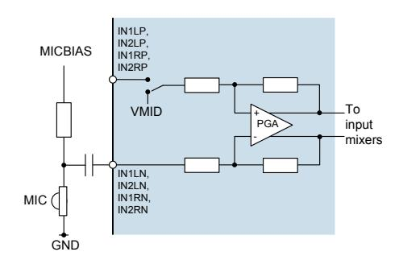

Figure 13 Single-Ended Microphone Input

Figure 14 Differential Microphone Input

# **MICROPHONE BIAS CONTROL**

There are two MICBIAS generators which provide low noise reference voltages suitable for powering silicon (MEMS) microphones or biasing electret condenser (ECM) type microphones via an external resistor.

The MICBIAS voltages can be independently enabled using the MICB1\_ENA and MICB2\_ENA control bits; the voltage of each can be selected using the MICB1\_LVL and MICB2\_LVL register bits as detailed in Table 1.

An external decoupling capacitor is required on each of the MICBIAS outputs, and must be connected whenever the associated MICBIAS output is enabled. Enabling either of the MICBIAS outputs with no external capacitor may result in degraded device performance and is not recommended. Refer to the "Applications Information" section for recommended external components.

When a MICBIAS output is disabled, the output pin can be configured to be floating or to be actively discharged. This is selected using the MICB1\_DISCH and MICB2\_DISCH register btis.

| REGISTER ADDRESS | BIT | LABEL       | DEFAULT | DESCRIPTION                           |
|---------------------|-----|-------------|---------|---------------------------------------|
| R1                  | 5   | MICB2_ENA   | 0       | Microphone Bias 2 Enable              |
| (0001h)             |     |             |         | 0 = Disabled                          |
| Power               |     |             |         | 1 = Enabled                           |
| Managem             | 4   | MICB1_ENA   | 0       | Microphone Bias 1 Enable              |
| ent (1)             |     |             |         | 0 = Disabled                          |
|                     |     |             |         | 1 = Enabled                           |
| R57                 | 8   | MICB2_DISCH | 0       | Microphone Bias 2 Discharge           |
| (0039h)             |     |             |         | 0 = MICBIAS2 floating when disabled   |
| AntiPOP             |     |             |         | 1 = MICBIAS2 discharged when disabled |
| (2)                 | 7   | MICB1_DISCH | 0       | Microphone Bias 1 Discharge           |
|                     |     |             |         | 0 = MICBIAS1 floating when disabled   |
|                     |     |             |         | 1 = MICBIAS1 discharged when disabled |
| R58                 | 1   | MICB2_LVL   | 0       | Microphone Bias 2 Voltage Control     |
| (003Ah)             |     |             |         | 0 = 0.9 * AVDD1                       |
| MICBIAS             |     |             |         | 1 = 0.65 * AVDD1                      |
|                     | 0   | MICB1_LVL   | 0       | Microphone Bias 1 Voltage Control     |
|                     |     |             |         | 0 = 0.9 * AVDD1                       |
|                     |     |             |         | 1 = 0.65 * AVDD1                      |

**Table 1 Microphone Bias Control**

Note that the maximum source current capability for MICBIAS1 and MICBIAS2 is 2.4mA each. The external biasing resistance must be large enough to limit each MICBIAS current to 2.4mA across the full microphone impedance range.

An external capacitor is required on MICBIAS1 and MICBIAS2 in order to ensure accuracy and stability of each regulator. The recommended capacitance is 4.7F in each case. See "Recommended External Components" for further details.

Note that, if the MICBIAS1 or MICBIAS2 regulator is not enabled, then no external capacitor is required on the respective MICBIAS pin.

#### **MICROPHONE CURRENT DETECT**

A MICBIAS current detect function allows detection of accessories such as headset microphones. When the MICBIAS load current exceeds one of two programmable thresholds, (e.g. short circuit current or normal operating current), an interrupt or GPIO output can be generated. The current detection circuit is enabled by the MICD\_ENA bit; the current thresholds are selected by the MICD\_THR and MICD\_SCTHR register fields as described in [Table 83.](#page-113-0) See ["General Purpose](#page-105-0)  [Input/Output"](#page-105-0) for a full description of these fields.

### **LINE AND VOICE CODEC INPUTS**

All eight analogue input pins may be used as line inputs. Each line input has different signal path options, providing flexibility, high performance and low power consumption for many different usage modes.

IN1LN and IN1RN can operate as single-ended line inputs to the input PGAs IN1L and IN1R respectively. These inputs provide a high gain path if required for low input signal levels.

IN2LN and IN2RN can operate as single-ended line inputs to the input PGAs IN2L and IN2R respectively, providing further high gain signal paths. These pins can also be connected to either of the output mixers MIXOUTL and MIXOUTR.

IN1LP and IN1RP can operate as single-ended line inputs to the input mixers MIXINL and MIXINR, or to the speaker mixers SPKMIXL and SPKMIXR. These signal paths enable power consumption to be reduced, by allowing the input PGAs and other circuits to be disabled if not required.

IN2LP/VRXN and IN2RP/VRXP can operate in three different ways:

- Mono differential 'RXVOICE' input (e.g. from an external voice CODEC) to the input mixers MIXINL and MIXINR.
- Single-ended line inputs to either of the output mixers MIXOUTL and MIXOUTR.
- Ultra-low power mono differential 'Direct Voice' input (e.g. from an external voice CODEC) to the ear speaker driver on HPOUT2, or to either of the speaker drivers on SPKOUTL and SPKOUTR.

Signal path configuration to the input PGAs and input mixers is detailed later in this section. Signal path configuration to the output mixers and speaker mixers is described in ["Analogue Output Signal](#page-70-0)  [Path"](#page-70-0).

The line input and voice CODEC input configurations are illustrated i[n Figure 15](#page-5-0) through t[o Figure 18.](#page-5-1)

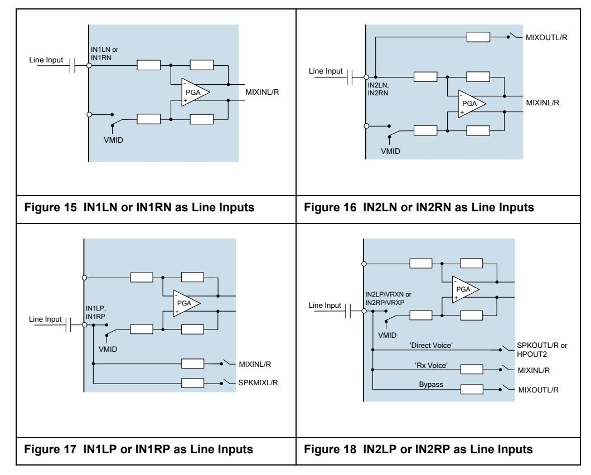

#### **INPUT PGA ENABLE**

The Input PGAs are enabled using register bits IN1L\_ENA, IN2L\_ENA, IN1R\_ENA and IN2R\_ENA, as described in [Table 2.](#page-6-0) The Input PGAs must be enabled for microphone input on the respective input pins, or for line input on the inverting input pins IN1LN, IN1RN, IN2LN, IN2RN.

| REGISTER ADDRESS | BIT | LABEL    | DEFAULT | DESCRIPTION           |
|---------------------|-----|----------|---------|-----------------------|
| R2 (0002h)          | 7   | IN2L_ENA | 0       | IN2L Input PGA Enable |
| Power               |     |          |         | 0 = Disabled          |
| Management          |     |          |         | 1 = Enabled           |
| (2)                 | 6   | IN1L_ENA | 0       | IN1L Input PGA Enable |
|                     |     |          |         | 0 = Disabled          |
|                     |     |          |         | 1 = Enabled           |
|                     | 5   | IN2R_ENA | 0       | IN2R Input PGA Enable |
|                     |     |          |         | 0 = Disabled          |
|                     |     |          |         | 1 = Enabled           |
|                     | 4   | IN1R_ENA | 0       | IN1R Input PGA Enable |
|                     |     |          |         | 0 = Disabled          |
|                     |     |          |         | 1 = Enabled           |

**Table 2 Input PGA Enable**

For normal operation of the input PGAs, the reference voltage VMID and the bias current must also be enabled. See ["Reference Voltages and Master Bias"](#page-191-0) for details of the associated controls VMID\_SEL and BIAS\_ENA.

#### **INPUT PGA CONFIGURATION**

Each of the Input PGAs can operate in a single-ended or differential mode. In differential mode, both inputs to the PGA are connected to the input source. In single-ended mode, the non-inverting input to the PGA must be connected to VMID. Configuration of the PGA inputs to the WM8994 input pins is controlled using the register bits shown i[n Table 3.](#page-7-0)

Single-ended microphone operation is configured by connecting the input source to the inverting input of the applicable PGA. The non-inverting input of the PGA must be connected to the buffered VMID reference. Note that the buffered VMID reference must be enabled, using the VMID\_BUF\_ENA register, as described in ["Reference Voltages and Master Bias"](#page-191-0).

Differential microphone operation is configured by connecting the input source to both inputs of the applicable PGA.

Line inputs to the input pins IN1LN, IN2LN, IN1RN and IN2RN must be connected to the applicable PGA. The non-inverting input of the PGA must be connected to VMID.

Line inputs to the input pins IN1LP, IN2LP, IN1RP or IN2RP do not connect to the input PGAs. The non-inverting inputs of the associated PGAs must be connected to VMID. The inverting inputs of the associated PGAs may be used as separate mic/line inputs if required.

The maximum available attenuation on any of these input paths is achieved by using register bits shown i[n Table 3](#page-7-0) to disconnect the input pins from the applicable PGA.

| REGISTER ADDRESS | BIT | LABEL         | DEFAULT | DESCRIPTION                               |
|---------------------|-----|---------------|---------|-------------------------------------------|
| R40 (0028h)         | 7   | IN2LP_TO_IN2L | 0       | IN2L PGA Non-Inverting Input Select       |
| Input Mixer         |     |               |         | 0 = Connected to VMID                     |
| (2)                 |     |               |         | 1 = Connected to IN2LP                    |
|                     |     |               |         | Note that VMID_BUF_ENA must be            |
|                     |     |               |         | set when using IN2L connected to VMID. |
|                     | 6   | IN2LN_TO_IN2L | 0       | IN2L PGA Inverting Input Select           |
|                     |     |               |         | 0 = Not connected                         |
|                     |     |               |         | 1 = Connected to IN2LN                    |
|                     | 5   | IN1LP_TO_IN1L | 0       | IN1L PGA Non-Inverting Input Select       |
|                     |     |               |         | 0 = Connected to VMID                     |
|                     |     |               |         | 1 = Connected to IN1LP                    |
|                     |     |               |         | Note that VMID_BUF_ENA must be            |
|                     |     |               |         | set when using IN1L connected to          |
|                     |     |               |         | VMID.                                     |
|                     | 4   | IN1LN_TO_IN1L | 0       | IN1L PGA Inverting Input Select           |
|                     |     |               |         | 0 = Not connected                         |
|                     |     |               |         | 1 = Connected to IN1LN                    |
|                     | 3   | IN2RP_TO_IN2R | 0       | IN2R PGA Non-Inverting Input Select       |
|                     |     |               |         | 0 = Connected to VMID                     |
|                     |     |               |         | 1 = Connected to IN2RP                    |
|                     |     |               |         | Note that VMID_BUF_ENA must be            |
|                     |     |               |         | set when using IN2R connected to VMID. |
|                     | 2   | IN2RN_TO_IN2R | 0       | IN2R PGA Inverting Input Select           |
|                     |     |               |         | 0 = Not connected                         |
|                     |     |               |         | 1 = Connected to IN2RN                    |
|                     | 1   | IN1RP_TO_IN1R | 0       | IN1R PGA Non-Inverting Input Select       |
|                     |     |               |         | 0 = Connected to VMID                     |
|                     |     |               |         | 1 = Connected to IN1RP                    |
|                     |     |               |         | Note that VMID_BUF_ENA must be            |
|                     |     |               |         | set when using IN1R connected to VMID. |
|                     | 0   | IN1RN_TO_IN1R | 0       | IN1R PGA Inverting Input Select           |
|                     |     |               |         | 0 = Not connected                         |
|                     |     |               |         | 1 = Connected to IN1RN                    |

**Table 3 Input PGA Configuration**

### **INPUT PGA VOLUME CONTROL**

Each of the four Input PGAs has an independently controlled gain range of -16.5dB to +30dB in 1.5dB steps. The gains on the inverting and non-inverting inputs to the PGAs are always equal. Each Input PGA can be independently muted using the PGA mute bits as described in [Table 4,](#page-9-0) with maximum mute attenuation achieved by simultaneously disconnecting the corresponding inputs described in [Table 3.](#page-7-0)

Note that, under default conditions (following power-up or software reset), the PGA mute register bits are set to '1', but the mute functions will only become effective after the respective bit has been toggled to '0' and then back to '1'. The Input PGAs will be un-muted (Mute disabled) after power-up or software reset, regardless of the readback value of the respective PGA mute bits.

To prevent "zipper noise", a zero-cross function is provided on the input PGAs. When this feature is enabled, volume updates will not take place until a zero-crossing is detected. In the case of a long period without zero-crossings, a timeout function is provided. When the zero-cross function is enabled, the volume will update after the timeout period if no earlier zero-cross has occurred. The timeout clock is enabled using TOCLK\_ENA, the timeout period is set by TOCLK\_DIV. See ["Clocking](#page-149-0)  [and Sample Rates"](#page-149-0) for more information on these fields.

The IN1\_VU and IN2\_VU bits control the loading of the input PGA volume data. When IN1\_VU and IN2\_VU are set to 0, the PGA volume data will be loaded into the respective control register, but will not actually change the gain setting. The IN1L and IN1R volume settings are both updated when a 1 is written to IN1\_VU; the IN2L and IN2R volume settings are both updated when a 1 is written to IN2\_VU. This makes it possible to update the gain of the left and right signal paths simultaneously.

The Input PGA Volume Control register fields are described in [Table 4](#page-9-0) and [Table 5.](#page-10-0)

| REGISTER ADDRESS           | BIT | LABEL     | DEFAULT | DESCRIPTION                                                                                           |
|-------------------------------|-----|-----------|---------|-------------------------------------------------------------------------------------------------------|
| R24 (0018h)                   | 8   | IN1_VU    | N/A     | Input PGA Volume Update                                                                               |
| Left Line Input 1&2 Volume |     |           |         | Writing a 1 to this bit will cause IN1L and IN1R input PGA volumes to be updated simultaneously |
|                               | 7   | IN1L_MUTE | 1       | IN1L PGA Mute                                                                                         |
|                               |     |           |         | 0 = Disable Mute                                                                                      |
|                               |     |           |         | 1 = Enable Mute                                                                                       |
|                               | 6   | IN1L_ZC   | 0       | IN1L PGA Zero Cross Detector                                                                          |
|                               |     |           |         | 0 = Change gain immediately                                                                           |
|                               |     |           |         | 1 = Change gain on zero cross only                                                                    |
|                               | 4:0 | IN1L_VOL  | 01011   | IN1L Volume                                                                                           |
|                               |     | [4:0]     | (0dB)   | -16.5dB to +30dB in 1.5dB steps                                                                       |
|                               |     |           |         | (See Table 5 for volume range)                                                                        |
| R25 (0019h)                   | 8   | IN2_VU    | N/A     | Input PGA Volume Update                                                                               |
| Left Line Input 3&4 Volume |     |           |         | Writing a 1 to this bit will cause IN2L and IN2R input PGA volumes to be updated simultaneously |
|                               | 7   | IN2L_MUTE | 1       | IN2L PGA Mute                                                                                         |
|                               |     |           |         | 0 = Disable Mute                                                                                      |
|                               |     |           |         | 1 = Enable Mute                                                                                       |
|                               | 6   | IN2L_ZC   | 0       | IN2L PGA Zero Cross Detector                                                                          |
|                               |     |           |         | 0 = Change gain immediately                                                                           |
|                               |     |           |         | 1 = Change gain on zero cross only                                                                    |
|                               | 4:0 | IN2L_VOL  | 01011   | IN2L Volume                                                                                           |
|                               |     | [4:0]     | (0dB)   | -16.5dB to +30dB in 1.5dB steps                                                                       |
|                               |     |           |         | (See Table 5 for volume range)                                                                        |

| R26 (001Ah)                       | 8   | IN1_VU    | N/A   | Input PGA Volume Update                                                                               |
|-----------------------------------|-----|-----------|-------|-------------------------------------------------------------------------------------------------------|
| Right Line Input 1&2 Volume |     |           |       | Writing a 1 to this bit will cause IN1L and IN1R input PGA volumes to be updated simultaneously |
|                                   | 7   | IN1R_MUTE | 1     | IN1R PGA Mute                                                                                         |
|                                   |     |           |       | 0 = Disable Mute                                                                                      |
|                                   |     |           |       | 1 = Enable Mute                                                                                       |
|                                   | 6   | IN1R_ZC   | 0     | IN1R PGA Zero Cross Detector                                                                          |
|                                   |     |           |       | 0 = Change gain immediately                                                                           |
|                                   |     |           |       | 1 = Change gain on zero cross only                                                                    |
|                                   | 4:0 | IN1R_VOL  | 01011 | IN1R Volume                                                                                           |
|                                   |     | [4:0]     | (0dB) | -16.5dB to +30dB in 1.5dB steps                                                                       |
|                                   |     |           |       | (See Table 5 for volume range)                                                                        |
| R27 (001Bh)                       | 8   | IN2_VU    | N/A   | Input PGA Volume Update                                                                               |
| Right Line Input 3&4 Volume |     |           |       | Writing a 1 to this bit will cause IN2L and IN2R input PGA volumes to be updated simultaneously |
|                                   | 7   | IN2R_MUTE | 1     | IN2R PGA Mute                                                                                         |
|                                   |     |           |       | 0 = Disable Mute                                                                                      |
|                                   |     |           |       | 1 = Enable Mute                                                                                       |
|                                   | 6   | IN2R_ZC   | 0     | IN2R PGA Zero Cross Detector                                                                          |
|                                   |     |           |       | 0 = Change gain immediately                                                                           |
|                                   |     |           |       | 1 = Change gain on zero cross only                                                                    |
|                                   | 4:0 | IN2R_VOL  | 01011 | IN2R Volume                                                                                           |
|                                   |     | [4:0]     | (0dB) | -16.5dB to +30dB in 1.5dB steps                                                                       |
|                                   |     |           |       | (See Table 5 for volume range)                                                                        |

**Table 4 Input PGA Volume Control**

| IN1L_VOL[4:0], IN2L_VOL[4:0], | VOLUME |
|-------------------------------|--------|
| IN1R_VOL[4:0], IN2R_VOL[4:0]  | (dB)   |
| 00000                         | -16.5  |
| 00001                         | -15.0  |
| 00010                         | -13.5  |
| 00011                         | -12.0  |
| 00100                         | -10.5  |
| 00101                         | -9.0   |
| 00110                         | -7.5   |
| 00111                         | -6.0   |
| 01000                         | -4.5   |
| 01001                         | -3.0   |
| 01010                         | -1.5   |
| 01011                         | 0      |
| 01100                         | +1.5   |
| 01101                         | +3.0   |
| 01110                         | +4.5   |
| 01111                         | +6.0   |
| 10000                         | +7.5   |
| 10001                         | +9.0   |
| 10010                         | +10.5  |
| 10011                         | +12.0  |
| 10100                         | +13.5  |
| 10101                         | +15.0  |
| 10110                         | +16.5  |
| 10111                         | +18.0  |
| 11000                         | +19.5  |
| 11001                         | +21.0  |
| 11010                         | +22.5  |
| 11011                         | +24.0  |
| 11100                         | +25.5  |
| 11101                         | +27.0  |
| 11110                         | +28.5  |
| 11111                         | +30.0  |
|                               |        |

**Table 5 Input PGA Volume Range**

### **INPUT MIXER ENABLE**

The WM8994 has two analogue input mixers which allow the Input PGAs and Line Inputs to be combined in a number of ways and output to the ADCs, Output Mixers, or directly to the output drivers via bypass paths.

The input mixers MIXINL and MIXINR are enabled by the MIXINL\_ENA and MIXINR\_ENA register bits, as described in [Table 6.](#page-11-0) These control bits also enable the RXVOICE input path, described in the following section.

For normal operation of the input mixers, the reference voltage VMID and the bias current must also be enabled. See ["Reference Voltages and Master Bias"](#page-191-0) for details of the associated controls VMID\_SEL and BIAS\_ENA.

| REGISTER ADDRESS | BIT | LABEL      | DEFAULT | DESCRIPTION                                                     |
|---------------------|-----|------------|---------|-----------------------------------------------------------------|
| R2 (0002h) Power | 9   | MIXINL_ENA | 0       | Left Input Mixer Enable (Enables MIXINL and RXVOICE input to |
| Management          |     |            |         | MIXINL)                                                         |
| (2)                 |     |            |         | 0 = Disabled                                                    |
|                     |     |            |         | 1 = Enabled                                                     |
|                     | 8   | MIXINR_ENA | 0       | Right Input Mixer Enable                                        |
|                     |     |            |         | (Enables MIXINR and RXVOICE input to MIXINR)                 |
|                     |     |            |         | 0 = Disabled                                                    |
|                     |     |            |         | 1 = Enabled                                                     |

**Table 6 Input Mixer Enable**

# **INPUT MIXER CONFIGURATION AND VOLUME CONTROL**

The left and right channel input mixers MIXINL and MIXINR can be configured to take input from up to five sources:

- 1. IN1L or IN1R Input PGA
- 2. IN2L or IN2R Input PGA
- 3. IN1LP or IN1RP pin (PGA bypass)
- 4. RXVOICE mono differential input from IN2LP/VRXN and IN2RP/VRXP
- 5. MIXOUTL or MIXOUTR Output Mixer (Record path)

The Input Mixer configuration and volume controls are described in [Table 7](#page-13-0) for the Left input mixer (MIXINL) and [Table 8](#page-14-0) for the Right input mixer (MIXINR). The signal levels from the Input PGAs may be set to Mute, 0dB or 30dB boost. Gain controls for the PGA bypass, RXVOICE and Record paths provide adjustment from -12dB to +6dB in 3dB steps.

When using the IN1LP or IN1RP signal paths direct to the input mixers (PGA bypass paths), a signal gain of +15dB can be selected using the IN1RP\_MIXINR\_BOOST or IN1LP\_MIXINL\_BOOST register bits. See [Table 7](#page-13-0) an[d Table 8](#page-14-0) for further details.

When using the IN1LP or IN1RP signal paths direct to the input mixers (PGA bypass paths), the buffered VMID reference must be enabled, using the VMID\_BUF\_ENA register, as described in ["Reference Voltages and Master Bias"](#page-191-0).

To prevent pop noise, it is recommended that gain and mute controls for the input mixers are not modified while the signal paths are active. If volume control is required on these signal paths, it is recommended that this is implemented using the input PGA volume controls or the ADC volume controls. The ADC volume controls are described in the ["Analogue to Digital Converter \(ADC\)"](#page-18-0) section.

| REGISTER ADDRESS | BIT | LABEL                       | DEFAULT       | DESCRIPTION                                                                                 |
|---------------------|-----|-----------------------------|---------------|---------------------------------------------------------------------------------------------|
| R21 (0015h)      | 7   | IN1LP_MIXINL_BOOST          | 0             | IN1LP Pin (PGA Bypass) to MIXINL Gain Boost.                                             |
| Input Mixer (1)  |     |                             |               | This bit selects the maximum gain setting of the IN1LP_MIXINL_VOL register.           |
|                     |     |                             |               | 0 = Maximum gain is +6dB                                                                    |
|                     |     |                             |               | 1 = Maximum gain is +15dB                                                                   |
| R41                 | 8   | IN2L_TO_MIXINL              | 0             | IN2L PGA Output to MIXINL Mute                                                              |
| (0029h)             |     |                             |               | 0 = Mute                                                                                    |
| Input Mixer (3)  |     |                             |               | 1 = Un-Mute                                                                                 |
|                     | 7   | IN2L_MIXINL_VOL             | 0             | IN2L PGA Output to MIXINL Gain                                                              |
|                     |     |                             |               | 0 = 0dB                                                                                     |
|                     |     |                             |               | 1 = +30dB                                                                                   |
|                     | 5   | IN1L_TO_MIXINL              | 0             | IN1L PGA Output to MIXINL Mute                                                              |
|                     |     |                             |               | 0 = Mute                                                                                    |
|                     |     |                             |               | 1 = Un-Mute                                                                                 |
|                     | 4   | IN1L_MIXINL_VOL             | 0             | IN1L PGA Output to MIXINL Gain                                                              |
|                     |     |                             |               | 0 = 0dB                                                                                     |
|                     |     |                             |               | 1 = +30dB                                                                                   |
|                     | 2:0 | MIXOUTL_MIXINL_VOL [2:0] | 000 (Mute) | Record Path MIXOUTL to MIXINL Gain and Mute                                              |
|                     |     |                             |               | 000 = Mute                                                                                  |
|                     |     |                             |               | 001 = -12dB                                                                                 |
|                     |     |                             |               | 010 = -9dB                                                                                  |
|                     |     |                             |               | 011 = -6dB                                                                                  |
|                     |     |                             |               | 100 = -3dB                                                                                  |
|                     |     |                             |               | 101 = 0dB                                                                                   |
|                     |     |                             |               | 110 = +3dB                                                                                  |
|                     |     |                             |               | 111 = +6dB                                                                                  |
| R43 (002Bh)      | 8:6 | IN1LP_MIXINL_VOL [2:0]   | 000 (Mute) | IN1LP Pin (PGA Bypass) to MIXINL Gain and Mute                                           |
| Input Mixer         |     |                             |               | 000 = Mute                                                                                  |
| (5)                 |     |                             |               | 001 = -12dB                                                                                 |
|                     |     |                             |               | 010 = -9dB                                                                                  |
|                     |     |                             |               | 011 = -6dB                                                                                  |
|                     |     |                             |               | 100 = -3dB                                                                                  |
|                     |     |                             |               | 101 = 0dB                                                                                   |
|                     |     |                             |               | 110 = +3dB                                                                                  |
|                     |     |                             |               | 111 = +6dB (see note below).                                                                |
|                     |     |                             |               | When IN1LP_MIXINL_BOOST is                                                                  |
|                     |     |                             |               | set, then the maximum gain                                                                  |
|                     |     |                             |               | setting is increased to +15dB, ie.                                                          |
|                     |     |                             |               | 111 = +15dB.                                                                                |
|                     |     |                             |               | Note that VMID_BUF_ENA must be set when using the IN1LP (PGA Bypass) input to MIXINL. |

| REGISTER ADDRESS | BIT | LABEL                      | DEFAULT       | DESCRIPTION                                                                                                                                                                          |
|---------------------|-----|----------------------------|---------------|--------------------------------------------------------------------------------------------------------------------------------------------------------------------------------------|
|                     | 2:0 | IN2LRP_MIXINL_VOL [2:0] | 000 (Mute) | RXVOICE Differential Input (VRXP-VRXN) to MIXINL Gain and Mute 000 = Mute 001 = -12dB 010 = -9dB 011 = -6dB 100 = -3dB 101 = 0dB 110 = +3dB 111 = +6dB |

**Table 7 Left Input Mixer (MIXINL) Volume Control**

| REGISTER ADDRESS        | BIT | LABEL              | DEFAULT | DESCRIPTION                                                                       |
|----------------------------|-----|--------------------|---------|-----------------------------------------------------------------------------------|
| R21 (0015h) Input Mixer | 8   | IN1RP_MIXINR_BOOST | 0       | IN1RP Pin (PGA Bypass) to MIXINR Gain Boost.                                   |
| (1)                        |     |                    |         | This bit selects the maximum gain setting of the IN1RP_MIXINR_VOL register. |
|                            |     |                    |         | 0 = Maximum gain is +6dB                                                          |
|                            |     |                    |         | 1 = Maximum gain is +15dB                                                         |
| R42 (002A)                 | 8   | IN2R_TO_MIXINR     | 0       | IN2R PGA Output to MIXINR Mute                                                    |
| Input Mixer                |     |                    |         | 0 = Mute                                                                          |
| (4)                        |     |                    |         | 1 = Un-Mute                                                                       |
|                            | 7   | IN2R_MIXINR_VOL    | 0       | IN2R PGA Output to MIXINR Gain                                                    |
|                            |     |                    |         | 0 = 0dB                                                                           |
|                            |     |                    |         | 1 = +30dB                                                                         |
|                            | 5   | IN1R_TO_MIXINR     | 0       | IN1R PGA Output to MIXINR Mute                                                    |
|                            |     |                    |         | 0 = Mute                                                                          |
|                            |     |                    |         | 1 = Un-Mute                                                                       |
|                            | 4   | IN1R_MIXINR_VOL    | 0       | IN1R PGA Output to MIXINR Gain                                                    |
|                            |     |                    |         | 0 = 0dB                                                                           |
|                            |     |                    |         | 1 = +30dB                                                                         |
|                            | 2:0 | MIXOUTR_MIXINR_VOL | 000     | Record Path MIXOUTR to MIXINR                                                     |
|                            |     | [2:0]              | (Mute)  | Gain and Mute                                                                     |
|                            |     |                    |         | 000 = Mute                                                                        |
|                            |     |                    |         | 001 = -12dB                                                                       |
|                            |     |                    |         | 010 = -9dB                                                                        |
|                            |     |                    |         | 011 = -6dB                                                                        |
|                            |     |                    |         | 100 = -3dB                                                                        |
|                            |     |                    |         | 101 = 0dB                                                                         |
|                            |     |                    |         | 110 = +3dB                                                                        |
|                            |     |                    |         | 111 = +6dB                                                                        |

| REGISTER ADDRESS                  | BIT | LABEL                      | DEFAULT       | DESCRIPTION                                                                                                                                                                                                                                                                                                                                                                                          |
|--------------------------------------|-----|----------------------------|---------------|------------------------------------------------------------------------------------------------------------------------------------------------------------------------------------------------------------------------------------------------------------------------------------------------------------------------------------------------------------------------------------------------------|
| R44 (002Ch) Input Mixer (6) | 8:6 | IN1RP_MIXINR_VOL [2:0]  | 000 (Mute) | IN1RP Pin (PGA Bypass) to MIXINR Gain and Mute 000 = Mute 001 = -12dB 010 = -9dB 011 = -6dB 100 = -3dB 101 = 0dB 110 = +3dB 111 = +6dB (see note below). When IN1RP_MIXINR_BOOST is set, then the maximum gain setting is increased to +15dB, ie. 111 = +15dB. Note that VMID_BUF_ENA must be set when using the IN1RP (PGA Bypass) input to MIXINR. |
|                                      | 2:0 | IN2LRP_MIXINR_VOL [2:0] | 000 (Mute) | RXVOICE Differential Input (VRXP-VRXN) to MIXINR Gain and Mute 000 = Mute 001 = -12dB 010 = -9dB 011 = -6dB 100 = -3dB 101 = 0dB 110 = +3dB 111 = +6dB                                                                                                                                                                                                                 |

**Table 8 Right Input Mixer (MIXINR) Volume Control**

### DIGITAL MICROPHONE INTERFACE

The WM8994 supports a four-channel digital microphone interface. Two channels of audio data are multiplexed on the DMICDAT1 pin and a further two channels are multiplexed on the DMICDAT2 pin. All four channels are clocked using the DMICCLK output pin.

The DMICDAT1 function is shared with the IN2LN pin; the analogue signal paths from IN2LN cannot be used when this pin is used for DMICDAT1 digital microphone input.

The DMICDAT2 function is shared with the IN2RN pin; the analogue signal paths from IN2RN cannot be used when this pin is used for DMICDAT2 digital microphone input.

The digital microphone interface is referenced to the MICBIAS1 voltage domain; the MICBIAS1 output must be enabled (MICB1 ENA = 1) when using the digital microphone interface.

The MICBIAS1 generator is suitable for use as a low noise supply for the digital microphones. (See "Analogue Input Signal Path" for details of the MICBIAS1 generator.)

When digital microphone input is enabled, the WM8994 outputs a clock signal on the DMICCLK pin. The DMICCLK frequency for all supported digital microphone clocking modes is described later in this section.

A pair of digital microphones is connected as illustrated in Figure 19. The microphones must be configured to ensure that the Left mic transmits a data bit when DMICCLK is high, and the Right mic transmits a data bit when DMICCLK is low. The WM8994 samples the digital microphone data at the end of each DMICCLK phase. Each microphone must tri-state its data output when the other microphone is transmitting.

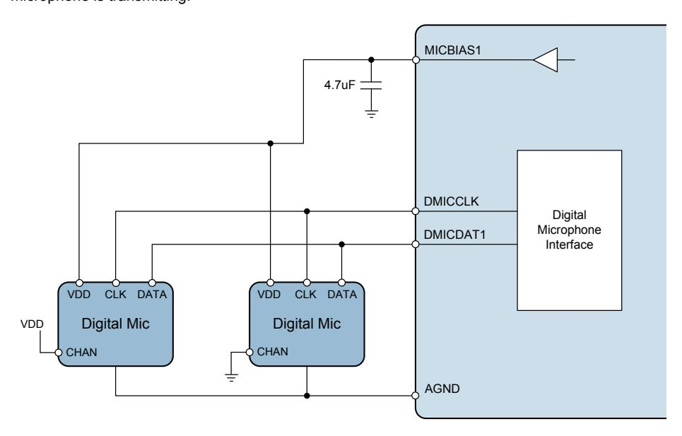

Figure 19 Digital Microphone Input

The DMICDAT1 digital microphone channels are enabled using DMIC1L\_ENA and DMIC1R\_ENA. When these signal paths are enabled, the respective ADC path is disconnected and the digital microphone data is routed to the digital mixing input bus, as illustrated in "Digital Mixing".

The DMICDAT2 digital microphone channels are enabled using DMIC2L\_ENA and DMIC2R\_ENA. When these signal paths are enabled, the digital microphone data is routed to the digital mixing input bus, as illustrated in "Digital Mixing".

Two microphone channels are interleaved on DMICDAT1; another two channels are interleaved on DMICDAT2. The timing is illustrated in Figure 20. Each microphone must tri-state its data output when the other microphone is transmitting.

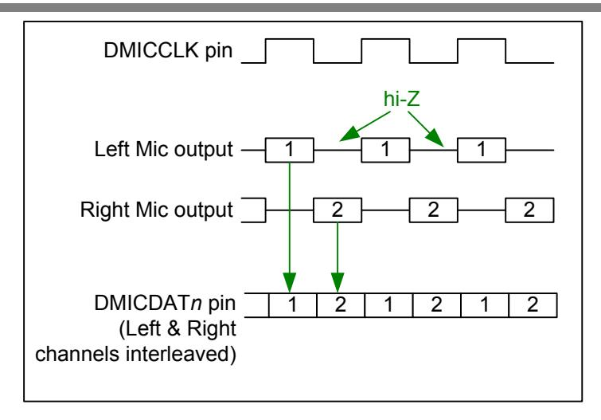

Figure 20 Digital Microphone Interface Timing

The four digital microphone channels can be routed to one of the four timeslots on AIF1. The DMICDAT1 microphones, when enabled, are routed to the Left/Right channels of AIF1 Timeslot 0. The DMICDAT2 microphones, when enabled, are routed to the Left/Right channels of AIF1 Timeslot 1.

Digital volume control of the digital microphone channels in the AIF1 signal paths is provided using the registers described in the "Digital Volume and Filter Control" section.

The digital microphone channels can be routed, in a limited number of configurations, to the digital mixing output bus, via the digital sidetone signal paths. See "Digital Mixing" for further details.

Digital volume control of the digital microphone channels in the digital sidetone signal paths is provided using the registers described in the "Digital Mixing" section.

The digital microphone interface control fields are described in Table 9.

| REGISTER ADDRESS | BIT | LABEL      | DEFAULT | DESCRIPTION                                        |
|---------------------|-----|------------|---------|----------------------------------------------------|
| R4 (0004h) Power | 5   | DMIC2L_ENA | 0       | Digital microphone DMICDAT2 Left channel enable |
| Managemen           |     |            |         | 0 = Disabled                                       |
| t (4)               |     |            |         | 1 = Enabled                                        |
|                     | 4   | DMIC2R_ENA | 0       | Digital microphone DMICDAT2 Right channel enable   |
|                     |     |            |         | 0 = Disabled                                       |
|                     |     |            |         | 1 = Enabled                                        |
|                     | 3   | DMIC1L_ENA | 0       | Digital microphone DMICDAT1 Left channel enable |
|                     |     |            |         | 0 = Disabled                                       |
|                     |     |            |         | 1 = Enabled                                        |
|                     | 2   | DMIC1R_ENA | 0       | Digital microphone DMICDAT1 Right channel enable   |
|                     |     |            |         | 0 = Disabled                                       |
|                     |     |            |         | 1 = Enabled                                        |

**Table 9 Digital Microphone Interface Control** 

Clocking for the Digital Microphone interface is derived from SYSCLK. The DMICCLK frequency is configured automatically, according to the AIFn\_SR, AIFnCLK\_RATE and ADC\_OSR128 registers. (See ["Clocking and Sample Rates"](#page-149-0) for further details of the system clocks and control registers.)

The DMICCLK is enabled whenever a digital microphone input path is enabled on the DMICDAT1 or DMICDAT2 pin(s). Note that the SYSDSPCLK\_ENA register must also be set.

When AIF1CLK is selected as the SYSCLK source (SYSCLK\_SRC = 0), then the DMICCLK frequency is controlled by the AIF1\_SR and AIF1CLK\_RATE registers.

When AIF2CLK is selected as the SYSCLK source (SYSCLK\_SRC = 1), then the DMICCLK frequency is controlled by the AIF2\_SR and AIF2CLK\_RATE registers.

The DMICCLK frequency is as described in [Table](#page-17-0) 10 (for ADC\_OSR128=1) and [Table 11](#page-17-1) (for ADC\_OSR128=0). The ADC\_OSR128 bit is set by default, giving best audio performance. Note that the only valid DMICCLK configurations are the ones listed i[n Table](#page-17-0) 10 an[d Table 11.](#page-17-1)

The applicable clocks (SYSCLK, and AIF1CLK or AIF2CLK) must be present and enabled when using the digital microphone interface.

| SAMPLE RATE (kHz) | SYSCLK RATE (AIFnCLK / fs ratio) |     |        |     |        |       |        |       |  |
|----------------------|----------------------------------|-----|--------|-----|--------|-------|--------|-------|--|
|                      | 128                              | 192 | 256    | 384 | 512    | 768   | 1024   | 1536  |  |
| 8                    |                                  |     |        |     | 2.048  |       | 2.048  | 2.048 |  |
| 11.025               |                                  |     |        |     | 2.8224 |       | 2.8224 |       |  |
| 12                   |                                  |     |        |     | 3.072  |       | 3.072  |       |  |
| 16                   |                                  |     | 2.048  |     | 2.048  | 2.048 |        |       |  |
| 22.05                |                                  |     | 2.8224 |     | 2.8224 |       |        |       |  |
| 24                   |                                  |     | 3.072  |     | 3.072  |       |        |       |  |
| 32                   |                                  |     | 2.048  |     |        |       |        |       |  |
| 44.1                 |                                  |     | 2.8224 |     |        |       |        |       |  |
| 48                   |                                  |     | 3.072  |     |        |       |        |       |  |
| 88.2                 |                                  |     |        |     |        |       |        |       |  |
| 96                   |                                  |     |        |     |        |       |        |       |  |

Note that, when ADC\_OSR128=1, digital microphone operation is only supported for the above DMICCLK configurations.

**Table 10 DMICCLK Frequency (MHz) - ADC\_OSR128 = 1 (Default)**

| SAMPLE RATE (kHz) | SYSCLK RATE (AIFnCLK / fs ratio) |     |        |        |        |        |        |       |
|----------------------|----------------------------------|-----|--------|--------|--------|--------|--------|-------|
|                      | 128                              | 192 | 256    | 384    | 512    | 768    | 1024   | 1536  |
| 8                    |                                  |     | 1.024  |        | 1.024  | 1.024  | 1.024  | 1.024 |
| 11.025               |                                  |     | 1.4112 |        | 1.4112 | 1.4112 | 1.4112 |       |
| 12                   |                                  |     | 1.536  |        | 1.536  | 1.536  | 1.536  |       |
| 16                   |                                  |     | 1.024  | 1.024  | 1.024  | 1.024  |        |       |
| 22.05                |                                  |     | 1.4112 | 1.4112 | 1.4112 |        |        |       |
| 24                   |                                  |     | 1.536  | 1.536  | 1.536  |        |        |       |
| 32                   |                                  |     | 2.048  | 2.048  |        |        |        |       |
| 44.1                 |                                  |     | 2.8224 |        |        |        |        |       |
| 48                   |                                  |     | 3.072  |        |        |        |        |       |
| 88.2                 |                                  |     |        |        |        |        |        |       |
| 96                   |                                  |     |        |        |        |        |        |       |
|                      |                                  |     |        |        |        |        |        |       |

Note that, when ADC\_OSR128=0, digital microphone operation is only supported for the above DMICCLK configurations.

**Table 11 DMICCLK Frequency (MHz) - ADC\_OSR128 = 0**

#### **DIGITAL PULL-UP AND PULL-DOWN**

The WM8994 provides integrated pull-up and pull-down resistors on the DMICDAT1 and DMICDAT2 pins. This provides a flexible capability for interfacing with other devices. Each of the pull-up and pulldown resistors can be configured independently using the register bits described i[n Table 12.](#page-18-1)

Note that, if the DMICDAT1 or DMICDAT2 digital microphone channels are disabled, or if DMICDATn\_PU and DMICDATn\_PD are both set, then the pull-up and pull-down will be disabled on the respective pin.

| REGISTER ADDRESS | BIT | LABEL       | DEFAULT | DESCRIPTION               |
|---------------------|-----|-------------|---------|---------------------------|
| R1824               | 11  | DMICDAT2_PU | 0       | DMICDAT2 Pull-Up enable   |
| (0720h)             |     |             |         | 0 = Disabled              |
| Pull Control        |     |             |         | 1 = Enabled               |
| (1)                 | 10  | DMICDAT2_PD | 0       | DMICDAT2 Pull-Down enable |
|                     |     |             |         | 0 = Disabled              |
|                     |     |             |         | 1 = Enabled               |
|                     | 9   | DMICDAT1_PU | 0       | DMICDAT1 Pull-Up enable   |
|                     |     |             |         | 0 = Disabled              |
|                     |     |             |         | 1 = Enabled               |
|                     | 8   | DMICDAT1_PD | 0       | DMICDAT1 Pull-Down enable |
|                     |     |             |         | 0 = Disabled              |
|                     |     |             |         | 1 = Enabled               |

**Table 12 Digital Pull-Up and Pull-Down Control**

# **ANALOGUE TO DIGITAL CONVERTER (ADC)**

The WM8994 uses stereo 24-bit sigma-delta ADCs. The use of multi-bit feedback and high oversampling rates reduces the effects of jitter and high frequency noise. The oversample rate can be adjusted, if required, to reduce power consumption - see ["Clocking and Sample Rates"](#page-149-0) for details. The ADC full scale input level is proportional to AVDD1 - see "Electrical Characteristics". Any input signal greater than full scale may overload the ADC and cause distortion.

The ADCs are enabled by the ADCL\_ENA and ADCR\_ENA register bits.

| REGISTER ADDRESS | BIT | LABEL    | DEFAULT | DESCRIPTION      |
|---------------------|-----|----------|---------|------------------|
| R4 (0004h)          | 1   | ADCL_ENA | 0       | Left ADC Enable  |
| Power               |     |          |         | 0 = Disabled     |
| Management (4)      |     |          |         | 1 = Enabled      |
|                     | 0   | ADCR_ENA | 0       | Right ADC Enable |
|                     |     |          |         | 0 = Disabled     |
|                     |     |          |         | 1 = Enabled      |

**Table 13 ADC Enable Control**

The outputs of the ADCs can be routed to the Left/Right channels of AIF1 (Timeslot 0).

Digital volume control of the ADC outputs in the AIF1 signal paths is provided using the registers described in the ["Digital Volume and Filter Control"](#page-50-0) section.

The outputs of the ADCs can be routed, in a limited number of configurations, to the digital mixing output bus, via the digital sidetone signal paths. See ["Digital Mixing"](#page-22-0) for further details.

Digital volume control of the ADC outputs in the digital sidetone signal paths is provided using the registers described in the ["Digital Mixing"](#page-22-0) section.

#### **ADC CLOCKING CONTROL**

Clocking for the ADCs is derived from SYSCLK. The required clock is enabled when the SYSDSPCLK\_ENA register is set.

The ADC clock rate is configured automatically, according to the AIFn\_SR, AIFnCLK\_RATE and ADC\_OSR128 registers. (See ["Clocking and Sample Rates"](#page-149-0) for further details of the system clocks and control registers.)

When AIF1CLK is selected as the SYSCLK source (SYSCLK\_SRC = 0), then the ADC clocking is controlled by the AIF1\_SR and AIF1CLK\_RATE registers.

When AIF2CLK is selected as the SYSCLK source (SYSCLK\_SRC = 1), then the ADC clocking is controlled by the AIF2\_SR and AIF2CLK\_RATE registers.

The supported ADC clocking configurations are described in [Table 14](#page-19-0) (for ADC\_OSR128=1) and [Table 15](#page-19-1) (for ADC\_OSR128=0). The ADC\_OSR128 bit is set by default, giving best audio performance.

| SAMPLE RATE (kHz)                                                                      | SYSCLK RATE (AIFnCLK / fs ratio) |     |     |     |     |     |      |      |  |  |
|-------------------------------------------------------------------------------------------|----------------------------------|-----|-----|-----|-----|-----|------|------|--|--|
|                                                                                           | 128                              | 192 | 256 | 384 | 512 | 768 | 1024 | 1536 |  |  |
| 8                                                                                         |                                  |     |     |     |    |     |     |     |  |  |
| 11.025                                                                                    |                                  |     |     |     |    |     |     |      |  |  |
| 12                                                                                        |                                  |     |     |     |    |     |     |      |  |  |
| 16                                                                                        |                                  |     |    |    |    |    |      |      |  |  |
| 22.05                                                                                     |                                  |     |    |    |    |     |      |      |  |  |
| 24                                                                                        |                                  |     |    |    |    |     |      |      |  |  |
| 32                                                                                        |                                  |     |    |    |     |     |      |      |  |  |
| 44.1                                                                                      |                                  |     |    |     |     |     |      |      |  |  |
| 48                                                                                        |                                  |     |    |     |     |     |      |      |  |  |
| 88.2                                                                                      |                                  |     |     |     |     |     |      |      |  |  |
| 96                                                                                        |                                  |     |     |     |     |     |      |      |  |  |
| When ADC_OSR128=1, ADC operation is only supported for the configurations indicated above |                                  |     |     |     |     |     |      |      |  |  |

**Table 14 ADC Clocking - ADC\_OSR128 = 1 (Default)**

| SAMPLE RATE (kHz)                                                                      | SYSCLK RATE (AIFnCLK / fs ratio) |     |     |     |     |     |      |      |  |
|-------------------------------------------------------------------------------------------|----------------------------------|-----|-----|-----|-----|-----|------|------|--|
|                                                                                           | 128                              | 192 | 256 | 384 | 512 | 768 | 1024 | 1536 |  |
| 8                                                                                         |                                  |     |    |    |    |    |     |     |  |
| 11.025                                                                                    |                                  |     |    |    |    |    |     |      |  |
| 12                                                                                        |                                  |     |    |    |    |    |     |      |  |
| 16                                                                                        |                                  |     |    |    |    |    |      |      |  |
| 22.05                                                                                     |                                  |     |    |    |    |     |      |      |  |
| 24                                                                                        |                                  |     |    |    |    |     |      |      |  |
| 32                                                                                        |                                  |     |    |    |     |     |      |      |  |
| 44.1                                                                                      |                                  |     |    |     |     |     |      |      |  |
| 48                                                                                        |                                  |     |    |     |     |     |      |      |  |
| 88.2                                                                                      |                                  |     |     |     |     |     |      |      |  |
| 96                                                                                        |                                  |     |     |     |     |     |      |      |  |
| When ADC_OSR128=0, ADC operation is only supported for the configurations indicated above |                                  |     |     |     |     |     |      |      |  |

**Table 15 ADC Clocking - ADC\_OSR128 = 0**

The clocking requirements in [Table 14](#page-19-0) and [Table 15](#page-19-1) are only applicable to the AIF*n*CLK that is selected as the SYSCLK source. Note that both clocks (AIF1CLK and AIF2CLK) must satisfy the requirements noted in the ["Clocking and Sample Rates"](#page-149-0) section.

The applicable clocks (SYSCLK, and AIF1CLK or AIF2CLK) must be present and enabled when using the Analogue to Digital Converters (ADCs).

# **DIGITAL CORE ARCHITECTURE**

The WM8994 Digital Core provides an extensive set of mixing and signal processing features. The Digital Core Architecture is illustrated in [Figure 21,](#page-21-0) which also identifies the datasheet sections applicable to each portion of the Digital Core.

Audio Interface 1 (AIF1) supports audio input and output on two stereo timeslots simultaneously, making a total of four inputs and four outputs. The mixing of the four AIF1 output paths is described in ["Audio Interface 1 \(AIF1\) Output Mixing"](#page-23-0).

A digital mixing path from the ADCs or Digital Microphones to the DAC output paths provides a high quality sidetone for voice calls or other applications. The sidetone configuration is described in ["Digital](#page-24-0)  [Sidetone Mixing"](#page-24-0); the associated filter and volume control is described in ["Digital Sidetone Volume](#page-24-1)  [and Filter Control"](#page-24-1).

Each of the four hi-fi DACs has a dedicated mixer for controlling the signal paths to that DAC. The configuration of these signal paths is described in ["DAC Output Digital Mixing"](#page-27-0).

Each DAC is provided with digital volume control, soft mute / un-mute and a low pass filter. The associated controls are defined in the ["Digital to Analogue Converter \(DAC\)"](#page-63-0) section.

Digital processing can be applied to the four input channels of AIF1 and the two input channels of AIF2. The available features include 5-band equalization (EQ), 3D stereo expansion and dynamic range control (DRC).

The EQ provides the capability to tailor the audio path according to the frequency characteristics of an earpiece or loudspeaker, and/or according to user preferences. The EQ controls are described in ["ReTune Mobile](#page-44-0) Parametric Equalizer (EQ)". The DRC provides adaptive signal level control to improve the handling of unpredictable signal levels and to improve intelligibility in the presence of transients and impulsive noises. The DRC controls are described in ["Dynamic Range Control \(DRC\)"](#page-30-0). 3D stereo expansion provides a stereo enhancement effect; the depth of the effect is programmable, as described in ["3D Stereo Expansion"](#page-49-0).

The input channels of AIF1 and AIF2 are also equipped with digital volume control, soft mute / unmute and de-emphasis filter control; see ["Digital Volume and Filter Control"](#page-50-0) for details of these features.

The output channels of AIF1 and AIF2 can be configured using the digital volume control and a programmable high-pass filter (HPF). The Dynamic Range Control (DRC) circuit can also be applied here, with the restriction that a DRC cannot be enabled in the input and output path of one AIF channel at the same time. The AIF output volume and filter controls are described in ["Digital Volume](#page-50-0)  [and Filter Control"](#page-50-0).

The WM8994 provides an ultrasonic mode on the output paths of AIF1, allowing high frequency signals (such as ultrasonic microphone signals) to be output. See ["Ultrasonic \(4FS\) AIF Output Mode"](#page-28-0) for further details.

The WM8994 provides two full audio interfaces, AIF1 and AIF2. Each interface supports a number of protocols, including I2S, DSP, MSB-first left/right justified, and can operate in master or slave modes. PCM operation is supported in the DSP mode. A-law and -law companding are also supported. Time division multiplexing (TDM) is available to allow multiple devices to stream data simultaneously on the same bus, saving space and power.

Four-channel input and output is supported using TDM on AIF1. Two-channel input and output is supported on AIF2. A third interface, AIF3, is partially supported, using multiplexers to re-configure alternate connections to AIF1 or AIF2.

Signal mixing between audio interfaces is possible. The WM8994 performs stereo full-duplex sample rate conversion between the audio interfaces as required. (Note that sample rate conversion is not supported on some signal paths, as noted i[n Figure 21\)](#page-21-0).

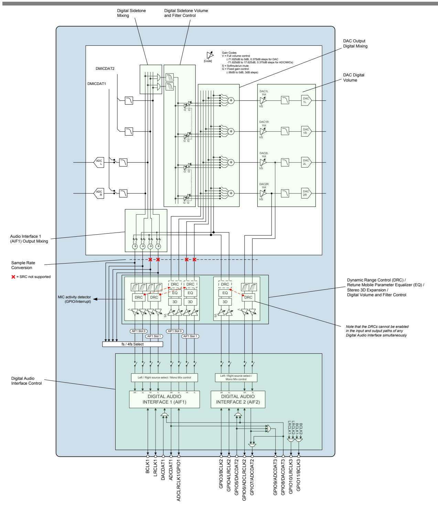

Figure 21 Digital Core Architecture

# **DIGITAL MIXING**

This section describes the digital mixing functions of the WM8994.

Digital audio mixing is provided on four AIF1 output paths, two digital sidetone paths, and four Digital to Analogue converters (DACs).

Note that the two AIF2 output paths are connected to the DAC2L and DAC2R signal paths.

The digital mixing functions and associated control registers are illustrated in Figure 22.

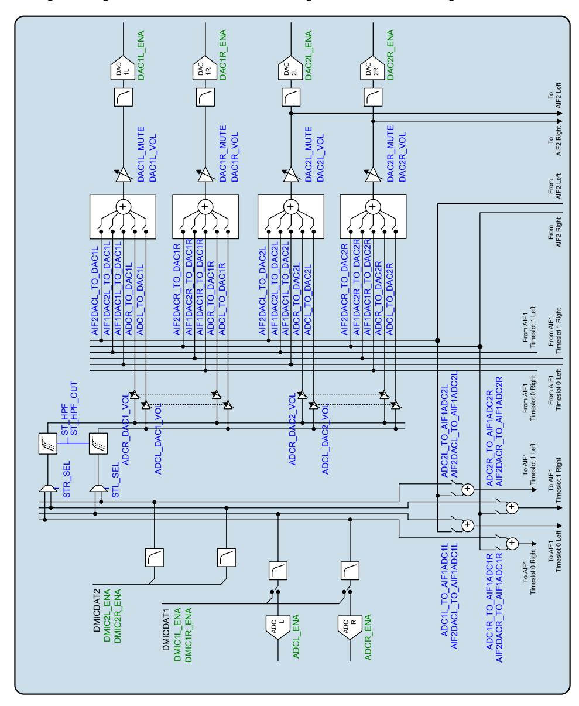

Figure 22 Digital Mixing Block Diagram

#### **AUDIO INTERFACE 1 (AIF1) OUTPUT MIXING**

There are four AIF1 digital mixers, one for each AIF1 audio channel (ie. Left/Right channels on Timeslots 0/1). The inputs to each AIF1 mixer comprise signals from the ADC / Digital Microphone inputs and from AIF2.

Note that the Left/Right channels of AIF1 can be inverted or interchanged if required; see ["Digital](#page-131-0)  [Audio Interface Control".](#page-131-0)

The AIF1 Left Timeslot 0 output channel is derived from the ADCL / DMIC1 (Left) and AIF2 (Left) inputs. The ADCL / DMIC1 (Left) path is enabled by ADC1L\_TO\_AIF1ADC1L, whilst the AIF2 (Left) path is enabled by AIF2DACL\_TO\_AIF1ADC1L.

The AIF1 Right Timeslot 0 output channel is derived from the ADCR / DMIC1 (Right) and AIF2 (Right) inputs. The ADCR / DMIC1 (Right) path is enabled by ADC1R\_TO\_AIF1ADC1R, whilst the AIF2 (Right) path is enabled by AIF2DACR\_TO\_AIF1ADC1R.

The AIF1 Left Timeslot 1 output channel is derived from the DMIC2 (Left) and AIF2 (Left) inputs. The DMIC2 (Left) path is enabled by ADC2L\_TO\_AIF1ADC2L, whilst the AIF2 (Left) path is enabled by AIF2DACL\_TO\_AIF1ADC2L.

The AIF1 Right Timeslot 1 output channel is derived from the DMIC2 (Right) and AIF2 (Right) inputs. The DMIC2 (Right) path is enabled by ADC2R\_TO\_AIF1ADC2R, whilst the AIF2 (Right) path is enabled by AIF2DACR\_TO\_AIF1ADC2R.

The AIF1 output mixer controls are defined i[n Table 16.](#page-23-1)

| REGISTER ADDRESS                      | BIT | LABEL                     | DEFAULT | DESCRIPTION                                                                     |
|------------------------------------------|-----|---------------------------|---------|---------------------------------------------------------------------------------|
| R1542 (0606h) AIF1 ADC1 Left Mixer | 1   | ADC1L_TO_AIF 1ADC1L    | 0       | Enable ADCL / DMIC1 (Left) to AIF1 (Timeslot 0, Left) output 0 = Disabled |
| Routing                                  |     |                           |         | 1 = Enabled                                                                     |
|                                          | 0   | AIF2DACL_TO_ AIF1ADC1L | 0       | Enable AIF2 (Left) to AIF1 (Timeslot 0, Left) output                         |
|                                          |     |                           |         | 0 = Disabled                                                                    |
|                                          |     |                           |         | 1 = Enabled                                                                     |
| R1543 (0607h) AIF1 ADC1               | 1   | ADC1R_TO_AIF 1ADC1R    | 0       | Enable ADCR / DMIC1 (Right) to AIF1 (Timeslot 0, Right) output               |
| Right Mixer                              |     |                           |         | 0 = Disabled                                                                    |
| Routing                                  |     |                           |         | 1 = Enabled                                                                     |
|                                          | 0   | AIF2DACR_TO_ AIF1ADC1R | 0       | Enable AIF2 (Right) to AIF1 (Timeslot 0, Right) output                       |
|                                          |     |                           |         | 0 = Disabled                                                                    |
|                                          |     |                           |         | 1 = Enabled                                                                     |
| R1544 (0608h) AIF1 ADC2               | 1   | ADC2L_TO_AIF 1ADC2L    | 0       | Enable DMIC2 (Left) to AIF1 (Timeslot 1, Left) output                        |
| Left Mixer                               |     |                           |         | 0 = Disabled                                                                    |
| Routing                                  |     |                           |         | 1 = Enabled                                                                     |
|                                          | 0   | AIF2DACL_TO_ AIF1ADC2L | 0       | Enable AIF2 (Left) to AIF1 (Timeslot 1, Left) output                         |
|                                          |     |                           |         | 0 = Disabled                                                                    |
|                                          |     |                           |         | 1 = Enabled                                                                     |
| R1545 (0609h) AIF1 ADC2               | 1   | ADC2R_TO_AIF 1ADC2R    | 0       | Enable DMIC2 (Right) to AIF1 (Timeslot 1, Right) output                      |
| Right Mixer                              |     |                           |         | 0 = Disabled                                                                    |
| Routing                                  |     |                           |         | 1 = Enabled                                                                     |
|                                          | 0   | AIF2DACR_TO_ AIF1ADC2R | 0       | Enable AIF2 (Right) to AIF1 (Timeslot 1, Right) output                       |
|                                          |     |                           |         | 0 = Disabled                                                                    |
|                                          |     |                           |         | 1 = Enabled                                                                     |

**Table 16 AIF1 Output Mixing**

#### **DIGITAL SIDETONE MIXING**

There are two digital sidetone signal paths, STL and STR. The sidetone sources are selectable for each path. The sidetone mixer outputs are inputs to the DAC signal mixers.

The following sources can be selected for sidetone path STL.

- ADCL or DMICDAT1 (Left) channel
- DMICDAT2 (Left) channel

The following sources can be selected for sidetone path STR.

- ADCR or DMICDAT1 (Right) channel
- DMICDAT2 (Right) channel

The sidetone signal sources are selected using STR\_SEL and STL\_SEL as described in [Table 17.](#page-24-2) Note that, when STR\_SEL = 0 or STL\_SEL = 0, and the respective ADC is enabled (for analogue inputs), then the ADC data will be selected for applicable sidetone path.

| REGISTER ADDRESS | BIT | LABEL   | DEFAULT | DESCRIPTION                         |
|---------------------|-----|---------|---------|-------------------------------------|
| R1569 (0621h)       | 1   | STR_SEL | 0       | Select source for sidetone STR path |
| Sidetone            |     |         |         | 0 = ADCR / DMICDAT1 (Right)         |
|                     |     |         |         | 1 = DMICDAT2 (Right)                |
|                     | 0   | STL_SEL | 0       | Select source for sidetone STL path |
|                     |     |         |         | 0 = ADCL / DMICDAT1 (Left)          |
|                     |     |         |         | 1 = DMICDAT2 (Left)                 |

**Table 17 Digital Sidetone Mixing**

# **DIGITAL SIDETONE VOLUME AND FILTER CONTROL**

A digital volume control is provided for the digital sidetone paths. The associated register controls are described in [Table 18.](#page-25-0)

A digital high-pass filter can be enabled in the sidetone paths to remove DC offsets. This filter is enabled using the ST\_HPF register bit; the cut-off frequency is configured using ST\_HPF\_CUT. When the filter is enabled, it is enabled in both digital sidetone paths.

Note that the sidetone filter cut-off frequency scales according to the sample rate of AIF1 or AIF2. When AIF1CLK is selected as the SYSCLK source (SYSCLK\_SRC = 0), then the ST\_HPF cut-off frequency is scaled according to the AIF1\_SR register. When AIF2CLK is selected as the SYSCLK source (SYSCLK\_SRC = 1), then the ST\_HPF cut-off frequency is scaled according to the AIF2\_SR register. See ["Clocking and Sample Rates"](#page-149-0) for further details of the system clocks and control registers.

| REGISTER ADDRESS                    | BIT | LABEL                   | DEFAULT | DESCRIPTION                                                                                                                                                                                                                                                                                                                                       |
|----------------------------------------|-----|-------------------------|---------|---------------------------------------------------------------------------------------------------------------------------------------------------------------------------------------------------------------------------------------------------------------------------------------------------------------------------------------------------|
| R1536 (0600h) DAC1 Mixer Volumes | 8:5 | ADCR_DAC1_V OL [3:0] | 0000    | Sidetone STR to DAC1L and DAC1R Volume 0000 = -36dB 0001 = -33dB (3dB steps) 1011 = -3dB 1100 = 0dB (see Table 19 for gain range)                                                                                                                                                                                            |
|                                        | 3:0 | ADCL_DAC1_V OL [3:0] | 0000    | Sidetone STL to DAC1L and DAC1R Volume 0000 = -36dB 0001 = -33dB (3dB steps) 1011 = -3dB 1100 = 0dB (see Table 19 for gain range)                                                                                                                                                                                            |
| R1539 (0603h) DAC2 Mixer Volumes | 8:5 | ADCR_DAC2_V OL [3:0] | 0000    | Sidetone STR to DAC2L and DAC2R Volume 0000 = -36dB 0001 = -33dB (3dB steps) 1011 = -3dB 1100 = 0dB (see Table 19 for gain range)                                                                                                                                                                                            |
|                                        | 3:0 | ADCL_DAC2_V OL [3:0] | 0000    | Sidetone STL to DAC2L and DAC2R Volume 0000 = -36dB 0001 = -33dB (3dB steps) 1011 = -3dB 1100 = 0dB (see Table 19 for gain range)                                                                                                                                                                                            |
| R1569 (0621h) Sidetone              | 9:7 | ST_HPF_CUT [2:0]     | 000     | Sidetone HPF cut-off frequency (relative to 44.1kHz sample rate) 000 = 2.7kHz 001 = 1.35kHz 010 = 675Hz 011 = 370Hz 100 = 180Hz 101 = 90Hz 110 = 45Hz 111 = Reserved Note - the cut-off frequencies scale with the Digital Mixing (SYSCLK) clocking rate. The quoted figures apply to 44.1kHz sample rate. |
|                                        | 6   | ST_HPF                  | 0       | Digital Sidetone HPF Select 0 = Disabled 1 = Enabled                                                                                                                                                                                                                                                                                        |

**Table 18 Digital Sidetone Volume Control**

| ADCR_DAC1_VOL, ADCL_DAC2_VOL, |           |
|----------------------------------|-----------|
| ADCR_DAC1_VOL or                 | SIDETONE  |
| ADCL_DAC2_VOL                    | GAIN (dB) |
| 0000                             | -36       |
| 0001                             | -33       |
| 0010                             | -30       |
| 0011                             | -27       |
| 0100                             | -24       |
| 0101                             | -21       |
| 0110                             | -18       |
| 0111                             | -15       |
| 1000                             | -12       |
| 1001                             | -9        |
| 1010                             | -6        |
| 1011                             | -3        |
| 1100                             | 0         |
| 1101                             | 0         |
| 1110                             | 0         |
| 1111                             | 0         |

**Table 19 Digital Sidetone Volume Range**

#### **DAC OUTPUT DIGITAL MIXING**

There are four DAC digital mixers, one for each DAC. The inputs to each DAC mixer comprise signals from AIF1, AIF2 and the digital sidetone signals.

Note that the Left/Right channels of the AIF1 and AIF2 inputs can be inverted or interchanged if required; see ["Digital Audio Interface Control".](#page-131-0)

| REGISTER ADDRESS | BIT                         | LABEL                  | DEFAULT | DESCRIPTION                                 |
|---------------------|-----------------------------|------------------------|---------|---------------------------------------------|
| R1537 (0601h)       | 5                           | ADCR_TO_DAC            | 0       | Enable Sidetone STR to DAC1L                |
| DAC1 Left           |                             | 1L                     |         | 0 = Disabled                                |
| Mixer Routing       |                             |                        |         | 1 = Enabled                                 |
|                     | 4                           | ADCL_TO_DAC 1L      | 0       | Enable Sidetone STL to DAC1L                |
|                     |                             |                        |         | 0 = Disabled                                |
|                     |                             |                        |         | 1 = Enabled                                 |
|                     | 2                           | AIF2DACL_TO_ DAC1L  | 0       | Enable AIF2 (Left) to DAC1L                 |
|                     |                             |                        |         | 0 = Disabled                                |
|                     |                             |                        |         | 1 = Enabled                                 |
|                     | 1                           | AIF1DAC2L_TO _DAC1L | 0       | Enable AIF1 (Timeslot 1, Left) to DAC1L  |
|                     |                             |                        |         | 0 = Disabled                                |
|                     |                             |                        |         | 1 = Enabled                                 |
|                     | 0                           | AIF1DAC1L_TO _DAC1L | 0       | Enable AIF1 (Timeslot 0, Left) to DAC1L  |
|                     |                             |                        |         | 0 = Disabled                                |
|                     |                             |                        |         | 1 = Enabled                                 |
| R1538 (0602h)       | 5                           | ADCR_TO_DAC 1R      | 0       | Enable Sidetone STR to DAC1R                |
| DAC1 Right          |                             |                        |         | 0 = Disabled                                |
| Mixer Routing       |                             |                        |         | 1 = Enabled                                 |
|                     | 4                           | ADCL_TO_DAC 1R      | 0       | Enable Sidetone STL to DAC1R                |
|                     |                             |                        |         | 0 = Disabled                                |
|                     |                             |                        |         | 1 = Enabled                                 |
|                     | 2                           | AIF2DACR_TO_ DAC1R  | 0       | Enable AIF2 (Right) to DAC1R                |
|                     |                             |                        |         | 0 = Disabled                                |
|                     |                             |                        |         | 1 = Enabled                                 |
|                     | 1 AIF1DAC2R_TO _DAC1R |                        | 0       | Enable AIF1 (Timeslot 1, Right) to DAC1R |
|                     |                             |                        |         | 0 = Disabled                                |
|                     |                             |                        |         | 1 = Enabled                                 |
|                     | 0                           | AIF1DAC1R_TO _DAC1R | 0       | Enable AIF1 (Timeslot 0, Right) to DAC1R |
|                     |                             |                        |         | 0 = Disabled                                |
|                     |                             |                        |         | 1 = Enabled                                 |

| REGISTER ADDRESS | BIT | LABEL                  | DEFAULT | DESCRIPTION                                 |
|---------------------|-----|------------------------|---------|---------------------------------------------|
| R1540 (0604h)       | 5   | ADCR_TO_DAC            | 0       | Enable Sidetone STR to DAC2L                |
| DAC2 Left           |     | 2L                     |         | 0 = Disabled                                |
| Mixer Routing       |     |                        |         | 1 = Enabled                                 |
|                     | 4   | ADCL_TO_DAC            | 0       | Enable Sidetone STL to DAC2L                |
|                     |     | 2L                     |         | 0 = Disabled                                |
|                     |     |                        |         | 1 = Enabled                                 |
|                     | 2   | AIF2DACL_TO_           | 0       | Enable AIF2 (Left) to DAC2L                 |
|                     |     | DAC2L                  |         | 0 = Disabled                                |
|                     |     |                        |         | 1 = Enabled                                 |
|                     | 1   | AIF1DAC2L_TO _DAC2L | 0       | Enable AIF1 (Timeslot 1, Left) to DAC2L  |
|                     |     |                        |         | 0 = Disabled                                |
|                     |     |                        |         | 1 = Enabled                                 |
|                     | 0   | AIF1DAC1L_TO _DAC2L | 0       | Enable AIF1 (Timeslot 0, Left) to DAC2L  |
|                     |     |                        |         | 0 = Disabled                                |
|                     |     |                        |         | 1 = Enabled                                 |
| R1541 (0605h)       | 5   | ADCR_TO_DAC            | 0       | Enable Sidetone STR to DAC2R                |
| DAC2 Right          |     | 2R                     |         | 0 = Disabled                                |
| Mixer Routing       |     |                        |         | 1 = Enabled                                 |
|                     | 4   | ADCL_TO_DAC            | 0       | Enable Sidetone STL to DAC2R                |
|                     |     | 2R                     |         | 0 = Disabled                                |
|                     |     |                        |         | 1 = Enabled                                 |
|                     | 2   | AIF2DACR_TO_           | 0       | Enable AIF2 (Right) to DAC2R                |
|                     |     | DAC2R                  |         | 0 = Disabled                                |
|                     |     |                        |         | 1 = Enabled                                 |
|                     | 1   | AIF1DAC2R_TO _DAC2R | 0       | Enable AIF1 (Timeslot 1, Right) to DAC2R |
|                     |     |                        |         | 0 = Disabled                                |
|                     |     |                        |         | 1 = Enabled                                 |
|                     | 0   | AIF1DAC1R_TO _DAC2R | 0       | Enable AIF1 (Timeslot 0, Right) to DAC2R |
|                     |     |                        |         | 0 = Disabled                                |
|                     |     |                        |         | 1 = Enabled                                 |

**Table 20 DAC Output Digital Mixing**

#### **AUDIO INTERFACE 2 (AIF2) DIGITAL MIXING**

There are two output channels on AIF2. The audio source for these two channels is the same as the selected source for DAC2L and DAC2R, as described in ["DAC Output Digital Mixing"](#page-27-0).

Note that the Left/Right channels of AIF2 can be inverted or interchanged if required; see ["Digital](#page-131-0)  [Audio Interface Control".](#page-131-0)

#### **ULTRASONIC (4FS) AIF OUTPUT MODE**

The WM8994 provides an ultrasonic mode on the output paths of the AIF1 audio interface. The ultrasonic mode enables high frequency signals (such as ultrasonic microphone signals) to be output.

Ultrasonic mode is enabled on AIF1 using the AIF1ADC\_4FS register bit. When the ultrasonic mode is selected, the AIF1 output sample rate is increased by a factor of 4. For example, a 48kHz sample rate will be output at 192kHz in ultrasonic mode.

Ultrasonic mode is only supported in AIF Master mode and uses the ADCLRCLK output (not the LRCLK). When ultrasonic mode is enabled, AIF1 must be configured in Master mode, as described in

"Digital Audio Interface Control". See "General Purpose Input/Output" to configure the GPIO1 pin as ADCLRCLK1. The ADCLRCLK1 rate is controlled as described in "Digital Audio Interface Control".

When ultrasonic mode is enabled, the audio band filtering and digital volume controls (see "Digital Volume and Filter Control") are bypassed on the affected output paths.

The Dynamic Range Control (DRC) function is not available on the AIF1 output signal paths in ultrasonic mode. Note, however, that the DRC is still available on the AIF input paths in this case.

The ultrasonic (4FS) signal paths are illustrated in Figure 23. The AIF1ADC\_4FS register bit is defined in Table 21.

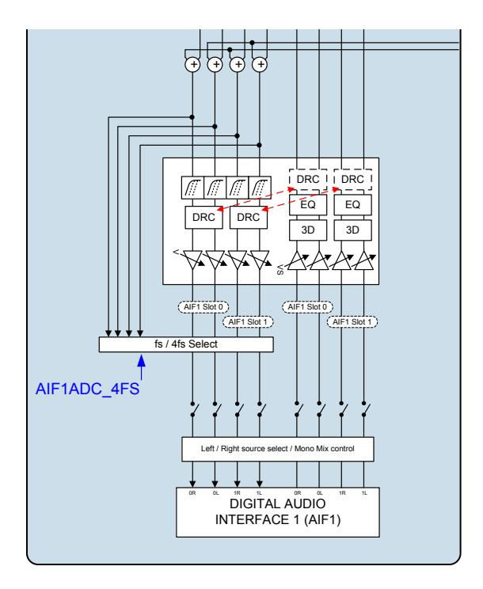

Figure 23 Ultrasonic (4FS) Signal Paths

| REGISTER ADDRESS                   | BIT | LABEL       | DEFAULT | DESCRIPTION                                                                               |
|---------------------------------------|-----|-------------|---------|-------------------------------------------------------------------------------------------|
| R1040 (0410h) AIF1 ADC1 Filters | 15  | AIF1ADC_4FS | 0       | Enable AIF1ADC ultrasonic mode (4FS) output, bypassing all AIF1 baseband output filtering |
|                                       |     |             |         | 0 = Disabled                                                                              |
|                                       |     |             |         | 1 = Enabled                                                                               |

Table 21 Ultrasonic (4FS) Mode Control

# **DYNAMIC RANGE CONTROL (DRC)**

The Dynamic Range Control (DRC) is a circuit which can be enabled in the digital playback or digital record paths of the WM8994 audio interfaces. The function of the DRC is to adjust the signal gain in conditions where the input amplitude is unknown or varies over a wide range, e.g. when recording from microphones built into a handheld system.

The DRC can apply Compression and Automatic Level Control to the signal path. It incorporates 'anticlip' and 'quick release' features for handling transients in order to improve intelligibility in the presence of loud impulsive noises.

The DRC also incorporates a Noise Gate function, which provides additional attenuation of very lowlevel input signals. This means that the signal path is quiet when no signal is present, giving an improvement in background noise level under these conditions.

The WM8994 provides three stereo Dynamic Range Controllers (DRCs); these are associated with AIF1 timeslot 0, AIF1 timeslot 1 and AIF2 respectively. Each DRC can be enabled either in the DAC playback (AIF input) path or in the ADC record (AIF output) path, as described in the ["Digital Core](#page-20-0)  [Architecture"](#page-20-0) section.

The DRCs are enabled in the DAC or ADCs audio signal paths using the register bits described in [Table 22.](#page-31-0) Note that enabling any DRC in the DAC and ADC paths simultaneously is an invalid selection.

When the DRC is enabled in any of the ADC (digital record) paths, the associated High Pass Filter (HPF) must be enabled also; this ensures that DC offsets are removed prior to the DRC processing. The output path HPF control registers are described in [Table 36](#page-53-0) (for AIF1 output paths) an[d Table 43](#page-60-0) (for AIF2 output paths). These are described in the ["Digital Volume and Filter Control"](#page-50-0) section.

Note that, when ultrasonic (4FS) mode is selected on AIF1, then the DRC function is bypassed on the respective ADC (output) signal paths. The DRC may still be selected on the AIF1 DAC (input) signal paths.

| REGISTER ADDRESS            | BIT | LABEL                 | DEFAULT | DESCRIPTION                                                                                     |
|--------------------------------|-----|-----------------------|---------|-------------------------------------------------------------------------------------------------|
| R1088 (0440h) AIF1 DRC1 (1) | 2   | AIF1DAC1_DRC _ENA  | 0       | Enable DRC in AIF1DAC1 playback path (AIF1, Timeslot 0) 0 = Disabled 1 = Enabled       |
|                                | 1   | AIF1ADC1L_DR C_ENA | 0       | Enable DRC in AIF1ADC1 (Left) record path (AIF1, Timeslot 0) 0 = Disabled 1 = Enabled  |
|                                | 0   | AIF1ADC1R_DR C_ENA | 0       | Enable DRC in AIF1ADC1 (Right) record path (AIF1, Timeslot 0) 0 = Disabled 1 = Enabled |
| R1104 (0450h) AIF1 DRC2 (1) | 2   | AIF1DAC2_DRC _ENA  | 0       | Enable DRC in AIF1DAC2 playback path (AIF1, Timeslot 1) 0 = Disabled 1 = Enabled       |
|                                | 1   | AIF1ADC2L_DR C_ENA | 0       | Enable DRC in AIF1ADC2 (Left) record path (AIF1, Timeslot 1) 0 = Disabled 1 = Enabled  |
|                                | 0   | AIF1ADC2R_DR C_ENA | 0       | Enable DRC in AIF1ADC2 (Right) record path (AIF1, Timeslot 1) 0 = Disabled 1 = Enabled |

| REGISTER ADDRESS           | BIT | LABEL                | DEFAULT | DESCRIPTION                                                                 |
|-------------------------------|-----|----------------------|---------|-----------------------------------------------------------------------------|
| R1344 (0540h) AIF2 DRC (1) | 2   | AIF2DAC_DRC_ ENA  | 0       | Enable DRC in AIF2DAC playback path 0 = Disabled 1 = Enabled       |
|                               | 1   | AIF2ADCL_DRC _ENA | 0       | Enable DRC in AIF2ADC (Left) record path 0 = Disabled 1 = Enabled  |
|                               | 0   | AIF2ADCR_DRC _ENA | 0       | Enable DRC in AIF2ADC (Right) record path 0 = Disabled 1 = Enabled |

**Table 22 DRC Enable**

The following description of the DRC is applicable to all three DRCs. The associated register control fields are described in [Table 24,](#page-37-0) [Table 25](#page-40-0) and [Table 26](#page-43-0) for the respective DRCs.

Note that, where the following description refers to register names, the generic prefix *[DRC]* is quoted:

- For the DRC associated with AIF1 timeslot 0, *[DRC]* = AIF1DRC1.
- For the DRC associated with AIF1 timeslot 1, *[DRC]* = AIF1DRC2.
- For the DRC associated with AIF2, *[DRC]* = AIF2DRC.

#### **DRC COMPRESSION / EXPANSION / LIMITING**

The DRC supports two different compression regions, separated by a "Knee" at a specific input amplitude. In the region above the knee, the compression slope *[DRC]*\_HI\_COMP applies; in the region below the knee, the compression slope *[DRC]*\_LO\_COMP applies.

The DRC also supports a noise gate region, where low-level input signals are heavily attenuated. This function can be enabled or disabled according to the application requirements. The DRC response in this region is defined by the expansion slope *[DRC]*\_NG\_EXP.

For additional attenuation of signals in the noise gate region, an additional "knee" can be defined (shown as "Knee2" in [Figure 24\)](#page-32-0). When this knee is enabled, this introduces an infinitely steep dropoff in the DRC response pattern between the *[DRC]*\_LO\_COMP and *[DRC]*\_NG\_EXP regions.

The overall DRC compression characteristic in "steady state" (i.e. where the input amplitude is nearconstant) is illustrated i[n Figure 24.](#page-32-0)

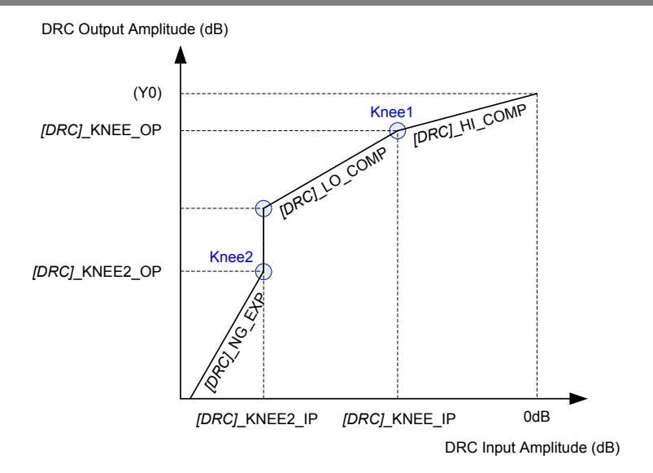

**Figure 24 DRC Response Characteristic**

The slope of the DRC response is determined by register fields *[DRC]*\_HI\_COMP and *[DRC]*\_LO\_COMP. A slope of 1 indicates constant gain in this region. A slope less than 1 represents compression (i.e. a change in input amplitude produces only a smaller change in output amplitude). A slope of 0 indicates that the target output amplitude is the same across a range of input amplitudes; this is infinite compression.

When the noise gate is enabled, the DRC response in this region is determined by the *[DRC]*\_NG\_EXP register. A slope of 1 indicates constant gain in this region. A slope greater than 1 represents expansion (ie. a change in input amplitude produces a larger change in output amplitude).

When the DRC\_KNEE2\_OP knee is enabled ("Knee2" i[n Figure 24\)](#page-32-0), this introduces the vertical line in the response pattern illustrated, resulting in infinitely steep attenuation at this point in the response.

| REF | PARAMETER      | DESCRIPTION                   |
|-----|----------------|-------------------------------|
| 1   | [DRC]_KNEE_IP  | Input level at Knee1 (dB)     |
| 2   | [DRC]_KNEE_OP  | Output level at Knee2 (dB)    |
| 3   | [DRC]_HI_COMP  | Compression ratio above Knee1 |
| 4   | [DRC]_LO_COMP  | Compression ratio below Knee1 |
| 5   | [DRC]_KNEE2_IP | Input level at Knee2 (dB)     |
| 6   | [DRC]_NG_EXP   | Expansion ratio below Knee2   |
| 7   | [DRC]_KNEE2_OP | Output level at Knee2 (dB)    |

**Table 23 DRC Response Parameters**

The noise gate is enabled when the *[DRC]*\_NG\_ENA register is set. When the noise gate is not enabled, parameters 5, 6, 7 above are ignored, and the *[DRC]*\_LO\_COMP slope applies to all input signal levels below Knee1.

The DRC\_KNEE2\_OP knee is enabled when the *[DRC]*\_KNEE2\_OP\_ENA register is set. When this bit is not set, then parameter 7 above is ignored, and the Knee2 position always coincides with the low end of the *[DRC]*\_LO\_COMP region.

The "Knee1" point in [Figure 24](#page-32-0) is determined by register fields *[DRC]*\_KNEE\_IP and *[DRC]*\_KNEE\_OP.

Parameter Y0, the output level for a 0dB input, is not specified directly, but can be calculated from the other parameters, using the equation:

Y0 = *[DRC]*\_KNEE\_OP – (*[DRC]*\_KNEE\_IP \* *[DRC]*\_HI\_COMP)

#### **GAIN LIMITS**

The minimum and maximum gain applied by the DRC is set by register fields *[DRC]*\_MINGAIN, *[DRC]*\_MAXGAIN and *[DRC]*\_NG\_MINGAIN. These limits can be used to alter the DRC response from that illustrated in [Figure 24.](#page-32-0) If the range between maximum and minimum gain is reduced, then the extent of the dynamic range control is reduced.

The minimum gain in the Compression regions of the DRC response is set by *[DRC]*\_MINGAIN. The mimimum gain in the Noise Gate region is set by *[DRC]*\_NG\_MINGAIN. The minimum gain limit prevents excessive attenuation of the signal path.

The maximum gain limit set by *[DRC]*\_MAXGAIN prevents quiet signals (or silence) from being excessively amplified.

#### **DYNAMIC CHARACTERISTICS**

The dynamic behaviour determines how quickly the DRC responds to changing signal levels. Note that the DRC responds to the average (RMS) signal amplitude over a period of time.

The *[DRC]*\_ATK determines how quickly the DRC gain decreases when the signal amplitude is high. The *[DRC]*\_DCY determines how quickly the DRC gain increases when the signal amplitude is low.

These register fields are described in [Table 24,](#page-37-0) [Table 25](#page-40-0) an[d Table 26.](#page-43-0) Note that the register defaults are suitable for general purpose microphone use.

# **ANTI-CLIP CONTROL**

The DRC includes an Anti-Clip feature to avoid signal clipping when the input amplitude rises very quickly. This feature uses a feed-forward technique for early detection of a rising signal level. Signal clipping is avoided by dynamically increasing the gain attack rate when required. The Anti-Clip feature is enabled using the *[DRC]*\_ANTICLIP bit.

Note that the feed-forward processing increases the latency in the input signal path.

Note that the Anti-Clip feature operates entirely in the digital domain. It cannot be used to prevent signal clipping in the analogue domain nor in the source signal. Analogue clipping can only be prevented by reducing the analogue signal gain or by adjusting the source signal.

Note that the Anti-Clip feature should not be enabled at the same time as the Quick Release feature (described below) on the same DRC.

#### **QUICK RELEASE CONTROL**

The DRC includes a Quick-Release feature to handle short transient peaks that are not related to the intended source signal. For example, in handheld microphone recording, transient signal peaks sometimes occur due to user handling, key presses or accidental tapping against the microphone. The Quick Release feature ensures that these transients do not cause the intended signal to be masked by the longer time constants of *[DRC]*\_DCY.

The Quick-Release feature is enabled by setting the *[DRC]*\_QR bit. When this bit is enabled, the DRC measures the crest factor (peak to RMS ratio) of the input signal. A high crest factor is indicative of a transient peak that may not be related to the intended source signal. If the crest factor exceeds the level set by *[DRC]*\_QR\_THR, then the normal decay rate (*[DRC]*\_DCY) is ignored and a faster decay rate (*[DRC]*\_QR\_DCY) is used instead.

Note that the Quick Release feature should not be enabled at the same time as the Anti-Clip feature (described above) on the same DRC.

### **SIGNAL ACTIVITY DETECT**

The DRC incorporates a configurable signal detect function, allowing the signal level at the DRC input to be monitored and to be used to trigger other events. This can be used to detect the presence of a microphone signal on an ADC or digital mic channel, or can be used to detect an audio signal received over the digital audio interface.

The Peak signal level or the RMS signal level of the DRC input can be selected as the detection threshold. When the threshold condition is exceeded, an interrupt or GPIO output can be generated. See ["General Purpose Input/Output"](#page-105-0) for a full description of the applicable control fields.

## **DRC REGISTER CONTROLS**

The AIF1DRC1 control registers are described in [Table 24.](#page-37-0) The AIF1DRC2 control registers are described in [Table 25.](#page-40-0) The AIF2DRC control registers are described in [Table 26.](#page-43-0)

| REGISTER ADDRESS | BIT | LABEL                 | DEFAULT | DESCRIPTION                    |
|---------------------|-----|-----------------------|---------|--------------------------------|
| R1088 (0440h)       | 8   | AIF1DRC1_NG_          | 0       | AIF1 DRC1 Noise Gate Enable    |
| AIF1 DRC1 (1)       |     | ENA                   |         | 0 = Disabled                   |
|                     |     |                       |         | 1 = Enabled                    |
|                     | 5   | AIF1DRC1_KNE          | 0       | AIF1 DRC1 KNEE2_OP Enable      |
|                     |     | E2_OP_ENA             |         | 0 = Disabled                   |
|                     |     |                       |         | 1 = Enabled                    |
|                     | 4   | AIF1DRC1_QR           | 1       | AIF1 DRC1 Quick-release Enable |
|                     |     |                       |         | 0 = Disabled                   |
|                     |     |                       |         | 1 = Enabled                    |
|                     | 3   | AIF1DRC1_ANTI CLIP | 1       | AIF1 DRC1 Anti-clip Enable     |
|                     |     |                       |         | 0 = Disabled                   |
|                     |     |                       |         | 1 = Enabled                    |

| REGISTER ADDRESS            | BIT  | LABEL                      | DEFAULT | DESCRIPTION                                           |
|--------------------------------|------|----------------------------|---------|-------------------------------------------------------|
| R1089 (0441h) AIF1 DRC1 (2) | 12:9 | AIF1DRC1_ATK [3:0]      | 0100    | AIF1 DRC1 Gain attack rate (seconds/6dB)           |
|                                |      |                            |         | 0000 = Reserved                                       |
|                                |      |                            |         | 0001 = 181us                                          |
|                                |      |                            |         | 0010 = 363us                                          |
|                                |      |                            |         | 0011 = 726us                                          |
|                                |      |                            |         | 0100 = 1.45ms                                         |
|                                |      |                            |         | 0101 = 2.9ms                                          |
|                                |      |                            |         | 0110 = 5.8ms                                          |
|                                |      |                            |         | 0111 = 11.6ms                                         |
|                                |      |                            |         | 1000 = 23.2ms                                         |
|                                |      |                            |         | 1001 = 46.4ms                                         |
|                                |      |                            |         | 1010 = 92.8ms                                         |
|                                |      |                            |         | 1011 = 185.6ms                                        |
|                                |      |                            |         | 1100-1111 = Reserved                                  |
|                                | 8:5  | AIF1DRC1_DCY [3:0]      | 0010    | AIF1 DRC1 Gain decay rate (seconds/6dB)            |
|                                |      |                            |         | 0000 = 186ms                                          |
|                                |      |                            |         | 0001 = 372ms                                          |
|                                |      |                            |         | 0010 = 743ms                                          |
|                                |      |                            |         | 0011 = 1.49s                                          |
|                                |      |                            |         | 0100 = 2.97s                                          |
|                                |      |                            |         | 0101 = 5.94s                                          |
|                                |      |                            |         | 0110 = 11.89s                                         |
|                                |      |                            |         | 0111 = 23.78s                                         |
|                                |      |                            |         | 1000 = 47.56s                                         |
|                                |      |                            |         | 1001-1111 = Reserved                                  |
|                                | 4:2  | AIF1DRC1_MIN GAIN [2:0] | 001     | AIF1 DRC1 Minimum gain to attenuate audio signals  |
|                                |      |                            |         | 000 = 0dB                                             |
|                                |      |                            |         |                                                       |
|                                |      |                            |         | 001 = -12dB (default)                                 |
|                                |      |                            |         | 010 = -18dB                                           |
|                                |      |                            |         | 011 = -24dB                                           |
|                                |      |                            |         | 100 = -36dB                                           |
|                                |      |                            |         | 101 = Reserved                                        |
|                                |      |                            |         | 11X = Reserved                                        |
|                                | 1:0  | AIF1DRC1_MAX GAIN [1:0] | 01      | AIF1 DRC1 Maximum gain to boost audio signals (dB) |
|                                |      |                            |         | 00 = 12dB                                             |
|                                |      |                            |         | 01 = 18dB                                             |
|                                |      |                            |         | 10 = 24dB                                             |
|                                |      |                            |         | 11 = 36dB                                             |
|                                |      |                            |         |                                                       |

| REGISTER ADDRESS            | BIT   | LABEL                         | DEFAULT | DESCRIPTION                                                                                                                                                                                                                                                                                  |
|--------------------------------|-------|-------------------------------|---------|----------------------------------------------------------------------------------------------------------------------------------------------------------------------------------------------------------------------------------------------------------------------------------------------|
| R1090 (0442h) AIF1 DRC1 (3) | 15:12 | AIF1DRC1_NG_ MINGAIN [3:0] | 0000    | AIF1 DRC1 Minimum gain to attenuate audio signals when the noise gate is active. 0000 = -36dB 0001 = -30dB 0010 = -24dB 0011 = -18dB 0100 = -12dB 0101 = -6dB 0110 = 0dB 0111 = 6dB 1000 = 12dB 1001 = 18dB 1010 = 24dB 1011 = 30dB 1100 = 36dB |
|                                | 11:10 | AIF1DRC1_NG_ EXP [1:0]     | 00      | 1101 to 1111 = Reserved AIF1 DRC1 Noise Gate slope 00 = 1 (no expansion) 01 = 2 10 = 4 11 = 8                                                                                                                                                                                 |
|                                | 9:8   | AIF1DRC1_QR_ THR [1:0]     | 00      | AIF1 DRC1 Quick-release threshold (crest factor in dB) 00 = 12dB 01 = 18dB 10 = 24dB 11 = 30dB                                                                                                                                                                                |
|                                | 7:6   | AIF1DRC1_QR_ DCY [1:0]     | 00      | AIF1 DRC1 Quick-release decay rate (seconds/6dB) 00 = 0.725ms 01 = 1.45ms 10 = 5.8ms 11 = Reserved                                                                                                                                                                            |
|                                | 5:3   | AIF1DRC1_HI_C OMP [2:0]    | 000     | AIF1 DRC1 Compressor slope (upper region) 000 = 1 (no compression) 001 = 1/2 010 = 1/4 011 = 1/8 100 = 1/16 101 = 0 110 = Reserved 111 = Reserved                                                                                                                 |
|                                | 2:0   | AIF1DRC1_LO_ COMP [2:0]    | 000     | AIF1 DRC1 Compressor slope (lower region) 000 = 1 (no compression) 001 = 1/2 010 = 1/4 011 = 1/8 100 = 0 101 = Reserved 11X = Reserved                                                                                                                               |

| REGISTER ADDRESS            | BIT  | LABEL                       | DEFAULT | DESCRIPTION                                                          |
|--------------------------------|------|-----------------------------|---------|----------------------------------------------------------------------|
| R1091 (0443h) AIF1 DRC1 (4) | 10:5 | AIF1DRC1_KNE E_IP [5:0]  | 000000  | AIF1 DRC1 Input signal level at the Compressor 'Knee'.            |
|                                |      |                             |         | 000000 = 0dB                                                         |
|                                |      |                             |         | 000001 = -0.75dB                                                     |
|                                |      |                             |         | 000010 = -1.5dB                                                      |
|                                |      |                             |         | … (-0.75dB steps)                                                    |
|                                |      |                             |         | 111100 = -45dB                                                       |
|                                |      |                             |         | 111101 = Reserved                                                    |
|                                |      |                             |         | 11111X = Reserved                                                    |
|                                | 4:0  | AIF1DRC1_KNE E_OP [4:0]  | 00000   | AIF1 DRC1 Output signal at the Compressor 'Knee'.                 |
|                                |      |                             |         | 00000 = 0dB                                                          |
|                                |      |                             |         | 00001 = -0.75dB                                                      |
|                                |      |                             |         | 00010 = -1.5dB                                                       |
|                                |      |                             |         | … (-0.75dB steps)                                                    |
|                                |      |                             |         | 11110 = -22.5dB                                                      |
|                                |      |                             |         | 11111 = Reserved                                                     |
| R1092 (0444h) AIF1 DRC1 (5) | 9:5  | AIF1DRC1_KNE E2_IP [4:0] | 00000   | AIF1 DRC1 Input signal level at the Noise Gate threshold 'Knee2'. |
|                                |      |                             |         | 00000 = -36dB                                                        |
|                                |      |                             |         | 00001 = -37.5dB                                                      |
|                                |      |                             |         | 00010 = -39dB                                                        |
|                                |      |                             |         | … (-1.5dB steps)                                                     |
|                                |      |                             |         | 11110 = -81dB                                                        |
|                                |      |                             |         | 11111 = -82.5dB                                                      |
|                                |      |                             |         | Only applicable when AIF1DRC1_NG_ENA = 1.                         |
|                                | 4:0  | AIF1DRC1_KNE E2_OP [4:0] | 00000   | AIF1 DRC1 Output signal at the Noise Gate threshold 'Knee2'.      |
|                                |      |                             |         | 00000 = -30dB                                                        |
|                                |      |                             |         | 00001 = -31.5dB                                                      |
|                                |      |                             |         | 00010 = -33dB                                                        |
|                                |      |                             |         | … (-1.5dB steps)                                                     |
|                                |      |                             |         | 11110 = -75dB                                                        |
|                                |      |                             |         | 11111 = -76.5dB                                                      |
|                                |      |                             |         | Only applicable when AIF1DRC1_KNEE2_OP_ENA = 1.                   |

**Table 24 AIF1 Timeslot 0 DRC Controls**

| REGISTER ADDRESS | BIT | LABEL         | DEFAULT | DESCRIPTION                    |
|---------------------|-----|---------------|---------|--------------------------------|
| R1104 (0450h)       | 8   | AIF1DRC2_NG_  | 0       | AIF1 DRC2 Noise Gate Enable    |
| AIF1 DRC2 (1)       |     | ENA           |         | 0 = Disabled                   |
|                     |     |               |         | 1 = Enabled                    |
|                     | 5   | AIF1DRC2_KNE  | 0       | AIF1 DRC2 KNEE2_OP Enable      |
|                     |     | E2_OP_ENA     |         | 0 = Disabled                   |
|                     |     |               |         | 1 = Enabled                    |
|                     | 4   | AIF1DRC2_QR   | 1       | AIF1 DRC2 Quick-release Enable |
|                     |     |               |         | 0 = Disabled                   |
|                     |     |               |         | 1 = Enabled                    |
|                     | 3   | AIF1DRC2_ANTI | 1       | AIF1 DRC2 Anti-clip Enable     |
|                     |     | CLIP          |         | 0 = Disabled                   |
|                     |     |               |         | 1 = Enabled                    |

| REGISTER ADDRESS            | BIT  | LABEL                 | DEFAULT | DESCRIPTION                                 |
|--------------------------------|------|-----------------------|---------|---------------------------------------------|
| R1105 (0451h) AIF1 DRC2 (2) | 12:9 | AIF1DRC2_ATK [3:0] | 0100    | AIF1 DRC2 Gain attack rate (seconds/6dB) |
|                                |      |                       |         | 0000 = Reserved                             |
|                                |      |                       |         | 0001 = 181us                                |
|                                |      |                       |         | 0010 = 363us                                |
|                                |      |                       |         | 0011 = 726us                                |
|                                |      |                       |         | 0100 = 1.45ms                               |
|                                |      |                       |         | 0101 = 2.9ms                                |
|                                |      |                       |         | 0110 = 5.8ms                                |
|                                |      |                       |         | 0111 = 11.6ms                               |
|                                |      |                       |         | 1000 = 23.2ms                               |
|                                |      |                       |         | 1001 = 46.4ms                               |
|                                |      |                       |         | 1010 = 92.8ms                               |
|                                |      |                       |         | 1011 = 185.6ms                              |
|                                |      |                       |         | 1100-1111 = Reserved                        |
|                                | 8:5  | AIF1DRC2_DCY [3:0] | 0010    | AIF1 DRC2 Gain decay rate (seconds/6dB)  |
|                                |      |                       |         | 0000 = 186ms                                |
|                                |      |                       |         | 0001 = 372ms                                |
|                                |      |                       |         | 0010 = 743ms                                |
|                                |      |                       |         | 0011 = 1.49s                                |
|                                |      |                       |         | 0100 = 2.97s                                |
|                                |      |                       |         | 0101 = 5.94s                                |
|                                |      |                       |         | 0110 = 11.89s                               |
|                                |      |                       |         | 0111 = 23.78s                               |
|                                |      |                       |         | 1000 = 47.56s                               |
|                                |      |                       |         | 1001-1111 = Reserved                        |
|                                | 4:2  | AIF1DRC2_MIN          | 001     | AIF1 DRC2 Minimum gain to                   |
|                                |      | GAIN [2:0]            |         | attenuate audio signals                     |
|                                |      |                       |         | 000 = 0dB                                   |
|                                |      |                       |         | 001 = -12dB (default)                       |
|                                |      |                       |         | 010 = -18dB                                 |
|                                |      |                       |         | 011 = -24dB                                 |
|                                |      |                       |         | 100 = -36dB                                 |
|                                |      |                       |         | 101 = Reserved                              |
|                                |      |                       |         | 11X = Reserved                              |
|                                | 1:0  | AIF1DRC2_MAX          | 01      | AIF1 DRC2 Maximum gain to boost             |
|                                |      | GAIN [1:0]            |         | audio signals (dB)                          |
|                                |      |                       |         | 00 = 12dB                                   |
|                                |      |                       |         | 01 = 18dB                                   |
|                                |      |                       |         | 10 = 24dB                                   |
|                                |      |                       |         | 11 = 36dB                                   |

| REGISTER ADDRESS            | BIT   | LABEL                         | DEFAULT | DESCRIPTION                                                                                                                                                                                                                                                                                  |
|--------------------------------|-------|-------------------------------|---------|----------------------------------------------------------------------------------------------------------------------------------------------------------------------------------------------------------------------------------------------------------------------------------------------|
| R1106 (0452h) AIF1 DRC2 (3) | 15:12 | AIF1DRC2_NG_ MINGAIN [3:0] | 0000    | AIF1 DRC2 Minimum gain to attenuate audio signals when the noise gate is active. 0000 = -36dB 0001 = -30dB 0010 = -24dB 0011 = -18dB 0100 = -12dB 0101 = -6dB 0110 = 0dB 0111 = 6dB 1000 = 12dB 1001 = 18dB 1010 = 24dB 1011 = 30dB 1100 = 36dB |
|                                | 11:10 | AIF1DRC2_NG_ EXP [1:0]     | 00      | 1101 to 1111 = Reserved AIF1 DRC2 Noise Gate slope 00 = 1 (no expansion) 01 = 2 10 = 4 11 = 8                                                                                                                                                                                 |
|                                | 9:8   | AIF1DRC2_QR_ THR [1:0]     | 00      | AIF1 DRC2 Quick-release threshold (crest factor in dB) 00 = 12dB 01 = 18dB 10 = 24dB 11 = 30dB                                                                                                                                                                                |
|                                | 7:6   | AIF1DRC2_QR_ DCY [1:0]     | 00      | AIF1 DRC2 Quick-release decay rate (seconds/6dB) 00 = 0.725ms 01 = 1.45ms 10 = 5.8ms 11 = Reserved                                                                                                                                                                            |
|                                | 5:3   | AIF1DRC2_HI_C OMP [2:0]    | 000     | AIF1 DRC2 Compressor slope (upper region) 000 = 1 (no compression) 001 = 1/2 010 = 1/4 011 = 1/8 100 = 1/16 101 = 0 110 = Reserved 111 = Reserved                                                                                                                 |
|                                | 2:0   | AIF1DRC2_LO_ COMP [2:0]    | 000     | AIF1 DRC2 Compressor slope (lower region) 000 = 1 (no compression) 001 = 1/2 010 = 1/4 011 = 1/8 100 = 0 101 = Reserved 11X = Reserved                                                                                                                               |

| REGISTER ADDRESS            | BIT  | LABEL                       | DEFAULT | DESCRIPTION                                                          |
|--------------------------------|------|-----------------------------|---------|----------------------------------------------------------------------|
| R1107 (0453h) AIF1 DRC2 (4) | 10:5 | AIF1DRC2_KNE E_IP [5:0]  | 000000  | AIF1 DRC2 Input signal level at the Compressor 'Knee'.            |
|                                |      |                             |         | 000000 = 0dB                                                         |
|                                |      |                             |         | 000001 = -0.75dB                                                     |
|                                |      |                             |         | 000010 = -1.5dB                                                      |
|                                |      |                             |         | … (-0.75dB steps)                                                    |
|                                |      |                             |         | 111100 = -45dB                                                       |
|                                |      |                             |         | 111101 = Reserved                                                    |
|                                |      |                             |         | 11111X = Reserved                                                    |
|                                | 4:0  | AIF1DRC2_KNE E_OP [4:0]  | 00000   | AIF1 DRC2 Output signal at the Compressor 'Knee'.                 |
|                                |      |                             |         | 00000 = 0dB                                                          |
|                                |      |                             |         | 00001 = -0.75dB                                                      |
|                                |      |                             |         | 00010 = -1.5dB                                                       |
|                                |      |                             |         | … (-0.75dB steps)                                                    |
|                                |      |                             |         | 11110 = -22.5dB                                                      |
|                                |      |                             |         | 11111 = Reserved                                                     |
| R1108 (0454h) AIF1 DRC2 (5) | 9:5  | AIF1DRC2_KNE E2_IP [4:0] | 00000   | AIF1 DRC2 Input signal level at the Noise Gate threshold 'Knee2'. |
|                                |      |                             |         | 00000 = -36dB                                                        |
|                                |      |                             |         | 00001 = -37.5dB                                                      |
|                                |      |                             |         | 00010 = -39dB                                                        |
|                                |      |                             |         | … (-1.5dB steps)                                                     |
|                                |      |                             |         | 11110 = -81dB                                                        |
|                                |      |                             |         | 11111 = -82.5dB                                                      |
|                                |      |                             |         | Only applicable when AIF1DRC2_NG_ENA = 1.                         |
|                                | 4:0  | AIF1DRC2_KNE E2_OP [4:0] | 00000   | AIF1 DRC2 Output signal at the Noise Gate threshold 'Knee2'.      |
|                                |      |                             |         | 00000 = -30dB                                                        |
|                                |      |                             |         | 00001 = -31.5dB                                                      |
|                                |      |                             |         | 00010 = -33dB                                                        |
|                                |      |                             |         | … (-1.5dB steps)                                                     |
|                                |      |                             |         | 11110 = -75dB                                                        |
|                                |      |                             |         | 11111 = -76.5dB                                                      |
|                                |      |                             |         | Only applicable when AIF1DRC2_KNEE2_OP_ENA = 1.                   |

**Table 25 AIF1 Timeslot 1 DRC Controls**

| REGISTER ADDRESS | BIT | LABEL        | DEFAULT | DESCRIPTION                   |
|---------------------|-----|--------------|---------|-------------------------------|
| R1344 (0540h)       | 8   | AIF2DRC_NG_E | 0       | AIF2 DRC Noise Gate Enable    |
| AIF2 DRC (1)        |     | NA           |         | 0 = Disabled                  |
|                     |     |              |         | 1 = Enabled                   |
|                     | 5   | AIF2DRC_KNEE | 0       | AIF2 DRC KNEE2_OP Enable      |
|                     |     | 2_OP_ENA     |         | 0 = Disabled                  |
|                     |     |              |         | 1 = Enabled                   |
|                     | 4   | AIF2DRC_QR   | 1       | AIF2 DRC Quick-release Enable |
|                     |     |              |         | 0 = Disabled                  |
|                     |     |              |         | 1 = Enabled                   |
|                     | 3   | AIF2DRC_ANTI | 1       | AIF2 DRC Anti-clip Enable     |
|                     |     | CLIP         |         | 0 = Disabled                  |
|                     |     |              |         | 1 = Enabled                   |

| REGISTER ADDRESS           | BIT  | LABEL                     | DEFAULT | DESCRIPTION                                          |
|-------------------------------|------|---------------------------|---------|------------------------------------------------------|
| R1345 (0541h) AIF2 DRC (2) | 12:9 | AIF2DRC_ATK [3:0]      | 0100    | AIF2 DRC Gain attack rate (seconds/6dB)           |
|                               |      |                           |         | 0000 = Reserved                                      |
|                               |      |                           |         | 0001 = 181us                                         |
|                               |      |                           |         | 0010 = 363us                                         |
|                               |      |                           |         | 0011 = 726us                                         |
|                               |      |                           |         | 0100 = 1.45ms                                        |
|                               |      |                           |         | 0101 = 2.9ms                                         |
|                               |      |                           |         | 0110 = 5.8ms                                         |
|                               |      |                           |         | 0111 = 11.6ms                                        |
|                               |      |                           |         | 1000 = 23.2ms                                        |
|                               |      |                           |         | 1001 = 46.4ms                                        |
|                               |      |                           |         | 1010 = 92.8ms                                        |
|                               |      |                           |         | 1011 = 185.6ms                                       |
|                               |      |                           |         | 1100-1111 = Reserved                                 |
|                               | 8:5  | AIF2DRC_DCY [3:0]      | 0010    | AIF2 DRC Gain decay rate (seconds/6dB)            |
|                               |      |                           |         | 0000 = 186ms                                         |
|                               |      |                           |         | 0001 = 372ms                                         |
|                               |      |                           |         | 0010 = 743ms                                         |
|                               |      |                           |         | 0011 = 1.49s                                         |
|                               |      |                           |         | 0100 = 2.97s                                         |
|                               |      |                           |         | 0101 = 5.94s                                         |
|                               |      |                           |         | 0110 = 11.89s                                        |
|                               |      |                           |         | 0111 = 23.78s                                        |
|                               |      |                           |         | 1000 = 47.56s                                        |
|                               |      |                           |         | 1001-1111 = Reserved                                 |
|                               | 4:2  | AIF2DRC_MING AIN [2:0] | 001     | AIF2 DRC Minimum gain to attenuate audio signals  |
|                               |      |                           |         | 000 = 0dB                                            |
|                               |      |                           |         | 001 = -12dB (default)                                |
|                               |      |                           |         | 010 = -18dB                                          |
|                               |      |                           |         | 011 = -24dB                                          |
|                               |      |                           |         |                                                      |
|                               |      |                           |         | 100 = -36dB                                          |
|                               |      |                           |         | 101 = Reserved                                       |
|                               |      |                           |         | 11X = Reserved                                       |
|                               | 1:0  | AIF2DRC_MAX GAIN [1:0] | 01      | AIF2 DRC Maximum gain to boost audio signals (dB) |
|                               |      |                           |         | 00 = 12dB                                            |
|                               |      |                           |         |                                                      |
|                               |      |                           |         | 01 = 18dB                                            |
|                               |      |                           |         | 10 = 24dB                                            |
|                               |      |                           |         | 11 = 36dB                                            |

| REGISTER ADDRESS           | BIT   | LABEL                        | DEFAULT | DESCRIPTION                                                                                                                                                                                                                                                                                 |
|-------------------------------|-------|------------------------------|---------|---------------------------------------------------------------------------------------------------------------------------------------------------------------------------------------------------------------------------------------------------------------------------------------------|
| R1346 (0542h) AIF2 DRC (3) | 15:12 | AIF2DRC_NG_ MINGAIN [3:0] | 0000    | AIF2 DRC Minimum gain to attenuate audio signals when the noise gate is active. 0000 = -36dB 0001 = -30dB 0010 = -24dB 0011 = -18dB 0100 = -12dB 0101 = -6dB 0110 = 0dB 0111 = 6dB 1000 = 12dB 1001 = 18dB 1010 = 24dB 1011 = 30dB 1100 = 36dB |
|                               | 11:10 | AIF2DRC_NG_E XP [1:0]     | 00      | 1101 to 1111 = Reserved AIF2 DRC Noise Gate slope 00 = 1 (no expansion) 01 = 2 10 = 4 11 = 8                                                                                                                                                                                 |
|                               | 9:8   | AIF2DRC_QR_T HR [1:0]     | 00      | AIF2 DRC Quick-release threshold (crest factor in dB) 00 = 12dB 01 = 18dB 10 = 24dB 11 = 30dB                                                                                                                                                                                |
|                               | 7:6   | AIF2DRC_QR_D CY [1:0]     | 00      | AIF2 DRC Quick-release decay rate (seconds/6dB) 00 = 0.725ms 01 = 1.45ms 10 = 5.8ms 11 = Reserved                                                                                                                                                                            |
|                               | 5:3   | AIF2DRC_HI_C OMP [2:0]    | 000     | AIF2 DRC Compressor slope (upper region) 000 = 1 (no compression) 001 = 1/2 010 = 1/4 011 = 1/8 100 = 1/16 101 = 0 110 = Reserved 111 = Reserved                                                                                                                 |
|                               | 2:0   | AIF2DRC_LO_C OMP [2:0]    | 000     | AIF2 DRC Compressor slope (lower region) 000 = 1 (no compression) 001 = 1/2 010 = 1/4 011 = 1/8 100 = 0 101 = Reserved 11X = Reserved                                                                                                                               |

| REGISTER ADDRESS           | BIT  | LABEL                      | DEFAULT | DESCRIPTION                                                         |
|-------------------------------|------|----------------------------|---------|---------------------------------------------------------------------|
| R1347 (0543h) AIF2 DRC (4) | 10:5 | AIF2DRC_KNEE _IP [5:0]  | 000000  | AIF2 DRC Input signal level at the Compressor 'Knee'.            |
|                               |      |                            |         | 000000 = 0dB                                                        |
|                               |      |                            |         | 000001 = -0.75dB                                                    |
|                               |      |                            |         | 000010 = -1.5dB                                                     |
|                               |      |                            |         | … (-0.75dB steps)                                                   |
|                               |      |                            |         | 111100 = -45dB                                                      |
|                               |      |                            |         | 111101 = Reserved                                                   |
|                               |      |                            |         | 11111X = Reserved                                                   |
|                               | 4:0  | AIF2DRC_KNEE _OP [4:0]  | 00000   | AIF2 DRC Output signal at the Compressor 'Knee'.                 |
|                               |      |                            |         | 00000 = 0dB                                                         |
|                               |      |                            |         | 00001 = -0.75dB                                                     |
|                               |      |                            |         | 00010 = -1.5dB                                                      |
|                               |      |                            |         | … (-0.75dB steps)                                                   |
|                               |      |                            |         | 11110 = -22.5dB                                                     |
|                               |      |                            |         | 11111 = Reserved                                                    |
| R1348 (0544h) AIF2 DRC (5) | 9:5  | AIF2DRC_KNEE 2_IP [4:0] | 00000   | AIF2 DRC Input signal level at the Noise Gate threshold 'Knee2'. |
|                               |      |                            |         | 00000 = -36dB                                                       |
|                               |      |                            |         | 00001 = -37.5dB                                                     |
|                               |      |                            |         | 00010 = -39dB                                                       |
|                               |      |                            |         | … (-1.5dB steps)                                                    |
|                               |      |                            |         | 11110 = -81dB                                                       |
|                               |      |                            |         | 11111 = -82.5dB                                                     |
|                               |      |                            |         | Only applicable when AIF2DRC_NG_ENA = 1.                         |
|                               | 4:0  | AIF2DRC_KNEE 2_OP [4:0] | 00000   | AIF2 DRC Output signal at the Noise Gate threshold 'Knee2'.      |
|                               |      |                            |         | 00000 = -30dB                                                       |
|                               |      |                            |         | 00001 = -31.5dB                                                     |
|                               |      |                            |         | 00010 = -33dB                                                       |
|                               |      |                            |         | … (-1.5dB steps)                                                    |
|                               |      |                            |         | 11110 = -75dB                                                       |
|                               |      |                            |         | 11111 = -76.5dB                                                     |
|                               |      |                            |         | Only applicable when AIF2DRC_KNEE2_OP_ENA = 1.                   |

**Table 26 AIF2 DRC Controls**

# **RETUNE MOBILE PARAMETRIC EQUALIZER (EQ)**

The ReTune Mobile Parametric EQ is a circuit which can be enabled in the digital playback path of the WM8994 audio interfaces. The function of the EQ is to adjust the frequency characteristic of the output in order to compensate for unwanted frequency characteristics in the loudspeaker (or other output transducer). It can also be used to tailor the response according to user preferences, for example to accentuate or attenuate specific frequency bands to emulate different sound profiles or environments e.g. concert hall, rock etc.

The WM8994 provides three stereo EQ circuits; these are associated with AIF1 timeslot 0, AIF1 timeslot 1 and AIF2 respectively. The EQ is enabled in these three signal paths using the register bits described in [Table 27.](#page-44-1)

| REGISTER ADDRESS        | BIT | LABEL               | DEFAULT | DESCRIPTION                                               |
|----------------------------|-----|---------------------|---------|-----------------------------------------------------------|
| R1152 (0480h) AIF1 DAC1 | 0   | AIF1DAC1_EQ_E NA | 0       | Enable EQ in AIF1DAC1 playback path (AIF1, Timeslot 0) |
| EQ Gains (1)               |     |                     |         | 0 = Disabled                                              |
|                            |     |                     |         | 1 = Enabled                                               |
| R1184 (04A0h)           | 0   | AIF1DAC2_EQ_E NA | 0       | Enable EQ in AIF1DAC2 playback path (AIF1, Timeslot 1) |
| AIF1 DAC2                  |     |                     |         | 0 = Disabled                                              |
| EQ Gains (1)               |     |                     |         | 1 = Enabled                                               |
| R1408 (0580h)              | 0   | AIF2DAC_EQ_EN A  | 0       | Enable EQ in AIF2DAC playback path                     |
| AIF2 EQ Gains              |     |                     |         |                                                           |
| (1)                        |     |                     |         | 0 = Disabled                                              |
|                            |     |                     |         | 1 = Enabled                                               |

**Table 27 ReTune Mobile Parametric EQ Enable**

The following description of the EQ is applicable to all three EQ circuits. The associated register control fields are described in [Table 29,](#page-45-0) [Table 30](#page-45-1) and [Table 31](#page-46-0) for the respective EQs.

The EQ can be configured to operate in two modes - "Default" mode or "ReTune Mobile" mode.

### **DEFAULT MODE (5-BAND PARAMETRIC EQ)**

In default mode, the cut-off / centre frequencies are fixed as per [Table 28.](#page-44-2) The filter bandwidths are also fixed in default mode. The gain of the individual bands (-12dB to +12dB) can be controlled as described in [Table 29.](#page-45-0)

The cut-off / centre frequencies noted in [Table 28](#page-44-2) are applicable to a sample rate of 48kHz. When using other sample rates, these frequencies will be scaled in proportion to the selected sample rate for the associated Audio Interface (AIF1 or AIF2).

If AIF1 and AIF2 are operating at different sample rates, then the cut-off / centre frequencies will be different for the two interfaces. Note that the frequencies can be set to other values by using the features described in ["ReTune Mobile](#page-47-0) Mode".

| EQ BAND | CUT-OFF/CENTRE FREQUENCY |
|---------|--------------------------|
| 1       | 100 Hz                   |
| 2       | 300 Hz                   |
| 3       | 875 Hz                   |
| 4       | 2400 Hz                  |
| 5       | 6900 Hz                  |

**Table 28 EQ Band Cut-off / Centre Frequencies**

| REGISTER ADDRESS                        | BIT   | LABEL                            | DEFAULT        | DESCRIPTION                                                                                                   |
|--------------------------------------------|-------|----------------------------------|----------------|---------------------------------------------------------------------------------------------------------------|
| R1152 (0480h) AIF1 DAC1 EQ Gains (1) | 15:11 | AIF1DAC1_EQ _B1_GAIN [4:0] | 01100 (0dB) | AIF1DAC1 (AIF1, Timeslot 0) EQ Band 1 Gain -12dB to +12dB in 1dB steps (see Table 32 for gain range) |
|                                            | 10:6  | AIF1DAC1_EQ _B2_GAIN [4:0] | 01100 (0dB) | AIF1DAC1 (AIF1, Timeslot 0) EQ Band 2 Gain -12dB to +12dB in 1dB steps (see Table 32 for gain range) |
|                                            | 5:1   | AIF1DAC1_EQ _B3_GAIN [4:0] | 01100 (0dB) | AIF1DAC1 (AIF1, Timeslot 0) EQ Band 3 Gain -12dB to +12dB in 1dB steps (see Table 32 for gain range) |
| R1153 (0481h) AIF1 DAC1 EQ Gains (2) | 15:11 | AIF1DAC1_EQ _B4_GAIN [4:0] | 01100 (0dB) | AIF1DAC1 (AIF1, Timeslot 0) EQ Band 4 Gain -12dB to +12dB in 1dB steps (see Table 32 for gain range) |
|                                            | 10:6  | AIF1DAC1_EQ _B5_GAIN [4:0] | 01100 (0dB) | AIF1DAC1 (AIF1, Timeslot 0) EQ Band 5 Gain -12dB to +12dB in 1dB steps (see Table 32 for gain range) |

**Table 29 AIF1 Timeslot 0 EQ Band Gain Control**

| REGISTER ADDRESS                           | BIT   | LABEL                            | DEFAULT        | DESCRIPTION                                                                                                   |
|-----------------------------------------------|-------|----------------------------------|----------------|---------------------------------------------------------------------------------------------------------------|
| R1184 (04A0h) AIF1 DAC2 EQ Gains (1) | 15:11 | AIF1DAC2_EQ _B1_GAIN [4:0] | 01100 (0dB) | AIF1DAC2 (AIF1, Timeslot 1) EQ Band 1 Gain -12dB to +12dB in 1dB steps (see Table 32 for gain range) |
|                                               | 10:6  | AIF1DAC2_EQ _B2_GAIN [4:0] | 01100 (0dB) | AIF1DAC2 (AIF1, Timeslot 1) EQ Band 2 Gain -12dB to +12dB in 1dB steps (see Table 32 for gain range) |
|                                               | 5:1   | AIF1DAC2_EQ _B3_GAIN [4:0] | 01100 (0dB) | AIF1DAC2 (AIF1, Timeslot 1) EQ Band 3 Gain -12dB to +12dB in 1dB steps (see Table 32 for gain range) |
| R1185 (04A1h) AIF1 DAC2 EQ Gains (2) | 15:11 | AIF1DAC2_EQ _B4_GAIN [4:0] | 01100 (0dB) | AIF1DAC2 (AIF1, Timeslot 1) EQ Band 4 Gain -12dB to +12dB in 1dB steps (see Table 32 for gain range) |
|                                               | 10:6  | AIF1DAC2_EQ _B5_GAIN [4:0] | 01100 (0dB) | AIF1DAC2 (AIF1, Timeslot 1) EQ Band 5 Gain -12dB to +12dB in 1dB steps (see Table 32 for gain range) |

**Table 30 AIF1 Timeslot 1 EQ Band Gain Control**

| REGISTER ADDRESS                   | BIT   | LABEL                           | DEFAULT        | DESCRIPTION                                                                         |
|---------------------------------------|-------|---------------------------------|----------------|-------------------------------------------------------------------------------------|
| R1408 (0580h) AIF2 EQ Gains (1) | 15:11 | AIF2DAC_EQ_ B1_GAIN [4:0] | 01100 (0dB) | AIF2 EQ Band 1 Gain -12dB to +12dB in 1dB steps (see Table 32 for gain range) |
|                                       | 10:6  | AIF2DAC_EQ_ B2_GAIN [4:0] | 01100 (0dB) | AIF2EQ Band 2 Gain -12dB to +12dB in 1dB steps (see Table 32 for gain range)  |
|                                       | 5:1   | AIF2DAC_EQ_ B3_GAIN [4:0] | 01100 (0dB) | AIF2EQ Band 3 Gain -12dB to +12dB in 1dB steps (see Table 32 for gain range)  |
| R1409 (0581h) AIF2 EQ Gains (2) | 15:11 | AIF2DAC_EQ_ B4_GAIN [4:0] | 01100 (0dB) | AIF2EQ Band 4 Gain -12dB to +12dB in 1dB steps (see Table 32 for gain range)  |
|                                       | 10:6  | AIF2DAC_EQ_ B5_GAIN [4:0] | 01100 (0dB) | AIF2EQ Band 5 Gain -12dB to +12dB in 1dB steps (see Table 32 for gain range)  |

**Table 31 AIF2 EQ Band Gain Control**

| EQ GAIN SETTING | Gain (dB) |
|-----------------|-----------|
| 00000           | -12       |
| 00001           | -11       |
| 00010           | -10       |
| 00011           | -9        |
| 00100           | -8        |
| 00101           | -7        |
| 00110           | -6        |
| 00111           | -5        |
| 01000           | -4        |
| 01001           | -3        |
| 01010           | -2        |
| 01011           | -1        |
| 01100           | 0         |
| 01101           | +1        |
| 01110           | +2        |
| 01111           | +3        |
| 10000           | +4        |
| 10001           | +5        |
| 10010           | +6        |
| 10011           | +7        |
| 10100           | +8        |
| 10101           | +9        |
| 10110           | +10       |
| 10111           | +11       |
| 11000           | +12       |
| 11001 to 11111  | Reserved  |

**Table 32 EQ Gain Control Range**

### **RETUNE MOBILE MODE**

ReTune Mobile mode provides a comprehensive facility for the user to define the cut-off/centre frequencies and filter bandwidth for each EQ band, in addition to the gain controls already described. This enables the EQ to be accurately customised for a specific transducer characteristic or desired sound profile.

The EQ enable and EQ gain controls are the same as defined for the default mode. The additional coefficients used in ReTune Mobile mode are held in registers R1154 to R1171 for AIF1DAC1, registers R1186 to R1203 for AIF1DAC2 and registers R1410 to R1427 for AIF2. These coefficients are derived using tools provided in WISCE™ evaluation board control software.

Please contact your local Cirrus Logic representative for more details.

Note that the WM8994 audio interfaces may operate at different sample rates concurrently. The EQ settings for each interface must be programmed relative to the applicable sample rate of the corresponding audio interface. If the audio interface sample rate is changed, then different EQ register settings will be required to achieve a given EQ response.

### **EQ FILTER CHARACTERISTICS**

The filter characteristics for each frequency band are shown in [Figure 25](#page-48-0) to [Figure 29.](#page-48-1) These figures show the frequency response for all available gain settings, using default cut-off/centre frequencies and bandwidth.

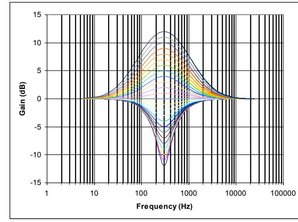

**Figure 25 EQ Band 1 – Low Freq Shelf Filter Response Figure 26 EQ Band 2 – Peak Filter Response**

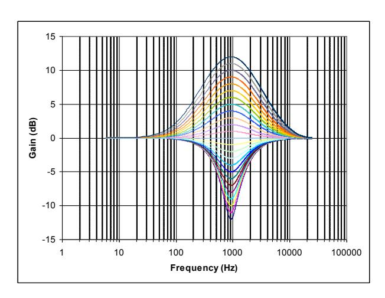

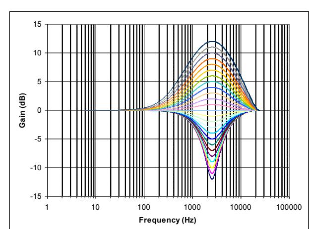

**Figure 27 EQ Band 3 – Peak Filter Response Figure 28 EQ Band 4 – Peak Filter Response**

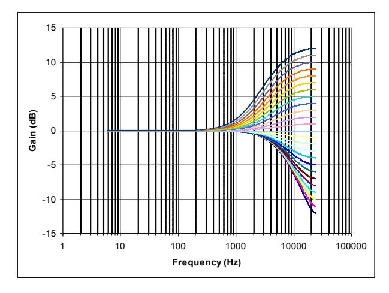

**Figure 29 EQ Band 5 – High Freq Shelf Filter Response**

# **3D STEREO EXPANSION**

The 3D Stereo Expansion is an audio enhancement feature which can be enabled in the digital playback path of the WM8994 audio interfaces. This feature uses configurable cross-talk mechanisms to adjust the depth or width of the stereo audio.

The WM8994 provides three 3D Stereo Expansion circuits; these are associated with AIF1 timeslot 0, AIF1 timeslot 1 and AIF2 respectively. The 3D Stereo Expansion is enabled and controlled in these signal paths using the register bits described in [Table 33.](#page-49-1)

| REGISTER ADDRESS                       | BIT  | LABEL                | DEFAULT | DESCRIPTION                                                                                                                                              |
|-------------------------------------------|------|----------------------|---------|----------------------------------------------------------------------------------------------------------------------------------------------------------|
| R1057 (0421h) AIF1 DAC1 Filters (2) | 13:9 | AIF1DAC1_3D_G AIN | 00000   | AIF1DAC1 playback path (AIF1, Timeslot 0) 3D Stereo depth 00000 = Off 00001 = Minimum (-16dB) …(0.915dB steps) 11111 = Maximum (+11.45dB) |
|                                           | 8    | AIF1DAC1_3D_E NA  | 0       | Enable 3D Stereo in AIF1DAC1 playback path (AIF1, Timeslot 0) 0 = Disabled 1 = Enabled                                                          |
| R1059 (0423h) AIF1 DAC2 Filters (2) | 13:9 | AIF1DAC2_3D_G AIN | 00000   | AIF1DAC2 playback path (AIF1, Timeslot 1) 3D Stereo depth 00000 = Off 00001 = Minimum (-16dB) …(0.915dB steps) 11111 = Maximum (+11.45dB) |
|                                           | 8    | AIF1DAC2_3D_E NA  | 0       | Enable 3D Stereo in AIF1DAC2 playback path (AIF1, Timeslot 1) 0 = Disabled 1 = Enabled                                                          |
| R1313 (0521h) AIF2 DAC Filters (2)  | 13:9 | AIF2DAC_3D_GA IN  | 00000   | AIF2DAC playback path 3D Stereo depth 00000 = Off 00001 = Minimum (-16dB) …(0.915dB steps) 11111 = Maximum (+11.45dB)                     |
|                                           | 8    | AIF2DAC_3D_EN A   | 0       | Enable 3D Stereo in AIF2DAC playback path 0 = Disabled 1 = Enabled                                                                              |

**Table 33 3D Stereo Expansion Control**

# **DIGITAL VOLUME AND FILTER CONTROL**

This section describes the digital volume and filter controls of the WM8994 AIF paths.

Digital volume control and High Pass Filter (HPF) control is provided on four AIF1 output (digital record) paths and two AIF2 output (digital record) paths.

Note that, when ultrasonic (4FS) mode is selected on AIF1, then the digital volume control and high pass filter (HPF) control are bypassed on the respective ADC (output) signal paths.

Digital volume control, soft-mute control, mono mix and de-emphasis filter control is provided on four AIF1 input (digital playback) paths and two AIF2 input (digital playback) paths.

#### **AIF1 - OUTPUT PATH VOLUME CONTROL**

The AIF1 interface supports up to four output channels. A digital volume control is provided on each of these output signal paths, allowing attenuation in the range -71.625dB to +17.625dB in 0.375dB steps. The level of attenuation for an eight-bit code X is given by:

0.375 (X-192) dB for 1 X 239; MUTE for X = 0 +17.625dB for 239 X 255

The AIF1ADC1\_VU and AIF1ADC2\_VU bits control the loading of digital volume control data. When the volume update bit is set to 0, the associated volume control data will be loaded into the respective control register, but will not actually change the digital gain setting.

The AIF1ADC1L and AIF1ADC1R gain settings are updated when a 1 is written to AIF1ADC1\_VU. The AIF1ADC2L and AIF1ADC2R gain settings are updated when a 1 is written to AIF1ADC2\_VU. This makes it possible to update the gain of left and right channels simultaneously.

| REGISTER ADDRESS       | BIT | LABEL                   | DEFAULT      | DESCRIPTION                                                                                              |
|---------------------------|-----|-------------------------|--------------|----------------------------------------------------------------------------------------------------------|
| R1024 (0400h)          | 8   | AIF1ADC1_ VU         | N/A          | AIF1ADC1 output path (AIF1, Timeslot 0) Volume Update                                                 |
| AIF1 ADC1 Left Volume  |     |                         |              | Writing a 1 to this bit will cause the AIF1ADC1L and AIF1ADC1R volume to be updated simultaneously |
|                           | 7:0 | AIF1ADC1L _VOL [7:0] | C0h (0dB) | AIF1ADC1 (Left) output path (AIF1, Timeslot 0) Digital Volume                                         |
|                           |     |                         |              | 00h = MUTE                                                                                               |
|                           |     |                         |              | 01h = -71.625dB                                                                                          |
|                           |     |                         |              | … (0.375dB steps)                                                                                        |
|                           |     |                         |              | EFh = +17.625dB                                                                                          |
|                           |     |                         |              | (See Table 35 for volume range)                                                                          |
| R1025 (0401h)          | 8   | AIF1ADC1_ VU         | N/A          | AIF1ADC1 output path (AIF1, Timeslot 0) Volume Update                                                 |
| AIF1 ADC1 Right Volume |     |                         |              | Writing a 1 to this bit will cause the AIF1ADC1L and AIF1ADC1R volume to be updated simultaneously |
|                           | 7:0 | AIF1ADC1R               | C0h          | AIF1ADC1 (Right) output path (AIF1, Timeslot                                                             |
|                           |     | _VOL [7:0]              | (0dB)        | 0) Digital Volume                                                                                        |
|                           |     |                         |              | 00h = MUTE                                                                                               |
|                           |     |                         |              | 01h = -71.625dB                                                                                          |
|                           |     |                         |              | … (0.375dB steps)                                                                                        |
|                           |     |                         |              | EFh = +17.625dB                                                                                          |
|                           |     |                         |              | (See Table 35 for volume range)                                                                          |

| REGISTER ADDRESS       | BIT | LABEL                   | DEFAULT      | DESCRIPTION                                                                                              |
|---------------------------|-----|-------------------------|--------------|----------------------------------------------------------------------------------------------------------|
| R1028 (0404h)          | 8   | AIF1ADC2_ VU         | N/A          | AIF1ADC2 output path (AIF1, Timeslot 1) Volume Update                                                 |
| AIF1 ADC2 Left Volume  |     |                         |              | Writing a 1 to this bit will cause the AIF1ADC2L and AIF1ADC2R volume to be updated simultaneously |
|                           | 7:0 | AIF1ADC2L _VOL [7:0] | C0h (0dB) | AIF1ADC2 (Left) output path (AIF1, Timeslot 1) Digital Volume                                         |
|                           |     |                         |              | 00h = MUTE                                                                                               |
|                           |     |                         |              | 01h = -71.625dB                                                                                          |
|                           |     |                         |              | … (0.375dB steps)                                                                                        |
|                           |     |                         |              | EFh = +17.625dB                                                                                          |
|                           |     |                         |              | (See Table 35 for volume range)                                                                          |
| R1029 (0405h)          | 8   | AIF1ADC2_ VU         | N/A          | AIF1ADC2 output path (AIF1, Timeslot 1) Volume Update                                                 |
| AIF1 ADC2 Right Volume |     |                         |              | Writing a 1 to this bit will cause the AIF1ADC2L and AIF1ADC2R volume to be updated simultaneously |
|                           | 7:0 | AIF1ADC2R               | C0h          | AIF1ADC2 (Right) output path (AIF1, Timeslot                                                             |
|                           |     | _VOL [7:0]              | (0dB)        | 1) Digital Volume                                                                                        |
|                           |     |                         |              | 00h = MUTE                                                                                               |
|                           |     |                         |              | 01h = -71.625dB                                                                                          |
|                           |     |                         |              | … (0.375dB steps)                                                                                        |
|                           |     |                         |              | EFh = +17.625dB                                                                                          |
|                           |     |                         |              | (See Table 35 for volume range)                                                                          |

**Table 34 AIF1 Output Path Volume Control**

| AIF1/AIF2 Output Volume | Volume (dB)     | AIF1/AIF2 Output Volume | Volume (dB)     | AIF1/AIF2 Output Volume | Volume (dB)     | AIF1/AIF2 Output Volume | Volume (dB)   |
|----------------------------|--------------------|----------------------------|--------------------|----------------------------|--------------------|----------------------------|------------------|
| 0h                         | MUTE               | 40h                        | -48.000            | 80h                        | -24.000            | C0h                        | 0.000            |
| 1h                         | -71.625            | 41h                        | -47.625            | 81h                        | -23.625            | C1h                        | 0.375            |
| 2h                         | -71.250            | 42h                        | -47.250            | 82h                        | -23.250            | C2h                        | 0.750            |
| 3h                         | -70.875            | 43h                        | -46.875            | 83h                        | -22.875            | C3h                        | 1.125            |
| 4h                         | -70.500            | 44h                        | -46.500            | 84h                        | -22.500            | C4h                        | 1.500            |
| 5h                         | -70.125            | 45h                        | -46.125            | 85h                        | -22.125            | C5h                        | 1.875            |
| 6h                         | -69.750            | 46h                        | -45.750            | 86h                        | -21.750            | C6h                        | 2.250            |
| 7h                         | -69.375            | 47h                        | -45.375            | 87h                        | -21.375            | C7h                        | 2.625            |
| 8h                         | -69.000            | 48h                        | -45.000            | 88h                        | -21.000            | C8h                        | 3.000            |
| 9h                         | -68.625            | 49h                        | -44.625            | 89h                        | -20.625            | C9h                        | 3.375            |
| Ah                         | -68.250            | 4Ah                        | -44.250            | 8Ah                        | -20.250            | CAh                        | 3.750            |
| Bh                         | -67.875            | 4Bh                        | -43.875            | 8Bh                        | -19.875            | CBh                        | 4.125            |
| Ch Dh                   | -67.500 -67.125 | 4Ch 4Dh                 | -43.500 -43.125 | 8Ch 8Dh                 | -19.500 -19.125 | CCh CDh                 | 4.500 4.875   |
| Eh                         | -66.750            | 4Eh                        | -42.750            | 8Eh                        | -18.750            | CEh                        | 5.250            |
| Fh                         | -66.375            | 4Fh                        | -42.375            | 8Fh                        | -18.375            | CFh                        | 5.625            |
| 10h                        | -66.000            | 50h                        | -42.000            | 90h                        | -18.000            | D0h                        | 6.000            |
| 11h                        | -65.625            | 51h                        | -41.625            | 91h                        | -17.625            | D1h                        | 6.375            |
| 12h                        | -65.250            | 52h                        | -41.250            | 92h                        | -17.250            | D2h                        | 6.750            |
| 13h                        | -64.875            | 53h                        | -40.875            | 93h                        | -16.875            | D3h                        | 7.125            |
| 14h                        | -64.500            | 54h                        | -40.500            | 94h                        | -16.500            | D4h                        | 7.500            |
| 15h                        | -64.125            | 55h                        | -40.125            | 95h                        | -16.125            | D5h                        | 7.875            |
| 16h                        | -63.750            | 56h                        | -39.750            | 96h                        | -15.750            | D6h                        | 8.250            |
| 17h                        | -63.375            | 57h                        | -39.375            | 97h                        | -15.375            | D7h                        | 8.625            |
| 18h                        | -63.000            | 58h                        | -39.000            | 98h                        | -15.000            | D8h                        | 9.000            |
| 19h                        | -62.625            | 59h                        | -38.625            | 99h                        | -14.625            | D9h                        | 9.375            |
| 1Ah                        | -62.250            | 5Ah                        | -38.250            | 9Ah                        | -14.250            | DAh                        | 9.750            |
| 1Bh 1Ch                 | -61.875 -61.500 | 5Bh 5Ch                 | -37.875 -37.500 | 9Bh 9Ch                 | -13.875 -13.500 | DBh DCh                 | 10.125 10.500 |
| 1Dh                        | -61.125            | 5Dh                        | -37.125            | 9Dh                        | -13.125            | DDh                        | 10.875           |
| 1Eh                        | -60.750            | 5Eh                        | -36.750            | 9Eh                        | -12.750            | DEh                        | 11.250           |
| 1Fh                        | -60.375            | 5Fh                        | -36.375            | 9Fh                        | -12.375            | DFh                        | 11.625           |
| 20h                        | -60.000            | 60h                        | -36.000            | A0h                        | -12.000            | E0h                        | 12.000           |
| 21h                        | -59.625            | 61h                        | -35.625            | A1h                        | -11.625            | E1h                        | 12.375           |
| 22h                        | -59.250            | 62h                        | -35.250            | A2h                        | -11.250            | E2h                        | 12.750           |
| 23h                        | -58.875            | 63h                        | -34.875            | A3h                        | -10.875            | E3h                        | 13.125           |
| 24h                        | -58.500            | 64h                        | -34.500            | A4h                        | -10.500            | E4h                        | 13.500           |
| 25h                        | -58.125            | 65h                        | -34.125            | A5h                        | -10.125            | E5h                        | 13.875           |
| 26h                        | -57.750            | 66h                        | -33.750            | A6h                        | -9.750             | E6h                        | 14.250           |
| 27h                        | -57.375            | 67h                        | -33.375            | A7h                        | -9.375             | E7h                        | 14.625           |
| 28h                        | -57.000            | 68h                        | -33.000            | A8h                        | -9.000             | E8h                        | 15.000           |
| 29h                        | -56.625            | 69h                        | -32.625            | A9h                        | -8.625             | E9h                        | 15.375           |
| 2Ah                        | -56.250            | 6Ah                        | -32.250            | AAh                        | -8.250             | EAh                        | 15.750           |
| 2Bh 2Ch                 | -55.875 -55.500 | 6Bh 6Ch                 | -31.875 -31.500 | ABh ACh                 | -7.875 -7.500   | EBh ECh                 | 16.125 16.500 |
| 2Dh                        | -55.125            | 6Dh                        | -31.125            | ADh                        | -7.125             | EDh                        | 16.875           |
| 2Eh                        | -54.750            | 6Eh                        | -30.750            | AEh                        | -6.750             | EEh                        | 17.250           |
| 2Fh                        | -54.375            | 6Fh                        | -30.375            | AFh                        | -6.375             | EFh                        | 17.625           |
| 30h                        | -54.000            | 70h                        | -30.000            | B0h                        | -6.000             | F0h                        | 17.625           |
| 31h                        | -53.625            | 71h                        | -29.625            | B1h                        | -5.625             | F1h                        | 17.625           |
| 32h                        | -53.250            | 72h                        | -29.250            | B2h                        | -5.250             | F2h                        | 17.625           |
| 33h                        | -52.875            | 73h                        | -28.875            | B3h                        | -4.875             | F3h                        | 17.625           |
| 34h                        | -52.500            | 74h                        | -28.500            | B4h                        | -4.500             | F4h                        | 17.625           |
| 35h                        | -52.125            | 75h                        | -28.125            | B5h                        | -4.125             | F5h                        | 17.625           |
| 36h                        | -51.750            | 76h                        | -27.750            | B6h                        | -3.750             | F6h                        | 17.625           |
| 37h                        | -51.375            | 77h                        | -27.375            | B7h                        | -3.375             | F7h                        | 17.625           |
| 38h                        | -51.000            | 78h                        | -27.000            | B8h                        | -3.000             | F8h                        | 17.625           |
| 39h                        | -50.625            | 79h                        | -26.625            | B9h                        | -2.625             | F9h                        | 17.625           |
| 3Ah                        | -50.250            | 7Ah                        | -26.250            | BAh                        | -2.250             | FAh                        | 17.625           |
| 3Bh                        | -49.875            | 7Bh                        | -25.875            | BBh                        | -1.875             | FBh                        | 17.625           |
| 3Ch                        | -49.500            | 7Ch                        | -25.500            | BCh                        | -1.500             | FCh                        | 17.625           |
| 3Dh                        | -49.125            | 7Dh                        | -25.125            | BDh                        | -1.125             | FDh                        | 17.625           |
| 3Eh                        | -48.750            | 7Eh                        | -24.750            | BEh                        | -0.750             | FEh                        | 17.625           |
| 3Fh                        | -48.375            | 7Fh                        | -24.375            | BFh                        | -0.375             | FFh                        | 17.625           |

**Table 35 AIF1 Output Path Digital Volume Range**

#### **AIF1 - OUTPUT PATH HIGH PASS FILTER**

A digital high-pass filter can be enabled in the AIF1 output paths to remove DC offsets. This filter is enabled independently in the four AIF1 output channels using the register bits described in [Table 36.](#page-53-0)

The HPF cut-off frequency for the AIF1 Timeslot 0 channels is set using AIF1ADC1\_HPF\_CUT. The HPF cut-off frequency for the AIF1 Timeslot 1 channels is set using AIF1ADC2\_HPF\_CUT.

In hi-fi mode, the high pass filter is optimised for removing DC offsets without degrading the bass response and has a cut-off frequency of 3.7Hz when the sample rate (fs) = 44.1kHz.

In voice modes, the high pass filter is optimised for voice communication; it is recommended to set the cut-off frequency below 300Hz.

Note that the cut-off frequencies scale with the AIF1 sample rate. (The AIF1 sample rate is set using the AIF1\_SR register, as described in the ["Clocking and Sample Rates"](#page-149-0) section.) Se[e Table 37](#page-54-0) for the HPF cut-off frequencies at all supported sample rates.

| REGISTER ADDRESS        | BIT   | LABEL                | DEFAULT | DESCRIPTION                                                                   |
|----------------------------|-------|----------------------|---------|-------------------------------------------------------------------------------|
| R1040 (0410h) AIF1 ADC1 | 14:13 | AIF1ADC1_ HPF_CUT | 00      | AIF1ADC1 output path (AIF1, Timeslot 0) Digital HPF cut-off frequency (fc) |
| Filters                    |       | [1:0]                |         | 00 = Hi-fi mode (fc = 4Hz at fs = 48kHz)                                      |
|                            |       |                      |         | 01 = Voice mode 1 (fc = 64Hz at fs = 8kHz)                                    |
|                            |       |                      |         | 10 = Voice mode 2 (fc = 130Hz at fs = 8kHz)                                   |
|                            |       |                      |         | 11 = Voice mode 3 (fc = 267Hz at fs = 8kHz)                                   |
|                            | 12    | AIF1ADC1L_ HPF    | 0       | AIF1ADC1 (Left) output path (AIF1, Timeslot 0) Digital HPF Enable          |
|                            |       |                      |         | 0 = Disabled                                                                  |
|                            |       |                      |         | 1 = Enabled                                                                   |
|                            | 11    | AIF1ADC1R _HPF    | 0       | AIF1ADC1 (Right) output path (AIF1, Timeslot 0) Digital HPF Enable         |
|                            |       |                      |         | 0 = Disabled                                                                  |
|                            |       |                      |         | 1 = Enabled                                                                   |
| R1041 (0411h) AIF1 ADC2 | 14:13 | AIF1ADC2_ HPF_CUT | 00      | AIF1ADC2 output path (AIF1, Timeslot 1) Digital HPF cut-off frequency (fc) |
| Filters                    |       | [1:0]                |         | 00 = Hi-fi mode (fc = 4Hz at fs = 48kHz)                                      |
|                            |       |                      |         | 01 = Voice mode 1 (fc = 64Hz at fs = 8kHz)                                    |
|                            |       |                      |         | 10 = Voice mode 2 (fc = 130Hz at fs = 8kHz)                                   |
|                            |       |                      |         | 11 = Voice mode 3 (fc = 267Hz at fs = 8kHz)                                   |
|                            | 12    | AIF1ADC2L_ HPF    | 0       | AIF1ADC2 (Left) output path (AIF1, Timeslot 1) Digital HPF Enable          |
|                            |       |                      |         | 0 = Disabled                                                                  |
|                            |       |                      |         | 1 = Enabled                                                                   |
|                            | 11    | AIF1ADC2R _HPF    | 0       | AIF1ADC2 (Right) output path (AIF1, Timeslot 1) Digital HPF Enable         |
|                            |       |                      |         | 0 = Disabled                                                                  |
|                            |       |                      |         | 1 = Enabled                                                                   |

**Table 36 AIF1 Output Path High Pass Filter**

| Sample             | Cut-Off Frequency (Hz) for given value of AIFnADCn_HPF_CUT |     |      |      |  |  |  |
|--------------------|------------------------------------------------------------|-----|------|------|--|--|--|
| Frequency (kHz) | 00                                                         | 01  | 10   | 11   |  |  |  |
| 8.000              | 0.7                                                        | 64  | 130  | 267  |  |  |  |
| 11.025             | 0.9                                                        | 88  | 178  | 367  |  |  |  |
| 16.000             | 1.3                                                        | 127 | 258  | 532  |  |  |  |
| 22.050             | 1.9                                                        | 175 | 354  | 733  |  |  |  |
| 24.000             | 2.0                                                        | 190 | 386  | 798  |  |  |  |
| 32.000             | 2.7                                                        | 253 | 514  | 1063 |  |  |  |
| 44.100             | 3.7                                                        | 348 | 707  | 1464 |  |  |  |
| 48.000             | 4.0                                                        | 379 | 770  | 1594 |  |  |  |
| 88.200             | 7.4                                                        | 696 | 1414 | 2928 |  |  |  |
| 96.000             | 8.0                                                        | 758 | 1540 | 3188 |  |  |  |

**Table 37 AIF1 Output Path High Pass Filter Cut-Off Frequencies**

#### **AIF1 - INPUT PATH VOLUME CONTROL**

The AIF1 interface supports up to four input channels. A digital volume control is provided on each of these input signal paths, allowing attenuation in the range -71.625dB to 0dB in 0.375dB steps. The level of attenuation for an eight-bit code X is given by:

0.375 (X-192) dB for 1 X 192; MUTE for X = 0 0dB for 192 X 255

The AIF1DAC1\_VU and AIF1DAC2\_VU bits control the loading of digital volume control data. When the volume update bit is set to 0, the associated volume control data will be loaded into the respective control register, but will not actually change the digital gain setting.

The AIF1DAC1L and AIF1DAC1R gain settings are updated when a 1 is written to AIF1DAC1\_VU. The AIF1DAC2L and AIF1DAC2R gain settings are updated when a 1 is written to AIF1DAC2\_VU. This makes it possible to update the gain of left and right channels simultaneously.

Note that a digital gain function is also available at the audio interface input, to boost the DAC volume when a small signal is received on DACDAT1. See ["Digital Audio Interface Control"](#page-131-0) for further details.

Digital volume control is also possible at the DAC stage of the signal path, after the audio signal has passed through the DAC digital mixers. See ["Digital to Analogue Converter \(DAC\)"](#page-63-0) for further details.

| REGISTER ADDRESS                           | BIT | LABEL                   | DEFAULT      | DESCRIPTION                                                                                                                                                                         |
|-----------------------------------------------|-----|-------------------------|--------------|-------------------------------------------------------------------------------------------------------------------------------------------------------------------------------------|
| R1026 (0402h) AIF1 DAC1 Left Volume  | 8   | AIF1DAC1_ VU         | N/A          | AIF1DAC1 input path (AIF1, Timeslot 0) Volume Update Writing a 1 to this bit will cause the AIF1DAC1L and AIF1DAC1R volume to be updated simultaneously                 |
|                                               | 7:0 | AIF1DAC1L _VOL [7:0] | C0h (0dB) | AIF1DAC1 (Left) input path (AIF1, Timeslot 0) Digital Volume 00h = MUTE 01h = -71.625dB … (0.375dB steps) C0h = 0dB FFh = 0dB (See Table 39 for volume range)  |
| R1027 (0403h) AIF1 DAC1 Right Volume | 8   | AIF1DAC1_ VU         | N/A          | AIF1DAC1 input path (AIF1, Timeslot 0) Volume Update Writing a 1 to this bit will cause the AIF1DAC1L and AIF1DAC1R volume to be updated simultaneously                 |
|                                               | 7:0 | AIF1DAC1R _VOL [7:0] | C0h (0dB) | AIF1DAC1 (Right) input path (AIF1, Timeslot 0) Digital Volume 00h = MUTE 01h = -71.625dB … (0.375dB steps) C0h = 0dB FFh = 0dB (See Table 39 for volume range) |
| R1030 (0406h) AIF1 DAC2 Left Volume  | 8   | AIF1DAC2_ VU         | N/A          | AIF1DAC2 input path (AIF1, Timeslot 1) Volume Update Writing a 1 to this bit will cause the AIF1DAC2L and AIF1DAC2R volume to be updated simultaneously                 |
|                                               | 7:0 | AIF1DAC2L _VOL [7:0] | C0h (0dB) | AIF1DAC2 (Left) input path (AIF1, Timeslot 1) Digital Volume 00h = MUTE 01h = -71.625dB … (0.375dB steps) C0h = 0dB FFh = 0dB (See Table 39 for volume range)  |
| R1031 (0407h) AIF1 DAC2 Right Volume | 8   | AIF1DAC2_ VU         | N/A          | AIF1DAC2 input path (AIF1, Timeslot 1) Volume Update Writing a 1 to this bit will cause the AIF1DAC2L and AIF1DAC2R volume to be updated simultaneously                 |
|                                               | 7:0 | AIF1DAC2R _VOL [7:0] | C0h (0dB) | AIF1DAC2 (Right) input path (AIF1, Timeslot 1) Digital Volume 00h = MUTE 01h = -71.625dB … (0.375dB steps) C0h = 0dB FFh = 0dB (See Table 39 for volume range) |

**Table 38 AIF1 Input Path Volume Control**

| AIF1/AIF2 Input | Volume  | AIF1/AIF2 Input | Volume  | AIF1/AIF2 Input | Volume  | AIF1/AIF2 Input | Volume |
|-----------------|---------|-----------------|---------|-----------------|---------|-----------------|--------|
| Volume          | (dB)    | Volume          | (dB)    | Volume          | (dB)    | Volume          | (dB)   |
| 0h              | MUTE    | 40h             | -48.000 | 80h             | -24.000 | C0h             | 0.000  |
| 1h              | -71.625 | 41h             | -47.625 | 81h             | -23.625 | C1h             | 0.000  |
| 2h              | -71.250 | 42h             | -47.250 | 82h             | -23.250 | C2h             | 0.000  |
| 3h              | -70.875 | 43h             | -46.875 | 83h             | -22.875 | C3h             | 0.000  |
| 4h              | -70.500 | 44h             | -46.500 | 84h             | -22.500 | C4h             | 0.000  |
| 5h              | -70.125 | 45h             | -46.125 | 85h             | -22.125 | C5h             | 0.000  |
| 6h              | -69.750 | 46h             | -45.750 | 86h             | -21.750 | C6h             | 0.000  |
| 7h              | -69.375 | 47h             | -45.375 | 87h             | -21.375 | C7h             | 0.000  |
| 8h              | -69.000 | 48h             | -45.000 | 88h             | -21.000 | C8h             | 0.000  |
| 9h              | -68.625 | 49h             | -44.625 | 89h             | -20.625 | C9h             | 0.000  |
| Ah              | -68.250 | 4Ah             | -44.250 | 8Ah             | -20.250 | CAh             | 0.000  |
| Bh              | -67.875 | 4Bh             | -43.875 | 8Bh             | -19.875 | CBh             | 0.000  |
| Ch              | -67.500 | 4Ch             | -43.500 | 8Ch             | -19.500 | CCh             | 0.000  |
| Dh              | -67.125 | 4Dh             | -43.125 | 8Dh             | -19.125 | CDh             | 0.000  |
| Eh              | -66.750 | 4Eh             | -42.750 | 8Eh             | -18.750 | CEh             | 0.000  |
| Fh              | -66.375 | 4Fh             | -42.375 | 8Fh             | -18.375 | CFh             | 0.000  |
| 10h             | -66.000 | 50h             | -42.000 | 90h             | -18.000 | D0h             | 0.000  |
| 11h             | -65.625 | 51h             | -41.625 | 91h             | -17.625 | D1h             | 0.000  |
| 12h             | -65.250 | 52h             | -41.250 | 92h             | -17.250 | D2h             | 0.000  |
| 13h             | -64.875 | 53h             | -40.875 | 93h             | -16.875 | D3h             | 0.000  |
| 14h             | -64.500 | 54h             | -40.500 | 94h             | -16.500 | D4h             | 0.000  |
| 15h             | -64.125 | 55h             | -40.125 | 95h             | -16.125 | D5h             | 0.000  |
| 16h             | -63.750 | 56h             | -39.750 | 96h             | -15.750 | D6h             | 0.000  |
| 17h             | -63.375 | 57h             | -39.375 | 97h             | -15.375 | D7h             | 0.000  |
| 18h             | -63.000 | 58h             | -39.000 | 98h             | -15.000 | D8h             | 0.000  |
| 19h             | -62.625 | 59h             | -38.625 | 99h             | -14.625 | D9h             | 0.000  |
| 1Ah             | -62.250 | 5Ah             | -38.250 | 9Ah             | -14.250 | DAh             | 0.000  |
| 1Bh             | -61.875 | 5Bh             | -37.875 | 9Bh             | -13.875 | DBh             | 0.000  |
| 1Ch             | -61.500 | 5Ch             | -37.500 | 9Ch             | -13.500 | DCh             | 0.000  |
| 1Dh             | -61.125 | 5Dh             | -37.125 | 9Dh             | -13.125 | DDh             | 0.000  |
| 1Eh             | -60.750 | 5Eh             | -36.750 | 9Eh             | -12.750 | DEh             | 0.000  |
| 1Fh             | -60.375 | 5Fh             | -36.375 | 9Fh             | -12.375 | DFh             | 0.000  |
| 20h             | -60.000 | 60h             | -36.000 | A0h             | -12.000 | E0h             | 0.000  |
| 21h             | -59.625 | 61h             | -35.625 | A1h             | -11.625 | E1h             | 0.000  |
| 22h             | -59.250 | 62h             | -35.250 | A2h             | -11.250 | E2h             | 0.000  |
| 23h             | -58.875 | 63h             | -34.875 | A3h             | -10.875 | E3h             | 0.000  |
| 24h             | -58.500 | 64h             | -34.500 | A4h             | -10.500 | E4h             | 0.000  |
| 25h             | -58.125 | 65h             | -34.125 | A5h             | -10.125 | E5h             | 0.000  |
| 26h             | -57.750 | 66h             | -33.750 | A6h             | -9.750  | E6h             | 0.000  |
| 27h             | -57.375 | 67h             | -33.375 | A7h             | -9.375  | E7h             | 0.000  |
| 28h             | -57.000 | 68h             | -33.000 | A8h             | -9.000  | E8h             | 0.000  |
| 29h             | -56.625 | 69h             | -32.625 | A9h             | -8.625  | E9h             | 0.000  |
| 2Ah             | -56.250 | 6Ah             | -32.250 | AAh             | -8.250  | EAh             | 0.000  |
| 2Bh             | -55.875 | 6Bh             | -31.875 | ABh             | -7.875  | EBh             | 0.000  |
| 2Ch             | -55.500 | 6Ch             | -31.500 | ACh             | -7.500  | ECh             | 0.000  |
| 2Dh             | -55.125 | 6Dh             | -31.125 | ADh             | -7.125  | EDh             | 0.000  |
| 2Eh             | -54.750 | 6Eh             | -30.750 | AEh             | -6.750  | EEh             | 0.000  |
| 2Fh             | -54.375 | 6Fh             | -30.375 | AFh             | -6.375  | EFh             | 0.000  |
| 30h             | -54.000 | 70h             | -30.000 | B0h             | -6.000  | F0h             | 0.000  |
| 31h             | -53.625 | 71h             | -29.625 | B1h             | -5.625  | F1h             | 0.000  |
| 32h             | -53.250 | 72h             | -29.250 | B2h             | -5.250  | F2h             | 0.000  |
| 33h             | -52.875 | 73h             | -28.875 | B3h             | -4.875  | F3h             | 0.000  |
| 34h             | -52.500 | 74h             | -28.500 | B4h             | -4.500  | F4h             | 0.000  |
| 35h             | -52.125 | 75h             | -28.125 | B5h             | -4.125  | F5h             | 0.000  |
| 36h             | -51.750 | 76h             | -27.750 | B6h             | -3.750  | F6h             | 0.000  |
| 37h             | -51.375 | 77h             | -27.375 | B7h             | -3.375  | F7h             | 0.000  |
| 38h             | -51.000 | 78h             | -27.000 | B8h             | -3.000  | F8h             | 0.000  |
| 39h             | -50.625 | 79h             | -26.625 | B9h             | -2.625  | F9h             | 0.000  |
| 3Ah             | -50.250 | 7Ah             | -26.250 | BAh             | -2.250  | FAh             | 0.000  |
| 3Bh             | -49.875 | 7Bh             | -25.875 | BBh             | -1.875  | FBh             | 0.000  |
| 3Ch             | -49.500 | 7Ch             | -25.500 | BCh             | -1.500  | FCh             | 0.000  |
| 3Dh             | -49.125 | 7Dh             | -25.125 | BDh             | -1.125  | FDh             | 0.000  |
| 3Eh             | -48.750 | 7Eh             | -24.750 | BEh             | -0.750  | FEh             | 0.000  |
| 3Fh             | -48.375 | 7Fh             | -24.375 | BFh             | -0.375  | FFh             | 0.000  |
|                 |         |                 |         |                 |         |                 |        |

**Table 39 AIF1 Input Path Digital Volume Range**

#### **AIF1 - INPUT PATH SOFT MUTE CONTROL**

The WM8994 provides a soft mute function for each of the AIF1 interface input paths. When the softmute function is selected, the WM8994 gradually attenuates the associated signal paths until the path is entirely muted.

When the soft-mute function is de-selected, the gain will either return instantly to the digital gain setting, or will gradually ramp back to the digital gain setting, depending on the applicable \_UNMUTE\_RAMP register field.

The mute and un-mute ramp rate is selectable between two different rates.

The AIF1 input paths are soft-muted by default. To play back an audio signal, the soft-mute must first be de-selected by setting the applicable Mute bit to 0.

The soft un-mute would typically be used during playback of audio data so that when the Mute is subsequently disabled, a smooth transition is scheduled to the previous volume level and pop noise is avoided. This is desirable when resuming playback after pausing during a track.

The soft un-mute would typically not be required when un-muting at the start of a music file, in order that the first part of the music track is not attenuated. The instant un-mute behaviour is desirable in this case, when starting playback of a new track. See ["DAC Soft Mute and Soft Un-Mute"](#page-68-0) [\(Figure 30\)](#page-68-1) for an illustration of the soft mute function.

| REGISTER ADDRESS                       | BIT | LABEL                     | DEFAULT | DESCRIPTION                                                                                                                                       |
|-------------------------------------------|-----|---------------------------|---------|---------------------------------------------------------------------------------------------------------------------------------------------------|
| R1056 (0420h) AIF1 DAC1 Filters (1) | 9   | AIF1DAC1_ MUTE         | 1       | AIF1DAC1 input path (AIF1, Timeslot 0) Soft Mute Control 0 = Un-mute 1 = Mute                                                            |
|                                           | 5   | AIF1DAC1_ MUTERAT E | 0       | AIF1DAC1 input path (AIF1, Timeslot 0) Soft Mute Ramp Rate 0 = Fast ramp (fs/2, maximum ramp time is                                        |
|                                           |     |                           |         | 10.7ms at fs=48k)                                                                                                                                 |
|                                           |     |                           |         | 1 = Slow ramp (fs/32, maximum ramp time is 171ms at fs=48k)                                                                                    |
|                                           |     |                           |         | (Note: ramp rate scales with sample rate.)                                                                                                        |
|                                           | 4   | AIF1DAC1_ UNMUTE_      | 0       | AIF1DAC1 input path (AIF1, Timeslot 0) Unmute Ramp select                                                                                      |
|                                           |     | RAMP                      |         | 0 = Disabling soft-mute (AIF1DAC1_MUTE=0) will cause the volume to change immediately to AIF1DAC1L_VOL and AIF1DAC1R_VOL settings        |
|                                           |     |                           |         | 1 = Disabling soft-mute (AIF1DAC1_MUTE=0) will cause the DAC volume to ramp up gradually to the AIF1DAC1L_VOL and AIF1DAC1R_VOL settings |

| REGISTER ADDRESS        | BIT | LABEL                | DEFAULT | DESCRIPTION                                                                                                                                       |
|----------------------------|-----|----------------------|---------|---------------------------------------------------------------------------------------------------------------------------------------------------|
| R1058 (0422h) AIF1 DAC2 | 9   | AIF1DAC2_ MUTE    | 1       | AIF1DAC2 input path (AIF1, Timeslot 1) Soft Mute Control                                                                                       |
| Filters (1)                |     |                      |         | 0 = Un-mute                                                                                                                                       |
|                            |     |                      |         | 1 = Mute                                                                                                                                          |
|                            | 5   | AIF1DAC2_ MUTERAT | 0       | AIF1DAC2 input path (AIF1, Timeslot 1) Soft Mute Ramp Rate                                                                                     |
|                            |     | E                    |         | 0 = Fast ramp (fs/2, maximum ramp time is 10.7ms at fs=48k)                                                                                    |
|                            |     |                      |         | 1 = Slow ramp (fs/32, maximum ramp time is 171ms at fs=48k)                                                                                    |
|                            |     |                      |         | (Note: ramp rate scales with sample rate.)                                                                                                        |
|                            | 4   | AIF1DAC2_ UNMUTE_ | 0       | AIF1DAC2 input path (AIF1, Timeslot 1) Unmute Ramp select                                                                                      |
|                            |     | RAMP                 |         | 0 = Disabling soft-mute (AIF1DAC2_MUTE=0) will cause the volume to change immediately to AIF1DAC2L_VOL and AIF1DAC2R_VOL settings        |
|                            |     |                      |         | 1 = Disabling soft-mute (AIF1DAC2_MUTE=0) will cause the DAC volume to ramp up gradually to the AIF1DAC2L_VOL and AIF1DAC2R_VOL settings |

**Table 40 AIF1 Input Path Soft Mute Control**

#### **AIF1 - INPUT PATH MONO MIX AND DE-EMPHASIS FILTER**

A digital mono mix can be selected on one or both pairs of AIF1 input channels. The mono mix is generated as the sum of the Left and Right AIF channel data. When the mono mix function is enabled, the combined mono signal is applied to the Left channel and the Right channel of the respective AIF1 signal processing and digital mixing paths. To prevent clipping, 6dB attenuation is applied to the mono mix.

Digital de-emphasis can be applied to the AIF1 input (playback) paths; this is appropriate when the data source is a CD where pre-emphasis is used in the recording. De-emphasis filtering is available for sample rates of 48kHz, 44.1kHz and 32kHz. See "Digital Filter Characteristics "section for details of de-emphasis filter characteristics.

| REGISTER ADDRESS                       | BIT | LABEL                    | DEFAULT | DESCRIPTION                                                                                                                                                          |
|-------------------------------------------|-----|--------------------------|---------|----------------------------------------------------------------------------------------------------------------------------------------------------------------------|
| R1056 (0420h) AIF1 DAC1 Filters (1) | 7   | AIF1DAC1_ MONO        | 0       | AIF1DAC1 input path (AIF1, Timeslot 0) Mono Mix Control 0 = Disabled 1 = Enabled                                                                            |
|                                           | 2:1 | AIF1DAC1_ DEEMP [1:0] | 00      | AIF1DAC1 input path (AIF1, Timeslot 0) De Emphasis Control 00 = No de-emphasis 01 = 32kHz sample rate 10 = 44.1kHz sample rate 11 = 48kHz sample rate |

| REGISTER ADDRESS                       | BIT | LABEL                    | DEFAULT | DESCRIPTION                                                                                                                                                          |
|-------------------------------------------|-----|--------------------------|---------|----------------------------------------------------------------------------------------------------------------------------------------------------------------------|
| R1058 (0422h) AIF1 DAC2 Filters (1) | 7   | AIF1DAC2_ MONO        | 0       | AIF1DAC2 input path (AIF1, Timeslot 1) Mono Mix Control 0 = Disabled 1 = Enabled                                                                            |
|                                           | 2:1 | AIF1DAC2_ DEEMP [1:0] | 00      | AIF1DAC2 input path (AIF1, Timeslot 1) De Emphasis Control 00 = No de-emphasis 01 = 32kHz sample rate 10 = 44.1kHz sample rate 11 = 48kHz sample rate |

**Table 41 AIF1 Input Path Mono Mix and De-Emphasis Filter Control**

#### **AIF2 - OUTPUT PATH VOLUME CONTROL**

The AIF2 interface supports two output channels. A digital volume control is provided on each output signal path, allowing attenuation in the range -71.625dB to +17.625dB in 0.375dB steps. The level of attenuation for an eight-bit code X is given by:

0.375 (X-192) dB for 1 X 239; MUTE for X = 0 +17.625dB for 239 X 255

The AIF2ADC\_VU bit controls the loading of digital volume control data. When AIF2ADC\_VU bit is set to 0, the AIF2ADCL\_VOL and AIF2ADCR\_VOL control data will be loaded into the respective control register, but will not actually change the digital gain setting. Both left and right gain settings are updated when a 1 is written to AIF2ADC\_VU. This makes it possible to update the gain of left and right channels simultaneously.

| REGISTER ADDRESS                 | BIT | LABEL     | DEFAULT | DESCRIPTION                                                                                            |
|-------------------------------------|-----|-----------|---------|--------------------------------------------------------------------------------------------------------|
| R1280                               | 8   | AIF2ADC_V | N/A     | AIF2ADC output path Volume Update                                                                      |
| (0500h) AIF2 ADC Left Volume  |     | U         |         | Writing a 1 to this bit will cause the AIF2ADCL and AIF2ADCR volume to be updated simultaneously |
|                                     | 7:0 | AIF2ADCL_ | C0h     | AIF2ADC (Left) output path Digital Volume                                                              |
|                                     |     | VOL [7:0] | (0dB)   | 00h = MUTE                                                                                             |
|                                     |     |           |         | 01h = -71.625dB                                                                                        |
|                                     |     |           |         | … (0.375dB steps)                                                                                      |
|                                     |     |           |         | EFh = +17.625dB                                                                                        |
|                                     |     |           |         | (See Table 35 for volume range)                                                                        |
| R1281                               | 8   | AIF2ADC_V | N/A     | AIF2ADC output path Volume Update                                                                      |
| (0501h) AIF2 ADC Right Volume |     | U         |         | Writing a 1 to this bit will cause the AIF2ADCL and AIF2ADCR volume to be updated simultaneously |
|                                     | 7:0 | AIF2ADCR_ | C0h     | AIF2ADC (Right) output path Digital Volume                                                             |
|                                     |     | VOL [7:0] | (0dB)   | 00h = MUTE                                                                                             |
|                                     |     |           |         | 01h = -71.625dB                                                                                        |
|                                     |     |           |         | … (0.375dB steps)                                                                                      |
|                                     |     |           |         | EFh = +17.625dB                                                                                        |
|                                     |     |           |         | (See Table 35 for volume range)                                                                        |

**Table 42 AIF2 Output Path Volume Control**

#### **AIF2 - OUTPUT PATH HIGH PASS FILTER**

A digital high-pass filter can be enabled in the AIF2 output paths to remove DC offsets. This filter is enabled independently in the two AIF2 output channels using the register bits described in [Table 43.](#page-60-0)

The HPF cut-off frequency for the AIF2 channels is set using AIF2ADC\_HPF\_CUT.

In hi-fi mode, the high pass filter is optimised for removing DC offsets without degrading the bass response and has a cut-off frequency of 3.7Hz when the sample rate (fs) = 44.1kHz.

In voice modes, the high pass filter is optimised for voice communication; it is recommended to set the cut-off frequency below 300Hz.

Note that the cut-off frequencies scale with the AIF2 sample rate. (The AIF2 sample rate is set using the AIF2\_SR register, as described in the ["Clocking and Sample Rates"](#page-149-0) section.) Se[e Table 37](#page-54-0) for the HPF cut-off frequencies at all supported sample rates.

| REGISTER ADDRESS                  | BIT   | LABEL                        | DEFAULT | DESCRIPTION                                                                                                                                                                                                                                        |
|--------------------------------------|-------|------------------------------|---------|----------------------------------------------------------------------------------------------------------------------------------------------------------------------------------------------------------------------------------------------------|
| R1296 (0510h) AIF2 ADC Filters | 14:13 | AIF2ADC_H PF_CUT [1:0] | 00      | AIF2ADC output path Digital HPF Cut-Off Frequency (fc) 00 = Hi-fi mode (fc = 4Hz at fs = 48kHz) 01 = Voice mode 1 (fc = 127Hz at fs = 8kHz) 10 = Voice mode 2 (fc = 130Hz at fs = 8kHz) 11 = Voice mode 3 (fc = 267Hz at fs = 8kHz) |
|                                      | 12    | AIF2ADCL_ HPF             | 0       | AIF2ADC (Left) output path Digital HPF Enable 0 = Disabled 1 = Enabled                                                                                                                                                                    |
|                                      | 11    | AIF2ADCR_ HPF             | 0       | AIF2ADC (Right) output path Digital HPF Enable 0 = Disabled 1 = Enabled                                                                                                                                                                   |

**Table 43 AIF2 Output Path High Pass Filter**

#### **AIF2 - INPUT PATH VOLUME CONTROL**

The AIF2 interface supports two input channels. A digital volume control is provided on each input signal path, allowing attenuation in the range -71.625dB to 0dB in 0.375dB steps. The level of attenuation for an eight-bit code X is given by:

0.375 (X-192) dB for 1 X 192; MUTE for X = 0 0dB for 192 X 255

The AIF2DAC\_VU bit controls the loading of digital volume control data. When AIF2DAC\_VU bit is set to 0, the AIF2DACL\_VOL and AIF2DACR\_VOL control data will be loaded into the respective control register, but will not actually change the digital gain setting. Both left and right gain settings are updated when a 1 is written to AIF2DAC\_VU. This makes it possible to update the gain of left and right channels simultaneously.

Note that a digital gain function is also available at the audio interface input, to boost the DAC volume when a small signal is received on DACDAT2. See ["Digital Audio Interface Control"](#page-131-0) for further details.

Digital volume control is also possible at the DAC stage of the signal path, after the audio signal has passed through the DAC digital mixers. See ["Digital to Analogue Converter \(DAC\)"](#page-63-0) for further details.

| REGISTER ADDRESS                          | BIT                                           | LABEL                  | DEFAULT      | DESCRIPTION                                                                                                                                                  |  |  |
|----------------------------------------------|-----------------------------------------------|------------------------|--------------|--------------------------------------------------------------------------------------------------------------------------------------------------------------|--|--|
| R1282 (0502h) AIF2 DAC Left Volume  | 8                                             | AIF2DAC_V U         | N/A          | AIF2DAC input path Volume Update Writing a 1 to this bit will cause the AIF2DACL and AIF2DACR volume to be updated simultaneously                   |  |  |
|                                              | 7:0 AIF2DACL_ C0h VOL [7:0] (0dB) |                        |              | AIF2DAC (Left) input path Digital Volume 00h = MUTE 01h = -71.625dB … (0.375dB steps) C0h = 0dB FFh = 0dB (See Table 39 for volume range)  |  |  |
| R1283 (0503h) AIF2 DAC Right Volume | 8 AIF2DAC_V N/A U                    |                        |              | AIF2DAC input path Volume Update Writing a 1 to this bit will cause the AIF2DACL and AIF2DACR volume to be updated simultaneously                   |  |  |
|                                              | 7:0                                           | AIF2DACR_ VOL [7:0] | C0h (0dB) | AIF2DAC (Right) input path Digital Volume 00h = MUTE 01h = -71.625dB … (0.375dB steps) C0h = 0dB FFh = 0dB (See Table 39 for volume range) |  |  |

**Table 44 AIF2 Input Path Volume Control**

# **AIF2 - INPUT PATH SOFT MUTE CONTROL**

The WM8994 provides a soft mute function for each of the AIF2 interface input paths. When the softmute function is selected, the WM8994 gradually attenuates the associated signal paths until the path is entirely muted.

When the soft-mute function is de-selected, the gain will either return instantly to the digital gain setting, or will gradually ramp back to the digital gain setting, depending on the AIF2DAC\_UNMUTE\_RAMP register field.

The mute and un-mute ramp rate is selectable between two different rates.

The AIF2 input paths are soft-muted by default. To play back an audio signal, the soft-mute must first be de-selected by setting AIF2DAC\_MUTE = 0.

The soft un-mute would typically be used during playback of audio data so that when the Mute is subsequently disabled, a smooth transition is scheduled to the previous volume level and pop noise is avoided. This is desirable when resuming playback after pausing during a track.

The soft un-mute would typically not be required when un-muting at the start of a music file, in order that the first part of the music track is not attenuated. The instant un-mute behaviour is desirable in this case, when starting playback of a new track. See ["DAC Soft Mute and Soft Un-Mute"](#page-68-0) [\(Figure 30\)](#page-68-1) for an illustration of the soft mute function.

| REGISTER ADDRESS | BIT     | LABEL                | DEFAULT | DESCRIPTION                                                                                                                                    |
|---------------------|---------|----------------------|---------|------------------------------------------------------------------------------------------------------------------------------------------------|
| R1312 (0520h)       | 9       | AIF2DAC_M            | 1       | AIF2DAC input path Soft Mute Control                                                                                                           |
| AIF2 DAC            |         | UTE                  |         | 0 = Un-mute                                                                                                                                    |
| Filters (1)         |         |                      |         | 1 = Mute                                                                                                                                       |
|                     | 5       | AIF2DAC_M UTERATE | 0       | AIF2DAC input path Soft Mute Ramp Rate                                                                                                         |
|                     |         |                      |         | 0 = Fast ramp (fs/2, maximum ramp time is 10.7ms at fs=48k)                                                                                 |
|                     |         |                      |         | 1 = Slow ramp (fs/32, maximum ramp time is 171ms at fs=48k)                                                                                 |
|                     |         |                      |         | (Note: ramp rate scales with sample rate.)                                                                                                     |
|                     | 4 MP | AIF2DAC_U            | 0       | AIF2DAC input path Unmute Ramp select                                                                                                          |
|                     |         | NMUTE_RA             |         | 0 = Disabling soft-mute (AIF2DAC_MUTE=0) will cause the volume to change immediately to AIF2DACL_VOL and AIF2DACR_VOL settings        |
|                     |         |                      |         | 1 = Disabling soft-mute (AIF2DAC_MUTE=0) will cause the DAC volume to ramp up gradually to the AIF2DACL_VOL and AIF2DACR_VOL settings |

**Table 45 AIF2 Input Path Soft Mute Control**

#### **AIF2 - INPUT PATH MONO MIX AND DE-EMPHASIS FILTER**

A digital mono mix can be selected on the AIF2 input channels. The mono mix is generated as the sum of the Left and Right AIF channel data. When the mono mix function is enabled, the combined mono signal is applied to the Left channel and the Right channel of the AIF2 signal processing and digital mixing paths. To prevent clipping, 6dB attenuation is applied to the mono mix.

Digital de-emphasis can be applied to the AIF2 input (playback) paths; this is appropriate when the data source is a CD where pre-emphasis is used in the recording. De-emphasis filtering is available for sample rates of 48kHz, 44.1kHz and 32kHz. See "Digital Filter Characteristics" section for details of de-emphasis filter characteristics.

| REGISTER ADDRESS                      | BIT | LABEL                   | DEFAULT | DESCRIPTION                                                                                                                                   |
|------------------------------------------|-----|-------------------------|---------|-----------------------------------------------------------------------------------------------------------------------------------------------|
| R1312 (0520h) AIF2 DAC Filters (1) | 7   | AIF2DAC_M ONO        | 0       | AIF2DAC input path Mono Mix Control 0 = Disabled 1 = Enabled                                                                            |
|                                          | 2:1 | AIF2DAC_D EEMP [1:0] | 00      | AIF2DAC input path De-Emphasis Control 00 = No de-emphasis 01 = 32kHz sample rate 10 = 44.1kHz sample rate 11 = 48kHz sample rate |

**Table 46 AIF2 Input Path Mono Mix and De-Emphasis Filter Control**

# **DIGITAL TO ANALOGUE CONVERTER (DAC)**

The WM8994 DACs receive digital input data from the DAC mixers - see ["Digital Mixing"](#page-22-0). The digital audio data is converted to oversampled bit streams in the on-chip, true 24-bit digital interpolation filters. The bitstream data enters four multi-bit, sigma-delta DACs, which convert them to high quality analogue audio signals. The multi-bit DAC architecture reduces high frequency noise and sensitivity to clock jitter. It also uses a Dynamic Element Matching technique for high linearity and low distortion.

A high performance mode of DAC operation can be selected by setting the DAC\_OSR128 bit - see ["Clocking and Sample Rates"](#page-149-0) for details.

The analogue outputs from the DACs can be mixed with analogue line/mic inputs using the line output mixers MIXOUTL / MIXOUTR and the speaker output mixers SPKMIXL / SPKMIXR.

The DACs are enabled using the register bits defined in [Table 47.](#page-63-1)

Note that the DAC clock must be enabled whenever the DACs are enabled.

| REGISTER ADDRESS | BIT | LABEL    | DEFAULT | DESCRIPTION       |
|---------------------|-----|----------|---------|-------------------|
| R5 (0005h)          | 3   | DAC2L_EN | 0       | Left DAC2 Enable  |
| Power               |     | A        |         | 0 = Disabled      |
| Management (5)      |     |          |         | 1 = Enabled       |
|                     | 2   | DAC2R_EN | 0       | Right DAC2 Enable |
|                     |     | A        |         | 0 = Disabled      |
|                     |     |          |         | 1 = Enabled       |
|                     | 1   | DAC1L_EN | 0       | Left DAC1 Enable  |
|                     |     | A        |         | 0 = Disabled      |
|                     |     |          |         | 1 = Enabled       |
|                     | 0   | DAC1R_EN | 0       | Right DAC1 Enable |
|                     |     | A        |         | 0 = Disabled      |
|                     |     |          |         | 1 = Enabled       |

**Table 47 DAC Enable Control**

# **DAC CLOCKING CONTROL**

Clocking for the DACs is derived from SYSCLK. The required clock is enabled when the SYSDSPCLK\_ENA register is set.

The DAC clock rate is configured automatically, according to the AIFn\_SR, AIFnCLK\_RATE and DAC\_OSR128 registers. (See ["Clocking and Sample Rates"](#page-149-0) for further details of the system clocks and control registers.)

When AIF1CLK is selected as the SYSCLK source (SYSCLK\_SRC = 0), then the DAC clocking is controlled by the AIF1\_SR and AIF1CLK\_RATE registers.

When AIF2CLK is selected as the SYSCLK source (SYSCLK\_SRC = 1), then the DAC clocking is controlled by the AIF2\_SR and AIF2CLK\_RATE registers.

The supported DAC clocking configurations are described in [Table 48](#page-64-0) (for DAC\_OSR128=0) and [Table 49](#page-64-1) (for DAC\_OSR128=1). Under default conditions, the DAC\_OSR128 bit is not set.

| SAMPLE                                                                                    | SYSCLK RATE (AIFnCLK / fs ratio) |        |     |     |     |     |      |      |  |
|-------------------------------------------------------------------------------------------|----------------------------------|--------|-----|-----|-----|-----|------|------|--|
| RATE (kHz)                                                                                | 128                              | 192    | 256 | 384 | 512 | 768 | 1024 | 1536 |  |
| 8                                                                                         |                                  |        |    |    |    |    |     |     |  |
| 11.025                                                                                    |                                  | Note 1 |    |    |    |    |     |      |  |
| 12                                                                                        |                                  | Note 1 |    |    |    |    |     |      |  |
| 16                                                                                        | Note 1                           | Note 1 |    |    |    |    |      |      |  |
| 22.05                                                                                     | Note 1                           | Note 1 |    |    |    |     |      |      |  |
| 24                                                                                        | Note 1                           | Note 1 |    |    |    |     |      |      |  |
| 32                                                                                        | Note 1                           | Note 1 |    |    |     |     |      |      |  |
| 44.1                                                                                      | Note 1                           | Note 1 |    |     |     |     |      |      |  |
| 48                                                                                        | Note 1                           | Note 1 |    |     |     |     |      |      |  |
| 88.2                                                                                      | Note 1                           |        |     |     |     |     |      |      |  |
| 96                                                                                        | Note 1                           |        |     |     |     |     |      |      |  |
| When DAC_OSR128=0, DAC operation is only supported for the configurations indicated above |                                  |        |     |     |     |     |      |      |  |

**Table 48 DAC Clocking - DAC\_OSR128 = 0 (Default)**

| SAMPLE                                                                                    | SYSCLK RATE (AIFnCLK / fs ratio) |        |     |     |     |     |      |      |  |
|-------------------------------------------------------------------------------------------|----------------------------------|--------|-----|-----|-----|-----|------|------|--|
| RATE (kHz)                                                                                | 128                              | 192    | 256 | 384 | 512 | 768 | 1024 | 1536 |  |
| 8                                                                                         |                                  |        |     |     |    |    |     |     |  |
| 11.025                                                                                    |                                  |        |     |    |    |    |     |      |  |
| 12                                                                                        |                                  |        |     |    |    |    |     |      |  |
| 16                                                                                        |                                  |        |    |    |    |    |      |      |  |
| 22.05                                                                                     |                                  | Note 1 |    |    |    |     |      |      |  |
| 24                                                                                        |                                  | Note 1 |    |    |    |     |      |      |  |
| 32                                                                                        | Note 1                           | Note 1 |    |    |     |     |      |      |  |
| 44.1                                                                                      | Note 1                           | Note 1 |    |     |     |     |      |      |  |
| 48                                                                                        | Note 1                           | Note 1 |    |     |     |     |      |      |  |
| 88.2                                                                                      | Note 1                           |        |     |     |     |     |      |      |  |
| 96                                                                                        | Note 1                           |        |     |     |     |     |      |      |  |
| When DAC_OSR128=1, DAC operation is only supported for the configurations indicated above |                                  |        |     |     |     |     |      |      |  |

**Table 49 DAC Clocking - DAC\_OSR128 = 1**

Note 1 - These clocking rates are only supported for 'simple' DAC-only playback modes, under the following conditions:

- AIF input is enabled on a single interface (AIF1 or AIF2) only, or is enabled on AIF1 and AIF2 simultaneously provided AIF1 and AIF2 are synchronised (ie. AIF1CLK\_SRC = AIF2CLK\_SRC)
- All AIF output paths are disabled
- All DSP functions (ReTune Mobile Parametric Equaliser, 3D stereo expansion and Dynamic Range Control) are disabled

The clocking requirements in [Table 48](#page-64-0) and [Table 49](#page-64-1) are only applicable to the AIF*n*CLK that is selected as the SYSCLK source. Note that both clocks (AIF1CLK and AIF2CLK) must satisfy the requirements noted in the ["Clocking and Sample Rates"](#page-149-0) section.

The applicable clocks (SYSCLK, and AIF1CLK or AIF2CLK) must be present and enabled when using the Digital to Analogue Converters (DACs).

#### **DAC DIGITAL VOLUME**

The output level of each DAC can be controlled digitally over a range from -71.625dB to 0dB in 0.375dB steps. The level of attenuation for an eight-bit code X is given by:

0.375 (X-192) dB for 1 X 192; MUTE for X = 0; 0dB for 192 X 255

Each of the DACs can be muted using the soft mute control bits described in [Table 50.](#page-66-0) The WM8994 always applies a soft mute, where the volume is decreased gradually. The un-mute behaviour is configurable, as described in the ["DAC Soft Mute and Soft Un-Mute"](#page-68-0) section.

The DAC1\_VU and DAC2\_VU bits control the loading of digital volume control data. When DAC1\_VU is set to 0, the DAC1L\_VOL or DAC1R\_VOL control data will be loaded into the respective control register, but will not actually change the digital gain setting. Both left and right gain settings are updated when a 1 is written to DAC1\_VU. This makes it possible to update the gain of both channels simultaneously. A similar function for DAC2L and DAC2R is controlled by the DAC2\_VU register bit.

| REGISTER ADDRESS | BIT | LABEL               | DEFAULT | DESCRIPTION                            |
|---------------------|-----|---------------------|---------|----------------------------------------|
| R1552 (0610h)       | 9   | DAC1L_MU            | 1       | DAC1L Soft Mute Control                |
| DAC1 Left           |     | TE                  |         | 0 = DAC Un-mute                        |
| Volume              |     |                     |         | 1 = DAC Mute                           |
|                     | 8   | DAC1_VU             | N/A     | DAC1L and DAC1R Volume Update          |
|                     |     |                     |         | Writing a 1 to this bit will cause the |
|                     |     |                     |         | DAC1L and DAC1R volume to be           |
|                     |     |                     |         | updated simultaneously                 |
|                     | 7:0 | DAC1L_VO            | C0h     | DAC1L Digital Volume                   |
|                     |     | L [7:0]             | (0dB)   | 00h = MUTE                             |
|                     |     |                     |         | 01h = -71.625dB                        |
|                     |     |                     |         | … (0.375dB steps)                      |
|                     |     |                     |         | C0h = 0dB                              |
|                     |     |                     |         | FFh = 0dB                              |
|                     |     |                     |         | (See Table 51 for volume range)        |
| R1553 (0611h)       | 9   | DAC1R_MU            | 1       | DAC1R Soft Mute Control                |
| DAC1 Right          |     | TE                  |         | 0 = DAC Un-mute                        |
| Volume              |     |                     |         | 1 = DAC Mute                           |
|                     | 8   | DAC1_VU             | N/A     | DAC1L and DAC1R Volume Update          |
|                     |     |                     |         | Writing a 1 to this bit will cause the |
|                     |     |                     |         | DAC1L and DAC1R volume to be           |
|                     |     |                     |         | updated simultaneously                 |
|                     | 7:0 | DAC1R_VO L [7:0] | C0h     | DAC1R Digital Volume                   |
|                     |     |                     | (0dB)   | 00h = MUTE                             |
|                     |     |                     |         | 01h = -71.625dB                        |
|                     |     |                     |         | … (0.375dB steps)                      |
|                     |     |                     |         | C0h = 0dB                              |
|                     |     |                     |         | FFh = 0dB                              |
|                     |     |                     |         | (See Table 51 for volume range)        |

| REGISTER ADDRESS | BIT | LABEL    | DEFAULT | DESCRIPTION                                                                                      |
|---------------------|-----|----------|---------|--------------------------------------------------------------------------------------------------|
| R1554 (0612h)       | 9   | DAC2L_MU | 1       | DAC2L Soft Mute Control                                                                          |
| DAC2 Left           |     | TE       |         | 0 = DAC Un-mute                                                                                  |
| Volume              |     |          |         | 1 = DAC Mute                                                                                     |
|                     | 8   | DAC2_VU  | N/A     | DAC2L and DAC2R Volume Update                                                                    |
|                     |     |          |         | Writing a 1 to this bit will cause the DAC2L and DAC2R volume to be updated simultaneously |
|                     | 7:0 | DAC2L_VO | C0h     | DAC2L Digital Volume                                                                             |
|                     |     | L [7:0]  | (0dB)   | 00h = MUTE                                                                                       |
|                     |     |          |         | 01h = -71.625dB                                                                                  |
|                     |     |          |         | … (0.375dB steps)                                                                                |
|                     |     |          |         | C0h = 0dB                                                                                        |
|                     |     |          |         | FFh = 0dB                                                                                        |
|                     |     |          |         | (See Table 51 for volume range)                                                                  |
| R1555 (0613h)       | 9   | DAC2R_MU | 1       | DAC2R Soft Mute Control                                                                          |
| DAC2 Right          |     | TE       |         | 0 = DAC Un-mute                                                                                  |
| Volume              |     |          |         | 1 = DAC Mute                                                                                     |
|                     | 8   | DAC2_VU  | N/A     | DAC2R and DAC2R Volume Update                                                                    |
|                     |     |          |         | Writing a 1 to this bit will cause the DAC2R and DAC2R volume to be updated simultaneously |
|                     | 7:0 | DAC2R_VO | C0h     | DAC2R Digital Volume                                                                             |
|                     |     | L [7:0]  | (0dB)   | 00h = MUTE                                                                                       |
|                     |     |          |         | 01h = -71.625dB                                                                                  |
|                     |     |          |         | … (0.375dB steps)                                                                                |
|                     |     |          |         | C0h = 0dB                                                                                        |
|                     |     |          |         | FFh = 0dB                                                                                        |
|                     |     |          |         | (See Table 51 for volume range)                                                                  |

**Table 50 DAC Digital Volume Control**

|            | Volume             |            | Volume             |            | Volume             |            | Volume         |
|------------|--------------------|------------|--------------------|------------|--------------------|------------|----------------|
| DAC Volume | (dB)               | DAC Volume | (dB)               | DAC Volume | (dB)               | DAC Volume | (dB)           |
| 0h         | MUTE               | 40h        | -48.000            | 80h        | -24.000            | C0h        | 0.000          |
| 1h 2h   | -71.625 -71.250 | 41h 42h | -47.625 -47.250 | 81h 82h | -23.625 -23.250 | C1h C2h | 0.000 0.000 |
| 3h         | -70.875            | 43h        | -46.875            | 83h        | -22.875            | C3h        | 0.000          |
| 4h         | -70.500            | 44h        | -46.500            | 84h        | -22.500            | C4h        | 0.000          |
| 5h         | -70.125            | 45h        | -46.125            | 85h        | -22.125            | C5h        | 0.000          |
| 6h         | -69.750            | 46h        | -45.750            | 86h        | -21.750            | C6h        | 0.000          |
| 7h         | -69.375            | 47h        | -45.375            | 87h        | -21.375            | C7h        | 0.000          |
| 8h         | -69.000            | 48h        | -45.000            | 88h        | -21.000            | C8h        | 0.000          |
| 9h         | -68.625            | 49h        | -44.625            | 89h        | -20.625            | C9h        | 0.000          |
| Ah         | -68.250            | 4Ah        | -44.250            | 8Ah        | -20.250            | CAh        | 0.000          |
| Bh         | -67.875            | 4Bh        | -43.875            | 8Bh        | -19.875            | CBh        | 0.000          |
| Ch         | -67.500            | 4Ch        | -43.500            | 8Ch        | -19.500            | CCh        | 0.000          |
| Dh         | -67.125            | 4Dh        | -43.125            | 8Dh        | -19.125            | CDh        | 0.000          |
| Eh         | -66.750            | 4Eh        | -42.750            | 8Eh        | -18.750            | CEh        | 0.000          |
| Fh         | -66.375            | 4Fh        | -42.375            | 8Fh        | -18.375            | CFh        | 0.000          |
| 10h        | -66.000            | 50h        | -42.000            | 90h        | -18.000            | D0h        | 0.000          |
| 11h        | -65.625            | 51h        | -41.625            | 91h        | -17.625            | D1h        | 0.000          |
| 12h        | -65.250            | 52h        | -41.250            | 92h        | -17.250            | D2h        | 0.000          |
| 13h        | -64.875            | 53h        | -40.875            | 93h        | -16.875            | D3h        | 0.000          |
| 14h        | -64.500            | 54h        | -40.500            | 94h        | -16.500            | D4h        | 0.000          |
| 15h        | -64.125            | 55h        | -40.125            | 95h        | -16.125            | D5h        | 0.000          |
| 16h 17h | -63.750 -63.375 | 56h 57h | -39.750 -39.375 | 96h 97h | -15.750 -15.375 | D6h D7h | 0.000 0.000 |
| 18h        | -63.000            | 58h        | -39.000            | 98h        | -15.000            | D8h        | 0.000          |
| 19h        | -62.625            | 59h        | -38.625            | 99h        | -14.625            | D9h        | 0.000          |
| 1Ah        | -62.250            | 5Ah        | -38.250            | 9Ah        | -14.250            | DAh        | 0.000          |
| 1Bh        | -61.875            | 5Bh        | -37.875            | 9Bh        | -13.875            | DBh        | 0.000          |
| 1Ch        | -61.500            | 5Ch        | -37.500            | 9Ch        | -13.500            | DCh        | 0.000          |
| 1Dh        | -61.125            | 5Dh        | -37.125            | 9Dh        | -13.125            | DDh        | 0.000          |
| 1Eh        | -60.750            | 5Eh        | -36.750            | 9Eh        | -12.750            | DEh        | 0.000          |
| 1Fh        | -60.375            | 5Fh        | -36.375            | 9Fh        | -12.375            | DFh        | 0.000          |
| 20h        | -60.000            | 60h        | -36.000            | A0h        | -12.000            | E0h        | 0.000          |
| 21h        | -59.625            | 61h        | -35.625            | A1h        | -11.625            | E1h        | 0.000          |
| 22h        | -59.250            | 62h        | -35.250            | A2h        | -11.250            | E2h        | 0.000          |
| 23h        | -58.875            | 63h        | -34.875            | A3h        | -10.875            | E3h        | 0.000          |
| 24h        | -58.500            | 64h        | -34.500            | A4h        | -10.500            | E4h        | 0.000          |
| 25h        | -58.125            | 65h        | -34.125            | A5h        | -10.125            | E5h        | 0.000          |
| 26h        | -57.750            | 66h        | -33.750            | A6h        | -9.750             | E6h        | 0.000          |
| 27h        | -57.375            | 67h        | -33.375            | A7h        | -9.375             | E7h        | 0.000          |
| 28h        | -57.000            | 68h        | -33.000            | A8h        | -9.000             | E8h        | 0.000          |
| 29h        | -56.625            | 69h        | -32.625            | A9h        | -8.625             | E9h        | 0.000          |
| 2Ah        | -56.250            | 6Ah        | -32.250            | AAh        | -8.250             | EAh        | 0.000          |
| 2Bh        | -55.875            | 6Bh        | -31.875            | ABh        | -7.875             | EBh        | 0.000          |
| 2Ch        | -55.500            | 6Ch        | -31.500            | ACh        | -7.500             | ECh        | 0.000          |
| 2Dh        | -55.125            | 6Dh        | -31.125            | ADh        | -7.125             | EDh        | 0.000          |
| 2Eh 2Fh | -54.750 -54.375 | 6Eh 6Fh | -30.750 -30.375 | AEh AFh | -6.750 -6.375   | EEh EFh | 0.000 0.000 |
| 30h        | -54.000            | 70h        | -30.000            | B0h        | -6.000             | F0h        | 0.000          |
| 31h        | -53.625            | 71h        | -29.625            | B1h        | -5.625             | F1h        | 0.000          |
| 32h        | -53.250            | 72h        | -29.250            | B2h        | -5.250             | F2h        | 0.000          |
| 33h        | -52.875            | 73h        | -28.875            | B3h        | -4.875             | F3h        | 0.000          |
| 34h        | -52.500            | 74h        | -28.500            | B4h        | -4.500             | F4h        | 0.000          |
| 35h        | -52.125            | 75h        | -28.125            | B5h        | -4.125             | F5h        | 0.000          |
| 36h        | -51.750            | 76h        | -27.750            | B6h        | -3.750             | F6h        | 0.000          |
| 37h        | -51.375            | 77h        | -27.375            | B7h        | -3.375             | F7h        | 0.000          |
| 38h        | -51.000            | 78h        | -27.000            | B8h        | -3.000             | F8h        | 0.000          |
| 39h        | -50.625            | 79h        | -26.625            | B9h        | -2.625             | F9h        | 0.000          |
| 3Ah        | -50.250            | 7Ah        | -26.250            | BAh        | -2.250             | FAh        | 0.000          |
| 3Bh        | -49.875            | 7Bh        | -25.875            | BBh        | -1.875             | FBh        | 0.000          |
| 3Ch        | -49.500            | 7Ch        | -25.500            | BCh        | -1.500             | FCh        | 0.000          |
| 3Dh        | -49.125            | 7Dh        | -25.125            | BDh        | -1.125             | FDh        | 0.000          |
| 3Eh        | -48.750            | 7Eh        | -24.750            | BEh        | -0.750             | FEh        | 0.000          |
| 3Fh        | -48.375            | 7Fh        | -24.375            | BFh        | -0.375             | FFh        | 0.000          |

**Table 51 DAC Digital Volume Range**

#### **DAC SOFT MUTE AND SOFT UN-MUTE**

The WM8994 has a soft mute function which ensures that a gradual attenuation is applied to the DAC outputs when the mute is asserted. The soft mute rate can be selected using the DAC\_MUTERATE bit.

When a mute bit is disabled, the gain will either gradually ramp back up to the digital gain setting, or return instantly to the digital gain setting, depending on the DAC\_SOFTMUTEMODE register bit. If the gradual un-mute ramp is selected (DAC\_SOFTMUTEMODE = 1), then the un-mute rate is determined by the DAC\_MUTERATE bit.

Note that each DAC is soft-muted by default. To play back an audio signal, the mute must first be disabled by setting the applicable mute control to 0 (see [Table 50\)](#page-66-0).

Soft Mute Mode would typically be enabled (DAC\_SOFTMUTEMODE = 1) when using mute during playback of audio data so that when the mute is subsequently disabled, the volume increase will not create pop noise by jumping immediately to the previous volume level (e.g. resuming playback after pausing during a track).

Soft Mute Mode would typically be disabled (DAC\_SOFTMUTEMODE = 0) when un-muting at the start of a music file, in order that the first part of the track is not attenuated (e.g. when starting playback of a new track, or resuming playback after pausing between tracks).

The DAC soft-mute function is illustrated in [Figure 30](#page-68-1) for DAC1L and DAC1R. The same function is applicable to DAC2L and DAC2R also.

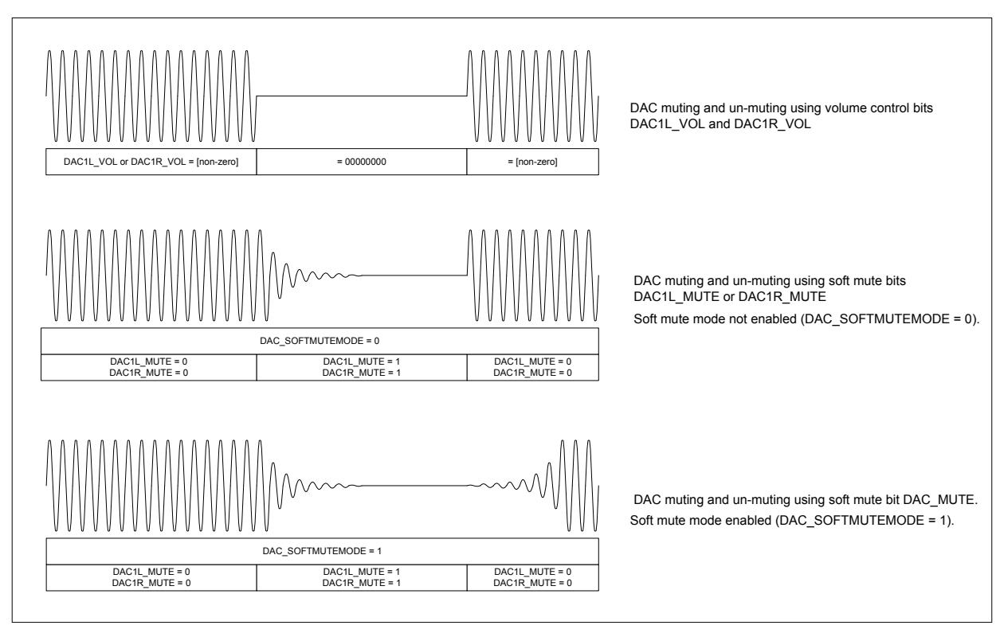

**Figure 30 DAC Soft Mute Control**

The DAC Soft Mute register controls are defined i[n Table 52.](#page-69-0)

The volume ramp rate during soft mute and un-mute is controlled by the DAC\_MUTERATE bit. Ramp rates of fs/32 and fs/2 are selectable. The ramp rate determines the rate at which the volume will be increased or decreased. Note that the actual ramp time depends on the extent of the difference between the muted and un-muted volume settings.

| REGISTER ADDRESS           | BIT | LABEL                | DEFAULT | DESCRIPTION                                                                                                                                                                                                                                                                                                    |
|-------------------------------|-----|----------------------|---------|----------------------------------------------------------------------------------------------------------------------------------------------------------------------------------------------------------------------------------------------------------------------------------------------------------------|
| R1556 (0614h) DAC Softmute | 1   | DAC_SOFT MUTEMODE | 0       | DAC Unmute Ramp select 0 = Disabling soft-mute (DAC[1/2][L/R]_MUTE=0) will cause the DAC volume to change immediately to DAC[1/2][L/R]_VOL settings 1 = Disabling soft-mute (DAC[1/2][L/R]_MUTE=0) will cause the DAC volume to ramp up gradually to the DAC[1/2][L/R]_VOL settings |
|                               | 0   | DAC_MUTE RATE     | 0       | DAC Soft Mute Ramp Rate 0 = Fast ramp (fs/2, maximum ramp time is 10.7ms at fs=48k) 1 = Slow ramp (fs/32, maximum ramp time is 171ms at fs=48k) (Note: ramp rate scales with sample rate.)                                                                                                   |

**Table 52 DAC Soft-Mute Control**

# **ANALOGUE OUTPUT SIGNAL PATH**

The WM8994 output routing and mixers provide a high degree of flexibility, allowing operation of many simultaneous signal paths through the device to a variety of analogue outputs. The outputs include a ground referenced headphone driver, two switchable class D/AB loudspeaker drivers, an ear speaker driver and four highly flexible line drivers. See "Analogue Outputs" for further details of these outputs.

The WM8994 output signal paths and control registers are illustrated in Figure 31.

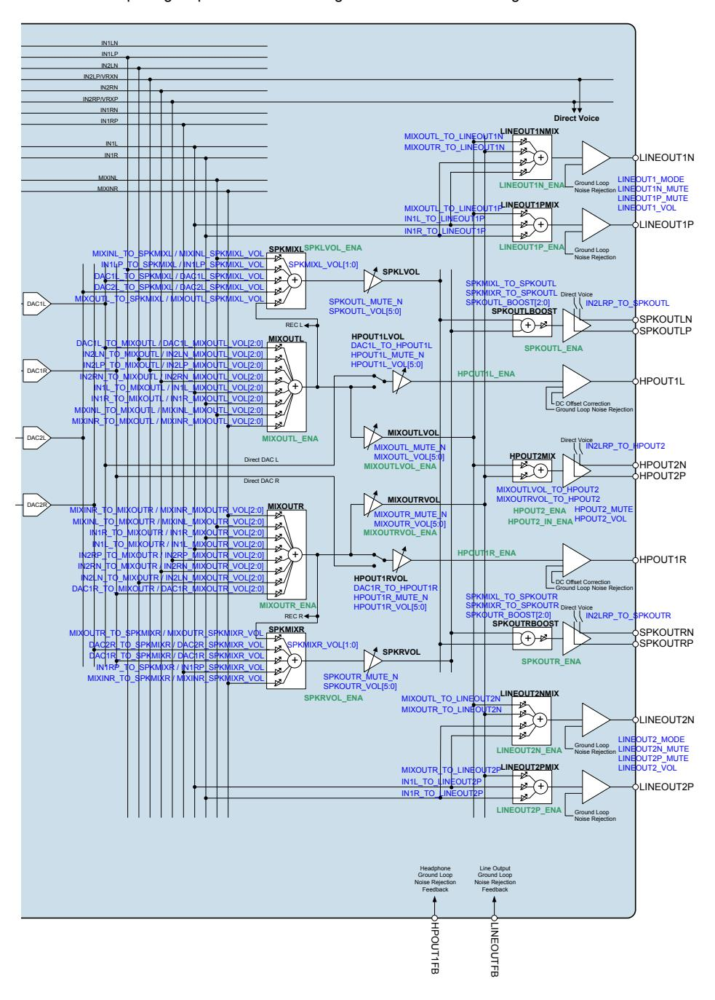

Figure 31 Control Registers for Output Signal Path

#### **OUTPUT SIGNAL PATHS ENABLE**

The output mixers and drivers can be independently enabled and disabled as described in [Table 53.](#page-72-0)

The supply rails for headphone outputs HPOUT1L and HPOUT1R are generated using an integrated dual-mode Charge Pump, which must be enabled whenever the headphone outputs are used. See the ["Charge Pump"](#page-92-0) section for details on enabling and configuring this circuit.

Note that the headphone outputs HPOUT1L and HPOUT1R have dedicated output PGAs and volume controls. As a result, a low power consumption DAC playback path can be supported without needing to enable the output mixers MIXOUTL / MIXOUTR or the mixer output PGAs MIXOUTLVOL / MIXOUTRVOL.

Note that the Headphone Outputs are also controlled by fields located within Register R96, which provide suppression of pops & clicks when enabling and disabling the HPOUT1L and HPOUT1R signal paths. These registers are described in the following ["Headphone Signal Paths Enable"](#page-73-0) section.

Under recommended usage conditions, the Headphone Pop Suppression control bits will be configured by scheduling the default Start-Up and Shutdown sequences as described in the ["Control](#page-176-0)  [Write Sequencer"](#page-176-0) section. In these cases, the user does not need to set the register fields in R1 and R96 directly.

For normal operation of the output signal paths, the reference voltage VMID and the bias current must also be enabled. See ["Reference Voltages and Master Bias"](#page-191-0) for details of the associated controls VMID\_SEL and BIAS\_ENA.

| REGISTER ADDRESS | BIT | LABEL       | DEFAULT | DESCRIPTION                                                                                          |
|---------------------|-----|-------------|---------|------------------------------------------------------------------------------------------------------|
| R1 (0001h) Power | 13  | SPKOUTR_ENA | 0       | SPKMIXR Mixer, SPKRVOL PGA and SPKOUTR Output Enable                                              |
| Management          |     |             |         | 0 = Disabled                                                                                         |
| (1)                 |     |             |         | 1 = Enabled                                                                                          |
|                     | 12  | SPKOUTL_ENA | 0       | SPKMIXL Mixer, SPKLVOL PGA and SPKOUTL Output Enable                                              |
|                     |     |             |         | 0 = Disabled                                                                                         |
|                     |     |             |         | 1 = Enabled                                                                                          |
|                     | 11  | HPOUT2_ENA  | 0       | HPOUT2 Output Stage Enable                                                                           |
|                     |     |             |         | 0 = Disabled                                                                                         |
|                     |     |             |         | 1 = Enabled                                                                                          |
|                     | 9   | HPOUT1L_ENA | 0       | Enables HPOUT1L input stage                                                                          |
|                     |     |             |         | 0 = Disabled                                                                                         |
|                     |     |             |         | 1 = Enabled                                                                                          |
|                     |     |             |         | For normal operation, this bit should be set as the first step of the HPOUT1L Enable sequence. |
|                     | 8   | HPOUT1R_ENA | 0       | Enables HPOUT1R input stage                                                                          |
|                     |     |             |         | 0 = Disabled                                                                                         |
|                     |     |             |         | 1 = Enabled                                                                                          |
|                     |     |             |         | For normal operation, this bit should be set as the first step of the HPOUT1R Enable sequence. |

| REGISTER ADDRESS        | BIT | LABEL          | DEFAULT | DESCRIPTION                                                                   |
|----------------------------|-----|----------------|---------|-------------------------------------------------------------------------------|
| R3 (0003h) Power        | 13  | LINEOUT1N_ENA  | 0       | LINEOUT1N Line Out and LINEOUT1NMIX Enable                                 |
| Management                 |     |                |         | 0 = Disabled                                                                  |
| (3)                        |     |                |         | 1 = Enabled                                                                   |
|                            | 12  | LINEOUT1P_ENA  | 0       | LINEOUT1P Line Out and LINEOUT1PMIX Enable                                 |
|                            |     |                |         | 0 = Disabled                                                                  |
|                            |     |                |         | 1 = Enabled                                                                   |
|                            | 11  | LINEOUT2N_ENA  | 0       | LINEOUT2N Line Out and LINEOUT2NMIX Enable                                 |
|                            |     |                |         | 0 = Disabled                                                                  |
|                            |     |                |         | 1 = Enabled                                                                   |
|                            | 10  | LINEOUT2P_ENA  | 0       | LINEOUT2P Line Out and LINEOUT2PMIX Enable                                 |
|                            |     |                |         | 0 = Disabled                                                                  |
|                            |     |                |         | 1 = Enabled                                                                   |
|                            | 9   | SPKRVOL_ENA    | 0       | SPKMIXR Mixer and SPKRVOL PGA Enable                                       |
|                            |     |                |         | 0 = Disabled                                                                  |
|                            |     |                |         | 1 = Enabled                                                                   |
|                            |     |                |         | Note that SPKMIXR and SPKRVOL are also enabled when SPKOUTR_ENA is set. |
|                            | 8   | SPKLVOL_ENA    | 0       | SPKMIXL Mixer and SPKLVOL PGA Enable                                       |
|                            |     |                |         | 0 = Disabled                                                                  |
|                            |     |                |         | 1 = Enabled                                                                   |
|                            |     |                |         | Note that SPKMIXL and SPKLVOL are also enabled when                        |
|                            |     |                |         | SPKOUTL_ENA is set.                                                           |
|                            | 7   | MIXOUTLVOL_ENA | 0       | MIXOUTL Left Volume Control Enable                                         |
|                            |     |                |         | 0 = Disabled                                                                  |
|                            |     |                |         | 1 = Enabled                                                                   |
|                            | 6   | MIXOUTRVOL_ENA | 0       | MIXOUTR Right Volume Control Enable                                        |
|                            |     |                |         | 0 = Disabled                                                                  |
|                            |     |                |         | 1 = Enabled                                                                   |
|                            | 5   | MIXOUTL_ENA    | 0       | MIXOUTL Left Output Mixer Enable                                              |
|                            |     |                |         | 0 = Disabled                                                                  |
|                            |     |                |         | 1 = Enabled                                                                   |
|                            | 4   | MIXOUTR_ENA    | 0       | MIXOUTR Right Output Mixer                                                    |
|                            |     |                |         | Enable                                                                        |
|                            |     |                |         | 0 = Disabled                                                                  |
|                            |     |                |         | 1 = Enabled                                                                   |
| R56 (0038h) AntiPOP (1) | 6   | HPOUT2_IN_ENA  | 0       | HPOUT2MIX Mixer and Input Stage Enable                                     |
|                            |     |                |         | 0 = Disabled                                                                  |
|                            |     |                |         | 1 = Enabled                                                                   |

**Table 53 Output Signal Paths Enable**

#### **HEADPHONE SIGNAL PATHS ENABLE**

The HPOUT1L and HPOUT1R output paths can be actively discharged to AGND through internal resistors if desired. This is desirable at start-up in order to achieve a known output stage condition prior to enabling the VMID reference voltage. This is also desirable in shutdown to prevent the external connections from being affected by the internal circuits. The HPOUT1L and HPOUT1R outputs are shorted to AGND by default; the short circuit is removed on each of these paths by setting the applicable fields HPOUT1L\_RMV\_SHORT or HPOUT1R\_RMV\_SHORT.

The ground-referenced Headphone output drivers are designed to suppress pops and clicks when enabled or disabled. However, it is necessary to control the drivers in accordance with a defined sequence in start-up and shutdown to achieve the pop suppression. It is also necessary to schedule the DC Servo offset correction at the appropriate point in the sequence (see ["DC Servo"](#page-94-0)). [Table 54](#page-73-1) and [Table 55](#page-73-2) describe the recommended sequences for enabling and disabling these output drivers.

| SEQUENCE | HEADPHONE ENABLE      |  |  |
|----------|-----------------------|--|--|
| Step 1   | HPOUT1L_ENA = 1       |  |  |
|          | HPOUT1R_ENA = 1       |  |  |
| Step 2   | 20s delay            |  |  |
| Step 3   | HPOUT1L_DLY = 1       |  |  |
|          | HPOUT1R_DLY = 1       |  |  |
| Step 4   | DC offset correction  |  |  |
| Step 5   | HPOUT1L_OUTP = 1      |  |  |
|          | HPOUT1L_RMV_SHORT = 1 |  |  |
|          | HPOUT1R_OUTP = 1      |  |  |
|          | HPOUT1R_RMV_SHORT = 1 |  |  |

**Table 54 Headphone Output Enable Sequence**

| SEQUENCE | HEADPHONE DISABLE     |
|----------|-----------------------|
| Step 1   | HPOUT1L_RMV_SHORT = 0 |
|          | HPOUT1L_DLY = 0       |
|          | HPOUT1L_OUTP = 0      |
|          | HPOUT1R_RMV_SHORT = 0 |
|          | HPOUT1R_DLY = 0       |
|          | HPOUT1R_OUTP = 0      |
| Step 2   | HPOUT1L_ENA = 0       |
|          | HPOUT1R_ENA = 0       |
|          |                       |

**Table 55 Headphone Output Disable Sequence**

The register bits relating to pop suppression control are defined in [Table 56.](#page-74-0)

| REGISTER                       | BIT | LABEL        | DEFAULT | DESCRIPTION                                                                                          |
|--------------------------------|-----|--------------|---------|------------------------------------------------------------------------------------------------------|
| ADDRESS R1 (0001h) Power | 9   | HPOUT1L_ENA  | 0       | Enables HPOUT1L input stage 0 = Disabled                                                          |
| Management                     |     |              |         | 1 = Enabled                                                                                          |
| (1)                            |     |              |         | For normal operation, this bit should be set as the first step of the HPOUT1L Enable sequence. |
|                                | 8   | HPOUT1R_ENA  | 0       | Enables HPOUT1R input stage                                                                          |
|                                |     |              |         | 0 = Disabled                                                                                         |
|                                |     |              |         | 1 = Enabled                                                                                          |
|                                |     |              |         | For normal operation, this bit should be set as the first step of the HPOUT1R Enable sequence. |
| R96 (0060h)                    | 7   | HPOUT1L_RMV_ | 0       | Removes HPOUT1L short                                                                                |
| Analogue HP                    |     | SHORT        |         | 0 = HPOUT1L short enabled                                                                            |
| (1)                            |     |              |         | 1 = HPOUT1L short removed                                                                            |
|                                |     |              |         | For normal operation, this bit should                                                                |
|                                |     |              |         | be set as the final step of the HPOUT1L Enable sequence.                                          |
|                                | 6   | HPOUT1L_OUTP | 0       | Enables HPOUT1L output stage                                                                         |
|                                |     |              |         | 0 = Disabled                                                                                         |
|                                |     |              |         | 1 = Enabled                                                                                          |
|                                |     |              |         | For normal operation, this bit should                                                                |
|                                |     |              |         | be set to 1 after the DC offset                                                                      |
|                                |     |              |         | cancellation has been scheduled.                                                                     |
|                                | 5   | HPOUT1L_DLY  | 0       | Enables HPOUT1L intermediate stage                                                                   |
|                                |     |              |         | 0 = Disabled 1 = Enabled                                                                          |
|                                |     |              |         | For normal operation, this bit should                                                                |
|                                |     |              |         | be set to 1 after the output signal path                                                             |
|                                |     |              |         | has been configured, and before DC                                                                   |
|                                |     |              |         | offset cancellation is scheduled. This bit should be set with at least 20us                       |
|                                |     |              |         | delay after HPOUT1L_ENA.                                                                             |
|                                | 3   | HPOUT1R_RMV_ | 0       | Removes HPOUT1R short                                                                                |
|                                |     | SHORT        |         | 0 = HPOUT1R short enabled                                                                            |
|                                |     |              |         | 1 = HPOUT1R short removed                                                                            |
|                                |     |              |         | For normal operation, this bit should                                                                |
|                                |     |              |         | be set as the final step of the HPOUT1R Enable sequence.                                          |
|                                | 2   | HPOUT1R_OUTP | 0       | Enables HPOUT1R output stage                                                                         |
|                                |     |              |         | 0 = Disabled                                                                                         |
|                                |     |              |         | 1 = Enabled                                                                                          |
|                                |     |              |         | For normal operation, this bit should                                                                |
|                                |     |              |         | be set to 1 after the DC offset                                                                      |
|                                |     |              |         | cancellation has been scheduled.                                                                     |
|                                | 1   | HPOUT1R_DLY  | 0       | Enables HPOUT1R intermediate stage 0 = Disabled                                                   |
|                                |     |              |         | 1 = Enabled                                                                                          |
|                                |     |              |         | For normal operation, this bit should                                                                |
|                                |     |              |         | be set to 1 after the output signal path                                                             |
|                                |     |              |         | has been configured, and before DC                                                                   |
|                                |     |              |         | offset cancellation is scheduled. This bit should be set with at least 20us                       |
|                                |     |              |         | delay after HPOUT1R_ENA.                                                                             |

**Table 56 Headphone Output Signal Paths Control**

### **OUTPUT MIXER CONTROL**

The Output Mixer path select and volume controls are described in [Table 57](#page-76-0) for the Left Channel (MIXOUTL) and [Table 58](#page-78-0) for the Right Channel (MIXOUTR). The gain of each of input path may be controlled independently in the range described in [Table 59.](#page-79-0)

Note that the DAC input levels may also be controlled by the DAC digital volume controls (see ["Digital](#page-63-0)  [to Analogue Converter \(DAC\)"](#page-63-0)) and the Audio Interface digital volume controls (see ["Digital Volume](#page-50-0)  [and Filter Control"](#page-50-0)).

When using the IN2LP, IN2LN, IN2RP or IN2RN signal paths to the output mixers, the buffered VMID reference must be enabled, using the VMID\_BUF\_ENA register, as described in ["Reference Voltages](#page-191-0)  [and Master Bias"](#page-191-0).

| REGISTER ADDRESS                | BIT | LABEL                      | DEFAULT | DESCRIPTION                                                                                                                                                    |
|------------------------------------|-----|----------------------------|---------|----------------------------------------------------------------------------------------------------------------------------------------------------------------|
| R45 (002Dh) Output Mixer (1) | 5   | IN2RN_TO_MIXOUTL           | 0       | IN2RN to MIXOUTL Mute 0 = Mute 1 = Un-mute Note that VMID_BUF_ENA must be set when using the IN2RN input to MIXOUTL.                            |
| R49 (0031h) Output Mixer (5) | 8:6 | IN2RN_MIXOUTL_VOL [2:0] | 000     | IN2RN to MIXOUTL Volume 0dB to -21dB in 3dB steps 000 = 0dB 001 = -3dB …(3dB steps) 111 = -21dB (See Table 59 for Volume Range)              |
| R45 (002Dh) Output Mixer (1) | 4   | IN2LN_TO_MIXOUTL           | 0       | IN2LN to MIXOUTL Mute 0 = Mute 1 = Un-mute Note that VMID_BUF_ENA must be set when using the IN2LN input to MIXOUTL.                            |
| R47 (002Fh) Output Mixer (3) | 8:6 | IN2LN_MIXOUTL_VOL [2:0] | 000     | IN2LN to MIXOUTL Volume 0dB to -21dB in 3dB steps 000 = 0dB 001 = -3dB …(3dB steps) 111 = -21dB (See Table 59 for Volume Range)              |
| R45 (002Dh) Output Mixer (1) | 2   | IN1L_TO_MIXOUTL            | 0       | IN1L PGA Output to MIXOUTL Mute 0 = Mute 1 = Un-mute                                                                                                  |
| R47 (002Fh) Output Mixer (3) | 2:0 | IN1L_MIXOUTL_VOL [2:0]  | 000     | IN1L PGA Output to MIXOUTL Volume 0dB to -21dB in 3dB steps 000 = 0dB 001 = -3dB …(3dB steps) 111 = -21dB (See Table 59 for Volume Range) |
| R45 (002Dh) Output Mixer (1) | 3   | IN1R_TO_MIXOUTL            | 0       | IN1R PGA Output to MIXOUTL Mute 0 = Mute 1 = Un-mute                                                                                                  |

| REGISTER ADDRESS                | BIT  | LABEL                        | DEFAULT | DESCRIPTION                                                                                                                                                                     |
|------------------------------------|------|------------------------------|---------|---------------------------------------------------------------------------------------------------------------------------------------------------------------------------------|
| R47 (002Fh) Output Mixer (3) | 5:3  | IN1R_MIXOUTL_VOL [2:0]    | 000     | IN1R PGA Output to MIXOUTL Volume 0dB to -21dB in 3dB steps 000 = 0dB 001 = -3dB …(3dB steps) 111 = -21dB (See Table 59 for Volume Range)                  |
| R45 (002Dh) Output Mixer (1) | 1    | IN2LP_TO_MIXOUTL             | 0       | IN2LP to MIXOUTL Mute 0 = Mute 1 = Un-mute Note that VMID_BUF_ENA must be set when using the IN2LP input to MIXOUTL.                                             |
| R47 (002Fh) Output Mixer (3) | 11:9 | IN2LP_MIXOUTL_VOL [2:0]   | 000     | IN2LP to MIXOUTL Volume 0dB to -21dB in 3dB steps 000 = 0dB 001 = -3dB …(3dB steps) 111 = -21dB (See Table 59 for Volume Range)                               |
| R45 (002Dh) Output Mixer (1) | 7    | MIXINR_TO_MIXOUTL            | 0       | MIXINR Output (Right ADC bypass) to MIXOUTL Mute 0 = Mute 1 = Un-mute                                                                                                  |
| R49 (0031h) Output Mixer (5) | 5:3  | MIXINR_MIXOUTL_VO L [2:0] | 000     | MIXINR Output (Right ADC bypass) to MIXOUTL Volume 0dB to -21dB in 3dB steps 000 = 0dB 001 = -3dB …(3dB steps) 111 = -21dB (See Table 59 for Volume Range) |
| R45 (002Dh) Output Mixer (1) | 6    | MIXINL_TO_MIXOUTL            | 0       | MIXINL Output (Left ADC bypass) to MIXOUTL Mute 0 = Mute 1 = Un-mute                                                                                                   |
| R49 (0031h) Output Mixer (5) | 2:0  | MIXINL_MIXOUTL_VOL [2:0]  | 000     | MIXINL Output (Left ADC bypass) to MIXOUTL Volume 0dB to -21dB in 3dB steps 000 = 0dB 001 = -3dB …(3dB steps) 111 = -21dB (See Table 59 for Volume Range)  |
| R45 (002Dh) Output Mixer (1) | 0    | DAC1L_TO_MIXOUTL             | 0       | Left DAC1 to MIXOUTL Mute 0 = Mute 1 = Un-mute                                                                                                                            |
| R49 (0031h) Output Mixer (5) | 11:9 | DAC1L_MIXOUTL_VOL [2:0]   | 000     | Left DAC1 to MIXOUTL Volume 0dB to -21dB in 3dB steps 000 = 0dB 001 = -3dB …(3dB steps) 111 = -21dB (See Table 59 for Volume Range)                           |

**Table 57 Left Output Mixer (MIXOUTL) Control**

| REGISTER ADDRESS         | BIT | LABEL                     | DEFAULT | DESCRIPTION                                                                     |
|-----------------------------|-----|---------------------------|---------|---------------------------------------------------------------------------------|
| R46 (002Eh)                 | 5   | IN2LN_TO_MIXOUTR          | 0       | IN2LN to MIXOUTR Mute                                                           |
| Output Mixer                |     |                           |         | 0 = Mute                                                                        |
| (2)                         |     |                           |         | 1 = Un-mute                                                                     |
|                             |     |                           |         | Note that VMID_BUF_ENA must be set when using the IN2LN input to MIXOUTR. |
| R50 (0032h)                 | 8:6 | IN2LN_MIXOUTR_VOL         | 000     | IN2LN to MIXOUTR Volume                                                         |
| Output Mixer                |     | [2:0]                     |         | 0dB to -21dB in 3dB steps                                                       |
| (6)                         |     |                           |         | 000 = 0dB                                                                       |
|                             |     |                           |         | 001 = -3dB                                                                      |
|                             |     |                           |         | …(3dB steps)                                                                    |
|                             |     |                           |         | 111 = -21dB                                                                     |
|                             |     |                           |         | (See Table 59 for Volume Range)                                                 |
| R46 (002Eh)                 | 4   | IN2RN_TO_MIXOUTR          | 0       | IN2RN to MIXOUTR Mute                                                           |
| Output Mixer                |     |                           |         | 0 = Mute                                                                        |
| (2)                         |     |                           |         | 1 = Un-mute                                                                     |
|                             |     |                           |         | Note that VMID_BUF_ENA must be set when using the IN2RN input to MIXOUTR. |
| R48 (0030h)                 | 8:6 | IN2RN_MIXOUTR_VOL         | 000     | IN2RN to MIXOUTR Volume                                                         |
| Output Mixer                |     | [2:0]                     |         | 0dB to -21dB in 3dB steps                                                       |
| (4)                         |     |                           |         | 000 = 0dB                                                                       |
|                             |     |                           |         | 001 = -3dB                                                                      |
|                             |     |                           |         | …(3dB steps)                                                                    |
|                             |     |                           |         | 111 = -21dB                                                                     |
|                             |     |                           |         | (See Table 59 for Volume Range)                                                 |
| R46 (002Eh)                 | 3   | IN1L_TO_MIXOUTR           | 0       | IN1L PGA Output to MIXOUTR Mute                                                 |
| Output Mixer                |     |                           |         | 0 = Mute                                                                        |
| (2)                         |     |                           |         | 1 = Un-mute                                                                     |
| R48 (0030h) Output Mixer | 5:3 | IN1L_MIXOUTR_VOL [2:0] | 000     | IN1L PGA Output to MIXOUTR Volume                                            |
| (4)                         |     |                           |         | 0dB to -21dB in 3dB steps                                                       |
|                             |     |                           |         | 000 = 0dB                                                                       |
|                             |     |                           |         | 001 = -3dB                                                                      |
|                             |     |                           |         | …(3dB steps)                                                                    |
|                             |     |                           |         | 111 = -21dB                                                                     |
|                             |     |                           |         | (See Table 59 for Volume Range)                                                 |
| R46 (002Eh)                 | 2   | IN1R_TO_MIXOUTR           | 0       | IN1R PGA Output to MIXOUTR Mute                                              |
| Output Mixer (2)         |     |                           |         | 0 = Mute                                                                        |
|                             |     |                           |         | 1 = Un-mute                                                                     |
| R48 (0030h)                 | 2:0 | IN1R_MIXOUTR_VOL          | 000     | IN1R PGA Output to MIXOUTR                                                      |
| Output Mixer                |     | [2:0]                     |         | Volume                                                                          |
| (4)                         |     |                           |         | 0dB to -21dB in 3dB steps                                                       |
|                             |     |                           |         | 000 = 0dB                                                                       |
|                             |     |                           |         | 001 = -3dB                                                                      |
|                             |     |                           |         | …(3dB steps)                                                                    |
|                             |     |                           |         | 111 = -21dB                                                                     |
|                             |     |                           |         | (See Table 59 for Volume Range)                                                 |

| REGISTER ADDRESS         | BIT  | LABEL                        | DEFAULT | DESCRIPTION                                           |
|-----------------------------|------|------------------------------|---------|-------------------------------------------------------|
| R46 (002Eh)                 | 1    | IN2RP_TO_MIXOUTR             | 0       | IN2RP to MIXOUTR Mute                                 |
| Output Mixer                |      |                              |         | 0 = Mute                                              |
| (2)                         |      |                              |         | 1 = Un-mute                                           |
|                             |      |                              |         | Note that VMID_BUF_ENA must be                        |
|                             |      |                              |         | set when using the IN2RP input to MIXOUTR.         |
| R48 (0030h)                 | 11:9 | IN2RP_MIXOUTR_VOL            | 000     | IN2RP to MIXOUTR Volume                               |
| Output Mixer                |      | [2:0]                        |         | 0dB to -21dB in 3dB steps                             |
| (4)                         |      |                              |         | 000 = 0dB                                             |
|                             |      |                              |         | 001 = -3dB                                            |
|                             |      |                              |         | …(3dB steps)                                          |
|                             |      |                              |         | 111 = -21dB                                           |
|                             |      |                              |         | (See Table 59 for Volume Range)                       |
| R46 (002Eh) Output Mixer | 7    | MIXINL_TO_MIXOUTR            | 0       | MIXINL Output (Left ADC bypass) to MIXOUTR Mute    |
| (2)                         |      |                              |         | 0 = Mute                                              |
|                             |      |                              |         | 1 = Un-mute                                           |
| R50 (0032h) Output Mixer | 5:3  | MIXINL_MIXOUTR_VO L[2:0]  | 000     | MIXINL Output (Left ADC bypass) to MIXOUTR Volume  |
| (6)                         |      |                              |         | 0dB to -21dB in 3dB steps                             |
|                             |      |                              |         | 000 = 0dB                                             |
|                             |      |                              |         | 001 = -3dB                                            |
|                             |      |                              |         | …(3dB steps)                                          |
|                             |      |                              |         | 111 = -21dB                                           |
|                             |      |                              |         | (See Table 59 for Volume Range)                       |
| R46 (002Eh) Output Mixer | 6    | MIXINR_TO_MIXOUTR            | 0       | MIXINR Output (Right ADC bypass) to MIXOUTR Mute   |
| (2)                         |      |                              |         | 0 = Mute                                              |
|                             |      |                              |         | 1 = Un-mute                                           |
| R50 (0032h) Output Mixer | 2:0  | MIXINR_MIXOUTR_VO L [2:0] | 000     | MIXINR Output (Right ADC bypass) to MIXOUTR Volume |
| (6)                         |      |                              |         | 0dB to -21dB in 3dB steps                             |
|                             |      |                              |         | 000 = 0dB                                             |
|                             |      |                              |         | 001 = -3dB                                            |
|                             |      |                              |         | …(3dB steps)                                          |
|                             |      |                              |         | 111 = -21dB                                           |
|                             |      |                              |         | (See Table 59 for Volume Range)                       |
| R46 (002Eh)                 | 0    | DAC1R_TO_MIXOUTR             | 0       | Right DAC1 to MIXOUTR Mute                            |
| Output Mixer                |      |                              |         | 0 = Mute                                              |
| (2)                         |      |                              |         | 1 = Un-mute                                           |
| R50 (0032h)                 | 11:9 | DAC1R_MIXOUTR_VO             | 000     | Right DAC1 to MIXOUTR Volume                          |
| Output Mixer                |      | L [2:0]                      |         | 0dB to -21dB in 3dB steps                             |
| (6)                         |      |                              |         | 000 = 0dB                                             |
|                             |      |                              |         | 001 = -3dB                                            |
|                             |      |                              |         | …(3dB steps)                                          |
|                             |      |                              |         | 111 = -21dB                                           |
|                             |      |                              |         | (See Table 59 for Volume Range)                       |

**Table 58 Right Output Mixer (MIXOUTR) Control**

| VOLUME SETTING | VOLUME (dB) |
|----------------|-------------|
| 000            | 0           |
| 001            | -3          |
| 010            | -6          |
| 011            | -9          |
| 100            | -12         |
| 101            | -15         |
| 110            | -18         |
| 111            | -21         |

**Table 59 MIXOUTL and MIXOUTR Volume Range**

#### **SPEAKER MIXER CONTROL**

The Speaker Mixer path select and volume controls are described in [Table 60](#page-80-0) for the Left Channel (SPKMIXL) an[d Table 61](#page-81-0) for the Right Channel (SPKMIXR).

Care should be taken when enabling more than one path to a speaker mixer in order to avoid clipping. The gain of each input path is adjustable using a selectable -3dB control in each path to facilitate this. Each Speaker Mixer output is also controlled by an additional independent volume control.

Note that the DAC input levels may also be controlled by the DAC digital volume controls (see ["Digital](#page-63-0)  [to Analogue Converter \(DAC\)"](#page-63-0)) and the Audio Interface digital volume controls (see ["Digital Volume](#page-50-0)  [and Filter Control"](#page-50-0)).

When using the IN1LP or IN1RP signal paths to the speaker mixers, the buffered VMID reference must be enabled, using the VMID\_BUF\_ENA register, as described in ["Reference Voltages and](#page-191-0)  [Master Bias"](#page-191-0).

| REGISTER ADDRESS          | BIT | LABEL                   | DEFAULT | DESCRIPTION                                                                     |
|------------------------------|-----|-------------------------|---------|---------------------------------------------------------------------------------|
| R54 (0034h) Speaker Mixer | 9   | DAC2L_TO_SPKMIXL        | 0       | Left DAC2 to SPKMIXL Mute 0 = Mute 1 = Un-mute                            |
|                              | 7   | MIXINL_TO_SPKMIXL       | 0       | MIXINL (Left ADC bypass) to SPKMIXL Mute 0 = Mute                         |
|                              |     |                         |         | 1 = Un-mute                                                                     |
|                              | 5   | IN1LP_TO_SPKMIXL        | 0       | IN1LP to SPKMIXL Mute 0 = Mute 1 = Un-mute                                |
|                              |     |                         |         | Note that VMID_BUF_ENA must be set when using the IN1LP input to SPKMIXL. |
|                              | 3   | MIXOUTL_TO_SPKMIX L  | 0       | Left Mixer Output to SPKMIXL Mute 0 = Mute                                |
|                              |     |                         |         | 1 = Un-mute                                                                     |
|                              | 1   | DAC1L_TO_SPKMIXL        | 0       | Left DAC1 to SPKMIXL Mute 0 = Mute                                           |
|                              |     |                         |         | 1 = Un-mute                                                                     |
| R34 (0022h) SPKMIXL       | 6   | DAC2L_SPKMIXL_VOL       | 0       | Left DAC2 to SPKMIXL Fine Volume Control                                     |
| Attenuation                  |     |                         |         | 0 = 0dB 1 = -3dB                                                             |
|                              | 5   | MIXINL_SPKMIXL_VOL      | 0       | MIXINL (Left ADC bypass) to SPKMIXL Fine Volume Control                      |
|                              |     |                         |         | 0 = 0dB 1 = -3dB                                                             |
|                              | 4   | IN1LP_SPKMIXL_VOL       | 0       | IN1LP to SPKMIXL Fine Volume Control                                         |
|                              |     |                         |         | 0 = 0dB 1 = -3dB                                                             |
|                              | 3   | MIXOUTL_SPKMIXL_V OL | 0       | Left Mixer Output to SPKMIXL Fine Volume Control                             |
|                              |     |                         |         | 0 = 0dB 1 = -3dB                                                             |
|                              | 2   | DAC1L_SPKMIXL_VOL       | 0       | Left DAC1 to SPKMIXL Fine Volume Control                                     |
|                              |     |                         |         | 0 = 0dB 1 = -3dB                                                             |
|                              | 1:0 | SPKMIXL_VOL [1:0]       | 11      | Left Speaker Mixer Volume Control 00 = 0dB                                   |
|                              |     |                         |         | 01 = -6dB                                                                       |
|                              |     |                         |         | 10 = -12dB 11 = Mute                                                         |

**Table 60 Left Speaker Mixer (SPKMIXL) Control**

| REGISTER ADDRESS                   | BIT | LABEL                   | DEFAULT | DESCRIPTION                                                                                    |
|---------------------------------------|-----|-------------------------|---------|------------------------------------------------------------------------------------------------|
| R54 (0034h) Speaker Mixer       | 8   | DAC2R_TO_SPKMIXR        | 0       | Right DAC2 to SPKMIXR Mute 0 = Mute 1 = Un-mute                                          |
|                                       | 6   | MIXINR_TO_SPKMIXR       | 0       | MIXINR (Right ADC bypass) to SPKMIXR Mute                                                   |
|                                       |     |                         |         | 0 = Mute 1 = Un-mute                                                                        |
|                                       | 4   | IN1RP_TO_SPKMIXR        | 0       | IN1RP to SPKMIXR Mute 0 = Mute                                                              |
|                                       |     |                         |         | 1 = Un-mute Note that VMID_BUF_ENA must be set when using the IN1RP input to SPKMIXR. |
|                                       | 2   | MIXOUTR_TO_SPKMIX R  | 0       | Right Mixer Output to SPKMIXR Mute 0 = Mute                                              |
|                                       | 0   | DAC1R_TO_SPKMIXR        | 0       | 1 = Un-mute Right DAC1 to SPKMIXR Mute 0 = Mute 1 = Un-mute                           |
| R35 (0023h) SPKMIXR Attenuation | 6   | DAC2R_SPKMIXR_VOL       | 0       | Right DAC2 to SPKMIXR Fine Volume Control 0 = 0dB 1 = -3dB                            |
|                                       | 5   | MIXINR_SPKMIXR_VOL      | 0       | MIXINR (Right ADC bypass) to SPKMIXR Fine Volume Control 0 = 0dB 1 = -3dB             |
|                                       | 4   | IN1RP_SPKMIXR_VOL       | 0       | IN1RP to SPKMIXR Fine Volume Control 0 = 0dB 1 = -3dB                                 |
|                                       | 3   | MIXOUTR_SPKMIXR_V OL | 0       | Right Mixer Output to SPKMIXR Fine Volume Control 0 = 0dB 1 = -3dB                    |
|                                       | 2   | DAC1R_SPKMIXR_VOL       | 0       | Right DAC1 to SPKMIXR Fine Volume Control 0 = 0dB 1 = -3dB                            |
|                                       | 1:0 | SPKMIXR_VOL [1:0]       | 11      | Right Speaker Mixer Volume Control 00 = 0dB 01 = -6dB 10 = -12dB                   |
|                                       |     |                         |         | 11 = Mute                                                                                      |

**Table 61 Right Speaker Mixer (SPKMIXR) Control**

### **OUTPUT SIGNAL PATH VOLUME CONTROL**

There are six output PGAs - MIXOUTLVOL, MIXOUTRVOL, HPOUT1LVOL, HPOUT1RVOL, SPKLVOL and SPKRVOL. Each can be independently controlled, with MIXOUTLVOL and MIXOUTRVOL providing volume control to both the earpiece and line drivers, HPOUT1LVOL and HPOUT1RVOL to the headphone driver, and SPKLVOL and SPKRVOL to the speaker drivers.

The volume control of each of these output PGAs can be adjusted over a wide range of values. To minimise pop noise, it is recommended that only the MIXOUTLVOL, MIXOUTRVOL, HPOUT1LVOL, HPOUT1RVOL, SPKLVOL and SPKRVOL are modified while the output signal path is active. Other gain controls are provided in the signal paths to provide scaling of signals from different sources, and to prevent clipping when multiple signals are mixed. However, to prevent pop noise, it is recommended that those other gain controls should not be modified while the signal path is active.

To prevent "zipper noise", a zero-cross function is provided on the output PGAs. When this feature is enabled, volume updates will not take place until a zero-crossing is detected. In the case of a long period without zero-crossings, a timeout function is provided. When the zero-cross function is enabled, the volume will update after the timeout period if no earlier zero-cross has occurred. The timeout clock is enabled using TOCLK\_ENA; the timeout period is set by TOCLK\_DIV. See ["Clocking](#page-149-0)  [and Sample Rates"](#page-149-0) for more information on these fields.

The mixer output PGA controls are shown i[n Table 62.](#page-83-0) The MIXOUT\_VU bits control the loading of the output mixer PGA volume data. When MIXOUT\_VU is set to 0, the volume control data will be loaded into the respective control register, but will not actually change the gain setting. The output mixer PGA volume settings are both updated when a 1 is written to either MIXOUT\_VU bit. This makes it possible to update the gain of both output paths simultaneously.

| REGISTER ADDRESS  | BIT | LABEL             | DEFAULT      | DESCRIPTION                                                                                 |
|----------------------|-----|-------------------|--------------|---------------------------------------------------------------------------------------------|
| R32 (0020h)          | 8   | MIXOUT_VU         | N/A          | Mixer Output PGA Volume Update                                                              |
| Left OPGA Volume  |     |                   |              | Writing a 1 to this bit will update MIXOUTLVOL and MIXOUTRVOL volumes simultaneously. |
|                      | 7   | MIXOUTL_ZC        | 0            | MIXOUTLVOL (Left Mixer Output PGA) Zero Cross Enable                                     |
|                      |     |                   |              | 0 = Zero cross disabled                                                                     |
|                      |     |                   |              | 1 = Zero cross enabled                                                                      |
|                      | 6   | MIXOUTL_MUTE_N    | 1            | MIXOUTLVOL (Left Mixer Output PGA) Mute                                                  |
|                      |     |                   |              | 0 = Mute                                                                                    |
|                      |     |                   |              | 1 = Un-mute                                                                                 |
|                      | 5:0 | MIXOUTL_VOL [5:0] | 39h (0dB) | MIXOUTLVOL (Left Mixer Output PGA) Volume                                                |
|                      |     |                   |              | -57dB to +6dB in 1dB steps                                                                  |
|                      |     |                   |              | 00_0000 = -57dB                                                                             |
|                      |     |                   |              | 00_0001 = -56dB                                                                             |
|                      |     |                   |              | … (1dB steps)                                                                               |
|                      |     |                   |              | 11_1111 = +6dB                                                                              |
|                      |     |                   |              | (See Table 65 for output PGA volume control range)                                       |
| R33 (0021h)          | 8   | MIXOUT_VU         | N/A          | Mixer Output PGA Volume Update                                                              |
| Right OPGA Volume |     |                   |              | Writing a 1 to this bit will update MIXOUTLVOL and MIXOUTRVOL volumes simultaneously. |
|                      | 7   | MIXOUTR_ZC        | 0            | MIXOUTRVOL (Right Mixer Output PGA) Zero Cross Enable                                    |
|                      |     |                   |              | 0 = Zero cross disabled                                                                     |
|                      |     |                   |              | 1 = Zero cross enabled                                                                      |
|                      | 6   | MIXOUTR_MUTE_N    | 1            | MIXOUTLVOL (Right Mixer Output PGA) Mute                                                 |
|                      |     |                   |              | 0 = Mute                                                                                    |
|                      |     |                   |              | 1 = Un-mute                                                                                 |

| REGISTER ADDRESS | BIT | LABEL             | DEFAULT      | DESCRIPTION                                                                                                                                                                                                   |
|---------------------|-----|-------------------|--------------|---------------------------------------------------------------------------------------------------------------------------------------------------------------------------------------------------------------|
|                     | 5:0 | MIXOUTR_VOL [5:0] | 39h (0dB) | MIXOUTRVOL (Right Mixer Output PGA) Volume -57dB to +6dB in 1dB steps 00_0000 = -57dB 00_0001 = -56dB … (1dB steps) 11_1111 = +6dB (See Table 65 for output PGA volume control range) |

**Table 62 Mixer Output PGA (MIXOUTLVOL, MIXOUTRVOL) Control**

The headphone output PGA is configurable between two input sources. The default input to each headphone output PGA is the respective output mixer (MIXOUTL or MIXOUTR). A direct path from the DAC1L or DAC1R can be selected using the DAC1L\_TO\_HPOUT1L and DAC1R\_TO\_HPOUT1R register bits. When these bits are selected, a DAC to Headphone playback path is possible without using the output mixers; this offers reduced power consumption by allowing the output mixers to be disabled in this typical usage case.

The headphone output PGA controls are shown in [Table 63.](#page-84-0) The HPOUT1\_VU bits control the loading of the headphone PGA volume data. When HPOUT1\_VU is set to 0, the volume control data will be loaded into the respective control register, but will not actually change the gain setting. The headphone PGA volume settings are both updated when a 1 is written to either HPOUT1\_VU bit. This makes it possible to update the gain of both output paths simultaneously.

| REGISTER ADDRESS                  | BIT | LABEL                | DEFAULT        | DESCRIPTION                                                                                                                                                                                                      |
|--------------------------------------|-----|----------------------|----------------|------------------------------------------------------------------------------------------------------------------------------------------------------------------------------------------------------------------|
| R28 (001Ch) Left Output Volume | 8   | HPOUT1_VU            | N/A            | Headphone Output PGA Volume Update Writing a 1 to this bit will update HPOUT1LVOL and HPOUT1RVOL                                                                                                        |
|                                      | 7   | HPOUT1L_ZC           | 0              | volumes simultaneously. HPOUT1LVOL (Left Headphone Output PGA) Zero Cross Enable 0 = Zero cross disabled 1 = Zero cross enabled                                                                      |
|                                      | 6   | HPOUT1L_MUTE_N       | 1              | HPOUT1LVOL (Left Headphone Output PGA) Mute 0 = Mute 1 = Un-mute                                                                                                                                        |
|                                      | 5:0 | HPOUT1L_VOL [5:0]    | 2Dh (-12dB) | HPOUT1LVOL (Left Headphone Output PGA) Volume -57dB to +6dB in 1dB steps 00_0000 = -57dB 00_0001 = -56dB … (1dB steps) 11_1111 = +6dB (See Table 65 for output PGA volume control range) |
| R45 (002Dh) Output Mixer (1)   | 8   | DAC1L_TO_HPOUT1 L | 0              | HPOUT1LVOL (Left Headphone Output PGA) Input Select 0 = MIXOUTL 1 = DAC1L                                                                                                                               |

| REGISTER ADDRESS         | BIT | LABEL                | DEFAULT | DESCRIPTION                                                                                 |
|-----------------------------|-----|----------------------|---------|---------------------------------------------------------------------------------------------|
| R29 (001Dh) Right Output | 8   | HPOUT1_VU            | N/A     | Headphone Output PGA Volume Update                                                       |
| Volume                      |     |                      |         | Writing a 1 to this bit will update HPOUT1LVOL and HPOUT1RVOL volumes simultaneously. |
|                             | 7   | HPOUT1R_ZC           | 0       | HPOUT1RVOL (Right Headphone Output PGA) Zero Cross Enable                                |
|                             |     |                      |         | 0 = Zero cross disabled                                                                     |
|                             |     |                      |         | 1 = Zero cross enabled                                                                      |
|                             | 6   | HPOUT1R_MUTE_N       | 1       | HPOUT1RVOL (Right Headphone                                                                 |
|                             |     |                      |         | Output PGA) Mute                                                                            |
|                             |     |                      |         | 0 = Mute                                                                                    |
|                             |     |                      |         | 1 = Un-mute                                                                                 |
|                             | 5:0 | HPOUT1R_VOL [5:0]    | 2Dh     | HPOUT1RVOL (Right Headphone                                                                 |
|                             |     |                      | (-12dB) | Output PGA) Volume                                                                          |
|                             |     |                      |         | -57dB to +6dB in 1dB steps                                                                  |
|                             |     |                      |         | 00_0000 = -57dB                                                                             |
|                             |     |                      |         | 00_0001 = -56dB                                                                             |
|                             |     |                      |         | … (1dB steps)                                                                               |
|                             |     |                      |         | 11_1111 = +6dB                                                                              |
|                             |     |                      |         | (See Table 65 for output PGA volume control range)                                       |
| R46 (002Eh)                 | 8   | DAC1R_TO_HPOUT1 R | 0       | HPOUT1RVOL (Right Headphone Output PGA) Input Select                                     |
| Output Mixer (2)         |     |                      |         | 0 = MIXOUTR                                                                                 |
|                             |     |                      |         | 1 = DAC1R                                                                                   |

**Table 63 Headphone Output PGA (HPOUT1LVOL, HPOUT1RVOL) Control**

The speaker output PGA controls are shown in [Table 64.T](#page-85-0)he SPKOUT\_VU bits control the loading of the speaker PGA volume data. When SPKOUT\_VU is set to 0, the volume control data will be loaded into the respective control register, but will not actually change the gain setting. The speaker PGA volume settings are both updated when a 1 is written to either SPKOUT\_VU bit. This makes it possible to update the gain of both output paths simultaneously.

| REGISTER ADDRESS     | BIT | LABEL             | DEFAULT      | DESCRIPTION                                                                           |
|-------------------------|-----|-------------------|--------------|---------------------------------------------------------------------------------------|
| R38 (0026h) Speaker  | 8   | SPKOUT_VU         | N/A          | Speaker Output PGA Volume Update                                                   |
| Volume Left             |     |                   |              | Writing a 1 to this bit will update SPKLVOL and SPKRVOL volumes simultaneously. |
|                         | 7   | SPKOUTL_ZC        | 0            | SPKLVOL (Left Speaker Output PGA) Zero Cross Enable                                |
|                         |     |                   |              | 0 = Zero cross disabled 1 = Zero cross enabled                                     |
|                         | 6   | SPKOUTL_MUTE_N    | 1            | SPKLVOL (Left Speaker Output PGA) Mute                                             |
|                         |     |                   |              | 0 = Mute 1 = Un-mute                                                               |
|                         | 5:0 | SPKOUTL_VOL [5:0] | 39h (0dB) | SPKLVOL (Left Speaker Output PGA) Volume                                           |
|                         |     |                   |              | -57dB to +6dB in 1dB steps 00_0000 = -57dB                                         |
|                         |     |                   |              | 00_0001 = -56dB                                                                       |
|                         |     |                   |              | … (1dB steps)                                                                         |
|                         |     |                   |              | 11_1111 = +6dB (See Table 65 for output PGA                                        |
|                         |     |                   |              | volume control range)                                                                 |
| R39 (0027h)             | 8   | SPKOUT_VU         | N/A          | Speaker PGA Volume Update                                                             |
| Speaker Volume Right |     |                   |              | Writing a 1 to this bit will update SPKLVOL and SPKRVOL volumes simultaneously. |
|                         | 7   | SPKOUTR_ZC        | 0            | SPKRVOL (Right Speaker Output PGA) Zero Cross Enable                               |
|                         |     |                   |              | 0 = Zero cross disabled 1 = Zero cross enabled                                     |
|                         | 6   | SPKOUTR_MUTE_N    | 1            | SPKRVOL (Right Speaker Output PGA) Mute                                            |
|                         |     |                   |              | 0 = Mute                                                                              |
|                         |     |                   |              | 1 = Un-mute                                                                           |
|                         | 5:0 | SPKOUTR_VOL [5:0] | 39h (0dB) | SPKRVOL (Right Speaker Output PGA) Volume                                          |
|                         |     |                   |              | -57dB to +6dB in 1dB steps                                                            |
|                         |     |                   |              | 00_0000 = -57dB                                                                       |
|                         |     |                   |              | 00_0001 = -56dB                                                                       |
|                         |     |                   |              | … (1dB steps) 11_1111 = +6dB                                                       |
|                         |     |                   |              | (See Table 65 for output PGA volume control range)                                 |

**Table 64 Speaker Output PGA (SPKLVOL, SPKRVOL) Control**

| PGA GAIN SETTING | VOLUME (dB) | PGA GAIN SETTING | VOLUME (dB) |
|------------------|-------------|------------------|-------------|
| 00h              | -57         | 20h              | -25         |
| 01h              | -56         | 21h              | -24         |
| 02h              | -55         | 22h              | -23         |
| 03h              | -54         | 23h              | -22         |
| 04h              | -53         | 24h              | -21         |
| 05h              | -52         | 25h              | -20         |
| 06h              | -51         | 26h              | -19         |
| 07h              | -50         | 27h              | -18         |
| 08h              | -49         | 28h              | -17         |
| 09h              | -48         | 29h              | -16         |
| 0Ah              | -47         | 2Ah              | -15         |
| 0Bh              | -46         | 2Bh              | -14         |
| 0Ch              | -45         | 2Ch              | -13         |
| 0Dh              | -44         | 2Dh              | -12         |
| 0Eh              | -43         | 2Eh              | -11         |
| 0Fh              | -42         | 2Fh              | -10         |
| 10h              | -41         | 30h              | -9          |
| 11h              | -40         | 31h              | -8          |
| 12h              | -39         | 32h              | -7          |
| 13h              | -38         | 33h              | -6          |
| 14h              | -37         | 34h              | -5          |
| 15h              | -36         | 35h              | -4          |
| 16h              | -35         | 36h              | -3          |
| 17h              | -34         | 37h              | -2          |
| 18h              | -33         | 38h              | -1          |
| 19h              | -32         | 39h              | 0           |
| 1Ah              | -31         | 3Ah              | +1          |
| 1Bh              | -30         | 3Bh              | +2          |
| 1Ch              | -29         | 3Ch              | +3          |
| 1Dh              | -28         | 3Dh              | +4          |
| 1Eh              | -27         | 3Eh              | +5          |
| 1Fh              | -26         | 3Fh              | +6          |

**Table 65 Output PGA Volume Range**

### **SPEAKER BOOST MIXER**

Each class D/AB speaker driver has its own boost mixer which performs a dual role. It allows the output from the left speaker mixer (via SPKLVOL), right speaker mixer (via SPKRVOL), or the 'Direct Voice' path to be routed to either speaker driver. The speaker boost mixers are controlled using the registers defined i[n Table 66](#page-87-0) below.

The 'Direct Voice' path is the differential input, VRXN-VRXP, routed directly to the output drivers, providing a low power differential path from baseband voice to loudspeakers. Note that a phase inversion exists between VRXP and SPKOUTxP. The 'Direct Voice' path output therefore represents VVRXN - VVRXP.

The second function of the speaker boost mixers is that they provide an additional AC gain (boost) function to shift signal levels between the AVDD1 and SPKVDD voltage domains for maximum output power. The AC gain (boost) function is described in the ["Analogue Outputs"](#page-98-0) section.

| REGISTER ADDRESS             | BIT | LABEL                  | DEFAULT | DESCRIPTION                                                  |
|---------------------------------|-----|------------------------|---------|--------------------------------------------------------------|
| R36 (0024h) SPKOUT Mixers | 5   | IN2LRP_TO_SPKOUT L  | 0       | Direct Voice (VRXN-VRXP) to Left Speaker Mute 0 = Mute |
|                                 |     |                        |         | 1 = Un-mute                                                  |
|                                 | 4   | SPKMIXL_TO_SPKOU TL | 1       | SPKMIXL Left Speaker Mixer to Left Speaker Mute           |
|                                 |     |                        |         | 0 = Mute                                                     |
|                                 |     |                        |         | 1 = Un-mute                                                  |
|                                 | 3   | SPKMIXR_TO_SPKO UTL | 0       | SPKMIXR Right Speaker Mixer to Left Speaker Mute          |
|                                 |     |                        |         | 0 = Mute                                                     |
|                                 |     |                        |         | 1 = Un-mute                                                  |
|                                 | 2   | IN2LRP_TO_SPKOUT R  | 0       | Direct Voice (VRXN-VRXP) to Right Speaker Mute            |
|                                 |     |                        |         | 0 = Mute                                                     |
|                                 |     |                        |         | 1 = Un-mute                                                  |
|                                 | 1   | SPKMIXL_TO_SPKOU TR | 0       | SPKMIXL Left Speaker Mixer to Right Speaker Mute          |
|                                 |     |                        |         | 0 = Mute                                                     |
|                                 |     |                        |         | 1 = Un-mute                                                  |
|                                 | 0   | SPKMIXR_TO_SPKO UTR | 1       | SPKMIXR Right Speaker Mixer to Right Speaker Mute         |
|                                 |     |                        |         | 0 = Mute                                                     |
|                                 |     |                        |         | 1 = Un-mute                                                  |

**Table 66 Speaker Boost Mixer (SPKOUTLBOOST, SPKOUTRBOOST) Control**

### **EARPIECE DRIVER MIXER**

The earpiece driver has a dedicated mixer, HPOUT2MIX, which is controlled using the registers defined in [Table 67.](#page-88-0) The earpiece driver is configurable to select output from the left output mixer (via MIXOUTLVOL), the right output mixer (via MIXOUTRVOL), or the 'Direct Voice' path.

The 'Direct Voice' path is the differential input, VRXN-VRXP, routed directly to the output drivers, providing a low power differential path from baseband voice to earpiece. Note that a phase inversion exists between VRXP and HPOUT2P. The 'Direct Voice' path output therefore represents VVRXN - VVRXP.

Care should be taken to avoid clipping when enabling more than one path to the earpiece driver. The HPOUT2VOL volume control can be used to avoid clipping when more than one full scale signal is input to the mixer.

| REGISTER ADDRESS | BIT | LABEL            | DEFAULT | DESCRIPTION                     |
|---------------------|-----|------------------|---------|---------------------------------|
| R31 (001Fh)         | 5   | HPOUT2_MUTE      | 1       | HPOUT2 (Earpiece Driver) Mute   |
| HPOUT2              |     |                  |         | 0 = Un-mute                     |
| Volume              |     |                  |         | 1 = Mute                        |
|                     | 4   | HPOUT2_VOL       | 0       | HPOUT2 (Earpiece Driver) Volume |
|                     |     |                  |         | 0 = 0dB                         |
|                     |     |                  |         | 1 = -6dB                        |
| R51 (0033h)         | 5   | IN2LRP_TO_HPOUT2 | 0       | Direct Voice (VRXN-VRXP) to     |
| HPOUT2              |     |                  |         | Earpiece Driver                 |
| Mixer               |     |                  |         | 0 = Mute                        |
|                     |     |                  |         | 1 = Un-mute                     |
|                     | 4   | MIXOUTLVOL_TO_HP | 0       | MIXOUTLVOL (Left Output Mixer   |
|                     |     | OUT2             |         | PGA) to Earpiece Driver         |
|                     |     |                  |         | 0 = Mute                        |
|                     |     |                  |         | 1 = Un-mute                     |
|                     | 3   | MIXOUTRVOL_TO_HP | 0       | MIXOUTRVOL (Right Output Mixer  |
|                     |     | OUT2             |         | PGA) to Earpiece Driver         |
|                     |     |                  |         | 0 = Mute                        |
|                     |     |                  |         | 1 = Un-mute                     |

**Table 67 Earpiece Driver Mixer (HPOUT2MIX) Control**

#### **LINE OUTPUT MIXERS**

The WM8994 provides two pairs of line outputs, both with highly configurable output mixers. The outputs LINEOUT1N and LINEOUT1P can be configured as two single-ended outputs or as a differential output. In the same manner, LINEOUT2N and LINEOUT2P can be configured either as two single-ended outputs or as a differential output. The respective line output mixers can be configured in single-ended mode or differential mode; each mode supports multiple signal path configurations.

LINEOUT1 single-ended mode is selected by setting LINEOUT1\_MODE = 1. In single-ended mode, any of three possible signal paths may be enabled:

- MIXOUTL (left output mixer) to LINEOUT1P
- MIXOUTR (right output mixer) to LINEOUT1N
- MIXOUTL (left output mixer) to LINEOUT1N

LINEOUT1 differential mode is selected by setting LINEOUT1\_MODE = 0. In differential mode, any of three possible signal paths may be enabled:

- MIXOUTL (left output mixer) to LINEOUT1N and LINEOUT1P
- IN1L (input PGA) to LINEOUT1N and LINEOUT1P
- IN1R (input PGA) to LINEOUT1N and LINEOUT1P

The LINEOUT1 output mixers are controlled as described in [Table 68.](#page-90-0) Care should be taken to avoid clipping when enabling more than one path to the line output mixers. The LINEOUT1\_VOL control can be used to provide -6dB attenuation when more than one full scale signal is applied.

When using the LINEOUT1 mixers in single-ended mode, a buffered VMID must be enabled. This is achieved by setting LINEOUT\_VMID\_BUF\_ENA, as described in the ["Analogue Outputs"](#page-98-0) section.

| REGISTER ADDRESS | BIT | LABEL          | DEFAULT | DESCRIPTION                                |
|---------------------|-----|----------------|---------|--------------------------------------------|
| R30 (001Eh)         | 6   | LINEOUT1N_MUTE | 1       | LINEOUT1N Line Output Mute                 |
| Line Outputs        |     |                |         | 0 = Un-mute                                |
| Volume              |     |                |         | 1 = Mute                                   |
|                     | 5   | LINEOUT1P_MUTE | 1       | LINEOUT1P Line Output Mute                 |
|                     |     |                |         | 0 = Un-mute                                |
|                     |     |                |         | 1 = Mute                                   |
|                     | 4   | LINEOUT1_VOL   | 0       | LINEOUT1 Line Output Volume                |
|                     |     |                |         | 0 = 0dB                                    |
|                     |     |                |         | 1 = -6dB                                   |
|                     |     |                |         | Applies to both LINEOUT1N and LINEOUT1P |

| REGISTER ADDRESS           | BIT | LABEL                    | DEFAULT | DESCRIPTION                                                                                      |
|-------------------------------|-----|--------------------------|---------|--------------------------------------------------------------------------------------------------|
| R52 (0034h) Line Mixer (1) | 6   | MIXOUTL_TO_LINEO UT1N | 0       | MIXOUTL to Single-Ended Line Output on LINEOUT1N 0 = Mute                                  |
|                               |     |                          |         | 1 = Un-mute                                                                                      |
|                               |     |                          |         | (LINEOUT1_MODE = 1)                                                                              |
|                               | 5   | MIXOUTR_TO_LINE OUT1N | 0       | MIXOUTR to Single-Ended Line Output on LINEOUT1N                                              |
|                               |     |                          |         | 0 = Mute                                                                                         |
|                               |     |                          |         | 1 = Un-mute                                                                                      |
|                               |     |                          |         | (LINEOUT1_MODE = 1)                                                                              |
|                               | 4   | LINEOUT1_MODE            | 0       | LINEOUT1 Mode Select                                                                             |
|                               |     |                          |         | 0 = Differential                                                                                 |
|                               |     |                          |         | 1 = Single-Ended                                                                                 |
|                               | 2   | IN1R_TO_LINEOUT1 P    | 0       | IN1R Input PGA to Differential Line Output on LINEOUT1                                        |
|                               |     |                          |         | 0 = Mute                                                                                         |
|                               |     |                          |         | 1 = Un-mute                                                                                      |
|                               |     |                          |         | (LINEOUT1_MODE = 0)                                                                              |
|                               | 1   | IN1L_TO_LINEOUT1 P    | 0       | IN1L Input PGA to Differential Line Output on LINEOUT1                                        |
|                               |     |                          |         | 0 = Mute                                                                                         |
|                               |     |                          |         | 1 = Un-mute                                                                                      |
|                               |     |                          |         | (LINEOUT1_MODE = 0)                                                                              |
|                               | 0   | MIXOUTL_TO_LINEO UT1P | 0       | Differential Mode (LINEOUT1_MODE = 0):                                                        |
|                               |     |                          |         | MIXOUTL to Differential Output on LINEOUT1                                                    |
|                               |     |                          |         | 0 = Mute                                                                                         |
|                               |     |                          |         | 1 = Un-mute                                                                                      |
|                               |     |                          |         | Single Ended Mode (LINEOUT1_MODE = 1): MIXOUTL to Single-Ended Line Output on LINEOUT1P |
|                               |     |                          |         | 0 = Mute                                                                                         |
|                               |     |                          |         | 1 = Un-mute                                                                                      |

**Table 68 LINEOUT1N and LINEOUT1P Control**

LINEOUT2 single-ended mode is selected by setting LINEOUT2\_MODE = 1. In single-ended mode, any of three possible signal paths may be enabled:

- MIXOUTR (right output mixer) to LINEOUT2P
- MIXOUTL (left output mixer) to LINEOUT2N
- MIXOUTR (right output mixer) to LINEOUT2N

LINEOUT2 differential mode is selected by setting LINEOUT2\_MODE = 0. In differential mode, any of three possible signal paths may be enabled:

- MIXOUTR (right output mixer) to LINEOUT2N and LINEOUT2P
- IN1L (input PGA) to LINEOUT2P and LINEOUT2P
- IN1R (input PGA) to LINEOUT2N and LINEOUT2P

The LINEOUT2 output mixers are controlled as described in [Table 69.](#page-91-0) Care should be taken to avoid clipping when enabling more than one path to the line output mixers. The LINEOUT2\_VOL control can be used to provide -6dB attenuation when more than one full scale signal is applied.

When using the LINEOUT2 mixers in single-ended mode, a buffered VMID must be enabled. This is achieved by setting LINEOUT\_VMID\_BUF\_ENA, as described in the ["Analogue Outputs"](#page-98-0) section.

| REGISTER ADDRESS | BIT | LABEL                    | DEFAULT | DESCRIPTION                                               |
|---------------------|-----|--------------------------|---------|-----------------------------------------------------------|
| R30 (001Eh)         | 2   | LINEOUT2N_MUTE           | 1       | LINEOUT2N Line Output Mute                                |
| Line Outputs        |     |                          |         | 0 = Un-mute                                               |
| Volume              |     |                          |         | 1 = Mute                                                  |
|                     | 1   | LINEOUT2P_MUTE           | 1       | LINEOUT2P Line Output Mute                                |
|                     |     |                          |         | 0 = Un-mute                                               |
|                     |     |                          |         | 1 = Mute                                                  |
|                     | 0   | LINEOUT2_VOL             | 0       | LINEOUT2 Line Output Volume                               |
|                     |     |                          |         | 0 = 0dB                                                   |
|                     |     |                          |         | 1 = -6dB                                                  |
|                     |     |                          |         | Applies to both LINEOUT2N and LINEOUT2P                |
| R53 (0035h)         | 6   | MIXOUTR_TO_LINEO         | 0       | MIXOUTR to Single-Ended Line                              |
| Line Mixer (2)      |     | UT2N                     |         | Output on LINEOUT2N                                       |
|                     |     |                          |         | 0 = Mute                                                  |
|                     |     |                          |         | 1 = Un-mute                                               |
|                     |     |                          |         | (LINEOUT2_MODE = 1)                                       |
|                     | 5   | MIXOUTL_TO_LINEO UT2N | 0       | MIXOUTL to Single-Ended Line Output on LINEOUT2N       |
|                     |     |                          |         | 0 = Mute                                                  |
|                     |     |                          |         | 1 = Un-mute                                               |
|                     |     |                          |         | (LINEOUT2_MODE = 1)                                       |
|                     | 4   | LINEOUT2_MODE            | 0       | LINEOUT2 Mode Select                                      |
|                     |     |                          |         | 0 = Differential                                          |
|                     |     |                          |         | 1 = Single-Ended                                          |
|                     | 2   | IN1L_TO_LINEOUT2P        | 0       | IN1L Input PGA to Differential Line Output on LINEOUT2 |
|                     |     |                          |         | 0 = Mute                                                  |
|                     |     |                          |         | 1 = Un-mute                                               |
|                     |     |                          |         | (LINEOUT2_MODE = 0)                                       |
|                     | 1   | IN1R_TO_LINEOUT2P        | 0       | IN1R Input PGA to Differential Line Output on LINEOUT2 |
|                     |     |                          |         | 0 = Mute                                                  |
|                     |     |                          |         | 1 = Un-mute                                               |
|                     |     |                          |         | (LINEOUT2_MODE = 0)                                       |
|                     | 0   | MIXOUTR_TO_LINEO         | 0       | Differential Mode                                         |
|                     |     | UT2P                     |         | (LINEOUT2_MODE = 0):                                      |
|                     |     |                          |         | MIXOUTR to Differential Output on LINEOUT2             |
|                     |     |                          |         | 0 = Mute                                                  |
|                     |     |                          |         | 1 = Un-mute                                               |
|                     |     |                          |         | Single-Ended Mode (LINEOUT2_MODE = 0):                 |
|                     |     |                          |         | MIXOUTR to Single-Ended Line Output on LINEOUT2P       |
|                     |     |                          |         | 0 = Mute                                                  |
|                     |     |                          |         | 1 = Un-mute                                               |
|                     |     |                          |         |                                                           |

**Table 69 LINEOUT2N and LINEOUT2P Control**

# **CHARGE PUMP**

The WM8994 incorporates a dual-mode Charge Pump which generates the supply rails for the headphone output drivers, HPOUT1L and HPOUT1R.

The Charge Pump has a single supply input, CPVDD, and generates split rails CPVOUTP and CPVOUTN according to the selected mode of operation.

The Charge Pump connections are illustrated i[n Figure 32](#page-92-1) (see "Applications Information" for external component values). An input decoupling capacitor may also be required at CPVDD, depending upon the system configuration.

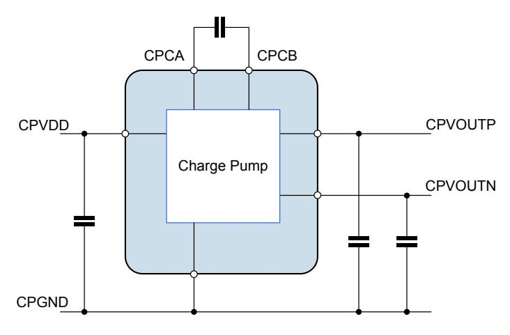

**Figure 32 Charge Pump External Connections**

The Charge Pump is enabled by setting the CP\_ENA bit. When enabled, the charge pump adjusts the output voltages (CPVOUTP and CPVOUTN) as well as the switching frequency in order to optimise the power consumption according to the operating conditions. This can take two forms, which are selected using the CP\_DYN\_PWR register bit.

- Register control (CP\_DYN\_PWR = 0)
- Dynamic control (CP\_DYN\_PWR = 1)

Under Register control, the HPOUT1L\_VOL and HPOUT1R\_VOL register settings are used to control the charge pump mode of operation.

Under Dynamic control, the audio signal level in the digital audio interface is used to control the charge pump mode of operation. The CP\_DYN\_SRC\_SEL register determines which of the digital signal paths is used for this function - this may be AIF1 Timeslot 0, AIF Timeslot 1 or AIF2. The CP\_DYN\_SRC\_SEL should be set according to the active source for the HPOUT1L and HPOUT1R outputs.

The Dynamic Charge Pump Control mode is the Wolfson 'Class W' mode, which allows the power consumption to be optimised in real time, but can only be used if a single AIF source is the only signal source. The Class W mode should not be used if any of the bypass paths are used to feed analogue inputs into the output signal path, or if more than one AIF source is used to feed the headphone output via the Digital Mixers.

Under the recommended usage conditions of the WM8994, the Charge Pump will be enabled by running the default headphone Start-Up sequence as described in the ["Control Write Sequencer"](#page-176-0) section. (Similarly, it will be disabled by running the Shut-Down sequence.) In these cases, the user does not need to write to the CP\_ENA bit. The Charge Pump operating mode defaults to Register control; Dynamic control may be selected by setting the CP\_DYN\_PWR register bit, if appropriate.

Note that the charge pump clock is derived from internal clock SYSCLK; either MCLK or the FLL output selectable using the SYSCLK\_SRC bit. Under normal circumstances an external clock signal must be present for the charge pump to function. However, the FLL has a free-running mode that does not require an external clock but will generate an internal clock suitable for running the charge pump. The clock division from SYSCLK is handled transparently by the WM8994 without user intervention, as long as SYSCLK and sample rates are set correctly. Refer to the "Clocking and Sample Rates" section for more detail on the FLL and clocking configuration.

When the Charge Pump is disabled, the output can be left floating or can be actively discharged, depending on the CP DISCH control bit.

If the headphone output drivers (HPOUT1L and HPOUT1R) are not used, then the Charge Pump and the associated external components are not required. The Charge Pump and Headphone drivers should not be enabled in this case (CP\_ENA=0, HPOUT1L\_ENA=0, HPOUT1R\_ENA=0).

If the Charge Pump is not used, and the associated external components are omitted, then the CPCA and CPCB pins can be left floating; the CPVOUTP and CPVOUTN pins should be grounded as illustrated in Figure 33.

Note that, when the Charge Pump is disabled, it is still recommended that the CPVDD pin is kept within its recommended operating conditions (1.71V to 2.0V).

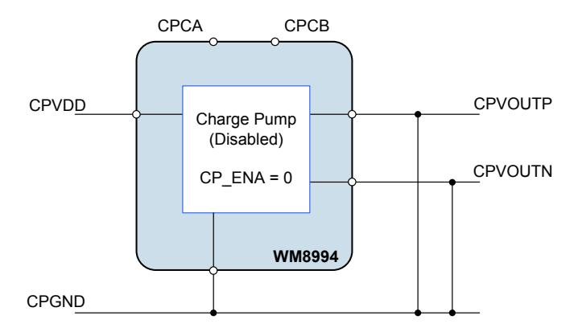

Figure 33 External Configuration when Charge Pump not used

The Charge Pump control fields are described in [Table 70.](#page-94-1)

| REGISTER ADDRESS | BIT | LABEL          | DEFAULT | DESCRIPTION                                                         |
|---------------------|-----|----------------|---------|---------------------------------------------------------------------|
| R76 (004Ch)         | 15  | CP_ENA         | 0       | Enable charge-pump digits                                           |
| Charge Pump         |     |                |         | 0 = Disable                                                         |
| (1)                 |     |                |         | 1 = Enable                                                          |
| R77 (004Dh)         | 15  | CP_DISCH       | 1       | Charge Pump Discharge Select                                        |
| Charge Pump (2)  |     |                |         | 0 = Charge Pump outputs floating when disabled                   |
|                     |     |                |         | 1 = Charge Pump outputs discharged when disabled                 |
| R81 (0051h)         | 9:8 | CP_DYN_SRC_SEL | 00      | Selects the digital audio source for                                |
| Class W (1)         |     |                |         | envelope tracking                                                   |
|                     |     |                |         | 00 = AIF1, DAC Timeslot 0                                           |
|                     |     |                |         | 01 = AIF1, DAC Timeslot 1                                           |
|                     |     |                |         | 10 = AIF2, DAC data                                                 |
|                     |     |                |         | 11 = Reserved                                                       |
|                     | 0   | CP_DYN_PWR     | 0       | Enable dynamic charge pump power control                         |
|                     |     |                |         | 0 = charge pump controlled by volume register settings (Class G) |
|                     |     |                |         | 1 = charge pump controlled by real-time audio level (Class W)    |

**Table 70 Charge Pump Control**

# **DC SERVO**

The WM8994 provides a DC servo circuit on the headphone outputs HPOUT1L and HPOUT1R in order to remove DC offset from these ground-referenced outputs. When enabled, the DC servo ensures that the DC level of these outputs remains within 1mV of ground. Removal of the DC offset is important because any deviation from GND at the output pin will cause current to flow through the load under quiescent conditions, resulting in increased power consumption. Additionally, the presence of DC offsets can result in audible pops and clicks at power up and power down.

The recommended usage of the DC Servo is initialised by running the default Start-Up sequence as described in the ["Control Write Sequencer"](#page-176-0) section. The default Start-Up sequence executes a series of DC offset corrections, after which the measured offset correction is maintained on the headphone output channels. If a different usage is required, eg. if a periodic DC offset correction is required, then the default Start-Up sequence may be modified according to specific requirements. The relevant control fields are described in the following paragraphs and are defined in [Table 71.](#page-96-0)

### **DC SERVO ENABLE AND START-UP**

The DC Servo circuit is enabled on HPOUT1L and HPOUT1R by setting DCS\_ENA\_CHAN\_0 and DCS\_ENA\_CHAN\_1 respectively. When the DC Servo is enabled, the DC offset correction can be commanded in a number of different ways, including single-shot and periodically recurring events.

Writing a logic 1 to DCS\_TRIG\_STARTUP\_*n* initiates a series of DC offset measurements and applies the necessary correction to the associated output; ('n' = 0 for Left channel, 1 for Right channel). On completion, the headphone output will be within 1mV of AGND. This is the DC Servo mode selected by the default Start-Up sequence. Completion of the DC offset correction triggered in this way is indicated by the DCS\_STARTUP\_COMPLETE field, as described in [Table 71.](#page-96-0) Typically, this operation takes 86ms per channel.

For correct operation of the DC Servo Start-Up mode, it is important that there is no active audio signal present on the signal path while the mode is running. The DC Servo Start-Up mode should be scheduled at the correct position within the Headphone Output Enable sequence, as described in the ["Analogue Output Signal Path"](#page-70-0) section. All other stages of the analogue signal path should be fully enabled prior to commanding the Start-Up mode; the DAC Digital Mute function should be used,

where appropriate, to ensure there is no active audio signal present during the DC Servo measurements.

Writing a logic 1 to DCS\_TRIG\_DAC\_WR\_*n* causes the DC offset correction to be set to the value contained in the DCS\_DAC\_WR\_VAL\_*n* fields in Register R89. This mode is useful if the required offset correction has already been determined and stored; it is faster than the DCS\_TRIG\_STARTUP\_*n* mode, but relies on the accuracy of the stored settings. Completion of the DC offset correction triggered in this way is indicated by the DCS\_DAC\_WR\_COMPLETE field, as described in [Table 71.](#page-96-0) Typically, this operation takes 2ms per channel.

For pop-free operation of the DC Servo DAC Write mode, it is important that the mode is scheduled at the correct position within the Headphone Output Enable sequence, as described in the ["Analogue](#page-70-0)  [Output Signal Path"](#page-70-0) section.

The current DC offset value for each Headphone output channel can be read from the DCS\_DAC\_WR\_VAL\_*n* fields. These values may form the basis of settings that are subsequently used by the DC Servo in DAC Write mode. Note that these fields have a different definition for Read and Write, as described i[n Table 71.](#page-96-0)

When using either of the DC Servo options above, the status of the DC offset correction process is indicated by the DCS\_CAL\_COMPLETE field; this is the logical OR of the DCS\_STARTUP\_COMPLETE and DCS\_DAC\_WR\_COMPLETE fields.

The DCS\_DAC\_WR\_COMPLETE bits can be used as inputs to the Interrupt control circuit or used to generate an external logic signal on a GPIO pin. See ["Interrupts"](#page-117-0) and ["General Purpose Input/Output"](#page-105-0) for further details.

The DC Servo control fields associated with start-up operation are described in [Table 71.](#page-96-0) It is important to note that, to minimise audible pops/clicks, the Start-Up and DAC Write modes of DC Servo operation should be commanded as part of a control sequence which includes muting and shorting of the headphone outputs; a suitable sequence is defined in the default Start-Up sequence.

| REGISTER ADDRESS         | BIT | LABEL                  | DEFAULT | DESCRIPTION                                                                                        |
|-----------------------------|-----|------------------------|---------|----------------------------------------------------------------------------------------------------|
| R84 (0054h) DC Servo (1) | 5   | DCS_TRIG_START UP_1 | 0       | Writing 1 to this bit selects Start Up DC Servo mode for HPOUT1R.                            |
|                             |     |                        |         | In readback, a value of 1 indicates that the DC Servo Start-Up correction is in progress. |
|                             | 4   | DCS_TRIG_START UP_0 | 0       | Writing 1 to this bit selects Start Up DC Servo mode for HPOUT1L.                            |
|                             |     |                        |         | In readback, a value of 1 indicates that the DC Servo Start-Up correction is in progress. |
|                             | 3   | DCS_TRIG_DAC_W R_1  | 0       | Writing 1 to this bit selects DAC Write DC Servo mode for HPOUT1R.                           |
|                             |     |                        |         | In readback, a value of 1 indicates that the DC Servo DAC Write correction is in progress.   |
|                             | 2   | DCS_TRIG_DAC_W R_0  | 0       | Writing 1 to this bit selects DAC Write DC Servo mode for HPOUT1L.                           |
|                             |     |                        |         | In readback, a value of 1 indicates that the DC Servo DAC Write correction is in progress.   |
|                             | 1   | DCS_ENA_CHAN_1         | 0       | DC Servo enable for HPOUT1R 0 = Disabled                                                        |
|                             |     |                        |         | 1 = Enabled                                                                                        |

| REGISTER ADDRESS                  | BIT  | LABEL DEFAULT               |     | DESCRIPTION                                                                                                                                                                                                                                         |  |  |
|--------------------------------------|------|--------------------------------|-----|-----------------------------------------------------------------------------------------------------------------------------------------------------------------------------------------------------------------------------------------------------|--|--|
|                                      | 0    | DCS_ENA_CHAN_0 0            |     | DC Servo enable for HPOUT1L 0 = Disabled 1 = Enabled                                                                                                                                                                                          |  |  |
| R88 (0058h) DC Servo Readback  | 9:8  | DCS_CAL_COMPL ETE [1:0]     | 00  | DC Servo Complete status 0 = DAC Write or Start-Up DC Servo mode not completed. 1 = DAC Write or Start-Up DC Servo mode complete. Bit [1] = HPOUT1R Bit [0] = HPOUT1L                                                             |  |  |
|                                      | 5:4  | DCS_DAC_WR_CO MPLETE [1:0]  | 00  | DC Servo DAC Write status 0 = DAC Write DC Servo mode not completed. 1 = DAC Write DC Servo mode complete. Bit [1] = HPOUT1R Bit [0] = HPOUT1L                                                                                    |  |  |
|                                      | 1:0  | DCS_STARTUP_C OMPLETE [1:0] | 00  | DC Servo Start-Up status 0 = Start-Up DC Servo mode not completed. 1 = Start-Up DC Servo mode complete. Bit [1] = HPOUT1R Bit [0] = HPOUT1L                                                                                       |  |  |
| R89 (0059h) DC Servo Write Val | 15:8 | DCS_DAC_WR_VA L_1 [7:0]     | 00h | Writing to this field sets the DC Offset value for HPOUT1R in DAC Write DC Servo mode. Reading this field gives the current DC Offset value for HPOUT1R. Two's complement format. LSB is 0.25mV. Range is -32mV to +31.75mV |  |  |
|                                      | 7:0  | DCS_DAC_WR_VA L_0 [7:0]     | 00h | Writing to this field sets the DC Offset value for HPOUT1L in DAC Write DC Servo mode. Reading this field gives the current DC Offset value for HPOUT1L. Two's complement format. LSB is 0.25mV. Range is -32mV to +31.75mV |  |  |

**Table 71 DC Servo Enable and Start-Up Modes**

### **DC SERVO ACTIVE MODES**

The DC Servo modes described above are suitable for initialising the DC offset correction circuit on the Headphone outputs as part of a controlled start-up sequence which is executed before the signal path is fully enabled. Additional modes are available for use whilst the signal path is active; these modes may be of benefit following a large change in signal gain, which can lead to a change in DC offset level. Periodic updates may also be desirable to remove slow drifts in DC offset caused by changes in parameters such as device temperature.

The DC Servo circuit is enabled on HPOUT1L and HPOUT1R by setting DCS\_ENA\_CHAN\_0 and DCS\_ENA\_CHAN\_1 respectively, as described earlier i[n Table 71.](#page-96-0)

Writing a logic 1 to DCS\_TRIG\_SINGLE\_*n* initiates a single DC offset measurement and adjustment to the associated output; ('n' = 0 for Left channel, 1 for Right channel). This will adjust the DC offset correction on the selected channel by no more than 1LSB (0.25mV).

Setting DCS\_TIMER\_PERIOD\_01 to a non-zero value will cause a single DC offset measurement and adjustment to be scheduled on a periodic basis. Periodic rates ranging from every 0.52s to in excess of 2 hours can be selected.

Writing a logic 1 to DCS\_TRIG\_SERIES\_*n* initiates a series of DC offset measurements and applies the necessary correction to the associated output. The number of DC Servo operations performed is determined by DCS\_SERIES\_NO\_01. A maximum of 128 operations may be selected, though a much lower value will be sufficient in most applications.

The DC Servo control fields associated with active modes (suitable for use on a signal path that is in active use) are described i[n Table 72.](#page-97-0)

| REGISTER ADDRESS         | BIT  | LABEL                         | DEFAULT  | DESCRIPTION                                                                                      |  |  |
|-----------------------------|------|-------------------------------|----------|--------------------------------------------------------------------------------------------------|--|--|
| R84 (0054h) DC Servo (1) | 13   | DCS_TRIG_SINGLE _1         | 0        | Writing 1 to this bit selects a single DC offset correction for HPOUT1R.                   |  |  |
|                             |      |                               |          | In readback, a value of 1 indicates that the DC Servo single correction is in progress.    |  |  |
|                             | 12   | DCS_TRIG_SINGLE _0         | 0        | Writing 1 to this bit selects a single DC offset correction for HPOUT1L.                   |  |  |
|                             |      |                               |          | In readback, a value of 1 indicates that the DC Servo single correction is in progress.    |  |  |
|                             | 9    | DCS_TRIG_SERIES _1         | 0        | Writing 1 to this bit selects a series of DC offset corrections for HPOUT1R.               |  |  |
|                             |      |                               |          | In readback, a value of 1 indicates that the DC Servo DAC Write correction is in progress. |  |  |
|                             | 8    | DCS_TRIG_SERIES _0         | 0        | Writing 1 to this bit selects a series of DC offset corrections for HPOUT1L.               |  |  |
|                             |      |                               |          | In readback, a value of 1 indicates that the DC Servo DAC Write correction is in progress. |  |  |
| R85 (0055h) DC Servo (2) | 11:5 | DCS_SERIES_NO_ 01 [6:0]    | 010 1010 | Number of DC Servo updates to perform in a series event. 0 = 1 update                      |  |  |
|                             |      |                               |          | 1 = 2 updates  127 = 128 updates                                                           |  |  |
|                             | 3:0  | DCS_TIMER_PERI OD_01 [3:0] | 1010     | Time between periodic updates. Time is calculated as 0.251s x (2^PERIOD),                  |  |  |
|                             |      |                               |          | where PERIOD = DCS_TIMER_PERIOD_01. 0000 = Off                                             |  |  |
|                             |      |                               |          | 0001 = 0.502s                                                                                    |  |  |
|                             |      |                               |          |  1010 = 257s (4min 17s)                                                                       |  |  |
|                             |      |                               |          | 1111 = 8225s (2hr 17min)                                                                         |  |  |

**Table 72 DC Servo Active Modes**

#### **GPIO / INTERRUPT OUTPUTS FROM DC SERVO**

When using the DC Servo Start-Up or DAC Write modes, the DCS\_CAL\_COMPLETE register provides readback of the status of the DC offset correction. This can be read from register R88 as described in [Table 71.](#page-96-0)

The DCS\_CAL\_COMPLETE bits can also be used as inputs to the Interrupt control circuit and used to trigger an Interrupt event - see ["Interrupts"](#page-117-0).

The DCS\_CAL\_COMPLETE bits can also be used as inputs to the GPIO function and used to generate external logic signals indicating the DC Servo status. See ["General Purpose Input/Output"](#page-105-0) for details of how to configure a GPIO pin to output the DC Servo status.

# **ANALOGUE OUTPUTS**

The speaker, headphone, earpiece and line outputs are highly configurable and may be used in many different ways.

### **SPEAKER OUTPUT CONFIGURATIONS**

The speaker outputs SPKOUTL and SPKOUTR can be driven by either of the speaker mixers, SPKMIXL or SPKMIXR, or by the low power, differential Direct Voice path from IN2LP/VRXN and IN2RP/VRXP. Fine volume control is available on the speaker mixer paths using the SPKLVOL and SPKRVOL PGAs. A boost function is available on both the speaker mixer paths and the Direct Voice path. For information on the speaker mixing options, refer to the ["Analogue Output Signal Path"](#page-70-0) section.

The speaker outputs SPKOUTL and SPKOUTR operate in a BTL configuration in Class AB or Class D amplifier modes. The default mode is class D but class AB mode can be selected by setting the SPKOUT\_CLASSAB register bit, as defined i[n Table 74.](#page-101-0)

The speaker outputs can be configured as a pair of stereo outputs, or as a single mono output. Note that, for applications requiring only a single speaker output, it is possible to improve the THD performance by configuring the speaker outputs in mono mode. See "Typical Performance" for further details.

The mono configuration is selected by applying a logic high input to the SPKMODE pin (A3), as described in [Table 73.](#page-98-1) For Stereo mode this pin should be connected to GND. Note that SPKMODE is referenced to DBVDD.

An internal pull-up resistor is enabled by default on the SPKMODE pin; this can be configured using the SPKMODE\_PU register bit described i[n Table 74.](#page-101-0)

| SPEAKER CONFIGURATION | SPKMODE PIN (A3) |  |  |
|-----------------------|------------------|--|--|
| Stereo Mode           | GND              |  |  |
| Mono Mode             | DBVDD            |  |  |

**Table 73 SPKMODE Pin Function**

In the mono configuration, the P channels, SPKOUTLP and SPKOUTRP should be connected together on the PCB, and similarly with the N channels, SPKOUTLN and SPKOUTRN, as illustrated in [Figure 34.](#page-99-0) In this configuration both left and right speaker drivers should be enabled (SPKOUTL\_ENA=1 and SPKOUTR\_ENA=1), but path selection and volume controls are available on left channel only (SPKMIXL, SPKLVOL and SPKOUTLBOOST).

Note that the minimum speaker load resistance and the maximum power output has a dependency on the SPKMODE output configuration, and also on the Class D/AB mode selection. See "Electrical Characteristics" for further details.

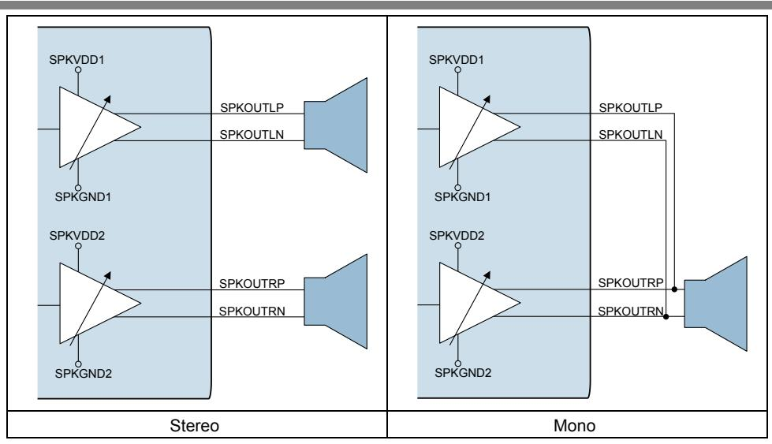

**Figure 34 Stereo / Mono Speaker Output Configurations**

Eight levels of AC signal boost are provided in order to deliver maximum output power for many commonly-used SPKVDD/AVDD1 combinations. (Note that SPKVDD1 powers the Left Speaker driver, and SPKVDD2 powers the Right Speaker driver; it is assumed that SPKVDD1 = SPKVDD2 = SPKVDD.)

The signal boost options are available in both Class AB and Class D modes. The AC boost levels from 0dB to +12dB are selected using register bits SPKOUTL\_BOOST and SPKOUTR\_BOOST. To prevent pop noise, SPKOUTL\_BOOST and SPKOUTR\_BOOST should not be modified while the speaker outputs are enabled. [Figure 35](#page-100-0) illustrates the speaker outputs and the mixing and gain/boost options available.

Ultra-low leakage and high PSRR allow the speaker supply SPKVDD to be directly connected to a lithium battery. Note that an appropriate SPKVDD supply voltage must be provided to prevent waveform clipping when speaker boost is used.

DC gain is applied automatically in both class AB and class D modes with a shift from VMID to SPKVDD/2. This provides optimum signal swing for maximum output power. In class AB mode, an ultra-high PSRR mode is available, in which the DC reference for the speaker driver is fixed at VMID. This mode is selected by enabling the SPKAB\_REF\_SEL bit (see [Table 74\)](#page-101-0). In this mode, the output power is limited but the driver will still be capable of driving more than 500mW in 8 while maintaining excellent suppression of noise on SPKVDD (for example, TDMA noise in a GSM phone application).

The AC and DC gain functions are illustrated i[n Figure 35.](#page-100-0)

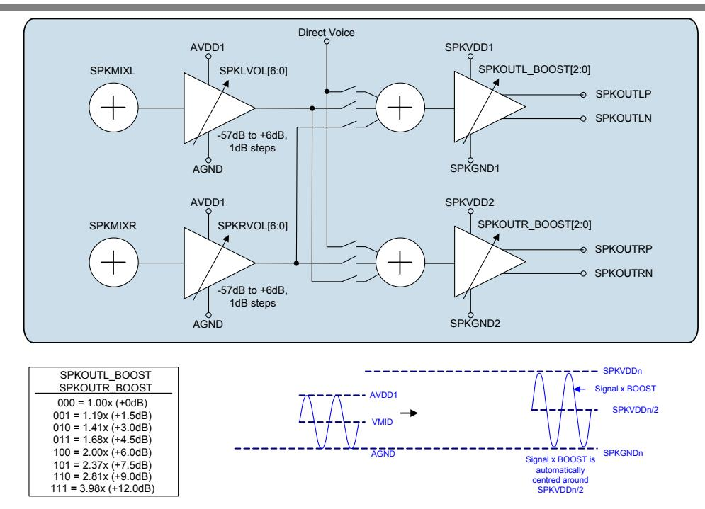

Figure 35 Speaker Output Configuration and AC Boost Operation

| REGISTER ADDRESS | BIT | LABEL                  | DEFAULT | DESCRIPTION                  |
|---------------------|-----|------------------------|---------|------------------------------|
| R35 (0023h)         | 8   | SPKOUT_CLASSAB         | 0       | Speaker Class AB Mode Enable |
| SPKMIXR             |     |                        |         | 0 = Class D mode             |
| Attenuation         |     |                        |         | 1 = Class AB mode            |
| R37 (0025h)         | 5:3 | SPKOUTL_BOOST          | 000     | Left Speaker Gain Boost      |
| ClassD              |     | [2:0]                  | (1.0x)  | 000 = 1.00x boost (+0dB)     |
|                     |     |                        |         | 001 = 1.19x boost (+1.5dB)   |
|                     |     |                        |         | 010 = 1.41x boost (+3.0dB)   |
|                     |     |                        |         | 011 = 1.68x boost (+4.5dB)   |
|                     |     |                        |         | 100 = 2.00x boost (+6.0dB)   |
|                     |     |                        |         | 101 = 2.37x boost (+7.5dB)   |
|                     |     |                        |         | 110 = 2.81x boost (+9.0dB)   |
|                     |     |                        |         | 111 = 3.98x boost (+12.0dB)  |
|                     | 2:0 | SPKOUTR_BOOST [2:0] | 000     | Right Speaker Gain Boost     |
|                     |     |                        | (1.0x)  | 000 = 1.00x boost (+0dB)     |
|                     |     |                        |         | 001 = 1.19x boost (+1.5dB)   |
|                     |     |                        |         | 010 = 1.41x boost (+3.0dB)   |
|                     |     |                        |         | 011 = 1.68x boost (+4.5dB)   |
|                     |     |                        |         | 100 = 2.00x boost (+6.0dB)   |
|                     |     |                        |         | 101 = 2.37x boost (+7.5dB)   |
|                     |     |                        |         | 110 = 2.81x boost (+9.0dB)   |
|                     |     |                        |         | 111 = 3.98x boost (+12.0dB)  |

| REGISTER ADDRESS                     | BIT | LABEL         | DEFAULT | DESCRIPTION                                                                   |
|-----------------------------------------|-----|---------------|---------|-------------------------------------------------------------------------------|
| R34 (0022h) SPKMIXL Attenuation   | 8   | SPKAB_REF_SEL | 0       | Selects Reference for Speaker in Class AB mode 0 = SPKVDD/2 1 = VMID |
| R1825 (0721h) Pull Control (2) | 1   | SPKMODE_PU    | 1       | SPKMODE Pull-up enable 0 = Disabled 1 = Enabled                         |

**Table 74 Speaker Mode and Boost Control**

Clocking of the Class D output driver is derived from SYSCLK. The clocking frequency division is configured automatically, according to the AIFn\_SR and AIFnCLK\_RATE registers. (See ["Clocking](#page-149-0)  [and Sample Rates"](#page-149-0) for further details of the system clocks and control registers.)

The Class D switching clock is enabled whenever SPKOUTL\_ENA or SPKOUTR\_ENA is set, provided also that SPKOUT\_CLASSAB = 0. The frequency is as described i[n Table 75.](#page-101-1)

When AIF1CLK is selected as the SYSCLK source (SYSCLK\_SRC = 0), then the Class D clock frequency is controlled by the AIF1\_SR and AIF1CLK\_RATE registers.

When AIF2CLK is selected as the SYSCLK source (SYSCLK\_SRC = 1), then the Class D clock frequency is controlled by the AIF2\_SR and AIF2CLK\_RATE registers.

Note that the applicable clocks (SYSCLK, AIF1CLK or AIF2CLK) must be present and enabled when using the speaker outputs in Class D mode.

| SAMPLE     | SYSCLK RATE (AIFnCLK / fs ratio) |       |       |       |       |       |       |      |
|------------|----------------------------------|-------|-------|-------|-------|-------|-------|------|
| RATE (kHz) | 128                              | 192   | 256   | 384   | 512   | 768   | 1024  | 1536 |
| 8          | 256                              | 256   | 341.3 | 256   | 341.3 | 256   | 341.3 | 256  |
| 11.025     | 352.8                            | 352.8 | 352.8 | 352.8 | 352.8 | 352.8 | 352.8 |      |
| 12         | 384                              | 384   | 384   | 384   | 384   | 384   | 384   |      |
| 16         | 341.3                            | 384   | 341.3 | 384   | 341.3 | 384   |       |      |
| 22.05      | 352.8                            | 352.8 | 352.8 | 352.8 | 352.8 |       |       |      |
| 24         | 384                              | 384   | 384   | 384   | 384   |       |       |      |
| 32         | 341.3                            | 384   | 341.3 | 384   |       |       |       |      |
| 44.1       | 352.8                            | 352.8 | 352.8 |       |       |       |       |      |
| 48         | 384                              | 384   | 384   |       |       |       |       |      |
| 88.2       | 352.8                            |       |       |       |       |       |       |      |
| 96         | 384                              |       |       |       |       |       |       |      |

**Table 75 Class D Switching Frequency (kHz)**

# **HEADPHONE OUTPUT CONFIGURATIONS**

The headphone outputs HPOUT1L and HPOUT1R are driven by the headphone output PGAs HPOUT1LVOL and HPOUT1RVOL. Each PGA has its own dedicated volume control, as described in the ["Analogue Output Signal Path"](#page-70-0) section. The input to these PGAs can be either the output mixers MIXOUTL and MIXOUTR or the direct DAC1 outputs DAC1L and DAC1R.

The headphone output driver is capable of driving up to 30mW into a 16Ω load or 25mW into a 32Ω load such as a stereo headset or headphones. The outputs are ground-referenced, eliminating any requirement for AC coupling capacitors. This is achieved by having separate positive and negative supply rails powered by an on-chip charge pump. A DC Servo circuit removes any DC offset from the headphone outputs, suppressing 'pop' noise and minimising power consumption. The Charge Pump and DC Servo are described separately (see ["Charge Pump"](#page-92-0) and ["DC Servo"](#page-94-0) respectively).

It is recommended to connect a zobel network to the headphone output pins HPOUT1L and HPOUT1R for best audio performance in all applications. The components of the zobel network have the effect of dampening high frequency oscillations or instabilities that can arise outside the audio

band under certain conditions. Possible sources of these instabilities include the inductive load of a headphone coil or an active load in the form of an external line amplifier. The capacitance of lengthy cables or PCB tracks can also lead to amplifier instability. The zobel network should comprise of a 20 resistor and 100nF capacitor in series with each other, as illustrated i[n Figure](#page-102-0) 36.

If any ground-referenced headphone output is not used, then the zobel network components can be omitted from the corresponding output pin, and the pin can be left floating. The respective headphone driver(s) should not be enabled in this case.

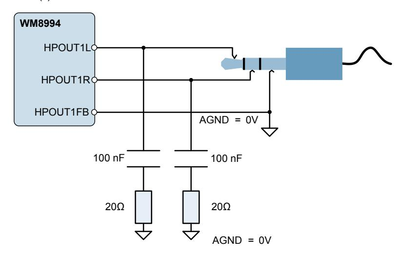

**Figure 36 Zobel Network Components for HPOUT1L and HPOUT1R**

The headphone output incorporates a common mode, or ground loop, feedback path which provides rejection of system-related ground noise. The return path is via HPOUT1FB. This pin must be connected to ground for normal operation of the headphone output. No register configuration is required.

Note that the HPOUT1FB pin should be connected to GND close to the headphone jack, as illustrated in [Figure](#page-102-0) 36.

#### **EARPIECE DRIVER OUTPUT CONFIGURATIONS**

The earpiece driver outputs HPOUT2P and HPOUT2N are driven by the HPOUT2MIX output mixer, which can take inputs from the mixer output PGAs MIXOUTLVOL and MIXOUTRVOL, or from the low power, differential Direct Voice path IN2LP/VRXN and IN2RP/VRXP. Fine volume control is available on the output mixer paths using MIXOUTLVOL and MIXOUTRVOL. A selectable -6dB attenuation is available on the HPOUT2MIX output, as described in [Table 67](#page-88-0) (refer to the ["Analogue Output Signal](#page-70-0)  [Path"](#page-70-0) section).

The earpiece outputs are designed to operate in a BTL configuration, driving 50mW into a typical 16 ear speaker.

For suppression of pop noise there are two separate enables for the earpiece driver; HPOUT2\_ENA enables the output stage and HPOUT2\_IN\_ENA enables the mixer and input stage. HPOUT2\_IN\_ENA should be enabled a minimum of 50s before HPOUT2\_ENA – see ["Control Write](#page-176-0)  [Sequencer"](#page-176-0) section for an example power sequence.

# **LINE OUTPUT CONFIGURATIONS**

The four line outputs LINEOUT1P, LINEOUT1N, LINEOUT2P and LINEOUT2N provide a highly flexible combination of differential and single-ended configurations, each driven by a dedicated output mixer. There is a selectable -6dB gain option in each mixer to avoid clipping when mixing more than one signal into a line output. Additional volume control is available at other locations within each of the supported signal paths. For more information about the line output mixing options, refer to the ["Analogue Output Signal Path"](#page-70-0) section.

Typical applications for the line outputs (single-ended or differential) are:

- Handset or headset microphone output to external voice CODEC
- Stereo line output
- Output to external speaker driver(s) to support additional loudspeakers

When single-ended mode is selected for either LINEOUT1 or LINEOUT2, a buffered VMID must be enabled as a reference for the outputs. This is enabled by setting the LINEOUT\_VMID\_BUF\_ENA bit as defined in Table 76.

| REGISTER ADDRESS        | BIT | LABEL                    | DEFAULT | DESCRIPTION                                                  |
|----------------------------|-----|--------------------------|---------|--------------------------------------------------------------|
| R56 (0038h) AntiPOP (1) | 7   | LINEOUT_VMID_BUF_E NA | 0       | Enables VMID reference for line outputs in single-ended mode |
| . ,                        |     |                          |         | 0 = Disabled                                                 |
|                            |     |                          |         | 1 = Enabled                                                  |

Table 76 LINEOUT VMID Buffer for Single-Ended Operation

Some example line output configurations are listed and illustrated below.

- Differential line output from Mic/Line input on IN1L PGA
- Differential line output from Mic/Line input on IN1R PGA
- Stereo differential line output from output mixers MIXOUTL and MIXOUTR
- Stereo single-ended line output from output mixer to either LINEOUT1 or LINEOUT2
- Mono single-ended line output from output mixer

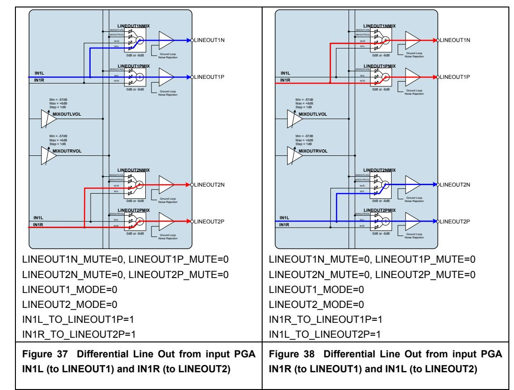

# **WM8994**

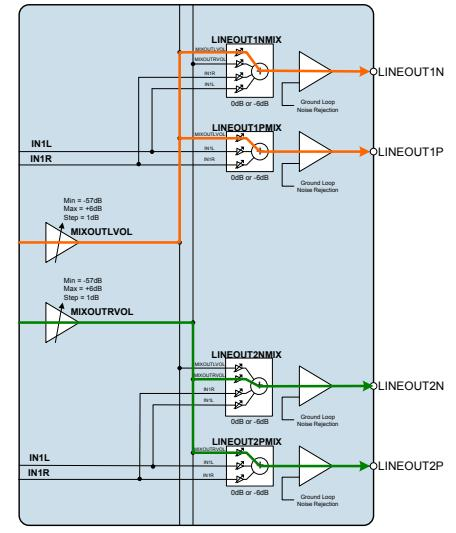

LINEOUT1N\_MUTE=0, LINEOUT1P\_MUTE=0 LINEOUT2N\_MUTE=0, LINEOUT2P\_MUTE=0 LINEOUT1\_MODE=0 LINEOUT2\_MODE=0

MIXOUTL\_TO\_LINEOUT1P=1 MIXOUTR\_TO\_LINEOUT2P=1

LINEOUTINMIX

Solid of delil

LINEOUTINMIX

Solid of delil

LINEOUTINMIX

Solid of delil

LINEOUTINMIX

Solid of delil

LINEOUTINMIX

Solid of delil

LINEOUTINMIX

Solid of delil

LINEOUTINMIX

Solid of delil

LINEOUTINMIX

Solid of delil

LINEOUTINMIX

Solid of delil

LINEOUTINMIX

Solid of delil

LINEOUTINMIX

Solid of delil

LINEOUTINMIX

Solid of delil

LINEOUTINMIX

Solid of delil

LINEOUTINMIX

Solid of delil

LINEOUTINMIX

Solid of delil

LINEOUTINMIX

Solid of delil

LINEOUTINMIX

Solid of delil

LINEOUTINMIX

Solid of delil

LINEOUTINMIX

Solid of delil

LINEOUTINMIX

Solid of delil

LINEOUTINMIX

Solid of delil

LINEOUTINMIX

Solid of delil

LINEOUTINMIX

Solid of delil

LINEOUTINMIX

Solid of delil

LINEOUTINMIX

Solid of delil

LINEOUTINMIX

Solid of delil

LINEOUTINMIX

Solid of delil

LINEOUTINMIX

Solid of delil

LINEOUTINMIX

Solid of delil

LINEOUTINMIX

Solid of delil

LINEOUTINMIX

Solid of delil

LINEOUTINMIX

Solid of delil

LINEOUTINMIX

Solid of delil

LINEOUTINMIX

Solid of delil

LINEOUTINMIX

Solid of delil

LINEOUTINMIX

Solid of delil

LINEOUTINMIX

Solid of delil

LINEOUTINMIX

Solid of delil

LINEOUTINMIX

Solid of delil

LINEOUTINMIX

Solid of delil

LINEOUTINMIX

Solid of delil

LINEOUTINMIX

Solid of delil

LINEOUTINMIX

Solid of delil

LINEOUTINMIX

Solid of delil

LINEOUTINMIX

Solid of delil

LINEOUTINMIX

Solid of delil

LINEOUTINMIX

Solid of delil

LINEOUTINMIX

Solid of delil

LINEOUTINMIX

Solid of delil

LINEOUTINMIX

Solid of delil

LINEOUTINMIX

Solid of delil

LINEOUTINMIX

Solid of delil

LINEOUTINMIX

Solid of delil

LINEOUTINMIX

Solid of delil

LINEOUTINMIX

Solid of delil

LINEOUTINMIX

Solid of delil

LINEOUTINMIX

Solid of delil

LINEOUTINMIX

Solid of delil

LINEOUTINMIX

Solid of delil

LINEOUTINMIX

Solid of delil

LINEOUTINMIX

Solid of delil

LINEOUTINMIX

Solid of delil

LINEOUTINMIX

Solid of delil

LINEOUTINMIX

Solid of delil

LINEOUTINMIX

Solid of delil

LINEOUTINMIX

Solid of delil

LINEOUTINMIX

Solid of delil

LINEOUTINMIX

Solid of delil

LINEOU

LINEOUT1N\_MUTE=0, LINEOUT1P\_MUTE=0 LINEOUT2N\_MUTE=0, LINEOUT2P\_MUTE=0 LINEOUT1\_MODE=1 MIXOUTL\_TO\_LINEOUT1P=1 MIXOUTR\_TO\_LINEOUT1N=1

LINEOUT\_VMID\_BUF\_ENA=1

Figure 39 Stereo Differential Line Out from MIXOUTL and MIXOUTR

Figure 40 Stereo Single-Ended Line Out from MIXOUTL and MIXOUTR to LINEOUT1

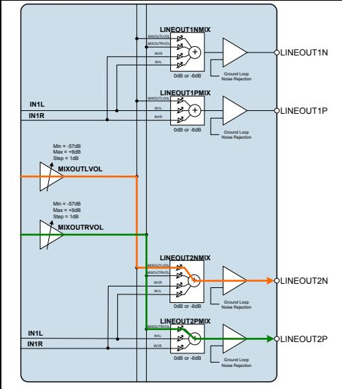

LINEOUT1N\_MUTE=0, LINEOUT1P\_MUTE=0
LINEOUT2N\_MUTE=0, LINEOUT2P\_MUTE=0
LINEOUT1\_MODE=1
MIXOUTL\_TO\_LINEOUT2N=1
MIXOUTR\_TO\_LINEOUT2P=1

LINEOUT\_VMID\_BUF\_ENA=1

INFOUTINMIX

UNEOUTINMIX

UNEOUTINMIX

UNEOUTINMIX

UNEOUTINMIX

UNEOUTINMIX

UNEOUTINMIX

UNEOUTINMIX

UNEOUTINMIX

UNEOUTINMIX

UNEOUTINMIX

UNEOUTINMIX

UNEOUTINMIX

UNEOUTINMIX

UNEOUTINMIX

UNEOUTINMIX

UNEOUTINMIX

UNEOUTINMIX

UNEOUTINMIX

UNEOUTINMIX

UNEOUTINMIX

UNEOUTINMIX

UNEOUTINMIX

UNEOUTINMIX

UNEOUTINMIX

UNEOUTINMIX

UNEOUTINMIX

UNEOUTINMIX

UNEOUTINMIX

UNEOUTINMIX

UNEOUTINMIX

UNEOUTINMIX

UNEOUTINMIX

UNEOUTINMIX

UNEOUTINMIX

UNEOUTINMIX

UNEOUTINMIX

UNEOUTINMIX

UNEOUTINMIX

UNEOUTINMIX

UNEOUTINMIX

UNEOUTINMIX

UNEOUTINMIX

UNEOUTINMIX

UNEOUTINMIX

UNEOUTINMIX

UNEOUTINMIX

UNEOUTINMIX

UNEOUTINMIX

UNEOUTINMIX

UNEOUTINMIX

UNEOUTINMIX

UNEOUTINMIX

UNEOUTINMIX

UNEOUTINMIX

UNEOUTINMIX

UNEOUTINMIX

UNEOUTINMIX

UNEOUTINMIX

UNEOUTINMIX

UNEOUTINMIX

UNEOUTINMIX

UNEOUTINMIX

UNEOUTINMIX

UNEOUTINMIX

UNEOUTINMIX

UNEOUTINMIX

UNEOUTINMIX

UNEOUTINMIX

UNEOUTINMIX

UNEOUTINMIX

UNEOUTINMIX

UNEOUTINMIX

UNEOUTINMIX

UNEOUTINMIX

UNEOUTINMIX

UNEOUTINMIX

UNEOUTINMIX

UNEOUTINMIX

UNEOUTINMIX

UNEOUTINMIX

UNEOUTINMIX

UNEOUTINMIX

UNEOUTINMIX

UNEOUTINMIX

UNEOUTINMIX

UNEOUTINMIX

UNEOUTINMIX

UNEOUTINMIX

UNEOUTINMIX

UNEOUTINMIX

UNEOUTINMIX

UNEOUTINMIX

UNEOUTINMIX

UNEOUTINMIX

UNEOUTINMIX

UNEOUTINMIX

UNEOUTINMIX

UNEOUTINMIX

UNEOUTINMIX

UNEOUTINMIX

UNEOUTINMIX

UNEOUTINMIX

UNEOUTINMIX

UNEOUTINMIX

UNEOUTINMIX

UNEOUTINMIX

UNEOUTINMIX

UNEOUTINMIX

UNEOUTINMIX

UNEOUTINMIX

UNEOUTINMIX

UNEOUTINMIX

UNEOUTINMIX

UNEOUTINMIX

UNEOUTINMIX

UNEOUTINMIX

UNEOUTINMIX

UNEOUTINMIX

UNEOUTINMIX

UNEOUTINMIX

UNEOUTINMIX

UNEOUTINMIX

UNEOUTINMIX

UNEOUTINMIX

UNEOUTINMIX

UNEOUTINMIX

UNEOUTINMIX

UNEOUTINMIX

UNEOUTINMIX

UNEOUTINMIX

UNEOUTINMIX

UNEOUTINMIX

UNEOUTINMIX

UNEOUTINMIX

UNEOUTINMIX

UNEOUTINMIX

UNEOUTINMIX

UNEOUTINMIX

UNEOUTINMIX

UNEOUTINMIX

UNEOUTINMIX

UNEOUTINMIX

UNEOUTINMIX

UNEOUTINMIX

UNEOUTINMIX

UNEOUTINMIX

UNEOUTINMIX

UNEOUTINMIX

UNEOUTINMIX

UNEOUTINMIX

UNEOUTINMIX

UNEOUTINMIX

UNEOUTINMIX

UNEOUTINMIX

UNEOUTINMIX

UNEOUTINMIX

UNEOU

LINEOUT1N\_MUTE=0, LINEOUT1P\_MUTE=0
LINEOUT2N\_MUTE=0, LINEOUT2P\_MUTE=0
LINEOUT1\_MODE=1
LINEOUT2\_MODE=1
MIXOUTL\_TO\_LINEOUT1N=1 and/or
MIXOUTL\_TO\_LINEOUT1P=1
MIXOUTR\_TO\_LINEOUT2N=1 and/or
MIXOUTR\_TO\_LINEOUT2P=1

LINEOUT VMID BUF ENA=1

Figure 41 Stereo Single-Ended Line Out from MIXOUTL and MIXOUTR to LINEOUT2

Figure 42 Mono Line Out to LINEOUT1N, LINEOUT1P, LINEOUT2N, LINEOUT2P

The line outputs incorporate a common mode, or ground loop, feedback path which provides rejection of system-related ground noise. The return path, via LINEOUTFB, is enabled separately for LINEOUT1 and LINEOUT2 using the LINEOUT1\_FB and LINEOUT2\_FB bits as defined i[n Table 77.](#page-105-1)

Ground loop feedback is a benefit to single-ended line outputs only; it is not applicable to differential outputs, which already inherently offer common mode noise rejection.

| REGISTER ADDRESS                  | BIT | LABEL       | DEFAULT | DESCRIPTION                                                                     |
|--------------------------------------|-----|-------------|---------|---------------------------------------------------------------------------------|
| R55 (0037h) Additional Control | 7   | LINEOUT1_FB | 0       | Enable ground loop noise feedback on LINEOUT1 0 = Disabled 1 = Enabled |
|                                      | 6   | LINEOUT2_FB | 0       | Enable ground loop noise feedback on LINEOUT2 0 = Disabled 1 = Enabled |

**Table 77 Line Output Ground Loop Feedback Enable**

# **GENERAL PURPOSE INPUT/OUTPUT**

The WM8994 provides a number of GPIO functions to enable interfacing and detection of external hardware and to provide logic outputs to other devices. The input functions can be polled directly or can be used to generate an Interrupt (IRQ) event. The GPIO and Interrupt circuits support the following functions:

- Alternate interface functions (AIF2, AIF3)
- Button detect (GPIO input)
- Logic '1' and logic '0' output (GPIO output)
- SDOUT (4-wire SPI Control Interface data)
- Interrupt (IRQ) status output
- Over-Temperature detection
- Accessory detection (MICBIAS current detection)
- Frequency Locked Loop (FLL) Lock status output
- Sample Rate Conversion (SRC) Lock status output
- Dynamic Range Control (DRC) Signal activity detection
- Control Write Sequencer status output
- Digital Core FIFO error status output
- Clock output (SYSCLK divided by OPCLK\_DIV)
- Frequency Locked Loop (FLL) Clock output

### **GPIO CONTROL**

For each GPIO, the selected function is determined by the GPn\_FN field, where n identifies the GPIO pin (1 to 11). The pin direction, set by GPn\_DIR, must be set according to function selected by GPn\_FN.

The alternate audio interfaces AIF2 and AIF3 are both supported using GPIO pins; the applicable pin functions are selected by setting the corresponding GPn\_FN register to 00h. See [Table 81](#page-110-0) for the definition of which AIF function is available on each GPIO pin.

See ["Digital Audio Interface Control"](#page-131-0) for details of AIF2 and AIF3.

Note that the GPIO2 pin supports functions MCLK2 and Button Detect / Logic Level Input only. Accordingly, GP2\_DIR should be set to '1' in all applications.

When a pin is configured as a GPIO input (GPn\_DIR = 1), the logic level at the pin can be read from the respective GPn\_LVL bit. Note that GPn\_LVL is not affected by the GPn\_POL bit.

A de-bounce circuit can be enabled on any GPIO input, to avoid false event triggers. This is enabled on each pin by setting the respective GPn\_DB bit. Note that TOCLK must be enabled when this input de-bouncing is required.

When a pin is configured as a Logic Level output (GPn\_DIR = 0, GPn\_FN = 01h), its level can be set to logic 0 or logic 1 using the GPn\_LVL field.

When a pin is configured as an output (GPn\_DIR = 0), the polarity can be inverted using the GPn\_POL bit. When GPn\_POL = 1, then the selected output function is inverted. In the case of Logic Level output (GPn\_FN = 01h), the external output will be the opposite logic level to GPn\_LVL when GPn\_POL = 1.

A GPIO output can be either CMOS driven or Open Drain. This is selected on each pin using the respective GPn\_OP\_CFG bit.

Internal pull-up and pull-down resistors may be enabled using the GPn\_PU and GPn\_PD fields; this allows greater flexibility to interface with different signals from other devices. (Note that if GPn\_PU and GPn\_PD are both set for any GPIO pin, then the pull-up and pull-down will be disabled.)

Each of the GPIO pins is an input to the Interrupt control circuit and can be used to trigger an Interrupt event. An interrupt event is triggered on the rising and falling edge of the GPIO input. The associated interrupt bit is latched once set; it can be polled at any time or used to control the IRQ signal. See ["Interrupts"](#page-117-0) for more details of the Interrupt event handling.

The register fields that control the GPIO pins are described in [Table 78,](#page-107-0) [Table 79](#page-107-1) and [Table 80.](#page-108-0)

| REGISTER ADDRESS | BIT | LABEL        | DEFAULT | DESCRIPTION                                                                                                                  |
|---------------------|-----|--------------|---------|------------------------------------------------------------------------------------------------------------------------------|
| R1792               | 15  | GP1_DIR      | 1       | GPIO1 Pin Direction                                                                                                          |
| (0700h)             |     |              |         | 0 = Output                                                                                                                   |
| GPIO1               |     |              |         | 1 = Input                                                                                                                    |
|                     | 14  | GP1_PU       | 0       | GPIO1 Pull-Up Enable                                                                                                         |
|                     |     |              |         | 0 = Disabled                                                                                                                 |
|                     |     |              |         | 1 = Enabled                                                                                                                  |
|                     | 13  | GP1_PD       | 0       | GPIO1 Pull-Down Enable                                                                                                       |
|                     |     |              |         | 0 = Disabled                                                                                                                 |
|                     |     |              |         | 1 = Enabled                                                                                                                  |
|                     | 10  | GP1_POL      | 0       | GPIO1 Polarity Select                                                                                                        |
|                     |     |              |         | 0 = Non-inverted (Active High)                                                                                               |
|                     |     |              |         | 1 = Inverted (Active Low)                                                                                                    |
|                     | 9   | GP1_OP_CFG   | 0       | GPIO1 Output Configuration                                                                                                   |
|                     |     |              |         | 0 = CMOS                                                                                                                     |
|                     |     |              |         | 1 = Open Drain                                                                                                               |
|                     | 8   | GP1_DB       | 1       | GPIO1 Input De-bounce                                                                                                        |
|                     |     |              |         | 0 = Disabled                                                                                                                 |
|                     |     |              |         | 1 = Enabled                                                                                                                  |
|                     | 6   | GP1_LVL      | 0       | GPIO1 level. Write to this bit to set a GPIO output. Read from this bit to read GPIO input level.                      |
|                     |     |              |         | For output functions only, when GP1_POL is set, the register contains the opposite logic level to the external pin. |
|                     | 4:0 | GP1_FN [4:0] | 0000    | GPIO1 Pin Function                                                                                                           |
|                     |     |              |         | (see Table 81 for details)                                                                                                   |

**Table 78 GPIO1 Control**

| REGISTER ADDRESS | BIT | LABEL        | DEFAULT | DESCRIPTION                        |
|---------------------|-----|--------------|---------|------------------------------------|
| R1793               | 15  | GP2_DIR      | 1       | GPIO2 Pin Direction                |
| (0701h)             |     |              |         | 0 = Reserved                       |
| GPIO2               |     |              |         | 1 = Input                          |
|                     | 14  | GP2_PU       | 0       | GPIO2 Pull-Up Enable               |
|                     |     |              |         | 0 = Disabled                       |
|                     |     |              |         | 1 = Enabled                        |
|                     | 13  | GP2_PD       | 1       | GPIO2 Pull-Down Enable             |
|                     |     |              |         | 0 = Disabled                       |
|                     |     |              |         | 1 = Enabled                        |
|                     | 10  | GP2_POL      | 0       | GPIO2 Polarity Select              |
|                     |     |              |         | 0 = Non-inverted (Active High)     |
|                     |     |              |         | 1 = Inverted (Active Low)          |
|                     | 8   | GP2_DB       | 1       | GPIO2 Input De-bounce              |
|                     |     |              |         | 0 = Disabled                       |
|                     |     |              |         | 1 = Enabled                        |
|                     | 6   | GP2_LVL      | 0       | GPIO2 level. Read from this bit to |
|                     |     |              |         | read GPIO input level.             |
|                     | 4:0 | GP2_FN [4:0] | 0001    | GPIO2 Pin Function                 |
|                     |     |              |         | (see Table 81 for details)         |

**Table 79 GPIO2 Control**

| REGISTER ADDRESS                                                       | BIT | LABEL        | DEFAULT | DESCRIPTION                                                    |
|---------------------------------------------------------------------------|-----|--------------|---------|----------------------------------------------------------------|
| R1794                                                                     | 15  | GPn_DIR      | 1       | GPIOn Pin Direction                                            |
| (0701h)                                                                   |     |              |         | 0 = Output                                                     |
| GPIO3                                                                     |     |              |         | 1 = Input                                                      |
|                                                                           | 14  | GPn_PU       | 0       | GPIOn Pull-Up Enable                                           |
| to                                                                        |     |              |         | 0 = Disabled                                                   |
|                                                                           |     |              |         | 1 = Enabled                                                    |
| R1802                                                                     | 13  | GPn_PD       | 1       | GPIOn Pull-Down Enable                                         |
| (070Ah)                                                                   |     |              |         | 0 = Disabled                                                   |
| GPIO11                                                                    |     |              |         | 1 = Enabled                                                    |
|                                                                           | 10  | GPn_POL      | 0       | GPIOn Polarity Select                                          |
|                                                                           |     |              |         | 0 = Non-inverted (Active High)                                 |
|                                                                           |     |              |         | 1 = Inverted (Active Low)                                      |
|                                                                           | 9   | GPn_OP_CFG   | 0       | GPIOn Output Configuration                                     |
|                                                                           |     |              |         | 0 = CMOS                                                       |
|                                                                           |     |              |         | 1 = Open Drain                                                 |
|                                                                           | 8   | GPn_DB       | 1       | GPIOn Input De-bounce                                          |
|                                                                           |     |              |         | 0 = Disabled                                                   |
|                                                                           |     |              |         | 1 = Enabled                                                    |
|                                                                           | 6   | GPn_LVL      | 0       | GPIOn level. Write to this bit to set                          |
|                                                                           |     |              |         | a GPIO output. Read from this bit to read GPIO input level. |
|                                                                           |     |              |         | For output functions only, when                                |
|                                                                           |     |              |         | GPn_POL is set, the register                                   |
|                                                                           |     |              |         | contains the opposite logic level to the external pin.      |
|                                                                           | 4:0 | GPn_FN [4:0] | 0001    | GPIOn Pin Function                                             |
|                                                                           |     |              |         | (see Table 81 for details)                                     |
| Note: n is a number between 3 and 11 that identifies the individual GPIO. |     |              |         |                                                                |

**Table 80 GPIO3 to GPIO11 Control**

#### **GPIO FUNCTION SELECT**

The available GPIO functions are described in [Table 81.](#page-110-0) The function of each GPIO is set using the GPn\_FN register, where n identifies the GPIO pin (1 to 11). Note that the respective GPn\_DIR must also be set according to whether the function is an input or output.

Note that GPIO2 supports functions MCLK2 and Button Detect / Logic Level Input only.

| GPn_FN | DESCRIPTION                                 | COMMENTS                                             |
|--------|---------------------------------------------|------------------------------------------------------|
| 00h    | GPIO1 - ADCLRCLK1                           | Alternate Audio Interface connections.               |
|        | GPIO2 - MCLK2                               |                                                      |
|        | GPIO3 - BCLK2                               |                                                      |
|        | GPIO4 - LRCLK2                              |                                                      |
|        | GPIO5 - DACDAT2                             |                                                      |
|        | GPIO6 - ADCLRCLK2                           |                                                      |
|        | GPIO7 - ADCDAT2                             |                                                      |
|        | GPIO8 - DACDAT3                             |                                                      |
|        | GPIO9 - ADCDAT3                             |                                                      |
|        | GPIO10 - LRCLK3                             |                                                      |
|        | GPIO11 - BCLK3                              |                                                      |
|        |                                             |                                                      |
| 01h    | Button detect input / Logic level output | GPn_DIR = 0: GPIO pin logic level is set by GPn_LVL. |
|        |                                             | GPn_DIR = 1: Button detect or logic level input.     |
|        |                                             | Note that GPIO2 can only be configured as an input.  |
| 02h    | SDOUT                                       | SPI Control Interface data output                    |
| 03h    | IRQ                                         | Interrupt (IRQ) output                               |
|        |                                             | 0 = IRQ not asserted                                 |
|        |                                             | 1 = IRQ asserted                                     |
| 04h    | Temperature (Shutdown) status output  | Indicates Temperature Shutdown Sensor status         |
|        |                                             | 0 = Temperature is below shutdown level              |
|        |                                             | 1 = Temperature is above shutdown level              |
| 05h    | MICBIAS1 Current Detect                  | Indicates MICBIAS1 Current Detection status          |
|        |                                             | 0 = Current Detect threshold not exceeded            |
|        |                                             | 1 = Current Detect threshold exceeded                |
| 06h    | MICBIAS1 Short Circuit Detect            | Indicates MICBIAS1 Short Circuit Detection status    |
|        |                                             | 0 = Short Circuit threshold not exceeded             |
|        |                                             | 1 = Short Circuit threshold exceeded                 |
| 07h    | MICBIAS2 Current Detect                  | Indicates MICBIAS2 Current Detection status          |
|        |                                             | 0 = Current Detect threshold not exceeded            |
|        |                                             | 1 = Current Detect threshold exceeded                |
|        |                                             |                                                      |
| 08h    | MICBIAS2 Short Circuit Detect            | Indicates MICBIAS2 Short Circuit Detection status    |
|        |                                             | 0 = Short Circuit threshold not exceeded             |
|        |                                             | 1 = Short Circuit threshold exceeded                 |
| 09h    | FLL1 Lock                                   | Indicates FLL1 Lock status                           |
|        |                                             | 0 = Not locked                                       |
|        |                                             | 1 = Locked                                           |
| 0Ah    | FLL2 Lock                                   | Indicates FLL2 Lock status                           |
|        |                                             | 0 = Not locked                                       |
|        |                                             | 1 = Locked                                           |
| 0Bh    | SRC1 Lock                                   | Indicates SRC1 Lock status                           |
|        |                                             | 0 = Not locked                                       |
|        |                                             | 1 = Locked                                           |
| 0Ch    | SRC2 Lock                                   | Indicates SRC2 Lock status                           |
|        |                                             | 0 = Not locked                                       |
|        |                                             | 1 = Locked                                           |
|        |                                             |                                                      |

| GPn_FN     | DESCRIPTION           | COMMENTS                                         |  |  |
|------------|-----------------------|--------------------------------------------------|--|--|
| 0Dh        | AIF1 DRC1 Signal      | Indicates AIF1 DRC1 Signal Detect status         |  |  |
|            | Detect                | 0 = Signal threshold not exceeded                |  |  |
|            |                       | 1 = Signal threshold exceeded                    |  |  |
| 0Eh        | AIF1 DRC2 Signal      | Indicates AIF1 DRC2 Signal Detect status         |  |  |
|            | Detect                | 0 = Signal threshold not exceeded                |  |  |
|            |                       | 1 = Signal threshold exceeded                    |  |  |
| 0Fh        | AIF2 DRC Signal       | Indicates AIF2 DRC Signal Detect status          |  |  |
|            | Detect                | 0 = Signal threshold not exceeded                |  |  |
|            |                       | 1 = Signal threshold exceeded                    |  |  |
| 10h        | Write Sequencer       | Indicates Write Sequencer status                 |  |  |
|            | Status                | 0 = Write Sequencer Idle                         |  |  |
|            |                       | 1 = Write Sequence Busy                          |  |  |
| 11h        | FIFO Error            | Indicates a Digital Core FIFO Error condition    |  |  |
|            |                       | 0 = Normal operation                             |  |  |
|            |                       | 1 = FIFO Error                                   |  |  |
| 12h        | Clock Output OPCLK    | GPIO Clock derived from SYSCLK                   |  |  |
| 13h        | Temperature (Warning) | Indicates Temperature Warning Sensor status      |  |  |
|            | status output         | 0 = Temperature is below warning level           |  |  |
|            |                       | 1 = Temperature is above warning level           |  |  |
| 14h        | DC Servo Done         | Indicates DC Servo status on HPOUT1L and HPOUT1R |  |  |
|            |                       | 0 = DC Servo not complete                        |  |  |
|            |                       | 1 = DC Servo complete                            |  |  |
| 15h        | FLL1 Clock Output     | Clock output from FLL1                           |  |  |
|            |                       |                                                  |  |  |
| 16h        | FLL2 Clock Output     | Clock output from FLL2                           |  |  |
|            | Reserved              |                                                  |  |  |
| 17h to 1Fh |                       |                                                  |  |  |

**Table 81 GPIO Function Select**

### **BUTTON DETECT (GPIO INPUT)**

Button detect functionality can be selected on any GPIO pin by setting the respective GPIO registers as described in ["GPIO Control"](#page-106-0). The same functionality can be used to support a Jack Detect input function.

It is recommended to enable the GPIO input de-bounce feature when using GPIOs as button input or Jack Detect input.

The GPn\_LVL fields may be read to determine the logic levels on a GPIO input, after the selectable de-bounce controls. Note that GPn\_LVL is not affected by the GPn\_POL bit.

The de-bounced GPIO signals are also inputs to the Interrupt control circuit. An interrupt event is triggered on the rising and falling edge of the GPIO input. The associated interrupt bits are latched once set; it can be polled at any time or used to control the IRQ signal. See ["Interrupts"](#page-117-0) for more details of the Interrupt event handling.

#### **LOGIC '1' AND LOGIC '0' OUTPUT (GPIO OUTPUT)**

The WM8994 can be programmed to drive a logic high or logic low level on any GPIO pin by selecting the "GPIO Output" function as described in ["GPIO Control"](#page-106-0). The output logic level is selected using the respective GPn\_LVL bit.

Note that the polarity of the GPIO output can be inverted using the GPn\_POL registers. If GPn\_POL = 1, then the external output will be the opposite logic level to GPn\_LVL.

#### **SDOUT (4-WIRE SPI CONTROL INTERFACE DATA)**

The WM8994 can support a number of different Control Interface protocols. In 4-wire SPI mode, a GPIO pin must be configured as SDOUT. See ["Control Interface"](#page-170-0) for further details.

A GPIO pin configured as SDOUT can be configured as CMOS or Wired 'OR' using the SPI\_CFG register. Note that the GPn\_OP\_CFG and GPn\_POL registers have no effect on a GPIO pin that is configured as SDOUT.

### **INTERRUPT (IRQ) STATUS OUTPUT**

The WM8994 has an Interrupt Controller which can be used to indicate when any selected Interrupt events occur. An interrupt can be generated by any of the events described throughout the GPIO function definition above. Individual interrupts may be masked in order to configure the Interrupt as required. See ["Interrupts"](#page-117-0) for further details.

The Interrupt (IRQ) status may be output directly on any GPIO pin by setting the respective GPIO registers as described in ["GPIO Control"](#page-106-0).

#### **OVER-TEMPERATURE DETECTION**

The WM8994 incorporates a temperature sensor which detects when the device temperature is within normal limits or if the device is approaching a hazardous temperature condition.

The Temperature status may be output directly on any GPIO pin by setting the respective GPIO registers as described in ["GPIO Control"](#page-106-0). Any GPIO pin can be used to indicate either a Warning Temperature event or the Shutdown Temperature event. De-bounce can be applied to the applicable signal using the register bits described i[n Table 82.](#page-111-0)

The Warning Temperature and Shutdown Temperature status are inputs to the Interrupt control circuit, after the selectable de-bounce. An interrupt event may be triggered on the rising and falling edges of these signals. The associated interrupt bit is latched once set; it can be polled at any time or used to control the IRQ signal. See ["Interrupts"](#page-117-0) for more details of the Interrupt event handling.

Note that the temperature sensor can be configured to automatically disable the audio outputs of the WM8994 (see ["Thermal Shutdown"](#page-199-0)). In some applications, it may be preferable to manage the temperature sensor event through GPIO or Interrupt functions, allowing a host processor to implement a controlled system response to an over-temperature condition.

The temperature sensor must be enabled by setting the TSHUT\_ENA register bit. When the TSHUT\_OPDIS is also set, then a device over-temperature condition will cause the speaker outputs (SPKOUTL and SPKOUTR) of the WM8994 to be disabled.

| REGISTER ADDRESS | BIT | LABEL            | DEFAULT | DESCRIPTION                                                                                                        |
|---------------------|-----|------------------|---------|--------------------------------------------------------------------------------------------------------------------|
| R2 (0002h)          | 14  | TSHUT_EN         | 1       | Thermal sensor enable                                                                                              |
| Power               |     | A                |         | 0 = Disabled                                                                                                       |
| Management          |     |                  |         | 1 = Enabled                                                                                                        |
| (2)                 | 13  | TSHUT_OP DIS  | 1       | Thermal shutdown control                                                                                           |
|                     |     |                  |         | (Causes audio outputs to be disabled if an overtemperature occurs. The thermal sensor must also be enabled.) |
|                     |     |                  |         | 0 = Disabled                                                                                                       |
|                     |     |                  |         | 1 = Enabled                                                                                                        |
| R1864               | 0   | TEMP_WAR N_DB | 0       | Thermal Warning de-bounce                                                                                          |
| (0748h)             |     |                  |         | 0 = Disabled                                                                                                       |
| IRQ                 |     |                  |         | 1 = Enabled                                                                                                        |
| Debounce            | 0   | TEMP_SHU         | 0       | Thermal shutdown de-bounce                                                                                         |
|                     |     | T_DB             |         | 0 = Disabled                                                                                                       |
|                     |     |                  |         | 1 = Enabled                                                                                                        |

**Table 82 Temperature Sensor Enable and GPIO/Interrupt Control**

### **ACCESSORY DETECTION (MICBIAS CURRENT DETECTION)**

Current detection is provided on each of the microphone bias sources MICBIAS1 and MICBIAS2. These can be configured to detect when an external accessory (such as a microphone) has been connected. The output voltage of each of the microphone bias sources is selectable. Two current detection threshold levels can be set; these thresholds are applicable to both microphone bias sources.

The logic signals from the current detect circuits may be output directly on any GPIO pin by setting the respective GPIO registers as described in ["GPIO Control"](#page-106-0). De-bounce can be applied to these signals using the register bits described in [Table 83.](#page-113-0)

The current detection circuits are inputs to the Interrupt control circuit, after the selectable de-bounce. An interrupt event is triggered on the rising and falling edges of the current detect signals. The associated interrupt bits are latched once set; they can be polled at any time or used to control the IRQ signal. See ["Interrupts"](#page-117-0) for more details of the Interrupt event handling.

| REGISTER ADDRESS | BIT | LABEL     | DEFAULT | DESCRIPTION                                                             |
|---------------------|-----|-----------|---------|-------------------------------------------------------------------------|
| R1 (0001h)          | 5   | MICB2_ENA | 0       | Microphone Bias 2 Enable                                                |
| Power               |     |           |         | 0 = Disabled                                                            |
| Management (1)   |     |           |         | 1 = Enabled                                                             |
|                     | 4   | MICB1_ENA | 0       | Microphone Bias 1 Enable                                                |
|                     |     |           |         | 0 = Disabled                                                            |
|                     |     |           |         | 1 = Enabled                                                             |
| R58 (003Ah)         | 7:6 | MICD_SCT  | 00      | MICBIAS Short Circuit Current threshold                                 |
| MICBIAS             |     | HR [1:0]  |         | 00 = 300uA                                                              |
|                     |     |           |         | 01 = 600uA                                                              |
|                     |     |           |         | 10 = 1200uA 11 = 2400uA                                              |
|                     |     |           |         |                                                                         |
|                     |     |           |         | These values are for AVDD1=3.0V and scale proportionally with AVDD1. |
|                     | 5:3 | MICD_THR  | 000     | MICBIAS Current Detect threshold                                        |
|                     |     | [2:0]     |         | 00X = 150uA                                                             |
|                     |     |           |         | 01X = 300uA                                                             |
|                     |     |           |         | 10X = 600uA                                                             |
|                     |     |           |         | 11X = 1200uA                                                            |
|                     |     |           |         | These values are for AVDD1=3.0V and scale proportionally with AVDD1. |
|                     | 2   | MICD_ENA  | 0       | MICBIAS Current Detect / Short Circuit                                  |
|                     |     |           |         | Threshold enable                                                        |
|                     |     |           |         | 0 = Disabled                                                            |
|                     |     |           |         | 1 = Enabled                                                             |
|                     | 1   | MICB2_LVL | 0       | Microphone Bias 2 Voltage Control                                       |
|                     |     |           |         | 0 = 0.9 * AVDD1                                                         |
|                     |     |           |         | 1 = 0.65 * AVDD1                                                        |
|                     | 0   | MICB1_LVL | 0       | Microphone Bias 1 Voltage Control                                       |
|                     |     |           |         | 0 = 0.9 * AVDD1                                                         |
|                     |     |           |         | 1 = 0.65 * AVDD1                                                        |

| REGISTER ADDRESS                 | BIT | LABEL            | DEFAULT | DESCRIPTION                                                      |
|-------------------------------------|-----|------------------|---------|------------------------------------------------------------------|
| R1864 (0748h) IRQ Debounce | 4   | MIC2_SHRT _DB | 1       | MICBIAS2 Short Circuit de-bounce 0 = Disabled 1 = Enabled  |
|                                     | 3   | MIC2_DET_ DB  | 1       | MICBIAS2 Current Detect de-bounce 0 = Disabled 1 = Enabled |
|                                     | 2   | MIC1_SHRT _DB | 1       | MICBIAS1 Short Circuit de-bounce 0 = Disabled 1 = Enabled  |
|                                     | 1   | MIC1_DET_ DB  | 1       | MICBIAS1 Current Detect de-bounce 0 = Disabled 1 = Enabled |

**Table 83 MICBIAS Enable and GPIO/Interrupt Control**

### **FREQUENCY LOCKED LOOP (FLL) LOCK STATUS OUTPUT**

The WM8994 maintains a flag indicating the lock status of each of FLLs, which may be used to control other events if required. See ["Clocking and Sample Rates"](#page-149-0) for more details of the FLL.

The FLL Lock signals may be output directly on any GPIO pin by setting the respective GPIO registers as described in ["GPIO Control"](#page-106-0).

The FLL Lock signals are inputs to the Interrupt control circuit. An interrupt event is triggered on the rising and falling edges of the FLL Lock signals. The associated interrupt bits are latched once set; they can be polled at any time or used to control the IRQ signal. See ["Interrupts"](#page-117-0) for more details of the Interrupt event handling.

#### **SAMPLE RATE CONVERTER (SRC) LOCK STATUS OUTPUT**

The WM8994 maintains a flag indicating the lock status of each of Sample Rate Converters, which may be used to control other events if required. See ["Sample Rate Conversion"](#page-167-0) for more details of the Sample Rate Converters.

The SRC Lock signals may be output directly on any GPIO pin by setting the respective GPIO registers as described in ["GPIO Control"](#page-106-0).

The SRC Lock signals are inputs to the Interrupt control circuit, after the selectable de-bounce. An interrupt event is triggered on the rising and falling edges of the SRC Lock signals. The associated interrupt bits are latched once set; they can be polled at any time or used to control the IRQ signal. See ["Interrupts"](#page-117-0) for more details of the Interrupt event handling.

#### **DYNAMIC RANGE CONTROL (DRC) SIGNAL ACTIVITY DETECTION**

Signal activity detection is provided on each of the Dynamic Range Controllers (DRCs). These may be configured to indicate when a signal is present on the respective signal path. The signal activity status signals may be used to control other events if required. See ["Digital Core Architecture"](#page-20-0) for more details of the DRCs and the available digital signal paths.

When a DRC is enabled, as described in ["Dynamic Range Control \(DRC\)"](#page-30-0), then signal activity detection can be enabled by setting the respective *[DRC]*\_SIG\_DET register bit. The applicable threshold can be defined either as a Peak level (Crest Factor) or an RMS level, depending on the *[DRC]*\_SIG\_DET\_MODE register bit. When Peak level is selected, the threshold is determined by *[DRC]*\_SIG\_DET\_PK, which defines the applicable Crest Factor (Peak to RMS ratio) threshold. If RMS level is selected, then the threshold is set using *[DRC]*\_SIG\_DET\_RMS. These register fields are set independently for each of the three Dynamic Range Controllers, as described in [Table 84.](#page-115-0)

The DRC Signal Detect signals may be output directly on any GPIO pin by setting the respective GPIO registers as described in ["GPIO Control"](#page-106-0).

The DRC Signal Detect signals are inputs to the Interrupt control circuit. An interrupt event is triggered on the rising edge of the DRC Signal Detect signals. The associated interrupt bits are latched once set; they can be polled at any time or used to control the IRQ signal. See ["Interrupts"](#page-117-0) for more details of the Interrupt event handling.

| REGISTER ADDRESS                  | BIT   | LABEL                          | DEFAULT | DESCRIPTION                                                                                                                                                                                                                              |
|--------------------------------------|-------|--------------------------------|---------|------------------------------------------------------------------------------------------------------------------------------------------------------------------------------------------------------------------------------------------|
| R1088 (0440h) AIF1 DRC1 (1) | 15:11 | AIF1DRC1_SIG_ DET_RMS [4:0] | 00000   | AIF1 DRC1 Signal Detect RMS Threshold. This is the RMS signal level for signal detect to be indicated when AIF1DRC1_SIG_DET_MODE=1. 00000 = -30dB 00001 = -31.5dB (1.5dB steps) 11110 = -75dB 11111 = -76.5dB |
|                                      | 10:9  | AIF1DRC1_SIG_ DET_PK [1:0]  | 00      | AIF1 DRC1 Signal Detect Peak Threshold. This is the Peak/RMS ratio, or Crest Factor, level for signal detect to be indicated when AIF1DRC1_SIG_DET_MODE=0. 00 = 12dB 01 = 18dB 10 = 24dB 11 = 30dB            |
|                                      | 7     | AIF1DRC1_SIG_ DET_MODE      | 1       | AIF1 DRC1 Signal Detect Mode 0 = Peak threshold mode 1 = RMS threshold mode                                                                                                                                                        |
|                                      | 6     | AIF1DRC1_SIG_ DET           | 0       | AIF1 DRC1 Signal Detect Enable 0 = Disabled 1 = Enabled                                                                                                                                                                            |
| R1104 (0450h) AIF1 DRC2 (1) | 15:11 | AIF1DRC2_SIG_ DET_RMS [4:0] | 00000   | AIF1 DRC2 Signal Detect RMS Threshold. This is the RMS signal level for signal detect to be indicated when AIF1DRC2_SIG_DET_MODE=1. 00000 = -30dB 00001 = -31.5dB (1.5dB steps) 11110 = -75dB 11111 = -76.5dB |
|                                      | 10:9  | AIF1DRC2_SIG_ DET_PK [1:0]  | 00      | AIF1 DRC2 Signal Detect Peak Threshold. This is the Peak/RMS ratio, or Crest Factor, level for signal detect to be indicated when AIF1DRC2_SIG_DET_MODE=0. 00 = 12dB 01 = 18dB 10 = 24dB 11 = 30dB            |
|                                      | 7     | AIF1DRC2_SIG_ DET_MODE      | 1       | AIF1 DRC2 Signal Detect Mode 0 = Peak threshold mode 1 = RMS threshold mode                                                                                                                                                        |

| REGISTER ADDRESS | BIT   | LABEL                         | DEFAULT | DESCRIPTION                                                                                                                |
|---------------------|-------|-------------------------------|---------|----------------------------------------------------------------------------------------------------------------------------|
|                     | 6     | AIF1DRC2_SIG_                 | 0       | AIF1 DRC2 Signal Detect Enable                                                                                             |
|                     |       | DET                           |         | 0 = Disabled                                                                                                               |
|                     |       |                               |         | 1 = Enabled                                                                                                                |
| R1344 (0540h)    | 15:11 | AIF2DRC_SIG_D ET_RMS [4:0] | 00000   | AIF2 DRC Signal Detect RMS Threshold.                                                                                   |
| AIF2 DRC (1)        |       |                               |         | This is the RMS signal level for signal detect to be indicated when AIF2DRC_SIG_DET_MODE=1.                          |
|                     |       |                               |         | 00000 = -30dB                                                                                                              |
|                     |       |                               |         | 00001 = -31.5dB                                                                                                            |
|                     |       |                               |         | (1.5dB steps)                                                                                                              |
|                     |       |                               |         | 11110 = -75dB                                                                                                              |
|                     |       |                               |         | 11111 = -76.5dB                                                                                                            |
|                     | 10:9  | AIF2DRC_SIG_D ET_PK [1:0]  | 00      | AIF2 DRC Signal Detect Peak Threshold.                                                                                  |
|                     |       |                               |         | This is the Peak/RMS ratio, or Crest Factor, level for signal detect to be indicated when AIF2DRC_SIG_DET_MODE=0. |
|                     |       |                               |         | 00 = 12dB                                                                                                                  |
|                     |       |                               |         | 01 = 18dB                                                                                                                  |
|                     |       |                               |         | 10 = 24dB                                                                                                                  |
|                     |       |                               |         | 11 = 30dB                                                                                                                  |
|                     | 7     | AIF2DRC_SIG_D                 | 1       | AIF2 DRC Signal Detect Mode                                                                                                |
|                     |       | ET_MODE                       |         | 0 = Peak threshold mode                                                                                                    |
|                     |       |                               |         | 1 = RMS threshold mode                                                                                                     |
|                     | 6     | AIF2DRC_SIG_D                 | 0       | AIF2 DRC Signal Detect Enable                                                                                              |
|                     |       | ET                            |         | 0 = Disabled                                                                                                               |
|                     |       |                               |         | 1 = Enabled                                                                                                                |

**Table 84 DRC Signal Activity Detect GPIO/Interrupt Control**

# **CONTROL WRITE SEQUENCER STATUS DETECTION**

The WM8994 Control Write Sequencer (WSEQ) can be used to execute a sequence of register write operations in response to a simple trigger event. When the Control Write Sequencer is executing a sequence, normal access to the register map via the Control Interface is restricted. See ["Control Write](#page-176-0)  [Sequencer"](#page-176-0) for details of the Control Write Sequencer.

The WM8994 generates a signal indicating the status of the Control Write Sequencer, in order to signal to the host processor whether the Control Interface functionality is restricted due to an ongoing Control Sequence. The WSEQ\_DONE flag indicates that the sequencer has completed the commanded sequence.

The Write Sequencer status may be output directly on any GPIO pin by setting the respective GPIO registers as described in ["GPIO Control"](#page-106-0).

The Write Sequencer status is an input to the Interrupt control circuit. An interrupt event is triggered on completion of a Control Sequence. The associated interrupt bit is latched once set; it can be polled at any time or used to control the IRQ signal. See ["Interrupts"](#page-117-0) for more details of the Interrupt event handling.

#### **DIGITAL CORE FIFO ERROR STATUS DETECTION**

The WM8994 monitors the Digital Core for error conditions which may occur if a clock rate mismatch is detected. Under these conditions, the digital audio may become corrupted.

The most likely cause of a Digital Core FIFO Error condition is an incorrect system clocking configuration. See ["Clocking and Sample Rates"](#page-149-0) for the WM8994 system clocking requirements.

The Digital Core FIFO Error function is provided in order that the system configuration can be verified during product development.

The FIFO Error signal may be output directly on any GPIO pin by setting the respective GPIO registers as described in ["GPIO Control"](#page-106-0).

The FIFO Error signal is an input to the Interrupt control circuit. An interrupt event is triggered on the rising edge of the FIFO Error signal. The associated interrupt bit is latched once set; it can be polled at any time or used to control the IRQ signal. See ["Interrupts"](#page-117-0) for more details of the Interrupt event handling.

#### **OPCLK CLOCK OUTPUT**

A clock output (OPCLK) derived from SYSCLK may be output on any GPIO pin by setting the respective GPIO registers as described in ["GPIO Control"](#page-106-0). This clock is enabled by register bit OPCLK\_ENA, and its frequency is controlled by OPCLK\_DIV.

See ["Clocking and Sample Rates"](#page-149-0) for more details of the System Clock (SYSCLK).

| REGISTER ADDRESS                      | BIT | LABEL         | DEFAULT | DESCRIPTION                                                                                                                                                                                     |
|------------------------------------------|-----|---------------|---------|-------------------------------------------------------------------------------------------------------------------------------------------------------------------------------------------------|
| R2 (0002h) Power Management (2) | 11  | OPCLK_EN A | 0       | GPIO Clock Output (OPCLK) Enable 0 = Disabled 1 = Enabled                                                                                                                                 |
| R521 (0209h) Clocking 1               | 2:0 | OPCLK_DIV     | 000     | GPIO Output Clock (OPCLK) Divider 000 = SYSCLK 001 = SYSCLK / 2 010 = SYSCLK / 3 011 = SYSCLK / 4 100 = SYSCLK / 6 101 = SYSCLK / 8 110 = SYSCLK / 12 111 = SYSCLK / 16 |

**Table 85 OPCLK Control**

# **FLL CLOCK OUTPUT**

The FLL Clock outputs may be output directly on any GPIO pin by setting the respective GPIO registers as described in ["GPIO Control"](#page-106-0).

See ["Clocking and Sample Rates"](#page-149-0) for more details of the WM8994 system clocking and for details of how to enable and configure the Frequency Locked Loops.

### **INTERRUPTS**

The Interrupt Controller has multiple inputs. These include the GPIO input pins, the MICBIAS current detection circuits, FLL Lock circuits, SRC Lock circuit, Microphone activity detection, Overtemperature indication, Digital FIFO error detection and the Write Sequencer status flag. Any combination of these inputs can be used to trigger an Interrupt Request (IRQ) event.

There is an Interrupt register field associated with each of the interrupt inputs. These fields are asserted whenever a logic edge is detected on the respective input. Some inputs are triggered on rising edges only; some are triggered on both edges, as noted in Table 86. The Interrupt register fields are held in Registers R1840 and R1841. The Interrupt flags can be polled at any time from these registers, or else in response to the Interrupt Request (IRQ) output being signalled via a GPIO pin.

All of the Interrupts are edge-triggered, as noted above. Many of these are triggered on both the rising and falling edges and, therefore, the Interrupt registers cannot indicate which edge has been detected. The "Raw Status" fields in Register R1842 provide readback of the current value of selected inputs to the Interrupt Controller. Note that the logic levels of any GPIO inputs can be read using the GPn LVL registers, as described in Table 78 to Table 80.

Individual mask bits can select or deselect different functions from the Interrupt controller. These are listed within the Interrupt Status Mask registers, as described in Table 86. Note that the Interrupt register fields remain valid, even when masked, but the masked interrupts will not cause the Interrupt Request (IRQ) output to be asserted.

The Interrupt Request (IRQ) output represents the logical 'OR' of all the unmasked interrupts. The Interrupt register fields are latching fields and, once they are set, they are not reset until a '1' is written to the respective register bit(s). The Interrupt Request (IRQ) output is not reset until each of the unmasked interrupts has been reset.

De-bouncing of the GPIO inputs can be enabled using the register bits described in Table 78 to Table 80. De-bouncing is also available on the Temperature and MICBIAS detection inputs to the Interrupt Controller, in order to avoid false detections - see Table 86 for the associated registers.

The Interrupt Request (IRQ) output can be globally masked by setting the IM\_IRQ register. Under default conditions, the Interrupt Request (IRQ) is not masked.

The Interrupt Request (IRQ) flag may be output on a GPIO pin - see "General Purpose Input/Output".

The WM8994 Interrupt Controller circuit is illustrated in Figure 43. (Note that not all interrupt inputs are shown.) The associated control fields are described in Table 86.

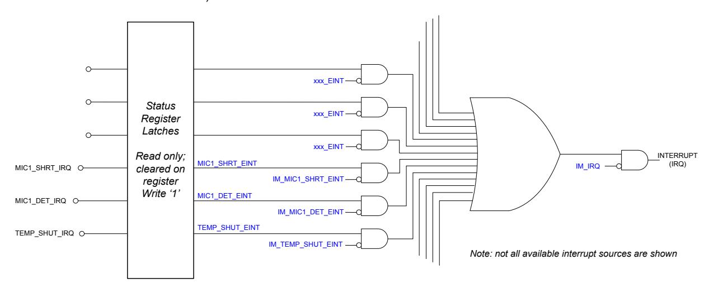

Figure 43 Interrupt Controller

| REGISTER ADDRESS | BIT | LABEL     | DEFAULT | DESCRIPTION                          |
|---------------------|-----|-----------|---------|--------------------------------------|
| R1840               | 10  | GP11_EINT | 0       | GPIO11 Interrupt                     |
| (0730h)             |     |           |         | (Rising and falling edge triggered)  |
| Interrupt           |     |           |         | Note: Cleared when a '1' is written. |
| Status 1            | 9   | GP10_EINT | 0       | GPIO10 Interrupt                     |
|                     |     |           |         | (Rising and falling edge triggered)  |
|                     |     |           |         | Note: Cleared when a '1' is written. |
|                     | 8   | GP9_EINT  | 0       | GPIO9 Interrupt                      |
|                     |     |           |         | (Rising and falling edge triggered)  |
|                     |     |           |         | Note: Cleared when a '1' is written. |
|                     | 7   | GP8_EINT  | 0       | GPIO8 Interrupt                      |
|                     |     |           |         | (Rising and falling edge triggered)  |
|                     |     |           |         | Note: Cleared when a '1' is written. |
|                     | 6   | GP7_EINT  | 0       | GPIO7 Interrupt                      |
|                     |     |           |         | (Rising and falling edge triggered)  |
|                     |     |           |         | Note: Cleared when a '1' is written. |
|                     | 5   | GP6_EINT  | 0       | GPIO6 Interrupt                      |
|                     |     |           |         | (Rising and falling edge triggered)  |
|                     |     |           |         | Note: Cleared when a '1' is written. |
|                     | 4   | GP5_EINT  | 0       | GPIO5 Interrupt                      |
|                     |     |           |         | (Rising and falling edge triggered)  |
|                     |     |           |         | Note: Cleared when a '1' is written. |
|                     | 3   | GP4_EINT  | 0       | GPIO4 Interrupt                      |
|                     |     |           |         | (Rising and falling edge triggered)  |
|                     |     |           |         | Note: Cleared when a '1' is written. |
|                     | 2   | GP3_EINT  | 0       | GPIO3 Interrupt                      |
|                     |     |           |         | (Rising and falling edge triggered)  |
|                     |     |           |         | Note: Cleared when a '1' is written. |
|                     | 1   | GP2_EINT  | 0       | GPIO2 Interrupt                      |
|                     |     |           |         | (Rising and falling edge triggered)  |
|                     |     |           |         | Note: Cleared when a '1' is written. |
|                     | 0   | GP1_EINT  | 0       | GPIO1 Interrupt                      |
|                     |     |           |         | (Rising and falling edge triggered)  |
|                     |     |           |         | Note: Cleared when a '1' is written. |

| REGISTER ADDRESS | BIT | LABEL             | DEFAULT | DESCRIPTION                            |
|---------------------|-----|-------------------|---------|----------------------------------------|
| R1841               | 15  | TEMP_WAR          | 0       | Temperature Warning Interrupt          |
| (0731h)             |     | N_EINT            |         | (Rising and falling edge triggered)    |
| Interrupt           |     |                   |         | Note: Cleared when a '1' is written.   |
| Status 2            | 14  | DCS_DONE          | 0       | DC Servo Interrupt                     |
|                     |     | _EINT             |         | (Rising edge triggered)                |
|                     |     |                   |         | Note: Cleared when a '1' is written.   |
|                     | 13  | WSEQ_DO           | 0       | Write Sequencer Interrupt              |
|                     |     | NE_EINT           |         | (Rising edge triggered)                |
|                     |     |                   |         | Note: Cleared when a '1' is written.   |
|                     | 12  | FIFOS_ERR         | 0       | Digital Core FIFO Error Interrupt      |
|                     |     | _EINT             |         | (Rising edge triggered)                |
|                     |     |                   |         | Note: Cleared when a '1' is written.   |
|                     | 11  | AIF2DRC_SI        | 0       | AIF2 DRC Activity Detect Interrupt     |
|                     |     | G_DET_EIN         |         | (Rising edge triggered)                |
|                     |     | T                 |         | Note: Cleared when a '1' is written.   |
|                     | 10  | AIF1DRC2_         | 0       | AIF1 DRC2 (Timeslot 1) Activity Detect |
|                     |     | SIG_DET_EI        |         | Interrupt                              |
|                     |     | NT                |         | (Rising edge triggered)                |
|                     |     |                   |         | Note: Cleared when a '1' is written.   |
|                     | 9   | AIF1DRC1_         | 0       | AIF1 DRC1 (Timeslot 0) Activity Detect |
|                     |     | SIG_DET_EI        |         | Interrupt                              |
|                     |     | NT                |         | (Rising edge triggered)                |
|                     |     |                   |         | Note: Cleared when a '1' is written.   |
|                     | 8   | SRC2_LOC          | 0       | SRC2 Lock Interrupt                    |
|                     |     | K_EINT            |         | (Rising and falling edge triggered)    |
|                     |     |                   |         | Note: Cleared when a '1' is written.   |
|                     | 7   | SRC1_LOC          | 0       | SRC1 Lock Interrupt                    |
|                     |     | K_EINT            |         | (Rising and falling edge triggered)    |
|                     |     |                   |         | Note: Cleared when a '1' is written.   |
|                     | 6   | FLL2_LOCK         | 0       | FLL2 Lock Interrupt                    |
|                     |     | _EINT             |         | (Rising and falling edge triggered)    |
|                     |     |                   |         | Note: Cleared when a '1' is written.   |
|                     | 5   | FLL1_LOCK         | 0       | FLL1 Lock Interrupt                    |
|                     |     | _EINT             |         | (Rising and falling edge triggered)    |
|                     |     |                   |         | Note: Cleared when a '1' is written.   |
|                     | 4   | MIC2_SHRT         | 0       | MICBIAS2 Short Circuit Interrupt       |
|                     |     | _EINT             |         | (Rising and falling edge triggered)    |
|                     |     |                   |         | Note: Cleared when a '1' is written.   |
|                     | 3   | MIC2_DET_         | 0       | MICBIAS2 Current Detect Interrupt      |
|                     |     | EINT              |         | (Rising and falling edge triggered)    |
|                     |     |                   |         | Note: Cleared when a '1' is written.   |
|                     | 2   | MIC1_SHRT         | 0       | MICBIAS1 Short Circuit Interrupt       |
|                     |     | _EINT             |         | (Rising and falling edge triggered)    |
|                     |     |                   |         | Note: Cleared when a '1' is written.   |
|                     |     |                   |         |                                        |
|                     | 1   | MIC1_DET_ EINT | 0       | MICBIAS1 Current Detect Interrupt      |
|                     |     |                   |         | (Rising and falling edge triggered)    |
|                     |     |                   |         | Note: Cleared when a '1' is written.   |
|                     | 0   | TEMP_SHU          | 0       | Temperature Shutdown Interrupt         |
|                     |     | T_EINT            |         | (Rising and falling edge triggered)    |
|                     |     |                   |         | Note: Cleared when a '1' is written.   |

| REGISTER ADDRESS | BIT | LABEL      | DEFAULT | DESCRIPTION                                 |
|---------------------|-----|------------|---------|---------------------------------------------|
| R1842               | 15  | TEMP_WAR   | 0       | Temperature Warning status                  |
| (0732h)             |     | N_STS      |         | 0 = Temperature is below warning level      |
| Interrupt Raw       |     |            |         | 1 = Temperature is above warning level      |
| Status 2            | 14  | DCS_DONE   | 0       | DC Servo status                             |
|                     |     | _STS       |         | 0 = DC Servo not complete                   |
|                     |     |            |         | 1 = DC Servo complete                       |
|                     | 13  | WSEQ_DO    | 0       | Write Sequencer status                      |
|                     |     | NE_STS     |         | 0 = Sequencer Busy (sequence in progress)   |
|                     |     |            |         | 1 = Sequencer Idle                          |
|                     | 12  | FIFOS_ERR  | 0       | Digital Core FIFO Error status              |
|                     |     | _STS       |         | 0 = Normal operation                        |
|                     |     |            |         | 1 = FIFO Error                              |
|                     | 11  | AIF2DRC_SI | 0       | AIF2 DRC Signal Detect status               |
|                     |     | G_DET_ST   |         | 0 = Signal threshold not exceeded           |
|                     |     | S          |         | 1 = Signal threshold exceeded               |
|                     | 10  | AIF1DRC2_  | 0       | AIF1 DRC2 (Timeslot 1) Signal Detect status |
|                     |     | SIG_DET_S  |         | 0 = Signal threshold not exceeded           |
|                     |     | TS         |         | 1 = Signal threshold exceeded               |
|                     | 9   | AIF1DRC1_  | 0       | AIF1 DRC1 (Timeslot 0) Signal Detect status |
|                     |     | SIG_DET_S  |         | 0 = Signal threshold not exceeded           |
|                     |     | TS         |         | 1 = Signal threshold exceeded               |
|                     | 8   | SRC2_LOC   | 0       | SRC2 Lock status                            |
|                     |     | K_STS      |         | 0 = Not locked                              |
|                     |     |            |         | 1 = Locked                                  |
|                     | 7   | SRC1_LOC   | 0       | SRC1 Lock status                            |
|                     |     | K_STS      |         | 0 = Not locked                              |
|                     |     |            |         | 1 = Locked                                  |
|                     | 6   | FLL2_LOCK  | 0       | FLL2 Lock status                            |
|                     |     | _STS       |         | 0 = Not locked                              |
|                     |     |            |         | 1 = Locked                                  |
|                     | 5   | FLL1_LOCK  | 0       | FLL1 Lock status                            |
|                     |     | _STS       |         | 0 = Not locked                              |
|                     |     |            |         | 1 = Locked                                  |
|                     | 4   | MIC2_SHRT  | 0       | MICBIAS2 Short Circuit status               |
|                     |     | _STS       |         | 0 = Short Circuit threshold not exceeded    |
|                     |     |            |         | 1 = Short Circuit threshold exceeded        |
|                     | 3   | MIC2_DET_  | 0       | MICBIAS2 Current Detect status              |
|                     |     | STS        |         | 0 = Current detect threshold not exceeded   |
|                     |     |            |         | 1 = Current detect threshold exceeded       |
|                     | 2   | MIC1_SHRT  | 0       | MICBIAS1 Short Circuit status               |
|                     |     | _STS       |         | 0 = Short Circuit threshold not exceeded    |
|                     |     |            |         | 1 = Short Circuit threshold exceeded        |
|                     | 1   | MIC1_DET_  | 0       | MICBIAS1 Current Detect status              |
|                     |     | STS        |         | 0 = Current detect threshold not exceeded   |
|                     |     |            |         | 1 = Current detect threshold exceeded       |
|                     | 0   | TEMP_SHU   | 0       | Temperature Shutdown status                 |
|                     |     | T_STS      |         | 0 = Temperature is below shutdown level     |
|                     |     |            |         | 1 = Temperature is above shutdown level     |
|                     |     |            |         |                                             |

| REGISTER ADDRESS | BIT | LABEL      | DEFAULT | DESCRIPTION                |
|---------------------|-----|------------|---------|----------------------------|
| R1848               | 10  | IM_GP11_EI | 1       | GPIO11 Interrupt mask.     |
| (0738h)             |     | NT         |         | 0 = Do not mask interrupt. |
| Interrupt           |     |            |         | 1 = Mask interrupt.        |
| Status 1            | 9   | IM_GP10_EI | 1       | GPIO10 Interrupt mask.     |
| Mask                |     | NT         |         | 0 = Do not mask interrupt. |
|                     |     |            |         | 1 = Mask interrupt.        |
|                     | 8   | IM_GP9_EI  | 1       | GPIO9 Interrupt mask.      |
|                     |     | NT         |         | 0 = Do not mask interrupt. |
|                     |     |            |         | 1 = Mask interrupt.        |
|                     | 7   | IM_GP8_EI  | 1       | GPIO8 Interrupt mask.      |
|                     |     | NT         |         | 0 = Do not mask interrupt. |
|                     |     |            |         | 1 = Mask interrupt.        |
|                     | 6   | IM_GP7_EI  | 1       | GPIO7 Interrupt mask.      |
|                     |     | NT         |         | 0 = Do not mask interrupt. |
|                     |     |            |         | 1 = Mask interrupt.        |
|                     | 5   | IM_GP6_EI  | 1       | GPIO6 Interrupt mask.      |
|                     |     | NT         |         | 0 = Do not mask interrupt. |
|                     |     |            |         | 1 = Mask interrupt.        |
|                     | 4   | IM_GP5_EI  | 1       | GPIO5 Interrupt mask.      |
|                     |     | NT         |         | 0 = Do not mask interrupt. |
|                     |     |            |         | 1 = Mask interrupt.        |
|                     | 3   | IM_GP4_EI  | 1       | GPIO4 Interrupt mask.      |
|                     |     | NT         |         | 0 = Do not mask interrupt. |
|                     |     |            |         | 1 = Mask interrupt.        |
|                     | 2   | IM_GP3_EI  | 1       | GPIO3 Interrupt mask.      |
|                     |     | NT         |         | 0 = Do not mask interrupt. |
|                     |     |            |         | 1 = Mask interrupt.        |
|                     | 1   | IM_GP2_EI  | 1       | GPIO2 Interrupt mask.      |
|                     |     | NT         |         | 0 = Do not mask interrupt. |
|                     |     |            |         | 1 = Mask interrupt.        |
|                     | 0   | IM_GP1_EI  | 1       | GPIO1 Interrupt mask.      |
|                     |     | NT         |         | 0 = Do not mask interrupt. |
|                     |     |            |         | 1 = Mask interrupt.        |

| REGISTER ADDRESS | BIT | LABEL                 | DEFAULT | DESCRIPTION                              |
|---------------------|-----|-----------------------|---------|------------------------------------------|
| R1849               | 15  | IM_TEMP_              | 1       | Temperature Warning Interrupt mask.      |
| (0739h)             |     | WARN_EIN              |         | 0 = Do not mask interrupt.               |
| Interrupt           |     | T                     |         | 1 = Mask interrupt.                      |
| Status 2 Mask    | 14  | IM_DCS_D              | 1       | DC Servo Interrupt mask.                 |
|                     |     | ONE_EINT              |         | 0 = Do not mask interrupt.               |
|                     |     |                       |         | 1 = Mask interrupt.                      |
|                     | 13  | IM_WSEQ_              | 1       | Write Sequencer Interrupt mask.          |
|                     |     | DONE_EINT             |         | 0 = Do not mask interrupt.               |
|                     |     |                       |         | 1 = Mask interrupt.                      |
|                     | 12  | IM_FIFOS_             | 1       | Digital Core FIFO Error Interrupt mask.  |
|                     |     | ERR_EINT              |         | 0 = Do not mask interrupt.               |
|                     |     |                       |         | 1 = Mask interrupt.                      |
|                     | 11  | IM_AIF2DR             | 1       | AIF2 DRC Activity Detect Interrupt mask. |
|                     |     | C_SIG_DET             |         | 0 = Do not mask interrupt.               |
|                     |     | _EINT                 |         | 1 = Mask interrupt.                      |
|                     | 10  | IM_AIF1DR             | 1       | AIF1 DRC2 (Timeslot 1) Activity Detect   |
|                     |     | C2_SIG_DE             |         | Interrupt mask.                          |
|                     |     | T_EINT                |         | 0 = Do not mask interrupt.               |
|                     |     |                       |         | 1 = Mask interrupt.                      |
|                     | 9   | IM_AIF1DR             | 1       | AIF1 DRC1 (Timeslot 0) Activity Detect   |
|                     |     | C1_SIG_DE             |         | Interrupt mask.                          |
|                     |     | T_EINT                |         | 0 = Do not mask interrupt.               |
|                     |     |                       |         | 1 = Mask interrupt.                      |
|                     | 8   | IM_SRC2_L             | 1       | SRC2 Lock Interrupt mask.                |
|                     |     | OCK_EINT              |         | 0 = Do not mask interrupt.               |
|                     |     |                       |         | 1 = Mask interrupt.                      |
|                     | 7   | IM_SRC1_L             | 1       | SRC1 Lock Interrupt mask.                |
|                     |     | OCK_EINT              |         | 0 = Do not mask interrupt.               |
|                     |     |                       |         | 1 = Mask interrupt.                      |
|                     | 6   | IM_FLL2_L             | 1       | FLL2 Lock Interrupt mask.                |
|                     |     | OCK_EINT              |         | 0 = Do not mask interrupt.               |
|                     |     |                       |         | 1 = Mask interrupt.                      |
|                     | 5   | IM_FLL1_L             | 1       | FLL1 Lock Interrupt mask.                |
|                     |     | OCK_EINT              |         | 0 = Do not mask interrupt.               |
|                     |     |                       |         | 1 = Mask interrupt.                      |
|                     | 4   |                       |         | MICBIAS2 Short Circuit Interrupt mask.   |
|                     |     | IM_MIC2_S HRT_EINT | 1       | 0 = Do not mask interrupt.               |
|                     |     |                       |         | 1 = Mask interrupt.                      |
|                     |     |                       |         |                                          |
|                     | 3   | IM_MIC2_D ET_EINT  | 1       | MICBIAS2 Current Interrupt mask.         |
|                     |     |                       |         | 0 = Do not mask interrupt.               |
|                     |     |                       |         | 1 = Mask interrupt.                      |
|                     | 2   | IM_MIC1_S HRT_EINT | 1       | MICBIAS1 Short Circuit Interrupt mask.   |
|                     |     |                       |         | 0 = Do not mask interrupt.               |
|                     |     |                       |         | 1 = Mask interrupt.                      |
|                     | 1   | IM_MIC1_D             | 1       | MICBIAS1 Current Interrupt mask.         |
|                     |     | ET_EINT               |         | 0 = Do not mask interrupt.               |
|                     |     |                       |         | 1 = Mask interrupt.                      |
|                     | 0   | IM_TEMP_S             | 1       | Temperature Shutdown Interrupt mask.     |
|                     |     | HUT_EINT              |         | 0 = Do not mask interrupt.               |
|                     |     |                       |         | 1 = Mask interrupt.                      |

| REGISTER ADDRESS  | BIT | LABEL     | DEFAULT | DESCRIPTION                       |
|----------------------|-----|-----------|---------|-----------------------------------|
| R1856                | 0   | IM_IRQ    | 0       | IRQ Output mask.                  |
| (0740h)              |     |           |         | 0 = Do not mask interrupt.        |
| Interrupt Control |     |           |         | 1 = Mask interrupt.               |
| R1864                | 5   | TEMP_WAR  | 1       | Temperature Warning de-bounce     |
| (0748h)              |     | N_DB      |         | 0 = Disabled                      |
| IRQ                  |     |           |         | 1 = Enabled                       |
| Debounce             | 4   | MIC2_SHRT | 1       | MICBIAS2 Short Circuit de-bounce  |
|                      |     | _DB       |         | 0 = Disabled                      |
|                      |     |           |         | 1 = Enabled                       |
|                      | 3   | MIC2_DET_ | 1       | MICBIAS2 Current Detect de-bounce |
|                      |     | DB        |         | 0 = Disabled                      |
|                      |     |           |         | 1 = Enabled                       |
|                      | 2   | MIC1_SHRT | 1       | MICBIAS1 Short Circuit de-bounce  |
|                      |     | _DB       |         | 0 = Disabled                      |
|                      |     |           |         | 1 = Enabled                       |
|                      | 1   | MIC1_DET_ | 1       | MICBIAS1 Current Detect de-bounce |
|                      |     | DB        |         | 0 = Disabled                      |
|                      |     |           |         | 1 = Enabled                       |
|                      | 0   | TEMP_SHU  | 1       | Temperature Shutdown de-bounce    |
|                      |     | T_DB      |         | 0 = Disabled                      |
|                      |     |           |         | 1 = Enabled                       |

**Table 86 Interrupt Configuration**

# **DIGITAL AUDIO INTERFACE**

The WM8994 provides digital audio interfaces for inputting DAC data and outputting ADC or Digital Microphone data. Flexible routing options also allow digital audio to be switched or mixed between interfaces without involving any DAC or ADC.

The WM8994 provides two full audio interfaces, AIF1 and AIF2. A third interface, AIF3, is partially supported, using multiplexers to re-configure alternate connections to AIF1 or AIF2.

The digital audio interfaces provide flexible connectivity with multiple processors (eg. Applications processor, Baseband processor and Wireless transceiver). A typical configuration is illustrated in [Figure 44.](#page-124-0)

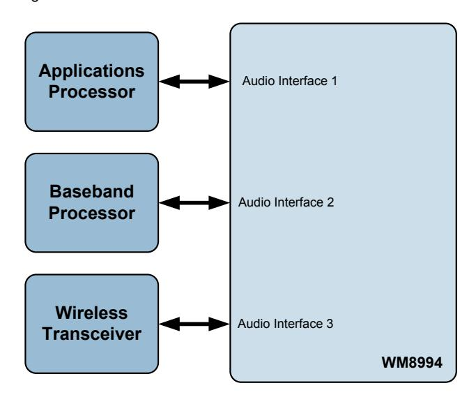

**Figure 44 Typical AIF Connections**

In the general case, the digital audio interface uses four pins:

ADCDAT: ADC data output

DACDAT: DAC data input

LRCLK: Left/Right data alignment clock

BCLK: Bit clock, for synchronisation

In master interface mode, the clock signals BCLK and LRCLK are outputs from the WM8994. In slave mode, these signals are inputs, as illustrated below.

As an option, a GPIO pin can be configured as the Left/Right clock for the ADC. In this case, the LRCLK pin is dedicated to the DAC, allowing the ADC and DAC to be clocked independently.

Four different audio data formats are supported each digital audio interface:

- Left justified
- Right justified
- I 2S
- DSP mode

All four of these modes are MSB first. They are described in the following sections. Refer to the "Signal Timing Requirements" section for timing information.

Processor

Time Division Multiplexing (TDM) is available in all four data format modes. On AIF1, the WM8994 can transmit and receive data on two stereo pairs of timeslots simultaneously. On AIF2, the applicable timeslot pair is selectable using register control bits.

Two variants of DSP mode are supported - 'Mode A' and 'Mode B'. Mono operation can be selected on either audio interface in both DSP modes. PCM operation is supported using the DSP mode.

#### MASTER AND SLAVE MODE OPERATION

The WM8994 digital audio interfaces can operate as a master or slave as shown in Figure 45 and Figure 46. The associated control bits are described in "Digital Audio Interface Control".

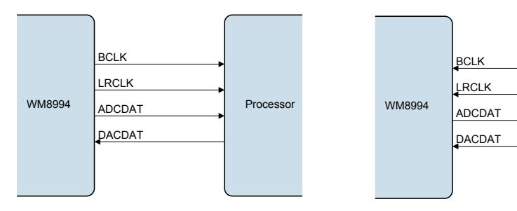

Figure 45 Master Mode

Figure 46 Slave Mode

#### **OPERATION WITH TDM**

Time division multiplexing (TDM) allows multiple devices to transfer data simultaneously on the same bus. The WM8994 ADCs and DACs support TDM in master and slave modes for all data formats and word lengths. TDM is enabled and configured using register bits defined in the "Digital Audio Interface Control" section.

Figure 47 TDM with WM8994 as Master

Figure 48 TDM with Other CODEC as Master

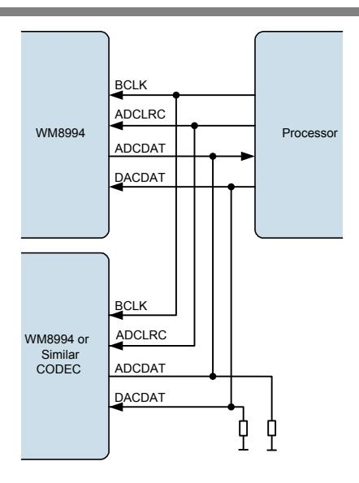

Figure 49 TDM with Processor as Master

**Note:** The WM8994 is a 24-bit device. If the user operates the WM8994 in 32-bit mode then the 8 LSBs will be ignored on the receiving side and not driven on the transmitting side. It is therefore recommended to add a pull-down resistor if necessary to the DACDAT line and the ADCDAT line in TDM mode.

# **AUDIO DATA FORMATS (NORMAL MODE)**

The audio data modes supported by the WM8994 are described below. Note that the polarity of the BCLK and LRCLK signals can be inverted if required; the following descriptions all assume the default, non-inverted polarity of these signals.

In Right Justified mode, the LSB is available on the last rising edge of BCLK before a LRCLK transition. All other bits are transmitted before (MSB first). Depending on word length, BCLK frequency and sample rate, there may be unused BCLK cycles after each LRCLK transition.

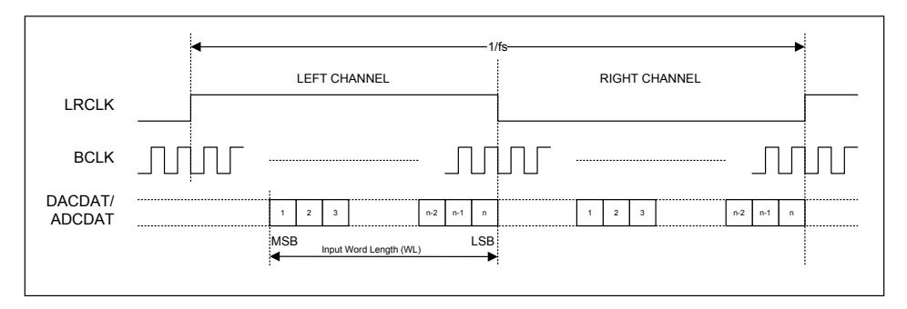

Figure 50 Right Justified Audio Interface (assuming n-bit word length)

In Left Justified mode, the MSB is available on the first rising edge of BCLK following a LRCLK transition. The other bits up to the LSB are then transmitted in order. Depending on word length, BCLK frequency and sample rate, there may be unused BCLK cycles before each LRCLK transition.

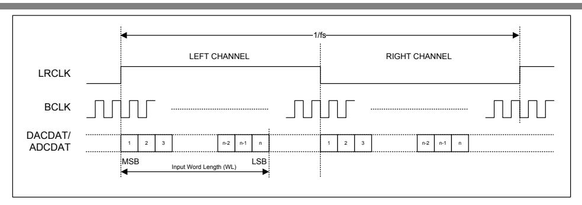

Figure 51 Left Justified Audio Interface (assuming n-bit word length)

In  $l^2S$  mode, the MSB is available on the second rising edge of BCLK following a LRCLK transition. The other bits up to the LSB are then transmitted in order. Depending on word length, BCLK frequency and sample rate, there may be unused BCLK cycles between the LSB of one sample and the MSB of the next.

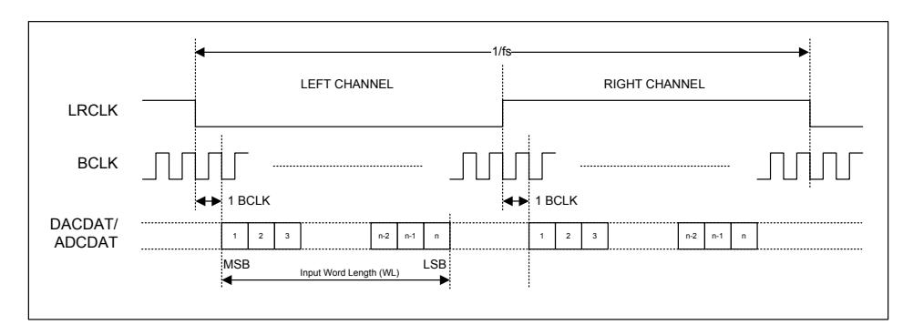

Figure 52 I2S Justified Audio Interface (assuming n-bit word length)

In DSP mode, the left channel MSB is available on either the 1st (mode B) or 2nd (mode A) rising edge of BCLK (selectable by AIF\_LRCLK\_INV) following a rising edge of LRCLK. Right channel data immediately follows left channel data. Depending on word length, BCLK frequency and sample rate, there may be unused BCLK cycles between the LSB of the right channel data and the next sample.

In device master mode, the LRCLK output will resemble the frame pulse shown in Figure 53 and Figure 54. In device slave mode, Figure 55 and Figure 56, it is possible to use any length of frame pulse less than 1/fs, providing the falling edge of the frame pulse occurs greater than one BCLK period before the rising edge of the next frame pulse.

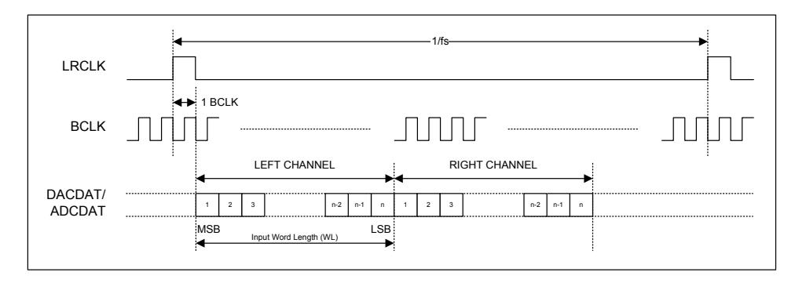

Figure 53 DSP Mode Audio Interface (mode A, AIF\_LRCLK\_INV=0, Master)

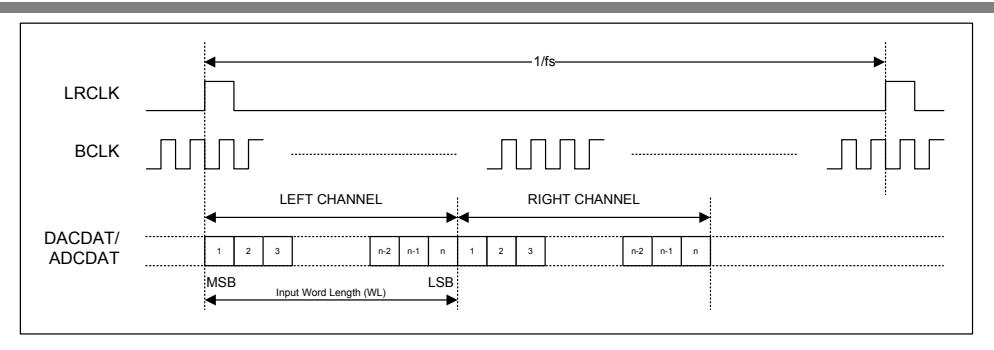

**Figure 54 DSP Mode Audio Interface (mode B, AIF\_LRCLK\_INV=1, Master)**

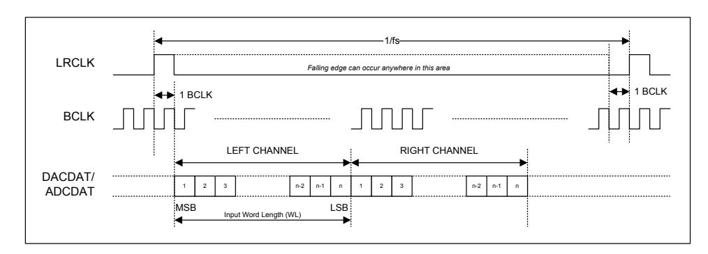

**Figure 55 DSP Mode Audio Interface (mode A, AIF\_LRCLK\_INV=0, Slave)**

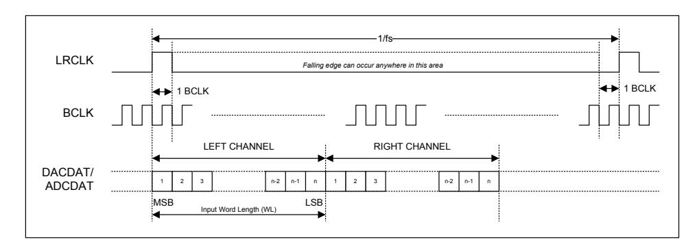

**Figure 56 DSP Mode Audio Interface (mode B, AIF\_LRCLK\_INV=1, Slave)**

Mono mode operation is available in DSP interface mode. When Mono mode is enabled, the audio data is transmitted or received starting on either the 1st (mode B) or 2nd (mode A) rising edge of BCLK following a rising edge of LRCLK.

PCM operation is supported in DSP interface mode. WM8994 ADC data that is output on the Left Channel will be read as mono PCM data by the receiving equipment. Mono PCM data received by the WM8994 will be treated as Left Channel data. This data may be routed to the Left/Right DACs using the control fields described in the ["Digital Mixing"](#page-22-0) and ["Digital Audio Interface Control"](#page-131-0) sections.

#### **AUDIO DATA FORMATS (TDM MODE)**

TDM is supported in master and slave modes. All audio interface data formats support time division multiplexing (TDM) for ADC and DAC data.

When more than one pair of ADC or DAC data channels is enabled on AIF1, the WM8994 will transmit and receive data in both Slot 0 and Slot 1.

In the case of AIF2, the ADC or DAT data can be transmitted or received in either timeslot; the required timeslot is selected using register control bits when TDM is enabled.

When TDM is enabled, the ADCDAT pin will be tri-stated immediately before and immediately after data transmission, to allow another ADC device to drive this signal line for the remainder of the sample period. Note that it is important that two ADC devices do not attempt to drive the data pin simultaneously. A short circuit may occur if the transmission time of the two ADC devices overlap with each other. See "Audio Interface Timing" for details of the ADCDAT output relative to BCLK signal. Note that it is possible to ensure a gap exists between transmissions by setting the transmitted word length to a value higher than the actual length of the data. For example, if 32-bit word length is selected where only 24-bit data is available, then the WM8994 interface will tri-state after transmission of the 24-bit data, ensuring a gap after the WM8994 TDM slot.

On AIF1, TDM can be used to transmit or receive up to four signal paths. Each enabled signal path is transmitted (on ADCDAT) or received (on DACDAT) sequentially. If one or more of the signal paths is disabled, then the position of remaining data blocks within the LRCLK frame may differ from those illustrated in Figure 57 to Figure 61, as the affected channel(s) will revert to the 'normal' (non-TDM) format. When the AIF1ADC\_TDM register is set, then the ADCDAT1 output is tri-stated when not outputting data.

On AIF2, the TDM format is enabled by register control (AIF2ADC\_TDM and AIF2DAC\_TDM for the output and input paths respectively). When TDM is enabled on AIF2, the data formats shown in Figure 57 to Figure 61 are always selected, and the WM8994 transmits or receives data in one of the two available timeslots; the ADCDAT2 output is tri-stated when not outputting data.

In all cases, the BCLK frequency must be high enough to allow data from the relevant time slots to be transferred. The relative timing of Slot 0 and Slot 1 depends upon the selected data format; the TDM timing for four input or output channels is shown in Figure 57 to Figure 61.

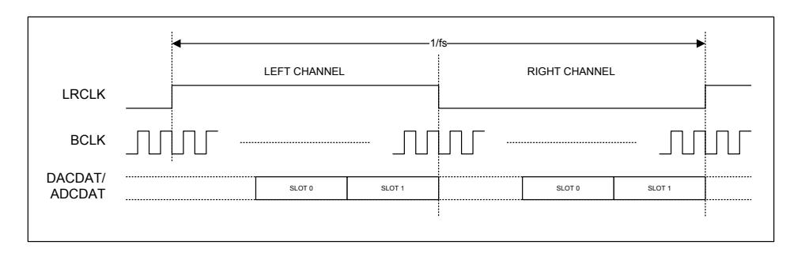

Figure 57 TDM in Right-Justified Mode

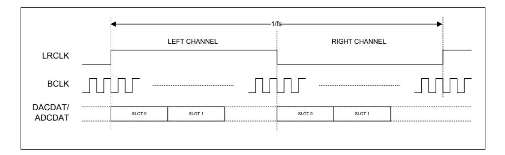

Figure 58 TDM in Left-Justified Mode

Figure 59 TDM in I2S Mode

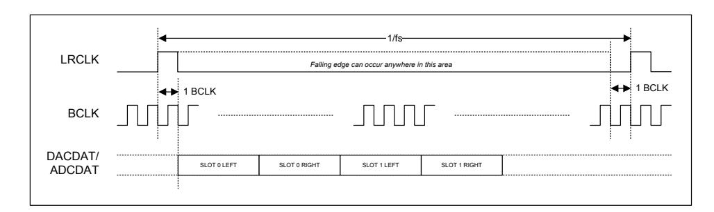

Figure 60 TDM in DSP Mode A

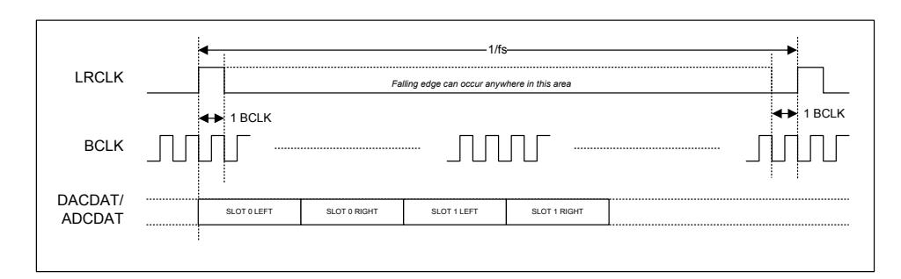

Figure 61 TDM in DSP Mode B

# **DIGITAL AUDIO INTERFACE CONTROL**

This section describes the configuration of the WM8994 digital audio interface paths.

Interfaces AIF1 and AIF2 can be configured as Master or Slave, or can be tri-stated. Each input and output signal path can be independently enabled or disabled. AIF output (digital record) and AIF input (digital playback) paths can use a common Left/Right clock, or can use separate clocks for mixed sample rates.

Interfaces AIF1 and AIF2 each support flexible formats, word-length, TDM configuration, channel swapping and input path digital boost functions. 8-bit companding modes and digital loopback is also possible.

A third interface, AIF3, is partially supported, using multiplexers to re-configure alternate connections to AIF1 or AIF2. Note that AIF3 operates in Master mode only.

#### **AIF1 - MASTER / SLAVE AND TRI-STATE CONTROL**

The Digital Audio Interface AIF1 can operate in Master or Slave modes, selected by AIF1\_MSTR. In Master mode, the BCLK1 and LRCLK1 signals are generated by the WM8994 when one or more AIF1 channels is enabled.

When AIF1\_LRCLK\_FRC or AIF1\_CLK\_FRC is set in Master mode, then LRCLK1 and ADCLRCLK1 are output at all times, including when none of the AIF1 audio channels is enabled. Note that LRCLK1 and ADCLRCLK1 are derived from BCLK1, and either an internal or external BCLK1 signal must also be present to generate LRCLK1 or ADCLRCLK1.

When AIF1\_CLK\_FRC is set in Master mode, then BCLK1 is output at all times, including when none of the AIF1 audio channels is enabled.

The AIF1 interface can be tri-stated by setting the AIF1\_TRI register. When this bit is set, then all of the AIF1 outputs are un-driven (high-impedance). Note that the ADCLRCLK1/GPIO1 pin is a configurable pin which may take different functions independent of AIF1. The AIF1\_TRI register only controls the ADCLRCLK1/GPIO1 pin when its function is set to ADCLRCLK1. See ["General Purpose](#page-105-0)  [Input/Output"](#page-105-0) to configure the GPIO1 pin.

| REGISTER ADDRESS | BIT | LABEL      | DEFAULT | DESCRIPTION                                                      |
|---------------------|-----|------------|---------|------------------------------------------------------------------|
| R770 (0302h)        | 15  | AIF1_TRI   | 0       | AIF1 Audio Interface tri-state                                   |
| AIF1                |     |            |         | 0 = AIF1 pins operate normally                                   |
| Master/Slave        |     |            |         | 1 = Tri-state all AIF1 interface pins                            |
|                     |     |            |         | Note that the GPIO1 pin is controlled by this                    |
|                     |     |            |         | register only when configured as ADCLRCLK1.                   |
|                     | 14  | AIF1_MSTR  | 0       | AIF1 Audio Interface Master Mode Select                          |
|                     |     |            |         | 0 = Slave mode                                                   |
|                     |     |            |         | 1 = Master mode                                                  |
|                     | 13  | AIF1_CLK_F | 0       | Forces BCLK1, LRCLK1 and ADCLRCLK1 to                            |
|                     |     | RC         |         | be enabled when all AIF1 audio channels are disabled.         |
|                     |     |            |         | 0 = Normal                                                       |
|                     |     |            |         | 1 = BCLK1, LRCLK1 and ADCLRCLK1 always enabled in Master mode |
|                     | 12  | AIF1_LRCL  | 0       | Forces LRCLK1 and ADCLRCLK1 to be                                |
|                     |     | K_FRC      |         | enabled when all AIF1 audio channels are disabled.            |
|                     |     |            |         | 0 = Normal                                                       |
|                     |     |            |         | 1 = LRCLK1 and ADCLRCLK1 always                                  |
|                     |     |            |         | enabled in Master mode                                           |

**Table 87 AIF1 Master / Slave and Tri-state Control**

### **AIF1 - SIGNAL PATH ENABLE**

The AIF1 interface supports up to four input channels and up to four output channels. All enabled channels are transmitted (on ADCDAT) or received (on DACDAT) sequentially, using time division multiplexing (TDM).

Each of the available channels can be enabled or disabled using the register bits defined in [Table 88.](#page-132-0)

| REGISTER ADDRESS                      | BIT | LABEL             | DEFAULT | DESCRIPTION                                                                              |
|------------------------------------------|-----|-------------------|---------|------------------------------------------------------------------------------------------|
| R4 (0004h) Power Management (4) | 11  | AIF1ADC2L _ENA | 0       | Enable AIF1ADC2 (Left) output path (AIF1, Timeslot 1) 0 = Disabled 1 = Enabled  |
|                                          | 10  | AIF1ADC2R _ENA | 0       | Enable AIF1ADC2 (Right) output path (AIF1, Timeslot 1) 0 = Disabled 1 = Enabled |
|                                          | 9   | AIF1ADC1L _ENA | 0       | Enable AIF1ADC1 (Left) output path (AIF1, Timeslot 0) 0 = Disabled 1 = Enabled  |
|                                          | 8   | AIF1ADC1R _ENA | 0       | Enable AIF1ADC1 (Right) output path (AIF1, Timeslot 0) 0 = Disabled 1 = Enabled |
| R5 (0005h) Power Management (5) | 11  | AIF1DAC2L _ENA | 0       | Enable AIF1DAC2 (Left) input path (AIF1, Timeslot 1) 0 = Disabled 1 = Enabled   |
|                                          | 10  | AIF1DAC2R _ENA | 0       | Enable AIF1DAC2 (Right) input path (AIF1, Timeslot 1) 0 = Disabled 1 = Enabled  |
|                                          | 9   | AIF1DAC1L _ENA | 0       | Enable AIF1DAC1 (Left) input path (AIF1, Timeslot 0) 0 = Disabled 1 = Enabled   |
|                                          | 8   | AIF1DAC1R _ENA | 0       | Enable AIF1DAC1 (Right) input path (AIF1, Timeslot 0) 0 = Disabled 1 = Enabled  |

**Table 88 AIF1 Signal Path Enable**

# **AIF1 - BCLK AND LRCLK CONTROL**

The BCLK1 frequency is controlled relative to AIF1CLK by the AIF1\_BCLK\_DIV divider. See ["Clocking](#page-149-0)  [and Sample Rates"](#page-149-0) for details of the AIF1 clock, AIF1CLK.

The LRCLK1 frequency is controlled relative to BCLK1 by the AIF1DAC\_RATE divider.

In Master mode, the LRCLK1 output is generated by the WM8994 when any of the AIF1 channels is enabled. (Note that, when GPIO1 is configured as ADCLRCLK1, then only the AIF1 DAC channels will cause LRCLK1 to be output.)

In Slave mode, the LRCLK1 output is disabled by default to allow another digital audio interface to drive this pin. It is also possible to force the LRCLK1 signal to be output, using the AIF1DAC\_LRCLK\_DIR or AIF1ADC\_LRCLK\_DIR register bits, allowing mixed master and slave modes. (Note that, when GPIO1 is configured as ADCLRCLK1, then only the AIF1DAC\_LRCLK\_DIR bit will force the LRCLK1 signal.)

When the GPIO1 pin is configured as ADCLRCLK1, then the ADCLRCLK1 frequency is controlled relative to BCLK1 by the AIF1ADC\_RATE divider. In this case, the ADCLRCLK1 is dedicated to AIF1 output, and the LRCLK1 pin is dedicated to AIF1 input, allowing different sample rates to be supported in the two paths.

In Master mode, with GPIO1 pin configured as ADCLRCLK1, this output is enabled when any of the AIF1 ADC channels is enabled. The ADCLRCLK1 signal can also be enabled in Slave mode, using the AIF1ADC\_LRCLK\_DIR bit, allowing mixed master and slave modes.

When the GPIO1 pin is not configured as ADCLRCLK1, then the LRCLK1 signal applies to the ADC and DAC channels, at a rate set by AIF1DAC\_RATE.

See "General Purpose Input/Output" for the configuration of GPIO1. Note that, in Ultrasonic (4FS) mode, the GPIO1 pin must be configured as ADCLRCLK1.

The BCLK1 output can be inverted using the AIF1\_BCLK\_INV register bit. The LRCLK1 and ADCLRCLK1 output (when selected) can be inverted using the AIF1\_LRCLK\_INV register control.

Note that in Slave mode, when BCLK1 is an input, the AIF1\_BCLK\_INV register selects the polarity of the received BCLK1 signal. Under default conditions, DACDAT1 input is captured on the rising edge of BCLK1, as illustrated in Figure 5. When AIF1\_BCLK\_INV = 1, DACDAT1 input is captured on the falling edge of BCLK1.

The AIF1 clock generators are controlled as illustrated in Figure 62.

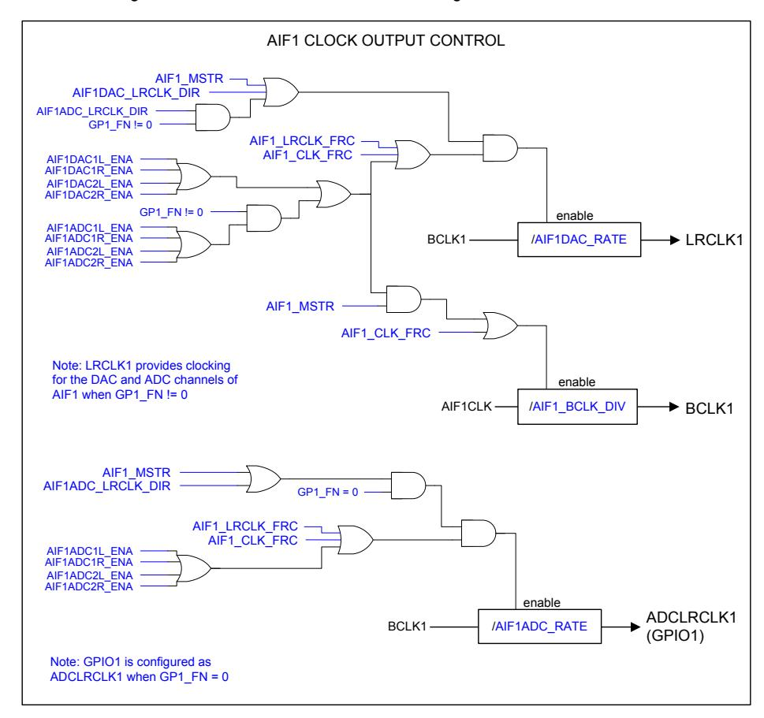

Figure 62 Audio Interface 1 - BCLK and LRCLK Control

| REGISTER ADDRESS                 | BIT  | LABEL                   | DEFAULT | DESCRIPTION                                                                                                                                                                                                                                                                                                                                                                                                                                                                                                                                                                     |
|-------------------------------------|------|-------------------------|---------|---------------------------------------------------------------------------------------------------------------------------------------------------------------------------------------------------------------------------------------------------------------------------------------------------------------------------------------------------------------------------------------------------------------------------------------------------------------------------------------------------------------------------------------------------------------------------------|
| R768 (0300h) AIF1 Control (1) | 8    | AIF1_BCLK _INV       | 0       | BCLK1 Invert 0 = BCLK1 not inverted 1 = BCLK1 inverted Note that AIF1_BCLK_INV selects the BCLK1 polarity in Master mode and in Slave mode.                                                                                                                                                                                                                                                                                                                                                                                                                         |
|                                     | 7    | AIF1_LRCL K_INV      | 0       | Right, left and I2S modes – LRCLK1 polarity 0 = normal LRCLK1 polarity 1 = invert LRCLK1 polarity Note that AIF1_LRCLK_INV selects the LRCLK1 polarity in Master mode and in Slave mode. DSP Mode – mode A/B select 0 = MSB is available on 2nd BCLK1 rising edge after LRCLK1 rising edge (mode A) 1 = MSB is available on 1st BCLK1 rising edge after LRCLK1 rising edge (mode B)                                                                                                                                                               |
| R771 (0303h) AIF1 BCLK           | 8:4  | AIF1_BCLK _DIV [4:0] | 00100   | BCLK1 Rate 00000 = AIF1CLK 00001 = AIF1CLK / 1.5 00010 = AIF1CLK / 2 00011 = AIF1CLK / 3 00100 = AIF1CLK / 4 00101 = AIF1CLK / 5 00110 = AIF1CLK / 6 00111 = AIF1CLK / 8 01000 = AIF1CLK / 11 01001 = AIF1CLK / 12 01010 = AIF1CLK / 16 01011 = AIF1CLK / 22 01100 = AIF1CLK / 24 01101 = AIF1CLK / 32 01110 = AIF1CLK / 44 01111 = AIF1CLK / 48 10000 = AIF1CLK / 64 10001 = AIF1CLK / 88 10010 = AIF1CLK / 96 10011 = AIF1CLK / 128 10100 = AIF1CLK / 176 10101 = AIF1CLK / 192 10110 - 11111 = Reserved |
| R772 (0304h) AIF1ADC LRCLK    | 11   | AIF1ADC_L RCLK_DIR   | 0       | Allows ADCLRCLK1 to be enabled in Slave mode 0 = Normal 1 = ADCLRCLK1 enabled in Slave mode                                                                                                                                                                                                                                                                                                                                                                                                                                                                            |
|                                     | 10:0 | AIF1ADC_R ATE [10:0] | 040h    | ADCLRCLK1 Rate ADCLRCLK1 clock output = BCLK1 / AIF1ADC_RATE Integer (LSB = 1) Valid from 82047                                                                                                                                                                                                                                                                                                                                                                                                                                                                     |

| REGISTER ADDRESS              | BIT  | LABEL                   | DEFAULT | DESCRIPTION                                                                                           |
|----------------------------------|------|-------------------------|---------|-------------------------------------------------------------------------------------------------------|
| R773 (0305h) AIF1DAC LRCLK | 11   | AIF1DAC_L RCLK_DIR   | 0       | Allows LRCLK1 to be enabled in Slave mode 0 = Normal 1 = LRCLK1 enabled in Slave mode           |
|                                  | 10:0 | AIF1DAC_R ATE [10:0] | 040h    | LRCLK1 Rate LRCLK1 clock output = BCLK1 / AIF1DAC_RATE Integer (LSB = 1) Valid from 82047 |

**Table 89 AIF1 BCLK and LRCLK Control**

#### **AIF1 - DIGITAL AUDIO DATA CONTROL**

The register bits controlling the audio data format, word length, left/right channel selection and TDM control for AIF1 are described i[n Table 90.](#page-136-0)

In DSP mode, the left channel MSB is available on either the 1st (mode B) or 2nd (mode A) rising edge of BCLK following a rising edge of LRCLK (assuming default BCLK polarity). This is selected using the AIF1\_LRCLK\_INV register bit, as described i[n Table 89.](#page-135-0)

A digital gain function is available at the audio interface input path to boost the DAC volume when a small signal is received on DACDAT1. This is controlled using the AIF1DAC\_BOOST register. To prevent clipping, this function should not be used when the boosted data is expected to be greater than 0dBFS.

| REGISTER ADDRESS | BIT | LABEL             | DEFAULT | DESCRIPTION                                   |
|---------------------|-----|-------------------|---------|-----------------------------------------------|
| R768 (0300h)        | 15  | AIF1ADCL_ SRC  | 0       | AIF1 Left Digital Audio interface source      |
| AIF1 Control        |     |                   |         | 0 = Left ADC data is output on left channel   |
| (1)                 |     |                   |         | 1 = Right ADC data is output on left channel  |
|                     | 14  | AIF1ADCR_ SRC  | 1       | AIF1 Right Digital Audio interface source     |
|                     |     |                   |         | 0 = Left ADC data is output on right channel  |
|                     |     |                   |         | 1 = Right ADC data is output on right channel |
|                     | 13  | AIF1ADC_T         | 0       | AIF1 transmit (ADC) TDM Control               |
|                     |     | DM                |         | 0 = ADCDAT1 drives logic '0' when not         |
|                     |     |                   |         | transmitting data                             |
|                     |     |                   |         | 1 = ADCDAT1 is tri-stated when not            |
|                     |     |                   |         | transmitting data                             |
|                     | 6:5 | AIF1_WL           | 10      | AIF1 Digital Audio Interface Word Length      |
|                     |     | [1:0]             |         | 00 = 16 bits                                  |
|                     |     |                   |         | 01 = 20 bits                                  |
|                     |     |                   |         | 10 = 24 bits                                  |
|                     |     |                   |         | 11 = 32 bits                                  |
|                     |     |                   |         | Note - 8-bit modes can be selected using the  |
|                     |     |                   |         | "Companding" control bits.                    |
|                     | 4:3 | AIF1_FMT [1:0] | 10      | AIF1 Digital Audio Interface Format           |
|                     |     |                   |         | 00 = Right justified                          |
|                     |     |                   |         | 01 = Left justified                           |
|                     |     |                   |         | 10 = I2S Format                               |
|                     |     |                   |         | 11 = DSP Mode                                 |

| REGISTER ADDRESS | BIT   | LABEL      | DEFAULT | DESCRIPTION                                 |
|---------------------|-------|------------|---------|---------------------------------------------|
| R769 (0301h)        | 15    | AIF1DACL_  | 0       | AIF1 Left Receive Data Source Select        |
| AIF1 Control        |       | SRC        |         | 0 = Left DAC receives left interface data   |
| (2)                 |       |            |         | 1 = Left DAC receives right interface data  |
|                     | 14    | AIF1DACR_  | 1       | AIF1 Right Receive Data Source Select       |
|                     |       | SRC        |         | 0 = Right DAC receives left interface data  |
|                     |       |            |         | 1 = Right DAC receives right interface data |
|                     | 11:10 | AIF1DAC_B  | 00      | AIF1 Input Path Boost                       |
|                     |       | OOST [1:0] |         | 00 = 0dB                                    |
|                     |       |            |         | 01 = +6dB (input must not exceed -6dBFS)    |
|                     |       |            |         | 10 = +12dB (input must not exceed -12dBFS)  |
|                     |       |            |         | 11 = +18dB (input must not exceed -18dBFS)  |
| R774 (0306h)        | 1     | AIF1DACL_  | 0       | AIF1 Left Receive Data Invert               |
| AIF1 DAC            |       | DAT_INV    |         | 0 = Not inverted                            |
| Data                |       |            |         | 1 = Inverted                                |
|                     | 0     | AIF1DACR_  | 0       | AIF1 Right Receive Data Invert              |
|                     |       | DAT_INV    |         | 0 = Not inverted                            |
|                     |       |            |         | 1 = Inverted                                |
| R775 (0307h)        | 1     | AIF1ADCL_  | 0       | AIF1 Left Transmit Data Invert              |
| AIF1 ADC            |       | DAT_INV    |         | 0 = Not inverted                            |
| Data                |       |            |         | 1 = Inverted                                |
|                     | 0     | AIF1ADCR_  | 0       | AIF1 Right Transmit Data Invert             |
|                     |       | DAT_INV    |         | 0 = Not inverted                            |
|                     |       |            |         | 1 = Inverted                                |

**Table 90 AIF1 Digital Audio Data Control**

### **AIF1 - MONO MODE**

AIF1 can be configured to operate in mono DSP mode by setting AIF1\_MONO = 1 as described in [Table 91.](#page-136-1) Note that mono mode is only supported in DSP mode, ie when AIF1\_FMT = 11.

In mono mode, the Left channel data or the Right channel data may be selected for output on ADCDAT1. The selected channel is determined by the AIF1ADC1L\_ENA and AIF1ADC1R\_ENA bits. (If both bits are set, then the Right channel data is selected.)

In mono mode, the DACDAT1 input can be enabled on the Left and/or Right signal paths using the AIF1DAC1L\_ENA and AIF1DAC1R\_ENA bits. The mono input can be enabled on both paths at the same time if required.

In mono mode, the number of BCLK cycles per LRCLK frame must be less than double the AIF1 word length. This requires AIF1DAC\_RATE to be less than double the value selected by the AIF1\_WL register. When the GPIO1 pin is configured as ADCLRCLK1, then AIF1ADC\_RATE must also be less than double the value selected by the AIF1\_WL register. See [Table 89](#page-135-0) for details of the AIF1DAC\_RATE and AIF1ADC\_RATE registers.

Note that AIF1 TDM mode and AIF1 Mono mode cannot be supported simultaneously.

| REGISTER ADDRESS | BIT | LABEL     | DEFAULT | DESCRIPTION                                                                                                                                         |
|---------------------|-----|-----------|---------|-----------------------------------------------------------------------------------------------------------------------------------------------------|
| R769 (0301h)        | 8   | AIF1_MONO | 0       | AIF1 DSP Mono Mode                                                                                                                                  |
| AIF1 Control        |     |           |         | 0 = Disabled                                                                                                                                        |
| (2)                 |     |           |         | 1 = Enabled                                                                                                                                         |
|                     |     |           |         | Note that Mono Mode is only supported when AIF1_FMT = 11. The number of BCLK cycles per LRCLK frame must be less the 2 x AIF1 Word Length. |

**Table 91 AIF1 Mono Mode Control**

### **AIF1 - COMPANDING**

The WM8994 supports A-law and -law companding on both transmit (ADC) and receive (DAC) sides of AIF1. This is configured using the register bits described in [Table 92.](#page-137-0)

| REGISTER ADDRESS | BIT | LABEL                | DEFAULT | DESCRIPTION                     |
|---------------------|-----|----------------------|---------|---------------------------------|
| R769 (0301h)        | 4   | AIF1DAC_C            | 0       | AIF1 Receive Companding Enable  |
| AIF1 Control        |     | OMP                  |         | 0 = Disabled                    |
| (2)                 |     |                      |         | 1 = Enabled                     |
|                     | 3   | AIF1DAC_C            | 0       | AIF1 Receive Companding Type    |
|                     |     | OMPMODE              |         | 0 = µ-law                       |
|                     |     |                      |         | 1 = A-law                       |
|                     | 2   | AIF1ADC_C            | 0       | AIF1 Transmit Companding Enable |
|                     |     | OMP                  |         | 0 = Disabled                    |
|                     |     |                      |         | 1 = Enabled                     |
|                     | 1   | AIF1ADC_C OMPMODE | 0       | AIF1 Transmit Companding Type   |
|                     |     |                      |         | 0 = µ-law                       |
|                     |     |                      |         | 1 = A-law                       |

**Table 92 AIF1 Companding**

Companding involves using a piecewise linear approximation of the following equations (as set out by ITU-T G.711 standard) for data compression:

-law (where =255 for the U.S. and Japan):

$$F(x) = \ln(1 + \mu|x|) / \ln(1 + \mu)$$
 } for  $-1 \le x \le 1$ 

A-law (where A=87.6 for Europe):

$$F(x) = A|x| / (1 + InA)$$
 } for  $x \le 1/A$   
 $F(x) = (1 + InA|x|) / (1 + InA)$  } for  $1/A \le x \le 1$ 

The companded data is also inverted as recommended by the G.711 standard (all 8 bits are inverted for -law, all even data bits are inverted for A-law). The data will be transmitted as the first 8 MSBs of data.

Companding converts 13 bits (-law) or 12 bits (A-law) to 8 bits using non-linear quantization. This provides greater precision for low amplitude signals than for high amplitude signals, resulting in a greater usable dynamic range than 8 bit linear quantization. The companded signal is an 8-bit word comprising sign (1 bit), exponent (3 bits) and mantissa (4 bits).

AIF1 8-bit mode is selected whenever AIF1DAC\_COMP=1 or AIF1ADC\_COMP=1. The use of 8-bit data allows samples to be passed using as few as 8 BCLK1 cycles per LRCLK1 frame. When using DSP mode B, 8-bit data words may be transferred consecutively every 8 BCLK1 cycles.

AIF1 8-bit mode (without Companding) may be enabled by setting AIF1DAC\_COMPMODE=1 or AIF1ADC\_COMPMODE=1, when AIF1DAC\_COMP=0 and AIF1ADC\_COMP=0.

| BIT7 | BIT[6:4] | BIT[3:0] |
|------|----------|----------|
| SIGN | EXPONENT | MANTISSA |

**Table 93 8-bit Companded Word Composition**

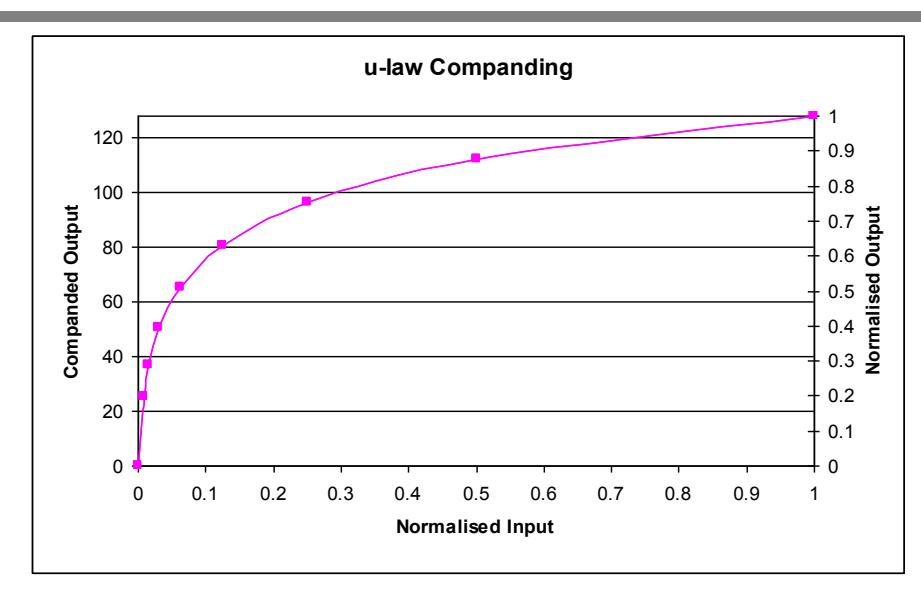

**Figure 63 µ-Law Companding**

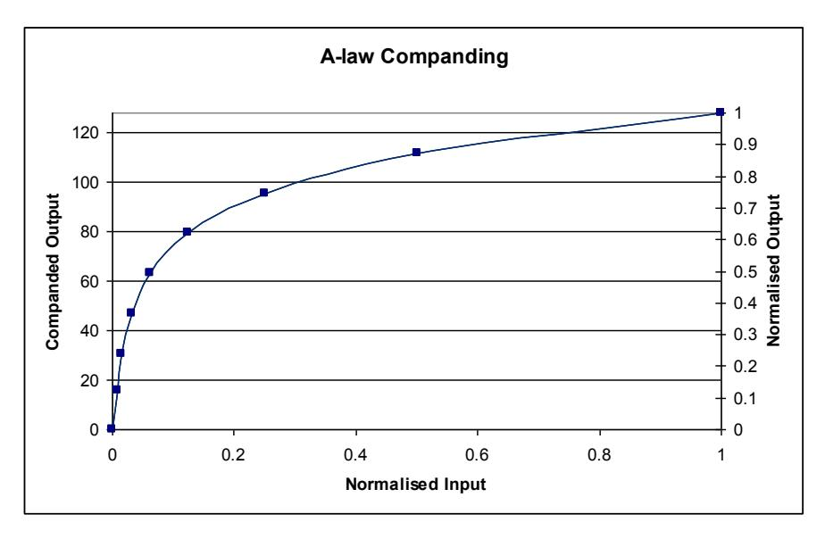

**Figure 64 A-Law Companding**

# **AIF1 - LOOPBACK**

The AIF1 interface can provide a Loopback option. When the AIF1\_LOOPBACK bit is set, then AIF1 digital audio output is routed to the AIF1 digital audio input. The normal input (DACDAT1) is not used when AIF1 Loopback is enabled.

| REGISTER ADDRESS          | BIT | LABEL             | DEFAULT | DESCRIPTION                                                                            |
|------------------------------|-----|-------------------|---------|----------------------------------------------------------------------------------------|
| R769 (0301h) AIF1 Control | 0   | AIF1_LOOP BACK | 0       | AIF1 Digital Loopback Function 0 = No loopback                                      |
| (2)                          |     |                   |         | 1 = Loopback enabled (ADCDAT1 data output is directly input to DACDAT1 data input). |

**Table 94 AIF1 Loopback**

#### **AIF2 - MASTER / SLAVE AND TRI-STATE CONTROL**

The Digital Audio Interface AIF2 can operate in Master or Slave modes, selected by AIF2\_MSTR. In Master mode, the BCLK2 and LRCLK2 signals are generated by the WM8994 when one or more AIF2 channels is enabled.

When AIF2\_LRCLK\_FRC or AIF2\_CLK\_FRC is set in Master mode, then LRCLK2 and ADCLRCLK2 are output at all times, including when none of the AIF2 audio channels is enabled. Note that LRCLK2 and ADCLRCLK2 are derived from BCLK2, and either an internal or external BCLK2 signal must also be present to generate LRCLK2 or ADCLRCLK2.

When AIF2\_CLK\_FRC is set in Master mode, then BCLK2 is output at all times, including when none of the AIF2 audio channels is enabled.

Note that the AIF2 pins are also GPIO pins, whose function is configurable. These pins must be configured as AIF functions when used as audio interface pins. See ["General Purpose Input/Output"](#page-105-0).

The AIF2 interface can be tri-stated by setting the AIF2\_TRI register. When this bit is set, then all of the AIF2 outputs are un-driven (high-impedance). The AIF2\_TRI register only affects those pins which are configured for AIF2 functions; it does not affect pins which are configured for other functions.

| REGISTER ADDRESS | BIT | LABEL              | DEFAULT | DESCRIPTION                                                                                       |
|---------------------|-----|--------------------|---------|---------------------------------------------------------------------------------------------------|
| R786 (0312h)        | 15  | AIF2_TRI           | 0       | AIF2 Audio Interface tri-state                                                                    |
| AIF2                |     |                    |         | 0 = AIF2 pins operate normally                                                                    |
| Master/Slave        |     |                    |         | 1 = Tri-state all AIF2 interface pins                                                             |
|                     |     |                    |         | Note that pins not configured as AIF2 functions are not affected by this register.             |
|                     | 14  | AIF2_MSTR          | 0       | AIF2 Audio Interface Master Mode Select                                                           |
|                     |     |                    |         | 0 = Slave mode                                                                                    |
|                     |     |                    |         | 1 = Master mode                                                                                   |
|                     | 13  | AIF2_CLK_F RC   | 0       | Forces BCLK2, LRCLK2 and ADCLRCLK2 to be enabled when all AIF2 audio channels are disabled. |
|                     |     |                    |         | 0 = Normal                                                                                        |
|                     |     |                    |         | 1 = BCLK2, LRCLK2 and ADCLRCLK2 always enabled in Master mode                                  |
|                     | 12  | AIF2_LRCL K_FRC | 0       | Forces LRCLK2 and ADCLRCLK2 to be enabled when all AIF2 audio channels are disabled.        |
|                     |     |                    |         | 0 = Normal                                                                                        |
|                     |     |                    |         | 1 = LRCLK2 and ADCLRCLK2 always enabled in Master mode                                         |

**Table 95 AIF2 Master / Slave and Tri-state Control**

### **AIF2 - SIGNAL PATH ENABLE**

The AIF2 interface supports two input channels and two output channels. Each of the available channels can be enabled or disabled using the register bits defined in [Table 96.](#page-140-0)

| REGISTER ADDRESS | BIT | LABEL     | DEFAULT | DESCRIPTION                        |
|---------------------|-----|-----------|---------|------------------------------------|
| R4 (0004h)          | 13  | AIF2ADCL_ | 0       | Enable AIF2ADC (Left) output path  |
| Power               |     | ENA       |         | 0 = Disabled                       |
| Management          |     |           |         | 1 = Enabled                        |
| (4)                 | 12  | AIF2ADCR_ | 0       | Enable AIF2ADC (Right) output path |
|                     |     | ENA       |         | 0 = Disabled                       |
|                     |     |           |         | 1 = Enabled                        |
| R5 (0005h)          | 13  | AIF2DACL_ | 0       | Enable AIF2DAC (Left) input path   |
| Power               |     | ENA       |         | 0 = Disabled                       |
| Management (5)   |     |           |         | 1 = Enabled                        |
|                     | 12  | AIF2DACR_ | 0       | Enable AIF2DAC (Right) input path  |
|                     |     | ENA       |         | 0 = Disabled                       |
|                     |     |           |         | 1 = Enabled                        |

**Table 96 AIF2 Signal Path Enable**

#### **AIF2 - BCLK AND LRCLK CONTROL**

The BCLK2 frequency is controlled relative to AIF2CLK by the AIF2\_BCLK\_DIV divider. See ["Clocking](#page-149-0)  [and Sample Rates"](#page-149-0) for details of the AIF2 clock, AIF2CLK.

The LRCLK2 frequency is controlled relative to BCLK2 by the AIF2DAC\_RATE divider.

In Master mode, the LRCLK2 output is generated by the WM8994 when any of the AIF2 channels is enabled. (Note that, when GPIO6 is configured as ADCLRCLK2, then only the AIF2 DAC channels will cause LRCLK2 to be output.)

In Slave mode, the LRCLK2 output is disabled by default to allow another digital audio interface to drive this pin. It is also possible to force the LRCLK2 signal to be output, using the AIF2DAC\_LRCLK\_DIR or AIF2ADC\_LRCLK\_DIR register bits, allowing mixed master and slave modes. (Note that, when GPIO6 is configured as ADCLRCLK2, then only the AIF2DAC\_LRCLK\_DIR bit will force the LRCLK2 signal.)

When the GPIO6 pin is configured as ADCLRCLK2, then the ADCLRCLK2 frequency is controlled relative to BCLK2 by the AIF2ADC\_RATE divider. In this case, the ADCLRCLK2 is dedicated to AIF2 output, and the LRCLK2 pin is dedicated to AIF2 input, allowing different sample rates to be supported in the two paths.

In Master mode, with GPIO6 pin configured as ADCLRCLK2, this output is enabled when any of the AIF2 ADC channels is enabled. The ADCLRCLK2 signal can also be enabled in Slave mode, using the AIF2ADC\_LRCLK\_DIR bit, allowing mixed master and slave modes.

See ["General Purpose Input/Output"](#page-105-0) for the configuration of GPIO6.

The BCLK2 output can be inverted using the AIF2\_BCLK\_INV register bit. The LRCLK2 and ADCLRCLK2 output (when selected) can be inverted using the AIF2\_LRCLK\_INV register control.

Note that in Slave mode, when BCLK2 is an input, the AIF2\_BCLK\_INV register selects the polarity of the received BCLK2 signal. Under default conditions, DACDAT2 input is captured on the rising edge of BCLK2, as illustrated in Figure 5. When AIF2\_BCLK\_INV = 1, DACDAT2 input is captured on the falling edge of BCLK2.

The AIF2 clock generators are controlled as illustrated i[n Figure 65.](#page-141-0)

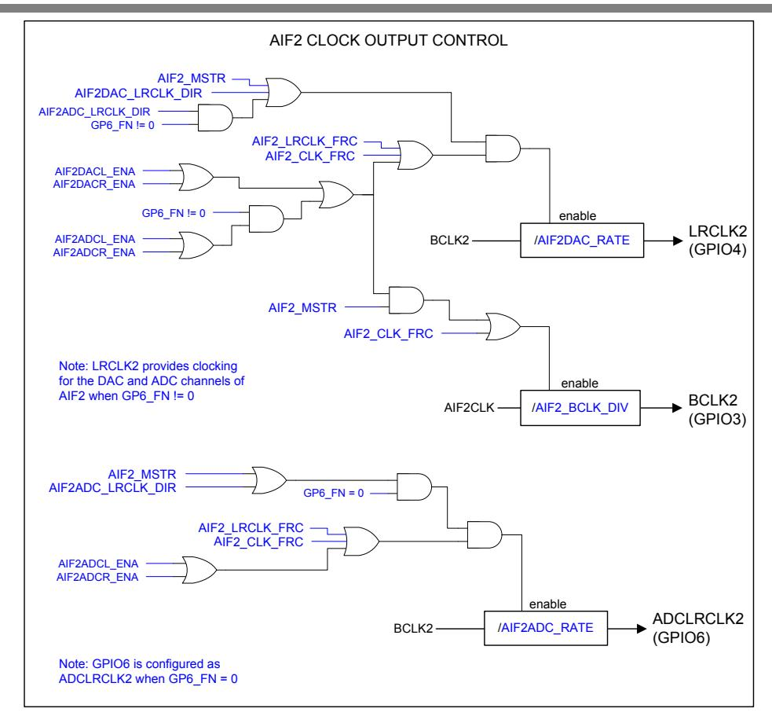

**Figure 65 Audio Interface 2 - BCLK and LRCLK Control**

| REGISTER ADDRESS | BIT        | LABEL     | DEFAULT | DESCRIPTION                                                                             |
|---------------------|------------|-----------|---------|-----------------------------------------------------------------------------------------|
| R784 (0310h)        | 8          | AIF2_BCLK | 0       | BCLK2 Invert                                                                            |
| AIF2 Control        |            | _INV      |         | 0 = BCLK2 not inverted                                                                  |
| (1)                 |            |           |         | 1 = BCLK2 inverted                                                                      |
|                     |            |           |         | Note that AIF2_BCLK_INV selects the BCLK2 polarity in Master mode and in Slave mode. |
|                     | 7 K_INV | AIF2_LRCL | 0       | Right, left and I2S modes – LRCLK2 polarity                                             |
|                     |            |           |         | 0 = normal LRCLK2 polarity                                                              |
|                     |            |           |         | 1 = invert LRCLK2 polarity                                                              |
|                     |            |           |         | Note that AIF2_LRCLK_INV selects the                                                    |
|                     |            |           |         | LRCLK2 polarity in Master mode and in Slave                                             |
|                     |            |           |         | mode.                                                                                   |
|                     |            |           |         | DSP Mode – mode A/B select                                                              |
|                     |            |           |         | 0 = MSB is available on 2nd BCLK2 rising edge after LRCLK2 rising edge (mode A)      |
|                     |            |           |         | 1 = MSB is available on 1st BCLK2 rising edge after LRCLK2 rising edge (mode B)      |

| REGISTER ADDRESS              | BIT  | LABEL                   | DEFAULT | DESCRIPTION                                                                                                                                                                                                                                                                                                                                                                                                                                                                                                                                                                     |
|----------------------------------|------|-------------------------|---------|---------------------------------------------------------------------------------------------------------------------------------------------------------------------------------------------------------------------------------------------------------------------------------------------------------------------------------------------------------------------------------------------------------------------------------------------------------------------------------------------------------------------------------------------------------------------------------|
| R787 (0313h) AIF2 BCLK        | 8:4  | AIF2_BCLK _DIV [4:0] | 00100   | BCLK2 Rate 00000 = AIF2CLK 00001 = AIF2CLK / 1.5 00010 = AIF2CLK / 2 00011 = AIF2CLK / 3 00100 = AIF2CLK / 4 00101 = AIF2CLK / 5 00110 = AIF2CLK / 6 00111 = AIF2CLK / 8 01000 = AIF2CLK / 11 01001 = AIF2CLK / 12 01010 = AIF2CLK / 16 01011 = AIF2CLK / 22 01100 = AIF2CLK / 24 01101 = AIF2CLK / 32 01110 = AIF2CLK / 44 01111 = AIF2CLK / 48 10000 = AIF2CLK / 64 10001 = AIF2CLK / 88 10010 = AIF2CLK / 96 10011 = AIF2CLK / 128 10100 = AIF2CLK / 176 10101 = AIF2CLK / 192 10110 - 11111 = Reserved |
| R788 (0314h) AIF2ADC LRCLK | 11   | AIF2ADC_L RCLK_DIR   | 0       | Allows ADCLRCLK2 to be enabled in Slave mode 0 = Normal 1 = ADCLRCLK2 enabled in Slave mode                                                                                                                                                                                                                                                                                                                                                                                                                                                                            |
|                                  | 10:0 | AIF2ADC_R ATE [10:0] | 040h    | ADCLRCLK2 Rate ADCLRCLK2 clock output = BCLK2 / AIF2ADC_RATE Integer (LSB = 1) Valid from 82047                                                                                                                                                                                                                                                                                                                                                                                                                                                                     |
| R789 (0315h) AIF2DAC LRCLK | 11   | AIF2DAC_L RCLK_DIR   | 0       | Allows LRCLK2 to be enabled in Slave mode 0 = Normal 1 = LRCLK2 enabled in Slave mode                                                                                                                                                                                                                                                                                                                                                                                                                                                                                     |
|                                  | 10:0 | AIF2DAC_R ATE [10:0] | 040h    | LRCLK2 Rate LRCLK2 clock output = BCLK2 / AIF2DAC_RATE Integer (LSB = 1) Valid from 82047                                                                                                                                                                                                                                                                                                                                                                                                                                                                           |

**Table 97 AIF2 BCLK and LRCLK Control**

#### **AIF2 - DIGITAL AUDIO DATA CONTROL**

The register bits controlling the audio data format, word length, left/right channel selection and TDM control for AIF2 are described i[n Table 98.](#page-144-0)

When TDM mode is enabled on AIF2, the WM8994 can transmit and receive audio data in Slot 0 or Slot 1. In this case, the ADCDAT2 output is tri-stated during the unused timeslot, allowing another device to transmit data on the same pin. See "Signal Timing Requirements" for the associated timing details. (Note that, when TDM is not enabled on AIF2, the ADCDAT2 output is driven logic '0' during the unused timeslot.)

In DSP mode, the left channel MSB is available on either the 1st (mode B) or 2nd (mode A) rising edge of BCLK following a rising edge of LRCLK (assuming default BCLK polarity). This is selected using the AIF2\_LRCLK\_INV register bit, as described i[n Table 97.](#page-142-0)

A digital gain function is available at the audio interface input path to boost the DAC volume when a small signal is received on DACDAT2. This is controlled using the AIF2DAC\_BOOST register. To prevent clipping, this function should not be used when the boosted data is expected to be greater than 0dBFS.

| REGISTER ADDRESS | BIT | LABEL                | DEFAULT | DESCRIPTION                                   |
|---------------------|-----|----------------------|---------|-----------------------------------------------|
| R784 (0310h)        | 15  | AIF2ADCL_            | 0       | AIF2 Left Digital Audio interface source      |
| AIF2 Control        |     | SRC                  |         | 0 = Left ADC data is output on left channel   |
| (1)                 |     |                      |         | 1 = Right ADC data is output on left channel  |
|                     | 14  | AIF2ADCR_            | 1       | AIF2 Right Digital Audio interface source     |
|                     |     | SRC                  |         | 0 = Left ADC data is output on right channel  |
|                     |     |                      |         | 1 = Right ADC data is output on right channel |
|                     | 13  | AIF2ADC_T            | 0       | AIF2 transmit (ADC) TDM Enable                |
|                     |     | DM                   |         | 0 = Normal ADCDAT2 operation                  |
|                     |     |                      |         | 1 = TDM enabled on ADCDAT2                    |
|                     | 12  | AIF2ADC_T DM_CHAN | 0       | AIF2 transmit (ADC) TDM Slot Select           |
|                     |     |                      |         | 0 = Slot 0                                    |
|                     |     |                      |         | 1 = Slot 1                                    |
|                     | 6:5 | AIF2_WL              | 10      | AIF2 Digital Audio Interface Word Length      |
|                     |     | [1:0]                |         | 00 = 16 bits                                  |
|                     |     |                      |         | 01 = 20 bits                                  |
|                     |     |                      |         | 10 = 24 bits                                  |
|                     |     |                      |         | 11 = 32 bits                                  |
|                     |     |                      |         | Note - 8-bit modes can be selected using the  |
|                     |     |                      |         | "Companding" control bits.                    |
|                     | 4:3 | AIF2_FMT [1:0]    | 10      | AIF2 Digital Audio Interface Format           |
|                     |     |                      |         | 00 = Right justified                          |
|                     |     |                      |         | 01 = Left justified                           |
|                     |     |                      |         | 10 = I2S Format                               |
|                     |     |                      |         | 11 = DSP Mode                                 |

| REGISTER ADDRESS | BIT   | LABEL      | DEFAULT | DESCRIPTION                                 |
|---------------------|-------|------------|---------|---------------------------------------------|
| R785 (0311h)        | 15    | AIF2DACL_  | 0       | AIF2 Left Receive Data Source Select        |
| AIF2 Control        |       | SRC        |         | 0 = Left DAC receives left interface data   |
| (2)                 |       |            |         | 1 = Left DAC receives right interface data  |
|                     | 14    | AIF2DACR_  | 1       | AIF2 Right Receive Data Source Select       |
|                     |       | SRC        |         | 0 = Right DAC receives left interface data  |
|                     |       |            |         | 1 = Right DAC receives right interface data |
|                     | 13    | AIF2DAC_T  | 0       | AIF2 receive (DAC) TDM Enable               |
|                     |       | DM         |         | 0 = Normal DACDAT2 operation                |
|                     |       |            |         | 1 = TDM enabled on DACDAT2                  |
|                     | 12    | AIF2DAC_T  | 0       | AIF2 receive (DAC) TDM Slot Select          |
|                     |       | DM_CHAN    |         | 0 = Slot 0                                  |
|                     |       |            |         | 1 = Slot 1                                  |
|                     | 11:10 | AIF2DAC_B  | 00      | AIF2 Input Path Boost                       |
|                     |       | OOST [1:0] |         | 00 = 0dB                                    |
|                     |       |            |         | 01 = +6dB (input must not exceed -6dBFS)    |
|                     |       |            |         | 10 = +12dB (input must not exceed -12dBFS)  |
|                     |       |            |         | 11 = +18dB (input must not exceed -18dBFS)  |
| R790 (0316h)        | 1     | AIF2DACL_  | 0       | AIF2 Left Receive Data Invert               |
| AIF2 DAC            |       | DAT_INV    |         | 0 = Not inverted                            |
| Data                |       |            |         | 1 = Inverted                                |
|                     | 0     | AIF2DACR_  | 0       | AIF2 Right Receive Data Invert              |
|                     |       | DAT_INV    |         | 0 = Not inverted                            |
|                     |       |            |         | 1 = Inverted                                |
| R791 (0317h)        | 1     | AIF2ADCL_  | 0       | AIF2 Left Transmit Data Invert              |
| AIF2 ADC            |       | DAT_INV    |         | 0 = Not inverted                            |
| Data                |       |            |         | 1 = Inverted                                |
|                     | 0     | AIF2ADCR_  | 0       | AIF2 Right Transmit Data Invert             |
|                     |       | DAT_INV    |         | 0 = Not inverted                            |
|                     |       |            |         | 1 = Inverted                                |

**Table 98 AIF2 Digital Audio Data Control**

#### **AIF2 - MONO MODE**

AIF2 can be configured to operate in mono DSP mode by setting AIF2\_MONO = 1 as described in [Table 99.](#page-145-0) Note that mono mode is only supported in DSP mode, ie when AIF2\_FMT = 11.

In mono mode, the Left channel data or the Right channel data may be selected for output on ADCDAT2. The selected channel is determined by the AIF2ADCL\_ENA and AIF2ADCR\_ENA bits. (If both bits are set, then the Right channel data is selected.)

In mono mode, the DACDAT2 input can be enabled on the Left and/or Right signal paths using the AIF2DACL\_ENA and AIF2DACR\_ENA bits. The mono input can be enabled on both paths at the same time if required.

In mono mode, the number of BCLK cycles per LRCLK frame must be less than double the AIF2 word length. This requires AIF2DAC\_RATE to be less than double the value selected by the AIF2\_WL register. When the GPIO6 pin is configured as ADCLRCLK2, then AIF2ADC\_RATE must also be less than double the value selected by the AIF2\_WL register. See [Table 89](#page-135-0) for details of the AIF2DAC\_RATE and AIF2ADC\_RATE registers.

| REGISTER ADDRESS                 | BIT | LABEL     | DEFAULT | DESCRIPTION                                                                                                                                                                                              |
|-------------------------------------|-----|-----------|---------|----------------------------------------------------------------------------------------------------------------------------------------------------------------------------------------------------------|
| R785 (0311h) AIF2 Control (2) | 8   | AIF2_MONO | 0       | AIF2 DSP Mono Mode 0 = Disabled 1 = Enabled Note that Mono Mode is only supported when AIF2_FMT = 11. The number of BCLK cycles per LRCLK frame must be less the 2 x AIF2 Word Length. |

**Table 99 AIF2 Mono Mode Control**

### **AIF2 - COMPANDING**

The WM8994 supports A-law and -law companding on both transmit (ADC) and receive (DAC) sides of AIF2. This is configured using the register bits described in [Table 100.](#page-145-1)

For more details on Companding, see the Audio Interface AIF1 description above.

| REGISTER ADDRESS | BIT | LABEL                | DEFAULT | DESCRIPTION                     |
|---------------------|-----|----------------------|---------|---------------------------------|
| R785 (0311h)        | 4   | AIF2DAC_C            | 0       | AIF2 Receive Companding Enable  |
| AIF2 Control        |     | OMP                  |         | 0 = Disabled                    |
| (2)                 |     |                      |         | 1 = Enabled                     |
|                     | 3   | AIF2DAC_C            | 0       | AIF2 Receive Companding Type    |
|                     |     | OMPMODE              |         | 0 = µ-law                       |
|                     |     |                      |         | 1 = A-law                       |
|                     | 2   | AIF2ADC_C OMP     | 0       | AIF2 Transmit Companding Enable |
|                     |     |                      |         | 0 = Disabled                    |
|                     |     |                      |         | 1 = Enabled                     |
|                     | 1   | AIF2ADC_C OMPMODE | 0       | AIF2 Transmit Companding Type   |
|                     |     |                      |         | 0 = µ-law                       |
|                     |     |                      |         | 1 = A-law                       |

**Table 100 AIF2 Companding**

# **AIF2 - LOOPBACK**

The AIF2 interface can provide a Loopback option. When the AIF2\_LOOPBACK bit is set, then AIF2 digital audio output is routed to the AIF2 digital audio input. The normal input (DACDAT2) is not used when AIF2 Loopback is enabled.

| REGISTER ADDRESS          | BIT | LABEL             | DEFAULT | DESCRIPTION                                                                            |
|------------------------------|-----|-------------------|---------|----------------------------------------------------------------------------------------|
| R785 (0311h) AIF2 Control | 0   | AIF2_LOOP BACK | 0       | AIF2 Digital Loopback Function 0 = No loopback                                      |
| (2)                          |     |                   |         | 1 = Loopback enabled (ADCDAT2 data output is directly input to DACDAT2 data input). |

**Table 101 AIF2 Loopback**

#### **AUDIO INTERFACE AIF3 CONFIGURATION**

The WM8994 provides two full audio interfaces, AIF1 and AIF2. A third interface, AIF3, is partially supported, using multiplexers to re-configure alternate connections to AIF1 or AIF2. The relevant multiplexers are illustrated in [Figure 66.](#page-146-0)

Note that, in addition to providing alternate input / output pins to the audio interfaces AIF1 and AIF2, the multiplexers also provide the capability to link AIF3 pins directly to AIF2 pins, without involving the AIF2 interface processing resource.

All of the AIF3 connections are supported on pins which also provide GPIO functions. These pins must be configured as AIF functions when used as audio interface pins. See ["General Purpose](#page-105-0)  [Input/Output"](#page-105-0).

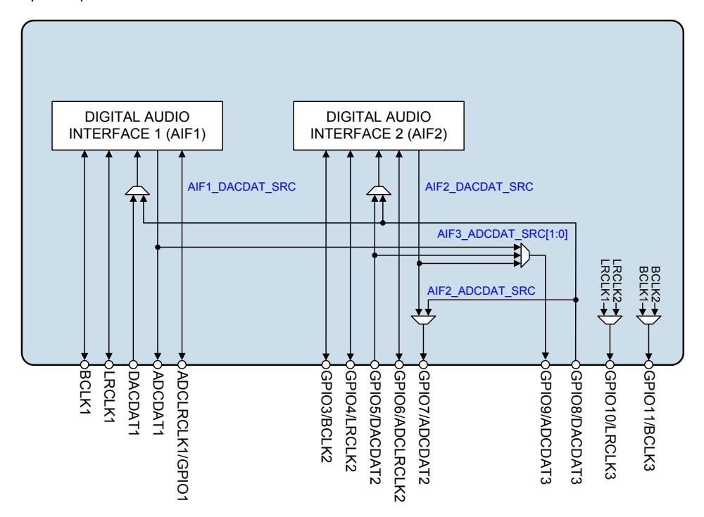

**Figure 66 Audio Interface AIF3 Configuration**

The GPIO8 pin also supports the DACDAT3 function. When configured as DACDAT3, this pin may be used as an alternate data input pin to AIF1 or AIF2. The data input source for AIF1 is selected using the AIF1\_DACDAT\_SRC register. The data input source for AIF2 is selected using the AIF2\_DACDAT\_SRC register.

The GPIO8 pin is configured as DACDAT3 by setting GP8\_FN = 00h. Note that it is also necessary to set GP3\_FN = 00h and GP5\_FN = 00h when using the DACDAT3 function on the GPIO8 pin.

The GPIO9 pin also supports the ADCDAT3 function. When configured as ADCDAT3, this pin may be used as an alternate data output pin to AIF1 or AIF2. It is also possible to route the DACDAT2 input pin to the ADCDAT3 output. The ADCDAT3 source is selected using the AIF3\_ADCDAT\_SRC register.

The DACDAT3 input pin referenced above may also be routed to the ADCDAT2 output. The ADCDAT2 source is selected using the AIF2\_ADCDAT\_SRC register.

The GPIO10 pin also supports the LRCLK3 function. When configured as LRCLK3, this pin outputs the DACLRCLK signal from AIF1 or AIF2. The applicable AIF source is determined automatically as defined in [Table 102.](#page-147-0) Note that the LRCLK3 signal is also controlled by the logic illustrated in [Figure](#page-133-0)  [62](#page-133-0) (AIF1) o[r Figure 65](#page-141-0) (AIF2), depending on the selected AIF source.

The GPIO11 pin also supports the BCLK3 function. When configured as BCLK3, this pin outputs the BCLK signal from AIF1 or AIF2. The applicable AIF source is determined automatically as defined in [Table 102.](#page-147-0) Note that the BCLK3 signal is also controlled by the logic illustrated in [Figure 62](#page-133-0) (AIF1) or [Figure 65](#page-141-0) (AIF2), depending on the selected AIF source.

| CONDITION                              | DESCRIPTION                            |
|----------------------------------------|----------------------------------------|
| AIF1_DACDAT_SRC = 1                    | AIF1 selected as BCLK3 / LRCLK3 source |
| (DACDAT3 selected as AIF1 data input)  |                                        |
| AIF3_ADCDAT_SRC[1:0] = 00              | AIF1 selected as BCLK3 / LRCLK3 source |
| (AIF1 data output selected on ADCDAT3) |                                        |
| All other conditions                   | AIF2 selected as BCLK3 / LRCLK3 source |

**Table 102 BCLK3 / LRCLK3 Configuration**

AIF3 interface can be tri-stated by setting the AIF3\_TRI register. When this bit is set, then all of the AIF3 outputs are un-driven (high-impedance). The AIF3\_TRIS register only affects those pins which are configured for AIF3 functions; it does not affect pins which are configured for other functions.

| REGISTER ADDRESS | BIT | LABEL     | DEFAULT | DESCRIPTION                                                                                                              |
|---------------------|-----|-----------|---------|--------------------------------------------------------------------------------------------------------------------------|
| R6 (0006h)          | 5   | AIF3_TRI  | 0       | AIF3 Audio Interface tri-state                                                                                           |
| Power               |     |           |         | 0 = AIF3 pins operate normally                                                                                           |
| Management          |     |           |         | 1 = Tri-state all AIF3 interface pins                                                                                    |
| (6)                 |     |           |         | Note that pins not configured as AIF3 functions are not affected by this register.                                    |
|                     | 4:3 | AIF3_ADCD | 00      | GPIO9/ADCDAT3 Source select                                                                                              |
|                     |     | AT_SRC    |         | 00 = AIF1 ADCDAT1                                                                                                        |
|                     |     | [1:0]     |         | 01 = AIF2 ADCDAT2                                                                                                        |
|                     |     |           |         | 10 = GPIO5/DACDAT2                                                                                                       |
|                     |     |           |         | 11 = Reserved                                                                                                            |
|                     |     |           |         | Note that GPIO9 must be configured as ADCDAT3. For selection 10, the GPIO5 pin must also be configured as DACDAT2. |
|                     | 2   | AIF2_ADCD | 0       | GPIO7/ADCDAT2 Source select                                                                                              |
|                     |     | AT_SRC    |         | 0 = AIF2 ADCDAT2                                                                                                         |
|                     |     |           |         | 1 = GPIO8/DACDAT3                                                                                                        |
|                     |     |           |         | Note that GPIO7 must be configured as ADCDAT2. For selection 1, the GPIO8 pin must also be configured as DACDAT3.  |
|                     | 1   | AIF2_DACD | 0       | AIF2 DACDAT Source select                                                                                                |
|                     |     | AT_SRC    |         | 0 = GPIO5/DACDAT2                                                                                                        |
|                     |     |           |         | 1 = GPIO8/DACDAT3                                                                                                        |
|                     |     |           |         | Note that the selected source must be configured as DACDAT2 or DACDAT3.                                               |
|                     | 0   | AIF1_DACD | 0       | AIF1 DACDAT Source select                                                                                                |
|                     |     | AT_SRC    |         | 0 = DACDAT1                                                                                                              |
|                     |     |           |         | 1 = GPIO8/DACDAT3                                                                                                        |
|                     |     |           |         | Note that, for selection 1, the GPIO8 pin must be configured as DACDAT3.                                              |

**Table 103 Audio Interface AIF3 Configuration**

#### **DIGITAL PULL-UP AND PULL-DOWN**

The WM8994 provides integrated pull-up and pull-down resistors on each of the DACDAT1, LRCLK1 and BCLK1 pins. This provides a flexible capability for interfacing with other devices.

Each of the pull-up and pull-down resistors can be configured independently using the register bits described in [Table 104.](#page-148-0) Note that if the Pull-up and Pull-down are both enabled for any pin, then the pull-up and pull-down will be disabled.

| REGISTER ADDRESS | BIT | LABEL      | DEFAULT | DESCRIPTION              |
|---------------------|-----|------------|---------|--------------------------|
| R1824               | 5   | DACDAT1_PU | 0       | DACDAT1 Pull-up enable   |
| (0720h)             |     |            |         | 0 = Disabled             |
| Pull Control        |     |            |         | 1 = Enabled              |
| (1)                 | 4   | DACDAT1_PD | 0       | DACDAT1 Pull-down enable |
|                     |     |            |         | 0 = Disabled             |
|                     |     |            |         | 1 = Enabled              |
|                     | 3   | DACLRCLK1_ | 0       | LRCLK1 Pull-up enable    |
|                     | PU  |            |         | 0 = Disabled             |
|                     |     |            |         | 1 = Enabled              |
|                     | 2   | DACLRCLK1_ | 0       | LRCLK1 Pull-down enable  |
|                     |     | PD         |         | 0 = Disabled             |
|                     |     |            |         | 1 = Enabled              |
|                     | 1   | BCLK1_PU   | 0       | BCLK1 Pull-up enable     |
|                     |     |            |         | 0 = Disabled             |
|                     |     |            |         | 1 = Enabled              |
|                     | 0   | BCLK1_PD   | 0       | BCLK1 Pull-down enable   |
|                     |     |            |         | 0 = Disabled             |
|                     |     |            |         | 1 = Enabled              |

**Table 104 Digital Pull-Up and Pull-Down Control**

# **CLOCKING AND SAMPLE RATES**

The WM8994 requires a clock for each of the Digital Audio Interfaces (AIF1 and AIF2). These may be derived from a common clock reference, or from independent references. Under typical clocking configurations, many commonly-used audio sample rates can be derived directly from the external reference; for additional flexibility, the WM8994 incorporates two Frequency Locked Loop (FLL) circuits to perform frequency conversion and filtering.

External clock signals may be connected via MCLK1 and MCLK2. (Note that MCLK2 is an alternate function of the GPIO2 pin.) In AIF Slave modes, the BCLK or LRCLK signals may be used as a reference for the AIF clocks.

The WM8994 performs stereo full-duplex sample rate conversion between the audio interfaces AIF1 and AIF2, enabling digital audio to be routed between the interfaces, and asynchronous audio data to be mixed together. See ["Sample Rate Conversion"](#page-167-0) for further details.

In AIF Slave modes, it is important to ensure the applicable AIF clock (AIF1CLK or AIF2CLK) is synchronised with the associated external LRCLK. This can be achieved by selecting an MCLK input that is derived from the same reference as the LRCLK, or can be achieved by selecting the external BCLK or LRCLK signals as a reference input to one of the FLLs, as a source for the AIF clock.

If the AIF clock is not synchronised with the LRCLK, then clicks arising from dropped or repeated audio samples will occur, due to the inherent tolerances of multiple, asynchronous, system clocks. See "Applications Information" for further details on valid clocking configurations.

Clocking for the Audio Interfaces is provided by AIF1CLK and AIF2CLK for AIF1 and AIF2 respectively. An additional internal clock, SYSCLK is derived from either AIF1CLK or AIF2CLK in order to support the DSP core functions, Charge Pump, Class D switching amplifier, DC servo control, Control Write Sequencer and other internal functions.

The following operating limits must be observed when configuring the WM8994 clocks. Failure to observe these limits will result in degraded performance and/or incorrect system functionality. Latency in the WM8994 signal paths is reduced at high SYSCLK frequencies; power consumption is reduced at low SYSCLK frequencies.

- SYSCLK 12.5MHz
- SYSCLK 4.096MHz
- SYSCLK 256 x fs (where fs = fastest audio sample rate in use)
- AIF1CLK 12.5MHz
- AIF1CLK 256 x AIF1 sample rate (AIF1\_SR)
- AIF2CLK 12.5MHz
- AIF2CLK 256 x AIF2 sample rate (AIF2\_SR)

Note that, if DAC\_OSR128 = 0 and ADC\_OSR128 = 0, then a slower SYSCLK frequency is possible; in this case, the requirement is SYSCLK 2.048MHz.

Note that, under specific operating conditions, clocking ratios of 128 x fs and 192 x fs are possible; this is described in the ["Digital to Analogue Converter \(DAC\)"](#page-63-0) section.

The SYSCLK frequency must be 256 x fs, (where fs is the faster rate of AIF1\_SR or AIF2\_SR). The SYSCLK frequency is derived from AIF1CLK or AIF2CLK, as selected by the SYSCLK\_SRC register (se[e Table 109\)](#page-158-0).

Note that the bandwidth of the digital audio mixing paths will be determined by the sample rate of whichever AIF is selected as the SYSCLK source. When using only one audio interface, the active interface should be selected as the SYSCLK source. For best audio performance when using AIF1 and AIF2 simultaneously, the SYSCLK source must select the AIF with the highest sample rate (AIFn\_SR).

The AIF*n*CLK / fs ratio is the ratio of AIF*n*CLK to the AIF*n* sample rate, where '*n*' identifies the applicable audio interface AIF1 or AIF2. The AIF clocking ratio and sample rate are set by the AIF*n*CLK\_RATE and AIF*n*\_SR register fields, defined in [Table 106](#page-152-0) an[d Table 108.](#page-155-0)

Note that, in the case of mixed input/output path sample rates on either interface, then AIF*n*CLK\_RATE and AIF*n*\_SR are set according to the higher of the two sample rates.

The clocking configuration for AIF1CLK, AIF2CLK and SYSCLK is illustrated in [Figure 67.](#page-150-0)

The WM8994 provides integrated pull-up and pull-down resistors on the MCLK1 pin. This provides a flexible capability for interfacing with other devices. This is configured as described in [Table 109.](#page-158-0) Note that if MCLK1\_PU and MCLK1\_PD are both set, then the pull-up and pull-down will be disabled.

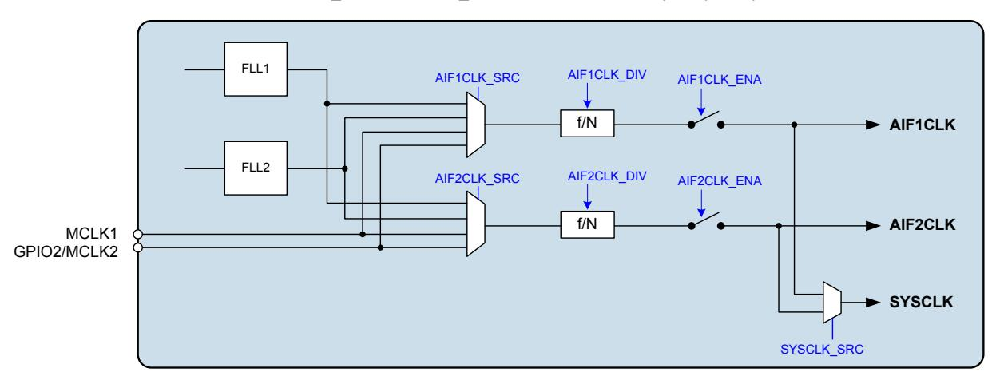

**Figure 67 Audio Interface Clock Control**

### **AIF1CLK ENABLE**

The AIF1CLK\_SRC register is used to select the AIF1CLK source. The source may be MCLK1, MCLK2, FLL1 or FLL2. If either of the Frequency Locked Loops is selected as the source, then the FLL(s) must be enabled and configured as described later.

The AIF1CLK clock may be adjusted by the AIF1CLK\_DIV divider, which provides a divide-by-two option. The selected source may also be inverted by setting the AIF1CLK\_INV bit.

The maximum AIF1CLK frequency is specified in the "Electrical Characteristics" section. Note that, when AIF1CLK\_DIV = 1, the maximum frequency limit applies to the divided-down AIF1CLK frequency.

The AIF1CLK is enabled by the register bit AIF1CLK\_ENA. This bit should be set to 0 when reconfiguring the clock sources. It is not recommended to change AIF1CLK\_SRC while the AIF1CLK\_ENA bit is set.

| REGISTER ADDRESS | BIT | LABEL       | DEFAULT | DESCRIPTION              |
|---------------------|-----|-------------|---------|--------------------------|
| R512 (0200h)        | 4:3 | AIF1CLK_SR  | 00      | AIF1CLK Source Select    |
| AIF 1               |     | C           |         | 00 = MCLK1               |
| Clocking (1)        |     |             |         | 01 = MCLK2               |
|                     |     |             |         | 10 = FLL1                |
|                     |     |             |         | 11 = FLL2                |
|                     | 2   | AIF1CLK_INV | 0       | AIF1CLK Invert           |
|                     |     |             |         | 0 = AIF1CLK not inverted |
|                     |     |             |         | 1 = AIF1CLK inverted     |
|                     | 1   | AIF1CLK_DIV | 0       | AIF1CLK Divider          |
|                     |     |             |         | 0 = AIF1CLK              |
|                     |     |             |         | 1 = AIF1CLK / 2          |
|                     | 0   | AIF1CLK_EN  | 0       | AIF1CLK Enable           |
|                     |     | A           |         | 0 = Disabled             |
|                     |     |             |         | 1 = Enabled              |

**Table 105 AIF1CLK Enable**

#### **AIF1 CLOCKING CONFIGURATION**

The WM8994 supports a wide range of standard audio sample rates from 8kHz to 96kHz. The AIF1 clocking configuration is selected using 4 control fields, which are set according to the required AIF digital audio sample rate, and the ADC/DAC clocking rate.

The AIF1\_SR register is set according to the AIF1 sample rate. Note that 88.2kHz and 96kHz modes are supported for AIF1 input (DAC playback) only.

The AIF1CLK\_RATE register is set according to the ratio of AIF1CLK to the AIF1 sample rate. Note that there a some restrictions on the supported clocking ratios, depending on the selected sample rate and operating conditions. The supported configurations are detailed in the ["Digital Microphone](#page-15-1)  [Interface"](#page-15-1), ["Analogue to Digital Converter \(ADC\)"](#page-18-0) and ["Digital to Analogue Converter \(DAC\)"](#page-63-0) sections, according to each applicable function.

The audio interface can support different sample rates for the input data (DAC path) and output data (ADC path) simultaneously. In this case, the AIF1\_SR and AIF1CLK\_RATE fields should be set according to the faster of the two sample rates.

When different sample rates are used for input data (DAC path) and output data (ADC path), the clocking of the slower path is set using AIF1DAC\_DIV (if the AIF input path has the slower sample rate) or AIF1ADC\_DIV (if the AIF output path has the slower sample rate). The appropriate divider is set according to the ratio of the two sample rates.

For example, if AIF1 input uses 48kHz sample rate, and AIF1 output uses 8kHz, then AIF1ADC\_DIV should be set to 110b (divide by 6).

Note that the audio interface cannot support every possible combination of input and output sample rate simultaneously, but only where the ratio of the sample rates matches the available AIF1ADC\_DIV or AIF1DAC\_DIV divider settings.

Note that the WM8994 performs sample rate conversion, where necessary, to provide digital mixing and interconnectivity between the Audio Interfaces and the DSP Core functions. One stereo Sample Rate Converter (SRC) is provided for audio input; a second stereo SRC is provided for audio output. Each SRC is automatically configured on AIF1 or AIF2, depending on the selected Clocking and Sample Rate settings. The WM8994 cannot support configurations that would require SRC on the input or output paths of both interfaces simultaneously. See ["Sample Rate Conversion"](#page-167-0) for further details.

| REGISTER ADDRESS                   | BIT | LABEL            | DEFAULT | DESCRIPTION                                                                                                                                                                                                                                                                                                                                                                                                                                    |
|---------------------------------------|-----|------------------|---------|------------------------------------------------------------------------------------------------------------------------------------------------------------------------------------------------------------------------------------------------------------------------------------------------------------------------------------------------------------------------------------------------------------------------------------------------|
| R513 (0201h) AIF 1 Clocking (2) | 5:3 | AIF1DAC_DIV      | 000     | Selects the AIF1 input path sample rate relative to the AIF1 output path sample rate. This field should only be changed from default in modes where the AIF1 input path sample rate is slower than the AIF1 output path sample rate. 000 = Divide by 1 001 = Divide by 1.5 010 = Divide by 2 011 = Divide by 3 100 = Divide by 4 101 = Divide by 5.5 110 = Divide by 6                                  |
|                                       | 2:0 | AIF1ADC_DIV      | 000     | 111 = Reserved Selects the AIF1 output path sample rate relative to the AIF1 input path sample rate. This field should only be changed from default in modes where the AIF1 output path sample rate is slower than the AIF1 input path sample rate. 000 = Divide by 1 001 = Divide by 1.5 010 = Divide by 2 011 = Divide by 3 100 = Divide by 4 101 = Divide by 5.5 110 = Divide by 6 111 = Reserved |
| R528 (0210h) AIF1 Rate             | 7:4 | AIF1_SR          | 1000    | Selects the AIF1 Sample Rate (fs) 0000 = 8kHz 0001 = 11.025kHz 0010 = 12kHz 0011 = 16kHz 0100 = 22.05kHz 0101 = 24kHz 0110 = 32kHz 0111 = 44.1kHz 1000 = 48kHz 1001 = 88.2kHz 1010 = 96kHz All other codes = Reserved Note that 88.2kHz and 96kHz modes are supported for AIF1 input (DAC playback) only.                                                                                         |
|                                       | 3:0 | AIF1CLK_RAT E | 0011    | Selects the AIF1CLK / fs ratio 0000 = Reserved 0001 = 128 0010 = 192 0011 = 256 0100 = 384 0101 = 512 0110 = 768 0111 = 1024 1000 = 1408 1001 = 1536 All other codes = Reserved                                                                                                                                                                                                                               |

**Table 106 AIF1 Clocking Configuration**

#### **AIF2CLK ENABLE**

The AIF2CLK\_SRC register is used to select the AIF2CLK source. The source may be MCLK1, MCLK2, FLL1 or FLL2. If either of the Frequency Locked Loops is selected as the source, then the FLL(s) must be enabled and configured as described later.

The AIF2CLK clock may be adjusted by the AIF2CLK\_DIV divider, which provides a divide-by-two option. The selected source may also be inverted by setting the AIF2CLK\_INV bit.

The maximum AIF2CLK frequency is specified in the "Electrical Characteristics" section. Note that, when AIF2CLK\_DIV = 1, the maximum frequency limit applies to the divided-down AIF2CLK frequency.

The AIF2CLK is enabled by the register bit AIF2CLK\_ENA. This bit should be set to 0 when reconfiguring the clock sources. It is not recommended to change AIF2CLK\_SRC while the AIF2CLK\_ENA bit is set.

| REGISTER ADDRESS | BIT | LABEL       | DEFAULT | DESCRIPTION              |
|---------------------|-----|-------------|---------|--------------------------|
| R516 (0204h)        | 4:3 | AIF2CLK_SR  | 00      | AIF2CLK Source Select    |
| AIF 2               |     | C           |         | 00 = MCLK1               |
| Clocking (1)        |     |             |         | 01 = MCLK2               |
|                     |     |             |         | 10 = FLL1                |
|                     |     |             |         | 11 = FLL2                |
|                     | 2   | AIF2CLK_INV | 0       | AIF2CLK Invert           |
|                     |     |             |         | 0 = AIF2CLK not inverted |
|                     |     |             |         | 1 = AIF2CLK inverted     |
|                     | 1   | AIF2CLK_DIV | 0       | AIF2CLK Divider          |
|                     |     |             |         | 0 = AIF2CLK              |
|                     |     |             |         | 1 = AIF2CLK / 2          |
|                     | 0   | AIF2CLK_EN  | 0       | AIF2CLK Enable           |
|                     |     | A           |         | 0 = Disabled             |
|                     |     |             |         | 1 = Enabled              |

**Table 107 AIF2CLK Enable**

#### **AIF2 CLOCKING CONFIGURATION**

The WM8994 supports a wide range of standard audio sample rates from 8kHz to 96kHz. The AIF2 clocking configuration is selected using 4 control fields, which are set according to the required AIF digital audio sample rate, and the ADC/DAC clocking rate.

The AIF2\_SR register is set according to the AIF2 sample rate. Note that 88.2kHz and 96kHz modes are supported for AIF2 input (DAC playback) only.

The AIF2CLK\_RATE register is set according to the ratio of AIF2CLK to the AIF2 sample rate. Note that there a some restrictions on the supported clocking ratios, depending on the selected sample rate and operating conditions. The supported configurations are detailed in the ["Digital Microphone](#page-15-1)  [Interface"](#page-15-1), ["Analogue to Digital Converter \(ADC\)"](#page-18-0) and ["Digital to Analogue Converter \(DAC\)"](#page-63-0) sections, according to each applicable function.

The audio interface can support different sample rates for the input data (DAC path) and output data (ADC path) simultaneously. In this case, the AIF2\_SR and AIF2CLK\_RATE fields should be set according to the faster of the two sample rates.

When different sample rates are used for input data (DAC path) and output data (ADC path), the clocking of the slower path is set using AIF2DAC\_DIV (if the AIF input path has the slower sample rate) or AIF2ADC\_DIV (if the AIF output path has the slower sample rate). The appropriate divider is set according to the ratio of the two sample rates.

For example, if AIF2 input uses 48kHz sample rate, and AIF2 output uses 8kHz, then AIF2ADC\_DIV should be set to 110b (divide by 6).

Note that the audio interface cannot support every possible combination of input and output sample rate simultaneously, but only where the ratio of the sample rates matches the available AIF2ADC\_DIV or AIF2DAC\_DIV divider settings.

Note that the WM8994 performs sample rate conversion, where necessary, to provide digital mixing and interconnectivity between the Audio Interfaces and the DSP Core functions. One stereo Sample Rate Converter (SRC) is provided for audio input; a second stereo SRC is provided for audio output. Each SRC is automatically configured on AIF1 or AIF2, depending on the selected Clocking and Sample Rate settings. The WM8994 cannot support configurations that would require SRC on the input or output paths of both interfaces simultaneously. See ["Sample Rate Conversion"](#page-167-0) for further details.

| REGISTER ADDRESS                         | BIT | LABEL       | DEFAULT | DESCRIPTION                                                                                                                                                                                                                                                                                                                                                                                                               |
|---------------------------------------------|-----|-------------|---------|---------------------------------------------------------------------------------------------------------------------------------------------------------------------------------------------------------------------------------------------------------------------------------------------------------------------------------------------------------------------------------------------------------------------------|
| R517 (0205h) AIF 2 Clocking (2) | 5:3 | AIF2DAC_DIV | 000     | Selects the AIF2 input path sample rate relative to the AIF2 output path sample rate. This field should only be changed from default in modes where the AIF2 input path sample rate is slower than the AIF2 output path sample rate. 000 = Divide by 1 001 = Divide by 1.5 010 = Divide by 2 011 = Divide by 3 100 = Divide by 4 101 = Divide by 5.5 110 = Divide by 6 111 = Reserved |
|                                             | 2:0 | AIF2ADC_DIV | 000     | Selects the AIF2 output path sample rate relative to the AIF2 input path sample rate. This field should only be changed from default in modes where the AIF2 output path sample rate is slower than the AIF2 input path sample rate. 000 = Divide by 1 001 = Divide by 1.5 010 = Divide by 2 011 = Divide by 3 100 = Divide by 4 101 = Divide by 5.5 110 = Divide by 6 111 = Reserved |
| R529 (0211h) AIF2 Rate             | 7:4 | AIF2_SR     | 1000    | Selects the AIF2 Sample Rate (fs) 0000 = 8kHz 0001 = 11.025kHz 0010 = 12kHz 0011 = 16kHz 0100 = 22.05kHz 0101 = 24kHz 0110 = 32kHz 0111 = 44.1kHz 1000 = 48kHz 1001 = 88.2kHz 1010 = 96kHz All other codes = Reserved Note that 88.2kHz and 96kHz modes are supported for AIF2 input (DAC playback) only.                                                                       |

| REGISTER ADDRESS | BIT | LABEL       | DEFAULT | DESCRIPTION                    |
|---------------------|-----|-------------|---------|--------------------------------|
|                     | 3:0 | AIF2CLK_RAT | 0011    | Selects the AIF2CLK / fs ratio |
|                     |     | E           |         | 0000 = Reserved                |
|                     |     |             |         | 0001 = 128                     |
|                     |     |             |         | 0010 = 192                     |
|                     |     |             |         | 0011 = 256                     |
|                     |     |             |         | 0100 = 384                     |
|                     |     |             |         | 0101 = 512                     |
|                     |     |             |         | 0110 = 768                     |
|                     |     |             |         | 0111 = 1024                    |
|                     |     |             |         | 1000 = 1408                    |
|                     |     |             |         | 1001 = 1536                    |
|                     |     |             |         | All other codes = Reserved     |

**Table 108 AIF2 Clocking Configuration**

#### **MISCELLANEOUS CLOCK CONTROLS**

SYSCLK provides clocking for many of the WM8994 functions. SYSCLK clock is required to support DSP Core functions and also the Charge Pump, Class D switching amplifier, DC servo control, Control Write Sequencer and other internal functions.

The SYSCLK\_SRC register is used to select the SYSCLK source. The source may be AIF1CLK or AIF2CLK. Note that the bandwidth of the digital audio mixing paths will be determined by the sample rate of whichever AIF is selected as the SYSCLK source. When using only one audio interface, the active interface should be selected as the SYSCLK source. For best audio performance when using AIF1 and AIF2 simultaneously, the SYSCLK source must select the AIF with the highest sample rate (AIFn\_SR).

The AIF1 DSP processing clock is derived from SYSCLK, and enabled by AIF1DSPCLK\_ENA.

The AIF2 DSP processing clock is derived from SYSCLK, and enabled by AIF2DSPCLK\_ENA.

The clocking of the WM8994 ADC, DAC, digital mixer and digital microphone functions is enabled by setting SYSDSPCLK\_ENA. See ["Digital Microphone Interface"](#page-15-1) for details of the DMICCLK frequency.

Two modes of ADC / Digital Microphone operation can be selected using the ADC\_OSR128 bit. This bit is enabled by default, giving best audio performance. De-selecting this bit provides a low power alternative setting.

A high performance mode of DAC operation can be selected by setting the DAC\_OSR128 bit. When the DAC\_OSR128 bit is set, the audio performance is improved, but power consumption is also increased.

A clock is required for the Charge Pump circuit when the ground-referenced headphone outputs (HPOUT1L and HPOUT1R) are enabled. The Charge Pump clock is derived from SYSCLK whenever the Charge Pump is enabled. The Charge Pump clock division is configured automatically.

A clock is required for the Class D speaker driver circuit when the speaker outputs (SPKOUTL and SPKOUTR) are enabled. The Class D clock is derived from SYSCLK whenever these outputs are enabled in Class D mode. The Class D clock division is configured automatically. See ["Analogue](#page-98-0)  [Outputs"](#page-98-0) for details of the Class D switching frequency.

A clock output (OPCLK) derived from SYSCLK may be output on a GPIO pin. This clock is enabled by register big OPCLK\_ENA, and its frequency of this clock is controlled by OPCLK\_DIV. See [General](#page-105-0)  [Purpose Input/Output"](#page-105-0) to configure a GPIO pin for this function.

A slow clock (TOCLK) is derived internally in order to control volume update timeouts when the zerocross option is selected. This clock is enabled by register bit TOCLK\_ENA, and its frequency is controlled by TOCLK\_DIV.

A de-bounce control is provided for GPIO inputs and for other functions that may be selected as GPIO outputs. The de-bounced clock frequency is controlled by DBCLK\_DIV.

The WM8994 generates a 256kHz clock for internal functions; TOCLK and DBCLK are derived from this 256kHz clock. In order to generate this clock correctly when SYSCLK\_SRC = 0, valid settings are required for AIF1\_SR and AIF1CLK\_RATE. To generate this clock correctly when SYSCLK\_SRC = 1, valid settings are required for AIF2\_SR and AIF2CLK\_RATE.

The WM8994 Clocking is illustrated in Figure 68.

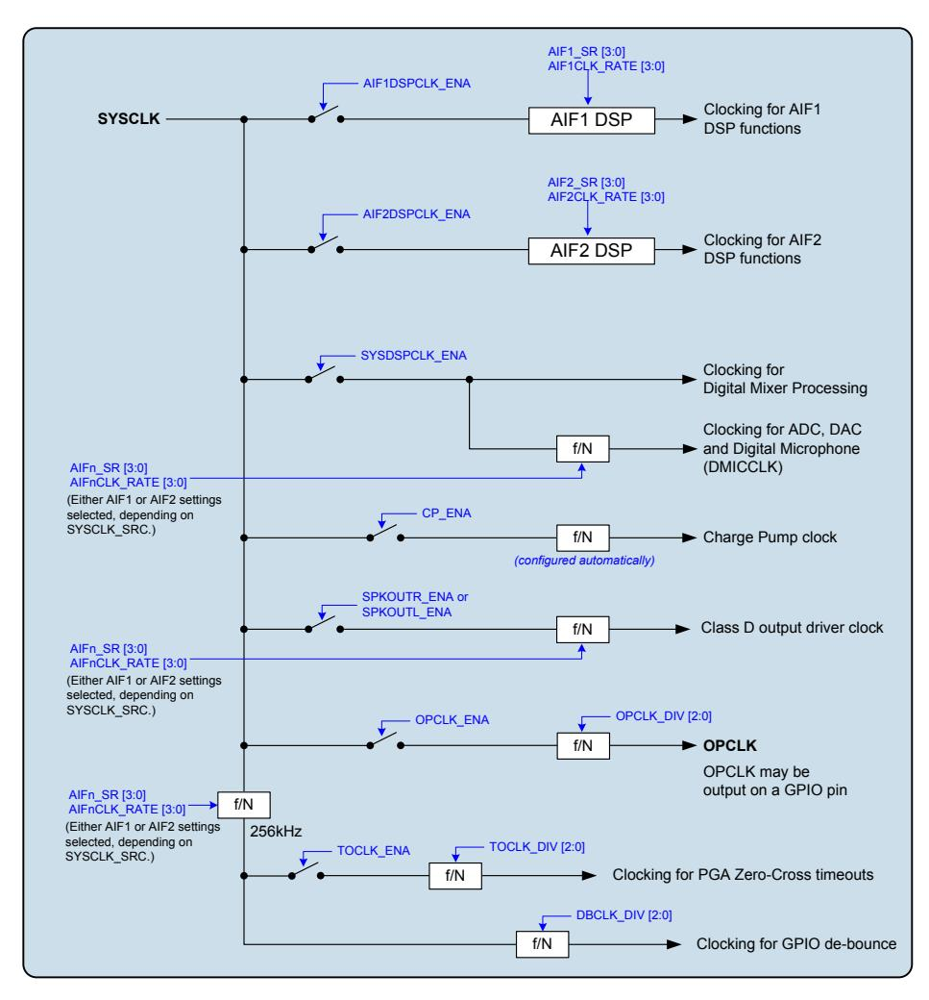

Figure 68 System Clocking

| REGISTER ADDRESS | BIT  | LABEL      | DEFAULT | DESCRIPTION                                       |
|---------------------|------|------------|---------|---------------------------------------------------|
| R2 (0002h)          | 11   | OPCLK_ENA  | 0       | GPIO Clock Output (OPCLK) Enable                  |
| Power               |      |            |         | 0 = Disabled                                      |
| Management          |      |            |         | 1 = Enabled                                       |
| (2)                 |      |            |         |                                                   |
| R520 (0208h)        | 4    | TOCLK_ENA  | 0       | Slow Clock (TOCLK) Enable                         |
| Clocking (1)        |      |            |         | 0 = Disabled                                      |
|                     |      |            |         | 1 = Enabled                                       |
|                     |      |            |         | This clock is required for zero-cross timeout. |
|                     | 3    | AIF1DSPCLK | 0       | AIF1 Processing Clock Enable                      |
|                     |      | _ENA       |         | 0 = Disabled                                      |
|                     |      |            |         | 1 = Enabled                                       |
|                     | 2    | AIF2DSPCLK | 0       | AIF2 Processing Clock Enable                      |
|                     |      | _ENA       |         | 0 = Disabled                                      |
|                     |      |            |         | 1 = Enabled                                       |
|                     | 1    | SYSDSPCLK_ | 0       | Digital Mixing Processor Clock Enable             |
|                     |      | ENA        |         | 0 = Disabled                                      |
|                     |      |            |         | 1 = Enabled                                       |
|                     | 0    | SYSCLK_SRC | 0       | SYSCLK Source Select                              |
|                     |      |            |         | 0 = AIF1CLK                                       |
|                     |      |            |         | 1 = AIF2CLK                                       |
| R521 (0209h)        | 10:8 | TOCLK_DIV  | 000     | Slow Clock (TOCLK ) Divider                       |
| Clocking (2)        |      |            |         | (Sets TOCLK rate relative to 256kHz.)             |
|                     |      |            |         | 000 = Divide by 256 (1kHz)                        |
|                     |      |            |         | 001 = Divide by 512 (500Hz)                       |
|                     |      |            |         | 010 = Divide by 1024 (250Hz)                      |
|                     |      |            |         | 011 = Divide by 2048 (125Hz)                      |
|                     |      |            |         | 100 = Divide by 4096 (62.5Hz)                     |
|                     |      |            |         | 101 = Divide by 8192 (31.2Hz)                     |
|                     |      |            |         | 110 = Divide by 16384 (15.6Hz)                    |
|                     |      |            |         | 111 = Divide by 32768 (7.8Hz)                     |
|                     | 6:4  | DBCLK_DIV  | 000     | De-bounce Clock (DBCLK) Divider                   |
|                     |      |            |         | (Sets DBCLK rate relative to 256kHz.)             |
|                     |      |            |         | 000 = Divide by 256 (1kHz)                        |
|                     |      |            |         | 001 = Divide by 2048 (125Hz)                      |
|                     |      |            |         | 010 = Divide by 4096 (62.5Hz)                     |
|                     |      |            |         | 011 = Divide by 8192 (31.2Hz)                     |
|                     |      |            |         | 100 = Divide by 16384 (15.6Hz)                    |
|                     |      |            |         | 101 = Divide by 32768 (7.8Hz)                     |
|                     |      |            |         | 110 = Divide by 65536 (3.9Hz)                     |
|                     |      |            |         | 111 = Divide by 131072 (1.95Hz)                   |
|                     | 2:0  | OPCLK_DIV  | 000     | GPIO Output Clock (OPCLK) Divider                 |
|                     |      |            |         | 0000 = SYSCLK                                     |
|                     |      |            |         | 0001 = SYSCLK / 2                                 |
|                     |      |            |         | 0010 = SYSCLK / 3                                 |
|                     |      |            |         | 0011 = SYSCLK / 4                                 |
|                     |      |            |         | 0100 = SYSCLK / 5.5                               |
|                     |      |            |         | 0101 = SYSCLK / 6                                 |
|                     |      |            |         | 0110 = SYSCLK / 8                                 |
|                     |      |            |         | 0111 = SYSCLK / 12                                |
|                     |      |            |         | 1000 = SYSCLK / 16                                |
|                     |      |            |         | 1001 to 1111 = Reserved                           |
|                     |      |            |         |                                                   |

| REGISTER ADDRESS | BIT | LABEL      | DEFAULT | DESCRIPTION                                        |
|---------------------|-----|------------|---------|----------------------------------------------------|
| R1568 (0620h)    | 1   | ADC_OSR128 | 1       | ADC / Digital Microphone Oversample Rate Select |
| Oversampling        |     |            |         | 0 = Low Power                                      |
|                     |     |            |         | 1 = High Performance                               |
|                     | 0   | DAC_OSR128 | 0       | DAC Oversample Rate Select                         |
|                     |     |            |         | 0 = Low Power                                      |
|                     |     |            |         | 1 = High Performance                               |
| R1824               | 7   | MCLK1_PU   | 0       | MCLK1 Pull-up enable                               |
| (0720h)             |     |            |         | 0 = Disabled                                       |
| Pull Control        |     |            |         | 1 = Enabled                                        |
| (1)                 | 6   | MCLK1_PD   | 0       | MCLK1 Pull-down enable                             |
|                     |     |            |         | 0 = Disabled                                       |
|                     |     |            |         | 1 = Enabled                                        |

Table 109 System Clocking

### **BCLK AND LRCLK CONTROL**

The digital audio interfaces (AIF1 and AIF2) use BCLK and LRCLK signals for synchronisation. In master mode, these are output signals, generated by the WM8994. In slave mode, these are input signals to the WM8994. It is also possible to support mixed master/slave operation.

The BCLK and LRCLK signals are controlled as illustrated in Figure 69. See the "Digital Audio Interface Control" section for further details of the relevant control registers.

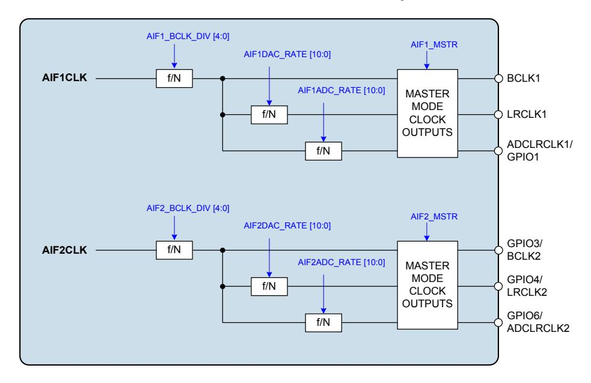

Figure 69 BCLK and LRCLK Control

#### CONTROL INTERFACE CLOCKING

Register map access is possible with or without a system clock. Clocking is provided from SYSCLK; the SYSCLK\_SRC register selects either AIF1CLK or AIF2CLK as the applicable SYSCLK source.

When AIF1CLK is the SYSCLK source (ie. SYSCLK\_SRC = 0), and AIF1CLK\_ENA = 1, then an active clock source for AIF1CLK must be present for control interface clocking. If the AIF1CLK source is stopped, then AIF1CLK\_ENA must be set to 0 for control register access.

When AIF2CLK is the SYSCLK source (ie. SYSCLK\_SRC = 1), and AIF2CLK\_ENA = 1, then an active clock source for AIF2CLK must be present for control interface clocking. If the AIF2CLK source is stopped, then AIF2CLK\_ENA must be set to 0 for control register access.

# FREQUENCY LOCKED LOOP (FLL)

Two integrated FLLs are provided to support the clocking requirements of the WM8994. These can be enabled and configured independently according to the available reference clocks and the application requirements. The reference clock may be a high frequency (eg. 12.288MHz) or low frequency (eg. 32.768kHz).

The FLL is tolerant of jitter and may be used to generate a stable AIF clock from a less stable input reference. The FLL characteristics are summarised in "Electrical Characteristics". Note that the FLL can be used to generate a free-running clock in the absence of an external reference source. This is described in the "Free-Running FLL Clock" section below.

The input reference for FLL1 is selected using FLL1\_REFCLK\_SRC. The available options are MCLK1, MCLK2, BCLK1 or LRCLK1. The input reference for FLL2 is selected using FLL2\_REFCLK\_SRC. The available options are MCLK1, MCLK2, BCLK2 or LRCLK2. The FLL input reference configuration is illustrated in Figure 70.

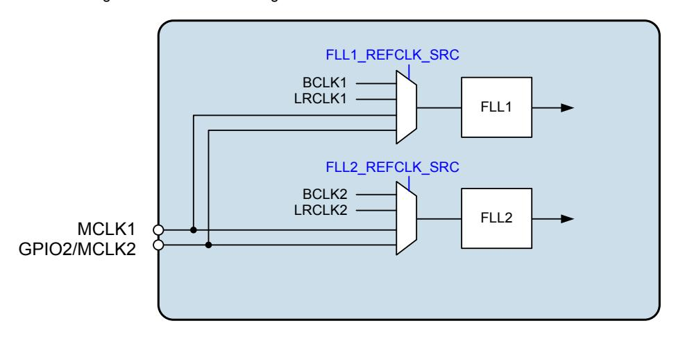

Figure 70 FLL Input Reference Selection

The following description is applicable to FLL1 and FLL2. The associated register control fields are described in Table 112 for FLL1 and Table 113 for FLL2.

The FLL control registers are illustrated in Figure 71.

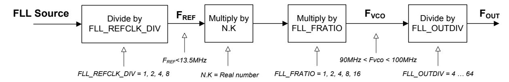

Figure 71 FLL Configuration

The FLL is enabled using the FLL*n*\_ENA register bit (where *n* = 1 for FLL1 and *n* = 2 for FLL2). Note that the other FLL registers should be configured before enabling the FLL; the FLL*n*\_ENA register bit should be set as the final step of the FLL*n* enable sequence.

When changing FLL settings, it is recommended that the digital circuit be disabled via FLL*n*\_ENA and then re-enabled after the other register settings have been updated. When changing the input reference frequency FREF, it is recommended that the FLL be reset by setting FLL*n*\_ENA to 0.

Note that, for normal operation of the FLLs, the reference voltage VMID and the bias current must also be enabled. See ["Reference Voltages and Master Bias"](#page-191-0) for details of the associated controls VMID\_SEL and BIAS\_ENA.

The field FLL*n*\_REFCLK\_DIV provides the option to divide the input reference (MCLK, BCLK or LRCLK) by 1, 2, 4 or 8. This field should be set to bring the reference down to 13.5MHz or below. For best performance, it is recommended that the highest possible frequency - within the 13.5MHz limit should be selected.

The FLL output frequency is directly determined from FLL*n*\_FRATIO, FLL*n*\_OUTDIV and the real number represented by N.K. The integer portion, N, is held in the FLL*n*\_N register field (LSB = 1); the fractional portion of N.K is held in the FLL*n*\_K register field (MSB = 0.5).

The FLL output frequency is generated according to the following equation:

$$F_{OUT} = (F_{VCO} / FLLn_OUTDIV)$$

The FLL operating frequency, FVCO is set according to the following equation:

$$F_{VCO} = (F_{REF} \times N.K \times FLL_n FRATIO)$$

FREF is the input frequency, as determined by FLL*n*\_REFCLK\_DIV.

FVCO must be in the range 90-100 MHz. Frequencies outside this range cannot be supported.

Note that the output frequencies that do not lie within the ranges quoted above cannot be guaranteed across the full range of device operating conditions.

In order to follow the above requirements for FVCO, the value of FLL*n*\_OUTDIV should be selected according to the desired output FOUT. The divider, FLL*n*\_OUTDIV, must be set so that FVCO is in the range 90-100MHz. The available divisions are integers from 4 to 64. Some typical settings of FLL*n*\_OUTDIV are noted in [Table 110.](#page-160-0)

| OUTPUT FREQUENCY FOUT  | FLLn_OUTDIV           |  |  |
|------------------------|-----------------------|--|--|
| 1.875 MHz - 2.0833 MHz | 101111 (divide by 48) |  |  |
| 2.8125 MHz - 3.125 MHz | 011111 (divide by 32) |  |  |
| 3.75 MHz - 4.1667 MHz  | 010111 (divide by 24) |  |  |
| 5.625 MHz - 6.25 MHz   | 001111 (divide by 16) |  |  |
| 11.25 MHz - 12.5 MHz   | 000111 (divide by 8)  |  |  |
| 18 MHz - 20 MHz        | 000100 (divide by 5)  |  |  |
| 22.5 MHz - 25 MHz      | 000011 (divide by 4)  |  |  |

**Table 110 Selection of FLL***n***\_OUTDIV**

The value of FLL*n*\_FRATIO should be selected as described in [Table 111.](#page-161-0)

| REFERENCE FREQUENCY FREF | FLLn_FRATIO       |  |  |
|--------------------------|-------------------|--|--|
| 1MHz - 13.5MHz           | 0h (divide by 1)  |  |  |
| 256kHz - 1MHz            | 1h (divide by 2)  |  |  |
| 128kHz - 256kHz          | 2h (divide by 4)  |  |  |
| 64kHz - 128kHz           | 3h (divide by 8)  |  |  |
| Less than 64kHz          | 4h (divide by 16) |  |  |

**Table 111 Selection of FLL***n***\_FRATIO**

In order to determine the remaining FLL parameters, the FLL operating frequency, FVCO, must be calculated, as given by the following equation:

$$F_{VCO} = (F_{OUT} \times FLLn\_OUTDIV)$$

The value of FLL*n*\_N and FLL*n*\_K can then be determined as follows:

$$N.K = F_{VCO} / (FLLn_FRATIO x F_{REF})$$

Note that FREF is the input frequency, after division by FLL*n*\_REFCLK\_DIV, where applicable.

In FLL Fractional Mode, the fractional portion of the N.K multiplier is held in the FLL*n*\_K register field. This field is coded as a fixed point quantity, where the MSB has a weighting of 0.5. Note that, if desired, the value of this field may be calculated by multiplying K by 216 and treating FLL*n*\_K as an integer value, as illustrated in the following example:

If 
$$N.K = 8.192$$
, then  $K = 0.192$ 

Multiplying K by 2 16 gives 0.192 x 65536 = 12582.912 (decimal)

Apply rounding to the nearest integer = 12583 (decimal) = 3127 (hex)

Note that, if the required fraction cannot be represented exactly in the FLL\_K register, and a rounding error is introduced, then a corresponding offset will exist in the FLL output frequency. In a typical application, the frequency difference will be negligible. However, if the FLL is used to generate AIFnCLK in AIF Slave Mode, then the rounding error may result in clicks arising from dropped or repeated audio samples.

The FLL1 control registers are described in [Table 112.](#page-162-0) The FLL2 control registers are described in [Table 113.](#page-163-0) Example settings for a variety of reference frequencies and output frequencies are shown in [Table 115.](#page-166-0)

| REGISTER                         | BIT  | LABEL                     | DEFAULT | DESCRIPTION                                                                                                                                                                                                                                                                  |
|----------------------------------|------|---------------------------|---------|------------------------------------------------------------------------------------------------------------------------------------------------------------------------------------------------------------------------------------------------------------------------------|
| ADDRESS                          |      |                           |         |                                                                                                                                                                                                                                                                              |
| R544 (0220h) FLL1 Control (1) | 0    | FLL1_ENA                  | 0       | FLL1 Enable 0 = Disabled 1 = Enabled This should be set as the final step of the FLL1 enable sequence, ie. after the other FLL registers have been configured.                                                                                             |
| R545 (0221h) FLL1 Control (2) | 13:8 | FLL1_OUTDIV [5:0]      | 000000  | FLL1 FOUT clock divider 000000 = Reserved 000001 = Reserved 000010 = Reserved 000011 = 4 000100 = 5 000101 = 6 … 111110 = 63 111111 = 64 (FOUT = FVCO / FLL1_OUTDIV)                                                                           |
|                                  | 2:0  | FLL1_FRATIO [2:0]      | 000     | FLL1 FVCO clock divider 000 = 1 001 = 2 010 = 4 011 = 8 1XX = 16                                                                                                                                                                                              |
| R546 (0222h) FLL1 Control (3) | 15:0 | FLL1_K[15:0]              | 0000h   | FLL1 Fractional multiply for FREF (MSB = 0.5)                                                                                                                                                                                                                             |
| R547 (0223h) FLL1 Control (4) | 14:5 | FLL1_N[9:0]               | 000h    | FLL1 Integer multiply for FREF (LSB = 1)                                                                                                                                                                                                                                  |
| R548 (0224h) FLL1 Control (5) | 4:3  | FLL1_REFCLK_ DIV [1:0] | 00      | FLL1 Clock Reference Divider 00 = MCLK / 1 01 = MCLK / 2 10 = MCLK / 4 11 = MCLK / 8 MCLK (or other input reference) must be divided down to <=13.5MHz. For lower power operation, the reference clock can be divided down further if desired. |
|                                  | 1:0  | FLL1_REFCLK_ SRC [1:0] | 00      | FLL1 Clock source 00 = MCLK1 01 = MCLK2 10 = LRCLK1 11 = BCLK1                                                                                                                                                                                                   |

**Table 112 FLL1 Register Map**

| REGISTER ADDRESS              | BIT  | LABEL                     | DEFAULT | DESCRIPTION                                                                                                                                                                                                                                                                  |
|----------------------------------|------|---------------------------|---------|------------------------------------------------------------------------------------------------------------------------------------------------------------------------------------------------------------------------------------------------------------------------------|
| R576 (0240h) FLL2 Control (1) | 0    | FLL2_ENA                  | 0       | FLL2 Enable 0 = Disabled 1 = Enabled This should be set as the final step of the FLL2 enable sequence, ie. after the other FLL registers have been configured.                                                                                             |
| R577 (0241h) FLL2 Control (2) | 13:8 | FLL2_OUTDIV [5:0]      | 000000  | FLL2 FOUT clock divider 000000 = Reserved 000001 = Reserved 000010 = Reserved 000011 = 4 000100 = 5 000101 = 6 … 111110 = 63 111111 = 64 (FOUT = FVCO / FLL2_OUTDIV)                                                                           |
|                                  | 2:0  | FLL2_FRATIO [2:0]      | 000     | FLL2 FVCO clock divider 000 = 1 001 = 2 010 = 4 011 = 8 1XX = 16                                                                                                                                                                                              |
| R578 (0242h) FLL2 Control (3) | 15:0 | FLL2_K[15:0]              | 0000h   | FLL2 Fractional multiply for FREF (MSB = 0.5)                                                                                                                                                                                                                             |
| R579 (0243h) FLL2 Control (4) | 14:5 | FLL2_N[9:0]               | 000h    | FLL2 Integer multiply for FREF (LSB = 1)                                                                                                                                                                                                                                  |
| R580 (0244h) FLL2 Control (5) | 4:3  | FLL2_REFCLK_ DIV [1:0] | 00      | FLL2 Clock Reference Divider 00 = MCLK / 1 01 = MCLK / 2 10 = MCLK / 4 11 = MCLK / 8 MCLK (or other input reference) must be divided down to <=13.5MHz. For lower power operation, the reference clock can be divided down further if desired. |
|                                  | 1:0  | FLL2_REFCLK_ SRC [1:0] | 00      | FLL2 Clock source 00 = MCLK1 01 = MCLK2 10 = LRCLK2 11 = BCLK2                                                                                                                                                                                                   |

**Table 113 FLL2 Register Map**

### **FREE-RUNNING FLL CLOCK**

The FLL can generate a clock signal even when no external reference is available. However, it should be noted that the accuracy of this clock is reduced, and a reference source should always be used where possible. Note that, in free-running modes, the FLL is not sufficiently accurate for hi-fi ADC or DAC applications. However, the free-running modes are suitable for clocking most other functions, including the Write Sequencer, Charge Pump, DC Servo and Class D loudspeaker driver.

If an accurate reference clock is initially available, then the FLL should be configured as described above. The FLL will continue to generate a stable output clock after the reference input is stopped or disconnected.

If no reference clock is available at the time of starting up the FLL, then an internal clock frequency of approximately 12MHz can be generated by implementing the following sequence:

- Enable the FLL Analogue Oscillator (FLLn\_OSC\_ENA = 1)
- Set the FOUT clock divider to divide by 8 (FLLn\_OUTDIV = 000111)
- Configure the oscillator frequency by setting FLLn\_FRC\_NCO = 1 and FLLn\_FRC\_NCO\_VAL = 19h

Note that the free-running FLL mode is not suitable for hi-fi CODEC applications. In the absence of any reference clock, the FLL output is subject to a very wide tolerance; see "Electrical Characteristics" for details of the FLL accuracy.

Note that the free-running FLL clock is selected as SYSCLK using the registers noted in [Figure 67.](#page-150-0)

The free-running FLL clock may be used to support analogue functions, for which the digital audio interface is not used, and there is no applicable Sample Rate (fs). When SYSCLK is required for circuits such the Class D, DC Servo, Control Write Sequencer or Charge Pump, then valid Sample Rate register settings are still required, even though the digital audio interface is not active.

For correct functionality when SYSCLK\_SRC = 0, valid settings are required for AIF1\_SR and AIF1CLK\_RATE. In the case where SYSCLK\_SRC = 1, then valid settings are required for AIF2\_SR and AIF2CLK\_RATE.

The control registers applicable to FLL free-running modes are described i[n Table 114.](#page-165-0)

| REGISTER ADDRESS | BIT  | LABEL        | DEFAULT | DESCRIPTION                                                            |
|---------------------|------|--------------|---------|------------------------------------------------------------------------|
| R544 (0220h)        | 1    | FLL1_OSC_ENA | 0       | FLL1 Oscillator enable                                                 |
| FLL1 Control (1)    |      |              |         | 0 = Disabled                                                           |
|                     |      |              |         | 1 = Enabled                                                            |
|                     |      |              |         | (Note that this field is required for free-running FLL1 modes only) |
| R548 (0224h)        | 12:7 | FLL1_FRC_NCO | 19h     | FLL1 Forced oscillator value                                           |
| FLL1 Control (5)    |      | _VAL [5:0]   |         | Valid range is 000000 to 111111                                        |
|                     |      |              |         | 0x19h (011001) = 12MHz approx                                          |
|                     |      |              |         | (Note that this field is required for free-running FLL modes only)  |
|                     | 6    | FLL1_FRC_NCO | 0       | FLL1 Forced control select                                             |
|                     |      |              |         | 0 = Normal                                                             |
|                     |      |              |         | 1 = FLL1 oscillator controlled by FLL1_FRC_NCO_VAL                  |
|                     |      |              |         | (Note that this field is required for free-running FLL modes only)  |
| R576 (0240h)        | 1    | FLL2_OSC_ENA | 0       | FLL2 Oscillator enable                                                 |
| FLL2 Control (1)    |      |              |         | 0 = Disabled                                                           |
|                     |      |              |         | 1 = Enabled                                                            |
|                     |      |              |         | (Note that this field is required for free-running FLL2 modes only) |

| REGISTER ADDRESS              | BIT  | LABEL                      | DEFAULT | DESCRIPTION                                                                                                                                                                |
|----------------------------------|------|----------------------------|---------|----------------------------------------------------------------------------------------------------------------------------------------------------------------------------|
| R580 (0244h) FLL2 Control (5) | 12:7 | FLL2_FRC_NCO _VAL [5:0] | 19h     | FLL2 Forced oscillator value Valid range is 000000 to 111111 0x19h (011001) = 12MHz approx (Note that this field is required for free-running FLL modes only)  |
|                                  | 6    | FLL2_FRC_NCO               | 0       | FLL2 Forced control select 0 = Normal 1 = FLL2 oscillator controlled by FLL2_FRC_NCO_VAL (Note that this field is required for free-running FLL modes only) |

**Table 114 FLL Free-Running Mode**

#### **GPIO OUTPUTS FROM FLL**

For each FLL, the WM8994 has an internal signal which indicates whether the FLL Lock has been achieved. The FLL Lock status is an input to the Interrupt control circuit and can be used to trigger an Interrupt event - see ["Interrupts"](#page-117-0).

The FLL Lock signal can be output directly on a GPIO pin as an external indication of FLL Lock. See ["General Purpose Input/Output"](#page-105-0) for details of how to configure a GPIO pin to output the FLL Lock signal.

The FLL Clock can be output directly on a GPIO pin as a clock signal for other circuits. Note that the FLL Clock may be output even if the FLL is not selected as the WM8994 SYSCLK source. The FLL clocking configuration is illustrated in [Figure 70.](#page-159-0) See ["General Purpose Input/Output"](#page-105-0) for details of how to configure a GPIO pin to output the FLL Clock.

# **EXAMPLE FLL CALCULATION**

The following example illustrates how to derive the FLL1 registers to generate 12.288 MHz output (FOUT) from a 12.000 MHz reference clock (FREF):

- Set FLL1\_REFCLK\_DIV in order to generate FREF <=13.5MHz: FLL1\_REFCLK\_DIV = 00 (divide by 1)
- Set FLL1\_OUTDIV for the required output frequency as shown i[n Table 110:](#page-160-0) FOUT = 12.288 MHz, therefore FLL1\_OUTDIV = 7h (divide by 8)
- Set FLL1\_FRATIO for the given reference frequency as shown in [Table 111:](#page-161-0) FREF = 12MHz, therefore FLL1\_FRATIO = 0h (divide by 1)
- Calculate FVCO as given by FVCO = FOUT x FLL1\_OUTDIV:- FVCO = 12.288 x 8 = 98.304MHz
- Calculate N.K as given by N.K = FVCO / (FLL1\_FRATIO x FREF): N.K = 98.304 / (1 x 12) = 8.192
- Determine FLL1\_N and FLL1\_K from the integer and fractional portions of N.K:- FLL1\_N is 8. FLL1\_K is 0.192
- Convert FLL1\_K into integer format: 0.192 x 65536 = 12582.912 (decimal).
- Round off to 12583 (decimal) and convert to hex: 12583 (decimal) = 3127 (hex). FLL1\_K = 3127h

#### **EXAMPLE FLL SETTINGS**

[Table 115](#page-166-0) provides example FLL settings for generating common SYSCLK frequencies from a variety of low and high frequency reference inputs.

| FSOURCE     | FOUT        | FREF Divider | N.K      | FRATIO | FVCO        | OUTDIV | FLLn_N | FLLn_K |
|-------------|-------------|-----------------|----------|--------|-------------|--------|--------|--------|
| 32 kHz      | 12.288 MHz  | 1               | 192      | 16     | 98.304 MHz  | 8      | 0C0h   | 0000h  |
| 32 kHz      | 11.2896 MHz | 1               | 176.4    | 16     | 90.3168 MHz | 8      | 0B0h   | 6666h  |
| 32.768 kHz  | 12.288 MHz  | 1               | 187.5    | 16     | 98.304 MHz  | 8      | 0BBh   | 8000h  |
| 32.768 kHz  | 11.2896 MHz | 1               | 172.2656 | 16     | 90.3168 MHz | 8      | 0ACh   | 4400h  |
| 44.1 kHz    | 11.2896 MHz | 1               | 128      | 16     | 90.3168 MHz | 8      | 080h   | 0000h  |
| 48 kHz      | 12.288 MHz  | 1               | 128      | 16     | 98.304 MHz  | 8      | 080h   | 0000h  |
| 128 kHz     | 2.048 MHz   | 1               | 192      | 4      | 98.304 MHz  | 48     | 0C0h   | 0000h  |
| 128 kHz     | 12.288 MHz  | 1               | 192      | 4      | 98.304 MHz  | 8      | 0C0h   | 0000h  |
| 512 kHz     | 2.048 MHz   | 1               | 96       | 2      | 98.304 MHz  | 48     | 060h   | 0000h  |
| 512 kHz     | 12.288 MHz  | 1               | 96       | 2      | 98.304 MHz  | 8      | 060h   | 0000h  |
| 1.4112 MHz  | 11.2896 MHz | 1               | 64       | 1      | 90.3168 MHz | 8      | 040h   | 0000h  |
| 2.8224 MHz  | 11.2896 MHz | 1               | 32       | 1      | 90.3168 MHz | 8      | 020h   | 0000h  |
| 1.536 MHz   | 12.288 MHz  | 1               | 64       | 1      | 98.304 MHz  | 8      | 040h   | 0000h  |
| 3.072 MHz   | 12.288 MHz  | 1               | 32       | 1      | 98.304 MHz  | 8      | 020h   | 0000h  |
| 11.2896 MHz | 12.288 MHz  | 1               | 8.7075   | 1      | 98.304 MHz  | 8      | 008h   | B51Eh  |
| 12 MHz      | 11.2896 MHz | 1               | 7.5264   | 1      | 90.3168 MHz | 8      | 007h   | 86C2h  |
| 12 MHz      | 12.288 MHz  | 1               | 8.192    | 1      | 98.304 MHz  | 8      | 008h   | 3127h  |
| 12.288 MHz  | 12.288 MHz  | 1               | 8        | 1      | 98.304 MHz  | 8      | 008h   | 0000h  |
| 12.288 MHz  | 11.2896 MHz | 1               | 7.35     | 1      | 90.3168 MHz | 8      | 007h   | 599Ah  |
| 13 MHz      | 12.288 MHz  | 1               | 7.5618   | 1      | 98.304 MHz  | 8      | 007h   | 8FD5h  |
| 13 MHz      | 11.2896 MHz | 1               | 6.9474   | 1      | 90.3168 MHz | 8      | 006h   | F28Ch  |
| 19.2 MHz    | 12.288 MHz  | 2               | 10.24    | 1      | 98.304 MHz  | 8      | 00Ah   | 3D71h  |
| 19.2 MHz    | 11.2896 MHz | 2               | 9.408    | 1      | 90.3168 MHz | 8      | 009h   | 6873h  |
| 24 MHz      | 11.2896 MHz | 2               | 7.5264   | 1      | 90.3168 MHz | 8      | 007h   | 86C2h  |
| 24 MHz      | 12.288 MHz  | 2               | 8.192    | 1      | 98.304 MHz  | 8      | 008h   | 3127h  |
| 26 MHz      | 11.2896 MHz | 2               | 6.9474   | 1      | 90.3168 MHz | 8      | 006h   | F28Ch  |
| 26 MHz      | 12.288 MHz  | 2               | 7.5618   | 1      | 98.304 MHz  | 8      | 007h   | 8FD5h  |
| 27 MHz      | 11.2896 MHz | 2               | 6.6901   | 1      | 90.3168 MHz | 8      | 006h   | B0ADh  |
| 27 MHz      | 12.288 MHz  | 2               | 7.2818   | 1      | 98.304 MHz  | 8      | 007h   | 4823h  |

FOUT = (FSOURCE / FREF Divider) \* N.K \* FRATIO / OUTDIV

The values of N and K are contained in the FLLn\_N and FLLn\_K registers as shown above.

See [Table 112](#page-162-0) and [Table 113](#page-163-0) for the coding of the FLLn\_REFCLK\_DIV, FLLn\_FRATIO and FLLn\_OUTDIV registers.

**Table 115 Example FLL Settings**

# **SAMPLE RATE CONVERSION**

The WM8994 supports two main digital audio interfaces, AIF1 and AIF2. These interfaces are configured independently and may operate entirely asynchronously to each other. The WM8994 performs stereo full-duplex sample rate conversion between the audio interfaces, allowing digital audio to be routed between the interfaces, and allowing asynchronous audio data to be mixed together.

The Sample Rate Converters (SRCs) are configured automatically within the WM8994, and no user settings are required. The SRCs are enabled automatically when required and are disabled at other times. Synchronisation between the audio interfaces is not instantaneous when the clocking or sample rate configurations are updated; the lock status of the SRCs is signalled via the GPIO or Interrupt circuits, as described in ["General Purpose Input/Output"](#page-105-0) and ["Interrupts"](#page-117-0).

Separate clocks can be used for AIF1 and AIF2, allowing asynchronous operation on these interfaces. The digital mixing core is clocked by SYSCLK, which is linked to either AIF1CLK or AIF2CLK, as described in ["Clocking and Sample Rates"](#page-149-0). The digital mixing core is, therefore, always synchronised to AIF1, or to AIF2, or to both interfaces at once.

#### **SAMPLE RATE CONVERTER 1 (SRC1)**

SRC1 performs sample rate conversion of digital audio data input to the WM8994. Sample Rate Conversion is required when digital audio data is received on an audio interface that is not synchronised to the digital mixing core.

SRC1 is automatically configured on AIF1 or AIF2, depending on the selected Clocking and Sample Rate configuration. Note that SRC1 cannot convert input data on AIF1 and AIF2 simultaneously. Sample Rate conversion on AIF1 is only supported on TDM Timeslot 0.

The SRC1 Lock status indicates when audio data can be received on the interface channel that is not synchronised to the digital mixing core. No audio will be present on this signal path until SRC1 Lock is achieved.

#### **SAMPLE RATE CONVERTER 2 (SRC2)**

SRC2 performs sample rate conversion of digital audio data output from the WM8994. Sample Rate Conversion is required when digital audio data is transmitted on an audio interface that is not synchronised to the digital mixing core.

SRC2 is automatically configured on AIF1 or AIF2, depending on the selected Clocking and Sample Rate configuration. Note that SRC2 cannot convert output data on AIF1 and AIF2 simultaneously. Sample Rate conversion on AIF1 is only supported on TDM Timeslot 0.

The SRC2 Lock status indicates when audio data can be transmitted on the interface channel that is not synchronised to the digital mixing core. No audio will be present on this signal path until SRC2 Lock is achieved.

### **SAMPLE RATE CONVERTER RESTRICTIONS**

The following restrictions apply to the configuration of the WM8994 Sample Rate Converters.

**No SRC on AIF1 Timeslot 1.** Sample Rate Conversion on audio interface AIF1 is not supported on the TDM Timeslot 1. Therefore, it is not possible to route digital audio between AIF1 Timeslot 1 and AIF2, or to mix together audio from these interface paths. Note that this only applies when the SRC is applied to AIF1.

**Maximum of three sample rates in the system.** The audio sample rate of AIF1 input and AIF1 output may be different to each other. The audio sample rate of AIF2 input and AIF2 output may be different to each other. However, it is not possible to have four different sample rates operating simultaneously, as this would require sample rate conversion in too many paths. A maximum of three different sample rates can be supported in the system.

**No SRC capability when using 88.2kHz or 96kHz AIF input (DAC playback).** If either interface is configured for 88.2kHz or 96kHz sample rate, then the digital mixing core must also be configured for

this sample rate. Sample Rate Conversion cannot be supported in this mode, therefore AIF output is not supported at any sample rate under these conditions.

**Restricted Sample Rate options when AIF1 and AIF2 are synchronised.** When the same clock source is used for AIF1CLK and AIF2CLK, and mixed sample rates are selected on both interfaces, then the DAC sample rate of one interface must be the same as the ADC sample rate of the other.

- If AIF1CLK\_SRC = AIF2CLK\_SRC
- And AIF1DAC\_DIV ≠ AIF1ADC\_DIV
- And AIF2DAC\_DIV ≠ AIF2ADC\_DIV
- Then the DAC sample rate of one interface must be the same as the ADC sample rate of the other.

**Restricted Sample Rate options when AIF1 and AIF2 are not synchronised.** When a different clock source is used for AIF1CLK and AIF2CLK, then the AIF to which the SYSCLK is synchronised cannot be mixed sample rates.

- If AIF1CLK\_SRC ≠ AIF2CLK\_SRC
- And SYSCLK\_SRC =0
- Then AIF1DAC\_DIV and AIF1ADC\_DIV must be set to 000
- If AIF1CLK\_SRC ≠ AIF2CLK\_SRC
- And SYSCLK\_SRC =1
- Then AIF2DAC\_DIV and AIF2ADC\_DIV must be set to 000

#### **SAMPLE RATE CONVERTER CONFIGURATION ERROR INDICATION**

The WM8994 verifies the register settings relating to Clocking, Sample Rates and Sample Rate Conversion. If an invalid configuration is attempted, then the SR\_ERROR register will indicate the error by showing a non-zero value. This read-only field may be checked to confirm that the WM8994 can support the selected Clocking and Sample Rate settings.

| REGISTER ADDRESS | BIT | LABEL    | DEFAULT | DESCRIPTION                                                                                    |
|---------------------|-----|----------|---------|------------------------------------------------------------------------------------------------|
| R530 (0212h)        | 3:0 | SR_ERROR | 0000    | Sample Rate Configuration status                                                               |
| Rate Status         |     | [3:0]    |         | Indicates an error with the register settings related to sample rate configuration          |
|                     |     |          |         | 0000 = No errors                                                                               |
|                     |     |          |         | 0001 = Invalid sample rate                                                                     |
|                     |     |          |         | 0010 = Invalid AIF divide                                                                      |
|                     |     |          |         | 0011 = ADC and DAC divides both set in an interface                                         |
|                     |     |          |         | 0100 = Invalid combination of AIF divides and sample-rate                                   |
|                     |     |          |         | 0101 = Invalid set of enables for 96kHz mode                                                |
|                     |     |          |         | 0110 = Invalid SYSCLK rate (derived from AIF1CLK_RATE or AIF2CLK_RATE)                      |
|                     |     |          |         | 0111 = Mixed ADC and DAC rates in SYSCLK AIF when AIFs are asynchronous                     |
|                     |     |          |         | 1000 = Invalid combination of sample rates when both AIFs are from the same clock source |
|                     |     |          |         | 1001 = Invalid combination of mixed ADC/DAC AIFs when both from the same clock source    |
|                     |     |          |         | 1010 = AIF1DAC2 (Timeslot 1) ports enabled when SRCs connected to AIF1                      |

**Table 116 Sample Rate Converter Configuration Status**

# **CONTROL INTERFACE**

The WM8994 is controlled by writing to its control registers. Readback is available for all registers. The Control Interface can operate as either a 2-, 3- or 4-wire interface:

- 2-wire (I2C) mode uses pins SCLK and SDA
- 3-wire (SPI) mode uses pins CS¯¯ /ADDR, SCLK and SDA
- 4-wire (SPI) mode uses pins CS¯¯ /ADDR, SCLK, SDA and SDOUT

Readback is provided on the bi-directional pin SDA in 2-/3-wire modes. In 4-wire mode, the SDOUT function must be enabled on one of the GPIO pins (see ["General Purpose Input/Output"](#page-105-0)).

The WM8994 uses 15-bit register addresses and 16-bit data in all Control Interface modes.

Note that the Control Interface function can be supported with or without system clocking. Where possible, the register map access is synchronised with SYSCLK in order to ensure predictable operation of cross-domain functions. See ["Clocking and Sample Rates"](#page-149-0) for further details of Control Interface clocking.

### **SELECTION OF CONTROL INTERFACE MODE**

The WM8994 Control Interface Mode is determined by the logic level on the CIFMODE pin, as shown in [Table 117.](#page-170-1) An internal pull-down resistor is enabled by default on the CIFMODE pin; this can be configured using the CIFMODE\_PD register bit described in [Table 118.](#page-171-0)

| CIFMODE | INTERFACE FORMAT          |  |  |
|---------|---------------------------|--|--|
| Low     | 2 wire (I2C) Mode         |  |  |
| High    | 3- or 4- wire (SPI) Modes |  |  |

**Table 117 Control Interface Mode Selection**

In 2-wire (I2C) Control Interface mode, Auto-Increment mode may be selected. This enables multiple write and multiple read operations to be scheduled faster than is possible with single register operations. The auto-increment option is enabled when the AUTO\_INC register bit is set. This bit is defined in [Table 118.](#page-171-0) Auto-increment is enabled by default.

In SPI modes, 3-wire or 4-wire operation may be selected using the SPI\_4WIRE register bit.

In SPI modes, the Continuous Read mode may be selected using the SPI\_CONTRD bit. This enables multiple register read operations to be scheduled faster than is possible with single register operations. When SPI\_CONTRD is set, the WM8994 will readback from incremental register addresses as long as CS¯¯ is held low and SCLK is toggled.

In 3-wire (SPI) mode, register readback is provided using the bi-directional pin SDA. During data output, the SDA pin can be configured as CMOS or Open Drain, using the SPI\_CFG register bit.

In 4-wire (SPI) mode, register readback is provided using SDOUT. The SDOUT pin may be configured as CMOS or as 'Wired OR' using the SPI\_CFG bit. In CMOS mode, SDOUT is driven low when not outputting register data. In 'Wired OR' mode, SDOUT is undriven (high impedance) when not outputting register data bits.

The Control Interface configuration bits are described i[n Table 118.](#page-171-0)

| REGISTER ADDRESS | BIT | LABEL      | DEFAULT | DESCRIPTION                        |
|---------------------|-----|------------|---------|------------------------------------|
| R257 (0101h)        | 6   | SPI_CONTRD | 0       | Enable continuous read mode in     |
| Control Interface   |     |            |         | SPI (3-wire/4-wire) modes          |
|                     |     |            |         | 0 = Disabled                       |
|                     |     |            |         | 1 = Enabled                        |
|                     | 5   | SPI_4WIRE  | 1       | SPI control mode select            |
|                     |     |            |         | 0 = 3-wire using bidirectional SDA |
|                     |     |            |         | 1 = 4-wire using SDOUT             |
|                     | 4   | SPI_CFG    | 0       | SDA/SDOUT pin configuration        |
|                     |     |            |         | 0 = CMOS                           |
|                     |     |            |         | 1 = Open Drain (SPI_4WIRE = 0)     |
|                     |     |            |         | 1 = Wired 'OR' (SPI_4WIRE = 1)     |
|                     | 2   | AUTO_INC   | 1       | Enables address auto-increment     |
|                     |     |            |         | (applies to 2-wire I2C mode only)  |
|                     |     |            |         | 0 = Disabled                       |
|                     |     |            |         | 1 = Enabled                        |
| R1825 (0721h)       | 8   | CSNADDR_PD | 1       | CS/ADDR Pull-down enable           |
| Pull Control (2)    |     |            |         | 0 = Disabled                       |
|                     |     |            |         | 1 = Enabled                        |
|                     | 2   | CIFMODE_PD | 1       | CIFMODE Pull-down enable           |
|                     |     |            |         | 0 = Disabled                       |
|                     |     |            |         | 1 = Enabled                        |

**Table 118 Control Interface Configuration**

### **2-WIRE (I2C) CONTROL MODE**

In 2-wire (I2C) mode, the WM8994 is a slave device on the control interface; SCLK is a clock input, while SDAT is a bi-directional data pin. To allow arbitration of multiple slaves (and/or multiple masters) on the same interface, the WM8994 transmits logic 1 by tri-stating the SDAT pin, rather than pulling it high. An external pull-up resistor is required to pull the SDAT line high so that the logic 1 can be recognised by the master.

In order to allow many devices to share a single 2-wire control bus, every device on the bus has a unique 8-bit device ID (this is not the same as the address of each register in the WM8994). The device ID is selectable on the WM8994, using the CS¯¯ /ADDR pin as shown in [Table 119.](#page-171-1) The LSB of the Device ID is the Read/Write bit; this bit is set to logic 1 for "Read" and logic 0 for "Write".

An internal pull-down resistor is enabled by default on the CS¯¯ /ADDR pin; this can be configured using the CSNADDR\_PD register bit described in [Table 118.](#page-171-0)

| CS¯¯ /ADDR | DEVICE ID       |  |  |
|------------|-----------------|--|--|
| Low        | 0011 0100 (34h) |  |  |
| High       | 0011 0110 (36h) |  |  |

**Table 119 Control Interface Device ID Selection**

The WM8994 operates as a slave device only. The controller indicates the start of data transfer with a high to low transition on SDAT while SCLK remains high. This indicates that a device ID, register address and data will follow. The WM8994 responds to the start condition and shifts in the next eight bits on SDAT (8-bit device ID, including Read/Write bit, MSB first). If the device ID received matches the device ID of the WM8994, then the WM8994 responds by pulling SDAT low on the next clock pulse (ACK). If the device ID is not recognised or the R/W bit is set incorrectly, the WM8994 returns to the idle condition and waits for a new start condition and valid address.

If the device ID matches the device ID of the WM8994, the data transfer continues as described below. The controller indicates the end of data transfer with a low to high transition on SDAT while SCLK remains high. After receiving a complete address and data sequence the WM8994 returns to the idle state and waits for another start condition. If a start or stop condition is detected out of sequence at any point during data transfer (i.e. SDAT changes while SCLK is high), the device returns to the idle condition.

The WM8994 supports the following read and write operations:

- Single write
- Single read
- Multiple write using auto-increment
- Multiple read using auto-increment

The sequence of signals associated with a single register write operation is illustrated in Figure 72.

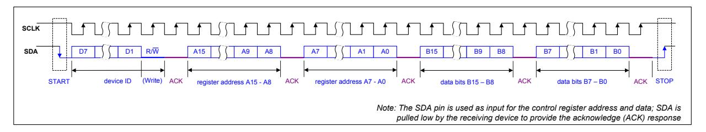

Figure 72 Control Interface 2-wire (I2C) Register Write

The sequence of signals associated with a single register read operation is illustrated in Figure 73.

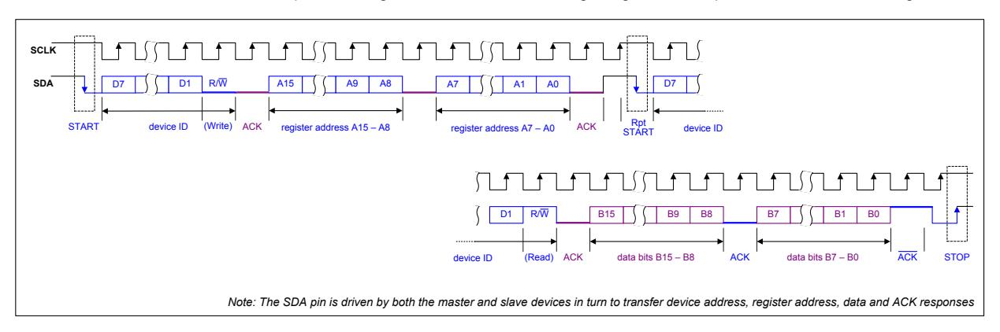

Figure 73 Control Interface 2-wire (I2C) Register Read

The Control Interface also supports other register operations, as listed above. The interface protocol for these operations is summarised below. The terminology used in the following figures is detailed in Table 120.

Note that, for multiple write and multiple read operations, the auto-increment option must be enabled. This feature is enabled by default, as noted in Table 118.

| TERMINOLOGY   | DESCR                               | IPTION    |  |
|---------------|-------------------------------------|-----------|--|
| S             | Start Co                            | ndition   |  |
| Sr            | Repeated start                      |           |  |
| Α             | Acknowledge (SDA Low)               |           |  |
| Ā             | Not Acknowledge (SDA High)          |           |  |
| Р             | Stop Condition                      |           |  |
| R/W           | ReadNotWrite                        | 0 = Write |  |
|               |                                     | 1 = Read  |  |
| [White field] | Data flow from bus master to WM8994 |           |  |
| [Grey field]  | Data flow from WM8994 to bus master |           |  |

Table 120 Control Interface Terminology

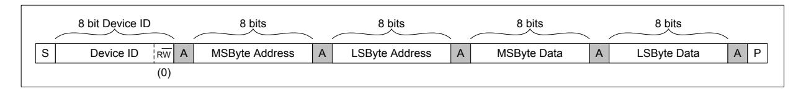

Figure 74 Single Register Write to Specified Address

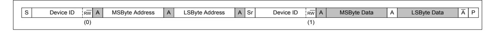

Figure 75 Single Register Read from Specified Address

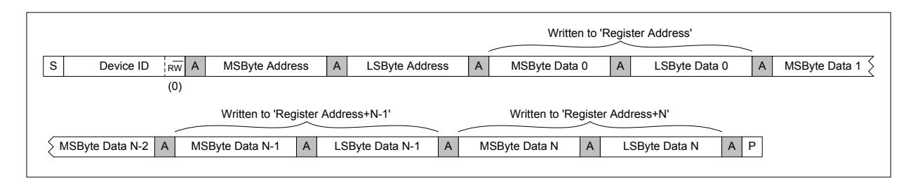

Figure 76 Multiple Register Write to Specified Address using Auto-increment

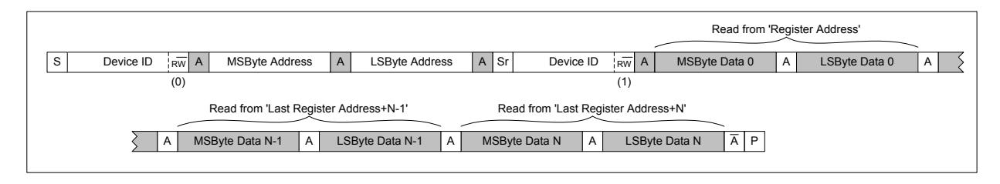

Figure 77 Multiple Register Read from Specified Address using Auto-increment

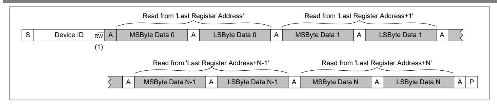

Figure 78 Multiple Register Read from Last Address using Auto-increment

Multiple Write and Multiple Read operations enable the host processor to access sequential blocks of the data in the WM8994 register map faster than is possible with single register operations. The auto-increment option is enabled when the AUTO\_INC register bit is set. This bit is defined in Table 118. Auto-increment is enabled by default.

## 3-WIRE (SPI) CONTROL MODE

The 3-wire control interface uses the  $\overline{CS}$ , SCLK and SDA pins.

In 3-wire control mode, a control word consists of 32 bits. The first bit is the read/write bit (R/W), which is followed by 15 address bits (A14 to A0) that determine which control register is accessed. The remaining 16 bits (B15 to B0) are data bits, corresponding to the 16 bits in each control register.

In 3-wire mode, every rising edge of SCLK clocks in one data bit from the SDA pin. A rising edge on  $\overline{\text{CS}}$  latches in a complete control word consisting of the last 32 bits.

In Write operations (R/W=0), all SDA bits are driven by the controlling device.

In Read operations (R/W=1), the SDA pin is driven by the controlling device to clock in the register address, after which the WM8994 drives the SDA pin to output the applicable data bits.

During data output, the SDA pin can be configured as CMOS or Open Drain, using the SPI\_CFG register bit, as described in Table 118. In Open Drain configuration, an external pull-up resistor is required to pull the SDA line high so that the logic 1 can be recognised by the master.

When SPI Continuous Read mode is enabled (SPI\_CONTRD = 1), the WM8994 will readback from incremental register addresses as long as  $\overline{CS}$  is held low and SCLK is toggled. In this mode, the WM8994 will increment the readback address after the first 32 clock cycles, and will output data from the next register address, and successive register addresses, MSB first, for as long as  $\overline{CS}$  is held low and SCLK is toggled.

An internal pull-down resistor is enabled by default on the  $\overline{\text{CS}}/\text{ADDR}$  pin; this can be configured using the CSNADDR PD register bit described in Table 118.

The 3-wire control mode timing is illustrated in Figure 79.

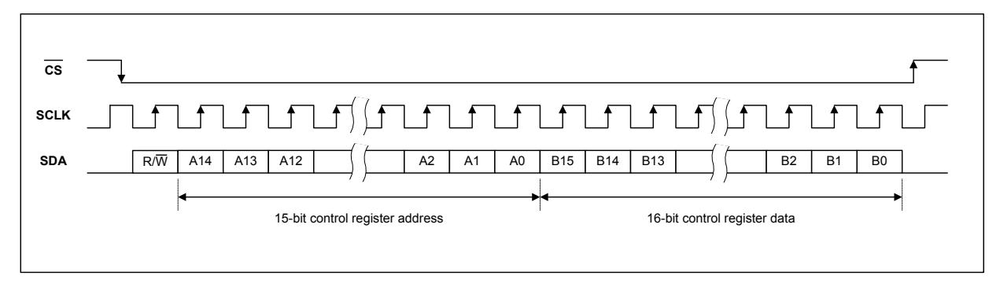

Figure 79 3-Wire Serial Control Interface

### 4-WIRE (SPI) CONTROL MODE

The 4-wire control interface uses the  $\overline{\text{CS}}$ , SCLK, SDA and SDOUT pins.

The SDOUT function must be enabled on one of the GPIO pins (see "General Purpose Input/Output").

The Data Output pin, SDOUT, can be configured as CMOS or 'Wired OR', as described in Table 118. In CMOS mode, SDOUT is driven low when not outputting register data bits. In 'Wired OR' mode, SDOUT is undriven (high impedance) when not outputting register data bits.

In Write operations (R/W=0), this mode is the same as 3-wire mode described above.

In Read operations (R/W=1), the SDA pin is ignored following receipt of the valid register address. SDOUT is driven by the WM8994.

When SPI Continuous Read mode is enabled (SPI\_CONTRD = 1), the WM8994 will readback from incremental register addresses as long as  $\overline{CS}$  is held low and SCLK is toggled. In this mode, the WM8994 will increment the readback address after the first 32 clock cycles, and will output data from the next register address, and successive register addresses, MSB first, for as long as  $\overline{CS}$  is held low and SCLK is toggled.

An internal pull-down resistor is enabled by default on the  $\overline{\text{CS}}/\text{ADDR}$  pin; this can be configured using the CSNADDR\_PD register bit described in Table 118.

The 4-wire control mode timing is illustrated in Figure 80 and Figure 81.

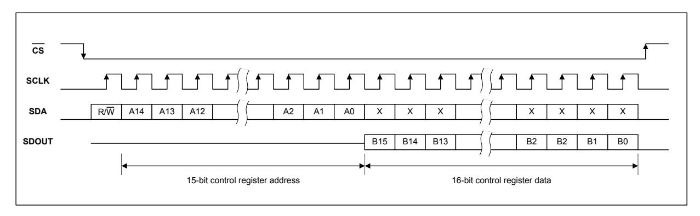

Figure 80 4-Wire Readback (CMOS)

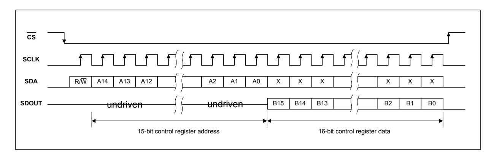

Figure 81 4-Wire Readback (Wired-'OR')

# **CONTROL WRITE SEQUENCER**

The Control Write Sequencer is a programmable unit that forms part of the WM8994 control interface logic. It provides the ability to perform a sequence of register write operations with the minimum of demands on the host processor - the sequence may be initiated by a single operation from the host processor and then left to execute independently.

Default sequences for Start-Up of each output driver and Shut-Down are provided (see ["Default](#page-180-0)  [Sequences"](#page-180-0) section). It is recommended that these default sequences are used unless changes become necessary.

When a sequence is initiated, the sequencer performs a series of pre-defined register writes. The host processor informs the sequencer of the start index of the required sequence within the sequencer's memory. At each step of the sequence, the contents of the selected register fields are read from the sequencer's memory and copied into the WM8994 control registers. This continues sequentially through the sequencer's memory until an "End of Sequence" bit is encountered; at this point, the sequencer stops and an Interrupt status flag is asserted. For cases where the timing of the write sequence is important, a programmable delay can be set for specific steps within the sequence.

Note that the Control Write Sequencer's internal clock is derived from the internal clock SYS\_CLK which must be enabled as described in ["Clocking and Sample Rates"](#page-149-0). The clock division from SYS\_CLK is handled transparently by the WM8994 without user intervention, provided that SYS\_CLK is configured as specified in ["Clocking and Sample Rates"](#page-149-0).

### **INITIATING A SEQUENCE**

The Register fields associated with running the Control Write Sequencer are described in [Table 121.](#page-177-0) Note that the operation of the Control Write Sequencer also requires the internal clock SYS\_CLK to be configured as described in ["Clocking and Sample Rates"](#page-149-0).

The Write Sequencer is enabled by setting the WSEQ\_ENA bit. The start index of the required sequence must be written to the WSEQ\_START\_INDEX field.

The Write Sequencer stores up to 128 register write commands. These are defined in Registers R12288 to R12799. There are 4 registers used to define each of the 128 possible commands. The value of WSEQ\_START\_INDEX selects the registers applicable to the first write command in the selected sequence.

Setting the WSEQ\_START bit initiates the sequencer at the given start index. The Write Sequencer can be interrupted by writing a logic 1 to the WSEQ\_ABORT bit.

The current status of the Write Sequencer can be read using two further register fields - when the WSEQ\_BUSY bit is asserted, this indicates that the Write Sequencer is busy. Note that, whilst the Control Write Sequencer is running a sequence (indicated by the WSEQ\_BUSY bit), normal read/write operations to the Control Registers cannot be supported. The index of the current step in the Write Sequencer can be read from the WSEQ\_CURRENT\_INDEX field; this is an indicator of the sequencer's progress. On completion of a sequence, this field holds the index of the last step within the last commanded sequence.

When the Write Sequencer reaches the end of a sequence, it asserts the WSEQ\_DONE\_EINT flag in Register R1841 (see [Table 86\)](#page-123-0). This flag can be used to generate an Interrupt Event on completion of the sequence. Note that the WSEQ\_DONE\_EINT flag is asserted to indicate that the WSEQ is NOT Busy.

| REGISTER ADDRESS                            | BIT | LABEL                                       | DEFAULT  | DESCRIPTION                                                                                                                                                                                                                                                                                       |
|------------------------------------------------|-----|---------------------------------------------|----------|---------------------------------------------------------------------------------------------------------------------------------------------------------------------------------------------------------------------------------------------------------------------------------------------------|
| R272 (0110h) Write Sequencer             | 15  | WSEQ_ENA                                    | 0        | Write Sequencer Enable. 0 = Disabled 1 = Enabled                                                                                                                                                                                                                                            |
| Ctrl (1)                                       | 9   | WSEQ_ABORT                                  | 0        | Writing a 1 to this bit aborts the current sequence and returns control of the device back to the serial control interface.                                                                                                                                                              |
|                                                | 8   | WSEQ_START                                  | 0        | Writing a 1 to this bit starts the write sequencer at the index location selected by WSEQ_START_INDEX. The sequence continues until it reaches an "End of sequence" flag. At the end of the sequence, this bit will be reset by the Write Sequencer.                            |
|                                                | 6:0 | WSEQ_START_ INDEX [6:0]                  | 000_0000 | Sequence Start Index. This field determines the memory location of the first command in the selected sequence. There are 127 Write Sequencer RAM addresses: 00h = WSEQ_ADDR0 (R12288) 01h = WSEQ_ADDR1 (R12292) 02h = WSEQ_ADDR2 (R12296)  7Fh = WSEQ_ADDR127 (R12796) |
| R273 (0111h) Write Sequencer Ctrl (2) | 8   | WSEQ_BUSY (read only)                    | 0        | Sequencer Busy flag (Read Only). 0 = Sequencer idle 1 = Sequencer busy Note: it is not possible to write to control registers via the control interface while the Sequencer is Busy.                                                                                            |
|                                                | 6:0 | WSEQ_CURRE NT_INDEX [6:0] (read only) | 000_0000 | Sequence Current Index. This indicates the memory location of the most recently accessed command in the write sequencer memory. Coding is the same as WSEQ_START_INDEX.                                                                                                            |

**Table 121 Write Sequencer Control - Initiating a Sequence**

# **PROGRAMMING A SEQUENCE**

A sequence consists of write operations to data bits (or groups of bits) within the control registers. Each write operation is defined by a block of 4 registers, which contain 6 fields as described in this section.

The block of 4 registers is the same for up to 128 steps held in the sequencer memory. Multiple sequences can be held in the memory at the same time; each sequence occupies its own range within the 128 available register blocks.

The following 6 fields are replicated 128 times - one for each of the sequencer's 128 steps. In the following descriptions, the term '*n*' is used to denote the step number, from 0 to 127.

WSEQ\_ADDR*n* is a 14-bit field containing the Control Register Address in which the data should be written.

WSEQ\_DATA*n* is an 8-bit field which contains the data to be written to the selected Control Register. The WSEQ\_DATA\_WIDTH*n* field determines how many of these bits are written to the selected register; the most significant bits (above the number indicated by WSEQ\_DATA\_WIDTH*n*) are ignored.

WSEQ\_DATA\_START*n* is a 4-bit field which identifies the LSB position within the selected Control Register to which the data should be written. For example, setting WSEQ\_DATA\_START*n* = 0100 will select bit 4 as the LSB position; in this case, 4-bit data would be written to bits 7:4.

WSEQ\_DATA\_WIDTH*n* is a 3-bit field which identifies the width of the data block to be written. This enables selected portions of a Control Register to be updated without any concern for other bits within the same register, eliminating the need for read-modify-write procedures. Values of 0 to 7 correspond to data widths of 1 to 8 respectively. For example, setting WSEQ\_DATA\_WIDTH*n* = 010 will cause a 3-bit data block to be written. Note that the maximum value of this field corresponds to an 8-bit data block; writing to register fields greater than 8 bits wide must be performed using two separate operations of the Control Write Sequencer.

WSEQ\_DELAY*n* is a 4-bit field which controls the waiting time between the current step and the next step in the sequence i.e. the delay occurs after the write in which it was called. The total delay time per step (including execution) is defined below, giving a useful range of execution/delay times from 562s up to 2.048s per step:

$$T = k \times (2^{WSEQ\_DELAY} + 8)$$

where k = 62.5s (under recommended operating conditions)

WSEQ\_EOS*n* is a 1-bit field which indicates the End of Sequence. If this bit is set, then the Control Write Sequencer will automatically stop after this step has been executed.

The register definitions for Step 0 are described in [Table 122.](#page-179-0) The equivalent definitions also apply to Step 1 through to Step 127, in the subsequent register address locations.

| REGISTER ADDRESS                       | BIT  | LABEL                      | DEFAULT | DESCRIPTION                                                                                                                                                                                               |
|-------------------------------------------|------|----------------------------|---------|-----------------------------------------------------------------------------------------------------------------------------------------------------------------------------------------------------------|
| R12288 (3000h) Write Sequencer 0 | 13:0 | WSEQ_ADDR 0 [13:0]      | 0000h   | Control Register Address to be written to in this sequence step.                                                                                                                                       |
| R12289 (3001h) Write Sequencer 1 | 7:0  | WSEQ_DATA 0 [7:0]       | 00h     | Data to be written in this sequence step. When the data width is less than 8 bits, then one or more of the MSBs of WSEQ_DATAn are ignored. It is recommended that unused bits be set to 0. |
| R12290 (3002h) Write Sequencer 2 | 10:8 | WSEQ_DATA _WIDTH0 [2:0] | 000     | Width of the data block written in this sequence step. 000 = 1 bit 001 = 2 bits 010 = 3 bits 011 = 4 bits 100 = 5 bits 101 = 6 bits 110 = 7 bits 111 = 8 bits                  |
|                                           | 3:0  | WSEQ_DATA _START0 [3:0] | 0000    | Bit position of the LSB of the data block written in this sequence step. 0000 = Bit 0 … 1111 = Bit 15                                                                                         |

| REGISTER ADDRESS | BIT | LABEL     | DEFAULT | DESCRIPTION                                                                        |
|---------------------|-----|-----------|---------|------------------------------------------------------------------------------------|
| R12291 (3003h)   | 8   | WSEQ_EOS0 | 0       | End of Sequence flag. This bit indicates whether the Control Write Sequencer       |
| Write               |     |           |         | should stop after executing this step.                                             |
| Sequencer 3         |     |           |         | 0 = Not end of sequence                                                            |
|                     |     |           |         | 1 = End of sequence (Stop the                                                      |
|                     |     |           |         | sequencer after this step).                                                        |
|                     | 3:0 | WSEQ_DELA | 0000    | Time delay after executing this step.                                              |
|                     |     | Y0 [3:0]  |         | Total time per step (including execution) = 62.5µs × (2 WSEQ_DELAY + 8) |

Table 122 Write Sequencer Control - Programming a Sequence

Note that a 'Dummy' write can be inserted into a control sequence by commanding the sequencer to write a value of 0 to bit 0 of Register R255 (00FFh). This is effectively a write to a non-existent register location. This can be used in order to create placeholders ready for easy adaptation of a control sequence. For example, a sequence could be defined to power-up a mono signal path from DACL to headphone, with a 'dummy' write included to leave space for easy modification to a stereo signal path configuration. Dummy writes can also be used in order to implement additional time delays between register writes. Dummy writes are included in both of the Headphone start-up sequences - see Table 123 and Table 124.

In summary, the Control Register to be written is set by the WSEQ\_ADDR*n* field. The data bits that are written are determined by a combination of WSEQ\_DATA\_START*n*, WSEQ\_DATA\_WIDTH*n* and WSEQ\_DATA*n*. This is illustrated below for an example case of writing to the VMID\_SEL field within Register R1 (0001h).

In this example, the Start Position is bit 01 (WSEQ\_DATA\_START*n* = 0001b) and the Data width is 2 bits (WSEQ\_DATA\_WIDTH*n* = 0001b). With these settings, the Control Write Sequencer would update the Control Register R1 [2:1] with the contents of WSEQ\_DATA*n* [1:0].

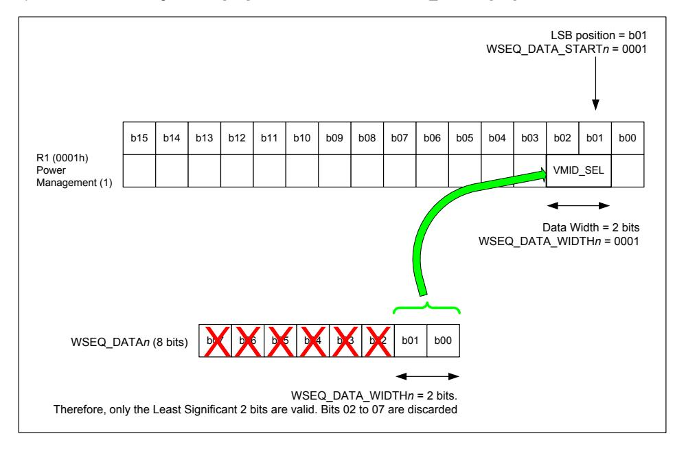

Figure 82 Control Write Sequencer Example

### **DEFAULT SEQUENCES**

When the WM8994 is powered up, a number of Control Write Sequences are available through default settings in the sequencer memory locations. The pre-programmed default settings include Start-Up and Shut-Down sequences for each of the output drivers. Note that the default sequences do not include audio signal path or gain setting configuration; this must be implemented prior to scheduling any of the default Start-Up sequences.

The entire sequencer memory may be programmed to users' own settings at any time, as described in ["Programming a Sequence"](#page-177-1). Users' own settings remain in memory regardless of WSEQ\_ENA, and are not affected by software resets (i.e. writing to Register R0). However, any non-default sequences are lost when the device is powered down.

The following default control sequences are provided:

- 1. Headphone Cold Start-Up This sequence powers up the headphone driver and charge pump. It commands the DC Servo to perform offset correction. It enables the master bias required for analogue functions. This sequence is intended for enabling the headphone output after initial power-on, when DC offset correction has not previously been run.
- 2. Headphone Warm Start-Up This sequence is similar to the Headphone Cold Start-Up, but does not include the DC Servo operation. This sequence is intended for fast enabling of the headphone output when DC offset correction has previously been scheduled and provided the analogue gain settings have not been updated since scheduling the DC offset correction.
- 3. Speaker Start-Up This sequence powers up the stereo speaker driver. It also enables the master bias required for analogue functions.
- 4. Earpiece Start-Up This sequence powers up the earpiece driver. It also enables the master bias required for analogue functions. The soft-start VMID option is used in order to suppress pops when the driver is enabled. This sequence is intended for enabling the earpiece driver when the master bias has not previously been enabled.
- 5. Line Output Start-Up This sequence powers up the line outputs. Active discharge of the line outputs is selected, followed by the soft-start VMID enable, followed by selection of the master bias and un-muting of the line outputs. This sequence is intended for enabling the line drivers when the master bias has not previously been enabled.
- 6. Speaker and Headphone Fast Shut-Down This sequence implements a fast shutdown of the speaker and headphone drivers. It also disables the DC Servo and charge pump circuits, and disables the analogue bias circuits using the soft-start (ramp) feature. This sequence is intended as a shut-down sequence when only the speaker or headphone drivers are enabled.
- 7. Generic Shut-Down This sequence shuts down all of the WM8994 output drivers, DC Servo, charge pump and analogue bias circuits. It is similar to the Fast Shut-Down sequence, with the additional control of the earpiece and line output drivers. Active discharge of the line outputs is included and all drivers are disabled as part of this sequence.

Specific details of each of these sequences is provided below.

#### **Headphone Cold Start-Up**

The Headphone Cold Start-Up sequence is initiated by writing 8100h to Register 272 (0110h). This single operation starts the Control Write Sequencer at Index Address 0 (00h) and executes the sequence defined i[n Table 123.](#page-181-0)

This sequence takes approximately 296ms to run.

| WSEQ INDEX | REGISTER ADDRESS | WIDTH  | START  | DATA | DELAY | EOS | DESCRIPTION               |
|---------------|---------------------|--------|--------|------|-------|-----|---------------------------|
| 0 (00h)       | R57 (0039h)         | 5 bits | Bit 2  | 1Bh  | 0h    | 0b  | STARTUP_BIAS_ENA = 1      |
|               |                     |        |        |      |       |     | VMID_BUF_ENA = 1          |
|               |                     |        |        |      |       |     | VMID_RAMP[1:0] = 11b      |
|               |                     |        |        |      |       |     | (delay = 0.5625ms)        |
| 1 (01h)       | R1 (0001h)          | 3 bits | Bit 0  | 03h  | 9h    | 0b  | BIAS_ENA = 1              |
|               |                     |        |        |      |       |     | VMID_SEL[1:0] = 01b       |
|               |                     |        |        |      |       |     | (delay = 32.5ms)          |
| 2 (02h)       | R76 (004Ch)         | 1 bit  | Bit 15 | 01h  | 6h    | 0b  | CP_ENA = 1                |
|               |                     |        |        |      |       |     | (delay = 4.5ms)           |
| 3 (03h)       | R1 (0001h)          | 2 bits | Bit 8  | 03h  | 0h    | 0b  | HPOUT1R_ENA = 1           |
|               |                     |        |        |      |       |     | HPOUT1L_ENA = 1           |
|               |                     |        |        |      |       |     | (delay = 0.5625ms)        |
| 4 (04h)       | R96 (0060h)         | 5 bits | Bit 1  | 11h  | 0h    | 0b  | HPOUT1R_DLY = 1           |
|               |                     |        |        |      |       |     | HPOUT1L_DLY = 1           |
|               |                     |        |        |      |       |     | (delay = 0.5625ms)        |
| 5 (05h)       | R84 (0054h)         | 6 bits | Bit 0  | 33h  | Ch    | 0b  | DCS_ENA_CHAN_0 = 1        |
|               |                     |        |        |      |       |     | DCS_ENA_CHAN_1 = 1        |
|               |                     |        |        |      |       |     | DCS_TRIG_STARTUP_0 = 1    |
|               |                     |        |        |      |       |     | DCS_TRIG_STARTUP_1 = 1    |
|               |                     |        |        |      |       |     | (delay = 256.5ms)         |
| 6 (06h)       | R255 (00FFh)        | 1 bit  | Bit 0  | 00h  | 0h    | 0b  | Dummy Write for expansion |
|               |                     |        |        |      |       |     | (delay = 0.5625ms)        |
| 7 (07h)       | R96 (0060h)         | 6 bits | Bit 2  | 3Bh  | 0h    | 1b  | HPOUT1R_OUTP = 1          |
|               |                     |        |        |      |       |     | HPOUT1R_RMV_SHORT =1      |
|               |                     |        |        |      |       |     | HPOUT1_DLY = 1            |
|               |                     |        |        |      |       |     | HPOUT1L_OUTP = 1          |
|               |                     |        |        |      |       |     | HPOUT1L_RMV_SHORT = 1     |
|               |                     |        |        |      |       |     | (delay = 0.5625ms)        |

**Table 123 Headphone Cold Start-Up Default Sequence**

#### **Headphone Warm Start-Up**

The Headphone Warm Start-Up sequence can be initiated by writing 8108h to Register 272 (0110h). This single operation starts the Control Write Sequencer at Index Address 8 (08h) and executes the sequence defined i[n Table 124.](#page-182-0)

This sequence takes approximately 40ms to run.

| WSEQ INDEX | REGISTER ADDRESS | WIDTH  | START  | DATA | DELAY | EOS | DESCRIPTION          |
|---------------|---------------------|--------|--------|------|-------|-----|----------------------|
| 8 (08h)       | R57 (0039h)         | 5 bits | Bit 2  | 1Bh  | 0h    | 0b  | STARTUP_BIAS_ENA = 1 |
|               |                     |        |        |      |       |     | VMID_BUF_ENA = 1     |
|               |                     |        |        |      |       |     | VMID_RAMP[1:0] = 11b |
|               |                     |        |        |      |       |     | (delay = 0.5625ms)   |
| 9 (09h)       | R1 (0001h)          | 3 bits | Bit 0  | 03h  | 9h    | 0b  | BIAS_ENA = 1         |
|               |                     |        |        |      |       |     | VMID_SEL[1:0] = 01b  |
|               |                     |        |        |      |       |     | (delay = 32.5ms)     |
| 10 (0Ah)      | R76 (004Ch)         | 1 bits | Bit 15 | 01h  | 6h    | 0b  | CP_ENA = 1           |
|               |                     |        |        |      |       |     | (delay = 4.5ms)      |
| 11 (0Bh)      | R1 (0001h)          | 2 bits | Bit 8  | 03h  | 0h    | 0b  | HPOUT1R_ENA = 1      |
|               |                     |        |        |      |       |     | HPOUT1L_ENA = 1      |
|               |                     |        |        |      |       |     | (delay = 0.5625ms)   |

| WSEQ INDEX | REGISTER ADDRESS | WIDTH  | START | DATA | DELAY | EOS | DESCRIPTION               |
|---------------|---------------------|--------|-------|------|-------|-----|---------------------------|
| 12 (0Ch)      | R96 (0060h)         | 5 bits | Bit 1 | 11h  | 0h    | 0b  | HPOUT1R_DLY = 1           |
|               |                     |        |       |      |       |     | HPOUT1L_DLY = 1           |
|               |                     |        |       |      |       |     | (delay = 0.5625ms)        |
| 13 (0Dh)      | R84 (0054h)         | 2 bits | Bit 0 | 03h  | 0h    | 0b  | DCS_ENA_CHAN_0 = 1        |
|               |                     |        |       |      |       |     | DCS_ENA_CHAN_1 = 1        |
|               |                     |        |       |      |       |     | (delay = 0.5625ms)        |
| 14 (0Eh)      | R255 (00FFh)        | 1 bits | Bit 0 | 00h  | 0h    | 0b  | Dummy Write for expansion |
|               |                     |        |       |      |       |     | (delay = 0.5625ms)        |
| 15 (0Fh)      | R96 (0060h)         | 6 bits | Bit 2 | 3Bh  | 0h    | 1b  | HPOUT1R_OUTP = 1          |
|               |                     |        |       |      |       |     | HPOUT1R_RMV_SHORT =1      |
|               |                     |        |       |      |       |     | HPOUT1_DLY = 1            |
|               |                     |        |       |      |       |     | HPOUT1L_OUTP = 1          |
|               |                     |        |       |      |       |     | HPOUT1L_RMV_SHORT = 1     |
|               |                     |        |       |      |       |     | (delay = 0.5625ms)        |

**Table 124 Headphone Warm Start-Up Default Sequence**

#### **Speaker Start-Up**

The Speaker Start-Up sequence can be initiated by writing 8110h to Register 272 (0110h). This single operation starts the Control Write Sequencer at Index Address 16 (10h) and executes the sequence defined i[n Table 125.](#page-182-1)

This sequence takes approximately 34ms to run.

| WSEQ INDEX | REGISTER ADDRESS | WIDTH  | START  | DATA | DELAY | EOS | DESCRIPTION          |
|---------------|---------------------|--------|--------|------|-------|-----|----------------------|
| 16 (10h)      | R57 (39h)           | 5 bits | Bit 2  | 1Bh  | 0h    | 0b  | STARTUP_BIAS_ENA = 1 |
|               |                     |        |        |      |       |     | VMID_BUF_ENA = 1     |
|               |                     |        |        |      |       |     | VMID_RAMP[1:0] = 11b |
|               |                     |        |        |      |       |     | (delay = 0.5625ms)   |
| 17 (11h)      | R1 (01h)            | 3 bits | Bit 0  | 03h  | 9h    | 0b  | BIAS_ENA = 1         |
|               |                     |        |        |      |       |     | VMID_SEL[1:0] = 01b  |
|               |                     |        |        |      |       |     | (delay = 32.5ms)     |
| 18 (12h)      | R1 (01h)            | 2 bits | Bit 12 | 03h  | 0h    | 1b  | SPKOUTL_ENA = 1      |
|               |                     |        |        |      |       |     | SPKOUTR_ENA = 1      |
|               |                     |        |        |      |       |     | (delay = 0.5625ms)   |

**Table 125 Speaker Start-Up Default Sequence**

## **Earpiece Start-Up**

The Earpiece Start-Up sequence can be initiated by writing 8113h to Register 272 (0110h). This single operation starts the Control Write Sequencer at Index Address 19 (13h) and executes the sequence defined in [Table 126.](#page-183-0)

This sequence takes approximately 259ms to run.

| WSEQ INDEX | REGISTER ADDRESS | WIDTH  | START  | DATA | DELAY | EOS | DESCRIPTION          |
|---------------|---------------------|--------|--------|------|-------|-----|----------------------|
| 19 (13h)      | R57 (39h)           | 6 bits | Bit 1  | 27h  | 0h    | 0b  | BIAS_SRC = 1         |
|               |                     |        |        |      |       |     | STARTUP_BIAS_ENA = 1 |
|               |                     |        |        |      |       |     | VMID_BUF_ENA = 1     |
|               |                     |        |        |      |       |     | VMID_RAMP[1:0] = 10b |
|               |                     |        |        |      |       |     | (delay = 0.5625ms)   |
| 20 (14h)      | R56 (38h)           | 1 bit  | Bit 6  | 01h  | 0h    | 0b  | HPOUT2_IN_ENA = 1    |
|               |                     |        |        |      |       |     | (delay = 0.5625ms)   |
| 21 (15h)      | R31 (1Fh)           | 1 bit  | Bit 5  | 00h  | 0h    | 1b  | HPOUT2_MUTE = 0      |
|               |                     |        |        |      |       |     | (delay = 0.5625ms)   |
| 22 (16h)      | R1 (01h)            | 1 bit  | Bit 11 | 01h  | 0h    | 0b  | HPOUT2_ENA = 1       |
|               |                     |        |        |      |       |     | (delay = 0.5625ms)   |
| 23 (17h)      | R1 (01h)            | 3 bits | Bit 0  | 03h  | Ch    | 0b  | BIAS_ENA = 1         |
|               |                     |        |        |      |       |     | VMID_SEL[1:0] = 01b  |
|               |                     |        |        |      |       |     | (delay = 256.5ms)    |
| 24 (18h)      | R57 (39h)           | 1 bit  | Bit 1  | 00h  | 0h    | 0b  | BIAS_SRC = 0         |
|               |                     |        |        |      |       |     | (delay = 0.5625ms)   |

**Table 126 Earpiece Start-Up Default Sequence**

#### **Line Output Start-Up**

The Line Output Start-Up sequence can be initiated by writing 8119h to Register 272 (0110h). This single operation starts the Control Write Sequencer at Index Address 25 (19h) and executes the sequence defined in [Table 127.](#page-184-0)

This sequence takes approximately 517ms to run.

| WSEQ INDEX | REGISTER ADDRESS | WIDTH  | START  | DATA | DELAY | EOS | DESCRIPTION              |
|---------------|---------------------|--------|--------|------|-------|-----|--------------------------|
| 25 (19h)      | R56 (38h)           | 2 bits | Bit 4  | 03h  | 0h    | 0b  | LINEOUT2_DISCH = 1       |
|               |                     |        |        |      |       |     | LINEOUT1_DISCH = 1       |
|               |                     |        |        |      |       |     | (delay = 0.5625ms)       |
| 26 (1Ah)      | R57 (39h)           | 6 bits | Bit 1  | 27h  | 0h    | 0b  | BIAS_SRC = 1             |
|               |                     |        |        |      |       |     | STARTUP_BIAS_ENA = 1     |
|               |                     |        |        |      |       |     | VMID_BUF_ENA = 1         |
|               |                     |        |        |      |       |     | VMID_RAMP[1:0] = 10b     |
|               |                     |        |        |      |       |     | (delay = 0.5625ms)       |
| 27 (1Bh)      | R56 (38h)           | 1 bit  | Bit 7  | 01h  | 0h    | 0b  | LINEOUT_VMID_BUF_ENA = 1 |
|               |                     |        |        |      |       |     | (delay = 0.5625ms)       |
| 28 (1Ch)      | R3 (03h)            | 4 bits | Bit 10 | 0Fh  | 0h    | 0b  | LINEOUT2P_ENA = 1        |
|               |                     |        |        |      |       |     | LINEOUT2N_ENA = 1        |
|               |                     |        |        |      |       |     | LINEOUT1P_ENA = 1        |
|               |                     |        |        |      |       |     | LINEOUT1N_ENA = 1        |
|               |                     |        |        |      |       |     | (delay = 0.5625ms)       |
| 29 (1Dh)      | R56 (38h)           | 2 bits | Bit 4  | 00h  | 0h    | 0b  | LINEOUT2_DISCH = 0       |
|               |                     |        |        |      |       |     | LINEOUT1_DISCH = 0       |
|               |                     |        |        |      |       |     | (delay = 0.5625ms)       |
| 30 (1Eh)      | R1 (01h)            | 3 bits | Bit 0  | 03h  | Dh    | 0b  | BIAS_ENA = 1             |
|               |                     |        |        |      |       |     | VMID_SEL = 01b           |
|               |                     |        |        |      |       |     | (delay = 512.5ms)        |
| 31 (1Fh)      | R57 (39h)           | 1 bit  | Bit 1  | 00h  | 0h    | 0b  | BIAS_SRC = 0             |
|               |                     |        |        |      |       |     | (delay = 0.5625ms)       |

| WSEQ INDEX | REGISTER ADDRESS | WIDTH  | START | DATA | DELAY | EOS | DESCRIPTION                              |
|---------------|---------------------|--------|-------|------|-------|-----|------------------------------------------|
| 32 (20h)      | R30 (1Eh)           | 2 bits | Bit 5 | 00h  | 0h    | 0b  | LINEOUT1P_MUTE = 0 LINEOUT1N_MUTE = 0 |
|               |                     |        |       |      |       |     | (delay = 0.5625ms)                       |
| 33 (21h)      | R30 (1Eh)           | 2 bits | Bit 1 | 00h  | 0h    | 1b  | LINEOUT2P_MUTE = 0 LINEOUT2N_MUTE = 0 |
|               |                     |        |       |      |       |     | (delay = 0.5625ms)                       |

**Table 127 Line Output Start-Up Default Sequence**

#### **Speaker and Headphone Fast Shut-Down**

The Speaker and Headphone Fast Shut-Down sequence can be initiated by writing 8122h to Register 272 (0110h). This single operation starts the Control Write Sequencer at Index Address 34 (22h) and executes the sequence defined in [Table 128.](#page-184-1)

This sequence takes approximately 37ms to run.

| WSEQ INDEX | REGISTER ADDRESS | WIDTH  | START  | DATA | DELAY | EOS | DESCRIPTION           |
|---------------|---------------------|--------|--------|------|-------|-----|-----------------------|
| 34 (22h)      | R96 (60h)           | 7 bits | Bit 1  | 00h  | 0h    | 0b  | HPOUT1R_DLY = 0       |
|               |                     |        |        |      |       |     | HPOUT1R_OUTP = 0      |
|               |                     |        |        |      |       |     | HPOUT1R_RMV_SHORT = 0 |
|               |                     |        |        |      |       |     | HPOUT1L_DLY = 0       |
|               |                     |        |        |      |       |     | HPOUT1L_OUTP = 0      |
|               |                     |        |        |      |       |     | HPOUT1L_RMV_SHORT = 0 |
|               |                     |        |        |      |       |     | (delay = 0.5625ms)    |
| 35 (23h)      | R84 (54h)           | 2 bits | Bit 0  | 00h  | 0h    | 0b  | DCS_ENA_CHAN_0 = 0    |
|               |                     |        |        |      |       |     | DCS_ENA_CHAN_1 = 0    |
|               |                     |        |        |      |       |     | (delay = 0.5625ms)    |
| 36 (24h)      | R1 (01h)            | 2 bits | Bit 8  | 00h  | 0h    | 0b  | HPOUT1R_ENA = 0       |
|               |                     |        |        |      |       |     | HPOUT1L_ENA = 0       |
|               |                     |        |        |      |       |     | (delay = 0.5625ms)    |
| 37 (25h)      | R76 (4Ch)           | 1 bit  | Bit 15 | 00h  | 0h    | 0b  | CP_ENA = 0            |
|               |                     |        |        |      |       |     | (delay = 0.5625ms)    |
| 38 (26h)      | R1 (01h)            | 2 bits | Bit 12 | 00h  | 0h    | 0b  | SPKOUTL_ENA = 0       |
|               |                     |        |        |      |       |     | SPKOUTR_ENA = 0       |
|               |                     |        |        |      |       |     | (delay = 0.5625ms)    |
| 39 (27h)      | R57 (39h)           | 6 bits | Bit 1  | 37h  | 0h    | 0b  | BIAS_SRC = 1          |
|               |                     |        |        |      |       |     | STARTUP_BIAS_ENA = 1  |
|               |                     |        |        |      |       |     | VMID_BUF_ENA = 1      |
|               |                     |        |        |      |       |     | VMID_RAMP[1:0] = 11b  |
|               |                     |        |        |      |       |     | (delay = 0.5625ms)    |
| 40 (28h)      | R1 (01h)            | 3 bits | Bit 0  | 00h  | 9h    | 0b  | BIAS_ENA = 0          |
|               |                     |        |        |      |       |     | VMID_SEL = 00b        |
|               |                     |        |        |      |       |     | (delay = 32.5ms)      |
| 41 (29h)      | R57 (39h)           | 6 bits | Bit 1  | 00h  | 0h    | 1b  | BIAS_SRC = 0          |
|               |                     |        |        |      |       |     | STARTUP_BIAS_ENA = 0  |
|               |                     |        |        |      |       |     | VMID_BUF_ENA = 0      |
|               |                     |        |        |      |       |     | VMID_RAMP[1:0] = 00b  |
|               |                     |        |        |      |       |     | (delay = 0.5625ms)    |

**Table 128 Speaker and Headphone Fast Shut-Down Default Sequence**

#### **Generic Shut-Down**

The Generic Shut-Down sequence can be initiated by writing 812Ah to Register 272 (0110h). This single operation starts the Control Write Sequencer at Index Address 42 (2Ah) and executes the sequence defined i[n Table 129.](#page-186-0)

This sequence takes approximately 522ms to run.

| INDEX ADDRESS HPOUT2_MUTE = 1 42 (2Ah) R31 (1Fh) 1 bit Bit 5 01h 0h 0b (delay = 0.5625ms) 43 (2Bh) R30 (1Eh) 6 bits Bit 1 33h 0h 0b LINEOUT2P_MUTE = 1 LINEOUT2N_MUTE = 1 LINEOUT1P_MUTE = 1 LINEOUT1N_MUTE = 1 (delay = 0.5625ms) 44 (2Ch) R96 (60h) 7 bits Bit 1 00h 0h 0b HPOUT1R_DLY = 0 HPOUT1R_OUTP = 0 HPOUT1R_RMV_SHORT = 0 HPOUT1L_DLY = 0 |  |
|--------------------------------------------------------------------------------------------------------------------------------------------------------------------------------------------------------------------------------------------------------------------------------------------------------------------------------------------------------------------------------------------------------------------------------------------------------|--|
|                                                                                                                                                                                                                                                                                                                                                                                                                                                        |  |
|                                                                                                                                                                                                                                                                                                                                                                                                                                                        |  |
|                                                                                                                                                                                                                                                                                                                                                                                                                                                        |  |
|                                                                                                                                                                                                                                                                                                                                                                                                                                                        |  |
|                                                                                                                                                                                                                                                                                                                                                                                                                                                        |  |
|                                                                                                                                                                                                                                                                                                                                                                                                                                                        |  |
|                                                                                                                                                                                                                                                                                                                                                                                                                                                        |  |
|                                                                                                                                                                                                                                                                                                                                                                                                                                                        |  |
|                                                                                                                                                                                                                                                                                                                                                                                                                                                        |  |
|                                                                                                                                                                                                                                                                                                                                                                                                                                                        |  |
|                                                                                                                                                                                                                                                                                                                                                                                                                                                        |  |
| HPOUT1L_OUTP = 0                                                                                                                                                                                                                                                                                                                                                                                                                                       |  |
| HPOUT1L_RMV_SHORT = 0                                                                                                                                                                                                                                                                                                                                                                                                                                  |  |
| (delay = 0.5625ms)                                                                                                                                                                                                                                                                                                                                                                                                                                     |  |
| 45 (2Dh) R84 (54h) 2 bits Bit 0 00h 0h 0b DCS_ENA_CHAN_0 = 0                                                                                                                                                                                                                                                                                                                                                                      |  |
| DCS_ENA_CHAN_1 = 0                                                                                                                                                                                                                                                                                                                                                                                                                                     |  |
| (delay = 0.5625ms)                                                                                                                                                                                                                                                                                                                                                                                                                                     |  |
| 46 (2Eh) R1 (01h) 2 bits Bit 8 00h 0h 0b HPOUT1R_ENA = 0                                                                                                                                                                                                                                                                                                                                                                          |  |
| HPOUT1L_ENA = 0                                                                                                                                                                                                                                                                                                                                                                                                                                        |  |
| (delay = 0.5625ms)                                                                                                                                                                                                                                                                                                                                                                                                                                     |  |
| CP_ENA = 0 47 (2Fh) R76 (4Ch) 1 bit Bit 15 00h 0h 0b                                                                                                                                                                                                                                                                                                                                                                              |  |
| (delay = 0.5625ms)                                                                                                                                                                                                                                                                                                                                                                                                                                     |  |
| 48 (30h) R1 (01h) 2 bits Bit 12 00h 0h 0b SPKOUTL_ENA = 0                                                                                                                                                                                                                                                                                                                                                                         |  |
| SPKOUTR_ENA = 0                                                                                                                                                                                                                                                                                                                                                                                                                                        |  |
| (delay = 0.5625ms)                                                                                                                                                                                                                                                                                                                                                                                                                                     |  |
|                                                                                                                                                                                                                                                                                                                                                                                                                                                        |  |
| 49 (31h) R57 (39h) 6 bits Bit 1 17h 0h 0b BIAS_SRC = 1                                                                                                                                                                                                                                                                                                                                                                            |  |
| STARTUP_BIAS_ENA = 1                                                                                                                                                                                                                                                                                                                                                                                                                                   |  |
| VMID_BUF_ENA = 1                                                                                                                                                                                                                                                                                                                                                                                                                                       |  |
| VMID_RAMP[1:0] = 01b                                                                                                                                                                                                                                                                                                                                                                                                                                   |  |
| (delay = 0.5625ms)                                                                                                                                                                                                                                                                                                                                                                                                                                     |  |
| 50 (32h) R1 (01h) 3 bits Bit 0 00h Dh 0b BIAS_ENA = 0                                                                                                                                                                                                                                                                                                                                                                             |  |
| VMID_SEL = 00b                                                                                                                                                                                                                                                                                                                                                                                                                                         |  |
| (delay = 512.5ms)                                                                                                                                                                                                                                                                                                                                                                                                                                      |  |
| 51 (33h) R1 (01h) 1 bit Bit 11 00h 0h 0b HPOUT2_ENA = 0                                                                                                                                                                                                                                                                                                                                                                           |  |
| (delay = 0.5625ms)                                                                                                                                                                                                                                                                                                                                                                                                                                     |  |
| LINEOUT2_DISCH = 1 52 (34h) R56 (38h) 2 bits Bit 4 03h 0h 0b                                                                                                                                                                                                                                                                                                                                                                      |  |
| LINEOUT1_DISCH = 1                                                                                                                                                                                                                                                                                                                                                                                                                                     |  |
| (delay = 0.5625ms)                                                                                                                                                                                                                                                                                                                                                                                                                                     |  |
| VROI = 1 53 (35h) R55 (37h) 1 bit Bit 0 01h 0h 0b                                                                                                                                                                                                                                                                                                                                                                                 |  |
| (delay = 0.5625ms)                                                                                                                                                                                                                                                                                                                                                                                                                                     |  |
| 54 (36h) R56 (38h) 1 bit Bit 6 00h 0h 0b HPOUT2_IN_ENA =0                                                                                                                                                                                                                                                                                                                                                                         |  |
| (delay = 0.5625ms)                                                                                                                                                                                                                                                                                                                                                                                                                                     |  |
| LINEOUT2P_ENA = 0 55 (37h) R3 (03h) 4 bits Bit 10 00h 0h 0b                                                                                                                                                                                                                                                                                                                                                                       |  |
| LINEOUT2N_ENA = 0                                                                                                                                                                                                                                                                                                                                                                                                                                      |  |
| LINEOUT1P_ENA = 0                                                                                                                                                                                                                                                                                                                                                                                                                                      |  |
| LINEOUT1N_ENA = 0                                                                                                                                                                                                                                                                                                                                                                                                                                      |  |
| (delay = 0.5625ms)                                                                                                                                                                                                                                                                                                                                                                                                                                     |  |

| WSEQ INDEX | REGISTER ADDRESS | WIDTH  | START | DATA | DELAY | EOS | DESCRIPTION              |
|---------------|---------------------|--------|-------|------|-------|-----|--------------------------|
| 56 (38h)      | R56 (38h)           | 1 bit  | Bit 7 | 00h  | 0h    | 0b  | LINEOUT_VMID_BUF_ENA = 0 |
|               |                     |        |       |      |       |     | (delay = 0.5625ms)       |
| 57 (39h)      | R55 (37h)           | 1 bit  | Bit 0 | 00h  | 0h    | 0b  | VROI = 0                 |
|               |                     |        |       |      |       |     | (delay = 0.5625ms)       |
| 58 (3Ah)      | R57 (39h)           | 6 bits | Bit 1 | 00h  | 0h    | 1b  | BIAS_SRC = 0             |
|               |                     |        |       |      |       |     | STARTUP_BIAS_ENA = 0     |
|               |                     |        |       |      |       |     | VMID_BUF_ENA = 0         |
|               |                     |        |       |      |       |     | VMID_RAMP[1:0] = 00b     |
|               |                     |        |       |      |       |     | (delay = 0.5625ms)       |

**Table 129 Generic Shut-Down Default Sequence**

# **LDO REGULATORS**

The WM8994 provides two integrated Low Drop-Out Regulators (LDOs). These are provided to generate the appropriate power supplies for internal circuits, simplifying and reducing the requirements for external supplies and associated components. A reference circuit powered by AVDD2 ensures the accuracy of the LDO regulator voltage settings.

Note that the integrated LDOs are only intended for generating the AVDD1 and DCVDD supply rails for the WM8994; they are not suitable for powering any additional or external loads.

LDO1 is intended for generating AVDD1 - the primary analogue power domain of the WM8994. LDO1 is powered by LDO1VDD and is enabled when a logic '1' is applied to the LDO1ENA pin. The logic level is determined with respect to the DBVDD voltage domain. The LDO1 start-up time is dependent on the external AVDD1 and VREFC capacitors; the start-up time is illustrated in [Figure 84](#page-187-0) and defined in [Table 130](#page-188-0) for the recommended external component conditions.

When LDO1 is enabled, the output voltage is controlled by the LDO1\_VSEL register field. Note that the LDO1 voltage difference LDO1VDD - AVDD1 must be higher than the LDO1 Drop-Out voltage (see "Electrical Characteristics").

LDO1 is disabled when a logic '0' is applied to the LDO1ENA pin. After LDO1 has been disabled, there is a minimum delay, defined as the LDO1 Cycle Time, during which LDO1 should not be reenabled. The LDO1 Cycle Time is illustrated in [Figure 84](#page-187-0) and defined in [Table 130](#page-188-0) for the recommended external component conditions.

When LDO1 is disabled, the output can be left floating or can be actively discharged, depending on the LDO1\_DISCH control bit.

It is possible to supply AVDD1 from an external supply. If AVDD1 is supplied externally, then LDO1 should be disabled, and the LDO1 output left floating (LDO1DISCH = 0). Note that the LDO1VDD voltage must be greater than or equal to AVDD1; this ensures that there is no leakage path through the LDO for the external supply.

Note that the WM8994 can operate with AVDD1 tied to 0V; power consumption may be reduced, but the analogue audio functions will not be supported.

LDO2 is intended for generating the DCVDD power domain which supplies the digital core functions on the WM8994. LDO2 is powered by LDO2VDD and is enabled when a logic '1' is applied to the LDO2ENA pin. The logic level is determined with respect to the DBVDD voltage domain. The LDO2 start-up time is dependent on the external DCVDD and VREFC capacitors; the start-up time is illustrated i[n Figure 84](#page-187-0) and defined in [Table 130](#page-188-0) for the recommended external component conditions.

When LDO2 is enabled, the output voltage is controlled by the LDO2\_VSEL register field.

LDO2 is disabled when a logic '0' is applied to the LDO2ENA pin. After LDO2 has been disabled, there is a minimum delay, defined as the LDO2 Cycle Time, during which LDO2 should not be re-

enabled. The LDO2 Cycle Time is illustrated in Figure 84 and defined in Table 130 for the recommended external component conditions.

When LDO2 is disabled, the output can be left floating or can be actively discharged, depending on the LDO2\_DISCH control bit.

It is possible to supply DCVDD from an external supply. If DCVDD is supplied externally, the LDO2ENA and LDO2DISCH bits should be set to 0. Note that the DBVDD voltage must be greater than or equal to DCVDD; this ensures that there is no leakage path through the LDO for the external supply.

An internal pull-down resistor is enabled by default on the LDO1ENA and LDO2ENA pins. These pull-down resistors can be configured using the register bits described in Table 131.

Decoupling capacitors should be connected to the voltage reference pin, VREFC, and also to the LDO outputs, AVDD1 and DCVDD. See "Applications Information" for further details.

The LDO Regulator connections and controls are illustrated in Figure 83. The register controls are defined in Table 131.

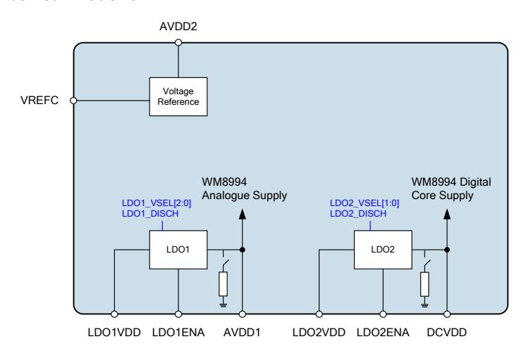

Figure 83 LDO Regulators

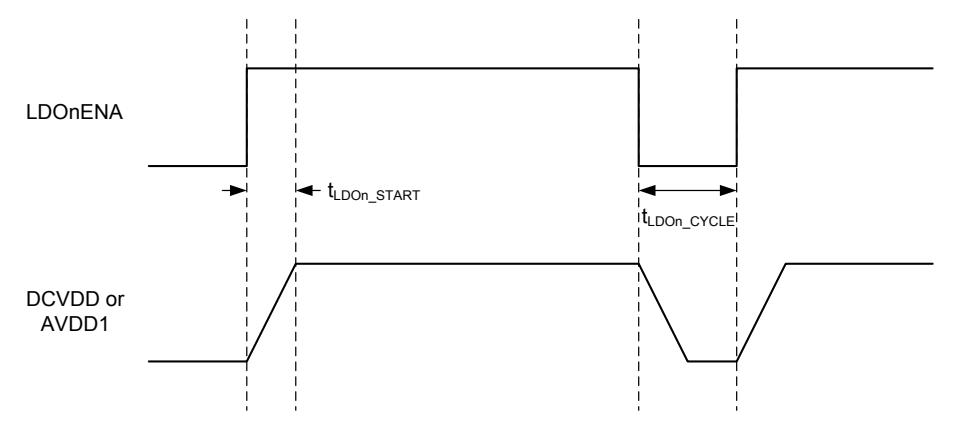

Figure 84 LDO Enable/Disable Timing Diagram

| PARAMETER                      | SYMBOL      | CONDITION         | MIN | TYP | MAX | UNITS |
|--------------------------------|-------------|-------------------|-----|-----|-----|-------|
| LDO1 Start-Up Time             | tLDO1_START | VREFC Cap = 1 uF  |     |     | 1.5 | ms    |
| LDO1 Cycle Time tLDO1_CYCLE |             | AVDD1 Cap = 4.7uF | 36  |     |     | ms    |
| LDO2 Start-Up Time             | tLDO2_START | VREFC Cap = 1 uF  |     |     | 1.5 | ms    |
| LDO2 Cycle Time                | tLDO2_CYCLE | DCVDD Cap = 1uF   | 36  |     |     | ms    |

**Table 130 LDO Timing**

| REGISTER ADDRESS | BIT | LABEL           | DEFAULT | DESCRIPTION                     |
|---------------------|-----|-----------------|---------|---------------------------------|
| R59 (003Bh)         | 3:1 | LDO1_VSEL [2:0] | 110     | LDO1 Output Voltage Select      |
| LDO 1               |     |                 |         | 2.4V to 3.1V in 100mV steps     |
|                     |     |                 |         | 000 = 2.4V                      |
|                     |     |                 |         | 001 = 2.5V                      |
|                     |     |                 |         | 010 = 2.6V                      |
|                     |     |                 |         | 011 = 2.7V                      |
|                     |     |                 |         | 100 = 2.8V                      |
|                     |     |                 |         | 101 = 2.9V                      |
|                     |     |                 |         | 110 = 3.0V                      |
|                     |     |                 |         | 111 = 3.1V                      |
|                     | 0   | LDO1_DISCH      | 1       | LDO1 Discharge Select           |
|                     |     |                 |         | 0 = LDO1 floating when disabled |
|                     |     |                 |         | 1 = LDO1 discharged when        |
|                     |     |                 |         | disabled                        |
| R60                 | 2:1 | LDO2_VSEL [1:0] | 01      | LDO2 Output Voltage Select      |
| (003Ch)             |     |                 |         | 0.9V to 1.2V in 100mV steps     |
| LDO 2               |     |                 |         | 00 = 0.9V                       |
|                     |     |                 |         | 01 = 1.0V                       |
|                     |     |                 |         | 10 = 1.1V                       |
|                     |     |                 |         | 11 = 1.2V                       |
|                     | 0   | LDO2_DISCH      | 1       | LDO2 Discharge Select           |
|                     |     |                 |         | 0 = LDO2 floating when disabled |
|                     |     |                 |         | 1 = LDO2 discharged when        |
|                     |     |                 |         | disabled                        |
| R1825               | 6   | LDO2ENA_PD      | 1       | LDO2ENA Pull-down enable        |
| (0721h)             |     |                 |         | 0 = Disabled                    |
| Pull Control        |     |                 |         | 1 = Enabled                     |
| (2)                 | 4   | LDO1ENA_PD      | 1       | LDO1ENA Pull-down enable        |
|                     |     |                 |         | 0 = Disabled                    |
|                     |     |                 |         | 1 = Enabled                     |

**Table 131 LDO Regulator Control**

# **POP SUPPRESSION CONTROL**

The WM8994 incorporates a number of features, including SilentSwitch™ technology, designed to suppress pops normally associated with Start-Up, Shut-Down or signal path control. To achieve maximum benefit from these features, careful attention is required to the sequence and timing of these controls. Note that, under the recommended usage conditions of the WM8994, these features will be configured by running the default Start-Up and Shut-Down sequences as described in the ["Control Write Sequencer"](#page-176-0) section. In these cases, the user does not need to set these register fields directly.

The Pop Suppression controls relating to the Headphone / Line Output drivers are described in the ["Analogue Output Signal Path"](#page-70-0) section.

Additional bias controls, also pre-programmed into Control Write Sequencer, are described in the ["Reference Voltages and Master Bias"](#page-191-0) section.

## **DISABLED LINE OUTPUT CONTROL**

The line outputs are biased to VMID in normal operation. To avoid audible pops caused by a disabled signal path dropping to AGND, the WM8994 can maintain these connections at VMID when the relevant output stage is disabled. This is achieved by connecting a buffered VMID reference to the output.

The buffered VMID reference is enabled by setting VMID\_BUF\_ENA. The output resistance is selectable, using the VROI register bit.

Note that, if LINEOUTn\_DISCH=1 (see [Table 133\)](#page-190-0), then the respective output will be discharged to AGND, and will not be connected to VMID.

| REGISTER ADDRESS                  | BIT | LABEL            | DEFAULT | DESCRIPTION                                                                                                                                              |
|--------------------------------------|-----|------------------|---------|----------------------------------------------------------------------------------------------------------------------------------------------------------|
| R55 (0037h) Additional Control | 0   | VROI             | 0       | Buffered VMID to Analogue Line Output Resistance (Disabled Outputs) 0 = 20k from buffered VMID to output 1 = 500 from buffered VMID to output |
| R57 (0039h) AntiPOP (2)           | 3   | VMID_BUF _ENA | 0       | VMID Buffer Enable 0 = Disabled 1 = Enabled (provided VMID_SEL > 00)                                                                               |

**Table 132 Disabled Line Output Control**

#### **LINE OUTPUT DISCHARGE CONTROL**

The line output paths can be actively discharged to AGND through internal resistors if desired. This is desirable at start-up in order to achieve a known output stage condition prior to enabling the soft-start VMID reference voltage. This is also desirable in shut-down to prevent the external connections from being affected by the internal circuits.

The line outputs LINEOUT1P and LINEOUT1N are discharged to AGND by setting LINEOUT1\_DISCH. The line outputs LINEOUT2P and LINEOUT2N are discharged to AGND by setting LINEOUT2\_DISCH.

The discharge resistance is dependent upon the respective LINEOUTn\_ENA bit, and also according to the VROI bit (see [Table 132\)](#page-189-0). The discharge resistance is noted in the "Electrical Characteristics" section.

| REGISTER ADDRESS        | BIT | LABEL              | DEFAULT | DESCRIPTION                                                           |
|----------------------------|-----|--------------------|---------|-----------------------------------------------------------------------|
| R56 (0038h) AntiPOP (1) | 5   | LINEOUT1_DISC H | 0       | Discharges LINEOUT1P and LINEOUT1N outputs                         |
|                            |     |                    |         | 0 = Not active 1 = Actively discharging LINEOUT1P and LINEOUT1N |
|                            | 4   | LINEOUT2_DISC H | 0       | Discharges LINEOUT2P and LINEOUT2N outputs 0 = Not active       |
|                            |     |                    |         | 1 = Actively discharging LINEOUT2P and LINEOUT2N                   |

**Table 133 Line Output Discharge Control**

# **VMID REFERENCE DISCHARGE CONTROL**

The VMID reference can be actively discharged to AGND through internal resistors. This is desirable at start-up in order to achieve a known initial condition prior to enabling the soft-start VMID reference; this ensures maximum suppression of audible pops associated with start-up. VMID is discharged by setting VMID\_DISCH.

| REGISTER ADDRESS | BIT | LABEL      | DEFAULT | DESCRIPTION             |
|---------------------|-----|------------|---------|-------------------------|
| R57 (0039h)         | 0   | VMID_DISCH | 0       | Connects VMID to ground |
| AntiPOP (2)         |     |            |         | 0 = Disabled            |
|                     |     |            |         | 1 = Enabled             |

**Table 134 VMID Reference Discharge Control**

### **INPUT VMID CLAMPS**

The analogue inputs can be clamped to Vmid using the INPUTS\_CLAMP bit described below. This allows pre-charging of the input AC coupling capacitors during power-up. Note that all eight inputs are clamped using the same control bit.

Note that INPUTS\_CLAMP must be set to 0 when the analogue input signal paths are in use.

| REGISTER        | BIT | LABEL        | DEFAULT | DESCRIPTION            |
|-----------------|-----|--------------|---------|------------------------|
| ADDRESS         |     |              |         |                        |
| R21 (15h)       | 6   | INPUTS_CLAMP | 0       | Input pad VMID clamp   |
| Input Mixer (1) |     |              |         | 0 = Clamp de-activated |
|                 |     |              |         | 1 = Clamp activated    |

**Table 135 Input VMID Clamps**

# **REFERENCE VOLTAGES AND MASTER BIAS**

This section describes the analogue reference voltage and bias current controls. It also describes the VMID soft-start circuit for pop suppressed start-up and shut-down.

The analogue circuits in the WM8994 require a mid-rail analogue reference voltage, VMID. This reference is generated from AVDD1 via a programmable resistor chain. Together with the external VMID decoupling capacitor, the programmable resistor chain determines the charging characteristic on VMID. This is controlled by VMID\_SEL[1:0], and can be used to optimise the reference for normal operation or low power standby as described i[n Table 136.](#page-191-1)

A buffered mid-rail reference voltage is provided. This is required for the single-ended configuration of the Input PGAs, and also for direct signal paths from the input pins to the Input Mixers, Output Mixers or Speaker Mixers. These requirements are noted in the relevant ["Analogue Input Signal Path"](#page-2-1) and ["Analogue Output Signal Path"](#page-70-0) sections. The buffered mid-rail reference is enabled by setting the VMID\_BUF\_ENA register bit.

The analogue circuits in the WM8994 require a bias current. The normal bias current is enabled by setting BIAS\_ENA. Note that the normal bias current source requires VMID to be enabled also.

| REGISTER ADDRESS | BIT | LABEL     | DEFAULT | DESCRIPTION                                                               |
|---------------------|-----|-----------|---------|---------------------------------------------------------------------------|
| R1 (0001h)          | 2:1 | VMID_SEL  | 00      | VMID Divider Enable and Select                                            |
| Power               |     | [1:0]     |         | 00 = VMID disabled (for OFF mode)                                         |
| Management          |     |           |         | 01 = 2 x 40k divider (for normal operation)                              |
| (1)                 |     |           |         | 10 = 2 x 240k divider (for low power standby)                            |
|                     |     |           |         | 11 = Reserved                                                             |
|                     | 0   | BIAS_ENA  | 0       | Enables the Normal bias current generator (for all analogue functions) |
|                     |     |           |         | 0 = Disabled                                                              |
|                     |     |           |         | 1 = Enabled                                                               |
| R57 (0039h)         | 3   | VMID_BUF_ | 0       | VMID Buffer Enable                                                        |
| AntiPOP (2)         |     | ENA       |         | 0 = Disabled                                                              |
|                     |     |           |         | 1 = Enabled (provided VMID_SEL > 00)                                      |

**Table 136 Reference Voltages and Master Bias Enable**

A pop-suppressed start-up requires VMID to be enabled smoothly, without the step change normally associated with the initial stage of the VMID capacitor charging. A pop-suppressed start-up also requires the analogue bias current to be enabled throughout the signal path prior to the VMID reference voltage being applied. The WM8994 incorporates pop-suppression circuits which address these requirements.

An alternate bias current source (Start-Up Bias) is provided for pop-free start-up; this is enabled by the STARTUP\_BIAS\_ENA register bit. The start-up bias is selected (in place of the normal bias) using the BIAS\_SRC bit. It is recommended that the start-up bias is used during start-up, before switching back to the higher quality, normal bias.

A soft-start circuit is provided in order to control the switch-on of the VMID reference. The soft-start control circuit offers two slew rates for enabling the VMID reference; these are selected and enabled by VMID\_RAMP. When the soft-start circuit is enabled prior to enabling VMID\_SEL, the reference voltage rises smoothly, without the step change that would otherwise occur. It is recommended that the soft-start circuit and the output signal path be enabled before VMID is enabled by VMID\_SEL.

A soft shut-down is provided, using the soft-start control circuit and the start-up bias current generator. The soft shut-down of VMID is achieved by setting VMID\_RAMP, STARTUP\_BIAS\_ENA and BIAS\_SRC to select the start-up bias current and soft-start circuit prior to setting VMID\_SEL=00.

Note that, if the VMID\_RAMP function is enabled for soft start-up or soft shut-down then, after setting VMID\_SEL = 00 to disable VMID, the soft-start circuit must be reset before re-enabling VMID. The soft-start circuit is reset by setting VMID\_RAMP = 00. After resetting the soft-start circuit, the VMID\_RAMP register may be updated to the required setting for the next VMID transition.

The VMID soft-start register controls are defined i[n Table 137.](#page-192-0)

| REGISTER ADDRESS        | BIT | LABEL                | DEFAULT | DESCRIPTION                                                                                                                                                                                                                                                  |
|----------------------------|-----|----------------------|---------|--------------------------------------------------------------------------------------------------------------------------------------------------------------------------------------------------------------------------------------------------------------|
| R57 (0039h) AntiPOP (2) | 6:5 | VMID_RAMP [1:0]      | 10      | VMID soft start enable / slew rate control                                                                                                                                                                                                                |
|                            |     |                      |         | 00 = Normal slow start                                                                                                                                                                                                                                       |
|                            |     |                      |         | 01 = Normal fast start                                                                                                                                                                                                                                       |
|                            |     |                      |         | 10 = Soft slow start                                                                                                                                                                                                                                         |
|                            |     |                      |         | 11 = Soft fast start                                                                                                                                                                                                                                         |
|                            |     |                      |         | If VMID_RAMP = 1X is selected for VMID start-up or shut-down, then the soft-start circuit must be reset by setting VMID_RAMP=00 after VMID is disabled, before VMID is re-enabled. VMID is disabled / enabled using the VMID_SEL register. |
|                            | 2   | STARTUP_BIAS_ ENA | 0       | Enables the Start-Up bias current generator                                                                                                                                                                                                               |
|                            |     |                      |         | 0 = Disabled                                                                                                                                                                                                                                                 |
|                            |     |                      |         | 1 = Enabled                                                                                                                                                                                                                                                  |
|                            | 1   | BIAS_SRC             | 1       | Selects the bias current source                                                                                                                                                                                                                              |
|                            |     |                      |         | 0 = Normal bias                                                                                                                                                                                                                                              |
|                            |     |                      |         | 1 = Start-Up bias                                                                                                                                                                                                                                            |

**Table 137 Soft Start Control**

# **POWER MANAGEMENT**

The WM8994 has control registers that allow users to select which functions are active. For minimum power consumption, unused functions should be disabled. To minimise pop or click noise, it is important to enable or disable functions in the correct order. See ["Control Write Sequencer"](#page-176-0) for details of recommended control sequences.

| REGISTER ADDRESS | BIT | LABEL       | DEFAULT | DESCRIPTION                                             |
|---------------------|-----|-------------|---------|---------------------------------------------------------|
| R1 (0001h) Power | 13  | SPKOUTR_ENA | 0       | SPKMIXR Mixer, SPKRVOL PGA and SPKOUTR Output Enable |
| Management          |     |             |         | 0 = Disabled                                            |
| (1)                 |     |             |         | 1 = Enabled                                             |
|                     | 12  | SPKOUTL_ENA | 0       | SPKMIXL Mixer, SPKLVOL PGA and SPKOUTL Output Enable |
|                     |     |             |         | 0 = Disabled                                            |
|                     |     |             |         | 1 = Enabled                                             |
|                     | 11  | HPOUT2_ENA  | 0       | HPOUT2 and HPOUT2MIX Enable                             |
|                     |     |             |         | 0 = Disabled                                            |
|                     |     |             |         | 1 = Enabled                                             |
|                     | 9   | HPOUT1L_ENA | 0       | Enables HPOUT1L input stage                             |
|                     |     |             |         | 0 = Disabled                                            |
|                     |     |             |         | 1 = Enabled                                             |
|                     | 8   | HPOUT1R_ENA | 0       | Enables HPOUT1R input stage                             |
|                     |     |             |         | 0 = Disabled                                            |
|                     |     |             |         | 1 = Enabled                                             |
|                     | 5   | MICB2_ENA   | 0       | Microphone Bias 2 Enable                                |
|                     |     |             |         | 0 = Disabled                                            |
|                     |     |             |         | 1 = Enabled                                             |
|                     | 4   | MICB1_ENA   | 0       | Microphone Bias 1 Enable                                |
|                     |     |             |         | 0 = Disabled                                            |
|                     |     |             |         | 1 = Enabled                                             |
|                     | 2:1 | VMID_SEL    | 00      | VMID Divider Enable and Select                          |
|                     |     | [1:0]       |         | 00 = VMID disabled (for OFF mode)                       |
|                     |     |             |         | 01 = 2 x 40k divider (Normal mode)                     |
|                     |     |             |         | 10 = 2 x 240k divider (Standby mode)                   |
|                     |     |             |         | 11 = Reserved                                           |
|                     | 0   | BIAS_ENA    | 0       | Enables the Normal bias current                         |
|                     |     |             |         | generator (for all analogue functions)                  |
|                     |     |             |         | 0 = Disabled                                            |
|                     |     |             |         | 1 = Enabled                                             |

| REGISTER ADDRESS | BIT | LABEL       | DEFAULT | DESCRIPTION                                                                                                         |
|---------------------|-----|-------------|---------|---------------------------------------------------------------------------------------------------------------------|
| R2 (0002h)          | 14  | TSHUT_ENA   | 1       | Thermal Sensor Enable                                                                                               |
| Power               |     |             |         | 0 = Disabled                                                                                                        |
| Management          |     |             |         | 1 = Enabled                                                                                                         |
| (2)                 | 13  | TSHUT_OPDIS | 1       | Thermal Shutdown Control                                                                                            |
|                     |     |             |         | (Causes audio outputs to be disabled if an over-temperature occurs. The thermal sensor must also be enabled.) |
|                     |     |             |         | 0 = Disabled                                                                                                        |
|                     |     |             |         | 1 = Enabled                                                                                                         |
|                     | 11  | OPCLK_ENA   | 0       | GPIO Clock Output (OPCLK) Enable                                                                                    |
|                     |     |             |         | 0 = Disabled                                                                                                        |
|                     |     |             |         | 1 = Enabled                                                                                                         |
|                     | 9   | MIXINL_ENA  | 0       | Left Input Mixer Enable                                                                                             |
|                     |     |             |         | (Enables MIXINL and RXVOICE input to MIXINL)                                                                     |
|                     |     |             |         | 0 = Disabled                                                                                                        |
|                     |     |             |         | 1 = Enabled                                                                                                         |
|                     | 8   | MIXINR_ENA  | 0       | Right Input Mixer Enable                                                                                            |
|                     |     |             |         | (Enables MIXINR and RXVOICE input to MIXINR)                                                                     |
|                     |     |             |         | 0 = Disabled                                                                                                        |
|                     |     |             |         | 1 = Enabled                                                                                                         |
|                     | 7   | IN2L_ENA    | 0       | IN2L Input PGA Enable                                                                                               |
|                     |     |             |         | 0 = Disabled                                                                                                        |
|                     |     |             |         | 1 = Enabled                                                                                                         |
|                     | 6   | IN1L_ENA    | 0       | IN1L Input PGA Enable                                                                                               |
|                     |     |             |         | 0 = Disabled                                                                                                        |
|                     |     |             |         | 1 = Enabled                                                                                                         |
|                     | 5   | IN2R_ENA    | 0       | IN2R Input PGA Enable                                                                                               |
|                     |     |             |         | 0 = Disabled                                                                                                        |
|                     |     |             |         | 1 = Enabled                                                                                                         |
|                     | 4   | IN1R_ENA    | 0       | IN1R Input PGA Enable                                                                                               |
|                     |     |             |         | 0 = Disabled                                                                                                        |
|                     |     |             |         | 1 = Enabled                                                                                                         |

| REGISTER ADDRESS               | BIT | LABEL         | DEFAULT | DESCRIPTION                                                                   |
|-----------------------------------|-----|---------------|---------|-------------------------------------------------------------------------------|
| R3 (0003h) Power Management | 13  | LINEOUT1N_ENA | 0       | LINEOUT1N Line Out and LINEOUT1NMIX Enable 0 = Disabled                 |
| (3)                               |     |               |         | 1 = Enabled                                                                   |
|                                   | 12  | LINEOUT1P_ENA | 0       | LINEOUT1P Line Out and LINEOUT1PMIX Enable                                 |
|                                   |     |               |         | 0 = Disabled                                                                  |
|                                   |     |               |         | 1 = Enabled                                                                   |
|                                   | 11  | LINEOUT2N_ENA | 0       | LINEOUT2N Line Out and LINEOUT2NMIX Enable                                 |
|                                   |     |               |         | 0 = Disabled                                                                  |
|                                   |     |               |         | 1 = Enabled                                                                   |
|                                   | 10  | LINEOUT2P_ENA | 0       | LINEOUT2P Line Out and LINEOUT2PMIX Enable                                 |
|                                   |     |               |         | 0 = Disabled                                                                  |
|                                   |     |               |         | 1 = Enabled                                                                   |
|                                   | 9   | SPKRVOL_ENA   | 0       | SPKMIXR Mixer and SPKRVOL PGA Enable                                       |
|                                   |     |               |         | 0 = Disabled                                                                  |
|                                   |     |               |         | 1 = Enabled                                                                   |
|                                   |     |               |         | Note that SPKMIXR and SPKRVOL are also enabled when SPKOUTR_ENA is set. |
|                                   | 8   | SPKLVOL_ENA   | 0       | SPKMIXL Mixer and SPKLVOL PGA Enable                                       |
|                                   |     |               |         | 0 = Disabled                                                                  |
|                                   |     |               |         | 1 = Enabled                                                                   |
|                                   |     |               |         | Note that SPKMIXL and SPKLVOL are also enabled when SPKOUTL_ENA is set. |
|                                   | 7   | MIXOUTLVOL_E  | 0       | MIXOUTL Left Volume Control Enable                                            |
|                                   |     | NA            |         | 0 = Disabled                                                                  |
|                                   |     |               |         | 1 = Enabled                                                                   |
|                                   | 6   | MIXOUTRVOL_E  | 0       | MIXOUTR Right Volume Control Enable                                           |
|                                   |     | NA            |         | 0 = Disabled                                                                  |
|                                   |     |               |         | 1 = Enabled                                                                   |
|                                   | 5   | MIXOUTL_ENA   | 0       | MIXOUTL Left Output Mixer Enable                                              |
|                                   |     |               |         | 0 = Disabled                                                                  |
|                                   |     |               |         | 1 = Enabled                                                                   |
|                                   | 4   | MIXOUTR_ENA   | 0       | MIXOUTR Right Output Mixer Enable                                             |
|                                   |     |               |         | 0 = Disabled                                                                  |
|                                   |     |               |         | 1 = Enabled                                                                   |

| REGISTER ADDRESS               | BIT                                                    | LABEL         | DEFAULT                                         | DESCRIPTION                                                                              |  |
|-----------------------------------|--------------------------------------------------------|---------------|-------------------------------------------------|------------------------------------------------------------------------------------------|--|
| R4 (0004h) Power Management | 13                                                     | AIF2ADCL_ENA  | 0                                               | Enable AIF2ADC (Left) output path 0 = Disabled 1 = Enabled                         |  |
| (4)                               | 12                                                     | AIF2ADCR_ENA  | 0                                               | Enable AIF2ADC (Right) output path 0 = Disabled 1 = Enabled                        |  |
|                                   | 11                                                     | AIF1ADC2L_ENA | 0                                               | Enable AIF1ADC2 (Left) output path (AIF1, Timeslot 1) 0 = Disabled 1 = Enabled  |  |
|                                   | 10                                                     | AIF1ADC2R_ENA | 0                                               | Enable AIF1ADC2 (Right) output path (AIF1, Timeslot 1) 0 = Disabled 1 = Enabled |  |
|                                   | 9                                                      | AIF1ADC1L_ENA | 0                                               | Enable AIF1ADC1 (Left) output path (AIF1, Timeslot 0) 0 = Disabled 1 = Enabled  |  |
|                                   | 8                                                      | AIF1ADC1L_ENA | 0                                               | Enable AIF1ADC1 (Right) output path (AIF1, Timeslot 0) 0 = Disabled 1 = Enabled |  |
|                                   | 5                                                      | DMIC2L_ENA    | 0                                               | Digital microphone DMICDAT2 Left channel enable 0 = Disabled 1 = Enabled        |  |
|                                   | 4                                                      | DMIC2R_ENA    | 0                                               | Digital microphone DMICDAT2 Right channel enable 0 = Disabled 1 = Enabled       |  |
|                                   | 3 DMIC1L_ENA 0 channel enable 0 = Disabled |               | Digital microphone DMICDAT1 Left 1 = Enabled |                                                                                          |  |
|                                   | 2                                                      | DMIC1R_ENA    | 0                                               | Digital microphone DMICDAT1 Right channel enable 0 = Disabled 1 = Enabled       |  |
|                                   | 1                                                      | ADCL_ENA      | 0                                               | Left ADC Enable 0 = ADC disabled 1 = ADC enabled                                   |  |
|                                   | 0                                                      | ADCR_ENA      | 0                                               | Right ADC Enable 0 = ADC disabled 1 = ADC enabled                                  |  |

| REGISTER ADDRESS   | BIT | LABEL         | DEFAULT | DESCRIPTION                                              |  |  |
|-----------------------|-----|---------------|---------|----------------------------------------------------------|--|--|
| R5 (0005h)            | 13  | AIF2DACL_ENA  | 0       | Enable AIF2DAC (Left) input path                         |  |  |
| Power                 |     |               |         | 0 = Disabled                                             |  |  |
| Management            |     |               |         | 1 = Enabled                                              |  |  |
| (5)                   | 12  | AIF2DACR_ENA  | 0       | Enable AIF2DAC (Right) input path                        |  |  |
|                       |     |               |         | 0 = Disabled                                             |  |  |
|                       |     |               |         | 1 = Enabled                                              |  |  |
|                       | 11  | AIF1DAC2L_ENA | 0       | Enable AIF1DAC2 (Left) input path (AIF1,                 |  |  |
|                       |     |               |         | Timeslot 1)                                              |  |  |
|                       |     |               |         | 0 = Disabled                                             |  |  |
|                       |     |               |         | 1 = Enabled                                              |  |  |
|                       | 10  | AIF1DAC2R_ENA | 0       | Enable AIF1DAC2 (Right) input path (AIF1, Timeslot 1) |  |  |
|                       |     |               |         | 0 = Disabled                                             |  |  |
|                       |     |               |         | 1 = Enabled                                              |  |  |
|                       | 9   | AIF1DAC1L_ENA | 0       | Enable AIF1DAC1 (Left) input path (AIF1, Timeslot 0)  |  |  |
|                       |     |               |         | 0 = Disabled                                             |  |  |
|                       |     |               |         | 1 = Enabled                                              |  |  |
|                       | 8   | AIF1DAC1R_ENA | 0       | Enable AIF1DAC1 (Right) input path (AIF1, Timeslot 0) |  |  |
|                       |     |               |         | 0 = Disabled                                             |  |  |
|                       |     |               |         | 1 = Enabled                                              |  |  |
|                       | 3   | DAC2L_ENA     | 0       | Left DAC2 Enable                                         |  |  |
|                       |     |               |         | 0 = DAC disabled                                         |  |  |
|                       |     |               |         | 1 = DAC enabled                                          |  |  |
|                       | 2   | DAC2R_ENA     | 0       | Right DAC2 Enable                                        |  |  |
|                       |     |               |         | 0 = DAC disabled                                         |  |  |
|                       |     |               |         | 1 = DAC enabled                                          |  |  |
|                       | 1   | DAC1L_ENA     | 0       | Left DAC1 Enable                                         |  |  |
|                       |     |               |         | 0 = DAC disabled                                         |  |  |
|                       |     |               |         | 1 = DAC enabled                                          |  |  |
|                       | 0   | DAC1R_ENA     | 0       | Right DAC1 Enable                                        |  |  |
|                       |     |               |         | 0 = DAC disabled                                         |  |  |
|                       |     |               |         | 1 = DAC enabled                                          |  |  |
| R76 (004Ch)           | 15  | CP_ENA        | 0       | Enable charge-pump digits                                |  |  |
| Charge Pump           |     |               |         | 0 = Disable                                              |  |  |
| (1)                   |     |               |         | 1 = Enable                                               |  |  |
| R84 (0054h)           | 1   | DCS_ENA_CHAN  | 0       | DC Servo enable for HPOUT1R                              |  |  |
| DC Servo (1)          |     | _1            |         | 0 = Disabled                                             |  |  |
|                       |     |               |         | 1 = Enabled                                              |  |  |
|                       | 0   | DCS_ENA_CHAN  | 0       | DC Servo enable for HPOUT1L                              |  |  |
|                       |     | _0            |         | 0 = Disabled                                             |  |  |
|                       |     |               |         | 1 = Enabled                                              |  |  |
| R272 (0110h)          | 8   | WSEQ_ENA      | 0       | Write Sequencer Enable.                                  |  |  |
| Write                 |     |               |         | 0 = Disabled                                             |  |  |
| Sequencer Ctrl (1) |     |               |         | 1 = Enabled                                              |  |  |
| R512 (0200h)          | 0   | AIF1CLK_ENA   | 0       | AIF1CLK Enable                                           |  |  |
| AIF 1 Clocking        |     |               |         | 0 = Disabled                                             |  |  |
| (1)                   |     |               |         | 1 = Enabled                                              |  |  |
| R516 (0204h)          | 0   | AIF2CLK_ENA   | 0       | AIF2CLK Enable                                           |  |  |
| AIF 2 Clocking        |     |               |         | 0 = Disabled                                             |  |  |
| (1)                   |     |               |         | 1 = Enabled                                              |  |  |
|                       |     |               |         |                                                          |  |  |

| REGISTER ADDRESS | BIT | LABEL              | DEFAULT | DESCRIPTION                                                                      |  |
|---------------------|-----|--------------------|---------|----------------------------------------------------------------------------------|--|
| R520 (0208h)        | 4   | TOCLK_ENA          | 0       | Slow Clock (TOCLK) Enable                                                        |  |
| Clocking (1)        |     |                    |         | 0 = Disabled                                                                     |  |
|                     |     |                    |         | 1 = Enabled                                                                      |  |
|                     |     |                    |         | This clock is required for zero-cross timeout.                                |  |
|                     | 3   | AIF1DSPCLK_EN A | 0       | AIF1 Processing Clock Enable                                                     |  |
|                     |     |                    |         | 0 = Disabled                                                                     |  |
|                     |     |                    |         | 1 = Enabled                                                                      |  |
|                     | 2   | AIF2DSPCLK_EN      | 0       | AIF2 Processing Clock Enable                                                     |  |
|                     |     | A                  |         | 0 = Disabled                                                                     |  |
|                     |     |                    |         | 1 = Enabled                                                                      |  |
|                     | 1   | SYSDSPCLK_EN       | 0       | Digital Mixing Processor Clock Enable                                            |  |
|                     |     | A                  |         | 0 = Disabled                                                                     |  |
|                     |     |                    |         | 1 = Enabled                                                                      |  |
| R544 (0220h)        | 0   | FLL1_ENA           | 0       | FLL1 Enable                                                                      |  |
| FLL1 Control        |     |                    |         | 0 = Disabled                                                                     |  |
| (1)                 |     |                    |         | 1 = Enabled                                                                      |  |
|                     |     |                    |         | This should be set as the final step of the                                      |  |
|                     |     |                    |         | FLL1 enable sequence, ie. after the other FLL registers have been configured. |  |
| R576 (0240h)        | 0   | FLL2_ENA           | 0       | FLL2 Enable                                                                      |  |
| FLL2 Control        |     |                    |         | 0 = Disabled                                                                     |  |
| (1)                 |     |                    |         | 1 = Enabled                                                                      |  |
|                     |     |                    |         | This should be set as the final step of the                                      |  |
|                     |     |                    |         | FLL2 enable sequence, ie. after the other                                        |  |
|                     |     |                    |         | FLL registers have been configured.                                              |  |

**Table 138 Power Management**

### THERMAL SHUTDOWN

The WM8994 incorporates a temperature sensor which detects when the device temperature is within normal limits or if the device is approaching a hazardous temperature condition. The temperature sensor can be configured to automatically disable the audio outputs of the WM8994 in response to an overtemperature condition (approximately 150°C).

The temperature status can be output directly on a GPIO pin, as described in the "General Purpose Input/Output" section. The temperature sensor can also be used to generate Interrupt events, as described in the "Interrupts" section. The GPIO and Interrupt functions can be used to indicate either a Warning Temperature event or the Shutdown Temperature event.

The temperature sensor is enabled by setting the TSHUT\_ENA register bit. When the TSHUT\_OPDIS is also set, then a device over-temperature condition will cause the speaker outputs (SPKOUTL and SPKOUTR) of the WM8994 to be disabled; this response is likely to prevent any damage to the device attributable to the large currents of the output drivers.

Note that, to prevent pops and clicks, TSHUT\_ENA and TSHUT\_OPDIS should only be updated whilst the speaker and headphone outputs are disabled.

| REGISTER ADDRESS | BIT | LABEL                                                                                                                                   | DEFAULT | DESCRIPTION              |  |
|---------------------|-----|-----------------------------------------------------------------------------------------------------------------------------------------|---------|--------------------------|--|
| R2 (0002h)          | 14  | TSHUT_ENA                                                                                                                               | 1       | Thermal sensor enable    |  |
| Power               |     |                                                                                                                                         |         | 0 = Disabled             |  |
| Management          |     |                                                                                                                                         |         | 1 = Enabled              |  |
| (2)                 | 13  | TSHUT_OPDIS                                                                                                                             | 1       | Thermal shutdown control |  |
|                     |     | (Causes audio outputs to be disabled if an overtemperature occurs. The thermal sensor must also be enabled.)  0 = Disabled  1 = Enabled |         |                          |  |

Table 139 Thermal Shutdown

# **POWER ON RESET**

The WM8994 includes a Power-On Reset (POR) circuit, which is used to reset the digital logic into a default state after power up. The POR circuit derives its output from AVDD2 and DCVDD. The internal POR signal is asserted low when AVDD2 and DCVDD are below minimum thresholds.

The specific behaviour of the circuit will vary, depending on relative timing of the supply voltages. Typical scenarios are illustrated in Figure 85 and Figure 86.

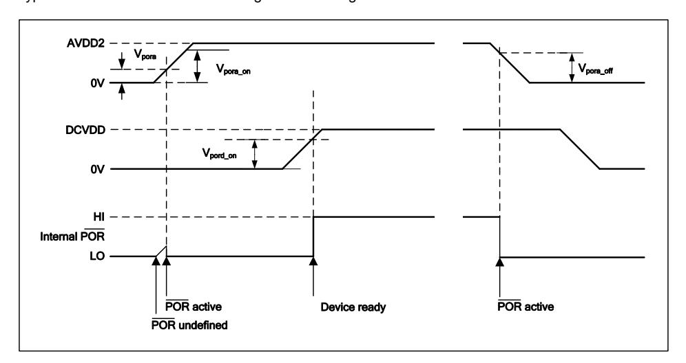

Figure 85 Power On Reset Timing - AVDD2 enabled/disabled first

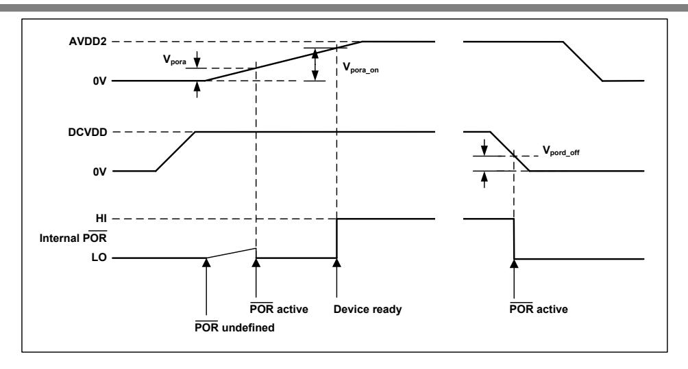

**Figure 86 Power On Reset Timing - DCVDD enabled/disabled first**

The POR ¯¯¯ signal is undefined until AVDD2 has exceeded the minimum threshold, Vpora. Once this threshold has been exceeded, POR ¯¯¯ is asserted low and the chip is held in reset. In this condition, all writes to the control interface are ignored. Once AVDD2 and DCVDD have reached their respective power on thresholds, POR ¯¯¯ is released high, all registers are in their default state, and writes to the control interface may take place.

Note that a power-on reset period, TPOR, applies after AVDD2 and DCVDD have reached their respective power on thresholds. This specification is guaranteed by design rather than test.

On power down, POR ¯¯¯ is asserted low when either AVDD2 or DCVDD falls below their respective power-down thresholds.

|  | Typical Power-On Reset parameters for the WM8994 are defined in Table 140. |
|--|----------------------------------------------------------------------------|
|--|----------------------------------------------------------------------------|

| SYMBOL    | DESCRIPTION                   | TYP  | UNIT |
|-----------|-------------------------------|------|------|
| Vpora_on  | Power-On threshold (AVDD2)    | 1.15 | V    |
| Vpora_off | Power-Off threshold (AVDD2)   | 1.14 | V    |
| Vpord_on  | Power-On threshold (DCVDD)    | 0.56 | V    |
| Vpord_off | Power-Off threshold (DCVDD)   | 0.55 | V    |
| TPOR      | Minimum Power-On Reset period | 100  | ns   |

**Table 140 Typical Power-On Reset Parameters**

[Table 141](#page-201-0) describes the status of the WM8994 digital I/O pins when the Power On Reset has completed, prior to any register writes. The same conditions apply on completion of a Software Reset (described in the ["Software Reset and Device ID"](#page-203-0) section).

| DBVDD power domain A3 SPKMODE Digital Input Pull-up to DBVDD A4 CIFMODE Digital Input Pull-down to DGND D4 LDO1ENA Digital Input Pull-down to DGND D5 LDO2ENA Digital Input Pull-down to DGND G2 CS/ADDR Digital Input Pull-down to DGND H1 SCLK Digital Input Digital input F3 SDA Digital Input/Output Digital input D3 MCLK1 Digital Input Digital input E1 GPIO2/MCLK2 Digital Input Pull-down to DGND G1 BCLK1 Digital Input/Output Digital input E3 LRCLK1 Digital Input/Output Digital input G3 ADCLRCLK1/GPIO1 Digital Input/Output Digital input E4 DACDAT1 Digital Input Digital input F2 ADCDAT1 Digital Output Digital output H2 GPIO3/BCLK2 Digital Input/Output Digital input, Pull-down to DGND F4 GPIO4/LRCLK2 Digital Input/Output Digital input, Pull-down to DGND H3 GPIO5/DACDAT2 Digital Input/Output Digital input, Pull-down to DGND G4 GPIO6/ADCLRCLK2 Digital Input/Output Digital input, Pull-down to DGND E5 GPIO7/ADCDAT2 Digital Input/Output Digital input, Pull-down to DGND H4 GPIO8/DACDAT3 Digital Input/Output Digital input, Pull-down to DGND F5 GPIO9/ADCDAT3 Digital Input/Output Digital input, Pull-down to DGND H5 GPIO10/LRCLK3 Digital Input/Output Digital input, Pull-down to DGND F6 GPIO11/BCLK3 Digital Input/Output Digital input, Pull-down to DGND MICBIAS1 power domain C6 DMICCLK Digital Output Digital output B9 IN2LN/DMICDAT1 Analogue Input/Digital Input Analogue input | PIN NO | NAME           | TYPE RESET STATUS                           |  |  |  |  |  |
|-------------------------------------------------------------------------------------------------------------------------------------------------------------------------------------------------------------------------------------------------------------------------------------------------------------------------------------------------------------------------------------------------------------------------------------------------------------------------------------------------------------------------------------------------------------------------------------------------------------------------------------------------------------------------------------------------------------------------------------------------------------------------------------------------------------------------------------------------------------------------------------------------------------------------------------------------------------------------------------------------------------------------------------------------------------------------------------------------------------------------------------------------------------------------------------------------------------------------------------------------------------------------------------------------------------------------------------------------------------------------------------------------------------------------------------------------------------------------------------------------------------------------------------------------------------------------------------------------------------------------------------------------------------------------------------------------------------------------------------------------------------------------------|--------|----------------|------------------------------------------------|--|--|--|--|--|
|                                                                                                                                                                                                                                                                                                                                                                                                                                                                                                                                                                                                                                                                                                                                                                                                                                                                                                                                                                                                                                                                                                                                                                                                                                                                                                                                                                                                                                                                                                                                                                                                                                                                                                                                                                               |        |                |                                                |  |  |  |  |  |
|                                                                                                                                                                                                                                                                                                                                                                                                                                                                                                                                                                                                                                                                                                                                                                                                                                                                                                                                                                                                                                                                                                                                                                                                                                                                                                                                                                                                                                                                                                                                                                                                                                                                                                                                                                               |        |                |                                                |  |  |  |  |  |
|                                                                                                                                                                                                                                                                                                                                                                                                                                                                                                                                                                                                                                                                                                                                                                                                                                                                                                                                                                                                                                                                                                                                                                                                                                                                                                                                                                                                                                                                                                                                                                                                                                                                                                                                                                               |        |                |                                                |  |  |  |  |  |
|                                                                                                                                                                                                                                                                                                                                                                                                                                                                                                                                                                                                                                                                                                                                                                                                                                                                                                                                                                                                                                                                                                                                                                                                                                                                                                                                                                                                                                                                                                                                                                                                                                                                                                                                                                               |        |                |                                                |  |  |  |  |  |
|                                                                                                                                                                                                                                                                                                                                                                                                                                                                                                                                                                                                                                                                                                                                                                                                                                                                                                                                                                                                                                                                                                                                                                                                                                                                                                                                                                                                                                                                                                                                                                                                                                                                                                                                                                               |        |                |                                                |  |  |  |  |  |
|                                                                                                                                                                                                                                                                                                                                                                                                                                                                                                                                                                                                                                                                                                                                                                                                                                                                                                                                                                                                                                                                                                                                                                                                                                                                                                                                                                                                                                                                                                                                                                                                                                                                                                                                                                               |        |                |                                                |  |  |  |  |  |
|                                                                                                                                                                                                                                                                                                                                                                                                                                                                                                                                                                                                                                                                                                                                                                                                                                                                                                                                                                                                                                                                                                                                                                                                                                                                                                                                                                                                                                                                                                                                                                                                                                                                                                                                                                               |        |                |                                                |  |  |  |  |  |
|                                                                                                                                                                                                                                                                                                                                                                                                                                                                                                                                                                                                                                                                                                                                                                                                                                                                                                                                                                                                                                                                                                                                                                                                                                                                                                                                                                                                                                                                                                                                                                                                                                                                                                                                                                               |        |                |                                                |  |  |  |  |  |
|                                                                                                                                                                                                                                                                                                                                                                                                                                                                                                                                                                                                                                                                                                                                                                                                                                                                                                                                                                                                                                                                                                                                                                                                                                                                                                                                                                                                                                                                                                                                                                                                                                                                                                                                                                               |        |                |                                                |  |  |  |  |  |
|                                                                                                                                                                                                                                                                                                                                                                                                                                                                                                                                                                                                                                                                                                                                                                                                                                                                                                                                                                                                                                                                                                                                                                                                                                                                                                                                                                                                                                                                                                                                                                                                                                                                                                                                                                               |        |                |                                                |  |  |  |  |  |
|                                                                                                                                                                                                                                                                                                                                                                                                                                                                                                                                                                                                                                                                                                                                                                                                                                                                                                                                                                                                                                                                                                                                                                                                                                                                                                                                                                                                                                                                                                                                                                                                                                                                                                                                                                               |        |                |                                                |  |  |  |  |  |
|                                                                                                                                                                                                                                                                                                                                                                                                                                                                                                                                                                                                                                                                                                                                                                                                                                                                                                                                                                                                                                                                                                                                                                                                                                                                                                                                                                                                                                                                                                                                                                                                                                                                                                                                                                               |        |                |                                                |  |  |  |  |  |
|                                                                                                                                                                                                                                                                                                                                                                                                                                                                                                                                                                                                                                                                                                                                                                                                                                                                                                                                                                                                                                                                                                                                                                                                                                                                                                                                                                                                                                                                                                                                                                                                                                                                                                                                                                               |        |                |                                                |  |  |  |  |  |
|                                                                                                                                                                                                                                                                                                                                                                                                                                                                                                                                                                                                                                                                                                                                                                                                                                                                                                                                                                                                                                                                                                                                                                                                                                                                                                                                                                                                                                                                                                                                                                                                                                                                                                                                                                               |        |                |                                                |  |  |  |  |  |
|                                                                                                                                                                                                                                                                                                                                                                                                                                                                                                                                                                                                                                                                                                                                                                                                                                                                                                                                                                                                                                                                                                                                                                                                                                                                                                                                                                                                                                                                                                                                                                                                                                                                                                                                                                               |        |                |                                                |  |  |  |  |  |
|                                                                                                                                                                                                                                                                                                                                                                                                                                                                                                                                                                                                                                                                                                                                                                                                                                                                                                                                                                                                                                                                                                                                                                                                                                                                                                                                                                                                                                                                                                                                                                                                                                                                                                                                                                               |        |                |                                                |  |  |  |  |  |
|                                                                                                                                                                                                                                                                                                                                                                                                                                                                                                                                                                                                                                                                                                                                                                                                                                                                                                                                                                                                                                                                                                                                                                                                                                                                                                                                                                                                                                                                                                                                                                                                                                                                                                                                                                               |        |                |                                                |  |  |  |  |  |
|                                                                                                                                                                                                                                                                                                                                                                                                                                                                                                                                                                                                                                                                                                                                                                                                                                                                                                                                                                                                                                                                                                                                                                                                                                                                                                                                                                                                                                                                                                                                                                                                                                                                                                                                                                               |        |                |                                                |  |  |  |  |  |
|                                                                                                                                                                                                                                                                                                                                                                                                                                                                                                                                                                                                                                                                                                                                                                                                                                                                                                                                                                                                                                                                                                                                                                                                                                                                                                                                                                                                                                                                                                                                                                                                                                                                                                                                                                               |        |                |                                                |  |  |  |  |  |
|                                                                                                                                                                                                                                                                                                                                                                                                                                                                                                                                                                                                                                                                                                                                                                                                                                                                                                                                                                                                                                                                                                                                                                                                                                                                                                                                                                                                                                                                                                                                                                                                                                                                                                                                                                               |        |                |                                                |  |  |  |  |  |
|                                                                                                                                                                                                                                                                                                                                                                                                                                                                                                                                                                                                                                                                                                                                                                                                                                                                                                                                                                                                                                                                                                                                                                                                                                                                                                                                                                                                                                                                                                                                                                                                                                                                                                                                                                               |        |                |                                                |  |  |  |  |  |
|                                                                                                                                                                                                                                                                                                                                                                                                                                                                                                                                                                                                                                                                                                                                                                                                                                                                                                                                                                                                                                                                                                                                                                                                                                                                                                                                                                                                                                                                                                                                                                                                                                                                                                                                                                               |        |                |                                                |  |  |  |  |  |
|                                                                                                                                                                                                                                                                                                                                                                                                                                                                                                                                                                                                                                                                                                                                                                                                                                                                                                                                                                                                                                                                                                                                                                                                                                                                                                                                                                                                                                                                                                                                                                                                                                                                                                                                                                               |        |                |                                                |  |  |  |  |  |
|                                                                                                                                                                                                                                                                                                                                                                                                                                                                                                                                                                                                                                                                                                                                                                                                                                                                                                                                                                                                                                                                                                                                                                                                                                                                                                                                                                                                                                                                                                                                                                                                                                                                                                                                                                               |        |                |                                                |  |  |  |  |  |
|                                                                                                                                                                                                                                                                                                                                                                                                                                                                                                                                                                                                                                                                                                                                                                                                                                                                                                                                                                                                                                                                                                                                                                                                                                                                                                                                                                                                                                                                                                                                                                                                                                                                                                                                                                               |        |                |                                                |  |  |  |  |  |
|                                                                                                                                                                                                                                                                                                                                                                                                                                                                                                                                                                                                                                                                                                                                                                                                                                                                                                                                                                                                                                                                                                                                                                                                                                                                                                                                                                                                                                                                                                                                                                                                                                                                                                                                                                               |        |                |                                                |  |  |  |  |  |
|                                                                                                                                                                                                                                                                                                                                                                                                                                                                                                                                                                                                                                                                                                                                                                                                                                                                                                                                                                                                                                                                                                                                                                                                                                                                                                                                                                                                                                                                                                                                                                                                                                                                                                                                                                               |        |                |                                                |  |  |  |  |  |
|                                                                                                                                                                                                                                                                                                                                                                                                                                                                                                                                                                                                                                                                                                                                                                                                                                                                                                                                                                                                                                                                                                                                                                                                                                                                                                                                                                                                                                                                                                                                                                                                                                                                                                                                                                               | A9     | IN2RN/DMICDAT2 | Analogue Input/Digital Input Analogue input |  |  |  |  |  |

**Table 141 WM8994 Digital I/O Status in Reset**

Note that the dual function IN2LN/DMICDAT1 and IN2RN/DMICDAT2 pins default to IN2LN or IN2RN (analogue input) after Power On Reset is completed. The IN2LN and IN2RN functions are referenced to the AVDD1 power domain.

# **QUICK START-UP AND SHUTDOWN**

The default control sequences (see ["Control Write Sequencer"](#page-176-0)) contain only the register writes necessary to enable or disable specific output drivers. It is therefore necessary to configure the signal path and gain settings before commanding any of the default start-up sequences.

This section describes minimum control sequences to configure the WM8994 for DAC to Headphone playback. Note that these sequences are provided for guidance only; application software should be verified and tailored to ensure optimum performance.

[Table 142](#page-202-0) describes an example control sequence to enable DAC playback to HPOUT1L and HPOUT1R path. This involves DAC enable, signal path configuration and mute control, together with the default "Headphone Cold Start-Up" sequence. [Table 143](#page-202-1) describes an example control sequence to disable the direct DAC to Headphone path.

| REGISTER VALUE    |       | DESCRIPTION                                                                   |  |
|----------------------|-------|-------------------------------------------------------------------------------|--|
| R5 (0005h) 0003h  |       | Enable DAC1L and DAC1R                                                        |  |
| R45 (002Dh)          | 0100h | Enable path from DAC1L to HPOUT1L                                             |  |
| R46 (002Eh) 0100h |       | Enable path from DAC1R to HPOUT1R                                             |  |
| R272 (0110h)         | 8100h | Initiate Control Write Sequencer at Index Address 0 (00h)                     |  |
|                      |       | (Headphone Cold Start-Up sequence)                                            |  |
|                      |       | Delay 300ms                                                                   |  |
|                      |       | Note: Delay must be inserted in the sequence to allow the                     |  |
|                      |       | Control Write Sequencer to finish. Any control interface writes               |  |
|                      |       | to the CODEC will be ignored while the Control Write Sequencer is running. |  |
| R1056 (0420h)        | 0000h | Soft un-mute DAC1L and DAC1R                                                  |  |

**Table 142 DAC to Headphone Direct Start-Up Sequence**

| REGISTER VALUE |                                  | DESCRIPTION                                                                                                                                                                                                   |  |
|-------------------|----------------------------------|---------------------------------------------------------------------------------------------------------------------------------------------------------------------------------------------------------------|--|
| R1056 (0420h)     | 0200h                            | Soft mute DAC1L and DAC1R                                                                                                                                                                                     |  |
| R272 (0110h)      | 812Ah                            | Initiate Control Write Sequencer at Index Address 42 (2Ah)                                                                                                                                                    |  |
|                   |                                  | (Generic Shut-Down)                                                                                                                                                                                           |  |
|                   |                                  | Delay 525ms                                                                                                                                                                                                   |  |
|                   |                                  | Note: Delay must be inserted in the sequence to allow the Control Write Sequencer to finish. Any control interface writes to the CODEC will be ignored while the Control Write Sequencer is running. |  |
| R45 (002Dh)       | 0000h                            | Disable path from DAC1L to HPOUT1L                                                                                                                                                                            |  |
| R46 (002Eh)       | 0000h                            | Disable path from DAC1R to HPOUT1R                                                                                                                                                                            |  |
| R5 (0005h)        | 0000h Disable DAC1L and DAC1R |                                                                                                                                                                                                               |  |

**Table 143 DAC to Headphone Direct Shut-Down Sequence**

In both cases, the WSEQ\_BUSY bit (in Register R272, see [Table 121\)](#page-177-0) will be set to 1 while the Control Write Sequence runs. When this bit returns to 0, the remaining steps of the sequence may be executed.

# **SOFTWARE RESET AND DEVICE ID**

The device ID can be read back from register R0. Writing to this register will reset the device.

The software reset causes most control registers to be reset to their default state. Note that the Control Write Sequencer registers R12288 (3000h) through to R12799 (31FFh) are not affected by a software reset; the Control Sequences defined in these registers are retained unchanged.

The status of the WM8994 digital I/O pins following a software reset is described in [Table 141.](#page-201-0)

The device revision can be read back from register R256.

| REGISTER ADDRESS                 | BIT  | LABEL              | DEFAULT | DESCRIPTION                                                                                                                                                                                               |
|-------------------------------------|------|--------------------|---------|-----------------------------------------------------------------------------------------------------------------------------------------------------------------------------------------------------------|
| R0 (0000h) Software Reset     | 15:0 | SW_RESET [15:0] | 8994h   | Writing to this register resets all registers to their default state. (Note - Control Write Sequencer registers are not affected by Software Reset.) Reading from this register will indicate |
| R256 (0100h) Chip Revision | 3:0  | CHIP_REV [3:0]     |         | device family ID 8994h. Chip revision                                                                                                                                                                  |

**Table 144 Chip Reset and ID**