# **APPLICATIONS INFORMATION**

## **RECOMMENDED EXTERNAL COMPONENTS**

### **AUDIO INPUT PATHS**

The WM8994 provides 8 analogue audio inputs. Each of these inputs is referenced to the internal DC reference, VMID. A DC blocking capacitor is required for each input pin used in the target application. The choice of capacitor is determined by the filter that is formed between that capacitor and the input impedance of the input pin. The circuit is illustrated in [Figure 87.](#page-0-0)

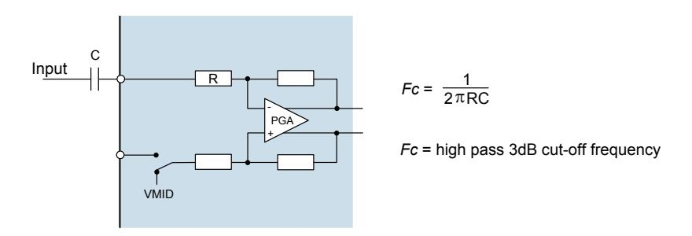

**Figure 87 Audio Input Path DC Blocking Capacitor**

If the input impedance is known, and the cut-off frequency is known, then the minimum capacitor value may be derived easily. However, it can be seen from the representation in [Figure 87](#page-0-0) that the input impedance is not fixed in all applications but can vary with gain and boost amplifier settings.

The PGA input resistance for every gain setting is detailed in [Table 145.](#page-1-0)

| IN1L_VOL[4:0], IN2L_VOL[4:0], | VOLUME (dB) | INPUT RESISTANCE (kΩ) |                      |
|----------------------------------|----------------|--------------------------|----------------------|
| IN1R_VOL[4:0], IN2R_VOL[4:0]  |                | SINGLE-ENDED MODE     | DIFFERENTIAL MODE |
| 00000                            | -16.5          | 58                       | 52.5                 |
| 00001                            | -15.0          | 56.9                     | 50.6                 |
| 00010                            | -13.5          | 55.6                     | 48.6                 |
| 00011                            | -12.0          | 54.1                     | 46.4                 |
| 00100                            | -10.5          | 52.5                     | 44.1                 |
| 00101                            | -9.0           | 50.7                     | 41.5                 |
| 00110                            | -7.5           | 48.6                     | 38.9                 |
| 00111                            | -6.0           | 46.5                     | 36.2                 |
| 01000                            | -4.5           | 44.1                     | 33.4                 |
| 01001                            | -3.0           | 41.6                     | 30.6                 |
| 01010                            | -1.5           | 38.9                     | 27.8                 |
| 01011                            | 0              | 36.2                     | 25.1                 |
| 01100                            | +1.5           | 33.4                     | 22.5                 |
| 01101                            | +3.0           | 30.6                     | 20.0                 |
| 01110                            | +4.5           | 27.8                     | 17.7                 |
| 01111                            | +6.0           | 25.1                     | 15.6                 |
| 10000                            | +7.5           | 22.5                     | 13.6                 |
| 10001                            | +9.0           | 20.1                     | 11.9                 |
| 10010                            | +10.5          | 17.8                     | 10.3                 |
| 10011                            | +12.0          | 15.6                     | 8.9                  |
| 10100                            | +13.5          | 13.7                     | 7.6                  |

| IN1L_VOL[4:0], IN2L_VOL[4:0], | VOLUME (dB) |                      | INPUT RESISTANCE (kΩ) |
|----------------------------------|----------------|----------------------|--------------------------|
| IN1R_VOL[4:0], IN2R_VOL[4:0]  |                | SINGLE-ENDED MODE | DIFFERENTIAL MODE     |
| 10101                            | +15.0          | 11.9                 | 6.5                      |
| 10110                            | +16.5          | 10.3                 | 5.6                      |
| 10111                            | +18.0          | 8.9                  | 4.8                      |
| 11000                            | +19.5          | 7.7                  | 4.1                      |
| 11001                            | +21.0          | 6.6                  | 3.5                      |
| 11010                            | +22.5          | 5.6                  | 2.9                      |
| 11011                            | +24.0          | 4.8                  | 2.5                      |
| 11100                            | +25.5          | 4.1                  | 2.1                      |
| 11101                            | +27.0          | 3.5                  | 1.8                      |
| 11110                            | +28.5          | 2.9                  | 1.5                      |
| 11111                            | +30.0          | 2.5                  | 1.3                      |

**Table 145 PGA Input Pin Resistance**

The appropriate input capacitor may be selected using the PGA input resistance data provided in [Table 145,](#page-1-0) depending on the required PGA gain setting(s).

The choice of capacitor for a 20Hz cut-off frequency is shown in [Table 146](#page-1-1) for a selection of typical input impedance conditions.

| INPUT IMPEDANCE | MINIMUM CAPACITANCE FOR 20HZ PASS BAND |
|-----------------|-------------------------------------------|
| 2k             | 4 F                                      |
| 15k            | 0.5 F                                    |
| 30k            | 0.27 F                                   |
| 60k            | 0.13 F                                   |

**Table 146 Audio Input DC Blocking Capacitors**

Using the figures in [Table 146,](#page-1-1) it follows that a 1F capacitance for all input connections will give good results in most cases. Tantalum electrolytic capacitors are particularly suitable as they offer high stability in a small package size.

Ceramic equivalents are a cost effective alternative to the superior tantalum packages, but care must be taken to ensure the desired capacitance is maintained at the AVDD1 operating voltage. Also, ceramic capacitors may show microphonic effects, where vibrations and mechanical conditions give rise to electrical signals. This is particularly problematic for microphone input paths where a large signal gain is required.

A single capacitor is required for a line input or single-ended microphone connection. In the case of a differential microphone connection, a DC blocking capacitor is required on both input pins.

## **HEADPHONE OUTPUT PATH**

The headphone output on WM8994 is ground referenced and therefore does not require the large, expensive capacitors necessary for VMID reference solutions. For best audio performance, it is recommended to connect a zobel network to the audio output pins. This network should comprise of a 100nF capacitor and 20ohm resistor in series with each other (see "Analogue Outputs" section). These components have the effect of dampening high frequency oscillations or instabilities that can arise outside the audio band under certain conditions. Possible sources of these instabilities include the inductive load of a headphone coil or an active load in the form of an external line amplifier.

## **EARPIECE DRIVER OUTPUT PATH**

The earpiece driver on HPOUT2P and HPOUT2N is designed as a 32ohm BTL speaker driver. The outputs are referenced to the internal DC reference VMID, but direct connection to the speaker is possible because of the BTL configuration. There is no requirement for DC blocking capacitors.

#### **LINE OUTPUT PATHS**

The WM8994 provides four line outputs (LINEOUT1P, LINEOUT1N, LINEOUT2P and LINEOUT2N). Each of these outputs is referenced to the internal DC reference, VMID. In any case where a line output is used in a single-ended configuration (i.e. referenced to AGND), a DC blocking capacitor will be required in order to remove the DC bias. In the case where a pair of line outputs is configured as a BTL differential pair, then the DC blocking capacitor should be omitted.

The choice of capacitor is determined from the filter that is formed between the capacitor and the load impedance – see Figure 88.

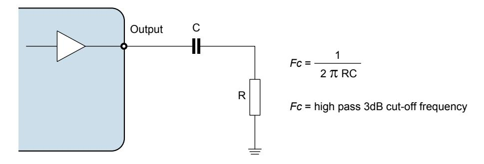

Figure 88 Line Output Path Components

| LOAD IMPEDANCE | MINIMUM CAPACITANCE FOR 20HZ PASS BAND |
|----------------|-------------------------------------------|
| 10kΩ           | 0.8 μF                                    |
| 47kΩ           | 0.17 μF                                   |

Table 147 Line Output Frequency Cut-Off

Using the figures in Table 147, it follows that that a  $1\mu F$  capacitance would be a suitable choice for a line load. Tantalum electrolytic capacitors are again particularly suitable but ceramic equivalents are a cost effective alternative. Care must be taken to ensure the desired capacitance is maintained at the appropriate operating voltage.

### **POWER SUPPLY DECOUPLING**

Electrical coupling exists particularly in digital logic systems where switching in one sub-system causes fluctuations on the power supply. This effect occurs because the inductance of the power supply acts in opposition to the changes in current flow that are caused by the logic switching. The resultant variations (or 'spikes') in the power supply voltage can cause malfunctions and unintentional behavior in other components. A decoupling (or 'bypass') capacitor can be used as an energy storage component which will provide power to the decoupled circuit for the duration of these power supply variations, protecting it from malfunctions that could otherwise arise.

Coupling also occurs in a lower frequency form when ripple is present on the power supply rail caused by changes in the load current or by limitations of the power supply regulation method. In audio components such as the WM8994, these variations can alter the performance of the signal path, leading to degradation in signal quality. A decoupling (or 'bypass') capacitor can be used to filter these effects, by presenting the ripple voltage with a low impedance path that does not affect the circuit to be decoupled.

These coupling effects are addressed by placing a capacitor between the supply rail and the corresponding ground reference. In the case of systems comprising multiple power supply rails, decoupling should be provided on each rail.

The recommended power supply decoupling capacitors for WM8994 are listed below i[n Table 148.](#page-3-0)

| POWER SUPPLY                   | DECOUPLING CAPACITOR     |
|--------------------------------|--------------------------|
| LDO1VDD, LDO2VDD, DBVDD, AVDD2 | 0.1F ceramic (see Note) |
| SPKVDD1/SPKVDD2                | 4.7F ceramic            |
| AVDD1                          | 4.7F ceramic            |
| DCVDD                          | 1F ceramic              |
| CPVDD                          | 4.7F ceramic            |
| VMIDC                          | 4.7F ceramic            |
| VREFC                          | 1F ceramic              |

**Table 148 Power Supply Decoupling Capacitors**

Note: 0.1F is required with 4.7F a guide to the total required power rail capacitance, including that at the regulator output.

All decoupling capacitors should be placed as close as possible to the WM8994 device. The connection between AGND, the AVDD1 decoupling capacitor and the main system ground should be made at a single point as close as possible to the AGND ball of the WM8994.

The VMID capacitor is not, technically, a decoupling capacitor. However, it does serve a similar purpose in filtering noise on the VMID reference. The connection between AGND, the VMID decoupling capacitor and the main system ground should be made at a single point as close as possible to the AGND ball of the WM8994.

Due to the wide tolerance of many types of ceramic capacitors, care must be taken to ensure that the selected components provide the required capacitance across the required temperature and voltage ranges in the intended application. For most applications, the use of ceramic capacitors with capacitor dielectric X5R is recommended.

#### **CHARGE PUMP COMPONENTS**

A fly-back capacitor is required between the CPCA and CPCB pins. The required capacitance is  $2.2\mu F$  at 2V.

A decoupling capacitor is required on CPVOUTP and CPVOUTN; the recommended value is  $2.2\mu F$  at 2V.

The positioning of the Charge Pump capacitors is important, particularly the fly-back capacitor. These capacitors should be placed as close as possible to the WM8994.

Due to the wide tolerance of many types of ceramic capacitors, care must be taken to ensure that the selected components provide the required capacitance across the required temperature and voltage ranges in the intended application. For most applications, the use of ceramic capacitors with capacitor dielectric X5R is recommended.

#### MICROPHONE BIAS CIRCUIT

The WM8994 is designed to interface easily with up to four analogue microphones. These may be connected in single-ended or differential configurations, as illustrated in Figure 89. The single-ended method allows greater capability for the connection of multiple audio sources simultaneously, whilst the differential method provides better performance due to its rejection of common-mode noise.

In either configuration, the microphone requires a bias current (electret condenser microphones) or voltage supply (silicon microphones), which can be provided by MICBIAS1 or MICBIAS2.

A current-limiting resistor is also required when using an electret condenser microphone (ECM). The resistance should be chosen according to the minimum operating impedance of the microphone and MICBIAS voltage so that the maximum bias current of the WM8994 is not exceeded. Cirrus Logic recommends a  $2.2 k\Omega$  current limiting resistor as it provides compatibility with a wide range of microphone models.

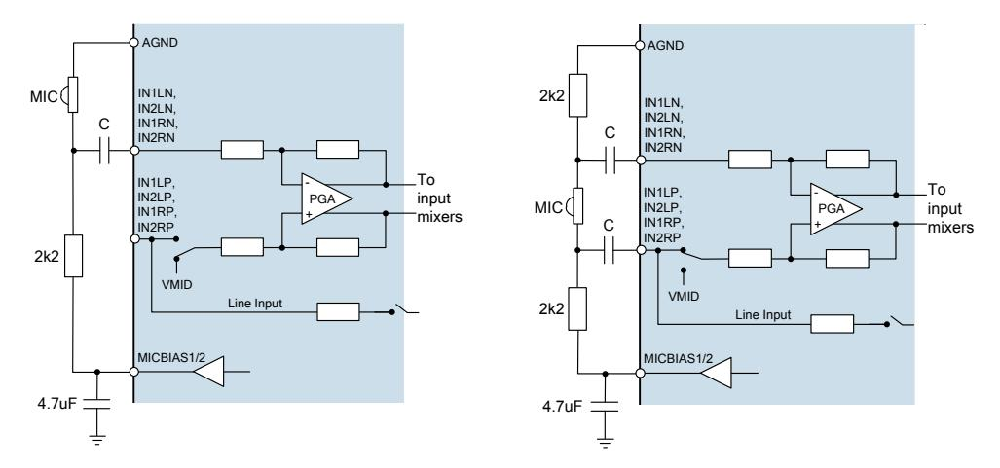

Figure 89 Single-Ended and Differential Analogue Microphone Connections

The WM8994 also supports up to four digital microphone inputs. The MICBIAS1 generator is suitable for use as a low noise supply for digital microphones, as shown in Figure 90.

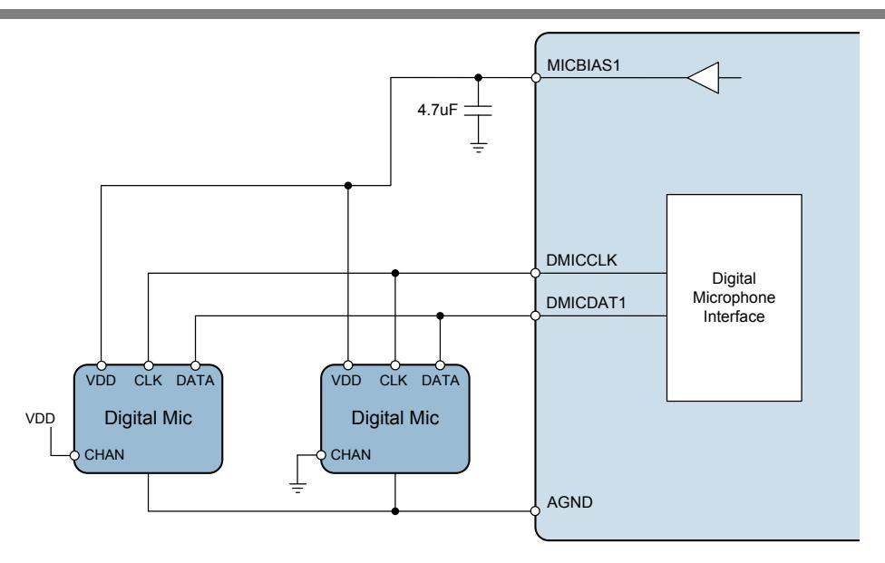

Figure 90 Digital Microphone Connection

The MICBIAS generators are identical output-compensated amplifiers, which require an external capacitor in order to guarantee accuracy and stability. The recommended capacitance is  $4.7 \mu F$ . A ceramic type is a suitable choice here, providing that care is taken to choose a component that exhibits this capacitance at the intended MICBIAS voltage.

The maximum output current is noted in the "Electrical Characteristics". This limit must be observed on each MICBIAS output, especially if more than one microphone is connected to a single MICBIAS pin. The MICBIAS output voltage can be adjusted using register control to suit the requirements of the microphone.

## **CLASS D SPEAKER CONNECTIONS**

The WM8994 incorporates two Class D/AB 1W speaker drivers. By default, the speaker drivers operate in Class D mode, which offers high amplifier efficiency at large signal levels. As the Class D output is a pulse width modulated signal, the choice of speakers and tracking of signals is critical for ensuring good performance and reducing EMI in this mode.

The efficiency of the speaker drivers is affected by the series resistance between the WM8994 and the speaker (e.g. PCB track loss and inductor ESR) as shown in Figure 91. This resistance should be as low as possible to maximise efficiency.

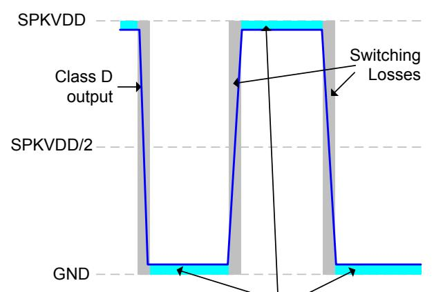

Losses due to resistance between WM8994 and speaker (e.g. inductor ESR) This resistance must be minimised in order to maximise efficiency.

Figure 91 Speaker Connection Losses

The Class D output requires external filtering in order to recreate the audio signal. This may be implemented using a 2nd order LC or 1st order RC filter, or else may be achieved by using a loudspeaker whose internal inductance provides the required filter response. An LC or RC filter should be used if the loudspeaker characteristics are unknown or unsuitable, or if the length of the loudspeaker connection is likely to lead to EMI problems.

In applications where it is necessary to provide Class D filter components, a 2nd order LC filter is the recommended solution as it provides more attenuation at higher frequencies and minimises power dissipated in the filter when compared to a first order RC filter (lower ESR). This maximises both rejection of unwanted switching frequencies and overall speaker efficiency. A suitable implementation is illustrated in Figure 92.

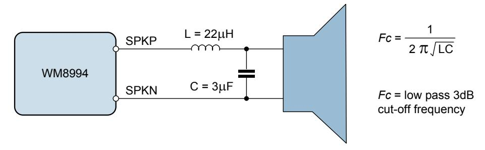

Figure 92 Class D Output Filter Components

A simple equivalent circuit of a loudspeaker consists of a serially connected resistor and inductor, as shown in Figure 93. This circuit provides a low pass filter for the speaker output. If the loudspeaker characteristics are suitable, then the loudspeaker itself can be used in place of the filter components described earlier. This is known as 'filterless' operation.

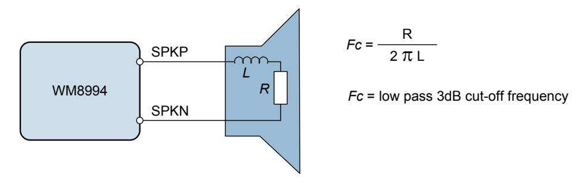

Figure 93 Speaker Equivalent Circuit for Filterless Operation

For filterless Class D operation, it is important to ensure that a speaker with suitable inductance is chosen. For example, if we know the speaker impedance is  $8\Omega$  and the desired cut-off frequency is 20 kHz, then the optimum speaker inductance may be calculated as:

$$L = \frac{R}{2 \pi Fc} = \frac{8\Omega}{2 \pi * 20 \text{kHz}} = 64 \mu \text{H}$$

 $8\Omega$  loudspeakers typically have an inductance in the range  $20\mu H$  to  $100\mu H$ , however, it should be noted that a loudspeaker inductance will not be constant across the relevant frequencies for Class D operation (up to and beyond the Class D switching frequency). Care should be taken to ensure that the cut-off frequency of the loudspeaker's filtering is low enough to suppress the high frequency energy of the Class D switching and, in so doing, to prevent speaker damage. The Class D outputs of the WM8994 operate at much higher frequencies than is recommended for most speakers and it must be ensured that the cut-off frequency is low enough to protect the speaker.

#### RECOMMENDED EXTERNAL COMPONENTS DIAGRAM

Figure 94 provides a summary of recommended external components for WM8994. Note that this diagram does not include any components that are specific to the end application e.g. it does not include filtering on the speaker outputs (assume filterless class D operation), RF decoupling, or RF filtering for pins which connect to the external world i.e. headphone or speaker outputs.

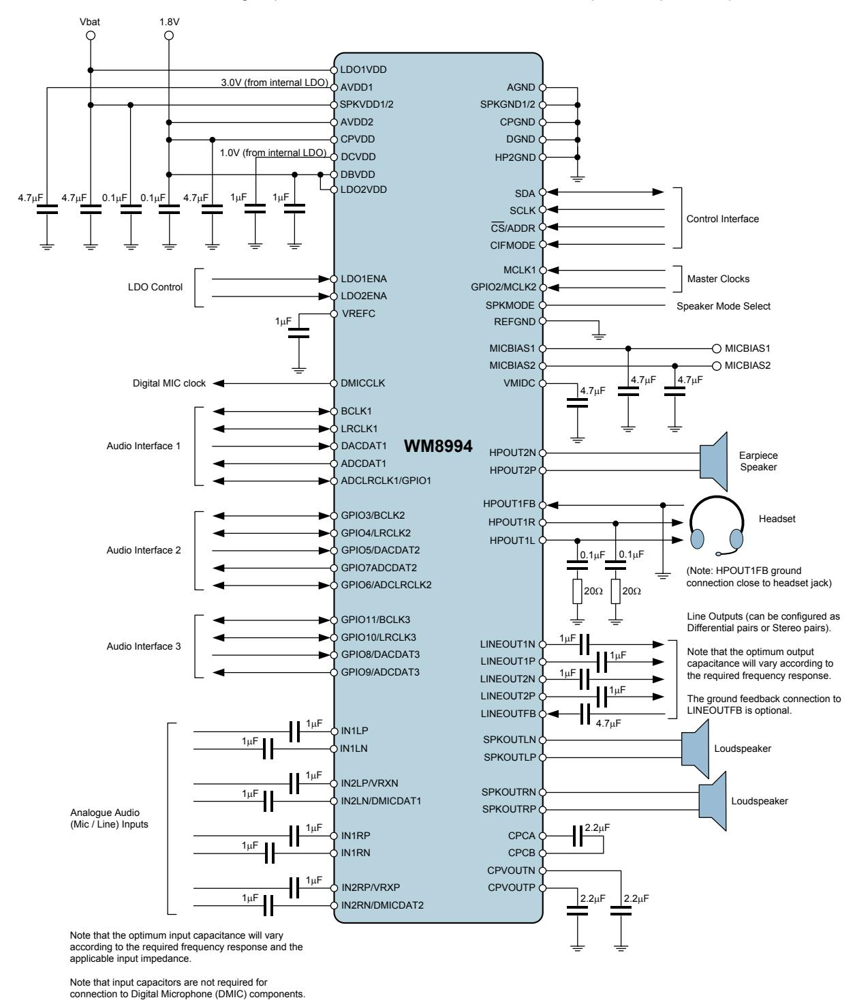

Figure 94 Recommended External Components Diagram

## **DIGITAL AUDIO INTERFACE CLOCKING CONFIGURATIONS**

The WM8994 provides 3 digital audio interfaces and supports many different clocking configurations. The asynchronous sample rate converter enables more than one digital audio interface to be supported simultaneously, even when there is no synchronisation between these interfaces. In a typical application, this enables audio mixing between a multimedia applications processor and a baseband voice call processor, for example.

The AIF1 and AIF2 audio interfaces can be configured in Master or Slave modes, and can also support defined combinations of mixed sample rates. In all applications, it is important that the system clocking configuration is correctly designed. Incorrect clock configurations will lead to audible clicks arising from dropped or repeated audio samples; this is caused by the inherent tolerances of multiple asynchronous system clocks.

To ensure reliable clocking of the audio interface functions, it is a requirement that, for each audio interface, the external interface clocks (eg. BCLK, LRCLK) are derived from the same clock source as the respective AIF clock (AIFnCLK).

In AIF Master mode, the external BCLK and LRCLK signals are generated by the WM8994 and synchronisation of these signals with AIFnCLK is guaranteed. In this case, clocking of the AIF is derived from the MCLK1 or MCLK2 inputs, either directly or via one of the Frequency Locked Loop (FLL) circuits.

In AIF Slave mode, the external BCLK and LRCLK signals are generated by another device, as inputs to the WM8994. In this case, it must be ensured that the respective AIF clock is generated from a source that is synchronised to the external BCLK and LRCLK inputs. In a typical Slave mode application, the BCLK input is selected as the clock reference, using the FLL to perform frequency shifting. It is also possible to use the MCLK1 or MCLK2 inputs, but only if the selected clock is synchronised externally to the BCLK and LRCLK inputs.

The valid AIF clocking configurations are listed in [Table](#page-8-0) 149 for AIF Master and AIF Slave modes.

| AUDIO INTERFACE MODE | CLOCKING CONFIGURATION                                                                                                                                                        |
|----------------------|-------------------------------------------------------------------------------------------------------------------------------------------------------------------------------|
| AIF Master Mode      | AIFnCLK_SRC selects FLL1 or FLL2 as AIFnCLK source; FLLn_REFCLK_SRC selects MCLK1 or MCLK2 as FLLn source.                                                                 |
|                      | AIFnCLK_SRC selects MCLK1 or MCLK2 as AIFnCLK source.                                                                                                                         |
| AIF Slave Mode       | AIFnCLK_SRC selects FLL1 or FLL2 as AIFnCLK source; FLLn_REFCLK_SRC selects BCLKn as FLLn source.                                                                          |
|                      | AIFnCLK_SRC selects MCLK1 or MCLK2 as AIFnCLK source, provided MCLK is externally synchronised to the BCLKn input.                                                         |
|                      | AIFnCLK_SRC selects FLL1 or FLL2 as AIFnCLK source; FLLn_REFCLK_SRC selects MCLK1 or MCLK2 as FLLn source, provided MCLK is externally synchronised to the BCLKn input. |

**Table 149 Audio Interface Clocking Confgurations**

In each case, the AIFnCLK frequency must be a valid ratio to the LRCLKn frequency; the supported clocking ratios are defined by the AIFnCLK\_RATE register.

The valid AIF clocking configurations are illustrated i[n Figure 95](#page-9-0) t[o Figure 99](#page-10-0) below. Note that, where MCLK1 is illustrated as the clock source, it is equally possible to select MCLK2 as the clock source. Similarly, in cases where FLL1 is illustrated, it is equally possible to select the FLL2.

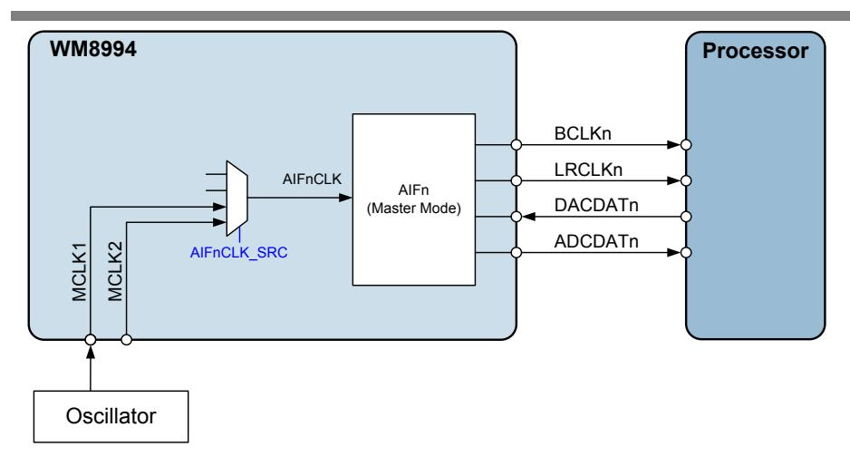

Figure 95 AIF Master Mode, using MCLK as Reference

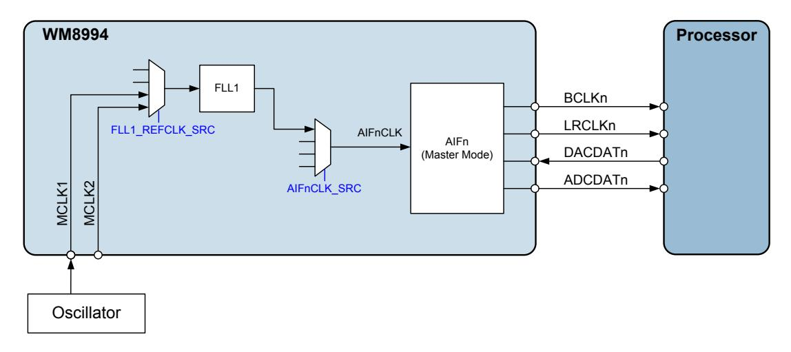

Figure 96 AIF Master Mode, using MCLK and FLL as Reference

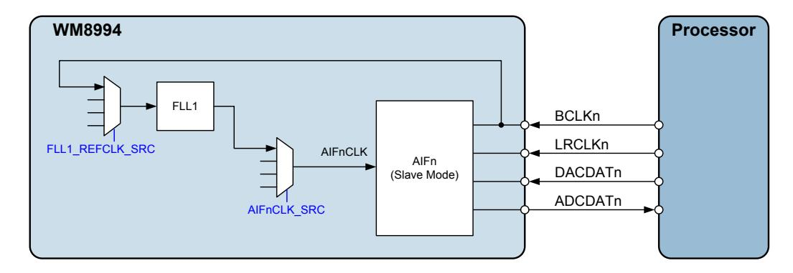

Figure 97 AIF Slave Mode, using BCLK and FLL as Reference

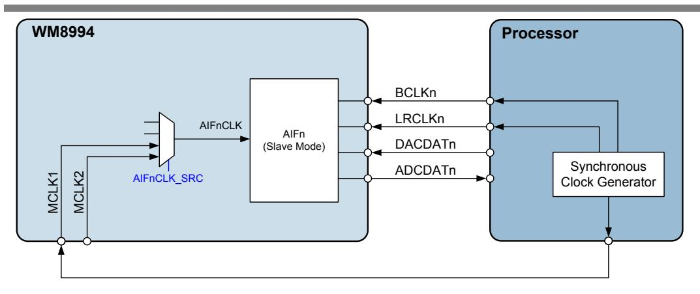

Figure 98 AIF Slave Mode, using MCLK as Reference

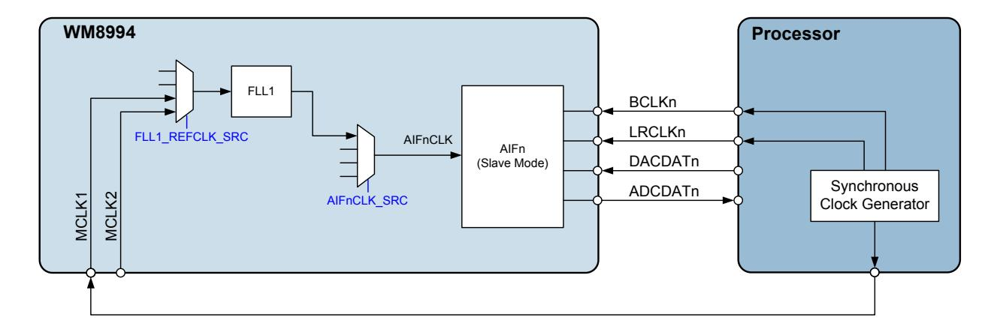

Figure 99 AIF Slave Mode, using MCLK and FLL as Reference

## **PCB LAYOUT CONSIDERATIONS**

Poor PCB layout will degrade the performance and be a contributory factor in EMI, ground bounce and resistive voltage losses. All external components should be placed as close to the WM8994 device as possible, with current loop areas kept as small as possible. Specific factors relating to Class D loudspeaker connection are detailed below.

#### **CLASS D LOUDSPEAKER CONNECTION**

Long, exposed PCB tracks or connection wires will emit EMI. The distance between the WM8994 and the loudspeaker should therefore be kept as short as possible. Where speakers are connected to the PCB via a cable form, it is recommended that a shielded twisted pair cable is used. The shield should be connected to the main system, with care taken to ensure ground loops are avoided.

Further reduction in EMI can be achieved using PCB ground (or VDD) planes and also by using passive LC components to filter the Class D switching waveform. When passive filtering is used, low ESR components should be chosen in order to minimise the series resistance between the WM8994 and the speaker, maximising the power efficiency.

LC passive filtering will usually be effective at reducing EMI at frequencies up to around 30MHz. To reduce emissions at higher frequencies, ferrite beads can also be used. These should be positioned as close to the device as possible.

These techniques for EMI reduction are illustrated i[n Figure 100.](#page-11-0)

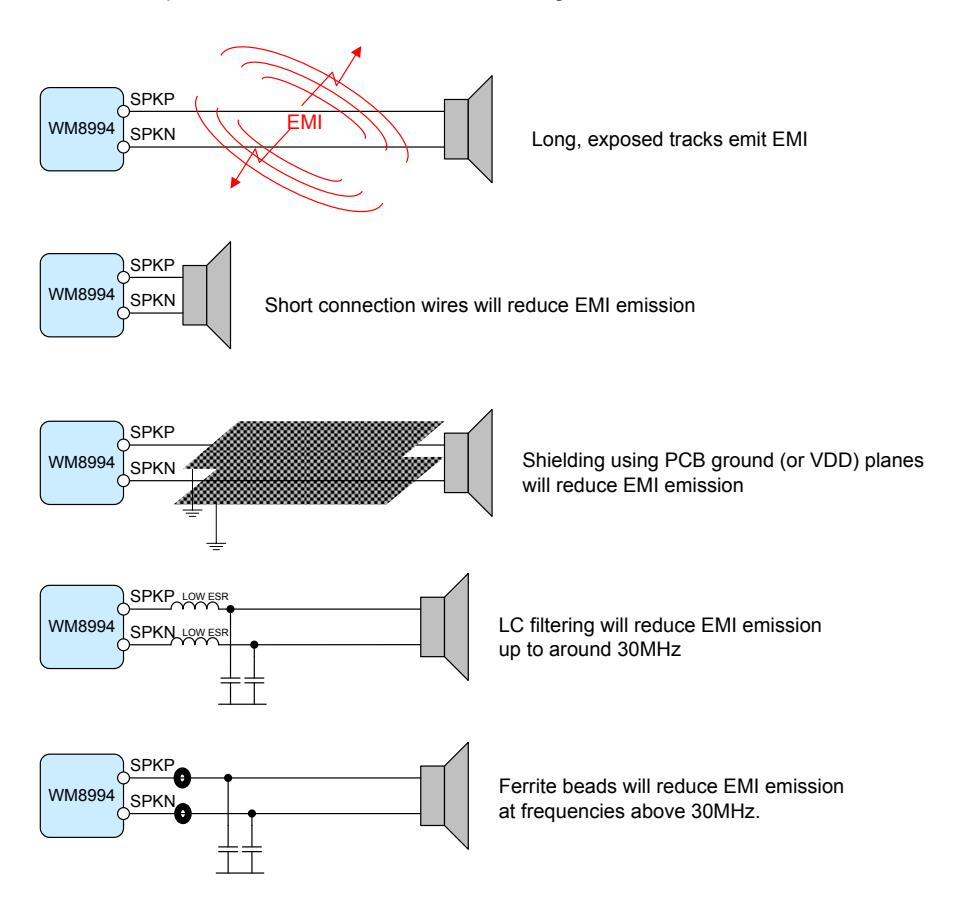

**Figure 100 EMI Reduction Techniques**