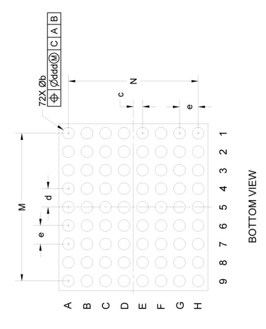
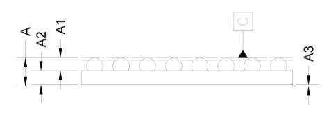

## **PACKAGE DIMENSIONS**

| = | -                 | ->- | <b>—</b> m |
|---|-------------------|-----|------------|
|   |                   |     |            |
| * |                   |     |            |
| • | Ball A1 Corner |     |            |

**Figure 101 Package Outline Drawing POD 130.A**

| Dimonsion   |         | Millimeters |         |
|-------------|---------|-------------|---------|
| Dillelision | Minimum | Nominal     | Maximum |
| A           | 0.516   | 0.546       | 0.576   |
| A1          | 0.187   | 0.202       | 0.217   |
| A2          | 0.262   | 0.277       | 0.292   |
| A3          | REF     | 0.025       | REF     |
| q           | 0.284   | 0.314       | 0.344   |
| C           | 0.2425  | 0.25        | 0.2575  |
| р           | 0.4925  | 0.5         | 0.5075  |
| e           | BSC     | 0.5         | BSC     |
| Σ           | BSC     | 4           | BSC     |
| z           | BSC     | 3.5         | BSC     |
| ×           | 4.496   | 4.521       | 4.546   |
| Y           | 4.008   | 4.033       | 4.058   |
| ddd=0.015   |         |             |         |
|             |         |             |         |

**Rev 4.6 361**